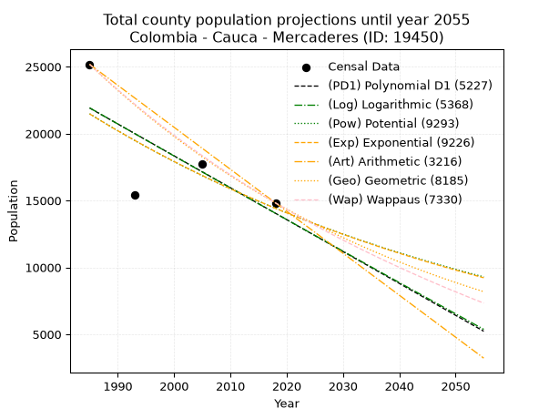
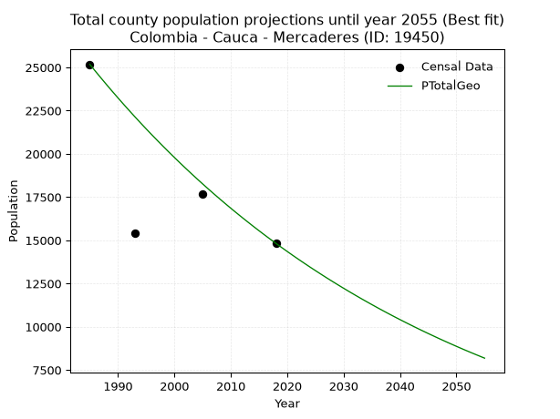
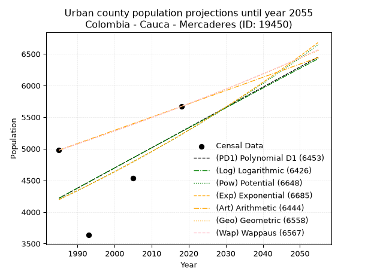
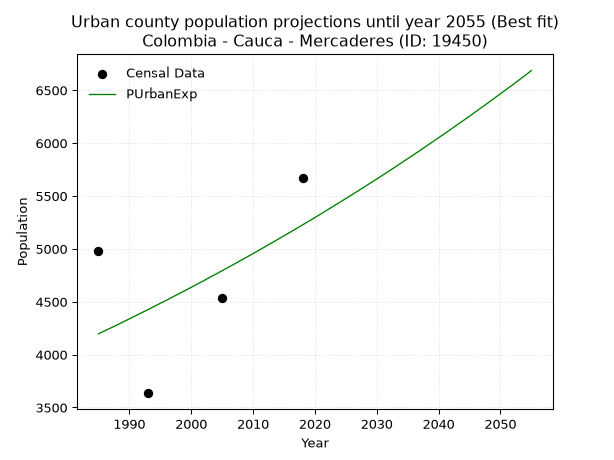
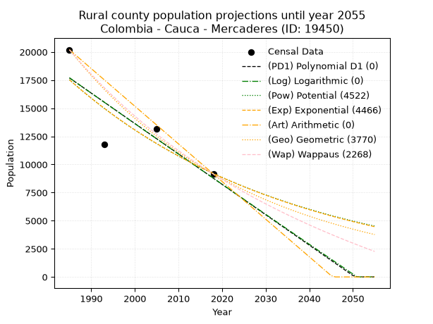
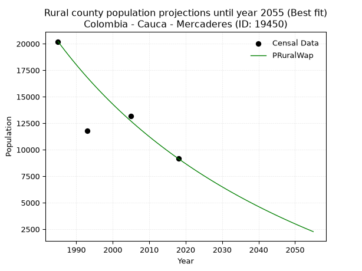

<div align="center">


</div>

# 📜 _“Population and Public Services Demand Projections (PPSD) until Year 2050 for Colombia - Cauca - Mercaderes (ID: 19450)”_
Keywords: `population` `public-service` `projection` `lineal` `polynomial` `logarithmic` `potential` `exponential` `arithmetic` `geometric` `wappaus` `dane` `colombia` `south-america`

PPSD are analytical estimates used by governments and planners to anticipate future changes in population size, age distribution, and the resulting community needs for utilities, healthcare, education, and infrastructure as sizing future water treatment facilities, electrical grids, and road networks based on spatial growth.

<div align="center">

</img>

</div>


> **General running parameters**: • app_version: _v20260806_. • Python version: _3.14.7_. • Pandas version: _3.0.5_. • NumPy version: _2.5.1_. • Creates, save and include plots into reports (create_plot): _False_. • Projection until year: _2050_. • Process polynomial degree 2 and up: _False_. • Process Wappaus: _True_. • Process Wappaus: _True_. • Set negative values to zero: _True_. • Set infinite values to zero: _True_. • Drop dataset notes: _True_. 
<div align="center">

Dynamic map: [:earth_americas:Google](http://maps.google.com/maps?q=1.789193374,-77.1643187) [:earth_americas:OSM](https://www.openstreetmap.org/#map=18/1.789193374/-77.1643187&layers=P) [:earth_americas:Bing](https://www.bing.com/maps?cp=1.789193374~-77.1643187&lvl=18) [:earth_americas:Apple](https://maps.apple.com/frame?center=1.789193374%2C-77.1643187&span=0.003%2C0.006)

</div>


<div align="center">

```geojson
{
  "type": "Feature",
  "geometry": {
    "type": "Point", 
    "coordinates": [-77.1643187, 1.789193374]
  }, 
  "properties": {
    "Name": "Colombia - Cauca - Mercaderes (ID: 19450)"
  }
}
```

</div>


## 0. Census Data (4 records)

Census data are official statistics collected by a government about the people and housing in a country. They usually include counts of total population, age, sex, race, income, education, and jobs.

📅Global census file: [Population.xlsx](../data/Population.xlsx)

| Source   |   Year |   CountryID | CountryName   |   StateID | StateName   |   CountyID | CountyName   |   PTotal |   PUrban |   PRural |
|:---------|-------:|------------:|:--------------|----------:|:------------|-----------:|:-------------|---------:|---------:|---------:|
| DANE     |   1985 |          57 | Colombia      |        19 | Cauca       |      19450 | Mercaderes   |    25177 |     4978 |    20199 |
| DANE     |   1993 |          57 | Colombia      |        19 | Cauca       |      19450 | Mercaderes   |    15407 |     3635 |    11772 |
| DANE     |   2005 |          57 | Colombia      |        19 | Cauca       |      19450 | Mercaderes   |    17702 |     4534 |    13168 |
| DANE     |   2018 |          57 | Colombia      |        19 | Cauca       |      19450 | Mercaderes   |    14824 |     5669 |     9155 |

> 🔥Some records could had specific notes about the registered values or the corresponding urban or rural distribution.

📅[SUI-RUPS](https://www.datos.gov.co/Hacienda-y-Cr-dito-P-blico/Registro-nico-de-Prestadores-de-Servicios-P-blicos/4qkq-csdn/about_data) - Local public utility companies: [RUPS.csv](../data/RUPS.csv)

 | SERVICIO       | ESTADO    | NOMBRE                                                                         | NIT         | DEPARTAMENTO_DOMICILIO   | MUNICIPIO_DOMICILIO   | DIRECCION                 |   TELEFONO | EMAIL                   | TIPO_PRESTADOR                            | CLASIFICACION                 |
|:---------------|:----------|:-------------------------------------------------------------------------------|:------------|:-------------------------|:----------------------|:--------------------------|-----------:|:------------------------|:------------------------------------------|:------------------------------|
| ACUEDUCTO      | OPERATIVA | EMPRESA OFICIAL DE SERVICIOS PUBLICOS DOMICILIARIOS DE MERCADERES CAUCA E.S.P· | 900011419-4 | CAUCA                    | MERCADERES            | CARRERA 3 CALLE 4 ESQUINA |    8460527 | empomer-esp@hotmail.com | EMPRESA INDUSTRIAL Y COMERCIAL DEL ESTADO | MENOR O IGUAL A 2500 USUARIOS |
| ALCANTARILLADO | OPERATIVA | EMPRESA OFICIAL DE SERVICIOS PUBLICOS DOMICILIARIOS DE MERCADERES CAUCA E.S.P· | 900011419-4 | CAUCA                    | MERCADERES            | CARRERA 3 CALLE 4 ESQUINA |    8460527 | empomer-esp@hotmail.com | EMPRESA INDUSTRIAL Y COMERCIAL DEL ESTADO | MENOR O IGUAL A 2500 USUARIOS |

## 1. Total

### 1.1. Coefficients and Parameters

* (PD1) Polynomial Deg 1: -238.36130068245495, 495059.6916900805 (lineal)
* (Log) Logarithmic: -477733.4907783531, 3649533.5917221955
* (Pow) Potential: -24.180801479009595, 84.07458693691999
* (Exp) Exponential: -0.012066709592556995, 542310932111654.8
* (Art) Arithmetic: Year diff. 2018 - 1985 = 33, Population diff. 14824 - 25177 = -10353, Annual growth = -313.72727272727275
* (Geo) Geometric: Year diff. 2018 - 1985 = 33, Population diff. 14824 - 25177 = -10353, Annual growth % = -0.01592288079890447
* (Wap) Wappaus: i = -1.568597148707646, Condition values only valid for < 200)

<sub>
Wappaus condition values: ['-0.00', '-1.57', '-3.14', '-4.71', '-6.27', '-7.84', '-9.41', '-10.98', '-12.55', '-14.12', '-15.69', '-17.25', '-18.82', '-20.39', '-21.96', '-23.53', '-25.10', '-26.67', '-28.23', '-29.80', '-31.37', '-32.94', '-34.51', '-36.08', '-37.65', '-39.21', '-40.78', '-42.35', '-43.92', '-45.49', '-47.06', '-48.63', '-50.20', '-51.76', '-53.33', '-54.90', '-56.47', '-58.04', '-59.61', '-61.18', '-62.74', '-64.31', '-65.88', '-67.45', '-69.02', '-70.59', '-72.16', '-73.72', '-75.29', '-76.86', '-78.43', '-80.00', '-81.57', '-83.14', '-84.70', '-86.27', '-87.84', '-89.41', '-90.98', '-92.55', '-94.12', '-95.68', '-97.25', '-98.82', '-100.39', '-101.96']
</sub>


### 1.2. Projected Dataset

|   Year |   CountyID |   PTotalPD1 |   PTotalLog |   PTotalPow |   PTotalExp |   PTotalArt |   PTotalGeo |   PTotalWap |
|-------:|-----------:|------------:|------------:|------------:|------------:|------------:|------------:|------------:|
|   1985 |      19450 |       21913 |       21924 |       21483 |       21471 |       25177 |       25177 |       25177 |
|   1986 |      19450 |       21674 |       21684 |       21223 |       21213 |       24863 |       24776 |       24785 |
|   1987 |      19450 |       21436 |       21443 |       20966 |       20959 |       24550 |       24382 |       24399 |
|   1988 |      19450 |       21197 |       21203 |       20713 |       20707 |       24236 |       23993 |       24019 |
|   1989 |      19450 |       20959 |       20963 |       20462 |       20459 |       23922 |       23611 |       23645 |
|   1990 |      19450 |       20721 |       20723 |       20215 |       20214 |       23608 |       23235 |       23277 |
|   1991 |      19450 |       20482 |       20483 |       19971 |       19971 |       23295 |       22865 |       22914 |
|   1992 |      19450 |       20244 |       20243 |       19730 |       19732 |       22981 |       22501 |       22556 |
|   1993 |      19450 |       20006 |       20003 |       19492 |       19495 |       22667 |       22143 |       22204 |
|   1994 |      19450 |       19767 |       19763 |       19257 |       19261 |       22353 |       21790 |       21857 |
|   1995 |      19450 |       19529 |       19524 |       19025 |       19030 |       22040 |       21443 |       21515 |
|   1996 |      19450 |       19291 |       19284 |       18796 |       18802 |       21726 |       21102 |       21178 |
|   1997 |      19450 |       19052 |       19045 |       18569 |       18576 |       21412 |       20766 |       20846 |
|   1998 |      19450 |       18814 |       18806 |       18346 |       18353 |       21099 |       20435 |       20518 |
|   1999 |      19450 |       18575 |       18567 |       18125 |       18133 |       20785 |       20110 |       20195 |
|   2000 |      19450 |       18337 |       18328 |       17908 |       17916 |       20471 |       19790 |       19877 |
|   2001 |      19450 |       18099 |       18089 |       17692 |       17701 |       20157 |       19475 |       19563 |
|   2002 |      19450 |       17860 |       17850 |       17480 |       17489 |       19844 |       19165 |       19253 |
|   2003 |      19450 |       17622 |       17612 |       17270 |       17279 |       19530 |       18859 |       18948 |
|   2004 |      19450 |       17384 |       17373 |       17063 |       17072 |       19216 |       18559 |       18647 |
|   2005 |      19450 |       17145 |       17135 |       16858 |       16867 |       18902 |       18264 |       18349 |
|   2006 |      19450 |       16907 |       16897 |       16656 |       16665 |       18589 |       17973 |       18056 |
|   2007 |      19450 |       16669 |       16659 |       16457 |       16465 |       18275 |       17687 |       17767 |
|   2008 |      19450 |       16430 |       16421 |       16260 |       16267 |       17961 |       17405 |       17482 |
|   2009 |      19450 |       16192 |       16183 |       16065 |       16072 |       17648 |       17128 |       17200 |
|   2010 |      19450 |       15953 |       15945 |       15873 |       15879 |       17334 |       16855 |       16922 |
|   2011 |      19450 |       15715 |       15708 |       15683 |       15689 |       17020 |       16587 |       16648 |
|   2012 |      19450 |       15477 |       15470 |       15496 |       15501 |       16706 |       16323 |       16377 |
|   2013 |      19450 |       15238 |       15233 |       15311 |       15315 |       16393 |       16063 |       16110 |
|   2014 |      19450 |       15000 |       14995 |       15128 |       15131 |       16079 |       15807 |       15846 |
|   2015 |      19450 |       14762 |       14758 |       14947 |       14950 |       15765 |       15555 |       15586 |
|   2016 |      19450 |       14523 |       14521 |       14769 |       14770 |       15451 |       15308 |       15329 |
|   2017 |      19450 |       14285 |       14284 |       14593 |       14593 |       15138 |       15064 |       15075 |
|   2018 |      19450 |       14047 |       14048 |       14419 |       14418 |       14824 |       14824 |       14824 |
|   2019 |      19450 |       13808 |       13811 |       14248 |       14245 |       14510 |       14588 |       14576 |
|   2020 |      19450 |       13570 |       13574 |       14078 |       14074 |       14197 |       14356 |       14332 |
|   2021 |      19450 |       13332 |       13338 |       13911 |       13906 |       13883 |       14127 |       14090 |
|   2022 |      19450 |       13093 |       13102 |       13745 |       13739 |       13569 |       13902 |       13851 |
|   2023 |      19450 |       12855 |       12865 |       13582 |       13574 |       13255 |       13681 |       13616 |
|   2024 |      19450 |       12616 |       12629 |       13420 |       13411 |       12942 |       13463 |       13383 |
|   2025 |      19450 |       12378 |       12393 |       13261 |       13250 |       12628 |       13249 |       13152 |
|   2026 |      19450 |       12140 |       12157 |       13104 |       13091 |       12314 |       13038 |       12925 |
|   2027 |      19450 |       11901 |       11922 |       12948 |       12934 |       12000 |       12830 |       12700 |
|   2028 |      19450 |       11663 |       11686 |       12795 |       12779 |       11687 |       12626 |       12478 |
|   2029 |      19450 |       11425 |       11451 |       12643 |       12626 |       11373 |       12425 |       12258 |
|   2030 |      19450 |       11186 |       11215 |       12493 |       12474 |       11059 |       12227 |       12041 |
|   2031 |      19450 |       10948 |       10980 |       12346 |       12325 |       10746 |       12032 |       11827 |
|   2032 |      19450 |       10710 |       10745 |       12199 |       12177 |       10432 |       11841 |       11615 |
|   2033 |      19450 |       10471 |       10510 |       12055 |       12031 |       10118 |       11652 |       11405 |
|   2034 |      19450 |       10233 |       10275 |       11913 |       11887 |        9804 |       11467 |       11198 |
|   2035 |      19450 |        9994 |       10040 |       11772 |       11744 |        9491 |       11284 |       10993 |
|   2036 |      19450 |        9756 |        9805 |       11633 |       11603 |        9177 |       11104 |       10790 |
|   2037 |      19450 |        9518 |        9571 |       11496 |       11464 |        8863 |       10927 |       10590 |
|   2038 |      19450 |        9279 |        9336 |       11360 |       11327 |        8549 |       10753 |       10392 |
|   2039 |      19450 |        9041 |        9102 |       11226 |       11191 |        8236 |       10582 |       10196 |
|   2040 |      19450 |        8803 |        8868 |       11094 |       11056 |        7922 |       10414 |       10002 |
|   2041 |      19450 |        8564 |        8633 |       10963 |       10924 |        7608 |       10248 |        9810 |
|   2042 |      19450 |        8326 |        8399 |       10834 |       10793 |        7295 |       10085 |        9621 |
|   2043 |      19450 |        8088 |        8166 |       10706 |       10663 |        6981 |        9924 |        9433 |
|   2044 |      19450 |        7849 |        7932 |       10580 |       10536 |        6667 |        9766 |        9248 |
|   2045 |      19450 |        7611 |        7698 |       10456 |       10409 |        6353 |        9611 |        9064 |
|   2046 |      19450 |        7372 |        7465 |       10333 |       10284 |        6040 |        9458 |        8882 |
|   2047 |      19450 |        7134 |        7231 |       10212 |       10161 |        5726 |        9307 |        8703 |
|   2048 |      19450 |        6896 |        6998 |       10092 |       10039 |        5412 |        9159 |        8525 |
|   2049 |      19450 |        6657 |        6765 |        9974 |        9919 |        5098 |        9013 |        8349 |
|   2050 |      19450 |        6419 |        6531 |        9857 |        9800 |        4785 |        8869 |        8175 |
<div align="center">

</img>

</div>


### 1.3. Best fit with absolute and relative error (%)

Relative error puts that difference into context by dividing the absolute error by the true value, creating a unitless ratio or percentage that shows the scale of the mistake.

Absolute and relative error

|   Year | Source   |   CountryID | CountryName   |   StateID | StateName   |   CountyID_x | CountyName   |   PTotal |   PUrban |   PRural |   CountyID_y |   PTotalPD1 |   PTotalLog |   PTotalPow |   PTotalExp |   PTotalArt |   PTotalGeo |   PTotalWap |   PTotalPD1AbsError |   PTotalLogAbsError |   PTotalPowAbsError |   PTotalExpAbsError |   PTotalArtAbsError |   PTotalGeoAbsError |   PTotalWapAbsError |   PTotalPD1RelError |   PTotalLogRelError |   PTotalPowRelError |   PTotalExpRelError |   PTotalArtRelError |   PTotalGeoRelError |   PTotalWapRelError |
|-------:|:---------|------------:|:--------------|----------:|:------------|-------------:|:-------------|---------:|---------:|---------:|-------------:|------------:|------------:|------------:|------------:|------------:|------------:|------------:|--------------------:|--------------------:|--------------------:|--------------------:|--------------------:|--------------------:|--------------------:|--------------------:|--------------------:|--------------------:|--------------------:|--------------------:|--------------------:|--------------------:|
|   1985 | DANE     |          57 | Colombia      |        19 | Cauca       |        19450 | Mercaderes   |    25177 |     4978 |    20199 |        19450 |       21913 |       21924 |       21483 |       21471 |       25177 |       25177 |       25177 |                3264 |                3253 |                3694 |                3706 |                   0 |                   0 |                   0 |            12.9642  |            12.9205  |            14.6721  |            14.7198  |              0      |             0       |             0       |
|   1993 | DANE     |          57 | Colombia      |        19 | Cauca       |        19450 | Mercaderes   |    15407 |     3635 |    11772 |        19450 |       20006 |       20003 |       19492 |       19495 |       22667 |       22143 |       22204 |                4599 |                4596 |                4085 |                4088 |                7260 |                6736 |                6797 |            29.8501  |            29.8306  |            26.5139  |            26.5334  |             47.1214 |            43.7204  |            44.1163  |
|   2005 | DANE     |          57 | Colombia      |        19 | Cauca       |        19450 | Mercaderes   |    17702 |     4534 |    13168 |        19450 |       17145 |       17135 |       16858 |       16867 |       18902 |       18264 |       18349 |                 557 |                 567 |                 844 |                 835 |                1200 |                 562 |                 647 |             3.14654 |             3.20303 |             4.76782 |             4.71698 |              6.7789 |             3.17478 |             3.65495 |
|   2018 | DANE     |          57 | Colombia      |        19 | Cauca       |        19450 | Mercaderes   |    14824 |     5669 |     9155 |        19450 |       14047 |       14048 |       14419 |       14418 |       14824 |       14824 |       14824 |                 777 |                 776 |                 405 |                 406 |                   0 |                   0 |                   0 |             5.2415  |             5.23475 |             2.73206 |             2.7388  |              0      |             0       |             0       |

Relative error mean

| Method    |   RelError | Best   |
|:----------|-----------:|:-------|
| PTotalPD1 |    12.8006 |        |
| PTotalLog |    12.7972 |        |
| PTotalPow |    12.1715 |        |
| PTotalExp |    12.1772 |        |
| PTotalArt |    13.4751 |        |
| PTotalGeo |    11.7238 | True   |
| PTotalWap |    11.9428 |        |

💙Best method: _**PTotalGeo**_
<div align="center">

</img>

</div>


### 1.4. Fresh water supply demand in liters per capita per day (lpcd)

The fresh water supply demand typically ranges from 100 to 300 liters per capita per day (lpcd) for standard domestic and municipal planning, though absolute survival minimums set by the World Health Organization are as low as 7.5 to 20 liters per day, and total consumption in high-income nations can exceed 400 liters.

> `CZ`: Level in meters above the sea level (masl)<br> `WS`: Fresh water supply demand in liters per capita per day (lpcd or l/h/d)<br> `WSAll`: Zonal fresh water supply demand in liters per second (l/s)<br> `A`: Zonal area in square meters<br> `DP`: Population density (people/hectare or p/ha)

Reference values (RAS Colombia)

|    CZ |   WS |
|------:|-----:|
|  1000 |  120 |
|  2000 |  130 |
| 99999 |  140 |

County shapefile geometry properties and water supply values

|   CountyID |      ATotal |   CZTotal |   WSTotal |
|-----------:|------------:|----------:|----------:|
|      19450 | 6.98555e+08 |   934.092 |       120 |

Projected values for best method: PTotalGeo

|   CountyID |   Year |   PTotalGeo |   DPTotal |   WSTotal |   WSTotalAll |
|-----------:|-------:|------------:|----------:|----------:|-------------:|
|      19450 |   1985 |       25177 |      0.36 |       120 |      34.9681 |
|      19450 |   1986 |       24776 |      0.35 |       120 |      34.4111 |
|      19450 |   1987 |       24382 |      0.35 |       120 |      33.8639 |
|      19450 |   1988 |       23993 |      0.34 |       120 |      33.3236 |
|      19450 |   1989 |       23611 |      0.34 |       120 |      32.7931 |
|      19450 |   1990 |       23235 |      0.33 |       120 |      32.2708 |
|      19450 |   1991 |       22865 |      0.33 |       120 |      31.7569 |
|      19450 |   1992 |       22501 |      0.32 |       120 |      31.2514 |
|      19450 |   1993 |       22143 |      0.32 |       120 |      30.7542 |
|      19450 |   1994 |       21790 |      0.31 |       120 |      30.2639 |
|      19450 |   1995 |       21443 |      0.31 |       120 |      29.7819 |
|      19450 |   1996 |       21102 |      0.3  |       120 |      29.3083 |
|      19450 |   1997 |       20766 |      0.3  |       120 |      28.8417 |
|      19450 |   1998 |       20435 |      0.29 |       120 |      28.3819 |
|      19450 |   1999 |       20110 |      0.29 |       120 |      27.9306 |
|      19450 |   2000 |       19790 |      0.28 |       120 |      27.4861 |
|      19450 |   2001 |       19475 |      0.28 |       120 |      27.0486 |
|      19450 |   2002 |       19165 |      0.27 |       120 |      26.6181 |
|      19450 |   2003 |       18859 |      0.27 |       120 |      26.1931 |
|      19450 |   2004 |       18559 |      0.27 |       120 |      25.7764 |
|      19450 |   2005 |       18264 |      0.26 |       120 |      25.3667 |
|      19450 |   2006 |       17973 |      0.26 |       120 |      24.9625 |
|      19450 |   2007 |       17687 |      0.25 |       120 |      24.5653 |
|      19450 |   2008 |       17405 |      0.25 |       120 |      24.1736 |
|      19450 |   2009 |       17128 |      0.25 |       120 |      23.7889 |
|      19450 |   2010 |       16855 |      0.24 |       120 |      23.4097 |
|      19450 |   2011 |       16587 |      0.24 |       120 |      23.0375 |
|      19450 |   2012 |       16323 |      0.23 |       120 |      22.6708 |
|      19450 |   2013 |       16063 |      0.23 |       120 |      22.3097 |
|      19450 |   2014 |       15807 |      0.23 |       120 |      21.9542 |
|      19450 |   2015 |       15555 |      0.22 |       120 |      21.6042 |
|      19450 |   2016 |       15308 |      0.22 |       120 |      21.2611 |
|      19450 |   2017 |       15064 |      0.22 |       120 |      20.9222 |
|      19450 |   2018 |       14824 |      0.21 |       120 |      20.5889 |
|      19450 |   2019 |       14588 |      0.21 |       120 |      20.2611 |
|      19450 |   2020 |       14356 |      0.21 |       120 |      19.9389 |
|      19450 |   2021 |       14127 |      0.2  |       120 |      19.6208 |
|      19450 |   2022 |       13902 |      0.2  |       120 |      19.3083 |
|      19450 |   2023 |       13681 |      0.2  |       120 |      19.0014 |
|      19450 |   2024 |       13463 |      0.19 |       120 |      18.6986 |
|      19450 |   2025 |       13249 |      0.19 |       120 |      18.4014 |
|      19450 |   2026 |       13038 |      0.19 |       120 |      18.1083 |
|      19450 |   2027 |       12830 |      0.18 |       120 |      17.8194 |
|      19450 |   2028 |       12626 |      0.18 |       120 |      17.5361 |
|      19450 |   2029 |       12425 |      0.18 |       120 |      17.2569 |
|      19450 |   2030 |       12227 |      0.18 |       120 |      16.9819 |
|      19450 |   2031 |       12032 |      0.17 |       120 |      16.7111 |
|      19450 |   2032 |       11841 |      0.17 |       120 |      16.4458 |
|      19450 |   2033 |       11652 |      0.17 |       120 |      16.1833 |
|      19450 |   2034 |       11467 |      0.16 |       120 |      15.9264 |
|      19450 |   2035 |       11284 |      0.16 |       120 |      15.6722 |
|      19450 |   2036 |       11104 |      0.16 |       120 |      15.4222 |
|      19450 |   2037 |       10927 |      0.16 |       120 |      15.1764 |
|      19450 |   2038 |       10753 |      0.15 |       120 |      14.9347 |
|      19450 |   2039 |       10582 |      0.15 |       120 |      14.6972 |
|      19450 |   2040 |       10414 |      0.15 |       120 |      14.4639 |
|      19450 |   2041 |       10248 |      0.15 |       120 |      14.2333 |
|      19450 |   2042 |       10085 |      0.14 |       120 |      14.0069 |
|      19450 |   2043 |        9924 |      0.14 |       120 |      13.7833 |
|      19450 |   2044 |        9766 |      0.14 |       120 |      13.5639 |
|      19450 |   2045 |        9611 |      0.14 |       120 |      13.3486 |
|      19450 |   2046 |        9458 |      0.14 |       120 |      13.1361 |
|      19450 |   2047 |        9307 |      0.13 |       120 |      12.9264 |
|      19450 |   2048 |        9159 |      0.13 |       120 |      12.7208 |
|      19450 |   2049 |        9013 |      0.13 |       120 |      12.5181 |
|      19450 |   2050 |        8869 |      0.13 |       120 |      12.3181 |

## 2. Urban

### 2.1. Coefficients and Parameters

* (PD1) Polynomial Deg 1: 31.943797671617055, -59191.581292652016 (lineal)
* (Log) Logarithmic: 63737.40204124756, -479764.5036750078
* (Pow) Potential: 13.273016821353973, -40.14834829518301
* (Exp) Exponential: 0.0066527523242338035, 0.007720710334194687
* (Art) Arithmetic: Year diff. 2018 - 1985 = 33, Population diff. 5669 - 4978 = 691, Annual growth = 20.939393939393938
* (Geo) Geometric: Year diff. 2018 - 1985 = 33, Population diff. 5669 - 4978 = 691, Annual growth % = 0.003946692955211217
* (Wap) Wappaus: i = 0.3933388548773164, Condition values only valid for < 200)

<sub>
Wappaus condition values: ['0.00', '0.39', '0.79', '1.18', '1.57', '1.97', '2.36', '2.75', '3.15', '3.54', '3.93', '4.33', '4.72', '5.11', '5.51', '5.90', '6.29', '6.69', '7.08', '7.47', '7.87', '8.26', '8.65', '9.05', '9.44', '9.83', '10.23', '10.62', '11.01', '11.41', '11.80', '12.19', '12.59', '12.98', '13.37', '13.77', '14.16', '14.55', '14.95', '15.34', '15.73', '16.13', '16.52', '16.91', '17.31', '17.70', '18.09', '18.49', '18.88', '19.27', '19.67', '20.06', '20.45', '20.85', '21.24', '21.63', '22.03', '22.42', '22.81', '23.21', '23.60', '23.99', '24.39', '24.78', '25.17', '25.57']
</sub>


### 2.2. Projected Dataset

|   Year |   CountyID |   PUrbanPD1 |   PUrbanLog |   PUrbanPow |   PUrbanExp |   PUrbanArt |   PUrbanGeo |   PUrbanWap |
|-------:|-----------:|------------:|------------:|------------:|------------:|------------:|------------:|------------:|
|   1985 |      19450 |        4217 |        4217 |        4196 |        4196 |        4978 |        4978 |        4978 |
|   1986 |      19450 |        4249 |        4250 |        4225 |        4224 |        4999 |        4998 |        4998 |
|   1987 |      19450 |        4281 |        4282 |        4253 |        4252 |        5020 |        5017 |        5017 |
|   1988 |      19450 |        4313 |        4314 |        4281 |        4280 |        5041 |        5037 |        5037 |
|   1989 |      19450 |        4345 |        4346 |        4310 |        4309 |        5062 |        5057 |        5057 |
|   1990 |      19450 |        4377 |        4378 |        4339 |        4338 |        5083 |        5077 |        5077 |
|   1991 |      19450 |        4409 |        4410 |        4368 |        4367 |        5104 |        5097 |        5097 |
|   1992 |      19450 |        4440 |        4442 |        4397 |        4396 |        5125 |        5117 |        5117 |
|   1993 |      19450 |        4472 |        4474 |        4427 |        4425 |        5146 |        5137 |        5137 |
|   1994 |      19450 |        4504 |        4506 |        4456 |        4455 |        5166 |        5158 |        5157 |
|   1995 |      19450 |        4536 |        4538 |        4486 |        4485 |        5187 |        5178 |        5178 |
|   1996 |      19450 |        4568 |        4570 |        4516 |        4514 |        5208 |        5198 |        5198 |
|   1997 |      19450 |        4600 |        4602 |        4546 |        4545 |        5229 |        5219 |        5219 |
|   1998 |      19450 |        4632 |        4634 |        4576 |        4575 |        5250 |        5240 |        5239 |
|   1999 |      19450 |        4664 |        4665 |        4607 |        4605 |        5271 |        5260 |        5260 |
|   2000 |      19450 |        4696 |        4697 |        4637 |        4636 |        5292 |        5281 |        5281 |
|   2001 |      19450 |        4728 |        4729 |        4668 |        4667 |        5313 |        5302 |        5301 |
|   2002 |      19450 |        4760 |        4761 |        4699 |        4698 |        5334 |        5323 |        5322 |
|   2003 |      19450 |        4792 |        4793 |        4731 |        4730 |        5355 |        5344 |        5343 |
|   2004 |      19450 |        4824 |        4825 |        4762 |        4761 |        5376 |        5365 |        5364 |
|   2005 |      19450 |        4856 |        4856 |        4794 |        4793 |        5397 |        5386 |        5386 |
|   2006 |      19450 |        4888 |        4888 |        4826 |        4825 |        5418 |        5407 |        5407 |
|   2007 |      19450 |        4920 |        4920 |        4858 |        4857 |        5439 |        5429 |        5428 |
|   2008 |      19450 |        4952 |        4952 |        4890 |        4890 |        5460 |        5450 |        5450 |
|   2009 |      19450 |        4984 |        4983 |        4922 |        4922 |        5481 |        5472 |        5471 |
|   2010 |      19450 |        5015 |        5015 |        4955 |        4955 |        5501 |        5493 |        5493 |
|   2011 |      19450 |        5047 |        5047 |        4988 |        4988 |        5522 |        5515 |        5515 |
|   2012 |      19450 |        5079 |        5079 |        5021 |        5022 |        5543 |        5537 |        5536 |
|   2013 |      19450 |        5111 |        5110 |        5054 |        5055 |        5564 |        5558 |        5558 |
|   2014 |      19450 |        5143 |        5142 |        5087 |        5089 |        5585 |        5580 |        5580 |
|   2015 |      19450 |        5175 |        5174 |        5121 |        5123 |        5606 |        5602 |        5602 |
|   2016 |      19450 |        5207 |        5205 |        5155 |        5157 |        5627 |        5625 |        5624 |
|   2017 |      19450 |        5239 |        5237 |        5189 |        5191 |        5648 |        5647 |        5647 |
|   2018 |      19450 |        5271 |        5268 |        5223 |        5226 |        5669 |        5669 |        5669 |
|   2019 |      19450 |        5303 |        5300 |        5258 |        5261 |        5690 |        5691 |        5691 |
|   2020 |      19450 |        5335 |        5331 |        5292 |        5296 |        5711 |        5714 |        5714 |
|   2021 |      19450 |        5367 |        5363 |        5327 |        5331 |        5732 |        5736 |        5737 |
|   2022 |      19450 |        5399 |        5395 |        5362 |        5367 |        5753 |        5759 |        5759 |
|   2023 |      19450 |        5431 |        5426 |        5397 |        5403 |        5774 |        5782 |        5782 |
|   2024 |      19450 |        5463 |        5458 |        5433 |        5439 |        5795 |        5805 |        5805 |
|   2025 |      19450 |        5495 |        5489 |        5469 |        5475 |        5816 |        5827 |        5828 |
|   2026 |      19450 |        5527 |        5521 |        5505 |        5512 |        5837 |        5850 |        5851 |
|   2027 |      19450 |        5558 |        5552 |        5541 |        5548 |        5857 |        5874 |        5874 |
|   2028 |      19450 |        5590 |        5583 |        5577 |        5586 |        5878 |        5897 |        5898 |
|   2029 |      19450 |        5622 |        5615 |        5614 |        5623 |        5899 |        5920 |        5921 |
|   2030 |      19450 |        5654 |        5646 |        5651 |        5660 |        5920 |        5943 |        5945 |
|   2031 |      19450 |        5686 |        5678 |        5688 |        5698 |        5941 |        5967 |        5968 |
|   2032 |      19450 |        5718 |        5709 |        5725 |        5736 |        5962 |        5990 |        5992 |
|   2033 |      19450 |        5750 |        5740 |        5763 |        5774 |        5983 |        6014 |        6016 |
|   2034 |      19450 |        5782 |        5772 |        5800 |        5813 |        6004 |        6038 |        6040 |
|   2035 |      19450 |        5814 |        5803 |        5838 |        5852 |        6025 |        6062 |        6064 |
|   2036 |      19450 |        5846 |        5834 |        5876 |        5891 |        6046 |        6086 |        6088 |
|   2037 |      19450 |        5878 |        5866 |        5915 |        5930 |        6067 |        6110 |        6112 |
|   2038 |      19450 |        5910 |        5897 |        5954 |        5970 |        6088 |        6134 |        6137 |
|   2039 |      19450 |        5942 |        5928 |        5992 |        6010 |        6109 |        6158 |        6161 |
|   2040 |      19450 |        5974 |        5959 |        6032 |        6050 |        6130 |        6182 |        6186 |
|   2041 |      19450 |        6006 |        5991 |        6071 |        6090 |        6151 |        6207 |        6210 |
|   2042 |      19450 |        6038 |        6022 |        6111 |        6131 |        6172 |        6231 |        6235 |
|   2043 |      19450 |        6070 |        6053 |        6150 |        6172 |        6192 |        6256 |        6260 |
|   2044 |      19450 |        6102 |        6084 |        6190 |        6213 |        6213 |        6280 |        6285 |
|   2045 |      19450 |        6133 |        6115 |        6231 |        6254 |        6234 |        6305 |        6310 |
|   2046 |      19450 |        6165 |        6147 |        6271 |        6296 |        6255 |        6330 |        6335 |
|   2047 |      19450 |        6197 |        6178 |        6312 |        6338 |        6276 |        6355 |        6361 |
|   2048 |      19450 |        6229 |        6209 |        6353 |        6380 |        6297 |        6380 |        6386 |
|   2049 |      19450 |        6261 |        6240 |        6394 |        6423 |        6318 |        6405 |        6412 |
|   2050 |      19450 |        6293 |        6271 |        6436 |        6466 |        6339 |        6431 |        6437 |
<div align="center">

</img>

</div>


### 2.3. Best fit with absolute and relative error (%)

Relative error puts that difference into context by dividing the absolute error by the true value, creating a unitless ratio or percentage that shows the scale of the mistake.

Absolute and relative error

|   Year | Source   |   CountryID | CountryName   |   StateID | StateName   |   CountyID_x | CountyName   |   PTotal |   PUrban |   PRural |   CountyID_y |   PUrbanPD1 |   PUrbanLog |   PUrbanPow |   PUrbanExp |   PUrbanArt |   PUrbanGeo |   PUrbanWap |   PUrbanPD1AbsError |   PUrbanLogAbsError |   PUrbanPowAbsError |   PUrbanExpAbsError |   PUrbanArtAbsError |   PUrbanGeoAbsError |   PUrbanWapAbsError |   PUrbanPD1RelError |   PUrbanLogRelError |   PUrbanPowRelError |   PUrbanExpRelError |   PUrbanArtRelError |   PUrbanGeoRelError |   PUrbanWapRelError |
|-------:|:---------|------------:|:--------------|----------:|:------------|-------------:|:-------------|---------:|---------:|---------:|-------------:|------------:|------------:|------------:|------------:|------------:|------------:|------------:|--------------------:|--------------------:|--------------------:|--------------------:|--------------------:|--------------------:|--------------------:|--------------------:|--------------------:|--------------------:|--------------------:|--------------------:|--------------------:|--------------------:|
|   1985 | DANE     |          57 | Colombia      |        19 | Cauca       |        19450 | Mercaderes   |    25177 |     4978 |    20199 |        19450 |        4217 |        4217 |        4196 |        4196 |        4978 |        4978 |        4978 |                 761 |                 761 |                 782 |                 782 |                   0 |                   0 |                   0 |            15.2873  |            15.2873  |            15.7091  |            15.7091  |              0      |              0      |              0      |
|   1993 | DANE     |          57 | Colombia      |        19 | Cauca       |        19450 | Mercaderes   |    15407 |     3635 |    11772 |        19450 |        4472 |        4474 |        4427 |        4425 |        5146 |        5137 |        5137 |                 837 |                 839 |                 792 |                 790 |                1511 |                1502 |                1502 |            23.0261  |            23.0812  |            21.7882  |            21.7331  |             41.5681 |             41.3205 |             41.3205 |
|   2005 | DANE     |          57 | Colombia      |        19 | Cauca       |        19450 | Mercaderes   |    17702 |     4534 |    13168 |        19450 |        4856 |        4856 |        4794 |        4793 |        5397 |        5386 |        5386 |                 322 |                 322 |                 260 |                 259 |                 863 |                 852 |                 852 |             7.1019  |             7.1019  |             5.73445 |             5.7124  |             19.034  |             18.7914 |             18.7914 |
|   2018 | DANE     |          57 | Colombia      |        19 | Cauca       |        19450 | Mercaderes   |    14824 |     5669 |     9155 |        19450 |        5271 |        5268 |        5223 |        5226 |        5669 |        5669 |        5669 |                 398 |                 401 |                 446 |                 443 |                   0 |                   0 |                   0 |             7.02064 |             7.07356 |             7.86735 |             7.81443 |              0      |              0      |              0      |

Relative error mean

| Method    |   RelError | Best   |
|:----------|-----------:|:-------|
| PUrbanPD1 |    13.109  |        |
| PUrbanLog |    13.136  |        |
| PUrbanPow |    12.7748 |        |
| PUrbanExp |    12.7423 | True   |
| PUrbanArt |    15.1505 |        |
| PUrbanGeo |    15.028  |        |
| PUrbanWap |    15.028  |        |

💙Best method: _**PUrbanExp**_
<div align="center">

</img>

</div>


### 2.4. Fresh water supply demand in liters per capita per day (lpcd)

The fresh water supply demand typically ranges from 100 to 300 liters per capita per day (lpcd) for standard domestic and municipal planning, though absolute survival minimums set by the World Health Organization are as low as 7.5 to 20 liters per day, and total consumption in high-income nations can exceed 400 liters.

> `CZ`: Level in meters above the sea level (masl)<br> `WS`: Fresh water supply demand in liters per capita per day (lpcd or l/h/d)<br> `WSAll`: Zonal fresh water supply demand in liters per second (l/s)<br> `A`: Zonal area in square meters<br> `DP`: Population density (people/hectare or p/ha)

Reference values (RAS Colombia)

|    CZ |   WS |
|------:|-----:|
|  1000 |  120 |
|  2000 |  130 |
| 99999 |  140 |

County shapefile geometry properties and water supply values

|   CountyID |      AUrban |   CZUrban |   WSUrban |
|-----------:|------------:|----------:|----------:|
|      19450 | 2.64606e+06 |   1165.86 |       130 |

Projected values for best method: PUrbanExp

|   CountyID |   Year |   PUrbanExp |   DPUrban |   WSUrban |   WSUrbanAll |
|-----------:|-------:|------------:|----------:|----------:|-------------:|
|      19450 |   1985 |        4196 |     15.86 |       130 |      6.31343 |
|      19450 |   1986 |        4224 |     15.96 |       130 |      6.35556 |
|      19450 |   1987 |        4252 |     16.07 |       130 |      6.39769 |
|      19450 |   1988 |        4280 |     16.18 |       130 |      6.43981 |
|      19450 |   1989 |        4309 |     16.28 |       130 |      6.48345 |
|      19450 |   1990 |        4338 |     16.39 |       130 |      6.52708 |
|      19450 |   1991 |        4367 |     16.5  |       130 |      6.57072 |
|      19450 |   1992 |        4396 |     16.61 |       130 |      6.61435 |
|      19450 |   1993 |        4425 |     16.72 |       130 |      6.65799 |
|      19450 |   1994 |        4455 |     16.84 |       130 |      6.70312 |
|      19450 |   1995 |        4485 |     16.95 |       130 |      6.74826 |
|      19450 |   1996 |        4514 |     17.06 |       130 |      6.7919  |
|      19450 |   1997 |        4545 |     17.18 |       130 |      6.83854 |
|      19450 |   1998 |        4575 |     17.29 |       130 |      6.88368 |
|      19450 |   1999 |        4605 |     17.4  |       130 |      6.92882 |
|      19450 |   2000 |        4636 |     17.52 |       130 |      6.97546 |
|      19450 |   2001 |        4667 |     17.64 |       130 |      7.02211 |
|      19450 |   2002 |        4698 |     17.75 |       130 |      7.06875 |
|      19450 |   2003 |        4730 |     17.88 |       130 |      7.1169  |
|      19450 |   2004 |        4761 |     17.99 |       130 |      7.16354 |
|      19450 |   2005 |        4793 |     18.11 |       130 |      7.21169 |
|      19450 |   2006 |        4825 |     18.23 |       130 |      7.25984 |
|      19450 |   2007 |        4857 |     18.36 |       130 |      7.30799 |
|      19450 |   2008 |        4890 |     18.48 |       130 |      7.35764 |
|      19450 |   2009 |        4922 |     18.6  |       130 |      7.40579 |
|      19450 |   2010 |        4955 |     18.73 |       130 |      7.45544 |
|      19450 |   2011 |        4988 |     18.85 |       130 |      7.50509 |
|      19450 |   2012 |        5022 |     18.98 |       130 |      7.55625 |
|      19450 |   2013 |        5055 |     19.1  |       130 |      7.6059  |
|      19450 |   2014 |        5089 |     19.23 |       130 |      7.65706 |
|      19450 |   2015 |        5123 |     19.36 |       130 |      7.70822 |
|      19450 |   2016 |        5157 |     19.49 |       130 |      7.75938 |
|      19450 |   2017 |        5191 |     19.62 |       130 |      7.81053 |
|      19450 |   2018 |        5226 |     19.75 |       130 |      7.86319 |
|      19450 |   2019 |        5261 |     19.88 |       130 |      7.91586 |
|      19450 |   2020 |        5296 |     20.01 |       130 |      7.96852 |
|      19450 |   2021 |        5331 |     20.15 |       130 |      8.02118 |
|      19450 |   2022 |        5367 |     20.28 |       130 |      8.07535 |
|      19450 |   2023 |        5403 |     20.42 |       130 |      8.12951 |
|      19450 |   2024 |        5439 |     20.56 |       130 |      8.18368 |
|      19450 |   2025 |        5475 |     20.69 |       130 |      8.23785 |
|      19450 |   2026 |        5512 |     20.83 |       130 |      8.29352 |
|      19450 |   2027 |        5548 |     20.97 |       130 |      8.34769 |
|      19450 |   2028 |        5586 |     21.11 |       130 |      8.40486 |
|      19450 |   2029 |        5623 |     21.25 |       130 |      8.46053 |
|      19450 |   2030 |        5660 |     21.39 |       130 |      8.5162  |
|      19450 |   2031 |        5698 |     21.53 |       130 |      8.57338 |
|      19450 |   2032 |        5736 |     21.68 |       130 |      8.63056 |
|      19450 |   2033 |        5774 |     21.82 |       130 |      8.68773 |
|      19450 |   2034 |        5813 |     21.97 |       130 |      8.74641 |
|      19450 |   2035 |        5852 |     22.12 |       130 |      8.80509 |
|      19450 |   2036 |        5891 |     22.26 |       130 |      8.86377 |
|      19450 |   2037 |        5930 |     22.41 |       130 |      8.92245 |
|      19450 |   2038 |        5970 |     22.56 |       130 |      8.98264 |
|      19450 |   2039 |        6010 |     22.71 |       130 |      9.04282 |
|      19450 |   2040 |        6050 |     22.86 |       130 |      9.10301 |
|      19450 |   2041 |        6090 |     23.02 |       130 |      9.16319 |
|      19450 |   2042 |        6131 |     23.17 |       130 |      9.22488 |
|      19450 |   2043 |        6172 |     23.33 |       130 |      9.28657 |
|      19450 |   2044 |        6213 |     23.48 |       130 |      9.34826 |
|      19450 |   2045 |        6254 |     23.64 |       130 |      9.40995 |
|      19450 |   2046 |        6296 |     23.79 |       130 |      9.47315 |
|      19450 |   2047 |        6338 |     23.95 |       130 |      9.53634 |
|      19450 |   2048 |        6380 |     24.11 |       130 |      9.59954 |
|      19450 |   2049 |        6423 |     24.27 |       130 |      9.66424 |
|      19450 |   2050 |        6466 |     24.44 |       130 |      9.72894 |

## 3. Rural

### 3.1. Coefficients and Parameters

* (PD1) Polynomial Deg 1: -270.3050983540723, 554251.2729827331 (lineal)
* (Log) Logarithmic: -541470.8928196009, 4129298.0953972046
* (Pow) Potential: -39.11443067441006, 133.2340415560087
* (Exp) Exponential: -0.01953283588564117, 1.209110534727174e+21
* (Art) Arithmetic: Year diff. 2018 - 1985 = 33, Population diff. 9155 - 20199 = -11044, Annual growth = -334.6666666666667
* (Geo) Geometric: Year diff. 2018 - 1985 = 33, Population diff. 9155 - 20199 = -11044, Annual growth % = -0.02369455487386396
* (Wap) Wappaus: i = -2.2802116690513503, Condition values only valid for < 200)

<sub>
Wappaus condition values: ['-0.00', '-2.28', '-4.56', '-6.84', '-9.12', '-11.40', '-13.68', '-15.96', '-18.24', '-20.52', '-22.80', '-25.08', '-27.36', '-29.64', '-31.92', '-34.20', '-36.48', '-38.76', '-41.04', '-43.32', '-45.60', '-47.88', '-50.16', '-52.44', '-54.73', '-57.01', '-59.29', '-61.57', '-63.85', '-66.13', '-68.41', '-70.69', '-72.97', '-75.25', '-77.53', '-79.81', '-82.09', '-84.37', '-86.65', '-88.93', '-91.21', '-93.49', '-95.77', '-98.05', '-100.33', '-102.61', '-104.89', '-107.17', '-109.45', '-111.73', '-114.01', '-116.29', '-118.57', '-120.85', '-123.13', '-125.41', '-127.69', '-129.97', '-132.25', '-134.53', '-136.81', '-139.09', '-141.37', '-143.65', '-145.93', '-148.21']
</sub>


### 3.2. Projected Dataset

|   Year |   CountyID |   PRuralPD1 |   PRuralLog |   PRuralPow |   PRuralExp |   PRuralArt |   PRuralGeo |   PRuralWap |
|-------:|-----------:|------------:|------------:|------------:|------------:|------------:|------------:|------------:|
|   1985 |      19450 |       17696 |       17707 |       17539 |       17527 |       20199 |       20199 |       20199 |
|   1986 |      19450 |       17425 |       17434 |       17197 |       17188 |       19864 |       19720 |       19744 |
|   1987 |      19450 |       17155 |       17162 |       16862 |       16855 |       19530 |       19253 |       19298 |
|   1988 |      19450 |       16885 |       16889 |       16533 |       16529 |       19195 |       18797 |       18863 |
|   1989 |      19450 |       16614 |       16617 |       16211 |       16210 |       18860 |       18352 |       18437 |
|   1990 |      19450 |       16344 |       16345 |       15896 |       15896 |       18526 |       17917 |       18020 |
|   1991 |      19450 |       16074 |       16073 |       15586 |       15589 |       18191 |       17492 |       17612 |
|   1992 |      19450 |       15804 |       15801 |       15283 |       15287 |       17856 |       17078 |       17213 |
|   1993 |      19450 |       15533 |       15529 |       14986 |       14991 |       17522 |       16673 |       16822 |
|   1994 |      19450 |       15263 |       15258 |       14695 |       14701 |       17187 |       16278 |       16440 |
|   1995 |      19450 |       14993 |       14986 |       14410 |       14417 |       16852 |       15892 |       16065 |
|   1996 |      19450 |       14722 |       14715 |       14130 |       14138 |       16518 |       15516 |       15697 |
|   1997 |      19450 |       14452 |       14443 |       13856 |       13865 |       16183 |       15148 |       15337 |
|   1998 |      19450 |       14182 |       14172 |       13587 |       13596 |       15848 |       14789 |       14984 |
|   1999 |      19450 |       13911 |       13901 |       13324 |       13333 |       15514 |       14439 |       14638 |
|   2000 |      19450 |       13641 |       13631 |       13066 |       13076 |       15179 |       14097 |       14299 |
|   2001 |      19450 |       13371 |       13360 |       12813 |       12823 |       14844 |       13763 |       13967 |
|   2002 |      19450 |       13100 |       13089 |       12565 |       12575 |       14510 |       13437 |       13640 |
|   2003 |      19450 |       12830 |       12819 |       12322 |       12331 |       14175 |       13118 |       13320 |
|   2004 |      19450 |       12560 |       12549 |       12083 |       12093 |       13840 |       12807 |       13006 |
|   2005 |      19450 |       12290 |       12279 |       11850 |       11859 |       13506 |       12504 |       12698 |
|   2006 |      19450 |       12019 |       12009 |       11621 |       11630 |       13171 |       12208 |       12395 |
|   2007 |      19450 |       11749 |       11739 |       11397 |       11405 |       12836 |       11918 |       12098 |
|   2008 |      19450 |       11479 |       11469 |       11177 |       11184 |       12502 |       11636 |       11806 |
|   2009 |      19450 |       11208 |       11200 |       10961 |       10968 |       12167 |       11360 |       11520 |
|   2010 |      19450 |       10938 |       10930 |       10750 |       10755 |       11832 |       11091 |       11238 |
|   2011 |      19450 |       10668 |       10661 |       10543 |       10547 |       11498 |       10828 |       10962 |
|   2012 |      19450 |       10397 |       10392 |       10340 |       10343 |       11163 |       10572 |       10690 |
|   2013 |      19450 |       10127 |       10122 |       10141 |       10143 |       10828 |       10321 |       10423 |
|   2014 |      19450 |        9857 |        9854 |        9946 |        9947 |       10494 |       10077 |       10161 |
|   2015 |      19450 |        9586 |        9585 |        9754 |        9755 |       10159 |        9838 |        9903 |
|   2016 |      19450 |        9316 |        9316 |        9567 |        9566 |        9824 |        9605 |        9650 |
|   2017 |      19450 |        9046 |        9048 |        9383 |        9381 |        9490 |        9377 |        9400 |
|   2018 |      19450 |        8776 |        8779 |        9203 |        9200 |        9155 |        9155 |        9155 |
|   2019 |      19450 |        8505 |        8511 |        9026 |        9022 |        8820 |        8938 |        8914 |
|   2020 |      19450 |        8235 |        8243 |        8853 |        8847 |        8486 |        8726 |        8677 |
|   2021 |      19450 |        7965 |        7975 |        8684 |        8676 |        8151 |        8520 |        8443 |
|   2022 |      19450 |        7694 |        7707 |        8517 |        8508 |        7816 |        8318 |        8213 |
|   2023 |      19450 |        7424 |        7439 |        8354 |        8344 |        7482 |        8121 |        7987 |
|   2024 |      19450 |        7154 |        7172 |        8194 |        8182 |        7147 |        7928 |        7765 |
|   2025 |      19450 |        6883 |        6904 |        8037 |        8024 |        6812 |        7740 |        7546 |
|   2026 |      19450 |        6613 |        6637 |        7884 |        7869 |        6478 |        7557 |        7331 |
|   2027 |      19450 |        6343 |        6370 |        7733 |        7716 |        6143 |        7378 |        7118 |
|   2028 |      19450 |        6073 |        6103 |        7585 |        7567 |        5808 |        7203 |        6909 |
|   2029 |      19450 |        5802 |        5836 |        7440 |        7421 |        5474 |        7032 |        6703 |
|   2030 |      19450 |        5532 |        5569 |        7298 |        7277 |        5139 |        6866 |        6501 |
|   2031 |      19450 |        5262 |        5302 |        7159 |        7137 |        4804 |        6703 |        6301 |
|   2032 |      19450 |        4991 |        5036 |        7022 |        6998 |        4470 |        6544 |        6104 |
|   2033 |      19450 |        4721 |        4769 |        6889 |        6863 |        4135 |        6389 |        5911 |
|   2034 |      19450 |        4451 |        4503 |        6757 |        6730 |        3800 |        6238 |        5720 |
|   2035 |      19450 |        4180 |        4237 |        6629 |        6600 |        3466 |        6090 |        5531 |
|   2036 |      19450 |        3910 |        3971 |        6503 |        6473 |        3131 |        5946 |        5346 |
|   2037 |      19450 |        3640 |        3705 |        6379 |        6347 |        2796 |        5805 |        5163 |
|   2038 |      19450 |        3369 |        3439 |        6258 |        6225 |        2462 |        5667 |        4983 |
|   2039 |      19450 |        3099 |        3174 |        6139 |        6104 |        2127 |        5533 |        4805 |
|   2040 |      19450 |        2829 |        2908 |        6022 |        5986 |        1792 |        5402 |        4630 |
|   2041 |      19450 |        2559 |        2643 |        5908 |        5870 |        1458 |        5274 |        4457 |
|   2042 |      19450 |        2288 |        2378 |        5796 |        5757 |        1123 |        5149 |        4287 |
|   2043 |      19450 |        2018 |        2112 |        5686 |        5645 |         788 |        5027 |        4119 |
|   2044 |      19450 |        1748 |        1847 |        5578 |        5536 |         454 |        4908 |        3953 |
|   2045 |      19450 |        1477 |        1583 |        5472 |        5429 |         119 |        4792 |        3789 |
|   2046 |      19450 |        1207 |        1318 |        5368 |        5324 |           0 |        4678 |        3628 |
|   2047 |      19450 |         937 |        1053 |        5267 |        5221 |           0 |        4567 |        3469 |
|   2048 |      19450 |         666 |         789 |        5167 |        5120 |           0 |        4459 |        3312 |
|   2049 |      19450 |         396 |         525 |        5069 |        5021 |           0 |        4353 |        3157 |
|   2050 |      19450 |         126 |         260 |        4974 |        4924 |           0 |        4250 |        3004 |
<div align="center">

</img>

</div>


### 3.3. Best fit with absolute and relative error (%)

Relative error puts that difference into context by dividing the absolute error by the true value, creating a unitless ratio or percentage that shows the scale of the mistake.

Absolute and relative error

|   Year | Source   |   CountryID | CountryName   |   StateID | StateName   |   CountyID_x | CountyName   |   PTotal |   PUrban |   PRural |   CountyID_y |   PRuralPD1 |   PRuralLog |   PRuralPow |   PRuralExp |   PRuralArt |   PRuralGeo |   PRuralWap |   PRuralPD1AbsError |   PRuralLogAbsError |   PRuralPowAbsError |   PRuralExpAbsError |   PRuralArtAbsError |   PRuralGeoAbsError |   PRuralWapAbsError |   PRuralPD1RelError |   PRuralLogRelError |   PRuralPowRelError |   PRuralExpRelError |   PRuralArtRelError |   PRuralGeoRelError |   PRuralWapRelError |
|-------:|:---------|------------:|:--------------|----------:|:------------|-------------:|:-------------|---------:|---------:|---------:|-------------:|------------:|------------:|------------:|------------:|------------:|------------:|------------:|--------------------:|--------------------:|--------------------:|--------------------:|--------------------:|--------------------:|--------------------:|--------------------:|--------------------:|--------------------:|--------------------:|--------------------:|--------------------:|--------------------:|
|   1985 | DANE     |          57 | Colombia      |        19 | Cauca       |        19450 | Mercaderes   |    25177 |     4978 |    20199 |        19450 |       17696 |       17707 |       17539 |       17527 |       20199 |       20199 |       20199 |                2503 |                2492 |                2660 |                2672 |                   0 |                   0 |                   0 |            12.3917  |            12.3372  |           13.169    |           13.2284   |             0       |             0       |             0       |
|   1993 | DANE     |          57 | Colombia      |        19 | Cauca       |        19450 | Mercaderes   |    15407 |     3635 |    11772 |        19450 |       15533 |       15529 |       14986 |       14991 |       17522 |       16673 |       16822 |                3761 |                3757 |                3214 |                3219 |                5750 |                4901 |                5050 |            31.9487  |            31.9147  |           27.3021   |           27.3445   |            48.8447  |            41.6327  |            42.8984  |
|   2005 | DANE     |          57 | Colombia      |        19 | Cauca       |        19450 | Mercaderes   |    17702 |     4534 |    13168 |        19450 |       12290 |       12279 |       11850 |       11859 |       13506 |       12504 |       12698 |                 878 |                 889 |                1318 |                1309 |                 338 |                 664 |                 470 |             6.66768 |             6.75122 |           10.0091   |            9.94077  |             2.56683 |             5.04253 |             3.56926 |
|   2018 | DANE     |          57 | Colombia      |        19 | Cauca       |        19450 | Mercaderes   |    14824 |     5669 |     9155 |        19450 |        8776 |        8779 |        9203 |        9200 |        9155 |        9155 |        9155 |                 379 |                 376 |                  48 |                  45 |                   0 |                   0 |                   0 |             4.13981 |             4.10705 |            0.524304 |            0.491535 |             0       |             0       |             0       |

Relative error mean

| Method    |   RelError | Best   |
|:----------|-----------:|:-------|
| PRuralPD1 |    13.787  |        |
| PRuralLog |    13.7776 |        |
| PRuralPow |    12.7511 |        |
| PRuralExp |    12.7513 |        |
| PRuralArt |    12.8529 |        |
| PRuralGeo |    11.6688 |        |
| PRuralWap |    11.6169 | True   |

💙Best method: _**PRuralWap**_
<div align="center">

</img>

</div>


### 3.4. Fresh water supply demand in liters per capita per day (lpcd)

The fresh water supply demand typically ranges from 100 to 300 liters per capita per day (lpcd) for standard domestic and municipal planning, though absolute survival minimums set by the World Health Organization are as low as 7.5 to 20 liters per day, and total consumption in high-income nations can exceed 400 liters.

> `CZ`: Level in meters above the sea level (masl)<br> `WS`: Fresh water supply demand in liters per capita per day (lpcd or l/h/d)<br> `WSAll`: Zonal fresh water supply demand in liters per second (l/s)<br> `A`: Zonal area in square meters<br> `DP`: Population density (people/hectare or p/ha)

Reference values (RAS Colombia)

|    CZ |   WS |
|------:|-----:|
|  1000 |  120 |
|  2000 |  130 |
| 99999 |  140 |

County shapefile geometry properties and water supply values

|   CountyID |      ARural |   CZRural |   WSRural |
|-----------:|------------:|----------:|----------:|
|      19450 | 6.95909e+08 |   933.241 |       120 |

Projected values for best method: PRuralWap

|   CountyID |   Year |   PRuralWap |   DPRural |   WSRural |   WSRuralAll |
|-----------:|-------:|------------:|----------:|----------:|-------------:|
|      19450 |   1985 |       20199 |      0.29 |       120 |     28.0542  |
|      19450 |   1986 |       19744 |      0.28 |       120 |     27.4222  |
|      19450 |   1987 |       19298 |      0.28 |       120 |     26.8028  |
|      19450 |   1988 |       18863 |      0.27 |       120 |     26.1986  |
|      19450 |   1989 |       18437 |      0.26 |       120 |     25.6069  |
|      19450 |   1990 |       18020 |      0.26 |       120 |     25.0278  |
|      19450 |   1991 |       17612 |      0.25 |       120 |     24.4611  |
|      19450 |   1992 |       17213 |      0.25 |       120 |     23.9069  |
|      19450 |   1993 |       16822 |      0.24 |       120 |     23.3639  |
|      19450 |   1994 |       16440 |      0.24 |       120 |     22.8333  |
|      19450 |   1995 |       16065 |      0.23 |       120 |     22.3125  |
|      19450 |   1996 |       15697 |      0.23 |       120 |     21.8014  |
|      19450 |   1997 |       15337 |      0.22 |       120 |     21.3014  |
|      19450 |   1998 |       14984 |      0.22 |       120 |     20.8111  |
|      19450 |   1999 |       14638 |      0.21 |       120 |     20.3306  |
|      19450 |   2000 |       14299 |      0.21 |       120 |     19.8597  |
|      19450 |   2001 |       13967 |      0.2  |       120 |     19.3986  |
|      19450 |   2002 |       13640 |      0.2  |       120 |     18.9444  |
|      19450 |   2003 |       13320 |      0.19 |       120 |     18.5     |
|      19450 |   2004 |       13006 |      0.19 |       120 |     18.0639  |
|      19450 |   2005 |       12698 |      0.18 |       120 |     17.6361  |
|      19450 |   2006 |       12395 |      0.18 |       120 |     17.2153  |
|      19450 |   2007 |       12098 |      0.17 |       120 |     16.8028  |
|      19450 |   2008 |       11806 |      0.17 |       120 |     16.3972  |
|      19450 |   2009 |       11520 |      0.17 |       120 |     16       |
|      19450 |   2010 |       11238 |      0.16 |       120 |     15.6083  |
|      19450 |   2011 |       10962 |      0.16 |       120 |     15.225   |
|      19450 |   2012 |       10690 |      0.15 |       120 |     14.8472  |
|      19450 |   2013 |       10423 |      0.15 |       120 |     14.4764  |
|      19450 |   2014 |       10161 |      0.15 |       120 |     14.1125  |
|      19450 |   2015 |        9903 |      0.14 |       120 |     13.7542  |
|      19450 |   2016 |        9650 |      0.14 |       120 |     13.4028  |
|      19450 |   2017 |        9400 |      0.14 |       120 |     13.0556  |
|      19450 |   2018 |        9155 |      0.13 |       120 |     12.7153  |
|      19450 |   2019 |        8914 |      0.13 |       120 |     12.3806  |
|      19450 |   2020 |        8677 |      0.12 |       120 |     12.0514  |
|      19450 |   2021 |        8443 |      0.12 |       120 |     11.7264  |
|      19450 |   2022 |        8213 |      0.12 |       120 |     11.4069  |
|      19450 |   2023 |        7987 |      0.11 |       120 |     11.0931  |
|      19450 |   2024 |        7765 |      0.11 |       120 |     10.7847  |
|      19450 |   2025 |        7546 |      0.11 |       120 |     10.4806  |
|      19450 |   2026 |        7331 |      0.11 |       120 |     10.1819  |
|      19450 |   2027 |        7118 |      0.1  |       120 |      9.88611 |
|      19450 |   2028 |        6909 |      0.1  |       120 |      9.59583 |
|      19450 |   2029 |        6703 |      0.1  |       120 |      9.30972 |
|      19450 |   2030 |        6501 |      0.09 |       120 |      9.02917 |
|      19450 |   2031 |        6301 |      0.09 |       120 |      8.75139 |
|      19450 |   2032 |        6104 |      0.09 |       120 |      8.47778 |
|      19450 |   2033 |        5911 |      0.08 |       120 |      8.20972 |
|      19450 |   2034 |        5720 |      0.08 |       120 |      7.94444 |
|      19450 |   2035 |        5531 |      0.08 |       120 |      7.68194 |
|      19450 |   2036 |        5346 |      0.08 |       120 |      7.425   |
|      19450 |   2037 |        5163 |      0.07 |       120 |      7.17083 |
|      19450 |   2038 |        4983 |      0.07 |       120 |      6.92083 |
|      19450 |   2039 |        4805 |      0.07 |       120 |      6.67361 |
|      19450 |   2040 |        4630 |      0.07 |       120 |      6.43056 |
|      19450 |   2041 |        4457 |      0.06 |       120 |      6.19028 |
|      19450 |   2042 |        4287 |      0.06 |       120 |      5.95417 |
|      19450 |   2043 |        4119 |      0.06 |       120 |      5.72083 |
|      19450 |   2044 |        3953 |      0.06 |       120 |      5.49028 |
|      19450 |   2045 |        3789 |      0.05 |       120 |      5.2625  |
|      19450 |   2046 |        3628 |      0.05 |       120 |      5.03889 |
|      19450 |   2047 |        3469 |      0.05 |       120 |      4.81806 |
|      19450 |   2048 |        3312 |      0.05 |       120 |      4.6     |
|      19450 |   2049 |        3157 |      0.05 |       120 |      4.38472 |
|      19450 |   2050 |        3004 |      0.04 |       120 |      4.17222 |

#

<div align="center"><br><sub>Share this research</sub></div><br>

<sub>**APPS & TOOLS & CONTENT DISCLAIMER**: • NO WARRANTY - This content and software is provided by <a href="https://github.com/rcfdtools" target="_blank">github.com/rcfdtools</a> "as is", without any express or implied warranty, including warranties of merchantability, fitness for a particular purpose, or non-infringement. There is no guarantee that the software will be error-free or operate without interruption. • LIMITATION OF LIABILITY - Neither the authors nor copyright holders will be liable for claims or damages arising from the software or its use. You are responsible for determining if the software is appropriate for your use and assume all associated risks, including errors, legal compliance, and data loss. • NO PROFESSIONAL ADVICE - The software provides general information and does not offer professional advice. It should not replace consultation with professional advisors. [Clauses and global license for rcfdtools use.](https://github.com/rcfdtools/rcfdtools/blob/main/LICENSE.md)</sub>

| [:house: Home](Readme.md)  | [:beginner: Help / Collab](https://github.com/rcfdtools/R.HydroTools/discussions/31) |
|----------------------------|-------------------------------------------------------------------------------------------|