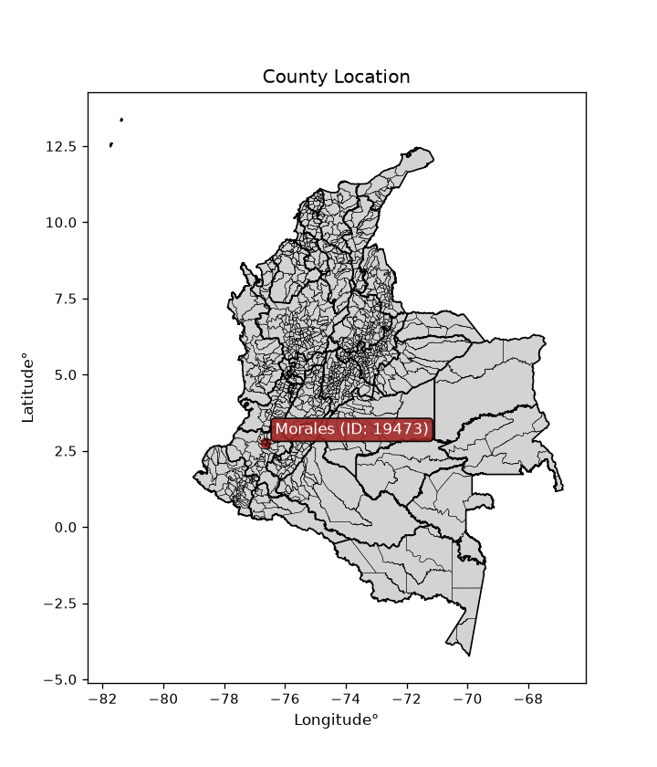
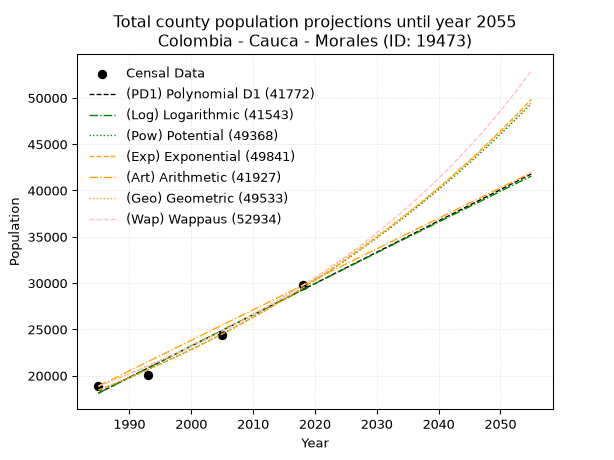
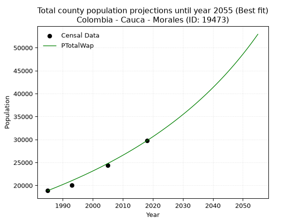
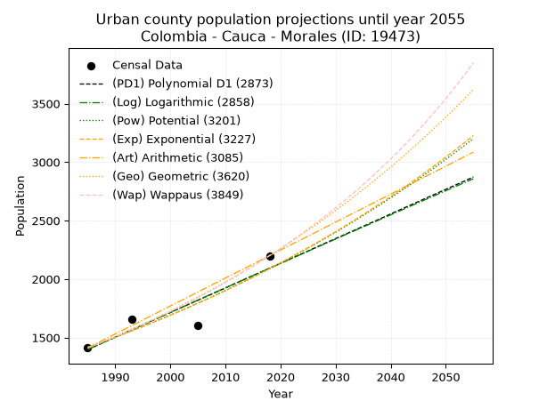
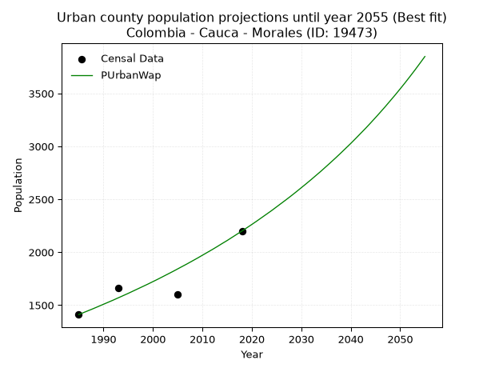
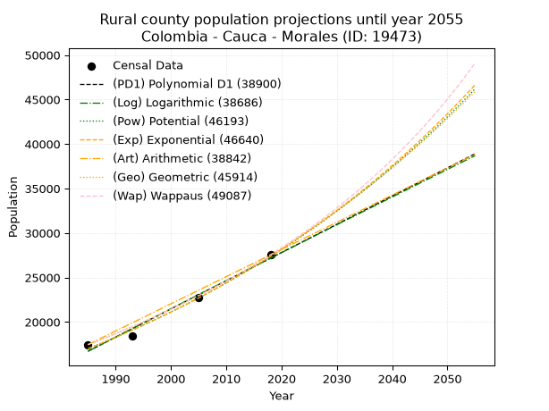
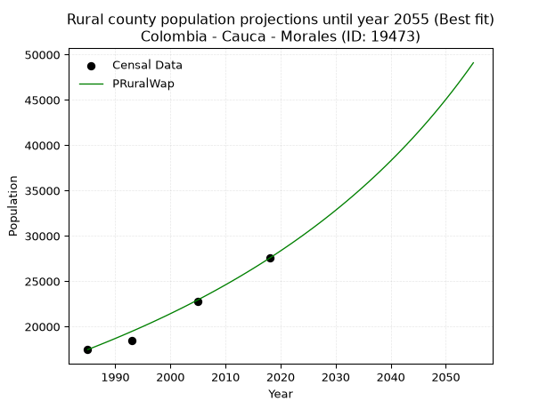

<div align="center">


</div>

# _“Population and Public Services Demand Projections (PPSD) until Year 2050 for Colombia - Cauca - Morales (ID: 19473)”_
Keywords: `population` `public-service` `projection` `lineal` `polynomial` `logarithmic` `potential` `exponential` `arithmetic` `geometric` `wappaus` `dane` `colombia` `south-america`

PPSD are analytical estimates used by governments and planners to anticipate future changes in population size, age distribution, and the resulting community needs for utilities, healthcare, education, and infrastructure as sizing future water treatment facilities, electrical grids, and road networks based on spatial growth.

<div align="center">

</img>

</div>


> **General running parameters**: • app_version: _v20260806_. • Python version: _3.14.7_. • Pandas version: _3.0.5_. • NumPy version: _2.5.1_. • Creates, save and include plots into reports (create_plot): _False_. • Projection until year: _2050_. • Process polynomial degree 2 and up: _False_. • Process Wappaus: _True_. • Process Wappaus: _True_. • Set negative values to zero: _True_. • Set infinite values to zero: _True_. • Drop dataset notes: _True_. 
<div align="center">

Dynamic map: [:earth_americas:Google](http://maps.google.com/maps?q=2.754684172,-76.6291062) [:earth_americas:OSM](https://www.openstreetmap.org/#map=18/2.754684172/-76.6291062&layers=P) [:earth_americas:Bing](https://www.bing.com/maps?cp=2.754684172~-76.6291062&lvl=18) [:earth_americas:Apple](https://maps.apple.com/frame?center=2.754684172%2C-76.6291062&span=0.003%2C0.006)

</div>


<div align="center">

```geojson
{
  "type": "Feature",
  "geometry": {
    "type": "Point", 
    "coordinates": [-76.6291062, 2.754684172]
  }, 
  "properties": {
    "Name": "Colombia - Cauca - Morales (ID: 19473)"
  }
}
```

</div>


## 0. Census Data (4 records)

Census data are official statistics collected by a government about the people and housing in a country. They usually include counts of total population, age, sex, race, income, education, and jobs.

📅Global census file: [Population.xlsx](../data/Population.xlsx)

| Source   |   Year |   CountryID | CountryName   |   StateID | StateName   |   CountyID | CountyName   |   PTotal |   PUrban |   PRural |
|:---------|-------:|------------:|:--------------|----------:|:------------|-----------:|:-------------|---------:|---------:|---------:|
| DANE     |   1985 |          57 | Colombia      |        19 | Cauca       |      19473 | Morales      |    18865 |     1411 |    17454 |
| DANE     |   1993 |          57 | Colombia      |        19 | Cauca       |      19473 | Morales      |    20067 |     1660 |    18407 |
| DANE     |   2005 |          57 | Colombia      |        19 | Cauca       |      19473 | Morales      |    24391 |     1605 |    22786 |
| DANE     |   2018 |          57 | Colombia      |        19 | Cauca       |      19473 | Morales      |    29737 |     2200 |    27537 |

> 🔥Some records could had specific notes about the registered values or the corresponding urban or rural distribution.

📅[SUI-RUPS](https://www.datos.gov.co/Hacienda-y-Cr-dito-P-blico/Registro-nico-de-Prestadores-de-Servicios-P-blicos/4qkq-csdn/about_data) - Local public utility companies: [RUPS.csv](../data/RUPS.xlsx)

 | SERVICIO       | ESTADO    | NOMBRE                                                                             | NIT         | DEPARTAMENTO_DOMICILIO   | MUNICIPIO_DOMICILIO   | DIRECCION                               |   TELEFONO | EMAIL                                   | TIPO_PRESTADOR                 | CLASIFICACION                  |
|:---------------|:----------|:-----------------------------------------------------------------------------------|:------------|:-------------------------|:----------------------|:----------------------------------------|-----------:|:----------------------------------------|:-------------------------------|:-------------------------------|
| ACUEDUCTO      | OPERATIVA | APC ACUEDUCTO PIENDAMO MORALES ORGANIZACION AUTORIZADA                             | 817006978-9 | CAUCA                    | PIENDAMO              | CRA 4 No.5-130 BARRIO INMACULADA        |    8250060 | acueductoregional@piendamo-cauca.gov.co | ORGANIZACION AUTORIZADA        | DESDE 2501 HASTA 5000 USUARIOS |
| ALCANTARILLADO | OPERATIVA | OFICINA DE SERVICIOS PUBLICOS DOMICILIARIOS DE ALCANTARILLADO Y ASEO MORALES CAUCA | 891500982-6 | CAUCA                    | MORALES               | CENTRO ADMINISTRATIVO MUNICIPAL MORALES |    8493051 | contactenos@morales-cauca.gov.co        | MUNICIPIO (PRESTACIÓN DIRECTA) | MENOR O IGUAL A 2500 USUARIOS  |

## 1. Total

### 1.1. Coefficients and Parameters

* (PD1) Polynomial Deg 1: 338.036130068242, -652891.769169001 (lineal)
* (Log) Logarithmic: 676399.7653417581, -5118055.036690248
* (Pow) Potential: 28.440600892268037, -89.52491389508133
* (Exp) Exponential: 0.014211510749562074, 1.0331469871582811e-08
* (Art) Arithmetic: Year diff. 2018 - 1985 = 33, Population diff. 29737 - 18865 = 10872, Annual growth = 329.45454545454544
* (Geo) Geometric: Year diff. 2018 - 1985 = 33, Population diff. 29737 - 18865 = 10872, Annual growth % = 0.01388594179213909
* (Wap) Wappaus: i = 1.3557242313260585, Condition values only valid for < 200)

<sub>
Wappaus condition values: ['0.00', '1.36', '2.71', '4.07', '5.42', '6.78', '8.13', '9.49', '10.85', '12.20', '13.56', '14.91', '16.27', '17.62', '18.98', '20.34', '21.69', '23.05', '24.40', '25.76', '27.11', '28.47', '29.83', '31.18', '32.54', '33.89', '35.25', '36.60', '37.96', '39.32', '40.67', '42.03', '43.38', '44.74', '46.09', '47.45', '48.81', '50.16', '51.52', '52.87', '54.23', '55.58', '56.94', '58.30', '59.65', '61.01', '62.36', '63.72', '65.07', '66.43', '67.79', '69.14', '70.50', '71.85', '73.21', '74.56', '75.92', '77.28', '78.63', '79.99', '81.34', '82.70', '84.05', '85.41', '86.77', '88.12']
</sub>


### 1.2. Projected Dataset

|   Year |   CountyID |   PTotalPD1 |   PTotalLog |   PTotalPow |   PTotalExp |   PTotalArt |   PTotalGeo |   PTotalWap |
|-------:|-----------:|------------:|------------:|------------:|------------:|------------:|------------:|------------:|
|   1985 |      19473 |       18110 |       18101 |       18424 |       18431 |       18865 |       18865 |       18865 |
|   1986 |      19473 |       18448 |       18442 |       18689 |       18695 |       19194 |       19127 |       19123 |
|   1987 |      19473 |       18786 |       18783 |       18959 |       18962 |       19524 |       19393 |       19384 |
|   1988 |      19473 |       19124 |       19123 |       19232 |       19234 |       19853 |       19662 |       19648 |
|   1989 |      19473 |       19462 |       19463 |       19509 |       19509 |       20183 |       19935 |       19917 |
|   1990 |      19473 |       19800 |       19803 |       19790 |       19788 |       20512 |       20212 |       20189 |
|   1991 |      19473 |       20138 |       20143 |       20075 |       20071 |       20842 |       20492 |       20465 |
|   1992 |      19473 |       20476 |       20483 |       20364 |       20359 |       21171 |       20777 |       20744 |
|   1993 |      19473 |       20814 |       20822 |       20656 |       20650 |       21501 |       21065 |       21028 |
|   1994 |      19473 |       21152 |       21161 |       20953 |       20946 |       21830 |       21358 |       21316 |
|   1995 |      19473 |       21490 |       21500 |       21254 |       21245 |       22160 |       21654 |       21609 |
|   1996 |      19473 |       21828 |       21839 |       21559 |       21549 |       22489 |       21955 |       21905 |
|   1997 |      19473 |       22166 |       22178 |       21869 |       21858 |       22818 |       22260 |       22206 |
|   1998 |      19473 |       22504 |       22517 |       22182 |       22171 |       23148 |       22569 |       22511 |
|   1999 |      19473 |       22842 |       22855 |       22500 |       22488 |       23477 |       22883 |       22821 |
|   2000 |      19473 |       23180 |       23194 |       22822 |       22810 |       23807 |       23200 |       23136 |
|   2001 |      19473 |       23519 |       23532 |       23149 |       23136 |       24136 |       23522 |       23455 |
|   2002 |      19473 |       23857 |       23870 |       23481 |       23468 |       24466 |       23849 |       23779 |
|   2003 |      19473 |       24195 |       24207 |       23816 |       23803 |       24795 |       24180 |       24108 |
|   2004 |      19473 |       24533 |       24545 |       24157 |       24144 |       25125 |       24516 |       24443 |
|   2005 |      19473 |       24871 |       24882 |       24502 |       24490 |       25454 |       24856 |       24782 |
|   2006 |      19473 |       25209 |       25220 |       24852 |       24840 |       25784 |       25202 |       25127 |
|   2007 |      19473 |       25547 |       25557 |       25207 |       25196 |       26113 |       25552 |       25478 |
|   2008 |      19473 |       25885 |       25894 |       25566 |       25556 |       26442 |       25906 |       25834 |
|   2009 |      19473 |       26223 |       26231 |       25931 |       25922 |       26772 |       26266 |       26196 |
|   2010 |      19473 |       26561 |       26567 |       26301 |       26293 |       27101 |       26631 |       26564 |
|   2011 |      19473 |       26899 |       26904 |       26675 |       26670 |       27431 |       27001 |       26937 |
|   2012 |      19473 |       27237 |       27240 |       27055 |       27051 |       27760 |       27376 |       27317 |
|   2013 |      19473 |       27575 |       27576 |       27440 |       27438 |       28090 |       27756 |       27704 |
|   2014 |      19473 |       27913 |       27912 |       27831 |       27831 |       28419 |       28141 |       28097 |
|   2015 |      19473 |       28251 |       28248 |       28226 |       28230 |       28749 |       28532 |       28496 |
|   2016 |      19473 |       28589 |       28583 |       28627 |       28634 |       29078 |       28928 |       28903 |
|   2017 |      19473 |       28927 |       28919 |       29034 |       29043 |       29408 |       29330 |       29316 |
|   2018 |      19473 |       29265 |       29254 |       29446 |       29459 |       29737 |       29737 |       29737 |
|   2019 |      19473 |       29603 |       29589 |       29864 |       29881 |       30066 |       30150 |       30165 |
|   2020 |      19473 |       29941 |       29924 |       30288 |       30308 |       30396 |       30569 |       30601 |
|   2021 |      19473 |       30279 |       30259 |       30717 |       30742 |       30725 |       30993 |       31044 |
|   2022 |      19473 |       30617 |       30593 |       31152 |       31182 |       31055 |       31423 |       31496 |
|   2023 |      19473 |       30955 |       30928 |       31593 |       31629 |       31384 |       31860 |       31956 |
|   2024 |      19473 |       31293 |       31262 |       32041 |       32081 |       31714 |       32302 |       32424 |
|   2025 |      19473 |       31631 |       31596 |       32494 |       32540 |       32043 |       32751 |       32901 |
|   2026 |      19473 |       31969 |       31930 |       32953 |       33006 |       32373 |       33205 |       33387 |
|   2027 |      19473 |       32307 |       32264 |       33419 |       33479 |       32702 |       33667 |       33882 |
|   2028 |      19473 |       32646 |       32598 |       33891 |       33958 |       33032 |       34134 |       34387 |
|   2029 |      19473 |       32984 |       32931 |       34370 |       34444 |       33361 |       34608 |       34901 |
|   2030 |      19473 |       33322 |       33264 |       34855 |       34937 |       33690 |       35089 |       35426 |
|   2031 |      19473 |       33660 |       33597 |       35346 |       35437 |       34020 |       35576 |       35960 |
|   2032 |      19473 |       33998 |       33930 |       35845 |       35944 |       34349 |       36070 |       36506 |
|   2033 |      19473 |       34336 |       34263 |       36350 |       36459 |       34679 |       36571 |       37062 |
|   2034 |      19473 |       34674 |       34596 |       36862 |       36980 |       35008 |       37079 |       37630 |
|   2035 |      19473 |       35012 |       34928 |       37381 |       37510 |       35338 |       37593 |       38209 |
|   2036 |      19473 |       35350 |       35261 |       37907 |       38047 |       35667 |       38115 |       38801 |
|   2037 |      19473 |       35688 |       35593 |       38440 |       38591 |       35997 |       38645 |       39404 |
|   2038 |      19473 |       36026 |       35925 |       38980 |       39143 |       36326 |       39181 |       40021 |
|   2039 |      19473 |       36364 |       36256 |       39528 |       39704 |       36656 |       39725 |       40650 |
|   2040 |      19473 |       36702 |       36588 |       40083 |       40272 |       36985 |       40277 |       41294 |
|   2041 |      19473 |       37040 |       36920 |       40645 |       40848 |       37314 |       40836 |       41951 |
|   2042 |      19473 |       37378 |       37251 |       41215 |       41433 |       37644 |       41403 |       42623 |
|   2043 |      19473 |       37716 |       37582 |       41793 |       42026 |       37973 |       41978 |       43310 |
|   2044 |      19473 |       38054 |       37913 |       42379 |       42628 |       38303 |       42561 |       44012 |
|   2045 |      19473 |       38392 |       38244 |       42973 |       43238 |       38632 |       43152 |       44730 |
|   2046 |      19473 |       38730 |       38575 |       43574 |       43857 |       38962 |       43751 |       45465 |
|   2047 |      19473 |       39068 |       38905 |       44184 |       44484 |       39291 |       44359 |       46218 |
|   2048 |      19473 |       39406 |       39235 |       44802 |       45121 |       39621 |       44975 |       46988 |
|   2049 |      19473 |       39744 |       39566 |       45429 |       45767 |       39950 |       45599 |       47776 |
|   2050 |      19473 |       40082 |       39896 |       46063 |       46422 |       40280 |       46233 |       48584 |
<div align="center">

</img>

</div>


### 1.3. Best fit with absolute and relative error (%)

Relative error puts that difference into context by dividing the absolute error by the true value, creating a unitless ratio or percentage that shows the scale of the mistake.

Absolute and relative error

|   Year | Source   |   CountryID | CountryName   |   StateID | StateName   |   CountyID_x | CountyName   |   PTotal |   PUrban |   PRural |   CountyID_y |   PTotalPD1 |   PTotalLog |   PTotalPow |   PTotalExp |   PTotalArt |   PTotalGeo |   PTotalWap |   PTotalPD1AbsError |   PTotalLogAbsError |   PTotalPowAbsError |   PTotalExpAbsError |   PTotalArtAbsError |   PTotalGeoAbsError |   PTotalWapAbsError |   PTotalPD1RelError |   PTotalLogRelError |   PTotalPowRelError |   PTotalExpRelError |   PTotalArtRelError |   PTotalGeoRelError |   PTotalWapRelError |
|-------:|:---------|------------:|:--------------|----------:|:------------|-------------:|:-------------|---------:|---------:|---------:|-------------:|------------:|------------:|------------:|------------:|------------:|------------:|------------:|--------------------:|--------------------:|--------------------:|--------------------:|--------------------:|--------------------:|--------------------:|--------------------:|--------------------:|--------------------:|--------------------:|--------------------:|--------------------:|--------------------:|
|   1985 | DANE     |          57 | Colombia      |        19 | Cauca       |        19473 | Morales      |    18865 |     1411 |    17454 |        19473 |       18110 |       18101 |       18424 |       18431 |       18865 |       18865 |       18865 |                 755 |                 764 |                 441 |                 434 |                   0 |                   0 |                   0 |             4.00212 |             4.04983 |            2.33766  |            2.30056  |             0       |             0       |             0       |
|   1993 | DANE     |          57 | Colombia      |        19 | Cauca       |        19473 | Morales      |    20067 |     1660 |    18407 |        19473 |       20814 |       20822 |       20656 |       20650 |       21501 |       21065 |       21028 |                 747 |                 755 |                 589 |                 583 |                1434 |                 998 |                 961 |             3.72253 |             3.7624  |            2.93517  |            2.90527  |             7.14606 |             4.97334 |             4.78896 |
|   2005 | DANE     |          57 | Colombia      |        19 | Cauca       |        19473 | Morales      |    24391 |     1605 |    22786 |        19473 |       24871 |       24882 |       24502 |       24490 |       25454 |       24856 |       24782 |                 480 |                 491 |                 111 |                  99 |                1063 |                 465 |                 391 |             1.96794 |             2.01304 |            0.455086 |            0.405887 |             4.35816 |             1.90644 |             1.60305 |
|   2018 | DANE     |          57 | Colombia      |        19 | Cauca       |        19473 | Morales      |    29737 |     2200 |    27537 |        19473 |       29265 |       29254 |       29446 |       29459 |       29737 |       29737 |       29737 |                 472 |                 483 |                 291 |                 278 |                   0 |                   0 |                   0 |             1.58725 |             1.62424 |            0.978579 |            0.934862 |             0       |             0       |             0       |

Relative error mean

| Method    |   RelError | Best   |
|:----------|-----------:|:-------|
| PTotalPD1 |    2.81996 |        |
| PTotalLog |    2.86238 |        |
| PTotalPow |    1.67662 |        |
| PTotalExp |    1.63664 |        |
| PTotalArt |    2.87606 |        |
| PTotalGeo |    1.71995 |        |
| PTotalWap |    1.598   | True   |

💙Best method: _**PTotalWap**_
<div align="center">

</img>

</div>


### 1.4. Fresh water supply demand in liters per capita per day (lpcd)

The fresh water supply demand typically ranges from 100 to 300 liters per capita per day (lpcd) for standard domestic and municipal planning, though absolute survival minimums set by the World Health Organization are as low as 7.5 to 20 liters per day, and total consumption in high-income nations can exceed 400 liters.

> `CZ`: Level in meters above the sea level (masl)<br> `WS`: Fresh water supply demand in liters per capita per day (lpcd or l/h/d)<br> `WSAll`: Zonal fresh water supply demand in liters per second (l/s)<br> `A`: Zonal area in square meters<br> `DP`: Population density (people/hectare or p/ha)

Reference values (RAS Colombia)

|    CZ |   WS |
|------:|-----:|
|  1000 |  120 |
|  2000 |  130 |
| 99999 |  140 |

County shapefile geometry properties and water supply values

|   CountyID |      ATotal |   CZTotal |   WSTotal |
|-----------:|------------:|----------:|----------:|
|      19473 | 5.11743e+08 |    1832.7 |       130 |

Projected values for best method: PTotalWap

|   CountyID |   Year |   PTotalWap |   DPTotal |   WSTotal |   WSTotalAll |
|-----------:|-------:|------------:|----------:|----------:|-------------:|
|      19473 |   1985 |       18865 |      0.37 |       130 |      28.3848 |
|      19473 |   1986 |       19123 |      0.37 |       130 |      28.773  |
|      19473 |   1987 |       19384 |      0.38 |       130 |      29.1657 |
|      19473 |   1988 |       19648 |      0.38 |       130 |      29.563  |
|      19473 |   1989 |       19917 |      0.39 |       130 |      29.9677 |
|      19473 |   1990 |       20189 |      0.39 |       130 |      30.377  |
|      19473 |   1991 |       20465 |      0.4  |       130 |      30.7922 |
|      19473 |   1992 |       20744 |      0.41 |       130 |      31.212  |
|      19473 |   1993 |       21028 |      0.41 |       130 |      31.6394 |
|      19473 |   1994 |       21316 |      0.42 |       130 |      32.0727 |
|      19473 |   1995 |       21609 |      0.42 |       130 |      32.5135 |
|      19473 |   1996 |       21905 |      0.43 |       130 |      32.9589 |
|      19473 |   1997 |       22206 |      0.43 |       130 |      33.4118 |
|      19473 |   1998 |       22511 |      0.44 |       130 |      33.8707 |
|      19473 |   1999 |       22821 |      0.45 |       130 |      34.3372 |
|      19473 |   2000 |       23136 |      0.45 |       130 |      34.8111 |
|      19473 |   2001 |       23455 |      0.46 |       130 |      35.2911 |
|      19473 |   2002 |       23779 |      0.46 |       130 |      35.7786 |
|      19473 |   2003 |       24108 |      0.47 |       130 |      36.2736 |
|      19473 |   2004 |       24443 |      0.48 |       130 |      36.7777 |
|      19473 |   2005 |       24782 |      0.48 |       130 |      37.2877 |
|      19473 |   2006 |       25127 |      0.49 |       130 |      37.8068 |
|      19473 |   2007 |       25478 |      0.5  |       130 |      38.335  |
|      19473 |   2008 |       25834 |      0.5  |       130 |      38.8706 |
|      19473 |   2009 |       26196 |      0.51 |       130 |      39.4153 |
|      19473 |   2010 |       26564 |      0.52 |       130 |      39.969  |
|      19473 |   2011 |       26937 |      0.53 |       130 |      40.5302 |
|      19473 |   2012 |       27317 |      0.53 |       130 |      41.102  |
|      19473 |   2013 |       27704 |      0.54 |       130 |      41.6843 |
|      19473 |   2014 |       28097 |      0.55 |       130 |      42.2756 |
|      19473 |   2015 |       28496 |      0.56 |       130 |      42.8759 |
|      19473 |   2016 |       28903 |      0.56 |       130 |      43.4883 |
|      19473 |   2017 |       29316 |      0.57 |       130 |      44.1097 |
|      19473 |   2018 |       29737 |      0.58 |       130 |      44.7432 |
|      19473 |   2019 |       30165 |      0.59 |       130 |      45.3872 |
|      19473 |   2020 |       30601 |      0.6  |       130 |      46.0432 |
|      19473 |   2021 |       31044 |      0.61 |       130 |      46.7097 |
|      19473 |   2022 |       31496 |      0.62 |       130 |      47.3898 |
|      19473 |   2023 |       31956 |      0.62 |       130 |      48.0819 |
|      19473 |   2024 |       32424 |      0.63 |       130 |      48.7861 |
|      19473 |   2025 |       32901 |      0.64 |       130 |      49.5038 |
|      19473 |   2026 |       33387 |      0.65 |       130 |      50.2351 |
|      19473 |   2027 |       33882 |      0.66 |       130 |      50.9799 |
|      19473 |   2028 |       34387 |      0.67 |       130 |      51.7397 |
|      19473 |   2029 |       34901 |      0.68 |       130 |      52.5131 |
|      19473 |   2030 |       35426 |      0.69 |       130 |      53.303  |
|      19473 |   2031 |       35960 |      0.7  |       130 |      54.1065 |
|      19473 |   2032 |       36506 |      0.71 |       130 |      54.928  |
|      19473 |   2033 |       37062 |      0.72 |       130 |      55.7646 |
|      19473 |   2034 |       37630 |      0.74 |       130 |      56.6192 |
|      19473 |   2035 |       38209 |      0.75 |       130 |      57.4904 |
|      19473 |   2036 |       38801 |      0.76 |       130 |      58.3811 |
|      19473 |   2037 |       39404 |      0.77 |       130 |      59.2884 |
|      19473 |   2038 |       40021 |      0.78 |       130 |      60.2168 |
|      19473 |   2039 |       40650 |      0.79 |       130 |      61.1632 |
|      19473 |   2040 |       41294 |      0.81 |       130 |      62.1322 |
|      19473 |   2041 |       41951 |      0.82 |       130 |      63.1207 |
|      19473 |   2042 |       42623 |      0.83 |       130 |      64.1318 |
|      19473 |   2043 |       43310 |      0.85 |       130 |      65.1655 |
|      19473 |   2044 |       44012 |      0.86 |       130 |      66.2218 |
|      19473 |   2045 |       44730 |      0.87 |       130 |      67.3021 |
|      19473 |   2046 |       45465 |      0.89 |       130 |      68.408  |
|      19473 |   2047 |       46218 |      0.9  |       130 |      69.541  |
|      19473 |   2048 |       46988 |      0.92 |       130 |      70.6995 |
|      19473 |   2049 |       47776 |      0.93 |       130 |      71.8852 |
|      19473 |   2050 |       48584 |      0.95 |       130 |      73.1009 |

## 2. Urban

### 2.1. Coefficients and Parameters

* (PD1) Polynomial Deg 1: 21.06945002007189, -40425.167402648796 (lineal)
* (Log) Logarithmic: 42143.5045987587, -318614.11617201596
* (Pow) Potential: 23.506723199248835, -74.3680927591076
* (Exp) Exponential: 0.011750258710206327, 1.05187079980173e-07
* (Art) Arithmetic: Year diff. 2018 - 1985 = 33, Population diff. 2200 - 1411 = 789, Annual growth = 23.90909090909091
* (Geo) Geometric: Year diff. 2018 - 1985 = 33, Population diff. 2200 - 1411 = 789, Annual growth % = 0.013550339014608337
* (Wap) Wappaus: i = 1.3242365499358022, Condition values only valid for < 200)

<sub>
Wappaus condition values: ['0.00', '1.32', '2.65', '3.97', '5.30', '6.62', '7.95', '9.27', '10.59', '11.92', '13.24', '14.57', '15.89', '17.22', '18.54', '19.86', '21.19', '22.51', '23.84', '25.16', '26.48', '27.81', '29.13', '30.46', '31.78', '33.11', '34.43', '35.75', '37.08', '38.40', '39.73', '41.05', '42.38', '43.70', '45.02', '46.35', '47.67', '49.00', '50.32', '51.65', '52.97', '54.29', '55.62', '56.94', '58.27', '59.59', '60.91', '62.24', '63.56', '64.89', '66.21', '67.54', '68.86', '70.18', '71.51', '72.83', '74.16', '75.48', '76.81', '78.13', '79.45', '80.78', '82.10', '83.43', '84.75', '86.08']
</sub>


### 2.2. Projected Dataset

|   Year |   CountyID |   PUrbanPD1 |   PUrbanLog |   PUrbanPow |   PUrbanExp |   PUrbanArt |   PUrbanGeo |   PUrbanWap |
|-------:|-----------:|------------:|------------:|------------:|------------:|------------:|------------:|------------:|
|   1985 |      19473 |        1398 |        1397 |        1417 |        1418 |        1411 |        1411 |        1411 |
|   1986 |      19473 |        1419 |        1419 |        1434 |        1434 |        1435 |        1430 |        1430 |
|   1987 |      19473 |        1440 |        1440 |        1451 |        1451 |        1459 |        1449 |        1449 |
|   1988 |      19473 |        1461 |        1461 |        1468 |        1468 |        1483 |        1469 |        1468 |
|   1989 |      19473 |        1482 |        1482 |        1486 |        1486 |        1507 |        1489 |        1488 |
|   1990 |      19473 |        1503 |        1503 |        1504 |        1503 |        1531 |        1509 |        1508 |
|   1991 |      19473 |        1524 |        1524 |        1521 |        1521 |        1554 |        1530 |        1528 |
|   1992 |      19473 |        1545 |        1546 |        1540 |        1539 |        1578 |        1550 |        1548 |
|   1993 |      19473 |        1566 |        1567 |        1558 |        1557 |        1602 |        1571 |        1569 |
|   1994 |      19473 |        1587 |        1588 |        1576 |        1576 |        1626 |        1593 |        1590 |
|   1995 |      19473 |        1608 |        1609 |        1595 |        1594 |        1650 |        1614 |        1611 |
|   1996 |      19473 |        1629 |        1630 |        1614 |        1613 |        1674 |        1636 |        1633 |
|   1997 |      19473 |        1651 |        1651 |        1633 |        1632 |        1698 |        1658 |        1655 |
|   1998 |      19473 |        1672 |        1672 |        1652 |        1652 |        1722 |        1681 |        1677 |
|   1999 |      19473 |        1693 |        1693 |        1672 |        1671 |        1746 |        1704 |        1699 |
|   2000 |      19473 |        1714 |        1715 |        1692 |        1691 |        1770 |        1727 |        1722 |
|   2001 |      19473 |        1735 |        1736 |        1712 |        1711 |        1794 |        1750 |        1745 |
|   2002 |      19473 |        1756 |        1757 |        1732 |        1731 |        1817 |        1774 |        1769 |
|   2003 |      19473 |        1777 |        1778 |        1752 |        1752 |        1841 |        1798 |        1793 |
|   2004 |      19473 |        1798 |        1799 |        1773 |        1772 |        1865 |        1822 |        1817 |
|   2005 |      19473 |        1819 |        1820 |        1794 |        1793 |        1889 |        1847 |        1842 |
|   2006 |      19473 |        1840 |        1841 |        1815 |        1814 |        1913 |        1872 |        1867 |
|   2007 |      19473 |        1861 |        1862 |        1836 |        1836 |        1937 |        1897 |        1892 |
|   2008 |      19473 |        1882 |        1883 |        1858 |        1858 |        1961 |        1923 |        1918 |
|   2009 |      19473 |        1903 |        1904 |        1880 |        1879 |        1985 |        1949 |        1944 |
|   2010 |      19473 |        1924 |        1925 |        1902 |        1902 |        2009 |        1975 |        1971 |
|   2011 |      19473 |        1945 |        1946 |        1924 |        1924 |        2033 |        2002 |        1998 |
|   2012 |      19473 |        1967 |        1967 |        1947 |        1947 |        2057 |        2029 |        2025 |
|   2013 |      19473 |        1988 |        1988 |        1970 |        1970 |        2080 |        2057 |        2053 |
|   2014 |      19473 |        2009 |        2009 |        1993 |        1993 |        2104 |        2085 |        2082 |
|   2015 |      19473 |        2030 |        2029 |        2016 |        2017 |        2128 |        2113 |        2110 |
|   2016 |      19473 |        2051 |        2050 |        2040 |        2041 |        2152 |        2142 |        2140 |
|   2017 |      19473 |        2072 |        2071 |        2064 |        2065 |        2176 |        2171 |        2170 |
|   2018 |      19473 |        2093 |        2092 |        2088 |        2089 |        2200 |        2200 |        2200 |
|   2019 |      19473 |        2114 |        2113 |        2113 |        2114 |        2224 |        2230 |        2231 |
|   2020 |      19473 |        2135 |        2134 |        2137 |        2139 |        2248 |        2260 |        2262 |
|   2021 |      19473 |        2156 |        2155 |        2162 |        2164 |        2272 |        2291 |        2294 |
|   2022 |      19473 |        2177 |        2176 |        2188 |        2190 |        2296 |        2322 |        2327 |
|   2023 |      19473 |        2198 |        2196 |        2213 |        2216 |        2320 |        2353 |        2360 |
|   2024 |      19473 |        2219 |        2217 |        2239 |        2242 |        2343 |        2385 |        2393 |
|   2025 |      19473 |        2240 |        2238 |        2265 |        2268 |        2367 |        2417 |        2428 |
|   2026 |      19473 |        2262 |        2259 |        2292 |        2295 |        2391 |        2450 |        2463 |
|   2027 |      19473 |        2283 |        2280 |        2318 |        2322 |        2415 |        2483 |        2498 |
|   2028 |      19473 |        2304 |        2300 |        2346 |        2350 |        2439 |        2517 |        2534 |
|   2029 |      19473 |        2325 |        2321 |        2373 |        2377 |        2463 |        2551 |        2571 |
|   2030 |      19473 |        2346 |        2342 |        2400 |        2405 |        2487 |        2586 |        2609 |
|   2031 |      19473 |        2367 |        2363 |        2428 |        2434 |        2511 |        2621 |        2647 |
|   2032 |      19473 |        2388 |        2384 |        2457 |        2463 |        2535 |        2656 |        2686 |
|   2033 |      19473 |        2409 |        2404 |        2485 |        2492 |        2559 |        2692 |        2726 |
|   2034 |      19473 |        2430 |        2425 |        2514 |        2521 |        2583 |        2729 |        2766 |
|   2035 |      19473 |        2451 |        2446 |        2543 |        2551 |        2606 |        2766 |        2808 |
|   2036 |      19473 |        2472 |        2466 |        2573 |        2581 |        2630 |        2803 |        2850 |
|   2037 |      19473 |        2493 |        2487 |        2603 |        2612 |        2654 |        2841 |        2893 |
|   2038 |      19473 |        2514 |        2508 |        2633 |        2643 |        2678 |        2880 |        2937 |
|   2039 |      19473 |        2535 |        2528 |        2664 |        2674 |        2702 |        2919 |        2982 |
|   2040 |      19473 |        2557 |        2549 |        2694 |        2705 |        2726 |        2958 |        3027 |
|   2041 |      19473 |        2578 |        2570 |        2726 |        2737 |        2750 |        2998 |        3074 |
|   2042 |      19473 |        2599 |        2590 |        2757 |        2770 |        2774 |        3039 |        3122 |
|   2043 |      19473 |        2620 |        2611 |        2789 |        2802 |        2798 |        3080 |        3170 |
|   2044 |      19473 |        2641 |        2632 |        2821 |        2836 |        2822 |        3122 |        3220 |
|   2045 |      19473 |        2662 |        2652 |        2854 |        2869 |        2846 |        3164 |        3271 |
|   2046 |      19473 |        2683 |        2673 |        2887 |        2903 |        2869 |        3207 |        3323 |
|   2047 |      19473 |        2704 |        2693 |        2920 |        2937 |        2893 |        3250 |        3376 |
|   2048 |      19473 |        2725 |        2714 |        2954 |        2972 |        2917 |        3294 |        3431 |
|   2049 |      19473 |        2746 |        2735 |        2988 |        3007 |        2941 |        3339 |        3486 |
|   2050 |      19473 |        2767 |        2755 |        3023 |        3043 |        2965 |        3384 |        3543 |
<div align="center">

</img>

</div>


### 2.3. Best fit with absolute and relative error (%)

Relative error puts that difference into context by dividing the absolute error by the true value, creating a unitless ratio or percentage that shows the scale of the mistake.

Absolute and relative error

|   Year | Source   |   CountryID | CountryName   |   StateID | StateName   |   CountyID_x | CountyName   |   PTotal |   PUrban |   PRural |   CountyID_y |   PUrbanPD1 |   PUrbanLog |   PUrbanPow |   PUrbanExp |   PUrbanArt |   PUrbanGeo |   PUrbanWap |   PUrbanPD1AbsError |   PUrbanLogAbsError |   PUrbanPowAbsError |   PUrbanExpAbsError |   PUrbanArtAbsError |   PUrbanGeoAbsError |   PUrbanWapAbsError |   PUrbanPD1RelError |   PUrbanLogRelError |   PUrbanPowRelError |   PUrbanExpRelError |   PUrbanArtRelError |   PUrbanGeoRelError |   PUrbanWapRelError |
|-------:|:---------|------------:|:--------------|----------:|:------------|-------------:|:-------------|---------:|---------:|---------:|-------------:|------------:|------------:|------------:|------------:|------------:|------------:|------------:|--------------------:|--------------------:|--------------------:|--------------------:|--------------------:|--------------------:|--------------------:|--------------------:|--------------------:|--------------------:|--------------------:|--------------------:|--------------------:|--------------------:|
|   1985 | DANE     |          57 | Colombia      |        19 | Cauca       |        19473 | Morales      |    18865 |     1411 |    17454 |        19473 |        1398 |        1397 |        1417 |        1418 |        1411 |        1411 |        1411 |                  13 |                  14 |                   6 |                   7 |                   0 |                   0 |                   0 |            0.921332 |            0.992204 |             0.42523 |            0.496102 |             0       |             0       |             0       |
|   1993 | DANE     |          57 | Colombia      |        19 | Cauca       |        19473 | Morales      |    20067 |     1660 |    18407 |        19473 |        1566 |        1567 |        1558 |        1557 |        1602 |        1571 |        1569 |                  94 |                  93 |                 102 |                 103 |                  58 |                  89 |                  91 |            5.66265  |            5.60241  |             6.14458 |            6.20482  |             3.49398 |             5.36145 |             5.48193 |
|   2005 | DANE     |          57 | Colombia      |        19 | Cauca       |        19473 | Morales      |    24391 |     1605 |    22786 |        19473 |        1819 |        1820 |        1794 |        1793 |        1889 |        1847 |        1842 |                 214 |                 215 |                 189 |                 188 |                 284 |                 242 |                 237 |           13.3333   |           13.3956   |            11.7757  |           11.7134   |            17.6947  |            15.0779  |            14.7664  |
|   2018 | DANE     |          57 | Colombia      |        19 | Cauca       |        19473 | Morales      |    29737 |     2200 |    27537 |        19473 |        2093 |        2092 |        2088 |        2089 |        2200 |        2200 |        2200 |                 107 |                 108 |                 112 |                 111 |                   0 |                   0 |                   0 |            4.86364  |            4.90909  |             5.09091 |            5.04545  |             0       |             0       |             0       |

Relative error mean

| Method    |   RelError | Best   |
|:----------|-----------:|:-------|
| PUrbanPD1 |    6.19524 |        |
| PUrbanLog |    6.22484 |        |
| PUrbanPow |    5.8591  |        |
| PUrbanExp |    5.86494 |        |
| PUrbanArt |    5.29717 |        |
| PUrbanGeo |    5.10983 |        |
| PUrbanWap |    5.06207 | True   |

💙Best method: _**PUrbanWap**_
<div align="center">

</img>

</div>


### 2.4. Fresh water supply demand in liters per capita per day (lpcd)

The fresh water supply demand typically ranges from 100 to 300 liters per capita per day (lpcd) for standard domestic and municipal planning, though absolute survival minimums set by the World Health Organization are as low as 7.5 to 20 liters per day, and total consumption in high-income nations can exceed 400 liters.

> `CZ`: Level in meters above the sea level (masl)<br> `WS`: Fresh water supply demand in liters per capita per day (lpcd or l/h/d)<br> `WSAll`: Zonal fresh water supply demand in liters per second (l/s)<br> `A`: Zonal area in square meters<br> `DP`: Population density (people/hectare or p/ha)

Reference values (RAS Colombia)

|    CZ |   WS |
|------:|-----:|
|  1000 |  120 |
|  2000 |  130 |
| 99999 |  140 |

County shapefile geometry properties and water supply values

|   CountyID |      AUrban |   CZUrban |   WSUrban |
|-----------:|------------:|----------:|----------:|
|      19473 | 1.38312e+06 |   1673.92 |       130 |

Projected values for best method: PUrbanWap

|   CountyID |   Year |   PUrbanWap |   DPUrban |   WSUrban |   WSUrbanAll |
|-----------:|-------:|------------:|----------:|----------:|-------------:|
|      19473 |   1985 |        1411 |     10.2  |       130 |      2.12303 |
|      19473 |   1986 |        1430 |     10.34 |       130 |      2.15162 |
|      19473 |   1987 |        1449 |     10.48 |       130 |      2.18021 |
|      19473 |   1988 |        1468 |     10.61 |       130 |      2.2088  |
|      19473 |   1989 |        1488 |     10.76 |       130 |      2.23889 |
|      19473 |   1990 |        1508 |     10.9  |       130 |      2.26898 |
|      19473 |   1991 |        1528 |     11.05 |       130 |      2.29907 |
|      19473 |   1992 |        1548 |     11.19 |       130 |      2.32917 |
|      19473 |   1993 |        1569 |     11.34 |       130 |      2.36076 |
|      19473 |   1994 |        1590 |     11.5  |       130 |      2.39236 |
|      19473 |   1995 |        1611 |     11.65 |       130 |      2.42396 |
|      19473 |   1996 |        1633 |     11.81 |       130 |      2.45706 |
|      19473 |   1997 |        1655 |     11.97 |       130 |      2.49016 |
|      19473 |   1998 |        1677 |     12.12 |       130 |      2.52326 |
|      19473 |   1999 |        1699 |     12.28 |       130 |      2.55637 |
|      19473 |   2000 |        1722 |     12.45 |       130 |      2.59097 |
|      19473 |   2001 |        1745 |     12.62 |       130 |      2.62558 |
|      19473 |   2002 |        1769 |     12.79 |       130 |      2.66169 |
|      19473 |   2003 |        1793 |     12.96 |       130 |      2.6978  |
|      19473 |   2004 |        1817 |     13.14 |       130 |      2.73391 |
|      19473 |   2005 |        1842 |     13.32 |       130 |      2.77153 |
|      19473 |   2006 |        1867 |     13.5  |       130 |      2.80914 |
|      19473 |   2007 |        1892 |     13.68 |       130 |      2.84676 |
|      19473 |   2008 |        1918 |     13.87 |       130 |      2.88588 |
|      19473 |   2009 |        1944 |     14.06 |       130 |      2.925   |
|      19473 |   2010 |        1971 |     14.25 |       130 |      2.96563 |
|      19473 |   2011 |        1998 |     14.45 |       130 |      3.00625 |
|      19473 |   2012 |        2025 |     14.64 |       130 |      3.04688 |
|      19473 |   2013 |        2053 |     14.84 |       130 |      3.089   |
|      19473 |   2014 |        2082 |     15.05 |       130 |      3.13264 |
|      19473 |   2015 |        2110 |     15.26 |       130 |      3.17477 |
|      19473 |   2016 |        2140 |     15.47 |       130 |      3.21991 |
|      19473 |   2017 |        2170 |     15.69 |       130 |      3.26505 |
|      19473 |   2018 |        2200 |     15.91 |       130 |      3.31019 |
|      19473 |   2019 |        2231 |     16.13 |       130 |      3.35683 |
|      19473 |   2020 |        2262 |     16.35 |       130 |      3.40347 |
|      19473 |   2021 |        2294 |     16.59 |       130 |      3.45162 |
|      19473 |   2022 |        2327 |     16.82 |       130 |      3.50127 |
|      19473 |   2023 |        2360 |     17.06 |       130 |      3.55093 |
|      19473 |   2024 |        2393 |     17.3  |       130 |      3.60058 |
|      19473 |   2025 |        2428 |     17.55 |       130 |      3.65324 |
|      19473 |   2026 |        2463 |     17.81 |       130 |      3.7059  |
|      19473 |   2027 |        2498 |     18.06 |       130 |      3.75856 |
|      19473 |   2028 |        2534 |     18.32 |       130 |      3.81273 |
|      19473 |   2029 |        2571 |     18.59 |       130 |      3.8684  |
|      19473 |   2030 |        2609 |     18.86 |       130 |      3.92558 |
|      19473 |   2031 |        2647 |     19.14 |       130 |      3.98275 |
|      19473 |   2032 |        2686 |     19.42 |       130 |      4.04144 |
|      19473 |   2033 |        2726 |     19.71 |       130 |      4.10162 |
|      19473 |   2034 |        2766 |     20    |       130 |      4.16181 |
|      19473 |   2035 |        2808 |     20.3  |       130 |      4.225   |
|      19473 |   2036 |        2850 |     20.61 |       130 |      4.28819 |
|      19473 |   2037 |        2893 |     20.92 |       130 |      4.35289 |
|      19473 |   2038 |        2937 |     21.23 |       130 |      4.4191  |
|      19473 |   2039 |        2982 |     21.56 |       130 |      4.48681 |
|      19473 |   2040 |        3027 |     21.89 |       130 |      4.55451 |
|      19473 |   2041 |        3074 |     22.23 |       130 |      4.62523 |
|      19473 |   2042 |        3122 |     22.57 |       130 |      4.69745 |
|      19473 |   2043 |        3170 |     22.92 |       130 |      4.76968 |
|      19473 |   2044 |        3220 |     23.28 |       130 |      4.84491 |
|      19473 |   2045 |        3271 |     23.65 |       130 |      4.92164 |
|      19473 |   2046 |        3323 |     24.03 |       130 |      4.99988 |
|      19473 |   2047 |        3376 |     24.41 |       130 |      5.07963 |
|      19473 |   2048 |        3431 |     24.81 |       130 |      5.16238 |
|      19473 |   2049 |        3486 |     25.2  |       130 |      5.24514 |
|      19473 |   2050 |        3543 |     25.62 |       130 |      5.3309  |

## 3. Rural

### 3.1. Coefficients and Parameters

* (PD1) Polynomial Deg 1: 316.9666800481701, -612466.6017663522 (lineal)
* (Log) Logarithmic: 634256.2607429996, -4799440.9205182325
* (Pow) Potential: 28.839383808142507, -90.87487737237116
* (Exp) Exponential: 0.014410497701255161, 6.423205388089089e-09
* (Art) Arithmetic: Year diff. 2018 - 1985 = 33, Population diff. 27537 - 17454 = 10083, Annual growth = 305.54545454545456
* (Geo) Geometric: Year diff. 2018 - 1985 = 33, Population diff. 27537 - 17454 = 10083, Annual growth % = 0.013912917596670793
* (Wap) Wappaus: i = 1.3582514482694519, Condition values only valid for < 200)

<sub>
Wappaus condition values: ['0.00', '1.36', '2.72', '4.07', '5.43', '6.79', '8.15', '9.51', '10.87', '12.22', '13.58', '14.94', '16.30', '17.66', '19.02', '20.37', '21.73', '23.09', '24.45', '25.81', '27.17', '28.52', '29.88', '31.24', '32.60', '33.96', '35.31', '36.67', '38.03', '39.39', '40.75', '42.11', '43.46', '44.82', '46.18', '47.54', '48.90', '50.26', '51.61', '52.97', '54.33', '55.69', '57.05', '58.40', '59.76', '61.12', '62.48', '63.84', '65.20', '66.55', '67.91', '69.27', '70.63', '71.99', '73.35', '74.70', '76.06', '77.42', '78.78', '80.14', '81.50', '82.85', '84.21', '85.57', '86.93', '88.29']
</sub>


### 3.2. Projected Dataset

|   Year |   CountyID |   PRuralPD1 |   PRuralLog |   PRuralPow |   PRuralExp |   PRuralArt |   PRuralGeo |   PRuralWap |
|-------:|-----------:|------------:|------------:|------------:|------------:|------------:|------------:|------------:|
|   1985 |      19473 |       16712 |       16704 |       17002 |       17009 |       17454 |       17454 |       17454 |
|   1986 |      19473 |       17029 |       17024 |       17251 |       17256 |       17760 |       17697 |       17693 |
|   1987 |      19473 |       17346 |       17343 |       17503 |       17506 |       18065 |       17943 |       17935 |
|   1988 |      19473 |       17663 |       17662 |       17759 |       17760 |       18371 |       18193 |       18180 |
|   1989 |      19473 |       17980 |       17981 |       18018 |       18018 |       18676 |       18446 |       18429 |
|   1990 |      19473 |       18297 |       18300 |       18282 |       18280 |       18982 |       18702 |       18681 |
|   1991 |      19473 |       18614 |       18618 |       18548 |       18545 |       19287 |       18963 |       18937 |
|   1992 |      19473 |       18931 |       18937 |       18819 |       18814 |       19593 |       19226 |       19196 |
|   1993 |      19473 |       19248 |       19255 |       19093 |       19087 |       19898 |       19494 |       19460 |
|   1994 |      19473 |       19565 |       19573 |       19371 |       19364 |       20204 |       19765 |       19727 |
|   1995 |      19473 |       19882 |       19891 |       19654 |       19645 |       20509 |       20040 |       19997 |
|   1996 |      19473 |       20199 |       20209 |       19940 |       19930 |       20815 |       20319 |       20272 |
|   1997 |      19473 |       20516 |       20527 |       20230 |       20220 |       21121 |       20602 |       20551 |
|   1998 |      19473 |       20833 |       20844 |       20524 |       20513 |       21426 |       20888 |       20834 |
|   1999 |      19473 |       21150 |       21162 |       20822 |       20811 |       21732 |       21179 |       21122 |
|   2000 |      19473 |       21467 |       21479 |       21125 |       21113 |       22037 |       21474 |       21413 |
|   2001 |      19473 |       21784 |       21796 |       21432 |       21420 |       22343 |       21772 |       21710 |
|   2002 |      19473 |       22101 |       22113 |       21743 |       21730 |       22648 |       22075 |       22010 |
|   2003 |      19473 |       22418 |       22430 |       22058 |       22046 |       22954 |       22382 |       22316 |
|   2004 |      19473 |       22735 |       22746 |       22378 |       22366 |       23259 |       22694 |       22626 |
|   2005 |      19473 |       23052 |       23063 |       22702 |       22690 |       23565 |       23010 |       22941 |
|   2006 |      19473 |       23369 |       23379 |       23031 |       23020 |       23870 |       23330 |       23261 |
|   2007 |      19473 |       23686 |       23695 |       23364 |       23354 |       24176 |       23654 |       23586 |
|   2008 |      19473 |       24002 |       24011 |       23702 |       23693 |       24482 |       23983 |       23916 |
|   2009 |      19473 |       24319 |       24327 |       24045 |       24037 |       24787 |       24317 |       24252 |
|   2010 |      19473 |       24636 |       24642 |       24393 |       24386 |       25093 |       24655 |       24593 |
|   2011 |      19473 |       24953 |       24958 |       24745 |       24740 |       25398 |       24998 |       24940 |
|   2012 |      19473 |       25270 |       25273 |       25103 |       25099 |       25704 |       25346 |       25292 |
|   2013 |      19473 |       25587 |       25588 |       25465 |       25463 |       26009 |       25699 |       25651 |
|   2014 |      19473 |       25904 |       25903 |       25832 |       25833 |       26315 |       26056 |       26015 |
|   2015 |      19473 |       26221 |       26218 |       26205 |       26208 |       26620 |       26419 |       26386 |
|   2016 |      19473 |       26538 |       26533 |       26582 |       26588 |       26926 |       26786 |       26763 |
|   2017 |      19473 |       26855 |       26847 |       26965 |       26974 |       27231 |       27159 |       27147 |
|   2018 |      19473 |       27172 |       27162 |       27353 |       27365 |       27537 |       27537 |       27537 |
|   2019 |      19473 |       27489 |       27476 |       27747 |       27763 |       27843 |       27920 |       27934 |
|   2020 |      19473 |       27806 |       27790 |       28146 |       28166 |       28148 |       28309 |       28339 |
|   2021 |      19473 |       28123 |       28104 |       28551 |       28574 |       28454 |       28702 |       28750 |
|   2022 |      19473 |       28440 |       28418 |       28961 |       28989 |       28759 |       29102 |       29169 |
|   2023 |      19473 |       28757 |       28731 |       29377 |       29410 |       29065 |       29507 |       29596 |
|   2024 |      19473 |       29074 |       29045 |       29799 |       29837 |       29370 |       29917 |       30031 |
|   2025 |      19473 |       29391 |       29358 |       30226 |       30270 |       29676 |       30333 |       30474 |
|   2026 |      19473 |       29708 |       29671 |       30660 |       30709 |       29981 |       30755 |       30925 |
|   2027 |      19473 |       30025 |       29984 |       31099 |       31155 |       30287 |       31183 |       31384 |
|   2028 |      19473 |       30342 |       30297 |       31545 |       31607 |       30592 |       31617 |       31853 |
|   2029 |      19473 |       30659 |       30610 |       31996 |       32066 |       30898 |       32057 |       32330 |
|   2030 |      19473 |       30976 |       30922 |       32454 |       32531 |       31204 |       32503 |       32817 |
|   2031 |      19473 |       31293 |       31235 |       32918 |       33004 |       31509 |       32955 |       33314 |
|   2032 |      19473 |       31610 |       31547 |       33389 |       33483 |       31815 |       33414 |       33820 |
|   2033 |      19473 |       31927 |       31859 |       33866 |       33969 |       32120 |       33879 |       34337 |
|   2034 |      19473 |       32244 |       32171 |       34350 |       34462 |       32426 |       34350 |       34864 |
|   2035 |      19473 |       32561 |       32483 |       34840 |       34962 |       32731 |       34828 |       35402 |
|   2036 |      19473 |       32878 |       32794 |       35337 |       35469 |       33037 |       35312 |       35951 |
|   2037 |      19473 |       33195 |       33106 |       35841 |       35984 |       33342 |       35804 |       36512 |
|   2038 |      19473 |       33511 |       33417 |       36352 |       36507 |       33648 |       36302 |       37084 |
|   2039 |      19473 |       33828 |       33728 |       36870 |       37036 |       33953 |       36807 |       37669 |
|   2040 |      19473 |       34145 |       34039 |       37395 |       37574 |       34259 |       37319 |       38267 |
|   2041 |      19473 |       34462 |       34350 |       37928 |       38119 |       34565 |       37838 |       38877 |
|   2042 |      19473 |       34779 |       34661 |       38467 |       38673 |       34870 |       38365 |       39502 |
|   2043 |      19473 |       35096 |       34971 |       39014 |       39234 |       35176 |       38899 |       40140 |
|   2044 |      19473 |       35413 |       35281 |       39569 |       39803 |       35481 |       39440 |       40792 |
|   2045 |      19473 |       35730 |       35592 |       40131 |       40381 |       35787 |       39988 |       41460 |
|   2046 |      19473 |       36047 |       35902 |       40701 |       40967 |       36092 |       40545 |       42143 |
|   2047 |      19473 |       36364 |       36212 |       41278 |       41562 |       36398 |       41109 |       42842 |
|   2048 |      19473 |       36681 |       36521 |       41864 |       42165 |       36703 |       41681 |       43558 |
|   2049 |      19473 |       36998 |       36831 |       42457 |       42777 |       37009 |       42261 |       44291 |
|   2050 |      19473 |       37315 |       37140 |       43059 |       43398 |       37314 |       42849 |       45041 |
<div align="center">

</img>

</div>


### 3.3. Best fit with absolute and relative error (%)

Relative error puts that difference into context by dividing the absolute error by the true value, creating a unitless ratio or percentage that shows the scale of the mistake.

Absolute and relative error

|   Year | Source   |   CountryID | CountryName   |   StateID | StateName   |   CountyID_x | CountyName   |   PTotal |   PUrban |   PRural |   CountyID_y |   PRuralPD1 |   PRuralLog |   PRuralPow |   PRuralExp |   PRuralArt |   PRuralGeo |   PRuralWap |   PRuralPD1AbsError |   PRuralLogAbsError |   PRuralPowAbsError |   PRuralExpAbsError |   PRuralArtAbsError |   PRuralGeoAbsError |   PRuralWapAbsError |   PRuralPD1RelError |   PRuralLogRelError |   PRuralPowRelError |   PRuralExpRelError |   PRuralArtRelError |   PRuralGeoRelError |   PRuralWapRelError |
|-------:|:---------|------------:|:--------------|----------:|:------------|-------------:|:-------------|---------:|---------:|---------:|-------------:|------------:|------------:|------------:|------------:|------------:|------------:|------------:|--------------------:|--------------------:|--------------------:|--------------------:|--------------------:|--------------------:|--------------------:|--------------------:|--------------------:|--------------------:|--------------------:|--------------------:|--------------------:|--------------------:|
|   1985 | DANE     |          57 | Colombia      |        19 | Cauca       |        19473 | Morales      |    18865 |     1411 |    17454 |        19473 |       16712 |       16704 |       17002 |       17009 |       17454 |       17454 |       17454 |                 742 |                 750 |                 452 |                 445 |                   0 |                   0 |                   0 |             4.25117 |             4.29701 |            2.58966  |            2.54956  |             0       |             0       |            0        |
|   1993 | DANE     |          57 | Colombia      |        19 | Cauca       |        19473 | Morales      |    20067 |     1660 |    18407 |        19473 |       19248 |       19255 |       19093 |       19087 |       19898 |       19494 |       19460 |                 841 |                 848 |                 686 |                 680 |                1491 |                1087 |                1053 |             4.56891 |             4.60694 |            3.72684  |            3.69425  |             8.10018 |             5.90536 |            5.72065  |
|   2005 | DANE     |          57 | Colombia      |        19 | Cauca       |        19473 | Morales      |    24391 |     1605 |    22786 |        19473 |       23052 |       23063 |       22702 |       22690 |       23565 |       23010 |       22941 |                 266 |                 277 |                  84 |                  96 |                 779 |                 224 |                 155 |             1.16738 |             1.21566 |            0.368647 |            0.421311 |             3.41877 |             0.98306 |            0.680242 |
|   2018 | DANE     |          57 | Colombia      |        19 | Cauca       |        19473 | Morales      |    29737 |     2200 |    27537 |        19473 |       27172 |       27162 |       27353 |       27365 |       27537 |       27537 |       27537 |                 365 |                 375 |                 184 |                 172 |                   0 |                   0 |                   0 |             1.32549 |             1.3618  |            0.668192 |            0.624614 |             0       |             0       |            0        |

Relative error mean

| Method    |   RelError | Best   |
|:----------|-----------:|:-------|
| PRuralPD1 |    2.82824 |        |
| PRuralLog |    2.87035 |        |
| PRuralPow |    1.83834 |        |
| PRuralExp |    1.82243 |        |
| PRuralArt |    2.87974 |        |
| PRuralGeo |    1.72211 |        |
| PRuralWap |    1.60022 | True   |

💙Best method: _**PRuralWap**_
<div align="center">

</img>

</div>


### 3.4. Fresh water supply demand in liters per capita per day (lpcd)

The fresh water supply demand typically ranges from 100 to 300 liters per capita per day (lpcd) for standard domestic and municipal planning, though absolute survival minimums set by the World Health Organization are as low as 7.5 to 20 liters per day, and total consumption in high-income nations can exceed 400 liters.

> `CZ`: Level in meters above the sea level (masl)<br> `WS`: Fresh water supply demand in liters per capita per day (lpcd or l/h/d)<br> `WSAll`: Zonal fresh water supply demand in liters per second (l/s)<br> `A`: Zonal area in square meters<br> `DP`: Population density (people/hectare or p/ha)

Reference values (RAS Colombia)

|    CZ |   WS |
|------:|-----:|
|  1000 |  120 |
|  2000 |  130 |
| 99999 |  140 |

County shapefile geometry properties and water supply values

|   CountyID |     ARural |   CZRural |   WSRural |
|-----------:|-----------:|----------:|----------:|
|      19473 | 5.1036e+08 |   1833.13 |       130 |

Projected values for best method: PRuralWap

|   CountyID |   Year |   PRuralWap |   DPRural |   WSRural |   WSRuralAll |
|-----------:|-------:|------------:|----------:|----------:|-------------:|
|      19473 |   1985 |       17454 |      0.34 |       130 |      26.2618 |
|      19473 |   1986 |       17693 |      0.35 |       130 |      26.6214 |
|      19473 |   1987 |       17935 |      0.35 |       130 |      26.9855 |
|      19473 |   1988 |       18180 |      0.36 |       130 |      27.3542 |
|      19473 |   1989 |       18429 |      0.36 |       130 |      27.7288 |
|      19473 |   1990 |       18681 |      0.37 |       130 |      28.108  |
|      19473 |   1991 |       18937 |      0.37 |       130 |      28.4932 |
|      19473 |   1992 |       19196 |      0.38 |       130 |      28.8829 |
|      19473 |   1993 |       19460 |      0.38 |       130 |      29.2801 |
|      19473 |   1994 |       19727 |      0.39 |       130 |      29.6818 |
|      19473 |   1995 |       19997 |      0.39 |       130 |      30.0881 |
|      19473 |   1996 |       20272 |      0.4  |       130 |      30.5019 |
|      19473 |   1997 |       20551 |      0.4  |       130 |      30.9216 |
|      19473 |   1998 |       20834 |      0.41 |       130 |      31.3475 |
|      19473 |   1999 |       21122 |      0.41 |       130 |      31.7808 |
|      19473 |   2000 |       21413 |      0.42 |       130 |      32.2186 |
|      19473 |   2001 |       21710 |      0.43 |       130 |      32.6655 |
|      19473 |   2002 |       22010 |      0.43 |       130 |      33.1169 |
|      19473 |   2003 |       22316 |      0.44 |       130 |      33.5773 |
|      19473 |   2004 |       22626 |      0.44 |       130 |      34.0438 |
|      19473 |   2005 |       22941 |      0.45 |       130 |      34.5177 |
|      19473 |   2006 |       23261 |      0.46 |       130 |      34.9992 |
|      19473 |   2007 |       23586 |      0.46 |       130 |      35.4882 |
|      19473 |   2008 |       23916 |      0.47 |       130 |      35.9847 |
|      19473 |   2009 |       24252 |      0.48 |       130 |      36.4903 |
|      19473 |   2010 |       24593 |      0.48 |       130 |      37.0034 |
|      19473 |   2011 |       24940 |      0.49 |       130 |      37.5255 |
|      19473 |   2012 |       25292 |      0.5  |       130 |      38.0551 |
|      19473 |   2013 |       25651 |      0.5  |       130 |      38.5953 |
|      19473 |   2014 |       26015 |      0.51 |       130 |      39.1429 |
|      19473 |   2015 |       26386 |      0.52 |       130 |      39.7012 |
|      19473 |   2016 |       26763 |      0.52 |       130 |      40.2684 |
|      19473 |   2017 |       27147 |      0.53 |       130 |      40.8462 |
|      19473 |   2018 |       27537 |      0.54 |       130 |      41.433  |
|      19473 |   2019 |       27934 |      0.55 |       130 |      42.0303 |
|      19473 |   2020 |       28339 |      0.56 |       130 |      42.6397 |
|      19473 |   2021 |       28750 |      0.56 |       130 |      43.2581 |
|      19473 |   2022 |       29169 |      0.57 |       130 |      43.8885 |
|      19473 |   2023 |       29596 |      0.58 |       130 |      44.531  |
|      19473 |   2024 |       30031 |      0.59 |       130 |      45.1855 |
|      19473 |   2025 |       30474 |      0.6  |       130 |      45.8521 |
|      19473 |   2026 |       30925 |      0.61 |       130 |      46.5307 |
|      19473 |   2027 |       31384 |      0.61 |       130 |      47.2213 |
|      19473 |   2028 |       31853 |      0.62 |       130 |      47.927  |
|      19473 |   2029 |       32330 |      0.63 |       130 |      48.6447 |
|      19473 |   2030 |       32817 |      0.64 |       130 |      49.3774 |
|      19473 |   2031 |       33314 |      0.65 |       130 |      50.1252 |
|      19473 |   2032 |       33820 |      0.66 |       130 |      50.8866 |
|      19473 |   2033 |       34337 |      0.67 |       130 |      51.6645 |
|      19473 |   2034 |       34864 |      0.68 |       130 |      52.4574 |
|      19473 |   2035 |       35402 |      0.69 |       130 |      53.2669 |
|      19473 |   2036 |       35951 |      0.7  |       130 |      54.0929 |
|      19473 |   2037 |       36512 |      0.72 |       130 |      54.937  |
|      19473 |   2038 |       37084 |      0.73 |       130 |      55.7977 |
|      19473 |   2039 |       37669 |      0.74 |       130 |      56.6779 |
|      19473 |   2040 |       38267 |      0.75 |       130 |      57.5777 |
|      19473 |   2041 |       38877 |      0.76 |       130 |      58.4955 |
|      19473 |   2042 |       39502 |      0.77 |       130 |      59.4359 |
|      19473 |   2043 |       40140 |      0.79 |       130 |      60.3958 |
|      19473 |   2044 |       40792 |      0.8  |       130 |      61.3769 |
|      19473 |   2045 |       41460 |      0.81 |       130 |      62.3819 |
|      19473 |   2046 |       42143 |      0.83 |       130 |      63.4096 |
|      19473 |   2047 |       42842 |      0.84 |       130 |      64.4613 |
|      19473 |   2048 |       43558 |      0.85 |       130 |      65.5387 |
|      19473 |   2049 |       44291 |      0.87 |       130 |      66.6416 |
|      19473 |   2050 |       45041 |      0.88 |       130 |      67.77   |

#

<div align="center"><br><sub>Share this research</sub></div><br>

<sub>**APPS & TOOLS & CONTENT DISCLAIMER**: • NO WARRANTY - This content and software is provided by <a href="https://github.com/rcfdtools" target="_blank">github.com/rcfdtools</a> "as is", without any express or implied warranty, including warranties of merchantability, fitness for a particular purpose, or non-infringement. There is no guarantee that the software will be error-free or operate without interruption. • LIMITATION OF LIABILITY - Neither the authors nor copyright holders will be liable for claims or damages arising from the software or its use. You are responsible for determining if the software is appropriate for your use and assume all associated risks, including errors, legal compliance, and data loss. • NO PROFESSIONAL ADVICE - The software provides general information and does not offer professional advice. It should not replace consultation with professional advisors. [Clauses and global license for rcfdtools use.](https://github.com/rcfdtools/rcfdtools/blob/main/LICENSE.md)</sub>

| [:house: Home](Readme.md)  | [:beginner: Help / Collab](https://github.com/rcfdtools/R.HydroTools/discussions/31) |
|----------------------------|-------------------------------------------------------------------------------------------|