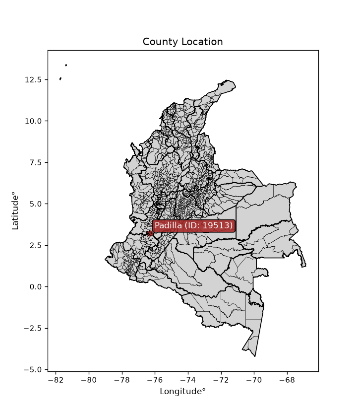
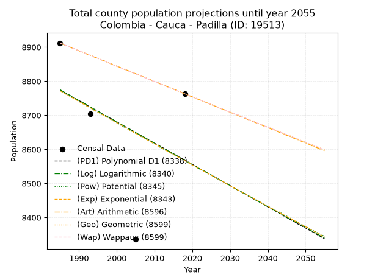
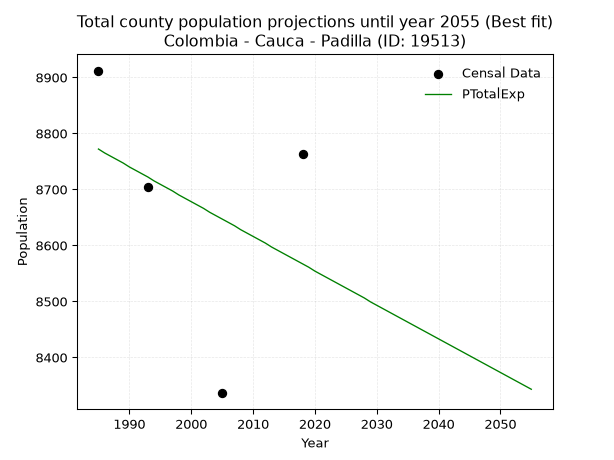
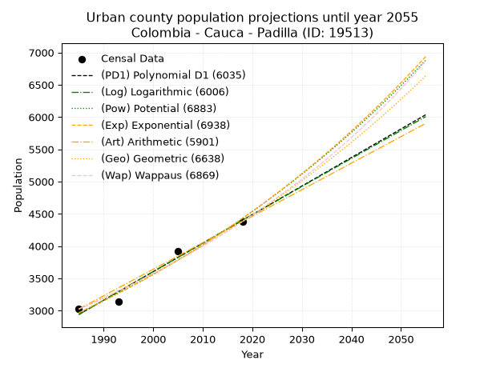
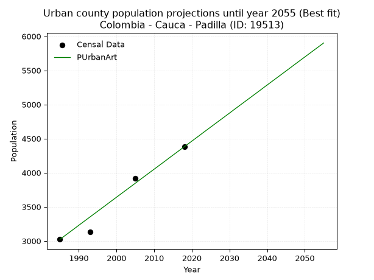
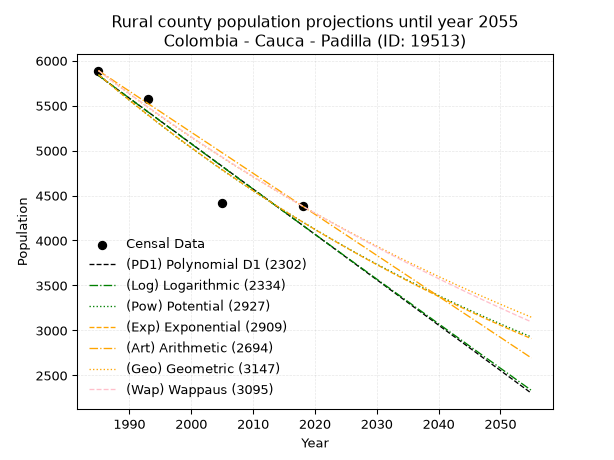
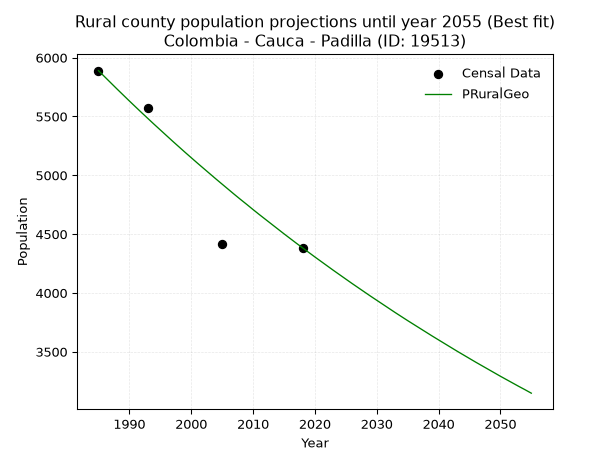

<div align="center">


</div>

# _“Population and Public Services Demand Projections (PPSD) until Year 2050 for Colombia - Cauca - Padilla (ID: 19513)”_
Keywords: `population` `public-service` `projection` `lineal` `polynomial` `logarithmic` `potential` `exponential` `arithmetic` `geometric` `wappaus` `dane` `colombia` `south-america`

PPSD are analytical estimates used by governments and planners to anticipate future changes in population size, age distribution, and the resulting community needs for utilities, healthcare, education, and infrastructure as sizing future water treatment facilities, electrical grids, and road networks based on spatial growth.

<div align="center">

</img>

</div>


> **General running parameters**: • app_version: _v20260806_. • Python version: _3.14.7_. • Pandas version: _3.0.5_. • NumPy version: _2.5.1_. • Creates, save and include plots into reports (create_plot): _False_. • Projection until year: _2050_. • Process polynomial degree 2 and up: _False_. • Process Wappaus: _True_. • Process Wappaus: _True_. • Set negative values to zero: _True_. • Set infinite values to zero: _True_. • Drop dataset notes: _True_. 
<div align="center">

Dynamic map: [:earth_americas:Google](http://maps.google.com/maps?q=3.220983546,-76.3132649) [:earth_americas:OSM](https://www.openstreetmap.org/#map=18/3.220983546/-76.3132649&layers=P) [:earth_americas:Bing](https://www.bing.com/maps?cp=3.220983546~-76.3132649&lvl=18) [:earth_americas:Apple](https://maps.apple.com/frame?center=3.220983546%2C-76.3132649&span=0.003%2C0.006)

</div>


<div align="center">

```geojson
{
  "type": "Feature",
  "geometry": {
    "type": "Point", 
    "coordinates": [-76.3132649, 3.220983546]
  }, 
  "properties": {
    "Name": "Colombia - Cauca - Padilla (ID: 19513)"
  }
}
```

</div>


## 0. Census Data (4 records)

Census data are official statistics collected by a government about the people and housing in a country. They usually include counts of total population, age, sex, race, income, education, and jobs.

📅Global census file: [Population.xlsx](../data/Population.xlsx)

| Source   |   Year |   CountryID | CountryName   |   StateID | StateName   |   CountyID | CountyName   |   PTotal |   PUrban |   PRural |
|:---------|-------:|------------:|:--------------|----------:|:------------|-----------:|:-------------|---------:|---------:|---------:|
| DANE     |   1985 |          57 | Colombia      |        19 | Cauca       |      19513 | Padilla      |     8912 |     3023 |     5889 |
| DANE     |   1993 |          57 | Colombia      |        19 | Cauca       |      19513 | Padilla      |     8705 |     3133 |     5572 |
| DANE     |   2005 |          57 | Colombia      |        19 | Cauca       |      19513 | Padilla      |     8336 |     3919 |     4417 |
| DANE     |   2018 |          57 | Colombia      |        19 | Cauca       |      19513 | Padilla      |     8763 |     4380 |     4383 |

> 🔥Some records could had specific notes about the registered values or the corresponding urban or rural distribution.

📅[SUI-RUPS](https://www.datos.gov.co/Hacienda-y-Cr-dito-P-blico/Registro-nico-de-Prestadores-de-Servicios-P-blicos/4qkq-csdn/about_data) - Local public utility companies: [RUPS.csv](../data/RUPS.xlsx)

 | SERVICIO       | ESTADO    | NOMBRE                                                        | NIT         | DEPARTAMENTO_DOMICILIO   | MUNICIPIO_DOMICILIO   | DIRECCION          |   TELEFONO | EMAIL              | TIPO_PRESTADOR                            | CLASIFICACION                 |
|:---------------|:----------|:--------------------------------------------------------------|:------------|:-------------------------|:----------------------|:-------------------|-----------:|:-------------------|:------------------------------------------|:------------------------------|
| ACUEDUCTO      | OPERATIVA | EMPRESA DE ACUEDUCTO Y ALCANTARILLADO DE PADILLA CAUCA E.S.P. | 817002899-7 | CAUCA                    | PADILLA               | Kra 3a No. 9a - 36 |    8268124 | luenfeme@gmail.com | EMPRESA INDUSTRIAL Y COMERCIAL DEL ESTADO | MENOR O IGUAL A 2500 USUARIOS |
| ALCANTARILLADO | OPERATIVA | EMPRESA DE ACUEDUCTO Y ALCANTARILLADO DE PADILLA CAUCA E.S.P. | 817002899-7 | CAUCA                    | PADILLA               | Kra 3a No. 9a - 36 |    8268124 | luenfeme@gmail.com | EMPRESA INDUSTRIAL Y COMERCIAL DEL ESTADO | MENOR O IGUAL A 2500 USUARIOS |

## 1. Total

### 1.1. Coefficients and Parameters

* (PD1) Polynomial Deg 1: -6.230429546367083, 21141.416700120757 (lineal)
* (Log) Logarithmic: -12539.403111180209, 103991.10353255099
* (Pow) Potential: -1.442297890668011, 8.699473334609948
* (Exp) Exponential: -0.0007165969189973893, 36378.48398629303
* (Art) Arithmetic: Year diff. 2018 - 1985 = 33, Population diff. 8763 - 8912 = -149, Annual growth = -4.515151515151516
* (Geo) Geometric: Year diff. 2018 - 1985 = 33, Population diff. 8763 - 8912 = -149, Annual growth % = -0.000510789839133774
* (Wap) Wappaus: i = -0.05109082336805109, Condition values only valid for < 200)

<sub>
Wappaus condition values: ['-0.00', '-0.05', '-0.10', '-0.15', '-0.20', '-0.26', '-0.31', '-0.36', '-0.41', '-0.46', '-0.51', '-0.56', '-0.61', '-0.66', '-0.72', '-0.77', '-0.82', '-0.87', '-0.92', '-0.97', '-1.02', '-1.07', '-1.12', '-1.18', '-1.23', '-1.28', '-1.33', '-1.38', '-1.43', '-1.48', '-1.53', '-1.58', '-1.63', '-1.69', '-1.74', '-1.79', '-1.84', '-1.89', '-1.94', '-1.99', '-2.04', '-2.09', '-2.15', '-2.20', '-2.25', '-2.30', '-2.35', '-2.40', '-2.45', '-2.50', '-2.55', '-2.61', '-2.66', '-2.71', '-2.76', '-2.81', '-2.86', '-2.91', '-2.96', '-3.01', '-3.07', '-3.12', '-3.17', '-3.22', '-3.27', '-3.32']
</sub>


### 1.2. Projected Dataset

|   Year |   CountyID |   PTotalPD1 |   PTotalLog |   PTotalPow |   PTotalExp |   PTotalArt |   PTotalGeo |   PTotalWap |
|-------:|-----------:|------------:|------------:|------------:|------------:|------------:|------------:|------------:|
|   1985 |      19513 |        8774 |        8775 |        8772 |        8772 |        8912 |        8912 |        8912 |
|   1986 |      19513 |        8768 |        8768 |        8766 |        8765 |        8907 |        8907 |        8907 |
|   1987 |      19513 |        8762 |        8762 |        8760 |        8759 |        8903 |        8903 |        8903 |
|   1988 |      19513 |        8755 |        8756 |        8753 |        8753 |        8898 |        8898 |        8898 |
|   1989 |      19513 |        8749 |        8749 |        8747 |        8747 |        8894 |        8894 |        8894 |
|   1990 |      19513 |        8743 |        8743 |        8741 |        8740 |        8889 |        8889 |        8889 |
|   1991 |      19513 |        8737 |        8737 |        8734 |        8734 |        8885 |        8885 |        8885 |
|   1992 |      19513 |        8730 |        8731 |        8728 |        8728 |        8880 |        8880 |        8880 |
|   1993 |      19513 |        8724 |        8724 |        8722 |        8722 |        8876 |        8876 |        8876 |
|   1994 |      19513 |        8718 |        8718 |        8715 |        8715 |        8871 |        8871 |        8871 |
|   1995 |      19513 |        8712 |        8712 |        8709 |        8709 |        8867 |        8867 |        8867 |
|   1996 |      19513 |        8705 |        8705 |        8703 |        8703 |        8862 |        8862 |        8862 |
|   1997 |      19513 |        8699 |        8699 |        8697 |        8697 |        8858 |        8858 |        8858 |
|   1998 |      19513 |        8693 |        8693 |        8690 |        8690 |        8853 |        8853 |        8853 |
|   1999 |      19513 |        8687 |        8687 |        8684 |        8684 |        8849 |        8848 |        8848 |
|   2000 |      19513 |        8681 |        8680 |        8678 |        8678 |        8844 |        8844 |        8844 |
|   2001 |      19513 |        8674 |        8674 |        8671 |        8672 |        8840 |        8839 |        8839 |
|   2002 |      19513 |        8668 |        8668 |        8665 |        8666 |        8835 |        8835 |        8835 |
|   2003 |      19513 |        8662 |        8662 |        8659 |        8659 |        8831 |        8830 |        8830 |
|   2004 |      19513 |        8656 |        8655 |        8653 |        8653 |        8826 |        8826 |        8826 |
|   2005 |      19513 |        8649 |        8649 |        8647 |        8647 |        8822 |        8821 |        8821 |
|   2006 |      19513 |        8643 |        8643 |        8640 |        8641 |        8817 |        8817 |        8817 |
|   2007 |      19513 |        8637 |        8637 |        8634 |        8635 |        8813 |        8812 |        8812 |
|   2008 |      19513 |        8631 |        8630 |        8628 |        8628 |        8808 |        8808 |        8808 |
|   2009 |      19513 |        8624 |        8624 |        8622 |        8622 |        8804 |        8803 |        8803 |
|   2010 |      19513 |        8618 |        8618 |        8616 |        8616 |        8799 |        8799 |        8799 |
|   2011 |      19513 |        8612 |        8612 |        8609 |        8610 |        8795 |        8794 |        8794 |
|   2012 |      19513 |        8606 |        8605 |        8603 |        8604 |        8790 |        8790 |        8790 |
|   2013 |      19513 |        8600 |        8599 |        8597 |        8597 |        8786 |        8785 |        8785 |
|   2014 |      19513 |        8593 |        8593 |        8591 |        8591 |        8781 |        8781 |        8781 |
|   2015 |      19513 |        8587 |        8587 |        8585 |        8585 |        8777 |        8776 |        8776 |
|   2016 |      19513 |        8581 |        8580 |        8579 |        8579 |        8772 |        8772 |        8772 |
|   2017 |      19513 |        8575 |        8574 |        8572 |        8573 |        8768 |        8767 |        8767 |
|   2018 |      19513 |        8568 |        8568 |        8566 |        8567 |        8763 |        8763 |        8763 |
|   2019 |      19513 |        8562 |        8562 |        8560 |        8561 |        8758 |        8759 |        8759 |
|   2020 |      19513 |        8556 |        8556 |        8554 |        8554 |        8754 |        8754 |        8754 |
|   2021 |      19513 |        8550 |        8549 |        8548 |        8548 |        8749 |        8750 |        8750 |
|   2022 |      19513 |        8543 |        8543 |        8542 |        8542 |        8745 |        8745 |        8745 |
|   2023 |      19513 |        8537 |        8537 |        8536 |        8536 |        8740 |        8741 |        8741 |
|   2024 |      19513 |        8531 |        8531 |        8530 |        8530 |        8736 |        8736 |        8736 |
|   2025 |      19513 |        8525 |        8525 |        8524 |        8524 |        8731 |        8732 |        8732 |
|   2026 |      19513 |        8519 |        8518 |        8518 |        8518 |        8727 |        8727 |        8727 |
|   2027 |      19513 |        8512 |        8512 |        8511 |        8512 |        8722 |        8723 |        8723 |
|   2028 |      19513 |        8506 |        8506 |        8505 |        8506 |        8718 |        8718 |        8718 |
|   2029 |      19513 |        8500 |        8500 |        8499 |        8499 |        8713 |        8714 |        8714 |
|   2030 |      19513 |        8494 |        8494 |        8493 |        8493 |        8709 |        8709 |        8709 |
|   2031 |      19513 |        8487 |        8487 |        8487 |        8487 |        8704 |        8705 |        8705 |
|   2032 |      19513 |        8481 |        8481 |        8481 |        8481 |        8700 |        8701 |        8701 |
|   2033 |      19513 |        8475 |        8475 |        8475 |        8475 |        8695 |        8696 |        8696 |
|   2034 |      19513 |        8469 |        8469 |        8469 |        8469 |        8691 |        8692 |        8692 |
|   2035 |      19513 |        8462 |        8463 |        8463 |        8463 |        8686 |        8687 |        8687 |
|   2036 |      19513 |        8456 |        8457 |        8457 |        8457 |        8682 |        8683 |        8683 |
|   2037 |      19513 |        8450 |        8450 |        8451 |        8451 |        8677 |        8678 |        8678 |
|   2038 |      19513 |        8444 |        8444 |        8445 |        8445 |        8673 |        8674 |        8674 |
|   2039 |      19513 |        8438 |        8438 |        8439 |        8439 |        8668 |        8669 |        8669 |
|   2040 |      19513 |        8431 |        8432 |        8433 |        8433 |        8664 |        8665 |        8665 |
|   2041 |      19513 |        8425 |        8426 |        8427 |        8427 |        8659 |        8661 |        8661 |
|   2042 |      19513 |        8419 |        8420 |        8421 |        8421 |        8655 |        8656 |        8656 |
|   2043 |      19513 |        8413 |        8414 |        8416 |        8415 |        8650 |        8652 |        8652 |
|   2044 |      19513 |        8406 |        8407 |        8410 |        8409 |        8646 |        8647 |        8647 |
|   2045 |      19513 |        8400 |        8401 |        8404 |        8403 |        8641 |        8643 |        8643 |
|   2046 |      19513 |        8394 |        8395 |        8398 |        8397 |        8637 |        8639 |        8639 |
|   2047 |      19513 |        8388 |        8389 |        8392 |        8391 |        8632 |        8634 |        8634 |
|   2048 |      19513 |        8381 |        8383 |        8386 |        8385 |        8628 |        8630 |        8630 |
|   2049 |      19513 |        8375 |        8377 |        8380 |        8379 |        8623 |        8625 |        8625 |
|   2050 |      19513 |        8369 |        8371 |        8374 |        8373 |        8619 |        8621 |        8621 |
<div align="center">

</img>

</div>


### 1.3. Best fit with absolute and relative error (%)

Relative error puts that difference into context by dividing the absolute error by the true value, creating a unitless ratio or percentage that shows the scale of the mistake.

Absolute and relative error

|   Year | Source   |   CountryID | CountryName   |   StateID | StateName   |   CountyID_x | CountyName   |   PTotal |   PUrban |   PRural |   CountyID_y |   PTotalPD1 |   PTotalLog |   PTotalPow |   PTotalExp |   PTotalArt |   PTotalGeo |   PTotalWap |   PTotalPD1AbsError |   PTotalLogAbsError |   PTotalPowAbsError |   PTotalExpAbsError |   PTotalArtAbsError |   PTotalGeoAbsError |   PTotalWapAbsError |   PTotalPD1RelError |   PTotalLogRelError |   PTotalPowRelError |   PTotalExpRelError |   PTotalArtRelError |   PTotalGeoRelError |   PTotalWapRelError |
|-------:|:---------|------------:|:--------------|----------:|:------------|-------------:|:-------------|---------:|---------:|---------:|-------------:|------------:|------------:|------------:|------------:|------------:|------------:|------------:|--------------------:|--------------------:|--------------------:|--------------------:|--------------------:|--------------------:|--------------------:|--------------------:|--------------------:|--------------------:|--------------------:|--------------------:|--------------------:|--------------------:|
|   1985 | DANE     |          57 | Colombia      |        19 | Cauca       |        19513 | Padilla      |     8912 |     3023 |     5889 |        19513 |        8774 |        8775 |        8772 |        8772 |        8912 |        8912 |        8912 |                 138 |                 137 |                 140 |                 140 |                   0 |                   0 |                   0 |            1.54847  |            1.53725  |             1.57092 |             1.57092 |             0       |             0       |             0       |
|   1993 | DANE     |          57 | Colombia      |        19 | Cauca       |        19513 | Padilla      |     8705 |     3133 |     5572 |        19513 |        8724 |        8724 |        8722 |        8722 |        8876 |        8876 |        8876 |                  19 |                  19 |                  17 |                  17 |                 171 |                 171 |                 171 |            0.218265 |            0.218265 |             0.19529 |             0.19529 |             1.96439 |             1.96439 |             1.96439 |
|   2005 | DANE     |          57 | Colombia      |        19 | Cauca       |        19513 | Padilla      |     8336 |     3919 |     4417 |        19513 |        8649 |        8649 |        8647 |        8647 |        8822 |        8821 |        8821 |                 313 |                 313 |                 311 |                 311 |                 486 |                 485 |                 485 |            3.7548   |            3.7548   |             3.73081 |             3.73081 |             5.83013 |             5.81814 |             5.81814 |
|   2018 | DANE     |          57 | Colombia      |        19 | Cauca       |        19513 | Padilla      |     8763 |     4380 |     4383 |        19513 |        8568 |        8568 |        8566 |        8567 |        8763 |        8763 |        8763 |                 195 |                 195 |                 197 |                 196 |                   0 |                   0 |                   0 |            2.22527  |            2.22527  |             2.24809 |             2.23668 |             0       |             0       |             0       |

Relative error mean

| Method    |   RelError | Best   |
|:----------|-----------:|:-------|
| PTotalPD1 |    1.9367  |        |
| PTotalLog |    1.9339  |        |
| PTotalPow |    1.93628 |        |
| PTotalExp |    1.93342 | True   |
| PTotalArt |    1.94863 |        |
| PTotalGeo |    1.94563 |        |
| PTotalWap |    1.94563 |        |

💙Best method: _**PTotalExp**_
<div align="center">

</img>

</div>


### 1.4. Fresh water supply demand in liters per capita per day (lpcd)

The fresh water supply demand typically ranges from 100 to 300 liters per capita per day (lpcd) for standard domestic and municipal planning, though absolute survival minimums set by the World Health Organization are as low as 7.5 to 20 liters per day, and total consumption in high-income nations can exceed 400 liters.

> `CZ`: Level in meters above the sea level (masl)<br> `WS`: Fresh water supply demand in liters per capita per day (lpcd or l/h/d)<br> `WSAll`: Zonal fresh water supply demand in liters per second (l/s)<br> `A`: Zonal area in square meters<br> `DP`: Population density (people/hectare or p/ha)

Reference values (RAS Colombia)

|    CZ |   WS |
|------:|-----:|
|  1000 |  120 |
|  2000 |  130 |
| 99999 |  140 |

County shapefile geometry properties and water supply values

|   CountyID |     ATotal |   CZTotal |   WSTotal |
|-----------:|-----------:|----------:|----------:|
|      19513 | 6.9697e+07 |   990.538 |       120 |

Projected values for best method: PTotalExp

|   CountyID |   Year |   PTotalExp |   DPTotal |   WSTotal |   WSTotalAll |
|-----------:|-------:|------------:|----------:|----------:|-------------:|
|      19513 |   1985 |        8772 |      1.26 |       120 |      12.1833 |
|      19513 |   1986 |        8765 |      1.26 |       120 |      12.1736 |
|      19513 |   1987 |        8759 |      1.26 |       120 |      12.1653 |
|      19513 |   1988 |        8753 |      1.26 |       120 |      12.1569 |
|      19513 |   1989 |        8747 |      1.26 |       120 |      12.1486 |
|      19513 |   1990 |        8740 |      1.25 |       120 |      12.1389 |
|      19513 |   1991 |        8734 |      1.25 |       120 |      12.1306 |
|      19513 |   1992 |        8728 |      1.25 |       120 |      12.1222 |
|      19513 |   1993 |        8722 |      1.25 |       120 |      12.1139 |
|      19513 |   1994 |        8715 |      1.25 |       120 |      12.1042 |
|      19513 |   1995 |        8709 |      1.25 |       120 |      12.0958 |
|      19513 |   1996 |        8703 |      1.25 |       120 |      12.0875 |
|      19513 |   1997 |        8697 |      1.25 |       120 |      12.0792 |
|      19513 |   1998 |        8690 |      1.25 |       120 |      12.0694 |
|      19513 |   1999 |        8684 |      1.25 |       120 |      12.0611 |
|      19513 |   2000 |        8678 |      1.25 |       120 |      12.0528 |
|      19513 |   2001 |        8672 |      1.24 |       120 |      12.0444 |
|      19513 |   2002 |        8666 |      1.24 |       120 |      12.0361 |
|      19513 |   2003 |        8659 |      1.24 |       120 |      12.0264 |
|      19513 |   2004 |        8653 |      1.24 |       120 |      12.0181 |
|      19513 |   2005 |        8647 |      1.24 |       120 |      12.0097 |
|      19513 |   2006 |        8641 |      1.24 |       120 |      12.0014 |
|      19513 |   2007 |        8635 |      1.24 |       120 |      11.9931 |
|      19513 |   2008 |        8628 |      1.24 |       120 |      11.9833 |
|      19513 |   2009 |        8622 |      1.24 |       120 |      11.975  |
|      19513 |   2010 |        8616 |      1.24 |       120 |      11.9667 |
|      19513 |   2011 |        8610 |      1.24 |       120 |      11.9583 |
|      19513 |   2012 |        8604 |      1.23 |       120 |      11.95   |
|      19513 |   2013 |        8597 |      1.23 |       120 |      11.9403 |
|      19513 |   2014 |        8591 |      1.23 |       120 |      11.9319 |
|      19513 |   2015 |        8585 |      1.23 |       120 |      11.9236 |
|      19513 |   2016 |        8579 |      1.23 |       120 |      11.9153 |
|      19513 |   2017 |        8573 |      1.23 |       120 |      11.9069 |
|      19513 |   2018 |        8567 |      1.23 |       120 |      11.8986 |
|      19513 |   2019 |        8561 |      1.23 |       120 |      11.8903 |
|      19513 |   2020 |        8554 |      1.23 |       120 |      11.8806 |
|      19513 |   2021 |        8548 |      1.23 |       120 |      11.8722 |
|      19513 |   2022 |        8542 |      1.23 |       120 |      11.8639 |
|      19513 |   2023 |        8536 |      1.22 |       120 |      11.8556 |
|      19513 |   2024 |        8530 |      1.22 |       120 |      11.8472 |
|      19513 |   2025 |        8524 |      1.22 |       120 |      11.8389 |
|      19513 |   2026 |        8518 |      1.22 |       120 |      11.8306 |
|      19513 |   2027 |        8512 |      1.22 |       120 |      11.8222 |
|      19513 |   2028 |        8506 |      1.22 |       120 |      11.8139 |
|      19513 |   2029 |        8499 |      1.22 |       120 |      11.8042 |
|      19513 |   2030 |        8493 |      1.22 |       120 |      11.7958 |
|      19513 |   2031 |        8487 |      1.22 |       120 |      11.7875 |
|      19513 |   2032 |        8481 |      1.22 |       120 |      11.7792 |
|      19513 |   2033 |        8475 |      1.22 |       120 |      11.7708 |
|      19513 |   2034 |        8469 |      1.22 |       120 |      11.7625 |
|      19513 |   2035 |        8463 |      1.21 |       120 |      11.7542 |
|      19513 |   2036 |        8457 |      1.21 |       120 |      11.7458 |
|      19513 |   2037 |        8451 |      1.21 |       120 |      11.7375 |
|      19513 |   2038 |        8445 |      1.21 |       120 |      11.7292 |
|      19513 |   2039 |        8439 |      1.21 |       120 |      11.7208 |
|      19513 |   2040 |        8433 |      1.21 |       120 |      11.7125 |
|      19513 |   2041 |        8427 |      1.21 |       120 |      11.7042 |
|      19513 |   2042 |        8421 |      1.21 |       120 |      11.6958 |
|      19513 |   2043 |        8415 |      1.21 |       120 |      11.6875 |
|      19513 |   2044 |        8409 |      1.21 |       120 |      11.6792 |
|      19513 |   2045 |        8403 |      1.21 |       120 |      11.6708 |
|      19513 |   2046 |        8397 |      1.2  |       120 |      11.6625 |
|      19513 |   2047 |        8391 |      1.2  |       120 |      11.6542 |
|      19513 |   2048 |        8385 |      1.2  |       120 |      11.6458 |
|      19513 |   2049 |        8379 |      1.2  |       120 |      11.6375 |
|      19513 |   2050 |        8373 |      1.2  |       120 |      11.6292 |

## 2. Urban

### 2.1. Coefficients and Parameters

* (PD1) Polynomial Deg 1: 44.23163388197476, -84860.57567242002 (lineal)
* (Log) Logarithmic: 88529.01986305002, -669296.0394060854
* (Pow) Potential: 24.285414038388733, -76.61523149864236
* (Exp) Exponential: 0.012132629982311327, 1.0308042271849046e-07
* (Art) Arithmetic: Year diff. 2018 - 1985 = 33, Population diff. 4380 - 3023 = 1357, Annual growth = 41.121212121212125
* (Geo) Geometric: Year diff. 2018 - 1985 = 33, Population diff. 4380 - 3023 = 1357, Annual growth % = 0.011299698296569849
* (Wap) Wappaus: i = 1.1109337328437694, Condition values only valid for < 200)

<sub>
Wappaus condition values: ['0.00', '1.11', '2.22', '3.33', '4.44', '5.55', '6.67', '7.78', '8.89', '10.00', '11.11', '12.22', '13.33', '14.44', '15.55', '16.66', '17.77', '18.89', '20.00', '21.11', '22.22', '23.33', '24.44', '25.55', '26.66', '27.77', '28.88', '30.00', '31.11', '32.22', '33.33', '34.44', '35.55', '36.66', '37.77', '38.88', '39.99', '41.10', '42.22', '43.33', '44.44', '45.55', '46.66', '47.77', '48.88', '49.99', '51.10', '52.21', '53.32', '54.44', '55.55', '56.66', '57.77', '58.88', '59.99', '61.10', '62.21', '63.32', '64.43', '65.55', '66.66', '67.77', '68.88', '69.99', '71.10', '72.21']
</sub>


### 2.2. Projected Dataset

|   Year |   CountyID |   PUrbanPD1 |   PUrbanLog |   PUrbanPow |   PUrbanExp |   PUrbanArt |   PUrbanGeo |   PUrbanWap |
|-------:|-----------:|------------:|------------:|------------:|------------:|------------:|------------:|------------:|
|   1985 |      19513 |        2939 |        2938 |        2967 |        2968 |        3023 |        3023 |        3023 |
|   1986 |      19513 |        2983 |        2983 |        3003 |        3004 |        3064 |        3057 |        3057 |
|   1987 |      19513 |        3028 |        3027 |        3040 |        3041 |        3105 |        3092 |        3091 |
|   1988 |      19513 |        3072 |        3072 |        3077 |        3078 |        3146 |        3127 |        3125 |
|   1989 |      19513 |        3116 |        3116 |        3115 |        3115 |        3187 |        3162 |        3160 |
|   1990 |      19513 |        3160 |        3161 |        3153 |        3153 |        3229 |        3198 |        3196 |
|   1991 |      19513 |        3205 |        3205 |        3192 |        3192 |        3270 |        3234 |        3231 |
|   1992 |      19513 |        3249 |        3250 |        3231 |        3231 |        3311 |        3270 |        3268 |
|   1993 |      19513 |        3293 |        3294 |        3271 |        3270 |        3352 |        3307 |        3304 |
|   1994 |      19513 |        3337 |        3338 |        3311 |        3310 |        3393 |        3345 |        3341 |
|   1995 |      19513 |        3382 |        3383 |        3352 |        3350 |        3434 |        3382 |        3379 |
|   1996 |      19513 |        3426 |        3427 |        3393 |        3391 |        3475 |        3421 |        3416 |
|   1997 |      19513 |        3470 |        3472 |        3434 |        3433 |        3516 |        3459 |        3455 |
|   1998 |      19513 |        3514 |        3516 |        3476 |        3475 |        3558 |        3498 |        3494 |
|   1999 |      19513 |        3558 |        3560 |        3519 |        3517 |        3599 |        3538 |        3533 |
|   2000 |      19513 |        3603 |        3604 |        3562 |        3560 |        3640 |        3578 |        3573 |
|   2001 |      19513 |        3647 |        3649 |        3605 |        3603 |        3681 |        3618 |        3613 |
|   2002 |      19513 |        3691 |        3693 |        3649 |        3647 |        3722 |        3659 |        3653 |
|   2003 |      19513 |        3735 |        3737 |        3694 |        3692 |        3763 |        3701 |        3695 |
|   2004 |      19513 |        3780 |        3781 |        3739 |        3737 |        3804 |        3742 |        3736 |
|   2005 |      19513 |        3824 |        3825 |        3784 |        3783 |        3845 |        3785 |        3779 |
|   2006 |      19513 |        3868 |        3870 |        3830 |        3829 |        3887 |        3828 |        3821 |
|   2007 |      19513 |        3912 |        3914 |        3877 |        3876 |        3928 |        3871 |        3865 |
|   2008 |      19513 |        3957 |        3958 |        3924 |        3923 |        3969 |        3914 |        3909 |
|   2009 |      19513 |        4001 |        4002 |        3972 |        3971 |        4010 |        3959 |        3953 |
|   2010 |      19513 |        4045 |        4046 |        4020 |        4019 |        4051 |        4003 |        3998 |
|   2011 |      19513 |        4089 |        4090 |        4069 |        4068 |        4092 |        4049 |        4044 |
|   2012 |      19513 |        4133 |        4134 |        4119 |        4118 |        4133 |        4094 |        4090 |
|   2013 |      19513 |        4178 |        4178 |        4169 |        4168 |        4174 |        4141 |        4137 |
|   2014 |      19513 |        4222 |        4222 |        4219 |        4219 |        4216 |        4187 |        4184 |
|   2015 |      19513 |        4266 |        4266 |        4270 |        4271 |        4257 |        4235 |        4232 |
|   2016 |      19513 |        4310 |        4310 |        4322 |        4323 |        4298 |        4283 |        4281 |
|   2017 |      19513 |        4355 |        4354 |        4374 |        4375 |        4339 |        4331 |        4330 |
|   2018 |      19513 |        4399 |        4398 |        4427 |        4429 |        4380 |        4380 |        4380 |
|   2019 |      19513 |        4443 |        4441 |        4481 |        4483 |        4421 |        4429 |        4431 |
|   2020 |      19513 |        4487 |        4485 |        4535 |        4538 |        4462 |        4480 |        4482 |
|   2021 |      19513 |        4532 |        4529 |        4590 |        4593 |        4503 |        4530 |        4534 |
|   2022 |      19513 |        4576 |        4573 |        4646 |        4649 |        4544 |        4581 |        4587 |
|   2023 |      19513 |        4620 |        4617 |        4702 |        4706 |        4586 |        4633 |        4641 |
|   2024 |      19513 |        4664 |        4660 |        4758 |        4763 |        4627 |        4685 |        4695 |
|   2025 |      19513 |        4708 |        4704 |        4816 |        4821 |        4668 |        4738 |        4750 |
|   2026 |      19513 |        4753 |        4748 |        4874 |        4880 |        4709 |        4792 |        4806 |
|   2027 |      19513 |        4797 |        4792 |        4933 |        4940 |        4750 |        4846 |        4863 |
|   2028 |      19513 |        4841 |        4835 |        4992 |        5000 |        4791 |        4901 |        4920 |
|   2029 |      19513 |        4885 |        4879 |        5052 |        5061 |        4832 |        4956 |        4979 |
|   2030 |      19513 |        4930 |        4922 |        5113 |        5123 |        4873 |        5012 |        5038 |
|   2031 |      19513 |        4974 |        4966 |        5175 |        5185 |        4915 |        5069 |        5098 |
|   2032 |      19513 |        5018 |        5010 |        5237 |        5249 |        4956 |        5126 |        5159 |
|   2033 |      19513 |        5062 |        5053 |        5300 |        5313 |        4997 |        5184 |        5221 |
|   2034 |      19513 |        5107 |        5097 |        5363 |        5378 |        5038 |        5243 |        5284 |
|   2035 |      19513 |        5151 |        5140 |        5428 |        5443 |        5079 |        5302 |        5348 |
|   2036 |      19513 |        5195 |        5184 |        5493 |        5510 |        5120 |        5362 |        5413 |
|   2037 |      19513 |        5239 |        5227 |        5559 |        5577 |        5161 |        5422 |        5479 |
|   2038 |      19513 |        5283 |        5271 |        5626 |        5645 |        5202 |        5484 |        5546 |
|   2039 |      19513 |        5328 |        5314 |        5693 |        5714 |        5244 |        5546 |        5614 |
|   2040 |      19513 |        5372 |        5358 |        5761 |        5784 |        5285 |        5608 |        5683 |
|   2041 |      19513 |        5416 |        5401 |        5830 |        5854 |        5326 |        5672 |        5753 |
|   2042 |      19513 |        5460 |        5444 |        5900 |        5926 |        5367 |        5736 |        5824 |
|   2043 |      19513 |        5505 |        5488 |        5970 |        5998 |        5408 |        5801 |        5897 |
|   2044 |      19513 |        5549 |        5531 |        6042 |        6071 |        5449 |        5866 |        5970 |
|   2045 |      19513 |        5593 |        5574 |        6114 |        6145 |        5490 |        5932 |        6045 |
|   2046 |      19513 |        5637 |        5618 |        6187 |        6220 |        5531 |        5999 |        6121 |
|   2047 |      19513 |        5682 |        5661 |        6261 |        6296 |        5573 |        6067 |        6199 |
|   2048 |      19513 |        5726 |        5704 |        6336 |        6373 |        5614 |        6136 |        6278 |
|   2049 |      19513 |        5770 |        5747 |        6411 |        6451 |        5655 |        6205 |        6358 |
|   2050 |      19513 |        5814 |        5790 |        6488 |        6530 |        5696 |        6275 |        6439 |
<div align="center">

</img>

</div>


### 2.3. Best fit with absolute and relative error (%)

Relative error puts that difference into context by dividing the absolute error by the true value, creating a unitless ratio or percentage that shows the scale of the mistake.

Absolute and relative error

|   Year | Source   |   CountryID | CountryName   |   StateID | StateName   |   CountyID_x | CountyName   |   PTotal |   PUrban |   PRural |   CountyID_y |   PUrbanPD1 |   PUrbanLog |   PUrbanPow |   PUrbanExp |   PUrbanArt |   PUrbanGeo |   PUrbanWap |   PUrbanPD1AbsError |   PUrbanLogAbsError |   PUrbanPowAbsError |   PUrbanExpAbsError |   PUrbanArtAbsError |   PUrbanGeoAbsError |   PUrbanWapAbsError |   PUrbanPD1RelError |   PUrbanLogRelError |   PUrbanPowRelError |   PUrbanExpRelError |   PUrbanArtRelError |   PUrbanGeoRelError |   PUrbanWapRelError |
|-------:|:---------|------------:|:--------------|----------:|:------------|-------------:|:-------------|---------:|---------:|---------:|-------------:|------------:|------------:|------------:|------------:|------------:|------------:|------------:|--------------------:|--------------------:|--------------------:|--------------------:|--------------------:|--------------------:|--------------------:|--------------------:|--------------------:|--------------------:|--------------------:|--------------------:|--------------------:|--------------------:|
|   1985 | DANE     |          57 | Colombia      |        19 | Cauca       |        19513 | Padilla      |     8912 |     3023 |     5889 |        19513 |        2939 |        2938 |        2967 |        2968 |        3023 |        3023 |        3023 |                  84 |                  85 |                  56 |                  55 |                   0 |                   0 |                   0 |             2.7787  |            2.81178  |             1.85246 |             1.81938 |             0       |             0       |             0       |
|   1993 | DANE     |          57 | Colombia      |        19 | Cauca       |        19513 | Padilla      |     8705 |     3133 |     5572 |        19513 |        3293 |        3294 |        3271 |        3270 |        3352 |        3307 |        3304 |                 160 |                 161 |                 138 |                 137 |                 219 |                 174 |                 171 |             5.10693 |            5.13884  |             4.40472 |             4.37281 |             6.99011 |             5.55378 |             5.45803 |
|   2005 | DANE     |          57 | Colombia      |        19 | Cauca       |        19513 | Padilla      |     8336 |     3919 |     4417 |        19513 |        3824 |        3825 |        3784 |        3783 |        3845 |        3785 |        3779 |                  95 |                  94 |                 135 |                 136 |                  74 |                 134 |                 140 |             2.42409 |            2.39857  |             3.44476 |             3.47027 |             1.88824 |             3.41924 |             3.57234 |
|   2018 | DANE     |          57 | Colombia      |        19 | Cauca       |        19513 | Padilla      |     8763 |     4380 |     4383 |        19513 |        4399 |        4398 |        4427 |        4429 |        4380 |        4380 |        4380 |                  19 |                  18 |                  47 |                  49 |                   0 |                   0 |                   0 |             0.43379 |            0.410959 |             1.07306 |             1.11872 |             0       |             0       |             0       |

Relative error mean

| Method    |   RelError | Best   |
|:----------|-----------:|:-------|
| PUrbanPD1 |    2.68588 |        |
| PUrbanLog |    2.69004 |        |
| PUrbanPow |    2.69375 |        |
| PUrbanExp |    2.6953  |        |
| PUrbanArt |    2.21959 | True   |
| PUrbanGeo |    2.24326 |        |
| PUrbanWap |    2.25759 |        |

💙Best method: _**PUrbanArt**_
<div align="center">

</img>

</div>


### 2.4. Fresh water supply demand in liters per capita per day (lpcd)

The fresh water supply demand typically ranges from 100 to 300 liters per capita per day (lpcd) for standard domestic and municipal planning, though absolute survival minimums set by the World Health Organization are as low as 7.5 to 20 liters per day, and total consumption in high-income nations can exceed 400 liters.

> `CZ`: Level in meters above the sea level (masl)<br> `WS`: Fresh water supply demand in liters per capita per day (lpcd or l/h/d)<br> `WSAll`: Zonal fresh water supply demand in liters per second (l/s)<br> `A`: Zonal area in square meters<br> `DP`: Population density (people/hectare or p/ha)

Reference values (RAS Colombia)

|    CZ |   WS |
|------:|-----:|
|  1000 |  120 |
|  2000 |  130 |
| 99999 |  140 |

County shapefile geometry properties and water supply values

|   CountyID |      AUrban |   CZUrban |   WSUrban |
|-----------:|------------:|----------:|----------:|
|      19513 | 1.27184e+06 |   996.222 |       120 |

Projected values for best method: PUrbanArt

|   CountyID |   Year |   PUrbanArt |   DPUrban |   WSUrban |   WSUrbanAll |
|-----------:|-------:|------------:|----------:|----------:|-------------:|
|      19513 |   1985 |        3023 |     23.77 |       120 |      4.19861 |
|      19513 |   1986 |        3064 |     24.09 |       120 |      4.25556 |
|      19513 |   1987 |        3105 |     24.41 |       120 |      4.3125  |
|      19513 |   1988 |        3146 |     24.74 |       120 |      4.36944 |
|      19513 |   1989 |        3187 |     25.06 |       120 |      4.42639 |
|      19513 |   1990 |        3229 |     25.39 |       120 |      4.48472 |
|      19513 |   1991 |        3270 |     25.71 |       120 |      4.54167 |
|      19513 |   1992 |        3311 |     26.03 |       120 |      4.59861 |
|      19513 |   1993 |        3352 |     26.36 |       120 |      4.65556 |
|      19513 |   1994 |        3393 |     26.68 |       120 |      4.7125  |
|      19513 |   1995 |        3434 |     27    |       120 |      4.76944 |
|      19513 |   1996 |        3475 |     27.32 |       120 |      4.82639 |
|      19513 |   1997 |        3516 |     27.65 |       120 |      4.88333 |
|      19513 |   1998 |        3558 |     27.98 |       120 |      4.94167 |
|      19513 |   1999 |        3599 |     28.3  |       120 |      4.99861 |
|      19513 |   2000 |        3640 |     28.62 |       120 |      5.05556 |
|      19513 |   2001 |        3681 |     28.94 |       120 |      5.1125  |
|      19513 |   2002 |        3722 |     29.26 |       120 |      5.16944 |
|      19513 |   2003 |        3763 |     29.59 |       120 |      5.22639 |
|      19513 |   2004 |        3804 |     29.91 |       120 |      5.28333 |
|      19513 |   2005 |        3845 |     30.23 |       120 |      5.34028 |
|      19513 |   2006 |        3887 |     30.56 |       120 |      5.39861 |
|      19513 |   2007 |        3928 |     30.88 |       120 |      5.45556 |
|      19513 |   2008 |        3969 |     31.21 |       120 |      5.5125  |
|      19513 |   2009 |        4010 |     31.53 |       120 |      5.56944 |
|      19513 |   2010 |        4051 |     31.85 |       120 |      5.62639 |
|      19513 |   2011 |        4092 |     32.17 |       120 |      5.68333 |
|      19513 |   2012 |        4133 |     32.5  |       120 |      5.74028 |
|      19513 |   2013 |        4174 |     32.82 |       120 |      5.79722 |
|      19513 |   2014 |        4216 |     33.15 |       120 |      5.85556 |
|      19513 |   2015 |        4257 |     33.47 |       120 |      5.9125  |
|      19513 |   2016 |        4298 |     33.79 |       120 |      5.96944 |
|      19513 |   2017 |        4339 |     34.12 |       120 |      6.02639 |
|      19513 |   2018 |        4380 |     34.44 |       120 |      6.08333 |
|      19513 |   2019 |        4421 |     34.76 |       120 |      6.14028 |
|      19513 |   2020 |        4462 |     35.08 |       120 |      6.19722 |
|      19513 |   2021 |        4503 |     35.41 |       120 |      6.25417 |
|      19513 |   2022 |        4544 |     35.73 |       120 |      6.31111 |
|      19513 |   2023 |        4586 |     36.06 |       120 |      6.36944 |
|      19513 |   2024 |        4627 |     36.38 |       120 |      6.42639 |
|      19513 |   2025 |        4668 |     36.7  |       120 |      6.48333 |
|      19513 |   2026 |        4709 |     37.03 |       120 |      6.54028 |
|      19513 |   2027 |        4750 |     37.35 |       120 |      6.59722 |
|      19513 |   2028 |        4791 |     37.67 |       120 |      6.65417 |
|      19513 |   2029 |        4832 |     37.99 |       120 |      6.71111 |
|      19513 |   2030 |        4873 |     38.31 |       120 |      6.76806 |
|      19513 |   2031 |        4915 |     38.64 |       120 |      6.82639 |
|      19513 |   2032 |        4956 |     38.97 |       120 |      6.88333 |
|      19513 |   2033 |        4997 |     39.29 |       120 |      6.94028 |
|      19513 |   2034 |        5038 |     39.61 |       120 |      6.99722 |
|      19513 |   2035 |        5079 |     39.93 |       120 |      7.05417 |
|      19513 |   2036 |        5120 |     40.26 |       120 |      7.11111 |
|      19513 |   2037 |        5161 |     40.58 |       120 |      7.16806 |
|      19513 |   2038 |        5202 |     40.9  |       120 |      7.225   |
|      19513 |   2039 |        5244 |     41.23 |       120 |      7.28333 |
|      19513 |   2040 |        5285 |     41.55 |       120 |      7.34028 |
|      19513 |   2041 |        5326 |     41.88 |       120 |      7.39722 |
|      19513 |   2042 |        5367 |     42.2  |       120 |      7.45417 |
|      19513 |   2043 |        5408 |     42.52 |       120 |      7.51111 |
|      19513 |   2044 |        5449 |     42.84 |       120 |      7.56806 |
|      19513 |   2045 |        5490 |     43.17 |       120 |      7.625   |
|      19513 |   2046 |        5531 |     43.49 |       120 |      7.68194 |
|      19513 |   2047 |        5573 |     43.82 |       120 |      7.74028 |
|      19513 |   2048 |        5614 |     44.14 |       120 |      7.79722 |
|      19513 |   2049 |        5655 |     44.46 |       120 |      7.85417 |
|      19513 |   2050 |        5696 |     44.79 |       120 |      7.91111 |

## 3. Rural

### 3.1. Coefficients and Parameters

* (PD1) Polynomial Deg 1: -50.462063428341914, 106001.9923725409 (lineal)
* (Log) Logarithmic: -101068.42297423024, 773287.1429386365
* (Pow) Potential: -19.96384410673439, 69.60290128064936
* (Exp) Exponential: -0.00996800450487374, 2290439630236.8594
* (Art) Arithmetic: Year diff. 2018 - 1985 = 33, Population diff. 4383 - 5889 = -1506, Annual growth = -45.63636363636363
* (Geo) Geometric: Year diff. 2018 - 1985 = 33, Population diff. 4383 - 5889 = -1506, Annual growth % = -0.008910151537027788
* (Wap) Wappaus: i = -0.888558482016426, Condition values only valid for < 200)

<sub>
Wappaus condition values: ['-0.00', '-0.89', '-1.78', '-2.67', '-3.55', '-4.44', '-5.33', '-6.22', '-7.11', '-8.00', '-8.89', '-9.77', '-10.66', '-11.55', '-12.44', '-13.33', '-14.22', '-15.11', '-15.99', '-16.88', '-17.77', '-18.66', '-19.55', '-20.44', '-21.33', '-22.21', '-23.10', '-23.99', '-24.88', '-25.77', '-26.66', '-27.55', '-28.43', '-29.32', '-30.21', '-31.10', '-31.99', '-32.88', '-33.77', '-34.65', '-35.54', '-36.43', '-37.32', '-38.21', '-39.10', '-39.99', '-40.87', '-41.76', '-42.65', '-43.54', '-44.43', '-45.32', '-46.21', '-47.09', '-47.98', '-48.87', '-49.76', '-50.65', '-51.54', '-52.42', '-53.31', '-54.20', '-55.09', '-55.98', '-56.87', '-57.76']
</sub>


### 3.2. Projected Dataset

|   Year |   CountyID |   PRuralPD1 |   PRuralLog |   PRuralPow |   PRuralExp |   PRuralArt |   PRuralGeo |   PRuralWap |
|-------:|-----------:|------------:|------------:|------------:|------------:|------------:|------------:|------------:|
|   1985 |      19513 |        5835 |        5837 |        5847 |        5845 |        5889 |        5889 |        5889 |
|   1986 |      19513 |        5784 |        5786 |        5788 |        5787 |        5843 |        5837 |        5837 |
|   1987 |      19513 |        5734 |        5735 |        5731 |        5729 |        5798 |        5785 |        5785 |
|   1988 |      19513 |        5683 |        5684 |        5673 |        5672 |        5752 |        5733 |        5734 |
|   1989 |      19513 |        5633 |        5633 |        5617 |        5616 |        5706 |        5682 |        5683 |
|   1990 |      19513 |        5582 |        5583 |        5560 |        5560 |        5661 |        5631 |        5633 |
|   1991 |      19513 |        5532 |        5532 |        5505 |        5505 |        5615 |        5581 |        5583 |
|   1992 |      19513 |        5482 |        5481 |        5450 |        5451 |        5570 |        5531 |        5534 |
|   1993 |      19513 |        5431 |        5430 |        5396 |        5397 |        5524 |        5482 |        5485 |
|   1994 |      19513 |        5381 |        5380 |        5342 |        5343 |        5478 |        5433 |        5436 |
|   1995 |      19513 |        5330 |        5329 |        5289 |        5290 |        5433 |        5385 |        5388 |
|   1996 |      19513 |        5280 |        5278 |        5236 |        5238 |        5387 |        5337 |        5340 |
|   1997 |      19513 |        5229 |        5228 |        5184 |        5186 |        5341 |        5289 |        5293 |
|   1998 |      19513 |        5179 |        5177 |        5132 |        5134 |        5296 |        5242 |        5246 |
|   1999 |      19513 |        5128 |        5126 |        5081 |        5083 |        5250 |        5195 |        5199 |
|   2000 |      19513 |        5078 |        5076 |        5031 |        5033 |        5204 |        5149 |        5153 |
|   2001 |      19513 |        5027 |        5025 |        4981 |        4983 |        5159 |        5103 |        5107 |
|   2002 |      19513 |        4977 |        4975 |        4932 |        4934 |        5113 |        5058 |        5062 |
|   2003 |      19513 |        4926 |        4924 |        4883 |        4885 |        5068 |        5013 |        5017 |
|   2004 |      19513 |        4876 |        4874 |        4834 |        4836 |        5022 |        4968 |        4972 |
|   2005 |      19513 |        4826 |        4824 |        4786 |        4788 |        4976 |        4924 |        4928 |
|   2006 |      19513 |        4775 |        4773 |        4739 |        4741 |        4931 |        4880 |        4884 |
|   2007 |      19513 |        4725 |        4723 |        4692 |        4694 |        4885 |        4836 |        4840 |
|   2008 |      19513 |        4674 |        4672 |        4646 |        4647 |        4839 |        4793 |        4797 |
|   2009 |      19513 |        4624 |        4622 |        4600 |        4601 |        4794 |        4751 |        4754 |
|   2010 |      19513 |        4573 |        4572 |        4554 |        4555 |        4748 |        4708 |        4712 |
|   2011 |      19513 |        4523 |        4522 |        4509 |        4510 |        4702 |        4666 |        4669 |
|   2012 |      19513 |        4472 |        4471 |        4465 |        4466 |        4657 |        4625 |        4627 |
|   2013 |      19513 |        4422 |        4421 |        4421 |        4421 |        4611 |        4584 |        4586 |
|   2014 |      19513 |        4371 |        4371 |        4377 |        4377 |        4566 |        4543 |        4545 |
|   2015 |      19513 |        4321 |        4321 |        4334 |        4334 |        4520 |        4502 |        4504 |
|   2016 |      19513 |        4270 |        4271 |        4291 |        4291 |        4474 |        4462 |        4463 |
|   2017 |      19513 |        4220 |        4220 |        4249 |        4248 |        4429 |        4422 |        4423 |
|   2018 |      19513 |        4170 |        4170 |        4207 |        4206 |        4383 |        4383 |        4383 |
|   2019 |      19513 |        4119 |        4120 |        4166 |        4165 |        4337 |        4344 |        4343 |
|   2020 |      19513 |        4069 |        4070 |        4125 |        4123 |        4292 |        4305 |        4304 |
|   2021 |      19513 |        4018 |        4020 |        4084 |        4082 |        4246 |        4267 |        4265 |
|   2022 |      19513 |        3968 |        3970 |        4044 |        4042 |        4200 |        4229 |        4226 |
|   2023 |      19513 |        3917 |        3920 |        4004 |        4002 |        4155 |        4191 |        4188 |
|   2024 |      19513 |        3867 |        3870 |        3965 |        3962 |        4109 |        4154 |        4150 |
|   2025 |      19513 |        3816 |        3820 |        3926 |        3923 |        4064 |        4117 |        4112 |
|   2026 |      19513 |        3766 |        3770 |        3887 |        3884 |        4018 |        4080 |        4074 |
|   2027 |      19513 |        3715 |        3721 |        3849 |        3845 |        3972 |        4044 |        4037 |
|   2028 |      19513 |        3665 |        3671 |        3812 |        3807 |        3927 |        4008 |        4000 |
|   2029 |      19513 |        3614 |        3621 |        3774 |        3769 |        3881 |        3972 |        3963 |
|   2030 |      19513 |        3564 |        3571 |        3737 |        3732 |        3835 |        3937 |        3927 |
|   2031 |      19513 |        3514 |        3521 |        3701 |        3695 |        3790 |        3902 |        3890 |
|   2032 |      19513 |        3463 |        3472 |        3665 |        3658 |        3744 |        3867 |        3854 |
|   2033 |      19513 |        3413 |        3422 |        3629 |        3622 |        3698 |        3832 |        3819 |
|   2034 |      19513 |        3362 |        3372 |        3593 |        3586 |        3653 |        3798 |        3783 |
|   2035 |      19513 |        3312 |        3323 |        3558 |        3551 |        3607 |        3764 |        3748 |
|   2036 |      19513 |        3261 |        3273 |        3524 |        3515 |        3562 |        3731 |        3713 |
|   2037 |      19513 |        3211 |        3223 |        3489 |        3481 |        3516 |        3698 |        3679 |
|   2038 |      19513 |        3160 |        3174 |        3455 |        3446 |        3470 |        3665 |        3644 |
|   2039 |      19513 |        3110 |        3124 |        3421 |        3412 |        3425 |        3632 |        3610 |
|   2040 |      19513 |        3059 |        3074 |        3388 |        3378 |        3379 |        3600 |        3576 |
|   2041 |      19513 |        3009 |        3025 |        3355 |        3344 |        3333 |        3568 |        3542 |
|   2042 |      19513 |        2958 |        2975 |        3322 |        3311 |        3288 |        3536 |        3509 |
|   2043 |      19513 |        2908 |        2926 |        3290 |        3278 |        3242 |        3504 |        3476 |
|   2044 |      19513 |        2858 |        2877 |        3258 |        3246 |        3196 |        3473 |        3443 |
|   2045 |      19513 |        2807 |        2827 |        3227 |        3214 |        3151 |        3442 |        3410 |
|   2046 |      19513 |        2757 |        2778 |        3195 |        3182 |        3105 |        3411 |        3378 |
|   2047 |      19513 |        2706 |        2728 |        3164 |        3150 |        3060 |        3381 |        3345 |
|   2048 |      19513 |        2656 |        2679 |        3133 |        3119 |        3014 |        3351 |        3313 |
|   2049 |      19513 |        2605 |        2630 |        3103 |        3088 |        2968 |        3321 |        3281 |
|   2050 |      19513 |        2555 |        2580 |        3073 |        3058 |        2923 |        3291 |        3250 |
<div align="center">

</img>

</div>


### 3.3. Best fit with absolute and relative error (%)

Relative error puts that difference into context by dividing the absolute error by the true value, creating a unitless ratio or percentage that shows the scale of the mistake.

Absolute and relative error

|   Year | Source   |   CountryID | CountryName   |   StateID | StateName   |   CountyID_x | CountyName   |   PTotal |   PUrban |   PRural |   CountyID_y |   PRuralPD1 |   PRuralLog |   PRuralPow |   PRuralExp |   PRuralArt |   PRuralGeo |   PRuralWap |   PRuralPD1AbsError |   PRuralLogAbsError |   PRuralPowAbsError |   PRuralExpAbsError |   PRuralArtAbsError |   PRuralGeoAbsError |   PRuralWapAbsError |   PRuralPD1RelError |   PRuralLogRelError |   PRuralPowRelError |   PRuralExpRelError |   PRuralArtRelError |   PRuralGeoRelError |   PRuralWapRelError |
|-------:|:---------|------------:|:--------------|----------:|:------------|-------------:|:-------------|---------:|---------:|---------:|-------------:|------------:|------------:|------------:|------------:|------------:|------------:|------------:|--------------------:|--------------------:|--------------------:|--------------------:|--------------------:|--------------------:|--------------------:|--------------------:|--------------------:|--------------------:|--------------------:|--------------------:|--------------------:|--------------------:|
|   1985 | DANE     |          57 | Colombia      |        19 | Cauca       |        19513 | Padilla      |     8912 |     3023 |     5889 |        19513 |        5835 |        5837 |        5847 |        5845 |        5889 |        5889 |        5889 |                  54 |                  52 |                  42 |                  44 |                   0 |                   0 |                   0 |            0.916964 |            0.883002 |            0.713194 |            0.747156 |             0       |             0       |             0       |
|   1993 | DANE     |          57 | Colombia      |        19 | Cauca       |        19513 | Padilla      |     8705 |     3133 |     5572 |        19513 |        5431 |        5430 |        5396 |        5397 |        5524 |        5482 |        5485 |                 141 |                 142 |                 176 |                 175 |                  48 |                  90 |                  87 |            2.53051  |            2.54846  |            3.15865  |            3.1407   |             0.86145 |             1.61522 |             1.56138 |
|   2005 | DANE     |          57 | Colombia      |        19 | Cauca       |        19513 | Padilla      |     8336 |     3919 |     4417 |        19513 |        4826 |        4824 |        4786 |        4788 |        4976 |        4924 |        4928 |                 409 |                 407 |                 369 |                 371 |                 559 |                 507 |                 511 |            9.25968  |            9.2144   |            8.35409  |            8.39937  |            12.6556  |            11.4784  |            11.5689  |
|   2018 | DANE     |          57 | Colombia      |        19 | Cauca       |        19513 | Padilla      |     8763 |     4380 |     4383 |        19513 |        4170 |        4170 |        4207 |        4206 |        4383 |        4383 |        4383 |                 213 |                 213 |                 176 |                 177 |                   0 |                   0 |                   0 |            4.85969  |            4.85969  |            4.01551  |            4.03833  |             0       |             0       |             0       |

Relative error mean

| Method    |   RelError | Best   |
|:----------|-----------:|:-------|
| PRuralPD1 |    4.39171 |        |
| PRuralLog |    4.37639 |        |
| PRuralPow |    4.06036 |        |
| PRuralExp |    4.08139 |        |
| PRuralArt |    3.37927 |        |
| PRuralGeo |    3.2734  | True   |
| PRuralWap |    3.28258 |        |

💙Best method: _**PRuralGeo**_
<div align="center">

</img>

</div>


### 3.4. Fresh water supply demand in liters per capita per day (lpcd)

The fresh water supply demand typically ranges from 100 to 300 liters per capita per day (lpcd) for standard domestic and municipal planning, though absolute survival minimums set by the World Health Organization are as low as 7.5 to 20 liters per day, and total consumption in high-income nations can exceed 400 liters.

> `CZ`: Level in meters above the sea level (masl)<br> `WS`: Fresh water supply demand in liters per capita per day (lpcd or l/h/d)<br> `WSAll`: Zonal fresh water supply demand in liters per second (l/s)<br> `A`: Zonal area in square meters<br> `DP`: Population density (people/hectare or p/ha)

Reference values (RAS Colombia)

|    CZ |   WS |
|------:|-----:|
|  1000 |  120 |
|  2000 |  130 |
| 99999 |  140 |

County shapefile geometry properties and water supply values

|   CountyID |      ARural |   CZRural |   WSRural |
|-----------:|------------:|----------:|----------:|
|      19513 | 6.84252e+07 |   990.436 |       120 |

Projected values for best method: PRuralGeo

|   CountyID |   Year |   PRuralGeo |   DPRural |   WSRural |   WSRuralAll |
|-----------:|-------:|------------:|----------:|----------:|-------------:|
|      19513 |   1985 |        5889 |      0.86 |       120 |      8.17917 |
|      19513 |   1986 |        5837 |      0.85 |       120 |      8.10694 |
|      19513 |   1987 |        5785 |      0.85 |       120 |      8.03472 |
|      19513 |   1988 |        5733 |      0.84 |       120 |      7.9625  |
|      19513 |   1989 |        5682 |      0.83 |       120 |      7.89167 |
|      19513 |   1990 |        5631 |      0.82 |       120 |      7.82083 |
|      19513 |   1991 |        5581 |      0.82 |       120 |      7.75139 |
|      19513 |   1992 |        5531 |      0.81 |       120 |      7.68194 |
|      19513 |   1993 |        5482 |      0.8  |       120 |      7.61389 |
|      19513 |   1994 |        5433 |      0.79 |       120 |      7.54583 |
|      19513 |   1995 |        5385 |      0.79 |       120 |      7.47917 |
|      19513 |   1996 |        5337 |      0.78 |       120 |      7.4125  |
|      19513 |   1997 |        5289 |      0.77 |       120 |      7.34583 |
|      19513 |   1998 |        5242 |      0.77 |       120 |      7.28056 |
|      19513 |   1999 |        5195 |      0.76 |       120 |      7.21528 |
|      19513 |   2000 |        5149 |      0.75 |       120 |      7.15139 |
|      19513 |   2001 |        5103 |      0.75 |       120 |      7.0875  |
|      19513 |   2002 |        5058 |      0.74 |       120 |      7.025   |
|      19513 |   2003 |        5013 |      0.73 |       120 |      6.9625  |
|      19513 |   2004 |        4968 |      0.73 |       120 |      6.9     |
|      19513 |   2005 |        4924 |      0.72 |       120 |      6.83889 |
|      19513 |   2006 |        4880 |      0.71 |       120 |      6.77778 |
|      19513 |   2007 |        4836 |      0.71 |       120 |      6.71667 |
|      19513 |   2008 |        4793 |      0.7  |       120 |      6.65694 |
|      19513 |   2009 |        4751 |      0.69 |       120 |      6.59861 |
|      19513 |   2010 |        4708 |      0.69 |       120 |      6.53889 |
|      19513 |   2011 |        4666 |      0.68 |       120 |      6.48056 |
|      19513 |   2012 |        4625 |      0.68 |       120 |      6.42361 |
|      19513 |   2013 |        4584 |      0.67 |       120 |      6.36667 |
|      19513 |   2014 |        4543 |      0.66 |       120 |      6.30972 |
|      19513 |   2015 |        4502 |      0.66 |       120 |      6.25278 |
|      19513 |   2016 |        4462 |      0.65 |       120 |      6.19722 |
|      19513 |   2017 |        4422 |      0.65 |       120 |      6.14167 |
|      19513 |   2018 |        4383 |      0.64 |       120 |      6.0875  |
|      19513 |   2019 |        4344 |      0.63 |       120 |      6.03333 |
|      19513 |   2020 |        4305 |      0.63 |       120 |      5.97917 |
|      19513 |   2021 |        4267 |      0.62 |       120 |      5.92639 |
|      19513 |   2022 |        4229 |      0.62 |       120 |      5.87361 |
|      19513 |   2023 |        4191 |      0.61 |       120 |      5.82083 |
|      19513 |   2024 |        4154 |      0.61 |       120 |      5.76944 |
|      19513 |   2025 |        4117 |      0.6  |       120 |      5.71806 |
|      19513 |   2026 |        4080 |      0.6  |       120 |      5.66667 |
|      19513 |   2027 |        4044 |      0.59 |       120 |      5.61667 |
|      19513 |   2028 |        4008 |      0.59 |       120 |      5.56667 |
|      19513 |   2029 |        3972 |      0.58 |       120 |      5.51667 |
|      19513 |   2030 |        3937 |      0.58 |       120 |      5.46806 |
|      19513 |   2031 |        3902 |      0.57 |       120 |      5.41944 |
|      19513 |   2032 |        3867 |      0.57 |       120 |      5.37083 |
|      19513 |   2033 |        3832 |      0.56 |       120 |      5.32222 |
|      19513 |   2034 |        3798 |      0.56 |       120 |      5.275   |
|      19513 |   2035 |        3764 |      0.55 |       120 |      5.22778 |
|      19513 |   2036 |        3731 |      0.55 |       120 |      5.18194 |
|      19513 |   2037 |        3698 |      0.54 |       120 |      5.13611 |
|      19513 |   2038 |        3665 |      0.54 |       120 |      5.09028 |
|      19513 |   2039 |        3632 |      0.53 |       120 |      5.04444 |
|      19513 |   2040 |        3600 |      0.53 |       120 |      5       |
|      19513 |   2041 |        3568 |      0.52 |       120 |      4.95556 |
|      19513 |   2042 |        3536 |      0.52 |       120 |      4.91111 |
|      19513 |   2043 |        3504 |      0.51 |       120 |      4.86667 |
|      19513 |   2044 |        3473 |      0.51 |       120 |      4.82361 |
|      19513 |   2045 |        3442 |      0.5  |       120 |      4.78056 |
|      19513 |   2046 |        3411 |      0.5  |       120 |      4.7375  |
|      19513 |   2047 |        3381 |      0.49 |       120 |      4.69583 |
|      19513 |   2048 |        3351 |      0.49 |       120 |      4.65417 |
|      19513 |   2049 |        3321 |      0.49 |       120 |      4.6125  |
|      19513 |   2050 |        3291 |      0.48 |       120 |      4.57083 |

#

<div align="center"><br><sub>Share this research</sub></div><br>

<sub>**APPS & TOOLS & CONTENT DISCLAIMER**: • NO WARRANTY - This content and software is provided by <a href="https://github.com/rcfdtools" target="_blank">github.com/rcfdtools</a> "as is", without any express or implied warranty, including warranties of merchantability, fitness for a particular purpose, or non-infringement. There is no guarantee that the software will be error-free or operate without interruption. • LIMITATION OF LIABILITY - Neither the authors nor copyright holders will be liable for claims or damages arising from the software or its use. You are responsible for determining if the software is appropriate for your use and assume all associated risks, including errors, legal compliance, and data loss. • NO PROFESSIONAL ADVICE - The software provides general information and does not offer professional advice. It should not replace consultation with professional advisors. [Clauses and global license for rcfdtools use.](https://github.com/rcfdtools/rcfdtools/blob/main/LICENSE.md)</sub>

| [:house: Home](Readme.md)  | [:beginner: Help / Collab](https://github.com/rcfdtools/R.HydroTools/discussions/31) |
|----------------------------|-------------------------------------------------------------------------------------------|