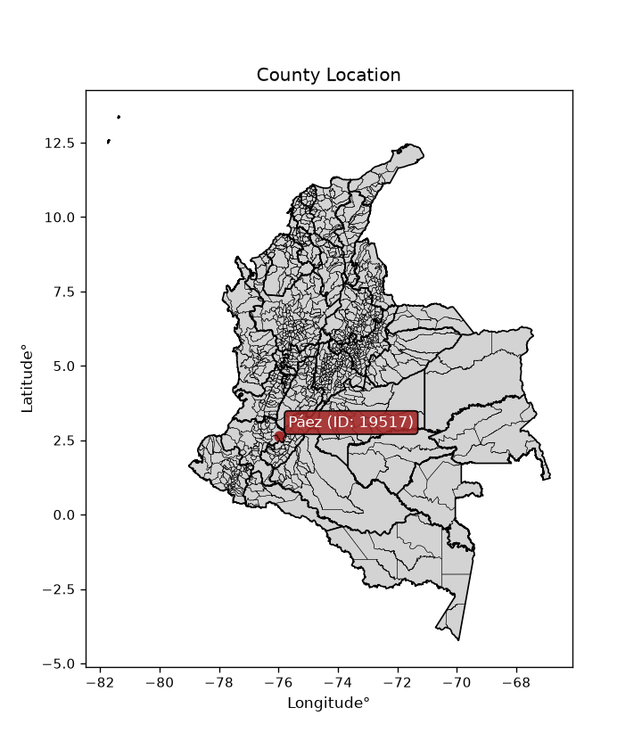
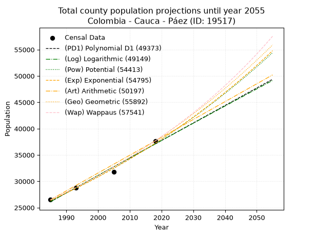
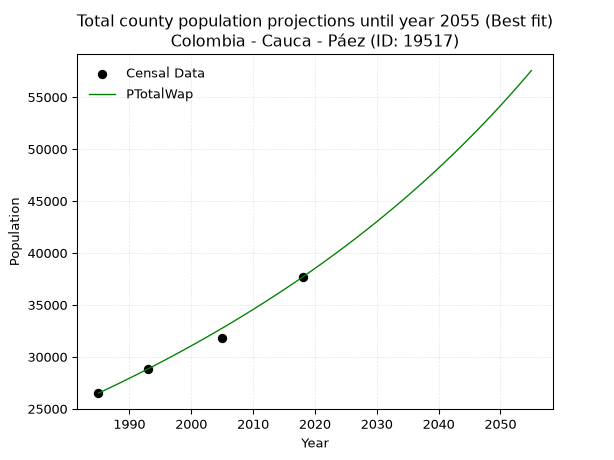
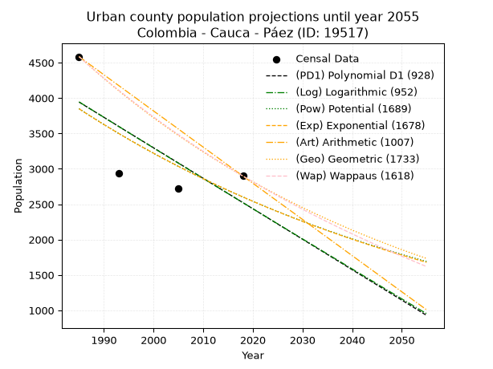
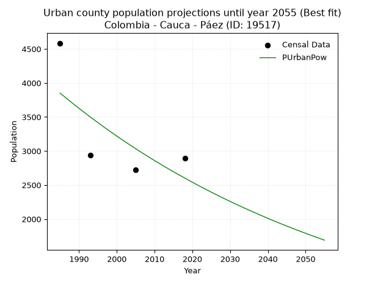
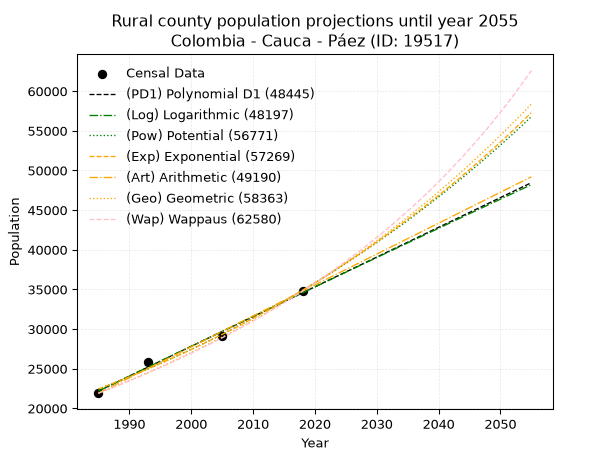
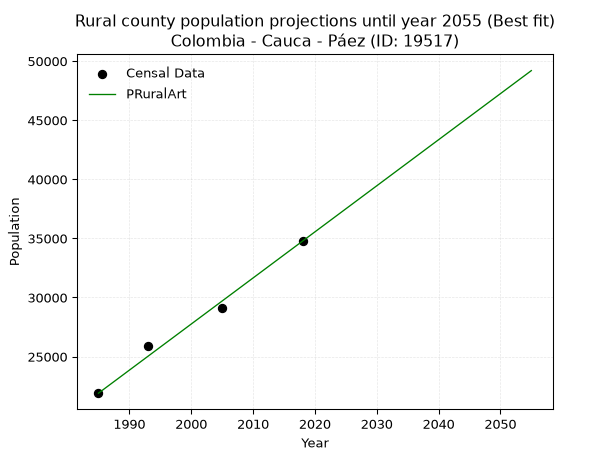

<div align="center">


</div>

# _“Population and Public Services Demand Projections (PPSD) until Year 2050 for Colombia - Cauca - Páez (ID: 19517)”_
Keywords: `population` `public-service` `projection` `lineal` `polynomial` `logarithmic` `potential` `exponential` `arithmetic` `geometric` `wappaus` `dane` `colombia` `south-america`

PPSD are analytical estimates used by governments and planners to anticipate future changes in population size, age distribution, and the resulting community needs for utilities, healthcare, education, and infrastructure as sizing future water treatment facilities, electrical grids, and road networks based on spatial growth.

<div align="center">

</img>

</div>


> **General running parameters**: • app_version: _v20260806_. • Python version: _3.14.7_. • Pandas version: _3.0.5_. • NumPy version: _2.5.1_. • Creates, save and include plots into reports (create_plot): _False_. • Projection until year: _2050_. • Process polynomial degree 2 and up: _False_. • Process Wappaus: _True_. • Process Wappaus: _True_. • Set negative values to zero: _True_. • Set infinite values to zero: _True_. • Drop dataset notes: _True_. 
<div align="center">

Dynamic map: [:earth_americas:Google](http://maps.google.com/maps?q=2.645724246,-75.9706852) [:earth_americas:OSM](https://www.openstreetmap.org/#map=18/2.645724246/-75.9706852&layers=P) [:earth_americas:Bing](https://www.bing.com/maps?cp=2.645724246~-75.9706852&lvl=18) [:earth_americas:Apple](https://maps.apple.com/frame?center=2.645724246%2C-75.9706852&span=0.003%2C0.006)

</div>


<div align="center">

```geojson
{
  "type": "Feature",
  "geometry": {
    "type": "Point", 
    "coordinates": [-75.9706852, 2.645724246]
  }, 
  "properties": {
    "Name": "Colombia - Cauca - Páez (ID: 19517)"
  }
}
```

</div>


## 0. Census Data (4 records)

Census data are official statistics collected by a government about the people and housing in a country. They usually include counts of total population, age, sex, race, income, education, and jobs.

📅Global census file: [Population.xlsx](../data/Population.xlsx)

| Source   |   Year |   CountryID | CountryName   |   StateID | StateName   |   CountyID | CountyName   |   PTotal |   PUrban |   PRural |
|:---------|-------:|------------:|:--------------|----------:|:------------|-----------:|:-------------|---------:|---------:|---------:|
| DANE     |   1985 |          57 | Colombia      |        19 | Cauca       |      19517 | Páez         |    26490 |     4585 |    21905 |
| DANE     |   1993 |          57 | Colombia      |        19 | Cauca       |      19517 | Páez         |    28803 |     2936 |    25867 |
| DANE     |   2005 |          57 | Colombia      |        19 | Cauca       |      19517 | Páez         |    31800 |     2726 |    29074 |
| DANE     |   2018 |          57 | Colombia      |        19 | Cauca       |      19517 | Páez         |    37666 |     2898 |    34768 |

> 🔥Some records could had specific notes about the registered values or the corresponding urban or rural distribution.

📅[SUI-RUPS](https://www.datos.gov.co/Hacienda-y-Cr-dito-P-blico/Registro-nico-de-Prestadores-de-Servicios-P-blicos/4qkq-csdn/about_data) - Local public utility companies: [RUPS.csv](../data/RUPS.xlsx)

 | SERVICIO       | ESTADO    | NOMBRE                                                                                               | NIT         | DEPARTAMENTO_DOMICILIO   | MUNICIPIO_DOMICILIO   | DIRECCION                                |   TELEFONO | EMAIL                  | TIPO_PRESTADOR          | CLASIFICACION                 |
|:---------------|:----------|:-----------------------------------------------------------------------------------------------------|:------------|:-------------------------|:----------------------|:-----------------------------------------|-----------:|:-----------------------|:------------------------|:------------------------------|
| ACUEDUCTO      | OPERATIVA | ASOCIACION DE SERVICIOS PUBLICOS DE BELALCAZAR                                                       | 817003354-1 | CAUCA                    | PAEZ                  | Carrera 2 No. 7 - 08 Barrio Panamericano |    3167871 | aspube@outlook.com     | ORGANIZACION AUTORIZADA | MENOR O IGUAL A 2500 USUARIOS |
| ALCANTARILLADO | OPERATIVA | ASOCIACION DE SERVICIOS PUBLICOS DE BELALCAZAR                                                       | 817003354-1 | CAUCA                    | PAEZ                  | Carrera 2 No. 7 - 08 Barrio Panamericano |    3167871 | aspube@outlook.com     | ORGANIZACION AUTORIZADA | MENOR O IGUAL A 2500 USUARIOS |
| ACUEDUCTO      | OPERATIVA | LA ADMINISTRACION PUBLICA COOPERATIVA DE ACUEDUCTO ALCANTARILLADO Y ASEO DEL MUNICIPIO DE PAEZ CAUCA | 901240517-3 | CAUCA                    | PAEZ                  | KRA4  No 8A73                            |    8236384 | apcpaezcauca@gmail.com | ORGANIZACION AUTORIZADA | MENOR O IGUAL A 2500 USUARIOS |
| ALCANTARILLADO | OPERATIVA | LA ADMINISTRACION PUBLICA COOPERATIVA DE ACUEDUCTO ALCANTARILLADO Y ASEO DEL MUNICIPIO DE PAEZ CAUCA | 901240517-3 | CAUCA                    | PAEZ                  | KRA4  No 8A73                            |    8236384 | apcpaezcauca@gmail.com | ORGANIZACION AUTORIZADA | MENOR O IGUAL A 2500 USUARIOS |

## 1. Total

### 1.1. Coefficients and Parameters

* (PD1) Polynomial Deg 1: 332.1192292252069, -633131.7382577201 (lineal)
* (Log) Logarithmic: 664578.4300597797, -5020276.222481695
* (Pow) Potential: 20.916447509567153, -64.5565553969547
* (Exp) Exponential: 0.010451607020208954, 2.575958105806466e-05
* (Art) Arithmetic: Year diff. 2018 - 1985 = 33, Population diff. 37666 - 26490 = 11176, Annual growth = 338.6666666666667
* (Geo) Geometric: Year diff. 2018 - 1985 = 33, Population diff. 37666 - 26490 = 11176, Annual growth % = 0.010723468243735379
* (Wap) Wappaus: i = 1.0557599185319118, Condition values only valid for < 200)

<sub>
Wappaus condition values: ['0.00', '1.06', '2.11', '3.17', '4.22', '5.28', '6.33', '7.39', '8.45', '9.50', '10.56', '11.61', '12.67', '13.72', '14.78', '15.84', '16.89', '17.95', '19.00', '20.06', '21.12', '22.17', '23.23', '24.28', '25.34', '26.39', '27.45', '28.51', '29.56', '30.62', '31.67', '32.73', '33.78', '34.84', '35.90', '36.95', '38.01', '39.06', '40.12', '41.17', '42.23', '43.29', '44.34', '45.40', '46.45', '47.51', '48.56', '49.62', '50.68', '51.73', '52.79', '53.84', '54.90', '55.96', '57.01', '58.07', '59.12', '60.18', '61.23', '62.29', '63.35', '64.40', '65.46', '66.51', '67.57', '68.62']
</sub>


### 1.2. Projected Dataset

|   Year |   CountyID |   PTotalPD1 |   PTotalLog |   PTotalPow |   PTotalExp |   PTotalArt |   PTotalGeo |   PTotalWap |
|-------:|-----------:|------------:|------------:|------------:|------------:|------------:|------------:|------------:|
|   1985 |      19517 |       26125 |       26116 |       26356 |       26364 |       26490 |       26490 |       26490 |
|   1986 |      19517 |       26457 |       26451 |       26635 |       26640 |       26829 |       26774 |       26771 |
|   1987 |      19517 |       26789 |       26786 |       26917 |       26920 |       27167 |       27061 |       27055 |
|   1988 |      19517 |       27121 |       27120 |       27202 |       27203 |       27506 |       27351 |       27343 |
|   1989 |      19517 |       27453 |       27454 |       27489 |       27489 |       27845 |       27645 |       27633 |
|   1990 |      19517 |       27786 |       27788 |       27780 |       27778 |       28183 |       27941 |       27926 |
|   1991 |      19517 |       28118 |       28122 |       28073 |       28070 |       28522 |       28241 |       28223 |
|   1992 |      19517 |       28450 |       28456 |       28370 |       28365 |       28861 |       28544 |       28523 |
|   1993 |      19517 |       28782 |       28789 |       28669 |       28663 |       29199 |       28850 |       28826 |
|   1994 |      19517 |       29114 |       29123 |       28972 |       28964 |       29538 |       29159 |       29133 |
|   1995 |      19517 |       29446 |       29456 |       29277 |       29268 |       29877 |       29472 |       29443 |
|   1996 |      19517 |       29778 |       29789 |       29586 |       29576 |       30215 |       29788 |       29756 |
|   1997 |      19517 |       30110 |       30122 |       29897 |       29886 |       30554 |       30107 |       30073 |
|   1998 |      19517 |       30442 |       30455 |       30212 |       30200 |       30893 |       30430 |       30394 |
|   1999 |      19517 |       30775 |       30787 |       30530 |       30518 |       31231 |       30756 |       30718 |
|   2000 |      19517 |       31107 |       31120 |       30851 |       30838 |       31570 |       31086 |       31046 |
|   2001 |      19517 |       31439 |       31452 |       31175 |       31162 |       31909 |       31420 |       31378 |
|   2002 |      19517 |       31771 |       31784 |       31502 |       31490 |       32247 |       31756 |       31713 |
|   2003 |      19517 |       32103 |       32116 |       31833 |       31820 |       32586 |       32097 |       32053 |
|   2004 |      19517 |       32435 |       32447 |       32167 |       32155 |       32925 |       32441 |       32396 |
|   2005 |      19517 |       32767 |       32779 |       32505 |       32493 |       33263 |       32789 |       32744 |
|   2006 |      19517 |       33099 |       33110 |       32846 |       32834 |       33602 |       33141 |       33095 |
|   2007 |      19517 |       33432 |       33442 |       33190 |       33179 |       33941 |       33496 |       33451 |
|   2008 |      19517 |       33764 |       33773 |       33537 |       33528 |       34279 |       33855 |       33811 |
|   2009 |      19517 |       34096 |       34103 |       33888 |       33880 |       34618 |       34218 |       34176 |
|   2010 |      19517 |       34428 |       34434 |       34243 |       34236 |       34957 |       34585 |       34545 |
|   2011 |      19517 |       34760 |       34765 |       34601 |       34595 |       35295 |       34956 |       34918 |
|   2012 |      19517 |       35092 |       35095 |       34963 |       34959 |       35634 |       35331 |       35296 |
|   2013 |      19517 |       35424 |       35425 |       35328 |       35326 |       35973 |       35710 |       35679 |
|   2014 |      19517 |       35756 |       35755 |       35697 |       35697 |       36311 |       36093 |       36066 |
|   2015 |      19517 |       36089 |       36085 |       36070 |       36072 |       36650 |       36480 |       36459 |
|   2016 |      19517 |       36421 |       36415 |       36446 |       36451 |       36989 |       36871 |       36856 |
|   2017 |      19517 |       36753 |       36745 |       36826 |       36834 |       37327 |       37266 |       37258 |
|   2018 |      19517 |       37085 |       37074 |       37210 |       37221 |       37666 |       37666 |       37666 |
|   2019 |      19517 |       37417 |       37403 |       37597 |       37612 |       38005 |       38070 |       38079 |
|   2020 |      19517 |       37749 |       37732 |       37989 |       38008 |       38343 |       38478 |       38497 |
|   2021 |      19517 |       38081 |       38061 |       38384 |       38407 |       38682 |       38891 |       38920 |
|   2022 |      19517 |       38413 |       38390 |       38783 |       38810 |       39021 |       39308 |       39349 |
|   2023 |      19517 |       38745 |       38719 |       39186 |       39218 |       39359 |       39729 |       39784 |
|   2024 |      19517 |       39078 |       39047 |       39593 |       39630 |       39698 |       40155 |       40225 |
|   2025 |      19517 |       39410 |       39375 |       40005 |       40047 |       40037 |       40586 |       40671 |
|   2026 |      19517 |       39742 |       39703 |       40420 |       40467 |       40375 |       41021 |       41124 |
|   2027 |      19517 |       40074 |       40031 |       40839 |       40893 |       40714 |       41461 |       41582 |
|   2028 |      19517 |       40406 |       40359 |       41263 |       41322 |       41053 |       41906 |       42047 |
|   2029 |      19517 |       40738 |       40687 |       41690 |       41756 |       41391 |       42355 |       42518 |
|   2030 |      19517 |       41070 |       41014 |       42122 |       42195 |       41730 |       42809 |       42996 |
|   2031 |      19517 |       41402 |       41342 |       42558 |       42638 |       42069 |       43268 |       43481 |
|   2032 |      19517 |       41735 |       41669 |       42999 |       43086 |       42407 |       43732 |       43972 |
|   2033 |      19517 |       42067 |       41996 |       43444 |       43539 |       42746 |       44201 |       44470 |
|   2034 |      19517 |       42399 |       42322 |       43893 |       43996 |       43085 |       44675 |       44975 |
|   2035 |      19517 |       42731 |       42649 |       44346 |       44459 |       43423 |       45154 |       45488 |
|   2036 |      19517 |       43063 |       42976 |       44804 |       44926 |       43762 |       45639 |       46008 |
|   2037 |      19517 |       43395 |       43302 |       45267 |       45398 |       44101 |       46128 |       46535 |
|   2038 |      19517 |       43727 |       43628 |       45734 |       45875 |       44439 |       46623 |       47070 |
|   2039 |      19517 |       44059 |       43954 |       46206 |       46357 |       44778 |       47123 |       47614 |
|   2040 |      19517 |       44391 |       44280 |       46682 |       46844 |       45117 |       47628 |       48165 |
|   2041 |      19517 |       44724 |       44606 |       47163 |       47336 |       45455 |       48139 |       48724 |
|   2042 |      19517 |       45056 |       44931 |       47649 |       47833 |       45794 |       48655 |       49292 |
|   2043 |      19517 |       45388 |       45257 |       48139 |       48336 |       46133 |       49177 |       49869 |
|   2044 |      19517 |       45720 |       45582 |       48634 |       48844 |       46471 |       49704 |       50454 |
|   2045 |      19517 |       46052 |       45907 |       49135 |       49357 |       46810 |       50237 |       51049 |
|   2046 |      19517 |       46384 |       46232 |       49640 |       49875 |       47149 |       50776 |       51652 |
|   2047 |      19517 |       46716 |       46557 |       50150 |       50399 |       47487 |       51320 |       52266 |
|   2048 |      19517 |       47048 |       46881 |       50664 |       50929 |       47826 |       51870 |       52888 |
|   2049 |      19517 |       47381 |       47206 |       51184 |       51464 |       48165 |       52427 |       53521 |
|   2050 |      19517 |       47713 |       47530 |       51710 |       52005 |       48503 |       52989 |       54164 |
<div align="center">

</img>

</div>


### 1.3. Best fit with absolute and relative error (%)

Relative error puts that difference into context by dividing the absolute error by the true value, creating a unitless ratio or percentage that shows the scale of the mistake.

Absolute and relative error

|   Year | Source   |   CountryID | CountryName   |   StateID | StateName   |   CountyID_x | CountyName   |   PTotal |   PUrban |   PRural |   CountyID_y |   PTotalPD1 |   PTotalLog |   PTotalPow |   PTotalExp |   PTotalArt |   PTotalGeo |   PTotalWap |   PTotalPD1AbsError |   PTotalLogAbsError |   PTotalPowAbsError |   PTotalExpAbsError |   PTotalArtAbsError |   PTotalGeoAbsError |   PTotalWapAbsError |   PTotalPD1RelError |   PTotalLogRelError |   PTotalPowRelError |   PTotalExpRelError |   PTotalArtRelError |   PTotalGeoRelError |   PTotalWapRelError |
|-------:|:---------|------------:|:--------------|----------:|:------------|-------------:|:-------------|---------:|---------:|---------:|-------------:|------------:|------------:|------------:|------------:|------------:|------------:|------------:|--------------------:|--------------------:|--------------------:|--------------------:|--------------------:|--------------------:|--------------------:|--------------------:|--------------------:|--------------------:|--------------------:|--------------------:|--------------------:|--------------------:|
|   1985 | DANE     |          57 | Colombia      |        19 | Cauca       |        19517 | Páez         |    26490 |     4585 |    21905 |        19517 |       26125 |       26116 |       26356 |       26364 |       26490 |       26490 |       26490 |                 365 |                 374 |                 134 |                 126 |                   0 |                   0 |                   0 |           1.37788   |            1.41185  |            0.505851 |            0.475651 |             0       |            0        |           0         |
|   1993 | DANE     |          57 | Colombia      |        19 | Cauca       |        19517 | Páez         |    28803 |     2936 |    25867 |        19517 |       28782 |       28789 |       28669 |       28663 |       29199 |       28850 |       28826 |                  21 |                  14 |                 134 |                 140 |                 396 |                  47 |                  23 |           0.0729091 |            0.048606 |            0.465229 |            0.48606  |             1.37486 |            0.163177 |           0.0798528 |
|   2005 | DANE     |          57 | Colombia      |        19 | Cauca       |        19517 | Páez         |    31800 |     2726 |    29074 |        19517 |       32767 |       32779 |       32505 |       32493 |       33263 |       32789 |       32744 |                 967 |                 979 |                 705 |                 693 |                1463 |                 989 |                 944 |           3.04088   |            3.07862  |            2.21698  |            2.17925  |             4.60063 |            3.11006  |           2.96855   |
|   2018 | DANE     |          57 | Colombia      |        19 | Cauca       |        19517 | Páez         |    37666 |     2898 |    34768 |        19517 |       37085 |       37074 |       37210 |       37221 |       37666 |       37666 |       37666 |                 581 |                 592 |                 456 |                 445 |                   0 |                   0 |                   0 |           1.54251   |            1.57171  |            1.21064  |            1.18144  |             0       |            0        |           0         |

Relative error mean

| Method    |   RelError | Best   |
|:----------|-----------:|:-------|
| PTotalPD1 |   1.50854  |        |
| PTotalLog |   1.5277   |        |
| PTotalPow |   1.09968  |        |
| PTotalExp |   1.0806   |        |
| PTotalArt |   1.49387  |        |
| PTotalGeo |   0.81831  |        |
| PTotalWap |   0.762102 | True   |

💙Best method: _**PTotalWap**_
<div align="center">

</img>

</div>


### 1.4. Fresh water supply demand in liters per capita per day (lpcd)

The fresh water supply demand typically ranges from 100 to 300 liters per capita per day (lpcd) for standard domestic and municipal planning, though absolute survival minimums set by the World Health Organization are as low as 7.5 to 20 liters per day, and total consumption in high-income nations can exceed 400 liters.

> `CZ`: Level in meters above the sea level (masl)<br> `WS`: Fresh water supply demand in liters per capita per day (lpcd or l/h/d)<br> `WSAll`: Zonal fresh water supply demand in liters per second (l/s)<br> `A`: Zonal area in square meters<br> `DP`: Population density (people/hectare or p/ha)

Reference values (RAS Colombia)

|    CZ |   WS |
|------:|-----:|
|  1000 |  120 |
|  2000 |  130 |
| 99999 |  140 |

County shapefile geometry properties and water supply values

|   CountyID |      ATotal |   CZTotal |   WSTotal |
|-----------:|------------:|----------:|----------:|
|      19517 | 1.79318e+09 |   2598.55 |       140 |

Projected values for best method: PTotalWap

|   CountyID |   Year |   PTotalWap |   DPTotal |   WSTotal |   WSTotalAll |
|-----------:|-------:|------------:|----------:|----------:|-------------:|
|      19517 |   1985 |       26490 |      0.15 |       140 |      42.9236 |
|      19517 |   1986 |       26771 |      0.15 |       140 |      43.3789 |
|      19517 |   1987 |       27055 |      0.15 |       140 |      43.8391 |
|      19517 |   1988 |       27343 |      0.15 |       140 |      44.3058 |
|      19517 |   1989 |       27633 |      0.15 |       140 |      44.7757 |
|      19517 |   1990 |       27926 |      0.16 |       140 |      45.2505 |
|      19517 |   1991 |       28223 |      0.16 |       140 |      45.7317 |
|      19517 |   1992 |       28523 |      0.16 |       140 |      46.2178 |
|      19517 |   1993 |       28826 |      0.16 |       140 |      46.7088 |
|      19517 |   1994 |       29133 |      0.16 |       140 |      47.2062 |
|      19517 |   1995 |       29443 |      0.16 |       140 |      47.7086 |
|      19517 |   1996 |       29756 |      0.17 |       140 |      48.2157 |
|      19517 |   1997 |       30073 |      0.17 |       140 |      48.7294 |
|      19517 |   1998 |       30394 |      0.17 |       140 |      49.2495 |
|      19517 |   1999 |       30718 |      0.17 |       140 |      49.7745 |
|      19517 |   2000 |       31046 |      0.17 |       140 |      50.306  |
|      19517 |   2001 |       31378 |      0.17 |       140 |      50.844  |
|      19517 |   2002 |       31713 |      0.18 |       140 |      51.3868 |
|      19517 |   2003 |       32053 |      0.18 |       140 |      51.9377 |
|      19517 |   2004 |       32396 |      0.18 |       140 |      52.4935 |
|      19517 |   2005 |       32744 |      0.18 |       140 |      53.0574 |
|      19517 |   2006 |       33095 |      0.18 |       140 |      53.6262 |
|      19517 |   2007 |       33451 |      0.19 |       140 |      54.203  |
|      19517 |   2008 |       33811 |      0.19 |       140 |      54.7863 |
|      19517 |   2009 |       34176 |      0.19 |       140 |      55.3778 |
|      19517 |   2010 |       34545 |      0.19 |       140 |      55.9757 |
|      19517 |   2011 |       34918 |      0.19 |       140 |      56.5801 |
|      19517 |   2012 |       35296 |      0.2  |       140 |      57.1926 |
|      19517 |   2013 |       35679 |      0.2  |       140 |      57.8132 |
|      19517 |   2014 |       36066 |      0.2  |       140 |      58.4403 |
|      19517 |   2015 |       36459 |      0.2  |       140 |      59.0771 |
|      19517 |   2016 |       36856 |      0.21 |       140 |      59.7204 |
|      19517 |   2017 |       37258 |      0.21 |       140 |      60.3718 |
|      19517 |   2018 |       37666 |      0.21 |       140 |      61.0329 |
|      19517 |   2019 |       38079 |      0.21 |       140 |      61.7021 |
|      19517 |   2020 |       38497 |      0.21 |       140 |      62.3794 |
|      19517 |   2021 |       38920 |      0.22 |       140 |      63.0648 |
|      19517 |   2022 |       39349 |      0.22 |       140 |      63.76   |
|      19517 |   2023 |       39784 |      0.22 |       140 |      64.4648 |
|      19517 |   2024 |       40225 |      0.22 |       140 |      65.1794 |
|      19517 |   2025 |       40671 |      0.23 |       140 |      65.9021 |
|      19517 |   2026 |       41124 |      0.23 |       140 |      66.6361 |
|      19517 |   2027 |       41582 |      0.23 |       140 |      67.3782 |
|      19517 |   2028 |       42047 |      0.23 |       140 |      68.1317 |
|      19517 |   2029 |       42518 |      0.24 |       140 |      68.8949 |
|      19517 |   2030 |       42996 |      0.24 |       140 |      69.6694 |
|      19517 |   2031 |       43481 |      0.24 |       140 |      70.4553 |
|      19517 |   2032 |       43972 |      0.25 |       140 |      71.2509 |
|      19517 |   2033 |       44470 |      0.25 |       140 |      72.0579 |
|      19517 |   2034 |       44975 |      0.25 |       140 |      72.8762 |
|      19517 |   2035 |       45488 |      0.25 |       140 |      73.7074 |
|      19517 |   2036 |       46008 |      0.26 |       140 |      74.55   |
|      19517 |   2037 |       46535 |      0.26 |       140 |      75.4039 |
|      19517 |   2038 |       47070 |      0.26 |       140 |      76.2708 |
|      19517 |   2039 |       47614 |      0.27 |       140 |      77.1523 |
|      19517 |   2040 |       48165 |      0.27 |       140 |      78.0451 |
|      19517 |   2041 |       48724 |      0.27 |       140 |      78.9509 |
|      19517 |   2042 |       49292 |      0.27 |       140 |      79.8713 |
|      19517 |   2043 |       49869 |      0.28 |       140 |      80.8063 |
|      19517 |   2044 |       50454 |      0.28 |       140 |      81.7542 |
|      19517 |   2045 |       51049 |      0.28 |       140 |      82.7183 |
|      19517 |   2046 |       51652 |      0.29 |       140 |      83.6954 |
|      19517 |   2047 |       52266 |      0.29 |       140 |      84.6903 |
|      19517 |   2048 |       52888 |      0.29 |       140 |      85.6981 |
|      19517 |   2049 |       53521 |      0.3  |       140 |      86.7238 |
|      19517 |   2050 |       54164 |      0.3  |       140 |      87.7657 |

## 2. Urban

### 2.1. Coefficients and Parameters

* (PD1) Polynomial Deg 1: -43.06583701324775, 89428.69048574883 (lineal)
* (Log) Logarithmic: -86382.34913446123, 659879.1779957424
* (Pow) Potential: -23.775444605326488, 81.99122561044966
* (Exp) Exponential: -0.011852766122450729, 63554842710938.51
* (Art) Arithmetic: Year diff. 2018 - 1985 = 33, Population diff. 2898 - 4585 = -1687, Annual growth = -51.121212121212125
* (Geo) Geometric: Year diff. 2018 - 1985 = 33, Population diff. 2898 - 4585 = -1687, Annual growth % = -0.013805910920521525
* (Wap) Wappaus: i = -1.3663293363948181, Condition values only valid for < 200)

<sub>
Wappaus condition values: ['-0.00', '-1.37', '-2.73', '-4.10', '-5.47', '-6.83', '-8.20', '-9.56', '-10.93', '-12.30', '-13.66', '-15.03', '-16.40', '-17.76', '-19.13', '-20.49', '-21.86', '-23.23', '-24.59', '-25.96', '-27.33', '-28.69', '-30.06', '-31.43', '-32.79', '-34.16', '-35.52', '-36.89', '-38.26', '-39.62', '-40.99', '-42.36', '-43.72', '-45.09', '-46.46', '-47.82', '-49.19', '-50.55', '-51.92', '-53.29', '-54.65', '-56.02', '-57.39', '-58.75', '-60.12', '-61.48', '-62.85', '-64.22', '-65.58', '-66.95', '-68.32', '-69.68', '-71.05', '-72.42', '-73.78', '-75.15', '-76.51', '-77.88', '-79.25', '-80.61', '-81.98', '-83.35', '-84.71', '-86.08', '-87.45', '-88.81']
</sub>


### 2.2. Projected Dataset

|   Year |   CountyID |   PUrbanPD1 |   PUrbanLog |   PUrbanPow |   PUrbanExp |   PUrbanArt |   PUrbanGeo |   PUrbanWap |
|-------:|-----------:|------------:|------------:|------------:|------------:|------------:|------------:|------------:|
|   1985 |      19517 |        3943 |        3946 |        3850 |        3848 |        4585 |        4585 |        4585 |
|   1986 |      19517 |        3900 |        3902 |        3805 |        3802 |        4534 |        4522 |        4523 |
|   1987 |      19517 |        3857 |        3859 |        3759 |        3757 |        4483 |        4459 |        4461 |
|   1988 |      19517 |        3814 |        3815 |        3715 |        3713 |        4432 |        4398 |        4401 |
|   1989 |      19517 |        3771 |        3772 |        3670 |        3669 |        4381 |        4337 |        4341 |
|   1990 |      19517 |        3728 |        3728 |        3627 |        3626 |        4329 |        4277 |        4282 |
|   1991 |      19517 |        3685 |        3685 |        3584 |        3583 |        4278 |        4218 |        4224 |
|   1992 |      19517 |        3642 |        3642 |        3541 |        3541 |        4227 |        4160 |        4166 |
|   1993 |      19517 |        3598 |        3598 |        3499 |        3499 |        4176 |        4102 |        4110 |
|   1994 |      19517 |        3555 |        3555 |        3458 |        3458 |        4125 |        4046 |        4054 |
|   1995 |      19517 |        3512 |        3512 |        3417 |        3417 |        4074 |        3990 |        3999 |
|   1996 |      19517 |        3469 |        3468 |        3376 |        3377 |        4023 |        3935 |        3944 |
|   1997 |      19517 |        3426 |        3425 |        3336 |        3337 |        3972 |        3881 |        3890 |
|   1998 |      19517 |        3383 |        3382 |        3297 |        3298 |        3920 |        3827 |        3837 |
|   1999 |      19517 |        3340 |        3339 |        3258 |        3259 |        3869 |        3774 |        3785 |
|   2000 |      19517 |        3297 |        3295 |        3219 |        3221 |        3818 |        3722 |        3733 |
|   2001 |      19517 |        3254 |        3252 |        3181 |        3183 |        3767 |        3671 |        3681 |
|   2002 |      19517 |        3211 |        3209 |        3144 |        3145 |        3716 |        3620 |        3631 |
|   2003 |      19517 |        3168 |        3166 |        3107 |        3108 |        3665 |        3570 |        3581 |
|   2004 |      19517 |        3125 |        3123 |        3070 |        3072 |        3614 |        3521 |        3531 |
|   2005 |      19517 |        3082 |        3080 |        3034 |        3035 |        3563 |        3472 |        3483 |
|   2006 |      19517 |        3039 |        3037 |        2998 |        3000 |        3511 |        3424 |        3434 |
|   2007 |      19517 |        2996 |        2994 |        2963 |        2964 |        3460 |        3377 |        3387 |
|   2008 |      19517 |        2952 |        2951 |        2928 |        2929 |        3409 |        3330 |        3340 |
|   2009 |      19517 |        2909 |        2908 |        2893 |        2895 |        3358 |        3284 |        3293 |
|   2010 |      19517 |        2866 |        2865 |        2859 |        2861 |        3307 |        3239 |        3247 |
|   2011 |      19517 |        2823 |        2822 |        2826 |        2827 |        3256 |        3194 |        3202 |
|   2012 |      19517 |        2780 |        2779 |        2793 |        2794 |        3205 |        3150 |        3157 |
|   2013 |      19517 |        2737 |        2736 |        2760 |        2761 |        3154 |        3107 |        3113 |
|   2014 |      19517 |        2694 |        2693 |        2727 |        2728 |        3102 |        3064 |        3069 |
|   2015 |      19517 |        2651 |        2650 |        2695 |        2696 |        3051 |        3021 |        3025 |
|   2016 |      19517 |        2608 |        2607 |        2664 |        2664 |        3000 |        2980 |        2982 |
|   2017 |      19517 |        2565 |        2564 |        2633 |        2633 |        2949 |        2939 |        2940 |
|   2018 |      19517 |        2522 |        2521 |        2602 |        2602 |        2898 |        2898 |        2898 |
|   2019 |      19517 |        2479 |        2479 |        2571 |        2571 |        2847 |        2858 |        2857 |
|   2020 |      19517 |        2436 |        2436 |        2541 |        2541 |        2796 |        2819 |        2815 |
|   2021 |      19517 |        2393 |        2393 |        2511 |        2511 |        2745 |        2780 |        2775 |
|   2022 |      19517 |        2350 |        2350 |        2482 |        2482 |        2694 |        2741 |        2735 |
|   2023 |      19517 |        2307 |        2308 |        2453 |        2452 |        2642 |        2703 |        2695 |
|   2024 |      19517 |        2263 |        2265 |        2424 |        2423 |        2591 |        2666 |        2656 |
|   2025 |      19517 |        2220 |        2222 |        2396 |        2395 |        2540 |        2629 |        2617 |
|   2026 |      19517 |        2177 |        2180 |        2368 |        2367 |        2489 |        2593 |        2579 |
|   2027 |      19517 |        2134 |        2137 |        2340 |        2339 |        2438 |        2557 |        2540 |
|   2028 |      19517 |        2091 |        2094 |        2313 |        2311 |        2387 |        2522 |        2503 |
|   2029 |      19517 |        2048 |        2052 |        2286 |        2284 |        2336 |        2487 |        2466 |
|   2030 |      19517 |        2005 |        2009 |        2260 |        2257 |        2285 |        2453 |        2429 |
|   2031 |      19517 |        1962 |        1967 |        2233 |        2230 |        2233 |        2419 |        2392 |
|   2032 |      19517 |        1919 |        1924 |        2207 |        2204 |        2182 |        2385 |        2356 |
|   2033 |      19517 |        1876 |        1882 |        2182 |        2178 |        2131 |        2353 |        2321 |
|   2034 |      19517 |        1833 |        1839 |        2156 |        2153 |        2080 |        2320 |        2285 |
|   2035 |      19517 |        1790 |        1797 |        2131 |        2127 |        2029 |        2288 |        2250 |
|   2036 |      19517 |        1747 |        1754 |        2107 |        2102 |        1978 |        2256 |        2216 |
|   2037 |      19517 |        1704 |        1712 |        2082 |        2077 |        1927 |        2225 |        2181 |
|   2038 |      19517 |        1661 |        1670 |        2058 |        2053 |        1876 |        2195 |        2147 |
|   2039 |      19517 |        1617 |        1627 |        2034 |        2029 |        1824 |        2164 |        2114 |
|   2040 |      19517 |        1574 |        1585 |        2010 |        2005 |        1773 |        2134 |        2081 |
|   2041 |      19517 |        1531 |        1542 |        1987 |        1981 |        1722 |        2105 |        2048 |
|   2042 |      19517 |        1488 |        1500 |        1964 |        1958 |        1671 |        2076 |        2015 |
|   2043 |      19517 |        1445 |        1458 |        1941 |        1935 |        1620 |        2047 |        1983 |
|   2044 |      19517 |        1402 |        1416 |        1919 |        1912 |        1569 |        2019 |        1951 |
|   2045 |      19517 |        1359 |        1373 |        1897 |        1889 |        1518 |        1991 |        1919 |
|   2046 |      19517 |        1316 |        1331 |        1875 |        1867 |        1467 |        1964 |        1888 |
|   2047 |      19517 |        1273 |        1289 |        1853 |        1845 |        1415 |        1936 |        1857 |
|   2048 |      19517 |        1230 |        1247 |        1832 |        1823 |        1364 |        1910 |        1826 |
|   2049 |      19517 |        1187 |        1205 |        1811 |        1802 |        1313 |        1883 |        1795 |
|   2050 |      19517 |        1144 |        1162 |        1790 |        1781 |        1262 |        1857 |        1765 |
<div align="center">

</img>

</div>


### 2.3. Best fit with absolute and relative error (%)

Relative error puts that difference into context by dividing the absolute error by the true value, creating a unitless ratio or percentage that shows the scale of the mistake.

Absolute and relative error

|   Year | Source   |   CountryID | CountryName   |   StateID | StateName   |   CountyID_x | CountyName   |   PTotal |   PUrban |   PRural |   CountyID_y |   PUrbanPD1 |   PUrbanLog |   PUrbanPow |   PUrbanExp |   PUrbanArt |   PUrbanGeo |   PUrbanWap |   PUrbanPD1AbsError |   PUrbanLogAbsError |   PUrbanPowAbsError |   PUrbanExpAbsError |   PUrbanArtAbsError |   PUrbanGeoAbsError |   PUrbanWapAbsError |   PUrbanPD1RelError |   PUrbanLogRelError |   PUrbanPowRelError |   PUrbanExpRelError |   PUrbanArtRelError |   PUrbanGeoRelError |   PUrbanWapRelError |
|-------:|:---------|------------:|:--------------|----------:|:------------|-------------:|:-------------|---------:|---------:|---------:|-------------:|------------:|------------:|------------:|------------:|------------:|------------:|------------:|--------------------:|--------------------:|--------------------:|--------------------:|--------------------:|--------------------:|--------------------:|--------------------:|--------------------:|--------------------:|--------------------:|--------------------:|--------------------:|--------------------:|
|   1985 | DANE     |          57 | Colombia      |        19 | Cauca       |        19517 | Páez         |    26490 |     4585 |    21905 |        19517 |        3943 |        3946 |        3850 |        3848 |        4585 |        4585 |        4585 |                 642 |                 639 |                 735 |                 737 |                   0 |                   0 |                   0 |             14.0022 |             13.9368 |             16.0305 |             16.0742 |              0      |              0      |              0      |
|   1993 | DANE     |          57 | Colombia      |        19 | Cauca       |        19517 | Páez         |    28803 |     2936 |    25867 |        19517 |        3598 |        3598 |        3499 |        3499 |        4176 |        4102 |        4110 |                 662 |                 662 |                 563 |                 563 |                1240 |                1166 |                1174 |             22.5477 |             22.5477 |             19.1757 |             19.1757 |             42.2343 |             39.7139 |             39.9864 |
|   2005 | DANE     |          57 | Colombia      |        19 | Cauca       |        19517 | Páez         |    31800 |     2726 |    29074 |        19517 |        3082 |        3080 |        3034 |        3035 |        3563 |        3472 |        3483 |                 356 |                 354 |                 308 |                 309 |                 837 |                 746 |                 757 |             13.0594 |             12.9861 |             11.2986 |             11.3353 |             30.7043 |             27.3661 |             27.7696 |
|   2018 | DANE     |          57 | Colombia      |        19 | Cauca       |        19517 | Páez         |    37666 |     2898 |    34768 |        19517 |        2522 |        2521 |        2602 |        2602 |        2898 |        2898 |        2898 |                 376 |                 377 |                 296 |                 296 |                   0 |                   0 |                   0 |             12.9745 |             13.009  |             10.2139 |             10.2139 |              0      |              0      |              0      |

Relative error mean

| Method    |   RelError | Best   |
|:----------|-----------:|:-------|
| PUrbanPD1 |    15.6459 |        |
| PUrbanLog |    15.6199 |        |
| PUrbanPow |    14.1797 | True   |
| PUrbanExp |    14.1998 |        |
| PUrbanArt |    18.2347 |        |
| PUrbanGeo |    16.77   |        |
| PUrbanWap |    16.939  |        |

💙Best method: _**PUrbanPow**_
<div align="center">

</img>

</div>


### 2.4. Fresh water supply demand in liters per capita per day (lpcd)

The fresh water supply demand typically ranges from 100 to 300 liters per capita per day (lpcd) for standard domestic and municipal planning, though absolute survival minimums set by the World Health Organization are as low as 7.5 to 20 liters per day, and total consumption in high-income nations can exceed 400 liters.

> `CZ`: Level in meters above the sea level (masl)<br> `WS`: Fresh water supply demand in liters per capita per day (lpcd or l/h/d)<br> `WSAll`: Zonal fresh water supply demand in liters per second (l/s)<br> `A`: Zonal area in square meters<br> `DP`: Population density (people/hectare or p/ha)

Reference values (RAS Colombia)

|    CZ |   WS |
|------:|-----:|
|  1000 |  120 |
|  2000 |  130 |
| 99999 |  140 |

County shapefile geometry properties and water supply values

|   CountyID |   AUrban |   CZUrban |   WSUrban |
|-----------:|---------:|----------:|----------:|
|      19517 |   618317 |   1447.79 |       130 |

Projected values for best method: PUrbanPow

|   CountyID |   Year |   PUrbanPow |   DPUrban |   WSUrban |   WSUrbanAll |
|-----------:|-------:|------------:|----------:|----------:|-------------:|
|      19517 |   1985 |        3850 |     62.27 |       130 |      5.79282 |
|      19517 |   1986 |        3805 |     61.54 |       130 |      5.72512 |
|      19517 |   1987 |        3759 |     60.79 |       130 |      5.6559  |
|      19517 |   1988 |        3715 |     60.08 |       130 |      5.5897  |
|      19517 |   1989 |        3670 |     59.35 |       130 |      5.52199 |
|      19517 |   1990 |        3627 |     58.66 |       130 |      5.45729 |
|      19517 |   1991 |        3584 |     57.96 |       130 |      5.39259 |
|      19517 |   1992 |        3541 |     57.27 |       130 |      5.32789 |
|      19517 |   1993 |        3499 |     56.59 |       130 |      5.2647  |
|      19517 |   1994 |        3458 |     55.93 |       130 |      5.20301 |
|      19517 |   1995 |        3417 |     55.26 |       130 |      5.14132 |
|      19517 |   1996 |        3376 |     54.6  |       130 |      5.07963 |
|      19517 |   1997 |        3336 |     53.95 |       130 |      5.01944 |
|      19517 |   1998 |        3297 |     53.32 |       130 |      4.96076 |
|      19517 |   1999 |        3258 |     52.69 |       130 |      4.90208 |
|      19517 |   2000 |        3219 |     52.06 |       130 |      4.8434  |
|      19517 |   2001 |        3181 |     51.45 |       130 |      4.78623 |
|      19517 |   2002 |        3144 |     50.85 |       130 |      4.73056 |
|      19517 |   2003 |        3107 |     50.25 |       130 |      4.67488 |
|      19517 |   2004 |        3070 |     49.65 |       130 |      4.61921 |
|      19517 |   2005 |        3034 |     49.07 |       130 |      4.56505 |
|      19517 |   2006 |        2998 |     48.49 |       130 |      4.51088 |
|      19517 |   2007 |        2963 |     47.92 |       130 |      4.45822 |
|      19517 |   2008 |        2928 |     47.35 |       130 |      4.40556 |
|      19517 |   2009 |        2893 |     46.79 |       130 |      4.35289 |
|      19517 |   2010 |        2859 |     46.24 |       130 |      4.30174 |
|      19517 |   2011 |        2826 |     45.7  |       130 |      4.25208 |
|      19517 |   2012 |        2793 |     45.17 |       130 |      4.20243 |
|      19517 |   2013 |        2760 |     44.64 |       130 |      4.15278 |
|      19517 |   2014 |        2727 |     44.1  |       130 |      4.10313 |
|      19517 |   2015 |        2695 |     43.59 |       130 |      4.05498 |
|      19517 |   2016 |        2664 |     43.08 |       130 |      4.00833 |
|      19517 |   2017 |        2633 |     42.58 |       130 |      3.96169 |
|      19517 |   2018 |        2602 |     42.08 |       130 |      3.91505 |
|      19517 |   2019 |        2571 |     41.58 |       130 |      3.8684  |
|      19517 |   2020 |        2541 |     41.1  |       130 |      3.82326 |
|      19517 |   2021 |        2511 |     40.61 |       130 |      3.77813 |
|      19517 |   2022 |        2482 |     40.14 |       130 |      3.73449 |
|      19517 |   2023 |        2453 |     39.67 |       130 |      3.69086 |
|      19517 |   2024 |        2424 |     39.2  |       130 |      3.64722 |
|      19517 |   2025 |        2396 |     38.75 |       130 |      3.60509 |
|      19517 |   2026 |        2368 |     38.3  |       130 |      3.56296 |
|      19517 |   2027 |        2340 |     37.84 |       130 |      3.52083 |
|      19517 |   2028 |        2313 |     37.41 |       130 |      3.48021 |
|      19517 |   2029 |        2286 |     36.97 |       130 |      3.43958 |
|      19517 |   2030 |        2260 |     36.55 |       130 |      3.40046 |
|      19517 |   2031 |        2233 |     36.11 |       130 |      3.35984 |
|      19517 |   2032 |        2207 |     35.69 |       130 |      3.32072 |
|      19517 |   2033 |        2182 |     35.29 |       130 |      3.2831  |
|      19517 |   2034 |        2156 |     34.87 |       130 |      3.24398 |
|      19517 |   2035 |        2131 |     34.46 |       130 |      3.20637 |
|      19517 |   2036 |        2107 |     34.08 |       130 |      3.17025 |
|      19517 |   2037 |        2082 |     33.67 |       130 |      3.13264 |
|      19517 |   2038 |        2058 |     33.28 |       130 |      3.09653 |
|      19517 |   2039 |        2034 |     32.9  |       130 |      3.06042 |
|      19517 |   2040 |        2010 |     32.51 |       130 |      3.02431 |
|      19517 |   2041 |        1987 |     32.14 |       130 |      2.9897  |
|      19517 |   2042 |        1964 |     31.76 |       130 |      2.95509 |
|      19517 |   2043 |        1941 |     31.39 |       130 |      2.92049 |
|      19517 |   2044 |        1919 |     31.04 |       130 |      2.88738 |
|      19517 |   2045 |        1897 |     30.68 |       130 |      2.85428 |
|      19517 |   2046 |        1875 |     30.32 |       130 |      2.82118 |
|      19517 |   2047 |        1853 |     29.97 |       130 |      2.78808 |
|      19517 |   2048 |        1832 |     29.63 |       130 |      2.75648 |
|      19517 |   2049 |        1811 |     29.29 |       130 |      2.72488 |
|      19517 |   2050 |        1790 |     28.95 |       130 |      2.69329 |

## 3. Rural

### 3.1. Coefficients and Parameters

* (PD1) Polynomial Deg 1: 375.1850662384548, -722560.4287434692 (lineal)
* (Log) Logarithmic: 750960.7791942406, -5680155.400477433
* (Pow) Potential: 26.809209034176853, -84.05973870228642
* (Exp) Exponential: 0.013391760707473608, 6.398879111925655e-08
* (Art) Arithmetic: Year diff. 2018 - 1985 = 33, Population diff. 34768 - 21905 = 12863, Annual growth = 389.7878787878788
* (Geo) Geometric: Year diff. 2018 - 1985 = 33, Population diff. 34768 - 21905 = 12863, Annual growth % = 0.014097921228237276
* (Wap) Wappaus: i = 1.3755681851600543, Condition values only valid for < 200)

<sub>
Wappaus condition values: ['0.00', '1.38', '2.75', '4.13', '5.50', '6.88', '8.25', '9.63', '11.00', '12.38', '13.76', '15.13', '16.51', '17.88', '19.26', '20.63', '22.01', '23.38', '24.76', '26.14', '27.51', '28.89', '30.26', '31.64', '33.01', '34.39', '35.76', '37.14', '38.52', '39.89', '41.27', '42.64', '44.02', '45.39', '46.77', '48.14', '49.52', '50.90', '52.27', '53.65', '55.02', '56.40', '57.77', '59.15', '60.53', '61.90', '63.28', '64.65', '66.03', '67.40', '68.78', '70.15', '71.53', '72.91', '74.28', '75.66', '77.03', '78.41', '79.78', '81.16', '82.53', '83.91', '85.29', '86.66', '88.04', '89.41']
</sub>


### 3.2. Projected Dataset

|   Year |   CountyID |   PRuralPD1 |   PRuralLog |   PRuralPow |   PRuralExp |   PRuralArt |   PRuralGeo |   PRuralWap |
|-------:|-----------:|------------:|------------:|------------:|------------:|------------:|------------:|------------:|
|   1985 |      19517 |       22182 |       22171 |       22419 |       22428 |       21905 |       21905 |       21905 |
|   1986 |      19517 |       22557 |       22549 |       22724 |       22731 |       22295 |       22214 |       22208 |
|   1987 |      19517 |       22932 |       22927 |       23032 |       23037 |       22685 |       22527 |       22516 |
|   1988 |      19517 |       23307 |       23305 |       23345 |       23348 |       23074 |       22845 |       22828 |
|   1989 |      19517 |       23683 |       23683 |       23662 |       23663 |       23464 |       23167 |       23144 |
|   1990 |      19517 |       24058 |       24060 |       23983 |       23982 |       23854 |       23493 |       23465 |
|   1991 |      19517 |       24433 |       24437 |       24308 |       24305 |       24244 |       23824 |       23791 |
|   1992 |      19517 |       24808 |       24814 |       24638 |       24633 |       24634 |       24160 |       24121 |
|   1993 |      19517 |       25183 |       25191 |       24971 |       24965 |       25023 |       24501 |       24456 |
|   1994 |      19517 |       25559 |       25568 |       25309 |       25301 |       25413 |       24846 |       24796 |
|   1995 |      19517 |       25934 |       25944 |       25652 |       25642 |       25803 |       25197 |       25141 |
|   1996 |      19517 |       26309 |       26321 |       25999 |       25988 |       26193 |       25552 |       25491 |
|   1997 |      19517 |       26684 |       26697 |       26350 |       26339 |       26582 |       25912 |       25846 |
|   1998 |      19517 |       27059 |       27073 |       26706 |       26694 |       26972 |       26277 |       26207 |
|   1999 |      19517 |       27435 |       27449 |       27067 |       27054 |       27362 |       26648 |       26573 |
|   2000 |      19517 |       27810 |       27824 |       27432 |       27418 |       27752 |       27024 |       26945 |
|   2001 |      19517 |       28185 |       28200 |       27803 |       27788 |       28142 |       27404 |       27322 |
|   2002 |      19517 |       28560 |       28575 |       28177 |       28163 |       28531 |       27791 |       27706 |
|   2003 |      19517 |       28935 |       28950 |       28557 |       28542 |       28921 |       28183 |       28095 |
|   2004 |      19517 |       29310 |       29325 |       28942 |       28927 |       29311 |       28580 |       28491 |
|   2005 |      19517 |       29686 |       29699 |       29332 |       29317 |       29701 |       28983 |       28893 |
|   2006 |      19517 |       30061 |       30074 |       29726 |       29712 |       30091 |       29391 |       29301 |
|   2007 |      19517 |       30436 |       30448 |       30126 |       30113 |       30480 |       29806 |       29716 |
|   2008 |      19517 |       30811 |       30822 |       30531 |       30519 |       30870 |       30226 |       30138 |
|   2009 |      19517 |       31186 |       31196 |       30941 |       30930 |       31260 |       30652 |       30566 |
|   2010 |      19517 |       31562 |       31570 |       31357 |       31347 |       31650 |       31084 |       31002 |
|   2011 |      19517 |       31937 |       31943 |       31778 |       31770 |       32039 |       31522 |       31445 |
|   2012 |      19517 |       32312 |       32317 |       32204 |       32198 |       32429 |       31967 |       31896 |
|   2013 |      19517 |       32687 |       32690 |       32636 |       32632 |       32819 |       32418 |       32354 |
|   2014 |      19517 |       33062 |       33063 |       33074 |       33072 |       33209 |       32875 |       32820 |
|   2015 |      19517 |       33437 |       33435 |       33517 |       33518 |       33599 |       33338 |       33295 |
|   2016 |      19517 |       33813 |       33808 |       33966 |       33970 |       33988 |       33808 |       33777 |
|   2017 |      19517 |       34188 |       34180 |       34420 |       34428 |       34378 |       34285 |       34268 |
|   2018 |      19517 |       34563 |       34553 |       34881 |       34892 |       34768 |       34768 |       34768 |
|   2019 |      19517 |       34938 |       34925 |       35347 |       35362 |       35158 |       35258 |       35277 |
|   2020 |      19517 |       35313 |       35297 |       35819 |       35839 |       35548 |       35755 |       35795 |
|   2021 |      19517 |       35689 |       35668 |       36298 |       36322 |       35937 |       36259 |       36322 |
|   2022 |      19517 |       36064 |       36040 |       36782 |       36812 |       36327 |       36770 |       36859 |
|   2023 |      19517 |       36439 |       36411 |       37273 |       37308 |       36717 |       37289 |       37407 |
|   2024 |      19517 |       36814 |       36782 |       37770 |       37811 |       37107 |       37815 |       37964 |
|   2025 |      19517 |       37189 |       37153 |       38274 |       38321 |       37497 |       38348 |       38532 |
|   2026 |      19517 |       37565 |       37524 |       38784 |       38838 |       37886 |       38888 |       39111 |
|   2027 |      19517 |       37940 |       37894 |       39300 |       39361 |       38276 |       39437 |       39701 |
|   2028 |      19517 |       38315 |       38265 |       39823 |       39892 |       38666 |       39993 |       40303 |
|   2029 |      19517 |       38690 |       38635 |       40353 |       40430 |       39056 |       40556 |       40916 |
|   2030 |      19517 |       39065 |       39005 |       40890 |       40975 |       39445 |       41128 |       41542 |
|   2031 |      19517 |       39440 |       39375 |       41433 |       41527 |       39835 |       41708 |       42180 |
|   2032 |      19517 |       39816 |       39744 |       41984 |       42087 |       40225 |       42296 |       42832 |
|   2033 |      19517 |       40191 |       40114 |       42541 |       42655 |       40615 |       42892 |       43496 |
|   2034 |      19517 |       40566 |       40483 |       43106 |       43230 |       41005 |       43497 |       44175 |
|   2035 |      19517 |       40941 |       40852 |       43677 |       43813 |       41394 |       44110 |       44868 |
|   2036 |      19517 |       41316 |       41221 |       44256 |       44403 |       41784 |       44732 |       45575 |
|   2037 |      19517 |       41692 |       41590 |       44843 |       45002 |       42174 |       45363 |       46297 |
|   2038 |      19517 |       42067 |       41959 |       45437 |       45609 |       42564 |       46002 |       47036 |
|   2039 |      19517 |       42442 |       42327 |       46038 |       46223 |       42954 |       46651 |       47790 |
|   2040 |      19517 |       42817 |       42695 |       46647 |       46847 |       43343 |       47308 |       48561 |
|   2041 |      19517 |       43192 |       43063 |       47264 |       47478 |       43733 |       47975 |       49349 |
|   2042 |      19517 |       43567 |       43431 |       47889 |       48118 |       44123 |       48652 |       50155 |
|   2043 |      19517 |       43943 |       43799 |       48522 |       48767 |       44513 |       49337 |       50980 |
|   2044 |      19517 |       44318 |       44166 |       49163 |       49424 |       44902 |       50033 |       51823 |
|   2045 |      19517 |       44693 |       44534 |       49812 |       50091 |       45292 |       50738 |       52687 |
|   2046 |      19517 |       45068 |       44901 |       50469 |       50766 |       45682 |       51454 |       53571 |
|   2047 |      19517 |       45443 |       45268 |       51134 |       51451 |       46072 |       52179 |       54476 |
|   2048 |      19517 |       45819 |       45634 |       51808 |       52144 |       46462 |       52915 |       55403 |
|   2049 |      19517 |       46194 |       46001 |       52491 |       52847 |       46851 |       53661 |       56353 |
|   2050 |      19517 |       46569 |       46367 |       53182 |       53560 |       47241 |       54417 |       57326 |
<div align="center">

</img>

</div>


### 3.3. Best fit with absolute and relative error (%)

Relative error puts that difference into context by dividing the absolute error by the true value, creating a unitless ratio or percentage that shows the scale of the mistake.

Absolute and relative error

|   Year | Source   |   CountryID | CountryName   |   StateID | StateName   |   CountyID_x | CountyName   |   PTotal |   PUrban |   PRural |   CountyID_y |   PRuralPD1 |   PRuralLog |   PRuralPow |   PRuralExp |   PRuralArt |   PRuralGeo |   PRuralWap |   PRuralPD1AbsError |   PRuralLogAbsError |   PRuralPowAbsError |   PRuralExpAbsError |   PRuralArtAbsError |   PRuralGeoAbsError |   PRuralWapAbsError |   PRuralPD1RelError |   PRuralLogRelError |   PRuralPowRelError |   PRuralExpRelError |   PRuralArtRelError |   PRuralGeoRelError |   PRuralWapRelError |
|-------:|:---------|------------:|:--------------|----------:|:------------|-------------:|:-------------|---------:|---------:|---------:|-------------:|------------:|------------:|------------:|------------:|------------:|------------:|------------:|--------------------:|--------------------:|--------------------:|--------------------:|--------------------:|--------------------:|--------------------:|--------------------:|--------------------:|--------------------:|--------------------:|--------------------:|--------------------:|--------------------:|
|   1985 | DANE     |          57 | Colombia      |        19 | Cauca       |        19517 | Páez         |    26490 |     4585 |    21905 |        19517 |       22182 |       22171 |       22419 |       22428 |       21905 |       21905 |       21905 |                 277 |                 266 |                 514 |                 523 |                   0 |                   0 |                   0 |            1.26455  |            1.21433  |            2.3465   |            2.38758  |             0       |            0        |            0        |
|   1993 | DANE     |          57 | Colombia      |        19 | Cauca       |        19517 | Páez         |    28803 |     2936 |    25867 |        19517 |       25183 |       25191 |       24971 |       24965 |       25023 |       24501 |       24456 |                 684 |                 676 |                 896 |                 902 |                 844 |                1366 |                1411 |            2.6443   |            2.61337  |            3.46387  |            3.48707  |             3.26284 |            5.28086  |            5.45483  |
|   2005 | DANE     |          57 | Colombia      |        19 | Cauca       |        19517 | Páez         |    31800 |     2726 |    29074 |        19517 |       29686 |       29699 |       29332 |       29317 |       29701 |       28983 |       28893 |                 612 |                 625 |                 258 |                 243 |                 627 |                  91 |                 181 |            2.10497  |            2.14969  |            0.887391 |            0.835798 |             2.15657 |            0.312994 |            0.622549 |
|   2018 | DANE     |          57 | Colombia      |        19 | Cauca       |        19517 | Páez         |    37666 |     2898 |    34768 |        19517 |       34563 |       34553 |       34881 |       34892 |       34768 |       34768 |       34768 |                 205 |                 215 |                 113 |                 124 |                   0 |                   0 |                   0 |            0.589623 |            0.618385 |            0.325012 |            0.35665  |             0       |            0        |            0        |

Relative error mean

| Method    |   RelError | Best   |
|:----------|-----------:|:-------|
| PRuralPD1 |    1.65086 |        |
| PRuralLog |    1.64894 |        |
| PRuralPow |    1.75569 |        |
| PRuralExp |    1.76677 |        |
| PRuralArt |    1.35485 | True   |
| PRuralGeo |    1.39846 |        |
| PRuralWap |    1.51934 |        |

💙Best method: _**PRuralArt**_
<div align="center">

</img>

</div>


### 3.4. Fresh water supply demand in liters per capita per day (lpcd)

The fresh water supply demand typically ranges from 100 to 300 liters per capita per day (lpcd) for standard domestic and municipal planning, though absolute survival minimums set by the World Health Organization are as low as 7.5 to 20 liters per day, and total consumption in high-income nations can exceed 400 liters.

> `CZ`: Level in meters above the sea level (masl)<br> `WS`: Fresh water supply demand in liters per capita per day (lpcd or l/h/d)<br> `WSAll`: Zonal fresh water supply demand in liters per second (l/s)<br> `A`: Zonal area in square meters<br> `DP`: Population density (people/hectare or p/ha)

Reference values (RAS Colombia)

|    CZ |   WS |
|------:|-----:|
|  1000 |  120 |
|  2000 |  130 |
| 99999 |  140 |

County shapefile geometry properties and water supply values

|   CountyID |      ARural |   CZRural |   WSRural |
|-----------:|------------:|----------:|----------:|
|      19517 | 1.79257e+09 |   2598.96 |       140 |

Projected values for best method: PRuralArt

|   CountyID |   Year |   PRuralArt |   DPRural |   WSRural |   WSRuralAll |
|-----------:|-------:|------------:|----------:|----------:|-------------:|
|      19517 |   1985 |       21905 |      0.12 |       140 |      35.4942 |
|      19517 |   1986 |       22295 |      0.12 |       140 |      36.1262 |
|      19517 |   1987 |       22685 |      0.13 |       140 |      36.7581 |
|      19517 |   1988 |       23074 |      0.13 |       140 |      37.3884 |
|      19517 |   1989 |       23464 |      0.13 |       140 |      38.0204 |
|      19517 |   1990 |       23854 |      0.13 |       140 |      38.6523 |
|      19517 |   1991 |       24244 |      0.14 |       140 |      39.2843 |
|      19517 |   1992 |       24634 |      0.14 |       140 |      39.9162 |
|      19517 |   1993 |       25023 |      0.14 |       140 |      40.5465 |
|      19517 |   1994 |       25413 |      0.14 |       140 |      41.1785 |
|      19517 |   1995 |       25803 |      0.14 |       140 |      41.8104 |
|      19517 |   1996 |       26193 |      0.15 |       140 |      42.4424 |
|      19517 |   1997 |       26582 |      0.15 |       140 |      43.0727 |
|      19517 |   1998 |       26972 |      0.15 |       140 |      43.7046 |
|      19517 |   1999 |       27362 |      0.15 |       140 |      44.3366 |
|      19517 |   2000 |       27752 |      0.15 |       140 |      44.9685 |
|      19517 |   2001 |       28142 |      0.16 |       140 |      45.6005 |
|      19517 |   2002 |       28531 |      0.16 |       140 |      46.2308 |
|      19517 |   2003 |       28921 |      0.16 |       140 |      46.8627 |
|      19517 |   2004 |       29311 |      0.16 |       140 |      47.4947 |
|      19517 |   2005 |       29701 |      0.17 |       140 |      48.1266 |
|      19517 |   2006 |       30091 |      0.17 |       140 |      48.7586 |
|      19517 |   2007 |       30480 |      0.17 |       140 |      49.3889 |
|      19517 |   2008 |       30870 |      0.17 |       140 |      50.0208 |
|      19517 |   2009 |       31260 |      0.17 |       140 |      50.6528 |
|      19517 |   2010 |       31650 |      0.18 |       140 |      51.2847 |
|      19517 |   2011 |       32039 |      0.18 |       140 |      51.915  |
|      19517 |   2012 |       32429 |      0.18 |       140 |      52.547  |
|      19517 |   2013 |       32819 |      0.18 |       140 |      53.1789 |
|      19517 |   2014 |       33209 |      0.19 |       140 |      53.8109 |
|      19517 |   2015 |       33599 |      0.19 |       140 |      54.4428 |
|      19517 |   2016 |       33988 |      0.19 |       140 |      55.0731 |
|      19517 |   2017 |       34378 |      0.19 |       140 |      55.7051 |
|      19517 |   2018 |       34768 |      0.19 |       140 |      56.337  |
|      19517 |   2019 |       35158 |      0.2  |       140 |      56.969  |
|      19517 |   2020 |       35548 |      0.2  |       140 |      57.6009 |
|      19517 |   2021 |       35937 |      0.2  |       140 |      58.2313 |
|      19517 |   2022 |       36327 |      0.2  |       140 |      58.8632 |
|      19517 |   2023 |       36717 |      0.2  |       140 |      59.4951 |
|      19517 |   2024 |       37107 |      0.21 |       140 |      60.1271 |
|      19517 |   2025 |       37497 |      0.21 |       140 |      60.759  |
|      19517 |   2026 |       37886 |      0.21 |       140 |      61.3894 |
|      19517 |   2027 |       38276 |      0.21 |       140 |      62.0213 |
|      19517 |   2028 |       38666 |      0.22 |       140 |      62.6532 |
|      19517 |   2029 |       39056 |      0.22 |       140 |      63.2852 |
|      19517 |   2030 |       39445 |      0.22 |       140 |      63.9155 |
|      19517 |   2031 |       39835 |      0.22 |       140 |      64.5475 |
|      19517 |   2032 |       40225 |      0.22 |       140 |      65.1794 |
|      19517 |   2033 |       40615 |      0.23 |       140 |      65.8113 |
|      19517 |   2034 |       41005 |      0.23 |       140 |      66.4433 |
|      19517 |   2035 |       41394 |      0.23 |       140 |      67.0736 |
|      19517 |   2036 |       41784 |      0.23 |       140 |      67.7056 |
|      19517 |   2037 |       42174 |      0.24 |       140 |      68.3375 |
|      19517 |   2038 |       42564 |      0.24 |       140 |      68.9694 |
|      19517 |   2039 |       42954 |      0.24 |       140 |      69.6014 |
|      19517 |   2040 |       43343 |      0.24 |       140 |      70.2317 |
|      19517 |   2041 |       43733 |      0.24 |       140 |      70.8637 |
|      19517 |   2042 |       44123 |      0.25 |       140 |      71.4956 |
|      19517 |   2043 |       44513 |      0.25 |       140 |      72.1275 |
|      19517 |   2044 |       44902 |      0.25 |       140 |      72.7579 |
|      19517 |   2045 |       45292 |      0.25 |       140 |      73.3898 |
|      19517 |   2046 |       45682 |      0.25 |       140 |      74.0218 |
|      19517 |   2047 |       46072 |      0.26 |       140 |      74.6537 |
|      19517 |   2048 |       46462 |      0.26 |       140 |      75.2856 |
|      19517 |   2049 |       46851 |      0.26 |       140 |      75.916  |
|      19517 |   2050 |       47241 |      0.26 |       140 |      76.5479 |

#

<div align="center"><br><sub>Share this research</sub></div><br>

<sub>**APPS & TOOLS & CONTENT DISCLAIMER**: • NO WARRANTY - This content and software is provided by <a href="https://github.com/rcfdtools" target="_blank">github.com/rcfdtools</a> "as is", without any express or implied warranty, including warranties of merchantability, fitness for a particular purpose, or non-infringement. There is no guarantee that the software will be error-free or operate without interruption. • LIMITATION OF LIABILITY - Neither the authors nor copyright holders will be liable for claims or damages arising from the software or its use. You are responsible for determining if the software is appropriate for your use and assume all associated risks, including errors, legal compliance, and data loss. • NO PROFESSIONAL ADVICE - The software provides general information and does not offer professional advice. It should not replace consultation with professional advisors. [Clauses and global license for rcfdtools use.](https://github.com/rcfdtools/rcfdtools/blob/main/LICENSE.md)</sub>

| [:house: Home](Readme.md)  | [:beginner: Help / Collab](https://github.com/rcfdtools/R.HydroTools/discussions/31) |
|----------------------------|-------------------------------------------------------------------------------------------|