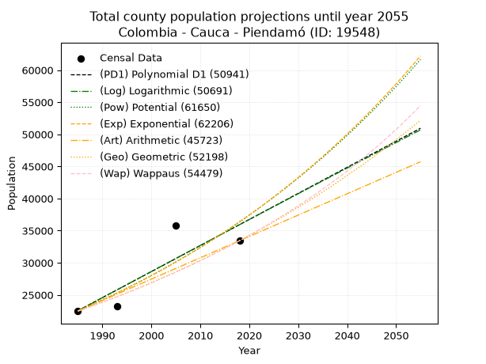
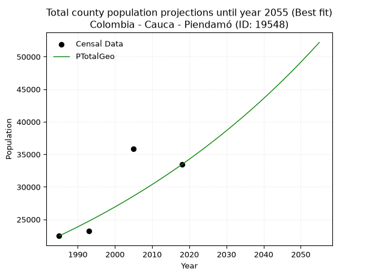
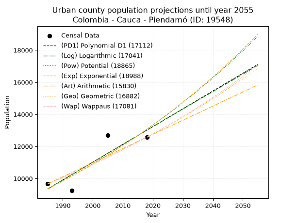
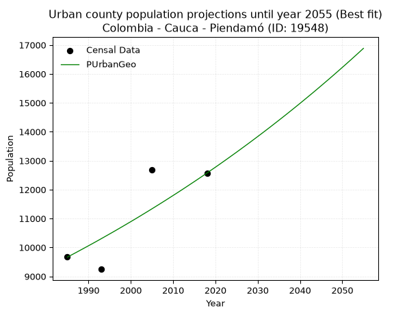
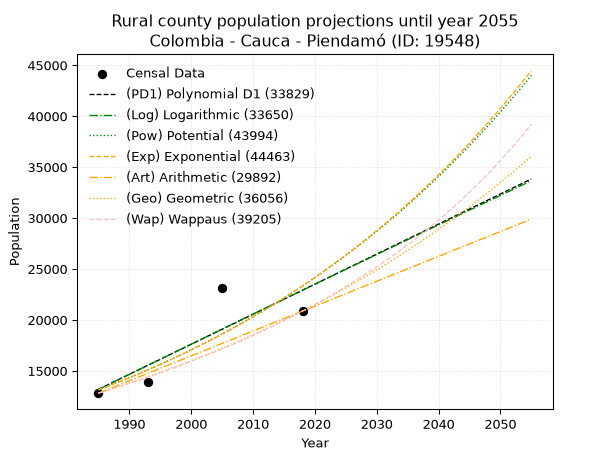
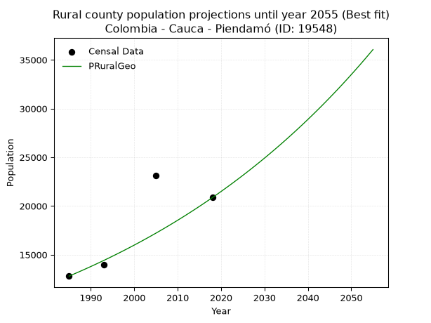

<div align="center">


</div>

# 📜 _“Population and Public Services Demand Projections (PPSD) until Year 2050 for Colombia - Cauca - Piendamó (ID: 19548)”_
Keywords: `population` `public-service` `projection` `lineal` `polynomial` `logarithmic` `potential` `exponential` `arithmetic` `geometric` `wappaus` `dane` `colombia` `south-america`

PPSD are analytical estimates used by governments and planners to anticipate future changes in population size, age distribution, and the resulting community needs for utilities, healthcare, education, and infrastructure as sizing future water treatment facilities, electrical grids, and road networks based on spatial growth.

<div align="center">

</img>

</div>


> **General running parameters**: • app_version: _v20260806_. • Python version: _3.14.7_. • Pandas version: _3.0.5_. • NumPy version: _2.5.1_. • Creates, save and include plots into reports (create_plot): _False_. • Projection until year: _2050_. • Process polynomial degree 2 and up: _False_. • Process Wappaus: _True_. • Process Wappaus: _True_. • Set negative values to zero: _True_. • Set infinite values to zero: _True_. • Drop dataset notes: _True_. 
<div align="center">

Dynamic map: [:earth_americas:Google](http://maps.google.com/maps?q=2.642280148,-76.5286153) [:earth_americas:OSM](https://www.openstreetmap.org/#map=18/2.642280148/-76.5286153&layers=P) [:earth_americas:Bing](https://www.bing.com/maps?cp=2.642280148~-76.5286153&lvl=18) [:earth_americas:Apple](https://maps.apple.com/frame?center=2.642280148%2C-76.5286153&span=0.003%2C0.006)

</div>


<div align="center">

```geojson
{
  "type": "Feature",
  "geometry": {
    "type": "Point", 
    "coordinates": [-76.5286153, 2.642280148]
  }, 
  "properties": {
    "Name": "Colombia - Cauca - Piendamó (ID: 19548)"
  }
}
```

</div>


## 0. Census Data (4 records)

Census data are official statistics collected by a government about the people and housing in a country. They usually include counts of total population, age, sex, race, income, education, and jobs.

📅Global census file: [Population.xlsx](../data/Population.xlsx)

| Source   |   Year |   CountryID | CountryName   |   StateID | StateName   |   CountyID | CountyName   |   PTotal |   PUrban |   PRural |
|:---------|-------:|------------:|:--------------|----------:|:------------|-----------:|:-------------|---------:|---------:|---------:|
| DANE     |   1985 |          57 | Colombia      |        19 | Cauca       |      19548 | Piendamó     |    22468 |     9664 |    12804 |
| DANE     |   1993 |          57 | Colombia      |        19 | Cauca       |      19548 | Piendamó     |    23187 |     9245 |    13942 |
| DANE     |   2005 |          57 | Colombia      |        19 | Cauca       |      19548 | Piendamó     |    35804 |    12694 |    23110 |
| DANE     |   2018 |          57 | Colombia      |        19 | Cauca       |      19548 | Piendamó     |    33431 |    12571 |    20860 |

> 🔥Some records could had specific notes about the registered values or the corresponding urban or rural distribution.

📅[SUI-RUPS](https://www.datos.gov.co/Hacienda-y-Cr-dito-P-blico/Registro-nico-de-Prestadores-de-Servicios-P-blicos/4qkq-csdn/about_data) - Local public utility companies: [RUPS.csv](../data/RUPS.csv)

 | SERVICIO       | ESTADO    | NOMBRE                                                     | NIT         | DEPARTAMENTO_DOMICILIO   | MUNICIPIO_DOMICILIO   | DIRECCION                                |   TELEFONO | EMAIL                                   | TIPO_PRESTADOR                            | CLASIFICACION                  |
|:---------------|:----------|:-----------------------------------------------------------|:------------|:-------------------------|:----------------------|:-----------------------------------------|-----------:|:----------------------------------------|:------------------------------------------|:-------------------------------|
| ACUEDUCTO      | OPERATIVA | EMPRESA MUNICIPAL DE SERVICIOS PUBLICOS DE PIENDAMO E.S.P. | 800219666-9 | CAUCA                    | PIENDAMO              | PLANTA DE ACUEDUCTO SAN CAYETANO         |    8250099 | empiendamo@piendamo-cauca.gov.co        | EMPRESA INDUSTRIAL Y COMERCIAL DEL ESTADO | DESDE 2501 HASTA 5000 USUARIOS |
| ALCANTARILLADO | OPERATIVA | EMPRESA MUNICIPAL DE SERVICIOS PUBLICOS DE PIENDAMO E.S.P. | 800219666-9 | CAUCA                    | PIENDAMO              | PLANTA DE ACUEDUCTO SAN CAYETANO         |    8250099 | empiendamo@piendamo-cauca.gov.co        | EMPRESA INDUSTRIAL Y COMERCIAL DEL ESTADO | DESDE 2501 HASTA 5000 USUARIOS |
| ACUEDUCTO      | OPERATIVA | ASOCIACION DE USUARIOS DEL ACUEDUCTO DE LA VEREDA EL HOGAR | 817006897-0 | CAUCA                    | PIENDAMO              | CARRERA 5 No 9 -33 EFIDICIO CAM PIENDAMO |    8250099 | contactenos@piendamo-cauca.gov.co       | ORGANIZACION AUTORIZADA                   | HASTA 2500 SUSCRIPTORES        |
| ACUEDUCTO      | OPERATIVA | APC ACUEDUCTO PIENDAMO MORALES ORGANIZACION AUTORIZADA     | 817006978-9 | CAUCA                    | PIENDAMO              | CRA 4 No.5-130 BARRIO INMACULADA         |    8250060 | acueductoregional@piendamo-cauca.gov.co | ORGANIZACION AUTORIZADA                   | DESDE 2501 HASTA 5000 USUARIOS |

## 1. Total

### 1.1. Coefficients and Parameters

* (PD1) Polynomial Deg 1: 405.8233641107995, -783025.6840626266 (lineal)
* (Log) Logarithmic: 812961.6018094558, -6150605.150019094
* (Pow) Potential: 29.073911433096384, -91.52646405033673
* (Exp) Exponential: 0.014514127346070101, 6.9236609093144085e-09
* (Art) Arithmetic: Year diff. 2018 - 1985 = 33, Population diff. 33431 - 22468 = 10963, Annual growth = 332.2121212121212
* (Geo) Geometric: Year diff. 2018 - 1985 = 33, Population diff. 33431 - 22468 = 10963, Annual growth % = 0.012114966663508975
* (Wap) Wappaus: i = 1.1886156146339693, Condition values only valid for < 200)

<sub>
Wappaus condition values: ['0.00', '1.19', '2.38', '3.57', '4.75', '5.94', '7.13', '8.32', '9.51', '10.70', '11.89', '13.07', '14.26', '15.45', '16.64', '17.83', '19.02', '20.21', '21.40', '22.58', '23.77', '24.96', '26.15', '27.34', '28.53', '29.72', '30.90', '32.09', '33.28', '34.47', '35.66', '36.85', '38.04', '39.22', '40.41', '41.60', '42.79', '43.98', '45.17', '46.36', '47.54', '48.73', '49.92', '51.11', '52.30', '53.49', '54.68', '55.86', '57.05', '58.24', '59.43', '60.62', '61.81', '63.00', '64.19', '65.37', '66.56', '67.75', '68.94', '70.13', '71.32', '72.51', '73.69', '74.88', '76.07', '77.26']
</sub>


### 1.2. Projected Dataset

|   Year |   CountyID |   PTotalPD1 |   PTotalLog |   PTotalPow |   PTotalExp |   PTotalArt |   PTotalGeo |   PTotalWap |
|-------:|-----------:|------------:|------------:|------------:|------------:|------------:|------------:|------------:|
|   1985 |      19548 |       22534 |       22516 |       22508 |       22521 |       22468 |       22468 |       22468 |
|   1986 |      19548 |       22940 |       22926 |       22840 |       22851 |       22800 |       22740 |       22737 |
|   1987 |      19548 |       23345 |       23335 |       23177 |       23185 |       23132 |       23016 |       23009 |
|   1988 |      19548 |       23751 |       23744 |       23518 |       23524 |       23465 |       23295 |       23284 |
|   1989 |      19548 |       24157 |       24153 |       23864 |       23868 |       23797 |       23577 |       23562 |
|   1990 |      19548 |       24563 |       24562 |       24216 |       24217 |       24129 |       23862 |       23844 |
|   1991 |      19548 |       24969 |       24970 |       24572 |       24571 |       24461 |       24151 |       24130 |
|   1992 |      19548 |       25374 |       25378 |       24933 |       24930 |       24793 |       24444 |       24419 |
|   1993 |      19548 |       25780 |       25786 |       25300 |       25294 |       25126 |       24740 |       24711 |
|   1994 |      19548 |       26186 |       26194 |       25672 |       25664 |       25458 |       25040 |       25007 |
|   1995 |      19548 |       26592 |       26602 |       26049 |       26039 |       25790 |       25343 |       25307 |
|   1996 |      19548 |       26998 |       27009 |       26431 |       26420 |       26122 |       25650 |       25611 |
|   1997 |      19548 |       27404 |       27416 |       26819 |       26806 |       26455 |       25961 |       25919 |
|   1998 |      19548 |       27809 |       27823 |       27212 |       27198 |       26787 |       26276 |       26230 |
|   1999 |      19548 |       28215 |       28230 |       27611 |       27596 |       27119 |       26594 |       26546 |
|   2000 |      19548 |       28621 |       28637 |       28015 |       27999 |       27451 |       26916 |       26866 |
|   2001 |      19548 |       29027 |       29043 |       28425 |       28409 |       27783 |       27242 |       27190 |
|   2002 |      19548 |       29433 |       29449 |       28841 |       28824 |       28116 |       27572 |       27518 |
|   2003 |      19548 |       29839 |       29855 |       29263 |       29245 |       28448 |       27906 |       27851 |
|   2004 |      19548 |       30244 |       30261 |       29691 |       29673 |       28780 |       28244 |       28188 |
|   2005 |      19548 |       30650 |       30667 |       30124 |       30107 |       29112 |       28587 |       28530 |
|   2006 |      19548 |       31056 |       31072 |       30564 |       30547 |       29444 |       28933 |       28876 |
|   2007 |      19548 |       31462 |       31477 |       31010 |       30993 |       29777 |       29283 |       29227 |
|   2008 |      19548 |       31868 |       31882 |       31463 |       31447 |       30109 |       29638 |       29583 |
|   2009 |      19548 |       32273 |       32287 |       31921 |       31906 |       30441 |       29997 |       29944 |
|   2010 |      19548 |       32679 |       32691 |       32387 |       32373 |       30773 |       30361 |       30310 |
|   2011 |      19548 |       33085 |       33096 |       32858 |       32846 |       31106 |       30728 |       30681 |
|   2012 |      19548 |       33491 |       33500 |       33337 |       33326 |       31438 |       31101 |       31057 |
|   2013 |      19548 |       33897 |       33904 |       33822 |       33814 |       31770 |       31477 |       31438 |
|   2014 |      19548 |       34303 |       34308 |       34314 |       34308 |       32102 |       31859 |       31825 |
|   2015 |      19548 |       34708 |       34711 |       34813 |       34809 |       32434 |       32245 |       32218 |
|   2016 |      19548 |       35114 |       35115 |       35318 |       35318 |       32767 |       32635 |       32617 |
|   2017 |      19548 |       35520 |       35518 |       35831 |       35835 |       33099 |       33031 |       33021 |
|   2018 |      19548 |       35926 |       35921 |       36351 |       36359 |       33431 |       33431 |       33431 |
|   2019 |      19548 |       36332 |       36323 |       36879 |       36890 |       33763 |       33836 |       33847 |
|   2020 |      19548 |       36738 |       36726 |       37414 |       37430 |       34095 |       34246 |       34270 |
|   2021 |      19548 |       37143 |       37128 |       37956 |       37977 |       34428 |       34661 |       34699 |
|   2022 |      19548 |       37549 |       37530 |       38506 |       38532 |       34760 |       35081 |       35134 |
|   2023 |      19548 |       37955 |       37932 |       39063 |       39095 |       35092 |       35506 |       35577 |
|   2024 |      19548 |       38361 |       38334 |       39628 |       39667 |       35424 |       35936 |       36026 |
|   2025 |      19548 |       38767 |       38736 |       40202 |       40247 |       35756 |       36371 |       36482 |
|   2026 |      19548 |       39172 |       39137 |       40783 |       40835 |       36089 |       36812 |       36945 |
|   2027 |      19548 |       39578 |       39538 |       41372 |       41432 |       36421 |       37258 |       37415 |
|   2028 |      19548 |       39984 |       39939 |       41970 |       42038 |       36753 |       37709 |       37894 |
|   2029 |      19548 |       40390 |       40340 |       42576 |       42653 |       37085 |       38166 |       38379 |
|   2030 |      19548 |       40796 |       40741 |       43190 |       43276 |       37418 |       38628 |       38873 |
|   2031 |      19548 |       41202 |       41141 |       43813 |       43909 |       37750 |       39096 |       39375 |
|   2032 |      19548 |       41607 |       41541 |       44444 |       44551 |       38082 |       39570 |       39885 |
|   2033 |      19548 |       42013 |       41941 |       45085 |       45202 |       38414 |       40049 |       40403 |
|   2034 |      19548 |       42419 |       42341 |       45734 |       45863 |       38746 |       40535 |       40930 |
|   2035 |      19548 |       42825 |       42740 |       46392 |       46534 |       39079 |       41026 |       41466 |
|   2036 |      19548 |       43231 |       43140 |       47060 |       47214 |       39411 |       41523 |       42012 |
|   2037 |      19548 |       43637 |       43539 |       47736 |       47904 |       39743 |       42026 |       42566 |
|   2038 |      19548 |       44042 |       43938 |       48422 |       48604 |       40075 |       42535 |       43130 |
|   2039 |      19548 |       44448 |       44337 |       49118 |       49315 |       40407 |       43050 |       43704 |
|   2040 |      19548 |       44854 |       44735 |       49823 |       50036 |       40740 |       43572 |       44289 |
|   2041 |      19548 |       45260 |       45134 |       50538 |       50768 |       41072 |       44100 |       44883 |
|   2042 |      19548 |       45666 |       45532 |       51263 |       51510 |       41404 |       44634 |       45489 |
|   2043 |      19548 |       46071 |       45930 |       51998 |       52263 |       41736 |       45175 |       46105 |
|   2044 |      19548 |       46477 |       46328 |       52743 |       53027 |       42069 |       45722 |       46733 |
|   2045 |      19548 |       46883 |       46726 |       53498 |       53802 |       42401 |       46276 |       47372 |
|   2046 |      19548 |       47289 |       47123 |       54264 |       54589 |       42733 |       46837 |       48023 |
|   2047 |      19548 |       47695 |       47520 |       55041 |       55387 |       43065 |       47404 |       48686 |
|   2048 |      19548 |       48101 |       47917 |       55828 |       56197 |       43397 |       47978 |       49362 |
|   2049 |      19548 |       48506 |       48314 |       56626 |       57018 |       43730 |       48560 |       50051 |
|   2050 |      19548 |       48912 |       48711 |       57435 |       57852 |       44062 |       49148 |       50753 |
<div align="center">

</img>

</div>


### 1.3. Best fit with absolute and relative error (%)

Relative error puts that difference into context by dividing the absolute error by the true value, creating a unitless ratio or percentage that shows the scale of the mistake.

Absolute and relative error

|   Year | Source   |   CountryID | CountryName   |   StateID | StateName   |   CountyID_x | CountyName   |   PTotal |   PUrban |   PRural |   CountyID_y |   PTotalPD1 |   PTotalLog |   PTotalPow |   PTotalExp |   PTotalArt |   PTotalGeo |   PTotalWap |   PTotalPD1AbsError |   PTotalLogAbsError |   PTotalPowAbsError |   PTotalExpAbsError |   PTotalArtAbsError |   PTotalGeoAbsError |   PTotalWapAbsError |   PTotalPD1RelError |   PTotalLogRelError |   PTotalPowRelError |   PTotalExpRelError |   PTotalArtRelError |   PTotalGeoRelError |   PTotalWapRelError |
|-------:|:---------|------------:|:--------------|----------:|:------------|-------------:|:-------------|---------:|---------:|---------:|-------------:|------------:|------------:|------------:|------------:|------------:|------------:|------------:|--------------------:|--------------------:|--------------------:|--------------------:|--------------------:|--------------------:|--------------------:|--------------------:|--------------------:|--------------------:|--------------------:|--------------------:|--------------------:|--------------------:|
|   1985 | DANE     |          57 | Colombia      |        19 | Cauca       |        19548 | Piendamó     |    22468 |     9664 |    12804 |        19548 |       22534 |       22516 |       22508 |       22521 |       22468 |       22468 |       22468 |                  66 |                  48 |                  40 |                  53 |                   0 |                   0 |                   0 |            0.293751 |            0.213637 |            0.178031 |            0.235891 |             0       |             0       |             0       |
|   1993 | DANE     |          57 | Colombia      |        19 | Cauca       |        19548 | Piendamó     |    23187 |     9245 |    13942 |        19548 |       25780 |       25786 |       25300 |       25294 |       25126 |       24740 |       24711 |                2593 |                2599 |                2113 |                2107 |                1939 |                1553 |                1524 |           11.183    |           11.2089   |            9.11286  |            9.08699  |             8.36244 |             6.69772 |             6.57265 |
|   2005 | DANE     |          57 | Colombia      |        19 | Cauca       |        19548 | Piendamó     |    35804 |    12694 |    23110 |        19548 |       30650 |       30667 |       30124 |       30107 |       29112 |       28587 |       28530 |                5154 |                5137 |                5680 |                5697 |                6692 |                7217 |                7274 |           14.395    |           14.3476   |           15.8641   |           15.9116   |            18.6906  |            20.157   |            20.3162  |
|   2018 | DANE     |          57 | Colombia      |        19 | Cauca       |        19548 | Piendamó     |    33431 |    12571 |    20860 |        19548 |       35926 |       35921 |       36351 |       36359 |       33431 |       33431 |       33431 |                2495 |                2490 |                2920 |                2928 |                   0 |                   0 |                   0 |            7.46313  |            7.44818  |            8.73441  |            8.75834  |             0       |             0       |             0       |

Relative error mean

| Method    |   RelError | Best   |
|:----------|-----------:|:-------|
| PTotalPD1 |    8.33373 |        |
| PTotalLog |    8.30456 |        |
| PTotalPow |    8.47236 |        |
| PTotalExp |    8.49821 |        |
| PTotalArt |    6.76327 |        |
| PTotalGeo |    6.71367 | True   |
| PTotalWap |    6.7222  |        |

💙Best method: _**PTotalGeo**_
<div align="center">

</img>

</div>


### 1.4. Fresh water supply demand in liters per capita per day (lpcd)

The fresh water supply demand typically ranges from 100 to 300 liters per capita per day (lpcd) for standard domestic and municipal planning, though absolute survival minimums set by the World Health Organization are as low as 7.5 to 20 liters per day, and total consumption in high-income nations can exceed 400 liters.

> `CZ`: Level in meters above the sea level (masl)<br> `WS`: Fresh water supply demand in liters per capita per day (lpcd or l/h/d)<br> `WSAll`: Zonal fresh water supply demand in liters per second (l/s)<br> `A`: Zonal area in square meters<br> `DP`: Population density (people/hectare or p/ha)

Reference values (RAS Colombia)

|    CZ |   WS |
|------:|-----:|
|  1000 |  120 |
|  2000 |  130 |
| 99999 |  140 |

County shapefile geometry properties and water supply values

|   CountyID |     ATotal |   CZTotal |   WSTotal |
|-----------:|-----------:|----------:|----------:|
|      19548 | 1.8127e+08 |   1702.81 |       130 |

Projected values for best method: PTotalGeo

|   CountyID |   Year |   PTotalGeo |   DPTotal |   WSTotal |   WSTotalAll |
|-----------:|-------:|------------:|----------:|----------:|-------------:|
|      19548 |   1985 |       22468 |      1.24 |       130 |      33.806  |
|      19548 |   1986 |       22740 |      1.25 |       130 |      34.2153 |
|      19548 |   1987 |       23016 |      1.27 |       130 |      34.6306 |
|      19548 |   1988 |       23295 |      1.29 |       130 |      35.0503 |
|      19548 |   1989 |       23577 |      1.3  |       130 |      35.4747 |
|      19548 |   1990 |       23862 |      1.32 |       130 |      35.9035 |
|      19548 |   1991 |       24151 |      1.33 |       130 |      36.3383 |
|      19548 |   1992 |       24444 |      1.35 |       130 |      36.7792 |
|      19548 |   1993 |       24740 |      1.36 |       130 |      37.2245 |
|      19548 |   1994 |       25040 |      1.38 |       130 |      37.6759 |
|      19548 |   1995 |       25343 |      1.4  |       130 |      38.1318 |
|      19548 |   1996 |       25650 |      1.42 |       130 |      38.5938 |
|      19548 |   1997 |       25961 |      1.43 |       130 |      39.0617 |
|      19548 |   1998 |       26276 |      1.45 |       130 |      39.5356 |
|      19548 |   1999 |       26594 |      1.47 |       130 |      40.0141 |
|      19548 |   2000 |       26916 |      1.48 |       130 |      40.4986 |
|      19548 |   2001 |       27242 |      1.5  |       130 |      40.9891 |
|      19548 |   2002 |       27572 |      1.52 |       130 |      41.4856 |
|      19548 |   2003 |       27906 |      1.54 |       130 |      41.9882 |
|      19548 |   2004 |       28244 |      1.56 |       130 |      42.4968 |
|      19548 |   2005 |       28587 |      1.58 |       130 |      43.0128 |
|      19548 |   2006 |       28933 |      1.6  |       130 |      43.5334 |
|      19548 |   2007 |       29283 |      1.62 |       130 |      44.0601 |
|      19548 |   2008 |       29638 |      1.64 |       130 |      44.5942 |
|      19548 |   2009 |       29997 |      1.65 |       130 |      45.1344 |
|      19548 |   2010 |       30361 |      1.67 |       130 |      45.6821 |
|      19548 |   2011 |       30728 |      1.7  |       130 |      46.2343 |
|      19548 |   2012 |       31101 |      1.72 |       130 |      46.7955 |
|      19548 |   2013 |       31477 |      1.74 |       130 |      47.3612 |
|      19548 |   2014 |       31859 |      1.76 |       130 |      47.936  |
|      19548 |   2015 |       32245 |      1.78 |       130 |      48.5168 |
|      19548 |   2016 |       32635 |      1.8  |       130 |      49.1036 |
|      19548 |   2017 |       33031 |      1.82 |       130 |      49.6994 |
|      19548 |   2018 |       33431 |      1.84 |       130 |      50.3013 |
|      19548 |   2019 |       33836 |      1.87 |       130 |      50.9106 |
|      19548 |   2020 |       34246 |      1.89 |       130 |      51.5275 |
|      19548 |   2021 |       34661 |      1.91 |       130 |      52.152  |
|      19548 |   2022 |       35081 |      1.94 |       130 |      52.7839 |
|      19548 |   2023 |       35506 |      1.96 |       130 |      53.4234 |
|      19548 |   2024 |       35936 |      1.98 |       130 |      54.0704 |
|      19548 |   2025 |       36371 |      2.01 |       130 |      54.7249 |
|      19548 |   2026 |       36812 |      2.03 |       130 |      55.3884 |
|      19548 |   2027 |       37258 |      2.06 |       130 |      56.0595 |
|      19548 |   2028 |       37709 |      2.08 |       130 |      56.7381 |
|      19548 |   2029 |       38166 |      2.11 |       130 |      57.4257 |
|      19548 |   2030 |       38628 |      2.13 |       130 |      58.1208 |
|      19548 |   2031 |       39096 |      2.16 |       130 |      58.825  |
|      19548 |   2032 |       39570 |      2.18 |       130 |      59.5382 |
|      19548 |   2033 |       40049 |      2.21 |       130 |      60.2589 |
|      19548 |   2034 |       40535 |      2.24 |       130 |      60.9902 |
|      19548 |   2035 |       41026 |      2.26 |       130 |      61.7289 |
|      19548 |   2036 |       41523 |      2.29 |       130 |      62.4767 |
|      19548 |   2037 |       42026 |      2.32 |       130 |      63.2336 |
|      19548 |   2038 |       42535 |      2.35 |       130 |      63.9994 |
|      19548 |   2039 |       43050 |      2.37 |       130 |      64.7743 |
|      19548 |   2040 |       43572 |      2.4  |       130 |      65.5597 |
|      19548 |   2041 |       44100 |      2.43 |       130 |      66.3542 |
|      19548 |   2042 |       44634 |      2.46 |       130 |      67.1576 |
|      19548 |   2043 |       45175 |      2.49 |       130 |      67.9716 |
|      19548 |   2044 |       45722 |      2.52 |       130 |      68.7947 |
|      19548 |   2045 |       46276 |      2.55 |       130 |      69.6282 |
|      19548 |   2046 |       46837 |      2.58 |       130 |      70.4723 |
|      19548 |   2047 |       47404 |      2.62 |       130 |      71.3255 |
|      19548 |   2048 |       47978 |      2.65 |       130 |      72.1891 |
|      19548 |   2049 |       48560 |      2.68 |       130 |      73.0648 |
|      19548 |   2050 |       49148 |      2.71 |       130 |      73.9495 |

## 2. Urban

### 2.1. Coefficients and Parameters

* (PD1) Polynomial Deg 1: 110.84624648735442, -210676.70453633065 (lineal)
* (Log) Logarithmic: 221946.31598669803, -1675972.2263810465
* (Pow) Potential: 20.20638785702179, -62.66431067189729
* (Exp) Exponential: 0.010091956215555533, 1.869177424229219e-05
* (Art) Arithmetic: Year diff. 2018 - 1985 = 33, Population diff. 12571 - 9664 = 2907, Annual growth = 88.0909090909091
* (Geo) Geometric: Year diff. 2018 - 1985 = 33, Population diff. 12571 - 9664 = 2907, Annual growth % = 0.0080010793033638
* (Wap) Wappaus: i = 0.7923625733385121, Condition values only valid for < 200)

<sub>
Wappaus condition values: ['0.00', '0.79', '1.58', '2.38', '3.17', '3.96', '4.75', '5.55', '6.34', '7.13', '7.92', '8.72', '9.51', '10.30', '11.09', '11.89', '12.68', '13.47', '14.26', '15.05', '15.85', '16.64', '17.43', '18.22', '19.02', '19.81', '20.60', '21.39', '22.19', '22.98', '23.77', '24.56', '25.36', '26.15', '26.94', '27.73', '28.53', '29.32', '30.11', '30.90', '31.69', '32.49', '33.28', '34.07', '34.86', '35.66', '36.45', '37.24', '38.03', '38.83', '39.62', '40.41', '41.20', '42.00', '42.79', '43.58', '44.37', '45.16', '45.96', '46.75', '47.54', '48.33', '49.13', '49.92', '50.71', '51.50']
</sub>


### 2.2. Projected Dataset

|   Year |   CountyID |   PUrbanPD1 |   PUrbanLog |   PUrbanPow |   PUrbanExp |   PUrbanArt |   PUrbanGeo |   PUrbanWap |
|-------:|-----------:|------------:|------------:|------------:|------------:|------------:|------------:|------------:|
|   1985 |      19548 |        9353 |        9349 |        9365 |        9368 |        9664 |        9664 |        9664 |
|   1986 |      19548 |        9464 |        9461 |        9461 |        9464 |        9752 |        9741 |        9741 |
|   1987 |      19548 |        9575 |        9573 |        9558 |        9559 |        9840 |        9819 |        9818 |
|   1988 |      19548 |        9686 |        9684 |        9655 |        9656 |        9928 |        9898 |        9896 |
|   1989 |      19548 |        9796 |        9796 |        9754 |        9754 |       10016 |        9977 |        9975 |
|   1990 |      19548 |        9907 |        9908 |        9854 |        9853 |       10104 |       10057 |       10055 |
|   1991 |      19548 |       10018 |       10019 |        9954 |        9953 |       10193 |       10137 |       10135 |
|   1992 |      19548 |       10129 |       10131 |       10056 |       10054 |       10281 |       10218 |       10215 |
|   1993 |      19548 |       10240 |       10242 |       10158 |       10156 |       10369 |       10300 |       10297 |
|   1994 |      19548 |       10351 |       10353 |       10262 |       10259 |       10457 |       10383 |       10379 |
|   1995 |      19548 |       10462 |       10465 |       10366 |       10363 |       10545 |       10466 |       10461 |
|   1996 |      19548 |       10572 |       10576 |       10472 |       10468 |       10633 |       10549 |       10545 |
|   1997 |      19548 |       10683 |       10687 |       10578 |       10575 |       10721 |       10634 |       10629 |
|   1998 |      19548 |       10794 |       10798 |       10686 |       10682 |       10809 |       10719 |       10714 |
|   1999 |      19548 |       10905 |       10909 |       10794 |       10790 |       10897 |       10805 |       10799 |
|   2000 |      19548 |       11016 |       11020 |       10904 |       10900 |       10985 |       10891 |       10885 |
|   2001 |      19548 |       11127 |       11131 |       11015 |       11010 |       11073 |       10978 |       10972 |
|   2002 |      19548 |       11237 |       11242 |       11126 |       11122 |       11162 |       11066 |       11060 |
|   2003 |      19548 |       11348 |       11353 |       11239 |       11235 |       11250 |       11155 |       11148 |
|   2004 |      19548 |       11459 |       11464 |       11353 |       11349 |       11338 |       11244 |       11237 |
|   2005 |      19548 |       11570 |       11574 |       11468 |       11464 |       11426 |       11334 |       11327 |
|   2006 |      19548 |       11681 |       11685 |       11584 |       11580 |       11514 |       11425 |       11418 |
|   2007 |      19548 |       11792 |       11796 |       11702 |       11697 |       11602 |       11516 |       11509 |
|   2008 |      19548 |       11903 |       11906 |       11820 |       11816 |       11690 |       11608 |       11602 |
|   2009 |      19548 |       12013 |       12017 |       11939 |       11936 |       11778 |       11701 |       11695 |
|   2010 |      19548 |       12124 |       12127 |       12060 |       12057 |       11866 |       11795 |       11789 |
|   2011 |      19548 |       12235 |       12237 |       12182 |       12179 |       11954 |       11889 |       11884 |
|   2012 |      19548 |       12346 |       12348 |       12305 |       12303 |       12042 |       11984 |       11979 |
|   2013 |      19548 |       12457 |       12458 |       12429 |       12428 |       12131 |       12080 |       12076 |
|   2014 |      19548 |       12568 |       12568 |       12554 |       12554 |       12219 |       12177 |       12173 |
|   2015 |      19548 |       12678 |       12678 |       12681 |       12681 |       12307 |       12274 |       12271 |
|   2016 |      19548 |       12789 |       12789 |       12809 |       12810 |       12395 |       12372 |       12370 |
|   2017 |      19548 |       12900 |       12899 |       12938 |       12940 |       12483 |       12471 |       12470 |
|   2018 |      19548 |       13011 |       13009 |       13068 |       13071 |       12571 |       12571 |       12571 |
|   2019 |      19548 |       13122 |       13119 |       13199 |       13203 |       12659 |       12672 |       12673 |
|   2020 |      19548 |       13233 |       13229 |       13332 |       13337 |       12747 |       12773 |       12776 |
|   2021 |      19548 |       13344 |       13338 |       13466 |       13473 |       12835 |       12875 |       12879 |
|   2022 |      19548 |       13454 |       13448 |       13601 |       13609 |       12923 |       12978 |       12984 |
|   2023 |      19548 |       13565 |       13558 |       13738 |       13747 |       13011 |       13082 |       13090 |
|   2024 |      19548 |       13676 |       13668 |       13876 |       13887 |       13100 |       13187 |       13196 |
|   2025 |      19548 |       13787 |       13777 |       14015 |       14028 |       13188 |       13292 |       13304 |
|   2026 |      19548 |       13898 |       13887 |       14156 |       14170 |       13276 |       13399 |       13412 |
|   2027 |      19548 |       14009 |       13996 |       14297 |       14314 |       13364 |       13506 |       13522 |
|   2028 |      19548 |       14119 |       14106 |       14441 |       14459 |       13452 |       13614 |       13633 |
|   2029 |      19548 |       14230 |       14215 |       14585 |       14605 |       13540 |       13723 |       13745 |
|   2030 |      19548 |       14341 |       14325 |       14731 |       14754 |       13628 |       13833 |       13857 |
|   2031 |      19548 |       14452 |       14434 |       14878 |       14903 |       13716 |       13943 |       13971 |
|   2032 |      19548 |       14563 |       14543 |       15027 |       15054 |       13804 |       14055 |       14086 |
|   2033 |      19548 |       14674 |       14652 |       15177 |       15207 |       13892 |       14167 |       14203 |
|   2034 |      19548 |       14785 |       14761 |       15329 |       15361 |       13980 |       14281 |       14320 |
|   2035 |      19548 |       14895 |       14871 |       15482 |       15517 |       14069 |       14395 |       14438 |
|   2036 |      19548 |       15006 |       14980 |       15636 |       15675 |       14157 |       14510 |       14558 |
|   2037 |      19548 |       15117 |       15089 |       15792 |       15834 |       14245 |       14626 |       14679 |
|   2038 |      19548 |       15228 |       15197 |       15950 |       15994 |       14333 |       14743 |       14801 |
|   2039 |      19548 |       15339 |       15306 |       16109 |       16156 |       14421 |       14861 |       14924 |
|   2040 |      19548 |       15450 |       15415 |       16269 |       16320 |       14509 |       14980 |       15049 |
|   2041 |      19548 |       15560 |       15524 |       16431 |       16486 |       14597 |       15100 |       15175 |
|   2042 |      19548 |       15671 |       15633 |       16594 |       16653 |       14685 |       15221 |       15302 |
|   2043 |      19548 |       15782 |       15741 |       16759 |       16822 |       14773 |       15342 |       15430 |
|   2044 |      19548 |       15893 |       15850 |       16926 |       16993 |       14861 |       15465 |       15560 |
|   2045 |      19548 |       16004 |       15959 |       17094 |       17165 |       14949 |       15589 |       15691 |
|   2046 |      19548 |       16115 |       16067 |       17264 |       17339 |       15038 |       15714 |       15824 |
|   2047 |      19548 |       16226 |       16175 |       17435 |       17515 |       15126 |       15839 |       15957 |
|   2048 |      19548 |       16336 |       16284 |       17608 |       17693 |       15214 |       15966 |       16093 |
|   2049 |      19548 |       16447 |       16392 |       17782 |       17872 |       15302 |       16094 |       16229 |
|   2050 |      19548 |       16558 |       16501 |       17959 |       18053 |       15390 |       16223 |       16368 |
<div align="center">

</img>

</div>


### 2.3. Best fit with absolute and relative error (%)

Relative error puts that difference into context by dividing the absolute error by the true value, creating a unitless ratio or percentage that shows the scale of the mistake.

Absolute and relative error

|   Year | Source   |   CountryID | CountryName   |   StateID | StateName   |   CountyID_x | CountyName   |   PTotal |   PUrban |   PRural |   CountyID_y |   PUrbanPD1 |   PUrbanLog |   PUrbanPow |   PUrbanExp |   PUrbanArt |   PUrbanGeo |   PUrbanWap |   PUrbanPD1AbsError |   PUrbanLogAbsError |   PUrbanPowAbsError |   PUrbanExpAbsError |   PUrbanArtAbsError |   PUrbanGeoAbsError |   PUrbanWapAbsError |   PUrbanPD1RelError |   PUrbanLogRelError |   PUrbanPowRelError |   PUrbanExpRelError |   PUrbanArtRelError |   PUrbanGeoRelError |   PUrbanWapRelError |
|-------:|:---------|------------:|:--------------|----------:|:------------|-------------:|:-------------|---------:|---------:|---------:|-------------:|------------:|------------:|------------:|------------:|------------:|------------:|------------:|--------------------:|--------------------:|--------------------:|--------------------:|--------------------:|--------------------:|--------------------:|--------------------:|--------------------:|--------------------:|--------------------:|--------------------:|--------------------:|--------------------:|
|   1985 | DANE     |          57 | Colombia      |        19 | Cauca       |        19548 | Piendamó     |    22468 |     9664 |    12804 |        19548 |        9353 |        9349 |        9365 |        9368 |        9664 |        9664 |        9664 |                 311 |                 315 |                 299 |                 296 |                   0 |                   0 |                   0 |             3.21813 |             3.25952 |             3.09396 |             3.06291 |             0       |              0      |              0      |
|   1993 | DANE     |          57 | Colombia      |        19 | Cauca       |        19548 | Piendamó     |    23187 |     9245 |    13942 |        19548 |       10240 |       10242 |       10158 |       10156 |       10369 |       10300 |       10297 |                 995 |                 997 |                 913 |                 911 |                1124 |                1055 |                1052 |            10.7626  |            10.7842  |             9.87561 |             9.85398 |            12.1579  |             11.4116 |             11.3791 |
|   2005 | DANE     |          57 | Colombia      |        19 | Cauca       |        19548 | Piendamó     |    35804 |    12694 |    23110 |        19548 |       11570 |       11574 |       11468 |       11464 |       11426 |       11334 |       11327 |                1124 |                1120 |                1226 |                1230 |                1268 |                1360 |                1367 |             8.85458 |             8.82307 |             9.65811 |             9.68962 |             9.98897 |             10.7137 |             10.7689 |
|   2018 | DANE     |          57 | Colombia      |        19 | Cauca       |        19548 | Piendamó     |    33431 |    12571 |    20860 |        19548 |       13011 |       13009 |       13068 |       13071 |       12571 |       12571 |       12571 |                 440 |                 438 |                 497 |                 500 |                   0 |                   0 |                   0 |             3.50012 |             3.48421 |             3.95354 |             3.97741 |             0       |              0      |              0      |

Relative error mean

| Method    |   RelError | Best   |
|:----------|-----------:|:-------|
| PUrbanPD1 |    6.58385 |        |
| PUrbanLog |    6.58775 |        |
| PUrbanPow |    6.6453  |        |
| PUrbanExp |    6.64598 |        |
| PUrbanArt |    5.53672 |        |
| PUrbanGeo |    5.53132 | True   |
| PUrbanWap |    5.537   |        |

💙Best method: _**PUrbanGeo**_
<div align="center">

</img>

</div>


### 2.4. Fresh water supply demand in liters per capita per day (lpcd)

The fresh water supply demand typically ranges from 100 to 300 liters per capita per day (lpcd) for standard domestic and municipal planning, though absolute survival minimums set by the World Health Organization are as low as 7.5 to 20 liters per day, and total consumption in high-income nations can exceed 400 liters.

> `CZ`: Level in meters above the sea level (masl)<br> `WS`: Fresh water supply demand in liters per capita per day (lpcd or l/h/d)<br> `WSAll`: Zonal fresh water supply demand in liters per second (l/s)<br> `A`: Zonal area in square meters<br> `DP`: Population density (people/hectare or p/ha)

Reference values (RAS Colombia)

|    CZ |   WS |
|------:|-----:|
|  1000 |  120 |
|  2000 |  130 |
| 99999 |  140 |

County shapefile geometry properties and water supply values

|   CountyID |      AUrban |   CZUrban |   WSUrban |
|-----------:|------------:|----------:|----------:|
|      19548 | 5.78345e+06 |   1828.81 |       130 |

Projected values for best method: PUrbanGeo

|   CountyID |   Year |   PUrbanGeo |   DPUrban |   WSUrban |   WSUrbanAll |
|-----------:|-------:|------------:|----------:|----------:|-------------:|
|      19548 |   1985 |        9664 |     16.71 |       130 |      14.5407 |
|      19548 |   1986 |        9741 |     16.84 |       130 |      14.6566 |
|      19548 |   1987 |        9819 |     16.98 |       130 |      14.774  |
|      19548 |   1988 |        9898 |     17.11 |       130 |      14.8928 |
|      19548 |   1989 |        9977 |     17.25 |       130 |      15.0117 |
|      19548 |   1990 |       10057 |     17.39 |       130 |      15.1321 |
|      19548 |   1991 |       10137 |     17.53 |       130 |      15.2524 |
|      19548 |   1992 |       10218 |     17.67 |       130 |      15.3743 |
|      19548 |   1993 |       10300 |     17.81 |       130 |      15.4977 |
|      19548 |   1994 |       10383 |     17.95 |       130 |      15.6226 |
|      19548 |   1995 |       10466 |     18.1  |       130 |      15.7475 |
|      19548 |   1996 |       10549 |     18.24 |       130 |      15.8723 |
|      19548 |   1997 |       10634 |     18.39 |       130 |      16.0002 |
|      19548 |   1998 |       10719 |     18.53 |       130 |      16.1281 |
|      19548 |   1999 |       10805 |     18.68 |       130 |      16.2575 |
|      19548 |   2000 |       10891 |     18.83 |       130 |      16.3869 |
|      19548 |   2001 |       10978 |     18.98 |       130 |      16.5178 |
|      19548 |   2002 |       11066 |     19.13 |       130 |      16.6502 |
|      19548 |   2003 |       11155 |     19.29 |       130 |      16.7841 |
|      19548 |   2004 |       11244 |     19.44 |       130 |      16.9181 |
|      19548 |   2005 |       11334 |     19.6  |       130 |      17.0535 |
|      19548 |   2006 |       11425 |     19.75 |       130 |      17.1904 |
|      19548 |   2007 |       11516 |     19.91 |       130 |      17.3273 |
|      19548 |   2008 |       11608 |     20.07 |       130 |      17.4657 |
|      19548 |   2009 |       11701 |     20.23 |       130 |      17.6057 |
|      19548 |   2010 |       11795 |     20.39 |       130 |      17.7471 |
|      19548 |   2011 |       11889 |     20.56 |       130 |      17.8885 |
|      19548 |   2012 |       11984 |     20.72 |       130 |      18.0315 |
|      19548 |   2013 |       12080 |     20.89 |       130 |      18.1759 |
|      19548 |   2014 |       12177 |     21.05 |       130 |      18.3219 |
|      19548 |   2015 |       12274 |     21.22 |       130 |      18.4678 |
|      19548 |   2016 |       12372 |     21.39 |       130 |      18.6153 |
|      19548 |   2017 |       12471 |     21.56 |       130 |      18.7642 |
|      19548 |   2018 |       12571 |     21.74 |       130 |      18.9147 |
|      19548 |   2019 |       12672 |     21.91 |       130 |      19.0667 |
|      19548 |   2020 |       12773 |     22.09 |       130 |      19.2186 |
|      19548 |   2021 |       12875 |     22.26 |       130 |      19.3721 |
|      19548 |   2022 |       12978 |     22.44 |       130 |      19.5271 |
|      19548 |   2023 |       13082 |     22.62 |       130 |      19.6836 |
|      19548 |   2024 |       13187 |     22.8  |       130 |      19.8416 |
|      19548 |   2025 |       13292 |     22.98 |       130 |      19.9995 |
|      19548 |   2026 |       13399 |     23.17 |       130 |      20.1605 |
|      19548 |   2027 |       13506 |     23.35 |       130 |      20.3215 |
|      19548 |   2028 |       13614 |     23.54 |       130 |      20.484  |
|      19548 |   2029 |       13723 |     23.73 |       130 |      20.648  |
|      19548 |   2030 |       13833 |     23.92 |       130 |      20.8135 |
|      19548 |   2031 |       13943 |     24.11 |       130 |      20.9791 |
|      19548 |   2032 |       14055 |     24.3  |       130 |      21.1476 |
|      19548 |   2033 |       14167 |     24.5  |       130 |      21.3161 |
|      19548 |   2034 |       14281 |     24.69 |       130 |      21.4876 |
|      19548 |   2035 |       14395 |     24.89 |       130 |      21.6591 |
|      19548 |   2036 |       14510 |     25.09 |       130 |      21.8322 |
|      19548 |   2037 |       14626 |     25.29 |       130 |      22.0067 |
|      19548 |   2038 |       14743 |     25.49 |       130 |      22.1828 |
|      19548 |   2039 |       14861 |     25.7  |       130 |      22.3603 |
|      19548 |   2040 |       14980 |     25.9  |       130 |      22.5394 |
|      19548 |   2041 |       15100 |     26.11 |       130 |      22.7199 |
|      19548 |   2042 |       15221 |     26.32 |       130 |      22.902  |
|      19548 |   2043 |       15342 |     26.53 |       130 |      23.084  |
|      19548 |   2044 |       15465 |     26.74 |       130 |      23.2691 |
|      19548 |   2045 |       15589 |     26.95 |       130 |      23.4557 |
|      19548 |   2046 |       15714 |     27.17 |       130 |      23.6438 |
|      19548 |   2047 |       15839 |     27.39 |       130 |      23.8318 |
|      19548 |   2048 |       15966 |     27.61 |       130 |      24.0229 |
|      19548 |   2049 |       16094 |     27.83 |       130 |      24.2155 |
|      19548 |   2050 |       16223 |     28.05 |       130 |      24.4096 |

## 3. Rural

### 3.1. Coefficients and Parameters

* (PD1) Polynomial Deg 1: 294.97711762344517, -572348.9795262961 (lineal)
* (Log) Logarithmic: 591015.2858227573, -4474632.923638045
* (Pow) Potential: 34.90909800142661, -111.00388366134514
* (Exp) Exponential: 0.01742422034832175, 1.2511775413302623e-11
* (Art) Arithmetic: Year diff. 2018 - 1985 = 33, Population diff. 20860 - 12804 = 8056, Annual growth = 244.12121212121212
* (Geo) Geometric: Year diff. 2018 - 1985 = 33, Population diff. 20860 - 12804 = 8056, Annual growth % = 0.014900092474864124
* (Wap) Wappaus: i = 1.4503399009102431, Condition values only valid for < 200)

<sub>
Wappaus condition values: ['0.00', '1.45', '2.90', '4.35', '5.80', '7.25', '8.70', '10.15', '11.60', '13.05', '14.50', '15.95', '17.40', '18.85', '20.30', '21.76', '23.21', '24.66', '26.11', '27.56', '29.01', '30.46', '31.91', '33.36', '34.81', '36.26', '37.71', '39.16', '40.61', '42.06', '43.51', '44.96', '46.41', '47.86', '49.31', '50.76', '52.21', '53.66', '55.11', '56.56', '58.01', '59.46', '60.91', '62.36', '63.81', '65.27', '66.72', '68.17', '69.62', '71.07', '72.52', '73.97', '75.42', '76.87', '78.32', '79.77', '81.22', '82.67', '84.12', '85.57', '87.02', '88.47', '89.92', '91.37', '92.82', '94.27']
</sub>


### 3.2. Projected Dataset

|   Year |   CountyID |   PRuralPD1 |   PRuralLog |   PRuralPow |   PRuralExp |   PRuralArt |   PRuralGeo |   PRuralWap |
|-------:|-----------:|------------:|------------:|------------:|------------:|------------:|------------:|------------:|
|   1985 |      19548 |       13181 |       13167 |       13121 |       13131 |       12804 |       12804 |       12804 |
|   1986 |      19548 |       13476 |       13465 |       13354 |       13362 |       13048 |       12995 |       12991 |
|   1987 |      19548 |       13771 |       13762 |       13590 |       13597 |       13292 |       13188 |       13181 |
|   1988 |      19548 |       14066 |       14060 |       13831 |       13836 |       13536 |       13385 |       13373 |
|   1989 |      19548 |       14361 |       14357 |       14076 |       14079 |       13780 |       13584 |       13569 |
|   1990 |      19548 |       14655 |       14654 |       14325 |       14326 |       14025 |       13787 |       13767 |
|   1991 |      19548 |       14950 |       14951 |       14579 |       14578 |       14269 |       13992 |       13969 |
|   1992 |      19548 |       15245 |       15248 |       14836 |       14834 |       14513 |       14201 |       14173 |
|   1993 |      19548 |       15540 |       15544 |       15099 |       15095 |       14757 |       14412 |       14381 |
|   1994 |      19548 |       15835 |       15841 |       15365 |       15360 |       15001 |       14627 |       14592 |
|   1995 |      19548 |       16130 |       16137 |       15637 |       15630 |       15245 |       14845 |       14806 |
|   1996 |      19548 |       16425 |       16433 |       15913 |       15905 |       15489 |       15066 |       15024 |
|   1997 |      19548 |       16720 |       16729 |       16193 |       16185 |       15733 |       15291 |       15245 |
|   1998 |      19548 |       17015 |       17025 |       16479 |       16469 |       15978 |       15518 |       15469 |
|   1999 |      19548 |       17310 |       17321 |       16769 |       16759 |       16222 |       15750 |       15698 |
|   2000 |      19548 |       17605 |       17617 |       17065 |       17053 |       16466 |       15984 |       15930 |
|   2001 |      19548 |       17900 |       17912 |       17365 |       17353 |       16710 |       16223 |       16165 |
|   2002 |      19548 |       18195 |       18207 |       17671 |       17658 |       16954 |       16464 |       16405 |
|   2003 |      19548 |       18490 |       18502 |       17981 |       17968 |       17198 |       16710 |       16648 |
|   2004 |      19548 |       18785 |       18797 |       18297 |       18284 |       17442 |       16959 |       16896 |
|   2005 |      19548 |       19080 |       19092 |       18619 |       18605 |       17686 |       17211 |       17148 |
|   2006 |      19548 |       19375 |       19387 |       18946 |       18932 |       17931 |       17468 |       17404 |
|   2007 |      19548 |       19670 |       19682 |       19278 |       19265 |       18175 |       17728 |       17665 |
|   2008 |      19548 |       19965 |       19976 |       19616 |       19604 |       18419 |       17992 |       17930 |
|   2009 |      19548 |       20260 |       20270 |       19960 |       19948 |       18663 |       18260 |       18200 |
|   2010 |      19548 |       20555 |       20564 |       20310 |       20299 |       18907 |       18532 |       18475 |
|   2011 |      19548 |       20850 |       20858 |       20666 |       20656 |       19151 |       18808 |       18754 |
|   2012 |      19548 |       21145 |       21152 |       21028 |       21019 |       19395 |       19089 |       19039 |
|   2013 |      19548 |       21440 |       21446 |       21396 |       21388 |       19639 |       19373 |       19328 |
|   2014 |      19548 |       21735 |       21739 |       21770 |       21764 |       19884 |       19662 |       19623 |
|   2015 |      19548 |       22030 |       22033 |       22150 |       22147 |       20128 |       19955 |       19924 |
|   2016 |      19548 |       22325 |       22326 |       22537 |       22536 |       20372 |       20252 |       20230 |
|   2017 |      19548 |       22620 |       22619 |       22931 |       22932 |       20616 |       20554 |       20542 |
|   2018 |      19548 |       22915 |       22912 |       23331 |       23335 |       20860 |       20860 |       20860 |
|   2019 |      19548 |       23210 |       23205 |       23738 |       23746 |       21104 |       21171 |       21184 |
|   2020 |      19548 |       23505 |       23497 |       24152 |       24163 |       21348 |       21486 |       21514 |
|   2021 |      19548 |       23800 |       23790 |       24573 |       24588 |       21592 |       21806 |       21851 |
|   2022 |      19548 |       24095 |       24082 |       25001 |       25020 |       21836 |       22131 |       22195 |
|   2023 |      19548 |       24390 |       24375 |       25436 |       25460 |       22081 |       22461 |       22545 |
|   2024 |      19548 |       24685 |       24667 |       25879 |       25907 |       22325 |       22796 |       22902 |
|   2025 |      19548 |       24980 |       24959 |       26329 |       26362 |       22569 |       23135 |       23267 |
|   2026 |      19548 |       25275 |       25250 |       26787 |       26826 |       22813 |       23480 |       23639 |
|   2027 |      19548 |       25570 |       25542 |       27252 |       27297 |       23057 |       23830 |       24019 |
|   2028 |      19548 |       25865 |       25833 |       27725 |       27777 |       23301 |       24185 |       24407 |
|   2029 |      19548 |       26160 |       26125 |       28207 |       28265 |       23545 |       24545 |       24804 |
|   2030 |      19548 |       26455 |       26416 |       28696 |       28762 |       23789 |       24911 |       25208 |
|   2031 |      19548 |       26750 |       26707 |       29194 |       29268 |       24034 |       25282 |       25622 |
|   2032 |      19548 |       27045 |       26998 |       29699 |       29782 |       24278 |       25659 |       26045 |
|   2033 |      19548 |       27340 |       27289 |       30214 |       30306 |       24522 |       26041 |       26477 |
|   2034 |      19548 |       27634 |       27579 |       30737 |       30838 |       24766 |       26429 |       26919 |
|   2035 |      19548 |       27929 |       27870 |       31269 |       31380 |       25010 |       26823 |       27371 |
|   2036 |      19548 |       28224 |       28160 |       31810 |       31932 |       25254 |       27223 |       27833 |
|   2037 |      19548 |       28519 |       28450 |       32360 |       32493 |       25498 |       27628 |       28306 |
|   2038 |      19548 |       28814 |       28741 |       32919 |       33064 |       25742 |       28040 |       28790 |
|   2039 |      19548 |       29109 |       29030 |       33488 |       33645 |       25987 |       28458 |       29286 |
|   2040 |      19548 |       29404 |       29320 |       34066 |       34237 |       26231 |       28882 |       29794 |
|   2041 |      19548 |       29699 |       29610 |       34654 |       34839 |       26475 |       29312 |       30314 |
|   2042 |      19548 |       29994 |       29899 |       35251 |       35451 |       26719 |       29749 |       30847 |
|   2043 |      19548 |       30289 |       30189 |       35859 |       36074 |       26963 |       30192 |       31393 |
|   2044 |      19548 |       30584 |       30478 |       36477 |       36708 |       27207 |       30642 |       31954 |
|   2045 |      19548 |       30879 |       30767 |       37105 |       37353 |       27451 |       31099 |       32528 |
|   2046 |      19548 |       31174 |       31056 |       37744 |       38010 |       27695 |       31562 |       33118 |
|   2047 |      19548 |       31469 |       31345 |       38393 |       38678 |       27940 |       32032 |       33723 |
|   2048 |      19548 |       31764 |       31633 |       39053 |       39358 |       28184 |       32510 |       34344 |
|   2049 |      19548 |       32059 |       31922 |       39725 |       40050 |       28428 |       32994 |       34982 |
|   2050 |      19548 |       32354 |       32210 |       40407 |       40754 |       28672 |       33486 |       35637 |
<div align="center">

</img>

</div>


### 3.3. Best fit with absolute and relative error (%)

Relative error puts that difference into context by dividing the absolute error by the true value, creating a unitless ratio or percentage that shows the scale of the mistake.

Absolute and relative error

|   Year | Source   |   CountryID | CountryName   |   StateID | StateName   |   CountyID_x | CountyName   |   PTotal |   PUrban |   PRural |   CountyID_y |   PRuralPD1 |   PRuralLog |   PRuralPow |   PRuralExp |   PRuralArt |   PRuralGeo |   PRuralWap |   PRuralPD1AbsError |   PRuralLogAbsError |   PRuralPowAbsError |   PRuralExpAbsError |   PRuralArtAbsError |   PRuralGeoAbsError |   PRuralWapAbsError |   PRuralPD1RelError |   PRuralLogRelError |   PRuralPowRelError |   PRuralExpRelError |   PRuralArtRelError |   PRuralGeoRelError |   PRuralWapRelError |
|-------:|:---------|------------:|:--------------|----------:|:------------|-------------:|:-------------|---------:|---------:|---------:|-------------:|------------:|------------:|------------:|------------:|------------:|------------:|------------:|--------------------:|--------------------:|--------------------:|--------------------:|--------------------:|--------------------:|--------------------:|--------------------:|--------------------:|--------------------:|--------------------:|--------------------:|--------------------:|--------------------:|
|   1985 | DANE     |          57 | Colombia      |        19 | Cauca       |        19548 | Piendamó     |    22468 |     9664 |    12804 |        19548 |       13181 |       13167 |       13121 |       13131 |       12804 |       12804 |       12804 |                 377 |                 363 |                 317 |                 327 |                   0 |                   0 |                   0 |             2.94439 |             2.83505 |             2.47579 |             2.55389 |             0       |             0       |             0       |
|   1993 | DANE     |          57 | Colombia      |        19 | Cauca       |        19548 | Piendamó     |    23187 |     9245 |    13942 |        19548 |       15540 |       15544 |       15099 |       15095 |       14757 |       14412 |       14381 |                1598 |                1602 |                1157 |                1153 |                 815 |                 470 |                 439 |            11.4618  |            11.4905  |             8.29867 |             8.26998 |             5.84565 |             3.37111 |             3.14876 |
|   2005 | DANE     |          57 | Colombia      |        19 | Cauca       |        19548 | Piendamó     |    35804 |    12694 |    23110 |        19548 |       19080 |       19092 |       18619 |       18605 |       17686 |       17211 |       17148 |                4030 |                4018 |                4491 |                4505 |                5424 |                5899 |                5962 |            17.4383  |            17.3864  |            19.4331  |            19.4937  |            23.4704  |            25.5257  |            25.7984  |
|   2018 | DANE     |          57 | Colombia      |        19 | Cauca       |        19548 | Piendamó     |    33431 |    12571 |    20860 |        19548 |       22915 |       22912 |       23331 |       23335 |       20860 |       20860 |       20860 |                2055 |                2052 |                2471 |                2475 |                   0 |                   0 |                   0 |             9.85139 |             9.83701 |            11.8456  |            11.8648  |             0       |             0       |             0       |

Relative error mean

| Method    |   RelError | Best   |
|:----------|-----------:|:-------|
| PRuralPD1 |   10.424   |        |
| PRuralLog |   10.3872  |        |
| PRuralPow |   10.5133  |        |
| PRuralExp |   10.5456  |        |
| PRuralArt |    7.329   |        |
| PRuralGeo |    7.22421 | True   |
| PRuralWap |    7.23678 |        |

💙Best method: _**PRuralGeo**_
<div align="center">

</img>

</div>


### 3.4. Fresh water supply demand in liters per capita per day (lpcd)

The fresh water supply demand typically ranges from 100 to 300 liters per capita per day (lpcd) for standard domestic and municipal planning, though absolute survival minimums set by the World Health Organization are as low as 7.5 to 20 liters per day, and total consumption in high-income nations can exceed 400 liters.

> `CZ`: Level in meters above the sea level (masl)<br> `WS`: Fresh water supply demand in liters per capita per day (lpcd or l/h/d)<br> `WSAll`: Zonal fresh water supply demand in liters per second (l/s)<br> `A`: Zonal area in square meters<br> `DP`: Population density (people/hectare or p/ha)

Reference values (RAS Colombia)

|    CZ |   WS |
|------:|-----:|
|  1000 |  120 |
|  2000 |  130 |
| 99999 |  140 |

County shapefile geometry properties and water supply values

|   CountyID |      ARural |   CZRural |   WSRural |
|-----------:|------------:|----------:|----------:|
|      19548 | 1.75486e+08 |   1698.72 |       130 |

Projected values for best method: PRuralGeo

|   CountyID |   Year |   PRuralGeo |   DPRural |   WSRural |   WSRuralAll |
|-----------:|-------:|------------:|----------:|----------:|-------------:|
|      19548 |   1985 |       12804 |      0.73 |       130 |      19.2653 |
|      19548 |   1986 |       12995 |      0.74 |       130 |      19.5527 |
|      19548 |   1987 |       13188 |      0.75 |       130 |      19.8431 |
|      19548 |   1988 |       13385 |      0.76 |       130 |      20.1395 |
|      19548 |   1989 |       13584 |      0.77 |       130 |      20.4389 |
|      19548 |   1990 |       13787 |      0.79 |       130 |      20.7443 |
|      19548 |   1991 |       13992 |      0.8  |       130 |      21.0528 |
|      19548 |   1992 |       14201 |      0.81 |       130 |      21.3672 |
|      19548 |   1993 |       14412 |      0.82 |       130 |      21.6847 |
|      19548 |   1994 |       14627 |      0.83 |       130 |      22.0082 |
|      19548 |   1995 |       14845 |      0.85 |       130 |      22.3362 |
|      19548 |   1996 |       15066 |      0.86 |       130 |      22.6687 |
|      19548 |   1997 |       15291 |      0.87 |       130 |      23.0073 |
|      19548 |   1998 |       15518 |      0.88 |       130 |      23.3488 |
|      19548 |   1999 |       15750 |      0.9  |       130 |      23.6979 |
|      19548 |   2000 |       15984 |      0.91 |       130 |      24.05   |
|      19548 |   2001 |       16223 |      0.92 |       130 |      24.4096 |
|      19548 |   2002 |       16464 |      0.94 |       130 |      24.7722 |
|      19548 |   2003 |       16710 |      0.95 |       130 |      25.1424 |
|      19548 |   2004 |       16959 |      0.97 |       130 |      25.517  |
|      19548 |   2005 |       17211 |      0.98 |       130 |      25.8962 |
|      19548 |   2006 |       17468 |      1    |       130 |      26.2829 |
|      19548 |   2007 |       17728 |      1.01 |       130 |      26.6741 |
|      19548 |   2008 |       17992 |      1.03 |       130 |      27.0713 |
|      19548 |   2009 |       18260 |      1.04 |       130 |      27.4745 |
|      19548 |   2010 |       18532 |      1.06 |       130 |      27.8838 |
|      19548 |   2011 |       18808 |      1.07 |       130 |      28.2991 |
|      19548 |   2012 |       19089 |      1.09 |       130 |      28.7219 |
|      19548 |   2013 |       19373 |      1.1  |       130 |      29.1492 |
|      19548 |   2014 |       19662 |      1.12 |       130 |      29.584  |
|      19548 |   2015 |       19955 |      1.14 |       130 |      30.0249 |
|      19548 |   2016 |       20252 |      1.15 |       130 |      30.4718 |
|      19548 |   2017 |       20554 |      1.17 |       130 |      30.9262 |
|      19548 |   2018 |       20860 |      1.19 |       130 |      31.3866 |
|      19548 |   2019 |       21171 |      1.21 |       130 |      31.8545 |
|      19548 |   2020 |       21486 |      1.22 |       130 |      32.3285 |
|      19548 |   2021 |       21806 |      1.24 |       130 |      32.81   |
|      19548 |   2022 |       22131 |      1.26 |       130 |      33.299  |
|      19548 |   2023 |       22461 |      1.28 |       130 |      33.7955 |
|      19548 |   2024 |       22796 |      1.3  |       130 |      34.2995 |
|      19548 |   2025 |       23135 |      1.32 |       130 |      34.8096 |
|      19548 |   2026 |       23480 |      1.34 |       130 |      35.3287 |
|      19548 |   2027 |       23830 |      1.36 |       130 |      35.8553 |
|      19548 |   2028 |       24185 |      1.38 |       130 |      36.3895 |
|      19548 |   2029 |       24545 |      1.4  |       130 |      36.9311 |
|      19548 |   2030 |       24911 |      1.42 |       130 |      37.4818 |
|      19548 |   2031 |       25282 |      1.44 |       130 |      38.04   |
|      19548 |   2032 |       25659 |      1.46 |       130 |      38.6073 |
|      19548 |   2033 |       26041 |      1.48 |       130 |      39.1821 |
|      19548 |   2034 |       26429 |      1.51 |       130 |      39.7659 |
|      19548 |   2035 |       26823 |      1.53 |       130 |      40.3587 |
|      19548 |   2036 |       27223 |      1.55 |       130 |      40.9605 |
|      19548 |   2037 |       27628 |      1.57 |       130 |      41.5699 |
|      19548 |   2038 |       28040 |      1.6  |       130 |      42.1898 |
|      19548 |   2039 |       28458 |      1.62 |       130 |      42.8188 |
|      19548 |   2040 |       28882 |      1.65 |       130 |      43.4567 |
|      19548 |   2041 |       29312 |      1.67 |       130 |      44.1037 |
|      19548 |   2042 |       29749 |      1.7  |       130 |      44.7612 |
|      19548 |   2043 |       30192 |      1.72 |       130 |      45.4278 |
|      19548 |   2044 |       30642 |      1.75 |       130 |      46.1049 |
|      19548 |   2045 |       31099 |      1.77 |       130 |      46.7925 |
|      19548 |   2046 |       31562 |      1.8  |       130 |      47.4891 |
|      19548 |   2047 |       32032 |      1.83 |       130 |      48.1963 |
|      19548 |   2048 |       32510 |      1.85 |       130 |      48.9155 |
|      19548 |   2049 |       32994 |      1.88 |       130 |      49.6437 |
|      19548 |   2050 |       33486 |      1.91 |       130 |      50.384  |

#

<div align="center"><br><sub>Share this research</sub></div><br>

<sub>**APPS & TOOLS & CONTENT DISCLAIMER**: • NO WARRANTY - This content and software is provided by <a href="https://github.com/rcfdtools" target="_blank">github.com/rcfdtools</a> "as is", without any express or implied warranty, including warranties of merchantability, fitness for a particular purpose, or non-infringement. There is no guarantee that the software will be error-free or operate without interruption. • LIMITATION OF LIABILITY - Neither the authors nor copyright holders will be liable for claims or damages arising from the software or its use. You are responsible for determining if the software is appropriate for your use and assume all associated risks, including errors, legal compliance, and data loss. • NO PROFESSIONAL ADVICE - The software provides general information and does not offer professional advice. It should not replace consultation with professional advisors. [Clauses and global license for rcfdtools use.](https://github.com/rcfdtools/rcfdtools/blob/main/LICENSE.md)</sub>

| [:house: Home](Readme.md)  | [:beginner: Help / Collab](https://github.com/rcfdtools/R.HydroTools/discussions/31) |
|----------------------------|-------------------------------------------------------------------------------------------|