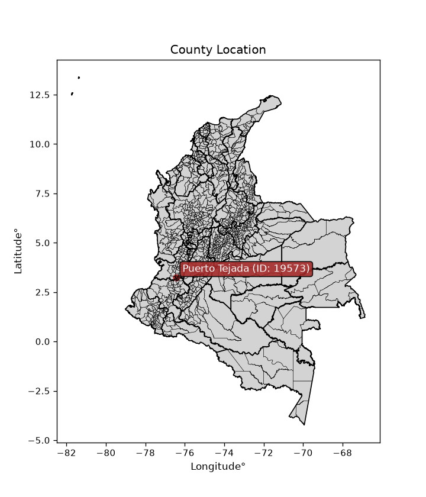
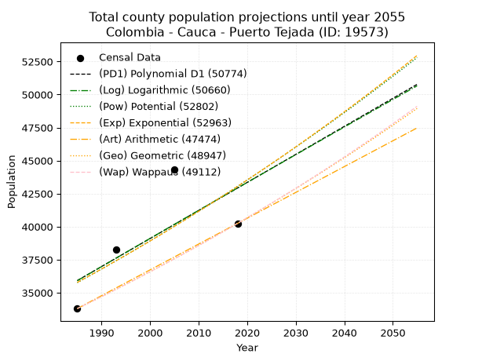
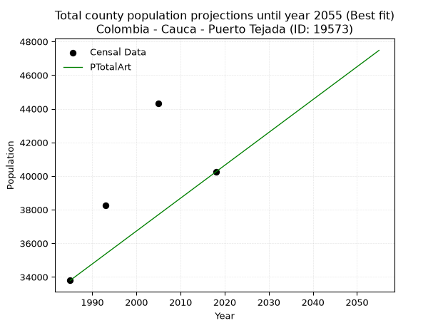
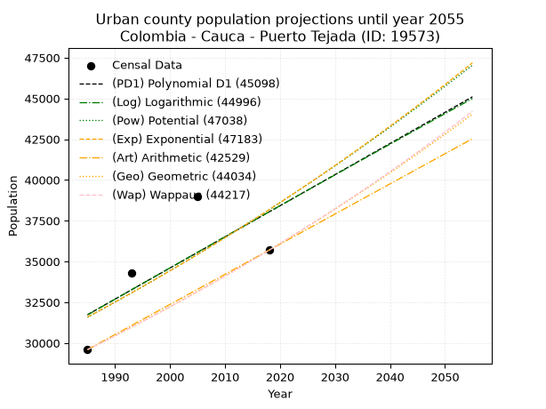
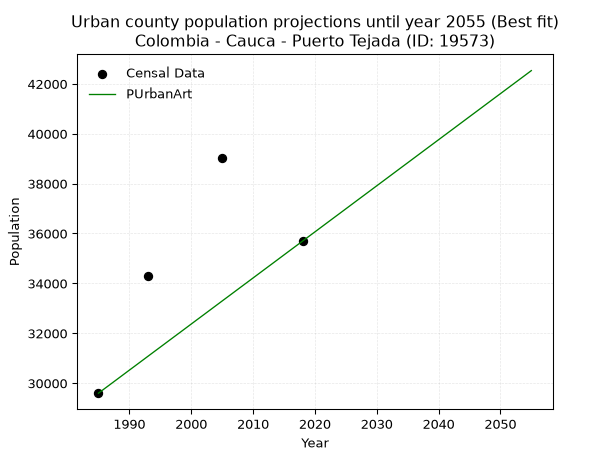
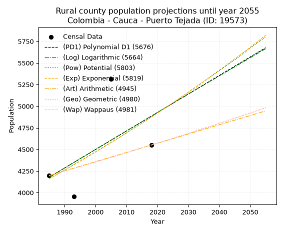
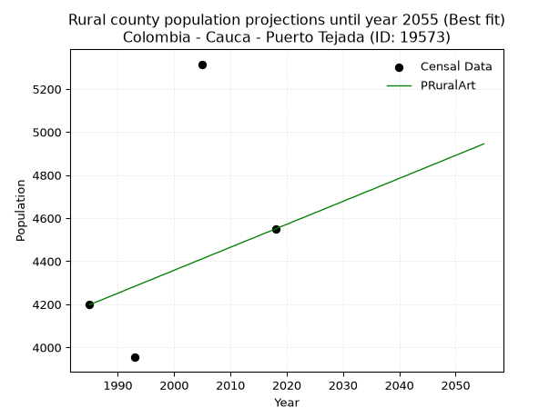

<div align="center">


</div>

# _“Population and Public Services Demand Projections (PPSD) until Year 2050 for Colombia - Cauca - Puerto Tejada (ID: 19573)”_
Keywords: `population` `public-service` `projection` `lineal` `polynomial` `logarithmic` `potential` `exponential` `arithmetic` `geometric` `wappaus` `dane` `colombia` `south-america`

PPSD are analytical estimates used by governments and planners to anticipate future changes in population size, age distribution, and the resulting community needs for utilities, healthcare, education, and infrastructure as sizing future water treatment facilities, electrical grids, and road networks based on spatial growth.

<div align="center">

</img>

</div>


> **General running parameters**: • app_version: _v20260806_. • Python version: _3.14.7_. • Pandas version: _3.0.5_. • NumPy version: _2.5.1_. • Creates, save and include plots into reports (create_plot): _False_. • Projection until year: _2050_. • Process polynomial degree 2 and up: _False_. • Process Wappaus: _True_. • Process Wappaus: _True_. • Set negative values to zero: _True_. • Set infinite values to zero: _True_. • Drop dataset notes: _True_. 
<div align="center">

Dynamic map: [:earth_americas:Google](http://maps.google.com/maps?q=3.233254275,-76.4176728) [:earth_americas:OSM](https://www.openstreetmap.org/#map=18/3.233254275/-76.4176728&layers=P) [:earth_americas:Bing](https://www.bing.com/maps?cp=3.233254275~-76.4176728&lvl=18) [:earth_americas:Apple](https://maps.apple.com/frame?center=3.233254275%2C-76.4176728&span=0.003%2C0.006)

</div>


<div align="center">

```geojson
{
  "type": "Feature",
  "geometry": {
    "type": "Point", 
    "coordinates": [-76.4176728, 3.233254275]
  }, 
  "properties": {
    "Name": "Colombia - Cauca - Puerto Tejada (ID: 19573)"
  }
}
```

</div>


## 0. Census Data (4 records)

Census data are official statistics collected by a government about the people and housing in a country. They usually include counts of total population, age, sex, race, income, education, and jobs.

📅Global census file: [Population.xlsx](../data/Population.xlsx)

| Source   |   Year |   CountryID | CountryName   |   StateID | StateName   |   CountyID | CountyName    |   PTotal |   PUrban |   PRural |
|:---------|-------:|------------:|:--------------|----------:|:------------|-----------:|:--------------|---------:|---------:|---------:|
| DANE     |   1985 |          57 | Colombia      |        19 | Cauca       |      19573 | Puerto Tejada |    33796 |    29598 |     4198 |
| DANE     |   1993 |          57 | Colombia      |        19 | Cauca       |      19573 | Puerto Tejada |    38249 |    34295 |     3954 |
| DANE     |   2005 |          57 | Colombia      |        19 | Cauca       |      19573 | Puerto Tejada |    44324 |    39009 |     5315 |
| DANE     |   2018 |          57 | Colombia      |        19 | Cauca       |      19573 | Puerto Tejada |    40244 |    35694 |     4550 |

> 🔥Some records could had specific notes about the registered values or the corresponding urban or rural distribution.

📅[SUI-RUPS](https://www.datos.gov.co/Hacienda-y-Cr-dito-P-blico/Registro-nico-de-Prestadores-de-Servicios-P-blicos/4qkq-csdn/about_data) - Local public utility companies: [RUPS.csv](../data/RUPS.xlsx)

 | SERVICIO       | ESTADO                    | NOMBRE                                                                                         | NIT         | DEPARTAMENTO_DOMICILIO   | MUNICIPIO_DOMICILIO   | DIRECCION                                        |   TELEFONO | EMAIL                           | TIPO_PRESTADOR                             | CLASIFICACION                 |
|:---------------|:--------------------------|:-----------------------------------------------------------------------------------------------|:------------|:-------------------------|:----------------------|:-------------------------------------------------|-----------:|:--------------------------------|:-------------------------------------------|:------------------------------|
| ACUEDUCTO      | EN PROCESO DE LIQUIDACION | EMPRESA DE ACUEDUCTO Y ALCANTARILLADO DEL RIO PALO SOCIEDAD POR ACCIONES E.S.P. EN LIQUIDACION | 800155877-1 | CAUCA                    | VILLA RICA            | CALLE 2 1 139                                    |    8486421 | miltonvel@hotmail.com           | SOCIEDADES (EMPRESA DE SERVICIOS PUBLICOS) | MAYOR O IGUAL A 5001 USUARIOS |
| ALCANTARILLADO | EN PROCESO DE LIQUIDACION | EMPRESA DE ACUEDUCTO Y ALCANTARILLADO DEL RIO PALO SOCIEDAD POR ACCIONES E.S.P. EN LIQUIDACION | 800155877-1 | CAUCA                    | VILLA RICA            | CALLE 2 1 139                                    |    8486421 | miltonvel@hotmail.com           | SOCIEDADES (EMPRESA DE SERVICIOS PUBLICOS) | MENOR O IGUAL A 2500 USUARIOS |
| ACUEDUCTO      | OPERATIVA                 | OPERADORA DE SERVICIOS PUBLICOS S.A. EMPRESA DE SERVICIOS PUBLICOS                             | 805011016-5 | VALLE DEL CAUCA          | CALI                  | CALLE 38 NORTE N 3N  84                          |    6656512 | gerenciageneral@opsasaesp.com   | SOCIEDADES (EMPRESA DE SERVICIOS PUBLICOS) | MAYOR O IGUAL A 5001 USUARIOS |
| ALCANTARILLADO | OPERATIVA                 | OPERADORA DE SERVICIOS PUBLICOS S.A. EMPRESA DE SERVICIOS PUBLICOS                             | 805011016-5 | VALLE DEL CAUCA          | CALI                  | CALLE 38 NORTE N 3N  84                          |    6656512 | gerenciageneral@opsasaesp.com   | SOCIEDADES (EMPRESA DE SERVICIOS PUBLICOS) | MAYOR O IGUAL A 5001 USUARIOS |
| ACUEDUCTO      | OPERATIVA                 | ACUAPAEZ S.A. E.S.P.                                                                           | 817002471-9 | CAUCA                    | CALOTO                | PARQUE INDUSTRIAL Y CCIAL DEL CAUCA ET 4 LOTE 14 |    8259375 | jmena@acuapaez.com              | SOCIEDADES (EMPRESA DE SERVICIOS PUBLICOS) | MENOR O IGUAL A 2500 USUARIOS |
| ALCANTARILLADO | OPERATIVA                 | ACUAPAEZ S.A. E.S.P.                                                                           | 817002471-9 | CAUCA                    | CALOTO                | PARQUE INDUSTRIAL Y CCIAL DEL CAUCA ET 4 LOTE 14 |    8259375 | jmena@acuapaez.com              | SOCIEDADES (EMPRESA DE SERVICIOS PUBLICOS) | MENOR O IGUAL A 2500 USUARIOS |
| ACUEDUCTO      | OPERATIVA                 | EMPRESA DE AGUAS DE CIUDAD DEL SUR SURAGUAS S.A. E.S.P.                                        | 900637785-2 | CAUCA                    | PUERTO TEJADA         | CALLE 85B No.22-58 CIUDAD DEL SUR                |    3391143 | auxiliar.suraguas@hotmail.com   | SOCIEDADES (EMPRESA DE SERVICIOS PUBLICOS) | MENOR O IGUAL A 2500 USUARIOS |
| ALCANTARILLADO | OPERATIVA                 | EMPRESA DE AGUAS DE CIUDAD DEL SUR SURAGUAS S.A. E.S.P.                                        | 900637785-2 | CAUCA                    | PUERTO TEJADA         | CALLE 85B No.22-58 CIUDAD DEL SUR                |    3391143 | auxiliar.suraguas@hotmail.com   | SOCIEDADES (EMPRESA DE SERVICIOS PUBLICOS) | MENOR O IGUAL A 2500 USUARIOS |
| ACUEDUCTO      | OPERATIVA                 | AFROCAUCANA DE AGUAS S.A.S. E.S.P.                                                             | 900677284-5 | CAUCA                    | PUERTO TEJADA         | Carrera 19 # 13-57                               |    8267274 | miltonmarinovelasco@hotmail.com | SOCIEDADES (EMPRESA DE SERVICIOS PUBLICOS) | MAYOR O IGUAL A 5001 USUARIOS |
| ALCANTARILLADO | OPERATIVA                 | AFROCAUCANA DE AGUAS S.A.S. E.S.P.                                                             | 900677284-5 | CAUCA                    | PUERTO TEJADA         | Carrera 19 # 13-57                               |    8267274 | miltonmarinovelasco@hotmail.com | SOCIEDADES (EMPRESA DE SERVICIOS PUBLICOS) | MAYOR O IGUAL A 5001 USUARIOS |

## 1. Total

### 1.1. Coefficients and Parameters

* (PD1) Polynomial Deg 1: 212.24528301887008, -385390.37735849497 (lineal)
* (Log) Logarithmic: 425804.8422237748, -3197392.767928772
* (Pow) Potential: 11.24303277430344, -32.52339745939571
* (Exp) Exponential: 0.005604548577735423, 0.5272891323515165
* (Art) Arithmetic: Year diff. 2018 - 1985 = 33, Population diff. 40244 - 33796 = 6448, Annual growth = 195.3939393939394
* (Geo) Geometric: Year diff. 2018 - 1985 = 33, Population diff. 40244 - 33796 = 6448, Annual growth % = 0.005305493399919259
* (Wap) Wappaus: i = 0.5278064273202037, Condition values only valid for < 200)

<sub>
Wappaus condition values: ['0.00', '0.53', '1.06', '1.58', '2.11', '2.64', '3.17', '3.69', '4.22', '4.75', '5.28', '5.81', '6.33', '6.86', '7.39', '7.92', '8.44', '8.97', '9.50', '10.03', '10.56', '11.08', '11.61', '12.14', '12.67', '13.20', '13.72', '14.25', '14.78', '15.31', '15.83', '16.36', '16.89', '17.42', '17.95', '18.47', '19.00', '19.53', '20.06', '20.58', '21.11', '21.64', '22.17', '22.70', '23.22', '23.75', '24.28', '24.81', '25.33', '25.86', '26.39', '26.92', '27.45', '27.97', '28.50', '29.03', '29.56', '30.08', '30.61', '31.14', '31.67', '32.20', '32.72', '33.25', '33.78', '34.31']
</sub>


### 1.2. Projected Dataset

|   Year |   CountyID |   PTotalPD1 |   PTotalLog |   PTotalPow |   PTotalExp |   PTotalArt |   PTotalGeo |   PTotalWap |
|-------:|-----------:|------------:|------------:|------------:|------------:|------------:|------------:|------------:|
|   1985 |      19573 |       35917 |       35903 |       35763 |       35776 |       33796 |       33796 |       33796 |
|   1986 |      19573 |       36129 |       36117 |       35966 |       35977 |       33991 |       33975 |       33975 |
|   1987 |      19573 |       36341 |       36332 |       36170 |       36179 |       34187 |       34156 |       34155 |
|   1988 |      19573 |       36553 |       36546 |       36375 |       36382 |       34382 |       34337 |       34335 |
|   1989 |      19573 |       36765 |       36760 |       36582 |       36587 |       34578 |       34519 |       34517 |
|   1990 |      19573 |       36978 |       36974 |       36789 |       36792 |       34773 |       34702 |       34700 |
|   1991 |      19573 |       37190 |       37188 |       36997 |       36999 |       34968 |       34886 |       34883 |
|   1992 |      19573 |       37402 |       37402 |       37207 |       37207 |       35164 |       35071 |       35068 |
|   1993 |      19573 |       37614 |       37615 |       37417 |       37416 |       35359 |       35257 |       35254 |
|   1994 |      19573 |       37827 |       37829 |       37629 |       37626 |       35555 |       35444 |       35440 |
|   1995 |      19573 |       38039 |       38042 |       37842 |       37838 |       35750 |       35632 |       35628 |
|   1996 |      19573 |       38251 |       38256 |       38055 |       38051 |       35945 |       35822 |       35817 |
|   1997 |      19573 |       38463 |       38469 |       38270 |       38264 |       36141 |       36012 |       36007 |
|   1998 |      19573 |       38676 |       38682 |       38486 |       38480 |       36336 |       36203 |       36197 |
|   1999 |      19573 |       38888 |       38895 |       38703 |       38696 |       36532 |       36395 |       36389 |
|   2000 |      19573 |       39100 |       39108 |       38922 |       38913 |       36727 |       36588 |       36582 |
|   2001 |      19573 |       39312 |       39321 |       39141 |       39132 |       36922 |       36782 |       36776 |
|   2002 |      19573 |       39525 |       39534 |       39361 |       39352 |       37118 |       36977 |       36971 |
|   2003 |      19573 |       39737 |       39747 |       39583 |       39573 |       37313 |       37173 |       37167 |
|   2004 |      19573 |       39949 |       39959 |       39806 |       39795 |       37508 |       37370 |       37364 |
|   2005 |      19573 |       40161 |       40171 |       40030 |       40019 |       37704 |       37569 |       37562 |
|   2006 |      19573 |       40374 |       40384 |       40255 |       40244 |       37899 |       37768 |       37762 |
|   2007 |      19573 |       40586 |       40596 |       40481 |       40470 |       38095 |       37968 |       37962 |
|   2008 |      19573 |       40798 |       40808 |       40708 |       40698 |       38290 |       38170 |       38164 |
|   2009 |      19573 |       41010 |       41020 |       40937 |       40926 |       38485 |       38372 |       38367 |
|   2010 |      19573 |       41223 |       41232 |       41167 |       41156 |       38681 |       38576 |       38570 |
|   2011 |      19573 |       41435 |       41444 |       41397 |       41388 |       38876 |       38781 |       38775 |
|   2012 |      19573 |       41647 |       41655 |       41629 |       41620 |       39072 |       38986 |       38982 |
|   2013 |      19573 |       41859 |       41867 |       41863 |       41854 |       39267 |       39193 |       39189 |
|   2014 |      19573 |       42072 |       42079 |       42097 |       42090 |       39462 |       39401 |       39398 |
|   2015 |      19573 |       42284 |       42290 |       42333 |       42326 |       39658 |       39610 |       39607 |
|   2016 |      19573 |       42496 |       42501 |       42569 |       42564 |       39853 |       39820 |       39818 |
|   2017 |      19573 |       42708 |       42712 |       42807 |       42803 |       40049 |       40032 |       40031 |
|   2018 |      19573 |       42921 |       42923 |       43047 |       43044 |       40244 |       40244 |       40244 |
|   2019 |      19573 |       43133 |       43134 |       43287 |       43286 |       40439 |       40458 |       40459 |
|   2020 |      19573 |       43345 |       43345 |       43529 |       43529 |       40635 |       40672 |       40675 |
|   2021 |      19573 |       43557 |       43556 |       43772 |       43774 |       40830 |       40888 |       40892 |
|   2022 |      19573 |       43770 |       43767 |       44016 |       44020 |       41026 |       41105 |       41110 |
|   2023 |      19573 |       43982 |       43977 |       44261 |       44267 |       41221 |       41323 |       41330 |
|   2024 |      19573 |       44194 |       44188 |       44508 |       44516 |       41416 |       41542 |       41551 |
|   2025 |      19573 |       44406 |       44398 |       44756 |       44766 |       41612 |       41763 |       41773 |
|   2026 |      19573 |       44619 |       44608 |       45005 |       45018 |       41807 |       41984 |       41997 |
|   2027 |      19573 |       44831 |       44818 |       45255 |       45271 |       42003 |       42207 |       42222 |
|   2028 |      19573 |       45043 |       45028 |       45507 |       45525 |       42198 |       42431 |       42448 |
|   2029 |      19573 |       45255 |       45238 |       45760 |       45781 |       42393 |       42656 |       42676 |
|   2030 |      19573 |       45468 |       45448 |       46014 |       46038 |       42589 |       42882 |       42905 |
|   2031 |      19573 |       45680 |       45658 |       46269 |       46297 |       42784 |       43110 |       43135 |
|   2032 |      19573 |       45892 |       45867 |       46526 |       46557 |       42980 |       43339 |       43367 |
|   2033 |      19573 |       46104 |       46077 |       46784 |       46819 |       43175 |       43568 |       43600 |
|   2034 |      19573 |       46317 |       46286 |       47044 |       47082 |       43370 |       43800 |       43835 |
|   2035 |      19573 |       46529 |       46495 |       47304 |       47347 |       43566 |       44032 |       44071 |
|   2036 |      19573 |       46741 |       46705 |       47566 |       47613 |       43761 |       44266 |       44308 |
|   2037 |      19573 |       46953 |       46914 |       47830 |       47880 |       43956 |       44500 |       44547 |
|   2038 |      19573 |       47166 |       47123 |       48094 |       48149 |       44152 |       44737 |       44787 |
|   2039 |      19573 |       47378 |       47332 |       48360 |       48420 |       44347 |       44974 |       45029 |
|   2040 |      19573 |       47590 |       47540 |       48628 |       48692 |       44543 |       45212 |       45273 |
|   2041 |      19573 |       47802 |       47749 |       48896 |       48966 |       44738 |       45452 |       45517 |
|   2042 |      19573 |       48014 |       47958 |       49166 |       49241 |       44933 |       45694 |       45764 |
|   2043 |      19573 |       48227 |       48166 |       49438 |       49518 |       45129 |       45936 |       46012 |
|   2044 |      19573 |       48439 |       48374 |       49710 |       49796 |       45324 |       46180 |       46261 |
|   2045 |      19573 |       48651 |       48583 |       49985 |       50076 |       45520 |       46425 |       46512 |
|   2046 |      19573 |       48863 |       48791 |       50260 |       50357 |       45715 |       46671 |       46765 |
|   2047 |      19573 |       49076 |       48999 |       50537 |       50640 |       45910 |       46919 |       47019 |
|   2048 |      19573 |       49288 |       49207 |       50815 |       50925 |       46106 |       47167 |       47275 |
|   2049 |      19573 |       49500 |       49415 |       51095 |       51211 |       46301 |       47418 |       47532 |
|   2050 |      19573 |       49712 |       49623 |       51376 |       51499 |       46497 |       47669 |       47791 |
<div align="center">

</img>

</div>


### 1.3. Best fit with absolute and relative error (%)

Relative error puts that difference into context by dividing the absolute error by the true value, creating a unitless ratio or percentage that shows the scale of the mistake.

Absolute and relative error

|   Year | Source   |   CountryID | CountryName   |   StateID | StateName   |   CountyID_x | CountyName    |   PTotal |   PUrban |   PRural |   CountyID_y |   PTotalPD1 |   PTotalLog |   PTotalPow |   PTotalExp |   PTotalArt |   PTotalGeo |   PTotalWap |   PTotalPD1AbsError |   PTotalLogAbsError |   PTotalPowAbsError |   PTotalExpAbsError |   PTotalArtAbsError |   PTotalGeoAbsError |   PTotalWapAbsError |   PTotalPD1RelError |   PTotalLogRelError |   PTotalPowRelError |   PTotalExpRelError |   PTotalArtRelError |   PTotalGeoRelError |   PTotalWapRelError |
|-------:|:---------|------------:|:--------------|----------:|:------------|-------------:|:--------------|---------:|---------:|---------:|-------------:|------------:|------------:|------------:|------------:|------------:|------------:|------------:|--------------------:|--------------------:|--------------------:|--------------------:|--------------------:|--------------------:|--------------------:|--------------------:|--------------------:|--------------------:|--------------------:|--------------------:|--------------------:|--------------------:|
|   1985 | DANE     |          57 | Colombia      |        19 | Cauca       |        19573 | Puerto Tejada |    33796 |    29598 |     4198 |        19573 |       35917 |       35903 |       35763 |       35776 |       33796 |       33796 |       33796 |                2121 |                2107 |                1967 |                1980 |                   0 |                   0 |                   0 |             6.27589 |             6.23447 |             5.82022 |             5.85868 |             0       |             0       |             0       |
|   1993 | DANE     |          57 | Colombia      |        19 | Cauca       |        19573 | Puerto Tejada |    38249 |    34295 |     3954 |        19573 |       37614 |       37615 |       37417 |       37416 |       35359 |       35257 |       35254 |                 635 |                 634 |                 832 |                 833 |                2890 |                2992 |                2995 |             1.66017 |             1.65756 |             2.17522 |             2.17783 |             7.55575 |             7.82243 |             7.83027 |
|   2005 | DANE     |          57 | Colombia      |        19 | Cauca       |        19573 | Puerto Tejada |    44324 |    39009 |     5315 |        19573 |       40161 |       40171 |       40030 |       40019 |       37704 |       37569 |       37562 |                4163 |                4153 |                4294 |                4305 |                6620 |                6755 |                6762 |             9.3922  |             9.36964 |             9.68775 |             9.71257 |            14.9355  |            15.2401  |            15.2558  |
|   2018 | DANE     |          57 | Colombia      |        19 | Cauca       |        19573 | Puerto Tejada |    40244 |    35694 |     4550 |        19573 |       42921 |       42923 |       43047 |       43044 |       40244 |       40244 |       40244 |                2677 |                2679 |                2803 |                2800 |                   0 |                   0 |                   0 |             6.65192 |             6.65689 |             6.96501 |             6.95756 |             0       |             0       |             0       |

Relative error mean

| Method    |   RelError | Best   |
|:----------|-----------:|:-------|
| PTotalPD1 |    5.99505 |        |
| PTotalLog |    5.97964 |        |
| PTotalPow |    6.16205 |        |
| PTotalExp |    6.17666 |        |
| PTotalArt |    5.62281 | True   |
| PTotalGeo |    5.76562 |        |
| PTotalWap |    5.77153 |        |

💙Best method: _**PTotalArt**_
<div align="center">

</img>

</div>


### 1.4. Fresh water supply demand in liters per capita per day (lpcd)

The fresh water supply demand typically ranges from 100 to 300 liters per capita per day (lpcd) for standard domestic and municipal planning, though absolute survival minimums set by the World Health Organization are as low as 7.5 to 20 liters per day, and total consumption in high-income nations can exceed 400 liters.

> `CZ`: Level in meters above the sea level (masl)<br> `WS`: Fresh water supply demand in liters per capita per day (lpcd or l/h/d)<br> `WSAll`: Zonal fresh water supply demand in liters per second (l/s)<br> `A`: Zonal area in square meters<br> `DP`: Population density (people/hectare or p/ha)

Reference values (RAS Colombia)

|    CZ |   WS |
|------:|-----:|
|  1000 |  120 |
|  2000 |  130 |
| 99999 |  140 |

County shapefile geometry properties and water supply values

|   CountyID |      ATotal |   CZTotal |   WSTotal |
|-----------:|------------:|----------:|----------:|
|      19573 | 1.13164e+08 |    965.37 |       120 |

Projected values for best method: PTotalArt

|   CountyID |   Year |   PTotalArt |   DPTotal |   WSTotal |   WSTotalAll |
|-----------:|-------:|------------:|----------:|----------:|-------------:|
|      19573 |   1985 |       33796 |      2.99 |       120 |      46.9389 |
|      19573 |   1986 |       33991 |      3    |       120 |      47.2097 |
|      19573 |   1987 |       34187 |      3.02 |       120 |      47.4819 |
|      19573 |   1988 |       34382 |      3.04 |       120 |      47.7528 |
|      19573 |   1989 |       34578 |      3.06 |       120 |      48.025  |
|      19573 |   1990 |       34773 |      3.07 |       120 |      48.2958 |
|      19573 |   1991 |       34968 |      3.09 |       120 |      48.5667 |
|      19573 |   1992 |       35164 |      3.11 |       120 |      48.8389 |
|      19573 |   1993 |       35359 |      3.12 |       120 |      49.1097 |
|      19573 |   1994 |       35555 |      3.14 |       120 |      49.3819 |
|      19573 |   1995 |       35750 |      3.16 |       120 |      49.6528 |
|      19573 |   1996 |       35945 |      3.18 |       120 |      49.9236 |
|      19573 |   1997 |       36141 |      3.19 |       120 |      50.1958 |
|      19573 |   1998 |       36336 |      3.21 |       120 |      50.4667 |
|      19573 |   1999 |       36532 |      3.23 |       120 |      50.7389 |
|      19573 |   2000 |       36727 |      3.25 |       120 |      51.0097 |
|      19573 |   2001 |       36922 |      3.26 |       120 |      51.2806 |
|      19573 |   2002 |       37118 |      3.28 |       120 |      51.5528 |
|      19573 |   2003 |       37313 |      3.3  |       120 |      51.8236 |
|      19573 |   2004 |       37508 |      3.31 |       120 |      52.0944 |
|      19573 |   2005 |       37704 |      3.33 |       120 |      52.3667 |
|      19573 |   2006 |       37899 |      3.35 |       120 |      52.6375 |
|      19573 |   2007 |       38095 |      3.37 |       120 |      52.9097 |
|      19573 |   2008 |       38290 |      3.38 |       120 |      53.1806 |
|      19573 |   2009 |       38485 |      3.4  |       120 |      53.4514 |
|      19573 |   2010 |       38681 |      3.42 |       120 |      53.7236 |
|      19573 |   2011 |       38876 |      3.44 |       120 |      53.9944 |
|      19573 |   2012 |       39072 |      3.45 |       120 |      54.2667 |
|      19573 |   2013 |       39267 |      3.47 |       120 |      54.5375 |
|      19573 |   2014 |       39462 |      3.49 |       120 |      54.8083 |
|      19573 |   2015 |       39658 |      3.5  |       120 |      55.0806 |
|      19573 |   2016 |       39853 |      3.52 |       120 |      55.3514 |
|      19573 |   2017 |       40049 |      3.54 |       120 |      55.6236 |
|      19573 |   2018 |       40244 |      3.56 |       120 |      55.8944 |
|      19573 |   2019 |       40439 |      3.57 |       120 |      56.1653 |
|      19573 |   2020 |       40635 |      3.59 |       120 |      56.4375 |
|      19573 |   2021 |       40830 |      3.61 |       120 |      56.7083 |
|      19573 |   2022 |       41026 |      3.63 |       120 |      56.9806 |
|      19573 |   2023 |       41221 |      3.64 |       120 |      57.2514 |
|      19573 |   2024 |       41416 |      3.66 |       120 |      57.5222 |
|      19573 |   2025 |       41612 |      3.68 |       120 |      57.7944 |
|      19573 |   2026 |       41807 |      3.69 |       120 |      58.0653 |
|      19573 |   2027 |       42003 |      3.71 |       120 |      58.3375 |
|      19573 |   2028 |       42198 |      3.73 |       120 |      58.6083 |
|      19573 |   2029 |       42393 |      3.75 |       120 |      58.8792 |
|      19573 |   2030 |       42589 |      3.76 |       120 |      59.1514 |
|      19573 |   2031 |       42784 |      3.78 |       120 |      59.4222 |
|      19573 |   2032 |       42980 |      3.8  |       120 |      59.6944 |
|      19573 |   2033 |       43175 |      3.82 |       120 |      59.9653 |
|      19573 |   2034 |       43370 |      3.83 |       120 |      60.2361 |
|      19573 |   2035 |       43566 |      3.85 |       120 |      60.5083 |
|      19573 |   2036 |       43761 |      3.87 |       120 |      60.7792 |
|      19573 |   2037 |       43956 |      3.88 |       120 |      61.05   |
|      19573 |   2038 |       44152 |      3.9  |       120 |      61.3222 |
|      19573 |   2039 |       44347 |      3.92 |       120 |      61.5931 |
|      19573 |   2040 |       44543 |      3.94 |       120 |      61.8653 |
|      19573 |   2041 |       44738 |      3.95 |       120 |      62.1361 |
|      19573 |   2042 |       44933 |      3.97 |       120 |      62.4069 |
|      19573 |   2043 |       45129 |      3.99 |       120 |      62.6792 |
|      19573 |   2044 |       45324 |      4.01 |       120 |      62.95   |
|      19573 |   2045 |       45520 |      4.02 |       120 |      63.2222 |
|      19573 |   2046 |       45715 |      4.04 |       120 |      63.4931 |
|      19573 |   2047 |       45910 |      4.06 |       120 |      63.7639 |
|      19573 |   2048 |       46106 |      4.07 |       120 |      64.0361 |
|      19573 |   2049 |       46301 |      4.09 |       120 |      64.3069 |
|      19573 |   2050 |       46497 |      4.11 |       120 |      64.5792 |

## 2. Urban

### 2.1. Coefficients and Parameters

* (PD1) Polynomial Deg 1: 190.85186672019438, -347102.4464070688 (lineal)
* (Log) Logarithmic: 382899.0942292247, -2875770.0835971106
* (Pow) Potential: 11.49299678996242, -33.40169069754626
* (Exp) Exponential: 0.005728911551972632, 0.3638077489124778
* (Art) Arithmetic: Year diff. 2018 - 1985 = 33, Population diff. 35694 - 29598 = 6096, Annual growth = 184.72727272727272
* (Geo) Geometric: Year diff. 2018 - 1985 = 33, Population diff. 35694 - 29598 = 6096, Annual growth % = 0.005691158183521949
* (Wap) Wappaus: i = 0.5658496377114278, Condition values only valid for < 200)

<sub>
Wappaus condition values: ['0.00', '0.57', '1.13', '1.70', '2.26', '2.83', '3.40', '3.96', '4.53', '5.09', '5.66', '6.22', '6.79', '7.36', '7.92', '8.49', '9.05', '9.62', '10.19', '10.75', '11.32', '11.88', '12.45', '13.01', '13.58', '14.15', '14.71', '15.28', '15.84', '16.41', '16.98', '17.54', '18.11', '18.67', '19.24', '19.80', '20.37', '20.94', '21.50', '22.07', '22.63', '23.20', '23.77', '24.33', '24.90', '25.46', '26.03', '26.59', '27.16', '27.73', '28.29', '28.86', '29.42', '29.99', '30.56', '31.12', '31.69', '32.25', '32.82', '33.39', '33.95', '34.52', '35.08', '35.65', '36.21', '36.78']
</sub>


### 2.2. Projected Dataset

|   Year |   CountyID |   PUrbanPD1 |   PUrbanLog |   PUrbanPow |   PUrbanExp |   PUrbanArt |   PUrbanGeo |   PUrbanWap |
|-------:|-----------:|------------:|------------:|------------:|------------:|------------:|------------:|------------:|
|   1985 |      19573 |       31739 |       31726 |       31584 |       31595 |       29598 |       29598 |       29598 |
|   1986 |      19573 |       31929 |       31919 |       31767 |       31777 |       29783 |       29766 |       29766 |
|   1987 |      19573 |       32120 |       32112 |       31951 |       31959 |       29967 |       29936 |       29935 |
|   1988 |      19573 |       32311 |       32304 |       32136 |       32143 |       30152 |       30106 |       30105 |
|   1989 |      19573 |       32502 |       32497 |       32323 |       32328 |       30337 |       30278 |       30276 |
|   1990 |      19573 |       32693 |       32689 |       32510 |       32513 |       30522 |       30450 |       30447 |
|   1991 |      19573 |       32884 |       32882 |       32698 |       32700 |       30706 |       30623 |       30620 |
|   1992 |      19573 |       33074 |       33074 |       32888 |       32888 |       30891 |       30797 |       30794 |
|   1993 |      19573 |       33265 |       33266 |       33078 |       33077 |       31076 |       30973 |       30969 |
|   1994 |      19573 |       33456 |       33458 |       33269 |       33267 |       31261 |       31149 |       31145 |
|   1995 |      19573 |       33647 |       33650 |       33461 |       33458 |       31445 |       31326 |       31322 |
|   1996 |      19573 |       33838 |       33842 |       33655 |       33650 |       31630 |       31505 |       31499 |
|   1997 |      19573 |       34029 |       34034 |       33849 |       33844 |       31815 |       31684 |       31678 |
|   1998 |      19573 |       34220 |       34225 |       34044 |       34038 |       31999 |       31864 |       31858 |
|   1999 |      19573 |       34410 |       34417 |       34241 |       34234 |       32184 |       32046 |       32039 |
|   2000 |      19573 |       34601 |       34609 |       34438 |       34430 |       32369 |       32228 |       32222 |
|   2001 |      19573 |       34792 |       34800 |       34636 |       34628 |       32554 |       32411 |       32405 |
|   2002 |      19573 |       34983 |       34991 |       34836 |       34827 |       32738 |       32596 |       32589 |
|   2003 |      19573 |       35174 |       35183 |       35036 |       35027 |       32923 |       32781 |       32774 |
|   2004 |      19573 |       35365 |       35374 |       35238 |       35228 |       33108 |       32968 |       32961 |
|   2005 |      19573 |       35556 |       35565 |       35440 |       35431 |       33293 |       33155 |       33149 |
|   2006 |      19573 |       35746 |       35756 |       35644 |       35634 |       33477 |       33344 |       33337 |
|   2007 |      19573 |       35937 |       35946 |       35849 |       35839 |       33662 |       33534 |       33527 |
|   2008 |      19573 |       36128 |       36137 |       36055 |       36045 |       33847 |       33725 |       33718 |
|   2009 |      19573 |       36319 |       36328 |       36262 |       36252 |       34031 |       33917 |       33910 |
|   2010 |      19573 |       36510 |       36518 |       36470 |       36460 |       34216 |       34110 |       34104 |
|   2011 |      19573 |       36701 |       36709 |       36679 |       36670 |       34401 |       34304 |       34298 |
|   2012 |      19573 |       36892 |       36899 |       36889 |       36881 |       34586 |       34499 |       34494 |
|   2013 |      19573 |       37082 |       37089 |       37100 |       37092 |       34770 |       34695 |       34691 |
|   2014 |      19573 |       37273 |       37280 |       37312 |       37306 |       34955 |       34893 |       34889 |
|   2015 |      19573 |       37464 |       37470 |       37526 |       37520 |       35140 |       35091 |       35088 |
|   2016 |      19573 |       37655 |       37660 |       37741 |       37735 |       35325 |       35291 |       35289 |
|   2017 |      19573 |       37846 |       37849 |       37956 |       37952 |       35509 |       35492 |       35491 |
|   2018 |      19573 |       38037 |       38039 |       38173 |       38170 |       35694 |       35694 |       35694 |
|   2019 |      19573 |       38227 |       38229 |       38391 |       38390 |       35879 |       35897 |       35898 |
|   2020 |      19573 |       38418 |       38419 |       38610 |       38610 |       36063 |       36101 |       36104 |
|   2021 |      19573 |       38609 |       38608 |       38830 |       38832 |       36248 |       36307 |       36311 |
|   2022 |      19573 |       38800 |       38797 |       39052 |       39055 |       36433 |       36514 |       36519 |
|   2023 |      19573 |       38991 |       38987 |       39274 |       39280 |       36618 |       36721 |       36729 |
|   2024 |      19573 |       39182 |       39176 |       39498 |       39505 |       36802 |       36930 |       36940 |
|   2025 |      19573 |       39373 |       39365 |       39723 |       39732 |       36987 |       37140 |       37152 |
|   2026 |      19573 |       39563 |       39554 |       39949 |       39960 |       37172 |       37352 |       37366 |
|   2027 |      19573 |       39754 |       39743 |       40176 |       40190 |       37357 |       37564 |       37581 |
|   2028 |      19573 |       39945 |       39932 |       40405 |       40421 |       37541 |       37778 |       37797 |
|   2029 |      19573 |       40136 |       40121 |       40634 |       40653 |       37726 |       37993 |       38015 |
|   2030 |      19573 |       40327 |       40309 |       40865 |       40887 |       37911 |       38209 |       38234 |
|   2031 |      19573 |       40518 |       40498 |       41097 |       41122 |       38095 |       38427 |       38455 |
|   2032 |      19573 |       40709 |       40686 |       41330 |       41358 |       38280 |       38646 |       38677 |
|   2033 |      19573 |       40899 |       40875 |       41564 |       41596 |       38465 |       38866 |       38900 |
|   2034 |      19573 |       41090 |       41063 |       41800 |       41834 |       38650 |       39087 |       39125 |
|   2035 |      19573 |       41281 |       41251 |       42037 |       42075 |       38834 |       39309 |       39352 |
|   2036 |      19573 |       41472 |       41439 |       42275 |       42317 |       39019 |       39533 |       39580 |
|   2037 |      19573 |       41663 |       41627 |       42514 |       42560 |       39204 |       39758 |       39809 |
|   2038 |      19573 |       41854 |       41815 |       42755 |       42804 |       39389 |       39984 |       40040 |
|   2039 |      19573 |       42045 |       42003 |       42996 |       43050 |       39573 |       40212 |       40273 |
|   2040 |      19573 |       42235 |       42191 |       43239 |       43297 |       39758 |       40441 |       40507 |
|   2041 |      19573 |       42426 |       42379 |       43483 |       43546 |       39943 |       40671 |       40743 |
|   2042 |      19573 |       42617 |       42566 |       43729 |       43796 |       40127 |       40902 |       40980 |
|   2043 |      19573 |       42808 |       42754 |       43976 |       44048 |       40312 |       41135 |       41219 |
|   2044 |      19573 |       42999 |       42941 |       44224 |       44301 |       40497 |       41369 |       41459 |
|   2045 |      19573 |       43190 |       43128 |       44473 |       44556 |       40682 |       41604 |       41701 |
|   2046 |      19573 |       43380 |       43316 |       44724 |       44812 |       40866 |       41841 |       41945 |
|   2047 |      19573 |       43571 |       43503 |       44976 |       45069 |       41051 |       42079 |       42191 |
|   2048 |      19573 |       43762 |       43690 |       45229 |       45328 |       41236 |       42319 |       42438 |
|   2049 |      19573 |       43953 |       43877 |       45483 |       45588 |       41421 |       42560 |       42687 |
|   2050 |      19573 |       44144 |       44063 |       45739 |       45850 |       41605 |       42802 |       42937 |
<div align="center">

</img>

</div>


### 2.3. Best fit with absolute and relative error (%)

Relative error puts that difference into context by dividing the absolute error by the true value, creating a unitless ratio or percentage that shows the scale of the mistake.

Absolute and relative error

|   Year | Source   |   CountryID | CountryName   |   StateID | StateName   |   CountyID_x | CountyName    |   PTotal |   PUrban |   PRural |   CountyID_y |   PUrbanPD1 |   PUrbanLog |   PUrbanPow |   PUrbanExp |   PUrbanArt |   PUrbanGeo |   PUrbanWap |   PUrbanPD1AbsError |   PUrbanLogAbsError |   PUrbanPowAbsError |   PUrbanExpAbsError |   PUrbanArtAbsError |   PUrbanGeoAbsError |   PUrbanWapAbsError |   PUrbanPD1RelError |   PUrbanLogRelError |   PUrbanPowRelError |   PUrbanExpRelError |   PUrbanArtRelError |   PUrbanGeoRelError |   PUrbanWapRelError |
|-------:|:---------|------------:|:--------------|----------:|:------------|-------------:|:--------------|---------:|---------:|---------:|-------------:|------------:|------------:|------------:|------------:|------------:|------------:|------------:|--------------------:|--------------------:|--------------------:|--------------------:|--------------------:|--------------------:|--------------------:|--------------------:|--------------------:|--------------------:|--------------------:|--------------------:|--------------------:|--------------------:|
|   1985 | DANE     |          57 | Colombia      |        19 | Cauca       |        19573 | Puerto Tejada |    33796 |    29598 |     4198 |        19573 |       31739 |       31726 |       31584 |       31595 |       29598 |       29598 |       29598 |                2141 |                2128 |                1986 |                1997 |                   0 |                   0 |                   0 |             7.2336  |             7.18967 |             6.70991 |             6.74708 |             0       |             0       |             0       |
|   1993 | DANE     |          57 | Colombia      |        19 | Cauca       |        19573 | Puerto Tejada |    38249 |    34295 |     3954 |        19573 |       33265 |       33266 |       33078 |       33077 |       31076 |       30973 |       30969 |                1030 |                1029 |                1217 |                1218 |                3219 |                3322 |                3326 |             3.00335 |             3.00044 |             3.54862 |             3.55154 |             9.38621 |             9.68654 |             9.69821 |
|   2005 | DANE     |          57 | Colombia      |        19 | Cauca       |        19573 | Puerto Tejada |    44324 |    39009 |     5315 |        19573 |       35556 |       35565 |       35440 |       35431 |       33293 |       33155 |       33149 |                3453 |                3444 |                3569 |                3578 |                5716 |                5854 |                5860 |             8.8518  |             8.82873 |             9.14917 |             9.17224 |            14.653   |            15.0068  |            15.0222  |
|   2018 | DANE     |          57 | Colombia      |        19 | Cauca       |        19573 | Puerto Tejada |    40244 |    35694 |     4550 |        19573 |       38037 |       38039 |       38173 |       38170 |       35694 |       35694 |       35694 |                2343 |                2345 |                2479 |                2476 |                   0 |                   0 |                   0 |             6.56413 |             6.56973 |             6.94514 |             6.93674 |             0       |             0       |             0       |

Relative error mean

| Method    |   RelError | Best   |
|:----------|-----------:|:-------|
| PUrbanPD1 |    6.41322 |        |
| PUrbanLog |    6.39714 |        |
| PUrbanPow |    6.58821 |        |
| PUrbanExp |    6.6019  |        |
| PUrbanArt |    6.00981 | True   |
| PUrbanGeo |    6.17333 |        |
| PUrbanWap |    6.1801  |        |

💙Best method: _**PUrbanArt**_
<div align="center">

</img>

</div>


### 2.4. Fresh water supply demand in liters per capita per day (lpcd)

The fresh water supply demand typically ranges from 100 to 300 liters per capita per day (lpcd) for standard domestic and municipal planning, though absolute survival minimums set by the World Health Organization are as low as 7.5 to 20 liters per day, and total consumption in high-income nations can exceed 400 liters.

> `CZ`: Level in meters above the sea level (masl)<br> `WS`: Fresh water supply demand in liters per capita per day (lpcd or l/h/d)<br> `WSAll`: Zonal fresh water supply demand in liters per second (l/s)<br> `A`: Zonal area in square meters<br> `DP`: Population density (people/hectare or p/ha)

Reference values (RAS Colombia)

|    CZ |   WS |
|------:|-----:|
|  1000 |  120 |
|  2000 |  130 |
| 99999 |  140 |

County shapefile geometry properties and water supply values

|   CountyID |      AUrban |   CZUrban |   WSUrban |
|-----------:|------------:|----------:|----------:|
|      19573 | 4.37866e+06 |   966.583 |       120 |

Projected values for best method: PUrbanArt

|   CountyID |   Year |   PUrbanArt |   DPUrban |   WSUrban |   WSUrbanAll |
|-----------:|-------:|------------:|----------:|----------:|-------------:|
|      19573 |   1985 |       29598 |     67.6  |       120 |      41.1083 |
|      19573 |   1986 |       29783 |     68.02 |       120 |      41.3653 |
|      19573 |   1987 |       29967 |     68.44 |       120 |      41.6208 |
|      19573 |   1988 |       30152 |     68.86 |       120 |      41.8778 |
|      19573 |   1989 |       30337 |     69.28 |       120 |      42.1347 |
|      19573 |   1990 |       30522 |     69.71 |       120 |      42.3917 |
|      19573 |   1991 |       30706 |     70.13 |       120 |      42.6472 |
|      19573 |   1992 |       30891 |     70.55 |       120 |      42.9042 |
|      19573 |   1993 |       31076 |     70.97 |       120 |      43.1611 |
|      19573 |   1994 |       31261 |     71.39 |       120 |      43.4181 |
|      19573 |   1995 |       31445 |     71.81 |       120 |      43.6736 |
|      19573 |   1996 |       31630 |     72.24 |       120 |      43.9306 |
|      19573 |   1997 |       31815 |     72.66 |       120 |      44.1875 |
|      19573 |   1998 |       31999 |     73.08 |       120 |      44.4431 |
|      19573 |   1999 |       32184 |     73.5  |       120 |      44.7    |
|      19573 |   2000 |       32369 |     73.92 |       120 |      44.9569 |
|      19573 |   2001 |       32554 |     74.35 |       120 |      45.2139 |
|      19573 |   2002 |       32738 |     74.77 |       120 |      45.4694 |
|      19573 |   2003 |       32923 |     75.19 |       120 |      45.7264 |
|      19573 |   2004 |       33108 |     75.61 |       120 |      45.9833 |
|      19573 |   2005 |       33293 |     76.03 |       120 |      46.2403 |
|      19573 |   2006 |       33477 |     76.45 |       120 |      46.4958 |
|      19573 |   2007 |       33662 |     76.88 |       120 |      46.7528 |
|      19573 |   2008 |       33847 |     77.3  |       120 |      47.0097 |
|      19573 |   2009 |       34031 |     77.72 |       120 |      47.2653 |
|      19573 |   2010 |       34216 |     78.14 |       120 |      47.5222 |
|      19573 |   2011 |       34401 |     78.57 |       120 |      47.7792 |
|      19573 |   2012 |       34586 |     78.99 |       120 |      48.0361 |
|      19573 |   2013 |       34770 |     79.41 |       120 |      48.2917 |
|      19573 |   2014 |       34955 |     79.83 |       120 |      48.5486 |
|      19573 |   2015 |       35140 |     80.25 |       120 |      48.8056 |
|      19573 |   2016 |       35325 |     80.68 |       120 |      49.0625 |
|      19573 |   2017 |       35509 |     81.1  |       120 |      49.3181 |
|      19573 |   2018 |       35694 |     81.52 |       120 |      49.575  |
|      19573 |   2019 |       35879 |     81.94 |       120 |      49.8319 |
|      19573 |   2020 |       36063 |     82.36 |       120 |      50.0875 |
|      19573 |   2021 |       36248 |     82.78 |       120 |      50.3444 |
|      19573 |   2022 |       36433 |     83.21 |       120 |      50.6014 |
|      19573 |   2023 |       36618 |     83.63 |       120 |      50.8583 |
|      19573 |   2024 |       36802 |     84.05 |       120 |      51.1139 |
|      19573 |   2025 |       36987 |     84.47 |       120 |      51.3708 |
|      19573 |   2026 |       37172 |     84.89 |       120 |      51.6278 |
|      19573 |   2027 |       37357 |     85.32 |       120 |      51.8847 |
|      19573 |   2028 |       37541 |     85.74 |       120 |      52.1403 |
|      19573 |   2029 |       37726 |     86.16 |       120 |      52.3972 |
|      19573 |   2030 |       37911 |     86.58 |       120 |      52.6542 |
|      19573 |   2031 |       38095 |     87    |       120 |      52.9097 |
|      19573 |   2032 |       38280 |     87.42 |       120 |      53.1667 |
|      19573 |   2033 |       38465 |     87.85 |       120 |      53.4236 |
|      19573 |   2034 |       38650 |     88.27 |       120 |      53.6806 |
|      19573 |   2035 |       38834 |     88.69 |       120 |      53.9361 |
|      19573 |   2036 |       39019 |     89.11 |       120 |      54.1931 |
|      19573 |   2037 |       39204 |     89.53 |       120 |      54.45   |
|      19573 |   2038 |       39389 |     89.96 |       120 |      54.7069 |
|      19573 |   2039 |       39573 |     90.38 |       120 |      54.9625 |
|      19573 |   2040 |       39758 |     90.8  |       120 |      55.2194 |
|      19573 |   2041 |       39943 |     91.22 |       120 |      55.4764 |
|      19573 |   2042 |       40127 |     91.64 |       120 |      55.7319 |
|      19573 |   2043 |       40312 |     92.06 |       120 |      55.9889 |
|      19573 |   2044 |       40497 |     92.49 |       120 |      56.2458 |
|      19573 |   2045 |       40682 |     92.91 |       120 |      56.5028 |
|      19573 |   2046 |       40866 |     93.33 |       120 |      56.7583 |
|      19573 |   2047 |       41051 |     93.75 |       120 |      57.0153 |
|      19573 |   2048 |       41236 |     94.18 |       120 |      57.2722 |
|      19573 |   2049 |       41421 |     94.6  |       120 |      57.5292 |
|      19573 |   2050 |       41605 |     95.02 |       120 |      57.7847 |

## 3. Rural

### 3.1. Coefficients and Parameters

* (PD1) Polynomial Deg 1: 21.39341629867561, -38287.9309514259 (lineal)
* (Log) Logarithmic: 42905.747994549885, -321622.6843316599
* (Pow) Potential: 9.607728119852885, -28.06494070530407
* (Exp) Exponential: 0.004791631971673286, 0.3079069892308166
* (Art) Arithmetic: Year diff. 2018 - 1985 = 33, Population diff. 4550 - 4198 = 352, Annual growth = 10.666666666666666
* (Geo) Geometric: Year diff. 2018 - 1985 = 33, Population diff. 4550 - 4198 = 352, Annual growth % = 0.002442949196841848
* (Wap) Wappaus: i = 0.24386526444139614, Condition values only valid for < 200)

<sub>
Wappaus condition values: ['0.00', '0.24', '0.49', '0.73', '0.98', '1.22', '1.46', '1.71', '1.95', '2.19', '2.44', '2.68', '2.93', '3.17', '3.41', '3.66', '3.90', '4.15', '4.39', '4.63', '4.88', '5.12', '5.37', '5.61', '5.85', '6.10', '6.34', '6.58', '6.83', '7.07', '7.32', '7.56', '7.80', '8.05', '8.29', '8.54', '8.78', '9.02', '9.27', '9.51', '9.75', '10.00', '10.24', '10.49', '10.73', '10.97', '11.22', '11.46', '11.71', '11.95', '12.19', '12.44', '12.68', '12.92', '13.17', '13.41', '13.66', '13.90', '14.14', '14.39', '14.63', '14.88', '15.12', '15.36', '15.61', '15.85']
</sub>


### 3.2. Projected Dataset

|   Year |   CountyID |   PRuralPD1 |   PRuralLog |   PRuralPow |   PRuralExp |   PRuralArt |   PRuralGeo |   PRuralWap |
|-------:|-----------:|------------:|------------:|------------:|------------:|------------:|------------:|------------:|
|   1985 |      19573 |        4178 |        4177 |        4160 |        4161 |        4198 |        4198 |        4198 |
|   1986 |      19573 |        4199 |        4198 |        4180 |        4181 |        4209 |        4208 |        4208 |
|   1987 |      19573 |        4221 |        4220 |        4200 |        4201 |        4219 |        4219 |        4219 |
|   1988 |      19573 |        4242 |        4242 |        4220 |        4221 |        4230 |        4229 |        4229 |
|   1989 |      19573 |        4264 |        4263 |        4241 |        4241 |        4241 |        4239 |        4239 |
|   1990 |      19573 |        4285 |        4285 |        4261 |        4262 |        4251 |        4250 |        4250 |
|   1991 |      19573 |        4306 |        4306 |        4282 |        4282 |        4262 |        4260 |        4260 |
|   1992 |      19573 |        4328 |        4328 |        4303 |        4303 |        4273 |        4270 |        4270 |
|   1993 |      19573 |        4349 |        4349 |        4323 |        4323 |        4283 |        4281 |        4281 |
|   1994 |      19573 |        4371 |        4371 |        4344 |        4344 |        4294 |        4291 |        4291 |
|   1995 |      19573 |        4392 |        4392 |        4365 |        4365 |        4305 |        4302 |        4302 |
|   1996 |      19573 |        4413 |        4414 |        4386 |        4386 |        4315 |        4312 |        4312 |
|   1997 |      19573 |        4435 |        4435 |        4408 |        4407 |        4326 |        4323 |        4323 |
|   1998 |      19573 |        4456 |        4457 |        4429 |        4428 |        4337 |        4333 |        4333 |
|   1999 |      19573 |        4478 |        4478 |        4450 |        4449 |        4347 |        4344 |        4344 |
|   2000 |      19573 |        4499 |        4500 |        4472 |        4471 |        4358 |        4354 |        4354 |
|   2001 |      19573 |        4520 |        4521 |        4493 |        4492 |        4369 |        4365 |        4365 |
|   2002 |      19573 |        4542 |        4543 |        4515 |        4514 |        4379 |        4376 |        4376 |
|   2003 |      19573 |        4563 |        4564 |        4536 |        4535 |        4390 |        4386 |        4386 |
|   2004 |      19573 |        4584 |        4585 |        4558 |        4557 |        4401 |        4397 |        4397 |
|   2005 |      19573 |        4606 |        4607 |        4580 |        4579 |        4411 |        4408 |        4408 |
|   2006 |      19573 |        4627 |        4628 |        4602 |        4601 |        4422 |        4419 |        4419 |
|   2007 |      19573 |        4649 |        4650 |        4624 |        4623 |        4433 |        4430 |        4429 |
|   2008 |      19573 |        4670 |        4671 |        4646 |        4645 |        4443 |        4440 |        4440 |
|   2009 |      19573 |        4691 |        4692 |        4669 |        4668 |        4454 |        4451 |        4451 |
|   2010 |      19573 |        4713 |        4714 |        4691 |        4690 |        4465 |        4462 |        4462 |
|   2011 |      19573 |        4734 |        4735 |        4714 |        4713 |        4475 |        4473 |        4473 |
|   2012 |      19573 |        4756 |        4756 |        4736 |        4735 |        4486 |        4484 |        4484 |
|   2013 |      19573 |        4777 |        4778 |        4759 |        4758 |        4497 |        4495 |        4495 |
|   2014 |      19573 |        4798 |        4799 |        4782 |        4781 |        4507 |        4506 |        4506 |
|   2015 |      19573 |        4820 |        4820 |        4804 |        4804 |        4518 |        4517 |        4517 |
|   2016 |      19573 |        4841 |        4842 |        4827 |        4827 |        4529 |        4528 |        4528 |
|   2017 |      19573 |        4863 |        4863 |        4850 |        4850 |        4539 |        4539 |        4539 |
|   2018 |      19573 |        4884 |        4884 |        4874 |        4873 |        4550 |        4550 |        4550 |
|   2019 |      19573 |        4905 |        4905 |        4897 |        4897 |        4561 |        4561 |        4561 |
|   2020 |      19573 |        4927 |        4927 |        4920 |        4920 |        4571 |        4572 |        4572 |
|   2021 |      19573 |        4948 |        4948 |        4944 |        4944 |        4582 |        4583 |        4583 |
|   2022 |      19573 |        4970 |        4969 |        4967 |        4968 |        4593 |        4595 |        4595 |
|   2023 |      19573 |        4991 |        4990 |        4991 |        4992 |        4603 |        4606 |        4606 |
|   2024 |      19573 |        5012 |        5012 |        5015 |        5016 |        4614 |        4617 |        4617 |
|   2025 |      19573 |        5034 |        5033 |        5038 |        5040 |        4625 |        4628 |        4628 |
|   2026 |      19573 |        5055 |        5054 |        5062 |        5064 |        4635 |        4640 |        4640 |
|   2027 |      19573 |        5077 |        5075 |        5086 |        5088 |        4646 |        4651 |        4651 |
|   2028 |      19573 |        5098 |        5096 |        5111 |        5113 |        4657 |        4662 |        4663 |
|   2029 |      19573 |        5119 |        5117 |        5135 |        5137 |        4667 |        4674 |        4674 |
|   2030 |      19573 |        5141 |        5139 |        5159 |        5162 |        4678 |        4685 |        4685 |
|   2031 |      19573 |        5162 |        5160 |        5184 |        5187 |        4689 |        4697 |        4697 |
|   2032 |      19573 |        5183 |        5181 |        5208 |        5212 |        4699 |        4708 |        4708 |
|   2033 |      19573 |        5205 |        5202 |        5233 |        5237 |        4710 |        4720 |        4720 |
|   2034 |      19573 |        5226 |        5223 |        5258 |        5262 |        4721 |        4731 |        4732 |
|   2035 |      19573 |        5248 |        5244 |        5283 |        5287 |        4731 |        4743 |        4743 |
|   2036 |      19573 |        5269 |        5265 |        5308 |        5312 |        4742 |        4754 |        4755 |
|   2037 |      19573 |        5290 |        5286 |        5333 |        5338 |        4753 |        4766 |        4766 |
|   2038 |      19573 |        5312 |        5307 |        5358 |        5364 |        4763 |        4778 |        4778 |
|   2039 |      19573 |        5333 |        5328 |        5383 |        5389 |        4774 |        4789 |        4790 |
|   2040 |      19573 |        5355 |        5349 |        5409 |        5415 |        4785 |        4801 |        4802 |
|   2041 |      19573 |        5376 |        5370 |        5434 |        5441 |        4795 |        4813 |        4813 |
|   2042 |      19573 |        5397 |        5391 |        5460 |        5467 |        4806 |        4824 |        4825 |
|   2043 |      19573 |        5419 |        5412 |        5486 |        5494 |        4817 |        4836 |        4837 |
|   2044 |      19573 |        5440 |        5433 |        5511 |        5520 |        4827 |        4848 |        4849 |
|   2045 |      19573 |        5462 |        5454 |        5537 |        5547 |        4838 |        4860 |        4861 |
|   2046 |      19573 |        5483 |        5475 |        5563 |        5573 |        4849 |        4872 |        4873 |
|   2047 |      19573 |        5504 |        5496 |        5590 |        5600 |        4859 |        4884 |        4885 |
|   2048 |      19573 |        5526 |        5517 |        5616 |        5627 |        4870 |        4896 |        4897 |
|   2049 |      19573 |        5547 |        5538 |        5642 |        5654 |        4881 |        4908 |        4909 |
|   2050 |      19573 |        5569 |        5559 |        5669 |        5681 |        4891 |        4919 |        4921 |
<div align="center">

</img>

</div>


### 3.3. Best fit with absolute and relative error (%)

Relative error puts that difference into context by dividing the absolute error by the true value, creating a unitless ratio or percentage that shows the scale of the mistake.

Absolute and relative error

|   Year | Source   |   CountryID | CountryName   |   StateID | StateName   |   CountyID_x | CountyName    |   PTotal |   PUrban |   PRural |   CountyID_y |   PRuralPD1 |   PRuralLog |   PRuralPow |   PRuralExp |   PRuralArt |   PRuralGeo |   PRuralWap |   PRuralPD1AbsError |   PRuralLogAbsError |   PRuralPowAbsError |   PRuralExpAbsError |   PRuralArtAbsError |   PRuralGeoAbsError |   PRuralWapAbsError |   PRuralPD1RelError |   PRuralLogRelError |   PRuralPowRelError |   PRuralExpRelError |   PRuralArtRelError |   PRuralGeoRelError |   PRuralWapRelError |
|-------:|:---------|------------:|:--------------|----------:|:------------|-------------:|:--------------|---------:|---------:|---------:|-------------:|------------:|------------:|------------:|------------:|------------:|------------:|------------:|--------------------:|--------------------:|--------------------:|--------------------:|--------------------:|--------------------:|--------------------:|--------------------:|--------------------:|--------------------:|--------------------:|--------------------:|--------------------:|--------------------:|
|   1985 | DANE     |          57 | Colombia      |        19 | Cauca       |        19573 | Puerto Tejada |    33796 |    29598 |     4198 |        19573 |        4178 |        4177 |        4160 |        4161 |        4198 |        4198 |        4198 |                  20 |                  21 |                  38 |                  37 |                   0 |                   0 |                   0 |            0.476417 |            0.500238 |            0.905193 |            0.881372 |             0       |             0       |             0       |
|   1993 | DANE     |          57 | Colombia      |        19 | Cauca       |        19573 | Puerto Tejada |    38249 |    34295 |     3954 |        19573 |        4349 |        4349 |        4323 |        4323 |        4283 |        4281 |        4281 |                 395 |                 395 |                 369 |                 369 |                 329 |                 327 |                 327 |            9.98988  |            9.98988  |            9.33232  |            9.33232  |             8.32069 |             8.27011 |             8.27011 |
|   2005 | DANE     |          57 | Colombia      |        19 | Cauca       |        19573 | Puerto Tejada |    44324 |    39009 |     5315 |        19573 |        4606 |        4607 |        4580 |        4579 |        4411 |        4408 |        4408 |                 709 |                 708 |                 735 |                 736 |                 904 |                 907 |                 907 |           13.3396   |           13.3208   |           13.8288   |           13.8476   |            17.0085  |            17.0649  |            17.0649  |
|   2018 | DANE     |          57 | Colombia      |        19 | Cauca       |        19573 | Puerto Tejada |    40244 |    35694 |     4550 |        19573 |        4884 |        4884 |        4874 |        4873 |        4550 |        4550 |        4550 |                 334 |                 334 |                 324 |                 323 |                   0 |                   0 |                   0 |            7.34066  |            7.34066  |            7.12088  |            7.0989   |             0       |             0       |             0       |

Relative error mean

| Method    |   RelError | Best   |
|:----------|-----------:|:-------|
| PRuralPD1 |    7.78664 |        |
| PRuralLog |    7.78789 |        |
| PRuralPow |    7.7968  |        |
| PRuralExp |    7.79005 |        |
| PRuralArt |    6.33229 | True   |
| PRuralGeo |    6.33375 |        |
| PRuralWap |    6.33375 |        |

💙Best method: _**PRuralArt**_
<div align="center">

</img>

</div>


### 3.4. Fresh water supply demand in liters per capita per day (lpcd)

The fresh water supply demand typically ranges from 100 to 300 liters per capita per day (lpcd) for standard domestic and municipal planning, though absolute survival minimums set by the World Health Organization are as low as 7.5 to 20 liters per day, and total consumption in high-income nations can exceed 400 liters.

> `CZ`: Level in meters above the sea level (masl)<br> `WS`: Fresh water supply demand in liters per capita per day (lpcd or l/h/d)<br> `WSAll`: Zonal fresh water supply demand in liters per second (l/s)<br> `A`: Zonal area in square meters<br> `DP`: Population density (people/hectare or p/ha)

Reference values (RAS Colombia)

|    CZ |   WS |
|------:|-----:|
|  1000 |  120 |
|  2000 |  130 |
| 99999 |  140 |

County shapefile geometry properties and water supply values

|   CountyID |      ARural |   CZRural |   WSRural |
|-----------:|------------:|----------:|----------:|
|      19573 | 1.08785e+08 |   965.322 |       120 |

Projected values for best method: PRuralArt

|   CountyID |   Year |   PRuralArt |   DPRural |   WSRural |   WSRuralAll |
|-----------:|-------:|------------:|----------:|----------:|-------------:|
|      19573 |   1985 |        4198 |      0.39 |       120 |      5.83056 |
|      19573 |   1986 |        4209 |      0.39 |       120 |      5.84583 |
|      19573 |   1987 |        4219 |      0.39 |       120 |      5.85972 |
|      19573 |   1988 |        4230 |      0.39 |       120 |      5.875   |
|      19573 |   1989 |        4241 |      0.39 |       120 |      5.89028 |
|      19573 |   1990 |        4251 |      0.39 |       120 |      5.90417 |
|      19573 |   1991 |        4262 |      0.39 |       120 |      5.91944 |
|      19573 |   1992 |        4273 |      0.39 |       120 |      5.93472 |
|      19573 |   1993 |        4283 |      0.39 |       120 |      5.94861 |
|      19573 |   1994 |        4294 |      0.39 |       120 |      5.96389 |
|      19573 |   1995 |        4305 |      0.4  |       120 |      5.97917 |
|      19573 |   1996 |        4315 |      0.4  |       120 |      5.99306 |
|      19573 |   1997 |        4326 |      0.4  |       120 |      6.00833 |
|      19573 |   1998 |        4337 |      0.4  |       120 |      6.02361 |
|      19573 |   1999 |        4347 |      0.4  |       120 |      6.0375  |
|      19573 |   2000 |        4358 |      0.4  |       120 |      6.05278 |
|      19573 |   2001 |        4369 |      0.4  |       120 |      6.06806 |
|      19573 |   2002 |        4379 |      0.4  |       120 |      6.08194 |
|      19573 |   2003 |        4390 |      0.4  |       120 |      6.09722 |
|      19573 |   2004 |        4401 |      0.4  |       120 |      6.1125  |
|      19573 |   2005 |        4411 |      0.41 |       120 |      6.12639 |
|      19573 |   2006 |        4422 |      0.41 |       120 |      6.14167 |
|      19573 |   2007 |        4433 |      0.41 |       120 |      6.15694 |
|      19573 |   2008 |        4443 |      0.41 |       120 |      6.17083 |
|      19573 |   2009 |        4454 |      0.41 |       120 |      6.18611 |
|      19573 |   2010 |        4465 |      0.41 |       120 |      6.20139 |
|      19573 |   2011 |        4475 |      0.41 |       120 |      6.21528 |
|      19573 |   2012 |        4486 |      0.41 |       120 |      6.23056 |
|      19573 |   2013 |        4497 |      0.41 |       120 |      6.24583 |
|      19573 |   2014 |        4507 |      0.41 |       120 |      6.25972 |
|      19573 |   2015 |        4518 |      0.42 |       120 |      6.275   |
|      19573 |   2016 |        4529 |      0.42 |       120 |      6.29028 |
|      19573 |   2017 |        4539 |      0.42 |       120 |      6.30417 |
|      19573 |   2018 |        4550 |      0.42 |       120 |      6.31944 |
|      19573 |   2019 |        4561 |      0.42 |       120 |      6.33472 |
|      19573 |   2020 |        4571 |      0.42 |       120 |      6.34861 |
|      19573 |   2021 |        4582 |      0.42 |       120 |      6.36389 |
|      19573 |   2022 |        4593 |      0.42 |       120 |      6.37917 |
|      19573 |   2023 |        4603 |      0.42 |       120 |      6.39306 |
|      19573 |   2024 |        4614 |      0.42 |       120 |      6.40833 |
|      19573 |   2025 |        4625 |      0.43 |       120 |      6.42361 |
|      19573 |   2026 |        4635 |      0.43 |       120 |      6.4375  |
|      19573 |   2027 |        4646 |      0.43 |       120 |      6.45278 |
|      19573 |   2028 |        4657 |      0.43 |       120 |      6.46806 |
|      19573 |   2029 |        4667 |      0.43 |       120 |      6.48194 |
|      19573 |   2030 |        4678 |      0.43 |       120 |      6.49722 |
|      19573 |   2031 |        4689 |      0.43 |       120 |      6.5125  |
|      19573 |   2032 |        4699 |      0.43 |       120 |      6.52639 |
|      19573 |   2033 |        4710 |      0.43 |       120 |      6.54167 |
|      19573 |   2034 |        4721 |      0.43 |       120 |      6.55694 |
|      19573 |   2035 |        4731 |      0.43 |       120 |      6.57083 |
|      19573 |   2036 |        4742 |      0.44 |       120 |      6.58611 |
|      19573 |   2037 |        4753 |      0.44 |       120 |      6.60139 |
|      19573 |   2038 |        4763 |      0.44 |       120 |      6.61528 |
|      19573 |   2039 |        4774 |      0.44 |       120 |      6.63056 |
|      19573 |   2040 |        4785 |      0.44 |       120 |      6.64583 |
|      19573 |   2041 |        4795 |      0.44 |       120 |      6.65972 |
|      19573 |   2042 |        4806 |      0.44 |       120 |      6.675   |
|      19573 |   2043 |        4817 |      0.44 |       120 |      6.69028 |
|      19573 |   2044 |        4827 |      0.44 |       120 |      6.70417 |
|      19573 |   2045 |        4838 |      0.44 |       120 |      6.71944 |
|      19573 |   2046 |        4849 |      0.45 |       120 |      6.73472 |
|      19573 |   2047 |        4859 |      0.45 |       120 |      6.74861 |
|      19573 |   2048 |        4870 |      0.45 |       120 |      6.76389 |
|      19573 |   2049 |        4881 |      0.45 |       120 |      6.77917 |
|      19573 |   2050 |        4891 |      0.45 |       120 |      6.79306 |

#

<div align="center"><br><sub>Share this research</sub></div><br>

<sub>**APPS & TOOLS & CONTENT DISCLAIMER**: • NO WARRANTY - This content and software is provided by <a href="https://github.com/rcfdtools" target="_blank">github.com/rcfdtools</a> "as is", without any express or implied warranty, including warranties of merchantability, fitness for a particular purpose, or non-infringement. There is no guarantee that the software will be error-free or operate without interruption. • LIMITATION OF LIABILITY - Neither the authors nor copyright holders will be liable for claims or damages arising from the software or its use. You are responsible for determining if the software is appropriate for your use and assume all associated risks, including errors, legal compliance, and data loss. • NO PROFESSIONAL ADVICE - The software provides general information and does not offer professional advice. It should not replace consultation with professional advisors. [Clauses and global license for rcfdtools use.](https://github.com/rcfdtools/rcfdtools/blob/main/LICENSE.md)</sub>

| [:house: Home](Readme.md)  | [:beginner: Help / Collab](https://github.com/rcfdtools/R.HydroTools/discussions/31) |
|----------------------------|-------------------------------------------------------------------------------------------|