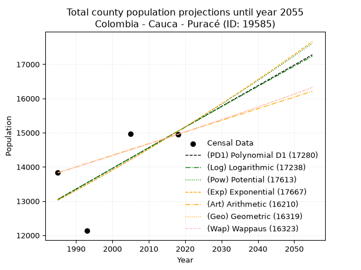
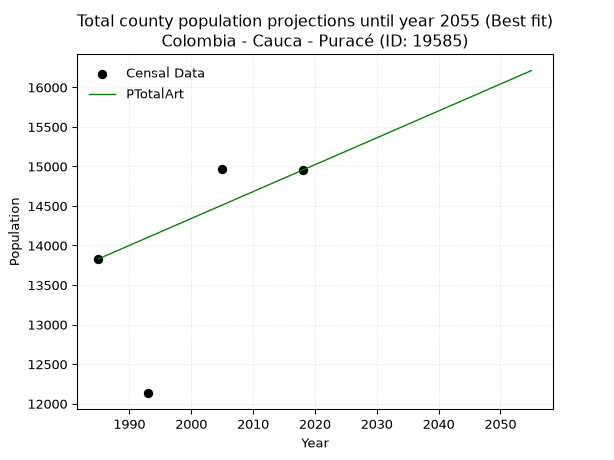
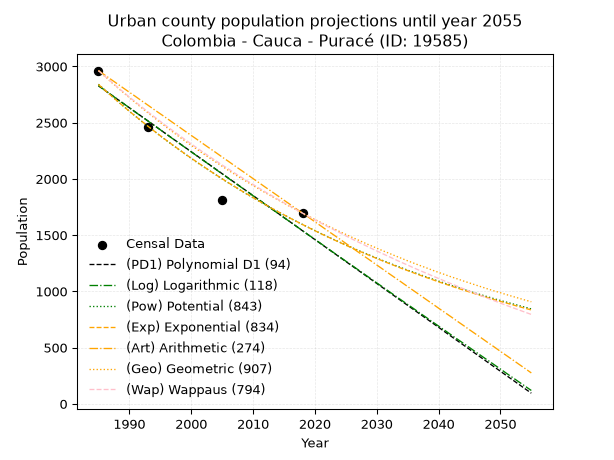
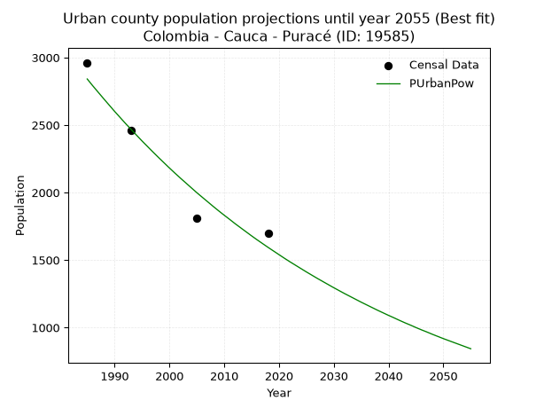
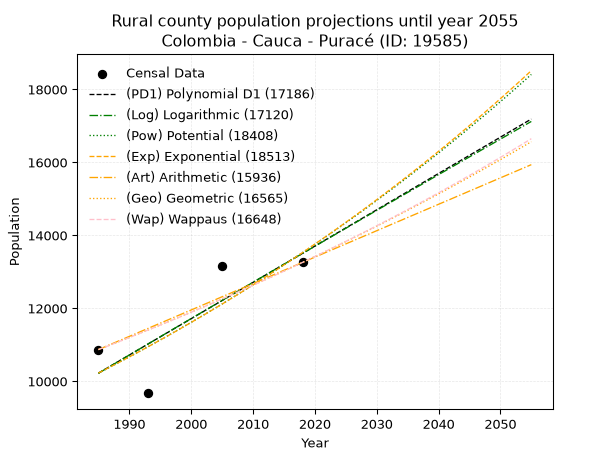
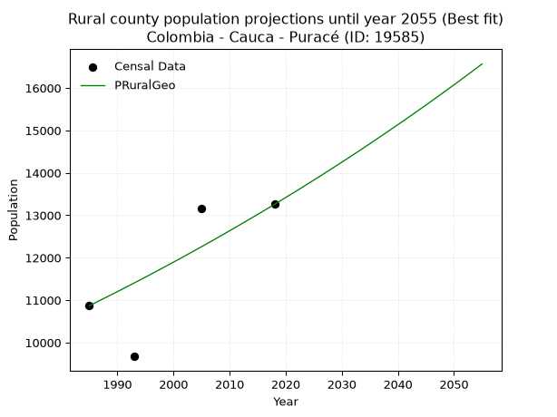

<div align="center">


</div>

# _“Population and Public Services Demand Projections (PPSD) until Year 2050 for Colombia - Cauca - Puracé (ID: 19585)”_
Keywords: `population` `public-service` `projection` `lineal` `polynomial` `logarithmic` `potential` `exponential` `arithmetic` `geometric` `wappaus` `dane` `colombia` `south-america`

PPSD are analytical estimates used by governments and planners to anticipate future changes in population size, age distribution, and the resulting community needs for utilities, healthcare, education, and infrastructure as sizing future water treatment facilities, electrical grids, and road networks based on spatial growth.

> **General running parameters**: • app_version: _v20260806_. • Python version: _3.14.7_. • Pandas version: _3.0.5_. • NumPy version: _2.5.1_. • Creates, save and include plots into reports (create_plot): _False_. • Projection until year: _2050_. • Process polynomial degree 2 and up: _False_. • Process Wappaus: _True_. • Process Wappaus: _True_. • Set negative values to zero: _True_. • Set infinite values to zero: _True_. • Drop dataset notes: _True_. 
<div align="center">

Dynamic map: [:earth_americas:Google](http://maps.google.com/maps?q=2.341507176,-76.4966976) [:earth_americas:OSM](https://www.openstreetmap.org/#map=18/2.341507176/-76.4966976&layers=P) [:earth_americas:Bing](https://www.bing.com/maps?cp=2.341507176~-76.4966976&lvl=18) [:earth_americas:Apple](https://maps.apple.com/frame?center=2.341507176%2C-76.4966976&span=0.003%2C0.006)

</div>


<div align="center">

```geojson
{
  "type": "Feature",
  "geometry": {
    "type": "Point", 
    "coordinates": [-76.4966976, 2.341507176]
  }, 
  "properties": {
    "Name": "Colombia - Cauca - Puracé (ID: 19585)"
  }
}
```

</div>


## 0. Census Data (4 records)

Census data are official statistics collected by a government about the people and housing in a country. They usually include counts of total population, age, sex, race, income, education, and jobs.

📅Global census file: [Population.xlsx](../data/Population.xlsx)

| Source   |   Year |   CountryID | CountryName   |   StateID | StateName   |   CountyID | CountyName   |   PTotal |   PUrban |   PRural |
|:---------|-------:|------------:|:--------------|----------:|:------------|-----------:|:-------------|---------:|---------:|---------:|
| DANE     |   1985 |          57 | Colombia      |        19 | Cauca       |      19585 | Puracé       |    13830 |     2962 |    10868 |
| DANE     |   1993 |          57 | Colombia      |        19 | Cauca       |      19585 | Puracé       |    12132 |     2459 |     9673 |
| DANE     |   2005 |          57 | Colombia      |        19 | Cauca       |      19585 | Puracé       |    14970 |     1810 |    13160 |
| DANE     |   2018 |          57 | Colombia      |        19 | Cauca       |      19585 | Puracé       |    14952 |     1695 |    13257 |

> 🔥Some records could had specific notes about the registered values or the corresponding urban or rural distribution.

## 1. Total

### 1.1. Coefficients and Parameters

* (PD1) Polynomial Deg 1: 60.443195503813556, -106930.50180650307 (lineal)
* (Log) Logarithmic: 120907.20617656907, -905045.6430376451
* (Pow) Potential: 8.705853818455632, -24.595014764371946
* (Exp) Exponential: 0.004352515359229327, 2.304886495967125
* (Art) Arithmetic: Year diff. 2018 - 1985 = 33, Population diff. 14952 - 13830 = 1122, Annual growth = 34.0
* (Geo) Geometric: Year diff. 2018 - 1985 = 33, Population diff. 14952 - 13830 = 1122, Annual growth % = 0.0023665815339277696
* (Wap) Wappaus: i = 0.2362587728441387, Condition values only valid for < 200)

<sub>
Wappaus condition values: ['0.00', '0.24', '0.47', '0.71', '0.95', '1.18', '1.42', '1.65', '1.89', '2.13', '2.36', '2.60', '2.84', '3.07', '3.31', '3.54', '3.78', '4.02', '4.25', '4.49', '4.73', '4.96', '5.20', '5.43', '5.67', '5.91', '6.14', '6.38', '6.62', '6.85', '7.09', '7.32', '7.56', '7.80', '8.03', '8.27', '8.51', '8.74', '8.98', '9.21', '9.45', '9.69', '9.92', '10.16', '10.40', '10.63', '10.87', '11.10', '11.34', '11.58', '11.81', '12.05', '12.29', '12.52', '12.76', '12.99', '13.23', '13.47', '13.70', '13.94', '14.18', '14.41', '14.65', '14.88', '15.12', '15.36']
</sub>


### 1.2. Projected Dataset

|   Year |   CountyID |   PTotalPD1 |   PTotalLog |   PTotalPow |   PTotalExp |   PTotalArt |   PTotalGeo |   PTotalWap |
|-------:|-----------:|------------:|------------:|------------:|------------:|------------:|------------:|------------:|
|   1985 |      19585 |       13049 |       13048 |       13026 |       13027 |       13830 |       13830 |       13830 |
|   1986 |      19585 |       13110 |       13109 |       13083 |       13084 |       13864 |       13863 |       13863 |
|   1987 |      19585 |       13170 |       13170 |       13141 |       13141 |       13898 |       13896 |       13896 |
|   1988 |      19585 |       13231 |       13231 |       13198 |       13198 |       13932 |       13928 |       13928 |
|   1989 |      19585 |       13291 |       13291 |       13256 |       13256 |       13966 |       13961 |       13961 |
|   1990 |      19585 |       13351 |       13352 |       13314 |       13314 |       14000 |       13994 |       13994 |
|   1991 |      19585 |       13412 |       13413 |       13373 |       13372 |       14034 |       14028 |       14027 |
|   1992 |      19585 |       13472 |       13474 |       13431 |       13430 |       14068 |       14061 |       14061 |
|   1993 |      19585 |       13533 |       13534 |       13490 |       13489 |       14102 |       14094 |       14094 |
|   1994 |      19585 |       13593 |       13595 |       13549 |       13547 |       14136 |       14127 |       14127 |
|   1995 |      19585 |       13654 |       13656 |       13608 |       13606 |       14170 |       14161 |       14161 |
|   1996 |      19585 |       13714 |       13716 |       13668 |       13666 |       14204 |       14194 |       14194 |
|   1997 |      19585 |       13775 |       13777 |       13728 |       13725 |       14238 |       14228 |       14228 |
|   1998 |      19585 |       13835 |       13837 |       13788 |       13785 |       14272 |       14262 |       14261 |
|   1999 |      19585 |       13895 |       13898 |       13848 |       13845 |       14306 |       14295 |       14295 |
|   2000 |      19585 |       13956 |       13958 |       13908 |       13906 |       14340 |       14329 |       14329 |
|   2001 |      19585 |       14016 |       14019 |       13969 |       13966 |       14374 |       14363 |       14363 |
|   2002 |      19585 |       14077 |       14079 |       14030 |       14027 |       14408 |       14397 |       14397 |
|   2003 |      19585 |       14137 |       14139 |       14091 |       14089 |       14442 |       14431 |       14431 |
|   2004 |      19585 |       14198 |       14200 |       14152 |       14150 |       14476 |       14465 |       14465 |
|   2005 |      19585 |       14258 |       14260 |       14214 |       14212 |       14510 |       14500 |       14499 |
|   2006 |      19585 |       14319 |       14320 |       14276 |       14274 |       14544 |       14534 |       14534 |
|   2007 |      19585 |       14379 |       14381 |       14338 |       14336 |       14578 |       14568 |       14568 |
|   2008 |      19585 |       14439 |       14441 |       14400 |       14399 |       14612 |       14603 |       14603 |
|   2009 |      19585 |       14500 |       14501 |       14463 |       14461 |       14646 |       14637 |       14637 |
|   2010 |      19585 |       14560 |       14561 |       14525 |       14524 |       14680 |       14672 |       14672 |
|   2011 |      19585 |       14621 |       14621 |       14588 |       14588 |       14714 |       14707 |       14706 |
|   2012 |      19585 |       14681 |       14682 |       14652 |       14651 |       14748 |       14741 |       14741 |
|   2013 |      19585 |       14742 |       14742 |       14715 |       14715 |       14782 |       14776 |       14776 |
|   2014 |      19585 |       14802 |       14802 |       14779 |       14780 |       14816 |       14811 |       14811 |
|   2015 |      19585 |       14863 |       14862 |       14843 |       14844 |       14850 |       14846 |       14846 |
|   2016 |      19585 |       14923 |       14922 |       14907 |       14909 |       14884 |       14881 |       14881 |
|   2017 |      19585 |       14983 |       14982 |       14972 |       14974 |       14918 |       14917 |       14917 |
|   2018 |      19585 |       15044 |       15042 |       15036 |       15039 |       14952 |       14952 |       14952 |
|   2019 |      19585 |       15104 |       15101 |       15101 |       15105 |       14986 |       14987 |       14987 |
|   2020 |      19585 |       15165 |       15161 |       15167 |       15171 |       15020 |       15023 |       15023 |
|   2021 |      19585 |       15225 |       15221 |       15232 |       15237 |       15054 |       15058 |       15059 |
|   2022 |      19585 |       15286 |       15281 |       15298 |       15303 |       15088 |       15094 |       15094 |
|   2023 |      19585 |       15346 |       15341 |       15364 |       15370 |       15122 |       15130 |       15130 |
|   2024 |      19585 |       15407 |       15400 |       15430 |       15437 |       15156 |       15166 |       15166 |
|   2025 |      19585 |       15467 |       15460 |       15497 |       15504 |       15190 |       15201 |       15202 |
|   2026 |      19585 |       15527 |       15520 |       15563 |       15572 |       15224 |       15237 |       15238 |
|   2027 |      19585 |       15588 |       15580 |       15630 |       15640 |       15258 |       15273 |       15274 |
|   2028 |      19585 |       15648 |       15639 |       15698 |       15708 |       15292 |       15310 |       15310 |
|   2029 |      19585 |       15709 |       15699 |       15765 |       15777 |       15326 |       15346 |       15347 |
|   2030 |      19585 |       15769 |       15758 |       15833 |       15845 |       15360 |       15382 |       15383 |
|   2031 |      19585 |       15830 |       15818 |       15901 |       15915 |       15394 |       15419 |       15419 |
|   2032 |      19585 |       15890 |       15877 |       15969 |       15984 |       15428 |       15455 |       15456 |
|   2033 |      19585 |       15951 |       15937 |       16038 |       16054 |       15462 |       15492 |       15493 |
|   2034 |      19585 |       16011 |       15996 |       16107 |       16124 |       15496 |       15528 |       15529 |
|   2035 |      19585 |       16071 |       16056 |       16176 |       16194 |       15530 |       15565 |       15566 |
|   2036 |      19585 |       16132 |       16115 |       16245 |       16265 |       15564 |       15602 |       15603 |
|   2037 |      19585 |       16192 |       16175 |       16315 |       16336 |       15598 |       15639 |       15640 |
|   2038 |      19585 |       16253 |       16234 |       16384 |       16407 |       15632 |       15676 |       15677 |
|   2039 |      19585 |       16313 |       16293 |       16455 |       16478 |       15666 |       15713 |       15715 |
|   2040 |      19585 |       16374 |       16353 |       16525 |       16550 |       15700 |       15750 |       15752 |
|   2041 |      19585 |       16434 |       16412 |       16596 |       16623 |       15734 |       15787 |       15789 |
|   2042 |      19585 |       16495 |       16471 |       16667 |       16695 |       15768 |       15825 |       15827 |
|   2043 |      19585 |       16555 |       16530 |       16738 |       16768 |       15802 |       15862 |       15865 |
|   2044 |      19585 |       16615 |       16589 |       16809 |       16841 |       15836 |       15900 |       15902 |
|   2045 |      19585 |       16676 |       16648 |       16881 |       16914 |       15870 |       15937 |       15940 |
|   2046 |      19585 |       16736 |       16708 |       16953 |       16988 |       15904 |       15975 |       15978 |
|   2047 |      19585 |       16797 |       16767 |       17025 |       17062 |       15938 |       16013 |       16016 |
|   2048 |      19585 |       16857 |       16826 |       17098 |       17137 |       15972 |       16051 |       16054 |
|   2049 |      19585 |       16918 |       16885 |       17171 |       17212 |       16006 |       16089 |       16092 |
|   2050 |      19585 |       16978 |       16944 |       17244 |       17287 |       16040 |       16127 |       16130 |
<div align="center">

</img>

</div>


### 1.3. Best fit with absolute and relative error (%)

Relative error puts that difference into context by dividing the absolute error by the true value, creating a unitless ratio or percentage that shows the scale of the mistake.

Absolute and relative error

|   Year | Source   |   CountryID | CountryName   |   StateID | StateName   |   CountyID_x | CountyName   |   PTotal |   PUrban |   PRural |   CountyID_y |   PTotalPD1 |   PTotalLog |   PTotalPow |   PTotalExp |   PTotalArt |   PTotalGeo |   PTotalWap |   PTotalPD1AbsError |   PTotalLogAbsError |   PTotalPowAbsError |   PTotalExpAbsError |   PTotalArtAbsError |   PTotalGeoAbsError |   PTotalWapAbsError |   PTotalPD1RelError |   PTotalLogRelError |   PTotalPowRelError |   PTotalExpRelError |   PTotalArtRelError |   PTotalGeoRelError |   PTotalWapRelError |
|-------:|:---------|------------:|:--------------|----------:|:------------|-------------:|:-------------|---------:|---------:|---------:|-------------:|------------:|------------:|------------:|------------:|------------:|------------:|------------:|--------------------:|--------------------:|--------------------:|--------------------:|--------------------:|--------------------:|--------------------:|--------------------:|--------------------:|--------------------:|--------------------:|--------------------:|--------------------:|--------------------:|
|   1985 | DANE     |          57 | Colombia      |        19 | Cauca       |        19585 | Puracé       |    13830 |     2962 |    10868 |        19585 |       13049 |       13048 |       13026 |       13027 |       13830 |       13830 |       13830 |                 781 |                 782 |                 804 |                 803 |                   0 |                   0 |                   0 |            5.64714  |            5.65437  |            5.81345  |            5.80622  |             0       |             0       |             0       |
|   1993 | DANE     |          57 | Colombia      |        19 | Cauca       |        19585 | Puracé       |    12132 |     2459 |     9673 |        19585 |       13533 |       13534 |       13490 |       13489 |       14102 |       14094 |       14094 |                1401 |                1402 |                1358 |                1357 |                1970 |                1962 |                1962 |           11.548    |           11.5562   |           11.1935   |           11.1853   |            16.238   |            16.1721  |            16.1721  |
|   2005 | DANE     |          57 | Colombia      |        19 | Cauca       |        19585 | Puracé       |    14970 |     1810 |    13160 |        19585 |       14258 |       14260 |       14214 |       14212 |       14510 |       14500 |       14499 |                 712 |                 710 |                 756 |                 758 |                 460 |                 470 |                 471 |            4.75618  |            4.74282  |            5.0501   |            5.06346  |             3.07281 |             3.13961 |             3.14629 |
|   2018 | DANE     |          57 | Colombia      |        19 | Cauca       |        19585 | Puracé       |    14952 |     1695 |    13257 |        19585 |       15044 |       15042 |       15036 |       15039 |       14952 |       14952 |       14952 |                  92 |                  90 |                  84 |                  87 |                   0 |                   0 |                   0 |            0.615302 |            0.601926 |            0.561798 |            0.581862 |             0       |             0       |             0       |

Relative error mean

| Method    |   RelError | Best   |
|:----------|-----------:|:-------|
| PTotalPD1 |    5.64165 |        |
| PTotalLog |    5.63883 |        |
| PTotalPow |    5.65472 |        |
| PTotalExp |    5.65921 |        |
| PTotalArt |    4.82772 | True   |
| PTotalGeo |    4.82793 |        |
| PTotalWap |    4.8296  |        |

💙Best method: _**PTotalArt**_
<div align="center">

</img>

</div>


### 1.4. Fresh water supply demand in liters per capita per day (lpcd)

The fresh water supply demand typically ranges from 100 to 300 liters per capita per day (lpcd) for standard domestic and municipal planning, though absolute survival minimums set by the World Health Organization are as low as 7.5 to 20 liters per day, and total consumption in high-income nations can exceed 400 liters.

> `CZ`: Level in meters above the sea level (masl)<br> `WS`: Fresh water supply demand in liters per capita per day (lpcd or l/h/d)<br> `WSAll`: Zonal fresh water supply demand in liters per second (l/s)<br> `A`: Zonal area in square meters<br> `DP`: Population density (people/hectare)

Reference values (RAS Colombia)

|    CZ |   WS |
|------:|-----:|
|  1000 |  120 |
|  2000 |  130 |
| 99999 |  140 |

County shapefile geometry properties and water supply values

|   CountyID |      ATotal |   CZTotal |   WSTotal |
|-----------:|------------:|----------:|----------:|
|      19585 | 5.06453e+08 |      3223 |       140 |

Projected values for best method: PTotalArt

|   CountyID |   Year |   PTotalArt |   DPTotal |   WSTotal |   WSTotalAll |
|-----------:|-------:|------------:|----------:|----------:|-------------:|
|      19585 |   1985 |       13830 |      0.27 |       140 |      22.4097 |
|      19585 |   1986 |       13864 |      0.27 |       140 |      22.4648 |
|      19585 |   1987 |       13898 |      0.27 |       140 |      22.5199 |
|      19585 |   1988 |       13932 |      0.28 |       140 |      22.575  |
|      19585 |   1989 |       13966 |      0.28 |       140 |      22.6301 |
|      19585 |   1990 |       14000 |      0.28 |       140 |      22.6852 |
|      19585 |   1991 |       14034 |      0.28 |       140 |      22.7403 |
|      19585 |   1992 |       14068 |      0.28 |       140 |      22.7954 |
|      19585 |   1993 |       14102 |      0.28 |       140 |      22.8505 |
|      19585 |   1994 |       14136 |      0.28 |       140 |      22.9056 |
|      19585 |   1995 |       14170 |      0.28 |       140 |      22.9606 |
|      19585 |   1996 |       14204 |      0.28 |       140 |      23.0157 |
|      19585 |   1997 |       14238 |      0.28 |       140 |      23.0708 |
|      19585 |   1998 |       14272 |      0.28 |       140 |      23.1259 |
|      19585 |   1999 |       14306 |      0.28 |       140 |      23.181  |
|      19585 |   2000 |       14340 |      0.28 |       140 |      23.2361 |
|      19585 |   2001 |       14374 |      0.28 |       140 |      23.2912 |
|      19585 |   2002 |       14408 |      0.28 |       140 |      23.3463 |
|      19585 |   2003 |       14442 |      0.29 |       140 |      23.4014 |
|      19585 |   2004 |       14476 |      0.29 |       140 |      23.4565 |
|      19585 |   2005 |       14510 |      0.29 |       140 |      23.5116 |
|      19585 |   2006 |       14544 |      0.29 |       140 |      23.5667 |
|      19585 |   2007 |       14578 |      0.29 |       140 |      23.6218 |
|      19585 |   2008 |       14612 |      0.29 |       140 |      23.6769 |
|      19585 |   2009 |       14646 |      0.29 |       140 |      23.7319 |
|      19585 |   2010 |       14680 |      0.29 |       140 |      23.787  |
|      19585 |   2011 |       14714 |      0.29 |       140 |      23.8421 |
|      19585 |   2012 |       14748 |      0.29 |       140 |      23.8972 |
|      19585 |   2013 |       14782 |      0.29 |       140 |      23.9523 |
|      19585 |   2014 |       14816 |      0.29 |       140 |      24.0074 |
|      19585 |   2015 |       14850 |      0.29 |       140 |      24.0625 |
|      19585 |   2016 |       14884 |      0.29 |       140 |      24.1176 |
|      19585 |   2017 |       14918 |      0.29 |       140 |      24.1727 |
|      19585 |   2018 |       14952 |      0.3  |       140 |      24.2278 |
|      19585 |   2019 |       14986 |      0.3  |       140 |      24.2829 |
|      19585 |   2020 |       15020 |      0.3  |       140 |      24.338  |
|      19585 |   2021 |       15054 |      0.3  |       140 |      24.3931 |
|      19585 |   2022 |       15088 |      0.3  |       140 |      24.4481 |
|      19585 |   2023 |       15122 |      0.3  |       140 |      24.5032 |
|      19585 |   2024 |       15156 |      0.3  |       140 |      24.5583 |
|      19585 |   2025 |       15190 |      0.3  |       140 |      24.6134 |
|      19585 |   2026 |       15224 |      0.3  |       140 |      24.6685 |
|      19585 |   2027 |       15258 |      0.3  |       140 |      24.7236 |
|      19585 |   2028 |       15292 |      0.3  |       140 |      24.7787 |
|      19585 |   2029 |       15326 |      0.3  |       140 |      24.8338 |
|      19585 |   2030 |       15360 |      0.3  |       140 |      24.8889 |
|      19585 |   2031 |       15394 |      0.3  |       140 |      24.944  |
|      19585 |   2032 |       15428 |      0.3  |       140 |      24.9991 |
|      19585 |   2033 |       15462 |      0.31 |       140 |      25.0542 |
|      19585 |   2034 |       15496 |      0.31 |       140 |      25.1093 |
|      19585 |   2035 |       15530 |      0.31 |       140 |      25.1644 |
|      19585 |   2036 |       15564 |      0.31 |       140 |      25.2194 |
|      19585 |   2037 |       15598 |      0.31 |       140 |      25.2745 |
|      19585 |   2038 |       15632 |      0.31 |       140 |      25.3296 |
|      19585 |   2039 |       15666 |      0.31 |       140 |      25.3847 |
|      19585 |   2040 |       15700 |      0.31 |       140 |      25.4398 |
|      19585 |   2041 |       15734 |      0.31 |       140 |      25.4949 |
|      19585 |   2042 |       15768 |      0.31 |       140 |      25.55   |
|      19585 |   2043 |       15802 |      0.31 |       140 |      25.6051 |
|      19585 |   2044 |       15836 |      0.31 |       140 |      25.6602 |
|      19585 |   2045 |       15870 |      0.31 |       140 |      25.7153 |
|      19585 |   2046 |       15904 |      0.31 |       140 |      25.7704 |
|      19585 |   2047 |       15938 |      0.31 |       140 |      25.8255 |
|      19585 |   2048 |       15972 |      0.32 |       140 |      25.8806 |
|      19585 |   2049 |       16006 |      0.32 |       140 |      25.9356 |
|      19585 |   2050 |       16040 |      0.32 |       140 |      25.9907 |

## 2. Urban

### 2.1. Coefficients and Parameters

* (PD1) Polynomial Deg 1: -39.04375752709741, 80328.77599357661 (lineal)
* (Log) Logarithmic: -78208.97127076032, 596698.517356412
* (Pow) Potential: -35.04942825526472, 119.03811868495686
* (Exp) Exponential: -0.017499779663183963, 3.461891592340198e+18
* (Art) Arithmetic: Year diff. 2018 - 1985 = 33, Population diff. 1695 - 2962 = -1267, Annual growth = -38.39393939393939
* (Geo) Geometric: Year diff. 2018 - 1985 = 33, Population diff. 1695 - 2962 = -1267, Annual growth % = -0.01677235652368747
* (Wap) Wappaus: i = -1.6488700620115695, Condition values only valid for < 200)

<sub>
Wappaus condition values: ['-0.00', '-1.65', '-3.30', '-4.95', '-6.60', '-8.24', '-9.89', '-11.54', '-13.19', '-14.84', '-16.49', '-18.14', '-19.79', '-21.44', '-23.08', '-24.73', '-26.38', '-28.03', '-29.68', '-31.33', '-32.98', '-34.63', '-36.28', '-37.92', '-39.57', '-41.22', '-42.87', '-44.52', '-46.17', '-47.82', '-49.47', '-51.11', '-52.76', '-54.41', '-56.06', '-57.71', '-59.36', '-61.01', '-62.66', '-64.31', '-65.95', '-67.60', '-69.25', '-70.90', '-72.55', '-74.20', '-75.85', '-77.50', '-79.15', '-80.79', '-82.44', '-84.09', '-85.74', '-87.39', '-89.04', '-90.69', '-92.34', '-93.99', '-95.63', '-97.28', '-98.93', '-100.58', '-102.23', '-103.88', '-105.53', '-107.18']
</sub>


### 2.2. Projected Dataset

|   Year |   CountyID |   PUrbanPD1 |   PUrbanLog |   PUrbanPow |   PUrbanExp |   PUrbanArt |   PUrbanGeo |   PUrbanWap |
|-------:|-----------:|------------:|------------:|------------:|------------:|------------:|------------:|------------:|
|   1985 |      19585 |        2827 |        2829 |        2841 |        2839 |        2962 |        2962 |        2962 |
|   1986 |      19585 |        2788 |        2789 |        2791 |        2790 |        2924 |        2912 |        2914 |
|   1987 |      19585 |        2749 |        2750 |        2743 |        2742 |        2885 |        2863 |        2866 |
|   1988 |      19585 |        2710 |        2710 |        2695 |        2694 |        2847 |        2815 |        2819 |
|   1989 |      19585 |        2671 |        2671 |        2648 |        2647 |        2808 |        2768 |        2773 |
|   1990 |      19585 |        2632 |        2632 |        2601 |        2601 |        2770 |        2722 |        2727 |
|   1991 |      19585 |        2593 |        2592 |        2556 |        2556 |        2732 |        2676 |        2683 |
|   1992 |      19585 |        2554 |        2553 |        2511 |        2512 |        2693 |        2631 |        2639 |
|   1993 |      19585 |        2515 |        2514 |        2468 |        2468 |        2655 |        2587 |        2595 |
|   1994 |      19585 |        2476 |        2475 |        2425 |        2425 |        2616 |        2544 |        2553 |
|   1995 |      19585 |        2436 |        2436 |        2382 |        2383 |        2578 |        2501 |        2511 |
|   1996 |      19585 |        2397 |        2396 |        2341 |        2342 |        2540 |        2459 |        2469 |
|   1997 |      19585 |        2358 |        2357 |        2300 |        2301 |        2501 |        2418 |        2429 |
|   1998 |      19585 |        2319 |        2318 |        2260 |        2262 |        2463 |        2377 |        2389 |
|   1999 |      19585 |        2280 |        2279 |        2221 |        2222 |        2424 |        2337 |        2349 |
|   2000 |      19585 |        2241 |        2240 |        2182 |        2184 |        2386 |        2298 |        2310 |
|   2001 |      19585 |        2202 |        2201 |        2144 |        2146 |        2348 |        2260 |        2272 |
|   2002 |      19585 |        2163 |        2162 |        2107 |        2109 |        2309 |        2222 |        2234 |
|   2003 |      19585 |        2124 |        2123 |        2071 |        2072 |        2271 |        2185 |        2196 |
|   2004 |      19585 |        2085 |        2083 |        2035 |        2036 |        2233 |        2148 |        2160 |
|   2005 |      19585 |        2046 |        2044 |        1999 |        2001 |        2194 |        2112 |        2123 |
|   2006 |      19585 |        2007 |        2005 |        1965 |        1966 |        2156 |        2076 |        2088 |
|   2007 |      19585 |        1968 |        1967 |        1931 |        1932 |        2117 |        2042 |        2052 |
|   2008 |      19585 |        1929 |        1928 |        1897 |        1898 |        2079 |        2007 |        2018 |
|   2009 |      19585 |        1890 |        1889 |        1864 |        1866 |        2041 |        1974 |        1983 |
|   2010 |      19585 |        1851 |        1850 |        1832 |        1833 |        2002 |        1941 |        1950 |
|   2011 |      19585 |        1812 |        1811 |        1801 |        1801 |        1964 |        1908 |        1916 |
|   2012 |      19585 |        1773 |        1772 |        1769 |        1770 |        1925 |        1876 |        1883 |
|   2013 |      19585 |        1734 |        1733 |        1739 |        1739 |        1887 |        1845 |        1851 |
|   2014 |      19585 |        1695 |        1694 |        1709 |        1709 |        1849 |        1814 |        1819 |
|   2015 |      19585 |        1656 |        1655 |        1679 |        1680 |        1810 |        1783 |        1787 |
|   2016 |      19585 |        1617 |        1617 |        1650 |        1650 |        1772 |        1753 |        1756 |
|   2017 |      19585 |        1578 |        1578 |        1622 |        1622 |        1733 |        1724 |        1725 |
|   2018 |      19585 |        1538 |        1539 |        1594 |        1594 |        1695 |        1695 |        1695 |
|   2019 |      19585 |        1499 |        1500 |        1567 |        1566 |        1657 |        1667 |        1665 |
|   2020 |      19585 |        1460 |        1462 |        1540 |        1539 |        1618 |        1639 |        1635 |
|   2021 |      19585 |        1421 |        1423 |        1513 |        1512 |        1580 |        1611 |        1606 |
|   2022 |      19585 |        1382 |        1384 |        1487 |        1486 |        1541 |        1584 |        1577 |
|   2023 |      19585 |        1343 |        1345 |        1462 |        1460 |        1503 |        1558 |        1549 |
|   2024 |      19585 |        1304 |        1307 |        1437 |        1435 |        1465 |        1531 |        1521 |
|   2025 |      19585 |        1265 |        1268 |        1412 |        1410 |        1426 |        1506 |        1493 |
|   2026 |      19585 |        1226 |        1230 |        1388 |        1385 |        1388 |        1480 |        1465 |
|   2027 |      19585 |        1187 |        1191 |        1364 |        1361 |        1349 |        1456 |        1438 |
|   2028 |      19585 |        1148 |        1152 |        1341 |        1338 |        1311 |        1431 |        1412 |
|   2029 |      19585 |        1109 |        1114 |        1318 |        1315 |        1273 |        1407 |        1385 |
|   2030 |      19585 |        1070 |        1075 |        1295 |        1292 |        1234 |        1384 |        1359 |
|   2031 |      19585 |        1031 |        1037 |        1273 |        1269 |        1196 |        1360 |        1333 |
|   2032 |      19585 |         992 |         998 |        1251 |        1247 |        1157 |        1338 |        1308 |
|   2033 |      19585 |         953 |         960 |        1230 |        1226 |        1119 |        1315 |        1282 |
|   2034 |      19585 |         914 |         921 |        1209 |        1204 |        1081 |        1293 |        1257 |
|   2035 |      19585 |         875 |         883 |        1188 |        1184 |        1042 |        1271 |        1233 |
|   2036 |      19585 |         836 |         845 |        1168 |        1163 |        1004 |        1250 |        1208 |
|   2037 |      19585 |         797 |         806 |        1148 |        1143 |         966 |        1229 |        1184 |
|   2038 |      19585 |         758 |         768 |        1128 |        1123 |         927 |        1209 |        1161 |
|   2039 |      19585 |         719 |         729 |        1109 |        1104 |         889 |        1188 |        1137 |
|   2040 |      19585 |         680 |         691 |        1090 |        1084 |         850 |        1168 |        1114 |
|   2041 |      19585 |         640 |         653 |        1072 |        1066 |         812 |        1149 |        1091 |
|   2042 |      19585 |         601 |         614 |        1053 |        1047 |         774 |        1129 |        1068 |
|   2043 |      19585 |         562 |         576 |        1035 |        1029 |         735 |        1111 |        1046 |
|   2044 |      19585 |         523 |         538 |        1018 |        1011 |         697 |        1092 |        1023 |
|   2045 |      19585 |         484 |         500 |        1000 |         994 |         658 |        1074 |        1001 |
|   2046 |      19585 |         445 |         461 |         983 |         976 |         620 |        1056 |         980 |
|   2047 |      19585 |         406 |         423 |         967 |         959 |         582 |        1038 |         958 |
|   2048 |      19585 |         367 |         385 |         950 |         943 |         543 |        1020 |         937 |
|   2049 |      19585 |         328 |         347 |         934 |         926 |         505 |        1003 |         916 |
|   2050 |      19585 |         289 |         309 |         918 |         910 |         466 |         987 |         895 |
<div align="center">

</img>

</div>


### 2.3. Best fit with absolute and relative error (%)

Relative error puts that difference into context by dividing the absolute error by the true value, creating a unitless ratio or percentage that shows the scale of the mistake.

Absolute and relative error

|   Year | Source   |   CountryID | CountryName   |   StateID | StateName   |   CountyID_x | CountyName   |   PTotal |   PUrban |   PRural |   CountyID_y |   PUrbanPD1 |   PUrbanLog |   PUrbanPow |   PUrbanExp |   PUrbanArt |   PUrbanGeo |   PUrbanWap |   PUrbanPD1AbsError |   PUrbanLogAbsError |   PUrbanPowAbsError |   PUrbanExpAbsError |   PUrbanArtAbsError |   PUrbanGeoAbsError |   PUrbanWapAbsError |   PUrbanPD1RelError |   PUrbanLogRelError |   PUrbanPowRelError |   PUrbanExpRelError |   PUrbanArtRelError |   PUrbanGeoRelError |   PUrbanWapRelError |
|-------:|:---------|------------:|:--------------|----------:|:------------|-------------:|:-------------|---------:|---------:|---------:|-------------:|------------:|------------:|------------:|------------:|------------:|------------:|------------:|--------------------:|--------------------:|--------------------:|--------------------:|--------------------:|--------------------:|--------------------:|--------------------:|--------------------:|--------------------:|--------------------:|--------------------:|--------------------:|--------------------:|
|   1985 | DANE     |          57 | Colombia      |        19 | Cauca       |        19585 | Puracé       |    13830 |     2962 |    10868 |        19585 |        2827 |        2829 |        2841 |        2839 |        2962 |        2962 |        2962 |                 135 |                 133 |                 121 |                 123 |                   0 |                   0 |                   0 |             4.55773 |             4.49021 |            4.08508  |            4.1526   |             0       |             0       |              0      |
|   1993 | DANE     |          57 | Colombia      |        19 | Cauca       |        19585 | Puracé       |    12132 |     2459 |     9673 |        19585 |        2515 |        2514 |        2468 |        2468 |        2655 |        2587 |        2595 |                  56 |                  55 |                   9 |                   9 |                 196 |                 128 |                 136 |             2.27735 |             2.23668 |            0.366002 |            0.366002 |             7.97072 |             5.20537 |              5.5307 |
|   2005 | DANE     |          57 | Colombia      |        19 | Cauca       |        19585 | Puracé       |    14970 |     1810 |    13160 |        19585 |        2046 |        2044 |        1999 |        2001 |        2194 |        2112 |        2123 |                 236 |                 234 |                 189 |                 191 |                 384 |                 302 |                 313 |            13.0387  |            12.9282  |           10.442    |           10.5525   |            21.2155  |            16.6851  |             17.2928 |
|   2018 | DANE     |          57 | Colombia      |        19 | Cauca       |        19585 | Puracé       |    14952 |     1695 |    13257 |        19585 |        1538 |        1539 |        1594 |        1594 |        1695 |        1695 |        1695 |                 157 |                 156 |                 101 |                 101 |                   0 |                   0 |                   0 |             9.26254 |             9.20354 |            5.9587   |            5.9587   |             0       |             0       |              0      |

Relative error mean

| Method    |   RelError | Best   |
|:----------|-----------:|:-------|
| PUrbanPD1 |    7.28407 |        |
| PUrbanLog |    7.21465 |        |
| PUrbanPow |    5.21294 | True   |
| PUrbanExp |    5.25745 |        |
| PUrbanArt |    7.29655 |        |
| PUrbanGeo |    5.47261 |        |
| PUrbanWap |    5.70588 |        |

💙Best method: _**PUrbanPow**_
<div align="center">

</img>

</div>


### 2.4. Fresh water supply demand in liters per capita per day (lpcd)

The fresh water supply demand typically ranges from 100 to 300 liters per capita per day (lpcd) for standard domestic and municipal planning, though absolute survival minimums set by the World Health Organization are as low as 7.5 to 20 liters per day, and total consumption in high-income nations can exceed 400 liters.

> `CZ`: Level in meters above the sea level (masl)<br> `WS`: Fresh water supply demand in liters per capita per day (lpcd or l/h/d)<br> `WSAll`: Zonal fresh water supply demand in liters per second (l/s)<br> `A`: Zonal area in square meters<br> `DP`: Population density (people/hectare)

Reference values (RAS Colombia)

|    CZ |   WS |
|------:|-----:|
|  1000 |  120 |
|  2000 |  130 |
| 99999 |  140 |

County shapefile geometry properties and water supply values

|   CountyID |   AUrban |   CZUrban |   WSUrban |
|-----------:|---------:|----------:|----------:|
|      19585 |   319341 |   2415.28 |       140 |

Projected values for best method: PUrbanPow

|   CountyID |   Year |   PUrbanPow |   DPUrban |   WSUrban |   WSUrbanAll |
|-----------:|-------:|------------:|----------:|----------:|-------------:|
|      19585 |   1985 |        2841 |     88.96 |       140 |      4.60347 |
|      19585 |   1986 |        2791 |     87.4  |       140 |      4.52245 |
|      19585 |   1987 |        2743 |     85.9  |       140 |      4.44468 |
|      19585 |   1988 |        2695 |     84.39 |       140 |      4.3669  |
|      19585 |   1989 |        2648 |     82.92 |       140 |      4.29074 |
|      19585 |   1990 |        2601 |     81.45 |       140 |      4.21458 |
|      19585 |   1991 |        2556 |     80.04 |       140 |      4.14167 |
|      19585 |   1992 |        2511 |     78.63 |       140 |      4.06875 |
|      19585 |   1993 |        2468 |     77.28 |       140 |      3.99907 |
|      19585 |   1994 |        2425 |     75.94 |       140 |      3.9294  |
|      19585 |   1995 |        2382 |     74.59 |       140 |      3.85972 |
|      19585 |   1996 |        2341 |     73.31 |       140 |      3.79329 |
|      19585 |   1997 |        2300 |     72.02 |       140 |      3.72685 |
|      19585 |   1998 |        2260 |     70.77 |       140 |      3.66204 |
|      19585 |   1999 |        2221 |     69.55 |       140 |      3.59884 |
|      19585 |   2000 |        2182 |     68.33 |       140 |      3.53565 |
|      19585 |   2001 |        2144 |     67.14 |       140 |      3.47407 |
|      19585 |   2002 |        2107 |     65.98 |       140 |      3.41412 |
|      19585 |   2003 |        2071 |     64.85 |       140 |      3.35579 |
|      19585 |   2004 |        2035 |     63.73 |       140 |      3.29745 |
|      19585 |   2005 |        1999 |     62.6  |       140 |      3.23912 |
|      19585 |   2006 |        1965 |     61.53 |       140 |      3.18403 |
|      19585 |   2007 |        1931 |     60.47 |       140 |      3.12894 |
|      19585 |   2008 |        1897 |     59.4  |       140 |      3.07384 |
|      19585 |   2009 |        1864 |     58.37 |       140 |      3.02037 |
|      19585 |   2010 |        1832 |     57.37 |       140 |      2.96852 |
|      19585 |   2011 |        1801 |     56.4  |       140 |      2.91829 |
|      19585 |   2012 |        1769 |     55.4  |       140 |      2.86644 |
|      19585 |   2013 |        1739 |     54.46 |       140 |      2.81782 |
|      19585 |   2014 |        1709 |     53.52 |       140 |      2.76921 |
|      19585 |   2015 |        1679 |     52.58 |       140 |      2.7206  |
|      19585 |   2016 |        1650 |     51.67 |       140 |      2.67361 |
|      19585 |   2017 |        1622 |     50.79 |       140 |      2.62824 |
|      19585 |   2018 |        1594 |     49.92 |       140 |      2.58287 |
|      19585 |   2019 |        1567 |     49.07 |       140 |      2.53912 |
|      19585 |   2020 |        1540 |     48.22 |       140 |      2.49537 |
|      19585 |   2021 |        1513 |     47.38 |       140 |      2.45162 |
|      19585 |   2022 |        1487 |     46.56 |       140 |      2.40949 |
|      19585 |   2023 |        1462 |     45.78 |       140 |      2.36898 |
|      19585 |   2024 |        1437 |     45    |       140 |      2.32847 |
|      19585 |   2025 |        1412 |     44.22 |       140 |      2.28796 |
|      19585 |   2026 |        1388 |     43.46 |       140 |      2.24907 |
|      19585 |   2027 |        1364 |     42.71 |       140 |      2.21019 |
|      19585 |   2028 |        1341 |     41.99 |       140 |      2.17292 |
|      19585 |   2029 |        1318 |     41.27 |       140 |      2.13565 |
|      19585 |   2030 |        1295 |     40.55 |       140 |      2.09838 |
|      19585 |   2031 |        1273 |     39.86 |       140 |      2.06273 |
|      19585 |   2032 |        1251 |     39.17 |       140 |      2.02708 |
|      19585 |   2033 |        1230 |     38.52 |       140 |      1.99306 |
|      19585 |   2034 |        1209 |     37.86 |       140 |      1.95903 |
|      19585 |   2035 |        1188 |     37.2  |       140 |      1.925   |
|      19585 |   2036 |        1168 |     36.58 |       140 |      1.89259 |
|      19585 |   2037 |        1148 |     35.95 |       140 |      1.86019 |
|      19585 |   2038 |        1128 |     35.32 |       140 |      1.82778 |
|      19585 |   2039 |        1109 |     34.73 |       140 |      1.79699 |
|      19585 |   2040 |        1090 |     34.13 |       140 |      1.7662  |
|      19585 |   2041 |        1072 |     33.57 |       140 |      1.73704 |
|      19585 |   2042 |        1053 |     32.97 |       140 |      1.70625 |
|      19585 |   2043 |        1035 |     32.41 |       140 |      1.67708 |
|      19585 |   2044 |        1018 |     31.88 |       140 |      1.64954 |
|      19585 |   2045 |        1000 |     31.31 |       140 |      1.62037 |
|      19585 |   2046 |         983 |     30.78 |       140 |      1.59282 |
|      19585 |   2047 |         967 |     30.28 |       140 |      1.5669  |
|      19585 |   2048 |         950 |     29.75 |       140 |      1.53935 |
|      19585 |   2049 |         934 |     29.25 |       140 |      1.51343 |
|      19585 |   2050 |         918 |     28.75 |       140 |      1.4875  |

## 3. Rural

### 3.1. Coefficients and Parameters

* (PD1) Polynomial Deg 1: 99.48695303091105, -187259.27780007984 (lineal)
* (Log) Logarithmic: 199116.17744732957, -1501744.1603940583
* (Pow) Potential: 16.969587455575482, -51.952042125474804
* (Exp) Exponential: 0.008479237929269719, 0.0005011409389508278
* (Art) Arithmetic: Year diff. 2018 - 1985 = 33, Population diff. 13257 - 10868 = 2389, Annual growth = 72.39393939393939
* (Geo) Geometric: Year diff. 2018 - 1985 = 33, Population diff. 13257 - 10868 = 2389, Annual growth % = 0.00603946822392909
* (Wap) Wappaus: i = 0.6001570105197048, Condition values only valid for < 200)

<sub>
Wappaus condition values: ['0.00', '0.60', '1.20', '1.80', '2.40', '3.00', '3.60', '4.20', '4.80', '5.40', '6.00', '6.60', '7.20', '7.80', '8.40', '9.00', '9.60', '10.20', '10.80', '11.40', '12.00', '12.60', '13.20', '13.80', '14.40', '15.00', '15.60', '16.20', '16.80', '17.40', '18.00', '18.60', '19.21', '19.81', '20.41', '21.01', '21.61', '22.21', '22.81', '23.41', '24.01', '24.61', '25.21', '25.81', '26.41', '27.01', '27.61', '28.21', '28.81', '29.41', '30.01', '30.61', '31.21', '31.81', '32.41', '33.01', '33.61', '34.21', '34.81', '35.41', '36.01', '36.61', '37.21', '37.81', '38.41', '39.01']
</sub>


### 3.2. Projected Dataset

|   Year |   CountyID |   PRuralPD1 |   PRuralLog |   PRuralPow |   PRuralExp |   PRuralArt |   PRuralGeo |   PRuralWap |
|-------:|-----------:|------------:|------------:|------------:|------------:|------------:|------------:|------------:|
|   1985 |      19585 |       10222 |       10219 |       10223 |       10226 |       10868 |       10868 |       10868 |
|   1986 |      19585 |       10322 |       10320 |       10311 |       10313 |       10940 |       10934 |       10933 |
|   1987 |      19585 |       10421 |       10420 |       10400 |       10401 |       11013 |       11000 |       10999 |
|   1988 |      19585 |       10521 |       10520 |       10489 |       10489 |       11085 |       11066 |       11065 |
|   1989 |      19585 |       10620 |       10620 |       10579 |       10579 |       11158 |       11133 |       11132 |
|   1990 |      19585 |       10720 |       10720 |       10669 |       10669 |       11230 |       11200 |       11199 |
|   1991 |      19585 |       10819 |       10820 |       10761 |       10759 |       11302 |       11268 |       11267 |
|   1992 |      19585 |       10919 |       10920 |       10853 |       10851 |       11375 |       11336 |       11334 |
|   1993 |      19585 |       11018 |       11020 |       10945 |       10943 |       11447 |       11404 |       11403 |
|   1994 |      19585 |       11118 |       11120 |       11039 |       11037 |       11520 |       11473 |       11471 |
|   1995 |      19585 |       11217 |       11220 |       11133 |       11131 |       11592 |       11542 |       11540 |
|   1996 |      19585 |       11317 |       11320 |       11228 |       11225 |       11664 |       11612 |       11610 |
|   1997 |      19585 |       11416 |       11420 |       11324 |       11321 |       11737 |       11682 |       11680 |
|   1998 |      19585 |       11516 |       11519 |       11421 |       11417 |       11809 |       11753 |       11750 |
|   1999 |      19585 |       11615 |       11619 |       11518 |       11515 |       11882 |       11824 |       11821 |
|   2000 |      19585 |       11715 |       11718 |       11616 |       11613 |       11954 |       11895 |       11892 |
|   2001 |      19585 |       11814 |       11818 |       11715 |       11712 |       12026 |       11967 |       11964 |
|   2002 |      19585 |       11914 |       11917 |       11815 |       11811 |       12099 |       12039 |       12036 |
|   2003 |      19585 |       12013 |       12017 |       11916 |       11912 |       12171 |       12112 |       12109 |
|   2004 |      19585 |       12113 |       12116 |       12017 |       12013 |       12243 |       12185 |       12182 |
|   2005 |      19585 |       12212 |       12216 |       12119 |       12116 |       12316 |       12259 |       12256 |
|   2006 |      19585 |       12312 |       12315 |       12222 |       12219 |       12388 |       12333 |       12330 |
|   2007 |      19585 |       12411 |       12414 |       12326 |       12323 |       12461 |       12407 |       12404 |
|   2008 |      19585 |       12511 |       12513 |       12431 |       12428 |       12533 |       12482 |       12479 |
|   2009 |      19585 |       12610 |       12612 |       12536 |       12534 |       12605 |       12558 |       12555 |
|   2010 |      19585 |       12709 |       12712 |       12642 |       12640 |       12678 |       12634 |       12631 |
|   2011 |      19585 |       12809 |       12811 |       12750 |       12748 |       12750 |       12710 |       12707 |
|   2012 |      19585 |       12908 |       12910 |       12858 |       12856 |       12823 |       12787 |       12784 |
|   2013 |      19585 |       13008 |       13009 |       12967 |       12966 |       12895 |       12864 |       12862 |
|   2014 |      19585 |       13107 |       13107 |       13076 |       13076 |       12967 |       12942 |       12940 |
|   2015 |      19585 |       13207 |       13206 |       13187 |       13188 |       13040 |       13020 |       13018 |
|   2016 |      19585 |       13306 |       13305 |       13298 |       13300 |       13112 |       13098 |       13097 |
|   2017 |      19585 |       13406 |       13404 |       13411 |       13413 |       13185 |       13177 |       13177 |
|   2018 |      19585 |       13505 |       13503 |       13524 |       13527 |       13257 |       13257 |       13257 |
|   2019 |      19585 |       13605 |       13601 |       13638 |       13643 |       13329 |       13337 |       13338 |
|   2020 |      19585 |       13704 |       13700 |       13753 |       13759 |       13402 |       13418 |       13419 |
|   2021 |      19585 |       13804 |       13798 |       13869 |       13876 |       13474 |       13499 |       13500 |
|   2022 |      19585 |       13903 |       13897 |       13986 |       13994 |       13547 |       13580 |       13583 |
|   2023 |      19585 |       14003 |       13995 |       14104 |       14113 |       13619 |       13662 |       13666 |
|   2024 |      19585 |       14102 |       14094 |       14223 |       14234 |       13691 |       13745 |       13749 |
|   2025 |      19585 |       14202 |       14192 |       14343 |       14355 |       13764 |       13828 |       13833 |
|   2026 |      19585 |       14301 |       14290 |       14463 |       14477 |       13836 |       13911 |       13917 |
|   2027 |      19585 |       14401 |       14389 |       14585 |       14600 |       13909 |       13995 |       14003 |
|   2028 |      19585 |       14500 |       14487 |       14707 |       14725 |       13981 |       14080 |       14088 |
|   2029 |      19585 |       14600 |       14585 |       14831 |       14850 |       14053 |       14165 |       14174 |
|   2030 |      19585 |       14699 |       14683 |       14956 |       14976 |       14126 |       14250 |       14261 |
|   2031 |      19585 |       14799 |       14781 |       15081 |       15104 |       14198 |       14336 |       14349 |
|   2032 |      19585 |       14898 |       14879 |       15208 |       15233 |       14271 |       14423 |       14437 |
|   2033 |      19585 |       14998 |       14977 |       15335 |       15362 |       14343 |       14510 |       14526 |
|   2034 |      19585 |       15097 |       15075 |       15464 |       15493 |       14415 |       14598 |       14615 |
|   2035 |      19585 |       15197 |       15173 |       15593 |       15625 |       14488 |       14686 |       14705 |
|   2036 |      19585 |       15296 |       15271 |       15724 |       15758 |       14560 |       14775 |       14796 |
|   2037 |      19585 |       15396 |       15368 |       15855 |       15892 |       14632 |       14864 |       14887 |
|   2038 |      19585 |       15495 |       15466 |       15988 |       16028 |       14705 |       14954 |       14979 |
|   2039 |      19585 |       15595 |       15564 |       16121 |       16164 |       14777 |       15044 |       15071 |
|   2040 |      19585 |       15694 |       15662 |       16256 |       16302 |       14850 |       15135 |       15164 |
|   2041 |      19585 |       15794 |       15759 |       16392 |       16440 |       14922 |       15226 |       15258 |
|   2042 |      19585 |       15893 |       15857 |       16529 |       16580 |       14994 |       15318 |       15353 |
|   2043 |      19585 |       15993 |       15954 |       16667 |       16722 |       15067 |       15411 |       15448 |
|   2044 |      19585 |       16092 |       16052 |       16806 |       16864 |       15139 |       15504 |       15544 |
|   2045 |      19585 |       16192 |       16149 |       16946 |       17008 |       15212 |       15597 |       15641 |
|   2046 |      19585 |       16291 |       16246 |       17087 |       17152 |       15284 |       15692 |       15738 |
|   2047 |      19585 |       16391 |       16344 |       17229 |       17299 |       15356 |       15786 |       15836 |
|   2048 |      19585 |       16490 |       16441 |       17372 |       17446 |       15429 |       15882 |       15935 |
|   2049 |      19585 |       16589 |       16538 |       17517 |       17594 |       15501 |       15978 |       16035 |
|   2050 |      19585 |       16689 |       16635 |       17663 |       17744 |       15574 |       16074 |       16135 |
<div align="center">

</img>

</div>


### 3.3. Best fit with absolute and relative error (%)

Relative error puts that difference into context by dividing the absolute error by the true value, creating a unitless ratio or percentage that shows the scale of the mistake.

Absolute and relative error

|   Year | Source   |   CountryID | CountryName   |   StateID | StateName   |   CountyID_x | CountyName   |   PTotal |   PUrban |   PRural |   CountyID_y |   PRuralPD1 |   PRuralLog |   PRuralPow |   PRuralExp |   PRuralArt |   PRuralGeo |   PRuralWap |   PRuralPD1AbsError |   PRuralLogAbsError |   PRuralPowAbsError |   PRuralExpAbsError |   PRuralArtAbsError |   PRuralGeoAbsError |   PRuralWapAbsError |   PRuralPD1RelError |   PRuralLogRelError |   PRuralPowRelError |   PRuralExpRelError |   PRuralArtRelError |   PRuralGeoRelError |   PRuralWapRelError |
|-------:|:---------|------------:|:--------------|----------:|:------------|-------------:|:-------------|---------:|---------:|---------:|-------------:|------------:|------------:|------------:|------------:|------------:|------------:|------------:|--------------------:|--------------------:|--------------------:|--------------------:|--------------------:|--------------------:|--------------------:|--------------------:|--------------------:|--------------------:|--------------------:|--------------------:|--------------------:|--------------------:|
|   1985 | DANE     |          57 | Colombia      |        19 | Cauca       |        19585 | Puracé       |    13830 |     2962 |    10868 |        19585 |       10222 |       10219 |       10223 |       10226 |       10868 |       10868 |       10868 |                 646 |                 649 |                 645 |                 642 |                   0 |                   0 |                   0 |             5.94406 |             5.97166 |             5.93485 |             5.90725 |             0       |              0      |              0      |
|   1993 | DANE     |          57 | Colombia      |        19 | Cauca       |        19585 | Puracé       |    12132 |     2459 |     9673 |        19585 |       11018 |       11020 |       10945 |       10943 |       11447 |       11404 |       11403 |                1345 |                1347 |                1272 |                1270 |                1774 |                1731 |                1730 |            13.9047  |            13.9254  |            13.15    |            13.1293  |            18.3397  |             17.8952 |             17.8848 |
|   2005 | DANE     |          57 | Colombia      |        19 | Cauca       |        19585 | Puracé       |    14970 |     1810 |    13160 |        19585 |       12212 |       12216 |       12119 |       12116 |       12316 |       12259 |       12256 |                 948 |                 944 |                1041 |                1044 |                 844 |                 901 |                 904 |             7.20365 |             7.17325 |             7.91033 |             7.93313 |             6.41337 |              6.8465 |              6.8693 |
|   2018 | DANE     |          57 | Colombia      |        19 | Cauca       |        19585 | Puracé       |    14952 |     1695 |    13257 |        19585 |       13505 |       13503 |       13524 |       13527 |       13257 |       13257 |       13257 |                 248 |                 246 |                 267 |                 270 |                   0 |                   0 |                   0 |             1.87071 |             1.85562 |             2.01403 |             2.03666 |             0       |              0      |              0      |

Relative error mean

| Method    |   RelError | Best   |
|:----------|-----------:|:-------|
| PRuralPD1 |    7.23077 |        |
| PRuralLog |    7.23147 |        |
| PRuralPow |    7.25231 |        |
| PRuralExp |    7.25159 |        |
| PRuralArt |    6.18827 |        |
| PRuralGeo |    6.18542 | True   |
| PRuralWap |    6.18853 |        |

💙Best method: _**PRuralGeo**_
<div align="center">

</img>

</div>


### 3.4. Fresh water supply demand in liters per capita per day (lpcd)

The fresh water supply demand typically ranges from 100 to 300 liters per capita per day (lpcd) for standard domestic and municipal planning, though absolute survival minimums set by the World Health Organization are as low as 7.5 to 20 liters per day, and total consumption in high-income nations can exceed 400 liters.

> `CZ`: Level in meters above the sea level (masl)<br> `WS`: Fresh water supply demand in liters per capita per day (lpcd or l/h/d)<br> `WSAll`: Zonal fresh water supply demand in liters per second (l/s)<br> `A`: Zonal area in square meters<br> `DP`: Population density (people/hectare)

Reference values (RAS Colombia)

|    CZ |   WS |
|------:|-----:|
|  1000 |  120 |
|  2000 |  130 |
| 99999 |  140 |

County shapefile geometry properties and water supply values

|   CountyID |      ARural |   CZRural |   WSRural |
|-----------:|------------:|----------:|----------:|
|      19585 | 5.06134e+08 |   3223.48 |       140 |

Projected values for best method: PRuralGeo

|   CountyID |   Year |   PRuralGeo |   DPRural |   WSRural |   WSRuralAll |
|-----------:|-------:|------------:|----------:|----------:|-------------:|
|      19585 |   1985 |       10868 |      0.21 |       140 |      17.6102 |
|      19585 |   1986 |       10934 |      0.22 |       140 |      17.7171 |
|      19585 |   1987 |       11000 |      0.22 |       140 |      17.8241 |
|      19585 |   1988 |       11066 |      0.22 |       140 |      17.931  |
|      19585 |   1989 |       11133 |      0.22 |       140 |      18.0396 |
|      19585 |   1990 |       11200 |      0.22 |       140 |      18.1481 |
|      19585 |   1991 |       11268 |      0.22 |       140 |      18.2583 |
|      19585 |   1992 |       11336 |      0.22 |       140 |      18.3685 |
|      19585 |   1993 |       11404 |      0.23 |       140 |      18.4787 |
|      19585 |   1994 |       11473 |      0.23 |       140 |      18.5905 |
|      19585 |   1995 |       11542 |      0.23 |       140 |      18.7023 |
|      19585 |   1996 |       11612 |      0.23 |       140 |      18.8157 |
|      19585 |   1997 |       11682 |      0.23 |       140 |      18.9292 |
|      19585 |   1998 |       11753 |      0.23 |       140 |      19.0442 |
|      19585 |   1999 |       11824 |      0.23 |       140 |      19.1593 |
|      19585 |   2000 |       11895 |      0.24 |       140 |      19.2743 |
|      19585 |   2001 |       11967 |      0.24 |       140 |      19.391  |
|      19585 |   2002 |       12039 |      0.24 |       140 |      19.5076 |
|      19585 |   2003 |       12112 |      0.24 |       140 |      19.6259 |
|      19585 |   2004 |       12185 |      0.24 |       140 |      19.7442 |
|      19585 |   2005 |       12259 |      0.24 |       140 |      19.8641 |
|      19585 |   2006 |       12333 |      0.24 |       140 |      19.984  |
|      19585 |   2007 |       12407 |      0.25 |       140 |      20.1039 |
|      19585 |   2008 |       12482 |      0.25 |       140 |      20.2255 |
|      19585 |   2009 |       12558 |      0.25 |       140 |      20.3486 |
|      19585 |   2010 |       12634 |      0.25 |       140 |      20.4718 |
|      19585 |   2011 |       12710 |      0.25 |       140 |      20.5949 |
|      19585 |   2012 |       12787 |      0.25 |       140 |      20.7197 |
|      19585 |   2013 |       12864 |      0.25 |       140 |      20.8444 |
|      19585 |   2014 |       12942 |      0.26 |       140 |      20.9708 |
|      19585 |   2015 |       13020 |      0.26 |       140 |      21.0972 |
|      19585 |   2016 |       13098 |      0.26 |       140 |      21.2236 |
|      19585 |   2017 |       13177 |      0.26 |       140 |      21.3516 |
|      19585 |   2018 |       13257 |      0.26 |       140 |      21.4812 |
|      19585 |   2019 |       13337 |      0.26 |       140 |      21.6109 |
|      19585 |   2020 |       13418 |      0.27 |       140 |      21.7421 |
|      19585 |   2021 |       13499 |      0.27 |       140 |      21.8734 |
|      19585 |   2022 |       13580 |      0.27 |       140 |      22.0046 |
|      19585 |   2023 |       13662 |      0.27 |       140 |      22.1375 |
|      19585 |   2024 |       13745 |      0.27 |       140 |      22.272  |
|      19585 |   2025 |       13828 |      0.27 |       140 |      22.4065 |
|      19585 |   2026 |       13911 |      0.27 |       140 |      22.541  |
|      19585 |   2027 |       13995 |      0.28 |       140 |      22.6771 |
|      19585 |   2028 |       14080 |      0.28 |       140 |      22.8148 |
|      19585 |   2029 |       14165 |      0.28 |       140 |      22.9525 |
|      19585 |   2030 |       14250 |      0.28 |       140 |      23.0903 |
|      19585 |   2031 |       14336 |      0.28 |       140 |      23.2296 |
|      19585 |   2032 |       14423 |      0.28 |       140 |      23.3706 |
|      19585 |   2033 |       14510 |      0.29 |       140 |      23.5116 |
|      19585 |   2034 |       14598 |      0.29 |       140 |      23.6542 |
|      19585 |   2035 |       14686 |      0.29 |       140 |      23.7968 |
|      19585 |   2036 |       14775 |      0.29 |       140 |      23.941  |
|      19585 |   2037 |       14864 |      0.29 |       140 |      24.0852 |
|      19585 |   2038 |       14954 |      0.3  |       140 |      24.231  |
|      19585 |   2039 |       15044 |      0.3  |       140 |      24.3769 |
|      19585 |   2040 |       15135 |      0.3  |       140 |      24.5243 |
|      19585 |   2041 |       15226 |      0.3  |       140 |      24.6718 |
|      19585 |   2042 |       15318 |      0.3  |       140 |      24.8208 |
|      19585 |   2043 |       15411 |      0.3  |       140 |      24.9715 |
|      19585 |   2044 |       15504 |      0.31 |       140 |      25.1222 |
|      19585 |   2045 |       15597 |      0.31 |       140 |      25.2729 |
|      19585 |   2046 |       15692 |      0.31 |       140 |      25.4269 |
|      19585 |   2047 |       15786 |      0.31 |       140 |      25.5792 |
|      19585 |   2048 |       15882 |      0.31 |       140 |      25.7347 |
|      19585 |   2049 |       15978 |      0.32 |       140 |      25.8903 |
|      19585 |   2050 |       16074 |      0.32 |       140 |      26.0458 |

<div align="center"><br><sub>Share this research</sub></div><br>

<sub>**APPS & TOOLS & CONTENT DISCLAIMER**: • NO WARRANTY - This content and software is provided by <a href="https://github.com/rcfdtools" target="_blank">github.com/rcfdtools</a> "as is", without any express or implied warranty, including warranties of merchantability, fitness for a particular purpose, or non-infringement. There is no guarantee that the software will be error-free or operate without interruption. • LIMITATION OF LIABILITY - Neither the authors nor copyright holders will be liable for claims or damages arising from the software or its use. You are responsible for determining if the software is appropriate for your use and assume all associated risks, including errors, legal compliance, and data loss. • NO PROFESSIONAL ADVICE - The software provides general information and does not offer professional advice. It should not replace consultation with professional advisors. [Clauses and global license for rcfdtools use.](https://github.com/rcfdtools/rcfdtools/blob/main/LICENSE.md)</sub>

| [:house: Home](Readme.md)  | [:beginner: Help / Collaborate](https://github.com/rcfdtools/R.HydroTools/discussions/31) |
|----------------------------|-------------------------------------------------------------------------------------------|