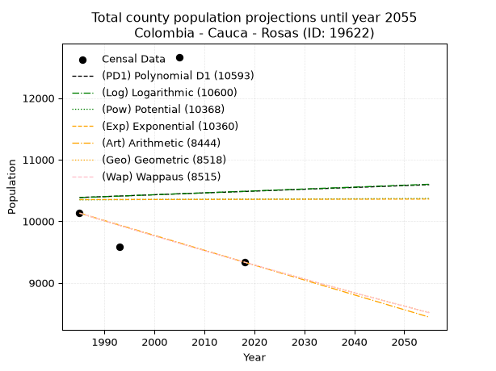
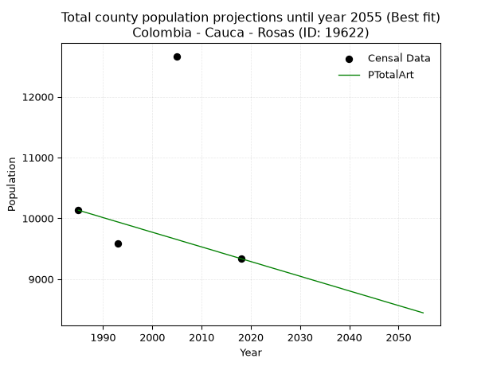
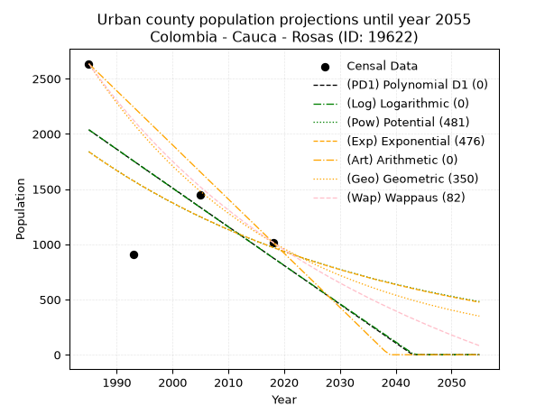
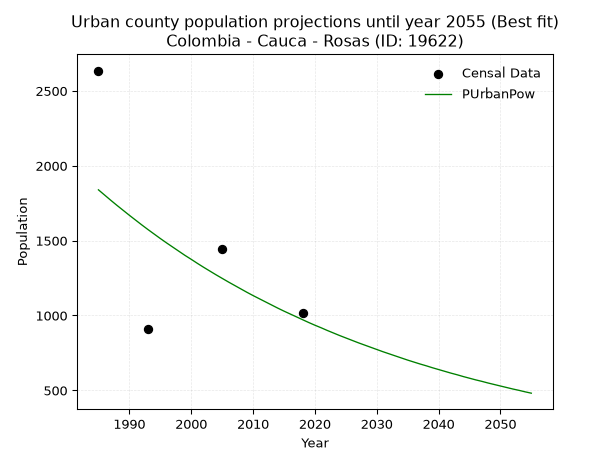
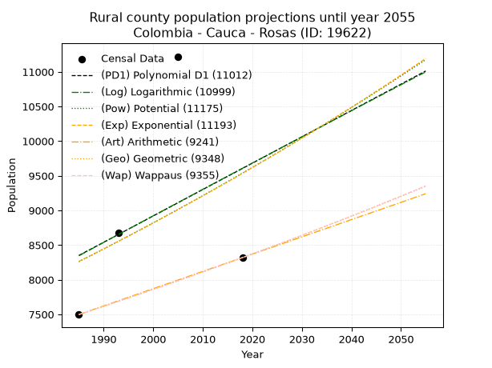
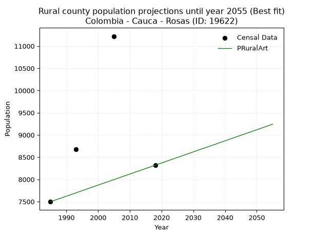

<div align="center">


</div>

# 📜 _“Population and Public Services Demand Projections (PPSD) until Year 2050 for Colombia - Cauca - Rosas (ID: 19622)”_
Keywords: `population` `public-service` `projection` `lineal` `polynomial` `logarithmic` `potential` `exponential` `arithmetic` `geometric` `wappaus` `dane` `colombia` `south-america`

PPSD are analytical estimates used by governments and planners to anticipate future changes in population size, age distribution, and the resulting community needs for utilities, healthcare, education, and infrastructure as sizing future water treatment facilities, electrical grids, and road networks based on spatial growth.

<div align="center">

</img>

</div>


> **General running parameters**: • app_version: _v20260806_. • Python version: _3.14.7_. • Pandas version: _3.0.5_. • NumPy version: _2.5.1_. • Creates, save and include plots into reports (create_plot): _False_. • Projection until year: _2050_. • Process polynomial degree 2 and up: _False_. • Process Wappaus: _True_. • Process Wappaus: _True_. • Set negative values to zero: _True_. • Set infinite values to zero: _True_. • Drop dataset notes: _True_. 
<div align="center">

Dynamic map: [:earth_americas:Google](http://maps.google.com/maps?q=2.260941437,-76.740336) [:earth_americas:OSM](https://www.openstreetmap.org/#map=18/2.260941437/-76.740336&layers=P) [:earth_americas:Bing](https://www.bing.com/maps?cp=2.260941437~-76.740336&lvl=18) [:earth_americas:Apple](https://maps.apple.com/frame?center=2.260941437%2C-76.740336&span=0.003%2C0.006)

</div>


<div align="center">

```geojson
{
  "type": "Feature",
  "geometry": {
    "type": "Point", 
    "coordinates": [-76.740336, 2.260941437]
  }, 
  "properties": {
    "Name": "Colombia - Cauca - Rosas (ID: 19622)"
  }
}
```

</div>


## 0. Census Data (4 records)

Census data are official statistics collected by a government about the people and housing in a country. They usually include counts of total population, age, sex, race, income, education, and jobs.

📅Global census file: [Population.xlsx](../data/Population.xlsx)

| Source   |   Year |   CountryID | CountryName   |   StateID | StateName   |   CountyID | CountyName   |   PTotal |   PUrban |   PRural |
|:---------|-------:|------------:|:--------------|----------:|:------------|-----------:|:-------------|---------:|---------:|---------:|
| DANE     |   1985 |          57 | Colombia      |        19 | Cauca       |      19622 | Rosas        |    10132 |     2635 |     7497 |
| DANE     |   1993 |          57 | Colombia      |        19 | Cauca       |      19622 | Rosas        |     9589 |      907 |     8682 |
| DANE     |   2005 |          57 | Colombia      |        19 | Cauca       |      19622 | Rosas        |    12666 |     1445 |    11221 |
| DANE     |   2018 |          57 | Colombia      |        19 | Cauca       |      19622 | Rosas        |     9336 |     1017 |     8319 |

> 🔥Some records could had specific notes about the registered values or the corresponding urban or rural distribution.

📅[SUI-RUPS](https://www.datos.gov.co/Hacienda-y-Cr-dito-P-blico/Registro-nico-de-Prestadores-de-Servicios-P-blicos/4qkq-csdn/about_data) - Local public utility companies: [RUPS.csv](../data/RUPS.csv)

 | SERVICIO       | ESTADO    | NOMBRE                                                   | NIT         | DEPARTAMENTO_DOMICILIO   | MUNICIPIO_DOMICILIO   | DIRECCION               |   TELEFONO | EMAIL                      | TIPO_PRESTADOR                             | CLASIFICACION                 |
|:---------------|:----------|:---------------------------------------------------------|:------------|:-------------------------|:----------------------|:------------------------|-----------:|:---------------------------|:-------------------------------------------|:------------------------------|
| ACUEDUCTO      | OPERATIVA | EMPRESA MUNICIPAL DE SERVICIOS PUBLICOS DE ROSAS - CAUCA | 817007037-8 | CAUCA                    | ROSAS                 | EDIFICIO CAM ROSAS      |    8254013 | alcideslopez13@hotmail.com | EMPRESA INDUSTRIAL Y COMERCIAL DEL ESTADO  | HASTA 2500 SUSCRIPTORES       |
| ALCANTARILLADO | OPERATIVA | EMPRESA MUNICIPAL DE SERVICIOS PUBLICOS DE ROSAS - CAUCA | 817007037-8 | CAUCA                    | ROSAS                 | EDIFICIO CAM ROSAS      |    8254013 | alcideslopez13@hotmail.com | EMPRESA INDUSTRIAL Y COMERCIAL DEL ESTADO  | HASTA 2500 SUSCRIPTORES       |
| ACUEDUCTO      | OPERATIVA | ACUEDUCTO ALCANTARILLADO Y ASEO DE ROSAS S.A E.S.P       | 900575233-1 | CAUCA                    | ROSAS                 | calle 6 No. 3-40 ED CAM |    8372667 | rosassaesp@gmail.com       | SOCIEDADES (EMPRESA DE SERVICIOS PUBLICOS) | MENOR O IGUAL A 2500 USUARIOS |
| ALCANTARILLADO | OPERATIVA | ACUEDUCTO ALCANTARILLADO Y ASEO DE ROSAS S.A E.S.P       | 900575233-1 | CAUCA                    | ROSAS                 | calle 6 No. 3-40 ED CAM |    8372667 | rosassaesp@gmail.com       | SOCIEDADES (EMPRESA DE SERVICIOS PUBLICOS) | MENOR O IGUAL A 2500 USUARIOS |

## 1. Total

### 1.1. Coefficients and Parameters

* (PD1) Polynomial Deg 1: 2.9614612605397435, 4507.087113605379 (lineal)
* (Log) Logarithmic: 6258.817914155774, -37142.575120517125
* (Pow) Potential: 0.05327350647526132, 3.839207321632221
* (Exp) Exponential: 1.1774295541267777e-05, 10112.042938539704
* (Art) Arithmetic: Year diff. 2018 - 1985 = 33, Population diff. 9336 - 10132 = -796, Annual growth = -24.12121212121212
* (Geo) Geometric: Year diff. 2018 - 1985 = 33, Population diff. 9336 - 10132 = -796, Annual growth % = -0.0024763480864868903
* (Wap) Wappaus: i = -0.24780369962206822, Condition values only valid for < 200)

<sub>
Wappaus condition values: ['-0.00', '-0.25', '-0.50', '-0.74', '-0.99', '-1.24', '-1.49', '-1.73', '-1.98', '-2.23', '-2.48', '-2.73', '-2.97', '-3.22', '-3.47', '-3.72', '-3.96', '-4.21', '-4.46', '-4.71', '-4.96', '-5.20', '-5.45', '-5.70', '-5.95', '-6.20', '-6.44', '-6.69', '-6.94', '-7.19', '-7.43', '-7.68', '-7.93', '-8.18', '-8.43', '-8.67', '-8.92', '-9.17', '-9.42', '-9.66', '-9.91', '-10.16', '-10.41', '-10.66', '-10.90', '-11.15', '-11.40', '-11.65', '-11.89', '-12.14', '-12.39', '-12.64', '-12.89', '-13.13', '-13.38', '-13.63', '-13.88', '-14.12', '-14.37', '-14.62', '-14.87', '-15.12', '-15.36', '-15.61', '-15.86', '-16.11']
</sub>


### 1.2. Projected Dataset

|   Year |   CountyID |   PTotalPD1 |   PTotalLog |   PTotalPow |   PTotalExp |   PTotalArt |   PTotalGeo |   PTotalWap |
|-------:|-----------:|------------:|------------:|------------:|------------:|------------:|------------:|------------:|
|   1985 |      19622 |       10386 |       10383 |       10349 |       10351 |       10132 |       10132 |       10132 |
|   1986 |      19622 |       10389 |       10386 |       10349 |       10351 |       10108 |       10107 |       10107 |
|   1987 |      19622 |       10392 |       10389 |       10349 |       10351 |       10084 |       10082 |       10082 |
|   1988 |      19622 |       10394 |       10392 |       10350 |       10352 |       10060 |       10057 |       10057 |
|   1989 |      19622 |       10397 |       10396 |       10350 |       10352 |       10036 |       10032 |       10032 |
|   1990 |      19622 |       10400 |       10399 |       10350 |       10352 |       10011 |       10007 |       10007 |
|   1991 |      19622 |       10403 |       10402 |       10350 |       10352 |        9987 |        9982 |        9982 |
|   1992 |      19622 |       10406 |       10405 |       10351 |       10352 |        9963 |        9958 |        9958 |
|   1993 |      19622 |       10409 |       10408 |       10351 |       10352 |        9939 |        9933 |        9933 |
|   1994 |      19622 |       10412 |       10411 |       10351 |       10352 |        9915 |        9908 |        9909 |
|   1995 |      19622 |       10415 |       10414 |       10352 |       10352 |        9891 |        9884 |        9884 |
|   1996 |      19622 |       10418 |       10418 |       10352 |       10353 |        9867 |        9859 |        9860 |
|   1997 |      19622 |       10421 |       10421 |       10352 |       10353 |        9843 |        9835 |        9835 |
|   1998 |      19622 |       10424 |       10424 |       10352 |       10353 |        9818 |        9811 |        9811 |
|   1999 |      19622 |       10427 |       10427 |       10353 |       10353 |        9794 |        9786 |        9786 |
|   2000 |      19622 |       10430 |       10430 |       10353 |       10353 |        9770 |        9762 |        9762 |
|   2001 |      19622 |       10433 |       10433 |       10353 |       10353 |        9746 |        9738 |        9738 |
|   2002 |      19622 |       10436 |       10436 |       10354 |       10353 |        9722 |        9714 |        9714 |
|   2003 |      19622 |       10439 |       10439 |       10354 |       10353 |        9698 |        9690 |        9690 |
|   2004 |      19622 |       10442 |       10443 |       10354 |       10353 |        9674 |        9666 |        9666 |
|   2005 |      19622 |       10445 |       10446 |       10354 |       10354 |        9650 |        9642 |        9642 |
|   2006 |      19622 |       10448 |       10449 |       10355 |       10354 |        9625 |        9618 |        9618 |
|   2007 |      19622 |       10451 |       10452 |       10355 |       10354 |        9601 |        9594 |        9594 |
|   2008 |      19622 |       10454 |       10455 |       10355 |       10354 |        9577 |        9570 |        9571 |
|   2009 |      19622 |       10457 |       10458 |       10355 |       10354 |        9553 |        9547 |        9547 |
|   2010 |      19622 |       10460 |       10461 |       10356 |       10354 |        9529 |        9523 |        9523 |
|   2011 |      19622 |       10463 |       10464 |       10356 |       10354 |        9505 |        9499 |        9500 |
|   2012 |      19622 |       10466 |       10468 |       10356 |       10354 |        9481 |        9476 |        9476 |
|   2013 |      19622 |       10469 |       10471 |       10357 |       10355 |        9457 |        9452 |        9453 |
|   2014 |      19622 |       10471 |       10474 |       10357 |       10355 |        9432 |        9429 |        9429 |
|   2015 |      19622 |       10474 |       10477 |       10357 |       10355 |        9408 |        9406 |        9406 |
|   2016 |      19622 |       10477 |       10480 |       10357 |       10355 |        9384 |        9382 |        9382 |
|   2017 |      19622 |       10480 |       10483 |       10358 |       10355 |        9360 |        9359 |        9359 |
|   2018 |      19622 |       10483 |       10486 |       10358 |       10355 |        9336 |        9336 |        9336 |
|   2019 |      19622 |       10486 |       10489 |       10358 |       10355 |        9312 |        9313 |        9313 |
|   2020 |      19622 |       10489 |       10492 |       10358 |       10355 |        9288 |        9290 |        9290 |
|   2021 |      19622 |       10492 |       10495 |       10359 |       10356 |        9264 |        9267 |        9267 |
|   2022 |      19622 |       10495 |       10499 |       10359 |       10356 |        9240 |        9244 |        9244 |
|   2023 |      19622 |       10498 |       10502 |       10359 |       10356 |        9215 |        9221 |        9221 |
|   2024 |      19622 |       10501 |       10505 |       10360 |       10356 |        9191 |        9198 |        9198 |
|   2025 |      19622 |       10504 |       10508 |       10360 |       10356 |        9167 |        9175 |        9175 |
|   2026 |      19622 |       10507 |       10511 |       10360 |       10356 |        9143 |        9153 |        9152 |
|   2027 |      19622 |       10510 |       10514 |       10360 |       10356 |        9119 |        9130 |        9130 |
|   2028 |      19622 |       10513 |       10517 |       10361 |       10356 |        9095 |        9107 |        9107 |
|   2029 |      19622 |       10516 |       10520 |       10361 |       10357 |        9071 |        9085 |        9084 |
|   2030 |      19622 |       10519 |       10523 |       10361 |       10357 |        9047 |        9062 |        9062 |
|   2031 |      19622 |       10522 |       10526 |       10361 |       10357 |        9022 |        9040 |        9039 |
|   2032 |      19622 |       10525 |       10529 |       10362 |       10357 |        8998 |        9017 |        9017 |
|   2033 |      19622 |       10528 |       10533 |       10362 |       10357 |        8974 |        8995 |        8994 |
|   2034 |      19622 |       10531 |       10536 |       10362 |       10357 |        8950 |        8973 |        8972 |
|   2035 |      19622 |       10534 |       10539 |       10363 |       10357 |        8926 |        8951 |        8950 |
|   2036 |      19622 |       10537 |       10542 |       10363 |       10357 |        8902 |        8928 |        8928 |
|   2037 |      19622 |       10540 |       10545 |       10363 |       10358 |        8878 |        8906 |        8905 |
|   2038 |      19622 |       10543 |       10548 |       10363 |       10358 |        8854 |        8884 |        8883 |
|   2039 |      19622 |       10546 |       10551 |       10364 |       10358 |        8829 |        8862 |        8861 |
|   2040 |      19622 |       10548 |       10554 |       10364 |       10358 |        8805 |        8840 |        8839 |
|   2041 |      19622 |       10551 |       10557 |       10364 |       10358 |        8781 |        8818 |        8817 |
|   2042 |      19622 |       10554 |       10560 |       10364 |       10358 |        8757 |        8797 |        8795 |
|   2043 |      19622 |       10557 |       10563 |       10365 |       10358 |        8733 |        8775 |        8773 |
|   2044 |      19622 |       10560 |       10566 |       10365 |       10358 |        8709 |        8753 |        8752 |
|   2045 |      19622 |       10563 |       10569 |       10365 |       10358 |        8685 |        8731 |        8730 |
|   2046 |      19622 |       10566 |       10572 |       10366 |       10359 |        8661 |        8710 |        8708 |
|   2047 |      19622 |       10569 |       10575 |       10366 |       10359 |        8636 |        8688 |        8686 |
|   2048 |      19622 |       10572 |       10579 |       10366 |       10359 |        8612 |        8667 |        8665 |
|   2049 |      19622 |       10575 |       10582 |       10366 |       10359 |        8588 |        8645 |        8643 |
|   2050 |      19622 |       10578 |       10585 |       10367 |       10359 |        8564 |        8624 |        8622 |
<div align="center">

</img>

</div>


### 1.3. Best fit with absolute and relative error (%)

Relative error puts that difference into context by dividing the absolute error by the true value, creating a unitless ratio or percentage that shows the scale of the mistake.

Absolute and relative error

|   Year | Source   |   CountryID | CountryName   |   StateID | StateName   |   CountyID_x | CountyName   |   PTotal |   PUrban |   PRural |   CountyID_y |   PTotalPD1 |   PTotalLog |   PTotalPow |   PTotalExp |   PTotalArt |   PTotalGeo |   PTotalWap |   PTotalPD1AbsError |   PTotalLogAbsError |   PTotalPowAbsError |   PTotalExpAbsError |   PTotalArtAbsError |   PTotalGeoAbsError |   PTotalWapAbsError |   PTotalPD1RelError |   PTotalLogRelError |   PTotalPowRelError |   PTotalExpRelError |   PTotalArtRelError |   PTotalGeoRelError |   PTotalWapRelError |
|-------:|:---------|------------:|:--------------|----------:|:------------|-------------:|:-------------|---------:|---------:|---------:|-------------:|------------:|------------:|------------:|------------:|------------:|------------:|------------:|--------------------:|--------------------:|--------------------:|--------------------:|--------------------:|--------------------:|--------------------:|--------------------:|--------------------:|--------------------:|--------------------:|--------------------:|--------------------:|--------------------:|
|   1985 | DANE     |          57 | Colombia      |        19 | Cauca       |        19622 | Rosas        |    10132 |     2635 |     7497 |        19622 |       10386 |       10383 |       10349 |       10351 |       10132 |       10132 |       10132 |                 254 |                 251 |                 217 |                 219 |                   0 |                   0 |                   0 |             2.50691 |             2.4773  |             2.14173 |             2.16147 |             0       |             0       |             0       |
|   1993 | DANE     |          57 | Colombia      |        19 | Cauca       |        19622 | Rosas        |     9589 |      907 |     8682 |        19622 |       10409 |       10408 |       10351 |       10352 |        9939 |        9933 |        9933 |                 820 |                 819 |                 762 |                 763 |                 350 |                 344 |                 344 |             8.55147 |             8.54104 |             7.94661 |             7.95703 |             3.65002 |             3.58744 |             3.58744 |
|   2005 | DANE     |          57 | Colombia      |        19 | Cauca       |        19622 | Rosas        |    12666 |     1445 |    11221 |        19622 |       10445 |       10446 |       10354 |       10354 |        9650 |        9642 |        9642 |                2221 |                2220 |                2312 |                2312 |                3016 |                3024 |                3024 |            17.5351  |            17.5272  |            18.2536  |            18.2536  |            23.8118  |            23.8749  |            23.8749  |
|   2018 | DANE     |          57 | Colombia      |        19 | Cauca       |        19622 | Rosas        |     9336 |     1017 |     8319 |        19622 |       10483 |       10486 |       10358 |       10355 |        9336 |        9336 |        9336 |                1147 |                1150 |                1022 |                1019 |                   0 |                   0 |                   0 |            12.2858  |            12.3179  |            10.9469  |            10.9147  |             0       |             0       |             0       |

Relative error mean

| Method    |   RelError | Best   |
|:----------|-----------:|:-------|
| PTotalPD1 |   10.2198  |        |
| PTotalLog |   10.2159  |        |
| PTotalPow |    9.8222  |        |
| PTotalExp |    9.82171 |        |
| PTotalArt |    6.86545 | True   |
| PTotalGeo |    6.8656  |        |
| PTotalWap |    6.8656  |        |

💙Best method: _**PTotalArt**_
<div align="center">

</img>

</div>


### 1.4. Fresh water supply demand in liters per capita per day (lpcd)

The fresh water supply demand typically ranges from 100 to 300 liters per capita per day (lpcd) for standard domestic and municipal planning, though absolute survival minimums set by the World Health Organization are as low as 7.5 to 20 liters per day, and total consumption in high-income nations can exceed 400 liters.

> `CZ`: Level in meters above the sea level (masl)<br> `WS`: Fresh water supply demand in liters per capita per day (lpcd or l/h/d)<br> `WSAll`: Zonal fresh water supply demand in liters per second (l/s)<br> `A`: Zonal area in square meters<br> `DP`: Population density (people/hectare or p/ha)

Reference values (RAS Colombia)

|    CZ |   WS |
|------:|-----:|
|  1000 |  120 |
|  2000 |  130 |
| 99999 |  140 |

County shapefile geometry properties and water supply values

|   CountyID |     ATotal |   CZTotal |   WSTotal |
|-----------:|-----------:|----------:|----------:|
|      19622 | 1.6918e+08 |   1581.16 |       130 |

Projected values for best method: PTotalArt

|   CountyID |   Year |   PTotalArt |   DPTotal |   WSTotal |   WSTotalAll |
|-----------:|-------:|------------:|----------:|----------:|-------------:|
|      19622 |   1985 |       10132 |      0.6  |       130 |      15.2449 |
|      19622 |   1986 |       10108 |      0.6  |       130 |      15.2088 |
|      19622 |   1987 |       10084 |      0.6  |       130 |      15.1727 |
|      19622 |   1988 |       10060 |      0.59 |       130 |      15.1366 |
|      19622 |   1989 |       10036 |      0.59 |       130 |      15.1005 |
|      19622 |   1990 |       10011 |      0.59 |       130 |      15.0628 |
|      19622 |   1991 |        9987 |      0.59 |       130 |      15.0267 |
|      19622 |   1992 |        9963 |      0.59 |       130 |      14.9906 |
|      19622 |   1993 |        9939 |      0.59 |       130 |      14.9545 |
|      19622 |   1994 |        9915 |      0.59 |       130 |      14.9184 |
|      19622 |   1995 |        9891 |      0.58 |       130 |      14.8823 |
|      19622 |   1996 |        9867 |      0.58 |       130 |      14.8462 |
|      19622 |   1997 |        9843 |      0.58 |       130 |      14.8101 |
|      19622 |   1998 |        9818 |      0.58 |       130 |      14.7725 |
|      19622 |   1999 |        9794 |      0.58 |       130 |      14.7363 |
|      19622 |   2000 |        9770 |      0.58 |       130 |      14.7002 |
|      19622 |   2001 |        9746 |      0.58 |       130 |      14.6641 |
|      19622 |   2002 |        9722 |      0.57 |       130 |      14.628  |
|      19622 |   2003 |        9698 |      0.57 |       130 |      14.5919 |
|      19622 |   2004 |        9674 |      0.57 |       130 |      14.5558 |
|      19622 |   2005 |        9650 |      0.57 |       130 |      14.5197 |
|      19622 |   2006 |        9625 |      0.57 |       130 |      14.4821 |
|      19622 |   2007 |        9601 |      0.57 |       130 |      14.4459 |
|      19622 |   2008 |        9577 |      0.57 |       130 |      14.4098 |
|      19622 |   2009 |        9553 |      0.56 |       130 |      14.3737 |
|      19622 |   2010 |        9529 |      0.56 |       130 |      14.3376 |
|      19622 |   2011 |        9505 |      0.56 |       130 |      14.3015 |
|      19622 |   2012 |        9481 |      0.56 |       130 |      14.2654 |
|      19622 |   2013 |        9457 |      0.56 |       130 |      14.2293 |
|      19622 |   2014 |        9432 |      0.56 |       130 |      14.1917 |
|      19622 |   2015 |        9408 |      0.56 |       130 |      14.1556 |
|      19622 |   2016 |        9384 |      0.55 |       130 |      14.1194 |
|      19622 |   2017 |        9360 |      0.55 |       130 |      14.0833 |
|      19622 |   2018 |        9336 |      0.55 |       130 |      14.0472 |
|      19622 |   2019 |        9312 |      0.55 |       130 |      14.0111 |
|      19622 |   2020 |        9288 |      0.55 |       130 |      13.975  |
|      19622 |   2021 |        9264 |      0.55 |       130 |      13.9389 |
|      19622 |   2022 |        9240 |      0.55 |       130 |      13.9028 |
|      19622 |   2023 |        9215 |      0.54 |       130 |      13.8652 |
|      19622 |   2024 |        9191 |      0.54 |       130 |      13.8291 |
|      19622 |   2025 |        9167 |      0.54 |       130 |      13.7929 |
|      19622 |   2026 |        9143 |      0.54 |       130 |      13.7568 |
|      19622 |   2027 |        9119 |      0.54 |       130 |      13.7207 |
|      19622 |   2028 |        9095 |      0.54 |       130 |      13.6846 |
|      19622 |   2029 |        9071 |      0.54 |       130 |      13.6485 |
|      19622 |   2030 |        9047 |      0.53 |       130 |      13.6124 |
|      19622 |   2031 |        9022 |      0.53 |       130 |      13.5748 |
|      19622 |   2032 |        8998 |      0.53 |       130 |      13.5387 |
|      19622 |   2033 |        8974 |      0.53 |       130 |      13.5025 |
|      19622 |   2034 |        8950 |      0.53 |       130 |      13.4664 |
|      19622 |   2035 |        8926 |      0.53 |       130 |      13.4303 |
|      19622 |   2036 |        8902 |      0.53 |       130 |      13.3942 |
|      19622 |   2037 |        8878 |      0.52 |       130 |      13.3581 |
|      19622 |   2038 |        8854 |      0.52 |       130 |      13.322  |
|      19622 |   2039 |        8829 |      0.52 |       130 |      13.2844 |
|      19622 |   2040 |        8805 |      0.52 |       130 |      13.2483 |
|      19622 |   2041 |        8781 |      0.52 |       130 |      13.2122 |
|      19622 |   2042 |        8757 |      0.52 |       130 |      13.176  |
|      19622 |   2043 |        8733 |      0.52 |       130 |      13.1399 |
|      19622 |   2044 |        8709 |      0.51 |       130 |      13.1038 |
|      19622 |   2045 |        8685 |      0.51 |       130 |      13.0677 |
|      19622 |   2046 |        8661 |      0.51 |       130 |      13.0316 |
|      19622 |   2047 |        8636 |      0.51 |       130 |      12.994  |
|      19622 |   2048 |        8612 |      0.51 |       130 |      12.9579 |
|      19622 |   2049 |        8588 |      0.51 |       130 |      12.9218 |
|      19622 |   2050 |        8564 |      0.51 |       130 |      12.8856 |

## 2. Urban

### 2.1. Coefficients and Parameters

* (PD1) Polynomial Deg 1: -35.07667603372114, 71663.12123645072 (lineal)
* (Log) Logarithmic: -70323.76455672826, 536032.4979349733
* (Pow) Potential: -38.69284142443329, 130.8643980740779
* (Exp) Exponential: -0.019301553449622564, 8.009513299647178e+19
* (Art) Arithmetic: Year diff. 2018 - 1985 = 33, Population diff. 1017 - 2635 = -1618, Annual growth = -49.03030303030303
* (Geo) Geometric: Year diff. 2018 - 1985 = 33, Population diff. 1017 - 2635 = -1618, Annual growth % = -0.028437107455336896
* (Wap) Wappaus: i = -2.685120647880779, Condition values only valid for < 200)

<sub>
Wappaus condition values: ['-0.00', '-2.69', '-5.37', '-8.06', '-10.74', '-13.43', '-16.11', '-18.80', '-21.48', '-24.17', '-26.85', '-29.54', '-32.22', '-34.91', '-37.59', '-40.28', '-42.96', '-45.65', '-48.33', '-51.02', '-53.70', '-56.39', '-59.07', '-61.76', '-64.44', '-67.13', '-69.81', '-72.50', '-75.18', '-77.87', '-80.55', '-83.24', '-85.92', '-88.61', '-91.29', '-93.98', '-96.66', '-99.35', '-102.03', '-104.72', '-107.40', '-110.09', '-112.78', '-115.46', '-118.15', '-120.83', '-123.52', '-126.20', '-128.89', '-131.57', '-134.26', '-136.94', '-139.63', '-142.31', '-145.00', '-147.68', '-150.37', '-153.05', '-155.74', '-158.42', '-161.11', '-163.79', '-166.48', '-169.16', '-171.85', '-174.53']
</sub>


### 2.2. Projected Dataset

|   Year |   CountyID |   PUrbanPD1 |   PUrbanLog |   PUrbanPow |   PUrbanExp |   PUrbanArt |   PUrbanGeo |   PUrbanWap |
|-------:|-----------:|------------:|------------:|------------:|------------:|------------:|------------:|------------:|
|   1985 |      19622 |        2036 |        2038 |        1839 |        1838 |        2635 |        2635 |        2635 |
|   1986 |      19622 |        2001 |        2002 |        1804 |        1802 |        2586 |        2560 |        2565 |
|   1987 |      19622 |        1966 |        1967 |        1769 |        1768 |        2537 |        2487 |        2497 |
|   1988 |      19622 |        1931 |        1932 |        1735 |        1734 |        2488 |        2417 |        2431 |
|   1989 |      19622 |        1896 |        1896 |        1702 |        1701 |        2439 |        2348 |        2366 |
|   1990 |      19622 |        1861 |        1861 |        1669 |        1668 |        2390 |        2281 |        2303 |
|   1991 |      19622 |        1825 |        1826 |        1637 |        1637 |        2341 |        2216 |        2242 |
|   1992 |      19622 |        1790 |        1790 |        1605 |        1605 |        2292 |        2153 |        2182 |
|   1993 |      19622 |        1755 |        1755 |        1574 |        1575 |        2243 |        2092 |        2124 |
|   1994 |      19622 |        1720 |        1720 |        1544 |        1544 |        2194 |        2032 |        2067 |
|   1995 |      19622 |        1685 |        1684 |        1514 |        1515 |        2145 |        1975 |        2011 |
|   1996 |      19622 |        1650 |        1649 |        1485 |        1486 |        2096 |        1918 |        1957 |
|   1997 |      19622 |        1615 |        1614 |        1457 |        1458 |        2047 |        1864 |        1904 |
|   1998 |      19622 |        1580 |        1579 |        1429 |        1430 |        1998 |        1811 |        1852 |
|   1999 |      19622 |        1545 |        1544 |        1401 |        1402 |        1949 |        1759 |        1801 |
|   2000 |      19622 |        1510 |        1508 |        1375 |        1376 |        1900 |        1709 |        1752 |
|   2001 |      19622 |        1475 |        1473 |        1348 |        1349 |        1851 |        1661 |        1703 |
|   2002 |      19622 |        1440 |        1438 |        1322 |        1324 |        1801 |        1614 |        1656 |
|   2003 |      19622 |        1405 |        1403 |        1297 |        1298 |        1752 |        1568 |        1609 |
|   2004 |      19622 |        1369 |        1368 |        1272 |        1273 |        1703 |        1523 |        1564 |
|   2005 |      19622 |        1334 |        1333 |        1248 |        1249 |        1654 |        1480 |        1519 |
|   2006 |      19622 |        1299 |        1298 |        1224 |        1225 |        1605 |        1438 |        1476 |
|   2007 |      19622 |        1264 |        1263 |        1201 |        1202 |        1556 |        1397 |        1433 |
|   2008 |      19622 |        1229 |        1228 |        1178 |        1179 |        1507 |        1357 |        1392 |
|   2009 |      19622 |        1194 |        1193 |        1155 |        1156 |        1458 |        1319 |        1351 |
|   2010 |      19622 |        1159 |        1158 |        1133 |        1134 |        1409 |        1281 |        1311 |
|   2011 |      19622 |        1124 |        1123 |        1112 |        1112 |        1360 |        1245 |        1271 |
|   2012 |      19622 |        1089 |        1088 |        1091 |        1091 |        1311 |        1209 |        1233 |
|   2013 |      19622 |        1054 |        1053 |        1070 |        1070 |        1262 |        1175 |        1195 |
|   2014 |      19622 |        1019 |        1018 |        1049 |        1050 |        1213 |        1141 |        1158 |
|   2015 |      19622 |         984 |         983 |        1029 |        1030 |        1164 |        1109 |        1122 |
|   2016 |      19622 |         949 |         948 |        1010 |        1010 |        1115 |        1077 |        1086 |
|   2017 |      19622 |         913 |         913 |         991 |         991 |        1066 |        1047 |        1051 |
|   2018 |      19622 |         878 |         878 |         972 |         972 |        1017 |        1017 |        1017 |
|   2019 |      19622 |         843 |         844 |         953 |         953 |         968 |         988 |         983 |
|   2020 |      19622 |         808 |         809 |         935 |         935 |         919 |         960 |         950 |
|   2021 |      19622 |         773 |         774 |         918 |         917 |         870 |         933 |         918 |
|   2022 |      19622 |         738 |         739 |         900 |         900 |         821 |         906 |         886 |
|   2023 |      19622 |         703 |         704 |         883 |         882 |         772 |         880 |         855 |
|   2024 |      19622 |         668 |         670 |         866 |         866 |         723 |         855 |         824 |
|   2025 |      19622 |         633 |         635 |         850 |         849 |         674 |         831 |         794 |
|   2026 |      19622 |         598 |         600 |         834 |         833 |         625 |         807 |         764 |
|   2027 |      19622 |         563 |         565 |         818 |         817 |         576 |         784 |         735 |
|   2028 |      19622 |         528 |         531 |         803 |         801 |         527 |         762 |         706 |
|   2029 |      19622 |         493 |         496 |         788 |         786 |         478 |         740 |         678 |
|   2030 |      19622 |         457 |         461 |         773 |         771 |         429 |         719 |         650 |
|   2031 |      19622 |         422 |         427 |         758 |         756 |         380 |         699 |         623 |
|   2032 |      19622 |         387 |         392 |         744 |         742 |         331 |         679 |         596 |
|   2033 |      19622 |         352 |         358 |         730 |         728 |         282 |         660 |         570 |
|   2034 |      19622 |         317 |         323 |         716 |         714 |         233 |         641 |         544 |
|   2035 |      19622 |         282 |         288 |         702 |         700 |         183 |         623 |         518 |
|   2036 |      19622 |         247 |         254 |         689 |         687 |         134 |         605 |         493 |
|   2037 |      19622 |         212 |         219 |         676 |         673 |          85 |         588 |         468 |
|   2038 |      19622 |         177 |         185 |         664 |         661 |          36 |         571 |         444 |
|   2039 |      19622 |         142 |         150 |         651 |         648 |           0 |         555 |         420 |
|   2040 |      19622 |         107 |         116 |         639 |         636 |           0 |         539 |         397 |
|   2041 |      19622 |          72 |          81 |         627 |         623 |           0 |         524 |         373 |
|   2042 |      19622 |          37 |          47 |         615 |         612 |           0 |         509 |         350 |
|   2043 |      19622 |           1 |          12 |         604 |         600 |           0 |         494 |         328 |
|   2044 |      19622 |           0 |           0 |         592 |         588 |           0 |         480 |         306 |
|   2045 |      19622 |           0 |           0 |         581 |         577 |           0 |         467 |         284 |
|   2046 |      19622 |           0 |           0 |         570 |         566 |           0 |         453 |         262 |
|   2047 |      19622 |           0 |           0 |         560 |         555 |           0 |         441 |         241 |
|   2048 |      19622 |           0 |           0 |         549 |         545 |           0 |         428 |         220 |
|   2049 |      19622 |           0 |           0 |         539 |         534 |           0 |         416 |         199 |
|   2050 |      19622 |           0 |           0 |         529 |         524 |           0 |         404 |         179 |
<div align="center">

</img>

</div>


### 2.3. Best fit with absolute and relative error (%)

Relative error puts that difference into context by dividing the absolute error by the true value, creating a unitless ratio or percentage that shows the scale of the mistake.

Absolute and relative error

|   Year | Source   |   CountryID | CountryName   |   StateID | StateName   |   CountyID_x | CountyName   |   PTotal |   PUrban |   PRural |   CountyID_y |   PUrbanPD1 |   PUrbanLog |   PUrbanPow |   PUrbanExp |   PUrbanArt |   PUrbanGeo |   PUrbanWap |   PUrbanPD1AbsError |   PUrbanLogAbsError |   PUrbanPowAbsError |   PUrbanExpAbsError |   PUrbanArtAbsError |   PUrbanGeoAbsError |   PUrbanWapAbsError |   PUrbanPD1RelError |   PUrbanLogRelError |   PUrbanPowRelError |   PUrbanExpRelError |   PUrbanArtRelError |   PUrbanGeoRelError |   PUrbanWapRelError |
|-------:|:---------|------------:|:--------------|----------:|:------------|-------------:|:-------------|---------:|---------:|---------:|-------------:|------------:|------------:|------------:|------------:|------------:|------------:|------------:|--------------------:|--------------------:|--------------------:|--------------------:|--------------------:|--------------------:|--------------------:|--------------------:|--------------------:|--------------------:|--------------------:|--------------------:|--------------------:|--------------------:|
|   1985 | DANE     |          57 | Colombia      |        19 | Cauca       |        19622 | Rosas        |    10132 |     2635 |     7497 |        19622 |        2036 |        2038 |        1839 |        1838 |        2635 |        2635 |        2635 |                 599 |                 597 |                 796 |                 797 |                   0 |                   0 |                   0 |            22.7324  |            22.6565  |            30.2087  |            30.2467  |              0      |             0       |             0       |
|   1993 | DANE     |          57 | Colombia      |        19 | Cauca       |        19622 | Rosas        |     9589 |      907 |     8682 |        19622 |        1755 |        1755 |        1574 |        1575 |        2243 |        2092 |        2124 |                 848 |                 848 |                 667 |                 668 |                1336 |                1185 |                1217 |            93.495   |            93.495   |            73.5391  |            73.6494  |            147.299  |           130.65    |           134.179   |
|   2005 | DANE     |          57 | Colombia      |        19 | Cauca       |        19622 | Rosas        |    12666 |     1445 |    11221 |        19622 |        1334 |        1333 |        1248 |        1249 |        1654 |        1480 |        1519 |                 111 |                 112 |                 197 |                 196 |                 209 |                  35 |                  74 |             7.68166 |             7.75087 |            13.6332  |            13.564   |             14.4637 |             2.42215 |             5.12111 |
|   2018 | DANE     |          57 | Colombia      |        19 | Cauca       |        19622 | Rosas        |     9336 |     1017 |     8319 |        19622 |         878 |         878 |         972 |         972 |        1017 |        1017 |        1017 |                 139 |                 139 |                  45 |                  45 |                   0 |                   0 |                   0 |            13.6676  |            13.6676  |             4.42478 |             4.42478 |              0      |             0       |             0       |

Relative error mean

| Method    |   RelError | Best   |
|:----------|-----------:|:-------|
| PUrbanPD1 |    34.3942 |        |
| PUrbanLog |    34.3925 |        |
| PUrbanPow |    30.4515 | True   |
| PUrbanExp |    30.4712 |        |
| PUrbanArt |    40.4406 |        |
| PUrbanGeo |    33.2682 |        |
| PUrbanWap |    34.8249 |        |

💙Best method: _**PUrbanPow**_
<div align="center">

</img>

</div>


### 2.4. Fresh water supply demand in liters per capita per day (lpcd)

The fresh water supply demand typically ranges from 100 to 300 liters per capita per day (lpcd) for standard domestic and municipal planning, though absolute survival minimums set by the World Health Organization are as low as 7.5 to 20 liters per day, and total consumption in high-income nations can exceed 400 liters.

> `CZ`: Level in meters above the sea level (masl)<br> `WS`: Fresh water supply demand in liters per capita per day (lpcd or l/h/d)<br> `WSAll`: Zonal fresh water supply demand in liters per second (l/s)<br> `A`: Zonal area in square meters<br> `DP`: Population density (people/hectare or p/ha)

Reference values (RAS Colombia)

|    CZ |   WS |
|------:|-----:|
|  1000 |  120 |
|  2000 |  130 |
| 99999 |  140 |

County shapefile geometry properties and water supply values

|   CountyID |   AUrban |   CZUrban |   WSUrban |
|-----------:|---------:|----------:|----------:|
|      19622 |   240947 |   1702.62 |       130 |

Projected values for best method: PUrbanPow

|   CountyID |   Year |   PUrbanPow |   DPUrban |   WSUrban |   WSUrbanAll |
|-----------:|-------:|------------:|----------:|----------:|-------------:|
|      19622 |   1985 |        1839 |     76.32 |       130 |     2.76701  |
|      19622 |   1986 |        1804 |     74.87 |       130 |     2.71435  |
|      19622 |   1987 |        1769 |     73.42 |       130 |     2.66169  |
|      19622 |   1988 |        1735 |     72.01 |       130 |     2.61053  |
|      19622 |   1989 |        1702 |     70.64 |       130 |     2.56088  |
|      19622 |   1990 |        1669 |     69.27 |       130 |     2.51123  |
|      19622 |   1991 |        1637 |     67.94 |       130 |     2.46308  |
|      19622 |   1992 |        1605 |     66.61 |       130 |     2.41493  |
|      19622 |   1993 |        1574 |     65.33 |       130 |     2.36829  |
|      19622 |   1994 |        1544 |     64.08 |       130 |     2.32315  |
|      19622 |   1995 |        1514 |     62.84 |       130 |     2.27801  |
|      19622 |   1996 |        1485 |     61.63 |       130 |     2.23438  |
|      19622 |   1997 |        1457 |     60.47 |       130 |     2.19225  |
|      19622 |   1998 |        1429 |     59.31 |       130 |     2.15012  |
|      19622 |   1999 |        1401 |     58.15 |       130 |     2.10799  |
|      19622 |   2000 |        1375 |     57.07 |       130 |     2.06887  |
|      19622 |   2001 |        1348 |     55.95 |       130 |     2.02824  |
|      19622 |   2002 |        1322 |     54.87 |       130 |     1.98912  |
|      19622 |   2003 |        1297 |     53.83 |       130 |     1.9515   |
|      19622 |   2004 |        1272 |     52.79 |       130 |     1.91389  |
|      19622 |   2005 |        1248 |     51.8  |       130 |     1.87778  |
|      19622 |   2006 |        1224 |     50.8  |       130 |     1.84167  |
|      19622 |   2007 |        1201 |     49.85 |       130 |     1.80706  |
|      19622 |   2008 |        1178 |     48.89 |       130 |     1.77245  |
|      19622 |   2009 |        1155 |     47.94 |       130 |     1.73785  |
|      19622 |   2010 |        1133 |     47.02 |       130 |     1.70475  |
|      19622 |   2011 |        1112 |     46.15 |       130 |     1.67315  |
|      19622 |   2012 |        1091 |     45.28 |       130 |     1.64155  |
|      19622 |   2013 |        1070 |     44.41 |       130 |     1.60995  |
|      19622 |   2014 |        1049 |     43.54 |       130 |     1.57836  |
|      19622 |   2015 |        1029 |     42.71 |       130 |     1.54826  |
|      19622 |   2016 |        1010 |     41.92 |       130 |     1.51968  |
|      19622 |   2017 |         991 |     41.13 |       130 |     1.49109  |
|      19622 |   2018 |         972 |     40.34 |       130 |     1.4625   |
|      19622 |   2019 |         953 |     39.55 |       130 |     1.43391  |
|      19622 |   2020 |         935 |     38.81 |       130 |     1.40683  |
|      19622 |   2021 |         918 |     38.1  |       130 |     1.38125  |
|      19622 |   2022 |         900 |     37.35 |       130 |     1.35417  |
|      19622 |   2023 |         883 |     36.65 |       130 |     1.32859  |
|      19622 |   2024 |         866 |     35.94 |       130 |     1.30301  |
|      19622 |   2025 |         850 |     35.28 |       130 |     1.27894  |
|      19622 |   2026 |         834 |     34.61 |       130 |     1.25486  |
|      19622 |   2027 |         818 |     33.95 |       130 |     1.23079  |
|      19622 |   2028 |         803 |     33.33 |       130 |     1.20822  |
|      19622 |   2029 |         788 |     32.7  |       130 |     1.18565  |
|      19622 |   2030 |         773 |     32.08 |       130 |     1.16308  |
|      19622 |   2031 |         758 |     31.46 |       130 |     1.14051  |
|      19622 |   2032 |         744 |     30.88 |       130 |     1.11944  |
|      19622 |   2033 |         730 |     30.3  |       130 |     1.09838  |
|      19622 |   2034 |         716 |     29.72 |       130 |     1.07731  |
|      19622 |   2035 |         702 |     29.14 |       130 |     1.05625  |
|      19622 |   2036 |         689 |     28.6  |       130 |     1.03669  |
|      19622 |   2037 |         676 |     28.06 |       130 |     1.01713  |
|      19622 |   2038 |         664 |     27.56 |       130 |     0.999074 |
|      19622 |   2039 |         651 |     27.02 |       130 |     0.979514 |
|      19622 |   2040 |         639 |     26.52 |       130 |     0.961458 |
|      19622 |   2041 |         627 |     26.02 |       130 |     0.943403 |
|      19622 |   2042 |         615 |     25.52 |       130 |     0.925347 |
|      19622 |   2043 |         604 |     25.07 |       130 |     0.908796 |
|      19622 |   2044 |         592 |     24.57 |       130 |     0.890741 |
|      19622 |   2045 |         581 |     24.11 |       130 |     0.87419  |
|      19622 |   2046 |         570 |     23.66 |       130 |     0.857639 |
|      19622 |   2047 |         560 |     23.24 |       130 |     0.842593 |
|      19622 |   2048 |         549 |     22.79 |       130 |     0.826042 |
|      19622 |   2049 |         539 |     22.37 |       130 |     0.810995 |
|      19622 |   2050 |         529 |     21.96 |       130 |     0.795949 |

## 3. Rural

### 3.1. Coefficients and Parameters

* (PD1) Polynomial Deg 1: 38.038137294260956, -67156.03412284549 (lineal)
* (Log) Logarithmic: 76582.58247088414, -573175.0730554913
* (Pow) Potential: 8.721051693488942, -24.84295052528241
* (Exp) Exponential: 0.004332980488227797, 1.5200329940739323
* (Art) Arithmetic: Year diff. 2018 - 1985 = 33, Population diff. 8319 - 7497 = 822, Annual growth = 24.90909090909091
* (Geo) Geometric: Year diff. 2018 - 1985 = 33, Population diff. 8319 - 7497 = 822, Annual growth % = 0.003157675434801499
* (Wap) Wappaus: i = 0.31498597507702214, Condition values only valid for < 200)

<sub>
Wappaus condition values: ['0.00', '0.31', '0.63', '0.94', '1.26', '1.57', '1.89', '2.20', '2.52', '2.83', '3.15', '3.46', '3.78', '4.09', '4.41', '4.72', '5.04', '5.35', '5.67', '5.98', '6.30', '6.61', '6.93', '7.24', '7.56', '7.87', '8.19', '8.50', '8.82', '9.13', '9.45', '9.76', '10.08', '10.39', '10.71', '11.02', '11.34', '11.65', '11.97', '12.28', '12.60', '12.91', '13.23', '13.54', '13.86', '14.17', '14.49', '14.80', '15.12', '15.43', '15.75', '16.06', '16.38', '16.69', '17.01', '17.32', '17.64', '17.95', '18.27', '18.58', '18.90', '19.21', '19.53', '19.84', '20.16', '20.47']
</sub>


### 3.2. Projected Dataset

|   Year |   CountyID |   PRuralPD1 |   PRuralLog |   PRuralPow |   PRuralExp |   PRuralArt |   PRuralGeo |   PRuralWap |
|-------:|-----------:|------------:|------------:|------------:|------------:|------------:|------------:|------------:|
|   1985 |      19622 |        8350 |        8345 |        8260 |        8264 |        7497 |        7497 |        7497 |
|   1986 |      19622 |        8388 |        8384 |        8297 |        8300 |        7522 |        7521 |        7521 |
|   1987 |      19622 |        8426 |        8422 |        8333 |        8336 |        7547 |        7544 |        7544 |
|   1988 |      19622 |        8464 |        8461 |        8370 |        8372 |        7572 |        7568 |        7568 |
|   1989 |      19622 |        8502 |        8499 |        8406 |        8409 |        7597 |        7592 |        7592 |
|   1990 |      19622 |        8540 |        8538 |        8443 |        8445 |        7622 |        7616 |        7616 |
|   1991 |      19622 |        8578 |        8576 |        8480 |        8482 |        7646 |        7640 |        7640 |
|   1992 |      19622 |        8616 |        8615 |        8518 |        8519 |        7671 |        7664 |        7664 |
|   1993 |      19622 |        8654 |        8653 |        8555 |        8556 |        7696 |        7688 |        7688 |
|   1994 |      19622 |        8692 |        8692 |        8593 |        8593 |        7721 |        7713 |        7713 |
|   1995 |      19622 |        8730 |        8730 |        8630 |        8630 |        7746 |        7737 |        7737 |
|   1996 |      19622 |        8768 |        8768 |        8668 |        8668 |        7771 |        7762 |        7761 |
|   1997 |      19622 |        8806 |        8807 |        8706 |        8705 |        7796 |        7786 |        7786 |
|   1998 |      19622 |        8844 |        8845 |        8744 |        8743 |        7821 |        7811 |        7810 |
|   1999 |      19622 |        8882 |        8883 |        8782 |        8781 |        7846 |        7835 |        7835 |
|   2000 |      19622 |        8920 |        8922 |        8821 |        8819 |        7871 |        7860 |        7860 |
|   2001 |      19622 |        8958 |        8960 |        8859 |        8858 |        7896 |        7885 |        7885 |
|   2002 |      19622 |        8996 |        8998 |        8898 |        8896 |        7920 |        7910 |        7909 |
|   2003 |      19622 |        9034 |        9036 |        8937 |        8935 |        7945 |        7935 |        7934 |
|   2004 |      19622 |        9072 |        9075 |        8976 |        8973 |        7970 |        7960 |        7960 |
|   2005 |      19622 |        9110 |        9113 |        9015 |        9012 |        7995 |        7985 |        7985 |
|   2006 |      19622 |        9148 |        9151 |        9054 |        9052 |        8020 |        8010 |        8010 |
|   2007 |      19622 |        9187 |        9189 |        9094 |        9091 |        8045 |        8035 |        8035 |
|   2008 |      19622 |        9225 |        9227 |        9133 |        9130 |        8070 |        8061 |        8061 |
|   2009 |      19622 |        9263 |        9266 |        9173 |        9170 |        8095 |        8086 |        8086 |
|   2010 |      19622 |        9301 |        9304 |        9213 |        9210 |        8120 |        8112 |        8112 |
|   2011 |      19622 |        9339 |        9342 |        9253 |        9250 |        8145 |        8137 |        8137 |
|   2012 |      19622 |        9377 |        9380 |        9293 |        9290 |        8170 |        8163 |        8163 |
|   2013 |      19622 |        9415 |        9418 |        9333 |        9330 |        8194 |        8189 |        8189 |
|   2014 |      19622 |        9453 |        9456 |        9374 |        9371 |        8219 |        8215 |        8215 |
|   2015 |      19622 |        9491 |        9494 |        9415 |        9412 |        8244 |        8241 |        8241 |
|   2016 |      19622 |        9529 |        9532 |        9455 |        9452 |        8269 |        8267 |        8267 |
|   2017 |      19622 |        9567 |        9570 |        9496 |        9493 |        8294 |        8293 |        8293 |
|   2018 |      19622 |        9605 |        9608 |        9538 |        9535 |        8319 |        8319 |        8319 |
|   2019 |      19622 |        9643 |        9646 |        9579 |        9576 |        8344 |        8345 |        8345 |
|   2020 |      19622 |        9681 |        9684 |        9620 |        9618 |        8369 |        8372 |        8372 |
|   2021 |      19622 |        9719 |        9722 |        9662 |        9659 |        8394 |        8398 |        8398 |
|   2022 |      19622 |        9757 |        9759 |        9704 |        9701 |        8419 |        8425 |        8425 |
|   2023 |      19622 |        9795 |        9797 |        9746 |        9743 |        8444 |        8451 |        8451 |
|   2024 |      19622 |        9833 |        9835 |        9788 |        9786 |        8468 |        8478 |        8478 |
|   2025 |      19622 |        9871 |        9873 |        9830 |        9828 |        8493 |        8505 |        8505 |
|   2026 |      19622 |        9909 |        9911 |        9872 |        9871 |        8518 |        8531 |        8532 |
|   2027 |      19622 |        9947 |        9949 |        9915 |        9914 |        8543 |        8558 |        8559 |
|   2028 |      19622 |        9985 |        9986 |        9958 |        9957 |        8568 |        8585 |        8586 |
|   2029 |      19622 |       10023 |       10024 |       10001 |       10000 |        8593 |        8613 |        8613 |
|   2030 |      19622 |       10061 |       10062 |       10044 |       10044 |        8618 |        8640 |        8641 |
|   2031 |      19622 |       10099 |       10100 |       10087 |       10087 |        8643 |        8667 |        8668 |
|   2032 |      19622 |       10137 |       10137 |       10130 |       10131 |        8668 |        8694 |        8696 |
|   2033 |      19622 |       10175 |       10175 |       10174 |       10175 |        8693 |        8722 |        8723 |
|   2034 |      19622 |       10214 |       10213 |       10218 |       10219 |        8718 |        8749 |        8751 |
|   2035 |      19622 |       10252 |       10250 |       10261 |       10263 |        8742 |        8777 |        8779 |
|   2036 |      19622 |       10290 |       10288 |       10306 |       10308 |        8767 |        8805 |        8807 |
|   2037 |      19622 |       10328 |       10325 |       10350 |       10353 |        8792 |        8833 |        8834 |
|   2038 |      19622 |       10366 |       10363 |       10394 |       10398 |        8817 |        8860 |        8863 |
|   2039 |      19622 |       10404 |       10401 |       10439 |       10443 |        8842 |        8888 |        8891 |
|   2040 |      19622 |       10442 |       10438 |       10483 |       10488 |        8867 |        8916 |        8919 |
|   2041 |      19622 |       10480 |       10476 |       10528 |       10534 |        8892 |        8945 |        8947 |
|   2042 |      19622 |       10518 |       10513 |       10573 |       10580 |        8917 |        8973 |        8976 |
|   2043 |      19622 |       10556 |       10551 |       10619 |       10625 |        8942 |        9001 |        9004 |
|   2044 |      19622 |       10594 |       10588 |       10664 |       10672 |        8967 |        9030 |        9033 |
|   2045 |      19622 |       10632 |       10626 |       10710 |       10718 |        8992 |        9058 |        9062 |
|   2046 |      19622 |       10670 |       10663 |       10755 |       10765 |        9016 |        9087 |        9091 |
|   2047 |      19622 |       10708 |       10701 |       10801 |       10811 |        9041 |        9115 |        9120 |
|   2048 |      19622 |       10746 |       10738 |       10847 |       10858 |        9066 |        9144 |        9149 |
|   2049 |      19622 |       10784 |       10775 |       10894 |       10905 |        9091 |        9173 |        9178 |
|   2050 |      19622 |       10822 |       10813 |       10940 |       10953 |        9116 |        9202 |        9207 |
<div align="center">

</img>

</div>


### 3.3. Best fit with absolute and relative error (%)

Relative error puts that difference into context by dividing the absolute error by the true value, creating a unitless ratio or percentage that shows the scale of the mistake.

Absolute and relative error

|   Year | Source   |   CountryID | CountryName   |   StateID | StateName   |   CountyID_x | CountyName   |   PTotal |   PUrban |   PRural |   CountyID_y |   PRuralPD1 |   PRuralLog |   PRuralPow |   PRuralExp |   PRuralArt |   PRuralGeo |   PRuralWap |   PRuralPD1AbsError |   PRuralLogAbsError |   PRuralPowAbsError |   PRuralExpAbsError |   PRuralArtAbsError |   PRuralGeoAbsError |   PRuralWapAbsError |   PRuralPD1RelError |   PRuralLogRelError |   PRuralPowRelError |   PRuralExpRelError |   PRuralArtRelError |   PRuralGeoRelError |   PRuralWapRelError |
|-------:|:---------|------------:|:--------------|----------:|:------------|-------------:|:-------------|---------:|---------:|---------:|-------------:|------------:|------------:|------------:|------------:|------------:|------------:|------------:|--------------------:|--------------------:|--------------------:|--------------------:|--------------------:|--------------------:|--------------------:|--------------------:|--------------------:|--------------------:|--------------------:|--------------------:|--------------------:|--------------------:|
|   1985 | DANE     |          57 | Colombia      |        19 | Cauca       |        19622 | Rosas        |    10132 |     2635 |     7497 |        19622 |        8350 |        8345 |        8260 |        8264 |        7497 |        7497 |        7497 |                 853 |                 848 |                 763 |                 767 |                   0 |                   0 |                   0 |           11.3779   |           11.3112   |             10.1774 |            10.2308  |              0      |              0      |              0      |
|   1993 | DANE     |          57 | Colombia      |        19 | Cauca       |        19622 | Rosas        |     9589 |      907 |     8682 |        19622 |        8654 |        8653 |        8555 |        8556 |        7696 |        7688 |        7688 |                  28 |                  29 |                 127 |                 126 |                 986 |                 994 |                 994 |            0.322506 |            0.334024 |              1.4628 |             1.45128 |             11.3568 |             11.449  |             11.449  |
|   2005 | DANE     |          57 | Colombia      |        19 | Cauca       |        19622 | Rosas        |    12666 |     1445 |    11221 |        19622 |        9110 |        9113 |        9015 |        9012 |        7995 |        7985 |        7985 |                2111 |                2108 |                2206 |                2209 |                3226 |                3236 |                3236 |           18.8129   |           18.7862   |             19.6596 |            19.6863  |             28.7497 |             28.8388 |             28.8388 |
|   2018 | DANE     |          57 | Colombia      |        19 | Cauca       |        19622 | Rosas        |     9336 |     1017 |     8319 |        19622 |        9605 |        9608 |        9538 |        9535 |        8319 |        8319 |        8319 |                1286 |                1289 |                1219 |                1216 |                   0 |                   0 |                   0 |           15.4586   |           15.4947   |             14.6532 |            14.6171  |              0      |              0      |              0      |

Relative error mean

| Method    |   RelError | Best   |
|:----------|-----------:|:-------|
| PRuralPD1 |    11.493  |        |
| PRuralLog |    11.4815 |        |
| PRuralPow |    11.4882 |        |
| PRuralExp |    11.4964 |        |
| PRuralArt |    10.0266 | True   |
| PRuralGeo |    10.0719 |        |
| PRuralWap |    10.0719 |        |

💙Best method: _**PRuralArt**_
<div align="center">

</img>

</div>


### 3.4. Fresh water supply demand in liters per capita per day (lpcd)

The fresh water supply demand typically ranges from 100 to 300 liters per capita per day (lpcd) for standard domestic and municipal planning, though absolute survival minimums set by the World Health Organization are as low as 7.5 to 20 liters per day, and total consumption in high-income nations can exceed 400 liters.

> `CZ`: Level in meters above the sea level (masl)<br> `WS`: Fresh water supply demand in liters per capita per day (lpcd or l/h/d)<br> `WSAll`: Zonal fresh water supply demand in liters per second (l/s)<br> `A`: Zonal area in square meters<br> `DP`: Population density (people/hectare or p/ha)

Reference values (RAS Colombia)

|    CZ |   WS |
|------:|-----:|
|  1000 |  120 |
|  2000 |  130 |
| 99999 |  140 |

County shapefile geometry properties and water supply values

|   CountyID |      ARural |   CZRural |   WSRural |
|-----------:|------------:|----------:|----------:|
|      19622 | 1.68939e+08 |   1580.98 |       130 |

Projected values for best method: PRuralArt

|   CountyID |   Year |   PRuralArt |   DPRural |   WSRural |   WSRuralAll |
|-----------:|-------:|------------:|----------:|----------:|-------------:|
|      19622 |   1985 |        7497 |      0.44 |       130 |      11.2802 |
|      19622 |   1986 |        7522 |      0.45 |       130 |      11.3178 |
|      19622 |   1987 |        7547 |      0.45 |       130 |      11.3554 |
|      19622 |   1988 |        7572 |      0.45 |       130 |      11.3931 |
|      19622 |   1989 |        7597 |      0.45 |       130 |      11.4307 |
|      19622 |   1990 |        7622 |      0.45 |       130 |      11.4683 |
|      19622 |   1991 |        7646 |      0.45 |       130 |      11.5044 |
|      19622 |   1992 |        7671 |      0.45 |       130 |      11.542  |
|      19622 |   1993 |        7696 |      0.46 |       130 |      11.5796 |
|      19622 |   1994 |        7721 |      0.46 |       130 |      11.6172 |
|      19622 |   1995 |        7746 |      0.46 |       130 |      11.6549 |
|      19622 |   1996 |        7771 |      0.46 |       130 |      11.6925 |
|      19622 |   1997 |        7796 |      0.46 |       130 |      11.7301 |
|      19622 |   1998 |        7821 |      0.46 |       130 |      11.7677 |
|      19622 |   1999 |        7846 |      0.46 |       130 |      11.8053 |
|      19622 |   2000 |        7871 |      0.47 |       130 |      11.8429 |
|      19622 |   2001 |        7896 |      0.47 |       130 |      11.8806 |
|      19622 |   2002 |        7920 |      0.47 |       130 |      11.9167 |
|      19622 |   2003 |        7945 |      0.47 |       130 |      11.9543 |
|      19622 |   2004 |        7970 |      0.47 |       130 |      11.9919 |
|      19622 |   2005 |        7995 |      0.47 |       130 |      12.0295 |
|      19622 |   2006 |        8020 |      0.47 |       130 |      12.0671 |
|      19622 |   2007 |        8045 |      0.48 |       130 |      12.1047 |
|      19622 |   2008 |        8070 |      0.48 |       130 |      12.1424 |
|      19622 |   2009 |        8095 |      0.48 |       130 |      12.18   |
|      19622 |   2010 |        8120 |      0.48 |       130 |      12.2176 |
|      19622 |   2011 |        8145 |      0.48 |       130 |      12.2552 |
|      19622 |   2012 |        8170 |      0.48 |       130 |      12.2928 |
|      19622 |   2013 |        8194 |      0.49 |       130 |      12.3289 |
|      19622 |   2014 |        8219 |      0.49 |       130 |      12.3666 |
|      19622 |   2015 |        8244 |      0.49 |       130 |      12.4042 |
|      19622 |   2016 |        8269 |      0.49 |       130 |      12.4418 |
|      19622 |   2017 |        8294 |      0.49 |       130 |      12.4794 |
|      19622 |   2018 |        8319 |      0.49 |       130 |      12.517  |
|      19622 |   2019 |        8344 |      0.49 |       130 |      12.5546 |
|      19622 |   2020 |        8369 |      0.5  |       130 |      12.5922 |
|      19622 |   2021 |        8394 |      0.5  |       130 |      12.6299 |
|      19622 |   2022 |        8419 |      0.5  |       130 |      12.6675 |
|      19622 |   2023 |        8444 |      0.5  |       130 |      12.7051 |
|      19622 |   2024 |        8468 |      0.5  |       130 |      12.7412 |
|      19622 |   2025 |        8493 |      0.5  |       130 |      12.7788 |
|      19622 |   2026 |        8518 |      0.5  |       130 |      12.8164 |
|      19622 |   2027 |        8543 |      0.51 |       130 |      12.8541 |
|      19622 |   2028 |        8568 |      0.51 |       130 |      12.8917 |
|      19622 |   2029 |        8593 |      0.51 |       130 |      12.9293 |
|      19622 |   2030 |        8618 |      0.51 |       130 |      12.9669 |
|      19622 |   2031 |        8643 |      0.51 |       130 |      13.0045 |
|      19622 |   2032 |        8668 |      0.51 |       130 |      13.0421 |
|      19622 |   2033 |        8693 |      0.51 |       130 |      13.0797 |
|      19622 |   2034 |        8718 |      0.52 |       130 |      13.1174 |
|      19622 |   2035 |        8742 |      0.52 |       130 |      13.1535 |
|      19622 |   2036 |        8767 |      0.52 |       130 |      13.1911 |
|      19622 |   2037 |        8792 |      0.52 |       130 |      13.2287 |
|      19622 |   2038 |        8817 |      0.52 |       130 |      13.2663 |
|      19622 |   2039 |        8842 |      0.52 |       130 |      13.3039 |
|      19622 |   2040 |        8867 |      0.52 |       130 |      13.3416 |
|      19622 |   2041 |        8892 |      0.53 |       130 |      13.3792 |
|      19622 |   2042 |        8917 |      0.53 |       130 |      13.4168 |
|      19622 |   2043 |        8942 |      0.53 |       130 |      13.4544 |
|      19622 |   2044 |        8967 |      0.53 |       130 |      13.492  |
|      19622 |   2045 |        8992 |      0.53 |       130 |      13.5296 |
|      19622 |   2046 |        9016 |      0.53 |       130 |      13.5657 |
|      19622 |   2047 |        9041 |      0.54 |       130 |      13.6034 |
|      19622 |   2048 |        9066 |      0.54 |       130 |      13.641  |
|      19622 |   2049 |        9091 |      0.54 |       130 |      13.6786 |
|      19622 |   2050 |        9116 |      0.54 |       130 |      13.7162 |

#

<div align="center"><br><sub>Share this research</sub></div><br>

<sub>**APPS & TOOLS & CONTENT DISCLAIMER**: • NO WARRANTY - This content and software is provided by <a href="https://github.com/rcfdtools" target="_blank">github.com/rcfdtools</a> "as is", without any express or implied warranty, including warranties of merchantability, fitness for a particular purpose, or non-infringement. There is no guarantee that the software will be error-free or operate without interruption. • LIMITATION OF LIABILITY - Neither the authors nor copyright holders will be liable for claims or damages arising from the software or its use. You are responsible for determining if the software is appropriate for your use and assume all associated risks, including errors, legal compliance, and data loss. • NO PROFESSIONAL ADVICE - The software provides general information and does not offer professional advice. It should not replace consultation with professional advisors. [Clauses and global license for rcfdtools use.](https://github.com/rcfdtools/rcfdtools/blob/main/LICENSE.md)</sub>

| [:house: Home](Readme.md)  | [:beginner: Help / Collab](https://github.com/rcfdtools/R.HydroTools/discussions/31) |
|----------------------------|-------------------------------------------------------------------------------------------|