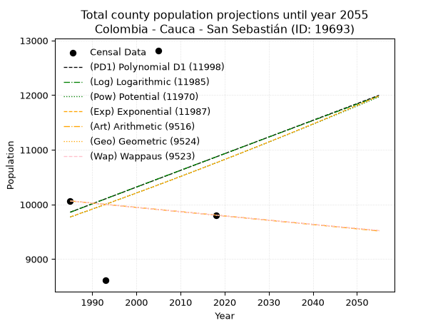
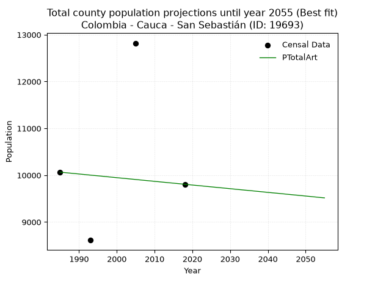
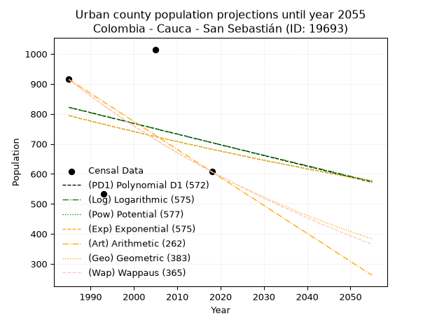
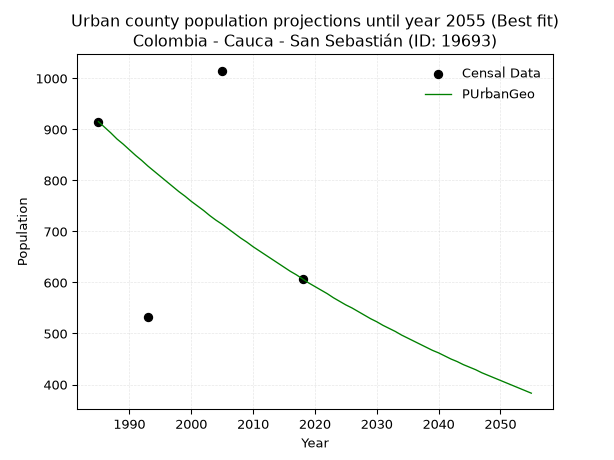
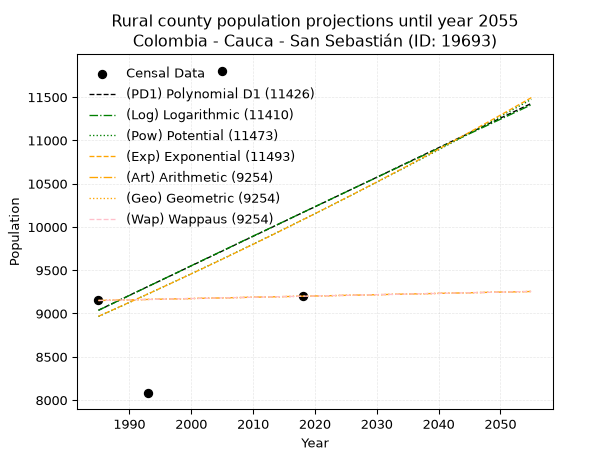
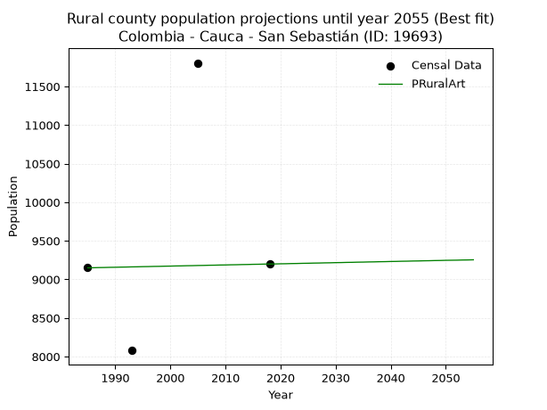

<div align="center">


</div>

# 📜 _“Population and Public Services Demand Projections (PPSD) until Year 2050 for Colombia - Cauca - San Sebastián (ID: 19693)”_
Keywords: `population` `public-service` `projection` `lineal` `polynomial` `logarithmic` `potential` `exponential` `arithmetic` `geometric` `wappaus` `dane` `colombia` `south-america`

PPSD are analytical estimates used by governments and planners to anticipate future changes in population size, age distribution, and the resulting community needs for utilities, healthcare, education, and infrastructure as sizing future water treatment facilities, electrical grids, and road networks based on spatial growth.

<div align="center">

</img>

</div>


> **General running parameters**: • app_version: _v20260806_. • Python version: _3.14.7_. • Pandas version: _3.0.5_. • NumPy version: _2.5.1_. • Creates, save and include plots into reports (create_plot): _False_. • Projection until year: _2050_. • Process polynomial degree 2 and up: _False_. • Process Wappaus: _True_. • Process Wappaus: _True_. • Set negative values to zero: _True_. • Set infinite values to zero: _True_. • Drop dataset notes: _True_. 
<div align="center">

Maps & GIS Layers: [:earth_americas:Google](http://maps.google.com/maps?q=1.838450817,-76.769467) [:earth_americas:OSM](https://www.openstreetmap.org/#map=18/1.838450817/-76.769467&layers=P) [:earth_americas:Bing](https://www.bing.com/maps?cp=1.838450817~-76.769467&lvl=18) [:earth_americas:Apple](https://maps.apple.com/frame?center=1.838450817%2C-76.769467&span=0.003%2C0.006) [:earth_americas:GISMobile](https://github.com/rcfdtools/R.GISMobile/blob/main/file/gis/CountyLayer_CO/Readme.md)

</div>


<div align="center">

```geojson
{
  "type": "Feature",
  "geometry": {
    "type": "Point", 
    "coordinates": [-76.769467, 1.838450817]
  }, 
  "properties": {
    "Name": "Colombia - Cauca - San Sebastián (ID: 19693)"
  }
}
```

</div>


## 0. Census Data (4 records)

Census data are official statistics collected by a government about the people and housing in a country. They usually include counts of total population, age, sex, race, income, education, and jobs.

📅Global census file: [Population.xlsx](../data/Population.xlsx)

| Source   |   Year |   CountryID | CountryName   |   StateID | StateName   |   CountyID | CountyName    |   PTotal |   PUrban |   PRural |
|:---------|-------:|------------:|:--------------|----------:|:------------|-----------:|:--------------|---------:|---------:|---------:|
| DANE     |   1985 |          57 | Colombia      |        19 | Cauca       |      19693 | San Sebastián |    10065 |      915 |     9150 |
| DANE     |   1993 |          57 | Colombia      |        19 | Cauca       |      19693 | San Sebastián |     8612 |      533 |     8079 |
| DANE     |   2005 |          57 | Colombia      |        19 | Cauca       |      19693 | San Sebastián |    12820 |     1015 |    11805 |
| DANE     |   2018 |          57 | Colombia      |        19 | Cauca       |      19693 | San Sebastián |     9806 |      607 |     9199 |

> 🔥Some records could had specific notes about the registered values or the corresponding urban or rural distribution.

📅[SUI-RUPS](https://www.datos.gov.co/Hacienda-y-Cr-dito-P-blico/Registro-nico-de-Prestadores-de-Servicios-P-blicos/4qkq-csdn/about_data) - Local public utility companies: [RUPS.csv](../data/RUPS.csv)

 | SERVICIO       | ESTADO    | NOMBRE                                                                                                                  | NIT         | DEPARTAMENTO_DOMICILIO   | MUNICIPIO_DOMICILIO   | DIRECCION                  |   TELEFONO | EMAIL                   | TIPO_PRESTADOR          | CLASIFICACION           |
|:---------------|:----------|:------------------------------------------------------------------------------------------------------------------------|:------------|:-------------------------|:----------------------|:---------------------------|-----------:|:------------------------|:------------------------|:------------------------|
| ACUEDUCTO      | OPERATIVA | ADMINISTRACION PUBLICA COOPERATIVA EMPRESA SOLIDARIA DE SERVICIOS PUBLICOS DE SAN SEBASTIAN AGUAS DE SAN SEBASTIAN ESP. | 900015017-5 | CAUCA                    | SAN SEBASTIAN         | Cra 3 Cll 2 Edif.municipal |    8273039 | dguzman81@latinmail.com | ORGANIZACION AUTORIZADA | HASTA 2500 SUSCRIPTORES |
| ALCANTARILLADO | OPERATIVA | ADMINISTRACION PUBLICA COOPERATIVA EMPRESA SOLIDARIA DE SERVICIOS PUBLICOS DE SAN SEBASTIAN AGUAS DE SAN SEBASTIAN ESP. | 900015017-5 | CAUCA                    | SAN SEBASTIAN         | Cra 3 Cll 2 Edif.municipal |    8273039 | dguzman81@latinmail.com | ORGANIZACION AUTORIZADA | HASTA 2500 SUSCRIPTORES |

## 1. Total

### 1.1. Coefficients and Parameters

* (PD1) Polynomial Deg 1: 30.547169811322345, -50776.22641509752 (lineal)
* (Log) Logarithmic: 61393.399553183466, -456325.97197957564
* (Pow) Potential: 5.859878171670479, -15.33457781260995
* (Exp) Exponential: 0.002917414547355197, 29.85201118538593
* (Art) Arithmetic: Year diff. 2018 - 1985 = 33, Population diff. 9806 - 10065 = -259, Annual growth = -7.848484848484849
* (Geo) Geometric: Year diff. 2018 - 1985 = 33, Population diff. 9806 - 10065 = -259, Annual growth % = -0.0007896764008253898
* (Wap) Wappaus: i = -0.07899436212052588, Condition values only valid for < 200)

<sub>
Wappaus condition values: ['-0.00', '-0.08', '-0.16', '-0.24', '-0.32', '-0.39', '-0.47', '-0.55', '-0.63', '-0.71', '-0.79', '-0.87', '-0.95', '-1.03', '-1.11', '-1.18', '-1.26', '-1.34', '-1.42', '-1.50', '-1.58', '-1.66', '-1.74', '-1.82', '-1.90', '-1.97', '-2.05', '-2.13', '-2.21', '-2.29', '-2.37', '-2.45', '-2.53', '-2.61', '-2.69', '-2.76', '-2.84', '-2.92', '-3.00', '-3.08', '-3.16', '-3.24', '-3.32', '-3.40', '-3.48', '-3.55', '-3.63', '-3.71', '-3.79', '-3.87', '-3.95', '-4.03', '-4.11', '-4.19', '-4.27', '-4.34', '-4.42', '-4.50', '-4.58', '-4.66', '-4.74', '-4.82', '-4.90', '-4.98', '-5.06', '-5.13']
</sub>


### 1.2. Projected Dataset

|   Year |   CountyID |   PTotalPD1 |   PTotalLog |   PTotalPow |   PTotalExp |   PTotalArt |   PTotalGeo |   PTotalWap |
|-------:|-----------:|------------:|------------:|------------:|------------:|------------:|------------:|------------:|
|   1985 |      19693 |        9860 |        9857 |        9770 |        9772 |       10065 |       10065 |       10065 |
|   1986 |      19693 |        9890 |        9888 |        9799 |        9801 |       10057 |       10057 |       10057 |
|   1987 |      19693 |        9921 |        9919 |        9828 |        9830 |       10049 |       10049 |       10049 |
|   1988 |      19693 |        9952 |        9950 |        9857 |        9858 |       10041 |       10041 |       10041 |
|   1989 |      19693 |        9982 |        9981 |        9886 |        9887 |       10034 |       10033 |       10033 |
|   1990 |      19693 |       10013 |       10012 |        9915 |        9916 |       10026 |       10025 |       10025 |
|   1991 |      19693 |       10043 |       10042 |        9944 |        9945 |       10018 |       10017 |       10017 |
|   1992 |      19693 |       10074 |       10073 |        9974 |        9974 |       10010 |       10009 |       10009 |
|   1993 |      19693 |       10104 |       10104 |       10003 |       10003 |       10002 |       10002 |       10002 |
|   1994 |      19693 |       10135 |       10135 |       10033 |       10032 |        9994 |        9994 |        9994 |
|   1995 |      19693 |       10165 |       10166 |       10062 |       10062 |        9987 |        9986 |        9986 |
|   1996 |      19693 |       10196 |       10196 |       10092 |       10091 |        9979 |        9978 |        9978 |
|   1997 |      19693 |       10226 |       10227 |       10121 |       10121 |        9971 |        9970 |        9970 |
|   1998 |      19693 |       10257 |       10258 |       10151 |       10150 |        9963 |        9962 |        9962 |
|   1999 |      19693 |       10288 |       10289 |       10181 |       10180 |        9955 |        9954 |        9954 |
|   2000 |      19693 |       10318 |       10319 |       10211 |       10210 |        9947 |        9946 |        9946 |
|   2001 |      19693 |       10349 |       10350 |       10241 |       10239 |        9939 |        9939 |        9939 |
|   2002 |      19693 |       10379 |       10381 |       10271 |       10269 |        9932 |        9931 |        9931 |
|   2003 |      19693 |       10410 |       10411 |       10301 |       10299 |        9924 |        9923 |        9923 |
|   2004 |      19693 |       10440 |       10442 |       10331 |       10329 |        9916 |        9915 |        9915 |
|   2005 |      19693 |       10471 |       10473 |       10361 |       10360 |        9908 |        9907 |        9907 |
|   2006 |      19693 |       10501 |       10503 |       10392 |       10390 |        9900 |        9899 |        9899 |
|   2007 |      19693 |       10532 |       10534 |       10422 |       10420 |        9892 |        9892 |        9892 |
|   2008 |      19693 |       10562 |       10564 |       10452 |       10451 |        9884 |        9884 |        9884 |
|   2009 |      19693 |       10593 |       10595 |       10483 |       10481 |        9877 |        9876 |        9876 |
|   2010 |      19693 |       10624 |       10625 |       10514 |       10512 |        9869 |        9868 |        9868 |
|   2011 |      19693 |       10654 |       10656 |       10544 |       10543 |        9861 |        9860 |        9860 |
|   2012 |      19693 |       10685 |       10687 |       10575 |       10573 |        9853 |        9853 |        9853 |
|   2013 |      19693 |       10715 |       10717 |       10606 |       10604 |        9845 |        9845 |        9845 |
|   2014 |      19693 |       10746 |       10748 |       10637 |       10635 |        9837 |        9837 |        9837 |
|   2015 |      19693 |       10776 |       10778 |       10668 |       10666 |        9830 |        9829 |        9829 |
|   2016 |      19693 |       10807 |       10808 |       10699 |       10697 |        9822 |        9822 |        9822 |
|   2017 |      19693 |       10837 |       10839 |       10730 |       10729 |        9814 |        9814 |        9814 |
|   2018 |      19693 |       10868 |       10869 |       10761 |       10760 |        9806 |        9806 |        9806 |
|   2019 |      19693 |       10899 |       10900 |       10792 |       10791 |        9798 |        9798 |        9798 |
|   2020 |      19693 |       10929 |       10930 |       10824 |       10823 |        9790 |        9791 |        9791 |
|   2021 |      19693 |       10960 |       10961 |       10855 |       10855 |        9782 |        9783 |        9783 |
|   2022 |      19693 |       10990 |       10991 |       10887 |       10886 |        9775 |        9775 |        9775 |
|   2023 |      19693 |       11021 |       11021 |       10918 |       10918 |        9767 |        9767 |        9767 |
|   2024 |      19693 |       11051 |       11052 |       10950 |       10950 |        9759 |        9760 |        9760 |
|   2025 |      19693 |       11082 |       11082 |       10982 |       10982 |        9751 |        9752 |        9752 |
|   2026 |      19693 |       11112 |       11112 |       11014 |       11014 |        9743 |        9744 |        9744 |
|   2027 |      19693 |       11143 |       11143 |       11045 |       11046 |        9735 |        9737 |        9737 |
|   2028 |      19693 |       11173 |       11173 |       11077 |       11079 |        9728 |        9729 |        9729 |
|   2029 |      19693 |       11204 |       11203 |       11109 |       11111 |        9720 |        9721 |        9721 |
|   2030 |      19693 |       11235 |       11233 |       11142 |       11143 |        9712 |        9713 |        9713 |
|   2031 |      19693 |       11265 |       11264 |       11174 |       11176 |        9704 |        9706 |        9706 |
|   2032 |      19693 |       11296 |       11294 |       11206 |       11209 |        9696 |        9698 |        9698 |
|   2033 |      19693 |       11326 |       11324 |       11238 |       11241 |        9688 |        9690 |        9690 |
|   2034 |      19693 |       11357 |       11354 |       11271 |       11274 |        9680 |        9683 |        9683 |
|   2035 |      19693 |       11387 |       11384 |       11303 |       11307 |        9673 |        9675 |        9675 |
|   2036 |      19693 |       11418 |       11415 |       11336 |       11340 |        9665 |        9668 |        9668 |
|   2037 |      19693 |       11448 |       11445 |       11369 |       11373 |        9657 |        9660 |        9660 |
|   2038 |      19693 |       11479 |       11475 |       11401 |       11407 |        9649 |        9652 |        9652 |
|   2039 |      19693 |       11509 |       11505 |       11434 |       11440 |        9641 |        9645 |        9645 |
|   2040 |      19693 |       11540 |       11535 |       11467 |       11473 |        9633 |        9637 |        9637 |
|   2041 |      19693 |       11571 |       11565 |       11500 |       11507 |        9625 |        9629 |        9629 |
|   2042 |      19693 |       11601 |       11595 |       11533 |       11540 |        9618 |        9622 |        9622 |
|   2043 |      19693 |       11632 |       11625 |       11566 |       11574 |        9610 |        9614 |        9614 |
|   2044 |      19693 |       11662 |       11655 |       11599 |       11608 |        9602 |        9607 |        9607 |
|   2045 |      19693 |       11693 |       11685 |       11633 |       11642 |        9594 |        9599 |        9599 |
|   2046 |      19693 |       11723 |       11715 |       11666 |       11676 |        9586 |        9591 |        9591 |
|   2047 |      19693 |       11754 |       11745 |       11700 |       11710 |        9578 |        9584 |        9584 |
|   2048 |      19693 |       11784 |       11775 |       11733 |       11744 |        9571 |        9576 |        9576 |
|   2049 |      19693 |       11815 |       11805 |       11767 |       11779 |        9563 |        9569 |        9569 |
|   2050 |      19693 |       11845 |       11835 |       11800 |       11813 |        9555 |        9561 |        9561 |
<div align="center">

</img>

</div>


### 1.3. Best fit with absolute and relative error (%)

Relative error puts that difference into context by dividing the absolute error by the true value, creating a unitless ratio or percentage that shows the scale of the mistake.

Absolute and relative error

|   Year | Source   |   CountryID | CountryName   |   StateID | StateName   |   CountyID_x | CountyName    |   PTotal |   PUrban |   PRural |   CountyID_y |   PTotalPD1 |   PTotalLog |   PTotalPow |   PTotalExp |   PTotalArt |   PTotalGeo |   PTotalWap |   PTotalPD1AbsError |   PTotalLogAbsError |   PTotalPowAbsError |   PTotalExpAbsError |   PTotalArtAbsError |   PTotalGeoAbsError |   PTotalWapAbsError |   PTotalPD1RelError |   PTotalLogRelError |   PTotalPowRelError |   PTotalExpRelError |   PTotalArtRelError |   PTotalGeoRelError |   PTotalWapRelError |
|-------:|:---------|------------:|:--------------|----------:|:------------|-------------:|:--------------|---------:|---------:|---------:|-------------:|------------:|------------:|------------:|------------:|------------:|------------:|------------:|--------------------:|--------------------:|--------------------:|--------------------:|--------------------:|--------------------:|--------------------:|--------------------:|--------------------:|--------------------:|--------------------:|--------------------:|--------------------:|--------------------:|
|   1985 | DANE     |          57 | Colombia      |        19 | Cauca       |        19693 | San Sebastián |    10065 |      915 |     9150 |        19693 |        9860 |        9857 |        9770 |        9772 |       10065 |       10065 |       10065 |                 205 |                 208 |                 295 |                 293 |                   0 |                   0 |                   0 |             2.03676 |             2.06657 |             2.93095 |             2.91108 |              0      |              0      |              0      |
|   1993 | DANE     |          57 | Colombia      |        19 | Cauca       |        19693 | San Sebastián |     8612 |      533 |     8079 |        19693 |       10104 |       10104 |       10003 |       10003 |       10002 |       10002 |       10002 |                1492 |                1492 |                1391 |                1391 |                1390 |                1390 |                1390 |            17.3247  |            17.3247  |            16.1519  |            16.1519  |             16.1403 |             16.1403 |             16.1403 |
|   2005 | DANE     |          57 | Colombia      |        19 | Cauca       |        19693 | San Sebastián |    12820 |     1015 |    11805 |        19693 |       10471 |       10473 |       10361 |       10360 |        9908 |        9907 |        9907 |                2349 |                2347 |                2459 |                2460 |                2912 |                2913 |                2913 |            18.3229  |            18.3073  |            19.181   |            19.1888  |             22.7145 |             22.7223 |             22.7223 |
|   2018 | DANE     |          57 | Colombia      |        19 | Cauca       |        19693 | San Sebastián |     9806 |      607 |     9199 |        19693 |       10868 |       10869 |       10761 |       10760 |        9806 |        9806 |        9806 |                1062 |                1063 |                 955 |                 954 |                   0 |                   0 |                   0 |            10.8301  |            10.8403  |             9.73894 |             9.72874 |              0      |              0      |              0      |

Relative error mean

| Method    |   RelError | Best   |
|:----------|-----------:|:-------|
| PTotalPD1 |   12.1286  |        |
| PTotalLog |   12.1347  |        |
| PTotalPow |   12.0007  |        |
| PTotalExp |   11.9951  |        |
| PTotalArt |    9.71369 | True   |
| PTotalGeo |    9.71564 |        |
| PTotalWap |    9.71564 |        |

💙Best method: _**PTotalArt**_
<div align="center">

</img>

</div>


### 1.4. Fresh water supply demand in liters per capita per day (lpcd)

The fresh water supply demand typically ranges from 100 to 300 liters per capita per day (lpcd) for standard domestic and municipal planning, though absolute survival minimums set by the World Health Organization are as low as 7.5 to 20 liters per day, and total consumption in high-income nations can exceed 400 liters.

> `CZ`: Level in meters above the sea level (masl)<br> `WS`: Fresh water supply demand in liters per capita per day (lpcd or l/h/d)<br> `WSAll`: Zonal fresh water supply demand in liters per second (l/s)<br> `A`: Zonal area in square meters<br> `DP`: Population density (people/hectare or p/ha)

Reference values (RAS Colombia)

|    CZ |   WS |
|------:|-----:|
|  1000 |  120 |
|  2000 |  130 |
| 99999 |  140 |

County shapefile geometry properties and water supply values

|   CountyID |      ATotal |   CZTotal |   WSTotal |
|-----------:|------------:|----------:|----------:|
|      19693 | 4.19244e+08 |   2876.53 |       140 |

Projected values for best method: PTotalArt

|   CountyID |   Year |   PTotalArt |   DPTotal |   WSTotal |   WSTotalAll |
|-----------:|-------:|------------:|----------:|----------:|-------------:|
|      19693 |   1985 |       10065 |      0.24 |       140 |      16.309  |
|      19693 |   1986 |       10057 |      0.24 |       140 |      16.2961 |
|      19693 |   1987 |       10049 |      0.24 |       140 |      16.2831 |
|      19693 |   1988 |       10041 |      0.24 |       140 |      16.2701 |
|      19693 |   1989 |       10034 |      0.24 |       140 |      16.2588 |
|      19693 |   1990 |       10026 |      0.24 |       140 |      16.2458 |
|      19693 |   1991 |       10018 |      0.24 |       140 |      16.2329 |
|      19693 |   1992 |       10010 |      0.24 |       140 |      16.2199 |
|      19693 |   1993 |       10002 |      0.24 |       140 |      16.2069 |
|      19693 |   1994 |        9994 |      0.24 |       140 |      16.194  |
|      19693 |   1995 |        9987 |      0.24 |       140 |      16.1826 |
|      19693 |   1996 |        9979 |      0.24 |       140 |      16.1697 |
|      19693 |   1997 |        9971 |      0.24 |       140 |      16.1567 |
|      19693 |   1998 |        9963 |      0.24 |       140 |      16.1438 |
|      19693 |   1999 |        9955 |      0.24 |       140 |      16.1308 |
|      19693 |   2000 |        9947 |      0.24 |       140 |      16.1178 |
|      19693 |   2001 |        9939 |      0.24 |       140 |      16.1049 |
|      19693 |   2002 |        9932 |      0.24 |       140 |      16.0935 |
|      19693 |   2003 |        9924 |      0.24 |       140 |      16.0806 |
|      19693 |   2004 |        9916 |      0.24 |       140 |      16.0676 |
|      19693 |   2005 |        9908 |      0.24 |       140 |      16.0546 |
|      19693 |   2006 |        9900 |      0.24 |       140 |      16.0417 |
|      19693 |   2007 |        9892 |      0.24 |       140 |      16.0287 |
|      19693 |   2008 |        9884 |      0.24 |       140 |      16.0157 |
|      19693 |   2009 |        9877 |      0.24 |       140 |      16.0044 |
|      19693 |   2010 |        9869 |      0.24 |       140 |      15.9914 |
|      19693 |   2011 |        9861 |      0.24 |       140 |      15.9785 |
|      19693 |   2012 |        9853 |      0.24 |       140 |      15.9655 |
|      19693 |   2013 |        9845 |      0.23 |       140 |      15.9525 |
|      19693 |   2014 |        9837 |      0.23 |       140 |      15.9396 |
|      19693 |   2015 |        9830 |      0.23 |       140 |      15.9282 |
|      19693 |   2016 |        9822 |      0.23 |       140 |      15.9153 |
|      19693 |   2017 |        9814 |      0.23 |       140 |      15.9023 |
|      19693 |   2018 |        9806 |      0.23 |       140 |      15.8894 |
|      19693 |   2019 |        9798 |      0.23 |       140 |      15.8764 |
|      19693 |   2020 |        9790 |      0.23 |       140 |      15.8634 |
|      19693 |   2021 |        9782 |      0.23 |       140 |      15.8505 |
|      19693 |   2022 |        9775 |      0.23 |       140 |      15.8391 |
|      19693 |   2023 |        9767 |      0.23 |       140 |      15.8262 |
|      19693 |   2024 |        9759 |      0.23 |       140 |      15.8132 |
|      19693 |   2025 |        9751 |      0.23 |       140 |      15.8002 |
|      19693 |   2026 |        9743 |      0.23 |       140 |      15.7873 |
|      19693 |   2027 |        9735 |      0.23 |       140 |      15.7743 |
|      19693 |   2028 |        9728 |      0.23 |       140 |      15.763  |
|      19693 |   2029 |        9720 |      0.23 |       140 |      15.75   |
|      19693 |   2030 |        9712 |      0.23 |       140 |      15.737  |
|      19693 |   2031 |        9704 |      0.23 |       140 |      15.7241 |
|      19693 |   2032 |        9696 |      0.23 |       140 |      15.7111 |
|      19693 |   2033 |        9688 |      0.23 |       140 |      15.6981 |
|      19693 |   2034 |        9680 |      0.23 |       140 |      15.6852 |
|      19693 |   2035 |        9673 |      0.23 |       140 |      15.6738 |
|      19693 |   2036 |        9665 |      0.23 |       140 |      15.6609 |
|      19693 |   2037 |        9657 |      0.23 |       140 |      15.6479 |
|      19693 |   2038 |        9649 |      0.23 |       140 |      15.635  |
|      19693 |   2039 |        9641 |      0.23 |       140 |      15.622  |
|      19693 |   2040 |        9633 |      0.23 |       140 |      15.609  |
|      19693 |   2041 |        9625 |      0.23 |       140 |      15.5961 |
|      19693 |   2042 |        9618 |      0.23 |       140 |      15.5847 |
|      19693 |   2043 |        9610 |      0.23 |       140 |      15.5718 |
|      19693 |   2044 |        9602 |      0.23 |       140 |      15.5588 |
|      19693 |   2045 |        9594 |      0.23 |       140 |      15.5458 |
|      19693 |   2046 |        9586 |      0.23 |       140 |      15.5329 |
|      19693 |   2047 |        9578 |      0.23 |       140 |      15.5199 |
|      19693 |   2048 |        9571 |      0.23 |       140 |      15.5086 |
|      19693 |   2049 |        9563 |      0.23 |       140 |      15.4956 |
|      19693 |   2050 |        9555 |      0.23 |       140 |      15.4826 |

## 2. Urban

### 2.1. Coefficients and Parameters

* (PD1) Polynomial Deg 1: -3.568847852267941, 7906.087916498948 (lineal)
* (Log) Logarithmic: -7130.266604431898, 54964.71359865747
* (Pow) Potential: -9.225230259934362, 33.32263546244951
* (Exp) Exponential: -0.00461489810491741, 7557904.123324513
* (Art) Arithmetic: Year diff. 2018 - 1985 = 33, Population diff. 607 - 915 = -308, Annual growth = -9.333333333333334
* (Geo) Geometric: Year diff. 2018 - 1985 = 33, Population diff. 607 - 915 = -308, Annual growth % = -0.012359210210746596
* (Wap) Wappaus: i = -1.2264564169951817, Condition values only valid for < 200)

<sub>
Wappaus condition values: ['-0.00', '-1.23', '-2.45', '-3.68', '-4.91', '-6.13', '-7.36', '-8.59', '-9.81', '-11.04', '-12.26', '-13.49', '-14.72', '-15.94', '-17.17', '-18.40', '-19.62', '-20.85', '-22.08', '-23.30', '-24.53', '-25.76', '-26.98', '-28.21', '-29.43', '-30.66', '-31.89', '-33.11', '-34.34', '-35.57', '-36.79', '-38.02', '-39.25', '-40.47', '-41.70', '-42.93', '-44.15', '-45.38', '-46.61', '-47.83', '-49.06', '-50.28', '-51.51', '-52.74', '-53.96', '-55.19', '-56.42', '-57.64', '-58.87', '-60.10', '-61.32', '-62.55', '-63.78', '-65.00', '-66.23', '-67.46', '-68.68', '-69.91', '-71.13', '-72.36', '-73.59', '-74.81', '-76.04', '-77.27', '-78.49', '-79.72']
</sub>


### 2.2. Projected Dataset

|   Year |   CountyID |   PUrbanPD1 |   PUrbanLog |   PUrbanPow |   PUrbanExp |   PUrbanArt |   PUrbanGeo |   PUrbanWap |
|-------:|-----------:|------------:|------------:|------------:|------------:|------------:|------------:|------------:|
|   1985 |      19693 |         822 |         822 |         794 |         794 |         915 |         915 |         915 |
|   1986 |      19693 |         818 |         818 |         791 |         791 |         906 |         904 |         904 |
|   1987 |      19693 |         815 |         815 |         787 |         787 |         896 |         893 |         893 |
|   1988 |      19693 |         811 |         811 |         783 |         783 |         887 |         881 |         882 |
|   1989 |      19693 |         808 |         808 |         780 |         780 |         878 |         871 |         871 |
|   1990 |      19693 |         804 |         804 |         776 |         776 |         868 |         860 |         861 |
|   1991 |      19693 |         801 |         800 |         773 |         773 |         859 |         849 |         850 |
|   1992 |      19693 |         797 |         797 |         769 |         769 |         850 |         839 |         840 |
|   1993 |      19693 |         793 |         793 |         765 |         766 |         840 |         828 |         829 |
|   1994 |      19693 |         790 |         790 |         762 |         762 |         831 |         818 |         819 |
|   1995 |      19693 |         786 |         786 |         758 |         759 |         822 |         808 |         809 |
|   1996 |      19693 |         783 |         783 |         755 |         755 |         812 |         798 |         799 |
|   1997 |      19693 |         779 |         779 |         751 |         752 |         803 |         788 |         790 |
|   1998 |      19693 |         776 |         775 |         748 |         748 |         794 |         778 |         780 |
|   1999 |      19693 |         772 |         772 |         745 |         745 |         784 |         769 |         770 |
|   2000 |      19693 |         768 |         768 |         741 |         741 |         775 |         759 |         761 |
|   2001 |      19693 |         765 |         765 |         738 |         738 |         766 |         750 |         751 |
|   2002 |      19693 |         761 |         761 |         734 |         734 |         756 |         741 |         742 |
|   2003 |      19693 |         758 |         758 |         731 |         731 |         747 |         731 |         733 |
|   2004 |      19693 |         754 |         754 |         728 |         728 |         738 |         722 |         724 |
|   2005 |      19693 |         751 |         750 |         724 |         724 |         728 |         714 |         715 |
|   2006 |      19693 |         747 |         747 |         721 |         721 |         719 |         705 |         706 |
|   2007 |      19693 |         743 |         743 |         718 |         718 |         710 |         696 |         697 |
|   2008 |      19693 |         740 |         740 |         714 |         714 |         700 |         687 |         689 |
|   2009 |      19693 |         736 |         736 |         711 |         711 |         691 |         679 |         680 |
|   2010 |      19693 |         733 |         733 |         708 |         708 |         682 |         670 |         672 |
|   2011 |      19693 |         729 |         729 |         705 |         705 |         672 |         662 |         663 |
|   2012 |      19693 |         726 |         726 |         701 |         701 |         663 |         654 |         655 |
|   2013 |      19693 |         722 |         722 |         698 |         698 |         654 |         646 |         647 |
|   2014 |      19693 |         718 |         719 |         695 |         695 |         644 |         638 |         639 |
|   2015 |      19693 |         715 |         715 |         692 |         692 |         635 |         630 |         631 |
|   2016 |      19693 |         711 |         711 |         689 |         688 |         626 |         622 |         623 |
|   2017 |      19693 |         708 |         708 |         685 |         685 |         616 |         615 |         615 |
|   2018 |      19693 |         704 |         704 |         682 |         682 |         607 |         607 |         607 |
|   2019 |      19693 |         701 |         701 |         679 |         679 |         598 |         599 |         599 |
|   2020 |      19693 |         697 |         697 |         676 |         676 |         588 |         592 |         592 |
|   2021 |      19693 |         693 |         694 |         673 |         673 |         579 |         585 |         584 |
|   2022 |      19693 |         690 |         690 |         670 |         670 |         570 |         578 |         577 |
|   2023 |      19693 |         686 |         687 |         667 |         667 |         560 |         570 |         569 |
|   2024 |      19693 |         683 |         683 |         664 |         664 |         551 |         563 |         562 |
|   2025 |      19693 |         679 |         680 |         661 |         660 |         542 |         556 |         555 |
|   2026 |      19693 |         676 |         676 |         658 |         657 |         532 |         550 |         547 |
|   2027 |      19693 |         672 |         673 |         655 |         654 |         523 |         543 |         540 |
|   2028 |      19693 |         668 |         669 |         652 |         651 |         514 |         536 |         533 |
|   2029 |      19693 |         665 |         666 |         649 |         648 |         504 |         529 |         526 |
|   2030 |      19693 |         661 |         662 |         646 |         645 |         495 |         523 |         519 |
|   2031 |      19693 |         658 |         659 |         643 |         642 |         486 |         516 |         512 |
|   2032 |      19693 |         654 |         655 |         640 |         639 |         476 |         510 |         506 |
|   2033 |      19693 |         651 |         652 |         637 |         637 |         467 |         504 |         499 |
|   2034 |      19693 |         647 |         648 |         634 |         634 |         458 |         497 |         492 |
|   2035 |      19693 |         643 |         645 |         631 |         631 |         448 |         491 |         486 |
|   2036 |      19693 |         640 |         641 |         629 |         628 |         439 |         485 |         479 |
|   2037 |      19693 |         636 |         638 |         626 |         625 |         430 |         479 |         473 |
|   2038 |      19693 |         633 |         634 |         623 |         622 |         420 |         473 |         466 |
|   2039 |      19693 |         629 |         631 |         620 |         619 |         411 |         467 |         460 |
|   2040 |      19693 |         626 |         627 |         617 |         616 |         402 |         462 |         453 |
|   2041 |      19693 |         622 |         624 |         615 |         613 |         392 |         456 |         447 |
|   2042 |      19693 |         619 |         620 |         612 |         611 |         383 |         450 |         441 |
|   2043 |      19693 |         615 |         617 |         609 |         608 |         374 |         445 |         435 |
|   2044 |      19693 |         611 |         613 |         606 |         605 |         364 |         439 |         429 |
|   2045 |      19693 |         608 |         610 |         604 |         602 |         355 |         434 |         423 |
|   2046 |      19693 |         604 |         606 |         601 |         599 |         346 |         429 |         417 |
|   2047 |      19693 |         601 |         603 |         598 |         597 |         336 |         423 |         411 |
|   2048 |      19693 |         597 |         599 |         595 |         594 |         327 |         418 |         405 |
|   2049 |      19693 |         594 |         596 |         593 |         591 |         318 |         413 |         399 |
|   2050 |      19693 |         590 |         592 |         590 |         588 |         308 |         408 |         393 |
<div align="center">

</img>

</div>


### 2.3. Best fit with absolute and relative error (%)

Relative error puts that difference into context by dividing the absolute error by the true value, creating a unitless ratio or percentage that shows the scale of the mistake.

Absolute and relative error

|   Year | Source   |   CountryID | CountryName   |   StateID | StateName   |   CountyID_x | CountyName    |   PTotal |   PUrban |   PRural |   CountyID_y |   PUrbanPD1 |   PUrbanLog |   PUrbanPow |   PUrbanExp |   PUrbanArt |   PUrbanGeo |   PUrbanWap |   PUrbanPD1AbsError |   PUrbanLogAbsError |   PUrbanPowAbsError |   PUrbanExpAbsError |   PUrbanArtAbsError |   PUrbanGeoAbsError |   PUrbanWapAbsError |   PUrbanPD1RelError |   PUrbanLogRelError |   PUrbanPowRelError |   PUrbanExpRelError |   PUrbanArtRelError |   PUrbanGeoRelError |   PUrbanWapRelError |
|-------:|:---------|------------:|:--------------|----------:|:------------|-------------:|:--------------|---------:|---------:|---------:|-------------:|------------:|------------:|------------:|------------:|------------:|------------:|------------:|--------------------:|--------------------:|--------------------:|--------------------:|--------------------:|--------------------:|--------------------:|--------------------:|--------------------:|--------------------:|--------------------:|--------------------:|--------------------:|--------------------:|
|   1985 | DANE     |          57 | Colombia      |        19 | Cauca       |        19693 | San Sebastián |    10065 |      915 |     9150 |        19693 |         822 |         822 |         794 |         794 |         915 |         915 |         915 |                  93 |                  93 |                 121 |                 121 |                   0 |                   0 |                   0 |             10.1639 |             10.1639 |             13.224  |             13.224  |              0      |              0      |              0      |
|   1993 | DANE     |          57 | Colombia      |        19 | Cauca       |        19693 | San Sebastián |     8612 |      533 |     8079 |        19693 |         793 |         793 |         765 |         766 |         840 |         828 |         829 |                 260 |                 260 |                 232 |                 233 |                 307 |                 295 |                 296 |             48.7805 |             48.7805 |             43.5272 |             43.7148 |             57.5985 |             55.3471 |             55.5347 |
|   2005 | DANE     |          57 | Colombia      |        19 | Cauca       |        19693 | San Sebastián |    12820 |     1015 |    11805 |        19693 |         751 |         750 |         724 |         724 |         728 |         714 |         715 |                 264 |                 265 |                 291 |                 291 |                 287 |                 301 |                 300 |             26.0099 |             26.1084 |             28.67   |             28.67   |             28.2759 |             29.6552 |             29.5567 |
|   2018 | DANE     |          57 | Colombia      |        19 | Cauca       |        19693 | San Sebastián |     9806 |      607 |     9199 |        19693 |         704 |         704 |         682 |         682 |         607 |         607 |         607 |                  97 |                  97 |                  75 |                  75 |                   0 |                   0 |                   0 |             15.9802 |             15.9802 |             12.3558 |             12.3558 |              0      |              0      |              0      |

Relative error mean

| Method    |   RelError | Best   |
|:----------|-----------:|:-------|
| PUrbanPD1 |    25.2336 |        |
| PUrbanLog |    25.2583 |        |
| PUrbanPow |    24.4443 |        |
| PUrbanExp |    24.4912 |        |
| PUrbanArt |    21.4686 |        |
| PUrbanGeo |    21.2506 | True   |
| PUrbanWap |    21.2728 |        |

💙Best method: _**PUrbanGeo**_
<div align="center">

</img>

</div>


### 2.4. Fresh water supply demand in liters per capita per day (lpcd)

The fresh water supply demand typically ranges from 100 to 300 liters per capita per day (lpcd) for standard domestic and municipal planning, though absolute survival minimums set by the World Health Organization are as low as 7.5 to 20 liters per day, and total consumption in high-income nations can exceed 400 liters.

> `CZ`: Level in meters above the sea level (masl)<br> `WS`: Fresh water supply demand in liters per capita per day (lpcd or l/h/d)<br> `WSAll`: Zonal fresh water supply demand in liters per second (l/s)<br> `A`: Zonal area in square meters<br> `DP`: Population density (people/hectare or p/ha)

Reference values (RAS Colombia)

|    CZ |   WS |
|------:|-----:|
|  1000 |  120 |
|  2000 |  130 |
| 99999 |  140 |

County shapefile geometry properties and water supply values

|   CountyID |   AUrban |   CZUrban |   WSUrban |
|-----------:|---------:|----------:|----------:|
|      19693 |   177307 |   2132.51 |       140 |

Projected values for best method: PUrbanGeo

|   CountyID |   Year |   PUrbanGeo |   DPUrban |   WSUrban |   WSUrbanAll |
|-----------:|-------:|------------:|----------:|----------:|-------------:|
|      19693 |   1985 |         915 |     51.61 |       140 |     1.48264  |
|      19693 |   1986 |         904 |     50.98 |       140 |     1.46481  |
|      19693 |   1987 |         893 |     50.36 |       140 |     1.44699  |
|      19693 |   1988 |         881 |     49.69 |       140 |     1.42755  |
|      19693 |   1989 |         871 |     49.12 |       140 |     1.41134  |
|      19693 |   1990 |         860 |     48.5  |       140 |     1.39352  |
|      19693 |   1991 |         849 |     47.88 |       140 |     1.37569  |
|      19693 |   1992 |         839 |     47.32 |       140 |     1.35949  |
|      19693 |   1993 |         828 |     46.7  |       140 |     1.34167  |
|      19693 |   1994 |         818 |     46.13 |       140 |     1.32546  |
|      19693 |   1995 |         808 |     45.57 |       140 |     1.30926  |
|      19693 |   1996 |         798 |     45.01 |       140 |     1.29306  |
|      19693 |   1997 |         788 |     44.44 |       140 |     1.27685  |
|      19693 |   1998 |         778 |     43.88 |       140 |     1.26065  |
|      19693 |   1999 |         769 |     43.37 |       140 |     1.24606  |
|      19693 |   2000 |         759 |     42.81 |       140 |     1.22986  |
|      19693 |   2001 |         750 |     42.3  |       140 |     1.21528  |
|      19693 |   2002 |         741 |     41.79 |       140 |     1.20069  |
|      19693 |   2003 |         731 |     41.23 |       140 |     1.18449  |
|      19693 |   2004 |         722 |     40.72 |       140 |     1.16991  |
|      19693 |   2005 |         714 |     40.27 |       140 |     1.15694  |
|      19693 |   2006 |         705 |     39.76 |       140 |     1.14236  |
|      19693 |   2007 |         696 |     39.25 |       140 |     1.12778  |
|      19693 |   2008 |         687 |     38.75 |       140 |     1.11319  |
|      19693 |   2009 |         679 |     38.3  |       140 |     1.10023  |
|      19693 |   2010 |         670 |     37.79 |       140 |     1.08565  |
|      19693 |   2011 |         662 |     37.34 |       140 |     1.07269  |
|      19693 |   2012 |         654 |     36.89 |       140 |     1.05972  |
|      19693 |   2013 |         646 |     36.43 |       140 |     1.04676  |
|      19693 |   2014 |         638 |     35.98 |       140 |     1.0338   |
|      19693 |   2015 |         630 |     35.53 |       140 |     1.02083  |
|      19693 |   2016 |         622 |     35.08 |       140 |     1.00787  |
|      19693 |   2017 |         615 |     34.69 |       140 |     0.996528 |
|      19693 |   2018 |         607 |     34.23 |       140 |     0.983565 |
|      19693 |   2019 |         599 |     33.78 |       140 |     0.970602 |
|      19693 |   2020 |         592 |     33.39 |       140 |     0.959259 |
|      19693 |   2021 |         585 |     32.99 |       140 |     0.947917 |
|      19693 |   2022 |         578 |     32.6  |       140 |     0.936574 |
|      19693 |   2023 |         570 |     32.15 |       140 |     0.923611 |
|      19693 |   2024 |         563 |     31.75 |       140 |     0.912269 |
|      19693 |   2025 |         556 |     31.36 |       140 |     0.900926 |
|      19693 |   2026 |         550 |     31.02 |       140 |     0.891204 |
|      19693 |   2027 |         543 |     30.62 |       140 |     0.879861 |
|      19693 |   2028 |         536 |     30.23 |       140 |     0.868519 |
|      19693 |   2029 |         529 |     29.84 |       140 |     0.857176 |
|      19693 |   2030 |         523 |     29.5  |       140 |     0.847454 |
|      19693 |   2031 |         516 |     29.1  |       140 |     0.836111 |
|      19693 |   2032 |         510 |     28.76 |       140 |     0.826389 |
|      19693 |   2033 |         504 |     28.43 |       140 |     0.816667 |
|      19693 |   2034 |         497 |     28.03 |       140 |     0.805324 |
|      19693 |   2035 |         491 |     27.69 |       140 |     0.795602 |
|      19693 |   2036 |         485 |     27.35 |       140 |     0.78588  |
|      19693 |   2037 |         479 |     27.02 |       140 |     0.776157 |
|      19693 |   2038 |         473 |     26.68 |       140 |     0.766435 |
|      19693 |   2039 |         467 |     26.34 |       140 |     0.756713 |
|      19693 |   2040 |         462 |     26.06 |       140 |     0.748611 |
|      19693 |   2041 |         456 |     25.72 |       140 |     0.738889 |
|      19693 |   2042 |         450 |     25.38 |       140 |     0.729167 |
|      19693 |   2043 |         445 |     25.1  |       140 |     0.721065 |
|      19693 |   2044 |         439 |     24.76 |       140 |     0.711343 |
|      19693 |   2045 |         434 |     24.48 |       140 |     0.703241 |
|      19693 |   2046 |         429 |     24.2  |       140 |     0.695139 |
|      19693 |   2047 |         423 |     23.86 |       140 |     0.685417 |
|      19693 |   2048 |         418 |     23.57 |       140 |     0.677315 |
|      19693 |   2049 |         413 |     23.29 |       140 |     0.669213 |
|      19693 |   2050 |         408 |     23.01 |       140 |     0.661111 |

## 3. Rural

### 3.1. Coefficients and Parameters

* (PD1) Polynomial Deg 1: 34.116017663590235, -58682.31433159636 (lineal)
* (Log) Logarithmic: 68523.6661576153, -511290.68557823246
* (Pow) Potential: 7.116370272154075, -19.515531625603725
* (Exp) Exponential: 0.0035447242827763006, 7.885932816359152
* (Art) Arithmetic: Year diff. 2018 - 1985 = 33, Population diff. 9199 - 9150 = 49, Annual growth = 1.4848484848484849
* (Geo) Geometric: Year diff. 2018 - 1985 = 33, Population diff. 9199 - 9150 = 49, Annual growth % = 0.00016185864944295858
* (Wap) Wappaus: i = 0.01618451670225609, Condition values only valid for < 200)

<sub>
Wappaus condition values: ['0.00', '0.02', '0.03', '0.05', '0.06', '0.08', '0.10', '0.11', '0.13', '0.15', '0.16', '0.18', '0.19', '0.21', '0.23', '0.24', '0.26', '0.28', '0.29', '0.31', '0.32', '0.34', '0.36', '0.37', '0.39', '0.40', '0.42', '0.44', '0.45', '0.47', '0.49', '0.50', '0.52', '0.53', '0.55', '0.57', '0.58', '0.60', '0.62', '0.63', '0.65', '0.66', '0.68', '0.70', '0.71', '0.73', '0.74', '0.76', '0.78', '0.79', '0.81', '0.83', '0.84', '0.86', '0.87', '0.89', '0.91', '0.92', '0.94', '0.95', '0.97', '0.99', '1.00', '1.02', '1.04', '1.05']
</sub>


### 3.2. Projected Dataset

|   Year |   CountyID |   PRuralPD1 |   PRuralLog |   PRuralPow |   PRuralExp |   PRuralArt |   PRuralGeo |   PRuralWap |
|-------:|-----------:|------------:|------------:|------------:|------------:|------------:|------------:|------------:|
|   1985 |      19693 |        9038 |        9035 |        8965 |        8967 |        9150 |        9150 |        9150 |
|   1986 |      19693 |        9072 |        9070 |        8997 |        8999 |        9151 |        9151 |        9151 |
|   1987 |      19693 |        9106 |        9104 |        9030 |        9031 |        9153 |        9153 |        9153 |
|   1988 |      19693 |        9140 |        9139 |        9062 |        9063 |        9154 |        9154 |        9154 |
|   1989 |      19693 |        9174 |        9173 |        9094 |        9096 |        9156 |        9156 |        9156 |
|   1990 |      19693 |        9209 |        9208 |        9127 |        9128 |        9157 |        9157 |        9157 |
|   1991 |      19693 |        9243 |        9242 |        9160 |        9160 |        9159 |        9159 |        9159 |
|   1992 |      19693 |        9277 |        9276 |        9192 |        9193 |        9160 |        9160 |        9160 |
|   1993 |      19693 |        9311 |        9311 |        9225 |        9225 |        9162 |        9162 |        9162 |
|   1994 |      19693 |        9345 |        9345 |        9258 |        9258 |        9163 |        9163 |        9163 |
|   1995 |      19693 |        9379 |        9379 |        9291 |        9291 |        9165 |        9165 |        9165 |
|   1996 |      19693 |        9413 |        9414 |        9325 |        9324 |        9166 |        9166 |        9166 |
|   1997 |      19693 |        9447 |        9448 |        9358 |        9357 |        9168 |        9168 |        9168 |
|   1998 |      19693 |        9481 |        9482 |        9391 |        9390 |        9169 |        9169 |        9169 |
|   1999 |      19693 |        9516 |        9517 |        9425 |        9424 |        9171 |        9171 |        9171 |
|   2000 |      19693 |        9550 |        9551 |        9458 |        9457 |        9172 |        9172 |        9172 |
|   2001 |      19693 |        9584 |        9585 |        9492 |        9491 |        9174 |        9174 |        9174 |
|   2002 |      19693 |        9618 |        9620 |        9526 |        9524 |        9175 |        9175 |        9175 |
|   2003 |      19693 |        9652 |        9654 |        9560 |        9558 |        9177 |        9177 |        9177 |
|   2004 |      19693 |        9686 |        9688 |        9594 |        9592 |        9178 |        9178 |        9178 |
|   2005 |      19693 |        9720 |        9722 |        9628 |        9626 |        9180 |        9180 |        9180 |
|   2006 |      19693 |        9754 |        9756 |        9662 |        9660 |        9181 |        9181 |        9181 |
|   2007 |      19693 |        9789 |        9790 |        9697 |        9695 |        9183 |        9183 |        9183 |
|   2008 |      19693 |        9823 |        9825 |        9731 |        9729 |        9184 |        9184 |        9184 |
|   2009 |      19693 |        9857 |        9859 |        9766 |        9764 |        9186 |        9186 |        9186 |
|   2010 |      19693 |        9891 |        9893 |        9800 |        9798 |        9187 |        9187 |        9187 |
|   2011 |      19693 |        9925 |        9927 |        9835 |        9833 |        9189 |        9189 |        9189 |
|   2012 |      19693 |        9959 |        9961 |        9870 |        9868 |        9190 |        9190 |        9190 |
|   2013 |      19693 |        9993 |        9995 |        9905 |        9903 |        9192 |        9192 |        9192 |
|   2014 |      19693 |       10027 |       10029 |        9940 |        9938 |        9193 |        9193 |        9193 |
|   2015 |      19693 |       10061 |       10063 |        9975 |        9974 |        9195 |        9195 |        9195 |
|   2016 |      19693 |       10096 |       10097 |       10010 |       10009 |        9196 |        9196 |        9196 |
|   2017 |      19693 |       10130 |       10131 |       10046 |       10045 |        9198 |        9198 |        9198 |
|   2018 |      19693 |       10164 |       10165 |       10081 |       10080 |        9199 |        9199 |        9199 |
|   2019 |      19693 |       10198 |       10199 |       10117 |       10116 |        9200 |        9200 |        9200 |
|   2020 |      19693 |       10232 |       10233 |       10152 |       10152 |        9202 |        9202 |        9202 |
|   2021 |      19693 |       10266 |       10267 |       10188 |       10188 |        9203 |        9203 |        9203 |
|   2022 |      19693 |       10300 |       10301 |       10224 |       10224 |        9205 |        9205 |        9205 |
|   2023 |      19693 |       10334 |       10335 |       10260 |       10261 |        9206 |        9206 |        9206 |
|   2024 |      19693 |       10369 |       10368 |       10296 |       10297 |        9208 |        9208 |        9208 |
|   2025 |      19693 |       10403 |       10402 |       10333 |       10334 |        9209 |        9209 |        9209 |
|   2026 |      19693 |       10437 |       10436 |       10369 |       10370 |        9211 |        9211 |        9211 |
|   2027 |      19693 |       10471 |       10470 |       10406 |       10407 |        9212 |        9212 |        9212 |
|   2028 |      19693 |       10505 |       10504 |       10442 |       10444 |        9214 |        9214 |        9214 |
|   2029 |      19693 |       10539 |       10537 |       10479 |       10481 |        9215 |        9215 |        9215 |
|   2030 |      19693 |       10573 |       10571 |       10516 |       10518 |        9217 |        9217 |        9217 |
|   2031 |      19693 |       10607 |       10605 |       10553 |       10556 |        9218 |        9218 |        9218 |
|   2032 |      19693 |       10641 |       10639 |       10590 |       10593 |        9220 |        9220 |        9220 |
|   2033 |      19693 |       10676 |       10672 |       10627 |       10631 |        9221 |        9221 |        9221 |
|   2034 |      19693 |       10710 |       10706 |       10664 |       10668 |        9223 |        9223 |        9223 |
|   2035 |      19693 |       10744 |       10740 |       10701 |       10706 |        9224 |        9224 |        9224 |
|   2036 |      19693 |       10778 |       10773 |       10739 |       10744 |        9226 |        9226 |        9226 |
|   2037 |      19693 |       10812 |       10807 |       10776 |       10783 |        9227 |        9227 |        9227 |
|   2038 |      19693 |       10846 |       10841 |       10814 |       10821 |        9229 |        9229 |        9229 |
|   2039 |      19693 |       10880 |       10874 |       10852 |       10859 |        9230 |        9230 |        9230 |
|   2040 |      19693 |       10914 |       10908 |       10890 |       10898 |        9232 |        9232 |        9232 |
|   2041 |      19693 |       10948 |       10942 |       10928 |       10937 |        9233 |        9233 |        9233 |
|   2042 |      19693 |       10983 |       10975 |       10966 |       10975 |        9235 |        9235 |        9235 |
|   2043 |      19693 |       11017 |       11009 |       11004 |       11014 |        9236 |        9236 |        9236 |
|   2044 |      19693 |       11051 |       11042 |       11043 |       11053 |        9238 |        9238 |        9238 |
|   2045 |      19693 |       11085 |       11076 |       11081 |       11093 |        9239 |        9239 |        9239 |
|   2046 |      19693 |       11119 |       11109 |       11120 |       11132 |        9241 |        9241 |        9241 |
|   2047 |      19693 |       11153 |       11143 |       11159 |       11172 |        9242 |        9242 |        9242 |
|   2048 |      19693 |       11187 |       11176 |       11197 |       11211 |        9244 |        9244 |        9244 |
|   2049 |      19693 |       11221 |       11210 |       11236 |       11251 |        9245 |        9245 |        9245 |
|   2050 |      19693 |       11256 |       11243 |       11275 |       11291 |        9247 |        9247 |        9247 |
<div align="center">

</img>

</div>


### 3.3. Best fit with absolute and relative error (%)

Relative error puts that difference into context by dividing the absolute error by the true value, creating a unitless ratio or percentage that shows the scale of the mistake.

Absolute and relative error

|   Year | Source   |   CountryID | CountryName   |   StateID | StateName   |   CountyID_x | CountyName    |   PTotal |   PUrban |   PRural |   CountyID_y |   PRuralPD1 |   PRuralLog |   PRuralPow |   PRuralExp |   PRuralArt |   PRuralGeo |   PRuralWap |   PRuralPD1AbsError |   PRuralLogAbsError |   PRuralPowAbsError |   PRuralExpAbsError |   PRuralArtAbsError |   PRuralGeoAbsError |   PRuralWapAbsError |   PRuralPD1RelError |   PRuralLogRelError |   PRuralPowRelError |   PRuralExpRelError |   PRuralArtRelError |   PRuralGeoRelError |   PRuralWapRelError |
|-------:|:---------|------------:|:--------------|----------:|:------------|-------------:|:--------------|---------:|---------:|---------:|-------------:|------------:|------------:|------------:|------------:|------------:|------------:|------------:|--------------------:|--------------------:|--------------------:|--------------------:|--------------------:|--------------------:|--------------------:|--------------------:|--------------------:|--------------------:|--------------------:|--------------------:|--------------------:|--------------------:|
|   1985 | DANE     |          57 | Colombia      |        19 | Cauca       |        19693 | San Sebastián |    10065 |      915 |     9150 |        19693 |        9038 |        9035 |        8965 |        8967 |        9150 |        9150 |        9150 |                 112 |                 115 |                 185 |                 183 |                   0 |                   0 |                   0 |             1.22404 |             1.25683 |             2.02186 |             2       |              0      |              0      |              0      |
|   1993 | DANE     |          57 | Colombia      |        19 | Cauca       |        19693 | San Sebastián |     8612 |      533 |     8079 |        19693 |        9311 |        9311 |        9225 |        9225 |        9162 |        9162 |        9162 |                1232 |                1232 |                1146 |                1146 |                1083 |                1083 |                1083 |            15.2494  |            15.2494  |            14.1849  |            14.1849  |             13.4051 |             13.4051 |             13.4051 |
|   2005 | DANE     |          57 | Colombia      |        19 | Cauca       |        19693 | San Sebastián |    12820 |     1015 |    11805 |        19693 |        9720 |        9722 |        9628 |        9626 |        9180 |        9180 |        9180 |                2085 |                2083 |                2177 |                2179 |                2625 |                2625 |                2625 |            17.662   |            17.6451  |            18.4413  |            18.4583  |             22.2363 |             22.2363 |             22.2363 |
|   2018 | DANE     |          57 | Colombia      |        19 | Cauca       |        19693 | San Sebastián |     9806 |      607 |     9199 |        19693 |       10164 |       10165 |       10081 |       10080 |        9199 |        9199 |        9199 |                 965 |                 966 |                 882 |                 881 |                   0 |                   0 |                   0 |            10.4903  |            10.5011  |             9.588   |             9.57713 |              0      |              0      |              0      |

Relative error mean

| Method    |   RelError | Best   |
|:----------|-----------:|:-------|
| PRuralPD1 |   11.1564  |        |
| PRuralLog |   11.1631  |        |
| PRuralPow |   11.059   |        |
| PRuralExp |   11.0551  |        |
| PRuralArt |    8.91037 | True   |
| PRuralGeo |    8.91037 | True   |
| PRuralWap |    8.91037 | True   |

💙Best method: _**PRuralArt**_
<div align="center">

</img>

</div>


### 3.4. Fresh water supply demand in liters per capita per day (lpcd)

The fresh water supply demand typically ranges from 100 to 300 liters per capita per day (lpcd) for standard domestic and municipal planning, though absolute survival minimums set by the World Health Organization are as low as 7.5 to 20 liters per day, and total consumption in high-income nations can exceed 400 liters.

> `CZ`: Level in meters above the sea level (masl)<br> `WS`: Fresh water supply demand in liters per capita per day (lpcd or l/h/d)<br> `WSAll`: Zonal fresh water supply demand in liters per second (l/s)<br> `A`: Zonal area in square meters<br> `DP`: Population density (people/hectare or p/ha)

Reference values (RAS Colombia)

|    CZ |   WS |
|------:|-----:|
|  1000 |  120 |
|  2000 |  130 |
| 99999 |  140 |

County shapefile geometry properties and water supply values

|   CountyID |      ARural |   CZRural |   WSRural |
|-----------:|------------:|----------:|----------:|
|      19693 | 4.19067e+08 |   2876.83 |       140 |

Projected values for best method: PRuralArt

|   CountyID |   Year |   PRuralArt |   DPRural |   WSRural |   WSRuralAll |
|-----------:|-------:|------------:|----------:|----------:|-------------:|
|      19693 |   1985 |        9150 |      0.22 |       140 |      14.8264 |
|      19693 |   1986 |        9151 |      0.22 |       140 |      14.828  |
|      19693 |   1987 |        9153 |      0.22 |       140 |      14.8313 |
|      19693 |   1988 |        9154 |      0.22 |       140 |      14.8329 |
|      19693 |   1989 |        9156 |      0.22 |       140 |      14.8361 |
|      19693 |   1990 |        9157 |      0.22 |       140 |      14.8377 |
|      19693 |   1991 |        9159 |      0.22 |       140 |      14.841  |
|      19693 |   1992 |        9160 |      0.22 |       140 |      14.8426 |
|      19693 |   1993 |        9162 |      0.22 |       140 |      14.8458 |
|      19693 |   1994 |        9163 |      0.22 |       140 |      14.8475 |
|      19693 |   1995 |        9165 |      0.22 |       140 |      14.8507 |
|      19693 |   1996 |        9166 |      0.22 |       140 |      14.8523 |
|      19693 |   1997 |        9168 |      0.22 |       140 |      14.8556 |
|      19693 |   1998 |        9169 |      0.22 |       140 |      14.8572 |
|      19693 |   1999 |        9171 |      0.22 |       140 |      14.8604 |
|      19693 |   2000 |        9172 |      0.22 |       140 |      14.862  |
|      19693 |   2001 |        9174 |      0.22 |       140 |      14.8653 |
|      19693 |   2002 |        9175 |      0.22 |       140 |      14.8669 |
|      19693 |   2003 |        9177 |      0.22 |       140 |      14.8701 |
|      19693 |   2004 |        9178 |      0.22 |       140 |      14.8718 |
|      19693 |   2005 |        9180 |      0.22 |       140 |      14.875  |
|      19693 |   2006 |        9181 |      0.22 |       140 |      14.8766 |
|      19693 |   2007 |        9183 |      0.22 |       140 |      14.8799 |
|      19693 |   2008 |        9184 |      0.22 |       140 |      14.8815 |
|      19693 |   2009 |        9186 |      0.22 |       140 |      14.8847 |
|      19693 |   2010 |        9187 |      0.22 |       140 |      14.8863 |
|      19693 |   2011 |        9189 |      0.22 |       140 |      14.8896 |
|      19693 |   2012 |        9190 |      0.22 |       140 |      14.8912 |
|      19693 |   2013 |        9192 |      0.22 |       140 |      14.8944 |
|      19693 |   2014 |        9193 |      0.22 |       140 |      14.8961 |
|      19693 |   2015 |        9195 |      0.22 |       140 |      14.8993 |
|      19693 |   2016 |        9196 |      0.22 |       140 |      14.9009 |
|      19693 |   2017 |        9198 |      0.22 |       140 |      14.9042 |
|      19693 |   2018 |        9199 |      0.22 |       140 |      14.9058 |
|      19693 |   2019 |        9200 |      0.22 |       140 |      14.9074 |
|      19693 |   2020 |        9202 |      0.22 |       140 |      14.9106 |
|      19693 |   2021 |        9203 |      0.22 |       140 |      14.9123 |
|      19693 |   2022 |        9205 |      0.22 |       140 |      14.9155 |
|      19693 |   2023 |        9206 |      0.22 |       140 |      14.9171 |
|      19693 |   2024 |        9208 |      0.22 |       140 |      14.9204 |
|      19693 |   2025 |        9209 |      0.22 |       140 |      14.922  |
|      19693 |   2026 |        9211 |      0.22 |       140 |      14.9252 |
|      19693 |   2027 |        9212 |      0.22 |       140 |      14.9269 |
|      19693 |   2028 |        9214 |      0.22 |       140 |      14.9301 |
|      19693 |   2029 |        9215 |      0.22 |       140 |      14.9317 |
|      19693 |   2030 |        9217 |      0.22 |       140 |      14.935  |
|      19693 |   2031 |        9218 |      0.22 |       140 |      14.9366 |
|      19693 |   2032 |        9220 |      0.22 |       140 |      14.9398 |
|      19693 |   2033 |        9221 |      0.22 |       140 |      14.9414 |
|      19693 |   2034 |        9223 |      0.22 |       140 |      14.9447 |
|      19693 |   2035 |        9224 |      0.22 |       140 |      14.9463 |
|      19693 |   2036 |        9226 |      0.22 |       140 |      14.9495 |
|      19693 |   2037 |        9227 |      0.22 |       140 |      14.9512 |
|      19693 |   2038 |        9229 |      0.22 |       140 |      14.9544 |
|      19693 |   2039 |        9230 |      0.22 |       140 |      14.956  |
|      19693 |   2040 |        9232 |      0.22 |       140 |      14.9593 |
|      19693 |   2041 |        9233 |      0.22 |       140 |      14.9609 |
|      19693 |   2042 |        9235 |      0.22 |       140 |      14.9641 |
|      19693 |   2043 |        9236 |      0.22 |       140 |      14.9657 |
|      19693 |   2044 |        9238 |      0.22 |       140 |      14.969  |
|      19693 |   2045 |        9239 |      0.22 |       140 |      14.9706 |
|      19693 |   2046 |        9241 |      0.22 |       140 |      14.9738 |
|      19693 |   2047 |        9242 |      0.22 |       140 |      14.9755 |
|      19693 |   2048 |        9244 |      0.22 |       140 |      14.9787 |
|      19693 |   2049 |        9245 |      0.22 |       140 |      14.9803 |
|      19693 |   2050 |        9247 |      0.22 |       140 |      14.9836 |

#

<div align="center"><br><sub>Share this research</sub></div><br>

<sub>**APPS & TOOLS & CONTENT DISCLAIMER**: • NO WARRANTY - This content and software is provided by <a href="https://github.com/rcfdtools" target="_blank">github.com/rcfdtools</a> "as is", without any express or implied warranty, including warranties of merchantability, fitness for a particular purpose, or non-infringement. There is no guarantee that the software will be error-free or operate without interruption. • LIMITATION OF LIABILITY - Neither the authors nor copyright holders will be liable for claims or damages arising from the software or its use. You are responsible for determining if the software is appropriate for your use and assume all associated risks, including errors, legal compliance, and data loss. • NO PROFESSIONAL ADVICE - The software provides general information and does not offer professional advice. It should not replace consultation with professional advisors. [Clauses and global license for rcfdtools use.](https://github.com/rcfdtools/rcfdtools/blob/main/LICENSE.md)</sub>

| [:house: Home](Readme.md)  | [:beginner: Help / Collab](https://github.com/rcfdtools/R.HydroTools/discussions/31) |
|----------------------------|-------------------------------------------------------------------------------------------|