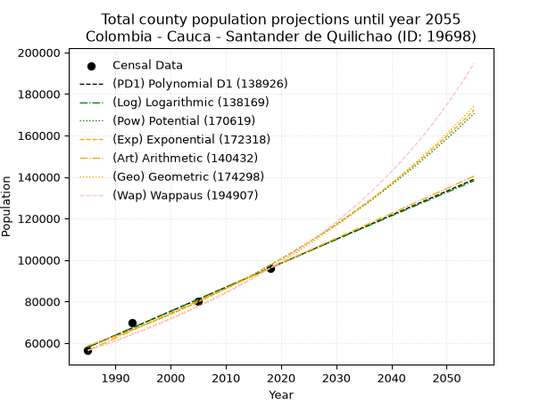
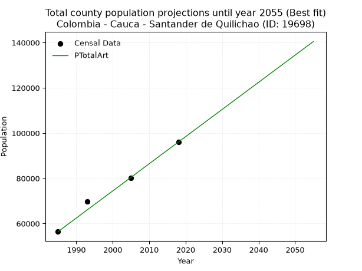
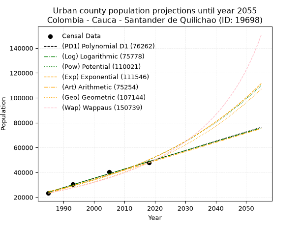
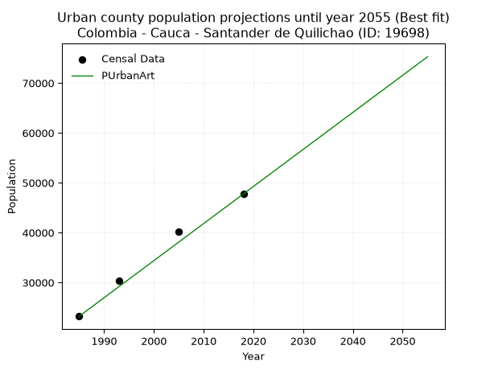
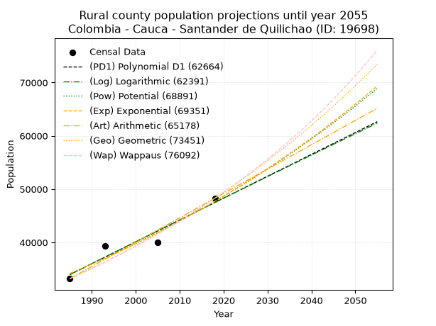
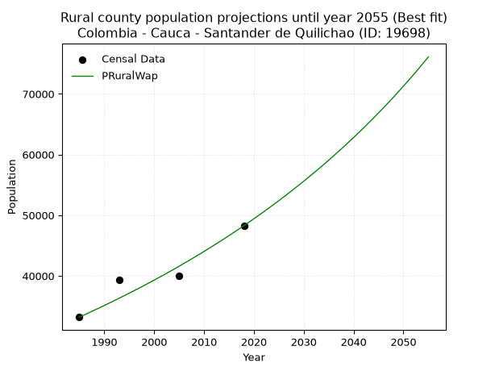

<div align="center">


</div>

# 📜 _“Population and Public Services Demand Projections (PPSD) until Year 2050 for Colombia - Cauca - Santander de Quilichao (ID: 19698)”_
Keywords: `population` `public-service` `projection` `lineal` `polynomial` `logarithmic` `potential` `exponential` `arithmetic` `geometric` `wappaus` `dane` `colombia` `south-america`

PPSD are analytical estimates used by governments and planners to anticipate future changes in population size, age distribution, and the resulting community needs for utilities, healthcare, education, and infrastructure as sizing future water treatment facilities, electrical grids, and road networks based on spatial growth.

<div align="center">

</img>

</div>


> **General running parameters**: • app_version: _v20260806_. • Python version: _3.14.7_. • Pandas version: _3.0.5_. • NumPy version: _2.5.1_. • Creates, save and include plots into reports (create_plot): _False_. • Projection until year: _2050_. • Process polynomial degree 2 and up: _False_. • Process Wappaus: _True_. • Process Wappaus: _True_. • Set negative values to zero: _True_. • Set infinite values to zero: _True_. • Drop dataset notes: _True_. 
<div align="center">

Maps & GIS Layers: [:earth_americas:Google](http://maps.google.com/maps?q=3.015007847,-76.4851414) [:earth_americas:OSM](https://www.openstreetmap.org/#map=18/3.015007847/-76.4851414&layers=P) [:earth_americas:Bing](https://www.bing.com/maps?cp=3.015007847~-76.4851414&lvl=18) [:earth_americas:Apple](https://maps.apple.com/frame?center=3.015007847%2C-76.4851414&span=0.003%2C0.006) [:earth_americas:GISMobile](https://github.com/rcfdtools/R.GISMobile/blob/main/file/gis/CountyLayer_CO/Readme.md)

</div>


<div align="center">

```geojson
{
  "type": "Feature",
  "geometry": {
    "type": "Point", 
    "coordinates": [-76.4851414, 3.015007847]
  }, 
  "properties": {
    "Name": "Colombia - Cauca - Santander de Quilichao (ID: 19698)"
  }
}
```

</div>


## 0. Census Data (4 records)

Census data are official statistics collected by a government about the people and housing in a country. They usually include counts of total population, age, sex, race, income, education, and jobs.

📅Global census file: [Population.xlsx](../data/Population.xlsx)

| Source   |   Year |   CountryID | CountryName   |   StateID | StateName   |   CountyID | CountyName             |   PTotal |   PUrban |   PRural |
|:---------|-------:|------------:|:--------------|----------:|:------------|-----------:|:-----------------------|---------:|---------:|---------:|
| DANE     |   1985 |          57 | Colombia      |        19 | Cauca       |      19698 | Santander de Quilichao |    56432 |    23227 |    33205 |
| DANE     |   1993 |          57 | Colombia      |        19 | Cauca       |      19698 | Santander de Quilichao |    69660 |    30291 |    39369 |
| DANE     |   2005 |          57 | Colombia      |        19 | Cauca       |      19698 | Santander de Quilichao |    80282 |    40251 |    40031 |
| DANE     |   2018 |          57 | Colombia      |        19 | Cauca       |      19698 | Santander de Quilichao |    96032 |    47754 |    48278 |

> 🔥Some records could had specific notes about the registered values or the corresponding urban or rural distribution.

📅[SUI-RUPS](https://www.datos.gov.co/Hacienda-y-Cr-dito-P-blico/Registro-nico-de-Prestadores-de-Servicios-P-blicos/4qkq-csdn/about_data) - Local public utility companies: [RUPS.csv](../data/RUPS.csv)

 | SERVICIO       | ESTADO    | NOMBRE                                                | NIT         | DEPARTAMENTO_DOMICILIO   | MUNICIPIO_DOMICILIO    | DIRECCION                                      |   TELEFONO | EMAIL                        | TIPO_PRESTADOR                             | CLASIFICACION                 |
|:---------------|:----------|:------------------------------------------------------|:------------|:-------------------------|:-----------------------|:-----------------------------------------------|-----------:|:-----------------------------|:-------------------------------------------|:------------------------------|
| ACUEDUCTO      | OPERATIVA | EMPRESAS MUNICIPALES DE SANTANDER DE QUILICHAO E.S.P. | 800019993-4 | CAUCA                    | SANTANDER DE QUILICHAO | CALLE 2B No 6-49                               |    8292233 | EMQUILICHAO@GMAIL.COM        | EMPRESA INDUSTRIAL Y COMERCIAL DEL ESTADO  | MAYOR O IGUAL A 5001 USUARIOS |
| ALCANTARILLADO | OPERATIVA | EMPRESAS MUNICIPALES DE SANTANDER DE QUILICHAO E.S.P. | 800019993-4 | CAUCA                    | SANTANDER DE QUILICHAO | CALLE 2B No 6-49                               |    8292233 | EMQUILICHAO@GMAIL.COM        | EMPRESA INDUSTRIAL Y COMERCIAL DEL ESTADO  | MAYOR O IGUAL A 5001 USUARIOS |
| ACUEDUCTO      | OPERATIVA | AGUAS DEL PARAISO SA ESP                              | 817006227-6 | CAUCA                    | SANTANDER DE QUILICHAO | ZONA INDUSTRIAL EL PARAISO LOTE 15B MANZ C     |    8295304 | nestorsanchez312@hotmail.com | SOCIEDADES (EMPRESA DE SERVICIOS PUBLICOS) | MENOR O IGUAL A 2500 USUARIOS |
| ALCANTARILLADO | OPERATIVA | AGUAS DEL PARAISO SA ESP                              | 817006227-6 | CAUCA                    | SANTANDER DE QUILICHAO | ZONA INDUSTRIAL EL PARAISO LOTE 15B MANZ C     |    8295304 | nestorsanchez312@hotmail.com | SOCIEDADES (EMPRESA DE SERVICIOS PUBLICOS) | MENOR O IGUAL A 2500 USUARIOS |
| ACUEDUCTO      | OPERATIVA | ACUEDUCTO DE MONDOMO                                  | 817001248-8 | CAUCA                    | SANTANDER DE QUILICHAO | Oficina del Acueducto Parque Principal Mondomo |    8299319 | acueductodemondomo@gmail.com | ORGANIZACION AUTORIZADA                    | MENOR O IGUAL A 2500 USUARIOS |

## 1. Total

### 1.1. Coefficients and Parameters

* (PD1) Polynomial Deg 1: 1156.6190285025987, -2237925.711762323 (lineal)
* (Log) Logarithmic: 2315336.6904756613, -17523291.238249313
* (Pow) Potential: 30.81465028637981, -96.85111172369139
* (Exp) Exponential: 0.015390352124864852, 3.168288903864059e-09
* (Art) Arithmetic: Year diff. 2018 - 1985 = 33, Population diff. 96032 - 56432 = 39600, Annual growth = 1200.0
* (Geo) Geometric: Year diff. 2018 - 1985 = 33, Population diff. 96032 - 56432 = 39600, Annual growth % = 0.016240930585960545
* (Wap) Wappaus: i = 1.574142092559555, Condition values only valid for < 200)

<sub>
Wappaus condition values: ['0.00', '1.57', '3.15', '4.72', '6.30', '7.87', '9.44', '11.02', '12.59', '14.17', '15.74', '17.32', '18.89', '20.46', '22.04', '23.61', '25.19', '26.76', '28.33', '29.91', '31.48', '33.06', '34.63', '36.21', '37.78', '39.35', '40.93', '42.50', '44.08', '45.65', '47.22', '48.80', '50.37', '51.95', '53.52', '55.09', '56.67', '58.24', '59.82', '61.39', '62.97', '64.54', '66.11', '67.69', '69.26', '70.84', '72.41', '73.98', '75.56', '77.13', '78.71', '80.28', '81.86', '83.43', '85.00', '86.58', '88.15', '89.73', '91.30', '92.87', '94.45', '96.02', '97.60', '99.17', '100.75', '102.32']
</sub>


### 1.2. Projected Dataset

|   Year |   CountyID |   PTotalPD1 |   PTotalLog |   PTotalPow |   PTotalExp |   PTotalArt |   PTotalGeo |   PTotalWap |
|-------:|-----------:|------------:|------------:|------------:|------------:|------------:|------------:|------------:|
|   1985 |      19698 |       57963 |       57927 |       58644 |       58675 |       56432 |       56432 |       56432 |
|   1986 |      19698 |       59120 |       59093 |       59561 |       59585 |       57632 |       57349 |       57327 |
|   1987 |      19698 |       60276 |       60258 |       60493 |       60509 |       58832 |       58280 |       58237 |
|   1988 |      19698 |       61433 |       61423 |       61438 |       61448 |       60032 |       59226 |       59161 |
|   1989 |      19698 |       62590 |       62588 |       62397 |       62401 |       61232 |       60188 |       60101 |
|   1990 |      19698 |       63746 |       63751 |       63371 |       63369 |       62432 |       61166 |       61056 |
|   1991 |      19698 |       64903 |       64915 |       64360 |       64352 |       63632 |       62159 |       62026 |
|   1992 |      19698 |       66059 |       66077 |       65364 |       65350 |       64832 |       63169 |       63013 |
|   1993 |      19698 |       67216 |       67239 |       66382 |       66363 |       66032 |       64195 |       64016 |
|   1994 |      19698 |       68373 |       68401 |       67416 |       67392 |       67232 |       65237 |       65036 |
|   1995 |      19698 |       69529 |       69562 |       68466 |       68438 |       68432 |       66297 |       66074 |
|   1996 |      19698 |       70686 |       70722 |       69531 |       69499 |       69632 |       67373 |       67130 |
|   1997 |      19698 |       71842 |       71881 |       70613 |       70577 |       70832 |       68468 |       68204 |
|   1998 |      19698 |       72999 |       73041 |       71711 |       71672 |       72032 |       69580 |       69296 |
|   1999 |      19698 |       74156 |       74199 |       72825 |       72783 |       73232 |       70710 |       70409 |
|   2000 |      19698 |       75312 |       75357 |       73956 |       73912 |       74432 |       71858 |       71541 |
|   2001 |      19698 |       76469 |       76514 |       75104 |       75058 |       75632 |       73025 |       72693 |
|   2002 |      19698 |       77626 |       77671 |       76269 |       76222 |       76832 |       74211 |       73866 |
|   2003 |      19698 |       78782 |       78828 |       77452 |       77405 |       78032 |       75416 |       75061 |
|   2004 |      19698 |       79939 |       79983 |       78652 |       78605 |       79232 |       76641 |       76278 |
|   2005 |      19698 |       81095 |       81138 |       79871 |       79824 |       80432 |       77886 |       77518 |
|   2006 |      19698 |       82252 |       82293 |       81107 |       81062 |       81632 |       79151 |       78781 |
|   2007 |      19698 |       83409 |       83447 |       82363 |       82319 |       82832 |       80436 |       80068 |
|   2008 |      19698 |       84565 |       84600 |       83637 |       83596 |       84032 |       81743 |       81380 |
|   2009 |      19698 |       85722 |       85753 |       84930 |       84893 |       85232 |       83070 |       82717 |
|   2010 |      19698 |       86879 |       86905 |       86242 |       86209 |       86432 |       84419 |       84080 |
|   2011 |      19698 |       88035 |       88057 |       87574 |       87546 |       87632 |       85790 |       85471 |
|   2012 |      19698 |       89192 |       89208 |       88926 |       88904 |       88832 |       87184 |       86889 |
|   2013 |      19698 |       90348 |       90358 |       90298 |       90283 |       90032 |       88600 |       88336 |
|   2014 |      19698 |       91505 |       91508 |       91691 |       91683 |       91232 |       90039 |       89812 |
|   2015 |      19698 |       92662 |       92657 |       93104 |       93105 |       92432 |       91501 |       91319 |
|   2016 |      19698 |       93818 |       93806 |       94538 |       94549 |       93632 |       92987 |       92857 |
|   2017 |      19698 |       94975 |       94954 |       95994 |       96016 |       94832 |       94497 |       94428 |
|   2018 |      19698 |       96131 |       96102 |       97472 |       97505 |       96032 |       96032 |       96032 |
|   2019 |      19698 |       97288 |       97249 |       98971 |       99017 |       97232 |       97592 |       97670 |
|   2020 |      19698 |       98445 |       98395 |      100493 |      100553 |       98432 |       99177 |       99345 |
|   2021 |      19698 |       99601 |       99541 |      102037 |      102112 |       99632 |      100787 |      101055 |
|   2022 |      19698 |      100758 |      100687 |      103604 |      103696 |      100832 |      102424 |      102804 |
|   2023 |      19698 |      101915 |      101832 |      105195 |      105304 |      102032 |      104088 |      104592 |
|   2024 |      19698 |      103071 |      102976 |      106809 |      106937 |      103232 |      105778 |      106421 |
|   2025 |      19698 |      104228 |      104119 |      108447 |      108596 |      104432 |      107496 |      108292 |
|   2026 |      19698 |      105384 |      105263 |      110110 |      110280 |      105632 |      109242 |      110206 |
|   2027 |      19698 |      106541 |      106405 |      111797 |      111991 |      106832 |      111016 |      112165 |
|   2028 |      19698 |      107698 |      107547 |      113509 |      113727 |      108032 |      112819 |      114171 |
|   2029 |      19698 |      108854 |      108688 |      115247 |      115491 |      109232 |      114651 |      116225 |
|   2030 |      19698 |      110011 |      109829 |      117010 |      117282 |      110432 |      116513 |      118329 |
|   2031 |      19698 |      111168 |      110970 |      118799 |      119101 |      111632 |      118406 |      120485 |
|   2032 |      19698 |      112324 |      112109 |      120615 |      120949 |      112832 |      120329 |      122695 |
|   2033 |      19698 |      113481 |      113248 |      122457 |      122824 |      114032 |      122283 |      124961 |
|   2034 |      19698 |      114637 |      114387 |      124327 |      124729 |      115232 |      124269 |      127285 |
|   2035 |      19698 |      115794 |      115525 |      126224 |      126664 |      116432 |      126287 |      129670 |
|   2036 |      19698 |      116951 |      116663 |      128150 |      128628 |      117632 |      128338 |      132117 |
|   2037 |      19698 |      118107 |      117799 |      130104 |      130623 |      118832 |      130423 |      134629 |
|   2038 |      19698 |      119264 |      118936 |      132086 |      132649 |      120032 |      132541 |      137209 |
|   2039 |      19698 |      120420 |      120072 |      134098 |      134707 |      121232 |      134693 |      139859 |
|   2040 |      19698 |      121577 |      121207 |      136140 |      136796 |      122432 |      136881 |      142584 |
|   2041 |      19698 |      122734 |      122342 |      138211 |      138917 |      123632 |      139104 |      145385 |
|   2042 |      19698 |      123890 |      123476 |      140313 |      141072 |      124832 |      141363 |      148266 |
|   2043 |      19698 |      125047 |      124609 |      142446 |      143260 |      126032 |      143659 |      151230 |
|   2044 |      19698 |      126204 |      125742 |      144610 |      145482 |      127232 |      145992 |      154281 |
|   2045 |      19698 |      127360 |      126875 |      146806 |      147738 |      128432 |      148363 |      157424 |
|   2046 |      19698 |      128517 |      128007 |      149035 |      150029 |      129632 |      150773 |      160661 |
|   2047 |      19698 |      129673 |      129138 |      151296 |      152356 |      130832 |      153222 |      163999 |
|   2048 |      19698 |      130830 |      130269 |      153590 |      154719 |      132032 |      155710 |      167440 |
|   2049 |      19698 |      131987 |      131399 |      155918 |      157119 |      133232 |      158239 |      170991 |
|   2050 |      19698 |      133143 |      132529 |      158280 |      159556 |      134432 |      160809 |      174655 |
<div align="center">

</img>

</div>


### 1.3. Best fit with absolute and relative error (%)

Relative error puts that difference into context by dividing the absolute error by the true value, creating a unitless ratio or percentage that shows the scale of the mistake.

Absolute and relative error

|   Year | Source   |   CountryID | CountryName   |   StateID | StateName   |   CountyID_x | CountyName             |   PTotal |   PUrban |   PRural |   CountyID_y |   PTotalPD1 |   PTotalLog |   PTotalPow |   PTotalExp |   PTotalArt |   PTotalGeo |   PTotalWap |   PTotalPD1AbsError |   PTotalLogAbsError |   PTotalPowAbsError |   PTotalExpAbsError |   PTotalArtAbsError |   PTotalGeoAbsError |   PTotalWapAbsError |   PTotalPD1RelError |   PTotalLogRelError |   PTotalPowRelError |   PTotalExpRelError |   PTotalArtRelError |   PTotalGeoRelError |   PTotalWapRelError |
|-------:|:---------|------------:|:--------------|----------:|:------------|-------------:|:-----------------------|---------:|---------:|---------:|-------------:|------------:|------------:|------------:|------------:|------------:|------------:|------------:|--------------------:|--------------------:|--------------------:|--------------------:|--------------------:|--------------------:|--------------------:|--------------------:|--------------------:|--------------------:|--------------------:|--------------------:|--------------------:|--------------------:|
|   1985 | DANE     |          57 | Colombia      |        19 | Cauca       |        19698 | Santander de Quilichao |    56432 |    23227 |    33205 |        19698 |       57963 |       57927 |       58644 |       58675 |       56432 |       56432 |       56432 |                1531 |                1495 |                2212 |                2243 |                   0 |                   0 |                   0 |            2.713    |           2.64921   |            3.91976  |            3.9747   |            0        |             0       |             0       |
|   1993 | DANE     |          57 | Colombia      |        19 | Cauca       |        19698 | Santander de Quilichao |    69660 |    30291 |    39369 |        19698 |       67216 |       67239 |       66382 |       66363 |       66032 |       64195 |       64016 |                2444 |                2421 |                3278 |                3297 |                3628 |                5465 |                5644 |            3.50847  |           3.47545   |            4.70571  |            4.73299  |            5.20815  |             7.84525 |             8.10221 |
|   2005 | DANE     |          57 | Colombia      |        19 | Cauca       |        19698 | Santander de Quilichao |    80282 |    40251 |    40031 |        19698 |       81095 |       81138 |       79871 |       79824 |       80432 |       77886 |       77518 |                 813 |                 856 |                 411 |                 458 |                 150 |                2396 |                2764 |            1.01268  |           1.06624   |            0.511945 |            0.570489 |            0.186841 |             2.98448 |             3.44286 |
|   2018 | DANE     |          57 | Colombia      |        19 | Cauca       |        19698 | Santander de Quilichao |    96032 |    47754 |    48278 |        19698 |       96131 |       96102 |       97472 |       97505 |       96032 |       96032 |       96032 |                  99 |                  70 |                1440 |                1473 |                   0 |                   0 |                   0 |            0.103091 |           0.0728924 |            1.4995   |            1.53386  |            0        |             0       |             0       |

Relative error mean

| Method    |   RelError | Best   |
|:----------|-----------:|:-------|
| PTotalPD1 |    1.83431 |        |
| PTotalLog |    1.81595 |        |
| PTotalPow |    2.65923 |        |
| PTotalExp |    2.70301 |        |
| PTotalArt |    1.34875 | True   |
| PTotalGeo |    2.70743 |        |
| PTotalWap |    2.88627 |        |

💙Best method: _**PTotalArt**_
<div align="center">

</img>

</div>


### 1.4. Fresh water supply demand in liters per capita per day (lpcd)

The fresh water supply demand typically ranges from 100 to 300 liters per capita per day (lpcd) for standard domestic and municipal planning, though absolute survival minimums set by the World Health Organization are as low as 7.5 to 20 liters per day, and total consumption in high-income nations can exceed 400 liters.

> `CZ`: Level in meters above the sea level (masl)<br> `WS`: Fresh water supply demand in liters per capita per day (lpcd or l/h/d)<br> `WSAll`: Zonal fresh water supply demand in liters per second (l/s)<br> `A`: Zonal area in square meters<br> `DP`: Population density (people/hectare or p/ha)

Reference values (RAS Colombia)

|    CZ |   WS |
|------:|-----:|
|  1000 |  120 |
|  2000 |  130 |
| 99999 |  140 |

County shapefile geometry properties and water supply values

|   CountyID |      ATotal |   CZTotal |   WSTotal |
|-----------:|------------:|----------:|----------:|
|      19698 | 5.18365e+08 |    1307.3 |       130 |

Projected values for best method: PTotalArt

|   CountyID |   Year |   PTotalArt |   DPTotal |   WSTotal |   WSTotalAll |
|-----------:|-------:|------------:|----------:|----------:|-------------:|
|      19698 |   1985 |       56432 |      1.09 |       130 |      84.9093 |
|      19698 |   1986 |       57632 |      1.11 |       130 |      86.7148 |
|      19698 |   1987 |       58832 |      1.13 |       130 |      88.5204 |
|      19698 |   1988 |       60032 |      1.16 |       130 |      90.3259 |
|      19698 |   1989 |       61232 |      1.18 |       130 |      92.1315 |
|      19698 |   1990 |       62432 |      1.2  |       130 |      93.937  |
|      19698 |   1991 |       63632 |      1.23 |       130 |      95.7426 |
|      19698 |   1992 |       64832 |      1.25 |       130 |      97.5481 |
|      19698 |   1993 |       66032 |      1.27 |       130 |      99.3537 |
|      19698 |   1994 |       67232 |      1.3  |       130 |     101.159  |
|      19698 |   1995 |       68432 |      1.32 |       130 |     102.965  |
|      19698 |   1996 |       69632 |      1.34 |       130 |     104.77   |
|      19698 |   1997 |       70832 |      1.37 |       130 |     106.576  |
|      19698 |   1998 |       72032 |      1.39 |       130 |     108.381  |
|      19698 |   1999 |       73232 |      1.41 |       130 |     110.187  |
|      19698 |   2000 |       74432 |      1.44 |       130 |     111.993  |
|      19698 |   2001 |       75632 |      1.46 |       130 |     113.798  |
|      19698 |   2002 |       76832 |      1.48 |       130 |     115.604  |
|      19698 |   2003 |       78032 |      1.51 |       130 |     117.409  |
|      19698 |   2004 |       79232 |      1.53 |       130 |     119.215  |
|      19698 |   2005 |       80432 |      1.55 |       130 |     121.02   |
|      19698 |   2006 |       81632 |      1.57 |       130 |     122.826  |
|      19698 |   2007 |       82832 |      1.6  |       130 |     124.631  |
|      19698 |   2008 |       84032 |      1.62 |       130 |     126.437  |
|      19698 |   2009 |       85232 |      1.64 |       130 |     128.243  |
|      19698 |   2010 |       86432 |      1.67 |       130 |     130.048  |
|      19698 |   2011 |       87632 |      1.69 |       130 |     131.854  |
|      19698 |   2012 |       88832 |      1.71 |       130 |     133.659  |
|      19698 |   2013 |       90032 |      1.74 |       130 |     135.465  |
|      19698 |   2014 |       91232 |      1.76 |       130 |     137.27   |
|      19698 |   2015 |       92432 |      1.78 |       130 |     139.076  |
|      19698 |   2016 |       93632 |      1.81 |       130 |     140.881  |
|      19698 |   2017 |       94832 |      1.83 |       130 |     142.687  |
|      19698 |   2018 |       96032 |      1.85 |       130 |     144.493  |
|      19698 |   2019 |       97232 |      1.88 |       130 |     146.298  |
|      19698 |   2020 |       98432 |      1.9  |       130 |     148.104  |
|      19698 |   2021 |       99632 |      1.92 |       130 |     149.909  |
|      19698 |   2022 |      100832 |      1.95 |       130 |     151.715  |
|      19698 |   2023 |      102032 |      1.97 |       130 |     153.52   |
|      19698 |   2024 |      103232 |      1.99 |       130 |     155.326  |
|      19698 |   2025 |      104432 |      2.01 |       130 |     157.131  |
|      19698 |   2026 |      105632 |      2.04 |       130 |     158.937  |
|      19698 |   2027 |      106832 |      2.06 |       130 |     160.743  |
|      19698 |   2028 |      108032 |      2.08 |       130 |     162.548  |
|      19698 |   2029 |      109232 |      2.11 |       130 |     164.354  |
|      19698 |   2030 |      110432 |      2.13 |       130 |     166.159  |
|      19698 |   2031 |      111632 |      2.15 |       130 |     167.965  |
|      19698 |   2032 |      112832 |      2.18 |       130 |     169.77   |
|      19698 |   2033 |      114032 |      2.2  |       130 |     171.576  |
|      19698 |   2034 |      115232 |      2.22 |       130 |     173.381  |
|      19698 |   2035 |      116432 |      2.25 |       130 |     175.187  |
|      19698 |   2036 |      117632 |      2.27 |       130 |     176.993  |
|      19698 |   2037 |      118832 |      2.29 |       130 |     178.798  |
|      19698 |   2038 |      120032 |      2.32 |       130 |     180.604  |
|      19698 |   2039 |      121232 |      2.34 |       130 |     182.409  |
|      19698 |   2040 |      122432 |      2.36 |       130 |     184.215  |
|      19698 |   2041 |      123632 |      2.39 |       130 |     186.02   |
|      19698 |   2042 |      124832 |      2.41 |       130 |     187.826  |
|      19698 |   2043 |      126032 |      2.43 |       130 |     189.631  |
|      19698 |   2044 |      127232 |      2.45 |       130 |     191.437  |
|      19698 |   2045 |      128432 |      2.48 |       130 |     193.243  |
|      19698 |   2046 |      129632 |      2.5  |       130 |     195.048  |
|      19698 |   2047 |      130832 |      2.52 |       130 |     196.854  |
|      19698 |   2048 |      132032 |      2.55 |       130 |     198.659  |
|      19698 |   2049 |      133232 |      2.57 |       130 |     200.465  |
|      19698 |   2050 |      134432 |      2.59 |       130 |     202.27   |

## 2. Urban

### 2.1. Coefficients and Parameters

* (PD1) Polynomial Deg 1: 746.69490164592, -1458195.7270172515 (lineal)
* (Log) Logarithmic: 1494928.1857914366, -11327580.369803362
* (Pow) Potential: 43.34554822747905, -138.55416861224208
* (Exp) Exponential: 0.021645570309597295, 5.361911801643511e-15
* (Art) Arithmetic: Year diff. 2018 - 1985 = 33, Population diff. 47754 - 23227 = 24527, Annual growth = 743.2424242424242
* (Geo) Geometric: Year diff. 2018 - 1985 = 33, Population diff. 47754 - 23227 = 24527, Annual growth % = 0.02208108836126721
* (Wap) Wappaus: i = 2.0942010516685428, Condition values only valid for < 200)

<sub>
Wappaus condition values: ['0.00', '2.09', '4.19', '6.28', '8.38', '10.47', '12.57', '14.66', '16.75', '18.85', '20.94', '23.04', '25.13', '27.22', '29.32', '31.41', '33.51', '35.60', '37.70', '39.79', '41.88', '43.98', '46.07', '48.17', '50.26', '52.36', '54.45', '56.54', '58.64', '60.73', '62.83', '64.92', '67.01', '69.11', '71.20', '73.30', '75.39', '77.49', '79.58', '81.67', '83.77', '85.86', '87.96', '90.05', '92.14', '94.24', '96.33', '98.43', '100.52', '102.62', '104.71', '106.80', '108.90', '110.99', '113.09', '115.18', '117.28', '119.37', '121.46', '123.56', '125.65', '127.75', '129.84', '131.93', '134.03', '136.12']
</sub>


### 2.2. Projected Dataset

|   Year |   CountyID |   PUrbanPD1 |   PUrbanLog |   PUrbanPow |   PUrbanExp |   PUrbanArt |   PUrbanGeo |   PUrbanWap |
|-------:|-----------:|------------:|------------:|------------:|------------:|------------:|------------:|------------:|
|   1985 |      19698 |       23994 |       23969 |       24495 |       24514 |       23227 |       23227 |       23227 |
|   1986 |      19698 |       24740 |       24722 |       25035 |       25050 |       23970 |       23740 |       23719 |
|   1987 |      19698 |       25487 |       25474 |       25587 |       25599 |       24713 |       24264 |       24221 |
|   1988 |      19698 |       26234 |       26226 |       26152 |       26159 |       25457 |       24800 |       24734 |
|   1989 |      19698 |       26980 |       26978 |       26728 |       26731 |       26200 |       25347 |       25258 |
|   1990 |      19698 |       27727 |       27730 |       27317 |       27316 |       26943 |       25907 |       25793 |
|   1991 |      19698 |       28474 |       28481 |       27918 |       27914 |       27686 |       26479 |       26341 |
|   1992 |      19698 |       29221 |       29231 |       28532 |       28525 |       28430 |       27064 |       26901 |
|   1993 |      19698 |       29967 |       29982 |       29160 |       29149 |       29173 |       27662 |       27474 |
|   1994 |      19698 |       30714 |       30731 |       29801 |       29787 |       29916 |       28272 |       28060 |
|   1995 |      19698 |       31461 |       31481 |       30455 |       30438 |       30659 |       28897 |       28660 |
|   1996 |      19698 |       32207 |       32230 |       31124 |       31104 |       31403 |       29535 |       29274 |
|   1997 |      19698 |       32954 |       32979 |       31807 |       31785 |       32146 |       30187 |       29903 |
|   1998 |      19698 |       33701 |       33727 |       32505 |       32480 |       32889 |       30853 |       30547 |
|   1999 |      19698 |       34447 |       34475 |       33218 |       33191 |       33632 |       31535 |       31207 |
|   2000 |      19698 |       35194 |       35223 |       33946 |       33917 |       34376 |       32231 |       31883 |
|   2001 |      19698 |       35941 |       35970 |       34689 |       34660 |       35119 |       32943 |       32576 |
|   2002 |      19698 |       36687 |       36717 |       35449 |       35418 |       35862 |       33670 |       33287 |
|   2003 |      19698 |       37434 |       37464 |       36224 |       36193 |       36605 |       34414 |       34016 |
|   2004 |      19698 |       38181 |       38210 |       37017 |       36985 |       37349 |       35173 |       34764 |
|   2005 |      19698 |       38928 |       38956 |       37826 |       37794 |       38092 |       35950 |       35532 |
|   2006 |      19698 |       39674 |       39701 |       38652 |       38621 |       38835 |       36744 |       36321 |
|   2007 |      19698 |       40421 |       40446 |       39496 |       39466 |       39578 |       37555 |       37131 |
|   2008 |      19698 |       41168 |       41191 |       40358 |       40330 |       40322 |       38385 |       37964 |
|   2009 |      19698 |       41914 |       41935 |       41239 |       41212 |       41065 |       39232 |       38820 |
|   2010 |      19698 |       42661 |       42679 |       42138 |       42114 |       41808 |       40098 |       39700 |
|   2011 |      19698 |       43408 |       43423 |       43056 |       43036 |       42551 |       40984 |       40605 |
|   2012 |      19698 |       44154 |       44166 |       43994 |       43977 |       43295 |       41889 |       41537 |
|   2013 |      19698 |       44901 |       44909 |       44952 |       44940 |       44038 |       42814 |       42496 |
|   2014 |      19698 |       45648 |       45651 |       45930 |       45923 |       44781 |       43759 |       43485 |
|   2015 |      19698 |       46394 |       46393 |       46929 |       46928 |       45524 |       44725 |       44503 |
|   2016 |      19698 |       47141 |       47135 |       47950 |       47955 |       46268 |       45713 |       45553 |
|   2017 |      19698 |       47888 |       47876 |       48991 |       49004 |       47011 |       46722 |       46636 |
|   2018 |      19698 |       48635 |       48617 |       50055 |       50076 |       47754 |       47754 |       47754 |
|   2019 |      19698 |       49381 |       49358 |       51142 |       51172 |       48497 |       48808 |       48908 |
|   2020 |      19698 |       50128 |       50098 |       52251 |       52292 |       49240 |       49886 |       50100 |
|   2021 |      19698 |       50875 |       50838 |       53385 |       53436 |       49984 |       50988 |       51333 |
|   2022 |      19698 |       51621 |       51577 |       54542 |       54605 |       50727 |       52114 |       52607 |
|   2023 |      19698 |       52368 |       52317 |       55723 |       55800 |       51470 |       53264 |       53926 |
|   2024 |      19698 |       53115 |       53055 |       56930 |       57021 |       52213 |       54440 |       55292 |
|   2025 |      19698 |       53861 |       53794 |       58162 |       58269 |       52957 |       55643 |       56706 |
|   2026 |      19698 |       54608 |       54532 |       59420 |       59544 |       53700 |       56871 |       58173 |
|   2027 |      19698 |       55355 |       55269 |       60704 |       60847 |       54443 |       58127 |       59694 |
|   2028 |      19698 |       56102 |       56007 |       62016 |       62178 |       55186 |       59411 |       61274 |
|   2029 |      19698 |       56848 |       56744 |       63356 |       63539 |       55930 |       60722 |       62914 |
|   2030 |      19698 |       57595 |       57480 |       64723 |       64929 |       56673 |       62063 |       64620 |
|   2031 |      19698 |       58342 |       58217 |       66120 |       66350 |       57416 |       63434 |       66395 |
|   2032 |      19698 |       59088 |       58952 |       67546 |       67802 |       58159 |       64834 |       68243 |
|   2033 |      19698 |       59835 |       59688 |       69002 |       69285 |       58903 |       66266 |       70168 |
|   2034 |      19698 |       60582 |       60423 |       70488 |       70801 |       59646 |       67729 |       72177 |
|   2035 |      19698 |       61328 |       61158 |       72006 |       72351 |       60389 |       69225 |       74273 |
|   2036 |      19698 |       62075 |       61892 |       73556 |       73934 |       61132 |       70753 |       76464 |
|   2037 |      19698 |       62822 |       62626 |       75138 |       75552 |       61876 |       72316 |       78756 |
|   2038 |      19698 |       63568 |       63360 |       76754 |       77205 |       62619 |       73912 |       81155 |
|   2039 |      19698 |       64315 |       64093 |       78403 |       78894 |       63362 |       75544 |       83671 |
|   2040 |      19698 |       65062 |       64826 |       80088 |       80620 |       64105 |       77212 |       86310 |
|   2041 |      19698 |       65809 |       65559 |       81807 |       82385 |       64849 |       78917 |       89083 |
|   2042 |      19698 |       66555 |       66291 |       83563 |       84187 |       65592 |       80660 |       92000 |
|   2043 |      19698 |       67302 |       67023 |       85355 |       86029 |       66335 |       82441 |       95072 |
|   2044 |      19698 |       68049 |       67755 |       87185 |       87912 |       67078 |       84261 |       98313 |
|   2045 |      19698 |       68795 |       68486 |       89053 |       89835 |       67822 |       86122 |      101737 |
|   2046 |      19698 |       69542 |       69217 |       90960 |       91801 |       68565 |       88024 |      105359 |
|   2047 |      19698 |       70289 |       69947 |       92907 |       93810 |       69308 |       89967 |      109197 |
|   2048 |      19698 |       71035 |       70677 |       94895 |       95863 |       70051 |       91954 |      113271 |
|   2049 |      19698 |       71782 |       71407 |       96924 |       97960 |       70795 |       93984 |      117604 |
|   2050 |      19698 |       72529 |       72137 |       98996 |      100104 |       71538 |       96060 |      122221 |
<div align="center">

</img>

</div>


### 2.3. Best fit with absolute and relative error (%)

Relative error puts that difference into context by dividing the absolute error by the true value, creating a unitless ratio or percentage that shows the scale of the mistake.

Absolute and relative error

|   Year | Source   |   CountryID | CountryName   |   StateID | StateName   |   CountyID_x | CountyName             |   PTotal |   PUrban |   PRural |   CountyID_y |   PUrbanPD1 |   PUrbanLog |   PUrbanPow |   PUrbanExp |   PUrbanArt |   PUrbanGeo |   PUrbanWap |   PUrbanPD1AbsError |   PUrbanLogAbsError |   PUrbanPowAbsError |   PUrbanExpAbsError |   PUrbanArtAbsError |   PUrbanGeoAbsError |   PUrbanWapAbsError |   PUrbanPD1RelError |   PUrbanLogRelError |   PUrbanPowRelError |   PUrbanExpRelError |   PUrbanArtRelError |   PUrbanGeoRelError |   PUrbanWapRelError |
|-------:|:---------|------------:|:--------------|----------:|:------------|-------------:|:-----------------------|---------:|---------:|---------:|-------------:|------------:|------------:|------------:|------------:|------------:|------------:|------------:|--------------------:|--------------------:|--------------------:|--------------------:|--------------------:|--------------------:|--------------------:|--------------------:|--------------------:|--------------------:|--------------------:|--------------------:|--------------------:|--------------------:|
|   1985 | DANE     |          57 | Colombia      |        19 | Cauca       |        19698 | Santander de Quilichao |    56432 |    23227 |    33205 |        19698 |       23994 |       23969 |       24495 |       24514 |       23227 |       23227 |       23227 |                 767 |                 742 |                1268 |                1287 |                   0 |                   0 |                   0 |             3.30219 |             3.19456 |             5.45916 |             5.54097 |             0       |             0       |             0       |
|   1993 | DANE     |          57 | Colombia      |        19 | Cauca       |        19698 | Santander de Quilichao |    69660 |    30291 |    39369 |        19698 |       29967 |       29982 |       29160 |       29149 |       29173 |       27662 |       27474 |                 324 |                 309 |                1131 |                1142 |                1118 |                2629 |                2817 |             1.06962 |             1.0201  |             3.73378 |             3.7701  |             3.69087 |             8.67915 |             9.29979 |
|   2005 | DANE     |          57 | Colombia      |        19 | Cauca       |        19698 | Santander de Quilichao |    80282 |    40251 |    40031 |        19698 |       38928 |       38956 |       37826 |       37794 |       38092 |       35950 |       35532 |                1323 |                1295 |                2425 |                2457 |                2159 |                4301 |                4719 |             3.28687 |             3.21731 |             6.0247  |             6.1042  |             5.36384 |            10.6854  |            11.7239  |
|   2018 | DANE     |          57 | Colombia      |        19 | Cauca       |        19698 | Santander de Quilichao |    96032 |    47754 |    48278 |        19698 |       48635 |       48617 |       50055 |       50076 |       47754 |       47754 |       47754 |                 881 |                 863 |                2301 |                2322 |                   0 |                   0 |                   0 |             1.84487 |             1.80718 |             4.81844 |             4.86242 |             0       |             0       |             0       |

Relative error mean

| Method    |   RelError | Best   |
|:----------|-----------:|:-------|
| PUrbanPD1 |    2.37589 |        |
| PUrbanLog |    2.30979 |        |
| PUrbanPow |    5.00902 |        |
| PUrbanExp |    5.06942 |        |
| PUrbanArt |    2.26368 | True   |
| PUrbanGeo |    4.84115 |        |
| PUrbanWap |    5.25593 |        |

💙Best method: _**PUrbanArt**_
<div align="center">

</img>

</div>


### 2.4. Fresh water supply demand in liters per capita per day (lpcd)

The fresh water supply demand typically ranges from 100 to 300 liters per capita per day (lpcd) for standard domestic and municipal planning, though absolute survival minimums set by the World Health Organization are as low as 7.5 to 20 liters per day, and total consumption in high-income nations can exceed 400 liters.

> `CZ`: Level in meters above the sea level (masl)<br> `WS`: Fresh water supply demand in liters per capita per day (lpcd or l/h/d)<br> `WSAll`: Zonal fresh water supply demand in liters per second (l/s)<br> `A`: Zonal area in square meters<br> `DP`: Population density (people/hectare or p/ha)

Reference values (RAS Colombia)

|    CZ |   WS |
|------:|-----:|
|  1000 |  120 |
|  2000 |  130 |
| 99999 |  140 |

County shapefile geometry properties and water supply values

|   CountyID |      AUrban |   CZUrban |   WSUrban |
|-----------:|------------:|----------:|----------:|
|      19698 | 1.10075e+07 |   1049.91 |       130 |

Projected values for best method: PUrbanArt

|   CountyID |   Year |   PUrbanArt |   DPUrban |   WSUrban |   WSUrbanAll |
|-----------:|-------:|------------:|----------:|----------:|-------------:|
|      19698 |   1985 |       23227 |     21.1  |       130 |      34.948  |
|      19698 |   1986 |       23970 |     21.78 |       130 |      36.066  |
|      19698 |   1987 |       24713 |     22.45 |       130 |      37.1839 |
|      19698 |   1988 |       25457 |     23.13 |       130 |      38.3034 |
|      19698 |   1989 |       26200 |     23.8  |       130 |      39.4213 |
|      19698 |   1990 |       26943 |     24.48 |       130 |      40.5392 |
|      19698 |   1991 |       27686 |     25.15 |       130 |      41.6572 |
|      19698 |   1992 |       28430 |     25.83 |       130 |      42.7766 |
|      19698 |   1993 |       29173 |     26.5  |       130 |      43.8946 |
|      19698 |   1994 |       29916 |     27.18 |       130 |      45.0125 |
|      19698 |   1995 |       30659 |     27.85 |       130 |      46.1304 |
|      19698 |   1996 |       31403 |     28.53 |       130 |      47.2499 |
|      19698 |   1997 |       32146 |     29.2  |       130 |      48.3678 |
|      19698 |   1998 |       32889 |     29.88 |       130 |      49.4858 |
|      19698 |   1999 |       33632 |     30.55 |       130 |      50.6037 |
|      19698 |   2000 |       34376 |     31.23 |       130 |      51.7231 |
|      19698 |   2001 |       35119 |     31.9  |       130 |      52.8411 |
|      19698 |   2002 |       35862 |     32.58 |       130 |      53.959  |
|      19698 |   2003 |       36605 |     33.25 |       130 |      55.077  |
|      19698 |   2004 |       37349 |     33.93 |       130 |      56.1964 |
|      19698 |   2005 |       38092 |     34.61 |       130 |      57.3144 |
|      19698 |   2006 |       38835 |     35.28 |       130 |      58.4323 |
|      19698 |   2007 |       39578 |     35.96 |       130 |      59.5502 |
|      19698 |   2008 |       40322 |     36.63 |       130 |      60.6697 |
|      19698 |   2009 |       41065 |     37.31 |       130 |      61.7876 |
|      19698 |   2010 |       41808 |     37.98 |       130 |      62.9056 |
|      19698 |   2011 |       42551 |     38.66 |       130 |      64.0235 |
|      19698 |   2012 |       43295 |     39.33 |       130 |      65.1429 |
|      19698 |   2013 |       44038 |     40.01 |       130 |      66.2609 |
|      19698 |   2014 |       44781 |     40.68 |       130 |      67.3788 |
|      19698 |   2015 |       45524 |     41.36 |       130 |      68.4968 |
|      19698 |   2016 |       46268 |     42.03 |       130 |      69.6162 |
|      19698 |   2017 |       47011 |     42.71 |       130 |      70.7341 |
|      19698 |   2018 |       47754 |     43.38 |       130 |      71.8521 |
|      19698 |   2019 |       48497 |     44.06 |       130 |      72.97   |
|      19698 |   2020 |       49240 |     44.73 |       130 |      74.088  |
|      19698 |   2021 |       49984 |     45.41 |       130 |      75.2074 |
|      19698 |   2022 |       50727 |     46.08 |       130 |      76.3253 |
|      19698 |   2023 |       51470 |     46.76 |       130 |      77.4433 |
|      19698 |   2024 |       52213 |     47.43 |       130 |      78.5612 |
|      19698 |   2025 |       52957 |     48.11 |       130 |      79.6807 |
|      19698 |   2026 |       53700 |     48.78 |       130 |      80.7986 |
|      19698 |   2027 |       54443 |     49.46 |       130 |      81.9166 |
|      19698 |   2028 |       55186 |     50.13 |       130 |      83.0345 |
|      19698 |   2029 |       55930 |     50.81 |       130 |      84.1539 |
|      19698 |   2030 |       56673 |     51.49 |       130 |      85.2719 |
|      19698 |   2031 |       57416 |     52.16 |       130 |      86.3898 |
|      19698 |   2032 |       58159 |     52.84 |       130 |      87.5078 |
|      19698 |   2033 |       58903 |     53.51 |       130 |      88.6272 |
|      19698 |   2034 |       59646 |     54.19 |       130 |      89.7451 |
|      19698 |   2035 |       60389 |     54.86 |       130 |      90.8631 |
|      19698 |   2036 |       61132 |     55.54 |       130 |      91.981  |
|      19698 |   2037 |       61876 |     56.21 |       130 |      93.1005 |
|      19698 |   2038 |       62619 |     56.89 |       130 |      94.2184 |
|      19698 |   2039 |       63362 |     57.56 |       130 |      95.3363 |
|      19698 |   2040 |       64105 |     58.24 |       130 |      96.4543 |
|      19698 |   2041 |       64849 |     58.91 |       130 |      97.5737 |
|      19698 |   2042 |       65592 |     59.59 |       130 |      98.6917 |
|      19698 |   2043 |       66335 |     60.26 |       130 |      99.8096 |
|      19698 |   2044 |       67078 |     60.94 |       130 |     100.928  |
|      19698 |   2045 |       67822 |     61.61 |       130 |     102.047  |
|      19698 |   2046 |       68565 |     62.29 |       130 |     103.165  |
|      19698 |   2047 |       69308 |     62.96 |       130 |     104.283  |
|      19698 |   2048 |       70051 |     63.64 |       130 |     105.401  |
|      19698 |   2049 |       70795 |     64.32 |       130 |     106.52   |
|      19698 |   2050 |       71538 |     64.99 |       130 |     107.638  |

## 3. Rural

### 3.1. Coefficients and Parameters

* (PD1) Polynomial Deg 1: 409.9241268566792, -779729.9847450726 (lineal)
* (Log) Logarithmic: 820408.5046842244, -6195710.868445947
* (Pow) Potential: 20.23989240659226, -62.212793875776306
* (Exp) Exponential: 0.010111445965726875, 6.559000804566926e-05
* (Art) Arithmetic: Year diff. 2018 - 1985 = 33, Population diff. 48278 - 33205 = 15073, Annual growth = 456.75757575757575
* (Geo) Geometric: Year diff. 2018 - 1985 = 33, Population diff. 48278 - 33205 = 15073, Annual growth % = 0.011406242639177
* (Wap) Wappaus: i = 1.1211113379663875, Condition values only valid for < 200)

<sub>
Wappaus condition values: ['0.00', '1.12', '2.24', '3.36', '4.48', '5.61', '6.73', '7.85', '8.97', '10.09', '11.21', '12.33', '13.45', '14.57', '15.70', '16.82', '17.94', '19.06', '20.18', '21.30', '22.42', '23.54', '24.66', '25.79', '26.91', '28.03', '29.15', '30.27', '31.39', '32.51', '33.63', '34.75', '35.88', '37.00', '38.12', '39.24', '40.36', '41.48', '42.60', '43.72', '44.84', '45.97', '47.09', '48.21', '49.33', '50.45', '51.57', '52.69', '53.81', '54.93', '56.06', '57.18', '58.30', '59.42', '60.54', '61.66', '62.78', '63.90', '65.02', '66.15', '67.27', '68.39', '69.51', '70.63', '71.75', '72.87']
</sub>


### 3.2. Projected Dataset

|   Year |   CountyID |   PRuralPD1 |   PRuralLog |   PRuralPow |   PRuralExp |   PRuralArt |   PRuralGeo |   PRuralWap |
|-------:|-----------:|------------:|------------:|------------:|------------:|------------:|------------:|------------:|
|   1985 |      19698 |       33969 |       33958 |       34160 |       34171 |       33205 |       33205 |       33205 |
|   1986 |      19698 |       34379 |       34371 |       34510 |       34518 |       33662 |       33584 |       33579 |
|   1987 |      19698 |       34789 |       34784 |       34864 |       34869 |       34119 |       33967 |       33958 |
|   1988 |      19698 |       35199 |       35197 |       35221 |       35223 |       34575 |       34354 |       34341 |
|   1989 |      19698 |       35609 |       35609 |       35581 |       35581 |       35032 |       34746 |       34728 |
|   1990 |      19698 |       36019 |       36022 |       35945 |       35943 |       35489 |       35142 |       35120 |
|   1991 |      19698 |       36429 |       36434 |       36312 |       36308 |       35946 |       35543 |       35516 |
|   1992 |      19698 |       36839 |       36846 |       36683 |       36677 |       36402 |       35949 |       35917 |
|   1993 |      19698 |       37249 |       37258 |       37058 |       37050 |       36859 |       36359 |       36323 |
|   1994 |      19698 |       37659 |       37669 |       37436 |       37427 |       37316 |       36773 |       36733 |
|   1995 |      19698 |       38069 |       38081 |       37818 |       37807 |       37773 |       37193 |       37149 |
|   1996 |      19698 |       38479 |       38492 |       38203 |       38191 |       38229 |       37617 |       37569 |
|   1997 |      19698 |       38888 |       38903 |       38593 |       38579 |       38686 |       38046 |       37994 |
|   1998 |      19698 |       39298 |       39313 |       38986 |       38971 |       39143 |       38480 |       38425 |
|   1999 |      19698 |       39708 |       39724 |       39382 |       39367 |       39600 |       38919 |       38861 |
|   2000 |      19698 |       40118 |       40134 |       39783 |       39767 |       40056 |       39363 |       39302 |
|   2001 |      19698 |       40528 |       40544 |       40188 |       40172 |       40513 |       39812 |       39748 |
|   2002 |      19698 |       40938 |       40954 |       40596 |       40580 |       40970 |       40266 |       40200 |
|   2003 |      19698 |       41348 |       41364 |       41008 |       40992 |       41427 |       40725 |       40658 |
|   2004 |      19698 |       41758 |       41773 |       41425 |       41409 |       41883 |       41190 |       41121 |
|   2005 |      19698 |       42168 |       42183 |       41845 |       41830 |       42340 |       41660 |       41590 |
|   2006 |      19698 |       42578 |       42592 |       42270 |       42255 |       42797 |       42135 |       42066 |
|   2007 |      19698 |       42988 |       43001 |       42698 |       42684 |       43254 |       42615 |       42547 |
|   2008 |      19698 |       43398 |       43409 |       43131 |       43118 |       43710 |       43102 |       43034 |
|   2009 |      19698 |       43808 |       43818 |       43568 |       43556 |       44167 |       43593 |       43528 |
|   2010 |      19698 |       44218 |       44226 |       44009 |       43999 |       44624 |       44090 |       44028 |
|   2011 |      19698 |       44627 |       44634 |       44454 |       44446 |       45081 |       44593 |       44535 |
|   2012 |      19698 |       45037 |       45042 |       44904 |       44898 |       45537 |       45102 |       45049 |
|   2013 |      19698 |       45447 |       45450 |       45357 |       45354 |       45994 |       45616 |       45569 |
|   2014 |      19698 |       45857 |       45857 |       45816 |       45815 |       46451 |       46137 |       46096 |
|   2015 |      19698 |       46267 |       46264 |       46278 |       46281 |       46908 |       46663 |       46631 |
|   2016 |      19698 |       46677 |       46671 |       46745 |       46751 |       47364 |       47195 |       47172 |
|   2017 |      19698 |       47087 |       47078 |       47217 |       47226 |       47821 |       47734 |       47721 |
|   2018 |      19698 |       47497 |       47485 |       47693 |       47706 |       48278 |       48278 |       48278 |
|   2019 |      19698 |       47907 |       47891 |       48174 |       48191 |       48735 |       48829 |       48842 |
|   2020 |      19698 |       48317 |       48297 |       48659 |       48680 |       49192 |       49386 |       49414 |
|   2021 |      19698 |       48727 |       48704 |       49149 |       49175 |       49648 |       49949 |       49995 |
|   2022 |      19698 |       49137 |       49109 |       49643 |       49675 |       50105 |       50519 |       50583 |
|   2023 |      19698 |       49547 |       49515 |       50143 |       50180 |       50562 |       51095 |       51180 |
|   2024 |      19698 |       49956 |       49920 |       50647 |       50690 |       51019 |       51678 |       51785 |
|   2025 |      19698 |       50366 |       50326 |       51156 |       51205 |       51475 |       52267 |       52399 |
|   2026 |      19698 |       50776 |       50731 |       51669 |       51725 |       51932 |       52863 |       53022 |
|   2027 |      19698 |       51186 |       51136 |       52188 |       52251 |       52389 |       53466 |       53655 |
|   2028 |      19698 |       51596 |       51540 |       52712 |       52782 |       52846 |       54076 |       54296 |
|   2029 |      19698 |       52006 |       51945 |       53240 |       53318 |       53302 |       54693 |       54947 |
|   2030 |      19698 |       52416 |       52349 |       53774 |       53860 |       53759 |       55317 |       55608 |
|   2031 |      19698 |       52826 |       52753 |       54312 |       54408 |       54216 |       55948 |       56279 |
|   2032 |      19698 |       53236 |       53157 |       54856 |       54961 |       54673 |       56586 |       56960 |
|   2033 |      19698 |       53646 |       53560 |       55405 |       55519 |       55129 |       57231 |       57651 |
|   2034 |      19698 |       54056 |       53964 |       55959 |       56083 |       55586 |       57884 |       58354 |
|   2035 |      19698 |       54466 |       54367 |       56519 |       56653 |       56043 |       58544 |       59067 |
|   2036 |      19698 |       54876 |       54770 |       57084 |       57229 |       56500 |       59212 |       59791 |
|   2037 |      19698 |       55285 |       55173 |       57654 |       57811 |       56956 |       59888 |       60527 |
|   2038 |      19698 |       55695 |       55576 |       58229 |       58398 |       57413 |       60571 |       61274 |
|   2039 |      19698 |       56105 |       55978 |       58810 |       58992 |       57870 |       61261 |       62034 |
|   2040 |      19698 |       56515 |       56380 |       59397 |       59591 |       58327 |       61960 |       62806 |
|   2041 |      19698 |       56925 |       56782 |       59989 |       60197 |       58783 |       62667 |       63590 |
|   2042 |      19698 |       57335 |       57184 |       60587 |       60809 |       59240 |       63382 |       64387 |
|   2043 |      19698 |       57745 |       57586 |       61190 |       61427 |       59697 |       64105 |       65198 |
|   2044 |      19698 |       58155 |       57987 |       61799 |       62051 |       60154 |       64836 |       66022 |
|   2045 |      19698 |       58565 |       58389 |       62414 |       62681 |       60610 |       65575 |       66860 |
|   2046 |      19698 |       58975 |       58790 |       63035 |       63318 |       61067 |       66323 |       67713 |
|   2047 |      19698 |       59385 |       59191 |       63661 |       63962 |       61524 |       67080 |       68580 |
|   2048 |      19698 |       59795 |       59591 |       64294 |       64612 |       61981 |       67845 |       69462 |
|   2049 |      19698 |       60205 |       59992 |       64932 |       65269 |       62437 |       68619 |       70359 |
|   2050 |      19698 |       60614 |       60392 |       65576 |       65932 |       62894 |       69402 |       71273 |
<div align="center">

</img>

</div>


### 3.3. Best fit with absolute and relative error (%)

Relative error puts that difference into context by dividing the absolute error by the true value, creating a unitless ratio or percentage that shows the scale of the mistake.

Absolute and relative error

|   Year | Source   |   CountryID | CountryName   |   StateID | StateName   |   CountyID_x | CountyName             |   PTotal |   PUrban |   PRural |   CountyID_y |   PRuralPD1 |   PRuralLog |   PRuralPow |   PRuralExp |   PRuralArt |   PRuralGeo |   PRuralWap |   PRuralPD1AbsError |   PRuralLogAbsError |   PRuralPowAbsError |   PRuralExpAbsError |   PRuralArtAbsError |   PRuralGeoAbsError |   PRuralWapAbsError |   PRuralPD1RelError |   PRuralLogRelError |   PRuralPowRelError |   PRuralExpRelError |   PRuralArtRelError |   PRuralGeoRelError |   PRuralWapRelError |
|-------:|:---------|------------:|:--------------|----------:|:------------|-------------:|:-----------------------|---------:|---------:|---------:|-------------:|------------:|------------:|------------:|------------:|------------:|------------:|------------:|--------------------:|--------------------:|--------------------:|--------------------:|--------------------:|--------------------:|--------------------:|--------------------:|--------------------:|--------------------:|--------------------:|--------------------:|--------------------:|--------------------:|
|   1985 | DANE     |          57 | Colombia      |        19 | Cauca       |        19698 | Santander de Quilichao |    56432 |    23227 |    33205 |        19698 |       33969 |       33958 |       34160 |       34171 |       33205 |       33205 |       33205 |                 764 |                 753 |                 955 |                 966 |                   0 |                   0 |                   0 |             2.30086 |             2.26773 |             2.87607 |             2.9092  |             0       |             0       |             0       |
|   1993 | DANE     |          57 | Colombia      |        19 | Cauca       |        19698 | Santander de Quilichao |    69660 |    30291 |    39369 |        19698 |       37249 |       37258 |       37058 |       37050 |       36859 |       36359 |       36323 |                2120 |                2111 |                2311 |                2319 |                2510 |                3010 |                3046 |             5.38495 |             5.36209 |             5.8701  |             5.89042 |             6.37557 |             7.64561 |             7.73705 |
|   2005 | DANE     |          57 | Colombia      |        19 | Cauca       |        19698 | Santander de Quilichao |    80282 |    40251 |    40031 |        19698 |       42168 |       42183 |       41845 |       41830 |       42340 |       41660 |       41590 |                2137 |                2152 |                1814 |                1799 |                2309 |                1629 |                1559 |             5.33836 |             5.37583 |             4.53149 |             4.49402 |             5.76803 |             4.06935 |             3.89448 |
|   2018 | DANE     |          57 | Colombia      |        19 | Cauca       |        19698 | Santander de Quilichao |    96032 |    47754 |    48278 |        19698 |       47497 |       47485 |       47693 |       47706 |       48278 |       48278 |       48278 |                 781 |                 793 |                 585 |                 572 |                   0 |                   0 |                   0 |             1.61771 |             1.64257 |             1.21173 |             1.1848  |             0       |             0       |             0       |

Relative error mean

| Method    |   RelError | Best   |
|:----------|-----------:|:-------|
| PRuralPD1 |    3.66047 |        |
| PRuralLog |    3.66206 |        |
| PRuralPow |    3.62235 |        |
| PRuralExp |    3.61961 |        |
| PRuralArt |    3.0359  |        |
| PRuralGeo |    2.92874 |        |
| PRuralWap |    2.90788 | True   |

💙Best method: _**PRuralWap**_
<div align="center">

</img>

</div>


### 3.4. Fresh water supply demand in liters per capita per day (lpcd)

The fresh water supply demand typically ranges from 100 to 300 liters per capita per day (lpcd) for standard domestic and municipal planning, though absolute survival minimums set by the World Health Organization are as low as 7.5 to 20 liters per day, and total consumption in high-income nations can exceed 400 liters.

> `CZ`: Level in meters above the sea level (masl)<br> `WS`: Fresh water supply demand in liters per capita per day (lpcd or l/h/d)<br> `WSAll`: Zonal fresh water supply demand in liters per second (l/s)<br> `A`: Zonal area in square meters<br> `DP`: Population density (people/hectare or p/ha)

Reference values (RAS Colombia)

|    CZ |   WS |
|------:|-----:|
|  1000 |  120 |
|  2000 |  130 |
| 99999 |  140 |

County shapefile geometry properties and water supply values

|   CountyID |      ARural |   CZRural |   WSRural |
|-----------:|------------:|----------:|----------:|
|      19698 | 5.07357e+08 |   1312.91 |       130 |

Projected values for best method: PRuralWap

|   CountyID |   Year |   PRuralWap |   DPRural |   WSRural |   WSRuralAll |
|-----------:|-------:|------------:|----------:|----------:|-------------:|
|      19698 |   1985 |       33205 |      0.65 |       130 |      49.9612 |
|      19698 |   1986 |       33579 |      0.66 |       130 |      50.524  |
|      19698 |   1987 |       33958 |      0.67 |       130 |      51.0942 |
|      19698 |   1988 |       34341 |      0.68 |       130 |      51.6705 |
|      19698 |   1989 |       34728 |      0.68 |       130 |      52.2528 |
|      19698 |   1990 |       35120 |      0.69 |       130 |      52.8426 |
|      19698 |   1991 |       35516 |      0.7  |       130 |      53.4384 |
|      19698 |   1992 |       35917 |      0.71 |       130 |      54.0418 |
|      19698 |   1993 |       36323 |      0.72 |       130 |      54.6527 |
|      19698 |   1994 |       36733 |      0.72 |       130 |      55.2696 |
|      19698 |   1995 |       37149 |      0.73 |       130 |      55.8955 |
|      19698 |   1996 |       37569 |      0.74 |       130 |      56.5274 |
|      19698 |   1997 |       37994 |      0.75 |       130 |      57.1669 |
|      19698 |   1998 |       38425 |      0.76 |       130 |      57.8154 |
|      19698 |   1999 |       38861 |      0.77 |       130 |      58.4714 |
|      19698 |   2000 |       39302 |      0.77 |       130 |      59.135  |
|      19698 |   2001 |       39748 |      0.78 |       130 |      59.806  |
|      19698 |   2002 |       40200 |      0.79 |       130 |      60.4861 |
|      19698 |   2003 |       40658 |      0.8  |       130 |      61.1752 |
|      19698 |   2004 |       41121 |      0.81 |       130 |      61.8719 |
|      19698 |   2005 |       41590 |      0.82 |       130 |      62.5775 |
|      19698 |   2006 |       42066 |      0.83 |       130 |      63.2938 |
|      19698 |   2007 |       42547 |      0.84 |       130 |      64.0175 |
|      19698 |   2008 |       43034 |      0.85 |       130 |      64.7502 |
|      19698 |   2009 |       43528 |      0.86 |       130 |      65.4935 |
|      19698 |   2010 |       44028 |      0.87 |       130 |      66.2458 |
|      19698 |   2011 |       44535 |      0.88 |       130 |      67.0087 |
|      19698 |   2012 |       45049 |      0.89 |       130 |      67.7821 |
|      19698 |   2013 |       45569 |      0.9  |       130 |      68.5645 |
|      19698 |   2014 |       46096 |      0.91 |       130 |      69.3574 |
|      19698 |   2015 |       46631 |      0.92 |       130 |      70.1624 |
|      19698 |   2016 |       47172 |      0.93 |       130 |      70.9764 |
|      19698 |   2017 |       47721 |      0.94 |       130 |      71.8024 |
|      19698 |   2018 |       48278 |      0.95 |       130 |      72.6405 |
|      19698 |   2019 |       48842 |      0.96 |       130 |      73.4891 |
|      19698 |   2020 |       49414 |      0.97 |       130 |      74.3498 |
|      19698 |   2021 |       49995 |      0.99 |       130 |      75.224  |
|      19698 |   2022 |       50583 |      1    |       130 |      76.1087 |
|      19698 |   2023 |       51180 |      1.01 |       130 |      77.0069 |
|      19698 |   2024 |       51785 |      1.02 |       130 |      77.9172 |
|      19698 |   2025 |       52399 |      1.03 |       130 |      78.8411 |
|      19698 |   2026 |       53022 |      1.05 |       130 |      79.7785 |
|      19698 |   2027 |       53655 |      1.06 |       130 |      80.7309 |
|      19698 |   2028 |       54296 |      1.07 |       130 |      81.6954 |
|      19698 |   2029 |       54947 |      1.08 |       130 |      82.6749 |
|      19698 |   2030 |       55608 |      1.1  |       130 |      83.6694 |
|      19698 |   2031 |       56279 |      1.11 |       130 |      84.6791 |
|      19698 |   2032 |       56960 |      1.12 |       130 |      85.7037 |
|      19698 |   2033 |       57651 |      1.14 |       130 |      86.7434 |
|      19698 |   2034 |       58354 |      1.15 |       130 |      87.8012 |
|      19698 |   2035 |       59067 |      1.16 |       130 |      88.874  |
|      19698 |   2036 |       59791 |      1.18 |       130 |      89.9633 |
|      19698 |   2037 |       60527 |      1.19 |       130 |      91.0707 |
|      19698 |   2038 |       61274 |      1.21 |       130 |      92.1947 |
|      19698 |   2039 |       62034 |      1.22 |       130 |      93.3382 |
|      19698 |   2040 |       62806 |      1.24 |       130 |      94.4998 |
|      19698 |   2041 |       63590 |      1.25 |       130 |      95.6794 |
|      19698 |   2042 |       64387 |      1.27 |       130 |      96.8786 |
|      19698 |   2043 |       65198 |      1.29 |       130 |      98.0988 |
|      19698 |   2044 |       66022 |      1.3  |       130 |      99.3387 |
|      19698 |   2045 |       66860 |      1.32 |       130 |     100.6    |
|      19698 |   2046 |       67713 |      1.33 |       130 |     101.883  |
|      19698 |   2047 |       68580 |      1.35 |       130 |     103.188  |
|      19698 |   2048 |       69462 |      1.37 |       130 |     104.515  |
|      19698 |   2049 |       70359 |      1.39 |       130 |     105.864  |
|      19698 |   2050 |       71273 |      1.4  |       130 |     107.239  |

#

<div align="center"><br><sub>Share this research</sub></div><br>

<sub>**APPS & TOOLS & CONTENT DISCLAIMER**: • NO WARRANTY - This content and software is provided by <a href="https://github.com/rcfdtools" target="_blank">github.com/rcfdtools</a> "as is", without any express or implied warranty, including warranties of merchantability, fitness for a particular purpose, or non-infringement. There is no guarantee that the software will be error-free or operate without interruption. • LIMITATION OF LIABILITY - Neither the authors nor copyright holders will be liable for claims or damages arising from the software or its use. You are responsible for determining if the software is appropriate for your use and assume all associated risks, including errors, legal compliance, and data loss. • NO PROFESSIONAL ADVICE - The software provides general information and does not offer professional advice. It should not replace consultation with professional advisors. [Clauses and global license for rcfdtools use.](https://github.com/rcfdtools/rcfdtools/blob/main/LICENSE.md)</sub>

| [:house: Home](Readme.md)  | [:beginner: Help / Collab](https://github.com/rcfdtools/R.HydroTools/discussions/31) |
|----------------------------|-------------------------------------------------------------------------------------------|