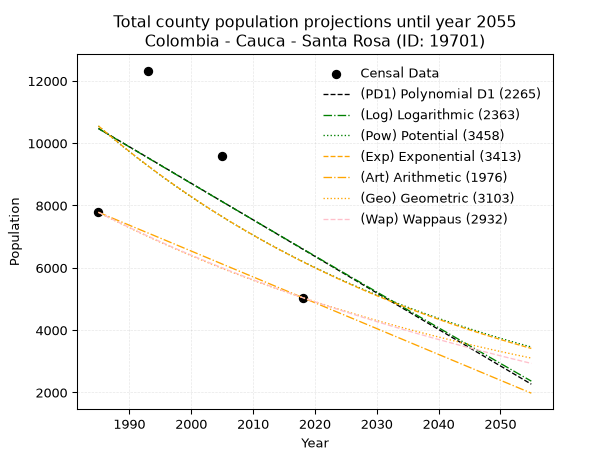
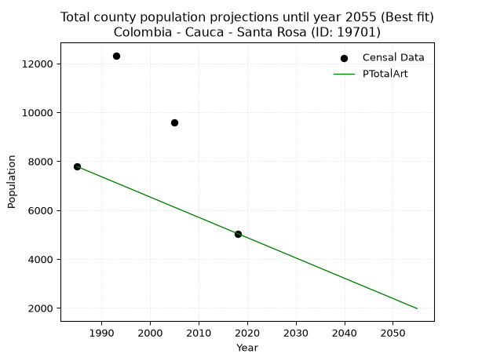
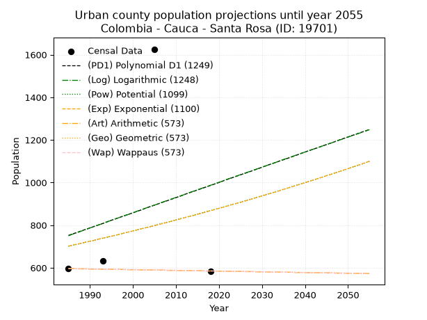
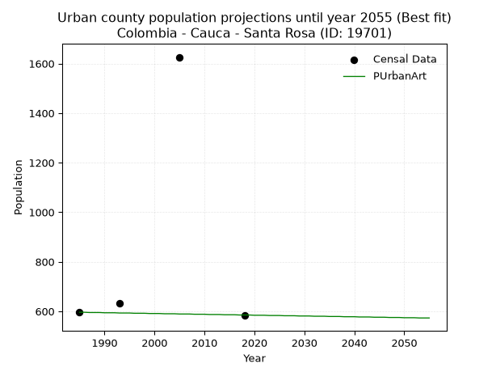
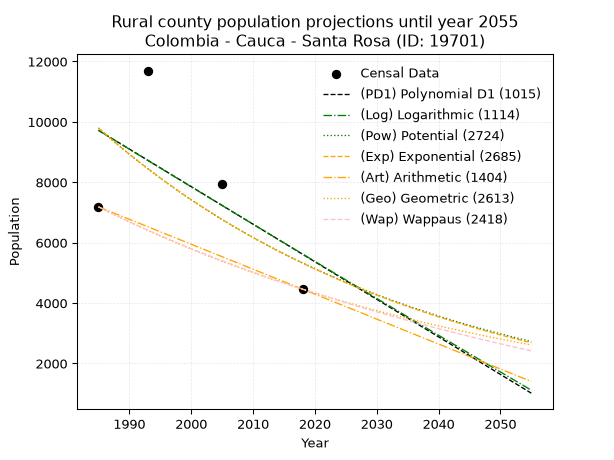
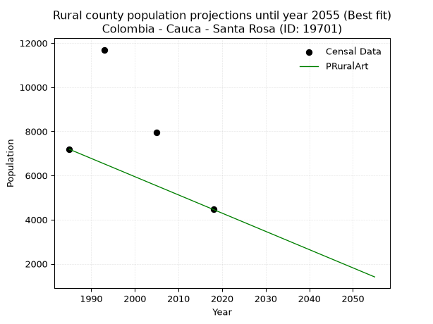

<div align="center">


</div>

# 📜 _“Population and Public Services Demand Projections (PPSD) until Year 2050 for Colombia - Cauca - Santa Rosa (ID: 19701)”_
Keywords: `population` `public-service` `projection` `lineal` `polynomial` `logarithmic` `potential` `exponential` `arithmetic` `geometric` `wappaus` `dane` `colombia` `south-america`

PPSD are analytical estimates used by governments and planners to anticipate future changes in population size, age distribution, and the resulting community needs for utilities, healthcare, education, and infrastructure as sizing future water treatment facilities, electrical grids, and road networks based on spatial growth.

<div align="center">

</img>

</div>


> **General running parameters**: • app_version: _v20260806_. • Python version: _3.14.7_. • Pandas version: _3.0.5_. • NumPy version: _2.5.1_. • Creates, save and include plots into reports (create_plot): _False_. • Projection until year: _2050_. • Process polynomial degree 2 and up: _False_. • Process Wappaus: _True_. • Process Wappaus: _True_. • Set negative values to zero: _True_. • Set infinite values to zero: _True_. • Drop dataset notes: _True_. 
<div align="center">

Maps & GIS Layers: [:earth_americas:Google](http://maps.google.com/maps?q=1.700916215,-76.573252) [:earth_americas:OSM](https://www.openstreetmap.org/#map=18/1.700916215/-76.573252&layers=P) [:earth_americas:Bing](https://www.bing.com/maps?cp=1.700916215~-76.573252&lvl=18) [:earth_americas:Apple](https://maps.apple.com/frame?center=1.700916215%2C-76.573252&span=0.003%2C0.006) [:earth_americas:GISMobile](https://github.com/rcfdtools/R.GISMobile/blob/main/file/gis/CountyLayer_CO/Readme.md)

</div>


<div align="center">

```geojson
{
  "type": "Feature",
  "geometry": {
    "type": "Point", 
    "coordinates": [-76.573252, 1.700916215]
  }, 
  "properties": {
    "Name": "Colombia - Cauca - Santa Rosa (ID: 19701)"
  }
}
```

</div>


## 0. Census Data (4 records)

Census data are official statistics collected by a government about the people and housing in a country. They usually include counts of total population, age, sex, race, income, education, and jobs.

📅Global census file: [Population.xlsx](../data/Population.xlsx)

| Source   |   Year |   CountryID | CountryName   |   StateID | StateName   |   CountyID | CountyName   |   PTotal |   PUrban |   PRural |
|:---------|-------:|------------:|:--------------|----------:|:------------|-----------:|:-------------|---------:|---------:|---------:|
| DANE     |   1985 |          57 | Colombia      |        19 | Cauca       |      19701 | Santa Rosa   |     7782 |      596 |     7186 |
| DANE     |   1993 |          57 | Colombia      |        19 | Cauca       |      19701 | Santa Rosa   |    12329 |      633 |    11696 |
| DANE     |   2005 |          57 | Colombia      |        19 | Cauca       |      19701 | Santa Rosa   |     9579 |     1626 |     7953 |
| DANE     |   2018 |          57 | Colombia      |        19 | Cauca       |      19701 | Santa Rosa   |     5045 |      585 |     4460 |

> 🔥Some records could had specific notes about the registered values or the corresponding urban or rural distribution.

📅[SUI-RUPS](https://www.datos.gov.co/Hacienda-y-Cr-dito-P-blico/Registro-nico-de-Prestadores-de-Servicios-P-blicos/4qkq-csdn/about_data) - Local public utility companies: [RUPS.csv](../data/RUPS.csv)

 | SERVICIO       | ESTADO    | NOMBRE                                                  | NIT         | DEPARTAMENTO_DOMICILIO   | MUNICIPIO_DOMICILIO   | DIRECCION                                  |   TELEFONO | EMAIL                   | TIPO_PRESTADOR                             | CLASIFICACION           |
|:---------------|:----------|:--------------------------------------------------------|:------------|:-------------------------|:----------------------|:-------------------------------------------|-----------:|:------------------------|:-------------------------------------------|:------------------------|
| ACUEDUCTO      | OPERATIVA | ACUEDUCTO ALCANTARILLADO Y ASEO DE SANTA ROSA S.A E.S.P | 900281917-8 | CAUCA                    | SANTA ROSA            | CABECERA MUNICIPAL FRENTE AL POLIDEPORTIVO |    8388213 | hdilsonruiz@hotmail.com | SOCIEDADES (EMPRESA DE SERVICIOS PUBLICOS) | HASTA 2500 SUSCRIPTORES |
| ALCANTARILLADO | OPERATIVA | ACUEDUCTO ALCANTARILLADO Y ASEO DE SANTA ROSA S.A E.S.P | 900281917-8 | CAUCA                    | SANTA ROSA            | CABECERA MUNICIPAL FRENTE AL POLIDEPORTIVO |    8388213 | hdilsonruiz@hotmail.com | SOCIEDADES (EMPRESA DE SERVICIOS PUBLICOS) | HASTA 2500 SUSCRIPTORES |

## 1. Total

### 1.1. Coefficients and Parameters

* (PD1) Polynomial Deg 1: -117.240867121635, 243194.79446005044 (lineal)
* (Log) Logarithmic: -233918.72125793097, 1786701.824788523
* (Pow) Potential: -32.18465826666657, 110.16054783719969
* (Exp) Exponential: -0.016125718064311175, 8.412434144387265e+17
* (Art) Arithmetic: Year diff. 2018 - 1985 = 33, Population diff. 5045 - 7782 = -2737, Annual growth = -82.93939393939394
* (Geo) Geometric: Year diff. 2018 - 1985 = 33, Population diff. 5045 - 7782 = -2737, Annual growth % = -0.013047937594843018
* (Wap) Wappaus: i = -1.2932001861603484, Condition values only valid for < 200)

<sub>
Wappaus condition values: ['-0.00', '-1.29', '-2.59', '-3.88', '-5.17', '-6.47', '-7.76', '-9.05', '-10.35', '-11.64', '-12.93', '-14.23', '-15.52', '-16.81', '-18.10', '-19.40', '-20.69', '-21.98', '-23.28', '-24.57', '-25.86', '-27.16', '-28.45', '-29.74', '-31.04', '-32.33', '-33.62', '-34.92', '-36.21', '-37.50', '-38.80', '-40.09', '-41.38', '-42.68', '-43.97', '-45.26', '-46.56', '-47.85', '-49.14', '-50.43', '-51.73', '-53.02', '-54.31', '-55.61', '-56.90', '-58.19', '-59.49', '-60.78', '-62.07', '-63.37', '-64.66', '-65.95', '-67.25', '-68.54', '-69.83', '-71.13', '-72.42', '-73.71', '-75.01', '-76.30', '-77.59', '-78.89', '-80.18', '-81.47', '-82.76', '-84.06']
</sub>


### 1.2. Projected Dataset

|   Year |   CountyID |   PTotalPD1 |   PTotalLog |   PTotalPow |   PTotalExp |   PTotalArt |   PTotalGeo |   PTotalWap |
|-------:|-----------:|------------:|------------:|------------:|------------:|------------:|------------:|------------:|
|   1985 |      19701 |       10472 |       10469 |       10550 |       10552 |        7782 |        7782 |        7782 |
|   1986 |      19701 |       10354 |       10352 |       10380 |       10384 |        7699 |        7680 |        7682 |
|   1987 |      19701 |       10237 |       10234 |       10214 |       10217 |        7616 |        7580 |        7583 |
|   1988 |      19701 |       10120 |       10116 |       10049 |       10054 |        7533 |        7481 |        7486 |
|   1989 |      19701 |       10003 |        9999 |        9888 |        9893 |        7450 |        7384 |        7390 |
|   1990 |      19701 |        9885 |        9881 |        9729 |        9735 |        7367 |        7287 |        7295 |
|   1991 |      19701 |        9768 |        9763 |        9573 |        9579 |        7284 |        7192 |        7201 |
|   1992 |      19701 |        9651 |        9646 |        9420 |        9426 |        7201 |        7098 |        7108 |
|   1993 |      19701 |        9534 |        9529 |        9269 |        9275 |        7118 |        7006 |        7017 |
|   1994 |      19701 |        9417 |        9411 |        9121 |        9127 |        7036 |        6914 |        6926 |
|   1995 |      19701 |        9299 |        9294 |        8975 |        8981 |        6953 |        6824 |        6837 |
|   1996 |      19701 |        9182 |        9177 |        8831 |        8837 |        6870 |        6735 |        6749 |
|   1997 |      19701 |        9065 |        9060 |        8690 |        8696 |        6787 |        6647 |        6661 |
|   1998 |      19701 |        8948 |        8942 |        8551 |        8557 |        6704 |        6561 |        6575 |
|   1999 |      19701 |        8830 |        8825 |        8414 |        8420 |        6621 |        6475 |        6490 |
|   2000 |      19701 |        8713 |        8708 |        8280 |        8285 |        6538 |        6390 |        6406 |
|   2001 |      19701 |        8596 |        8592 |        8148 |        8153 |        6455 |        6307 |        6323 |
|   2002 |      19701 |        8479 |        8475 |        8018 |        8022 |        6372 |        6225 |        6241 |
|   2003 |      19701 |        8361 |        8358 |        7890 |        7894 |        6289 |        6144 |        6159 |
|   2004 |      19701 |        8244 |        8241 |        7764 |        7768 |        6206 |        6063 |        6079 |
|   2005 |      19701 |        8127 |        8124 |        7641 |        7643 |        6123 |        5984 |        6000 |
|   2006 |      19701 |        8010 |        8008 |        7519 |        7521 |        6040 |        5906 |        5921 |
|   2007 |      19701 |        7892 |        7891 |        7399 |        7401 |        5957 |        5829 |        5844 |
|   2008 |      19701 |        7775 |        7775 |        7282 |        7282 |        5874 |        5753 |        5767 |
|   2009 |      19701 |        7658 |        7658 |        7166 |        7166 |        5791 |        5678 |        5691 |
|   2010 |      19701 |        7541 |        7542 |        7052 |        7051 |        5709 |        5604 |        5616 |
|   2011 |      19701 |        7423 |        7425 |        6940 |        6938 |        5626 |        5531 |        5542 |
|   2012 |      19701 |        7306 |        7309 |        6830 |        6827 |        5543 |        5459 |        5469 |
|   2013 |      19701 |        7189 |        7193 |        6721 |        6718 |        5460 |        5387 |        5396 |
|   2014 |      19701 |        7072 |        7077 |        6615 |        6611 |        5377 |        5317 |        5324 |
|   2015 |      19701 |        6954 |        6961 |        6510 |        6505 |        5294 |        5248 |        5253 |
|   2016 |      19701 |        6837 |        6845 |        6407 |        6401 |        5211 |        5179 |        5183 |
|   2017 |      19701 |        6720 |        6729 |        6305 |        6299 |        5128 |        5112 |        5114 |
|   2018 |      19701 |        6603 |        6613 |        6206 |        6198 |        5045 |        5045 |        5045 |
|   2019 |      19701 |        6485 |        6497 |        6108 |        6099 |        4962 |        4979 |        4977 |
|   2020 |      19701 |        6368 |        6381 |        6011 |        6001 |        4879 |        4914 |        4910 |
|   2021 |      19701 |        6251 |        6265 |        5916 |        5905 |        4796 |        4850 |        4843 |
|   2022 |      19701 |        6134 |        6149 |        5823 |        5811 |        4713 |        4787 |        4777 |
|   2023 |      19701 |        6017 |        6034 |        5731 |        5718 |        4630 |        4724 |        4712 |
|   2024 |      19701 |        5899 |        5918 |        5640 |        5626 |        4547 |        4663 |        4648 |
|   2025 |      19701 |        5782 |        5803 |        5551 |        5536 |        4464 |        4602 |        4584 |
|   2026 |      19701 |        5665 |        5687 |        5464 |        5448 |        4381 |        4542 |        4521 |
|   2027 |      19701 |        5548 |        5572 |        5378 |        5361 |        4299 |        4483 |        4458 |
|   2028 |      19701 |        5430 |        5456 |        5293 |        5275 |        4216 |        4424 |        4396 |
|   2029 |      19701 |        5313 |        5341 |        5210 |        5190 |        4133 |        4366 |        4335 |
|   2030 |      19701 |        5196 |        5226 |        5128 |        5107 |        4050 |        4309 |        4274 |
|   2031 |      19701 |        5079 |        5111 |        5047 |        5026 |        3967 |        4253 |        4214 |
|   2032 |      19701 |        4961 |        4995 |        4968 |        4945 |        3884 |        4198 |        4154 |
|   2033 |      19701 |        4844 |        4880 |        4890 |        4866 |        3801 |        4143 |        4096 |
|   2034 |      19701 |        4727 |        4765 |        4813 |        4788 |        3718 |        4089 |        4037 |
|   2035 |      19701 |        4610 |        4650 |        4737 |        4712 |        3635 |        4035 |        3980 |
|   2036 |      19701 |        4492 |        4535 |        4663 |        4636 |        3552 |        3983 |        3922 |
|   2037 |      19701 |        4375 |        4420 |        4590 |        4562 |        3469 |        3931 |        3866 |
|   2038 |      19701 |        4258 |        4306 |        4518 |        4489 |        3386 |        3880 |        3810 |
|   2039 |      19701 |        4141 |        4191 |        4447 |        4417 |        3303 |        3829 |        3754 |
|   2040 |      19701 |        4023 |        4076 |        4378 |        4347 |        3220 |        3779 |        3699 |
|   2041 |      19701 |        3906 |        3962 |        4309 |        4277 |        3137 |        3730 |        3645 |
|   2042 |      19701 |        3789 |        3847 |        4242 |        4209 |        3054 |        3681 |        3591 |
|   2043 |      19701 |        3672 |        3732 |        4175 |        4142 |        2972 |        3633 |        3537 |
|   2044 |      19701 |        3554 |        3618 |        4110 |        4075 |        2889 |        3586 |        3484 |
|   2045 |      19701 |        3437 |        3504 |        4046 |        4010 |        2806 |        3539 |        3432 |
|   2046 |      19701 |        3320 |        3389 |        3983 |        3946 |        2723 |        3493 |        3380 |
|   2047 |      19701 |        3203 |        3275 |        3921 |        3883 |        2640 |        3447 |        3328 |
|   2048 |      19701 |        3085 |        3161 |        3859 |        3821 |        2557 |        3402 |        3277 |
|   2049 |      19701 |        2968 |        3047 |        3799 |        3760 |        2474 |        3358 |        3226 |
|   2050 |      19701 |        2851 |        2932 |        3740 |        3699 |        2391 |        3314 |        3176 |
<div align="center">

</img>

</div>


### 1.3. Best fit with absolute and relative error (%)

Relative error puts that difference into context by dividing the absolute error by the true value, creating a unitless ratio or percentage that shows the scale of the mistake.

Absolute and relative error

|   Year | Source   |   CountryID | CountryName   |   StateID | StateName   |   CountyID_x | CountyName   |   PTotal |   PUrban |   PRural |   CountyID_y |   PTotalPD1 |   PTotalLog |   PTotalPow |   PTotalExp |   PTotalArt |   PTotalGeo |   PTotalWap |   PTotalPD1AbsError |   PTotalLogAbsError |   PTotalPowAbsError |   PTotalExpAbsError |   PTotalArtAbsError |   PTotalGeoAbsError |   PTotalWapAbsError |   PTotalPD1RelError |   PTotalLogRelError |   PTotalPowRelError |   PTotalExpRelError |   PTotalArtRelError |   PTotalGeoRelError |   PTotalWapRelError |
|-------:|:---------|------------:|:--------------|----------:|:------------|-------------:|:-------------|---------:|---------:|---------:|-------------:|------------:|------------:|------------:|------------:|------------:|------------:|------------:|--------------------:|--------------------:|--------------------:|--------------------:|--------------------:|--------------------:|--------------------:|--------------------:|--------------------:|--------------------:|--------------------:|--------------------:|--------------------:|--------------------:|
|   1985 | DANE     |          57 | Colombia      |        19 | Cauca       |        19701 | Santa Rosa   |     7782 |      596 |     7186 |        19701 |       10472 |       10469 |       10550 |       10552 |        7782 |        7782 |        7782 |                2690 |                2687 |                2768 |                2770 |                   0 |                   0 |                   0 |             34.5669 |             34.5284 |             35.5693 |             35.595  |              0      |              0      |              0      |
|   1993 | DANE     |          57 | Colombia      |        19 | Cauca       |        19701 | Santa Rosa   |    12329 |      633 |    11696 |        19701 |        9534 |        9529 |        9269 |        9275 |        7118 |        7006 |        7017 |                2795 |                2800 |                3060 |                3054 |                5211 |                5323 |                5312 |             22.6701 |             22.7107 |             24.8195 |             24.7709 |             42.2662 |             43.1746 |             43.0854 |
|   2005 | DANE     |          57 | Colombia      |        19 | Cauca       |        19701 | Santa Rosa   |     9579 |     1626 |     7953 |        19701 |        8127 |        8124 |        7641 |        7643 |        6123 |        5984 |        6000 |                1452 |                1455 |                1938 |                1936 |                3456 |                3595 |                3579 |             15.1582 |             15.1895 |             20.2318 |             20.2109 |             36.0789 |             37.53   |             37.363  |
|   2018 | DANE     |          57 | Colombia      |        19 | Cauca       |        19701 | Santa Rosa   |     5045 |      585 |     4460 |        19701 |        6603 |        6613 |        6206 |        6198 |        5045 |        5045 |        5045 |                1558 |                1568 |                1161 |                1153 |                   0 |                   0 |                   0 |             30.8821 |             31.0803 |             23.0129 |             22.8543 |              0      |              0      |              0      |

Relative error mean

| Method    |   RelError | Best   |
|:----------|-----------:|:-------|
| PTotalPD1 |    25.8193 |        |
| PTotalLog |    25.8772 |        |
| PTotalPow |    25.9084 |        |
| PTotalExp |    25.8578 |        |
| PTotalArt |    19.5863 | True   |
| PTotalGeo |    20.1762 |        |
| PTotalWap |    20.1121 |        |

💙Best method: _**PTotalArt**_
<div align="center">

</img>

</div>


### 1.4. Fresh water supply demand in liters per capita per day (lpcd)

The fresh water supply demand typically ranges from 100 to 300 liters per capita per day (lpcd) for standard domestic and municipal planning, though absolute survival minimums set by the World Health Organization are as low as 7.5 to 20 liters per day, and total consumption in high-income nations can exceed 400 liters.

> `CZ`: Level in meters above the sea level (masl)<br> `WS`: Fresh water supply demand in liters per capita per day (lpcd or l/h/d)<br> `WSAll`: Zonal fresh water supply demand in liters per second (l/s)<br> `A`: Zonal area in square meters<br> `DP`: Population density (people/hectare or p/ha)

Reference values (RAS Colombia)

|    CZ |   WS |
|------:|-----:|
|  1000 |  120 |
|  2000 |  130 |
| 99999 |  140 |

County shapefile geometry properties and water supply values

|   CountyID |      ATotal |   CZTotal |   WSTotal |
|-----------:|------------:|----------:|----------:|
|      19701 | 3.62076e+09 |   2070.46 |       140 |

Projected values for best method: PTotalArt

|   CountyID |   Year |   PTotalArt |   DPTotal |   WSTotal |   WSTotalAll |
|-----------:|-------:|------------:|----------:|----------:|-------------:|
|      19701 |   1985 |        7782 |      0.02 |       140 |     12.6097  |
|      19701 |   1986 |        7699 |      0.02 |       140 |     12.4752  |
|      19701 |   1987 |        7616 |      0.02 |       140 |     12.3407  |
|      19701 |   1988 |        7533 |      0.02 |       140 |     12.2063  |
|      19701 |   1989 |        7450 |      0.02 |       140 |     12.0718  |
|      19701 |   1990 |        7367 |      0.02 |       140 |     11.9373  |
|      19701 |   1991 |        7284 |      0.02 |       140 |     11.8028  |
|      19701 |   1992 |        7201 |      0.02 |       140 |     11.6683  |
|      19701 |   1993 |        7118 |      0.02 |       140 |     11.5338  |
|      19701 |   1994 |        7036 |      0.02 |       140 |     11.4009  |
|      19701 |   1995 |        6953 |      0.02 |       140 |     11.2664  |
|      19701 |   1996 |        6870 |      0.02 |       140 |     11.1319  |
|      19701 |   1997 |        6787 |      0.02 |       140 |     10.9975  |
|      19701 |   1998 |        6704 |      0.02 |       140 |     10.863   |
|      19701 |   1999 |        6621 |      0.02 |       140 |     10.7285  |
|      19701 |   2000 |        6538 |      0.02 |       140 |     10.594   |
|      19701 |   2001 |        6455 |      0.02 |       140 |     10.4595  |
|      19701 |   2002 |        6372 |      0.02 |       140 |     10.325   |
|      19701 |   2003 |        6289 |      0.02 |       140 |     10.1905  |
|      19701 |   2004 |        6206 |      0.02 |       140 |     10.056   |
|      19701 |   2005 |        6123 |      0.02 |       140 |      9.92153 |
|      19701 |   2006 |        6040 |      0.02 |       140 |      9.78704 |
|      19701 |   2007 |        5957 |      0.02 |       140 |      9.65255 |
|      19701 |   2008 |        5874 |      0.02 |       140 |      9.51806 |
|      19701 |   2009 |        5791 |      0.02 |       140 |      9.38356 |
|      19701 |   2010 |        5709 |      0.02 |       140 |      9.25069 |
|      19701 |   2011 |        5626 |      0.02 |       140 |      9.1162  |
|      19701 |   2012 |        5543 |      0.02 |       140 |      8.98171 |
|      19701 |   2013 |        5460 |      0.02 |       140 |      8.84722 |
|      19701 |   2014 |        5377 |      0.01 |       140 |      8.71273 |
|      19701 |   2015 |        5294 |      0.01 |       140 |      8.57824 |
|      19701 |   2016 |        5211 |      0.01 |       140 |      8.44375 |
|      19701 |   2017 |        5128 |      0.01 |       140 |      8.30926 |
|      19701 |   2018 |        5045 |      0.01 |       140 |      8.17477 |
|      19701 |   2019 |        4962 |      0.01 |       140 |      8.04028 |
|      19701 |   2020 |        4879 |      0.01 |       140 |      7.90579 |
|      19701 |   2021 |        4796 |      0.01 |       140 |      7.7713  |
|      19701 |   2022 |        4713 |      0.01 |       140 |      7.63681 |
|      19701 |   2023 |        4630 |      0.01 |       140 |      7.50231 |
|      19701 |   2024 |        4547 |      0.01 |       140 |      7.36782 |
|      19701 |   2025 |        4464 |      0.01 |       140 |      7.23333 |
|      19701 |   2026 |        4381 |      0.01 |       140 |      7.09884 |
|      19701 |   2027 |        4299 |      0.01 |       140 |      6.96597 |
|      19701 |   2028 |        4216 |      0.01 |       140 |      6.83148 |
|      19701 |   2029 |        4133 |      0.01 |       140 |      6.69699 |
|      19701 |   2030 |        4050 |      0.01 |       140 |      6.5625  |
|      19701 |   2031 |        3967 |      0.01 |       140 |      6.42801 |
|      19701 |   2032 |        3884 |      0.01 |       140 |      6.29352 |
|      19701 |   2033 |        3801 |      0.01 |       140 |      6.15903 |
|      19701 |   2034 |        3718 |      0.01 |       140 |      6.02454 |
|      19701 |   2035 |        3635 |      0.01 |       140 |      5.89005 |
|      19701 |   2036 |        3552 |      0.01 |       140 |      5.75556 |
|      19701 |   2037 |        3469 |      0.01 |       140 |      5.62106 |
|      19701 |   2038 |        3386 |      0.01 |       140 |      5.48657 |
|      19701 |   2039 |        3303 |      0.01 |       140 |      5.35208 |
|      19701 |   2040 |        3220 |      0.01 |       140 |      5.21759 |
|      19701 |   2041 |        3137 |      0.01 |       140 |      5.0831  |
|      19701 |   2042 |        3054 |      0.01 |       140 |      4.94861 |
|      19701 |   2043 |        2972 |      0.01 |       140 |      4.81574 |
|      19701 |   2044 |        2889 |      0.01 |       140 |      4.68125 |
|      19701 |   2045 |        2806 |      0.01 |       140 |      4.54676 |
|      19701 |   2046 |        2723 |      0.01 |       140 |      4.41227 |
|      19701 |   2047 |        2640 |      0.01 |       140 |      4.27778 |
|      19701 |   2048 |        2557 |      0.01 |       140 |      4.14329 |
|      19701 |   2049 |        2474 |      0.01 |       140 |      4.0088  |
|      19701 |   2050 |        2391 |      0.01 |       140 |      3.87431 |

## 2. Urban

### 2.1. Coefficients and Parameters

* (PD1) Polynomial Deg 1: 7.112003211562208, -13365.784423927307 (lineal)
* (Log) Logarithmic: 14359.975581271772, -108290.28946686913
* (Pow) Potential: 12.980059075419737, -39.95942778455724
* (Exp) Exponential: 0.006423045255858325, 0.002037267221702081
* (Art) Arithmetic: Year diff. 2018 - 1985 = 33, Population diff. 585 - 596 = -11, Annual growth = -0.3333333333333333
* (Geo) Geometric: Year diff. 2018 - 1985 = 33, Population diff. 585 - 596 = -11, Annual growth % = -0.0005643503863058674
* (Wap) Wappaus: i = -0.056449336720293536, Condition values only valid for < 200)

<sub>
Wappaus condition values: ['-0.00', '-0.06', '-0.11', '-0.17', '-0.23', '-0.28', '-0.34', '-0.40', '-0.45', '-0.51', '-0.56', '-0.62', '-0.68', '-0.73', '-0.79', '-0.85', '-0.90', '-0.96', '-1.02', '-1.07', '-1.13', '-1.19', '-1.24', '-1.30', '-1.35', '-1.41', '-1.47', '-1.52', '-1.58', '-1.64', '-1.69', '-1.75', '-1.81', '-1.86', '-1.92', '-1.98', '-2.03', '-2.09', '-2.15', '-2.20', '-2.26', '-2.31', '-2.37', '-2.43', '-2.48', '-2.54', '-2.60', '-2.65', '-2.71', '-2.77', '-2.82', '-2.88', '-2.94', '-2.99', '-3.05', '-3.10', '-3.16', '-3.22', '-3.27', '-3.33', '-3.39', '-3.44', '-3.50', '-3.56', '-3.61', '-3.67']
</sub>


### 2.2. Projected Dataset

|   Year |   CountyID |   PUrbanPD1 |   PUrbanLog |   PUrbanPow |   PUrbanExp |   PUrbanArt |   PUrbanGeo |   PUrbanWap |
|-------:|-----------:|------------:|------------:|------------:|------------:|------------:|------------:|------------:|
|   1985 |      19701 |         752 |         750 |         701 |         702 |         596 |         596 |         596 |
|   1986 |      19701 |         759 |         758 |         706 |         706 |         596 |         596 |         596 |
|   1987 |      19701 |         766 |         765 |         710 |         711 |         595 |         595 |         595 |
|   1988 |      19701 |         773 |         772 |         715 |         715 |         595 |         595 |         595 |
|   1989 |      19701 |         780 |         779 |         720 |         720 |         595 |         595 |         595 |
|   1990 |      19701 |         787 |         787 |         724 |         725 |         594 |         594 |         594 |
|   1991 |      19701 |         794 |         794 |         729 |         729 |         594 |         594 |         594 |
|   1992 |      19701 |         801 |         801 |         734 |         734 |         594 |         594 |         594 |
|   1993 |      19701 |         808 |         808 |         739 |         739 |         593 |         593 |         593 |
|   1994 |      19701 |         816 |         815 |         743 |         744 |         593 |         593 |         593 |
|   1995 |      19701 |         823 |         823 |         748 |         748 |         593 |         593 |         593 |
|   1996 |      19701 |         830 |         830 |         753 |         753 |         592 |         592 |         592 |
|   1997 |      19701 |         837 |         837 |         758 |         758 |         592 |         592 |         592 |
|   1998 |      19701 |         844 |         844 |         763 |         763 |         592 |         592 |         592 |
|   1999 |      19701 |         851 |         851 |         768 |         768 |         591 |         591 |         591 |
|   2000 |      19701 |         858 |         858 |         773 |         773 |         591 |         591 |         591 |
|   2001 |      19701 |         865 |         866 |         778 |         778 |         591 |         591 |         591 |
|   2002 |      19701 |         872 |         873 |         783 |         783 |         590 |         590 |         590 |
|   2003 |      19701 |         880 |         880 |         788 |         788 |         590 |         590 |         590 |
|   2004 |      19701 |         887 |         887 |         793 |         793 |         590 |         590 |         590 |
|   2005 |      19701 |         894 |         894 |         798 |         798 |         589 |         589 |         589 |
|   2006 |      19701 |         901 |         901 |         804 |         803 |         589 |         589 |         589 |
|   2007 |      19701 |         908 |         909 |         809 |         808 |         589 |         589 |         589 |
|   2008 |      19701 |         915 |         916 |         814 |         813 |         588 |         588 |         588 |
|   2009 |      19701 |         922 |         923 |         819 |         819 |         588 |         588 |         588 |
|   2010 |      19701 |         929 |         930 |         825 |         824 |         588 |         588 |         588 |
|   2011 |      19701 |         936 |         937 |         830 |         829 |         587 |         587 |         587 |
|   2012 |      19701 |         944 |         944 |         835 |         835 |         587 |         587 |         587 |
|   2013 |      19701 |         951 |         952 |         841 |         840 |         587 |         587 |         587 |
|   2014 |      19701 |         958 |         959 |         846 |         845 |         586 |         586 |         586 |
|   2015 |      19701 |         965 |         966 |         852 |         851 |         586 |         586 |         586 |
|   2016 |      19701 |         972 |         973 |         857 |         856 |         586 |         586 |         586 |
|   2017 |      19701 |         979 |         980 |         863 |         862 |         585 |         585 |         585 |
|   2018 |      19701 |         986 |         987 |         868 |         867 |         585 |         585 |         585 |
|   2019 |      19701 |         993 |         994 |         874 |         873 |         585 |         585 |         585 |
|   2020 |      19701 |        1000 |        1001 |         879 |         879 |         584 |         584 |         584 |
|   2021 |      19701 |        1008 |        1008 |         885 |         884 |         584 |         584 |         584 |
|   2022 |      19701 |        1015 |        1016 |         891 |         890 |         584 |         584 |         584 |
|   2023 |      19701 |        1022 |        1023 |         897 |         896 |         583 |         583 |         583 |
|   2024 |      19701 |        1029 |        1030 |         902 |         902 |         583 |         583 |         583 |
|   2025 |      19701 |        1036 |        1037 |         908 |         907 |         583 |         583 |         583 |
|   2026 |      19701 |        1043 |        1044 |         914 |         913 |         582 |         582 |         582 |
|   2027 |      19701 |        1050 |        1051 |         920 |         919 |         582 |         582 |         582 |
|   2028 |      19701 |        1057 |        1058 |         926 |         925 |         582 |         582 |         582 |
|   2029 |      19701 |        1064 |        1065 |         932 |         931 |         581 |         581 |         581 |
|   2030 |      19701 |        1072 |        1072 |         938 |         937 |         581 |         581 |         581 |
|   2031 |      19701 |        1079 |        1079 |         944 |         943 |         581 |         581 |         581 |
|   2032 |      19701 |        1086 |        1086 |         950 |         949 |         580 |         580 |         580 |
|   2033 |      19701 |        1093 |        1093 |         956 |         955 |         580 |         580 |         580 |
|   2034 |      19701 |        1100 |        1101 |         962 |         961 |         580 |         580 |         580 |
|   2035 |      19701 |        1107 |        1108 |         968 |         968 |         579 |         579 |         579 |
|   2036 |      19701 |        1114 |        1115 |         974 |         974 |         579 |         579 |         579 |
|   2037 |      19701 |        1121 |        1122 |         981 |         980 |         579 |         579 |         579 |
|   2038 |      19701 |        1128 |        1129 |         987 |         986 |         578 |         578 |         578 |
|   2039 |      19701 |        1136 |        1136 |         993 |         993 |         578 |         578 |         578 |
|   2040 |      19701 |        1143 |        1143 |         999 |         999 |         578 |         578 |         578 |
|   2041 |      19701 |        1150 |        1150 |        1006 |        1006 |         577 |         577 |         577 |
|   2042 |      19701 |        1157 |        1157 |        1012 |        1012 |         577 |         577 |         577 |
|   2043 |      19701 |        1164 |        1164 |        1019 |        1019 |         577 |         577 |         577 |
|   2044 |      19701 |        1171 |        1171 |        1025 |        1025 |         576 |         576 |         576 |
|   2045 |      19701 |        1178 |        1178 |        1032 |        1032 |         576 |         576 |         576 |
|   2046 |      19701 |        1185 |        1185 |        1038 |        1038 |         576 |         576 |         576 |
|   2047 |      19701 |        1192 |        1192 |        1045 |        1045 |         575 |         576 |         575 |
|   2048 |      19701 |        1200 |        1199 |        1052 |        1052 |         575 |         575 |         575 |
|   2049 |      19701 |        1207 |        1206 |        1058 |        1059 |         575 |         575 |         575 |
|   2050 |      19701 |        1214 |        1213 |        1065 |        1065 |         574 |         575 |         575 |
<div align="center">

</img>

</div>


### 2.3. Best fit with absolute and relative error (%)

Relative error puts that difference into context by dividing the absolute error by the true value, creating a unitless ratio or percentage that shows the scale of the mistake.

Absolute and relative error

|   Year | Source   |   CountryID | CountryName   |   StateID | StateName   |   CountyID_x | CountyName   |   PTotal |   PUrban |   PRural |   CountyID_y |   PUrbanPD1 |   PUrbanLog |   PUrbanPow |   PUrbanExp |   PUrbanArt |   PUrbanGeo |   PUrbanWap |   PUrbanPD1AbsError |   PUrbanLogAbsError |   PUrbanPowAbsError |   PUrbanExpAbsError |   PUrbanArtAbsError |   PUrbanGeoAbsError |   PUrbanWapAbsError |   PUrbanPD1RelError |   PUrbanLogRelError |   PUrbanPowRelError |   PUrbanExpRelError |   PUrbanArtRelError |   PUrbanGeoRelError |   PUrbanWapRelError |
|-------:|:---------|------------:|:--------------|----------:|:------------|-------------:|:-------------|---------:|---------:|---------:|-------------:|------------:|------------:|------------:|------------:|------------:|------------:|------------:|--------------------:|--------------------:|--------------------:|--------------------:|--------------------:|--------------------:|--------------------:|--------------------:|--------------------:|--------------------:|--------------------:|--------------------:|--------------------:|--------------------:|
|   1985 | DANE     |          57 | Colombia      |        19 | Cauca       |        19701 | Santa Rosa   |     7782 |      596 |     7186 |        19701 |         752 |         750 |         701 |         702 |         596 |         596 |         596 |                 156 |                 154 |                 105 |                 106 |                   0 |                   0 |                   0 |             26.1745 |             25.8389 |             17.6174 |             17.7852 |             0       |             0       |             0       |
|   1993 | DANE     |          57 | Colombia      |        19 | Cauca       |        19701 | Santa Rosa   |    12329 |      633 |    11696 |        19701 |         808 |         808 |         739 |         739 |         593 |         593 |         593 |                 175 |                 175 |                 106 |                 106 |                  40 |                  40 |                  40 |             27.6461 |             27.6461 |             16.7457 |             16.7457 |             6.31912 |             6.31912 |             6.31912 |
|   2005 | DANE     |          57 | Colombia      |        19 | Cauca       |        19701 | Santa Rosa   |     9579 |     1626 |     7953 |        19701 |         894 |         894 |         798 |         798 |         589 |         589 |         589 |                 732 |                 732 |                 828 |                 828 |                1037 |                1037 |                1037 |             45.0185 |             45.0185 |             50.9225 |             50.9225 |            63.7761  |            63.7761  |            63.7761  |
|   2018 | DANE     |          57 | Colombia      |        19 | Cauca       |        19701 | Santa Rosa   |     5045 |      585 |     4460 |        19701 |         986 |         987 |         868 |         867 |         585 |         585 |         585 |                 401 |                 402 |                 283 |                 282 |                   0 |                   0 |                   0 |             68.547  |             68.7179 |             48.3761 |             48.2051 |             0       |             0       |             0       |

Relative error mean

| Method    |   RelError | Best   |
|:----------|-----------:|:-------|
| PUrbanPD1 |    41.8465 |        |
| PUrbanLog |    41.8054 |        |
| PUrbanPow |    33.4154 |        |
| PUrbanExp |    33.4146 |        |
| PUrbanArt |    17.5238 | True   |
| PUrbanGeo |    17.5238 | True   |
| PUrbanWap |    17.5238 | True   |

💙Best method: _**PUrbanArt**_
<div align="center">

</img>

</div>


### 2.4. Fresh water supply demand in liters per capita per day (lpcd)

The fresh water supply demand typically ranges from 100 to 300 liters per capita per day (lpcd) for standard domestic and municipal planning, though absolute survival minimums set by the World Health Organization are as low as 7.5 to 20 liters per day, and total consumption in high-income nations can exceed 400 liters.

> `CZ`: Level in meters above the sea level (masl)<br> `WS`: Fresh water supply demand in liters per capita per day (lpcd or l/h/d)<br> `WSAll`: Zonal fresh water supply demand in liters per second (l/s)<br> `A`: Zonal area in square meters<br> `DP`: Population density (people/hectare or p/ha)

Reference values (RAS Colombia)

|    CZ |   WS |
|------:|-----:|
|  1000 |  120 |
|  2000 |  130 |
| 99999 |  140 |

County shapefile geometry properties and water supply values

|   CountyID |   AUrban |   CZUrban |   WSUrban |
|-----------:|---------:|----------:|----------:|
|      19701 |   373333 |    1706.6 |       130 |

Projected values for best method: PUrbanArt

|   CountyID |   Year |   PUrbanArt |   DPUrban |   WSUrban |   WSUrbanAll |
|-----------:|-------:|------------:|----------:|----------:|-------------:|
|      19701 |   1985 |         596 |     15.96 |       130 |     0.896759 |
|      19701 |   1986 |         596 |     15.96 |       130 |     0.896759 |
|      19701 |   1987 |         595 |     15.94 |       130 |     0.895255 |
|      19701 |   1988 |         595 |     15.94 |       130 |     0.895255 |
|      19701 |   1989 |         595 |     15.94 |       130 |     0.895255 |
|      19701 |   1990 |         594 |     15.91 |       130 |     0.89375  |
|      19701 |   1991 |         594 |     15.91 |       130 |     0.89375  |
|      19701 |   1992 |         594 |     15.91 |       130 |     0.89375  |
|      19701 |   1993 |         593 |     15.88 |       130 |     0.892245 |
|      19701 |   1994 |         593 |     15.88 |       130 |     0.892245 |
|      19701 |   1995 |         593 |     15.88 |       130 |     0.892245 |
|      19701 |   1996 |         592 |     15.86 |       130 |     0.890741 |
|      19701 |   1997 |         592 |     15.86 |       130 |     0.890741 |
|      19701 |   1998 |         592 |     15.86 |       130 |     0.890741 |
|      19701 |   1999 |         591 |     15.83 |       130 |     0.889236 |
|      19701 |   2000 |         591 |     15.83 |       130 |     0.889236 |
|      19701 |   2001 |         591 |     15.83 |       130 |     0.889236 |
|      19701 |   2002 |         590 |     15.8  |       130 |     0.887731 |
|      19701 |   2003 |         590 |     15.8  |       130 |     0.887731 |
|      19701 |   2004 |         590 |     15.8  |       130 |     0.887731 |
|      19701 |   2005 |         589 |     15.78 |       130 |     0.886227 |
|      19701 |   2006 |         589 |     15.78 |       130 |     0.886227 |
|      19701 |   2007 |         589 |     15.78 |       130 |     0.886227 |
|      19701 |   2008 |         588 |     15.75 |       130 |     0.884722 |
|      19701 |   2009 |         588 |     15.75 |       130 |     0.884722 |
|      19701 |   2010 |         588 |     15.75 |       130 |     0.884722 |
|      19701 |   2011 |         587 |     15.72 |       130 |     0.883218 |
|      19701 |   2012 |         587 |     15.72 |       130 |     0.883218 |
|      19701 |   2013 |         587 |     15.72 |       130 |     0.883218 |
|      19701 |   2014 |         586 |     15.7  |       130 |     0.881713 |
|      19701 |   2015 |         586 |     15.7  |       130 |     0.881713 |
|      19701 |   2016 |         586 |     15.7  |       130 |     0.881713 |
|      19701 |   2017 |         585 |     15.67 |       130 |     0.880208 |
|      19701 |   2018 |         585 |     15.67 |       130 |     0.880208 |
|      19701 |   2019 |         585 |     15.67 |       130 |     0.880208 |
|      19701 |   2020 |         584 |     15.64 |       130 |     0.878704 |
|      19701 |   2021 |         584 |     15.64 |       130 |     0.878704 |
|      19701 |   2022 |         584 |     15.64 |       130 |     0.878704 |
|      19701 |   2023 |         583 |     15.62 |       130 |     0.877199 |
|      19701 |   2024 |         583 |     15.62 |       130 |     0.877199 |
|      19701 |   2025 |         583 |     15.62 |       130 |     0.877199 |
|      19701 |   2026 |         582 |     15.59 |       130 |     0.875694 |
|      19701 |   2027 |         582 |     15.59 |       130 |     0.875694 |
|      19701 |   2028 |         582 |     15.59 |       130 |     0.875694 |
|      19701 |   2029 |         581 |     15.56 |       130 |     0.87419  |
|      19701 |   2030 |         581 |     15.56 |       130 |     0.87419  |
|      19701 |   2031 |         581 |     15.56 |       130 |     0.87419  |
|      19701 |   2032 |         580 |     15.54 |       130 |     0.872685 |
|      19701 |   2033 |         580 |     15.54 |       130 |     0.872685 |
|      19701 |   2034 |         580 |     15.54 |       130 |     0.872685 |
|      19701 |   2035 |         579 |     15.51 |       130 |     0.871181 |
|      19701 |   2036 |         579 |     15.51 |       130 |     0.871181 |
|      19701 |   2037 |         579 |     15.51 |       130 |     0.871181 |
|      19701 |   2038 |         578 |     15.48 |       130 |     0.869676 |
|      19701 |   2039 |         578 |     15.48 |       130 |     0.869676 |
|      19701 |   2040 |         578 |     15.48 |       130 |     0.869676 |
|      19701 |   2041 |         577 |     15.46 |       130 |     0.868171 |
|      19701 |   2042 |         577 |     15.46 |       130 |     0.868171 |
|      19701 |   2043 |         577 |     15.46 |       130 |     0.868171 |
|      19701 |   2044 |         576 |     15.43 |       130 |     0.866667 |
|      19701 |   2045 |         576 |     15.43 |       130 |     0.866667 |
|      19701 |   2046 |         576 |     15.43 |       130 |     0.866667 |
|      19701 |   2047 |         575 |     15.4  |       130 |     0.865162 |
|      19701 |   2048 |         575 |     15.4  |       130 |     0.865162 |
|      19701 |   2049 |         575 |     15.4  |       130 |     0.865162 |
|      19701 |   2050 |         574 |     15.38 |       130 |     0.863657 |

## 3. Rural

### 3.1. Coefficients and Parameters

* (PD1) Polynomial Deg 1: -124.35287033319715, 256560.57888397758 (lineal)
* (Log) Logarithmic: -248278.69683920286, 1894992.1142553932
* (Pow) Potential: -36.92940172313928, 125.77535331259608
* (Exp) Exponential: -0.018492725293291993, 8.57398118226177e+19
* (Art) Arithmetic: Year diff. 2018 - 1985 = 33, Population diff. 4460 - 7186 = -2726, Annual growth = -82.60606060606061
* (Geo) Geometric: Year diff. 2018 - 1985 = 33, Population diff. 4460 - 7186 = -2726, Annual growth % = -0.014350159575061028
* (Wap) Wappaus: i = -1.4186168745674155, Condition values only valid for < 200)

<sub>
Wappaus condition values: ['-0.00', '-1.42', '-2.84', '-4.26', '-5.67', '-7.09', '-8.51', '-9.93', '-11.35', '-12.77', '-14.19', '-15.60', '-17.02', '-18.44', '-19.86', '-21.28', '-22.70', '-24.12', '-25.54', '-26.95', '-28.37', '-29.79', '-31.21', '-32.63', '-34.05', '-35.47', '-36.88', '-38.30', '-39.72', '-41.14', '-42.56', '-43.98', '-45.40', '-46.81', '-48.23', '-49.65', '-51.07', '-52.49', '-53.91', '-55.33', '-56.74', '-58.16', '-59.58', '-61.00', '-62.42', '-63.84', '-65.26', '-66.67', '-68.09', '-69.51', '-70.93', '-72.35', '-73.77', '-75.19', '-76.61', '-78.02', '-79.44', '-80.86', '-82.28', '-83.70', '-85.12', '-86.54', '-87.95', '-89.37', '-90.79', '-92.21']
</sub>


### 3.2. Projected Dataset

|   Year |   CountyID |   PRuralPD1 |   PRuralLog |   PRuralPow |   PRuralExp |   PRuralArt |   PRuralGeo |   PRuralWap |
|-------:|-----------:|------------:|------------:|------------:|------------:|------------:|------------:|------------:|
|   1985 |      19701 |        9720 |        9719 |        9796 |        9797 |        7186 |        7186 |        7186 |
|   1986 |      19701 |        9596 |        9594 |        9615 |        9617 |        7103 |        7083 |        7085 |
|   1987 |      19701 |        9471 |        9469 |        9438 |        9441 |        7021 |        6981 |        6985 |
|   1988 |      19701 |        9347 |        9344 |        9264 |        9268 |        6938 |        6881 |        6887 |
|   1989 |      19701 |        9223 |        9219 |        9094 |        9098 |        6856 |        6782 |        6789 |
|   1990 |      19701 |        9098 |        9094 |        8927 |        8931 |        6773 |        6685 |        6694 |
|   1991 |      19701 |        8974 |        8970 |        8762 |        8768 |        6690 |        6589 |        6599 |
|   1992 |      19701 |        8850 |        8845 |        8601 |        8607 |        6608 |        6495 |        6506 |
|   1993 |      19701 |        8725 |        8720 |        8444 |        8449 |        6525 |        6401 |        6414 |
|   1994 |      19701 |        8601 |        8596 |        8289 |        8295 |        6443 |        6309 |        6324 |
|   1995 |      19701 |        8477 |        8471 |        8136 |        8143 |        6360 |        6219 |        6234 |
|   1996 |      19701 |        8352 |        8347 |        7987 |        7993 |        6277 |        6130 |        6146 |
|   1997 |      19701 |        8228 |        8223 |        7841 |        7847 |        6195 |        6042 |        6059 |
|   1998 |      19701 |        8104 |        8098 |        7697 |        7703 |        6112 |        5955 |        5973 |
|   1999 |      19701 |        7979 |        7974 |        7556 |        7562 |        6030 |        5870 |        5888 |
|   2000 |      19701 |        7855 |        7850 |        7418 |        7423 |        5947 |        5785 |        5804 |
|   2001 |      19701 |        7730 |        7726 |        7282 |        7287 |        5864 |        5702 |        5721 |
|   2002 |      19701 |        7606 |        7602 |        7149 |        7154 |        5782 |        5620 |        5639 |
|   2003 |      19701 |        7482 |        7478 |        7019 |        7023 |        5699 |        5540 |        5559 |
|   2004 |      19701 |        7357 |        7354 |        6890 |        6894 |        5616 |        5460 |        5479 |
|   2005 |      19701 |        7233 |        7230 |        6765 |        6768 |        5534 |        5382 |        5400 |
|   2006 |      19701 |        7109 |        7106 |        6641 |        6644 |        5451 |        5305 |        5323 |
|   2007 |      19701 |        6984 |        6982 |        6520 |        6522 |        5369 |        5229 |        5246 |
|   2008 |      19701 |        6860 |        6859 |        6401 |        6403 |        5286 |        5154 |        5170 |
|   2009 |      19701 |        6736 |        6735 |        6285 |        6285 |        5203 |        5080 |        5095 |
|   2010 |      19701 |        6611 |        6612 |        6170 |        6170 |        5121 |        5007 |        5021 |
|   2011 |      19701 |        6487 |        6488 |        6058 |        6057 |        5038 |        4935 |        4948 |
|   2012 |      19701 |        6363 |        6365 |        5948 |        5946 |        4956 |        4864 |        4876 |
|   2013 |      19701 |        6238 |        6241 |        5840 |        5837 |        4873 |        4794 |        4805 |
|   2014 |      19701 |        6114 |        6118 |        5733 |        5730 |        4790 |        4725 |        4734 |
|   2015 |      19701 |        5990 |        5995 |        5629 |        5625 |        4708 |        4658 |        4664 |
|   2016 |      19701 |        5865 |        5872 |        5527 |        5522 |        4625 |        4591 |        4595 |
|   2017 |      19701 |        5741 |        5749 |        5427 |        5421 |        4543 |        4525 |        4527 |
|   2018 |      19701 |        5616 |        5625 |        5328 |        5322 |        4460 |        4460 |        4460 |
|   2019 |      19701 |        5492 |        5502 |        5232 |        5224 |        4377 |        4396 |        4393 |
|   2020 |      19701 |        5368 |        5380 |        5137 |        5128 |        4295 |        4333 |        4328 |
|   2021 |      19701 |        5243 |        5257 |        5044 |        5034 |        4212 |        4271 |        4263 |
|   2022 |      19701 |        5119 |        5134 |        4953 |        4942 |        4130 |        4209 |        4198 |
|   2023 |      19701 |        4995 |        5011 |        4863 |        4852 |        4047 |        4149 |        4135 |
|   2024 |      19701 |        4870 |        4888 |        4775 |        4763 |        3964 |        4090 |        4072 |
|   2025 |      19701 |        4746 |        4766 |        4689 |        4675 |        3882 |        4031 |        4010 |
|   2026 |      19701 |        4622 |        4643 |        4604 |        4590 |        3799 |        3973 |        3948 |
|   2027 |      19701 |        4497 |        4521 |        4521 |        4506 |        3717 |        3916 |        3887 |
|   2028 |      19701 |        4373 |        4398 |        4439 |        4423 |        3634 |        3860 |        3827 |
|   2029 |      19701 |        4249 |        4276 |        4359 |        4342 |        3551 |        3804 |        3767 |
|   2030 |      19701 |        4124 |        4153 |        4281 |        4263 |        3469 |        3750 |        3709 |
|   2031 |      19701 |        4000 |        4031 |        4203 |        4184 |        3386 |        3696 |        3650 |
|   2032 |      19701 |        3876 |        3909 |        4128 |        4108 |        3304 |        3643 |        3593 |
|   2033 |      19701 |        3751 |        3787 |        4053 |        4032 |        3221 |        3591 |        3536 |
|   2034 |      19701 |        3627 |        3665 |        3980 |        3959 |        3138 |        3539 |        3479 |
|   2035 |      19701 |        3502 |        3543 |        3909 |        3886 |        3056 |        3488 |        3423 |
|   2036 |      19701 |        3378 |        3421 |        3839 |        3815 |        2973 |        3438 |        3368 |
|   2037 |      19701 |        3254 |        3299 |        3770 |        3745 |        2890 |        3389 |        3313 |
|   2038 |      19701 |        3129 |        3177 |        3702 |        3676 |        2808 |        3340 |        3259 |
|   2039 |      19701 |        3005 |        3055 |        3635 |        3609 |        2725 |        3292 |        3206 |
|   2040 |      19701 |        2881 |        2933 |        3570 |        3543 |        2643 |        3245 |        3153 |
|   2041 |      19701 |        2756 |        2812 |        3506 |        3478 |        2560 |        3199 |        3100 |
|   2042 |      19701 |        2632 |        2690 |        3443 |        3414 |        2477 |        3153 |        3048 |
|   2043 |      19701 |        2508 |        2569 |        3382 |        3352 |        2395 |        3107 |        2997 |
|   2044 |      19701 |        2383 |        2447 |        3321 |        3290 |        2312 |        3063 |        2946 |
|   2045 |      19701 |        2259 |        2326 |        3262 |        3230 |        2230 |        3019 |        2895 |
|   2046 |      19701 |        2135 |        2204 |        3203 |        3171 |        2147 |        2976 |        2846 |
|   2047 |      19701 |        2010 |        2083 |        3146 |        3113 |        2064 |        2933 |        2796 |
|   2048 |      19701 |        1886 |        1962 |        3090 |        3056 |        1982 |        2891 |        2747 |
|   2049 |      19701 |        1762 |        1840 |        3035 |        3000 |        1899 |        2849 |        2699 |
|   2050 |      19701 |        1637 |        1719 |        2980 |        2945 |        1817 |        2808 |        2651 |
<div align="center">

</img>

</div>


### 3.3. Best fit with absolute and relative error (%)

Relative error puts that difference into context by dividing the absolute error by the true value, creating a unitless ratio or percentage that shows the scale of the mistake.

Absolute and relative error

|   Year | Source   |   CountryID | CountryName   |   StateID | StateName   |   CountyID_x | CountyName   |   PTotal |   PUrban |   PRural |   CountyID_y |   PRuralPD1 |   PRuralLog |   PRuralPow |   PRuralExp |   PRuralArt |   PRuralGeo |   PRuralWap |   PRuralPD1AbsError |   PRuralLogAbsError |   PRuralPowAbsError |   PRuralExpAbsError |   PRuralArtAbsError |   PRuralGeoAbsError |   PRuralWapAbsError |   PRuralPD1RelError |   PRuralLogRelError |   PRuralPowRelError |   PRuralExpRelError |   PRuralArtRelError |   PRuralGeoRelError |   PRuralWapRelError |
|-------:|:---------|------------:|:--------------|----------:|:------------|-------------:|:-------------|---------:|---------:|---------:|-------------:|------------:|------------:|------------:|------------:|------------:|------------:|------------:|--------------------:|--------------------:|--------------------:|--------------------:|--------------------:|--------------------:|--------------------:|--------------------:|--------------------:|--------------------:|--------------------:|--------------------:|--------------------:|--------------------:|
|   1985 | DANE     |          57 | Colombia      |        19 | Cauca       |        19701 | Santa Rosa   |     7782 |      596 |     7186 |        19701 |        9720 |        9719 |        9796 |        9797 |        7186 |        7186 |        7186 |                2534 |                2533 |                2610 |                2611 |                   0 |                   0 |                   0 |            35.263   |            35.2491  |             36.3206 |             36.3345 |              0      |              0      |              0      |
|   1993 | DANE     |          57 | Colombia      |        19 | Cauca       |        19701 | Santa Rosa   |    12329 |      633 |    11696 |        19701 |        8725 |        8720 |        8444 |        8449 |        6525 |        6401 |        6414 |                2971 |                2976 |                3252 |                3247 |                5171 |                5295 |                5282 |            25.4018  |            25.4446  |             27.8044 |             27.7616 |             44.2117 |             45.2719 |             45.1607 |
|   2005 | DANE     |          57 | Colombia      |        19 | Cauca       |        19701 | Santa Rosa   |     9579 |     1626 |     7953 |        19701 |        7233 |        7230 |        6765 |        6768 |        5534 |        5382 |        5400 |                 720 |                 723 |                1188 |                1185 |                2419 |                2571 |                2553 |             9.05319 |             9.09091 |             14.9378 |             14.9    |             30.4162 |             32.3274 |             32.1011 |
|   2018 | DANE     |          57 | Colombia      |        19 | Cauca       |        19701 | Santa Rosa   |     5045 |      585 |     4460 |        19701 |        5616 |        5625 |        5328 |        5322 |        4460 |        4460 |        4460 |                1156 |                1165 |                 868 |                 862 |                   0 |                   0 |                   0 |            25.9193  |            26.1211  |             19.4619 |             19.3274 |              0      |              0      |              0      |

Relative error mean

| Method    |   RelError | Best   |
|:----------|-----------:|:-------|
| PRuralPD1 |    23.9093 |        |
| PRuralLog |    23.9764 |        |
| PRuralPow |    24.6312 |        |
| PRuralExp |    24.5809 |        |
| PRuralArt |    18.657  | True   |
| PRuralGeo |    19.3998 |        |
| PRuralWap |    19.3155 |        |

💙Best method: _**PRuralArt**_
<div align="center">

</img>

</div>


### 3.4. Fresh water supply demand in liters per capita per day (lpcd)

The fresh water supply demand typically ranges from 100 to 300 liters per capita per day (lpcd) for standard domestic and municipal planning, though absolute survival minimums set by the World Health Organization are as low as 7.5 to 20 liters per day, and total consumption in high-income nations can exceed 400 liters.

> `CZ`: Level in meters above the sea level (masl)<br> `WS`: Fresh water supply demand in liters per capita per day (lpcd or l/h/d)<br> `WSAll`: Zonal fresh water supply demand in liters per second (l/s)<br> `A`: Zonal area in square meters<br> `DP`: Population density (people/hectare or p/ha)

Reference values (RAS Colombia)

|    CZ |   WS |
|------:|-----:|
|  1000 |  120 |
|  2000 |  130 |
| 99999 |  140 |

County shapefile geometry properties and water supply values

|   CountyID |      ARural |   CZRural |   WSRural |
|-----------:|------------:|----------:|----------:|
|      19701 | 3.62038e+09 |   2070.49 |       140 |

Projected values for best method: PRuralArt

|   CountyID |   Year |   PRuralArt |   DPRural |   WSRural |   WSRuralAll |
|-----------:|-------:|------------:|----------:|----------:|-------------:|
|      19701 |   1985 |        7186 |      0.02 |       140 |     11.644   |
|      19701 |   1986 |        7103 |      0.02 |       140 |     11.5095  |
|      19701 |   1987 |        7021 |      0.02 |       140 |     11.3766  |
|      19701 |   1988 |        6938 |      0.02 |       140 |     11.2421  |
|      19701 |   1989 |        6856 |      0.02 |       140 |     11.1093  |
|      19701 |   1990 |        6773 |      0.02 |       140 |     10.9748  |
|      19701 |   1991 |        6690 |      0.02 |       140 |     10.8403  |
|      19701 |   1992 |        6608 |      0.02 |       140 |     10.7074  |
|      19701 |   1993 |        6525 |      0.02 |       140 |     10.5729  |
|      19701 |   1994 |        6443 |      0.02 |       140 |     10.44    |
|      19701 |   1995 |        6360 |      0.02 |       140 |     10.3056  |
|      19701 |   1996 |        6277 |      0.02 |       140 |     10.1711  |
|      19701 |   1997 |        6195 |      0.02 |       140 |     10.0382  |
|      19701 |   1998 |        6112 |      0.02 |       140 |      9.9037  |
|      19701 |   1999 |        6030 |      0.02 |       140 |      9.77083 |
|      19701 |   2000 |        5947 |      0.02 |       140 |      9.63634 |
|      19701 |   2001 |        5864 |      0.02 |       140 |      9.50185 |
|      19701 |   2002 |        5782 |      0.02 |       140 |      9.36898 |
|      19701 |   2003 |        5699 |      0.02 |       140 |      9.23449 |
|      19701 |   2004 |        5616 |      0.02 |       140 |      9.1     |
|      19701 |   2005 |        5534 |      0.02 |       140 |      8.96713 |
|      19701 |   2006 |        5451 |      0.02 |       140 |      8.83264 |
|      19701 |   2007 |        5369 |      0.01 |       140 |      8.69977 |
|      19701 |   2008 |        5286 |      0.01 |       140 |      8.56528 |
|      19701 |   2009 |        5203 |      0.01 |       140 |      8.43079 |
|      19701 |   2010 |        5121 |      0.01 |       140 |      8.29792 |
|      19701 |   2011 |        5038 |      0.01 |       140 |      8.16343 |
|      19701 |   2012 |        4956 |      0.01 |       140 |      8.03056 |
|      19701 |   2013 |        4873 |      0.01 |       140 |      7.89606 |
|      19701 |   2014 |        4790 |      0.01 |       140 |      7.76157 |
|      19701 |   2015 |        4708 |      0.01 |       140 |      7.6287  |
|      19701 |   2016 |        4625 |      0.01 |       140 |      7.49421 |
|      19701 |   2017 |        4543 |      0.01 |       140 |      7.36134 |
|      19701 |   2018 |        4460 |      0.01 |       140 |      7.22685 |
|      19701 |   2019 |        4377 |      0.01 |       140 |      7.09236 |
|      19701 |   2020 |        4295 |      0.01 |       140 |      6.95949 |
|      19701 |   2021 |        4212 |      0.01 |       140 |      6.825   |
|      19701 |   2022 |        4130 |      0.01 |       140 |      6.69213 |
|      19701 |   2023 |        4047 |      0.01 |       140 |      6.55764 |
|      19701 |   2024 |        3964 |      0.01 |       140 |      6.42315 |
|      19701 |   2025 |        3882 |      0.01 |       140 |      6.29028 |
|      19701 |   2026 |        3799 |      0.01 |       140 |      6.15579 |
|      19701 |   2027 |        3717 |      0.01 |       140 |      6.02292 |
|      19701 |   2028 |        3634 |      0.01 |       140 |      5.88843 |
|      19701 |   2029 |        3551 |      0.01 |       140 |      5.75394 |
|      19701 |   2030 |        3469 |      0.01 |       140 |      5.62106 |
|      19701 |   2031 |        3386 |      0.01 |       140 |      5.48657 |
|      19701 |   2032 |        3304 |      0.01 |       140 |      5.3537  |
|      19701 |   2033 |        3221 |      0.01 |       140 |      5.21921 |
|      19701 |   2034 |        3138 |      0.01 |       140 |      5.08472 |
|      19701 |   2035 |        3056 |      0.01 |       140 |      4.95185 |
|      19701 |   2036 |        2973 |      0.01 |       140 |      4.81736 |
|      19701 |   2037 |        2890 |      0.01 |       140 |      4.68287 |
|      19701 |   2038 |        2808 |      0.01 |       140 |      4.55    |
|      19701 |   2039 |        2725 |      0.01 |       140 |      4.41551 |
|      19701 |   2040 |        2643 |      0.01 |       140 |      4.28264 |
|      19701 |   2041 |        2560 |      0.01 |       140 |      4.14815 |
|      19701 |   2042 |        2477 |      0.01 |       140 |      4.01366 |
|      19701 |   2043 |        2395 |      0.01 |       140 |      3.88079 |
|      19701 |   2044 |        2312 |      0.01 |       140 |      3.7463  |
|      19701 |   2045 |        2230 |      0.01 |       140 |      3.61343 |
|      19701 |   2046 |        2147 |      0.01 |       140 |      3.47894 |
|      19701 |   2047 |        2064 |      0.01 |       140 |      3.34444 |
|      19701 |   2048 |        1982 |      0.01 |       140 |      3.21157 |
|      19701 |   2049 |        1899 |      0.01 |       140 |      3.07708 |
|      19701 |   2050 |        1817 |      0.01 |       140 |      2.94421 |

#

<div align="center"><br><sub>Share this research</sub></div><br>

<sub>**APPS & TOOLS & CONTENT DISCLAIMER**: • NO WARRANTY - This content and software is provided by <a href="https://github.com/rcfdtools" target="_blank">github.com/rcfdtools</a> "as is", without any express or implied warranty, including warranties of merchantability, fitness for a particular purpose, or non-infringement. There is no guarantee that the software will be error-free or operate without interruption. • LIMITATION OF LIABILITY - Neither the authors nor copyright holders will be liable for claims or damages arising from the software or its use. You are responsible for determining if the software is appropriate for your use and assume all associated risks, including errors, legal compliance, and data loss. • NO PROFESSIONAL ADVICE - The software provides general information and does not offer professional advice. It should not replace consultation with professional advisors. [Clauses and global license for rcfdtools use.](https://github.com/rcfdtools/rcfdtools/blob/main/LICENSE.md)</sub>

| [:house: Home](Readme.md)  | [:beginner: Help / Collab](https://github.com/rcfdtools/R.HydroTools/discussions/31) |
|----------------------------|-------------------------------------------------------------------------------------------|