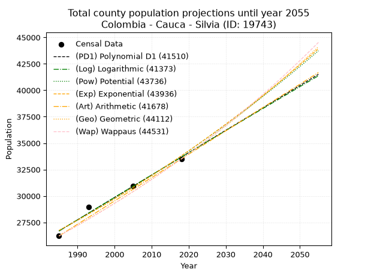
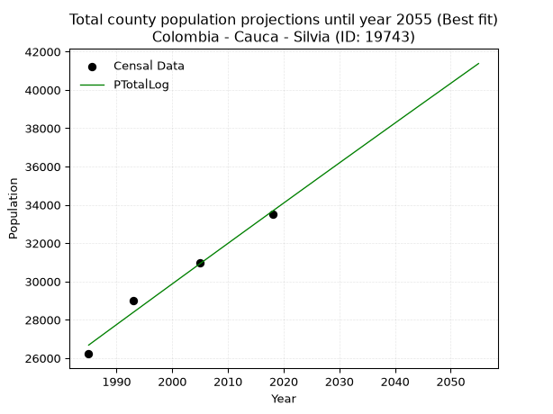
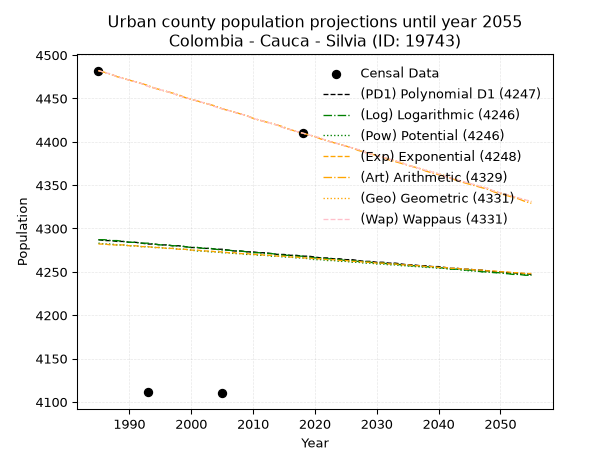
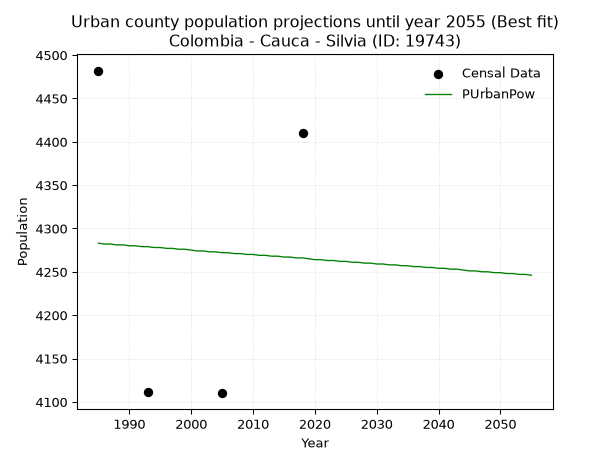
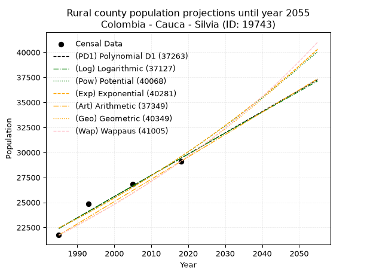
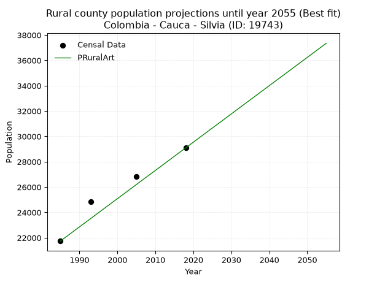

<div align="center">


</div>

# _“Population and Public Services Demand Projections (PPSD) until Year 2050 for Colombia - Cauca - Silvia (ID: 19743)”_
Keywords: `population` `public-service` `projection` `lineal` `polynomial` `logarithmic` `potential` `exponential` `arithmetic` `geometric` `wappaus` `dane` `colombia` `south-america`

PPSD are analytical estimates used by governments and planners to anticipate future changes in population size, age distribution, and the resulting community needs for utilities, healthcare, education, and infrastructure as sizing future water treatment facilities, electrical grids, and road networks based on spatial growth.

> **General running parameters**: • app_version: _v20260806_. • Python version: _3.14.7_. • Pandas version: _3.0.5_. • NumPy version: _2.5.1_. • Creates, save and include plots into reports (create_plot): _False_. • Projection until year: _2050_. • Process polynomial degree 2 and up: _False_. • Process Wappaus: _True_. • Process Wappaus: _True_. • Set negative values to zero: _True_. • Set infinite values to zero: _True_. • Drop dataset notes: _True_. 
<div align="center">

Dynamic map: [:earth_americas:Google](http://maps.google.com/maps?q=2.611926812,-76.3797528) [:earth_americas:OSM](https://www.openstreetmap.org/#map=18/2.611926812/-76.3797528&layers=P) [:earth_americas:Bing](https://www.bing.com/maps?cp=2.611926812~-76.3797528&lvl=18) [:earth_americas:Apple](https://maps.apple.com/frame?center=2.611926812%2C-76.3797528&span=0.003%2C0.006)

</div>


<div align="center">

```geojson
{
  "type": "Feature",
  "geometry": {
    "type": "Point", 
    "coordinates": [-76.3797528, 2.611926812]
  }, 
  "properties": {
    "Name": "Colombia - Cauca - Silvia (ID: 19743)"
  }
}
```

</div>


## 0. Census Data (4 records)

Census data are official statistics collected by a government about the people and housing in a country. They usually include counts of total population, age, sex, race, income, education, and jobs.

📅Global census file: [Population.xlsx](../data/Population.xlsx)

| Source   |   Year |   CountryID | CountryName   |   StateID | StateName   |   CountyID | CountyName   |   PTotal |   PUrban |   PRural |
|:---------|-------:|------------:|:--------------|----------:|:------------|-----------:|:-------------|---------:|---------:|---------:|
| DANE     |   1985 |          57 | Colombia      |        19 | Cauca       |      19743 | Silvia       |    26221 |     4482 |    21739 |
| DANE     |   1993 |          57 | Colombia      |        19 | Cauca       |      19743 | Silvia       |    28978 |     4111 |    24867 |
| DANE     |   2005 |          57 | Colombia      |        19 | Cauca       |      19743 | Silvia       |    30960 |     4110 |    26850 |
| DANE     |   2018 |          57 | Colombia      |        19 | Cauca       |      19743 | Silvia       |    33508 |     4410 |    29098 |

> 🔥Some records could had specific notes about the registered values or the corresponding urban or rural distribution.

## 1. Total

### 1.1. Coefficients and Parameters

* (PD1) Polynomial Deg 1: 211.74829385788655, -393632.7747892376 (lineal)
* (Log) Logarithmic: 423943.6572737586, -3192482.386209099
* (Pow) Potential: 14.201829757311076, -42.407150276031864
* (Exp) Exponential: 0.0070927884220803395, 0.02054371320574508
* (Art) Arithmetic: Year diff. 2018 - 1985 = 33, Population diff. 33508 - 26221 = 7287, Annual growth = 220.8181818181818
* (Geo) Geometric: Year diff. 2018 - 1985 = 33, Population diff. 33508 - 26221 = 7287, Annual growth % = 0.007458696710508139
* (Wap) Wappaus: i = 0.7394002304347362, Condition values only valid for < 200)

<sub>
Wappaus condition values: ['0.00', '0.74', '1.48', '2.22', '2.96', '3.70', '4.44', '5.18', '5.92', '6.65', '7.39', '8.13', '8.87', '9.61', '10.35', '11.09', '11.83', '12.57', '13.31', '14.05', '14.79', '15.53', '16.27', '17.01', '17.75', '18.49', '19.22', '19.96', '20.70', '21.44', '22.18', '22.92', '23.66', '24.40', '25.14', '25.88', '26.62', '27.36', '28.10', '28.84', '29.58', '30.32', '31.05', '31.79', '32.53', '33.27', '34.01', '34.75', '35.49', '36.23', '36.97', '37.71', '38.45', '39.19', '39.93', '40.67', '41.41', '42.15', '42.89', '43.62', '44.36', '45.10', '45.84', '46.58', '47.32', '48.06']
</sub>


### 1.2. Projected Dataset

|   Year |   CountyID |   PTotalPD1 |   PTotalLog |   PTotalPow |   PTotalExp |   PTotalArt |   PTotalGeo |   PTotalWap |
|-------:|-----------:|------------:|------------:|------------:|------------:|------------:|------------:|------------:|
|   1985 |      19743 |       26688 |       26680 |       26735 |       26742 |       26221 |       26221 |       26221 |
|   1986 |      19743 |       26899 |       26894 |       26927 |       26932 |       26442 |       26417 |       26416 |
|   1987 |      19743 |       27111 |       27107 |       27120 |       27124 |       26663 |       26614 |       26612 |
|   1988 |      19743 |       27323 |       27321 |       27315 |       27317 |       26883 |       26812 |       26809 |
|   1989 |      19743 |       27535 |       27534 |       27511 |       27511 |       27104 |       27012 |       27008 |
|   1990 |      19743 |       27746 |       27747 |       27708 |       27707 |       27325 |       27214 |       27209 |
|   1991 |      19743 |       27958 |       27960 |       27906 |       27904 |       27546 |       27417 |       27411 |
|   1992 |      19743 |       28170 |       28173 |       28106 |       28103 |       27767 |       27621 |       27614 |
|   1993 |      19743 |       28382 |       28386 |       28307 |       28303 |       27988 |       27827 |       27819 |
|   1994 |      19743 |       28593 |       28598 |       28509 |       28505 |       28208 |       28035 |       28026 |
|   1995 |      19743 |       28805 |       28811 |       28713 |       28707 |       28429 |       28244 |       28234 |
|   1996 |      19743 |       29017 |       29023 |       28918 |       28912 |       28650 |       28454 |       28444 |
|   1997 |      19743 |       29229 |       29236 |       29124 |       29118 |       28871 |       28667 |       28656 |
|   1998 |      19743 |       29440 |       29448 |       29332 |       29325 |       29092 |       28880 |       28869 |
|   1999 |      19743 |       29652 |       29660 |       29541 |       29534 |       29312 |       29096 |       29083 |
|   2000 |      19743 |       29864 |       29872 |       29752 |       29744 |       29533 |       29313 |       29300 |
|   2001 |      19743 |       30076 |       30084 |       29964 |       29956 |       29754 |       29531 |       29518 |
|   2002 |      19743 |       30287 |       30296 |       30177 |       30169 |       29975 |       29752 |       29738 |
|   2003 |      19743 |       30499 |       30507 |       30392 |       30383 |       30196 |       29974 |       29960 |
|   2004 |      19743 |       30711 |       30719 |       30608 |       30600 |       30417 |       30197 |       30183 |
|   2005 |      19743 |       30923 |       30931 |       30826 |       30818 |       30637 |       30422 |       30408 |
|   2006 |      19743 |       31134 |       31142 |       31045 |       31037 |       30858 |       30649 |       30635 |
|   2007 |      19743 |       31346 |       31353 |       31265 |       31258 |       31079 |       30878 |       30864 |
|   2008 |      19743 |       31558 |       31564 |       31487 |       31480 |       31300 |       31108 |       31095 |
|   2009 |      19743 |       31770 |       31775 |       31711 |       31704 |       31521 |       31340 |       31327 |
|   2010 |      19743 |       31981 |       31986 |       31936 |       31930 |       31741 |       31574 |       31562 |
|   2011 |      19743 |       32193 |       32197 |       32162 |       32157 |       31962 |       31810 |       31798 |
|   2012 |      19743 |       32405 |       32408 |       32390 |       32386 |       32183 |       32047 |       32036 |
|   2013 |      19743 |       32617 |       32619 |       32619 |       32617 |       32404 |       32286 |       32276 |
|   2014 |      19743 |       32828 |       32829 |       32850 |       32849 |       32625 |       32527 |       32519 |
|   2015 |      19743 |       33040 |       33040 |       33083 |       33083 |       32846 |       32769 |       32763 |
|   2016 |      19743 |       33252 |       33250 |       33317 |       33318 |       33066 |       33014 |       33009 |
|   2017 |      19743 |       33464 |       33460 |       33552 |       33555 |       33287 |       33260 |       33258 |
|   2018 |      19743 |       33675 |       33670 |       33789 |       33794 |       33508 |       33508 |       33508 |
|   2019 |      19743 |       33887 |       33880 |       34028 |       34035 |       33729 |       33758 |       33761 |
|   2020 |      19743 |       34099 |       34090 |       34268 |       34277 |       33950 |       34010 |       34015 |
|   2021 |      19743 |       34311 |       34300 |       34510 |       34521 |       34170 |       34263 |       34272 |
|   2022 |      19743 |       34522 |       34510 |       34753 |       34767 |       34391 |       34519 |       34531 |
|   2023 |      19743 |       34734 |       34720 |       34998 |       35014 |       34612 |       34776 |       34793 |
|   2024 |      19743 |       34946 |       34929 |       35244 |       35263 |       34833 |       35036 |       35056 |
|   2025 |      19743 |       35158 |       35138 |       35492 |       35514 |       35054 |       35297 |       35322 |
|   2026 |      19743 |       35369 |       35348 |       35742 |       35767 |       35275 |       35560 |       35590 |
|   2027 |      19743 |       35581 |       35557 |       35993 |       36022 |       35495 |       35826 |       35861 |
|   2028 |      19743 |       35793 |       35766 |       36246 |       36278 |       35716 |       36093 |       36134 |
|   2029 |      19743 |       36005 |       35975 |       36501 |       36537 |       35937 |       36362 |       36409 |
|   2030 |      19743 |       36216 |       36184 |       36757 |       36797 |       36158 |       36633 |       36687 |
|   2031 |      19743 |       36428 |       36393 |       37015 |       37058 |       36379 |       36906 |       36967 |
|   2032 |      19743 |       36640 |       36601 |       37275 |       37322 |       36599 |       37182 |       37250 |
|   2033 |      19743 |       36852 |       36810 |       37536 |       37588 |       36820 |       37459 |       37535 |
|   2034 |      19743 |       37063 |       37018 |       37800 |       37855 |       37041 |       37738 |       37823 |
|   2035 |      19743 |       37275 |       37227 |       38064 |       38125 |       37262 |       38020 |       38113 |
|   2036 |      19743 |       37487 |       37435 |       38331 |       38396 |       37483 |       38304 |       38406 |
|   2037 |      19743 |       37698 |       37643 |       38599 |       38670 |       37704 |       38589 |       38702 |
|   2038 |      19743 |       37910 |       37851 |       38869 |       38945 |       37924 |       38877 |       39001 |
|   2039 |      19743 |       38122 |       38059 |       39141 |       39222 |       38145 |       39167 |       39302 |
|   2040 |      19743 |       38334 |       38267 |       39414 |       39501 |       38366 |       39459 |       39606 |
|   2041 |      19743 |       38545 |       38475 |       39690 |       39782 |       38587 |       39753 |       39913 |
|   2042 |      19743 |       38757 |       38683 |       39967 |       40066 |       38808 |       40050 |       40223 |
|   2043 |      19743 |       38969 |       38890 |       40246 |       40351 |       39028 |       40349 |       40535 |
|   2044 |      19743 |       39181 |       39098 |       40526 |       40638 |       39249 |       40650 |       40851 |
|   2045 |      19743 |       39392 |       39305 |       40809 |       40927 |       39470 |       40953 |       41170 |
|   2046 |      19743 |       39604 |       39512 |       41093 |       41219 |       39691 |       41258 |       41491 |
|   2047 |      19743 |       39816 |       39719 |       41379 |       41512 |       39912 |       41566 |       41816 |
|   2048 |      19743 |       40028 |       39926 |       41667 |       41807 |       40133 |       41876 |       42144 |
|   2049 |      19743 |       40239 |       40133 |       41957 |       42105 |       40353 |       42188 |       42475 |
|   2050 |      19743 |       40451 |       40340 |       42249 |       42405 |       40574 |       42503 |       42809 |
<div align="center">

</img>

</div>


### 1.3. Best fit with absolute and relative error (%)

Relative error puts that difference into context by dividing the absolute error by the true value, creating a unitless ratio or percentage that shows the scale of the mistake.

Absolute and relative error

|   Year | Source   |   CountryID | CountryName   |   StateID | StateName   |   CountyID_x | CountyName   |   PTotal |   PUrban |   PRural |   CountyID_y |   PTotalPD1 |   PTotalLog |   PTotalPow |   PTotalExp |   PTotalArt |   PTotalGeo |   PTotalWap |   PTotalPD1AbsError |   PTotalLogAbsError |   PTotalPowAbsError |   PTotalExpAbsError |   PTotalArtAbsError |   PTotalGeoAbsError |   PTotalWapAbsError |   PTotalPD1RelError |   PTotalLogRelError |   PTotalPowRelError |   PTotalExpRelError |   PTotalArtRelError |   PTotalGeoRelError |   PTotalWapRelError |
|-------:|:---------|------------:|:--------------|----------:|:------------|-------------:|:-------------|---------:|---------:|---------:|-------------:|------------:|------------:|------------:|------------:|------------:|------------:|------------:|--------------------:|--------------------:|--------------------:|--------------------:|--------------------:|--------------------:|--------------------:|--------------------:|--------------------:|--------------------:|--------------------:|--------------------:|--------------------:|--------------------:|
|   1985 | DANE     |          57 | Colombia      |        19 | Cauca       |        19743 | Silvia       |    26221 |     4482 |    21739 |        19743 |       26688 |       26680 |       26735 |       26742 |       26221 |       26221 |       26221 |                 467 |                 459 |                 514 |                 521 |                   0 |                   0 |                   0 |            1.78102  |           1.75051   |            1.96026  |            1.98696  |             0       |             0       |             0       |
|   1993 | DANE     |          57 | Colombia      |        19 | Cauca       |        19743 | Silvia       |    28978 |     4111 |    24867 |        19743 |       28382 |       28386 |       28307 |       28303 |       27988 |       27827 |       27819 |                 596 |                 592 |                 671 |                 675 |                 990 |                1151 |                1159 |            2.05673  |           2.04293   |            2.31555  |            2.32935  |             3.41638 |             3.97198 |             3.99959 |
|   2005 | DANE     |          57 | Colombia      |        19 | Cauca       |        19743 | Silvia       |    30960 |     4110 |    26850 |        19743 |       30923 |       30931 |       30826 |       30818 |       30637 |       30422 |       30408 |                  37 |                  29 |                 134 |                 142 |                 323 |                 538 |                 552 |            0.119509 |           0.0936693 |            0.432817 |            0.458656 |             1.04328 |             1.73773 |             1.78295 |
|   2018 | DANE     |          57 | Colombia      |        19 | Cauca       |        19743 | Silvia       |    33508 |     4410 |    29098 |        19743 |       33675 |       33670 |       33789 |       33794 |       33508 |       33508 |       33508 |                 167 |                 162 |                 281 |                 286 |                   0 |                   0 |                   0 |            0.498388 |           0.483467  |            0.838606 |            0.853528 |             0       |             0       |             0       |

Relative error mean

| Method    |   RelError | Best   |
|:----------|-----------:|:-------|
| PTotalPD1 |    1.11391 |        |
| PTotalLog |    1.09264 | True   |
| PTotalPow |    1.38681 |        |
| PTotalExp |    1.40712 |        |
| PTotalArt |    1.11492 |        |
| PTotalGeo |    1.42743 |        |
| PTotalWap |    1.44563 |        |

💙Best method: _**PTotalLog**_
<div align="center">

</img>

</div>


### 1.4. Fresh water supply demand in liters per capita per day (lpcd)

The fresh water supply demand typically ranges from 100 to 300 liters per capita per day (lpcd) for standard domestic and municipal planning, though absolute survival minimums set by the World Health Organization are as low as 7.5 to 20 liters per day, and total consumption in high-income nations can exceed 400 liters.

> `CZ`: Level in meters above the sea level (masl)<br> `WS`: Fresh water supply demand in liters per capita per day (lpcd or l/h/d)<br> `WSAll`: Zonal fresh water supply demand in liters per second (l/s)<br> `A`: Zonal area in square meters<br> `DP`: Population density (people/hectare)

Reference values (RAS Colombia)

|    CZ |   WS |
|------:|-----:|
|  1000 |  120 |
|  2000 |  130 |
| 99999 |  140 |

County shapefile geometry properties and water supply values

|   CountyID |      ATotal |   CZTotal |   WSTotal |
|-----------:|------------:|----------:|----------:|
|      19743 | 6.81167e+08 |   2930.57 |       140 |

Projected values for best method: PTotalLog

|   CountyID |   Year |   PTotalLog |   DPTotal |   WSTotal |   WSTotalAll |
|-----------:|-------:|------------:|----------:|----------:|-------------:|
|      19743 |   1985 |       26680 |      0.39 |       140 |      43.2315 |
|      19743 |   1986 |       26894 |      0.39 |       140 |      43.5782 |
|      19743 |   1987 |       27107 |      0.4  |       140 |      43.9234 |
|      19743 |   1988 |       27321 |      0.4  |       140 |      44.2701 |
|      19743 |   1989 |       27534 |      0.4  |       140 |      44.6153 |
|      19743 |   1990 |       27747 |      0.41 |       140 |      44.9604 |
|      19743 |   1991 |       27960 |      0.41 |       140 |      45.3056 |
|      19743 |   1992 |       28173 |      0.41 |       140 |      45.6507 |
|      19743 |   1993 |       28386 |      0.42 |       140 |      45.9958 |
|      19743 |   1994 |       28598 |      0.42 |       140 |      46.3394 |
|      19743 |   1995 |       28811 |      0.42 |       140 |      46.6845 |
|      19743 |   1996 |       29023 |      0.43 |       140 |      47.028  |
|      19743 |   1997 |       29236 |      0.43 |       140 |      47.3731 |
|      19743 |   1998 |       29448 |      0.43 |       140 |      47.7167 |
|      19743 |   1999 |       29660 |      0.44 |       140 |      48.0602 |
|      19743 |   2000 |       29872 |      0.44 |       140 |      48.4037 |
|      19743 |   2001 |       30084 |      0.44 |       140 |      48.7472 |
|      19743 |   2002 |       30296 |      0.44 |       140 |      49.0907 |
|      19743 |   2003 |       30507 |      0.45 |       140 |      49.4326 |
|      19743 |   2004 |       30719 |      0.45 |       140 |      49.7762 |
|      19743 |   2005 |       30931 |      0.45 |       140 |      50.1197 |
|      19743 |   2006 |       31142 |      0.46 |       140 |      50.4616 |
|      19743 |   2007 |       31353 |      0.46 |       140 |      50.8035 |
|      19743 |   2008 |       31564 |      0.46 |       140 |      51.1454 |
|      19743 |   2009 |       31775 |      0.47 |       140 |      51.4873 |
|      19743 |   2010 |       31986 |      0.47 |       140 |      51.8292 |
|      19743 |   2011 |       32197 |      0.47 |       140 |      52.1711 |
|      19743 |   2012 |       32408 |      0.48 |       140 |      52.513  |
|      19743 |   2013 |       32619 |      0.48 |       140 |      52.8549 |
|      19743 |   2014 |       32829 |      0.48 |       140 |      53.1951 |
|      19743 |   2015 |       33040 |      0.49 |       140 |      53.537  |
|      19743 |   2016 |       33250 |      0.49 |       140 |      53.8773 |
|      19743 |   2017 |       33460 |      0.49 |       140 |      54.2176 |
|      19743 |   2018 |       33670 |      0.49 |       140 |      54.5579 |
|      19743 |   2019 |       33880 |      0.5  |       140 |      54.8981 |
|      19743 |   2020 |       34090 |      0.5  |       140 |      55.2384 |
|      19743 |   2021 |       34300 |      0.5  |       140 |      55.5787 |
|      19743 |   2022 |       34510 |      0.51 |       140 |      55.919  |
|      19743 |   2023 |       34720 |      0.51 |       140 |      56.2593 |
|      19743 |   2024 |       34929 |      0.51 |       140 |      56.5979 |
|      19743 |   2025 |       35138 |      0.52 |       140 |      56.9366 |
|      19743 |   2026 |       35348 |      0.52 |       140 |      57.2769 |
|      19743 |   2027 |       35557 |      0.52 |       140 |      57.6155 |
|      19743 |   2028 |       35766 |      0.53 |       140 |      57.9542 |
|      19743 |   2029 |       35975 |      0.53 |       140 |      58.2928 |
|      19743 |   2030 |       36184 |      0.53 |       140 |      58.6315 |
|      19743 |   2031 |       36393 |      0.53 |       140 |      58.9701 |
|      19743 |   2032 |       36601 |      0.54 |       140 |      59.3072 |
|      19743 |   2033 |       36810 |      0.54 |       140 |      59.6458 |
|      19743 |   2034 |       37018 |      0.54 |       140 |      59.9829 |
|      19743 |   2035 |       37227 |      0.55 |       140 |      60.3215 |
|      19743 |   2036 |       37435 |      0.55 |       140 |      60.6586 |
|      19743 |   2037 |       37643 |      0.55 |       140 |      60.9956 |
|      19743 |   2038 |       37851 |      0.56 |       140 |      61.3326 |
|      19743 |   2039 |       38059 |      0.56 |       140 |      61.6697 |
|      19743 |   2040 |       38267 |      0.56 |       140 |      62.0067 |
|      19743 |   2041 |       38475 |      0.56 |       140 |      62.3438 |
|      19743 |   2042 |       38683 |      0.57 |       140 |      62.6808 |
|      19743 |   2043 |       38890 |      0.57 |       140 |      63.0162 |
|      19743 |   2044 |       39098 |      0.57 |       140 |      63.3532 |
|      19743 |   2045 |       39305 |      0.58 |       140 |      63.6887 |
|      19743 |   2046 |       39512 |      0.58 |       140 |      64.0241 |
|      19743 |   2047 |       39719 |      0.58 |       140 |      64.3595 |
|      19743 |   2048 |       39926 |      0.59 |       140 |      64.6949 |
|      19743 |   2049 |       40133 |      0.59 |       140 |      65.0303 |
|      19743 |   2050 |       40340 |      0.59 |       140 |      65.3657 |

## 2. Urban

### 2.1. Coefficients and Parameters

* (PD1) Polynomial Deg 1: -0.5704536330792396, 5419.299879566749 (lineal)
* (Log) Logarithmic: -1203.9573335648856, 13429.539340335272
* (Pow) Potential: -0.2478797161655685, 4.449194676638097
* (Exp) Exponential: -0.00011658544136225784, 5397.621423490021
* (Art) Arithmetic: Year diff. 2018 - 1985 = 33, Population diff. 4410 - 4482 = -72, Annual growth = -2.1818181818181817
* (Geo) Geometric: Year diff. 2018 - 1985 = 33, Population diff. 4410 - 4482 = -72, Annual growth % = -0.0004906276610485705
* (Wap) Wappaus: i = -0.0490737332842596, Condition values only valid for < 200)

<sub>
Wappaus condition values: ['-0.00', '-0.05', '-0.10', '-0.15', '-0.20', '-0.25', '-0.29', '-0.34', '-0.39', '-0.44', '-0.49', '-0.54', '-0.59', '-0.64', '-0.69', '-0.74', '-0.79', '-0.83', '-0.88', '-0.93', '-0.98', '-1.03', '-1.08', '-1.13', '-1.18', '-1.23', '-1.28', '-1.32', '-1.37', '-1.42', '-1.47', '-1.52', '-1.57', '-1.62', '-1.67', '-1.72', '-1.77', '-1.82', '-1.86', '-1.91', '-1.96', '-2.01', '-2.06', '-2.11', '-2.16', '-2.21', '-2.26', '-2.31', '-2.36', '-2.40', '-2.45', '-2.50', '-2.55', '-2.60', '-2.65', '-2.70', '-2.75', '-2.80', '-2.85', '-2.90', '-2.94', '-2.99', '-3.04', '-3.09', '-3.14', '-3.19']
</sub>


### 2.2. Projected Dataset

|   Year |   CountyID |   PUrbanPD1 |   PUrbanLog |   PUrbanPow |   PUrbanExp |   PUrbanArt |   PUrbanGeo |   PUrbanWap |
|-------:|-----------:|------------:|------------:|------------:|------------:|------------:|------------:|------------:|
|   1985 |      19743 |        4287 |        4287 |        4283 |        4282 |        4482 |        4482 |        4482 |
|   1986 |      19743 |        4286 |        4287 |        4282 |        4282 |        4480 |        4480 |        4480 |
|   1987 |      19743 |        4286 |        4286 |        4282 |        4281 |        4478 |        4478 |        4478 |
|   1988 |      19743 |        4285 |        4286 |        4281 |        4281 |        4475 |        4475 |        4475 |
|   1989 |      19743 |        4285 |        4285 |        4281 |        4281 |        4473 |        4473 |        4473 |
|   1990 |      19743 |        4284 |        4284 |        4280 |        4280 |        4471 |        4471 |        4471 |
|   1991 |      19743 |        4284 |        4284 |        4280 |        4280 |        4469 |        4469 |        4469 |
|   1992 |      19743 |        4283 |        4283 |        4279 |        4279 |        4467 |        4467 |        4467 |
|   1993 |      19743 |        4282 |        4283 |        4279 |        4279 |        4465 |        4464 |        4464 |
|   1994 |      19743 |        4282 |        4282 |        4278 |        4278 |        4462 |        4462 |        4462 |
|   1995 |      19743 |        4281 |        4281 |        4278 |        4278 |        4460 |        4460 |        4460 |
|   1996 |      19743 |        4281 |        4281 |        4277 |        4277 |        4458 |        4458 |        4458 |
|   1997 |      19743 |        4280 |        4280 |        4277 |        4277 |        4456 |        4456 |        4456 |
|   1998 |      19743 |        4280 |        4280 |        4276 |        4276 |        4454 |        4453 |        4453 |
|   1999 |      19743 |        4279 |        4279 |        4276 |        4276 |        4451 |        4451 |        4451 |
|   2000 |      19743 |        4278 |        4278 |        4275 |        4275 |        4449 |        4449 |        4449 |
|   2001 |      19743 |        4278 |        4278 |        4274 |        4275 |        4447 |        4447 |        4447 |
|   2002 |      19743 |        4277 |        4277 |        4274 |        4274 |        4445 |        4445 |        4445 |
|   2003 |      19743 |        4277 |        4277 |        4273 |        4274 |        4443 |        4443 |        4443 |
|   2004 |      19743 |        4276 |        4276 |        4273 |        4273 |        4441 |        4440 |        4440 |
|   2005 |      19743 |        4276 |        4275 |        4272 |        4273 |        4438 |        4438 |        4438 |
|   2006 |      19743 |        4275 |        4275 |        4272 |        4272 |        4436 |        4436 |        4436 |
|   2007 |      19743 |        4274 |        4274 |        4271 |        4272 |        4434 |        4434 |        4434 |
|   2008 |      19743 |        4274 |        4274 |        4271 |        4271 |        4432 |        4432 |        4432 |
|   2009 |      19743 |        4273 |        4273 |        4270 |        4271 |        4430 |        4430 |        4430 |
|   2010 |      19743 |        4273 |        4272 |        4270 |        4270 |        4427 |        4427 |        4427 |
|   2011 |      19743 |        4272 |        4272 |        4269 |        4270 |        4425 |        4425 |        4425 |
|   2012 |      19743 |        4272 |        4271 |        4269 |        4269 |        4423 |        4423 |        4423 |
|   2013 |      19743 |        4271 |        4271 |        4268 |        4269 |        4421 |        4421 |        4421 |
|   2014 |      19743 |        4270 |        4270 |        4268 |        4268 |        4419 |        4419 |        4419 |
|   2015 |      19743 |        4270 |        4269 |        4267 |        4268 |        4417 |        4416 |        4416 |
|   2016 |      19743 |        4269 |        4269 |        4267 |        4267 |        4414 |        4414 |        4414 |
|   2017 |      19743 |        4269 |        4268 |        4266 |        4267 |        4412 |        4412 |        4412 |
|   2018 |      19743 |        4268 |        4268 |        4266 |        4266 |        4410 |        4410 |        4410 |
|   2019 |      19743 |        4268 |        4267 |        4265 |        4266 |        4408 |        4408 |        4408 |
|   2020 |      19743 |        4267 |        4266 |        4264 |        4265 |        4406 |        4406 |        4406 |
|   2021 |      19743 |        4266 |        4266 |        4264 |        4265 |        4403 |        4404 |        4404 |
|   2022 |      19743 |        4266 |        4265 |        4263 |        4264 |        4401 |        4401 |        4401 |
|   2023 |      19743 |        4265 |        4265 |        4263 |        4264 |        4399 |        4399 |        4399 |
|   2024 |      19743 |        4265 |        4264 |        4262 |        4263 |        4397 |        4397 |        4397 |
|   2025 |      19743 |        4264 |        4263 |        4262 |        4263 |        4395 |        4395 |        4395 |
|   2026 |      19743 |        4264 |        4263 |        4261 |        4262 |        4393 |        4393 |        4393 |
|   2027 |      19743 |        4263 |        4262 |        4261 |        4262 |        4390 |        4391 |        4391 |
|   2028 |      19743 |        4262 |        4262 |        4260 |        4261 |        4388 |        4388 |        4388 |
|   2029 |      19743 |        4262 |        4261 |        4260 |        4261 |        4386 |        4386 |        4386 |
|   2030 |      19743 |        4261 |        4260 |        4259 |        4260 |        4384 |        4384 |        4384 |
|   2031 |      19743 |        4261 |        4260 |        4259 |        4260 |        4382 |        4382 |        4382 |
|   2032 |      19743 |        4260 |        4259 |        4258 |        4259 |        4379 |        4380 |        4380 |
|   2033 |      19743 |        4260 |        4259 |        4258 |        4259 |        4377 |        4378 |        4378 |
|   2034 |      19743 |        4259 |        4258 |        4257 |        4258 |        4375 |        4376 |        4376 |
|   2035 |      19743 |        4258 |        4257 |        4257 |        4258 |        4373 |        4373 |        4373 |
|   2036 |      19743 |        4258 |        4257 |        4256 |        4257 |        4371 |        4371 |        4371 |
|   2037 |      19743 |        4257 |        4256 |        4256 |        4257 |        4369 |        4369 |        4369 |
|   2038 |      19743 |        4257 |        4256 |        4255 |        4256 |        4366 |        4367 |        4367 |
|   2039 |      19743 |        4256 |        4255 |        4255 |        4256 |        4364 |        4365 |        4365 |
|   2040 |      19743 |        4256 |        4255 |        4254 |        4255 |        4362 |        4363 |        4363 |
|   2041 |      19743 |        4255 |        4254 |        4254 |        4255 |        4360 |        4361 |        4360 |
|   2042 |      19743 |        4254 |        4253 |        4253 |        4254 |        4358 |        4358 |        4358 |
|   2043 |      19743 |        4254 |        4253 |        4253 |        4254 |        4355 |        4356 |        4356 |
|   2044 |      19743 |        4253 |        4252 |        4252 |        4253 |        4353 |        4354 |        4354 |
|   2045 |      19743 |        4253 |        4252 |        4251 |        4253 |        4351 |        4352 |        4352 |
|   2046 |      19743 |        4252 |        4251 |        4251 |        4252 |        4349 |        4350 |        4350 |
|   2047 |      19743 |        4252 |        4250 |        4250 |        4252 |        4347 |        4348 |        4348 |
|   2048 |      19743 |        4251 |        4250 |        4250 |        4251 |        4345 |        4346 |        4346 |
|   2049 |      19743 |        4250 |        4249 |        4249 |        4251 |        4342 |        4343 |        4343 |
|   2050 |      19743 |        4250 |        4249 |        4249 |        4250 |        4340 |        4341 |        4341 |
<div align="center">

</img>

</div>


### 2.3. Best fit with absolute and relative error (%)

Relative error puts that difference into context by dividing the absolute error by the true value, creating a unitless ratio or percentage that shows the scale of the mistake.

Absolute and relative error

|   Year | Source   |   CountryID | CountryName   |   StateID | StateName   |   CountyID_x | CountyName   |   PTotal |   PUrban |   PRural |   CountyID_y |   PUrbanPD1 |   PUrbanLog |   PUrbanPow |   PUrbanExp |   PUrbanArt |   PUrbanGeo |   PUrbanWap |   PUrbanPD1AbsError |   PUrbanLogAbsError |   PUrbanPowAbsError |   PUrbanExpAbsError |   PUrbanArtAbsError |   PUrbanGeoAbsError |   PUrbanWapAbsError |   PUrbanPD1RelError |   PUrbanLogRelError |   PUrbanPowRelError |   PUrbanExpRelError |   PUrbanArtRelError |   PUrbanGeoRelError |   PUrbanWapRelError |
|-------:|:---------|------------:|:--------------|----------:|:------------|-------------:|:-------------|---------:|---------:|---------:|-------------:|------------:|------------:|------------:|------------:|------------:|------------:|------------:|--------------------:|--------------------:|--------------------:|--------------------:|--------------------:|--------------------:|--------------------:|--------------------:|--------------------:|--------------------:|--------------------:|--------------------:|--------------------:|--------------------:|
|   1985 | DANE     |          57 | Colombia      |        19 | Cauca       |        19743 | Silvia       |    26221 |     4482 |    21739 |        19743 |        4287 |        4287 |        4283 |        4282 |        4482 |        4482 |        4482 |                 195 |                 195 |                 199 |                 200 |                   0 |                   0 |                   0 |             4.35074 |             4.35074 |             4.43998 |             4.46229 |             0       |             0       |             0       |
|   1993 | DANE     |          57 | Colombia      |        19 | Cauca       |        19743 | Silvia       |    28978 |     4111 |    24867 |        19743 |        4282 |        4283 |        4279 |        4279 |        4465 |        4464 |        4464 |                 171 |                 172 |                 168 |                 168 |                 354 |                 353 |                 353 |             4.15957 |             4.1839  |             4.0866  |             4.0866  |             8.61104 |             8.58672 |             8.58672 |
|   2005 | DANE     |          57 | Colombia      |        19 | Cauca       |        19743 | Silvia       |    30960 |     4110 |    26850 |        19743 |        4276 |        4275 |        4272 |        4273 |        4438 |        4438 |        4438 |                 166 |                 165 |                 162 |                 163 |                 328 |                 328 |                 328 |             4.03893 |             4.0146  |             3.94161 |             3.96594 |             7.98054 |             7.98054 |             7.98054 |
|   2018 | DANE     |          57 | Colombia      |        19 | Cauca       |        19743 | Silvia       |    33508 |     4410 |    29098 |        19743 |        4268 |        4268 |        4266 |        4266 |        4410 |        4410 |        4410 |                 142 |                 142 |                 144 |                 144 |                   0 |                   0 |                   0 |             3.21995 |             3.21995 |             3.26531 |             3.26531 |             0       |             0       |             0       |

Relative error mean

| Method    |   RelError | Best   |
|:----------|-----------:|:-------|
| PUrbanPD1 |    3.9423  |        |
| PUrbanLog |    3.9423  |        |
| PUrbanPow |    3.93337 | True   |
| PUrbanExp |    3.94503 |        |
| PUrbanArt |    4.14789 |        |
| PUrbanGeo |    4.14181 |        |
| PUrbanWap |    4.14181 |        |

💙Best method: _**PUrbanPow**_
<div align="center">

</img>

</div>


### 2.4. Fresh water supply demand in liters per capita per day (lpcd)

The fresh water supply demand typically ranges from 100 to 300 liters per capita per day (lpcd) for standard domestic and municipal planning, though absolute survival minimums set by the World Health Organization are as low as 7.5 to 20 liters per day, and total consumption in high-income nations can exceed 400 liters.

> `CZ`: Level in meters above the sea level (masl)<br> `WS`: Fresh water supply demand in liters per capita per day (lpcd or l/h/d)<br> `WSAll`: Zonal fresh water supply demand in liters per second (l/s)<br> `A`: Zonal area in square meters<br> `DP`: Population density (people/hectare)

Reference values (RAS Colombia)

|    CZ |   WS |
|------:|-----:|
|  1000 |  120 |
|  2000 |  130 |
| 99999 |  140 |

County shapefile geometry properties and water supply values

|   CountyID |      AUrban |   CZUrban |   WSUrban |
|-----------:|------------:|----------:|----------:|
|      19743 | 4.83528e+06 |   2525.17 |       140 |

Projected values for best method: PUrbanPow

|   CountyID |   Year |   PUrbanPow |   DPUrban |   WSUrban |   WSUrbanAll |
|-----------:|-------:|------------:|----------:|----------:|-------------:|
|      19743 |   1985 |        4283 |      8.86 |       140 |      6.94005 |
|      19743 |   1986 |        4282 |      8.86 |       140 |      6.93843 |
|      19743 |   1987 |        4282 |      8.86 |       140 |      6.93843 |
|      19743 |   1988 |        4281 |      8.85 |       140 |      6.93681 |
|      19743 |   1989 |        4281 |      8.85 |       140 |      6.93681 |
|      19743 |   1990 |        4280 |      8.85 |       140 |      6.93519 |
|      19743 |   1991 |        4280 |      8.85 |       140 |      6.93519 |
|      19743 |   1992 |        4279 |      8.85 |       140 |      6.93356 |
|      19743 |   1993 |        4279 |      8.85 |       140 |      6.93356 |
|      19743 |   1994 |        4278 |      8.85 |       140 |      6.93194 |
|      19743 |   1995 |        4278 |      8.85 |       140 |      6.93194 |
|      19743 |   1996 |        4277 |      8.85 |       140 |      6.93032 |
|      19743 |   1997 |        4277 |      8.85 |       140 |      6.93032 |
|      19743 |   1998 |        4276 |      8.84 |       140 |      6.9287  |
|      19743 |   1999 |        4276 |      8.84 |       140 |      6.9287  |
|      19743 |   2000 |        4275 |      8.84 |       140 |      6.92708 |
|      19743 |   2001 |        4274 |      8.84 |       140 |      6.92546 |
|      19743 |   2002 |        4274 |      8.84 |       140 |      6.92546 |
|      19743 |   2003 |        4273 |      8.84 |       140 |      6.92384 |
|      19743 |   2004 |        4273 |      8.84 |       140 |      6.92384 |
|      19743 |   2005 |        4272 |      8.84 |       140 |      6.92222 |
|      19743 |   2006 |        4272 |      8.84 |       140 |      6.92222 |
|      19743 |   2007 |        4271 |      8.83 |       140 |      6.9206  |
|      19743 |   2008 |        4271 |      8.83 |       140 |      6.9206  |
|      19743 |   2009 |        4270 |      8.83 |       140 |      6.91898 |
|      19743 |   2010 |        4270 |      8.83 |       140 |      6.91898 |
|      19743 |   2011 |        4269 |      8.83 |       140 |      6.91736 |
|      19743 |   2012 |        4269 |      8.83 |       140 |      6.91736 |
|      19743 |   2013 |        4268 |      8.83 |       140 |      6.91574 |
|      19743 |   2014 |        4268 |      8.83 |       140 |      6.91574 |
|      19743 |   2015 |        4267 |      8.82 |       140 |      6.91412 |
|      19743 |   2016 |        4267 |      8.82 |       140 |      6.91412 |
|      19743 |   2017 |        4266 |      8.82 |       140 |      6.9125  |
|      19743 |   2018 |        4266 |      8.82 |       140 |      6.9125  |
|      19743 |   2019 |        4265 |      8.82 |       140 |      6.91088 |
|      19743 |   2020 |        4264 |      8.82 |       140 |      6.90926 |
|      19743 |   2021 |        4264 |      8.82 |       140 |      6.90926 |
|      19743 |   2022 |        4263 |      8.82 |       140 |      6.90764 |
|      19743 |   2023 |        4263 |      8.82 |       140 |      6.90764 |
|      19743 |   2024 |        4262 |      8.81 |       140 |      6.90602 |
|      19743 |   2025 |        4262 |      8.81 |       140 |      6.90602 |
|      19743 |   2026 |        4261 |      8.81 |       140 |      6.9044  |
|      19743 |   2027 |        4261 |      8.81 |       140 |      6.9044  |
|      19743 |   2028 |        4260 |      8.81 |       140 |      6.90278 |
|      19743 |   2029 |        4260 |      8.81 |       140 |      6.90278 |
|      19743 |   2030 |        4259 |      8.81 |       140 |      6.90116 |
|      19743 |   2031 |        4259 |      8.81 |       140 |      6.90116 |
|      19743 |   2032 |        4258 |      8.81 |       140 |      6.89954 |
|      19743 |   2033 |        4258 |      8.81 |       140 |      6.89954 |
|      19743 |   2034 |        4257 |      8.8  |       140 |      6.89792 |
|      19743 |   2035 |        4257 |      8.8  |       140 |      6.89792 |
|      19743 |   2036 |        4256 |      8.8  |       140 |      6.8963  |
|      19743 |   2037 |        4256 |      8.8  |       140 |      6.8963  |
|      19743 |   2038 |        4255 |      8.8  |       140 |      6.89468 |
|      19743 |   2039 |        4255 |      8.8  |       140 |      6.89468 |
|      19743 |   2040 |        4254 |      8.8  |       140 |      6.89306 |
|      19743 |   2041 |        4254 |      8.8  |       140 |      6.89306 |
|      19743 |   2042 |        4253 |      8.8  |       140 |      6.89144 |
|      19743 |   2043 |        4253 |      8.8  |       140 |      6.89144 |
|      19743 |   2044 |        4252 |      8.79 |       140 |      6.88981 |
|      19743 |   2045 |        4251 |      8.79 |       140 |      6.88819 |
|      19743 |   2046 |        4251 |      8.79 |       140 |      6.88819 |
|      19743 |   2047 |        4250 |      8.79 |       140 |      6.88657 |
|      19743 |   2048 |        4250 |      8.79 |       140 |      6.88657 |
|      19743 |   2049 |        4249 |      8.79 |       140 |      6.88495 |
|      19743 |   2050 |        4249 |      8.79 |       140 |      6.88495 |

## 3. Rural

### 3.1. Coefficients and Parameters

* (PD1) Polynomial Deg 1: 212.31874749096582, -399052.07466880436 (lineal)
* (Log) Logarithmic: 425147.6146073233, -3205911.9255494326
* (Pow) Potential: 16.733433122819854, -50.83191415792403
* (Exp) Exponential: 0.008355798139676558, 0.001405258851242811
* (Art) Arithmetic: Year diff. 2018 - 1985 = 33, Population diff. 29098 - 21739 = 7359, Annual growth = 223.0
* (Geo) Geometric: Year diff. 2018 - 1985 = 33, Population diff. 29098 - 21739 = 7359, Annual growth % = 0.008874344383068777
* (Wap) Wappaus: i = 0.8773137675315223, Condition values only valid for < 200)

<sub>
Wappaus condition values: ['0.00', '0.88', '1.75', '2.63', '3.51', '4.39', '5.26', '6.14', '7.02', '7.90', '8.77', '9.65', '10.53', '11.41', '12.28', '13.16', '14.04', '14.91', '15.79', '16.67', '17.55', '18.42', '19.30', '20.18', '21.06', '21.93', '22.81', '23.69', '24.56', '25.44', '26.32', '27.20', '28.07', '28.95', '29.83', '30.71', '31.58', '32.46', '33.34', '34.22', '35.09', '35.97', '36.85', '37.72', '38.60', '39.48', '40.36', '41.23', '42.11', '42.99', '43.87', '44.74', '45.62', '46.50', '47.37', '48.25', '49.13', '50.01', '50.88', '51.76', '52.64', '53.52', '54.39', '55.27', '56.15', '57.03']
</sub>


### 3.2. Projected Dataset

|   Year |   CountyID |   PRuralPD1 |   PRuralLog |   PRuralPow |   PRuralExp |   PRuralArt |   PRuralGeo |   PRuralWap |
|-------:|-----------:|------------:|------------:|------------:|------------:|------------:|------------:|------------:|
|   1985 |      19743 |       22401 |       22393 |       22436 |       22443 |       21739 |       21739 |       21739 |
|   1986 |      19743 |       22613 |       22607 |       22626 |       22631 |       21962 |       21932 |       21931 |
|   1987 |      19743 |       22825 |       22821 |       22817 |       22821 |       22185 |       22127 |       22124 |
|   1988 |      19743 |       23038 |       23035 |       23010 |       23013 |       22408 |       22323 |       22319 |
|   1989 |      19743 |       23250 |       23249 |       23204 |       23206 |       22631 |       22521 |       22516 |
|   1990 |      19743 |       23462 |       23463 |       23400 |       23400 |       22854 |       22721 |       22714 |
|   1991 |      19743 |       23675 |       23676 |       23598 |       23597 |       23077 |       22923 |       22914 |
|   1992 |      19743 |       23887 |       23890 |       23797 |       23795 |       23300 |       23126 |       23116 |
|   1993 |      19743 |       24099 |       24103 |       23998 |       23994 |       23523 |       23331 |       23320 |
|   1994 |      19743 |       24312 |       24316 |       24200 |       24196 |       23746 |       23538 |       23526 |
|   1995 |      19743 |       24524 |       24529 |       24404 |       24399 |       23969 |       23747 |       23734 |
|   1996 |      19743 |       24736 |       24742 |       24609 |       24603 |       24192 |       23958 |       23943 |
|   1997 |      19743 |       24948 |       24955 |       24817 |       24810 |       24415 |       24170 |       24155 |
|   1998 |      19743 |       25161 |       25168 |       25025 |       25018 |       24638 |       24385 |       24368 |
|   1999 |      19743 |       25373 |       25381 |       25236 |       25228 |       24861 |       24601 |       24584 |
|   2000 |      19743 |       25585 |       25594 |       25448 |       25440 |       25084 |       24820 |       24801 |
|   2001 |      19743 |       25798 |       25806 |       25662 |       25653 |       25307 |       25040 |       25021 |
|   2002 |      19743 |       26010 |       26019 |       25877 |       25868 |       25530 |       25262 |       25242 |
|   2003 |      19743 |       26222 |       26231 |       26094 |       26085 |       25753 |       25486 |       25466 |
|   2004 |      19743 |       26435 |       26443 |       26313 |       26304 |       25976 |       25712 |       25692 |
|   2005 |      19743 |       26647 |       26655 |       26534 |       26525 |       26199 |       25941 |       25920 |
|   2006 |      19743 |       26859 |       26867 |       26756 |       26748 |       26422 |       26171 |       26150 |
|   2007 |      19743 |       27072 |       27079 |       26980 |       26972 |       26645 |       26403 |       26383 |
|   2008 |      19743 |       27284 |       27291 |       27206 |       27198 |       26868 |       26637 |       26618 |
|   2009 |      19743 |       27496 |       27502 |       27433 |       27426 |       27091 |       26874 |       26855 |
|   2010 |      19743 |       27709 |       27714 |       27663 |       27657 |       27314 |       27112 |       27094 |
|   2011 |      19743 |       27921 |       27926 |       27894 |       27889 |       27537 |       27353 |       27336 |
|   2012 |      19743 |       28133 |       28137 |       28127 |       28123 |       27760 |       27596 |       27580 |
|   2013 |      19743 |       28346 |       28348 |       28362 |       28359 |       27983 |       27841 |       27827 |
|   2014 |      19743 |       28558 |       28559 |       28599 |       28597 |       28206 |       28088 |       28076 |
|   2015 |      19743 |       28770 |       28770 |       28837 |       28837 |       28429 |       28337 |       28328 |
|   2016 |      19743 |       28983 |       28981 |       29078 |       29079 |       28652 |       28588 |       28582 |
|   2017 |      19743 |       29195 |       29192 |       29320 |       29323 |       28875 |       28842 |       28839 |
|   2018 |      19743 |       29407 |       29403 |       29564 |       29569 |       29098 |       29098 |       29098 |
|   2019 |      19743 |       29619 |       29613 |       29810 |       29817 |       29321 |       29356 |       29360 |
|   2020 |      19743 |       29832 |       29824 |       30058 |       30067 |       29544 |       29617 |       29625 |
|   2021 |      19743 |       30044 |       30034 |       30308 |       30319 |       29767 |       29880 |       29892 |
|   2022 |      19743 |       30256 |       30245 |       30560 |       30574 |       29990 |       30145 |       30163 |
|   2023 |      19743 |       30469 |       30455 |       30814 |       30830 |       30213 |       30412 |       30436 |
|   2024 |      19743 |       30681 |       30665 |       31070 |       31089 |       30436 |       30682 |       30712 |
|   2025 |      19743 |       30893 |       30875 |       31328 |       31350 |       30659 |       30954 |       30991 |
|   2026 |      19743 |       31106 |       31085 |       31588 |       31613 |       30882 |       31229 |       31273 |
|   2027 |      19743 |       31318 |       31295 |       31849 |       31878 |       31105 |       31506 |       31558 |
|   2028 |      19743 |       31530 |       31504 |       32113 |       32145 |       31328 |       31786 |       31846 |
|   2029 |      19743 |       31743 |       31714 |       32379 |       32415 |       31551 |       32068 |       32138 |
|   2030 |      19743 |       31955 |       31923 |       32647 |       32687 |       31774 |       32353 |       32432 |
|   2031 |      19743 |       32167 |       32133 |       32918 |       32961 |       31997 |       32640 |       32730 |
|   2032 |      19743 |       32380 |       32342 |       33190 |       33238 |       32220 |       32929 |       33031 |
|   2033 |      19743 |       32592 |       32551 |       33464 |       33517 |       32443 |       33222 |       33335 |
|   2034 |      19743 |       32804 |       32760 |       33741 |       33798 |       32666 |       33516 |       33643 |
|   2035 |      19743 |       33017 |       32969 |       34019 |       34082 |       32889 |       33814 |       33954 |
|   2036 |      19743 |       33229 |       33178 |       34300 |       34368 |       33112 |       34114 |       34269 |
|   2037 |      19743 |       33441 |       33387 |       34583 |       34656 |       33335 |       34417 |       34587 |
|   2038 |      19743 |       33654 |       33596 |       34868 |       34947 |       33558 |       34722 |       34909 |
|   2039 |      19743 |       33866 |       33804 |       35156 |       35240 |       33781 |       35030 |       35235 |
|   2040 |      19743 |       34078 |       34013 |       35445 |       35536 |       34004 |       35341 |       35564 |
|   2041 |      19743 |       34290 |       34221 |       35737 |       35834 |       34227 |       35655 |       35897 |
|   2042 |      19743 |       34503 |       34429 |       36031 |       36135 |       34450 |       35971 |       36234 |
|   2043 |      19743 |       34715 |       34637 |       36328 |       36438 |       34673 |       36290 |       36575 |
|   2044 |      19743 |       34927 |       34845 |       36627 |       36744 |       34896 |       36612 |       36921 |
|   2045 |      19743 |       35140 |       35053 |       36928 |       37052 |       35119 |       36937 |       37270 |
|   2046 |      19743 |       35352 |       35261 |       37231 |       37363 |       35342 |       37265 |       37623 |
|   2047 |      19743 |       35564 |       35469 |       37537 |       37676 |       35565 |       37596 |       37981 |
|   2048 |      19743 |       35777 |       35677 |       37845 |       37992 |       35788 |       37929 |       38343 |
|   2049 |      19743 |       35989 |       35884 |       38155 |       38311 |       36011 |       38266 |       38709 |
|   2050 |      19743 |       36201 |       36092 |       38468 |       38633 |       36234 |       38606 |       39080 |
<div align="center">

</img>

</div>


### 3.3. Best fit with absolute and relative error (%)

Relative error puts that difference into context by dividing the absolute error by the true value, creating a unitless ratio or percentage that shows the scale of the mistake.

Absolute and relative error

|   Year | Source   |   CountryID | CountryName   |   StateID | StateName   |   CountyID_x | CountyName   |   PTotal |   PUrban |   PRural |   CountyID_y |   PRuralPD1 |   PRuralLog |   PRuralPow |   PRuralExp |   PRuralArt |   PRuralGeo |   PRuralWap |   PRuralPD1AbsError |   PRuralLogAbsError |   PRuralPowAbsError |   PRuralExpAbsError |   PRuralArtAbsError |   PRuralGeoAbsError |   PRuralWapAbsError |   PRuralPD1RelError |   PRuralLogRelError |   PRuralPowRelError |   PRuralExpRelError |   PRuralArtRelError |   PRuralGeoRelError |   PRuralWapRelError |
|-------:|:---------|------------:|:--------------|----------:|:------------|-------------:|:-------------|---------:|---------:|---------:|-------------:|------------:|------------:|------------:|------------:|------------:|------------:|------------:|--------------------:|--------------------:|--------------------:|--------------------:|--------------------:|--------------------:|--------------------:|--------------------:|--------------------:|--------------------:|--------------------:|--------------------:|--------------------:|--------------------:|
|   1985 | DANE     |          57 | Colombia      |        19 | Cauca       |        19743 | Silvia       |    26221 |     4482 |    21739 |        19743 |       22401 |       22393 |       22436 |       22443 |       21739 |       21739 |       21739 |                 662 |                 654 |                 697 |                 704 |                   0 |                   0 |                   0 |            3.04522  |            3.00842  |             3.20622 |             3.23842 |             0       |             0       |             0       |
|   1993 | DANE     |          57 | Colombia      |        19 | Cauca       |        19743 | Silvia       |    28978 |     4111 |    24867 |        19743 |       24099 |       24103 |       23998 |       23994 |       23523 |       23331 |       23320 |                 768 |                 764 |                 869 |                 873 |                1344 |                1536 |                1547 |            3.08843  |            3.07234  |             3.49459 |             3.51068 |             5.40475 |             6.17686 |             6.2211  |
|   2005 | DANE     |          57 | Colombia      |        19 | Cauca       |        19743 | Silvia       |    30960 |     4110 |    26850 |        19743 |       26647 |       26655 |       26534 |       26525 |       26199 |       25941 |       25920 |                 203 |                 195 |                 316 |                 325 |                 651 |                 909 |                 930 |            0.756052 |            0.726257 |             1.17691 |             1.21043 |             2.42458 |             3.38547 |             3.46369 |
|   2018 | DANE     |          57 | Colombia      |        19 | Cauca       |        19743 | Silvia       |    33508 |     4410 |    29098 |        19743 |       29407 |       29403 |       29564 |       29569 |       29098 |       29098 |       29098 |                 309 |                 305 |                 466 |                 471 |                   0 |                   0 |                   0 |            1.06193  |            1.04818  |             1.60148 |             1.61867 |             0       |             0       |             0       |

Relative error mean

| Method    |   RelError | Best   |
|:----------|-----------:|:-------|
| PRuralPD1 |    1.98791 |        |
| PRuralLog |    1.9638  |        |
| PRuralPow |    2.3698  |        |
| PRuralExp |    2.39455 |        |
| PRuralArt |    1.95733 | True   |
| PRuralGeo |    2.39058 |        |
| PRuralWap |    2.4212  |        |

💙Best method: _**PRuralArt**_
<div align="center">

</img>

</div>


### 3.4. Fresh water supply demand in liters per capita per day (lpcd)

The fresh water supply demand typically ranges from 100 to 300 liters per capita per day (lpcd) for standard domestic and municipal planning, though absolute survival minimums set by the World Health Organization are as low as 7.5 to 20 liters per day, and total consumption in high-income nations can exceed 400 liters.

> `CZ`: Level in meters above the sea level (masl)<br> `WS`: Fresh water supply demand in liters per capita per day (lpcd or l/h/d)<br> `WSAll`: Zonal fresh water supply demand in liters per second (l/s)<br> `A`: Zonal area in square meters<br> `DP`: Population density (people/hectare)

Reference values (RAS Colombia)

|    CZ |   WS |
|------:|-----:|
|  1000 |  120 |
|  2000 |  130 |
| 99999 |  140 |

County shapefile geometry properties and water supply values

|   CountyID |      ARural |   CZRural |   WSRural |
|-----------:|------------:|----------:|----------:|
|      19743 | 6.76331e+08 |   2933.49 |       140 |

Projected values for best method: PRuralArt

|   CountyID |   Year |   PRuralArt |   DPRural |   WSRural |   WSRuralAll |
|-----------:|-------:|------------:|----------:|----------:|-------------:|
|      19743 |   1985 |       21739 |      0.32 |       140 |      35.2252 |
|      19743 |   1986 |       21962 |      0.32 |       140 |      35.5866 |
|      19743 |   1987 |       22185 |      0.33 |       140 |      35.9479 |
|      19743 |   1988 |       22408 |      0.33 |       140 |      36.3093 |
|      19743 |   1989 |       22631 |      0.33 |       140 |      36.6706 |
|      19743 |   1990 |       22854 |      0.34 |       140 |      37.0319 |
|      19743 |   1991 |       23077 |      0.34 |       140 |      37.3933 |
|      19743 |   1992 |       23300 |      0.34 |       140 |      37.7546 |
|      19743 |   1993 |       23523 |      0.35 |       140 |      38.116  |
|      19743 |   1994 |       23746 |      0.35 |       140 |      38.4773 |
|      19743 |   1995 |       23969 |      0.35 |       140 |      38.8387 |
|      19743 |   1996 |       24192 |      0.36 |       140 |      39.2    |
|      19743 |   1997 |       24415 |      0.36 |       140 |      39.5613 |
|      19743 |   1998 |       24638 |      0.36 |       140 |      39.9227 |
|      19743 |   1999 |       24861 |      0.37 |       140 |      40.284  |
|      19743 |   2000 |       25084 |      0.37 |       140 |      40.6454 |
|      19743 |   2001 |       25307 |      0.37 |       140 |      41.0067 |
|      19743 |   2002 |       25530 |      0.38 |       140 |      41.3681 |
|      19743 |   2003 |       25753 |      0.38 |       140 |      41.7294 |
|      19743 |   2004 |       25976 |      0.38 |       140 |      42.0907 |
|      19743 |   2005 |       26199 |      0.39 |       140 |      42.4521 |
|      19743 |   2006 |       26422 |      0.39 |       140 |      42.8134 |
|      19743 |   2007 |       26645 |      0.39 |       140 |      43.1748 |
|      19743 |   2008 |       26868 |      0.4  |       140 |      43.5361 |
|      19743 |   2009 |       27091 |      0.4  |       140 |      43.8975 |
|      19743 |   2010 |       27314 |      0.4  |       140 |      44.2588 |
|      19743 |   2011 |       27537 |      0.41 |       140 |      44.6201 |
|      19743 |   2012 |       27760 |      0.41 |       140 |      44.9815 |
|      19743 |   2013 |       27983 |      0.41 |       140 |      45.3428 |
|      19743 |   2014 |       28206 |      0.42 |       140 |      45.7042 |
|      19743 |   2015 |       28429 |      0.42 |       140 |      46.0655 |
|      19743 |   2016 |       28652 |      0.42 |       140 |      46.4269 |
|      19743 |   2017 |       28875 |      0.43 |       140 |      46.7882 |
|      19743 |   2018 |       29098 |      0.43 |       140 |      47.1495 |
|      19743 |   2019 |       29321 |      0.43 |       140 |      47.5109 |
|      19743 |   2020 |       29544 |      0.44 |       140 |      47.8722 |
|      19743 |   2021 |       29767 |      0.44 |       140 |      48.2336 |
|      19743 |   2022 |       29990 |      0.44 |       140 |      48.5949 |
|      19743 |   2023 |       30213 |      0.45 |       140 |      48.9562 |
|      19743 |   2024 |       30436 |      0.45 |       140 |      49.3176 |
|      19743 |   2025 |       30659 |      0.45 |       140 |      49.6789 |
|      19743 |   2026 |       30882 |      0.46 |       140 |      50.0403 |
|      19743 |   2027 |       31105 |      0.46 |       140 |      50.4016 |
|      19743 |   2028 |       31328 |      0.46 |       140 |      50.763  |
|      19743 |   2029 |       31551 |      0.47 |       140 |      51.1243 |
|      19743 |   2030 |       31774 |      0.47 |       140 |      51.4856 |
|      19743 |   2031 |       31997 |      0.47 |       140 |      51.847  |
|      19743 |   2032 |       32220 |      0.48 |       140 |      52.2083 |
|      19743 |   2033 |       32443 |      0.48 |       140 |      52.5697 |
|      19743 |   2034 |       32666 |      0.48 |       140 |      52.931  |
|      19743 |   2035 |       32889 |      0.49 |       140 |      53.2924 |
|      19743 |   2036 |       33112 |      0.49 |       140 |      53.6537 |
|      19743 |   2037 |       33335 |      0.49 |       140 |      54.015  |
|      19743 |   2038 |       33558 |      0.5  |       140 |      54.3764 |
|      19743 |   2039 |       33781 |      0.5  |       140 |      54.7377 |
|      19743 |   2040 |       34004 |      0.5  |       140 |      55.0991 |
|      19743 |   2041 |       34227 |      0.51 |       140 |      55.4604 |
|      19743 |   2042 |       34450 |      0.51 |       140 |      55.8218 |
|      19743 |   2043 |       34673 |      0.51 |       140 |      56.1831 |
|      19743 |   2044 |       34896 |      0.52 |       140 |      56.5444 |
|      19743 |   2045 |       35119 |      0.52 |       140 |      56.9058 |
|      19743 |   2046 |       35342 |      0.52 |       140 |      57.2671 |
|      19743 |   2047 |       35565 |      0.53 |       140 |      57.6285 |
|      19743 |   2048 |       35788 |      0.53 |       140 |      57.9898 |
|      19743 |   2049 |       36011 |      0.53 |       140 |      58.3512 |
|      19743 |   2050 |       36234 |      0.54 |       140 |      58.7125 |

<div align="center"><br><sub>Share this research</sub></div><br>

<sub>**APPS & TOOLS & CONTENT DISCLAIMER**: • NO WARRANTY - This content and software is provided by <a href="https://github.com/rcfdtools" target="_blank">github.com/rcfdtools</a> "as is", without any express or implied warranty, including warranties of merchantability, fitness for a particular purpose, or non-infringement. There is no guarantee that the software will be error-free or operate without interruption. • LIMITATION OF LIABILITY - Neither the authors nor copyright holders will be liable for claims or damages arising from the software or its use. You are responsible for determining if the software is appropriate for your use and assume all associated risks, including errors, legal compliance, and data loss. • NO PROFESSIONAL ADVICE - The software provides general information and does not offer professional advice. It should not replace consultation with professional advisors. [Clauses and global license for rcfdtools use.](https://github.com/rcfdtools/rcfdtools/blob/main/LICENSE.md)</sub>

| [:house: Home](Readme.md)  | [:beginner: Help / Collaborate](https://github.com/rcfdtools/R.HydroTools/discussions/31) |
|----------------------------|-------------------------------------------------------------------------------------------|