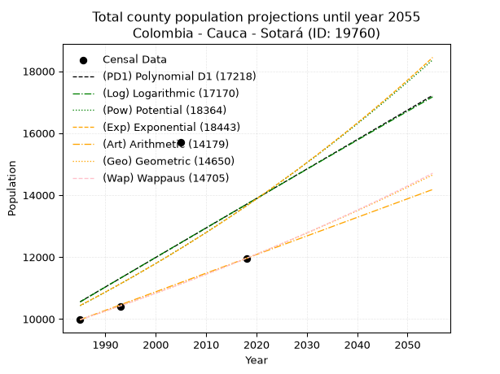
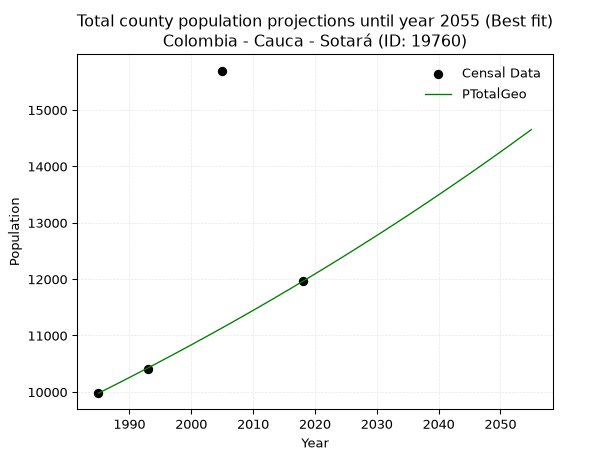
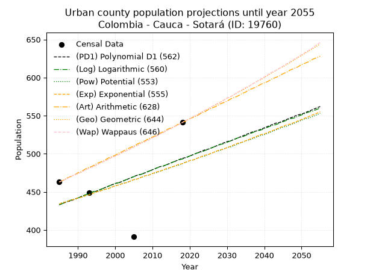
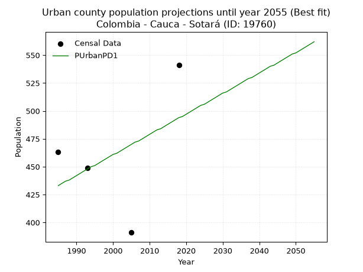
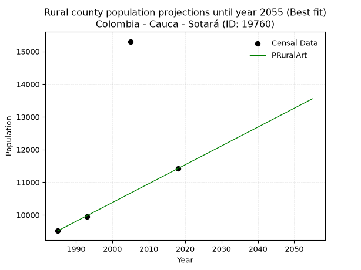

<div align="center">


</div>

# 📜 _“Population and Public Services Demand Projections (PPSD) until Year 2050 for Colombia - Cauca - Sotará (ID: 19760)”_
Keywords: `population` `public-service` `projection` `lineal` `polynomial` `logarithmic` `potential` `exponential` `arithmetic` `geometric` `wappaus` `dane` `colombia` `south-america`

PPSD are analytical estimates used by governments and planners to anticipate future changes in population size, age distribution, and the resulting community needs for utilities, healthcare, education, and infrastructure as sizing future water treatment facilities, electrical grids, and road networks based on spatial growth.

<div align="center">

</img>

</div>


> **General running parameters**: • app_version: _v20260806_. • Python version: _3.14.7_. • Pandas version: _3.0.5_. • NumPy version: _2.5.1_. • Creates, save and include plots into reports (create_plot): _False_. • Projection until year: _2050_. • Process polynomial degree 2 and up: _False_. • Process Wappaus: _True_. • Process Wappaus: _True_. • Set negative values to zero: _True_. • Set infinite values to zero: _True_. • Drop dataset notes: _True_. 
<div align="center">

Dynamic map: [:earth_americas:Google](http://maps.google.com/maps?q=2.25315594,-76.6133653) [:earth_americas:OSM](https://www.openstreetmap.org/#map=18/2.25315594/-76.6133653&layers=P) [:earth_americas:Bing](https://www.bing.com/maps?cp=2.25315594~-76.6133653&lvl=18) [:earth_americas:Apple](https://maps.apple.com/frame?center=2.25315594%2C-76.6133653&span=0.003%2C0.006)

</div>


<div align="center">

```geojson
{
  "type": "Feature",
  "geometry": {
    "type": "Point", 
    "coordinates": [-76.6133653, 2.25315594]
  }, 
  "properties": {
    "Name": "Colombia - Cauca - Sotará (ID: 19760)"
  }
}
```

</div>


## 0. Census Data (4 records)

Census data are official statistics collected by a government about the people and housing in a country. They usually include counts of total population, age, sex, race, income, education, and jobs.

📅Global census file: [Population.xlsx](../data/Population.xlsx)

| Source   |   Year |   CountryID | CountryName   |   StateID | StateName   |   CountyID | CountyName   |   PTotal |   PUrban |   PRural |
|:---------|-------:|------------:|:--------------|----------:|:------------|-----------:|:-------------|---------:|---------:|---------:|
| DANE     |   1985 |          57 | Colombia      |        19 | Cauca       |      19760 | Sotará       |     9977 |      463 |     9514 |
| DANE     |   1993 |          57 | Colombia      |        19 | Cauca       |      19760 | Sotará       |    10399 |      449 |     9950 |
| DANE     |   2005 |          57 | Colombia      |        19 | Cauca       |      19760 | Sotará       |    15696 |      391 |    15305 |
| DANE     |   2018 |          57 | Colombia      |        19 | Cauca       |      19760 | Sotará       |    11958 |      541 |    11417 |

> 🔥Some records could had specific notes about the registered values or the corresponding urban or rural distribution.

📅[SUI-RUPS](https://www.datos.gov.co/Hacienda-y-Cr-dito-P-blico/Registro-nico-de-Prestadores-de-Servicios-P-blicos/4qkq-csdn/about_data) - Local public utility companies: [RUPS.csv](../data/RUPS.xlsx)

 | SERVICIO       | ESTADO    | NOMBRE                                                                                        | NIT         | DEPARTAMENTO_DOMICILIO   | MUNICIPIO_DOMICILIO   | DIRECCION                             |   TELEFONO | EMAIL                       | TIPO_PRESTADOR          | CLASIFICACION                  |
|:---------------|:----------|:----------------------------------------------------------------------------------------------|:------------|:-------------------------|:----------------------|:--------------------------------------|-----------:|:----------------------------|:------------------------|:-------------------------------|
| ACUEDUCTO      | OPERATIVA | ASOCIACION REGIONAL DEL ACUEDUCTO SACHACOCO                                                   | 800206064-9 | CAUCA                    | TIMBIO                | CARRERA 22 No. 19-31 BARRIO SAN JUDAS |    8278538 | sachacocotimbio@hotmail.com | ORGANIZACION AUTORIZADA | DESDE 2501 HASTA 5000 USUARIOS |
| ACUEDUCTO      | OPERATIVA | ASOCIACIÒN DE USUARIOS DEL ACUEDUCTO REGIONAL INTEGRADO EL HIGUERÓN GUAYABAL                  | 900060945-6 | CAUCA                    | TIMBIO                | antonmoreno                           |    8243880 | higuerong@gmail.com         | ORGANIZACION AUTORIZADA | MENOR O IGUAL A 2500 USUARIOS  |
| ACUEDUCTO      | OPERATIVA | ASOCIACION ACUEDUCTO RURAL DE RIONEGRO                                                        | 817000975-1 | CAUCA                    | POPAYAN               | Centro Múltiple- salón comunal        |    0000000 | aarrpopayan@yahoo.com       | ORGANIZACION AUTORIZADA | MENOR O IGUAL A 2500 USUARIOS  |
| ACUEDUCTO      | OPERATIVA | ADMINISTRACION PÙBLICA COOPERATIVA DE ACUEDUCTO ALCANTARILLADO Y ASEO DEL MUNICIPIO DE SOTARA | 900358899-6 | CAUCA                    | SOTARA                | CAM MUNICIPAL                         |    8489016 | apcsotara@gmail.com         | ORGANIZACION AUTORIZADA | MENOR O IGUAL A 2500 USUARIOS  |
| ALCANTARILLADO | OPERATIVA | ADMINISTRACION PÙBLICA COOPERATIVA DE ACUEDUCTO ALCANTARILLADO Y ASEO DEL MUNICIPIO DE SOTARA | 900358899-6 | CAUCA                    | SOTARA                | CAM MUNICIPAL                         |    8489016 | apcsotara@gmail.com         | ORGANIZACION AUTORIZADA | MENOR O IGUAL A 2500 USUARIOS  |
| ACUEDUCTO      | OPERATIVA | ASOCIACIÓN DE USUARIOS DE ACUEDUCTO LA POBLACEÑA                                              | 817005182-9 | CAUCA                    | SOTARA                | VEREDA LA POBLACEÑA                   |    3122014 | benavidesalexander@yahoo.es | ORGANIZACION AUTORIZADA | MENOR O IGUAL A 2500 USUARIOS  |

## 1. Total

### 1.1. Coefficients and Parameters

* (PD1) Polynomial Deg 1: 95.17221999197312, -178360.73303894422 (lineal)
* (Log) Logarithmic: 191025.69228605696, -1439980.3178501462
* (Pow) Potential: 16.325815991283875, -49.820396918429616
* (Exp) Exponential: 0.008136226227911488, 0.0010102761120981412
* (Art) Arithmetic: Year diff. 2018 - 1985 = 33, Population diff. 11958 - 9977 = 1981, Annual growth = 60.03030303030303
* (Geo) Geometric: Year diff. 2018 - 1985 = 33, Population diff. 11958 - 9977 = 1981, Annual growth % = 0.005503515262132552
* (Wap) Wappaus: i = 0.5473471896995945, Condition values only valid for < 200)

<sub>
Wappaus condition values: ['0.00', '0.55', '1.09', '1.64', '2.19', '2.74', '3.28', '3.83', '4.38', '4.93', '5.47', '6.02', '6.57', '7.12', '7.66', '8.21', '8.76', '9.30', '9.85', '10.40', '10.95', '11.49', '12.04', '12.59', '13.14', '13.68', '14.23', '14.78', '15.33', '15.87', '16.42', '16.97', '17.52', '18.06', '18.61', '19.16', '19.70', '20.25', '20.80', '21.35', '21.89', '22.44', '22.99', '23.54', '24.08', '24.63', '25.18', '25.73', '26.27', '26.82', '27.37', '27.91', '28.46', '29.01', '29.56', '30.10', '30.65', '31.20', '31.75', '32.29', '32.84', '33.39', '33.94', '34.48', '35.03', '35.58']
</sub>


### 1.2. Projected Dataset

|   Year |   CountyID |   PTotalPD1 |   PTotalLog |   PTotalPow |   PTotalExp |   PTotalArt |   PTotalGeo |   PTotalWap |
|-------:|-----------:|------------:|------------:|------------:|------------:|------------:|------------:|------------:|
|   1985 |      19760 |       10556 |       10549 |       10429 |       10435 |        9977 |        9977 |        9977 |
|   1986 |      19760 |       10651 |       10645 |       10515 |       10520 |       10037 |       10032 |       10032 |
|   1987 |      19760 |       10746 |       10742 |       10602 |       10606 |       10097 |       10087 |       10087 |
|   1988 |      19760 |       10842 |       10838 |       10689 |       10692 |       10157 |       10143 |       10142 |
|   1989 |      19760 |       10937 |       10934 |       10777 |       10780 |       10217 |       10198 |       10198 |
|   1990 |      19760 |       11032 |       11030 |       10866 |       10868 |       10277 |       10255 |       10254 |
|   1991 |      19760 |       11127 |       11126 |       10956 |       10957 |       10337 |       10311 |       10310 |
|   1992 |      19760 |       11222 |       11222 |       11046 |       11046 |       10397 |       10368 |       10367 |
|   1993 |      19760 |       11318 |       11318 |       11137 |       11136 |       10457 |       10425 |       10424 |
|   1994 |      19760 |       11413 |       11413 |       11228 |       11227 |       10517 |       10482 |       10481 |
|   1995 |      19760 |       11508 |       11509 |       11320 |       11319 |       10577 |       10540 |       10538 |
|   1996 |      19760 |       11603 |       11605 |       11413 |       11411 |       10637 |       10598 |       10596 |
|   1997 |      19760 |       11698 |       11701 |       11507 |       11505 |       10697 |       10656 |       10655 |
|   1998 |      19760 |       11793 |       11796 |       11602 |       11599 |       10757 |       10715 |       10713 |
|   1999 |      19760 |       11889 |       11892 |       11697 |       11693 |       10817 |       10774 |       10772 |
|   2000 |      19760 |       11984 |       11987 |       11793 |       11789 |       10877 |       10833 |       10831 |
|   2001 |      19760 |       12079 |       12083 |       11889 |       11885 |       10937 |       10893 |       10891 |
|   2002 |      19760 |       12174 |       12178 |       11987 |       11982 |       10998 |       10953 |       10951 |
|   2003 |      19760 |       12269 |       12274 |       12085 |       12080 |       11058 |       11013 |       11011 |
|   2004 |      19760 |       12364 |       12369 |       12184 |       12179 |       11118 |       11074 |       11071 |
|   2005 |      19760 |       12460 |       12464 |       12283 |       12278 |       11178 |       11135 |       11132 |
|   2006 |      19760 |       12555 |       12560 |       12384 |       12379 |       11238 |       11196 |       11194 |
|   2007 |      19760 |       12650 |       12655 |       12485 |       12480 |       11298 |       11257 |       11255 |
|   2008 |      19760 |       12745 |       12750 |       12587 |       12582 |       11358 |       11319 |       11317 |
|   2009 |      19760 |       12840 |       12845 |       12690 |       12685 |       11418 |       11382 |       11380 |
|   2010 |      19760 |       12935 |       12940 |       12793 |       12788 |       11478 |       11444 |       11442 |
|   2011 |      19760 |       13031 |       13035 |       12897 |       12893 |       11538 |       11507 |       11506 |
|   2012 |      19760 |       13126 |       13130 |       13002 |       12998 |       11598 |       11571 |       11569 |
|   2013 |      19760 |       13221 |       13225 |       13108 |       13104 |       11658 |       11634 |       11633 |
|   2014 |      19760 |       13316 |       13320 |       13215 |       13211 |       11718 |       11698 |       11697 |
|   2015 |      19760 |       13411 |       13415 |       13323 |       13319 |       11778 |       11763 |       11762 |
|   2016 |      19760 |       13506 |       13509 |       13431 |       13428 |       11838 |       11827 |       11827 |
|   2017 |      19760 |       13602 |       13604 |       13540 |       13538 |       11898 |       11893 |       11892 |
|   2018 |      19760 |       13697 |       13699 |       13650 |       13648 |       11958 |       11958 |       11958 |
|   2019 |      19760 |       13792 |       13794 |       13761 |       13760 |       12018 |       12024 |       12024 |
|   2020 |      19760 |       13887 |       13888 |       13873 |       13872 |       12078 |       12090 |       12091 |
|   2021 |      19760 |       13982 |       13983 |       13985 |       13986 |       12138 |       12157 |       12158 |
|   2022 |      19760 |       14077 |       14077 |       14099 |       14100 |       12198 |       12223 |       12225 |
|   2023 |      19760 |       14173 |       14172 |       14213 |       14215 |       12258 |       12291 |       12293 |
|   2024 |      19760 |       14268 |       14266 |       14328 |       14331 |       12318 |       12358 |       12361 |
|   2025 |      19760 |       14363 |       14360 |       14444 |       14448 |       12378 |       12426 |       12430 |
|   2026 |      19760 |       14458 |       14455 |       14561 |       14566 |       12438 |       12495 |       12499 |
|   2027 |      19760 |       14553 |       14549 |       14679 |       14685 |       12498 |       12564 |       12568 |
|   2028 |      19760 |       14649 |       14643 |       14797 |       14805 |       12558 |       12633 |       12638 |
|   2029 |      19760 |       14744 |       14737 |       14917 |       14926 |       12618 |       12702 |       12709 |
|   2030 |      19760 |       14839 |       14831 |       15037 |       15048 |       12678 |       12772 |       12780 |
|   2031 |      19760 |       14934 |       14926 |       15159 |       15171 |       12738 |       12842 |       12851 |
|   2032 |      19760 |       15029 |       15020 |       15281 |       15295 |       12798 |       12913 |       12922 |
|   2033 |      19760 |       15124 |       15114 |       15404 |       15420 |       12858 |       12984 |       12995 |
|   2034 |      19760 |       15220 |       15207 |       15529 |       15546 |       12918 |       13056 |       13067 |
|   2035 |      19760 |       15315 |       15301 |       15654 |       15673 |       12979 |       13127 |       13140 |
|   2036 |      19760 |       15410 |       15395 |       15780 |       15801 |       13039 |       13200 |       13214 |
|   2037 |      19760 |       15505 |       15489 |       15907 |       15930 |       13099 |       13272 |       13288 |
|   2038 |      19760 |       15600 |       15583 |       16035 |       16060 |       13159 |       13345 |       13362 |
|   2039 |      19760 |       15695 |       15676 |       16164 |       16191 |       13219 |       13419 |       13437 |
|   2040 |      19760 |       15791 |       15770 |       16294 |       16324 |       13279 |       13493 |       13513 |
|   2041 |      19760 |       15886 |       15864 |       16424 |       16457 |       13339 |       13567 |       13589 |
|   2042 |      19760 |       15981 |       15957 |       16556 |       16591 |       13399 |       13642 |       13665 |
|   2043 |      19760 |       16076 |       16051 |       16689 |       16727 |       13459 |       13717 |       13742 |
|   2044 |      19760 |       16171 |       16144 |       16823 |       16864 |       13519 |       13792 |       13819 |
|   2045 |      19760 |       16266 |       16238 |       16958 |       17001 |       13579 |       13868 |       13897 |
|   2046 |      19760 |       16362 |       16331 |       17094 |       17140 |       13639 |       13944 |       13976 |
|   2047 |      19760 |       16457 |       16425 |       17231 |       17280 |       13699 |       14021 |       14055 |
|   2048 |      19760 |       16552 |       16518 |       17369 |       17421 |       13759 |       14098 |       14134 |
|   2049 |      19760 |       16647 |       16611 |       17508 |       17564 |       13819 |       14176 |       14214 |
|   2050 |      19760 |       16742 |       16704 |       17648 |       17707 |       13879 |       14254 |       14295 |
<div align="center">

</img>

</div>


### 1.3. Best fit with absolute and relative error (%)

Relative error puts that difference into context by dividing the absolute error by the true value, creating a unitless ratio or percentage that shows the scale of the mistake.

Absolute and relative error

|   Year | Source   |   CountryID | CountryName   |   StateID | StateName   |   CountyID_x | CountyName   |   PTotal |   PUrban |   PRural |   CountyID_y |   PTotalPD1 |   PTotalLog |   PTotalPow |   PTotalExp |   PTotalArt |   PTotalGeo |   PTotalWap |   PTotalPD1AbsError |   PTotalLogAbsError |   PTotalPowAbsError |   PTotalExpAbsError |   PTotalArtAbsError |   PTotalGeoAbsError |   PTotalWapAbsError |   PTotalPD1RelError |   PTotalLogRelError |   PTotalPowRelError |   PTotalExpRelError |   PTotalArtRelError |   PTotalGeoRelError |   PTotalWapRelError |
|-------:|:---------|------------:|:--------------|----------:|:------------|-------------:|:-------------|---------:|---------:|---------:|-------------:|------------:|------------:|------------:|------------:|------------:|------------:|------------:|--------------------:|--------------------:|--------------------:|--------------------:|--------------------:|--------------------:|--------------------:|--------------------:|--------------------:|--------------------:|--------------------:|--------------------:|--------------------:|--------------------:|
|   1985 | DANE     |          57 | Colombia      |        19 | Cauca       |        19760 | Sotará       |     9977 |      463 |     9514 |        19760 |       10556 |       10549 |       10429 |       10435 |        9977 |        9977 |        9977 |                 579 |                 572 |                 452 |                 458 |                   0 |                   0 |                   0 |             5.80335 |             5.73319 |             4.53042 |             4.59056 |            0        |            0        |            0        |
|   1993 | DANE     |          57 | Colombia      |        19 | Cauca       |        19760 | Sotará       |    10399 |      449 |     9950 |        19760 |       11318 |       11318 |       11137 |       11136 |       10457 |       10425 |       10424 |                 919 |                 919 |                 738 |                 737 |                  58 |                  26 |                  25 |             8.83739 |             8.83739 |             7.09684 |             7.08722 |            0.557746 |            0.250024 |            0.240408 |
|   2005 | DANE     |          57 | Colombia      |        19 | Cauca       |        19760 | Sotará       |    15696 |      391 |    15305 |        19760 |       12460 |       12464 |       12283 |       12278 |       11178 |       11135 |       11132 |                3236 |                3232 |                3413 |                3418 |                4518 |                4561 |                4564 |            20.6167  |            20.5912  |            21.7444  |            21.7762  |           28.7844   |           29.0584   |           29.0775   |
|   2018 | DANE     |          57 | Colombia      |        19 | Cauca       |        19760 | Sotará       |    11958 |      541 |    11417 |        19760 |       13697 |       13699 |       13650 |       13648 |       11958 |       11958 |       11958 |                1739 |                1741 |                1692 |                1690 |                   0 |                   0 |                   0 |            14.5426  |            14.5593  |            14.1495  |            14.1328  |            0        |            0        |            0        |

Relative error mean

| Method    |   RelError | Best   |
|:----------|-----------:|:-------|
| PTotalPD1 |   12.45    |        |
| PTotalLog |   12.4303  |        |
| PTotalPow |   11.8803  |        |
| PTotalExp |   11.8967  |        |
| PTotalArt |    7.33554 |        |
| PTotalGeo |    7.3271  | True   |
| PTotalWap |    7.32947 |        |

💙Best method: _**PTotalGeo**_
<div align="center">

</img>

</div>


### 1.4. Fresh water supply demand in liters per capita per day (lpcd)

The fresh water supply demand typically ranges from 100 to 300 liters per capita per day (lpcd) for standard domestic and municipal planning, though absolute survival minimums set by the World Health Organization are as low as 7.5 to 20 liters per day, and total consumption in high-income nations can exceed 400 liters.

> `CZ`: Level in meters above the sea level (masl)<br> `WS`: Fresh water supply demand in liters per capita per day (lpcd or l/h/d)<br> `WSAll`: Zonal fresh water supply demand in liters per second (l/s)<br> `A`: Zonal area in square meters<br> `DP`: Population density (people/hectare or p/ha)

Reference values (RAS Colombia)

|    CZ |   WS |
|------:|-----:|
|  1000 |  120 |
|  2000 |  130 |
| 99999 |  140 |

County shapefile geometry properties and water supply values

|   CountyID |      ATotal |   CZTotal |   WSTotal |
|-----------:|------------:|----------:|----------:|
|      19760 | 5.16166e+08 |   2679.88 |       140 |

Projected values for best method: PTotalGeo

|   CountyID |   Year |   PTotalGeo |   DPTotal |   WSTotal |   WSTotalAll |
|-----------:|-------:|------------:|----------:|----------:|-------------:|
|      19760 |   1985 |        9977 |      0.19 |       140 |      16.1664 |
|      19760 |   1986 |       10032 |      0.19 |       140 |      16.2556 |
|      19760 |   1987 |       10087 |      0.2  |       140 |      16.3447 |
|      19760 |   1988 |       10143 |      0.2  |       140 |      16.4354 |
|      19760 |   1989 |       10198 |      0.2  |       140 |      16.5245 |
|      19760 |   1990 |       10255 |      0.2  |       140 |      16.6169 |
|      19760 |   1991 |       10311 |      0.2  |       140 |      16.7076 |
|      19760 |   1992 |       10368 |      0.2  |       140 |      16.8    |
|      19760 |   1993 |       10425 |      0.2  |       140 |      16.8924 |
|      19760 |   1994 |       10482 |      0.2  |       140 |      16.9847 |
|      19760 |   1995 |       10540 |      0.2  |       140 |      17.0787 |
|      19760 |   1996 |       10598 |      0.21 |       140 |      17.1727 |
|      19760 |   1997 |       10656 |      0.21 |       140 |      17.2667 |
|      19760 |   1998 |       10715 |      0.21 |       140 |      17.3623 |
|      19760 |   1999 |       10774 |      0.21 |       140 |      17.4579 |
|      19760 |   2000 |       10833 |      0.21 |       140 |      17.5535 |
|      19760 |   2001 |       10893 |      0.21 |       140 |      17.6507 |
|      19760 |   2002 |       10953 |      0.21 |       140 |      17.7479 |
|      19760 |   2003 |       11013 |      0.21 |       140 |      17.8451 |
|      19760 |   2004 |       11074 |      0.21 |       140 |      17.944  |
|      19760 |   2005 |       11135 |      0.22 |       140 |      18.0428 |
|      19760 |   2006 |       11196 |      0.22 |       140 |      18.1417 |
|      19760 |   2007 |       11257 |      0.22 |       140 |      18.2405 |
|      19760 |   2008 |       11319 |      0.22 |       140 |      18.341  |
|      19760 |   2009 |       11382 |      0.22 |       140 |      18.4431 |
|      19760 |   2010 |       11444 |      0.22 |       140 |      18.5435 |
|      19760 |   2011 |       11507 |      0.22 |       140 |      18.6456 |
|      19760 |   2012 |       11571 |      0.22 |       140 |      18.7493 |
|      19760 |   2013 |       11634 |      0.23 |       140 |      18.8514 |
|      19760 |   2014 |       11698 |      0.23 |       140 |      18.9551 |
|      19760 |   2015 |       11763 |      0.23 |       140 |      19.0604 |
|      19760 |   2016 |       11827 |      0.23 |       140 |      19.1641 |
|      19760 |   2017 |       11893 |      0.23 |       140 |      19.2711 |
|      19760 |   2018 |       11958 |      0.23 |       140 |      19.3764 |
|      19760 |   2019 |       12024 |      0.23 |       140 |      19.4833 |
|      19760 |   2020 |       12090 |      0.23 |       140 |      19.5903 |
|      19760 |   2021 |       12157 |      0.24 |       140 |      19.6988 |
|      19760 |   2022 |       12223 |      0.24 |       140 |      19.8058 |
|      19760 |   2023 |       12291 |      0.24 |       140 |      19.916  |
|      19760 |   2024 |       12358 |      0.24 |       140 |      20.0245 |
|      19760 |   2025 |       12426 |      0.24 |       140 |      20.1347 |
|      19760 |   2026 |       12495 |      0.24 |       140 |      20.2465 |
|      19760 |   2027 |       12564 |      0.24 |       140 |      20.3583 |
|      19760 |   2028 |       12633 |      0.24 |       140 |      20.4701 |
|      19760 |   2029 |       12702 |      0.25 |       140 |      20.5819 |
|      19760 |   2030 |       12772 |      0.25 |       140 |      20.6954 |
|      19760 |   2031 |       12842 |      0.25 |       140 |      20.8088 |
|      19760 |   2032 |       12913 |      0.25 |       140 |      20.9238 |
|      19760 |   2033 |       12984 |      0.25 |       140 |      21.0389 |
|      19760 |   2034 |       13056 |      0.25 |       140 |      21.1556 |
|      19760 |   2035 |       13127 |      0.25 |       140 |      21.2706 |
|      19760 |   2036 |       13200 |      0.26 |       140 |      21.3889 |
|      19760 |   2037 |       13272 |      0.26 |       140 |      21.5056 |
|      19760 |   2038 |       13345 |      0.26 |       140 |      21.6238 |
|      19760 |   2039 |       13419 |      0.26 |       140 |      21.7437 |
|      19760 |   2040 |       13493 |      0.26 |       140 |      21.8637 |
|      19760 |   2041 |       13567 |      0.26 |       140 |      21.9836 |
|      19760 |   2042 |       13642 |      0.26 |       140 |      22.1051 |
|      19760 |   2043 |       13717 |      0.27 |       140 |      22.2266 |
|      19760 |   2044 |       13792 |      0.27 |       140 |      22.3481 |
|      19760 |   2045 |       13868 |      0.27 |       140 |      22.4713 |
|      19760 |   2046 |       13944 |      0.27 |       140 |      22.5944 |
|      19760 |   2047 |       14021 |      0.27 |       140 |      22.7192 |
|      19760 |   2048 |       14098 |      0.27 |       140 |      22.844  |
|      19760 |   2049 |       14176 |      0.27 |       140 |      22.9704 |
|      19760 |   2050 |       14254 |      0.28 |       140 |      23.0968 |

## 2. Urban

### 2.1. Coefficients and Parameters

* (PD1) Polynomial Deg 1: 1.8370132476916012, -3213.4857486951255 (lineal)
* (Log) Logarithmic: 3660.7986209581545, -27364.759653701996
* (Pow) Potential: 6.981980149001126, -20.387245626796638
* (Exp) Exponential: 0.00350590059977355, 0.4123187847076086
* (Art) Arithmetic: Year diff. 2018 - 1985 = 33, Population diff. 541 - 463 = 78, Annual growth = 2.3636363636363638
* (Geo) Geometric: Year diff. 2018 - 1985 = 33, Population diff. 541 - 463 = 78, Annual growth % = 0.004729093236522708
* (Wap) Wappaus: i = 0.4708438971387179, Condition values only valid for < 200)

<sub>
Wappaus condition values: ['0.00', '0.47', '0.94', '1.41', '1.88', '2.35', '2.83', '3.30', '3.77', '4.24', '4.71', '5.18', '5.65', '6.12', '6.59', '7.06', '7.53', '8.00', '8.48', '8.95', '9.42', '9.89', '10.36', '10.83', '11.30', '11.77', '12.24', '12.71', '13.18', '13.65', '14.13', '14.60', '15.07', '15.54', '16.01', '16.48', '16.95', '17.42', '17.89', '18.36', '18.83', '19.30', '19.78', '20.25', '20.72', '21.19', '21.66', '22.13', '22.60', '23.07', '23.54', '24.01', '24.48', '24.95', '25.43', '25.90', '26.37', '26.84', '27.31', '27.78', '28.25', '28.72', '29.19', '29.66', '30.13', '30.60']
</sub>


### 2.2. Projected Dataset

|   Year |   CountyID |   PUrbanPD1 |   PUrbanLog |   PUrbanPow |   PUrbanExp |   PUrbanArt |   PUrbanGeo |   PUrbanWap |
|-------:|-----------:|------------:|------------:|------------:|------------:|------------:|------------:|------------:|
|   1985 |      19760 |         433 |         433 |         434 |         434 |         463 |         463 |         463 |
|   1986 |      19760 |         435 |         435 |         436 |         436 |         465 |         465 |         465 |
|   1987 |      19760 |         437 |         437 |         437 |         437 |         468 |         467 |         467 |
|   1988 |      19760 |         438 |         439 |         439 |         439 |         470 |         470 |         470 |
|   1989 |      19760 |         440 |         440 |         440 |         440 |         472 |         472 |         472 |
|   1990 |      19760 |         442 |         442 |         442 |         442 |         475 |         474 |         474 |
|   1991 |      19760 |         444 |         444 |         443 |         443 |         477 |         476 |         476 |
|   1992 |      19760 |         446 |         446 |         445 |         445 |         480 |         479 |         479 |
|   1993 |      19760 |         448 |         448 |         447 |         446 |         482 |         481 |         481 |
|   1994 |      19760 |         450 |         450 |         448 |         448 |         484 |         483 |         483 |
|   1995 |      19760 |         451 |         451 |         450 |         450 |         487 |         485 |         485 |
|   1996 |      19760 |         453 |         453 |         451 |         451 |         489 |         488 |         488 |
|   1997 |      19760 |         455 |         455 |         453 |         453 |         491 |         490 |         490 |
|   1998 |      19760 |         457 |         457 |         454 |         454 |         494 |         492 |         492 |
|   1999 |      19760 |         459 |         459 |         456 |         456 |         496 |         495 |         495 |
|   2000 |      19760 |         461 |         461 |         458 |         458 |         498 |         497 |         497 |
|   2001 |      19760 |         462 |         462 |         459 |         459 |         501 |         499 |         499 |
|   2002 |      19760 |         464 |         464 |         461 |         461 |         503 |         502 |         502 |
|   2003 |      19760 |         466 |         466 |         462 |         462 |         506 |         504 |         504 |
|   2004 |      19760 |         468 |         468 |         464 |         464 |         508 |         506 |         506 |
|   2005 |      19760 |         470 |         470 |         466 |         466 |         510 |         509 |         509 |
|   2006 |      19760 |         472 |         472 |         467 |         467 |         513 |         511 |         511 |
|   2007 |      19760 |         473 |         473 |         469 |         469 |         515 |         514 |         514 |
|   2008 |      19760 |         475 |         475 |         471 |         471 |         517 |         516 |         516 |
|   2009 |      19760 |         477 |         477 |         472 |         472 |         520 |         519 |         518 |
|   2010 |      19760 |         479 |         479 |         474 |         474 |         522 |         521 |         521 |
|   2011 |      19760 |         481 |         481 |         475 |         476 |         524 |         523 |         523 |
|   2012 |      19760 |         483 |         483 |         477 |         477 |         527 |         526 |         526 |
|   2013 |      19760 |         484 |         484 |         479 |         479 |         529 |         528 |         528 |
|   2014 |      19760 |         486 |         486 |         480 |         481 |         532 |         531 |         531 |
|   2015 |      19760 |         488 |         488 |         482 |         482 |         534 |         533 |         533 |
|   2016 |      19760 |         490 |         490 |         484 |         484 |         536 |         536 |         536 |
|   2017 |      19760 |         492 |         492 |         485 |         486 |         539 |         538 |         538 |
|   2018 |      19760 |         494 |         493 |         487 |         487 |         541 |         541 |         541 |
|   2019 |      19760 |         495 |         495 |         489 |         489 |         543 |         544 |         544 |
|   2020 |      19760 |         497 |         497 |         491 |         491 |         546 |         546 |         546 |
|   2021 |      19760 |         499 |         499 |         492 |         492 |         548 |         549 |         549 |
|   2022 |      19760 |         501 |         501 |         494 |         494 |         550 |         551 |         551 |
|   2023 |      19760 |         503 |         502 |         496 |         496 |         553 |         554 |         554 |
|   2024 |      19760 |         505 |         504 |         497 |         498 |         555 |         557 |         557 |
|   2025 |      19760 |         506 |         506 |         499 |         499 |         558 |         559 |         559 |
|   2026 |      19760 |         508 |         508 |         501 |         501 |         560 |         562 |         562 |
|   2027 |      19760 |         510 |         510 |         503 |         503 |         562 |         564 |         565 |
|   2028 |      19760 |         512 |         512 |         504 |         505 |         565 |         567 |         567 |
|   2029 |      19760 |         514 |         513 |         506 |         506 |         567 |         570 |         570 |
|   2030 |      19760 |         516 |         515 |         508 |         508 |         569 |         573 |         573 |
|   2031 |      19760 |         517 |         517 |         509 |         510 |         572 |         575 |         575 |
|   2032 |      19760 |         519 |         519 |         511 |         512 |         574 |         578 |         578 |
|   2033 |      19760 |         521 |         521 |         513 |         514 |         576 |         581 |         581 |
|   2034 |      19760 |         523 |         522 |         515 |         515 |         579 |         583 |         584 |
|   2035 |      19760 |         525 |         524 |         517 |         517 |         581 |         586 |         587 |
|   2036 |      19760 |         527 |         526 |         518 |         519 |         584 |         589 |         589 |
|   2037 |      19760 |         529 |         528 |         520 |         521 |         586 |         592 |         592 |
|   2038 |      19760 |         530 |         530 |         522 |         523 |         588 |         595 |         595 |
|   2039 |      19760 |         532 |         531 |         524 |         525 |         591 |         597 |         598 |
|   2040 |      19760 |         534 |         533 |         525 |         526 |         593 |         600 |         601 |
|   2041 |      19760 |         536 |         535 |         527 |         528 |         595 |         603 |         604 |
|   2042 |      19760 |         538 |         537 |         529 |         530 |         598 |         606 |         607 |
|   2043 |      19760 |         540 |         538 |         531 |         532 |         600 |         609 |         609 |
|   2044 |      19760 |         541 |         540 |         533 |         534 |         602 |         612 |         612 |
|   2045 |      19760 |         543 |         542 |         535 |         536 |         605 |         614 |         615 |
|   2046 |      19760 |         545 |         544 |         536 |         538 |         607 |         617 |         618 |
|   2047 |      19760 |         547 |         546 |         538 |         539 |         610 |         620 |         621 |
|   2048 |      19760 |         549 |         547 |         540 |         541 |         612 |         623 |         624 |
|   2049 |      19760 |         551 |         549 |         542 |         543 |         614 |         626 |         627 |
|   2050 |      19760 |         552 |         551 |         544 |         545 |         617 |         629 |         630 |
<div align="center">

</img>

</div>


### 2.3. Best fit with absolute and relative error (%)

Relative error puts that difference into context by dividing the absolute error by the true value, creating a unitless ratio or percentage that shows the scale of the mistake.

Absolute and relative error

|   Year | Source   |   CountryID | CountryName   |   StateID | StateName   |   CountyID_x | CountyName   |   PTotal |   PUrban |   PRural |   CountyID_y |   PUrbanPD1 |   PUrbanLog |   PUrbanPow |   PUrbanExp |   PUrbanArt |   PUrbanGeo |   PUrbanWap |   PUrbanPD1AbsError |   PUrbanLogAbsError |   PUrbanPowAbsError |   PUrbanExpAbsError |   PUrbanArtAbsError |   PUrbanGeoAbsError |   PUrbanWapAbsError |   PUrbanPD1RelError |   PUrbanLogRelError |   PUrbanPowRelError |   PUrbanExpRelError |   PUrbanArtRelError |   PUrbanGeoRelError |   PUrbanWapRelError |
|-------:|:---------|------------:|:--------------|----------:|:------------|-------------:|:-------------|---------:|---------:|---------:|-------------:|------------:|------------:|------------:|------------:|------------:|------------:|------------:|--------------------:|--------------------:|--------------------:|--------------------:|--------------------:|--------------------:|--------------------:|--------------------:|--------------------:|--------------------:|--------------------:|--------------------:|--------------------:|--------------------:|
|   1985 | DANE     |          57 | Colombia      |        19 | Cauca       |        19760 | Sotará       |     9977 |      463 |     9514 |        19760 |         433 |         433 |         434 |         434 |         463 |         463 |         463 |                  30 |                  30 |                  29 |                  29 |                   0 |                   0 |                   0 |            6.47948  |            6.47948  |            6.2635   |            6.2635   |             0       |             0       |             0       |
|   1993 | DANE     |          57 | Colombia      |        19 | Cauca       |        19760 | Sotará       |    10399 |      449 |     9950 |        19760 |         448 |         448 |         447 |         446 |         482 |         481 |         481 |                   1 |                   1 |                   2 |                   3 |                  33 |                  32 |                  32 |            0.222717 |            0.222717 |            0.445434 |            0.668151 |             7.34967 |             7.12695 |             7.12695 |
|   2005 | DANE     |          57 | Colombia      |        19 | Cauca       |        19760 | Sotará       |    15696 |      391 |    15305 |        19760 |         470 |         470 |         466 |         466 |         510 |         509 |         509 |                  79 |                  79 |                  75 |                  75 |                 119 |                 118 |                 118 |           20.2046   |           20.2046   |           19.1816   |           19.1816   |            30.4348  |            30.179   |            30.179   |
|   2018 | DANE     |          57 | Colombia      |        19 | Cauca       |        19760 | Sotará       |    11958 |      541 |    11417 |        19760 |         494 |         493 |         487 |         487 |         541 |         541 |         541 |                  47 |                  48 |                  54 |                  54 |                   0 |                   0 |                   0 |            8.68762  |            8.87246  |            9.98152  |            9.98152  |             0       |             0       |             0       |

Relative error mean

| Method    |   RelError | Best   |
|:----------|-----------:|:-------|
| PUrbanPD1 |    8.8986  | True   |
| PUrbanLog |    8.94482 |        |
| PUrbanPow |    8.96801 |        |
| PUrbanExp |    9.02369 |        |
| PUrbanArt |    9.44611 |        |
| PUrbanGeo |    9.32649 |        |
| PUrbanWap |    9.32649 |        |

💙Best method: _**PUrbanPD1**_
<div align="center">

</img>

</div>


### 2.4. Fresh water supply demand in liters per capita per day (lpcd)

The fresh water supply demand typically ranges from 100 to 300 liters per capita per day (lpcd) for standard domestic and municipal planning, though absolute survival minimums set by the World Health Organization are as low as 7.5 to 20 liters per day, and total consumption in high-income nations can exceed 400 liters.

> `CZ`: Level in meters above the sea level (masl)<br> `WS`: Fresh water supply demand in liters per capita per day (lpcd or l/h/d)<br> `WSAll`: Zonal fresh water supply demand in liters per second (l/s)<br> `A`: Zonal area in square meters<br> `DP`: Population density (people/hectare or p/ha)

Reference values (RAS Colombia)

|    CZ |   WS |
|------:|-----:|
|  1000 |  120 |
|  2000 |  130 |
| 99999 |  140 |

County shapefile geometry properties and water supply values

|   CountyID |   AUrban |   CZUrban |   WSUrban |
|-----------:|---------:|----------:|----------:|
|      19760 |   280652 |   2509.85 |       140 |

Projected values for best method: PUrbanPD1

|   CountyID |   Year |   PUrbanPD1 |   DPUrban |   WSUrban |   WSUrbanAll |
|-----------:|-------:|------------:|----------:|----------:|-------------:|
|      19760 |   1985 |         433 |     15.43 |       140 |     0.70162  |
|      19760 |   1986 |         435 |     15.5  |       140 |     0.704861 |
|      19760 |   1987 |         437 |     15.57 |       140 |     0.708102 |
|      19760 |   1988 |         438 |     15.61 |       140 |     0.709722 |
|      19760 |   1989 |         440 |     15.68 |       140 |     0.712963 |
|      19760 |   1990 |         442 |     15.75 |       140 |     0.716204 |
|      19760 |   1991 |         444 |     15.82 |       140 |     0.719444 |
|      19760 |   1992 |         446 |     15.89 |       140 |     0.722685 |
|      19760 |   1993 |         448 |     15.96 |       140 |     0.725926 |
|      19760 |   1994 |         450 |     16.03 |       140 |     0.729167 |
|      19760 |   1995 |         451 |     16.07 |       140 |     0.730787 |
|      19760 |   1996 |         453 |     16.14 |       140 |     0.734028 |
|      19760 |   1997 |         455 |     16.21 |       140 |     0.737269 |
|      19760 |   1998 |         457 |     16.28 |       140 |     0.740509 |
|      19760 |   1999 |         459 |     16.35 |       140 |     0.74375  |
|      19760 |   2000 |         461 |     16.43 |       140 |     0.746991 |
|      19760 |   2001 |         462 |     16.46 |       140 |     0.748611 |
|      19760 |   2002 |         464 |     16.53 |       140 |     0.751852 |
|      19760 |   2003 |         466 |     16.6  |       140 |     0.755093 |
|      19760 |   2004 |         468 |     16.68 |       140 |     0.758333 |
|      19760 |   2005 |         470 |     16.75 |       140 |     0.761574 |
|      19760 |   2006 |         472 |     16.82 |       140 |     0.764815 |
|      19760 |   2007 |         473 |     16.85 |       140 |     0.766435 |
|      19760 |   2008 |         475 |     16.92 |       140 |     0.769676 |
|      19760 |   2009 |         477 |     17    |       140 |     0.772917 |
|      19760 |   2010 |         479 |     17.07 |       140 |     0.776157 |
|      19760 |   2011 |         481 |     17.14 |       140 |     0.779398 |
|      19760 |   2012 |         483 |     17.21 |       140 |     0.782639 |
|      19760 |   2013 |         484 |     17.25 |       140 |     0.784259 |
|      19760 |   2014 |         486 |     17.32 |       140 |     0.7875   |
|      19760 |   2015 |         488 |     17.39 |       140 |     0.790741 |
|      19760 |   2016 |         490 |     17.46 |       140 |     0.793981 |
|      19760 |   2017 |         492 |     17.53 |       140 |     0.797222 |
|      19760 |   2018 |         494 |     17.6  |       140 |     0.800463 |
|      19760 |   2019 |         495 |     17.64 |       140 |     0.802083 |
|      19760 |   2020 |         497 |     17.71 |       140 |     0.805324 |
|      19760 |   2021 |         499 |     17.78 |       140 |     0.808565 |
|      19760 |   2022 |         501 |     17.85 |       140 |     0.811806 |
|      19760 |   2023 |         503 |     17.92 |       140 |     0.815046 |
|      19760 |   2024 |         505 |     17.99 |       140 |     0.818287 |
|      19760 |   2025 |         506 |     18.03 |       140 |     0.819907 |
|      19760 |   2026 |         508 |     18.1  |       140 |     0.823148 |
|      19760 |   2027 |         510 |     18.17 |       140 |     0.826389 |
|      19760 |   2028 |         512 |     18.24 |       140 |     0.82963  |
|      19760 |   2029 |         514 |     18.31 |       140 |     0.83287  |
|      19760 |   2030 |         516 |     18.39 |       140 |     0.836111 |
|      19760 |   2031 |         517 |     18.42 |       140 |     0.837731 |
|      19760 |   2032 |         519 |     18.49 |       140 |     0.840972 |
|      19760 |   2033 |         521 |     18.56 |       140 |     0.844213 |
|      19760 |   2034 |         523 |     18.64 |       140 |     0.847454 |
|      19760 |   2035 |         525 |     18.71 |       140 |     0.850694 |
|      19760 |   2036 |         527 |     18.78 |       140 |     0.853935 |
|      19760 |   2037 |         529 |     18.85 |       140 |     0.857176 |
|      19760 |   2038 |         530 |     18.88 |       140 |     0.858796 |
|      19760 |   2039 |         532 |     18.96 |       140 |     0.862037 |
|      19760 |   2040 |         534 |     19.03 |       140 |     0.865278 |
|      19760 |   2041 |         536 |     19.1  |       140 |     0.868519 |
|      19760 |   2042 |         538 |     19.17 |       140 |     0.871759 |
|      19760 |   2043 |         540 |     19.24 |       140 |     0.875    |
|      19760 |   2044 |         541 |     19.28 |       140 |     0.87662  |
|      19760 |   2045 |         543 |     19.35 |       140 |     0.879861 |
|      19760 |   2046 |         545 |     19.42 |       140 |     0.883102 |
|      19760 |   2047 |         547 |     19.49 |       140 |     0.886343 |
|      19760 |   2048 |         549 |     19.56 |       140 |     0.889583 |
|      19760 |   2049 |         551 |     19.63 |       140 |     0.892824 |
|      19760 |   2050 |         552 |     19.67 |       140 |     0.894444 |

## 3. Rural

### 3.1. Coefficients and Parameters

* (PD1) Polynomial Deg 1: 93.33520674428152, -175147.2472902491 (lineal)
* (Log) Logarithmic: 187364.8936650987, -1412615.5581964434
* (Pow) Potential: 16.659762493932032, -50.940496530908696
* (Exp) Exponential: 0.00830169657738984, 0.0006965936600343785
* (Art) Arithmetic: Year diff. 2018 - 1985 = 33, Population diff. 11417 - 9514 = 1903, Annual growth = 57.666666666666664
* (Geo) Geometric: Year diff. 2018 - 1985 = 33, Population diff. 11417 - 9514 = 1903, Annual growth % = 0.005540719829016716
* (Wap) Wappaus: i = 0.5510168330864905, Condition values only valid for < 200)

<sub>
Wappaus condition values: ['0.00', '0.55', '1.10', '1.65', '2.20', '2.76', '3.31', '3.86', '4.41', '4.96', '5.51', '6.06', '6.61', '7.16', '7.71', '8.27', '8.82', '9.37', '9.92', '10.47', '11.02', '11.57', '12.12', '12.67', '13.22', '13.78', '14.33', '14.88', '15.43', '15.98', '16.53', '17.08', '17.63', '18.18', '18.73', '19.29', '19.84', '20.39', '20.94', '21.49', '22.04', '22.59', '23.14', '23.69', '24.24', '24.80', '25.35', '25.90', '26.45', '27.00', '27.55', '28.10', '28.65', '29.20', '29.75', '30.31', '30.86', '31.41', '31.96', '32.51', '33.06', '33.61', '34.16', '34.71', '35.27', '35.82']
</sub>


### 3.2. Projected Dataset

|   Year |   CountyID |   PRuralPD1 |   PRuralLog |   PRuralPow |   PRuralExp |   PRuralArt |   PRuralGeo |   PRuralWap |
|-------:|-----------:|------------:|------------:|------------:|------------:|------------:|------------:|------------:|
|   1985 |      19760 |       10123 |       10116 |        9986 |        9992 |        9514 |        9514 |        9514 |
|   1986 |      19760 |       10216 |       10211 |       10071 |       10075 |        9572 |        9567 |        9567 |
|   1987 |      19760 |       10310 |       10305 |       10155 |       10159 |        9629 |        9620 |        9619 |
|   1988 |      19760 |       10403 |       10399 |       10241 |       10244 |        9687 |        9673 |        9673 |
|   1989 |      19760 |       10496 |       10493 |       10327 |       10330 |        9745 |        9727 |        9726 |
|   1990 |      19760 |       10590 |       10588 |       10414 |       10416 |        9802 |        9781 |        9780 |
|   1991 |      19760 |       10683 |       10682 |       10501 |       10503 |        9860 |        9835 |        9834 |
|   1992 |      19760 |       10776 |       10776 |       10590 |       10590 |        9918 |        9889 |        9888 |
|   1993 |      19760 |       10870 |       10870 |       10679 |       10678 |        9975 |        9944 |        9943 |
|   1994 |      19760 |       10963 |       10964 |       10768 |       10767 |       10033 |        9999 |        9998 |
|   1995 |      19760 |       11056 |       11058 |       10858 |       10857 |       10091 |       10054 |       10053 |
|   1996 |      19760 |       11150 |       11152 |       10949 |       10948 |       10148 |       10110 |       10109 |
|   1997 |      19760 |       11243 |       11245 |       11041 |       11039 |       10206 |       10166 |       10165 |
|   1998 |      19760 |       11336 |       11339 |       11134 |       11131 |       10264 |       10223 |       10221 |
|   1999 |      19760 |       11430 |       11433 |       11227 |       11224 |       10321 |       10279 |       10277 |
|   2000 |      19760 |       11523 |       11527 |       11321 |       11317 |       10379 |       10336 |       10334 |
|   2001 |      19760 |       11617 |       11620 |       11416 |       11412 |       10437 |       10393 |       10391 |
|   2002 |      19760 |       11710 |       11714 |       11511 |       11507 |       10494 |       10451 |       10449 |
|   2003 |      19760 |       11803 |       11808 |       11607 |       11603 |       10552 |       10509 |       10507 |
|   2004 |      19760 |       11897 |       11901 |       11704 |       11699 |       10610 |       10567 |       10565 |
|   2005 |      19760 |       11990 |       11995 |       11802 |       11797 |       10667 |       10626 |       10624 |
|   2006 |      19760 |       12083 |       12088 |       11900 |       11895 |       10725 |       10685 |       10683 |
|   2007 |      19760 |       12177 |       12181 |       11999 |       11994 |       10783 |       10744 |       10742 |
|   2008 |      19760 |       12270 |       12275 |       12099 |       12094 |       10840 |       10803 |       10801 |
|   2009 |      19760 |       12363 |       12368 |       12200 |       12195 |       10898 |       10863 |       10861 |
|   2010 |      19760 |       12457 |       12461 |       12302 |       12297 |       10956 |       10923 |       10922 |
|   2011 |      19760 |       12550 |       12554 |       12404 |       12399 |       11013 |       10984 |       10982 |
|   2012 |      19760 |       12643 |       12648 |       12507 |       12503 |       11071 |       11045 |       11043 |
|   2013 |      19760 |       12737 |       12741 |       12611 |       12607 |       11129 |       11106 |       11105 |
|   2014 |      19760 |       12830 |       12834 |       12716 |       12712 |       11186 |       11167 |       11166 |
|   2015 |      19760 |       12923 |       12927 |       12822 |       12818 |       11244 |       11229 |       11228 |
|   2016 |      19760 |       13017 |       13020 |       12928 |       12925 |       11302 |       11292 |       11291 |
|   2017 |      19760 |       13110 |       13113 |       13035 |       13033 |       11359 |       11354 |       11354 |
|   2018 |      19760 |       13203 |       13205 |       13143 |       13141 |       11417 |       11417 |       11417 |
|   2019 |      19760 |       13297 |       13298 |       13252 |       13251 |       11475 |       11480 |       11481 |
|   2020 |      19760 |       13390 |       13391 |       13362 |       13361 |       11532 |       11544 |       11545 |
|   2021 |      19760 |       13483 |       13484 |       13473 |       13473 |       11590 |       11608 |       11609 |
|   2022 |      19760 |       13577 |       13576 |       13584 |       13585 |       11648 |       11672 |       11674 |
|   2023 |      19760 |       13670 |       13669 |       13697 |       13698 |       11705 |       11737 |       11739 |
|   2024 |      19760 |       13763 |       13762 |       13810 |       13812 |       11763 |       11802 |       11805 |
|   2025 |      19760 |       13857 |       13854 |       13924 |       13928 |       11821 |       11867 |       11871 |
|   2026 |      19760 |       13950 |       13947 |       14039 |       14044 |       11878 |       11933 |       11937 |
|   2027 |      19760 |       14043 |       14039 |       14155 |       14161 |       11936 |       11999 |       12004 |
|   2028 |      19760 |       14137 |       14132 |       14272 |       14279 |       11994 |       12066 |       12071 |
|   2029 |      19760 |       14230 |       14224 |       14389 |       14398 |       12051 |       12132 |       12139 |
|   2030 |      19760 |       14323 |       14316 |       14508 |       14518 |       12109 |       12200 |       12207 |
|   2031 |      19760 |       14417 |       14409 |       14627 |       14639 |       12167 |       12267 |       12275 |
|   2032 |      19760 |       14510 |       14501 |       14748 |       14761 |       12224 |       12335 |       12344 |
|   2033 |      19760 |       14603 |       14593 |       14869 |       14884 |       12282 |       12404 |       12414 |
|   2034 |      19760 |       14697 |       14685 |       14991 |       15008 |       12340 |       12472 |       12484 |
|   2035 |      19760 |       14790 |       14777 |       15115 |       15133 |       12397 |       12541 |       12554 |
|   2036 |      19760 |       14883 |       14869 |       15239 |       15259 |       12455 |       12611 |       12625 |
|   2037 |      19760 |       14977 |       14961 |       15364 |       15387 |       12513 |       12681 |       12696 |
|   2038 |      19760 |       15070 |       15053 |       15490 |       15515 |       12570 |       12751 |       12768 |
|   2039 |      19760 |       15163 |       15145 |       15617 |       15644 |       12628 |       12822 |       12840 |
|   2040 |      19760 |       15257 |       15237 |       15745 |       15775 |       12686 |       12893 |       12912 |
|   2041 |      19760 |       15350 |       15329 |       15875 |       15906 |       12743 |       12964 |       12985 |
|   2042 |      19760 |       15443 |       15421 |       16005 |       16039 |       12801 |       13036 |       13059 |
|   2043 |      19760 |       15537 |       15512 |       16136 |       16172 |       12859 |       13108 |       13133 |
|   2044 |      19760 |       15630 |       15604 |       16268 |       16307 |       12916 |       13181 |       13207 |
|   2045 |      19760 |       15723 |       15696 |       16401 |       16443 |       12974 |       13254 |       13282 |
|   2046 |      19760 |       15817 |       15787 |       16535 |       16580 |       13032 |       13327 |       13358 |
|   2047 |      19760 |       15910 |       15879 |       16670 |       16718 |       13089 |       13401 |       13434 |
|   2048 |      19760 |       16003 |       15970 |       16806 |       16858 |       13147 |       13475 |       13510 |
|   2049 |      19760 |       16097 |       16062 |       16944 |       16998 |       13205 |       13550 |       13587 |
|   2050 |      19760 |       16190 |       16153 |       17082 |       17140 |       13262 |       13625 |       13665 |
<div align="center">

</img>

</div>


### 3.3. Best fit with absolute and relative error (%)

Relative error puts that difference into context by dividing the absolute error by the true value, creating a unitless ratio or percentage that shows the scale of the mistake.

Absolute and relative error

|   Year | Source   |   CountryID | CountryName   |   StateID | StateName   |   CountyID_x | CountyName   |   PTotal |   PUrban |   PRural |   CountyID_y |   PRuralPD1 |   PRuralLog |   PRuralPow |   PRuralExp |   PRuralArt |   PRuralGeo |   PRuralWap |   PRuralPD1AbsError |   PRuralLogAbsError |   PRuralPowAbsError |   PRuralExpAbsError |   PRuralArtAbsError |   PRuralGeoAbsError |   PRuralWapAbsError |   PRuralPD1RelError |   PRuralLogRelError |   PRuralPowRelError |   PRuralExpRelError |   PRuralArtRelError |   PRuralGeoRelError |   PRuralWapRelError |
|-------:|:---------|------------:|:--------------|----------:|:------------|-------------:|:-------------|---------:|---------:|---------:|-------------:|------------:|------------:|------------:|------------:|------------:|------------:|------------:|--------------------:|--------------------:|--------------------:|--------------------:|--------------------:|--------------------:|--------------------:|--------------------:|--------------------:|--------------------:|--------------------:|--------------------:|--------------------:|--------------------:|
|   1985 | DANE     |          57 | Colombia      |        19 | Cauca       |        19760 | Sotará       |     9977 |      463 |     9514 |        19760 |       10123 |       10116 |        9986 |        9992 |        9514 |        9514 |        9514 |                 609 |                 602 |                 472 |                 478 |                   0 |                   0 |                   0 |             6.40109 |             6.32752 |             4.96111 |             5.02417 |            0        |           0         |           0         |
|   1993 | DANE     |          57 | Colombia      |        19 | Cauca       |        19760 | Sotará       |    10399 |      449 |     9950 |        19760 |       10870 |       10870 |       10679 |       10678 |        9975 |        9944 |        9943 |                 920 |                 920 |                 729 |                 728 |                  25 |                   6 |                   7 |             9.24623 |             9.24623 |             7.32663 |             7.31658 |            0.251256 |           0.0603015 |           0.0703518 |
|   2005 | DANE     |          57 | Colombia      |        19 | Cauca       |        19760 | Sotará       |    15696 |      391 |    15305 |        19760 |       11990 |       11995 |       11802 |       11797 |       10667 |       10626 |       10624 |                3315 |                3310 |                3503 |                3508 |                4638 |                4679 |                4681 |            21.6596  |            21.6269  |            22.8879  |            22.9206  |           30.3038   |          30.5717    |          30.5848    |
|   2018 | DANE     |          57 | Colombia      |        19 | Cauca       |        19760 | Sotará       |    11958 |      541 |    11417 |        19760 |       13203 |       13205 |       13143 |       13141 |       11417 |       11417 |       11417 |                1786 |                1788 |                1726 |                1724 |                   0 |                   0 |                   0 |            15.6433  |            15.6609  |            15.1178  |            15.1003  |            0        |           0         |           0         |

Relative error mean

| Method    |   RelError | Best   |
|:----------|-----------:|:-------|
| PRuralPD1 |   13.2376  |        |
| PRuralLog |   13.2154  |        |
| PRuralPow |   12.5734  |        |
| PRuralExp |   12.5904  |        |
| PRuralArt |    7.63877 | True   |
| PRuralGeo |    7.658   |        |
| PRuralWap |    7.66378 |        |

💙Best method: _**PRuralArt**_
<div align="center">

</img>

</div>


### 3.4. Fresh water supply demand in liters per capita per day (lpcd)

The fresh water supply demand typically ranges from 100 to 300 liters per capita per day (lpcd) for standard domestic and municipal planning, though absolute survival minimums set by the World Health Organization are as low as 7.5 to 20 liters per day, and total consumption in high-income nations can exceed 400 liters.

> `CZ`: Level in meters above the sea level (masl)<br> `WS`: Fresh water supply demand in liters per capita per day (lpcd or l/h/d)<br> `WSAll`: Zonal fresh water supply demand in liters per second (l/s)<br> `A`: Zonal area in square meters<br> `DP`: Population density (people/hectare or p/ha)

Reference values (RAS Colombia)

|    CZ |   WS |
|------:|-----:|
|  1000 |  120 |
|  2000 |  130 |
| 99999 |  140 |

County shapefile geometry properties and water supply values

|   CountyID |      ARural |   CZRural |   WSRural |
|-----------:|------------:|----------:|----------:|
|      19760 | 5.15885e+08 |   2679.98 |       140 |

Projected values for best method: PRuralArt

|   CountyID |   Year |   PRuralArt |   DPRural |   WSRural |   WSRuralAll |
|-----------:|-------:|------------:|----------:|----------:|-------------:|
|      19760 |   1985 |        9514 |      0.18 |       140 |      15.4162 |
|      19760 |   1986 |        9572 |      0.19 |       140 |      15.5102 |
|      19760 |   1987 |        9629 |      0.19 |       140 |      15.6025 |
|      19760 |   1988 |        9687 |      0.19 |       140 |      15.6965 |
|      19760 |   1989 |        9745 |      0.19 |       140 |      15.7905 |
|      19760 |   1990 |        9802 |      0.19 |       140 |      15.8829 |
|      19760 |   1991 |        9860 |      0.19 |       140 |      15.9769 |
|      19760 |   1992 |        9918 |      0.19 |       140 |      16.0708 |
|      19760 |   1993 |        9975 |      0.19 |       140 |      16.1632 |
|      19760 |   1994 |       10033 |      0.19 |       140 |      16.2572 |
|      19760 |   1995 |       10091 |      0.2  |       140 |      16.3512 |
|      19760 |   1996 |       10148 |      0.2  |       140 |      16.4435 |
|      19760 |   1997 |       10206 |      0.2  |       140 |      16.5375 |
|      19760 |   1998 |       10264 |      0.2  |       140 |      16.6315 |
|      19760 |   1999 |       10321 |      0.2  |       140 |      16.7238 |
|      19760 |   2000 |       10379 |      0.2  |       140 |      16.8178 |
|      19760 |   2001 |       10437 |      0.2  |       140 |      16.9118 |
|      19760 |   2002 |       10494 |      0.2  |       140 |      17.0042 |
|      19760 |   2003 |       10552 |      0.2  |       140 |      17.0981 |
|      19760 |   2004 |       10610 |      0.21 |       140 |      17.1921 |
|      19760 |   2005 |       10667 |      0.21 |       140 |      17.2845 |
|      19760 |   2006 |       10725 |      0.21 |       140 |      17.3785 |
|      19760 |   2007 |       10783 |      0.21 |       140 |      17.4725 |
|      19760 |   2008 |       10840 |      0.21 |       140 |      17.5648 |
|      19760 |   2009 |       10898 |      0.21 |       140 |      17.6588 |
|      19760 |   2010 |       10956 |      0.21 |       140 |      17.7528 |
|      19760 |   2011 |       11013 |      0.21 |       140 |      17.8451 |
|      19760 |   2012 |       11071 |      0.21 |       140 |      17.9391 |
|      19760 |   2013 |       11129 |      0.22 |       140 |      18.0331 |
|      19760 |   2014 |       11186 |      0.22 |       140 |      18.1255 |
|      19760 |   2015 |       11244 |      0.22 |       140 |      18.2194 |
|      19760 |   2016 |       11302 |      0.22 |       140 |      18.3134 |
|      19760 |   2017 |       11359 |      0.22 |       140 |      18.4058 |
|      19760 |   2018 |       11417 |      0.22 |       140 |      18.4998 |
|      19760 |   2019 |       11475 |      0.22 |       140 |      18.5938 |
|      19760 |   2020 |       11532 |      0.22 |       140 |      18.6861 |
|      19760 |   2021 |       11590 |      0.22 |       140 |      18.7801 |
|      19760 |   2022 |       11648 |      0.23 |       140 |      18.8741 |
|      19760 |   2023 |       11705 |      0.23 |       140 |      18.9664 |
|      19760 |   2024 |       11763 |      0.23 |       140 |      19.0604 |
|      19760 |   2025 |       11821 |      0.23 |       140 |      19.1544 |
|      19760 |   2026 |       11878 |      0.23 |       140 |      19.2468 |
|      19760 |   2027 |       11936 |      0.23 |       140 |      19.3407 |
|      19760 |   2028 |       11994 |      0.23 |       140 |      19.4347 |
|      19760 |   2029 |       12051 |      0.23 |       140 |      19.5271 |
|      19760 |   2030 |       12109 |      0.23 |       140 |      19.6211 |
|      19760 |   2031 |       12167 |      0.24 |       140 |      19.715  |
|      19760 |   2032 |       12224 |      0.24 |       140 |      19.8074 |
|      19760 |   2033 |       12282 |      0.24 |       140 |      19.9014 |
|      19760 |   2034 |       12340 |      0.24 |       140 |      19.9954 |
|      19760 |   2035 |       12397 |      0.24 |       140 |      20.0877 |
|      19760 |   2036 |       12455 |      0.24 |       140 |      20.1817 |
|      19760 |   2037 |       12513 |      0.24 |       140 |      20.2757 |
|      19760 |   2038 |       12570 |      0.24 |       140 |      20.3681 |
|      19760 |   2039 |       12628 |      0.24 |       140 |      20.462  |
|      19760 |   2040 |       12686 |      0.25 |       140 |      20.556  |
|      19760 |   2041 |       12743 |      0.25 |       140 |      20.6484 |
|      19760 |   2042 |       12801 |      0.25 |       140 |      20.7424 |
|      19760 |   2043 |       12859 |      0.25 |       140 |      20.8363 |
|      19760 |   2044 |       12916 |      0.25 |       140 |      20.9287 |
|      19760 |   2045 |       12974 |      0.25 |       140 |      21.0227 |
|      19760 |   2046 |       13032 |      0.25 |       140 |      21.1167 |
|      19760 |   2047 |       13089 |      0.25 |       140 |      21.209  |
|      19760 |   2048 |       13147 |      0.25 |       140 |      21.303  |
|      19760 |   2049 |       13205 |      0.26 |       140 |      21.397  |
|      19760 |   2050 |       13262 |      0.26 |       140 |      21.4894 |

#

<div align="center"><br><sub>Share this research</sub></div><br>

<sub>**APPS & TOOLS & CONTENT DISCLAIMER**: • NO WARRANTY - This content and software is provided by <a href="https://github.com/rcfdtools" target="_blank">github.com/rcfdtools</a> "as is", without any express or implied warranty, including warranties of merchantability, fitness for a particular purpose, or non-infringement. There is no guarantee that the software will be error-free or operate without interruption. • LIMITATION OF LIABILITY - Neither the authors nor copyright holders will be liable for claims or damages arising from the software or its use. You are responsible for determining if the software is appropriate for your use and assume all associated risks, including errors, legal compliance, and data loss. • NO PROFESSIONAL ADVICE - The software provides general information and does not offer professional advice. It should not replace consultation with professional advisors. [Clauses and global license for rcfdtools use.](https://github.com/rcfdtools/rcfdtools/blob/main/LICENSE.md)</sub>

| [:house: Home](Readme.md)  | [:beginner: Help / Collab](https://github.com/rcfdtools/R.HydroTools/discussions/31) |
|----------------------------|-------------------------------------------------------------------------------------------|