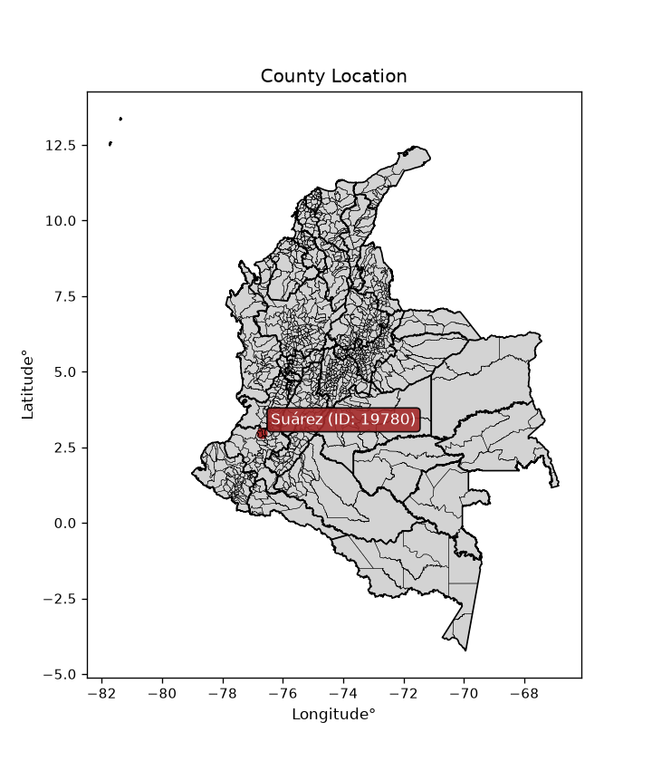
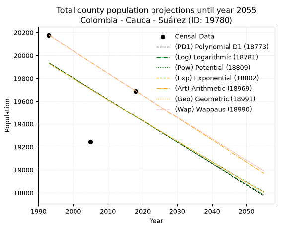
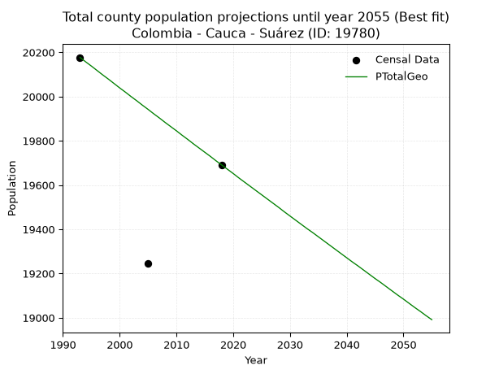
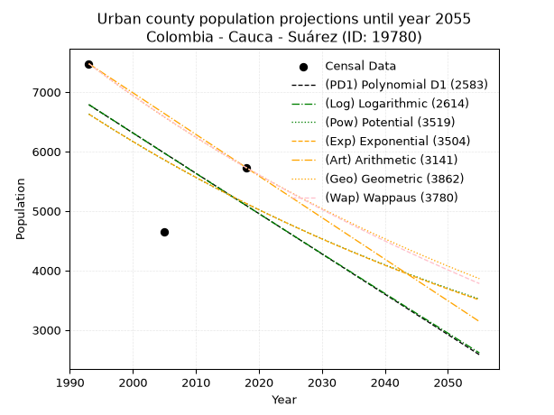
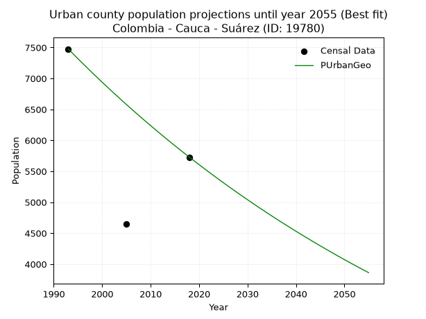
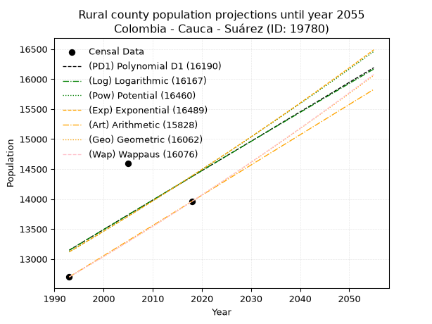
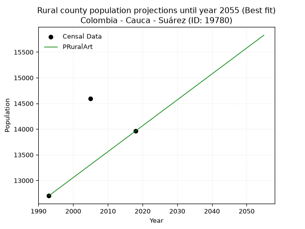

<div align="center">


</div>

# _“Population and Public Services Demand Projections (PPSD) until Year 2050 for Colombia - Cauca - Suárez (ID: 19780)”_
Keywords: `population` `public-service` `projection` `lineal` `polynomial` `logarithmic` `potential` `exponential` `arithmetic` `geometric` `wappaus` `dane` `colombia` `south-america`

PPSD are analytical estimates used by governments and planners to anticipate future changes in population size, age distribution, and the resulting community needs for utilities, healthcare, education, and infrastructure as sizing future water treatment facilities, electrical grids, and road networks based on spatial growth.

<div align="center">

</img>

</div>


> **General running parameters**: • app_version: _v20260806_. • Python version: _3.14.7_. • Pandas version: _3.0.5_. • NumPy version: _2.5.1_. • Creates, save and include plots into reports (create_plot): _False_. • Projection until year: _2050_. • Process polynomial degree 2 and up: _False_. • Process Wappaus: _True_. • Process Wappaus: _True_. • Set negative values to zero: _True_. • Set infinite values to zero: _True_. • Drop dataset notes: _True_. 
<div align="center">

Dynamic map: [:earth_americas:Google](http://maps.google.com/maps?q=2.959785496,-76.6935695) [:earth_americas:OSM](https://www.openstreetmap.org/#map=18/2.959785496/-76.6935695&layers=P) [:earth_americas:Bing](https://www.bing.com/maps?cp=2.959785496~-76.6935695&lvl=18) [:earth_americas:Apple](https://maps.apple.com/frame?center=2.959785496%2C-76.6935695&span=0.003%2C0.006)

</div>


<div align="center">

```geojson
{
  "type": "Feature",
  "geometry": {
    "type": "Point", 
    "coordinates": [-76.6935695, 2.959785496]
  }, 
  "properties": {
    "Name": "Colombia - Cauca - Suárez (ID: 19780)"
  }
}
```

</div>


## 0. Census Data (3 records)

Census data are official statistics collected by a government about the people and housing in a country. They usually include counts of total population, age, sex, race, income, education, and jobs.

📅Global census file: [Population.xlsx](../data/Population.xlsx)

| Source   |   Year |   CountryID | CountryName   |   StateID | StateName   |   CountyID | CountyName   |   PTotal |   PUrban |   PRural |
|:---------|-------:|------------:|:--------------|----------:|:------------|-----------:|:-------------|---------:|---------:|---------:|
| DANE     |   1993 |          57 | Colombia      |        19 | Cauca       |      19780 | Suárez       |    20177 |     7476 |    12701 |
| DANE     |   2005 |          57 | Colombia      |        19 | Cauca       |      19780 | Suárez       |    19244 |     4648 |    14596 |
| DANE     |   2018 |          57 | Colombia      |        19 | Cauca       |      19780 | Suárez       |    19690 |     5728 |    13962 |

> 🔥Some records could had specific notes about the registered values or the corresponding urban or rural distribution.

📅   [RUPS](https://www.datos.gov.co/Hacienda-y-Cr-dito-P-blico/Registro-nico-de-Prestadores-de-Servicios-P-blicos/4qkq-csdn/about_data) - Local public utility companies: [RUPS.csv](../data/RUPS.xlsx)

 | SERVICIO       | ESTADO    | NOMBRE                                                   | NIT         | DEPARTAMENTO_DOMICILIO   | MUNICIPIO_DOMICILIO   | DIRECCION                                  |   TELEFONO | EMAIL                        | TIPO_PRESTADOR                            | CLASIFICACION                 |
|:---------------|:----------|:---------------------------------------------------------|:------------|:-------------------------|:----------------------|:-------------------------------------------|-----------:|:-----------------------------|:------------------------------------------|:------------------------------|
| ACUEDUCTO      | OPERATIVA | EMPRESA MUNICIPAL DE SERVICIOS PUBLICOS DE SUAREZ E.S.P. | 817000109-8 | CAUCA                    | SUAREZ                | Carrera 3 No. 3 - 126 Barrio los Almendros |    3145092 | emsuarez@suarez-cauca.gov.co | EMPRESA INDUSTRIAL Y COMERCIAL DEL ESTADO | MENOR O IGUAL A 2500 USUARIOS |
| ALCANTARILLADO | OPERATIVA | EMPRESA MUNICIPAL DE SERVICIOS PUBLICOS DE SUAREZ E.S.P. | 817000109-8 | CAUCA                    | SUAREZ                | Carrera 3 No. 3 - 126 Barrio los Almendros |    3145092 | emsuarez@suarez-cauca.gov.co | EMPRESA INDUSTRIAL Y COMERCIAL DEL ESTADO | MENOR O IGUAL A 2500 USUARIOS |

## 1. Total

### 1.1. Coefficients and Parameters

* (PD1) Polynomial Deg 1: -18.734541577825564, 57272.66737739951 (lineal)
* (Log) Logarithmic: -37689.33097485658, 306276.477957477
* (Pow) Potential: -1.8897903263088935, 10.534895493315547
* (Exp) Exponential: -0.0009393273463774043, 129577.90604998163
* (Art) Arithmetic: Year diff. 2018 - 1993 = 25, Population diff. 19690 - 20177 = -487, Annual growth = -19.48
* (Geo) Geometric: Year diff. 2018 - 1993 = 25, Population diff. 19690 - 20177 = -487, Annual growth % = -0.000976820567135217
* (Wap) Wappaus: i = -0.09772493541023905, Condition values only valid for < 200)

<sub>
Wappaus condition values: ['-0.00', '-0.10', '-0.20', '-0.29', '-0.39', '-0.49', '-0.59', '-0.68', '-0.78', '-0.88', '-0.98', '-1.07', '-1.17', '-1.27', '-1.37', '-1.47', '-1.56', '-1.66', '-1.76', '-1.86', '-1.95', '-2.05', '-2.15', '-2.25', '-2.35', '-2.44', '-2.54', '-2.64', '-2.74', '-2.83', '-2.93', '-3.03', '-3.13', '-3.22', '-3.32', '-3.42', '-3.52', '-3.62', '-3.71', '-3.81', '-3.91', '-4.01', '-4.10', '-4.20', '-4.30', '-4.40', '-4.50', '-4.59', '-4.69', '-4.79', '-4.89', '-4.98', '-5.08', '-5.18', '-5.28', '-5.37', '-5.47', '-5.57']
</sub>


### 1.2. Projected Dataset

|   Year |   CountyID |   PTotalPD1 |   PTotalLog |   PTotalPow |   PTotalExp |   PTotalArt |   PTotalGeo |   PTotalWap |
|-------:|-----------:|------------:|------------:|------------:|------------:|------------:|------------:|------------:|
|   1993 |      19780 |       19935 |       19936 |       19931 |       19930 |       20177 |       20177 |       20177 |
|   1994 |      19780 |       19916 |       19917 |       19912 |       19911 |       20158 |       20157 |       20157 |
|   1995 |      19780 |       19897 |       19898 |       19893 |       19892 |       20138 |       20138 |       20138 |
|   1996 |      19780 |       19879 |       19879 |       19874 |       19873 |       20119 |       20118 |       20118 |
|   1997 |      19780 |       19860 |       19860 |       19855 |       19855 |       20099 |       20098 |       20098 |
|   1998 |      19780 |       19841 |       19841 |       19836 |       19836 |       20080 |       20079 |       20079 |
|   1999 |      19780 |       19822 |       19822 |       19818 |       19818 |       20060 |       20059 |       20059 |
|   2000 |      19780 |       19804 |       19804 |       19799 |       19799 |       20041 |       20039 |       20039 |
|   2001 |      19780 |       19785 |       19785 |       19780 |       19780 |       20021 |       20020 |       20020 |
|   2002 |      19780 |       19766 |       19766 |       19762 |       19762 |       20002 |       20000 |       20000 |
|   2003 |      19780 |       19747 |       19747 |       19743 |       19743 |       19982 |       19981 |       19981 |
|   2004 |      19780 |       19729 |       19728 |       19724 |       19725 |       19963 |       19961 |       19961 |
|   2005 |      19780 |       19710 |       19709 |       19706 |       19706 |       19943 |       19942 |       19942 |
|   2006 |      19780 |       19691 |       19691 |       19687 |       19688 |       19924 |       19922 |       19922 |
|   2007 |      19780 |       19672 |       19672 |       19669 |       19669 |       19904 |       19903 |       19903 |
|   2008 |      19780 |       19654 |       19653 |       19650 |       19651 |       19885 |       19883 |       19883 |
|   2009 |      19780 |       19635 |       19634 |       19632 |       19632 |       19865 |       19864 |       19864 |
|   2010 |      19780 |       19616 |       19616 |       19613 |       19614 |       19846 |       19845 |       19845 |
|   2011 |      19780 |       19598 |       19597 |       19595 |       19595 |       19826 |       19825 |       19825 |
|   2012 |      19780 |       19579 |       19578 |       19576 |       19577 |       19807 |       19806 |       19806 |
|   2013 |      19780 |       19560 |       19559 |       19558 |       19559 |       19787 |       19786 |       19786 |
|   2014 |      19780 |       19541 |       19541 |       19540 |       19540 |       19768 |       19767 |       19767 |
|   2015 |      19780 |       19523 |       19522 |       19521 |       19522 |       19748 |       19748 |       19748 |
|   2016 |      19780 |       19504 |       19503 |       19503 |       19504 |       19729 |       19729 |       19729 |
|   2017 |      19780 |       19485 |       19485 |       19485 |       19485 |       19709 |       19709 |       19709 |
|   2018 |      19780 |       19466 |       19466 |       19466 |       19467 |       19690 |       19690 |       19690 |
|   2019 |      19780 |       19448 |       19447 |       19448 |       19449 |       19671 |       19671 |       19671 |
|   2020 |      19780 |       19429 |       19429 |       19430 |       19430 |       19651 |       19652 |       19652 |
|   2021 |      19780 |       19410 |       19410 |       19412 |       19412 |       19632 |       19632 |       19632 |
|   2022 |      19780 |       19391 |       19391 |       19394 |       19394 |       19612 |       19613 |       19613 |
|   2023 |      19780 |       19373 |       19373 |       19376 |       19376 |       19593 |       19594 |       19594 |
|   2024 |      19780 |       19354 |       19354 |       19358 |       19358 |       19573 |       19575 |       19575 |
|   2025 |      19780 |       19335 |       19335 |       19340 |       19339 |       19554 |       19556 |       19556 |
|   2026 |      19780 |       19316 |       19317 |       19321 |       19321 |       19534 |       19537 |       19537 |
|   2027 |      19780 |       19298 |       19298 |       19303 |       19303 |       19515 |       19518 |       19518 |
|   2028 |      19780 |       19279 |       19280 |       19285 |       19285 |       19495 |       19499 |       19498 |
|   2029 |      19780 |       19260 |       19261 |       19268 |       19267 |       19476 |       19479 |       19479 |
|   2030 |      19780 |       19242 |       19242 |       19250 |       19249 |       19456 |       19460 |       19460 |
|   2031 |      19780 |       19223 |       19224 |       19232 |       19231 |       19437 |       19441 |       19441 |
|   2032 |      19780 |       19204 |       19205 |       19214 |       19213 |       19417 |       19422 |       19422 |
|   2033 |      19780 |       19185 |       19187 |       19196 |       19195 |       19398 |       19403 |       19403 |
|   2034 |      19780 |       19167 |       19168 |       19178 |       19177 |       19378 |       19385 |       19384 |
|   2035 |      19780 |       19148 |       19150 |       19160 |       19159 |       19359 |       19366 |       19365 |
|   2036 |      19780 |       19129 |       19131 |       19143 |       19141 |       19339 |       19347 |       19347 |
|   2037 |      19780 |       19110 |       19113 |       19125 |       19123 |       19320 |       19328 |       19328 |
|   2038 |      19780 |       19092 |       19094 |       19107 |       19105 |       19300 |       19309 |       19309 |
|   2039 |      19780 |       19073 |       19076 |       19089 |       19087 |       19281 |       19290 |       19290 |
|   2040 |      19780 |       19054 |       19057 |       19072 |       19069 |       19261 |       19271 |       19271 |
|   2041 |      19780 |       19035 |       19039 |       19054 |       19051 |       19242 |       19252 |       19252 |
|   2042 |      19780 |       19017 |       19020 |       19036 |       19033 |       19222 |       19234 |       19233 |
|   2043 |      19780 |       18998 |       19002 |       19019 |       19015 |       19203 |       19215 |       19215 |
|   2044 |      19780 |       18979 |       18983 |       19001 |       18997 |       19184 |       19196 |       19196 |
|   2045 |      19780 |       18961 |       18965 |       18984 |       18979 |       19164 |       19177 |       19177 |
|   2046 |      19780 |       18942 |       18947 |       18966 |       18962 |       19145 |       19159 |       19158 |
|   2047 |      19780 |       18923 |       18928 |       18949 |       18944 |       19125 |       19140 |       19140 |
|   2048 |      19780 |       18904 |       18910 |       18931 |       18926 |       19106 |       19121 |       19121 |
|   2049 |      19780 |       18886 |       18891 |       18914 |       18908 |       19086 |       19102 |       19102 |
|   2050 |      19780 |       18867 |       18873 |       18896 |       18891 |       19067 |       19084 |       19084 |
<div align="center">

</img>

</div>


### 1.3. Best fit with absolute and relative error (%)

Relative error puts that difference into context by dividing the absolute error by the true value, creating a unitless ratio or percentage that shows the scale of the mistake.

Absolute and relative error

|   Year | Source   |   CountryID | CountryName   |   StateID | StateName   |   CountyID_x | CountyName   |   PTotal |   PUrban |   PRural |   CountyID_y |   PTotalPD1 |   PTotalLog |   PTotalPow |   PTotalExp |   PTotalArt |   PTotalGeo |   PTotalWap |   PTotalPD1AbsError |   PTotalLogAbsError |   PTotalPowAbsError |   PTotalExpAbsError |   PTotalArtAbsError |   PTotalGeoAbsError |   PTotalWapAbsError |   PTotalPD1RelError |   PTotalLogRelError |   PTotalPowRelError |   PTotalExpRelError |   PTotalArtRelError |   PTotalGeoRelError |   PTotalWapRelError |
|-------:|:---------|------------:|:--------------|----------:|:------------|-------------:|:-------------|---------:|---------:|---------:|-------------:|------------:|------------:|------------:|------------:|------------:|------------:|------------:|--------------------:|--------------------:|--------------------:|--------------------:|--------------------:|--------------------:|--------------------:|--------------------:|--------------------:|--------------------:|--------------------:|--------------------:|--------------------:|--------------------:|
|   1993 | DANE     |          57 | Colombia      |        19 | Cauca       |        19780 | Suárez       |    20177 |     7476 |    12701 |        19780 |       19935 |       19936 |       19931 |       19930 |       20177 |       20177 |       20177 |                 242 |                 241 |                 246 |                 247 |                   0 |                   0 |                   0 |             1.19939 |             1.19443 |             1.21921 |             1.22417 |              0      |              0      |              0      |
|   2005 | DANE     |          57 | Colombia      |        19 | Cauca       |        19780 | Suárez       |    19244 |     4648 |    14596 |        19780 |       19710 |       19709 |       19706 |       19706 |       19943 |       19942 |       19942 |                 466 |                 465 |                 462 |                 462 |                 699 |                 698 |                 698 |             2.42153 |             2.41634 |             2.40075 |             2.40075 |              3.6323 |              3.6271 |              3.6271 |
|   2018 | DANE     |          57 | Colombia      |        19 | Cauca       |        19780 | Suárez       |    19690 |     5728 |    13962 |        19780 |       19466 |       19466 |       19466 |       19467 |       19690 |       19690 |       19690 |                 224 |                 224 |                 224 |                 223 |                   0 |                   0 |                   0 |             1.13763 |             1.13763 |             1.13763 |             1.13255 |              0      |              0      |              0      |

Relative error mean

| Method    |   RelError | Best   |
|:----------|-----------:|:-------|
| PTotalPD1 |    1.58618 |        |
| PTotalLog |    1.5828  |        |
| PTotalPow |    1.58586 |        |
| PTotalExp |    1.58582 |        |
| PTotalArt |    1.21077 |        |
| PTotalGeo |    1.20903 | True   |
| PTotalWap |    1.20903 | True   |

💙Best method: _**PTotalGeo**_
<div align="center">

</img>

</div>


### 1.4. Fresh water supply demand in liters per capita per day (lpcd)

The fresh water supply demand typically ranges from 100 to 300 liters per capita per day (lpcd) for standard domestic and municipal planning, though absolute survival minimums set by the World Health Organization are as low as 7.5 to 20 liters per day, and total consumption in high-income nations can exceed 400 liters.

> `CZ`: Level in meters above the sea level (masl)<br> `WS`: Fresh water supply demand in liters per capita per day (lpcd or l/h/d)<br> `WSAll`: Zonal fresh water supply demand in liters per second (l/s)<br> `A`: Zonal area in square meters<br> `DP`: Population density (people/hectare or p/ha)

Reference values (RAS Colombia)

|    CZ |   WS |
|------:|-----:|
|  1000 |  120 |
|  2000 |  130 |
| 99999 |  140 |

County shapefile geometry properties and water supply values

|   CountyID |      ATotal |   CZTotal |   WSTotal |
|-----------:|------------:|----------:|----------:|
|      19780 | 3.92585e+08 |   1656.04 |       130 |

Projected values for best method: PTotalGeo

|   CountyID |   Year |   PTotalGeo |   DPTotal |   WSTotal |   WSTotalAll |
|-----------:|-------:|------------:|----------:|----------:|-------------:|
|      19780 |   1993 |       20177 |      0.51 |       130 |      30.3589 |
|      19780 |   1994 |       20157 |      0.51 |       130 |      30.3288 |
|      19780 |   1995 |       20138 |      0.51 |       130 |      30.3002 |
|      19780 |   1996 |       20118 |      0.51 |       130 |      30.2701 |
|      19780 |   1997 |       20098 |      0.51 |       130 |      30.24   |
|      19780 |   1998 |       20079 |      0.51 |       130 |      30.2115 |
|      19780 |   1999 |       20059 |      0.51 |       130 |      30.1814 |
|      19780 |   2000 |       20039 |      0.51 |       130 |      30.1513 |
|      19780 |   2001 |       20020 |      0.51 |       130 |      30.1227 |
|      19780 |   2002 |       20000 |      0.51 |       130 |      30.0926 |
|      19780 |   2003 |       19981 |      0.51 |       130 |      30.064  |
|      19780 |   2004 |       19961 |      0.51 |       130 |      30.0339 |
|      19780 |   2005 |       19942 |      0.51 |       130 |      30.0053 |
|      19780 |   2006 |       19922 |      0.51 |       130 |      29.9752 |
|      19780 |   2007 |       19903 |      0.51 |       130 |      29.9466 |
|      19780 |   2008 |       19883 |      0.51 |       130 |      29.9166 |
|      19780 |   2009 |       19864 |      0.51 |       130 |      29.888  |
|      19780 |   2010 |       19845 |      0.51 |       130 |      29.8594 |
|      19780 |   2011 |       19825 |      0.5  |       130 |      29.8293 |
|      19780 |   2012 |       19806 |      0.5  |       130 |      29.8007 |
|      19780 |   2013 |       19786 |      0.5  |       130 |      29.7706 |
|      19780 |   2014 |       19767 |      0.5  |       130 |      29.742  |
|      19780 |   2015 |       19748 |      0.5  |       130 |      29.7134 |
|      19780 |   2016 |       19729 |      0.5  |       130 |      29.6848 |
|      19780 |   2017 |       19709 |      0.5  |       130 |      29.6547 |
|      19780 |   2018 |       19690 |      0.5  |       130 |      29.6262 |
|      19780 |   2019 |       19671 |      0.5  |       130 |      29.5976 |
|      19780 |   2020 |       19652 |      0.5  |       130 |      29.569  |
|      19780 |   2021 |       19632 |      0.5  |       130 |      29.5389 |
|      19780 |   2022 |       19613 |      0.5  |       130 |      29.5103 |
|      19780 |   2023 |       19594 |      0.5  |       130 |      29.4817 |
|      19780 |   2024 |       19575 |      0.5  |       130 |      29.4531 |
|      19780 |   2025 |       19556 |      0.5  |       130 |      29.4245 |
|      19780 |   2026 |       19537 |      0.5  |       130 |      29.3959 |
|      19780 |   2027 |       19518 |      0.5  |       130 |      29.3674 |
|      19780 |   2028 |       19499 |      0.5  |       130 |      29.3388 |
|      19780 |   2029 |       19479 |      0.5  |       130 |      29.3087 |
|      19780 |   2030 |       19460 |      0.5  |       130 |      29.2801 |
|      19780 |   2031 |       19441 |      0.5  |       130 |      29.2515 |
|      19780 |   2032 |       19422 |      0.49 |       130 |      29.2229 |
|      19780 |   2033 |       19403 |      0.49 |       130 |      29.1943 |
|      19780 |   2034 |       19385 |      0.49 |       130 |      29.1672 |
|      19780 |   2035 |       19366 |      0.49 |       130 |      29.1387 |
|      19780 |   2036 |       19347 |      0.49 |       130 |      29.1101 |
|      19780 |   2037 |       19328 |      0.49 |       130 |      29.0815 |
|      19780 |   2038 |       19309 |      0.49 |       130 |      29.0529 |
|      19780 |   2039 |       19290 |      0.49 |       130 |      29.0243 |
|      19780 |   2040 |       19271 |      0.49 |       130 |      28.9957 |
|      19780 |   2041 |       19252 |      0.49 |       130 |      28.9671 |
|      19780 |   2042 |       19234 |      0.49 |       130 |      28.94   |
|      19780 |   2043 |       19215 |      0.49 |       130 |      28.9115 |
|      19780 |   2044 |       19196 |      0.49 |       130 |      28.8829 |
|      19780 |   2045 |       19177 |      0.49 |       130 |      28.8543 |
|      19780 |   2046 |       19159 |      0.49 |       130 |      28.8272 |
|      19780 |   2047 |       19140 |      0.49 |       130 |      28.7986 |
|      19780 |   2048 |       19121 |      0.49 |       130 |      28.77   |
|      19780 |   2049 |       19102 |      0.49 |       130 |      28.7414 |
|      19780 |   2050 |       19084 |      0.49 |       130 |      28.7144 |

## 2. Urban

### 2.1. Coefficients and Parameters

* (PD1) Polynomial Deg 1: -67.79957356076903, 141911.4115138621 (lineal)
* (Log) Logarithmic: -136306.17390187472, 1042361.8323998351
* (Pow) Potential: -20.680586120868703, 72.05735024452446
* (Exp) Exponential: -0.010282872715869475, 5268902195887.934
* (Art) Arithmetic: Year diff. 2018 - 1993 = 25, Population diff. 5728 - 7476 = -1748, Annual growth = -69.92
* (Geo) Geometric: Year diff. 2018 - 1993 = 25, Population diff. 5728 - 7476 = -1748, Annual growth % = -0.010596713414397385
* (Wap) Wappaus: i = -1.0590730081793396, Condition values only valid for < 200)

<sub>
Wappaus condition values: ['-0.00', '-1.06', '-2.12', '-3.18', '-4.24', '-5.30', '-6.35', '-7.41', '-8.47', '-9.53', '-10.59', '-11.65', '-12.71', '-13.77', '-14.83', '-15.89', '-16.95', '-18.00', '-19.06', '-20.12', '-21.18', '-22.24', '-23.30', '-24.36', '-25.42', '-26.48', '-27.54', '-28.59', '-29.65', '-30.71', '-31.77', '-32.83', '-33.89', '-34.95', '-36.01', '-37.07', '-38.13', '-39.19', '-40.24', '-41.30', '-42.36', '-43.42', '-44.48', '-45.54', '-46.60', '-47.66', '-48.72', '-49.78', '-50.84', '-51.89', '-52.95', '-54.01', '-55.07', '-56.13', '-57.19', '-58.25', '-59.31', '-60.37']
</sub>


### 2.2. Projected Dataset

|   Year |   CountyID |   PUrbanPD1 |   PUrbanLog |   PUrbanPow |   PUrbanExp |   PUrbanArt |   PUrbanGeo |   PUrbanWap |
|-------:|-----------:|------------:|------------:|------------:|------------:|------------:|------------:|------------:|
|   1993 |      19780 |        6787 |        6790 |        6631 |        6628 |        7476 |        7476 |        7476 |
|   1994 |      19780 |        6719 |        6721 |        6563 |        6560 |        7406 |        7397 |        7397 |
|   1995 |      19780 |        6651 |        6653 |        6495 |        6493 |        7336 |        7318 |        7319 |
|   1996 |      19780 |        6583 |        6585 |        6428 |        6427 |        7266 |        7241 |        7242 |
|   1997 |      19780 |        6516 |        6517 |        6362 |        6361 |        7196 |        7164 |        7166 |
|   1998 |      19780 |        6448 |        6448 |        6297 |        6296 |        7126 |        7088 |        7090 |
|   1999 |      19780 |        6380 |        6380 |        6232 |        6232 |        7056 |        7013 |        7016 |
|   2000 |      19780 |        6312 |        6312 |        6168 |        6168 |        6987 |        6939 |        6942 |
|   2001 |      19780 |        6244 |        6244 |        6104 |        6105 |        6917 |        6865 |        6868 |
|   2002 |      19780 |        6177 |        6176 |        6041 |        6042 |        6847 |        6792 |        6796 |
|   2003 |      19780 |        6109 |        6108 |        5979 |        5980 |        6777 |        6721 |        6724 |
|   2004 |      19780 |        6041 |        6040 |        5918 |        5919 |        6707 |        6649 |        6653 |
|   2005 |      19780 |        5973 |        5972 |        5857 |        5859 |        6637 |        6579 |        6583 |
|   2006 |      19780 |        5905 |        5904 |        5797 |        5799 |        6567 |        6509 |        6513 |
|   2007 |      19780 |        5838 |        5836 |        5738 |        5739 |        6497 |        6440 |        6444 |
|   2008 |      19780 |        5770 |        5768 |        5679 |        5681 |        6427 |        6372 |        6376 |
|   2009 |      19780 |        5702 |        5700 |        5621 |        5623 |        6357 |        6304 |        6308 |
|   2010 |      19780 |        5634 |        5632 |        5563 |        5565 |        6287 |        6238 |        6241 |
|   2011 |      19780 |        5566 |        5564 |        5506 |        5508 |        6217 |        6171 |        6175 |
|   2012 |      19780 |        5499 |        5497 |        5450 |        5452 |        6148 |        6106 |        6109 |
|   2013 |      19780 |        5431 |        5429 |        5394 |        5396 |        6078 |        6041 |        6044 |
|   2014 |      19780 |        5363 |        5361 |        5339 |        5341 |        6008 |        5977 |        5980 |
|   2015 |      19780 |        5295 |        5293 |        5285 |        5286 |        5938 |        5914 |        5916 |
|   2016 |      19780 |        5227 |        5226 |        5231 |        5232 |        5868 |        5851 |        5853 |
|   2017 |      19780 |        5160 |        5158 |        5177 |        5179 |        5798 |        5789 |        5790 |
|   2018 |      19780 |        5092 |        5091 |        5124 |        5126 |        5728 |        5728 |        5728 |
|   2019 |      19780 |        5024 |        5023 |        5072 |        5073 |        5658 |        5667 |        5667 |
|   2020 |      19780 |        4956 |        4956 |        5020 |        5021 |        5588 |        5607 |        5606 |
|   2021 |      19780 |        4888 |        4888 |        4969 |        4970 |        5518 |        5548 |        5545 |
|   2022 |      19780 |        4821 |        4821 |        4919 |        4919 |        5448 |        5489 |        5486 |
|   2023 |      19780 |        4753 |        4753 |        4869 |        4869 |        5378 |        5431 |        5426 |
|   2024 |      19780 |        4685 |        4686 |        4819 |        4819 |        5308 |        5373 |        5368 |
|   2025 |      19780 |        4617 |        4619 |        4770 |        4770 |        5239 |        5316 |        5309 |
|   2026 |      19780 |        4549 |        4551 |        4722 |        4721 |        5169 |        5260 |        5252 |
|   2027 |      19780 |        4482 |        4484 |        4674 |        4673 |        5099 |        5204 |        5195 |
|   2028 |      19780 |        4414 |        4417 |        4626 |        4625 |        5029 |        5149 |        5138 |
|   2029 |      19780 |        4346 |        4350 |        4580 |        4577 |        4959 |        5095 |        5082 |
|   2030 |      19780 |        4278 |        4282 |        4533 |        4531 |        4889 |        5041 |        5026 |
|   2031 |      19780 |        4210 |        4215 |        4487 |        4484 |        4819 |        4987 |        4971 |
|   2032 |      19780 |        4143 |        4148 |        4442 |        4438 |        4749 |        4934 |        4917 |
|   2033 |      19780 |        4075 |        4081 |        4397 |        4393 |        4679 |        4882 |        4863 |
|   2034 |      19780 |        4007 |        4014 |        4352 |        4348 |        4609 |        4830 |        4809 |
|   2035 |      19780 |        3939 |        3947 |        4308 |        4304 |        4539 |        4779 |        4756 |
|   2036 |      19780 |        3871 |        3880 |        4265 |        4260 |        4469 |        4728 |        4703 |
|   2037 |      19780 |        3804 |        3813 |        4222 |        4216 |        4400 |        4678 |        4651 |
|   2038 |      19780 |        3736 |        3746 |        4179 |        4173 |        4330 |        4629 |        4599 |
|   2039 |      19780 |        3668 |        3680 |        4137 |        4130 |        4260 |        4580 |        4547 |
|   2040 |      19780 |        3600 |        3613 |        4095 |        4088 |        4190 |        4531 |        4496 |
|   2041 |      19780 |        3532 |        3546 |        4054 |        4046 |        4120 |        4483 |        4446 |
|   2042 |      19780 |        3465 |        3479 |        4013 |        4005 |        4050 |        4436 |        4396 |
|   2043 |      19780 |        3397 |        3412 |        3972 |        3964 |        3980 |        4389 |        4346 |
|   2044 |      19780 |        3329 |        3346 |        3932 |        3923 |        3910 |        4342 |        4297 |
|   2045 |      19780 |        3261 |        3279 |        3893 |        3883 |        3840 |        4296 |        4248 |
|   2046 |      19780 |        3193 |        3212 |        3854 |        3843 |        3770 |        4251 |        4199 |
|   2047 |      19780 |        3126 |        3146 |        3815 |        3804 |        3700 |        4206 |        4151 |
|   2048 |      19780 |        3058 |        3079 |        3777 |        3765 |        3630 |        4161 |        4104 |
|   2049 |      19780 |        2990 |        3013 |        3739 |        3727 |        3560 |        4117 |        4056 |
|   2050 |      19780 |        2922 |        2946 |        3701 |        3688 |        3491 |        4073 |        4009 |
<div align="center">

</img>

</div>


### 2.3. Best fit with absolute and relative error (%)

Relative error puts that difference into context by dividing the absolute error by the true value, creating a unitless ratio or percentage that shows the scale of the mistake.

Absolute and relative error

|   Year | Source   |   CountryID | CountryName   |   StateID | StateName   |   CountyID_x | CountyName   |   PTotal |   PUrban |   PRural |   CountyID_y |   PUrbanPD1 |   PUrbanLog |   PUrbanPow |   PUrbanExp |   PUrbanArt |   PUrbanGeo |   PUrbanWap |   PUrbanPD1AbsError |   PUrbanLogAbsError |   PUrbanPowAbsError |   PUrbanExpAbsError |   PUrbanArtAbsError |   PUrbanGeoAbsError |   PUrbanWapAbsError |   PUrbanPD1RelError |   PUrbanLogRelError |   PUrbanPowRelError |   PUrbanExpRelError |   PUrbanArtRelError |   PUrbanGeoRelError |   PUrbanWapRelError |
|-------:|:---------|------------:|:--------------|----------:|:------------|-------------:|:-------------|---------:|---------:|---------:|-------------:|------------:|------------:|------------:|------------:|------------:|------------:|------------:|--------------------:|--------------------:|--------------------:|--------------------:|--------------------:|--------------------:|--------------------:|--------------------:|--------------------:|--------------------:|--------------------:|--------------------:|--------------------:|--------------------:|
|   1993 | DANE     |          57 | Colombia      |        19 | Cauca       |        19780 | Suárez       |    20177 |     7476 |    12701 |        19780 |        6787 |        6790 |        6631 |        6628 |        7476 |        7476 |        7476 |                 689 |                 686 |                 845 |                 848 |                   0 |                   0 |                   0 |             9.21616 |             9.17603 |             11.3028 |             11.343  |              0      |              0      |              0      |
|   2005 | DANE     |          57 | Colombia      |        19 | Cauca       |        19780 | Suárez       |    19244 |     4648 |    14596 |        19780 |        5973 |        5972 |        5857 |        5859 |        6637 |        6579 |        6583 |                1325 |                1324 |                1209 |                1211 |                1989 |                1931 |                1935 |            28.5069  |            28.4854  |             26.0112 |             26.0542 |             42.7926 |             41.5448 |             41.6308 |
|   2018 | DANE     |          57 | Colombia      |        19 | Cauca       |        19780 | Suárez       |    19690 |     5728 |    13962 |        19780 |        5092 |        5091 |        5124 |        5126 |        5728 |        5728 |        5728 |                 636 |                 637 |                 604 |                 602 |                   0 |                   0 |                   0 |            11.1034  |            11.1208  |             10.5447 |             10.5098 |              0      |              0      |              0      |

Relative error mean

| Method    |   RelError | Best   |
|:----------|-----------:|:-------|
| PUrbanPD1 |    16.2755 |        |
| PUrbanLog |    16.2607 |        |
| PUrbanPow |    15.9529 |        |
| PUrbanExp |    15.969  |        |
| PUrbanArt |    14.2642 |        |
| PUrbanGeo |    13.8483 | True   |
| PUrbanWap |    13.8769 |        |

💙Best method: _**PUrbanGeo**_
<div align="center">

</img>

</div>


### 2.4. Fresh water supply demand in liters per capita per day (lpcd)

The fresh water supply demand typically ranges from 100 to 300 liters per capita per day (lpcd) for standard domestic and municipal planning, though absolute survival minimums set by the World Health Organization are as low as 7.5 to 20 liters per day, and total consumption in high-income nations can exceed 400 liters.

> `CZ`: Level in meters above the sea level (masl)<br> `WS`: Fresh water supply demand in liters per capita per day (lpcd or l/h/d)<br> `WSAll`: Zonal fresh water supply demand in liters per second (l/s)<br> `A`: Zonal area in square meters<br> `DP`: Population density (people/hectare or p/ha)

Reference values (RAS Colombia)

|    CZ |   WS |
|------:|-----:|
|  1000 |  120 |
|  2000 |  130 |
| 99999 |  140 |

County shapefile geometry properties and water supply values

|   CountyID |      AUrban |   CZUrban |   WSUrban |
|-----------:|------------:|----------:|----------:|
|      19780 | 2.82158e+06 |    1076.7 |       130 |

Projected values for best method: PUrbanGeo

|   CountyID |   Year |   PUrbanGeo |   DPUrban |   WSUrban |   WSUrbanAll |
|-----------:|-------:|------------:|----------:|----------:|-------------:|
|      19780 |   1993 |        7476 |     26.5  |       130 |     11.2486  |
|      19780 |   1994 |        7397 |     26.22 |       130 |     11.1297  |
|      19780 |   1995 |        7318 |     25.94 |       130 |     11.0109  |
|      19780 |   1996 |        7241 |     25.66 |       130 |     10.895   |
|      19780 |   1997 |        7164 |     25.39 |       130 |     10.7792  |
|      19780 |   1998 |        7088 |     25.12 |       130 |     10.6648  |
|      19780 |   1999 |        7013 |     24.85 |       130 |     10.552   |
|      19780 |   2000 |        6939 |     24.59 |       130 |     10.4406  |
|      19780 |   2001 |        6865 |     24.33 |       130 |     10.3293  |
|      19780 |   2002 |        6792 |     24.07 |       130 |     10.2194  |
|      19780 |   2003 |        6721 |     23.82 |       130 |     10.1126  |
|      19780 |   2004 |        6649 |     23.56 |       130 |     10.0043  |
|      19780 |   2005 |        6579 |     23.32 |       130 |      9.89896 |
|      19780 |   2006 |        6509 |     23.07 |       130 |      9.79363 |
|      19780 |   2007 |        6440 |     22.82 |       130 |      9.68981 |
|      19780 |   2008 |        6372 |     22.58 |       130 |      9.5875  |
|      19780 |   2009 |        6304 |     22.34 |       130 |      9.48519 |
|      19780 |   2010 |        6238 |     22.11 |       130 |      9.38588 |
|      19780 |   2011 |        6171 |     21.87 |       130 |      9.28507 |
|      19780 |   2012 |        6106 |     21.64 |       130 |      9.18727 |
|      19780 |   2013 |        6041 |     21.41 |       130 |      9.08947 |
|      19780 |   2014 |        5977 |     21.18 |       130 |      8.99317 |
|      19780 |   2015 |        5914 |     20.96 |       130 |      8.89838 |
|      19780 |   2016 |        5851 |     20.74 |       130 |      8.80359 |
|      19780 |   2017 |        5789 |     20.52 |       130 |      8.7103  |
|      19780 |   2018 |        5728 |     20.3  |       130 |      8.61852 |
|      19780 |   2019 |        5667 |     20.08 |       130 |      8.52674 |
|      19780 |   2020 |        5607 |     19.87 |       130 |      8.43646 |
|      19780 |   2021 |        5548 |     19.66 |       130 |      8.34769 |
|      19780 |   2022 |        5489 |     19.45 |       130 |      8.25891 |
|      19780 |   2023 |        5431 |     19.25 |       130 |      8.17164 |
|      19780 |   2024 |        5373 |     19.04 |       130 |      8.08437 |
|      19780 |   2025 |        5316 |     18.84 |       130 |      7.99861 |
|      19780 |   2026 |        5260 |     18.64 |       130 |      7.91435 |
|      19780 |   2027 |        5204 |     18.44 |       130 |      7.83009 |
|      19780 |   2028 |        5149 |     18.25 |       130 |      7.74734 |
|      19780 |   2029 |        5095 |     18.06 |       130 |      7.66609 |
|      19780 |   2030 |        5041 |     17.87 |       130 |      7.58484 |
|      19780 |   2031 |        4987 |     17.67 |       130 |      7.50359 |
|      19780 |   2032 |        4934 |     17.49 |       130 |      7.42384 |
|      19780 |   2033 |        4882 |     17.3  |       130 |      7.3456  |
|      19780 |   2034 |        4830 |     17.12 |       130 |      7.26736 |
|      19780 |   2035 |        4779 |     16.94 |       130 |      7.19062 |
|      19780 |   2036 |        4728 |     16.76 |       130 |      7.11389 |
|      19780 |   2037 |        4678 |     16.58 |       130 |      7.03866 |
|      19780 |   2038 |        4629 |     16.41 |       130 |      6.96493 |
|      19780 |   2039 |        4580 |     16.23 |       130 |      6.8912  |
|      19780 |   2040 |        4531 |     16.06 |       130 |      6.81748 |
|      19780 |   2041 |        4483 |     15.89 |       130 |      6.74525 |
|      19780 |   2042 |        4436 |     15.72 |       130 |      6.67454 |
|      19780 |   2043 |        4389 |     15.56 |       130 |      6.60382 |
|      19780 |   2044 |        4342 |     15.39 |       130 |      6.5331  |
|      19780 |   2045 |        4296 |     15.23 |       130 |      6.46389 |
|      19780 |   2046 |        4251 |     15.07 |       130 |      6.39618 |
|      19780 |   2047 |        4206 |     14.91 |       130 |      6.32847 |
|      19780 |   2048 |        4161 |     14.75 |       130 |      6.26076 |
|      19780 |   2049 |        4117 |     14.59 |       130 |      6.19456 |
|      19780 |   2050 |        4073 |     14.44 |       130 |      6.12836 |

## 3. Rural

### 3.1. Coefficients and Parameters

* (PD1) Polynomial Deg 1: 49.06503198294327, -84638.74413646219 (lineal)
* (Log) Logarithmic: 98616.84292701815, -736085.3544423582
* (Pow) Potential: 7.409081115917476, -20.32845335246226
* (Exp) Exponential: 0.003686525465817747, 8.453935554833425
* (Art) Arithmetic: Year diff. 2018 - 1993 = 25, Population diff. 13962 - 12701 = 1261, Annual growth = 50.44
* (Geo) Geometric: Year diff. 2018 - 1993 = 25, Population diff. 13962 - 12701 = 1261, Annual growth % = 0.0037935221806395525
* (Wap) Wappaus: i = 0.37835202340321794, Condition values only valid for < 200)

<sub>
Wappaus condition values: ['0.00', '0.38', '0.76', '1.14', '1.51', '1.89', '2.27', '2.65', '3.03', '3.41', '3.78', '4.16', '4.54', '4.92', '5.30', '5.68', '6.05', '6.43', '6.81', '7.19', '7.57', '7.95', '8.32', '8.70', '9.08', '9.46', '9.84', '10.22', '10.59', '10.97', '11.35', '11.73', '12.11', '12.49', '12.86', '13.24', '13.62', '14.00', '14.38', '14.76', '15.13', '15.51', '15.89', '16.27', '16.65', '17.03', '17.40', '17.78', '18.16', '18.54', '18.92', '19.30', '19.67', '20.05', '20.43', '20.81', '21.19', '21.57']
</sub>


### 3.2. Projected Dataset

|   Year |   CountyID |   PRuralPD1 |   PRuralLog |   PRuralPow |   PRuralExp |   PRuralArt |   PRuralGeo |   PRuralWap |
|-------:|-----------:|------------:|------------:|------------:|------------:|------------:|------------:|------------:|
|   1993 |      19780 |       13148 |       13146 |       13118 |       13120 |       12701 |       12701 |       12701 |
|   1994 |      19780 |       13197 |       13195 |       13167 |       13168 |       12751 |       12749 |       12749 |
|   1995 |      19780 |       13246 |       13245 |       13216 |       13217 |       12802 |       12798 |       12797 |
|   1996 |      19780 |       13295 |       13294 |       13265 |       13266 |       12852 |       12846 |       12846 |
|   1997 |      19780 |       13344 |       13344 |       13314 |       13315 |       12903 |       12895 |       12895 |
|   1998 |      19780 |       13393 |       13393 |       13364 |       13364 |       12953 |       12944 |       12944 |
|   1999 |      19780 |       13442 |       13442 |       13413 |       13413 |       13004 |       12993 |       12993 |
|   2000 |      19780 |       13491 |       13492 |       13463 |       13463 |       13054 |       13042 |       13042 |
|   2001 |      19780 |       13540 |       13541 |       13513 |       13512 |       13105 |       13092 |       13091 |
|   2002 |      19780 |       13589 |       13590 |       13563 |       13562 |       13155 |       13141 |       13141 |
|   2003 |      19780 |       13639 |       13639 |       13613 |       13612 |       13205 |       13191 |       13191 |
|   2004 |      19780 |       13688 |       13689 |       13664 |       13663 |       13256 |       13241 |       13241 |
|   2005 |      19780 |       13737 |       13738 |       13714 |       13713 |       13306 |       13291 |       13291 |
|   2006 |      19780 |       13786 |       13787 |       13765 |       13764 |       13357 |       13342 |       13341 |
|   2007 |      19780 |       13835 |       13836 |       13816 |       13815 |       13407 |       13392 |       13392 |
|   2008 |      19780 |       13884 |       13885 |       13867 |       13866 |       13458 |       13443 |       13443 |
|   2009 |      19780 |       13933 |       13934 |       13919 |       13917 |       13508 |       13494 |       13494 |
|   2010 |      19780 |       13982 |       13984 |       13970 |       13968 |       13558 |       13545 |       13545 |
|   2011 |      19780 |       14031 |       14033 |       14022 |       14020 |       13609 |       13597 |       13596 |
|   2012 |      19780 |       14080 |       14082 |       14073 |       14072 |       13659 |       13648 |       13648 |
|   2013 |      19780 |       14129 |       14131 |       14125 |       14124 |       13710 |       13700 |       13700 |
|   2014 |      19780 |       14178 |       14180 |       14177 |       14176 |       13760 |       13752 |       13752 |
|   2015 |      19780 |       14227 |       14229 |       14229 |       14228 |       13811 |       13804 |       13804 |
|   2016 |      19780 |       14276 |       14277 |       14282 |       14281 |       13861 |       13857 |       13857 |
|   2017 |      19780 |       14325 |       14326 |       14334 |       14333 |       13912 |       13909 |       13909 |
|   2018 |      19780 |       14374 |       14375 |       14387 |       14386 |       13962 |       13962 |       13962 |
|   2019 |      19780 |       14424 |       14424 |       14440 |       14440 |       14012 |       14015 |       14015 |
|   2020 |      19780 |       14473 |       14473 |       14493 |       14493 |       14063 |       14068 |       14068 |
|   2021 |      19780 |       14522 |       14522 |       14546 |       14546 |       14113 |       14121 |       14122 |
|   2022 |      19780 |       14571 |       14571 |       14600 |       14600 |       14164 |       14175 |       14175 |
|   2023 |      19780 |       14620 |       14619 |       14653 |       14654 |       14214 |       14229 |       14229 |
|   2024 |      19780 |       14669 |       14668 |       14707 |       14708 |       14265 |       14283 |       14283 |
|   2025 |      19780 |       14718 |       14717 |       14761 |       14763 |       14315 |       14337 |       14338 |
|   2026 |      19780 |       14767 |       14765 |       14815 |       14817 |       14366 |       14391 |       14392 |
|   2027 |      19780 |       14816 |       14814 |       14869 |       14872 |       14416 |       14446 |       14447 |
|   2028 |      19780 |       14865 |       14863 |       14924 |       14927 |       14466 |       14501 |       14502 |
|   2029 |      19780 |       14914 |       14911 |       14978 |       14982 |       14517 |       14556 |       14557 |
|   2030 |      19780 |       14963 |       14960 |       15033 |       15037 |       14567 |       14611 |       14613 |
|   2031 |      19780 |       15012 |       15008 |       15088 |       15093 |       14618 |       14666 |       14669 |
|   2032 |      19780 |       15061 |       15057 |       15143 |       15148 |       14668 |       14722 |       14724 |
|   2033 |      19780 |       15110 |       15106 |       15199 |       15204 |       14719 |       14778 |       14781 |
|   2034 |      19780 |       15160 |       15154 |       15254 |       15261 |       14769 |       14834 |       14837 |
|   2035 |      19780 |       15209 |       15203 |       15310 |       15317 |       14819 |       14890 |       14893 |
|   2036 |      19780 |       15258 |       15251 |       15366 |       15373 |       14870 |       14947 |       14950 |
|   2037 |      19780 |       15307 |       15299 |       15422 |       15430 |       14920 |       15003 |       15007 |
|   2038 |      19780 |       15356 |       15348 |       15478 |       15487 |       14971 |       15060 |       15065 |
|   2039 |      19780 |       15405 |       15396 |       15534 |       15544 |       15021 |       15117 |       15122 |
|   2040 |      19780 |       15454 |       15445 |       15591 |       15602 |       15072 |       15175 |       15180 |
|   2041 |      19780 |       15503 |       15493 |       15647 |       15659 |       15122 |       15232 |       15238 |
|   2042 |      19780 |       15552 |       15541 |       15704 |       15717 |       15173 |       15290 |       15296 |
|   2043 |      19780 |       15601 |       15589 |       15761 |       15775 |       15223 |       15348 |       15355 |
|   2044 |      19780 |       15650 |       15638 |       15819 |       15834 |       15273 |       15406 |       15413 |
|   2045 |      19780 |       15699 |       15686 |       15876 |       15892 |       15324 |       15465 |       15472 |
|   2046 |      19780 |       15748 |       15734 |       15934 |       15951 |       15374 |       15524 |       15532 |
|   2047 |      19780 |       15797 |       15782 |       15991 |       16010 |       15425 |       15582 |       15591 |
|   2048 |      19780 |       15846 |       15830 |       16049 |       16069 |       15475 |       15642 |       15651 |
|   2049 |      19780 |       15896 |       15879 |       16108 |       16128 |       15526 |       15701 |       15711 |
|   2050 |      19780 |       15945 |       15927 |       16166 |       16188 |       15576 |       15760 |       15771 |
<div align="center">

</img>

</div>


### 3.3. Best fit with absolute and relative error (%)

Relative error puts that difference into context by dividing the absolute error by the true value, creating a unitless ratio or percentage that shows the scale of the mistake.

Absolute and relative error

|   Year | Source   |   CountryID | CountryName   |   StateID | StateName   |   CountyID_x | CountyName   |   PTotal |   PUrban |   PRural |   CountyID_y |   PRuralPD1 |   PRuralLog |   PRuralPow |   PRuralExp |   PRuralArt |   PRuralGeo |   PRuralWap |   PRuralPD1AbsError |   PRuralLogAbsError |   PRuralPowAbsError |   PRuralExpAbsError |   PRuralArtAbsError |   PRuralGeoAbsError |   PRuralWapAbsError |   PRuralPD1RelError |   PRuralLogRelError |   PRuralPowRelError |   PRuralExpRelError |   PRuralArtRelError |   PRuralGeoRelError |   PRuralWapRelError |
|-------:|:---------|------------:|:--------------|----------:|:------------|-------------:|:-------------|---------:|---------:|---------:|-------------:|------------:|------------:|------------:|------------:|------------:|------------:|------------:|--------------------:|--------------------:|--------------------:|--------------------:|--------------------:|--------------------:|--------------------:|--------------------:|--------------------:|--------------------:|--------------------:|--------------------:|--------------------:|--------------------:|
|   1993 | DANE     |          57 | Colombia      |        19 | Cauca       |        19780 | Suárez       |    20177 |     7476 |    12701 |        19780 |       13148 |       13146 |       13118 |       13120 |       12701 |       12701 |       12701 |                 447 |                 445 |                 417 |                 419 |                   0 |                   0 |                   0 |             3.51941 |             3.50366 |             3.28321 |             3.29895 |             0       |             0       |             0       |
|   2005 | DANE     |          57 | Colombia      |        19 | Cauca       |        19780 | Suárez       |    19244 |     4648 |    14596 |        19780 |       13737 |       13738 |       13714 |       13713 |       13306 |       13291 |       13291 |                 859 |                 858 |                 882 |                 883 |                1290 |                1305 |                1305 |             5.88517 |             5.87832 |             6.04275 |             6.0496  |             8.83804 |             8.94081 |             8.94081 |
|   2018 | DANE     |          57 | Colombia      |        19 | Cauca       |        19780 | Suárez       |    19690 |     5728 |    13962 |        19780 |       14374 |       14375 |       14387 |       14386 |       13962 |       13962 |       13962 |                 412 |                 413 |                 425 |                 424 |                   0 |                   0 |                   0 |             2.95087 |             2.95803 |             3.04398 |             3.03681 |             0       |             0       |             0       |

Relative error mean

| Method    |   RelError | Best   |
|:----------|-----------:|:-------|
| PRuralPD1 |    4.11848 |        |
| PRuralLog |    4.11334 |        |
| PRuralPow |    4.12331 |        |
| PRuralExp |    4.12846 |        |
| PRuralArt |    2.94601 | True   |
| PRuralGeo |    2.98027 |        |
| PRuralWap |    2.98027 |        |

💙Best method: _**PRuralArt**_
<div align="center">

</img>

</div>


### 3.4. Fresh water supply demand in liters per capita per day (lpcd)

The fresh water supply demand typically ranges from 100 to 300 liters per capita per day (lpcd) for standard domestic and municipal planning, though absolute survival minimums set by the World Health Organization are as low as 7.5 to 20 liters per day, and total consumption in high-income nations can exceed 400 liters.

> `CZ`: Level in meters above the sea level (masl)<br> `WS`: Fresh water supply demand in liters per capita per day (lpcd or l/h/d)<br> `WSAll`: Zonal fresh water supply demand in liters per second (l/s)<br> `A`: Zonal area in square meters<br> `DP`: Population density (people/hectare or p/ha)

Reference values (RAS Colombia)

|    CZ |   WS |
|------:|-----:|
|  1000 |  120 |
|  2000 |  130 |
| 99999 |  140 |

County shapefile geometry properties and water supply values

|   CountyID |      ARural |   CZRural |   WSRural |
|-----------:|------------:|----------:|----------:|
|      19780 | 3.89764e+08 |   1660.25 |       130 |

Projected values for best method: PRuralArt

|   CountyID |   Year |   PRuralArt |   DPRural |   WSRural |   WSRuralAll |
|-----------:|-------:|------------:|----------:|----------:|-------------:|
|      19780 |   1993 |       12701 |      0.33 |       130 |      19.1103 |
|      19780 |   1994 |       12751 |      0.33 |       130 |      19.1855 |
|      19780 |   1995 |       12802 |      0.33 |       130 |      19.2623 |
|      19780 |   1996 |       12852 |      0.33 |       130 |      19.3375 |
|      19780 |   1997 |       12903 |      0.33 |       130 |      19.4142 |
|      19780 |   1998 |       12953 |      0.33 |       130 |      19.4895 |
|      19780 |   1999 |       13004 |      0.33 |       130 |      19.5662 |
|      19780 |   2000 |       13054 |      0.33 |       130 |      19.6414 |
|      19780 |   2001 |       13105 |      0.34 |       130 |      19.7182 |
|      19780 |   2002 |       13155 |      0.34 |       130 |      19.7934 |
|      19780 |   2003 |       13205 |      0.34 |       130 |      19.8686 |
|      19780 |   2004 |       13256 |      0.34 |       130 |      19.9454 |
|      19780 |   2005 |       13306 |      0.34 |       130 |      20.0206 |
|      19780 |   2006 |       13357 |      0.34 |       130 |      20.0973 |
|      19780 |   2007 |       13407 |      0.34 |       130 |      20.1726 |
|      19780 |   2008 |       13458 |      0.35 |       130 |      20.2493 |
|      19780 |   2009 |       13508 |      0.35 |       130 |      20.3245 |
|      19780 |   2010 |       13558 |      0.35 |       130 |      20.3998 |
|      19780 |   2011 |       13609 |      0.35 |       130 |      20.4765 |
|      19780 |   2012 |       13659 |      0.35 |       130 |      20.5517 |
|      19780 |   2013 |       13710 |      0.35 |       130 |      20.6285 |
|      19780 |   2014 |       13760 |      0.35 |       130 |      20.7037 |
|      19780 |   2015 |       13811 |      0.35 |       130 |      20.7804 |
|      19780 |   2016 |       13861 |      0.36 |       130 |      20.8557 |
|      19780 |   2017 |       13912 |      0.36 |       130 |      20.9324 |
|      19780 |   2018 |       13962 |      0.36 |       130 |      21.0076 |
|      19780 |   2019 |       14012 |      0.36 |       130 |      21.0829 |
|      19780 |   2020 |       14063 |      0.36 |       130 |      21.1596 |
|      19780 |   2021 |       14113 |      0.36 |       130 |      21.2348 |
|      19780 |   2022 |       14164 |      0.36 |       130 |      21.3116 |
|      19780 |   2023 |       14214 |      0.36 |       130 |      21.3868 |
|      19780 |   2024 |       14265 |      0.37 |       130 |      21.4635 |
|      19780 |   2025 |       14315 |      0.37 |       130 |      21.5388 |
|      19780 |   2026 |       14366 |      0.37 |       130 |      21.6155 |
|      19780 |   2027 |       14416 |      0.37 |       130 |      21.6907 |
|      19780 |   2028 |       14466 |      0.37 |       130 |      21.766  |
|      19780 |   2029 |       14517 |      0.37 |       130 |      21.8427 |
|      19780 |   2030 |       14567 |      0.37 |       130 |      21.9179 |
|      19780 |   2031 |       14618 |      0.38 |       130 |      21.9947 |
|      19780 |   2032 |       14668 |      0.38 |       130 |      22.0699 |
|      19780 |   2033 |       14719 |      0.38 |       130 |      22.1466 |
|      19780 |   2034 |       14769 |      0.38 |       130 |      22.2219 |
|      19780 |   2035 |       14819 |      0.38 |       130 |      22.2971 |
|      19780 |   2036 |       14870 |      0.38 |       130 |      22.3738 |
|      19780 |   2037 |       14920 |      0.38 |       130 |      22.4491 |
|      19780 |   2038 |       14971 |      0.38 |       130 |      22.5258 |
|      19780 |   2039 |       15021 |      0.39 |       130 |      22.601  |
|      19780 |   2040 |       15072 |      0.39 |       130 |      22.6778 |
|      19780 |   2041 |       15122 |      0.39 |       130 |      22.753  |
|      19780 |   2042 |       15173 |      0.39 |       130 |      22.8297 |
|      19780 |   2043 |       15223 |      0.39 |       130 |      22.905  |
|      19780 |   2044 |       15273 |      0.39 |       130 |      22.9802 |
|      19780 |   2045 |       15324 |      0.39 |       130 |      23.0569 |
|      19780 |   2046 |       15374 |      0.39 |       130 |      23.1322 |
|      19780 |   2047 |       15425 |      0.4  |       130 |      23.2089 |
|      19780 |   2048 |       15475 |      0.4  |       130 |      23.2841 |
|      19780 |   2049 |       15526 |      0.4  |       130 |      23.3609 |
|      19780 |   2050 |       15576 |      0.4  |       130 |      23.4361 |

<div align="center"><br><sub>Share this research</sub></div><br>

<sub>**APPS & TOOLS & CONTENT DISCLAIMER**: • NO WARRANTY - This content and software is provided by <a href="https://github.com/rcfdtools" target="_blank">github.com/rcfdtools</a> "as is", without any express or implied warranty, including warranties of merchantability, fitness for a particular purpose, or non-infringement. There is no guarantee that the software will be error-free or operate without interruption. • LIMITATION OF LIABILITY - Neither the authors nor copyright holders will be liable for claims or damages arising from the software or its use. You are responsible for determining if the software is appropriate for your use and assume all associated risks, including errors, legal compliance, and data loss. • NO PROFESSIONAL ADVICE - The software provides general information and does not offer professional advice. It should not replace consultation with professional advisors. [Clauses and global license for rcfdtools use.](https://github.com/rcfdtools/rcfdtools/blob/main/LICENSE.md)</sub>

| [:house: Home](Readme.md)  | [:beginner: Help / Collab](https://github.com/rcfdtools/R.HydroTools/discussions/31) |
|----------------------------|-------------------------------------------------------------------------------------------|