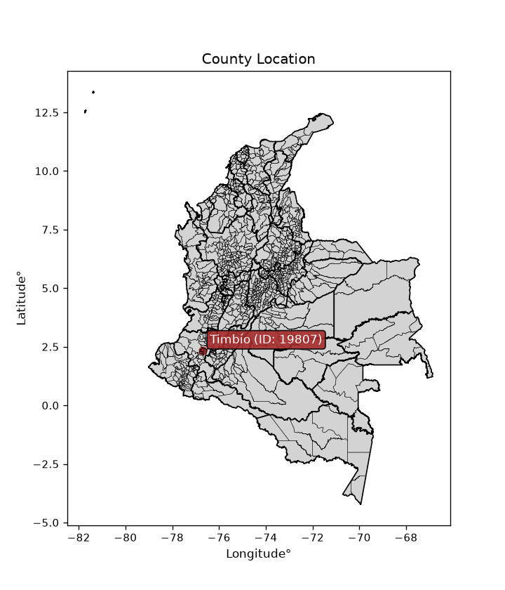
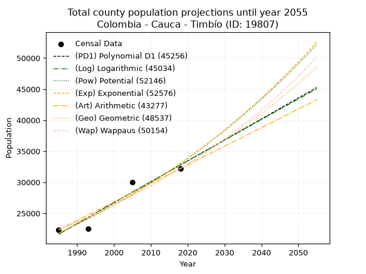
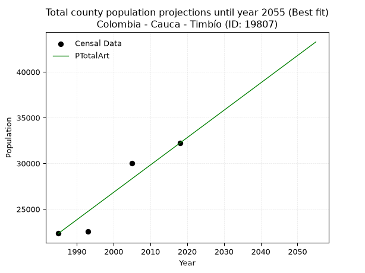
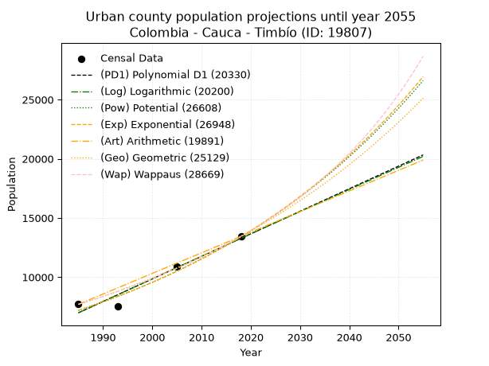
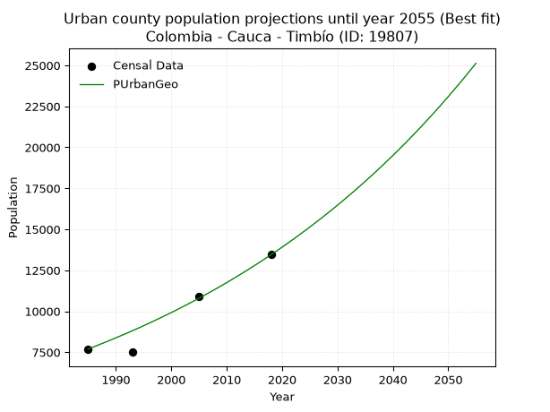
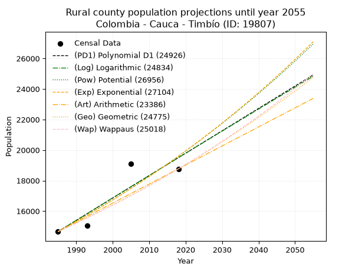
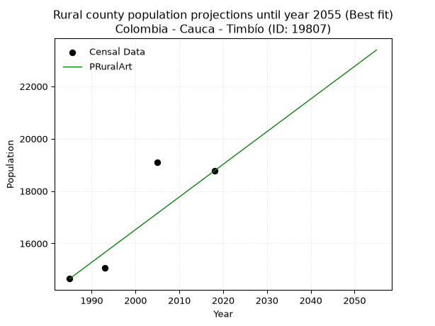

<div align="center">


</div>

# _“Population and Public Services Demand Projections (PPSD) until Year 2050 for Colombia - Cauca - Timbío (ID: 19807)”_
Keywords: `population` `public-service` `projection` `lineal` `polynomial` `logarithmic` `potential` `exponential` `arithmetic` `geometric` `wappaus` `dane` `colombia` `south-america`

PPSD are analytical estimates used by governments and planners to anticipate future changes in population size, age distribution, and the resulting community needs for utilities, healthcare, education, and infrastructure as sizing future water treatment facilities, electrical grids, and road networks based on spatial growth.

<div align="center">

</img>

</div>


> **General running parameters**: • app_version: _v20260806_. • Python version: _3.14.7_. • Pandas version: _3.0.5_. • NumPy version: _2.5.1_. • Creates, save and include plots into reports (create_plot): _False_. • Projection until year: _2050_. • Process polynomial degree 2 and up: _False_. • Process Wappaus: _True_. • Process Wappaus: _True_. • Set negative values to zero: _True_. • Set infinite values to zero: _True_. • Drop dataset notes: _True_. 
<div align="center">

Dynamic map: [:earth_americas:Google](http://maps.google.com/maps?q=2.349685529,-76.6844755) [:earth_americas:OSM](https://www.openstreetmap.org/#map=18/2.349685529/-76.6844755&layers=P) [:earth_americas:Bing](https://www.bing.com/maps?cp=2.349685529~-76.6844755&lvl=18) [:earth_americas:Apple](https://maps.apple.com/frame?center=2.349685529%2C-76.6844755&span=0.003%2C0.006)

</div>


<div align="center">

```geojson
{
  "type": "Feature",
  "geometry": {
    "type": "Point", 
    "coordinates": [-76.6844755, 2.349685529]
  }, 
  "properties": {
    "Name": "Colombia - Cauca - Timbío (ID: 19807)"
  }
}
```

</div>


## 0. Census Data (4 records)

Census data are official statistics collected by a government about the people and housing in a country. They usually include counts of total population, age, sex, race, income, education, and jobs.

📅Global census file: [Population.xlsx](../data/Population.xlsx)

| Source   |   Year |   CountryID | CountryName   |   StateID | StateName   |   CountyID | CountyName   |   PTotal |   PUrban |   PRural |
|:---------|-------:|------------:|:--------------|----------:|:------------|-----------:|:-------------|---------:|---------:|---------:|
| DANE     |   1985 |          57 | Colombia      |        19 | Cauca       |      19807 | Timbío       |    22353 |     7698 |    14655 |
| DANE     |   1993 |          57 | Colombia      |        19 | Cauca       |      19807 | Timbío       |    22560 |     7504 |    15056 |
| DANE     |   2005 |          57 | Colombia      |        19 | Cauca       |      19807 | Timbío       |    30028 |    10918 |    19110 |
| DANE     |   2018 |          57 | Colombia      |        19 | Cauca       |      19807 | Timbío       |    32217 |    13446 |    18771 |

> 🔥Some records could had specific notes about the registered values or the corresponding urban or rural distribution.

📅   [RUPS](https://www.datos.gov.co/Hacienda-y-Cr-dito-P-blico/Registro-nico-de-Prestadores-de-Servicios-P-blicos/4qkq-csdn/about_data) - Local public utility companies: [RUPS.csv](../data/RUPS.xlsx)

 | SERVICIO       | ESTADO    | NOMBRE                                                                       | NIT         | DEPARTAMENTO_DOMICILIO   | MUNICIPIO_DOMICILIO   | DIRECCION                                  |   TELEFONO | EMAIL                           | TIPO_PRESTADOR                            | CLASIFICACION                  |
|:---------------|:----------|:-----------------------------------------------------------------------------|:------------|:-------------------------|:----------------------|:-------------------------------------------|-----------:|:--------------------------------|:------------------------------------------|:-------------------------------|
| ACUEDUCTO      | OPERATIVA | ASOCIACION REGIONAL DEL ACUEDUCTO SACHACOCO                                  | 800206064-9 | CAUCA                    | TIMBIO                | CARRERA 22 No. 19-31 BARRIO SAN JUDAS      |    8278538 | sachacocotimbio@hotmail.com     | ORGANIZACION AUTORIZADA                   | DESDE 2501 HASTA 5000 USUARIOS |
| ACUEDUCTO      | OPERATIVA | ASOCIACION DE USUARIOS DEL ACUEDUCTO RURAL EL SALADITO DE TIMBIO CAUCA       | 817002112-1 | CAUCA                    | TIMBIO                | CARRERA 21 No 9A-49 BARRIO EL ARADO        |    8279334 | saladitotimbio@yahoo.com.mx     | ORGANIZACION AUTORIZADA                   | MENOR O IGUAL A 2500 USUARIOS  |
| ACUEDUCTO      | OPERATIVA | EMPRESA MUNICIPAL DE SERVICIOS PUBLICOS DE TIMBIO CAUCA E.S.P.               | 817000500-5 | CAUCA                    | TIMBIO                | Calle 17 NO. 19-24                         |    8278937 | emtiembioesp@emtimbioesp.gov.co | EMPRESA INDUSTRIAL Y COMERCIAL DEL ESTADO | DESDE 2501 HASTA 5000 USUARIOS |
| ALCANTARILLADO | OPERATIVA | EMPRESA MUNICIPAL DE SERVICIOS PUBLICOS DE TIMBIO CAUCA E.S.P.               | 817000500-5 | CAUCA                    | TIMBIO                | Calle 17 NO. 19-24                         |    8278937 | emtiembioesp@emtimbioesp.gov.co | EMPRESA INDUSTRIAL Y COMERCIAL DEL ESTADO | DESDE 2501 HASTA 5000 USUARIOS |
| ACUEDUCTO      | OPERATIVA | ASOCIACIÒN DE USUARIOS DEL ACUEDUCTO REGIONAL INTEGRADO EL HIGUERÓN GUAYABAL | 900060945-6 | CAUCA                    | TIMBIO                | antonmoreno                                |    8243880 | higuerong@gmail.com             | ORGANIZACION AUTORIZADA                   | MENOR O IGUAL A 2500 USUARIOS  |
| ACUEDUCTO      | OPERATIVA | ASOCIACION DE USUARIOS DEL ACUEDUCTO RURAL BRISAS DEL PARAMILLO              | 817005763-8 | CAUCA                    | TIMBIO                | VEREDA EL ENCENILLO TIMBIO CAUCA           |    8279250 | paramillotimbio@yahoo.com.mx    | ORGANIZACION AUTORIZADA                   | HASTA 2500 SUSCRIPTORES        |
| ACUEDUCTO      | OPERATIVA | ASOCACION DE USUARIOS DEL ACUEDUCTO RURAL LAS CRUCES                         | 817006300-6 | CAUCA                    | TIMBIO                | VEREDA LAS CRUCES TIMBIO CAUCA             |    8278460 | ASUACRUCES@GMAIL.COM            | ORGANIZACION AUTORIZADA                   | MENOR O IGUAL A 2500 USUARIOS  |
| ACUEDUCTO      | OPERATIVA | ASOCIACION DE USUARIOS DE EL ACUEDUCTO LAS YESCAS                            | 817006714-1 | CAUCA                    | TIMBIO                | VEREDA LAS YESCAS TIMBIO CAUCA             |    8278538 | lasyescastimbio@yahoo.com.mx    | ORGANIZACION AUTORIZADA                   | HASTA 2500 SUSCRIPTORES        |
| ACUEDUCTO      | OPERATIVA | ASOCIACION DE USUARIOS DEL ACUEDUCTO RURAL AIRES DEL CAMPO DE TIMBIO CAUCA   | 817004320-4 | CAUCA                    | TIMBIO                | VEREDA CAMPOSANO MUNICIPIO DE TIMBIO CAUCA |    8238284 | kelly2216-@hotmail.com          | ORGANIZACION AUTORIZADA                   | MENOR O IGUAL A 2500 USUARIOS  |
| ACUEDUCTO      | OPERATIVA | ASOCIACION ACUEDUCTO RURAL DE RIONEGRO                                       | 817000975-1 | CAUCA                    | POPAYAN               | Centro Múltiple- salón comunal             |    0000000 | aarrpopayan@yahoo.com           | ORGANIZACION AUTORIZADA                   | MENOR O IGUAL A 2500 USUARIOS  |

## 1. Total

### 1.1. Coefficients and Parameters

* (PD1) Polynomial Deg 1: 337.2806101967065, -647856.0405459623 (lineal)
* (Log) Logarithmic: 675161.7785724938, -5105120.589336467
* (Pow) Potential: 25.14921779626409, -78.59740358639652
* (Exp) Exponential: 0.012562746165898833, 3.227341680141624e-07
* (Art) Arithmetic: Year diff. 2018 - 1985 = 33, Population diff. 32217 - 22353 = 9864, Annual growth = 298.90909090909093
* (Geo) Geometric: Year diff. 2018 - 1985 = 33, Population diff. 32217 - 22353 = 9864, Annual growth % = 0.011138354155691976
* (Wap) Wappaus: i = 1.095507021840172, Condition values only valid for < 200)

<sub>
Wappaus condition values: ['0.00', '1.10', '2.19', '3.29', '4.38', '5.48', '6.57', '7.67', '8.76', '9.86', '10.96', '12.05', '13.15', '14.24', '15.34', '16.43', '17.53', '18.62', '19.72', '20.81', '21.91', '23.01', '24.10', '25.20', '26.29', '27.39', '28.48', '29.58', '30.67', '31.77', '32.87', '33.96', '35.06', '36.15', '37.25', '38.34', '39.44', '40.53', '41.63', '42.72', '43.82', '44.92', '46.01', '47.11', '48.20', '49.30', '50.39', '51.49', '52.58', '53.68', '54.78', '55.87', '56.97', '58.06', '59.16', '60.25', '61.35', '62.44', '63.54', '64.63', '65.73', '66.83', '67.92', '69.02', '70.11', '71.21']
</sub>


### 1.2. Projected Dataset

|   Year |   CountyID |   PTotalPD1 |   PTotalLog |   PTotalPow |   PTotalExp |   PTotalArt |   PTotalGeo |   PTotalWap |
|-------:|-----------:|------------:|------------:|------------:|------------:|------------:|------------:|------------:|
|   1985 |      19807 |       21646 |       21635 |       21812 |       21821 |       22353 |       22353 |       22353 |
|   1986 |      19807 |       21983 |       21975 |       22090 |       22097 |       22652 |       22602 |       22599 |
|   1987 |      19807 |       22321 |       22315 |       22371 |       22376 |       22951 |       22854 |       22848 |
|   1988 |      19807 |       22658 |       22655 |       22656 |       22659 |       23250 |       23108 |       23100 |
|   1989 |      19807 |       22995 |       22995 |       22945 |       22945 |       23549 |       23366 |       23354 |
|   1990 |      19807 |       23332 |       23334 |       23237 |       23235 |       23848 |       23626 |       23612 |
|   1991 |      19807 |       23670 |       23673 |       23532 |       23529 |       24146 |       23889 |       23872 |
|   1992 |      19807 |       24007 |       24012 |       23831 |       23826 |       24445 |       24155 |       24135 |
|   1993 |      19807 |       24344 |       24351 |       24134 |       24128 |       24744 |       24424 |       24402 |
|   1994 |      19807 |       24681 |       24690 |       24440 |       24433 |       25043 |       24696 |       24671 |
|   1995 |      19807 |       25019 |       25028 |       24750 |       24742 |       25342 |       24971 |       24944 |
|   1996 |      19807 |       25356 |       25367 |       25064 |       25054 |       25641 |       25249 |       25219 |
|   1997 |      19807 |       25693 |       25705 |       25382 |       25371 |       25940 |       25531 |       25498 |
|   1998 |      19807 |       26031 |       26043 |       25703 |       25692 |       26239 |       25815 |       25780 |
|   1999 |      19807 |       26368 |       26381 |       26029 |       26017 |       26538 |       26103 |       26066 |
|   2000 |      19807 |       26705 |       26718 |       26358 |       26346 |       26837 |       26393 |       26355 |
|   2001 |      19807 |       27042 |       27056 |       26692 |       26679 |       27136 |       26687 |       26647 |
|   2002 |      19807 |       27380 |       27393 |       27029 |       27016 |       27434 |       26985 |       26943 |
|   2003 |      19807 |       27717 |       27730 |       27371 |       27357 |       27733 |       27285 |       27243 |
|   2004 |      19807 |       28054 |       28067 |       27717 |       27703 |       28032 |       27589 |       27546 |
|   2005 |      19807 |       28392 |       28404 |       28067 |       28054 |       28331 |       27896 |       27853 |
|   2006 |      19807 |       28729 |       28741 |       28421 |       28408 |       28630 |       28207 |       28164 |
|   2007 |      19807 |       29066 |       29077 |       28779 |       28767 |       28929 |       28521 |       28478 |
|   2008 |      19807 |       29403 |       29413 |       29142 |       29131 |       29228 |       28839 |       28797 |
|   2009 |      19807 |       29741 |       29750 |       29509 |       29499 |       29527 |       29160 |       29120 |
|   2010 |      19807 |       30078 |       30086 |       29881 |       29872 |       29826 |       29485 |       29446 |
|   2011 |      19807 |       30415 |       30421 |       30257 |       30250 |       30125 |       29813 |       29777 |
|   2012 |      19807 |       30753 |       30757 |       30638 |       30632 |       30424 |       30145 |       30112 |
|   2013 |      19807 |       31090 |       31093 |       31023 |       31019 |       30722 |       30481 |       30452 |
|   2014 |      19807 |       31427 |       31428 |       31413 |       31412 |       31021 |       30821 |       30796 |
|   2015 |      19807 |       31764 |       31763 |       31807 |       31809 |       31320 |       31164 |       31144 |
|   2016 |      19807 |       32102 |       32098 |       32207 |       32211 |       31619 |       31511 |       31497 |
|   2017 |      19807 |       32439 |       32433 |       32611 |       32618 |       31918 |       31862 |       31855 |
|   2018 |      19807 |       32776 |       32768 |       33020 |       33030 |       32217 |       32217 |       32217 |
|   2019 |      19807 |       33114 |       33102 |       33434 |       33448 |       32516 |       32576 |       32584 |
|   2020 |      19807 |       33451 |       33436 |       33853 |       33871 |       32815 |       32939 |       32957 |
|   2021 |      19807 |       33788 |       33770 |       34277 |       34299 |       33114 |       33306 |       33334 |
|   2022 |      19807 |       34125 |       34104 |       34706 |       34733 |       33413 |       33677 |       33717 |
|   2023 |      19807 |       34463 |       34438 |       35140 |       35172 |       33712 |       34052 |       34104 |
|   2024 |      19807 |       34800 |       34772 |       35580 |       35616 |       34010 |       34431 |       34498 |
|   2025 |      19807 |       35137 |       35105 |       36025 |       36067 |       34309 |       34814 |       34896 |
|   2026 |      19807 |       35474 |       35439 |       36475 |       36523 |       34608 |       35202 |       35301 |
|   2027 |      19807 |       35812 |       35772 |       36930 |       36984 |       34907 |       35594 |       35711 |
|   2028 |      19807 |       36149 |       36105 |       37391 |       37452 |       35206 |       35991 |       36127 |
|   2029 |      19807 |       36486 |       36438 |       37858 |       37925 |       35505 |       36392 |       36549 |
|   2030 |      19807 |       36824 |       36770 |       38330 |       38405 |       35804 |       36797 |       36977 |
|   2031 |      19807 |       37161 |       37103 |       38807 |       38890 |       36103 |       37207 |       37412 |
|   2032 |      19807 |       37498 |       37435 |       39291 |       39382 |       36402 |       37621 |       37853 |
|   2033 |      19807 |       37835 |       37767 |       39780 |       39880 |       36701 |       38040 |       38300 |
|   2034 |      19807 |       38173 |       38100 |       40275 |       40384 |       37000 |       38464 |       38754 |
|   2035 |      19807 |       38510 |       38431 |       40776 |       40895 |       37298 |       38892 |       39215 |
|   2036 |      19807 |       38847 |       38763 |       41283 |       41412 |       37597 |       39326 |       39683 |
|   2037 |      19807 |       39185 |       39095 |       41796 |       41935 |       37896 |       39764 |       40158 |
|   2038 |      19807 |       39522 |       39426 |       42315 |       42465 |       38195 |       40207 |       40641 |
|   2039 |      19807 |       39859 |       39757 |       42840 |       43002 |       38494 |       40654 |       41131 |
|   2040 |      19807 |       40196 |       40088 |       43372 |       43546 |       38793 |       41107 |       41628 |
|   2041 |      19807 |       40534 |       40419 |       43910 |       44096 |       39092 |       41565 |       42134 |
|   2042 |      19807 |       40871 |       40750 |       44454 |       44654 |       39391 |       42028 |       42647 |
|   2043 |      19807 |       41208 |       41080 |       45005 |       45218 |       39690 |       42496 |       43169 |
|   2044 |      19807 |       41546 |       41411 |       45562 |       45790 |       39989 |       42969 |       43699 |
|   2045 |      19807 |       41883 |       41741 |       46126 |       46369 |       40288 |       43448 |       44238 |
|   2046 |      19807 |       42220 |       42071 |       46696 |       46955 |       40586 |       43932 |       44786 |
|   2047 |      19807 |       42557 |       42401 |       47274 |       47548 |       40885 |       44421 |       45343 |
|   2048 |      19807 |       42895 |       42731 |       47858 |       48150 |       41184 |       44916 |       45909 |
|   2049 |      19807 |       43232 |       43060 |       48449 |       48758 |       41483 |       45416 |       46485 |
|   2050 |      19807 |       43569 |       43390 |       49047 |       49375 |       41782 |       45922 |       47071 |
<div align="center">

</img>

</div>


### 1.3. Best fit with absolute and relative error (%)

Relative error puts that difference into context by dividing the absolute error by the true value, creating a unitless ratio or percentage that shows the scale of the mistake.

Absolute and relative error

|   Year | Source   |   CountryID | CountryName   |   StateID | StateName   |   CountyID_x | CountyName   |   PTotal |   PUrban |   PRural |   CountyID_y |   PTotalPD1 |   PTotalLog |   PTotalPow |   PTotalExp |   PTotalArt |   PTotalGeo |   PTotalWap |   PTotalPD1AbsError |   PTotalLogAbsError |   PTotalPowAbsError |   PTotalExpAbsError |   PTotalArtAbsError |   PTotalGeoAbsError |   PTotalWapAbsError |   PTotalPD1RelError |   PTotalLogRelError |   PTotalPowRelError |   PTotalExpRelError |   PTotalArtRelError |   PTotalGeoRelError |   PTotalWapRelError |
|-------:|:---------|------------:|:--------------|----------:|:------------|-------------:|:-------------|---------:|---------:|---------:|-------------:|------------:|------------:|------------:|------------:|------------:|------------:|------------:|--------------------:|--------------------:|--------------------:|--------------------:|--------------------:|--------------------:|--------------------:|--------------------:|--------------------:|--------------------:|--------------------:|--------------------:|--------------------:|--------------------:|
|   1985 | DANE     |          57 | Colombia      |        19 | Cauca       |        19807 | Timbío       |    22353 |     7698 |    14655 |        19807 |       21646 |       21635 |       21812 |       21821 |       22353 |       22353 |       22353 |                 707 |                 718 |                 541 |                 532 |                   0 |                   0 |                   0 |             3.16289 |             3.2121  |             2.42026 |             2.37999 |             0       |             0       |             0       |
|   1993 | DANE     |          57 | Colombia      |        19 | Cauca       |        19807 | Timbío       |    22560 |     7504 |    15056 |        19807 |       24344 |       24351 |       24134 |       24128 |       24744 |       24424 |       24402 |                1784 |                1791 |                1574 |                1568 |                2184 |                1864 |                1842 |             7.9078  |             7.93883 |             6.97695 |             6.95035 |             9.68085 |             8.26241 |             8.16489 |
|   2005 | DANE     |          57 | Colombia      |        19 | Cauca       |        19807 | Timbío       |    30028 |    10918 |    19110 |        19807 |       28392 |       28404 |       28067 |       28054 |       28331 |       27896 |       27853 |                1636 |                1624 |                1961 |                1974 |                1697 |                2132 |                2175 |             5.44825 |             5.40829 |             6.53057 |             6.57386 |             5.65139 |             7.10004 |             7.24324 |
|   2018 | DANE     |          57 | Colombia      |        19 | Cauca       |        19807 | Timbío       |    32217 |    13446 |    18771 |        19807 |       32776 |       32768 |       33020 |       33030 |       32217 |       32217 |       32217 |                 559 |                 551 |                 803 |                 813 |                   0 |                   0 |                   0 |             1.73511 |             1.71028 |             2.49247 |             2.52351 |             0       |             0       |             0       |

Relative error mean

| Method    |   RelError | Best   |
|:----------|-----------:|:-------|
| PTotalPD1 |    4.56351 |        |
| PTotalLog |    4.56737 |        |
| PTotalPow |    4.60506 |        |
| PTotalExp |    4.60693 |        |
| PTotalArt |    3.83306 | True   |
| PTotalGeo |    3.84061 |        |
| PTotalWap |    3.85203 |        |

💙Best method: _**PTotalArt**_
<div align="center">

</img>

</div>


### 1.4. Fresh water supply demand in liters per capita per day (lpcd)

The fresh water supply demand typically ranges from 100 to 300 liters per capita per day (lpcd) for standard domestic and municipal planning, though absolute survival minimums set by the World Health Organization are as low as 7.5 to 20 liters per day, and total consumption in high-income nations can exceed 400 liters.

> `CZ`: Level in meters above the sea level (masl)<br> `WS`: Fresh water supply demand in liters per capita per day (lpcd or l/h/d)<br> `WSAll`: Zonal fresh water supply demand in liters per second (l/s)<br> `A`: Zonal area in square meters<br> `DP`: Population density (people/hectare or p/ha)

Reference values (RAS Colombia)

|    CZ |   WS |
|------:|-----:|
|  1000 |  120 |
|  2000 |  130 |
| 99999 |  140 |

County shapefile geometry properties and water supply values

|   CountyID |      ATotal |   CZTotal |   WSTotal |
|-----------:|------------:|----------:|----------:|
|      19807 | 2.01398e+08 |   1699.98 |       130 |

Projected values for best method: PTotalArt

|   CountyID |   Year |   PTotalArt |   DPTotal |   WSTotal |   WSTotalAll |
|-----------:|-------:|------------:|----------:|----------:|-------------:|
|      19807 |   1985 |       22353 |      1.11 |       130 |      33.633  |
|      19807 |   1986 |       22652 |      1.12 |       130 |      34.0829 |
|      19807 |   1987 |       22951 |      1.14 |       130 |      34.5328 |
|      19807 |   1988 |       23250 |      1.15 |       130 |      34.9826 |
|      19807 |   1989 |       23549 |      1.17 |       130 |      35.4325 |
|      19807 |   1990 |       23848 |      1.18 |       130 |      35.8824 |
|      19807 |   1991 |       24146 |      1.2  |       130 |      36.3308 |
|      19807 |   1992 |       24445 |      1.21 |       130 |      36.7807 |
|      19807 |   1993 |       24744 |      1.23 |       130 |      37.2306 |
|      19807 |   1994 |       25043 |      1.24 |       130 |      37.6804 |
|      19807 |   1995 |       25342 |      1.26 |       130 |      38.1303 |
|      19807 |   1996 |       25641 |      1.27 |       130 |      38.5802 |
|      19807 |   1997 |       25940 |      1.29 |       130 |      39.0301 |
|      19807 |   1998 |       26239 |      1.3  |       130 |      39.48   |
|      19807 |   1999 |       26538 |      1.32 |       130 |      39.9299 |
|      19807 |   2000 |       26837 |      1.33 |       130 |      40.3797 |
|      19807 |   2001 |       27136 |      1.35 |       130 |      40.8296 |
|      19807 |   2002 |       27434 |      1.36 |       130 |      41.278  |
|      19807 |   2003 |       27733 |      1.38 |       130 |      41.7279 |
|      19807 |   2004 |       28032 |      1.39 |       130 |      42.1778 |
|      19807 |   2005 |       28331 |      1.41 |       130 |      42.6277 |
|      19807 |   2006 |       28630 |      1.42 |       130 |      43.0775 |
|      19807 |   2007 |       28929 |      1.44 |       130 |      43.5274 |
|      19807 |   2008 |       29228 |      1.45 |       130 |      43.9773 |
|      19807 |   2009 |       29527 |      1.47 |       130 |      44.4272 |
|      19807 |   2010 |       29826 |      1.48 |       130 |      44.8771 |
|      19807 |   2011 |       30125 |      1.5  |       130 |      45.327  |
|      19807 |   2012 |       30424 |      1.51 |       130 |      45.7769 |
|      19807 |   2013 |       30722 |      1.53 |       130 |      46.2252 |
|      19807 |   2014 |       31021 |      1.54 |       130 |      46.6751 |
|      19807 |   2015 |       31320 |      1.56 |       130 |      47.125  |
|      19807 |   2016 |       31619 |      1.57 |       130 |      47.5749 |
|      19807 |   2017 |       31918 |      1.58 |       130 |      48.0248 |
|      19807 |   2018 |       32217 |      1.6  |       130 |      48.4747 |
|      19807 |   2019 |       32516 |      1.61 |       130 |      48.9245 |
|      19807 |   2020 |       32815 |      1.63 |       130 |      49.3744 |
|      19807 |   2021 |       33114 |      1.64 |       130 |      49.8243 |
|      19807 |   2022 |       33413 |      1.66 |       130 |      50.2742 |
|      19807 |   2023 |       33712 |      1.67 |       130 |      50.7241 |
|      19807 |   2024 |       34010 |      1.69 |       130 |      51.1725 |
|      19807 |   2025 |       34309 |      1.7  |       130 |      51.6223 |
|      19807 |   2026 |       34608 |      1.72 |       130 |      52.0722 |
|      19807 |   2027 |       34907 |      1.73 |       130 |      52.5221 |
|      19807 |   2028 |       35206 |      1.75 |       130 |      52.972  |
|      19807 |   2029 |       35505 |      1.76 |       130 |      53.4219 |
|      19807 |   2030 |       35804 |      1.78 |       130 |      53.8718 |
|      19807 |   2031 |       36103 |      1.79 |       130 |      54.3216 |
|      19807 |   2032 |       36402 |      1.81 |       130 |      54.7715 |
|      19807 |   2033 |       36701 |      1.82 |       130 |      55.2214 |
|      19807 |   2034 |       37000 |      1.84 |       130 |      55.6713 |
|      19807 |   2035 |       37298 |      1.85 |       130 |      56.1197 |
|      19807 |   2036 |       37597 |      1.87 |       130 |      56.5696 |
|      19807 |   2037 |       37896 |      1.88 |       130 |      57.0194 |
|      19807 |   2038 |       38195 |      1.9  |       130 |      57.4693 |
|      19807 |   2039 |       38494 |      1.91 |       130 |      57.9192 |
|      19807 |   2040 |       38793 |      1.93 |       130 |      58.3691 |
|      19807 |   2041 |       39092 |      1.94 |       130 |      58.819  |
|      19807 |   2042 |       39391 |      1.96 |       130 |      59.2689 |
|      19807 |   2043 |       39690 |      1.97 |       130 |      59.7188 |
|      19807 |   2044 |       39989 |      1.99 |       130 |      60.1686 |
|      19807 |   2045 |       40288 |      2    |       130 |      60.6185 |
|      19807 |   2046 |       40586 |      2.02 |       130 |      61.0669 |
|      19807 |   2047 |       40885 |      2.03 |       130 |      61.5168 |
|      19807 |   2048 |       41184 |      2.04 |       130 |      61.9667 |
|      19807 |   2049 |       41483 |      2.06 |       130 |      62.4166 |
|      19807 |   2050 |       41782 |      2.07 |       130 |      62.8664 |

## 2. Urban

### 2.1. Coefficients and Parameters

* (PD1) Polynomial Deg 1: 190.65194700923144, -371460.05700521515 (lineal)
* (Log) Logarithmic: 381476.20565690653, -2889712.1961566065
* (Pow) Potential: 37.7393899562101, -120.59848656150707
* (Exp) Exponential: 0.018859091700196236, 3.974250286230796e-13
* (Art) Arithmetic: Year diff. 2018 - 1985 = 33, Population diff. 13446 - 7698 = 5748, Annual growth = 174.1818181818182
* (Geo) Geometric: Year diff. 2018 - 1985 = 33, Population diff. 13446 - 7698 = 5748, Annual growth % = 0.017044263453381614
* (Wap) Wappaus: i = 1.6475767894610118, Condition values only valid for < 200)

<sub>
Wappaus condition values: ['0.00', '1.65', '3.30', '4.94', '6.59', '8.24', '9.89', '11.53', '13.18', '14.83', '16.48', '18.12', '19.77', '21.42', '23.07', '24.71', '26.36', '28.01', '29.66', '31.30', '32.95', '34.60', '36.25', '37.89', '39.54', '41.19', '42.84', '44.48', '46.13', '47.78', '49.43', '51.07', '52.72', '54.37', '56.02', '57.67', '59.31', '60.96', '62.61', '64.26', '65.90', '67.55', '69.20', '70.85', '72.49', '74.14', '75.79', '77.44', '79.08', '80.73', '82.38', '84.03', '85.67', '87.32', '88.97', '90.62', '92.26', '93.91', '95.56', '97.21', '98.85', '100.50', '102.15', '103.80', '105.44', '107.09']
</sub>


### 2.2. Projected Dataset

|   Year |   CountyID |   PUrbanPD1 |   PUrbanLog |   PUrbanPow |   PUrbanExp |   PUrbanArt |   PUrbanGeo |   PUrbanWap |
|-------:|-----------:|------------:|------------:|------------:|------------:|------------:|------------:|------------:|
|   1985 |      19807 |        6984 |        6979 |        7194 |        7198 |        7698 |        7698 |        7698 |
|   1986 |      19807 |        7175 |        7172 |        7332 |        7335 |        7872 |        7829 |        7826 |
|   1987 |      19807 |        7365 |        7364 |        7473 |        7474 |        8046 |        7963 |        7956 |
|   1988 |      19807 |        7556 |        7555 |        7616 |        7617 |        8221 |        8098 |        8088 |
|   1989 |      19807 |        7747 |        7747 |        7762 |        7762 |        8395 |        8236 |        8223 |
|   1990 |      19807 |        7937 |        7939 |        7911 |        7910 |        8569 |        8377 |        8359 |
|   1991 |      19807 |        8128 |        8131 |        8062 |        8060 |        8743 |        8520 |        8499 |
|   1992 |      19807 |        8319 |        8322 |        8216 |        8214 |        8917 |        8665 |        8640 |
|   1993 |      19807 |        8509 |        8514 |        8373 |        8370 |        9091 |        8812 |        8784 |
|   1994 |      19807 |        8700 |        8705 |        8534 |        8529 |        9266 |        8963 |        8931 |
|   1995 |      19807 |        8891 |        8896 |        8697 |        8692 |        9440 |        9115 |        9080 |
|   1996 |      19807 |        9081 |        9088 |        8863 |        8857 |        9614 |        9271 |        9232 |
|   1997 |      19807 |        9272 |        9279 |        9032 |        9026 |        9788 |        9429 |        9387 |
|   1998 |      19807 |        9463 |        9470 |        9204 |        9198 |        9962 |        9590 |        9545 |
|   1999 |      19807 |        9653 |        9660 |        9379 |        9373 |       10137 |        9753 |        9705 |
|   2000 |      19807 |        9844 |        9851 |        9558 |        9551 |       10311 |        9919 |        9869 |
|   2001 |      19807 |       10034 |       10042 |        9740 |        9733 |       10485 |       10088 |       10035 |
|   2002 |      19807 |       10225 |       10233 |        9926 |        9918 |       10659 |       10260 |       10205 |
|   2003 |      19807 |       10416 |       10423 |       10114 |       10107 |       10833 |       10435 |       10378 |
|   2004 |      19807 |       10606 |       10613 |       10307 |       10299 |       11007 |       10613 |       10555 |
|   2005 |      19807 |       10797 |       10804 |       10503 |       10496 |       11182 |       10794 |       10735 |
|   2006 |      19807 |       10988 |       10994 |       10702 |       10695 |       11356 |       10978 |       10919 |
|   2007 |      19807 |       11178 |       11184 |       10905 |       10899 |       11530 |       11165 |       11106 |
|   2008 |      19807 |       11369 |       11374 |       11112 |       11107 |       11704 |       11355 |       11297 |
|   2009 |      19807 |       11560 |       11564 |       11323 |       11318 |       11878 |       11549 |       11492 |
|   2010 |      19807 |       11750 |       11754 |       11538 |       11533 |       12053 |       11746 |       11691 |
|   2011 |      19807 |       11941 |       11944 |       11756 |       11753 |       12227 |       11946 |       11894 |
|   2012 |      19807 |       12132 |       12133 |       11979 |       11977 |       12401 |       12149 |       12102 |
|   2013 |      19807 |       12322 |       12323 |       12206 |       12205 |       12575 |       12356 |       12314 |
|   2014 |      19807 |       12513 |       12512 |       12437 |       12437 |       12749 |       12567 |       12531 |
|   2015 |      19807 |       12704 |       12702 |       12672 |       12674 |       12923 |       12781 |       12752 |
|   2016 |      19807 |       12894 |       12891 |       12911 |       12915 |       13098 |       12999 |       12978 |
|   2017 |      19807 |       13085 |       13080 |       13155 |       13161 |       13272 |       13221 |       13209 |
|   2018 |      19807 |       13276 |       13269 |       13404 |       13412 |       13446 |       13446 |       13446 |
|   2019 |      19807 |       13466 |       13458 |       13657 |       13667 |       13620 |       13675 |       13688 |
|   2020 |      19807 |       13657 |       13647 |       13914 |       13927 |       13794 |       13908 |       13935 |
|   2021 |      19807 |       13848 |       13836 |       14177 |       14192 |       13969 |       14145 |       14189 |
|   2022 |      19807 |       14038 |       14025 |       14444 |       14462 |       14143 |       14386 |       14448 |
|   2023 |      19807 |       14229 |       14213 |       14716 |       14738 |       14317 |       14632 |       14714 |
|   2024 |      19807 |       14419 |       14402 |       14993 |       15018 |       14491 |       14881 |       14986 |
|   2025 |      19807 |       14610 |       14590 |       15275 |       15304 |       14665 |       15135 |       15264 |
|   2026 |      19807 |       14801 |       14778 |       15562 |       15596 |       14839 |       15393 |       15550 |
|   2027 |      19807 |       14991 |       14967 |       15855 |       15893 |       15014 |       15655 |       15843 |
|   2028 |      19807 |       15182 |       15155 |       16153 |       16195 |       15188 |       15922 |       16143 |
|   2029 |      19807 |       15373 |       15343 |       16456 |       16503 |       15362 |       16193 |       16451 |
|   2030 |      19807 |       15563 |       15531 |       16765 |       16818 |       15536 |       16469 |       16767 |
|   2031 |      19807 |       15754 |       15719 |       17079 |       17138 |       15710 |       16750 |       17092 |
|   2032 |      19807 |       15945 |       15907 |       17399 |       17464 |       15885 |       17035 |       17425 |
|   2033 |      19807 |       16135 |       16094 |       17726 |       17797 |       16059 |       17326 |       17768 |
|   2034 |      19807 |       16326 |       16282 |       18058 |       18135 |       16233 |       17621 |       18119 |
|   2035 |      19807 |       16517 |       16469 |       18396 |       18481 |       16407 |       17921 |       18481 |
|   2036 |      19807 |       16707 |       16657 |       18740 |       18833 |       16581 |       18227 |       18853 |
|   2037 |      19807 |       16898 |       16844 |       19090 |       19191 |       16755 |       18537 |       19236 |
|   2038 |      19807 |       17089 |       17031 |       19447 |       19556 |       16930 |       18853 |       19629 |
|   2039 |      19807 |       17279 |       17218 |       19811 |       19929 |       17104 |       19175 |       20035 |
|   2040 |      19807 |       17470 |       17405 |       20181 |       20308 |       17278 |       19502 |       20453 |
|   2041 |      19807 |       17661 |       17592 |       20557 |       20695 |       17452 |       19834 |       20883 |
|   2042 |      19807 |       17851 |       17779 |       20941 |       21089 |       17626 |       20172 |       21327 |
|   2043 |      19807 |       18042 |       17966 |       21332 |       21490 |       17801 |       20516 |       21785 |
|   2044 |      19807 |       18233 |       18153 |       21729 |       21899 |       17975 |       20866 |       22257 |
|   2045 |      19807 |       18423 |       18339 |       22134 |       22316 |       18149 |       21221 |       22745 |
|   2046 |      19807 |       18614 |       18526 |       22546 |       22741 |       18323 |       21583 |       23249 |
|   2047 |      19807 |       18804 |       18712 |       22966 |       23174 |       18497 |       21951 |       23770 |
|   2048 |      19807 |       18995 |       18899 |       23393 |       23615 |       18671 |       22325 |       24309 |
|   2049 |      19807 |       19186 |       19085 |       23828 |       24065 |       18846 |       22705 |       24867 |
|   2050 |      19807 |       19376 |       19271 |       24271 |       24523 |       19020 |       23092 |       25445 |
<div align="center">

</img>

</div>


### 2.3. Best fit with absolute and relative error (%)

Relative error puts that difference into context by dividing the absolute error by the true value, creating a unitless ratio or percentage that shows the scale of the mistake.

Absolute and relative error

|   Year | Source   |   CountryID | CountryName   |   StateID | StateName   |   CountyID_x | CountyName   |   PTotal |   PUrban |   PRural |   CountyID_y |   PUrbanPD1 |   PUrbanLog |   PUrbanPow |   PUrbanExp |   PUrbanArt |   PUrbanGeo |   PUrbanWap |   PUrbanPD1AbsError |   PUrbanLogAbsError |   PUrbanPowAbsError |   PUrbanExpAbsError |   PUrbanArtAbsError |   PUrbanGeoAbsError |   PUrbanWapAbsError |   PUrbanPD1RelError |   PUrbanLogRelError |   PUrbanPowRelError |   PUrbanExpRelError |   PUrbanArtRelError |   PUrbanGeoRelError |   PUrbanWapRelError |
|-------:|:---------|------------:|:--------------|----------:|:------------|-------------:|:-------------|---------:|---------:|---------:|-------------:|------------:|------------:|------------:|------------:|------------:|------------:|------------:|--------------------:|--------------------:|--------------------:|--------------------:|--------------------:|--------------------:|--------------------:|--------------------:|--------------------:|--------------------:|--------------------:|--------------------:|--------------------:|--------------------:|
|   1985 | DANE     |          57 | Colombia      |        19 | Cauca       |        19807 | Timbío       |    22353 |     7698 |    14655 |        19807 |        6984 |        6979 |        7194 |        7198 |        7698 |        7698 |        7698 |                 714 |                 719 |                 504 |                 500 |                   0 |                   0 |                   0 |             9.27514 |             9.34009 |            6.54716  |            6.49519  |             0       |             0       |             0       |
|   1993 | DANE     |          57 | Colombia      |        19 | Cauca       |        19807 | Timbío       |    22560 |     7504 |    15056 |        19807 |        8509 |        8514 |        8373 |        8370 |        9091 |        8812 |        8784 |                1005 |                1010 |                 869 |                 866 |                1587 |                1308 |                1280 |            13.3929  |            13.4595  |           11.5805   |           11.5405   |            21.1487  |            17.4307  |            17.0576  |
|   2005 | DANE     |          57 | Colombia      |        19 | Cauca       |        19807 | Timbío       |    30028 |    10918 |    19110 |        19807 |       10797 |       10804 |       10503 |       10496 |       11182 |       10794 |       10735 |                 121 |                 114 |                 415 |                 422 |                 264 |                 124 |                 183 |             1.10826 |             1.04415 |            3.80106  |            3.86518  |             2.41803 |             1.13574 |             1.67613 |
|   2018 | DANE     |          57 | Colombia      |        19 | Cauca       |        19807 | Timbío       |    32217 |    13446 |    18771 |        19807 |       13276 |       13269 |       13404 |       13412 |       13446 |       13446 |       13446 |                 170 |                 177 |                  42 |                  34 |                   0 |                   0 |                   0 |             1.26432 |             1.31638 |            0.312361 |            0.252863 |             0       |             0       |             0       |

Relative error mean

| Method    |   RelError | Best   |
|:----------|-----------:|:-------|
| PUrbanPD1 |    6.26014 |        |
| PUrbanLog |    6.29003 |        |
| PUrbanPow |    5.56027 |        |
| PUrbanExp |    5.53844 |        |
| PUrbanArt |    5.89169 |        |
| PUrbanGeo |    4.64161 | True   |
| PUrbanWap |    4.68343 |        |

💙Best method: _**PUrbanGeo**_
<div align="center">

</img>

</div>


### 2.4. Fresh water supply demand in liters per capita per day (lpcd)

The fresh water supply demand typically ranges from 100 to 300 liters per capita per day (lpcd) for standard domestic and municipal planning, though absolute survival minimums set by the World Health Organization are as low as 7.5 to 20 liters per day, and total consumption in high-income nations can exceed 400 liters.

> `CZ`: Level in meters above the sea level (masl)<br> `WS`: Fresh water supply demand in liters per capita per day (lpcd or l/h/d)<br> `WSAll`: Zonal fresh water supply demand in liters per second (l/s)<br> `A`: Zonal area in square meters<br> `DP`: Population density (people/hectare or p/ha)

Reference values (RAS Colombia)

|    CZ |   WS |
|------:|-----:|
|  1000 |  120 |
|  2000 |  130 |
| 99999 |  140 |

County shapefile geometry properties and water supply values

|   CountyID |      AUrban |   CZUrban |   WSUrban |
|-----------:|------------:|----------:|----------:|
|      19807 | 2.35105e+06 |   1802.21 |       130 |

Projected values for best method: PUrbanGeo

|   CountyID |   Year |   PUrbanGeo |   DPUrban |   WSUrban |   WSUrbanAll |
|-----------:|-------:|------------:|----------:|----------:|-------------:|
|      19807 |   1985 |        7698 |     32.74 |       130 |      11.5826 |
|      19807 |   1986 |        7829 |     33.3  |       130 |      11.7797 |
|      19807 |   1987 |        7963 |     33.87 |       130 |      11.9814 |
|      19807 |   1988 |        8098 |     34.44 |       130 |      12.1845 |
|      19807 |   1989 |        8236 |     35.03 |       130 |      12.3921 |
|      19807 |   1990 |        8377 |     35.63 |       130 |      12.6043 |
|      19807 |   1991 |        8520 |     36.24 |       130 |      12.8194 |
|      19807 |   1992 |        8665 |     36.86 |       130 |      13.0376 |
|      19807 |   1993 |        8812 |     37.48 |       130 |      13.2588 |
|      19807 |   1994 |        8963 |     38.12 |       130 |      13.486  |
|      19807 |   1995 |        9115 |     38.77 |       130 |      13.7147 |
|      19807 |   1996 |        9271 |     39.43 |       130 |      13.9494 |
|      19807 |   1997 |        9429 |     40.11 |       130 |      14.1872 |
|      19807 |   1998 |        9590 |     40.79 |       130 |      14.4294 |
|      19807 |   1999 |        9753 |     41.48 |       130 |      14.6747 |
|      19807 |   2000 |        9919 |     42.19 |       130 |      14.9244 |
|      19807 |   2001 |       10088 |     42.91 |       130 |      15.1787 |
|      19807 |   2002 |       10260 |     43.64 |       130 |      15.4375 |
|      19807 |   2003 |       10435 |     44.38 |       130 |      15.7008 |
|      19807 |   2004 |       10613 |     45.14 |       130 |      15.9686 |
|      19807 |   2005 |       10794 |     45.91 |       130 |      16.241  |
|      19807 |   2006 |       10978 |     46.69 |       130 |      16.5178 |
|      19807 |   2007 |       11165 |     47.49 |       130 |      16.7992 |
|      19807 |   2008 |       11355 |     48.3  |       130 |      17.0851 |
|      19807 |   2009 |       11549 |     49.12 |       130 |      17.377  |
|      19807 |   2010 |       11746 |     49.96 |       130 |      17.6734 |
|      19807 |   2011 |       11946 |     50.81 |       130 |      17.9743 |
|      19807 |   2012 |       12149 |     51.67 |       130 |      18.2797 |
|      19807 |   2013 |       12356 |     52.56 |       130 |      18.5912 |
|      19807 |   2014 |       12567 |     53.45 |       130 |      18.9087 |
|      19807 |   2015 |       12781 |     54.36 |       130 |      19.2307 |
|      19807 |   2016 |       12999 |     55.29 |       130 |      19.5587 |
|      19807 |   2017 |       13221 |     56.23 |       130 |      19.8927 |
|      19807 |   2018 |       13446 |     57.19 |       130 |      20.2312 |
|      19807 |   2019 |       13675 |     58.17 |       130 |      20.5758 |
|      19807 |   2020 |       13908 |     59.16 |       130 |      20.9264 |
|      19807 |   2021 |       14145 |     60.16 |       130 |      21.283  |
|      19807 |   2022 |       14386 |     61.19 |       130 |      21.6456 |
|      19807 |   2023 |       14632 |     62.24 |       130 |      22.0157 |
|      19807 |   2024 |       14881 |     63.3  |       130 |      22.3904 |
|      19807 |   2025 |       15135 |     64.38 |       130 |      22.7726 |
|      19807 |   2026 |       15393 |     65.47 |       130 |      23.1608 |
|      19807 |   2027 |       15655 |     66.59 |       130 |      23.555  |
|      19807 |   2028 |       15922 |     67.72 |       130 |      23.9567 |
|      19807 |   2029 |       16193 |     68.88 |       130 |      24.3645 |
|      19807 |   2030 |       16469 |     70.05 |       130 |      24.7797 |
|      19807 |   2031 |       16750 |     71.24 |       130 |      25.2025 |
|      19807 |   2032 |       17035 |     72.46 |       130 |      25.6314 |
|      19807 |   2033 |       17326 |     73.69 |       130 |      26.0692 |
|      19807 |   2034 |       17621 |     74.95 |       130 |      26.5131 |
|      19807 |   2035 |       17921 |     76.23 |       130 |      26.9645 |
|      19807 |   2036 |       18227 |     77.53 |       130 |      27.4249 |
|      19807 |   2037 |       18537 |     78.85 |       130 |      27.8913 |
|      19807 |   2038 |       18853 |     80.19 |       130 |      28.3668 |
|      19807 |   2039 |       19175 |     81.56 |       130 |      28.8513 |
|      19807 |   2040 |       19502 |     82.95 |       130 |      29.3433 |
|      19807 |   2041 |       19834 |     84.36 |       130 |      29.8428 |
|      19807 |   2042 |       20172 |     85.8  |       130 |      30.3514 |
|      19807 |   2043 |       20516 |     87.26 |       130 |      30.869  |
|      19807 |   2044 |       20866 |     88.75 |       130 |      31.3956 |
|      19807 |   2045 |       21221 |     90.26 |       130 |      31.9297 |
|      19807 |   2046 |       21583 |     91.8  |       130 |      32.4744 |
|      19807 |   2047 |       21951 |     93.37 |       130 |      33.0281 |
|      19807 |   2048 |       22325 |     94.96 |       130 |      33.5909 |
|      19807 |   2049 |       22705 |     96.57 |       130 |      34.1626 |
|      19807 |   2050 |       23092 |     98.22 |       130 |      34.7449 |

## 3. Rural

### 3.1. Coefficients and Parameters

* (PD1) Polynomial Deg 1: 146.62866318747484, -276395.98354074656 (lineal)
* (Log) Logarithmic: 293685.5729155875, -2215408.3931798614
* (Pow) Potential: 17.556727443956234, -53.73147786351867
* (Exp) Exponential: 0.008765579447610404, 0.00040735551569592084
* (Art) Arithmetic: Year diff. 2018 - 1985 = 33, Population diff. 18771 - 14655 = 4116, Annual growth = 124.72727272727273
* (Geo) Geometric: Year diff. 2018 - 1985 = 33, Population diff. 18771 - 14655 = 4116, Annual growth % = 0.007529158749464138
* (Wap) Wappaus: i = 0.7462889530740904, Condition values only valid for < 200)

<sub>
Wappaus condition values: ['0.00', '0.75', '1.49', '2.24', '2.99', '3.73', '4.48', '5.22', '5.97', '6.72', '7.46', '8.21', '8.96', '9.70', '10.45', '11.19', '11.94', '12.69', '13.43', '14.18', '14.93', '15.67', '16.42', '17.16', '17.91', '18.66', '19.40', '20.15', '20.90', '21.64', '22.39', '23.13', '23.88', '24.63', '25.37', '26.12', '26.87', '27.61', '28.36', '29.11', '29.85', '30.60', '31.34', '32.09', '32.84', '33.58', '34.33', '35.08', '35.82', '36.57', '37.31', '38.06', '38.81', '39.55', '40.30', '41.05', '41.79', '42.54', '43.28', '44.03', '44.78', '45.52', '46.27', '47.02', '47.76', '48.51']
</sub>


### 3.2. Projected Dataset

|   Year |   CountyID |   PRuralPD1 |   PRuralLog |   PRuralPow |   PRuralExp |   PRuralArt |   PRuralGeo |   PRuralWap |
|-------:|-----------:|------------:|------------:|------------:|------------:|------------:|------------:|------------:|
|   1985 |      19807 |       14662 |       14656 |       14669 |       14674 |       14655 |       14655 |       14655 |
|   1986 |      19807 |       14809 |       14804 |       14799 |       14803 |       14780 |       14765 |       14765 |
|   1987 |      19807 |       14955 |       14952 |       14931 |       14934 |       14904 |       14877 |       14875 |
|   1988 |      19807 |       15102 |       15100 |       15063 |       15065 |       15029 |       14989 |       14987 |
|   1989 |      19807 |       15248 |       15247 |       15197 |       15198 |       15154 |       15101 |       15099 |
|   1990 |      19807 |       15395 |       15395 |       15332 |       15332 |       15279 |       15215 |       15212 |
|   1991 |      19807 |       15542 |       15542 |       15467 |       15467 |       15403 |       15330 |       15326 |
|   1992 |      19807 |       15688 |       15690 |       15604 |       15603 |       15528 |       15445 |       15441 |
|   1993 |      19807 |       15835 |       15837 |       15742 |       15740 |       15653 |       15561 |       15557 |
|   1994 |      19807 |       15982 |       15985 |       15882 |       15879 |       15778 |       15678 |       15674 |
|   1995 |      19807 |       16128 |       16132 |       16022 |       16019 |       15902 |       15797 |       15791 |
|   1996 |      19807 |       16275 |       16279 |       16164 |       16160 |       16027 |       15915 |       15910 |
|   1997 |      19807 |       16421 |       16426 |       16306 |       16302 |       16152 |       16035 |       16029 |
|   1998 |      19807 |       16568 |       16573 |       16450 |       16445 |       16276 |       16156 |       16149 |
|   1999 |      19807 |       16715 |       16720 |       16596 |       16590 |       16401 |       16278 |       16271 |
|   2000 |      19807 |       16861 |       16867 |       16742 |       16736 |       16526 |       16400 |       16393 |
|   2001 |      19807 |       17008 |       17014 |       16890 |       16884 |       16651 |       16524 |       16516 |
|   2002 |      19807 |       17155 |       17161 |       17038 |       17032 |       16775 |       16648 |       16640 |
|   2003 |      19807 |       17301 |       17307 |       17188 |       17182 |       16900 |       16773 |       16765 |
|   2004 |      19807 |       17448 |       17454 |       17340 |       17334 |       17025 |       16900 |       16892 |
|   2005 |      19807 |       17594 |       17600 |       17492 |       17486 |       17150 |       17027 |       17019 |
|   2006 |      19807 |       17741 |       17747 |       17646 |       17640 |       17274 |       17155 |       17147 |
|   2007 |      19807 |       17888 |       17893 |       17801 |       17795 |       17399 |       17284 |       17276 |
|   2008 |      19807 |       18034 |       18039 |       17957 |       17952 |       17524 |       17415 |       17407 |
|   2009 |      19807 |       18181 |       18186 |       18115 |       18110 |       17648 |       17546 |       17538 |
|   2010 |      19807 |       18328 |       18332 |       18274 |       18270 |       17773 |       17678 |       17671 |
|   2011 |      19807 |       18474 |       18478 |       18434 |       18430 |       17898 |       17811 |       17804 |
|   2012 |      19807 |       18621 |       18624 |       18596 |       18593 |       18023 |       17945 |       17939 |
|   2013 |      19807 |       18768 |       18770 |       18759 |       18756 |       18147 |       18080 |       18075 |
|   2014 |      19807 |       18914 |       18916 |       18923 |       18921 |       18272 |       18216 |       18212 |
|   2015 |      19807 |       19061 |       19061 |       19089 |       19088 |       18397 |       18353 |       18350 |
|   2016 |      19807 |       19207 |       19207 |       19256 |       19256 |       18522 |       18492 |       18489 |
|   2017 |      19807 |       19354 |       19353 |       19424 |       19426 |       18646 |       18631 |       18629 |
|   2018 |      19807 |       19501 |       19498 |       19594 |       19597 |       18771 |       18771 |       18771 |
|   2019 |      19807 |       19647 |       19644 |       19765 |       19769 |       18896 |       18912 |       18914 |
|   2020 |      19807 |       19794 |       19789 |       19938 |       19943 |       19020 |       19055 |       19058 |
|   2021 |      19807 |       19941 |       19935 |       20112 |       20119 |       19145 |       19198 |       19203 |
|   2022 |      19807 |       20087 |       20080 |       20287 |       20296 |       19270 |       19343 |       19350 |
|   2023 |      19807 |       20234 |       20225 |       20464 |       20475 |       19395 |       19488 |       19498 |
|   2024 |      19807 |       20380 |       20370 |       20642 |       20655 |       19519 |       19635 |       19647 |
|   2025 |      19807 |       20527 |       20515 |       20822 |       20837 |       19644 |       19783 |       19797 |
|   2026 |      19807 |       20674 |       20660 |       21003 |       21020 |       19769 |       19932 |       19949 |
|   2027 |      19807 |       20820 |       20805 |       21186 |       21205 |       19894 |       20082 |       20102 |
|   2028 |      19807 |       20967 |       20950 |       21370 |       21392 |       20018 |       20233 |       20257 |
|   2029 |      19807 |       21114 |       21095 |       21556 |       21580 |       20143 |       20385 |       20413 |
|   2030 |      19807 |       21260 |       21240 |       21743 |       21770 |       20268 |       20539 |       20570 |
|   2031 |      19807 |       21407 |       21384 |       21932 |       21962 |       20392 |       20694 |       20728 |
|   2032 |      19807 |       21553 |       21529 |       22123 |       22155 |       20517 |       20849 |       20889 |
|   2033 |      19807 |       21700 |       21673 |       22315 |       22350 |       20642 |       21006 |       21050 |
|   2034 |      19807 |       21847 |       21818 |       22508 |       22547 |       20767 |       21165 |       21213 |
|   2035 |      19807 |       21993 |       21962 |       22703 |       22746 |       20891 |       21324 |       21378 |
|   2036 |      19807 |       22140 |       22106 |       22900 |       22946 |       21016 |       21484 |       21544 |
|   2037 |      19807 |       22287 |       22251 |       23098 |       23148 |       21141 |       21646 |       21711 |
|   2038 |      19807 |       22433 |       22395 |       23298 |       23352 |       21266 |       21809 |       21881 |
|   2039 |      19807 |       22580 |       22539 |       23499 |       23557 |       21390 |       21973 |       22051 |
|   2040 |      19807 |       22726 |       22683 |       23703 |       23765 |       21515 |       22139 |       22224 |
|   2041 |      19807 |       22873 |       22827 |       23907 |       23974 |       21640 |       22306 |       22398 |
|   2042 |      19807 |       23020 |       22971 |       24114 |       24185 |       21764 |       22473 |       22573 |
|   2043 |      19807 |       23166 |       23114 |       24322 |       24398 |       21889 |       22643 |       22750 |
|   2044 |      19807 |       23313 |       23258 |       24532 |       24613 |       22014 |       22813 |       22929 |
|   2045 |      19807 |       23460 |       23402 |       24744 |       24829 |       22139 |       22985 |       23110 |
|   2046 |      19807 |       23606 |       23545 |       24957 |       25048 |       22263 |       23158 |       23293 |
|   2047 |      19807 |       23753 |       23689 |       25172 |       25269 |       22388 |       23332 |       23477 |
|   2048 |      19807 |       23900 |       23832 |       25389 |       25491 |       22513 |       23508 |       23663 |
|   2049 |      19807 |       24046 |       23976 |       25607 |       25715 |       22638 |       23685 |       23851 |
|   2050 |      19807 |       24193 |       24119 |       25827 |       25942 |       22762 |       23863 |       24040 |
<div align="center">

</img>

</div>


### 3.3. Best fit with absolute and relative error (%)

Relative error puts that difference into context by dividing the absolute error by the true value, creating a unitless ratio or percentage that shows the scale of the mistake.

Absolute and relative error

|   Year | Source   |   CountryID | CountryName   |   StateID | StateName   |   CountyID_x | CountyName   |   PTotal |   PUrban |   PRural |   CountyID_y |   PRuralPD1 |   PRuralLog |   PRuralPow |   PRuralExp |   PRuralArt |   PRuralGeo |   PRuralWap |   PRuralPD1AbsError |   PRuralLogAbsError |   PRuralPowAbsError |   PRuralExpAbsError |   PRuralArtAbsError |   PRuralGeoAbsError |   PRuralWapAbsError |   PRuralPD1RelError |   PRuralLogRelError |   PRuralPowRelError |   PRuralExpRelError |   PRuralArtRelError |   PRuralGeoRelError |   PRuralWapRelError |
|-------:|:---------|------------:|:--------------|----------:|:------------|-------------:|:-------------|---------:|---------:|---------:|-------------:|------------:|------------:|------------:|------------:|------------:|------------:|------------:|--------------------:|--------------------:|--------------------:|--------------------:|--------------------:|--------------------:|--------------------:|--------------------:|--------------------:|--------------------:|--------------------:|--------------------:|--------------------:|--------------------:|
|   1985 | DANE     |          57 | Colombia      |        19 | Cauca       |        19807 | Timbío       |    22353 |     7698 |    14655 |        19807 |       14662 |       14656 |       14669 |       14674 |       14655 |       14655 |       14655 |                   7 |                   1 |                  14 |                  19 |                   0 |                   0 |                   0 |           0.0477653 |          0.00682361 |           0.0955305 |            0.129649 |              0      |             0       |             0       |
|   1993 | DANE     |          57 | Colombia      |        19 | Cauca       |        19807 | Timbío       |    22560 |     7504 |    15056 |        19807 |       15835 |       15837 |       15742 |       15740 |       15653 |       15561 |       15557 |                 779 |                 781 |                 686 |                 684 |                 597 |                 505 |                 501 |           5.17402   |          5.1873     |           4.55632   |            4.54304  |              3.9652 |             3.35414 |             3.32758 |
|   2005 | DANE     |          57 | Colombia      |        19 | Cauca       |        19807 | Timbío       |    30028 |    10918 |    19110 |        19807 |       17594 |       17600 |       17492 |       17486 |       17150 |       17027 |       17019 |                1516 |                1510 |                1618 |                1624 |                1960 |                2083 |                2091 |           7.93302   |          7.90162    |           8.46677   |            8.49817  |             10.2564 |            10.9001  |            10.9419  |
|   2018 | DANE     |          57 | Colombia      |        19 | Cauca       |        19807 | Timbío       |    32217 |    13446 |    18771 |        19807 |       19501 |       19498 |       19594 |       19597 |       18771 |       18771 |       18771 |                 730 |                 727 |                 823 |                 826 |                   0 |                   0 |                   0 |           3.88898   |          3.873      |           4.38442   |            4.4004   |              0      |             0       |             0       |

Relative error mean

| Method    |   RelError | Best   |
|:----------|-----------:|:-------|
| PRuralPD1 |    4.26094 |        |
| PRuralLog |    4.24219 |        |
| PRuralPow |    4.37576 |        |
| PRuralExp |    4.39282 |        |
| PRuralArt |    3.5554  | True   |
| PRuralGeo |    3.56355 |        |
| PRuralWap |    3.56737 |        |

💙Best method: _**PRuralArt**_
<div align="center">

</img>

</div>


### 3.4. Fresh water supply demand in liters per capita per day (lpcd)

The fresh water supply demand typically ranges from 100 to 300 liters per capita per day (lpcd) for standard domestic and municipal planning, though absolute survival minimums set by the World Health Organization are as low as 7.5 to 20 liters per day, and total consumption in high-income nations can exceed 400 liters.

> `CZ`: Level in meters above the sea level (masl)<br> `WS`: Fresh water supply demand in liters per capita per day (lpcd or l/h/d)<br> `WSAll`: Zonal fresh water supply demand in liters per second (l/s)<br> `A`: Zonal area in square meters<br> `DP`: Population density (people/hectare or p/ha)

Reference values (RAS Colombia)

|    CZ |   WS |
|------:|-----:|
|  1000 |  120 |
|  2000 |  130 |
| 99999 |  140 |

County shapefile geometry properties and water supply values

|   CountyID |      ARural |   CZRural |   WSRural |
|-----------:|------------:|----------:|----------:|
|      19807 | 1.99047e+08 |   1698.79 |       130 |

Projected values for best method: PRuralArt

|   CountyID |   Year |   PRuralArt |   DPRural |   WSRural |   WSRuralAll |
|-----------:|-------:|------------:|----------:|----------:|-------------:|
|      19807 |   1985 |       14655 |      0.74 |       130 |      22.0503 |
|      19807 |   1986 |       14780 |      0.74 |       130 |      22.2384 |
|      19807 |   1987 |       14904 |      0.75 |       130 |      22.425  |
|      19807 |   1988 |       15029 |      0.76 |       130 |      22.6131 |
|      19807 |   1989 |       15154 |      0.76 |       130 |      22.8012 |
|      19807 |   1990 |       15279 |      0.77 |       130 |      22.9892 |
|      19807 |   1991 |       15403 |      0.77 |       130 |      23.1758 |
|      19807 |   1992 |       15528 |      0.78 |       130 |      23.3639 |
|      19807 |   1993 |       15653 |      0.79 |       130 |      23.552  |
|      19807 |   1994 |       15778 |      0.79 |       130 |      23.74   |
|      19807 |   1995 |       15902 |      0.8  |       130 |      23.9266 |
|      19807 |   1996 |       16027 |      0.81 |       130 |      24.1147 |
|      19807 |   1997 |       16152 |      0.81 |       130 |      24.3028 |
|      19807 |   1998 |       16276 |      0.82 |       130 |      24.4894 |
|      19807 |   1999 |       16401 |      0.82 |       130 |      24.6774 |
|      19807 |   2000 |       16526 |      0.83 |       130 |      24.8655 |
|      19807 |   2001 |       16651 |      0.84 |       130 |      25.0536 |
|      19807 |   2002 |       16775 |      0.84 |       130 |      25.2402 |
|      19807 |   2003 |       16900 |      0.85 |       130 |      25.4282 |
|      19807 |   2004 |       17025 |      0.86 |       130 |      25.6163 |
|      19807 |   2005 |       17150 |      0.86 |       130 |      25.8044 |
|      19807 |   2006 |       17274 |      0.87 |       130 |      25.991  |
|      19807 |   2007 |       17399 |      0.87 |       130 |      26.1791 |
|      19807 |   2008 |       17524 |      0.88 |       130 |      26.3671 |
|      19807 |   2009 |       17648 |      0.89 |       130 |      26.5537 |
|      19807 |   2010 |       17773 |      0.89 |       130 |      26.7418 |
|      19807 |   2011 |       17898 |      0.9  |       130 |      26.9299 |
|      19807 |   2012 |       18023 |      0.91 |       130 |      27.1179 |
|      19807 |   2013 |       18147 |      0.91 |       130 |      27.3045 |
|      19807 |   2014 |       18272 |      0.92 |       130 |      27.4926 |
|      19807 |   2015 |       18397 |      0.92 |       130 |      27.6807 |
|      19807 |   2016 |       18522 |      0.93 |       130 |      27.8687 |
|      19807 |   2017 |       18646 |      0.94 |       130 |      28.0553 |
|      19807 |   2018 |       18771 |      0.94 |       130 |      28.2434 |
|      19807 |   2019 |       18896 |      0.95 |       130 |      28.4315 |
|      19807 |   2020 |       19020 |      0.96 |       130 |      28.6181 |
|      19807 |   2021 |       19145 |      0.96 |       130 |      28.8061 |
|      19807 |   2022 |       19270 |      0.97 |       130 |      28.9942 |
|      19807 |   2023 |       19395 |      0.97 |       130 |      29.1823 |
|      19807 |   2024 |       19519 |      0.98 |       130 |      29.3689 |
|      19807 |   2025 |       19644 |      0.99 |       130 |      29.5569 |
|      19807 |   2026 |       19769 |      0.99 |       130 |      29.745  |
|      19807 |   2027 |       19894 |      1    |       130 |      29.9331 |
|      19807 |   2028 |       20018 |      1.01 |       130 |      30.1197 |
|      19807 |   2029 |       20143 |      1.01 |       130 |      30.3078 |
|      19807 |   2030 |       20268 |      1.02 |       130 |      30.4958 |
|      19807 |   2031 |       20392 |      1.02 |       130 |      30.6824 |
|      19807 |   2032 |       20517 |      1.03 |       130 |      30.8705 |
|      19807 |   2033 |       20642 |      1.04 |       130 |      31.0586 |
|      19807 |   2034 |       20767 |      1.04 |       130 |      31.2466 |
|      19807 |   2035 |       20891 |      1.05 |       130 |      31.4332 |
|      19807 |   2036 |       21016 |      1.06 |       130 |      31.6213 |
|      19807 |   2037 |       21141 |      1.06 |       130 |      31.8094 |
|      19807 |   2038 |       21266 |      1.07 |       130 |      31.9975 |
|      19807 |   2039 |       21390 |      1.07 |       130 |      32.184  |
|      19807 |   2040 |       21515 |      1.08 |       130 |      32.3721 |
|      19807 |   2041 |       21640 |      1.09 |       130 |      32.5602 |
|      19807 |   2042 |       21764 |      1.09 |       130 |      32.7468 |
|      19807 |   2043 |       21889 |      1.1  |       130 |      32.9348 |
|      19807 |   2044 |       22014 |      1.11 |       130 |      33.1229 |
|      19807 |   2045 |       22139 |      1.11 |       130 |      33.311  |
|      19807 |   2046 |       22263 |      1.12 |       130 |      33.4976 |
|      19807 |   2047 |       22388 |      1.12 |       130 |      33.6856 |
|      19807 |   2048 |       22513 |      1.13 |       130 |      33.8737 |
|      19807 |   2049 |       22638 |      1.14 |       130 |      34.0618 |
|      19807 |   2050 |       22762 |      1.14 |       130 |      34.2484 |

<div align="center"><br><sub>Share this research</sub></div><br>

<sub>**APPS & TOOLS & CONTENT DISCLAIMER**: • NO WARRANTY - This content and software is provided by <a href="https://github.com/rcfdtools" target="_blank">github.com/rcfdtools</a> "as is", without any express or implied warranty, including warranties of merchantability, fitness for a particular purpose, or non-infringement. There is no guarantee that the software will be error-free or operate without interruption. • LIMITATION OF LIABILITY - Neither the authors nor copyright holders will be liable for claims or damages arising from the software or its use. You are responsible for determining if the software is appropriate for your use and assume all associated risks, including errors, legal compliance, and data loss. • NO PROFESSIONAL ADVICE - The software provides general information and does not offer professional advice. It should not replace consultation with professional advisors. [Clauses and global license for rcfdtools use.](https://github.com/rcfdtools/rcfdtools/blob/main/LICENSE.md)</sub>

| [:house: Home](Readme.md)  | [:beginner: Help / Collab](https://github.com/rcfdtools/R.HydroTools/discussions/31) |
|----------------------------|-------------------------------------------------------------------------------------------|