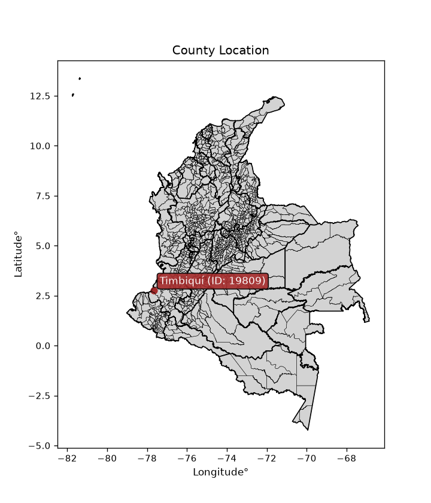
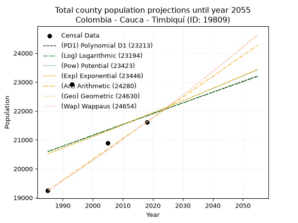
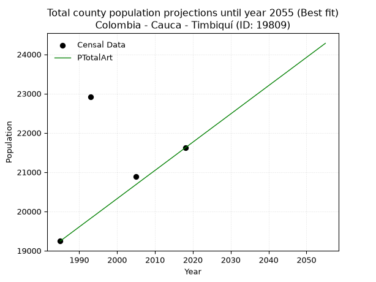
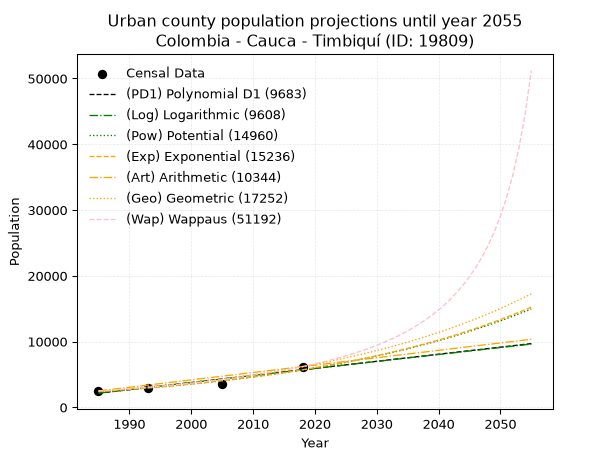
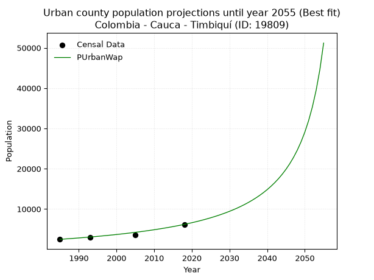
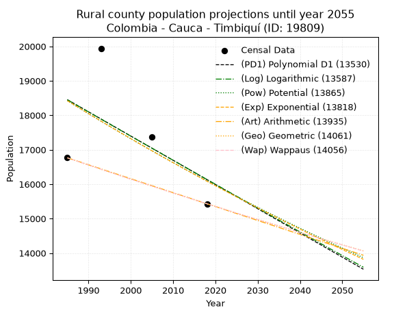
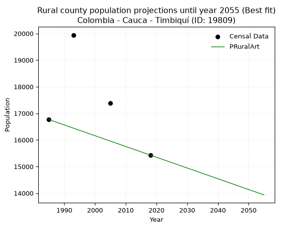

<div align="center">


</div>

# _“Population and Public Services Demand Projections (PPSD) until Year 2050 for Colombia - Cauca - Timbiquí (ID: 19809)”_
Keywords: `population` `public-service` `projection` `lineal` `polynomial` `logarithmic` `potential` `exponential` `arithmetic` `geometric` `wappaus` `dane` `colombia` `south-america`

PPSD are analytical estimates used by governments and planners to anticipate future changes in population size, age distribution, and the resulting community needs for utilities, healthcare, education, and infrastructure as sizing future water treatment facilities, electrical grids, and road networks based on spatial growth.

<div align="center">

</img>

</div>


> **General running parameters**: • app_version: _v20260806_. • Python version: _3.14.7_. • Pandas version: _3.0.5_. • NumPy version: _2.5.1_. • Creates, save and include plots into reports (create_plot): _False_. • Projection until year: _2050_. • Process polynomial degree 2 and up: _False_. • Process Wappaus: _True_. • Process Wappaus: _True_. • Set negative values to zero: _True_. • Set infinite values to zero: _True_. • Drop dataset notes: _True_. 
<div align="center">

Dynamic map: [:earth_americas:Google](http://maps.google.com/maps?q=2.777312219,-77.6675405) [:earth_americas:OSM](https://www.openstreetmap.org/#map=18/2.777312219/-77.6675405&layers=P) [:earth_americas:Bing](https://www.bing.com/maps?cp=2.777312219~-77.6675405&lvl=18) [:earth_americas:Apple](https://maps.apple.com/frame?center=2.777312219%2C-77.6675405&span=0.003%2C0.006)

</div>


<div align="center">

```geojson
{
  "type": "Feature",
  "geometry": {
    "type": "Point", 
    "coordinates": [-77.6675405, 2.777312219]
  }, 
  "properties": {
    "Name": "Colombia - Cauca - Timbiquí (ID: 19809)"
  }
}
```

</div>


## 0. Census Data (4 records)

Census data are official statistics collected by a government about the people and housing in a country. They usually include counts of total population, age, sex, race, income, education, and jobs.

📅Global census file: [Population.xlsx](../data/Population.xlsx)

| Source   |   Year |   CountryID | CountryName   |   StateID | StateName   |   CountyID | CountyName   |   PTotal |   PUrban |   PRural |
|:---------|-------:|------------:|:--------------|----------:|:------------|-----------:|:-------------|---------:|---------:|---------:|
| DANE     |   1985 |          57 | Colombia      |        19 | Cauca       |      19809 | Timbiquí     |    19244 |     2479 |    16765 |
| DANE     |   1993 |          57 | Colombia      |        19 | Cauca       |      19809 | Timbiquí     |    22922 |     2980 |    19942 |
| DANE     |   2005 |          57 | Colombia      |        19 | Cauca       |      19809 | Timbiquí     |    20885 |     3505 |    17380 |
| DANE     |   2018 |          57 | Colombia      |        19 | Cauca       |      19809 | Timbiquí     |    21618 |     6187 |    15431 |

> 🔥Some records could had specific notes about the registered values or the corresponding urban or rural distribution.

📅[SUI-RUPS](https://www.datos.gov.co/Hacienda-y-Cr-dito-P-blico/Registro-nico-de-Prestadores-de-Servicios-P-blicos/4qkq-csdn/about_data) - Local public utility companies: [RUPS.csv](../data/RUPS.xlsx)

 | SERVICIO       | ESTADO    | NOMBRE                                        | NIT         | DEPARTAMENTO_DOMICILIO   | MUNICIPIO_DOMICILIO   | DIRECCION   |   TELEFONO | EMAIL             | TIPO_PRESTADOR          | CLASIFICACION           |
|:---------------|:----------|:----------------------------------------------|:------------|:-------------------------|:----------------------|:------------|-----------:|:------------------|:------------------------|:------------------------|
| ACUEDUCTO      | OPERATIVA | COOPERATIVA DE SERVICIOS PUBLICOS DE TIMBIQUI | 900227337-7 | CAUCA                    | TIMBIQUI              | TIMBIQUI    |    8403005 | yogohe78@yahoo.es | ORGANIZACION AUTORIZADA | HASTA 2500 SUSCRIPTORES |
| ALCANTARILLADO | OPERATIVA | COOPERATIVA DE SERVICIOS PUBLICOS DE TIMBIQUI | 900227337-7 | CAUCA                    | TIMBIQUI              | TIMBIQUI    |    8403005 | yogohe78@yahoo.es | ORGANIZACION AUTORIZADA | HASTA 2500 SUSCRIPTORES |

## 1. Total

### 1.1. Coefficients and Parameters

* (PD1) Polynomial Deg 1: 37.36290646326743, -53567.903653150686 (lineal)
* (Log) Logarithmic: 75016.74690603263, -549035.6443792363
* (Pow) Potential: 3.821479900579026, -8.290195499877106
* (Exp) Exponential: 0.0019036467616932989, 468.92804599308636
* (Art) Arithmetic: Year diff. 2018 - 1985 = 33, Population diff. 21618 - 19244 = 2374, Annual growth = 71.93939393939394
* (Geo) Geometric: Year diff. 2018 - 1985 = 33, Population diff. 21618 - 19244 = 2374, Annual growth % = 0.0035312802444056324
* (Wap) Wappaus: i = 0.3521090203093042, Condition values only valid for < 200)

<sub>
Wappaus condition values: ['0.00', '0.35', '0.70', '1.06', '1.41', '1.76', '2.11', '2.46', '2.82', '3.17', '3.52', '3.87', '4.23', '4.58', '4.93', '5.28', '5.63', '5.99', '6.34', '6.69', '7.04', '7.39', '7.75', '8.10', '8.45', '8.80', '9.15', '9.51', '9.86', '10.21', '10.56', '10.92', '11.27', '11.62', '11.97', '12.32', '12.68', '13.03', '13.38', '13.73', '14.08', '14.44', '14.79', '15.14', '15.49', '15.84', '16.20', '16.55', '16.90', '17.25', '17.61', '17.96', '18.31', '18.66', '19.01', '19.37', '19.72', '20.07', '20.42', '20.77', '21.13', '21.48', '21.83', '22.18', '22.53', '22.89']
</sub>


### 1.2. Projected Dataset

|   Year |   CountyID |   PTotalPD1 |   PTotalLog |   PTotalPow |   PTotalExp |   PTotalArt |   PTotalGeo |   PTotalWap |
|-------:|-----------:|------------:|------------:|------------:|------------:|------------:|------------:|------------:|
|   1985 |      19809 |       20597 |       20595 |       20518 |       20521 |       19244 |       19244 |       19244 |
|   1986 |      19809 |       20635 |       20632 |       20557 |       20560 |       19316 |       19312 |       19312 |
|   1987 |      19809 |       20672 |       20670 |       20597 |       20599 |       19388 |       19380 |       19380 |
|   1988 |      19809 |       20710 |       20708 |       20637 |       20638 |       19460 |       19449 |       19448 |
|   1989 |      19809 |       20747 |       20746 |       20676 |       20678 |       19532 |       19517 |       19517 |
|   1990 |      19809 |       20784 |       20783 |       20716 |       20717 |       19604 |       19586 |       19586 |
|   1991 |      19809 |       20822 |       20821 |       20756 |       20756 |       19676 |       19655 |       19655 |
|   1992 |      19809 |       20859 |       20859 |       20796 |       20796 |       19748 |       19725 |       19724 |
|   1993 |      19809 |       20896 |       20896 |       20836 |       20836 |       19820 |       19794 |       19794 |
|   1994 |      19809 |       20934 |       20934 |       20876 |       20875 |       19891 |       19864 |       19864 |
|   1995 |      19809 |       20971 |       20972 |       20916 |       20915 |       19963 |       19934 |       19934 |
|   1996 |      19809 |       21008 |       21009 |       20956 |       20955 |       20035 |       20005 |       20004 |
|   1997 |      19809 |       21046 |       21047 |       20996 |       20995 |       20107 |       20075 |       20075 |
|   1998 |      19809 |       21083 |       21084 |       21036 |       21035 |       20179 |       20146 |       20146 |
|   1999 |      19809 |       21121 |       21122 |       21076 |       21075 |       20251 |       20218 |       20217 |
|   2000 |      19809 |       21158 |       21159 |       21117 |       21115 |       20323 |       20289 |       20288 |
|   2001 |      19809 |       21195 |       21197 |       21157 |       21155 |       20395 |       20361 |       20360 |
|   2002 |      19809 |       21233 |       21234 |       21197 |       21196 |       20467 |       20432 |       20431 |
|   2003 |      19809 |       21270 |       21272 |       21238 |       21236 |       20539 |       20505 |       20504 |
|   2004 |      19809 |       21307 |       21309 |       21278 |       21276 |       20611 |       20577 |       20576 |
|   2005 |      19809 |       21345 |       21347 |       21319 |       21317 |       20683 |       20650 |       20649 |
|   2006 |      19809 |       21382 |       21384 |       21360 |       21358 |       20755 |       20723 |       20722 |
|   2007 |      19809 |       21419 |       21421 |       21400 |       21398 |       20827 |       20796 |       20795 |
|   2008 |      19809 |       21457 |       21459 |       21441 |       21439 |       20899 |       20869 |       20868 |
|   2009 |      19809 |       21494 |       21496 |       21482 |       21480 |       20971 |       20943 |       20942 |
|   2010 |      19809 |       21532 |       21533 |       21523 |       21521 |       21042 |       21017 |       21016 |
|   2011 |      19809 |       21569 |       21571 |       21564 |       21562 |       21114 |       21091 |       21090 |
|   2012 |      19809 |       21606 |       21608 |       21605 |       21603 |       21186 |       21166 |       21165 |
|   2013 |      19809 |       21644 |       21645 |       21646 |       21644 |       21258 |       21240 |       21240 |
|   2014 |      19809 |       21681 |       21683 |       21687 |       21685 |       21330 |       21315 |       21315 |
|   2015 |      19809 |       21718 |       21720 |       21728 |       21727 |       21402 |       21391 |       21390 |
|   2016 |      19809 |       21756 |       21757 |       21770 |       21768 |       21474 |       21466 |       21466 |
|   2017 |      19809 |       21793 |       21794 |       21811 |       21810 |       21546 |       21542 |       21542 |
|   2018 |      19809 |       21830 |       21831 |       21852 |       21851 |       21618 |       21618 |       21618 |
|   2019 |      19809 |       21868 |       21869 |       21894 |       21893 |       21690 |       21694 |       21695 |
|   2020 |      19809 |       21905 |       21906 |       21935 |       21934 |       21762 |       21771 |       21771 |
|   2021 |      19809 |       21943 |       21943 |       21977 |       21976 |       21834 |       21848 |       21848 |
|   2022 |      19809 |       21980 |       21980 |       22018 |       22018 |       21906 |       21925 |       21926 |
|   2023 |      19809 |       22017 |       22017 |       22060 |       22060 |       21978 |       22002 |       22003 |
|   2024 |      19809 |       22055 |       22054 |       22101 |       22102 |       22050 |       22080 |       22081 |
|   2025 |      19809 |       22092 |       22091 |       22143 |       22144 |       22122 |       22158 |       22160 |
|   2026 |      19809 |       22129 |       22128 |       22185 |       22186 |       22194 |       22236 |       22238 |
|   2027 |      19809 |       22167 |       22165 |       22227 |       22229 |       22265 |       22315 |       22317 |
|   2028 |      19809 |       22204 |       22202 |       22269 |       22271 |       22337 |       22394 |       22396 |
|   2029 |      19809 |       22241 |       22239 |       22311 |       22314 |       22409 |       22473 |       22476 |
|   2030 |      19809 |       22279 |       22276 |       22353 |       22356 |       22481 |       22552 |       22556 |
|   2031 |      19809 |       22316 |       22313 |       22395 |       22399 |       22553 |       22632 |       22636 |
|   2032 |      19809 |       22354 |       22350 |       22437 |       22441 |       22625 |       22712 |       22716 |
|   2033 |      19809 |       22391 |       22387 |       22479 |       22484 |       22697 |       22792 |       22797 |
|   2034 |      19809 |       22428 |       22424 |       22522 |       22527 |       22769 |       22872 |       22878 |
|   2035 |      19809 |       22466 |       22461 |       22564 |       22570 |       22841 |       22953 |       22959 |
|   2036 |      19809 |       22503 |       22498 |       22606 |       22613 |       22913 |       23034 |       23041 |
|   2037 |      19809 |       22540 |       22534 |       22649 |       22656 |       22985 |       23115 |       23123 |
|   2038 |      19809 |       22578 |       22571 |       22691 |       22699 |       23057 |       23197 |       23205 |
|   2039 |      19809 |       22615 |       22608 |       22734 |       22742 |       23129 |       23279 |       23287 |
|   2040 |      19809 |       22652 |       22645 |       22777 |       22786 |       23201 |       23361 |       23370 |
|   2041 |      19809 |       22690 |       22682 |       22819 |       22829 |       23273 |       23444 |       23454 |
|   2042 |      19809 |       22727 |       22718 |       22862 |       22873 |       23345 |       23527 |       23537 |
|   2043 |      19809 |       22765 |       22755 |       22905 |       22916 |       23416 |       23610 |       23621 |
|   2044 |      19809 |       22802 |       22792 |       22948 |       22960 |       23488 |       23693 |       23705 |
|   2045 |      19809 |       22839 |       22828 |       22991 |       23004 |       23560 |       23777 |       23790 |
|   2046 |      19809 |       22877 |       22865 |       23034 |       23047 |       23632 |       23861 |       23875 |
|   2047 |      19809 |       22914 |       22902 |       23077 |       23091 |       23704 |       23945 |       23960 |
|   2048 |      19809 |       22951 |       22938 |       23120 |       23135 |       23776 |       24029 |       24045 |
|   2049 |      19809 |       22989 |       22975 |       23163 |       23179 |       23848 |       24114 |       24131 |
|   2050 |      19809 |       23026 |       23012 |       23206 |       23224 |       23920 |       24199 |       24218 |
<div align="center">

</img>

</div>


### 1.3. Best fit with absolute and relative error (%)

Relative error puts that difference into context by dividing the absolute error by the true value, creating a unitless ratio or percentage that shows the scale of the mistake.

Absolute and relative error

|   Year | Source   |   CountryID | CountryName   |   StateID | StateName   |   CountyID_x | CountyName   |   PTotal |   PUrban |   PRural |   CountyID_y |   PTotalPD1 |   PTotalLog |   PTotalPow |   PTotalExp |   PTotalArt |   PTotalGeo |   PTotalWap |   PTotalPD1AbsError |   PTotalLogAbsError |   PTotalPowAbsError |   PTotalExpAbsError |   PTotalArtAbsError |   PTotalGeoAbsError |   PTotalWapAbsError |   PTotalPD1RelError |   PTotalLogRelError |   PTotalPowRelError |   PTotalExpRelError |   PTotalArtRelError |   PTotalGeoRelError |   PTotalWapRelError |
|-------:|:---------|------------:|:--------------|----------:|:------------|-------------:|:-------------|---------:|---------:|---------:|-------------:|------------:|------------:|------------:|------------:|------------:|------------:|------------:|--------------------:|--------------------:|--------------------:|--------------------:|--------------------:|--------------------:|--------------------:|--------------------:|--------------------:|--------------------:|--------------------:|--------------------:|--------------------:|--------------------:|
|   1985 | DANE     |          57 | Colombia      |        19 | Cauca       |        19809 | Timbiquí     |    19244 |     2479 |    16765 |        19809 |       20597 |       20595 |       20518 |       20521 |       19244 |       19244 |       19244 |                1353 |                1351 |                1274 |                1277 |                   0 |                   0 |                   0 |            7.03076  |             7.02037 |             6.62025 |             6.63583 |            0        |             0       |              0      |
|   1993 | DANE     |          57 | Colombia      |        19 | Cauca       |        19809 | Timbiquí     |    22922 |     2980 |    19942 |        19809 |       20896 |       20896 |       20836 |       20836 |       19820 |       19794 |       19794 |                2026 |                2026 |                2086 |                2086 |                3102 |                3128 |                3128 |            8.83867  |             8.83867 |             9.10043 |             9.10043 |           13.5329   |            13.6463  |             13.6463 |
|   2005 | DANE     |          57 | Colombia      |        19 | Cauca       |        19809 | Timbiquí     |    20885 |     3505 |    17380 |        19809 |       21345 |       21347 |       21319 |       21317 |       20683 |       20650 |       20649 |                 460 |                 462 |                 434 |                 432 |                 202 |                 235 |                 236 |            2.20254  |             2.21211 |             2.07805 |             2.06847 |            0.967201 |             1.12521 |              1.13   |
|   2018 | DANE     |          57 | Colombia      |        19 | Cauca       |        19809 | Timbiquí     |    21618 |     6187 |    15431 |        19809 |       21830 |       21831 |       21852 |       21851 |       21618 |       21618 |       21618 |                 212 |                 213 |                 234 |                 233 |                   0 |                   0 |                   0 |            0.980664 |             0.98529 |             1.08243 |             1.07781 |            0        |             0       |              0      |

Relative error mean

| Method    |   RelError | Best   |
|:----------|-----------:|:-------|
| PTotalPD1 |    4.76316 |        |
| PTotalLog |    4.76411 |        |
| PTotalPow |    4.72029 |        |
| PTotalExp |    4.72063 |        |
| PTotalArt |    3.62501 | True   |
| PTotalGeo |    3.69287 |        |
| PTotalWap |    3.69407 |        |

💙Best method: _**PTotalArt**_
<div align="center">

</img>

</div>


### 1.4. Fresh water supply demand in liters per capita per day (lpcd)

The fresh water supply demand typically ranges from 100 to 300 liters per capita per day (lpcd) for standard domestic and municipal planning, though absolute survival minimums set by the World Health Organization are as low as 7.5 to 20 liters per day, and total consumption in high-income nations can exceed 400 liters.

> `CZ`: Level in meters above the sea level (masl)<br> `WS`: Fresh water supply demand in liters per capita per day (lpcd or l/h/d)<br> `WSAll`: Zonal fresh water supply demand in liters per second (l/s)<br> `A`: Zonal area in square meters<br> `DP`: Population density (people/hectare or p/ha)

Reference values (RAS Colombia)

|    CZ |   WS |
|------:|-----:|
|  1000 |  120 |
|  2000 |  130 |
| 99999 |  140 |

County shapefile geometry properties and water supply values

|   CountyID |      ATotal |   CZTotal |   WSTotal |
|-----------:|------------:|----------:|----------:|
|      19809 | 2.05979e+09 |   325.299 |       120 |

Projected values for best method: PTotalArt

|   CountyID |   Year |   PTotalArt |   DPTotal |   WSTotal |   WSTotalAll |
|-----------:|-------:|------------:|----------:|----------:|-------------:|
|      19809 |   1985 |       19244 |      0.09 |       120 |      26.7278 |
|      19809 |   1986 |       19316 |      0.09 |       120 |      26.8278 |
|      19809 |   1987 |       19388 |      0.09 |       120 |      26.9278 |
|      19809 |   1988 |       19460 |      0.09 |       120 |      27.0278 |
|      19809 |   1989 |       19532 |      0.09 |       120 |      27.1278 |
|      19809 |   1990 |       19604 |      0.1  |       120 |      27.2278 |
|      19809 |   1991 |       19676 |      0.1  |       120 |      27.3278 |
|      19809 |   1992 |       19748 |      0.1  |       120 |      27.4278 |
|      19809 |   1993 |       19820 |      0.1  |       120 |      27.5278 |
|      19809 |   1994 |       19891 |      0.1  |       120 |      27.6264 |
|      19809 |   1995 |       19963 |      0.1  |       120 |      27.7264 |
|      19809 |   1996 |       20035 |      0.1  |       120 |      27.8264 |
|      19809 |   1997 |       20107 |      0.1  |       120 |      27.9264 |
|      19809 |   1998 |       20179 |      0.1  |       120 |      28.0264 |
|      19809 |   1999 |       20251 |      0.1  |       120 |      28.1264 |
|      19809 |   2000 |       20323 |      0.1  |       120 |      28.2264 |
|      19809 |   2001 |       20395 |      0.1  |       120 |      28.3264 |
|      19809 |   2002 |       20467 |      0.1  |       120 |      28.4264 |
|      19809 |   2003 |       20539 |      0.1  |       120 |      28.5264 |
|      19809 |   2004 |       20611 |      0.1  |       120 |      28.6264 |
|      19809 |   2005 |       20683 |      0.1  |       120 |      28.7264 |
|      19809 |   2006 |       20755 |      0.1  |       120 |      28.8264 |
|      19809 |   2007 |       20827 |      0.1  |       120 |      28.9264 |
|      19809 |   2008 |       20899 |      0.1  |       120 |      29.0264 |
|      19809 |   2009 |       20971 |      0.1  |       120 |      29.1264 |
|      19809 |   2010 |       21042 |      0.1  |       120 |      29.225  |
|      19809 |   2011 |       21114 |      0.1  |       120 |      29.325  |
|      19809 |   2012 |       21186 |      0.1  |       120 |      29.425  |
|      19809 |   2013 |       21258 |      0.1  |       120 |      29.525  |
|      19809 |   2014 |       21330 |      0.1  |       120 |      29.625  |
|      19809 |   2015 |       21402 |      0.1  |       120 |      29.725  |
|      19809 |   2016 |       21474 |      0.1  |       120 |      29.825  |
|      19809 |   2017 |       21546 |      0.1  |       120 |      29.925  |
|      19809 |   2018 |       21618 |      0.1  |       120 |      30.025  |
|      19809 |   2019 |       21690 |      0.11 |       120 |      30.125  |
|      19809 |   2020 |       21762 |      0.11 |       120 |      30.225  |
|      19809 |   2021 |       21834 |      0.11 |       120 |      30.325  |
|      19809 |   2022 |       21906 |      0.11 |       120 |      30.425  |
|      19809 |   2023 |       21978 |      0.11 |       120 |      30.525  |
|      19809 |   2024 |       22050 |      0.11 |       120 |      30.625  |
|      19809 |   2025 |       22122 |      0.11 |       120 |      30.725  |
|      19809 |   2026 |       22194 |      0.11 |       120 |      30.825  |
|      19809 |   2027 |       22265 |      0.11 |       120 |      30.9236 |
|      19809 |   2028 |       22337 |      0.11 |       120 |      31.0236 |
|      19809 |   2029 |       22409 |      0.11 |       120 |      31.1236 |
|      19809 |   2030 |       22481 |      0.11 |       120 |      31.2236 |
|      19809 |   2031 |       22553 |      0.11 |       120 |      31.3236 |
|      19809 |   2032 |       22625 |      0.11 |       120 |      31.4236 |
|      19809 |   2033 |       22697 |      0.11 |       120 |      31.5236 |
|      19809 |   2034 |       22769 |      0.11 |       120 |      31.6236 |
|      19809 |   2035 |       22841 |      0.11 |       120 |      31.7236 |
|      19809 |   2036 |       22913 |      0.11 |       120 |      31.8236 |
|      19809 |   2037 |       22985 |      0.11 |       120 |      31.9236 |
|      19809 |   2038 |       23057 |      0.11 |       120 |      32.0236 |
|      19809 |   2039 |       23129 |      0.11 |       120 |      32.1236 |
|      19809 |   2040 |       23201 |      0.11 |       120 |      32.2236 |
|      19809 |   2041 |       23273 |      0.11 |       120 |      32.3236 |
|      19809 |   2042 |       23345 |      0.11 |       120 |      32.4236 |
|      19809 |   2043 |       23416 |      0.11 |       120 |      32.5222 |
|      19809 |   2044 |       23488 |      0.11 |       120 |      32.6222 |
|      19809 |   2045 |       23560 |      0.11 |       120 |      32.7222 |
|      19809 |   2046 |       23632 |      0.11 |       120 |      32.8222 |
|      19809 |   2047 |       23704 |      0.12 |       120 |      32.9222 |
|      19809 |   2048 |       23776 |      0.12 |       120 |      33.0222 |
|      19809 |   2049 |       23848 |      0.12 |       120 |      33.1222 |
|      19809 |   2050 |       23920 |      0.12 |       120 |      33.2222 |

## 2. Urban

### 2.1. Coefficients and Parameters

* (PD1) Polynomial Deg 1: 107.68085106382807, -211600.87234042212 (lineal)
* (Log) Logarithmic: 215366.240667612, -1633212.7711512595
* (Pow) Potential: 53.150318096478394, -171.90206557358312
* (Exp) Exponential: 0.026567100045352756, 2.9675008110058765e-20
* (Art) Arithmetic: Year diff. 2018 - 1985 = 33, Population diff. 6187 - 2479 = 3708, Annual growth = 112.36363636363636
* (Geo) Geometric: Year diff. 2018 - 1985 = 33, Population diff. 6187 - 2479 = 3708, Annual growth % = 0.028102635391304975
* (Wap) Wappaus: i = 2.5932064704277953, Condition values only valid for < 200)

<sub>
Wappaus condition values: ['0.00', '2.59', '5.19', '7.78', '10.37', '12.97', '15.56', '18.15', '20.75', '23.34', '25.93', '28.53', '31.12', '33.71', '36.30', '38.90', '41.49', '44.08', '46.68', '49.27', '51.86', '54.46', '57.05', '59.64', '62.24', '64.83', '67.42', '70.02', '72.61', '75.20', '77.80', '80.39', '82.98', '85.58', '88.17', '90.76', '93.36', '95.95', '98.54', '101.14', '103.73', '106.32', '108.91', '111.51', '114.10', '116.69', '119.29', '121.88', '124.47', '127.07', '129.66', '132.25', '134.85', '137.44', '140.03', '142.63', '145.22', '147.81', '150.41', '153.00', '155.59', '158.19', '160.78', '163.37', '165.97', '168.56']
</sub>


### 2.2. Projected Dataset

|   Year |   CountyID |   PUrbanPD1 |   PUrbanLog |   PUrbanPow |   PUrbanExp |   PUrbanArt |   PUrbanGeo |   PUrbanWap |
|-------:|-----------:|------------:|------------:|------------:|------------:|------------:|------------:|------------:|
|   1985 |      19809 |        2146 |        2144 |        2371 |        2373 |        2479 |        2479 |        2479 |
|   1986 |      19809 |        2253 |        2252 |        2435 |        2436 |        2591 |        2549 |        2544 |
|   1987 |      19809 |        2361 |        2361 |        2501 |        2502 |        2704 |        2620 |        2611 |
|   1988 |      19809 |        2469 |        2469 |        2569 |        2569 |        2816 |        2694 |        2680 |
|   1989 |      19809 |        2576 |        2577 |        2639 |        2639 |        2928 |        2770 |        2750 |
|   1990 |      19809 |        2684 |        2685 |        2710 |        2710 |        3041 |        2847 |        2823 |
|   1991 |      19809 |        2792 |        2794 |        2784 |        2783 |        3153 |        2927 |        2897 |
|   1992 |      19809 |        2899 |        2902 |        2859 |        2857 |        3266 |        3010 |        2974 |
|   1993 |      19809 |        3007 |        3010 |        2936 |        2934 |        3378 |        3094 |        3053 |
|   1994 |      19809 |        3115 |        3118 |        3016 |        3013 |        3490 |        3181 |        3134 |
|   1995 |      19809 |        3222 |        3226 |        3097 |        3095 |        3603 |        3271 |        3218 |
|   1996 |      19809 |        3330 |        3334 |        3181 |        3178 |        3715 |        3363 |        3304 |
|   1997 |      19809 |        3438 |        3442 |        3266 |        3263 |        3827 |        3457 |        3393 |
|   1998 |      19809 |        3545 |        3550 |        3355 |        3351 |        3940 |        3554 |        3484 |
|   1999 |      19809 |        3653 |        3657 |        3445 |        3441 |        4052 |        3654 |        3579 |
|   2000 |      19809 |        3761 |        3765 |        3538 |        3534 |        4164 |        3757 |        3676 |
|   2001 |      19809 |        3869 |        3873 |        3633 |        3629 |        4277 |        3862 |        3777 |
|   2002 |      19809 |        3976 |        3980 |        3731 |        3727 |        4389 |        3971 |        3881 |
|   2003 |      19809 |        4084 |        4088 |        3831 |        3827 |        4502 |        4083 |        3988 |
|   2004 |      19809 |        4192 |        4195 |        3934 |        3930 |        4614 |        4197 |        4100 |
|   2005 |      19809 |        4299 |        4303 |        4040 |        4036 |        4726 |        4315 |        4215 |
|   2006 |      19809 |        4407 |        4410 |        4148 |        4145 |        4839 |        4437 |        4334 |
|   2007 |      19809 |        4515 |        4517 |        4260 |        4256 |        4951 |        4561 |        4458 |
|   2008 |      19809 |        4622 |        4625 |        4374 |        4371 |        5063 |        4689 |        4586 |
|   2009 |      19809 |        4730 |        4732 |        4491 |        4489 |        5176 |        4821 |        4719 |
|   2010 |      19809 |        4838 |        4839 |        4612 |        4610 |        5288 |        4957 |        4857 |
|   2011 |      19809 |        4945 |        4946 |        4735 |        4734 |        5400 |        5096 |        5000 |
|   2012 |      19809 |        5053 |        5053 |        4862 |        4861 |        5513 |        5239 |        5150 |
|   2013 |      19809 |        5161 |        5160 |        4992 |        4992 |        5625 |        5386 |        5305 |
|   2014 |      19809 |        5268 |        5267 |        5126 |        5126 |        5738 |        5538 |        5467 |
|   2015 |      19809 |        5376 |        5374 |        5263 |        5264 |        5850 |        5693 |        5635 |
|   2016 |      19809 |        5484 |        5481 |        5403 |        5406 |        5962 |        5853 |        5811 |
|   2017 |      19809 |        5591 |        5588 |        5548 |        5552 |        6075 |        6018 |        5995 |
|   2018 |      19809 |        5699 |        5695 |        5696 |        5701 |        6187 |        6187 |        6187 |
|   2019 |      19809 |        5807 |        5801 |        5848 |        5855 |        6299 |        6361 |        6388 |
|   2020 |      19809 |        5914 |        5908 |        6004 |        6012 |        6412 |        6540 |        6598 |
|   2021 |      19809 |        6022 |        6015 |        6164 |        6174 |        6524 |        6723 |        6819 |
|   2022 |      19809 |        6130 |        6121 |        6328 |        6340 |        6636 |        6912 |        7051 |
|   2023 |      19809 |        6237 |        6228 |        6496 |        6511 |        6749 |        7107 |        7294 |
|   2024 |      19809 |        6345 |        6334 |        6669 |        6686 |        6861 |        7306 |        7551 |
|   2025 |      19809 |        6453 |        6440 |        6847 |        6866 |        6974 |        7512 |        7821 |
|   2026 |      19809 |        6561 |        6547 |        7029 |        7051 |        7086 |        7723 |        8106 |
|   2027 |      19809 |        6668 |        6653 |        7215 |        7241 |        7198 |        7940 |        8407 |
|   2028 |      19809 |        6776 |        6759 |        7407 |        7436 |        7311 |        8163 |        8727 |
|   2029 |      19809 |        6884 |        6865 |        7604 |        7636 |        7423 |        8392 |        9065 |
|   2030 |      19809 |        6991 |        6972 |        7806 |        7842 |        7535 |        8628 |        9424 |
|   2031 |      19809 |        7099 |        7078 |        8013 |        8053 |        7648 |        8871 |        9807 |
|   2032 |      19809 |        7207 |        7184 |        8225 |        8270 |        7760 |        9120 |       10214 |
|   2033 |      19809 |        7314 |        7290 |        8443 |        8492 |        7872 |        9376 |       10650 |
|   2034 |      19809 |        7422 |        7395 |        8666 |        8721 |        7985 |        9640 |       11117 |
|   2035 |      19809 |        7530 |        7501 |        8896 |        8956 |        8097 |        9911 |       11618 |
|   2036 |      19809 |        7637 |        7607 |        9131 |        9197 |        8210 |       10189 |       12158 |
|   2037 |      19809 |        7745 |        7713 |        9373 |        9445 |        8322 |       10475 |       12740 |
|   2038 |      19809 |        7853 |        7819 |        9620 |        9699 |        8434 |       10770 |       13371 |
|   2039 |      19809 |        7960 |        7924 |        9874 |        9960 |        8547 |       11073 |       14057 |
|   2040 |      19809 |        8068 |        8030 |       10135 |       10228 |        8659 |       11384 |       14804 |
|   2041 |      19809 |        8176 |        8135 |       10403 |       10504 |        8771 |       11704 |       15622 |
|   2042 |      19809 |        8283 |        8241 |       10677 |       10786 |        8884 |       12032 |       16522 |
|   2043 |      19809 |        8391 |        8346 |       10958 |       11077 |        8996 |       12371 |       17515 |
|   2044 |      19809 |        8499 |        8452 |       11247 |       11375 |        9108 |       12718 |       18619 |
|   2045 |      19809 |        8606 |        8557 |       11543 |       11681 |        9221 |       13076 |       19851 |
|   2046 |      19809 |        8714 |        8662 |       11847 |       11996 |        9333 |       13443 |       21235 |
|   2047 |      19809 |        8822 |        8768 |       12159 |       12319 |        9446 |       13821 |       22803 |
|   2048 |      19809 |        8930 |        8873 |       12479 |       12650 |        9558 |       14209 |       24593 |
|   2049 |      19809 |        9037 |        8978 |       12807 |       12991 |        9670 |       14609 |       26656 |
|   2050 |      19809 |        9145 |        9083 |       13143 |       13341 |        9783 |       15019 |       29059 |
<div align="center">

</img>

</div>


### 2.3. Best fit with absolute and relative error (%)

Relative error puts that difference into context by dividing the absolute error by the true value, creating a unitless ratio or percentage that shows the scale of the mistake.

Absolute and relative error

|   Year | Source   |   CountryID | CountryName   |   StateID | StateName   |   CountyID_x | CountyName   |   PTotal |   PUrban |   PRural |   CountyID_y |   PUrbanPD1 |   PUrbanLog |   PUrbanPow |   PUrbanExp |   PUrbanArt |   PUrbanGeo |   PUrbanWap |   PUrbanPD1AbsError |   PUrbanLogAbsError |   PUrbanPowAbsError |   PUrbanExpAbsError |   PUrbanArtAbsError |   PUrbanGeoAbsError |   PUrbanWapAbsError |   PUrbanPD1RelError |   PUrbanLogRelError |   PUrbanPowRelError |   PUrbanExpRelError |   PUrbanArtRelError |   PUrbanGeoRelError |   PUrbanWapRelError |
|-------:|:---------|------------:|:--------------|----------:|:------------|-------------:|:-------------|---------:|---------:|---------:|-------------:|------------:|------------:|------------:|------------:|------------:|------------:|------------:|--------------------:|--------------------:|--------------------:|--------------------:|--------------------:|--------------------:|--------------------:|--------------------:|--------------------:|--------------------:|--------------------:|--------------------:|--------------------:|--------------------:|
|   1985 | DANE     |          57 | Colombia      |        19 | Cauca       |        19809 | Timbiquí     |    19244 |     2479 |    16765 |        19809 |        2146 |        2144 |        2371 |        2373 |        2479 |        2479 |        2479 |                 333 |                 335 |                 108 |                 106 |                   0 |                   0 |                   0 |            13.4328  |            13.5135  |             4.3566  |             4.27592 |              0      |              0      |             0       |
|   1993 | DANE     |          57 | Colombia      |        19 | Cauca       |        19809 | Timbiquí     |    22922 |     2980 |    19942 |        19809 |        3007 |        3010 |        2936 |        2934 |        3378 |        3094 |        3053 |                  27 |                  30 |                  44 |                  46 |                 398 |                 114 |                  73 |             0.90604 |             1.00671 |             1.47651 |             1.54362 |             13.3557 |              3.8255 |             2.44966 |
|   2005 | DANE     |          57 | Colombia      |        19 | Cauca       |        19809 | Timbiquí     |    20885 |     3505 |    17380 |        19809 |        4299 |        4303 |        4040 |        4036 |        4726 |        4315 |        4215 |                 794 |                 798 |                 535 |                 531 |                1221 |                 810 |                 710 |            22.6534  |            22.7675  |            15.2639  |            15.1498  |             34.8359 |             23.1098 |            20.2568  |
|   2018 | DANE     |          57 | Colombia      |        19 | Cauca       |        19809 | Timbiquí     |    21618 |     6187 |    15431 |        19809 |        5699 |        5695 |        5696 |        5701 |        6187 |        6187 |        6187 |                 488 |                 492 |                 491 |                 486 |                   0 |                   0 |                   0 |             7.88751 |             7.95216 |             7.93599 |             7.85518 |              0      |              0      |             0       |

Relative error mean

| Method    |   RelError | Best   |
|:----------|-----------:|:-------|
| PUrbanPD1 |   11.2199  |        |
| PUrbanLog |   11.31    |        |
| PUrbanPow |    7.25825 |        |
| PUrbanExp |    7.20613 |        |
| PUrbanArt |   12.0479  |        |
| PUrbanGeo |    6.73384 |        |
| PUrbanWap |    5.67661 | True   |

💙Best method: _**PUrbanWap**_
<div align="center">

</img>

</div>


### 2.4. Fresh water supply demand in liters per capita per day (lpcd)

The fresh water supply demand typically ranges from 100 to 300 liters per capita per day (lpcd) for standard domestic and municipal planning, though absolute survival minimums set by the World Health Organization are as low as 7.5 to 20 liters per day, and total consumption in high-income nations can exceed 400 liters.

> `CZ`: Level in meters above the sea level (masl)<br> `WS`: Fresh water supply demand in liters per capita per day (lpcd or l/h/d)<br> `WSAll`: Zonal fresh water supply demand in liters per second (l/s)<br> `A`: Zonal area in square meters<br> `DP`: Population density (people/hectare or p/ha)

Reference values (RAS Colombia)

|    CZ |   WS |
|------:|-----:|
|  1000 |  120 |
|  2000 |  130 |
| 99999 |  140 |

County shapefile geometry properties and water supply values

|   CountyID |      AUrban |   CZUrban |   WSUrban |
|-----------:|------------:|----------:|----------:|
|      19809 | 1.30962e+06 |   8.33364 |       120 |

Projected values for best method: PUrbanWap

|   CountyID |   Year |   PUrbanWap |   DPUrban |   WSUrban |   WSUrbanAll |
|-----------:|-------:|------------:|----------:|----------:|-------------:|
|      19809 |   1985 |        2479 |     18.93 |       120 |      3.44306 |
|      19809 |   1986 |        2544 |     19.43 |       120 |      3.53333 |
|      19809 |   1987 |        2611 |     19.94 |       120 |      3.62639 |
|      19809 |   1988 |        2680 |     20.46 |       120 |      3.72222 |
|      19809 |   1989 |        2750 |     21    |       120 |      3.81944 |
|      19809 |   1990 |        2823 |     21.56 |       120 |      3.92083 |
|      19809 |   1991 |        2897 |     22.12 |       120 |      4.02361 |
|      19809 |   1992 |        2974 |     22.71 |       120 |      4.13056 |
|      19809 |   1993 |        3053 |     23.31 |       120 |      4.24028 |
|      19809 |   1994 |        3134 |     23.93 |       120 |      4.35278 |
|      19809 |   1995 |        3218 |     24.57 |       120 |      4.46944 |
|      19809 |   1996 |        3304 |     25.23 |       120 |      4.58889 |
|      19809 |   1997 |        3393 |     25.91 |       120 |      4.7125  |
|      19809 |   1998 |        3484 |     26.6  |       120 |      4.83889 |
|      19809 |   1999 |        3579 |     27.33 |       120 |      4.97083 |
|      19809 |   2000 |        3676 |     28.07 |       120 |      5.10556 |
|      19809 |   2001 |        3777 |     28.84 |       120 |      5.24583 |
|      19809 |   2002 |        3881 |     29.63 |       120 |      5.39028 |
|      19809 |   2003 |        3988 |     30.45 |       120 |      5.53889 |
|      19809 |   2004 |        4100 |     31.31 |       120 |      5.69444 |
|      19809 |   2005 |        4215 |     32.18 |       120 |      5.85417 |
|      19809 |   2006 |        4334 |     33.09 |       120 |      6.01944 |
|      19809 |   2007 |        4458 |     34.04 |       120 |      6.19167 |
|      19809 |   2008 |        4586 |     35.02 |       120 |      6.36944 |
|      19809 |   2009 |        4719 |     36.03 |       120 |      6.55417 |
|      19809 |   2010 |        4857 |     37.09 |       120 |      6.74583 |
|      19809 |   2011 |        5000 |     38.18 |       120 |      6.94444 |
|      19809 |   2012 |        5150 |     39.32 |       120 |      7.15278 |
|      19809 |   2013 |        5305 |     40.51 |       120 |      7.36806 |
|      19809 |   2014 |        5467 |     41.74 |       120 |      7.59306 |
|      19809 |   2015 |        5635 |     43.03 |       120 |      7.82639 |
|      19809 |   2016 |        5811 |     44.37 |       120 |      8.07083 |
|      19809 |   2017 |        5995 |     45.78 |       120 |      8.32639 |
|      19809 |   2018 |        6187 |     47.24 |       120 |      8.59306 |
|      19809 |   2019 |        6388 |     48.78 |       120 |      8.87222 |
|      19809 |   2020 |        6598 |     50.38 |       120 |      9.16389 |
|      19809 |   2021 |        6819 |     52.07 |       120 |      9.47083 |
|      19809 |   2022 |        7051 |     53.84 |       120 |      9.79306 |
|      19809 |   2023 |        7294 |     55.7  |       120 |     10.1306  |
|      19809 |   2024 |        7551 |     57.66 |       120 |     10.4875  |
|      19809 |   2025 |        7821 |     59.72 |       120 |     10.8625  |
|      19809 |   2026 |        8106 |     61.9  |       120 |     11.2583  |
|      19809 |   2027 |        8407 |     64.19 |       120 |     11.6764  |
|      19809 |   2028 |        8727 |     66.64 |       120 |     12.1208  |
|      19809 |   2029 |        9065 |     69.22 |       120 |     12.5903  |
|      19809 |   2030 |        9424 |     71.96 |       120 |     13.0889  |
|      19809 |   2031 |        9807 |     74.88 |       120 |     13.6208  |
|      19809 |   2032 |       10214 |     77.99 |       120 |     14.1861  |
|      19809 |   2033 |       10650 |     81.32 |       120 |     14.7917  |
|      19809 |   2034 |       11117 |     84.89 |       120 |     15.4403  |
|      19809 |   2035 |       11618 |     88.71 |       120 |     16.1361  |
|      19809 |   2036 |       12158 |     92.84 |       120 |     16.8861  |
|      19809 |   2037 |       12740 |     97.28 |       120 |     17.6944  |
|      19809 |   2038 |       13371 |    102.1  |       120 |     18.5708  |
|      19809 |   2039 |       14057 |    107.34 |       120 |     19.5236  |
|      19809 |   2040 |       14804 |    113.04 |       120 |     20.5611  |
|      19809 |   2041 |       15622 |    119.29 |       120 |     21.6972  |
|      19809 |   2042 |       16522 |    126.16 |       120 |     22.9472  |
|      19809 |   2043 |       17515 |    133.74 |       120 |     24.3264  |
|      19809 |   2044 |       18619 |    142.17 |       120 |     25.8597  |
|      19809 |   2045 |       19851 |    151.58 |       120 |     27.5708  |
|      19809 |   2046 |       21235 |    162.15 |       120 |     29.4931  |
|      19809 |   2047 |       22803 |    174.12 |       120 |     31.6708  |
|      19809 |   2048 |       24593 |    187.79 |       120 |     34.1569  |
|      19809 |   2049 |       26656 |    203.54 |       120 |     37.0222  |
|      19809 |   2050 |       29059 |    221.89 |       120 |     40.3597  |

## 3. Rural

### 3.1. Coefficients and Parameters

* (PD1) Polynomial Deg 1: -70.31794460056079, 158032.96868727173 (lineal)
* (Log) Logarithmic: -140349.49376157916, 1084177.1267720214
* (Pow) Potential: -8.201174829795997, 31.310854095263288
* (Exp) Exponential: -0.004108774010666213, 64185346.96122495
* (Art) Arithmetic: Year diff. 2018 - 1985 = 33, Population diff. 15431 - 16765 = -1334, Annual growth = -40.42424242424242
* (Geo) Geometric: Year diff. 2018 - 1985 = 33, Population diff. 15431 - 16765 = -1334, Annual growth % = -0.00250941906483626
* (Wap) Wappaus: i = -0.25111344529905844, Condition values only valid for < 200)

<sub>
Wappaus condition values: ['-0.00', '-0.25', '-0.50', '-0.75', '-1.00', '-1.26', '-1.51', '-1.76', '-2.01', '-2.26', '-2.51', '-2.76', '-3.01', '-3.26', '-3.52', '-3.77', '-4.02', '-4.27', '-4.52', '-4.77', '-5.02', '-5.27', '-5.52', '-5.78', '-6.03', '-6.28', '-6.53', '-6.78', '-7.03', '-7.28', '-7.53', '-7.78', '-8.04', '-8.29', '-8.54', '-8.79', '-9.04', '-9.29', '-9.54', '-9.79', '-10.04', '-10.30', '-10.55', '-10.80', '-11.05', '-11.30', '-11.55', '-11.80', '-12.05', '-12.30', '-12.56', '-12.81', '-13.06', '-13.31', '-13.56', '-13.81', '-14.06', '-14.31', '-14.56', '-14.82', '-15.07', '-15.32', '-15.57', '-15.82', '-16.07', '-16.32']
</sub>


### 3.2. Projected Dataset

|   Year |   CountyID |   PRuralPD1 |   PRuralLog |   PRuralPow |   PRuralExp |   PRuralArt |   PRuralGeo |   PRuralWap |
|-------:|-----------:|------------:|------------:|------------:|------------:|------------:|------------:|------------:|
|   1985 |      19809 |       18452 |       18451 |       18422 |       18423 |       16765 |       16765 |       16765 |
|   1986 |      19809 |       18382 |       18380 |       18346 |       18348 |       16725 |       16723 |       16723 |
|   1987 |      19809 |       18311 |       18310 |       18271 |       18272 |       16684 |       16681 |       16681 |
|   1988 |      19809 |       18241 |       18239 |       18196 |       18198 |       16644 |       16639 |       16639 |
|   1989 |      19809 |       18171 |       18168 |       18121 |       18123 |       16603 |       16597 |       16597 |
|   1990 |      19809 |       18100 |       18098 |       18046 |       18049 |       16563 |       16556 |       16556 |
|   1991 |      19809 |       18030 |       18027 |       17972 |       17975 |       16522 |       16514 |       16514 |
|   1992 |      19809 |       17960 |       17957 |       17898 |       17901 |       16482 |       16473 |       16473 |
|   1993 |      19809 |       17889 |       17886 |       17825 |       17828 |       16442 |       16431 |       16432 |
|   1994 |      19809 |       17819 |       17816 |       17751 |       17754 |       16401 |       16390 |       16390 |
|   1995 |      19809 |       17749 |       17746 |       17679 |       17682 |       16361 |       16349 |       16349 |
|   1996 |      19809 |       17678 |       17675 |       17606 |       17609 |       16320 |       16308 |       16308 |
|   1997 |      19809 |       17608 |       17605 |       17534 |       17537 |       16280 |       16267 |       16267 |
|   1998 |      19809 |       17538 |       17535 |       17462 |       17465 |       16239 |       16226 |       16227 |
|   1999 |      19809 |       17467 |       17465 |       17390 |       17393 |       16199 |       16186 |       16186 |
|   2000 |      19809 |       17397 |       17394 |       17319 |       17322 |       16159 |       16145 |       16145 |
|   2001 |      19809 |       17327 |       17324 |       17248 |       17251 |       16118 |       16104 |       16105 |
|   2002 |      19809 |       17256 |       17254 |       17178 |       17180 |       16078 |       16064 |       16064 |
|   2003 |      19809 |       17186 |       17184 |       17108 |       17110 |       16037 |       16024 |       16024 |
|   2004 |      19809 |       17116 |       17114 |       17038 |       17040 |       15997 |       15983 |       15984 |
|   2005 |      19809 |       17045 |       17044 |       16968 |       16970 |       15957 |       15943 |       15944 |
|   2006 |      19809 |       16975 |       16974 |       16899 |       16900 |       15916 |       15903 |       15904 |
|   2007 |      19809 |       16905 |       16904 |       16830 |       16831 |       15876 |       15863 |       15864 |
|   2008 |      19809 |       16835 |       16834 |       16761 |       16762 |       15835 |       15824 |       15824 |
|   2009 |      19809 |       16764 |       16764 |       16693 |       16693 |       15795 |       15784 |       15784 |
|   2010 |      19809 |       16694 |       16694 |       16625 |       16625 |       15754 |       15744 |       15745 |
|   2011 |      19809 |       16624 |       16625 |       16557 |       16557 |       15714 |       15705 |       15705 |
|   2012 |      19809 |       16553 |       16555 |       16490 |       16489 |       15674 |       15665 |       15666 |
|   2013 |      19809 |       16483 |       16485 |       16423 |       16421 |       15633 |       15626 |       15626 |
|   2014 |      19809 |       16413 |       16415 |       16356 |       16354 |       15593 |       15587 |       15587 |
|   2015 |      19809 |       16342 |       16346 |       16290 |       16287 |       15552 |       15548 |       15548 |
|   2016 |      19809 |       16272 |       16276 |       16224 |       16220 |       15512 |       15509 |       15509 |
|   2017 |      19809 |       16202 |       16206 |       16158 |       16153 |       15471 |       15470 |       15470 |
|   2018 |      19809 |       16131 |       16137 |       16092 |       16087 |       15431 |       15431 |       15431 |
|   2019 |      19809 |       16061 |       16067 |       16027 |       16021 |       15391 |       15392 |       15392 |
|   2020 |      19809 |       15991 |       15998 |       15962 |       15956 |       15350 |       15354 |       15354 |
|   2021 |      19809 |       15920 |       15928 |       15897 |       15890 |       15310 |       15315 |       15315 |
|   2022 |      19809 |       15850 |       15859 |       15833 |       15825 |       15269 |       15277 |       15276 |
|   2023 |      19809 |       15780 |       15790 |       15769 |       15760 |       15229 |       15238 |       15238 |
|   2024 |      19809 |       15709 |       15720 |       15705 |       15695 |       15188 |       15200 |       15200 |
|   2025 |      19809 |       15639 |       15651 |       15642 |       15631 |       15148 |       15162 |       15162 |
|   2026 |      19809 |       15569 |       15582 |       15579 |       15567 |       15108 |       15124 |       15123 |
|   2027 |      19809 |       15498 |       15512 |       15516 |       15503 |       15067 |       15086 |       15085 |
|   2028 |      19809 |       15428 |       15443 |       15453 |       15440 |       15027 |       15048 |       15047 |
|   2029 |      19809 |       15358 |       15374 |       15391 |       15376 |       14986 |       15010 |       15010 |
|   2030 |      19809 |       15288 |       15305 |       15329 |       15313 |       14946 |       14973 |       14972 |
|   2031 |      19809 |       15217 |       15236 |       15267 |       15250 |       14905 |       14935 |       14934 |
|   2032 |      19809 |       15147 |       15166 |       15205 |       15188 |       14865 |       14898 |       14897 |
|   2033 |      19809 |       15077 |       15097 |       15144 |       15126 |       14825 |       14860 |       14859 |
|   2034 |      19809 |       15006 |       15028 |       15083 |       15064 |       14784 |       14823 |       14822 |
|   2035 |      19809 |       14936 |       14959 |       15022 |       15002 |       14744 |       14786 |       14784 |
|   2036 |      19809 |       14866 |       14890 |       14962 |       14940 |       14703 |       14749 |       14747 |
|   2037 |      19809 |       14795 |       14822 |       14902 |       14879 |       14663 |       14712 |       14710 |
|   2038 |      19809 |       14725 |       14753 |       14842 |       14818 |       14623 |       14675 |       14673 |
|   2039 |      19809 |       14655 |       14684 |       14782 |       14757 |       14582 |       14638 |       14636 |
|   2040 |      19809 |       14584 |       14615 |       14723 |       14697 |       14542 |       14601 |       14599 |
|   2041 |      19809 |       14514 |       14546 |       14664 |       14637 |       14501 |       14565 |       14562 |
|   2042 |      19809 |       14444 |       14477 |       14605 |       14577 |       14461 |       14528 |       14526 |
|   2043 |      19809 |       14373 |       14409 |       14547 |       14517 |       14420 |       14492 |       14489 |
|   2044 |      19809 |       14303 |       14340 |       14488 |       14457 |       14380 |       14455 |       14452 |
|   2045 |      19809 |       14233 |       14271 |       14430 |       14398 |       14340 |       14419 |       14416 |
|   2046 |      19809 |       14162 |       14203 |       14373 |       14339 |       14299 |       14383 |       14380 |
|   2047 |      19809 |       14092 |       14134 |       14315 |       14280 |       14259 |       14347 |       14343 |
|   2048 |      19809 |       14022 |       14066 |       14258 |       14222 |       14218 |       14311 |       14307 |
|   2049 |      19809 |       13952 |       13997 |       14201 |       14163 |       14178 |       14275 |       14271 |
|   2050 |      19809 |       13881 |       13929 |       14144 |       14105 |       14137 |       14239 |       14235 |
<div align="center">

</img>

</div>


### 3.3. Best fit with absolute and relative error (%)

Relative error puts that difference into context by dividing the absolute error by the true value, creating a unitless ratio or percentage that shows the scale of the mistake.

Absolute and relative error

|   Year | Source   |   CountryID | CountryName   |   StateID | StateName   |   CountyID_x | CountyName   |   PTotal |   PUrban |   PRural |   CountyID_y |   PRuralPD1 |   PRuralLog |   PRuralPow |   PRuralExp |   PRuralArt |   PRuralGeo |   PRuralWap |   PRuralPD1AbsError |   PRuralLogAbsError |   PRuralPowAbsError |   PRuralExpAbsError |   PRuralArtAbsError |   PRuralGeoAbsError |   PRuralWapAbsError |   PRuralPD1RelError |   PRuralLogRelError |   PRuralPowRelError |   PRuralExpRelError |   PRuralArtRelError |   PRuralGeoRelError |   PRuralWapRelError |
|-------:|:---------|------------:|:--------------|----------:|:------------|-------------:|:-------------|---------:|---------:|---------:|-------------:|------------:|------------:|------------:|------------:|------------:|------------:|------------:|--------------------:|--------------------:|--------------------:|--------------------:|--------------------:|--------------------:|--------------------:|--------------------:|--------------------:|--------------------:|--------------------:|--------------------:|--------------------:|--------------------:|
|   1985 | DANE     |          57 | Colombia      |        19 | Cauca       |        19809 | Timbiquí     |    19244 |     2479 |    16765 |        19809 |       18452 |       18451 |       18422 |       18423 |       16765 |       16765 |       16765 |                1687 |                1686 |                1657 |                1658 |                   0 |                   0 |                   0 |            10.0626  |            10.0567  |             9.88369 |             9.88965 |             0       |             0       |             0       |
|   1993 | DANE     |          57 | Colombia      |        19 | Cauca       |        19809 | Timbiquí     |    22922 |     2980 |    19942 |        19809 |       17889 |       17886 |       17825 |       17828 |       16442 |       16431 |       16432 |                2053 |                2056 |                2117 |                2114 |                3500 |                3511 |                3510 |            10.2949  |            10.3099  |            10.6158  |            10.6007  |            17.5509  |            17.6061  |            17.601   |
|   2005 | DANE     |          57 | Colombia      |        19 | Cauca       |        19809 | Timbiquí     |    20885 |     3505 |    17380 |        19809 |       17045 |       17044 |       16968 |       16970 |       15957 |       15943 |       15944 |                 335 |                 336 |                 412 |                 410 |                1423 |                1437 |                1436 |             1.9275  |             1.93326 |             2.37054 |             2.35903 |             8.18757 |             8.26812 |             8.26237 |
|   2018 | DANE     |          57 | Colombia      |        19 | Cauca       |        19809 | Timbiquí     |    21618 |     6187 |    15431 |        19809 |       16131 |       16137 |       16092 |       16087 |       15431 |       15431 |       15431 |                 700 |                 706 |                 661 |                 656 |                   0 |                   0 |                   0 |             4.53632 |             4.57521 |             4.28358 |             4.25118 |             0       |             0       |             0       |

Relative error mean

| Method    |   RelError | Best   |
|:----------|-----------:|:-------|
| PRuralPD1 |    6.70533 |        |
| PRuralLog |    6.71876 |        |
| PRuralPow |    6.7884  |        |
| PRuralExp |    6.77515 |        |
| PRuralArt |    6.43462 | True   |
| PRuralGeo |    6.46855 |        |
| PRuralWap |    6.46585 |        |

💙Best method: _**PRuralArt**_
<div align="center">

</img>

</div>


### 3.4. Fresh water supply demand in liters per capita per day (lpcd)

The fresh water supply demand typically ranges from 100 to 300 liters per capita per day (lpcd) for standard domestic and municipal planning, though absolute survival minimums set by the World Health Organization are as low as 7.5 to 20 liters per day, and total consumption in high-income nations can exceed 400 liters.

> `CZ`: Level in meters above the sea level (masl)<br> `WS`: Fresh water supply demand in liters per capita per day (lpcd or l/h/d)<br> `WSAll`: Zonal fresh water supply demand in liters per second (l/s)<br> `A`: Zonal area in square meters<br> `DP`: Population density (people/hectare or p/ha)

Reference values (RAS Colombia)

|    CZ |   WS |
|------:|-----:|
|  1000 |  120 |
|  2000 |  130 |
| 99999 |  140 |

County shapefile geometry properties and water supply values

|   CountyID |      ARural |   CZRural |   WSRural |
|-----------:|------------:|----------:|----------:|
|      19809 | 2.05848e+09 |   325.499 |       120 |

Projected values for best method: PRuralArt

|   CountyID |   Year |   PRuralArt |   DPRural |   WSRural |   WSRuralAll |
|-----------:|-------:|------------:|----------:|----------:|-------------:|
|      19809 |   1985 |       16765 |      0.08 |       120 |      23.2847 |
|      19809 |   1986 |       16725 |      0.08 |       120 |      23.2292 |
|      19809 |   1987 |       16684 |      0.08 |       120 |      23.1722 |
|      19809 |   1988 |       16644 |      0.08 |       120 |      23.1167 |
|      19809 |   1989 |       16603 |      0.08 |       120 |      23.0597 |
|      19809 |   1990 |       16563 |      0.08 |       120 |      23.0042 |
|      19809 |   1991 |       16522 |      0.08 |       120 |      22.9472 |
|      19809 |   1992 |       16482 |      0.08 |       120 |      22.8917 |
|      19809 |   1993 |       16442 |      0.08 |       120 |      22.8361 |
|      19809 |   1994 |       16401 |      0.08 |       120 |      22.7792 |
|      19809 |   1995 |       16361 |      0.08 |       120 |      22.7236 |
|      19809 |   1996 |       16320 |      0.08 |       120 |      22.6667 |
|      19809 |   1997 |       16280 |      0.08 |       120 |      22.6111 |
|      19809 |   1998 |       16239 |      0.08 |       120 |      22.5542 |
|      19809 |   1999 |       16199 |      0.08 |       120 |      22.4986 |
|      19809 |   2000 |       16159 |      0.08 |       120 |      22.4431 |
|      19809 |   2001 |       16118 |      0.08 |       120 |      22.3861 |
|      19809 |   2002 |       16078 |      0.08 |       120 |      22.3306 |
|      19809 |   2003 |       16037 |      0.08 |       120 |      22.2736 |
|      19809 |   2004 |       15997 |      0.08 |       120 |      22.2181 |
|      19809 |   2005 |       15957 |      0.08 |       120 |      22.1625 |
|      19809 |   2006 |       15916 |      0.08 |       120 |      22.1056 |
|      19809 |   2007 |       15876 |      0.08 |       120 |      22.05   |
|      19809 |   2008 |       15835 |      0.08 |       120 |      21.9931 |
|      19809 |   2009 |       15795 |      0.08 |       120 |      21.9375 |
|      19809 |   2010 |       15754 |      0.08 |       120 |      21.8806 |
|      19809 |   2011 |       15714 |      0.08 |       120 |      21.825  |
|      19809 |   2012 |       15674 |      0.08 |       120 |      21.7694 |
|      19809 |   2013 |       15633 |      0.08 |       120 |      21.7125 |
|      19809 |   2014 |       15593 |      0.08 |       120 |      21.6569 |
|      19809 |   2015 |       15552 |      0.08 |       120 |      21.6    |
|      19809 |   2016 |       15512 |      0.08 |       120 |      21.5444 |
|      19809 |   2017 |       15471 |      0.08 |       120 |      21.4875 |
|      19809 |   2018 |       15431 |      0.07 |       120 |      21.4319 |
|      19809 |   2019 |       15391 |      0.07 |       120 |      21.3764 |
|      19809 |   2020 |       15350 |      0.07 |       120 |      21.3194 |
|      19809 |   2021 |       15310 |      0.07 |       120 |      21.2639 |
|      19809 |   2022 |       15269 |      0.07 |       120 |      21.2069 |
|      19809 |   2023 |       15229 |      0.07 |       120 |      21.1514 |
|      19809 |   2024 |       15188 |      0.07 |       120 |      21.0944 |
|      19809 |   2025 |       15148 |      0.07 |       120 |      21.0389 |
|      19809 |   2026 |       15108 |      0.07 |       120 |      20.9833 |
|      19809 |   2027 |       15067 |      0.07 |       120 |      20.9264 |
|      19809 |   2028 |       15027 |      0.07 |       120 |      20.8708 |
|      19809 |   2029 |       14986 |      0.07 |       120 |      20.8139 |
|      19809 |   2030 |       14946 |      0.07 |       120 |      20.7583 |
|      19809 |   2031 |       14905 |      0.07 |       120 |      20.7014 |
|      19809 |   2032 |       14865 |      0.07 |       120 |      20.6458 |
|      19809 |   2033 |       14825 |      0.07 |       120 |      20.5903 |
|      19809 |   2034 |       14784 |      0.07 |       120 |      20.5333 |
|      19809 |   2035 |       14744 |      0.07 |       120 |      20.4778 |
|      19809 |   2036 |       14703 |      0.07 |       120 |      20.4208 |
|      19809 |   2037 |       14663 |      0.07 |       120 |      20.3653 |
|      19809 |   2038 |       14623 |      0.07 |       120 |      20.3097 |
|      19809 |   2039 |       14582 |      0.07 |       120 |      20.2528 |
|      19809 |   2040 |       14542 |      0.07 |       120 |      20.1972 |
|      19809 |   2041 |       14501 |      0.07 |       120 |      20.1403 |
|      19809 |   2042 |       14461 |      0.07 |       120 |      20.0847 |
|      19809 |   2043 |       14420 |      0.07 |       120 |      20.0278 |
|      19809 |   2044 |       14380 |      0.07 |       120 |      19.9722 |
|      19809 |   2045 |       14340 |      0.07 |       120 |      19.9167 |
|      19809 |   2046 |       14299 |      0.07 |       120 |      19.8597 |
|      19809 |   2047 |       14259 |      0.07 |       120 |      19.8042 |
|      19809 |   2048 |       14218 |      0.07 |       120 |      19.7472 |
|      19809 |   2049 |       14178 |      0.07 |       120 |      19.6917 |
|      19809 |   2050 |       14137 |      0.07 |       120 |      19.6347 |

#

<div align="center"><br><sub>Share this research</sub></div><br>

<sub>**APPS & TOOLS & CONTENT DISCLAIMER**: • NO WARRANTY - This content and software is provided by <a href="https://github.com/rcfdtools" target="_blank">github.com/rcfdtools</a> "as is", without any express or implied warranty, including warranties of merchantability, fitness for a particular purpose, or non-infringement. There is no guarantee that the software will be error-free or operate without interruption. • LIMITATION OF LIABILITY - Neither the authors nor copyright holders will be liable for claims or damages arising from the software or its use. You are responsible for determining if the software is appropriate for your use and assume all associated risks, including errors, legal compliance, and data loss. • NO PROFESSIONAL ADVICE - The software provides general information and does not offer professional advice. It should not replace consultation with professional advisors. [Clauses and global license for rcfdtools use.](https://github.com/rcfdtools/rcfdtools/blob/main/LICENSE.md)</sub>

| [:house: Home](Readme.md)  | [:beginner: Help / Collab](https://github.com/rcfdtools/R.HydroTools/discussions/31) |
|----------------------------|-------------------------------------------------------------------------------------------|