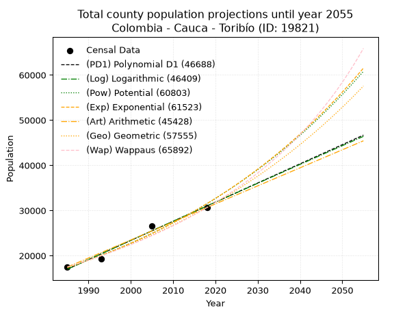
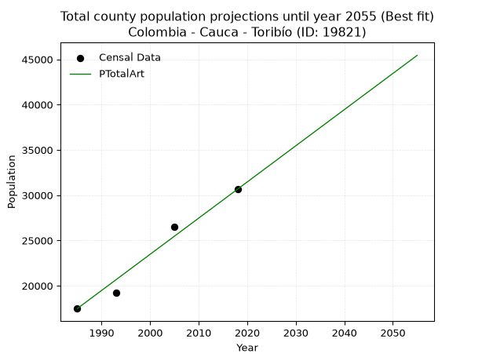
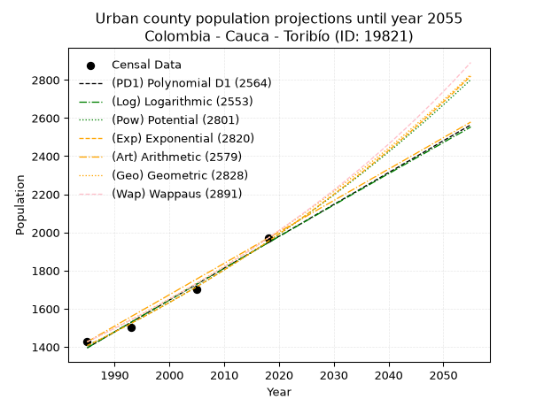
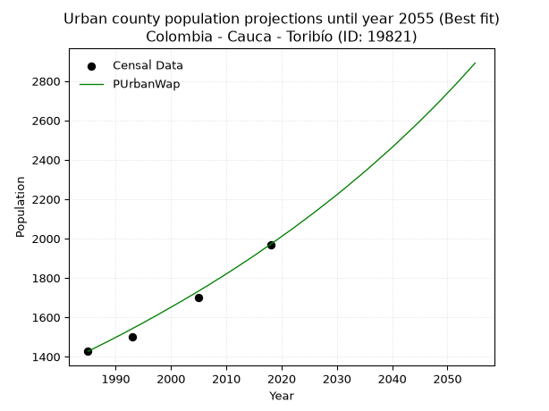
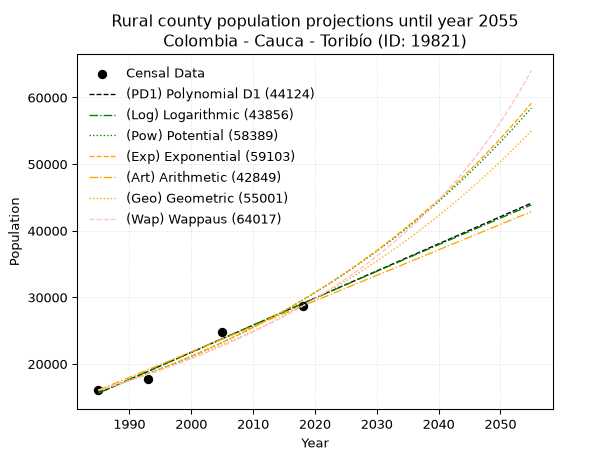
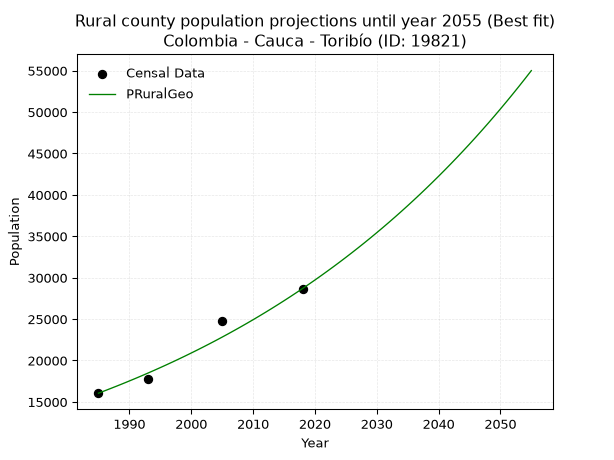

<div align="center">


</div>

# _“Population and Public Services Demand Projections (PPSD) until Year 2050 for Colombia - Cauca - Toribío (ID: 19821)”_
Keywords: `population` `public-service` `projection` `lineal` `polynomial` `logarithmic` `potential` `exponential` `arithmetic` `geometric` `wappaus` `dane` `colombia` `south-america`

PPSD are analytical estimates used by governments and planners to anticipate future changes in population size, age distribution, and the resulting community needs for utilities, healthcare, education, and infrastructure as sizing future water treatment facilities, electrical grids, and road networks based on spatial growth.

> **General running parameters**: • app_version: _v20260806_. • Python version: _3.14.7_. • Pandas version: _3.0.5_. • NumPy version: _2.5.1_. • Creates, save and include plots into reports (create_plot): _False_. • Projection until year: _2050_. • Process polynomial degree 2 and up: _False_. • Process Wappaus: _True_. • Process Wappaus: _True_. • Set negative values to zero: _True_. • Set infinite values to zero: _True_. • Drop dataset notes: _True_. 
<div align="center">

Dynamic map: [:earth_americas:Google](http://maps.google.com/maps?q=2.953017278,-76.2702838) [:earth_americas:OSM](https://www.openstreetmap.org/#map=18/2.953017278/-76.2702838&layers=P) [:earth_americas:Bing](https://www.bing.com/maps?cp=2.953017278~-76.2702838&lvl=18) [:earth_americas:Apple](https://maps.apple.com/frame?center=2.953017278%2C-76.2702838&span=0.003%2C0.006)

</div>


<div align="center">

```geojson
{
  "type": "Feature",
  "geometry": {
    "type": "Point", 
    "coordinates": [-76.2702838, 2.953017278]
  }, 
  "properties": {
    "Name": "Colombia - Cauca - Toribío (ID: 19821)"
  }
}
```

</div>


## 0. Census Data (4 records)

Census data are official statistics collected by a government about the people and housing in a country. They usually include counts of total population, age, sex, race, income, education, and jobs.

📅Global census file: [Population.xlsx](../data/Population.xlsx)

| Source   |   Year |   CountryID | CountryName   |   StateID | StateName   |   CountyID | CountyName   |   PTotal |   PUrban |   PRural |
|:---------|-------:|------------:|:--------------|----------:|:------------|-----------:|:-------------|---------:|---------:|---------:|
| DANE     |   1985 |          57 | Colombia      |        19 | Cauca       |      19821 | Toribío      |    17477 |     1427 |    16050 |
| DANE     |   1993 |          57 | Colombia      |        19 | Cauca       |      19821 | Toribío      |    19227 |     1502 |    17725 |
| DANE     |   2005 |          57 | Colombia      |        19 | Cauca       |      19821 | Toribío      |    26512 |     1701 |    24811 |
| DANE     |   2018 |          57 | Colombia      |        19 | Cauca       |      19821 | Toribío      |    30654 |     1970 |    28684 |

> 🔥Some records could had specific notes about the registered values or the corresponding urban or rural distribution.

**Local public utility companies (RUPS)**

 | SERVICIO       | ESTADO    | NOMBRE                                                                                              | NIT         | DEPARTAMENTO_DOMICILIO   | MUNICIPIO_DOMICILIO   | DIRECCION                           |   TELEFONO | EMAIL                            | TIPO_INSCRIPCION    | REPRESENTANTE_LEGAL           | TIPO_PRESTADOR                 | CLASIFICACION           |
|:---------------|:----------|:----------------------------------------------------------------------------------------------------|:------------|:-------------------------|:----------------------|:------------------------------------|-----------:|:---------------------------------|:--------------------|:------------------------------|:-------------------------------|:------------------------|
| ACUEDUCTO      | OPERATIVA | ASOCIACION DE USUARIOS DE LOS SERVICIOS DE ACUEDUCTO ALCANTARILLADO Y ASEO DEL MUNICIPIO DE TORIBIO | 817003411-1 | CAUCA                    | TORIBIO               | CARRERA 3 No 5 - 29 BARRIO LA UNION |    8498281 | acuedtoribio@hotmail.com         | Registro por la ESP | LUIS ABEL GALVIS FERNANDEZ    | ORGANIZACION AUTORIZADA        | HASTA 2500 SUSCRIPTORES |
| ALCANTARILLADO | OPERATIVA | ASOCIACION DE USUARIOS DE LOS SERVICIOS DE ACUEDUCTO ALCANTARILLADO Y ASEO DEL MUNICIPIO DE TORIBIO | 817003411-1 | CAUCA                    | TORIBIO               | CARRERA 3 No 5 - 29 BARRIO LA UNION |    8498281 | acuedtoribio@hotmail.com         | Registro por la ESP | LUIS ABEL GALVIS FERNANDEZ    | ORGANIZACION AUTORIZADA        | HASTA 2500 SUSCRIPTORES |
| ASEO           | OPERATIVA | MUNICIPIO DE TORIBIO                                                                                | 891500887-4 | CAUCA                    | TORIBIO               | Plaza Principal                     |    8498281 | maurorealpe973@hotmail.com       | Registro por la ESP | CARLOS ALBERTO BANGUERO HENAO | MUNICIPIO (PRESTACIÓN DIRECTA) | HASTA 2500 SUSCRIPTORES |
| ACUEDUCTO      | OPERATIVA | ASOCIACIÓN DE USUARIOS DEL ACUEDUCTO VEREDAL ALTO DE LA CRUZ                                        | 900167338-6 | CAUCA                    | TORIBIO               | Alto de la Cruz                     |    8498281 | contactenos@toribio-cauca.gov.co | Registro por la ESP | JOSE RODRIGO CAMPO NOSCUE     | ORGANIZACION AUTORIZADA        | HASTA 2500 SUSCRIPTORES |

> [📅RUPS Database: Registro Único de Prestadores de Servicios Públicos de Colombia Suramérica - RUPS](https://www.datos.gov.co/Hacienda-y-Cr-dito-P-blico/Registro-nico-de-Prestadores-de-Servicios-P-blicos/4qkq-csdn/about_data)

## 1. Total

### 1.1. Coefficients and Parameters

* (PD1) Polynomial Deg 1: 424.1196306704105, -824877.7912484887 (lineal)
* (Log) Logarithmic: 848953.7190430646, -6429436.521534482
* (Pow) Potential: 36.200420635458755, -115.14125684072236
* (Exp) Exponential: 0.01808243910501529, 4.476171244799114e-12
* (Art) Arithmetic: Year diff. 2018 - 1985 = 33, Population diff. 30654 - 17477 = 13177, Annual growth = 399.3030303030303
* (Geo) Geometric: Year diff. 2018 - 1985 = 33, Population diff. 30654 - 17477 = 13177, Annual growth % = 0.01717236730878402
* (Wap) Wappaus: i = 1.65923429932073, Condition values only valid for < 200)

<sub>
Wappaus condition values: ['0.00', '1.66', '3.32', '4.98', '6.64', '8.30', '9.96', '11.61', '13.27', '14.93', '16.59', '18.25', '19.91', '21.57', '23.23', '24.89', '26.55', '28.21', '29.87', '31.53', '33.18', '34.84', '36.50', '38.16', '39.82', '41.48', '43.14', '44.80', '46.46', '48.12', '49.78', '51.44', '53.10', '54.75', '56.41', '58.07', '59.73', '61.39', '63.05', '64.71', '66.37', '68.03', '69.69', '71.35', '73.01', '74.67', '76.32', '77.98', '79.64', '81.30', '82.96', '84.62', '86.28', '87.94', '89.60', '91.26', '92.92', '94.58', '96.24', '97.89', '99.55', '101.21', '102.87', '104.53', '106.19', '107.85']
</sub>


### 1.2. Projected Dataset

|   Year |   CountyID |   PTotalPD1 |   PTotalLog |   PTotalPow |   PTotalExp |   PTotalArt |   PTotalGeo |   PTotalWap |
|-------:|-----------:|------------:|------------:|------------:|------------:|------------:|------------:|------------:|
|   1985 |      19821 |       17000 |       16987 |       17340 |       17351 |       17477 |       17477 |       17477 |
|   1986 |      19821 |       17424 |       17414 |       17660 |       17667 |       17876 |       17777 |       17769 |
|   1987 |      19821 |       17848 |       17842 |       17984 |       17990 |       18276 |       18082 |       18067 |
|   1988 |      19821 |       18272 |       18269 |       18315 |       18318 |       18675 |       18393 |       18369 |
|   1989 |      19821 |       18696 |       18696 |       18651 |       18652 |       19074 |       18709 |       18677 |
|   1990 |      19821 |       19120 |       19122 |       18994 |       18993 |       19474 |       19030 |       18990 |
|   1991 |      19821 |       19544 |       19549 |       19342 |       19339 |       19873 |       19357 |       19308 |
|   1992 |      19821 |       19969 |       19975 |       19697 |       19692 |       20272 |       19689 |       19632 |
|   1993 |      19821 |       20393 |       20401 |       20058 |       20051 |       20671 |       20027 |       19962 |
|   1994 |      19821 |       20817 |       20827 |       20426 |       20417 |       21071 |       20371 |       20297 |
|   1995 |      19821 |       21241 |       21253 |       20800 |       20790 |       21470 |       20721 |       20639 |
|   1996 |      19821 |       21665 |       21678 |       21181 |       21169 |       21869 |       21077 |       20987 |
|   1997 |      19821 |       22089 |       22104 |       21568 |       21555 |       22269 |       21439 |       21342 |
|   1998 |      19821 |       22513 |       22529 |       21963 |       21949 |       22668 |       21807 |       21703 |
|   1999 |      19821 |       22937 |       22953 |       22364 |       22349 |       23067 |       22181 |       22070 |
|   2000 |      19821 |       23361 |       23378 |       22773 |       22757 |       23467 |       22562 |       22445 |
|   2001 |      19821 |       23786 |       23802 |       23189 |       23172 |       23866 |       22950 |       22827 |
|   2002 |      19821 |       24210 |       24226 |       23612 |       23595 |       24265 |       23344 |       23216 |
|   2003 |      19821 |       24634 |       24650 |       24043 |       24026 |       24664 |       23745 |       23613 |
|   2004 |      19821 |       25058 |       25074 |       24481 |       24464 |       25064 |       24153 |       24018 |
|   2005 |      19821 |       25482 |       25498 |       24927 |       24910 |       25463 |       24567 |       24430 |
|   2006 |      19821 |       25906 |       25921 |       25381 |       25365 |       25862 |       24989 |       24851 |
|   2007 |      19821 |       26330 |       26344 |       25843 |       25828 |       26262 |       25418 |       25281 |
|   2008 |      19821 |       26754 |       26767 |       26314 |       26299 |       26661 |       25855 |       25719 |
|   2009 |      19821 |       27179 |       27190 |       26792 |       26779 |       27060 |       26299 |       26167 |
|   2010 |      19821 |       27603 |       27612 |       27279 |       27267 |       27460 |       26750 |       26624 |
|   2011 |      19821 |       28027 |       28034 |       27775 |       27765 |       27859 |       27210 |       27090 |
|   2012 |      19821 |       28451 |       28456 |       28279 |       28272 |       28258 |       27677 |       27567 |
|   2013 |      19821 |       28875 |       28878 |       28792 |       28788 |       28657 |       28152 |       28053 |
|   2014 |      19821 |       29299 |       29300 |       29315 |       29313 |       29057 |       28636 |       28551 |
|   2015 |      19821 |       29723 |       29721 |       29846 |       29848 |       29456 |       29128 |       29059 |
|   2016 |      19821 |       30147 |       30142 |       30387 |       30392 |       29855 |       29628 |       29579 |
|   2017 |      19821 |       30572 |       30564 |       30938 |       30947 |       30255 |       30136 |       30110 |
|   2018 |      19821 |       30996 |       30984 |       31498 |       31512 |       30654 |       30654 |       30654 |
|   2019 |      19821 |       31420 |       31405 |       32068 |       32087 |       31053 |       31180 |       31210 |
|   2020 |      19821 |       31844 |       31825 |       32648 |       32672 |       31453 |       31716 |       31779 |
|   2021 |      19821 |       32268 |       32245 |       33238 |       33268 |       31852 |       32260 |       32362 |
|   2022 |      19821 |       32692 |       32665 |       33839 |       33875 |       32251 |       32814 |       32959 |
|   2023 |      19821 |       33116 |       33085 |       34450 |       34493 |       32651 |       33378 |       33570 |
|   2024 |      19821 |       33540 |       33505 |       35071 |       35123 |       33050 |       33951 |       34196 |
|   2025 |      19821 |       33964 |       33924 |       35704 |       35764 |       33449 |       34534 |       34837 |
|   2026 |      19821 |       34389 |       34343 |       36348 |       36416 |       33848 |       35127 |       35495 |
|   2027 |      19821 |       34813 |       34762 |       37003 |       37081 |       34248 |       35730 |       36170 |
|   2028 |      19821 |       35237 |       35181 |       37670 |       37757 |       34647 |       36344 |       36861 |
|   2029 |      19821 |       35661 |       35599 |       38348 |       38446 |       35046 |       36968 |       37571 |
|   2030 |      19821 |       36085 |       36018 |       39038 |       39148 |       35446 |       37603 |       38300 |
|   2031 |      19821 |       36509 |       36436 |       39741 |       39862 |       35845 |       38249 |       39048 |
|   2032 |      19821 |       36933 |       36854 |       40455 |       40589 |       36244 |       38905 |       39817 |
|   2033 |      19821 |       37357 |       37271 |       41182 |       41330 |       36644 |       39574 |       40607 |
|   2034 |      19821 |       37782 |       37689 |       41922 |       42084 |       37043 |       40253 |       41419 |
|   2035 |      19821 |       38206 |       38106 |       42674 |       42852 |       37442 |       40944 |       42254 |
|   2036 |      19821 |       38630 |       38523 |       43440 |       43634 |       37841 |       41648 |       43113 |
|   2037 |      19821 |       39054 |       38940 |       44219 |       44430 |       38241 |       42363 |       43997 |
|   2038 |      19821 |       39478 |       39357 |       45012 |       45241 |       38640 |       43090 |       44907 |
|   2039 |      19821 |       39902 |       39773 |       45818 |       46066 |       39039 |       43830 |       45845 |
|   2040 |      19821 |       40326 |       40189 |       46639 |       46907 |       39439 |       44583 |       46811 |
|   2041 |      19821 |       40750 |       40605 |       47474 |       47763 |       39838 |       45348 |       47807 |
|   2042 |      19821 |       41174 |       41021 |       48323 |       48634 |       40237 |       46127 |       48834 |
|   2043 |      19821 |       41599 |       41437 |       49187 |       49522 |       40637 |       46919 |       49895 |
|   2044 |      19821 |       42023 |       41852 |       50066 |       50426 |       41036 |       47725 |       50990 |
|   2045 |      19821 |       42447 |       42268 |       50960 |       51346 |       41435 |       48545 |       52121 |
|   2046 |      19821 |       42871 |       42683 |       51870 |       52283 |       41834 |       49378 |       53290 |
|   2047 |      19821 |       43295 |       43097 |       52796 |       53237 |       42234 |       50226 |       54499 |
|   2048 |      19821 |       43719 |       43512 |       53738 |       54208 |       42633 |       51089 |       55749 |
|   2049 |      19821 |       44143 |       43927 |       54696 |       55197 |       43032 |       51966 |       57045 |
|   2050 |      19821 |       44567 |       44341 |       55671 |       56204 |       43432 |       52858 |       58386 |
<div align="center">

</img>

</div>


### 1.3. Best fit with absolute and relative error (%)

Relative error puts that difference into context by dividing the absolute error by the true value, creating a unitless ratio or percentage that shows the scale of the mistake.

Absolute and relative error

|   Year | Source   |   CountryID | CountryName   |   StateID | StateName   |   CountyID_x | CountyName   |   PTotal |   PUrban |   PRural |   CountyID_y |   PTotalPD1 |   PTotalLog |   PTotalPow |   PTotalExp |   PTotalArt |   PTotalGeo |   PTotalWap |   PTotalPD1AbsError |   PTotalLogAbsError |   PTotalPowAbsError |   PTotalExpAbsError |   PTotalArtAbsError |   PTotalGeoAbsError |   PTotalWapAbsError |   PTotalPD1RelError |   PTotalLogRelError |   PTotalPowRelError |   PTotalExpRelError |   PTotalArtRelError |   PTotalGeoRelError |   PTotalWapRelError |
|-------:|:---------|------------:|:--------------|----------:|:------------|-------------:|:-------------|---------:|---------:|---------:|-------------:|------------:|------------:|------------:|------------:|------------:|------------:|------------:|--------------------:|--------------------:|--------------------:|--------------------:|--------------------:|--------------------:|--------------------:|--------------------:|--------------------:|--------------------:|--------------------:|--------------------:|--------------------:|--------------------:|
|   1985 | DANE     |          57 | Colombia      |        19 | Cauca       |        19821 | Toribío      |    17477 |     1427 |    16050 |        19821 |       17000 |       16987 |       17340 |       17351 |       17477 |       17477 |       17477 |                 477 |                 490 |                 137 |                 126 |                   0 |                   0 |                   0 |             2.7293  |             2.80368 |            0.783887 |            0.720948 |             0       |             0       |             0       |
|   1993 | DANE     |          57 | Colombia      |        19 | Cauca       |        19821 | Toribío      |    19227 |     1502 |    17725 |        19821 |       20393 |       20401 |       20058 |       20051 |       20671 |       20027 |       19962 |                1166 |                1174 |                 831 |                 824 |                1444 |                 800 |                 735 |             6.06439 |             6.106   |            4.32205  |            4.28564  |             7.51027 |             4.16082 |             3.82275 |
|   2005 | DANE     |          57 | Colombia      |        19 | Cauca       |        19821 | Toribío      |    26512 |     1701 |    24811 |        19821 |       25482 |       25498 |       24927 |       24910 |       25463 |       24567 |       24430 |                1030 |                1014 |                1585 |                1602 |                1049 |                1945 |                2082 |             3.88503 |             3.82468 |            5.97842  |            6.04255  |             3.9567  |             7.3363  |             7.85305 |
|   2018 | DANE     |          57 | Colombia      |        19 | Cauca       |        19821 | Toribío      |    30654 |     1970 |    28684 |        19821 |       30996 |       30984 |       31498 |       31512 |       30654 |       30654 |       30654 |                 342 |                 330 |                 844 |                 858 |                   0 |                   0 |                   0 |             1.11568 |             1.07653 |            2.75331  |            2.79898  |             0       |             0       |             0       |

Relative error mean

| Method    |   RelError | Best   |
|:----------|-----------:|:-------|
| PTotalPD1 |    3.4486  |        |
| PTotalLog |    3.45272 |        |
| PTotalPow |    3.45942 |        |
| PTotalExp |    3.46203 |        |
| PTotalArt |    2.86674 | True   |
| PTotalGeo |    2.87428 |        |
| PTotalWap |    2.91895 |        |

💙Best method: _**PTotalArt**_
<div align="center">

</img>

</div>


### 1.4. Fresh water supply demand in liters per capita per day (lpcd)

The fresh water supply demand typically ranges from 100 to 300 liters per capita per day (lpcd) for standard domestic and municipal planning, though absolute survival minimums set by the World Health Organization are as low as 7.5 to 20 liters per day, and total consumption in high-income nations can exceed 400 liters.

> `CZ`: Level in meters above the sea level (masl)<br> `WS`: Fresh water supply demand in liters per capita per day (lpcd or l/h/d)<br> `WSAll`: Zonal fresh water supply demand in liters per second (l/s)<br> `A`: Zonal area in square meters<br> `DP`: Population density (people/hectare or p/ha)

Reference values (RAS Colombia)

|    CZ |   WS |
|------:|-----:|
|  1000 |  120 |
|  2000 |  130 |
| 99999 |  140 |

County shapefile geometry properties and water supply values

|   CountyID |      ATotal |   CZTotal |   WSTotal |
|-----------:|------------:|----------:|----------:|
|      19821 | 4.92218e+08 |   2774.63 |       140 |

Projected values for best method: PTotalArt

|   CountyID |   Year |   PTotalArt |   DPTotal |   WSTotal |   WSTotalAll |
|-----------:|-------:|------------:|----------:|----------:|-------------:|
|      19821 |   1985 |       17477 |      0.36 |       140 |      28.3192 |
|      19821 |   1986 |       17876 |      0.36 |       140 |      28.9657 |
|      19821 |   1987 |       18276 |      0.37 |       140 |      29.6139 |
|      19821 |   1988 |       18675 |      0.38 |       140 |      30.2604 |
|      19821 |   1989 |       19074 |      0.39 |       140 |      30.9069 |
|      19821 |   1990 |       19474 |      0.4  |       140 |      31.5551 |
|      19821 |   1991 |       19873 |      0.4  |       140 |      32.2016 |
|      19821 |   1992 |       20272 |      0.41 |       140 |      32.8481 |
|      19821 |   1993 |       20671 |      0.42 |       140 |      33.4947 |
|      19821 |   1994 |       21071 |      0.43 |       140 |      34.1428 |
|      19821 |   1995 |       21470 |      0.44 |       140 |      34.7894 |
|      19821 |   1996 |       21869 |      0.44 |       140 |      35.4359 |
|      19821 |   1997 |       22269 |      0.45 |       140 |      36.084  |
|      19821 |   1998 |       22668 |      0.46 |       140 |      36.7306 |
|      19821 |   1999 |       23067 |      0.47 |       140 |      37.3771 |
|      19821 |   2000 |       23467 |      0.48 |       140 |      38.0252 |
|      19821 |   2001 |       23866 |      0.48 |       140 |      38.6718 |
|      19821 |   2002 |       24265 |      0.49 |       140 |      39.3183 |
|      19821 |   2003 |       24664 |      0.5  |       140 |      39.9648 |
|      19821 |   2004 |       25064 |      0.51 |       140 |      40.613  |
|      19821 |   2005 |       25463 |      0.52 |       140 |      41.2595 |
|      19821 |   2006 |       25862 |      0.53 |       140 |      41.906  |
|      19821 |   2007 |       26262 |      0.53 |       140 |      42.5542 |
|      19821 |   2008 |       26661 |      0.54 |       140 |      43.2007 |
|      19821 |   2009 |       27060 |      0.55 |       140 |      43.8472 |
|      19821 |   2010 |       27460 |      0.56 |       140 |      44.4954 |
|      19821 |   2011 |       27859 |      0.57 |       140 |      45.1419 |
|      19821 |   2012 |       28258 |      0.57 |       140 |      45.7884 |
|      19821 |   2013 |       28657 |      0.58 |       140 |      46.435  |
|      19821 |   2014 |       29057 |      0.59 |       140 |      47.0831 |
|      19821 |   2015 |       29456 |      0.6  |       140 |      47.7296 |
|      19821 |   2016 |       29855 |      0.61 |       140 |      48.3762 |
|      19821 |   2017 |       30255 |      0.61 |       140 |      49.0243 |
|      19821 |   2018 |       30654 |      0.62 |       140 |      49.6708 |
|      19821 |   2019 |       31053 |      0.63 |       140 |      50.3174 |
|      19821 |   2020 |       31453 |      0.64 |       140 |      50.9655 |
|      19821 |   2021 |       31852 |      0.65 |       140 |      51.612  |
|      19821 |   2022 |       32251 |      0.66 |       140 |      52.2586 |
|      19821 |   2023 |       32651 |      0.66 |       140 |      52.9067 |
|      19821 |   2024 |       33050 |      0.67 |       140 |      53.5532 |
|      19821 |   2025 |       33449 |      0.68 |       140 |      54.1998 |
|      19821 |   2026 |       33848 |      0.69 |       140 |      54.8463 |
|      19821 |   2027 |       34248 |      0.7  |       140 |      55.4944 |
|      19821 |   2028 |       34647 |      0.7  |       140 |      56.141  |
|      19821 |   2029 |       35046 |      0.71 |       140 |      56.7875 |
|      19821 |   2030 |       35446 |      0.72 |       140 |      57.4356 |
|      19821 |   2031 |       35845 |      0.73 |       140 |      58.0822 |
|      19821 |   2032 |       36244 |      0.74 |       140 |      58.7287 |
|      19821 |   2033 |       36644 |      0.74 |       140 |      59.3769 |
|      19821 |   2034 |       37043 |      0.75 |       140 |      60.0234 |
|      19821 |   2035 |       37442 |      0.76 |       140 |      60.6699 |
|      19821 |   2036 |       37841 |      0.77 |       140 |      61.3164 |
|      19821 |   2037 |       38241 |      0.78 |       140 |      61.9646 |
|      19821 |   2038 |       38640 |      0.79 |       140 |      62.6111 |
|      19821 |   2039 |       39039 |      0.79 |       140 |      63.2576 |
|      19821 |   2040 |       39439 |      0.8  |       140 |      63.9058 |
|      19821 |   2041 |       39838 |      0.81 |       140 |      64.5523 |
|      19821 |   2042 |       40237 |      0.82 |       140 |      65.1988 |
|      19821 |   2043 |       40637 |      0.83 |       140 |      65.847  |
|      19821 |   2044 |       41036 |      0.83 |       140 |      66.4935 |
|      19821 |   2045 |       41435 |      0.84 |       140 |      67.14   |
|      19821 |   2046 |       41834 |      0.85 |       140 |      67.7866 |
|      19821 |   2047 |       42234 |      0.86 |       140 |      68.4347 |
|      19821 |   2048 |       42633 |      0.87 |       140 |      69.0812 |
|      19821 |   2049 |       43032 |      0.87 |       140 |      69.7278 |
|      19821 |   2050 |       43432 |      0.88 |       140 |      70.3759 |

## 2. Urban

### 2.1. Coefficients and Parameters

* (PD1) Polynomial Deg 1: 16.693697310316963, -31741.568044961507 (lineal)
* (Log) Logarithmic: 33404.2070620304, -252255.6455630088
* (Pow) Potential: 19.880570963239293, -62.413206324387765
* (Exp) Exponential: 0.009934294578486593, 3.8385647869142305e-06
* (Art) Arithmetic: Year diff. 2018 - 1985 = 33, Population diff. 1970 - 1427 = 543, Annual growth = 16.454545454545453
* (Geo) Geometric: Year diff. 2018 - 1985 = 33, Population diff. 1970 - 1427 = 543, Annual growth % = 0.009819387937512136
* (Wap) Wappaus: i = 0.9687692348863971, Condition values only valid for < 200)

<sub>
Wappaus condition values: ['0.00', '0.97', '1.94', '2.91', '3.88', '4.84', '5.81', '6.78', '7.75', '8.72', '9.69', '10.66', '11.63', '12.59', '13.56', '14.53', '15.50', '16.47', '17.44', '18.41', '19.38', '20.34', '21.31', '22.28', '23.25', '24.22', '25.19', '26.16', '27.13', '28.09', '29.06', '30.03', '31.00', '31.97', '32.94', '33.91', '34.88', '35.84', '36.81', '37.78', '38.75', '39.72', '40.69', '41.66', '42.63', '43.59', '44.56', '45.53', '46.50', '47.47', '48.44', '49.41', '50.38', '51.34', '52.31', '53.28', '54.25', '55.22', '56.19', '57.16', '58.13', '59.09', '60.06', '61.03', '62.00', '62.97']
</sub>


### 2.2. Projected Dataset

|   Year |   CountyID |   PUrbanPD1 |   PUrbanLog |   PUrbanPow |   PUrbanExp |   PUrbanArt |   PUrbanGeo |   PUrbanWap |
|-------:|-----------:|------------:|------------:|------------:|------------:|------------:|------------:|------------:|
|   1985 |      19821 |        1395 |        1395 |        1407 |        1407 |        1427 |        1427 |        1427 |
|   1986 |      19821 |        1412 |        1412 |        1421 |        1421 |        1443 |        1441 |        1441 |
|   1987 |      19821 |        1429 |        1429 |        1435 |        1435 |        1460 |        1455 |        1455 |
|   1988 |      19821 |        1446 |        1445 |        1449 |        1449 |        1476 |        1469 |        1469 |
|   1989 |      19821 |        1462 |        1462 |        1464 |        1464 |        1493 |        1484 |        1483 |
|   1990 |      19821 |        1479 |        1479 |        1479 |        1479 |        1509 |        1498 |        1498 |
|   1991 |      19821 |        1496 |        1496 |        1494 |        1493 |        1526 |        1513 |        1512 |
|   1992 |      19821 |        1512 |        1513 |        1509 |        1508 |        1542 |        1528 |        1527 |
|   1993 |      19821 |        1529 |        1529 |        1524 |        1523 |        1559 |        1543 |        1542 |
|   1994 |      19821 |        1546 |        1546 |        1539 |        1539 |        1575 |        1558 |        1557 |
|   1995 |      19821 |        1562 |        1563 |        1554 |        1554 |        1592 |        1573 |        1572 |
|   1996 |      19821 |        1579 |        1580 |        1570 |        1569 |        1608 |        1589 |        1588 |
|   1997 |      19821 |        1596 |        1596 |        1586 |        1585 |        1624 |        1605 |        1603 |
|   1998 |      19821 |        1612 |        1613 |        1601 |        1601 |        1641 |        1620 |        1619 |
|   1999 |      19821 |        1629 |        1630 |        1617 |        1617 |        1657 |        1636 |        1635 |
|   2000 |      19821 |        1646 |        1646 |        1634 |        1633 |        1674 |        1652 |        1651 |
|   2001 |      19821 |        1663 |        1663 |        1650 |        1649 |        1690 |        1668 |        1667 |
|   2002 |      19821 |        1679 |        1680 |        1666 |        1666 |        1707 |        1685 |        1683 |
|   2003 |      19821 |        1696 |        1697 |        1683 |        1682 |        1723 |        1701 |        1700 |
|   2004 |      19821 |        1713 |        1713 |        1700 |        1699 |        1740 |        1718 |        1716 |
|   2005 |      19821 |        1729 |        1730 |        1717 |        1716 |        1756 |        1735 |        1733 |
|   2006 |      19821 |        1746 |        1747 |        1734 |        1733 |        1773 |        1752 |        1750 |
|   2007 |      19821 |        1763 |        1763 |        1751 |        1751 |        1789 |        1769 |        1767 |
|   2008 |      19821 |        1779 |        1780 |        1769 |        1768 |        1805 |        1787 |        1785 |
|   2009 |      19821 |        1796 |        1796 |        1786 |        1786 |        1822 |        1804 |        1802 |
|   2010 |      19821 |        1813 |        1813 |        1804 |        1804 |        1838 |        1822 |        1820 |
|   2011 |      19821 |        1829 |        1830 |        1822 |        1822 |        1855 |        1840 |        1838 |
|   2012 |      19821 |        1846 |        1846 |        1840 |        1840 |        1871 |        1858 |        1856 |
|   2013 |      19821 |        1863 |        1863 |        1858 |        1858 |        1888 |        1876 |        1875 |
|   2014 |      19821 |        1880 |        1879 |        1877 |        1877 |        1904 |        1894 |        1893 |
|   2015 |      19821 |        1896 |        1896 |        1895 |        1895 |        1921 |        1913 |        1912 |
|   2016 |      19821 |        1913 |        1913 |        1914 |        1914 |        1937 |        1932 |        1931 |
|   2017 |      19821 |        1930 |        1929 |        1933 |        1933 |        1954 |        1951 |        1951 |
|   2018 |      19821 |        1946 |        1946 |        1952 |        1953 |        1970 |        1970 |        1970 |
|   2019 |      19821 |        1963 |        1962 |        1971 |        1972 |        1986 |        1989 |        1990 |
|   2020 |      19821 |        1980 |        1979 |        1991 |        1992 |        2003 |        2009 |        2010 |
|   2021 |      19821 |        1996 |        1995 |        2011 |        2012 |        2019 |        2029 |        2030 |
|   2022 |      19821 |        2013 |        2012 |        2031 |        2032 |        2036 |        2049 |        2050 |
|   2023 |      19821 |        2030 |        2028 |        2051 |        2052 |        2052 |        2069 |        2071 |
|   2024 |      19821 |        2046 |        2045 |        2071 |        2073 |        2069 |        2089 |        2092 |
|   2025 |      19821 |        2063 |        2061 |        2091 |        2093 |        2085 |        2109 |        2113 |
|   2026 |      19821 |        2080 |        2078 |        2112 |        2114 |        2102 |        2130 |        2134 |
|   2027 |      19821 |        2097 |        2094 |        2133 |        2135 |        2118 |        2151 |        2156 |
|   2028 |      19821 |        2113 |        2111 |        2154 |        2157 |        2135 |        2172 |        2178 |
|   2029 |      19821 |        2130 |        2127 |        2175 |        2178 |        2151 |        2194 |        2200 |
|   2030 |      19821 |        2147 |        2144 |        2196 |        2200 |        2167 |        2215 |        2222 |
|   2031 |      19821 |        2163 |        2160 |        2218 |        2222 |        2184 |        2237 |        2245 |
|   2032 |      19821 |        2180 |        2177 |        2240 |        2244 |        2200 |        2259 |        2268 |
|   2033 |      19821 |        2197 |        2193 |        2262 |        2267 |        2217 |        2281 |        2292 |
|   2034 |      19821 |        2213 |        2210 |        2284 |        2289 |        2233 |        2303 |        2315 |
|   2035 |      19821 |        2230 |        2226 |        2306 |        2312 |        2250 |        2326 |        2339 |
|   2036 |      19821 |        2247 |        2242 |        2329 |        2335 |        2266 |        2349 |        2363 |
|   2037 |      19821 |        2263 |        2259 |        2352 |        2358 |        2283 |        2372 |        2388 |
|   2038 |      19821 |        2280 |        2275 |        2375 |        2382 |        2299 |        2395 |        2413 |
|   2039 |      19821 |        2297 |        2292 |        2398 |        2406 |        2316 |        2419 |        2438 |
|   2040 |      19821 |        2314 |        2308 |        2422 |        2430 |        2332 |        2442 |        2463 |
|   2041 |      19821 |        2330 |        2324 |        2445 |        2454 |        2348 |        2466 |        2489 |
|   2042 |      19821 |        2347 |        2341 |        2469 |        2479 |        2365 |        2491 |        2516 |
|   2043 |      19821 |        2364 |        2357 |        2494 |        2503 |        2381 |        2515 |        2542 |
|   2044 |      19821 |        2380 |        2373 |        2518 |        2528 |        2398 |        2540 |        2569 |
|   2045 |      19821 |        2397 |        2390 |        2543 |        2554 |        2414 |        2565 |        2596 |
|   2046 |      19821 |        2414 |        2406 |        2567 |        2579 |        2431 |        2590 |        2624 |
|   2047 |      19821 |        2430 |        2422 |        2592 |        2605 |        2447 |        2615 |        2652 |
|   2048 |      19821 |        2447 |        2439 |        2618 |        2631 |        2464 |        2641 |        2680 |
|   2049 |      19821 |        2464 |        2455 |        2643 |        2657 |        2480 |        2667 |        2709 |
|   2050 |      19821 |        2481 |        2471 |        2669 |        2684 |        2497 |        2693 |        2739 |
<div align="center">

</img>

</div>


### 2.3. Best fit with absolute and relative error (%)

Relative error puts that difference into context by dividing the absolute error by the true value, creating a unitless ratio or percentage that shows the scale of the mistake.

Absolute and relative error

|   Year | Source   |   CountryID | CountryName   |   StateID | StateName   |   CountyID_x | CountyName   |   PTotal |   PUrban |   PRural |   CountyID_y |   PUrbanPD1 |   PUrbanLog |   PUrbanPow |   PUrbanExp |   PUrbanArt |   PUrbanGeo |   PUrbanWap |   PUrbanPD1AbsError |   PUrbanLogAbsError |   PUrbanPowAbsError |   PUrbanExpAbsError |   PUrbanArtAbsError |   PUrbanGeoAbsError |   PUrbanWapAbsError |   PUrbanPD1RelError |   PUrbanLogRelError |   PUrbanPowRelError |   PUrbanExpRelError |   PUrbanArtRelError |   PUrbanGeoRelError |   PUrbanWapRelError |
|-------:|:---------|------------:|:--------------|----------:|:------------|-------------:|:-------------|---------:|---------:|---------:|-------------:|------------:|------------:|------------:|------------:|------------:|------------:|------------:|--------------------:|--------------------:|--------------------:|--------------------:|--------------------:|--------------------:|--------------------:|--------------------:|--------------------:|--------------------:|--------------------:|--------------------:|--------------------:|--------------------:|
|   1985 | DANE     |          57 | Colombia      |        19 | Cauca       |        19821 | Toribío      |    17477 |     1427 |    16050 |        19821 |        1395 |        1395 |        1407 |        1407 |        1427 |        1427 |        1427 |                  32 |                  32 |                  20 |                  20 |                   0 |                   0 |                   0 |             2.24247 |             2.24247 |            1.40154  |            1.40154  |             0       |             0       |             0       |
|   1993 | DANE     |          57 | Colombia      |        19 | Cauca       |        19821 | Toribío      |    19227 |     1502 |    17725 |        19821 |        1529 |        1529 |        1524 |        1523 |        1559 |        1543 |        1542 |                  27 |                  27 |                  22 |                  21 |                  57 |                  41 |                  40 |             1.7976  |             1.7976  |            1.46471  |            1.39814  |             3.79494 |             2.72969 |             2.66312 |
|   2005 | DANE     |          57 | Colombia      |        19 | Cauca       |        19821 | Toribío      |    26512 |     1701 |    24811 |        19821 |        1729 |        1730 |        1717 |        1716 |        1756 |        1735 |        1733 |                  28 |                  29 |                  16 |                  15 |                  55 |                  34 |                  32 |             1.64609 |             1.70488 |            0.940623 |            0.881834 |             3.23339 |             1.99882 |             1.88125 |
|   2018 | DANE     |          57 | Colombia      |        19 | Cauca       |        19821 | Toribío      |    30654 |     1970 |    28684 |        19821 |        1946 |        1946 |        1952 |        1953 |        1970 |        1970 |        1970 |                  24 |                  24 |                  18 |                  17 |                   0 |                   0 |                   0 |             1.21827 |             1.21827 |            0.913706 |            0.862944 |             0       |             0       |             0       |

Relative error mean

| Method    |   RelError | Best   |
|:----------|-----------:|:-------|
| PUrbanPD1 |    1.72611 |        |
| PUrbanLog |    1.74081 |        |
| PUrbanPow |    1.18015 |        |
| PUrbanExp |    1.13611 |        |
| PUrbanArt |    1.75708 |        |
| PUrbanGeo |    1.18213 |        |
| PUrbanWap |    1.13609 | True   |

💙Best method: _**PUrbanWap**_
<div align="center">

</img>

</div>


### 2.4. Fresh water supply demand in liters per capita per day (lpcd)

The fresh water supply demand typically ranges from 100 to 300 liters per capita per day (lpcd) for standard domestic and municipal planning, though absolute survival minimums set by the World Health Organization are as low as 7.5 to 20 liters per day, and total consumption in high-income nations can exceed 400 liters.

> `CZ`: Level in meters above the sea level (masl)<br> `WS`: Fresh water supply demand in liters per capita per day (lpcd or l/h/d)<br> `WSAll`: Zonal fresh water supply demand in liters per second (l/s)<br> `A`: Zonal area in square meters<br> `DP`: Population density (people/hectare or p/ha)

Reference values (RAS Colombia)

|    CZ |   WS |
|------:|-----:|
|  1000 |  120 |
|  2000 |  130 |
| 99999 |  140 |

County shapefile geometry properties and water supply values

|   CountyID |   AUrban |   CZUrban |   WSUrban |
|-----------:|---------:|----------:|----------:|
|      19821 |   950050 |   1716.07 |       130 |

Projected values for best method: PUrbanWap

|   CountyID |   Year |   PUrbanWap |   DPUrban |   WSUrban |   WSUrbanAll |
|-----------:|-------:|------------:|----------:|----------:|-------------:|
|      19821 |   1985 |        1427 |     15.02 |       130 |      2.14711 |
|      19821 |   1986 |        1441 |     15.17 |       130 |      2.16817 |
|      19821 |   1987 |        1455 |     15.31 |       130 |      2.18924 |
|      19821 |   1988 |        1469 |     15.46 |       130 |      2.2103  |
|      19821 |   1989 |        1483 |     15.61 |       130 |      2.23137 |
|      19821 |   1990 |        1498 |     15.77 |       130 |      2.25394 |
|      19821 |   1991 |        1512 |     15.91 |       130 |      2.275   |
|      19821 |   1992 |        1527 |     16.07 |       130 |      2.29757 |
|      19821 |   1993 |        1542 |     16.23 |       130 |      2.32014 |
|      19821 |   1994 |        1557 |     16.39 |       130 |      2.34271 |
|      19821 |   1995 |        1572 |     16.55 |       130 |      2.36528 |
|      19821 |   1996 |        1588 |     16.71 |       130 |      2.38935 |
|      19821 |   1997 |        1603 |     16.87 |       130 |      2.41192 |
|      19821 |   1998 |        1619 |     17.04 |       130 |      2.436   |
|      19821 |   1999 |        1635 |     17.21 |       130 |      2.46007 |
|      19821 |   2000 |        1651 |     17.38 |       130 |      2.48414 |
|      19821 |   2001 |        1667 |     17.55 |       130 |      2.50822 |
|      19821 |   2002 |        1683 |     17.71 |       130 |      2.53229 |
|      19821 |   2003 |        1700 |     17.89 |       130 |      2.55787 |
|      19821 |   2004 |        1716 |     18.06 |       130 |      2.58194 |
|      19821 |   2005 |        1733 |     18.24 |       130 |      2.60752 |
|      19821 |   2006 |        1750 |     18.42 |       130 |      2.6331  |
|      19821 |   2007 |        1767 |     18.6  |       130 |      2.65868 |
|      19821 |   2008 |        1785 |     18.79 |       130 |      2.68576 |
|      19821 |   2009 |        1802 |     18.97 |       130 |      2.71134 |
|      19821 |   2010 |        1820 |     19.16 |       130 |      2.73843 |
|      19821 |   2011 |        1838 |     19.35 |       130 |      2.76551 |
|      19821 |   2012 |        1856 |     19.54 |       130 |      2.79259 |
|      19821 |   2013 |        1875 |     19.74 |       130 |      2.82118 |
|      19821 |   2014 |        1893 |     19.93 |       130 |      2.84826 |
|      19821 |   2015 |        1912 |     20.13 |       130 |      2.87685 |
|      19821 |   2016 |        1931 |     20.33 |       130 |      2.90544 |
|      19821 |   2017 |        1951 |     20.54 |       130 |      2.93553 |
|      19821 |   2018 |        1970 |     20.74 |       130 |      2.96412 |
|      19821 |   2019 |        1990 |     20.95 |       130 |      2.99421 |
|      19821 |   2020 |        2010 |     21.16 |       130 |      3.02431 |
|      19821 |   2021 |        2030 |     21.37 |       130 |      3.0544  |
|      19821 |   2022 |        2050 |     21.58 |       130 |      3.08449 |
|      19821 |   2023 |        2071 |     21.8  |       130 |      3.11609 |
|      19821 |   2024 |        2092 |     22.02 |       130 |      3.14769 |
|      19821 |   2025 |        2113 |     22.24 |       130 |      3.17928 |
|      19821 |   2026 |        2134 |     22.46 |       130 |      3.21088 |
|      19821 |   2027 |        2156 |     22.69 |       130 |      3.24398 |
|      19821 |   2028 |        2178 |     22.93 |       130 |      3.27708 |
|      19821 |   2029 |        2200 |     23.16 |       130 |      3.31019 |
|      19821 |   2030 |        2222 |     23.39 |       130 |      3.34329 |
|      19821 |   2031 |        2245 |     23.63 |       130 |      3.37789 |
|      19821 |   2032 |        2268 |     23.87 |       130 |      3.4125  |
|      19821 |   2033 |        2292 |     24.13 |       130 |      3.44861 |
|      19821 |   2034 |        2315 |     24.37 |       130 |      3.48322 |
|      19821 |   2035 |        2339 |     24.62 |       130 |      3.51933 |
|      19821 |   2036 |        2363 |     24.87 |       130 |      3.55544 |
|      19821 |   2037 |        2388 |     25.14 |       130 |      3.59306 |
|      19821 |   2038 |        2413 |     25.4  |       130 |      3.63067 |
|      19821 |   2039 |        2438 |     25.66 |       130 |      3.66829 |
|      19821 |   2040 |        2463 |     25.92 |       130 |      3.7059  |
|      19821 |   2041 |        2489 |     26.2  |       130 |      3.74502 |
|      19821 |   2042 |        2516 |     26.48 |       130 |      3.78565 |
|      19821 |   2043 |        2542 |     26.76 |       130 |      3.82477 |
|      19821 |   2044 |        2569 |     27.04 |       130 |      3.86539 |
|      19821 |   2045 |        2596 |     27.32 |       130 |      3.90602 |
|      19821 |   2046 |        2624 |     27.62 |       130 |      3.94815 |
|      19821 |   2047 |        2652 |     27.91 |       130 |      3.99028 |
|      19821 |   2048 |        2680 |     28.21 |       130 |      4.03241 |
|      19821 |   2049 |        2709 |     28.51 |       130 |      4.07604 |
|      19821 |   2050 |        2739 |     28.83 |       130 |      4.12118 |

## 3. Rural

### 3.1. Coefficients and Parameters

* (PD1) Polynomial Deg 1: 407.42593336009344, -793136.2232035268 (lineal)
* (Log) Logarithmic: 815549.5119810344, -6177180.875971475
* (Pow) Potential: 37.46976967711655, -119.36396498944623
* (Exp) Exponential: 0.0187161829925126, 1.16918770614986e-12
* (Art) Arithmetic: Year diff. 2018 - 1985 = 33, Population diff. 28684 - 16050 = 12634, Annual growth = 382.8484848484849
* (Geo) Geometric: Year diff. 2018 - 1985 = 33, Population diff. 28684 - 16050 = 12634, Annual growth % = 0.01775056899065741
* (Wap) Wappaus: i = 1.7116666734407155, Condition values only valid for < 200)

<sub>
Wappaus condition values: ['0.00', '1.71', '3.42', '5.14', '6.85', '8.56', '10.27', '11.98', '13.69', '15.41', '17.12', '18.83', '20.54', '22.25', '23.96', '25.68', '27.39', '29.10', '30.81', '32.52', '34.23', '35.95', '37.66', '39.37', '41.08', '42.79', '44.50', '46.22', '47.93', '49.64', '51.35', '53.06', '54.77', '56.49', '58.20', '59.91', '61.62', '63.33', '65.04', '66.76', '68.47', '70.18', '71.89', '73.60', '75.31', '77.03', '78.74', '80.45', '82.16', '83.87', '85.58', '87.30', '89.01', '90.72', '92.43', '94.14', '95.85', '97.57', '99.28', '100.99', '102.70', '104.41', '106.12', '107.84', '109.55', '111.26']
</sub>


### 3.2. Projected Dataset

|   Year |   CountyID |   PRuralPD1 |   PRuralLog |   PRuralPow |   PRuralExp |   PRuralArt |   PRuralGeo |   PRuralWap |
|-------:|-----------:|------------:|------------:|------------:|------------:|------------:|------------:|------------:|
|   1985 |      19821 |       15604 |       15592 |       15935 |       15945 |       16050 |       16050 |       16050 |
|   1986 |      19821 |       16012 |       16002 |       16239 |       16246 |       16433 |       16335 |       16327 |
|   1987 |      19821 |       16419 |       16413 |       16548 |       16553 |       16816 |       16625 |       16609 |
|   1988 |      19821 |       16827 |       16823 |       16863 |       16866 |       17199 |       16920 |       16896 |
|   1989 |      19821 |       17234 |       17234 |       17184 |       17185 |       17581 |       17220 |       17188 |
|   1990 |      19821 |       17641 |       17643 |       17511 |       17509 |       17964 |       17526 |       17485 |
|   1991 |      19821 |       18049 |       18053 |       17843 |       17840 |       18347 |       17837 |       17788 |
|   1992 |      19821 |       18456 |       18463 |       18182 |       18177 |       18730 |       18154 |       18096 |
|   1993 |      19821 |       18864 |       18872 |       18527 |       18521 |       19113 |       18476 |       18409 |
|   1994 |      19821 |       19271 |       19281 |       18879 |       18871 |       19496 |       18804 |       18729 |
|   1995 |      19821 |       19679 |       19690 |       19237 |       19227 |       19878 |       19138 |       19054 |
|   1996 |      19821 |       20086 |       20099 |       19602 |       19590 |       20261 |       19477 |       19386 |
|   1997 |      19821 |       20493 |       20507 |       19973 |       19960 |       20644 |       19823 |       19724 |
|   1998 |      19821 |       20901 |       20915 |       20351 |       20337 |       21027 |       20175 |       20068 |
|   1999 |      19821 |       21308 |       21324 |       20736 |       20722 |       21410 |       20533 |       20420 |
|   2000 |      19821 |       21716 |       21731 |       21128 |       21113 |       21793 |       20898 |       20778 |
|   2001 |      19821 |       22123 |       22139 |       21528 |       21512 |       22176 |       21268 |       21143 |
|   2002 |      19821 |       22530 |       22547 |       21935 |       21919 |       22558 |       21646 |       21515 |
|   2003 |      19821 |       22938 |       22954 |       22349 |       22333 |       22941 |       22030 |       21896 |
|   2004 |      19821 |       23345 |       23361 |       22771 |       22755 |       23324 |       22421 |       22283 |
|   2005 |      19821 |       23753 |       23768 |       23201 |       23184 |       23707 |       22819 |       22679 |
|   2006 |      19821 |       24160 |       24174 |       23638 |       23622 |       24090 |       23224 |       23083 |
|   2007 |      19821 |       24568 |       24581 |       24084 |       24069 |       24473 |       23637 |       23496 |
|   2008 |      19821 |       24975 |       24987 |       24538 |       24523 |       24856 |       24056 |       23917 |
|   2009 |      19821 |       25382 |       25393 |       25000 |       24987 |       25238 |       24483 |       24348 |
|   2010 |      19821 |       25790 |       25799 |       25470 |       25459 |       25621 |       24918 |       24788 |
|   2011 |      19821 |       26197 |       26205 |       25949 |       25940 |       26004 |       25360 |       25237 |
|   2012 |      19821 |       26605 |       26610 |       26437 |       26430 |       26387 |       25810 |       25697 |
|   2013 |      19821 |       27012 |       27015 |       26934 |       26929 |       26770 |       26268 |       26166 |
|   2014 |      19821 |       27420 |       27420 |       27440 |       27438 |       27153 |       26735 |       26647 |
|   2015 |      19821 |       27827 |       27825 |       27955 |       27956 |       27535 |       27209 |       27139 |
|   2016 |      19821 |       28234 |       28230 |       28480 |       28484 |       27918 |       27692 |       27642 |
|   2017 |      19821 |       28642 |       28634 |       29014 |       29023 |       28301 |       28184 |       28157 |
|   2018 |      19821 |       29049 |       29039 |       29558 |       29571 |       28684 |       28684 |       28684 |
|   2019 |      19821 |       29457 |       29443 |       30111 |       30130 |       29067 |       29193 |       29224 |
|   2020 |      19821 |       29864 |       29846 |       30675 |       30699 |       29450 |       29711 |       29777 |
|   2021 |      19821 |       30272 |       30250 |       31250 |       31279 |       29833 |       30239 |       30344 |
|   2022 |      19821 |       30679 |       30653 |       31834 |       31870 |       30215 |       30776 |       30925 |
|   2023 |      19821 |       31086 |       31057 |       32429 |       32472 |       30598 |       31322 |       31521 |
|   2024 |      19821 |       31494 |       31460 |       33036 |       33085 |       30981 |       31878 |       32132 |
|   2025 |      19821 |       31901 |       31863 |       33653 |       33710 |       31364 |       32444 |       32759 |
|   2026 |      19821 |       32309 |       32265 |       34281 |       34347 |       31747 |       33020 |       33402 |
|   2027 |      19821 |       32716 |       32668 |       34921 |       34996 |       32130 |       33606 |       34063 |
|   2028 |      19821 |       33124 |       33070 |       35572 |       35657 |       32512 |       34202 |       34742 |
|   2029 |      19821 |       33531 |       33472 |       36235 |       36331 |       32895 |       34809 |       35439 |
|   2030 |      19821 |       33938 |       33874 |       36910 |       37017 |       33278 |       35427 |       36156 |
|   2031 |      19821 |       34346 |       34275 |       37598 |       37717 |       33661 |       36056 |       36893 |
|   2032 |      19821 |       34753 |       34677 |       38298 |       38429 |       34044 |       36696 |       37651 |
|   2033 |      19821 |       35161 |       35078 |       39010 |       39155 |       34427 |       37347 |       38431 |
|   2034 |      19821 |       35568 |       35479 |       39736 |       39895 |       34810 |       38010 |       39234 |
|   2035 |      19821 |       35976 |       35880 |       40475 |       40649 |       35192 |       38685 |       40061 |
|   2036 |      19821 |       36383 |       36281 |       41226 |       41417 |       35575 |       39372 |       40913 |
|   2037 |      19821 |       36790 |       36681 |       41992 |       42199 |       35958 |       40071 |       41791 |
|   2038 |      19821 |       37198 |       37081 |       42771 |       42996 |       36341 |       40782 |       42697 |
|   2039 |      19821 |       37605 |       37482 |       43565 |       43809 |       36724 |       41506 |       43632 |
|   2040 |      19821 |       38013 |       37881 |       44373 |       44636 |       37107 |       42242 |       44597 |
|   2041 |      19821 |       38420 |       38281 |       45195 |       45480 |       37490 |       42992 |       45594 |
|   2042 |      19821 |       38828 |       38681 |       46032 |       46339 |       37872 |       43755 |       46624 |
|   2043 |      19821 |       39235 |       39080 |       46884 |       47214 |       38255 |       44532 |       47689 |
|   2044 |      19821 |       39642 |       39479 |       47752 |       48106 |       38638 |       45323 |       48791 |
|   2045 |      19821 |       40050 |       39878 |       48635 |       49015 |       39021 |       46127 |       49932 |
|   2046 |      19821 |       40457 |       40277 |       49534 |       49941 |       39404 |       46946 |       51113 |
|   2047 |      19821 |       40865 |       40675 |       50450 |       50885 |       39787 |       47779 |       52338 |
|   2048 |      19821 |       41272 |       41073 |       51381 |       51846 |       40169 |       48627 |       53608 |
|   2049 |      19821 |       41680 |       41472 |       52330 |       52825 |       40552 |       49490 |       54926 |
|   2050 |      19821 |       42087 |       41869 |       53295 |       53823 |       40935 |       50369 |       56295 |
<div align="center">

</img>

</div>


### 3.3. Best fit with absolute and relative error (%)

Relative error puts that difference into context by dividing the absolute error by the true value, creating a unitless ratio or percentage that shows the scale of the mistake.

Absolute and relative error

|   Year | Source   |   CountryID | CountryName   |   StateID | StateName   |   CountyID_x | CountyName   |   PTotal |   PUrban |   PRural |   CountyID_y |   PRuralPD1 |   PRuralLog |   PRuralPow |   PRuralExp |   PRuralArt |   PRuralGeo |   PRuralWap |   PRuralPD1AbsError |   PRuralLogAbsError |   PRuralPowAbsError |   PRuralExpAbsError |   PRuralArtAbsError |   PRuralGeoAbsError |   PRuralWapAbsError |   PRuralPD1RelError |   PRuralLogRelError |   PRuralPowRelError |   PRuralExpRelError |   PRuralArtRelError |   PRuralGeoRelError |   PRuralWapRelError |
|-------:|:---------|------------:|:--------------|----------:|:------------|-------------:|:-------------|---------:|---------:|---------:|-------------:|------------:|------------:|------------:|------------:|------------:|------------:|------------:|--------------------:|--------------------:|--------------------:|--------------------:|--------------------:|--------------------:|--------------------:|--------------------:|--------------------:|--------------------:|--------------------:|--------------------:|--------------------:|--------------------:|
|   1985 | DANE     |          57 | Colombia      |        19 | Cauca       |        19821 | Toribío      |    17477 |     1427 |    16050 |        19821 |       15604 |       15592 |       15935 |       15945 |       16050 |       16050 |       16050 |                 446 |                 458 |                 115 |                 105 |                   0 |                   0 |                   0 |             2.77882 |             2.85358 |            0.716511 |            0.654206 |             0       |             0       |             0       |
|   1993 | DANE     |          57 | Colombia      |        19 | Cauca       |        19821 | Toribío      |    19227 |     1502 |    17725 |        19821 |       18864 |       18872 |       18527 |       18521 |       19113 |       18476 |       18409 |                1139 |                1147 |                 802 |                 796 |                1388 |                 751 |                 684 |             6.42595 |             6.47109 |            4.52468  |            4.49083  |             7.83075 |             4.23695 |             3.85896 |
|   2005 | DANE     |          57 | Colombia      |        19 | Cauca       |        19821 | Toribío      |    26512 |     1701 |    24811 |        19821 |       23753 |       23768 |       23201 |       23184 |       23707 |       22819 |       22679 |                1058 |                1043 |                1610 |                1627 |                1104 |                1992 |                2132 |             4.26424 |             4.20378 |            6.48906  |            6.55758  |             4.44964 |             8.0287  |             8.59296 |
|   2018 | DANE     |          57 | Colombia      |        19 | Cauca       |        19821 | Toribío      |    30654 |     1970 |    28684 |        19821 |       29049 |       29039 |       29558 |       29571 |       28684 |       28684 |       28684 |                 365 |                 355 |                 874 |                 887 |                   0 |                   0 |                   0 |             1.27249 |             1.23762 |            3.04699  |            3.09232  |             0       |             0       |             0       |

Relative error mean

| Method    |   RelError | Best   |
|:----------|-----------:|:-------|
| PRuralPD1 |    3.68537 |        |
| PRuralLog |    3.69152 |        |
| PRuralPow |    3.69431 |        |
| PRuralExp |    3.69873 |        |
| PRuralArt |    3.0701  |        |
| PRuralGeo |    3.06641 | True   |
| PRuralWap |    3.11298 |        |

💙Best method: _**PRuralGeo**_
<div align="center">

</img>

</div>


### 3.4. Fresh water supply demand in liters per capita per day (lpcd)

The fresh water supply demand typically ranges from 100 to 300 liters per capita per day (lpcd) for standard domestic and municipal planning, though absolute survival minimums set by the World Health Organization are as low as 7.5 to 20 liters per day, and total consumption in high-income nations can exceed 400 liters.

> `CZ`: Level in meters above the sea level (masl)<br> `WS`: Fresh water supply demand in liters per capita per day (lpcd or l/h/d)<br> `WSAll`: Zonal fresh water supply demand in liters per second (l/s)<br> `A`: Zonal area in square meters<br> `DP`: Population density (people/hectare or p/ha)

Reference values (RAS Colombia)

|    CZ |   WS |
|------:|-----:|
|  1000 |  120 |
|  2000 |  130 |
| 99999 |  140 |

County shapefile geometry properties and water supply values

|   CountyID |      ARural |   CZRural |   WSRural |
|-----------:|------------:|----------:|----------:|
|      19821 | 4.91268e+08 |    2776.7 |       140 |

Projected values for best method: PRuralGeo

|   CountyID |   Year |   PRuralGeo |   DPRural |   WSRural |   WSRuralAll |
|-----------:|-------:|------------:|----------:|----------:|-------------:|
|      19821 |   1985 |       16050 |      0.33 |       140 |      26.0069 |
|      19821 |   1986 |       16335 |      0.33 |       140 |      26.4688 |
|      19821 |   1987 |       16625 |      0.34 |       140 |      26.9387 |
|      19821 |   1988 |       16920 |      0.34 |       140 |      27.4167 |
|      19821 |   1989 |       17220 |      0.35 |       140 |      27.9028 |
|      19821 |   1990 |       17526 |      0.36 |       140 |      28.3986 |
|      19821 |   1991 |       17837 |      0.36 |       140 |      28.9025 |
|      19821 |   1992 |       18154 |      0.37 |       140 |      29.4162 |
|      19821 |   1993 |       18476 |      0.38 |       140 |      29.938  |
|      19821 |   1994 |       18804 |      0.38 |       140 |      30.4694 |
|      19821 |   1995 |       19138 |      0.39 |       140 |      31.0106 |
|      19821 |   1996 |       19477 |      0.4  |       140 |      31.56   |
|      19821 |   1997 |       19823 |      0.4  |       140 |      32.1206 |
|      19821 |   1998 |       20175 |      0.41 |       140 |      32.691  |
|      19821 |   1999 |       20533 |      0.42 |       140 |      33.2711 |
|      19821 |   2000 |       20898 |      0.43 |       140 |      33.8625 |
|      19821 |   2001 |       21268 |      0.43 |       140 |      34.462  |
|      19821 |   2002 |       21646 |      0.44 |       140 |      35.0745 |
|      19821 |   2003 |       22030 |      0.45 |       140 |      35.6968 |
|      19821 |   2004 |       22421 |      0.46 |       140 |      36.3303 |
|      19821 |   2005 |       22819 |      0.46 |       140 |      36.9752 |
|      19821 |   2006 |       23224 |      0.47 |       140 |      37.6315 |
|      19821 |   2007 |       23637 |      0.48 |       140 |      38.3007 |
|      19821 |   2008 |       24056 |      0.49 |       140 |      38.9796 |
|      19821 |   2009 |       24483 |      0.5  |       140 |      39.6715 |
|      19821 |   2010 |       24918 |      0.51 |       140 |      40.3764 |
|      19821 |   2011 |       25360 |      0.52 |       140 |      41.0926 |
|      19821 |   2012 |       25810 |      0.53 |       140 |      41.8218 |
|      19821 |   2013 |       26268 |      0.53 |       140 |      42.5639 |
|      19821 |   2014 |       26735 |      0.54 |       140 |      43.3206 |
|      19821 |   2015 |       27209 |      0.55 |       140 |      44.0887 |
|      19821 |   2016 |       27692 |      0.56 |       140 |      44.8713 |
|      19821 |   2017 |       28184 |      0.57 |       140 |      45.6685 |
|      19821 |   2018 |       28684 |      0.58 |       140 |      46.4787 |
|      19821 |   2019 |       29193 |      0.59 |       140 |      47.3035 |
|      19821 |   2020 |       29711 |      0.6  |       140 |      48.1428 |
|      19821 |   2021 |       30239 |      0.62 |       140 |      48.9984 |
|      19821 |   2022 |       30776 |      0.63 |       140 |      49.8685 |
|      19821 |   2023 |       31322 |      0.64 |       140 |      50.7532 |
|      19821 |   2024 |       31878 |      0.65 |       140 |      51.6542 |
|      19821 |   2025 |       32444 |      0.66 |       140 |      52.5713 |
|      19821 |   2026 |       33020 |      0.67 |       140 |      53.5046 |
|      19821 |   2027 |       33606 |      0.68 |       140 |      54.4542 |
|      19821 |   2028 |       34202 |      0.7  |       140 |      55.4199 |
|      19821 |   2029 |       34809 |      0.71 |       140 |      56.4035 |
|      19821 |   2030 |       35427 |      0.72 |       140 |      57.4049 |
|      19821 |   2031 |       36056 |      0.73 |       140 |      58.4241 |
|      19821 |   2032 |       36696 |      0.75 |       140 |      59.4611 |
|      19821 |   2033 |       37347 |      0.76 |       140 |      60.516  |
|      19821 |   2034 |       38010 |      0.77 |       140 |      61.5903 |
|      19821 |   2035 |       38685 |      0.79 |       140 |      62.684  |
|      19821 |   2036 |       39372 |      0.8  |       140 |      63.7972 |
|      19821 |   2037 |       40071 |      0.82 |       140 |      64.9299 |
|      19821 |   2038 |       40782 |      0.83 |       140 |      66.0819 |
|      19821 |   2039 |       41506 |      0.84 |       140 |      67.2551 |
|      19821 |   2040 |       42242 |      0.86 |       140 |      68.4477 |
|      19821 |   2041 |       42992 |      0.88 |       140 |      69.663  |
|      19821 |   2042 |       43755 |      0.89 |       140 |      70.8993 |
|      19821 |   2043 |       44532 |      0.91 |       140 |      72.1583 |
|      19821 |   2044 |       45323 |      0.92 |       140 |      73.44   |
|      19821 |   2045 |       46127 |      0.94 |       140 |      74.7428 |
|      19821 |   2046 |       46946 |      0.96 |       140 |      76.0699 |
|      19821 |   2047 |       47779 |      0.97 |       140 |      77.4197 |
|      19821 |   2048 |       48627 |      0.99 |       140 |      78.7938 |
|      19821 |   2049 |       49490 |      1.01 |       140 |      80.1921 |
|      19821 |   2050 |       50369 |      1.03 |       140 |      81.6164 |

<div align="center"><br><sub>Share this research</sub></div><br>

<sub>**APPS & TOOLS & CONTENT DISCLAIMER**: • NO WARRANTY - This content and software is provided by <a href="https://github.com/rcfdtools" target="_blank">github.com/rcfdtools</a> "as is", without any express or implied warranty, including warranties of merchantability, fitness for a particular purpose, or non-infringement. There is no guarantee that the software will be error-free or operate without interruption. • LIMITATION OF LIABILITY - Neither the authors nor copyright holders will be liable for claims or damages arising from the software or its use. You are responsible for determining if the software is appropriate for your use and assume all associated risks, including errors, legal compliance, and data loss. • NO PROFESSIONAL ADVICE - The software provides general information and does not offer professional advice. It should not replace consultation with professional advisors. [Clauses and global license for rcfdtools use.](https://github.com/rcfdtools/rcfdtools/blob/main/LICENSE.md)</sub>

| [:house: Home](Readme.md)  | [:beginner: Help / Collaborate](https://github.com/rcfdtools/R.HydroTools/discussions/31) |
|----------------------------|-------------------------------------------------------------------------------------------|