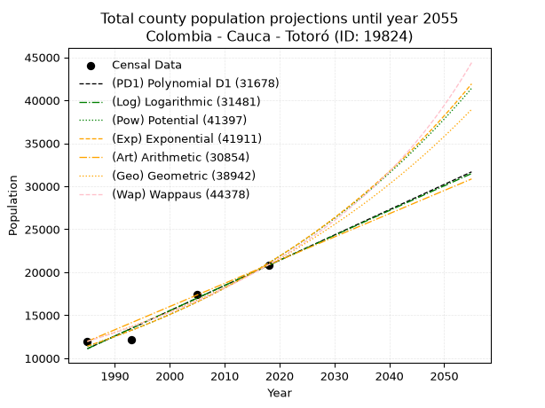
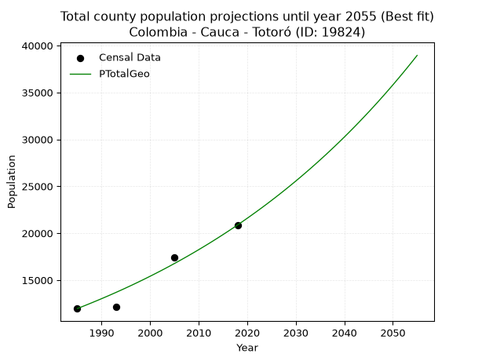
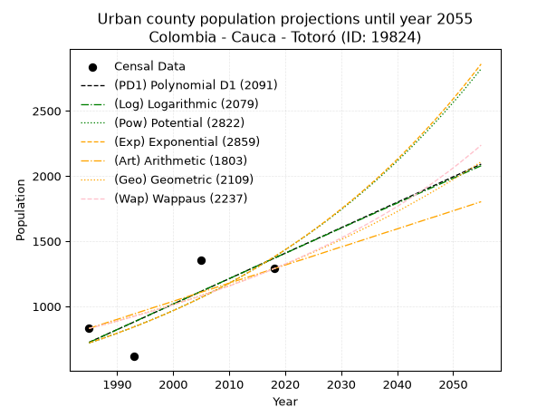
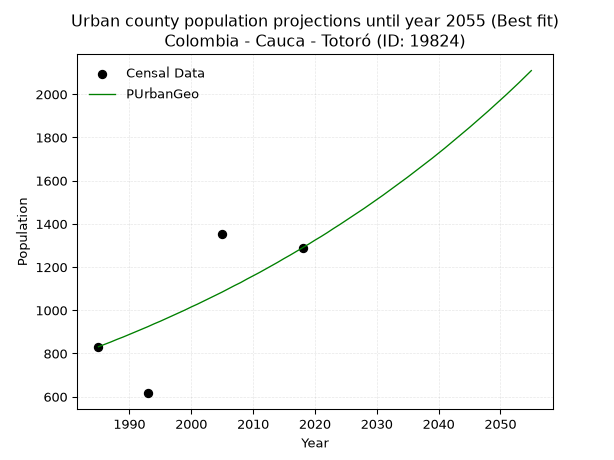
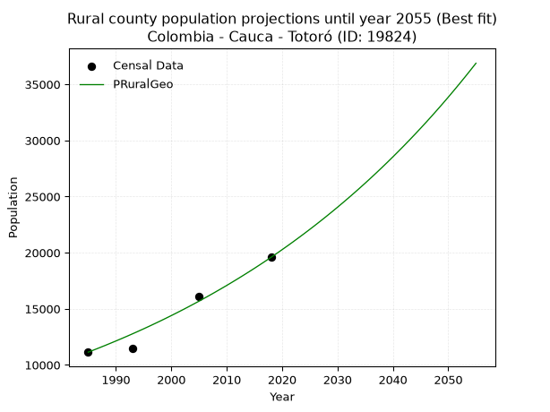

<div align="center">


</div>

# _“Population and Public Services Demand Projections (PPSD) until Year 2050 for Colombia - Cauca - Totoró (ID: 19824)”_
Keywords: `population` `public-service` `projection` `lineal` `polynomial` `logarithmic` `potential` `exponential` `arithmetic` `geometric` `wappaus` `dane` `colombia` `south-america`

PPSD are analytical estimates used by governments and planners to anticipate future changes in population size, age distribution, and the resulting community needs for utilities, healthcare, education, and infrastructure as sizing future water treatment facilities, electrical grids, and road networks based on spatial growth.

> **General running parameters**: • app_version: _v20260806_. • Python version: _3.14.7_. • Pandas version: _3.0.5_. • NumPy version: _2.5.1_. • Creates, save and include plots into reports (create_plot): _False_. • Projection until year: _2050_. • Process polynomial degree 2 and up: _False_. • Process Wappaus: _True_. • Process Wappaus: _True_. • Set negative values to zero: _True_. • Set infinite values to zero: _True_. • Drop dataset notes: _True_. 
<div align="center">

Dynamic map: [:earth_americas:Google](http://maps.google.com/maps?q=2.510252402,-76.4036283) [:earth_americas:OSM](https://www.openstreetmap.org/#map=18/2.510252402/-76.4036283&layers=P) [:earth_americas:Bing](https://www.bing.com/maps?cp=2.510252402~-76.4036283&lvl=18) [:earth_americas:Apple](https://maps.apple.com/frame?center=2.510252402%2C-76.4036283&span=0.003%2C0.006)

</div>


<div align="center">

```geojson
{
  "type": "Feature",
  "geometry": {
    "type": "Point", 
    "coordinates": [-76.4036283, 2.510252402]
  }, 
  "properties": {
    "Name": "Colombia - Cauca - Totoró (ID: 19824)"
  }
}
```

</div>


## 0. Census Data (4 records)

Census data are official statistics collected by a government about the people and housing in a country. They usually include counts of total population, age, sex, race, income, education, and jobs.

📅Global census file: [Population.xlsx](../data/Population.xlsx)

| Source   |   Year |   CountryID | CountryName   |   StateID | StateName   |   CountyID | CountyName   |   PTotal |   PUrban |   PRural |
|:---------|-------:|------------:|:--------------|----------:|:------------|-----------:|:-------------|---------:|---------:|---------:|
| DANE     |   1985 |          57 | Colombia      |        19 | Cauca       |      19824 | Totoró       |    11965 |      831 |    11134 |
| DANE     |   1993 |          57 | Colombia      |        19 | Cauca       |      19824 | Totoró       |    12115 |      616 |    11499 |
| DANE     |   2005 |          57 | Colombia      |        19 | Cauca       |      19824 | Totoró       |    17430 |     1352 |    16078 |
| DANE     |   2018 |          57 | Colombia      |        19 | Cauca       |      19824 | Totoró       |    20870 |     1289 |    19581 |

> 🔥Some records could had specific notes about the registered values or the corresponding urban or rural distribution.

📅   [RUPS](https://www.datos.gov.co/Hacienda-y-Cr-dito-P-blico/Registro-nico-de-Prestadores-de-Servicios-P-blicos/4qkq-csdn/about_data) - Local public utility companies: [RUPS.csv](../data/RUPS.xlsx)

 | SERVICIO       | ESTADO    | NOMBRE                                                                            | NIT         | DEPARTAMENTO_DOMICILIO   | MUNICIPIO_DOMICILIO   | DIRECCION          |   TELEFONO | EMAIL                     | TIPO_INSCRIPCION    | REPRESENTANTE_LEGAL         | TIPO_PRESTADOR          | CLASIFICACION                 |
|:---------------|:----------|:----------------------------------------------------------------------------------|:------------|:-------------------------|:----------------------|:-------------------|-----------:|:--------------------------|:--------------------|:----------------------------|:------------------------|:------------------------------|
| ACUEDUCTO      | OPERATIVA | COOPERATIVA DE ACUEDUCTO Y ALCANTARILLADO MANANTIAL TOTOREÑO                      | 817001723-5 | CAUCA                    | TOTORO                | CALLE 2 No 6A - 83 |    8275125 | stediale.ortega@gmail.com | Registro por la ESP | LUZ STELLA ORTEGA SANCHEZ   | ORGANIZACION AUTORIZADA | HASTA 2500 SUSCRIPTORES       |
| ACUEDUCTO      | OPERATIVA | ADMINISTRACIÓN PUBLICA COOPERATIVA DE ACUEDUCTO ALCANTARILLADO Y ASEO   DE TOTORO | 900771463-9 | CAUCA                    | TOTORO                | Calle 3 No.5-25    |    0000000 | apctotoro@hotmail.com     | Registro por la ESP | MARCO ALBEIRO ORDONEZ MUNOZ | ORGANIZACION AUTORIZADA | MENOR O IGUAL A 2500 USUARIOS |
| ALCANTARILLADO | OPERATIVA | ADMINISTRACIÓN PUBLICA COOPERATIVA DE ACUEDUCTO ALCANTARILLADO Y ASEO   DE TOTORO | 900771463-9 | CAUCA                    | TOTORO                | Calle 3 No.5-25    |    0000000 | apctotoro@hotmail.com     | Registro por la ESP | MARCO ALBEIRO ORDONEZ MUNOZ | ORGANIZACION AUTORIZADA | MENOR O IGUAL A 2500 USUARIOS |

## 1. Total

### 1.1. Coefficients and Parameters

* (PD1) Polynomial Deg 1: 293.75351264552137, -571985.4636692042 (lineal)
* (Log) Logarithmic: 587857.3518287909, -4452713.442043812
* (Pow) Potential: 37.18901773343579, -118.58325385831543
* (Exp) Exponential: 0.01858123334069307, 1.0940630329015521e-12
* (Art) Arithmetic: Year diff. 2018 - 1985 = 33, Population diff. 20870 - 11965 = 8905, Annual growth = 269.8484848484849
* (Geo) Geometric: Year diff. 2018 - 1985 = 33, Population diff. 20870 - 11965 = 8905, Annual growth % = 0.01700129857228183
* (Wap) Wappaus: i = 1.6436636811237086, Condition values only valid for < 200)

<sub>
Wappaus condition values: ['0.00', '1.64', '3.29', '4.93', '6.57', '8.22', '9.86', '11.51', '13.15', '14.79', '16.44', '18.08', '19.72', '21.37', '23.01', '24.65', '26.30', '27.94', '29.59', '31.23', '32.87', '34.52', '36.16', '37.80', '39.45', '41.09', '42.74', '44.38', '46.02', '47.67', '49.31', '50.95', '52.60', '54.24', '55.88', '57.53', '59.17', '60.82', '62.46', '64.10', '65.75', '67.39', '69.03', '70.68', '72.32', '73.96', '75.61', '77.25', '78.90', '80.54', '82.18', '83.83', '85.47', '87.11', '88.76', '90.40', '92.05', '93.69', '95.33', '96.98', '98.62', '100.26', '101.91', '103.55', '105.19', '106.84']
</sub>


### 1.2. Projected Dataset

|   Year |   CountyID |   PTotalPD1 |   PTotalLog |   PTotalPow |   PTotalExp |   PTotalArt |   PTotalGeo |   PTotalWap |
|-------:|-----------:|------------:|------------:|------------:|------------:|------------:|------------:|------------:|
|   1985 |      19824 |       11115 |       11107 |       11408 |       11414 |       11965 |       11965 |       11965 |
|   1986 |      19824 |       11409 |       11403 |       11624 |       11628 |       12235 |       12168 |       12163 |
|   1987 |      19824 |       11703 |       11699 |       11844 |       11847 |       12505 |       12375 |       12365 |
|   1988 |      19824 |       11997 |       11995 |       12067 |       12069 |       12775 |       12586 |       12570 |
|   1989 |      19824 |       12290 |       12291 |       12295 |       12295 |       13044 |       12800 |       12778 |
|   1990 |      19824 |       12584 |       12586 |       12527 |       12526 |       13314 |       13017 |       12990 |
|   1991 |      19824 |       12878 |       12882 |       12763 |       12761 |       13584 |       13239 |       13206 |
|   1992 |      19824 |       13172 |       13177 |       13004 |       13000 |       13854 |       13464 |       13426 |
|   1993 |      19824 |       13465 |       13472 |       13249 |       13244 |       14124 |       13693 |       13649 |
|   1994 |      19824 |       13759 |       13767 |       13498 |       13492 |       14394 |       13925 |       13876 |
|   1995 |      19824 |       14053 |       14061 |       13752 |       13745 |       14663 |       14162 |       14108 |
|   1996 |      19824 |       14347 |       14356 |       14011 |       14003 |       14933 |       14403 |       14343 |
|   1997 |      19824 |       14640 |       14651 |       14275 |       14266 |       15203 |       14648 |       14583 |
|   1998 |      19824 |       14934 |       14945 |       14543 |       14533 |       15473 |       14897 |       14827 |
|   1999 |      19824 |       15228 |       15239 |       14816 |       14806 |       15743 |       15150 |       15076 |
|   2000 |      19824 |       15522 |       15533 |       15094 |       15083 |       16013 |       15408 |       15330 |
|   2001 |      19824 |       15815 |       15827 |       15377 |       15366 |       16283 |       15670 |       15588 |
|   2002 |      19824 |       16109 |       16121 |       15666 |       15654 |       16552 |       15936 |       15851 |
|   2003 |      19824 |       16403 |       16414 |       15959 |       15948 |       16822 |       16207 |       16120 |
|   2004 |      19824 |       16697 |       16707 |       16258 |       16247 |       17092 |       16482 |       16393 |
|   2005 |      19824 |       16990 |       17001 |       16563 |       16552 |       17362 |       16763 |       16672 |
|   2006 |      19824 |       17284 |       17294 |       16873 |       16862 |       17632 |       17048 |       16956 |
|   2007 |      19824 |       17578 |       17587 |       17189 |       17178 |       17902 |       17337 |       17247 |
|   2008 |      19824 |       17872 |       17880 |       17510 |       17501 |       18172 |       17632 |       17543 |
|   2009 |      19824 |       18165 |       18172 |       17837 |       17829 |       18441 |       17932 |       17845 |
|   2010 |      19824 |       18459 |       18465 |       18170 |       18163 |       18711 |       18237 |       18153 |
|   2011 |      19824 |       18753 |       18757 |       18510 |       18504 |       18981 |       18547 |       18468 |
|   2012 |      19824 |       19047 |       19050 |       18855 |       18851 |       19251 |       18862 |       18789 |
|   2013 |      19824 |       19340 |       19342 |       19207 |       19205 |       19521 |       19183 |       19117 |
|   2014 |      19824 |       19634 |       19634 |       19565 |       19565 |       19791 |       19509 |       19453 |
|   2015 |      19824 |       19928 |       19925 |       19929 |       19932 |       20060 |       19841 |       19796 |
|   2016 |      19824 |       20222 |       20217 |       20300 |       20305 |       20330 |       20178 |       20146 |
|   2017 |      19824 |       20515 |       20509 |       20678 |       20686 |       20600 |       20521 |       20504 |
|   2018 |      19824 |       20809 |       20800 |       21063 |       21074 |       20870 |       20870 |       20870 |
|   2019 |      19824 |       21103 |       21091 |       21455 |       21469 |       21140 |       21225 |       21244 |
|   2020 |      19824 |       21397 |       21382 |       21853 |       21872 |       21410 |       21586 |       21628 |
|   2021 |      19824 |       21690 |       21673 |       22259 |       22282 |       21680 |       21953 |       22020 |
|   2022 |      19824 |       21984 |       21964 |       22673 |       22700 |       21949 |       22326 |       22421 |
|   2023 |      19824 |       22278 |       22255 |       23093 |       23126 |       22219 |       22705 |       22832 |
|   2024 |      19824 |       22572 |       22545 |       23522 |       23560 |       22489 |       23091 |       23253 |
|   2025 |      19824 |       22865 |       22836 |       23958 |       24002 |       22759 |       23484 |       23684 |
|   2026 |      19824 |       23159 |       23126 |       24402 |       24452 |       23029 |       23883 |       24126 |
|   2027 |      19824 |       23453 |       23416 |       24854 |       24910 |       23299 |       24289 |       24579 |
|   2028 |      19824 |       23747 |       23706 |       25314 |       25378 |       23568 |       24702 |       25043 |
|   2029 |      19824 |       24040 |       23996 |       25782 |       25853 |       23838 |       25122 |       25520 |
|   2030 |      19824 |       24334 |       24285 |       26259 |       26338 |       24108 |       25549 |       26009 |
|   2031 |      19824 |       24628 |       24575 |       26744 |       26832 |       24378 |       25984 |       26510 |
|   2032 |      19824 |       24922 |       24864 |       27238 |       27336 |       24648 |       26426 |       27026 |
|   2033 |      19824 |       25215 |       25153 |       27741 |       27848 |       24918 |       26875 |       27555 |
|   2034 |      19824 |       25509 |       25443 |       28253 |       28371 |       25188 |       27332 |       28098 |
|   2035 |      19824 |       25803 |       25731 |       28774 |       28903 |       25457 |       27796 |       28657 |
|   2036 |      19824 |       26097 |       26020 |       29305 |       29445 |       25727 |       28269 |       29232 |
|   2037 |      19824 |       26390 |       26309 |       29845 |       29997 |       25997 |       28750 |       29823 |
|   2038 |      19824 |       26684 |       26597 |       30395 |       30559 |       26267 |       29238 |       30432 |
|   2039 |      19824 |       26978 |       26886 |       30954 |       31133 |       26537 |       29735 |       31058 |
|   2040 |      19824 |       27272 |       27174 |       31524 |       31717 |       26807 |       30241 |       31703 |
|   2041 |      19824 |       27565 |       27462 |       32104 |       32311 |       27077 |       30755 |       32368 |
|   2042 |      19824 |       27859 |       27750 |       32694 |       32917 |       27346 |       31278 |       33054 |
|   2043 |      19824 |       28153 |       28038 |       33295 |       33535 |       27616 |       31810 |       33761 |
|   2044 |      19824 |       28447 |       28326 |       33906 |       34164 |       27886 |       32351 |       34490 |
|   2045 |      19824 |       28740 |       28613 |       34529 |       34804 |       28156 |       32901 |       35243 |
|   2046 |      19824 |       29034 |       28901 |       35162 |       35457 |       28426 |       33460 |       36021 |
|   2047 |      19824 |       29328 |       29188 |       35807 |       36122 |       28696 |       34029 |       36826 |
|   2048 |      19824 |       29622 |       29475 |       36463 |       36800 |       28965 |       34607 |       37657 |
|   2049 |      19824 |       29915 |       29762 |       37131 |       37490 |       29235 |       35196 |       38517 |
|   2050 |      19824 |       30209 |       30049 |       37811 |       38193 |       29505 |       35794 |       39408 |
<div align="center">

</img>

</div>


### 1.3. Best fit with absolute and relative error (%)

Relative error puts that difference into context by dividing the absolute error by the true value, creating a unitless ratio or percentage that shows the scale of the mistake.

Absolute and relative error

|   Year | Source   |   CountryID | CountryName   |   StateID | StateName   |   CountyID_x | CountyName   |   PTotal |   PUrban |   PRural |   CountyID_y |   PTotalPD1 |   PTotalLog |   PTotalPow |   PTotalExp |   PTotalArt |   PTotalGeo |   PTotalWap |   PTotalPD1AbsError |   PTotalLogAbsError |   PTotalPowAbsError |   PTotalExpAbsError |   PTotalArtAbsError |   PTotalGeoAbsError |   PTotalWapAbsError |   PTotalPD1RelError |   PTotalLogRelError |   PTotalPowRelError |   PTotalExpRelError |   PTotalArtRelError |   PTotalGeoRelError |   PTotalWapRelError |
|-------:|:---------|------------:|:--------------|----------:|:------------|-------------:|:-------------|---------:|---------:|---------:|-------------:|------------:|------------:|------------:|------------:|------------:|------------:|------------:|--------------------:|--------------------:|--------------------:|--------------------:|--------------------:|--------------------:|--------------------:|--------------------:|--------------------:|--------------------:|--------------------:|--------------------:|--------------------:|--------------------:|
|   1985 | DANE     |          57 | Colombia      |        19 | Cauca       |        19824 | Totoró       |    11965 |      831 |    11134 |        19824 |       11115 |       11107 |       11408 |       11414 |       11965 |       11965 |       11965 |                 850 |                 858 |                 557 |                 551 |                   0 |                   0 |                   0 |            7.10405  |             7.17092 |            4.65524  |             4.6051  |            0        |             0       |             0       |
|   1993 | DANE     |          57 | Colombia      |        19 | Cauca       |        19824 | Totoró       |    12115 |      616 |    11499 |        19824 |       13465 |       13472 |       13249 |       13244 |       14124 |       13693 |       13649 |                1350 |                1357 |                1134 |                1129 |                2009 |                1578 |                1534 |           11.1432   |            11.201   |            9.3603   |             9.31903 |           16.5827   |            13.0252  |            12.662   |
|   2005 | DANE     |          57 | Colombia      |        19 | Cauca       |        19824 | Totoró       |    17430 |     1352 |    16078 |        19824 |       16990 |       17001 |       16563 |       16552 |       17362 |       16763 |       16672 |                 440 |                 429 |                 867 |                 878 |                  68 |                 667 |                 758 |            2.52438  |             2.46127 |            4.97418  |             5.03729 |            0.390132 |             3.82674 |             4.34882 |
|   2018 | DANE     |          57 | Colombia      |        19 | Cauca       |        19824 | Totoró       |    20870 |     1289 |    19581 |        19824 |       20809 |       20800 |       21063 |       21074 |       20870 |       20870 |       20870 |                  61 |                  70 |                 193 |                 204 |                   0 |                   0 |                   0 |            0.292286 |             0.33541 |            0.924772 |             0.97748 |            0        |             0       |             0       |

Relative error mean

| Method    |   RelError | Best   |
|:----------|-----------:|:-------|
| PTotalPD1 |    5.26598 |        |
| PTotalLog |    5.29215 |        |
| PTotalPow |    4.97862 |        |
| PTotalExp |    4.98472 |        |
| PTotalArt |    4.24322 |        |
| PTotalGeo |    4.21298 | True   |
| PTotalWap |    4.2527  |        |

💙Best method: _**PTotalGeo**_
<div align="center">

</img>

</div>


### 1.4. Fresh water supply demand in liters per capita per day (lpcd)

The fresh water supply demand typically ranges from 100 to 300 liters per capita per day (lpcd) for standard domestic and municipal planning, though absolute survival minimums set by the World Health Organization are as low as 7.5 to 20 liters per day, and total consumption in high-income nations can exceed 400 liters.

> `CZ`: Level in meters above the sea level (masl)<br> `WS`: Fresh water supply demand in liters per capita per day (lpcd or l/h/d)<br> `WSAll`: Zonal fresh water supply demand in liters per second (l/s)<br> `A`: Zonal area in square meters<br> `DP`: Population density (people/hectare or p/ha)

Reference values (RAS Colombia)

|    CZ |   WS |
|------:|-----:|
|  1000 |  120 |
|  2000 |  130 |
| 99999 |  140 |

County shapefile geometry properties and water supply values

|   CountyID |      ATotal |   CZTotal |   WSTotal |
|-----------:|------------:|----------:|----------:|
|      19824 | 4.04585e+08 |   2758.78 |       140 |

Projected values for best method: PTotalGeo

|   CountyID |   Year |   PTotalGeo |   DPTotal |   WSTotal |   WSTotalAll |
|-----------:|-------:|------------:|----------:|----------:|-------------:|
|      19824 |   1985 |       11965 |      0.3  |       140 |      19.3877 |
|      19824 |   1986 |       12168 |      0.3  |       140 |      19.7167 |
|      19824 |   1987 |       12375 |      0.31 |       140 |      20.0521 |
|      19824 |   1988 |       12586 |      0.31 |       140 |      20.394  |
|      19824 |   1989 |       12800 |      0.32 |       140 |      20.7407 |
|      19824 |   1990 |       13017 |      0.32 |       140 |      21.0924 |
|      19824 |   1991 |       13239 |      0.33 |       140 |      21.4521 |
|      19824 |   1992 |       13464 |      0.33 |       140 |      21.8167 |
|      19824 |   1993 |       13693 |      0.34 |       140 |      22.1877 |
|      19824 |   1994 |       13925 |      0.34 |       140 |      22.5637 |
|      19824 |   1995 |       14162 |      0.35 |       140 |      22.9477 |
|      19824 |   1996 |       14403 |      0.36 |       140 |      23.3382 |
|      19824 |   1997 |       14648 |      0.36 |       140 |      23.7352 |
|      19824 |   1998 |       14897 |      0.37 |       140 |      24.1387 |
|      19824 |   1999 |       15150 |      0.37 |       140 |      24.5486 |
|      19824 |   2000 |       15408 |      0.38 |       140 |      24.9667 |
|      19824 |   2001 |       15670 |      0.39 |       140 |      25.3912 |
|      19824 |   2002 |       15936 |      0.39 |       140 |      25.8222 |
|      19824 |   2003 |       16207 |      0.4  |       140 |      26.2613 |
|      19824 |   2004 |       16482 |      0.41 |       140 |      26.7069 |
|      19824 |   2005 |       16763 |      0.41 |       140 |      27.1623 |
|      19824 |   2006 |       17048 |      0.42 |       140 |      27.6241 |
|      19824 |   2007 |       17337 |      0.43 |       140 |      28.0924 |
|      19824 |   2008 |       17632 |      0.44 |       140 |      28.5704 |
|      19824 |   2009 |       17932 |      0.44 |       140 |      29.0565 |
|      19824 |   2010 |       18237 |      0.45 |       140 |      29.5507 |
|      19824 |   2011 |       18547 |      0.46 |       140 |      30.053  |
|      19824 |   2012 |       18862 |      0.47 |       140 |      30.5634 |
|      19824 |   2013 |       19183 |      0.47 |       140 |      31.0836 |
|      19824 |   2014 |       19509 |      0.48 |       140 |      31.6118 |
|      19824 |   2015 |       19841 |      0.49 |       140 |      32.1498 |
|      19824 |   2016 |       20178 |      0.5  |       140 |      32.6958 |
|      19824 |   2017 |       20521 |      0.51 |       140 |      33.2516 |
|      19824 |   2018 |       20870 |      0.52 |       140 |      33.8171 |
|      19824 |   2019 |       21225 |      0.52 |       140 |      34.3924 |
|      19824 |   2020 |       21586 |      0.53 |       140 |      34.9773 |
|      19824 |   2021 |       21953 |      0.54 |       140 |      35.572  |
|      19824 |   2022 |       22326 |      0.55 |       140 |      36.1764 |
|      19824 |   2023 |       22705 |      0.56 |       140 |      36.7905 |
|      19824 |   2024 |       23091 |      0.57 |       140 |      37.416  |
|      19824 |   2025 |       23484 |      0.58 |       140 |      38.0528 |
|      19824 |   2026 |       23883 |      0.59 |       140 |      38.6993 |
|      19824 |   2027 |       24289 |      0.6  |       140 |      39.3572 |
|      19824 |   2028 |       24702 |      0.61 |       140 |      40.0264 |
|      19824 |   2029 |       25122 |      0.62 |       140 |      40.7069 |
|      19824 |   2030 |       25549 |      0.63 |       140 |      41.3988 |
|      19824 |   2031 |       25984 |      0.64 |       140 |      42.1037 |
|      19824 |   2032 |       26426 |      0.65 |       140 |      42.8199 |
|      19824 |   2033 |       26875 |      0.66 |       140 |      43.5475 |
|      19824 |   2034 |       27332 |      0.68 |       140 |      44.288  |
|      19824 |   2035 |       27796 |      0.69 |       140 |      45.0398 |
|      19824 |   2036 |       28269 |      0.7  |       140 |      45.8062 |
|      19824 |   2037 |       28750 |      0.71 |       140 |      46.5856 |
|      19824 |   2038 |       29238 |      0.72 |       140 |      47.3764 |
|      19824 |   2039 |       29735 |      0.73 |       140 |      48.1817 |
|      19824 |   2040 |       30241 |      0.75 |       140 |      49.0016 |
|      19824 |   2041 |       30755 |      0.76 |       140 |      49.8345 |
|      19824 |   2042 |       31278 |      0.77 |       140 |      50.6819 |
|      19824 |   2043 |       31810 |      0.79 |       140 |      51.544  |
|      19824 |   2044 |       32351 |      0.8  |       140 |      52.4206 |
|      19824 |   2045 |       32901 |      0.81 |       140 |      53.3118 |
|      19824 |   2046 |       33460 |      0.83 |       140 |      54.2176 |
|      19824 |   2047 |       34029 |      0.84 |       140 |      55.1396 |
|      19824 |   2048 |       34607 |      0.86 |       140 |      56.0762 |
|      19824 |   2049 |       35196 |      0.87 |       140 |      57.0306 |
|      19824 |   2050 |       35794 |      0.88 |       140 |      57.9995 |

## 2. Urban

### 2.1. Coefficients and Parameters

* (PD1) Polynomial Deg 1: 19.531112003211557, -38045.10678442392 (lineal)
* (Log) Logarithmic: 39100.7675584235, -296183.2475454637
* (Pow) Potential: 39.451197090913205, -127.24379062778843
* (Exp) Exponential: 0.01971017569469418, 7.335365325005643e-15
* (Art) Arithmetic: Year diff. 2018 - 1985 = 33, Population diff. 1289 - 831 = 458, Annual growth = 13.878787878787879
* (Geo) Geometric: Year diff. 2018 - 1985 = 33, Population diff. 1289 - 831 = 458, Annual growth % = 0.013391670012590007
* (Wap) Wappaus: i = 1.3093196112064036, Condition values only valid for < 200)

<sub>
Wappaus condition values: ['0.00', '1.31', '2.62', '3.93', '5.24', '6.55', '7.86', '9.17', '10.47', '11.78', '13.09', '14.40', '15.71', '17.02', '18.33', '19.64', '20.95', '22.26', '23.57', '24.88', '26.19', '27.50', '28.81', '30.11', '31.42', '32.73', '34.04', '35.35', '36.66', '37.97', '39.28', '40.59', '41.90', '43.21', '44.52', '45.83', '47.14', '48.44', '49.75', '51.06', '52.37', '53.68', '54.99', '56.30', '57.61', '58.92', '60.23', '61.54', '62.85', '64.16', '65.47', '66.78', '68.08', '69.39', '70.70', '72.01', '73.32', '74.63', '75.94', '77.25', '78.56', '79.87', '81.18', '82.49', '83.80', '85.11']
</sub>


### 2.2. Projected Dataset

|   Year |   CountyID |   PUrbanPD1 |   PUrbanLog |   PUrbanPow |   PUrbanExp |   PUrbanArt |   PUrbanGeo |   PUrbanWap |
|-------:|-----------:|------------:|------------:|------------:|------------:|------------:|------------:|------------:|
|   1985 |      19824 |         724 |         724 |         719 |         720 |         831 |         831 |         831 |
|   1986 |      19824 |         744 |         743 |         734 |         734 |         845 |         842 |         842 |
|   1987 |      19824 |         763 |         763 |         748 |         748 |         859 |         853 |         853 |
|   1988 |      19824 |         783 |         783 |         763 |         763 |         873 |         865 |         864 |
|   1989 |      19824 |         802 |         802 |         779 |         779 |         887 |         876 |         876 |
|   1990 |      19824 |         822 |         822 |         794 |         794 |         900 |         888 |         887 |
|   1991 |      19824 |         841 |         842 |         810 |         810 |         914 |         900 |         899 |
|   1992 |      19824 |         861 |         861 |         826 |         826 |         928 |         912 |         911 |
|   1993 |      19824 |         880 |         881 |         843 |         842 |         942 |         924 |         923 |
|   1994 |      19824 |         900 |         900 |         860 |         859 |         956 |         937 |         935 |
|   1995 |      19824 |         919 |         920 |         877 |         876 |         970 |         949 |         947 |
|   1996 |      19824 |         939 |         940 |         894 |         894 |         984 |         962 |         960 |
|   1997 |      19824 |         959 |         959 |         912 |         912 |         998 |         975 |         973 |
|   1998 |      19824 |         978 |         979 |         930 |         930 |        1011 |         988 |         986 |
|   1999 |      19824 |         998 |         998 |         949 |         948 |        1025 |        1001 |         999 |
|   2000 |      19824 |        1017 |        1018 |         968 |         967 |        1039 |        1015 |        1012 |
|   2001 |      19824 |        1037 |        1037 |         987 |         986 |        1053 |        1028 |        1025 |
|   2002 |      19824 |        1056 |        1057 |        1007 |        1006 |        1067 |        1042 |        1039 |
|   2003 |      19824 |        1076 |        1076 |        1027 |        1026 |        1081 |        1056 |        1053 |
|   2004 |      19824 |        1095 |        1096 |        1047 |        1046 |        1095 |        1070 |        1067 |
|   2005 |      19824 |        1115 |        1116 |        1068 |        1067 |        1109 |        1084 |        1081 |
|   2006 |      19824 |        1134 |        1135 |        1089 |        1088 |        1122 |        1099 |        1096 |
|   2007 |      19824 |        1154 |        1154 |        1111 |        1110 |        1136 |        1114 |        1111 |
|   2008 |      19824 |        1173 |        1174 |        1133 |        1132 |        1150 |        1128 |        1126 |
|   2009 |      19824 |        1193 |        1193 |        1155 |        1155 |        1164 |        1144 |        1141 |
|   2010 |      19824 |        1212 |        1213 |        1178 |        1178 |        1178 |        1159 |        1156 |
|   2011 |      19824 |        1232 |        1232 |        1202 |        1201 |        1192 |        1174 |        1172 |
|   2012 |      19824 |        1251 |        1252 |        1225 |        1225 |        1206 |        1190 |        1188 |
|   2013 |      19824 |        1271 |        1271 |        1250 |        1250 |        1220 |        1206 |        1204 |
|   2014 |      19824 |        1291 |        1291 |        1274 |        1274 |        1233 |        1222 |        1220 |
|   2015 |      19824 |        1310 |        1310 |        1300 |        1300 |        1247 |        1239 |        1237 |
|   2016 |      19824 |        1330 |        1329 |        1325 |        1326 |        1261 |        1255 |        1254 |
|   2017 |      19824 |        1349 |        1349 |        1351 |        1352 |        1275 |        1272 |        1271 |
|   2018 |      19824 |        1369 |        1368 |        1378 |        1379 |        1289 |        1289 |        1289 |
|   2019 |      19824 |        1388 |        1388 |        1405 |        1406 |        1303 |        1306 |        1307 |
|   2020 |      19824 |        1408 |        1407 |        1433 |        1434 |        1317 |        1324 |        1325 |
|   2021 |      19824 |        1427 |        1426 |        1461 |        1463 |        1331 |        1341 |        1343 |
|   2022 |      19824 |        1447 |        1446 |        1490 |        1492 |        1345 |        1359 |        1362 |
|   2023 |      19824 |        1466 |        1465 |        1520 |        1522 |        1358 |        1378 |        1381 |
|   2024 |      19824 |        1486 |        1484 |        1549 |        1552 |        1372 |        1396 |        1401 |
|   2025 |      19824 |        1505 |        1504 |        1580 |        1583 |        1386 |        1415 |        1421 |
|   2026 |      19824 |        1525 |        1523 |        1611 |        1614 |        1400 |        1434 |        1441 |
|   2027 |      19824 |        1544 |        1542 |        1643 |        1647 |        1414 |        1453 |        1461 |
|   2028 |      19824 |        1564 |        1561 |        1675 |        1679 |        1428 |        1472 |        1482 |
|   2029 |      19824 |        1584 |        1581 |        1708 |        1713 |        1442 |        1492 |        1503 |
|   2030 |      19824 |        1603 |        1600 |        1741 |        1747 |        1456 |        1512 |        1525 |
|   2031 |      19824 |        1623 |        1619 |        1776 |        1782 |        1469 |        1532 |        1547 |
|   2032 |      19824 |        1642 |        1639 |        1810 |        1817 |        1483 |        1553 |        1570 |
|   2033 |      19824 |        1662 |        1658 |        1846 |        1853 |        1497 |        1574 |        1593 |
|   2034 |      19824 |        1681 |        1677 |        1882 |        1890 |        1511 |        1595 |        1616 |
|   2035 |      19824 |        1701 |        1696 |        1919 |        1928 |        1525 |        1616 |        1640 |
|   2036 |      19824 |        1720 |        1715 |        1956 |        1966 |        1539 |        1638 |        1664 |
|   2037 |      19824 |        1740 |        1735 |        1995 |        2005 |        1553 |        1660 |        1689 |
|   2038 |      19824 |        1759 |        1754 |        2034 |        2045 |        1567 |        1682 |        1714 |
|   2039 |      19824 |        1779 |        1773 |        2073 |        2086 |        1580 |        1704 |        1740 |
|   2040 |      19824 |        1798 |        1792 |        2114 |        2127 |        1594 |        1727 |        1766 |
|   2041 |      19824 |        1818 |        1811 |        2155 |        2170 |        1608 |        1750 |        1793 |
|   2042 |      19824 |        1837 |        1830 |        2197 |        2213 |        1622 |        1774 |        1820 |
|   2043 |      19824 |        1857 |        1850 |        2240 |        2257 |        1636 |        1798 |        1848 |
|   2044 |      19824 |        1876 |        1869 |        2284 |        2302 |        1650 |        1822 |        1877 |
|   2045 |      19824 |        1896 |        1888 |        2328 |        2348 |        1664 |        1846 |        1906 |
|   2046 |      19824 |        1916 |        1907 |        2374 |        2395 |        1678 |        1871 |        1936 |
|   2047 |      19824 |        1935 |        1926 |        2420 |        2442 |        1691 |        1896 |        1966 |
|   2048 |      19824 |        1955 |        1945 |        2467 |        2491 |        1705 |        1921 |        1998 |
|   2049 |      19824 |        1974 |        1964 |        2515 |        2540 |        1719 |        1947 |        2029 |
|   2050 |      19824 |        1994 |        1983 |        2564 |        2591 |        1733 |        1973 |        2062 |
<div align="center">

</img>

</div>


### 2.3. Best fit with absolute and relative error (%)

Relative error puts that difference into context by dividing the absolute error by the true value, creating a unitless ratio or percentage that shows the scale of the mistake.

Absolute and relative error

|   Year | Source   |   CountryID | CountryName   |   StateID | StateName   |   CountyID_x | CountyName   |   PTotal |   PUrban |   PRural |   CountyID_y |   PUrbanPD1 |   PUrbanLog |   PUrbanPow |   PUrbanExp |   PUrbanArt |   PUrbanGeo |   PUrbanWap |   PUrbanPD1AbsError |   PUrbanLogAbsError |   PUrbanPowAbsError |   PUrbanExpAbsError |   PUrbanArtAbsError |   PUrbanGeoAbsError |   PUrbanWapAbsError |   PUrbanPD1RelError |   PUrbanLogRelError |   PUrbanPowRelError |   PUrbanExpRelError |   PUrbanArtRelError |   PUrbanGeoRelError |   PUrbanWapRelError |
|-------:|:---------|------------:|:--------------|----------:|:------------|-------------:|:-------------|---------:|---------:|---------:|-------------:|------------:|------------:|------------:|------------:|------------:|------------:|------------:|--------------------:|--------------------:|--------------------:|--------------------:|--------------------:|--------------------:|--------------------:|--------------------:|--------------------:|--------------------:|--------------------:|--------------------:|--------------------:|--------------------:|
|   1985 | DANE     |          57 | Colombia      |        19 | Cauca       |        19824 | Totoró       |    11965 |      831 |    11134 |        19824 |         724 |         724 |         719 |         720 |         831 |         831 |         831 |                 107 |                 107 |                 112 |                 111 |                   0 |                   0 |                   0 |            12.8761  |            12.8761  |            13.4777  |            13.3574  |              0      |              0      |              0      |
|   1993 | DANE     |          57 | Colombia      |        19 | Cauca       |        19824 | Totoró       |    12115 |      616 |    11499 |        19824 |         880 |         881 |         843 |         842 |         942 |         924 |         923 |                 264 |                 265 |                 227 |                 226 |                 326 |                 308 |                 307 |            42.8571  |            43.0195  |            36.8506  |            36.6883  |             52.9221 |             50      |             49.8377 |
|   2005 | DANE     |          57 | Colombia      |        19 | Cauca       |        19824 | Totoró       |    17430 |     1352 |    16078 |        19824 |        1115 |        1116 |        1068 |        1067 |        1109 |        1084 |        1081 |                 237 |                 236 |                 284 |                 285 |                 243 |                 268 |                 271 |            17.5296  |            17.4556  |            21.0059  |            21.0799  |             17.9734 |             19.8225 |             20.0444 |
|   2018 | DANE     |          57 | Colombia      |        19 | Cauca       |        19824 | Totoró       |    20870 |     1289 |    19581 |        19824 |        1369 |        1368 |        1378 |        1379 |        1289 |        1289 |        1289 |                  80 |                  79 |                  89 |                  90 |                   0 |                   0 |                   0 |             6.20636 |             6.12878 |             6.90458 |             6.98216 |              0      |              0      |              0      |

Relative error mean

| Method    |   RelError | Best   |
|:----------|-----------:|:-------|
| PUrbanPD1 |    19.8673 |        |
| PUrbanLog |    19.87   |        |
| PUrbanPow |    19.5597 |        |
| PUrbanExp |    19.5269 |        |
| PUrbanArt |    17.7239 |        |
| PUrbanGeo |    17.4556 | True   |
| PUrbanWap |    17.4705 |        |

💙Best method: _**PUrbanGeo**_
<div align="center">

</img>

</div>


### 2.4. Fresh water supply demand in liters per capita per day (lpcd)

The fresh water supply demand typically ranges from 100 to 300 liters per capita per day (lpcd) for standard domestic and municipal planning, though absolute survival minimums set by the World Health Organization are as low as 7.5 to 20 liters per day, and total consumption in high-income nations can exceed 400 liters.

> `CZ`: Level in meters above the sea level (masl)<br> `WS`: Fresh water supply demand in liters per capita per day (lpcd or l/h/d)<br> `WSAll`: Zonal fresh water supply demand in liters per second (l/s)<br> `A`: Zonal area in square meters<br> `DP`: Population density (people/hectare or p/ha)

Reference values (RAS Colombia)

|    CZ |   WS |
|------:|-----:|
|  1000 |  120 |
|  2000 |  130 |
| 99999 |  140 |

County shapefile geometry properties and water supply values

|   CountyID |   AUrban |   CZUrban |   WSUrban |
|-----------:|---------:|----------:|----------:|
|      19824 |   876580 |   2554.71 |       140 |

Projected values for best method: PUrbanGeo

|   CountyID |   Year |   PUrbanGeo |   DPUrban |   WSUrban |   WSUrbanAll |
|-----------:|-------:|------------:|----------:|----------:|-------------:|
|      19824 |   1985 |         831 |      9.48 |       140 |      1.34653 |
|      19824 |   1986 |         842 |      9.61 |       140 |      1.36435 |
|      19824 |   1987 |         853 |      9.73 |       140 |      1.38218 |
|      19824 |   1988 |         865 |      9.87 |       140 |      1.40162 |
|      19824 |   1989 |         876 |      9.99 |       140 |      1.41944 |
|      19824 |   1990 |         888 |     10.13 |       140 |      1.43889 |
|      19824 |   1991 |         900 |     10.27 |       140 |      1.45833 |
|      19824 |   1992 |         912 |     10.4  |       140 |      1.47778 |
|      19824 |   1993 |         924 |     10.54 |       140 |      1.49722 |
|      19824 |   1994 |         937 |     10.69 |       140 |      1.51829 |
|      19824 |   1995 |         949 |     10.83 |       140 |      1.53773 |
|      19824 |   1996 |         962 |     10.97 |       140 |      1.5588  |
|      19824 |   1997 |         975 |     11.12 |       140 |      1.57986 |
|      19824 |   1998 |         988 |     11.27 |       140 |      1.60093 |
|      19824 |   1999 |        1001 |     11.42 |       140 |      1.62199 |
|      19824 |   2000 |        1015 |     11.58 |       140 |      1.64468 |
|      19824 |   2001 |        1028 |     11.73 |       140 |      1.66574 |
|      19824 |   2002 |        1042 |     11.89 |       140 |      1.68843 |
|      19824 |   2003 |        1056 |     12.05 |       140 |      1.71111 |
|      19824 |   2004 |        1070 |     12.21 |       140 |      1.7338  |
|      19824 |   2005 |        1084 |     12.37 |       140 |      1.75648 |
|      19824 |   2006 |        1099 |     12.54 |       140 |      1.78079 |
|      19824 |   2007 |        1114 |     12.71 |       140 |      1.80509 |
|      19824 |   2008 |        1128 |     12.87 |       140 |      1.82778 |
|      19824 |   2009 |        1144 |     13.05 |       140 |      1.8537  |
|      19824 |   2010 |        1159 |     13.22 |       140 |      1.87801 |
|      19824 |   2011 |        1174 |     13.39 |       140 |      1.90231 |
|      19824 |   2012 |        1190 |     13.58 |       140 |      1.92824 |
|      19824 |   2013 |        1206 |     13.76 |       140 |      1.95417 |
|      19824 |   2014 |        1222 |     13.94 |       140 |      1.98009 |
|      19824 |   2015 |        1239 |     14.13 |       140 |      2.00764 |
|      19824 |   2016 |        1255 |     14.32 |       140 |      2.03356 |
|      19824 |   2017 |        1272 |     14.51 |       140 |      2.06111 |
|      19824 |   2018 |        1289 |     14.7  |       140 |      2.08866 |
|      19824 |   2019 |        1306 |     14.9  |       140 |      2.1162  |
|      19824 |   2020 |        1324 |     15.1  |       140 |      2.14537 |
|      19824 |   2021 |        1341 |     15.3  |       140 |      2.17292 |
|      19824 |   2022 |        1359 |     15.5  |       140 |      2.20208 |
|      19824 |   2023 |        1378 |     15.72 |       140 |      2.23287 |
|      19824 |   2024 |        1396 |     15.93 |       140 |      2.26204 |
|      19824 |   2025 |        1415 |     16.14 |       140 |      2.29282 |
|      19824 |   2026 |        1434 |     16.36 |       140 |      2.32361 |
|      19824 |   2027 |        1453 |     16.58 |       140 |      2.3544  |
|      19824 |   2028 |        1472 |     16.79 |       140 |      2.38519 |
|      19824 |   2029 |        1492 |     17.02 |       140 |      2.41759 |
|      19824 |   2030 |        1512 |     17.25 |       140 |      2.45    |
|      19824 |   2031 |        1532 |     17.48 |       140 |      2.48241 |
|      19824 |   2032 |        1553 |     17.72 |       140 |      2.51644 |
|      19824 |   2033 |        1574 |     17.96 |       140 |      2.55046 |
|      19824 |   2034 |        1595 |     18.2  |       140 |      2.58449 |
|      19824 |   2035 |        1616 |     18.44 |       140 |      2.61852 |
|      19824 |   2036 |        1638 |     18.69 |       140 |      2.65417 |
|      19824 |   2037 |        1660 |     18.94 |       140 |      2.68981 |
|      19824 |   2038 |        1682 |     19.19 |       140 |      2.72546 |
|      19824 |   2039 |        1704 |     19.44 |       140 |      2.76111 |
|      19824 |   2040 |        1727 |     19.7  |       140 |      2.79838 |
|      19824 |   2041 |        1750 |     19.96 |       140 |      2.83565 |
|      19824 |   2042 |        1774 |     20.24 |       140 |      2.87454 |
|      19824 |   2043 |        1798 |     20.51 |       140 |      2.91343 |
|      19824 |   2044 |        1822 |     20.79 |       140 |      2.95231 |
|      19824 |   2045 |        1846 |     21.06 |       140 |      2.9912  |
|      19824 |   2046 |        1871 |     21.34 |       140 |      3.03171 |
|      19824 |   2047 |        1896 |     21.63 |       140 |      3.07222 |
|      19824 |   2048 |        1921 |     21.91 |       140 |      3.11273 |
|      19824 |   2049 |        1947 |     22.21 |       140 |      3.15486 |
|      19824 |   2050 |        1973 |     22.51 |       140 |      3.19699 |

## 3. Rural

### 3.1. Coefficients and Parameters

* (PD1) Polynomial Deg 1: 274.22240064230976, -533940.3568847801 (lineal)
* (Log) Logarithmic: 548756.5842703675, -4156530.194498349
* (Pow) Potential: 37.06300902986375, -118.19645901540927
* (Exp) Exponential: 0.01851849454782982, 1.1597755133055085e-12
* (Art) Arithmetic: Year diff. 2018 - 1985 = 33, Population diff. 19581 - 11134 = 8447, Annual growth = 255.96969696969697
* (Geo) Geometric: Year diff. 2018 - 1985 = 33, Population diff. 19581 - 11134 = 8447, Annual growth % = 0.017254940082276793
* (Wap) Wappaus: i = 1.666740660717545, Condition values only valid for < 200)

<sub>
Wappaus condition values: ['0.00', '1.67', '3.33', '5.00', '6.67', '8.33', '10.00', '11.67', '13.33', '15.00', '16.67', '18.33', '20.00', '21.67', '23.33', '25.00', '26.67', '28.33', '30.00', '31.67', '33.33', '35.00', '36.67', '38.34', '40.00', '41.67', '43.34', '45.00', '46.67', '48.34', '50.00', '51.67', '53.34', '55.00', '56.67', '58.34', '60.00', '61.67', '63.34', '65.00', '66.67', '68.34', '70.00', '71.67', '73.34', '75.00', '76.67', '78.34', '80.00', '81.67', '83.34', '85.00', '86.67', '88.34', '90.00', '91.67', '93.34', '95.00', '96.67', '98.34', '100.00', '101.67', '103.34', '105.00', '106.67', '108.34']
</sub>


### 3.2. Projected Dataset

|   Year |   CountyID |   PRuralPD1 |   PRuralLog |   PRuralPow |   PRuralExp |   PRuralArt |   PRuralGeo |   PRuralWap |
|-------:|-----------:|------------:|------------:|------------:|------------:|------------:|------------:|------------:|
|   1985 |      19824 |       10391 |       10384 |       10677 |       10683 |       11134 |       11134 |       11134 |
|   1986 |      19824 |       10665 |       10660 |       10879 |       10883 |       11390 |       11326 |       11321 |
|   1987 |      19824 |       10940 |       10937 |       11084 |       11086 |       11646 |       11522 |       11511 |
|   1988 |      19824 |       11214 |       11213 |       11292 |       11293 |       11902 |       11720 |       11705 |
|   1989 |      19824 |       11488 |       11489 |       11505 |       11504 |       12158 |       11923 |       11902 |
|   1990 |      19824 |       11762 |       11764 |       11721 |       11720 |       12414 |       12128 |       12102 |
|   1991 |      19824 |       12036 |       12040 |       11941 |       11939 |       12670 |       12338 |       12306 |
|   1992 |      19824 |       12311 |       12316 |       12166 |       12162 |       12926 |       12550 |       12513 |
|   1993 |      19824 |       12585 |       12591 |       12394 |       12389 |       13182 |       12767 |       12725 |
|   1994 |      19824 |       12859 |       12866 |       12627 |       12621 |       13438 |       12987 |       12940 |
|   1995 |      19824 |       13133 |       13141 |       12863 |       12856 |       13694 |       13211 |       13158 |
|   1996 |      19824 |       13408 |       13416 |       13105 |       13097 |       13950 |       13439 |       13381 |
|   1997 |      19824 |       13682 |       13691 |       13350 |       13342 |       14206 |       13671 |       13608 |
|   1998 |      19824 |       13956 |       13966 |       13600 |       13591 |       14462 |       13907 |       13840 |
|   1999 |      19824 |       14230 |       14241 |       13855 |       13845 |       14718 |       14147 |       14075 |
|   2000 |      19824 |       14504 |       14515 |       14114 |       14104 |       14974 |       14391 |       14315 |
|   2001 |      19824 |       14779 |       14789 |       14378 |       14367 |       15230 |       14640 |       14560 |
|   2002 |      19824 |       15053 |       15064 |       14646 |       14636 |       15485 |       14892 |       14809 |
|   2003 |      19824 |       15327 |       15338 |       14920 |       14909 |       15741 |       15149 |       15064 |
|   2004 |      19824 |       15601 |       15611 |       15199 |       15188 |       15997 |       15411 |       15323 |
|   2005 |      19824 |       15876 |       15885 |       15482 |       15472 |       16253 |       15676 |       15588 |
|   2006 |      19824 |       16150 |       16159 |       15771 |       15761 |       16509 |       15947 |       15858 |
|   2007 |      19824 |       16424 |       16432 |       16065 |       16056 |       16765 |       16222 |       16133 |
|   2008 |      19824 |       16698 |       16706 |       16364 |       16356 |       17021 |       16502 |       16414 |
|   2009 |      19824 |       16972 |       16979 |       16669 |       16662 |       17277 |       16787 |       16701 |
|   2010 |      19824 |       17247 |       17252 |       16980 |       16973 |       17533 |       17076 |       16994 |
|   2011 |      19824 |       17521 |       17525 |       17295 |       17290 |       17789 |       17371 |       17294 |
|   2012 |      19824 |       17795 |       17798 |       17617 |       17613 |       18045 |       17671 |       17599 |
|   2013 |      19824 |       18069 |       18070 |       17945 |       17943 |       18301 |       17976 |       17912 |
|   2014 |      19824 |       18344 |       18343 |       18278 |       18278 |       18557 |       18286 |       18231 |
|   2015 |      19824 |       18618 |       18615 |       18617 |       18620 |       18813 |       18601 |       18557 |
|   2016 |      19824 |       18892 |       18888 |       18963 |       18968 |       19069 |       18922 |       18891 |
|   2017 |      19824 |       19166 |       19160 |       19315 |       19322 |       19325 |       19249 |       19232 |
|   2018 |      19824 |       19440 |       19432 |       19673 |       19683 |       19581 |       19581 |       19581 |
|   2019 |      19824 |       19715 |       19704 |       20037 |       20051 |       19837 |       19919 |       19938 |
|   2020 |      19824 |       19989 |       19975 |       20408 |       20426 |       20093 |       20263 |       20304 |
|   2021 |      19824 |       20263 |       20247 |       20786 |       20808 |       20349 |       20612 |       20678 |
|   2022 |      19824 |       20537 |       20518 |       21171 |       21197 |       20605 |       20968 |       21061 |
|   2023 |      19824 |       20812 |       20790 |       21562 |       21593 |       20861 |       21330 |       21454 |
|   2024 |      19824 |       21086 |       21061 |       21961 |       21996 |       21117 |       21698 |       21856 |
|   2025 |      19824 |       21360 |       21332 |       22367 |       22408 |       21373 |       22072 |       22269 |
|   2026 |      19824 |       21634 |       21603 |       22780 |       22826 |       21629 |       22453 |       22692 |
|   2027 |      19824 |       21908 |       21874 |       23200 |       23253 |       21885 |       22840 |       23125 |
|   2028 |      19824 |       22183 |       22144 |       23628 |       23688 |       22141 |       23234 |       23570 |
|   2029 |      19824 |       22457 |       22415 |       24064 |       24130 |       22397 |       23635 |       24027 |
|   2030 |      19824 |       22731 |       22685 |       24507 |       24581 |       22653 |       24043 |       24496 |
|   2031 |      19824 |       23005 |       22956 |       24959 |       25041 |       22909 |       24458 |       24977 |
|   2032 |      19824 |       23280 |       23226 |       25418 |       25509 |       23165 |       24880 |       25472 |
|   2033 |      19824 |       23554 |       23496 |       25886 |       25986 |       23421 |       25309 |       25980 |
|   2034 |      19824 |       23828 |       23766 |       26362 |       26471 |       23677 |       25746 |       26503 |
|   2035 |      19824 |       24102 |       24035 |       26847 |       26966 |       23932 |       26190 |       27041 |
|   2036 |      19824 |       24376 |       24305 |       27340 |       27470 |       24188 |       26642 |       27594 |
|   2037 |      19824 |       24651 |       24574 |       27842 |       27984 |       24444 |       27102 |       28164 |
|   2038 |      19824 |       24925 |       24844 |       28353 |       28507 |       24700 |       27570 |       28750 |
|   2039 |      19824 |       25199 |       25113 |       28874 |       29040 |       24956 |       28045 |       29355 |
|   2040 |      19824 |       25473 |       25382 |       29403 |       29582 |       25212 |       28529 |       29978 |
|   2041 |      19824 |       25748 |       25651 |       29942 |       30135 |       25468 |       29022 |       30620 |
|   2042 |      19824 |       26022 |       25920 |       30491 |       30699 |       25724 |       29522 |       31283 |
|   2043 |      19824 |       26296 |       26188 |       31049 |       31272 |       25980 |       30032 |       31967 |
|   2044 |      19824 |       26570 |       26457 |       31617 |       31857 |       26236 |       30550 |       32674 |
|   2045 |      19824 |       26844 |       26725 |       32196 |       32452 |       26492 |       31077 |       33404 |
|   2046 |      19824 |       27119 |       26994 |       32784 |       33059 |       26748 |       31613 |       34159 |
|   2047 |      19824 |       27393 |       27262 |       33383 |       33677 |       27004 |       32159 |       34940 |
|   2048 |      19824 |       27667 |       27530 |       33993 |       34306 |       27260 |       32714 |       35748 |
|   2049 |      19824 |       27941 |       27798 |       34614 |       34947 |       27516 |       33278 |       36586 |
|   2050 |      19824 |       28216 |       28065 |       35246 |       35601 |       27772 |       33852 |       37453 |
<div align="center">

</img>

</div>


### 3.3. Best fit with absolute and relative error (%)

Relative error puts that difference into context by dividing the absolute error by the true value, creating a unitless ratio or percentage that shows the scale of the mistake.

Absolute and relative error

|   Year | Source   |   CountryID | CountryName   |   StateID | StateName   |   CountyID_x | CountyName   |   PTotal |   PUrban |   PRural |   CountyID_y |   PRuralPD1 |   PRuralLog |   PRuralPow |   PRuralExp |   PRuralArt |   PRuralGeo |   PRuralWap |   PRuralPD1AbsError |   PRuralLogAbsError |   PRuralPowAbsError |   PRuralExpAbsError |   PRuralArtAbsError |   PRuralGeoAbsError |   PRuralWapAbsError |   PRuralPD1RelError |   PRuralLogRelError |   PRuralPowRelError |   PRuralExpRelError |   PRuralArtRelError |   PRuralGeoRelError |   PRuralWapRelError |
|-------:|:---------|------------:|:--------------|----------:|:------------|-------------:|:-------------|---------:|---------:|---------:|-------------:|------------:|------------:|------------:|------------:|------------:|------------:|------------:|--------------------:|--------------------:|--------------------:|--------------------:|--------------------:|--------------------:|--------------------:|--------------------:|--------------------:|--------------------:|--------------------:|--------------------:|--------------------:|--------------------:|
|   1985 | DANE     |          57 | Colombia      |        19 | Cauca       |        19824 | Totoró       |    11965 |      831 |    11134 |        19824 |       10391 |       10384 |       10677 |       10683 |       11134 |       11134 |       11134 |                 743 |                 750 |                 457 |                 451 |                   0 |                   0 |                   0 |            6.67325  |            6.73612  |            4.10454  |            4.05066  |             0       |             0       |             0       |
|   1993 | DANE     |          57 | Colombia      |        19 | Cauca       |        19824 | Totoró       |    12115 |      616 |    11499 |        19824 |       12585 |       12591 |       12394 |       12389 |       13182 |       12767 |       12725 |                1086 |                1092 |                 895 |                 890 |                1683 |                1268 |                1226 |            9.4443   |            9.49648  |            7.78329  |            7.7398   |            14.6361  |            11.027   |            10.6618  |
|   2005 | DANE     |          57 | Colombia      |        19 | Cauca       |        19824 | Totoró       |    17430 |     1352 |    16078 |        19824 |       15876 |       15885 |       15482 |       15472 |       16253 |       15676 |       15588 |                 202 |                 193 |                 596 |                 606 |                 175 |                 402 |                 490 |            1.25638  |            1.2004   |            3.70693  |            3.76913  |             1.08844 |             2.50031 |             3.04764 |
|   2018 | DANE     |          57 | Colombia      |        19 | Cauca       |        19824 | Totoró       |    20870 |     1289 |    19581 |        19824 |       19440 |       19432 |       19673 |       19683 |       19581 |       19581 |       19581 |                 141 |                 149 |                  92 |                 102 |                   0 |                   0 |                   0 |            0.720086 |            0.760942 |            0.469843 |            0.520913 |             0       |             0       |             0       |

Relative error mean

| Method    |   RelError | Best   |
|:----------|-----------:|:-------|
| PRuralPD1 |    4.5235  |        |
| PRuralLog |    4.54849 |        |
| PRuralPow |    4.01615 |        |
| PRuralExp |    4.02012 |        |
| PRuralArt |    3.93112 |        |
| PRuralGeo |    3.38184 | True   |
| PRuralWap |    3.42736 |        |

💙Best method: _**PRuralGeo**_
<div align="center">

</img>

</div>


### 3.4. Fresh water supply demand in liters per capita per day (lpcd)

The fresh water supply demand typically ranges from 100 to 300 liters per capita per day (lpcd) for standard domestic and municipal planning, though absolute survival minimums set by the World Health Organization are as low as 7.5 to 20 liters per day, and total consumption in high-income nations can exceed 400 liters.

> `CZ`: Level in meters above the sea level (masl)<br> `WS`: Fresh water supply demand in liters per capita per day (lpcd or l/h/d)<br> `WSAll`: Zonal fresh water supply demand in liters per second (l/s)<br> `A`: Zonal area in square meters<br> `DP`: Population density (people/hectare or p/ha)

Reference values (RAS Colombia)

|    CZ |   WS |
|------:|-----:|
|  1000 |  120 |
|  2000 |  130 |
| 99999 |  140 |

County shapefile geometry properties and water supply values

|   CountyID |      ARural |   CZRural |   WSRural |
|-----------:|------------:|----------:|----------:|
|      19824 | 4.03708e+08 |   2759.23 |       140 |

Projected values for best method: PRuralGeo

|   CountyID |   Year |   PRuralGeo |   DPRural |   WSRural |   WSRuralAll |
|-----------:|-------:|------------:|----------:|----------:|-------------:|
|      19824 |   1985 |       11134 |      0.28 |       140 |      18.0412 |
|      19824 |   1986 |       11326 |      0.28 |       140 |      18.3523 |
|      19824 |   1987 |       11522 |      0.29 |       140 |      18.6699 |
|      19824 |   1988 |       11720 |      0.29 |       140 |      18.9907 |
|      19824 |   1989 |       11923 |      0.3  |       140 |      19.3197 |
|      19824 |   1990 |       12128 |      0.3  |       140 |      19.6519 |
|      19824 |   1991 |       12338 |      0.31 |       140 |      19.9921 |
|      19824 |   1992 |       12550 |      0.31 |       140 |      20.3356 |
|      19824 |   1993 |       12767 |      0.32 |       140 |      20.6873 |
|      19824 |   1994 |       12987 |      0.32 |       140 |      21.0437 |
|      19824 |   1995 |       13211 |      0.33 |       140 |      21.4067 |
|      19824 |   1996 |       13439 |      0.33 |       140 |      21.7762 |
|      19824 |   1997 |       13671 |      0.34 |       140 |      22.1521 |
|      19824 |   1998 |       13907 |      0.34 |       140 |      22.5345 |
|      19824 |   1999 |       14147 |      0.35 |       140 |      22.9234 |
|      19824 |   2000 |       14391 |      0.36 |       140 |      23.3188 |
|      19824 |   2001 |       14640 |      0.36 |       140 |      23.7222 |
|      19824 |   2002 |       14892 |      0.37 |       140 |      24.1306 |
|      19824 |   2003 |       15149 |      0.38 |       140 |      24.547  |
|      19824 |   2004 |       15411 |      0.38 |       140 |      24.9715 |
|      19824 |   2005 |       15676 |      0.39 |       140 |      25.4009 |
|      19824 |   2006 |       15947 |      0.4  |       140 |      25.84   |
|      19824 |   2007 |       16222 |      0.4  |       140 |      26.2856 |
|      19824 |   2008 |       16502 |      0.41 |       140 |      26.7394 |
|      19824 |   2009 |       16787 |      0.42 |       140 |      27.2012 |
|      19824 |   2010 |       17076 |      0.42 |       140 |      27.6694 |
|      19824 |   2011 |       17371 |      0.43 |       140 |      28.1475 |
|      19824 |   2012 |       17671 |      0.44 |       140 |      28.6336 |
|      19824 |   2013 |       17976 |      0.45 |       140 |      29.1278 |
|      19824 |   2014 |       18286 |      0.45 |       140 |      29.6301 |
|      19824 |   2015 |       18601 |      0.46 |       140 |      30.1405 |
|      19824 |   2016 |       18922 |      0.47 |       140 |      30.6606 |
|      19824 |   2017 |       19249 |      0.48 |       140 |      31.1905 |
|      19824 |   2018 |       19581 |      0.49 |       140 |      31.7285 |
|      19824 |   2019 |       19919 |      0.49 |       140 |      32.2762 |
|      19824 |   2020 |       20263 |      0.5  |       140 |      32.8336 |
|      19824 |   2021 |       20612 |      0.51 |       140 |      33.3991 |
|      19824 |   2022 |       20968 |      0.52 |       140 |      33.9759 |
|      19824 |   2023 |       21330 |      0.53 |       140 |      34.5625 |
|      19824 |   2024 |       21698 |      0.54 |       140 |      35.1588 |
|      19824 |   2025 |       22072 |      0.55 |       140 |      35.7648 |
|      19824 |   2026 |       22453 |      0.56 |       140 |      36.3822 |
|      19824 |   2027 |       22840 |      0.57 |       140 |      37.0093 |
|      19824 |   2028 |       23234 |      0.58 |       140 |      37.6477 |
|      19824 |   2029 |       23635 |      0.59 |       140 |      38.2975 |
|      19824 |   2030 |       24043 |      0.6  |       140 |      38.9586 |
|      19824 |   2031 |       24458 |      0.61 |       140 |      39.631  |
|      19824 |   2032 |       24880 |      0.62 |       140 |      40.3148 |
|      19824 |   2033 |       25309 |      0.63 |       140 |      41.01   |
|      19824 |   2034 |       25746 |      0.64 |       140 |      41.7181 |
|      19824 |   2035 |       26190 |      0.65 |       140 |      42.4375 |
|      19824 |   2036 |       26642 |      0.66 |       140 |      43.1699 |
|      19824 |   2037 |       27102 |      0.67 |       140 |      43.9153 |
|      19824 |   2038 |       27570 |      0.68 |       140 |      44.6736 |
|      19824 |   2039 |       28045 |      0.69 |       140 |      45.4433 |
|      19824 |   2040 |       28529 |      0.71 |       140 |      46.2275 |
|      19824 |   2041 |       29022 |      0.72 |       140 |      47.0264 |
|      19824 |   2042 |       29522 |      0.73 |       140 |      47.8366 |
|      19824 |   2043 |       30032 |      0.74 |       140 |      48.663  |
|      19824 |   2044 |       30550 |      0.76 |       140 |      49.5023 |
|      19824 |   2045 |       31077 |      0.77 |       140 |      50.3563 |
|      19824 |   2046 |       31613 |      0.78 |       140 |      51.2248 |
|      19824 |   2047 |       32159 |      0.8  |       140 |      52.1095 |
|      19824 |   2048 |       32714 |      0.81 |       140 |      53.0088 |
|      19824 |   2049 |       33278 |      0.82 |       140 |      53.9227 |
|      19824 |   2050 |       33852 |      0.84 |       140 |      54.8528 |

<div align="center"><br><sub>Share this research</sub></div><br>

<sub>**APPS & TOOLS & CONTENT DISCLAIMER**: • NO WARRANTY - This content and software is provided by <a href="https://github.com/rcfdtools" target="_blank">github.com/rcfdtools</a> "as is", without any express or implied warranty, including warranties of merchantability, fitness for a particular purpose, or non-infringement. There is no guarantee that the software will be error-free or operate without interruption. • LIMITATION OF LIABILITY - Neither the authors nor copyright holders will be liable for claims or damages arising from the software or its use. You are responsible for determining if the software is appropriate for your use and assume all associated risks, including errors, legal compliance, and data loss. • NO PROFESSIONAL ADVICE - The software provides general information and does not offer professional advice. It should not replace consultation with professional advisors. [Clauses and global license for rcfdtools use.](https://github.com/rcfdtools/rcfdtools/blob/main/LICENSE.md)</sub>

| [:house: Home](Readme.md)  | [:beginner: Help / Collaborate](https://github.com/rcfdtools/R.HydroTools/discussions/31) |
|----------------------------|-------------------------------------------------------------------------------------------|