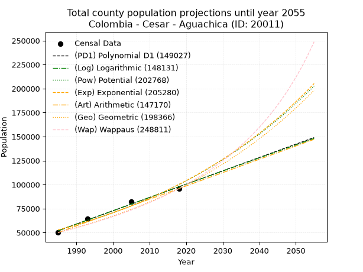
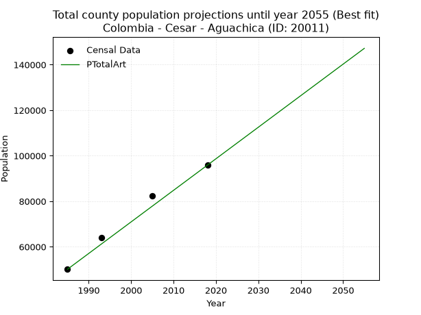
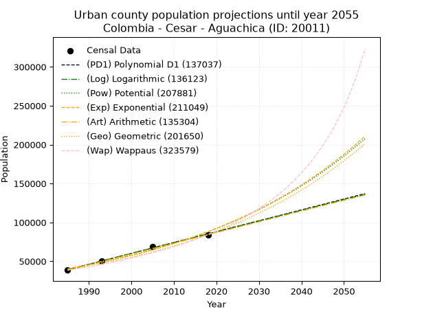
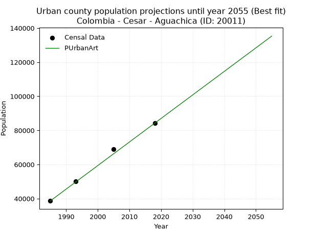
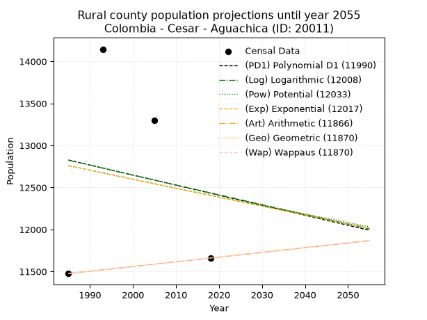
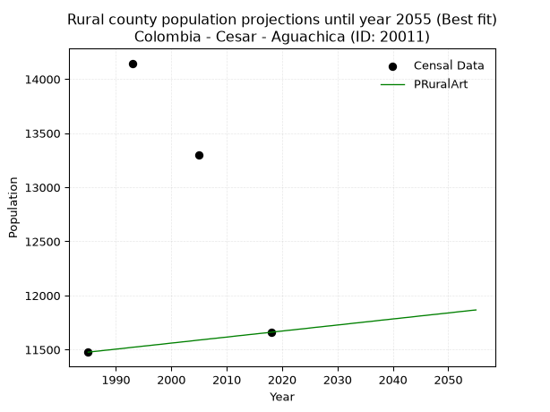

<div align="center">


</div>

# 📜 _“Population and Public Services Demand Projections (PPSD) until Year 2050 for Colombia - Cesar - Aguachica (ID: 20011)”_
Keywords: `population` `public-service` `projection` `lineal` `polynomial` `logarithmic` `potential` `exponential` `arithmetic` `geometric` `wappaus` `dane` `colombia` `south-america`

PPSD are analytical estimates used by governments and planners to anticipate future changes in population size, age distribution, and the resulting community needs for utilities, healthcare, education, and infrastructure as sizing future water treatment facilities, electrical grids, and road networks based on spatial growth.

<div align="center">

</img>

</div>


> **General running parameters**: • app_version: _v20260806_. • Python version: _3.14.7_. • Pandas version: _3.0.5_. • NumPy version: _2.5.1_. • Creates, save and include plots into reports (create_plot): _False_. • Projection until year: _2050_. • Process polynomial degree 2 and up: _False_. • Process Wappaus: _True_. • Process Wappaus: _True_. • Set negative values to zero: _True_. • Set infinite values to zero: _True_. • Drop dataset notes: _True_. 
<div align="center">

Dynamic map: [:earth_americas:Google](http://maps.google.com/maps?q=8.306811461,-73.614027) [:earth_americas:OSM](https://www.openstreetmap.org/#map=18/8.306811461/-73.614027&layers=P) [:earth_americas:Bing](https://www.bing.com/maps?cp=8.306811461~-73.614027&lvl=18) [:earth_americas:Apple](https://maps.apple.com/frame?center=8.306811461%2C-73.614027&span=0.003%2C0.006)

</div>


<div align="center">

```geojson
{
  "type": "Feature",
  "geometry": {
    "type": "Point", 
    "coordinates": [-73.614027, 8.306811461]
  }, 
  "properties": {
    "Name": "Colombia - Cesar - Aguachica (ID: 20011)"
  }
}
```

</div>


## 0. Census Data (4 records)

Census data are official statistics collected by a government about the people and housing in a country. They usually include counts of total population, age, sex, race, income, education, and jobs.

📅Global census file: [Population.xlsx](../data/Population.xlsx)

| Source   |   Year |   CountryID | CountryName   |   StateID | StateName   |   CountyID | CountyName   |   PTotal |   PUrban |   PRural |
|:---------|-------:|------------:|:--------------|----------:|:------------|-----------:|:-------------|---------:|---------:|---------:|
| DANE     |   1985 |          57 | Colombia      |        20 | Cesar       |      20011 | Aguachica    |    50131 |    38655 |    11476 |
| DANE     |   1993 |          57 | Colombia      |        20 | Cesar       |      20011 | Aguachica    |    64147 |    50001 |    14146 |
| DANE     |   2005 |          57 | Colombia      |        20 | Cesar       |      20011 | Aguachica    |    82335 |    69039 |    13296 |
| DANE     |   2018 |          57 | Colombia      |        20 | Cesar       |      20011 | Aguachica    |    95878 |    84218 |    11660 |

> 🔥Some records could had specific notes about the registered values or the corresponding urban or rural distribution.

📅[SUI-RUPS](https://www.datos.gov.co/Hacienda-y-Cr-dito-P-blico/Registro-nico-de-Prestadores-de-Servicios-P-blicos/4qkq-csdn/about_data) - Local public utility companies: [RUPS.csv](../data/RUPS.xlsx)

 | SERVICIO       | ESTADO    | NOMBRE                                                                                 | NIT         | DEPARTAMENTO_DOMICILIO   | MUNICIPIO_DOMICILIO   | DIRECCION                                   |   TELEFONO | EMAIL                                    | TIPO_PRESTADOR                             | CLASIFICACION                 |
|:---------------|:----------|:---------------------------------------------------------------------------------------|:------------|:-------------------------|:----------------------|:--------------------------------------------|-----------:|:-----------------------------------------|:-------------------------------------------|:------------------------------|
| ACUEDUCTO      | OPERATIVA | EMPRESA DE SERVICIOS PUBLICOS  DE ACUEDUCTO, ALCANTARILLADO Y ASEO DE AGUACHICA E.S.P. | 800105650-1 | CESAR                    | AGUACHICA             | Calle 5  34  69                             |    5662384 | sistemas-esp-aguachica-cesar@hotmail.com | EMPRESA INDUSTRIAL Y COMERCIAL DEL ESTADO  | MAYOR O IGUAL A 5001 USUARIOS |
| ALCANTARILLADO | OPERATIVA | EMPRESA DE SERVICIOS PUBLICOS  DE ACUEDUCTO, ALCANTARILLADO Y ASEO DE AGUACHICA E.S.P. | 800105650-1 | CESAR                    | AGUACHICA             | Calle 5  34  69                             |    5662384 | sistemas-esp-aguachica-cesar@hotmail.com | EMPRESA INDUSTRIAL Y COMERCIAL DEL ESTADO  | MAYOR O IGUAL A 5001 USUARIOS |
| ACUEDUCTO      | OPERATIVA | ASOCIACION DE USUARIOS DEL ACUEDUCTO VILLAS DE SAN ANDRES                              | 900233114-6 | CESAR                    | AGUACHICA             | KDX 130 - 02 ACUEDUCTO VILLAS DE SAN ANDRES |    5656207 | ivangestion@hotmail.com                  | ORGANIZACION AUTORIZADA                    | MENOR O IGUAL A 2500 USUARIOS |
| ACUEDUCTO      | OPERATIVA | EMPRESA DE SERVICIOS PÚBLICOS DOMICILIARIOS SERVIARAUCARIAS SAS ESP                    | 900978470-0 | RISARALDA                | SANTA ROSA DE CABAL   | CLL 13 No 9 76 esquina                      |    3659448 | admon.serviaraucarias@gmail.com          | SOCIEDADES (EMPRESA DE SERVICIOS PUBLICOS) | MENOR O IGUAL A 2500 USUARIOS |
| ALCANTARILLADO | OPERATIVA | EMPRESA DE SERVICIOS PÚBLICOS DOMICILIARIOS SERVIARAUCARIAS SAS ESP                    | 900978470-0 | RISARALDA                | SANTA ROSA DE CABAL   | CLL 13 No 9 76 esquina                      |    3659448 | admon.serviaraucarias@gmail.com          | SOCIEDADES (EMPRESA DE SERVICIOS PUBLICOS) | MENOR O IGUAL A 2500 USUARIOS |

## 1. Total

### 1.1. Coefficients and Parameters

* (PD1) Polynomial Deg 1: 1386.3705339221099, -2699964.9104777 (lineal)
* (Log) Logarithmic: 2775709.136061609, -21025064.63634134
* (Pow) Potential: 38.842288759373815, -123.37019434018417
* (Exp) Exponential: 0.019396390134079657, 1.0035758434449457e-12
* (Art) Arithmetic: Year diff. 2018 - 1985 = 33, Population diff. 95878 - 50131 = 45747, Annual growth = 1386.2727272727273
* (Geo) Geometric: Year diff. 2018 - 1985 = 33, Population diff. 95878 - 50131 = 45747, Annual growth % = 0.01984392937643098
* (Wap) Wappaus: i = 1.8988866813315992, Condition values only valid for < 200)

<sub>
Wappaus condition values: ['0.00', '1.90', '3.80', '5.70', '7.60', '9.49', '11.39', '13.29', '15.19', '17.09', '18.99', '20.89', '22.79', '24.69', '26.58', '28.48', '30.38', '32.28', '34.18', '36.08', '37.98', '39.88', '41.78', '43.67', '45.57', '47.47', '49.37', '51.27', '53.17', '55.07', '56.97', '58.87', '60.76', '62.66', '64.56', '66.46', '68.36', '70.26', '72.16', '74.06', '75.96', '77.85', '79.75', '81.65', '83.55', '85.45', '87.35', '89.25', '91.15', '93.05', '94.94', '96.84', '98.74', '100.64', '102.54', '104.44', '106.34', '108.24', '110.14', '112.03', '113.93', '115.83', '117.73', '119.63', '121.53', '123.43']
</sub>


### 1.2. Projected Dataset

|   Year |   CountyID |   PTotalPD1 |   PTotalLog |   PTotalPow |   PTotalExp |   PTotalArt |   PTotalGeo |   PTotalWap |
|-------:|-----------:|------------:|------------:|------------:|------------:|------------:|------------:|------------:|
|   1985 |      20011 |       51981 |       51933 |       52768 |       52806 |       50131 |       50131 |       50131 |
|   1986 |      20011 |       53367 |       53331 |       53811 |       53840 |       51517 |       51126 |       51092 |
|   1987 |      20011 |       54753 |       54729 |       54873 |       54895 |       52904 |       52140 |       52072 |
|   1988 |      20011 |       56140 |       56125 |       55956 |       55970 |       54290 |       53175 |       53071 |
|   1989 |      20011 |       57526 |       57521 |       57060 |       57066 |       55676 |       54230 |       54089 |
|   1990 |      20011 |       58912 |       58916 |       58185 |       58184 |       57062 |       55306 |       55128 |
|   1991 |      20011 |       60299 |       60311 |       59331 |       59324 |       58449 |       56404 |       56188 |
|   1992 |      20011 |       61685 |       61705 |       60500 |       60485 |       59835 |       57523 |       57269 |
|   1993 |      20011 |       63072 |       63098 |       61691 |       61670 |       61221 |       58665 |       58372 |
|   1994 |      20011 |       64458 |       64490 |       62905 |       62878 |       62607 |       59829 |       59499 |
|   1995 |      20011 |       65844 |       65882 |       64142 |       64109 |       63994 |       61016 |       60649 |
|   1996 |      20011 |       67231 |       67273 |       65402 |       65365 |       65380 |       62227 |       61823 |
|   1997 |      20011 |       68617 |       68663 |       66687 |       66645 |       66766 |       63462 |       63023 |
|   1998 |      20011 |       70003 |       70053 |       67997 |       67951 |       68153 |       64721 |       64249 |
|   1999 |      20011 |       71390 |       71442 |       69331 |       69281 |       69539 |       66005 |       65501 |
|   2000 |      20011 |       72776 |       72830 |       70691 |       70638 |       70925 |       67315 |       66781 |
|   2001 |      20011 |       74163 |       74217 |       72077 |       72022 |       72311 |       68651 |       68090 |
|   2002 |      20011 |       75549 |       75604 |       73490 |       73432 |       73698 |       70013 |       69429 |
|   2003 |      20011 |       76935 |       76990 |       74929 |       74871 |       75084 |       71402 |       70798 |
|   2004 |      20011 |       78322 |       78376 |       76396 |       76337 |       76470 |       72819 |       72199 |
|   2005 |      20011 |       79708 |       79760 |       77891 |       77832 |       77856 |       74264 |       73632 |
|   2006 |      20011 |       81094 |       81144 |       79414 |       79357 |       79243 |       75738 |       75100 |
|   2007 |      20011 |       82481 |       82528 |       80966 |       80911 |       80629 |       77241 |       76603 |
|   2008 |      20011 |       83867 |       83910 |       82548 |       82496 |       82015 |       78774 |       78142 |
|   2009 |      20011 |       85253 |       85292 |       84160 |       84111 |       83402 |       80337 |       79720 |
|   2010 |      20011 |       86640 |       86674 |       85803 |       85759 |       84788 |       81931 |       81336 |
|   2011 |      20011 |       88026 |       88054 |       87476 |       87438 |       86174 |       83557 |       82993 |
|   2012 |      20011 |       89413 |       89434 |       89182 |       89151 |       87560 |       85215 |       84693 |
|   2013 |      20011 |       90799 |       90813 |       90920 |       90897 |       88947 |       86906 |       86437 |
|   2014 |      20011 |       92185 |       92192 |       92691 |       92677 |       90333 |       88631 |       88226 |
|   2015 |      20011 |       93572 |       93570 |       94496 |       94492 |       91719 |       90389 |       90063 |
|   2016 |      20011 |       94958 |       94947 |       96334 |       96343 |       93105 |       92183 |       91949 |
|   2017 |      20011 |       96344 |       96324 |       98208 |       98230 |       94492 |       94012 |       93887 |
|   2018 |      20011 |       97731 |       97699 |      100117 |      100154 |       95878 |       95878 |       95878 |
|   2019 |      20011 |       99117 |       99075 |      102062 |      102116 |       97264 |       97781 |       97925 |
|   2020 |      20011 |      100504 |      100449 |      104044 |      104116 |       98651 |       99721 |      100030 |
|   2021 |      20011 |      101890 |      101823 |      106064 |      106155 |      100037 |      101700 |      102196 |
|   2022 |      20011 |      103276 |      103196 |      108121 |      108234 |      101423 |      103718 |      104426 |
|   2023 |      20011 |      104663 |      104568 |      110218 |      110354 |      102809 |      105776 |      106722 |
|   2024 |      20011 |      106049 |      105940 |      112354 |      112515 |      104196 |      107875 |      109087 |
|   2025 |      20011 |      107435 |      107311 |      114531 |      114719 |      105582 |      110016 |      111524 |
|   2026 |      20011 |      108822 |      108681 |      116748 |      116966 |      106968 |      112199 |      114037 |
|   2027 |      20011 |      110208 |      110051 |      119007 |      119256 |      108354 |      114425 |      116629 |
|   2028 |      20011 |      111595 |      111420 |      121309 |      121592 |      109741 |      116696 |      119305 |
|   2029 |      20011 |      112981 |      112789 |      123655 |      123974 |      111127 |      119012 |      122068 |
|   2030 |      20011 |      114367 |      114156 |      126044 |      126402 |      112513 |      121373 |      124923 |
|   2031 |      20011 |      115754 |      115523 |      128478 |      128877 |      113900 |      123782 |      127873 |
|   2032 |      20011 |      117140 |      116890 |      130958 |      131402 |      115286 |      126238 |      130925 |
|   2033 |      20011 |      118526 |      118255 |      133485 |      133975 |      116672 |      128743 |      134084 |
|   2034 |      20011 |      119913 |      119620 |      136059 |      136599 |      118058 |      131298 |      137354 |
|   2035 |      20011 |      121299 |      120985 |      138682 |      139275 |      119445 |      133904 |      140743 |
|   2036 |      20011 |      122685 |      122348 |      141354 |      142002 |      120831 |      136561 |      144257 |
|   2037 |      20011 |      124072 |      123711 |      144076 |      144784 |      122217 |      139271 |      147902 |
|   2038 |      20011 |      125458 |      125073 |      146849 |      147619 |      123603 |      142034 |      151687 |
|   2039 |      20011 |      126845 |      126435 |      149674 |      150510 |      124990 |      144853 |      155619 |
|   2040 |      20011 |      128231 |      127796 |      152551 |      153458 |      126376 |      147727 |      159707 |
|   2041 |      20011 |      129617 |      129156 |      155483 |      156464 |      127762 |      150659 |      163961 |
|   2042 |      20011 |      131004 |      130516 |      158470 |      159528 |      129149 |      153648 |      168392 |
|   2043 |      20011 |      132390 |      131875 |      161512 |      162653 |      130535 |      156697 |      173009 |
|   2044 |      20011 |      133776 |      133233 |      164612 |      165839 |      131921 |      159807 |      177826 |
|   2045 |      20011 |      135163 |      134591 |      167769 |      169087 |      133307 |      162978 |      182855 |
|   2046 |      20011 |      136549 |      135948 |      170985 |      172398 |      134694 |      166212 |      188112 |
|   2047 |      20011 |      137936 |      137304 |      174261 |      175775 |      136080 |      169511 |      193611 |
|   2048 |      20011 |      139322 |      138660 |      177599 |      179217 |      137466 |      172874 |      199370 |
|   2049 |      20011 |      140708 |      140015 |      180998 |      182728 |      138852 |      176305 |      205407 |
|   2050 |      20011 |      142095 |      141369 |      184461 |      186306 |      140239 |      179803 |      211744 |
<div align="center">

</img>

</div>


### 1.3. Best fit with absolute and relative error (%)

Relative error puts that difference into context by dividing the absolute error by the true value, creating a unitless ratio or percentage that shows the scale of the mistake.

Absolute and relative error

|   Year | Source   |   CountryID | CountryName   |   StateID | StateName   |   CountyID_x | CountyName   |   PTotal |   PUrban |   PRural |   CountyID_y |   PTotalPD1 |   PTotalLog |   PTotalPow |   PTotalExp |   PTotalArt |   PTotalGeo |   PTotalWap |   PTotalPD1AbsError |   PTotalLogAbsError |   PTotalPowAbsError |   PTotalExpAbsError |   PTotalArtAbsError |   PTotalGeoAbsError |   PTotalWapAbsError |   PTotalPD1RelError |   PTotalLogRelError |   PTotalPowRelError |   PTotalExpRelError |   PTotalArtRelError |   PTotalGeoRelError |   PTotalWapRelError |
|-------:|:---------|------------:|:--------------|----------:|:------------|-------------:|:-------------|---------:|---------:|---------:|-------------:|------------:|------------:|------------:|------------:|------------:|------------:|------------:|--------------------:|--------------------:|--------------------:|--------------------:|--------------------:|--------------------:|--------------------:|--------------------:|--------------------:|--------------------:|--------------------:|--------------------:|--------------------:|--------------------:|
|   1985 | DANE     |          57 | Colombia      |        20 | Cesar       |        20011 | Aguachica    |    50131 |    38655 |    11476 |        20011 |       51981 |       51933 |       52768 |       52806 |       50131 |       50131 |       50131 |                1850 |                1802 |                2637 |                2675 |                   0 |                   0 |                   0 |             3.69033 |             3.59458 |             5.26022 |             5.33602 |             0       |             0       |             0       |
|   1993 | DANE     |          57 | Colombia      |        20 | Cesar       |        20011 | Aguachica    |    64147 |    50001 |    14146 |        20011 |       63072 |       63098 |       61691 |       61670 |       61221 |       58665 |       58372 |                1075 |                1049 |                2456 |                2477 |                2926 |                5482 |                5775 |             1.67584 |             1.63531 |             3.82871 |             3.86144 |             4.5614  |             8.546   |             9.00276 |
|   2005 | DANE     |          57 | Colombia      |        20 | Cesar       |        20011 | Aguachica    |    82335 |    69039 |    13296 |        20011 |       79708 |       79760 |       77891 |       77832 |       77856 |       74264 |       73632 |                2627 |                2575 |                4444 |                4503 |                4479 |                8071 |                8703 |             3.19062 |             3.12747 |             5.39746 |             5.46912 |             5.43997 |             9.80264 |            10.5702  |
|   2018 | DANE     |          57 | Colombia      |        20 | Cesar       |        20011 | Aguachica    |    95878 |    84218 |    11660 |        20011 |       97731 |       97699 |      100117 |      100154 |       95878 |       95878 |       95878 |                1853 |                1821 |                4239 |                4276 |                   0 |                   0 |                   0 |             1.93266 |             1.89929 |             4.42124 |             4.45983 |             0       |             0       |             0       |

Relative error mean

| Method    |   RelError | Best   |
|:----------|-----------:|:-------|
| PTotalPD1 |    2.62236 |        |
| PTotalLog |    2.56416 |        |
| PTotalPow |    4.72691 |        |
| PTotalExp |    4.7816  |        |
| PTotalArt |    2.50034 | True   |
| PTotalGeo |    4.58716 |        |
| PTotalWap |    4.89325 |        |

💙Best method: _**PTotalArt**_
<div align="center">

</img>

</div>


### 1.4. Fresh water supply demand in liters per capita per day (lpcd)

The fresh water supply demand typically ranges from 100 to 300 liters per capita per day (lpcd) for standard domestic and municipal planning, though absolute survival minimums set by the World Health Organization are as low as 7.5 to 20 liters per day, and total consumption in high-income nations can exceed 400 liters.

> `CZ`: Level in meters above the sea level (masl)<br> `WS`: Fresh water supply demand in liters per capita per day (lpcd or l/h/d)<br> `WSAll`: Zonal fresh water supply demand in liters per second (l/s)<br> `A`: Zonal area in square meters<br> `DP`: Population density (people/hectare or p/ha)

Reference values (RAS Colombia)

|    CZ |   WS |
|------:|-----:|
|  1000 |  120 |
|  2000 |  130 |
| 99999 |  140 |

County shapefile geometry properties and water supply values

|   CountyID |      ATotal |   CZTotal |   WSTotal |
|-----------:|------------:|----------:|----------:|
|      20011 | 8.76318e+08 |   297.466 |       120 |

Projected values for best method: PTotalArt

|   CountyID |   Year |   PTotalArt |   DPTotal |   WSTotal |   WSTotalAll |
|-----------:|-------:|------------:|----------:|----------:|-------------:|
|      20011 |   1985 |       50131 |      0.57 |       120 |      69.6264 |
|      20011 |   1986 |       51517 |      0.59 |       120 |      71.5514 |
|      20011 |   1987 |       52904 |      0.6  |       120 |      73.4778 |
|      20011 |   1988 |       54290 |      0.62 |       120 |      75.4028 |
|      20011 |   1989 |       55676 |      0.64 |       120 |      77.3278 |
|      20011 |   1990 |       57062 |      0.65 |       120 |      79.2528 |
|      20011 |   1991 |       58449 |      0.67 |       120 |      81.1792 |
|      20011 |   1992 |       59835 |      0.68 |       120 |      83.1042 |
|      20011 |   1993 |       61221 |      0.7  |       120 |      85.0292 |
|      20011 |   1994 |       62607 |      0.71 |       120 |      86.9542 |
|      20011 |   1995 |       63994 |      0.73 |       120 |      88.8806 |
|      20011 |   1996 |       65380 |      0.75 |       120 |      90.8056 |
|      20011 |   1997 |       66766 |      0.76 |       120 |      92.7306 |
|      20011 |   1998 |       68153 |      0.78 |       120 |      94.6569 |
|      20011 |   1999 |       69539 |      0.79 |       120 |      96.5819 |
|      20011 |   2000 |       70925 |      0.81 |       120 |      98.5069 |
|      20011 |   2001 |       72311 |      0.83 |       120 |     100.432  |
|      20011 |   2002 |       73698 |      0.84 |       120 |     102.358  |
|      20011 |   2003 |       75084 |      0.86 |       120 |     104.283  |
|      20011 |   2004 |       76470 |      0.87 |       120 |     106.208  |
|      20011 |   2005 |       77856 |      0.89 |       120 |     108.133  |
|      20011 |   2006 |       79243 |      0.9  |       120 |     110.06   |
|      20011 |   2007 |       80629 |      0.92 |       120 |     111.985  |
|      20011 |   2008 |       82015 |      0.94 |       120 |     113.91   |
|      20011 |   2009 |       83402 |      0.95 |       120 |     115.836  |
|      20011 |   2010 |       84788 |      0.97 |       120 |     117.761  |
|      20011 |   2011 |       86174 |      0.98 |       120 |     119.686  |
|      20011 |   2012 |       87560 |      1    |       120 |     121.611  |
|      20011 |   2013 |       88947 |      1.02 |       120 |     123.537  |
|      20011 |   2014 |       90333 |      1.03 |       120 |     125.463  |
|      20011 |   2015 |       91719 |      1.05 |       120 |     127.388  |
|      20011 |   2016 |       93105 |      1.06 |       120 |     129.312  |
|      20011 |   2017 |       94492 |      1.08 |       120 |     131.239  |
|      20011 |   2018 |       95878 |      1.09 |       120 |     133.164  |
|      20011 |   2019 |       97264 |      1.11 |       120 |     135.089  |
|      20011 |   2020 |       98651 |      1.13 |       120 |     137.015  |
|      20011 |   2021 |      100037 |      1.14 |       120 |     138.94   |
|      20011 |   2022 |      101423 |      1.16 |       120 |     140.865  |
|      20011 |   2023 |      102809 |      1.17 |       120 |     142.79   |
|      20011 |   2024 |      104196 |      1.19 |       120 |     144.717  |
|      20011 |   2025 |      105582 |      1.2  |       120 |     146.642  |
|      20011 |   2026 |      106968 |      1.22 |       120 |     148.567  |
|      20011 |   2027 |      108354 |      1.24 |       120 |     150.492  |
|      20011 |   2028 |      109741 |      1.25 |       120 |     152.418  |
|      20011 |   2029 |      111127 |      1.27 |       120 |     154.343  |
|      20011 |   2030 |      112513 |      1.28 |       120 |     156.268  |
|      20011 |   2031 |      113900 |      1.3  |       120 |     158.194  |
|      20011 |   2032 |      115286 |      1.32 |       120 |     160.119  |
|      20011 |   2033 |      116672 |      1.33 |       120 |     162.044  |
|      20011 |   2034 |      118058 |      1.35 |       120 |     163.969  |
|      20011 |   2035 |      119445 |      1.36 |       120 |     165.896  |
|      20011 |   2036 |      120831 |      1.38 |       120 |     167.821  |
|      20011 |   2037 |      122217 |      1.39 |       120 |     169.746  |
|      20011 |   2038 |      123603 |      1.41 |       120 |     171.671  |
|      20011 |   2039 |      124990 |      1.43 |       120 |     173.597  |
|      20011 |   2040 |      126376 |      1.44 |       120 |     175.522  |
|      20011 |   2041 |      127762 |      1.46 |       120 |     177.447  |
|      20011 |   2042 |      129149 |      1.47 |       120 |     179.374  |
|      20011 |   2043 |      130535 |      1.49 |       120 |     181.299  |
|      20011 |   2044 |      131921 |      1.51 |       120 |     183.224  |
|      20011 |   2045 |      133307 |      1.52 |       120 |     185.149  |
|      20011 |   2046 |      134694 |      1.54 |       120 |     187.075  |
|      20011 |   2047 |      136080 |      1.55 |       120 |     189      |
|      20011 |   2048 |      137466 |      1.57 |       120 |     190.925  |
|      20011 |   2049 |      138852 |      1.58 |       120 |     192.85   |
|      20011 |   2050 |      140239 |      1.6  |       120 |     194.776  |

## 2. Urban

### 2.1. Coefficients and Parameters

* (PD1) Polynomial Deg 1: 1398.3279807306199, -2736527.2934564226 (lineal)
* (Log) Logarithmic: 2799267.831480277, -21216778.969006177
* (Pow) Potential: 47.30266695222924, -151.38701996353873
* (Exp) Exponential: 0.023623558557598928, 1.7415814955473776e-16
* (Art) Arithmetic: Year diff. 2018 - 1985 = 33, Population diff. 84218 - 38655 = 45563, Annual growth = 1380.6969696969697
* (Geo) Geometric: Year diff. 2018 - 1985 = 33, Population diff. 84218 - 38655 = 45563, Annual growth % = 0.023878590710516345
* (Wap) Wappaus: i = 2.2473561640018063, Condition values only valid for < 200)

<sub>
Wappaus condition values: ['0.00', '2.25', '4.49', '6.74', '8.99', '11.24', '13.48', '15.73', '17.98', '20.23', '22.47', '24.72', '26.97', '29.22', '31.46', '33.71', '35.96', '38.21', '40.45', '42.70', '44.95', '47.19', '49.44', '51.69', '53.94', '56.18', '58.43', '60.68', '62.93', '65.17', '67.42', '69.67', '71.92', '74.16', '76.41', '78.66', '80.90', '83.15', '85.40', '87.65', '89.89', '92.14', '94.39', '96.64', '98.88', '101.13', '103.38', '105.63', '107.87', '110.12', '112.37', '114.62', '116.86', '119.11', '121.36', '123.60', '125.85', '128.10', '130.35', '132.59', '134.84', '137.09', '139.34', '141.58', '143.83', '146.08']
</sub>


### 2.2. Projected Dataset

|   Year |   CountyID |   PUrbanPD1 |   PUrbanLog |   PUrbanPow |   PUrbanExp |   PUrbanArt |   PUrbanGeo |   PUrbanWap |
|-------:|-----------:|------------:|------------:|------------:|------------:|------------:|------------:|------------:|
|   1985 |      20011 |       39154 |       39109 |       40350 |       40384 |       38655 |       38655 |       38655 |
|   1986 |      20011 |       40552 |       40519 |       41323 |       41350 |       40036 |       39578 |       39534 |
|   1987 |      20011 |       41950 |       41928 |       42319 |       42338 |       41416 |       40523 |       40432 |
|   1988 |      20011 |       43349 |       43337 |       43338 |       43350 |       42797 |       41491 |       41352 |
|   1989 |      20011 |       44747 |       44744 |       44382 |       44386 |       44178 |       42481 |       42293 |
|   1990 |      20011 |       46145 |       46151 |       45449 |       45448 |       45558 |       43496 |       43257 |
|   1991 |      20011 |       47544 |       47558 |       46542 |       46534 |       46939 |       44534 |       44244 |
|   1992 |      20011 |       48942 |       48963 |       47661 |       47646 |       48320 |       45598 |       45255 |
|   1993 |      20011 |       50340 |       50368 |       48806 |       48785 |       49701 |       46687 |       46291 |
|   1994 |      20011 |       51739 |       51772 |       49978 |       49952 |       51081 |       47802 |       47353 |
|   1995 |      20011 |       53137 |       53176 |       51178 |       51146 |       52462 |       48943 |       48442 |
|   1996 |      20011 |       54535 |       54579 |       52405 |       52368 |       53843 |       50112 |       49559 |
|   1997 |      20011 |       55934 |       55981 |       53662 |       53620 |       55223 |       51308 |       50704 |
|   1998 |      20011 |       57332 |       57382 |       54948 |       54902 |       56604 |       52533 |       51880 |
|   1999 |      20011 |       58730 |       58783 |       56264 |       56214 |       57985 |       53788 |       53087 |
|   2000 |      20011 |       60129 |       60183 |       57611 |       57558 |       59365 |       55072 |       54327 |
|   2001 |      20011 |       61527 |       61582 |       58989 |       58934 |       60746 |       56387 |       55601 |
|   2002 |      20011 |       62925 |       62981 |       60400 |       60343 |       62127 |       57734 |       56910 |
|   2003 |      20011 |       64324 |       64379 |       61844 |       61785 |       63508 |       59112 |       58257 |
|   2004 |      20011 |       65722 |       65776 |       63321 |       63262 |       64888 |       60524 |       59641 |
|   2005 |      20011 |       67120 |       67172 |       64833 |       64774 |       66269 |       61969 |       61066 |
|   2006 |      20011 |       68519 |       68568 |       66380 |       66323 |       67650 |       63449 |       62532 |
|   2007 |      20011 |       69917 |       69963 |       67964 |       67908 |       69030 |       64964 |       64043 |
|   2008 |      20011 |       71315 |       71358 |       69584 |       69532 |       70411 |       66515 |       65599 |
|   2009 |      20011 |       72714 |       72751 |       71243 |       71194 |       71792 |       68103 |       67203 |
|   2010 |      20011 |       74112 |       74144 |       72940 |       72896 |       73172 |       69730 |       68857 |
|   2011 |      20011 |       75510 |       75537 |       74676 |       74638 |       74553 |       71395 |       70564 |
|   2012 |      20011 |       76909 |       76928 |       76453 |       76422 |       75934 |       73099 |       72326 |
|   2013 |      20011 |       78307 |       78319 |       78271 |       78249 |       77315 |       74845 |       74145 |
|   2014 |      20011 |       79705 |       79709 |       80132 |       80120 |       78695 |       76632 |       76026 |
|   2015 |      20011 |       81104 |       81099 |       82036 |       82035 |       80076 |       78462 |       77970 |
|   2016 |      20011 |       82502 |       82488 |       83984 |       83996 |       81457 |       80336 |       79981 |
|   2017 |      20011 |       83900 |       83876 |       85977 |       86004 |       82837 |       82254 |       82062 |
|   2018 |      20011 |       85299 |       85263 |       88017 |       88060 |       84218 |       84218 |       84218 |
|   2019 |      20011 |       86697 |       86650 |       90104 |       90165 |       85599 |       86229 |       86452 |
|   2020 |      20011 |       88095 |       88036 |       92239 |       92320 |       86979 |       88288 |       88769 |
|   2021 |      20011 |       89494 |       89422 |       94424 |       94527 |       88360 |       90396 |       91174 |
|   2022 |      20011 |       90892 |       90807 |       96660 |       96787 |       89741 |       92555 |       93671 |
|   2023 |      20011 |       92290 |       92191 |       98947 |       99101 |       91121 |       94765 |       96266 |
|   2024 |      20011 |       93689 |       93574 |      101287 |      101470 |       92502 |       97028 |       98965 |
|   2025 |      20011 |       95087 |       94957 |      103682 |      103895 |       93883 |       99345 |      101774 |
|   2026 |      20011 |       96485 |       96339 |      106131 |      106379 |       95264 |      101717 |      104700 |
|   2027 |      20011 |       97884 |       97720 |      108638 |      108922 |       96644 |      104146 |      107750 |
|   2028 |      20011 |       99282 |       99101 |      111202 |      111526 |       98025 |      106632 |      110933 |
|   2029 |      20011 |      100680 |      100481 |      113826 |      114192 |       99406 |      109179 |      114258 |
|   2030 |      20011 |      102079 |      101860 |      116510 |      116921 |      100786 |      111786 |      117734 |
|   2031 |      20011 |      103477 |      103239 |      119256 |      119716 |      102167 |      114455 |      121371 |
|   2032 |      20011 |      104875 |      104617 |      122066 |      122578 |      103548 |      117188 |      125182 |
|   2033 |      20011 |      106273 |      105994 |      124940 |      125508 |      104928 |      119986 |      129179 |
|   2034 |      20011 |      107672 |      107370 |      127880 |      128508 |      106309 |      122851 |      133375 |
|   2035 |      20011 |      109070 |      108746 |      130888 |      131580 |      107690 |      125785 |      137787 |
|   2036 |      20011 |      110468 |      110121 |      133966 |      134726 |      109071 |      128789 |      142431 |
|   2037 |      20011 |      111867 |      111496 |      137114 |      137946 |      110451 |      131864 |      147326 |
|   2038 |      20011 |      113265 |      112870 |      140334 |      141244 |      111832 |      135013 |      152493 |
|   2039 |      20011 |      114663 |      114243 |      143629 |      144620 |      113213 |      138236 |      157956 |
|   2040 |      20011 |      116062 |      115616 |      146999 |      148078 |      114593 |      141537 |      163739 |
|   2041 |      20011 |      117460 |      116987 |      150446 |      151617 |      115974 |      144917 |      169874 |
|   2042 |      20011 |      118858 |      118359 |      153973 |      155242 |      117355 |      148377 |      176392 |
|   2043 |      20011 |      120257 |      119729 |      157580 |      158953 |      118735 |      151921 |      183330 |
|   2044 |      20011 |      121655 |      121099 |      161271 |      162752 |      120116 |      155548 |      190731 |
|   2045 |      20011 |      123053 |      122468 |      165045 |      166643 |      121497 |      159262 |      198643 |
|   2046 |      20011 |      124452 |      123837 |      168906 |      170627 |      122878 |      163065 |      207120 |
|   2047 |      20011 |      125850 |      125205 |      172856 |      174705 |      124258 |      166959 |      216225 |
|   2048 |      20011 |      127248 |      126572 |      176896 |      178882 |      125639 |      170946 |      226030 |
|   2049 |      20011 |      128647 |      127938 |      181028 |      183158 |      127020 |      175028 |      236620 |
|   2050 |      20011 |      130045 |      129304 |      185255 |      187536 |      128400 |      179207 |      248093 |
<div align="center">

</img>

</div>


### 2.3. Best fit with absolute and relative error (%)

Relative error puts that difference into context by dividing the absolute error by the true value, creating a unitless ratio or percentage that shows the scale of the mistake.

Absolute and relative error

|   Year | Source   |   CountryID | CountryName   |   StateID | StateName   |   CountyID_x | CountyName   |   PTotal |   PUrban |   PRural |   CountyID_y |   PUrbanPD1 |   PUrbanLog |   PUrbanPow |   PUrbanExp |   PUrbanArt |   PUrbanGeo |   PUrbanWap |   PUrbanPD1AbsError |   PUrbanLogAbsError |   PUrbanPowAbsError |   PUrbanExpAbsError |   PUrbanArtAbsError |   PUrbanGeoAbsError |   PUrbanWapAbsError |   PUrbanPD1RelError |   PUrbanLogRelError |   PUrbanPowRelError |   PUrbanExpRelError |   PUrbanArtRelError |   PUrbanGeoRelError |   PUrbanWapRelError |
|-------:|:---------|------------:|:--------------|----------:|:------------|-------------:|:-------------|---------:|---------:|---------:|-------------:|------------:|------------:|------------:|------------:|------------:|------------:|------------:|--------------------:|--------------------:|--------------------:|--------------------:|--------------------:|--------------------:|--------------------:|--------------------:|--------------------:|--------------------:|--------------------:|--------------------:|--------------------:|--------------------:|
|   1985 | DANE     |          57 | Colombia      |        20 | Cesar       |        20011 | Aguachica    |    50131 |    38655 |    11476 |        20011 |       39154 |       39109 |       40350 |       40384 |       38655 |       38655 |       38655 |                 499 |                 454 |                1695 |                1729 |                   0 |                   0 |                   0 |            1.29091  |            1.17449  |             4.38494 |             4.4729  |            0        |             0       |             0       |
|   1993 | DANE     |          57 | Colombia      |        20 | Cesar       |        20011 | Aguachica    |    64147 |    50001 |    14146 |        20011 |       50340 |       50368 |       48806 |       48785 |       49701 |       46687 |       46291 |                 339 |                 367 |                1195 |                1216 |                 300 |                3314 |                3710 |            0.677986 |            0.733985 |             2.38995 |             2.43195 |            0.599988 |             6.62787 |             7.41985 |
|   2005 | DANE     |          57 | Colombia      |        20 | Cesar       |        20011 | Aguachica    |    82335 |    69039 |    13296 |        20011 |       67120 |       67172 |       64833 |       64774 |       66269 |       61969 |       61066 |                1919 |                1867 |                4206 |                4265 |                2770 |                7070 |                7973 |            2.77959  |            2.70427  |             6.09221 |             6.17767 |            4.01222  |            10.2406  |            11.5485  |
|   2018 | DANE     |          57 | Colombia      |        20 | Cesar       |        20011 | Aguachica    |    95878 |    84218 |    11660 |        20011 |       85299 |       85263 |       88017 |       88060 |       84218 |       84218 |       84218 |                1081 |                1045 |                3799 |                3842 |                   0 |                   0 |                   0 |            1.28357  |            1.24083  |             4.51091 |             4.56197 |            0        |             0       |             0       |

Relative error mean

| Method    |   RelError | Best   |
|:----------|-----------:|:-------|
| PUrbanPD1 |    1.50801 |        |
| PUrbanLog |    1.46339 |        |
| PUrbanPow |    4.3445  |        |
| PUrbanExp |    4.41112 |        |
| PUrbanArt |    1.15305 | True   |
| PUrbanGeo |    4.21711 |        |
| PUrbanWap |    4.7421  |        |

💙Best method: _**PUrbanArt**_
<div align="center">

</img>

</div>


### 2.4. Fresh water supply demand in liters per capita per day (lpcd)

The fresh water supply demand typically ranges from 100 to 300 liters per capita per day (lpcd) for standard domestic and municipal planning, though absolute survival minimums set by the World Health Organization are as low as 7.5 to 20 liters per day, and total consumption in high-income nations can exceed 400 liters.

> `CZ`: Level in meters above the sea level (masl)<br> `WS`: Fresh water supply demand in liters per capita per day (lpcd or l/h/d)<br> `WSAll`: Zonal fresh water supply demand in liters per second (l/s)<br> `A`: Zonal area in square meters<br> `DP`: Population density (people/hectare or p/ha)

Reference values (RAS Colombia)

|    CZ |   WS |
|------:|-----:|
|  1000 |  120 |
|  2000 |  130 |
| 99999 |  140 |

County shapefile geometry properties and water supply values

|   CountyID |      AUrban |   CZUrban |   WSUrban |
|-----------:|------------:|----------:|----------:|
|      20011 | 1.15359e+07 |   164.798 |       120 |

Projected values for best method: PUrbanArt

|   CountyID |   Year |   PUrbanArt |   DPUrban |   WSUrban |   WSUrbanAll |
|-----------:|-------:|------------:|----------:|----------:|-------------:|
|      20011 |   1985 |       38655 |     33.51 |       120 |      53.6875 |
|      20011 |   1986 |       40036 |     34.71 |       120 |      55.6056 |
|      20011 |   1987 |       41416 |     35.9  |       120 |      57.5222 |
|      20011 |   1988 |       42797 |     37.1  |       120 |      59.4403 |
|      20011 |   1989 |       44178 |     38.3  |       120 |      61.3583 |
|      20011 |   1990 |       45558 |     39.49 |       120 |      63.275  |
|      20011 |   1991 |       46939 |     40.69 |       120 |      65.1931 |
|      20011 |   1992 |       48320 |     41.89 |       120 |      67.1111 |
|      20011 |   1993 |       49701 |     43.08 |       120 |      69.0292 |
|      20011 |   1994 |       51081 |     44.28 |       120 |      70.9458 |
|      20011 |   1995 |       52462 |     45.48 |       120 |      72.8639 |
|      20011 |   1996 |       53843 |     46.67 |       120 |      74.7819 |
|      20011 |   1997 |       55223 |     47.87 |       120 |      76.6986 |
|      20011 |   1998 |       56604 |     49.07 |       120 |      78.6167 |
|      20011 |   1999 |       57985 |     50.26 |       120 |      80.5347 |
|      20011 |   2000 |       59365 |     51.46 |       120 |      82.4514 |
|      20011 |   2001 |       60746 |     52.66 |       120 |      84.3694 |
|      20011 |   2002 |       62127 |     53.86 |       120 |      86.2875 |
|      20011 |   2003 |       63508 |     55.05 |       120 |      88.2056 |
|      20011 |   2004 |       64888 |     56.25 |       120 |      90.1222 |
|      20011 |   2005 |       66269 |     57.45 |       120 |      92.0403 |
|      20011 |   2006 |       67650 |     58.64 |       120 |      93.9583 |
|      20011 |   2007 |       69030 |     59.84 |       120 |      95.875  |
|      20011 |   2008 |       70411 |     61.04 |       120 |      97.7931 |
|      20011 |   2009 |       71792 |     62.23 |       120 |      99.7111 |
|      20011 |   2010 |       73172 |     63.43 |       120 |     101.628  |
|      20011 |   2011 |       74553 |     64.63 |       120 |     103.546  |
|      20011 |   2012 |       75934 |     65.82 |       120 |     105.464  |
|      20011 |   2013 |       77315 |     67.02 |       120 |     107.382  |
|      20011 |   2014 |       78695 |     68.22 |       120 |     109.299  |
|      20011 |   2015 |       80076 |     69.41 |       120 |     111.217  |
|      20011 |   2016 |       81457 |     70.61 |       120 |     113.135  |
|      20011 |   2017 |       82837 |     71.81 |       120 |     115.051  |
|      20011 |   2018 |       84218 |     73.01 |       120 |     116.969  |
|      20011 |   2019 |       85599 |     74.2  |       120 |     118.888  |
|      20011 |   2020 |       86979 |     75.4  |       120 |     120.804  |
|      20011 |   2021 |       88360 |     76.6  |       120 |     122.722  |
|      20011 |   2022 |       89741 |     77.79 |       120 |     124.64   |
|      20011 |   2023 |       91121 |     78.99 |       120 |     126.557  |
|      20011 |   2024 |       92502 |     80.19 |       120 |     128.475  |
|      20011 |   2025 |       93883 |     81.38 |       120 |     130.393  |
|      20011 |   2026 |       95264 |     82.58 |       120 |     132.311  |
|      20011 |   2027 |       96644 |     83.78 |       120 |     134.228  |
|      20011 |   2028 |       98025 |     84.97 |       120 |     136.146  |
|      20011 |   2029 |       99406 |     86.17 |       120 |     138.064  |
|      20011 |   2030 |      100786 |     87.37 |       120 |     139.981  |
|      20011 |   2031 |      102167 |     88.56 |       120 |     141.899  |
|      20011 |   2032 |      103548 |     89.76 |       120 |     143.817  |
|      20011 |   2033 |      104928 |     90.96 |       120 |     145.733  |
|      20011 |   2034 |      106309 |     92.16 |       120 |     147.651  |
|      20011 |   2035 |      107690 |     93.35 |       120 |     149.569  |
|      20011 |   2036 |      109071 |     94.55 |       120 |     151.488  |
|      20011 |   2037 |      110451 |     95.75 |       120 |     153.404  |
|      20011 |   2038 |      111832 |     96.94 |       120 |     155.322  |
|      20011 |   2039 |      113213 |     98.14 |       120 |     157.24   |
|      20011 |   2040 |      114593 |     99.34 |       120 |     159.157  |
|      20011 |   2041 |      115974 |    100.53 |       120 |     161.075  |
|      20011 |   2042 |      117355 |    101.73 |       120 |     162.993  |
|      20011 |   2043 |      118735 |    102.93 |       120 |     164.91   |
|      20011 |   2044 |      120116 |    104.12 |       120 |     166.828  |
|      20011 |   2045 |      121497 |    105.32 |       120 |     168.746  |
|      20011 |   2046 |      122878 |    106.52 |       120 |     170.664  |
|      20011 |   2047 |      124258 |    107.71 |       120 |     172.581  |
|      20011 |   2048 |      125639 |    108.91 |       120 |     174.499  |
|      20011 |   2049 |      127020 |    110.11 |       120 |     176.417  |
|      20011 |   2050 |      128400 |    111.31 |       120 |     178.333  |

## 3. Rural

### 3.1. Coefficients and Parameters

* (PD1) Polynomial Deg 1: -11.957446808509603, 36562.38297872134 (lineal)
* (Log) Logarithmic: -23558.695418667907, 191714.3326648317
* (Pow) Potential: -1.6895794166421207, 9.677640724793108
* (Exp) Exponential: -0.0008590118327703284, 70215.40437080963
* (Art) Arithmetic: Year diff. 2018 - 1985 = 33, Population diff. 11660 - 11476 = 184, Annual growth = 5.575757575757576
* (Geo) Geometric: Year diff. 2018 - 1985 = 33, Population diff. 11660 - 11476 = 184, Annual growth % = 0.0004821247545920837
* (Wap) Wappaus: i = 0.04819984073096106, Condition values only valid for < 200)

<sub>
Wappaus condition values: ['0.00', '0.05', '0.10', '0.14', '0.19', '0.24', '0.29', '0.34', '0.39', '0.43', '0.48', '0.53', '0.58', '0.63', '0.67', '0.72', '0.77', '0.82', '0.87', '0.92', '0.96', '1.01', '1.06', '1.11', '1.16', '1.20', '1.25', '1.30', '1.35', '1.40', '1.45', '1.49', '1.54', '1.59', '1.64', '1.69', '1.74', '1.78', '1.83', '1.88', '1.93', '1.98', '2.02', '2.07', '2.12', '2.17', '2.22', '2.27', '2.31', '2.36', '2.41', '2.46', '2.51', '2.55', '2.60', '2.65', '2.70', '2.75', '2.80', '2.84', '2.89', '2.94', '2.99', '3.04', '3.08', '3.13']
</sub>


### 3.2. Projected Dataset

|   Year |   CountyID |   PRuralPD1 |   PRuralLog |   PRuralPow |   PRuralExp |   PRuralArt |   PRuralGeo |   PRuralWap |
|-------:|-----------:|------------:|------------:|------------:|------------:|------------:|------------:|------------:|
|   1985 |      20011 |       12827 |       12824 |       12759 |       12761 |       11476 |       11476 |       11476 |
|   1986 |      20011 |       12815 |       12812 |       12748 |       12750 |       11482 |       11482 |       11482 |
|   1987 |      20011 |       12803 |       12801 |       12737 |       12740 |       11487 |       11487 |       11487 |
|   1988 |      20011 |       12791 |       12789 |       12726 |       12729 |       11493 |       11493 |       11493 |
|   1989 |      20011 |       12779 |       12777 |       12716 |       12718 |       11498 |       11498 |       11498 |
|   1990 |      20011 |       12767 |       12765 |       12705 |       12707 |       11504 |       11504 |       11504 |
|   1991 |      20011 |       12755 |       12753 |       12694 |       12696 |       11509 |       11509 |       11509 |
|   1992 |      20011 |       12743 |       12741 |       12683 |       12685 |       11515 |       11515 |       11515 |
|   1993 |      20011 |       12731 |       12730 |       12672 |       12674 |       11521 |       11520 |       11520 |
|   1994 |      20011 |       12719 |       12718 |       12662 |       12663 |       11526 |       11526 |       11526 |
|   1995 |      20011 |       12707 |       12706 |       12651 |       12652 |       11532 |       11531 |       11531 |
|   1996 |      20011 |       12695 |       12694 |       12640 |       12641 |       11537 |       11537 |       11537 |
|   1997 |      20011 |       12683 |       12682 |       12630 |       12631 |       11543 |       11543 |       11543 |
|   1998 |      20011 |       12671 |       12671 |       12619 |       12620 |       11548 |       11548 |       11548 |
|   1999 |      20011 |       12659 |       12659 |       12608 |       12609 |       11554 |       11554 |       11554 |
|   2000 |      20011 |       12647 |       12647 |       12598 |       12598 |       11560 |       11559 |       11559 |
|   2001 |      20011 |       12636 |       12635 |       12587 |       12587 |       11565 |       11565 |       11565 |
|   2002 |      20011 |       12624 |       12623 |       12576 |       12576 |       11571 |       11570 |       11570 |
|   2003 |      20011 |       12612 |       12612 |       12566 |       12566 |       11576 |       11576 |       11576 |
|   2004 |      20011 |       12600 |       12600 |       12555 |       12555 |       11582 |       11582 |       11582 |
|   2005 |      20011 |       12588 |       12588 |       12545 |       12544 |       11588 |       11587 |       11587 |
|   2006 |      20011 |       12576 |       12576 |       12534 |       12533 |       11593 |       11593 |       11593 |
|   2007 |      20011 |       12564 |       12565 |       12523 |       12523 |       11599 |       11598 |       11598 |
|   2008 |      20011 |       12552 |       12553 |       12513 |       12512 |       11604 |       11604 |       11604 |
|   2009 |      20011 |       12540 |       12541 |       12502 |       12501 |       11610 |       11610 |       11610 |
|   2010 |      20011 |       12528 |       12529 |       12492 |       12490 |       11615 |       11615 |       11615 |
|   2011 |      20011 |       12516 |       12518 |       12481 |       12480 |       11621 |       11621 |       11621 |
|   2012 |      20011 |       12504 |       12506 |       12471 |       12469 |       11627 |       11626 |       11626 |
|   2013 |      20011 |       12492 |       12494 |       12460 |       12458 |       11632 |       11632 |       11632 |
|   2014 |      20011 |       12480 |       12483 |       12450 |       12447 |       11638 |       11638 |       11638 |
|   2015 |      20011 |       12468 |       12471 |       12440 |       12437 |       11643 |       11643 |       11643 |
|   2016 |      20011 |       12456 |       12459 |       12429 |       12426 |       11649 |       11649 |       11649 |
|   2017 |      20011 |       12444 |       12448 |       12419 |       12415 |       11654 |       11654 |       11654 |
|   2018 |      20011 |       12432 |       12436 |       12408 |       12405 |       11660 |       11660 |       11660 |
|   2019 |      20011 |       12420 |       12424 |       12398 |       12394 |       11666 |       11666 |       11666 |
|   2020 |      20011 |       12408 |       12413 |       12388 |       12383 |       11671 |       11671 |       11671 |
|   2021 |      20011 |       12396 |       12401 |       12377 |       12373 |       11677 |       11677 |       11677 |
|   2022 |      20011 |       12384 |       12389 |       12367 |       12362 |       11682 |       11683 |       11683 |
|   2023 |      20011 |       12372 |       12378 |       12357 |       12352 |       11688 |       11688 |       11688 |
|   2024 |      20011 |       12361 |       12366 |       12346 |       12341 |       11693 |       11694 |       11694 |
|   2025 |      20011 |       12349 |       12354 |       12336 |       12330 |       11699 |       11699 |       11699 |
|   2026 |      20011 |       12337 |       12343 |       12326 |       12320 |       11705 |       11705 |       11705 |
|   2027 |      20011 |       12325 |       12331 |       12315 |       12309 |       11710 |       11711 |       11711 |
|   2028 |      20011 |       12313 |       12319 |       12305 |       12299 |       11716 |       11716 |       11716 |
|   2029 |      20011 |       12301 |       12308 |       12295 |       12288 |       11721 |       11722 |       11722 |
|   2030 |      20011 |       12289 |       12296 |       12285 |       12278 |       11727 |       11728 |       11728 |
|   2031 |      20011 |       12277 |       12285 |       12274 |       12267 |       11732 |       11733 |       11733 |
|   2032 |      20011 |       12265 |       12273 |       12264 |       12256 |       11738 |       11739 |       11739 |
|   2033 |      20011 |       12253 |       12261 |       12254 |       12246 |       11744 |       11745 |       11745 |
|   2034 |      20011 |       12241 |       12250 |       12244 |       12235 |       11749 |       11750 |       11750 |
|   2035 |      20011 |       12229 |       12238 |       12234 |       12225 |       11755 |       11756 |       11756 |
|   2036 |      20011 |       12217 |       12227 |       12224 |       12214 |       11760 |       11762 |       11762 |
|   2037 |      20011 |       12205 |       12215 |       12213 |       12204 |       11766 |       11767 |       11767 |
|   2038 |      20011 |       12193 |       12204 |       12203 |       12193 |       11772 |       11773 |       11773 |
|   2039 |      20011 |       12181 |       12192 |       12193 |       12183 |       11777 |       11779 |       11779 |
|   2040 |      20011 |       12169 |       12180 |       12183 |       12173 |       11783 |       11784 |       11784 |
|   2041 |      20011 |       12157 |       12169 |       12173 |       12162 |       11788 |       11790 |       11790 |
|   2042 |      20011 |       12145 |       12157 |       12163 |       12152 |       11794 |       11796 |       11796 |
|   2043 |      20011 |       12133 |       12146 |       12153 |       12141 |       11799 |       11801 |       11801 |
|   2044 |      20011 |       12121 |       12134 |       12143 |       12131 |       11805 |       11807 |       11807 |
|   2045 |      20011 |       12109 |       12123 |       12133 |       12120 |       11811 |       11813 |       11813 |
|   2046 |      20011 |       12097 |       12111 |       12123 |       12110 |       11816 |       11818 |       11818 |
|   2047 |      20011 |       12085 |       12100 |       12113 |       12100 |       11822 |       11824 |       11824 |
|   2048 |      20011 |       12074 |       12088 |       12103 |       12089 |       11827 |       11830 |       11830 |
|   2049 |      20011 |       12062 |       12077 |       12093 |       12079 |       11833 |       11836 |       11836 |
|   2050 |      20011 |       12050 |       12065 |       12083 |       12068 |       11838 |       11841 |       11841 |
<div align="center">

</img>

</div>


### 3.3. Best fit with absolute and relative error (%)

Relative error puts that difference into context by dividing the absolute error by the true value, creating a unitless ratio or percentage that shows the scale of the mistake.

Absolute and relative error

|   Year | Source   |   CountryID | CountryName   |   StateID | StateName   |   CountyID_x | CountyName   |   PTotal |   PUrban |   PRural |   CountyID_y |   PRuralPD1 |   PRuralLog |   PRuralPow |   PRuralExp |   PRuralArt |   PRuralGeo |   PRuralWap |   PRuralPD1AbsError |   PRuralLogAbsError |   PRuralPowAbsError |   PRuralExpAbsError |   PRuralArtAbsError |   PRuralGeoAbsError |   PRuralWapAbsError |   PRuralPD1RelError |   PRuralLogRelError |   PRuralPowRelError |   PRuralExpRelError |   PRuralArtRelError |   PRuralGeoRelError |   PRuralWapRelError |
|-------:|:---------|------------:|:--------------|----------:|:------------|-------------:|:-------------|---------:|---------:|---------:|-------------:|------------:|------------:|------------:|------------:|------------:|------------:|------------:|--------------------:|--------------------:|--------------------:|--------------------:|--------------------:|--------------------:|--------------------:|--------------------:|--------------------:|--------------------:|--------------------:|--------------------:|--------------------:|--------------------:|
|   1985 | DANE     |          57 | Colombia      |        20 | Cesar       |        20011 | Aguachica    |    50131 |    38655 |    11476 |        20011 |       12827 |       12824 |       12759 |       12761 |       11476 |       11476 |       11476 |                1351 |                1348 |                1283 |                1285 |                   0 |                   0 |                   0 |            11.7724  |            11.7463  |            11.1799  |            11.1973  |              0      |              0      |              0      |
|   1993 | DANE     |          57 | Colombia      |        20 | Cesar       |        20011 | Aguachica    |    64147 |    50001 |    14146 |        20011 |       12731 |       12730 |       12672 |       12674 |       11521 |       11520 |       11520 |                1415 |                1416 |                1474 |                1472 |                2625 |                2626 |                2626 |            10.0028  |            10.0099  |            10.4199  |            10.4058  |             18.5565 |             18.5636 |             18.5636 |
|   2005 | DANE     |          57 | Colombia      |        20 | Cesar       |        20011 | Aguachica    |    82335 |    69039 |    13296 |        20011 |       12588 |       12588 |       12545 |       12544 |       11588 |       11587 |       11587 |                 708 |                 708 |                 751 |                 752 |                1708 |                1709 |                1709 |             5.32491 |             5.32491 |             5.64832 |             5.65584 |             12.846  |             12.8535 |             12.8535 |
|   2018 | DANE     |          57 | Colombia      |        20 | Cesar       |        20011 | Aguachica    |    95878 |    84218 |    11660 |        20011 |       12432 |       12436 |       12408 |       12405 |       11660 |       11660 |       11660 |                 772 |                 776 |                 748 |                 745 |                   0 |                   0 |                   0 |             6.62093 |             6.65523 |             6.41509 |             6.38937 |              0      |              0      |              0      |

Relative error mean

| Method    |   RelError | Best   |
|:----------|-----------:|:-------|
| PRuralPD1 |    8.43026 |        |
| PRuralLog |    8.43407 |        |
| PRuralPow |    8.41579 |        |
| PRuralExp |    8.41206 |        |
| PRuralArt |    7.85061 | True   |
| PRuralGeo |    7.85426 |        |
| PRuralWap |    7.85426 |        |

💙Best method: _**PRuralArt**_
<div align="center">

</img>

</div>


### 3.4. Fresh water supply demand in liters per capita per day (lpcd)

The fresh water supply demand typically ranges from 100 to 300 liters per capita per day (lpcd) for standard domestic and municipal planning, though absolute survival minimums set by the World Health Organization are as low as 7.5 to 20 liters per day, and total consumption in high-income nations can exceed 400 liters.

> `CZ`: Level in meters above the sea level (masl)<br> `WS`: Fresh water supply demand in liters per capita per day (lpcd or l/h/d)<br> `WSAll`: Zonal fresh water supply demand in liters per second (l/s)<br> `A`: Zonal area in square meters<br> `DP`: Population density (people/hectare or p/ha)

Reference values (RAS Colombia)

|    CZ |   WS |
|------:|-----:|
|  1000 |  120 |
|  2000 |  130 |
| 99999 |  140 |

County shapefile geometry properties and water supply values

|   CountyID |      ARural |   CZRural |   WSRural |
|-----------:|------------:|----------:|----------:|
|      20011 | 8.64782e+08 |   299.241 |       120 |

Projected values for best method: PRuralArt

|   CountyID |   Year |   PRuralArt |   DPRural |   WSRural |   WSRuralAll |
|-----------:|-------:|------------:|----------:|----------:|-------------:|
|      20011 |   1985 |       11476 |      0.13 |       120 |      15.9389 |
|      20011 |   1986 |       11482 |      0.13 |       120 |      15.9472 |
|      20011 |   1987 |       11487 |      0.13 |       120 |      15.9542 |
|      20011 |   1988 |       11493 |      0.13 |       120 |      15.9625 |
|      20011 |   1989 |       11498 |      0.13 |       120 |      15.9694 |
|      20011 |   1990 |       11504 |      0.13 |       120 |      15.9778 |
|      20011 |   1991 |       11509 |      0.13 |       120 |      15.9847 |
|      20011 |   1992 |       11515 |      0.13 |       120 |      15.9931 |
|      20011 |   1993 |       11521 |      0.13 |       120 |      16.0014 |
|      20011 |   1994 |       11526 |      0.13 |       120 |      16.0083 |
|      20011 |   1995 |       11532 |      0.13 |       120 |      16.0167 |
|      20011 |   1996 |       11537 |      0.13 |       120 |      16.0236 |
|      20011 |   1997 |       11543 |      0.13 |       120 |      16.0319 |
|      20011 |   1998 |       11548 |      0.13 |       120 |      16.0389 |
|      20011 |   1999 |       11554 |      0.13 |       120 |      16.0472 |
|      20011 |   2000 |       11560 |      0.13 |       120 |      16.0556 |
|      20011 |   2001 |       11565 |      0.13 |       120 |      16.0625 |
|      20011 |   2002 |       11571 |      0.13 |       120 |      16.0708 |
|      20011 |   2003 |       11576 |      0.13 |       120 |      16.0778 |
|      20011 |   2004 |       11582 |      0.13 |       120 |      16.0861 |
|      20011 |   2005 |       11588 |      0.13 |       120 |      16.0944 |
|      20011 |   2006 |       11593 |      0.13 |       120 |      16.1014 |
|      20011 |   2007 |       11599 |      0.13 |       120 |      16.1097 |
|      20011 |   2008 |       11604 |      0.13 |       120 |      16.1167 |
|      20011 |   2009 |       11610 |      0.13 |       120 |      16.125  |
|      20011 |   2010 |       11615 |      0.13 |       120 |      16.1319 |
|      20011 |   2011 |       11621 |      0.13 |       120 |      16.1403 |
|      20011 |   2012 |       11627 |      0.13 |       120 |      16.1486 |
|      20011 |   2013 |       11632 |      0.13 |       120 |      16.1556 |
|      20011 |   2014 |       11638 |      0.13 |       120 |      16.1639 |
|      20011 |   2015 |       11643 |      0.13 |       120 |      16.1708 |
|      20011 |   2016 |       11649 |      0.13 |       120 |      16.1792 |
|      20011 |   2017 |       11654 |      0.13 |       120 |      16.1861 |
|      20011 |   2018 |       11660 |      0.13 |       120 |      16.1944 |
|      20011 |   2019 |       11666 |      0.13 |       120 |      16.2028 |
|      20011 |   2020 |       11671 |      0.13 |       120 |      16.2097 |
|      20011 |   2021 |       11677 |      0.14 |       120 |      16.2181 |
|      20011 |   2022 |       11682 |      0.14 |       120 |      16.225  |
|      20011 |   2023 |       11688 |      0.14 |       120 |      16.2333 |
|      20011 |   2024 |       11693 |      0.14 |       120 |      16.2403 |
|      20011 |   2025 |       11699 |      0.14 |       120 |      16.2486 |
|      20011 |   2026 |       11705 |      0.14 |       120 |      16.2569 |
|      20011 |   2027 |       11710 |      0.14 |       120 |      16.2639 |
|      20011 |   2028 |       11716 |      0.14 |       120 |      16.2722 |
|      20011 |   2029 |       11721 |      0.14 |       120 |      16.2792 |
|      20011 |   2030 |       11727 |      0.14 |       120 |      16.2875 |
|      20011 |   2031 |       11732 |      0.14 |       120 |      16.2944 |
|      20011 |   2032 |       11738 |      0.14 |       120 |      16.3028 |
|      20011 |   2033 |       11744 |      0.14 |       120 |      16.3111 |
|      20011 |   2034 |       11749 |      0.14 |       120 |      16.3181 |
|      20011 |   2035 |       11755 |      0.14 |       120 |      16.3264 |
|      20011 |   2036 |       11760 |      0.14 |       120 |      16.3333 |
|      20011 |   2037 |       11766 |      0.14 |       120 |      16.3417 |
|      20011 |   2038 |       11772 |      0.14 |       120 |      16.35   |
|      20011 |   2039 |       11777 |      0.14 |       120 |      16.3569 |
|      20011 |   2040 |       11783 |      0.14 |       120 |      16.3653 |
|      20011 |   2041 |       11788 |      0.14 |       120 |      16.3722 |
|      20011 |   2042 |       11794 |      0.14 |       120 |      16.3806 |
|      20011 |   2043 |       11799 |      0.14 |       120 |      16.3875 |
|      20011 |   2044 |       11805 |      0.14 |       120 |      16.3958 |
|      20011 |   2045 |       11811 |      0.14 |       120 |      16.4042 |
|      20011 |   2046 |       11816 |      0.14 |       120 |      16.4111 |
|      20011 |   2047 |       11822 |      0.14 |       120 |      16.4194 |
|      20011 |   2048 |       11827 |      0.14 |       120 |      16.4264 |
|      20011 |   2049 |       11833 |      0.14 |       120 |      16.4347 |
|      20011 |   2050 |       11838 |      0.14 |       120 |      16.4417 |

#

<div align="center"><br><sub>Share this research</sub></div><br>

<sub>**APPS & TOOLS & CONTENT DISCLAIMER**: • NO WARRANTY - This content and software is provided by <a href="https://github.com/rcfdtools" target="_blank">github.com/rcfdtools</a> "as is", without any express or implied warranty, including warranties of merchantability, fitness for a particular purpose, or non-infringement. There is no guarantee that the software will be error-free or operate without interruption. • LIMITATION OF LIABILITY - Neither the authors nor copyright holders will be liable for claims or damages arising from the software or its use. You are responsible for determining if the software is appropriate for your use and assume all associated risks, including errors, legal compliance, and data loss. • NO PROFESSIONAL ADVICE - The software provides general information and does not offer professional advice. It should not replace consultation with professional advisors. [Clauses and global license for rcfdtools use.](https://github.com/rcfdtools/rcfdtools/blob/main/LICENSE.md)</sub>

| [:house: Home](Readme.md)  | [:beginner: Help / Collab](https://github.com/rcfdtools/R.HydroTools/discussions/31) |
|----------------------------|-------------------------------------------------------------------------------------------|