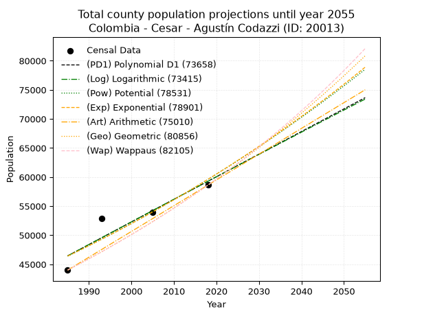
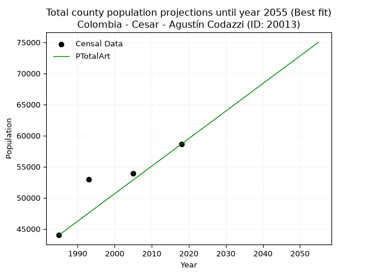
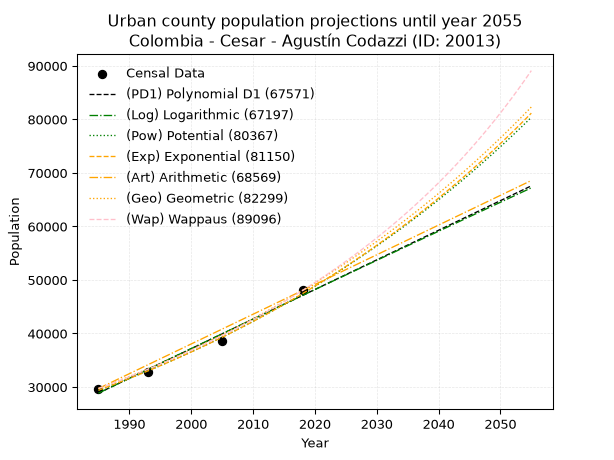
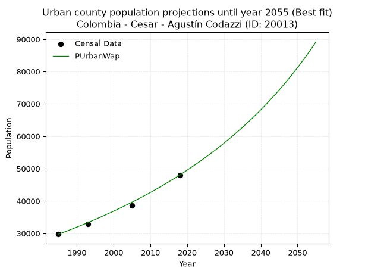
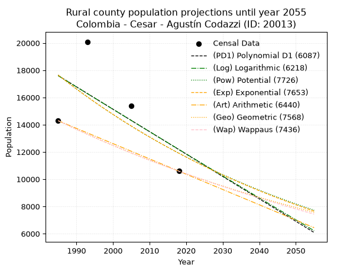
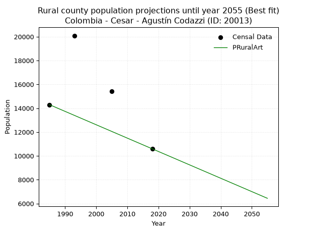

<div align="center">


</div>

# _“Population and Public Services Demand Projections (PPSD) until Year 2050 for Colombia - Cesar - Agustín Codazzi (ID: 20013)”_
Keywords: `population` `public-service` `projection` `lineal` `polynomial` `logarithmic` `potential` `exponential` `arithmetic` `geometric` `wappaus` `dane` `colombia` `south-america`

PPSD are analytical estimates used by governments and planners to anticipate future changes in population size, age distribution, and the resulting community needs for utilities, healthcare, education, and infrastructure as sizing future water treatment facilities, electrical grids, and road networks based on spatial growth.

> **General running parameters**: • app_version: _v20260806_. • Python version: _3.14.7_. • Pandas version: _3.0.5_. • NumPy version: _2.5.1_. • Creates, save and include plots into reports (create_plot): _False_. • Projection until year: _2050_. • Process polynomial degree 2 and up: _False_. • Process Wappaus: _True_. • Process Wappaus: _True_. • Set negative values to zero: _True_. • Set infinite values to zero: _True_. • Drop dataset notes: _True_. 
<div align="center">

Dynamic map: [:earth_americas:Google](http://maps.google.com/maps?q=10.04045399,-73.2383888) [:earth_americas:OSM](https://www.openstreetmap.org/#map=18/10.04045399/-73.2383888&layers=P) [:earth_americas:Bing](https://www.bing.com/maps?cp=10.04045399~-73.2383888&lvl=18) [:earth_americas:Apple](https://maps.apple.com/frame?center=10.04045399%2C-73.2383888&span=0.003%2C0.006)

</div>


<div align="center">

```geojson
{
  "type": "Feature",
  "geometry": {
    "type": "Point", 
    "coordinates": [-73.2383888, 10.04045399]
  }, 
  "properties": {
    "Name": "Colombia - Cesar - Agustín Codazzi (ID: 20013)"
  }
}
```

</div>


## 0. Census Data (4 records)

Census data are official statistics collected by a government about the people and housing in a country. They usually include counts of total population, age, sex, race, income, education, and jobs.

📅Global census file: [Population.xlsx](../data/Population.xlsx)

| Source   |   Year |   CountryID | CountryName   |   StateID | StateName   |   CountyID | CountyName      |   PTotal |   PUrban |   PRural |
|:---------|-------:|------------:|:--------------|----------:|:------------|-----------:|:----------------|---------:|---------:|---------:|
| DANE     |   1985 |          57 | Colombia      |        20 | Cesar       |      20013 | Agustín Codazzi |    44004 |    29711 |    14293 |
| DANE     |   1993 |          57 | Colombia      |        20 | Cesar       |      20013 | Agustín Codazzi |    52943 |    32854 |    20089 |
| DANE     |   2005 |          57 | Colombia      |        20 | Cesar       |      20013 | Agustín Codazzi |    53969 |    38565 |    15404 |
| DANE     |   2018 |          57 | Colombia      |        20 | Cesar       |      20013 | Agustín Codazzi |    58621 |    48030 |    10591 |

> 🔥Some records could had specific notes about the registered values or the corresponding urban or rural distribution.

📅   [RUPS](https://www.datos.gov.co/Hacienda-y-Cr-dito-P-blico/Registro-nico-de-Prestadores-de-Servicios-P-blicos/4qkq-csdn/about_data) - Local public utility companies: [RUPS.csv](../data/RUPS.xlsx)

 | SERVICIO       | ESTADO    | NOMBRE                                                   | NIT         | DEPARTAMENTO_DOMICILIO   | MUNICIPIO_DOMICILIO   | DIRECCION         |   TELEFONO | EMAIL                        | TIPO_INSCRIPCION    | REPRESENTANTE_LEGAL              | TIPO_PRESTADOR                            | CLASIFICACION                 |
|:---------------|:----------|:---------------------------------------------------------|:------------|:-------------------------|:----------------------|:------------------|-----------:|:-----------------------------|:--------------------|:---------------------------------|:------------------------------------------|:------------------------------|
| ACUEDUCTO      | OPERATIVA | EMPRESA DE SERVICIOS PUBLICOS DE AGUSTIN CODAZZI  E.S.P. | 800118095-1 | CESAR                    | AGUSTIN CODAZZI       | calle 20 # 14-113 |    5581152 | gerencia.emcodazzi@gmail.com | Registro por la ESP | ANTONIO DE JESUS ORCASITA ZULETA | EMPRESA INDUSTRIAL Y COMERCIAL DEL ESTADO | MAYOR O IGUAL A 5001 USUARIOS |
| ALCANTARILLADO | OPERATIVA | EMPRESA DE SERVICIOS PUBLICOS DE AGUSTIN CODAZZI  E.S.P. | 800118095-1 | CESAR                    | AGUSTIN CODAZZI       | calle 20 # 14-113 |    5581152 | gerencia.emcodazzi@gmail.com | Registro por la ESP | ANTONIO DE JESUS ORCASITA ZULETA | EMPRESA INDUSTRIAL Y COMERCIAL DEL ESTADO | MAYOR O IGUAL A 5001 USUARIOS |

## 1. Total

### 1.1. Coefficients and Parameters

* (PD1) Polynomial Deg 1: 388.5632276194267, -724839.3460457582 (lineal)
* (Log) Logarithmic: 778245.5339450664, -5863066.289984763
* (Pow) Potential: 15.181310784960942, -45.39778363457631
* (Exp) Exponential: 0.00757889041701312, 0.013586610725020279
* (Art) Arithmetic: Year diff. 2018 - 1985 = 33, Population diff. 58621 - 44004 = 14617, Annual growth = 442.93939393939394
* (Geo) Geometric: Year diff. 2018 - 1985 = 33, Population diff. 58621 - 44004 = 14617, Annual growth % = 0.008729165413720041
* (Wap) Wappaus: i = 0.863219281733289, Condition values only valid for < 200)

<sub>
Wappaus condition values: ['0.00', '0.86', '1.73', '2.59', '3.45', '4.32', '5.18', '6.04', '6.91', '7.77', '8.63', '9.50', '10.36', '11.22', '12.09', '12.95', '13.81', '14.67', '15.54', '16.40', '17.26', '18.13', '18.99', '19.85', '20.72', '21.58', '22.44', '23.31', '24.17', '25.03', '25.90', '26.76', '27.62', '28.49', '29.35', '30.21', '31.08', '31.94', '32.80', '33.67', '34.53', '35.39', '36.26', '37.12', '37.98', '38.84', '39.71', '40.57', '41.43', '42.30', '43.16', '44.02', '44.89', '45.75', '46.61', '47.48', '48.34', '49.20', '50.07', '50.93', '51.79', '52.66', '53.52', '54.38', '55.25', '56.11']
</sub>


### 1.2. Projected Dataset

|   Year |   CountyID |   PTotalPD1 |   PTotalLog |   PTotalPow |   PTotalExp |   PTotalArt |   PTotalGeo |   PTotalWap |
|-------:|-----------:|------------:|------------:|------------:|------------:|------------:|------------:|------------:|
|   1985 |      20013 |       46459 |       46443 |       46403 |       46417 |       44004 |       44004 |       44004 |
|   1986 |      20013 |       46847 |       46835 |       46759 |       46770 |       44447 |       44388 |       44385 |
|   1987 |      20013 |       47236 |       47227 |       47118 |       47126 |       44890 |       44776 |       44770 |
|   1988 |      20013 |       47624 |       47619 |       47479 |       47485 |       45333 |       45166 |       45159 |
|   1989 |      20013 |       48013 |       48010 |       47843 |       47846 |       45776 |       45561 |       45550 |
|   1990 |      20013 |       48401 |       48401 |       48209 |       48210 |       46219 |       45958 |       45945 |
|   1991 |      20013 |       48790 |       48792 |       48578 |       48577 |       46662 |       46360 |       46344 |
|   1992 |      20013 |       49179 |       49183 |       48950 |       48946 |       47105 |       46764 |       46746 |
|   1993 |      20013 |       49567 |       49573 |       49324 |       49319 |       47548 |       47172 |       47151 |
|   1994 |      20013 |       49956 |       49964 |       49701 |       49694 |       47990 |       47584 |       47561 |
|   1995 |      20013 |       50344 |       50354 |       50081 |       50072 |       48433 |       48000 |       47974 |
|   1996 |      20013 |       50733 |       50744 |       50464 |       50453 |       48876 |       48419 |       48391 |
|   1997 |      20013 |       51121 |       51134 |       50849 |       50837 |       49319 |       48841 |       48811 |
|   1998 |      20013 |       51510 |       51523 |       51237 |       51223 |       49762 |       49268 |       49236 |
|   1999 |      20013 |       51899 |       51913 |       51628 |       51613 |       50205 |       49698 |       49664 |
|   2000 |      20013 |       52287 |       52302 |       52021 |       52006 |       50648 |       50132 |       50096 |
|   2001 |      20013 |       52676 |       52691 |       52417 |       52401 |       51091 |       50569 |       50532 |
|   2002 |      20013 |       53064 |       53080 |       52816 |       52800 |       51534 |       51011 |       50973 |
|   2003 |      20013 |       53453 |       53469 |       53218 |       53202 |       51977 |       51456 |       51417 |
|   2004 |      20013 |       53841 |       53857 |       53623 |       53607 |       52420 |       51905 |       51866 |
|   2005 |      20013 |       54230 |       54245 |       54031 |       54014 |       52863 |       52358 |       52319 |
|   2006 |      20013 |       54618 |       54633 |       54441 |       54425 |       53306 |       52815 |       52776 |
|   2007 |      20013 |       55007 |       55021 |       54855 |       54839 |       53749 |       53276 |       53237 |
|   2008 |      20013 |       55396 |       55409 |       55271 |       55257 |       54192 |       53741 |       53703 |
|   2009 |      20013 |       55784 |       55796 |       55691 |       55677 |       54635 |       54210 |       54174 |
|   2010 |      20013 |       56173 |       56184 |       56113 |       56100 |       55077 |       54684 |       54649 |
|   2011 |      20013 |       56561 |       56571 |       56538 |       56527 |       55520 |       55161 |       55129 |
|   2012 |      20013 |       56950 |       56958 |       56966 |       56957 |       55963 |       55642 |       55613 |
|   2013 |      20013 |       57338 |       57344 |       57398 |       57391 |       56406 |       56128 |       56102 |
|   2014 |      20013 |       57727 |       57731 |       57832 |       57827 |       56849 |       56618 |       56596 |
|   2015 |      20013 |       58116 |       58117 |       58270 |       58267 |       57292 |       57112 |       57095 |
|   2016 |      20013 |       58504 |       58503 |       58710 |       58710 |       57735 |       57611 |       57598 |
|   2017 |      20013 |       58893 |       58889 |       59154 |       59157 |       58178 |       58114 |       58107 |
|   2018 |      20013 |       59281 |       59275 |       59601 |       59607 |       58621 |       58621 |       58621 |
|   2019 |      20013 |       59670 |       59661 |       60051 |       60061 |       59064 |       59133 |       59140 |
|   2020 |      20013 |       60058 |       60046 |       60504 |       60518 |       59507 |       59649 |       59665 |
|   2021 |      20013 |       60447 |       60431 |       60960 |       60978 |       59950 |       60170 |       60194 |
|   2022 |      20013 |       60836 |       60816 |       61420 |       61442 |       60393 |       60695 |       60729 |
|   2023 |      20013 |       61224 |       61201 |       61882 |       61909 |       60836 |       61225 |       61270 |
|   2024 |      20013 |       61613 |       61585 |       62348 |       62380 |       61279 |       61759 |       61817 |
|   2025 |      20013 |       62001 |       61970 |       62818 |       62855 |       61722 |       62298 |       62369 |
|   2026 |      20013 |       62390 |       62354 |       63290 |       63333 |       62165 |       62842 |       62926 |
|   2027 |      20013 |       62778 |       62738 |       63766 |       63815 |       62607 |       63391 |       63490 |
|   2028 |      20013 |       63167 |       63122 |       64245 |       64300 |       63050 |       63944 |       64060 |
|   2029 |      20013 |       63555 |       63506 |       64728 |       64789 |       63493 |       64502 |       64636 |
|   2030 |      20013 |       63944 |       63889 |       65214 |       65282 |       63936 |       65065 |       65217 |
|   2031 |      20013 |       64333 |       64272 |       65704 |       65779 |       64379 |       65633 |       65806 |
|   2032 |      20013 |       64721 |       64655 |       66196 |       66279 |       64822 |       66206 |       66400 |
|   2033 |      20013 |       65110 |       65038 |       66693 |       66784 |       65265 |       66784 |       67001 |
|   2034 |      20013 |       65498 |       65421 |       67192 |       67292 |       65708 |       67367 |       67609 |
|   2035 |      20013 |       65887 |       65804 |       67696 |       67804 |       66151 |       67955 |       68223 |
|   2036 |      20013 |       66275 |       66186 |       68202 |       68319 |       66594 |       68548 |       68844 |
|   2037 |      20013 |       66664 |       66568 |       68713 |       68839 |       67037 |       69146 |       69472 |
|   2038 |      20013 |       67053 |       66950 |       69227 |       69363 |       67480 |       69750 |       70107 |
|   2039 |      20013 |       67441 |       67332 |       69744 |       69891 |       67923 |       70359 |       70750 |
|   2040 |      20013 |       67830 |       67713 |       70265 |       70422 |       68366 |       70973 |       71399 |
|   2041 |      20013 |       68218 |       68095 |       70790 |       70958 |       68809 |       71593 |       72056 |
|   2042 |      20013 |       68607 |       68476 |       71318 |       71498 |       69252 |       72218 |       72720 |
|   2043 |      20013 |       68995 |       68857 |       71850 |       72042 |       69694 |       72848 |       73392 |
|   2044 |      20013 |       69384 |       69238 |       72386 |       72590 |       70137 |       73484 |       74072 |
|   2045 |      20013 |       69772 |       69619 |       72926 |       73142 |       70580 |       74125 |       74760 |
|   2046 |      20013 |       70161 |       69999 |       73469 |       73699 |       71023 |       74772 |       75456 |
|   2047 |      20013 |       70550 |       70379 |       74016 |       74259 |       71466 |       75425 |       76160 |
|   2048 |      20013 |       70938 |       70759 |       74567 |       74824 |       71909 |       76084 |       76872 |
|   2049 |      20013 |       71327 |       71139 |       75121 |       75393 |       72352 |       76748 |       77593 |
|   2050 |      20013 |       71715 |       71519 |       75680 |       75967 |       72795 |       77418 |       78322 |
<div align="center">

</img>

</div>


### 1.3. Best fit with absolute and relative error (%)

Relative error puts that difference into context by dividing the absolute error by the true value, creating a unitless ratio or percentage that shows the scale of the mistake.

Absolute and relative error

|   Year | Source   |   CountryID | CountryName   |   StateID | StateName   |   CountyID_x | CountyName      |   PTotal |   PUrban |   PRural |   CountyID_y |   PTotalPD1 |   PTotalLog |   PTotalPow |   PTotalExp |   PTotalArt |   PTotalGeo |   PTotalWap |   PTotalPD1AbsError |   PTotalLogAbsError |   PTotalPowAbsError |   PTotalExpAbsError |   PTotalArtAbsError |   PTotalGeoAbsError |   PTotalWapAbsError |   PTotalPD1RelError |   PTotalLogRelError |   PTotalPowRelError |   PTotalExpRelError |   PTotalArtRelError |   PTotalGeoRelError |   PTotalWapRelError |
|-------:|:---------|------------:|:--------------|----------:|:------------|-------------:|:----------------|---------:|---------:|---------:|-------------:|------------:|------------:|------------:|------------:|------------:|------------:|------------:|--------------------:|--------------------:|--------------------:|--------------------:|--------------------:|--------------------:|--------------------:|--------------------:|--------------------:|--------------------:|--------------------:|--------------------:|--------------------:|--------------------:|
|   1985 | DANE     |          57 | Colombia      |        20 | Cesar       |        20013 | Agustín Codazzi |    44004 |    29711 |    14293 |        20013 |       46459 |       46443 |       46403 |       46417 |       44004 |       44004 |       44004 |                2455 |                2439 |                2399 |                2413 |                   0 |                   0 |                   0 |            5.57904  |            5.54268  |            5.45178  |           5.48359   |             0       |             0       |             0       |
|   1993 | DANE     |          57 | Colombia      |        20 | Cesar       |        20013 | Agustín Codazzi |    52943 |    32854 |    20089 |        20013 |       49567 |       49573 |       49324 |       49319 |       47548 |       47172 |       47151 |                3376 |                3370 |                3619 |                3624 |                5395 |                5771 |                5792 |            6.37667  |            6.36534  |            6.83565  |           6.8451    |            10.1902  |            10.9004  |            10.9401  |
|   2005 | DANE     |          57 | Colombia      |        20 | Cesar       |        20013 | Agustín Codazzi |    53969 |    38565 |    15404 |        20013 |       54230 |       54245 |       54031 |       54014 |       52863 |       52358 |       52319 |                 261 |                 276 |                  62 |                  45 |                1106 |                1611 |                1650 |            0.483611 |            0.511405 |            0.114881 |           0.0833812 |             2.04932 |             2.98505 |             3.05731 |
|   2018 | DANE     |          57 | Colombia      |        20 | Cesar       |        20013 | Agustín Codazzi |    58621 |    48030 |    10591 |        20013 |       59281 |       59275 |       59601 |       59607 |       58621 |       58621 |       58621 |                 660 |                 654 |                 980 |                 986 |                   0 |                   0 |                   0 |            1.12588  |            1.11564  |            1.67176  |           1.68199   |             0       |             0       |             0       |

Relative error mean

| Method    |   RelError | Best   |
|:----------|-----------:|:-------|
| PTotalPD1 |    3.3913  |        |
| PTotalLog |    3.38377 |        |
| PTotalPow |    3.51852 |        |
| PTotalExp |    3.52352 |        |
| PTotalArt |    3.05988 | True   |
| PTotalGeo |    3.47136 |        |
| PTotalWap |    3.49934 |        |

💙Best method: _**PTotalArt**_
<div align="center">

</img>

</div>


### 1.4. Fresh water supply demand in liters per capita per day (lpcd)

The fresh water supply demand typically ranges from 100 to 300 liters per capita per day (lpcd) for standard domestic and municipal planning, though absolute survival minimums set by the World Health Organization are as low as 7.5 to 20 liters per day, and total consumption in high-income nations can exceed 400 liters.

> `CZ`: Level in meters above the sea level (masl)<br> `WS`: Fresh water supply demand in liters per capita per day (lpcd or l/h/d)<br> `WSAll`: Zonal fresh water supply demand in liters per second (l/s)<br> `A`: Zonal area in square meters<br> `DP`: Population density (people/hectare or p/ha)

Reference values (RAS Colombia)

|    CZ |   WS |
|------:|-----:|
|  1000 |  120 |
|  2000 |  130 |
| 99999 |  140 |

County shapefile geometry properties and water supply values

|   CountyID |      ATotal |   CZTotal |   WSTotal |
|-----------:|------------:|----------:|----------:|
|      20013 | 1.75099e+09 |   768.544 |       120 |

Projected values for best method: PTotalArt

|   CountyID |   Year |   PTotalArt |   DPTotal |   WSTotal |   WSTotalAll |
|-----------:|-------:|------------:|----------:|----------:|-------------:|
|      20013 |   1985 |       44004 |      0.25 |       120 |      61.1167 |
|      20013 |   1986 |       44447 |      0.25 |       120 |      61.7319 |
|      20013 |   1987 |       44890 |      0.26 |       120 |      62.3472 |
|      20013 |   1988 |       45333 |      0.26 |       120 |      62.9625 |
|      20013 |   1989 |       45776 |      0.26 |       120 |      63.5778 |
|      20013 |   1990 |       46219 |      0.26 |       120 |      64.1931 |
|      20013 |   1991 |       46662 |      0.27 |       120 |      64.8083 |
|      20013 |   1992 |       47105 |      0.27 |       120 |      65.4236 |
|      20013 |   1993 |       47548 |      0.27 |       120 |      66.0389 |
|      20013 |   1994 |       47990 |      0.27 |       120 |      66.6528 |
|      20013 |   1995 |       48433 |      0.28 |       120 |      67.2681 |
|      20013 |   1996 |       48876 |      0.28 |       120 |      67.8833 |
|      20013 |   1997 |       49319 |      0.28 |       120 |      68.4986 |
|      20013 |   1998 |       49762 |      0.28 |       120 |      69.1139 |
|      20013 |   1999 |       50205 |      0.29 |       120 |      69.7292 |
|      20013 |   2000 |       50648 |      0.29 |       120 |      70.3444 |
|      20013 |   2001 |       51091 |      0.29 |       120 |      70.9597 |
|      20013 |   2002 |       51534 |      0.29 |       120 |      71.575  |
|      20013 |   2003 |       51977 |      0.3  |       120 |      72.1903 |
|      20013 |   2004 |       52420 |      0.3  |       120 |      72.8056 |
|      20013 |   2005 |       52863 |      0.3  |       120 |      73.4208 |
|      20013 |   2006 |       53306 |      0.3  |       120 |      74.0361 |
|      20013 |   2007 |       53749 |      0.31 |       120 |      74.6514 |
|      20013 |   2008 |       54192 |      0.31 |       120 |      75.2667 |
|      20013 |   2009 |       54635 |      0.31 |       120 |      75.8819 |
|      20013 |   2010 |       55077 |      0.31 |       120 |      76.4958 |
|      20013 |   2011 |       55520 |      0.32 |       120 |      77.1111 |
|      20013 |   2012 |       55963 |      0.32 |       120 |      77.7264 |
|      20013 |   2013 |       56406 |      0.32 |       120 |      78.3417 |
|      20013 |   2014 |       56849 |      0.32 |       120 |      78.9569 |
|      20013 |   2015 |       57292 |      0.33 |       120 |      79.5722 |
|      20013 |   2016 |       57735 |      0.33 |       120 |      80.1875 |
|      20013 |   2017 |       58178 |      0.33 |       120 |      80.8028 |
|      20013 |   2018 |       58621 |      0.33 |       120 |      81.4181 |
|      20013 |   2019 |       59064 |      0.34 |       120 |      82.0333 |
|      20013 |   2020 |       59507 |      0.34 |       120 |      82.6486 |
|      20013 |   2021 |       59950 |      0.34 |       120 |      83.2639 |
|      20013 |   2022 |       60393 |      0.34 |       120 |      83.8792 |
|      20013 |   2023 |       60836 |      0.35 |       120 |      84.4944 |
|      20013 |   2024 |       61279 |      0.35 |       120 |      85.1097 |
|      20013 |   2025 |       61722 |      0.35 |       120 |      85.725  |
|      20013 |   2026 |       62165 |      0.36 |       120 |      86.3403 |
|      20013 |   2027 |       62607 |      0.36 |       120 |      86.9542 |
|      20013 |   2028 |       63050 |      0.36 |       120 |      87.5694 |
|      20013 |   2029 |       63493 |      0.36 |       120 |      88.1847 |
|      20013 |   2030 |       63936 |      0.37 |       120 |      88.8    |
|      20013 |   2031 |       64379 |      0.37 |       120 |      89.4153 |
|      20013 |   2032 |       64822 |      0.37 |       120 |      90.0306 |
|      20013 |   2033 |       65265 |      0.37 |       120 |      90.6458 |
|      20013 |   2034 |       65708 |      0.38 |       120 |      91.2611 |
|      20013 |   2035 |       66151 |      0.38 |       120 |      91.8764 |
|      20013 |   2036 |       66594 |      0.38 |       120 |      92.4917 |
|      20013 |   2037 |       67037 |      0.38 |       120 |      93.1069 |
|      20013 |   2038 |       67480 |      0.39 |       120 |      93.7222 |
|      20013 |   2039 |       67923 |      0.39 |       120 |      94.3375 |
|      20013 |   2040 |       68366 |      0.39 |       120 |      94.9528 |
|      20013 |   2041 |       68809 |      0.39 |       120 |      95.5681 |
|      20013 |   2042 |       69252 |      0.4  |       120 |      96.1833 |
|      20013 |   2043 |       69694 |      0.4  |       120 |      96.7972 |
|      20013 |   2044 |       70137 |      0.4  |       120 |      97.4125 |
|      20013 |   2045 |       70580 |      0.4  |       120 |      98.0278 |
|      20013 |   2046 |       71023 |      0.41 |       120 |      98.6431 |
|      20013 |   2047 |       71466 |      0.41 |       120 |      99.2583 |
|      20013 |   2048 |       71909 |      0.41 |       120 |      99.8736 |
|      20013 |   2049 |       72352 |      0.41 |       120 |     100.489  |
|      20013 |   2050 |       72795 |      0.42 |       120 |     101.104  |

## 2. Urban

### 2.1. Coefficients and Parameters

* (PD1) Polynomial Deg 1: 553.0822962665532, -1069012.8631071732 (lineal)
* (Log) Logarithmic: 1106710.4108074293, -8374824.701167917
* (Pow) Potential: 29.0365658724824, -91.28760313475557
* (Exp) Exponential: 0.014508832026009697, 9.130955141480194e-09
* (Art) Arithmetic: Year diff. 2018 - 1985 = 33, Population diff. 48030 - 29711 = 18319, Annual growth = 555.1212121212121
* (Geo) Geometric: Year diff. 2018 - 1985 = 33, Population diff. 48030 - 29711 = 18319, Annual growth % = 0.014661238956576783
* (Wap) Wappaus: i = 1.4281298468535577, Condition values only valid for < 200)

<sub>
Wappaus condition values: ['0.00', '1.43', '2.86', '4.28', '5.71', '7.14', '8.57', '10.00', '11.43', '12.85', '14.28', '15.71', '17.14', '18.57', '19.99', '21.42', '22.85', '24.28', '25.71', '27.13', '28.56', '29.99', '31.42', '32.85', '34.28', '35.70', '37.13', '38.56', '39.99', '41.42', '42.84', '44.27', '45.70', '47.13', '48.56', '49.98', '51.41', '52.84', '54.27', '55.70', '57.13', '58.55', '59.98', '61.41', '62.84', '64.27', '65.69', '67.12', '68.55', '69.98', '71.41', '72.83', '74.26', '75.69', '77.12', '78.55', '79.98', '81.40', '82.83', '84.26', '85.69', '87.12', '88.54', '89.97', '91.40', '92.83']
</sub>


### 2.2. Projected Dataset

|   Year |   CountyID |   PUrbanPD1 |   PUrbanLog |   PUrbanPow |   PUrbanExp |   PUrbanArt |   PUrbanGeo |   PUrbanWap |
|-------:|-----------:|------------:|------------:|------------:|------------:|------------:|------------:|------------:|
|   1985 |      20013 |       28855 |       28842 |       29379 |       29391 |       29711 |       29711 |       29711 |
|   1986 |      20013 |       29409 |       29399 |       29812 |       29820 |       30266 |       30147 |       30138 |
|   1987 |      20013 |       29962 |       29956 |       30251 |       30256 |       30821 |       30589 |       30572 |
|   1988 |      20013 |       30515 |       30513 |       30696 |       30698 |       31376 |       31037 |       31012 |
|   1989 |      20013 |       31068 |       31069 |       31147 |       31147 |       31931 |       31492 |       31458 |
|   1990 |      20013 |       31621 |       31626 |       31605 |       31602 |       32487 |       31954 |       31911 |
|   1991 |      20013 |       32174 |       32182 |       32070 |       32064 |       33042 |       32422 |       32371 |
|   1992 |      20013 |       32727 |       32737 |       32541 |       32533 |       33597 |       32898 |       32837 |
|   1993 |      20013 |       33280 |       33293 |       33019 |       33008 |       34152 |       33380 |       33311 |
|   1994 |      20013 |       33833 |       33848 |       33503 |       33490 |       34707 |       33869 |       33792 |
|   1995 |      20013 |       34386 |       34403 |       33994 |       33980 |       35262 |       34366 |       34280 |
|   1996 |      20013 |       34939 |       34958 |       34493 |       34476 |       35817 |       34870 |       34776 |
|   1997 |      20013 |       35492 |       35512 |       34998 |       34980 |       36372 |       35381 |       35280 |
|   1998 |      20013 |       36046 |       36066 |       35510 |       35492 |       36928 |       35900 |       35791 |
|   1999 |      20013 |       36599 |       36620 |       36030 |       36010 |       37483 |       36426 |       36311 |
|   2000 |      20013 |       37152 |       37173 |       36557 |       36537 |       38038 |       36960 |       36839 |
|   2001 |      20013 |       37705 |       37726 |       37092 |       37071 |       38593 |       37502 |       37376 |
|   2002 |      20013 |       38258 |       38279 |       37634 |       37612 |       39148 |       38052 |       37921 |
|   2003 |      20013 |       38811 |       38832 |       38183 |       38162 |       39703 |       38610 |       38475 |
|   2004 |      20013 |       39364 |       39384 |       38741 |       38720 |       40258 |       39176 |       39038 |
|   2005 |      20013 |       39917 |       39937 |       39306 |       39286 |       40813 |       39750 |       39611 |
|   2006 |      20013 |       40470 |       40488 |       39879 |       39860 |       41369 |       40333 |       40193 |
|   2007 |      20013 |       41023 |       41040 |       40460 |       40442 |       41924 |       40924 |       40786 |
|   2008 |      20013 |       41576 |       41591 |       41050 |       41033 |       42479 |       41524 |       41388 |
|   2009 |      20013 |       42129 |       42142 |       41648 |       41633 |       43034 |       42133 |       42001 |
|   2010 |      20013 |       42683 |       42693 |       42254 |       42241 |       43589 |       42751 |       42624 |
|   2011 |      20013 |       43236 |       43243 |       42869 |       42859 |       44144 |       43378 |       43258 |
|   2012 |      20013 |       43789 |       43794 |       43492 |       43485 |       44699 |       44014 |       43904 |
|   2013 |      20013 |       44342 |       44344 |       44124 |       44121 |       45254 |       44659 |       44561 |
|   2014 |      20013 |       44895 |       44893 |       44765 |       44765 |       45810 |       45314 |       45230 |
|   2015 |      20013 |       45448 |       45443 |       45415 |       45420 |       46365 |       45978 |       45911 |
|   2016 |      20013 |       46001 |       45992 |       46074 |       46083 |       46920 |       46652 |       46604 |
|   2017 |      20013 |       46554 |       46540 |       46742 |       46757 |       47475 |       47336 |       47310 |
|   2018 |      20013 |       47107 |       47089 |       47420 |       47440 |       48030 |       48030 |       48030 |
|   2019 |      20013 |       47660 |       47637 |       48107 |       48134 |       48585 |       48734 |       48763 |
|   2020 |      20013 |       48213 |       48185 |       48803 |       48837 |       49140 |       49449 |       49510 |
|   2021 |      20013 |       48766 |       48733 |       49510 |       49551 |       49695 |       50174 |       50272 |
|   2022 |      20013 |       49320 |       49281 |       50226 |       50275 |       50250 |       50909 |       51048 |
|   2023 |      20013 |       49873 |       49828 |       50952 |       51010 |       50806 |       51656 |       51839 |
|   2024 |      20013 |       50426 |       50375 |       51689 |       51755 |       51361 |       52413 |       52646 |
|   2025 |      20013 |       50979 |       50921 |       52435 |       52512 |       51916 |       53181 |       53470 |
|   2026 |      20013 |       51532 |       51468 |       53193 |       53279 |       52471 |       53961 |       54309 |
|   2027 |      20013 |       52085 |       52014 |       53960 |       54058 |       53026 |       54752 |       55166 |
|   2028 |      20013 |       52638 |       52560 |       54739 |       54848 |       53581 |       55555 |       56041 |
|   2029 |      20013 |       53191 |       53105 |       55528 |       55649 |       54136 |       56370 |       56934 |
|   2030 |      20013 |       53744 |       53651 |       56328 |       56463 |       54691 |       57196 |       57845 |
|   2031 |      20013 |       54297 |       54196 |       57139 |       57288 |       55247 |       58035 |       58776 |
|   2032 |      20013 |       54850 |       54740 |       57962 |       58125 |       55802 |       58885 |       59728 |
|   2033 |      20013 |       55403 |       55285 |       58796 |       58974 |       56357 |       59749 |       60699 |
|   2034 |      20013 |       55957 |       55829 |       59641 |       59836 |       56912 |       60625 |       61692 |
|   2035 |      20013 |       56510 |       56373 |       60499 |       60711 |       57467 |       61514 |       62707 |
|   2036 |      20013 |       57063 |       56917 |       61368 |       61598 |       58022 |       62415 |       63745 |
|   2037 |      20013 |       57616 |       57460 |       62249 |       62498 |       58577 |       63331 |       64807 |
|   2038 |      20013 |       58169 |       58003 |       63143 |       63412 |       59132 |       64259 |       65893 |
|   2039 |      20013 |       58722 |       58546 |       64048 |       64338 |       59688 |       65201 |       67004 |
|   2040 |      20013 |       59275 |       59089 |       64967 |       65279 |       60243 |       66157 |       68141 |
|   2041 |      20013 |       59828 |       59631 |       65898 |       66233 |       60798 |       67127 |       69305 |
|   2042 |      20013 |       60381 |       60173 |       66842 |       67201 |       61353 |       68111 |       70498 |
|   2043 |      20013 |       60934 |       60715 |       67799 |       68183 |       61908 |       69110 |       71719 |
|   2044 |      20013 |       61487 |       61257 |       68769 |       69179 |       62463 |       70123 |       72971 |
|   2045 |      20013 |       62040 |       61798 |       69753 |       70190 |       63018 |       71151 |       74253 |
|   2046 |      20013 |       62594 |       62339 |       70750 |       71216 |       63573 |       72194 |       75569 |
|   2047 |      20013 |       63147 |       62880 |       71761 |       72257 |       64129 |       73253 |       76918 |
|   2048 |      20013 |       63700 |       63421 |       72786 |       73313 |       64684 |       74327 |       78302 |
|   2049 |      20013 |       64253 |       63961 |       73825 |       74384 |       65239 |       75416 |       79722 |
|   2050 |      20013 |       64806 |       64501 |       74878 |       75471 |       65794 |       76522 |       81180 |
<div align="center">

</img>

</div>


### 2.3. Best fit with absolute and relative error (%)

Relative error puts that difference into context by dividing the absolute error by the true value, creating a unitless ratio or percentage that shows the scale of the mistake.

Absolute and relative error

|   Year | Source   |   CountryID | CountryName   |   StateID | StateName   |   CountyID_x | CountyName      |   PTotal |   PUrban |   PRural |   CountyID_y |   PUrbanPD1 |   PUrbanLog |   PUrbanPow |   PUrbanExp |   PUrbanArt |   PUrbanGeo |   PUrbanWap |   PUrbanPD1AbsError |   PUrbanLogAbsError |   PUrbanPowAbsError |   PUrbanExpAbsError |   PUrbanArtAbsError |   PUrbanGeoAbsError |   PUrbanWapAbsError |   PUrbanPD1RelError |   PUrbanLogRelError |   PUrbanPowRelError |   PUrbanExpRelError |   PUrbanArtRelError |   PUrbanGeoRelError |   PUrbanWapRelError |
|-------:|:---------|------------:|:--------------|----------:|:------------|-------------:|:----------------|---------:|---------:|---------:|-------------:|------------:|------------:|------------:|------------:|------------:|------------:|------------:|--------------------:|--------------------:|--------------------:|--------------------:|--------------------:|--------------------:|--------------------:|--------------------:|--------------------:|--------------------:|--------------------:|--------------------:|--------------------:|--------------------:|
|   1985 | DANE     |          57 | Colombia      |        20 | Cesar       |        20013 | Agustín Codazzi |    44004 |    29711 |    14293 |        20013 |       28855 |       28842 |       29379 |       29391 |       29711 |       29711 |       29711 |                 856 |                 869 |                 332 |                 320 |                   0 |                   0 |                   0 |             2.88109 |             2.92484 |            1.11743  |             1.07704 |             0       |             0       |              0      |
|   1993 | DANE     |          57 | Colombia      |        20 | Cesar       |        20013 | Agustín Codazzi |    52943 |    32854 |    20089 |        20013 |       33280 |       33293 |       33019 |       33008 |       34152 |       33380 |       33311 |                 426 |                 439 |                 165 |                 154 |                1298 |                 526 |                 457 |             1.29665 |             1.33621 |            0.502222 |             0.46874 |             3.95081 |             1.60102 |              1.391  |
|   2005 | DANE     |          57 | Colombia      |        20 | Cesar       |        20013 | Agustín Codazzi |    53969 |    38565 |    15404 |        20013 |       39917 |       39937 |       39306 |       39286 |       40813 |       39750 |       39611 |                1352 |                1372 |                 741 |                 721 |                2248 |                1185 |                1046 |             3.50577 |             3.55763 |            1.92143  |             1.86957 |             5.82912 |             3.07273 |              2.7123 |
|   2018 | DANE     |          57 | Colombia      |        20 | Cesar       |        20013 | Agustín Codazzi |    58621 |    48030 |    10591 |        20013 |       47107 |       47089 |       47420 |       47440 |       48030 |       48030 |       48030 |                 923 |                 941 |                 610 |                 590 |                   0 |                   0 |                   0 |             1.92172 |             1.95919 |            1.27004  |             1.2284  |             0       |             0       |              0      |

Relative error mean

| Method    |   RelError | Best   |
|:----------|-----------:|:-------|
| PUrbanPD1 |    2.4013  |        |
| PUrbanLog |    2.44447 |        |
| PUrbanPow |    1.20278 |        |
| PUrbanExp |    1.16094 |        |
| PUrbanArt |    2.44498 |        |
| PUrbanGeo |    1.16844 |        |
| PUrbanWap |    1.02583 | True   |

💙Best method: _**PUrbanWap**_
<div align="center">

</img>

</div>


### 2.4. Fresh water supply demand in liters per capita per day (lpcd)

The fresh water supply demand typically ranges from 100 to 300 liters per capita per day (lpcd) for standard domestic and municipal planning, though absolute survival minimums set by the World Health Organization are as low as 7.5 to 20 liters per day, and total consumption in high-income nations can exceed 400 liters.

> `CZ`: Level in meters above the sea level (masl)<br> `WS`: Fresh water supply demand in liters per capita per day (lpcd or l/h/d)<br> `WSAll`: Zonal fresh water supply demand in liters per second (l/s)<br> `A`: Zonal area in square meters<br> `DP`: Population density (people/hectare or p/ha)

Reference values (RAS Colombia)

|    CZ |   WS |
|------:|-----:|
|  1000 |  120 |
|  2000 |  130 |
| 99999 |  140 |

County shapefile geometry properties and water supply values

|   CountyID |      AUrban |   CZUrban |   WSUrban |
|-----------:|------------:|----------:|----------:|
|      20013 | 1.17182e+07 |   130.617 |       120 |

Projected values for best method: PUrbanWap

|   CountyID |   Year |   PUrbanWap |   DPUrban |   WSUrban |   WSUrbanAll |
|-----------:|-------:|------------:|----------:|----------:|-------------:|
|      20013 |   1985 |       29711 |     25.35 |       120 |      41.2653 |
|      20013 |   1986 |       30138 |     25.72 |       120 |      41.8583 |
|      20013 |   1987 |       30572 |     26.09 |       120 |      42.4611 |
|      20013 |   1988 |       31012 |     26.46 |       120 |      43.0722 |
|      20013 |   1989 |       31458 |     26.85 |       120 |      43.6917 |
|      20013 |   1990 |       31911 |     27.23 |       120 |      44.3208 |
|      20013 |   1991 |       32371 |     27.62 |       120 |      44.9597 |
|      20013 |   1992 |       32837 |     28.02 |       120 |      45.6069 |
|      20013 |   1993 |       33311 |     28.43 |       120 |      46.2653 |
|      20013 |   1994 |       33792 |     28.84 |       120 |      46.9333 |
|      20013 |   1995 |       34280 |     29.25 |       120 |      47.6111 |
|      20013 |   1996 |       34776 |     29.68 |       120 |      48.3    |
|      20013 |   1997 |       35280 |     30.11 |       120 |      49      |
|      20013 |   1998 |       35791 |     30.54 |       120 |      49.7097 |
|      20013 |   1999 |       36311 |     30.99 |       120 |      50.4319 |
|      20013 |   2000 |       36839 |     31.44 |       120 |      51.1653 |
|      20013 |   2001 |       37376 |     31.9  |       120 |      51.9111 |
|      20013 |   2002 |       37921 |     32.36 |       120 |      52.6681 |
|      20013 |   2003 |       38475 |     32.83 |       120 |      53.4375 |
|      20013 |   2004 |       39038 |     33.31 |       120 |      54.2194 |
|      20013 |   2005 |       39611 |     33.8  |       120 |      55.0153 |
|      20013 |   2006 |       40193 |     34.3  |       120 |      55.8236 |
|      20013 |   2007 |       40786 |     34.81 |       120 |      56.6472 |
|      20013 |   2008 |       41388 |     35.32 |       120 |      57.4833 |
|      20013 |   2009 |       42001 |     35.84 |       120 |      58.3347 |
|      20013 |   2010 |       42624 |     36.37 |       120 |      59.2    |
|      20013 |   2011 |       43258 |     36.92 |       120 |      60.0806 |
|      20013 |   2012 |       43904 |     37.47 |       120 |      60.9778 |
|      20013 |   2013 |       44561 |     38.03 |       120 |      61.8903 |
|      20013 |   2014 |       45230 |     38.6  |       120 |      62.8194 |
|      20013 |   2015 |       45911 |     39.18 |       120 |      63.7653 |
|      20013 |   2016 |       46604 |     39.77 |       120 |      64.7278 |
|      20013 |   2017 |       47310 |     40.37 |       120 |      65.7083 |
|      20013 |   2018 |       48030 |     40.99 |       120 |      66.7083 |
|      20013 |   2019 |       48763 |     41.61 |       120 |      67.7264 |
|      20013 |   2020 |       49510 |     42.25 |       120 |      68.7639 |
|      20013 |   2021 |       50272 |     42.9  |       120 |      69.8222 |
|      20013 |   2022 |       51048 |     43.56 |       120 |      70.9    |
|      20013 |   2023 |       51839 |     44.24 |       120 |      71.9986 |
|      20013 |   2024 |       52646 |     44.93 |       120 |      73.1194 |
|      20013 |   2025 |       53470 |     45.63 |       120 |      74.2639 |
|      20013 |   2026 |       54309 |     46.35 |       120 |      75.4292 |
|      20013 |   2027 |       55166 |     47.08 |       120 |      76.6194 |
|      20013 |   2028 |       56041 |     47.82 |       120 |      77.8347 |
|      20013 |   2029 |       56934 |     48.59 |       120 |      79.075  |
|      20013 |   2030 |       57845 |     49.36 |       120 |      80.3403 |
|      20013 |   2031 |       58776 |     50.16 |       120 |      81.6333 |
|      20013 |   2032 |       59728 |     50.97 |       120 |      82.9556 |
|      20013 |   2033 |       60699 |     51.8  |       120 |      84.3042 |
|      20013 |   2034 |       61692 |     52.65 |       120 |      85.6833 |
|      20013 |   2035 |       62707 |     53.51 |       120 |      87.0931 |
|      20013 |   2036 |       63745 |     54.4  |       120 |      88.5347 |
|      20013 |   2037 |       64807 |     55.3  |       120 |      90.0097 |
|      20013 |   2038 |       65893 |     56.23 |       120 |      91.5181 |
|      20013 |   2039 |       67004 |     57.18 |       120 |      93.0611 |
|      20013 |   2040 |       68141 |     58.15 |       120 |      94.6403 |
|      20013 |   2041 |       69305 |     59.14 |       120 |      96.2569 |
|      20013 |   2042 |       70498 |     60.16 |       120 |      97.9139 |
|      20013 |   2043 |       71719 |     61.2  |       120 |      99.6097 |
|      20013 |   2044 |       72971 |     62.27 |       120 |     101.349  |
|      20013 |   2045 |       74253 |     63.37 |       120 |     103.129  |
|      20013 |   2046 |       75569 |     64.49 |       120 |     104.957  |
|      20013 |   2047 |       76918 |     65.64 |       120 |     106.831  |
|      20013 |   2048 |       78302 |     66.82 |       120 |     108.753  |
|      20013 |   2049 |       79722 |     68.03 |       120 |     110.725  |
|      20013 |   2050 |       81180 |     69.28 |       120 |     112.75   |

## 3. Rural

### 3.1. Coefficients and Parameters

* (PD1) Polynomial Deg 1: -164.5190686471265, 344173.5170614148 (lineal)
* (Log) Logarithmic: -328464.8768623624, 2511758.411183148
* (Pow) Potential: -23.833812295333225, 82.84488492324688
* (Exp) Exponential: -0.011936058374586906, 343943862586646.8
* (Art) Arithmetic: Year diff. 2018 - 1985 = 33, Population diff. 10591 - 14293 = -3702, Annual growth = -112.18181818181819
* (Geo) Geometric: Year diff. 2018 - 1985 = 33, Population diff. 10591 - 14293 = -3702, Annual growth % = -0.0090426646209254
* (Wap) Wappaus: i = -0.9016381464540925, Condition values only valid for < 200)

<sub>
Wappaus condition values: ['-0.00', '-0.90', '-1.80', '-2.70', '-3.61', '-4.51', '-5.41', '-6.31', '-7.21', '-8.11', '-9.02', '-9.92', '-10.82', '-11.72', '-12.62', '-13.52', '-14.43', '-15.33', '-16.23', '-17.13', '-18.03', '-18.93', '-19.84', '-20.74', '-21.64', '-22.54', '-23.44', '-24.34', '-25.25', '-26.15', '-27.05', '-27.95', '-28.85', '-29.75', '-30.66', '-31.56', '-32.46', '-33.36', '-34.26', '-35.16', '-36.07', '-36.97', '-37.87', '-38.77', '-39.67', '-40.57', '-41.48', '-42.38', '-43.28', '-44.18', '-45.08', '-45.98', '-46.89', '-47.79', '-48.69', '-49.59', '-50.49', '-51.39', '-52.30', '-53.20', '-54.10', '-55.00', '-55.90', '-56.80', '-57.70', '-58.61']
</sub>


### 3.2. Projected Dataset

|   Year |   CountyID |   PRuralPD1 |   PRuralLog |   PRuralPow |   PRuralExp |   PRuralArt |   PRuralGeo |   PRuralWap |
|-------:|-----------:|------------:|------------:|------------:|------------:|------------:|------------:|------------:|
|   1985 |      20013 |       17603 |       17602 |       17647 |       17649 |       14293 |       14293 |       14293 |
|   1986 |      20013 |       17439 |       17436 |       17437 |       17439 |       14181 |       14164 |       14165 |
|   1987 |      20013 |       17274 |       17271 |       17229 |       17232 |       14069 |       14036 |       14038 |
|   1988 |      20013 |       17110 |       17106 |       17023 |       17028 |       13956 |       13909 |       13912 |
|   1989 |      20013 |       16945 |       16940 |       16821 |       16826 |       13844 |       13783 |       13787 |
|   1990 |      20013 |       16781 |       16775 |       16620 |       16626 |       13732 |       13658 |       13663 |
|   1991 |      20013 |       16616 |       16610 |       16423 |       16429 |       13620 |       13535 |       13540 |
|   1992 |      20013 |       16452 |       16445 |       16227 |       16234 |       13508 |       13412 |       13418 |
|   1993 |      20013 |       16287 |       16281 |       16034 |       16042 |       13396 |       13291 |       13298 |
|   1994 |      20013 |       16122 |       16116 |       15844 |       15851 |       13283 |       13171 |       13178 |
|   1995 |      20013 |       15958 |       15951 |       15655 |       15663 |       13171 |       13052 |       13060 |
|   1996 |      20013 |       15793 |       15787 |       15470 |       15477 |       13059 |       12934 |       12942 |
|   1997 |      20013 |       15629 |       15622 |       15286 |       15294 |       12947 |       12817 |       12826 |
|   1998 |      20013 |       15464 |       15458 |       15105 |       15112 |       12835 |       12701 |       12710 |
|   1999 |      20013 |       15300 |       15293 |       14926 |       14933 |       12722 |       12586 |       12596 |
|   2000 |      20013 |       15135 |       15129 |       14749 |       14756 |       12610 |       12472 |       12482 |
|   2001 |      20013 |       14971 |       14965 |       14574 |       14581 |       12498 |       12360 |       12370 |
|   2002 |      20013 |       14806 |       14801 |       14402 |       14408 |       12386 |       12248 |       12258 |
|   2003 |      20013 |       14642 |       14637 |       14231 |       14237 |       12274 |       12137 |       12147 |
|   2004 |      20013 |       14477 |       14473 |       14063 |       14068 |       12162 |       12027 |       12038 |
|   2005 |      20013 |       14313 |       14309 |       13897 |       13901 |       12049 |       11919 |       11929 |
|   2006 |      20013 |       14148 |       14145 |       13732 |       13736 |       11937 |       11811 |       11821 |
|   2007 |      20013 |       13984 |       13981 |       13570 |       13573 |       11825 |       11704 |       11714 |
|   2008 |      20013 |       13819 |       13818 |       13410 |       13412 |       11713 |       11598 |       11607 |
|   2009 |      20013 |       13655 |       13654 |       13252 |       13253 |       11601 |       11493 |       11502 |
|   2010 |      20013 |       13490 |       13491 |       13096 |       13095 |       11488 |       11389 |       11398 |
|   2011 |      20013 |       13326 |       13327 |       12941 |       12940 |       11376 |       11286 |       11294 |
|   2012 |      20013 |       13161 |       13164 |       12789 |       12787 |       11264 |       11184 |       11191 |
|   2013 |      20013 |       12997 |       13001 |       12638 |       12635 |       11152 |       11083 |       11089 |
|   2014 |      20013 |       12832 |       12838 |       12490 |       12485 |       11040 |       10983 |       10988 |
|   2015 |      20013 |       12668 |       12675 |       12343 |       12337 |       10928 |       10884 |       10887 |
|   2016 |      20013 |       12503 |       12512 |       12198 |       12190 |       10815 |       10785 |       10788 |
|   2017 |      20013 |       12339 |       12349 |       12054 |       12046 |       10703 |       10688 |       10689 |
|   2018 |      20013 |       12174 |       12186 |       11913 |       11903 |       10591 |       10591 |       10591 |
|   2019 |      20013 |       12010 |       12023 |       11773 |       11762 |       10479 |       10495 |       10494 |
|   2020 |      20013 |       11845 |       11861 |       11635 |       11622 |       10367 |       10400 |       10397 |
|   2021 |      20013 |       11680 |       11698 |       11498 |       11484 |       10254 |       10306 |       10301 |
|   2022 |      20013 |       11516 |       11536 |       11364 |       11348 |       10142 |       10213 |       10206 |
|   2023 |      20013 |       11351 |       11373 |       11231 |       11213 |       10030 |       10121 |       10112 |
|   2024 |      20013 |       11187 |       11211 |       11099 |       11080 |        9918 |       10029 |       10019 |
|   2025 |      20013 |       11022 |       11049 |       10969 |       10949 |        9806 |        9939 |        9926 |
|   2026 |      20013 |       10858 |       10886 |       10841 |       10819 |        9694 |        9849 |        9834 |
|   2027 |      20013 |       10693 |       10724 |       10714 |       10690 |        9581 |        9760 |        9742 |
|   2028 |      20013 |       10529 |       10562 |       10589 |       10564 |        9469 |        9671 |        9651 |
|   2029 |      20013 |       10364 |       10400 |       10465 |       10438 |        9357 |        9584 |        9561 |
|   2030 |      20013 |       10200 |       10239 |       10343 |       10314 |        9245 |        9497 |        9472 |
|   2031 |      20013 |       10035 |       10077 |       10222 |       10192 |        9133 |        9411 |        9383 |
|   2032 |      20013 |        9871 |        9915 |       10103 |       10071 |        9020 |        9326 |        9295 |
|   2033 |      20013 |        9706 |        9753 |        9985 |        9952 |        8908 |        9242 |        9208 |
|   2034 |      20013 |        9542 |        9592 |        9869 |        9834 |        8796 |        9158 |        9121 |
|   2035 |      20013 |        9377 |        9431 |        9754 |        9717 |        8684 |        9076 |        9035 |
|   2036 |      20013 |        9213 |        9269 |        9640 |        9602 |        8572 |        8993 |        8949 |
|   2037 |      20013 |        9048 |        9108 |        9528 |        9488 |        8460 |        8912 |        8864 |
|   2038 |      20013 |        8884 |        8947 |        9417 |        9375 |        8347 |        8832 |        8780 |
|   2039 |      20013 |        8719 |        8786 |        9308 |        9264 |        8235 |        8752 |        8696 |
|   2040 |      20013 |        8555 |        8624 |        9200 |        9154 |        8123 |        8673 |        8613 |
|   2041 |      20013 |        8390 |        8463 |        9093 |        9045 |        8011 |        8594 |        8531 |
|   2042 |      20013 |        8226 |        8303 |        8987 |        8938 |        7899 |        8516 |        8449 |
|   2043 |      20013 |        8061 |        8142 |        8883 |        8832 |        7786 |        8439 |        8368 |
|   2044 |      20013 |        7897 |        7981 |        8780 |        8727 |        7674 |        8363 |        8287 |
|   2045 |      20013 |        7732 |        7820 |        8678 |        8624 |        7562 |        8287 |        8207 |
|   2046 |      20013 |        7568 |        7660 |        8578 |        8521 |        7450 |        8213 |        8127 |
|   2047 |      20013 |        7403 |        7499 |        8479 |        8420 |        7338 |        8138 |        8048 |
|   2048 |      20013 |        7238 |        7339 |        8380 |        8320 |        7226 |        8065 |        7970 |
|   2049 |      20013 |        7074 |        7179 |        8284 |        8222 |        7113 |        7992 |        7892 |
|   2050 |      20013 |        6909 |        7018 |        8188 |        8124 |        7001 |        7919 |        7815 |
<div align="center">

</img>

</div>


### 3.3. Best fit with absolute and relative error (%)

Relative error puts that difference into context by dividing the absolute error by the true value, creating a unitless ratio or percentage that shows the scale of the mistake.

Absolute and relative error

|   Year | Source   |   CountryID | CountryName   |   StateID | StateName   |   CountyID_x | CountyName      |   PTotal |   PUrban |   PRural |   CountyID_y |   PRuralPD1 |   PRuralLog |   PRuralPow |   PRuralExp |   PRuralArt |   PRuralGeo |   PRuralWap |   PRuralPD1AbsError |   PRuralLogAbsError |   PRuralPowAbsError |   PRuralExpAbsError |   PRuralArtAbsError |   PRuralGeoAbsError |   PRuralWapAbsError |   PRuralPD1RelError |   PRuralLogRelError |   PRuralPowRelError |   PRuralExpRelError |   PRuralArtRelError |   PRuralGeoRelError |   PRuralWapRelError |
|-------:|:---------|------------:|:--------------|----------:|:------------|-------------:|:----------------|---------:|---------:|---------:|-------------:|------------:|------------:|------------:|------------:|------------:|------------:|------------:|--------------------:|--------------------:|--------------------:|--------------------:|--------------------:|--------------------:|--------------------:|--------------------:|--------------------:|--------------------:|--------------------:|--------------------:|--------------------:|--------------------:|
|   1985 | DANE     |          57 | Colombia      |        20 | Cesar       |        20013 | Agustín Codazzi |    44004 |    29711 |    14293 |        20013 |       17603 |       17602 |       17647 |       17649 |       14293 |       14293 |       14293 |                3310 |                3309 |                3354 |                3356 |                   0 |                   0 |                   0 |            23.1582  |            23.1512  |            23.466   |            23.48    |              0      |              0      |              0      |
|   1993 | DANE     |          57 | Colombia      |        20 | Cesar       |        20013 | Agustín Codazzi |    52943 |    32854 |    20089 |        20013 |       16287 |       16281 |       16034 |       16042 |       13396 |       13291 |       13298 |                3802 |                3808 |                4055 |                4047 |                6693 |                6798 |                6791 |            18.9258  |            18.9556  |            20.1852  |            20.1454  |             33.3167 |             33.8394 |             33.8046 |
|   2005 | DANE     |          57 | Colombia      |        20 | Cesar       |        20013 | Agustín Codazzi |    53969 |    38565 |    15404 |        20013 |       14313 |       14309 |       13897 |       13901 |       12049 |       11919 |       11929 |                1091 |                1095 |                1507 |                1503 |                3355 |                3485 |                3475 |             7.08258 |             7.10854 |             9.78317 |             9.75721 |             21.7801 |             22.624  |             22.5591 |
|   2018 | DANE     |          57 | Colombia      |        20 | Cesar       |        20013 | Agustín Codazzi |    58621 |    48030 |    10591 |        20013 |       12174 |       12186 |       11913 |       11903 |       10591 |       10591 |       10591 |                1583 |                1595 |                1322 |                1312 |                   0 |                   0 |                   0 |            14.9467  |            15.06    |            12.4823  |            12.3879  |              0      |              0      |              0      |

Relative error mean

| Method    |   RelError | Best   |
|:----------|-----------:|:-------|
| PRuralPD1 |    16.0283 |        |
| PRuralLog |    16.0688 |        |
| PRuralPow |    16.4792 |        |
| PRuralExp |    16.4426 |        |
| PRuralArt |    13.7742 | True   |
| PRuralGeo |    14.1159 |        |
| PRuralWap |    14.0909 |        |

💙Best method: _**PRuralArt**_
<div align="center">

</img>

</div>


### 3.4. Fresh water supply demand in liters per capita per day (lpcd)

The fresh water supply demand typically ranges from 100 to 300 liters per capita per day (lpcd) for standard domestic and municipal planning, though absolute survival minimums set by the World Health Organization are as low as 7.5 to 20 liters per day, and total consumption in high-income nations can exceed 400 liters.

> `CZ`: Level in meters above the sea level (masl)<br> `WS`: Fresh water supply demand in liters per capita per day (lpcd or l/h/d)<br> `WSAll`: Zonal fresh water supply demand in liters per second (l/s)<br> `A`: Zonal area in square meters<br> `DP`: Population density (people/hectare or p/ha)

Reference values (RAS Colombia)

|    CZ |   WS |
|------:|-----:|
|  1000 |  120 |
|  2000 |  130 |
| 99999 |  140 |

County shapefile geometry properties and water supply values

|   CountyID |      ARural |   CZRural |   WSRural |
|-----------:|------------:|----------:|----------:|
|      20013 | 1.73927e+09 |   772.828 |       120 |

Projected values for best method: PRuralArt

|   CountyID |   Year |   PRuralArt |   DPRural |   WSRural |   WSRuralAll |
|-----------:|-------:|------------:|----------:|----------:|-------------:|
|      20013 |   1985 |       14293 |      0.08 |       120 |     19.8514  |
|      20013 |   1986 |       14181 |      0.08 |       120 |     19.6958  |
|      20013 |   1987 |       14069 |      0.08 |       120 |     19.5403  |
|      20013 |   1988 |       13956 |      0.08 |       120 |     19.3833  |
|      20013 |   1989 |       13844 |      0.08 |       120 |     19.2278  |
|      20013 |   1990 |       13732 |      0.08 |       120 |     19.0722  |
|      20013 |   1991 |       13620 |      0.08 |       120 |     18.9167  |
|      20013 |   1992 |       13508 |      0.08 |       120 |     18.7611  |
|      20013 |   1993 |       13396 |      0.08 |       120 |     18.6056  |
|      20013 |   1994 |       13283 |      0.08 |       120 |     18.4486  |
|      20013 |   1995 |       13171 |      0.08 |       120 |     18.2931  |
|      20013 |   1996 |       13059 |      0.08 |       120 |     18.1375  |
|      20013 |   1997 |       12947 |      0.07 |       120 |     17.9819  |
|      20013 |   1998 |       12835 |      0.07 |       120 |     17.8264  |
|      20013 |   1999 |       12722 |      0.07 |       120 |     17.6694  |
|      20013 |   2000 |       12610 |      0.07 |       120 |     17.5139  |
|      20013 |   2001 |       12498 |      0.07 |       120 |     17.3583  |
|      20013 |   2002 |       12386 |      0.07 |       120 |     17.2028  |
|      20013 |   2003 |       12274 |      0.07 |       120 |     17.0472  |
|      20013 |   2004 |       12162 |      0.07 |       120 |     16.8917  |
|      20013 |   2005 |       12049 |      0.07 |       120 |     16.7347  |
|      20013 |   2006 |       11937 |      0.07 |       120 |     16.5792  |
|      20013 |   2007 |       11825 |      0.07 |       120 |     16.4236  |
|      20013 |   2008 |       11713 |      0.07 |       120 |     16.2681  |
|      20013 |   2009 |       11601 |      0.07 |       120 |     16.1125  |
|      20013 |   2010 |       11488 |      0.07 |       120 |     15.9556  |
|      20013 |   2011 |       11376 |      0.07 |       120 |     15.8     |
|      20013 |   2012 |       11264 |      0.06 |       120 |     15.6444  |
|      20013 |   2013 |       11152 |      0.06 |       120 |     15.4889  |
|      20013 |   2014 |       11040 |      0.06 |       120 |     15.3333  |
|      20013 |   2015 |       10928 |      0.06 |       120 |     15.1778  |
|      20013 |   2016 |       10815 |      0.06 |       120 |     15.0208  |
|      20013 |   2017 |       10703 |      0.06 |       120 |     14.8653  |
|      20013 |   2018 |       10591 |      0.06 |       120 |     14.7097  |
|      20013 |   2019 |       10479 |      0.06 |       120 |     14.5542  |
|      20013 |   2020 |       10367 |      0.06 |       120 |     14.3986  |
|      20013 |   2021 |       10254 |      0.06 |       120 |     14.2417  |
|      20013 |   2022 |       10142 |      0.06 |       120 |     14.0861  |
|      20013 |   2023 |       10030 |      0.06 |       120 |     13.9306  |
|      20013 |   2024 |        9918 |      0.06 |       120 |     13.775   |
|      20013 |   2025 |        9806 |      0.06 |       120 |     13.6194  |
|      20013 |   2026 |        9694 |      0.06 |       120 |     13.4639  |
|      20013 |   2027 |        9581 |      0.06 |       120 |     13.3069  |
|      20013 |   2028 |        9469 |      0.05 |       120 |     13.1514  |
|      20013 |   2029 |        9357 |      0.05 |       120 |     12.9958  |
|      20013 |   2030 |        9245 |      0.05 |       120 |     12.8403  |
|      20013 |   2031 |        9133 |      0.05 |       120 |     12.6847  |
|      20013 |   2032 |        9020 |      0.05 |       120 |     12.5278  |
|      20013 |   2033 |        8908 |      0.05 |       120 |     12.3722  |
|      20013 |   2034 |        8796 |      0.05 |       120 |     12.2167  |
|      20013 |   2035 |        8684 |      0.05 |       120 |     12.0611  |
|      20013 |   2036 |        8572 |      0.05 |       120 |     11.9056  |
|      20013 |   2037 |        8460 |      0.05 |       120 |     11.75    |
|      20013 |   2038 |        8347 |      0.05 |       120 |     11.5931  |
|      20013 |   2039 |        8235 |      0.05 |       120 |     11.4375  |
|      20013 |   2040 |        8123 |      0.05 |       120 |     11.2819  |
|      20013 |   2041 |        8011 |      0.05 |       120 |     11.1264  |
|      20013 |   2042 |        7899 |      0.05 |       120 |     10.9708  |
|      20013 |   2043 |        7786 |      0.04 |       120 |     10.8139  |
|      20013 |   2044 |        7674 |      0.04 |       120 |     10.6583  |
|      20013 |   2045 |        7562 |      0.04 |       120 |     10.5028  |
|      20013 |   2046 |        7450 |      0.04 |       120 |     10.3472  |
|      20013 |   2047 |        7338 |      0.04 |       120 |     10.1917  |
|      20013 |   2048 |        7226 |      0.04 |       120 |     10.0361  |
|      20013 |   2049 |        7113 |      0.04 |       120 |      9.87917 |
|      20013 |   2050 |        7001 |      0.04 |       120 |      9.72361 |

<div align="center"><br><sub>Share this research</sub></div><br>

<sub>**APPS & TOOLS & CONTENT DISCLAIMER**: • NO WARRANTY - This content and software is provided by <a href="https://github.com/rcfdtools" target="_blank">github.com/rcfdtools</a> "as is", without any express or implied warranty, including warranties of merchantability, fitness for a particular purpose, or non-infringement. There is no guarantee that the software will be error-free or operate without interruption. • LIMITATION OF LIABILITY - Neither the authors nor copyright holders will be liable for claims or damages arising from the software or its use. You are responsible for determining if the software is appropriate for your use and assume all associated risks, including errors, legal compliance, and data loss. • NO PROFESSIONAL ADVICE - The software provides general information and does not offer professional advice. It should not replace consultation with professional advisors. [Clauses and global license for rcfdtools use.](https://github.com/rcfdtools/rcfdtools/blob/main/LICENSE.md)</sub>

| [:house: Home](Readme.md)  | [:beginner: Help / Collaborate](https://github.com/rcfdtools/R.HydroTools/discussions/31) |
|----------------------------|-------------------------------------------------------------------------------------------|