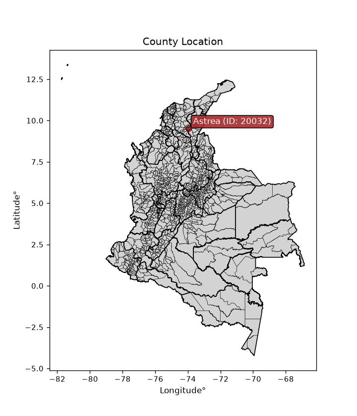
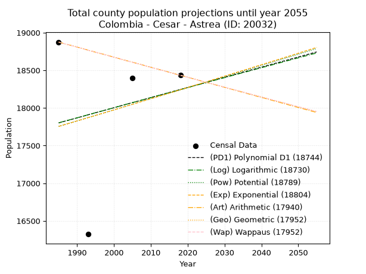
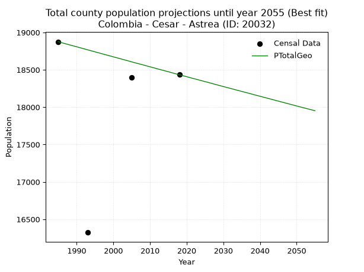
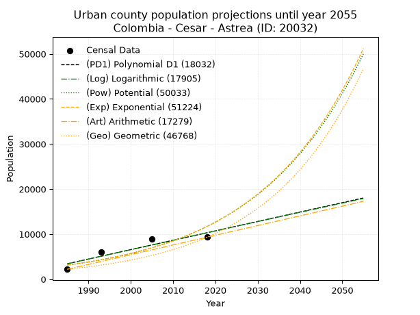
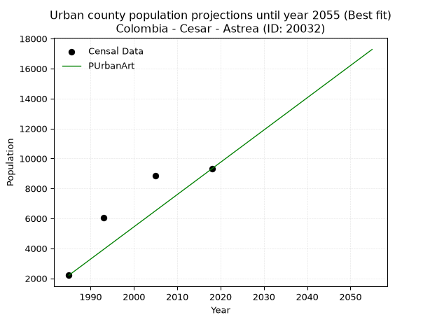
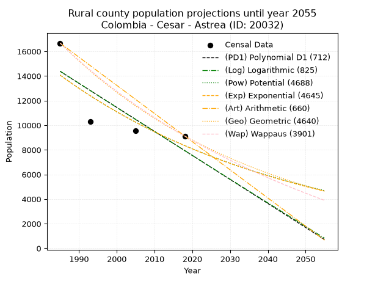
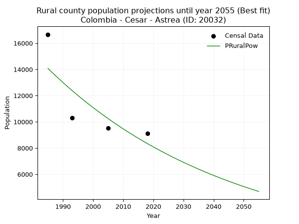

<div align="center">


</div>

# _“Population and Public Services Demand Projections (PPSD) until Year 2050 for Colombia - Cesar - Astrea (ID: 20032)”_
Keywords: `population` `public-service` `projection` `lineal` `polynomial` `logarithmic` `potential` `exponential` `arithmetic` `geometric` `wappaus` `dane` `colombia` `south-america`

PPSD are analytical estimates used by governments and planners to anticipate future changes in population size, age distribution, and the resulting community needs for utilities, healthcare, education, and infrastructure as sizing future water treatment facilities, electrical grids, and road networks based on spatial growth.

<div align="center">

</img>

</div>


> **General running parameters**: • app_version: _v20260806_. • Python version: _3.14.7_. • Pandas version: _3.0.5_. • NumPy version: _2.5.1_. • Creates, save and include plots into reports (create_plot): _False_. • Projection until year: _2050_. • Process polynomial degree 2 and up: _False_. • Process Wappaus: _True_. • Process Wappaus: _True_. • Set negative values to zero: _True_. • Set infinite values to zero: _True_. • Drop dataset notes: _True_. 
<div align="center">

Dynamic map: [:earth_americas:Google](http://maps.google.com/maps?q=9.498061871,-73.9758421) [:earth_americas:OSM](https://www.openstreetmap.org/#map=18/9.498061871/-73.9758421&layers=P) [:earth_americas:Bing](https://www.bing.com/maps?cp=9.498061871~-73.9758421&lvl=18) [:earth_americas:Apple](https://maps.apple.com/frame?center=9.498061871%2C-73.9758421&span=0.003%2C0.006)

</div>


<div align="center">

```geojson
{
  "type": "Feature",
  "geometry": {
    "type": "Point", 
    "coordinates": [-73.9758421, 9.498061871]
  }, 
  "properties": {
    "Name": "Colombia - Cesar - Astrea (ID: 20032)"
  }
}
```

</div>


## 0. Census Data (4 records)

Census data are official statistics collected by a government about the people and housing in a country. They usually include counts of total population, age, sex, race, income, education, and jobs.

📅Global census file: [Population.xlsx](../data/Population.xlsx)

| Source   |   Year |   CountryID | CountryName   |   StateID | StateName   |   CountyID | CountyName   |   PTotal |   PUrban |   PRural |
|:---------|-------:|------------:|:--------------|----------:|:------------|-----------:|:-------------|---------:|---------:|---------:|
| DANE     |   1985 |          57 | Colombia      |        20 | Cesar       |      20032 | Astrea       |    18875 |     2208 |    16667 |
| DANE     |   1993 |          57 | Colombia      |        20 | Cesar       |      20032 | Astrea       |    16323 |     6038 |    10285 |
| DANE     |   2005 |          57 | Colombia      |        20 | Cesar       |      20032 | Astrea       |    18394 |     8864 |     9530 |
| DANE     |   2018 |          57 | Colombia      |        20 | Cesar       |      20032 | Astrea       |    18434 |     9313 |     9121 |

> 🔥Some records could had specific notes about the registered values or the corresponding urban or rural distribution.

📅[SUI-RUPS](https://www.datos.gov.co/Hacienda-y-Cr-dito-P-blico/Registro-nico-de-Prestadores-de-Servicios-P-blicos/4qkq-csdn/about_data) - Local public utility companies: [RUPS.csv](../data/RUPS.xlsx)

 | SERVICIO       | ESTADO    | NOMBRE                       | NIT         | DEPARTAMENTO_DOMICILIO   | MUNICIPIO_DOMICILIO   | DIRECCION          |   TELEFONO | EMAIL                        | TIPO_PRESTADOR                 | CLASIFICACION                 |
|:---------------|:----------|:-----------------------------|:------------|:-------------------------|:----------------------|:-------------------|-----------:|:-----------------------------|:-------------------------------|:------------------------------|
| ACUEDUCTO      | OPERATIVA | ALCALDIA MUNICIPAL DE ASTREA | 892301541-1 | CESAR                    | ASTREA                | calle7 numero 3-94 |    5260230 | alcaldia@astrea-cesar.gov.co | MUNICIPIO (PRESTACIÓN DIRECTA) | MENOR O IGUAL A 2500 USUARIOS |
| ALCANTARILLADO | OPERATIVA | ALCALDIA MUNICIPAL DE ASTREA | 892301541-1 | CESAR                    | ASTREA                | calle7 numero 3-94 |    5260230 | alcaldia@astrea-cesar.gov.co | MUNICIPIO (PRESTACIÓN DIRECTA) | MENOR O IGUAL A 2500 USUARIOS |

## 1. Total

### 1.1. Coefficients and Parameters

* (PD1) Polynomial Deg 1: 13.471698113207571, -8940.264150943447 (lineal)
* (Log) Logarithmic: 26777.28258597394, -185527.83951566374
* (Pow) Potential: 1.631492412342903, -1.1309345043444794
* (Exp) Exponential: 0.0008204023317859339, 3483.888051104856
* (Art) Arithmetic: Year diff. 2018 - 1985 = 33, Population diff. 18434 - 18875 = -441, Annual growth = -13.363636363636363
* (Geo) Geometric: Year diff. 2018 - 1985 = 33, Population diff. 18434 - 18875 = -441, Annual growth % = -0.0007161528207861867
* (Wap) Wappaus: i = -0.0716376014561439, Condition values only valid for < 200)

<sub>
Wappaus condition values: ['-0.00', '-0.07', '-0.14', '-0.21', '-0.29', '-0.36', '-0.43', '-0.50', '-0.57', '-0.64', '-0.72', '-0.79', '-0.86', '-0.93', '-1.00', '-1.07', '-1.15', '-1.22', '-1.29', '-1.36', '-1.43', '-1.50', '-1.58', '-1.65', '-1.72', '-1.79', '-1.86', '-1.93', '-2.01', '-2.08', '-2.15', '-2.22', '-2.29', '-2.36', '-2.44', '-2.51', '-2.58', '-2.65', '-2.72', '-2.79', '-2.87', '-2.94', '-3.01', '-3.08', '-3.15', '-3.22', '-3.30', '-3.37', '-3.44', '-3.51', '-3.58', '-3.65', '-3.73', '-3.80', '-3.87', '-3.94', '-4.01', '-4.08', '-4.15', '-4.23', '-4.30', '-4.37', '-4.44', '-4.51', '-4.58', '-4.66']
</sub>


### 1.2. Projected Dataset

|   Year |   CountyID |   PTotalPD1 |   PTotalLog |   PTotalPow |   PTotalExp |   PTotalArt |   PTotalGeo |   PTotalWap |
|-------:|-----------:|------------:|------------:|------------:|------------:|------------:|------------:|------------:|
|   1985 |      20032 |       17801 |       17802 |       17756 |       17755 |       18875 |       18875 |       18875 |
|   1986 |      20032 |       17815 |       17816 |       17770 |       17769 |       18862 |       18861 |       18861 |
|   1987 |      20032 |       17828 |       17829 |       17785 |       17784 |       18848 |       18848 |       18848 |
|   1988 |      20032 |       17841 |       17843 |       17799 |       17798 |       18835 |       18834 |       18834 |
|   1989 |      20032 |       17855 |       17856 |       17814 |       17813 |       18822 |       18821 |       18821 |
|   1990 |      20032 |       17868 |       17869 |       17829 |       17828 |       18808 |       18808 |       18808 |
|   1991 |      20032 |       17882 |       17883 |       17843 |       17842 |       18795 |       18794 |       18794 |
|   1992 |      20032 |       17895 |       17896 |       17858 |       17857 |       18781 |       18781 |       18781 |
|   1993 |      20032 |       17909 |       17910 |       17873 |       17872 |       18768 |       18767 |       18767 |
|   1994 |      20032 |       17922 |       17923 |       17887 |       17886 |       18755 |       18754 |       18754 |
|   1995 |      20032 |       17936 |       17937 |       17902 |       17901 |       18741 |       18740 |       18740 |
|   1996 |      20032 |       17949 |       17950 |       17916 |       17916 |       18728 |       18727 |       18727 |
|   1997 |      20032 |       17963 |       17963 |       17931 |       17930 |       18715 |       18713 |       18713 |
|   1998 |      20032 |       17976 |       17977 |       17946 |       17945 |       18701 |       18700 |       18700 |
|   1999 |      20032 |       17990 |       17990 |       17960 |       17960 |       18688 |       18687 |       18687 |
|   2000 |      20032 |       18003 |       18004 |       17975 |       17974 |       18675 |       18673 |       18673 |
|   2001 |      20032 |       18017 |       18017 |       17990 |       17989 |       18661 |       18660 |       18660 |
|   2002 |      20032 |       18030 |       18030 |       18004 |       18004 |       18648 |       18647 |       18647 |
|   2003 |      20032 |       18044 |       18044 |       18019 |       18019 |       18634 |       18633 |       18633 |
|   2004 |      20032 |       18057 |       18057 |       18034 |       18034 |       18621 |       18620 |       18620 |
|   2005 |      20032 |       18070 |       18071 |       18048 |       18048 |       18608 |       18606 |       18606 |
|   2006 |      20032 |       18084 |       18084 |       18063 |       18063 |       18594 |       18593 |       18593 |
|   2007 |      20032 |       18097 |       18097 |       18078 |       18078 |       18581 |       18580 |       18580 |
|   2008 |      20032 |       18111 |       18111 |       18093 |       18093 |       18568 |       18567 |       18567 |
|   2009 |      20032 |       18124 |       18124 |       18107 |       18108 |       18554 |       18553 |       18553 |
|   2010 |      20032 |       18138 |       18137 |       18122 |       18123 |       18541 |       18540 |       18540 |
|   2011 |      20032 |       18151 |       18151 |       18137 |       18137 |       18528 |       18527 |       18527 |
|   2012 |      20032 |       18165 |       18164 |       18151 |       18152 |       18514 |       18513 |       18513 |
|   2013 |      20032 |       18178 |       18177 |       18166 |       18167 |       18501 |       18500 |       18500 |
|   2014 |      20032 |       18192 |       18190 |       18181 |       18182 |       18487 |       18487 |       18487 |
|   2015 |      20032 |       18205 |       18204 |       18196 |       18197 |       18474 |       18474 |       18474 |
|   2016 |      20032 |       18219 |       18217 |       18210 |       18212 |       18461 |       18460 |       18460 |
|   2017 |      20032 |       18232 |       18230 |       18225 |       18227 |       18447 |       18447 |       18447 |
|   2018 |      20032 |       18246 |       18244 |       18240 |       18242 |       18434 |       18434 |       18434 |
|   2019 |      20032 |       18259 |       18257 |       18255 |       18257 |       18421 |       18421 |       18421 |
|   2020 |      20032 |       18273 |       18270 |       18269 |       18272 |       18407 |       18408 |       18408 |
|   2021 |      20032 |       18286 |       18283 |       18284 |       18287 |       18394 |       18394 |       18394 |
|   2022 |      20032 |       18300 |       18297 |       18299 |       18302 |       18381 |       18381 |       18381 |
|   2023 |      20032 |       18313 |       18310 |       18314 |       18317 |       18367 |       18368 |       18368 |
|   2024 |      20032 |       18326 |       18323 |       18328 |       18332 |       18354 |       18355 |       18355 |
|   2025 |      20032 |       18340 |       18336 |       18343 |       18347 |       18340 |       18342 |       18342 |
|   2026 |      20032 |       18353 |       18350 |       18358 |       18362 |       18327 |       18329 |       18329 |
|   2027 |      20032 |       18367 |       18363 |       18373 |       18377 |       18314 |       18316 |       18316 |
|   2028 |      20032 |       18380 |       18376 |       18387 |       18392 |       18300 |       18302 |       18302 |
|   2029 |      20032 |       18394 |       18389 |       18402 |       18407 |       18287 |       18289 |       18289 |
|   2030 |      20032 |       18407 |       18402 |       18417 |       18422 |       18274 |       18276 |       18276 |
|   2031 |      20032 |       18421 |       18416 |       18432 |       18437 |       18260 |       18263 |       18263 |
|   2032 |      20032 |       18434 |       18429 |       18447 |       18453 |       18247 |       18250 |       18250 |
|   2033 |      20032 |       18448 |       18442 |       18461 |       18468 |       18234 |       18237 |       18237 |
|   2034 |      20032 |       18461 |       18455 |       18476 |       18483 |       18220 |       18224 |       18224 |
|   2035 |      20032 |       18475 |       18468 |       18491 |       18498 |       18207 |       18211 |       18211 |
|   2036 |      20032 |       18488 |       18481 |       18506 |       18513 |       18193 |       18198 |       18198 |
|   2037 |      20032 |       18502 |       18495 |       18521 |       18528 |       18180 |       18185 |       18185 |
|   2038 |      20032 |       18515 |       18508 |       18536 |       18544 |       18167 |       18172 |       18172 |
|   2039 |      20032 |       18529 |       18521 |       18550 |       18559 |       18153 |       18159 |       18159 |
|   2040 |      20032 |       18542 |       18534 |       18565 |       18574 |       18140 |       18146 |       18146 |
|   2041 |      20032 |       18555 |       18547 |       18580 |       18589 |       18127 |       18133 |       18133 |
|   2042 |      20032 |       18569 |       18560 |       18595 |       18605 |       18113 |       18120 |       18120 |
|   2043 |      20032 |       18582 |       18573 |       18610 |       18620 |       18100 |       18107 |       18107 |
|   2044 |      20032 |       18596 |       18586 |       18625 |       18635 |       18087 |       18094 |       18094 |
|   2045 |      20032 |       18609 |       18599 |       18640 |       18650 |       18073 |       18081 |       18081 |
|   2046 |      20032 |       18623 |       18613 |       18654 |       18666 |       18060 |       18068 |       18068 |
|   2047 |      20032 |       18636 |       18626 |       18669 |       18681 |       18046 |       18055 |       18055 |
|   2048 |      20032 |       18650 |       18639 |       18684 |       18696 |       18033 |       18042 |       18042 |
|   2049 |      20032 |       18663 |       18652 |       18699 |       18712 |       18020 |       18029 |       18029 |
|   2050 |      20032 |       18677 |       18665 |       18714 |       18727 |       18006 |       18016 |       18016 |
<div align="center">

</img>

</div>


### 1.3. Best fit with absolute and relative error (%)

Relative error puts that difference into context by dividing the absolute error by the true value, creating a unitless ratio or percentage that shows the scale of the mistake.

Absolute and relative error

|   Year | Source   |   CountryID | CountryName   |   StateID | StateName   |   CountyID_x | CountyName   |   PTotal |   PUrban |   PRural |   CountyID_y |   PTotalPD1 |   PTotalLog |   PTotalPow |   PTotalExp |   PTotalArt |   PTotalGeo |   PTotalWap |   PTotalPD1AbsError |   PTotalLogAbsError |   PTotalPowAbsError |   PTotalExpAbsError |   PTotalArtAbsError |   PTotalGeoAbsError |   PTotalWapAbsError |   PTotalPD1RelError |   PTotalLogRelError |   PTotalPowRelError |   PTotalExpRelError |   PTotalArtRelError |   PTotalGeoRelError |   PTotalWapRelError |
|-------:|:---------|------------:|:--------------|----------:|:------------|-------------:|:-------------|---------:|---------:|---------:|-------------:|------------:|------------:|------------:|------------:|------------:|------------:|------------:|--------------------:|--------------------:|--------------------:|--------------------:|--------------------:|--------------------:|--------------------:|--------------------:|--------------------:|--------------------:|--------------------:|--------------------:|--------------------:|--------------------:|
|   1985 | DANE     |          57 | Colombia      |        20 | Cesar       |        20032 | Astrea       |    18875 |     2208 |    16667 |        20032 |       17801 |       17802 |       17756 |       17755 |       18875 |       18875 |       18875 |                1074 |                1073 |                1119 |                1120 |                   0 |                   0 |                   0 |             5.69007 |             5.68477 |             5.92848 |             5.93377 |             0       |             0       |             0       |
|   1993 | DANE     |          57 | Colombia      |        20 | Cesar       |        20032 | Astrea       |    16323 |     6038 |    10285 |        20032 |       17909 |       17910 |       17873 |       17872 |       18768 |       18767 |       18767 |                1586 |                1587 |                1550 |                1549 |                2445 |                2444 |                2444 |             9.71635 |             9.72248 |             9.4958  |             9.48968 |            14.9789  |            14.9727  |            14.9727  |
|   2005 | DANE     |          57 | Colombia      |        20 | Cesar       |        20032 | Astrea       |    18394 |     8864 |     9530 |        20032 |       18070 |       18071 |       18048 |       18048 |       18608 |       18606 |       18606 |                 324 |                 323 |                 346 |                 346 |                 214 |                 212 |                 212 |             1.76144 |             1.75601 |             1.88105 |             1.88105 |             1.16342 |             1.15255 |             1.15255 |
|   2018 | DANE     |          57 | Colombia      |        20 | Cesar       |        20032 | Astrea       |    18434 |     9313 |     9121 |        20032 |       18246 |       18244 |       18240 |       18242 |       18434 |       18434 |       18434 |                 188 |                 190 |                 194 |                 192 |                   0 |                   0 |                   0 |             1.01985 |             1.0307  |             1.0524  |             1.04155 |             0       |             0       |             0       |

Relative error mean

| Method    |   RelError | Best   |
|:----------|-----------:|:-------|
| PTotalPD1 |    4.54693 |        |
| PTotalLog |    4.54849 |        |
| PTotalPow |    4.58943 |        |
| PTotalExp |    4.58651 |        |
| PTotalArt |    4.03557 |        |
| PTotalGeo |    4.03132 | True   |
| PTotalWap |    4.03132 | True   |

💙Best method: _**PTotalGeo**_
<div align="center">

</img>

</div>


### 1.4. Fresh water supply demand in liters per capita per day (lpcd)

The fresh water supply demand typically ranges from 100 to 300 liters per capita per day (lpcd) for standard domestic and municipal planning, though absolute survival minimums set by the World Health Organization are as low as 7.5 to 20 liters per day, and total consumption in high-income nations can exceed 400 liters.

> `CZ`: Level in meters above the sea level (masl)<br> `WS`: Fresh water supply demand in liters per capita per day (lpcd or l/h/d)<br> `WSAll`: Zonal fresh water supply demand in liters per second (l/s)<br> `A`: Zonal area in square meters<br> `DP`: Population density (people/hectare or p/ha)

Reference values (RAS Colombia)

|    CZ |   WS |
|------:|-----:|
|  1000 |  120 |
|  2000 |  130 |
| 99999 |  140 |

County shapefile geometry properties and water supply values

|   CountyID |      ATotal |   CZTotal |   WSTotal |
|-----------:|------------:|----------:|----------:|
|      20032 | 6.37047e+08 |    72.313 |       120 |

Projected values for best method: PTotalGeo

|   CountyID |   Year |   PTotalGeo |   DPTotal |   WSTotal |   WSTotalAll |
|-----------:|-------:|------------:|----------:|----------:|-------------:|
|      20032 |   1985 |       18875 |      0.3  |       120 |      26.2153 |
|      20032 |   1986 |       18861 |      0.3  |       120 |      26.1958 |
|      20032 |   1987 |       18848 |      0.3  |       120 |      26.1778 |
|      20032 |   1988 |       18834 |      0.3  |       120 |      26.1583 |
|      20032 |   1989 |       18821 |      0.3  |       120 |      26.1403 |
|      20032 |   1990 |       18808 |      0.3  |       120 |      26.1222 |
|      20032 |   1991 |       18794 |      0.3  |       120 |      26.1028 |
|      20032 |   1992 |       18781 |      0.29 |       120 |      26.0847 |
|      20032 |   1993 |       18767 |      0.29 |       120 |      26.0653 |
|      20032 |   1994 |       18754 |      0.29 |       120 |      26.0472 |
|      20032 |   1995 |       18740 |      0.29 |       120 |      26.0278 |
|      20032 |   1996 |       18727 |      0.29 |       120 |      26.0097 |
|      20032 |   1997 |       18713 |      0.29 |       120 |      25.9903 |
|      20032 |   1998 |       18700 |      0.29 |       120 |      25.9722 |
|      20032 |   1999 |       18687 |      0.29 |       120 |      25.9542 |
|      20032 |   2000 |       18673 |      0.29 |       120 |      25.9347 |
|      20032 |   2001 |       18660 |      0.29 |       120 |      25.9167 |
|      20032 |   2002 |       18647 |      0.29 |       120 |      25.8986 |
|      20032 |   2003 |       18633 |      0.29 |       120 |      25.8792 |
|      20032 |   2004 |       18620 |      0.29 |       120 |      25.8611 |
|      20032 |   2005 |       18606 |      0.29 |       120 |      25.8417 |
|      20032 |   2006 |       18593 |      0.29 |       120 |      25.8236 |
|      20032 |   2007 |       18580 |      0.29 |       120 |      25.8056 |
|      20032 |   2008 |       18567 |      0.29 |       120 |      25.7875 |
|      20032 |   2009 |       18553 |      0.29 |       120 |      25.7681 |
|      20032 |   2010 |       18540 |      0.29 |       120 |      25.75   |
|      20032 |   2011 |       18527 |      0.29 |       120 |      25.7319 |
|      20032 |   2012 |       18513 |      0.29 |       120 |      25.7125 |
|      20032 |   2013 |       18500 |      0.29 |       120 |      25.6944 |
|      20032 |   2014 |       18487 |      0.29 |       120 |      25.6764 |
|      20032 |   2015 |       18474 |      0.29 |       120 |      25.6583 |
|      20032 |   2016 |       18460 |      0.29 |       120 |      25.6389 |
|      20032 |   2017 |       18447 |      0.29 |       120 |      25.6208 |
|      20032 |   2018 |       18434 |      0.29 |       120 |      25.6028 |
|      20032 |   2019 |       18421 |      0.29 |       120 |      25.5847 |
|      20032 |   2020 |       18408 |      0.29 |       120 |      25.5667 |
|      20032 |   2021 |       18394 |      0.29 |       120 |      25.5472 |
|      20032 |   2022 |       18381 |      0.29 |       120 |      25.5292 |
|      20032 |   2023 |       18368 |      0.29 |       120 |      25.5111 |
|      20032 |   2024 |       18355 |      0.29 |       120 |      25.4931 |
|      20032 |   2025 |       18342 |      0.29 |       120 |      25.475  |
|      20032 |   2026 |       18329 |      0.29 |       120 |      25.4569 |
|      20032 |   2027 |       18316 |      0.29 |       120 |      25.4389 |
|      20032 |   2028 |       18302 |      0.29 |       120 |      25.4194 |
|      20032 |   2029 |       18289 |      0.29 |       120 |      25.4014 |
|      20032 |   2030 |       18276 |      0.29 |       120 |      25.3833 |
|      20032 |   2031 |       18263 |      0.29 |       120 |      25.3653 |
|      20032 |   2032 |       18250 |      0.29 |       120 |      25.3472 |
|      20032 |   2033 |       18237 |      0.29 |       120 |      25.3292 |
|      20032 |   2034 |       18224 |      0.29 |       120 |      25.3111 |
|      20032 |   2035 |       18211 |      0.29 |       120 |      25.2931 |
|      20032 |   2036 |       18198 |      0.29 |       120 |      25.275  |
|      20032 |   2037 |       18185 |      0.29 |       120 |      25.2569 |
|      20032 |   2038 |       18172 |      0.29 |       120 |      25.2389 |
|      20032 |   2039 |       18159 |      0.29 |       120 |      25.2208 |
|      20032 |   2040 |       18146 |      0.28 |       120 |      25.2028 |
|      20032 |   2041 |       18133 |      0.28 |       120 |      25.1847 |
|      20032 |   2042 |       18120 |      0.28 |       120 |      25.1667 |
|      20032 |   2043 |       18107 |      0.28 |       120 |      25.1486 |
|      20032 |   2044 |       18094 |      0.28 |       120 |      25.1306 |
|      20032 |   2045 |       18081 |      0.28 |       120 |      25.1125 |
|      20032 |   2046 |       18068 |      0.28 |       120 |      25.0944 |
|      20032 |   2047 |       18055 |      0.28 |       120 |      25.0764 |
|      20032 |   2048 |       18042 |      0.28 |       120 |      25.0583 |
|      20032 |   2049 |       18029 |      0.28 |       120 |      25.0403 |
|      20032 |   2050 |       18016 |      0.28 |       120 |      25.0222 |

## 2. Urban

### 2.1. Coefficients and Parameters

* (PD1) Polynomial Deg 1: 208.69088719389757, -410828.19710959366 (lineal)
* (Log) Logarithmic: 418136.47862233984, -3171652.9747438557
* (Pow) Potential: 79.99803871041985, -260.31918972547066
* (Exp) Exponential: 0.03991438697343997, 1.2214430150190628e-31
* (Art) Arithmetic: Year diff. 2018 - 1985 = 33, Population diff. 9313 - 2208 = 7105, Annual growth = 215.3030303030303
* (Geo) Geometric: Year diff. 2018 - 1985 = 33, Population diff. 9313 - 2208 = 7105, Annual growth % = 0.04458103667664681
* (Wap) Wappaus: i = 3.737575389341729, Condition values only valid for < 200)

<sub>
Wappaus condition values: ['0.00', '3.74', '7.48', '11.21', '14.95', '18.69', '22.43', '26.16', '29.90', '33.64', '37.38', '41.11', '44.85', '48.59', '52.33', '56.06', '59.80', '63.54', '67.28', '71.01', '74.75', '78.49', '82.23', '85.96', '89.70', '93.44', '97.18', '100.91', '104.65', '108.39', '112.13', '115.86', '119.60', '123.34', '127.08', '130.82', '134.55', '138.29', '142.03', '145.77', '149.50', '153.24', '156.98', '160.72', '164.45', '168.19', '171.93', '175.67', '179.40', '183.14', '186.88', '190.62', '194.35', '198.09', '201.83', '205.57', '209.30', '213.04', '216.78', '220.52', '224.25', '227.99', '231.73', '235.47', '239.20', '242.94']
</sub>


### 2.2. Projected Dataset

|   Year |   CountyID |   PUrbanPD1 |   PUrbanLog |   PUrbanPow |   PUrbanExp |   PUrbanArt |   PUrbanGeo |
|-------:|-----------:|------------:|------------:|------------:|------------:|------------:|------------:|
|   1985 |      20032 |        3423 |        3414 |        3127 |        3134 |        2208 |        2208 |
|   1986 |      20032 |        3632 |        3624 |        3256 |        3261 |        2423 |        2306 |
|   1987 |      20032 |        3841 |        3835 |        3390 |        3394 |        2639 |        2409 |
|   1988 |      20032 |        4049 |        4045 |        3529 |        3532 |        2854 |        2517 |
|   1989 |      20032 |        4258 |        4256 |        3674 |        3676 |        3069 |        2629 |
|   1990 |      20032 |        4467 |        4466 |        3825 |        3826 |        3285 |        2746 |
|   1991 |      20032 |        4675 |        4676 |        3981 |        3982 |        3500 |        2868 |
|   1992 |      20032 |        4884 |        4886 |        4145 |        4144 |        3715 |        2996 |
|   1993 |      20032 |        5093 |        5096 |        4314 |        4312 |        3930 |        3130 |
|   1994 |      20032 |        5301 |        5305 |        4491 |        4488 |        4146 |        3269 |
|   1995 |      20032 |        5510 |        5515 |        4675 |        4671 |        4361 |        3415 |
|   1996 |      20032 |        5719 |        5725 |        4866 |        4861 |        4576 |        3567 |
|   1997 |      20032 |        5928 |        5934 |        5065 |        5059 |        4792 |        3727 |
|   1998 |      20032 |        6136 |        6143 |        5272 |        5265 |        5007 |        3893 |
|   1999 |      20032 |        6345 |        6352 |        5487 |        5479 |        5222 |        4066 |
|   2000 |      20032 |        6554 |        6562 |        5711 |        5703 |        5438 |        4247 |
|   2001 |      20032 |        6762 |        6771 |        5944 |        5935 |        5653 |        4437 |
|   2002 |      20032 |        6971 |        6980 |        6187 |        6176 |        5868 |        4635 |
|   2003 |      20032 |        7180 |        7188 |        6439 |        6428 |        6083 |        4841 |
|   2004 |      20032 |        7388 |        7397 |        6701 |        6690 |        6299 |        5057 |
|   2005 |      20032 |        7597 |        7606 |        6974 |        6962 |        6514 |        5283 |
|   2006 |      20032 |        7806 |        7814 |        7258 |        7246 |        6729 |        5518 |
|   2007 |      20032 |        8014 |        8023 |        7553 |        7541 |        6945 |        5764 |
|   2008 |      20032 |        8223 |        8231 |        7860 |        7848 |        7160 |        6021 |
|   2009 |      20032 |        8432 |        8439 |        8180 |        8167 |        7375 |        6289 |
|   2010 |      20032 |        8640 |        8647 |        8512 |        8500 |        7591 |        6570 |
|   2011 |      20032 |        8849 |        8855 |        8857 |        8846 |        7806 |        6863 |
|   2012 |      20032 |        9058 |        9063 |        9217 |        9206 |        8021 |        7169 |
|   2013 |      20032 |        9267 |        9271 |        9590 |        9581 |        8236 |        7488 |
|   2014 |      20032 |        9475 |        9478 |        9979 |        9971 |        8452 |        7822 |
|   2015 |      20032 |        9684 |        9686 |       10383 |       10377 |        8667 |        8171 |
|   2016 |      20032 |        9893 |        9893 |       10804 |       10800 |        8882 |        8535 |
|   2017 |      20032 |       10101 |       10101 |       11241 |       11240 |        9098 |        8916 |
|   2018 |      20032 |       10310 |       10308 |       11696 |       11697 |        9313 |        9313 |
|   2019 |      20032 |       10519 |       10515 |       12168 |       12174 |        9528 |        9728 |
|   2020 |      20032 |       10727 |       10722 |       12660 |       12670 |        9744 |       10162 |
|   2021 |      20032 |       10936 |       10929 |       13171 |       13185 |        9959 |       10615 |
|   2022 |      20032 |       11145 |       11136 |       13703 |       13722 |       10174 |       11088 |
|   2023 |      20032 |       11353 |       11343 |       14256 |       14281 |       10390 |       11582 |
|   2024 |      20032 |       11562 |       11549 |       14831 |       14863 |       10605 |       12099 |
|   2025 |      20032 |       11771 |       11756 |       15429 |       15468 |       10820 |       12638 |
|   2026 |      20032 |       11980 |       11962 |       16050 |       16098 |       11035 |       13202 |
|   2027 |      20032 |       12188 |       12169 |       16696 |       16753 |       11251 |       13790 |
|   2028 |      20032 |       12397 |       12375 |       17368 |       17436 |       11466 |       14405 |
|   2029 |      20032 |       12606 |       12581 |       18067 |       18146 |       11681 |       15047 |
|   2030 |      20032 |       12814 |       12787 |       18793 |       18885 |       11897 |       15718 |
|   2031 |      20032 |       13023 |       12993 |       19549 |       19654 |       12112 |       16419 |
|   2032 |      20032 |       13232 |       13199 |       20334 |       20454 |       12327 |       17151 |
|   2033 |      20032 |       13440 |       13405 |       21150 |       21287 |       12543 |       17915 |
|   2034 |      20032 |       13649 |       13610 |       21999 |       22154 |       12758 |       18714 |
|   2035 |      20032 |       13858 |       13816 |       22881 |       23056 |       12973 |       19548 |
|   2036 |      20032 |       14066 |       14021 |       23798 |       23995 |       13188 |       20420 |
|   2037 |      20032 |       14275 |       14226 |       24752 |       24972 |       13404 |       21330 |
|   2038 |      20032 |       14484 |       14432 |       25743 |       25989 |       13619 |       22281 |
|   2039 |      20032 |       14693 |       14637 |       26773 |       27047 |       13834 |       23274 |
|   2040 |      20032 |       14901 |       14842 |       27844 |       28148 |       14050 |       24312 |
|   2041 |      20032 |       15110 |       15047 |       28957 |       29295 |       14265 |       25396 |
|   2042 |      20032 |       15319 |       15252 |       30115 |       30488 |       14480 |       26528 |
|   2043 |      20032 |       15527 |       15456 |       31318 |       31729 |       14696 |       27710 |
|   2044 |      20032 |       15736 |       15661 |       32568 |       33021 |       14911 |       28946 |
|   2045 |      20032 |       15945 |       15865 |       33867 |       34366 |       15126 |       30236 |
|   2046 |      20032 |       16153 |       16070 |       35218 |       35765 |       15341 |       31584 |
|   2047 |      20032 |       16362 |       16274 |       36622 |       37222 |       15557 |       32992 |
|   2048 |      20032 |       16571 |       16478 |       38081 |       38737 |       15772 |       34463 |
|   2049 |      20032 |       16779 |       16682 |       39598 |       40315 |       15987 |       35999 |
|   2050 |      20032 |       16988 |       16886 |       41174 |       41956 |       16203 |       37604 |
<div align="center">

</img>

</div>


### 2.3. Best fit with absolute and relative error (%)

Relative error puts that difference into context by dividing the absolute error by the true value, creating a unitless ratio or percentage that shows the scale of the mistake.

Absolute and relative error

|   Year | Source   |   CountryID | CountryName   |   StateID | StateName   |   CountyID_x | CountyName   |   PTotal |   PUrban |   PRural |   CountyID_y |   PUrbanPD1 |   PUrbanLog |   PUrbanPow |   PUrbanExp |   PUrbanArt |   PUrbanGeo |   PUrbanPD1AbsError |   PUrbanLogAbsError |   PUrbanPowAbsError |   PUrbanExpAbsError |   PUrbanArtAbsError |   PUrbanGeoAbsError |   PUrbanPD1RelError |   PUrbanLogRelError |   PUrbanPowRelError |   PUrbanExpRelError |   PUrbanArtRelError |   PUrbanGeoRelError |
|-------:|:---------|------------:|:--------------|----------:|:------------|-------------:|:-------------|---------:|---------:|---------:|-------------:|------------:|------------:|------------:|------------:|------------:|------------:|--------------------:|--------------------:|--------------------:|--------------------:|--------------------:|--------------------:|--------------------:|--------------------:|--------------------:|--------------------:|--------------------:|--------------------:|
|   1985 | DANE     |          57 | Colombia      |        20 | Cesar       |        20032 | Astrea       |    18875 |     2208 |    16667 |        20032 |        3423 |        3414 |        3127 |        3134 |        2208 |        2208 |                1215 |                1206 |                 919 |                 926 |                   0 |                   0 |             55.0272 |             54.6196 |             41.6214 |             41.9384 |              0      |              0      |
|   1993 | DANE     |          57 | Colombia      |        20 | Cesar       |        20032 | Astrea       |    16323 |     6038 |    10285 |        20032 |        5093 |        5096 |        4314 |        4312 |        3930 |        3130 |                 945 |                 942 |                1724 |                1726 |                2108 |                2908 |             15.6509 |             15.6012 |             28.5525 |             28.5856 |             34.9122 |             48.1616 |
|   2005 | DANE     |          57 | Colombia      |        20 | Cesar       |        20032 | Astrea       |    18394 |     8864 |     9530 |        20032 |        7597 |        7606 |        6974 |        6962 |        6514 |        5283 |                1267 |                1258 |                1890 |                1902 |                2350 |                3581 |             14.2938 |             14.1922 |             21.3222 |             21.4576 |             26.5117 |             40.3994 |
|   2018 | DANE     |          57 | Colombia      |        20 | Cesar       |        20032 | Astrea       |    18434 |     9313 |     9121 |        20032 |       10310 |       10308 |       11696 |       11697 |        9313 |        9313 |                 997 |                 995 |                2383 |                2384 |                   0 |                   0 |             10.7055 |             10.684  |             25.5879 |             25.5986 |              0      |              0      |

Relative error mean

| Method    |   RelError | Best   |
|:----------|-----------:|:-------|
| PUrbanPD1 |    23.9193 |        |
| PUrbanLog |    23.7742 |        |
| PUrbanPow |    29.271  |        |
| PUrbanExp |    29.3951 |        |
| PUrbanArt |    15.356  | True   |
| PUrbanGeo |    22.1403 |        |

💙Best method: _**PUrbanArt**_
<div align="center">

</img>

</div>


### 2.4. Fresh water supply demand in liters per capita per day (lpcd)

The fresh water supply demand typically ranges from 100 to 300 liters per capita per day (lpcd) for standard domestic and municipal planning, though absolute survival minimums set by the World Health Organization are as low as 7.5 to 20 liters per day, and total consumption in high-income nations can exceed 400 liters.

> `CZ`: Level in meters above the sea level (masl)<br> `WS`: Fresh water supply demand in liters per capita per day (lpcd or l/h/d)<br> `WSAll`: Zonal fresh water supply demand in liters per second (l/s)<br> `A`: Zonal area in square meters<br> `DP`: Population density (people/hectare or p/ha)

Reference values (RAS Colombia)

|    CZ |   WS |
|------:|-----:|
|  1000 |  120 |
|  2000 |  130 |
| 99999 |  140 |

County shapefile geometry properties and water supply values

|   CountyID |      AUrban |   CZUrban |   WSUrban |
|-----------:|------------:|----------:|----------:|
|      20032 | 1.79426e+06 |   87.2783 |       120 |

Projected values for best method: PUrbanArt

|   CountyID |   Year |   PUrbanArt |   DPUrban |   WSUrban |   WSUrbanAll |
|-----------:|-------:|------------:|----------:|----------:|-------------:|
|      20032 |   1985 |        2208 |     12.31 |       120 |      3.06667 |
|      20032 |   1986 |        2423 |     13.5  |       120 |      3.36528 |
|      20032 |   1987 |        2639 |     14.71 |       120 |      3.66528 |
|      20032 |   1988 |        2854 |     15.91 |       120 |      3.96389 |
|      20032 |   1989 |        3069 |     17.1  |       120 |      4.2625  |
|      20032 |   1990 |        3285 |     18.31 |       120 |      4.5625  |
|      20032 |   1991 |        3500 |     19.51 |       120 |      4.86111 |
|      20032 |   1992 |        3715 |     20.7  |       120 |      5.15972 |
|      20032 |   1993 |        3930 |     21.9  |       120 |      5.45833 |
|      20032 |   1994 |        4146 |     23.11 |       120 |      5.75833 |
|      20032 |   1995 |        4361 |     24.31 |       120 |      6.05694 |
|      20032 |   1996 |        4576 |     25.5  |       120 |      6.35556 |
|      20032 |   1997 |        4792 |     26.71 |       120 |      6.65556 |
|      20032 |   1998 |        5007 |     27.91 |       120 |      6.95417 |
|      20032 |   1999 |        5222 |     29.1  |       120 |      7.25278 |
|      20032 |   2000 |        5438 |     30.31 |       120 |      7.55278 |
|      20032 |   2001 |        5653 |     31.51 |       120 |      7.85139 |
|      20032 |   2002 |        5868 |     32.7  |       120 |      8.15    |
|      20032 |   2003 |        6083 |     33.9  |       120 |      8.44861 |
|      20032 |   2004 |        6299 |     35.11 |       120 |      8.74861 |
|      20032 |   2005 |        6514 |     36.3  |       120 |      9.04722 |
|      20032 |   2006 |        6729 |     37.5  |       120 |      9.34583 |
|      20032 |   2007 |        6945 |     38.71 |       120 |      9.64583 |
|      20032 |   2008 |        7160 |     39.9  |       120 |      9.94444 |
|      20032 |   2009 |        7375 |     41.1  |       120 |     10.2431  |
|      20032 |   2010 |        7591 |     42.31 |       120 |     10.5431  |
|      20032 |   2011 |        7806 |     43.51 |       120 |     10.8417  |
|      20032 |   2012 |        8021 |     44.7  |       120 |     11.1403  |
|      20032 |   2013 |        8236 |     45.9  |       120 |     11.4389  |
|      20032 |   2014 |        8452 |     47.11 |       120 |     11.7389  |
|      20032 |   2015 |        8667 |     48.3  |       120 |     12.0375  |
|      20032 |   2016 |        8882 |     49.5  |       120 |     12.3361  |
|      20032 |   2017 |        9098 |     50.71 |       120 |     12.6361  |
|      20032 |   2018 |        9313 |     51.9  |       120 |     12.9347  |
|      20032 |   2019 |        9528 |     53.1  |       120 |     13.2333  |
|      20032 |   2020 |        9744 |     54.31 |       120 |     13.5333  |
|      20032 |   2021 |        9959 |     55.5  |       120 |     13.8319  |
|      20032 |   2022 |       10174 |     56.7  |       120 |     14.1306  |
|      20032 |   2023 |       10390 |     57.91 |       120 |     14.4306  |
|      20032 |   2024 |       10605 |     59.11 |       120 |     14.7292  |
|      20032 |   2025 |       10820 |     60.3  |       120 |     15.0278  |
|      20032 |   2026 |       11035 |     61.5  |       120 |     15.3264  |
|      20032 |   2027 |       11251 |     62.71 |       120 |     15.6264  |
|      20032 |   2028 |       11466 |     63.9  |       120 |     15.925   |
|      20032 |   2029 |       11681 |     65.1  |       120 |     16.2236  |
|      20032 |   2030 |       11897 |     66.31 |       120 |     16.5236  |
|      20032 |   2031 |       12112 |     67.5  |       120 |     16.8222  |
|      20032 |   2032 |       12327 |     68.7  |       120 |     17.1208  |
|      20032 |   2033 |       12543 |     69.91 |       120 |     17.4208  |
|      20032 |   2034 |       12758 |     71.1  |       120 |     17.7194  |
|      20032 |   2035 |       12973 |     72.3  |       120 |     18.0181  |
|      20032 |   2036 |       13188 |     73.5  |       120 |     18.3167  |
|      20032 |   2037 |       13404 |     74.7  |       120 |     18.6167  |
|      20032 |   2038 |       13619 |     75.9  |       120 |     18.9153  |
|      20032 |   2039 |       13834 |     77.1  |       120 |     19.2139  |
|      20032 |   2040 |       14050 |     78.31 |       120 |     19.5139  |
|      20032 |   2041 |       14265 |     79.5  |       120 |     19.8125  |
|      20032 |   2042 |       14480 |     80.7  |       120 |     20.1111  |
|      20032 |   2043 |       14696 |     81.91 |       120 |     20.4111  |
|      20032 |   2044 |       14911 |     83.1  |       120 |     20.7097  |
|      20032 |   2045 |       15126 |     84.3  |       120 |     21.0083  |
|      20032 |   2046 |       15341 |     85.5  |       120 |     21.3069  |
|      20032 |   2047 |       15557 |     86.7  |       120 |     21.6069  |
|      20032 |   2048 |       15772 |     87.9  |       120 |     21.9056  |
|      20032 |   2049 |       15987 |     89.1  |       120 |     22.2042  |
|      20032 |   2050 |       16203 |     90.3  |       120 |     22.5042  |

## 3. Rural

### 3.1. Coefficients and Parameters

* (PD1) Polynomial Deg 1: -195.2191890806901, 401887.93295865034 (lineal)
* (Log) Logarithmic: -391359.19603636564, 2986125.13522819
* (Pow) Potential: -31.723641210947424, 108.76544474027807
* (Exp) Exponential: -0.015826412080886896, 6.18962692331162e+17
* (Art) Arithmetic: Year diff. 2018 - 1985 = 33, Population diff. 9121 - 16667 = -7546, Annual growth = -228.66666666666666
* (Geo) Geometric: Year diff. 2018 - 1985 = 33, Population diff. 9121 - 16667 = -7546, Annual growth % = -0.018102367826219767
* (Wap) Wappaus: i = -1.7734346724574737, Condition values only valid for < 200)

<sub>
Wappaus condition values: ['-0.00', '-1.77', '-3.55', '-5.32', '-7.09', '-8.87', '-10.64', '-12.41', '-14.19', '-15.96', '-17.73', '-19.51', '-21.28', '-23.05', '-24.83', '-26.60', '-28.37', '-30.15', '-31.92', '-33.70', '-35.47', '-37.24', '-39.02', '-40.79', '-42.56', '-44.34', '-46.11', '-47.88', '-49.66', '-51.43', '-53.20', '-54.98', '-56.75', '-58.52', '-60.30', '-62.07', '-63.84', '-65.62', '-67.39', '-69.16', '-70.94', '-72.71', '-74.48', '-76.26', '-78.03', '-79.80', '-81.58', '-83.35', '-85.12', '-86.90', '-88.67', '-90.45', '-92.22', '-93.99', '-95.77', '-97.54', '-99.31', '-101.09', '-102.86', '-104.63', '-106.41', '-108.18', '-109.95', '-111.73', '-113.50', '-115.27']
</sub>


### 3.2. Projected Dataset

|   Year |   CountyID |   PRuralPD1 |   PRuralLog |   PRuralPow |   PRuralExp |   PRuralArt |   PRuralGeo |   PRuralWap |
|-------:|-----------:|------------:|------------:|------------:|------------:|------------:|------------:|------------:|
|   1985 |      20032 |       14378 |       14388 |       14076 |       14064 |       16667 |       16667 |       16667 |
|   1986 |      20032 |       14183 |       14191 |       13853 |       13843 |       16438 |       16365 |       16374 |
|   1987 |      20032 |       13987 |       13994 |       13633 |       13626 |       16210 |       16069 |       16086 |
|   1988 |      20032 |       13792 |       13797 |       13417 |       13412 |       15981 |       15778 |       15803 |
|   1989 |      20032 |       13597 |       13600 |       13205 |       13202 |       15752 |       15493 |       15525 |
|   1990 |      20032 |       13402 |       13404 |       12996 |       12994 |       15524 |       15212 |       15252 |
|   1991 |      20032 |       13207 |       13207 |       12791 |       12790 |       15295 |       14937 |       14983 |
|   1992 |      20032 |       13011 |       13011 |       12588 |       12589 |       15066 |       14666 |       14719 |
|   1993 |      20032 |       12816 |       12814 |       12390 |       12392 |       14838 |       14401 |       14459 |
|   1994 |      20032 |       12621 |       12618 |       12194 |       12197 |       14609 |       14140 |       14203 |
|   1995 |      20032 |       12426 |       12422 |       12002 |       12006 |       14380 |       13884 |       13952 |
|   1996 |      20032 |       12230 |       12226 |       11812 |       11817 |       14152 |       13633 |       13705 |
|   1997 |      20032 |       12035 |       12030 |       11626 |       11632 |       13923 |       13386 |       13461 |
|   1998 |      20032 |       11840 |       11834 |       11443 |       11449 |       13694 |       13144 |       13222 |
|   1999 |      20032 |       11645 |       11638 |       11263 |       11269 |       13466 |       12906 |       12986 |
|   2000 |      20032 |       11450 |       11442 |       11085 |       11092 |       13237 |       12672 |       12754 |
|   2001 |      20032 |       11254 |       11246 |       10911 |       10918 |       13008 |       12443 |       12525 |
|   2002 |      20032 |       11059 |       11051 |       10739 |       10747 |       12780 |       12218 |       12300 |
|   2003 |      20032 |       10864 |       10855 |       10571 |       10578 |       12551 |       11996 |       12079 |
|   2004 |      20032 |       10669 |       10660 |       10405 |       10412 |       12322 |       11779 |       11861 |
|   2005 |      20032 |       10473 |       10465 |       10241 |       10248 |       12094 |       11566 |       11646 |
|   2006 |      20032 |       10278 |       10270 |       10081 |       10087 |       11865 |       11357 |       11434 |
|   2007 |      20032 |       10083 |       10075 |        9922 |        9929 |       11636 |       11151 |       11226 |
|   2008 |      20032 |        9888 |        9880 |        9767 |        9773 |       11408 |       10949 |       11020 |
|   2009 |      20032 |        9693 |        9685 |        9614 |        9620 |       11179 |       10751 |       10818 |
|   2010 |      20032 |        9497 |        9490 |        9463 |        9469 |       10950 |       10556 |       10618 |
|   2011 |      20032 |        9302 |        9295 |        9315 |        9320 |       10722 |       10365 |       10422 |
|   2012 |      20032 |        9107 |        9101 |        9169 |        9174 |       10493 |       10178 |       10228 |
|   2013 |      20032 |        8912 |        8906 |        9026 |        9030 |       10264 |        9993 |       10037 |
|   2014 |      20032 |        8716 |        8712 |        8885 |        8888 |       10036 |        9812 |        9849 |
|   2015 |      20032 |        8521 |        8518 |        8746 |        8748 |        9807 |        9635 |        9663 |
|   2016 |      20032 |        8326 |        8324 |        8609 |        8611 |        9578 |        9460 |        9480 |
|   2017 |      20032 |        8131 |        8130 |        8475 |        8476 |        9350 |        9289 |        9299 |
|   2018 |      20032 |        7936 |        7936 |        8343 |        8343 |        9121 |        9121 |        9121 |
|   2019 |      20032 |        7740 |        7742 |        8213 |        8212 |        8892 |        8956 |        8945 |
|   2020 |      20032 |        7545 |        7548 |        8085 |        8083 |        8664 |        8794 |        8772 |
|   2021 |      20032 |        7350 |        7354 |        7959 |        7956 |        8435 |        8635 |        8601 |
|   2022 |      20032 |        7155 |        7161 |        7835 |        7831 |        8206 |        8478 |        8432 |
|   2023 |      20032 |        6960 |        6967 |        7713 |        7708 |        7978 |        8325 |        8266 |
|   2024 |      20032 |        6764 |        6774 |        7593 |        7587 |        7749 |        8174 |        8102 |
|   2025 |      20032 |        6569 |        6580 |        7475 |        7468 |        7520 |        8026 |        7939 |
|   2026 |      20032 |        6374 |        6387 |        7359 |        7350 |        7292 |        7881 |        7779 |
|   2027 |      20032 |        6179 |        6194 |        7244 |        7235 |        7063 |        7738 |        7621 |
|   2028 |      20032 |        5983 |        6001 |        7132 |        7121 |        6834 |        7598 |        7466 |
|   2029 |      20032 |        5788 |        5808 |        7021 |        7010 |        6606 |        7461 |        7312 |
|   2030 |      20032 |        5593 |        5615 |        6912 |        6900 |        6377 |        7325 |        7160 |
|   2031 |      20032 |        5398 |        5423 |        6805 |        6791 |        6148 |        7193 |        7010 |
|   2032 |      20032 |        5203 |        5230 |        6700 |        6685 |        5920 |        7063 |        6861 |
|   2033 |      20032 |        5007 |        5037 |        6596 |        6580 |        5691 |        6935 |        6715 |
|   2034 |      20032 |        4812 |        4845 |        6494 |        6476 |        5462 |        6809 |        6571 |
|   2035 |      20032 |        4617 |        4653 |        6393 |        6375 |        5234 |        6686 |        6428 |
|   2036 |      20032 |        4422 |        4460 |        6295 |        6274 |        5005 |        6565 |        6287 |
|   2037 |      20032 |        4226 |        4268 |        6197 |        6176 |        4776 |        6446 |        6147 |
|   2038 |      20032 |        4031 |        4076 |        6102 |        6079 |        4548 |        6329 |        6010 |
|   2039 |      20032 |        3836 |        3884 |        6007 |        5984 |        4319 |        6215 |        5874 |
|   2040 |      20032 |        3641 |        3692 |        5915 |        5890 |        4090 |        6102 |        5739 |
|   2041 |      20032 |        3446 |        3500 |        5823 |        5797 |        3862 |        5992 |        5607 |
|   2042 |      20032 |        3250 |        3309 |        5734 |        5706 |        3633 |        5883 |        5476 |
|   2043 |      20032 |        3055 |        3117 |        5645 |        5616 |        3404 |        5777 |        5346 |
|   2044 |      20032 |        2860 |        2925 |        5558 |        5528 |        3176 |        5672 |        5218 |
|   2045 |      20032 |        2665 |        2734 |        5473 |        5441 |        2947 |        5570 |        5091 |
|   2046 |      20032 |        2469 |        2543 |        5388 |        5356 |        2718 |        5469 |        4966 |
|   2047 |      20032 |        2274 |        2352 |        5306 |        5272 |        2490 |        5370 |        4842 |
|   2048 |      20032 |        2079 |        2160 |        5224 |        5189 |        2261 |        5273 |        4720 |
|   2049 |      20032 |        1884 |        1969 |        5144 |        5108 |        2032 |        5177 |        4599 |
|   2050 |      20032 |        1689 |        1778 |        5065 |        5027 |        1804 |        5083 |        4479 |
<div align="center">

</img>

</div>


### 3.3. Best fit with absolute and relative error (%)

Relative error puts that difference into context by dividing the absolute error by the true value, creating a unitless ratio or percentage that shows the scale of the mistake.

Absolute and relative error

|   Year | Source   |   CountryID | CountryName   |   StateID | StateName   |   CountyID_x | CountyName   |   PTotal |   PUrban |   PRural |   CountyID_y |   PRuralPD1 |   PRuralLog |   PRuralPow |   PRuralExp |   PRuralArt |   PRuralGeo |   PRuralWap |   PRuralPD1AbsError |   PRuralLogAbsError |   PRuralPowAbsError |   PRuralExpAbsError |   PRuralArtAbsError |   PRuralGeoAbsError |   PRuralWapAbsError |   PRuralPD1RelError |   PRuralLogRelError |   PRuralPowRelError |   PRuralExpRelError |   PRuralArtRelError |   PRuralGeoRelError |   PRuralWapRelError |
|-------:|:---------|------------:|:--------------|----------:|:------------|-------------:|:-------------|---------:|---------:|---------:|-------------:|------------:|------------:|------------:|------------:|------------:|------------:|------------:|--------------------:|--------------------:|--------------------:|--------------------:|--------------------:|--------------------:|--------------------:|--------------------:|--------------------:|--------------------:|--------------------:|--------------------:|--------------------:|--------------------:|
|   1985 | DANE     |          57 | Colombia      |        20 | Cesar       |        20032 | Astrea       |    18875 |     2208 |    16667 |        20032 |       14378 |       14388 |       14076 |       14064 |       16667 |       16667 |       16667 |                2289 |                2279 |                2591 |                2603 |                   0 |                   0 |                   0 |            13.7337  |            13.6737  |            15.5457  |            15.6177  |              0      |              0      |              0      |
|   1993 | DANE     |          57 | Colombia      |        20 | Cesar       |        20032 | Astrea       |    16323 |     6038 |    10285 |        20032 |       12816 |       12814 |       12390 |       12392 |       14838 |       14401 |       14459 |                2531 |                2529 |                2105 |                2107 |                4553 |                4116 |                4174 |            24.6087  |            24.5892  |            20.4667  |            20.4861  |             44.2684 |             40.0194 |             40.5834 |
|   2005 | DANE     |          57 | Colombia      |        20 | Cesar       |        20032 | Astrea       |    18394 |     8864 |     9530 |        20032 |       10473 |       10465 |       10241 |       10248 |       12094 |       11566 |       11646 |                 943 |                 935 |                 711 |                 718 |                2564 |                2036 |                2116 |             9.89507 |             9.81112 |             7.46065 |             7.5341  |             26.9045 |             21.3641 |             22.2036 |
|   2018 | DANE     |          57 | Colombia      |        20 | Cesar       |        20032 | Astrea       |    18434 |     9313 |     9121 |        20032 |        7936 |        7936 |        8343 |        8343 |        9121 |        9121 |        9121 |                1185 |                1185 |                 778 |                 778 |                   0 |                   0 |                   0 |            12.992   |            12.992   |             8.52977 |             8.52977 |              0      |              0      |              0      |

Relative error mean

| Method    |   RelError | Best   |
|:----------|-----------:|:-------|
| PRuralPD1 |    15.3074 |        |
| PRuralLog |    15.2665 |        |
| PRuralPow |    13.0007 | True   |
| PRuralExp |    13.0419 |        |
| PRuralArt |    17.7932 |        |
| PRuralGeo |    15.3459 |        |
| PRuralWap |    15.6967 |        |

💙Best method: _**PRuralPow**_
<div align="center">

</img>

</div>


### 3.4. Fresh water supply demand in liters per capita per day (lpcd)

The fresh water supply demand typically ranges from 100 to 300 liters per capita per day (lpcd) for standard domestic and municipal planning, though absolute survival minimums set by the World Health Organization are as low as 7.5 to 20 liters per day, and total consumption in high-income nations can exceed 400 liters.

> `CZ`: Level in meters above the sea level (masl)<br> `WS`: Fresh water supply demand in liters per capita per day (lpcd or l/h/d)<br> `WSAll`: Zonal fresh water supply demand in liters per second (l/s)<br> `A`: Zonal area in square meters<br> `DP`: Population density (people/hectare or p/ha)

Reference values (RAS Colombia)

|    CZ |   WS |
|------:|-----:|
|  1000 |  120 |
|  2000 |  130 |
| 99999 |  140 |

County shapefile geometry properties and water supply values

|   CountyID |      ARural |   CZRural |   WSRural |
|-----------:|------------:|----------:|----------:|
|      20032 | 6.35253e+08 |   72.2693 |       120 |

Projected values for best method: PRuralPow

|   CountyID |   Year |   PRuralPow |   DPRural |   WSRural |   WSRuralAll |
|-----------:|-------:|------------:|----------:|----------:|-------------:|
|      20032 |   1985 |       14076 |      0.22 |       120 |     19.55    |
|      20032 |   1986 |       13853 |      0.22 |       120 |     19.2403  |
|      20032 |   1987 |       13633 |      0.21 |       120 |     18.9347  |
|      20032 |   1988 |       13417 |      0.21 |       120 |     18.6347  |
|      20032 |   1989 |       13205 |      0.21 |       120 |     18.3403  |
|      20032 |   1990 |       12996 |      0.2  |       120 |     18.05    |
|      20032 |   1991 |       12791 |      0.2  |       120 |     17.7653  |
|      20032 |   1992 |       12588 |      0.2  |       120 |     17.4833  |
|      20032 |   1993 |       12390 |      0.2  |       120 |     17.2083  |
|      20032 |   1994 |       12194 |      0.19 |       120 |     16.9361  |
|      20032 |   1995 |       12002 |      0.19 |       120 |     16.6694  |
|      20032 |   1996 |       11812 |      0.19 |       120 |     16.4056  |
|      20032 |   1997 |       11626 |      0.18 |       120 |     16.1472  |
|      20032 |   1998 |       11443 |      0.18 |       120 |     15.8931  |
|      20032 |   1999 |       11263 |      0.18 |       120 |     15.6431  |
|      20032 |   2000 |       11085 |      0.17 |       120 |     15.3958  |
|      20032 |   2001 |       10911 |      0.17 |       120 |     15.1542  |
|      20032 |   2002 |       10739 |      0.17 |       120 |     14.9153  |
|      20032 |   2003 |       10571 |      0.17 |       120 |     14.6819  |
|      20032 |   2004 |       10405 |      0.16 |       120 |     14.4514  |
|      20032 |   2005 |       10241 |      0.16 |       120 |     14.2236  |
|      20032 |   2006 |       10081 |      0.16 |       120 |     14.0014  |
|      20032 |   2007 |        9922 |      0.16 |       120 |     13.7806  |
|      20032 |   2008 |        9767 |      0.15 |       120 |     13.5653  |
|      20032 |   2009 |        9614 |      0.15 |       120 |     13.3528  |
|      20032 |   2010 |        9463 |      0.15 |       120 |     13.1431  |
|      20032 |   2011 |        9315 |      0.15 |       120 |     12.9375  |
|      20032 |   2012 |        9169 |      0.14 |       120 |     12.7347  |
|      20032 |   2013 |        9026 |      0.14 |       120 |     12.5361  |
|      20032 |   2014 |        8885 |      0.14 |       120 |     12.3403  |
|      20032 |   2015 |        8746 |      0.14 |       120 |     12.1472  |
|      20032 |   2016 |        8609 |      0.14 |       120 |     11.9569  |
|      20032 |   2017 |        8475 |      0.13 |       120 |     11.7708  |
|      20032 |   2018 |        8343 |      0.13 |       120 |     11.5875  |
|      20032 |   2019 |        8213 |      0.13 |       120 |     11.4069  |
|      20032 |   2020 |        8085 |      0.13 |       120 |     11.2292  |
|      20032 |   2021 |        7959 |      0.13 |       120 |     11.0542  |
|      20032 |   2022 |        7835 |      0.12 |       120 |     10.8819  |
|      20032 |   2023 |        7713 |      0.12 |       120 |     10.7125  |
|      20032 |   2024 |        7593 |      0.12 |       120 |     10.5458  |
|      20032 |   2025 |        7475 |      0.12 |       120 |     10.3819  |
|      20032 |   2026 |        7359 |      0.12 |       120 |     10.2208  |
|      20032 |   2027 |        7244 |      0.11 |       120 |     10.0611  |
|      20032 |   2028 |        7132 |      0.11 |       120 |      9.90556 |
|      20032 |   2029 |        7021 |      0.11 |       120 |      9.75139 |
|      20032 |   2030 |        6912 |      0.11 |       120 |      9.6     |
|      20032 |   2031 |        6805 |      0.11 |       120 |      9.45139 |
|      20032 |   2032 |        6700 |      0.11 |       120 |      9.30556 |
|      20032 |   2033 |        6596 |      0.1  |       120 |      9.16111 |
|      20032 |   2034 |        6494 |      0.1  |       120 |      9.01944 |
|      20032 |   2035 |        6393 |      0.1  |       120 |      8.87917 |
|      20032 |   2036 |        6295 |      0.1  |       120 |      8.74306 |
|      20032 |   2037 |        6197 |      0.1  |       120 |      8.60694 |
|      20032 |   2038 |        6102 |      0.1  |       120 |      8.475   |
|      20032 |   2039 |        6007 |      0.09 |       120 |      8.34306 |
|      20032 |   2040 |        5915 |      0.09 |       120 |      8.21528 |
|      20032 |   2041 |        5823 |      0.09 |       120 |      8.0875  |
|      20032 |   2042 |        5734 |      0.09 |       120 |      7.96389 |
|      20032 |   2043 |        5645 |      0.09 |       120 |      7.84028 |
|      20032 |   2044 |        5558 |      0.09 |       120 |      7.71944 |
|      20032 |   2045 |        5473 |      0.09 |       120 |      7.60139 |
|      20032 |   2046 |        5388 |      0.08 |       120 |      7.48333 |
|      20032 |   2047 |        5306 |      0.08 |       120 |      7.36944 |
|      20032 |   2048 |        5224 |      0.08 |       120 |      7.25556 |
|      20032 |   2049 |        5144 |      0.08 |       120 |      7.14444 |
|      20032 |   2050 |        5065 |      0.08 |       120 |      7.03472 |

#

<div align="center"><br><sub>Share this research</sub></div><br>

<sub>**APPS & TOOLS & CONTENT DISCLAIMER**: • NO WARRANTY - This content and software is provided by <a href="https://github.com/rcfdtools" target="_blank">github.com/rcfdtools</a> "as is", without any express or implied warranty, including warranties of merchantability, fitness for a particular purpose, or non-infringement. There is no guarantee that the software will be error-free or operate without interruption. • LIMITATION OF LIABILITY - Neither the authors nor copyright holders will be liable for claims or damages arising from the software or its use. You are responsible for determining if the software is appropriate for your use and assume all associated risks, including errors, legal compliance, and data loss. • NO PROFESSIONAL ADVICE - The software provides general information and does not offer professional advice. It should not replace consultation with professional advisors. [Clauses and global license for rcfdtools use.](https://github.com/rcfdtools/rcfdtools/blob/main/LICENSE.md)</sub>

| [:house: Home](Readme.md)  | [:beginner: Help / Collab](https://github.com/rcfdtools/R.HydroTools/discussions/31) |
|----------------------------|-------------------------------------------------------------------------------------------|