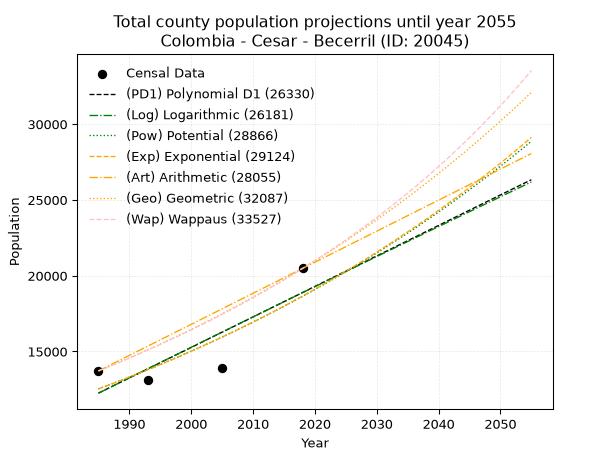
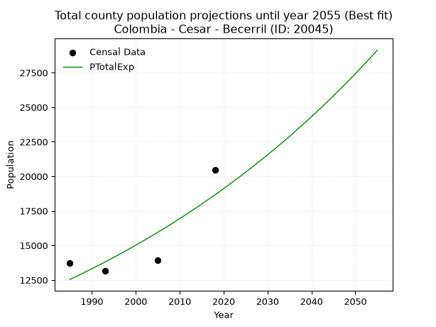
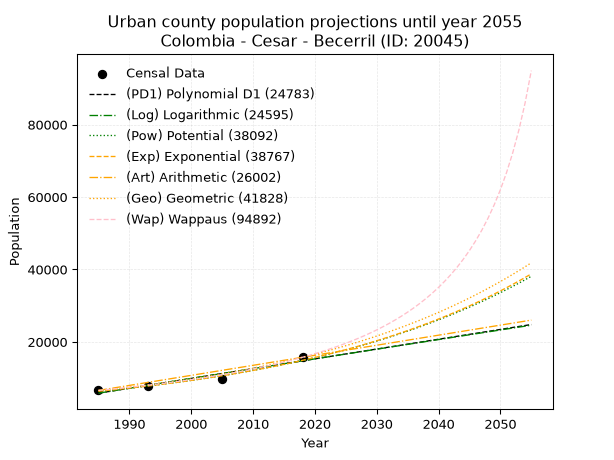
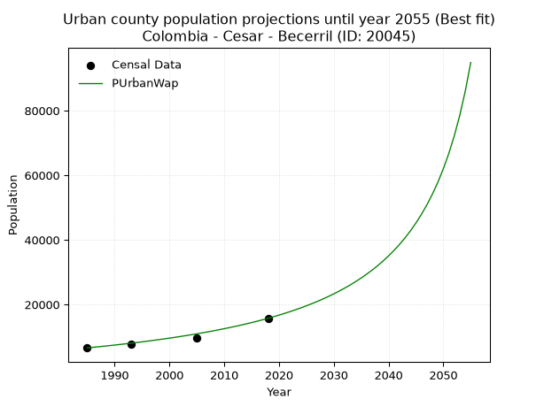
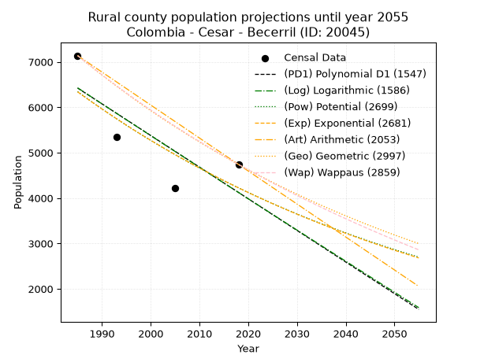
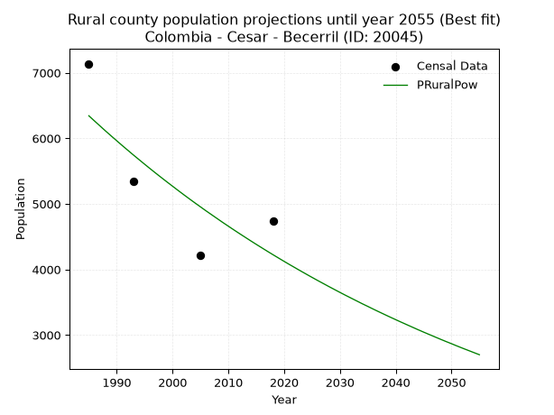

<div align="center">


</div>

# _“Population and Public Services Demand Projections (PPSD) until Year 2050 for Colombia - Cesar - Becerril (ID: 20045)”_
Keywords: `population` `public-service` `projection` `lineal` `polynomial` `logarithmic` `potential` `exponential` `arithmetic` `geometric` `wappaus` `dane` `colombia` `south-america`

PPSD are analytical estimates used by governments and planners to anticipate future changes in population size, age distribution, and the resulting community needs for utilities, healthcare, education, and infrastructure as sizing future water treatment facilities, electrical grids, and road networks based on spatial growth.

> **General running parameters**: • app_version: _v20260806_. • Python version: _3.14.7_. • Pandas version: _3.0.5_. • NumPy version: _2.5.1_. • Creates, save and include plots into reports (create_plot): _False_. • Projection until year: _2050_. • Process polynomial degree 2 and up: _False_. • Process Wappaus: _True_. • Process Wappaus: _True_. • Set negative values to zero: _True_. • Set infinite values to zero: _True_. • Drop dataset notes: _True_. 
<div align="center">

Dynamic map: [:earth_americas:Google](http://maps.google.com/maps?q=9.704404176,-73.2787073) [:earth_americas:OSM](https://www.openstreetmap.org/#map=18/9.704404176/-73.2787073&layers=P) [:earth_americas:Bing](https://www.bing.com/maps?cp=9.704404176~-73.2787073&lvl=18) [:earth_americas:Apple](https://maps.apple.com/frame?center=9.704404176%2C-73.2787073&span=0.003%2C0.006)

</div>


<div align="center">

```geojson
{
  "type": "Feature",
  "geometry": {
    "type": "Point", 
    "coordinates": [-73.2787073, 9.704404176]
  }, 
  "properties": {
    "Name": "Colombia - Cesar - Becerril (ID: 20045)"
  }
}
```

</div>


## 0. Census Data (4 records)

Census data are official statistics collected by a government about the people and housing in a country. They usually include counts of total population, age, sex, race, income, education, and jobs.

📅Global census file: [Population.xlsx](../data/Population.xlsx)

| Source   |   Year |   CountryID | CountryName   |   StateID | StateName   |   CountyID | CountyName   |   PTotal |   PUrban |   PRural |
|:---------|-------:|------------:|:--------------|----------:|:------------|-----------:|:-------------|---------:|---------:|---------:|
| DANE     |   1985 |          57 | Colombia      |        20 | Cesar       |      20045 | Becerril     |    13718 |     6580 |     7138 |
| DANE     |   1993 |          57 | Colombia      |        20 | Cesar       |      20045 | Becerril     |    13135 |     7793 |     5342 |
| DANE     |   2005 |          57 | Colombia      |        20 | Cesar       |      20045 | Becerril     |    13941 |     9720 |     4221 |
| DANE     |   2018 |          57 | Colombia      |        20 | Cesar       |      20045 | Becerril     |    20477 |    15736 |     4741 |

> 🔥Some records could had specific notes about the registered values or the corresponding urban or rural distribution.

**Local public utility companies (RUPS)**

 | SERVICIO       | ESTADO    | NOMBRE                                                        | NIT         | DEPARTAMENTO_DOMICILIO   | MUNICIPIO_DOMICILIO   | DIRECCION                                                        |   TELEFONO | EMAIL                     | TIPO_INSCRIPCION    | REPRESENTANTE_LEGAL         | TIPO_PRESTADOR                             | CLASIFICACION                  |
|:---------------|:----------|:--------------------------------------------------------------|:------------|:-------------------------|:----------------------|:-----------------------------------------------------------------|-----------:|:--------------------------|:--------------------|:----------------------------|:-------------------------------------------|:-------------------------------|
| ACUEDUCTO      | OPERATIVA | EMPRESA DE SERVICIOS PUBLICOS DE BECERRIL - EMBECERRIL E.S.P. | 800154065-1 | CESAR                    | BECERRIL              | Calle 9 N° 5-54                                                  |    5768434 | embecerrilesp@hotmail.com | Registro por la ESP | FELIX MARIA MOLINA CALDERON | EMPRESA INDUSTRIAL Y COMERCIAL DEL ESTADO  | DESDE 2501 HASTA 5000 USUARIOS |
| ALCANTARILLADO | OPERATIVA | EMPRESA DE SERVICIOS PUBLICOS DE BECERRIL - EMBECERRIL E.S.P. | 800154065-1 | CESAR                    | BECERRIL              | Calle 9 N° 5-54                                                  |    5768434 | embecerrilesp@hotmail.com | Registro por la ESP | FELIX MARIA MOLINA CALDERON | EMPRESA INDUSTRIAL Y COMERCIAL DEL ESTADO  | DESDE 2501 HASTA 5000 USUARIOS |
| ASEO           | OPERATIVA | BIOGER S.A. E.S.P.                                            | 806006669-8 | BOLIVAR                  | TURBACO               | PARQUE EMPRESARIAL VILLA ESMERALDA CLL 27 No 26-335  PLAN PAREJO |    6666528 | SISTEMA@BIOGERSAESP.COM   | Registro por la ESP | CARLOS MARIO URIBE ZIRENE   | SOCIEDADES (EMPRESA DE SERVICIOS PUBLICOS) | MAYOR O IGUAL A 5001 USUARIOS  |

> [📅RUPS Database: Registro Único de Prestadores de Servicios Públicos de Colombia Suramérica - RUPS](https://www.datos.gov.co/Hacienda-y-Cr-dito-P-blico/Registro-nico-de-Prestadores-de-Servicios-P-blicos/4qkq-csdn/about_data)

## 1. Total

### 1.1. Coefficients and Parameters

* (PD1) Polynomial Deg 1: 201.1372942593295, -387007.12284222385 (lineal)
* (Log) Logarithmic: 401997.55062052136, -3040268.8536727806
* (Pow) Potential: 24.07662235305704, -75.30093600692074
* (Exp) Exponential: 0.01204654389468932, 5.164369022899584e-07
* (Art) Arithmetic: Year diff. 2018 - 1985 = 33, Population diff. 20477 - 13718 = 6759, Annual growth = 204.8181818181818
* (Geo) Geometric: Year diff. 2018 - 1985 = 33, Population diff. 20477 - 13718 = 6759, Annual growth % = 0.012213175023895628
* (Wap) Wappaus: i = 1.1979422828962236, Condition values only valid for < 200)

<sub>
Wappaus condition values: ['0.00', '1.20', '2.40', '3.59', '4.79', '5.99', '7.19', '8.39', '9.58', '10.78', '11.98', '13.18', '14.38', '15.57', '16.77', '17.97', '19.17', '20.37', '21.56', '22.76', '23.96', '25.16', '26.35', '27.55', '28.75', '29.95', '31.15', '32.34', '33.54', '34.74', '35.94', '37.14', '38.33', '39.53', '40.73', '41.93', '43.13', '44.32', '45.52', '46.72', '47.92', '49.12', '50.31', '51.51', '52.71', '53.91', '55.11', '56.30', '57.50', '58.70', '59.90', '61.10', '62.29', '63.49', '64.69', '65.89', '67.08', '68.28', '69.48', '70.68', '71.88', '73.07', '74.27', '75.47', '76.67', '77.87']
</sub>


### 1.2. Projected Dataset

|   Year |   CountyID |   PTotalPD1 |   PTotalLog |   PTotalPow |   PTotalExp |   PTotalArt |   PTotalGeo |   PTotalWap |
|-------:|-----------:|------------:|------------:|------------:|------------:|------------:|------------:|------------:|
|   1985 |      20045 |       12250 |       12249 |       12531 |       12532 |       13718 |       13718 |       13718 |
|   1986 |      20045 |       12452 |       12451 |       12684 |       12684 |       13923 |       13886 |       13883 |
|   1987 |      20045 |       12653 |       12654 |       12839 |       12838 |       14128 |       14055 |       14051 |
|   1988 |      20045 |       12854 |       12856 |       12995 |       12994 |       14332 |       14227 |       14220 |
|   1989 |      20045 |       13055 |       13058 |       13154 |       13151 |       14537 |       14401 |       14391 |
|   1990 |      20045 |       13256 |       13260 |       13314 |       13311 |       14742 |       14576 |       14565 |
|   1991 |      20045 |       13457 |       13462 |       13476 |       13472 |       14947 |       14754 |       14741 |
|   1992 |      20045 |       13658 |       13664 |       13640 |       13635 |       15152 |       14935 |       14919 |
|   1993 |      20045 |       13860 |       13866 |       13806 |       13800 |       15357 |       15117 |       15099 |
|   1994 |      20045 |       14061 |       14068 |       13973 |       13968 |       15561 |       15302 |       15281 |
|   1995 |      20045 |       14262 |       14269 |       14143 |       14137 |       15766 |       15489 |       15466 |
|   1996 |      20045 |       14463 |       14471 |       14315 |       14308 |       15971 |       15678 |       15653 |
|   1997 |      20045 |       14664 |       14672 |       14488 |       14482 |       16176 |       15869 |       15843 |
|   1998 |      20045 |       14865 |       14873 |       14664 |       14657 |       16381 |       16063 |       16035 |
|   1999 |      20045 |       15066 |       15074 |       14842 |       14835 |       16585 |       16259 |       16229 |
|   2000 |      20045 |       15267 |       15275 |       15022 |       15015 |       16790 |       16458 |       16426 |
|   2001 |      20045 |       15469 |       15476 |       15203 |       15197 |       16995 |       16659 |       16626 |
|   2002 |      20045 |       15670 |       15677 |       15387 |       15381 |       17200 |       16862 |       16828 |
|   2003 |      20045 |       15871 |       15878 |       15574 |       15567 |       17405 |       17068 |       17033 |
|   2004 |      20045 |       16072 |       16079 |       15762 |       15756 |       17610 |       17277 |       17241 |
|   2005 |      20045 |       16273 |       16279 |       15952 |       15947 |       17814 |       17488 |       17452 |
|   2006 |      20045 |       16474 |       16480 |       16145 |       16140 |       18019 |       17701 |       17666 |
|   2007 |      20045 |       16675 |       16680 |       16340 |       16336 |       18224 |       17917 |       17882 |
|   2008 |      20045 |       16877 |       16880 |       16537 |       16534 |       18429 |       18136 |       18102 |
|   2009 |      20045 |       17078 |       17080 |       16736 |       16734 |       18634 |       18358 |       18324 |
|   2010 |      20045 |       17279 |       17280 |       16938 |       16937 |       18838 |       18582 |       18550 |
|   2011 |      20045 |       17480 |       17480 |       17142 |       17142 |       19043 |       18809 |       18779 |
|   2012 |      20045 |       17681 |       17680 |       17349 |       17350 |       19248 |       19039 |       19011 |
|   2013 |      20045 |       17882 |       17880 |       17558 |       17560 |       19453 |       19271 |       19247 |
|   2014 |      20045 |       18083 |       18079 |       17769 |       17773 |       19658 |       19506 |       19486 |
|   2015 |      20045 |       18285 |       18279 |       17982 |       17988 |       19863 |       19745 |       19728 |
|   2016 |      20045 |       18486 |       18479 |       18198 |       18206 |       20067 |       19986 |       19974 |
|   2017 |      20045 |       18687 |       18678 |       18417 |       18427 |       20272 |       20230 |       20224 |
|   2018 |      20045 |       18888 |       18877 |       18638 |       18650 |       20477 |       20477 |       20477 |
|   2019 |      20045 |       19089 |       19076 |       18862 |       18876 |       20682 |       20727 |       20734 |
|   2020 |      20045 |       19290 |       19275 |       19088 |       19105 |       20887 |       20980 |       20995 |
|   2021 |      20045 |       19491 |       19474 |       19317 |       19337 |       21091 |       21236 |       21260 |
|   2022 |      20045 |       19692 |       19673 |       19548 |       19571 |       21296 |       21496 |       21530 |
|   2023 |      20045 |       19894 |       19872 |       19782 |       19808 |       21501 |       21758 |       21803 |
|   2024 |      20045 |       20095 |       20071 |       20019 |       20048 |       21706 |       22024 |       22080 |
|   2025 |      20045 |       20296 |       20269 |       20259 |       20291 |       21911 |       22293 |       22362 |
|   2026 |      20045 |       20497 |       20468 |       20501 |       20537 |       22116 |       22565 |       22649 |
|   2027 |      20045 |       20698 |       20666 |       20746 |       20786 |       22320 |       22841 |       22940 |
|   2028 |      20045 |       20899 |       20864 |       20994 |       21038 |       22525 |       23120 |       23236 |
|   2029 |      20045 |       21100 |       21062 |       21244 |       21293 |       22730 |       23402 |       23536 |
|   2030 |      20045 |       21302 |       21261 |       21498 |       21551 |       22935 |       23688 |       23842 |
|   2031 |      20045 |       21503 |       21458 |       21754 |       21812 |       23140 |       23977 |       24152 |
|   2032 |      20045 |       21704 |       21656 |       22014 |       22076 |       23344 |       24270 |       24468 |
|   2033 |      20045 |       21905 |       21854 |       22276 |       22344 |       23549 |       24567 |       24789 |
|   2034 |      20045 |       22106 |       22052 |       22541 |       22615 |       23754 |       24867 |       25115 |
|   2035 |      20045 |       22307 |       22249 |       22810 |       22889 |       23959 |       25170 |       25448 |
|   2036 |      20045 |       22508 |       22447 |       23081 |       23166 |       24164 |       25478 |       25785 |
|   2037 |      20045 |       22710 |       22644 |       23356 |       23447 |       24369 |       25789 |       26129 |
|   2038 |      20045 |       22911 |       22842 |       23633 |       23731 |       24573 |       26104 |       26479 |
|   2039 |      20045 |       23112 |       23039 |       23914 |       24019 |       24778 |       26423 |       26834 |
|   2040 |      20045 |       23313 |       23236 |       24198 |       24310 |       24983 |       26745 |       27197 |
|   2041 |      20045 |       23514 |       23433 |       24485 |       24604 |       25188 |       27072 |       27565 |
|   2042 |      20045 |       23715 |       23630 |       24776 |       24903 |       25393 |       27403 |       27941 |
|   2043 |      20045 |       23916 |       23827 |       25069 |       25204 |       25597 |       27737 |       28323 |
|   2044 |      20045 |       24118 |       24023 |       25367 |       25510 |       25802 |       28076 |       28713 |
|   2045 |      20045 |       24319 |       24220 |       25667 |       25819 |       26007 |       28419 |       29109 |
|   2046 |      20045 |       24520 |       24417 |       25971 |       26132 |       26212 |       28766 |       29514 |
|   2047 |      20045 |       24721 |       24613 |       26278 |       26449 |       26417 |       29117 |       29926 |
|   2048 |      20045 |       24922 |       24809 |       26589 |       26769 |       26622 |       29473 |       30345 |
|   2049 |      20045 |       25123 |       25006 |       26904 |       27094 |       26826 |       29833 |       30773 |
|   2050 |      20045 |       25324 |       25202 |       27221 |       27422 |       27031 |       30197 |       31210 |
<div align="center">

</img>

</div>


### 1.3. Best fit with absolute and relative error (%)

Relative error puts that difference into context by dividing the absolute error by the true value, creating a unitless ratio or percentage that shows the scale of the mistake.

Absolute and relative error

|   Year | Source   |   CountryID | CountryName   |   StateID | StateName   |   CountyID_x | CountyName   |   PTotal |   PUrban |   PRural |   CountyID_y |   PTotalPD1 |   PTotalLog |   PTotalPow |   PTotalExp |   PTotalArt |   PTotalGeo |   PTotalWap |   PTotalPD1AbsError |   PTotalLogAbsError |   PTotalPowAbsError |   PTotalExpAbsError |   PTotalArtAbsError |   PTotalGeoAbsError |   PTotalWapAbsError |   PTotalPD1RelError |   PTotalLogRelError |   PTotalPowRelError |   PTotalExpRelError |   PTotalArtRelError |   PTotalGeoRelError |   PTotalWapRelError |
|-------:|:---------|------------:|:--------------|----------:|:------------|-------------:|:-------------|---------:|---------:|---------:|-------------:|------------:|------------:|------------:|------------:|------------:|------------:|------------:|--------------------:|--------------------:|--------------------:|--------------------:|--------------------:|--------------------:|--------------------:|--------------------:|--------------------:|--------------------:|--------------------:|--------------------:|--------------------:|--------------------:|
|   1985 | DANE     |          57 | Colombia      |        20 | Cesar       |        20045 | Becerril     |    13718 |     6580 |     7138 |        20045 |       12250 |       12249 |       12531 |       12532 |       13718 |       13718 |       13718 |                1468 |                1469 |                1187 |                1186 |                   0 |                   0 |                   0 |            10.7013  |            10.7086  |             8.65286 |             8.64558 |              0      |              0      |              0      |
|   1993 | DANE     |          57 | Colombia      |        20 | Cesar       |        20045 | Becerril     |    13135 |     7793 |     5342 |        20045 |       13860 |       13866 |       13806 |       13800 |       15357 |       15117 |       15099 |                 725 |                 731 |                 671 |                 665 |                2222 |                1982 |                1964 |             5.5196  |             5.56528 |             5.10849 |             5.06281 |             16.9166 |             15.0895 |             14.9524 |
|   2005 | DANE     |          57 | Colombia      |        20 | Cesar       |        20045 | Becerril     |    13941 |     9720 |     4221 |        20045 |       16273 |       16279 |       15952 |       15947 |       17814 |       17488 |       17452 |                2332 |                2338 |                2011 |                2006 |                3873 |                3547 |                3511 |            16.7276  |            16.7707  |            14.4251  |            14.3892  |             27.7814 |             25.4429 |             25.1847 |
|   2018 | DANE     |          57 | Colombia      |        20 | Cesar       |        20045 | Becerril     |    20477 |    15736 |     4741 |        20045 |       18888 |       18877 |       18638 |       18650 |       20477 |       20477 |       20477 |                1589 |                1600 |                1839 |                1827 |                   0 |                   0 |                   0 |             7.75993 |             7.81364 |             8.98081 |             8.92221 |              0      |              0      |              0      |

Relative error mean

| Method    |   RelError | Best   |
|:----------|-----------:|:-------|
| PTotalPD1 |   10.1771  |        |
| PTotalLog |   10.2145  |        |
| PTotalPow |    9.29181 |        |
| PTotalExp |    9.25495 | True   |
| PTotalArt |   11.1745  |        |
| PTotalGeo |   10.1331  |        |
| PTotalWap |   10.0343  |        |

💙Best method: _**PTotalExp**_
<div align="center">

</img>

</div>


### 1.4. Fresh water supply demand in liters per capita per day (lpcd)

The fresh water supply demand typically ranges from 100 to 300 liters per capita per day (lpcd) for standard domestic and municipal planning, though absolute survival minimums set by the World Health Organization are as low as 7.5 to 20 liters per day, and total consumption in high-income nations can exceed 400 liters.

> `CZ`: Level in meters above the sea level (masl)<br> `WS`: Fresh water supply demand in liters per capita per day (lpcd or l/h/d)<br> `WSAll`: Zonal fresh water supply demand in liters per second (l/s)<br> `A`: Zonal area in square meters<br> `DP`: Population density (people/hectare or p/ha)

Reference values (RAS Colombia)

|    CZ |   WS |
|------:|-----:|
|  1000 |  120 |
|  2000 |  130 |
| 99999 |  140 |

County shapefile geometry properties and water supply values

|   CountyID |      ATotal |   CZTotal |   WSTotal |
|-----------:|------------:|----------:|----------:|
|      20045 | 1.22438e+09 |     580.5 |       120 |

Projected values for best method: PTotalExp

|   CountyID |   Year |   PTotalExp |   DPTotal |   WSTotal |   WSTotalAll |
|-----------:|-------:|------------:|----------:|----------:|-------------:|
|      20045 |   1985 |       12532 |      0.1  |       120 |      17.4056 |
|      20045 |   1986 |       12684 |      0.1  |       120 |      17.6167 |
|      20045 |   1987 |       12838 |      0.1  |       120 |      17.8306 |
|      20045 |   1988 |       12994 |      0.11 |       120 |      18.0472 |
|      20045 |   1989 |       13151 |      0.11 |       120 |      18.2653 |
|      20045 |   1990 |       13311 |      0.11 |       120 |      18.4875 |
|      20045 |   1991 |       13472 |      0.11 |       120 |      18.7111 |
|      20045 |   1992 |       13635 |      0.11 |       120 |      18.9375 |
|      20045 |   1993 |       13800 |      0.11 |       120 |      19.1667 |
|      20045 |   1994 |       13968 |      0.11 |       120 |      19.4    |
|      20045 |   1995 |       14137 |      0.12 |       120 |      19.6347 |
|      20045 |   1996 |       14308 |      0.12 |       120 |      19.8722 |
|      20045 |   1997 |       14482 |      0.12 |       120 |      20.1139 |
|      20045 |   1998 |       14657 |      0.12 |       120 |      20.3569 |
|      20045 |   1999 |       14835 |      0.12 |       120 |      20.6042 |
|      20045 |   2000 |       15015 |      0.12 |       120 |      20.8542 |
|      20045 |   2001 |       15197 |      0.12 |       120 |      21.1069 |
|      20045 |   2002 |       15381 |      0.13 |       120 |      21.3625 |
|      20045 |   2003 |       15567 |      0.13 |       120 |      21.6208 |
|      20045 |   2004 |       15756 |      0.13 |       120 |      21.8833 |
|      20045 |   2005 |       15947 |      0.13 |       120 |      22.1486 |
|      20045 |   2006 |       16140 |      0.13 |       120 |      22.4167 |
|      20045 |   2007 |       16336 |      0.13 |       120 |      22.6889 |
|      20045 |   2008 |       16534 |      0.14 |       120 |      22.9639 |
|      20045 |   2009 |       16734 |      0.14 |       120 |      23.2417 |
|      20045 |   2010 |       16937 |      0.14 |       120 |      23.5236 |
|      20045 |   2011 |       17142 |      0.14 |       120 |      23.8083 |
|      20045 |   2012 |       17350 |      0.14 |       120 |      24.0972 |
|      20045 |   2013 |       17560 |      0.14 |       120 |      24.3889 |
|      20045 |   2014 |       17773 |      0.15 |       120 |      24.6847 |
|      20045 |   2015 |       17988 |      0.15 |       120 |      24.9833 |
|      20045 |   2016 |       18206 |      0.15 |       120 |      25.2861 |
|      20045 |   2017 |       18427 |      0.15 |       120 |      25.5931 |
|      20045 |   2018 |       18650 |      0.15 |       120 |      25.9028 |
|      20045 |   2019 |       18876 |      0.15 |       120 |      26.2167 |
|      20045 |   2020 |       19105 |      0.16 |       120 |      26.5347 |
|      20045 |   2021 |       19337 |      0.16 |       120 |      26.8569 |
|      20045 |   2022 |       19571 |      0.16 |       120 |      27.1819 |
|      20045 |   2023 |       19808 |      0.16 |       120 |      27.5111 |
|      20045 |   2024 |       20048 |      0.16 |       120 |      27.8444 |
|      20045 |   2025 |       20291 |      0.17 |       120 |      28.1819 |
|      20045 |   2026 |       20537 |      0.17 |       120 |      28.5236 |
|      20045 |   2027 |       20786 |      0.17 |       120 |      28.8694 |
|      20045 |   2028 |       21038 |      0.17 |       120 |      29.2194 |
|      20045 |   2029 |       21293 |      0.17 |       120 |      29.5736 |
|      20045 |   2030 |       21551 |      0.18 |       120 |      29.9319 |
|      20045 |   2031 |       21812 |      0.18 |       120 |      30.2944 |
|      20045 |   2032 |       22076 |      0.18 |       120 |      30.6611 |
|      20045 |   2033 |       22344 |      0.18 |       120 |      31.0333 |
|      20045 |   2034 |       22615 |      0.18 |       120 |      31.4097 |
|      20045 |   2035 |       22889 |      0.19 |       120 |      31.7903 |
|      20045 |   2036 |       23166 |      0.19 |       120 |      32.175  |
|      20045 |   2037 |       23447 |      0.19 |       120 |      32.5653 |
|      20045 |   2038 |       23731 |      0.19 |       120 |      32.9597 |
|      20045 |   2039 |       24019 |      0.2  |       120 |      33.3597 |
|      20045 |   2040 |       24310 |      0.2  |       120 |      33.7639 |
|      20045 |   2041 |       24604 |      0.2  |       120 |      34.1722 |
|      20045 |   2042 |       24903 |      0.2  |       120 |      34.5875 |
|      20045 |   2043 |       25204 |      0.21 |       120 |      35.0056 |
|      20045 |   2044 |       25510 |      0.21 |       120 |      35.4306 |
|      20045 |   2045 |       25819 |      0.21 |       120 |      35.8597 |
|      20045 |   2046 |       26132 |      0.21 |       120 |      36.2944 |
|      20045 |   2047 |       26449 |      0.22 |       120 |      36.7347 |
|      20045 |   2048 |       26769 |      0.22 |       120 |      37.1792 |
|      20045 |   2049 |       27094 |      0.22 |       120 |      37.6306 |
|      20045 |   2050 |       27422 |      0.22 |       120 |      38.0861 |

## 2. Urban

### 2.1. Coefficients and Parameters

* (PD1) Polynomial Deg 1: 270.79847450822564, -531707.3986350785 (lineal)
* (Log) Logarithmic: 541685.7683546852, -4107400.616061285
* (Pow) Potential: 51.7389384635166, -166.8205368070163
* (Exp) Exponential: 0.02585804218851126, 3.2419418712189746e-19
* (Art) Arithmetic: Year diff. 2018 - 1985 = 33, Population diff. 15736 - 6580 = 9156, Annual growth = 277.45454545454544
* (Geo) Geometric: Year diff. 2018 - 1985 = 33, Population diff. 15736 - 6580 = 9156, Annual growth % = 0.02677385505700025
* (Wap) Wappaus: i = 2.4865974677768907, Condition values only valid for < 200)

<sub>
Wappaus condition values: ['0.00', '2.49', '4.97', '7.46', '9.95', '12.43', '14.92', '17.41', '19.89', '22.38', '24.87', '27.35', '29.84', '32.33', '34.81', '37.30', '39.79', '42.27', '44.76', '47.25', '49.73', '52.22', '54.71', '57.19', '59.68', '62.16', '64.65', '67.14', '69.62', '72.11', '74.60', '77.08', '79.57', '82.06', '84.54', '87.03', '89.52', '92.00', '94.49', '96.98', '99.46', '101.95', '104.44', '106.92', '109.41', '111.90', '114.38', '116.87', '119.36', '121.84', '124.33', '126.82', '129.30', '131.79', '134.28', '136.76', '139.25', '141.74', '144.22', '146.71', '149.20', '151.68', '154.17', '156.66', '159.14', '161.63']
</sub>


### 2.2. Projected Dataset

|   Year |   CountyID |   PUrbanPD1 |   PUrbanLog |   PUrbanPow |   PUrbanExp |   PUrbanArt |   PUrbanGeo |   PUrbanWap |
|-------:|-----------:|------------:|------------:|------------:|------------:|------------:|------------:|------------:|
|   1985 |      20045 |        5828 |        5822 |        6340 |        6344 |        6580 |        6580 |        6580 |
|   1986 |      20045 |        6098 |        6095 |        6507 |        6510 |        6857 |        6756 |        6746 |
|   1987 |      20045 |        6369 |        6368 |        6679 |        6681 |        7135 |        6937 |        6916 |
|   1988 |      20045 |        6640 |        6640 |        6855 |        6856 |        7412 |        7123 |        7090 |
|   1989 |      20045 |        6911 |        6913 |        7036 |        7035 |        7690 |        7313 |        7269 |
|   1990 |      20045 |        7182 |        7185 |        7221 |        7220 |        7967 |        7509 |        7452 |
|   1991 |      20045 |        7452 |        7457 |        7412 |        7409 |        8245 |        7710 |        7641 |
|   1992 |      20045 |        7723 |        7729 |        7607 |        7603 |        8522 |        7917 |        7835 |
|   1993 |      20045 |        7994 |        8001 |        7807 |        7802 |        8800 |        8129 |        8034 |
|   1994 |      20045 |        8265 |        8273 |        8012 |        8006 |        9077 |        8346 |        8238 |
|   1995 |      20045 |        8536 |        8544 |        8223 |        8216 |        9355 |        8570 |        8448 |
|   1996 |      20045 |        8806 |        8816 |        8439 |        8431 |        9632 |        8799 |        8665 |
|   1997 |      20045 |        9077 |        9087 |        8660 |        8652 |        9909 |        9035 |        8888 |
|   1998 |      20045 |        9348 |        9358 |        8887 |        8879 |       10187 |        9277 |        9117 |
|   1999 |      20045 |        9619 |        9629 |        9120 |        9111 |       10464 |        9525 |        9353 |
|   2000 |      20045 |        9890 |        9900 |        9359 |        9350 |       10742 |        9780 |        9597 |
|   2001 |      20045 |       10160 |       10171 |        9605 |        9595 |       11019 |       10042 |        9848 |
|   2002 |      20045 |       10431 |       10441 |        9856 |        9846 |       11297 |       10311 |       10107 |
|   2003 |      20045 |       10702 |       10712 |       10114 |       10104 |       11574 |       10587 |       10374 |
|   2004 |      20045 |       10973 |       10982 |       10379 |       10369 |       11852 |       10870 |       10650 |
|   2005 |      20045 |       11244 |       11253 |       10650 |       10641 |       12129 |       11161 |       10935 |
|   2006 |      20045 |       11514 |       11523 |       10928 |       10919 |       12407 |       11460 |       11230 |
|   2007 |      20045 |       11785 |       11793 |       11214 |       11205 |       12684 |       11767 |       11535 |
|   2008 |      20045 |       12056 |       12062 |       11507 |       11499 |       12961 |       12082 |       11850 |
|   2009 |      20045 |       12327 |       12332 |       11807 |       11800 |       13239 |       12406 |       12177 |
|   2010 |      20045 |       12598 |       12602 |       12115 |       12109 |       13516 |       12738 |       12515 |
|   2011 |      20045 |       12868 |       12871 |       12431 |       12426 |       13794 |       13079 |       12866 |
|   2012 |      20045 |       13139 |       13140 |       12755 |       12752 |       14071 |       13429 |       13230 |
|   2013 |      20045 |       13410 |       13410 |       13087 |       13086 |       14349 |       13789 |       13608 |
|   2014 |      20045 |       13681 |       13679 |       13427 |       13429 |       14626 |       14158 |       14000 |
|   2015 |      20045 |       13952 |       13948 |       13777 |       13781 |       14904 |       14537 |       14408 |
|   2016 |      20045 |       14222 |       14216 |       14135 |       14141 |       15181 |       14926 |       14833 |
|   2017 |      20045 |       14493 |       14485 |       14502 |       14512 |       15459 |       15326 |       15275 |
|   2018 |      20045 |       14764 |       14753 |       14879 |       14892 |       15736 |       15736 |       15736 |
|   2019 |      20045 |       15035 |       15022 |       15265 |       15282 |       16013 |       16157 |       16217 |
|   2020 |      20045 |       15306 |       15290 |       15662 |       15683 |       16291 |       16590 |       16718 |
|   2021 |      20045 |       15576 |       15558 |       16068 |       16093 |       16568 |       17034 |       17243 |
|   2022 |      20045 |       15847 |       15826 |       16484 |       16515 |       16846 |       17490 |       17791 |
|   2023 |      20045 |       16118 |       16094 |       16911 |       16947 |       17123 |       17958 |       18366 |
|   2024 |      20045 |       16389 |       16362 |       17349 |       17391 |       17401 |       18439 |       18968 |
|   2025 |      20045 |       16660 |       16629 |       17799 |       17847 |       17678 |       18933 |       19600 |
|   2026 |      20045 |       16930 |       16897 |       18259 |       18315 |       17956 |       19440 |       20264 |
|   2027 |      20045 |       17201 |       17164 |       18731 |       18794 |       18233 |       19960 |       20962 |
|   2028 |      20045 |       17472 |       17431 |       19215 |       19287 |       18511 |       20495 |       21698 |
|   2029 |      20045 |       17743 |       17698 |       19712 |       19792 |       18788 |       21043 |       22474 |
|   2030 |      20045 |       18014 |       17965 |       20221 |       20310 |       19065 |       21607 |       23294 |
|   2031 |      20045 |       18284 |       18232 |       20743 |       20842 |       19343 |       22185 |       24162 |
|   2032 |      20045 |       18555 |       18498 |       21278 |       21388 |       19620 |       22779 |       25081 |
|   2033 |      20045 |       18826 |       18765 |       21826 |       21949 |       19898 |       23389 |       26058 |
|   2034 |      20045 |       19097 |       19031 |       22389 |       22523 |       20175 |       24015 |       27096 |
|   2035 |      20045 |       19367 |       19298 |       22965 |       23113 |       20453 |       24658 |       28203 |
|   2036 |      20045 |       19638 |       19564 |       23557 |       23719 |       20730 |       25319 |       29384 |
|   2037 |      20045 |       19909 |       19830 |       24163 |       24340 |       21008 |       25997 |       30649 |
|   2038 |      20045 |       20180 |       20096 |       24784 |       24978 |       21285 |       26693 |       32007 |
|   2039 |      20045 |       20451 |       20361 |       25421 |       25632 |       21563 |       27407 |       33466 |
|   2040 |      20045 |       20721 |       20627 |       26074 |       26304 |       21840 |       28141 |       35041 |
|   2041 |      20045 |       20992 |       20892 |       26744 |       26993 |       22117 |       28894 |       36745 |
|   2042 |      20045 |       21263 |       21158 |       27430 |       27700 |       22395 |       29668 |       38594 |
|   2043 |      20045 |       21534 |       21423 |       28134 |       28425 |       22672 |       30462 |       40608 |
|   2044 |      20045 |       21805 |       21688 |       28856 |       29170 |       22950 |       31278 |       42809 |
|   2045 |      20045 |       22075 |       21953 |       29595 |       29934 |       23227 |       32115 |       45227 |
|   2046 |      20045 |       22346 |       22218 |       30353 |       30718 |       23505 |       32975 |       47893 |
|   2047 |      20045 |       22617 |       22482 |       31130 |       31523 |       23782 |       33858 |       50848 |
|   2048 |      20045 |       22888 |       22747 |       31927 |       32349 |       24060 |       34765 |       54143 |
|   2049 |      20045 |       23159 |       23011 |       32744 |       33196 |       24337 |       35695 |       57839 |
|   2050 |      20045 |       23429 |       23276 |       33581 |       34066 |       24615 |       36651 |       62013 |
<div align="center">

</img>

</div>


### 2.3. Best fit with absolute and relative error (%)

Relative error puts that difference into context by dividing the absolute error by the true value, creating a unitless ratio or percentage that shows the scale of the mistake.

Absolute and relative error

|   Year | Source   |   CountryID | CountryName   |   StateID | StateName   |   CountyID_x | CountyName   |   PTotal |   PUrban |   PRural |   CountyID_y |   PUrbanPD1 |   PUrbanLog |   PUrbanPow |   PUrbanExp |   PUrbanArt |   PUrbanGeo |   PUrbanWap |   PUrbanPD1AbsError |   PUrbanLogAbsError |   PUrbanPowAbsError |   PUrbanExpAbsError |   PUrbanArtAbsError |   PUrbanGeoAbsError |   PUrbanWapAbsError |   PUrbanPD1RelError |   PUrbanLogRelError |   PUrbanPowRelError |   PUrbanExpRelError |   PUrbanArtRelError |   PUrbanGeoRelError |   PUrbanWapRelError |
|-------:|:---------|------------:|:--------------|----------:|:------------|-------------:|:-------------|---------:|---------:|---------:|-------------:|------------:|------------:|------------:|------------:|------------:|------------:|------------:|--------------------:|--------------------:|--------------------:|--------------------:|--------------------:|--------------------:|--------------------:|--------------------:|--------------------:|--------------------:|--------------------:|--------------------:|--------------------:|--------------------:|
|   1985 | DANE     |          57 | Colombia      |        20 | Cesar       |        20045 | Becerril     |    13718 |     6580 |     7138 |        20045 |        5828 |        5822 |        6340 |        6344 |        6580 |        6580 |        6580 |                 752 |                 758 |                 240 |                 236 |                   0 |                   0 |                   0 |            11.4286  |            11.5198  |            3.64742  |            3.58663  |              0      |             0       |             0       |
|   1993 | DANE     |          57 | Colombia      |        20 | Cesar       |        20045 | Becerril     |    13135 |     7793 |     5342 |        20045 |        7994 |        8001 |        7807 |        7802 |        8800 |        8129 |        8034 |                 201 |                 208 |                  14 |                   9 |                1007 |                 336 |                 241 |             2.57924 |             2.66906 |            0.179648 |            0.115488 |             12.9219 |             4.31156 |             3.09252 |
|   2005 | DANE     |          57 | Colombia      |        20 | Cesar       |        20045 | Becerril     |    13941 |     9720 |     4221 |        20045 |       11244 |       11253 |       10650 |       10641 |       12129 |       11161 |       10935 |                1524 |                1533 |                 930 |                 921 |                2409 |                1441 |                1215 |            15.679   |            15.7716  |            9.5679   |            9.47531  |             24.784  |            14.8251  |            12.5     |
|   2018 | DANE     |          57 | Colombia      |        20 | Cesar       |        20045 | Becerril     |    20477 |    15736 |     4741 |        20045 |       14764 |       14753 |       14879 |       14892 |       15736 |       15736 |       15736 |                 972 |                 983 |                 857 |                 844 |                   0 |                   0 |                   0 |             6.17692 |             6.24682 |            5.44611  |            5.3635   |              0      |             0       |             0       |

Relative error mean

| Method    |   RelError | Best   |
|:----------|-----------:|:-------|
| PUrbanPD1 |    8.96594 |        |
| PUrbanLog |    9.05181 |        |
| PUrbanPow |    4.71027 |        |
| PUrbanExp |    4.63523 |        |
| PUrbanArt |    9.42645 |        |
| PUrbanGeo |    4.78417 |        |
| PUrbanWap |    3.89813 | True   |

💙Best method: _**PUrbanWap**_
<div align="center">

</img>

</div>


### 2.4. Fresh water supply demand in liters per capita per day (lpcd)

The fresh water supply demand typically ranges from 100 to 300 liters per capita per day (lpcd) for standard domestic and municipal planning, though absolute survival minimums set by the World Health Organization are as low as 7.5 to 20 liters per day, and total consumption in high-income nations can exceed 400 liters.

> `CZ`: Level in meters above the sea level (masl)<br> `WS`: Fresh water supply demand in liters per capita per day (lpcd or l/h/d)<br> `WSAll`: Zonal fresh water supply demand in liters per second (l/s)<br> `A`: Zonal area in square meters<br> `DP`: Population density (people/hectare or p/ha)

Reference values (RAS Colombia)

|    CZ |   WS |
|------:|-----:|
|  1000 |  120 |
|  2000 |  130 |
| 99999 |  140 |

County shapefile geometry properties and water supply values

|   CountyID |      AUrban |   CZUrban |   WSUrban |
|-----------:|------------:|----------:|----------:|
|      20045 | 2.99869e+06 |   110.231 |       120 |

Projected values for best method: PUrbanWap

|   CountyID |   Year |   PUrbanWap |   DPUrban |   WSUrban |   WSUrbanAll |
|-----------:|-------:|------------:|----------:|----------:|-------------:|
|      20045 |   1985 |        6580 |     21.94 |       120 |      9.13889 |
|      20045 |   1986 |        6746 |     22.5  |       120 |      9.36944 |
|      20045 |   1987 |        6916 |     23.06 |       120 |      9.60556 |
|      20045 |   1988 |        7090 |     23.64 |       120 |      9.84722 |
|      20045 |   1989 |        7269 |     24.24 |       120 |     10.0958  |
|      20045 |   1990 |        7452 |     24.85 |       120 |     10.35    |
|      20045 |   1991 |        7641 |     25.48 |       120 |     10.6125  |
|      20045 |   1992 |        7835 |     26.13 |       120 |     10.8819  |
|      20045 |   1993 |        8034 |     26.79 |       120 |     11.1583  |
|      20045 |   1994 |        8238 |     27.47 |       120 |     11.4417  |
|      20045 |   1995 |        8448 |     28.17 |       120 |     11.7333  |
|      20045 |   1996 |        8665 |     28.9  |       120 |     12.0347  |
|      20045 |   1997 |        8888 |     29.64 |       120 |     12.3444  |
|      20045 |   1998 |        9117 |     30.4  |       120 |     12.6625  |
|      20045 |   1999 |        9353 |     31.19 |       120 |     12.9903  |
|      20045 |   2000 |        9597 |     32    |       120 |     13.3292  |
|      20045 |   2001 |        9848 |     32.84 |       120 |     13.6778  |
|      20045 |   2002 |       10107 |     33.7  |       120 |     14.0375  |
|      20045 |   2003 |       10374 |     34.6  |       120 |     14.4083  |
|      20045 |   2004 |       10650 |     35.52 |       120 |     14.7917  |
|      20045 |   2005 |       10935 |     36.47 |       120 |     15.1875  |
|      20045 |   2006 |       11230 |     37.45 |       120 |     15.5972  |
|      20045 |   2007 |       11535 |     38.47 |       120 |     16.0208  |
|      20045 |   2008 |       11850 |     39.52 |       120 |     16.4583  |
|      20045 |   2009 |       12177 |     40.61 |       120 |     16.9125  |
|      20045 |   2010 |       12515 |     41.73 |       120 |     17.3819  |
|      20045 |   2011 |       12866 |     42.91 |       120 |     17.8694  |
|      20045 |   2012 |       13230 |     44.12 |       120 |     18.375   |
|      20045 |   2013 |       13608 |     45.38 |       120 |     18.9     |
|      20045 |   2014 |       14000 |     46.69 |       120 |     19.4444  |
|      20045 |   2015 |       14408 |     48.05 |       120 |     20.0111  |
|      20045 |   2016 |       14833 |     49.47 |       120 |     20.6014  |
|      20045 |   2017 |       15275 |     50.94 |       120 |     21.2153  |
|      20045 |   2018 |       15736 |     52.48 |       120 |     21.8556  |
|      20045 |   2019 |       16217 |     54.08 |       120 |     22.5236  |
|      20045 |   2020 |       16718 |     55.75 |       120 |     23.2194  |
|      20045 |   2021 |       17243 |     57.5  |       120 |     23.9486  |
|      20045 |   2022 |       17791 |     59.33 |       120 |     24.7097  |
|      20045 |   2023 |       18366 |     61.25 |       120 |     25.5083  |
|      20045 |   2024 |       18968 |     63.25 |       120 |     26.3444  |
|      20045 |   2025 |       19600 |     65.36 |       120 |     27.2222  |
|      20045 |   2026 |       20264 |     67.58 |       120 |     28.1444  |
|      20045 |   2027 |       20962 |     69.9  |       120 |     29.1139  |
|      20045 |   2028 |       21698 |     72.36 |       120 |     30.1361  |
|      20045 |   2029 |       22474 |     74.95 |       120 |     31.2139  |
|      20045 |   2030 |       23294 |     77.68 |       120 |     32.3528  |
|      20045 |   2031 |       24162 |     80.58 |       120 |     33.5583  |
|      20045 |   2032 |       25081 |     83.64 |       120 |     34.8347  |
|      20045 |   2033 |       26058 |     86.9  |       120 |     36.1917  |
|      20045 |   2034 |       27096 |     90.36 |       120 |     37.6333  |
|      20045 |   2035 |       28203 |     94.05 |       120 |     39.1708  |
|      20045 |   2036 |       29384 |     97.99 |       120 |     40.8111  |
|      20045 |   2037 |       30649 |    102.21 |       120 |     42.5681  |
|      20045 |   2038 |       32007 |    106.74 |       120 |     44.4542  |
|      20045 |   2039 |       33466 |    111.6  |       120 |     46.4806  |
|      20045 |   2040 |       35041 |    116.85 |       120 |     48.6681  |
|      20045 |   2041 |       36745 |    122.54 |       120 |     51.0347  |
|      20045 |   2042 |       38594 |    128.7  |       120 |     53.6028  |
|      20045 |   2043 |       40608 |    135.42 |       120 |     56.4     |
|      20045 |   2044 |       42809 |    142.76 |       120 |     59.4569  |
|      20045 |   2045 |       45227 |    150.82 |       120 |     62.8153  |
|      20045 |   2046 |       47893 |    159.71 |       120 |     66.5181  |
|      20045 |   2047 |       50848 |    169.57 |       120 |     70.6222  |
|      20045 |   2048 |       54143 |    180.56 |       120 |     75.1986  |
|      20045 |   2049 |       57839 |    192.88 |       120 |     80.3319  |
|      20045 |   2050 |       62013 |    206.8  |       120 |     86.1292  |

## 3. Rural

### 3.1. Coefficients and Parameters

* (PD1) Polynomial Deg 1: -69.66118024889629, 144700.27579285478 (lineal)
* (Log) Logarithmic: -139688.21773416383, 1067131.762388504
* (Pow) Potential: -24.65679155383491, 85.11458025405281
* (Exp) Exponential: -0.012295788931178615, 252326578584885.97
* (Art) Arithmetic: Year diff. 2018 - 1985 = 33, Population diff. 4741 - 7138 = -2397, Annual growth = -72.63636363636364
* (Geo) Geometric: Year diff. 2018 - 1985 = 33, Population diff. 4741 - 7138 = -2397, Annual growth % = -0.012322974110760887
* (Wap) Wappaus: i = -1.2229373455065853, Condition values only valid for < 200)

<sub>
Wappaus condition values: ['-0.00', '-1.22', '-2.45', '-3.67', '-4.89', '-6.11', '-7.34', '-8.56', '-9.78', '-11.01', '-12.23', '-13.45', '-14.68', '-15.90', '-17.12', '-18.34', '-19.57', '-20.79', '-22.01', '-23.24', '-24.46', '-25.68', '-26.90', '-28.13', '-29.35', '-30.57', '-31.80', '-33.02', '-34.24', '-35.47', '-36.69', '-37.91', '-39.13', '-40.36', '-41.58', '-42.80', '-44.03', '-45.25', '-46.47', '-47.69', '-48.92', '-50.14', '-51.36', '-52.59', '-53.81', '-55.03', '-56.26', '-57.48', '-58.70', '-59.92', '-61.15', '-62.37', '-63.59', '-64.82', '-66.04', '-67.26', '-68.48', '-69.71', '-70.93', '-72.15', '-73.38', '-74.60', '-75.82', '-77.05', '-78.27', '-79.49']
</sub>


### 3.2. Projected Dataset

|   Year |   CountyID |   PRuralPD1 |   PRuralLog |   PRuralPow |   PRuralExp |   PRuralArt |   PRuralGeo |   PRuralWap |
|-------:|-----------:|------------:|------------:|------------:|------------:|------------:|------------:|------------:|
|   1985 |      20045 |        6423 |        6427 |        6344 |        6340 |        7138 |        7138 |        7138 |
|   1986 |      20045 |        6353 |        6357 |        6266 |        6262 |        7065 |        7050 |        7051 |
|   1987 |      20045 |        6284 |        6286 |        6189 |        6186 |        6993 |        6963 |        6966 |
|   1988 |      20045 |        6214 |        6216 |        6112 |        6110 |        6920 |        6877 |        6881 |
|   1989 |      20045 |        6144 |        6146 |        6037 |        6036 |        6847 |        6793 |        6797 |
|   1990 |      20045 |        6075 |        6075 |        5963 |        5962 |        6775 |        6709 |        6714 |
|   1991 |      20045 |        6005 |        6005 |        5889 |        5889 |        6702 |        6626 |        6633 |
|   1992 |      20045 |        5935 |        5935 |        5817 |        5817 |        6630 |        6545 |        6552 |
|   1993 |      20045 |        5866 |        5865 |        5745 |        5746 |        6557 |        6464 |        6472 |
|   1994 |      20045 |        5796 |        5795 |        5675 |        5676 |        6484 |        6384 |        6393 |
|   1995 |      20045 |        5726 |        5725 |        5605 |        5606 |        6412 |        6306 |        6315 |
|   1996 |      20045 |        5657 |        5655 |        5536 |        5538 |        6339 |        6228 |        6238 |
|   1997 |      20045 |        5587 |        5585 |        5468 |        5470 |        6266 |        6151 |        6162 |
|   1998 |      20045 |        5517 |        5515 |        5401 |        5403 |        6194 |        6075 |        6087 |
|   1999 |      20045 |        5448 |        5445 |        5335 |        5337 |        6121 |        6000 |        6012 |
|   2000 |      20045 |        5378 |        5375 |        5270 |        5272 |        6048 |        5927 |        5939 |
|   2001 |      20045 |        5308 |        5305 |        5205 |        5208 |        5976 |        5854 |        5866 |
|   2002 |      20045 |        5239 |        5236 |        5141 |        5144 |        5903 |        5781 |        5794 |
|   2003 |      20045 |        5169 |        5166 |        5078 |        5081 |        5831 |        5710 |        5723 |
|   2004 |      20045 |        5099 |        5096 |        5016 |        5019 |        5758 |        5640 |        5652 |
|   2005 |      20045 |        5030 |        5026 |        4955 |        4958 |        5685 |        5570 |        5582 |
|   2006 |      20045 |        4960 |        4957 |        4894 |        4897 |        5613 |        5502 |        5513 |
|   2007 |      20045 |        4890 |        4887 |        4835 |        4837 |        5540 |        5434 |        5445 |
|   2008 |      20045 |        4821 |        4818 |        4776 |        4778 |        5467 |        5367 |        5378 |
|   2009 |      20045 |        4751 |        4748 |        4717 |        4720 |        5395 |        5301 |        5311 |
|   2010 |      20045 |        4681 |        4679 |        4660 |        4662 |        5322 |        5235 |        5245 |
|   2011 |      20045 |        4612 |        4609 |        4603 |        4605 |        5249 |        5171 |        5180 |
|   2012 |      20045 |        4542 |        4540 |        4547 |        4549 |        5177 |        5107 |        5115 |
|   2013 |      20045 |        4472 |        4470 |        4492 |        4493 |        5104 |        5044 |        5051 |
|   2014 |      20045 |        4403 |        4401 |        4437 |        4438 |        5032 |        4982 |        4988 |
|   2015 |      20045 |        4333 |        4331 |        4383 |        4384 |        4959 |        4921 |        4925 |
|   2016 |      20045 |        4263 |        4262 |        4330 |        4330 |        4886 |        4860 |        4863 |
|   2017 |      20045 |        4194 |        4193 |        4277 |        4278 |        4814 |        4800 |        4802 |
|   2018 |      20045 |        4124 |        4124 |        4225 |        4225 |        4741 |        4741 |        4741 |
|   2019 |      20045 |        4054 |        4054 |        4174 |        4174 |        4668 |        4683 |        4681 |
|   2020 |      20045 |        3985 |        3985 |        4123 |        4123 |        4596 |        4625 |        4621 |
|   2021 |      20045 |        3915 |        3916 |        4073 |        4072 |        4523 |        4568 |        4562 |
|   2022 |      20045 |        3845 |        3847 |        4024 |        4023 |        4450 |        4512 |        4504 |
|   2023 |      20045 |        3776 |        3778 |        3975 |        3973 |        4378 |        4456 |        4446 |
|   2024 |      20045 |        3706 |        3709 |        3927 |        3925 |        4305 |        4401 |        4389 |
|   2025 |      20045 |        3636 |        3640 |        3879 |        3877 |        4233 |        4347 |        4332 |
|   2026 |      20045 |        3567 |        3571 |        3832 |        3829 |        4160 |        4293 |        4276 |
|   2027 |      20045 |        3497 |        3502 |        3786 |        3783 |        4087 |        4240 |        4221 |
|   2028 |      20045 |        3427 |        3433 |        3740 |        3736 |        4015 |        4188 |        4166 |
|   2029 |      20045 |        3358 |        3364 |        3695 |        3691 |        3942 |        4137 |        4111 |
|   2030 |      20045 |        3288 |        3295 |        3650 |        3646 |        3869 |        4086 |        4057 |
|   2031 |      20045 |        3218 |        3227 |        3606 |        3601 |        3797 |        4035 |        4004 |
|   2032 |      20045 |        3149 |        3158 |        3563 |        3557 |        3724 |        3985 |        3951 |
|   2033 |      20045 |        3079 |        3089 |        3520 |        3514 |        3651 |        3936 |        3899 |
|   2034 |      20045 |        3009 |        3021 |        3477 |        3471 |        3579 |        3888 |        3847 |
|   2035 |      20045 |        2940 |        2952 |        3436 |        3428 |        3506 |        3840 |        3795 |
|   2036 |      20045 |        2870 |        2883 |        3394 |        3386 |        3434 |        3793 |        3744 |
|   2037 |      20045 |        2800 |        2815 |        3353 |        3345 |        3361 |        3746 |        3694 |
|   2038 |      20045 |        2731 |        2746 |        3313 |        3304 |        3288 |        3700 |        3644 |
|   2039 |      20045 |        2661 |        2678 |        3273 |        3264 |        3216 |        3654 |        3594 |
|   2040 |      20045 |        2591 |        2609 |        3234 |        3224 |        3143 |        3609 |        3545 |
|   2041 |      20045 |        2522 |        2541 |        3195 |        3184 |        3070 |        3565 |        3497 |
|   2042 |      20045 |        2452 |        2472 |        3157 |        3146 |        2998 |        3521 |        3448 |
|   2043 |      20045 |        2382 |        2404 |        3119 |        3107 |        2925 |        3477 |        3401 |
|   2044 |      20045 |        2313 |        2335 |        3081 |        3069 |        2852 |        3434 |        3353 |
|   2045 |      20045 |        2243 |        2267 |        3044 |        3032 |        2780 |        3392 |        3306 |
|   2046 |      20045 |        2174 |        2199 |        3008 |        2995 |        2707 |        3350 |        3260 |
|   2047 |      20045 |        2104 |        2131 |        2972 |        2958 |        2635 |        3309 |        3214 |
|   2048 |      20045 |        2034 |        2062 |        2936 |        2922 |        2562 |        3268 |        3168 |
|   2049 |      20045 |        1965 |        1994 |        2901 |        2886 |        2489 |        3228 |        3123 |
|   2050 |      20045 |        1895 |        1926 |        2867 |        2851 |        2417 |        3188 |        3078 |
<div align="center">

</img>

</div>


### 3.3. Best fit with absolute and relative error (%)

Relative error puts that difference into context by dividing the absolute error by the true value, creating a unitless ratio or percentage that shows the scale of the mistake.

Absolute and relative error

|   Year | Source   |   CountryID | CountryName   |   StateID | StateName   |   CountyID_x | CountyName   |   PTotal |   PUrban |   PRural |   CountyID_y |   PRuralPD1 |   PRuralLog |   PRuralPow |   PRuralExp |   PRuralArt |   PRuralGeo |   PRuralWap |   PRuralPD1AbsError |   PRuralLogAbsError |   PRuralPowAbsError |   PRuralExpAbsError |   PRuralArtAbsError |   PRuralGeoAbsError |   PRuralWapAbsError |   PRuralPD1RelError |   PRuralLogRelError |   PRuralPowRelError |   PRuralExpRelError |   PRuralArtRelError |   PRuralGeoRelError |   PRuralWapRelError |
|-------:|:---------|------------:|:--------------|----------:|:------------|-------------:|:-------------|---------:|---------:|---------:|-------------:|------------:|------------:|------------:|------------:|------------:|------------:|------------:|--------------------:|--------------------:|--------------------:|--------------------:|--------------------:|--------------------:|--------------------:|--------------------:|--------------------:|--------------------:|--------------------:|--------------------:|--------------------:|--------------------:|
|   1985 | DANE     |          57 | Colombia      |        20 | Cesar       |        20045 | Becerril     |    13718 |     6580 |     7138 |        20045 |        6423 |        6427 |        6344 |        6340 |        7138 |        7138 |        7138 |                 715 |                 711 |                 794 |                 798 |                   0 |                   0 |                   0 |            10.0168  |             9.96077 |            11.1236  |            11.1796  |              0      |              0      |              0      |
|   1993 | DANE     |          57 | Colombia      |        20 | Cesar       |        20045 | Becerril     |    13135 |     7793 |     5342 |        20045 |        5866 |        5865 |        5745 |        5746 |        6557 |        6464 |        6472 |                 524 |                 523 |                 403 |                 404 |                1215 |                1122 |                1130 |             9.80906 |             9.79034 |             7.54399 |             7.56271 |             22.7443 |             21.0034 |             21.1531 |
|   2005 | DANE     |          57 | Colombia      |        20 | Cesar       |        20045 | Becerril     |    13941 |     9720 |     4221 |        20045 |        5030 |        5026 |        4955 |        4958 |        5685 |        5570 |        5582 |                 809 |                 805 |                 734 |                 737 |                1464 |                1349 |                1361 |            19.1661  |            19.0713  |            17.3892  |            17.4603  |             34.6837 |             31.9593 |             32.2435 |
|   2018 | DANE     |          57 | Colombia      |        20 | Cesar       |        20045 | Becerril     |    20477 |    15736 |     4741 |        20045 |        4124 |        4124 |        4225 |        4225 |        4741 |        4741 |        4741 |                 617 |                 617 |                 516 |                 516 |                   0 |                   0 |                   0 |            13.0141  |            13.0141  |            10.8838  |            10.8838  |              0      |              0      |              0      |

Relative error mean

| Method    |   RelError | Best   |
|:----------|-----------:|:-------|
| PRuralPD1 |    13.0015 |        |
| PRuralLog |    12.9591 |        |
| PRuralPow |    11.7351 | True   |
| PRuralExp |    11.7716 |        |
| PRuralArt |    14.357  |        |
| PRuralGeo |    13.2407 |        |
| PRuralWap |    13.3492 |        |

💙Best method: _**PRuralPow**_
<div align="center">

</img>

</div>


### 3.4. Fresh water supply demand in liters per capita per day (lpcd)

The fresh water supply demand typically ranges from 100 to 300 liters per capita per day (lpcd) for standard domestic and municipal planning, though absolute survival minimums set by the World Health Organization are as low as 7.5 to 20 liters per day, and total consumption in high-income nations can exceed 400 liters.

> `CZ`: Level in meters above the sea level (masl)<br> `WS`: Fresh water supply demand in liters per capita per day (lpcd or l/h/d)<br> `WSAll`: Zonal fresh water supply demand in liters per second (l/s)<br> `A`: Zonal area in square meters<br> `DP`: Population density (people/hectare or p/ha)

Reference values (RAS Colombia)

|    CZ |   WS |
|------:|-----:|
|  1000 |  120 |
|  2000 |  130 |
| 99999 |  140 |

County shapefile geometry properties and water supply values

|   CountyID |      ARural |   CZRural |   WSRural |
|-----------:|------------:|----------:|----------:|
|      20045 | 1.22139e+09 |   581.656 |       120 |

Projected values for best method: PRuralPow

|   CountyID |   Year |   PRuralPow |   DPRural |   WSRural |   WSRuralAll |
|-----------:|-------:|------------:|----------:|----------:|-------------:|
|      20045 |   1985 |        6344 |      0.05 |       120 |      8.81111 |
|      20045 |   1986 |        6266 |      0.05 |       120 |      8.70278 |
|      20045 |   1987 |        6189 |      0.05 |       120 |      8.59583 |
|      20045 |   1988 |        6112 |      0.05 |       120 |      8.48889 |
|      20045 |   1989 |        6037 |      0.05 |       120 |      8.38472 |
|      20045 |   1990 |        5963 |      0.05 |       120 |      8.28194 |
|      20045 |   1991 |        5889 |      0.05 |       120 |      8.17917 |
|      20045 |   1992 |        5817 |      0.05 |       120 |      8.07917 |
|      20045 |   1993 |        5745 |      0.05 |       120 |      7.97917 |
|      20045 |   1994 |        5675 |      0.05 |       120 |      7.88194 |
|      20045 |   1995 |        5605 |      0.05 |       120 |      7.78472 |
|      20045 |   1996 |        5536 |      0.05 |       120 |      7.68889 |
|      20045 |   1997 |        5468 |      0.04 |       120 |      7.59444 |
|      20045 |   1998 |        5401 |      0.04 |       120 |      7.50139 |
|      20045 |   1999 |        5335 |      0.04 |       120 |      7.40972 |
|      20045 |   2000 |        5270 |      0.04 |       120 |      7.31944 |
|      20045 |   2001 |        5205 |      0.04 |       120 |      7.22917 |
|      20045 |   2002 |        5141 |      0.04 |       120 |      7.14028 |
|      20045 |   2003 |        5078 |      0.04 |       120 |      7.05278 |
|      20045 |   2004 |        5016 |      0.04 |       120 |      6.96667 |
|      20045 |   2005 |        4955 |      0.04 |       120 |      6.88194 |
|      20045 |   2006 |        4894 |      0.04 |       120 |      6.79722 |
|      20045 |   2007 |        4835 |      0.04 |       120 |      6.71528 |
|      20045 |   2008 |        4776 |      0.04 |       120 |      6.63333 |
|      20045 |   2009 |        4717 |      0.04 |       120 |      6.55139 |
|      20045 |   2010 |        4660 |      0.04 |       120 |      6.47222 |
|      20045 |   2011 |        4603 |      0.04 |       120 |      6.39306 |
|      20045 |   2012 |        4547 |      0.04 |       120 |      6.31528 |
|      20045 |   2013 |        4492 |      0.04 |       120 |      6.23889 |
|      20045 |   2014 |        4437 |      0.04 |       120 |      6.1625  |
|      20045 |   2015 |        4383 |      0.04 |       120 |      6.0875  |
|      20045 |   2016 |        4330 |      0.04 |       120 |      6.01389 |
|      20045 |   2017 |        4277 |      0.04 |       120 |      5.94028 |
|      20045 |   2018 |        4225 |      0.03 |       120 |      5.86806 |
|      20045 |   2019 |        4174 |      0.03 |       120 |      5.79722 |
|      20045 |   2020 |        4123 |      0.03 |       120 |      5.72639 |
|      20045 |   2021 |        4073 |      0.03 |       120 |      5.65694 |
|      20045 |   2022 |        4024 |      0.03 |       120 |      5.58889 |
|      20045 |   2023 |        3975 |      0.03 |       120 |      5.52083 |
|      20045 |   2024 |        3927 |      0.03 |       120 |      5.45417 |
|      20045 |   2025 |        3879 |      0.03 |       120 |      5.3875  |
|      20045 |   2026 |        3832 |      0.03 |       120 |      5.32222 |
|      20045 |   2027 |        3786 |      0.03 |       120 |      5.25833 |
|      20045 |   2028 |        3740 |      0.03 |       120 |      5.19444 |
|      20045 |   2029 |        3695 |      0.03 |       120 |      5.13194 |
|      20045 |   2030 |        3650 |      0.03 |       120 |      5.06944 |
|      20045 |   2031 |        3606 |      0.03 |       120 |      5.00833 |
|      20045 |   2032 |        3563 |      0.03 |       120 |      4.94861 |
|      20045 |   2033 |        3520 |      0.03 |       120 |      4.88889 |
|      20045 |   2034 |        3477 |      0.03 |       120 |      4.82917 |
|      20045 |   2035 |        3436 |      0.03 |       120 |      4.77222 |
|      20045 |   2036 |        3394 |      0.03 |       120 |      4.71389 |
|      20045 |   2037 |        3353 |      0.03 |       120 |      4.65694 |
|      20045 |   2038 |        3313 |      0.03 |       120 |      4.60139 |
|      20045 |   2039 |        3273 |      0.03 |       120 |      4.54583 |
|      20045 |   2040 |        3234 |      0.03 |       120 |      4.49167 |
|      20045 |   2041 |        3195 |      0.03 |       120 |      4.4375  |
|      20045 |   2042 |        3157 |      0.03 |       120 |      4.38472 |
|      20045 |   2043 |        3119 |      0.03 |       120 |      4.33194 |
|      20045 |   2044 |        3081 |      0.03 |       120 |      4.27917 |
|      20045 |   2045 |        3044 |      0.02 |       120 |      4.22778 |
|      20045 |   2046 |        3008 |      0.02 |       120 |      4.17778 |
|      20045 |   2047 |        2972 |      0.02 |       120 |      4.12778 |
|      20045 |   2048 |        2936 |      0.02 |       120 |      4.07778 |
|      20045 |   2049 |        2901 |      0.02 |       120 |      4.02917 |
|      20045 |   2050 |        2867 |      0.02 |       120 |      3.98194 |

<div align="center"><br><sub>Share this research</sub></div><br>

<sub>**APPS & TOOLS & CONTENT DISCLAIMER**: • NO WARRANTY - This content and software is provided by <a href="https://github.com/rcfdtools" target="_blank">github.com/rcfdtools</a> "as is", without any express or implied warranty, including warranties of merchantability, fitness for a particular purpose, or non-infringement. There is no guarantee that the software will be error-free or operate without interruption. • LIMITATION OF LIABILITY - Neither the authors nor copyright holders will be liable for claims or damages arising from the software or its use. You are responsible for determining if the software is appropriate for your use and assume all associated risks, including errors, legal compliance, and data loss. • NO PROFESSIONAL ADVICE - The software provides general information and does not offer professional advice. It should not replace consultation with professional advisors. [Clauses and global license for rcfdtools use.](https://github.com/rcfdtools/rcfdtools/blob/main/LICENSE.md)</sub>

| [:house: Home](Readme.md)  | [:beginner: Help / Collaborate](https://github.com/rcfdtools/R.HydroTools/discussions/31) |
|----------------------------|-------------------------------------------------------------------------------------------|