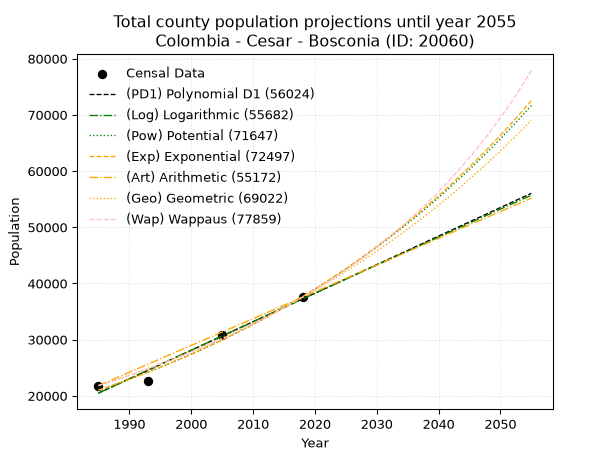
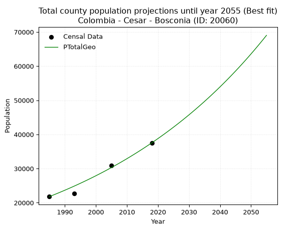
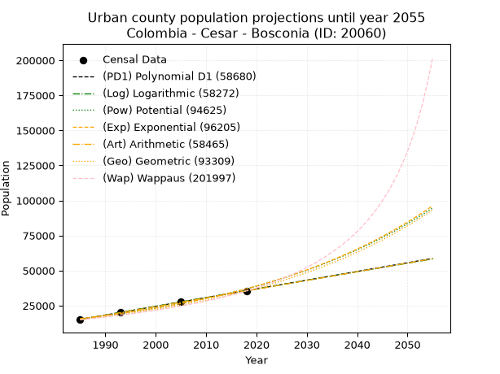
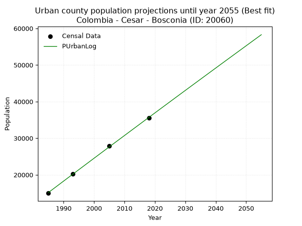
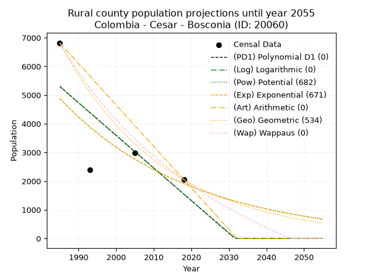
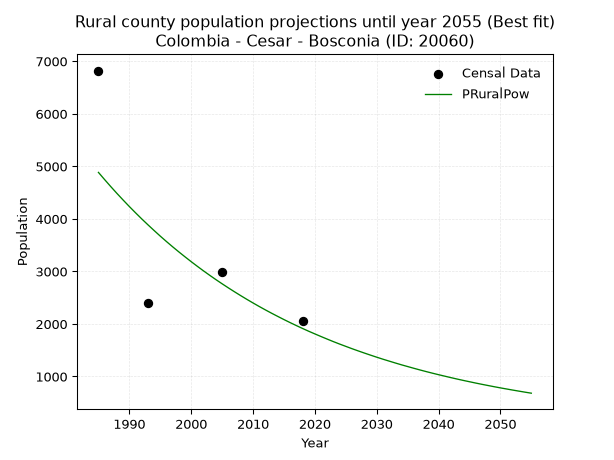

<div align="center">


</div>

# 📜 _“Population and Public Services Demand Projections (PPSD) until Year 2050 for Colombia - Cesar - Bosconia (ID: 20060)”_
Keywords: `population` `public-service` `projection` `lineal` `polynomial` `logarithmic` `potential` `exponential` `arithmetic` `geometric` `wappaus` `dane` `colombia` `south-america`

PPSD are analytical estimates used by governments and planners to anticipate future changes in population size, age distribution, and the resulting community needs for utilities, healthcare, education, and infrastructure as sizing future water treatment facilities, electrical grids, and road networks based on spatial growth.

<div align="center">

</img>

</div>


> **General running parameters**: • app_version: _v20260806_. • Python version: _3.14.7_. • Pandas version: _3.0.5_. • NumPy version: _2.5.1_. • Creates, save and include plots into reports (create_plot): _False_. • Projection until year: _2050_. • Process polynomial degree 2 and up: _False_. • Process Wappaus: _True_. • Process Wappaus: _True_. • Set negative values to zero: _True_. • Set infinite values to zero: _True_. • Drop dataset notes: _True_. 
<div align="center">

Dynamic map: [:earth_americas:Google](http://maps.google.com/maps?q=9.97509804,-73.8887614) [:earth_americas:OSM](https://www.openstreetmap.org/#map=18/9.97509804/-73.8887614&layers=P) [:earth_americas:Bing](https://www.bing.com/maps?cp=9.97509804~-73.8887614&lvl=18) [:earth_americas:Apple](https://maps.apple.com/frame?center=9.97509804%2C-73.8887614&span=0.003%2C0.006)

</div>


<div align="center">

```geojson
{
  "type": "Feature",
  "geometry": {
    "type": "Point", 
    "coordinates": [-73.8887614, 9.97509804]
  }, 
  "properties": {
    "Name": "Colombia - Cesar - Bosconia (ID: 20060)"
  }
}
```

</div>


## 0. Census Data (4 records)

Census data are official statistics collected by a government about the people and housing in a country. They usually include counts of total population, age, sex, race, income, education, and jobs.

📅Global census file: [Population.xlsx](../data/Population.xlsx)

| Source   |   Year |   CountryID | CountryName   |   StateID | StateName   |   CountyID | CountyName   |   PTotal |   PUrban |   PRural |
|:---------|-------:|------------:|:--------------|----------:|:------------|-----------:|:-------------|---------:|---------:|---------:|
| DANE     |   1985 |          57 | Colombia      |        20 | Cesar       |      20060 | Bosconia     |    21797 |    14976 |     6821 |
| DANE     |   1993 |          57 | Colombia      |        20 | Cesar       |      20060 | Bosconia     |    22641 |    20242 |     2399 |
| DANE     |   2005 |          57 | Colombia      |        20 | Cesar       |      20060 | Bosconia     |    30885 |    27895 |     2990 |
| DANE     |   2018 |          57 | Colombia      |        20 | Cesar       |      20060 | Bosconia     |    37531 |    35478 |     2053 |

> 🔥Some records could had specific notes about the registered values or the corresponding urban or rural distribution.

📅[SUI-RUPS](https://www.datos.gov.co/Hacienda-y-Cr-dito-P-blico/Registro-nico-de-Prestadores-de-Servicios-P-blicos/4qkq-csdn/about_data) - Local public utility companies: [RUPS.csv](../data/RUPS.csv)

 | SERVICIO       | ESTADO    | NOMBRE                                           | NIT         | DEPARTAMENTO_DOMICILIO   | MUNICIPIO_DOMICILIO   | DIRECCION    |   TELEFONO | EMAIL                | TIPO_PRESTADOR                            | CLASIFICACION                 |
|:---------------|:----------|:-------------------------------------------------|:------------|:-------------------------|:----------------------|:-------------|-----------:|:---------------------|:------------------------------------------|:------------------------------|
| ACUEDUCTO      | OPERATIVA | EMPRESA DE SERVICIOS PUBLICOS DE BOSCONIA E.S.P. | 800215902-4 | CESAR                    | BOSCONIA              | C 13 # 18-79 |    5779933 | conbla0607@gmail.com | EMPRESA INDUSTRIAL Y COMERCIAL DEL ESTADO | MAYOR O IGUAL A 5001 USUARIOS |
| ALCANTARILLADO | OPERATIVA | EMPRESA DE SERVICIOS PUBLICOS DE BOSCONIA E.S.P. | 800215902-4 | CESAR                    | BOSCONIA              | C 13 # 18-79 |    5779933 | conbla0607@gmail.com | EMPRESA INDUSTRIAL Y COMERCIAL DEL ESTADO | MAYOR O IGUAL A 5001 USUARIOS |

## 1. Total

### 1.1. Coefficients and Parameters

* (PD1) Polynomial Deg 1: 507.95262946607335, -987818.7470895133 (lineal)
* (Log) Logarithmic: 1016478.1224162714, -7698044.854030544
* (Pow) Potential: 35.43280806934886, -112.5270290429113
* (Exp) Exponential: 0.017704052171951652, 1.1478654746808043e-11
* (Art) Arithmetic: Year diff. 2018 - 1985 = 33, Population diff. 37531 - 21797 = 15734, Annual growth = 476.7878787878788
* (Geo) Geometric: Year diff. 2018 - 1985 = 33, Population diff. 37531 - 21797 = 15734, Annual growth % = 0.016602832728548123
* (Wap) Wappaus: i = 1.6072946291392893, Condition values only valid for < 200)

<sub>
Wappaus condition values: ['0.00', '1.61', '3.21', '4.82', '6.43', '8.04', '9.64', '11.25', '12.86', '14.47', '16.07', '17.68', '19.29', '20.89', '22.50', '24.11', '25.72', '27.32', '28.93', '30.54', '32.15', '33.75', '35.36', '36.97', '38.58', '40.18', '41.79', '43.40', '45.00', '46.61', '48.22', '49.83', '51.43', '53.04', '54.65', '56.26', '57.86', '59.47', '61.08', '62.68', '64.29', '65.90', '67.51', '69.11', '70.72', '72.33', '73.94', '75.54', '77.15', '78.76', '80.36', '81.97', '83.58', '85.19', '86.79', '88.40', '90.01', '91.62', '93.22', '94.83', '96.44', '98.04', '99.65', '101.26', '102.87', '104.47']
</sub>


### 1.2. Projected Dataset

|   Year |   CountyID |   PTotalPD1 |   PTotalLog |   PTotalPow |   PTotalExp |   PTotalArt |   PTotalGeo |   PTotalWap |
|-------:|-----------:|------------:|------------:|------------:|------------:|------------:|------------:|------------:|
|   1985 |      20060 |       20467 |       20454 |       20984 |       20994 |       21797 |       21797 |       21797 |
|   1986 |      20060 |       20975 |       20966 |       21362 |       21369 |       22274 |       22159 |       22150 |
|   1987 |      20060 |       21483 |       21478 |       21746 |       21751 |       22751 |       22527 |       22509 |
|   1988 |      20060 |       21991 |       21989 |       22137 |       22140 |       23227 |       22901 |       22874 |
|   1989 |      20060 |       22499 |       22500 |       22535 |       22535 |       23704 |       23281 |       23245 |
|   1990 |      20060 |       23007 |       23011 |       22940 |       22938 |       24181 |       23668 |       23622 |
|   1991 |      20060 |       23515 |       23522 |       23352 |       23347 |       24658 |       24060 |       24006 |
|   1992 |      20060 |       24023 |       24032 |       23772 |       23764 |       25135 |       24460 |       24396 |
|   1993 |      20060 |       24531 |       24542 |       24198 |       24189 |       25611 |       24866 |       24792 |
|   1994 |      20060 |       25039 |       25052 |       24632 |       24621 |       26088 |       25279 |       25196 |
|   1995 |      20060 |       25547 |       25562 |       25073 |       25061 |       26565 |       25699 |       25607 |
|   1996 |      20060 |       26055 |       26071 |       25523 |       25508 |       27042 |       26125 |       26024 |
|   1997 |      20060 |       26563 |       26580 |       25980 |       25964 |       27518 |       26559 |       26450 |
|   1998 |      20060 |       27071 |       27089 |       26445 |       26428 |       27995 |       27000 |       26883 |
|   1999 |      20060 |       27579 |       27598 |       26918 |       26900 |       28472 |       27448 |       27324 |
|   2000 |      20060 |       28087 |       28106 |       27399 |       27380 |       28949 |       27904 |       27772 |
|   2001 |      20060 |       28594 |       28614 |       27889 |       27869 |       29426 |       28367 |       28230 |
|   2002 |      20060 |       29102 |       29122 |       28387 |       28367 |       29902 |       28838 |       28695 |
|   2003 |      20060 |       29610 |       29630 |       28893 |       28874 |       30379 |       29317 |       29170 |
|   2004 |      20060 |       30118 |       30137 |       29409 |       29389 |       30856 |       29804 |       29653 |
|   2005 |      20060 |       30626 |       30644 |       29933 |       29914 |       31333 |       30299 |       30146 |
|   2006 |      20060 |       31134 |       31151 |       30467 |       30449 |       31810 |       30802 |       30648 |
|   2007 |      20060 |       31642 |       31658 |       31010 |       30993 |       32286 |       31313 |       31160 |
|   2008 |      20060 |       32150 |       32164 |       31562 |       31546 |       32763 |       31833 |       31682 |
|   2009 |      20060 |       32658 |       32670 |       32124 |       32110 |       33240 |       32361 |       32214 |
|   2010 |      20060 |       33166 |       33176 |       32695 |       32683 |       33717 |       32899 |       32758 |
|   2011 |      20060 |       33674 |       33682 |       33276 |       33267 |       34193 |       33445 |       33312 |
|   2012 |      20060 |       34182 |       34187 |       33868 |       33861 |       34670 |       34000 |       33878 |
|   2013 |      20060 |       34690 |       34692 |       34469 |       34466 |       35147 |       34565 |       34455 |
|   2014 |      20060 |       35198 |       35197 |       35081 |       35081 |       35624 |       35139 |       35044 |
|   2015 |      20060 |       35706 |       35701 |       35704 |       35708 |       36101 |       35722 |       35646 |
|   2016 |      20060 |       36214 |       36206 |       36337 |       36346 |       36577 |       36315 |       36261 |
|   2017 |      20060 |       36722 |       36710 |       36981 |       36995 |       37054 |       36918 |       36889 |
|   2018 |      20060 |       37230 |       37214 |       37636 |       37656 |       37531 |       37531 |       37531 |
|   2019 |      20060 |       37738 |       37717 |       38303 |       38329 |       38008 |       38154 |       38187 |
|   2020 |      20060 |       38246 |       38221 |       38981 |       39013 |       38485 |       38788 |       38858 |
|   2021 |      20060 |       38754 |       38724 |       39671 |       39710 |       38961 |       39432 |       39544 |
|   2022 |      20060 |       39261 |       39226 |       40372 |       40419 |       39438 |       40086 |       40245 |
|   2023 |      20060 |       39769 |       39729 |       41085 |       41141 |       39915 |       40752 |       40963 |
|   2024 |      20060 |       40277 |       40231 |       41811 |       41876 |       40392 |       41428 |       41698 |
|   2025 |      20060 |       40785 |       40733 |       42549 |       42624 |       40869 |       42116 |       42450 |
|   2026 |      20060 |       41293 |       41235 |       43300 |       43385 |       41345 |       42815 |       43220 |
|   2027 |      20060 |       41801 |       41737 |       44064 |       44160 |       41822 |       43526 |       44008 |
|   2028 |      20060 |       42309 |       42238 |       44841 |       44949 |       42299 |       44249 |       44817 |
|   2029 |      20060 |       42817 |       42739 |       45631 |       45752 |       42776 |       44984 |       45645 |
|   2030 |      20060 |       43325 |       43240 |       46435 |       46569 |       43252 |       45730 |       46494 |
|   2031 |      20060 |       43833 |       43741 |       47252 |       47401 |       43729 |       46490 |       47364 |
|   2032 |      20060 |       44341 |       44241 |       48084 |       48248 |       44206 |       47262 |       48258 |
|   2033 |      20060 |       44849 |       44741 |       48929 |       49109 |       44683 |       48046 |       49174 |
|   2034 |      20060 |       45357 |       45241 |       49789 |       49987 |       45160 |       48844 |       50115 |
|   2035 |      20060 |       45865 |       45741 |       50664 |       50879 |       45636 |       49655 |       51081 |
|   2036 |      20060 |       46373 |       46240 |       51554 |       51788 |       46113 |       50479 |       52074 |
|   2037 |      20060 |       46881 |       46739 |       52458 |       52713 |       46590 |       51317 |       53093 |
|   2038 |      20060 |       47389 |       47238 |       53379 |       53655 |       47067 |       52169 |       54142 |
|   2039 |      20060 |       47897 |       47737 |       54315 |       54613 |       47544 |       53036 |       55220 |
|   2040 |      20060 |       48405 |       48235 |       55266 |       55589 |       48020 |       53916 |       56329 |
|   2041 |      20060 |       48913 |       48733 |       56235 |       56582 |       48497 |       54811 |       57471 |
|   2042 |      20060 |       49421 |       49231 |       57219 |       57592 |       48974 |       55721 |       58646 |
|   2043 |      20060 |       49928 |       49729 |       58220 |       58621 |       49451 |       56646 |       59857 |
|   2044 |      20060 |       50436 |       50226 |       59239 |       59668 |       49927 |       57587 |       61105 |
|   2045 |      20060 |       50944 |       50723 |       60274 |       60734 |       50404 |       58543 |       62392 |
|   2046 |      20060 |       51452 |       51220 |       61327 |       61819 |       50881 |       59515 |       63719 |
|   2047 |      20060 |       51960 |       51717 |       62398 |       62923 |       51358 |       60503 |       65089 |
|   2048 |      20060 |       52468 |       52214 |       63488 |       64047 |       51835 |       61508 |       66503 |
|   2049 |      20060 |       52976 |       52710 |       64595 |       65191 |       52311 |       62529 |       67964 |
|   2050 |      20060 |       53484 |       53206 |       65722 |       66355 |       52788 |       63567 |       69475 |
<div align="center">

</img>

</div>


### 1.3. Best fit with absolute and relative error (%)

Relative error puts that difference into context by dividing the absolute error by the true value, creating a unitless ratio or percentage that shows the scale of the mistake.

Absolute and relative error

|   Year | Source   |   CountryID | CountryName   |   StateID | StateName   |   CountyID_x | CountyName   |   PTotal |   PUrban |   PRural |   CountyID_y |   PTotalPD1 |   PTotalLog |   PTotalPow |   PTotalExp |   PTotalArt |   PTotalGeo |   PTotalWap |   PTotalPD1AbsError |   PTotalLogAbsError |   PTotalPowAbsError |   PTotalExpAbsError |   PTotalArtAbsError |   PTotalGeoAbsError |   PTotalWapAbsError |   PTotalPD1RelError |   PTotalLogRelError |   PTotalPowRelError |   PTotalExpRelError |   PTotalArtRelError |   PTotalGeoRelError |   PTotalWapRelError |
|-------:|:---------|------------:|:--------------|----------:|:------------|-------------:|:-------------|---------:|---------:|---------:|-------------:|------------:|------------:|------------:|------------:|------------:|------------:|------------:|--------------------:|--------------------:|--------------------:|--------------------:|--------------------:|--------------------:|--------------------:|--------------------:|--------------------:|--------------------:|--------------------:|--------------------:|--------------------:|--------------------:|
|   1985 | DANE     |          57 | Colombia      |        20 | Cesar       |        20060 | Bosconia     |    21797 |    14976 |     6821 |        20060 |       20467 |       20454 |       20984 |       20994 |       21797 |       21797 |       21797 |                1330 |                1343 |                 813 |                 803 |                   0 |                   0 |                   0 |            6.10176  |            6.1614   |            3.72987  |            3.68399  |             0       |             0       |             0       |
|   1993 | DANE     |          57 | Colombia      |        20 | Cesar       |        20060 | Bosconia     |    22641 |    20242 |     2399 |        20060 |       24531 |       24542 |       24198 |       24189 |       25611 |       24866 |       24792 |                1890 |                1901 |                1557 |                1548 |                2970 |                2225 |                2151 |            8.34769  |            8.39627  |            6.8769   |            6.83715  |            13.1178  |             9.8273  |             9.50046 |
|   2005 | DANE     |          57 | Colombia      |        20 | Cesar       |        20060 | Bosconia     |    30885 |    27895 |     2990 |        20060 |       30626 |       30644 |       29933 |       29914 |       31333 |       30299 |       30146 |                 259 |                 241 |                 952 |                 971 |                 448 |                 586 |                 739 |            0.838595 |            0.780314 |            3.0824   |            3.14392  |             1.45054 |             1.89736 |             2.39275 |
|   2018 | DANE     |          57 | Colombia      |        20 | Cesar       |        20060 | Bosconia     |    37531 |    35478 |     2053 |        20060 |       37230 |       37214 |       37636 |       37656 |       37531 |       37531 |       37531 |                 301 |                 317 |                 105 |                 125 |                   0 |                   0 |                   0 |            0.802004 |            0.844635 |            0.279769 |            0.333058 |             0       |             0       |             0       |

Relative error mean

| Method    |   RelError | Best   |
|:----------|-----------:|:-------|
| PTotalPD1 |    4.02251 |        |
| PTotalLog |    4.04565 |        |
| PTotalPow |    3.49224 |        |
| PTotalExp |    3.49953 |        |
| PTotalArt |    3.64208 |        |
| PTotalGeo |    2.93117 | True   |
| PTotalWap |    2.9733  |        |

💙Best method: _**PTotalGeo**_
<div align="center">

</img>

</div>


### 1.4. Fresh water supply demand in liters per capita per day (lpcd)

The fresh water supply demand typically ranges from 100 to 300 liters per capita per day (lpcd) for standard domestic and municipal planning, though absolute survival minimums set by the World Health Organization are as low as 7.5 to 20 liters per day, and total consumption in high-income nations can exceed 400 liters.

> `CZ`: Level in meters above the sea level (masl)<br> `WS`: Fresh water supply demand in liters per capita per day (lpcd or l/h/d)<br> `WSAll`: Zonal fresh water supply demand in liters per second (l/s)<br> `A`: Zonal area in square meters<br> `DP`: Population density (people/hectare or p/ha)

Reference values (RAS Colombia)

|    CZ |   WS |
|------:|-----:|
|  1000 |  120 |
|  2000 |  130 |
| 99999 |  140 |

County shapefile geometry properties and water supply values

|   CountyID |      ATotal |   CZTotal |   WSTotal |
|-----------:|------------:|----------:|----------:|
|      20060 | 5.85798e+08 |   85.7837 |       120 |

Projected values for best method: PTotalGeo

|   CountyID |   Year |   PTotalGeo |   DPTotal |   WSTotal |   WSTotalAll |
|-----------:|-------:|------------:|----------:|----------:|-------------:|
|      20060 |   1985 |       21797 |      0.37 |       120 |      30.2736 |
|      20060 |   1986 |       22159 |      0.38 |       120 |      30.7764 |
|      20060 |   1987 |       22527 |      0.38 |       120 |      31.2875 |
|      20060 |   1988 |       22901 |      0.39 |       120 |      31.8069 |
|      20060 |   1989 |       23281 |      0.4  |       120 |      32.3347 |
|      20060 |   1990 |       23668 |      0.4  |       120 |      32.8722 |
|      20060 |   1991 |       24060 |      0.41 |       120 |      33.4167 |
|      20060 |   1992 |       24460 |      0.42 |       120 |      33.9722 |
|      20060 |   1993 |       24866 |      0.42 |       120 |      34.5361 |
|      20060 |   1994 |       25279 |      0.43 |       120 |      35.1097 |
|      20060 |   1995 |       25699 |      0.44 |       120 |      35.6931 |
|      20060 |   1996 |       26125 |      0.45 |       120 |      36.2847 |
|      20060 |   1997 |       26559 |      0.45 |       120 |      36.8875 |
|      20060 |   1998 |       27000 |      0.46 |       120 |      37.5    |
|      20060 |   1999 |       27448 |      0.47 |       120 |      38.1222 |
|      20060 |   2000 |       27904 |      0.48 |       120 |      38.7556 |
|      20060 |   2001 |       28367 |      0.48 |       120 |      39.3986 |
|      20060 |   2002 |       28838 |      0.49 |       120 |      40.0528 |
|      20060 |   2003 |       29317 |      0.5  |       120 |      40.7181 |
|      20060 |   2004 |       29804 |      0.51 |       120 |      41.3944 |
|      20060 |   2005 |       30299 |      0.52 |       120 |      42.0819 |
|      20060 |   2006 |       30802 |      0.53 |       120 |      42.7806 |
|      20060 |   2007 |       31313 |      0.53 |       120 |      43.4903 |
|      20060 |   2008 |       31833 |      0.54 |       120 |      44.2125 |
|      20060 |   2009 |       32361 |      0.55 |       120 |      44.9458 |
|      20060 |   2010 |       32899 |      0.56 |       120 |      45.6931 |
|      20060 |   2011 |       33445 |      0.57 |       120 |      46.4514 |
|      20060 |   2012 |       34000 |      0.58 |       120 |      47.2222 |
|      20060 |   2013 |       34565 |      0.59 |       120 |      48.0069 |
|      20060 |   2014 |       35139 |      0.6  |       120 |      48.8042 |
|      20060 |   2015 |       35722 |      0.61 |       120 |      49.6139 |
|      20060 |   2016 |       36315 |      0.62 |       120 |      50.4375 |
|      20060 |   2017 |       36918 |      0.63 |       120 |      51.275  |
|      20060 |   2018 |       37531 |      0.64 |       120 |      52.1264 |
|      20060 |   2019 |       38154 |      0.65 |       120 |      52.9917 |
|      20060 |   2020 |       38788 |      0.66 |       120 |      53.8722 |
|      20060 |   2021 |       39432 |      0.67 |       120 |      54.7667 |
|      20060 |   2022 |       40086 |      0.68 |       120 |      55.675  |
|      20060 |   2023 |       40752 |      0.7  |       120 |      56.6    |
|      20060 |   2024 |       41428 |      0.71 |       120 |      57.5389 |
|      20060 |   2025 |       42116 |      0.72 |       120 |      58.4944 |
|      20060 |   2026 |       42815 |      0.73 |       120 |      59.4653 |
|      20060 |   2027 |       43526 |      0.74 |       120 |      60.4528 |
|      20060 |   2028 |       44249 |      0.76 |       120 |      61.4569 |
|      20060 |   2029 |       44984 |      0.77 |       120 |      62.4778 |
|      20060 |   2030 |       45730 |      0.78 |       120 |      63.5139 |
|      20060 |   2031 |       46490 |      0.79 |       120 |      64.5694 |
|      20060 |   2032 |       47262 |      0.81 |       120 |      65.6417 |
|      20060 |   2033 |       48046 |      0.82 |       120 |      66.7306 |
|      20060 |   2034 |       48844 |      0.83 |       120 |      67.8389 |
|      20060 |   2035 |       49655 |      0.85 |       120 |      68.9653 |
|      20060 |   2036 |       50479 |      0.86 |       120 |      70.1097 |
|      20060 |   2037 |       51317 |      0.88 |       120 |      71.2736 |
|      20060 |   2038 |       52169 |      0.89 |       120 |      72.4569 |
|      20060 |   2039 |       53036 |      0.91 |       120 |      73.6611 |
|      20060 |   2040 |       53916 |      0.92 |       120 |      74.8833 |
|      20060 |   2041 |       54811 |      0.94 |       120 |      76.1264 |
|      20060 |   2042 |       55721 |      0.95 |       120 |      77.3903 |
|      20060 |   2043 |       56646 |      0.97 |       120 |      78.675  |
|      20060 |   2044 |       57587 |      0.98 |       120 |      79.9819 |
|      20060 |   2045 |       58543 |      1    |       120 |      81.3097 |
|      20060 |   2046 |       59515 |      1.02 |       120 |      82.6597 |
|      20060 |   2047 |       60503 |      1.03 |       120 |      84.0319 |
|      20060 |   2048 |       61508 |      1.05 |       120 |      85.4278 |
|      20060 |   2049 |       62529 |      1.07 |       120 |      86.8458 |
|      20060 |   2050 |       63567 |      1.09 |       120 |      88.2875 |

## 2. Urban

### 2.1. Coefficients and Parameters

* (PD1) Polynomial Deg 1: 621.5933360096295, -1218694.3203532617 (lineal)
* (Log) Logarithmic: 1244271.8353737013, -9433072.441644223
* (Pow) Potential: 51.69746805027427, -166.28797893656616
* (Exp) Exponential: 0.02581890626748576, 8.718934059337128e-19
* (Art) Arithmetic: Year diff. 2018 - 1985 = 33, Population diff. 35478 - 14976 = 20502, Annual growth = 621.2727272727273
* (Geo) Geometric: Year diff. 2018 - 1985 = 33, Population diff. 35478 - 14976 = 20502, Annual growth % = 0.026479789645617036
* (Wap) Wappaus: i = 2.462729326803533, Condition values only valid for < 200)

<sub>
Wappaus condition values: ['0.00', '2.46', '4.93', '7.39', '9.85', '12.31', '14.78', '17.24', '19.70', '22.16', '24.63', '27.09', '29.55', '32.02', '34.48', '36.94', '39.40', '41.87', '44.33', '46.79', '49.25', '51.72', '54.18', '56.64', '59.11', '61.57', '64.03', '66.49', '68.96', '71.42', '73.88', '76.34', '78.81', '81.27', '83.73', '86.20', '88.66', '91.12', '93.58', '96.05', '98.51', '100.97', '103.43', '105.90', '108.36', '110.82', '113.29', '115.75', '118.21', '120.67', '123.14', '125.60', '128.06', '130.52', '132.99', '135.45', '137.91', '140.38', '142.84', '145.30', '147.76', '150.23', '152.69', '155.15', '157.61', '160.08']
</sub>


### 2.2. Projected Dataset

|   Year |   CountyID |   PUrbanPD1 |   PUrbanLog |   PUrbanPow |   PUrbanExp |   PUrbanArt |   PUrbanGeo |   PUrbanWap |
|-------:|-----------:|------------:|------------:|------------:|------------:|------------:|------------:|------------:|
|   1985 |      20060 |       15168 |       15149 |       15772 |       15786 |       14976 |       14976 |       14976 |
|   1986 |      20060 |       15790 |       15776 |       16188 |       16199 |       15597 |       15373 |       15349 |
|   1987 |      20060 |       16412 |       16402 |       16615 |       16623 |       16219 |       15780 |       15732 |
|   1988 |      20060 |       17033 |       17028 |       17053 |       17058 |       16840 |       16197 |       16125 |
|   1989 |      20060 |       17655 |       17654 |       17502 |       17504 |       17461 |       16626 |       16528 |
|   1990 |      20060 |       18276 |       18279 |       17963 |       17962 |       18082 |       17067 |       16941 |
|   1991 |      20060 |       18898 |       18905 |       18435 |       18432 |       18704 |       17519 |       17365 |
|   1992 |      20060 |       19520 |       19529 |       18920 |       18914 |       19325 |       17982 |       17801 |
|   1993 |      20060 |       20141 |       20154 |       19418 |       19408 |       19946 |       18459 |       18249 |
|   1994 |      20060 |       20763 |       20778 |       19928 |       19916 |       20567 |       18947 |       18709 |
|   1995 |      20060 |       21384 |       21402 |       20451 |       20437 |       21189 |       19449 |       19182 |
|   1996 |      20060 |       22006 |       22025 |       20988 |       20971 |       21810 |       19964 |       19669 |
|   1997 |      20060 |       22628 |       22649 |       21538 |       21520 |       22431 |       20493 |       20169 |
|   1998 |      20060 |       23249 |       23272 |       22103 |       22083 |       23053 |       21035 |       20684 |
|   1999 |      20060 |       23871 |       23894 |       22682 |       22660 |       23674 |       21592 |       21215 |
|   2000 |      20060 |       24492 |       24516 |       23276 |       23253 |       24295 |       22164 |       21762 |
|   2001 |      20060 |       25114 |       25138 |       23886 |       23861 |       24916 |       22751 |       22325 |
|   2002 |      20060 |       25736 |       25760 |       24511 |       24485 |       25538 |       23354 |       22906 |
|   2003 |      20060 |       26357 |       26381 |       25152 |       25126 |       26159 |       23972 |       23505 |
|   2004 |      20060 |       26979 |       27002 |       25809 |       25783 |       26780 |       24607 |       24124 |
|   2005 |      20060 |       27600 |       27623 |       26483 |       26457 |       27401 |       25258 |       24763 |
|   2006 |      20060 |       28222 |       28244 |       27175 |       27149 |       28023 |       25927 |       25423 |
|   2007 |      20060 |       28844 |       28864 |       27884 |       27859 |       28644 |       26614 |       26105 |
|   2008 |      20060 |       29465 |       29484 |       28612 |       28588 |       29265 |       27318 |       26811 |
|   2009 |      20060 |       30087 |       30103 |       29358 |       29336 |       29887 |       28042 |       27541 |
|   2010 |      20060 |       30708 |       30722 |       30123 |       30103 |       30508 |       28784 |       28297 |
|   2011 |      20060 |       31330 |       31341 |       30907 |       30890 |       31129 |       29547 |       29081 |
|   2012 |      20060 |       31951 |       31960 |       31712 |       31698 |       31750 |       30329 |       29894 |
|   2013 |      20060 |       32573 |       32578 |       32537 |       32527 |       32372 |       31132 |       30737 |
|   2014 |      20060 |       33195 |       33196 |       33383 |       33378 |       32993 |       31956 |       31613 |
|   2015 |      20060 |       33816 |       33814 |       34251 |       34251 |       33614 |       32803 |       32522 |
|   2016 |      20060 |       34438 |       34431 |       35141 |       35147 |       34235 |       33671 |       33468 |
|   2017 |      20060 |       35059 |       35048 |       36054 |       36066 |       34857 |       34563 |       34453 |
|   2018 |      20060 |       35681 |       35665 |       36989 |       37010 |       35478 |       35478 |       35478 |
|   2019 |      20060 |       36303 |       36281 |       37949 |       37978 |       36099 |       36417 |       36547 |
|   2020 |      20060 |       36924 |       36897 |       38933 |       38971 |       36721 |       37382 |       37662 |
|   2021 |      20060 |       37546 |       37513 |       39942 |       39990 |       37342 |       38372 |       38826 |
|   2022 |      20060 |       38167 |       38129 |       40977 |       41036 |       37963 |       39388 |       40043 |
|   2023 |      20060 |       38789 |       38744 |       42038 |       42109 |       38584 |       40431 |       41316 |
|   2024 |      20060 |       39411 |       39359 |       43125 |       43211 |       39206 |       41501 |       42650 |
|   2025 |      20060 |       40032 |       39973 |       44241 |       44341 |       39827 |       42600 |       44048 |
|   2026 |      20060 |       40654 |       40588 |       45385 |       45501 |       40448 |       43728 |       45516 |
|   2027 |      20060 |       41275 |       41202 |       46557 |       46691 |       41069 |       44886 |       47059 |
|   2028 |      20060 |       41897 |       41815 |       47760 |       47912 |       41691 |       46075 |       48682 |
|   2029 |      20060 |       42519 |       42429 |       48992 |       49165 |       42312 |       47295 |       50393 |
|   2030 |      20060 |       43140 |       43042 |       50256 |       50451 |       42933 |       48547 |       52198 |
|   2031 |      20060 |       43762 |       43655 |       51552 |       51771 |       43555 |       49833 |       54106 |
|   2032 |      20060 |       44383 |       44267 |       52881 |       53125 |       44176 |       51152 |       56125 |
|   2033 |      20060 |       45005 |       44879 |       54243 |       54514 |       44797 |       52507 |       58266 |
|   2034 |      20060 |       45627 |       45491 |       55640 |       55940 |       45418 |       53897 |       60540 |
|   2035 |      20060 |       46248 |       46103 |       57072 |       57403 |       46040 |       55324 |       62960 |
|   2036 |      20060 |       46870 |       46714 |       58540 |       58905 |       46661 |       56789 |       65539 |
|   2037 |      20060 |       47491 |       47325 |       60045 |       60445 |       47282 |       58293 |       68296 |
|   2038 |      20060 |       48113 |       47936 |       61588 |       62026 |       47903 |       59837 |       71247 |
|   2039 |      20060 |       48734 |       48546 |       63170 |       63648 |       48525 |       61421 |       74416 |
|   2040 |      20060 |       49356 |       49156 |       64792 |       65313 |       49146 |       63048 |       77827 |
|   2041 |      20060 |       49978 |       49766 |       66454 |       67021 |       49767 |       64717 |       81508 |
|   2042 |      20060 |       50599 |       50376 |       68159 |       68774 |       50389 |       66431 |       85493 |
|   2043 |      20060 |       51221 |       50985 |       69906 |       70573 |       51010 |       68190 |       89821 |
|   2044 |      20060 |       51842 |       51594 |       71697 |       72419 |       51631 |       69995 |       94540 |
|   2045 |      20060 |       52464 |       52202 |       73533 |       74313 |       52252 |       71849 |       99703 |
|   2046 |      20060 |       53086 |       52811 |       75415 |       76257 |       52874 |       73751 |      105377 |
|   2047 |      20060 |       53707 |       53419 |       77345 |       78251 |       53495 |       75704 |      111642 |
|   2048 |      20060 |       54329 |       54026 |       79322 |       80298 |       54116 |       77709 |      118595 |
|   2049 |      20060 |       54950 |       54634 |       81350 |       82398 |       54737 |       79767 |      126356 |
|   2050 |      20060 |       55572 |       55241 |       83428 |       84553 |       55359 |       81879 |      135074 |
<div align="center">

</img>

</div>


### 2.3. Best fit with absolute and relative error (%)

Relative error puts that difference into context by dividing the absolute error by the true value, creating a unitless ratio or percentage that shows the scale of the mistake.

Absolute and relative error

|   Year | Source   |   CountryID | CountryName   |   StateID | StateName   |   CountyID_x | CountyName   |   PTotal |   PUrban |   PRural |   CountyID_y |   PUrbanPD1 |   PUrbanLog |   PUrbanPow |   PUrbanExp |   PUrbanArt |   PUrbanGeo |   PUrbanWap |   PUrbanPD1AbsError |   PUrbanLogAbsError |   PUrbanPowAbsError |   PUrbanExpAbsError |   PUrbanArtAbsError |   PUrbanGeoAbsError |   PUrbanWapAbsError |   PUrbanPD1RelError |   PUrbanLogRelError |   PUrbanPowRelError |   PUrbanExpRelError |   PUrbanArtRelError |   PUrbanGeoRelError |   PUrbanWapRelError |
|-------:|:---------|------------:|:--------------|----------:|:------------|-------------:|:-------------|---------:|---------:|---------:|-------------:|------------:|------------:|------------:|------------:|------------:|------------:|------------:|--------------------:|--------------------:|--------------------:|--------------------:|--------------------:|--------------------:|--------------------:|--------------------:|--------------------:|--------------------:|--------------------:|--------------------:|--------------------:|--------------------:|
|   1985 | DANE     |          57 | Colombia      |        20 | Cesar       |        20060 | Bosconia     |    21797 |    14976 |     6821 |        20060 |       15168 |       15149 |       15772 |       15786 |       14976 |       14976 |       14976 |                 192 |                 173 |                 796 |                 810 |                   0 |                   0 |                   0 |            1.28205  |            1.15518  |             5.31517 |             5.40865 |             0       |             0       |             0       |
|   1993 | DANE     |          57 | Colombia      |        20 | Cesar       |        20060 | Bosconia     |    22641 |    20242 |     2399 |        20060 |       20141 |       20154 |       19418 |       19408 |       19946 |       18459 |       18249 |                 101 |                  88 |                 824 |                 834 |                 296 |                1783 |                1993 |            0.498963 |            0.43474  |             4.07074 |             4.12015 |             1.46231 |             8.80842 |             9.84587 |
|   2005 | DANE     |          57 | Colombia      |        20 | Cesar       |        20060 | Bosconia     |    30885 |    27895 |     2990 |        20060 |       27600 |       27623 |       26483 |       26457 |       27401 |       25258 |       24763 |                 295 |                 272 |                1412 |                1438 |                 494 |                2637 |                3132 |            1.05754  |            0.975085 |             5.06184 |             5.15505 |             1.77093 |             9.45331 |            11.2278  |
|   2018 | DANE     |          57 | Colombia      |        20 | Cesar       |        20060 | Bosconia     |    37531 |    35478 |     2053 |        20060 |       35681 |       35665 |       36989 |       37010 |       35478 |       35478 |       35478 |                 203 |                 187 |                1511 |                1532 |                   0 |                   0 |                   0 |            0.572186 |            0.527087 |             4.25898 |             4.31817 |             0       |             0       |             0       |

Relative error mean

| Method    |   RelError | Best   |
|:----------|-----------:|:-------|
| PUrbanPD1 |   0.852684 |        |
| PUrbanLog |   0.773023 | True   |
| PUrbanPow |   4.67668  |        |
| PUrbanExp |   4.7505   |        |
| PUrbanArt |   0.808308 |        |
| PUrbanGeo |   4.56543  |        |
| PUrbanWap |   5.26842  |        |

💙Best method: _**PUrbanLog**_
<div align="center">

</img>

</div>


### 2.4. Fresh water supply demand in liters per capita per day (lpcd)

The fresh water supply demand typically ranges from 100 to 300 liters per capita per day (lpcd) for standard domestic and municipal planning, though absolute survival minimums set by the World Health Organization are as low as 7.5 to 20 liters per day, and total consumption in high-income nations can exceed 400 liters.

> `CZ`: Level in meters above the sea level (masl)<br> `WS`: Fresh water supply demand in liters per capita per day (lpcd or l/h/d)<br> `WSAll`: Zonal fresh water supply demand in liters per second (l/s)<br> `A`: Zonal area in square meters<br> `DP`: Population density (people/hectare or p/ha)

Reference values (RAS Colombia)

|    CZ |   WS |
|------:|-----:|
|  1000 |  120 |
|  2000 |  130 |
| 99999 |  140 |

County shapefile geometry properties and water supply values

|   CountyID |      AUrban |   CZUrban |   WSUrban |
|-----------:|------------:|----------:|----------:|
|      20060 | 9.64107e+06 |     82.81 |       120 |

Projected values for best method: PUrbanLog

|   CountyID |   Year |   PUrbanLog |   DPUrban |   WSUrban |   WSUrbanAll |
|-----------:|-------:|------------:|----------:|----------:|-------------:|
|      20060 |   1985 |       15149 |     15.71 |       120 |      21.0403 |
|      20060 |   1986 |       15776 |     16.36 |       120 |      21.9111 |
|      20060 |   1987 |       16402 |     17.01 |       120 |      22.7806 |
|      20060 |   1988 |       17028 |     17.66 |       120 |      23.65   |
|      20060 |   1989 |       17654 |     18.31 |       120 |      24.5194 |
|      20060 |   1990 |       18279 |     18.96 |       120 |      25.3875 |
|      20060 |   1991 |       18905 |     19.61 |       120 |      26.2569 |
|      20060 |   1992 |       19529 |     20.26 |       120 |      27.1236 |
|      20060 |   1993 |       20154 |     20.9  |       120 |      27.9917 |
|      20060 |   1994 |       20778 |     21.55 |       120 |      28.8583 |
|      20060 |   1995 |       21402 |     22.2  |       120 |      29.725  |
|      20060 |   1996 |       22025 |     22.84 |       120 |      30.5903 |
|      20060 |   1997 |       22649 |     23.49 |       120 |      31.4569 |
|      20060 |   1998 |       23272 |     24.14 |       120 |      32.3222 |
|      20060 |   1999 |       23894 |     24.78 |       120 |      33.1861 |
|      20060 |   2000 |       24516 |     25.43 |       120 |      34.05   |
|      20060 |   2001 |       25138 |     26.07 |       120 |      34.9139 |
|      20060 |   2002 |       25760 |     26.72 |       120 |      35.7778 |
|      20060 |   2003 |       26381 |     27.36 |       120 |      36.6403 |
|      20060 |   2004 |       27002 |     28.01 |       120 |      37.5028 |
|      20060 |   2005 |       27623 |     28.65 |       120 |      38.3653 |
|      20060 |   2006 |       28244 |     29.3  |       120 |      39.2278 |
|      20060 |   2007 |       28864 |     29.94 |       120 |      40.0889 |
|      20060 |   2008 |       29484 |     30.58 |       120 |      40.95   |
|      20060 |   2009 |       30103 |     31.22 |       120 |      41.8097 |
|      20060 |   2010 |       30722 |     31.87 |       120 |      42.6694 |
|      20060 |   2011 |       31341 |     32.51 |       120 |      43.5292 |
|      20060 |   2012 |       31960 |     33.15 |       120 |      44.3889 |
|      20060 |   2013 |       32578 |     33.79 |       120 |      45.2472 |
|      20060 |   2014 |       33196 |     34.43 |       120 |      46.1056 |
|      20060 |   2015 |       33814 |     35.07 |       120 |      46.9639 |
|      20060 |   2016 |       34431 |     35.71 |       120 |      47.8208 |
|      20060 |   2017 |       35048 |     36.35 |       120 |      48.6778 |
|      20060 |   2018 |       35665 |     36.99 |       120 |      49.5347 |
|      20060 |   2019 |       36281 |     37.63 |       120 |      50.3903 |
|      20060 |   2020 |       36897 |     38.27 |       120 |      51.2458 |
|      20060 |   2021 |       37513 |     38.91 |       120 |      52.1014 |
|      20060 |   2022 |       38129 |     39.55 |       120 |      52.9569 |
|      20060 |   2023 |       38744 |     40.19 |       120 |      53.8111 |
|      20060 |   2024 |       39359 |     40.82 |       120 |      54.6653 |
|      20060 |   2025 |       39973 |     41.46 |       120 |      55.5181 |
|      20060 |   2026 |       40588 |     42.1  |       120 |      56.3722 |
|      20060 |   2027 |       41202 |     42.74 |       120 |      57.225  |
|      20060 |   2028 |       41815 |     43.37 |       120 |      58.0764 |
|      20060 |   2029 |       42429 |     44.01 |       120 |      58.9292 |
|      20060 |   2030 |       43042 |     44.64 |       120 |      59.7806 |
|      20060 |   2031 |       43655 |     45.28 |       120 |      60.6319 |
|      20060 |   2032 |       44267 |     45.92 |       120 |      61.4819 |
|      20060 |   2033 |       44879 |     46.55 |       120 |      62.3319 |
|      20060 |   2034 |       45491 |     47.18 |       120 |      63.1819 |
|      20060 |   2035 |       46103 |     47.82 |       120 |      64.0319 |
|      20060 |   2036 |       46714 |     48.45 |       120 |      64.8806 |
|      20060 |   2037 |       47325 |     49.09 |       120 |      65.7292 |
|      20060 |   2038 |       47936 |     49.72 |       120 |      66.5778 |
|      20060 |   2039 |       48546 |     50.35 |       120 |      67.425  |
|      20060 |   2040 |       49156 |     50.99 |       120 |      68.2722 |
|      20060 |   2041 |       49766 |     51.62 |       120 |      69.1194 |
|      20060 |   2042 |       50376 |     52.25 |       120 |      69.9667 |
|      20060 |   2043 |       50985 |     52.88 |       120 |      70.8125 |
|      20060 |   2044 |       51594 |     53.51 |       120 |      71.6583 |
|      20060 |   2045 |       52202 |     54.15 |       120 |      72.5028 |
|      20060 |   2046 |       52811 |     54.78 |       120 |      73.3486 |
|      20060 |   2047 |       53419 |     55.41 |       120 |      74.1931 |
|      20060 |   2048 |       54026 |     56.04 |       120 |      75.0361 |
|      20060 |   2049 |       54634 |     56.67 |       120 |      75.8806 |
|      20060 |   2050 |       55241 |     57.3  |       120 |      76.7236 |

## 3. Rural

### 3.1. Coefficients and Parameters

* (PD1) Polynomial Deg 1: -113.6407065435562, 230875.5732637483 (lineal)
* (Log) Logarithmic: -227793.71295742964, 1735027.5876136767
* (Pow) Potential: -56.80464981740557, 191.0169415596086
* (Exp) Exponential: -0.0283485478842369, 1.3390547841325804e+28
* (Art) Arithmetic: Year diff. 2018 - 1985 = 33, Population diff. 2053 - 6821 = -4768, Annual growth = -144.4848484848485
* (Geo) Geometric: Year diff. 2018 - 1985 = 33, Population diff. 2053 - 6821 = -4768, Annual growth % = -0.03573099088442977
* (Wap) Wappaus: i = -3.256363499771208, Condition values only valid for < 200)

<sub>
Wappaus condition values: ['-0.00', '-3.26', '-6.51', '-9.77', '-13.03', '-16.28', '-19.54', '-22.79', '-26.05', '-29.31', '-32.56', '-35.82', '-39.08', '-42.33', '-45.59', '-48.85', '-52.10', '-55.36', '-58.61', '-61.87', '-65.13', '-68.38', '-71.64', '-74.90', '-78.15', '-81.41', '-84.67', '-87.92', '-91.18', '-94.43', '-97.69', '-100.95', '-104.20', '-107.46', '-110.72', '-113.97', '-117.23', '-120.49', '-123.74', '-127.00', '-130.25', '-133.51', '-136.77', '-140.02', '-143.28', '-146.54', '-149.79', '-153.05', '-156.31', '-159.56', '-162.82', '-166.07', '-169.33', '-172.59', '-175.84', '-179.10', '-182.36', '-185.61', '-188.87', '-192.13', '-195.38', '-198.64', '-201.89', '-205.15', '-208.41', '-211.66']
</sub>


### 3.2. Projected Dataset

|   Year |   CountyID |   PRuralPD1 |   PRuralLog |   PRuralPow |   PRuralExp |   PRuralArt |   PRuralGeo |   PRuralWap |
|-------:|-----------:|------------:|------------:|------------:|------------:|------------:|------------:|------------:|
|   1985 |      20060 |        5299 |        5305 |        4884 |        4878 |        6821 |        6821 |        6821 |
|   1986 |      20060 |        5185 |        5190 |        4747 |        4742 |        6677 |        6577 |        6602 |
|   1987 |      20060 |        5071 |        5075 |        4613 |        4609 |        6532 |        6342 |        6391 |
|   1988 |      20060 |        4958 |        4961 |        4483 |        4480 |        6388 |        6116 |        6186 |
|   1989 |      20060 |        4844 |        4846 |        4357 |        4355 |        6243 |        5897 |        5987 |
|   1990 |      20060 |        4731 |        4732 |        4234 |        4233 |        6099 |        5686 |        5794 |
|   1991 |      20060 |        4617 |        4617 |        4115 |        4115 |        5954 |        5483 |        5607 |
|   1992 |      20060 |        4503 |        4503 |        3999 |        4000 |        5810 |        5287 |        5425 |
|   1993 |      20060 |        4390 |        4388 |        3887 |        3888 |        5665 |        5098 |        5249 |
|   1994 |      20060 |        4276 |        4274 |        3778 |        3779 |        5521 |        4916 |        5077 |
|   1995 |      20060 |        4162 |        4160 |        3671 |        3674 |        5376 |        4741 |        4911 |
|   1996 |      20060 |        4049 |        4046 |        3568 |        3571 |        5232 |        4571 |        4749 |
|   1997 |      20060 |        3935 |        3932 |        3468 |        3471 |        5087 |        4408 |        4591 |
|   1998 |      20060 |        3821 |        3818 |        3371 |        3374 |        4943 |        4250 |        4438 |
|   1999 |      20060 |        3708 |        3704 |        3277 |        3280 |        4798 |        4098 |        4289 |
|   2000 |      20060 |        3594 |        3590 |        3185 |        3188 |        4654 |        3952 |        4143 |
|   2001 |      20060 |        3481 |        3476 |        3096 |        3099 |        4509 |        3811 |        4002 |
|   2002 |      20060 |        3367 |        3362 |        3009 |        3013 |        4365 |        3675 |        3864 |
|   2003 |      20060 |        3253 |        3248 |        2925 |        2928 |        4220 |        3543 |        3729 |
|   2004 |      20060 |        3140 |        3135 |        2843 |        2847 |        4076 |        3417 |        3598 |
|   2005 |      20060 |        3026 |        3021 |        2764 |        2767 |        3931 |        3295 |        3470 |
|   2006 |      20060 |        2912 |        2907 |        2687 |        2690 |        3787 |        3177 |        3345 |
|   2007 |      20060 |        2799 |        2794 |        2612 |        2614 |        3642 |        3063 |        3223 |
|   2008 |      20060 |        2685 |        2680 |        2539 |        2541 |        3498 |        2954 |        3104 |
|   2009 |      20060 |        2571 |        2567 |        2468 |        2470 |        3353 |        2848 |        2988 |
|   2010 |      20060 |        2458 |        2454 |        2399 |        2401 |        3209 |        2747 |        2874 |
|   2011 |      20060 |        2344 |        2340 |        2332 |        2334 |        3064 |        2649 |        2764 |
|   2012 |      20060 |        2230 |        2227 |        2267 |        2269 |        2920 |        2554 |        2655 |
|   2013 |      20060 |        2117 |        2114 |        2204 |        2206 |        2775 |        2463 |        2549 |
|   2014 |      20060 |        2003 |        2001 |        2143 |        2144 |        2631 |        2375 |        2446 |
|   2015 |      20060 |        1890 |        1888 |        2083 |        2084 |        2486 |        2290 |        2344 |
|   2016 |      20060 |        1776 |        1775 |        2025 |        2026 |        2342 |        2208 |        2245 |
|   2017 |      20060 |        1662 |        1662 |        1969 |        1969 |        2197 |        2129 |        2148 |
|   2018 |      20060 |        1549 |        1549 |        1914 |        1914 |        2053 |        2053 |        2053 |
|   2019 |      20060 |        1435 |        1436 |        1861 |        1861 |        1909 |        1980 |        1960 |
|   2020 |      20060 |        1321 |        1323 |        1810 |        1809 |        1764 |        1909 |        1869 |
|   2021 |      20060 |        1208 |        1210 |        1760 |        1758 |        1620 |        1841 |        1780 |
|   2022 |      20060 |        1094 |        1098 |        1711 |        1709 |        1475 |        1775 |        1692 |
|   2023 |      20060 |         980 |         985 |        1663 |        1661 |        1331 |        1712 |        1607 |
|   2024 |      20060 |         867 |         873 |        1617 |        1615 |        1186 |        1650 |        1523 |
|   2025 |      20060 |         753 |         760 |        1573 |        1570 |        1042 |        1591 |        1441 |
|   2026 |      20060 |         640 |         648 |        1529 |        1526 |         897 |        1535 |        1360 |
|   2027 |      20060 |         526 |         535 |        1487 |        1483 |         753 |        1480 |        1281 |
|   2028 |      20060 |         412 |         423 |        1446 |        1442 |         608 |        1427 |        1203 |
|   2029 |      20060 |         299 |         311 |        1406 |        1401 |         464 |        1376 |        1127 |
|   2030 |      20060 |         185 |         198 |        1367 |        1362 |         319 |        1327 |        1052 |
|   2031 |      20060 |          71 |          86 |        1329 |        1324 |         175 |        1279 |         979 |
|   2032 |      20060 |           0 |           0 |        1293 |        1287 |          30 |        1234 |         907 |
|   2033 |      20060 |           0 |           0 |        1257 |        1251 |           0 |        1189 |         836 |
|   2034 |      20060 |           0 |           0 |        1222 |        1216 |           0 |        1147 |         767 |
|   2035 |      20060 |           0 |           0 |        1189 |        1182 |           0 |        1106 |         699 |
|   2036 |      20060 |           0 |           0 |        1156 |        1149 |           0 |        1066 |         632 |
|   2037 |      20060 |           0 |           0 |        1124 |        1117 |           0 |        1028 |         566 |
|   2038 |      20060 |           0 |           0 |        1093 |        1086 |           0 |         992 |         502 |
|   2039 |      20060 |           0 |           0 |        1063 |        1055 |           0 |         956 |         438 |
|   2040 |      20060 |           0 |           0 |        1034 |        1026 |           0 |         922 |         376 |
|   2041 |      20060 |           0 |           0 |        1006 |         997 |           0 |         889 |         315 |
|   2042 |      20060 |           0 |           0 |         978 |         969 |           0 |         857 |         254 |
|   2043 |      20060 |           0 |           0 |         951 |         942 |           0 |         827 |         195 |
|   2044 |      20060 |           0 |           0 |         925 |         916 |           0 |         797 |         137 |
|   2045 |      20060 |           0 |           0 |         900 |         890 |           0 |         769 |          80 |
|   2046 |      20060 |           0 |           0 |         875 |         865 |           0 |         741 |          23 |
|   2047 |      20060 |           0 |           0 |         851 |         841 |           0 |         715 |           0 |
|   2048 |      20060 |           0 |           0 |         828 |         818 |           0 |         689 |           0 |
|   2049 |      20060 |           0 |           0 |         805 |         795 |           0 |         665 |           0 |
|   2050 |      20060 |           0 |           0 |         783 |         773 |           0 |         641 |           0 |
<div align="center">

</img>

</div>


### 3.3. Best fit with absolute and relative error (%)

Relative error puts that difference into context by dividing the absolute error by the true value, creating a unitless ratio or percentage that shows the scale of the mistake.

Absolute and relative error

|   Year | Source   |   CountryID | CountryName   |   StateID | StateName   |   CountyID_x | CountyName   |   PTotal |   PUrban |   PRural |   CountyID_y |   PRuralPD1 |   PRuralLog |   PRuralPow |   PRuralExp |   PRuralArt |   PRuralGeo |   PRuralWap |   PRuralPD1AbsError |   PRuralLogAbsError |   PRuralPowAbsError |   PRuralExpAbsError |   PRuralArtAbsError |   PRuralGeoAbsError |   PRuralWapAbsError |   PRuralPD1RelError |   PRuralLogRelError |   PRuralPowRelError |   PRuralExpRelError |   PRuralArtRelError |   PRuralGeoRelError |   PRuralWapRelError |
|-------:|:---------|------------:|:--------------|----------:|:------------|-------------:|:-------------|---------:|---------:|---------:|-------------:|------------:|------------:|------------:|------------:|------------:|------------:|------------:|--------------------:|--------------------:|--------------------:|--------------------:|--------------------:|--------------------:|--------------------:|--------------------:|--------------------:|--------------------:|--------------------:|--------------------:|--------------------:|--------------------:|
|   1985 | DANE     |          57 | Colombia      |        20 | Cesar       |        20060 | Bosconia     |    21797 |    14976 |     6821 |        20060 |        5299 |        5305 |        4884 |        4878 |        6821 |        6821 |        6821 |                1522 |                1516 |                1937 |                1943 |                   0 |                   0 |                   0 |            22.3134  |            22.2255  |            28.3976  |            28.4856  |              0      |              0      |              0      |
|   1993 | DANE     |          57 | Colombia      |        20 | Cesar       |        20060 | Bosconia     |    22641 |    20242 |     2399 |        20060 |        4390 |        4388 |        3887 |        3888 |        5665 |        5098 |        5249 |                1991 |                1989 |                1488 |                1489 |                3266 |                2699 |                2850 |            82.9929  |            82.9095  |            62.0258  |            62.0675  |            136.14   |            112.505  |            118.799  |
|   2005 | DANE     |          57 | Colombia      |        20 | Cesar       |        20060 | Bosconia     |    30885 |    27895 |     2990 |        20060 |        3026 |        3021 |        2764 |        2767 |        3931 |        3295 |        3470 |                  36 |                  31 |                 226 |                 223 |                 941 |                 305 |                 480 |             1.20401 |             1.03679 |             7.55853 |             7.45819 |             31.4716 |             10.2007 |             16.0535 |
|   2018 | DANE     |          57 | Colombia      |        20 | Cesar       |        20060 | Bosconia     |    37531 |    35478 |     2053 |        20060 |        1549 |        1549 |        1914 |        1914 |        2053 |        2053 |        2053 |                 504 |                 504 |                 139 |                 139 |                   0 |                   0 |                   0 |            24.5494  |            24.5494  |             6.77058 |             6.77058 |              0      |              0      |              0      |

Relative error mean

| Method    |   RelError | Best   |
|:----------|-----------:|:-------|
| PRuralPD1 |    32.765  |        |
| PRuralLog |    32.6803 |        |
| PRuralPow |    26.1881 | True   |
| PRuralExp |    26.1955 |        |
| PRuralArt |    41.9029 |        |
| PRuralGeo |    30.6765 |        |
| PRuralWap |    33.7133 |        |

💙Best method: _**PRuralPow**_
<div align="center">

</img>

</div>


### 3.4. Fresh water supply demand in liters per capita per day (lpcd)

The fresh water supply demand typically ranges from 100 to 300 liters per capita per day (lpcd) for standard domestic and municipal planning, though absolute survival minimums set by the World Health Organization are as low as 7.5 to 20 liters per day, and total consumption in high-income nations can exceed 400 liters.

> `CZ`: Level in meters above the sea level (masl)<br> `WS`: Fresh water supply demand in liters per capita per day (lpcd or l/h/d)<br> `WSAll`: Zonal fresh water supply demand in liters per second (l/s)<br> `A`: Zonal area in square meters<br> `DP`: Population density (people/hectare or p/ha)

Reference values (RAS Colombia)

|    CZ |   WS |
|------:|-----:|
|  1000 |  120 |
|  2000 |  130 |
| 99999 |  140 |

County shapefile geometry properties and water supply values

|   CountyID |      ARural |   CZRural |   WSRural |
|-----------:|------------:|----------:|----------:|
|      20060 | 5.76157e+08 |   85.8334 |       120 |

Projected values for best method: PRuralPow

|   CountyID |   Year |   PRuralPow |   DPRural |   WSRural |   WSRuralAll |
|-----------:|-------:|------------:|----------:|----------:|-------------:|
|      20060 |   1985 |        4884 |      0.08 |       120 |      6.78333 |
|      20060 |   1986 |        4747 |      0.08 |       120 |      6.59306 |
|      20060 |   1987 |        4613 |      0.08 |       120 |      6.40694 |
|      20060 |   1988 |        4483 |      0.08 |       120 |      6.22639 |
|      20060 |   1989 |        4357 |      0.08 |       120 |      6.05139 |
|      20060 |   1990 |        4234 |      0.07 |       120 |      5.88056 |
|      20060 |   1991 |        4115 |      0.07 |       120 |      5.71528 |
|      20060 |   1992 |        3999 |      0.07 |       120 |      5.55417 |
|      20060 |   1993 |        3887 |      0.07 |       120 |      5.39861 |
|      20060 |   1994 |        3778 |      0.07 |       120 |      5.24722 |
|      20060 |   1995 |        3671 |      0.06 |       120 |      5.09861 |
|      20060 |   1996 |        3568 |      0.06 |       120 |      4.95556 |
|      20060 |   1997 |        3468 |      0.06 |       120 |      4.81667 |
|      20060 |   1998 |        3371 |      0.06 |       120 |      4.68194 |
|      20060 |   1999 |        3277 |      0.06 |       120 |      4.55139 |
|      20060 |   2000 |        3185 |      0.06 |       120 |      4.42361 |
|      20060 |   2001 |        3096 |      0.05 |       120 |      4.3     |
|      20060 |   2002 |        3009 |      0.05 |       120 |      4.17917 |
|      20060 |   2003 |        2925 |      0.05 |       120 |      4.0625  |
|      20060 |   2004 |        2843 |      0.05 |       120 |      3.94861 |
|      20060 |   2005 |        2764 |      0.05 |       120 |      3.83889 |
|      20060 |   2006 |        2687 |      0.05 |       120 |      3.73194 |
|      20060 |   2007 |        2612 |      0.05 |       120 |      3.62778 |
|      20060 |   2008 |        2539 |      0.04 |       120 |      3.52639 |
|      20060 |   2009 |        2468 |      0.04 |       120 |      3.42778 |
|      20060 |   2010 |        2399 |      0.04 |       120 |      3.33194 |
|      20060 |   2011 |        2332 |      0.04 |       120 |      3.23889 |
|      20060 |   2012 |        2267 |      0.04 |       120 |      3.14861 |
|      20060 |   2013 |        2204 |      0.04 |       120 |      3.06111 |
|      20060 |   2014 |        2143 |      0.04 |       120 |      2.97639 |
|      20060 |   2015 |        2083 |      0.04 |       120 |      2.89306 |
|      20060 |   2016 |        2025 |      0.04 |       120 |      2.8125  |
|      20060 |   2017 |        1969 |      0.03 |       120 |      2.73472 |
|      20060 |   2018 |        1914 |      0.03 |       120 |      2.65833 |
|      20060 |   2019 |        1861 |      0.03 |       120 |      2.58472 |
|      20060 |   2020 |        1810 |      0.03 |       120 |      2.51389 |
|      20060 |   2021 |        1760 |      0.03 |       120 |      2.44444 |
|      20060 |   2022 |        1711 |      0.03 |       120 |      2.37639 |
|      20060 |   2023 |        1663 |      0.03 |       120 |      2.30972 |
|      20060 |   2024 |        1617 |      0.03 |       120 |      2.24583 |
|      20060 |   2025 |        1573 |      0.03 |       120 |      2.18472 |
|      20060 |   2026 |        1529 |      0.03 |       120 |      2.12361 |
|      20060 |   2027 |        1487 |      0.03 |       120 |      2.06528 |
|      20060 |   2028 |        1446 |      0.03 |       120 |      2.00833 |
|      20060 |   2029 |        1406 |      0.02 |       120 |      1.95278 |
|      20060 |   2030 |        1367 |      0.02 |       120 |      1.89861 |
|      20060 |   2031 |        1329 |      0.02 |       120 |      1.84583 |
|      20060 |   2032 |        1293 |      0.02 |       120 |      1.79583 |
|      20060 |   2033 |        1257 |      0.02 |       120 |      1.74583 |
|      20060 |   2034 |        1222 |      0.02 |       120 |      1.69722 |
|      20060 |   2035 |        1189 |      0.02 |       120 |      1.65139 |
|      20060 |   2036 |        1156 |      0.02 |       120 |      1.60556 |
|      20060 |   2037 |        1124 |      0.02 |       120 |      1.56111 |
|      20060 |   2038 |        1093 |      0.02 |       120 |      1.51806 |
|      20060 |   2039 |        1063 |      0.02 |       120 |      1.47639 |
|      20060 |   2040 |        1034 |      0.02 |       120 |      1.43611 |
|      20060 |   2041 |        1006 |      0.02 |       120 |      1.39722 |
|      20060 |   2042 |         978 |      0.02 |       120 |      1.35833 |
|      20060 |   2043 |         951 |      0.02 |       120 |      1.32083 |
|      20060 |   2044 |         925 |      0.02 |       120 |      1.28472 |
|      20060 |   2045 |         900 |      0.02 |       120 |      1.25    |
|      20060 |   2046 |         875 |      0.02 |       120 |      1.21528 |
|      20060 |   2047 |         851 |      0.01 |       120 |      1.18194 |
|      20060 |   2048 |         828 |      0.01 |       120 |      1.15    |
|      20060 |   2049 |         805 |      0.01 |       120 |      1.11806 |
|      20060 |   2050 |         783 |      0.01 |       120 |      1.0875  |

#

<div align="center"><br><sub>Share this research</sub></div><br>

<sub>**APPS & TOOLS & CONTENT DISCLAIMER**: • NO WARRANTY - This content and software is provided by <a href="https://github.com/rcfdtools" target="_blank">github.com/rcfdtools</a> "as is", without any express or implied warranty, including warranties of merchantability, fitness for a particular purpose, or non-infringement. There is no guarantee that the software will be error-free or operate without interruption. • LIMITATION OF LIABILITY - Neither the authors nor copyright holders will be liable for claims or damages arising from the software or its use. You are responsible for determining if the software is appropriate for your use and assume all associated risks, including errors, legal compliance, and data loss. • NO PROFESSIONAL ADVICE - The software provides general information and does not offer professional advice. It should not replace consultation with professional advisors. [Clauses and global license for rcfdtools use.](https://github.com/rcfdtools/rcfdtools/blob/main/LICENSE.md)</sub>

| [:house: Home](Readme.md)  | [:beginner: Help / Collab](https://github.com/rcfdtools/R.HydroTools/discussions/31) |
|----------------------------|-------------------------------------------------------------------------------------------|