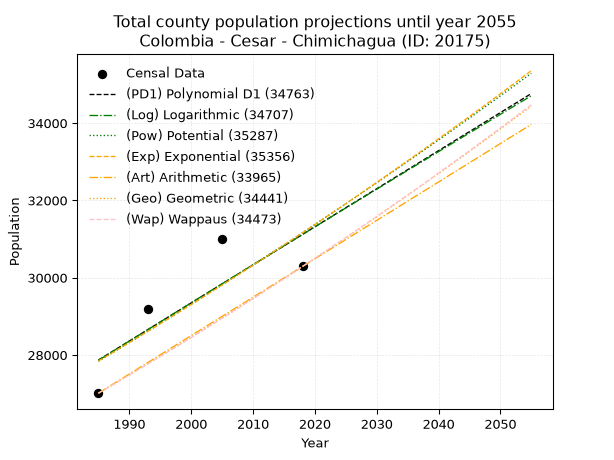
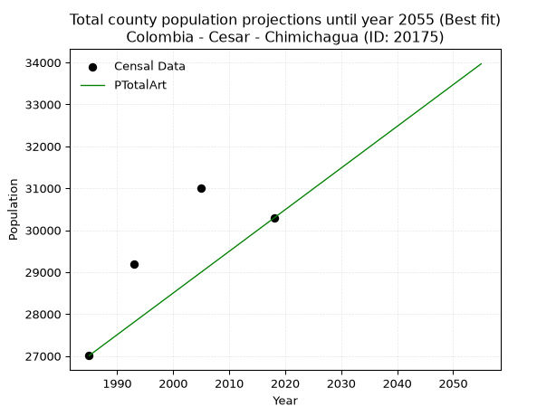
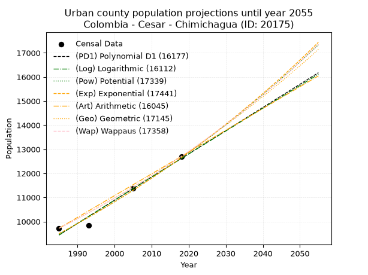
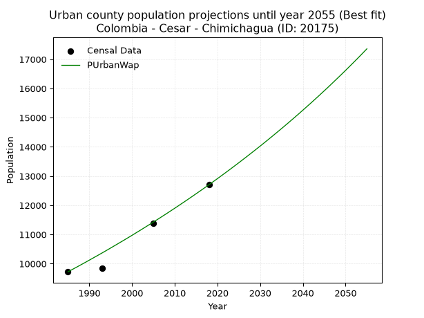
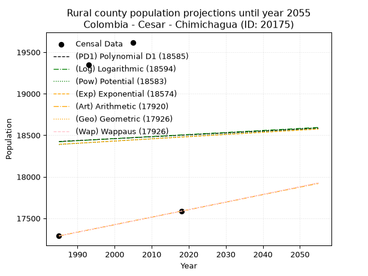
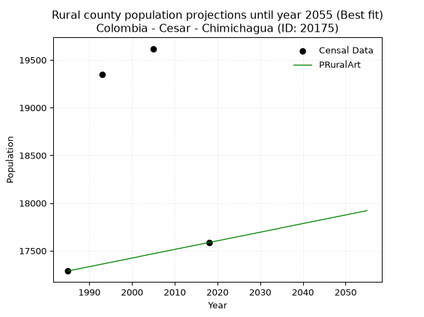

<div align="center">


</div>

# _“Population and Public Services Demand Projections (PPSD) until Year 2050 for Colombia - Cesar - Chimichagua (ID: 20175)”_
Keywords: `population` `public-service` `projection` `lineal` `polynomial` `logarithmic` `potential` `exponential` `arithmetic` `geometric` `wappaus` `dane` `colombia` `south-america`

PPSD are analytical estimates used by governments and planners to anticipate future changes in population size, age distribution, and the resulting community needs for utilities, healthcare, education, and infrastructure as sizing future water treatment facilities, electrical grids, and road networks based on spatial growth.

> **General running parameters**: • app_version: _v20260806_. • Python version: _3.14.7_. • Pandas version: _3.0.5_. • NumPy version: _2.5.1_. • Creates, save and include plots into reports (create_plot): _False_. • Projection until year: _2050_. • Process polynomial degree 2 and up: _False_. • Process Wappaus: _True_. • Process Wappaus: _True_. • Set negative values to zero: _True_. • Set infinite values to zero: _True_. • Drop dataset notes: _True_. 
<div align="center">

Dynamic map: [:earth_americas:Google](http://maps.google.com/maps?q=9.25875002,-73.8132782) [:earth_americas:OSM](https://www.openstreetmap.org/#map=18/9.25875002/-73.8132782&layers=P) [:earth_americas:Bing](https://www.bing.com/maps?cp=9.25875002~-73.8132782&lvl=18) [:earth_americas:Apple](https://maps.apple.com/frame?center=9.25875002%2C-73.8132782&span=0.003%2C0.006)

</div>


<div align="center">

```geojson
{
  "type": "Feature",
  "geometry": {
    "type": "Point", 
    "coordinates": [-73.8132782, 9.25875002]
  }, 
  "properties": {
    "Name": "Colombia - Cesar - Chimichagua (ID: 20175)"
  }
}
```

</div>


## 0. Census Data (4 records)

Census data are official statistics collected by a government about the people and housing in a country. They usually include counts of total population, age, sex, race, income, education, and jobs.

📅Global census file: [Population.xlsx](../data/Population.xlsx)

| Source   |   Year |   CountryID | CountryName   |   StateID | StateName   |   CountyID | CountyName   |   PTotal |   PUrban |   PRural |
|:---------|-------:|------------:|:--------------|----------:|:------------|-----------:|:-------------|---------:|---------:|---------:|
| DANE     |   1985 |          57 | Colombia      |        20 | Cesar       |      20175 | Chimichagua  |    27010 |     9722 |    17288 |
| DANE     |   1993 |          57 | Colombia      |        20 | Cesar       |      20175 | Chimichagua  |    29186 |     9839 |    19347 |
| DANE     |   2005 |          57 | Colombia      |        20 | Cesar       |      20175 | Chimichagua  |    30993 |    11375 |    19618 |
| DANE     |   2018 |          57 | Colombia      |        20 | Cesar       |      20175 | Chimichagua  |    30289 |    12703 |    17586 |

> 🔥Some records could had specific notes about the registered values or the corresponding urban or rural distribution.

## 1. Total

### 1.1. Coefficients and Parameters

* (PD1) Polynomial Deg 1: 98.50742673625086, -167669.98032918578 (lineal)
* (Log) Logarithmic: 197500.97366517133, -1471836.983502443
* (Pow) Potential: 6.842658454895823, -18.120822558973963
* (Exp) Exponential: 0.0034129068840377634, 31.80739651038846
* (Art) Arithmetic: Year diff. 2018 - 1985 = 33, Population diff. 30289 - 27010 = 3279, Annual growth = 99.36363636363636
* (Geo) Geometric: Year diff. 2018 - 1985 = 33, Population diff. 30289 - 27010 = 3279, Annual growth % = 0.003478078237718618
* (Wap) Wappaus: i = 0.34682502788403413, Condition values only valid for < 200)

<sub>
Wappaus condition values: ['0.00', '0.35', '0.69', '1.04', '1.39', '1.73', '2.08', '2.43', '2.77', '3.12', '3.47', '3.82', '4.16', '4.51', '4.86', '5.20', '5.55', '5.90', '6.24', '6.59', '6.94', '7.28', '7.63', '7.98', '8.32', '8.67', '9.02', '9.36', '9.71', '10.06', '10.40', '10.75', '11.10', '11.45', '11.79', '12.14', '12.49', '12.83', '13.18', '13.53', '13.87', '14.22', '14.57', '14.91', '15.26', '15.61', '15.95', '16.30', '16.65', '16.99', '17.34', '17.69', '18.03', '18.38', '18.73', '19.08', '19.42', '19.77', '20.12', '20.46', '20.81', '21.16', '21.50', '21.85', '22.20', '22.54']
</sub>


### 1.2. Projected Dataset

|   Year |   CountyID |   PTotalPD1 |   PTotalLog |   PTotalPow |   PTotalExp |   PTotalArt |   PTotalGeo |   PTotalWap |
|-------:|-----------:|------------:|------------:|------------:|------------:|------------:|------------:|------------:|
|   1985 |      20175 |       27867 |       27862 |       27837 |       27843 |       27010 |       27010 |       27010 |
|   1986 |      20175 |       27966 |       27961 |       27933 |       27938 |       27109 |       27104 |       27104 |
|   1987 |      20175 |       28064 |       28061 |       28030 |       28033 |       27209 |       27198 |       27198 |
|   1988 |      20175 |       28163 |       28160 |       28126 |       28129 |       27308 |       27293 |       27293 |
|   1989 |      20175 |       28261 |       28259 |       28223 |       28225 |       27407 |       27388 |       27387 |
|   1990 |      20175 |       28360 |       28359 |       28321 |       28322 |       27507 |       27483 |       27482 |
|   1991 |      20175 |       28458 |       28458 |       28418 |       28419 |       27606 |       27579 |       27578 |
|   1992 |      20175 |       28557 |       28557 |       28516 |       28516 |       27706 |       27675 |       27674 |
|   1993 |      20175 |       28655 |       28656 |       28614 |       28613 |       27805 |       27771 |       27770 |
|   1994 |      20175 |       28754 |       28755 |       28712 |       28711 |       27904 |       27867 |       27866 |
|   1995 |      20175 |       28852 |       28854 |       28811 |       28809 |       28004 |       27964 |       27963 |
|   1996 |      20175 |       28951 |       28953 |       28910 |       28908 |       28103 |       28062 |       28060 |
|   1997 |      20175 |       29049 |       29052 |       29009 |       29006 |       28202 |       28159 |       28158 |
|   1998 |      20175 |       29148 |       29151 |       29109 |       29106 |       28302 |       28257 |       28256 |
|   1999 |      20175 |       29246 |       29250 |       29209 |       29205 |       28401 |       28355 |       28354 |
|   2000 |      20175 |       29345 |       29349 |       29309 |       29305 |       28500 |       28454 |       28453 |
|   2001 |      20175 |       29443 |       29447 |       29409 |       29405 |       28600 |       28553 |       28552 |
|   2002 |      20175 |       29542 |       29546 |       29510 |       29506 |       28699 |       28652 |       28651 |
|   2003 |      20175 |       29640 |       29645 |       29611 |       29607 |       28799 |       28752 |       28751 |
|   2004 |      20175 |       29739 |       29743 |       29712 |       29708 |       28898 |       28852 |       28851 |
|   2005 |      20175 |       29837 |       29842 |       29814 |       29809 |       28997 |       28952 |       28951 |
|   2006 |      20175 |       29936 |       29940 |       29916 |       29911 |       29097 |       29053 |       29052 |
|   2007 |      20175 |       30034 |       30039 |       30018 |       30014 |       29196 |       29154 |       29153 |
|   2008 |      20175 |       30133 |       30137 |       30120 |       30116 |       29295 |       29255 |       29254 |
|   2009 |      20175 |       30231 |       30235 |       30223 |       30219 |       29395 |       29357 |       29356 |
|   2010 |      20175 |       30330 |       30334 |       30326 |       30322 |       29494 |       29459 |       29458 |
|   2011 |      20175 |       30428 |       30432 |       30430 |       30426 |       29593 |       29562 |       29561 |
|   2012 |      20175 |       30527 |       30530 |       30533 |       30530 |       29693 |       29665 |       29664 |
|   2013 |      20175 |       30625 |       30628 |       30637 |       30634 |       29792 |       29768 |       29767 |
|   2014 |      20175 |       30724 |       30726 |       30742 |       30739 |       29892 |       29871 |       29870 |
|   2015 |      20175 |       30822 |       30824 |       30846 |       30844 |       29991 |       29975 |       29975 |
|   2016 |      20175 |       30921 |       30922 |       30951 |       30950 |       30090 |       30079 |       30079 |
|   2017 |      20175 |       31019 |       31020 |       31056 |       31056 |       30190 |       30184 |       30184 |
|   2018 |      20175 |       31118 |       31118 |       31162 |       31162 |       30289 |       30289 |       30289 |
|   2019 |      20175 |       31217 |       31216 |       31268 |       31268 |       30388 |       30394 |       30395 |
|   2020 |      20175 |       31315 |       31314 |       31374 |       31375 |       30488 |       30500 |       30501 |
|   2021 |      20175 |       31414 |       31412 |       31480 |       31482 |       30587 |       30606 |       30607 |
|   2022 |      20175 |       31512 |       31509 |       31587 |       31590 |       30686 |       30713 |       30714 |
|   2023 |      20175 |       31611 |       31607 |       31694 |       31698 |       30786 |       30819 |       30821 |
|   2024 |      20175 |       31709 |       31705 |       31801 |       31806 |       30885 |       30927 |       30928 |
|   2025 |      20175 |       31808 |       31802 |       31909 |       31915 |       30985 |       31034 |       31036 |
|   2026 |      20175 |       31906 |       31900 |       32017 |       32024 |       31084 |       31142 |       31145 |
|   2027 |      20175 |       32005 |       31997 |       32125 |       32134 |       31183 |       31250 |       31254 |
|   2028 |      20175 |       32103 |       32094 |       32234 |       32244 |       31283 |       31359 |       31363 |
|   2029 |      20175 |       32202 |       32192 |       32343 |       32354 |       31382 |       31468 |       31472 |
|   2030 |      20175 |       32300 |       32289 |       32452 |       32464 |       31481 |       31578 |       31582 |
|   2031 |      20175 |       32399 |       32386 |       32562 |       32575 |       31581 |       31687 |       31693 |
|   2032 |      20175 |       32497 |       32484 |       32672 |       32687 |       31680 |       31798 |       31804 |
|   2033 |      20175 |       32596 |       32581 |       32782 |       32799 |       31779 |       31908 |       31915 |
|   2034 |      20175 |       32694 |       32678 |       32892 |       32911 |       31879 |       32019 |       32026 |
|   2035 |      20175 |       32793 |       32775 |       33003 |       33023 |       31978 |       32131 |       32139 |
|   2036 |      20175 |       32891 |       32872 |       33114 |       33136 |       32078 |       32242 |       32251 |
|   2037 |      20175 |       32990 |       32969 |       33226 |       33249 |       32177 |       32355 |       32364 |
|   2038 |      20175 |       33088 |       33066 |       33337 |       33363 |       32276 |       32467 |       32477 |
|   2039 |      20175 |       33187 |       33163 |       33449 |       33477 |       32376 |       32580 |       32591 |
|   2040 |      20175 |       33285 |       33260 |       33562 |       33592 |       32475 |       32693 |       32705 |
|   2041 |      20175 |       33384 |       33356 |       33675 |       33706 |       32574 |       32807 |       32820 |
|   2042 |      20175 |       33482 |       33453 |       33788 |       33822 |       32674 |       32921 |       32935 |
|   2043 |      20175 |       33581 |       33550 |       33901 |       33937 |       32773 |       33036 |       33051 |
|   2044 |      20175 |       33679 |       33647 |       34015 |       34053 |       32872 |       33150 |       33167 |
|   2045 |      20175 |       33778 |       33743 |       34129 |       34170 |       32972 |       33266 |       33283 |
|   2046 |      20175 |       33876 |       33840 |       34243 |       34286 |       33071 |       33381 |       33400 |
|   2047 |      20175 |       33975 |       33936 |       34358 |       34404 |       33171 |       33498 |       33518 |
|   2048 |      20175 |       34073 |       34033 |       34473 |       34521 |       33270 |       33614 |       33636 |
|   2049 |      20175 |       34172 |       34129 |       34588 |       34639 |       33369 |       33731 |       33754 |
|   2050 |      20175 |       34270 |       34225 |       34704 |       34758 |       33469 |       33848 |       33873 |
<div align="center">

</img>

</div>


### 1.3. Best fit with absolute and relative error (%)

Relative error puts that difference into context by dividing the absolute error by the true value, creating a unitless ratio or percentage that shows the scale of the mistake.

Absolute and relative error

|   Year | Source   |   CountryID | CountryName   |   StateID | StateName   |   CountyID_x | CountyName   |   PTotal |   PUrban |   PRural |   CountyID_y |   PTotalPD1 |   PTotalLog |   PTotalPow |   PTotalExp |   PTotalArt |   PTotalGeo |   PTotalWap |   PTotalPD1AbsError |   PTotalLogAbsError |   PTotalPowAbsError |   PTotalExpAbsError |   PTotalArtAbsError |   PTotalGeoAbsError |   PTotalWapAbsError |   PTotalPD1RelError |   PTotalLogRelError |   PTotalPowRelError |   PTotalExpRelError |   PTotalArtRelError |   PTotalGeoRelError |   PTotalWapRelError |
|-------:|:---------|------------:|:--------------|----------:|:------------|-------------:|:-------------|---------:|---------:|---------:|-------------:|------------:|------------:|------------:|------------:|------------:|------------:|------------:|--------------------:|--------------------:|--------------------:|--------------------:|--------------------:|--------------------:|--------------------:|--------------------:|--------------------:|--------------------:|--------------------:|--------------------:|--------------------:|--------------------:|
|   1985 | DANE     |          57 | Colombia      |        20 | Cesar       |        20175 | Chimichagua  |    27010 |     9722 |    17288 |        20175 |       27867 |       27862 |       27837 |       27843 |       27010 |       27010 |       27010 |                 857 |                 852 |                 827 |                 833 |                   0 |                   0 |                   0 |             3.1729  |             3.15439 |             3.06183 |             3.08404 |             0       |             0       |             0       |
|   1993 | DANE     |          57 | Colombia      |        20 | Cesar       |        20175 | Chimichagua  |    29186 |     9839 |    19347 |        20175 |       28655 |       28656 |       28614 |       28613 |       27805 |       27771 |       27770 |                 531 |                 530 |                 572 |                 573 |                1381 |                1415 |                1416 |             1.81937 |             1.81594 |             1.95984 |             1.96327 |             4.73172 |             4.84821 |             4.85164 |
|   2005 | DANE     |          57 | Colombia      |        20 | Cesar       |        20175 | Chimichagua  |    30993 |    11375 |    19618 |        20175 |       29837 |       29842 |       29814 |       29809 |       28997 |       28952 |       28951 |                1156 |                1151 |                1179 |                1184 |                1996 |                2041 |                2042 |             3.72987 |             3.71374 |             3.80408 |             3.82022 |             6.44016 |             6.58536 |             6.58858 |
|   2018 | DANE     |          57 | Colombia      |        20 | Cesar       |        20175 | Chimichagua  |    30289 |    12703 |    17586 |        20175 |       31118 |       31118 |       31162 |       31162 |       30289 |       30289 |       30289 |                 829 |                 829 |                 873 |                 873 |                   0 |                   0 |                   0 |             2.73697 |             2.73697 |             2.88223 |             2.88223 |             0       |             0       |             0       |

Relative error mean

| Method    |   RelError | Best   |
|:----------|-----------:|:-------|
| PTotalPD1 |    2.86478 |        |
| PTotalLog |    2.85526 |        |
| PTotalPow |    2.927   |        |
| PTotalExp |    2.93744 |        |
| PTotalArt |    2.79297 | True   |
| PTotalGeo |    2.85839 |        |
| PTotalWap |    2.86006 |        |

💙Best method: _**PTotalArt**_
<div align="center">

</img>

</div>


### 1.4. Fresh water supply demand in liters per capita per day (lpcd)

The fresh water supply demand typically ranges from 100 to 300 liters per capita per day (lpcd) for standard domestic and municipal planning, though absolute survival minimums set by the World Health Organization are as low as 7.5 to 20 liters per day, and total consumption in high-income nations can exceed 400 liters.

> `CZ`: Level in meters above the sea level (masl).<br> `WS`: Fresh water supply demand in liters per capita per day (lpcd or l/h/d).<br> `WSAll`: Zonal fresh water supply demand in liters per second (l/s).<br> `A`: Zonal area in square meters.

Reference values (RAS Colombia)

|    CZ |   WS |
|------:|-----:|
|  1000 |  120 |
|  2000 |  130 |
| 99999 |  140 |

County shapefile geometry properties and water supply values

|   CountyID |      ATotal |   CZTotal |   WSTotal |
|-----------:|------------:|----------:|----------:|
|      20175 | 1.37437e+09 |   146.645 |       120 |

Projected values for best method: PTotalArt

|   CountyID |   Year |   PTotalArt |   WSTotal |   WSTotalAll |
|-----------:|-------:|------------:|----------:|-------------:|
|      20175 |   1985 |       27010 |       120 |      37.5139 |
|      20175 |   1986 |       27109 |       120 |      37.6514 |
|      20175 |   1987 |       27209 |       120 |      37.7903 |
|      20175 |   1988 |       27308 |       120 |      37.9278 |
|      20175 |   1989 |       27407 |       120 |      38.0653 |
|      20175 |   1990 |       27507 |       120 |      38.2042 |
|      20175 |   1991 |       27606 |       120 |      38.3417 |
|      20175 |   1992 |       27706 |       120 |      38.4806 |
|      20175 |   1993 |       27805 |       120 |      38.6181 |
|      20175 |   1994 |       27904 |       120 |      38.7556 |
|      20175 |   1995 |       28004 |       120 |      38.8944 |
|      20175 |   1996 |       28103 |       120 |      39.0319 |
|      20175 |   1997 |       28202 |       120 |      39.1694 |
|      20175 |   1998 |       28302 |       120 |      39.3083 |
|      20175 |   1999 |       28401 |       120 |      39.4458 |
|      20175 |   2000 |       28500 |       120 |      39.5833 |
|      20175 |   2001 |       28600 |       120 |      39.7222 |
|      20175 |   2002 |       28699 |       120 |      39.8597 |
|      20175 |   2003 |       28799 |       120 |      39.9986 |
|      20175 |   2004 |       28898 |       120 |      40.1361 |
|      20175 |   2005 |       28997 |       120 |      40.2736 |
|      20175 |   2006 |       29097 |       120 |      40.4125 |
|      20175 |   2007 |       29196 |       120 |      40.55   |
|      20175 |   2008 |       29295 |       120 |      40.6875 |
|      20175 |   2009 |       29395 |       120 |      40.8264 |
|      20175 |   2010 |       29494 |       120 |      40.9639 |
|      20175 |   2011 |       29593 |       120 |      41.1014 |
|      20175 |   2012 |       29693 |       120 |      41.2403 |
|      20175 |   2013 |       29792 |       120 |      41.3778 |
|      20175 |   2014 |       29892 |       120 |      41.5167 |
|      20175 |   2015 |       29991 |       120 |      41.6542 |
|      20175 |   2016 |       30090 |       120 |      41.7917 |
|      20175 |   2017 |       30190 |       120 |      41.9306 |
|      20175 |   2018 |       30289 |       120 |      42.0681 |
|      20175 |   2019 |       30388 |       120 |      42.2056 |
|      20175 |   2020 |       30488 |       120 |      42.3444 |
|      20175 |   2021 |       30587 |       120 |      42.4819 |
|      20175 |   2022 |       30686 |       120 |      42.6194 |
|      20175 |   2023 |       30786 |       120 |      42.7583 |
|      20175 |   2024 |       30885 |       120 |      42.8958 |
|      20175 |   2025 |       30985 |       120 |      43.0347 |
|      20175 |   2026 |       31084 |       120 |      43.1722 |
|      20175 |   2027 |       31183 |       120 |      43.3097 |
|      20175 |   2028 |       31283 |       120 |      43.4486 |
|      20175 |   2029 |       31382 |       120 |      43.5861 |
|      20175 |   2030 |       31481 |       120 |      43.7236 |
|      20175 |   2031 |       31581 |       120 |      43.8625 |
|      20175 |   2032 |       31680 |       120 |      44      |
|      20175 |   2033 |       31779 |       120 |      44.1375 |
|      20175 |   2034 |       31879 |       120 |      44.2764 |
|      20175 |   2035 |       31978 |       120 |      44.4139 |
|      20175 |   2036 |       32078 |       120 |      44.5528 |
|      20175 |   2037 |       32177 |       120 |      44.6903 |
|      20175 |   2038 |       32276 |       120 |      44.8278 |
|      20175 |   2039 |       32376 |       120 |      44.9667 |
|      20175 |   2040 |       32475 |       120 |      45.1042 |
|      20175 |   2041 |       32574 |       120 |      45.2417 |
|      20175 |   2042 |       32674 |       120 |      45.3806 |
|      20175 |   2043 |       32773 |       120 |      45.5181 |
|      20175 |   2044 |       32872 |       120 |      45.6556 |
|      20175 |   2045 |       32972 |       120 |      45.7944 |
|      20175 |   2046 |       33071 |       120 |      45.9319 |
|      20175 |   2047 |       33171 |       120 |      46.0708 |
|      20175 |   2048 |       33270 |       120 |      46.2083 |
|      20175 |   2049 |       33369 |       120 |      46.3458 |
|      20175 |   2050 |       33469 |       120 |      46.4847 |

## 2. Urban

### 2.1. Coefficients and Parameters

* (PD1) Polynomial Deg 1: 96.2123645122431, -181539.03211561425 (lineal)
* (Log) Logarithmic: 192522.2788563805, -1452453.6343640676
* (Pow) Potential: 17.37270972450928, -53.31349122746303
* (Exp) Exponential: 0.008681377498270863, 0.00031163757480008386
* (Art) Arithmetic: Year diff. 2018 - 1985 = 33, Population diff. 12703 - 9722 = 2981, Annual growth = 90.33333333333333
* (Geo) Geometric: Year diff. 2018 - 1985 = 33, Population diff. 12703 - 9722 = 2981, Annual growth % = 0.008137379264641753
* (Wap) Wappaus: i = 0.8056484578223708, Condition values only valid for < 200)

<sub>
Wappaus condition values: ['0.00', '0.81', '1.61', '2.42', '3.22', '4.03', '4.83', '5.64', '6.45', '7.25', '8.06', '8.86', '9.67', '10.47', '11.28', '12.08', '12.89', '13.70', '14.50', '15.31', '16.11', '16.92', '17.72', '18.53', '19.34', '20.14', '20.95', '21.75', '22.56', '23.36', '24.17', '24.98', '25.78', '26.59', '27.39', '28.20', '29.00', '29.81', '30.61', '31.42', '32.23', '33.03', '33.84', '34.64', '35.45', '36.25', '37.06', '37.87', '38.67', '39.48', '40.28', '41.09', '41.89', '42.70', '43.51', '44.31', '45.12', '45.92', '46.73', '47.53', '48.34', '49.14', '49.95', '50.76', '51.56', '52.37']
</sub>


### 2.2. Projected Dataset

|   Year |   CountyID |   PUrbanPD1 |   PUrbanLog |   PUrbanPow |   PUrbanExp |   PUrbanArt |   PUrbanGeo |   PUrbanWap |
|-------:|-----------:|------------:|------------:|------------:|------------:|------------:|------------:|------------:|
|   1985 |      20175 |        9443 |        9440 |        9496 |        9498 |        9722 |        9722 |        9722 |
|   1986 |      20175 |        9539 |        9537 |        9580 |        9581 |        9812 |        9801 |        9801 |
|   1987 |      20175 |        9635 |        9634 |        9664 |        9665 |        9903 |        9881 |        9880 |
|   1988 |      20175 |        9731 |        9731 |        9749 |        9749 |        9993 |        9961 |        9960 |
|   1989 |      20175 |        9827 |        9828 |        9834 |        9834 |       10083 |       10042 |       10040 |
|   1990 |      20175 |        9924 |        9924 |        9920 |        9920 |       10174 |       10124 |       10122 |
|   1991 |      20175 |       10020 |       10021 |       10007 |       10006 |       10264 |       10206 |       10204 |
|   1992 |      20175 |       10116 |       10118 |       10095 |       10093 |       10354 |       10289 |       10286 |
|   1993 |      20175 |       10212 |       10214 |       10183 |       10181 |       10445 |       10373 |       10369 |
|   1994 |      20175 |       10308 |       10311 |       10272 |       10270 |       10535 |       10458 |       10453 |
|   1995 |      20175 |       10405 |       10408 |       10362 |       10360 |       10625 |       10543 |       10538 |
|   1996 |      20175 |       10501 |       10504 |       10453 |       10450 |       10716 |       10629 |       10624 |
|   1997 |      20175 |       10597 |       10600 |       10544 |       10541 |       10806 |       10715 |       10710 |
|   1998 |      20175 |       10693 |       10697 |       10636 |       10633 |       10896 |       10802 |       10796 |
|   1999 |      20175 |       10789 |       10793 |       10729 |       10726 |       10987 |       10890 |       10884 |
|   2000 |      20175 |       10886 |       10889 |       10823 |       10819 |       11077 |       10979 |       10972 |
|   2001 |      20175 |       10982 |       10986 |       10917 |       10914 |       11167 |       11068 |       11062 |
|   2002 |      20175 |       11078 |       11082 |       11012 |       11009 |       11258 |       11158 |       11151 |
|   2003 |      20175 |       11174 |       11178 |       11108 |       11105 |       11348 |       11249 |       11242 |
|   2004 |      20175 |       11271 |       11274 |       11205 |       11202 |       11438 |       11340 |       11334 |
|   2005 |      20175 |       11367 |       11370 |       11303 |       11299 |       11529 |       11433 |       11426 |
|   2006 |      20175 |       11463 |       11466 |       11401 |       11398 |       11619 |       11526 |       11519 |
|   2007 |      20175 |       11559 |       11562 |       11500 |       11497 |       11709 |       11620 |       11613 |
|   2008 |      20175 |       11655 |       11658 |       11600 |       11597 |       11800 |       11714 |       11707 |
|   2009 |      20175 |       11752 |       11754 |       11701 |       11699 |       11890 |       11809 |       11803 |
|   2010 |      20175 |       11848 |       11850 |       11803 |       11801 |       11980 |       11906 |       11899 |
|   2011 |      20175 |       11944 |       11945 |       11905 |       11903 |       12071 |       12002 |       11997 |
|   2012 |      20175 |       12040 |       12041 |       12008 |       12007 |       12161 |       12100 |       12095 |
|   2013 |      20175 |       12136 |       12137 |       12112 |       12112 |       12251 |       12199 |       12194 |
|   2014 |      20175 |       12233 |       12232 |       12217 |       12217 |       12342 |       12298 |       12294 |
|   2015 |      20175 |       12329 |       12328 |       12323 |       12324 |       12432 |       12398 |       12395 |
|   2016 |      20175 |       12425 |       12423 |       12430 |       12431 |       12522 |       12499 |       12497 |
|   2017 |      20175 |       12521 |       12519 |       12537 |       12540 |       12613 |       12600 |       12599 |
|   2018 |      20175 |       12618 |       12614 |       12646 |       12649 |       12703 |       12703 |       12703 |
|   2019 |      20175 |       12714 |       12710 |       12755 |       12760 |       12793 |       12806 |       12808 |
|   2020 |      20175 |       12810 |       12805 |       12865 |       12871 |       12884 |       12911 |       12913 |
|   2021 |      20175 |       12906 |       12900 |       12976 |       12983 |       12974 |       13016 |       13020 |
|   2022 |      20175 |       13002 |       12996 |       13088 |       13096 |       13064 |       13122 |       13128 |
|   2023 |      20175 |       13099 |       13091 |       13201 |       13210 |       13155 |       13228 |       13236 |
|   2024 |      20175 |       13195 |       13186 |       13315 |       13326 |       13245 |       13336 |       13346 |
|   2025 |      20175 |       13291 |       13281 |       13430 |       13442 |       13335 |       13444 |       13457 |
|   2026 |      20175 |       13387 |       13376 |       13546 |       13559 |       13426 |       13554 |       13569 |
|   2027 |      20175 |       13483 |       13471 |       13662 |       13677 |       13516 |       13664 |       13682 |
|   2028 |      20175 |       13580 |       13566 |       13780 |       13796 |       13606 |       13775 |       13796 |
|   2029 |      20175 |       13676 |       13661 |       13898 |       13917 |       13697 |       13887 |       13911 |
|   2030 |      20175 |       13772 |       13756 |       14018 |       14038 |       13787 |       14000 |       14027 |
|   2031 |      20175 |       13868 |       13851 |       14138 |       14160 |       13877 |       14114 |       14144 |
|   2032 |      20175 |       13964 |       13945 |       14260 |       14284 |       13968 |       14229 |       14263 |
|   2033 |      20175 |       14061 |       14040 |       14382 |       14408 |       14058 |       14345 |       14383 |
|   2034 |      20175 |       14157 |       14135 |       14505 |       14534 |       14148 |       14462 |       14504 |
|   2035 |      20175 |       14253 |       14229 |       14630 |       14661 |       14239 |       14579 |       14626 |
|   2036 |      20175 |       14349 |       14324 |       14755 |       14789 |       14329 |       14698 |       14749 |
|   2037 |      20175 |       14446 |       14419 |       14882 |       14918 |       14419 |       14818 |       14874 |
|   2038 |      20175 |       14542 |       14513 |       15009 |       15048 |       14510 |       14938 |       15000 |
|   2039 |      20175 |       14638 |       14607 |       15137 |       15179 |       14600 |       15060 |       15127 |
|   2040 |      20175 |       14734 |       14702 |       15267 |       15311 |       14690 |       15182 |       15256 |
|   2041 |      20175 |       14830 |       14796 |       15398 |       15445 |       14781 |       15306 |       15386 |
|   2042 |      20175 |       14927 |       14891 |       15529 |       15579 |       14871 |       15430 |       15517 |
|   2043 |      20175 |       15023 |       14985 |       15662 |       15715 |       14961 |       15556 |       15650 |
|   2044 |      20175 |       15119 |       15079 |       15795 |       15852 |       15052 |       15683 |       15784 |
|   2045 |      20175 |       15215 |       15173 |       15930 |       15990 |       15142 |       15810 |       15919 |
|   2046 |      20175 |       15311 |       15267 |       16066 |       16130 |       15232 |       15939 |       16056 |
|   2047 |      20175 |       15408 |       15361 |       16203 |       16271 |       15323 |       16069 |       16195 |
|   2048 |      20175 |       15504 |       15455 |       16341 |       16412 |       15413 |       16199 |       16335 |
|   2049 |      20175 |       15600 |       15549 |       16480 |       16555 |       15503 |       16331 |       16476 |
|   2050 |      20175 |       15696 |       15643 |       16621 |       16700 |       15594 |       16464 |       16619 |
<div align="center">

</img>

</div>


### 2.3. Best fit with absolute and relative error (%)

Relative error puts that difference into context by dividing the absolute error by the true value, creating a unitless ratio or percentage that shows the scale of the mistake.

Absolute and relative error

|   Year | Source   |   CountryID | CountryName   |   StateID | StateName   |   CountyID_x | CountyName   |   PTotal |   PUrban |   PRural |   CountyID_y |   PUrbanPD1 |   PUrbanLog |   PUrbanPow |   PUrbanExp |   PUrbanArt |   PUrbanGeo |   PUrbanWap |   PUrbanPD1AbsError |   PUrbanLogAbsError |   PUrbanPowAbsError |   PUrbanExpAbsError |   PUrbanArtAbsError |   PUrbanGeoAbsError |   PUrbanWapAbsError |   PUrbanPD1RelError |   PUrbanLogRelError |   PUrbanPowRelError |   PUrbanExpRelError |   PUrbanArtRelError |   PUrbanGeoRelError |   PUrbanWapRelError |
|-------:|:---------|------------:|:--------------|----------:|:------------|-------------:|:-------------|---------:|---------:|---------:|-------------:|------------:|------------:|------------:|------------:|------------:|------------:|------------:|--------------------:|--------------------:|--------------------:|--------------------:|--------------------:|--------------------:|--------------------:|--------------------:|--------------------:|--------------------:|--------------------:|--------------------:|--------------------:|--------------------:|
|   1985 | DANE     |          57 | Colombia      |        20 | Cesar       |        20175 | Chimichagua  |    27010 |     9722 |    17288 |        20175 |        9443 |        9440 |        9496 |        9498 |        9722 |        9722 |        9722 |                 279 |                 282 |                 226 |                 224 |                   0 |                   0 |                   0 |           2.86978   |            2.90064  |            2.32462  |            2.30405  |             0       |             0       |            0        |
|   1993 | DANE     |          57 | Colombia      |        20 | Cesar       |        20175 | Chimichagua  |    29186 |     9839 |    19347 |        20175 |       10212 |       10214 |       10183 |       10181 |       10445 |       10373 |       10369 |                 373 |                 375 |                 344 |                 342 |                 606 |                 534 |                 530 |           3.79104   |            3.81136  |            3.49629  |            3.47596  |             6.15916 |             5.42738 |            5.38673  |
|   2005 | DANE     |          57 | Colombia      |        20 | Cesar       |        20175 | Chimichagua  |    30993 |    11375 |    19618 |        20175 |       11367 |       11370 |       11303 |       11299 |       11529 |       11433 |       11426 |                   8 |                   5 |                  72 |                  76 |                 154 |                  58 |                  51 |           0.0703297 |            0.043956 |            0.632967 |            0.668132 |             1.35385 |             0.50989 |            0.448352 |
|   2018 | DANE     |          57 | Colombia      |        20 | Cesar       |        20175 | Chimichagua  |    30289 |    12703 |    17586 |        20175 |       12618 |       12614 |       12646 |       12649 |       12703 |       12703 |       12703 |                  85 |                  89 |                  57 |                  54 |                   0 |                   0 |                   0 |           0.669133  |            0.700622 |            0.448713 |            0.425096 |             0       |             0       |            0        |

Relative error mean

| Method    |   RelError | Best   |
|:----------|-----------:|:-------|
| PUrbanPD1 |    1.85007 |        |
| PUrbanLog |    1.86414 |        |
| PUrbanPow |    1.72565 |        |
| PUrbanExp |    1.71831 |        |
| PUrbanArt |    1.87825 |        |
| PUrbanGeo |    1.48432 |        |
| PUrbanWap |    1.45877 | True   |

💙Best method: _**PUrbanWap**_
<div align="center">

</img>

</div>


### 2.4. Fresh water supply demand in liters per capita per day (lpcd)

The fresh water supply demand typically ranges from 100 to 300 liters per capita per day (lpcd) for standard domestic and municipal planning, though absolute survival minimums set by the World Health Organization are as low as 7.5 to 20 liters per day, and total consumption in high-income nations can exceed 400 liters.

> `CZ`: Level in meters above the sea level (masl).<br> `WS`: Fresh water supply demand in liters per capita per day (lpcd or l/h/d).<br> `WSAll`: Zonal fresh water supply demand in liters per second (l/s).<br> `A`: Zonal area in square meters.

Reference values (RAS Colombia)

|    CZ |   WS |
|------:|-----:|
|  1000 |  120 |
|  2000 |  130 |
| 99999 |  140 |

County shapefile geometry properties and water supply values

|   CountyID |      AUrban |   CZUrban |   WSUrban |
|-----------:|------------:|----------:|----------:|
|      20175 | 2.04937e+06 |   37.6218 |       120 |

Projected values for best method: PUrbanWap

|   CountyID |   Year |   PUrbanWap |   WSUrban |   WSUrbanAll |
|-----------:|-------:|------------:|----------:|-------------:|
|      20175 |   1985 |        9722 |       120 |      13.5028 |
|      20175 |   1986 |        9801 |       120 |      13.6125 |
|      20175 |   1987 |        9880 |       120 |      13.7222 |
|      20175 |   1988 |        9960 |       120 |      13.8333 |
|      20175 |   1989 |       10040 |       120 |      13.9444 |
|      20175 |   1990 |       10122 |       120 |      14.0583 |
|      20175 |   1991 |       10204 |       120 |      14.1722 |
|      20175 |   1992 |       10286 |       120 |      14.2861 |
|      20175 |   1993 |       10369 |       120 |      14.4014 |
|      20175 |   1994 |       10453 |       120 |      14.5181 |
|      20175 |   1995 |       10538 |       120 |      14.6361 |
|      20175 |   1996 |       10624 |       120 |      14.7556 |
|      20175 |   1997 |       10710 |       120 |      14.875  |
|      20175 |   1998 |       10796 |       120 |      14.9944 |
|      20175 |   1999 |       10884 |       120 |      15.1167 |
|      20175 |   2000 |       10972 |       120 |      15.2389 |
|      20175 |   2001 |       11062 |       120 |      15.3639 |
|      20175 |   2002 |       11151 |       120 |      15.4875 |
|      20175 |   2003 |       11242 |       120 |      15.6139 |
|      20175 |   2004 |       11334 |       120 |      15.7417 |
|      20175 |   2005 |       11426 |       120 |      15.8694 |
|      20175 |   2006 |       11519 |       120 |      15.9986 |
|      20175 |   2007 |       11613 |       120 |      16.1292 |
|      20175 |   2008 |       11707 |       120 |      16.2597 |
|      20175 |   2009 |       11803 |       120 |      16.3931 |
|      20175 |   2010 |       11899 |       120 |      16.5264 |
|      20175 |   2011 |       11997 |       120 |      16.6625 |
|      20175 |   2012 |       12095 |       120 |      16.7986 |
|      20175 |   2013 |       12194 |       120 |      16.9361 |
|      20175 |   2014 |       12294 |       120 |      17.075  |
|      20175 |   2015 |       12395 |       120 |      17.2153 |
|      20175 |   2016 |       12497 |       120 |      17.3569 |
|      20175 |   2017 |       12599 |       120 |      17.4986 |
|      20175 |   2018 |       12703 |       120 |      17.6431 |
|      20175 |   2019 |       12808 |       120 |      17.7889 |
|      20175 |   2020 |       12913 |       120 |      17.9347 |
|      20175 |   2021 |       13020 |       120 |      18.0833 |
|      20175 |   2022 |       13128 |       120 |      18.2333 |
|      20175 |   2023 |       13236 |       120 |      18.3833 |
|      20175 |   2024 |       13346 |       120 |      18.5361 |
|      20175 |   2025 |       13457 |       120 |      18.6903 |
|      20175 |   2026 |       13569 |       120 |      18.8458 |
|      20175 |   2027 |       13682 |       120 |      19.0028 |
|      20175 |   2028 |       13796 |       120 |      19.1611 |
|      20175 |   2029 |       13911 |       120 |      19.3208 |
|      20175 |   2030 |       14027 |       120 |      19.4819 |
|      20175 |   2031 |       14144 |       120 |      19.6444 |
|      20175 |   2032 |       14263 |       120 |      19.8097 |
|      20175 |   2033 |       14383 |       120 |      19.9764 |
|      20175 |   2034 |       14504 |       120 |      20.1444 |
|      20175 |   2035 |       14626 |       120 |      20.3139 |
|      20175 |   2036 |       14749 |       120 |      20.4847 |
|      20175 |   2037 |       14874 |       120 |      20.6583 |
|      20175 |   2038 |       15000 |       120 |      20.8333 |
|      20175 |   2039 |       15127 |       120 |      21.0097 |
|      20175 |   2040 |       15256 |       120 |      21.1889 |
|      20175 |   2041 |       15386 |       120 |      21.3694 |
|      20175 |   2042 |       15517 |       120 |      21.5514 |
|      20175 |   2043 |       15650 |       120 |      21.7361 |
|      20175 |   2044 |       15784 |       120 |      21.9222 |
|      20175 |   2045 |       15919 |       120 |      22.1097 |
|      20175 |   2046 |       16056 |       120 |      22.3    |
|      20175 |   2047 |       16195 |       120 |      22.4931 |
|      20175 |   2048 |       16335 |       120 |      22.6875 |
|      20175 |   2049 |       16476 |       120 |      22.8833 |
|      20175 |   2050 |       16619 |       120 |      23.0819 |

## 3. Rural

### 3.1. Coefficients and Parameters

* (PD1) Polynomial Deg 1: 2.2950622240077503, 13869.051786428494 (lineal)
* (Log) Logarithmic: 4978.694808790774, -19383.34913837499
* (Pow) Potential: 0.3040814862406637, 3.2617489993800364
* (Exp) Exponential: 0.00014149801885190693, 13887.563751766247
* (Art) Arithmetic: Year diff. 2018 - 1985 = 33, Population diff. 17586 - 17288 = 298, Annual growth = 9.030303030303031
* (Geo) Geometric: Year diff. 2018 - 1985 = 33, Population diff. 17586 - 17288 = 298, Annual growth % = 0.000518028425926742
* (Wap) Wappaus: i = 0.05178816901016821, Condition values only valid for < 200)

<sub>
Wappaus condition values: ['0.00', '0.05', '0.10', '0.16', '0.21', '0.26', '0.31', '0.36', '0.41', '0.47', '0.52', '0.57', '0.62', '0.67', '0.73', '0.78', '0.83', '0.88', '0.93', '0.98', '1.04', '1.09', '1.14', '1.19', '1.24', '1.29', '1.35', '1.40', '1.45', '1.50', '1.55', '1.61', '1.66', '1.71', '1.76', '1.81', '1.86', '1.92', '1.97', '2.02', '2.07', '2.12', '2.18', '2.23', '2.28', '2.33', '2.38', '2.43', '2.49', '2.54', '2.59', '2.64', '2.69', '2.74', '2.80', '2.85', '2.90', '2.95', '3.00', '3.06', '3.11', '3.16', '3.21', '3.26', '3.31', '3.37']
</sub>


### 3.2. Projected Dataset

|   Year |   CountyID |   PRuralPD1 |   PRuralLog |   PRuralPow |   PRuralExp |   PRuralArt |   PRuralGeo |   PRuralWap |
|-------:|-----------:|------------:|------------:|------------:|------------:|------------:|------------:|------------:|
|   1985 |      20175 |       18425 |       18422 |       18388 |       18391 |       17288 |       17288 |       17288 |
|   1986 |      20175 |       18427 |       18424 |       18391 |       18394 |       17297 |       17297 |       17297 |
|   1987 |      20175 |       18429 |       18427 |       18394 |       18396 |       17306 |       17306 |       17306 |
|   1988 |      20175 |       18432 |       18429 |       18397 |       18399 |       17315 |       17315 |       17315 |
|   1989 |      20175 |       18434 |       18432 |       18399 |       18402 |       17324 |       17324 |       17324 |
|   1990 |      20175 |       18436 |       18434 |       18402 |       18404 |       17333 |       17333 |       17333 |
|   1991 |      20175 |       18439 |       18437 |       18405 |       18407 |       17342 |       17342 |       17342 |
|   1992 |      20175 |       18441 |       18439 |       18408 |       18409 |       17351 |       17351 |       17351 |
|   1993 |      20175 |       18443 |       18442 |       18411 |       18412 |       17360 |       17360 |       17360 |
|   1994 |      20175 |       18445 |       18444 |       18413 |       18415 |       17369 |       17369 |       17369 |
|   1995 |      20175 |       18448 |       18447 |       18416 |       18417 |       17378 |       17378 |       17378 |
|   1996 |      20175 |       18450 |       18449 |       18419 |       18420 |       17387 |       17387 |       17387 |
|   1997 |      20175 |       18452 |       18452 |       18422 |       18422 |       17396 |       17396 |       17396 |
|   1998 |      20175 |       18455 |       18454 |       18425 |       18425 |       17405 |       17405 |       17405 |
|   1999 |      20175 |       18457 |       18457 |       18427 |       18428 |       17414 |       17414 |       17414 |
|   2000 |      20175 |       18459 |       18459 |       18430 |       18430 |       17423 |       17423 |       17423 |
|   2001 |      20175 |       18461 |       18462 |       18433 |       18433 |       17432 |       17432 |       17432 |
|   2002 |      20175 |       18464 |       18464 |       18436 |       18435 |       17442 |       17441 |       17441 |
|   2003 |      20175 |       18466 |       18467 |       18439 |       18438 |       17451 |       17450 |       17450 |
|   2004 |      20175 |       18468 |       18469 |       18441 |       18441 |       17460 |       17459 |       17459 |
|   2005 |      20175 |       18471 |       18472 |       18444 |       18443 |       17469 |       17468 |       17468 |
|   2006 |      20175 |       18473 |       18474 |       18447 |       18446 |       17478 |       17477 |       17477 |
|   2007 |      20175 |       18475 |       18477 |       18450 |       18448 |       17487 |       17486 |       17486 |
|   2008 |      20175 |       18478 |       18479 |       18453 |       18451 |       17496 |       17495 |       17495 |
|   2009 |      20175 |       18480 |       18482 |       18455 |       18454 |       17505 |       17504 |       17504 |
|   2010 |      20175 |       18482 |       18484 |       18458 |       18456 |       17514 |       17513 |       17513 |
|   2011 |      20175 |       18484 |       18487 |       18461 |       18459 |       17523 |       17522 |       17522 |
|   2012 |      20175 |       18487 |       18489 |       18464 |       18462 |       17532 |       17531 |       17531 |
|   2013 |      20175 |       18489 |       18491 |       18467 |       18464 |       17541 |       17541 |       17541 |
|   2014 |      20175 |       18491 |       18494 |       18469 |       18467 |       17550 |       17550 |       17550 |
|   2015 |      20175 |       18494 |       18496 |       18472 |       18469 |       17559 |       17559 |       17559 |
|   2016 |      20175 |       18496 |       18499 |       18475 |       18472 |       17568 |       17568 |       17568 |
|   2017 |      20175 |       18498 |       18501 |       18478 |       18475 |       17577 |       17577 |       17577 |
|   2018 |      20175 |       18500 |       18504 |       18481 |       18477 |       17586 |       17586 |       17586 |
|   2019 |      20175 |       18503 |       18506 |       18483 |       18480 |       17595 |       17595 |       17595 |
|   2020 |      20175 |       18505 |       18509 |       18486 |       18482 |       17604 |       17604 |       17604 |
|   2021 |      20175 |       18507 |       18511 |       18489 |       18485 |       17613 |       17613 |       17613 |
|   2022 |      20175 |       18510 |       18514 |       18492 |       18488 |       17622 |       17622 |       17622 |
|   2023 |      20175 |       18512 |       18516 |       18494 |       18490 |       17631 |       17632 |       17632 |
|   2024 |      20175 |       18514 |       18519 |       18497 |       18493 |       17640 |       17641 |       17641 |
|   2025 |      20175 |       18517 |       18521 |       18500 |       18495 |       17649 |       17650 |       17650 |
|   2026 |      20175 |       18519 |       18524 |       18503 |       18498 |       17658 |       17659 |       17659 |
|   2027 |      20175 |       18521 |       18526 |       18506 |       18501 |       17667 |       17668 |       17668 |
|   2028 |      20175 |       18523 |       18528 |       18508 |       18503 |       17676 |       17677 |       17677 |
|   2029 |      20175 |       18526 |       18531 |       18511 |       18506 |       17685 |       17686 |       17686 |
|   2030 |      20175 |       18528 |       18533 |       18514 |       18509 |       17694 |       17696 |       17696 |
|   2031 |      20175 |       18530 |       18536 |       18517 |       18511 |       17703 |       17705 |       17705 |
|   2032 |      20175 |       18533 |       18538 |       18519 |       18514 |       17712 |       17714 |       17714 |
|   2033 |      20175 |       18535 |       18541 |       18522 |       18516 |       17721 |       17723 |       17723 |
|   2034 |      20175 |       18537 |       18543 |       18525 |       18519 |       17730 |       17732 |       17732 |
|   2035 |      20175 |       18540 |       18546 |       18528 |       18522 |       17740 |       17742 |       17742 |
|   2036 |      20175 |       18542 |       18548 |       18530 |       18524 |       17749 |       17751 |       17751 |
|   2037 |      20175 |       18544 |       18550 |       18533 |       18527 |       17758 |       17760 |       17760 |
|   2038 |      20175 |       18546 |       18553 |       18536 |       18530 |       17767 |       17769 |       17769 |
|   2039 |      20175 |       18549 |       18555 |       18539 |       18532 |       17776 |       17778 |       17778 |
|   2040 |      20175 |       18551 |       18558 |       18542 |       18535 |       17785 |       17788 |       17788 |
|   2041 |      20175 |       18553 |       18560 |       18544 |       18537 |       17794 |       17797 |       17797 |
|   2042 |      20175 |       18556 |       18563 |       18547 |       18540 |       17803 |       17806 |       17806 |
|   2043 |      20175 |       18558 |       18565 |       18550 |       18543 |       17812 |       17815 |       17815 |
|   2044 |      20175 |       18560 |       18568 |       18553 |       18545 |       17821 |       17824 |       17824 |
|   2045 |      20175 |       18562 |       18570 |       18555 |       18548 |       17830 |       17834 |       17834 |
|   2046 |      20175 |       18565 |       18572 |       18558 |       18551 |       17839 |       17843 |       17843 |
|   2047 |      20175 |       18567 |       18575 |       18561 |       18553 |       17848 |       17852 |       17852 |
|   2048 |      20175 |       18569 |       18577 |       18564 |       18556 |       17857 |       17861 |       17861 |
|   2049 |      20175 |       18572 |       18580 |       18566 |       18558 |       17866 |       17871 |       17871 |
|   2050 |      20175 |       18574 |       18582 |       18569 |       18561 |       17875 |       17880 |       17880 |
<div align="center">

</img>

</div>


### 3.3. Best fit with absolute and relative error (%)

Relative error puts that difference into context by dividing the absolute error by the true value, creating a unitless ratio or percentage that shows the scale of the mistake.

Absolute and relative error

|   Year | Source   |   CountryID | CountryName   |   StateID | StateName   |   CountyID_x | CountyName   |   PTotal |   PUrban |   PRural |   CountyID_y |   PRuralPD1 |   PRuralLog |   PRuralPow |   PRuralExp |   PRuralArt |   PRuralGeo |   PRuralWap |   PRuralPD1AbsError |   PRuralLogAbsError |   PRuralPowAbsError |   PRuralExpAbsError |   PRuralArtAbsError |   PRuralGeoAbsError |   PRuralWapAbsError |   PRuralPD1RelError |   PRuralLogRelError |   PRuralPowRelError |   PRuralExpRelError |   PRuralArtRelError |   PRuralGeoRelError |   PRuralWapRelError |
|-------:|:---------|------------:|:--------------|----------:|:------------|-------------:|:-------------|---------:|---------:|---------:|-------------:|------------:|------------:|------------:|------------:|------------:|------------:|------------:|--------------------:|--------------------:|--------------------:|--------------------:|--------------------:|--------------------:|--------------------:|--------------------:|--------------------:|--------------------:|--------------------:|--------------------:|--------------------:|--------------------:|
|   1985 | DANE     |          57 | Colombia      |        20 | Cesar       |        20175 | Chimichagua  |    27010 |     9722 |    17288 |        20175 |       18425 |       18422 |       18388 |       18391 |       17288 |       17288 |       17288 |                1137 |                1134 |                1100 |                1103 |                   0 |                   0 |                   0 |             6.57682 |             6.55946 |             6.3628  |             6.38015 |              0      |              0      |              0      |
|   1993 | DANE     |          57 | Colombia      |        20 | Cesar       |        20175 | Chimichagua  |    29186 |     9839 |    19347 |        20175 |       18443 |       18442 |       18411 |       18412 |       17360 |       17360 |       17360 |                 904 |                 905 |                 936 |                 935 |                1987 |                1987 |                1987 |             4.67256 |             4.67773 |             4.83796 |             4.83279 |             10.2703 |             10.2703 |             10.2703 |
|   2005 | DANE     |          57 | Colombia      |        20 | Cesar       |        20175 | Chimichagua  |    30993 |    11375 |    19618 |        20175 |       18471 |       18472 |       18444 |       18443 |       17469 |       17468 |       17468 |                1147 |                1146 |                1174 |                1175 |                2149 |                2150 |                2150 |             5.84667 |             5.84157 |             5.9843  |             5.9894  |             10.9542 |             10.9593 |             10.9593 |
|   2018 | DANE     |          57 | Colombia      |        20 | Cesar       |        20175 | Chimichagua  |    30289 |    12703 |    17586 |        20175 |       18500 |       18504 |       18481 |       18477 |       17586 |       17586 |       17586 |                 914 |                 918 |                 895 |                 891 |                   0 |                   0 |                   0 |             5.19732 |             5.22006 |             5.08928 |             5.06653 |              0      |              0      |              0      |

Relative error mean

| Method    |   RelError | Best   |
|:----------|-----------:|:-------|
| PRuralPD1 |    5.57334 |        |
| PRuralLog |    5.57471 |        |
| PRuralPow |    5.56858 |        |
| PRuralExp |    5.56722 |        |
| PRuralArt |    5.30614 | True   |
| PRuralGeo |    5.30741 |        |
| PRuralWap |    5.30741 |        |

💙Best method: _**PRuralArt**_
<div align="center">

</img>

</div>


### 3.4. Fresh water supply demand in liters per capita per day (lpcd)

The fresh water supply demand typically ranges from 100 to 300 liters per capita per day (lpcd) for standard domestic and municipal planning, though absolute survival minimums set by the World Health Organization are as low as 7.5 to 20 liters per day, and total consumption in high-income nations can exceed 400 liters.

> `CZ`: Level in meters above the sea level (masl).<br> `WS`: Fresh water supply demand in liters per capita per day (lpcd or l/h/d).<br> `WSAll`: Zonal fresh water supply demand in liters per second (l/s).<br> `A`: Zonal area in square meters.

Reference values (RAS Colombia)

|    CZ |   WS |
|------:|-----:|
|  1000 |  120 |
|  2000 |  130 |
| 99999 |  140 |

County shapefile geometry properties and water supply values

|   CountyID |      ARural |   CZRural |   WSRural |
|-----------:|------------:|----------:|----------:|
|      20175 | 1.37232e+09 |   146.809 |       120 |

Projected values for best method: PRuralArt

|   CountyID |   Year |   PRuralArt |   WSRural |   WSRuralAll |
|-----------:|-------:|------------:|----------:|-------------:|
|      20175 |   1985 |       17288 |       120 |      24.0111 |
|      20175 |   1986 |       17297 |       120 |      24.0236 |
|      20175 |   1987 |       17306 |       120 |      24.0361 |
|      20175 |   1988 |       17315 |       120 |      24.0486 |
|      20175 |   1989 |       17324 |       120 |      24.0611 |
|      20175 |   1990 |       17333 |       120 |      24.0736 |
|      20175 |   1991 |       17342 |       120 |      24.0861 |
|      20175 |   1992 |       17351 |       120 |      24.0986 |
|      20175 |   1993 |       17360 |       120 |      24.1111 |
|      20175 |   1994 |       17369 |       120 |      24.1236 |
|      20175 |   1995 |       17378 |       120 |      24.1361 |
|      20175 |   1996 |       17387 |       120 |      24.1486 |
|      20175 |   1997 |       17396 |       120 |      24.1611 |
|      20175 |   1998 |       17405 |       120 |      24.1736 |
|      20175 |   1999 |       17414 |       120 |      24.1861 |
|      20175 |   2000 |       17423 |       120 |      24.1986 |
|      20175 |   2001 |       17432 |       120 |      24.2111 |
|      20175 |   2002 |       17442 |       120 |      24.225  |
|      20175 |   2003 |       17451 |       120 |      24.2375 |
|      20175 |   2004 |       17460 |       120 |      24.25   |
|      20175 |   2005 |       17469 |       120 |      24.2625 |
|      20175 |   2006 |       17478 |       120 |      24.275  |
|      20175 |   2007 |       17487 |       120 |      24.2875 |
|      20175 |   2008 |       17496 |       120 |      24.3    |
|      20175 |   2009 |       17505 |       120 |      24.3125 |
|      20175 |   2010 |       17514 |       120 |      24.325  |
|      20175 |   2011 |       17523 |       120 |      24.3375 |
|      20175 |   2012 |       17532 |       120 |      24.35   |
|      20175 |   2013 |       17541 |       120 |      24.3625 |
|      20175 |   2014 |       17550 |       120 |      24.375  |
|      20175 |   2015 |       17559 |       120 |      24.3875 |
|      20175 |   2016 |       17568 |       120 |      24.4    |
|      20175 |   2017 |       17577 |       120 |      24.4125 |
|      20175 |   2018 |       17586 |       120 |      24.425  |
|      20175 |   2019 |       17595 |       120 |      24.4375 |
|      20175 |   2020 |       17604 |       120 |      24.45   |
|      20175 |   2021 |       17613 |       120 |      24.4625 |
|      20175 |   2022 |       17622 |       120 |      24.475  |
|      20175 |   2023 |       17631 |       120 |      24.4875 |
|      20175 |   2024 |       17640 |       120 |      24.5    |
|      20175 |   2025 |       17649 |       120 |      24.5125 |
|      20175 |   2026 |       17658 |       120 |      24.525  |
|      20175 |   2027 |       17667 |       120 |      24.5375 |
|      20175 |   2028 |       17676 |       120 |      24.55   |
|      20175 |   2029 |       17685 |       120 |      24.5625 |
|      20175 |   2030 |       17694 |       120 |      24.575  |
|      20175 |   2031 |       17703 |       120 |      24.5875 |
|      20175 |   2032 |       17712 |       120 |      24.6    |
|      20175 |   2033 |       17721 |       120 |      24.6125 |
|      20175 |   2034 |       17730 |       120 |      24.625  |
|      20175 |   2035 |       17740 |       120 |      24.6389 |
|      20175 |   2036 |       17749 |       120 |      24.6514 |
|      20175 |   2037 |       17758 |       120 |      24.6639 |
|      20175 |   2038 |       17767 |       120 |      24.6764 |
|      20175 |   2039 |       17776 |       120 |      24.6889 |
|      20175 |   2040 |       17785 |       120 |      24.7014 |
|      20175 |   2041 |       17794 |       120 |      24.7139 |
|      20175 |   2042 |       17803 |       120 |      24.7264 |
|      20175 |   2043 |       17812 |       120 |      24.7389 |
|      20175 |   2044 |       17821 |       120 |      24.7514 |
|      20175 |   2045 |       17830 |       120 |      24.7639 |
|      20175 |   2046 |       17839 |       120 |      24.7764 |
|      20175 |   2047 |       17848 |       120 |      24.7889 |
|      20175 |   2048 |       17857 |       120 |      24.8014 |
|      20175 |   2049 |       17866 |       120 |      24.8139 |
|      20175 |   2050 |       17875 |       120 |      24.8264 |

<div align="center"><br><sub>Share this research</sub></div><br>

<sub>**APPS & TOOLS & CONTENT DISCLAIMER**: • NO WARRANTY - This content and software is provided by <a href="https://github.com/rcfdtools" target="_blank">github.com/rcfdtools</a> "as is", without any express or implied warranty, including warranties of merchantability, fitness for a particular purpose, or non-infringement. There is no guarantee that the software will be error-free or operate without interruption. • LIMITATION OF LIABILITY - Neither the authors nor copyright holders will be liable for claims or damages arising from the software or its use. You are responsible for determining if the software is appropriate for your use and assume all associated risks, including errors, legal compliance, and data loss. • NO PROFESSIONAL ADVICE - The software provides general information and does not offer professional advice. It should not replace consultation with professional advisors. [Clauses and global license for rcfdtools use.](https://github.com/rcfdtools/rcfdtools/blob/main/LICENSE.md)</sub>

| [:house: Home](Readme.md)  | [:beginner: Help / Collaborate](https://github.com/rcfdtools/R.HydroTools/discussions/31) |
|----------------------------|-------------------------------------------------------------------------------------------|