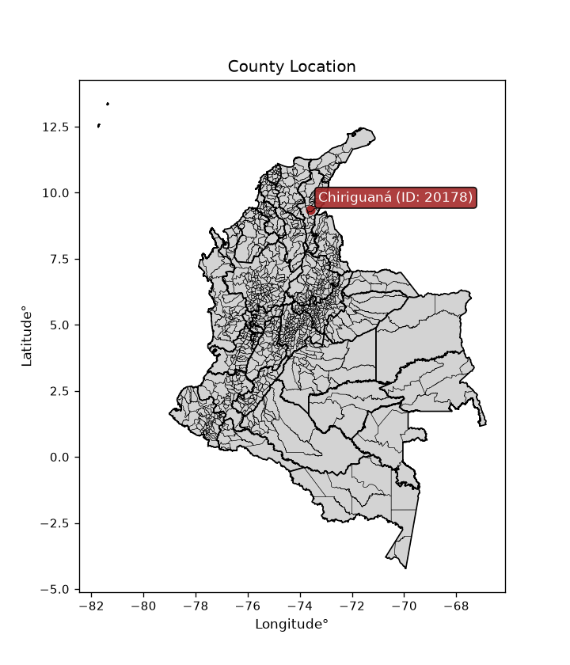
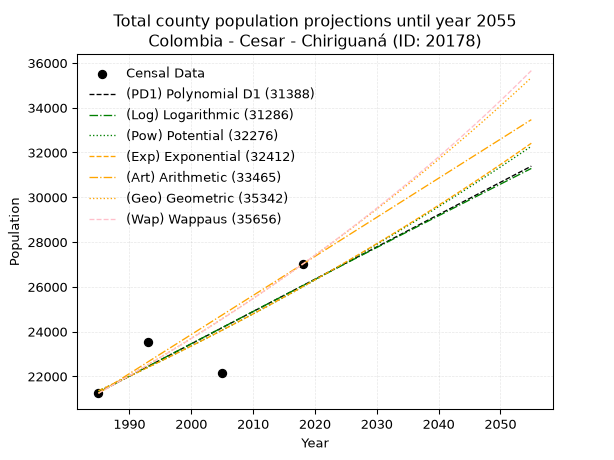
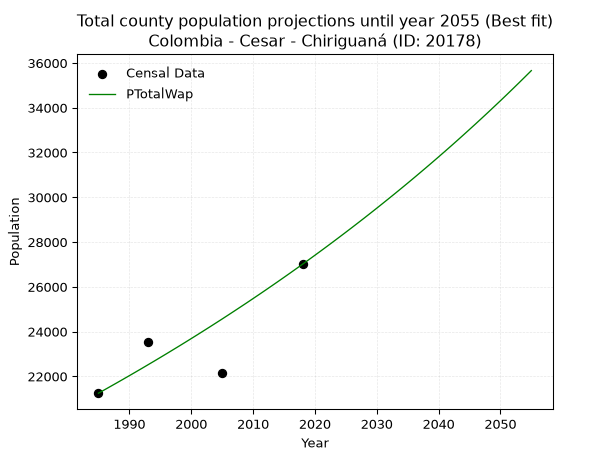
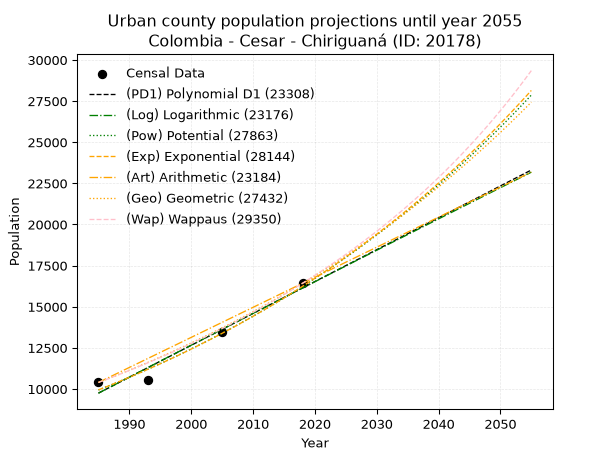
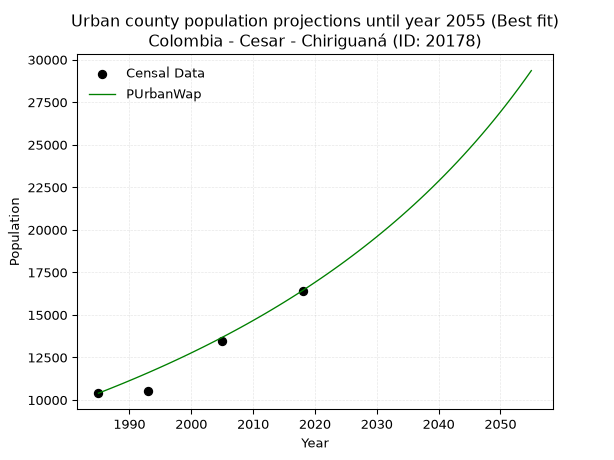
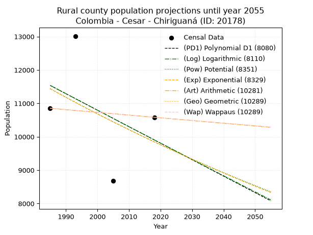
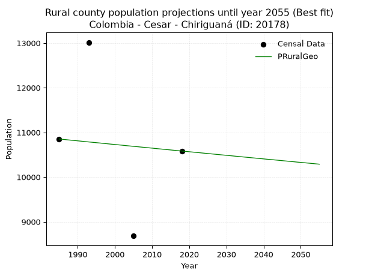

<div align="center">


</div>

# _“Population and Public Services Demand Projections (PPSD) until Year 2050 for Colombia - Cesar - Chiriguaná (ID: 20178)”_
Keywords: `population` `public-service` `projection` `lineal` `polynomial` `logarithmic` `potential` `exponential` `arithmetic` `geometric` `wappaus` `dane` `colombia` `south-america`

PPSD are analytical estimates used by governments and planners to anticipate future changes in population size, age distribution, and the resulting community needs for utilities, healthcare, education, and infrastructure as sizing future water treatment facilities, electrical grids, and road networks based on spatial growth.

<div align="center">

</img>

</div>


> **General running parameters**: • app_version: _v20260806_. • Python version: _3.14.7_. • Pandas version: _3.0.5_. • NumPy version: _2.5.1_. • Creates, save and include plots into reports (create_plot): _False_. • Projection until year: _2050_. • Process polynomial degree 2 and up: _False_. • Process Wappaus: _True_. • Process Wappaus: _True_. • Set negative values to zero: _True_. • Set infinite values to zero: _True_. • Drop dataset notes: _True_. 
<div align="center">

Dynamic map: [:earth_americas:Google](http://maps.google.com/maps?q=9.361057712,-73.5999129) [:earth_americas:OSM](https://www.openstreetmap.org/#map=18/9.361057712/-73.5999129&layers=P) [:earth_americas:Bing](https://www.bing.com/maps?cp=9.361057712~-73.5999129&lvl=18) [:earth_americas:Apple](https://maps.apple.com/frame?center=9.361057712%2C-73.5999129&span=0.003%2C0.006)

</div>


<div align="center">

```geojson
{
  "type": "Feature",
  "geometry": {
    "type": "Point", 
    "coordinates": [-73.5999129, 9.361057712]
  }, 
  "properties": {
    "Name": "Colombia - Cesar - Chiriguaná (ID: 20178)"
  }
}
```

</div>


## 0. Census Data (4 records)

Census data are official statistics collected by a government about the people and housing in a country. They usually include counts of total population, age, sex, race, income, education, and jobs.

📅Global census file: [Population.xlsx](../data/Population.xlsx)

| Source   |   Year |   CountryID | CountryName   |   StateID | StateName   |   CountyID | CountyName   |   PTotal |   PUrban |   PRural |
|:---------|-------:|------------:|:--------------|----------:|:------------|-----------:|:-------------|---------:|---------:|---------:|
| DANE     |   1985 |          57 | Colombia      |        20 | Cesar       |      20178 | Chiriguaná   |    21245 |    10393 |    10852 |
| DANE     |   1993 |          57 | Colombia      |        20 | Cesar       |      20178 | Chiriguaná   |    23540 |    10526 |    13014 |
| DANE     |   2005 |          57 | Colombia      |        20 | Cesar       |      20178 | Chiriguaná   |    22146 |    13462 |     8684 |
| DANE     |   2018 |          57 | Colombia      |        20 | Cesar       |      20178 | Chiriguaná   |    27006 |    16423 |    10583 |

> 🔥Some records could had specific notes about the registered values or the corresponding urban or rural distribution.

📅   [RUPS](https://www.datos.gov.co/Hacienda-y-Cr-dito-P-blico/Registro-nico-de-Prestadores-de-Servicios-P-blicos/4qkq-csdn/about_data) - Local public utility companies: [RUPS.csv](../data/RUPS.xlsx)

 | SERVICIO       | ESTADO    | NOMBRE                  | NIT         | DEPARTAMENTO_DOMICILIO   | MUNICIPIO_DOMICILIO   | DIRECCION        |   TELEFONO | EMAIL                | TIPO_PRESTADOR                 | CLASIFICACION                  |
|:---------------|:----------|:------------------------|:------------|:-------------------------|:----------------------|:-----------------|-----------:|:---------------------|:-------------------------------|:-------------------------------|
| ACUEDUCTO      | OPERATIVA | MUNICIPIO DE CHIRIGUANA | 800096585-0 | CESAR                    | CHIRIGUANA            | CALLE 7 No. 5-40 |    5760290 | Johena24@hotmail.com | MUNICIPIO (PRESTACIÓN DIRECTA) | DESDE 2501 HASTA 5000 USUARIOS |
| ALCANTARILLADO | OPERATIVA | MUNICIPIO DE CHIRIGUANA | 800096585-0 | CESAR                    | CHIRIGUANA            | CALLE 7 No. 5-40 |    5760290 | Johena24@hotmail.com | MUNICIPIO (PRESTACIÓN DIRECTA) | DESDE 2501 HASTA 5000 USUARIOS |

## 1. Total

### 1.1. Coefficients and Parameters

* (PD1) Polynomial Deg 1: 144.35768767562917, -265267.2147731772 (lineal)
* (Log) Logarithmic: 288704.81470086664, -2170963.360076477
* (Pow) Potential: 11.923278327446827, -34.99069129830944
* (Exp) Exponential: 0.005961431771495515, 0.15497926210291924
* (Art) Arithmetic: Year diff. 2018 - 1985 = 33, Population diff. 27006 - 21245 = 5761, Annual growth = 174.57575757575756
* (Geo) Geometric: Year diff. 2018 - 1985 = 33, Population diff. 27006 - 21245 = 5761, Annual growth % = 0.007297329714657463
* (Wap) Wappaus: i = 0.7236150860117203, Condition values only valid for < 200)

<sub>
Wappaus condition values: ['0.00', '0.72', '1.45', '2.17', '2.89', '3.62', '4.34', '5.07', '5.79', '6.51', '7.24', '7.96', '8.68', '9.41', '10.13', '10.85', '11.58', '12.30', '13.03', '13.75', '14.47', '15.20', '15.92', '16.64', '17.37', '18.09', '18.81', '19.54', '20.26', '20.98', '21.71', '22.43', '23.16', '23.88', '24.60', '25.33', '26.05', '26.77', '27.50', '28.22', '28.94', '29.67', '30.39', '31.12', '31.84', '32.56', '33.29', '34.01', '34.73', '35.46', '36.18', '36.90', '37.63', '38.35', '39.08', '39.80', '40.52', '41.25', '41.97', '42.69', '43.42', '44.14', '44.86', '45.59', '46.31', '47.03']
</sub>


### 1.2. Projected Dataset

|   Year |   CountyID |   PTotalPD1 |   PTotalLog |   PTotalPow |   PTotalExp |   PTotalArt |   PTotalGeo |   PTotalWap |
|-------:|-----------:|------------:|------------:|------------:|------------:|------------:|------------:|------------:|
|   1985 |      20178 |       21283 |       21280 |       21351 |       21354 |       21245 |       21245 |       21245 |
|   1986 |      20178 |       21427 |       21426 |       21480 |       21481 |       21420 |       21400 |       21399 |
|   1987 |      20178 |       21572 |       21571 |       21609 |       21610 |       21594 |       21556 |       21555 |
|   1988 |      20178 |       21716 |       21716 |       21739 |       21739 |       21769 |       21713 |       21711 |
|   1989 |      20178 |       21860 |       21862 |       21870 |       21869 |       21943 |       21872 |       21869 |
|   1990 |      20178 |       22005 |       22007 |       22001 |       22000 |       22118 |       22032 |       22028 |
|   1991 |      20178 |       22149 |       22152 |       22134 |       22131 |       22292 |       22192 |       22188 |
|   1992 |      20178 |       22293 |       22297 |       22267 |       22264 |       22467 |       22354 |       22349 |
|   1993 |      20178 |       22438 |       22442 |       22400 |       22397 |       22642 |       22517 |       22512 |
|   1994 |      20178 |       22582 |       22586 |       22535 |       22531 |       22816 |       22682 |       22675 |
|   1995 |      20178 |       22726 |       22731 |       22670 |       22665 |       22991 |       22847 |       22840 |
|   1996 |      20178 |       22871 |       22876 |       22806 |       22801 |       23165 |       23014 |       23006 |
|   1997 |      20178 |       23015 |       23020 |       22942 |       22937 |       23340 |       23182 |       23174 |
|   1998 |      20178 |       23159 |       23165 |       23080 |       23074 |       23514 |       23351 |       23342 |
|   1999 |      20178 |       23304 |       23309 |       23218 |       23212 |       23689 |       23521 |       23512 |
|   2000 |      20178 |       23448 |       23454 |       23357 |       23351 |       23864 |       23693 |       23683 |
|   2001 |      20178 |       23593 |       23598 |       23496 |       23491 |       24038 |       23866 |       23856 |
|   2002 |      20178 |       23737 |       23742 |       23637 |       23631 |       24213 |       24040 |       24030 |
|   2003 |      20178 |       23881 |       23887 |       23778 |       23772 |       24387 |       24216 |       24205 |
|   2004 |      20178 |       24026 |       24031 |       23920 |       23915 |       24562 |       24392 |       24382 |
|   2005 |      20178 |       24170 |       24175 |       24062 |       24058 |       24737 |       24570 |       24559 |
|   2006 |      20178 |       24314 |       24319 |       24206 |       24201 |       24911 |       24750 |       24739 |
|   2007 |      20178 |       24459 |       24462 |       24350 |       24346 |       25086 |       24930 |       24920 |
|   2008 |      20178 |       24603 |       24606 |       24495 |       24492 |       25260 |       25112 |       25102 |
|   2009 |      20178 |       24747 |       24750 |       24641 |       24638 |       25435 |       25295 |       25285 |
|   2010 |      20178 |       24892 |       24894 |       24788 |       24785 |       25609 |       25480 |       25471 |
|   2011 |      20178 |       25036 |       25037 |       24935 |       24934 |       25784 |       25666 |       25657 |
|   2012 |      20178 |       25180 |       25181 |       25083 |       25083 |       25959 |       25853 |       25845 |
|   2013 |      20178 |       25325 |       25324 |       25232 |       25233 |       26133 |       26042 |       26035 |
|   2014 |      20178 |       25469 |       25468 |       25382 |       25384 |       26308 |       26232 |       26226 |
|   2015 |      20178 |       25614 |       25611 |       25533 |       25535 |       26482 |       26423 |       26419 |
|   2016 |      20178 |       25758 |       25754 |       25684 |       25688 |       26657 |       26616 |       26613 |
|   2017 |      20178 |       25902 |       25897 |       25837 |       25842 |       26831 |       26810 |       26809 |
|   2018 |      20178 |       26047 |       26040 |       25990 |       25996 |       27006 |       27006 |       27006 |
|   2019 |      20178 |       26191 |       26184 |       26144 |       26152 |       27181 |       27203 |       27205 |
|   2020 |      20178 |       26335 |       26326 |       26299 |       26308 |       27355 |       27402 |       27406 |
|   2021 |      20178 |       26480 |       26469 |       26454 |       26465 |       27530 |       27602 |       27608 |
|   2022 |      20178 |       26624 |       26612 |       26611 |       26624 |       27704 |       27803 |       27812 |
|   2023 |      20178 |       26768 |       26755 |       26768 |       26783 |       27879 |       28006 |       28018 |
|   2024 |      20178 |       26913 |       26898 |       26926 |       26943 |       28053 |       28210 |       28226 |
|   2025 |      20178 |       27057 |       27040 |       27085 |       27104 |       28228 |       28416 |       28435 |
|   2026 |      20178 |       27201 |       27183 |       27245 |       27266 |       28403 |       28623 |       28646 |
|   2027 |      20178 |       27346 |       27325 |       27406 |       27429 |       28577 |       28832 |       28859 |
|   2028 |      20178 |       27490 |       27468 |       27568 |       27593 |       28752 |       29043 |       29073 |
|   2029 |      20178 |       27635 |       27610 |       27730 |       27758 |       28926 |       29255 |       29290 |
|   2030 |      20178 |       27779 |       27752 |       27894 |       27924 |       29101 |       29468 |       29508 |
|   2031 |      20178 |       27923 |       27894 |       28058 |       28091 |       29275 |       29683 |       29729 |
|   2032 |      20178 |       28068 |       28036 |       28223 |       28259 |       29450 |       29900 |       29951 |
|   2033 |      20178 |       28212 |       28179 |       28389 |       28428 |       29625 |       30118 |       30175 |
|   2034 |      20178 |       28356 |       28321 |       28556 |       28598 |       29799 |       30338 |       30401 |
|   2035 |      20178 |       28501 |       28462 |       28724 |       28769 |       29974 |       30559 |       30629 |
|   2036 |      20178 |       28645 |       28604 |       28893 |       28941 |       30148 |       30782 |       30859 |
|   2037 |      20178 |       28789 |       28746 |       29062 |       29114 |       30323 |       31007 |       31092 |
|   2038 |      20178 |       28934 |       28888 |       29233 |       29288 |       30498 |       31233 |       31326 |
|   2039 |      20178 |       29078 |       29029 |       29404 |       29463 |       30672 |       31461 |       31562 |
|   2040 |      20178 |       29222 |       29171 |       29577 |       29639 |       30847 |       31691 |       31801 |
|   2041 |      20178 |       29367 |       29312 |       29750 |       29817 |       31021 |       31922 |       32041 |
|   2042 |      20178 |       29511 |       29454 |       29924 |       29995 |       31196 |       32155 |       32284 |
|   2043 |      20178 |       29656 |       29595 |       30100 |       30174 |       31370 |       32389 |       32529 |
|   2044 |      20178 |       29800 |       29736 |       30276 |       30355 |       31545 |       32626 |       32777 |
|   2045 |      20178 |       29944 |       29878 |       30453 |       30536 |       31720 |       32864 |       33027 |
|   2046 |      20178 |       30089 |       30019 |       30631 |       30719 |       31894 |       33104 |       33278 |
|   2047 |      20178 |       30233 |       30160 |       30810 |       30902 |       32069 |       33345 |       33533 |
|   2048 |      20178 |       30377 |       30301 |       30990 |       31087 |       32243 |       33589 |       33789 |
|   2049 |      20178 |       30522 |       30442 |       31171 |       31273 |       32418 |       33834 |       34049 |
|   2050 |      20178 |       30666 |       30583 |       31352 |       31460 |       32592 |       34081 |       34310 |
<div align="center">

</img>

</div>


### 1.3. Best fit with absolute and relative error (%)

Relative error puts that difference into context by dividing the absolute error by the true value, creating a unitless ratio or percentage that shows the scale of the mistake.

Absolute and relative error

|   Year | Source   |   CountryID | CountryName   |   StateID | StateName   |   CountyID_x | CountyName   |   PTotal |   PUrban |   PRural |   CountyID_y |   PTotalPD1 |   PTotalLog |   PTotalPow |   PTotalExp |   PTotalArt |   PTotalGeo |   PTotalWap |   PTotalPD1AbsError |   PTotalLogAbsError |   PTotalPowAbsError |   PTotalExpAbsError |   PTotalArtAbsError |   PTotalGeoAbsError |   PTotalWapAbsError |   PTotalPD1RelError |   PTotalLogRelError |   PTotalPowRelError |   PTotalExpRelError |   PTotalArtRelError |   PTotalGeoRelError |   PTotalWapRelError |
|-------:|:---------|------------:|:--------------|----------:|:------------|-------------:|:-------------|---------:|---------:|---------:|-------------:|------------:|------------:|------------:|------------:|------------:|------------:|------------:|--------------------:|--------------------:|--------------------:|--------------------:|--------------------:|--------------------:|--------------------:|--------------------:|--------------------:|--------------------:|--------------------:|--------------------:|--------------------:|--------------------:|
|   1985 | DANE     |          57 | Colombia      |        20 | Cesar       |        20178 | Chiriguaná   |    21245 |    10393 |    10852 |        20178 |       21283 |       21280 |       21351 |       21354 |       21245 |       21245 |       21245 |                  38 |                  35 |                 106 |                 109 |                   0 |                   0 |                   0 |            0.178866 |            0.164745 |            0.498941 |            0.513062 |             0       |             0       |             0       |
|   1993 | DANE     |          57 | Colombia      |        20 | Cesar       |        20178 | Chiriguaná   |    23540 |    10526 |    13014 |        20178 |       22438 |       22442 |       22400 |       22397 |       22642 |       22517 |       22512 |                1102 |                1098 |                1140 |                1143 |                 898 |                1023 |                1028 |            4.68139  |            4.6644   |            4.84282  |            4.85556  |             3.81478 |             4.34579 |             4.36703 |
|   2005 | DANE     |          57 | Colombia      |        20 | Cesar       |        20178 | Chiriguaná   |    22146 |    13462 |     8684 |        20178 |       24170 |       24175 |       24062 |       24058 |       24737 |       24570 |       24559 |                2024 |                2029 |                1916 |                1912 |                2591 |                2424 |                2413 |            9.13935  |            9.16193  |            8.65168  |            8.63361  |            11.6996  |            10.9455  |            10.8959  |
|   2018 | DANE     |          57 | Colombia      |        20 | Cesar       |        20178 | Chiriguaná   |    27006 |    16423 |    10583 |        20178 |       26047 |       26040 |       25990 |       25996 |       27006 |       27006 |       27006 |                 959 |                 966 |                1016 |                1010 |                   0 |                   0 |                   0 |            3.55106  |            3.57698  |            3.76213  |            3.73991  |             0       |             0       |             0       |

Relative error mean

| Method    |   RelError | Best   |
|:----------|-----------:|:-------|
| PTotalPD1 |    4.38767 |        |
| PTotalLog |    4.39201 |        |
| PTotalPow |    4.43889 |        |
| PTotalExp |    4.43554 |        |
| PTotalArt |    3.8786  |        |
| PTotalGeo |    3.82283 |        |
| PTotalWap |    3.81573 | True   |

💙Best method: _**PTotalWap**_
<div align="center">

</img>

</div>


### 1.4. Fresh water supply demand in liters per capita per day (lpcd)

The fresh water supply demand typically ranges from 100 to 300 liters per capita per day (lpcd) for standard domestic and municipal planning, though absolute survival minimums set by the World Health Organization are as low as 7.5 to 20 liters per day, and total consumption in high-income nations can exceed 400 liters.

> `CZ`: Level in meters above the sea level (masl)<br> `WS`: Fresh water supply demand in liters per capita per day (lpcd or l/h/d)<br> `WSAll`: Zonal fresh water supply demand in liters per second (l/s)<br> `A`: Zonal area in square meters<br> `DP`: Population density (people/hectare or p/ha)

Reference values (RAS Colombia)

|    CZ |   WS |
|------:|-----:|
|  1000 |  120 |
|  2000 |  130 |
| 99999 |  140 |

County shapefile geometry properties and water supply values

|   CountyID |      ATotal |   CZTotal |   WSTotal |
|-----------:|------------:|----------:|----------:|
|      20178 | 1.11268e+09 |   210.454 |       120 |

Projected values for best method: PTotalWap

|   CountyID |   Year |   PTotalWap |   DPTotal |   WSTotal |   WSTotalAll |
|-----------:|-------:|------------:|----------:|----------:|-------------:|
|      20178 |   1985 |       21245 |      0.19 |       120 |      29.5069 |
|      20178 |   1986 |       21399 |      0.19 |       120 |      29.7208 |
|      20178 |   1987 |       21555 |      0.19 |       120 |      29.9375 |
|      20178 |   1988 |       21711 |      0.2  |       120 |      30.1542 |
|      20178 |   1989 |       21869 |      0.2  |       120 |      30.3736 |
|      20178 |   1990 |       22028 |      0.2  |       120 |      30.5944 |
|      20178 |   1991 |       22188 |      0.2  |       120 |      30.8167 |
|      20178 |   1992 |       22349 |      0.2  |       120 |      31.0403 |
|      20178 |   1993 |       22512 |      0.2  |       120 |      31.2667 |
|      20178 |   1994 |       22675 |      0.2  |       120 |      31.4931 |
|      20178 |   1995 |       22840 |      0.21 |       120 |      31.7222 |
|      20178 |   1996 |       23006 |      0.21 |       120 |      31.9528 |
|      20178 |   1997 |       23174 |      0.21 |       120 |      32.1861 |
|      20178 |   1998 |       23342 |      0.21 |       120 |      32.4194 |
|      20178 |   1999 |       23512 |      0.21 |       120 |      32.6556 |
|      20178 |   2000 |       23683 |      0.21 |       120 |      32.8931 |
|      20178 |   2001 |       23856 |      0.21 |       120 |      33.1333 |
|      20178 |   2002 |       24030 |      0.22 |       120 |      33.375  |
|      20178 |   2003 |       24205 |      0.22 |       120 |      33.6181 |
|      20178 |   2004 |       24382 |      0.22 |       120 |      33.8639 |
|      20178 |   2005 |       24559 |      0.22 |       120 |      34.1097 |
|      20178 |   2006 |       24739 |      0.22 |       120 |      34.3597 |
|      20178 |   2007 |       24920 |      0.22 |       120 |      34.6111 |
|      20178 |   2008 |       25102 |      0.23 |       120 |      34.8639 |
|      20178 |   2009 |       25285 |      0.23 |       120 |      35.1181 |
|      20178 |   2010 |       25471 |      0.23 |       120 |      35.3764 |
|      20178 |   2011 |       25657 |      0.23 |       120 |      35.6347 |
|      20178 |   2012 |       25845 |      0.23 |       120 |      35.8958 |
|      20178 |   2013 |       26035 |      0.23 |       120 |      36.1597 |
|      20178 |   2014 |       26226 |      0.24 |       120 |      36.425  |
|      20178 |   2015 |       26419 |      0.24 |       120 |      36.6931 |
|      20178 |   2016 |       26613 |      0.24 |       120 |      36.9625 |
|      20178 |   2017 |       26809 |      0.24 |       120 |      37.2347 |
|      20178 |   2018 |       27006 |      0.24 |       120 |      37.5083 |
|      20178 |   2019 |       27205 |      0.24 |       120 |      37.7847 |
|      20178 |   2020 |       27406 |      0.25 |       120 |      38.0639 |
|      20178 |   2021 |       27608 |      0.25 |       120 |      38.3444 |
|      20178 |   2022 |       27812 |      0.25 |       120 |      38.6278 |
|      20178 |   2023 |       28018 |      0.25 |       120 |      38.9139 |
|      20178 |   2024 |       28226 |      0.25 |       120 |      39.2028 |
|      20178 |   2025 |       28435 |      0.26 |       120 |      39.4931 |
|      20178 |   2026 |       28646 |      0.26 |       120 |      39.7861 |
|      20178 |   2027 |       28859 |      0.26 |       120 |      40.0819 |
|      20178 |   2028 |       29073 |      0.26 |       120 |      40.3792 |
|      20178 |   2029 |       29290 |      0.26 |       120 |      40.6806 |
|      20178 |   2030 |       29508 |      0.27 |       120 |      40.9833 |
|      20178 |   2031 |       29729 |      0.27 |       120 |      41.2903 |
|      20178 |   2032 |       29951 |      0.27 |       120 |      41.5986 |
|      20178 |   2033 |       30175 |      0.27 |       120 |      41.9097 |
|      20178 |   2034 |       30401 |      0.27 |       120 |      42.2236 |
|      20178 |   2035 |       30629 |      0.28 |       120 |      42.5403 |
|      20178 |   2036 |       30859 |      0.28 |       120 |      42.8597 |
|      20178 |   2037 |       31092 |      0.28 |       120 |      43.1833 |
|      20178 |   2038 |       31326 |      0.28 |       120 |      43.5083 |
|      20178 |   2039 |       31562 |      0.28 |       120 |      43.8361 |
|      20178 |   2040 |       31801 |      0.29 |       120 |      44.1681 |
|      20178 |   2041 |       32041 |      0.29 |       120 |      44.5014 |
|      20178 |   2042 |       32284 |      0.29 |       120 |      44.8389 |
|      20178 |   2043 |       32529 |      0.29 |       120 |      45.1792 |
|      20178 |   2044 |       32777 |      0.29 |       120 |      45.5236 |
|      20178 |   2045 |       33027 |      0.3  |       120 |      45.8708 |
|      20178 |   2046 |       33278 |      0.3  |       120 |      46.2194 |
|      20178 |   2047 |       33533 |      0.3  |       120 |      46.5736 |
|      20178 |   2048 |       33789 |      0.3  |       120 |      46.9292 |
|      20178 |   2049 |       34049 |      0.31 |       120 |      47.2903 |
|      20178 |   2050 |       34310 |      0.31 |       120 |      47.6528 |

## 2. Urban

### 2.1. Coefficients and Parameters

* (PD1) Polynomial Deg 1: 193.73103171416892, -374809.4961862664 (lineal)
* (Log) Logarithmic: 387618.7683465251, -2933592.364383805
* (Pow) Potential: 29.74908756266028, -94.10810253776137
* (Exp) Exponential: 0.01486685645781498, 1.5173647783420778e-09
* (Art) Arithmetic: Year diff. 2018 - 1985 = 33, Population diff. 16423 - 10393 = 6030, Annual growth = 182.72727272727272
* (Geo) Geometric: Year diff. 2018 - 1985 = 33, Population diff. 16423 - 10393 = 6030, Annual growth % = 0.013961727389782519
* (Wap) Wappaus: i = 1.3628227381210676, Condition values only valid for < 200)

<sub>
Wappaus condition values: ['0.00', '1.36', '2.73', '4.09', '5.45', '6.81', '8.18', '9.54', '10.90', '12.27', '13.63', '14.99', '16.35', '17.72', '19.08', '20.44', '21.81', '23.17', '24.53', '25.89', '27.26', '28.62', '29.98', '31.34', '32.71', '34.07', '35.43', '36.80', '38.16', '39.52', '40.88', '42.25', '43.61', '44.97', '46.34', '47.70', '49.06', '50.42', '51.79', '53.15', '54.51', '55.88', '57.24', '58.60', '59.96', '61.33', '62.69', '64.05', '65.42', '66.78', '68.14', '69.50', '70.87', '72.23', '73.59', '74.96', '76.32', '77.68', '79.04', '80.41', '81.77', '83.13', '84.50', '85.86', '87.22', '88.58']
</sub>


### 2.2. Projected Dataset

|   Year |   CountyID |   PUrbanPD1 |   PUrbanLog |   PUrbanPow |   PUrbanExp |   PUrbanArt |   PUrbanGeo |   PUrbanWap |
|-------:|-----------:|------------:|------------:|------------:|------------:|------------:|------------:|------------:|
|   1985 |      20178 |        9747 |        9742 |        9937 |        9941 |       10393 |       10393 |       10393 |
|   1986 |      20178 |        9940 |        9937 |       10087 |       10090 |       10576 |       10538 |       10536 |
|   1987 |      20178 |       10134 |       10132 |       10239 |       10241 |       10758 |       10685 |       10680 |
|   1988 |      20178 |       10328 |       10327 |       10394 |       10394 |       10941 |       10834 |       10827 |
|   1989 |      20178 |       10522 |       10522 |       10550 |       10550 |       11124 |       10986 |       10975 |
|   1990 |      20178 |       10715 |       10717 |       10709 |       10708 |       11307 |       11139 |       11126 |
|   1991 |      20178 |       10909 |       10912 |       10871 |       10868 |       11489 |       11295 |       11279 |
|   1992 |      20178 |       11103 |       11107 |       11034 |       11031 |       11672 |       11452 |       11434 |
|   1993 |      20178 |       11296 |       11301 |       11200 |       11196 |       11855 |       11612 |       11591 |
|   1994 |      20178 |       11490 |       11495 |       11369 |       11364 |       12038 |       11774 |       11751 |
|   1995 |      20178 |       11684 |       11690 |       11540 |       11534 |       12220 |       11939 |       11913 |
|   1996 |      20178 |       11878 |       11884 |       11713 |       11707 |       12403 |       12105 |       12077 |
|   1997 |      20178 |       12071 |       12078 |       11889 |       11882 |       12586 |       12274 |       12244 |
|   1998 |      20178 |       12265 |       12272 |       12067 |       12060 |       12768 |       12446 |       12413 |
|   1999 |      20178 |       12459 |       12466 |       12248 |       12241 |       12951 |       12620 |       12585 |
|   2000 |      20178 |       12653 |       12660 |       12432 |       12424 |       13134 |       12796 |       12759 |
|   2001 |      20178 |       12846 |       12854 |       12618 |       12611 |       13317 |       12974 |       12937 |
|   2002 |      20178 |       13040 |       13048 |       12807 |       12799 |       13499 |       13156 |       13116 |
|   2003 |      20178 |       13234 |       13241 |       12998 |       12991 |       13682 |       13339 |       13299 |
|   2004 |      20178 |       13427 |       13435 |       13193 |       13186 |       13865 |       13525 |       13484 |
|   2005 |      20178 |       13621 |       13628 |       13390 |       13383 |       14048 |       13714 |       13673 |
|   2006 |      20178 |       13815 |       13821 |       13590 |       13584 |       14230 |       13906 |       13864 |
|   2007 |      20178 |       14009 |       14014 |       13793 |       13787 |       14413 |       14100 |       14059 |
|   2008 |      20178 |       14202 |       14207 |       13999 |       13994 |       14596 |       14297 |       14256 |
|   2009 |      20178 |       14396 |       14400 |       14208 |       14203 |       14778 |       14496 |       14457 |
|   2010 |      20178 |       14590 |       14593 |       14420 |       14416 |       14961 |       14699 |       14661 |
|   2011 |      20178 |       14784 |       14786 |       14635 |       14632 |       15144 |       14904 |       14869 |
|   2012 |      20178 |       14977 |       14979 |       14853 |       14851 |       15327 |       15112 |       15079 |
|   2013 |      20178 |       15171 |       15171 |       15074 |       15073 |       15509 |       15323 |       15294 |
|   2014 |      20178 |       15365 |       15364 |       15299 |       15299 |       15692 |       15537 |       15512 |
|   2015 |      20178 |       15559 |       15556 |       15526 |       15528 |       15875 |       15754 |       15734 |
|   2016 |      20178 |       15752 |       15749 |       15757 |       15761 |       16058 |       15974 |       15960 |
|   2017 |      20178 |       15946 |       15941 |       15991 |       15997 |       16240 |       16197 |       16189 |
|   2018 |      20178 |       16140 |       16133 |       16229 |       16237 |       16423 |       16423 |       16423 |
|   2019 |      20178 |       16333 |       16325 |       16470 |       16480 |       16606 |       16652 |       16661 |
|   2020 |      20178 |       16527 |       16517 |       16714 |       16727 |       16788 |       16885 |       16903 |
|   2021 |      20178 |       16721 |       16709 |       16962 |       16977 |       16971 |       17121 |       17149 |
|   2022 |      20178 |       16915 |       16901 |       17214 |       17231 |       17154 |       17360 |       17400 |
|   2023 |      20178 |       17108 |       17092 |       17469 |       17490 |       17337 |       17602 |       17656 |
|   2024 |      20178 |       17302 |       17284 |       17727 |       17752 |       17519 |       17848 |       17916 |
|   2025 |      20178 |       17496 |       17475 |       17990 |       18017 |       17702 |       18097 |       18181 |
|   2026 |      20178 |       17690 |       17667 |       18256 |       18287 |       17885 |       18350 |       18452 |
|   2027 |      20178 |       17883 |       17858 |       18526 |       18561 |       18068 |       18606 |       18727 |
|   2028 |      20178 |       18077 |       18049 |       18800 |       18839 |       18250 |       18865 |       19008 |
|   2029 |      20178 |       18271 |       18240 |       19077 |       19121 |       18433 |       19129 |       19294 |
|   2030 |      20178 |       18464 |       18431 |       19359 |       19408 |       18616 |       19396 |       19585 |
|   2031 |      20178 |       18658 |       18622 |       19645 |       19698 |       18798 |       19667 |       19883 |
|   2032 |      20178 |       18852 |       18813 |       19935 |       19993 |       18981 |       19941 |       20186 |
|   2033 |      20178 |       19046 |       19004 |       20229 |       20293 |       19164 |       20220 |       20496 |
|   2034 |      20178 |       19239 |       19194 |       20527 |       20597 |       19347 |       20502 |       20812 |
|   2035 |      20178 |       19433 |       19385 |       20829 |       20905 |       19529 |       20788 |       21135 |
|   2036 |      20178 |       19627 |       19575 |       21136 |       21219 |       19712 |       21079 |       21464 |
|   2037 |      20178 |       19821 |       19766 |       21447 |       21536 |       19895 |       21373 |       21800 |
|   2038 |      20178 |       20014 |       19956 |       21762 |       21859 |       20078 |       21671 |       22143 |
|   2039 |      20178 |       20208 |       20146 |       22082 |       22186 |       20260 |       21974 |       22494 |
|   2040 |      20178 |       20402 |       20336 |       22407 |       22519 |       20443 |       22281 |       22853 |
|   2041 |      20178 |       20596 |       20526 |       22736 |       22856 |       20626 |       22592 |       23219 |
|   2042 |      20178 |       20789 |       20716 |       23069 |       23198 |       20808 |       22907 |       23594 |
|   2043 |      20178 |       20983 |       20906 |       23408 |       23546 |       20991 |       23227 |       23976 |
|   2044 |      20178 |       21177 |       21095 |       23751 |       23898 |       21174 |       23551 |       24368 |
|   2045 |      20178 |       21370 |       21285 |       24099 |       24256 |       21357 |       23880 |       24769 |
|   2046 |      20178 |       21564 |       21474 |       24452 |       24620 |       21539 |       24213 |       25179 |
|   2047 |      20178 |       21758 |       21664 |       24810 |       24988 |       21722 |       24551 |       25599 |
|   2048 |      20178 |       21952 |       21853 |       25173 |       25363 |       21905 |       24894 |       26028 |
|   2049 |      20178 |       22145 |       22042 |       25542 |       25742 |       22088 |       25242 |       26468 |
|   2050 |      20178 |       22339 |       22231 |       25915 |       26128 |       22270 |       25594 |       26919 |
<div align="center">

</img>

</div>


### 2.3. Best fit with absolute and relative error (%)

Relative error puts that difference into context by dividing the absolute error by the true value, creating a unitless ratio or percentage that shows the scale of the mistake.

Absolute and relative error

|   Year | Source   |   CountryID | CountryName   |   StateID | StateName   |   CountyID_x | CountyName   |   PTotal |   PUrban |   PRural |   CountyID_y |   PUrbanPD1 |   PUrbanLog |   PUrbanPow |   PUrbanExp |   PUrbanArt |   PUrbanGeo |   PUrbanWap |   PUrbanPD1AbsError |   PUrbanLogAbsError |   PUrbanPowAbsError |   PUrbanExpAbsError |   PUrbanArtAbsError |   PUrbanGeoAbsError |   PUrbanWapAbsError |   PUrbanPD1RelError |   PUrbanLogRelError |   PUrbanPowRelError |   PUrbanExpRelError |   PUrbanArtRelError |   PUrbanGeoRelError |   PUrbanWapRelError |
|-------:|:---------|------------:|:--------------|----------:|:------------|-------------:|:-------------|---------:|---------:|---------:|-------------:|------------:|------------:|------------:|------------:|------------:|------------:|------------:|--------------------:|--------------------:|--------------------:|--------------------:|--------------------:|--------------------:|--------------------:|--------------------:|--------------------:|--------------------:|--------------------:|--------------------:|--------------------:|--------------------:|
|   1985 | DANE     |          57 | Colombia      |        20 | Cesar       |        20178 | Chiriguaná   |    21245 |    10393 |    10852 |        20178 |        9747 |        9742 |        9937 |        9941 |       10393 |       10393 |       10393 |                 646 |                 651 |                 456 |                 452 |                   0 |                   0 |                   0 |             6.21572 |             6.26383 |            4.38757  |            4.34908  |             0       |             0       |             0       |
|   1993 | DANE     |          57 | Colombia      |        20 | Cesar       |        20178 | Chiriguaná   |    23540 |    10526 |    13014 |        20178 |       11296 |       11301 |       11200 |       11196 |       11855 |       11612 |       11591 |                 770 |                 775 |                 674 |                 670 |                1329 |                1086 |                1065 |             7.31522 |             7.36272 |            6.40319  |            6.36519  |            12.6259  |            10.3173  |            10.1178  |
|   2005 | DANE     |          57 | Colombia      |        20 | Cesar       |        20178 | Chiriguaná   |    22146 |    13462 |     8684 |        20178 |       13621 |       13628 |       13390 |       13383 |       14048 |       13714 |       13673 |                 159 |                 166 |                  72 |                  79 |                 586 |                 252 |                 211 |             1.1811  |             1.2331  |            0.534839 |            0.586837 |             4.35299 |             1.87194 |             1.56737 |
|   2018 | DANE     |          57 | Colombia      |        20 | Cesar       |        20178 | Chiriguaná   |    27006 |    16423 |    10583 |        20178 |       16140 |       16133 |       16229 |       16237 |       16423 |       16423 |       16423 |                 283 |                 290 |                 194 |                 186 |                   0 |                   0 |                   0 |             1.72319 |             1.76582 |            1.18127  |            1.13256  |             0       |             0       |             0       |

Relative error mean

| Method    |   RelError | Best   |
|:----------|-----------:|:-------|
| PUrbanPD1 |    4.10881 |        |
| PUrbanLog |    4.15637 |        |
| PUrbanPow |    3.12672 |        |
| PUrbanExp |    3.10842 |        |
| PUrbanArt |    4.24472 |        |
| PUrbanGeo |    3.04731 |        |
| PUrbanWap |    2.92129 | True   |

💙Best method: _**PUrbanWap**_
<div align="center">

</img>

</div>


### 2.4. Fresh water supply demand in liters per capita per day (lpcd)

The fresh water supply demand typically ranges from 100 to 300 liters per capita per day (lpcd) for standard domestic and municipal planning, though absolute survival minimums set by the World Health Organization are as low as 7.5 to 20 liters per day, and total consumption in high-income nations can exceed 400 liters.

> `CZ`: Level in meters above the sea level (masl)<br> `WS`: Fresh water supply demand in liters per capita per day (lpcd or l/h/d)<br> `WSAll`: Zonal fresh water supply demand in liters per second (l/s)<br> `A`: Zonal area in square meters<br> `DP`: Population density (people/hectare or p/ha)

Reference values (RAS Colombia)

|    CZ |   WS |
|------:|-----:|
|  1000 |  120 |
|  2000 |  130 |
| 99999 |  140 |

County shapefile geometry properties and water supply values

|   CountyID |      AUrban |   CZUrban |   WSUrban |
|-----------:|------------:|----------:|----------:|
|      20178 | 3.17544e+06 |   34.0958 |       120 |

Projected values for best method: PUrbanWap

|   CountyID |   Year |   PUrbanWap |   DPUrban |   WSUrban |   WSUrbanAll |
|-----------:|-------:|------------:|----------:|----------:|-------------:|
|      20178 |   1985 |       10393 |     32.73 |       120 |      14.4347 |
|      20178 |   1986 |       10536 |     33.18 |       120 |      14.6333 |
|      20178 |   1987 |       10680 |     33.63 |       120 |      14.8333 |
|      20178 |   1988 |       10827 |     34.1  |       120 |      15.0375 |
|      20178 |   1989 |       10975 |     34.56 |       120 |      15.2431 |
|      20178 |   1990 |       11126 |     35.04 |       120 |      15.4528 |
|      20178 |   1991 |       11279 |     35.52 |       120 |      15.6653 |
|      20178 |   1992 |       11434 |     36.01 |       120 |      15.8806 |
|      20178 |   1993 |       11591 |     36.5  |       120 |      16.0986 |
|      20178 |   1994 |       11751 |     37.01 |       120 |      16.3208 |
|      20178 |   1995 |       11913 |     37.52 |       120 |      16.5458 |
|      20178 |   1996 |       12077 |     38.03 |       120 |      16.7736 |
|      20178 |   1997 |       12244 |     38.56 |       120 |      17.0056 |
|      20178 |   1998 |       12413 |     39.09 |       120 |      17.2403 |
|      20178 |   1999 |       12585 |     39.63 |       120 |      17.4792 |
|      20178 |   2000 |       12759 |     40.18 |       120 |      17.7208 |
|      20178 |   2001 |       12937 |     40.74 |       120 |      17.9681 |
|      20178 |   2002 |       13116 |     41.3  |       120 |      18.2167 |
|      20178 |   2003 |       13299 |     41.88 |       120 |      18.4708 |
|      20178 |   2004 |       13484 |     42.46 |       120 |      18.7278 |
|      20178 |   2005 |       13673 |     43.06 |       120 |      18.9903 |
|      20178 |   2006 |       13864 |     43.66 |       120 |      19.2556 |
|      20178 |   2007 |       14059 |     44.27 |       120 |      19.5264 |
|      20178 |   2008 |       14256 |     44.89 |       120 |      19.8    |
|      20178 |   2009 |       14457 |     45.53 |       120 |      20.0792 |
|      20178 |   2010 |       14661 |     46.17 |       120 |      20.3625 |
|      20178 |   2011 |       14869 |     46.82 |       120 |      20.6514 |
|      20178 |   2012 |       15079 |     47.49 |       120 |      20.9431 |
|      20178 |   2013 |       15294 |     48.16 |       120 |      21.2417 |
|      20178 |   2014 |       15512 |     48.85 |       120 |      21.5444 |
|      20178 |   2015 |       15734 |     49.55 |       120 |      21.8528 |
|      20178 |   2016 |       15960 |     50.26 |       120 |      22.1667 |
|      20178 |   2017 |       16189 |     50.98 |       120 |      22.4847 |
|      20178 |   2018 |       16423 |     51.72 |       120 |      22.8097 |
|      20178 |   2019 |       16661 |     52.47 |       120 |      23.1403 |
|      20178 |   2020 |       16903 |     53.23 |       120 |      23.4764 |
|      20178 |   2021 |       17149 |     54.01 |       120 |      23.8181 |
|      20178 |   2022 |       17400 |     54.8  |       120 |      24.1667 |
|      20178 |   2023 |       17656 |     55.6  |       120 |      24.5222 |
|      20178 |   2024 |       17916 |     56.42 |       120 |      24.8833 |
|      20178 |   2025 |       18181 |     57.25 |       120 |      25.2514 |
|      20178 |   2026 |       18452 |     58.11 |       120 |      25.6278 |
|      20178 |   2027 |       18727 |     58.97 |       120 |      26.0097 |
|      20178 |   2028 |       19008 |     59.86 |       120 |      26.4    |
|      20178 |   2029 |       19294 |     60.76 |       120 |      26.7972 |
|      20178 |   2030 |       19585 |     61.68 |       120 |      27.2014 |
|      20178 |   2031 |       19883 |     62.61 |       120 |      27.6153 |
|      20178 |   2032 |       20186 |     63.57 |       120 |      28.0361 |
|      20178 |   2033 |       20496 |     64.55 |       120 |      28.4667 |
|      20178 |   2034 |       20812 |     65.54 |       120 |      28.9056 |
|      20178 |   2035 |       21135 |     66.56 |       120 |      29.3542 |
|      20178 |   2036 |       21464 |     67.59 |       120 |      29.8111 |
|      20178 |   2037 |       21800 |     68.65 |       120 |      30.2778 |
|      20178 |   2038 |       22143 |     69.73 |       120 |      30.7542 |
|      20178 |   2039 |       22494 |     70.84 |       120 |      31.2417 |
|      20178 |   2040 |       22853 |     71.97 |       120 |      31.7403 |
|      20178 |   2041 |       23219 |     73.12 |       120 |      32.2486 |
|      20178 |   2042 |       23594 |     74.3  |       120 |      32.7694 |
|      20178 |   2043 |       23976 |     75.5  |       120 |      33.3    |
|      20178 |   2044 |       24368 |     76.74 |       120 |      33.8444 |
|      20178 |   2045 |       24769 |     78    |       120 |      34.4014 |
|      20178 |   2046 |       25179 |     79.29 |       120 |      34.9708 |
|      20178 |   2047 |       25599 |     80.62 |       120 |      35.5542 |
|      20178 |   2048 |       26028 |     81.97 |       120 |      36.15   |
|      20178 |   2049 |       26468 |     83.35 |       120 |      36.7611 |
|      20178 |   2050 |       26919 |     84.77 |       120 |      37.3875 |

## 3. Rural

### 3.1. Coefficients and Parameters

* (PD1) Polynomial Deg 1: -49.373344038539635, 109542.2814130889 (lineal)
* (Log) Logarithmic: -98913.95364565836, 762629.0043073279
* (Pow) Potential: -9.080031794549539, 34.00218585726906
* (Exp) Exponential: -0.004530397783011443, 92014802.28285453
* (Art) Arithmetic: Year diff. 2018 - 1985 = 33, Population diff. 10583 - 10852 = -269, Annual growth = -8.151515151515152
* (Geo) Geometric: Year diff. 2018 - 1985 = 33, Population diff. 10583 - 10852 = -269, Annual growth % = -0.0007603306410005617
* (Wap) Wappaus: i = -0.076057990683603, Condition values only valid for < 200)

<sub>
Wappaus condition values: ['-0.00', '-0.08', '-0.15', '-0.23', '-0.30', '-0.38', '-0.46', '-0.53', '-0.61', '-0.68', '-0.76', '-0.84', '-0.91', '-0.99', '-1.06', '-1.14', '-1.22', '-1.29', '-1.37', '-1.45', '-1.52', '-1.60', '-1.67', '-1.75', '-1.83', '-1.90', '-1.98', '-2.05', '-2.13', '-2.21', '-2.28', '-2.36', '-2.43', '-2.51', '-2.59', '-2.66', '-2.74', '-2.81', '-2.89', '-2.97', '-3.04', '-3.12', '-3.19', '-3.27', '-3.35', '-3.42', '-3.50', '-3.57', '-3.65', '-3.73', '-3.80', '-3.88', '-3.96', '-4.03', '-4.11', '-4.18', '-4.26', '-4.34', '-4.41', '-4.49', '-4.56', '-4.64', '-4.72', '-4.79', '-4.87', '-4.94']
</sub>


### 3.2. Projected Dataset

|   Year |   CountyID |   PRuralPD1 |   PRuralLog |   PRuralPow |   PRuralExp |   PRuralArt |   PRuralGeo |   PRuralWap |
|-------:|-----------:|------------:|------------:|------------:|------------:|------------:|------------:|------------:|
|   1985 |      20178 |       11536 |       11538 |       11440 |       11437 |       10852 |       10852 |       10852 |
|   1986 |      20178 |       11487 |       11489 |       11388 |       11385 |       10844 |       10844 |       10844 |
|   1987 |      20178 |       11437 |       11439 |       11336 |       11334 |       10836 |       10836 |       10836 |
|   1988 |      20178 |       11388 |       11389 |       11284 |       11283 |       10828 |       10827 |       10827 |
|   1989 |      20178 |       11339 |       11339 |       11233 |       11232 |       10819 |       10819 |       10819 |
|   1990 |      20178 |       11289 |       11290 |       11181 |       11181 |       10811 |       10811 |       10811 |
|   1991 |      20178 |       11240 |       11240 |       11130 |       11130 |       10803 |       10803 |       10803 |
|   1992 |      20178 |       11191 |       11190 |       11080 |       11080 |       10795 |       10794 |       10794 |
|   1993 |      20178 |       11141 |       11140 |       11029 |       11030 |       10787 |       10786 |       10786 |
|   1994 |      20178 |       11092 |       11091 |       10979 |       10980 |       10779 |       10778 |       10778 |
|   1995 |      20178 |       11042 |       11041 |       10929 |       10931 |       10770 |       10770 |       10770 |
|   1996 |      20178 |       10993 |       10992 |       10880 |       10881 |       10762 |       10762 |       10762 |
|   1997 |      20178 |       10944 |       10942 |       10830 |       10832 |       10754 |       10753 |       10753 |
|   1998 |      20178 |       10894 |       10893 |       10781 |       10783 |       10746 |       10745 |       10745 |
|   1999 |      20178 |       10845 |       10843 |       10732 |       10734 |       10738 |       10737 |       10737 |
|   2000 |      20178 |       10796 |       10794 |       10684 |       10686 |       10730 |       10729 |       10729 |
|   2001 |      20178 |       10746 |       10744 |       10635 |       10637 |       10722 |       10721 |       10721 |
|   2002 |      20178 |       10697 |       10695 |       10587 |       10589 |       10713 |       10713 |       10713 |
|   2003 |      20178 |       10647 |       10645 |       10539 |       10541 |       10705 |       10704 |       10704 |
|   2004 |      20178 |       10598 |       10596 |       10492 |       10494 |       10697 |       10696 |       10696 |
|   2005 |      20178 |       10549 |       10547 |       10444 |       10446 |       10689 |       10688 |       10688 |
|   2006 |      20178 |       10499 |       10497 |       10397 |       10399 |       10681 |       10680 |       10680 |
|   2007 |      20178 |       10450 |       10448 |       10350 |       10352 |       10673 |       10672 |       10672 |
|   2008 |      20178 |       10401 |       10399 |       10304 |       10305 |       10665 |       10664 |       10664 |
|   2009 |      20178 |       10351 |       10350 |       10257 |       10259 |       10656 |       10656 |       10656 |
|   2010 |      20178 |       10302 |       10300 |       10211 |       10212 |       10648 |       10648 |       10648 |
|   2011 |      20178 |       10252 |       10251 |       10165 |       10166 |       10640 |       10639 |       10640 |
|   2012 |      20178 |       10203 |       10202 |       10119 |       10120 |       10632 |       10631 |       10631 |
|   2013 |      20178 |       10154 |       10153 |       10073 |       10075 |       10624 |       10623 |       10623 |
|   2014 |      20178 |       10104 |       10104 |       10028 |       10029 |       10616 |       10615 |       10615 |
|   2015 |      20178 |       10055 |       10055 |        9983 |        9984 |       10607 |       10607 |       10607 |
|   2016 |      20178 |       10006 |       10006 |        9938 |        9939 |       10599 |       10599 |       10599 |
|   2017 |      20178 |        9956 |        9956 |        9894 |        9894 |       10591 |       10591 |       10591 |
|   2018 |      20178 |        9907 |        9907 |        9849 |        9849 |       10583 |       10583 |       10583 |
|   2019 |      20178 |        9857 |        9858 |        9805 |        9804 |       10575 |       10575 |       10575 |
|   2020 |      20178 |        9808 |        9809 |        9761 |        9760 |       10567 |       10567 |       10567 |
|   2021 |      20178 |        9759 |        9761 |        9717 |        9716 |       10559 |       10559 |       10559 |
|   2022 |      20178 |        9709 |        9712 |        9674 |        9672 |       10550 |       10551 |       10551 |
|   2023 |      20178 |        9660 |        9663 |        9630 |        9628 |       10542 |       10543 |       10543 |
|   2024 |      20178 |        9611 |        9614 |        9587 |        9585 |       10534 |       10535 |       10535 |
|   2025 |      20178 |        9561 |        9565 |        9544 |        9541 |       10526 |       10527 |       10527 |
|   2026 |      20178 |        9512 |        9516 |        9502 |        9498 |       10518 |       10519 |       10519 |
|   2027 |      20178 |        9463 |        9467 |        9459 |        9455 |       10510 |       10511 |       10511 |
|   2028 |      20178 |        9413 |        9418 |        9417 |        9413 |       10501 |       10503 |       10503 |
|   2029 |      20178 |        9364 |        9370 |        9375 |        9370 |       10493 |       10495 |       10495 |
|   2030 |      20178 |        9314 |        9321 |        9333 |        9328 |       10485 |       10487 |       10487 |
|   2031 |      20178 |        9265 |        9272 |        9291 |        9286 |       10477 |       10479 |       10479 |
|   2032 |      20178 |        9216 |        9224 |        9250 |        9244 |       10469 |       10471 |       10471 |
|   2033 |      20178 |        9166 |        9175 |        9209 |        9202 |       10461 |       10463 |       10463 |
|   2034 |      20178 |        9117 |        9126 |        9168 |        9160 |       10453 |       10455 |       10455 |
|   2035 |      20178 |        9068 |        9078 |        9127 |        9119 |       10444 |       10447 |       10447 |
|   2036 |      20178 |        9018 |        9029 |        9086 |        9078 |       10436 |       10439 |       10439 |
|   2037 |      20178 |        8969 |        8981 |        9046 |        9037 |       10428 |       10431 |       10431 |
|   2038 |      20178 |        8919 |        8932 |        9005 |        8996 |       10420 |       10423 |       10423 |
|   2039 |      20178 |        8870 |        8883 |        8965 |        8955 |       10412 |       10415 |       10415 |
|   2040 |      20178 |        8821 |        8835 |        8926 |        8915 |       10404 |       10407 |       10407 |
|   2041 |      20178 |        8771 |        8786 |        8886 |        8874 |       10396 |       10399 |       10399 |
|   2042 |      20178 |        8722 |        8738 |        8847 |        8834 |       10387 |       10392 |       10392 |
|   2043 |      20178 |        8673 |        8690 |        8807 |        8794 |       10379 |       10384 |       10384 |
|   2044 |      20178 |        8623 |        8641 |        8768 |        8755 |       10371 |       10376 |       10376 |
|   2045 |      20178 |        8574 |        8593 |        8729 |        8715 |       10363 |       10368 |       10368 |
|   2046 |      20178 |        8524 |        8544 |        8691 |        8676 |       10355 |       10360 |       10360 |
|   2047 |      20178 |        8475 |        8496 |        8652 |        8636 |       10347 |       10352 |       10352 |
|   2048 |      20178 |        8426 |        8448 |        8614 |        8597 |       10338 |       10344 |       10344 |
|   2049 |      20178 |        8376 |        8400 |        8576 |        8558 |       10330 |       10336 |       10336 |
|   2050 |      20178 |        8327 |        8351 |        8538 |        8520 |       10322 |       10329 |       10328 |
<div align="center">

</img>

</div>


### 3.3. Best fit with absolute and relative error (%)

Relative error puts that difference into context by dividing the absolute error by the true value, creating a unitless ratio or percentage that shows the scale of the mistake.

Absolute and relative error

|   Year | Source   |   CountryID | CountryName   |   StateID | StateName   |   CountyID_x | CountyName   |   PTotal |   PUrban |   PRural |   CountyID_y |   PRuralPD1 |   PRuralLog |   PRuralPow |   PRuralExp |   PRuralArt |   PRuralGeo |   PRuralWap |   PRuralPD1AbsError |   PRuralLogAbsError |   PRuralPowAbsError |   PRuralExpAbsError |   PRuralArtAbsError |   PRuralGeoAbsError |   PRuralWapAbsError |   PRuralPD1RelError |   PRuralLogRelError |   PRuralPowRelError |   PRuralExpRelError |   PRuralArtRelError |   PRuralGeoRelError |   PRuralWapRelError |
|-------:|:---------|------------:|:--------------|----------:|:------------|-------------:|:-------------|---------:|---------:|---------:|-------------:|------------:|------------:|------------:|------------:|------------:|------------:|------------:|--------------------:|--------------------:|--------------------:|--------------------:|--------------------:|--------------------:|--------------------:|--------------------:|--------------------:|--------------------:|--------------------:|--------------------:|--------------------:|--------------------:|
|   1985 | DANE     |          57 | Colombia      |        20 | Cesar       |        20178 | Chiriguaná   |    21245 |    10393 |    10852 |        20178 |       11536 |       11538 |       11440 |       11437 |       10852 |       10852 |       10852 |                 684 |                 686 |                 588 |                 585 |                   0 |                   0 |                   0 |             6.30299 |             6.32142 |             5.41836 |             5.39071 |              0      |              0      |              0      |
|   1993 | DANE     |          57 | Colombia      |        20 | Cesar       |        20178 | Chiriguaná   |    23540 |    10526 |    13014 |        20178 |       11141 |       11140 |       11029 |       11030 |       10787 |       10786 |       10786 |                1873 |                1874 |                1985 |                1984 |                2227 |                2228 |                2228 |            14.3922  |            14.3999  |            15.2528  |            15.2451  |             17.1123 |             17.12   |             17.12   |
|   2005 | DANE     |          57 | Colombia      |        20 | Cesar       |        20178 | Chiriguaná   |    22146 |    13462 |     8684 |        20178 |       10549 |       10547 |       10444 |       10446 |       10689 |       10688 |       10688 |                1865 |                1863 |                1760 |                1762 |                2005 |                2004 |                2004 |            21.4763  |            21.4532  |            20.2672  |            20.2902  |             23.0884 |             23.0769 |             23.0769 |
|   2018 | DANE     |          57 | Colombia      |        20 | Cesar       |        20178 | Chiriguaná   |    27006 |    16423 |    10583 |        20178 |        9907 |        9907 |        9849 |        9849 |       10583 |       10583 |       10583 |                 676 |                 676 |                 734 |                 734 |                   0 |                   0 |                   0 |             6.3876  |             6.3876  |             6.93565 |             6.93565 |              0      |              0      |              0      |

Relative error mean

| Method    |   RelError | Best   |
|:----------|-----------:|:-------|
| PRuralPD1 |    12.1398 |        |
| PRuralLog |    12.1405 |        |
| PRuralPow |    11.9685 |        |
| PRuralExp |    11.9654 |        |
| PRuralArt |    10.0502 |        |
| PRuralGeo |    10.0492 | True   |
| PRuralWap |    10.0492 | True   |

💙Best method: _**PRuralGeo**_
<div align="center">

</img>

</div>


### 3.4. Fresh water supply demand in liters per capita per day (lpcd)

The fresh water supply demand typically ranges from 100 to 300 liters per capita per day (lpcd) for standard domestic and municipal planning, though absolute survival minimums set by the World Health Organization are as low as 7.5 to 20 liters per day, and total consumption in high-income nations can exceed 400 liters.

> `CZ`: Level in meters above the sea level (masl)<br> `WS`: Fresh water supply demand in liters per capita per day (lpcd or l/h/d)<br> `WSAll`: Zonal fresh water supply demand in liters per second (l/s)<br> `A`: Zonal area in square meters<br> `DP`: Population density (people/hectare or p/ha)

Reference values (RAS Colombia)

|    CZ |   WS |
|------:|-----:|
|  1000 |  120 |
|  2000 |  130 |
| 99999 |  140 |

County shapefile geometry properties and water supply values

|   CountyID |     ARural |   CZRural |   WSRural |
|-----------:|-----------:|----------:|----------:|
|      20178 | 1.1095e+09 |   210.959 |       120 |

Projected values for best method: PRuralGeo

|   CountyID |   Year |   PRuralGeo |   DPRural |   WSRural |   WSRuralAll |
|-----------:|-------:|------------:|----------:|----------:|-------------:|
|      20178 |   1985 |       10852 |      0.1  |       120 |      15.0722 |
|      20178 |   1986 |       10844 |      0.1  |       120 |      15.0611 |
|      20178 |   1987 |       10836 |      0.1  |       120 |      15.05   |
|      20178 |   1988 |       10827 |      0.1  |       120 |      15.0375 |
|      20178 |   1989 |       10819 |      0.1  |       120 |      15.0264 |
|      20178 |   1990 |       10811 |      0.1  |       120 |      15.0153 |
|      20178 |   1991 |       10803 |      0.1  |       120 |      15.0042 |
|      20178 |   1992 |       10794 |      0.1  |       120 |      14.9917 |
|      20178 |   1993 |       10786 |      0.1  |       120 |      14.9806 |
|      20178 |   1994 |       10778 |      0.1  |       120 |      14.9694 |
|      20178 |   1995 |       10770 |      0.1  |       120 |      14.9583 |
|      20178 |   1996 |       10762 |      0.1  |       120 |      14.9472 |
|      20178 |   1997 |       10753 |      0.1  |       120 |      14.9347 |
|      20178 |   1998 |       10745 |      0.1  |       120 |      14.9236 |
|      20178 |   1999 |       10737 |      0.1  |       120 |      14.9125 |
|      20178 |   2000 |       10729 |      0.1  |       120 |      14.9014 |
|      20178 |   2001 |       10721 |      0.1  |       120 |      14.8903 |
|      20178 |   2002 |       10713 |      0.1  |       120 |      14.8792 |
|      20178 |   2003 |       10704 |      0.1  |       120 |      14.8667 |
|      20178 |   2004 |       10696 |      0.1  |       120 |      14.8556 |
|      20178 |   2005 |       10688 |      0.1  |       120 |      14.8444 |
|      20178 |   2006 |       10680 |      0.1  |       120 |      14.8333 |
|      20178 |   2007 |       10672 |      0.1  |       120 |      14.8222 |
|      20178 |   2008 |       10664 |      0.1  |       120 |      14.8111 |
|      20178 |   2009 |       10656 |      0.1  |       120 |      14.8    |
|      20178 |   2010 |       10648 |      0.1  |       120 |      14.7889 |
|      20178 |   2011 |       10639 |      0.1  |       120 |      14.7764 |
|      20178 |   2012 |       10631 |      0.1  |       120 |      14.7653 |
|      20178 |   2013 |       10623 |      0.1  |       120 |      14.7542 |
|      20178 |   2014 |       10615 |      0.1  |       120 |      14.7431 |
|      20178 |   2015 |       10607 |      0.1  |       120 |      14.7319 |
|      20178 |   2016 |       10599 |      0.1  |       120 |      14.7208 |
|      20178 |   2017 |       10591 |      0.1  |       120 |      14.7097 |
|      20178 |   2018 |       10583 |      0.1  |       120 |      14.6986 |
|      20178 |   2019 |       10575 |      0.1  |       120 |      14.6875 |
|      20178 |   2020 |       10567 |      0.1  |       120 |      14.6764 |
|      20178 |   2021 |       10559 |      0.1  |       120 |      14.6653 |
|      20178 |   2022 |       10551 |      0.1  |       120 |      14.6542 |
|      20178 |   2023 |       10543 |      0.1  |       120 |      14.6431 |
|      20178 |   2024 |       10535 |      0.09 |       120 |      14.6319 |
|      20178 |   2025 |       10527 |      0.09 |       120 |      14.6208 |
|      20178 |   2026 |       10519 |      0.09 |       120 |      14.6097 |
|      20178 |   2027 |       10511 |      0.09 |       120 |      14.5986 |
|      20178 |   2028 |       10503 |      0.09 |       120 |      14.5875 |
|      20178 |   2029 |       10495 |      0.09 |       120 |      14.5764 |
|      20178 |   2030 |       10487 |      0.09 |       120 |      14.5653 |
|      20178 |   2031 |       10479 |      0.09 |       120 |      14.5542 |
|      20178 |   2032 |       10471 |      0.09 |       120 |      14.5431 |
|      20178 |   2033 |       10463 |      0.09 |       120 |      14.5319 |
|      20178 |   2034 |       10455 |      0.09 |       120 |      14.5208 |
|      20178 |   2035 |       10447 |      0.09 |       120 |      14.5097 |
|      20178 |   2036 |       10439 |      0.09 |       120 |      14.4986 |
|      20178 |   2037 |       10431 |      0.09 |       120 |      14.4875 |
|      20178 |   2038 |       10423 |      0.09 |       120 |      14.4764 |
|      20178 |   2039 |       10415 |      0.09 |       120 |      14.4653 |
|      20178 |   2040 |       10407 |      0.09 |       120 |      14.4542 |
|      20178 |   2041 |       10399 |      0.09 |       120 |      14.4431 |
|      20178 |   2042 |       10392 |      0.09 |       120 |      14.4333 |
|      20178 |   2043 |       10384 |      0.09 |       120 |      14.4222 |
|      20178 |   2044 |       10376 |      0.09 |       120 |      14.4111 |
|      20178 |   2045 |       10368 |      0.09 |       120 |      14.4    |
|      20178 |   2046 |       10360 |      0.09 |       120 |      14.3889 |
|      20178 |   2047 |       10352 |      0.09 |       120 |      14.3778 |
|      20178 |   2048 |       10344 |      0.09 |       120 |      14.3667 |
|      20178 |   2049 |       10336 |      0.09 |       120 |      14.3556 |
|      20178 |   2050 |       10329 |      0.09 |       120 |      14.3458 |

<div align="center"><br><sub>Share this research</sub></div><br>

<sub>**APPS & TOOLS & CONTENT DISCLAIMER**: • NO WARRANTY - This content and software is provided by <a href="https://github.com/rcfdtools" target="_blank">github.com/rcfdtools</a> "as is", without any express or implied warranty, including warranties of merchantability, fitness for a particular purpose, or non-infringement. There is no guarantee that the software will be error-free or operate without interruption. • LIMITATION OF LIABILITY - Neither the authors nor copyright holders will be liable for claims or damages arising from the software or its use. You are responsible for determining if the software is appropriate for your use and assume all associated risks, including errors, legal compliance, and data loss. • NO PROFESSIONAL ADVICE - The software provides general information and does not offer professional advice. It should not replace consultation with professional advisors. [Clauses and global license for rcfdtools use.](https://github.com/rcfdtools/rcfdtools/blob/main/LICENSE.md)</sub>

| [:house: Home](Readme.md)  | [:beginner: Help / Collab](https://github.com/rcfdtools/R.HydroTools/discussions/31) |
|----------------------------|-------------------------------------------------------------------------------------------|