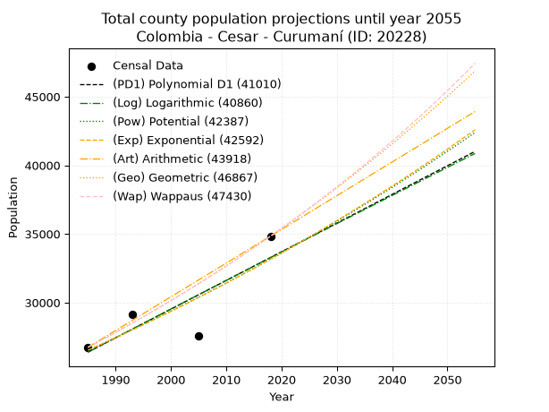
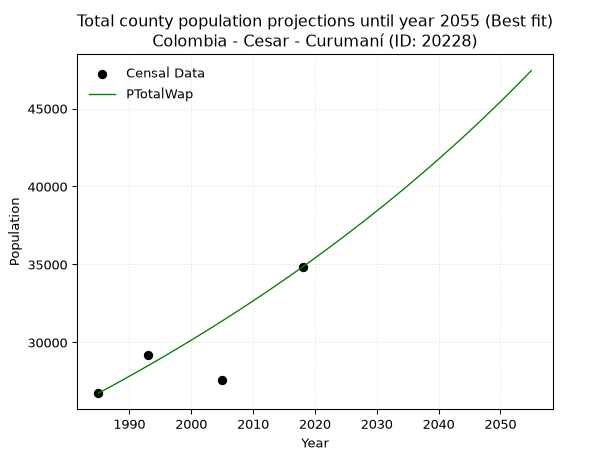
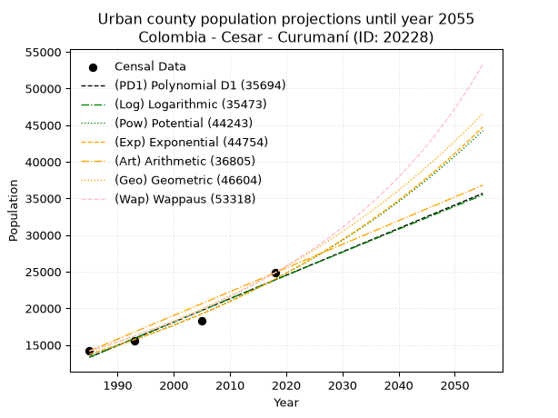
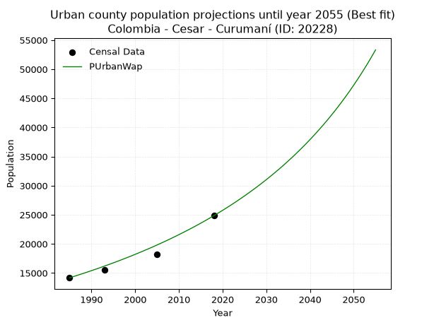
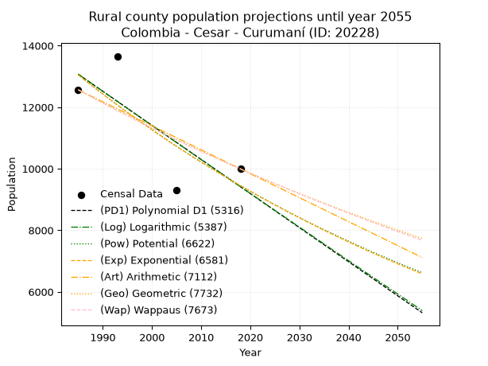
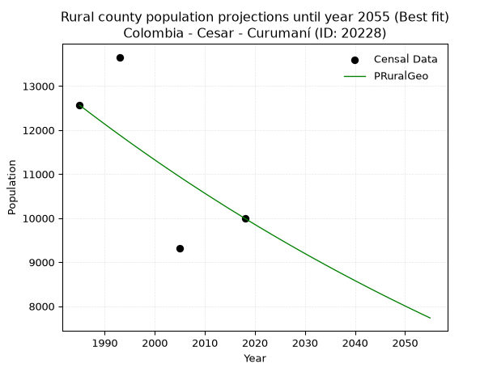

<div align="center">


</div>

# _“Population and Public Services Demand Projections (PPSD) until Year 2050 for Colombia - Cesar - Curumaní (ID: 20228)”_
Keywords: `population` `public-service` `projection` `lineal` `polynomial` `logarithmic` `potential` `exponential` `arithmetic` `geometric` `wappaus` `dane` `colombia` `south-america`

PPSD are analytical estimates used by governments and planners to anticipate future changes in population size, age distribution, and the resulting community needs for utilities, healthcare, education, and infrastructure as sizing future water treatment facilities, electrical grids, and road networks based on spatial growth.

> **General running parameters**: • app_version: _v20260806_. • Python version: _3.14.7_. • Pandas version: _3.0.5_. • NumPy version: _2.5.1_. • Creates, save and include plots into reports (create_plot): _False_. • Projection until year: _2050_. • Process polynomial degree 2 and up: _False_. • Process Wappaus: _True_. • Process Wappaus: _True_. • Set negative values to zero: _True_. • Set infinite values to zero: _True_. • Drop dataset notes: _True_. 
<div align="center">

Dynamic map: [:earth_americas:Google](http://maps.google.com/maps?q=9.201715797,-73.5408426) [:earth_americas:OSM](https://www.openstreetmap.org/#map=18/9.201715797/-73.5408426&layers=P) [:earth_americas:Bing](https://www.bing.com/maps?cp=9.201715797~-73.5408426&lvl=18) [:earth_americas:Apple](https://maps.apple.com/frame?center=9.201715797%2C-73.5408426&span=0.003%2C0.006)

</div>


<div align="center">

```geojson
{
  "type": "Feature",
  "geometry": {
    "type": "Point", 
    "coordinates": [-73.5408426, 9.201715797]
  }, 
  "properties": {
    "Name": "Colombia - Cesar - Curumaní (ID: 20228)"
  }
}
```

</div>


## 0. Census Data (4 records)

Census data are official statistics collected by a government about the people and housing in a country. They usually include counts of total population, age, sex, race, income, education, and jobs.

📅Global census file: [Population.xlsx](../data/Population.xlsx)

| Source   |   Year |   CountryID | CountryName   |   StateID | StateName   |   CountyID | CountyName   |   PTotal |   PUrban |   PRural |
|:---------|-------:|------------:|:--------------|----------:|:------------|-----------:|:-------------|---------:|---------:|---------:|
| DANE     |   1985 |          57 | Colombia      |        20 | Cesar       |      20228 | Curumaní     |    26740 |    14176 |    12564 |
| DANE     |   1993 |          57 | Colombia      |        20 | Cesar       |      20228 | Curumaní     |    29165 |    15508 |    13657 |
| DANE     |   2005 |          57 | Colombia      |        20 | Cesar       |      20228 | Curumaní     |    27560 |    18249 |     9311 |
| DANE     |   2018 |          57 | Colombia      |        20 | Cesar       |      20228 | Curumaní     |    34838 |    24844 |     9994 |

> 🔥Some records could had specific notes about the registered values or the corresponding urban or rural distribution.

📅   [RUPS](https://www.datos.gov.co/Hacienda-y-Cr-dito-P-blico/Registro-nico-de-Prestadores-de-Servicios-P-blicos/4qkq-csdn/about_data) - Local public utility companies: [RUPS.csv](../data/RUPS.xlsx)

 | SERVICIO       | ESTADO    | NOMBRE                                                                                             | NIT         | DEPARTAMENTO_DOMICILIO   | MUNICIPIO_DOMICILIO   | DIRECCION             |   TELEFONO | EMAIL                | TIPO_INSCRIPCION    | REPRESENTANTE_LEGAL          | TIPO_PRESTADOR                            | CLASIFICACION                 |
|:---------------|:----------|:---------------------------------------------------------------------------------------------------|:------------|:-------------------------|:----------------------|:----------------------|-----------:|:---------------------|:--------------------|:-----------------------------|:------------------------------------------|:------------------------------|
| ACUEDUCTO      | OPERATIVA | EMPRESA DE SERVICIOS PUBLICOS DE ACUEDUCTO, ALCANTARILLADO Y ASEO DEL MUNICIPIO DE CURUMANI E.S.P. | 800239720-4 | CESAR                    | CURUMANI              | CARRERA 16 No. 7 - 32 |    5751251 | asesorasui@yahoo.com | Registro por la ESP | CESAR AUGUSTO CENTENO CADENA | EMPRESA INDUSTRIAL Y COMERCIAL DEL ESTADO | MAYOR O IGUAL A 5001 USUARIOS |
| ALCANTARILLADO | OPERATIVA | EMPRESA DE SERVICIOS PUBLICOS DE ACUEDUCTO, ALCANTARILLADO Y ASEO DEL MUNICIPIO DE CURUMANI E.S.P. | 800239720-4 | CESAR                    | CURUMANI              | CARRERA 16 No. 7 - 32 |    5751251 | asesorasui@yahoo.com | Registro por la ESP | CESAR AUGUSTO CENTENO CADENA | EMPRESA INDUSTRIAL Y COMERCIAL DEL ESTADO | MAYOR O IGUAL A 5001 USUARIOS |

## 1. Total

### 1.1. Coefficients and Parameters

* (PD1) Polynomial Deg 1: 208.83701324768708, -388150.48574868613 (lineal)
* (Log) Logarithmic: 417562.9719620256, -3144323.7460230133
* (Pow) Potential: 13.517336912385261, -40.15316531134476
* (Exp) Exponential: 0.006760079509282794, 0.039457042571872145
* (Art) Arithmetic: Year diff. 2018 - 1985 = 33, Population diff. 34838 - 26740 = 8098, Annual growth = 245.3939393939394
* (Geo) Geometric: Year diff. 2018 - 1985 = 33, Population diff. 34838 - 26740 = 8098, Annual growth % = 0.008048830381439442
* (Wap) Wappaus: i = 0.7970182188247081, Condition values only valid for < 200)

<sub>
Wappaus condition values: ['0.00', '0.80', '1.59', '2.39', '3.19', '3.99', '4.78', '5.58', '6.38', '7.17', '7.97', '8.77', '9.56', '10.36', '11.16', '11.96', '12.75', '13.55', '14.35', '15.14', '15.94', '16.74', '17.53', '18.33', '19.13', '19.93', '20.72', '21.52', '22.32', '23.11', '23.91', '24.71', '25.50', '26.30', '27.10', '27.90', '28.69', '29.49', '30.29', '31.08', '31.88', '32.68', '33.47', '34.27', '35.07', '35.87', '36.66', '37.46', '38.26', '39.05', '39.85', '40.65', '41.44', '42.24', '43.04', '43.84', '44.63', '45.43', '46.23', '47.02', '47.82', '48.62', '49.42', '50.21', '51.01', '51.81']
</sub>


### 1.2. Projected Dataset

|   Year |   CountyID |   PTotalPD1 |   PTotalLog |   PTotalPow |   PTotalExp |   PTotalArt |   PTotalGeo |   PTotalWap |
|-------:|-----------:|------------:|------------:|------------:|------------:|------------:|------------:|------------:|
|   1985 |      20228 |       26391 |       26388 |       26532 |       26535 |       26740 |       26740 |       26740 |
|   1986 |      20228 |       26600 |       26598 |       26714 |       26715 |       26985 |       26955 |       26954 |
|   1987 |      20228 |       26809 |       26809 |       26896 |       26896 |       27231 |       27172 |       27170 |
|   1988 |      20228 |       27017 |       27019 |       27079 |       27079 |       27476 |       27391 |       27387 |
|   1989 |      20228 |       27226 |       27229 |       27264 |       27262 |       27722 |       27611 |       27606 |
|   1990 |      20228 |       27435 |       27439 |       27450 |       27447 |       27967 |       27834 |       27827 |
|   1991 |      20228 |       27644 |       27648 |       27637 |       27633 |       28212 |       28058 |       28050 |
|   1992 |      20228 |       27853 |       27858 |       27825 |       27821 |       28458 |       28283 |       28275 |
|   1993 |      20228 |       28062 |       28068 |       28015 |       28009 |       28703 |       28511 |       28501 |
|   1994 |      20228 |       28271 |       28277 |       28205 |       28199 |       28949 |       28741 |       28729 |
|   1995 |      20228 |       28479 |       28486 |       28397 |       28391 |       29194 |       28972 |       28960 |
|   1996 |      20228 |       28688 |       28696 |       28590 |       28583 |       29439 |       29205 |       29192 |
|   1997 |      20228 |       28897 |       28905 |       28784 |       28777 |       29685 |       29440 |       29426 |
|   1998 |      20228 |       29106 |       29114 |       28980 |       28972 |       29930 |       29677 |       29662 |
|   1999 |      20228 |       29315 |       29323 |       29177 |       29169 |       30176 |       29916 |       29900 |
|   2000 |      20228 |       29524 |       29532 |       29374 |       29367 |       30421 |       30157 |       30140 |
|   2001 |      20228 |       29732 |       29740 |       29574 |       29566 |       30666 |       30400 |       30382 |
|   2002 |      20228 |       29941 |       29949 |       29774 |       29766 |       30912 |       30644 |       30626 |
|   2003 |      20228 |       30150 |       30158 |       29976 |       29968 |       31157 |       30891 |       30873 |
|   2004 |      20228 |       30359 |       30366 |       30179 |       30172 |       31402 |       31139 |       31121 |
|   2005 |      20228 |       30568 |       30574 |       30383 |       30376 |       31648 |       31390 |       31372 |
|   2006 |      20228 |       30777 |       30782 |       30588 |       30582 |       31893 |       31643 |       31624 |
|   2007 |      20228 |       30985 |       30991 |       30795 |       30790 |       32139 |       31897 |       31879 |
|   2008 |      20228 |       31194 |       31199 |       31003 |       30999 |       32384 |       32154 |       32136 |
|   2009 |      20228 |       31403 |       31406 |       31212 |       31209 |       32629 |       32413 |       32396 |
|   2010 |      20228 |       31612 |       31614 |       31423 |       31421 |       32875 |       32674 |       32658 |
|   2011 |      20228 |       31821 |       31822 |       31635 |       31634 |       33120 |       32937 |       32922 |
|   2012 |      20228 |       32030 |       32030 |       31848 |       31848 |       33366 |       33202 |       33188 |
|   2013 |      20228 |       32238 |       32237 |       32063 |       32064 |       33611 |       33469 |       33457 |
|   2014 |      20228 |       32447 |       32444 |       32279 |       32282 |       33856 |       33739 |       33728 |
|   2015 |      20228 |       32656 |       32652 |       32496 |       32501 |       34102 |       34010 |       34002 |
|   2016 |      20228 |       32865 |       32859 |       32715 |       32721 |       34347 |       34284 |       34278 |
|   2017 |      20228 |       33074 |       33066 |       32935 |       32943 |       34593 |       34560 |       34557 |
|   2018 |      20228 |       33283 |       33273 |       33156 |       33167 |       34838 |       34838 |       34838 |
|   2019 |      20228 |       33491 |       33480 |       33379 |       33392 |       35083 |       35118 |       35122 |
|   2020 |      20228 |       33700 |       33687 |       33603 |       33618 |       35329 |       35401 |       35408 |
|   2021 |      20228 |       33909 |       33893 |       33829 |       33846 |       35574 |       35686 |       35697 |
|   2022 |      20228 |       34118 |       34100 |       34056 |       34076 |       35820 |       35973 |       35989 |
|   2023 |      20228 |       34327 |       34306 |       34284 |       34307 |       36065 |       36263 |       36284 |
|   2024 |      20228 |       34536 |       34513 |       34514 |       34539 |       36310 |       36555 |       36581 |
|   2025 |      20228 |       34744 |       34719 |       34745 |       34774 |       36556 |       36849 |       36881 |
|   2026 |      20228 |       34953 |       34925 |       34978 |       35010 |       36801 |       37145 |       37185 |
|   2027 |      20228 |       35162 |       35131 |       35212 |       35247 |       37047 |       37444 |       37491 |
|   2028 |      20228 |       35371 |       35337 |       35448 |       35486 |       37292 |       37746 |       37799 |
|   2029 |      20228 |       35580 |       35543 |       35685 |       35727 |       37537 |       38050 |       38111 |
|   2030 |      20228 |       35789 |       35749 |       35923 |       35969 |       37783 |       38356 |       38426 |
|   2031 |      20228 |       35997 |       35954 |       36163 |       36213 |       38028 |       38665 |       38744 |
|   2032 |      20228 |       36206 |       36160 |       36404 |       36459 |       38274 |       38976 |       39065 |
|   2033 |      20228 |       36415 |       36365 |       36647 |       36706 |       38519 |       39290 |       39390 |
|   2034 |      20228 |       36624 |       36571 |       36892 |       36955 |       38764 |       39606 |       39717 |
|   2035 |      20228 |       36833 |       36776 |       37138 |       37206 |       39010 |       39925 |       40048 |
|   2036 |      20228 |       37042 |       36981 |       37385 |       37458 |       39255 |       40246 |       40382 |
|   2037 |      20228 |       37251 |       37186 |       37634 |       37712 |       39500 |       40570 |       40719 |
|   2038 |      20228 |       37459 |       37391 |       37885 |       37968 |       39746 |       40896 |       41060 |
|   2039 |      20228 |       37668 |       37596 |       38137 |       38226 |       39991 |       41226 |       41404 |
|   2040 |      20228 |       37877 |       37801 |       38390 |       38485 |       40237 |       41557 |       41752 |
|   2041 |      20228 |       38086 |       38005 |       38645 |       38746 |       40482 |       41892 |       42103 |
|   2042 |      20228 |       38295 |       38210 |       38902 |       39009 |       40727 |       42229 |       42458 |
|   2043 |      20228 |       38504 |       38414 |       39160 |       39273 |       40973 |       42569 |       42817 |
|   2044 |      20228 |       38712 |       38618 |       39420 |       39540 |       41218 |       42912 |       43179 |
|   2045 |      20228 |       38921 |       38823 |       39682 |       39808 |       41464 |       43257 |       43546 |
|   2046 |      20228 |       39130 |       39027 |       39945 |       40078 |       41709 |       43605 |       43916 |
|   2047 |      20228 |       39339 |       39231 |       40210 |       40350 |       41954 |       43956 |       44290 |
|   2048 |      20228 |       39548 |       39435 |       40476 |       40623 |       42200 |       44310 |       44668 |
|   2049 |      20228 |       39757 |       39639 |       40744 |       40899 |       42445 |       44666 |       45050 |
|   2050 |      20228 |       39965 |       39842 |       41014 |       41176 |       42691 |       45026 |       45436 |
<div align="center">

</img>

</div>


### 1.3. Best fit with absolute and relative error (%)

Relative error puts that difference into context by dividing the absolute error by the true value, creating a unitless ratio or percentage that shows the scale of the mistake.

Absolute and relative error

|   Year | Source   |   CountryID | CountryName   |   StateID | StateName   |   CountyID_x | CountyName   |   PTotal |   PUrban |   PRural |   CountyID_y |   PTotalPD1 |   PTotalLog |   PTotalPow |   PTotalExp |   PTotalArt |   PTotalGeo |   PTotalWap |   PTotalPD1AbsError |   PTotalLogAbsError |   PTotalPowAbsError |   PTotalExpAbsError |   PTotalArtAbsError |   PTotalGeoAbsError |   PTotalWapAbsError |   PTotalPD1RelError |   PTotalLogRelError |   PTotalPowRelError |   PTotalExpRelError |   PTotalArtRelError |   PTotalGeoRelError |   PTotalWapRelError |
|-------:|:---------|------------:|:--------------|----------:|:------------|-------------:|:-------------|---------:|---------:|---------:|-------------:|------------:|------------:|------------:|------------:|------------:|------------:|------------:|--------------------:|--------------------:|--------------------:|--------------------:|--------------------:|--------------------:|--------------------:|--------------------:|--------------------:|--------------------:|--------------------:|--------------------:|--------------------:|--------------------:|
|   1985 | DANE     |          57 | Colombia      |        20 | Cesar       |        20228 | Curumaní     |    26740 |    14176 |    12564 |        20228 |       26391 |       26388 |       26532 |       26535 |       26740 |       26740 |       26740 |                 349 |                 352 |                 208 |                 205 |                   0 |                   0 |                   0 |             1.30516 |             1.31638 |            0.777861 |            0.766642 |             0       |             0       |              0      |
|   1993 | DANE     |          57 | Colombia      |        20 | Cesar       |        20228 | Curumaní     |    29165 |    15508 |    13657 |        20228 |       28062 |       28068 |       28015 |       28009 |       28703 |       28511 |       28501 |                1103 |                1097 |                1150 |                1156 |                 462 |                 654 |                 664 |             3.78193 |             3.76136 |            3.94308  |            3.96366  |             1.58409 |             2.24241 |              2.2767 |
|   2005 | DANE     |          57 | Colombia      |        20 | Cesar       |        20228 | Curumaní     |    27560 |    18249 |     9311 |        20228 |       30568 |       30574 |       30383 |       30376 |       31648 |       31390 |       31372 |                3008 |                3014 |                2823 |                2816 |                4088 |                3830 |                3812 |            10.9144  |            10.9361  |           10.2431   |           10.2177   |            14.8331  |            13.897   |             13.8316 |
|   2018 | DANE     |          57 | Colombia      |        20 | Cesar       |        20228 | Curumaní     |    34838 |    24844 |     9994 |        20228 |       33283 |       33273 |       33156 |       33167 |       34838 |       34838 |       34838 |                1555 |                1565 |                1682 |                1671 |                   0 |                   0 |                   0 |             4.46352 |             4.49222 |            4.82806  |            4.79649  |             0       |             0       |              0      |

Relative error mean

| Method    |   RelError | Best   |
|:----------|-----------:|:-------|
| PTotalPD1 |    5.11624 |        |
| PTotalLog |    5.12652 |        |
| PTotalPow |    4.94803 |        |
| PTotalExp |    4.93612 |        |
| PTotalArt |    4.1043  |        |
| PTotalGeo |    4.03484 |        |
| PTotalWap |    4.02709 | True   |

💙Best method: _**PTotalWap**_
<div align="center">

</img>

</div>


### 1.4. Fresh water supply demand in liters per capita per day (lpcd)

The fresh water supply demand typically ranges from 100 to 300 liters per capita per day (lpcd) for standard domestic and municipal planning, though absolute survival minimums set by the World Health Organization are as low as 7.5 to 20 liters per day, and total consumption in high-income nations can exceed 400 liters.

> `CZ`: Level in meters above the sea level (masl)<br> `WS`: Fresh water supply demand in liters per capita per day (lpcd or l/h/d)<br> `WSAll`: Zonal fresh water supply demand in liters per second (l/s)<br> `A`: Zonal area in square meters<br> `DP`: Population density (people/hectare or p/ha)

Reference values (RAS Colombia)

|    CZ |   WS |
|------:|-----:|
|  1000 |  120 |
|  2000 |  130 |
| 99999 |  140 |

County shapefile geometry properties and water supply values

|   CountyID |      ATotal |   CZTotal |   WSTotal |
|-----------:|------------:|----------:|----------:|
|      20228 | 9.13669e+08 |    435.63 |       120 |

Projected values for best method: PTotalWap

|   CountyID |   Year |   PTotalWap |   DPTotal |   WSTotal |   WSTotalAll |
|-----------:|-------:|------------:|----------:|----------:|-------------:|
|      20228 |   1985 |       26740 |      0.29 |       120 |      37.1389 |
|      20228 |   1986 |       26954 |      0.3  |       120 |      37.4361 |
|      20228 |   1987 |       27170 |      0.3  |       120 |      37.7361 |
|      20228 |   1988 |       27387 |      0.3  |       120 |      38.0375 |
|      20228 |   1989 |       27606 |      0.3  |       120 |      38.3417 |
|      20228 |   1990 |       27827 |      0.3  |       120 |      38.6486 |
|      20228 |   1991 |       28050 |      0.31 |       120 |      38.9583 |
|      20228 |   1992 |       28275 |      0.31 |       120 |      39.2708 |
|      20228 |   1993 |       28501 |      0.31 |       120 |      39.5847 |
|      20228 |   1994 |       28729 |      0.31 |       120 |      39.9014 |
|      20228 |   1995 |       28960 |      0.32 |       120 |      40.2222 |
|      20228 |   1996 |       29192 |      0.32 |       120 |      40.5444 |
|      20228 |   1997 |       29426 |      0.32 |       120 |      40.8694 |
|      20228 |   1998 |       29662 |      0.32 |       120 |      41.1972 |
|      20228 |   1999 |       29900 |      0.33 |       120 |      41.5278 |
|      20228 |   2000 |       30140 |      0.33 |       120 |      41.8611 |
|      20228 |   2001 |       30382 |      0.33 |       120 |      42.1972 |
|      20228 |   2002 |       30626 |      0.34 |       120 |      42.5361 |
|      20228 |   2003 |       30873 |      0.34 |       120 |      42.8792 |
|      20228 |   2004 |       31121 |      0.34 |       120 |      43.2236 |
|      20228 |   2005 |       31372 |      0.34 |       120 |      43.5722 |
|      20228 |   2006 |       31624 |      0.35 |       120 |      43.9222 |
|      20228 |   2007 |       31879 |      0.35 |       120 |      44.2764 |
|      20228 |   2008 |       32136 |      0.35 |       120 |      44.6333 |
|      20228 |   2009 |       32396 |      0.35 |       120 |      44.9944 |
|      20228 |   2010 |       32658 |      0.36 |       120 |      45.3583 |
|      20228 |   2011 |       32922 |      0.36 |       120 |      45.725  |
|      20228 |   2012 |       33188 |      0.36 |       120 |      46.0944 |
|      20228 |   2013 |       33457 |      0.37 |       120 |      46.4681 |
|      20228 |   2014 |       33728 |      0.37 |       120 |      46.8444 |
|      20228 |   2015 |       34002 |      0.37 |       120 |      47.225  |
|      20228 |   2016 |       34278 |      0.38 |       120 |      47.6083 |
|      20228 |   2017 |       34557 |      0.38 |       120 |      47.9958 |
|      20228 |   2018 |       34838 |      0.38 |       120 |      48.3861 |
|      20228 |   2019 |       35122 |      0.38 |       120 |      48.7806 |
|      20228 |   2020 |       35408 |      0.39 |       120 |      49.1778 |
|      20228 |   2021 |       35697 |      0.39 |       120 |      49.5792 |
|      20228 |   2022 |       35989 |      0.39 |       120 |      49.9847 |
|      20228 |   2023 |       36284 |      0.4  |       120 |      50.3944 |
|      20228 |   2024 |       36581 |      0.4  |       120 |      50.8069 |
|      20228 |   2025 |       36881 |      0.4  |       120 |      51.2236 |
|      20228 |   2026 |       37185 |      0.41 |       120 |      51.6458 |
|      20228 |   2027 |       37491 |      0.41 |       120 |      52.0708 |
|      20228 |   2028 |       37799 |      0.41 |       120 |      52.4986 |
|      20228 |   2029 |       38111 |      0.42 |       120 |      52.9319 |
|      20228 |   2030 |       38426 |      0.42 |       120 |      53.3694 |
|      20228 |   2031 |       38744 |      0.42 |       120 |      53.8111 |
|      20228 |   2032 |       39065 |      0.43 |       120 |      54.2569 |
|      20228 |   2033 |       39390 |      0.43 |       120 |      54.7083 |
|      20228 |   2034 |       39717 |      0.43 |       120 |      55.1625 |
|      20228 |   2035 |       40048 |      0.44 |       120 |      55.6222 |
|      20228 |   2036 |       40382 |      0.44 |       120 |      56.0861 |
|      20228 |   2037 |       40719 |      0.45 |       120 |      56.5542 |
|      20228 |   2038 |       41060 |      0.45 |       120 |      57.0278 |
|      20228 |   2039 |       41404 |      0.45 |       120 |      57.5056 |
|      20228 |   2040 |       41752 |      0.46 |       120 |      57.9889 |
|      20228 |   2041 |       42103 |      0.46 |       120 |      58.4764 |
|      20228 |   2042 |       42458 |      0.46 |       120 |      58.9694 |
|      20228 |   2043 |       42817 |      0.47 |       120 |      59.4681 |
|      20228 |   2044 |       43179 |      0.47 |       120 |      59.9708 |
|      20228 |   2045 |       43546 |      0.48 |       120 |      60.4806 |
|      20228 |   2046 |       43916 |      0.48 |       120 |      60.9944 |
|      20228 |   2047 |       44290 |      0.48 |       120 |      61.5139 |
|      20228 |   2048 |       44668 |      0.49 |       120 |      62.0389 |
|      20228 |   2049 |       45050 |      0.49 |       120 |      62.5694 |
|      20228 |   2050 |       45436 |      0.5  |       120 |      63.1056 |

## 2. Urban

### 2.1. Coefficients and Parameters

* (PD1) Polynomial Deg 1: 319.625451625849, -621136.5596146045 (lineal)
* (Log) Logarithmic: 639404.32977632, -4841923.184494538
* (Pow) Potential: 33.75943692219251, -107.19281897795938
* (Exp) Exponential: 0.016872722721613553, 3.9115586297561185e-11
* (Art) Arithmetic: Year diff. 2018 - 1985 = 33, Population diff. 24844 - 14176 = 10668, Annual growth = 323.27272727272725
* (Geo) Geometric: Year diff. 2018 - 1985 = 33, Population diff. 24844 - 14176 = 10668, Annual growth % = 0.017147352944918426
* (Wap) Wappaus: i = 1.6569591351754345, Condition values only valid for < 200)

<sub>
Wappaus condition values: ['0.00', '1.66', '3.31', '4.97', '6.63', '8.28', '9.94', '11.60', '13.26', '14.91', '16.57', '18.23', '19.88', '21.54', '23.20', '24.85', '26.51', '28.17', '29.83', '31.48', '33.14', '34.80', '36.45', '38.11', '39.77', '41.42', '43.08', '44.74', '46.39', '48.05', '49.71', '51.37', '53.02', '54.68', '56.34', '57.99', '59.65', '61.31', '62.96', '64.62', '66.28', '67.94', '69.59', '71.25', '72.91', '74.56', '76.22', '77.88', '79.53', '81.19', '82.85', '84.50', '86.16', '87.82', '89.48', '91.13', '92.79', '94.45', '96.10', '97.76', '99.42', '101.07', '102.73', '104.39', '106.05', '107.70']
</sub>


### 2.2. Projected Dataset

|   Year |   CountyID |   PUrbanPD1 |   PUrbanLog |   PUrbanPow |   PUrbanExp |   PUrbanArt |   PUrbanGeo |   PUrbanWap |
|-------:|-----------:|------------:|------------:|------------:|------------:|------------:|------------:|------------:|
|   1985 |      20228 |       13320 |       13313 |       13732 |       13737 |       14176 |       14176 |       14176 |
|   1986 |      20228 |       13640 |       13635 |       13967 |       13971 |       14499 |       14419 |       14413 |
|   1987 |      20228 |       13959 |       13957 |       14206 |       14209 |       14823 |       14666 |       14654 |
|   1988 |      20228 |       14279 |       14279 |       14450 |       14450 |       15146 |       14918 |       14899 |
|   1989 |      20228 |       14598 |       14600 |       14697 |       14696 |       15469 |       15174 |       15148 |
|   1990 |      20228 |       14918 |       14922 |       14949 |       14946 |       15792 |       15434 |       15401 |
|   1991 |      20228 |       15238 |       15243 |       15204 |       15201 |       16116 |       15698 |       15659 |
|   1992 |      20228 |       15557 |       15564 |       15464 |       15459 |       16439 |       15968 |       15921 |
|   1993 |      20228 |       15877 |       15885 |       15729 |       15722 |       16762 |       16241 |       16189 |
|   1994 |      20228 |       16197 |       16206 |       15997 |       15990 |       17085 |       16520 |       16460 |
|   1995 |      20228 |       16516 |       16526 |       16270 |       16262 |       17409 |       16803 |       16737 |
|   1996 |      20228 |       16836 |       16847 |       16548 |       16539 |       17732 |       17091 |       17019 |
|   1997 |      20228 |       17155 |       17167 |       16830 |       16820 |       18055 |       17384 |       17306 |
|   1998 |      20228 |       17475 |       17487 |       17117 |       17106 |       18379 |       17683 |       17598 |
|   1999 |      20228 |       17795 |       17807 |       17409 |       17397 |       18702 |       17986 |       17896 |
|   2000 |      20228 |       18114 |       18127 |       17705 |       17693 |       19025 |       18294 |       18199 |
|   2001 |      20228 |       18434 |       18446 |       18006 |       17994 |       19348 |       18608 |       18509 |
|   2002 |      20228 |       18754 |       18766 |       18313 |       18301 |       19672 |       18927 |       18824 |
|   2003 |      20228 |       19073 |       19085 |       18624 |       18612 |       19995 |       19251 |       19145 |
|   2004 |      20228 |       19393 |       19404 |       18940 |       18929 |       20318 |       19582 |       19473 |
|   2005 |      20228 |       19712 |       19723 |       19262 |       19251 |       20641 |       19917 |       19807 |
|   2006 |      20228 |       20032 |       20042 |       19589 |       19578 |       20965 |       20259 |       20148 |
|   2007 |      20228 |       20352 |       20361 |       19921 |       19912 |       21288 |       20606 |       20495 |
|   2008 |      20228 |       20671 |       20679 |       20259 |       20250 |       21611 |       20960 |       20850 |
|   2009 |      20228 |       20991 |       20998 |       20603 |       20595 |       21935 |       21319 |       21212 |
|   2010 |      20228 |       21311 |       21316 |       20952 |       20945 |       22258 |       21685 |       21582 |
|   2011 |      20228 |       21630 |       21634 |       21307 |       21302 |       22581 |       22056 |       21960 |
|   2012 |      20228 |       21950 |       21952 |       21667 |       21664 |       22904 |       22435 |       22345 |
|   2013 |      20228 |       22269 |       22269 |       22034 |       22033 |       23228 |       22819 |       22739 |
|   2014 |      20228 |       22589 |       22587 |       22406 |       22408 |       23551 |       23211 |       23142 |
|   2015 |      20228 |       22909 |       22904 |       22785 |       22789 |       23874 |       23609 |       23553 |
|   2016 |      20228 |       23228 |       23222 |       23170 |       23177 |       24197 |       24013 |       23974 |
|   2017 |      20228 |       23548 |       23539 |       23561 |       23571 |       24521 |       24425 |       24404 |
|   2018 |      20228 |       23868 |       23856 |       23958 |       23972 |       24844 |       24844 |       24844 |
|   2019 |      20228 |       24187 |       24172 |       24363 |       24380 |       25167 |       25270 |       25294 |
|   2020 |      20228 |       24507 |       24489 |       24773 |       24795 |       25491 |       25703 |       25755 |
|   2021 |      20228 |       24826 |       24806 |       25191 |       25217 |       25814 |       26144 |       26226 |
|   2022 |      20228 |       25146 |       25122 |       25615 |       25646 |       26137 |       26592 |       26709 |
|   2023 |      20228 |       25466 |       25438 |       26046 |       26082 |       26460 |       27048 |       27203 |
|   2024 |      20228 |       25785 |       25754 |       26484 |       26526 |       26784 |       27512 |       27709 |
|   2025 |      20228 |       26105 |       26070 |       26929 |       26978 |       27107 |       27984 |       28229 |
|   2026 |      20228 |       26425 |       26385 |       27382 |       27437 |       27430 |       28464 |       28761 |
|   2027 |      20228 |       26744 |       26701 |       27842 |       27904 |       27753 |       28952 |       29306 |
|   2028 |      20228 |       27064 |       27016 |       28310 |       28378 |       28077 |       29448 |       29866 |
|   2029 |      20228 |       27383 |       27332 |       28785 |       28861 |       28400 |       29953 |       30440 |
|   2030 |      20228 |       27703 |       27647 |       29267 |       29352 |       28723 |       30467 |       31029 |
|   2031 |      20228 |       28023 |       27962 |       29758 |       29852 |       29047 |       30989 |       31634 |
|   2032 |      20228 |       28342 |       28276 |       30257 |       30360 |       29370 |       31521 |       32256 |
|   2033 |      20228 |       28662 |       28591 |       30764 |       30876 |       29693 |       32061 |       32895 |
|   2034 |      20228 |       28982 |       28905 |       31279 |       31402 |       30016 |       32611 |       33551 |
|   2035 |      20228 |       29301 |       29220 |       31802 |       31936 |       30340 |       33170 |       34226 |
|   2036 |      20228 |       29621 |       29534 |       32334 |       32479 |       30663 |       33739 |       34920 |
|   2037 |      20228 |       29940 |       29848 |       32874 |       33032 |       30986 |       34317 |       35635 |
|   2038 |      20228 |       30260 |       30161 |       33423 |       33594 |       31309 |       34906 |       36371 |
|   2039 |      20228 |       30580 |       30475 |       33982 |       34166 |       31633 |       35504 |       37129 |
|   2040 |      20228 |       30899 |       30789 |       34549 |       34747 |       31956 |       36113 |       37909 |
|   2041 |      20228 |       31219 |       31102 |       35125 |       35338 |       32279 |       36733 |       38714 |
|   2042 |      20228 |       31539 |       31415 |       35711 |       35940 |       32603 |       37362 |       39545 |
|   2043 |      20228 |       31858 |       31728 |       36306 |       36551 |       32926 |       38003 |       40401 |
|   2044 |      20228 |       32178 |       32041 |       36911 |       37173 |       33249 |       38655 |       41286 |
|   2045 |      20228 |       32497 |       32354 |       37525 |       37806 |       33572 |       39318 |       42200 |
|   2046 |      20228 |       32817 |       32666 |       38150 |       38449 |       33896 |       39992 |       43144 |
|   2047 |      20228 |       33137 |       32979 |       38784 |       39103 |       34219 |       40677 |       44120 |
|   2048 |      20228 |       33456 |       33291 |       39429 |       39769 |       34542 |       41375 |       45131 |
|   2049 |      20228 |       33776 |       33603 |       40084 |       40445 |       34865 |       42084 |       46177 |
|   2050 |      20228 |       34096 |       33915 |       40750 |       41134 |       35189 |       42806 |       47260 |
<div align="center">

</img>

</div>


### 2.3. Best fit with absolute and relative error (%)

Relative error puts that difference into context by dividing the absolute error by the true value, creating a unitless ratio or percentage that shows the scale of the mistake.

Absolute and relative error

|   Year | Source   |   CountryID | CountryName   |   StateID | StateName   |   CountyID_x | CountyName   |   PTotal |   PUrban |   PRural |   CountyID_y |   PUrbanPD1 |   PUrbanLog |   PUrbanPow |   PUrbanExp |   PUrbanArt |   PUrbanGeo |   PUrbanWap |   PUrbanPD1AbsError |   PUrbanLogAbsError |   PUrbanPowAbsError |   PUrbanExpAbsError |   PUrbanArtAbsError |   PUrbanGeoAbsError |   PUrbanWapAbsError |   PUrbanPD1RelError |   PUrbanLogRelError |   PUrbanPowRelError |   PUrbanExpRelError |   PUrbanArtRelError |   PUrbanGeoRelError |   PUrbanWapRelError |
|-------:|:---------|------------:|:--------------|----------:|:------------|-------------:|:-------------|---------:|---------:|---------:|-------------:|------------:|------------:|------------:|------------:|------------:|------------:|------------:|--------------------:|--------------------:|--------------------:|--------------------:|--------------------:|--------------------:|--------------------:|--------------------:|--------------------:|--------------------:|--------------------:|--------------------:|--------------------:|--------------------:|
|   1985 | DANE     |          57 | Colombia      |        20 | Cesar       |        20228 | Curumaní     |    26740 |    14176 |    12564 |        20228 |       13320 |       13313 |       13732 |       13737 |       14176 |       14176 |       14176 |                 856 |                 863 |                 444 |                 439 |                   0 |                   0 |                   0 |             6.03837 |             6.08775 |             3.13205 |             3.09678 |             0       |             0       |             0       |
|   1993 | DANE     |          57 | Colombia      |        20 | Cesar       |        20228 | Curumaní     |    29165 |    15508 |    13657 |        20228 |       15877 |       15885 |       15729 |       15722 |       16762 |       16241 |       16189 |                 369 |                 377 |                 221 |                 214 |                1254 |                 733 |                 681 |             2.37942 |             2.431   |             1.42507 |             1.37993 |             8.08615 |             4.72659 |             4.39128 |
|   2005 | DANE     |          57 | Colombia      |        20 | Cesar       |        20228 | Curumaní     |    27560 |    18249 |     9311 |        20228 |       19712 |       19723 |       19262 |       19251 |       20641 |       19917 |       19807 |                1463 |                1474 |                1013 |                1002 |                2392 |                1668 |                1558 |             8.01688 |             8.07715 |             5.55099 |             5.49071 |            13.1076  |             9.14023 |             8.53745 |
|   2018 | DANE     |          57 | Colombia      |        20 | Cesar       |        20228 | Curumaní     |    34838 |    24844 |     9994 |        20228 |       23868 |       23856 |       23958 |       23972 |       24844 |       24844 |       24844 |                 976 |                 988 |                 886 |                 872 |                   0 |                   0 |                   0 |             3.92851 |             3.97682 |             3.56625 |             3.5099  |             0       |             0       |             0       |

Relative error mean

| Method    |   RelError | Best   |
|:----------|-----------:|:-------|
| PUrbanPD1 |    5.0908  |        |
| PUrbanLog |    5.14318 |        |
| PUrbanPow |    3.41859 |        |
| PUrbanExp |    3.36933 |        |
| PUrbanArt |    5.29843 |        |
| PUrbanGeo |    3.4667  |        |
| PUrbanWap |    3.23218 | True   |

💙Best method: _**PUrbanWap**_
<div align="center">

</img>

</div>


### 2.4. Fresh water supply demand in liters per capita per day (lpcd)

The fresh water supply demand typically ranges from 100 to 300 liters per capita per day (lpcd) for standard domestic and municipal planning, though absolute survival minimums set by the World Health Organization are as low as 7.5 to 20 liters per day, and total consumption in high-income nations can exceed 400 liters.

> `CZ`: Level in meters above the sea level (masl)<br> `WS`: Fresh water supply demand in liters per capita per day (lpcd or l/h/d)<br> `WSAll`: Zonal fresh water supply demand in liters per second (l/s)<br> `A`: Zonal area in square meters<br> `DP`: Population density (people/hectare or p/ha)

Reference values (RAS Colombia)

|    CZ |   WS |
|------:|-----:|
|  1000 |  120 |
|  2000 |  130 |
| 99999 |  140 |

County shapefile geometry properties and water supply values

|   CountyID |      AUrban |   CZUrban |   WSUrban |
|-----------:|------------:|----------:|----------:|
|      20228 | 5.43334e+06 |   60.6767 |       120 |

Projected values for best method: PUrbanWap

|   CountyID |   Year |   PUrbanWap |   DPUrban |   WSUrban |   WSUrbanAll |
|-----------:|-------:|------------:|----------:|----------:|-------------:|
|      20228 |   1985 |       14176 |     26.09 |       120 |      19.6889 |
|      20228 |   1986 |       14413 |     26.53 |       120 |      20.0181 |
|      20228 |   1987 |       14654 |     26.97 |       120 |      20.3528 |
|      20228 |   1988 |       14899 |     27.42 |       120 |      20.6931 |
|      20228 |   1989 |       15148 |     27.88 |       120 |      21.0389 |
|      20228 |   1990 |       15401 |     28.35 |       120 |      21.3903 |
|      20228 |   1991 |       15659 |     28.82 |       120 |      21.7486 |
|      20228 |   1992 |       15921 |     29.3  |       120 |      22.1125 |
|      20228 |   1993 |       16189 |     29.8  |       120 |      22.4847 |
|      20228 |   1994 |       16460 |     30.29 |       120 |      22.8611 |
|      20228 |   1995 |       16737 |     30.8  |       120 |      23.2458 |
|      20228 |   1996 |       17019 |     31.32 |       120 |      23.6375 |
|      20228 |   1997 |       17306 |     31.85 |       120 |      24.0361 |
|      20228 |   1998 |       17598 |     32.39 |       120 |      24.4417 |
|      20228 |   1999 |       17896 |     32.94 |       120 |      24.8556 |
|      20228 |   2000 |       18199 |     33.5  |       120 |      25.2764 |
|      20228 |   2001 |       18509 |     34.07 |       120 |      25.7069 |
|      20228 |   2002 |       18824 |     34.65 |       120 |      26.1444 |
|      20228 |   2003 |       19145 |     35.24 |       120 |      26.5903 |
|      20228 |   2004 |       19473 |     35.84 |       120 |      27.0458 |
|      20228 |   2005 |       19807 |     36.45 |       120 |      27.5097 |
|      20228 |   2006 |       20148 |     37.08 |       120 |      27.9833 |
|      20228 |   2007 |       20495 |     37.72 |       120 |      28.4653 |
|      20228 |   2008 |       20850 |     38.37 |       120 |      28.9583 |
|      20228 |   2009 |       21212 |     39.04 |       120 |      29.4611 |
|      20228 |   2010 |       21582 |     39.72 |       120 |      29.975  |
|      20228 |   2011 |       21960 |     40.42 |       120 |      30.5    |
|      20228 |   2012 |       22345 |     41.13 |       120 |      31.0347 |
|      20228 |   2013 |       22739 |     41.85 |       120 |      31.5819 |
|      20228 |   2014 |       23142 |     42.59 |       120 |      32.1417 |
|      20228 |   2015 |       23553 |     43.35 |       120 |      32.7125 |
|      20228 |   2016 |       23974 |     44.12 |       120 |      33.2972 |
|      20228 |   2017 |       24404 |     44.92 |       120 |      33.8944 |
|      20228 |   2018 |       24844 |     45.73 |       120 |      34.5056 |
|      20228 |   2019 |       25294 |     46.55 |       120 |      35.1306 |
|      20228 |   2020 |       25755 |     47.4  |       120 |      35.7708 |
|      20228 |   2021 |       26226 |     48.27 |       120 |      36.425  |
|      20228 |   2022 |       26709 |     49.16 |       120 |      37.0958 |
|      20228 |   2023 |       27203 |     50.07 |       120 |      37.7819 |
|      20228 |   2024 |       27709 |     51    |       120 |      38.4847 |
|      20228 |   2025 |       28229 |     51.96 |       120 |      39.2069 |
|      20228 |   2026 |       28761 |     52.93 |       120 |      39.9458 |
|      20228 |   2027 |       29306 |     53.94 |       120 |      40.7028 |
|      20228 |   2028 |       29866 |     54.97 |       120 |      41.4806 |
|      20228 |   2029 |       30440 |     56.02 |       120 |      42.2778 |
|      20228 |   2030 |       31029 |     57.11 |       120 |      43.0958 |
|      20228 |   2031 |       31634 |     58.22 |       120 |      43.9361 |
|      20228 |   2032 |       32256 |     59.37 |       120 |      44.8    |
|      20228 |   2033 |       32895 |     60.54 |       120 |      45.6875 |
|      20228 |   2034 |       33551 |     61.75 |       120 |      46.5986 |
|      20228 |   2035 |       34226 |     62.99 |       120 |      47.5361 |
|      20228 |   2036 |       34920 |     64.27 |       120 |      48.5    |
|      20228 |   2037 |       35635 |     65.59 |       120 |      49.4931 |
|      20228 |   2038 |       36371 |     66.94 |       120 |      50.5153 |
|      20228 |   2039 |       37129 |     68.34 |       120 |      51.5681 |
|      20228 |   2040 |       37909 |     69.77 |       120 |      52.6514 |
|      20228 |   2041 |       38714 |     71.25 |       120 |      53.7694 |
|      20228 |   2042 |       39545 |     72.78 |       120 |      54.9236 |
|      20228 |   2043 |       40401 |     74.36 |       120 |      56.1125 |
|      20228 |   2044 |       41286 |     75.99 |       120 |      57.3417 |
|      20228 |   2045 |       42200 |     77.67 |       120 |      58.6111 |
|      20228 |   2046 |       43144 |     79.41 |       120 |      59.9222 |
|      20228 |   2047 |       44120 |     81.2  |       120 |      61.2778 |
|      20228 |   2048 |       45131 |     83.06 |       120 |      62.6819 |
|      20228 |   2049 |       46177 |     84.99 |       120 |      64.1347 |
|      20228 |   2050 |       47260 |     86.98 |       120 |      65.6389 |

## 3. Rural

### 3.1. Coefficients and Parameters

* (PD1) Polynomial Deg 1: -110.78843837816159, 232986.07386591772 (lineal)
* (Log) Logarithmic: -221841.35781429432, 1697599.438471524
* (Pow) Potential: -19.584419726698176, 68.70045947190735
* (Exp) Exponential: -0.009779454971404478, 3517168526944.251
* (Art) Arithmetic: Year diff. 2018 - 1985 = 33, Population diff. 9994 - 12564 = -2570, Annual growth = -77.87878787878788
* (Geo) Geometric: Year diff. 2018 - 1985 = 33, Population diff. 9994 - 12564 = -2570, Annual growth % = -0.006910878037357904
* (Wap) Wappaus: i = -0.6904759985706879, Condition values only valid for < 200)

<sub>
Wappaus condition values: ['-0.00', '-0.69', '-1.38', '-2.07', '-2.76', '-3.45', '-4.14', '-4.83', '-5.52', '-6.21', '-6.90', '-7.60', '-8.29', '-8.98', '-9.67', '-10.36', '-11.05', '-11.74', '-12.43', '-13.12', '-13.81', '-14.50', '-15.19', '-15.88', '-16.57', '-17.26', '-17.95', '-18.64', '-19.33', '-20.02', '-20.71', '-21.40', '-22.10', '-22.79', '-23.48', '-24.17', '-24.86', '-25.55', '-26.24', '-26.93', '-27.62', '-28.31', '-29.00', '-29.69', '-30.38', '-31.07', '-31.76', '-32.45', '-33.14', '-33.83', '-34.52', '-35.21', '-35.90', '-36.60', '-37.29', '-37.98', '-38.67', '-39.36', '-40.05', '-40.74', '-41.43', '-42.12', '-42.81', '-43.50', '-44.19', '-44.88']
</sub>


### 3.2. Projected Dataset

|   Year |   CountyID |   PRuralPD1 |   PRuralLog |   PRuralPow |   PRuralExp |   PRuralArt |   PRuralGeo |   PRuralWap |
|-------:|-----------:|------------:|------------:|------------:|------------:|------------:|------------:|------------:|
|   1985 |      20228 |       13071 |       13075 |       13054 |       13049 |       12564 |       12564 |       12564 |
|   1986 |      20228 |       12960 |       12963 |       12926 |       12922 |       12486 |       12477 |       12478 |
|   1987 |      20228 |       12849 |       12852 |       12799 |       12796 |       12408 |       12391 |       12392 |
|   1988 |      20228 |       12739 |       12740 |       12673 |       12672 |       12330 |       12305 |       12306 |
|   1989 |      20228 |       12628 |       12628 |       12549 |       12548 |       12252 |       12220 |       12222 |
|   1990 |      20228 |       12517 |       12517 |       12426 |       12426 |       12175 |       12136 |       12138 |
|   1991 |      20228 |       12406 |       12405 |       12304 |       12305 |       12097 |       12052 |       12054 |
|   1992 |      20228 |       12296 |       12294 |       12184 |       12186 |       12019 |       11969 |       11971 |
|   1993 |      20228 |       12185 |       12183 |       12065 |       12067 |       11941 |       11886 |       11889 |
|   1994 |      20228 |       12074 |       12071 |       11947 |       11949 |       11863 |       11804 |       11807 |
|   1995 |      20228 |       11963 |       11960 |       11830 |       11833 |       11785 |       11722 |       11725 |
|   1996 |      20228 |       11852 |       11849 |       11715 |       11718 |       11707 |       11641 |       11645 |
|   1997 |      20228 |       11742 |       11738 |       11600 |       11604 |       11629 |       11561 |       11564 |
|   1998 |      20228 |       11631 |       11627 |       11487 |       11491 |       11552 |       11481 |       11485 |
|   1999 |      20228 |       11520 |       11516 |       11375 |       11379 |       11474 |       11402 |       11405 |
|   2000 |      20228 |       11409 |       11405 |       11264 |       11269 |       11396 |       11323 |       11327 |
|   2001 |      20228 |       11298 |       11294 |       11155 |       11159 |       11318 |       11244 |       11249 |
|   2002 |      20228 |       11188 |       11183 |       11046 |       11050 |       11240 |       11167 |       11171 |
|   2003 |      20228 |       11077 |       11072 |       10938 |       10943 |       11162 |       11090 |       11094 |
|   2004 |      20228 |       10966 |       10962 |       10832 |       10836 |       11084 |       11013 |       11017 |
|   2005 |      20228 |       10855 |       10851 |       10727 |       10731 |       11006 |       10937 |       10941 |
|   2006 |      20228 |       10744 |       10740 |       10622 |       10626 |       10929 |       10861 |       10865 |
|   2007 |      20228 |       10634 |       10630 |       10519 |       10523 |       10851 |       10786 |       10790 |
|   2008 |      20228 |       10523 |       10519 |       10417 |       10421 |       10773 |       10712 |       10715 |
|   2009 |      20228 |       10412 |       10409 |       10316 |       10319 |       10695 |       10638 |       10641 |
|   2010 |      20228 |       10301 |       10298 |       10216 |       10219 |       10617 |       10564 |       10568 |
|   2011 |      20228 |       10191 |       10188 |       10117 |       10119 |       10539 |       10491 |       10494 |
|   2012 |      20228 |       10080 |       10078 |       10019 |       10021 |       10461 |       10419 |       10421 |
|   2013 |      20228 |        9969 |        9968 |        9922 |        9923 |       10383 |       10347 |       10349 |
|   2014 |      20228 |        9858 |        9857 |        9826 |        9827 |       10306 |       10275 |       10277 |
|   2015 |      20228 |        9747 |        9747 |        9731 |        9731 |       10228 |       10204 |       10206 |
|   2016 |      20228 |        9637 |        9637 |        9637 |        9636 |       10150 |       10134 |       10135 |
|   2017 |      20228 |        9526 |        9527 |        9544 |        9543 |       10072 |       10064 |       10064 |
|   2018 |      20228 |        9415 |        9417 |        9451 |        9450 |        9994 |        9994 |        9994 |
|   2019 |      20228 |        9304 |        9307 |        9360 |        9358 |        9916 |        9925 |        9924 |
|   2020 |      20228 |        9193 |        9198 |        9270 |        9267 |        9838 |        9856 |        9855 |
|   2021 |      20228 |        9083 |        9088 |        9180 |        9176 |        9760 |        9788 |        9786 |
|   2022 |      20228 |        8972 |        8978 |        9092 |        9087 |        9682 |        9721 |        9718 |
|   2023 |      20228 |        8861 |        8868 |        9004 |        8999 |        9605 |        9653 |        9650 |
|   2024 |      20228 |        8750 |        8759 |        8918 |        8911 |        9527 |        9587 |        9582 |
|   2025 |      20228 |        8639 |        8649 |        8832 |        8824 |        9449 |        9520 |        9515 |
|   2026 |      20228 |        8529 |        8540 |        8747 |        8739 |        9371 |        9455 |        9448 |
|   2027 |      20228 |        8418 |        8430 |        8663 |        8654 |        9293 |        9389 |        9382 |
|   2028 |      20228 |        8307 |        8321 |        8579 |        8569 |        9215 |        9324 |        9316 |
|   2029 |      20228 |        8196 |        8211 |        8497 |        8486 |        9137 |        9260 |        9250 |
|   2030 |      20228 |        8086 |        8102 |        8415 |        8403 |        9059 |        9196 |        9185 |
|   2031 |      20228 |        7975 |        7993 |        8335 |        8322 |        8982 |        9132 |        9120 |
|   2032 |      20228 |        7864 |        7884 |        8255 |        8241 |        8904 |        9069 |        9056 |
|   2033 |      20228 |        7753 |        7774 |        8175 |        8160 |        8826 |        9007 |        8992 |
|   2034 |      20228 |        7642 |        7665 |        8097 |        8081 |        8748 |        8944 |        8928 |
|   2035 |      20228 |        7532 |        7556 |        8019 |        8002 |        8670 |        8883 |        8865 |
|   2036 |      20228 |        7421 |        7447 |        7943 |        7924 |        8592 |        8821 |        8802 |
|   2037 |      20228 |        7310 |        7338 |        7867 |        7847 |        8514 |        8760 |        8740 |
|   2038 |      20228 |        7199 |        7229 |        7791 |        7771 |        8436 |        8700 |        8677 |
|   2039 |      20228 |        7088 |        7121 |        7717 |        7695 |        8359 |        8640 |        8616 |
|   2040 |      20228 |        6978 |        7012 |        7643 |        7620 |        8281 |        8580 |        8554 |
|   2041 |      20228 |        6867 |        6903 |        7570 |        7546 |        8203 |        8521 |        8493 |
|   2042 |      20228 |        6756 |        6794 |        7498 |        7473 |        8125 |        8462 |        8432 |
|   2043 |      20228 |        6645 |        6686 |        7426 |        7400 |        8047 |        8403 |        8372 |
|   2044 |      20228 |        6535 |        6577 |        7355 |        7328 |        7969 |        8345 |        8312 |
|   2045 |      20228 |        6424 |        6469 |        7285 |        7257 |        7891 |        8287 |        8252 |
|   2046 |      20228 |        6313 |        6360 |        7216 |        7186 |        7813 |        8230 |        8193 |
|   2047 |      20228 |        6202 |        6252 |        7147 |        7116 |        7736 |        8173 |        8134 |
|   2048 |      20228 |        6091 |        6144 |        7079 |        7047 |        7658 |        8117 |        8075 |
|   2049 |      20228 |        5981 |        6035 |        7012 |        6978 |        7580 |        8061 |        8017 |
|   2050 |      20228 |        5870 |        5927 |        6945 |        6910 |        7502 |        8005 |        7959 |
<div align="center">

</img>

</div>


### 3.3. Best fit with absolute and relative error (%)

Relative error puts that difference into context by dividing the absolute error by the true value, creating a unitless ratio or percentage that shows the scale of the mistake.

Absolute and relative error

|   Year | Source   |   CountryID | CountryName   |   StateID | StateName   |   CountyID_x | CountyName   |   PTotal |   PUrban |   PRural |   CountyID_y |   PRuralPD1 |   PRuralLog |   PRuralPow |   PRuralExp |   PRuralArt |   PRuralGeo |   PRuralWap |   PRuralPD1AbsError |   PRuralLogAbsError |   PRuralPowAbsError |   PRuralExpAbsError |   PRuralArtAbsError |   PRuralGeoAbsError |   PRuralWapAbsError |   PRuralPD1RelError |   PRuralLogRelError |   PRuralPowRelError |   PRuralExpRelError |   PRuralArtRelError |   PRuralGeoRelError |   PRuralWapRelError |
|-------:|:---------|------------:|:--------------|----------:|:------------|-------------:|:-------------|---------:|---------:|---------:|-------------:|------------:|------------:|------------:|------------:|------------:|------------:|------------:|--------------------:|--------------------:|--------------------:|--------------------:|--------------------:|--------------------:|--------------------:|--------------------:|--------------------:|--------------------:|--------------------:|--------------------:|--------------------:|--------------------:|
|   1985 | DANE     |          57 | Colombia      |        20 | Cesar       |        20228 | Curumaní     |    26740 |    14176 |    12564 |        20228 |       13071 |       13075 |       13054 |       13049 |       12564 |       12564 |       12564 |                 507 |                 511 |                 490 |                 485 |                   0 |                   0 |                   0 |             4.03534 |             4.06718 |             3.90003 |             3.86024 |              0      |              0      |              0      |
|   1993 | DANE     |          57 | Colombia      |        20 | Cesar       |        20228 | Curumaní     |    29165 |    15508 |    13657 |        20228 |       12185 |       12183 |       12065 |       12067 |       11941 |       11886 |       11889 |                1472 |                1474 |                1592 |                1590 |                1716 |                1771 |                1768 |            10.7784  |            10.793   |            11.657   |            11.6424  |             12.565  |             12.9677 |             12.9457 |
|   2005 | DANE     |          57 | Colombia      |        20 | Cesar       |        20228 | Curumaní     |    27560 |    18249 |     9311 |        20228 |       10855 |       10851 |       10727 |       10731 |       11006 |       10937 |       10941 |                1544 |                1540 |                1416 |                1420 |                1695 |                1626 |                1630 |            16.5825  |            16.5396  |            15.2078  |            15.2508  |             18.2043 |             17.4632 |             17.5062 |
|   2018 | DANE     |          57 | Colombia      |        20 | Cesar       |        20228 | Curumaní     |    34838 |    24844 |     9994 |        20228 |        9415 |        9417 |        9451 |        9450 |        9994 |        9994 |        9994 |                 579 |                 577 |                 543 |                 544 |                   0 |                   0 |                   0 |             5.79348 |             5.77346 |             5.43326 |             5.44327 |              0      |              0      |              0      |

Relative error mean

| Method    |   RelError | Best   |
|:----------|-----------:|:-------|
| PRuralPD1 |    9.29743 |        |
| PRuralLog |    9.2933  |        |
| PRuralPow |    9.04953 |        |
| PRuralExp |    9.04917 |        |
| PRuralArt |    7.69231 |        |
| PRuralGeo |    7.60773 | True   |
| PRuralWap |    7.61298 |        |

💙Best method: _**PRuralGeo**_
<div align="center">

</img>

</div>


### 3.4. Fresh water supply demand in liters per capita per day (lpcd)

The fresh water supply demand typically ranges from 100 to 300 liters per capita per day (lpcd) for standard domestic and municipal planning, though absolute survival minimums set by the World Health Organization are as low as 7.5 to 20 liters per day, and total consumption in high-income nations can exceed 400 liters.

> `CZ`: Level in meters above the sea level (masl)<br> `WS`: Fresh water supply demand in liters per capita per day (lpcd or l/h/d)<br> `WSAll`: Zonal fresh water supply demand in liters per second (l/s)<br> `A`: Zonal area in square meters<br> `DP`: Population density (people/hectare or p/ha)

Reference values (RAS Colombia)

|    CZ |   WS |
|------:|-----:|
|  1000 |  120 |
|  2000 |  130 |
| 99999 |  140 |

County shapefile geometry properties and water supply values

|   CountyID |      ARural |   CZRural |   WSRural |
|-----------:|------------:|----------:|----------:|
|      20228 | 9.08236e+08 |   437.874 |       120 |

Projected values for best method: PRuralGeo

|   CountyID |   Year |   PRuralGeo |   DPRural |   WSRural |   WSRuralAll |
|-----------:|-------:|------------:|----------:|----------:|-------------:|
|      20228 |   1985 |       12564 |      0.14 |       120 |      17.45   |
|      20228 |   1986 |       12477 |      0.14 |       120 |      17.3292 |
|      20228 |   1987 |       12391 |      0.14 |       120 |      17.2097 |
|      20228 |   1988 |       12305 |      0.14 |       120 |      17.0903 |
|      20228 |   1989 |       12220 |      0.13 |       120 |      16.9722 |
|      20228 |   1990 |       12136 |      0.13 |       120 |      16.8556 |
|      20228 |   1991 |       12052 |      0.13 |       120 |      16.7389 |
|      20228 |   1992 |       11969 |      0.13 |       120 |      16.6236 |
|      20228 |   1993 |       11886 |      0.13 |       120 |      16.5083 |
|      20228 |   1994 |       11804 |      0.13 |       120 |      16.3944 |
|      20228 |   1995 |       11722 |      0.13 |       120 |      16.2806 |
|      20228 |   1996 |       11641 |      0.13 |       120 |      16.1681 |
|      20228 |   1997 |       11561 |      0.13 |       120 |      16.0569 |
|      20228 |   1998 |       11481 |      0.13 |       120 |      15.9458 |
|      20228 |   1999 |       11402 |      0.13 |       120 |      15.8361 |
|      20228 |   2000 |       11323 |      0.12 |       120 |      15.7264 |
|      20228 |   2001 |       11244 |      0.12 |       120 |      15.6167 |
|      20228 |   2002 |       11167 |      0.12 |       120 |      15.5097 |
|      20228 |   2003 |       11090 |      0.12 |       120 |      15.4028 |
|      20228 |   2004 |       11013 |      0.12 |       120 |      15.2958 |
|      20228 |   2005 |       10937 |      0.12 |       120 |      15.1903 |
|      20228 |   2006 |       10861 |      0.12 |       120 |      15.0847 |
|      20228 |   2007 |       10786 |      0.12 |       120 |      14.9806 |
|      20228 |   2008 |       10712 |      0.12 |       120 |      14.8778 |
|      20228 |   2009 |       10638 |      0.12 |       120 |      14.775  |
|      20228 |   2010 |       10564 |      0.12 |       120 |      14.6722 |
|      20228 |   2011 |       10491 |      0.12 |       120 |      14.5708 |
|      20228 |   2012 |       10419 |      0.11 |       120 |      14.4708 |
|      20228 |   2013 |       10347 |      0.11 |       120 |      14.3708 |
|      20228 |   2014 |       10275 |      0.11 |       120 |      14.2708 |
|      20228 |   2015 |       10204 |      0.11 |       120 |      14.1722 |
|      20228 |   2016 |       10134 |      0.11 |       120 |      14.075  |
|      20228 |   2017 |       10064 |      0.11 |       120 |      13.9778 |
|      20228 |   2018 |        9994 |      0.11 |       120 |      13.8806 |
|      20228 |   2019 |        9925 |      0.11 |       120 |      13.7847 |
|      20228 |   2020 |        9856 |      0.11 |       120 |      13.6889 |
|      20228 |   2021 |        9788 |      0.11 |       120 |      13.5944 |
|      20228 |   2022 |        9721 |      0.11 |       120 |      13.5014 |
|      20228 |   2023 |        9653 |      0.11 |       120 |      13.4069 |
|      20228 |   2024 |        9587 |      0.11 |       120 |      13.3153 |
|      20228 |   2025 |        9520 |      0.1  |       120 |      13.2222 |
|      20228 |   2026 |        9455 |      0.1  |       120 |      13.1319 |
|      20228 |   2027 |        9389 |      0.1  |       120 |      13.0403 |
|      20228 |   2028 |        9324 |      0.1  |       120 |      12.95   |
|      20228 |   2029 |        9260 |      0.1  |       120 |      12.8611 |
|      20228 |   2030 |        9196 |      0.1  |       120 |      12.7722 |
|      20228 |   2031 |        9132 |      0.1  |       120 |      12.6833 |
|      20228 |   2032 |        9069 |      0.1  |       120 |      12.5958 |
|      20228 |   2033 |        9007 |      0.1  |       120 |      12.5097 |
|      20228 |   2034 |        8944 |      0.1  |       120 |      12.4222 |
|      20228 |   2035 |        8883 |      0.1  |       120 |      12.3375 |
|      20228 |   2036 |        8821 |      0.1  |       120 |      12.2514 |
|      20228 |   2037 |        8760 |      0.1  |       120 |      12.1667 |
|      20228 |   2038 |        8700 |      0.1  |       120 |      12.0833 |
|      20228 |   2039 |        8640 |      0.1  |       120 |      12      |
|      20228 |   2040 |        8580 |      0.09 |       120 |      11.9167 |
|      20228 |   2041 |        8521 |      0.09 |       120 |      11.8347 |
|      20228 |   2042 |        8462 |      0.09 |       120 |      11.7528 |
|      20228 |   2043 |        8403 |      0.09 |       120 |      11.6708 |
|      20228 |   2044 |        8345 |      0.09 |       120 |      11.5903 |
|      20228 |   2045 |        8287 |      0.09 |       120 |      11.5097 |
|      20228 |   2046 |        8230 |      0.09 |       120 |      11.4306 |
|      20228 |   2047 |        8173 |      0.09 |       120 |      11.3514 |
|      20228 |   2048 |        8117 |      0.09 |       120 |      11.2736 |
|      20228 |   2049 |        8061 |      0.09 |       120 |      11.1958 |
|      20228 |   2050 |        8005 |      0.09 |       120 |      11.1181 |

<div align="center"><br><sub>Share this research</sub></div><br>

<sub>**APPS & TOOLS & CONTENT DISCLAIMER**: • NO WARRANTY - This content and software is provided by <a href="https://github.com/rcfdtools" target="_blank">github.com/rcfdtools</a> "as is", without any express or implied warranty, including warranties of merchantability, fitness for a particular purpose, or non-infringement. There is no guarantee that the software will be error-free or operate without interruption. • LIMITATION OF LIABILITY - Neither the authors nor copyright holders will be liable for claims or damages arising from the software or its use. You are responsible for determining if the software is appropriate for your use and assume all associated risks, including errors, legal compliance, and data loss. • NO PROFESSIONAL ADVICE - The software provides general information and does not offer professional advice. It should not replace consultation with professional advisors. [Clauses and global license for rcfdtools use.](https://github.com/rcfdtools/rcfdtools/blob/main/LICENSE.md)</sub>

| [:house: Home](Readme.md)  | [:beginner: Help / Collaborate](https://github.com/rcfdtools/R.HydroTools/discussions/31) |
|----------------------------|-------------------------------------------------------------------------------------------|