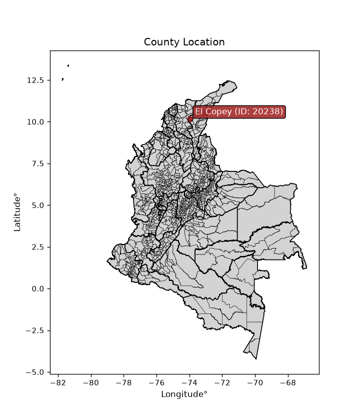
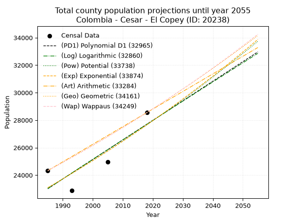
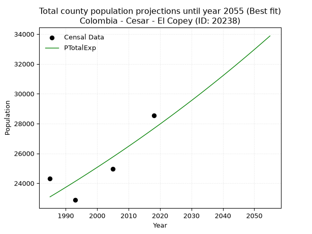
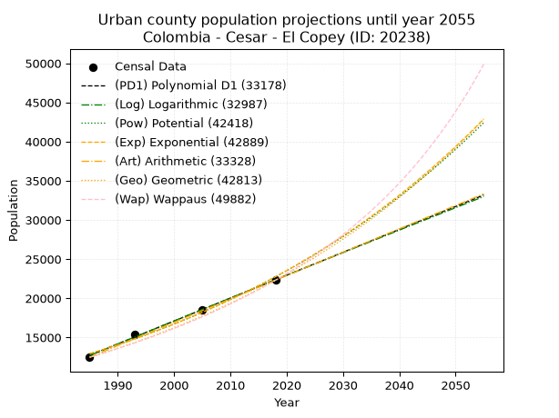
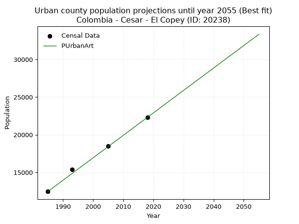
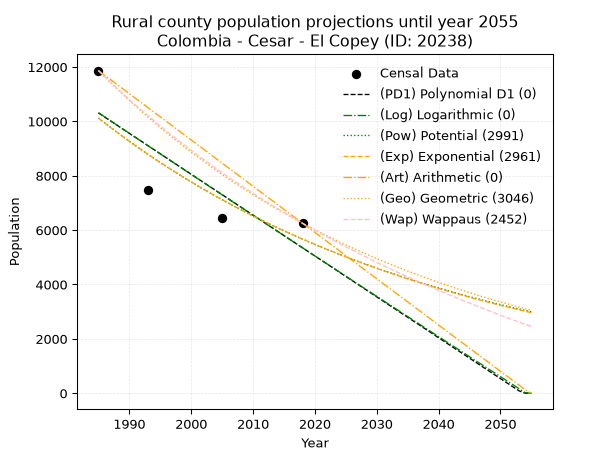
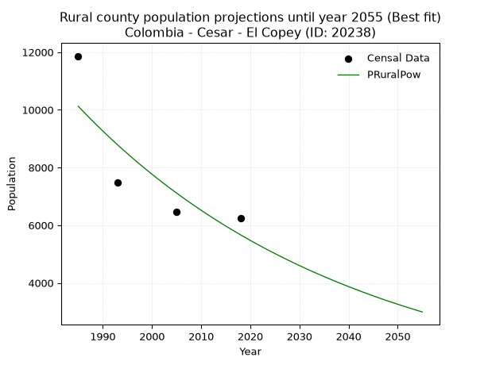

<div align="center">


</div>

# _“Population and Public Services Demand Projections (PPSD) until Year 2050 for Colombia - Cesar - El Copey (ID: 20238)”_
Keywords: `population` `public-service` `projection` `lineal` `polynomial` `logarithmic` `potential` `exponential` `arithmetic` `geometric` `wappaus` `dane` `colombia` `south-america`

PPSD are analytical estimates used by governments and planners to anticipate future changes in population size, age distribution, and the resulting community needs for utilities, healthcare, education, and infrastructure as sizing future water treatment facilities, electrical grids, and road networks based on spatial growth.

<div align="center">

</img>

</div>


> **General running parameters**: • app_version: _v20260806_. • Python version: _3.14.7_. • Pandas version: _3.0.5_. • NumPy version: _2.5.1_. • Creates, save and include plots into reports (create_plot): _False_. • Projection until year: _2050_. • Process polynomial degree 2 and up: _False_. • Process Wappaus: _True_. • Process Wappaus: _True_. • Set negative values to zero: _True_. • Set infinite values to zero: _True_. • Drop dataset notes: _True_. 
<div align="center">

Dynamic map: [:earth_americas:Google](http://maps.google.com/maps?q=10.14988282,-73.9627034) [:earth_americas:OSM](https://www.openstreetmap.org/#map=18/10.14988282/-73.9627034&layers=P) [:earth_americas:Bing](https://www.bing.com/maps?cp=10.14988282~-73.9627034&lvl=18) [:earth_americas:Apple](https://maps.apple.com/frame?center=10.14988282%2C-73.9627034&span=0.003%2C0.006)

</div>


<div align="center">

```geojson
{
  "type": "Feature",
  "geometry": {
    "type": "Point", 
    "coordinates": [-73.9627034, 10.14988282]
  }, 
  "properties": {
    "Name": "Colombia - Cesar - El Copey (ID: 20238)"
  }
}
```

</div>


## 0. Census Data (4 records)

Census data are official statistics collected by a government about the people and housing in a country. They usually include counts of total population, age, sex, race, income, education, and jobs.

📅Global census file: [Population.xlsx](../data/Population.xlsx)

| Source   |   Year |   CountryID | CountryName   |   StateID | StateName   |   CountyID | CountyName   |   PTotal |   PUrban |   PRural |
|:---------|-------:|------------:|:--------------|----------:|:------------|-----------:|:-------------|---------:|---------:|---------:|
| DANE     |   1985 |          57 | Colombia      |        20 | Cesar       |      20238 | El Copey     |    24328 |    12464 |    11864 |
| DANE     |   1993 |          57 | Colombia      |        20 | Cesar       |      20238 | El Copey     |    22874 |    15385 |     7489 |
| DANE     |   2005 |          57 | Colombia      |        20 | Cesar       |      20238 | El Copey     |    24971 |    18512 |     6459 |
| DANE     |   2018 |          57 | Colombia      |        20 | Cesar       |      20238 | El Copey     |    28550 |    22300 |     6250 |

> 🔥Some records could had specific notes about the registered values or the corresponding urban or rural distribution.

📅[SUI-RUPS](https://www.datos.gov.co/Hacienda-y-Cr-dito-P-blico/Registro-nico-de-Prestadores-de-Servicios-P-blicos/4qkq-csdn/about_data) - Local public utility companies: [RUPS.csv](../data/RUPS.xlsx)

 | SERVICIO       | ESTADO    | NOMBRE                                                            | NIT         | DEPARTAMENTO_DOMICILIO   | MUNICIPIO_DOMICILIO   | DIRECCION              |   TELEFONO | EMAIL                        | TIPO_PRESTADOR                            | CLASIFICACION                  |
|:---------------|:----------|:------------------------------------------------------------------|:------------|:-------------------------|:----------------------|:-----------------------|-----------:|:-----------------------------|:------------------------------------------|:-------------------------------|
| ACUEDUCTO      | OPERATIVA | EMPRESA DE SERVICOS PUBLICOS DE EL COPEY E.S.P.                   | 800095352-7 | CESAR                    | EL COPEY              | CALLE 8 No. 17-29      |    0000000 | emcopeyesp@hotmail.com       | EMPRESA INDUSTRIAL Y COMERCIAL DEL ESTADO | DESDE 2501 HASTA 5000 USUARIOS |
| ALCANTARILLADO | OPERATIVA | EMPRESA DE SERVICOS PUBLICOS DE EL COPEY E.S.P.                   | 800095352-7 | CESAR                    | EL COPEY              | CALLE 8 No. 17-29      |    0000000 | emcopeyesp@hotmail.com       | EMPRESA INDUSTRIAL Y COMERCIAL DEL ESTADO | DESDE 2501 HASTA 5000 USUARIOS |
| ACUEDUCTO      | OPERATIVA | ASOCIACION DE USUARIOS DEL ACUEDUCTO DEL CORREGIMIENTO DE CHIMILA | 900186019-2 | CESAR                    | EL COPEY              | CORREGIMIEINTO CHIMILA |    5803851 | doncella-alvarez@hotmail.com | ORGANIZACION AUTORIZADA                   | HASTA 2500 SUSCRIPTORES        |
| ALCANTARILLADO | OPERATIVA | ASOCIACION DE USUARIOS DEL ACUEDUCTO DEL CORREGIMIENTO DE CHIMILA | 900186019-2 | CESAR                    | EL COPEY              | CORREGIMIEINTO CHIMILA |    5803851 | doncella-alvarez@hotmail.com | ORGANIZACION AUTORIZADA                   | HASTA 2500 SUSCRIPTORES        |

## 1. Total

### 1.1. Coefficients and Parameters

* (PD1) Polynomial Deg 1: 142.16981132075244, -259194.41509433507 (lineal)
* (Log) Logarithmic: 284179.9637285165, -2134873.4315757626
* (Pow) Potential: 10.949218955276816, -31.744579486298345
* (Exp) Exponential: 0.005477679419250964, 0.43769946972964774
* (Art) Arithmetic: Year diff. 2018 - 1985 = 33, Population diff. 28550 - 24328 = 4222, Annual growth = 127.93939393939394
* (Geo) Geometric: Year diff. 2018 - 1985 = 33, Population diff. 28550 - 24328 = 4222, Annual growth % = 0.0048611403951857035
* (Wap) Wappaus: i = 0.48390405816934806, Condition values only valid for < 200)

<sub>
Wappaus condition values: ['0.00', '0.48', '0.97', '1.45', '1.94', '2.42', '2.90', '3.39', '3.87', '4.36', '4.84', '5.32', '5.81', '6.29', '6.77', '7.26', '7.74', '8.23', '8.71', '9.19', '9.68', '10.16', '10.65', '11.13', '11.61', '12.10', '12.58', '13.07', '13.55', '14.03', '14.52', '15.00', '15.48', '15.97', '16.45', '16.94', '17.42', '17.90', '18.39', '18.87', '19.36', '19.84', '20.32', '20.81', '21.29', '21.78', '22.26', '22.74', '23.23', '23.71', '24.20', '24.68', '25.16', '25.65', '26.13', '26.61', '27.10', '27.58', '28.07', '28.55', '29.03', '29.52', '30.00', '30.49', '30.97', '31.45']
</sub>


### 1.2. Projected Dataset

|   Year |   CountyID |   PTotalPD1 |   PTotalLog |   PTotalPow |   PTotalExp |   PTotalArt |   PTotalGeo |   PTotalWap |
|-------:|-----------:|------------:|------------:|------------:|------------:|------------:|------------:|------------:|
|   1985 |      20238 |       23013 |       23011 |       23085 |       23086 |       24328 |       24328 |       24328 |
|   1986 |      20238 |       23155 |       23154 |       23212 |       23213 |       24456 |       24446 |       24446 |
|   1987 |      20238 |       23297 |       23298 |       23341 |       23340 |       24584 |       24565 |       24565 |
|   1988 |      20238 |       23439 |       23441 |       23469 |       23468 |       24712 |       24685 |       24684 |
|   1989 |      20238 |       23581 |       23583 |       23599 |       23597 |       24840 |       24805 |       24803 |
|   1990 |      20238 |       23724 |       23726 |       23729 |       23727 |       24968 |       24925 |       24924 |
|   1991 |      20238 |       23866 |       23869 |       23860 |       23857 |       25096 |       25046 |       25045 |
|   1992 |      20238 |       24008 |       24012 |       23992 |       23988 |       25224 |       25168 |       25166 |
|   1993 |      20238 |       24150 |       24154 |       24124 |       24120 |       25352 |       25290 |       25288 |
|   1994 |      20238 |       24292 |       24297 |       24257 |       24252 |       25479 |       25413 |       25411 |
|   1995 |      20238 |       24434 |       24439 |       24390 |       24386 |       25607 |       25537 |       25534 |
|   1996 |      20238 |       24577 |       24582 |       24525 |       24520 |       25735 |       25661 |       25658 |
|   1997 |      20238 |       24719 |       24724 |       24659 |       24654 |       25863 |       25786 |       25783 |
|   1998 |      20238 |       24861 |       24866 |       24795 |       24790 |       25991 |       25911 |       25908 |
|   1999 |      20238 |       25003 |       25009 |       24931 |       24926 |       26119 |       26037 |       26034 |
|   2000 |      20238 |       25145 |       25151 |       25068 |       25063 |       26247 |       26164 |       26160 |
|   2001 |      20238 |       25287 |       25293 |       25206 |       25200 |       26375 |       26291 |       26287 |
|   2002 |      20238 |       25430 |       25435 |       25344 |       25339 |       26503 |       26419 |       26415 |
|   2003 |      20238 |       25572 |       25577 |       25483 |       25478 |       26631 |       26547 |       26544 |
|   2004 |      20238 |       25714 |       25719 |       25623 |       25618 |       26759 |       26676 |       26673 |
|   2005 |      20238 |       25856 |       25860 |       25763 |       25759 |       26887 |       26806 |       26802 |
|   2006 |      20238 |       25998 |       26002 |       25904 |       25900 |       27015 |       26936 |       26933 |
|   2007 |      20238 |       26140 |       26144 |       26046 |       26042 |       27143 |       27067 |       27064 |
|   2008 |      20238 |       26283 |       26285 |       26188 |       26185 |       27271 |       27199 |       27195 |
|   2009 |      20238 |       26425 |       26427 |       26331 |       26329 |       27399 |       27331 |       27328 |
|   2010 |      20238 |       26567 |       26568 |       26475 |       26474 |       27526 |       27464 |       27461 |
|   2011 |      20238 |       26709 |       26709 |       26620 |       26619 |       27654 |       27597 |       27594 |
|   2012 |      20238 |       26851 |       26851 |       26765 |       26765 |       27782 |       27731 |       27729 |
|   2013 |      20238 |       26993 |       26992 |       26911 |       26912 |       27910 |       27866 |       27864 |
|   2014 |      20238 |       27136 |       27133 |       27058 |       27060 |       28038 |       28002 |       28000 |
|   2015 |      20238 |       27278 |       27274 |       27205 |       27209 |       28166 |       28138 |       28136 |
|   2016 |      20238 |       27420 |       27415 |       27353 |       27358 |       28294 |       28274 |       28273 |
|   2017 |      20238 |       27562 |       27556 |       27502 |       27509 |       28422 |       28412 |       28411 |
|   2018 |      20238 |       27704 |       27697 |       27652 |       27660 |       28550 |       28550 |       28550 |
|   2019 |      20238 |       27846 |       27838 |       27802 |       27812 |       28678 |       28689 |       28689 |
|   2020 |      20238 |       27989 |       27978 |       27954 |       27964 |       28806 |       28828 |       28830 |
|   2021 |      20238 |       28131 |       28119 |       28105 |       28118 |       28934 |       28968 |       28970 |
|   2022 |      20238 |       28273 |       28260 |       28258 |       28273 |       29062 |       29109 |       29112 |
|   2023 |      20238 |       28415 |       28400 |       28411 |       28428 |       29190 |       29251 |       29254 |
|   2024 |      20238 |       28557 |       28541 |       28566 |       28584 |       29318 |       29393 |       29398 |
|   2025 |      20238 |       28699 |       28681 |       28721 |       28741 |       29446 |       29536 |       29542 |
|   2026 |      20238 |       28842 |       28821 |       28876 |       28899 |       29574 |       29679 |       29686 |
|   2027 |      20238 |       28984 |       28962 |       29033 |       29058 |       29701 |       29824 |       29832 |
|   2028 |      20238 |       29126 |       29102 |       29190 |       29217 |       29829 |       29969 |       29978 |
|   2029 |      20238 |       29268 |       29242 |       29348 |       29378 |       29957 |       30114 |       30125 |
|   2030 |      20238 |       29410 |       29382 |       29507 |       29539 |       30085 |       30261 |       30273 |
|   2031 |      20238 |       29552 |       29522 |       29666 |       29701 |       30213 |       30408 |       30422 |
|   2032 |      20238 |       29695 |       29662 |       29826 |       29864 |       30341 |       30556 |       30571 |
|   2033 |      20238 |       29837 |       29801 |       29988 |       30028 |       30469 |       30704 |       30721 |
|   2034 |      20238 |       29979 |       29941 |       30149 |       30193 |       30597 |       30853 |       30872 |
|   2035 |      20238 |       30121 |       30081 |       30312 |       30359 |       30725 |       31003 |       31024 |
|   2036 |      20238 |       30263 |       30221 |       30476 |       30526 |       30853 |       31154 |       31177 |
|   2037 |      20238 |       30405 |       30360 |       30640 |       30694 |       30981 |       31306 |       31331 |
|   2038 |      20238 |       30548 |       30500 |       30805 |       30862 |       31109 |       31458 |       31485 |
|   2039 |      20238 |       30690 |       30639 |       30971 |       31032 |       31237 |       31611 |       31641 |
|   2040 |      20238 |       30832 |       30778 |       31138 |       31202 |       31365 |       31764 |       31797 |
|   2041 |      20238 |       30974 |       30918 |       31305 |       31374 |       31493 |       31919 |       31954 |
|   2042 |      20238 |       31116 |       31057 |       31474 |       31546 |       31621 |       32074 |       32112 |
|   2043 |      20238 |       31259 |       31196 |       31643 |       31719 |       31748 |       32230 |       32271 |
|   2044 |      20238 |       31401 |       31335 |       31813 |       31893 |       31876 |       32386 |       32430 |
|   2045 |      20238 |       31543 |       31474 |       31984 |       32069 |       32004 |       32544 |       32591 |
|   2046 |      20238 |       31685 |       31613 |       32155 |       32245 |       32132 |       32702 |       32753 |
|   2047 |      20238 |       31827 |       31752 |       32328 |       32422 |       32260 |       32861 |       32915 |
|   2048 |      20238 |       31969 |       31891 |       32501 |       32600 |       32388 |       33021 |       33078 |
|   2049 |      20238 |       32112 |       32029 |       32675 |       32779 |       32516 |       33181 |       33243 |
|   2050 |      20238 |       32254 |       32168 |       32850 |       32959 |       32644 |       33343 |       33408 |
<div align="center">

</img>

</div>


### 1.3. Best fit with absolute and relative error (%)

Relative error puts that difference into context by dividing the absolute error by the true value, creating a unitless ratio or percentage that shows the scale of the mistake.

Absolute and relative error

|   Year | Source   |   CountryID | CountryName   |   StateID | StateName   |   CountyID_x | CountyName   |   PTotal |   PUrban |   PRural |   CountyID_y |   PTotalPD1 |   PTotalLog |   PTotalPow |   PTotalExp |   PTotalArt |   PTotalGeo |   PTotalWap |   PTotalPD1AbsError |   PTotalLogAbsError |   PTotalPowAbsError |   PTotalExpAbsError |   PTotalArtAbsError |   PTotalGeoAbsError |   PTotalWapAbsError |   PTotalPD1RelError |   PTotalLogRelError |   PTotalPowRelError |   PTotalExpRelError |   PTotalArtRelError |   PTotalGeoRelError |   PTotalWapRelError |
|-------:|:---------|------------:|:--------------|----------:|:------------|-------------:|:-------------|---------:|---------:|---------:|-------------:|------------:|------------:|------------:|------------:|------------:|------------:|------------:|--------------------:|--------------------:|--------------------:|--------------------:|--------------------:|--------------------:|--------------------:|--------------------:|--------------------:|--------------------:|--------------------:|--------------------:|--------------------:|--------------------:|
|   1985 | DANE     |          57 | Colombia      |        20 | Cesar       |        20238 | El Copey     |    24328 |    12464 |    11864 |        20238 |       23013 |       23011 |       23085 |       23086 |       24328 |       24328 |       24328 |                1315 |                1317 |                1243 |                1242 |                   0 |                   0 |                   0 |             5.40529 |             5.41352 |             5.10934 |             5.10523 |              0      |             0       |             0       |
|   1993 | DANE     |          57 | Colombia      |        20 | Cesar       |        20238 | El Copey     |    22874 |    15385 |     7489 |        20238 |       24150 |       24154 |       24124 |       24120 |       25352 |       25290 |       25288 |                1276 |                1280 |                1250 |                1246 |                2478 |                2416 |                2414 |             5.57839 |             5.59587 |             5.46472 |             5.44723 |             10.8333 |            10.5622  |            10.5535  |
|   2005 | DANE     |          57 | Colombia      |        20 | Cesar       |        20238 | El Copey     |    24971 |    18512 |     6459 |        20238 |       25856 |       25860 |       25763 |       25759 |       26887 |       26806 |       26802 |                 885 |                 889 |                 792 |                 788 |                1916 |                1835 |                1831 |             3.54411 |             3.56013 |             3.17168 |             3.15566 |              7.6729 |             7.34852 |             7.33251 |
|   2018 | DANE     |          57 | Colombia      |        20 | Cesar       |        20238 | El Copey     |    28550 |    22300 |     6250 |        20238 |       27704 |       27697 |       27652 |       27660 |       28550 |       28550 |       28550 |                 846 |                 853 |                 898 |                 890 |                   0 |                   0 |                   0 |             2.96322 |             2.98774 |             3.14536 |             3.11734 |              0      |             0       |             0       |

Relative error mean

| Method    |   RelError | Best   |
|:----------|-----------:|:-------|
| PTotalPD1 |    4.37275 |        |
| PTotalLog |    4.38931 |        |
| PTotalPow |    4.22277 |        |
| PTotalExp |    4.20636 | True   |
| PTotalArt |    4.62654 |        |
| PTotalGeo |    4.47768 |        |
| PTotalWap |    4.47149 |        |

💙Best method: _**PTotalExp**_
<div align="center">

</img>

</div>


### 1.4. Fresh water supply demand in liters per capita per day (lpcd)

The fresh water supply demand typically ranges from 100 to 300 liters per capita per day (lpcd) for standard domestic and municipal planning, though absolute survival minimums set by the World Health Organization are as low as 7.5 to 20 liters per day, and total consumption in high-income nations can exceed 400 liters.

> `CZ`: Level in meters above the sea level (masl)<br> `WS`: Fresh water supply demand in liters per capita per day (lpcd or l/h/d)<br> `WSAll`: Zonal fresh water supply demand in liters per second (l/s)<br> `A`: Zonal area in square meters<br> `DP`: Population density (people/hectare or p/ha)

Reference values (RAS Colombia)

|    CZ |   WS |
|------:|-----:|
|  1000 |  120 |
|  2000 |  130 |
| 99999 |  140 |

County shapefile geometry properties and water supply values

|   CountyID |     ATotal |   CZTotal |   WSTotal |
|-----------:|-----------:|----------:|----------:|
|      20238 | 9.5515e+08 |   392.409 |       120 |

Projected values for best method: PTotalExp

|   CountyID |   Year |   PTotalExp |   DPTotal |   WSTotal |   WSTotalAll |
|-----------:|-------:|------------:|----------:|----------:|-------------:|
|      20238 |   1985 |       23086 |      0.24 |       120 |      32.0639 |
|      20238 |   1986 |       23213 |      0.24 |       120 |      32.2403 |
|      20238 |   1987 |       23340 |      0.24 |       120 |      32.4167 |
|      20238 |   1988 |       23468 |      0.25 |       120 |      32.5944 |
|      20238 |   1989 |       23597 |      0.25 |       120 |      32.7736 |
|      20238 |   1990 |       23727 |      0.25 |       120 |      32.9542 |
|      20238 |   1991 |       23857 |      0.25 |       120 |      33.1347 |
|      20238 |   1992 |       23988 |      0.25 |       120 |      33.3167 |
|      20238 |   1993 |       24120 |      0.25 |       120 |      33.5    |
|      20238 |   1994 |       24252 |      0.25 |       120 |      33.6833 |
|      20238 |   1995 |       24386 |      0.26 |       120 |      33.8694 |
|      20238 |   1996 |       24520 |      0.26 |       120 |      34.0556 |
|      20238 |   1997 |       24654 |      0.26 |       120 |      34.2417 |
|      20238 |   1998 |       24790 |      0.26 |       120 |      34.4306 |
|      20238 |   1999 |       24926 |      0.26 |       120 |      34.6194 |
|      20238 |   2000 |       25063 |      0.26 |       120 |      34.8097 |
|      20238 |   2001 |       25200 |      0.26 |       120 |      35      |
|      20238 |   2002 |       25339 |      0.27 |       120 |      35.1931 |
|      20238 |   2003 |       25478 |      0.27 |       120 |      35.3861 |
|      20238 |   2004 |       25618 |      0.27 |       120 |      35.5806 |
|      20238 |   2005 |       25759 |      0.27 |       120 |      35.7764 |
|      20238 |   2006 |       25900 |      0.27 |       120 |      35.9722 |
|      20238 |   2007 |       26042 |      0.27 |       120 |      36.1694 |
|      20238 |   2008 |       26185 |      0.27 |       120 |      36.3681 |
|      20238 |   2009 |       26329 |      0.28 |       120 |      36.5681 |
|      20238 |   2010 |       26474 |      0.28 |       120 |      36.7694 |
|      20238 |   2011 |       26619 |      0.28 |       120 |      36.9708 |
|      20238 |   2012 |       26765 |      0.28 |       120 |      37.1736 |
|      20238 |   2013 |       26912 |      0.28 |       120 |      37.3778 |
|      20238 |   2014 |       27060 |      0.28 |       120 |      37.5833 |
|      20238 |   2015 |       27209 |      0.28 |       120 |      37.7903 |
|      20238 |   2016 |       27358 |      0.29 |       120 |      37.9972 |
|      20238 |   2017 |       27509 |      0.29 |       120 |      38.2069 |
|      20238 |   2018 |       27660 |      0.29 |       120 |      38.4167 |
|      20238 |   2019 |       27812 |      0.29 |       120 |      38.6278 |
|      20238 |   2020 |       27964 |      0.29 |       120 |      38.8389 |
|      20238 |   2021 |       28118 |      0.29 |       120 |      39.0528 |
|      20238 |   2022 |       28273 |      0.3  |       120 |      39.2681 |
|      20238 |   2023 |       28428 |      0.3  |       120 |      39.4833 |
|      20238 |   2024 |       28584 |      0.3  |       120 |      39.7    |
|      20238 |   2025 |       28741 |      0.3  |       120 |      39.9181 |
|      20238 |   2026 |       28899 |      0.3  |       120 |      40.1375 |
|      20238 |   2027 |       29058 |      0.3  |       120 |      40.3583 |
|      20238 |   2028 |       29217 |      0.31 |       120 |      40.5792 |
|      20238 |   2029 |       29378 |      0.31 |       120 |      40.8028 |
|      20238 |   2030 |       29539 |      0.31 |       120 |      41.0264 |
|      20238 |   2031 |       29701 |      0.31 |       120 |      41.2514 |
|      20238 |   2032 |       29864 |      0.31 |       120 |      41.4778 |
|      20238 |   2033 |       30028 |      0.31 |       120 |      41.7056 |
|      20238 |   2034 |       30193 |      0.32 |       120 |      41.9347 |
|      20238 |   2035 |       30359 |      0.32 |       120 |      42.1653 |
|      20238 |   2036 |       30526 |      0.32 |       120 |      42.3972 |
|      20238 |   2037 |       30694 |      0.32 |       120 |      42.6306 |
|      20238 |   2038 |       30862 |      0.32 |       120 |      42.8639 |
|      20238 |   2039 |       31032 |      0.32 |       120 |      43.1    |
|      20238 |   2040 |       31202 |      0.33 |       120 |      43.3361 |
|      20238 |   2041 |       31374 |      0.33 |       120 |      43.575  |
|      20238 |   2042 |       31546 |      0.33 |       120 |      43.8139 |
|      20238 |   2043 |       31719 |      0.33 |       120 |      44.0542 |
|      20238 |   2044 |       31893 |      0.33 |       120 |      44.2958 |
|      20238 |   2045 |       32069 |      0.34 |       120 |      44.5403 |
|      20238 |   2046 |       32245 |      0.34 |       120 |      44.7847 |
|      20238 |   2047 |       32422 |      0.34 |       120 |      45.0306 |
|      20238 |   2048 |       32600 |      0.34 |       120 |      45.2778 |
|      20238 |   2049 |       32779 |      0.34 |       120 |      45.5264 |
|      20238 |   2050 |       32959 |      0.35 |       120 |      45.7764 |

## 2. Urban

### 2.1. Coefficients and Parameters

* (PD1) Polynomial Deg 1: 292.4765154556378, -567860.9000401396 (lineal)
* (Log) Logarithmic: 585473.0026345324, -4433019.734711278
* (Pow) Potential: 34.33190035941891, -109.10757843401399
* (Exp) Exponential: 0.01714721289377278, 2.1324883725091107e-11
* (Art) Arithmetic: Year diff. 2018 - 1985 = 33, Population diff. 22300 - 12464 = 9836, Annual growth = 298.06060606060606
* (Geo) Geometric: Year diff. 2018 - 1985 = 33, Population diff. 22300 - 12464 = 9836, Annual growth % = 0.017784851197339524
* (Wap) Wappaus: i = 1.7147658845967442, Condition values only valid for < 200)

<sub>
Wappaus condition values: ['0.00', '1.71', '3.43', '5.14', '6.86', '8.57', '10.29', '12.00', '13.72', '15.43', '17.15', '18.86', '20.58', '22.29', '24.01', '25.72', '27.44', '29.15', '30.87', '32.58', '34.30', '36.01', '37.72', '39.44', '41.15', '42.87', '44.58', '46.30', '48.01', '49.73', '51.44', '53.16', '54.87', '56.59', '58.30', '60.02', '61.73', '63.45', '65.16', '66.88', '68.59', '70.31', '72.02', '73.73', '75.45', '77.16', '78.88', '80.59', '82.31', '84.02', '85.74', '87.45', '89.17', '90.88', '92.60', '94.31', '96.03', '97.74', '99.46', '101.17', '102.89', '104.60', '106.32', '108.03', '109.75', '111.46']
</sub>


### 2.2. Projected Dataset

|   Year |   CountyID |   PUrbanPD1 |   PUrbanLog |   PUrbanPow |   PUrbanExp |   PUrbanArt |   PUrbanGeo |   PUrbanWap |
|-------:|-----------:|------------:|------------:|------------:|------------:|------------:|------------:|------------:|
|   1985 |      20238 |       12705 |       12696 |       12906 |       12914 |       12464 |       12464 |       12464 |
|   1986 |      20238 |       12997 |       12991 |       13132 |       13137 |       12762 |       12686 |       12680 |
|   1987 |      20238 |       13290 |       13285 |       13360 |       13365 |       13060 |       12911 |       12899 |
|   1988 |      20238 |       13582 |       13580 |       13593 |       13596 |       13358 |       13141 |       13122 |
|   1989 |      20238 |       13875 |       13874 |       13830 |       13831 |       13656 |       13375 |       13349 |
|   1990 |      20238 |       14167 |       14169 |       14071 |       14070 |       13954 |       13612 |       13581 |
|   1991 |      20238 |       14460 |       14463 |       14316 |       14313 |       14252 |       13855 |       13816 |
|   1992 |      20238 |       14752 |       14757 |       14564 |       14561 |       14550 |       14101 |       14056 |
|   1993 |      20238 |       15045 |       15051 |       14818 |       14813 |       14848 |       14352 |       14300 |
|   1994 |      20238 |       15337 |       15344 |       15075 |       15069 |       15147 |       14607 |       14548 |
|   1995 |      20238 |       15630 |       15638 |       15337 |       15330 |       15445 |       14867 |       14802 |
|   1996 |      20238 |       15922 |       15931 |       15603 |       15595 |       15743 |       15131 |       15060 |
|   1997 |      20238 |       16215 |       16225 |       15873 |       15864 |       16041 |       15400 |       15323 |
|   1998 |      20238 |       16507 |       16518 |       16149 |       16139 |       16339 |       15674 |       15591 |
|   1999 |      20238 |       16800 |       16811 |       16428 |       16418 |       16637 |       15953 |       15864 |
|   2000 |      20238 |       17092 |       17103 |       16713 |       16702 |       16935 |       16237 |       16143 |
|   2001 |      20238 |       17385 |       17396 |       17002 |       16991 |       17233 |       16525 |       16427 |
|   2002 |      20238 |       17677 |       17689 |       17296 |       17285 |       17531 |       16819 |       16717 |
|   2003 |      20238 |       17970 |       17981 |       17596 |       17584 |       17829 |       17118 |       17013 |
|   2004 |      20238 |       18262 |       18273 |       17900 |       17888 |       18127 |       17423 |       17315 |
|   2005 |      20238 |       18555 |       18565 |       18209 |       18197 |       18425 |       17733 |       17623 |
|   2006 |      20238 |       18847 |       18857 |       18523 |       18512 |       18723 |       18048 |       17938 |
|   2007 |      20238 |       19139 |       19149 |       18843 |       18832 |       19021 |       18369 |       18259 |
|   2008 |      20238 |       19432 |       19441 |       19168 |       19158 |       19319 |       18696 |       18587 |
|   2009 |      20238 |       19724 |       19732 |       19498 |       19489 |       19617 |       19028 |       18922 |
|   2010 |      20238 |       20017 |       20024 |       19834 |       19826 |       19916 |       19367 |       19265 |
|   2011 |      20238 |       20309 |       20315 |       20176 |       20169 |       20214 |       19711 |       19615 |
|   2012 |      20238 |       20602 |       20606 |       20523 |       20518 |       20512 |       20062 |       19973 |
|   2013 |      20238 |       20894 |       20897 |       20876 |       20873 |       20810 |       20419 |       20339 |
|   2014 |      20238 |       21187 |       21187 |       21235 |       21234 |       21108 |       20782 |       20713 |
|   2015 |      20238 |       21479 |       21478 |       21600 |       21601 |       21406 |       21151 |       21096 |
|   2016 |      20238 |       21772 |       21769 |       21972 |       21974 |       21704 |       21527 |       21488 |
|   2017 |      20238 |       22064 |       22059 |       22349 |       22354 |       22002 |       21910 |       21889 |
|   2018 |      20238 |       22357 |       22349 |       22732 |       22741 |       22300 |       22300 |       22300 |
|   2019 |      20238 |       22649 |       22639 |       23122 |       23134 |       22598 |       22697 |       22721 |
|   2020 |      20238 |       22942 |       22929 |       23519 |       23535 |       22896 |       23100 |       23152 |
|   2021 |      20238 |       23234 |       23219 |       23922 |       23942 |       23194 |       23511 |       23593 |
|   2022 |      20238 |       23527 |       23508 |       24332 |       24356 |       23492 |       23929 |       24046 |
|   2023 |      20238 |       23819 |       23798 |       24748 |       24777 |       23790 |       24355 |       24510 |
|   2024 |      20238 |       24112 |       24087 |       25172 |       25205 |       24088 |       24788 |       24987 |
|   2025 |      20238 |       24404 |       24377 |       25602 |       25641 |       24386 |       25229 |       25475 |
|   2026 |      20238 |       24697 |       24666 |       26040 |       26085 |       24684 |       25677 |       25977 |
|   2027 |      20238 |       24989 |       24954 |       26485 |       26536 |       24983 |       26134 |       26492 |
|   2028 |      20238 |       25281 |       25243 |       26937 |       26995 |       25281 |       26599 |       27021 |
|   2029 |      20238 |       25574 |       25532 |       27397 |       27462 |       25579 |       27072 |       27565 |
|   2030 |      20238 |       25866 |       25820 |       27864 |       27937 |       25877 |       27553 |       28124 |
|   2031 |      20238 |       26159 |       26109 |       28339 |       28420 |       26175 |       28044 |       28698 |
|   2032 |      20238 |       26451 |       26397 |       28822 |       28911 |       26473 |       28542 |       29289 |
|   2033 |      20238 |       26744 |       26685 |       29313 |       29411 |       26771 |       29050 |       29898 |
|   2034 |      20238 |       27036 |       26973 |       29812 |       29920 |       27069 |       29567 |       30524 |
|   2035 |      20238 |       27329 |       27261 |       30320 |       30438 |       27367 |       30092 |       31169 |
|   2036 |      20238 |       27621 |       27548 |       30835 |       30964 |       27665 |       30628 |       31834 |
|   2037 |      20238 |       27914 |       27836 |       31360 |       31499 |       27963 |       31172 |       32519 |
|   2038 |      20238 |       28206 |       28123 |       31893 |       32044 |       28261 |       31727 |       33226 |
|   2039 |      20238 |       28499 |       28410 |       32434 |       32598 |       28559 |       32291 |       33956 |
|   2040 |      20238 |       28791 |       28697 |       32985 |       33162 |       28857 |       32865 |       34709 |
|   2041 |      20238 |       29084 |       28984 |       33545 |       33736 |       29155 |       33450 |       35487 |
|   2042 |      20238 |       29376 |       29271 |       34113 |       34319 |       29453 |       34045 |       36291 |
|   2043 |      20238 |       29669 |       29558 |       34692 |       34913 |       29752 |       34650 |       37122 |
|   2044 |      20238 |       29961 |       29844 |       35279 |       35517 |       30050 |       35266 |       37983 |
|   2045 |      20238 |       30254 |       30131 |       35877 |       36131 |       30348 |       35894 |       38874 |
|   2046 |      20238 |       30546 |       30417 |       36484 |       36756 |       30646 |       36532 |       39796 |
|   2047 |      20238 |       30839 |       30703 |       37101 |       37391 |       30944 |       37182 |       40753 |
|   2048 |      20238 |       31131 |       30989 |       37729 |       38038 |       31242 |       37843 |       41745 |
|   2049 |      20238 |       31423 |       31275 |       38366 |       38696 |       31540 |       38516 |       42775 |
|   2050 |      20238 |       31716 |       31560 |       39014 |       39365 |       31838 |       39201 |       43845 |
<div align="center">

</img>

</div>


### 2.3. Best fit with absolute and relative error (%)

Relative error puts that difference into context by dividing the absolute error by the true value, creating a unitless ratio or percentage that shows the scale of the mistake.

Absolute and relative error

|   Year | Source   |   CountryID | CountryName   |   StateID | StateName   |   CountyID_x | CountyName   |   PTotal |   PUrban |   PRural |   CountyID_y |   PUrbanPD1 |   PUrbanLog |   PUrbanPow |   PUrbanExp |   PUrbanArt |   PUrbanGeo |   PUrbanWap |   PUrbanPD1AbsError |   PUrbanLogAbsError |   PUrbanPowAbsError |   PUrbanExpAbsError |   PUrbanArtAbsError |   PUrbanGeoAbsError |   PUrbanWapAbsError |   PUrbanPD1RelError |   PUrbanLogRelError |   PUrbanPowRelError |   PUrbanExpRelError |   PUrbanArtRelError |   PUrbanGeoRelError |   PUrbanWapRelError |
|-------:|:---------|------------:|:--------------|----------:|:------------|-------------:|:-------------|---------:|---------:|---------:|-------------:|------------:|------------:|------------:|------------:|------------:|------------:|------------:|--------------------:|--------------------:|--------------------:|--------------------:|--------------------:|--------------------:|--------------------:|--------------------:|--------------------:|--------------------:|--------------------:|--------------------:|--------------------:|--------------------:|
|   1985 | DANE     |          57 | Colombia      |        20 | Cesar       |        20238 | El Copey     |    24328 |    12464 |    11864 |        20238 |       12705 |       12696 |       12906 |       12914 |       12464 |       12464 |       12464 |                 241 |                 232 |                 442 |                 450 |                   0 |                   0 |                   0 |            1.93357  |            1.86136  |             3.54621 |             3.6104  |            0        |             0       |             0       |
|   1993 | DANE     |          57 | Colombia      |        20 | Cesar       |        20238 | El Copey     |    22874 |    15385 |     7489 |        20238 |       15045 |       15051 |       14818 |       14813 |       14848 |       14352 |       14300 |                 340 |                 334 |                 567 |                 572 |                 537 |                1033 |                1085 |            2.20994  |            2.17095  |             3.68541 |             3.71791 |            3.49041  |             6.71433 |             7.05232 |
|   2005 | DANE     |          57 | Colombia      |        20 | Cesar       |        20238 | El Copey     |    24971 |    18512 |     6459 |        20238 |       18555 |       18565 |       18209 |       18197 |       18425 |       17733 |       17623 |                  43 |                  53 |                 303 |                 315 |                  87 |                 779 |                 889 |            0.232282 |            0.286301 |             1.63678 |             1.7016  |            0.469965 |             4.20808 |             4.80229 |
|   2018 | DANE     |          57 | Colombia      |        20 | Cesar       |        20238 | El Copey     |    28550 |    22300 |     6250 |        20238 |       22357 |       22349 |       22732 |       22741 |       22300 |       22300 |       22300 |                  57 |                  49 |                 432 |                 441 |                   0 |                   0 |                   0 |            0.255605 |            0.219731 |             1.93722 |             1.97758 |            0        |             0       |             0       |

Relative error mean

| Method    |   RelError | Best   |
|:----------|-----------:|:-------|
| PUrbanPD1 |   1.15785  |        |
| PUrbanLog |   1.13458  |        |
| PUrbanPow |   2.7014   |        |
| PUrbanExp |   2.75187  |        |
| PUrbanArt |   0.990095 | True   |
| PUrbanGeo |   2.7306   |        |
| PUrbanWap |   2.96365  |        |

💙Best method: _**PUrbanArt**_
<div align="center">

</img>

</div>


### 2.4. Fresh water supply demand in liters per capita per day (lpcd)

The fresh water supply demand typically ranges from 100 to 300 liters per capita per day (lpcd) for standard domestic and municipal planning, though absolute survival minimums set by the World Health Organization are as low as 7.5 to 20 liters per day, and total consumption in high-income nations can exceed 400 liters.

> `CZ`: Level in meters above the sea level (masl)<br> `WS`: Fresh water supply demand in liters per capita per day (lpcd or l/h/d)<br> `WSAll`: Zonal fresh water supply demand in liters per second (l/s)<br> `A`: Zonal area in square meters<br> `DP`: Population density (people/hectare or p/ha)

Reference values (RAS Colombia)

|    CZ |   WS |
|------:|-----:|
|  1000 |  120 |
|  2000 |  130 |
| 99999 |  140 |

County shapefile geometry properties and water supply values

|   CountyID |      AUrban |   CZUrban |   WSUrban |
|-----------:|------------:|----------:|----------:|
|      20238 | 3.65979e+06 |   139.216 |       120 |

Projected values for best method: PUrbanArt

|   CountyID |   Year |   PUrbanArt |   DPUrban |   WSUrban |   WSUrbanAll |
|-----------:|-------:|------------:|----------:|----------:|-------------:|
|      20238 |   1985 |       12464 |     34.06 |       120 |      17.3111 |
|      20238 |   1986 |       12762 |     34.87 |       120 |      17.725  |
|      20238 |   1987 |       13060 |     35.69 |       120 |      18.1389 |
|      20238 |   1988 |       13358 |     36.5  |       120 |      18.5528 |
|      20238 |   1989 |       13656 |     37.31 |       120 |      18.9667 |
|      20238 |   1990 |       13954 |     38.13 |       120 |      19.3806 |
|      20238 |   1991 |       14252 |     38.94 |       120 |      19.7944 |
|      20238 |   1992 |       14550 |     39.76 |       120 |      20.2083 |
|      20238 |   1993 |       14848 |     40.57 |       120 |      20.6222 |
|      20238 |   1994 |       15147 |     41.39 |       120 |      21.0375 |
|      20238 |   1995 |       15445 |     42.2  |       120 |      21.4514 |
|      20238 |   1996 |       15743 |     43.02 |       120 |      21.8653 |
|      20238 |   1997 |       16041 |     43.83 |       120 |      22.2792 |
|      20238 |   1998 |       16339 |     44.64 |       120 |      22.6931 |
|      20238 |   1999 |       16637 |     45.46 |       120 |      23.1069 |
|      20238 |   2000 |       16935 |     46.27 |       120 |      23.5208 |
|      20238 |   2001 |       17233 |     47.09 |       120 |      23.9347 |
|      20238 |   2002 |       17531 |     47.9  |       120 |      24.3486 |
|      20238 |   2003 |       17829 |     48.72 |       120 |      24.7625 |
|      20238 |   2004 |       18127 |     49.53 |       120 |      25.1764 |
|      20238 |   2005 |       18425 |     50.34 |       120 |      25.5903 |
|      20238 |   2006 |       18723 |     51.16 |       120 |      26.0042 |
|      20238 |   2007 |       19021 |     51.97 |       120 |      26.4181 |
|      20238 |   2008 |       19319 |     52.79 |       120 |      26.8319 |
|      20238 |   2009 |       19617 |     53.6  |       120 |      27.2458 |
|      20238 |   2010 |       19916 |     54.42 |       120 |      27.6611 |
|      20238 |   2011 |       20214 |     55.23 |       120 |      28.075  |
|      20238 |   2012 |       20512 |     56.05 |       120 |      28.4889 |
|      20238 |   2013 |       20810 |     56.86 |       120 |      28.9028 |
|      20238 |   2014 |       21108 |     57.68 |       120 |      29.3167 |
|      20238 |   2015 |       21406 |     58.49 |       120 |      29.7306 |
|      20238 |   2016 |       21704 |     59.3  |       120 |      30.1444 |
|      20238 |   2017 |       22002 |     60.12 |       120 |      30.5583 |
|      20238 |   2018 |       22300 |     60.93 |       120 |      30.9722 |
|      20238 |   2019 |       22598 |     61.75 |       120 |      31.3861 |
|      20238 |   2020 |       22896 |     62.56 |       120 |      31.8    |
|      20238 |   2021 |       23194 |     63.38 |       120 |      32.2139 |
|      20238 |   2022 |       23492 |     64.19 |       120 |      32.6278 |
|      20238 |   2023 |       23790 |     65    |       120 |      33.0417 |
|      20238 |   2024 |       24088 |     65.82 |       120 |      33.4556 |
|      20238 |   2025 |       24386 |     66.63 |       120 |      33.8694 |
|      20238 |   2026 |       24684 |     67.45 |       120 |      34.2833 |
|      20238 |   2027 |       24983 |     68.26 |       120 |      34.6986 |
|      20238 |   2028 |       25281 |     69.08 |       120 |      35.1125 |
|      20238 |   2029 |       25579 |     69.89 |       120 |      35.5264 |
|      20238 |   2030 |       25877 |     70.71 |       120 |      35.9403 |
|      20238 |   2031 |       26175 |     71.52 |       120 |      36.3542 |
|      20238 |   2032 |       26473 |     72.33 |       120 |      36.7681 |
|      20238 |   2033 |       26771 |     73.15 |       120 |      37.1819 |
|      20238 |   2034 |       27069 |     73.96 |       120 |      37.5958 |
|      20238 |   2035 |       27367 |     74.78 |       120 |      38.0097 |
|      20238 |   2036 |       27665 |     75.59 |       120 |      38.4236 |
|      20238 |   2037 |       27963 |     76.41 |       120 |      38.8375 |
|      20238 |   2038 |       28261 |     77.22 |       120 |      39.2514 |
|      20238 |   2039 |       28559 |     78.03 |       120 |      39.6653 |
|      20238 |   2040 |       28857 |     78.85 |       120 |      40.0792 |
|      20238 |   2041 |       29155 |     79.66 |       120 |      40.4931 |
|      20238 |   2042 |       29453 |     80.48 |       120 |      40.9069 |
|      20238 |   2043 |       29752 |     81.29 |       120 |      41.3222 |
|      20238 |   2044 |       30050 |     82.11 |       120 |      41.7361 |
|      20238 |   2045 |       30348 |     82.92 |       120 |      42.15   |
|      20238 |   2046 |       30646 |     83.74 |       120 |      42.5639 |
|      20238 |   2047 |       30944 |     84.55 |       120 |      42.9778 |
|      20238 |   2048 |       31242 |     85.37 |       120 |      43.3917 |
|      20238 |   2049 |       31540 |     86.18 |       120 |      43.8056 |
|      20238 |   2050 |       31838 |     86.99 |       120 |      44.2194 |

## 3. Rural

### 3.1. Coefficients and Parameters

* (PD1) Polynomial Deg 1: -150.3067041348854, 308666.48494580446 (lineal)
* (Log) Logarithmic: -301293.03890601627, 2298146.303135517
* (Pow) Potential: -35.17397377927271, 120.00063000742702
* (Exp) Exponential: -0.0175497183362652, 1.3616709392991111e+19
* (Art) Arithmetic: Year diff. 2018 - 1985 = 33, Population diff. 6250 - 11864 = -5614, Annual growth = -170.12121212121212
* (Geo) Geometric: Year diff. 2018 - 1985 = 33, Population diff. 6250 - 11864 = -5614, Annual growth % = -0.019234642007476932
* (Wap) Wappaus: i = -1.87833953981685, Condition values only valid for < 200)

<sub>
Wappaus condition values: ['-0.00', '-1.88', '-3.76', '-5.64', '-7.51', '-9.39', '-11.27', '-13.15', '-15.03', '-16.91', '-18.78', '-20.66', '-22.54', '-24.42', '-26.30', '-28.18', '-30.05', '-31.93', '-33.81', '-35.69', '-37.57', '-39.45', '-41.32', '-43.20', '-45.08', '-46.96', '-48.84', '-50.72', '-52.59', '-54.47', '-56.35', '-58.23', '-60.11', '-61.99', '-63.86', '-65.74', '-67.62', '-69.50', '-71.38', '-73.26', '-75.13', '-77.01', '-78.89', '-80.77', '-82.65', '-84.53', '-86.40', '-88.28', '-90.16', '-92.04', '-93.92', '-95.80', '-97.67', '-99.55', '-101.43', '-103.31', '-105.19', '-107.07', '-108.94', '-110.82', '-112.70', '-114.58', '-116.46', '-118.34', '-120.21', '-122.09']
</sub>


### 3.2. Projected Dataset

|   Year |   CountyID |   PRuralPD1 |   PRuralLog |   PRuralPow |   PRuralExp |   PRuralArt |   PRuralGeo |   PRuralWap |
|-------:|-----------:|------------:|------------:|------------:|------------:|------------:|------------:|------------:|
|   1985 |      20238 |       10308 |       10316 |       10123 |       10114 |       11864 |       11864 |       11864 |
|   1986 |      20238 |       10157 |       10164 |        9945 |        9938 |       11694 |       11636 |       11643 |
|   1987 |      20238 |       10007 |       10012 |        9770 |        9765 |       11524 |       11412 |       11427 |
|   1988 |      20238 |        9857 |        9861 |        9599 |        9595 |       11354 |       11192 |       11214 |
|   1989 |      20238 |        9706 |        9709 |        9431 |        9428 |       11184 |       10977 |       11005 |
|   1990 |      20238 |        9556 |        9558 |        9265 |        9264 |       11013 |       10766 |       10800 |
|   1991 |      20238 |        9406 |        9406 |        9103 |        9103 |       10843 |       10559 |       10598 |
|   1992 |      20238 |        9256 |        9255 |        8944 |        8944 |       10673 |       10356 |       10400 |
|   1993 |      20238 |        9105 |        9104 |        8787 |        8789 |       10503 |       10157 |       10206 |
|   1994 |      20238 |        8955 |        8953 |        8633 |        8636 |       10333 |        9961 |       10015 |
|   1995 |      20238 |        8805 |        8801 |        8483 |        8486 |       10163 |        9770 |        9827 |
|   1996 |      20238 |        8654 |        8650 |        8334 |        8338 |        9993 |        9582 |        9642 |
|   1997 |      20238 |        8504 |        8500 |        8189 |        8193 |        9823 |        9398 |        9461 |
|   1998 |      20238 |        8354 |        8349 |        8046 |        8051 |        9652 |        9217 |        9282 |
|   1999 |      20238 |        8203 |        8198 |        7905 |        7910 |        9482 |        9039 |        9107 |
|   2000 |      20238 |        8053 |        8047 |        7768 |        7773 |        9312 |        8866 |        8934 |
|   2001 |      20238 |        7903 |        7897 |        7632 |        7638 |        9142 |        8695 |        8764 |
|   2002 |      20238 |        7752 |        7746 |        7499 |        7505 |        8972 |        8528 |        8597 |
|   2003 |      20238 |        7602 |        7596 |        7369 |        7374 |        8802 |        8364 |        8433 |
|   2004 |      20238 |        7452 |        7445 |        7240 |        7246 |        8632 |        8203 |        8271 |
|   2005 |      20238 |        7302 |        7295 |        7115 |        7120 |        8462 |        8045 |        8112 |
|   2006 |      20238 |        7151 |        7145 |        6991 |        6996 |        8291 |        7890 |        7955 |
|   2007 |      20238 |        7001 |        6995 |        6869 |        6874 |        8121 |        7739 |        7801 |
|   2008 |      20238 |        6851 |        6845 |        6750 |        6755 |        7951 |        7590 |        7649 |
|   2009 |      20238 |        6700 |        6695 |        6633 |        6637 |        7781 |        7444 |        7499 |
|   2010 |      20238 |        6550 |        6545 |        6518 |        6522 |        7611 |        7301 |        7352 |
|   2011 |      20238 |        6400 |        6395 |        6405 |        6408 |        7441 |        7160 |        7207 |
|   2012 |      20238 |        6249 |        6245 |        6294 |        6297 |        7271 |        7022 |        7064 |
|   2013 |      20238 |        6099 |        6095 |        6185 |        6187 |        7101 |        6887 |        6923 |
|   2014 |      20238 |        5949 |        5946 |        6078 |        6080 |        6930 |        6755 |        6785 |
|   2015 |      20238 |        5798 |        5796 |        5972 |        5974 |        6760 |        6625 |        6648 |
|   2016 |      20238 |        5648 |        5647 |        5869 |        5870 |        6590 |        6498 |        6514 |
|   2017 |      20238 |        5498 |        5497 |        5768 |        5768 |        6420 |        6373 |        6381 |
|   2018 |      20238 |        5348 |        5348 |        5668 |        5667 |        6250 |        6250 |        6250 |
|   2019 |      20238 |        5197 |        5199 |        5570 |        5569 |        6080 |        6130 |        6121 |
|   2020 |      20238 |        5047 |        5049 |        5474 |        5472 |        5910 |        6012 |        5994 |
|   2021 |      20238 |        4897 |        4900 |        5379 |        5377 |        5740 |        5896 |        5869 |
|   2022 |      20238 |        4746 |        4751 |        5287 |        5283 |        5570 |        5783 |        5745 |
|   2023 |      20238 |        4596 |        4602 |        5195 |        5191 |        5399 |        5672 |        5623 |
|   2024 |      20238 |        4446 |        4453 |        5106 |        5101 |        5229 |        5563 |        5503 |
|   2025 |      20238 |        4295 |        4304 |        5018 |        5012 |        5059 |        5456 |        5384 |
|   2026 |      20238 |        4145 |        4156 |        4932 |        4925 |        4889 |        5351 |        5267 |
|   2027 |      20238 |        3995 |        4007 |        4847 |        4839 |        4719 |        5248 |        5152 |
|   2028 |      20238 |        3844 |        3858 |        4763 |        4755 |        4549 |        5147 |        5038 |
|   2029 |      20238 |        3694 |        3710 |        4681 |        4673 |        4379 |        5048 |        4926 |
|   2030 |      20238 |        3544 |        3561 |        4601 |        4591 |        4209 |        4951 |        4815 |
|   2031 |      20238 |        3394 |        3413 |        4522 |        4511 |        4038 |        4855 |        4706 |
|   2032 |      20238 |        3243 |        3265 |        4444 |        4433 |        3868 |        4762 |        4598 |
|   2033 |      20238 |        3093 |        3117 |        4368 |        4356 |        3698 |        4670 |        4491 |
|   2034 |      20238 |        2943 |        2968 |        4293 |        4280 |        3528 |        4581 |        4386 |
|   2035 |      20238 |        2792 |        2820 |        4220 |        4206 |        3358 |        4492 |        4282 |
|   2036 |      20238 |        2642 |        2672 |        4147 |        4132 |        3188 |        4406 |        4180 |
|   2037 |      20238 |        2492 |        2524 |        4076 |        4060 |        3018 |        4321 |        4078 |
|   2038 |      20238 |        2341 |        2376 |        4007 |        3990 |        2848 |        4238 |        3978 |
|   2039 |      20238 |        2191 |        2229 |        3938 |        3920 |        2677 |        4157 |        3880 |
|   2040 |      20238 |        2041 |        2081 |        3871 |        3852 |        2507 |        4077 |        3782 |
|   2041 |      20238 |        1891 |        1933 |        3805 |        3785 |        2337 |        3998 |        3686 |
|   2042 |      20238 |        1740 |        1786 |        3740 |        3719 |        2167 |        3921 |        3591 |
|   2043 |      20238 |        1590 |        1638 |        3676 |        3655 |        1997 |        3846 |        3497 |
|   2044 |      20238 |        1440 |        1491 |        3613 |        3591 |        1827 |        3772 |        3404 |
|   2045 |      20238 |        1289 |        1343 |        3551 |        3529 |        1657 |        3699 |        3312 |
|   2046 |      20238 |        1139 |        1196 |        3491 |        3467 |        1487 |        3628 |        3222 |
|   2047 |      20238 |         989 |        1049 |        3431 |        3407 |        1316 |        3559 |        3132 |
|   2048 |      20238 |         838 |         902 |        3373 |        3348 |        1146 |        3490 |        3044 |
|   2049 |      20238 |         688 |         755 |        3315 |        3289 |         976 |        3423 |        2956 |
|   2050 |      20238 |         538 |         608 |        3259 |        3232 |         806 |        3357 |        2870 |
<div align="center">

</img>

</div>


### 3.3. Best fit with absolute and relative error (%)

Relative error puts that difference into context by dividing the absolute error by the true value, creating a unitless ratio or percentage that shows the scale of the mistake.

Absolute and relative error

|   Year | Source   |   CountryID | CountryName   |   StateID | StateName   |   CountyID_x | CountyName   |   PTotal |   PUrban |   PRural |   CountyID_y |   PRuralPD1 |   PRuralLog |   PRuralPow |   PRuralExp |   PRuralArt |   PRuralGeo |   PRuralWap |   PRuralPD1AbsError |   PRuralLogAbsError |   PRuralPowAbsError |   PRuralExpAbsError |   PRuralArtAbsError |   PRuralGeoAbsError |   PRuralWapAbsError |   PRuralPD1RelError |   PRuralLogRelError |   PRuralPowRelError |   PRuralExpRelError |   PRuralArtRelError |   PRuralGeoRelError |   PRuralWapRelError |
|-------:|:---------|------------:|:--------------|----------:|:------------|-------------:|:-------------|---------:|---------:|---------:|-------------:|------------:|------------:|------------:|------------:|------------:|------------:|------------:|--------------------:|--------------------:|--------------------:|--------------------:|--------------------:|--------------------:|--------------------:|--------------------:|--------------------:|--------------------:|--------------------:|--------------------:|--------------------:|--------------------:|
|   1985 | DANE     |          57 | Colombia      |        20 | Cesar       |        20238 | El Copey     |    24328 |    12464 |    11864 |        20238 |       10308 |       10316 |       10123 |       10114 |       11864 |       11864 |       11864 |                1556 |                1548 |                1741 |                1750 |                   0 |                   0 |                   0 |             13.1153 |             13.0479 |             14.6746 |             14.7505 |              0      |              0      |              0      |
|   1993 | DANE     |          57 | Colombia      |        20 | Cesar       |        20238 | El Copey     |    22874 |    15385 |     7489 |        20238 |        9105 |        9104 |        8787 |        8789 |       10503 |       10157 |       10206 |                1616 |                1615 |                1298 |                1300 |                3014 |                2668 |                2717 |             21.5783 |             21.565  |             17.3321 |             17.3588 |             40.2457 |             35.6256 |             36.2799 |
|   2005 | DANE     |          57 | Colombia      |        20 | Cesar       |        20238 | El Copey     |    24971 |    18512 |     6459 |        20238 |        7302 |        7295 |        7115 |        7120 |        8462 |        8045 |        8112 |                 843 |                 836 |                 656 |                 661 |                2003 |                1586 |                1653 |             13.0516 |             12.9432 |             10.1564 |             10.2338 |             31.011  |             24.5549 |             25.5922 |
|   2018 | DANE     |          57 | Colombia      |        20 | Cesar       |        20238 | El Copey     |    28550 |    22300 |     6250 |        20238 |        5348 |        5348 |        5668 |        5667 |        6250 |        6250 |        6250 |                 902 |                 902 |                 582 |                 583 |                   0 |                   0 |                   0 |             14.432  |             14.432  |              9.312  |              9.328  |              0      |              0      |              0      |

Relative error mean

| Method    |   RelError | Best   |
|:----------|-----------:|:-------|
| PRuralPD1 |    15.5443 |        |
| PRuralLog |    15.497  |        |
| PRuralPow |    12.8688 | True   |
| PRuralExp |    12.9178 |        |
| PRuralArt |    17.8142 |        |
| PRuralGeo |    15.0451 |        |
| PRuralWap |    15.468  |        |

💙Best method: _**PRuralPow**_
<div align="center">

</img>

</div>


### 3.4. Fresh water supply demand in liters per capita per day (lpcd)

The fresh water supply demand typically ranges from 100 to 300 liters per capita per day (lpcd) for standard domestic and municipal planning, though absolute survival minimums set by the World Health Organization are as low as 7.5 to 20 liters per day, and total consumption in high-income nations can exceed 400 liters.

> `CZ`: Level in meters above the sea level (masl)<br> `WS`: Fresh water supply demand in liters per capita per day (lpcd or l/h/d)<br> `WSAll`: Zonal fresh water supply demand in liters per second (l/s)<br> `A`: Zonal area in square meters<br> `DP`: Population density (people/hectare or p/ha)

Reference values (RAS Colombia)

|    CZ |   WS |
|------:|-----:|
|  1000 |  120 |
|  2000 |  130 |
| 99999 |  140 |

County shapefile geometry properties and water supply values

|   CountyID |     ARural |   CZRural |   WSRural |
|-----------:|-----------:|----------:|----------:|
|      20238 | 9.5149e+08 |   393.381 |       120 |

Projected values for best method: PRuralPow

|   CountyID |   Year |   PRuralPow |   DPRural |   WSRural |   WSRuralAll |
|-----------:|-------:|------------:|----------:|----------:|-------------:|
|      20238 |   1985 |       10123 |      0.11 |       120 |     14.0597  |
|      20238 |   1986 |        9945 |      0.1  |       120 |     13.8125  |
|      20238 |   1987 |        9770 |      0.1  |       120 |     13.5694  |
|      20238 |   1988 |        9599 |      0.1  |       120 |     13.3319  |
|      20238 |   1989 |        9431 |      0.1  |       120 |     13.0986  |
|      20238 |   1990 |        9265 |      0.1  |       120 |     12.8681  |
|      20238 |   1991 |        9103 |      0.1  |       120 |     12.6431  |
|      20238 |   1992 |        8944 |      0.09 |       120 |     12.4222  |
|      20238 |   1993 |        8787 |      0.09 |       120 |     12.2042  |
|      20238 |   1994 |        8633 |      0.09 |       120 |     11.9903  |
|      20238 |   1995 |        8483 |      0.09 |       120 |     11.7819  |
|      20238 |   1996 |        8334 |      0.09 |       120 |     11.575   |
|      20238 |   1997 |        8189 |      0.09 |       120 |     11.3736  |
|      20238 |   1998 |        8046 |      0.08 |       120 |     11.175   |
|      20238 |   1999 |        7905 |      0.08 |       120 |     10.9792  |
|      20238 |   2000 |        7768 |      0.08 |       120 |     10.7889  |
|      20238 |   2001 |        7632 |      0.08 |       120 |     10.6     |
|      20238 |   2002 |        7499 |      0.08 |       120 |     10.4153  |
|      20238 |   2003 |        7369 |      0.08 |       120 |     10.2347  |
|      20238 |   2004 |        7240 |      0.08 |       120 |     10.0556  |
|      20238 |   2005 |        7115 |      0.07 |       120 |      9.88194 |
|      20238 |   2006 |        6991 |      0.07 |       120 |      9.70972 |
|      20238 |   2007 |        6869 |      0.07 |       120 |      9.54028 |
|      20238 |   2008 |        6750 |      0.07 |       120 |      9.375   |
|      20238 |   2009 |        6633 |      0.07 |       120 |      9.2125  |
|      20238 |   2010 |        6518 |      0.07 |       120 |      9.05278 |
|      20238 |   2011 |        6405 |      0.07 |       120 |      8.89583 |
|      20238 |   2012 |        6294 |      0.07 |       120 |      8.74167 |
|      20238 |   2013 |        6185 |      0.07 |       120 |      8.59028 |
|      20238 |   2014 |        6078 |      0.06 |       120 |      8.44167 |
|      20238 |   2015 |        5972 |      0.06 |       120 |      8.29444 |
|      20238 |   2016 |        5869 |      0.06 |       120 |      8.15139 |
|      20238 |   2017 |        5768 |      0.06 |       120 |      8.01111 |
|      20238 |   2018 |        5668 |      0.06 |       120 |      7.87222 |
|      20238 |   2019 |        5570 |      0.06 |       120 |      7.73611 |
|      20238 |   2020 |        5474 |      0.06 |       120 |      7.60278 |
|      20238 |   2021 |        5379 |      0.06 |       120 |      7.47083 |
|      20238 |   2022 |        5287 |      0.06 |       120 |      7.34306 |
|      20238 |   2023 |        5195 |      0.05 |       120 |      7.21528 |
|      20238 |   2024 |        5106 |      0.05 |       120 |      7.09167 |
|      20238 |   2025 |        5018 |      0.05 |       120 |      6.96944 |
|      20238 |   2026 |        4932 |      0.05 |       120 |      6.85    |
|      20238 |   2027 |        4847 |      0.05 |       120 |      6.73194 |
|      20238 |   2028 |        4763 |      0.05 |       120 |      6.61528 |
|      20238 |   2029 |        4681 |      0.05 |       120 |      6.50139 |
|      20238 |   2030 |        4601 |      0.05 |       120 |      6.39028 |
|      20238 |   2031 |        4522 |      0.05 |       120 |      6.28056 |
|      20238 |   2032 |        4444 |      0.05 |       120 |      6.17222 |
|      20238 |   2033 |        4368 |      0.05 |       120 |      6.06667 |
|      20238 |   2034 |        4293 |      0.05 |       120 |      5.9625  |
|      20238 |   2035 |        4220 |      0.04 |       120 |      5.86111 |
|      20238 |   2036 |        4147 |      0.04 |       120 |      5.75972 |
|      20238 |   2037 |        4076 |      0.04 |       120 |      5.66111 |
|      20238 |   2038 |        4007 |      0.04 |       120 |      5.56528 |
|      20238 |   2039 |        3938 |      0.04 |       120 |      5.46944 |
|      20238 |   2040 |        3871 |      0.04 |       120 |      5.37639 |
|      20238 |   2041 |        3805 |      0.04 |       120 |      5.28472 |
|      20238 |   2042 |        3740 |      0.04 |       120 |      5.19444 |
|      20238 |   2043 |        3676 |      0.04 |       120 |      5.10556 |
|      20238 |   2044 |        3613 |      0.04 |       120 |      5.01806 |
|      20238 |   2045 |        3551 |      0.04 |       120 |      4.93194 |
|      20238 |   2046 |        3491 |      0.04 |       120 |      4.84861 |
|      20238 |   2047 |        3431 |      0.04 |       120 |      4.76528 |
|      20238 |   2048 |        3373 |      0.04 |       120 |      4.68472 |
|      20238 |   2049 |        3315 |      0.03 |       120 |      4.60417 |
|      20238 |   2050 |        3259 |      0.03 |       120 |      4.52639 |

<div align="center"><br><sub>Share this research</sub></div><br>

<sub>**APPS & TOOLS & CONTENT DISCLAIMER**: • NO WARRANTY - This content and software is provided by <a href="https://github.com/rcfdtools" target="_blank">github.com/rcfdtools</a> "as is", without any express or implied warranty, including warranties of merchantability, fitness for a particular purpose, or non-infringement. There is no guarantee that the software will be error-free or operate without interruption. • LIMITATION OF LIABILITY - Neither the authors nor copyright holders will be liable for claims or damages arising from the software or its use. You are responsible for determining if the software is appropriate for your use and assume all associated risks, including errors, legal compliance, and data loss. • NO PROFESSIONAL ADVICE - The software provides general information and does not offer professional advice. It should not replace consultation with professional advisors. [Clauses and global license for rcfdtools use.](https://github.com/rcfdtools/rcfdtools/blob/main/LICENSE.md)</sub>

| [:house: Home](Readme.md)  | [:beginner: Help / Collab](https://github.com/rcfdtools/R.HydroTools/discussions/31) |
|----------------------------|-------------------------------------------------------------------------------------------|