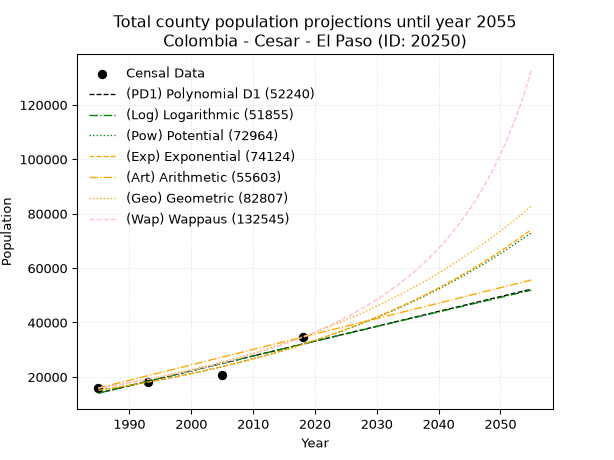
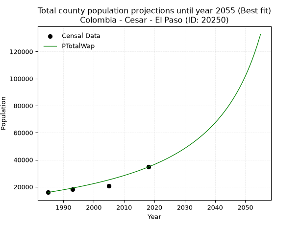
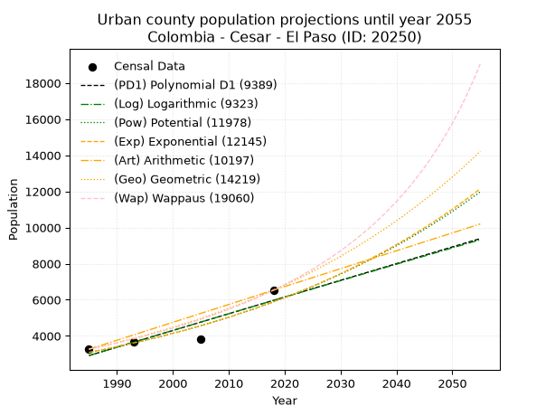
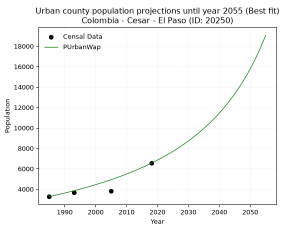
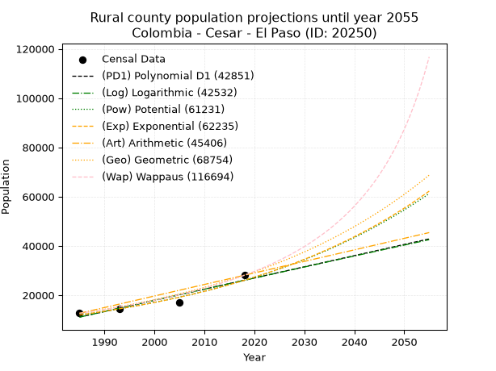
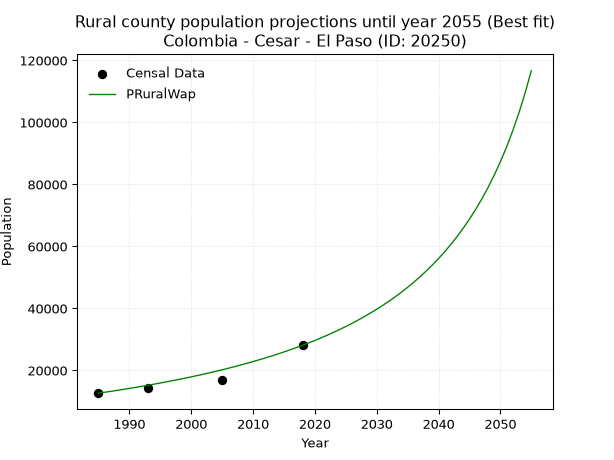

<div align="center">


</div>

# _“Population and Public Services Demand Projections (PPSD) until Year 2050 for Colombia - Cesar - El Paso (ID: 20250)”_
Keywords: `population` `public-service` `projection` `lineal` `polynomial` `logarithmic` `potential` `exponential` `arithmetic` `geometric` `wappaus` `dane` `colombia` `south-america`

PPSD are analytical estimates used by governments and planners to anticipate future changes in population size, age distribution, and the resulting community needs for utilities, healthcare, education, and infrastructure as sizing future water treatment facilities, electrical grids, and road networks based on spatial growth.

> **General running parameters**: • app_version: _v20260806_. • Python version: _3.14.7_. • Pandas version: _3.0.5_. • NumPy version: _2.5.1_. • Creates, save and include plots into reports (create_plot): _False_. • Projection until year: _2050_. • Process polynomial degree 2 and up: _False_. • Process Wappaus: _True_. • Process Wappaus: _True_. • Set negative values to zero: _True_. • Set infinite values to zero: _True_. • Drop dataset notes: _True_. 
<div align="center">

Dynamic map: [:earth_americas:Google](http://maps.google.com/maps?q=9.668461,-73.7420121) [:earth_americas:OSM](https://www.openstreetmap.org/#map=18/9.668461/-73.7420121&layers=P) [:earth_americas:Bing](https://www.bing.com/maps?cp=9.668461~-73.7420121&lvl=18) [:earth_americas:Apple](https://maps.apple.com/frame?center=9.668461%2C-73.7420121&span=0.003%2C0.006)

</div>


<div align="center">

```geojson
{
  "type": "Feature",
  "geometry": {
    "type": "Point", 
    "coordinates": [-73.7420121, 9.668461]
  }, 
  "properties": {
    "Name": "Colombia - Cesar - El Paso (ID: 20250)"
  }
}
```

</div>


## 0. Census Data (4 records)

Census data are official statistics collected by a government about the people and housing in a country. They usually include counts of total population, age, sex, race, income, education, and jobs.

📅Global census file: [Population.xlsx](../data/Population.xlsx)

| Source   |   Year |   CountryID | CountryName   |   StateID | StateName   |   CountyID | CountyName   |   PTotal |   PUrban |   PRural |
|:---------|-------:|------------:|:--------------|----------:|:------------|-----------:|:-------------|---------:|---------:|---------:|
| DANE     |   1985 |          57 | Colombia      |        20 | Cesar       |      20250 | El Paso      |    15905 |     3265 |    12640 |
| DANE     |   1993 |          57 | Colombia      |        20 | Cesar       |      20250 | El Paso      |    18026 |     3679 |    14347 |
| DANE     |   2005 |          57 | Colombia      |        20 | Cesar       |      20250 | El Paso      |    20808 |     3816 |    16992 |
| DANE     |   2018 |          57 | Colombia      |        20 | Cesar       |      20250 | El Paso      |    34620 |     6533 |    28087 |

> 🔥Some records could had specific notes about the registered values or the corresponding urban or rural distribution.

## 1. Total

### 1.1. Coefficients and Parameters

* (PD1) Polynomial Deg 1: 546.1312725812838, -1070059.327980713 (lineal)
* (Log) Logarithmic: 1092230.230876457, -8279710.9874757165
* (Pow) Potential: 45.53175373709081, -145.975024474495
* (Exp) Exponential: 0.02276144856914199, 3.596940803055835e-16
* (Art) Arithmetic: Year diff. 2018 - 1985 = 33, Population diff. 34620 - 15905 = 18715, Annual growth = 567.1212121212121
* (Geo) Geometric: Year diff. 2018 - 1985 = 33, Population diff. 34620 - 15905 = 18715, Annual growth % = 0.023849596188572963
* (Wap) Wappaus: i = 2.2449132592625913, Condition values only valid for < 200)

<sub>
Wappaus condition values: ['0.00', '2.24', '4.49', '6.73', '8.98', '11.22', '13.47', '15.71', '17.96', '20.20', '22.45', '24.69', '26.94', '29.18', '31.43', '33.67', '35.92', '38.16', '40.41', '42.65', '44.90', '47.14', '49.39', '51.63', '53.88', '56.12', '58.37', '60.61', '62.86', '65.10', '67.35', '69.59', '71.84', '74.08', '76.33', '78.57', '80.82', '83.06', '85.31', '87.55', '89.80', '92.04', '94.29', '96.53', '98.78', '101.02', '103.27', '105.51', '107.76', '110.00', '112.25', '114.49', '116.74', '118.98', '121.23', '123.47', '125.72', '127.96', '130.20', '132.45', '134.69', '136.94', '139.18', '141.43', '143.67', '145.92']
</sub>


### 1.2. Projected Dataset

|   Year |   CountyID |   PTotalPD1 |   PTotalLog |   PTotalPow |   PTotalExp |   PTotalArt |   PTotalGeo |   PTotalWap |
|-------:|-----------:|------------:|------------:|------------:|------------:|------------:|------------:|------------:|
|   1985 |      20250 |       14011 |       14002 |       15059 |       15066 |       15905 |       15905 |       15905 |
|   1986 |      20250 |       14557 |       14552 |       15408 |       15413 |       16472 |       16284 |       16266 |
|   1987 |      20250 |       15104 |       15102 |       15766 |       15768 |       17039 |       16673 |       16636 |
|   1988 |      20250 |       15650 |       15651 |       16131 |       16131 |       17606 |       17070 |       17013 |
|   1989 |      20250 |       16196 |       16201 |       16504 |       16502 |       18173 |       17477 |       17400 |
|   1990 |      20250 |       16742 |       16750 |       16887 |       16882 |       18741 |       17894 |       17796 |
|   1991 |      20250 |       17288 |       17298 |       17277 |       17271 |       19308 |       18321 |       18202 |
|   1992 |      20250 |       17834 |       17847 |       17677 |       17668 |       19875 |       18758 |       18618 |
|   1993 |      20250 |       18380 |       18395 |       18085 |       18075 |       20442 |       19205 |       19043 |
|   1994 |      20250 |       18926 |       18943 |       18503 |       18491 |       21009 |       19663 |       19480 |
|   1995 |      20250 |       19473 |       19490 |       18931 |       18917 |       21576 |       20132 |       19927 |
|   1996 |      20250 |       20019 |       20038 |       19367 |       19352 |       22143 |       20613 |       20386 |
|   1997 |      20250 |       20565 |       20585 |       19814 |       19798 |       22710 |       21104 |       20857 |
|   1998 |      20250 |       21111 |       21132 |       20271 |       20254 |       23278 |       21607 |       21340 |
|   1999 |      20250 |       21657 |       21678 |       20738 |       20720 |       23845 |       22123 |       21836 |
|   2000 |      20250 |       22203 |       22224 |       21216 |       21197 |       24412 |       22650 |       22345 |
|   2001 |      20250 |       22749 |       22770 |       21704 |       21685 |       24979 |       23191 |       22868 |
|   2002 |      20250 |       23295 |       23316 |       22204 |       22184 |       25546 |       23744 |       23406 |
|   2003 |      20250 |       23842 |       23862 |       22714 |       22695 |       26113 |       24310 |       23959 |
|   2004 |      20250 |       24388 |       24407 |       23236 |       23218 |       26680 |       24890 |       24528 |
|   2005 |      20250 |       24934 |       24952 |       23770 |       23752 |       27247 |       25483 |       25113 |
|   2006 |      20250 |       25480 |       25496 |       24316 |       24299 |       27815 |       26091 |       25716 |
|   2007 |      20250 |       26026 |       26041 |       24874 |       24858 |       28382 |       26713 |       26336 |
|   2008 |      20250 |       26572 |       26585 |       25445 |       25431 |       28949 |       27351 |       26975 |
|   2009 |      20250 |       27118 |       27128 |       26028 |       26016 |       29516 |       28003 |       27634 |
|   2010 |      20250 |       27665 |       27672 |       26625 |       26615 |       30083 |       28671 |       28313 |
|   2011 |      20250 |       28211 |       28215 |       27235 |       27228 |       30650 |       29354 |       29014 |
|   2012 |      20250 |       28757 |       28758 |       27858 |       27855 |       31217 |       30055 |       29738 |
|   2013 |      20250 |       29303 |       29301 |       28496 |       28496 |       31784 |       30771 |       30485 |
|   2014 |      20250 |       29849 |       29843 |       29147 |       29152 |       32352 |       31505 |       31257 |
|   2015 |      20250 |       30395 |       30386 |       29814 |       29823 |       32919 |       32257 |       32055 |
|   2016 |      20250 |       30941 |       30928 |       30495 |       30510 |       33486 |       33026 |       32880 |
|   2017 |      20250 |       31487 |       31469 |       31191 |       31212 |       34053 |       33814 |       33735 |
|   2018 |      20250 |       32034 |       32011 |       31903 |       31931 |       34620 |       34620 |       34620 |
|   2019 |      20250 |       32580 |       32552 |       32631 |       32666 |       35187 |       35446 |       35537 |
|   2020 |      20250 |       33126 |       33093 |       33375 |       33418 |       35754 |       36291 |       36488 |
|   2021 |      20250 |       33672 |       33633 |       34136 |       34187 |       36321 |       37157 |       37475 |
|   2022 |      20250 |       34218 |       34173 |       34913 |       34974 |       36888 |       38043 |       38500 |
|   2023 |      20250 |       34764 |       34713 |       35708 |       35780 |       37456 |       38950 |       39565 |
|   2024 |      20250 |       35310 |       35253 |       36521 |       36603 |       38023 |       39879 |       40672 |
|   2025 |      20250 |       35856 |       35793 |       37351 |       37446 |       38590 |       40830 |       41825 |
|   2026 |      20250 |       36403 |       36332 |       38200 |       38308 |       39157 |       41804 |       43025 |
|   2027 |      20250 |       36949 |       36871 |       39068 |       39190 |       39724 |       42801 |       44276 |
|   2028 |      20250 |       37495 |       37410 |       39956 |       40092 |       40291 |       43822 |       45582 |
|   2029 |      20250 |       38041 |       37948 |       40863 |       41015 |       40858 |       44867 |       46946 |
|   2030 |      20250 |       38587 |       38486 |       41790 |       41960 |       41425 |       45937 |       48371 |
|   2031 |      20250 |       39133 |       39024 |       42738 |       42926 |       41993 |       47032 |       49863 |
|   2032 |      20250 |       39679 |       39562 |       43706 |       43914 |       42560 |       48154 |       51426 |
|   2033 |      20250 |       40226 |       40099 |       44696 |       44925 |       43127 |       49303 |       53064 |
|   2034 |      20250 |       40772 |       40636 |       45708 |       45959 |       43694 |       50478 |       54784 |
|   2035 |      20250 |       41318 |       41173 |       46743 |       47017 |       44261 |       51682 |       56593 |
|   2036 |      20250 |       41864 |       41710 |       47800 |       48100 |       44828 |       52915 |       58496 |
|   2037 |      20250 |       42410 |       42246 |       48881 |       49207 |       45395 |       54177 |       60502 |
|   2038 |      20250 |       42956 |       42782 |       49986 |       50340 |       45962 |       55469 |       62619 |
|   2039 |      20250 |       43502 |       43318 |       51115 |       51499 |       46530 |       56792 |       64857 |
|   2040 |      20250 |       44048 |       43853 |       52269 |       52685 |       47097 |       58146 |       67226 |
|   2041 |      20250 |       44595 |       44389 |       53448 |       53897 |       47664 |       59533 |       69738 |
|   2042 |      20250 |       45141 |       44924 |       54654 |       55138 |       48231 |       60953 |       72407 |
|   2043 |      20250 |       45687 |       45459 |       55886 |       56408 |       48798 |       62407 |       75248 |
|   2044 |      20250 |       46233 |       45993 |       57145 |       57706 |       49365 |       63895 |       78277 |
|   2045 |      20250 |       46779 |       46527 |       58432 |       59035 |       49932 |       65419 |       81514 |
|   2046 |      20250 |       47325 |       47061 |       59747 |       60394 |       50499 |       66979 |       84983 |
|   2047 |      20250 |       47871 |       47595 |       61091 |       61784 |       51067 |       68577 |       88707 |
|   2048 |      20250 |       48418 |       48128 |       62465 |       63207 |       51634 |       70212 |       92716 |
|   2049 |      20250 |       48964 |       48662 |       63869 |       64662 |       52201 |       71887 |       97046 |
|   2050 |      20250 |       49510 |       49194 |       65304 |       66151 |       52768 |       73601 |      101734 |
<div align="center">

</img>

</div>


### 1.3. Best fit with absolute and relative error (%)

Relative error puts that difference into context by dividing the absolute error by the true value, creating a unitless ratio or percentage that shows the scale of the mistake.

Absolute and relative error

|   Year | Source   |   CountryID | CountryName   |   StateID | StateName   |   CountyID_x | CountyName   |   PTotal |   PUrban |   PRural |   CountyID_y |   PTotalPD1 |   PTotalLog |   PTotalPow |   PTotalExp |   PTotalArt |   PTotalGeo |   PTotalWap |   PTotalPD1AbsError |   PTotalLogAbsError |   PTotalPowAbsError |   PTotalExpAbsError |   PTotalArtAbsError |   PTotalGeoAbsError |   PTotalWapAbsError |   PTotalPD1RelError |   PTotalLogRelError |   PTotalPowRelError |   PTotalExpRelError |   PTotalArtRelError |   PTotalGeoRelError |   PTotalWapRelError |
|-------:|:---------|------------:|:--------------|----------:|:------------|-------------:|:-------------|---------:|---------:|---------:|-------------:|------------:|------------:|------------:|------------:|------------:|------------:|------------:|--------------------:|--------------------:|--------------------:|--------------------:|--------------------:|--------------------:|--------------------:|--------------------:|--------------------:|--------------------:|--------------------:|--------------------:|--------------------:|--------------------:|
|   1985 | DANE     |          57 | Colombia      |        20 | Cesar       |        20250 | El Paso      |    15905 |     3265 |    12640 |        20250 |       14011 |       14002 |       15059 |       15066 |       15905 |       15905 |       15905 |                1894 |                1903 |                 846 |                 839 |                   0 |                   0 |                   0 |            11.9082  |            11.9648  |            5.31908  |             5.27507 |              0      |             0       |             0       |
|   1993 | DANE     |          57 | Colombia      |        20 | Cesar       |        20250 | El Paso      |    18026 |     3679 |    14347 |        20250 |       18380 |       18395 |       18085 |       18075 |       20442 |       19205 |       19043 |                 354 |                 369 |                  59 |                  49 |                2416 |                1179 |                1017 |             1.96383 |             2.04704 |            0.327305 |             0.27183 |             13.4029 |             6.54055 |             5.64185 |
|   2005 | DANE     |          57 | Colombia      |        20 | Cesar       |        20250 | El Paso      |    20808 |     3816 |    16992 |        20250 |       24934 |       24952 |       23770 |       23752 |       27247 |       25483 |       25113 |                4126 |                4144 |                2962 |                2944 |                6439 |                4675 |                4305 |            19.8289  |            19.9154  |           14.2349   |            14.1484  |             30.9448 |            22.4673  |            20.6892  |
|   2018 | DANE     |          57 | Colombia      |        20 | Cesar       |        20250 | El Paso      |    34620 |     6533 |    28087 |        20250 |       32034 |       32011 |       31903 |       31931 |       34620 |       34620 |       34620 |                2586 |                2609 |                2717 |                2689 |                   0 |                   0 |                   0 |             7.46967 |             7.53611 |            7.84806  |             7.76719 |              0      |             0       |             0       |

Relative error mean

| Method    |   RelError | Best   |
|:----------|-----------:|:-------|
| PTotalPD1 |   10.2927  |        |
| PTotalLog |   10.3658  |        |
| PTotalPow |    6.93234 |        |
| PTotalExp |    6.86562 |        |
| PTotalArt |   11.0869  |        |
| PTotalGeo |    7.25197 |        |
| PTotalWap |    6.58275 | True   |

💙Best method: _**PTotalWap**_
<div align="center">

</img>

</div>


### 1.4. Fresh water supply demand in liters per capita per day (lpcd)

The fresh water supply demand typically ranges from 100 to 300 liters per capita per day (lpcd) for standard domestic and municipal planning, though absolute survival minimums set by the World Health Organization are as low as 7.5 to 20 liters per day, and total consumption in high-income nations can exceed 400 liters.

> `CZ`: Level in meters above the sea level (masl).<br> `WS`: Fresh water supply demand in liters per capita per day (lpcd or l/h/d).<br> `WSAll`: Zonal fresh water supply demand in liters per second (l/s).<br> `A`: Zonal area in square meters.

Reference values (RAS Colombia)

|    CZ |   WS |
|------:|-----:|
|  1000 |  120 |
|  2000 |  130 |
| 99999 |  140 |

County shapefile geometry properties and water supply values

|   CountyID |      ATotal |   CZTotal |   WSTotal |
|-----------:|------------:|----------:|----------:|
|      20250 | 8.12314e+08 |   44.6583 |       120 |

Projected values for best method: PTotalWap

|   CountyID |   Year |   PTotalWap |   WSTotal |   WSTotalAll |
|-----------:|-------:|------------:|----------:|-------------:|
|      20250 |   1985 |       15905 |       120 |      22.0903 |
|      20250 |   1986 |       16266 |       120 |      22.5917 |
|      20250 |   1987 |       16636 |       120 |      23.1056 |
|      20250 |   1988 |       17013 |       120 |      23.6292 |
|      20250 |   1989 |       17400 |       120 |      24.1667 |
|      20250 |   1990 |       17796 |       120 |      24.7167 |
|      20250 |   1991 |       18202 |       120 |      25.2806 |
|      20250 |   1992 |       18618 |       120 |      25.8583 |
|      20250 |   1993 |       19043 |       120 |      26.4486 |
|      20250 |   1994 |       19480 |       120 |      27.0556 |
|      20250 |   1995 |       19927 |       120 |      27.6764 |
|      20250 |   1996 |       20386 |       120 |      28.3139 |
|      20250 |   1997 |       20857 |       120 |      28.9681 |
|      20250 |   1998 |       21340 |       120 |      29.6389 |
|      20250 |   1999 |       21836 |       120 |      30.3278 |
|      20250 |   2000 |       22345 |       120 |      31.0347 |
|      20250 |   2001 |       22868 |       120 |      31.7611 |
|      20250 |   2002 |       23406 |       120 |      32.5083 |
|      20250 |   2003 |       23959 |       120 |      33.2764 |
|      20250 |   2004 |       24528 |       120 |      34.0667 |
|      20250 |   2005 |       25113 |       120 |      34.8792 |
|      20250 |   2006 |       25716 |       120 |      35.7167 |
|      20250 |   2007 |       26336 |       120 |      36.5778 |
|      20250 |   2008 |       26975 |       120 |      37.4653 |
|      20250 |   2009 |       27634 |       120 |      38.3806 |
|      20250 |   2010 |       28313 |       120 |      39.3236 |
|      20250 |   2011 |       29014 |       120 |      40.2972 |
|      20250 |   2012 |       29738 |       120 |      41.3028 |
|      20250 |   2013 |       30485 |       120 |      42.3403 |
|      20250 |   2014 |       31257 |       120 |      43.4125 |
|      20250 |   2015 |       32055 |       120 |      44.5208 |
|      20250 |   2016 |       32880 |       120 |      45.6667 |
|      20250 |   2017 |       33735 |       120 |      46.8542 |
|      20250 |   2018 |       34620 |       120 |      48.0833 |
|      20250 |   2019 |       35537 |       120 |      49.3569 |
|      20250 |   2020 |       36488 |       120 |      50.6778 |
|      20250 |   2021 |       37475 |       120 |      52.0486 |
|      20250 |   2022 |       38500 |       120 |      53.4722 |
|      20250 |   2023 |       39565 |       120 |      54.9514 |
|      20250 |   2024 |       40672 |       120 |      56.4889 |
|      20250 |   2025 |       41825 |       120 |      58.0903 |
|      20250 |   2026 |       43025 |       120 |      59.7569 |
|      20250 |   2027 |       44276 |       120 |      61.4944 |
|      20250 |   2028 |       45582 |       120 |      63.3083 |
|      20250 |   2029 |       46946 |       120 |      65.2028 |
|      20250 |   2030 |       48371 |       120 |      67.1819 |
|      20250 |   2031 |       49863 |       120 |      69.2542 |
|      20250 |   2032 |       51426 |       120 |      71.425  |
|      20250 |   2033 |       53064 |       120 |      73.7    |
|      20250 |   2034 |       54784 |       120 |      76.0889 |
|      20250 |   2035 |       56593 |       120 |      78.6014 |
|      20250 |   2036 |       58496 |       120 |      81.2444 |
|      20250 |   2037 |       60502 |       120 |      84.0306 |
|      20250 |   2038 |       62619 |       120 |      86.9708 |
|      20250 |   2039 |       64857 |       120 |      90.0792 |
|      20250 |   2040 |       67226 |       120 |      93.3694 |
|      20250 |   2041 |       69738 |       120 |      96.8583 |
|      20250 |   2042 |       72407 |       120 |     100.565  |
|      20250 |   2043 |       75248 |       120 |     104.511  |
|      20250 |   2044 |       78277 |       120 |     108.718  |
|      20250 |   2045 |       81514 |       120 |     113.214  |
|      20250 |   2046 |       84983 |       120 |     118.032  |
|      20250 |   2047 |       88707 |       120 |     123.204  |
|      20250 |   2048 |       92716 |       120 |     128.772  |
|      20250 |   2049 |       97046 |       120 |     134.786  |
|      20250 |   2050 |      101734 |       120 |     141.297  |

## 2. Urban

### 2.1. Coefficients and Parameters

* (PD1) Polynomial Deg 1: 92.52950622239891, -180758.89482135343 (lineal)
* (Log) Logarithmic: 185015.82596343584, -1401983.5257718568
* (Pow) Potential: 39.13583862309801, -125.57128774644943
* (Exp) Exponential: 0.01956921824572741, 4.162476551246197e-14
* (Art) Arithmetic: Year diff. 2018 - 1985 = 33, Population diff. 6533 - 3265 = 3268, Annual growth = 99.03030303030303
* (Geo) Geometric: Year diff. 2018 - 1985 = 33, Population diff. 6533 - 3265 = 3268, Annual growth % = 0.021240820420870943
* (Wap) Wappaus: i = 2.021439131053338, Condition values only valid for < 200)

<sub>
Wappaus condition values: ['0.00', '2.02', '4.04', '6.06', '8.09', '10.11', '12.13', '14.15', '16.17', '18.19', '20.21', '22.24', '24.26', '26.28', '28.30', '30.32', '32.34', '34.36', '36.39', '38.41', '40.43', '42.45', '44.47', '46.49', '48.51', '50.54', '52.56', '54.58', '56.60', '58.62', '60.64', '62.66', '64.69', '66.71', '68.73', '70.75', '72.77', '74.79', '76.81', '78.84', '80.86', '82.88', '84.90', '86.92', '88.94', '90.96', '92.99', '95.01', '97.03', '99.05', '101.07', '103.09', '105.11', '107.14', '109.16', '111.18', '113.20', '115.22', '117.24', '119.26', '121.29', '123.31', '125.33', '127.35', '129.37', '131.39']
</sub>


### 2.2. Projected Dataset

|   Year |   CountyID |   PUrbanPD1 |   PUrbanLog |   PUrbanPow |   PUrbanExp |   PUrbanArt |   PUrbanGeo |   PUrbanWap |
|-------:|-----------:|------------:|------------:|------------:|------------:|------------:|------------:|------------:|
|   1985 |      20250 |        2912 |        2911 |        3086 |        3087 |        3265 |        3265 |        3265 |
|   1986 |      20250 |        3005 |        3004 |        3147 |        3148 |        3364 |        3334 |        3332 |
|   1987 |      20250 |        3097 |        3097 |        3210 |        3210 |        3463 |        3405 |        3400 |
|   1988 |      20250 |        3190 |        3190 |        3273 |        3273 |        3562 |        3478 |        3469 |
|   1989 |      20250 |        3282 |        3283 |        3338 |        3338 |        3661 |        3551 |        3540 |
|   1990 |      20250 |        3375 |        3376 |        3405 |        3404 |        3760 |        3627 |        3613 |
|   1991 |      20250 |        3467 |        3469 |        3472 |        3471 |        3859 |        3704 |        3687 |
|   1992 |      20250 |        3560 |        3562 |        3541 |        3540 |        3958 |        3783 |        3762 |
|   1993 |      20250 |        3652 |        3655 |        3612 |        3610 |        4057 |        3863 |        3839 |
|   1994 |      20250 |        3745 |        3748 |        3683 |        3681 |        4156 |        3945 |        3918 |
|   1995 |      20250 |        3837 |        3841 |        3756 |        3754 |        4255 |        4029 |        3999 |
|   1996 |      20250 |        3930 |        3933 |        3831 |        3828 |        4354 |        4114 |        4082 |
|   1997 |      20250 |        4023 |        4026 |        3906 |        3904 |        4453 |        4202 |        4166 |
|   1998 |      20250 |        4115 |        4119 |        3984 |        3981 |        4552 |        4291 |        4253 |
|   1999 |      20250 |        4208 |        4211 |        4062 |        4059 |        4651 |        4382 |        4341 |
|   2000 |      20250 |        4300 |        4304 |        4143 |        4140 |        4750 |        4475 |        4432 |
|   2001 |      20250 |        4393 |        4396 |        4225 |        4221 |        4849 |        4570 |        4525 |
|   2002 |      20250 |        4485 |        4489 |        4308 |        4305 |        4949 |        4667 |        4620 |
|   2003 |      20250 |        4578 |        4581 |        4393 |        4390 |        5048 |        4766 |        4717 |
|   2004 |      20250 |        4670 |        4673 |        4480 |        4477 |        5147 |        4868 |        4817 |
|   2005 |      20250 |        4763 |        4766 |        4568 |        4565 |        5246 |        4971 |        4919 |
|   2006 |      20250 |        4855 |        4858 |        4658 |        4655 |        5345 |        5077 |        5024 |
|   2007 |      20250 |        4948 |        4950 |        4750 |        4747 |        5444 |        5184 |        5132 |
|   2008 |      20250 |        5040 |        5042 |        4843 |        4841 |        5543 |        5295 |        5243 |
|   2009 |      20250 |        5133 |        5134 |        4939 |        4937 |        5642 |        5407 |        5356 |
|   2010 |      20250 |        5225 |        5226 |        5036 |        5034 |        5741 |        5522 |        5473 |
|   2011 |      20250 |        5318 |        5319 |        5135 |        5134 |        5840 |        5639 |        5593 |
|   2012 |      20250 |        5410 |        5410 |        5236 |        5235 |        5939 |        5759 |        5716 |
|   2013 |      20250 |        5503 |        5502 |        5338 |        5339 |        6038 |        5881 |        5842 |
|   2014 |      20250 |        5596 |        5594 |        5443 |        5444 |        6137 |        6006 |        5973 |
|   2015 |      20250 |        5688 |        5686 |        5550 |        5552 |        6236 |        6134 |        6107 |
|   2016 |      20250 |        5781 |        5778 |        5659 |        5662 |        6335 |        6264 |        6245 |
|   2017 |      20250 |        5873 |        5870 |        5770 |        5773 |        6434 |        6397 |        6387 |
|   2018 |      20250 |        5966 |        5961 |        5883 |        5888 |        6533 |        6533 |        6533 |
|   2019 |      20250 |        6058 |        6053 |        5998 |        6004 |        6632 |        6672 |        6684 |
|   2020 |      20250 |        6151 |        6145 |        6115 |        6123 |        6731 |        6813 |        6839 |
|   2021 |      20250 |        6243 |        6236 |        6235 |        6244 |        6830 |        6958 |        7000 |
|   2022 |      20250 |        6336 |        6328 |        6357 |        6367 |        6929 |        7106 |        7166 |
|   2023 |      20250 |        6428 |        6419 |        6481 |        6493 |        7028 |        7257 |        7337 |
|   2024 |      20250 |        6521 |        6511 |        6607 |        6621 |        7127 |        7411 |        7514 |
|   2025 |      20250 |        6613 |        6602 |        6736 |        6752 |        7226 |        7569 |        7697 |
|   2026 |      20250 |        6706 |        6693 |        6868 |        6885 |        7325 |        7729 |        7886 |
|   2027 |      20250 |        6798 |        6785 |        7002 |        7021 |        7424 |        7893 |        8082 |
|   2028 |      20250 |        6891 |        6876 |        7138 |        7160 |        7523 |        8061 |        8285 |
|   2029 |      20250 |        6983 |        6967 |        7277 |        7302 |        7622 |        8232 |        8495 |
|   2030 |      20250 |        7076 |        7058 |        7419 |        7446 |        7721 |        8407 |        8713 |
|   2031 |      20250 |        7169 |        7149 |        7563 |        7593 |        7820 |        8586 |        8939 |
|   2032 |      20250 |        7261 |        7241 |        7710 |        7743 |        7919 |        8768 |        9174 |
|   2033 |      20250 |        7354 |        7332 |        7860 |        7896 |        8018 |        8954 |        9418 |
|   2034 |      20250 |        7446 |        7423 |        8013 |        8052 |        8117 |        9145 |        9672 |
|   2035 |      20250 |        7539 |        7513 |        8169 |        8211 |        8217 |        9339 |        9937 |
|   2036 |      20250 |        7631 |        7604 |        8327 |        8374 |        8316 |        9537 |       10212 |
|   2037 |      20250 |        7724 |        7695 |        8489 |        8539 |        8415 |        9740 |       10499 |
|   2038 |      20250 |        7816 |        7786 |        8654 |        8708 |        8514 |        9947 |       10799 |
|   2039 |      20250 |        7909 |        7877 |        8821 |        8880 |        8613 |       10158 |       11112 |
|   2040 |      20250 |        8001 |        7968 |        8992 |        9055 |        8712 |       10374 |       11439 |
|   2041 |      20250 |        8094 |        8058 |        9166 |        9234 |        8811 |       10594 |       11781 |
|   2042 |      20250 |        8186 |        8149 |        9344 |        9417 |        8910 |       10819 |       12140 |
|   2043 |      20250 |        8279 |        8239 |        9524 |        9603 |        9009 |       11049 |       12516 |
|   2044 |      20250 |        8371 |        8330 |        9709 |        9793 |        9108 |       11284 |       12911 |
|   2045 |      20250 |        8464 |        8420 |        9896 |        9986 |        9207 |       11523 |       13327 |
|   2046 |      20250 |        8556 |        8511 |       10087 |       10184 |        9306 |       11768 |       13764 |
|   2047 |      20250 |        8649 |        8601 |       10282 |       10385 |        9405 |       12018 |       14225 |
|   2048 |      20250 |        8742 |        8692 |       10481 |       10590 |        9504 |       12273 |       14712 |
|   2049 |      20250 |        8834 |        8782 |       10683 |       10799 |        9603 |       12534 |       15226 |
|   2050 |      20250 |        8927 |        8872 |       10889 |       11013 |        9702 |       12800 |       15771 |
<div align="center">

</img>

</div>


### 2.3. Best fit with absolute and relative error (%)

Relative error puts that difference into context by dividing the absolute error by the true value, creating a unitless ratio or percentage that shows the scale of the mistake.

Absolute and relative error

|   Year | Source   |   CountryID | CountryName   |   StateID | StateName   |   CountyID_x | CountyName   |   PTotal |   PUrban |   PRural |   CountyID_y |   PUrbanPD1 |   PUrbanLog |   PUrbanPow |   PUrbanExp |   PUrbanArt |   PUrbanGeo |   PUrbanWap |   PUrbanPD1AbsError |   PUrbanLogAbsError |   PUrbanPowAbsError |   PUrbanExpAbsError |   PUrbanArtAbsError |   PUrbanGeoAbsError |   PUrbanWapAbsError |   PUrbanPD1RelError |   PUrbanLogRelError |   PUrbanPowRelError |   PUrbanExpRelError |   PUrbanArtRelError |   PUrbanGeoRelError |   PUrbanWapRelError |
|-------:|:---------|------------:|:--------------|----------:|:------------|-------------:|:-------------|---------:|---------:|---------:|-------------:|------------:|------------:|------------:|------------:|------------:|------------:|------------:|--------------------:|--------------------:|--------------------:|--------------------:|--------------------:|--------------------:|--------------------:|--------------------:|--------------------:|--------------------:|--------------------:|--------------------:|--------------------:|--------------------:|
|   1985 | DANE     |          57 | Colombia      |        20 | Cesar       |        20250 | El Paso      |    15905 |     3265 |    12640 |        20250 |        2912 |        2911 |        3086 |        3087 |        3265 |        3265 |        3265 |                 353 |                 354 |                 179 |                 178 |                   0 |                   0 |                   0 |           10.8116   |           10.8423   |             5.48239 |             5.45176 |              0      |             0       |             0       |
|   1993 | DANE     |          57 | Colombia      |        20 | Cesar       |        20250 | El Paso      |    18026 |     3679 |    14347 |        20250 |        3652 |        3655 |        3612 |        3610 |        4057 |        3863 |        3839 |                  27 |                  24 |                  67 |                  69 |                 378 |                 184 |                 160 |            0.733895 |            0.652351 |             1.82115 |             1.87551 |             10.2745 |             5.00136 |             4.34901 |
|   2005 | DANE     |          57 | Colombia      |        20 | Cesar       |        20250 | El Paso      |    20808 |     3816 |    16992 |        20250 |        4763 |        4766 |        4568 |        4565 |        5246 |        4971 |        4919 |                 947 |                 950 |                 752 |                 749 |                1430 |                1155 |                1103 |           24.8166   |           24.8952   |            19.7065  |            19.6279  |             37.4738 |            30.2673  |            28.9046  |
|   2018 | DANE     |          57 | Colombia      |        20 | Cesar       |        20250 | El Paso      |    34620 |     6533 |    28087 |        20250 |        5966 |        5961 |        5883 |        5888 |        6533 |        6533 |        6533 |                 567 |                 572 |                 650 |                 645 |                   0 |                   0 |                   0 |            8.67901  |            8.75555  |             9.94949 |             9.87295 |              0      |             0       |             0       |

Relative error mean

| Method    |   RelError | Best   |
|:----------|-----------:|:-------|
| PUrbanPD1 |   11.2603  |        |
| PUrbanLog |   11.2863  |        |
| PUrbanPow |    9.23988 |        |
| PUrbanExp |    9.20703 |        |
| PUrbanArt |   11.9371  |        |
| PUrbanGeo |    8.81716 |        |
| PUrbanWap |    8.31341 | True   |

💙Best method: _**PUrbanWap**_
<div align="center">

</img>

</div>


### 2.4. Fresh water supply demand in liters per capita per day (lpcd)

The fresh water supply demand typically ranges from 100 to 300 liters per capita per day (lpcd) for standard domestic and municipal planning, though absolute survival minimums set by the World Health Organization are as low as 7.5 to 20 liters per day, and total consumption in high-income nations can exceed 400 liters.

> `CZ`: Level in meters above the sea level (masl).<br> `WS`: Fresh water supply demand in liters per capita per day (lpcd or l/h/d).<br> `WSAll`: Zonal fresh water supply demand in liters per second (l/s).<br> `A`: Zonal area in square meters.

Reference values (RAS Colombia)

|    CZ |   WS |
|------:|-----:|
|  1000 |  120 |
|  2000 |  130 |
| 99999 |  140 |

County shapefile geometry properties and water supply values

|   CountyID |      AUrban |   CZUrban |   WSUrban |
|-----------:|------------:|----------:|----------:|
|      20250 | 3.67421e+06 |   40.2784 |       120 |

Projected values for best method: PUrbanWap

|   CountyID |   Year |   PUrbanWap |   WSUrban |   WSUrbanAll |
|-----------:|-------:|------------:|----------:|-------------:|
|      20250 |   1985 |        3265 |       120 |      4.53472 |
|      20250 |   1986 |        3332 |       120 |      4.62778 |
|      20250 |   1987 |        3400 |       120 |      4.72222 |
|      20250 |   1988 |        3469 |       120 |      4.81806 |
|      20250 |   1989 |        3540 |       120 |      4.91667 |
|      20250 |   1990 |        3613 |       120 |      5.01806 |
|      20250 |   1991 |        3687 |       120 |      5.12083 |
|      20250 |   1992 |        3762 |       120 |      5.225   |
|      20250 |   1993 |        3839 |       120 |      5.33194 |
|      20250 |   1994 |        3918 |       120 |      5.44167 |
|      20250 |   1995 |        3999 |       120 |      5.55417 |
|      20250 |   1996 |        4082 |       120 |      5.66944 |
|      20250 |   1997 |        4166 |       120 |      5.78611 |
|      20250 |   1998 |        4253 |       120 |      5.90694 |
|      20250 |   1999 |        4341 |       120 |      6.02917 |
|      20250 |   2000 |        4432 |       120 |      6.15556 |
|      20250 |   2001 |        4525 |       120 |      6.28472 |
|      20250 |   2002 |        4620 |       120 |      6.41667 |
|      20250 |   2003 |        4717 |       120 |      6.55139 |
|      20250 |   2004 |        4817 |       120 |      6.69028 |
|      20250 |   2005 |        4919 |       120 |      6.83194 |
|      20250 |   2006 |        5024 |       120 |      6.97778 |
|      20250 |   2007 |        5132 |       120 |      7.12778 |
|      20250 |   2008 |        5243 |       120 |      7.28194 |
|      20250 |   2009 |        5356 |       120 |      7.43889 |
|      20250 |   2010 |        5473 |       120 |      7.60139 |
|      20250 |   2011 |        5593 |       120 |      7.76806 |
|      20250 |   2012 |        5716 |       120 |      7.93889 |
|      20250 |   2013 |        5842 |       120 |      8.11389 |
|      20250 |   2014 |        5973 |       120 |      8.29583 |
|      20250 |   2015 |        6107 |       120 |      8.48194 |
|      20250 |   2016 |        6245 |       120 |      8.67361 |
|      20250 |   2017 |        6387 |       120 |      8.87083 |
|      20250 |   2018 |        6533 |       120 |      9.07361 |
|      20250 |   2019 |        6684 |       120 |      9.28333 |
|      20250 |   2020 |        6839 |       120 |      9.49861 |
|      20250 |   2021 |        7000 |       120 |      9.72222 |
|      20250 |   2022 |        7166 |       120 |      9.95278 |
|      20250 |   2023 |        7337 |       120 |     10.1903  |
|      20250 |   2024 |        7514 |       120 |     10.4361  |
|      20250 |   2025 |        7697 |       120 |     10.6903  |
|      20250 |   2026 |        7886 |       120 |     10.9528  |
|      20250 |   2027 |        8082 |       120 |     11.225   |
|      20250 |   2028 |        8285 |       120 |     11.5069  |
|      20250 |   2029 |        8495 |       120 |     11.7986  |
|      20250 |   2030 |        8713 |       120 |     12.1014  |
|      20250 |   2031 |        8939 |       120 |     12.4153  |
|      20250 |   2032 |        9174 |       120 |     12.7417  |
|      20250 |   2033 |        9418 |       120 |     13.0806  |
|      20250 |   2034 |        9672 |       120 |     13.4333  |
|      20250 |   2035 |        9937 |       120 |     13.8014  |
|      20250 |   2036 |       10212 |       120 |     14.1833  |
|      20250 |   2037 |       10499 |       120 |     14.5819  |
|      20250 |   2038 |       10799 |       120 |     14.9986  |
|      20250 |   2039 |       11112 |       120 |     15.4333  |
|      20250 |   2040 |       11439 |       120 |     15.8875  |
|      20250 |   2041 |       11781 |       120 |     16.3625  |
|      20250 |   2042 |       12140 |       120 |     16.8611  |
|      20250 |   2043 |       12516 |       120 |     17.3833  |
|      20250 |   2044 |       12911 |       120 |     17.9319  |
|      20250 |   2045 |       13327 |       120 |     18.5097  |
|      20250 |   2046 |       13764 |       120 |     19.1167  |
|      20250 |   2047 |       14225 |       120 |     19.7569  |
|      20250 |   2048 |       14712 |       120 |     20.4333  |
|      20250 |   2049 |       15226 |       120 |     21.1472  |
|      20250 |   2050 |       15771 |       120 |     21.9042  |

## 3. Rural

### 3.1. Coefficients and Parameters

* (PD1) Polynomial Deg 1: 453.6017663588849, -889300.4331593595 (lineal)
* (Log) Logarithmic: 907214.4049130208, -6877727.461703856
* (Pow) Potential: 47.09098123122703, -151.21658578427696
* (Exp) Exponential: 0.023539687240685808, 6.101634214908369e-17
* (Art) Arithmetic: Year diff. 2018 - 1985 = 33, Population diff. 28087 - 12640 = 15447, Annual growth = 468.09090909090907
* (Geo) Geometric: Year diff. 2018 - 1985 = 33, Population diff. 28087 - 12640 = 15447, Annual growth % = 0.024490243084923646
* (Wap) Wappaus: i = 2.298676107206075, Condition values only valid for < 200)

<sub>
Wappaus condition values: ['0.00', '2.30', '4.60', '6.90', '9.19', '11.49', '13.79', '16.09', '18.39', '20.69', '22.99', '25.29', '27.58', '29.88', '32.18', '34.48', '36.78', '39.08', '41.38', '43.67', '45.97', '48.27', '50.57', '52.87', '55.17', '57.47', '59.77', '62.06', '64.36', '66.66', '68.96', '71.26', '73.56', '75.86', '78.15', '80.45', '82.75', '85.05', '87.35', '89.65', '91.95', '94.25', '96.54', '98.84', '101.14', '103.44', '105.74', '108.04', '110.34', '112.64', '114.93', '117.23', '119.53', '121.83', '124.13', '126.43', '128.73', '131.02', '133.32', '135.62', '137.92', '140.22', '142.52', '144.82', '147.12', '149.41']
</sub>


### 3.2. Projected Dataset

|   Year |   CountyID |   PRuralPD1 |   PRuralLog |   PRuralPow |   PRuralExp |   PRuralArt |   PRuralGeo |   PRuralWap |
|-------:|-----------:|------------:|------------:|------------:|------------:|------------:|------------:|------------:|
|   1985 |      20250 |       11099 |       11091 |       11973 |       11979 |       12640 |       12640 |       12640 |
|   1986 |      20250 |       11553 |       11548 |       12260 |       12264 |       13108 |       12950 |       12934 |
|   1987 |      20250 |       12006 |       12005 |       12554 |       12556 |       13576 |       13267 |       13235 |
|   1988 |      20250 |       12460 |       12461 |       12855 |       12855 |       14044 |       13592 |       13543 |
|   1989 |      20250 |       12913 |       12917 |       13163 |       13161 |       14512 |       13924 |       13858 |
|   1990 |      20250 |       13367 |       13373 |       13479 |       13475 |       14980 |       14265 |       14181 |
|   1991 |      20250 |       13821 |       13829 |       13801 |       13796 |       15449 |       14615 |       14512 |
|   1992 |      20250 |       14274 |       14285 |       14131 |       14125 |       15917 |       14973 |       14852 |
|   1993 |      20250 |       14728 |       14740 |       14469 |       14461 |       16385 |       15339 |       15200 |
|   1994 |      20250 |       15181 |       15195 |       14815 |       14805 |       16853 |       15715 |       15557 |
|   1995 |      20250 |       15635 |       15650 |       15169 |       15158 |       17321 |       16100 |       15923 |
|   1996 |      20250 |       16089 |       16104 |       15531 |       15519 |       17789 |       16494 |       16299 |
|   1997 |      20250 |       16542 |       16559 |       15902 |       15889 |       18257 |       16898 |       16684 |
|   1998 |      20250 |       16996 |       17013 |       16281 |       16267 |       18725 |       17312 |       17081 |
|   1999 |      20250 |       17449 |       17467 |       16670 |       16655 |       19193 |       17736 |       17488 |
|   2000 |      20250 |       17903 |       17921 |       17067 |       17051 |       19661 |       18170 |       17906 |
|   2001 |      20250 |       18357 |       18374 |       17473 |       17457 |       20129 |       18615 |       18336 |
|   2002 |      20250 |       18810 |       18828 |       17889 |       17873 |       20598 |       19071 |       18779 |
|   2003 |      20250 |       19264 |       19281 |       18315 |       18299 |       21066 |       19538 |       19234 |
|   2004 |      20250 |       19718 |       19733 |       18751 |       18735 |       21534 |       20017 |       19703 |
|   2005 |      20250 |       20171 |       20186 |       19196 |       19181 |       22002 |       20507 |       20186 |
|   2006 |      20250 |       20625 |       20638 |       19653 |       19638 |       22470 |       21009 |       20683 |
|   2007 |      20250 |       21078 |       21090 |       20119 |       20106 |       22938 |       21524 |       21195 |
|   2008 |      20250 |       21532 |       21542 |       20597 |       20585 |       23406 |       22051 |       21724 |
|   2009 |      20250 |       21986 |       21994 |       21085 |       21075 |       23874 |       22591 |       22269 |
|   2010 |      20250 |       22439 |       22446 |       21585 |       21577 |       24342 |       23144 |       22832 |
|   2011 |      20250 |       22893 |       22897 |       22097 |       22091 |       24810 |       23711 |       23414 |
|   2012 |      20250 |       23346 |       23348 |       22620 |       22617 |       25278 |       24292 |       24015 |
|   2013 |      20250 |       23800 |       23799 |       23156 |       23156 |       25747 |       24887 |       24636 |
|   2014 |      20250 |       24254 |       24249 |       23704 |       23707 |       26215 |       25496 |       25279 |
|   2015 |      20250 |       24707 |       24699 |       24264 |       24272 |       26683 |       26121 |       25944 |
|   2016 |      20250 |       25161 |       25150 |       24838 |       24850 |       27151 |       26760 |       26633 |
|   2017 |      20250 |       25614 |       25599 |       25425 |       25442 |       27619 |       27416 |       27347 |
|   2018 |      20250 |       26068 |       26049 |       26025 |       26048 |       28087 |       28087 |       28087 |
|   2019 |      20250 |       26522 |       26499 |       26640 |       26669 |       28555 |       28775 |       28855 |
|   2020 |      20250 |       26975 |       26948 |       27268 |       27304 |       29023 |       29480 |       29653 |
|   2021 |      20250 |       27429 |       27397 |       27911 |       27954 |       29491 |       30202 |       30482 |
|   2022 |      20250 |       27882 |       27846 |       28569 |       28620 |       29959 |       30941 |       31345 |
|   2023 |      20250 |       28336 |       28294 |       29242 |       29302 |       30427 |       31699 |       32242 |
|   2024 |      20250 |       28790 |       28743 |       29930 |       30000 |       30896 |       32475 |       33177 |
|   2025 |      20250 |       29243 |       29191 |       30635 |       30714 |       31364 |       33271 |       34152 |
|   2026 |      20250 |       29697 |       29639 |       31355 |       31446 |       31832 |       34085 |       35169 |
|   2027 |      20250 |       30150 |       30086 |       32092 |       32195 |       32300 |       34920 |       36231 |
|   2028 |      20250 |       30604 |       30534 |       32846 |       32962 |       32768 |       35775 |       37342 |
|   2029 |      20250 |       31058 |       30981 |       33618 |       33747 |       33236 |       36651 |       38504 |
|   2030 |      20250 |       31511 |       31428 |       34407 |       34550 |       33704 |       37549 |       39721 |
|   2031 |      20250 |       31965 |       31875 |       35214 |       35373 |       34172 |       38469 |       40998 |
|   2032 |      20250 |       32418 |       32321 |       36040 |       36216 |       34640 |       39411 |       42339 |
|   2033 |      20250 |       32872 |       32768 |       36885 |       37079 |       35108 |       40376 |       43749 |
|   2034 |      20250 |       33326 |       33214 |       37749 |       37962 |       35576 |       41365 |       45232 |
|   2035 |      20250 |       33779 |       33660 |       38633 |       38866 |       36045 |       42378 |       46796 |
|   2036 |      20250 |       34233 |       34105 |       39537 |       39792 |       36513 |       43416 |       48447 |
|   2037 |      20250 |       34686 |       34551 |       40462 |       40739 |       36981 |       44479 |       50192 |
|   2038 |      20250 |       35140 |       34996 |       41408 |       41710 |       37449 |       45568 |       52039 |
|   2039 |      20250 |       35594 |       35441 |       42376 |       42703 |       37917 |       46684 |       53999 |
|   2040 |      20250 |       36047 |       35886 |       43366 |       43720 |       38385 |       47827 |       56081 |
|   2041 |      20250 |       36501 |       36331 |       44378 |       44762 |       38853 |       48999 |       58297 |
|   2042 |      20250 |       36954 |       36775 |       45414 |       45828 |       39321 |       50199 |       60661 |
|   2043 |      20250 |       37408 |       37219 |       46473 |       46920 |       39789 |       51428 |       63188 |
|   2044 |      20250 |       37862 |       37663 |       47556 |       48037 |       40257 |       52688 |       65896 |
|   2045 |      20250 |       38315 |       38107 |       48664 |       49181 |       40725 |       53978 |       68804 |
|   2046 |      20250 |       38769 |       38550 |       49798 |       50353 |       41194 |       55300 |       71936 |
|   2047 |      20250 |       39222 |       38994 |       50957 |       51552 |       41662 |       56654 |       75318 |
|   2048 |      20250 |       39676 |       39437 |       52142 |       52780 |       42130 |       58042 |       78982 |
|   2049 |      20250 |       40130 |       39880 |       53355 |       54037 |       42598 |       59463 |       82964 |
|   2050 |      20250 |       40583 |       40322 |       54595 |       55324 |       43066 |       60919 |       87308 |
<div align="center">

</img>

</div>


### 3.3. Best fit with absolute and relative error (%)

Relative error puts that difference into context by dividing the absolute error by the true value, creating a unitless ratio or percentage that shows the scale of the mistake.

Absolute and relative error

|   Year | Source   |   CountryID | CountryName   |   StateID | StateName   |   CountyID_x | CountyName   |   PTotal |   PUrban |   PRural |   CountyID_y |   PRuralPD1 |   PRuralLog |   PRuralPow |   PRuralExp |   PRuralArt |   PRuralGeo |   PRuralWap |   PRuralPD1AbsError |   PRuralLogAbsError |   PRuralPowAbsError |   PRuralExpAbsError |   PRuralArtAbsError |   PRuralGeoAbsError |   PRuralWapAbsError |   PRuralPD1RelError |   PRuralLogRelError |   PRuralPowRelError |   PRuralExpRelError |   PRuralArtRelError |   PRuralGeoRelError |   PRuralWapRelError |
|-------:|:---------|------------:|:--------------|----------:|:------------|-------------:|:-------------|---------:|---------:|---------:|-------------:|------------:|------------:|------------:|------------:|------------:|------------:|------------:|--------------------:|--------------------:|--------------------:|--------------------:|--------------------:|--------------------:|--------------------:|--------------------:|--------------------:|--------------------:|--------------------:|--------------------:|--------------------:|--------------------:|
|   1985 | DANE     |          57 | Colombia      |        20 | Cesar       |        20250 | El Paso      |    15905 |     3265 |    12640 |        20250 |       11099 |       11091 |       11973 |       11979 |       12640 |       12640 |       12640 |                1541 |                1549 |                 667 |                 661 |                   0 |                   0 |                   0 |            12.1915  |            12.2547  |            5.2769   |            5.22943  |              0      |             0       |             0       |
|   1993 | DANE     |          57 | Colombia      |        20 | Cesar       |        20250 | El Paso      |    18026 |     3679 |    14347 |        20250 |       14728 |       14740 |       14469 |       14461 |       16385 |       15339 |       15200 |                 381 |                 393 |                 122 |                 114 |                2038 |                 992 |                 853 |             2.65561 |             2.73925 |            0.850352 |            0.794591 |             14.2051 |             6.91434 |             5.94549 |
|   2005 | DANE     |          57 | Colombia      |        20 | Cesar       |        20250 | El Paso      |    20808 |     3816 |    16992 |        20250 |       20171 |       20186 |       19196 |       19181 |       22002 |       20507 |       20186 |                3179 |                3194 |                2204 |                2189 |                5010 |                3515 |                3194 |            18.7088  |            18.7971  |           12.9708   |           12.8825   |             29.4845 |            20.6862  |            18.7971  |
|   2018 | DANE     |          57 | Colombia      |        20 | Cesar       |        20250 | El Paso      |    34620 |     6533 |    28087 |        20250 |       26068 |       26049 |       26025 |       26048 |       28087 |       28087 |       28087 |                2019 |                2038 |                2062 |                2039 |                   0 |                   0 |                   0 |             7.18838 |             7.25603 |            7.34147  |            7.25959  |              0      |             0       |             0       |

Relative error mean

| Method    |   RelError | Best   |
|:----------|-----------:|:-------|
| PRuralPD1 |   10.1861  |        |
| PRuralLog |   10.2618  |        |
| PRuralPow |    6.60988 |        |
| PRuralExp |    6.54154 |        |
| PRuralArt |   10.9224  |        |
| PRuralGeo |    6.90014 |        |
| PRuralWap |    6.18564 | True   |

💙Best method: _**PRuralWap**_
<div align="center">

</img>

</div>


### 3.4. Fresh water supply demand in liters per capita per day (lpcd)

The fresh water supply demand typically ranges from 100 to 300 liters per capita per day (lpcd) for standard domestic and municipal planning, though absolute survival minimums set by the World Health Organization are as low as 7.5 to 20 liters per day, and total consumption in high-income nations can exceed 400 liters.

> `CZ`: Level in meters above the sea level (masl).<br> `WS`: Fresh water supply demand in liters per capita per day (lpcd or l/h/d).<br> `WSAll`: Zonal fresh water supply demand in liters per second (l/s).<br> `A`: Zonal area in square meters.

Reference values (RAS Colombia)

|    CZ |   WS |
|------:|-----:|
|  1000 |  120 |
|  2000 |  130 |
| 99999 |  140 |

County shapefile geometry properties and water supply values

|   CountyID |     ARural |   CZRural |   WSRural |
|-----------:|-----------:|----------:|----------:|
|      20250 | 8.0864e+08 |   44.6781 |       120 |

Projected values for best method: PRuralWap

|   CountyID |   Year |   PRuralWap |   WSRural |   WSRuralAll |
|-----------:|-------:|------------:|----------:|-------------:|
|      20250 |   1985 |       12640 |       120 |      17.5556 |
|      20250 |   1986 |       12934 |       120 |      17.9639 |
|      20250 |   1987 |       13235 |       120 |      18.3819 |
|      20250 |   1988 |       13543 |       120 |      18.8097 |
|      20250 |   1989 |       13858 |       120 |      19.2472 |
|      20250 |   1990 |       14181 |       120 |      19.6958 |
|      20250 |   1991 |       14512 |       120 |      20.1556 |
|      20250 |   1992 |       14852 |       120 |      20.6278 |
|      20250 |   1993 |       15200 |       120 |      21.1111 |
|      20250 |   1994 |       15557 |       120 |      21.6069 |
|      20250 |   1995 |       15923 |       120 |      22.1153 |
|      20250 |   1996 |       16299 |       120 |      22.6375 |
|      20250 |   1997 |       16684 |       120 |      23.1722 |
|      20250 |   1998 |       17081 |       120 |      23.7236 |
|      20250 |   1999 |       17488 |       120 |      24.2889 |
|      20250 |   2000 |       17906 |       120 |      24.8694 |
|      20250 |   2001 |       18336 |       120 |      25.4667 |
|      20250 |   2002 |       18779 |       120 |      26.0819 |
|      20250 |   2003 |       19234 |       120 |      26.7139 |
|      20250 |   2004 |       19703 |       120 |      27.3653 |
|      20250 |   2005 |       20186 |       120 |      28.0361 |
|      20250 |   2006 |       20683 |       120 |      28.7264 |
|      20250 |   2007 |       21195 |       120 |      29.4375 |
|      20250 |   2008 |       21724 |       120 |      30.1722 |
|      20250 |   2009 |       22269 |       120 |      30.9292 |
|      20250 |   2010 |       22832 |       120 |      31.7111 |
|      20250 |   2011 |       23414 |       120 |      32.5194 |
|      20250 |   2012 |       24015 |       120 |      33.3542 |
|      20250 |   2013 |       24636 |       120 |      34.2167 |
|      20250 |   2014 |       25279 |       120 |      35.1097 |
|      20250 |   2015 |       25944 |       120 |      36.0333 |
|      20250 |   2016 |       26633 |       120 |      36.9903 |
|      20250 |   2017 |       27347 |       120 |      37.9819 |
|      20250 |   2018 |       28087 |       120 |      39.0097 |
|      20250 |   2019 |       28855 |       120 |      40.0764 |
|      20250 |   2020 |       29653 |       120 |      41.1847 |
|      20250 |   2021 |       30482 |       120 |      42.3361 |
|      20250 |   2022 |       31345 |       120 |      43.5347 |
|      20250 |   2023 |       32242 |       120 |      44.7806 |
|      20250 |   2024 |       33177 |       120 |      46.0792 |
|      20250 |   2025 |       34152 |       120 |      47.4333 |
|      20250 |   2026 |       35169 |       120 |      48.8458 |
|      20250 |   2027 |       36231 |       120 |      50.3208 |
|      20250 |   2028 |       37342 |       120 |      51.8639 |
|      20250 |   2029 |       38504 |       120 |      53.4778 |
|      20250 |   2030 |       39721 |       120 |      55.1681 |
|      20250 |   2031 |       40998 |       120 |      56.9417 |
|      20250 |   2032 |       42339 |       120 |      58.8042 |
|      20250 |   2033 |       43749 |       120 |      60.7625 |
|      20250 |   2034 |       45232 |       120 |      62.8222 |
|      20250 |   2035 |       46796 |       120 |      64.9944 |
|      20250 |   2036 |       48447 |       120 |      67.2875 |
|      20250 |   2037 |       50192 |       120 |      69.7111 |
|      20250 |   2038 |       52039 |       120 |      72.2764 |
|      20250 |   2039 |       53999 |       120 |      74.9986 |
|      20250 |   2040 |       56081 |       120 |      77.8903 |
|      20250 |   2041 |       58297 |       120 |      80.9681 |
|      20250 |   2042 |       60661 |       120 |      84.2514 |
|      20250 |   2043 |       63188 |       120 |      87.7611 |
|      20250 |   2044 |       65896 |       120 |      91.5222 |
|      20250 |   2045 |       68804 |       120 |      95.5611 |
|      20250 |   2046 |       71936 |       120 |      99.9111 |
|      20250 |   2047 |       75318 |       120 |     104.608  |
|      20250 |   2048 |       78982 |       120 |     109.697  |
|      20250 |   2049 |       82964 |       120 |     115.228  |
|      20250 |   2050 |       87308 |       120 |     121.261  |

<div align="center"><br><sub>Share this research</sub></div><br>

<sub>**APPS & TOOLS & CONTENT DISCLAIMER**: • NO WARRANTY - This content and software is provided by <a href="https://github.com/rcfdtools" target="_blank">github.com/rcfdtools</a> "as is", without any express or implied warranty, including warranties of merchantability, fitness for a particular purpose, or non-infringement. There is no guarantee that the software will be error-free or operate without interruption. • LIMITATION OF LIABILITY - Neither the authors nor copyright holders will be liable for claims or damages arising from the software or its use. You are responsible for determining if the software is appropriate for your use and assume all associated risks, including errors, legal compliance, and data loss. • NO PROFESSIONAL ADVICE - The software provides general information and does not offer professional advice. It should not replace consultation with professional advisors. [Clauses and global license for rcfdtools use.](https://github.com/rcfdtools/rcfdtools/blob/main/LICENSE.md)</sub>

| [:house: Home](Readme.md)  | [:beginner: Help / Collaborate](https://github.com/rcfdtools/R.HydroTools/discussions/31) |
|----------------------------|-------------------------------------------------------------------------------------------|