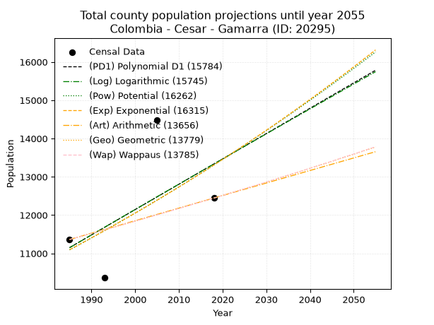
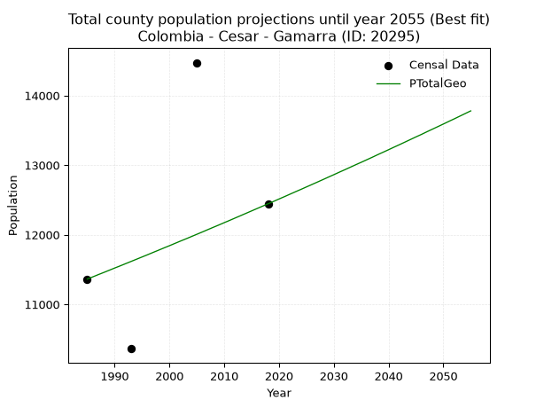
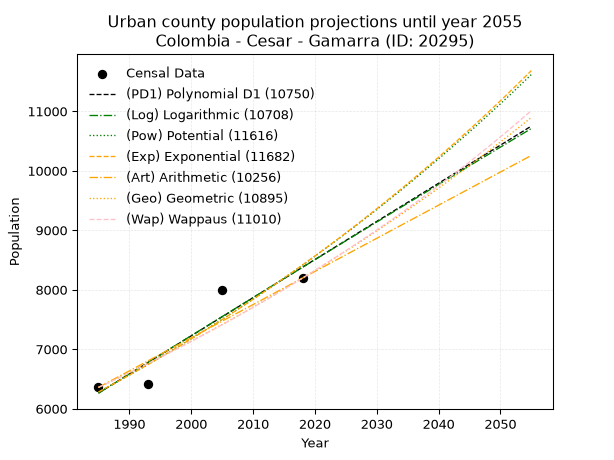
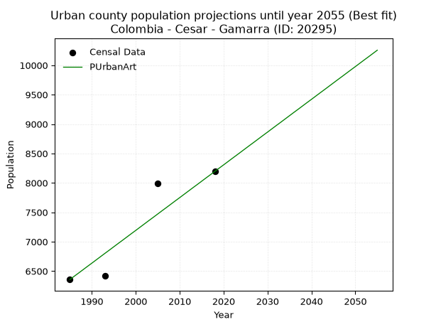
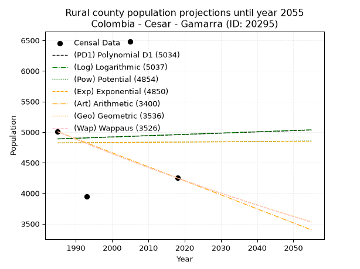
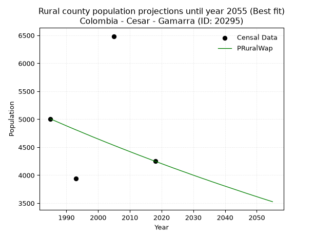

<div align="center">


</div>

# _“Population and Public Services Demand Projections (PPSD) until Year 2050 for Colombia - Cesar - Gamarra (ID: 20295)”_
Keywords: `population` `public-service` `projection` `lineal` `polynomial` `logarithmic` `potential` `exponential` `arithmetic` `geometric` `wappaus` `dane` `colombia` `south-america`

PPSD are analytical estimates used by governments and planners to anticipate future changes in population size, age distribution, and the resulting community needs for utilities, healthcare, education, and infrastructure as sizing future water treatment facilities, electrical grids, and road networks based on spatial growth.

> **General running parameters**: • app_version: _v20260806_. • Python version: _3.14.7_. • Pandas version: _3.0.5_. • NumPy version: _2.5.1_. • Creates, save and include plots into reports (create_plot): _True_. • Projection until year: _2050_. • Process polynomial degree 2 and up: _False_. • Process Wappaus: _True_. • Process Wappaus: _True_. • Set negative values to zero: _True_. • Set infinite values to zero: _True_. • Drop dataset notes: _True_. 
<div align="center">

Dynamic map: [:earth_americas:Google](http://maps.google.com/maps?q=8.324793356,-73.7375575) [:earth_americas:OSM](https://www.openstreetmap.org/#map=18/8.324793356/-73.7375575&layers=P) [:earth_americas:Bing](https://www.bing.com/maps?cp=8.324793356~-73.7375575&lvl=18) [:earth_americas:Apple](https://maps.apple.com/frame?center=8.324793356%2C-73.7375575&span=0.003%2C0.006)

</div>


<div align="center">

```geojson
{
  "type": "Feature",
  "geometry": {
    "type": "Point", 
    "coordinates": [-73.7375575, 8.324793356]
  }, 
  "properties": {
    "Name": "Colombia - Cesar - Gamarra (ID: 20295)"
  }
}
```

</div>


## 0. Census Data (4 records)

Census data are official statistics collected by a government about the people and housing in a country. They usually include counts of total population, age, sex, race, income, education, and jobs.

📅Global census file: [Population.xlsx](../data/Population.xlsx)

| Source   |   Year |   CountryID | CountryName   |   StateID | StateName   |   CountyID | CountyName   |   PTotal |   PUrban |   PRural |
|:---------|-------:|------------:|:--------------|----------:|:------------|-----------:|:-------------|---------:|---------:|---------:|
| DANE     |   1985 |          57 | Colombia      |        20 | Cesar       |      20295 | Gamarra      |    11363 |     6357 |     5006 |
| DANE     |   1993 |          57 | Colombia      |        20 | Cesar       |      20295 | Gamarra      |    10362 |     6419 |     3943 |
| DANE     |   2005 |          57 | Colombia      |        20 | Cesar       |      20295 | Gamarra      |    14472 |     7988 |     6484 |
| DANE     |   2018 |          57 | Colombia      |        20 | Cesar       |      20295 | Gamarra      |    12444 |     8195 |     4249 |

> 🔥Some records has specific notes about the registered values or the corresponding urban or rural distribution.

## 1. Total

### 1.1. Coefficients and Parameters

* (PD1) Polynomial Deg 1: 66.17864311521576, -120213.58089121032 (lineal)
* (Log) Logarithmic: 132668.73970679365, -996255.9036518969
* (Pow) Potential: 11.040297951159731, -32.36325451393724
* (Exp) Exponential: 0.005508516781536065, 0.19786606854155106
* (Art) Arithmetic: Year diff. 2018 - 1985 = 33, Population diff. 12444 - 11363 = 1081, Annual growth = 32.75757575757576
* (Geo) Geometric: Year diff. 2018 - 1985 = 33, Population diff. 12444 - 11363 = 1081, Annual growth % = 0.0027576169499774483
* (Wap) Wappaus: i = 0.27519280680115726, Condition values only valid for < 200)

<sub>
Wappaus condition values: ['0.00', '0.28', '0.55', '0.83', '1.10', '1.38', '1.65', '1.93', '2.20', '2.48', '2.75', '3.03', '3.30', '3.58', '3.85', '4.13', '4.40', '4.68', '4.95', '5.23', '5.50', '5.78', '6.05', '6.33', '6.60', '6.88', '7.16', '7.43', '7.71', '7.98', '8.26', '8.53', '8.81', '9.08', '9.36', '9.63', '9.91', '10.18', '10.46', '10.73', '11.01', '11.28', '11.56', '11.83', '12.11', '12.38', '12.66', '12.93', '13.21', '13.48', '13.76', '14.03', '14.31', '14.59', '14.86', '15.14', '15.41', '15.69', '15.96', '16.24', '16.51', '16.79', '17.06', '17.34', '17.61', '17.89']
</sub>


### 1.2. Projected Dataset

|   Year |   CountyID |   PTotalPD1 |   PTotalLog |   PTotalPow |   PTotalExp |   PTotalArt |   PTotalGeo |   PTotalWap |
|-------:|-----------:|------------:|------------:|------------:|------------:|------------:|------------:|------------:|
|   1985 |      20295 |       11151 |       11147 |       11092 |       11095 |       11363 |       11363 |       11363 |
|   1986 |      20295 |       11217 |       11214 |       11154 |       11156 |       11396 |       11394 |       11394 |
|   1987 |      20295 |       11283 |       11281 |       11216 |       11218 |       11429 |       11426 |       11426 |
|   1988 |      20295 |       11350 |       11348 |       11278 |       11280 |       11461 |       11457 |       11457 |
|   1989 |      20295 |       11416 |       11415 |       11341 |       11342 |       11494 |       11489 |       11489 |
|   1990 |      20295 |       11482 |       11481 |       11404 |       11405 |       11527 |       11521 |       11520 |
|   1991 |      20295 |       11548 |       11548 |       11468 |       11468 |       11560 |       11552 |       11552 |
|   1992 |      20295 |       11614 |       11615 |       11531 |       11531 |       11592 |       11584 |       11584 |
|   1993 |      20295 |       11680 |       11681 |       11595 |       11595 |       11625 |       11616 |       11616 |
|   1994 |      20295 |       11747 |       11748 |       11660 |       11659 |       11658 |       11648 |       11648 |
|   1995 |      20295 |       11813 |       11814 |       11725 |       11723 |       11691 |       11680 |       11680 |
|   1996 |      20295 |       11879 |       11881 |       11790 |       11788 |       11723 |       11712 |       11712 |
|   1997 |      20295 |       11945 |       11947 |       11855 |       11853 |       11756 |       11745 |       11745 |
|   1998 |      20295 |       12011 |       12014 |       11921 |       11919 |       11789 |       11777 |       11777 |
|   1999 |      20295 |       12078 |       12080 |       11987 |       11984 |       11822 |       11810 |       11809 |
|   2000 |      20295 |       12144 |       12146 |       12053 |       12051 |       11854 |       11842 |       11842 |
|   2001 |      20295 |       12210 |       12213 |       12120 |       12117 |       11887 |       11875 |       11875 |
|   2002 |      20295 |       12276 |       12279 |       12187 |       12184 |       11920 |       11908 |       11907 |
|   2003 |      20295 |       12342 |       12345 |       12254 |       12251 |       11953 |       11940 |       11940 |
|   2004 |      20295 |       12408 |       12411 |       12322 |       12319 |       11985 |       11973 |       11973 |
|   2005 |      20295 |       12475 |       12478 |       12390 |       12387 |       12018 |       12006 |       12006 |
|   2006 |      20295 |       12541 |       12544 |       12458 |       12456 |       12051 |       12039 |       12039 |
|   2007 |      20295 |       12607 |       12610 |       12527 |       12524 |       12084 |       12073 |       12072 |
|   2008 |      20295 |       12673 |       12676 |       12596 |       12594 |       12116 |       12106 |       12106 |
|   2009 |      20295 |       12739 |       12742 |       12666 |       12663 |       12149 |       12139 |       12139 |
|   2010 |      20295 |       12805 |       12808 |       12735 |       12733 |       12182 |       12173 |       12173 |
|   2011 |      20295 |       12872 |       12874 |       12806 |       12803 |       12215 |       12206 |       12206 |
|   2012 |      20295 |       12938 |       12940 |       12876 |       12874 |       12247 |       12240 |       12240 |
|   2013 |      20295 |       13004 |       13006 |       12947 |       12945 |       12280 |       12274 |       12274 |
|   2014 |      20295 |       13070 |       13072 |       13018 |       13017 |       12313 |       12308 |       12308 |
|   2015 |      20295 |       13136 |       13138 |       13090 |       13089 |       12346 |       12342 |       12341 |
|   2016 |      20295 |       13203 |       13203 |       13162 |       13161 |       12378 |       12376 |       12376 |
|   2017 |      20295 |       13269 |       13269 |       13234 |       13234 |       12411 |       12410 |       12410 |
|   2018 |      20295 |       13335 |       13335 |       13306 |       13307 |       12444 |       12444 |       12444 |
|   2019 |      20295 |       13401 |       13401 |       13379 |       13380 |       12477 |       12478 |       12478 |
|   2020 |      20295 |       13467 |       13466 |       13453 |       13454 |       12510 |       12513 |       12513 |
|   2021 |      20295 |       13533 |       13532 |       13526 |       13528 |       12542 |       12547 |       12547 |
|   2022 |      20295 |       13600 |       13598 |       13600 |       13603 |       12575 |       12582 |       12582 |
|   2023 |      20295 |       13666 |       13663 |       13675 |       13678 |       12608 |       12617 |       12617 |
|   2024 |      20295 |       13732 |       13729 |       13750 |       13754 |       12641 |       12651 |       12652 |
|   2025 |      20295 |       13798 |       13794 |       13825 |       13830 |       12673 |       12686 |       12687 |
|   2026 |      20295 |       13864 |       13860 |       13900 |       13906 |       12706 |       12721 |       12722 |
|   2027 |      20295 |       13931 |       13925 |       13976 |       13983 |       12739 |       12756 |       12757 |
|   2028 |      20295 |       13997 |       13991 |       14053 |       14060 |       12772 |       12791 |       12792 |
|   2029 |      20295 |       14063 |       14056 |       14129 |       14138 |       12804 |       12827 |       12828 |
|   2030 |      20295 |       14129 |       14121 |       14207 |       14216 |       12837 |       12862 |       12863 |
|   2031 |      20295 |       14195 |       14187 |       14284 |       14295 |       12870 |       12898 |       12899 |
|   2032 |      20295 |       14261 |       14252 |       14362 |       14373 |       12903 |       12933 |       12934 |
|   2033 |      20295 |       14328 |       14317 |       14440 |       14453 |       12935 |       12969 |       12970 |
|   2034 |      20295 |       14394 |       14383 |       14519 |       14533 |       12968 |       13005 |       13006 |
|   2035 |      20295 |       14460 |       14448 |       14598 |       14613 |       13001 |       13040 |       13042 |
|   2036 |      20295 |       14526 |       14513 |       14677 |       14694 |       13034 |       13076 |       13078 |
|   2037 |      20295 |       14592 |       14578 |       14757 |       14775 |       13066 |       13112 |       13114 |
|   2038 |      20295 |       14658 |       14643 |       14837 |       14856 |       13099 |       13149 |       13151 |
|   2039 |      20295 |       14725 |       14708 |       14918 |       14939 |       13132 |       13185 |       13187 |
|   2040 |      20295 |       14791 |       14773 |       14999 |       15021 |       13165 |       13221 |       13224 |
|   2041 |      20295 |       14857 |       14838 |       15080 |       15104 |       13197 |       13258 |       13260 |
|   2042 |      20295 |       14923 |       14903 |       15162 |       15187 |       13230 |       13294 |       13297 |
|   2043 |      20295 |       14989 |       14968 |       15244 |       15271 |       13263 |       13331 |       13334 |
|   2044 |      20295 |       15056 |       15033 |       15326 |       15356 |       13296 |       13368 |       13371 |
|   2045 |      20295 |       15122 |       15098 |       15409 |       15441 |       13328 |       13405 |       13408 |
|   2046 |      20295 |       15188 |       15163 |       15493 |       15526 |       13361 |       13441 |       13445 |
|   2047 |      20295 |       15254 |       15228 |       15577 |       15612 |       13394 |       13479 |       13483 |
|   2048 |      20295 |       15320 |       15293 |       15661 |       15698 |       13427 |       13516 |       13520 |
|   2049 |      20295 |       15386 |       15357 |       15745 |       15785 |       13459 |       13553 |       13558 |
|   2050 |      20295 |       15453 |       15422 |       15831 |       15872 |       13492 |       13590 |       13595 |
<div align="center">

</img>

</div>


### 1.3. Best fit with absolute error and relative error (%)

Relative error puts that difference into context by dividing the absolute error by the true value, creating a unitless ratio or percentage that shows the scale of the mistake.

Absolute and relative error

|   Year | Source   |   CountryID | CountryName   |   StateID | StateName   |   CountyID_x | CountyName   |   PTotal |   PUrban |   PRural |   CountyID_y |   PTotalPD1 |   PTotalLog |   PTotalPow |   PTotalExp |   PTotalArt |   PTotalGeo |   PTotalWap |   PTotalPD1AbsError |   PTotalLogAbsError |   PTotalPowAbsError |   PTotalExpAbsError |   PTotalArtAbsError |   PTotalGeoAbsError |   PTotalWapAbsError |   PTotalPD1RelError |   PTotalLogRelError |   PTotalPowRelError |   PTotalExpRelError |   PTotalArtRelError |   PTotalGeoRelError |   PTotalWapRelError |
|-------:|:---------|------------:|:--------------|----------:|:------------|-------------:|:-------------|---------:|---------:|---------:|-------------:|------------:|------------:|------------:|------------:|------------:|------------:|------------:|--------------------:|--------------------:|--------------------:|--------------------:|--------------------:|--------------------:|--------------------:|--------------------:|--------------------:|--------------------:|--------------------:|--------------------:|--------------------:|--------------------:|
|   1985 | DANE     |          57 | Colombia      |        20 | Cesar       |        20295 | Gamarra      |    11363 |     6357 |     5006 |        20295 |       11151 |       11147 |       11092 |       11095 |       11363 |       11363 |       11363 |                 212 |                 216 |                 271 |                 268 |                   0 |                   0 |                   0 |             1.8657  |             1.90091 |             2.38493 |             2.35853 |              0      |              0      |              0      |
|   1993 | DANE     |          57 | Colombia      |        20 | Cesar       |        20295 | Gamarra      |    10362 |     6419 |     3943 |        20295 |       11680 |       11681 |       11595 |       11595 |       11625 |       11616 |       11616 |                1318 |                1319 |                1233 |                1233 |                1263 |                1254 |                1254 |            12.7196  |            12.7292  |            11.8992  |            11.8992  |             12.1888 |             12.1019 |             12.1019 |
|   2005 | DANE     |          57 | Colombia      |        20 | Cesar       |        20295 | Gamarra      |    14472 |     7988 |     6484 |        20295 |       12475 |       12478 |       12390 |       12387 |       12018 |       12006 |       12006 |                1997 |                1994 |                2082 |                2085 |                2454 |                2466 |                2466 |            13.7991  |            13.7783  |            14.3864  |            14.4071  |             16.9569 |             17.0398 |             17.0398 |
|   2018 | DANE     |          57 | Colombia      |        20 | Cesar       |        20295 | Gamarra      |    12444 |     8195 |     4249 |        20295 |       13335 |       13335 |       13306 |       13307 |       12444 |       12444 |       12444 |                 891 |                 891 |                 862 |                 863 |                   0 |                   0 |                   0 |             7.16008 |             7.16008 |             6.92703 |             6.93507 |              0      |              0      |              0      |

Relative error mean

| Method    |   RelError | Best   |
|:----------|-----------:|:-------|
| PTotalPD1 |    8.8861  |        |
| PTotalLog |    8.89213 |        |
| PTotalPow |    8.8994  |        |
| PTotalExp |    8.89999 |        |
| PTotalArt |    7.28641 |        |
| PTotalGeo |    7.28543 | True   |
| PTotalWap |    7.28543 | True   |

💙Best method: _**PTotalGeo**_
<div align="center">

</img>

</div>


### 1.4. Fresh water supply demand in liters per capita per day (lpcd)

The fresh water supply demand typically ranges from 100 to 300 liters per capita per day (lpcd) for standard domestic and municipal planning, though absolute survival minimums set by the World Health Organization are as low as 7.5 to 20 liters per day, and total consumption in high-income nations can exceed 400 liters.

> `CZ`: Level in meters above the sea level (masl).<br> `WS`: Fresh water supply demand in liters per capita per day (lpcd or l/h/d).<br> `WSAll`: Zonal fresh water supply demand in liters per second (l/s).<br> `A`: Zonal area in square meters.

Reference values (RAS Colombia)

|    CZ |   WS |
|------:|-----:|
|  1000 |  120 |
|  2000 |  130 |
| 99999 |  140 |

County shapefile geometry properties and water supply values

|   CountyID |      ATotal |   CZTotal |   WSTotal |
|-----------:|------------:|----------:|----------:|
|      20295 | 3.26427e+08 |   58.7466 |       120 |

Projected values for best method: PTotalGeo

|   CountyID |   Year |   PTotalGeo |   WSTotal |   WSTotalAll |
|-----------:|-------:|------------:|----------:|-------------:|
|      20295 |   1985 |       11363 |       120 |      15.7819 |
|      20295 |   1986 |       11394 |       120 |      15.825  |
|      20295 |   1987 |       11426 |       120 |      15.8694 |
|      20295 |   1988 |       11457 |       120 |      15.9125 |
|      20295 |   1989 |       11489 |       120 |      15.9569 |
|      20295 |   1990 |       11521 |       120 |      16.0014 |
|      20295 |   1991 |       11552 |       120 |      16.0444 |
|      20295 |   1992 |       11584 |       120 |      16.0889 |
|      20295 |   1993 |       11616 |       120 |      16.1333 |
|      20295 |   1994 |       11648 |       120 |      16.1778 |
|      20295 |   1995 |       11680 |       120 |      16.2222 |
|      20295 |   1996 |       11712 |       120 |      16.2667 |
|      20295 |   1997 |       11745 |       120 |      16.3125 |
|      20295 |   1998 |       11777 |       120 |      16.3569 |
|      20295 |   1999 |       11810 |       120 |      16.4028 |
|      20295 |   2000 |       11842 |       120 |      16.4472 |
|      20295 |   2001 |       11875 |       120 |      16.4931 |
|      20295 |   2002 |       11908 |       120 |      16.5389 |
|      20295 |   2003 |       11940 |       120 |      16.5833 |
|      20295 |   2004 |       11973 |       120 |      16.6292 |
|      20295 |   2005 |       12006 |       120 |      16.675  |
|      20295 |   2006 |       12039 |       120 |      16.7208 |
|      20295 |   2007 |       12073 |       120 |      16.7681 |
|      20295 |   2008 |       12106 |       120 |      16.8139 |
|      20295 |   2009 |       12139 |       120 |      16.8597 |
|      20295 |   2010 |       12173 |       120 |      16.9069 |
|      20295 |   2011 |       12206 |       120 |      16.9528 |
|      20295 |   2012 |       12240 |       120 |      17      |
|      20295 |   2013 |       12274 |       120 |      17.0472 |
|      20295 |   2014 |       12308 |       120 |      17.0944 |
|      20295 |   2015 |       12342 |       120 |      17.1417 |
|      20295 |   2016 |       12376 |       120 |      17.1889 |
|      20295 |   2017 |       12410 |       120 |      17.2361 |
|      20295 |   2018 |       12444 |       120 |      17.2833 |
|      20295 |   2019 |       12478 |       120 |      17.3306 |
|      20295 |   2020 |       12513 |       120 |      17.3792 |
|      20295 |   2021 |       12547 |       120 |      17.4264 |
|      20295 |   2022 |       12582 |       120 |      17.475  |
|      20295 |   2023 |       12617 |       120 |      17.5236 |
|      20295 |   2024 |       12651 |       120 |      17.5708 |
|      20295 |   2025 |       12686 |       120 |      17.6194 |
|      20295 |   2026 |       12721 |       120 |      17.6681 |
|      20295 |   2027 |       12756 |       120 |      17.7167 |
|      20295 |   2028 |       12791 |       120 |      17.7653 |
|      20295 |   2029 |       12827 |       120 |      17.8153 |
|      20295 |   2030 |       12862 |       120 |      17.8639 |
|      20295 |   2031 |       12898 |       120 |      17.9139 |
|      20295 |   2032 |       12933 |       120 |      17.9625 |
|      20295 |   2033 |       12969 |       120 |      18.0125 |
|      20295 |   2034 |       13005 |       120 |      18.0625 |
|      20295 |   2035 |       13040 |       120 |      18.1111 |
|      20295 |   2036 |       13076 |       120 |      18.1611 |
|      20295 |   2037 |       13112 |       120 |      18.2111 |
|      20295 |   2038 |       13149 |       120 |      18.2625 |
|      20295 |   2039 |       13185 |       120 |      18.3125 |
|      20295 |   2040 |       13221 |       120 |      18.3625 |
|      20295 |   2041 |       13258 |       120 |      18.4139 |
|      20295 |   2042 |       13294 |       120 |      18.4639 |
|      20295 |   2043 |       13331 |       120 |      18.5153 |
|      20295 |   2044 |       13368 |       120 |      18.5667 |
|      20295 |   2045 |       13405 |       120 |      18.6181 |
|      20295 |   2046 |       13441 |       120 |      18.6681 |
|      20295 |   2047 |       13479 |       120 |      18.7208 |
|      20295 |   2048 |       13516 |       120 |      18.7722 |
|      20295 |   2049 |       13553 |       120 |      18.8236 |
|      20295 |   2050 |       13590 |       120 |      18.875  |

## 2. Urban

### 2.1. Coefficients and Parameters

* (PD1) Polynomial Deg 1: 64.10638297872315, -120989.04255319099 (lineal)
* (Log) Logarithmic: 128351.87462273543, -968363.8775547845
* (Pow) Potential: 17.755138237751364, -54.75438117184582
* (Exp) Exponential: 0.008867735202187442, 0.00014233015345982807
* (Art) Arithmetic: Year diff. 2018 - 1985 = 33, Population diff. 8195 - 6357 = 1838, Annual growth = 55.696969696969695
* (Geo) Geometric: Year diff. 2018 - 1985 = 33, Population diff. 8195 - 6357 = 1838, Annual growth % = 0.007725679460860002
* (Wap) Wappaus: i = 0.7654888633448281, Condition values only valid for < 200)

<sub>
Wappaus condition values: ['0.00', '0.77', '1.53', '2.30', '3.06', '3.83', '4.59', '5.36', '6.12', '6.89', '7.65', '8.42', '9.19', '9.95', '10.72', '11.48', '12.25', '13.01', '13.78', '14.54', '15.31', '16.08', '16.84', '17.61', '18.37', '19.14', '19.90', '20.67', '21.43', '22.20', '22.96', '23.73', '24.50', '25.26', '26.03', '26.79', '27.56', '28.32', '29.09', '29.85', '30.62', '31.39', '32.15', '32.92', '33.68', '34.45', '35.21', '35.98', '36.74', '37.51', '38.27', '39.04', '39.81', '40.57', '41.34', '42.10', '42.87', '43.63', '44.40', '45.16', '45.93', '46.69', '47.46', '48.23', '48.99', '49.76']
</sub>


### 2.2. Projected Dataset

|   Year |   CountyID |   PUrbanPD1 |   PUrbanLog |   PUrbanPow |   PUrbanExp |   PUrbanArt |   PUrbanGeo |   PUrbanWap |
|-------:|-----------:|------------:|------------:|------------:|------------:|------------:|------------:|------------:|
|   1985 |      20295 |        6262 |        6260 |        6278 |        6280 |        6357 |        6357 |        6357 |
|   1986 |      20295 |        6326 |        6325 |        6334 |        6336 |        6413 |        6406 |        6406 |
|   1987 |      20295 |        6390 |        6389 |        6391 |        6392 |        6468 |        6456 |        6455 |
|   1988 |      20295 |        6454 |        6454 |        6448 |        6449 |        6524 |        6505 |        6505 |
|   1989 |      20295 |        6519 |        6518 |        6506 |        6507 |        6580 |        6556 |        6555 |
|   1990 |      20295 |        6583 |        6583 |        6565 |        6565 |        6635 |        6606 |        6605 |
|   1991 |      20295 |        6647 |        6647 |        6623 |        6623 |        6691 |        6657 |        6656 |
|   1992 |      20295 |        6711 |        6712 |        6683 |        6682 |        6747 |        6709 |        6707 |
|   1993 |      20295 |        6775 |        6776 |        6743 |        6741 |        6803 |        6761 |        6759 |
|   1994 |      20295 |        6839 |        6841 |        6803 |        6802 |        6858 |        6813 |        6811 |
|   1995 |      20295 |        6903 |        6905 |        6864 |        6862 |        6914 |        6866 |        6863 |
|   1996 |      20295 |        6967 |        6969 |        6925 |        6923 |        6970 |        6919 |        6916 |
|   1997 |      20295 |        7031 |        7034 |        6987 |        6985 |        7025 |        6972 |        6969 |
|   1998 |      20295 |        7096 |        7098 |        7049 |        7047 |        7081 |        7026 |        7023 |
|   1999 |      20295 |        7160 |        7162 |        7112 |        7110 |        7137 |        7080 |        7077 |
|   2000 |      20295 |        7224 |        7226 |        7176 |        7173 |        7192 |        7135 |        7131 |
|   2001 |      20295 |        7288 |        7290 |        7240 |        7237 |        7248 |        7190 |        7186 |
|   2002 |      20295 |        7352 |        7354 |        7304 |        7302 |        7304 |        7246 |        7242 |
|   2003 |      20295 |        7416 |        7419 |        7369 |        7367 |        7360 |        7302 |        7298 |
|   2004 |      20295 |        7480 |        7483 |        7435 |        7432 |        7415 |        7358 |        7354 |
|   2005 |      20295 |        7544 |        7547 |        7501 |        7498 |        7471 |        7415 |        7411 |
|   2006 |      20295 |        7608 |        7611 |        7568 |        7565 |        7527 |        7472 |        7468 |
|   2007 |      20295 |        7672 |        7675 |        7635 |        7633 |        7582 |        7530 |        7526 |
|   2008 |      20295 |        7737 |        7739 |        7703 |        7701 |        7638 |        7588 |        7584 |
|   2009 |      20295 |        7801 |        7802 |        7771 |        7769 |        7694 |        7647 |        7643 |
|   2010 |      20295 |        7865 |        7866 |        7840 |        7838 |        7749 |        7706 |        7702 |
|   2011 |      20295 |        7929 |        7930 |        7910 |        7908 |        7805 |        7765 |        7762 |
|   2012 |      20295 |        7993 |        7994 |        7980 |        7979 |        7861 |        7825 |        7822 |
|   2013 |      20295 |        8057 |        8058 |        8050 |        8050 |        7917 |        7886 |        7883 |
|   2014 |      20295 |        8121 |        8122 |        8122 |        8121 |        7972 |        7947 |        7944 |
|   2015 |      20295 |        8185 |        8185 |        8194 |        8194 |        8028 |        8008 |        8006 |
|   2016 |      20295 |        8249 |        8249 |        8266 |        8267 |        8084 |        8070 |        8069 |
|   2017 |      20295 |        8314 |        8313 |        8339 |        8340 |        8139 |        8132 |        8132 |
|   2018 |      20295 |        8378 |        8376 |        8413 |        8415 |        8195 |        8195 |        8195 |
|   2019 |      20295 |        8442 |        8440 |        8487 |        8490 |        8251 |        8258 |        8259 |
|   2020 |      20295 |        8506 |        8503 |        8562 |        8565 |        8306 |        8322 |        8324 |
|   2021 |      20295 |        8570 |        8567 |        8638 |        8642 |        8362 |        8386 |        8389 |
|   2022 |      20295 |        8634 |        8630 |        8714 |        8718 |        8418 |        8451 |        8455 |
|   2023 |      20295 |        8698 |        8694 |        8791 |        8796 |        8473 |        8516 |        8521 |
|   2024 |      20295 |        8762 |        8757 |        8868 |        8874 |        8529 |        8582 |        8588 |
|   2025 |      20295 |        8826 |        8821 |        8946 |        8954 |        8585 |        8649 |        8655 |
|   2026 |      20295 |        8890 |        8884 |        9025 |        9033 |        8641 |        8715 |        8724 |
|   2027 |      20295 |        8955 |        8947 |        9105 |        9114 |        8696 |        8783 |        8792 |
|   2028 |      20295 |        9019 |        9011 |        9185 |        9195 |        8752 |        8851 |        8862 |
|   2029 |      20295 |        9083 |        9074 |        9265 |        9277 |        8808 |        8919 |        8932 |
|   2030 |      20295 |        9147 |        9137 |        9347 |        9359 |        8863 |        8988 |        9002 |
|   2031 |      20295 |        9211 |        9200 |        9429 |        9443 |        8919 |        9057 |        9074 |
|   2032 |      20295 |        9275 |        9264 |        9512 |        9527 |        8975 |        9127 |        9146 |
|   2033 |      20295 |        9339 |        9327 |        9595 |        9612 |        9030 |        9198 |        9218 |
|   2034 |      20295 |        9403 |        9390 |        9679 |        9697 |        9086 |        9269 |        9292 |
|   2035 |      20295 |        9467 |        9453 |        9764 |        9784 |        9142 |        9340 |        9366 |
|   2036 |      20295 |        9532 |        9516 |        9850 |        9871 |        9198 |        9413 |        9441 |
|   2037 |      20295 |        9596 |        9579 |        9936 |        9959 |        9253 |        9485 |        9516 |
|   2038 |      20295 |        9660 |        9642 |       10023 |       10048 |        9309 |        9559 |        9592 |
|   2039 |      20295 |        9724 |        9705 |       10111 |       10137 |        9365 |        9632 |        9669 |
|   2040 |      20295 |        9788 |        9768 |       10199 |       10227 |        9420 |        9707 |        9747 |
|   2041 |      20295 |        9852 |        9831 |       10288 |       10318 |        9476 |        9782 |        9826 |
|   2042 |      20295 |        9916 |        9894 |       10378 |       10410 |        9532 |        9857 |        9905 |
|   2043 |      20295 |        9980 |        9957 |       10469 |       10503 |        9587 |        9934 |        9985 |
|   2044 |      20295 |       10044 |       10019 |       10560 |       10597 |        9643 |       10010 |       10066 |
|   2045 |      20295 |       10109 |       10082 |       10652 |       10691 |        9699 |       10088 |       10147 |
|   2046 |      20295 |       10173 |       10145 |       10745 |       10786 |        9755 |       10166 |       10230 |
|   2047 |      20295 |       10237 |       10208 |       10839 |       10882 |        9810 |       10244 |       10313 |
|   2048 |      20295 |       10301 |       10270 |       10933 |       10979 |        9866 |       10323 |       10397 |
|   2049 |      20295 |       10365 |       10333 |       11028 |       11077 |        9922 |       10403 |       10482 |
|   2050 |      20295 |       10429 |       10396 |       11124 |       11176 |        9977 |       10483 |       10568 |
<div align="center">

</img>

</div>


### 2.3. Best fit with absolute error and relative error (%)

Relative error puts that difference into context by dividing the absolute error by the true value, creating a unitless ratio or percentage that shows the scale of the mistake.

Absolute and relative error

|   Year | Source   |   CountryID | CountryName   |   StateID | StateName   |   CountyID_x | CountyName   |   PTotal |   PUrban |   PRural |   CountyID_y |   PUrbanPD1 |   PUrbanLog |   PUrbanPow |   PUrbanExp |   PUrbanArt |   PUrbanGeo |   PUrbanWap |   PUrbanPD1AbsError |   PUrbanLogAbsError |   PUrbanPowAbsError |   PUrbanExpAbsError |   PUrbanArtAbsError |   PUrbanGeoAbsError |   PUrbanWapAbsError |   PUrbanPD1RelError |   PUrbanLogRelError |   PUrbanPowRelError |   PUrbanExpRelError |   PUrbanArtRelError |   PUrbanGeoRelError |   PUrbanWapRelError |
|-------:|:---------|------------:|:--------------|----------:|:------------|-------------:|:-------------|---------:|---------:|---------:|-------------:|------------:|------------:|------------:|------------:|------------:|------------:|------------:|--------------------:|--------------------:|--------------------:|--------------------:|--------------------:|--------------------:|--------------------:|--------------------:|--------------------:|--------------------:|--------------------:|--------------------:|--------------------:|--------------------:|
|   1985 | DANE     |          57 | Colombia      |        20 | Cesar       |        20295 | Gamarra      |    11363 |     6357 |     5006 |        20295 |        6262 |        6260 |        6278 |        6280 |        6357 |        6357 |        6357 |                  95 |                  97 |                  79 |                  77 |                   0 |                   0 |                   0 |             1.49442 |             1.52588 |             1.24272 |             1.21126 |             0       |             0       |             0       |
|   1993 | DANE     |          57 | Colombia      |        20 | Cesar       |        20295 | Gamarra      |    10362 |     6419 |     3943 |        20295 |        6775 |        6776 |        6743 |        6741 |        6803 |        6761 |        6759 |                 356 |                 357 |                 324 |                 322 |                 384 |                 342 |                 340 |             5.54604 |             5.56161 |             5.04752 |             5.01636 |             5.98224 |             5.32793 |             5.29678 |
|   2005 | DANE     |          57 | Colombia      |        20 | Cesar       |        20295 | Gamarra      |    14472 |     7988 |     6484 |        20295 |        7544 |        7547 |        7501 |        7498 |        7471 |        7415 |        7411 |                 444 |                 441 |                 487 |                 490 |                 517 |                 573 |                 577 |             5.55834 |             5.52078 |             6.09664 |             6.1342  |             6.47221 |             7.17326 |             7.22334 |
|   2018 | DANE     |          57 | Colombia      |        20 | Cesar       |        20295 | Gamarra      |    12444 |     8195 |     4249 |        20295 |        8378 |        8376 |        8413 |        8415 |        8195 |        8195 |        8195 |                 183 |                 181 |                 218 |                 220 |                   0 |                   0 |                   0 |             2.23307 |             2.20866 |             2.66016 |             2.68456 |             0       |             0       |             0       |

Relative error mean

| Method    |   RelError | Best   |
|:----------|-----------:|:-------|
| PUrbanPD1 |    3.70796 |        |
| PUrbanLog |    3.70423 |        |
| PUrbanPow |    3.76176 |        |
| PUrbanExp |    3.7616  |        |
| PUrbanArt |    3.11361 | True   |
| PUrbanGeo |    3.1253  |        |
| PUrbanWap |    3.13003 |        |

💙Best method: _**PUrbanArt**_
<div align="center">

</img>

</div>


### 2.4. Fresh water supply demand in liters per capita per day (lpcd)

The fresh water supply demand typically ranges from 100 to 300 liters per capita per day (lpcd) for standard domestic and municipal planning, though absolute survival minimums set by the World Health Organization are as low as 7.5 to 20 liters per day, and total consumption in high-income nations can exceed 400 liters.

> `CZ`: Level in meters above the sea level (masl).<br> `WS`: Fresh water supply demand in liters per capita per day (lpcd or l/h/d).<br> `WSAll`: Zonal fresh water supply demand in liters per second (l/s).<br> `A`: Zonal area in square meters.

Reference values (RAS Colombia)

|    CZ |   WS |
|------:|-----:|
|  1000 |  120 |
|  2000 |  130 |
| 99999 |  140 |

County shapefile geometry properties and water supply values

|   CountyID |      AUrban |   CZUrban |   WSUrban |
|-----------:|------------:|----------:|----------:|
|      20295 | 1.86574e+06 |   45.6967 |       120 |

Projected values for best method: PUrbanArt

|   CountyID |   Year |   PUrbanArt |   WSUrban |   WSUrbanAll |
|-----------:|-------:|------------:|----------:|-------------:|
|      20295 |   1985 |        6357 |       120 |      8.82917 |
|      20295 |   1986 |        6413 |       120 |      8.90694 |
|      20295 |   1987 |        6468 |       120 |      8.98333 |
|      20295 |   1988 |        6524 |       120 |      9.06111 |
|      20295 |   1989 |        6580 |       120 |      9.13889 |
|      20295 |   1990 |        6635 |       120 |      9.21528 |
|      20295 |   1991 |        6691 |       120 |      9.29306 |
|      20295 |   1992 |        6747 |       120 |      9.37083 |
|      20295 |   1993 |        6803 |       120 |      9.44861 |
|      20295 |   1994 |        6858 |       120 |      9.525   |
|      20295 |   1995 |        6914 |       120 |      9.60278 |
|      20295 |   1996 |        6970 |       120 |      9.68056 |
|      20295 |   1997 |        7025 |       120 |      9.75694 |
|      20295 |   1998 |        7081 |       120 |      9.83472 |
|      20295 |   1999 |        7137 |       120 |      9.9125  |
|      20295 |   2000 |        7192 |       120 |      9.98889 |
|      20295 |   2001 |        7248 |       120 |     10.0667  |
|      20295 |   2002 |        7304 |       120 |     10.1444  |
|      20295 |   2003 |        7360 |       120 |     10.2222  |
|      20295 |   2004 |        7415 |       120 |     10.2986  |
|      20295 |   2005 |        7471 |       120 |     10.3764  |
|      20295 |   2006 |        7527 |       120 |     10.4542  |
|      20295 |   2007 |        7582 |       120 |     10.5306  |
|      20295 |   2008 |        7638 |       120 |     10.6083  |
|      20295 |   2009 |        7694 |       120 |     10.6861  |
|      20295 |   2010 |        7749 |       120 |     10.7625  |
|      20295 |   2011 |        7805 |       120 |     10.8403  |
|      20295 |   2012 |        7861 |       120 |     10.9181  |
|      20295 |   2013 |        7917 |       120 |     10.9958  |
|      20295 |   2014 |        7972 |       120 |     11.0722  |
|      20295 |   2015 |        8028 |       120 |     11.15    |
|      20295 |   2016 |        8084 |       120 |     11.2278  |
|      20295 |   2017 |        8139 |       120 |     11.3042  |
|      20295 |   2018 |        8195 |       120 |     11.3819  |
|      20295 |   2019 |        8251 |       120 |     11.4597  |
|      20295 |   2020 |        8306 |       120 |     11.5361  |
|      20295 |   2021 |        8362 |       120 |     11.6139  |
|      20295 |   2022 |        8418 |       120 |     11.6917  |
|      20295 |   2023 |        8473 |       120 |     11.7681  |
|      20295 |   2024 |        8529 |       120 |     11.8458  |
|      20295 |   2025 |        8585 |       120 |     11.9236  |
|      20295 |   2026 |        8641 |       120 |     12.0014  |
|      20295 |   2027 |        8696 |       120 |     12.0778  |
|      20295 |   2028 |        8752 |       120 |     12.1556  |
|      20295 |   2029 |        8808 |       120 |     12.2333  |
|      20295 |   2030 |        8863 |       120 |     12.3097  |
|      20295 |   2031 |        8919 |       120 |     12.3875  |
|      20295 |   2032 |        8975 |       120 |     12.4653  |
|      20295 |   2033 |        9030 |       120 |     12.5417  |
|      20295 |   2034 |        9086 |       120 |     12.6194  |
|      20295 |   2035 |        9142 |       120 |     12.6972  |
|      20295 |   2036 |        9198 |       120 |     12.775   |
|      20295 |   2037 |        9253 |       120 |     12.8514  |
|      20295 |   2038 |        9309 |       120 |     12.9292  |
|      20295 |   2039 |        9365 |       120 |     13.0069  |
|      20295 |   2040 |        9420 |       120 |     13.0833  |
|      20295 |   2041 |        9476 |       120 |     13.1611  |
|      20295 |   2042 |        9532 |       120 |     13.2389  |
|      20295 |   2043 |        9587 |       120 |     13.3153  |
|      20295 |   2044 |        9643 |       120 |     13.3931  |
|      20295 |   2045 |        9699 |       120 |     13.4708  |
|      20295 |   2046 |        9755 |       120 |     13.5486  |
|      20295 |   2047 |        9810 |       120 |     13.625   |
|      20295 |   2048 |        9866 |       120 |     13.7028  |
|      20295 |   2049 |        9922 |       120 |     13.7806  |
|      20295 |   2050 |        9977 |       120 |     13.8569  |

## 3. Rural

### 3.1. Coefficients and Parameters

* (PD1) Polynomial Deg 1: 2.072260136492591, 775.4616619806945 (lineal)
* (Log) Logarithmic: 4316.865084058404, -27892.02609711367
* (Pow) Potential: 0.18693475713958468, 3.0667760299832167
* (Exp) Exponential: 7.899311459728126e-05, 4123.259951098434
* (Art) Arithmetic: Year diff. 2018 - 1985 = 33, Population diff. 4249 - 5006 = -757, Annual growth = -22.939393939393938
* (Geo) Geometric: Year diff. 2018 - 1985 = 33, Population diff. 4249 - 5006 = -757, Annual growth % = -0.004955967311822795
* (Wap) Wappaus: i = -0.4957189398032186, Condition values only valid for < 200)

<sub>
Wappaus condition values: ['-0.00', '-0.50', '-0.99', '-1.49', '-1.98', '-2.48', '-2.97', '-3.47', '-3.97', '-4.46', '-4.96', '-5.45', '-5.95', '-6.44', '-6.94', '-7.44', '-7.93', '-8.43', '-8.92', '-9.42', '-9.91', '-10.41', '-10.91', '-11.40', '-11.90', '-12.39', '-12.89', '-13.38', '-13.88', '-14.38', '-14.87', '-15.37', '-15.86', '-16.36', '-16.85', '-17.35', '-17.85', '-18.34', '-18.84', '-19.33', '-19.83', '-20.32', '-20.82', '-21.32', '-21.81', '-22.31', '-22.80', '-23.30', '-23.79', '-24.29', '-24.79', '-25.28', '-25.78', '-26.27', '-26.77', '-27.26', '-27.76', '-28.26', '-28.75', '-29.25', '-29.74', '-30.24', '-30.73', '-31.23', '-31.73', '-32.22']
</sub>


### 3.2. Projected Dataset

|   Year |   CountyID |   PRuralPD1 |   PRuralLog |   PRuralPow |   PRuralExp |   PRuralArt |   PRuralGeo |   PRuralWap |
|-------:|-----------:|------------:|------------:|------------:|------------:|------------:|------------:|------------:|
|   1985 |      20295 |        4889 |        4888 |        4822 |        4823 |        5006 |        5006 |        5006 |
|   1986 |      20295 |        4891 |        4890 |        4823 |        4824 |        4983 |        4981 |        4981 |
|   1987 |      20295 |        4893 |        4892 |        4823 |        4824 |        4960 |        4957 |        4957 |
|   1988 |      20295 |        4895 |        4894 |        4824 |        4824 |        4937 |        4932 |        4932 |
|   1989 |      20295 |        4897 |        4896 |        4824 |        4825 |        4914 |        4907 |        4908 |
|   1990 |      20295 |        4899 |        4898 |        4824 |        4825 |        4891 |        4883 |        4883 |
|   1991 |      20295 |        4901 |        4901 |        4825 |        4826 |        4868 |        4859 |        4859 |
|   1992 |      20295 |        4903 |        4903 |        4825 |        4826 |        4845 |        4835 |        4835 |
|   1993 |      20295 |        4905 |        4905 |        4826 |        4826 |        4822 |        4811 |        4811 |
|   1994 |      20295 |        4908 |        4907 |        4826 |        4827 |        4800 |        4787 |        4788 |
|   1995 |      20295 |        4910 |        4909 |        4827 |        4827 |        4777 |        4763 |        4764 |
|   1996 |      20295 |        4912 |        4911 |        4827 |        4827 |        4754 |        4740 |        4740 |
|   1997 |      20295 |        4914 |        4914 |        4828 |        4828 |        4731 |        4716 |        4717 |
|   1998 |      20295 |        4916 |        4916 |        4828 |        4828 |        4708 |        4693 |        4693 |
|   1999 |      20295 |        4918 |        4918 |        4829 |        4829 |        4685 |        4670 |        4670 |
|   2000 |      20295 |        4920 |        4920 |        4829 |        4829 |        4662 |        4646 |        4647 |
|   2001 |      20295 |        4922 |        4922 |        4829 |        4829 |        4639 |        4623 |        4624 |
|   2002 |      20295 |        4924 |        4924 |        4830 |        4830 |        4616 |        4601 |        4601 |
|   2003 |      20295 |        4926 |        4927 |        4830 |        4830 |        4593 |        4578 |        4578 |
|   2004 |      20295 |        4928 |        4929 |        4831 |        4830 |        4570 |        4555 |        4556 |
|   2005 |      20295 |        4930 |        4931 |        4831 |        4831 |        4547 |        4532 |        4533 |
|   2006 |      20295 |        4932 |        4933 |        4832 |        4831 |        4524 |        4510 |        4511 |
|   2007 |      20295 |        4934 |        4935 |        4832 |        4832 |        4501 |        4488 |        4488 |
|   2008 |      20295 |        4937 |        4937 |        4833 |        4832 |        4478 |        4465 |        4466 |
|   2009 |      20295 |        4939 |        4939 |        4833 |        4832 |        4455 |        4443 |        4444 |
|   2010 |      20295 |        4941 |        4942 |        4833 |        4833 |        4433 |        4421 |        4422 |
|   2011 |      20295 |        4943 |        4944 |        4834 |        4833 |        4410 |        4399 |        4400 |
|   2012 |      20295 |        4945 |        4946 |        4834 |        4834 |        4387 |        4378 |        4378 |
|   2013 |      20295 |        4947 |        4948 |        4835 |        4834 |        4364 |        4356 |        4356 |
|   2014 |      20295 |        4949 |        4950 |        4835 |        4834 |        4341 |        4334 |        4335 |
|   2015 |      20295 |        4951 |        4952 |        4836 |        4835 |        4318 |        4313 |        4313 |
|   2016 |      20295 |        4953 |        4954 |        4836 |        4835 |        4295 |        4291 |        4292 |
|   2017 |      20295 |        4955 |        4957 |        4837 |        4835 |        4272 |        4270 |        4270 |
|   2018 |      20295 |        4957 |        4959 |        4837 |        4836 |        4249 |        4249 |        4249 |
|   2019 |      20295 |        4959 |        4961 |        4837 |        4836 |        4226 |        4228 |        4228 |
|   2020 |      20295 |        4961 |        4963 |        4838 |        4837 |        4203 |        4207 |        4207 |
|   2021 |      20295 |        4963 |        4965 |        4838 |        4837 |        4180 |        4186 |        4186 |
|   2022 |      20295 |        4966 |        4967 |        4839 |        4837 |        4157 |        4165 |        4165 |
|   2023 |      20295 |        4968 |        4969 |        4839 |        4838 |        4134 |        4145 |        4144 |
|   2024 |      20295 |        4970 |        4972 |        4840 |        4838 |        4111 |        4124 |        4123 |
|   2025 |      20295 |        4972 |        4974 |        4840 |        4839 |        4088 |        4104 |        4103 |
|   2026 |      20295 |        4974 |        4976 |        4841 |        4839 |        4065 |        4083 |        4082 |
|   2027 |      20295 |        4976 |        4978 |        4841 |        4839 |        4043 |        4063 |        4062 |
|   2028 |      20295 |        4978 |        4980 |        4842 |        4840 |        4020 |        4043 |        4042 |
|   2029 |      20295 |        4980 |        4982 |        4842 |        4840 |        3997 |        4023 |        4021 |
|   2030 |      20295 |        4982 |        4984 |        4842 |        4840 |        3974 |        4003 |        4001 |
|   2031 |      20295 |        4984 |        4986 |        4843 |        4841 |        3951 |        3983 |        3981 |
|   2032 |      20295 |        4986 |        4989 |        4843 |        4841 |        3928 |        3964 |        3961 |
|   2033 |      20295 |        4988 |        4991 |        4844 |        4842 |        3905 |        3944 |        3941 |
|   2034 |      20295 |        4990 |        4993 |        4844 |        4842 |        3882 |        3924 |        3922 |
|   2035 |      20295 |        4993 |        4995 |        4845 |        4842 |        3859 |        3905 |        3902 |
|   2036 |      20295 |        4995 |        4997 |        4845 |        4843 |        3836 |        3886 |        3882 |
|   2037 |      20295 |        4997 |        4999 |        4846 |        4843 |        3813 |        3866 |        3863 |
|   2038 |      20295 |        4999 |        5001 |        4846 |        4843 |        3790 |        3847 |        3843 |
|   2039 |      20295 |        5001 |        5003 |        4846 |        4844 |        3767 |        3828 |        3824 |
|   2040 |      20295 |        5003 |        5006 |        4847 |        4844 |        3744 |        3809 |        3805 |
|   2041 |      20295 |        5005 |        5008 |        4847 |        4845 |        3721 |        3790 |        3786 |
|   2042 |      20295 |        5007 |        5010 |        4848 |        4845 |        3698 |        3771 |        3767 |
|   2043 |      20295 |        5009 |        5012 |        4848 |        4845 |        3676 |        3753 |        3748 |
|   2044 |      20295 |        5011 |        5014 |        4849 |        4846 |        3653 |        3734 |        3729 |
|   2045 |      20295 |        5013 |        5016 |        4849 |        4846 |        3630 |        3716 |        3710 |
|   2046 |      20295 |        5015 |        5018 |        4850 |        4847 |        3607 |        3697 |        3691 |
|   2047 |      20295 |        5017 |        5020 |        4850 |        4847 |        3584 |        3679 |        3672 |
|   2048 |      20295 |        5019 |        5022 |        4850 |        4847 |        3561 |        3661 |        3654 |
|   2049 |      20295 |        5022 |        5025 |        4851 |        4848 |        3538 |        3642 |        3635 |
|   2050 |      20295 |        5024 |        5027 |        4851 |        4848 |        3515 |        3624 |        3617 |
<div align="center">

</img>

</div>


### 3.3. Best fit with absolute error and relative error (%)

Relative error puts that difference into context by dividing the absolute error by the true value, creating a unitless ratio or percentage that shows the scale of the mistake.

Absolute and relative error

|   Year | Source   |   CountryID | CountryName   |   StateID | StateName   |   CountyID_x | CountyName   |   PTotal |   PUrban |   PRural |   CountyID_y |   PRuralPD1 |   PRuralLog |   PRuralPow |   PRuralExp |   PRuralArt |   PRuralGeo |   PRuralWap |   PRuralPD1AbsError |   PRuralLogAbsError |   PRuralPowAbsError |   PRuralExpAbsError |   PRuralArtAbsError |   PRuralGeoAbsError |   PRuralWapAbsError |   PRuralPD1RelError |   PRuralLogRelError |   PRuralPowRelError |   PRuralExpRelError |   PRuralArtRelError |   PRuralGeoRelError |   PRuralWapRelError |
|-------:|:---------|------------:|:--------------|----------:|:------------|-------------:|:-------------|---------:|---------:|---------:|-------------:|------------:|------------:|------------:|------------:|------------:|------------:|------------:|--------------------:|--------------------:|--------------------:|--------------------:|--------------------:|--------------------:|--------------------:|--------------------:|--------------------:|--------------------:|--------------------:|--------------------:|--------------------:|--------------------:|
|   1985 | DANE     |          57 | Colombia      |        20 | Cesar       |        20295 | Gamarra      |    11363 |     6357 |     5006 |        20295 |        4889 |        4888 |        4822 |        4823 |        5006 |        5006 |        5006 |                 117 |                 118 |                 184 |                 183 |                   0 |                   0 |                   0 |              2.3372 |             2.35717 |             3.67559 |             3.65561 |              0      |              0      |              0      |
|   1993 | DANE     |          57 | Colombia      |        20 | Cesar       |        20295 | Gamarra      |    10362 |     6419 |     3943 |        20295 |        4905 |        4905 |        4826 |        4826 |        4822 |        4811 |        4811 |                 962 |                 962 |                 883 |                 883 |                 879 |                 868 |                 868 |             24.3977 |            24.3977  |            22.3941  |            22.3941  |             22.2927 |             22.0137 |             22.0137 |
|   2005 | DANE     |          57 | Colombia      |        20 | Cesar       |        20295 | Gamarra      |    14472 |     7988 |     6484 |        20295 |        4930 |        4931 |        4831 |        4831 |        4547 |        4532 |        4533 |                1554 |                1553 |                1653 |                1653 |                1937 |                1952 |                1951 |             23.9667 |            23.9513  |            25.4935  |            25.4935  |             29.8735 |             30.1049 |             30.0895 |
|   2018 | DANE     |          57 | Colombia      |        20 | Cesar       |        20295 | Gamarra      |    12444 |     8195 |     4249 |        20295 |        4957 |        4959 |        4837 |        4836 |        4249 |        4249 |        4249 |                 708 |                 710 |                 588 |                 587 |                   0 |                   0 |                   0 |             16.6627 |            16.7098  |            13.8386  |            13.815   |              0      |              0      |              0      |

Relative error mean

| Method    |   RelError | Best   |
|:----------|-----------:|:-------|
| PRuralPD1 |    16.8411 |        |
| PRuralLog |    16.854  |        |
| PRuralPow |    16.3504 |        |
| PRuralExp |    16.3396 |        |
| PRuralArt |    13.0416 |        |
| PRuralGeo |    13.0296 |        |
| PRuralWap |    13.0258 | True   |

💙Best method: _**PRuralWap**_
<div align="center">

</img>

</div>


### 3.4. Fresh water supply demand in liters per capita per day (lpcd)

The fresh water supply demand typically ranges from 100 to 300 liters per capita per day (lpcd) for standard domestic and municipal planning, though absolute survival minimums set by the World Health Organization are as low as 7.5 to 20 liters per day, and total consumption in high-income nations can exceed 400 liters.

> `CZ`: Level in meters above the sea level (masl).<br> `WS`: Fresh water supply demand in liters per capita per day (lpcd or l/h/d).<br> `WSAll`: Zonal fresh water supply demand in liters per second (l/s).<br> `A`: Zonal area in square meters.

Reference values (RAS Colombia)

|    CZ |   WS |
|------:|-----:|
|  1000 |  120 |
|  2000 |  130 |
| 99999 |  140 |

County shapefile geometry properties and water supply values

|   CountyID |      ARural |   CZRural |   WSRural |
|-----------:|------------:|----------:|----------:|
|      20295 | 3.24561e+08 |   58.8214 |       120 |

Projected values for best method: PRuralWap

|   CountyID |   Year |   PRuralWap |   WSRural |   WSRuralAll |
|-----------:|-------:|------------:|----------:|-------------:|
|      20295 |   1985 |        5006 |       120 |      6.95278 |
|      20295 |   1986 |        4981 |       120 |      6.91806 |
|      20295 |   1987 |        4957 |       120 |      6.88472 |
|      20295 |   1988 |        4932 |       120 |      6.85    |
|      20295 |   1989 |        4908 |       120 |      6.81667 |
|      20295 |   1990 |        4883 |       120 |      6.78194 |
|      20295 |   1991 |        4859 |       120 |      6.74861 |
|      20295 |   1992 |        4835 |       120 |      6.71528 |
|      20295 |   1993 |        4811 |       120 |      6.68194 |
|      20295 |   1994 |        4788 |       120 |      6.65    |
|      20295 |   1995 |        4764 |       120 |      6.61667 |
|      20295 |   1996 |        4740 |       120 |      6.58333 |
|      20295 |   1997 |        4717 |       120 |      6.55139 |
|      20295 |   1998 |        4693 |       120 |      6.51806 |
|      20295 |   1999 |        4670 |       120 |      6.48611 |
|      20295 |   2000 |        4647 |       120 |      6.45417 |
|      20295 |   2001 |        4624 |       120 |      6.42222 |
|      20295 |   2002 |        4601 |       120 |      6.39028 |
|      20295 |   2003 |        4578 |       120 |      6.35833 |
|      20295 |   2004 |        4556 |       120 |      6.32778 |
|      20295 |   2005 |        4533 |       120 |      6.29583 |
|      20295 |   2006 |        4511 |       120 |      6.26528 |
|      20295 |   2007 |        4488 |       120 |      6.23333 |
|      20295 |   2008 |        4466 |       120 |      6.20278 |
|      20295 |   2009 |        4444 |       120 |      6.17222 |
|      20295 |   2010 |        4422 |       120 |      6.14167 |
|      20295 |   2011 |        4400 |       120 |      6.11111 |
|      20295 |   2012 |        4378 |       120 |      6.08056 |
|      20295 |   2013 |        4356 |       120 |      6.05    |
|      20295 |   2014 |        4335 |       120 |      6.02083 |
|      20295 |   2015 |        4313 |       120 |      5.99028 |
|      20295 |   2016 |        4292 |       120 |      5.96111 |
|      20295 |   2017 |        4270 |       120 |      5.93056 |
|      20295 |   2018 |        4249 |       120 |      5.90139 |
|      20295 |   2019 |        4228 |       120 |      5.87222 |
|      20295 |   2020 |        4207 |       120 |      5.84306 |
|      20295 |   2021 |        4186 |       120 |      5.81389 |
|      20295 |   2022 |        4165 |       120 |      5.78472 |
|      20295 |   2023 |        4144 |       120 |      5.75556 |
|      20295 |   2024 |        4123 |       120 |      5.72639 |
|      20295 |   2025 |        4103 |       120 |      5.69861 |
|      20295 |   2026 |        4082 |       120 |      5.66944 |
|      20295 |   2027 |        4062 |       120 |      5.64167 |
|      20295 |   2028 |        4042 |       120 |      5.61389 |
|      20295 |   2029 |        4021 |       120 |      5.58472 |
|      20295 |   2030 |        4001 |       120 |      5.55694 |
|      20295 |   2031 |        3981 |       120 |      5.52917 |
|      20295 |   2032 |        3961 |       120 |      5.50139 |
|      20295 |   2033 |        3941 |       120 |      5.47361 |
|      20295 |   2034 |        3922 |       120 |      5.44722 |
|      20295 |   2035 |        3902 |       120 |      5.41944 |
|      20295 |   2036 |        3882 |       120 |      5.39167 |
|      20295 |   2037 |        3863 |       120 |      5.36528 |
|      20295 |   2038 |        3843 |       120 |      5.3375  |
|      20295 |   2039 |        3824 |       120 |      5.31111 |
|      20295 |   2040 |        3805 |       120 |      5.28472 |
|      20295 |   2041 |        3786 |       120 |      5.25833 |
|      20295 |   2042 |        3767 |       120 |      5.23194 |
|      20295 |   2043 |        3748 |       120 |      5.20556 |
|      20295 |   2044 |        3729 |       120 |      5.17917 |
|      20295 |   2045 |        3710 |       120 |      5.15278 |
|      20295 |   2046 |        3691 |       120 |      5.12639 |
|      20295 |   2047 |        3672 |       120 |      5.1     |
|      20295 |   2048 |        3654 |       120 |      5.075   |
|      20295 |   2049 |        3635 |       120 |      5.04861 |
|      20295 |   2050 |        3617 |       120 |      5.02361 |

<div align="center"><br><sub>Share this research</sub></div><br>

<sub>**APPS & TOOLS & CONTENT DISCLAIMER**: • NO WARRANTY - This content and software is provided by <a href="https://github.com/rcfdtools" target="_blank">github.com/rcfdtools</a> "as is", without any express or implied warranty, including warranties of merchantability, fitness for a particular purpose, or non-infringement. There is no guarantee that the software will be error-free or operate without interruption. • LIMITATION OF LIABILITY - Neither the authors nor copyright holders will be liable for claims or damages arising from the software or its use. You are responsible for determining if the software is appropriate for your use and assume all associated risks, including errors, legal compliance, and data loss. • NO PROFESSIONAL ADVICE - The software provides general information and does not offer professional advice. It should not replace consultation with professional advisors. [Clauses and global license for rcfdtools use.](https://github.com/rcfdtools/rcfdtools/blob/main/LICENSE.md)</sub>