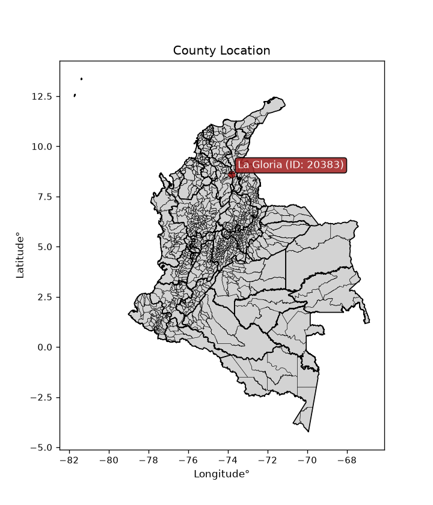
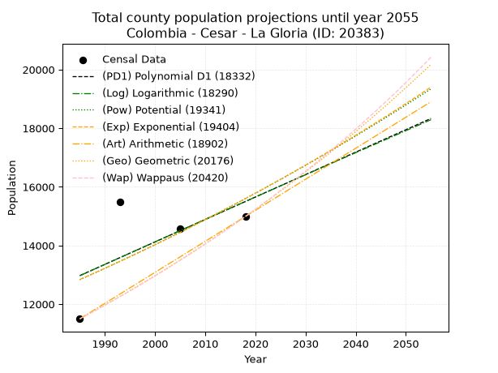
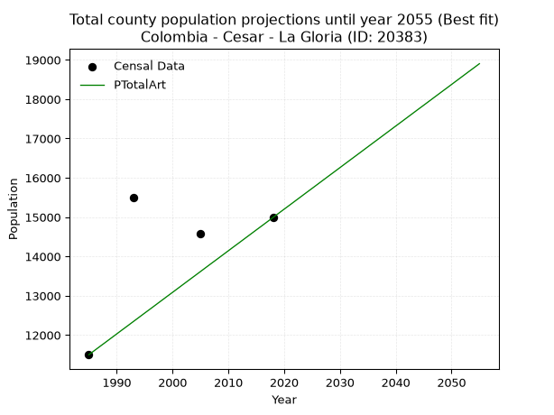
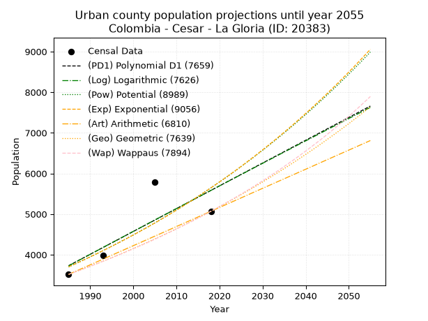
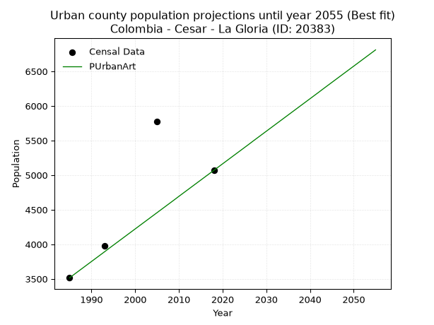
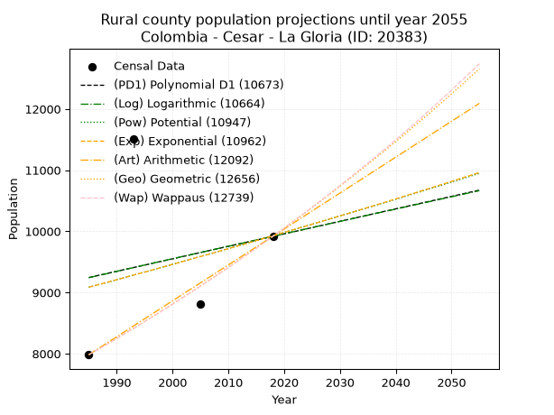
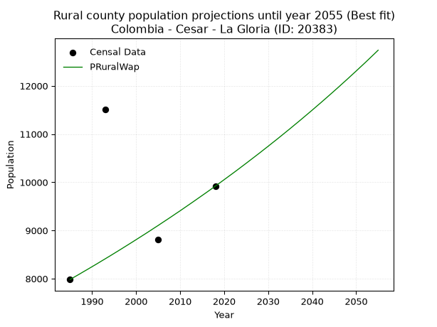

<div align="center">


</div>

# _“Population and Public Services Demand Projections (PPSD) until Year 2050 for Colombia - Cesar - La Gloria (ID: 20383)”_
Keywords: `population` `public-service` `projection` `lineal` `polynomial` `logarithmic` `potential` `exponential` `arithmetic` `geometric` `wappaus` `dane` `colombia` `south-america`

PPSD are analytical estimates used by governments and planners to anticipate future changes in population size, age distribution, and the resulting community needs for utilities, healthcare, education, and infrastructure as sizing future water treatment facilities, electrical grids, and road networks based on spatial growth.

<div align="center">

</img>

</div>


> **General running parameters**: • app_version: _v20260806_. • Python version: _3.14.7_. • Pandas version: _3.0.5_. • NumPy version: _2.5.1_. • Creates, save and include plots into reports (create_plot): _False_. • Projection until year: _2050_. • Process polynomial degree 2 and up: _False_. • Process Wappaus: _True_. • Process Wappaus: _True_. • Set negative values to zero: _True_. • Set infinite values to zero: _True_. • Drop dataset notes: _True_. 
<div align="center">

Dynamic map: [:earth_americas:Google](http://maps.google.com/maps?q=8.619297878,-73.8032101) [:earth_americas:OSM](https://www.openstreetmap.org/#map=18/8.619297878/-73.8032101&layers=P) [:earth_americas:Bing](https://www.bing.com/maps?cp=8.619297878~-73.8032101&lvl=18) [:earth_americas:Apple](https://maps.apple.com/frame?center=8.619297878%2C-73.8032101&span=0.003%2C0.006)

</div>


<div align="center">

```geojson
{
  "type": "Feature",
  "geometry": {
    "type": "Point", 
    "coordinates": [-73.8032101, 8.619297878]
  }, 
  "properties": {
    "Name": "Colombia - Cesar - La Gloria (ID: 20383)"
  }
}
```

</div>


## 0. Census Data (4 records)

Census data are official statistics collected by a government about the people and housing in a country. They usually include counts of total population, age, sex, race, income, education, and jobs.

📅Global census file: [Population.xlsx](../data/Population.xlsx)

| Source   |   Year |   CountryID | CountryName   |   StateID | StateName   |   CountyID | CountyName   |   PTotal |   PUrban |   PRural |
|:---------|-------:|------------:|:--------------|----------:|:------------|-----------:|:-------------|---------:|---------:|---------:|
| DANE     |   1985 |          57 | Colombia      |        20 | Cesar       |      20383 | La Gloria    |    11499 |     3516 |     7983 |
| DANE     |   1993 |          57 | Colombia      |        20 | Cesar       |      20383 | La Gloria    |    15491 |     3979 |    11512 |
| DANE     |   2005 |          57 | Colombia      |        20 | Cesar       |      20383 | La Gloria    |    14586 |     5779 |     8807 |
| DANE     |   2018 |          57 | Colombia      |        20 | Cesar       |      20383 | La Gloria    |    14989 |     5069 |     9920 |

> 🔥Some records could had specific notes about the registered values or the corresponding urban or rural distribution.

📅[SUI-RUPS](https://www.datos.gov.co/Hacienda-y-Cr-dito-P-blico/Registro-nico-de-Prestadores-de-Servicios-P-blicos/4qkq-csdn/about_data) - Local public utility companies: [RUPS.csv](../data/RUPS.xlsx)

 | SERVICIO       | ESTADO    | NOMBRE                                                                                                        | NIT         | DEPARTAMENTO_DOMICILIO   | MUNICIPIO_DOMICILIO   | DIRECCION                    |   TELEFONO | EMAIL                          | TIPO_PRESTADOR                            | CLASIFICACION                 |
|:---------------|:----------|:--------------------------------------------------------------------------------------------------------------|:------------|:-------------------------|:----------------------|:-----------------------------|-----------:|:-------------------------------|:------------------------------------------|:------------------------------|
| ACUEDUCTO      | OPERATIVA | EMPRESA DE SERVICIOS PUBLICOS DE LA GLORIA CESAR                                                              | 824000053-1 | CESAR                    | LA GLORIA             | Calle 1 No. 5A-75            |    5683026 | sistemas@lagloria-cesar.gov.co | EMPRESA INDUSTRIAL Y COMERCIAL DEL ESTADO | MENOR O IGUAL A 2500 USUARIOS |
| ALCANTARILLADO | OPERATIVA | EMPRESA DE SERVICIOS PUBLICOS DE LA GLORIA CESAR                                                              | 824000053-1 | CESAR                    | LA GLORIA             | Calle 1 No. 5A-75            |    5683026 | sistemas@lagloria-cesar.gov.co | EMPRESA INDUSTRIAL Y COMERCIAL DEL ESTADO | MENOR O IGUAL A 2500 USUARIOS |
| ACUEDUCTO      | OPERATIVA | JUNTA ADMINISTRADORA DE USUARIOS DEL SERVICIO DE ACUEDUCTO Y ALCANTARILLADO DEL CORREGIMIENTO DE SIMAÑA CESAR | 900136134-8 | CESAR                    | LA GLORIA             | CALLE 4 CON CARRERA 2 68     |    5657790 | junausasi@hotmail.com          | ORGANIZACION AUTORIZADA                   | MENOR O IGUAL A 2500 USUARIOS |
| ALCANTARILLADO | OPERATIVA | JUNTA ADMINISTRADORA DE USUARIOS DEL SERVICIO DE ACUEDUCTO Y ALCANTARILLADO DEL CORREGIMIENTO DE SIMAÑA CESAR | 900136134-8 | CESAR                    | LA GLORIA             | CALLE 4 CON CARRERA 2 68     |    5657790 | junausasi@hotmail.com          | ORGANIZACION AUTORIZADA                   | MENOR O IGUAL A 2500 USUARIOS |
| ACUEDUCTO      | OPERATIVA | ASOCIACION DE USUARIOS DEL SERVICIO DE ACUEDUCTO Y ALCANTARILLADO DEL CORREGIMIENTO DE LA MATA                | 900636245-2 | CESAR                    | LA GLORIA             | KDX 17 CORREGIMIENTO LA MATA |    0000000 | usualmata@hotmail.com          | ORGANIZACION AUTORIZADA                   | MENOR O IGUAL A 2500 USUARIOS |

## 1. Total

### 1.1. Coefficients and Parameters

* (PD1) Polynomial Deg 1: 76.5455640305097, -138969.014452027 (lineal)
* (Log) Logarithmic: 153538.8893809245, -1152909.0785678485
* (Pow) Potential: 11.83289195062793, -34.91366160280636
* (Exp) Exponential: 0.005899348841894285, 0.10540526095973204
* (Art) Arithmetic: Year diff. 2018 - 1985 = 33, Population diff. 14989 - 11499 = 3490, Annual growth = 105.75757575757575
* (Geo) Geometric: Year diff. 2018 - 1985 = 33, Population diff. 14989 - 11499 = 3490, Annual growth % = 0.00806435904425129
* (Wap) Wappaus: i = 0.7985319824643292, Condition values only valid for < 200)

<sub>
Wappaus condition values: ['0.00', '0.80', '1.60', '2.40', '3.19', '3.99', '4.79', '5.59', '6.39', '7.19', '7.99', '8.78', '9.58', '10.38', '11.18', '11.98', '12.78', '13.58', '14.37', '15.17', '15.97', '16.77', '17.57', '18.37', '19.16', '19.96', '20.76', '21.56', '22.36', '23.16', '23.96', '24.75', '25.55', '26.35', '27.15', '27.95', '28.75', '29.55', '30.34', '31.14', '31.94', '32.74', '33.54', '34.34', '35.14', '35.93', '36.73', '37.53', '38.33', '39.13', '39.93', '40.73', '41.52', '42.32', '43.12', '43.92', '44.72', '45.52', '46.31', '47.11', '47.91', '48.71', '49.51', '50.31', '51.11', '51.90']
</sub>


### 1.2. Projected Dataset

|   Year |   CountyID |   PTotalPD1 |   PTotalLog |   PTotalPow |   PTotalExp |   PTotalArt |   PTotalGeo |   PTotalWap |
|-------:|-----------:|------------:|------------:|------------:|------------:|------------:|------------:|------------:|
|   1985 |      20383 |       12974 |       12969 |       12835 |       12839 |       11499 |       11499 |       11499 |
|   1986 |      20383 |       13050 |       13046 |       12911 |       12915 |       11605 |       11592 |       11591 |
|   1987 |      20383 |       13127 |       13124 |       12988 |       12992 |       11711 |       11685 |       11684 |
|   1988 |      20383 |       13204 |       13201 |       13066 |       13069 |       11816 |       11779 |       11778 |
|   1989 |      20383 |       13280 |       13278 |       13144 |       13146 |       11922 |       11874 |       11872 |
|   1990 |      20383 |       13357 |       13355 |       13222 |       13224 |       12028 |       11970 |       11967 |
|   1991 |      20383 |       13433 |       13433 |       13301 |       13302 |       12134 |       12067 |       12063 |
|   1992 |      20383 |       13510 |       13510 |       13381 |       13381 |       12239 |       12164 |       12160 |
|   1993 |      20383 |       13586 |       13587 |       13460 |       13460 |       12345 |       12262 |       12258 |
|   1994 |      20383 |       13663 |       13664 |       13540 |       13539 |       12451 |       12361 |       12356 |
|   1995 |      20383 |       13739 |       13741 |       13621 |       13620 |       12557 |       12461 |       12455 |
|   1996 |      20383 |       13816 |       13818 |       13702 |       13700 |       12662 |       12561 |       12555 |
|   1997 |      20383 |       13892 |       13895 |       13783 |       13781 |       12768 |       12662 |       12656 |
|   1998 |      20383 |       13969 |       13971 |       13865 |       13863 |       12874 |       12765 |       12758 |
|   1999 |      20383 |       14046 |       14048 |       13948 |       13945 |       12980 |       12868 |       12861 |
|   2000 |      20383 |       14122 |       14125 |       14030 |       14027 |       13085 |       12971 |       12964 |
|   2001 |      20383 |       14199 |       14202 |       14114 |       14110 |       13191 |       13076 |       13068 |
|   2002 |      20383 |       14275 |       14279 |       14197 |       14194 |       13297 |       13181 |       13174 |
|   2003 |      20383 |       14352 |       14355 |       14281 |       14278 |       13403 |       13288 |       13280 |
|   2004 |      20383 |       14428 |       14432 |       14366 |       14362 |       13508 |       13395 |       13387 |
|   2005 |      20383 |       14505 |       14508 |       14451 |       14447 |       13614 |       13503 |       13495 |
|   2006 |      20383 |       14581 |       14585 |       14537 |       14533 |       13720 |       13612 |       13604 |
|   2007 |      20383 |       14658 |       14661 |       14623 |       14619 |       13826 |       13722 |       13714 |
|   2008 |      20383 |       14734 |       14738 |       14709 |       14705 |       13931 |       13832 |       13824 |
|   2009 |      20383 |       14811 |       14814 |       14796 |       14792 |       14037 |       13944 |       13936 |
|   2010 |      20383 |       14888 |       14891 |       14883 |       14880 |       14143 |       14056 |       14049 |
|   2011 |      20383 |       14964 |       14967 |       14971 |       14968 |       14249 |       14170 |       14163 |
|   2012 |      20383 |       15041 |       15044 |       15060 |       15056 |       14354 |       14284 |       14278 |
|   2013 |      20383 |       15117 |       15120 |       15148 |       15145 |       14460 |       14399 |       14394 |
|   2014 |      20383 |       15194 |       15196 |       15238 |       15235 |       14566 |       14515 |       14511 |
|   2015 |      20383 |       15270 |       15272 |       15327 |       15325 |       14672 |       14632 |       14629 |
|   2016 |      20383 |       15347 |       15348 |       15418 |       15416 |       14777 |       14750 |       14748 |
|   2017 |      20383 |       15423 |       15425 |       15508 |       15507 |       14883 |       14869 |       14868 |
|   2018 |      20383 |       15500 |       15501 |       15600 |       15599 |       14989 |       14989 |       14989 |
|   2019 |      20383 |       15576 |       15577 |       15691 |       15691 |       15095 |       15110 |       15111 |
|   2020 |      20383 |       15653 |       15653 |       15784 |       15784 |       15201 |       15232 |       15235 |
|   2021 |      20383 |       15730 |       15729 |       15876 |       15877 |       15306 |       15355 |       15360 |
|   2022 |      20383 |       15806 |       15805 |       15969 |       15971 |       15412 |       15478 |       15485 |
|   2023 |      20383 |       15883 |       15881 |       16063 |       16066 |       15518 |       15603 |       15612 |
|   2024 |      20383 |       15959 |       15957 |       16157 |       16161 |       15624 |       15729 |       15741 |
|   2025 |      20383 |       16036 |       16032 |       16252 |       16256 |       15729 |       15856 |       15870 |
|   2026 |      20383 |       16112 |       16108 |       16347 |       16353 |       15835 |       15984 |       16001 |
|   2027 |      20383 |       16189 |       16184 |       16443 |       16449 |       15941 |       16113 |       16133 |
|   2028 |      20383 |       16265 |       16260 |       16539 |       16547 |       16047 |       16243 |       16266 |
|   2029 |      20383 |       16342 |       16335 |       16636 |       16645 |       16152 |       16374 |       16400 |
|   2030 |      20383 |       16418 |       16411 |       16733 |       16743 |       16258 |       16506 |       16536 |
|   2031 |      20383 |       16495 |       16487 |       16831 |       16842 |       16364 |       16639 |       16673 |
|   2032 |      20383 |       16572 |       16562 |       16929 |       16942 |       16470 |       16773 |       16812 |
|   2033 |      20383 |       16648 |       16638 |       17028 |       17042 |       16575 |       16908 |       16951 |
|   2034 |      20383 |       16725 |       16713 |       17128 |       17143 |       16681 |       17045 |       17093 |
|   2035 |      20383 |       16801 |       16789 |       17228 |       17244 |       16787 |       17182 |       17235 |
|   2036 |      20383 |       16878 |       16864 |       17328 |       17346 |       16893 |       17321 |       17379 |
|   2037 |      20383 |       16954 |       16940 |       17429 |       17449 |       16998 |       17460 |       17525 |
|   2038 |      20383 |       17031 |       17015 |       17530 |       17552 |       17104 |       17601 |       17672 |
|   2039 |      20383 |       17107 |       17090 |       17633 |       17656 |       17210 |       17743 |       17820 |
|   2040 |      20383 |       17184 |       17166 |       17735 |       17760 |       17316 |       17886 |       17970 |
|   2041 |      20383 |       17260 |       17241 |       17838 |       17866 |       17421 |       18030 |       18122 |
|   2042 |      20383 |       17337 |       17316 |       17942 |       17971 |       17527 |       18176 |       18275 |
|   2043 |      20383 |       17414 |       17391 |       18046 |       18078 |       17633 |       18322 |       18430 |
|   2044 |      20383 |       17490 |       17466 |       18151 |       18185 |       17739 |       18470 |       18586 |
|   2045 |      20383 |       17567 |       17541 |       18256 |       18292 |       17844 |       18619 |       18744 |
|   2046 |      20383 |       17643 |       17616 |       18362 |       18400 |       17950 |       18769 |       18904 |
|   2047 |      20383 |       17720 |       17691 |       18469 |       18509 |       18056 |       18920 |       19065 |
|   2048 |      20383 |       17796 |       17766 |       18576 |       18619 |       18162 |       19073 |       19228 |
|   2049 |      20383 |       17873 |       17841 |       18683 |       18729 |       18267 |       19227 |       19393 |
|   2050 |      20383 |       17949 |       17916 |       18792 |       18840 |       18373 |       19382 |       19559 |
<div align="center">

</img>

</div>


### 1.3. Best fit with absolute and relative error (%)

Relative error puts that difference into context by dividing the absolute error by the true value, creating a unitless ratio or percentage that shows the scale of the mistake.

Absolute and relative error

|   Year | Source   |   CountryID | CountryName   |   StateID | StateName   |   CountyID_x | CountyName   |   PTotal |   PUrban |   PRural |   CountyID_y |   PTotalPD1 |   PTotalLog |   PTotalPow |   PTotalExp |   PTotalArt |   PTotalGeo |   PTotalWap |   PTotalPD1AbsError |   PTotalLogAbsError |   PTotalPowAbsError |   PTotalExpAbsError |   PTotalArtAbsError |   PTotalGeoAbsError |   PTotalWapAbsError |   PTotalPD1RelError |   PTotalLogRelError |   PTotalPowRelError |   PTotalExpRelError |   PTotalArtRelError |   PTotalGeoRelError |   PTotalWapRelError |
|-------:|:---------|------------:|:--------------|----------:|:------------|-------------:|:-------------|---------:|---------:|---------:|-------------:|------------:|------------:|------------:|------------:|------------:|------------:|------------:|--------------------:|--------------------:|--------------------:|--------------------:|--------------------:|--------------------:|--------------------:|--------------------:|--------------------:|--------------------:|--------------------:|--------------------:|--------------------:|--------------------:|
|   1985 | DANE     |          57 | Colombia      |        20 | Cesar       |        20383 | La Gloria    |    11499 |     3516 |     7983 |        20383 |       12974 |       12969 |       12835 |       12839 |       11499 |       11499 |       11499 |                1475 |                1470 |                1336 |                1340 |                   0 |                   0 |                   0 |           12.8272   |           12.7837   |           11.6184   |           11.6532   |             0       |             0       |             0       |
|   1993 | DANE     |          57 | Colombia      |        20 | Cesar       |        20383 | La Gloria    |    15491 |     3979 |    11512 |        20383 |       13586 |       13587 |       13460 |       13460 |       12345 |       12262 |       12258 |                1905 |                1904 |                2031 |                2031 |                3146 |                3229 |                3233 |           12.2975   |           12.291    |           13.1108   |           13.1108   |            20.3086  |            20.8444  |            20.8702  |
|   2005 | DANE     |          57 | Colombia      |        20 | Cesar       |        20383 | La Gloria    |    14586 |     5779 |     8807 |        20383 |       14505 |       14508 |       14451 |       14447 |       13614 |       13503 |       13495 |                  81 |                  78 |                 135 |                 139 |                 972 |                1083 |                1091 |            0.555327 |            0.534759 |            0.925545 |            0.952969 |             6.66392 |             7.42493 |             7.47978 |
|   2018 | DANE     |          57 | Colombia      |        20 | Cesar       |        20383 | La Gloria    |    14989 |     5069 |     9920 |        20383 |       15500 |       15501 |       15600 |       15599 |       14989 |       14989 |       14989 |                 511 |                 512 |                 611 |                 610 |                   0 |                   0 |                   0 |            3.40917  |            3.41584  |            4.07632  |            4.06965  |             0       |             0       |             0       |

Relative error mean

| Method    |   RelError | Best   |
|:----------|-----------:|:-------|
| PTotalPD1 |    7.27229 |        |
| PTotalLog |    7.25633 |        |
| PTotalPow |    7.43278 |        |
| PTotalExp |    7.44666 |        |
| PTotalArt |    6.74312 | True   |
| PTotalGeo |    7.06732 |        |
| PTotalWap |    7.08749 |        |

💙Best method: _**PTotalArt**_
<div align="center">

</img>

</div>


### 1.4. Fresh water supply demand in liters per capita per day (lpcd)

The fresh water supply demand typically ranges from 100 to 300 liters per capita per day (lpcd) for standard domestic and municipal planning, though absolute survival minimums set by the World Health Organization are as low as 7.5 to 20 liters per day, and total consumption in high-income nations can exceed 400 liters.

> `CZ`: Level in meters above the sea level (masl)<br> `WS`: Fresh water supply demand in liters per capita per day (lpcd or l/h/d)<br> `WSAll`: Zonal fresh water supply demand in liters per second (l/s)<br> `A`: Zonal area in square meters<br> `DP`: Population density (people/hectare or p/ha)

Reference values (RAS Colombia)

|    CZ |   WS |
|------:|-----:|
|  1000 |  120 |
|  2000 |  130 |
| 99999 |  140 |

County shapefile geometry properties and water supply values

|   CountyID |      ATotal |   CZTotal |   WSTotal |
|-----------:|------------:|----------:|----------:|
|      20383 | 8.01578e+08 |   236.529 |       120 |

Projected values for best method: PTotalArt

|   CountyID |   Year |   PTotalArt |   DPTotal |   WSTotal |   WSTotalAll |
|-----------:|-------:|------------:|----------:|----------:|-------------:|
|      20383 |   1985 |       11499 |      0.14 |       120 |      15.9708 |
|      20383 |   1986 |       11605 |      0.14 |       120 |      16.1181 |
|      20383 |   1987 |       11711 |      0.15 |       120 |      16.2653 |
|      20383 |   1988 |       11816 |      0.15 |       120 |      16.4111 |
|      20383 |   1989 |       11922 |      0.15 |       120 |      16.5583 |
|      20383 |   1990 |       12028 |      0.15 |       120 |      16.7056 |
|      20383 |   1991 |       12134 |      0.15 |       120 |      16.8528 |
|      20383 |   1992 |       12239 |      0.15 |       120 |      16.9986 |
|      20383 |   1993 |       12345 |      0.15 |       120 |      17.1458 |
|      20383 |   1994 |       12451 |      0.16 |       120 |      17.2931 |
|      20383 |   1995 |       12557 |      0.16 |       120 |      17.4403 |
|      20383 |   1996 |       12662 |      0.16 |       120 |      17.5861 |
|      20383 |   1997 |       12768 |      0.16 |       120 |      17.7333 |
|      20383 |   1998 |       12874 |      0.16 |       120 |      17.8806 |
|      20383 |   1999 |       12980 |      0.16 |       120 |      18.0278 |
|      20383 |   2000 |       13085 |      0.16 |       120 |      18.1736 |
|      20383 |   2001 |       13191 |      0.16 |       120 |      18.3208 |
|      20383 |   2002 |       13297 |      0.17 |       120 |      18.4681 |
|      20383 |   2003 |       13403 |      0.17 |       120 |      18.6153 |
|      20383 |   2004 |       13508 |      0.17 |       120 |      18.7611 |
|      20383 |   2005 |       13614 |      0.17 |       120 |      18.9083 |
|      20383 |   2006 |       13720 |      0.17 |       120 |      19.0556 |
|      20383 |   2007 |       13826 |      0.17 |       120 |      19.2028 |
|      20383 |   2008 |       13931 |      0.17 |       120 |      19.3486 |
|      20383 |   2009 |       14037 |      0.18 |       120 |      19.4958 |
|      20383 |   2010 |       14143 |      0.18 |       120 |      19.6431 |
|      20383 |   2011 |       14249 |      0.18 |       120 |      19.7903 |
|      20383 |   2012 |       14354 |      0.18 |       120 |      19.9361 |
|      20383 |   2013 |       14460 |      0.18 |       120 |      20.0833 |
|      20383 |   2014 |       14566 |      0.18 |       120 |      20.2306 |
|      20383 |   2015 |       14672 |      0.18 |       120 |      20.3778 |
|      20383 |   2016 |       14777 |      0.18 |       120 |      20.5236 |
|      20383 |   2017 |       14883 |      0.19 |       120 |      20.6708 |
|      20383 |   2018 |       14989 |      0.19 |       120 |      20.8181 |
|      20383 |   2019 |       15095 |      0.19 |       120 |      20.9653 |
|      20383 |   2020 |       15201 |      0.19 |       120 |      21.1125 |
|      20383 |   2021 |       15306 |      0.19 |       120 |      21.2583 |
|      20383 |   2022 |       15412 |      0.19 |       120 |      21.4056 |
|      20383 |   2023 |       15518 |      0.19 |       120 |      21.5528 |
|      20383 |   2024 |       15624 |      0.19 |       120 |      21.7    |
|      20383 |   2025 |       15729 |      0.2  |       120 |      21.8458 |
|      20383 |   2026 |       15835 |      0.2  |       120 |      21.9931 |
|      20383 |   2027 |       15941 |      0.2  |       120 |      22.1403 |
|      20383 |   2028 |       16047 |      0.2  |       120 |      22.2875 |
|      20383 |   2029 |       16152 |      0.2  |       120 |      22.4333 |
|      20383 |   2030 |       16258 |      0.2  |       120 |      22.5806 |
|      20383 |   2031 |       16364 |      0.2  |       120 |      22.7278 |
|      20383 |   2032 |       16470 |      0.21 |       120 |      22.875  |
|      20383 |   2033 |       16575 |      0.21 |       120 |      23.0208 |
|      20383 |   2034 |       16681 |      0.21 |       120 |      23.1681 |
|      20383 |   2035 |       16787 |      0.21 |       120 |      23.3153 |
|      20383 |   2036 |       16893 |      0.21 |       120 |      23.4625 |
|      20383 |   2037 |       16998 |      0.21 |       120 |      23.6083 |
|      20383 |   2038 |       17104 |      0.21 |       120 |      23.7556 |
|      20383 |   2039 |       17210 |      0.21 |       120 |      23.9028 |
|      20383 |   2040 |       17316 |      0.22 |       120 |      24.05   |
|      20383 |   2041 |       17421 |      0.22 |       120 |      24.1958 |
|      20383 |   2042 |       17527 |      0.22 |       120 |      24.3431 |
|      20383 |   2043 |       17633 |      0.22 |       120 |      24.4903 |
|      20383 |   2044 |       17739 |      0.22 |       120 |      24.6375 |
|      20383 |   2045 |       17844 |      0.22 |       120 |      24.7833 |
|      20383 |   2046 |       17950 |      0.22 |       120 |      24.9306 |
|      20383 |   2047 |       18056 |      0.23 |       120 |      25.0778 |
|      20383 |   2048 |       18162 |      0.23 |       120 |      25.225  |
|      20383 |   2049 |       18267 |      0.23 |       120 |      25.3708 |
|      20383 |   2050 |       18373 |      0.23 |       120 |      25.5181 |

## 2. Urban

### 2.1. Coefficients and Parameters

* (PD1) Polynomial Deg 1: 56.13528703332025, -107698.85788839885 (lineal)
* (Log) Logarithmic: 112522.61941764443, -850699.5818931974
* (Pow) Potential: 25.60890893627028, -80.88380105785015
* (Exp) Exponential: 0.012776767174662697, 3.580991308288066e-08
* (Art) Arithmetic: Year diff. 2018 - 1985 = 33, Population diff. 5069 - 3516 = 1553, Annual growth = 47.06060606060606
* (Geo) Geometric: Year diff. 2018 - 1985 = 33, Population diff. 5069 - 3516 = 1553, Annual growth % = 0.011147112991573227
* (Wap) Wappaus: i = 1.096344928610508, Condition values only valid for < 200)

<sub>
Wappaus condition values: ['0.00', '1.10', '2.19', '3.29', '4.39', '5.48', '6.58', '7.67', '8.77', '9.87', '10.96', '12.06', '13.16', '14.25', '15.35', '16.45', '17.54', '18.64', '19.73', '20.83', '21.93', '23.02', '24.12', '25.22', '26.31', '27.41', '28.50', '29.60', '30.70', '31.79', '32.89', '33.99', '35.08', '36.18', '37.28', '38.37', '39.47', '40.56', '41.66', '42.76', '43.85', '44.95', '46.05', '47.14', '48.24', '49.34', '50.43', '51.53', '52.62', '53.72', '54.82', '55.91', '57.01', '58.11', '59.20', '60.30', '61.40', '62.49', '63.59', '64.68', '65.78', '66.88', '67.97', '69.07', '70.17', '71.26']
</sub>


### 2.2. Projected Dataset

|   Year |   CountyID |   PUrbanPD1 |   PUrbanLog |   PUrbanPow |   PUrbanExp |   PUrbanArt |   PUrbanGeo |   PUrbanWap |
|-------:|-----------:|------------:|------------:|------------:|------------:|------------:|------------:|------------:|
|   1985 |      20383 |        3730 |        3727 |        3700 |        3703 |        3516 |        3516 |        3516 |
|   1986 |      20383 |        3786 |        3783 |        3748 |        3750 |        3563 |        3555 |        3555 |
|   1987 |      20383 |        3842 |        3840 |        3797 |        3799 |        3610 |        3595 |        3594 |
|   1988 |      20383 |        3898 |        3897 |        3846 |        3847 |        3657 |        3635 |        3634 |
|   1989 |      20383 |        3954 |        3953 |        3896 |        3897 |        3704 |        3675 |        3674 |
|   1990 |      20383 |        4010 |        4010 |        3947 |        3947 |        3751 |        3716 |        3714 |
|   1991 |      20383 |        4066 |        4066 |        3998 |        3998 |        3798 |        3758 |        3755 |
|   1992 |      20383 |        4123 |        4123 |        4049 |        4049 |        3845 |        3800 |        3797 |
|   1993 |      20383 |        4179 |        4179 |        4102 |        4101 |        3892 |        3842 |        3839 |
|   1994 |      20383 |        4235 |        4236 |        4155 |        4154 |        3940 |        3885 |        3881 |
|   1995 |      20383 |        4291 |        4292 |        4209 |        4207 |        3987 |        3928 |        3924 |
|   1996 |      20383 |        4347 |        4349 |        4263 |        4262 |        4034 |        3972 |        3967 |
|   1997 |      20383 |        4403 |        4405 |        4318 |        4316 |        4081 |        4016 |        4011 |
|   1998 |      20383 |        4459 |        4461 |        4374 |        4372 |        4128 |        4061 |        4056 |
|   1999 |      20383 |        4516 |        4518 |        4430 |        4428 |        4175 |        4106 |        4101 |
|   2000 |      20383 |        4572 |        4574 |        4487 |        4485 |        4222 |        4152 |        4146 |
|   2001 |      20383 |        4628 |        4630 |        4545 |        4543 |        4269 |        4198 |        4192 |
|   2002 |      20383 |        4684 |        4686 |        4604 |        4601 |        4316 |        4245 |        4239 |
|   2003 |      20383 |        4740 |        4743 |        4663 |        4660 |        4363 |        4292 |        4286 |
|   2004 |      20383 |        4796 |        4799 |        4723 |        4720 |        4410 |        4340 |        4334 |
|   2005 |      20383 |        4852 |        4855 |        4783 |        4781 |        4457 |        4389 |        4382 |
|   2006 |      20383 |        4909 |        4911 |        4845 |        4842 |        4504 |        4438 |        4431 |
|   2007 |      20383 |        4965 |        4967 |        4907 |        4905 |        4551 |        4487 |        4480 |
|   2008 |      20383 |        5021 |        5023 |        4970 |        4968 |        4598 |        4537 |        4531 |
|   2009 |      20383 |        5077 |        5079 |        5034 |        5032 |        4645 |        4588 |        4581 |
|   2010 |      20383 |        5133 |        5135 |        5099 |        5096 |        4693 |        4639 |        4633 |
|   2011 |      20383 |        5189 |        5191 |        5164 |        5162 |        4740 |        4691 |        4685 |
|   2012 |      20383 |        5245 |        5247 |        5230 |        5228 |        4787 |        4743 |        4738 |
|   2013 |      20383 |        5301 |        5303 |        5297 |        5295 |        4834 |        4796 |        4791 |
|   2014 |      20383 |        5358 |        5359 |        5365 |        5363 |        4881 |        4849 |        4845 |
|   2015 |      20383 |        5414 |        5415 |        5433 |        5432 |        4928 |        4903 |        4900 |
|   2016 |      20383 |        5470 |        5470 |        5503 |        5502 |        4975 |        4958 |        4956 |
|   2017 |      20383 |        5526 |        5526 |        5573 |        5573 |        5022 |        5013 |        5012 |
|   2018 |      20383 |        5582 |        5582 |        5644 |        5645 |        5069 |        5069 |        5069 |
|   2019 |      20383 |        5638 |        5638 |        5717 |        5717 |        5116 |        5126 |        5127 |
|   2020 |      20383 |        5694 |        5694 |        5790 |        5791 |        5163 |        5183 |        5185 |
|   2021 |      20383 |        5751 |        5749 |        5863 |        5865 |        5210 |        5240 |        5245 |
|   2022 |      20383 |        5807 |        5805 |        5938 |        5941 |        5257 |        5299 |        5305 |
|   2023 |      20383 |        5863 |        5860 |        6014 |        6017 |        5304 |        5358 |        5366 |
|   2024 |      20383 |        5919 |        5916 |        6090 |        6094 |        5351 |        5418 |        5428 |
|   2025 |      20383 |        5975 |        5972 |        6168 |        6173 |        5398 |        5478 |        5491 |
|   2026 |      20383 |        6031 |        6027 |        6246 |        6252 |        5445 |        5539 |        5555 |
|   2027 |      20383 |        6087 |        6083 |        6326 |        6333 |        5493 |        5601 |        5619 |
|   2028 |      20383 |        6144 |        6138 |        6406 |        6414 |        5540 |        5663 |        5685 |
|   2029 |      20383 |        6200 |        6194 |        6488 |        6497 |        5587 |        5726 |        5751 |
|   2030 |      20383 |        6256 |        6249 |        6570 |        6580 |        5634 |        5790 |        5819 |
|   2031 |      20383 |        6312 |        6305 |        6653 |        6665 |        5681 |        5855 |        5887 |
|   2032 |      20383 |        6368 |        6360 |        6738 |        6750 |        5728 |        5920 |        5957 |
|   2033 |      20383 |        6424 |        6415 |        6823 |        6837 |        5775 |        5986 |        6027 |
|   2034 |      20383 |        6480 |        6471 |        6910 |        6925 |        5822 |        6053 |        6098 |
|   2035 |      20383 |        6536 |        6526 |        6997 |        7014 |        5869 |        6120 |        6171 |
|   2036 |      20383 |        6593 |        6581 |        7086 |        7104 |        5916 |        6188 |        6245 |
|   2037 |      20383 |        6649 |        6637 |        7175 |        7196 |        5963 |        6257 |        6320 |
|   2038 |      20383 |        6705 |        6692 |        7266 |        7288 |        6010 |        6327 |        6396 |
|   2039 |      20383 |        6761 |        6747 |        7358 |        7382 |        6057 |        6398 |        6473 |
|   2040 |      20383 |        6817 |        6802 |        7451 |        7477 |        6104 |        6469 |        6551 |
|   2041 |      20383 |        6873 |        6857 |        7545 |        7573 |        6151 |        6541 |        6631 |
|   2042 |      20383 |        6929 |        6912 |        7640 |        7670 |        6198 |        6614 |        6712 |
|   2043 |      20383 |        6986 |        6967 |        7737 |        7769 |        6246 |        6688 |        6794 |
|   2044 |      20383 |        7042 |        7023 |        7834 |        7869 |        6293 |        6762 |        6877 |
|   2045 |      20383 |        7098 |        7078 |        7933 |        7970 |        6340 |        6838 |        6962 |
|   2046 |      20383 |        7154 |        7133 |        8033 |        8073 |        6387 |        6914 |        7049 |
|   2047 |      20383 |        7210 |        7188 |        8134 |        8176 |        6434 |        6991 |        7136 |
|   2048 |      20383 |        7266 |        7243 |        8237 |        8281 |        6481 |        7069 |        7226 |
|   2049 |      20383 |        7322 |        7297 |        8340 |        8388 |        6528 |        7148 |        7316 |
|   2050 |      20383 |        7378 |        7352 |        8445 |        8496 |        6575 |        7227 |        7409 |
<div align="center">

</img>

</div>


### 2.3. Best fit with absolute and relative error (%)

Relative error puts that difference into context by dividing the absolute error by the true value, creating a unitless ratio or percentage that shows the scale of the mistake.

Absolute and relative error

|   Year | Source   |   CountryID | CountryName   |   StateID | StateName   |   CountyID_x | CountyName   |   PTotal |   PUrban |   PRural |   CountyID_y |   PUrbanPD1 |   PUrbanLog |   PUrbanPow |   PUrbanExp |   PUrbanArt |   PUrbanGeo |   PUrbanWap |   PUrbanPD1AbsError |   PUrbanLogAbsError |   PUrbanPowAbsError |   PUrbanExpAbsError |   PUrbanArtAbsError |   PUrbanGeoAbsError |   PUrbanWapAbsError |   PUrbanPD1RelError |   PUrbanLogRelError |   PUrbanPowRelError |   PUrbanExpRelError |   PUrbanArtRelError |   PUrbanGeoRelError |   PUrbanWapRelError |
|-------:|:---------|------------:|:--------------|----------:|:------------|-------------:|:-------------|---------:|---------:|---------:|-------------:|------------:|------------:|------------:|------------:|------------:|------------:|------------:|--------------------:|--------------------:|--------------------:|--------------------:|--------------------:|--------------------:|--------------------:|--------------------:|--------------------:|--------------------:|--------------------:|--------------------:|--------------------:|--------------------:|
|   1985 | DANE     |          57 | Colombia      |        20 | Cesar       |        20383 | La Gloria    |    11499 |     3516 |     7983 |        20383 |        3730 |        3727 |        3700 |        3703 |        3516 |        3516 |        3516 |                 214 |                 211 |                 184 |                 187 |                   0 |                   0 |                   0 |             6.08646 |             6.00114 |             5.23322 |             5.31854 |             0       |             0       |             0       |
|   1993 | DANE     |          57 | Colombia      |        20 | Cesar       |        20383 | La Gloria    |    15491 |     3979 |    11512 |        20383 |        4179 |        4179 |        4102 |        4101 |        3892 |        3842 |        3839 |                 200 |                 200 |                 123 |                 122 |                  87 |                 137 |                 140 |             5.02639 |             5.02639 |             3.09123 |             3.0661  |             2.18648 |             3.44308 |             3.51847 |
|   2005 | DANE     |          57 | Colombia      |        20 | Cesar       |        20383 | La Gloria    |    14586 |     5779 |     8807 |        20383 |        4852 |        4855 |        4783 |        4781 |        4457 |        4389 |        4382 |                 927 |                 924 |                 996 |                 998 |                1322 |                1390 |                1397 |            16.0408  |            15.9889  |            17.2348  |            17.2694  |            22.8759  |            24.0526  |            24.1737  |
|   2018 | DANE     |          57 | Colombia      |        20 | Cesar       |        20383 | La Gloria    |    14989 |     5069 |     9920 |        20383 |        5582 |        5582 |        5644 |        5645 |        5069 |        5069 |        5069 |                 513 |                 513 |                 575 |                 576 |                   0 |                   0 |                   0 |            10.1203  |            10.1203  |            11.3435  |            11.3632  |             0       |             0       |             0       |

Relative error mean

| Method    |   RelError | Best   |
|:----------|-----------:|:-------|
| PUrbanPD1 |    9.31851 |        |
| PUrbanLog |    9.2842  |        |
| PUrbanPow |    9.22568 |        |
| PUrbanExp |    9.25431 |        |
| PUrbanArt |    6.2656  | True   |
| PUrbanGeo |    6.87392 |        |
| PUrbanWap |    6.92305 |        |

💙Best method: _**PUrbanArt**_
<div align="center">

</img>

</div>


### 2.4. Fresh water supply demand in liters per capita per day (lpcd)

The fresh water supply demand typically ranges from 100 to 300 liters per capita per day (lpcd) for standard domestic and municipal planning, though absolute survival minimums set by the World Health Organization are as low as 7.5 to 20 liters per day, and total consumption in high-income nations can exceed 400 liters.

> `CZ`: Level in meters above the sea level (masl)<br> `WS`: Fresh water supply demand in liters per capita per day (lpcd or l/h/d)<br> `WSAll`: Zonal fresh water supply demand in liters per second (l/s)<br> `A`: Zonal area in square meters<br> `DP`: Population density (people/hectare or p/ha)

Reference values (RAS Colombia)

|    CZ |   WS |
|------:|-----:|
|  1000 |  120 |
|  2000 |  130 |
| 99999 |  140 |

County shapefile geometry properties and water supply values

|   CountyID |     AUrban |   CZUrban |   WSUrban |
|-----------:|-----------:|----------:|----------:|
|      20383 | 1.0273e+06 |   34.5686 |       120 |

Projected values for best method: PUrbanArt

|   CountyID |   Year |   PUrbanArt |   DPUrban |   WSUrban |   WSUrbanAll |
|-----------:|-------:|------------:|----------:|----------:|-------------:|
|      20383 |   1985 |        3516 |     34.23 |       120 |      4.88333 |
|      20383 |   1986 |        3563 |     34.68 |       120 |      4.94861 |
|      20383 |   1987 |        3610 |     35.14 |       120 |      5.01389 |
|      20383 |   1988 |        3657 |     35.6  |       120 |      5.07917 |
|      20383 |   1989 |        3704 |     36.06 |       120 |      5.14444 |
|      20383 |   1990 |        3751 |     36.51 |       120 |      5.20972 |
|      20383 |   1991 |        3798 |     36.97 |       120 |      5.275   |
|      20383 |   1992 |        3845 |     37.43 |       120 |      5.34028 |
|      20383 |   1993 |        3892 |     37.89 |       120 |      5.40556 |
|      20383 |   1994 |        3940 |     38.35 |       120 |      5.47222 |
|      20383 |   1995 |        3987 |     38.81 |       120 |      5.5375  |
|      20383 |   1996 |        4034 |     39.27 |       120 |      5.60278 |
|      20383 |   1997 |        4081 |     39.73 |       120 |      5.66806 |
|      20383 |   1998 |        4128 |     40.18 |       120 |      5.73333 |
|      20383 |   1999 |        4175 |     40.64 |       120 |      5.79861 |
|      20383 |   2000 |        4222 |     41.1  |       120 |      5.86389 |
|      20383 |   2001 |        4269 |     41.56 |       120 |      5.92917 |
|      20383 |   2002 |        4316 |     42.01 |       120 |      5.99444 |
|      20383 |   2003 |        4363 |     42.47 |       120 |      6.05972 |
|      20383 |   2004 |        4410 |     42.93 |       120 |      6.125   |
|      20383 |   2005 |        4457 |     43.39 |       120 |      6.19028 |
|      20383 |   2006 |        4504 |     43.84 |       120 |      6.25556 |
|      20383 |   2007 |        4551 |     44.3  |       120 |      6.32083 |
|      20383 |   2008 |        4598 |     44.76 |       120 |      6.38611 |
|      20383 |   2009 |        4645 |     45.22 |       120 |      6.45139 |
|      20383 |   2010 |        4693 |     45.68 |       120 |      6.51806 |
|      20383 |   2011 |        4740 |     46.14 |       120 |      6.58333 |
|      20383 |   2012 |        4787 |     46.6  |       120 |      6.64861 |
|      20383 |   2013 |        4834 |     47.06 |       120 |      6.71389 |
|      20383 |   2014 |        4881 |     47.51 |       120 |      6.77917 |
|      20383 |   2015 |        4928 |     47.97 |       120 |      6.84444 |
|      20383 |   2016 |        4975 |     48.43 |       120 |      6.90972 |
|      20383 |   2017 |        5022 |     48.89 |       120 |      6.975   |
|      20383 |   2018 |        5069 |     49.34 |       120 |      7.04028 |
|      20383 |   2019 |        5116 |     49.8  |       120 |      7.10556 |
|      20383 |   2020 |        5163 |     50.26 |       120 |      7.17083 |
|      20383 |   2021 |        5210 |     50.72 |       120 |      7.23611 |
|      20383 |   2022 |        5257 |     51.17 |       120 |      7.30139 |
|      20383 |   2023 |        5304 |     51.63 |       120 |      7.36667 |
|      20383 |   2024 |        5351 |     52.09 |       120 |      7.43194 |
|      20383 |   2025 |        5398 |     52.55 |       120 |      7.49722 |
|      20383 |   2026 |        5445 |     53    |       120 |      7.5625  |
|      20383 |   2027 |        5493 |     53.47 |       120 |      7.62917 |
|      20383 |   2028 |        5540 |     53.93 |       120 |      7.69444 |
|      20383 |   2029 |        5587 |     54.39 |       120 |      7.75972 |
|      20383 |   2030 |        5634 |     54.84 |       120 |      7.825   |
|      20383 |   2031 |        5681 |     55.3  |       120 |      7.89028 |
|      20383 |   2032 |        5728 |     55.76 |       120 |      7.95556 |
|      20383 |   2033 |        5775 |     56.22 |       120 |      8.02083 |
|      20383 |   2034 |        5822 |     56.67 |       120 |      8.08611 |
|      20383 |   2035 |        5869 |     57.13 |       120 |      8.15139 |
|      20383 |   2036 |        5916 |     57.59 |       120 |      8.21667 |
|      20383 |   2037 |        5963 |     58.05 |       120 |      8.28194 |
|      20383 |   2038 |        6010 |     58.5  |       120 |      8.34722 |
|      20383 |   2039 |        6057 |     58.96 |       120 |      8.4125  |
|      20383 |   2040 |        6104 |     59.42 |       120 |      8.47778 |
|      20383 |   2041 |        6151 |     59.88 |       120 |      8.54306 |
|      20383 |   2042 |        6198 |     60.33 |       120 |      8.60833 |
|      20383 |   2043 |        6246 |     60.8  |       120 |      8.675   |
|      20383 |   2044 |        6293 |     61.26 |       120 |      8.74028 |
|      20383 |   2045 |        6340 |     61.72 |       120 |      8.80556 |
|      20383 |   2046 |        6387 |     62.17 |       120 |      8.87083 |
|      20383 |   2047 |        6434 |     62.63 |       120 |      8.93611 |
|      20383 |   2048 |        6481 |     63.09 |       120 |      9.00139 |
|      20383 |   2049 |        6528 |     63.55 |       120 |      9.06667 |
|      20383 |   2050 |        6575 |     64    |       120 |      9.13194 |

## 3. Rural

### 3.1. Coefficients and Parameters

* (PD1) Polynomial Deg 1: 20.4102769971893, -31270.156563627894 (lineal)
* (Log) Logarithmic: 41016.26996328, -302209.4966746508
* (Pow) Potential: 5.379912703914187, -13.783335688269476
* (Exp) Exponential: 0.002679312529210806, 44.529923450182295
* (Art) Arithmetic: Year diff. 2018 - 1985 = 33, Population diff. 9920 - 7983 = 1937, Annual growth = 58.696969696969695
* (Geo) Geometric: Year diff. 2018 - 1985 = 33, Population diff. 9920 - 7983 = 1937, Annual growth % = 0.006604704607715783
* (Wap) Wappaus: i = 0.655722166083558, Condition values only valid for < 200)

<sub>
Wappaus condition values: ['0.00', '0.66', '1.31', '1.97', '2.62', '3.28', '3.93', '4.59', '5.25', '5.90', '6.56', '7.21', '7.87', '8.52', '9.18', '9.84', '10.49', '11.15', '11.80', '12.46', '13.11', '13.77', '14.43', '15.08', '15.74', '16.39', '17.05', '17.70', '18.36', '19.02', '19.67', '20.33', '20.98', '21.64', '22.29', '22.95', '23.61', '24.26', '24.92', '25.57', '26.23', '26.88', '27.54', '28.20', '28.85', '29.51', '30.16', '30.82', '31.47', '32.13', '32.79', '33.44', '34.10', '34.75', '35.41', '36.06', '36.72', '37.38', '38.03', '38.69', '39.34', '40.00', '40.65', '41.31', '41.97', '42.62']
</sub>


### 3.2. Projected Dataset

|   Year |   CountyID |   PRuralPD1 |   PRuralLog |   PRuralPow |   PRuralExp |   PRuralArt |   PRuralGeo |   PRuralWap |
|-------:|-----------:|------------:|------------:|------------:|------------:|------------:|------------:|------------:|
|   1985 |      20383 |        9244 |        9242 |        9085 |        9087 |        7983 |        7983 |        7983 |
|   1986 |      20383 |        9265 |        9263 |        9110 |        9111 |        8042 |        8036 |        8036 |
|   1987 |      20383 |        9285 |        9284 |        9134 |        9136 |        8100 |        8089 |        8088 |
|   1988 |      20383 |        9305 |        9304 |        9159 |        9160 |        8159 |        8142 |        8142 |
|   1989 |      20383 |        9326 |        9325 |        9184 |        9185 |        8218 |        8196 |        8195 |
|   1990 |      20383 |        9346 |        9346 |        9209 |        9210 |        8276 |        8250 |        8249 |
|   1991 |      20383 |        9367 |        9366 |        9234 |        9234 |        8335 |        8305 |        8303 |
|   1992 |      20383 |        9387 |        9387 |        9259 |        9259 |        8394 |        8359 |        8358 |
|   1993 |      20383 |        9408 |        9407 |        9284 |        9284 |        8453 |        8415 |        8413 |
|   1994 |      20383 |        9428 |        9428 |        9309 |        9309 |        8511 |        8470 |        8468 |
|   1995 |      20383 |        9448 |        9449 |        9334 |        9334 |        8570 |        8526 |        8524 |
|   1996 |      20383 |        9469 |        9469 |        9359 |        9359 |        8629 |        8583 |        8580 |
|   1997 |      20383 |        9489 |        9490 |        9384 |        9384 |        8687 |        8639 |        8637 |
|   1998 |      20383 |        9510 |        9510 |        9410 |        9409 |        8746 |        8696 |        8694 |
|   1999 |      20383 |        9530 |        9531 |        9435 |        9434 |        8805 |        8754 |        8751 |
|   2000 |      20383 |        9550 |        9551 |        9461 |        9460 |        8863 |        8812 |        8809 |
|   2001 |      20383 |        9571 |        9572 |        9486 |        9485 |        8922 |        8870 |        8867 |
|   2002 |      20383 |        9591 |        9592 |        9512 |        9510 |        8981 |        8928 |        8925 |
|   2003 |      20383 |        9612 |        9613 |        9537 |        9536 |        9040 |        8987 |        8984 |
|   2004 |      20383 |        9632 |        9633 |        9563 |        9562 |        9098 |        9047 |        9044 |
|   2005 |      20383 |        9652 |        9654 |        9589 |        9587 |        9157 |        9106 |        9103 |
|   2006 |      20383 |        9673 |        9674 |        9614 |        9613 |        9216 |        9167 |        9164 |
|   2007 |      20383 |        9693 |        9694 |        9640 |        9639 |        9274 |        9227 |        9224 |
|   2008 |      20383 |        9714 |        9715 |        9666 |        9665 |        9333 |        9288 |        9285 |
|   2009 |      20383 |        9734 |        9735 |        9692 |        9690 |        9392 |        9349 |        9347 |
|   2010 |      20383 |        9755 |        9756 |        9718 |        9716 |        9450 |        9411 |        9408 |
|   2011 |      20383 |        9775 |        9776 |        9744 |        9743 |        9509 |        9473 |        9471 |
|   2012 |      20383 |        9795 |        9797 |        9770 |        9769 |        9568 |        9536 |        9534 |
|   2013 |      20383 |        9816 |        9817 |        9796 |        9795 |        9627 |        9599 |        9597 |
|   2014 |      20383 |        9836 |        9837 |        9822 |        9821 |        9685 |        9662 |        9661 |
|   2015 |      20383 |        9857 |        9858 |        9849 |        9848 |        9744 |        9726 |        9725 |
|   2016 |      20383 |        9877 |        9878 |        9875 |        9874 |        9803 |        9790 |        9789 |
|   2017 |      20383 |        9897 |        9898 |        9901 |        9900 |        9861 |        9855 |        9854 |
|   2018 |      20383 |        9918 |        9919 |        9928 |        9927 |        9920 |        9920 |        9920 |
|   2019 |      20383 |        9938 |        9939 |        9954 |        9954 |        9979 |        9986 |        9986 |
|   2020 |      20383 |        9959 |        9959 |        9981 |        9980 |       10037 |       10051 |       10053 |
|   2021 |      20383 |        9979 |        9980 |       10007 |       10007 |       10096 |       10118 |       10120 |
|   2022 |      20383 |        9999 |       10000 |       10034 |       10034 |       10155 |       10185 |       10187 |
|   2023 |      20383 |       10020 |       10020 |       10061 |       10061 |       10213 |       10252 |       10255 |
|   2024 |      20383 |       10040 |       10040 |       10088 |       10088 |       10272 |       10320 |       10324 |
|   2025 |      20383 |       10061 |       10061 |       10114 |       10115 |       10331 |       10388 |       10393 |
|   2026 |      20383 |       10081 |       10081 |       10141 |       10142 |       10390 |       10456 |       10463 |
|   2027 |      20383 |       10101 |       10101 |       10168 |       10169 |       10448 |       10525 |       10533 |
|   2028 |      20383 |       10122 |       10121 |       10195 |       10197 |       10507 |       10595 |       10603 |
|   2029 |      20383 |       10142 |       10142 |       10222 |       10224 |       10566 |       10665 |       10675 |
|   2030 |      20383 |       10163 |       10162 |       10250 |       10251 |       10624 |       10735 |       10746 |
|   2031 |      20383 |       10183 |       10182 |       10277 |       10279 |       10683 |       10806 |       10819 |
|   2032 |      20383 |       10204 |       10202 |       10304 |       10306 |       10742 |       10878 |       10891 |
|   2033 |      20383 |       10224 |       10222 |       10331 |       10334 |       10800 |       10950 |       10965 |
|   2034 |      20383 |       10244 |       10243 |       10359 |       10362 |       10859 |       11022 |       11039 |
|   2035 |      20383 |       10265 |       10263 |       10386 |       10390 |       10918 |       11095 |       11113 |
|   2036 |      20383 |       10285 |       10283 |       10414 |       10417 |       10977 |       11168 |       11189 |
|   2037 |      20383 |       10306 |       10303 |       10441 |       10445 |       11035 |       11242 |       11264 |
|   2038 |      20383 |       10326 |       10323 |       10469 |       10473 |       11094 |       11316 |       11341 |
|   2039 |      20383 |       10346 |       10343 |       10496 |       10502 |       11153 |       11391 |       11418 |
|   2040 |      20383 |       10367 |       10363 |       10524 |       10530 |       11211 |       11466 |       11495 |
|   2041 |      20383 |       10387 |       10384 |       10552 |       10558 |       11270 |       11542 |       11574 |
|   2042 |      20383 |       10408 |       10404 |       10580 |       10586 |       11329 |       11618 |       11652 |
|   2043 |      20383 |       10428 |       10424 |       10608 |       10615 |       11387 |       11695 |       11732 |
|   2044 |      20383 |       10448 |       10444 |       10636 |       10643 |       11446 |       11772 |       11812 |
|   2045 |      20383 |       10469 |       10464 |       10664 |       10672 |       11505 |       11850 |       11893 |
|   2046 |      20383 |       10489 |       10484 |       10692 |       10700 |       11564 |       11928 |       11974 |
|   2047 |      20383 |       10510 |       10504 |       10720 |       10729 |       11622 |       12007 |       12057 |
|   2048 |      20383 |       10530 |       10524 |       10748 |       10758 |       11681 |       12086 |       12139 |
|   2049 |      20383 |       10551 |       10544 |       10776 |       10787 |       11740 |       12166 |       12223 |
|   2050 |      20383 |       10571 |       10564 |       10805 |       10816 |       11798 |       12246 |       12307 |
<div align="center">

</img>

</div>


### 3.3. Best fit with absolute and relative error (%)

Relative error puts that difference into context by dividing the absolute error by the true value, creating a unitless ratio or percentage that shows the scale of the mistake.

Absolute and relative error

|   Year | Source   |   CountryID | CountryName   |   StateID | StateName   |   CountyID_x | CountyName   |   PTotal |   PUrban |   PRural |   CountyID_y |   PRuralPD1 |   PRuralLog |   PRuralPow |   PRuralExp |   PRuralArt |   PRuralGeo |   PRuralWap |   PRuralPD1AbsError |   PRuralLogAbsError |   PRuralPowAbsError |   PRuralExpAbsError |   PRuralArtAbsError |   PRuralGeoAbsError |   PRuralWapAbsError |   PRuralPD1RelError |   PRuralLogRelError |   PRuralPowRelError |   PRuralExpRelError |   PRuralArtRelError |   PRuralGeoRelError |   PRuralWapRelError |
|-------:|:---------|------------:|:--------------|----------:|:------------|-------------:|:-------------|---------:|---------:|---------:|-------------:|------------:|------------:|------------:|------------:|------------:|------------:|------------:|--------------------:|--------------------:|--------------------:|--------------------:|--------------------:|--------------------:|--------------------:|--------------------:|--------------------:|--------------------:|--------------------:|--------------------:|--------------------:|--------------------:|
|   1985 | DANE     |          57 | Colombia      |        20 | Cesar       |        20383 | La Gloria    |    11499 |     3516 |     7983 |        20383 |        9244 |        9242 |        9085 |        9087 |        7983 |        7983 |        7983 |                1261 |                1259 |                1102 |                1104 |                   0 |                   0 |                   0 |          15.7961    |          15.771     |          13.8043    |          13.8294    |             0       |             0       |             0       |
|   1993 | DANE     |          57 | Colombia      |        20 | Cesar       |        20383 | La Gloria    |    15491 |     3979 |    11512 |        20383 |        9408 |        9407 |        9284 |        9284 |        8453 |        8415 |        8413 |                2104 |                2105 |                2228 |                2228 |                3059 |                3097 |                3099 |          18.2766    |          18.2853    |          19.3537    |          19.3537    |            26.5723  |            26.9024  |            26.9197  |
|   2005 | DANE     |          57 | Colombia      |        20 | Cesar       |        20383 | La Gloria    |    14586 |     5779 |     8807 |        20383 |        9652 |        9654 |        9589 |        9587 |        9157 |        9106 |        9103 |                 845 |                 847 |                 782 |                 780 |                 350 |                 299 |                 296 |           9.59464   |           9.61735   |           8.8793    |           8.85659   |             3.97411 |             3.39503 |             3.36096 |
|   2018 | DANE     |          57 | Colombia      |        20 | Cesar       |        20383 | La Gloria    |    14989 |     5069 |     9920 |        20383 |        9918 |        9919 |        9928 |        9927 |        9920 |        9920 |        9920 |                   2 |                   1 |                   8 |                   7 |                   0 |                   0 |                   0 |           0.0201613 |           0.0100806 |           0.0806452 |           0.0705645 |             0       |             0       |             0       |

Relative error mean

| Method    |   RelError | Best   |
|:----------|-----------:|:-------|
| PRuralPD1 |   10.9219  |        |
| PRuralLog |   10.9209  |        |
| PRuralPow |   10.5295  |        |
| PRuralExp |   10.5276  |        |
| PRuralArt |    7.6366  |        |
| PRuralGeo |    7.57435 |        |
| PRuralWap |    7.57017 | True   |

💙Best method: _**PRuralWap**_
<div align="center">

</img>

</div>


### 3.4. Fresh water supply demand in liters per capita per day (lpcd)

The fresh water supply demand typically ranges from 100 to 300 liters per capita per day (lpcd) for standard domestic and municipal planning, though absolute survival minimums set by the World Health Organization are as low as 7.5 to 20 liters per day, and total consumption in high-income nations can exceed 400 liters.

> `CZ`: Level in meters above the sea level (masl)<br> `WS`: Fresh water supply demand in liters per capita per day (lpcd or l/h/d)<br> `WSAll`: Zonal fresh water supply demand in liters per second (l/s)<br> `A`: Zonal area in square meters<br> `DP`: Population density (people/hectare or p/ha)

Reference values (RAS Colombia)

|    CZ |   WS |
|------:|-----:|
|  1000 |  120 |
|  2000 |  130 |
| 99999 |  140 |

County shapefile geometry properties and water supply values

|   CountyID |      ARural |   CZRural |   WSRural |
|-----------:|------------:|----------:|----------:|
|      20383 | 8.00551e+08 |   236.791 |       120 |

Projected values for best method: PRuralWap

|   CountyID |   Year |   PRuralWap |   DPRural |   WSRural |   WSRuralAll |
|-----------:|-------:|------------:|----------:|----------:|-------------:|
|      20383 |   1985 |        7983 |      0.1  |       120 |      11.0875 |
|      20383 |   1986 |        8036 |      0.1  |       120 |      11.1611 |
|      20383 |   1987 |        8088 |      0.1  |       120 |      11.2333 |
|      20383 |   1988 |        8142 |      0.1  |       120 |      11.3083 |
|      20383 |   1989 |        8195 |      0.1  |       120 |      11.3819 |
|      20383 |   1990 |        8249 |      0.1  |       120 |      11.4569 |
|      20383 |   1991 |        8303 |      0.1  |       120 |      11.5319 |
|      20383 |   1992 |        8358 |      0.1  |       120 |      11.6083 |
|      20383 |   1993 |        8413 |      0.11 |       120 |      11.6847 |
|      20383 |   1994 |        8468 |      0.11 |       120 |      11.7611 |
|      20383 |   1995 |        8524 |      0.11 |       120 |      11.8389 |
|      20383 |   1996 |        8580 |      0.11 |       120 |      11.9167 |
|      20383 |   1997 |        8637 |      0.11 |       120 |      11.9958 |
|      20383 |   1998 |        8694 |      0.11 |       120 |      12.075  |
|      20383 |   1999 |        8751 |      0.11 |       120 |      12.1542 |
|      20383 |   2000 |        8809 |      0.11 |       120 |      12.2347 |
|      20383 |   2001 |        8867 |      0.11 |       120 |      12.3153 |
|      20383 |   2002 |        8925 |      0.11 |       120 |      12.3958 |
|      20383 |   2003 |        8984 |      0.11 |       120 |      12.4778 |
|      20383 |   2004 |        9044 |      0.11 |       120 |      12.5611 |
|      20383 |   2005 |        9103 |      0.11 |       120 |      12.6431 |
|      20383 |   2006 |        9164 |      0.11 |       120 |      12.7278 |
|      20383 |   2007 |        9224 |      0.12 |       120 |      12.8111 |
|      20383 |   2008 |        9285 |      0.12 |       120 |      12.8958 |
|      20383 |   2009 |        9347 |      0.12 |       120 |      12.9819 |
|      20383 |   2010 |        9408 |      0.12 |       120 |      13.0667 |
|      20383 |   2011 |        9471 |      0.12 |       120 |      13.1542 |
|      20383 |   2012 |        9534 |      0.12 |       120 |      13.2417 |
|      20383 |   2013 |        9597 |      0.12 |       120 |      13.3292 |
|      20383 |   2014 |        9661 |      0.12 |       120 |      13.4181 |
|      20383 |   2015 |        9725 |      0.12 |       120 |      13.5069 |
|      20383 |   2016 |        9789 |      0.12 |       120 |      13.5958 |
|      20383 |   2017 |        9854 |      0.12 |       120 |      13.6861 |
|      20383 |   2018 |        9920 |      0.12 |       120 |      13.7778 |
|      20383 |   2019 |        9986 |      0.12 |       120 |      13.8694 |
|      20383 |   2020 |       10053 |      0.13 |       120 |      13.9625 |
|      20383 |   2021 |       10120 |      0.13 |       120 |      14.0556 |
|      20383 |   2022 |       10187 |      0.13 |       120 |      14.1486 |
|      20383 |   2023 |       10255 |      0.13 |       120 |      14.2431 |
|      20383 |   2024 |       10324 |      0.13 |       120 |      14.3389 |
|      20383 |   2025 |       10393 |      0.13 |       120 |      14.4347 |
|      20383 |   2026 |       10463 |      0.13 |       120 |      14.5319 |
|      20383 |   2027 |       10533 |      0.13 |       120 |      14.6292 |
|      20383 |   2028 |       10603 |      0.13 |       120 |      14.7264 |
|      20383 |   2029 |       10675 |      0.13 |       120 |      14.8264 |
|      20383 |   2030 |       10746 |      0.13 |       120 |      14.925  |
|      20383 |   2031 |       10819 |      0.14 |       120 |      15.0264 |
|      20383 |   2032 |       10891 |      0.14 |       120 |      15.1264 |
|      20383 |   2033 |       10965 |      0.14 |       120 |      15.2292 |
|      20383 |   2034 |       11039 |      0.14 |       120 |      15.3319 |
|      20383 |   2035 |       11113 |      0.14 |       120 |      15.4347 |
|      20383 |   2036 |       11189 |      0.14 |       120 |      15.5403 |
|      20383 |   2037 |       11264 |      0.14 |       120 |      15.6444 |
|      20383 |   2038 |       11341 |      0.14 |       120 |      15.7514 |
|      20383 |   2039 |       11418 |      0.14 |       120 |      15.8583 |
|      20383 |   2040 |       11495 |      0.14 |       120 |      15.9653 |
|      20383 |   2041 |       11574 |      0.14 |       120 |      16.075  |
|      20383 |   2042 |       11652 |      0.15 |       120 |      16.1833 |
|      20383 |   2043 |       11732 |      0.15 |       120 |      16.2944 |
|      20383 |   2044 |       11812 |      0.15 |       120 |      16.4056 |
|      20383 |   2045 |       11893 |      0.15 |       120 |      16.5181 |
|      20383 |   2046 |       11974 |      0.15 |       120 |      16.6306 |
|      20383 |   2047 |       12057 |      0.15 |       120 |      16.7458 |
|      20383 |   2048 |       12139 |      0.15 |       120 |      16.8597 |
|      20383 |   2049 |       12223 |      0.15 |       120 |      16.9764 |
|      20383 |   2050 |       12307 |      0.15 |       120 |      17.0931 |

<div align="center"><br><sub>Share this research</sub></div><br>

<sub>**APPS & TOOLS & CONTENT DISCLAIMER**: • NO WARRANTY - This content and software is provided by <a href="https://github.com/rcfdtools" target="_blank">github.com/rcfdtools</a> "as is", without any express or implied warranty, including warranties of merchantability, fitness for a particular purpose, or non-infringement. There is no guarantee that the software will be error-free or operate without interruption. • LIMITATION OF LIABILITY - Neither the authors nor copyright holders will be liable for claims or damages arising from the software or its use. You are responsible for determining if the software is appropriate for your use and assume all associated risks, including errors, legal compliance, and data loss. • NO PROFESSIONAL ADVICE - The software provides general information and does not offer professional advice. It should not replace consultation with professional advisors. [Clauses and global license for rcfdtools use.](https://github.com/rcfdtools/rcfdtools/blob/main/LICENSE.md)</sub>

| [:house: Home](Readme.md)  | [:beginner: Help / Collab](https://github.com/rcfdtools/R.HydroTools/discussions/31) |
|----------------------------|-------------------------------------------------------------------------------------------|