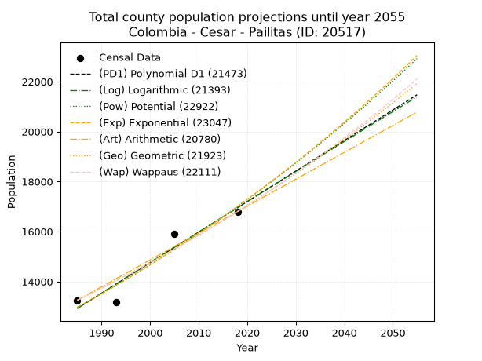
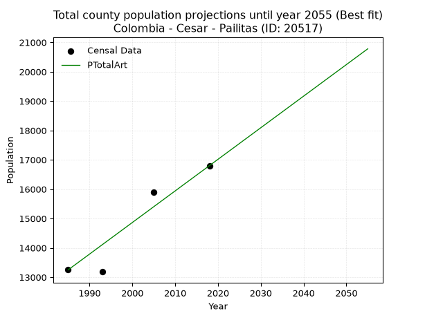
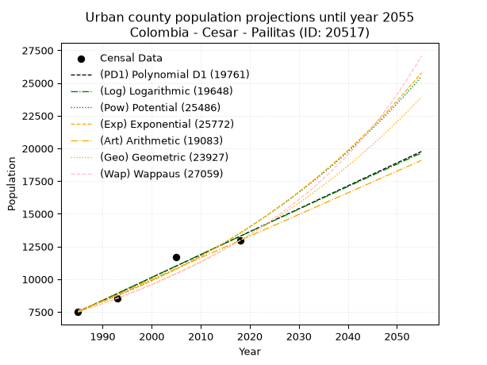
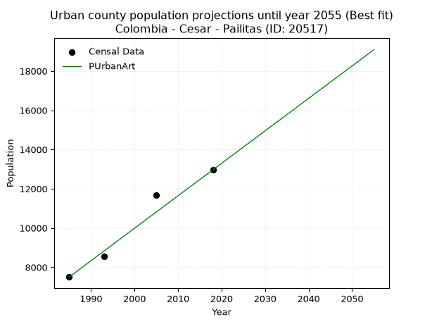
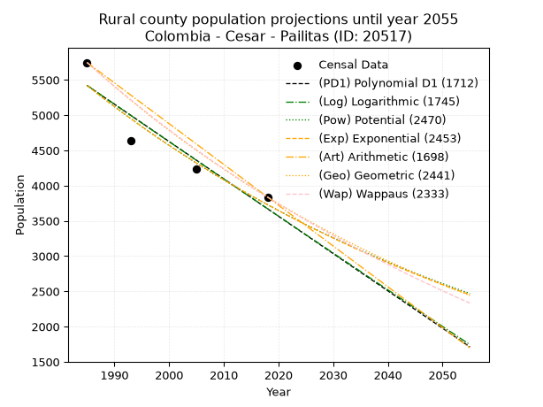
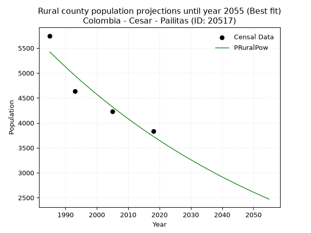

<div align="center">


</div>

# 📜 _“Population and Public Services Demand Projections (PPSD) until Year 2050 for Colombia - Cesar - Pailitas (ID: 20517)”_
Keywords: `population` `public-service` `projection` `lineal` `polynomial` `logarithmic` `potential` `exponential` `arithmetic` `geometric` `wappaus` `dane` `colombia` `south-america`

PPSD are analytical estimates used by governments and planners to anticipate future changes in population size, age distribution, and the resulting community needs for utilities, healthcare, education, and infrastructure as sizing future water treatment facilities, electrical grids, and road networks based on spatial growth.

<div align="center">

</img>

</div>


> **General running parameters**: • app_version: _v20260806_. • Python version: _3.14.7_. • Pandas version: _3.0.5_. • NumPy version: _2.5.1_. • Creates, save and include plots into reports (create_plot): _False_. • Projection until year: _2050_. • Process polynomial degree 2 and up: _False_. • Process Wappaus: _True_. • Process Wappaus: _True_. • Set negative values to zero: _True_. • Set infinite values to zero: _True_. • Drop dataset notes: _True_. 
<div align="center">

Dynamic map: [:earth_americas:Google](http://maps.google.com/maps?q=8.959399476,-73.6258248) [:earth_americas:OSM](https://www.openstreetmap.org/#map=18/8.959399476/-73.6258248&layers=P) [:earth_americas:Bing](https://www.bing.com/maps?cp=8.959399476~-73.6258248&lvl=18) [:earth_americas:Apple](https://maps.apple.com/frame?center=8.959399476%2C-73.6258248&span=0.003%2C0.006)

</div>


<div align="center">

```geojson
{
  "type": "Feature",
  "geometry": {
    "type": "Point", 
    "coordinates": [-73.6258248, 8.959399476]
  }, 
  "properties": {
    "Name": "Colombia - Cesar - Pailitas (ID: 20517)"
  }
}
```

</div>


## 0. Census Data (4 records)

Census data are official statistics collected by a government about the people and housing in a country. They usually include counts of total population, age, sex, race, income, education, and jobs.

📅Global census file: [Population.xlsx](../data/Population.xlsx)

| Source   |   Year |   CountryID | CountryName   |   StateID | StateName   |   CountyID | CountyName   |   PTotal |   PUrban |   PRural |
|:---------|-------:|------------:|:--------------|----------:|:------------|-----------:|:-------------|---------:|---------:|---------:|
| DANE     |   1985 |          57 | Colombia      |        20 | Cesar       |      20517 | Pailitas     |    13250 |     7503 |     5747 |
| DANE     |   1993 |          57 | Colombia      |        20 | Cesar       |      20517 | Pailitas     |    13184 |     8552 |     4632 |
| DANE     |   2005 |          57 | Colombia      |        20 | Cesar       |      20517 | Pailitas     |    15902 |    11669 |     4233 |
| DANE     |   2018 |          57 | Colombia      |        20 | Cesar       |      20517 | Pailitas     |    16800 |    12962 |     3838 |

> 🔥Some records could had specific notes about the registered values or the corresponding urban or rural distribution.

📅[SUI-RUPS](https://www.datos.gov.co/Hacienda-y-Cr-dito-P-blico/Registro-nico-de-Prestadores-de-Servicios-P-blicos/4qkq-csdn/about_data) - Local public utility companies: [RUPS.csv](../data/RUPS.csv)

 | SERVICIO       | ESTADO    | NOMBRE                                                                                             | NIT         | DEPARTAMENTO_DOMICILIO   | MUNICIPIO_DOMICILIO   | DIRECCION          |   TELEFONO | EMAIL                 | TIPO_PRESTADOR                            | CLASIFICACION                  |
|:---------------|:----------|:---------------------------------------------------------------------------------------------------|:------------|:-------------------------|:----------------------|:-------------------|-----------:|:----------------------|:------------------------------------------|:-------------------------------|
| ACUEDUCTO      | OPERATIVA | EMPRESA DE SERVICIOS PUBLICOS DE ACUEDUCTO, ALCANTARILLADO Y ASEO DEL MUNICIPIO DE PAILITAS E.S.P. | 800218640-3 | CESAR                    | PAILITAS              | Carrera 8 No  6-16 |    5287712 | aaemserpupa@gmail.com | EMPRESA INDUSTRIAL Y COMERCIAL DEL ESTADO | DESDE 2501 HASTA 5000 USUARIOS |
| ALCANTARILLADO | OPERATIVA | EMPRESA DE SERVICIOS PUBLICOS DE ACUEDUCTO, ALCANTARILLADO Y ASEO DEL MUNICIPIO DE PAILITAS E.S.P. | 800218640-3 | CESAR                    | PAILITAS              | Carrera 8 No  6-16 |    5287712 | aaemserpupa@gmail.com | EMPRESA INDUSTRIAL Y COMERCIAL DEL ESTADO | DESDE 2501 HASTA 5000 USUARIOS |

## 1. Total

### 1.1. Coefficients and Parameters

* (PD1) Polynomial Deg 1: 122.18065034122773, -229607.84584504075 (lineal)
* (Log) Logarithmic: 244556.42373759387, -1844091.3365816385
* (Pow) Potential: 16.445147364837123, -50.119422578799636
* (Exp) Exponential: 0.00821573178520603, 0.001072185811742656
* (Art) Arithmetic: Year diff. 2018 - 1985 = 33, Population diff. 16800 - 13250 = 3550, Annual growth = 107.57575757575758
* (Geo) Geometric: Year diff. 2018 - 1985 = 33, Population diff. 16800 - 13250 = 3550, Annual growth % = 0.007219308218010534
* (Wap) Wappaus: i = 0.7159784198053749, Condition values only valid for < 200)

<sub>
Wappaus condition values: ['0.00', '0.72', '1.43', '2.15', '2.86', '3.58', '4.30', '5.01', '5.73', '6.44', '7.16', '7.88', '8.59', '9.31', '10.02', '10.74', '11.46', '12.17', '12.89', '13.60', '14.32', '15.04', '15.75', '16.47', '17.18', '17.90', '18.62', '19.33', '20.05', '20.76', '21.48', '22.20', '22.91', '23.63', '24.34', '25.06', '25.78', '26.49', '27.21', '27.92', '28.64', '29.36', '30.07', '30.79', '31.50', '32.22', '32.94', '33.65', '34.37', '35.08', '35.80', '36.51', '37.23', '37.95', '38.66', '39.38', '40.09', '40.81', '41.53', '42.24', '42.96', '43.67', '44.39', '45.11', '45.82', '46.54']
</sub>


### 1.2. Projected Dataset

|   Year |   CountyID |   PTotalPD1 |   PTotalLog |   PTotalPow |   PTotalExp |   PTotalArt |   PTotalGeo |   PTotalWap |
|-------:|-----------:|------------:|------------:|------------:|------------:|------------:|------------:|------------:|
|   1985 |      20517 |       12921 |       12917 |       12964 |       12967 |       13250 |       13250 |       13250 |
|   1986 |      20517 |       13043 |       13040 |       13072 |       13074 |       13358 |       13346 |       13345 |
|   1987 |      20517 |       13165 |       13163 |       13180 |       13182 |       13465 |       13442 |       13441 |
|   1988 |      20517 |       13287 |       13286 |       13290 |       13291 |       13573 |       13539 |       13538 |
|   1989 |      20517 |       13409 |       13409 |       13400 |       13400 |       13680 |       13637 |       13635 |
|   1990 |      20517 |       13532 |       13532 |       13511 |       13511 |       13788 |       13735 |       13733 |
|   1991 |      20517 |       13654 |       13655 |       13624 |       13622 |       13895 |       13834 |       13832 |
|   1992 |      20517 |       13776 |       13778 |       13737 |       13735 |       14003 |       13934 |       13931 |
|   1993 |      20517 |       13898 |       13901 |       13850 |       13848 |       14111 |       14035 |       14031 |
|   1994 |      20517 |       14020 |       14023 |       13965 |       13962 |       14218 |       14136 |       14132 |
|   1995 |      20517 |       14143 |       14146 |       14081 |       14077 |       14326 |       14238 |       14234 |
|   1996 |      20517 |       14265 |       14269 |       14197 |       14194 |       14433 |       14341 |       14336 |
|   1997 |      20517 |       14387 |       14391 |       14315 |       14311 |       14541 |       14445 |       14440 |
|   1998 |      20517 |       14509 |       14514 |       14433 |       14429 |       14648 |       14549 |       14543 |
|   1999 |      20517 |       14631 |       14636 |       14552 |       14548 |       14756 |       14654 |       14648 |
|   2000 |      20517 |       14753 |       14758 |       14672 |       14668 |       14864 |       14760 |       14754 |
|   2001 |      20517 |       14876 |       14880 |       14794 |       14789 |       14971 |       14866 |       14860 |
|   2002 |      20517 |       14998 |       15003 |       14916 |       14911 |       15079 |       14974 |       14967 |
|   2003 |      20517 |       15120 |       15125 |       15039 |       15034 |       15186 |       15082 |       15075 |
|   2004 |      20517 |       15242 |       15247 |       15163 |       15158 |       15294 |       15191 |       15184 |
|   2005 |      20517 |       15364 |       15369 |       15287 |       15283 |       15402 |       15300 |       15294 |
|   2006 |      20517 |       15487 |       15491 |       15413 |       15409 |       15509 |       15411 |       15404 |
|   2007 |      20517 |       15609 |       15613 |       15540 |       15536 |       15617 |       15522 |       15516 |
|   2008 |      20517 |       15731 |       15734 |       15668 |       15664 |       15724 |       15634 |       15628 |
|   2009 |      20517 |       15853 |       15856 |       15797 |       15793 |       15832 |       15747 |       15741 |
|   2010 |      20517 |       15975 |       15978 |       15927 |       15924 |       15939 |       15861 |       15855 |
|   2011 |      20517 |       16097 |       16100 |       16057 |       16055 |       16047 |       15975 |       15970 |
|   2012 |      20517 |       16220 |       16221 |       16189 |       16188 |       16155 |       16090 |       16085 |
|   2013 |      20517 |       16342 |       16343 |       16322 |       16321 |       16262 |       16206 |       16202 |
|   2014 |      20517 |       16464 |       16464 |       16456 |       16456 |       16370 |       16323 |       16320 |
|   2015 |      20517 |       16586 |       16586 |       16591 |       16591 |       16477 |       16441 |       16438 |
|   2016 |      20517 |       16708 |       16707 |       16727 |       16728 |       16585 |       16560 |       16558 |
|   2017 |      20517 |       16831 |       16828 |       16864 |       16866 |       16692 |       16680 |       16679 |
|   2018 |      20517 |       16953 |       16949 |       17002 |       17005 |       16800 |       16800 |       16800 |
|   2019 |      20517 |       17075 |       17071 |       17141 |       17146 |       16908 |       16921 |       16922 |
|   2020 |      20517 |       17197 |       17192 |       17281 |       17287 |       17015 |       17043 |       17046 |
|   2021 |      20517 |       17319 |       17313 |       17422 |       17430 |       17123 |       17166 |       17170 |
|   2022 |      20517 |       17441 |       17434 |       17564 |       17574 |       17230 |       17290 |       17296 |
|   2023 |      20517 |       17564 |       17555 |       17708 |       17719 |       17338 |       17415 |       17423 |
|   2024 |      20517 |       17686 |       17675 |       17852 |       17865 |       17445 |       17541 |       17550 |
|   2025 |      20517 |       17808 |       17796 |       17998 |       18012 |       17553 |       17668 |       17679 |
|   2026 |      20517 |       17930 |       17917 |       18145 |       18161 |       17661 |       17795 |       17809 |
|   2027 |      20517 |       18052 |       18038 |       18293 |       18311 |       17768 |       17924 |       17940 |
|   2028 |      20517 |       18175 |       18158 |       18442 |       18462 |       17876 |       18053 |       18071 |
|   2029 |      20517 |       18297 |       18279 |       18592 |       18614 |       17983 |       18183 |       18205 |
|   2030 |      20517 |       18419 |       18399 |       18743 |       18767 |       18091 |       18315 |       18339 |
|   2031 |      20517 |       18541 |       18520 |       18895 |       18922 |       18198 |       18447 |       18474 |
|   2032 |      20517 |       18663 |       18640 |       19049 |       19078 |       18306 |       18580 |       18611 |
|   2033 |      20517 |       18785 |       18760 |       19204 |       19236 |       18414 |       18714 |       18748 |
|   2034 |      20517 |       18908 |       18881 |       19360 |       19394 |       18521 |       18849 |       18887 |
|   2035 |      20517 |       19030 |       19001 |       19517 |       19554 |       18629 |       18985 |       19027 |
|   2036 |      20517 |       19152 |       19121 |       19675 |       19716 |       18736 |       19122 |       19169 |
|   2037 |      20517 |       19274 |       19241 |       19835 |       19878 |       18844 |       19260 |       19311 |
|   2038 |      20517 |       19396 |       19361 |       19995 |       20042 |       18952 |       19399 |       19455 |
|   2039 |      20517 |       19519 |       19481 |       20157 |       20208 |       19059 |       19540 |       19600 |
|   2040 |      20517 |       19641 |       19601 |       20320 |       20374 |       19167 |       19681 |       19747 |
|   2041 |      20517 |       19763 |       19721 |       20485 |       20543 |       19274 |       19823 |       19895 |
|   2042 |      20517 |       19885 |       19841 |       20651 |       20712 |       19382 |       19966 |       20044 |
|   2043 |      20517 |       20007 |       19960 |       20817 |       20883 |       19489 |       20110 |       20194 |
|   2044 |      20517 |       20129 |       20080 |       20986 |       21055 |       19597 |       20255 |       20346 |
|   2045 |      20517 |       20252 |       20200 |       21155 |       21229 |       19705 |       20401 |       20499 |
|   2046 |      20517 |       20374 |       20319 |       21326 |       21404 |       19812 |       20549 |       20654 |
|   2047 |      20517 |       20496 |       20439 |       21498 |       21581 |       19920 |       20697 |       20810 |
|   2048 |      20517 |       20618 |       20558 |       21671 |       21759 |       20027 |       20846 |       20967 |
|   2049 |      20517 |       20740 |       20678 |       21846 |       21938 |       20135 |       20997 |       21126 |
|   2050 |      20517 |       20862 |       20797 |       22022 |       22119 |       20242 |       21148 |       21286 |
<div align="center">

</img>

</div>


### 1.3. Best fit with absolute and relative error (%)

Relative error puts that difference into context by dividing the absolute error by the true value, creating a unitless ratio or percentage that shows the scale of the mistake.

Absolute and relative error

|   Year | Source   |   CountryID | CountryName   |   StateID | StateName   |   CountyID_x | CountyName   |   PTotal |   PUrban |   PRural |   CountyID_y |   PTotalPD1 |   PTotalLog |   PTotalPow |   PTotalExp |   PTotalArt |   PTotalGeo |   PTotalWap |   PTotalPD1AbsError |   PTotalLogAbsError |   PTotalPowAbsError |   PTotalExpAbsError |   PTotalArtAbsError |   PTotalGeoAbsError |   PTotalWapAbsError |   PTotalPD1RelError |   PTotalLogRelError |   PTotalPowRelError |   PTotalExpRelError |   PTotalArtRelError |   PTotalGeoRelError |   PTotalWapRelError |
|-------:|:---------|------------:|:--------------|----------:|:------------|-------------:|:-------------|---------:|---------:|---------:|-------------:|------------:|------------:|------------:|------------:|------------:|------------:|------------:|--------------------:|--------------------:|--------------------:|--------------------:|--------------------:|--------------------:|--------------------:|--------------------:|--------------------:|--------------------:|--------------------:|--------------------:|--------------------:|--------------------:|
|   1985 | DANE     |          57 | Colombia      |        20 | Cesar       |        20517 | Pailitas     |    13250 |     7503 |     5747 |        20517 |       12921 |       12917 |       12964 |       12967 |       13250 |       13250 |       13250 |                 329 |                 333 |                 286 |                 283 |                   0 |                   0 |                   0 |            2.48302  |            2.51321  |             2.15849 |             2.13585 |             0       |             0       |             0       |
|   1993 | DANE     |          57 | Colombia      |        20 | Cesar       |        20517 | Pailitas     |    13184 |     8552 |     4632 |        20517 |       13898 |       13901 |       13850 |       13848 |       14111 |       14035 |       14031 |                 714 |                 717 |                 666 |                 664 |                 927 |                 851 |                 847 |            5.41566  |            5.43841  |             5.05158 |             5.03641 |             7.03125 |             6.45479 |             6.42445 |
|   2005 | DANE     |          57 | Colombia      |        20 | Cesar       |        20517 | Pailitas     |    15902 |    11669 |     4233 |        20517 |       15364 |       15369 |       15287 |       15283 |       15402 |       15300 |       15294 |                 538 |                 533 |                 615 |                 619 |                 500 |                 602 |                 608 |            3.38322  |            3.35178  |             3.86744 |             3.89259 |             3.14426 |             3.78569 |             3.82342 |
|   2018 | DANE     |          57 | Colombia      |        20 | Cesar       |        20517 | Pailitas     |    16800 |    12962 |     3838 |        20517 |       16953 |       16949 |       17002 |       17005 |       16800 |       16800 |       16800 |                 153 |                 149 |                 202 |                 205 |                   0 |                   0 |                   0 |            0.910714 |            0.886905 |             1.20238 |             1.22024 |             0       |             0       |             0       |

Relative error mean

| Method    |   RelError | Best   |
|:----------|-----------:|:-------|
| PTotalPD1 |    3.04815 |        |
| PTotalLog |    3.04758 |        |
| PTotalPow |    3.06997 |        |
| PTotalExp |    3.07127 |        |
| PTotalArt |    2.54388 | True   |
| PTotalGeo |    2.56012 |        |
| PTotalWap |    2.56197 |        |

💙Best method: _**PTotalArt**_
<div align="center">

</img>

</div>


### 1.4. Fresh water supply demand in liters per capita per day (lpcd)

The fresh water supply demand typically ranges from 100 to 300 liters per capita per day (lpcd) for standard domestic and municipal planning, though absolute survival minimums set by the World Health Organization are as low as 7.5 to 20 liters per day, and total consumption in high-income nations can exceed 400 liters.

> `CZ`: Level in meters above the sea level (masl)<br> `WS`: Fresh water supply demand in liters per capita per day (lpcd or l/h/d)<br> `WSAll`: Zonal fresh water supply demand in liters per second (l/s)<br> `A`: Zonal area in square meters<br> `DP`: Population density (people/hectare or p/ha)

Reference values (RAS Colombia)

|    CZ |   WS |
|------:|-----:|
|  1000 |  120 |
|  2000 |  130 |
| 99999 |  140 |

County shapefile geometry properties and water supply values

|   CountyID |     ATotal |   CZTotal |   WSTotal |
|-----------:|-----------:|----------:|----------:|
|      20517 | 5.3091e+08 |   532.129 |       120 |

Projected values for best method: PTotalArt

|   CountyID |   Year |   PTotalArt |   DPTotal |   WSTotal |   WSTotalAll |
|-----------:|-------:|------------:|----------:|----------:|-------------:|
|      20517 |   1985 |       13250 |      0.25 |       120 |      18.4028 |
|      20517 |   1986 |       13358 |      0.25 |       120 |      18.5528 |
|      20517 |   1987 |       13465 |      0.25 |       120 |      18.7014 |
|      20517 |   1988 |       13573 |      0.26 |       120 |      18.8514 |
|      20517 |   1989 |       13680 |      0.26 |       120 |      19      |
|      20517 |   1990 |       13788 |      0.26 |       120 |      19.15   |
|      20517 |   1991 |       13895 |      0.26 |       120 |      19.2986 |
|      20517 |   1992 |       14003 |      0.26 |       120 |      19.4486 |
|      20517 |   1993 |       14111 |      0.27 |       120 |      19.5986 |
|      20517 |   1994 |       14218 |      0.27 |       120 |      19.7472 |
|      20517 |   1995 |       14326 |      0.27 |       120 |      19.8972 |
|      20517 |   1996 |       14433 |      0.27 |       120 |      20.0458 |
|      20517 |   1997 |       14541 |      0.27 |       120 |      20.1958 |
|      20517 |   1998 |       14648 |      0.28 |       120 |      20.3444 |
|      20517 |   1999 |       14756 |      0.28 |       120 |      20.4944 |
|      20517 |   2000 |       14864 |      0.28 |       120 |      20.6444 |
|      20517 |   2001 |       14971 |      0.28 |       120 |      20.7931 |
|      20517 |   2002 |       15079 |      0.28 |       120 |      20.9431 |
|      20517 |   2003 |       15186 |      0.29 |       120 |      21.0917 |
|      20517 |   2004 |       15294 |      0.29 |       120 |      21.2417 |
|      20517 |   2005 |       15402 |      0.29 |       120 |      21.3917 |
|      20517 |   2006 |       15509 |      0.29 |       120 |      21.5403 |
|      20517 |   2007 |       15617 |      0.29 |       120 |      21.6903 |
|      20517 |   2008 |       15724 |      0.3  |       120 |      21.8389 |
|      20517 |   2009 |       15832 |      0.3  |       120 |      21.9889 |
|      20517 |   2010 |       15939 |      0.3  |       120 |      22.1375 |
|      20517 |   2011 |       16047 |      0.3  |       120 |      22.2875 |
|      20517 |   2012 |       16155 |      0.3  |       120 |      22.4375 |
|      20517 |   2013 |       16262 |      0.31 |       120 |      22.5861 |
|      20517 |   2014 |       16370 |      0.31 |       120 |      22.7361 |
|      20517 |   2015 |       16477 |      0.31 |       120 |      22.8847 |
|      20517 |   2016 |       16585 |      0.31 |       120 |      23.0347 |
|      20517 |   2017 |       16692 |      0.31 |       120 |      23.1833 |
|      20517 |   2018 |       16800 |      0.32 |       120 |      23.3333 |
|      20517 |   2019 |       16908 |      0.32 |       120 |      23.4833 |
|      20517 |   2020 |       17015 |      0.32 |       120 |      23.6319 |
|      20517 |   2021 |       17123 |      0.32 |       120 |      23.7819 |
|      20517 |   2022 |       17230 |      0.32 |       120 |      23.9306 |
|      20517 |   2023 |       17338 |      0.33 |       120 |      24.0806 |
|      20517 |   2024 |       17445 |      0.33 |       120 |      24.2292 |
|      20517 |   2025 |       17553 |      0.33 |       120 |      24.3792 |
|      20517 |   2026 |       17661 |      0.33 |       120 |      24.5292 |
|      20517 |   2027 |       17768 |      0.33 |       120 |      24.6778 |
|      20517 |   2028 |       17876 |      0.34 |       120 |      24.8278 |
|      20517 |   2029 |       17983 |      0.34 |       120 |      24.9764 |
|      20517 |   2030 |       18091 |      0.34 |       120 |      25.1264 |
|      20517 |   2031 |       18198 |      0.34 |       120 |      25.275  |
|      20517 |   2032 |       18306 |      0.34 |       120 |      25.425  |
|      20517 |   2033 |       18414 |      0.35 |       120 |      25.575  |
|      20517 |   2034 |       18521 |      0.35 |       120 |      25.7236 |
|      20517 |   2035 |       18629 |      0.35 |       120 |      25.8736 |
|      20517 |   2036 |       18736 |      0.35 |       120 |      26.0222 |
|      20517 |   2037 |       18844 |      0.35 |       120 |      26.1722 |
|      20517 |   2038 |       18952 |      0.36 |       120 |      26.3222 |
|      20517 |   2039 |       19059 |      0.36 |       120 |      26.4708 |
|      20517 |   2040 |       19167 |      0.36 |       120 |      26.6208 |
|      20517 |   2041 |       19274 |      0.36 |       120 |      26.7694 |
|      20517 |   2042 |       19382 |      0.37 |       120 |      26.9194 |
|      20517 |   2043 |       19489 |      0.37 |       120 |      27.0681 |
|      20517 |   2044 |       19597 |      0.37 |       120 |      27.2181 |
|      20517 |   2045 |       19705 |      0.37 |       120 |      27.3681 |
|      20517 |   2046 |       19812 |      0.37 |       120 |      27.5167 |
|      20517 |   2047 |       19920 |      0.38 |       120 |      27.6667 |
|      20517 |   2048 |       20027 |      0.38 |       120 |      27.8153 |
|      20517 |   2049 |       20135 |      0.38 |       120 |      27.9653 |
|      20517 |   2050 |       20242 |      0.38 |       120 |      28.1139 |

## 2. Urban

### 2.1. Coefficients and Parameters

* (PD1) Polynomial Deg 1: 175.15937374548272, -340191.03733440186 (lineal)
* (Log) Logarithmic: 350685.1222202288, -2655388.924210162
* (Pow) Potential: 34.89703242691883, -111.20099845933399
* (Exp) Exponential: 0.017427969446691578, 7.196443718007269e-12
* (Art) Arithmetic: Year diff. 2018 - 1985 = 33, Population diff. 12962 - 7503 = 5459, Annual growth = 165.42424242424244
* (Geo) Geometric: Year diff. 2018 - 1985 = 33, Population diff. 12962 - 7503 = 5459, Annual growth % = 0.016705242044021684
* (Wap) Wappaus: i = 1.6166551910505, Condition values only valid for < 200)

<sub>
Wappaus condition values: ['0.00', '1.62', '3.23', '4.85', '6.47', '8.08', '9.70', '11.32', '12.93', '14.55', '16.17', '17.78', '19.40', '21.02', '22.63', '24.25', '25.87', '27.48', '29.10', '30.72', '32.33', '33.95', '35.57', '37.18', '38.80', '40.42', '42.03', '43.65', '45.27', '46.88', '48.50', '50.12', '51.73', '53.35', '54.97', '56.58', '58.20', '59.82', '61.43', '63.05', '64.67', '66.28', '67.90', '69.52', '71.13', '72.75', '74.37', '75.98', '77.60', '79.22', '80.83', '82.45', '84.07', '85.68', '87.30', '88.92', '90.53', '92.15', '93.77', '95.38', '97.00', '98.62', '100.23', '101.85', '103.47', '105.08']
</sub>


### 2.2. Projected Dataset

|   Year |   CountyID |   PUrbanPD1 |   PUrbanLog |   PUrbanPow |   PUrbanExp |   PUrbanArt |   PUrbanGeo |   PUrbanWap |
|-------:|-----------:|------------:|------------:|------------:|------------:|------------:|------------:|------------:|
|   1985 |      20517 |        7500 |        7494 |        7604 |        7609 |        7503 |        7503 |        7503 |
|   1986 |      20517 |        7675 |        7671 |        7739 |        7743 |        7668 |        7628 |        7625 |
|   1987 |      20517 |        7851 |        7848 |        7876 |        7879 |        7834 |        7756 |        7750 |
|   1988 |      20517 |        8026 |        8024 |        8016 |        8017 |        7999 |        7885 |        7876 |
|   1989 |      20517 |        8201 |        8200 |        8158 |        8158 |        8165 |        8017 |        8004 |
|   1990 |      20517 |        8376 |        8377 |        8302 |        8302 |        8330 |        8151 |        8135 |
|   1991 |      20517 |        8551 |        8553 |        8449 |        8448 |        8496 |        8287 |        8268 |
|   1992 |      20517 |        8726 |        8729 |        8598 |        8596 |        8661 |        8426 |        8403 |
|   1993 |      20517 |        8902 |        8905 |        8750 |        8747 |        8826 |        8566 |        8540 |
|   1994 |      20517 |        9077 |        9081 |        8905 |        8901 |        8992 |        8709 |        8680 |
|   1995 |      20517 |        9252 |        9257 |        9062 |        9058 |        9157 |        8855 |        8823 |
|   1996 |      20517 |        9427 |        9432 |        9222 |        9217 |        9323 |        9003 |        8967 |
|   1997 |      20517 |        9602 |        9608 |        9384 |        9379 |        9488 |        9153 |        9115 |
|   1998 |      20517 |        9777 |        9784 |        9550 |        9544 |        9654 |        9306 |        9265 |
|   1999 |      20517 |        9953 |        9959 |        9718 |        9712 |        9819 |        9462 |        9418 |
|   2000 |      20517 |       10128 |       10134 |        9889 |        9882 |        9984 |        9620 |        9574 |
|   2001 |      20517 |       10303 |       10310 |       10063 |       10056 |       10150 |        9780 |        9732 |
|   2002 |      20517 |       10478 |       10485 |       10240 |       10233 |       10315 |        9944 |        9894 |
|   2003 |      20517 |       10653 |       10660 |       10420 |       10413 |       10481 |       10110 |       10058 |
|   2004 |      20517 |       10828 |       10835 |       10603 |       10596 |       10646 |       10279 |       10226 |
|   2005 |      20517 |       11004 |       11010 |       10789 |       10782 |       10811 |       10450 |       10397 |
|   2006 |      20517 |       11179 |       11185 |       10979 |       10972 |       10977 |       10625 |       10571 |
|   2007 |      20517 |       11354 |       11360 |       11171 |       11165 |       11142 |       10803 |       10749 |
|   2008 |      20517 |       11529 |       11534 |       11367 |       11361 |       11308 |       10983 |       10930 |
|   2009 |      20517 |       11704 |       11709 |       11566 |       11561 |       11473 |       11166 |       11115 |
|   2010 |      20517 |       11879 |       11884 |       11769 |       11764 |       11639 |       11353 |       11303 |
|   2011 |      20517 |       12054 |       12058 |       11975 |       11971 |       11804 |       11543 |       11496 |
|   2012 |      20517 |       12230 |       12232 |       12185 |       12181 |       11969 |       11736 |       11692 |
|   2013 |      20517 |       12405 |       12407 |       12398 |       12395 |       12135 |       11932 |       11893 |
|   2014 |      20517 |       12580 |       12581 |       12615 |       12613 |       12300 |       12131 |       12098 |
|   2015 |      20517 |       12755 |       12755 |       12835 |       12835 |       12466 |       12334 |       12307 |
|   2016 |      20517 |       12930 |       12929 |       13059 |       13061 |       12631 |       12540 |       12521 |
|   2017 |      20517 |       13105 |       13103 |       13287 |       13290 |       12797 |       12749 |       12739 |
|   2018 |      20517 |       13281 |       13277 |       13519 |       13524 |       12962 |       12962 |       12962 |
|   2019 |      20517 |       13456 |       13450 |       13755 |       13762 |       13127 |       13179 |       13190 |
|   2020 |      20517 |       13631 |       13624 |       13994 |       14004 |       13293 |       13399 |       13423 |
|   2021 |      20517 |       13806 |       13797 |       14238 |       14250 |       13458 |       13623 |       13662 |
|   2022 |      20517 |       13981 |       13971 |       14486 |       14500 |       13624 |       13850 |       13906 |
|   2023 |      20517 |       14156 |       14144 |       14738 |       14755 |       13789 |       14081 |       14156 |
|   2024 |      20517 |       14332 |       14318 |       14995 |       15015 |       13955 |       14317 |       14411 |
|   2025 |      20517 |       14507 |       14491 |       15255 |       15279 |       14120 |       14556 |       14673 |
|   2026 |      20517 |       14682 |       14664 |       15520 |       15547 |       14285 |       14799 |       14941 |
|   2027 |      20517 |       14857 |       14837 |       15790 |       15820 |       14451 |       15046 |       15216 |
|   2028 |      20517 |       15032 |       15010 |       16064 |       16099 |       14616 |       15298 |       15498 |
|   2029 |      20517 |       15207 |       15183 |       16343 |       16382 |       14782 |       15553 |       15786 |
|   2030 |      20517 |       15382 |       15356 |       16626 |       16670 |       14947 |       15813 |       16082 |
|   2031 |      20517 |       15558 |       15528 |       16915 |       16963 |       15113 |       16077 |       16385 |
|   2032 |      20517 |       15733 |       15701 |       17208 |       17261 |       15278 |       16346 |       16697 |
|   2033 |      20517 |       15908 |       15874 |       17506 |       17564 |       15443 |       16619 |       17016 |
|   2034 |      20517 |       16083 |       16046 |       17809 |       17873 |       15609 |       16896 |       17345 |
|   2035 |      20517 |       16258 |       16218 |       18117 |       18187 |       15774 |       17179 |       17682 |
|   2036 |      20517 |       16433 |       16391 |       18430 |       18507 |       15940 |       17466 |       18028 |
|   2037 |      20517 |       16609 |       16563 |       18749 |       18833 |       16105 |       17757 |       18384 |
|   2038 |      20517 |       16784 |       16735 |       19072 |       19164 |       16270 |       18054 |       18750 |
|   2039 |      20517 |       16959 |       16907 |       19402 |       19501 |       16436 |       18356 |       19127 |
|   2040 |      20517 |       17134 |       17079 |       19737 |       19843 |       16601 |       18662 |       19514 |
|   2041 |      20517 |       17309 |       17251 |       20077 |       20192 |       16767 |       18974 |       19913 |
|   2042 |      20517 |       17484 |       17423 |       20423 |       20547 |       16932 |       19291 |       20324 |
|   2043 |      20517 |       17660 |       17594 |       20775 |       20908 |       17098 |       19613 |       20748 |
|   2044 |      20517 |       17835 |       17766 |       21133 |       21276 |       17263 |       19941 |       21184 |
|   2045 |      20517 |       18010 |       17937 |       21497 |       21650 |       17428 |       20274 |       21635 |
|   2046 |      20517 |       18185 |       18109 |       21867 |       22031 |       17594 |       20613 |       22099 |
|   2047 |      20517 |       18360 |       18280 |       22243 |       22418 |       17759 |       20957 |       22579 |
|   2048 |      20517 |       18535 |       18452 |       22625 |       22812 |       17925 |       21307 |       23074 |
|   2049 |      20517 |       18711 |       18623 |       23014 |       23213 |       18090 |       21663 |       23587 |
|   2050 |      20517 |       18886 |       18794 |       23409 |       23621 |       18256 |       22025 |       24116 |
<div align="center">

</img>

</div>


### 2.3. Best fit with absolute and relative error (%)

Relative error puts that difference into context by dividing the absolute error by the true value, creating a unitless ratio or percentage that shows the scale of the mistake.

Absolute and relative error

|   Year | Source   |   CountryID | CountryName   |   StateID | StateName   |   CountyID_x | CountyName   |   PTotal |   PUrban |   PRural |   CountyID_y |   PUrbanPD1 |   PUrbanLog |   PUrbanPow |   PUrbanExp |   PUrbanArt |   PUrbanGeo |   PUrbanWap |   PUrbanPD1AbsError |   PUrbanLogAbsError |   PUrbanPowAbsError |   PUrbanExpAbsError |   PUrbanArtAbsError |   PUrbanGeoAbsError |   PUrbanWapAbsError |   PUrbanPD1RelError |   PUrbanLogRelError |   PUrbanPowRelError |   PUrbanExpRelError |   PUrbanArtRelError |   PUrbanGeoRelError |   PUrbanWapRelError |
|-------:|:---------|------------:|:--------------|----------:|:------------|-------------:|:-------------|---------:|---------:|---------:|-------------:|------------:|------------:|------------:|------------:|------------:|------------:|------------:|--------------------:|--------------------:|--------------------:|--------------------:|--------------------:|--------------------:|--------------------:|--------------------:|--------------------:|--------------------:|--------------------:|--------------------:|--------------------:|--------------------:|
|   1985 | DANE     |          57 | Colombia      |        20 | Cesar       |        20517 | Pailitas     |    13250 |     7503 |     5747 |        20517 |        7500 |        7494 |        7604 |        7609 |        7503 |        7503 |        7503 |                   3 |                   9 |                 101 |                 106 |                   0 |                   0 |                   0 |            0.039984 |            0.119952 |             1.34613 |             1.41277 |             0       |            0        |            0        |
|   1993 | DANE     |          57 | Colombia      |        20 | Cesar       |        20517 | Pailitas     |    13184 |     8552 |     4632 |        20517 |        8902 |        8905 |        8750 |        8747 |        8826 |        8566 |        8540 |                 350 |                 353 |                 198 |                 195 |                 274 |                  14 |                  12 |            4.09261  |            4.12769  |             2.31525 |             2.28017 |             3.20393 |            0.163704 |            0.140318 |
|   2005 | DANE     |          57 | Colombia      |        20 | Cesar       |        20517 | Pailitas     |    15902 |    11669 |     4233 |        20517 |       11004 |       11010 |       10789 |       10782 |       10811 |       10450 |       10397 |                 665 |                 659 |                 880 |                 887 |                 858 |                1219 |                1272 |            5.69886  |            5.64744  |             7.54135 |             7.60134 |             7.35282 |           10.4465   |           10.9007   |
|   2018 | DANE     |          57 | Colombia      |        20 | Cesar       |        20517 | Pailitas     |    16800 |    12962 |     3838 |        20517 |       13281 |       13277 |       13519 |       13524 |       12962 |       12962 |       12962 |                 319 |                 315 |                 557 |                 562 |                   0 |                   0 |                   0 |            2.46104  |            2.43018  |             4.29718 |             4.33575 |             0       |            0        |            0        |

Relative error mean

| Method    |   RelError | Best   |
|:----------|-----------:|:-------|
| PUrbanPD1 |    3.07312 |        |
| PUrbanLog |    3.08132 |        |
| PUrbanPow |    3.87498 |        |
| PUrbanExp |    3.90751 |        |
| PUrbanArt |    2.63919 | True   |
| PUrbanGeo |    2.65255 |        |
| PUrbanWap |    2.76025 |        |

💙Best method: _**PUrbanArt**_
<div align="center">

</img>

</div>


### 2.4. Fresh water supply demand in liters per capita per day (lpcd)

The fresh water supply demand typically ranges from 100 to 300 liters per capita per day (lpcd) for standard domestic and municipal planning, though absolute survival minimums set by the World Health Organization are as low as 7.5 to 20 liters per day, and total consumption in high-income nations can exceed 400 liters.

> `CZ`: Level in meters above the sea level (masl)<br> `WS`: Fresh water supply demand in liters per capita per day (lpcd or l/h/d)<br> `WSAll`: Zonal fresh water supply demand in liters per second (l/s)<br> `A`: Zonal area in square meters<br> `DP`: Population density (people/hectare or p/ha)

Reference values (RAS Colombia)

|    CZ |   WS |
|------:|-----:|
|  1000 |  120 |
|  2000 |  130 |
| 99999 |  140 |

County shapefile geometry properties and water supply values

|   CountyID |      AUrban |   CZUrban |   WSUrban |
|-----------:|------------:|----------:|----------:|
|      20517 | 2.13773e+06 |   76.0265 |       120 |

Projected values for best method: PUrbanArt

|   CountyID |   Year |   PUrbanArt |   DPUrban |   WSUrban |   WSUrbanAll |
|-----------:|-------:|------------:|----------:|----------:|-------------:|
|      20517 |   1985 |        7503 |     35.1  |       120 |      10.4208 |
|      20517 |   1986 |        7668 |     35.87 |       120 |      10.65   |
|      20517 |   1987 |        7834 |     36.65 |       120 |      10.8806 |
|      20517 |   1988 |        7999 |     37.42 |       120 |      11.1097 |
|      20517 |   1989 |        8165 |     38.19 |       120 |      11.3403 |
|      20517 |   1990 |        8330 |     38.97 |       120 |      11.5694 |
|      20517 |   1991 |        8496 |     39.74 |       120 |      11.8    |
|      20517 |   1992 |        8661 |     40.51 |       120 |      12.0292 |
|      20517 |   1993 |        8826 |     41.29 |       120 |      12.2583 |
|      20517 |   1994 |        8992 |     42.06 |       120 |      12.4889 |
|      20517 |   1995 |        9157 |     42.84 |       120 |      12.7181 |
|      20517 |   1996 |        9323 |     43.61 |       120 |      12.9486 |
|      20517 |   1997 |        9488 |     44.38 |       120 |      13.1778 |
|      20517 |   1998 |        9654 |     45.16 |       120 |      13.4083 |
|      20517 |   1999 |        9819 |     45.93 |       120 |      13.6375 |
|      20517 |   2000 |        9984 |     46.7  |       120 |      13.8667 |
|      20517 |   2001 |       10150 |     47.48 |       120 |      14.0972 |
|      20517 |   2002 |       10315 |     48.25 |       120 |      14.3264 |
|      20517 |   2003 |       10481 |     49.03 |       120 |      14.5569 |
|      20517 |   2004 |       10646 |     49.8  |       120 |      14.7861 |
|      20517 |   2005 |       10811 |     50.57 |       120 |      15.0153 |
|      20517 |   2006 |       10977 |     51.35 |       120 |      15.2458 |
|      20517 |   2007 |       11142 |     52.12 |       120 |      15.475  |
|      20517 |   2008 |       11308 |     52.9  |       120 |      15.7056 |
|      20517 |   2009 |       11473 |     53.67 |       120 |      15.9347 |
|      20517 |   2010 |       11639 |     54.45 |       120 |      16.1653 |
|      20517 |   2011 |       11804 |     55.22 |       120 |      16.3944 |
|      20517 |   2012 |       11969 |     55.99 |       120 |      16.6236 |
|      20517 |   2013 |       12135 |     56.77 |       120 |      16.8542 |
|      20517 |   2014 |       12300 |     57.54 |       120 |      17.0833 |
|      20517 |   2015 |       12466 |     58.31 |       120 |      17.3139 |
|      20517 |   2016 |       12631 |     59.09 |       120 |      17.5431 |
|      20517 |   2017 |       12797 |     59.86 |       120 |      17.7736 |
|      20517 |   2018 |       12962 |     60.63 |       120 |      18.0028 |
|      20517 |   2019 |       13127 |     61.41 |       120 |      18.2319 |
|      20517 |   2020 |       13293 |     62.18 |       120 |      18.4625 |
|      20517 |   2021 |       13458 |     62.95 |       120 |      18.6917 |
|      20517 |   2022 |       13624 |     63.73 |       120 |      18.9222 |
|      20517 |   2023 |       13789 |     64.5  |       120 |      19.1514 |
|      20517 |   2024 |       13955 |     65.28 |       120 |      19.3819 |
|      20517 |   2025 |       14120 |     66.05 |       120 |      19.6111 |
|      20517 |   2026 |       14285 |     66.82 |       120 |      19.8403 |
|      20517 |   2027 |       14451 |     67.6  |       120 |      20.0708 |
|      20517 |   2028 |       14616 |     68.37 |       120 |      20.3    |
|      20517 |   2029 |       14782 |     69.15 |       120 |      20.5306 |
|      20517 |   2030 |       14947 |     69.92 |       120 |      20.7597 |
|      20517 |   2031 |       15113 |     70.7  |       120 |      20.9903 |
|      20517 |   2032 |       15278 |     71.47 |       120 |      21.2194 |
|      20517 |   2033 |       15443 |     72.24 |       120 |      21.4486 |
|      20517 |   2034 |       15609 |     73.02 |       120 |      21.6792 |
|      20517 |   2035 |       15774 |     73.79 |       120 |      21.9083 |
|      20517 |   2036 |       15940 |     74.57 |       120 |      22.1389 |
|      20517 |   2037 |       16105 |     75.34 |       120 |      22.3681 |
|      20517 |   2038 |       16270 |     76.11 |       120 |      22.5972 |
|      20517 |   2039 |       16436 |     76.89 |       120 |      22.8278 |
|      20517 |   2040 |       16601 |     77.66 |       120 |      23.0569 |
|      20517 |   2041 |       16767 |     78.43 |       120 |      23.2875 |
|      20517 |   2042 |       16932 |     79.21 |       120 |      23.5167 |
|      20517 |   2043 |       17098 |     79.98 |       120 |      23.7472 |
|      20517 |   2044 |       17263 |     80.75 |       120 |      23.9764 |
|      20517 |   2045 |       17428 |     81.53 |       120 |      24.2056 |
|      20517 |   2046 |       17594 |     82.3  |       120 |      24.4361 |
|      20517 |   2047 |       17759 |     83.07 |       120 |      24.6653 |
|      20517 |   2048 |       17925 |     83.85 |       120 |      24.8958 |
|      20517 |   2049 |       18090 |     84.62 |       120 |      25.125  |
|      20517 |   2050 |       18256 |     85.4  |       120 |      25.3556 |

## 3. Rural

### 3.1. Coefficients and Parameters

* (PD1) Polynomial Deg 1: -52.97872340425503, 110583.19148936111 (lineal)
* (Log) Logarithmic: -106128.6984826348, 811297.5876285225
* (Pow) Potential: -22.690287314112844, 78.56134993761243
* (Exp) Exponential: -0.011328451513891516, 31621952331682.582
* (Art) Arithmetic: Year diff. 2018 - 1985 = 33, Population diff. 3838 - 5747 = -1909, Annual growth = -57.84848484848485
* (Geo) Geometric: Year diff. 2018 - 1985 = 33, Population diff. 3838 - 5747 = -1909, Annual growth % = -0.012159606027919989
* (Wap) Wappaus: i = -1.2070628033069348, Condition values only valid for < 200)

<sub>
Wappaus condition values: ['-0.00', '-1.21', '-2.41', '-3.62', '-4.83', '-6.04', '-7.24', '-8.45', '-9.66', '-10.86', '-12.07', '-13.28', '-14.48', '-15.69', '-16.90', '-18.11', '-19.31', '-20.52', '-21.73', '-22.93', '-24.14', '-25.35', '-26.56', '-27.76', '-28.97', '-30.18', '-31.38', '-32.59', '-33.80', '-35.00', '-36.21', '-37.42', '-38.63', '-39.83', '-41.04', '-42.25', '-43.45', '-44.66', '-45.87', '-47.08', '-48.28', '-49.49', '-50.70', '-51.90', '-53.11', '-54.32', '-55.52', '-56.73', '-57.94', '-59.15', '-60.35', '-61.56', '-62.77', '-63.97', '-65.18', '-66.39', '-67.60', '-68.80', '-70.01', '-71.22', '-72.42', '-73.63', '-74.84', '-76.04', '-77.25', '-78.46']
</sub>


### 3.2. Projected Dataset

|   Year |   CountyID |   PRuralPD1 |   PRuralLog |   PRuralPow |   PRuralExp |   PRuralArt |   PRuralGeo |   PRuralWap |
|-------:|-----------:|------------:|------------:|------------:|------------:|------------:|------------:|------------:|
|   1985 |      20517 |        5420 |        5423 |        5423 |        5420 |        5747 |        5747 |        5747 |
|   1986 |      20517 |        5367 |        5369 |        5361 |        5359 |        5689 |        5677 |        5678 |
|   1987 |      20517 |        5314 |        5316 |        5300 |        5299 |        5631 |        5608 |        5610 |
|   1988 |      20517 |        5261 |        5262 |        5240 |        5239 |        5573 |        5540 |        5543 |
|   1989 |      20517 |        5209 |        5209 |        5181 |        5180 |        5516 |        5473 |        5476 |
|   1990 |      20517 |        5156 |        5156 |        5122 |        5122 |        5458 |        5406 |        5410 |
|   1991 |      20517 |        5103 |        5102 |        5064 |        5064 |        5400 |        5340 |        5345 |
|   1992 |      20517 |        5050 |        5049 |        5006 |        5007 |        5342 |        5275 |        5281 |
|   1993 |      20517 |        4997 |        4996 |        4950 |        4951 |        5284 |        5211 |        5218 |
|   1994 |      20517 |        4944 |        4943 |        4894 |        4895 |        5226 |        5148 |        5155 |
|   1995 |      20517 |        4891 |        4889 |        4838 |        4840 |        5169 |        5085 |        5093 |
|   1996 |      20517 |        4838 |        4836 |        4784 |        4785 |        5111 |        5023 |        5031 |
|   1997 |      20517 |        4785 |        4783 |        4730 |        4731 |        5053 |        4962 |        4971 |
|   1998 |      20517 |        4732 |        4730 |        4676 |        4678 |        4995 |        4902 |        4911 |
|   1999 |      20517 |        4679 |        4677 |        4623 |        4625 |        4937 |        4842 |        4851 |
|   2000 |      20517 |        4626 |        4624 |        4571 |        4573 |        4879 |        4783 |        4793 |
|   2001 |      20517 |        4573 |        4571 |        4520 |        4522 |        4821 |        4725 |        4735 |
|   2002 |      20517 |        4520 |        4518 |        4469 |        4471 |        4764 |        4668 |        4677 |
|   2003 |      20517 |        4467 |        4465 |        4418 |        4420 |        4706 |        4611 |        4621 |
|   2004 |      20517 |        4414 |        4412 |        4369 |        4371 |        4648 |        4555 |        4565 |
|   2005 |      20517 |        4361 |        4359 |        4319 |        4321 |        4590 |        4500 |        4509 |
|   2006 |      20517 |        4308 |        4306 |        4271 |        4273 |        4532 |        4445 |        4454 |
|   2007 |      20517 |        4255 |        4253 |        4223 |        4225 |        4474 |        4391 |        4400 |
|   2008 |      20517 |        4202 |        4200 |        4175 |        4177 |        4416 |        4337 |        4346 |
|   2009 |      20517 |        4149 |        4147 |        4128 |        4130 |        4359 |        4285 |        4293 |
|   2010 |      20517 |        4096 |        4094 |        4082 |        4083 |        4301 |        4233 |        4240 |
|   2011 |      20517 |        4043 |        4042 |        4036 |        4037 |        4243 |        4181 |        4188 |
|   2012 |      20517 |        3990 |        3989 |        3991 |        3992 |        4185 |        4130 |        4136 |
|   2013 |      20517 |        3937 |        3936 |        3946 |        3947 |        4127 |        4080 |        4085 |
|   2014 |      20517 |        3884 |        3883 |        3902 |        3902 |        4069 |        4030 |        4035 |
|   2015 |      20517 |        3831 |        3831 |        3858 |        3859 |        4012 |        3981 |        3985 |
|   2016 |      20517 |        3778 |        3778 |        3815 |        3815 |        3954 |        3933 |        3935 |
|   2017 |      20517 |        3725 |        3725 |        3772 |        3772 |        3896 |        3885 |        3886 |
|   2018 |      20517 |        3672 |        3673 |        3730 |        3730 |        3838 |        3838 |        3838 |
|   2019 |      20517 |        3619 |        3620 |        3689 |        3688 |        3780 |        3791 |        3790 |
|   2020 |      20517 |        3566 |        3568 |        3647 |        3646 |        3722 |        3745 |        3742 |
|   2021 |      20517 |        3513 |        3515 |        3607 |        3605 |        3664 |        3700 |        3695 |
|   2022 |      20517 |        3460 |        3463 |        3566 |        3564 |        3607 |        3655 |        3649 |
|   2023 |      20517 |        3407 |        3410 |        3527 |        3524 |        3549 |        3610 |        3603 |
|   2024 |      20517 |        3354 |        3358 |        3487 |        3485 |        3491 |        3566 |        3557 |
|   2025 |      20517 |        3301 |        3305 |        3448 |        3445 |        3433 |        3523 |        3512 |
|   2026 |      20517 |        3248 |        3253 |        3410 |        3406 |        3375 |        3480 |        3467 |
|   2027 |      20517 |        3195 |        3201 |        3372 |        3368 |        3317 |        3438 |        3423 |
|   2028 |      20517 |        3142 |        3148 |        3334 |        3330 |        3260 |        3396 |        3379 |
|   2029 |      20517 |        3089 |        3096 |        3297 |        3293 |        3202 |        3355 |        3335 |
|   2030 |      20517 |        3036 |        3044 |        3261 |        3256 |        3144 |        3314 |        3292 |
|   2031 |      20517 |        2983 |        2991 |        3224 |        3219 |        3086 |        3274 |        3249 |
|   2032 |      20517 |        2930 |        2939 |        3189 |        3183 |        3028 |        3234 |        3207 |
|   2033 |      20517 |        2877 |        2887 |        3153 |        3147 |        2970 |        3195 |        3165 |
|   2034 |      20517 |        2824 |        2835 |        3118 |        3111 |        2912 |        3156 |        3124 |
|   2035 |      20517 |        2771 |        2783 |        3084 |        3076 |        2855 |        3117 |        3083 |
|   2036 |      20517 |        2719 |        2730 |        3050 |        3042 |        2797 |        3079 |        3042 |
|   2037 |      20517 |        2666 |        2678 |        3016 |        3007 |        2739 |        3042 |        3001 |
|   2038 |      20517 |        2613 |        2626 |        2982 |        2973 |        2681 |        3005 |        2961 |
|   2039 |      20517 |        2560 |        2574 |        2949 |        2940 |        2623 |        2968 |        2922 |
|   2040 |      20517 |        2507 |        2522 |        2917 |        2907 |        2565 |        2932 |        2883 |
|   2041 |      20517 |        2454 |        2470 |        2884 |        2874 |        2507 |        2897 |        2844 |
|   2042 |      20517 |        2401 |        2418 |        2853 |        2842 |        2450 |        2861 |        2805 |
|   2043 |      20517 |        2348 |        2366 |        2821 |        2810 |        2392 |        2827 |        2767 |
|   2044 |      20517 |        2295 |        2314 |        2790 |        2778 |        2334 |        2792 |        2729 |
|   2045 |      20517 |        2242 |        2262 |        2759 |        2747 |        2276 |        2758 |        2691 |
|   2046 |      20517 |        2189 |        2210 |        2729 |        2716 |        2218 |        2725 |        2654 |
|   2047 |      20517 |        2136 |        2159 |        2699 |        2685 |        2160 |        2692 |        2617 |
|   2048 |      20517 |        2083 |        2107 |        2669 |        2655 |        2103 |        2659 |        2581 |
|   2049 |      20517 |        2030 |        2055 |        2639 |        2625 |        2045 |        2627 |        2544 |
|   2050 |      20517 |        1977 |        2003 |        2610 |        2596 |        1987 |        2595 |        2508 |
<div align="center">

</img>

</div>


### 3.3. Best fit with absolute and relative error (%)

Relative error puts that difference into context by dividing the absolute error by the true value, creating a unitless ratio or percentage that shows the scale of the mistake.

Absolute and relative error

|   Year | Source   |   CountryID | CountryName   |   StateID | StateName   |   CountyID_x | CountyName   |   PTotal |   PUrban |   PRural |   CountyID_y |   PRuralPD1 |   PRuralLog |   PRuralPow |   PRuralExp |   PRuralArt |   PRuralGeo |   PRuralWap |   PRuralPD1AbsError |   PRuralLogAbsError |   PRuralPowAbsError |   PRuralExpAbsError |   PRuralArtAbsError |   PRuralGeoAbsError |   PRuralWapAbsError |   PRuralPD1RelError |   PRuralLogRelError |   PRuralPowRelError |   PRuralExpRelError |   PRuralArtRelError |   PRuralGeoRelError |   PRuralWapRelError |
|-------:|:---------|------------:|:--------------|----------:|:------------|-------------:|:-------------|---------:|---------:|---------:|-------------:|------------:|------------:|------------:|------------:|------------:|------------:|------------:|--------------------:|--------------------:|--------------------:|--------------------:|--------------------:|--------------------:|--------------------:|--------------------:|--------------------:|--------------------:|--------------------:|--------------------:|--------------------:|--------------------:|
|   1985 | DANE     |          57 | Colombia      |        20 | Cesar       |        20517 | Pailitas     |    13250 |     7503 |     5747 |        20517 |        5420 |        5423 |        5423 |        5420 |        5747 |        5747 |        5747 |                 327 |                 324 |                 324 |                 327 |                   0 |                   0 |                   0 |             5.68993 |             5.63772 |             5.63772 |             5.68993 |             0       |             0       |              0      |
|   1993 | DANE     |          57 | Colombia      |        20 | Cesar       |        20517 | Pailitas     |    13184 |     8552 |     4632 |        20517 |        4997 |        4996 |        4950 |        4951 |        5284 |        5211 |        5218 |                 365 |                 364 |                 318 |                 319 |                 652 |                 579 |                 586 |             7.87997 |             7.85838 |             6.86528 |             6.88687 |            14.076   |            12.5     |             12.6511 |
|   2005 | DANE     |          57 | Colombia      |        20 | Cesar       |        20517 | Pailitas     |    15902 |    11669 |     4233 |        20517 |        4361 |        4359 |        4319 |        4321 |        4590 |        4500 |        4509 |                 128 |                 126 |                  86 |                  88 |                 357 |                 267 |                 276 |             3.02386 |             2.97661 |             2.03166 |             2.0789  |             8.43373 |             6.30758 |              6.5202 |
|   2018 | DANE     |          57 | Colombia      |        20 | Cesar       |        20517 | Pailitas     |    16800 |    12962 |     3838 |        20517 |        3672 |        3673 |        3730 |        3730 |        3838 |        3838 |        3838 |                 166 |                 165 |                 108 |                 108 |                   0 |                   0 |                   0 |             4.32517 |             4.29911 |             2.81397 |             2.81397 |             0       |             0       |              0      |

Relative error mean

| Method    |   RelError | Best   |
|:----------|-----------:|:-------|
| PRuralPD1 |    5.22973 |        |
| PRuralLog |    5.19296 |        |
| PRuralPow |    4.33716 | True   |
| PRuralExp |    4.36742 |        |
| PRuralArt |    5.62743 |        |
| PRuralGeo |    4.7019  |        |
| PRuralWap |    4.79283 |        |

💙Best method: _**PRuralPow**_
<div align="center">

</img>

</div>


### 3.4. Fresh water supply demand in liters per capita per day (lpcd)

The fresh water supply demand typically ranges from 100 to 300 liters per capita per day (lpcd) for standard domestic and municipal planning, though absolute survival minimums set by the World Health Organization are as low as 7.5 to 20 liters per day, and total consumption in high-income nations can exceed 400 liters.

> `CZ`: Level in meters above the sea level (masl)<br> `WS`: Fresh water supply demand in liters per capita per day (lpcd or l/h/d)<br> `WSAll`: Zonal fresh water supply demand in liters per second (l/s)<br> `A`: Zonal area in square meters<br> `DP`: Population density (people/hectare or p/ha)

Reference values (RAS Colombia)

|    CZ |   WS |
|------:|-----:|
|  1000 |  120 |
|  2000 |  130 |
| 99999 |  140 |

County shapefile geometry properties and water supply values

|   CountyID |      ARural |   CZRural |   WSRural |
|-----------:|------------:|----------:|----------:|
|      20517 | 5.28772e+08 |   533.963 |       120 |

Projected values for best method: PRuralPow

|   CountyID |   Year |   PRuralPow |   DPRural |   WSRural |   WSRuralAll |
|-----------:|-------:|------------:|----------:|----------:|-------------:|
|      20517 |   1985 |        5423 |      0.1  |       120 |      7.53194 |
|      20517 |   1986 |        5361 |      0.1  |       120 |      7.44583 |
|      20517 |   1987 |        5300 |      0.1  |       120 |      7.36111 |
|      20517 |   1988 |        5240 |      0.1  |       120 |      7.27778 |
|      20517 |   1989 |        5181 |      0.1  |       120 |      7.19583 |
|      20517 |   1990 |        5122 |      0.1  |       120 |      7.11389 |
|      20517 |   1991 |        5064 |      0.1  |       120 |      7.03333 |
|      20517 |   1992 |        5006 |      0.09 |       120 |      6.95278 |
|      20517 |   1993 |        4950 |      0.09 |       120 |      6.875   |
|      20517 |   1994 |        4894 |      0.09 |       120 |      6.79722 |
|      20517 |   1995 |        4838 |      0.09 |       120 |      6.71944 |
|      20517 |   1996 |        4784 |      0.09 |       120 |      6.64444 |
|      20517 |   1997 |        4730 |      0.09 |       120 |      6.56944 |
|      20517 |   1998 |        4676 |      0.09 |       120 |      6.49444 |
|      20517 |   1999 |        4623 |      0.09 |       120 |      6.42083 |
|      20517 |   2000 |        4571 |      0.09 |       120 |      6.34861 |
|      20517 |   2001 |        4520 |      0.09 |       120 |      6.27778 |
|      20517 |   2002 |        4469 |      0.08 |       120 |      6.20694 |
|      20517 |   2003 |        4418 |      0.08 |       120 |      6.13611 |
|      20517 |   2004 |        4369 |      0.08 |       120 |      6.06806 |
|      20517 |   2005 |        4319 |      0.08 |       120 |      5.99861 |
|      20517 |   2006 |        4271 |      0.08 |       120 |      5.93194 |
|      20517 |   2007 |        4223 |      0.08 |       120 |      5.86528 |
|      20517 |   2008 |        4175 |      0.08 |       120 |      5.79861 |
|      20517 |   2009 |        4128 |      0.08 |       120 |      5.73333 |
|      20517 |   2010 |        4082 |      0.08 |       120 |      5.66944 |
|      20517 |   2011 |        4036 |      0.08 |       120 |      5.60556 |
|      20517 |   2012 |        3991 |      0.08 |       120 |      5.54306 |
|      20517 |   2013 |        3946 |      0.07 |       120 |      5.48056 |
|      20517 |   2014 |        3902 |      0.07 |       120 |      5.41944 |
|      20517 |   2015 |        3858 |      0.07 |       120 |      5.35833 |
|      20517 |   2016 |        3815 |      0.07 |       120 |      5.29861 |
|      20517 |   2017 |        3772 |      0.07 |       120 |      5.23889 |
|      20517 |   2018 |        3730 |      0.07 |       120 |      5.18056 |
|      20517 |   2019 |        3689 |      0.07 |       120 |      5.12361 |
|      20517 |   2020 |        3647 |      0.07 |       120 |      5.06528 |
|      20517 |   2021 |        3607 |      0.07 |       120 |      5.00972 |
|      20517 |   2022 |        3566 |      0.07 |       120 |      4.95278 |
|      20517 |   2023 |        3527 |      0.07 |       120 |      4.89861 |
|      20517 |   2024 |        3487 |      0.07 |       120 |      4.84306 |
|      20517 |   2025 |        3448 |      0.07 |       120 |      4.78889 |
|      20517 |   2026 |        3410 |      0.06 |       120 |      4.73611 |
|      20517 |   2027 |        3372 |      0.06 |       120 |      4.68333 |
|      20517 |   2028 |        3334 |      0.06 |       120 |      4.63056 |
|      20517 |   2029 |        3297 |      0.06 |       120 |      4.57917 |
|      20517 |   2030 |        3261 |      0.06 |       120 |      4.52917 |
|      20517 |   2031 |        3224 |      0.06 |       120 |      4.47778 |
|      20517 |   2032 |        3189 |      0.06 |       120 |      4.42917 |
|      20517 |   2033 |        3153 |      0.06 |       120 |      4.37917 |
|      20517 |   2034 |        3118 |      0.06 |       120 |      4.33056 |
|      20517 |   2035 |        3084 |      0.06 |       120 |      4.28333 |
|      20517 |   2036 |        3050 |      0.06 |       120 |      4.23611 |
|      20517 |   2037 |        3016 |      0.06 |       120 |      4.18889 |
|      20517 |   2038 |        2982 |      0.06 |       120 |      4.14167 |
|      20517 |   2039 |        2949 |      0.06 |       120 |      4.09583 |
|      20517 |   2040 |        2917 |      0.06 |       120 |      4.05139 |
|      20517 |   2041 |        2884 |      0.05 |       120 |      4.00556 |
|      20517 |   2042 |        2853 |      0.05 |       120 |      3.9625  |
|      20517 |   2043 |        2821 |      0.05 |       120 |      3.91806 |
|      20517 |   2044 |        2790 |      0.05 |       120 |      3.875   |
|      20517 |   2045 |        2759 |      0.05 |       120 |      3.83194 |
|      20517 |   2046 |        2729 |      0.05 |       120 |      3.79028 |
|      20517 |   2047 |        2699 |      0.05 |       120 |      3.74861 |
|      20517 |   2048 |        2669 |      0.05 |       120 |      3.70694 |
|      20517 |   2049 |        2639 |      0.05 |       120 |      3.66528 |
|      20517 |   2050 |        2610 |      0.05 |       120 |      3.625   |

#

<div align="center"><br><sub>Share this research</sub></div><br>

<sub>**APPS & TOOLS & CONTENT DISCLAIMER**: • NO WARRANTY - This content and software is provided by <a href="https://github.com/rcfdtools" target="_blank">github.com/rcfdtools</a> "as is", without any express or implied warranty, including warranties of merchantability, fitness for a particular purpose, or non-infringement. There is no guarantee that the software will be error-free or operate without interruption. • LIMITATION OF LIABILITY - Neither the authors nor copyright holders will be liable for claims or damages arising from the software or its use. You are responsible for determining if the software is appropriate for your use and assume all associated risks, including errors, legal compliance, and data loss. • NO PROFESSIONAL ADVICE - The software provides general information and does not offer professional advice. It should not replace consultation with professional advisors. [Clauses and global license for rcfdtools use.](https://github.com/rcfdtools/rcfdtools/blob/main/LICENSE.md)</sub>

| [:house: Home](Readme.md)  | [:beginner: Help / Collab](https://github.com/rcfdtools/R.HydroTools/discussions/31) |
|----------------------------|-------------------------------------------------------------------------------------------|