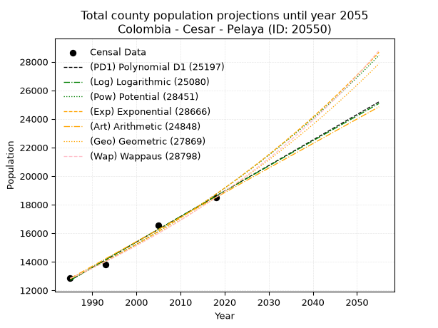
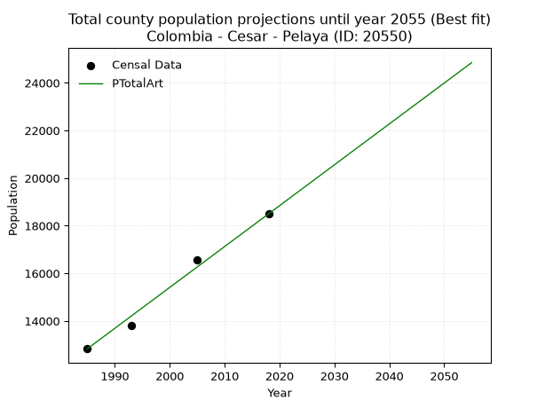
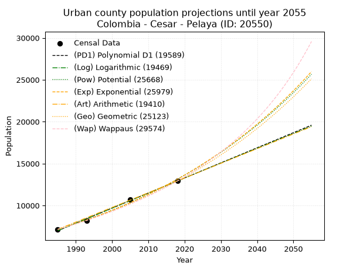
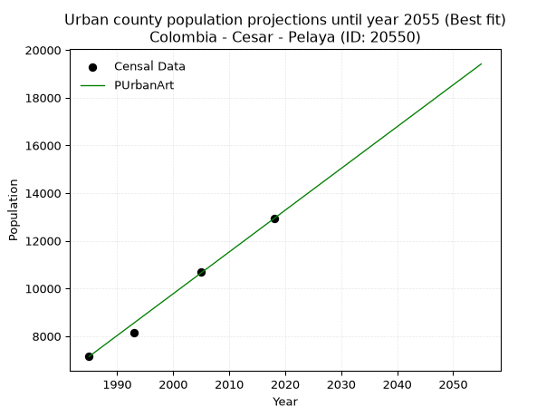
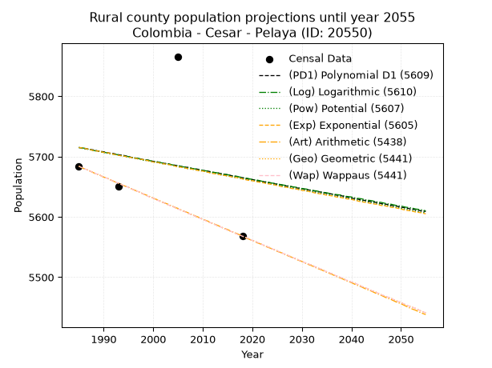
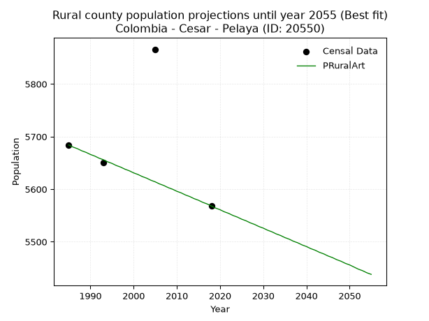

<div align="center">


</div>

# _“Population and Public Services Demand Projections (PPSD) until Year 2050 for Colombia - Cesar - Pelaya (ID: 20550)”_
Keywords: `population` `public-service` `projection` `lineal` `polynomial` `logarithmic` `potential` `exponential` `arithmetic` `geometric` `wappaus` `dane` `colombia` `south-america`

PPSD are analytical estimates used by governments and planners to anticipate future changes in population size, age distribution, and the resulting community needs for utilities, healthcare, education, and infrastructure as sizing future water treatment facilities, electrical grids, and road networks based on spatial growth.

> **General running parameters**: • app_version: _v20260806_. • Python version: _3.14.7_. • Pandas version: _3.0.5_. • NumPy version: _2.5.1_. • Creates, save and include plots into reports (create_plot): _False_. • Projection until year: _2050_. • Process polynomial degree 2 and up: _False_. • Process Wappaus: _True_. • Process Wappaus: _True_. • Set negative values to zero: _True_. • Set infinite values to zero: _True_. • Drop dataset notes: _True_. 
<div align="center">

Dynamic map: [:earth_americas:Google](http://maps.google.com/maps?q=8.689451071,-73.6667347) [:earth_americas:OSM](https://www.openstreetmap.org/#map=18/8.689451071/-73.6667347&layers=P) [:earth_americas:Bing](https://www.bing.com/maps?cp=8.689451071~-73.6667347&lvl=18) [:earth_americas:Apple](https://maps.apple.com/frame?center=8.689451071%2C-73.6667347&span=0.003%2C0.006)

</div>


<div align="center">

```geojson
{
  "type": "Feature",
  "geometry": {
    "type": "Point", 
    "coordinates": [-73.6667347, 8.689451071]
  }, 
  "properties": {
    "Name": "Colombia - Cesar - Pelaya (ID: 20550)"
  }
}
```

</div>


## 0. Census Data (4 records)

Census data are official statistics collected by a government about the people and housing in a country. They usually include counts of total population, age, sex, race, income, education, and jobs.

📅Global census file: [Population.xlsx](../data/Population.xlsx)

| Source   |   Year |   CountryID | CountryName   |   StateID | StateName   |   CountyID | CountyName   |   PTotal |   PUrban |   PRural |
|:---------|-------:|------------:|:--------------|----------:|:------------|-----------:|:-------------|---------:|---------:|---------:|
| DANE     |   1985 |          57 | Colombia      |        20 | Cesar       |      20550 | Pelaya       |    12833 |     7149 |     5684 |
| DANE     |   1993 |          57 | Colombia      |        20 | Cesar       |      20550 | Pelaya       |    13812 |     8162 |     5650 |
| DANE     |   2005 |          57 | Colombia      |        20 | Cesar       |      20550 | Pelaya       |    16561 |    10695 |     5866 |
| DANE     |   2018 |          57 | Colombia      |        20 | Cesar       |      20550 | Pelaya       |    18497 |    12929 |     5568 |

> 🔥Some records could had specific notes about the registered values or the corresponding urban or rural distribution.

## 1. Total

### 1.1. Coefficients and Parameters

* (PD1) Polynomial Deg 1: 178.47651545563883, -341571.9000401416 (lineal)
* (Log) Logarithmic: 357250.75135258306, -2700040.0738588367
* (Pow) Potential: 23.04073153207985, -71.87550897671737
* (Exp) Exponential: 0.011509575828612789, 1.5323323674275629e-06
* (Art) Arithmetic: Year diff. 2018 - 1985 = 33, Population diff. 18497 - 12833 = 5664, Annual growth = 171.63636363636363
* (Geo) Geometric: Year diff. 2018 - 1985 = 33, Population diff. 18497 - 12833 = 5664, Annual growth % = 0.011140034951098166
* (Wap) Wappaus: i = 1.095667817659519, Condition values only valid for < 200)

<sub>
Wappaus condition values: ['0.00', '1.10', '2.19', '3.29', '4.38', '5.48', '6.57', '7.67', '8.77', '9.86', '10.96', '12.05', '13.15', '14.24', '15.34', '16.44', '17.53', '18.63', '19.72', '20.82', '21.91', '23.01', '24.10', '25.20', '26.30', '27.39', '28.49', '29.58', '30.68', '31.77', '32.87', '33.97', '35.06', '36.16', '37.25', '38.35', '39.44', '40.54', '41.64', '42.73', '43.83', '44.92', '46.02', '47.11', '48.21', '49.31', '50.40', '51.50', '52.59', '53.69', '54.78', '55.88', '56.97', '58.07', '59.17', '60.26', '61.36', '62.45', '63.55', '64.64', '65.74', '66.84', '67.93', '69.03', '70.12', '71.22']
</sub>


### 1.2. Projected Dataset

|   Year |   CountyID |   PTotalPD1 |   PTotalLog |   PTotalPow |   PTotalExp |   PTotalArt |   PTotalGeo |   PTotalWap |
|-------:|-----------:|------------:|------------:|------------:|------------:|------------:|------------:|------------:|
|   1985 |      20550 |       12704 |       12699 |       12803 |       12808 |       12833 |       12833 |       12833 |
|   1986 |      20550 |       12882 |       12878 |       12952 |       12956 |       13005 |       12976 |       12974 |
|   1987 |      20550 |       13061 |       13058 |       13103 |       13106 |       13176 |       13121 |       13117 |
|   1988 |      20550 |       13239 |       13238 |       13256 |       13257 |       13348 |       13267 |       13262 |
|   1989 |      20550 |       13418 |       13418 |       13411 |       13411 |       13520 |       13414 |       13408 |
|   1990 |      20550 |       13596 |       13597 |       13567 |       13566 |       13691 |       13564 |       13556 |
|   1991 |      20550 |       13775 |       13777 |       13725 |       13723 |       13863 |       13715 |       13705 |
|   1992 |      20550 |       13953 |       13956 |       13885 |       13882 |       14034 |       13868 |       13856 |
|   1993 |      20550 |       14132 |       14135 |       14046 |       14043 |       14206 |       14022 |       14009 |
|   1994 |      20550 |       14310 |       14315 |       14209 |       14205 |       14378 |       14178 |       14164 |
|   1995 |      20550 |       14489 |       14494 |       14374 |       14370 |       14549 |       14336 |       14321 |
|   1996 |      20550 |       14667 |       14673 |       14541 |       14536 |       14721 |       14496 |       14479 |
|   1997 |      20550 |       14846 |       14852 |       14710 |       14704 |       14893 |       14658 |       14639 |
|   1998 |      20550 |       15024 |       15031 |       14881 |       14875 |       15064 |       14821 |       14801 |
|   1999 |      20550 |       15203 |       15209 |       15053 |       15047 |       15236 |       14986 |       14965 |
|   2000 |      20550 |       15381 |       15388 |       15228 |       15221 |       15408 |       15153 |       15131 |
|   2001 |      20550 |       15560 |       15567 |       15404 |       15397 |       15579 |       15322 |       15299 |
|   2002 |      20550 |       15738 |       15745 |       15583 |       15575 |       15751 |       15492 |       15469 |
|   2003 |      20550 |       15917 |       15924 |       15763 |       15756 |       15922 |       15665 |       15641 |
|   2004 |      20550 |       16095 |       16102 |       15945 |       15938 |       16094 |       15840 |       15815 |
|   2005 |      20550 |       16274 |       16280 |       16130 |       16123 |       16266 |       16016 |       15991 |
|   2006 |      20550 |       16452 |       16458 |       16316 |       16309 |       16437 |       16194 |       16170 |
|   2007 |      20550 |       16630 |       16636 |       16504 |       16498 |       16609 |       16375 |       16350 |
|   2008 |      20550 |       16809 |       16814 |       16695 |       16689 |       16781 |       16557 |       16533 |
|   2009 |      20550 |       16987 |       16992 |       16887 |       16882 |       16952 |       16742 |       16718 |
|   2010 |      20550 |       17166 |       17170 |       17082 |       17078 |       17124 |       16928 |       16906 |
|   2011 |      20550 |       17344 |       17348 |       17279 |       17275 |       17296 |       17117 |       17096 |
|   2012 |      20550 |       17523 |       17525 |       17478 |       17475 |       17467 |       17307 |       17288 |
|   2013 |      20550 |       17701 |       17703 |       17679 |       17678 |       17639 |       17500 |       17483 |
|   2014 |      20550 |       17880 |       17880 |       17883 |       17882 |       17810 |       17695 |       17681 |
|   2015 |      20550 |       18058 |       18057 |       18089 |       18089 |       17982 |       17892 |       17881 |
|   2016 |      20550 |       18237 |       18235 |       18297 |       18299 |       18154 |       18092 |       18084 |
|   2017 |      20550 |       18415 |       18412 |       18507 |       18511 |       18325 |       18293 |       18289 |
|   2018 |      20550 |       18594 |       18589 |       18719 |       18725 |       18497 |       18497 |       18497 |
|   2019 |      20550 |       18772 |       18766 |       18934 |       18942 |       18669 |       18703 |       18708 |
|   2020 |      20550 |       18951 |       18943 |       19152 |       19161 |       18840 |       18911 |       18922 |
|   2021 |      20550 |       19129 |       19120 |       19371 |       19383 |       19012 |       19122 |       19138 |
|   2022 |      20550 |       19308 |       19296 |       19593 |       19607 |       19184 |       19335 |       19358 |
|   2023 |      20550 |       19486 |       19473 |       19818 |       19834 |       19355 |       19550 |       19581 |
|   2024 |      20550 |       19665 |       19650 |       20045 |       20064 |       19527 |       19768 |       19807 |
|   2025 |      20550 |       19843 |       19826 |       20274 |       20296 |       19698 |       19989 |       20036 |
|   2026 |      20550 |       20022 |       20002 |       20506 |       20531 |       19870 |       20211 |       20268 |
|   2027 |      20550 |       20200 |       20179 |       20741 |       20768 |       20042 |       20436 |       20503 |
|   2028 |      20550 |       20378 |       20355 |       20978 |       21009 |       20213 |       20664 |       20742 |
|   2029 |      20550 |       20557 |       20531 |       21217 |       21252 |       20385 |       20894 |       20985 |
|   2030 |      20550 |       20735 |       20707 |       21459 |       21498 |       20557 |       21127 |       21231 |
|   2031 |      20550 |       20914 |       20883 |       21704 |       21747 |       20728 |       21362 |       21480 |
|   2032 |      20550 |       21092 |       21059 |       21952 |       21999 |       20900 |       21600 |       21733 |
|   2033 |      20550 |       21271 |       21235 |       22202 |       22253 |       21072 |       21841 |       21990 |
|   2034 |      20550 |       21449 |       21410 |       22455 |       22511 |       21243 |       22084 |       22251 |
|   2035 |      20550 |       21628 |       21586 |       22711 |       22772 |       21415 |       22330 |       22516 |
|   2036 |      20550 |       21806 |       21761 |       22969 |       23035 |       21586 |       22579 |       22784 |
|   2037 |      20550 |       21985 |       21937 |       23231 |       23302 |       21758 |       22831 |       23057 |
|   2038 |      20550 |       22163 |       22112 |       23495 |       23572 |       21930 |       23085 |       23334 |
|   2039 |      20550 |       22342 |       22287 |       23762 |       23844 |       22101 |       23342 |       23616 |
|   2040 |      20550 |       22520 |       22463 |       24032 |       24120 |       22273 |       23602 |       23901 |
|   2041 |      20550 |       22699 |       22638 |       24305 |       24400 |       22445 |       23865 |       24192 |
|   2042 |      20550 |       22877 |       22813 |       24581 |       24682 |       22616 |       24131 |       24487 |
|   2043 |      20550 |       23056 |       22988 |       24860 |       24968 |       22788 |       24400 |       24786 |
|   2044 |      20550 |       23234 |       23162 |       25142 |       25257 |       22960 |       24671 |       25091 |
|   2045 |      20550 |       23413 |       23337 |       25427 |       25549 |       23131 |       24946 |       25400 |
|   2046 |      20550 |       23591 |       23512 |       25715 |       25845 |       23303 |       25224 |       25715 |
|   2047 |      20550 |       23770 |       23686 |       26006 |       26144 |       23474 |       25505 |       26035 |
|   2048 |      20550 |       23948 |       23861 |       26300 |       26447 |       23646 |       25789 |       26360 |
|   2049 |      20550 |       24126 |       24035 |       26597 |       26753 |       23818 |       26077 |       26690 |
|   2050 |      20550 |       24305 |       24209 |       26898 |       27063 |       23989 |       26367 |       27027 |
<div align="center">

</img>

</div>


### 1.3. Best fit with absolute and relative error (%)

Relative error puts that difference into context by dividing the absolute error by the true value, creating a unitless ratio or percentage that shows the scale of the mistake.

Absolute and relative error

|   Year | Source   |   CountryID | CountryName   |   StateID | StateName   |   CountyID_x | CountyName   |   PTotal |   PUrban |   PRural |   CountyID_y |   PTotalPD1 |   PTotalLog |   PTotalPow |   PTotalExp |   PTotalArt |   PTotalGeo |   PTotalWap |   PTotalPD1AbsError |   PTotalLogAbsError |   PTotalPowAbsError |   PTotalExpAbsError |   PTotalArtAbsError |   PTotalGeoAbsError |   PTotalWapAbsError |   PTotalPD1RelError |   PTotalLogRelError |   PTotalPowRelError |   PTotalExpRelError |   PTotalArtRelError |   PTotalGeoRelError |   PTotalWapRelError |
|-------:|:---------|------------:|:--------------|----------:|:------------|-------------:|:-------------|---------:|---------:|---------:|-------------:|------------:|------------:|------------:|------------:|------------:|------------:|------------:|--------------------:|--------------------:|--------------------:|--------------------:|--------------------:|--------------------:|--------------------:|--------------------:|--------------------:|--------------------:|--------------------:|--------------------:|--------------------:|--------------------:|
|   1985 | DANE     |          57 | Colombia      |        20 | Cesar       |        20550 | Pelaya       |    12833 |     7149 |     5684 |        20550 |       12704 |       12699 |       12803 |       12808 |       12833 |       12833 |       12833 |                 129 |                 134 |                  30 |                  25 |                   0 |                   0 |                   0 |            1.00522  |            1.04418  |            0.233772 |             0.19481 |             0       |             0       |             0       |
|   1993 | DANE     |          57 | Colombia      |        20 | Cesar       |        20550 | Pelaya       |    13812 |     8162 |     5650 |        20550 |       14132 |       14135 |       14046 |       14043 |       14206 |       14022 |       14009 |                 320 |                 323 |                 234 |                 231 |                 394 |                 210 |                 197 |            2.31683  |            2.33855  |            1.69418  |             1.67246 |             2.85259 |             1.52042 |             1.4263  |
|   2005 | DANE     |          57 | Colombia      |        20 | Cesar       |        20550 | Pelaya       |    16561 |    10695 |     5866 |        20550 |       16274 |       16280 |       16130 |       16123 |       16266 |       16016 |       15991 |                 287 |                 281 |                 431 |                 438 |                 295 |                 545 |                 570 |            1.73299  |            1.69676  |            2.6025   |             2.64477 |             1.78129 |             3.29086 |             3.44182 |
|   2018 | DANE     |          57 | Colombia      |        20 | Cesar       |        20550 | Pelaya       |    18497 |    12929 |     5568 |        20550 |       18594 |       18589 |       18719 |       18725 |       18497 |       18497 |       18497 |                  97 |                  92 |                 222 |                 228 |                   0 |                   0 |                   0 |            0.524409 |            0.497378 |            1.20019  |             1.23263 |             0       |             0       |             0       |

Relative error mean

| Method    |   RelError | Best   |
|:----------|-----------:|:-------|
| PTotalPD1 |    1.39486 |        |
| PTotalLog |    1.39422 |        |
| PTotalPow |    1.43266 |        |
| PTotalExp |    1.43617 |        |
| PTotalArt |    1.15847 | True   |
| PTotalGeo |    1.20282 |        |
| PTotalWap |    1.21703 |        |

💙Best method: _**PTotalArt**_
<div align="center">

</img>

</div>


### 1.4. Fresh water supply demand in liters per capita per day (lpcd)

The fresh water supply demand typically ranges from 100 to 300 liters per capita per day (lpcd) for standard domestic and municipal planning, though absolute survival minimums set by the World Health Organization are as low as 7.5 to 20 liters per day, and total consumption in high-income nations can exceed 400 liters.

> `CZ`: Level in meters above the sea level (masl).<br> `WS`: Fresh water supply demand in liters per capita per day (lpcd or l/h/d).<br> `WSAll`: Zonal fresh water supply demand in liters per second (l/s).<br> `A`: Zonal area in square meters.

Reference values (RAS Colombia)

|    CZ |   WS |
|------:|-----:|
|  1000 |  120 |
|  2000 |  130 |
| 99999 |  140 |

County shapefile geometry properties and water supply values

|   CountyID |     ATotal |   CZTotal |   WSTotal |
|-----------:|-----------:|----------:|----------:|
|      20550 | 4.2274e+08 |    267.42 |       120 |

Projected values for best method: PTotalArt

|   CountyID |   Year |   PTotalArt |   WSTotal |   WSTotalAll |
|-----------:|-------:|------------:|----------:|-------------:|
|      20550 |   1985 |       12833 |       120 |      17.8236 |
|      20550 |   1986 |       13005 |       120 |      18.0625 |
|      20550 |   1987 |       13176 |       120 |      18.3    |
|      20550 |   1988 |       13348 |       120 |      18.5389 |
|      20550 |   1989 |       13520 |       120 |      18.7778 |
|      20550 |   1990 |       13691 |       120 |      19.0153 |
|      20550 |   1991 |       13863 |       120 |      19.2542 |
|      20550 |   1992 |       14034 |       120 |      19.4917 |
|      20550 |   1993 |       14206 |       120 |      19.7306 |
|      20550 |   1994 |       14378 |       120 |      19.9694 |
|      20550 |   1995 |       14549 |       120 |      20.2069 |
|      20550 |   1996 |       14721 |       120 |      20.4458 |
|      20550 |   1997 |       14893 |       120 |      20.6847 |
|      20550 |   1998 |       15064 |       120 |      20.9222 |
|      20550 |   1999 |       15236 |       120 |      21.1611 |
|      20550 |   2000 |       15408 |       120 |      21.4    |
|      20550 |   2001 |       15579 |       120 |      21.6375 |
|      20550 |   2002 |       15751 |       120 |      21.8764 |
|      20550 |   2003 |       15922 |       120 |      22.1139 |
|      20550 |   2004 |       16094 |       120 |      22.3528 |
|      20550 |   2005 |       16266 |       120 |      22.5917 |
|      20550 |   2006 |       16437 |       120 |      22.8292 |
|      20550 |   2007 |       16609 |       120 |      23.0681 |
|      20550 |   2008 |       16781 |       120 |      23.3069 |
|      20550 |   2009 |       16952 |       120 |      23.5444 |
|      20550 |   2010 |       17124 |       120 |      23.7833 |
|      20550 |   2011 |       17296 |       120 |      24.0222 |
|      20550 |   2012 |       17467 |       120 |      24.2597 |
|      20550 |   2013 |       17639 |       120 |      24.4986 |
|      20550 |   2014 |       17810 |       120 |      24.7361 |
|      20550 |   2015 |       17982 |       120 |      24.975  |
|      20550 |   2016 |       18154 |       120 |      25.2139 |
|      20550 |   2017 |       18325 |       120 |      25.4514 |
|      20550 |   2018 |       18497 |       120 |      25.6903 |
|      20550 |   2019 |       18669 |       120 |      25.9292 |
|      20550 |   2020 |       18840 |       120 |      26.1667 |
|      20550 |   2021 |       19012 |       120 |      26.4056 |
|      20550 |   2022 |       19184 |       120 |      26.6444 |
|      20550 |   2023 |       19355 |       120 |      26.8819 |
|      20550 |   2024 |       19527 |       120 |      27.1208 |
|      20550 |   2025 |       19698 |       120 |      27.3583 |
|      20550 |   2026 |       19870 |       120 |      27.5972 |
|      20550 |   2027 |       20042 |       120 |      27.8361 |
|      20550 |   2028 |       20213 |       120 |      28.0736 |
|      20550 |   2029 |       20385 |       120 |      28.3125 |
|      20550 |   2030 |       20557 |       120 |      28.5514 |
|      20550 |   2031 |       20728 |       120 |      28.7889 |
|      20550 |   2032 |       20900 |       120 |      29.0278 |
|      20550 |   2033 |       21072 |       120 |      29.2667 |
|      20550 |   2034 |       21243 |       120 |      29.5042 |
|      20550 |   2035 |       21415 |       120 |      29.7431 |
|      20550 |   2036 |       21586 |       120 |      29.9806 |
|      20550 |   2037 |       21758 |       120 |      30.2194 |
|      20550 |   2038 |       21930 |       120 |      30.4583 |
|      20550 |   2039 |       22101 |       120 |      30.6958 |
|      20550 |   2040 |       22273 |       120 |      30.9347 |
|      20550 |   2041 |       22445 |       120 |      31.1736 |
|      20550 |   2042 |       22616 |       120 |      31.4111 |
|      20550 |   2043 |       22788 |       120 |      31.65   |
|      20550 |   2044 |       22960 |       120 |      31.8889 |
|      20550 |   2045 |       23131 |       120 |      32.1264 |
|      20550 |   2046 |       23303 |       120 |      32.3653 |
|      20550 |   2047 |       23474 |       120 |      32.6028 |
|      20550 |   2048 |       23646 |       120 |      32.8417 |
|      20550 |   2049 |       23818 |       120 |      33.0806 |
|      20550 |   2050 |       23989 |       120 |      33.3181 |

## 2. Urban

### 2.1. Coefficients and Parameters

* (PD1) Polynomial Deg 1: 179.9987956643903, -350308.8410276967 (lineal)
* (Log) Logarithmic: 360268.52692016534, -2728670.210130966
* (Pow) Potential: 36.86910235252115, -117.73100601087421
* (Exp) Exponential: 0.01841742806547641, 9.495601857893218e-13
* (Art) Arithmetic: Year diff. 2018 - 1985 = 33, Population diff. 12929 - 7149 = 5780, Annual growth = 175.15151515151516
* (Geo) Geometric: Year diff. 2018 - 1985 = 33, Population diff. 12929 - 7149 = 5780, Annual growth % = 0.018116708520638847
* (Wap) Wappaus: i = 1.7447107794751981, Condition values only valid for < 200)

<sub>
Wappaus condition values: ['0.00', '1.74', '3.49', '5.23', '6.98', '8.72', '10.47', '12.21', '13.96', '15.70', '17.45', '19.19', '20.94', '22.68', '24.43', '26.17', '27.92', '29.66', '31.40', '33.15', '34.89', '36.64', '38.38', '40.13', '41.87', '43.62', '45.36', '47.11', '48.85', '50.60', '52.34', '54.09', '55.83', '57.58', '59.32', '61.06', '62.81', '64.55', '66.30', '68.04', '69.79', '71.53', '73.28', '75.02', '76.77', '78.51', '80.26', '82.00', '83.75', '85.49', '87.24', '88.98', '90.72', '92.47', '94.21', '95.96', '97.70', '99.45', '101.19', '102.94', '104.68', '106.43', '108.17', '109.92', '111.66', '113.41']
</sub>


### 2.2. Projected Dataset

|   Year |   CountyID |   PUrbanPD1 |   PUrbanLog |   PUrbanPow |   PUrbanExp |   PUrbanArt |   PUrbanGeo |   PUrbanWap |
|-------:|-----------:|------------:|------------:|------------:|------------:|------------:|------------:|------------:|
|   1985 |      20550 |        6989 |        6984 |        7153 |        7157 |        7149 |        7149 |        7149 |
|   1986 |      20550 |        7169 |        7165 |        7287 |        7290 |        7324 |        7279 |        7275 |
|   1987 |      20550 |        7349 |        7346 |        7423 |        7425 |        7499 |        7410 |        7403 |
|   1988 |      20550 |        7529 |        7528 |        7562 |        7563 |        7674 |        7545 |        7533 |
|   1989 |      20550 |        7709 |        7709 |        7704 |        7704 |        7850 |        7681 |        7666 |
|   1990 |      20550 |        7889 |        7890 |        7848 |        7847 |        8025 |        7820 |        7801 |
|   1991 |      20550 |        8069 |        8071 |        7994 |        7993 |        8200 |        7962 |        7939 |
|   1992 |      20550 |        8249 |        8252 |        8144 |        8142 |        8375 |        8106 |        8079 |
|   1993 |      20550 |        8429 |        8433 |        8296 |        8293 |        8550 |        8253 |        8222 |
|   1994 |      20550 |        8609 |        8613 |        8451 |        8447 |        8725 |        8403 |        8367 |
|   1995 |      20550 |        8789 |        8794 |        8608 |        8604 |        8901 |        8555 |        8516 |
|   1996 |      20550 |        8969 |        8974 |        8769 |        8764 |        9076 |        8710 |        8667 |
|   1997 |      20550 |        9149 |        9155 |        8932 |        8927 |        9251 |        8868 |        8821 |
|   1998 |      20550 |        9329 |        9335 |        9099 |        9093 |        9426 |        9028 |        8978 |
|   1999 |      20550 |        9509 |        9516 |        9268 |        9262 |        9601 |        9192 |        9138 |
|   2000 |      20550 |        9689 |        9696 |        9441 |        9434 |        9776 |        9359 |        9302 |
|   2001 |      20550 |        9869 |        9876 |        9616 |        9609 |        9951 |        9528 |        9468 |
|   2002 |      20550 |       10049 |       10056 |        9795 |        9788 |       10127 |        9701 |        9639 |
|   2003 |      20550 |       10229 |       10236 |        9977 |        9970 |       10302 |        9876 |        9812 |
|   2004 |      20550 |       10409 |       10416 |       10162 |       10155 |       10477 |       10055 |        9990 |
|   2005 |      20550 |       10589 |       10595 |       10351 |       10344 |       10652 |       10238 |       10171 |
|   2006 |      20550 |       10769 |       10775 |       10543 |       10536 |       10827 |       10423 |       10356 |
|   2007 |      20550 |       10949 |       10954 |       10739 |       10732 |       11002 |       10612 |       10545 |
|   2008 |      20550 |       11129 |       11134 |       10938 |       10932 |       11177 |       10804 |       10738 |
|   2009 |      20550 |       11309 |       11313 |       11140 |       11135 |       11353 |       11000 |       10935 |
|   2010 |      20550 |       11489 |       11493 |       11347 |       11342 |       11528 |       11199 |       11137 |
|   2011 |      20550 |       11669 |       11672 |       11557 |       11553 |       11703 |       11402 |       11343 |
|   2012 |      20550 |       11849 |       11851 |       11770 |       11767 |       11878 |       11609 |       11554 |
|   2013 |      20550 |       12029 |       12030 |       11988 |       11986 |       12053 |       11819 |       11770 |
|   2014 |      20550 |       12209 |       12209 |       12210 |       12209 |       12228 |       12033 |       11991 |
|   2015 |      20550 |       12389 |       12388 |       12435 |       12436 |       12404 |       12251 |       12217 |
|   2016 |      20550 |       12569 |       12566 |       12665 |       12667 |       12579 |       12473 |       12449 |
|   2017 |      20550 |       12749 |       12745 |       12898 |       12902 |       12754 |       12699 |       12686 |
|   2018 |      20550 |       12929 |       12924 |       13136 |       13142 |       12929 |       12929 |       12929 |
|   2019 |      20550 |       13109 |       13102 |       13378 |       13387 |       13104 |       13163 |       13178 |
|   2020 |      20550 |       13289 |       13281 |       13625 |       13635 |       13279 |       13402 |       13433 |
|   2021 |      20550 |       13469 |       13459 |       13876 |       13889 |       13454 |       13645 |       13695 |
|   2022 |      20550 |       13649 |       13637 |       14131 |       14147 |       13630 |       13892 |       13964 |
|   2023 |      20550 |       13829 |       13815 |       14391 |       14410 |       13805 |       14143 |       14239 |
|   2024 |      20550 |       14009 |       13993 |       14656 |       14678 |       13980 |       14400 |       14522 |
|   2025 |      20550 |       14189 |       14171 |       14925 |       14951 |       14155 |       14660 |       14812 |
|   2026 |      20550 |       14369 |       14349 |       15199 |       15229 |       14330 |       14926 |       15110 |
|   2027 |      20550 |       14549 |       14527 |       15478 |       15512 |       14505 |       15196 |       15417 |
|   2028 |      20550 |       14729 |       14705 |       15762 |       15800 |       14681 |       15472 |       15732 |
|   2029 |      20550 |       14909 |       14882 |       16051 |       16094 |       14856 |       15752 |       16056 |
|   2030 |      20550 |       15089 |       15060 |       16346 |       16393 |       15031 |       16037 |       16389 |
|   2031 |      20550 |       15269 |       15237 |       16645 |       16698 |       15206 |       16328 |       16732 |
|   2032 |      20550 |       15449 |       15414 |       16950 |       17008 |       15381 |       16624 |       17085 |
|   2033 |      20550 |       15629 |       15592 |       17260 |       17324 |       15556 |       16925 |       17449 |
|   2034 |      20550 |       15809 |       15769 |       17576 |       17646 |       15731 |       17232 |       17824 |
|   2035 |      20550 |       15989 |       15946 |       17898 |       17974 |       15907 |       17544 |       18210 |
|   2036 |      20550 |       16169 |       16123 |       18225 |       18308 |       16082 |       17862 |       18609 |
|   2037 |      20550 |       16349 |       16300 |       18558 |       18649 |       16257 |       18185 |       19020 |
|   2038 |      20550 |       16529 |       16477 |       18897 |       18995 |       16432 |       18515 |       19444 |
|   2039 |      20550 |       16709 |       16653 |       19241 |       19348 |       16607 |       18850 |       19883 |
|   2040 |      20550 |       16889 |       16830 |       19592 |       19708 |       16782 |       19192 |       20336 |
|   2041 |      20550 |       17069 |       17007 |       19950 |       20074 |       16957 |       19539 |       20805 |
|   2042 |      20550 |       17249 |       17183 |       20313 |       20447 |       17133 |       19893 |       21290 |
|   2043 |      20550 |       17429 |       17359 |       20683 |       20827 |       17308 |       20254 |       21792 |
|   2044 |      20550 |       17609 |       17536 |       21060 |       21215 |       17483 |       20621 |       22313 |
|   2045 |      20550 |       17789 |       17712 |       21443 |       21609 |       17658 |       20994 |       22852 |
|   2046 |      20550 |       17969 |       17888 |       21833 |       22011 |       17833 |       21375 |       23411 |
|   2047 |      20550 |       18149 |       18064 |       22230 |       22420 |       18008 |       21762 |       23992 |
|   2048 |      20550 |       18329 |       18240 |       22634 |       22836 |       18184 |       22156 |       24595 |
|   2049 |      20550 |       18509 |       18416 |       23045 |       23261 |       18359 |       22557 |       25222 |
|   2050 |      20550 |       18689 |       18592 |       23463 |       23693 |       18534 |       22966 |       25874 |
<div align="center">

</img>

</div>


### 2.3. Best fit with absolute and relative error (%)

Relative error puts that difference into context by dividing the absolute error by the true value, creating a unitless ratio or percentage that shows the scale of the mistake.

Absolute and relative error

|   Year | Source   |   CountryID | CountryName   |   StateID | StateName   |   CountyID_x | CountyName   |   PTotal |   PUrban |   PRural |   CountyID_y |   PUrbanPD1 |   PUrbanLog |   PUrbanPow |   PUrbanExp |   PUrbanArt |   PUrbanGeo |   PUrbanWap |   PUrbanPD1AbsError |   PUrbanLogAbsError |   PUrbanPowAbsError |   PUrbanExpAbsError |   PUrbanArtAbsError |   PUrbanGeoAbsError |   PUrbanWapAbsError |   PUrbanPD1RelError |   PUrbanLogRelError |   PUrbanPowRelError |   PUrbanExpRelError |   PUrbanArtRelError |   PUrbanGeoRelError |   PUrbanWapRelError |
|-------:|:---------|------------:|:--------------|----------:|:------------|-------------:|:-------------|---------:|---------:|---------:|-------------:|------------:|------------:|------------:|------------:|------------:|------------:|------------:|--------------------:|--------------------:|--------------------:|--------------------:|--------------------:|--------------------:|--------------------:|--------------------:|--------------------:|--------------------:|--------------------:|--------------------:|--------------------:|--------------------:|
|   1985 | DANE     |          57 | Colombia      |        20 | Cesar       |        20550 | Pelaya       |    12833 |     7149 |     5684 |        20550 |        6989 |        6984 |        7153 |        7157 |        7149 |        7149 |        7149 |                 160 |                 165 |                   4 |                   8 |                   0 |                   0 |                   0 |            2.23808  |           2.30802   |           0.0559519 |            0.111904 |            0        |             0       |            0        |
|   1993 | DANE     |          57 | Colombia      |        20 | Cesar       |        20550 | Pelaya       |    13812 |     8162 |     5650 |        20550 |        8429 |        8433 |        8296 |        8293 |        8550 |        8253 |        8222 |                 267 |                 271 |                 134 |                 131 |                 388 |                  91 |                  60 |            3.27126  |           3.32026   |           1.64175   |            1.605    |            4.75374  |             1.11492 |            0.735114 |
|   2005 | DANE     |          57 | Colombia      |        20 | Cesar       |        20550 | Pelaya       |    16561 |    10695 |     5866 |        20550 |       10589 |       10595 |       10351 |       10344 |       10652 |       10238 |       10171 |                 106 |                 100 |                 344 |                 351 |                  43 |                 457 |                 524 |            0.991117 |           0.935016  |           3.21646   |            3.28191  |            0.402057 |             4.27302 |            4.89949  |
|   2018 | DANE     |          57 | Colombia      |        20 | Cesar       |        20550 | Pelaya       |    18497 |    12929 |     5568 |        20550 |       12929 |       12924 |       13136 |       13142 |       12929 |       12929 |       12929 |                   0 |                   5 |                 207 |                 213 |                   0 |                   0 |                   0 |            0        |           0.0386728 |           1.60105   |            1.64746  |            0        |             0       |            0        |

Relative error mean

| Method    |   RelError | Best   |
|:----------|-----------:|:-------|
| PUrbanPD1 |    1.62511 |        |
| PUrbanLog |    1.65049 |        |
| PUrbanPow |    1.6288  |        |
| PUrbanExp |    1.66157 |        |
| PUrbanArt |    1.28895 | True   |
| PUrbanGeo |    1.34699 |        |
| PUrbanWap |    1.40865 |        |

💙Best method: _**PUrbanArt**_
<div align="center">

</img>

</div>


### 2.4. Fresh water supply demand in liters per capita per day (lpcd)

The fresh water supply demand typically ranges from 100 to 300 liters per capita per day (lpcd) for standard domestic and municipal planning, though absolute survival minimums set by the World Health Organization are as low as 7.5 to 20 liters per day, and total consumption in high-income nations can exceed 400 liters.

> `CZ`: Level in meters above the sea level (masl).<br> `WS`: Fresh water supply demand in liters per capita per day (lpcd or l/h/d).<br> `WSAll`: Zonal fresh water supply demand in liters per second (l/s).<br> `A`: Zonal area in square meters.

Reference values (RAS Colombia)

|    CZ |   WS |
|------:|-----:|
|  1000 |  120 |
|  2000 |  130 |
| 99999 |  140 |

County shapefile geometry properties and water supply values

|   CountyID |     AUrban |   CZUrban |   WSUrban |
|-----------:|-----------:|----------:|----------:|
|      20550 | 2.6504e+06 |    69.447 |       120 |

Projected values for best method: PUrbanArt

|   CountyID |   Year |   PUrbanArt |   WSUrban |   WSUrbanAll |
|-----------:|-------:|------------:|----------:|-------------:|
|      20550 |   1985 |        7149 |       120 |      9.92917 |
|      20550 |   1986 |        7324 |       120 |     10.1722  |
|      20550 |   1987 |        7499 |       120 |     10.4153  |
|      20550 |   1988 |        7674 |       120 |     10.6583  |
|      20550 |   1989 |        7850 |       120 |     10.9028  |
|      20550 |   1990 |        8025 |       120 |     11.1458  |
|      20550 |   1991 |        8200 |       120 |     11.3889  |
|      20550 |   1992 |        8375 |       120 |     11.6319  |
|      20550 |   1993 |        8550 |       120 |     11.875   |
|      20550 |   1994 |        8725 |       120 |     12.1181  |
|      20550 |   1995 |        8901 |       120 |     12.3625  |
|      20550 |   1996 |        9076 |       120 |     12.6056  |
|      20550 |   1997 |        9251 |       120 |     12.8486  |
|      20550 |   1998 |        9426 |       120 |     13.0917  |
|      20550 |   1999 |        9601 |       120 |     13.3347  |
|      20550 |   2000 |        9776 |       120 |     13.5778  |
|      20550 |   2001 |        9951 |       120 |     13.8208  |
|      20550 |   2002 |       10127 |       120 |     14.0653  |
|      20550 |   2003 |       10302 |       120 |     14.3083  |
|      20550 |   2004 |       10477 |       120 |     14.5514  |
|      20550 |   2005 |       10652 |       120 |     14.7944  |
|      20550 |   2006 |       10827 |       120 |     15.0375  |
|      20550 |   2007 |       11002 |       120 |     15.2806  |
|      20550 |   2008 |       11177 |       120 |     15.5236  |
|      20550 |   2009 |       11353 |       120 |     15.7681  |
|      20550 |   2010 |       11528 |       120 |     16.0111  |
|      20550 |   2011 |       11703 |       120 |     16.2542  |
|      20550 |   2012 |       11878 |       120 |     16.4972  |
|      20550 |   2013 |       12053 |       120 |     16.7403  |
|      20550 |   2014 |       12228 |       120 |     16.9833  |
|      20550 |   2015 |       12404 |       120 |     17.2278  |
|      20550 |   2016 |       12579 |       120 |     17.4708  |
|      20550 |   2017 |       12754 |       120 |     17.7139  |
|      20550 |   2018 |       12929 |       120 |     17.9569  |
|      20550 |   2019 |       13104 |       120 |     18.2     |
|      20550 |   2020 |       13279 |       120 |     18.4431  |
|      20550 |   2021 |       13454 |       120 |     18.6861  |
|      20550 |   2022 |       13630 |       120 |     18.9306  |
|      20550 |   2023 |       13805 |       120 |     19.1736  |
|      20550 |   2024 |       13980 |       120 |     19.4167  |
|      20550 |   2025 |       14155 |       120 |     19.6597  |
|      20550 |   2026 |       14330 |       120 |     19.9028  |
|      20550 |   2027 |       14505 |       120 |     20.1458  |
|      20550 |   2028 |       14681 |       120 |     20.3903  |
|      20550 |   2029 |       14856 |       120 |     20.6333  |
|      20550 |   2030 |       15031 |       120 |     20.8764  |
|      20550 |   2031 |       15206 |       120 |     21.1194  |
|      20550 |   2032 |       15381 |       120 |     21.3625  |
|      20550 |   2033 |       15556 |       120 |     21.6056  |
|      20550 |   2034 |       15731 |       120 |     21.8486  |
|      20550 |   2035 |       15907 |       120 |     22.0931  |
|      20550 |   2036 |       16082 |       120 |     22.3361  |
|      20550 |   2037 |       16257 |       120 |     22.5792  |
|      20550 |   2038 |       16432 |       120 |     22.8222  |
|      20550 |   2039 |       16607 |       120 |     23.0653  |
|      20550 |   2040 |       16782 |       120 |     23.3083  |
|      20550 |   2041 |       16957 |       120 |     23.5514  |
|      20550 |   2042 |       17133 |       120 |     23.7958  |
|      20550 |   2043 |       17308 |       120 |     24.0389  |
|      20550 |   2044 |       17483 |       120 |     24.2819  |
|      20550 |   2045 |       17658 |       120 |     24.525   |
|      20550 |   2046 |       17833 |       120 |     24.7681  |
|      20550 |   2047 |       18008 |       120 |     25.0111  |
|      20550 |   2048 |       18184 |       120 |     25.2556  |
|      20550 |   2049 |       18359 |       120 |     25.4986  |
|      20550 |   2050 |       18534 |       120 |     25.7417  |

## 3. Rural

### 3.1. Coefficients and Parameters

* (PD1) Polynomial Deg 1: -1.5222802087513212, 8736.94098755483 (lineal)
* (Log) Logarithmic: -3017.775567582164, 28630.136272127722
* (Pow) Potential: -0.5502560303112226, 5.5716228364947336
* (Exp) Exponential: -0.0002774555030460435, 9913.131399294067
* (Art) Arithmetic: Year diff. 2018 - 1985 = 33, Population diff. 5568 - 5684 = -116, Annual growth = -3.515151515151515
* (Geo) Geometric: Year diff. 2018 - 1985 = 33, Population diff. 5568 - 5684 = -116, Annual growth % = -0.0006246317212632579
* (Wap) Wappaus: i = -0.062480474851608875, Condition values only valid for < 200)

<sub>
Wappaus condition values: ['-0.00', '-0.06', '-0.12', '-0.19', '-0.25', '-0.31', '-0.37', '-0.44', '-0.50', '-0.56', '-0.62', '-0.69', '-0.75', '-0.81', '-0.87', '-0.94', '-1.00', '-1.06', '-1.12', '-1.19', '-1.25', '-1.31', '-1.37', '-1.44', '-1.50', '-1.56', '-1.62', '-1.69', '-1.75', '-1.81', '-1.87', '-1.94', '-2.00', '-2.06', '-2.12', '-2.19', '-2.25', '-2.31', '-2.37', '-2.44', '-2.50', '-2.56', '-2.62', '-2.69', '-2.75', '-2.81', '-2.87', '-2.94', '-3.00', '-3.06', '-3.12', '-3.19', '-3.25', '-3.31', '-3.37', '-3.44', '-3.50', '-3.56', '-3.62', '-3.69', '-3.75', '-3.81', '-3.87', '-3.94', '-4.00', '-4.06']
</sub>


### 3.2. Projected Dataset

|   Year |   CountyID |   PRuralPD1 |   PRuralLog |   PRuralPow |   PRuralExp |   PRuralArt |   PRuralGeo |   PRuralWap |
|-------:|-----------:|------------:|------------:|------------:|------------:|------------:|------------:|------------:|
|   1985 |      20550 |        5715 |        5715 |        5715 |        5715 |        5684 |        5684 |        5684 |
|   1986 |      20550 |        5714 |        5714 |        5713 |        5714 |        5680 |        5680 |        5680 |
|   1987 |      20550 |        5712 |        5712 |        5712 |        5712 |        5677 |        5677 |        5677 |
|   1988 |      20550 |        5711 |        5710 |        5710 |        5710 |        5673 |        5673 |        5673 |
|   1989 |      20550 |        5709 |        5709 |        5709 |        5709 |        5670 |        5670 |        5670 |
|   1990 |      20550 |        5708 |        5707 |        5707 |        5707 |        5666 |        5666 |        5666 |
|   1991 |      20550 |        5706 |        5706 |        5705 |        5706 |        5663 |        5663 |        5663 |
|   1992 |      20550 |        5705 |        5704 |        5704 |        5704 |        5659 |        5659 |        5659 |
|   1993 |      20550 |        5703 |        5703 |        5702 |        5702 |        5656 |        5656 |        5656 |
|   1994 |      20550 |        5702 |        5701 |        5701 |        5701 |        5652 |        5652 |        5652 |
|   1995 |      20550 |        5700 |        5700 |        5699 |        5699 |        5649 |        5649 |        5649 |
|   1996 |      20550 |        5698 |        5698 |        5698 |        5698 |        5645 |        5645 |        5645 |
|   1997 |      20550 |        5697 |        5697 |        5696 |        5696 |        5642 |        5642 |        5642 |
|   1998 |      20550 |        5695 |        5695 |        5694 |        5695 |        5638 |        5638 |        5638 |
|   1999 |      20550 |        5694 |        5694 |        5693 |        5693 |        5635 |        5634 |        5634 |
|   2000 |      20550 |        5692 |        5692 |        5691 |        5691 |        5631 |        5631 |        5631 |
|   2001 |      20550 |        5691 |        5691 |        5690 |        5690 |        5628 |        5627 |        5627 |
|   2002 |      20550 |        5689 |        5689 |        5688 |        5688 |        5624 |        5624 |        5624 |
|   2003 |      20550 |        5688 |        5688 |        5687 |        5687 |        5621 |        5620 |        5620 |
|   2004 |      20550 |        5686 |        5686 |        5685 |        5685 |        5617 |        5617 |        5617 |
|   2005 |      20550 |        5685 |        5685 |        5683 |        5683 |        5614 |        5613 |        5613 |
|   2006 |      20550 |        5683 |        5683 |        5682 |        5682 |        5610 |        5610 |        5610 |
|   2007 |      20550 |        5682 |        5682 |        5680 |        5680 |        5607 |        5606 |        5606 |
|   2008 |      20550 |        5680 |        5680 |        5679 |        5679 |        5603 |        5603 |        5603 |
|   2009 |      20550 |        5679 |        5679 |        5677 |        5677 |        5600 |        5599 |        5599 |
|   2010 |      20550 |        5677 |        5677 |        5676 |        5676 |        5596 |        5596 |        5596 |
|   2011 |      20550 |        5676 |        5676 |        5674 |        5674 |        5593 |        5592 |        5592 |
|   2012 |      20550 |        5674 |        5674 |        5673 |        5672 |        5589 |        5589 |        5589 |
|   2013 |      20550 |        5673 |        5673 |        5671 |        5671 |        5586 |        5585 |        5585 |
|   2014 |      20550 |        5671 |        5671 |        5669 |        5669 |        5582 |        5582 |        5582 |
|   2015 |      20550 |        5670 |        5670 |        5668 |        5668 |        5579 |        5578 |        5578 |
|   2016 |      20550 |        5668 |        5668 |        5666 |        5666 |        5575 |        5575 |        5575 |
|   2017 |      20550 |        5667 |        5667 |        5665 |        5665 |        5572 |        5571 |        5571 |
|   2018 |      20550 |        5665 |        5665 |        5663 |        5663 |        5568 |        5568 |        5568 |
|   2019 |      20550 |        5663 |        5664 |        5662 |        5661 |        5564 |        5565 |        5565 |
|   2020 |      20550 |        5662 |        5662 |        5660 |        5660 |        5561 |        5561 |        5561 |
|   2021 |      20550 |        5660 |        5661 |        5659 |        5658 |        5557 |        5558 |        5558 |
|   2022 |      20550 |        5659 |        5659 |        5657 |        5657 |        5554 |        5554 |        5554 |
|   2023 |      20550 |        5657 |        5658 |        5656 |        5655 |        5550 |        5551 |        5551 |
|   2024 |      20550 |        5656 |        5656 |        5654 |        5654 |        5547 |        5547 |        5547 |
|   2025 |      20550 |        5654 |        5655 |        5653 |        5652 |        5543 |        5544 |        5544 |
|   2026 |      20550 |        5653 |        5653 |        5651 |        5650 |        5540 |        5540 |        5540 |
|   2027 |      20550 |        5651 |        5652 |        5649 |        5649 |        5536 |        5537 |        5537 |
|   2028 |      20550 |        5650 |        5650 |        5648 |        5647 |        5533 |        5533 |        5533 |
|   2029 |      20550 |        5648 |        5649 |        5646 |        5646 |        5529 |        5530 |        5530 |
|   2030 |      20550 |        5647 |        5647 |        5645 |        5644 |        5526 |        5526 |        5526 |
|   2031 |      20550 |        5645 |        5646 |        5643 |        5643 |        5522 |        5523 |        5523 |
|   2032 |      20550 |        5644 |        5644 |        5642 |        5641 |        5519 |        5520 |        5520 |
|   2033 |      20550 |        5642 |        5643 |        5640 |        5639 |        5515 |        5516 |        5516 |
|   2034 |      20550 |        5641 |        5641 |        5639 |        5638 |        5512 |        5513 |        5513 |
|   2035 |      20550 |        5639 |        5640 |        5637 |        5636 |        5508 |        5509 |        5509 |
|   2036 |      20550 |        5638 |        5638 |        5636 |        5635 |        5505 |        5506 |        5506 |
|   2037 |      20550 |        5636 |        5637 |        5634 |        5633 |        5501 |        5502 |        5502 |
|   2038 |      20550 |        5635 |        5636 |        5633 |        5632 |        5498 |        5499 |        5499 |
|   2039 |      20550 |        5633 |        5634 |        5631 |        5630 |        5494 |        5495 |        5495 |
|   2040 |      20550 |        5631 |        5633 |        5630 |        5629 |        5491 |        5492 |        5492 |
|   2041 |      20550 |        5630 |        5631 |        5628 |        5627 |        5487 |        5489 |        5489 |
|   2042 |      20550 |        5628 |        5630 |        5627 |        5625 |        5484 |        5485 |        5485 |
|   2043 |      20550 |        5627 |        5628 |        5625 |        5624 |        5480 |        5482 |        5482 |
|   2044 |      20550 |        5625 |        5627 |        5624 |        5622 |        5477 |        5478 |        5478 |
|   2045 |      20550 |        5624 |        5625 |        5622 |        5621 |        5473 |        5475 |        5475 |
|   2046 |      20550 |        5622 |        5624 |        5621 |        5619 |        5470 |        5471 |        5471 |
|   2047 |      20550 |        5621 |        5622 |        5619 |        5618 |        5466 |        5468 |        5468 |
|   2048 |      20550 |        5619 |        5621 |        5618 |        5616 |        5463 |        5465 |        5465 |
|   2049 |      20550 |        5618 |        5619 |        5616 |        5615 |        5459 |        5461 |        5461 |
|   2050 |      20550 |        5616 |        5618 |        5614 |        5613 |        5456 |        5458 |        5458 |
<div align="center">

</img>

</div>


### 3.3. Best fit with absolute and relative error (%)

Relative error puts that difference into context by dividing the absolute error by the true value, creating a unitless ratio or percentage that shows the scale of the mistake.

Absolute and relative error

|   Year | Source   |   CountryID | CountryName   |   StateID | StateName   |   CountyID_x | CountyName   |   PTotal |   PUrban |   PRural |   CountyID_y |   PRuralPD1 |   PRuralLog |   PRuralPow |   PRuralExp |   PRuralArt |   PRuralGeo |   PRuralWap |   PRuralPD1AbsError |   PRuralLogAbsError |   PRuralPowAbsError |   PRuralExpAbsError |   PRuralArtAbsError |   PRuralGeoAbsError |   PRuralWapAbsError |   PRuralPD1RelError |   PRuralLogRelError |   PRuralPowRelError |   PRuralExpRelError |   PRuralArtRelError |   PRuralGeoRelError |   PRuralWapRelError |
|-------:|:---------|------------:|:--------------|----------:|:------------|-------------:|:-------------|---------:|---------:|---------:|-------------:|------------:|------------:|------------:|------------:|------------:|------------:|------------:|--------------------:|--------------------:|--------------------:|--------------------:|--------------------:|--------------------:|--------------------:|--------------------:|--------------------:|--------------------:|--------------------:|--------------------:|--------------------:|--------------------:|
|   1985 | DANE     |          57 | Colombia      |        20 | Cesar       |        20550 | Pelaya       |    12833 |     7149 |     5684 |        20550 |        5715 |        5715 |        5715 |        5715 |        5684 |        5684 |        5684 |                  31 |                  31 |                  31 |                  31 |                   0 |                   0 |                   0 |            0.545391 |            0.545391 |            0.545391 |            0.545391 |            0        |            0        |            0        |
|   1993 | DANE     |          57 | Colombia      |        20 | Cesar       |        20550 | Pelaya       |    13812 |     8162 |     5650 |        20550 |        5703 |        5703 |        5702 |        5702 |        5656 |        5656 |        5656 |                  53 |                  53 |                  52 |                  52 |                   6 |                   6 |                   6 |            0.938053 |            0.938053 |            0.920354 |            0.920354 |            0.106195 |            0.106195 |            0.106195 |
|   2005 | DANE     |          57 | Colombia      |        20 | Cesar       |        20550 | Pelaya       |    16561 |    10695 |     5866 |        20550 |        5685 |        5685 |        5683 |        5683 |        5614 |        5613 |        5613 |                 181 |                 181 |                 183 |                 183 |                 252 |                 253 |                 253 |            3.08558  |            3.08558  |            3.11967  |            3.11967  |            4.29594  |            4.31299  |            4.31299  |
|   2018 | DANE     |          57 | Colombia      |        20 | Cesar       |        20550 | Pelaya       |    18497 |    12929 |     5568 |        20550 |        5665 |        5665 |        5663 |        5663 |        5568 |        5568 |        5568 |                  97 |                  97 |                  95 |                  95 |                   0 |                   0 |                   0 |            1.7421   |            1.7421   |            1.70618  |            1.70618  |            0        |            0        |            0        |

Relative error mean

| Method    |   RelError | Best   |
|:----------|-----------:|:-------|
| PRuralPD1 |    1.57778 |        |
| PRuralLog |    1.57778 |        |
| PRuralPow |    1.5729  |        |
| PRuralExp |    1.5729  |        |
| PRuralArt |    1.10053 | True   |
| PRuralGeo |    1.1048  |        |
| PRuralWap |    1.1048  |        |

💙Best method: _**PRuralArt**_
<div align="center">

</img>

</div>


### 3.4. Fresh water supply demand in liters per capita per day (lpcd)

The fresh water supply demand typically ranges from 100 to 300 liters per capita per day (lpcd) for standard domestic and municipal planning, though absolute survival minimums set by the World Health Organization are as low as 7.5 to 20 liters per day, and total consumption in high-income nations can exceed 400 liters.

> `CZ`: Level in meters above the sea level (masl).<br> `WS`: Fresh water supply demand in liters per capita per day (lpcd or l/h/d).<br> `WSAll`: Zonal fresh water supply demand in liters per second (l/s).<br> `A`: Zonal area in square meters.

Reference values (RAS Colombia)

|    CZ |   WS |
|------:|-----:|
|  1000 |  120 |
|  2000 |  130 |
| 99999 |  140 |

County shapefile geometry properties and water supply values

|   CountyID |      ARural |   CZRural |   WSRural |
|-----------:|------------:|----------:|----------:|
|      20550 | 4.20089e+08 |    268.66 |       120 |

Projected values for best method: PRuralArt

|   CountyID |   Year |   PRuralArt |   WSRural |   WSRuralAll |
|-----------:|-------:|------------:|----------:|-------------:|
|      20550 |   1985 |        5684 |       120 |      7.89444 |
|      20550 |   1986 |        5680 |       120 |      7.88889 |
|      20550 |   1987 |        5677 |       120 |      7.88472 |
|      20550 |   1988 |        5673 |       120 |      7.87917 |
|      20550 |   1989 |        5670 |       120 |      7.875   |
|      20550 |   1990 |        5666 |       120 |      7.86944 |
|      20550 |   1991 |        5663 |       120 |      7.86528 |
|      20550 |   1992 |        5659 |       120 |      7.85972 |
|      20550 |   1993 |        5656 |       120 |      7.85556 |
|      20550 |   1994 |        5652 |       120 |      7.85    |
|      20550 |   1995 |        5649 |       120 |      7.84583 |
|      20550 |   1996 |        5645 |       120 |      7.84028 |
|      20550 |   1997 |        5642 |       120 |      7.83611 |
|      20550 |   1998 |        5638 |       120 |      7.83056 |
|      20550 |   1999 |        5635 |       120 |      7.82639 |
|      20550 |   2000 |        5631 |       120 |      7.82083 |
|      20550 |   2001 |        5628 |       120 |      7.81667 |
|      20550 |   2002 |        5624 |       120 |      7.81111 |
|      20550 |   2003 |        5621 |       120 |      7.80694 |
|      20550 |   2004 |        5617 |       120 |      7.80139 |
|      20550 |   2005 |        5614 |       120 |      7.79722 |
|      20550 |   2006 |        5610 |       120 |      7.79167 |
|      20550 |   2007 |        5607 |       120 |      7.7875  |
|      20550 |   2008 |        5603 |       120 |      7.78194 |
|      20550 |   2009 |        5600 |       120 |      7.77778 |
|      20550 |   2010 |        5596 |       120 |      7.77222 |
|      20550 |   2011 |        5593 |       120 |      7.76806 |
|      20550 |   2012 |        5589 |       120 |      7.7625  |
|      20550 |   2013 |        5586 |       120 |      7.75833 |
|      20550 |   2014 |        5582 |       120 |      7.75278 |
|      20550 |   2015 |        5579 |       120 |      7.74861 |
|      20550 |   2016 |        5575 |       120 |      7.74306 |
|      20550 |   2017 |        5572 |       120 |      7.73889 |
|      20550 |   2018 |        5568 |       120 |      7.73333 |
|      20550 |   2019 |        5564 |       120 |      7.72778 |
|      20550 |   2020 |        5561 |       120 |      7.72361 |
|      20550 |   2021 |        5557 |       120 |      7.71806 |
|      20550 |   2022 |        5554 |       120 |      7.71389 |
|      20550 |   2023 |        5550 |       120 |      7.70833 |
|      20550 |   2024 |        5547 |       120 |      7.70417 |
|      20550 |   2025 |        5543 |       120 |      7.69861 |
|      20550 |   2026 |        5540 |       120 |      7.69444 |
|      20550 |   2027 |        5536 |       120 |      7.68889 |
|      20550 |   2028 |        5533 |       120 |      7.68472 |
|      20550 |   2029 |        5529 |       120 |      7.67917 |
|      20550 |   2030 |        5526 |       120 |      7.675   |
|      20550 |   2031 |        5522 |       120 |      7.66944 |
|      20550 |   2032 |        5519 |       120 |      7.66528 |
|      20550 |   2033 |        5515 |       120 |      7.65972 |
|      20550 |   2034 |        5512 |       120 |      7.65556 |
|      20550 |   2035 |        5508 |       120 |      7.65    |
|      20550 |   2036 |        5505 |       120 |      7.64583 |
|      20550 |   2037 |        5501 |       120 |      7.64028 |
|      20550 |   2038 |        5498 |       120 |      7.63611 |
|      20550 |   2039 |        5494 |       120 |      7.63056 |
|      20550 |   2040 |        5491 |       120 |      7.62639 |
|      20550 |   2041 |        5487 |       120 |      7.62083 |
|      20550 |   2042 |        5484 |       120 |      7.61667 |
|      20550 |   2043 |        5480 |       120 |      7.61111 |
|      20550 |   2044 |        5477 |       120 |      7.60694 |
|      20550 |   2045 |        5473 |       120 |      7.60139 |
|      20550 |   2046 |        5470 |       120 |      7.59722 |
|      20550 |   2047 |        5466 |       120 |      7.59167 |
|      20550 |   2048 |        5463 |       120 |      7.5875  |
|      20550 |   2049 |        5459 |       120 |      7.58194 |
|      20550 |   2050 |        5456 |       120 |      7.57778 |

<div align="center"><br><sub>Share this research</sub></div><br>

<sub>**APPS & TOOLS & CONTENT DISCLAIMER**: • NO WARRANTY - This content and software is provided by <a href="https://github.com/rcfdtools" target="_blank">github.com/rcfdtools</a> "as is", without any express or implied warranty, including warranties of merchantability, fitness for a particular purpose, or non-infringement. There is no guarantee that the software will be error-free or operate without interruption. • LIMITATION OF LIABILITY - Neither the authors nor copyright holders will be liable for claims or damages arising from the software or its use. You are responsible for determining if the software is appropriate for your use and assume all associated risks, including errors, legal compliance, and data loss. • NO PROFESSIONAL ADVICE - The software provides general information and does not offer professional advice. It should not replace consultation with professional advisors. [Clauses and global license for rcfdtools use.](https://github.com/rcfdtools/rcfdtools/blob/main/LICENSE.md)</sub>