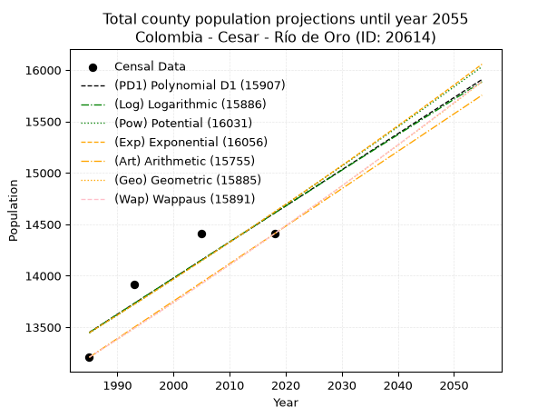
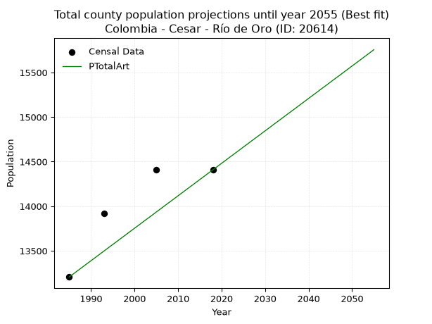
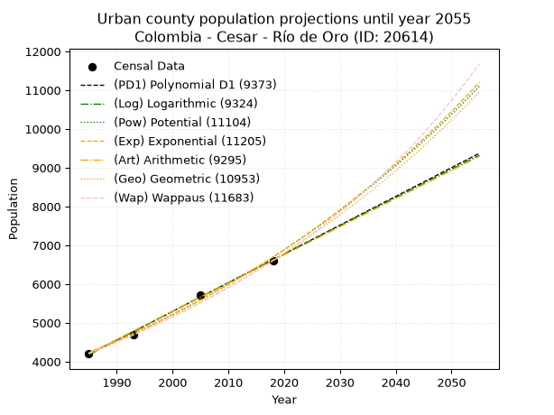
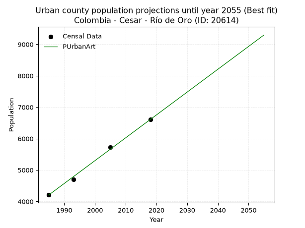
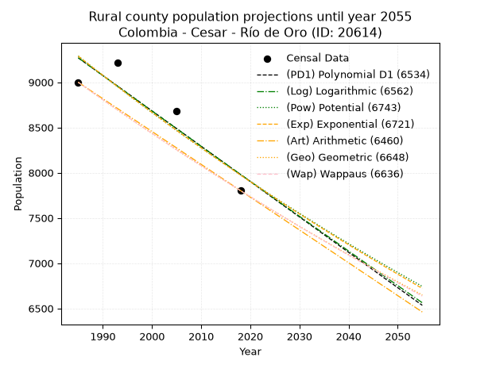
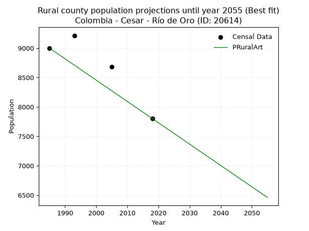

<div align="center">


</div>

# _“Population and Public Services Demand Projections (PPSD) until Year 2050 for Colombia - Cesar - Río de Oro (ID: 20614)”_
Keywords: `population` `public-service` `projection` `lineal` `polynomial` `logarithmic` `potential` `exponential` `arithmetic` `geometric` `wappaus` `dane` `colombia` `south-america`

PPSD are analytical estimates used by governments and planners to anticipate future changes in population size, age distribution, and the resulting community needs for utilities, healthcare, education, and infrastructure as sizing future water treatment facilities, electrical grids, and road networks based on spatial growth.

> **General running parameters**: • app_version: _v20260806_. • Python version: _3.14.7_. • Pandas version: _3.0.5_. • NumPy version: _2.5.1_. • Creates, save and include plots into reports (create_plot): _False_. • Projection until year: _2050_. • Process polynomial degree 2 and up: _False_. • Process Wappaus: _True_. • Process Wappaus: _True_. • Set negative values to zero: _True_. • Set infinite values to zero: _True_. • Drop dataset notes: _True_. 
<div align="center">

Dynamic map: [:earth_americas:Google](http://maps.google.com/maps?q=8.292291881,-73.3863931) [:earth_americas:OSM](https://www.openstreetmap.org/#map=18/8.292291881/-73.3863931&layers=P) [:earth_americas:Bing](https://www.bing.com/maps?cp=8.292291881~-73.3863931&lvl=18) [:earth_americas:Apple](https://maps.apple.com/frame?center=8.292291881%2C-73.3863931&span=0.003%2C0.006)

</div>


<div align="center">

```geojson
{
  "type": "Feature",
  "geometry": {
    "type": "Point", 
    "coordinates": [-73.3863931, 8.292291881]
  }, 
  "properties": {
    "Name": "Colombia - Cesar - Río de Oro (ID: 20614)"
  }
}
```

</div>


## 0. Census Data (4 records)

Census data are official statistics collected by a government about the people and housing in a country. They usually include counts of total population, age, sex, race, income, education, and jobs.

📅Global census file: [Population.xlsx](../data/Population.xlsx)

| Source   |   Year |   CountryID | CountryName   |   StateID | StateName   |   CountyID | CountyName   |   PTotal |   PUrban |   PRural |
|:---------|-------:|------------:|:--------------|----------:|:------------|-----------:|:-------------|---------:|---------:|---------:|
| DANE     |   1985 |          57 | Colombia      |        20 | Cesar       |      20614 | Río de Oro   |    13207 |     4208 |     8999 |
| DANE     |   1993 |          57 | Colombia      |        20 | Cesar       |      20614 | Río De Oro   |    13917 |     4702 |     9215 |
| DANE     |   2005 |          57 | Colombia      |        20 | Cesar       |      20614 | Río de Oro   |    14406 |     5728 |     8678 |
| DANE     |   2018 |          57 | Colombia      |        20 | Cesar       |      20614 | Río De Oro   |    14408 |     6606 |     7802 |

> 🔥Some records could had specific notes about the registered values or the corresponding urban or rural distribution.

## 1. Total

### 1.1. Coefficients and Parameters

* (PD1) Polynomial Deg 1: 35.11120032115612, -56246.67844239252 (lineal)
* (Log) Logarithmic: 70362.55608851442, -520841.85267893574
* (Pow) Potential: 5.078124462957766, -12.617899733949361
* (Exp) Exponential: 0.0025339615686271774, 87.9281739902588
* (Art) Arithmetic: Year diff. 2018 - 1985 = 33, Population diff. 14408 - 13207 = 1201, Annual growth = 36.39393939393939
* (Geo) Geometric: Year diff. 2018 - 1985 = 33, Population diff. 14408 - 13207 = 1201, Annual growth % = 0.0026409543987255812
* (Wap) Wappaus: i = 0.26358094799159437, Condition values only valid for < 200)

<sub>
Wappaus condition values: ['0.00', '0.26', '0.53', '0.79', '1.05', '1.32', '1.58', '1.85', '2.11', '2.37', '2.64', '2.90', '3.16', '3.43', '3.69', '3.95', '4.22', '4.48', '4.74', '5.01', '5.27', '5.54', '5.80', '6.06', '6.33', '6.59', '6.85', '7.12', '7.38', '7.64', '7.91', '8.17', '8.43', '8.70', '8.96', '9.23', '9.49', '9.75', '10.02', '10.28', '10.54', '10.81', '11.07', '11.33', '11.60', '11.86', '12.12', '12.39', '12.65', '12.92', '13.18', '13.44', '13.71', '13.97', '14.23', '14.50', '14.76', '15.02', '15.29', '15.55', '15.81', '16.08', '16.34', '16.61', '16.87', '17.13']
</sub>


### 1.2. Projected Dataset

|   Year |   CountyID |   PTotalPD1 |   PTotalLog |   PTotalPow |   PTotalExp |   PTotalArt |   PTotalGeo |   PTotalWap |
|-------:|-----------:|------------:|------------:|------------:|------------:|------------:|------------:|------------:|
|   1985 |      20614 |       13449 |       13447 |       13444 |       13446 |       13207 |       13207 |       13207 |
|   1986 |      20614 |       13484 |       13483 |       13479 |       13480 |       13243 |       13242 |       13242 |
|   1987 |      20614 |       13519 |       13518 |       13513 |       13514 |       13280 |       13277 |       13277 |
|   1988 |      20614 |       13554 |       13554 |       13548 |       13549 |       13316 |       13312 |       13312 |
|   1989 |      20614 |       13589 |       13589 |       13582 |       13583 |       13353 |       13347 |       13347 |
|   1990 |      20614 |       13625 |       13624 |       13617 |       13617 |       13389 |       13382 |       13382 |
|   1991 |      20614 |       13660 |       13660 |       13652 |       13652 |       13425 |       13418 |       13418 |
|   1992 |      20614 |       13695 |       13695 |       13687 |       13687 |       13462 |       13453 |       13453 |
|   1993 |      20614 |       13730 |       13730 |       13722 |       13721 |       13498 |       13489 |       13488 |
|   1994 |      20614 |       13765 |       13766 |       13757 |       13756 |       13535 |       13524 |       13524 |
|   1995 |      20614 |       13800 |       13801 |       13792 |       13791 |       13571 |       13560 |       13560 |
|   1996 |      20614 |       13835 |       13836 |       13827 |       13826 |       13607 |       13596 |       13596 |
|   1997 |      20614 |       13870 |       13871 |       13862 |       13861 |       13644 |       13632 |       13631 |
|   1998 |      20614 |       13905 |       13907 |       13897 |       13896 |       13680 |       13668 |       13667 |
|   1999 |      20614 |       13941 |       13942 |       13933 |       13932 |       13717 |       13704 |       13704 |
|   2000 |      20614 |       13976 |       13977 |       13968 |       13967 |       13753 |       13740 |       13740 |
|   2001 |      20614 |       14011 |       14012 |       14004 |       14002 |       13789 |       13776 |       13776 |
|   2002 |      20614 |       14046 |       14047 |       14039 |       14038 |       13826 |       13813 |       13812 |
|   2003 |      20614 |       14081 |       14083 |       14075 |       14073 |       13862 |       13849 |       13849 |
|   2004 |      20614 |       14116 |       14118 |       14111 |       14109 |       13898 |       13886 |       13885 |
|   2005 |      20614 |       14151 |       14153 |       14146 |       14145 |       13935 |       13922 |       13922 |
|   2006 |      20614 |       14186 |       14188 |       14182 |       14181 |       13971 |       13959 |       13959 |
|   2007 |      20614 |       14222 |       14223 |       14218 |       14217 |       14008 |       13996 |       13996 |
|   2008 |      20614 |       14257 |       14258 |       14254 |       14253 |       14044 |       14033 |       14033 |
|   2009 |      20614 |       14292 |       14293 |       14290 |       14289 |       14080 |       14070 |       14070 |
|   2010 |      20614 |       14327 |       14328 |       14327 |       14325 |       14117 |       14107 |       14107 |
|   2011 |      20614 |       14362 |       14363 |       14363 |       14362 |       14153 |       14144 |       14144 |
|   2012 |      20614 |       14397 |       14398 |       14399 |       14398 |       14190 |       14182 |       14182 |
|   2013 |      20614 |       14432 |       14433 |       14435 |       14435 |       14226 |       14219 |       14219 |
|   2014 |      20614 |       14467 |       14468 |       14472 |       14471 |       14262 |       14257 |       14257 |
|   2015 |      20614 |       14502 |       14503 |       14508 |       14508 |       14299 |       14294 |       14294 |
|   2016 |      20614 |       14538 |       14538 |       14545 |       14545 |       14335 |       14332 |       14332 |
|   2017 |      20614 |       14573 |       14573 |       14582 |       14582 |       14372 |       14370 |       14370 |
|   2018 |      20614 |       14608 |       14608 |       14618 |       14619 |       14408 |       14408 |       14408 |
|   2019 |      20614 |       14643 |       14642 |       14655 |       14656 |       14444 |       14446 |       14446 |
|   2020 |      20614 |       14678 |       14677 |       14692 |       14693 |       14481 |       14484 |       14484 |
|   2021 |      20614 |       14713 |       14712 |       14729 |       14730 |       14517 |       14522 |       14523 |
|   2022 |      20614 |       14748 |       14747 |       14766 |       14768 |       14554 |       14561 |       14561 |
|   2023 |      20614 |       14783 |       14782 |       14803 |       14805 |       14590 |       14599 |       14600 |
|   2024 |      20614 |       14818 |       14816 |       14841 |       14843 |       14626 |       14638 |       14638 |
|   2025 |      20614 |       14854 |       14851 |       14878 |       14880 |       14663 |       14676 |       14677 |
|   2026 |      20614 |       14889 |       14886 |       14915 |       14918 |       14699 |       14715 |       14716 |
|   2027 |      20614 |       14924 |       14921 |       14953 |       14956 |       14736 |       14754 |       14755 |
|   2028 |      20614 |       14959 |       14955 |       14990 |       14994 |       14772 |       14793 |       14794 |
|   2029 |      20614 |       14994 |       14990 |       15028 |       15032 |       14808 |       14832 |       14833 |
|   2030 |      20614 |       15029 |       15025 |       15065 |       15070 |       14845 |       14871 |       14872 |
|   2031 |      20614 |       15064 |       15059 |       15103 |       15108 |       14881 |       14911 |       14912 |
|   2032 |      20614 |       15099 |       15094 |       15141 |       15147 |       14918 |       14950 |       14951 |
|   2033 |      20614 |       15134 |       15129 |       15179 |       15185 |       14954 |       14989 |       14991 |
|   2034 |      20614 |       15170 |       15163 |       15217 |       15224 |       14990 |       15029 |       15031 |
|   2035 |      20614 |       15205 |       15198 |       15255 |       15262 |       15027 |       15069 |       15070 |
|   2036 |      20614 |       15240 |       15232 |       15293 |       15301 |       15063 |       15109 |       15110 |
|   2037 |      20614 |       15275 |       15267 |       15331 |       15340 |       15099 |       15148 |       15150 |
|   2038 |      20614 |       15310 |       15301 |       15369 |       15379 |       15136 |       15188 |       15191 |
|   2039 |      20614 |       15345 |       15336 |       15408 |       15418 |       15172 |       15229 |       15231 |
|   2040 |      20614 |       15380 |       15370 |       15446 |       15457 |       15209 |       15269 |       15271 |
|   2041 |      20614 |       15415 |       15405 |       15484 |       15496 |       15245 |       15309 |       15312 |
|   2042 |      20614 |       15450 |       15439 |       15523 |       15535 |       15281 |       15350 |       15352 |
|   2043 |      20614 |       15486 |       15474 |       15562 |       15575 |       15318 |       15390 |       15393 |
|   2044 |      20614 |       15521 |       15508 |       15600 |       15614 |       15354 |       15431 |       15434 |
|   2045 |      20614 |       15556 |       15543 |       15639 |       15654 |       15391 |       15471 |       15475 |
|   2046 |      20614 |       15591 |       15577 |       15678 |       15694 |       15427 |       15512 |       15516 |
|   2047 |      20614 |       15626 |       15611 |       15717 |       15733 |       15463 |       15553 |       15557 |
|   2048 |      20614 |       15661 |       15646 |       15756 |       15773 |       15500 |       15594 |       15599 |
|   2049 |      20614 |       15696 |       15680 |       15795 |       15813 |       15536 |       15636 |       15640 |
|   2050 |      20614 |       15731 |       15715 |       15834 |       15853 |       15573 |       15677 |       15682 |
<div align="center">

</img>

</div>


### 1.3. Best fit with absolute and relative error (%)

Relative error puts that difference into context by dividing the absolute error by the true value, creating a unitless ratio or percentage that shows the scale of the mistake.

Absolute and relative error

|   Year | Source   |   CountryID | CountryName   |   StateID | StateName   |   CountyID_x | CountyName   |   PTotal |   PUrban |   PRural |   CountyID_y |   PTotalPD1 |   PTotalLog |   PTotalPow |   PTotalExp |   PTotalArt |   PTotalGeo |   PTotalWap |   PTotalPD1AbsError |   PTotalLogAbsError |   PTotalPowAbsError |   PTotalExpAbsError |   PTotalArtAbsError |   PTotalGeoAbsError |   PTotalWapAbsError |   PTotalPD1RelError |   PTotalLogRelError |   PTotalPowRelError |   PTotalExpRelError |   PTotalArtRelError |   PTotalGeoRelError |   PTotalWapRelError |
|-------:|:---------|------------:|:--------------|----------:|:------------|-------------:|:-------------|---------:|---------:|---------:|-------------:|------------:|------------:|------------:|------------:|------------:|------------:|------------:|--------------------:|--------------------:|--------------------:|--------------------:|--------------------:|--------------------:|--------------------:|--------------------:|--------------------:|--------------------:|--------------------:|--------------------:|--------------------:|--------------------:|
|   1985 | DANE     |          57 | Colombia      |        20 | Cesar       |        20614 | Río de Oro   |    13207 |     4208 |     8999 |        20614 |       13449 |       13447 |       13444 |       13446 |       13207 |       13207 |       13207 |                 242 |                 240 |                 237 |                 239 |                   0 |                   0 |                   0 |             1.83236 |             1.81722 |             1.7945  |             1.80965 |             0       |             0       |             0       |
|   1993 | DANE     |          57 | Colombia      |        20 | Cesar       |        20614 | Río De Oro   |    13917 |     4702 |     9215 |        20614 |       13730 |       13730 |       13722 |       13721 |       13498 |       13489 |       13488 |                 187 |                 187 |                 195 |                 196 |                 419 |                 428 |                 429 |             1.34368 |             1.34368 |             1.40116 |             1.40835 |             3.01071 |             3.07538 |             3.08256 |
|   2005 | DANE     |          57 | Colombia      |        20 | Cesar       |        20614 | Río de Oro   |    14406 |     5728 |     8678 |        20614 |       14151 |       14153 |       14146 |       14145 |       13935 |       13922 |       13922 |                 255 |                 253 |                 260 |                 261 |                 471 |                 484 |                 484 |             1.7701  |             1.75621 |             1.8048  |             1.81175 |             3.26947 |             3.35971 |             3.35971 |
|   2018 | DANE     |          57 | Colombia      |        20 | Cesar       |        20614 | Río De Oro   |    14408 |     6606 |     7802 |        20614 |       14608 |       14608 |       14618 |       14619 |       14408 |       14408 |       14408 |                 200 |                 200 |                 210 |                 211 |                   0 |                   0 |                   0 |             1.38812 |             1.38812 |             1.45752 |             1.46446 |             0       |             0       |             0       |

Relative error mean

| Method    |   RelError | Best   |
|:----------|-----------:|:-------|
| PTotalPD1 |    1.58356 |        |
| PTotalLog |    1.57631 |        |
| PTotalPow |    1.6145  |        |
| PTotalExp |    1.62355 |        |
| PTotalArt |    1.57004 | True   |
| PTotalGeo |    1.60877 |        |
| PTotalWap |    1.61057 |        |

💙Best method: _**PTotalArt**_
<div align="center">

</img>

</div>


### 1.4. Fresh water supply demand in liters per capita per day (lpcd)

The fresh water supply demand typically ranges from 100 to 300 liters per capita per day (lpcd) for standard domestic and municipal planning, though absolute survival minimums set by the World Health Organization are as low as 7.5 to 20 liters per day, and total consumption in high-income nations can exceed 400 liters.

> `CZ`: Level in meters above the sea level (masl).<br> `WS`: Fresh water supply demand in liters per capita per day (lpcd or l/h/d).<br> `WSAll`: Zonal fresh water supply demand in liters per second (l/s).<br> `A`: Zonal area in square meters.

Reference values (RAS Colombia)

|    CZ |   WS |
|------:|-----:|
|  1000 |  120 |
|  2000 |  130 |
| 99999 |  140 |

County shapefile geometry properties and water supply values

|   CountyID |      ATotal |   CZTotal |   WSTotal |
|-----------:|------------:|----------:|----------:|
|      20614 | 5.17759e+08 |   521.642 |       120 |

Projected values for best method: PTotalArt

|   CountyID |   Year |   PTotalArt |   WSTotal |   WSTotalAll |
|-----------:|-------:|------------:|----------:|-------------:|
|      20614 |   1985 |       13207 |       120 |      18.3431 |
|      20614 |   1986 |       13243 |       120 |      18.3931 |
|      20614 |   1987 |       13280 |       120 |      18.4444 |
|      20614 |   1988 |       13316 |       120 |      18.4944 |
|      20614 |   1989 |       13353 |       120 |      18.5458 |
|      20614 |   1990 |       13389 |       120 |      18.5958 |
|      20614 |   1991 |       13425 |       120 |      18.6458 |
|      20614 |   1992 |       13462 |       120 |      18.6972 |
|      20614 |   1993 |       13498 |       120 |      18.7472 |
|      20614 |   1994 |       13535 |       120 |      18.7986 |
|      20614 |   1995 |       13571 |       120 |      18.8486 |
|      20614 |   1996 |       13607 |       120 |      18.8986 |
|      20614 |   1997 |       13644 |       120 |      18.95   |
|      20614 |   1998 |       13680 |       120 |      19      |
|      20614 |   1999 |       13717 |       120 |      19.0514 |
|      20614 |   2000 |       13753 |       120 |      19.1014 |
|      20614 |   2001 |       13789 |       120 |      19.1514 |
|      20614 |   2002 |       13826 |       120 |      19.2028 |
|      20614 |   2003 |       13862 |       120 |      19.2528 |
|      20614 |   2004 |       13898 |       120 |      19.3028 |
|      20614 |   2005 |       13935 |       120 |      19.3542 |
|      20614 |   2006 |       13971 |       120 |      19.4042 |
|      20614 |   2007 |       14008 |       120 |      19.4556 |
|      20614 |   2008 |       14044 |       120 |      19.5056 |
|      20614 |   2009 |       14080 |       120 |      19.5556 |
|      20614 |   2010 |       14117 |       120 |      19.6069 |
|      20614 |   2011 |       14153 |       120 |      19.6569 |
|      20614 |   2012 |       14190 |       120 |      19.7083 |
|      20614 |   2013 |       14226 |       120 |      19.7583 |
|      20614 |   2014 |       14262 |       120 |      19.8083 |
|      20614 |   2015 |       14299 |       120 |      19.8597 |
|      20614 |   2016 |       14335 |       120 |      19.9097 |
|      20614 |   2017 |       14372 |       120 |      19.9611 |
|      20614 |   2018 |       14408 |       120 |      20.0111 |
|      20614 |   2019 |       14444 |       120 |      20.0611 |
|      20614 |   2020 |       14481 |       120 |      20.1125 |
|      20614 |   2021 |       14517 |       120 |      20.1625 |
|      20614 |   2022 |       14554 |       120 |      20.2139 |
|      20614 |   2023 |       14590 |       120 |      20.2639 |
|      20614 |   2024 |       14626 |       120 |      20.3139 |
|      20614 |   2025 |       14663 |       120 |      20.3653 |
|      20614 |   2026 |       14699 |       120 |      20.4153 |
|      20614 |   2027 |       14736 |       120 |      20.4667 |
|      20614 |   2028 |       14772 |       120 |      20.5167 |
|      20614 |   2029 |       14808 |       120 |      20.5667 |
|      20614 |   2030 |       14845 |       120 |      20.6181 |
|      20614 |   2031 |       14881 |       120 |      20.6681 |
|      20614 |   2032 |       14918 |       120 |      20.7194 |
|      20614 |   2033 |       14954 |       120 |      20.7694 |
|      20614 |   2034 |       14990 |       120 |      20.8194 |
|      20614 |   2035 |       15027 |       120 |      20.8708 |
|      20614 |   2036 |       15063 |       120 |      20.9208 |
|      20614 |   2037 |       15099 |       120 |      20.9708 |
|      20614 |   2038 |       15136 |       120 |      21.0222 |
|      20614 |   2039 |       15172 |       120 |      21.0722 |
|      20614 |   2040 |       15209 |       120 |      21.1236 |
|      20614 |   2041 |       15245 |       120 |      21.1736 |
|      20614 |   2042 |       15281 |       120 |      21.2236 |
|      20614 |   2043 |       15318 |       120 |      21.275  |
|      20614 |   2044 |       15354 |       120 |      21.325  |
|      20614 |   2045 |       15391 |       120 |      21.3764 |
|      20614 |   2046 |       15427 |       120 |      21.4264 |
|      20614 |   2047 |       15463 |       120 |      21.4764 |
|      20614 |   2048 |       15500 |       120 |      21.5278 |
|      20614 |   2049 |       15536 |       120 |      21.5778 |
|      20614 |   2050 |       15573 |       120 |      21.6292 |

## 2. Urban

### 2.1. Coefficients and Parameters

* (PD1) Polynomial Deg 1: 74.19189080690424, -143091.3295865102 (lineal)
* (Log) Logarithmic: 148506.048019379, -1123484.661048082
* (Pow) Potential: 27.855394105916293, -88.2341934340783
* (Exp) Exponential: 0.013914306231754495, 4.278104858258441e-09
* (Art) Arithmetic: Year diff. 2018 - 1985 = 33, Population diff. 6606 - 4208 = 2398, Annual growth = 72.66666666666667
* (Geo) Geometric: Year diff. 2018 - 1985 = 33, Population diff. 6606 - 4208 = 2398, Annual growth % = 0.013760201410394801
* (Wap) Wappaus: i = 1.3439368719561062, Condition values only valid for < 200)

<sub>
Wappaus condition values: ['0.00', '1.34', '2.69', '4.03', '5.38', '6.72', '8.06', '9.41', '10.75', '12.10', '13.44', '14.78', '16.13', '17.47', '18.82', '20.16', '21.50', '22.85', '24.19', '25.53', '26.88', '28.22', '29.57', '30.91', '32.25', '33.60', '34.94', '36.29', '37.63', '38.97', '40.32', '41.66', '43.01', '44.35', '45.69', '47.04', '48.38', '49.73', '51.07', '52.41', '53.76', '55.10', '56.45', '57.79', '59.13', '60.48', '61.82', '63.17', '64.51', '65.85', '67.20', '68.54', '69.88', '71.23', '72.57', '73.92', '75.26', '76.60', '77.95', '79.29', '80.64', '81.98', '83.32', '84.67', '86.01', '87.36']
</sub>


### 2.2. Projected Dataset

|   Year |   CountyID |   PUrbanPD1 |   PUrbanLog |   PUrbanPow |   PUrbanExp |   PUrbanArt |   PUrbanGeo |   PUrbanWap |
|-------:|-----------:|------------:|------------:|------------:|------------:|------------:|------------:|------------:|
|   1985 |      20614 |        4180 |        4177 |        4229 |        4231 |        4208 |        4208 |        4208 |
|   1986 |      20614 |        4254 |        4252 |        4289 |        4290 |        4281 |        4266 |        4265 |
|   1987 |      20614 |        4328 |        4327 |        4349 |        4350 |        4353 |        4325 |        4323 |
|   1988 |      20614 |        4402 |        4402 |        4411 |        4411 |        4426 |        4384 |        4381 |
|   1989 |      20614 |        4476 |        4476 |        4473 |        4473 |        4499 |        4444 |        4440 |
|   1990 |      20614 |        4551 |        4551 |        4536 |        4536 |        4571 |        4506 |        4501 |
|   1991 |      20614 |        4625 |        4626 |        4600 |        4599 |        4644 |        4568 |        4562 |
|   1992 |      20614 |        4699 |        4700 |        4665 |        4664 |        4717 |        4630 |        4623 |
|   1993 |      20614 |        4773 |        4775 |        4730 |        4729 |        4789 |        4694 |        4686 |
|   1994 |      20614 |        4847 |        4849 |        4797 |        4795 |        4862 |        4759 |        4750 |
|   1995 |      20614 |        4921 |        4924 |        4864 |        4862 |        4935 |        4824 |        4814 |
|   1996 |      20614 |        4996 |        4998 |        4933 |        4931 |        5007 |        4891 |        4880 |
|   1997 |      20614 |        5070 |        5072 |        5002 |        5000 |        5080 |        4958 |        4946 |
|   1998 |      20614 |        5144 |        5147 |        5072 |        5070 |        5153 |        5026 |        5014 |
|   1999 |      20614 |        5218 |        5221 |        5143 |        5141 |        5225 |        5095 |        5082 |
|   2000 |      20614 |        5292 |        5295 |        5216 |        5213 |        5298 |        5165 |        5151 |
|   2001 |      20614 |        5367 |        5370 |        5289 |        5286 |        5371 |        5236 |        5222 |
|   2002 |      20614 |        5441 |        5444 |        5363 |        5360 |        5443 |        5309 |        5293 |
|   2003 |      20614 |        5515 |        5518 |        5438 |        5435 |        5516 |        5382 |        5366 |
|   2004 |      20614 |        5589 |        5592 |        5514 |        5511 |        5589 |        5456 |        5440 |
|   2005 |      20614 |        5663 |        5666 |        5591 |        5588 |        5661 |        5531 |        5515 |
|   2006 |      20614 |        5738 |        5740 |        5669 |        5667 |        5734 |        5607 |        5591 |
|   2007 |      20614 |        5812 |        5814 |        5749 |        5746 |        5807 |        5684 |        5668 |
|   2008 |      20614 |        5886 |        5888 |        5829 |        5826 |        5879 |        5762 |        5746 |
|   2009 |      20614 |        5960 |        5962 |        5910 |        5908 |        5952 |        5841 |        5826 |
|   2010 |      20614 |        6034 |        6036 |        5993 |        5991 |        6025 |        5922 |        5907 |
|   2011 |      20614 |        6109 |        6110 |        6076 |        6075 |        6097 |        6003 |        5990 |
|   2012 |      20614 |        6183 |        6184 |        6161 |        6160 |        6170 |        6086 |        6073 |
|   2013 |      20614 |        6257 |        6257 |        6247 |        6246 |        6243 |        6170 |        6158 |
|   2014 |      20614 |        6331 |        6331 |        6334 |        6334 |        6315 |        6255 |        6245 |
|   2015 |      20614 |        6405 |        6405 |        6422 |        6423 |        6388 |        6341 |        6333 |
|   2016 |      20614 |        6480 |        6479 |        6512 |        6513 |        6461 |        6428 |        6422 |
|   2017 |      20614 |        6554 |        6552 |        6602 |        6604 |        6533 |        6516 |        6513 |
|   2018 |      20614 |        6628 |        6626 |        6694 |        6696 |        6606 |        6606 |        6606 |
|   2019 |      20614 |        6702 |        6699 |        6787 |        6790 |        6679 |        6697 |        6700 |
|   2020 |      20614 |        6776 |        6773 |        6881 |        6885 |        6751 |        6789 |        6796 |
|   2021 |      20614 |        6850 |        6847 |        6977 |        6982 |        6824 |        6882 |        6894 |
|   2022 |      20614 |        6925 |        6920 |        7074 |        7080 |        6897 |        6977 |        6993 |
|   2023 |      20614 |        6999 |        6993 |        7172 |        7179 |        6969 |        7073 |        7094 |
|   2024 |      20614 |        7073 |        7067 |        7271 |        7279 |        7042 |        7171 |        7197 |
|   2025 |      20614 |        7147 |        7140 |        7372 |        7381 |        7115 |        7269 |        7302 |
|   2026 |      20614 |        7221 |        7213 |        7474 |        7485 |        7187 |        7369 |        7408 |
|   2027 |      20614 |        7296 |        7287 |        7577 |        7590 |        7260 |        7471 |        7517 |
|   2028 |      20614 |        7370 |        7360 |        7682 |        7696 |        7333 |        7573 |        7628 |
|   2029 |      20614 |        7444 |        7433 |        7788 |        7804 |        7405 |        7678 |        7741 |
|   2030 |      20614 |        7518 |        7506 |        7896 |        7913 |        7478 |        7783 |        7856 |
|   2031 |      20614 |        7592 |        7580 |        8005 |        8024 |        7551 |        7890 |        7973 |
|   2032 |      20614 |        7667 |        7653 |        8116 |        8136 |        7623 |        7999 |        8093 |
|   2033 |      20614 |        7741 |        7726 |        8228 |        8250 |        7696 |        8109 |        8215 |
|   2034 |      20614 |        7815 |        7799 |        8341 |        8366 |        7769 |        8221 |        8339 |
|   2035 |      20614 |        7889 |        7872 |        8456 |        8483 |        7841 |        8334 |        8466 |
|   2036 |      20614 |        7963 |        7945 |        8573 |        8602 |        7914 |        8448 |        8596 |
|   2037 |      20614 |        8038 |        8018 |        8691 |        8723 |        7987 |        8565 |        8728 |
|   2038 |      20614 |        8112 |        8090 |        8810 |        8845 |        8059 |        8682 |        8863 |
|   2039 |      20614 |        8186 |        8163 |        8932 |        8969 |        8132 |        8802 |        9001 |
|   2040 |      20614 |        8260 |        8236 |        9054 |        9095 |        8205 |        8923 |        9142 |
|   2041 |      20614 |        8334 |        8309 |        9179 |        9222 |        8277 |        9046 |        9286 |
|   2042 |      20614 |        8409 |        8382 |        9305 |        9351 |        8350 |        9170 |        9433 |
|   2043 |      20614 |        8483 |        8454 |        9433 |        9482 |        8423 |        9297 |        9583 |
|   2044 |      20614 |        8557 |        8527 |        9562 |        9615 |        8495 |        9424 |        9736 |
|   2045 |      20614 |        8631 |        8600 |        9693 |        9750 |        8568 |        9554 |        9893 |
|   2046 |      20614 |        8705 |        8672 |        9826 |        9886 |        8641 |        9686 |       10054 |
|   2047 |      20614 |        8779 |        8745 |        9961 |       10025 |        8713 |        9819 |       10218 |
|   2048 |      20614 |        8854 |        8817 |       10097 |       10165 |        8786 |        9954 |       10386 |
|   2049 |      20614 |        8928 |        8890 |       10236 |       10308 |        8859 |       10091 |       10558 |
|   2050 |      20614 |        9002 |        8962 |       10376 |       10452 |        8931 |       10230 |       10735 |
<div align="center">

</img>

</div>


### 2.3. Best fit with absolute and relative error (%)

Relative error puts that difference into context by dividing the absolute error by the true value, creating a unitless ratio or percentage that shows the scale of the mistake.

Absolute and relative error

|   Year | Source   |   CountryID | CountryName   |   StateID | StateName   |   CountyID_x | CountyName   |   PTotal |   PUrban |   PRural |   CountyID_y |   PUrbanPD1 |   PUrbanLog |   PUrbanPow |   PUrbanExp |   PUrbanArt |   PUrbanGeo |   PUrbanWap |   PUrbanPD1AbsError |   PUrbanLogAbsError |   PUrbanPowAbsError |   PUrbanExpAbsError |   PUrbanArtAbsError |   PUrbanGeoAbsError |   PUrbanWapAbsError |   PUrbanPD1RelError |   PUrbanLogRelError |   PUrbanPowRelError |   PUrbanExpRelError |   PUrbanArtRelError |   PUrbanGeoRelError |   PUrbanWapRelError |
|-------:|:---------|------------:|:--------------|----------:|:------------|-------------:|:-------------|---------:|---------:|---------:|-------------:|------------:|------------:|------------:|------------:|------------:|------------:|------------:|--------------------:|--------------------:|--------------------:|--------------------:|--------------------:|--------------------:|--------------------:|--------------------:|--------------------:|--------------------:|--------------------:|--------------------:|--------------------:|--------------------:|
|   1985 | DANE     |          57 | Colombia      |        20 | Cesar       |        20614 | Río de Oro   |    13207 |     4208 |     8999 |        20614 |        4180 |        4177 |        4229 |        4231 |        4208 |        4208 |        4208 |                  28 |                  31 |                  21 |                  23 |                   0 |                   0 |                   0 |            0.665399 |            0.736692 |            0.499049 |            0.546578 |             0       |             0       |            0        |
|   1993 | DANE     |          57 | Colombia      |        20 | Cesar       |        20614 | Río De Oro   |    13917 |     4702 |     9215 |        20614 |        4773 |        4775 |        4730 |        4729 |        4789 |        4694 |        4686 |                  71 |                  73 |                  28 |                  27 |                  87 |                   8 |                  16 |            1.51     |            1.55253  |            0.595491 |            0.574224 |             1.85028 |             0.17014 |            0.340281 |
|   2005 | DANE     |          57 | Colombia      |        20 | Cesar       |        20614 | Río de Oro   |    14406 |     5728 |     8678 |        20614 |        5663 |        5666 |        5591 |        5588 |        5661 |        5531 |        5515 |                  65 |                  62 |                 137 |                 140 |                  67 |                 197 |                 213 |            1.13478  |            1.0824   |            2.39176  |            2.44413  |             1.16969 |             3.43925 |            3.71858  |
|   2018 | DANE     |          57 | Colombia      |        20 | Cesar       |        20614 | Río De Oro   |    14408 |     6606 |     7802 |        20614 |        6628 |        6626 |        6694 |        6696 |        6606 |        6606 |        6606 |                  22 |                  20 |                  88 |                  90 |                   0 |                   0 |                   0 |            0.333031 |            0.302755 |            1.33212  |            1.3624   |             0       |             0       |            0        |

Relative error mean

| Method    |   RelError | Best   |
|:----------|-----------:|:-------|
| PUrbanPD1 |   0.910801 |        |
| PUrbanLog |   0.918595 |        |
| PUrbanPow |   1.20461  |        |
| PUrbanExp |   1.23183  |        |
| PUrbanArt |   0.754992 | True   |
| PUrbanGeo |   0.902347 |        |
| PUrbanWap |   1.01471  |        |

💙Best method: _**PUrbanArt**_
<div align="center">

</img>

</div>


### 2.4. Fresh water supply demand in liters per capita per day (lpcd)

The fresh water supply demand typically ranges from 100 to 300 liters per capita per day (lpcd) for standard domestic and municipal planning, though absolute survival minimums set by the World Health Organization are as low as 7.5 to 20 liters per day, and total consumption in high-income nations can exceed 400 liters.

> `CZ`: Level in meters above the sea level (masl).<br> `WS`: Fresh water supply demand in liters per capita per day (lpcd or l/h/d).<br> `WSAll`: Zonal fresh water supply demand in liters per second (l/s).<br> `A`: Zonal area in square meters.

Reference values (RAS Colombia)

|    CZ |   WS |
|------:|-----:|
|  1000 |  120 |
|  2000 |  130 |
| 99999 |  140 |

County shapefile geometry properties and water supply values

|   CountyID |      AUrban |   CZUrban |   WSUrban |
|-----------:|------------:|----------:|----------:|
|      20614 | 1.29691e+06 |   1182.75 |       130 |

Projected values for best method: PUrbanArt

|   CountyID |   Year |   PUrbanArt |   WSUrban |   WSUrbanAll |
|-----------:|-------:|------------:|----------:|-------------:|
|      20614 |   1985 |        4208 |       130 |      6.33148 |
|      20614 |   1986 |        4281 |       130 |      6.44132 |
|      20614 |   1987 |        4353 |       130 |      6.54965 |
|      20614 |   1988 |        4426 |       130 |      6.65949 |
|      20614 |   1989 |        4499 |       130 |      6.76933 |
|      20614 |   1990 |        4571 |       130 |      6.87766 |
|      20614 |   1991 |        4644 |       130 |      6.9875  |
|      20614 |   1992 |        4717 |       130 |      7.09734 |
|      20614 |   1993 |        4789 |       130 |      7.20567 |
|      20614 |   1994 |        4862 |       130 |      7.31551 |
|      20614 |   1995 |        4935 |       130 |      7.42535 |
|      20614 |   1996 |        5007 |       130 |      7.53368 |
|      20614 |   1997 |        5080 |       130 |      7.64352 |
|      20614 |   1998 |        5153 |       130 |      7.75336 |
|      20614 |   1999 |        5225 |       130 |      7.86169 |
|      20614 |   2000 |        5298 |       130 |      7.97153 |
|      20614 |   2001 |        5371 |       130 |      8.08137 |
|      20614 |   2002 |        5443 |       130 |      8.1897  |
|      20614 |   2003 |        5516 |       130 |      8.29954 |
|      20614 |   2004 |        5589 |       130 |      8.40938 |
|      20614 |   2005 |        5661 |       130 |      8.51771 |
|      20614 |   2006 |        5734 |       130 |      8.62755 |
|      20614 |   2007 |        5807 |       130 |      8.73738 |
|      20614 |   2008 |        5879 |       130 |      8.84572 |
|      20614 |   2009 |        5952 |       130 |      8.95556 |
|      20614 |   2010 |        6025 |       130 |      9.06539 |
|      20614 |   2011 |        6097 |       130 |      9.17373 |
|      20614 |   2012 |        6170 |       130 |      9.28356 |
|      20614 |   2013 |        6243 |       130 |      9.3934  |
|      20614 |   2014 |        6315 |       130 |      9.50174 |
|      20614 |   2015 |        6388 |       130 |      9.61157 |
|      20614 |   2016 |        6461 |       130 |      9.72141 |
|      20614 |   2017 |        6533 |       130 |      9.82975 |
|      20614 |   2018 |        6606 |       130 |      9.93958 |
|      20614 |   2019 |        6679 |       130 |     10.0494  |
|      20614 |   2020 |        6751 |       130 |     10.1578  |
|      20614 |   2021 |        6824 |       130 |     10.2676  |
|      20614 |   2022 |        6897 |       130 |     10.3774  |
|      20614 |   2023 |        6969 |       130 |     10.4858  |
|      20614 |   2024 |        7042 |       130 |     10.5956  |
|      20614 |   2025 |        7115 |       130 |     10.7054  |
|      20614 |   2026 |        7187 |       130 |     10.8138  |
|      20614 |   2027 |        7260 |       130 |     10.9236  |
|      20614 |   2028 |        7333 |       130 |     11.0334  |
|      20614 |   2029 |        7405 |       130 |     11.1418  |
|      20614 |   2030 |        7478 |       130 |     11.2516  |
|      20614 |   2031 |        7551 |       130 |     11.3615  |
|      20614 |   2032 |        7623 |       130 |     11.4698  |
|      20614 |   2033 |        7696 |       130 |     11.5796  |
|      20614 |   2034 |        7769 |       130 |     11.6895  |
|      20614 |   2035 |        7841 |       130 |     11.7978  |
|      20614 |   2036 |        7914 |       130 |     11.9076  |
|      20614 |   2037 |        7987 |       130 |     12.0175  |
|      20614 |   2038 |        8059 |       130 |     12.1258  |
|      20614 |   2039 |        8132 |       130 |     12.2356  |
|      20614 |   2040 |        8205 |       130 |     12.3455  |
|      20614 |   2041 |        8277 |       130 |     12.4538  |
|      20614 |   2042 |        8350 |       130 |     12.5637  |
|      20614 |   2043 |        8423 |       130 |     12.6735  |
|      20614 |   2044 |        8495 |       130 |     12.7818  |
|      20614 |   2045 |        8568 |       130 |     12.8917  |
|      20614 |   2046 |        8641 |       130 |     13.0015  |
|      20614 |   2047 |        8713 |       130 |     13.1098  |
|      20614 |   2048 |        8786 |       130 |     13.2197  |
|      20614 |   2049 |        8859 |       130 |     13.3295  |
|      20614 |   2050 |        8931 |       130 |     13.4378  |

## 3. Rural

### 3.1. Coefficients and Parameters

* (PD1) Polynomial Deg 1: -39.080690485748164, 86844.65114411779 (lineal)
* (Log) Logarithmic: -78143.49193086475, 602642.8083691474
* (Pow) Potential: -9.240622912529211, 34.44132581268084
* (Exp) Exponential: -0.004621456306121346, 89531633.4986667
* (Art) Arithmetic: Year diff. 2018 - 1985 = 33, Population diff. 7802 - 8999 = -1197, Annual growth = -36.27272727272727
* (Geo) Geometric: Year diff. 2018 - 1985 = 33, Population diff. 7802 - 8999 = -1197, Annual growth % = -0.004315912563692237
* (Wap) Wappaus: i = -0.43179247988485536, Condition values only valid for < 200)

<sub>
Wappaus condition values: ['-0.00', '-0.43', '-0.86', '-1.30', '-1.73', '-2.16', '-2.59', '-3.02', '-3.45', '-3.89', '-4.32', '-4.75', '-5.18', '-5.61', '-6.05', '-6.48', '-6.91', '-7.34', '-7.77', '-8.20', '-8.64', '-9.07', '-9.50', '-9.93', '-10.36', '-10.79', '-11.23', '-11.66', '-12.09', '-12.52', '-12.95', '-13.39', '-13.82', '-14.25', '-14.68', '-15.11', '-15.54', '-15.98', '-16.41', '-16.84', '-17.27', '-17.70', '-18.14', '-18.57', '-19.00', '-19.43', '-19.86', '-20.29', '-20.73', '-21.16', '-21.59', '-22.02', '-22.45', '-22.89', '-23.32', '-23.75', '-24.18', '-24.61', '-25.04', '-25.48', '-25.91', '-26.34', '-26.77', '-27.20', '-27.63', '-28.07']
</sub>


### 3.2. Projected Dataset

|   Year |   CountyID |   PRuralPD1 |   PRuralLog |   PRuralPow |   PRuralExp |   PRuralArt |   PRuralGeo |   PRuralWap |
|-------:|-----------:|------------:|------------:|------------:|------------:|------------:|------------:|------------:|
|   1985 |      20614 |        9269 |        9270 |        9289 |        9288 |        8999 |        8999 |        8999 |
|   1986 |      20614 |        9230 |        9231 |        9246 |        9245 |        8963 |        8960 |        8960 |
|   1987 |      20614 |        9191 |        9191 |        9203 |        9203 |        8926 |        8921 |        8922 |
|   1988 |      20614 |        9152 |        9152 |        9160 |        9160 |        8890 |        8883 |        8883 |
|   1989 |      20614 |        9113 |        9113 |        9118 |        9118 |        8854 |        8845 |        8845 |
|   1990 |      20614 |        9074 |        9073 |        9075 |        9076 |        8818 |        8806 |        8807 |
|   1991 |      20614 |        9035 |        9034 |        9033 |        9034 |        8781 |        8768 |        8769 |
|   1992 |      20614 |        8996 |        8995 |        8992 |        8993 |        8745 |        8731 |        8731 |
|   1993 |      20614 |        8957 |        8956 |        8950 |        8951 |        8709 |        8693 |        8693 |
|   1994 |      20614 |        8918 |        8917 |        8909 |        8910 |        8673 |        8655 |        8656 |
|   1995 |      20614 |        8879 |        8877 |        8867 |        8869 |        8636 |        8618 |        8619 |
|   1996 |      20614 |        8840 |        8838 |        8826 |        8828 |        8600 |        8581 |        8581 |
|   1997 |      20614 |        8801 |        8799 |        8786 |        8787 |        8564 |        8544 |        8544 |
|   1998 |      20614 |        8761 |        8760 |        8745 |        8747 |        8527 |        8507 |        8508 |
|   1999 |      20614 |        8722 |        8721 |        8705 |        8706 |        8491 |        8470 |        8471 |
|   2000 |      20614 |        8683 |        8682 |        8665 |        8666 |        8455 |        8434 |        8434 |
|   2001 |      20614 |        8644 |        8643 |        8625 |        8626 |        8419 |        8397 |        8398 |
|   2002 |      20614 |        8605 |        8604 |        8585 |        8587 |        8382 |        8361 |        8362 |
|   2003 |      20614 |        8566 |        8565 |        8545 |        8547 |        8346 |        8325 |        8326 |
|   2004 |      20614 |        8527 |        8526 |        8506 |        8508 |        8310 |        8289 |        8290 |
|   2005 |      20614 |        8488 |        8487 |        8467 |        8468 |        8274 |        8253 |        8254 |
|   2006 |      20614 |        8449 |        8448 |        8428 |        8429 |        8237 |        8218 |        8218 |
|   2007 |      20614 |        8410 |        8409 |        8389 |        8390 |        8201 |        8182 |        8183 |
|   2008 |      20614 |        8371 |        8370 |        8351 |        8352 |        8165 |        8147 |        8148 |
|   2009 |      20614 |        8332 |        8331 |        8313 |        8313 |        8128 |        8112 |        8112 |
|   2010 |      20614 |        8292 |        8292 |        8274 |        8275 |        8092 |        8077 |        8077 |
|   2011 |      20614 |        8253 |        8253 |        8236 |        8237 |        8056 |        8042 |        8042 |
|   2012 |      20614 |        8214 |        8214 |        8199 |        8199 |        8020 |        8007 |        8008 |
|   2013 |      20614 |        8175 |        8175 |        8161 |        8161 |        7983 |        7973 |        7973 |
|   2014 |      20614 |        8136 |        8137 |        8124 |        8123 |        7947 |        7938 |        7939 |
|   2015 |      20614 |        8097 |        8098 |        8087 |        8086 |        7911 |        7904 |        7904 |
|   2016 |      20614 |        8058 |        8059 |        8050 |        8049 |        7875 |        7870 |        7870 |
|   2017 |      20614 |        8019 |        8020 |        8013 |        8011 |        7838 |        7836 |        7836 |
|   2018 |      20614 |        7980 |        7982 |        7976 |        7974 |        7802 |        7802 |        7802 |
|   2019 |      20614 |        7941 |        7943 |        7940 |        7938 |        7766 |        7768 |        7768 |
|   2020 |      20614 |        7902 |        7904 |        7904 |        7901 |        7729 |        7735 |        7735 |
|   2021 |      20614 |        7863 |        7866 |        7867 |        7865 |        7693 |        7701 |        7701 |
|   2022 |      20614 |        7823 |        7827 |        7832 |        7828 |        7657 |        7668 |        7668 |
|   2023 |      20614 |        7784 |        7788 |        7796 |        7792 |        7621 |        7635 |        7634 |
|   2024 |      20614 |        7745 |        7750 |        7760 |        7756 |        7584 |        7602 |        7601 |
|   2025 |      20614 |        7706 |        7711 |        7725 |        7721 |        7548 |        7569 |        7568 |
|   2026 |      20614 |        7667 |        7672 |        7690 |        7685 |        7512 |        7537 |        7535 |
|   2027 |      20614 |        7628 |        7634 |        7655 |        7650 |        7476 |        7504 |        7503 |
|   2028 |      20614 |        7589 |        7595 |        7620 |        7614 |        7439 |        7472 |        7470 |
|   2029 |      20614 |        7550 |        7557 |        7585 |        7579 |        7403 |        7439 |        7438 |
|   2030 |      20614 |        7511 |        7518 |        7551 |        7544 |        7367 |        7407 |        7405 |
|   2031 |      20614 |        7472 |        7480 |        7517 |        7510 |        7330 |        7375 |        7373 |
|   2032 |      20614 |        7433 |        7441 |        7483 |        7475 |        7294 |        7344 |        7341 |
|   2033 |      20614 |        7394 |        7403 |        7449 |        7440 |        7258 |        7312 |        7309 |
|   2034 |      20614 |        7355 |        7364 |        7415 |        7406 |        7222 |        7280 |        7277 |
|   2035 |      20614 |        7315 |        7326 |        7381 |        7372 |        7185 |        7249 |        7245 |
|   2036 |      20614 |        7276 |        7288 |        7348 |        7338 |        7149 |        7218 |        7214 |
|   2037 |      20614 |        7237 |        7249 |        7315 |        7304 |        7113 |        7186 |        7182 |
|   2038 |      20614 |        7198 |        7211 |        7281 |        7270 |        7077 |        7155 |        7151 |
|   2039 |      20614 |        7159 |        7173 |        7249 |        7237 |        7040 |        7125 |        7120 |
|   2040 |      20614 |        7120 |        7134 |        7216 |        7204 |        7004 |        7094 |        7089 |
|   2041 |      20614 |        7081 |        7096 |        7183 |        7170 |        6968 |        7063 |        7058 |
|   2042 |      20614 |        7042 |        7058 |        7151 |        7137 |        6931 |        7033 |        7027 |
|   2043 |      20614 |        7003 |        7019 |        7118 |        7104 |        6895 |        7002 |        6996 |
|   2044 |      20614 |        6964 |        6981 |        7086 |        7072 |        6859 |        6972 |        6965 |
|   2045 |      20614 |        6925 |        6943 |        7054 |        7039 |        6823 |        6942 |        6935 |
|   2046 |      20614 |        6886 |        6905 |        7023 |        7007 |        6786 |        6912 |        6905 |
|   2047 |      20614 |        6846 |        6867 |        6991 |        6974 |        6750 |        6882 |        6874 |
|   2048 |      20614 |        6807 |        6828 |        6959 |        6942 |        6714 |        6853 |        6844 |
|   2049 |      20614 |        6768 |        6790 |        6928 |        6910 |        6678 |        6823 |        6814 |
|   2050 |      20614 |        6729 |        6752 |        6897 |        6878 |        6641 |        6794 |        6784 |
<div align="center">

</img>

</div>


### 3.3. Best fit with absolute and relative error (%)

Relative error puts that difference into context by dividing the absolute error by the true value, creating a unitless ratio or percentage that shows the scale of the mistake.

Absolute and relative error

|   Year | Source   |   CountryID | CountryName   |   StateID | StateName   |   CountyID_x | CountyName   |   PTotal |   PUrban |   PRural |   CountyID_y |   PRuralPD1 |   PRuralLog |   PRuralPow |   PRuralExp |   PRuralArt |   PRuralGeo |   PRuralWap |   PRuralPD1AbsError |   PRuralLogAbsError |   PRuralPowAbsError |   PRuralExpAbsError |   PRuralArtAbsError |   PRuralGeoAbsError |   PRuralWapAbsError |   PRuralPD1RelError |   PRuralLogRelError |   PRuralPowRelError |   PRuralExpRelError |   PRuralArtRelError |   PRuralGeoRelError |   PRuralWapRelError |
|-------:|:---------|------------:|:--------------|----------:|:------------|-------------:|:-------------|---------:|---------:|---------:|-------------:|------------:|------------:|------------:|------------:|------------:|------------:|------------:|--------------------:|--------------------:|--------------------:|--------------------:|--------------------:|--------------------:|--------------------:|--------------------:|--------------------:|--------------------:|--------------------:|--------------------:|--------------------:|--------------------:|
|   1985 | DANE     |          57 | Colombia      |        20 | Cesar       |        20614 | Río de Oro   |    13207 |     4208 |     8999 |        20614 |        9269 |        9270 |        9289 |        9288 |        8999 |        8999 |        8999 |                 270 |                 271 |                 290 |                 289 |                   0 |                   0 |                   0 |             3.00033 |             3.01145 |             3.22258 |             3.21147 |             0       |             0       |             0       |
|   1993 | DANE     |          57 | Colombia      |        20 | Cesar       |        20614 | Río De Oro   |    13917 |     4702 |     9215 |        20614 |        8957 |        8956 |        8950 |        8951 |        8709 |        8693 |        8693 |                 258 |                 259 |                 265 |                 264 |                 506 |                 522 |                 522 |             2.79978 |             2.81063 |             2.87575 |             2.86489 |             5.49105 |             5.66468 |             5.66468 |
|   2005 | DANE     |          57 | Colombia      |        20 | Cesar       |        20614 | Río de Oro   |    14406 |     5728 |     8678 |        20614 |        8488 |        8487 |        8467 |        8468 |        8274 |        8253 |        8254 |                 190 |                 191 |                 211 |                 210 |                 404 |                 425 |                 424 |             2.18944 |             2.20097 |             2.43144 |             2.41991 |             4.65545 |             4.89744 |             4.88592 |
|   2018 | DANE     |          57 | Colombia      |        20 | Cesar       |        20614 | Río De Oro   |    14408 |     6606 |     7802 |        20614 |        7980 |        7982 |        7976 |        7974 |        7802 |        7802 |        7802 |                 178 |                 180 |                 174 |                 172 |                   0 |                   0 |                   0 |             2.28147 |             2.3071  |             2.2302  |             2.20456 |             0       |             0       |             0       |

Relative error mean

| Method    |   RelError | Best   |
|:----------|-----------:|:-------|
| PRuralPD1 |    2.56776 |        |
| PRuralLog |    2.58254 |        |
| PRuralPow |    2.68999 |        |
| PRuralExp |    2.67521 |        |
| PRuralArt |    2.53662 | True   |
| PRuralGeo |    2.64053 |        |
| PRuralWap |    2.63765 |        |

💙Best method: _**PRuralArt**_
<div align="center">

</img>

</div>


### 3.4. Fresh water supply demand in liters per capita per day (lpcd)

The fresh water supply demand typically ranges from 100 to 300 liters per capita per day (lpcd) for standard domestic and municipal planning, though absolute survival minimums set by the World Health Organization are as low as 7.5 to 20 liters per day, and total consumption in high-income nations can exceed 400 liters.

> `CZ`: Level in meters above the sea level (masl).<br> `WS`: Fresh water supply demand in liters per capita per day (lpcd or l/h/d).<br> `WSAll`: Zonal fresh water supply demand in liters per second (l/s).<br> `A`: Zonal area in square meters.

Reference values (RAS Colombia)

|    CZ |   WS |
|------:|-----:|
|  1000 |  120 |
|  2000 |  130 |
| 99999 |  140 |

County shapefile geometry properties and water supply values

|   CountyID |      ARural |   CZRural |   WSRural |
|-----------:|------------:|----------:|----------:|
|      20614 | 5.16462e+08 |   519.976 |       120 |

Projected values for best method: PRuralArt

|   CountyID |   Year |   PRuralArt |   WSRural |   WSRuralAll |
|-----------:|-------:|------------:|----------:|-------------:|
|      20614 |   1985 |        8999 |       120 |     12.4986  |
|      20614 |   1986 |        8963 |       120 |     12.4486  |
|      20614 |   1987 |        8926 |       120 |     12.3972  |
|      20614 |   1988 |        8890 |       120 |     12.3472  |
|      20614 |   1989 |        8854 |       120 |     12.2972  |
|      20614 |   1990 |        8818 |       120 |     12.2472  |
|      20614 |   1991 |        8781 |       120 |     12.1958  |
|      20614 |   1992 |        8745 |       120 |     12.1458  |
|      20614 |   1993 |        8709 |       120 |     12.0958  |
|      20614 |   1994 |        8673 |       120 |     12.0458  |
|      20614 |   1995 |        8636 |       120 |     11.9944  |
|      20614 |   1996 |        8600 |       120 |     11.9444  |
|      20614 |   1997 |        8564 |       120 |     11.8944  |
|      20614 |   1998 |        8527 |       120 |     11.8431  |
|      20614 |   1999 |        8491 |       120 |     11.7931  |
|      20614 |   2000 |        8455 |       120 |     11.7431  |
|      20614 |   2001 |        8419 |       120 |     11.6931  |
|      20614 |   2002 |        8382 |       120 |     11.6417  |
|      20614 |   2003 |        8346 |       120 |     11.5917  |
|      20614 |   2004 |        8310 |       120 |     11.5417  |
|      20614 |   2005 |        8274 |       120 |     11.4917  |
|      20614 |   2006 |        8237 |       120 |     11.4403  |
|      20614 |   2007 |        8201 |       120 |     11.3903  |
|      20614 |   2008 |        8165 |       120 |     11.3403  |
|      20614 |   2009 |        8128 |       120 |     11.2889  |
|      20614 |   2010 |        8092 |       120 |     11.2389  |
|      20614 |   2011 |        8056 |       120 |     11.1889  |
|      20614 |   2012 |        8020 |       120 |     11.1389  |
|      20614 |   2013 |        7983 |       120 |     11.0875  |
|      20614 |   2014 |        7947 |       120 |     11.0375  |
|      20614 |   2015 |        7911 |       120 |     10.9875  |
|      20614 |   2016 |        7875 |       120 |     10.9375  |
|      20614 |   2017 |        7838 |       120 |     10.8861  |
|      20614 |   2018 |        7802 |       120 |     10.8361  |
|      20614 |   2019 |        7766 |       120 |     10.7861  |
|      20614 |   2020 |        7729 |       120 |     10.7347  |
|      20614 |   2021 |        7693 |       120 |     10.6847  |
|      20614 |   2022 |        7657 |       120 |     10.6347  |
|      20614 |   2023 |        7621 |       120 |     10.5847  |
|      20614 |   2024 |        7584 |       120 |     10.5333  |
|      20614 |   2025 |        7548 |       120 |     10.4833  |
|      20614 |   2026 |        7512 |       120 |     10.4333  |
|      20614 |   2027 |        7476 |       120 |     10.3833  |
|      20614 |   2028 |        7439 |       120 |     10.3319  |
|      20614 |   2029 |        7403 |       120 |     10.2819  |
|      20614 |   2030 |        7367 |       120 |     10.2319  |
|      20614 |   2031 |        7330 |       120 |     10.1806  |
|      20614 |   2032 |        7294 |       120 |     10.1306  |
|      20614 |   2033 |        7258 |       120 |     10.0806  |
|      20614 |   2034 |        7222 |       120 |     10.0306  |
|      20614 |   2035 |        7185 |       120 |      9.97917 |
|      20614 |   2036 |        7149 |       120 |      9.92917 |
|      20614 |   2037 |        7113 |       120 |      9.87917 |
|      20614 |   2038 |        7077 |       120 |      9.82917 |
|      20614 |   2039 |        7040 |       120 |      9.77778 |
|      20614 |   2040 |        7004 |       120 |      9.72778 |
|      20614 |   2041 |        6968 |       120 |      9.67778 |
|      20614 |   2042 |        6931 |       120 |      9.62639 |
|      20614 |   2043 |        6895 |       120 |      9.57639 |
|      20614 |   2044 |        6859 |       120 |      9.52639 |
|      20614 |   2045 |        6823 |       120 |      9.47639 |
|      20614 |   2046 |        6786 |       120 |      9.425   |
|      20614 |   2047 |        6750 |       120 |      9.375   |
|      20614 |   2048 |        6714 |       120 |      9.325   |
|      20614 |   2049 |        6678 |       120 |      9.275   |
|      20614 |   2050 |        6641 |       120 |      9.22361 |

<div align="center"><br><sub>Share this research</sub></div><br>

<sub>**APPS & TOOLS & CONTENT DISCLAIMER**: • NO WARRANTY - This content and software is provided by <a href="https://github.com/rcfdtools" target="_blank">github.com/rcfdtools</a> "as is", without any express or implied warranty, including warranties of merchantability, fitness for a particular purpose, or non-infringement. There is no guarantee that the software will be error-free or operate without interruption. • LIMITATION OF LIABILITY - Neither the authors nor copyright holders will be liable for claims or damages arising from the software or its use. You are responsible for determining if the software is appropriate for your use and assume all associated risks, including errors, legal compliance, and data loss. • NO PROFESSIONAL ADVICE - The software provides general information and does not offer professional advice. It should not replace consultation with professional advisors. [Clauses and global license for rcfdtools use.](https://github.com/rcfdtools/rcfdtools/blob/main/LICENSE.md)</sub>

| [:house: Home](Readme.md)  | [:beginner: Help / Collaborate](https://github.com/rcfdtools/R.HydroTools/discussions/31) |
|----------------------------|-------------------------------------------------------------------------------------------|