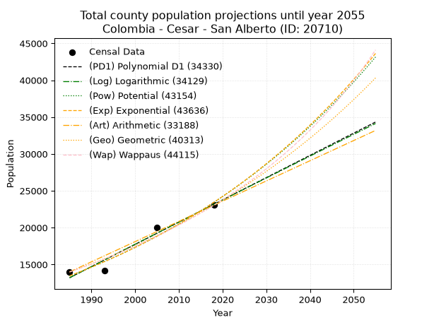
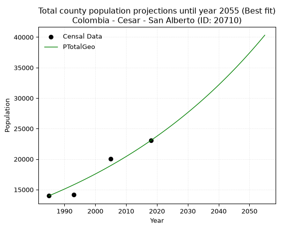
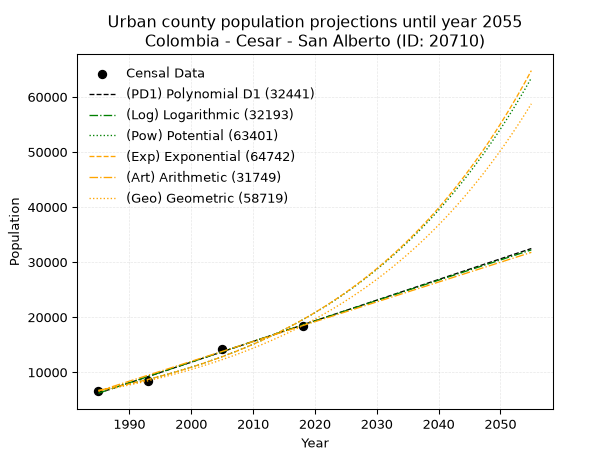
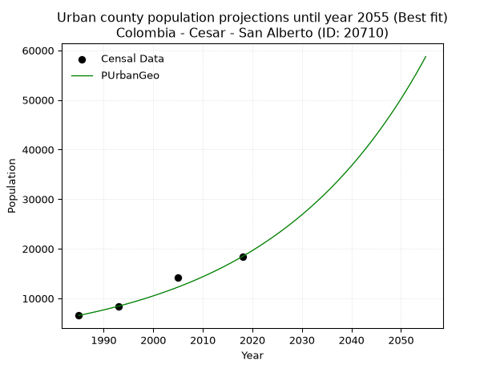
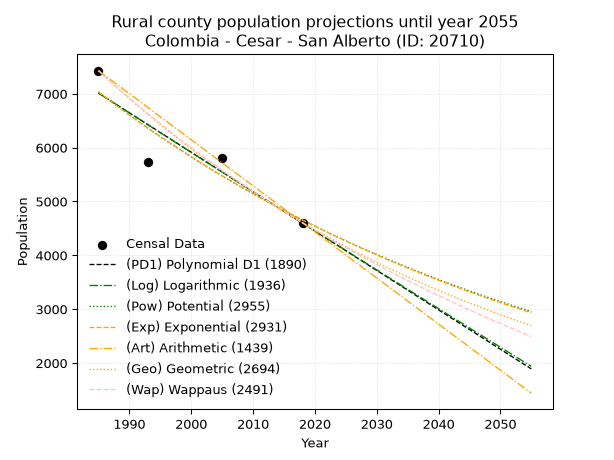
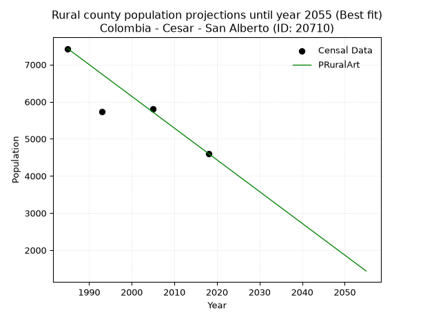

<div align="center">


</div>

# _“Population and Public Services Demand Projections (PPSD) until Year 2050 for Colombia - Cesar - San Alberto (ID: 20710)”_
Keywords: `population` `public-service` `projection` `lineal` `polynomial` `logarithmic` `potential` `exponential` `arithmetic` `geometric` `wappaus` `dane` `colombia` `south-america`

PPSD are analytical estimates used by governments and planners to anticipate future changes in population size, age distribution, and the resulting community needs for utilities, healthcare, education, and infrastructure as sizing future water treatment facilities, electrical grids, and road networks based on spatial growth.

> **General running parameters**: • app_version: _v20260806_. • Python version: _3.14.7_. • Pandas version: _3.0.5_. • NumPy version: _2.5.1_. • Creates, save and include plots into reports (create_plot): _False_. • Projection until year: _2050_. • Process polynomial degree 2 and up: _False_. • Process Wappaus: _True_. • Process Wappaus: _True_. • Set negative values to zero: _True_. • Set infinite values to zero: _True_. • Drop dataset notes: _True_. 
<div align="center">

Dynamic map: [:earth_americas:Google](http://maps.google.com/maps?q=7.761110026,-73.3938894) [:earth_americas:OSM](https://www.openstreetmap.org/#map=18/7.761110026/-73.3938894&layers=P) [:earth_americas:Bing](https://www.bing.com/maps?cp=7.761110026~-73.3938894&lvl=18) [:earth_americas:Apple](https://maps.apple.com/frame?center=7.761110026%2C-73.3938894&span=0.003%2C0.006)

</div>


<div align="center">

```geojson
{
  "type": "Feature",
  "geometry": {
    "type": "Point", 
    "coordinates": [-73.3938894, 7.761110026]
  }, 
  "properties": {
    "Name": "Colombia - Cesar - San Alberto (ID: 20710)"
  }
}
```

</div>


## 0. Census Data (4 records)

Census data are official statistics collected by a government about the people and housing in a country. They usually include counts of total population, age, sex, race, income, education, and jobs.

📅Global census file: [Population.xlsx](../data/Population.xlsx)

| Source   |   Year |   CountryID | CountryName   |   StateID | StateName   |   CountyID | CountyName   |   PTotal |   PUrban |   PRural |
|:---------|-------:|------------:|:--------------|----------:|:------------|-----------:|:-------------|---------:|---------:|---------:|
| DANE     |   1985 |          57 | Colombia      |        20 | Cesar       |      20710 | San Alberto  |    13989 |     6560 |     7429 |
| DANE     |   1993 |          57 | Colombia      |        20 | Cesar       |      20710 | San Alberto  |    14171 |     8433 |     5738 |
| DANE     |   2005 |          57 | Colombia      |        20 | Cesar       |      20710 | San Alberto  |    20018 |    14209 |     5809 |
| DANE     |   2018 |          57 | Colombia      |        20 | Cesar       |      20710 | San Alberto  |    23040 |    18435 |     4605 |

> 🔥Some records could had specific notes about the registered values or the corresponding urban or rural distribution.

## 1. Total

### 1.1. Coefficients and Parameters

* (PD1) Polynomial Deg 1: 301.8442392613386, -585959.4395824926 (lineal)
* (Log) Logarithmic: 604107.5618071909, -4574021.918310639
* (Pow) Potential: 33.635757835019795, -106.79391487192083
* (Exp) Exponential: 0.016804570490692193, 4.3871610682218456e-11
* (Art) Arithmetic: Year diff. 2018 - 1985 = 33, Population diff. 23040 - 13989 = 9051, Annual growth = 274.27272727272725
* (Geo) Geometric: Year diff. 2018 - 1985 = 33, Population diff. 23040 - 13989 = 9051, Annual growth % = 0.0152349017773592
* (Wap) Wappaus: i = 1.4813941898119165, Condition values only valid for < 200)

<sub>
Wappaus condition values: ['0.00', '1.48', '2.96', '4.44', '5.93', '7.41', '8.89', '10.37', '11.85', '13.33', '14.81', '16.30', '17.78', '19.26', '20.74', '22.22', '23.70', '25.18', '26.67', '28.15', '29.63', '31.11', '32.59', '34.07', '35.55', '37.03', '38.52', '40.00', '41.48', '42.96', '44.44', '45.92', '47.40', '48.89', '50.37', '51.85', '53.33', '54.81', '56.29', '57.77', '59.26', '60.74', '62.22', '63.70', '65.18', '66.66', '68.14', '69.63', '71.11', '72.59', '74.07', '75.55', '77.03', '78.51', '80.00', '81.48', '82.96', '84.44', '85.92', '87.40', '88.88', '90.37', '91.85', '93.33', '94.81', '96.29']
</sub>


### 1.2. Projected Dataset

|   Year |   CountyID |   PTotalPD1 |   PTotalLog |   PTotalPow |   PTotalExp |   PTotalArt |   PTotalGeo |   PTotalWap |
|-------:|-----------:|------------:|------------:|------------:|------------:|------------:|------------:|------------:|
|   1985 |      20710 |       13201 |       13193 |       13451 |       13458 |       13989 |       13989 |       13989 |
|   1986 |      20710 |       13503 |       13497 |       13681 |       13686 |       14263 |       14202 |       14198 |
|   1987 |      20710 |       13805 |       13801 |       13915 |       13918 |       14538 |       14418 |       14410 |
|   1988 |      20710 |       14107 |       14105 |       14152 |       14154 |       14812 |       14638 |       14625 |
|   1989 |      20710 |       14409 |       14409 |       14393 |       14394 |       15086 |       14861 |       14843 |
|   1990 |      20710 |       14711 |       14713 |       14639 |       14637 |       15360 |       15088 |       15065 |
|   1991 |      20710 |       15012 |       15016 |       14888 |       14886 |       15635 |       15317 |       15290 |
|   1992 |      20710 |       15314 |       15319 |       15142 |       15138 |       15909 |       15551 |       15519 |
|   1993 |      20710 |       15616 |       15623 |       15400 |       15394 |       16183 |       15788 |       15751 |
|   1994 |      20710 |       15918 |       15926 |       15662 |       15655 |       16457 |       16028 |       15987 |
|   1995 |      20710 |       16220 |       16229 |       15928 |       15921 |       16732 |       16272 |       16227 |
|   1996 |      20710 |       16522 |       16531 |       16199 |       16190 |       17006 |       16520 |       16471 |
|   1997 |      20710 |       16824 |       16834 |       16474 |       16465 |       17280 |       16772 |       16718 |
|   1998 |      20710 |       17125 |       17136 |       16754 |       16744 |       17555 |       17028 |       16970 |
|   1999 |      20710 |       17427 |       17439 |       17038 |       17027 |       17829 |       17287 |       17226 |
|   2000 |      20710 |       17729 |       17741 |       17327 |       17316 |       18103 |       17550 |       17486 |
|   2001 |      20710 |       18031 |       18043 |       17621 |       17609 |       18377 |       17818 |       17750 |
|   2002 |      20710 |       18333 |       18345 |       17920 |       17908 |       18652 |       18089 |       18019 |
|   2003 |      20710 |       18635 |       18646 |       18223 |       18211 |       18926 |       18365 |       18293 |
|   2004 |      20710 |       18936 |       18948 |       18532 |       18520 |       19200 |       18645 |       18571 |
|   2005 |      20710 |       19238 |       19249 |       18845 |       18834 |       19474 |       18929 |       18854 |
|   2006 |      20710 |       19540 |       19550 |       19164 |       19153 |       19749 |       19217 |       19142 |
|   2007 |      20710 |       19842 |       19851 |       19488 |       19478 |       20023 |       19510 |       19436 |
|   2008 |      20710 |       20144 |       20152 |       19817 |       19808 |       20297 |       19807 |       19734 |
|   2009 |      20710 |       20446 |       20453 |       20152 |       20143 |       20572 |       20109 |       20038 |
|   2010 |      20710 |       20747 |       20754 |       20492 |       20485 |       20846 |       20415 |       20347 |
|   2011 |      20710 |       21049 |       21054 |       20838 |       20832 |       21120 |       20726 |       20662 |
|   2012 |      20710 |       21351 |       21355 |       21189 |       21185 |       21394 |       21042 |       20983 |
|   2013 |      20710 |       21653 |       21655 |       21546 |       21544 |       21669 |       21362 |       21310 |
|   2014 |      20710 |       21955 |       21955 |       21909 |       21909 |       21943 |       21688 |       21643 |
|   2015 |      20710 |       22257 |       22255 |       22278 |       22280 |       22217 |       22018 |       21982 |
|   2016 |      20710 |       22559 |       22554 |       22653 |       22658 |       22491 |       22354 |       22328 |
|   2017 |      20710 |       22860 |       22854 |       23034 |       23042 |       22766 |       22694 |       22681 |
|   2018 |      20710 |       23162 |       23153 |       23421 |       23432 |       23040 |       23040 |       23040 |
|   2019 |      20710 |       23464 |       23453 |       23815 |       23829 |       23314 |       23391 |       23407 |
|   2020 |      20710 |       23766 |       23752 |       24215 |       24233 |       23589 |       23747 |       23781 |
|   2021 |      20710 |       24068 |       24051 |       24621 |       24644 |       23863 |       24109 |       24162 |
|   2022 |      20710 |       24370 |       24350 |       25035 |       25061 |       24137 |       24476 |       24551 |
|   2023 |      20710 |       24671 |       24648 |       25454 |       25486 |       24411 |       24849 |       24949 |
|   2024 |      20710 |       24973 |       24947 |       25881 |       25918 |       24686 |       25228 |       25354 |
|   2025 |      20710 |       25275 |       25245 |       26315 |       26357 |       24960 |       25612 |       25768 |
|   2026 |      20710 |       25577 |       25544 |       26755 |       26804 |       25234 |       26002 |       26191 |
|   2027 |      20710 |       25879 |       25842 |       27203 |       27258 |       25508 |       26399 |       26623 |
|   2028 |      20710 |       26181 |       26140 |       27658 |       27720 |       25783 |       26801 |       27065 |
|   2029 |      20710 |       26483 |       26437 |       28121 |       28190 |       26057 |       27209 |       27516 |
|   2030 |      20710 |       26784 |       26735 |       28590 |       28668 |       26331 |       27624 |       27977 |
|   2031 |      20710 |       27086 |       27033 |       29068 |       29153 |       26606 |       28044 |       28448 |
|   2032 |      20710 |       27388 |       27330 |       29553 |       29648 |       26880 |       28472 |       28930 |
|   2033 |      20710 |       27690 |       27627 |       30046 |       30150 |       27154 |       28906 |       29424 |
|   2034 |      20710 |       27992 |       27924 |       30548 |       30661 |       27428 |       29346 |       29928 |
|   2035 |      20710 |       28294 |       28221 |       31057 |       31180 |       27703 |       29793 |       30445 |
|   2036 |      20710 |       28595 |       28518 |       31574 |       31709 |       27977 |       30247 |       30974 |
|   2037 |      20710 |       28897 |       28815 |       32100 |       32246 |       28251 |       30708 |       31516 |
|   2038 |      20710 |       29199 |       29111 |       32634 |       32793 |       28525 |       31175 |       32071 |
|   2039 |      20710 |       29501 |       29407 |       33177 |       33348 |       28800 |       31650 |       32639 |
|   2040 |      20710 |       29803 |       29704 |       33729 |       33914 |       29074 |       32133 |       33222 |
|   2041 |      20710 |       30105 |       30000 |       34290 |       34488 |       29348 |       32622 |       33820 |
|   2042 |      20710 |       30406 |       30296 |       34859 |       35073 |       29623 |       33119 |       34432 |
|   2043 |      20710 |       30708 |       30591 |       35438 |       35667 |       29897 |       33624 |       35061 |
|   2044 |      20710 |       31010 |       30887 |       36026 |       36272 |       30171 |       34136 |       35706 |
|   2045 |      20710 |       31312 |       31182 |       36624 |       36886 |       30445 |       34656 |       36369 |
|   2046 |      20710 |       31614 |       31478 |       37231 |       37511 |       30720 |       35184 |       37049 |
|   2047 |      20710 |       31916 |       31773 |       37848 |       38147 |       30994 |       35720 |       37749 |
|   2048 |      20710 |       32218 |       32068 |       38475 |       38793 |       31268 |       36264 |       38467 |
|   2049 |      20710 |       32519 |       32363 |       39112 |       39451 |       31542 |       36817 |       39206 |
|   2050 |      20710 |       32821 |       32658 |       39759 |       40119 |       31817 |       37378 |       39966 |
<div align="center">

</img>

</div>


### 1.3. Best fit with absolute and relative error (%)

Relative error puts that difference into context by dividing the absolute error by the true value, creating a unitless ratio or percentage that shows the scale of the mistake.

Absolute and relative error

|   Year | Source   |   CountryID | CountryName   |   StateID | StateName   |   CountyID_x | CountyName   |   PTotal |   PUrban |   PRural |   CountyID_y |   PTotalPD1 |   PTotalLog |   PTotalPow |   PTotalExp |   PTotalArt |   PTotalGeo |   PTotalWap |   PTotalPD1AbsError |   PTotalLogAbsError |   PTotalPowAbsError |   PTotalExpAbsError |   PTotalArtAbsError |   PTotalGeoAbsError |   PTotalWapAbsError |   PTotalPD1RelError |   PTotalLogRelError |   PTotalPowRelError |   PTotalExpRelError |   PTotalArtRelError |   PTotalGeoRelError |   PTotalWapRelError |
|-------:|:---------|------------:|:--------------|----------:|:------------|-------------:|:-------------|---------:|---------:|---------:|-------------:|------------:|------------:|------------:|------------:|------------:|------------:|------------:|--------------------:|--------------------:|--------------------:|--------------------:|--------------------:|--------------------:|--------------------:|--------------------:|--------------------:|--------------------:|--------------------:|--------------------:|--------------------:|--------------------:|
|   1985 | DANE     |          57 | Colombia      |        20 | Cesar       |        20710 | San Alberto  |    13989 |     6560 |     7429 |        20710 |       13201 |       13193 |       13451 |       13458 |       13989 |       13989 |       13989 |                 788 |                 796 |                 538 |                 531 |                   0 |                   0 |                   0 |            5.633    |            5.69019  |             3.84588 |             3.79584 |             0       |              0      |             0       |
|   1993 | DANE     |          57 | Colombia      |        20 | Cesar       |        20710 | San Alberto  |    14171 |     8433 |     5738 |        20710 |       15616 |       15623 |       15400 |       15394 |       16183 |       15788 |       15751 |                1445 |                1452 |                1229 |                1223 |                2012 |                1617 |                1580 |           10.1969   |           10.2463   |             8.67264 |             8.6303  |            14.198   |             11.4106 |            11.1495  |
|   2005 | DANE     |          57 | Colombia      |        20 | Cesar       |        20710 | San Alberto  |    20018 |    14209 |     5809 |        20710 |       19238 |       19249 |       18845 |       18834 |       19474 |       18929 |       18854 |                 780 |                 769 |                1173 |                1184 |                 544 |                1089 |                1164 |            3.89649  |            3.84154  |             5.85973 |             5.91468 |             2.71755 |              5.4401 |             5.81477 |
|   2018 | DANE     |          57 | Colombia      |        20 | Cesar       |        20710 | San Alberto  |    23040 |    18435 |     4605 |        20710 |       23162 |       23153 |       23421 |       23432 |       23040 |       23040 |       23040 |                 122 |                 113 |                 381 |                 392 |                   0 |                   0 |                   0 |            0.529514 |            0.490451 |             1.65365 |             1.70139 |             0       |              0      |             0       |

Relative error mean

| Method    |   RelError | Best   |
|:----------|-----------:|:-------|
| PTotalPD1 |    5.06397 |        |
| PTotalLog |    5.06711 |        |
| PTotalPow |    5.00797 |        |
| PTotalExp |    5.01055 |        |
| PTotalArt |    4.22889 |        |
| PTotalGeo |    4.21268 | True   |
| PTotalWap |    4.24107 |        |

💙Best method: _**PTotalGeo**_
<div align="center">

</img>

</div>


### 1.4. Fresh water supply demand in liters per capita per day (lpcd)

The fresh water supply demand typically ranges from 100 to 300 liters per capita per day (lpcd) for standard domestic and municipal planning, though absolute survival minimums set by the World Health Organization are as low as 7.5 to 20 liters per day, and total consumption in high-income nations can exceed 400 liters.

> `CZ`: Level in meters above the sea level (masl).<br> `WS`: Fresh water supply demand in liters per capita per day (lpcd or l/h/d).<br> `WSAll`: Zonal fresh water supply demand in liters per second (l/s).<br> `A`: Zonal area in square meters.

Reference values (RAS Colombia)

|    CZ |   WS |
|------:|-----:|
|  1000 |  120 |
|  2000 |  130 |
| 99999 |  140 |

County shapefile geometry properties and water supply values

|   CountyID |      ATotal |   CZTotal |   WSTotal |
|-----------:|------------:|----------:|----------:|
|      20710 | 5.50366e+08 |   329.147 |       120 |

Projected values for best method: PTotalGeo

|   CountyID |   Year |   PTotalGeo |   WSTotal |   WSTotalAll |
|-----------:|-------:|------------:|----------:|-------------:|
|      20710 |   1985 |       13989 |       120 |      19.4292 |
|      20710 |   1986 |       14202 |       120 |      19.725  |
|      20710 |   1987 |       14418 |       120 |      20.025  |
|      20710 |   1988 |       14638 |       120 |      20.3306 |
|      20710 |   1989 |       14861 |       120 |      20.6403 |
|      20710 |   1990 |       15088 |       120 |      20.9556 |
|      20710 |   1991 |       15317 |       120 |      21.2736 |
|      20710 |   1992 |       15551 |       120 |      21.5986 |
|      20710 |   1993 |       15788 |       120 |      21.9278 |
|      20710 |   1994 |       16028 |       120 |      22.2611 |
|      20710 |   1995 |       16272 |       120 |      22.6    |
|      20710 |   1996 |       16520 |       120 |      22.9444 |
|      20710 |   1997 |       16772 |       120 |      23.2944 |
|      20710 |   1998 |       17028 |       120 |      23.65   |
|      20710 |   1999 |       17287 |       120 |      24.0097 |
|      20710 |   2000 |       17550 |       120 |      24.375  |
|      20710 |   2001 |       17818 |       120 |      24.7472 |
|      20710 |   2002 |       18089 |       120 |      25.1236 |
|      20710 |   2003 |       18365 |       120 |      25.5069 |
|      20710 |   2004 |       18645 |       120 |      25.8958 |
|      20710 |   2005 |       18929 |       120 |      26.2903 |
|      20710 |   2006 |       19217 |       120 |      26.6903 |
|      20710 |   2007 |       19510 |       120 |      27.0972 |
|      20710 |   2008 |       19807 |       120 |      27.5097 |
|      20710 |   2009 |       20109 |       120 |      27.9292 |
|      20710 |   2010 |       20415 |       120 |      28.3542 |
|      20710 |   2011 |       20726 |       120 |      28.7861 |
|      20710 |   2012 |       21042 |       120 |      29.225  |
|      20710 |   2013 |       21362 |       120 |      29.6694 |
|      20710 |   2014 |       21688 |       120 |      30.1222 |
|      20710 |   2015 |       22018 |       120 |      30.5806 |
|      20710 |   2016 |       22354 |       120 |      31.0472 |
|      20710 |   2017 |       22694 |       120 |      31.5194 |
|      20710 |   2018 |       23040 |       120 |      32      |
|      20710 |   2019 |       23391 |       120 |      32.4875 |
|      20710 |   2020 |       23747 |       120 |      32.9819 |
|      20710 |   2021 |       24109 |       120 |      33.4847 |
|      20710 |   2022 |       24476 |       120 |      33.9944 |
|      20710 |   2023 |       24849 |       120 |      34.5125 |
|      20710 |   2024 |       25228 |       120 |      35.0389 |
|      20710 |   2025 |       25612 |       120 |      35.5722 |
|      20710 |   2026 |       26002 |       120 |      36.1139 |
|      20710 |   2027 |       26399 |       120 |      36.6653 |
|      20710 |   2028 |       26801 |       120 |      37.2236 |
|      20710 |   2029 |       27209 |       120 |      37.7903 |
|      20710 |   2030 |       27624 |       120 |      38.3667 |
|      20710 |   2031 |       28044 |       120 |      38.95   |
|      20710 |   2032 |       28472 |       120 |      39.5444 |
|      20710 |   2033 |       28906 |       120 |      40.1472 |
|      20710 |   2034 |       29346 |       120 |      40.7583 |
|      20710 |   2035 |       29793 |       120 |      41.3792 |
|      20710 |   2036 |       30247 |       120 |      42.0097 |
|      20710 |   2037 |       30708 |       120 |      42.65   |
|      20710 |   2038 |       31175 |       120 |      43.2986 |
|      20710 |   2039 |       31650 |       120 |      43.9583 |
|      20710 |   2040 |       32133 |       120 |      44.6292 |
|      20710 |   2041 |       32622 |       120 |      45.3083 |
|      20710 |   2042 |       33119 |       120 |      45.9986 |
|      20710 |   2043 |       33624 |       120 |      46.7    |
|      20710 |   2044 |       34136 |       120 |      47.4111 |
|      20710 |   2045 |       34656 |       120 |      48.1333 |
|      20710 |   2046 |       35184 |       120 |      48.8667 |
|      20710 |   2047 |       35720 |       120 |      49.6111 |
|      20710 |   2048 |       36264 |       120 |      50.3667 |
|      20710 |   2049 |       36817 |       120 |      51.1347 |
|      20710 |   2050 |       37378 |       120 |      51.9139 |

## 2. Urban

### 2.1. Coefficients and Parameters

* (PD1) Polynomial Deg 1: 375.00562023283516, -738195.7418707284 (lineal)
* (Log) Logarithmic: 750605.1743719177, -5693446.695373319
* (Pow) Potential: 64.91334871326467, -210.24361379779506
* (Exp) Exponential: 0.032421761300151515, 7.508772537514027e-25
* (Art) Arithmetic: Year diff. 2018 - 1985 = 33, Population diff. 18435 - 6560 = 11875, Annual growth = 359.8484848484849
* (Geo) Geometric: Year diff. 2018 - 1985 = 33, Population diff. 18435 - 6560 = 11875, Annual growth % = 0.03180626537102782
* (Wap) Wappaus: i = 2.8793637515381865, Condition values only valid for < 200)

<sub>
Wappaus condition values: ['0.00', '2.88', '5.76', '8.64', '11.52', '14.40', '17.28', '20.16', '23.03', '25.91', '28.79', '31.67', '34.55', '37.43', '40.31', '43.19', '46.07', '48.95', '51.83', '54.71', '57.59', '60.47', '63.35', '66.23', '69.10', '71.98', '74.86', '77.74', '80.62', '83.50', '86.38', '89.26', '92.14', '95.02', '97.90', '100.78', '103.66', '106.54', '109.42', '112.30', '115.17', '118.05', '120.93', '123.81', '126.69', '129.57', '132.45', '135.33', '138.21', '141.09', '143.97', '146.85', '149.73', '152.61', '155.49', '158.37', '161.24', '164.12', '167.00', '169.88', '172.76', '175.64', '178.52', '181.40', '184.28', '187.16']
</sub>


### 2.2. Projected Dataset

|   Year |   CountyID |   PUrbanPD1 |   PUrbanLog |   PUrbanPow |   PUrbanExp |   PUrbanArt |   PUrbanGeo |   PUrbanWap |
|-------:|-----------:|------------:|------------:|------------:|------------:|------------:|------------:|------------:|
|   1985 |      20710 |        6190 |        6179 |        6684 |        6692 |        6560 |        6560 |        6560 |
|   1986 |      20710 |        6565 |        6557 |        6907 |        6912 |        6920 |        6769 |        6752 |
|   1987 |      20710 |        6940 |        6935 |        7136 |        7140 |        7280 |        6984 |        6949 |
|   1988 |      20710 |        7315 |        7313 |        7373 |        7375 |        7640 |        7206 |        7152 |
|   1989 |      20710 |        7690 |        7690 |        7618 |        7618 |        7999 |        7435 |        7362 |
|   1990 |      20710 |        8065 |        8068 |        7870 |        7869 |        8359 |        7672 |        7578 |
|   1991 |      20710 |        8440 |        8445 |        8131 |        8129 |        8719 |        7916 |        7800 |
|   1992 |      20710 |        8815 |        8822 |        8401 |        8397 |        9079 |        8168 |        8030 |
|   1993 |      20710 |        9190 |        9198 |        8679 |        8673 |        9439 |        8427 |        8268 |
|   1994 |      20710 |        9565 |        9575 |        8966 |        8959 |        9799 |        8695 |        8513 |
|   1995 |      20710 |        9940 |        9951 |        9263 |        9254 |       10158 |        8972 |        8767 |
|   1996 |      20710 |       10315 |       10327 |        9569 |        9559 |       10518 |        9257 |        9029 |
|   1997 |      20710 |       10690 |       10703 |        9885 |        9874 |       10878 |        9552 |        9300 |
|   1998 |      20710 |       11065 |       11079 |       10212 |       10200 |       11238 |        9856 |        9581 |
|   1999 |      20710 |       11440 |       11455 |       10549 |       10536 |       11598 |       10169 |        9872 |
|   2000 |      20710 |       11815 |       11830 |       10897 |       10883 |       11958 |       10492 |       10174 |
|   2001 |      20710 |       12191 |       12205 |       11256 |       11242 |       12318 |       10826 |       10487 |
|   2002 |      20710 |       12566 |       12580 |       11627 |       11612 |       12677 |       11170 |       10812 |
|   2003 |      20710 |       12941 |       12955 |       12010 |       11995 |       13037 |       11526 |       11149 |
|   2004 |      20710 |       13316 |       13330 |       12406 |       12390 |       13397 |       11892 |       11500 |
|   2005 |      20710 |       13691 |       13704 |       12814 |       12798 |       13757 |       12271 |       11865 |
|   2006 |      20710 |       14066 |       14078 |       13236 |       13220 |       14117 |       12661 |       12246 |
|   2007 |      20710 |       14441 |       14453 |       13671 |       13656 |       14477 |       13064 |       12642 |
|   2008 |      20710 |       14816 |       14826 |       14120 |       14106 |       14837 |       13479 |       13055 |
|   2009 |      20710 |       15191 |       15200 |       14584 |       14571 |       15196 |       13908 |       13487 |
|   2010 |      20710 |       15566 |       15574 |       15063 |       15051 |       15556 |       14350 |       13937 |
|   2011 |      20710 |       15941 |       15947 |       15557 |       15547 |       15916 |       14807 |       14409 |
|   2012 |      20710 |       16316 |       16320 |       16067 |       16059 |       16276 |       15278 |       14903 |
|   2013 |      20710 |       16691 |       16693 |       16594 |       16588 |       16636 |       15763 |       15421 |
|   2014 |      20710 |       17066 |       17066 |       17138 |       17135 |       16996 |       16265 |       15964 |
|   2015 |      20710 |       17441 |       17439 |       17699 |       17700 |       17355 |       16782 |       16535 |
|   2016 |      20710 |       17816 |       17811 |       18278 |       18283 |       17715 |       17316 |       17135 |
|   2017 |      20710 |       18191 |       18183 |       18876 |       18885 |       18075 |       17867 |       17768 |
|   2018 |      20710 |       18566 |       18555 |       19493 |       19508 |       18435 |       18435 |       18435 |
|   2019 |      20710 |       18941 |       18927 |       20130 |       20150 |       18795 |       19021 |       19140 |
|   2020 |      20710 |       19316 |       19299 |       20788 |       20814 |       19155 |       19626 |       19886 |
|   2021 |      20710 |       19691 |       19670 |       21467 |       21500 |       19515 |       20251 |       20676 |
|   2022 |      20710 |       20066 |       20042 |       22167 |       22209 |       19874 |       20895 |       21515 |
|   2023 |      20710 |       20441 |       20413 |       22890 |       22941 |       20234 |       21559 |       22408 |
|   2024 |      20710 |       20816 |       20784 |       23636 |       23697 |       20594 |       22245 |       23359 |
|   2025 |      20710 |       21191 |       21154 |       24407 |       24478 |       20954 |       22953 |       24374 |
|   2026 |      20710 |       21566 |       21525 |       25201 |       25284 |       21314 |       23683 |       25461 |
|   2027 |      20710 |       21941 |       21895 |       26022 |       26117 |       21674 |       24436 |       26627 |
|   2028 |      20710 |       22316 |       22266 |       26868 |       26978 |       22033 |       25213 |       27881 |
|   2029 |      20710 |       22691 |       22636 |       27742 |       27867 |       22393 |       26015 |       29234 |
|   2030 |      20710 |       23066 |       23005 |       28644 |       28785 |       22753 |       26842 |       30698 |
|   2031 |      20710 |       23441 |       23375 |       29574 |       29734 |       23113 |       27696 |       32286 |
|   2032 |      20710 |       23816 |       23745 |       30535 |       30714 |       23473 |       28577 |       34015 |
|   2033 |      20710 |       24191 |       24114 |       31525 |       31726 |       23833 |       29486 |       35906 |
|   2034 |      20710 |       24566 |       24483 |       32548 |       32771 |       24193 |       30424 |       37982 |
|   2035 |      20710 |       24941 |       24852 |       33603 |       33851 |       24552 |       31391 |       40271 |
|   2036 |      20710 |       25316 |       25221 |       34692 |       34967 |       24912 |       32390 |       42807 |
|   2037 |      20710 |       25691 |       25589 |       35816 |       36119 |       25272 |       33420 |       45635 |
|   2038 |      20710 |       26066 |       25958 |       36975 |       37309 |       25632 |       34483 |       48806 |
|   2039 |      20710 |       26441 |       26326 |       38172 |       38539 |       25992 |       35580 |       52387 |
|   2040 |      20710 |       26816 |       26694 |       39406 |       39809 |       26352 |       36712 |       56464 |
|   2041 |      20710 |       27191 |       27062 |       40680 |       41120 |       26712 |       37879 |       61146 |
|   2042 |      20710 |       27566 |       27430 |       41994 |       42475 |       27071 |       39084 |       66580 |
|   2043 |      20710 |       27941 |       27797 |       43350 |       43875 |       27431 |       40327 |       72963 |
|   2044 |      20710 |       28316 |       28164 |       44749 |       45321 |       27791 |       41610 |       80565 |
|   2045 |      20710 |       28691 |       28531 |       46193 |       46814 |       28151 |       42933 |       89775 |
|   2046 |      20710 |       29066 |       28898 |       47682 |       48357 |       28511 |       44299 |      101163 |
|   2047 |      20710 |       29441 |       29265 |       49219 |       49951 |       28871 |       45708 |      115603 |
|   2048 |      20710 |       29816 |       29632 |       50804 |       51597 |       29230 |       47162 |      134515 |
|   2049 |      20710 |       30191 |       29998 |       52440 |       53297 |       29590 |       48662 |      160353 |
|   2050 |      20710 |       30566 |       30364 |       54128 |       55053 |       29950 |       50209 |      197780 |
<div align="center">

</img>

</div>


### 2.3. Best fit with absolute and relative error (%)

Relative error puts that difference into context by dividing the absolute error by the true value, creating a unitless ratio or percentage that shows the scale of the mistake.

Absolute and relative error

|   Year | Source   |   CountryID | CountryName   |   StateID | StateName   |   CountyID_x | CountyName   |   PTotal |   PUrban |   PRural |   CountyID_y |   PUrbanPD1 |   PUrbanLog |   PUrbanPow |   PUrbanExp |   PUrbanArt |   PUrbanGeo |   PUrbanWap |   PUrbanPD1AbsError |   PUrbanLogAbsError |   PUrbanPowAbsError |   PUrbanExpAbsError |   PUrbanArtAbsError |   PUrbanGeoAbsError |   PUrbanWapAbsError |   PUrbanPD1RelError |   PUrbanLogRelError |   PUrbanPowRelError |   PUrbanExpRelError |   PUrbanArtRelError |   PUrbanGeoRelError |   PUrbanWapRelError |
|-------:|:---------|------------:|:--------------|----------:|:------------|-------------:|:-------------|---------:|---------:|---------:|-------------:|------------:|------------:|------------:|------------:|------------:|------------:|------------:|--------------------:|--------------------:|--------------------:|--------------------:|--------------------:|--------------------:|--------------------:|--------------------:|--------------------:|--------------------:|--------------------:|--------------------:|--------------------:|--------------------:|
|   1985 | DANE     |          57 | Colombia      |        20 | Cesar       |        20710 | San Alberto  |    13989 |     6560 |     7429 |        20710 |        6190 |        6179 |        6684 |        6692 |        6560 |        6560 |        6560 |                 370 |                 381 |                 124 |                 132 |                   0 |                   0 |                   0 |            5.64024  |            5.80793  |             1.89024 |             2.0122  |             0       |           0         |              0      |
|   1993 | DANE     |          57 | Colombia      |        20 | Cesar       |        20710 | San Alberto  |    14171 |     8433 |     5738 |        20710 |        9190 |        9198 |        8679 |        8673 |        9439 |        8427 |        8268 |                 757 |                 765 |                 246 |                 240 |                1006 |                   6 |                 165 |            8.97664  |            9.0715   |             2.91711 |             2.84596 |            11.9293  |           0.0711491 |              1.9566 |
|   2005 | DANE     |          57 | Colombia      |        20 | Cesar       |        20710 | San Alberto  |    20018 |    14209 |     5809 |        20710 |       13691 |       13704 |       12814 |       12798 |       13757 |       12271 |       11865 |                 518 |                 505 |                1395 |                1411 |                 452 |                1938 |                2344 |            3.64558  |            3.55409  |             9.81772 |             9.93033 |             3.18108 |          13.6392    |             16.4966 |
|   2018 | DANE     |          57 | Colombia      |        20 | Cesar       |        20710 | San Alberto  |    23040 |    18435 |     4605 |        20710 |       18566 |       18555 |       19493 |       19508 |       18435 |       18435 |       18435 |                 131 |                 120 |                1058 |                1073 |                   0 |                   0 |                   0 |            0.710605 |            0.650936 |             5.73908 |             5.82045 |             0       |           0         |              0      |

Relative error mean

| Method    |   RelError | Best   |
|:----------|-----------:|:-------|
| PUrbanPD1 |    4.74327 |        |
| PUrbanLog |    4.77111 |        |
| PUrbanPow |    5.09104 |        |
| PUrbanExp |    5.15223 |        |
| PUrbanArt |    3.7776  |        |
| PUrbanGeo |    3.4276  | True   |
| PUrbanWap |    4.6133  |        |

💙Best method: _**PUrbanGeo**_
<div align="center">

</img>

</div>


### 2.4. Fresh water supply demand in liters per capita per day (lpcd)

The fresh water supply demand typically ranges from 100 to 300 liters per capita per day (lpcd) for standard domestic and municipal planning, though absolute survival minimums set by the World Health Organization are as low as 7.5 to 20 liters per day, and total consumption in high-income nations can exceed 400 liters.

> `CZ`: Level in meters above the sea level (masl).<br> `WS`: Fresh water supply demand in liters per capita per day (lpcd or l/h/d).<br> `WSAll`: Zonal fresh water supply demand in liters per second (l/s).<br> `A`: Zonal area in square meters.

Reference values (RAS Colombia)

|    CZ |   WS |
|------:|-----:|
|  1000 |  120 |
|  2000 |  130 |
| 99999 |  140 |

County shapefile geometry properties and water supply values

|   CountyID |      AUrban |   CZUrban |   WSUrban |
|-----------:|------------:|----------:|----------:|
|      20710 | 1.96785e+06 |   118.301 |       120 |

Projected values for best method: PUrbanGeo

|   CountyID |   Year |   PUrbanGeo |   WSUrban |   WSUrbanAll |
|-----------:|-------:|------------:|----------:|-------------:|
|      20710 |   1985 |        6560 |       120 |      9.11111 |
|      20710 |   1986 |        6769 |       120 |      9.40139 |
|      20710 |   1987 |        6984 |       120 |      9.7     |
|      20710 |   1988 |        7206 |       120 |     10.0083  |
|      20710 |   1989 |        7435 |       120 |     10.3264  |
|      20710 |   1990 |        7672 |       120 |     10.6556  |
|      20710 |   1991 |        7916 |       120 |     10.9944  |
|      20710 |   1992 |        8168 |       120 |     11.3444  |
|      20710 |   1993 |        8427 |       120 |     11.7042  |
|      20710 |   1994 |        8695 |       120 |     12.0764  |
|      20710 |   1995 |        8972 |       120 |     12.4611  |
|      20710 |   1996 |        9257 |       120 |     12.8569  |
|      20710 |   1997 |        9552 |       120 |     13.2667  |
|      20710 |   1998 |        9856 |       120 |     13.6889  |
|      20710 |   1999 |       10169 |       120 |     14.1236  |
|      20710 |   2000 |       10492 |       120 |     14.5722  |
|      20710 |   2001 |       10826 |       120 |     15.0361  |
|      20710 |   2002 |       11170 |       120 |     15.5139  |
|      20710 |   2003 |       11526 |       120 |     16.0083  |
|      20710 |   2004 |       11892 |       120 |     16.5167  |
|      20710 |   2005 |       12271 |       120 |     17.0431  |
|      20710 |   2006 |       12661 |       120 |     17.5847  |
|      20710 |   2007 |       13064 |       120 |     18.1444  |
|      20710 |   2008 |       13479 |       120 |     18.7208  |
|      20710 |   2009 |       13908 |       120 |     19.3167  |
|      20710 |   2010 |       14350 |       120 |     19.9306  |
|      20710 |   2011 |       14807 |       120 |     20.5653  |
|      20710 |   2012 |       15278 |       120 |     21.2194  |
|      20710 |   2013 |       15763 |       120 |     21.8931  |
|      20710 |   2014 |       16265 |       120 |     22.5903  |
|      20710 |   2015 |       16782 |       120 |     23.3083  |
|      20710 |   2016 |       17316 |       120 |     24.05    |
|      20710 |   2017 |       17867 |       120 |     24.8153  |
|      20710 |   2018 |       18435 |       120 |     25.6042  |
|      20710 |   2019 |       19021 |       120 |     26.4181  |
|      20710 |   2020 |       19626 |       120 |     27.2583  |
|      20710 |   2021 |       20251 |       120 |     28.1264  |
|      20710 |   2022 |       20895 |       120 |     29.0208  |
|      20710 |   2023 |       21559 |       120 |     29.9431  |
|      20710 |   2024 |       22245 |       120 |     30.8958  |
|      20710 |   2025 |       22953 |       120 |     31.8792  |
|      20710 |   2026 |       23683 |       120 |     32.8931  |
|      20710 |   2027 |       24436 |       120 |     33.9389  |
|      20710 |   2028 |       25213 |       120 |     35.0181  |
|      20710 |   2029 |       26015 |       120 |     36.1319  |
|      20710 |   2030 |       26842 |       120 |     37.2806  |
|      20710 |   2031 |       27696 |       120 |     38.4667  |
|      20710 |   2032 |       28577 |       120 |     39.6903  |
|      20710 |   2033 |       29486 |       120 |     40.9528  |
|      20710 |   2034 |       30424 |       120 |     42.2556  |
|      20710 |   2035 |       31391 |       120 |     43.5986  |
|      20710 |   2036 |       32390 |       120 |     44.9861  |
|      20710 |   2037 |       33420 |       120 |     46.4167  |
|      20710 |   2038 |       34483 |       120 |     47.8931  |
|      20710 |   2039 |       35580 |       120 |     49.4167  |
|      20710 |   2040 |       36712 |       120 |     50.9889  |
|      20710 |   2041 |       37879 |       120 |     52.6097  |
|      20710 |   2042 |       39084 |       120 |     54.2833  |
|      20710 |   2043 |       40327 |       120 |     56.0097  |
|      20710 |   2044 |       41610 |       120 |     57.7917  |
|      20710 |   2045 |       42933 |       120 |     59.6292  |
|      20710 |   2046 |       44299 |       120 |     61.5264  |
|      20710 |   2047 |       45708 |       120 |     63.4833  |
|      20710 |   2048 |       47162 |       120 |     65.5028  |
|      20710 |   2049 |       48662 |       120 |     67.5861  |
|      20710 |   2050 |       50209 |       120 |     69.7347  |

## 3. Rural

### 3.1. Coefficients and Parameters

* (PD1) Polynomial Deg 1: -73.16138097149661, 152236.3022882361 (lineal)
* (Log) Logarithmic: -146497.61256472694, 1119424.77706268
* (Pow) Potential: -25.025941956852257, 86.37678777435515
* (Exp) Exponential: -0.012500677554858267, 420303770847389.06
* (Art) Arithmetic: Year diff. 2018 - 1985 = 33, Population diff. 4605 - 7429 = -2824, Annual growth = -85.57575757575758
* (Geo) Geometric: Year diff. 2018 - 1985 = 33, Population diff. 4605 - 7429 = -2824, Annual growth % = -0.014387872438970772
* (Wap) Wappaus: i = -1.4222329661917497, Condition values only valid for < 200)

<sub>
Wappaus condition values: ['-0.00', '-1.42', '-2.84', '-4.27', '-5.69', '-7.11', '-8.53', '-9.96', '-11.38', '-12.80', '-14.22', '-15.64', '-17.07', '-18.49', '-19.91', '-21.33', '-22.76', '-24.18', '-25.60', '-27.02', '-28.44', '-29.87', '-31.29', '-32.71', '-34.13', '-35.56', '-36.98', '-38.40', '-39.82', '-41.24', '-42.67', '-44.09', '-45.51', '-46.93', '-48.36', '-49.78', '-51.20', '-52.62', '-54.04', '-55.47', '-56.89', '-58.31', '-59.73', '-61.16', '-62.58', '-64.00', '-65.42', '-66.84', '-68.27', '-69.69', '-71.11', '-72.53', '-73.96', '-75.38', '-76.80', '-78.22', '-79.65', '-81.07', '-82.49', '-83.91', '-85.33', '-86.76', '-88.18', '-89.60', '-91.02', '-92.45']
</sub>


### 3.2. Projected Dataset

|   Year |   CountyID |   PRuralPD1 |   PRuralLog |   PRuralPow |   PRuralExp |   PRuralArt |   PRuralGeo |   PRuralWap |
|-------:|-----------:|------------:|------------:|------------:|------------:|------------:|------------:|------------:|
|   1985 |      20710 |        7011 |        7014 |        7034 |        7031 |        7429 |        7429 |        7429 |
|   1986 |      20710 |        6938 |        6940 |        6946 |        6944 |        7343 |        7322 |        7324 |
|   1987 |      20710 |        6865 |        6866 |        6859 |        6858 |        7258 |        7217 |        7221 |
|   1988 |      20710 |        6791 |        6792 |        6773 |        6773 |        7172 |        7113 |        7119 |
|   1989 |      20710 |        6718 |        6719 |        6689 |        6689 |        7087 |        7011 |        7018 |
|   1990 |      20710 |        6645 |        6645 |        6605 |        6605 |        7001 |        6910 |        6919 |
|   1991 |      20710 |        6572 |        6571 |        6523 |        6523 |        6916 |        6810 |        6821 |
|   1992 |      20710 |        6499 |        6498 |        6441 |        6442 |        6830 |        6712 |        6724 |
|   1993 |      20710 |        6426 |        6424 |        6361 |        6362 |        6744 |        6616 |        6629 |
|   1994 |      20710 |        6353 |        6351 |        6281 |        6283 |        6659 |        6521 |        6535 |
|   1995 |      20710 |        6279 |        6277 |        6203 |        6205 |        6573 |        6427 |        6443 |
|   1996 |      20710 |        6206 |        6204 |        6126 |        6128 |        6488 |        6334 |        6351 |
|   1997 |      20710 |        6133 |        6131 |        6049 |        6052 |        6402 |        6243 |        6261 |
|   1998 |      20710 |        6060 |        6057 |        5974 |        5977 |        6317 |        6153 |        6172 |
|   1999 |      20710 |        5987 |        5984 |        5900 |        5903 |        6231 |        6065 |        6084 |
|   2000 |      20710 |        5914 |        5911 |        5826 |        5829 |        6145 |        5978 |        5997 |
|   2001 |      20710 |        5840 |        5837 |        5754 |        5757 |        6060 |        5892 |        5911 |
|   2002 |      20710 |        5767 |        5764 |        5683 |        5685 |        5974 |        5807 |        5827 |
|   2003 |      20710 |        5694 |        5691 |        5612 |        5615 |        5889 |        5723 |        5743 |
|   2004 |      20710 |        5621 |        5618 |        5542 |        5545 |        5803 |        5641 |        5660 |
|   2005 |      20710 |        5548 |        5545 |        5473 |        5476 |        5717 |        5560 |        5579 |
|   2006 |      20710 |        5475 |        5472 |        5406 |        5408 |        5632 |        5480 |        5498 |
|   2007 |      20710 |        5401 |        5399 |        5339 |        5341 |        5546 |        5401 |        5419 |
|   2008 |      20710 |        5328 |        5326 |        5272 |        5274 |        5461 |        5323 |        5340 |
|   2009 |      20710 |        5255 |        5253 |        5207 |        5209 |        5375 |        5247 |        5263 |
|   2010 |      20710 |        5182 |        5180 |        5143 |        5144 |        5290 |        5171 |        5186 |
|   2011 |      20710 |        5109 |        5107 |        5079 |        5080 |        5204 |        5097 |        5111 |
|   2012 |      20710 |        5036 |        5034 |        5016 |        5017 |        5118 |        5023 |        5036 |
|   2013 |      20710 |        4962 |        4962 |        4954 |        4955 |        5033 |        4951 |        4962 |
|   2014 |      20710 |        4889 |        4889 |        4893 |        4893 |        4947 |        4880 |        4889 |
|   2015 |      20710 |        4816 |        4816 |        4833 |        4833 |        4862 |        4810 |        4817 |
|   2016 |      20710 |        4743 |        4743 |        4773 |        4773 |        4776 |        4740 |        4745 |
|   2017 |      20710 |        4670 |        4671 |        4714 |        4713 |        4691 |        4672 |        4675 |
|   2018 |      20710 |        4597 |        4598 |        4656 |        4655 |        4605 |        4605 |        4605 |
|   2019 |      20710 |        4523 |        4526 |        4599 |        4597 |        4519 |        4539 |        4536 |
|   2020 |      20710 |        4450 |        4453 |        4542 |        4540 |        4434 |        4473 |        4468 |
|   2021 |      20710 |        4377 |        4381 |        4486 |        4483 |        4348 |        4409 |        4401 |
|   2022 |      20710 |        4304 |        4308 |        4431 |        4428 |        4263 |        4346 |        4334 |
|   2023 |      20710 |        4231 |        4236 |        4376 |        4373 |        4177 |        4283 |        4268 |
|   2024 |      20710 |        4158 |        4163 |        4323 |        4318 |        4092 |        4221 |        4203 |
|   2025 |      20710 |        4085 |        4091 |        4270 |        4265 |        4006 |        4161 |        4139 |
|   2026 |      20710 |        4011 |        4019 |        4217 |        4212 |        3920 |        4101 |        4075 |
|   2027 |      20710 |        3938 |        3946 |        4165 |        4159 |        3835 |        4042 |        4012 |
|   2028 |      20710 |        3865 |        3874 |        4114 |        4108 |        3749 |        3984 |        3950 |
|   2029 |      20710 |        3792 |        3802 |        4064 |        4057 |        3664 |        3926 |        3888 |
|   2030 |      20710 |        3719 |        3730 |        4014 |        4006 |        3578 |        3870 |        3827 |
|   2031 |      20710 |        3646 |        3657 |        3965 |        3957 |        3493 |        3814 |        3767 |
|   2032 |      20710 |        3572 |        3585 |        3916 |        3907 |        3407 |        3759 |        3707 |
|   2033 |      20710 |        3499 |        3513 |        3868 |        3859 |        3321 |        3705 |        3648 |
|   2034 |      20710 |        3426 |        3441 |        3821 |        3811 |        3236 |        3652 |        3590 |
|   2035 |      20710 |        3353 |        3369 |        3774 |        3764 |        3150 |        3599 |        3532 |
|   2036 |      20710 |        3280 |        3297 |        3728 |        3717 |        3065 |        3548 |        3475 |
|   2037 |      20710 |        3207 |        3225 |        3683 |        3671 |        2979 |        3497 |        3418 |
|   2038 |      20710 |        3133 |        3153 |        3638 |        3625 |        2893 |        3446 |        3362 |
|   2039 |      20710 |        3060 |        3082 |        3593 |        3580 |        2808 |        3397 |        3307 |
|   2040 |      20710 |        2987 |        3010 |        3550 |        3536 |        2722 |        3348 |        3252 |
|   2041 |      20710 |        2914 |        2938 |        3506 |        3492 |        2637 |        3300 |        3197 |
|   2042 |      20710 |        2841 |        2866 |        3464 |        3448 |        2551 |        3252 |        3144 |
|   2043 |      20710 |        2768 |        2794 |        3421 |        3405 |        2466 |        3205 |        3090 |
|   2044 |      20710 |        2694 |        2723 |        3380 |        3363 |        2380 |        3159 |        3038 |
|   2045 |      20710 |        2621 |        2651 |        3339 |        3321 |        2294 |        3114 |        2985 |
|   2046 |      20710 |        2548 |        2579 |        3298 |        3280 |        2209 |        3069 |        2934 |
|   2047 |      20710 |        2475 |        2508 |        3258 |        3239 |        2123 |        3025 |        2883 |
|   2048 |      20710 |        2402 |        2436 |        3218 |        3199 |        2038 |        2981 |        2832 |
|   2049 |      20710 |        2329 |        2365 |        3179 |        3159 |        1952 |        2938 |        2782 |
|   2050 |      20710 |        2255 |        2293 |        3141 |        3120 |        1867 |        2896 |        2732 |
<div align="center">

</img>

</div>


### 3.3. Best fit with absolute and relative error (%)

Relative error puts that difference into context by dividing the absolute error by the true value, creating a unitless ratio or percentage that shows the scale of the mistake.

Absolute and relative error

|   Year | Source   |   CountryID | CountryName   |   StateID | StateName   |   CountyID_x | CountyName   |   PTotal |   PUrban |   PRural |   CountyID_y |   PRuralPD1 |   PRuralLog |   PRuralPow |   PRuralExp |   PRuralArt |   PRuralGeo |   PRuralWap |   PRuralPD1AbsError |   PRuralLogAbsError |   PRuralPowAbsError |   PRuralExpAbsError |   PRuralArtAbsError |   PRuralGeoAbsError |   PRuralWapAbsError |   PRuralPD1RelError |   PRuralLogRelError |   PRuralPowRelError |   PRuralExpRelError |   PRuralArtRelError |   PRuralGeoRelError |   PRuralWapRelError |
|-------:|:---------|------------:|:--------------|----------:|:------------|-------------:|:-------------|---------:|---------:|---------:|-------------:|------------:|------------:|------------:|------------:|------------:|------------:|------------:|--------------------:|--------------------:|--------------------:|--------------------:|--------------------:|--------------------:|--------------------:|--------------------:|--------------------:|--------------------:|--------------------:|--------------------:|--------------------:|--------------------:|
|   1985 | DANE     |          57 | Colombia      |        20 | Cesar       |        20710 | San Alberto  |    13989 |     6560 |     7429 |        20710 |        7011 |        7014 |        7034 |        7031 |        7429 |        7429 |        7429 |                 418 |                 415 |                 395 |                 398 |                   0 |                   0 |                   0 |            5.6266   |            5.58622  |             5.317   |             5.35738 |             0       |             0       |             0       |
|   1993 | DANE     |          57 | Colombia      |        20 | Cesar       |        20710 | San Alberto  |    14171 |     8433 |     5738 |        20710 |        6426 |        6424 |        6361 |        6362 |        6744 |        6616 |        6629 |                 688 |                 686 |                 623 |                 624 |                1006 |                 878 |                 891 |           11.9902   |           11.9554   |            10.8574  |            10.8749  |            17.5322  |            15.3015  |            15.5281  |
|   2005 | DANE     |          57 | Colombia      |        20 | Cesar       |        20710 | San Alberto  |    20018 |    14209 |     5809 |        20710 |        5548 |        5545 |        5473 |        5476 |        5717 |        5560 |        5579 |                 261 |                 264 |                 336 |                 333 |                  92 |                 249 |                 230 |            4.49303  |            4.54467  |             5.78413 |             5.73248 |             1.58375 |             4.28645 |             3.95937 |
|   2018 | DANE     |          57 | Colombia      |        20 | Cesar       |        20710 | San Alberto  |    23040 |    18435 |     4605 |        20710 |        4597 |        4598 |        4656 |        4655 |        4605 |        4605 |        4605 |                   8 |                   7 |                  51 |                  50 |                   0 |                   0 |                   0 |            0.173724 |            0.152009 |             1.10749 |             1.08578 |             0       |             0       |             0       |

Relative error mean

| Method    |   RelError | Best   |
|:----------|-----------:|:-------|
| PRuralPD1 |    5.5709  |        |
| PRuralLog |    5.55957 |        |
| PRuralPow |    5.76652 |        |
| PRuralExp |    5.76263 |        |
| PRuralArt |    4.779   | True   |
| PRuralGeo |    4.89699 |        |
| PRuralWap |    4.87186 |        |

💙Best method: _**PRuralArt**_
<div align="center">

</img>

</div>


### 3.4. Fresh water supply demand in liters per capita per day (lpcd)

The fresh water supply demand typically ranges from 100 to 300 liters per capita per day (lpcd) for standard domestic and municipal planning, though absolute survival minimums set by the World Health Organization are as low as 7.5 to 20 liters per day, and total consumption in high-income nations can exceed 400 liters.

> `CZ`: Level in meters above the sea level (masl).<br> `WS`: Fresh water supply demand in liters per capita per day (lpcd or l/h/d).<br> `WSAll`: Zonal fresh water supply demand in liters per second (l/s).<br> `A`: Zonal area in square meters.

Reference values (RAS Colombia)

|    CZ |   WS |
|------:|-----:|
|  1000 |  120 |
|  2000 |  130 |
| 99999 |  140 |

County shapefile geometry properties and water supply values

|   CountyID |      ARural |   CZRural |   WSRural |
|-----------:|------------:|----------:|----------:|
|      20710 | 5.48398e+08 |   329.918 |       120 |

Projected values for best method: PRuralArt

|   CountyID |   Year |   PRuralArt |   WSRural |   WSRuralAll |
|-----------:|-------:|------------:|----------:|-------------:|
|      20710 |   1985 |        7429 |       120 |     10.3181  |
|      20710 |   1986 |        7343 |       120 |     10.1986  |
|      20710 |   1987 |        7258 |       120 |     10.0806  |
|      20710 |   1988 |        7172 |       120 |      9.96111 |
|      20710 |   1989 |        7087 |       120 |      9.84306 |
|      20710 |   1990 |        7001 |       120 |      9.72361 |
|      20710 |   1991 |        6916 |       120 |      9.60556 |
|      20710 |   1992 |        6830 |       120 |      9.48611 |
|      20710 |   1993 |        6744 |       120 |      9.36667 |
|      20710 |   1994 |        6659 |       120 |      9.24861 |
|      20710 |   1995 |        6573 |       120 |      9.12917 |
|      20710 |   1996 |        6488 |       120 |      9.01111 |
|      20710 |   1997 |        6402 |       120 |      8.89167 |
|      20710 |   1998 |        6317 |       120 |      8.77361 |
|      20710 |   1999 |        6231 |       120 |      8.65417 |
|      20710 |   2000 |        6145 |       120 |      8.53472 |
|      20710 |   2001 |        6060 |       120 |      8.41667 |
|      20710 |   2002 |        5974 |       120 |      8.29722 |
|      20710 |   2003 |        5889 |       120 |      8.17917 |
|      20710 |   2004 |        5803 |       120 |      8.05972 |
|      20710 |   2005 |        5717 |       120 |      7.94028 |
|      20710 |   2006 |        5632 |       120 |      7.82222 |
|      20710 |   2007 |        5546 |       120 |      7.70278 |
|      20710 |   2008 |        5461 |       120 |      7.58472 |
|      20710 |   2009 |        5375 |       120 |      7.46528 |
|      20710 |   2010 |        5290 |       120 |      7.34722 |
|      20710 |   2011 |        5204 |       120 |      7.22778 |
|      20710 |   2012 |        5118 |       120 |      7.10833 |
|      20710 |   2013 |        5033 |       120 |      6.99028 |
|      20710 |   2014 |        4947 |       120 |      6.87083 |
|      20710 |   2015 |        4862 |       120 |      6.75278 |
|      20710 |   2016 |        4776 |       120 |      6.63333 |
|      20710 |   2017 |        4691 |       120 |      6.51528 |
|      20710 |   2018 |        4605 |       120 |      6.39583 |
|      20710 |   2019 |        4519 |       120 |      6.27639 |
|      20710 |   2020 |        4434 |       120 |      6.15833 |
|      20710 |   2021 |        4348 |       120 |      6.03889 |
|      20710 |   2022 |        4263 |       120 |      5.92083 |
|      20710 |   2023 |        4177 |       120 |      5.80139 |
|      20710 |   2024 |        4092 |       120 |      5.68333 |
|      20710 |   2025 |        4006 |       120 |      5.56389 |
|      20710 |   2026 |        3920 |       120 |      5.44444 |
|      20710 |   2027 |        3835 |       120 |      5.32639 |
|      20710 |   2028 |        3749 |       120 |      5.20694 |
|      20710 |   2029 |        3664 |       120 |      5.08889 |
|      20710 |   2030 |        3578 |       120 |      4.96944 |
|      20710 |   2031 |        3493 |       120 |      4.85139 |
|      20710 |   2032 |        3407 |       120 |      4.73194 |
|      20710 |   2033 |        3321 |       120 |      4.6125  |
|      20710 |   2034 |        3236 |       120 |      4.49444 |
|      20710 |   2035 |        3150 |       120 |      4.375   |
|      20710 |   2036 |        3065 |       120 |      4.25694 |
|      20710 |   2037 |        2979 |       120 |      4.1375  |
|      20710 |   2038 |        2893 |       120 |      4.01806 |
|      20710 |   2039 |        2808 |       120 |      3.9     |
|      20710 |   2040 |        2722 |       120 |      3.78056 |
|      20710 |   2041 |        2637 |       120 |      3.6625  |
|      20710 |   2042 |        2551 |       120 |      3.54306 |
|      20710 |   2043 |        2466 |       120 |      3.425   |
|      20710 |   2044 |        2380 |       120 |      3.30556 |
|      20710 |   2045 |        2294 |       120 |      3.18611 |
|      20710 |   2046 |        2209 |       120 |      3.06806 |
|      20710 |   2047 |        2123 |       120 |      2.94861 |
|      20710 |   2048 |        2038 |       120 |      2.83056 |
|      20710 |   2049 |        1952 |       120 |      2.71111 |
|      20710 |   2050 |        1867 |       120 |      2.59306 |

<div align="center"><br><sub>Share this research</sub></div><br>

<sub>**APPS & TOOLS & CONTENT DISCLAIMER**: • NO WARRANTY - This content and software is provided by <a href="https://github.com/rcfdtools" target="_blank">github.com/rcfdtools</a> "as is", without any express or implied warranty, including warranties of merchantability, fitness for a particular purpose, or non-infringement. There is no guarantee that the software will be error-free or operate without interruption. • LIMITATION OF LIABILITY - Neither the authors nor copyright holders will be liable for claims or damages arising from the software or its use. You are responsible for determining if the software is appropriate for your use and assume all associated risks, including errors, legal compliance, and data loss. • NO PROFESSIONAL ADVICE - The software provides general information and does not offer professional advice. It should not replace consultation with professional advisors. [Clauses and global license for rcfdtools use.](https://github.com/rcfdtools/rcfdtools/blob/main/LICENSE.md)</sub>

| [:house: Home](Readme.md)  | [:beginner: Help / Collaborate](https://github.com/rcfdtools/R.HydroTools/discussions/31) |
|----------------------------|-------------------------------------------------------------------------------------------|