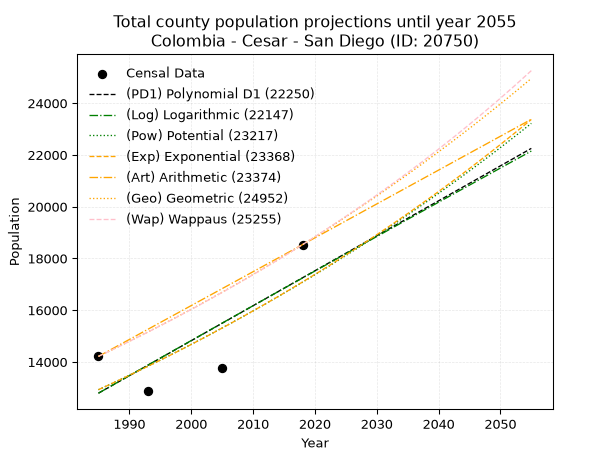
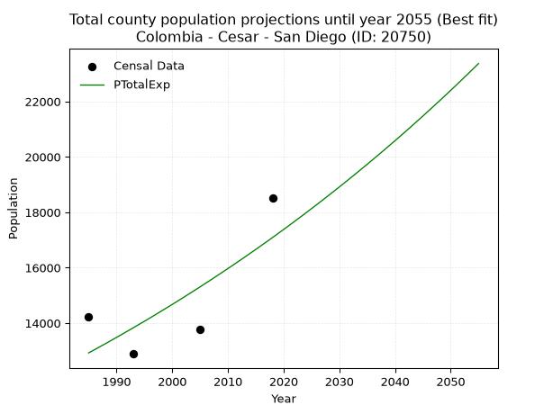
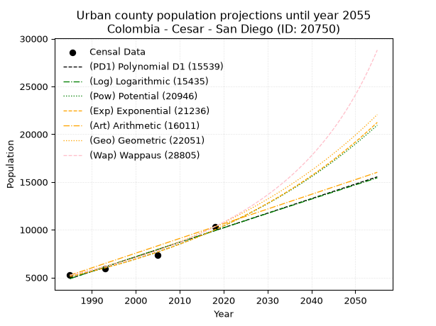
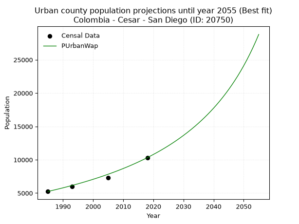
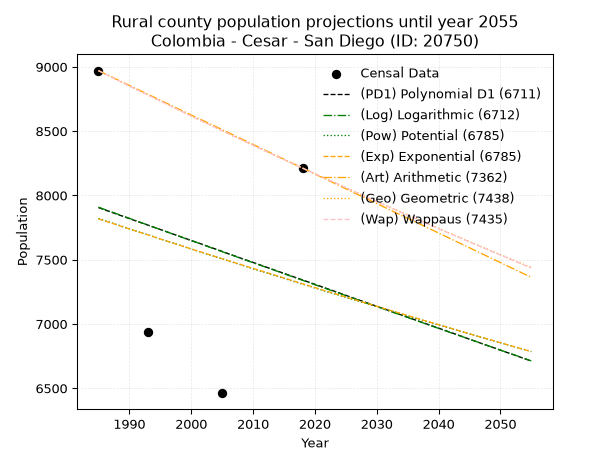
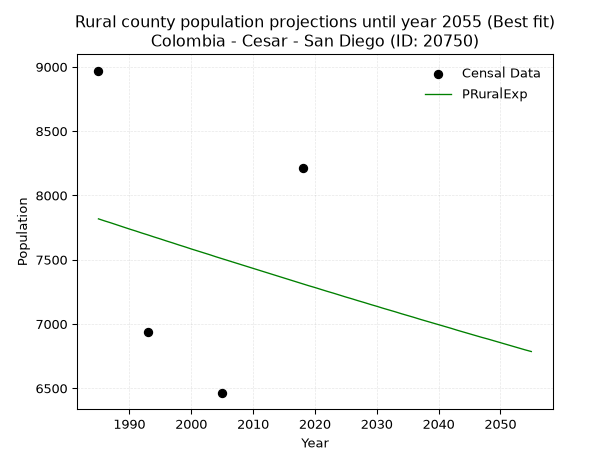

<div align="center">


</div>

# _“Population and Public Services Demand Projections (PPSD) until Year 2050 for Colombia - Cesar - San Diego (ID: 20750)”_
Keywords: `population` `public-service` `projection` `lineal` `polynomial` `logarithmic` `potential` `exponential` `arithmetic` `geometric` `wappaus` `dane` `colombia` `south-america`

PPSD are analytical estimates used by governments and planners to anticipate future changes in population size, age distribution, and the resulting community needs for utilities, healthcare, education, and infrastructure as sizing future water treatment facilities, electrical grids, and road networks based on spatial growth.

> **General running parameters**: • app_version: _v20260806_. • Python version: _3.14.7_. • Pandas version: _3.0.5_. • NumPy version: _2.5.1_. • Creates, save and include plots into reports (create_plot): _False_. • Projection until year: _2050_. • Process polynomial degree 2 and up: _False_. • Process Wappaus: _True_. • Process Wappaus: _True_. • Set negative values to zero: _True_. • Set infinite values to zero: _True_. • Drop dataset notes: _True_. 
<div align="center">

Dynamic map: [:earth_americas:Google](http://maps.google.com/maps?q=10.33303911,-73.1812079) [:earth_americas:OSM](https://www.openstreetmap.org/#map=18/10.33303911/-73.1812079&layers=P) [:earth_americas:Bing](https://www.bing.com/maps?cp=10.33303911~-73.1812079&lvl=18) [:earth_americas:Apple](https://maps.apple.com/frame?center=10.33303911%2C-73.1812079&span=0.003%2C0.006)

</div>


<div align="center">

```geojson
{
  "type": "Feature",
  "geometry": {
    "type": "Point", 
    "coordinates": [-73.1812079, 10.33303911]
  }, 
  "properties": {
    "Name": "Colombia - Cesar - San Diego (ID: 20750)"
  }
}
```

</div>


## 0. Census Data (4 records)

Census data are official statistics collected by a government about the people and housing in a country. They usually include counts of total population, age, sex, race, income, education, and jobs.

📅Global census file: [Population.xlsx](../data/Population.xlsx)

| Source   |   Year |   CountryID | CountryName   |   StateID | StateName   |   CountyID | CountyName   |   PTotal |   PUrban |   PRural |
|:---------|-------:|------------:|:--------------|----------:|:------------|-----------:|:-------------|---------:|---------:|---------:|
| DANE     |   1985 |          57 | Colombia      |        20 | Cesar       |      20750 | San Diego    |    14212 |     5242 |     8970 |
| DANE     |   1993 |          57 | Colombia      |        20 | Cesar       |      20750 | San Diego    |    12889 |     5954 |     6935 |
| DANE     |   2005 |          57 | Colombia      |        20 | Cesar       |      20750 | San Diego    |    13772 |     7311 |     6461 |
| DANE     |   2018 |          57 | Colombia      |        20 | Cesar       |      20750 | San Diego    |    18531 |    10319 |     8212 |

> 🔥Some records could had specific notes about the registered values or the corresponding urban or rural distribution.

## 1. Total

### 1.1. Coefficients and Parameters

* (PD1) Polynomial Deg 1: 135.1489361702098, -255480.65957446216 (lineal)
* (Log) Logarithmic: 269999.8409723193, -2037419.9548735365
* (Pow) Potential: 16.902506259175965, -51.629012426532896
* (Exp) Exponential: 0.008461087346535296, 0.0006566241192201989
* (Art) Arithmetic: Year diff. 2018 - 1985 = 33, Population diff. 18531 - 14212 = 4319, Annual growth = 130.87878787878788
* (Geo) Geometric: Year diff. 2018 - 1985 = 33, Population diff. 18531 - 14212 = 4319, Annual growth % = 0.008073578401357029
* (Wap) Wappaus: i = 0.79943064397757, Condition values only valid for < 200)

<sub>
Wappaus condition values: ['0.00', '0.80', '1.60', '2.40', '3.20', '4.00', '4.80', '5.60', '6.40', '7.19', '7.99', '8.79', '9.59', '10.39', '11.19', '11.99', '12.79', '13.59', '14.39', '15.19', '15.99', '16.79', '17.59', '18.39', '19.19', '19.99', '20.79', '21.58', '22.38', '23.18', '23.98', '24.78', '25.58', '26.38', '27.18', '27.98', '28.78', '29.58', '30.38', '31.18', '31.98', '32.78', '33.58', '34.38', '35.17', '35.97', '36.77', '37.57', '38.37', '39.17', '39.97', '40.77', '41.57', '42.37', '43.17', '43.97', '44.77', '45.57', '46.37', '47.17', '47.97', '48.77', '49.56', '50.36', '51.16', '51.96']
</sub>


### 1.2. Projected Dataset

|   Year |   CountyID |   PTotalPD1 |   PTotalLog |   PTotalPow |   PTotalExp |   PTotalArt |   PTotalGeo |   PTotalWap |
|-------:|-----------:|------------:|------------:|------------:|------------:|------------:|------------:|------------:|
|   1985 |      20750 |       12790 |       12790 |       12924 |       12924 |       14212 |       14212 |       14212 |
|   1986 |      20750 |       12925 |       12926 |       13035 |       13034 |       14343 |       14327 |       14326 |
|   1987 |      20750 |       13060 |       13062 |       13146 |       13145 |       14474 |       14442 |       14441 |
|   1988 |      20750 |       13195 |       13198 |       13258 |       13256 |       14605 |       14559 |       14557 |
|   1989 |      20750 |       13331 |       13333 |       13372 |       13369 |       14736 |       14677 |       14674 |
|   1990 |      20750 |       13466 |       13469 |       13486 |       13483 |       14866 |       14795 |       14792 |
|   1991 |      20750 |       13601 |       13605 |       13601 |       13597 |       14997 |       14914 |       14910 |
|   1992 |      20750 |       13736 |       13740 |       13717 |       13713 |       15128 |       15035 |       15030 |
|   1993 |      20750 |       13871 |       13876 |       13833 |       13829 |       15259 |       15156 |       15151 |
|   1994 |      20750 |       14006 |       14011 |       13951 |       13947 |       15390 |       15279 |       15273 |
|   1995 |      20750 |       14141 |       14147 |       14070 |       14065 |       15521 |       15402 |       15395 |
|   1996 |      20750 |       14277 |       14282 |       14190 |       14185 |       15652 |       15526 |       15519 |
|   1997 |      20750 |       14412 |       14417 |       14310 |       14305 |       15783 |       15652 |       15644 |
|   1998 |      20750 |       14547 |       14552 |       14432 |       14427 |       15913 |       15778 |       15770 |
|   1999 |      20750 |       14682 |       14687 |       14554 |       14550 |       16044 |       15905 |       15897 |
|   2000 |      20750 |       14817 |       14823 |       14678 |       14673 |       16175 |       16034 |       16025 |
|   2001 |      20750 |       14952 |       14957 |       14803 |       14798 |       16306 |       16163 |       16154 |
|   2002 |      20750 |       15088 |       15092 |       14928 |       14924 |       16437 |       16294 |       16284 |
|   2003 |      20750 |       15223 |       15227 |       15055 |       15050 |       16568 |       16425 |       16416 |
|   2004 |      20750 |       15358 |       15362 |       15182 |       15178 |       16699 |       16558 |       16548 |
|   2005 |      20750 |       15493 |       15497 |       15311 |       15307 |       16830 |       16692 |       16682 |
|   2006 |      20750 |       15628 |       15631 |       15440 |       15437 |       16960 |       16826 |       16817 |
|   2007 |      20750 |       15763 |       15766 |       15571 |       15568 |       17091 |       16962 |       16953 |
|   2008 |      20750 |       15898 |       15900 |       15703 |       15701 |       17222 |       17099 |       17090 |
|   2009 |      20750 |       16034 |       16035 |       15835 |       15834 |       17353 |       17237 |       17228 |
|   2010 |      20750 |       16169 |       16169 |       15969 |       15969 |       17484 |       17376 |       17368 |
|   2011 |      20750 |       16304 |       16303 |       16104 |       16104 |       17615 |       17517 |       17509 |
|   2012 |      20750 |       16439 |       16438 |       16240 |       16241 |       17746 |       17658 |       17651 |
|   2013 |      20750 |       16574 |       16572 |       16377 |       16379 |       17877 |       17801 |       17794 |
|   2014 |      20750 |       16709 |       16706 |       16515 |       16518 |       18007 |       17944 |       17939 |
|   2015 |      20750 |       16844 |       16840 |       16654 |       16659 |       18138 |       18089 |       18085 |
|   2016 |      20750 |       16980 |       16974 |       16794 |       16800 |       18269 |       18235 |       18232 |
|   2017 |      20750 |       17115 |       17108 |       16936 |       16943 |       18400 |       18383 |       18381 |
|   2018 |      20750 |       17250 |       17242 |       17078 |       17087 |       18531 |       18531 |       18531 |
|   2019 |      20750 |       17385 |       17375 |       17222 |       17232 |       18662 |       18681 |       18682 |
|   2020 |      20750 |       17520 |       17509 |       17366 |       17379 |       18793 |       18831 |       18835 |
|   2021 |      20750 |       17655 |       17643 |       17512 |       17526 |       18924 |       18983 |       18990 |
|   2022 |      20750 |       17790 |       17776 |       17659 |       17675 |       19055 |       19137 |       19145 |
|   2023 |      20750 |       17926 |       17910 |       17808 |       17825 |       19185 |       19291 |       19303 |
|   2024 |      20750 |       18061 |       18043 |       17957 |       17977 |       19316 |       19447 |       19461 |
|   2025 |      20750 |       18196 |       18177 |       18107 |       18130 |       19447 |       19604 |       19622 |
|   2026 |      20750 |       18331 |       18310 |       18259 |       18284 |       19578 |       19762 |       19783 |
|   2027 |      20750 |       18466 |       18443 |       18412 |       18439 |       19709 |       19922 |       19947 |
|   2028 |      20750 |       18601 |       18576 |       18566 |       18596 |       19840 |       20083 |       20111 |
|   2029 |      20750 |       18737 |       18709 |       18722 |       18754 |       19971 |       20245 |       20278 |
|   2030 |      20750 |       18872 |       18842 |       18878 |       18913 |       20102 |       20408 |       20446 |
|   2031 |      20750 |       19007 |       18975 |       19036 |       19074 |       20232 |       20573 |       20616 |
|   2032 |      20750 |       19142 |       19108 |       19195 |       19236 |       20363 |       20739 |       20787 |
|   2033 |      20750 |       19277 |       19241 |       19355 |       19399 |       20494 |       20907 |       20960 |
|   2034 |      20750 |       19412 |       19374 |       19517 |       19564 |       20625 |       21075 |       21135 |
|   2035 |      20750 |       19547 |       19507 |       19680 |       19730 |       20756 |       21245 |       21312 |
|   2036 |      20750 |       19683 |       19639 |       19844 |       19898 |       20887 |       21417 |       21490 |
|   2037 |      20750 |       19818 |       19772 |       20009 |       20067 |       21018 |       21590 |       21670 |
|   2038 |      20750 |       19953 |       19904 |       20176 |       20238 |       21149 |       21764 |       21852 |
|   2039 |      20750 |       20088 |       20037 |       20344 |       20410 |       21279 |       21940 |       22036 |
|   2040 |      20750 |       20223 |       20169 |       20513 |       20583 |       21410 |       22117 |       22222 |
|   2041 |      20750 |       20358 |       20302 |       20684 |       20758 |       21541 |       22296 |       22409 |
|   2042 |      20750 |       20493 |       20434 |       20856 |       20934 |       21672 |       22476 |       22599 |
|   2043 |      20750 |       20629 |       20566 |       21029 |       21112 |       21803 |       22657 |       22790 |
|   2044 |      20750 |       20764 |       20698 |       21204 |       21292 |       21934 |       22840 |       22984 |
|   2045 |      20750 |       20899 |       20830 |       21380 |       21472 |       22065 |       23024 |       23180 |
|   2046 |      20750 |       21034 |       20962 |       21557 |       21655 |       22196 |       23210 |       23377 |
|   2047 |      20750 |       21169 |       21094 |       21736 |       21839 |       22326 |       23398 |       23577 |
|   2048 |      20750 |       21304 |       21226 |       21916 |       22024 |       22457 |       23587 |       23779 |
|   2049 |      20750 |       21440 |       21358 |       22098 |       22212 |       22588 |       23777 |       23983 |
|   2050 |      20750 |       21575 |       21490 |       22281 |       22400 |       22719 |       23969 |       24189 |
<div align="center">

</img>

</div>


### 1.3. Best fit with absolute and relative error (%)

Relative error puts that difference into context by dividing the absolute error by the true value, creating a unitless ratio or percentage that shows the scale of the mistake.

Absolute and relative error

|   Year | Source   |   CountryID | CountryName   |   StateID | StateName   |   CountyID_x | CountyName   |   PTotal |   PUrban |   PRural |   CountyID_y |   PTotalPD1 |   PTotalLog |   PTotalPow |   PTotalExp |   PTotalArt |   PTotalGeo |   PTotalWap |   PTotalPD1AbsError |   PTotalLogAbsError |   PTotalPowAbsError |   PTotalExpAbsError |   PTotalArtAbsError |   PTotalGeoAbsError |   PTotalWapAbsError |   PTotalPD1RelError |   PTotalLogRelError |   PTotalPowRelError |   PTotalExpRelError |   PTotalArtRelError |   PTotalGeoRelError |   PTotalWapRelError |
|-------:|:---------|------------:|:--------------|----------:|:------------|-------------:|:-------------|---------:|---------:|---------:|-------------:|------------:|------------:|------------:|------------:|------------:|------------:|------------:|--------------------:|--------------------:|--------------------:|--------------------:|--------------------:|--------------------:|--------------------:|--------------------:|--------------------:|--------------------:|--------------------:|--------------------:|--------------------:|--------------------:|
|   1985 | DANE     |          57 | Colombia      |        20 | Cesar       |        20750 | San Diego    |    14212 |     5242 |     8970 |        20750 |       12790 |       12790 |       12924 |       12924 |       14212 |       14212 |       14212 |                1422 |                1422 |                1288 |                1288 |                   0 |                   0 |                   0 |            10.0056  |            10.0056  |             9.06276 |             9.06276 |              0      |              0      |              0      |
|   1993 | DANE     |          57 | Colombia      |        20 | Cesar       |        20750 | San Diego    |    12889 |     5954 |     6935 |        20750 |       13871 |       13876 |       13833 |       13829 |       15259 |       15156 |       15151 |                 982 |                 987 |                 944 |                 940 |                2370 |                2267 |                2262 |             7.6189  |             7.65769 |             7.32407 |             7.29304 |             18.3878 |             17.5886 |             17.5498 |
|   2005 | DANE     |          57 | Colombia      |        20 | Cesar       |        20750 | San Diego    |    13772 |     7311 |     6461 |        20750 |       15493 |       15497 |       15311 |       15307 |       16830 |       16692 |       16682 |                1721 |                1725 |                1539 |                1535 |                3058 |                2920 |                2910 |            12.4964  |            12.5254  |            11.1748  |            11.1458  |             22.2045 |             21.2024 |             21.1298 |
|   2018 | DANE     |          57 | Colombia      |        20 | Cesar       |        20750 | San Diego    |    18531 |    10319 |     8212 |        20750 |       17250 |       17242 |       17078 |       17087 |       18531 |       18531 |       18531 |                1281 |                1289 |                1453 |                1444 |                   0 |                   0 |                   0 |             6.91274 |             6.95591 |             7.84092 |             7.79235 |              0      |              0      |              0      |

Relative error mean

| Method    |   RelError | Best   |
|:----------|-----------:|:-------|
| PTotalPD1 |    9.25841 |        |
| PTotalLog |    9.28616 |        |
| PTotalPow |    8.85065 |        |
| PTotalExp |    8.82349 | True   |
| PTotalArt |   10.1481  |        |
| PTotalGeo |    9.69777 |        |
| PTotalWap |    9.66992 |        |

💙Best method: _**PTotalExp**_
<div align="center">

</img>

</div>


### 1.4. Fresh water supply demand in liters per capita per day (lpcd)

The fresh water supply demand typically ranges from 100 to 300 liters per capita per day (lpcd) for standard domestic and municipal planning, though absolute survival minimums set by the World Health Organization are as low as 7.5 to 20 liters per day, and total consumption in high-income nations can exceed 400 liters.

> `CZ`: Level in meters above the sea level (masl).<br> `WS`: Fresh water supply demand in liters per capita per day (lpcd or l/h/d).<br> `WSAll`: Zonal fresh water supply demand in liters per second (l/s).<br> `A`: Zonal area in square meters.

Reference values (RAS Colombia)

|    CZ |   WS |
|------:|-----:|
|  1000 |  120 |
|  2000 |  130 |
| 99999 |  140 |

County shapefile geometry properties and water supply values

|   CountyID |      ATotal |   CZTotal |   WSTotal |
|-----------:|------------:|----------:|----------:|
|      20750 | 6.44882e+08 |   181.744 |       120 |

Projected values for best method: PTotalExp

|   CountyID |   Year |   PTotalExp |   WSTotal |   WSTotalAll |
|-----------:|-------:|------------:|----------:|-------------:|
|      20750 |   1985 |       12924 |       120 |      17.95   |
|      20750 |   1986 |       13034 |       120 |      18.1028 |
|      20750 |   1987 |       13145 |       120 |      18.2569 |
|      20750 |   1988 |       13256 |       120 |      18.4111 |
|      20750 |   1989 |       13369 |       120 |      18.5681 |
|      20750 |   1990 |       13483 |       120 |      18.7264 |
|      20750 |   1991 |       13597 |       120 |      18.8847 |
|      20750 |   1992 |       13713 |       120 |      19.0458 |
|      20750 |   1993 |       13829 |       120 |      19.2069 |
|      20750 |   1994 |       13947 |       120 |      19.3708 |
|      20750 |   1995 |       14065 |       120 |      19.5347 |
|      20750 |   1996 |       14185 |       120 |      19.7014 |
|      20750 |   1997 |       14305 |       120 |      19.8681 |
|      20750 |   1998 |       14427 |       120 |      20.0375 |
|      20750 |   1999 |       14550 |       120 |      20.2083 |
|      20750 |   2000 |       14673 |       120 |      20.3792 |
|      20750 |   2001 |       14798 |       120 |      20.5528 |
|      20750 |   2002 |       14924 |       120 |      20.7278 |
|      20750 |   2003 |       15050 |       120 |      20.9028 |
|      20750 |   2004 |       15178 |       120 |      21.0806 |
|      20750 |   2005 |       15307 |       120 |      21.2597 |
|      20750 |   2006 |       15437 |       120 |      21.4403 |
|      20750 |   2007 |       15568 |       120 |      21.6222 |
|      20750 |   2008 |       15701 |       120 |      21.8069 |
|      20750 |   2009 |       15834 |       120 |      21.9917 |
|      20750 |   2010 |       15969 |       120 |      22.1792 |
|      20750 |   2011 |       16104 |       120 |      22.3667 |
|      20750 |   2012 |       16241 |       120 |      22.5569 |
|      20750 |   2013 |       16379 |       120 |      22.7486 |
|      20750 |   2014 |       16518 |       120 |      22.9417 |
|      20750 |   2015 |       16659 |       120 |      23.1375 |
|      20750 |   2016 |       16800 |       120 |      23.3333 |
|      20750 |   2017 |       16943 |       120 |      23.5319 |
|      20750 |   2018 |       17087 |       120 |      23.7319 |
|      20750 |   2019 |       17232 |       120 |      23.9333 |
|      20750 |   2020 |       17379 |       120 |      24.1375 |
|      20750 |   2021 |       17526 |       120 |      24.3417 |
|      20750 |   2022 |       17675 |       120 |      24.5486 |
|      20750 |   2023 |       17825 |       120 |      24.7569 |
|      20750 |   2024 |       17977 |       120 |      24.9681 |
|      20750 |   2025 |       18130 |       120 |      25.1806 |
|      20750 |   2026 |       18284 |       120 |      25.3944 |
|      20750 |   2027 |       18439 |       120 |      25.6097 |
|      20750 |   2028 |       18596 |       120 |      25.8278 |
|      20750 |   2029 |       18754 |       120 |      26.0472 |
|      20750 |   2030 |       18913 |       120 |      26.2681 |
|      20750 |   2031 |       19074 |       120 |      26.4917 |
|      20750 |   2032 |       19236 |       120 |      26.7167 |
|      20750 |   2033 |       19399 |       120 |      26.9431 |
|      20750 |   2034 |       19564 |       120 |      27.1722 |
|      20750 |   2035 |       19730 |       120 |      27.4028 |
|      20750 |   2036 |       19898 |       120 |      27.6361 |
|      20750 |   2037 |       20067 |       120 |      27.8708 |
|      20750 |   2038 |       20238 |       120 |      28.1083 |
|      20750 |   2039 |       20410 |       120 |      28.3472 |
|      20750 |   2040 |       20583 |       120 |      28.5875 |
|      20750 |   2041 |       20758 |       120 |      28.8306 |
|      20750 |   2042 |       20934 |       120 |      29.075  |
|      20750 |   2043 |       21112 |       120 |      29.3222 |
|      20750 |   2044 |       21292 |       120 |      29.5722 |
|      20750 |   2045 |       21472 |       120 |      29.8222 |
|      20750 |   2046 |       21655 |       120 |      30.0764 |
|      20750 |   2047 |       21839 |       120 |      30.3319 |
|      20750 |   2048 |       22024 |       120 |      30.5889 |
|      20750 |   2049 |       22212 |       120 |      30.85   |
|      20750 |   2050 |       22400 |       120 |      31.1111 |

## 2. Urban

### 2.1. Coefficients and Parameters

* (PD1) Polynomial Deg 1: 152.1999197109575, -297231.38940184267 (lineal)
* (Log) Logarithmic: 304493.5454323021, -2307251.378889066
* (Pow) Potential: 40.7396413192296, -130.6416655128244
* (Exp) Exponential: 0.02035911841598061, 1.4357010852703624e-14
* (Art) Arithmetic: Year diff. 2018 - 1985 = 33, Population diff. 10319 - 5242 = 5077, Annual growth = 153.84848484848484
* (Geo) Geometric: Year diff. 2018 - 1985 = 33, Population diff. 10319 - 5242 = 5077, Annual growth % = 0.020735810468932803
* (Wap) Wappaus: i = 1.9773598720967143, Condition values only valid for < 200)

<sub>
Wappaus condition values: ['0.00', '1.98', '3.95', '5.93', '7.91', '9.89', '11.86', '13.84', '15.82', '17.80', '19.77', '21.75', '23.73', '25.71', '27.68', '29.66', '31.64', '33.62', '35.59', '37.57', '39.55', '41.52', '43.50', '45.48', '47.46', '49.43', '51.41', '53.39', '55.37', '57.34', '59.32', '61.30', '63.28', '65.25', '67.23', '69.21', '71.18', '73.16', '75.14', '77.12', '79.09', '81.07', '83.05', '85.03', '87.00', '88.98', '90.96', '92.94', '94.91', '96.89', '98.87', '100.85', '102.82', '104.80', '106.78', '108.75', '110.73', '112.71', '114.69', '116.66', '118.64', '120.62', '122.60', '124.57', '126.55', '128.53']
</sub>


### 2.2. Projected Dataset

|   Year |   CountyID |   PUrbanPD1 |   PUrbanLog |   PUrbanPow |   PUrbanExp |   PUrbanArt |   PUrbanGeo |   PUrbanWap |
|-------:|-----------:|------------:|------------:|------------:|------------:|------------:|------------:|------------:|
|   1985 |      20750 |        4885 |        4882 |        5104 |        5107 |        5242 |        5242 |        5242 |
|   1986 |      20750 |        5038 |        5035 |        5210 |        5212 |        5396 |        5351 |        5347 |
|   1987 |      20750 |        5190 |        5189 |        5318 |        5319 |        5550 |        5462 |        5453 |
|   1988 |      20750 |        5342 |        5342 |        5428 |        5428 |        5704 |        5575 |        5562 |
|   1989 |      20750 |        5494 |        5495 |        5540 |        5540 |        5857 |        5690 |        5674 |
|   1990 |      20750 |        5646 |        5648 |        5655 |        5654 |        6011 |        5808 |        5787 |
|   1991 |      20750 |        5799 |        5801 |        5772 |        5770 |        6165 |        5929 |        5903 |
|   1992 |      20750 |        5951 |        5954 |        5891 |        5889 |        6319 |        6052 |        6022 |
|   1993 |      20750 |        6103 |        6107 |        6013 |        6010 |        6473 |        6177 |        6142 |
|   1994 |      20750 |        6255 |        6260 |        6137 |        6134 |        6627 |        6305 |        6266 |
|   1995 |      20750 |        6407 |        6412 |        6264 |        6260 |        6780 |        6436 |        6392 |
|   1996 |      20750 |        6560 |        6565 |        6393 |        6389 |        6934 |        6570 |        6521 |
|   1997 |      20750 |        6712 |        6717 |        6525 |        6520 |        7088 |        6706 |        6653 |
|   1998 |      20750 |        6864 |        6870 |        6659 |        6654 |        7242 |        6845 |        6788 |
|   1999 |      20750 |        7016 |        7022 |        6796 |        6791 |        7396 |        6987 |        6926 |
|   2000 |      20750 |        7168 |        7174 |        6936 |        6931 |        7550 |        7132 |        7068 |
|   2001 |      20750 |        7321 |        7327 |        7079 |        7073 |        7704 |        7280 |        7212 |
|   2002 |      20750 |        7473 |        7479 |        7224 |        7219 |        7857 |        7431 |        7360 |
|   2003 |      20750 |        7625 |        7631 |        7373 |        7367 |        8011 |        7585 |        7512 |
|   2004 |      20750 |        7777 |        7783 |        7524 |        7519 |        8165 |        7742 |        7667 |
|   2005 |      20750 |        7929 |        7935 |        7679 |        7673 |        8319 |        7902 |        7826 |
|   2006 |      20750 |        8082 |        8086 |        7836 |        7831 |        8473 |        8066 |        7989 |
|   2007 |      20750 |        8234 |        8238 |        7997 |        7992 |        8627 |        8234 |        8156 |
|   2008 |      20750 |        8386 |        8390 |        8161 |        8157 |        8781 |        8404 |        8328 |
|   2009 |      20750 |        8538 |        8542 |        8328 |        8324 |        8934 |        8579 |        8504 |
|   2010 |      20750 |        8690 |        8693 |        8499 |        8495 |        9088 |        8757 |        8684 |
|   2011 |      20750 |        8843 |        8844 |        8673 |        8670 |        9242 |        8938 |        8869 |
|   2012 |      20750 |        8995 |        8996 |        8850 |        8849 |        9396 |        9123 |        9060 |
|   2013 |      20750 |        9147 |        9147 |        9031 |        9031 |        9550 |        9313 |        9255 |
|   2014 |      20750 |        9299 |        9298 |        9216 |        9216 |        9704 |        9506 |        9456 |
|   2015 |      20750 |        9451 |        9450 |        9404 |        9406 |        9857 |        9703 |        9663 |
|   2016 |      20750 |        9604 |        9601 |        9596 |        9599 |       10011 |        9904 |        9875 |
|   2017 |      20750 |        9756 |        9752 |        9792 |        9797 |       10165 |       10109 |       10094 |
|   2018 |      20750 |        9908 |        9903 |        9992 |        9998 |       10319 |       10319 |       10319 |
|   2019 |      20750 |       10060 |       10053 |       10195 |       10204 |       10473 |       10533 |       10551 |
|   2020 |      20750 |       10212 |       10204 |       10403 |       10414 |       10627 |       10751 |       10790 |
|   2021 |      20750 |       10365 |       10355 |       10615 |       10628 |       10781 |       10974 |       11036 |
|   2022 |      20750 |       10517 |       10506 |       10831 |       10847 |       10934 |       11202 |       11289 |
|   2023 |      20750 |       10669 |       10656 |       11051 |       11070 |       11088 |       11434 |       11551 |
|   2024 |      20750 |       10821 |       10807 |       11276 |       11297 |       11242 |       11671 |       11821 |
|   2025 |      20750 |       10973 |       10957 |       11505 |       11530 |       11396 |       11913 |       12100 |
|   2026 |      20750 |       11126 |       11107 |       11739 |       11767 |       11550 |       12160 |       12389 |
|   2027 |      20750 |       11278 |       11258 |       11978 |       12009 |       11704 |       12412 |       12687 |
|   2028 |      20750 |       11430 |       11408 |       12221 |       12256 |       11857 |       12670 |       12995 |
|   2029 |      20750 |       11582 |       11558 |       12469 |       12508 |       12011 |       12933 |       13314 |
|   2030 |      20750 |       11734 |       11708 |       12721 |       12765 |       12165 |       13201 |       13645 |
|   2031 |      20750 |       11887 |       11858 |       12979 |       13028 |       12319 |       13474 |       13987 |
|   2032 |      20750 |       12039 |       12008 |       13242 |       13296 |       12473 |       13754 |       14343 |
|   2033 |      20750 |       12191 |       12158 |       13510 |       13569 |       12627 |       14039 |       14711 |
|   2034 |      20750 |       12343 |       12307 |       13784 |       13848 |       12781 |       14330 |       15094 |
|   2035 |      20750 |       12495 |       12457 |       14062 |       14133 |       12934 |       14627 |       15491 |
|   2036 |      20750 |       12648 |       12606 |       14347 |       14424 |       13088 |       14931 |       15905 |
|   2037 |      20750 |       12800 |       12756 |       14637 |       14720 |       13242 |       15240 |       16335 |
|   2038 |      20750 |       12952 |       12905 |       14932 |       15023 |       13396 |       15556 |       16783 |
|   2039 |      20750 |       13104 |       13055 |       15234 |       15332 |       13550 |       15879 |       17250 |
|   2040 |      20750 |       13256 |       13204 |       15541 |       15647 |       13704 |       16208 |       17738 |
|   2041 |      20750 |       13409 |       13353 |       15854 |       15969 |       13858 |       16544 |       18247 |
|   2042 |      20750 |       13561 |       13503 |       16174 |       16298 |       14011 |       16887 |       18779 |
|   2043 |      20750 |       13713 |       13652 |       16500 |       16633 |       14165 |       17237 |       19336 |
|   2044 |      20750 |       13865 |       13801 |       16832 |       16975 |       14319 |       17595 |       19919 |
|   2045 |      20750 |       14017 |       13950 |       17171 |       17324 |       14473 |       17960 |       20530 |
|   2046 |      20750 |       14170 |       14098 |       17516 |       17681 |       14627 |       18332 |       21172 |
|   2047 |      20750 |       14322 |       14247 |       17868 |       18044 |       14781 |       18712 |       21847 |
|   2048 |      20750 |       14474 |       14396 |       18228 |       18415 |       14934 |       19100 |       22557 |
|   2049 |      20750 |       14626 |       14545 |       18594 |       18794 |       15088 |       19496 |       23306 |
|   2050 |      20750 |       14778 |       14693 |       18967 |       19181 |       15242 |       19901 |       24096 |
<div align="center">

</img>

</div>


### 2.3. Best fit with absolute and relative error (%)

Relative error puts that difference into context by dividing the absolute error by the true value, creating a unitless ratio or percentage that shows the scale of the mistake.

Absolute and relative error

|   Year | Source   |   CountryID | CountryName   |   StateID | StateName   |   CountyID_x | CountyName   |   PTotal |   PUrban |   PRural |   CountyID_y |   PUrbanPD1 |   PUrbanLog |   PUrbanPow |   PUrbanExp |   PUrbanArt |   PUrbanGeo |   PUrbanWap |   PUrbanPD1AbsError |   PUrbanLogAbsError |   PUrbanPowAbsError |   PUrbanExpAbsError |   PUrbanArtAbsError |   PUrbanGeoAbsError |   PUrbanWapAbsError |   PUrbanPD1RelError |   PUrbanLogRelError |   PUrbanPowRelError |   PUrbanExpRelError |   PUrbanArtRelError |   PUrbanGeoRelError |   PUrbanWapRelError |
|-------:|:---------|------------:|:--------------|----------:|:------------|-------------:|:-------------|---------:|---------:|---------:|-------------:|------------:|------------:|------------:|------------:|------------:|------------:|------------:|--------------------:|--------------------:|--------------------:|--------------------:|--------------------:|--------------------:|--------------------:|--------------------:|--------------------:|--------------------:|--------------------:|--------------------:|--------------------:|--------------------:|
|   1985 | DANE     |          57 | Colombia      |        20 | Cesar       |        20750 | San Diego    |    14212 |     5242 |     8970 |        20750 |        4885 |        4882 |        5104 |        5107 |        5242 |        5242 |        5242 |                 357 |                 360 |                 138 |                 135 |                   0 |                   0 |                   0 |             6.81038 |             6.86761 |             2.63258 |            2.57535  |             0       |             0       |             0       |
|   1993 | DANE     |          57 | Colombia      |        20 | Cesar       |        20750 | San Diego    |    12889 |     5954 |     6935 |        20750 |        6103 |        6107 |        6013 |        6010 |        6473 |        6177 |        6142 |                 149 |                 153 |                  59 |                  56 |                 519 |                 223 |                 188 |             2.50252 |             2.5697  |             0.99093 |            0.940544 |             8.71683 |             3.74538 |             3.15754 |
|   2005 | DANE     |          57 | Colombia      |        20 | Cesar       |        20750 | San Diego    |    13772 |     7311 |     6461 |        20750 |        7929 |        7935 |        7679 |        7673 |        8319 |        7902 |        7826 |                 618 |                 624 |                 368 |                 362 |                1008 |                 591 |                 515 |             8.45302 |             8.53508 |             5.03351 |            4.95144  |            13.7874  |             8.08371 |             7.04418 |
|   2018 | DANE     |          57 | Colombia      |        20 | Cesar       |        20750 | San Diego    |    18531 |    10319 |     8212 |        20750 |        9908 |        9903 |        9992 |        9998 |       10319 |       10319 |       10319 |                 411 |                 416 |                 327 |                 321 |                   0 |                   0 |                   0 |             3.98294 |             4.0314  |             3.16891 |            3.11077  |             0       |             0       |             0       |

Relative error mean

| Method    |   RelError | Best   |
|:----------|-----------:|:-------|
| PUrbanPD1 |    5.43721 |        |
| PUrbanLog |    5.50095 |        |
| PUrbanPow |    2.95648 |        |
| PUrbanExp |    2.89453 |        |
| PUrbanArt |    5.62607 |        |
| PUrbanGeo |    2.95727 |        |
| PUrbanWap |    2.55043 | True   |

💙Best method: _**PUrbanWap**_
<div align="center">

</img>

</div>


### 2.4. Fresh water supply demand in liters per capita per day (lpcd)

The fresh water supply demand typically ranges from 100 to 300 liters per capita per day (lpcd) for standard domestic and municipal planning, though absolute survival minimums set by the World Health Organization are as low as 7.5 to 20 liters per day, and total consumption in high-income nations can exceed 400 liters.

> `CZ`: Level in meters above the sea level (masl).<br> `WS`: Fresh water supply demand in liters per capita per day (lpcd or l/h/d).<br> `WSAll`: Zonal fresh water supply demand in liters per second (l/s).<br> `A`: Zonal area in square meters.

Reference values (RAS Colombia)

|    CZ |   WS |
|------:|-----:|
|  1000 |  120 |
|  2000 |  130 |
| 99999 |  140 |

County shapefile geometry properties and water supply values

|   CountyID |      AUrban |   CZUrban |   WSUrban |
|-----------:|------------:|----------:|----------:|
|      20750 | 2.64031e+06 |   168.385 |       120 |

Projected values for best method: PUrbanWap

|   CountyID |   Year |   PUrbanWap |   WSUrban |   WSUrbanAll |
|-----------:|-------:|------------:|----------:|-------------:|
|      20750 |   1985 |        5242 |       120 |      7.28056 |
|      20750 |   1986 |        5347 |       120 |      7.42639 |
|      20750 |   1987 |        5453 |       120 |      7.57361 |
|      20750 |   1988 |        5562 |       120 |      7.725   |
|      20750 |   1989 |        5674 |       120 |      7.88056 |
|      20750 |   1990 |        5787 |       120 |      8.0375  |
|      20750 |   1991 |        5903 |       120 |      8.19861 |
|      20750 |   1992 |        6022 |       120 |      8.36389 |
|      20750 |   1993 |        6142 |       120 |      8.53056 |
|      20750 |   1994 |        6266 |       120 |      8.70278 |
|      20750 |   1995 |        6392 |       120 |      8.87778 |
|      20750 |   1996 |        6521 |       120 |      9.05694 |
|      20750 |   1997 |        6653 |       120 |      9.24028 |
|      20750 |   1998 |        6788 |       120 |      9.42778 |
|      20750 |   1999 |        6926 |       120 |      9.61944 |
|      20750 |   2000 |        7068 |       120 |      9.81667 |
|      20750 |   2001 |        7212 |       120 |     10.0167  |
|      20750 |   2002 |        7360 |       120 |     10.2222  |
|      20750 |   2003 |        7512 |       120 |     10.4333  |
|      20750 |   2004 |        7667 |       120 |     10.6486  |
|      20750 |   2005 |        7826 |       120 |     10.8694  |
|      20750 |   2006 |        7989 |       120 |     11.0958  |
|      20750 |   2007 |        8156 |       120 |     11.3278  |
|      20750 |   2008 |        8328 |       120 |     11.5667  |
|      20750 |   2009 |        8504 |       120 |     11.8111  |
|      20750 |   2010 |        8684 |       120 |     12.0611  |
|      20750 |   2011 |        8869 |       120 |     12.3181  |
|      20750 |   2012 |        9060 |       120 |     12.5833  |
|      20750 |   2013 |        9255 |       120 |     12.8542  |
|      20750 |   2014 |        9456 |       120 |     13.1333  |
|      20750 |   2015 |        9663 |       120 |     13.4208  |
|      20750 |   2016 |        9875 |       120 |     13.7153  |
|      20750 |   2017 |       10094 |       120 |     14.0194  |
|      20750 |   2018 |       10319 |       120 |     14.3319  |
|      20750 |   2019 |       10551 |       120 |     14.6542  |
|      20750 |   2020 |       10790 |       120 |     14.9861  |
|      20750 |   2021 |       11036 |       120 |     15.3278  |
|      20750 |   2022 |       11289 |       120 |     15.6792  |
|      20750 |   2023 |       11551 |       120 |     16.0431  |
|      20750 |   2024 |       11821 |       120 |     16.4181  |
|      20750 |   2025 |       12100 |       120 |     16.8056  |
|      20750 |   2026 |       12389 |       120 |     17.2069  |
|      20750 |   2027 |       12687 |       120 |     17.6208  |
|      20750 |   2028 |       12995 |       120 |     18.0486  |
|      20750 |   2029 |       13314 |       120 |     18.4917  |
|      20750 |   2030 |       13645 |       120 |     18.9514  |
|      20750 |   2031 |       13987 |       120 |     19.4264  |
|      20750 |   2032 |       14343 |       120 |     19.9208  |
|      20750 |   2033 |       14711 |       120 |     20.4319  |
|      20750 |   2034 |       15094 |       120 |     20.9639  |
|      20750 |   2035 |       15491 |       120 |     21.5153  |
|      20750 |   2036 |       15905 |       120 |     22.0903  |
|      20750 |   2037 |       16335 |       120 |     22.6875  |
|      20750 |   2038 |       16783 |       120 |     23.3097  |
|      20750 |   2039 |       17250 |       120 |     23.9583  |
|      20750 |   2040 |       17738 |       120 |     24.6361  |
|      20750 |   2041 |       18247 |       120 |     25.3431  |
|      20750 |   2042 |       18779 |       120 |     26.0819  |
|      20750 |   2043 |       19336 |       120 |     26.8556  |
|      20750 |   2044 |       19919 |       120 |     27.6653  |
|      20750 |   2045 |       20530 |       120 |     28.5139  |
|      20750 |   2046 |       21172 |       120 |     29.4056  |
|      20750 |   2047 |       21847 |       120 |     30.3431  |
|      20750 |   2048 |       22557 |       120 |     31.3292  |
|      20750 |   2049 |       23306 |       120 |     32.3694  |
|      20750 |   2050 |       24096 |       120 |     33.4667  |

## 3. Rural

### 3.1. Coefficients and Parameters

* (PD1) Polynomial Deg 1: -17.050983540747723, 41750.72982738064 (lineal)
* (Log) Logarithmic: -34493.704459982786, 269831.42401552916
* (Pow) Potential: -4.09832410476837, 17.408525572666406
* (Exp) Exponential: -0.0020235356774311914, 433997.6295305425
* (Art) Arithmetic: Year diff. 2018 - 1985 = 33, Population diff. 8212 - 8970 = -758, Annual growth = -22.96969696969697
* (Geo) Geometric: Year diff. 2018 - 1985 = 33, Population diff. 8212 - 8970 = -758, Annual growth % = -0.0026718538312933138
* (Wap) Wappaus: i = -0.26736930473398873, Condition values only valid for < 200)

<sub>
Wappaus condition values: ['-0.00', '-0.27', '-0.53', '-0.80', '-1.07', '-1.34', '-1.60', '-1.87', '-2.14', '-2.41', '-2.67', '-2.94', '-3.21', '-3.48', '-3.74', '-4.01', '-4.28', '-4.55', '-4.81', '-5.08', '-5.35', '-5.61', '-5.88', '-6.15', '-6.42', '-6.68', '-6.95', '-7.22', '-7.49', '-7.75', '-8.02', '-8.29', '-8.56', '-8.82', '-9.09', '-9.36', '-9.63', '-9.89', '-10.16', '-10.43', '-10.69', '-10.96', '-11.23', '-11.50', '-11.76', '-12.03', '-12.30', '-12.57', '-12.83', '-13.10', '-13.37', '-13.64', '-13.90', '-14.17', '-14.44', '-14.71', '-14.97', '-15.24', '-15.51', '-15.77', '-16.04', '-16.31', '-16.58', '-16.84', '-17.11', '-17.38']
</sub>


### 3.2. Projected Dataset

|   Year |   CountyID |   PRuralPD1 |   PRuralLog |   PRuralPow |   PRuralExp |   PRuralArt |   PRuralGeo |   PRuralWap |
|-------:|-----------:|------------:|------------:|------------:|------------:|------------:|------------:|------------:|
|   1985 |      20750 |        7905 |        7908 |        7820 |        7817 |        8970 |        8970 |        8970 |
|   1986 |      20750 |        7887 |        7890 |        7804 |        7801 |        8947 |        8946 |        8946 |
|   1987 |      20750 |        7870 |        7873 |        7788 |        7786 |        8924 |        8922 |        8922 |
|   1988 |      20750 |        7853 |        7856 |        7772 |        7770 |        8901 |        8898 |        8898 |
|   1989 |      20750 |        7836 |        7838 |        7756 |        7754 |        8878 |        8875 |        8875 |
|   1990 |      20750 |        7819 |        7821 |        7740 |        7738 |        8855 |        8851 |        8851 |
|   1991 |      20750 |        7802 |        7804 |        7724 |        7723 |        8832 |        8827 |        8827 |
|   1992 |      20750 |        7785 |        7786 |        7708 |        7707 |        8809 |        8804 |        8804 |
|   1993 |      20750 |        7768 |        7769 |        7693 |        7692 |        8786 |        8780 |        8780 |
|   1994 |      20750 |        7751 |        7752 |        7677 |        7676 |        8763 |        8757 |        8757 |
|   1995 |      20750 |        7734 |        7734 |        7661 |        7661 |        8740 |        8733 |        8733 |
|   1996 |      20750 |        7717 |        7717 |        7645 |        7645 |        8717 |        8710 |        8710 |
|   1997 |      20750 |        7700 |        7700 |        7630 |        7630 |        8694 |        8687 |        8687 |
|   1998 |      20750 |        7683 |        7683 |        7614 |        7614 |        8671 |        8663 |        8664 |
|   1999 |      20750 |        7666 |        7665 |        7598 |        7599 |        8648 |        8640 |        8640 |
|   2000 |      20750 |        7649 |        7648 |        7583 |        7583 |        8625 |        8617 |        8617 |
|   2001 |      20750 |        7632 |        7631 |        7567 |        7568 |        8602 |        8594 |        8594 |
|   2002 |      20750 |        7615 |        7614 |        7552 |        7553 |        8580 |        8571 |        8571 |
|   2003 |      20750 |        7598 |        7596 |        7536 |        7538 |        8557 |        8548 |        8548 |
|   2004 |      20750 |        7581 |        7579 |        7521 |        7522 |        8534 |        8525 |        8526 |
|   2005 |      20750 |        7564 |        7562 |        7506 |        7507 |        8511 |        8503 |        8503 |
|   2006 |      20750 |        7546 |        7545 |        7490 |        7492 |        8488 |        8480 |        8480 |
|   2007 |      20750 |        7529 |        7528 |        7475 |        7477 |        8465 |        8457 |        8457 |
|   2008 |      20750 |        7512 |        7510 |        7460 |        7462 |        8442 |        8435 |        8435 |
|   2009 |      20750 |        7495 |        7493 |        7445 |        7447 |        8419 |        8412 |        8412 |
|   2010 |      20750 |        7478 |        7476 |        7429 |        7432 |        8396 |        8390 |        8390 |
|   2011 |      20750 |        7461 |        7459 |        7414 |        7417 |        8373 |        8367 |        8367 |
|   2012 |      20750 |        7444 |        7442 |        7399 |        7402 |        8350 |        8345 |        8345 |
|   2013 |      20750 |        7427 |        7425 |        7384 |        7387 |        8327 |        8323 |        8323 |
|   2014 |      20750 |        7410 |        7408 |        7369 |        7372 |        8304 |        8300 |        8300 |
|   2015 |      20750 |        7393 |        7390 |        7354 |        7357 |        8281 |        8278 |        8278 |
|   2016 |      20750 |        7376 |        7373 |        7339 |        7342 |        8258 |        8256 |        8256 |
|   2017 |      20750 |        7359 |        7356 |        7324 |        7327 |        8235 |        8234 |        8234 |
|   2018 |      20750 |        7342 |        7339 |        7309 |        7312 |        8212 |        8212 |        8212 |
|   2019 |      20750 |        7325 |        7322 |        7295 |        7297 |        8189 |        8190 |        8190 |
|   2020 |      20750 |        7308 |        7305 |        7280 |        7283 |        8166 |        8168 |        8168 |
|   2021 |      20750 |        7291 |        7288 |        7265 |        7268 |        8143 |        8146 |        8146 |
|   2022 |      20750 |        7274 |        7271 |        7250 |        7253 |        8120 |        8125 |        8124 |
|   2023 |      20750 |        7257 |        7254 |        7236 |        7239 |        8097 |        8103 |        8103 |
|   2024 |      20750 |        7240 |        7237 |        7221 |        7224 |        8074 |        8081 |        8081 |
|   2025 |      20750 |        7222 |        7220 |        7206 |        7209 |        8051 |        8060 |        8059 |
|   2026 |      20750 |        7205 |        7203 |        7192 |        7195 |        8028 |        8038 |        8038 |
|   2027 |      20750 |        7188 |        7186 |        7177 |        7180 |        8005 |        8017 |        8016 |
|   2028 |      20750 |        7171 |        7169 |        7163 |        7166 |        7982 |        7995 |        7995 |
|   2029 |      20750 |        7154 |        7152 |        7148 |        7151 |        7959 |        7974 |        7973 |
|   2030 |      20750 |        7137 |        7135 |        7134 |        7137 |        7936 |        7953 |        7952 |
|   2031 |      20750 |        7120 |        7118 |        7120 |        7122 |        7913 |        7931 |        7931 |
|   2032 |      20750 |        7103 |        7101 |        7105 |        7108 |        7890 |        7910 |        7909 |
|   2033 |      20750 |        7086 |        7084 |        7091 |        7094 |        7867 |        7889 |        7888 |
|   2034 |      20750 |        7069 |        7067 |        7077 |        7079 |        7844 |        7868 |        7867 |
|   2035 |      20750 |        7052 |        7050 |        7062 |        7065 |        7822 |        7847 |        7846 |
|   2036 |      20750 |        7035 |        7033 |        7048 |        7051 |        7799 |        7826 |        7825 |
|   2037 |      20750 |        7018 |        7016 |        7034 |        7036 |        7776 |        7805 |        7804 |
|   2038 |      20750 |        7001 |        6999 |        7020 |        7022 |        7753 |        7784 |        7783 |
|   2039 |      20750 |        6984 |        6982 |        7006 |        7008 |        7730 |        7763 |        7762 |
|   2040 |      20750 |        6967 |        6965 |        6992 |        6994 |        7707 |        7743 |        7741 |
|   2041 |      20750 |        6950 |        6948 |        6978 |        6980 |        7684 |        7722 |        7720 |
|   2042 |      20750 |        6933 |        6931 |        6964 |        6966 |        7661 |        7701 |        7700 |
|   2043 |      20750 |        6916 |        6914 |        6950 |        6951 |        7638 |        7681 |        7679 |
|   2044 |      20750 |        6899 |        6898 |        6936 |        6937 |        7615 |        7660 |        7658 |
|   2045 |      20750 |        6881 |        6881 |        6922 |        6923 |        7592 |        7640 |        7638 |
|   2046 |      20750 |        6864 |        6864 |        6908 |        6909 |        7569 |        7619 |        7617 |
|   2047 |      20750 |        6847 |        6847 |        6894 |        6895 |        7546 |        7599 |        7597 |
|   2048 |      20750 |        6830 |        6830 |        6881 |        6882 |        7523 |        7579 |        7576 |
|   2049 |      20750 |        6813 |        6813 |        6867 |        6868 |        7500 |        7558 |        7556 |
|   2050 |      20750 |        6796 |        6796 |        6853 |        6854 |        7477 |        7538 |        7536 |
<div align="center">

</img>

</div>


### 3.3. Best fit with absolute and relative error (%)

Relative error puts that difference into context by dividing the absolute error by the true value, creating a unitless ratio or percentage that shows the scale of the mistake.

Absolute and relative error

|   Year | Source   |   CountryID | CountryName   |   StateID | StateName   |   CountyID_x | CountyName   |   PTotal |   PUrban |   PRural |   CountyID_y |   PRuralPD1 |   PRuralLog |   PRuralPow |   PRuralExp |   PRuralArt |   PRuralGeo |   PRuralWap |   PRuralPD1AbsError |   PRuralLogAbsError |   PRuralPowAbsError |   PRuralExpAbsError |   PRuralArtAbsError |   PRuralGeoAbsError |   PRuralWapAbsError |   PRuralPD1RelError |   PRuralLogRelError |   PRuralPowRelError |   PRuralExpRelError |   PRuralArtRelError |   PRuralGeoRelError |   PRuralWapRelError |
|-------:|:---------|------------:|:--------------|----------:|:------------|-------------:|:-------------|---------:|---------:|---------:|-------------:|------------:|------------:|------------:|------------:|------------:|------------:|------------:|--------------------:|--------------------:|--------------------:|--------------------:|--------------------:|--------------------:|--------------------:|--------------------:|--------------------:|--------------------:|--------------------:|--------------------:|--------------------:|--------------------:|
|   1985 | DANE     |          57 | Colombia      |        20 | Cesar       |        20750 | San Diego    |    14212 |     5242 |     8970 |        20750 |        7905 |        7908 |        7820 |        7817 |        8970 |        8970 |        8970 |                1065 |                1062 |                1150 |                1153 |                   0 |                   0 |                   0 |             11.8729 |             11.8395 |             12.8205 |             12.854  |              0      |              0      |              0      |
|   1993 | DANE     |          57 | Colombia      |        20 | Cesar       |        20750 | San Diego    |    12889 |     5954 |     6935 |        20750 |        7768 |        7769 |        7693 |        7692 |        8786 |        8780 |        8780 |                 833 |                 834 |                 758 |                 757 |                1851 |                1845 |                1845 |             12.0115 |             12.026  |             10.9301 |             10.9156 |             26.6907 |             26.6042 |             26.6042 |
|   2005 | DANE     |          57 | Colombia      |        20 | Cesar       |        20750 | San Diego    |    13772 |     7311 |     6461 |        20750 |        7564 |        7562 |        7506 |        7507 |        8511 |        8503 |        8503 |                1103 |                1101 |                1045 |                1046 |                2050 |                2042 |                2042 |             17.0717 |             17.0407 |             16.174  |             16.1894 |             31.7288 |             31.605  |             31.605  |
|   2018 | DANE     |          57 | Colombia      |        20 | Cesar       |        20750 | San Diego    |    18531 |    10319 |     8212 |        20750 |        7342 |        7339 |        7309 |        7312 |        8212 |        8212 |        8212 |                 870 |                 873 |                 903 |                 900 |                   0 |                   0 |                   0 |             10.5943 |             10.6308 |             10.9961 |             10.9596 |              0      |              0      |              0      |

Relative error mean

| Method    |   RelError | Best   |
|:----------|-----------:|:-------|
| PRuralPD1 |    12.8876 |        |
| PRuralLog |    12.8842 |        |
| PRuralPow |    12.7302 |        |
| PRuralExp |    12.7297 | True   |
| PRuralArt |    14.6049 |        |
| PRuralGeo |    14.5523 |        |
| PRuralWap |    14.5523 |        |

💙Best method: _**PRuralExp**_
<div align="center">

</img>

</div>


### 3.4. Fresh water supply demand in liters per capita per day (lpcd)

The fresh water supply demand typically ranges from 100 to 300 liters per capita per day (lpcd) for standard domestic and municipal planning, though absolute survival minimums set by the World Health Organization are as low as 7.5 to 20 liters per day, and total consumption in high-income nations can exceed 400 liters.

> `CZ`: Level in meters above the sea level (masl).<br> `WS`: Fresh water supply demand in liters per capita per day (lpcd or l/h/d).<br> `WSAll`: Zonal fresh water supply demand in liters per second (l/s).<br> `A`: Zonal area in square meters.

Reference values (RAS Colombia)

|    CZ |   WS |
|------:|-----:|
|  1000 |  120 |
|  2000 |  130 |
| 99999 |  140 |

County shapefile geometry properties and water supply values

|   CountyID |      ARural |   CZRural |   WSRural |
|-----------:|------------:|----------:|----------:|
|      20750 | 6.42241e+08 |     181.8 |       120 |

Projected values for best method: PRuralExp

|   CountyID |   Year |   PRuralExp |   WSRural |   WSRuralAll |
|-----------:|-------:|------------:|----------:|-------------:|
|      20750 |   1985 |        7817 |       120 |     10.8569  |
|      20750 |   1986 |        7801 |       120 |     10.8347  |
|      20750 |   1987 |        7786 |       120 |     10.8139  |
|      20750 |   1988 |        7770 |       120 |     10.7917  |
|      20750 |   1989 |        7754 |       120 |     10.7694  |
|      20750 |   1990 |        7738 |       120 |     10.7472  |
|      20750 |   1991 |        7723 |       120 |     10.7264  |
|      20750 |   1992 |        7707 |       120 |     10.7042  |
|      20750 |   1993 |        7692 |       120 |     10.6833  |
|      20750 |   1994 |        7676 |       120 |     10.6611  |
|      20750 |   1995 |        7661 |       120 |     10.6403  |
|      20750 |   1996 |        7645 |       120 |     10.6181  |
|      20750 |   1997 |        7630 |       120 |     10.5972  |
|      20750 |   1998 |        7614 |       120 |     10.575   |
|      20750 |   1999 |        7599 |       120 |     10.5542  |
|      20750 |   2000 |        7583 |       120 |     10.5319  |
|      20750 |   2001 |        7568 |       120 |     10.5111  |
|      20750 |   2002 |        7553 |       120 |     10.4903  |
|      20750 |   2003 |        7538 |       120 |     10.4694  |
|      20750 |   2004 |        7522 |       120 |     10.4472  |
|      20750 |   2005 |        7507 |       120 |     10.4264  |
|      20750 |   2006 |        7492 |       120 |     10.4056  |
|      20750 |   2007 |        7477 |       120 |     10.3847  |
|      20750 |   2008 |        7462 |       120 |     10.3639  |
|      20750 |   2009 |        7447 |       120 |     10.3431  |
|      20750 |   2010 |        7432 |       120 |     10.3222  |
|      20750 |   2011 |        7417 |       120 |     10.3014  |
|      20750 |   2012 |        7402 |       120 |     10.2806  |
|      20750 |   2013 |        7387 |       120 |     10.2597  |
|      20750 |   2014 |        7372 |       120 |     10.2389  |
|      20750 |   2015 |        7357 |       120 |     10.2181  |
|      20750 |   2016 |        7342 |       120 |     10.1972  |
|      20750 |   2017 |        7327 |       120 |     10.1764  |
|      20750 |   2018 |        7312 |       120 |     10.1556  |
|      20750 |   2019 |        7297 |       120 |     10.1347  |
|      20750 |   2020 |        7283 |       120 |     10.1153  |
|      20750 |   2021 |        7268 |       120 |     10.0944  |
|      20750 |   2022 |        7253 |       120 |     10.0736  |
|      20750 |   2023 |        7239 |       120 |     10.0542  |
|      20750 |   2024 |        7224 |       120 |     10.0333  |
|      20750 |   2025 |        7209 |       120 |     10.0125  |
|      20750 |   2026 |        7195 |       120 |      9.99306 |
|      20750 |   2027 |        7180 |       120 |      9.97222 |
|      20750 |   2028 |        7166 |       120 |      9.95278 |
|      20750 |   2029 |        7151 |       120 |      9.93194 |
|      20750 |   2030 |        7137 |       120 |      9.9125  |
|      20750 |   2031 |        7122 |       120 |      9.89167 |
|      20750 |   2032 |        7108 |       120 |      9.87222 |
|      20750 |   2033 |        7094 |       120 |      9.85278 |
|      20750 |   2034 |        7079 |       120 |      9.83194 |
|      20750 |   2035 |        7065 |       120 |      9.8125  |
|      20750 |   2036 |        7051 |       120 |      9.79306 |
|      20750 |   2037 |        7036 |       120 |      9.77222 |
|      20750 |   2038 |        7022 |       120 |      9.75278 |
|      20750 |   2039 |        7008 |       120 |      9.73333 |
|      20750 |   2040 |        6994 |       120 |      9.71389 |
|      20750 |   2041 |        6980 |       120 |      9.69444 |
|      20750 |   2042 |        6966 |       120 |      9.675   |
|      20750 |   2043 |        6951 |       120 |      9.65417 |
|      20750 |   2044 |        6937 |       120 |      9.63472 |
|      20750 |   2045 |        6923 |       120 |      9.61528 |
|      20750 |   2046 |        6909 |       120 |      9.59583 |
|      20750 |   2047 |        6895 |       120 |      9.57639 |
|      20750 |   2048 |        6882 |       120 |      9.55833 |
|      20750 |   2049 |        6868 |       120 |      9.53889 |
|      20750 |   2050 |        6854 |       120 |      9.51944 |

<div align="center"><br><sub>Share this research</sub></div><br>

<sub>**APPS & TOOLS & CONTENT DISCLAIMER**: • NO WARRANTY - This content and software is provided by <a href="https://github.com/rcfdtools" target="_blank">github.com/rcfdtools</a> "as is", without any express or implied warranty, including warranties of merchantability, fitness for a particular purpose, or non-infringement. There is no guarantee that the software will be error-free or operate without interruption. • LIMITATION OF LIABILITY - Neither the authors nor copyright holders will be liable for claims or damages arising from the software or its use. You are responsible for determining if the software is appropriate for your use and assume all associated risks, including errors, legal compliance, and data loss. • NO PROFESSIONAL ADVICE - The software provides general information and does not offer professional advice. It should not replace consultation with professional advisors. [Clauses and global license for rcfdtools use.](https://github.com/rcfdtools/rcfdtools/blob/main/LICENSE.md)</sub>