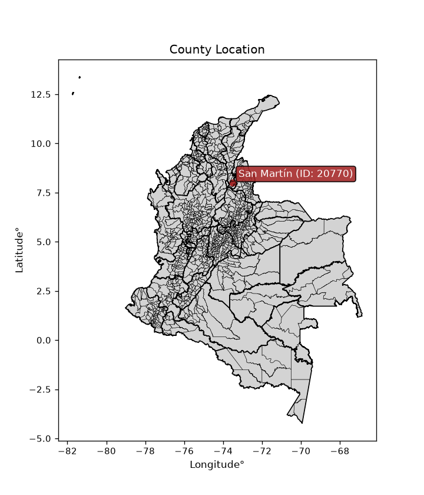
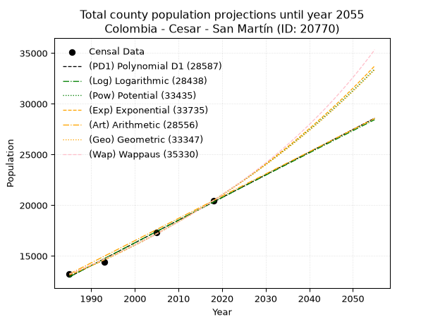
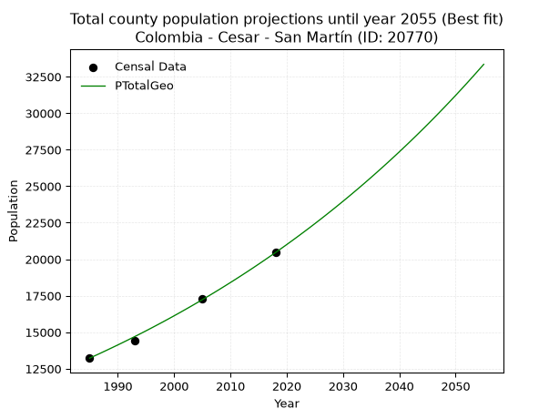
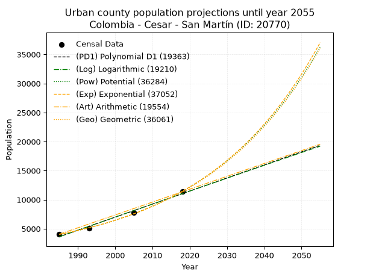
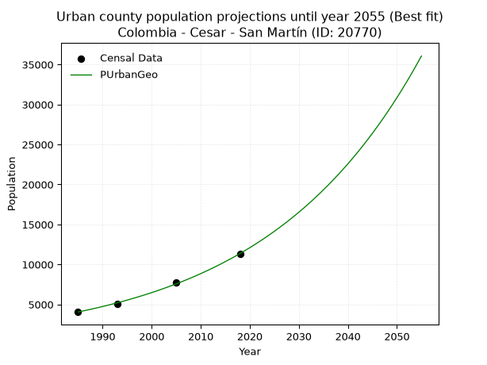
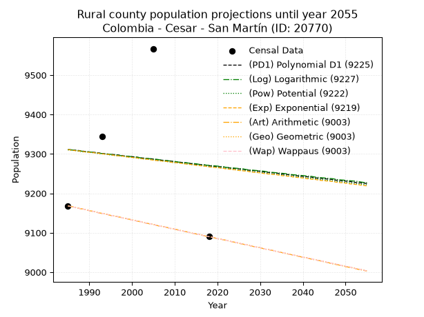
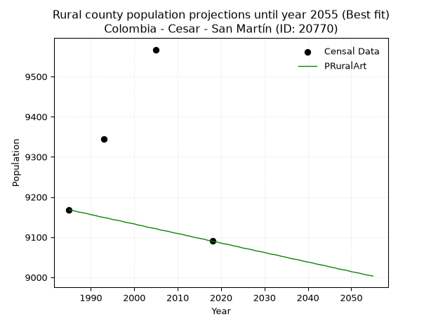

<div align="center">


</div>

# _“Population and Public Services Demand Projections (PPSD) until Year 2050 for Colombia - Cesar - San Martín (ID: 20770)”_
Keywords: `population` `public-service` `projection` `lineal` `polynomial` `logarithmic` `potential` `exponential` `arithmetic` `geometric` `wappaus` `dane` `colombia` `south-america`

PPSD are analytical estimates used by governments and planners to anticipate future changes in population size, age distribution, and the resulting community needs for utilities, healthcare, education, and infrastructure as sizing future water treatment facilities, electrical grids, and road networks based on spatial growth.

> **General running parameters**: • app_version: _v20260806_. • Python version: _3.14.7_. • Pandas version: _3.0.5_. • NumPy version: _2.5.1_. • Creates, save and include plots into reports (create_plot): _False_. • Projection until year: _2050_. • Process polynomial degree 2 and up: _False_. • Process Wappaus: _True_. • Process Wappaus: _True_. • Set negative values to zero: _True_. • Set infinite values to zero: _True_. • Drop dataset notes: _True_. 
<div align="center">

Dynamic map: [:earth_americas:Google](http://maps.google.com/maps?q=7.999855179,-73.5109136) [:earth_americas:OSM](https://www.openstreetmap.org/#map=18/7.999855179/-73.5109136&layers=P) [:earth_americas:Bing](https://www.bing.com/maps?cp=7.999855179~-73.5109136&lvl=18) [:earth_americas:Apple](https://maps.apple.com/frame?center=7.999855179%2C-73.5109136&span=0.003%2C0.006)

</div>


<div align="center">

```geojson
{
  "type": "Feature",
  "geometry": {
    "type": "Point", 
    "coordinates": [-73.5109136, 7.999855179]
  }, 
  "properties": {
    "Name": "Colombia - Cesar - San Martín (ID: 20770)"
  }
}
```

</div>


<div align="center">

</img>

</div>


## 0. Census Data (4 records)

Census data are official statistics collected by a government about the people and housing in a country. They usually include counts of total population, age, sex, race, income, education, and jobs.

📅Global census file: [Population.xlsx](../data/Population.xlsx)

| Source   |   Year |   CountryID | CountryName   |   StateID | StateName   |   CountyID | CountyName   |   PTotal |   PUrban |   PRural |
|:---------|-------:|------------:|:--------------|----------:|:------------|-----------:|:-------------|---------:|---------:|---------:|
| DANE     |   1985 |          57 | Colombia      |        20 | Cesar       |      20770 | San Martín   |    13224 |     4056 |     9168 |
| DANE     |   1993 |          57 | Colombia      |        20 | Cesar       |      20770 | San Martín   |    14392 |     5047 |     9345 |
| DANE     |   2005 |          57 | Colombia      |        20 | Cesar       |      20770 | San Martín   |    17312 |     7745 |     9567 |
| DANE     |   2018 |          57 | Colombia      |        20 | Cesar       |      20770 | San Martín   |    20452 |    11362 |     9090 |

> 🔥Some records could had specific notes about the registered values or the corresponding urban or rural distribution.

📅   [RUPS](https://www.datos.gov.co/Hacienda-y-Cr-dito-P-blico/Registro-nico-de-Prestadores-de-Servicios-P-blicos/4qkq-csdn/about_data) - Local public utility companies: [RUPS.csv](../data/RUPS.xlsx)

 | SERVICIO       | ESTADO    | NOMBRE                                                                   | NIT         | DEPARTAMENTO_DOMICILIO   | MUNICIPIO_DOMICILIO   | DIRECCION         |   TELEFONO | EMAIL              | TIPO_PRESTADOR          | CLASIFICACION                  |
|:---------------|:----------|:-------------------------------------------------------------------------|:------------|:-------------------------|:----------------------|:------------------|-----------:|:-------------------|:------------------------|:-------------------------------|
| ACUEDUCTO      | OPERATIVA | ADMINISTRADORA PUBLICA COOPERATIVA EMPRESA SOLIDARIA DE SAN MARTIN CESAR | 830514235-1 | CESAR                    | SAN MARTIN            | CALLE 13 No. 7-29 |    5548581 | apcesp@hotmail.com | ORGANIZACION AUTORIZADA | DESDE 2501 HASTA 5000 USUARIOS |
| ALCANTARILLADO | OPERATIVA | ADMINISTRADORA PUBLICA COOPERATIVA EMPRESA SOLIDARIA DE SAN MARTIN CESAR | 830514235-1 | CESAR                    | SAN MARTIN            | CALLE 13 No. 7-29 |    5548581 | apcesp@hotmail.com | ORGANIZACION AUTORIZADA | DESDE 2501 HASTA 5000 USUARIOS |

## 1. Total

### 1.1. Coefficients and Parameters

* (PD1) Polynomial Deg 1: 223.6001605780789, -430911.22119630233 (lineal)
* (Log) Logarithmic: 447489.442862435, -3385025.841152712
* (Pow) Potential: 27.016487077078846, -84.97633094060781
* (Exp) Exponential: 0.013497707281668632, 3.031912601612622e-08
* (Art) Arithmetic: Year diff. 2018 - 1985 = 33, Population diff. 20452 - 13224 = 7228, Annual growth = 219.03030303030303
* (Geo) Geometric: Year diff. 2018 - 1985 = 33, Population diff. 20452 - 13224 = 7228, Annual growth % = 0.013301239853714897
* (Wap) Wappaus: i = 1.3008094965572101, Condition values only valid for < 200)

<sub>
Wappaus condition values: ['0.00', '1.30', '2.60', '3.90', '5.20', '6.50', '7.80', '9.11', '10.41', '11.71', '13.01', '14.31', '15.61', '16.91', '18.21', '19.51', '20.81', '22.11', '23.41', '24.72', '26.02', '27.32', '28.62', '29.92', '31.22', '32.52', '33.82', '35.12', '36.42', '37.72', '39.02', '40.33', '41.63', '42.93', '44.23', '45.53', '46.83', '48.13', '49.43', '50.73', '52.03', '53.33', '54.63', '55.93', '57.24', '58.54', '59.84', '61.14', '62.44', '63.74', '65.04', '66.34', '67.64', '68.94', '70.24', '71.54', '72.85', '74.15', '75.45', '76.75', '78.05', '79.35', '80.65', '81.95', '83.25', '84.55']
</sub>


### 1.2. Projected Dataset

|   Year |   CountyID |   PTotalPD1 |   PTotalLog |   PTotalPow |   PTotalExp |   PTotalArt |   PTotalGeo |   PTotalWap |
|-------:|-----------:|------------:|------------:|------------:|------------:|------------:|------------:|------------:|
|   1985 |      20770 |       12935 |       12929 |       13109 |       13114 |       13224 |       13224 |       13224 |
|   1986 |      20770 |       13159 |       13154 |       13289 |       13293 |       13443 |       13400 |       13397 |
|   1987 |      20770 |       13382 |       13380 |       13471 |       13473 |       13662 |       13578 |       13573 |
|   1988 |      20770 |       13606 |       13605 |       13655 |       13656 |       13881 |       13759 |       13750 |
|   1989 |      20770 |       13829 |       13830 |       13842 |       13842 |       14100 |       13942 |       13930 |
|   1990 |      20770 |       14053 |       14055 |       14031 |       14030 |       14319 |       14127 |       14113 |
|   1991 |      20770 |       14277 |       14280 |       14223 |       14221 |       14538 |       14315 |       14298 |
|   1992 |      20770 |       14500 |       14504 |       14417 |       14414 |       14757 |       14506 |       14486 |
|   1993 |      20770 |       14724 |       14729 |       14614 |       14610 |       14976 |       14698 |       14676 |
|   1994 |      20770 |       14947 |       14953 |       14813 |       14808 |       15195 |       14894 |       14868 |
|   1995 |      20770 |       15171 |       15178 |       15015 |       15010 |       15414 |       15092 |       15064 |
|   1996 |      20770 |       15395 |       15402 |       15220 |       15213 |       15633 |       15293 |       15262 |
|   1997 |      20770 |       15618 |       15626 |       15427 |       15420 |       15852 |       15496 |       15463 |
|   1998 |      20770 |       15842 |       15850 |       15637 |       15630 |       16071 |       15702 |       15667 |
|   1999 |      20770 |       16065 |       16074 |       15850 |       15842 |       16290 |       15911 |       15874 |
|   2000 |      20770 |       16289 |       16298 |       16066 |       16057 |       16509 |       16123 |       16083 |
|   2001 |      20770 |       16513 |       16521 |       16284 |       16276 |       16728 |       16337 |       16296 |
|   2002 |      20770 |       16736 |       16745 |       16506 |       16497 |       16948 |       16555 |       16512 |
|   2003 |      20770 |       16960 |       16968 |       16730 |       16721 |       17167 |       16775 |       16731 |
|   2004 |      20770 |       17184 |       17192 |       16957 |       16948 |       17386 |       16998 |       16953 |
|   2005 |      20770 |       17407 |       17415 |       17187 |       17179 |       17605 |       17224 |       17179 |
|   2006 |      20770 |       17631 |       17638 |       17420 |       17412 |       17824 |       17453 |       17408 |
|   2007 |      20770 |       17854 |       17861 |       17656 |       17649 |       18043 |       17685 |       17640 |
|   2008 |      20770 |       18078 |       18084 |       17895 |       17888 |       18262 |       17920 |       17876 |
|   2009 |      20770 |       18302 |       18307 |       18138 |       18132 |       18481 |       18159 |       18116 |
|   2010 |      20770 |       18525 |       18530 |       18383 |       18378 |       18700 |       18400 |       18360 |
|   2011 |      20770 |       18749 |       18752 |       18632 |       18628 |       18919 |       18645 |       18607 |
|   2012 |      20770 |       18972 |       18975 |       18884 |       18881 |       19138 |       18893 |       18858 |
|   2013 |      20770 |       19196 |       19197 |       19139 |       19137 |       19357 |       19144 |       19113 |
|   2014 |      20770 |       19420 |       19419 |       19398 |       19397 |       19576 |       19399 |       19372 |
|   2015 |      20770 |       19643 |       19641 |       19660 |       19661 |       19795 |       19657 |       19636 |
|   2016 |      20770 |       19867 |       19863 |       19925 |       19928 |       20014 |       19919 |       19903 |
|   2017 |      20770 |       20090 |       20085 |       20194 |       20199 |       20233 |       20184 |       20175 |
|   2018 |      20770 |       20314 |       20307 |       20466 |       20473 |       20452 |       20452 |       20452 |
|   2019 |      20770 |       20538 |       20529 |       20742 |       20752 |       20671 |       20724 |       20733 |
|   2020 |      20770 |       20761 |       20750 |       21021 |       21034 |       20890 |       21000 |       21019 |
|   2021 |      20770 |       20985 |       20972 |       21304 |       21320 |       21109 |       21279 |       21310 |
|   2022 |      20770 |       21208 |       21193 |       21591 |       21609 |       21328 |       21562 |       21606 |
|   2023 |      20770 |       21432 |       21415 |       21881 |       21903 |       21547 |       21849 |       21907 |
|   2024 |      20770 |       21656 |       21636 |       22175 |       22201 |       21766 |       22139 |       22213 |
|   2025 |      20770 |       21879 |       21857 |       22473 |       22502 |       21985 |       22434 |       22524 |
|   2026 |      20770 |       22103 |       22078 |       22775 |       22808 |       22204 |       22732 |       22841 |
|   2027 |      20770 |       22326 |       22298 |       23080 |       23118 |       22423 |       23035 |       23164 |
|   2028 |      20770 |       22550 |       22519 |       23390 |       23432 |       22642 |       23341 |       23493 |
|   2029 |      20770 |       22774 |       22740 |       23703 |       23751 |       22861 |       23652 |       23827 |
|   2030 |      20770 |       22997 |       22960 |       24021 |       24073 |       23080 |       23966 |       24168 |
|   2031 |      20770 |       23221 |       23181 |       24343 |       24400 |       23299 |       24285 |       24515 |
|   2032 |      20770 |       23444 |       23401 |       24669 |       24732 |       23518 |       24608 |       24869 |
|   2033 |      20770 |       23668 |       23621 |       24999 |       25068 |       23737 |       24935 |       25229 |
|   2034 |      20770 |       23892 |       23841 |       25333 |       25409 |       23956 |       25267 |       25596 |
|   2035 |      20770 |       24115 |       24061 |       25672 |       25754 |       24176 |       25603 |       25970 |
|   2036 |      20770 |       24339 |       24281 |       26015 |       26104 |       24395 |       25944 |       26351 |
|   2037 |      20770 |       24562 |       24501 |       26362 |       26459 |       24614 |       26289 |       26740 |
|   2038 |      20770 |       24786 |       24720 |       26714 |       26818 |       24833 |       26638 |       27137 |
|   2039 |      20770 |       25010 |       24940 |       27071 |       27183 |       25052 |       26993 |       27542 |
|   2040 |      20770 |       25233 |       25159 |       27432 |       27552 |       25271 |       27352 |       27954 |
|   2041 |      20770 |       25457 |       25379 |       27797 |       27927 |       25490 |       27716 |       28376 |
|   2042 |      20770 |       25680 |       25598 |       28167 |       28306 |       25709 |       28084 |       28806 |
|   2043 |      20770 |       25904 |       25817 |       28542 |       28691 |       25928 |       28458 |       29245 |
|   2044 |      20770 |       26128 |       26036 |       28922 |       29081 |       26147 |       28836 |       29693 |
|   2045 |      20770 |       26351 |       26255 |       29307 |       29476 |       26366 |       29220 |       30151 |
|   2046 |      20770 |       26575 |       26473 |       29697 |       29876 |       26585 |       29608 |       30618 |
|   2047 |      20770 |       26798 |       26692 |       30091 |       30282 |       26804 |       30002 |       31096 |
|   2048 |      20770 |       27022 |       26911 |       30491 |       30694 |       27023 |       30401 |       31585 |
|   2049 |      20770 |       27246 |       27129 |       30896 |       31111 |       27242 |       30806 |       32084 |
|   2050 |      20770 |       27469 |       27347 |       31306 |       31534 |       27461 |       31215 |       32594 |
<div align="center">

</img>

</div>


### 1.3. Best fit with absolute and relative error (%)

Relative error puts that difference into context by dividing the absolute error by the true value, creating a unitless ratio or percentage that shows the scale of the mistake.

Absolute and relative error

|   Year | Source   |   CountryID | CountryName   |   StateID | StateName   |   CountyID_x | CountyName   |   PTotal |   PUrban |   PRural |   CountyID_y |   PTotalPD1 |   PTotalLog |   PTotalPow |   PTotalExp |   PTotalArt |   PTotalGeo |   PTotalWap |   PTotalPD1AbsError |   PTotalLogAbsError |   PTotalPowAbsError |   PTotalExpAbsError |   PTotalArtAbsError |   PTotalGeoAbsError |   PTotalWapAbsError |   PTotalPD1RelError |   PTotalLogRelError |   PTotalPowRelError |   PTotalExpRelError |   PTotalArtRelError |   PTotalGeoRelError |   PTotalWapRelError |
|-------:|:---------|------------:|:--------------|----------:|:------------|-------------:|:-------------|---------:|---------:|---------:|-------------:|------------:|------------:|------------:|------------:|------------:|------------:|------------:|--------------------:|--------------------:|--------------------:|--------------------:|--------------------:|--------------------:|--------------------:|--------------------:|--------------------:|--------------------:|--------------------:|--------------------:|--------------------:|--------------------:|
|   1985 | DANE     |          57 | Colombia      |        20 | Cesar       |        20770 | San Martín   |    13224 |     4056 |     9168 |        20770 |       12935 |       12929 |       13109 |       13114 |       13224 |       13224 |       13224 |                 289 |                 295 |                 115 |                 110 |                   0 |                   0 |                   0 |            2.18542  |            2.23079  |            0.869631 |            0.831821 |             0       |            0        |            0        |
|   1993 | DANE     |          57 | Colombia      |        20 | Cesar       |        20770 | San Martín   |    14392 |     5047 |     9345 |        20770 |       14724 |       14729 |       14614 |       14610 |       14976 |       14698 |       14676 |                 332 |                 337 |                 222 |                 218 |                 584 |                 306 |                 284 |            2.30684  |            2.34158  |            1.54252  |            1.51473  |             4.05781 |            2.12618  |            1.97332  |
|   2005 | DANE     |          57 | Colombia      |        20 | Cesar       |        20770 | San Martín   |    17312 |     7745 |     9567 |        20770 |       17407 |       17415 |       17187 |       17179 |       17605 |       17224 |       17179 |                  95 |                 103 |                 125 |                 133 |                 293 |                  88 |                 133 |            0.548752 |            0.594963 |            0.722043 |            0.768253 |             1.69247 |            0.508318 |            0.768253 |
|   2018 | DANE     |          57 | Colombia      |        20 | Cesar       |        20770 | San Martín   |    20452 |    11362 |     9090 |        20770 |       20314 |       20307 |       20466 |       20473 |       20452 |       20452 |       20452 |                 138 |                 145 |                  14 |                  21 |                   0 |                   0 |                   0 |            0.674751 |            0.708977 |            0.068453 |            0.102679 |             0       |            0        |            0        |

Relative error mean

| Method    |   RelError | Best   |
|:----------|-----------:|:-------|
| PTotalPD1 |   1.42894  |        |
| PTotalLog |   1.46908  |        |
| PTotalPow |   0.800663 |        |
| PTotalExp |   0.804371 |        |
| PTotalArt |   1.43757  |        |
| PTotalGeo |   0.658625 | True   |
| PTotalWap |   0.685393 |        |

💙Best method: _**PTotalGeo**_
<div align="center">

</img>

</div>


### 1.4. Fresh water supply demand in liters per capita per day (lpcd)

The fresh water supply demand typically ranges from 100 to 300 liters per capita per day (lpcd) for standard domestic and municipal planning, though absolute survival minimums set by the World Health Organization are as low as 7.5 to 20 liters per day, and total consumption in high-income nations can exceed 400 liters.

> `CZ`: Level in meters above the sea level (masl)<br> `WS`: Fresh water supply demand in liters per capita per day (lpcd or l/h/d)<br> `WSAll`: Zonal fresh water supply demand in liters per second (l/s)<br> `A`: Zonal area in square meters<br> `DP`: Population density (people/hectare or p/ha)

Reference values (RAS Colombia)

|    CZ |   WS |
|------:|-----:|
|  1000 |  120 |
|  2000 |  130 |
| 99999 |  140 |

County shapefile geometry properties and water supply values

|   CountyID |      ATotal |   CZTotal |   WSTotal |
|-----------:|------------:|----------:|----------:|
|      20770 | 9.92506e+08 |   207.372 |       120 |

Projected values for best method: PTotalGeo

|   CountyID |   Year |   PTotalGeo |   DPTotal |   WSTotal |   WSTotalAll |
|-----------:|-------:|------------:|----------:|----------:|-------------:|
|      20770 |   1985 |       13224 |      0.13 |       120 |      18.3667 |
|      20770 |   1986 |       13400 |      0.14 |       120 |      18.6111 |
|      20770 |   1987 |       13578 |      0.14 |       120 |      18.8583 |
|      20770 |   1988 |       13759 |      0.14 |       120 |      19.1097 |
|      20770 |   1989 |       13942 |      0.14 |       120 |      19.3639 |
|      20770 |   1990 |       14127 |      0.14 |       120 |      19.6208 |
|      20770 |   1991 |       14315 |      0.14 |       120 |      19.8819 |
|      20770 |   1992 |       14506 |      0.15 |       120 |      20.1472 |
|      20770 |   1993 |       14698 |      0.15 |       120 |      20.4139 |
|      20770 |   1994 |       14894 |      0.15 |       120 |      20.6861 |
|      20770 |   1995 |       15092 |      0.15 |       120 |      20.9611 |
|      20770 |   1996 |       15293 |      0.15 |       120 |      21.2403 |
|      20770 |   1997 |       15496 |      0.16 |       120 |      21.5222 |
|      20770 |   1998 |       15702 |      0.16 |       120 |      21.8083 |
|      20770 |   1999 |       15911 |      0.16 |       120 |      22.0986 |
|      20770 |   2000 |       16123 |      0.16 |       120 |      22.3931 |
|      20770 |   2001 |       16337 |      0.16 |       120 |      22.6903 |
|      20770 |   2002 |       16555 |      0.17 |       120 |      22.9931 |
|      20770 |   2003 |       16775 |      0.17 |       120 |      23.2986 |
|      20770 |   2004 |       16998 |      0.17 |       120 |      23.6083 |
|      20770 |   2005 |       17224 |      0.17 |       120 |      23.9222 |
|      20770 |   2006 |       17453 |      0.18 |       120 |      24.2403 |
|      20770 |   2007 |       17685 |      0.18 |       120 |      24.5625 |
|      20770 |   2008 |       17920 |      0.18 |       120 |      24.8889 |
|      20770 |   2009 |       18159 |      0.18 |       120 |      25.2208 |
|      20770 |   2010 |       18400 |      0.19 |       120 |      25.5556 |
|      20770 |   2011 |       18645 |      0.19 |       120 |      25.8958 |
|      20770 |   2012 |       18893 |      0.19 |       120 |      26.2403 |
|      20770 |   2013 |       19144 |      0.19 |       120 |      26.5889 |
|      20770 |   2014 |       19399 |      0.2  |       120 |      26.9431 |
|      20770 |   2015 |       19657 |      0.2  |       120 |      27.3014 |
|      20770 |   2016 |       19919 |      0.2  |       120 |      27.6653 |
|      20770 |   2017 |       20184 |      0.2  |       120 |      28.0333 |
|      20770 |   2018 |       20452 |      0.21 |       120 |      28.4056 |
|      20770 |   2019 |       20724 |      0.21 |       120 |      28.7833 |
|      20770 |   2020 |       21000 |      0.21 |       120 |      29.1667 |
|      20770 |   2021 |       21279 |      0.21 |       120 |      29.5542 |
|      20770 |   2022 |       21562 |      0.22 |       120 |      29.9472 |
|      20770 |   2023 |       21849 |      0.22 |       120 |      30.3458 |
|      20770 |   2024 |       22139 |      0.22 |       120 |      30.7486 |
|      20770 |   2025 |       22434 |      0.23 |       120 |      31.1583 |
|      20770 |   2026 |       22732 |      0.23 |       120 |      31.5722 |
|      20770 |   2027 |       23035 |      0.23 |       120 |      31.9931 |
|      20770 |   2028 |       23341 |      0.24 |       120 |      32.4181 |
|      20770 |   2029 |       23652 |      0.24 |       120 |      32.85   |
|      20770 |   2030 |       23966 |      0.24 |       120 |      33.2861 |
|      20770 |   2031 |       24285 |      0.24 |       120 |      33.7292 |
|      20770 |   2032 |       24608 |      0.25 |       120 |      34.1778 |
|      20770 |   2033 |       24935 |      0.25 |       120 |      34.6319 |
|      20770 |   2034 |       25267 |      0.25 |       120 |      35.0931 |
|      20770 |   2035 |       25603 |      0.26 |       120 |      35.5597 |
|      20770 |   2036 |       25944 |      0.26 |       120 |      36.0333 |
|      20770 |   2037 |       26289 |      0.26 |       120 |      36.5125 |
|      20770 |   2038 |       26638 |      0.27 |       120 |      36.9972 |
|      20770 |   2039 |       26993 |      0.27 |       120 |      37.4903 |
|      20770 |   2040 |       27352 |      0.28 |       120 |      37.9889 |
|      20770 |   2041 |       27716 |      0.28 |       120 |      38.4944 |
|      20770 |   2042 |       28084 |      0.28 |       120 |      39.0056 |
|      20770 |   2043 |       28458 |      0.29 |       120 |      39.525  |
|      20770 |   2044 |       28836 |      0.29 |       120 |      40.05   |
|      20770 |   2045 |       29220 |      0.29 |       120 |      40.5833 |
|      20770 |   2046 |       29608 |      0.3  |       120 |      41.1222 |
|      20770 |   2047 |       30002 |      0.3  |       120 |      41.6694 |
|      20770 |   2048 |       30401 |      0.31 |       120 |      42.2236 |
|      20770 |   2049 |       30806 |      0.31 |       120 |      42.7861 |
|      20770 |   2050 |       31215 |      0.31 |       120 |      43.3542 |

## 2. Urban

### 2.1. Coefficients and Parameters

* (PD1) Polynomial Deg 1: 224.84062625451372, -442684.96266559116 (lineal)
* (Log) Logarithmic: 449906.9040666467, -3412693.483138243
* (Pow) Potential: 63.549691196550484, -205.96844820365408
* (Exp) Exponential: 0.03174882729429148, 1.713064746633933e-24
* (Art) Arithmetic: Year diff. 2018 - 1985 = 33, Population diff. 11362 - 4056 = 7306, Annual growth = 221.3939393939394
* (Geo) Geometric: Year diff. 2018 - 1985 = 33, Population diff. 11362 - 4056 = 7306, Annual growth % = 0.031706740235283304
* (Wap) Wappaus: i = 2.871889212530022, Condition values only valid for < 200)

<sub>
Wappaus condition values: ['0.00', '2.87', '5.74', '8.62', '11.49', '14.36', '17.23', '20.10', '22.98', '25.85', '28.72', '31.59', '34.46', '37.33', '40.21', '43.08', '45.95', '48.82', '51.69', '54.57', '57.44', '60.31', '63.18', '66.05', '68.93', '71.80', '74.67', '77.54', '80.41', '83.28', '86.16', '89.03', '91.90', '94.77', '97.64', '100.52', '103.39', '106.26', '109.13', '112.00', '114.88', '117.75', '120.62', '123.49', '126.36', '129.24', '132.11', '134.98', '137.85', '140.72', '143.59', '146.47', '149.34', '152.21', '155.08', '157.95', '160.83', '163.70', '166.57', '169.44', '172.31', '175.19', '178.06', '180.93', '183.80', '186.67']
</sub>


### 2.2. Projected Dataset

|   Year |   CountyID |   PUrbanPD1 |   PUrbanLog |   PUrbanPow |   PUrbanExp |   PUrbanArt |   PUrbanGeo |   PUrbanWap |
|-------:|-----------:|------------:|------------:|------------:|------------:|------------:|------------:|------------:|
|   1985 |      20770 |        3624 |        3618 |        4011 |        4014 |        4056 |        4056 |        4056 |
|   1986 |      20770 |        3849 |        3845 |        4141 |        4144 |        4277 |        4185 |        4174 |
|   1987 |      20770 |        4073 |        4071 |        4276 |        4278 |        4499 |        4317 |        4296 |
|   1988 |      20770 |        4298 |        4297 |        4415 |        4416 |        4720 |        4454 |        4421 |
|   1989 |      20770 |        4523 |        4524 |        4558 |        4558 |        4942 |        4595 |        4550 |
|   1990 |      20770 |        4748 |        4750 |        4706 |        4705 |        5163 |        4741 |        4683 |
|   1991 |      20770 |        4973 |        4976 |        4859 |        4857 |        5384 |        4891 |        4821 |
|   1992 |      20770 |        5198 |        5202 |        5016 |        5014 |        5606 |        5047 |        4963 |
|   1993 |      20770 |        5422 |        5428 |        5179 |        5175 |        5827 |        5207 |        5109 |
|   1994 |      20770 |        5647 |        5653 |        5346 |        5342 |        6049 |        5372 |        5260 |
|   1995 |      20770 |        5872 |        5879 |        5520 |        5515 |        6270 |        5542 |        5416 |
|   1996 |      20770 |        6097 |        6104 |        5698 |        5692 |        6491 |        5718 |        5578 |
|   1997 |      20770 |        6322 |        6330 |        5882 |        5876 |        6713 |        5899 |        5745 |
|   1998 |      20770 |        6547 |        6555 |        6073 |        6066 |        6934 |        6086 |        5918 |
|   1999 |      20770 |        6771 |        6780 |        6269 |        6261 |        7156 |        6279 |        6097 |
|   2000 |      20770 |        6996 |        7005 |        6471 |        6463 |        7377 |        6478 |        6283 |
|   2001 |      20770 |        7221 |        7230 |        6680 |        6672 |        7598 |        6683 |        6476 |
|   2002 |      20770 |        7446 |        7455 |        6896 |        6887 |        7820 |        6895 |        6676 |
|   2003 |      20770 |        7671 |        7679 |        7118 |        7109 |        8041 |        7114 |        6884 |
|   2004 |      20770 |        7896 |        7904 |        7347 |        7339 |        8262 |        7340 |        7100 |
|   2005 |      20770 |        8120 |        8128 |        7584 |        7575 |        8484 |        7572 |        7324 |
|   2006 |      20770 |        8345 |        8353 |        7828 |        7820 |        8705 |        7812 |        7558 |
|   2007 |      20770 |        8570 |        8577 |        8080 |        8072 |        8927 |        8060 |        7802 |
|   2008 |      20770 |        8795 |        8801 |        8340 |        8332 |        9148 |        8316 |        8056 |
|   2009 |      20770 |        9020 |        9025 |        8608 |        8601 |        9369 |        8579 |        8322 |
|   2010 |      20770 |        9245 |        9249 |        8885 |        8878 |        9591 |        8851 |        8599 |
|   2011 |      20770 |        9470 |        9473 |        9170 |        9165 |        9812 |        9132 |        8889 |
|   2012 |      20770 |        9694 |        9696 |        9464 |        9461 |       10034 |        9421 |        9193 |
|   2013 |      20770 |        9919 |        9920 |        9768 |        9766 |       10255 |        9720 |        9511 |
|   2014 |      20770 |       10144 |       10143 |       10081 |       10081 |       10476 |       10028 |        9845 |
|   2015 |      20770 |       10369 |       10367 |       10404 |       10406 |       10698 |       10346 |       10195 |
|   2016 |      20770 |       10594 |       10590 |       10738 |       10742 |       10919 |       10674 |       10564 |
|   2017 |      20770 |       10819 |       10813 |       11081 |       11088 |       11141 |       11013 |       10952 |
|   2018 |      20770 |       11043 |       11036 |       11436 |       11446 |       11362 |       11362 |       11362 |
|   2019 |      20770 |       11268 |       11259 |       11802 |       11815 |       11583 |       11722 |       11795 |
|   2020 |      20770 |       11493 |       11482 |       12179 |       12196 |       11805 |       12094 |       12252 |
|   2021 |      20770 |       11718 |       11704 |       12568 |       12590 |       12026 |       12477 |       12737 |
|   2022 |      20770 |       11943 |       11927 |       12969 |       12996 |       12248 |       12873 |       13251 |
|   2023 |      20770 |       12168 |       12149 |       13383 |       13415 |       12469 |       13281 |       13798 |
|   2024 |      20770 |       12392 |       12372 |       13810 |       13848 |       12690 |       13702 |       14381 |
|   2025 |      20770 |       12617 |       12594 |       14251 |       14294 |       12912 |       14137 |       15003 |
|   2026 |      20770 |       12842 |       12816 |       14705 |       14755 |       13133 |       14585 |       15669 |
|   2027 |      20770 |       13067 |       13038 |       15174 |       15231 |       13355 |       15047 |       16382 |
|   2028 |      20770 |       13292 |       13260 |       15657 |       15723 |       13576 |       15524 |       17149 |
|   2029 |      20770 |       13517 |       13482 |       16155 |       16230 |       13797 |       16017 |       17976 |
|   2030 |      20770 |       13742 |       13704 |       16669 |       16753 |       14019 |       16525 |       18871 |
|   2031 |      20770 |       13966 |       13925 |       17199 |       17294 |       14240 |       17049 |       19840 |
|   2032 |      20770 |       14191 |       14147 |       17745 |       17852 |       14462 |       17589 |       20896 |
|   2033 |      20770 |       14416 |       14368 |       18309 |       18428 |       14683 |       18147 |       22049 |
|   2034 |      20770 |       14641 |       14589 |       18890 |       19022 |       14904 |       18722 |       23314 |
|   2035 |      20770 |       14866 |       14810 |       19489 |       19636 |       15126 |       19316 |       24707 |
|   2036 |      20770 |       15091 |       15031 |       20107 |       20269 |       15347 |       19928 |       26250 |
|   2037 |      20770 |       15315 |       15252 |       20745 |       20923 |       15568 |       20560 |       27968 |
|   2038 |      20770 |       15540 |       15473 |       21402 |       21598 |       15790 |       21212 |       29893 |
|   2039 |      20770 |       15765 |       15694 |       22080 |       22295 |       16011 |       21884 |       32063 |
|   2040 |      20770 |       15990 |       15914 |       22779 |       23014 |       16233 |       22578 |       34530 |
|   2041 |      20770 |       16215 |       16135 |       23499 |       23756 |       16454 |       23294 |       37359 |
|   2042 |      20770 |       16440 |       16355 |       24242 |       24523 |       16675 |       24033 |       40635 |
|   2043 |      20770 |       16664 |       16575 |       25008 |       25314 |       16897 |       24795 |       44475 |
|   2044 |      20770 |       16889 |       16796 |       25798 |       26130 |       17118 |       25581 |       49036 |
|   2045 |      20770 |       17114 |       17016 |       26613 |       26973 |       17340 |       26392 |       54543 |
|   2046 |      20770 |       17339 |       17236 |       27453 |       27843 |       17561 |       27229 |       61324 |
|   2047 |      20770 |       17564 |       17456 |       28318 |       28741 |       17782 |       28092 |       69881 |
|   2048 |      20770 |       17789 |       17675 |       29211 |       29668 |       18004 |       28983 |       81016 |
|   2049 |      20770 |       18013 |       17895 |       30131 |       30626 |       18225 |       29902 |       96098 |
|   2050 |      20770 |       18238 |       18114 |       31080 |       31613 |       18447 |       30850 |      117680 |
<div align="center">

</img>

</div>


### 2.3. Best fit with absolute and relative error (%)

Relative error puts that difference into context by dividing the absolute error by the true value, creating a unitless ratio or percentage that shows the scale of the mistake.

Absolute and relative error

|   Year | Source   |   CountryID | CountryName   |   StateID | StateName   |   CountyID_x | CountyName   |   PTotal |   PUrban |   PRural |   CountyID_y |   PUrbanPD1 |   PUrbanLog |   PUrbanPow |   PUrbanExp |   PUrbanArt |   PUrbanGeo |   PUrbanWap |   PUrbanPD1AbsError |   PUrbanLogAbsError |   PUrbanPowAbsError |   PUrbanExpAbsError |   PUrbanArtAbsError |   PUrbanGeoAbsError |   PUrbanWapAbsError |   PUrbanPD1RelError |   PUrbanLogRelError |   PUrbanPowRelError |   PUrbanExpRelError |   PUrbanArtRelError |   PUrbanGeoRelError |   PUrbanWapRelError |
|-------:|:---------|------------:|:--------------|----------:|:------------|-------------:|:-------------|---------:|---------:|---------:|-------------:|------------:|------------:|------------:|------------:|------------:|------------:|------------:|--------------------:|--------------------:|--------------------:|--------------------:|--------------------:|--------------------:|--------------------:|--------------------:|--------------------:|--------------------:|--------------------:|--------------------:|--------------------:|--------------------:|
|   1985 | DANE     |          57 | Colombia      |        20 | Cesar       |        20770 | San Martín   |    13224 |     4056 |     9168 |        20770 |        3624 |        3618 |        4011 |        4014 |        4056 |        4056 |        4056 |                 432 |                 438 |                  45 |                  42 |                   0 |                   0 |                   0 |            10.6509  |            10.7988  |            1.10947  |            1.0355   |             0       |              0      |             0       |
|   1993 | DANE     |          57 | Colombia      |        20 | Cesar       |        20770 | San Martín   |    14392 |     5047 |     9345 |        20770 |        5422 |        5428 |        5179 |        5175 |        5827 |        5207 |        5109 |                 375 |                 381 |                 132 |                 128 |                 780 |                 160 |                  62 |             7.43016 |             7.54904 |            2.61542  |            2.53616  |            15.4547  |              3.1702 |             1.22845 |
|   2005 | DANE     |          57 | Colombia      |        20 | Cesar       |        20770 | San Martín   |    17312 |     7745 |     9567 |        20770 |        8120 |        8128 |        7584 |        7575 |        8484 |        7572 |        7324 |                 375 |                 383 |                 161 |                 170 |                 739 |                 173 |                 421 |             4.84183 |             4.94513 |            2.07876  |            2.19496  |             9.54164 |              2.2337 |             5.43577 |
|   2018 | DANE     |          57 | Colombia      |        20 | Cesar       |        20770 | San Martín   |    20452 |    11362 |     9090 |        20770 |       11043 |       11036 |       11436 |       11446 |       11362 |       11362 |       11362 |                 319 |                 326 |                  74 |                  84 |                   0 |                   0 |                   0 |             2.8076  |             2.86921 |            0.651294 |            0.739306 |             0       |              0      |             0       |

Relative error mean

| Method    |   RelError | Best   |
|:----------|-----------:|:-------|
| PUrbanPD1 |    6.43262 |        |
| PUrbanLog |    6.54055 |        |
| PUrbanPow |    1.61373 |        |
| PUrbanExp |    1.62648 |        |
| PUrbanArt |    6.24909 |        |
| PUrbanGeo |    1.35097 | True   |
| PUrbanWap |    1.66605 |        |

💙Best method: _**PUrbanGeo**_
<div align="center">

</img>

</div>


### 2.4. Fresh water supply demand in liters per capita per day (lpcd)

The fresh water supply demand typically ranges from 100 to 300 liters per capita per day (lpcd) for standard domestic and municipal planning, though absolute survival minimums set by the World Health Organization are as low as 7.5 to 20 liters per day, and total consumption in high-income nations can exceed 400 liters.

> `CZ`: Level in meters above the sea level (masl)<br> `WS`: Fresh water supply demand in liters per capita per day (lpcd or l/h/d)<br> `WSAll`: Zonal fresh water supply demand in liters per second (l/s)<br> `A`: Zonal area in square meters<br> `DP`: Population density (people/hectare or p/ha)

Reference values (RAS Colombia)

|    CZ |   WS |
|------:|-----:|
|  1000 |  120 |
|  2000 |  130 |
| 99999 |  140 |

County shapefile geometry properties and water supply values

|   CountyID |      AUrban |   CZUrban |   WSUrban |
|-----------:|------------:|----------:|----------:|
|      20770 | 1.41404e+06 |   113.301 |       120 |

Projected values for best method: PUrbanGeo

|   CountyID |   Year |   PUrbanGeo |   DPUrban |   WSUrban |   WSUrbanAll |
|-----------:|-------:|------------:|----------:|----------:|-------------:|
|      20770 |   1985 |        4056 |     28.68 |       120 |      5.63333 |
|      20770 |   1986 |        4185 |     29.6  |       120 |      5.8125  |
|      20770 |   1987 |        4317 |     30.53 |       120 |      5.99583 |
|      20770 |   1988 |        4454 |     31.5  |       120 |      6.18611 |
|      20770 |   1989 |        4595 |     32.5  |       120 |      6.38194 |
|      20770 |   1990 |        4741 |     33.53 |       120 |      6.58472 |
|      20770 |   1991 |        4891 |     34.59 |       120 |      6.79306 |
|      20770 |   1992 |        5047 |     35.69 |       120 |      7.00972 |
|      20770 |   1993 |        5207 |     36.82 |       120 |      7.23194 |
|      20770 |   1994 |        5372 |     37.99 |       120 |      7.46111 |
|      20770 |   1995 |        5542 |     39.19 |       120 |      7.69722 |
|      20770 |   1996 |        5718 |     40.44 |       120 |      7.94167 |
|      20770 |   1997 |        5899 |     41.72 |       120 |      8.19306 |
|      20770 |   1998 |        6086 |     43.04 |       120 |      8.45278 |
|      20770 |   1999 |        6279 |     44.4  |       120 |      8.72083 |
|      20770 |   2000 |        6478 |     45.81 |       120 |      8.99722 |
|      20770 |   2001 |        6683 |     47.26 |       120 |      9.28194 |
|      20770 |   2002 |        6895 |     48.76 |       120 |      9.57639 |
|      20770 |   2003 |        7114 |     50.31 |       120 |      9.88056 |
|      20770 |   2004 |        7340 |     51.91 |       120 |     10.1944  |
|      20770 |   2005 |        7572 |     53.55 |       120 |     10.5167  |
|      20770 |   2006 |        7812 |     55.25 |       120 |     10.85    |
|      20770 |   2007 |        8060 |     57    |       120 |     11.1944  |
|      20770 |   2008 |        8316 |     58.81 |       120 |     11.55    |
|      20770 |   2009 |        8579 |     60.67 |       120 |     11.9153  |
|      20770 |   2010 |        8851 |     62.59 |       120 |     12.2931  |
|      20770 |   2011 |        9132 |     64.58 |       120 |     12.6833  |
|      20770 |   2012 |        9421 |     66.62 |       120 |     13.0847  |
|      20770 |   2013 |        9720 |     68.74 |       120 |     13.5     |
|      20770 |   2014 |       10028 |     70.92 |       120 |     13.9278  |
|      20770 |   2015 |       10346 |     73.17 |       120 |     14.3694  |
|      20770 |   2016 |       10674 |     75.49 |       120 |     14.825   |
|      20770 |   2017 |       11013 |     77.88 |       120 |     15.2958  |
|      20770 |   2018 |       11362 |     80.35 |       120 |     15.7806  |
|      20770 |   2019 |       11722 |     82.9  |       120 |     16.2806  |
|      20770 |   2020 |       12094 |     85.53 |       120 |     16.7972  |
|      20770 |   2021 |       12477 |     88.24 |       120 |     17.3292  |
|      20770 |   2022 |       12873 |     91.04 |       120 |     17.8792  |
|      20770 |   2023 |       13281 |     93.92 |       120 |     18.4458  |
|      20770 |   2024 |       13702 |     96.9  |       120 |     19.0306  |
|      20770 |   2025 |       14137 |     99.98 |       120 |     19.6347  |
|      20770 |   2026 |       14585 |    103.14 |       120 |     20.2569  |
|      20770 |   2027 |       15047 |    106.41 |       120 |     20.8986  |
|      20770 |   2028 |       15524 |    109.78 |       120 |     21.5611  |
|      20770 |   2029 |       16017 |    113.27 |       120 |     22.2458  |
|      20770 |   2030 |       16525 |    116.86 |       120 |     22.9514  |
|      20770 |   2031 |       17049 |    120.57 |       120 |     23.6792  |
|      20770 |   2032 |       17589 |    124.39 |       120 |     24.4292  |
|      20770 |   2033 |       18147 |    128.33 |       120 |     25.2042  |
|      20770 |   2034 |       18722 |    132.4  |       120 |     26.0028  |
|      20770 |   2035 |       19316 |    136.6  |       120 |     26.8278  |
|      20770 |   2036 |       19928 |    140.93 |       120 |     27.6778  |
|      20770 |   2037 |       20560 |    145.4  |       120 |     28.5556  |
|      20770 |   2038 |       21212 |    150.01 |       120 |     29.4611  |
|      20770 |   2039 |       21884 |    154.76 |       120 |     30.3944  |
|      20770 |   2040 |       22578 |    159.67 |       120 |     31.3583  |
|      20770 |   2041 |       23294 |    164.73 |       120 |     32.3528  |
|      20770 |   2042 |       24033 |    169.96 |       120 |     33.3792  |
|      20770 |   2043 |       24795 |    175.35 |       120 |     34.4375  |
|      20770 |   2044 |       25581 |    180.91 |       120 |     35.5292  |
|      20770 |   2045 |       26392 |    186.64 |       120 |     36.6556  |
|      20770 |   2046 |       27229 |    192.56 |       120 |     37.8181  |
|      20770 |   2047 |       28092 |    198.66 |       120 |     39.0167  |
|      20770 |   2048 |       28983 |    204.97 |       120 |     40.2542  |
|      20770 |   2049 |       29902 |    211.46 |       120 |     41.5306  |
|      20770 |   2050 |       30850 |    218.17 |       120 |     42.8472  |

## 3. Rural

### 3.1. Coefficients and Parameters

* (PD1) Polynomial Deg 1: -1.2404656764348971, 11773.741469288903 (lineal)
* (Log) Logarithmic: -2417.461204211674, 27667.641985531234
* (Pow) Potential: -0.2756431430502641, 4.8779673110839035
* (Exp) Exponential: -0.00014121967320857864, 12323.258943711342
* (Art) Arithmetic: Year diff. 2018 - 1985 = 33, Population diff. 9090 - 9168 = -78, Annual growth = -2.3636363636363638
* (Geo) Geometric: Year diff. 2018 - 1985 = 33, Population diff. 9090 - 9168 = -78, Annual growth % = -0.0002588832046553913
* (Wap) Wappaus: i = -0.02589151455401866, Condition values only valid for < 200)

<sub>
Wappaus condition values: ['-0.00', '-0.03', '-0.05', '-0.08', '-0.10', '-0.13', '-0.16', '-0.18', '-0.21', '-0.23', '-0.26', '-0.28', '-0.31', '-0.34', '-0.36', '-0.39', '-0.41', '-0.44', '-0.47', '-0.49', '-0.52', '-0.54', '-0.57', '-0.60', '-0.62', '-0.65', '-0.67', '-0.70', '-0.72', '-0.75', '-0.78', '-0.80', '-0.83', '-0.85', '-0.88', '-0.91', '-0.93', '-0.96', '-0.98', '-1.01', '-1.04', '-1.06', '-1.09', '-1.11', '-1.14', '-1.17', '-1.19', '-1.22', '-1.24', '-1.27', '-1.29', '-1.32', '-1.35', '-1.37', '-1.40', '-1.42', '-1.45', '-1.48', '-1.50', '-1.53', '-1.55', '-1.58', '-1.61', '-1.63', '-1.66', '-1.68']
</sub>


### 3.2. Projected Dataset

|   Year |   CountyID |   PRuralPD1 |   PRuralLog |   PRuralPow |   PRuralExp |   PRuralArt |   PRuralGeo |   PRuralWap |
|-------:|-----------:|------------:|------------:|------------:|------------:|------------:|------------:|------------:|
|   1985 |      20770 |        9311 |        9311 |        9310 |        9311 |        9168 |        9168 |        9168 |
|   1986 |      20770 |        9310 |        9310 |        9309 |        9309 |        9166 |        9166 |        9166 |
|   1987 |      20770 |        9309 |        9309 |        9308 |        9308 |        9163 |        9163 |        9163 |
|   1988 |      20770 |        9308 |        9307 |        9306 |        9307 |        9161 |        9161 |        9161 |
|   1989 |      20770 |        9306 |        9306 |        9305 |        9305 |        9159 |        9159 |        9159 |
|   1990 |      20770 |        9305 |        9305 |        9304 |        9304 |        9156 |        9156 |        9156 |
|   1991 |      20770 |        9304 |        9304 |        9303 |        9303 |        9154 |        9154 |        9154 |
|   1992 |      20770 |        9303 |        9302 |        9301 |        9302 |        9151 |        9151 |        9151 |
|   1993 |      20770 |        9301 |        9301 |        9300 |        9300 |        9149 |        9149 |        9149 |
|   1994 |      20770 |        9300 |        9300 |        9299 |        9299 |        9147 |        9147 |        9147 |
|   1995 |      20770 |        9299 |        9299 |        9297 |        9298 |        9144 |        9144 |        9144 |
|   1996 |      20770 |        9298 |        9298 |        9296 |        9296 |        9142 |        9142 |        9142 |
|   1997 |      20770 |        9297 |        9296 |        9295 |        9295 |        9140 |        9140 |        9140 |
|   1998 |      20770 |        9295 |        9295 |        9294 |        9294 |        9137 |        9137 |        9137 |
|   1999 |      20770 |        9294 |        9294 |        9292 |        9292 |        9135 |        9135 |        9135 |
|   2000 |      20770 |        9293 |        9293 |        9291 |        9291 |        9133 |        9132 |        9132 |
|   2001 |      20770 |        9292 |        9292 |        9290 |        9290 |        9130 |        9130 |        9130 |
|   2002 |      20770 |        9290 |        9290 |        9288 |        9288 |        9128 |        9128 |        9128 |
|   2003 |      20770 |        9289 |        9289 |        9287 |        9287 |        9125 |        9125 |        9125 |
|   2004 |      20770 |        9288 |        9288 |        9286 |        9286 |        9123 |        9123 |        9123 |
|   2005 |      20770 |        9287 |        9287 |        9285 |        9284 |        9121 |        9121 |        9121 |
|   2006 |      20770 |        9285 |        9286 |        9283 |        9283 |        9118 |        9118 |        9118 |
|   2007 |      20770 |        9284 |        9284 |        9282 |        9282 |        9116 |        9116 |        9116 |
|   2008 |      20770 |        9283 |        9283 |        9281 |        9281 |        9114 |        9114 |        9114 |
|   2009 |      20770 |        9282 |        9282 |        9279 |        9279 |        9111 |        9111 |        9111 |
|   2010 |      20770 |        9280 |        9281 |        9278 |        9278 |        9109 |        9109 |        9109 |
|   2011 |      20770 |        9279 |        9279 |        9277 |        9277 |        9107 |        9106 |        9106 |
|   2012 |      20770 |        9278 |        9278 |        9276 |        9275 |        9104 |        9104 |        9104 |
|   2013 |      20770 |        9277 |        9277 |        9274 |        9274 |        9102 |        9102 |        9102 |
|   2014 |      20770 |        9275 |        9276 |        9273 |        9273 |        9099 |        9099 |        9099 |
|   2015 |      20770 |        9274 |        9275 |        9272 |        9271 |        9097 |        9097 |        9097 |
|   2016 |      20770 |        9273 |        9273 |        9271 |        9270 |        9095 |        9095 |        9095 |
|   2017 |      20770 |        9272 |        9272 |        9269 |        9269 |        9092 |        9092 |        9092 |
|   2018 |      20770 |        9270 |        9271 |        9268 |        9267 |        9090 |        9090 |        9090 |
|   2019 |      20770 |        9269 |        9270 |        9267 |        9266 |        9088 |        9088 |        9088 |
|   2020 |      20770 |        9268 |        9269 |        9266 |        9265 |        9085 |        9085 |        9085 |
|   2021 |      20770 |        9267 |        9268 |        9264 |        9264 |        9083 |        9083 |        9083 |
|   2022 |      20770 |        9266 |        9266 |        9263 |        9262 |        9081 |        9081 |        9081 |
|   2023 |      20770 |        9264 |        9265 |        9262 |        9261 |        9078 |        9078 |        9078 |
|   2024 |      20770 |        9263 |        9264 |        9260 |        9260 |        9076 |        9076 |        9076 |
|   2025 |      20770 |        9262 |        9263 |        9259 |        9258 |        9073 |        9074 |        9074 |
|   2026 |      20770 |        9261 |        9262 |        9258 |        9257 |        9071 |        9071 |        9071 |
|   2027 |      20770 |        9259 |        9260 |        9257 |        9256 |        9069 |        9069 |        9069 |
|   2028 |      20770 |        9258 |        9259 |        9255 |        9254 |        9066 |        9066 |        9066 |
|   2029 |      20770 |        9257 |        9258 |        9254 |        9253 |        9064 |        9064 |        9064 |
|   2030 |      20770 |        9256 |        9257 |        9253 |        9252 |        9062 |        9062 |        9062 |
|   2031 |      20770 |        9254 |        9256 |        9252 |        9250 |        9059 |        9059 |        9059 |
|   2032 |      20770 |        9253 |        9254 |        9250 |        9249 |        9057 |        9057 |        9057 |
|   2033 |      20770 |        9252 |        9253 |        9249 |        9248 |        9055 |        9055 |        9055 |
|   2034 |      20770 |        9251 |        9252 |        9248 |        9247 |        9052 |        9052 |        9052 |
|   2035 |      20770 |        9249 |        9251 |        9247 |        9245 |        9050 |        9050 |        9050 |
|   2036 |      20770 |        9248 |        9250 |        9245 |        9244 |        9047 |        9048 |        9048 |
|   2037 |      20770 |        9247 |        9248 |        9244 |        9243 |        9045 |        9045 |        9045 |
|   2038 |      20770 |        9246 |        9247 |        9243 |        9241 |        9043 |        9043 |        9043 |
|   2039 |      20770 |        9244 |        9246 |        9242 |        9240 |        9040 |        9041 |        9041 |
|   2040 |      20770 |        9243 |        9245 |        9240 |        9239 |        9038 |        9038 |        9038 |
|   2041 |      20770 |        9242 |        9244 |        9239 |        9237 |        9036 |        9036 |        9036 |
|   2042 |      20770 |        9241 |        9243 |        9238 |        9236 |        9033 |        9034 |        9034 |
|   2043 |      20770 |        9239 |        9241 |        9237 |        9235 |        9031 |        9031 |        9031 |
|   2044 |      20770 |        9238 |        9240 |        9235 |        9233 |        9029 |        9029 |        9029 |
|   2045 |      20770 |        9237 |        9239 |        9234 |        9232 |        9026 |        9027 |        9027 |
|   2046 |      20770 |        9236 |        9238 |        9233 |        9231 |        9024 |        9024 |        9024 |
|   2047 |      20770 |        9235 |        9237 |        9232 |        9230 |        9021 |        9022 |        9022 |
|   2048 |      20770 |        9233 |        9235 |        9230 |        9228 |        9019 |        9020 |        9020 |
|   2049 |      20770 |        9232 |        9234 |        9229 |        9227 |        9017 |        9017 |        9017 |
|   2050 |      20770 |        9231 |        9233 |        9228 |        9226 |        9014 |        9015 |        9015 |
<div align="center">

</img>

</div>


### 3.3. Best fit with absolute and relative error (%)

Relative error puts that difference into context by dividing the absolute error by the true value, creating a unitless ratio or percentage that shows the scale of the mistake.

Absolute and relative error

|   Year | Source   |   CountryID | CountryName   |   StateID | StateName   |   CountyID_x | CountyName   |   PTotal |   PUrban |   PRural |   CountyID_y |   PRuralPD1 |   PRuralLog |   PRuralPow |   PRuralExp |   PRuralArt |   PRuralGeo |   PRuralWap |   PRuralPD1AbsError |   PRuralLogAbsError |   PRuralPowAbsError |   PRuralExpAbsError |   PRuralArtAbsError |   PRuralGeoAbsError |   PRuralWapAbsError |   PRuralPD1RelError |   PRuralLogRelError |   PRuralPowRelError |   PRuralExpRelError |   PRuralArtRelError |   PRuralGeoRelError |   PRuralWapRelError |
|-------:|:---------|------------:|:--------------|----------:|:------------|-------------:|:-------------|---------:|---------:|---------:|-------------:|------------:|------------:|------------:|------------:|------------:|------------:|------------:|--------------------:|--------------------:|--------------------:|--------------------:|--------------------:|--------------------:|--------------------:|--------------------:|--------------------:|--------------------:|--------------------:|--------------------:|--------------------:|--------------------:|
|   1985 | DANE     |          57 | Colombia      |        20 | Cesar       |        20770 | San Martín   |    13224 |     4056 |     9168 |        20770 |        9311 |        9311 |        9310 |        9311 |        9168 |        9168 |        9168 |                 143 |                 143 |                 142 |                 143 |                   0 |                   0 |                   0 |             1.55977 |             1.55977 |            1.54887  |            1.55977  |             0       |             0       |             0       |
|   1993 | DANE     |          57 | Colombia      |        20 | Cesar       |        20770 | San Martín   |    14392 |     5047 |     9345 |        20770 |        9301 |        9301 |        9300 |        9300 |        9149 |        9149 |        9149 |                  44 |                  44 |                  45 |                  45 |                 196 |                 196 |                 196 |             0.47084 |             0.47084 |            0.481541 |            0.481541 |             2.09738 |             2.09738 |             2.09738 |
|   2005 | DANE     |          57 | Colombia      |        20 | Cesar       |        20770 | San Martín   |    17312 |     7745 |     9567 |        20770 |        9287 |        9287 |        9285 |        9284 |        9121 |        9121 |        9121 |                 280 |                 280 |                 282 |                 283 |                 446 |                 446 |                 446 |             2.92673 |             2.92673 |            2.94763  |            2.95809  |             4.66186 |             4.66186 |             4.66186 |
|   2018 | DANE     |          57 | Colombia      |        20 | Cesar       |        20770 | San Martín   |    20452 |    11362 |     9090 |        20770 |        9270 |        9271 |        9268 |        9267 |        9090 |        9090 |        9090 |                 180 |                 181 |                 178 |                 177 |                   0 |                   0 |                   0 |             1.9802  |             1.9912  |            1.9582   |            1.94719  |             0       |             0       |             0       |

Relative error mean

| Method    |   RelError | Best   |
|:----------|-----------:|:-------|
| PRuralPD1 |    1.73438 |        |
| PRuralLog |    1.73713 |        |
| PRuralPow |    1.73406 |        |
| PRuralExp |    1.73665 |        |
| PRuralArt |    1.68981 | True   |
| PRuralGeo |    1.68981 | True   |
| PRuralWap |    1.68981 | True   |

💙Best method: _**PRuralArt**_
<div align="center">

</img>

</div>


### 3.4. Fresh water supply demand in liters per capita per day (lpcd)

The fresh water supply demand typically ranges from 100 to 300 liters per capita per day (lpcd) for standard domestic and municipal planning, though absolute survival minimums set by the World Health Organization are as low as 7.5 to 20 liters per day, and total consumption in high-income nations can exceed 400 liters.

> `CZ`: Level in meters above the sea level (masl)<br> `WS`: Fresh water supply demand in liters per capita per day (lpcd or l/h/d)<br> `WSAll`: Zonal fresh water supply demand in liters per second (l/s)<br> `A`: Zonal area in square meters<br> `DP`: Population density (people/hectare or p/ha)

Reference values (RAS Colombia)

|    CZ |   WS |
|------:|-----:|
|  1000 |  120 |
|  2000 |  130 |
| 99999 |  140 |

County shapefile geometry properties and water supply values

|   CountyID |      ARural |   CZRural |   WSRural |
|-----------:|------------:|----------:|----------:|
|      20770 | 9.91092e+08 |   207.507 |       120 |

Projected values for best method: PRuralArt

|   CountyID |   Year |   PRuralArt |   DPRural |   WSRural |   WSRuralAll |
|-----------:|-------:|------------:|----------:|----------:|-------------:|
|      20770 |   1985 |        9168 |      0.09 |       120 |      12.7333 |
|      20770 |   1986 |        9166 |      0.09 |       120 |      12.7306 |
|      20770 |   1987 |        9163 |      0.09 |       120 |      12.7264 |
|      20770 |   1988 |        9161 |      0.09 |       120 |      12.7236 |
|      20770 |   1989 |        9159 |      0.09 |       120 |      12.7208 |
|      20770 |   1990 |        9156 |      0.09 |       120 |      12.7167 |
|      20770 |   1991 |        9154 |      0.09 |       120 |      12.7139 |
|      20770 |   1992 |        9151 |      0.09 |       120 |      12.7097 |
|      20770 |   1993 |        9149 |      0.09 |       120 |      12.7069 |
|      20770 |   1994 |        9147 |      0.09 |       120 |      12.7042 |
|      20770 |   1995 |        9144 |      0.09 |       120 |      12.7    |
|      20770 |   1996 |        9142 |      0.09 |       120 |      12.6972 |
|      20770 |   1997 |        9140 |      0.09 |       120 |      12.6944 |
|      20770 |   1998 |        9137 |      0.09 |       120 |      12.6903 |
|      20770 |   1999 |        9135 |      0.09 |       120 |      12.6875 |
|      20770 |   2000 |        9133 |      0.09 |       120 |      12.6847 |
|      20770 |   2001 |        9130 |      0.09 |       120 |      12.6806 |
|      20770 |   2002 |        9128 |      0.09 |       120 |      12.6778 |
|      20770 |   2003 |        9125 |      0.09 |       120 |      12.6736 |
|      20770 |   2004 |        9123 |      0.09 |       120 |      12.6708 |
|      20770 |   2005 |        9121 |      0.09 |       120 |      12.6681 |
|      20770 |   2006 |        9118 |      0.09 |       120 |      12.6639 |
|      20770 |   2007 |        9116 |      0.09 |       120 |      12.6611 |
|      20770 |   2008 |        9114 |      0.09 |       120 |      12.6583 |
|      20770 |   2009 |        9111 |      0.09 |       120 |      12.6542 |
|      20770 |   2010 |        9109 |      0.09 |       120 |      12.6514 |
|      20770 |   2011 |        9107 |      0.09 |       120 |      12.6486 |
|      20770 |   2012 |        9104 |      0.09 |       120 |      12.6444 |
|      20770 |   2013 |        9102 |      0.09 |       120 |      12.6417 |
|      20770 |   2014 |        9099 |      0.09 |       120 |      12.6375 |
|      20770 |   2015 |        9097 |      0.09 |       120 |      12.6347 |
|      20770 |   2016 |        9095 |      0.09 |       120 |      12.6319 |
|      20770 |   2017 |        9092 |      0.09 |       120 |      12.6278 |
|      20770 |   2018 |        9090 |      0.09 |       120 |      12.625  |
|      20770 |   2019 |        9088 |      0.09 |       120 |      12.6222 |
|      20770 |   2020 |        9085 |      0.09 |       120 |      12.6181 |
|      20770 |   2021 |        9083 |      0.09 |       120 |      12.6153 |
|      20770 |   2022 |        9081 |      0.09 |       120 |      12.6125 |
|      20770 |   2023 |        9078 |      0.09 |       120 |      12.6083 |
|      20770 |   2024 |        9076 |      0.09 |       120 |      12.6056 |
|      20770 |   2025 |        9073 |      0.09 |       120 |      12.6014 |
|      20770 |   2026 |        9071 |      0.09 |       120 |      12.5986 |
|      20770 |   2027 |        9069 |      0.09 |       120 |      12.5958 |
|      20770 |   2028 |        9066 |      0.09 |       120 |      12.5917 |
|      20770 |   2029 |        9064 |      0.09 |       120 |      12.5889 |
|      20770 |   2030 |        9062 |      0.09 |       120 |      12.5861 |
|      20770 |   2031 |        9059 |      0.09 |       120 |      12.5819 |
|      20770 |   2032 |        9057 |      0.09 |       120 |      12.5792 |
|      20770 |   2033 |        9055 |      0.09 |       120 |      12.5764 |
|      20770 |   2034 |        9052 |      0.09 |       120 |      12.5722 |
|      20770 |   2035 |        9050 |      0.09 |       120 |      12.5694 |
|      20770 |   2036 |        9047 |      0.09 |       120 |      12.5653 |
|      20770 |   2037 |        9045 |      0.09 |       120 |      12.5625 |
|      20770 |   2038 |        9043 |      0.09 |       120 |      12.5597 |
|      20770 |   2039 |        9040 |      0.09 |       120 |      12.5556 |
|      20770 |   2040 |        9038 |      0.09 |       120 |      12.5528 |
|      20770 |   2041 |        9036 |      0.09 |       120 |      12.55   |
|      20770 |   2042 |        9033 |      0.09 |       120 |      12.5458 |
|      20770 |   2043 |        9031 |      0.09 |       120 |      12.5431 |
|      20770 |   2044 |        9029 |      0.09 |       120 |      12.5403 |
|      20770 |   2045 |        9026 |      0.09 |       120 |      12.5361 |
|      20770 |   2046 |        9024 |      0.09 |       120 |      12.5333 |
|      20770 |   2047 |        9021 |      0.09 |       120 |      12.5292 |
|      20770 |   2048 |        9019 |      0.09 |       120 |      12.5264 |
|      20770 |   2049 |        9017 |      0.09 |       120 |      12.5236 |
|      20770 |   2050 |        9014 |      0.09 |       120 |      12.5194 |

<div align="center"><br><sub>Share this research</sub></div><br>

<sub>**APPS & TOOLS & CONTENT DISCLAIMER**: • NO WARRANTY - This content and software is provided by <a href="https://github.com/rcfdtools" target="_blank">github.com/rcfdtools</a> "as is", without any express or implied warranty, including warranties of merchantability, fitness for a particular purpose, or non-infringement. There is no guarantee that the software will be error-free or operate without interruption. • LIMITATION OF LIABILITY - Neither the authors nor copyright holders will be liable for claims or damages arising from the software or its use. You are responsible for determining if the software is appropriate for your use and assume all associated risks, including errors, legal compliance, and data loss. • NO PROFESSIONAL ADVICE - The software provides general information and does not offer professional advice. It should not replace consultation with professional advisors. [Clauses and global license for rcfdtools use.](https://github.com/rcfdtools/rcfdtools/blob/main/LICENSE.md)</sub>

| [:house: Home](Readme.md)  | [:beginner: Help / Collab](https://github.com/rcfdtools/R.HydroTools/discussions/31) |
|----------------------------|-------------------------------------------------------------------------------------------|