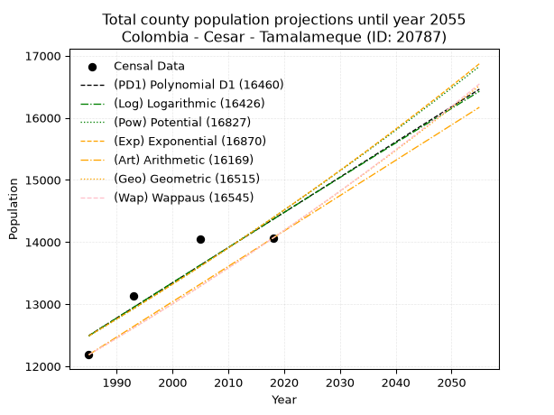
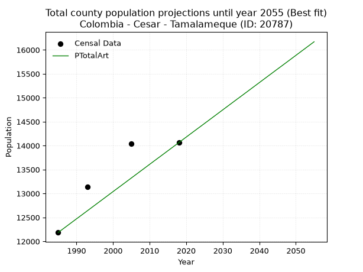
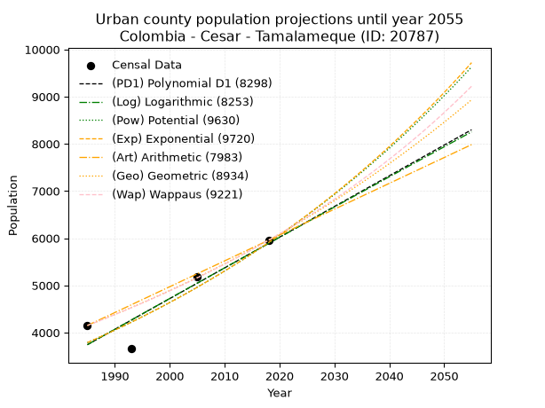
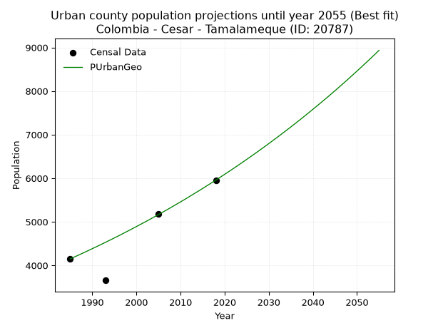
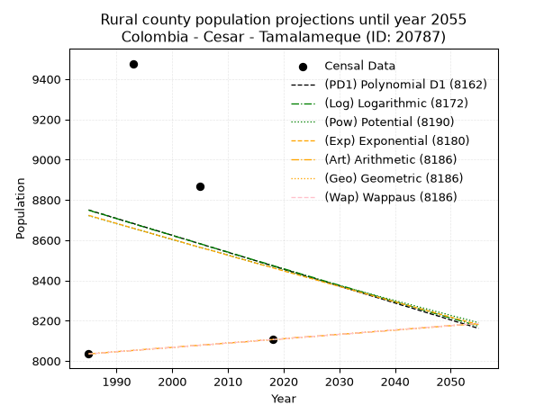
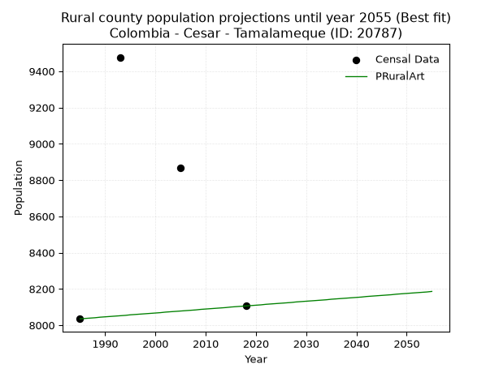

<div align="center">


</div>

# _“Population and Public Services Demand Projections (PPSD) until Year 2050 for Colombia - Cesar - Tamalameque (ID: 20787)”_
Keywords: `population` `public-service` `projection` `lineal` `polynomial` `logarithmic` `potential` `exponential` `arithmetic` `geometric` `wappaus` `dane` `colombia` `south-america`

PPSD are analytical estimates used by governments and planners to anticipate future changes in population size, age distribution, and the resulting community needs for utilities, healthcare, education, and infrastructure as sizing future water treatment facilities, electrical grids, and road networks based on spatial growth.

> **General running parameters**: • app_version: _v20260806_. • Python version: _3.14.7_. • Pandas version: _3.0.5_. • NumPy version: _2.5.1_. • Creates, save and include plots into reports (create_plot): _False_. • Projection until year: _2050_. • Process polynomial degree 2 and up: _False_. • Process Wappaus: _True_. • Process Wappaus: _True_. • Set negative values to zero: _True_. • Set infinite values to zero: _True_. • Drop dataset notes: _True_. 
<div align="center">

Dynamic map: [:earth_americas:Google](http://maps.google.com/maps?q=8.861724548,-73.8121724) [:earth_americas:OSM](https://www.openstreetmap.org/#map=18/8.861724548/-73.8121724&layers=P) [:earth_americas:Bing](https://www.bing.com/maps?cp=8.861724548~-73.8121724&lvl=18) [:earth_americas:Apple](https://maps.apple.com/frame?center=8.861724548%2C-73.8121724&span=0.003%2C0.006)

</div>


<div align="center">

```geojson
{
  "type": "Feature",
  "geometry": {
    "type": "Point", 
    "coordinates": [-73.8121724, 8.861724548]
  }, 
  "properties": {
    "Name": "Colombia - Cesar - Tamalameque (ID: 20787)"
  }
}
```

</div>


## 0. Census Data (4 records)

Census data are official statistics collected by a government about the people and housing in a country. They usually include counts of total population, age, sex, race, income, education, and jobs.

📅Global census file: [Population.xlsx](../data/Population.xlsx)

| Source   |   Year |   CountryID | CountryName   |   StateID | StateName   |   CountyID | CountyName   |   PTotal |   PUrban |   PRural |
|:---------|-------:|------------:|:--------------|----------:|:------------|-----------:|:-------------|---------:|---------:|---------:|
| DANE     |   1985 |          57 | Colombia      |        20 | Cesar       |      20787 | Tamalameque  |    12185 |     4150 |     8035 |
| DANE     |   1993 |          57 | Colombia      |        20 | Cesar       |      20787 | Tamalameque  |    13134 |     3657 |     9477 |
| DANE     |   2005 |          57 | Colombia      |        20 | Cesar       |      20787 | Tamalameque  |    14046 |     5177 |     8869 |
| DANE     |   2018 |          57 | Colombia      |        20 | Cesar       |      20787 | Tamalameque  |    14063 |     5957 |     8106 |

> 🔥Some records could had specific notes about the registered values or the corresponding urban or rural distribution.

📅   [RUPS](https://www.datos.gov.co/Hacienda-y-Cr-dito-P-blico/Registro-nico-de-Prestadores-de-Servicios-P-blicos/4qkq-csdn/about_data) - Local public utility companies: [RUPS.csv](../data/RUPS.xlsx)

 | SERVICIO       | ESTADO      | NOMBRE                                                               | NIT         | DEPARTAMENTO_DOMICILIO   | MUNICIPIO_DOMICILIO   | DIRECCION                                             |   TELEFONO | EMAIL                             | TIPO_INSCRIPCION    | REPRESENTANTE_LEGAL             | TIPO_PRESTADOR                             | CLASIFICACION                 |
|:---------------|:------------|:---------------------------------------------------------------------|:------------|:-------------------------|:----------------------|:------------------------------------------------------|-----------:|:----------------------------------|:--------------------|:--------------------------------|:-------------------------------------------|:------------------------------|
| ACUEDUCTO      | CANCELACION | UNIDAD DE LOS SERVICIOS PUBLICOS DE ACUEDUCTO, ALCANTARILLADO Y ASEO | 800096626-4 | CESAR                    | TAMALAMEQUE           | CARRERA 3 N° 2-46                                     |    5286188 | alcaldia@tamalameque-cesar.gov.co | Registro por la ESP | JORGE ALONSO CASTRO JARABA      | nan                                        | nan                           |
| ALCANTARILLADO | CANCELACION | UNIDAD DE LOS SERVICIOS PUBLICOS DE ACUEDUCTO, ALCANTARILLADO Y ASEO | 800096626-4 | CESAR                    | TAMALAMEQUE           | CARRERA 3 N° 2-46                                     |    5286188 | alcaldia@tamalameque-cesar.gov.co | Registro por la ESP | JORGE ALONSO CASTRO JARABA      | nan                                        | nan                           |
| ACUEDUCTO      | OPERATIVA   | EMPRESA REGIONAL DE SERVICIOS PUBLICOS S.A. E.S.P.                   | 900222479-1 | ATLANTICO                | PUERTO COLOMBIA       | CRA 24 # 1A-24 OFICINA 907A - EDIFICIO BC EMPRESARIAL |    3852994 | jalean@semsaesp.com               | Registro por la ESP | NELSON EDUARDO GUZMAN  VILLEGAS | SOCIEDADES (EMPRESA DE SERVICIOS PUBLICOS) | MAYOR O IGUAL A 5001 USUARIOS |
| ALCANTARILLADO | OPERATIVA   | EMPRESA REGIONAL DE SERVICIOS PUBLICOS S.A. E.S.P.                   | 900222479-1 | ATLANTICO                | PUERTO COLOMBIA       | CRA 24 # 1A-24 OFICINA 907A - EDIFICIO BC EMPRESARIAL |    3852994 | jalean@semsaesp.com               | Registro por la ESP | NELSON EDUARDO GUZMAN  VILLEGAS | SOCIEDADES (EMPRESA DE SERVICIOS PUBLICOS) | MAYOR O IGUAL A 5001 USUARIOS |

## 1. Total

### 1.1. Coefficients and Parameters

* (PD1) Polynomial Deg 1: 56.67442794058606, -100006.02448815727 (lineal)
* (Log) Logarithmic: 113558.52008395364, -849802.2211590006
* (Pow) Potential: 8.609310563156948, -24.29502377810096
* (Exp) Exponential: 0.004296586879587989, 2.4690441451046845
* (Art) Arithmetic: Year diff. 2018 - 1985 = 33, Population diff. 14063 - 12185 = 1878, Annual growth = 56.90909090909091
* (Geo) Geometric: Year diff. 2018 - 1985 = 33, Population diff. 14063 - 12185 = 1878, Annual growth % = 0.004353130733140809
* (Wap) Wappaus: i = 0.4336261117730182, Condition values only valid for < 200)

<sub>
Wappaus condition values: ['0.00', '0.43', '0.87', '1.30', '1.73', '2.17', '2.60', '3.04', '3.47', '3.90', '4.34', '4.77', '5.20', '5.64', '6.07', '6.50', '6.94', '7.37', '7.81', '8.24', '8.67', '9.11', '9.54', '9.97', '10.41', '10.84', '11.27', '11.71', '12.14', '12.58', '13.01', '13.44', '13.88', '14.31', '14.74', '15.18', '15.61', '16.04', '16.48', '16.91', '17.35', '17.78', '18.21', '18.65', '19.08', '19.51', '19.95', '20.38', '20.81', '21.25', '21.68', '22.11', '22.55', '22.98', '23.42', '23.85', '24.28', '24.72', '25.15', '25.58', '26.02', '26.45', '26.88', '27.32', '27.75', '28.19']
</sub>


### 1.2. Projected Dataset

|   Year |   CountyID |   PTotalPD1 |   PTotalLog |   PTotalPow |   PTotalExp |   PTotalArt |   PTotalGeo |   PTotalWap |
|-------:|-----------:|------------:|------------:|------------:|------------:|------------:|------------:|------------:|
|   1985 |      20787 |       12493 |       12490 |       12486 |       12488 |       12185 |       12185 |       12185 |
|   1986 |      20787 |       12549 |       12547 |       12540 |       12542 |       12242 |       12238 |       12238 |
|   1987 |      20787 |       12606 |       12604 |       12595 |       12596 |       12299 |       12291 |       12291 |
|   1988 |      20787 |       12663 |       12662 |       12649 |       12650 |       12356 |       12345 |       12345 |
|   1989 |      20787 |       12719 |       12719 |       12704 |       12705 |       12413 |       12399 |       12398 |
|   1990 |      20787 |       12776 |       12776 |       12759 |       12760 |       12470 |       12453 |       12452 |
|   1991 |      20787 |       12833 |       12833 |       12815 |       12815 |       12526 |       12507 |       12506 |
|   1992 |      20787 |       12889 |       12890 |       12870 |       12870 |       12583 |       12561 |       12561 |
|   1993 |      20787 |       12946 |       12947 |       12926 |       12925 |       12640 |       12616 |       12615 |
|   1994 |      20787 |       13003 |       13004 |       12982 |       12981 |       12697 |       12671 |       12670 |
|   1995 |      20787 |       13059 |       13061 |       13038 |       13037 |       12754 |       12726 |       12725 |
|   1996 |      20787 |       13116 |       13118 |       13094 |       13093 |       12811 |       12781 |       12780 |
|   1997 |      20787 |       13173 |       13175 |       13151 |       13149 |       12868 |       12837 |       12836 |
|   1998 |      20787 |       13229 |       13231 |       13208 |       13206 |       12925 |       12893 |       12892 |
|   1999 |      20787 |       13286 |       13288 |       13265 |       13263 |       12982 |       12949 |       12948 |
|   2000 |      20787 |       13343 |       13345 |       13322 |       13320 |       13039 |       13005 |       13004 |
|   2001 |      20787 |       13400 |       13402 |       13379 |       13377 |       13096 |       13062 |       13061 |
|   2002 |      20787 |       13456 |       13459 |       13437 |       13435 |       13152 |       13119 |       13118 |
|   2003 |      20787 |       13513 |       13515 |       13495 |       13493 |       13209 |       13176 |       13175 |
|   2004 |      20787 |       13570 |       13572 |       13553 |       13551 |       13266 |       13233 |       13232 |
|   2005 |      20787 |       13626 |       13629 |       13611 |       13609 |       13323 |       13291 |       13290 |
|   2006 |      20787 |       13683 |       13685 |       13670 |       13668 |       13380 |       13349 |       13348 |
|   2007 |      20787 |       13740 |       13742 |       13729 |       13726 |       13437 |       13407 |       13406 |
|   2008 |      20787 |       13796 |       13798 |       13788 |       13786 |       13494 |       13465 |       13464 |
|   2009 |      20787 |       13853 |       13855 |       13847 |       13845 |       13551 |       13524 |       13523 |
|   2010 |      20787 |       13910 |       13911 |       13906 |       13905 |       13608 |       13583 |       13582 |
|   2011 |      20787 |       13966 |       13968 |       13966 |       13964 |       13665 |       13642 |       13641 |
|   2012 |      20787 |       14023 |       14024 |       14026 |       14025 |       13722 |       13701 |       13700 |
|   2013 |      20787 |       14080 |       14081 |       14086 |       14085 |       13778 |       13761 |       13760 |
|   2014 |      20787 |       14136 |       14137 |       14147 |       14146 |       13835 |       13821 |       13820 |
|   2015 |      20787 |       14193 |       14194 |       14207 |       14206 |       13892 |       13881 |       13880 |
|   2016 |      20787 |       14250 |       14250 |       14268 |       14268 |       13949 |       13941 |       13941 |
|   2017 |      20787 |       14306 |       14306 |       14329 |       14329 |       14006 |       14002 |       14002 |
|   2018 |      20787 |       14363 |       14362 |       14390 |       14391 |       14063 |       14063 |       14063 |
|   2019 |      20787 |       14420 |       14419 |       14452 |       14453 |       14120 |       14124 |       14124 |
|   2020 |      20787 |       14476 |       14475 |       14514 |       14515 |       14177 |       14186 |       14186 |
|   2021 |      20787 |       14533 |       14531 |       14575 |       14577 |       14234 |       14247 |       14248 |
|   2022 |      20787 |       14590 |       14587 |       14638 |       14640 |       14291 |       14309 |       14310 |
|   2023 |      20787 |       14646 |       14643 |       14700 |       14703 |       14348 |       14372 |       14373 |
|   2024 |      20787 |       14703 |       14700 |       14763 |       14767 |       14404 |       14434 |       14436 |
|   2025 |      20787 |       14760 |       14756 |       14826 |       14830 |       14461 |       14497 |       14499 |
|   2026 |      20787 |       14816 |       14812 |       14889 |       14894 |       14518 |       14560 |       14563 |
|   2027 |      20787 |       14873 |       14868 |       14952 |       14958 |       14575 |       14624 |       14626 |
|   2028 |      20787 |       14930 |       14924 |       15016 |       15023 |       14632 |       14687 |       14691 |
|   2029 |      20787 |       14986 |       14980 |       15080 |       15087 |       14689 |       14751 |       14755 |
|   2030 |      20787 |       15043 |       15036 |       15144 |       15152 |       14746 |       14815 |       14820 |
|   2031 |      20787 |       15100 |       15092 |       15208 |       15217 |       14803 |       14880 |       14885 |
|   2032 |      20787 |       15156 |       15148 |       15273 |       15283 |       14860 |       14945 |       14950 |
|   2033 |      20787 |       15213 |       15203 |       15338 |       15349 |       14917 |       15010 |       15016 |
|   2034 |      20787 |       15270 |       15259 |       15403 |       15415 |       14974 |       15075 |       15082 |
|   2035 |      20787 |       15326 |       15315 |       15468 |       15481 |       15030 |       15141 |       15148 |
|   2036 |      20787 |       15383 |       15371 |       15534 |       15548 |       15087 |       15207 |       15215 |
|   2037 |      20787 |       15440 |       15427 |       15599 |       15615 |       15144 |       15273 |       15282 |
|   2038 |      20787 |       15496 |       15482 |       15665 |       15682 |       15201 |       15339 |       15349 |
|   2039 |      20787 |       15553 |       15538 |       15732 |       15750 |       15258 |       15406 |       15417 |
|   2040 |      20787 |       15610 |       15594 |       15798 |       15817 |       15315 |       15473 |       15485 |
|   2041 |      20787 |       15666 |       15649 |       15865 |       15886 |       15372 |       15541 |       15553 |
|   2042 |      20787 |       15723 |       15705 |       15932 |       15954 |       15429 |       15608 |       15621 |
|   2043 |      20787 |       15780 |       15761 |       15999 |       16023 |       15486 |       15676 |       15690 |
|   2044 |      20787 |       15837 |       15816 |       16067 |       16092 |       15543 |       15744 |       15760 |
|   2045 |      20787 |       15893 |       15872 |       16135 |       16161 |       15600 |       15813 |       15829 |
|   2046 |      20787 |       15950 |       15927 |       16203 |       16231 |       15656 |       15882 |       15899 |
|   2047 |      20787 |       16007 |       15983 |       16271 |       16300 |       15713 |       15951 |       15970 |
|   2048 |      20787 |       16063 |       16038 |       16340 |       16371 |       15770 |       16020 |       16040 |
|   2049 |      20787 |       16120 |       16094 |       16409 |       16441 |       15827 |       16090 |       16111 |
|   2050 |      20787 |       16177 |       16149 |       16478 |       16512 |       15884 |       16160 |       16183 |
<div align="center">

</img>

</div>


### 1.3. Best fit with absolute and relative error (%)

Relative error puts that difference into context by dividing the absolute error by the true value, creating a unitless ratio or percentage that shows the scale of the mistake.

Absolute and relative error

|   Year | Source   |   CountryID | CountryName   |   StateID | StateName   |   CountyID_x | CountyName   |   PTotal |   PUrban |   PRural |   CountyID_y |   PTotalPD1 |   PTotalLog |   PTotalPow |   PTotalExp |   PTotalArt |   PTotalGeo |   PTotalWap |   PTotalPD1AbsError |   PTotalLogAbsError |   PTotalPowAbsError |   PTotalExpAbsError |   PTotalArtAbsError |   PTotalGeoAbsError |   PTotalWapAbsError |   PTotalPD1RelError |   PTotalLogRelError |   PTotalPowRelError |   PTotalExpRelError |   PTotalArtRelError |   PTotalGeoRelError |   PTotalWapRelError |
|-------:|:---------|------------:|:--------------|----------:|:------------|-------------:|:-------------|---------:|---------:|---------:|-------------:|------------:|------------:|------------:|------------:|------------:|------------:|------------:|--------------------:|--------------------:|--------------------:|--------------------:|--------------------:|--------------------:|--------------------:|--------------------:|--------------------:|--------------------:|--------------------:|--------------------:|--------------------:|--------------------:|
|   1985 | DANE     |          57 | Colombia      |        20 | Cesar       |        20787 | Tamalameque  |    12185 |     4150 |     8035 |        20787 |       12493 |       12490 |       12486 |       12488 |       12185 |       12185 |       12185 |                 308 |                 305 |                 301 |                 303 |                   0 |                   0 |                   0 |             2.5277  |             2.50308 |             2.47025 |             2.48666 |             0       |             0       |             0       |
|   1993 | DANE     |          57 | Colombia      |        20 | Cesar       |        20787 | Tamalameque  |    13134 |     3657 |     9477 |        20787 |       12946 |       12947 |       12926 |       12925 |       12640 |       12616 |       12615 |                 188 |                 187 |                 208 |                 209 |                 494 |                 518 |                 519 |             1.4314  |             1.42379 |             1.58368 |             1.59129 |             3.76123 |             3.94396 |             3.95158 |
|   2005 | DANE     |          57 | Colombia      |        20 | Cesar       |        20787 | Tamalameque  |    14046 |     5177 |     8869 |        20787 |       13626 |       13629 |       13611 |       13609 |       13323 |       13291 |       13290 |                 420 |                 417 |                 435 |                 437 |                 723 |                 755 |                 756 |             2.99018 |             2.96882 |             3.09697 |             3.11121 |             5.14737 |             5.3752  |             5.38232 |
|   2018 | DANE     |          57 | Colombia      |        20 | Cesar       |        20787 | Tamalameque  |    14063 |     5957 |     8106 |        20787 |       14363 |       14362 |       14390 |       14391 |       14063 |       14063 |       14063 |                 300 |                 299 |                 327 |                 328 |                   0 |                   0 |                   0 |             2.13326 |             2.12615 |             2.32525 |             2.33236 |             0       |             0       |             0       |

Relative error mean

| Method    |   RelError | Best   |
|:----------|-----------:|:-------|
| PTotalPD1 |    2.27063 |        |
| PTotalLog |    2.25546 |        |
| PTotalPow |    2.36904 |        |
| PTotalExp |    2.38038 |        |
| PTotalArt |    2.22715 | True   |
| PTotalGeo |    2.32979 |        |
| PTotalWap |    2.33347 |        |

💙Best method: _**PTotalArt**_
<div align="center">

</img>

</div>


### 1.4. Fresh water supply demand in liters per capita per day (lpcd)

The fresh water supply demand typically ranges from 100 to 300 liters per capita per day (lpcd) for standard domestic and municipal planning, though absolute survival minimums set by the World Health Organization are as low as 7.5 to 20 liters per day, and total consumption in high-income nations can exceed 400 liters.

> `CZ`: Level in meters above the sea level (masl)<br> `WS`: Fresh water supply demand in liters per capita per day (lpcd or l/h/d)<br> `WSAll`: Zonal fresh water supply demand in liters per second (l/s)<br> `A`: Zonal area in square meters<br> `DP`: Population density (people/hectare or p/ha)

Reference values (RAS Colombia)

|    CZ |   WS |
|------:|-----:|
|  1000 |  120 |
|  2000 |  130 |
| 99999 |  140 |

County shapefile geometry properties and water supply values

|   CountyID |     ATotal |   CZTotal |   WSTotal |
|-----------:|-----------:|----------:|----------:|
|      20787 | 5.1247e+08 |    35.875 |       120 |

Projected values for best method: PTotalArt

|   CountyID |   Year |   PTotalArt |   DPTotal |   WSTotal |   WSTotalAll |
|-----------:|-------:|------------:|----------:|----------:|-------------:|
|      20787 |   1985 |       12185 |      0.24 |       120 |      16.9236 |
|      20787 |   1986 |       12242 |      0.24 |       120 |      17.0028 |
|      20787 |   1987 |       12299 |      0.24 |       120 |      17.0819 |
|      20787 |   1988 |       12356 |      0.24 |       120 |      17.1611 |
|      20787 |   1989 |       12413 |      0.24 |       120 |      17.2403 |
|      20787 |   1990 |       12470 |      0.24 |       120 |      17.3194 |
|      20787 |   1991 |       12526 |      0.24 |       120 |      17.3972 |
|      20787 |   1992 |       12583 |      0.25 |       120 |      17.4764 |
|      20787 |   1993 |       12640 |      0.25 |       120 |      17.5556 |
|      20787 |   1994 |       12697 |      0.25 |       120 |      17.6347 |
|      20787 |   1995 |       12754 |      0.25 |       120 |      17.7139 |
|      20787 |   1996 |       12811 |      0.25 |       120 |      17.7931 |
|      20787 |   1997 |       12868 |      0.25 |       120 |      17.8722 |
|      20787 |   1998 |       12925 |      0.25 |       120 |      17.9514 |
|      20787 |   1999 |       12982 |      0.25 |       120 |      18.0306 |
|      20787 |   2000 |       13039 |      0.25 |       120 |      18.1097 |
|      20787 |   2001 |       13096 |      0.26 |       120 |      18.1889 |
|      20787 |   2002 |       13152 |      0.26 |       120 |      18.2667 |
|      20787 |   2003 |       13209 |      0.26 |       120 |      18.3458 |
|      20787 |   2004 |       13266 |      0.26 |       120 |      18.425  |
|      20787 |   2005 |       13323 |      0.26 |       120 |      18.5042 |
|      20787 |   2006 |       13380 |      0.26 |       120 |      18.5833 |
|      20787 |   2007 |       13437 |      0.26 |       120 |      18.6625 |
|      20787 |   2008 |       13494 |      0.26 |       120 |      18.7417 |
|      20787 |   2009 |       13551 |      0.26 |       120 |      18.8208 |
|      20787 |   2010 |       13608 |      0.27 |       120 |      18.9    |
|      20787 |   2011 |       13665 |      0.27 |       120 |      18.9792 |
|      20787 |   2012 |       13722 |      0.27 |       120 |      19.0583 |
|      20787 |   2013 |       13778 |      0.27 |       120 |      19.1361 |
|      20787 |   2014 |       13835 |      0.27 |       120 |      19.2153 |
|      20787 |   2015 |       13892 |      0.27 |       120 |      19.2944 |
|      20787 |   2016 |       13949 |      0.27 |       120 |      19.3736 |
|      20787 |   2017 |       14006 |      0.27 |       120 |      19.4528 |
|      20787 |   2018 |       14063 |      0.27 |       120 |      19.5319 |
|      20787 |   2019 |       14120 |      0.28 |       120 |      19.6111 |
|      20787 |   2020 |       14177 |      0.28 |       120 |      19.6903 |
|      20787 |   2021 |       14234 |      0.28 |       120 |      19.7694 |
|      20787 |   2022 |       14291 |      0.28 |       120 |      19.8486 |
|      20787 |   2023 |       14348 |      0.28 |       120 |      19.9278 |
|      20787 |   2024 |       14404 |      0.28 |       120 |      20.0056 |
|      20787 |   2025 |       14461 |      0.28 |       120 |      20.0847 |
|      20787 |   2026 |       14518 |      0.28 |       120 |      20.1639 |
|      20787 |   2027 |       14575 |      0.28 |       120 |      20.2431 |
|      20787 |   2028 |       14632 |      0.29 |       120 |      20.3222 |
|      20787 |   2029 |       14689 |      0.29 |       120 |      20.4014 |
|      20787 |   2030 |       14746 |      0.29 |       120 |      20.4806 |
|      20787 |   2031 |       14803 |      0.29 |       120 |      20.5597 |
|      20787 |   2032 |       14860 |      0.29 |       120 |      20.6389 |
|      20787 |   2033 |       14917 |      0.29 |       120 |      20.7181 |
|      20787 |   2034 |       14974 |      0.29 |       120 |      20.7972 |
|      20787 |   2035 |       15030 |      0.29 |       120 |      20.875  |
|      20787 |   2036 |       15087 |      0.29 |       120 |      20.9542 |
|      20787 |   2037 |       15144 |      0.3  |       120 |      21.0333 |
|      20787 |   2038 |       15201 |      0.3  |       120 |      21.1125 |
|      20787 |   2039 |       15258 |      0.3  |       120 |      21.1917 |
|      20787 |   2040 |       15315 |      0.3  |       120 |      21.2708 |
|      20787 |   2041 |       15372 |      0.3  |       120 |      21.35   |
|      20787 |   2042 |       15429 |      0.3  |       120 |      21.4292 |
|      20787 |   2043 |       15486 |      0.3  |       120 |      21.5083 |
|      20787 |   2044 |       15543 |      0.3  |       120 |      21.5875 |
|      20787 |   2045 |       15600 |      0.3  |       120 |      21.6667 |
|      20787 |   2046 |       15656 |      0.31 |       120 |      21.7444 |
|      20787 |   2047 |       15713 |      0.31 |       120 |      21.8236 |
|      20787 |   2048 |       15770 |      0.31 |       120 |      21.9028 |
|      20787 |   2049 |       15827 |      0.31 |       120 |      21.9819 |
|      20787 |   2050 |       15884 |      0.31 |       120 |      22.0611 |

## 2. Urban

### 2.1. Coefficients and Parameters

* (PD1) Polynomial Deg 1: 65.07707747892356, -125435.17422721683 (lineal)
* (Log) Logarithmic: 130189.61782024, -984837.0783257666
* (Pow) Potential: 26.93055228021017, -85.23222570815574
* (Exp) Exponential: 0.01346137555187919, 9.412520026529064e-09
* (Art) Arithmetic: Year diff. 2018 - 1985 = 33, Population diff. 5957 - 4150 = 1807, Annual growth = 54.75757575757576
* (Geo) Geometric: Year diff. 2018 - 1985 = 33, Population diff. 5957 - 4150 = 1807, Annual growth % = 0.011013499793567583
* (Wap) Wappaus: i = 1.0835574504318939, Condition values only valid for < 200)

<sub>
Wappaus condition values: ['0.00', '1.08', '2.17', '3.25', '4.33', '5.42', '6.50', '7.58', '8.67', '9.75', '10.84', '11.92', '13.00', '14.09', '15.17', '16.25', '17.34', '18.42', '19.50', '20.59', '21.67', '22.75', '23.84', '24.92', '26.01', '27.09', '28.17', '29.26', '30.34', '31.42', '32.51', '33.59', '34.67', '35.76', '36.84', '37.92', '39.01', '40.09', '41.18', '42.26', '43.34', '44.43', '45.51', '46.59', '47.68', '48.76', '49.84', '50.93', '52.01', '53.09', '54.18', '55.26', '56.34', '57.43', '58.51', '59.60', '60.68', '61.76', '62.85', '63.93', '65.01', '66.10', '67.18', '68.26', '69.35', '70.43']
</sub>


### 2.2. Projected Dataset

|   Year |   CountyID |   PUrbanPD1 |   PUrbanLog |   PUrbanPow |   PUrbanExp |   PUrbanArt |   PUrbanGeo |   PUrbanWap |
|-------:|-----------:|------------:|------------:|------------:|------------:|------------:|------------:|------------:|
|   1985 |      20787 |        3743 |        3741 |        3787 |        3788 |        4150 |        4150 |        4150 |
|   1986 |      20787 |        3808 |        3807 |        3839 |        3839 |        4205 |        4196 |        4195 |
|   1987 |      20787 |        3873 |        3873 |        3891 |        3891 |        4260 |        4242 |        4241 |
|   1988 |      20787 |        3938 |        3938 |        3944 |        3944 |        4314 |        4289 |        4287 |
|   1989 |      20787 |        4003 |        4003 |        3998 |        3998 |        4369 |        4336 |        4334 |
|   1990 |      20787 |        4068 |        4069 |        4052 |        4052 |        4424 |        4384 |        4381 |
|   1991 |      20787 |        4133 |        4134 |        4108 |        4107 |        4479 |        4432 |        4429 |
|   1992 |      20787 |        4198 |        4200 |        4163 |        4162 |        4533 |        4481 |        4477 |
|   1993 |      20787 |        4263 |        4265 |        4220 |        4219 |        4588 |        4530 |        4526 |
|   1994 |      20787 |        4329 |        4330 |        4278 |        4276 |        4643 |        4580 |        4575 |
|   1995 |      20787 |        4394 |        4396 |        4336 |        4334 |        4698 |        4630 |        4625 |
|   1996 |      20787 |        4459 |        4461 |        4395 |        4393 |        4752 |        4681 |        4676 |
|   1997 |      20787 |        4524 |        4526 |        4454 |        4452 |        4807 |        4733 |        4727 |
|   1998 |      20787 |        4589 |        4591 |        4515 |        4512 |        4862 |        4785 |        4779 |
|   1999 |      20787 |        4654 |        4656 |        4576 |        4574 |        4917 |        4838 |        4831 |
|   2000 |      20787 |        4719 |        4722 |        4638 |        4636 |        4971 |        4891 |        4884 |
|   2001 |      20787 |        4784 |        4787 |        4701 |        4698 |        5026 |        4945 |        4938 |
|   2002 |      20787 |        4849 |        4852 |        4765 |        4762 |        5081 |        4999 |        4992 |
|   2003 |      20787 |        4914 |        4917 |        4829 |        4827 |        5136 |        5054 |        5047 |
|   2004 |      20787 |        4979 |        4982 |        4894 |        4892 |        5190 |        5110 |        5102 |
|   2005 |      20787 |        5044 |        5047 |        4961 |        4958 |        5245 |        5166 |        5159 |
|   2006 |      20787 |        5109 |        5111 |        5028 |        5026 |        5300 |        5223 |        5216 |
|   2007 |      20787 |        5175 |        5176 |        5096 |        5094 |        5355 |        5281 |        5273 |
|   2008 |      20787 |        5240 |        5241 |        5164 |        5163 |        5409 |        5339 |        5331 |
|   2009 |      20787 |        5305 |        5306 |        5234 |        5233 |        5464 |        5398 |        5391 |
|   2010 |      20787 |        5370 |        5371 |        5305 |        5304 |        5519 |        5457 |        5450 |
|   2011 |      20787 |        5435 |        5436 |        5376 |        5375 |        5574 |        5517 |        5511 |
|   2012 |      20787 |        5500 |        5500 |        5449 |        5448 |        5628 |        5578 |        5572 |
|   2013 |      20787 |        5565 |        5565 |        5522 |        5522 |        5683 |        5640 |        5634 |
|   2014 |      20787 |        5630 |        5630 |        5597 |        5597 |        5738 |        5702 |        5697 |
|   2015 |      20787 |        5695 |        5694 |        5672 |        5673 |        5793 |        5764 |        5761 |
|   2016 |      20787 |        5760 |        5759 |        5748 |        5750 |        5847 |        5828 |        5825 |
|   2017 |      20787 |        5825 |        5823 |        5825 |        5828 |        5902 |        5892 |        5891 |
|   2018 |      20787 |        5890 |        5888 |        5904 |        5907 |        5957 |        5957 |        5957 |
|   2019 |      20787 |        5955 |        5952 |        5983 |        5987 |        6012 |        6023 |        6024 |
|   2020 |      20787 |        6021 |        6017 |        6063 |        6068 |        6067 |        6089 |        6092 |
|   2021 |      20787 |        6086 |        6081 |        6145 |        6150 |        6121 |        6156 |        6161 |
|   2022 |      20787 |        6151 |        6146 |        6227 |        6233 |        6176 |        6224 |        6231 |
|   2023 |      20787 |        6216 |        6210 |        6311 |        6318 |        6231 |        6292 |        6302 |
|   2024 |      20787 |        6281 |        6274 |        6395 |        6403 |        6286 |        6362 |        6374 |
|   2025 |      20787 |        6346 |        6339 |        6481 |        6490 |        6340 |        6432 |        6446 |
|   2026 |      20787 |        6411 |        6403 |        6568 |        6578 |        6395 |        6503 |        6520 |
|   2027 |      20787 |        6476 |        6467 |        6655 |        6667 |        6450 |        6574 |        6595 |
|   2028 |      20787 |        6541 |        6532 |        6744 |        6758 |        6505 |        6647 |        6671 |
|   2029 |      20787 |        6606 |        6596 |        6834 |        6849 |        6559 |        6720 |        6748 |
|   2030 |      20787 |        6671 |        6660 |        6926 |        6942 |        6614 |        6794 |        6826 |
|   2031 |      20787 |        6736 |        6724 |        7018 |        7036 |        6669 |        6869 |        6905 |
|   2032 |      20787 |        6801 |        6788 |        7112 |        7132 |        6724 |        6944 |        6985 |
|   2033 |      20787 |        6867 |        6852 |        7207 |        7228 |        6778 |        7021 |        7067 |
|   2034 |      20787 |        6932 |        6916 |        7303 |        7326 |        6833 |        7098 |        7150 |
|   2035 |      20787 |        6997 |        6980 |        7400 |        7425 |        6888 |        7176 |        7234 |
|   2036 |      20787 |        7062 |        7044 |        7499 |        7526 |        6943 |        7255 |        7319 |
|   2037 |      20787 |        7127 |        7108 |        7599 |        7628 |        6997 |        7335 |        7405 |
|   2038 |      20787 |        7192 |        7172 |        7700 |        7732 |        7052 |        7416 |        7493 |
|   2039 |      20787 |        7257 |        7236 |        7802 |        7836 |        7107 |        7498 |        7582 |
|   2040 |      20787 |        7322 |        7300 |        7906 |        7942 |        7162 |        7580 |        7673 |
|   2041 |      20787 |        7387 |        7363 |        8011 |        8050 |        7216 |        7664 |        7765 |
|   2042 |      20787 |        7452 |        7427 |        8117 |        8159 |        7271 |        7748 |        7858 |
|   2043 |      20787 |        7517 |        7491 |        8225 |        8270 |        7326 |        7833 |        7953 |
|   2044 |      20787 |        7582 |        7555 |        8334 |        8382 |        7381 |        7920 |        8050 |
|   2045 |      20787 |        7647 |        7618 |        8444 |        8495 |        7435 |        8007 |        8148 |
|   2046 |      20787 |        7713 |        7682 |        8556 |        8611 |        7490 |        8095 |        8247 |
|   2047 |      20787 |        7778 |        7746 |        8670 |        8727 |        7545 |        8184 |        8348 |
|   2048 |      20787 |        7843 |        7809 |        8785 |        8846 |        7600 |        8274 |        8451 |
|   2049 |      20787 |        7908 |        7873 |        8901 |        8965 |        7654 |        8366 |        8555 |
|   2050 |      20787 |        7973 |        7936 |        9019 |        9087 |        7709 |        8458 |        8662 |
<div align="center">

</img>

</div>


### 2.3. Best fit with absolute and relative error (%)

Relative error puts that difference into context by dividing the absolute error by the true value, creating a unitless ratio or percentage that shows the scale of the mistake.

Absolute and relative error

|   Year | Source   |   CountryID | CountryName   |   StateID | StateName   |   CountyID_x | CountyName   |   PTotal |   PUrban |   PRural |   CountyID_y |   PUrbanPD1 |   PUrbanLog |   PUrbanPow |   PUrbanExp |   PUrbanArt |   PUrbanGeo |   PUrbanWap |   PUrbanPD1AbsError |   PUrbanLogAbsError |   PUrbanPowAbsError |   PUrbanExpAbsError |   PUrbanArtAbsError |   PUrbanGeoAbsError |   PUrbanWapAbsError |   PUrbanPD1RelError |   PUrbanLogRelError |   PUrbanPowRelError |   PUrbanExpRelError |   PUrbanArtRelError |   PUrbanGeoRelError |   PUrbanWapRelError |
|-------:|:---------|------------:|:--------------|----------:|:------------|-------------:|:-------------|---------:|---------:|---------:|-------------:|------------:|------------:|------------:|------------:|------------:|------------:|------------:|--------------------:|--------------------:|--------------------:|--------------------:|--------------------:|--------------------:|--------------------:|--------------------:|--------------------:|--------------------:|--------------------:|--------------------:|--------------------:|--------------------:|
|   1985 | DANE     |          57 | Colombia      |        20 | Cesar       |        20787 | Tamalameque  |    12185 |     4150 |     8035 |        20787 |        3743 |        3741 |        3787 |        3788 |        4150 |        4150 |        4150 |                 407 |                 409 |                 363 |                 362 |                   0 |                   0 |                   0 |             9.80723 |             9.85542 |             8.74699 |            8.72289  |              0      |            0        |            0        |
|   1993 | DANE     |          57 | Colombia      |        20 | Cesar       |        20787 | Tamalameque  |    13134 |     3657 |     9477 |        20787 |        4263 |        4265 |        4220 |        4219 |        4588 |        4530 |        4526 |                 606 |                 608 |                 563 |                 562 |                 931 |                 873 |                 869 |            16.571   |            16.6256  |            15.3951  |           15.3678   |             25.458  |           23.872    |           23.7626   |
|   2005 | DANE     |          57 | Colombia      |        20 | Cesar       |        20787 | Tamalameque  |    14046 |     5177 |     8869 |        20787 |        5044 |        5047 |        4961 |        4958 |        5245 |        5166 |        5159 |                 133 |                 130 |                 216 |                 219 |                  68 |                  11 |                  18 |             2.56906 |             2.51111 |             4.1723  |            4.23025  |              1.3135 |            0.212478 |            0.347692 |
|   2018 | DANE     |          57 | Colombia      |        20 | Cesar       |        20787 | Tamalameque  |    14063 |     5957 |     8106 |        20787 |        5890 |        5888 |        5904 |        5907 |        5957 |        5957 |        5957 |                  67 |                  69 |                  53 |                  50 |                   0 |                   0 |                   0 |             1.12473 |             1.1583  |             0.88971 |            0.839349 |              0      |            0        |            0        |

Relative error mean

| Method    |   RelError | Best   |
|:----------|-----------:|:-------|
| PUrbanPD1 |    7.51799 |        |
| PUrbanLog |    7.53762 |        |
| PUrbanPow |    7.30103 |        |
| PUrbanExp |    7.29007 |        |
| PUrbanArt |    6.69288 |        |
| PUrbanGeo |    6.02113 | True   |
| PUrbanWap |    6.02758 |        |

💙Best method: _**PUrbanGeo**_
<div align="center">

</img>

</div>


### 2.4. Fresh water supply demand in liters per capita per day (lpcd)

The fresh water supply demand typically ranges from 100 to 300 liters per capita per day (lpcd) for standard domestic and municipal planning, though absolute survival minimums set by the World Health Organization are as low as 7.5 to 20 liters per day, and total consumption in high-income nations can exceed 400 liters.

> `CZ`: Level in meters above the sea level (masl)<br> `WS`: Fresh water supply demand in liters per capita per day (lpcd or l/h/d)<br> `WSAll`: Zonal fresh water supply demand in liters per second (l/s)<br> `A`: Zonal area in square meters<br> `DP`: Population density (people/hectare or p/ha)

Reference values (RAS Colombia)

|    CZ |   WS |
|------:|-----:|
|  1000 |  120 |
|  2000 |  130 |
| 99999 |  140 |

County shapefile geometry properties and water supply values

|   CountyID |      AUrban |   CZUrban |   WSUrban |
|-----------:|------------:|----------:|----------:|
|      20787 | 1.94911e+06 |   33.5773 |       120 |

Projected values for best method: PUrbanGeo

|   CountyID |   Year |   PUrbanGeo |   DPUrban |   WSUrban |   WSUrbanAll |
|-----------:|-------:|------------:|----------:|----------:|-------------:|
|      20787 |   1985 |        4150 |     21.29 |       120 |      5.76389 |
|      20787 |   1986 |        4196 |     21.53 |       120 |      5.82778 |
|      20787 |   1987 |        4242 |     21.76 |       120 |      5.89167 |
|      20787 |   1988 |        4289 |     22    |       120 |      5.95694 |
|      20787 |   1989 |        4336 |     22.25 |       120 |      6.02222 |
|      20787 |   1990 |        4384 |     22.49 |       120 |      6.08889 |
|      20787 |   1991 |        4432 |     22.74 |       120 |      6.15556 |
|      20787 |   1992 |        4481 |     22.99 |       120 |      6.22361 |
|      20787 |   1993 |        4530 |     23.24 |       120 |      6.29167 |
|      20787 |   1994 |        4580 |     23.5  |       120 |      6.36111 |
|      20787 |   1995 |        4630 |     23.75 |       120 |      6.43056 |
|      20787 |   1996 |        4681 |     24.02 |       120 |      6.50139 |
|      20787 |   1997 |        4733 |     24.28 |       120 |      6.57361 |
|      20787 |   1998 |        4785 |     24.55 |       120 |      6.64583 |
|      20787 |   1999 |        4838 |     24.82 |       120 |      6.71944 |
|      20787 |   2000 |        4891 |     25.09 |       120 |      6.79306 |
|      20787 |   2001 |        4945 |     25.37 |       120 |      6.86806 |
|      20787 |   2002 |        4999 |     25.65 |       120 |      6.94306 |
|      20787 |   2003 |        5054 |     25.93 |       120 |      7.01944 |
|      20787 |   2004 |        5110 |     26.22 |       120 |      7.09722 |
|      20787 |   2005 |        5166 |     26.5  |       120 |      7.175   |
|      20787 |   2006 |        5223 |     26.8  |       120 |      7.25417 |
|      20787 |   2007 |        5281 |     27.09 |       120 |      7.33472 |
|      20787 |   2008 |        5339 |     27.39 |       120 |      7.41528 |
|      20787 |   2009 |        5398 |     27.69 |       120 |      7.49722 |
|      20787 |   2010 |        5457 |     28    |       120 |      7.57917 |
|      20787 |   2011 |        5517 |     28.31 |       120 |      7.6625  |
|      20787 |   2012 |        5578 |     28.62 |       120 |      7.74722 |
|      20787 |   2013 |        5640 |     28.94 |       120 |      7.83333 |
|      20787 |   2014 |        5702 |     29.25 |       120 |      7.91944 |
|      20787 |   2015 |        5764 |     29.57 |       120 |      8.00556 |
|      20787 |   2016 |        5828 |     29.9  |       120 |      8.09444 |
|      20787 |   2017 |        5892 |     30.23 |       120 |      8.18333 |
|      20787 |   2018 |        5957 |     30.56 |       120 |      8.27361 |
|      20787 |   2019 |        6023 |     30.9  |       120 |      8.36528 |
|      20787 |   2020 |        6089 |     31.24 |       120 |      8.45694 |
|      20787 |   2021 |        6156 |     31.58 |       120 |      8.55    |
|      20787 |   2022 |        6224 |     31.93 |       120 |      8.64444 |
|      20787 |   2023 |        6292 |     32.28 |       120 |      8.73889 |
|      20787 |   2024 |        6362 |     32.64 |       120 |      8.83611 |
|      20787 |   2025 |        6432 |     33    |       120 |      8.93333 |
|      20787 |   2026 |        6503 |     33.36 |       120 |      9.03194 |
|      20787 |   2027 |        6574 |     33.73 |       120 |      9.13056 |
|      20787 |   2028 |        6647 |     34.1  |       120 |      9.23194 |
|      20787 |   2029 |        6720 |     34.48 |       120 |      9.33333 |
|      20787 |   2030 |        6794 |     34.86 |       120 |      9.43611 |
|      20787 |   2031 |        6869 |     35.24 |       120 |      9.54028 |
|      20787 |   2032 |        6944 |     35.63 |       120 |      9.64444 |
|      20787 |   2033 |        7021 |     36.02 |       120 |      9.75139 |
|      20787 |   2034 |        7098 |     36.42 |       120 |      9.85833 |
|      20787 |   2035 |        7176 |     36.82 |       120 |      9.96667 |
|      20787 |   2036 |        7255 |     37.22 |       120 |     10.0764  |
|      20787 |   2037 |        7335 |     37.63 |       120 |     10.1875  |
|      20787 |   2038 |        7416 |     38.05 |       120 |     10.3     |
|      20787 |   2039 |        7498 |     38.47 |       120 |     10.4139  |
|      20787 |   2040 |        7580 |     38.89 |       120 |     10.5278  |
|      20787 |   2041 |        7664 |     39.32 |       120 |     10.6444  |
|      20787 |   2042 |        7748 |     39.75 |       120 |     10.7611  |
|      20787 |   2043 |        7833 |     40.19 |       120 |     10.8792  |
|      20787 |   2044 |        7920 |     40.63 |       120 |     11       |
|      20787 |   2045 |        8007 |     41.08 |       120 |     11.1208  |
|      20787 |   2046 |        8095 |     41.53 |       120 |     11.2431  |
|      20787 |   2047 |        8184 |     41.99 |       120 |     11.3667  |
|      20787 |   2048 |        8274 |     42.45 |       120 |     11.4917  |
|      20787 |   2049 |        8366 |     42.92 |       120 |     11.6194  |
|      20787 |   2050 |        8458 |     43.39 |       120 |     11.7472  |

## 3. Rural

### 3.1. Coefficients and Parameters

* (PD1) Polynomial Deg 1: -8.40264953833753, 25429.14973905964 (lineal)
* (Log) Logarithmic: -16631.097736286254, 135034.85716676497
* (Pow) Potential: -1.8149014105974457, 9.9257116973653
* (Exp) Exponential: -0.0009176206321098099, 53916.20146134469
* (Art) Arithmetic: Year diff. 2018 - 1985 = 33, Population diff. 8106 - 8035 = 71, Annual growth = 2.1515151515151514
* (Geo) Geometric: Year diff. 2018 - 1985 = 33, Population diff. 8106 - 8035 = 71, Annual growth % = 0.0002666273271318964
* (Wap) Wappaus: i = 0.02665900689567129, Condition values only valid for < 200)

<sub>
Wappaus condition values: ['0.00', '0.03', '0.05', '0.08', '0.11', '0.13', '0.16', '0.19', '0.21', '0.24', '0.27', '0.29', '0.32', '0.35', '0.37', '0.40', '0.43', '0.45', '0.48', '0.51', '0.53', '0.56', '0.59', '0.61', '0.64', '0.67', '0.69', '0.72', '0.75', '0.77', '0.80', '0.83', '0.85', '0.88', '0.91', '0.93', '0.96', '0.99', '1.01', '1.04', '1.07', '1.09', '1.12', '1.15', '1.17', '1.20', '1.23', '1.25', '1.28', '1.31', '1.33', '1.36', '1.39', '1.41', '1.44', '1.47', '1.49', '1.52', '1.55', '1.57', '1.60', '1.63', '1.65', '1.68', '1.71', '1.73']
</sub>


### 3.2. Projected Dataset

|   Year |   CountyID |   PRuralPD1 |   PRuralLog |   PRuralPow |   PRuralExp |   PRuralArt |   PRuralGeo |   PRuralWap |
|-------:|-----------:|------------:|------------:|------------:|------------:|------------:|------------:|------------:|
|   1985 |      20787 |        8750 |        8749 |        8722 |        8723 |        8035 |        8035 |        8035 |
|   1986 |      20787 |        8741 |        8740 |        8714 |        8715 |        8037 |        8037 |        8037 |
|   1987 |      20787 |        8733 |        8732 |        8706 |        8707 |        8039 |        8039 |        8039 |
|   1988 |      20787 |        8725 |        8724 |        8698 |        8699 |        8041 |        8041 |        8041 |
|   1989 |      20787 |        8716 |        8715 |        8690 |        8691 |        8044 |        8044 |        8044 |
|   1990 |      20787 |        8708 |        8707 |        8682 |        8683 |        8046 |        8046 |        8046 |
|   1991 |      20787 |        8699 |        8699 |        8674 |        8675 |        8048 |        8048 |        8048 |
|   1992 |      20787 |        8691 |        8690 |        8666 |        8667 |        8050 |        8050 |        8050 |
|   1993 |      20787 |        8683 |        8682 |        8658 |        8659 |        8052 |        8052 |        8052 |
|   1994 |      20787 |        8674 |        8673 |        8650 |        8651 |        8054 |        8054 |        8054 |
|   1995 |      20787 |        8666 |        8665 |        8643 |        8643 |        8057 |        8056 |        8056 |
|   1996 |      20787 |        8657 |        8657 |        8635 |        8635 |        8059 |        8059 |        8059 |
|   1997 |      20787 |        8649 |        8648 |        8627 |        8627 |        8061 |        8061 |        8061 |
|   1998 |      20787 |        8641 |        8640 |        8619 |        8619 |        8063 |        8063 |        8063 |
|   1999 |      20787 |        8632 |        8632 |        8611 |        8612 |        8065 |        8065 |        8065 |
|   2000 |      20787 |        8624 |        8624 |        8603 |        8604 |        8067 |        8067 |        8067 |
|   2001 |      20787 |        8615 |        8615 |        8596 |        8596 |        8069 |        8069 |        8069 |
|   2002 |      20787 |        8607 |        8607 |        8588 |        8588 |        8072 |        8071 |        8071 |
|   2003 |      20787 |        8599 |        8599 |        8580 |        8580 |        8074 |        8074 |        8074 |
|   2004 |      20787 |        8590 |        8590 |        8572 |        8572 |        8076 |        8076 |        8076 |
|   2005 |      20787 |        8582 |        8582 |        8564 |        8564 |        8078 |        8078 |        8078 |
|   2006 |      20787 |        8573 |        8574 |        8557 |        8556 |        8080 |        8080 |        8080 |
|   2007 |      20787 |        8565 |        8565 |        8549 |        8549 |        8082 |        8082 |        8082 |
|   2008 |      20787 |        8557 |        8557 |        8541 |        8541 |        8084 |        8084 |        8084 |
|   2009 |      20787 |        8548 |        8549 |        8534 |        8533 |        8087 |        8087 |        8087 |
|   2010 |      20787 |        8540 |        8541 |        8526 |        8525 |        8089 |        8089 |        8089 |
|   2011 |      20787 |        8531 |        8532 |        8518 |        8517 |        8091 |        8091 |        8091 |
|   2012 |      20787 |        8523 |        8524 |        8510 |        8509 |        8093 |        8093 |        8093 |
|   2013 |      20787 |        8515 |        8516 |        8503 |        8502 |        8095 |        8095 |        8095 |
|   2014 |      20787 |        8506 |        8507 |        8495 |        8494 |        8097 |        8097 |        8097 |
|   2015 |      20787 |        8498 |        8499 |        8487 |        8486 |        8100 |        8100 |        8100 |
|   2016 |      20787 |        8489 |        8491 |        8480 |        8478 |        8102 |        8102 |        8102 |
|   2017 |      20787 |        8481 |        8483 |        8472 |        8471 |        8104 |        8104 |        8104 |
|   2018 |      20787 |        8473 |        8474 |        8465 |        8463 |        8106 |        8106 |        8106 |
|   2019 |      20787 |        8464 |        8466 |        8457 |        8455 |        8108 |        8108 |        8108 |
|   2020 |      20787 |        8456 |        8458 |        8449 |        8447 |        8110 |        8110 |        8110 |
|   2021 |      20787 |        8447 |        8450 |        8442 |        8439 |        8112 |        8112 |        8112 |
|   2022 |      20787 |        8439 |        8442 |        8434 |        8432 |        8115 |        8115 |        8115 |
|   2023 |      20787 |        8431 |        8433 |        8427 |        8424 |        8117 |        8117 |        8117 |
|   2024 |      20787 |        8422 |        8425 |        8419 |        8416 |        8119 |        8119 |        8119 |
|   2025 |      20787 |        8414 |        8417 |        8412 |        8409 |        8121 |        8121 |        8121 |
|   2026 |      20787 |        8405 |        8409 |        8404 |        8401 |        8123 |        8123 |        8123 |
|   2027 |      20787 |        8397 |        8400 |        8396 |        8393 |        8125 |        8125 |        8125 |
|   2028 |      20787 |        8389 |        8392 |        8389 |        8385 |        8128 |        8128 |        8128 |
|   2029 |      20787 |        8380 |        8384 |        8381 |        8378 |        8130 |        8130 |        8130 |
|   2030 |      20787 |        8372 |        8376 |        8374 |        8370 |        8132 |        8132 |        8132 |
|   2031 |      20787 |        8363 |        8368 |        8367 |        8362 |        8134 |        8134 |        8134 |
|   2032 |      20787 |        8355 |        8360 |        8359 |        8355 |        8136 |        8136 |        8136 |
|   2033 |      20787 |        8347 |        8351 |        8352 |        8347 |        8138 |        8138 |        8138 |
|   2034 |      20787 |        8338 |        8343 |        8344 |        8339 |        8140 |        8141 |        8141 |
|   2035 |      20787 |        8330 |        8335 |        8337 |        8332 |        8143 |        8143 |        8143 |
|   2036 |      20787 |        8321 |        8327 |        8329 |        8324 |        8145 |        8145 |        8145 |
|   2037 |      20787 |        8313 |        8319 |        8322 |        8316 |        8147 |        8147 |        8147 |
|   2038 |      20787 |        8305 |        8310 |        8314 |        8309 |        8149 |        8149 |        8149 |
|   2039 |      20787 |        8296 |        8302 |        8307 |        8301 |        8151 |        8152 |        8152 |
|   2040 |      20787 |        8288 |        8294 |        8300 |        8294 |        8153 |        8154 |        8154 |
|   2041 |      20787 |        8279 |        8286 |        8292 |        8286 |        8155 |        8156 |        8156 |
|   2042 |      20787 |        8271 |        8278 |        8285 |        8278 |        8158 |        8158 |        8158 |
|   2043 |      20787 |        8263 |        8270 |        8278 |        8271 |        8160 |        8160 |        8160 |
|   2044 |      20787 |        8254 |        8262 |        8270 |        8263 |        8162 |        8162 |        8162 |
|   2045 |      20787 |        8246 |        8253 |        8263 |        8256 |        8164 |        8165 |        8165 |
|   2046 |      20787 |        8237 |        8245 |        8256 |        8248 |        8166 |        8167 |        8167 |
|   2047 |      20787 |        8229 |        8237 |        8248 |        8241 |        8168 |        8169 |        8169 |
|   2048 |      20787 |        8221 |        8229 |        8241 |        8233 |        8171 |        8171 |        8171 |
|   2049 |      20787 |        8212 |        8221 |        8234 |        8225 |        8173 |        8173 |        8173 |
|   2050 |      20787 |        8204 |        8213 |        8226 |        8218 |        8175 |        8175 |        8175 |
<div align="center">

</img>

</div>


### 3.3. Best fit with absolute and relative error (%)

Relative error puts that difference into context by dividing the absolute error by the true value, creating a unitless ratio or percentage that shows the scale of the mistake.

Absolute and relative error

|   Year | Source   |   CountryID | CountryName   |   StateID | StateName   |   CountyID_x | CountyName   |   PTotal |   PUrban |   PRural |   CountyID_y |   PRuralPD1 |   PRuralLog |   PRuralPow |   PRuralExp |   PRuralArt |   PRuralGeo |   PRuralWap |   PRuralPD1AbsError |   PRuralLogAbsError |   PRuralPowAbsError |   PRuralExpAbsError |   PRuralArtAbsError |   PRuralGeoAbsError |   PRuralWapAbsError |   PRuralPD1RelError |   PRuralLogRelError |   PRuralPowRelError |   PRuralExpRelError |   PRuralArtRelError |   PRuralGeoRelError |   PRuralWapRelError |
|-------:|:---------|------------:|:--------------|----------:|:------------|-------------:|:-------------|---------:|---------:|---------:|-------------:|------------:|------------:|------------:|------------:|------------:|------------:|------------:|--------------------:|--------------------:|--------------------:|--------------------:|--------------------:|--------------------:|--------------------:|--------------------:|--------------------:|--------------------:|--------------------:|--------------------:|--------------------:|--------------------:|
|   1985 | DANE     |          57 | Colombia      |        20 | Cesar       |        20787 | Tamalameque  |    12185 |     4150 |     8035 |        20787 |        8750 |        8749 |        8722 |        8723 |        8035 |        8035 |        8035 |                 715 |                 714 |                 687 |                 688 |                   0 |                   0 |                   0 |             8.89857 |             8.88612 |             8.55009 |             8.56254 |             0       |             0       |             0       |
|   1993 | DANE     |          57 | Colombia      |        20 | Cesar       |        20787 | Tamalameque  |    13134 |     3657 |     9477 |        20787 |        8683 |        8682 |        8658 |        8659 |        8052 |        8052 |        8052 |                 794 |                 795 |                 819 |                 818 |                1425 |                1425 |                1425 |             8.37818 |             8.38873 |             8.64198 |             8.63142 |            15.0364  |            15.0364  |            15.0364  |
|   2005 | DANE     |          57 | Colombia      |        20 | Cesar       |        20787 | Tamalameque  |    14046 |     5177 |     8869 |        20787 |        8582 |        8582 |        8564 |        8564 |        8078 |        8078 |        8078 |                 287 |                 287 |                 305 |                 305 |                 791 |                 791 |                 791 |             3.23599 |             3.23599 |             3.43894 |             3.43894 |             8.91871 |             8.91871 |             8.91871 |
|   2018 | DANE     |          57 | Colombia      |        20 | Cesar       |        20787 | Tamalameque  |    14063 |     5957 |     8106 |        20787 |        8473 |        8474 |        8465 |        8463 |        8106 |        8106 |        8106 |                 367 |                 368 |                 359 |                 357 |                   0 |                   0 |                   0 |             4.52751 |             4.53985 |             4.42882 |             4.40415 |             0       |             0       |             0       |

Relative error mean

| Method    |   RelError | Best   |
|:----------|-----------:|:-------|
| PRuralPD1 |    6.26006 |        |
| PRuralLog |    6.26267 |        |
| PRuralPow |    6.26496 |        |
| PRuralExp |    6.25926 |        |
| PRuralArt |    5.98878 | True   |
| PRuralGeo |    5.98878 | True   |
| PRuralWap |    5.98878 | True   |

💙Best method: _**PRuralArt**_
<div align="center">

</img>

</div>


### 3.4. Fresh water supply demand in liters per capita per day (lpcd)

The fresh water supply demand typically ranges from 100 to 300 liters per capita per day (lpcd) for standard domestic and municipal planning, though absolute survival minimums set by the World Health Organization are as low as 7.5 to 20 liters per day, and total consumption in high-income nations can exceed 400 liters.

> `CZ`: Level in meters above the sea level (masl)<br> `WS`: Fresh water supply demand in liters per capita per day (lpcd or l/h/d)<br> `WSAll`: Zonal fresh water supply demand in liters per second (l/s)<br> `A`: Zonal area in square meters<br> `DP`: Population density (people/hectare or p/ha)

Reference values (RAS Colombia)

|    CZ |   WS |
|------:|-----:|
|  1000 |  120 |
|  2000 |  130 |
| 99999 |  140 |

County shapefile geometry properties and water supply values

|   CountyID |      ARural |   CZRural |   WSRural |
|-----------:|------------:|----------:|----------:|
|      20787 | 5.10521e+08 |   35.8837 |       120 |

Projected values for best method: PRuralArt

|   CountyID |   Year |   PRuralArt |   DPRural |   WSRural |   WSRuralAll |
|-----------:|-------:|------------:|----------:|----------:|-------------:|
|      20787 |   1985 |        8035 |      0.16 |       120 |      11.1597 |
|      20787 |   1986 |        8037 |      0.16 |       120 |      11.1625 |
|      20787 |   1987 |        8039 |      0.16 |       120 |      11.1653 |
|      20787 |   1988 |        8041 |      0.16 |       120 |      11.1681 |
|      20787 |   1989 |        8044 |      0.16 |       120 |      11.1722 |
|      20787 |   1990 |        8046 |      0.16 |       120 |      11.175  |
|      20787 |   1991 |        8048 |      0.16 |       120 |      11.1778 |
|      20787 |   1992 |        8050 |      0.16 |       120 |      11.1806 |
|      20787 |   1993 |        8052 |      0.16 |       120 |      11.1833 |
|      20787 |   1994 |        8054 |      0.16 |       120 |      11.1861 |
|      20787 |   1995 |        8057 |      0.16 |       120 |      11.1903 |
|      20787 |   1996 |        8059 |      0.16 |       120 |      11.1931 |
|      20787 |   1997 |        8061 |      0.16 |       120 |      11.1958 |
|      20787 |   1998 |        8063 |      0.16 |       120 |      11.1986 |
|      20787 |   1999 |        8065 |      0.16 |       120 |      11.2014 |
|      20787 |   2000 |        8067 |      0.16 |       120 |      11.2042 |
|      20787 |   2001 |        8069 |      0.16 |       120 |      11.2069 |
|      20787 |   2002 |        8072 |      0.16 |       120 |      11.2111 |
|      20787 |   2003 |        8074 |      0.16 |       120 |      11.2139 |
|      20787 |   2004 |        8076 |      0.16 |       120 |      11.2167 |
|      20787 |   2005 |        8078 |      0.16 |       120 |      11.2194 |
|      20787 |   2006 |        8080 |      0.16 |       120 |      11.2222 |
|      20787 |   2007 |        8082 |      0.16 |       120 |      11.225  |
|      20787 |   2008 |        8084 |      0.16 |       120 |      11.2278 |
|      20787 |   2009 |        8087 |      0.16 |       120 |      11.2319 |
|      20787 |   2010 |        8089 |      0.16 |       120 |      11.2347 |
|      20787 |   2011 |        8091 |      0.16 |       120 |      11.2375 |
|      20787 |   2012 |        8093 |      0.16 |       120 |      11.2403 |
|      20787 |   2013 |        8095 |      0.16 |       120 |      11.2431 |
|      20787 |   2014 |        8097 |      0.16 |       120 |      11.2458 |
|      20787 |   2015 |        8100 |      0.16 |       120 |      11.25   |
|      20787 |   2016 |        8102 |      0.16 |       120 |      11.2528 |
|      20787 |   2017 |        8104 |      0.16 |       120 |      11.2556 |
|      20787 |   2018 |        8106 |      0.16 |       120 |      11.2583 |
|      20787 |   2019 |        8108 |      0.16 |       120 |      11.2611 |
|      20787 |   2020 |        8110 |      0.16 |       120 |      11.2639 |
|      20787 |   2021 |        8112 |      0.16 |       120 |      11.2667 |
|      20787 |   2022 |        8115 |      0.16 |       120 |      11.2708 |
|      20787 |   2023 |        8117 |      0.16 |       120 |      11.2736 |
|      20787 |   2024 |        8119 |      0.16 |       120 |      11.2764 |
|      20787 |   2025 |        8121 |      0.16 |       120 |      11.2792 |
|      20787 |   2026 |        8123 |      0.16 |       120 |      11.2819 |
|      20787 |   2027 |        8125 |      0.16 |       120 |      11.2847 |
|      20787 |   2028 |        8128 |      0.16 |       120 |      11.2889 |
|      20787 |   2029 |        8130 |      0.16 |       120 |      11.2917 |
|      20787 |   2030 |        8132 |      0.16 |       120 |      11.2944 |
|      20787 |   2031 |        8134 |      0.16 |       120 |      11.2972 |
|      20787 |   2032 |        8136 |      0.16 |       120 |      11.3    |
|      20787 |   2033 |        8138 |      0.16 |       120 |      11.3028 |
|      20787 |   2034 |        8140 |      0.16 |       120 |      11.3056 |
|      20787 |   2035 |        8143 |      0.16 |       120 |      11.3097 |
|      20787 |   2036 |        8145 |      0.16 |       120 |      11.3125 |
|      20787 |   2037 |        8147 |      0.16 |       120 |      11.3153 |
|      20787 |   2038 |        8149 |      0.16 |       120 |      11.3181 |
|      20787 |   2039 |        8151 |      0.16 |       120 |      11.3208 |
|      20787 |   2040 |        8153 |      0.16 |       120 |      11.3236 |
|      20787 |   2041 |        8155 |      0.16 |       120 |      11.3264 |
|      20787 |   2042 |        8158 |      0.16 |       120 |      11.3306 |
|      20787 |   2043 |        8160 |      0.16 |       120 |      11.3333 |
|      20787 |   2044 |        8162 |      0.16 |       120 |      11.3361 |
|      20787 |   2045 |        8164 |      0.16 |       120 |      11.3389 |
|      20787 |   2046 |        8166 |      0.16 |       120 |      11.3417 |
|      20787 |   2047 |        8168 |      0.16 |       120 |      11.3444 |
|      20787 |   2048 |        8171 |      0.16 |       120 |      11.3486 |
|      20787 |   2049 |        8173 |      0.16 |       120 |      11.3514 |
|      20787 |   2050 |        8175 |      0.16 |       120 |      11.3542 |

<div align="center"><br><sub>Share this research</sub></div><br>

<sub>**APPS & TOOLS & CONTENT DISCLAIMER**: • NO WARRANTY - This content and software is provided by <a href="https://github.com/rcfdtools" target="_blank">github.com/rcfdtools</a> "as is", without any express or implied warranty, including warranties of merchantability, fitness for a particular purpose, or non-infringement. There is no guarantee that the software will be error-free or operate without interruption. • LIMITATION OF LIABILITY - Neither the authors nor copyright holders will be liable for claims or damages arising from the software or its use. You are responsible for determining if the software is appropriate for your use and assume all associated risks, including errors, legal compliance, and data loss. • NO PROFESSIONAL ADVICE - The software provides general information and does not offer professional advice. It should not replace consultation with professional advisors. [Clauses and global license for rcfdtools use.](https://github.com/rcfdtools/rcfdtools/blob/main/LICENSE.md)</sub>

| [:house: Home](Readme.md)  | [:beginner: Help / Collaborate](https://github.com/rcfdtools/R.HydroTools/discussions/31) |
|----------------------------|-------------------------------------------------------------------------------------------|