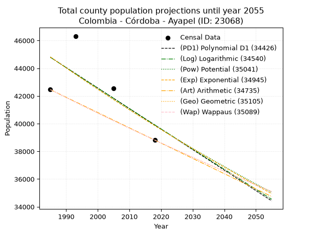
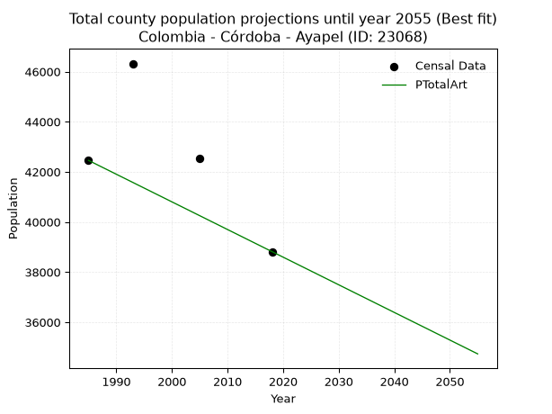
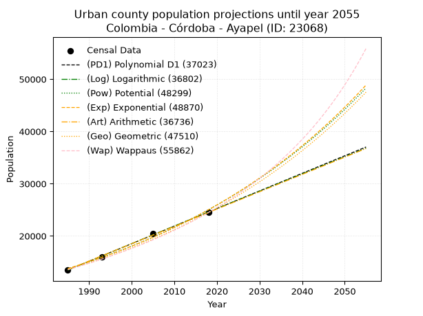
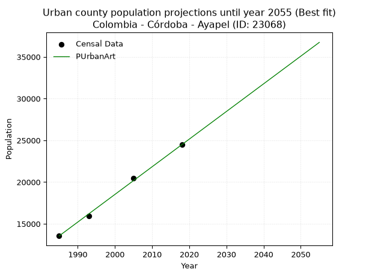
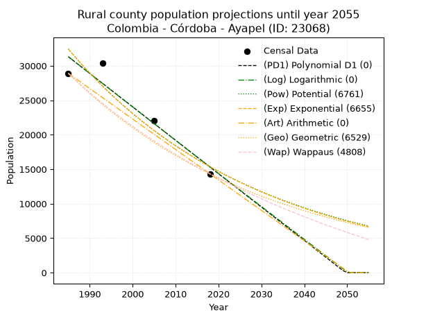
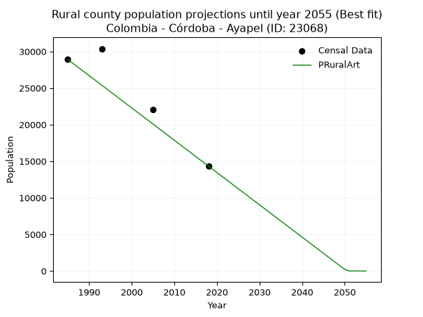

<div align="center">


</div>

# 📜 _“Population and Public Services Demand Projections (PPSD) until Year 2050 for Colombia - Córdoba - Ayapel (ID: 23068)”_
Keywords: `population` `public-service` `projection` `lineal` `polynomial` `logarithmic` `potential` `exponential` `arithmetic` `geometric` `wappaus` `dane` `colombia` `south-america`

PPSD are analytical estimates used by governments and planners to anticipate future changes in population size, age distribution, and the resulting community needs for utilities, healthcare, education, and infrastructure as sizing future water treatment facilities, electrical grids, and road networks based on spatial growth.

<div align="center">

</img>

</div>


> **General running parameters**: • app_version: _v20260806_. • Python version: _3.14.7_. • Pandas version: _3.0.5_. • NumPy version: _2.5.1_. • Creates, save and include plots into reports (create_plot): _False_. • Projection until year: _2050_. • Process polynomial degree 2 and up: _False_. • Process Wappaus: _True_. • Process Wappaus: _True_. • Set negative values to zero: _True_. • Set infinite values to zero: _True_. • Drop dataset notes: _True_. 
<div align="center">

Maps & GIS Layers: [:earth_americas:Google](http://maps.google.com/maps?q=8.313837999,-75.1460483) [:earth_americas:OSM](https://www.openstreetmap.org/#map=18/8.313837999/-75.1460483&layers=P) [:earth_americas:Bing](https://www.bing.com/maps?cp=8.313837999~-75.1460483&lvl=18) [:earth_americas:Apple](https://maps.apple.com/frame?center=8.313837999%2C-75.1460483&span=0.003%2C0.006) [:earth_americas:GISMobile](https://github.com/rcfdtools/R.GISMobile/blob/main/file/gis/CountyLayer_CO/Readme.md)

</div>


<div align="center">

```geojson
{
  "type": "Feature",
  "geometry": {
    "type": "Point", 
    "coordinates": [-75.1460483, 8.313837999]
  }, 
  "properties": {
    "Name": "Colombia - Córdoba - Ayapel (ID: 23068)"
  }
}
```

</div>


## 0. Census Data (4 records)

Census data are official statistics collected by a government about the people and housing in a country. They usually include counts of total population, age, sex, race, income, education, and jobs.

📅Global census file: [Population.xlsx](../data/Population.xlsx)

| Source   |   Year |   CountryID | CountryName   |   StateID | StateName   |   CountyID | CountyName   |   PTotal |   PUrban |   PRural |
|:---------|-------:|------------:|:--------------|----------:|:------------|-----------:|:-------------|---------:|---------:|---------:|
| DANE     |   1985 |          57 | Colombia      |        23 | Córdoba     |      23068 | Ayapel       |    42456 |    13553 |    28903 |
| DANE     |   1993 |          57 | Colombia      |        23 | Córdoba     |      23068 | Ayapel       |    46320 |    15942 |    30378 |
| DANE     |   2005 |          57 | Colombia      |        23 | Córdoba     |      23068 | Ayapel       |    42542 |    20456 |    22086 |
| DANE     |   2018 |          57 | Colombia      |        23 | Córdoba     |      23068 | Ayapel       |    38816 |    24482 |    14334 |

> 🔥Some records could had specific notes about the registered values or the corresponding urban or rural distribution.

📅[SUI-RUPS](https://www.datos.gov.co/Hacienda-y-Cr-dito-P-blico/Registro-nico-de-Prestadores-de-Servicios-P-blicos/4qkq-csdn/about_data) - Local public utility companies: [RUPS.csv](../data/RUPS.csv)

 | SERVICIO       | ESTADO    | NOMBRE                                         | NIT         | DEPARTAMENTO_DOMICILIO   | MUNICIPIO_DOMICILIO   | DIRECCION                        |   TELEFONO | EMAIL                     | TIPO_PRESTADOR                     | CLASIFICACION                  |
|:---------------|:----------|:-----------------------------------------------|:------------|:-------------------------|:----------------------|:---------------------------------|-----------:|:--------------------------|:-----------------------------------|:-------------------------------|
| ACUEDUCTO      | OPERATIVA | EMPRESAS PUBLICAS MUNICIPALES DE AYAPEL E.S.P. | 800111216-2 | CORDOBA                  | AYAPEL                | CALLE 9 No 3A-68                 |    7724166 | bederpineda27@hotmail.com | PRESTADORES FUERA DEL ART. 15 LSPD | HASTA 2500 SUSCRIPTORES        |
| ALCANTARILLADO | OPERATIVA | EMPRESAS PUBLICAS MUNICIPALES DE AYAPEL E.S.P. | 800111216-2 | CORDOBA                  | AYAPEL                | CALLE 9 No 3A-68                 |    7724166 | bederpineda27@hotmail.com | PRESTADORES FUERA DEL ART. 15 LSPD | HASTA 2500 SUSCRIPTORES        |
| ACUEDUCTO      | OPERATIVA | ADMINISTRACION PUBLICA COOPERATIVA DE AYAPEL   | 900777653-9 | CORDOBA                  | AYAPEL                | Cra 7 N° 24 -64 Barrio Santa Ana |    7705021 | bederpineda@gmail.com     | ORGANIZACION AUTORIZADA            | DESDE 2501 HASTA 5000 USUARIOS |
| ALCANTARILLADO | OPERATIVA | ADMINISTRACION PUBLICA COOPERATIVA DE AYAPEL   | 900777653-9 | CORDOBA                  | AYAPEL                | Cra 7 N° 24 -64 Barrio Santa Ana |    7705021 | bederpineda@gmail.com     | ORGANIZACION AUTORIZADA            | DESDE 2501 HASTA 5000 USUARIOS |

## 1. Total

### 1.1. Coefficients and Parameters

* (PD1) Polynomial Deg 1: -148.07788036932664, 338726.2802087456 (lineal)
* (Log) Logarithmic: -295810.3645450068, 2290990.4513820894
* (Pow) Potential: -7.098875698078832, 28.061811114906078
* (Exp) Exponential: -0.0035534924424224725, 51855426.54180169
* (Art) Arithmetic: Year diff. 2018 - 1985 = 33, Population diff. 38816 - 42456 = -3640, Annual growth = -110.3030303030303
* (Geo) Geometric: Year diff. 2018 - 1985 = 33, Population diff. 38816 - 42456 = -3640, Annual growth % = -0.0027125480950702663
* (Wap) Wappaus: i = -0.2714416534674434, Condition values only valid for < 200)

<sub>
Wappaus condition values: ['-0.00', '-0.27', '-0.54', '-0.81', '-1.09', '-1.36', '-1.63', '-1.90', '-2.17', '-2.44', '-2.71', '-2.99', '-3.26', '-3.53', '-3.80', '-4.07', '-4.34', '-4.61', '-4.89', '-5.16', '-5.43', '-5.70', '-5.97', '-6.24', '-6.51', '-6.79', '-7.06', '-7.33', '-7.60', '-7.87', '-8.14', '-8.41', '-8.69', '-8.96', '-9.23', '-9.50', '-9.77', '-10.04', '-10.31', '-10.59', '-10.86', '-11.13', '-11.40', '-11.67', '-11.94', '-12.21', '-12.49', '-12.76', '-13.03', '-13.30', '-13.57', '-13.84', '-14.11', '-14.39', '-14.66', '-14.93', '-15.20', '-15.47', '-15.74', '-16.02', '-16.29', '-16.56', '-16.83', '-17.10', '-17.37', '-17.64']
</sub>


### 1.2. Projected Dataset

|   Year |   CountyID |   PTotalPD1 |   PTotalLog |   PTotalPow |   PTotalExp |   PTotalArt |   PTotalGeo |   PTotalWap |
|-------:|-----------:|------------:|------------:|------------:|------------:|------------:|------------:|------------:|
|   1985 |      23068 |       44792 |       44792 |       44815 |       44815 |       42456 |       42456 |       42456 |
|   1986 |      23068 |       44644 |       44643 |       44655 |       44656 |       42346 |       42341 |       42341 |
|   1987 |      23068 |       44496 |       44494 |       44495 |       44497 |       42235 |       42226 |       42226 |
|   1988 |      23068 |       44347 |       44345 |       44337 |       44339 |       42125 |       42111 |       42112 |
|   1989 |      23068 |       44199 |       44196 |       44179 |       44182 |       42015 |       41997 |       41998 |
|   1990 |      23068 |       44051 |       44047 |       44021 |       44025 |       41904 |       41883 |       41884 |
|   1991 |      23068 |       43903 |       43899 |       43865 |       43869 |       41794 |       41770 |       41770 |
|   1992 |      23068 |       43755 |       43750 |       43709 |       43714 |       41684 |       41656 |       41657 |
|   1993 |      23068 |       43607 |       43602 |       43553 |       43558 |       41574 |       41543 |       41544 |
|   1994 |      23068 |       43459 |       43453 |       43398 |       43404 |       41463 |       41431 |       41431 |
|   1995 |      23068 |       43311 |       43305 |       43244 |       43250 |       41353 |       41318 |       41319 |
|   1996 |      23068 |       43163 |       43157 |       43091 |       43097 |       41243 |       41206 |       41207 |
|   1997 |      23068 |       43015 |       43009 |       42938 |       42944 |       41132 |       41094 |       41095 |
|   1998 |      23068 |       42867 |       42861 |       42785 |       42791 |       41022 |       40983 |       40984 |
|   1999 |      23068 |       42719 |       42713 |       42634 |       42640 |       40912 |       40872 |       40873 |
|   2000 |      23068 |       42571 |       42565 |       42482 |       42488 |       40801 |       40761 |       40762 |
|   2001 |      23068 |       42422 |       42417 |       42332 |       42338 |       40691 |       40650 |       40651 |
|   2002 |      23068 |       42274 |       42269 |       42182 |       42187 |       40581 |       40540 |       40541 |
|   2003 |      23068 |       42126 |       42121 |       42033 |       42038 |       40471 |       40430 |       40431 |
|   2004 |      23068 |       41978 |       41974 |       41884 |       41889 |       40360 |       40320 |       40321 |
|   2005 |      23068 |       41830 |       41826 |       41736 |       41740 |       40250 |       40211 |       40212 |
|   2006 |      23068 |       41682 |       41679 |       41589 |       41592 |       40140 |       40102 |       40103 |
|   2007 |      23068 |       41534 |       41531 |       41442 |       41445 |       40029 |       39993 |       39994 |
|   2008 |      23068 |       41386 |       41384 |       41295 |       41298 |       39919 |       39885 |       39886 |
|   2009 |      23068 |       41238 |       41237 |       41150 |       41151 |       39809 |       39777 |       39777 |
|   2010 |      23068 |       41090 |       41089 |       41005 |       41005 |       39698 |       39669 |       39669 |
|   2011 |      23068 |       40942 |       40942 |       40860 |       40860 |       39588 |       39561 |       39562 |
|   2012 |      23068 |       40794 |       40795 |       40716 |       40715 |       39478 |       39454 |       39454 |
|   2013 |      23068 |       40646 |       40648 |       40573 |       40570 |       39368 |       39347 |       39347 |
|   2014 |      23068 |       40497 |       40501 |       40430 |       40426 |       39257 |       39240 |       39241 |
|   2015 |      23068 |       40349 |       40354 |       40288 |       40283 |       39147 |       39134 |       39134 |
|   2016 |      23068 |       40201 |       40208 |       40146 |       40140 |       39037 |       39027 |       39028 |
|   2017 |      23068 |       40053 |       40061 |       40005 |       39998 |       38926 |       38922 |       38922 |
|   2018 |      23068 |       39905 |       39914 |       39865 |       39856 |       38816 |       38816 |       38816 |
|   2019 |      23068 |       39757 |       39768 |       39725 |       39714 |       38706 |       38711 |       38711 |
|   2020 |      23068 |       39609 |       39621 |       39585 |       39574 |       38595 |       38606 |       38605 |
|   2021 |      23068 |       39461 |       39475 |       39446 |       39433 |       38485 |       38501 |       38501 |
|   2022 |      23068 |       39313 |       39329 |       39308 |       39293 |       38375 |       38397 |       38396 |
|   2023 |      23068 |       39165 |       39182 |       39170 |       39154 |       38264 |       38292 |       38292 |
|   2024 |      23068 |       39017 |       39036 |       39033 |       39015 |       38154 |       38189 |       38187 |
|   2025 |      23068 |       38869 |       38890 |       38897 |       38877 |       38044 |       38085 |       38084 |
|   2026 |      23068 |       38720 |       38744 |       38760 |       38739 |       37934 |       37982 |       37980 |
|   2027 |      23068 |       38572 |       38598 |       38625 |       38601 |       37823 |       37879 |       37877 |
|   2028 |      23068 |       38424 |       38452 |       38490 |       38464 |       37713 |       37776 |       37774 |
|   2029 |      23068 |       38276 |       38306 |       38355 |       38328 |       37603 |       37673 |       37671 |
|   2030 |      23068 |       38128 |       38161 |       38222 |       38192 |       37492 |       37571 |       37569 |
|   2031 |      23068 |       37980 |       38015 |       38088 |       38056 |       37382 |       37469 |       37466 |
|   2032 |      23068 |       37832 |       37869 |       37955 |       37921 |       37272 |       37368 |       37364 |
|   2033 |      23068 |       37684 |       37724 |       37823 |       37787 |       37161 |       37266 |       37263 |
|   2034 |      23068 |       37536 |       37578 |       37691 |       37653 |       37051 |       37165 |       37161 |
|   2035 |      23068 |       37388 |       37433 |       37560 |       37519 |       36941 |       37064 |       37060 |
|   2036 |      23068 |       37240 |       37287 |       37429 |       37386 |       36831 |       36964 |       36959 |
|   2037 |      23068 |       37092 |       37142 |       37299 |       37254 |       36720 |       36864 |       36858 |
|   2038 |      23068 |       36944 |       36997 |       37169 |       37122 |       36610 |       36764 |       36758 |
|   2039 |      23068 |       36795 |       36852 |       37040 |       36990 |       36500 |       36664 |       36658 |
|   2040 |      23068 |       36647 |       36707 |       36911 |       36859 |       36389 |       36564 |       36558 |
|   2041 |      23068 |       36499 |       36562 |       36783 |       36728 |       36279 |       36465 |       36458 |
|   2042 |      23068 |       36351 |       36417 |       36655 |       36598 |       36169 |       36366 |       36359 |
|   2043 |      23068 |       36203 |       36272 |       36528 |       36468 |       36058 |       36268 |       36260 |
|   2044 |      23068 |       36055 |       36127 |       36401 |       36338 |       35948 |       36169 |       36161 |
|   2045 |      23068 |       35907 |       35983 |       36275 |       36210 |       35838 |       36071 |       36062 |
|   2046 |      23068 |       35759 |       35838 |       36150 |       36081 |       35728 |       35973 |       35964 |
|   2047 |      23068 |       35611 |       35694 |       36024 |       35953 |       35617 |       35876 |       35865 |
|   2048 |      23068 |       35463 |       35549 |       35900 |       35826 |       35507 |       35778 |       35768 |
|   2049 |      23068 |       35315 |       35405 |       35776 |       35699 |       35397 |       35681 |       35670 |
|   2050 |      23068 |       35167 |       35260 |       35652 |       35572 |       35286 |       35585 |       35572 |
<div align="center">

</img>

</div>


### 1.3. Best fit with absolute and relative error (%)

Relative error puts that difference into context by dividing the absolute error by the true value, creating a unitless ratio or percentage that shows the scale of the mistake.

Absolute and relative error

|   Year | Source   |   CountryID | CountryName   |   StateID | StateName   |   CountyID_x | CountyName   |   PTotal |   PUrban |   PRural |   CountyID_y |   PTotalPD1 |   PTotalLog |   PTotalPow |   PTotalExp |   PTotalArt |   PTotalGeo |   PTotalWap |   PTotalPD1AbsError |   PTotalLogAbsError |   PTotalPowAbsError |   PTotalExpAbsError |   PTotalArtAbsError |   PTotalGeoAbsError |   PTotalWapAbsError |   PTotalPD1RelError |   PTotalLogRelError |   PTotalPowRelError |   PTotalExpRelError |   PTotalArtRelError |   PTotalGeoRelError |   PTotalWapRelError |
|-------:|:---------|------------:|:--------------|----------:|:------------|-------------:|:-------------|---------:|---------:|---------:|-------------:|------------:|------------:|------------:|------------:|------------:|------------:|------------:|--------------------:|--------------------:|--------------------:|--------------------:|--------------------:|--------------------:|--------------------:|--------------------:|--------------------:|--------------------:|--------------------:|--------------------:|--------------------:|--------------------:|
|   1985 | DANE     |          57 | Colombia      |        23 | Córdoba     |        23068 | Ayapel       |    42456 |    13553 |    28903 |        23068 |       44792 |       44792 |       44815 |       44815 |       42456 |       42456 |       42456 |                2336 |                2336 |                2359 |                2359 |                   0 |                   0 |                   0 |             5.50217 |             5.50217 |             5.55634 |             5.55634 |             0       |             0       |             0       |
|   1993 | DANE     |          57 | Colombia      |        23 | Córdoba     |        23068 | Ayapel       |    46320 |    15942 |    30378 |        23068 |       43607 |       43602 |       43553 |       43558 |       41574 |       41543 |       41544 |                2713 |                2718 |                2767 |                2762 |                4746 |                4777 |                4776 |             5.85708 |             5.86788 |             5.97366 |             5.96287 |            10.2461  |            10.313   |            10.3109  |
|   2005 | DANE     |          57 | Colombia      |        23 | Córdoba     |        23068 | Ayapel       |    42542 |    20456 |    22086 |        23068 |       41830 |       41826 |       41736 |       41740 |       40250 |       40211 |       40212 |                 712 |                 716 |                 806 |                 802 |                2292 |                2331 |                2330 |             1.67364 |             1.68304 |             1.8946  |             1.8852  |             5.38762 |             5.47929 |             5.47694 |
|   2018 | DANE     |          57 | Colombia      |        23 | Córdoba     |        23068 | Ayapel       |    38816 |    24482 |    14334 |        23068 |       39905 |       39914 |       39865 |       39856 |       38816 |       38816 |       38816 |                1089 |                1098 |                1049 |                1040 |                   0 |                   0 |                   0 |             2.80554 |             2.82873 |             2.70249 |             2.67931 |             0       |             0       |             0       |

Relative error mean

| Method    |   RelError | Best   |
|:----------|-----------:|:-------|
| PTotalPD1 |    3.95961 |        |
| PTotalLog |    3.97045 |        |
| PTotalPow |    4.03177 |        |
| PTotalExp |    4.02093 |        |
| PTotalArt |    3.90843 | True   |
| PTotalGeo |    3.94808 |        |
| PTotalWap |    3.94696 |        |

💙Best method: _**PTotalArt**_
<div align="center">

</img>

</div>


### 1.4. Fresh water supply demand in liters per capita per day (lpcd)

The fresh water supply demand typically ranges from 100 to 300 liters per capita per day (lpcd) for standard domestic and municipal planning, though absolute survival minimums set by the World Health Organization are as low as 7.5 to 20 liters per day, and total consumption in high-income nations can exceed 400 liters.

> `CZ`: Level in meters above the sea level (masl)<br> `WS`: Fresh water supply demand in liters per capita per day (lpcd or l/h/d)<br> `WSAll`: Zonal fresh water supply demand in liters per second (l/s)<br> `A`: Zonal area in square meters<br> `DP`: Population density (people/hectare or p/ha)

Reference values (RAS Colombia)

|    CZ |   WS |
|------:|-----:|
|  1000 |  120 |
|  2000 |  130 |
| 99999 |  140 |

County shapefile geometry properties and water supply values

|   CountyID |      ATotal |   CZTotal |   WSTotal |
|-----------:|------------:|----------:|----------:|
|      23068 | 1.96373e+09 |   37.1468 |       120 |

Projected values for best method: PTotalArt

|   CountyID |   Year |   PTotalArt |   DPTotal |   WSTotal |   WSTotalAll |
|-----------:|-------:|------------:|----------:|----------:|-------------:|
|      23068 |   1985 |       42456 |      0.22 |       120 |      58.9667 |
|      23068 |   1986 |       42346 |      0.22 |       120 |      58.8139 |
|      23068 |   1987 |       42235 |      0.22 |       120 |      58.6597 |
|      23068 |   1988 |       42125 |      0.21 |       120 |      58.5069 |
|      23068 |   1989 |       42015 |      0.21 |       120 |      58.3542 |
|      23068 |   1990 |       41904 |      0.21 |       120 |      58.2    |
|      23068 |   1991 |       41794 |      0.21 |       120 |      58.0472 |
|      23068 |   1992 |       41684 |      0.21 |       120 |      57.8944 |
|      23068 |   1993 |       41574 |      0.21 |       120 |      57.7417 |
|      23068 |   1994 |       41463 |      0.21 |       120 |      57.5875 |
|      23068 |   1995 |       41353 |      0.21 |       120 |      57.4347 |
|      23068 |   1996 |       41243 |      0.21 |       120 |      57.2819 |
|      23068 |   1997 |       41132 |      0.21 |       120 |      57.1278 |
|      23068 |   1998 |       41022 |      0.21 |       120 |      56.975  |
|      23068 |   1999 |       40912 |      0.21 |       120 |      56.8222 |
|      23068 |   2000 |       40801 |      0.21 |       120 |      56.6681 |
|      23068 |   2001 |       40691 |      0.21 |       120 |      56.5153 |
|      23068 |   2002 |       40581 |      0.21 |       120 |      56.3625 |
|      23068 |   2003 |       40471 |      0.21 |       120 |      56.2097 |
|      23068 |   2004 |       40360 |      0.21 |       120 |      56.0556 |
|      23068 |   2005 |       40250 |      0.2  |       120 |      55.9028 |
|      23068 |   2006 |       40140 |      0.2  |       120 |      55.75   |
|      23068 |   2007 |       40029 |      0.2  |       120 |      55.5958 |
|      23068 |   2008 |       39919 |      0.2  |       120 |      55.4431 |
|      23068 |   2009 |       39809 |      0.2  |       120 |      55.2903 |
|      23068 |   2010 |       39698 |      0.2  |       120 |      55.1361 |
|      23068 |   2011 |       39588 |      0.2  |       120 |      54.9833 |
|      23068 |   2012 |       39478 |      0.2  |       120 |      54.8306 |
|      23068 |   2013 |       39368 |      0.2  |       120 |      54.6778 |
|      23068 |   2014 |       39257 |      0.2  |       120 |      54.5236 |
|      23068 |   2015 |       39147 |      0.2  |       120 |      54.3708 |
|      23068 |   2016 |       39037 |      0.2  |       120 |      54.2181 |
|      23068 |   2017 |       38926 |      0.2  |       120 |      54.0639 |
|      23068 |   2018 |       38816 |      0.2  |       120 |      53.9111 |
|      23068 |   2019 |       38706 |      0.2  |       120 |      53.7583 |
|      23068 |   2020 |       38595 |      0.2  |       120 |      53.6042 |
|      23068 |   2021 |       38485 |      0.2  |       120 |      53.4514 |
|      23068 |   2022 |       38375 |      0.2  |       120 |      53.2986 |
|      23068 |   2023 |       38264 |      0.19 |       120 |      53.1444 |
|      23068 |   2024 |       38154 |      0.19 |       120 |      52.9917 |
|      23068 |   2025 |       38044 |      0.19 |       120 |      52.8389 |
|      23068 |   2026 |       37934 |      0.19 |       120 |      52.6861 |
|      23068 |   2027 |       37823 |      0.19 |       120 |      52.5319 |
|      23068 |   2028 |       37713 |      0.19 |       120 |      52.3792 |
|      23068 |   2029 |       37603 |      0.19 |       120 |      52.2264 |
|      23068 |   2030 |       37492 |      0.19 |       120 |      52.0722 |
|      23068 |   2031 |       37382 |      0.19 |       120 |      51.9194 |
|      23068 |   2032 |       37272 |      0.19 |       120 |      51.7667 |
|      23068 |   2033 |       37161 |      0.19 |       120 |      51.6125 |
|      23068 |   2034 |       37051 |      0.19 |       120 |      51.4597 |
|      23068 |   2035 |       36941 |      0.19 |       120 |      51.3069 |
|      23068 |   2036 |       36831 |      0.19 |       120 |      51.1542 |
|      23068 |   2037 |       36720 |      0.19 |       120 |      51      |
|      23068 |   2038 |       36610 |      0.19 |       120 |      50.8472 |
|      23068 |   2039 |       36500 |      0.19 |       120 |      50.6944 |
|      23068 |   2040 |       36389 |      0.19 |       120 |      50.5403 |
|      23068 |   2041 |       36279 |      0.18 |       120 |      50.3875 |
|      23068 |   2042 |       36169 |      0.18 |       120 |      50.2347 |
|      23068 |   2043 |       36058 |      0.18 |       120 |      50.0806 |
|      23068 |   2044 |       35948 |      0.18 |       120 |      49.9278 |
|      23068 |   2045 |       35838 |      0.18 |       120 |      49.775  |
|      23068 |   2046 |       35728 |      0.18 |       120 |      49.6222 |
|      23068 |   2047 |       35617 |      0.18 |       120 |      49.4681 |
|      23068 |   2048 |       35507 |      0.18 |       120 |      49.3153 |
|      23068 |   2049 |       35397 |      0.18 |       120 |      49.1625 |
|      23068 |   2050 |       35286 |      0.18 |       120 |      49.0083 |

## 2. Urban

### 2.1. Coefficients and Parameters

* (PD1) Polynomial Deg 1: 336.3448414291421, -654165.5190686416 (lineal)
* (Log) Logarithmic: 673250.306007448, -5098772.721051974
* (Pow) Potential: 36.24563453177068, -115.39102689257696
* (Exp) Exponential: 0.018104382601341385, 3.398825598501141e-12
* (Art) Arithmetic: Year diff. 2018 - 1985 = 33, Population diff. 24482 - 13553 = 10929, Annual growth = 331.1818181818182
* (Geo) Geometric: Year diff. 2018 - 1985 = 33, Population diff. 24482 - 13553 = 10929, Annual growth % = 0.01808060813459922
* (Wap) Wappaus: i = 1.7414582262748426, Condition values only valid for < 200)

<sub>
Wappaus condition values: ['0.00', '1.74', '3.48', '5.22', '6.97', '8.71', '10.45', '12.19', '13.93', '15.67', '17.41', '19.16', '20.90', '22.64', '24.38', '26.12', '27.86', '29.60', '31.35', '33.09', '34.83', '36.57', '38.31', '40.05', '41.79', '43.54', '45.28', '47.02', '48.76', '50.50', '52.24', '53.99', '55.73', '57.47', '59.21', '60.95', '62.69', '64.43', '66.18', '67.92', '69.66', '71.40', '73.14', '74.88', '76.62', '78.37', '80.11', '81.85', '83.59', '85.33', '87.07', '88.81', '90.56', '92.30', '94.04', '95.78', '97.52', '99.26', '101.00', '102.75', '104.49', '106.23', '107.97', '109.71', '111.45', '113.19']
</sub>


### 2.2. Projected Dataset

|   Year |   CountyID |   PUrbanPD1 |   PUrbanLog |   PUrbanPow |   PUrbanExp |   PUrbanArt |   PUrbanGeo |   PUrbanWap |
|-------:|-----------:|------------:|------------:|------------:|------------:|------------:|------------:|------------:|
|   1985 |      23068 |       13479 |       13469 |       13753 |       13761 |       13553 |       13553 |       13553 |
|   1986 |      23068 |       13815 |       13808 |       14006 |       14013 |       13884 |       13798 |       13791 |
|   1987 |      23068 |       14152 |       14147 |       14264 |       14269 |       14215 |       14048 |       14033 |
|   1988 |      23068 |       14488 |       14486 |       14527 |       14529 |       14547 |       14302 |       14280 |
|   1989 |      23068 |       14824 |       14824 |       14794 |       14795 |       14878 |       14560 |       14531 |
|   1990 |      23068 |       15161 |       15162 |       15066 |       15065 |       15209 |       14823 |       14787 |
|   1991 |      23068 |       15497 |       15501 |       15343 |       15340 |       15540 |       15091 |       15047 |
|   1992 |      23068 |       15833 |       15839 |       15625 |       15620 |       15871 |       15364 |       15312 |
|   1993 |      23068 |       16170 |       16177 |       15911 |       15906 |       16202 |       15642 |       15583 |
|   1994 |      23068 |       16506 |       16514 |       16203 |       16196 |       16534 |       15925 |       15858 |
|   1995 |      23068 |       16842 |       16852 |       16501 |       16492 |       16865 |       16213 |       16138 |
|   1996 |      23068 |       17179 |       17189 |       16803 |       16794 |       17196 |       16506 |       16424 |
|   1997 |      23068 |       17515 |       17527 |       17111 |       17100 |       17527 |       16804 |       16716 |
|   1998 |      23068 |       17851 |       17864 |       17424 |       17413 |       17858 |       17108 |       17013 |
|   1999 |      23068 |       18188 |       18200 |       17743 |       17731 |       18190 |       17417 |       17316 |
|   2000 |      23068 |       18524 |       18537 |       18068 |       18055 |       18521 |       17732 |       17625 |
|   2001 |      23068 |       18861 |       18874 |       18398 |       18385 |       18852 |       18053 |       17941 |
|   2002 |      23068 |       19197 |       19210 |       18734 |       18721 |       19183 |       18379 |       18262 |
|   2003 |      23068 |       19533 |       19546 |       19076 |       19063 |       19514 |       18712 |       18591 |
|   2004 |      23068 |       19870 |       19882 |       19425 |       19411 |       19845 |       19050 |       18926 |
|   2005 |      23068 |       20206 |       20218 |       19779 |       19766 |       20177 |       19395 |       19269 |
|   2006 |      23068 |       20542 |       20554 |       20140 |       20127 |       20508 |       19745 |       19619 |
|   2007 |      23068 |       20879 |       20889 |       20507 |       20494 |       20839 |       20102 |       19976 |
|   2008 |      23068 |       21215 |       21225 |       20880 |       20869 |       21170 |       20466 |       20341 |
|   2009 |      23068 |       21551 |       21560 |       21261 |       21250 |       21501 |       20836 |       20714 |
|   2010 |      23068 |       21888 |       21895 |       21648 |       21638 |       21833 |       21212 |       21095 |
|   2011 |      23068 |       22224 |       22230 |       22041 |       22034 |       22164 |       21596 |       21485 |
|   2012 |      23068 |       22560 |       22565 |       22442 |       22436 |       22495 |       21986 |       21884 |
|   2013 |      23068 |       22897 |       22899 |       22850 |       22846 |       22826 |       22384 |       22292 |
|   2014 |      23068 |       23233 |       23234 |       23265 |       23263 |       23157 |       22789 |       22710 |
|   2015 |      23068 |       23569 |       23568 |       23687 |       23688 |       23488 |       23201 |       23137 |
|   2016 |      23068 |       23906 |       23902 |       24117 |       24121 |       23820 |       23620 |       23575 |
|   2017 |      23068 |       24242 |       24236 |       24555 |       24562 |       24151 |       24047 |       24023 |
|   2018 |      23068 |       24578 |       24569 |       25000 |       25011 |       24482 |       24482 |       24482 |
|   2019 |      23068 |       24915 |       24903 |       25453 |       25467 |       24813 |       24925 |       24952 |
|   2020 |      23068 |       25251 |       25236 |       25914 |       25933 |       25144 |       25375 |       25435 |
|   2021 |      23068 |       25587 |       25569 |       26383 |       26407 |       25476 |       25834 |       25929 |
|   2022 |      23068 |       25924 |       25903 |       26860 |       26889 |       25807 |       26301 |       26436 |
|   2023 |      23068 |       26260 |       26235 |       27346 |       27380 |       26138 |       26777 |       26957 |
|   2024 |      23068 |       26596 |       26568 |       27840 |       27880 |       26469 |       27261 |       27491 |
|   2025 |      23068 |       26933 |       26901 |       28343 |       28390 |       26800 |       27754 |       28039 |
|   2026 |      23068 |       27269 |       27233 |       28855 |       28908 |       27131 |       28256 |       28602 |
|   2027 |      23068 |       27605 |       27565 |       29376 |       29437 |       27463 |       28766 |       29181 |
|   2028 |      23068 |       27942 |       27897 |       29905 |       29974 |       27794 |       29287 |       29776 |
|   2029 |      23068 |       28278 |       28229 |       30445 |       30522 |       28125 |       29816 |       30388 |
|   2030 |      23068 |       28615 |       28561 |       30993 |       31080 |       28456 |       30355 |       31017 |
|   2031 |      23068 |       28951 |       28893 |       31551 |       31647 |       28787 |       30904 |       31664 |
|   2032 |      23068 |       29287 |       29224 |       32119 |       32226 |       29119 |       31463 |       32330 |
|   2033 |      23068 |       29624 |       29555 |       32697 |       32814 |       29450 |       32032 |       33017 |
|   2034 |      23068 |       29960 |       29886 |       33285 |       33414 |       29781 |       32611 |       33724 |
|   2035 |      23068 |       30296 |       30217 |       33884 |       34024 |       30112 |       33200 |       34453 |
|   2036 |      23068 |       30633 |       30548 |       34492 |       34646 |       30443 |       33801 |       35205 |
|   2037 |      23068 |       30969 |       30879 |       35112 |       35279 |       30774 |       34412 |       35981 |
|   2038 |      23068 |       31305 |       31209 |       35742 |       35923 |       31106 |       35034 |       36782 |
|   2039 |      23068 |       31642 |       31539 |       36383 |       36580 |       31437 |       35667 |       37609 |
|   2040 |      23068 |       31978 |       31869 |       37036 |       37248 |       31768 |       36312 |       38464 |
|   2041 |      23068 |       32314 |       32199 |       37699 |       37928 |       32099 |       36969 |       39348 |
|   2042 |      23068 |       32651 |       32529 |       38375 |       38621 |       32430 |       37637 |       40262 |
|   2043 |      23068 |       32987 |       32859 |       39062 |       39327 |       32762 |       38318 |       41209 |
|   2044 |      23068 |       33323 |       33188 |       39761 |       40045 |       33093 |       39011 |       42190 |
|   2045 |      23068 |       33660 |       33517 |       40472 |       40777 |       33424 |       39716 |       43206 |
|   2046 |      23068 |       33996 |       33847 |       41195 |       41522 |       33755 |       40434 |       44260 |
|   2047 |      23068 |       34332 |       34176 |       41931 |       42280 |       34086 |       41165 |       45354 |
|   2048 |      23068 |       34669 |       34504 |       42680 |       43053 |       34417 |       41909 |       46490 |
|   2049 |      23068 |       35005 |       34833 |       43442 |       43839 |       34749 |       42667 |       47671 |
|   2050 |      23068 |       35341 |       35161 |       44217 |       44640 |       35080 |       43439 |       48899 |
<div align="center">

</img>

</div>


### 2.3. Best fit with absolute and relative error (%)

Relative error puts that difference into context by dividing the absolute error by the true value, creating a unitless ratio or percentage that shows the scale of the mistake.

Absolute and relative error

|   Year | Source   |   CountryID | CountryName   |   StateID | StateName   |   CountyID_x | CountyName   |   PTotal |   PUrban |   PRural |   CountyID_y |   PUrbanPD1 |   PUrbanLog |   PUrbanPow |   PUrbanExp |   PUrbanArt |   PUrbanGeo |   PUrbanWap |   PUrbanPD1AbsError |   PUrbanLogAbsError |   PUrbanPowAbsError |   PUrbanExpAbsError |   PUrbanArtAbsError |   PUrbanGeoAbsError |   PUrbanWapAbsError |   PUrbanPD1RelError |   PUrbanLogRelError |   PUrbanPowRelError |   PUrbanExpRelError |   PUrbanArtRelError |   PUrbanGeoRelError |   PUrbanWapRelError |
|-------:|:---------|------------:|:--------------|----------:|:------------|-------------:|:-------------|---------:|---------:|---------:|-------------:|------------:|------------:|------------:|------------:|------------:|------------:|------------:|--------------------:|--------------------:|--------------------:|--------------------:|--------------------:|--------------------:|--------------------:|--------------------:|--------------------:|--------------------:|--------------------:|--------------------:|--------------------:|--------------------:|
|   1985 | DANE     |          57 | Colombia      |        23 | Córdoba     |        23068 | Ayapel       |    42456 |    13553 |    28903 |        23068 |       13479 |       13469 |       13753 |       13761 |       13553 |       13553 |       13553 |                  74 |                  84 |                 200 |                 208 |                   0 |                   0 |                   0 |            0.546005 |            0.619789 |            1.47569  |            1.53472  |             0       |             0       |             0       |
|   1993 | DANE     |          57 | Colombia      |        23 | Córdoba     |        23068 | Ayapel       |    46320 |    15942 |    30378 |        23068 |       16170 |       16177 |       15911 |       15906 |       16202 |       15642 |       15583 |                 228 |                 235 |                  31 |                  36 |                 260 |                 300 |                 359 |            1.43018  |            1.47409  |            0.194455 |            0.225819 |             1.63091 |             1.88182 |             2.25191 |
|   2005 | DANE     |          57 | Colombia      |        23 | Córdoba     |        23068 | Ayapel       |    42542 |    20456 |    22086 |        23068 |       20206 |       20218 |       19779 |       19766 |       20177 |       19395 |       19269 |                 250 |                 238 |                 677 |                 690 |                 279 |                1061 |                1187 |            1.22214  |            1.16347  |            3.30954  |            3.37309  |             1.3639  |             5.18674 |             5.8027  |
|   2018 | DANE     |          57 | Colombia      |        23 | Córdoba     |        23068 | Ayapel       |    38816 |    24482 |    14334 |        23068 |       24578 |       24569 |       25000 |       25011 |       24482 |       24482 |       24482 |                  96 |                  87 |                 518 |                 529 |                   0 |                   0 |                   0 |            0.392125 |            0.355363 |            2.11584  |            2.16077  |             0       |             0       |             0       |

Relative error mean

| Method    |   RelError | Best   |
|:----------|-----------:|:-------|
| PUrbanPD1 |   0.897612 |        |
| PUrbanLog |   0.90318  |        |
| PUrbanPow |   1.77388  |        |
| PUrbanExp |   1.8236   |        |
| PUrbanArt |   0.748704 | True   |
| PUrbanGeo |   1.76714  |        |
| PUrbanWap |   2.01365  |        |

💙Best method: _**PUrbanArt**_
<div align="center">

</img>

</div>


### 2.4. Fresh water supply demand in liters per capita per day (lpcd)

The fresh water supply demand typically ranges from 100 to 300 liters per capita per day (lpcd) for standard domestic and municipal planning, though absolute survival minimums set by the World Health Organization are as low as 7.5 to 20 liters per day, and total consumption in high-income nations can exceed 400 liters.

> `CZ`: Level in meters above the sea level (masl)<br> `WS`: Fresh water supply demand in liters per capita per day (lpcd or l/h/d)<br> `WSAll`: Zonal fresh water supply demand in liters per second (l/s)<br> `A`: Zonal area in square meters<br> `DP`: Population density (people/hectare or p/ha)

Reference values (RAS Colombia)

|    CZ |   WS |
|------:|-----:|
|  1000 |  120 |
|  2000 |  130 |
| 99999 |  140 |

County shapefile geometry properties and water supply values

|   CountyID |      AUrban |   CZUrban |   WSUrban |
|-----------:|------------:|----------:|----------:|
|      23068 | 1.41662e+07 |   27.7014 |       120 |

Projected values for best method: PUrbanArt

|   CountyID |   Year |   PUrbanArt |   DPUrban |   WSUrban |   WSUrbanAll |
|-----------:|-------:|------------:|----------:|----------:|-------------:|
|      23068 |   1985 |       13553 |      9.57 |       120 |      18.8236 |
|      23068 |   1986 |       13884 |      9.8  |       120 |      19.2833 |
|      23068 |   1987 |       14215 |     10.03 |       120 |      19.7431 |
|      23068 |   1988 |       14547 |     10.27 |       120 |      20.2042 |
|      23068 |   1989 |       14878 |     10.5  |       120 |      20.6639 |
|      23068 |   1990 |       15209 |     10.74 |       120 |      21.1236 |
|      23068 |   1991 |       15540 |     10.97 |       120 |      21.5833 |
|      23068 |   1992 |       15871 |     11.2  |       120 |      22.0431 |
|      23068 |   1993 |       16202 |     11.44 |       120 |      22.5028 |
|      23068 |   1994 |       16534 |     11.67 |       120 |      22.9639 |
|      23068 |   1995 |       16865 |     11.91 |       120 |      23.4236 |
|      23068 |   1996 |       17196 |     12.14 |       120 |      23.8833 |
|      23068 |   1997 |       17527 |     12.37 |       120 |      24.3431 |
|      23068 |   1998 |       17858 |     12.61 |       120 |      24.8028 |
|      23068 |   1999 |       18190 |     12.84 |       120 |      25.2639 |
|      23068 |   2000 |       18521 |     13.07 |       120 |      25.7236 |
|      23068 |   2001 |       18852 |     13.31 |       120 |      26.1833 |
|      23068 |   2002 |       19183 |     13.54 |       120 |      26.6431 |
|      23068 |   2003 |       19514 |     13.78 |       120 |      27.1028 |
|      23068 |   2004 |       19845 |     14.01 |       120 |      27.5625 |
|      23068 |   2005 |       20177 |     14.24 |       120 |      28.0236 |
|      23068 |   2006 |       20508 |     14.48 |       120 |      28.4833 |
|      23068 |   2007 |       20839 |     14.71 |       120 |      28.9431 |
|      23068 |   2008 |       21170 |     14.94 |       120 |      29.4028 |
|      23068 |   2009 |       21501 |     15.18 |       120 |      29.8625 |
|      23068 |   2010 |       21833 |     15.41 |       120 |      30.3236 |
|      23068 |   2011 |       22164 |     15.65 |       120 |      30.7833 |
|      23068 |   2012 |       22495 |     15.88 |       120 |      31.2431 |
|      23068 |   2013 |       22826 |     16.11 |       120 |      31.7028 |
|      23068 |   2014 |       23157 |     16.35 |       120 |      32.1625 |
|      23068 |   2015 |       23488 |     16.58 |       120 |      32.6222 |
|      23068 |   2016 |       23820 |     16.81 |       120 |      33.0833 |
|      23068 |   2017 |       24151 |     17.05 |       120 |      33.5431 |
|      23068 |   2018 |       24482 |     17.28 |       120 |      34.0028 |
|      23068 |   2019 |       24813 |     17.52 |       120 |      34.4625 |
|      23068 |   2020 |       25144 |     17.75 |       120 |      34.9222 |
|      23068 |   2021 |       25476 |     17.98 |       120 |      35.3833 |
|      23068 |   2022 |       25807 |     18.22 |       120 |      35.8431 |
|      23068 |   2023 |       26138 |     18.45 |       120 |      36.3028 |
|      23068 |   2024 |       26469 |     18.68 |       120 |      36.7625 |
|      23068 |   2025 |       26800 |     18.92 |       120 |      37.2222 |
|      23068 |   2026 |       27131 |     19.15 |       120 |      37.6819 |
|      23068 |   2027 |       27463 |     19.39 |       120 |      38.1431 |
|      23068 |   2028 |       27794 |     19.62 |       120 |      38.6028 |
|      23068 |   2029 |       28125 |     19.85 |       120 |      39.0625 |
|      23068 |   2030 |       28456 |     20.09 |       120 |      39.5222 |
|      23068 |   2031 |       28787 |     20.32 |       120 |      39.9819 |
|      23068 |   2032 |       29119 |     20.56 |       120 |      40.4431 |
|      23068 |   2033 |       29450 |     20.79 |       120 |      40.9028 |
|      23068 |   2034 |       29781 |     21.02 |       120 |      41.3625 |
|      23068 |   2035 |       30112 |     21.26 |       120 |      41.8222 |
|      23068 |   2036 |       30443 |     21.49 |       120 |      42.2819 |
|      23068 |   2037 |       30774 |     21.72 |       120 |      42.7417 |
|      23068 |   2038 |       31106 |     21.96 |       120 |      43.2028 |
|      23068 |   2039 |       31437 |     22.19 |       120 |      43.6625 |
|      23068 |   2040 |       31768 |     22.43 |       120 |      44.1222 |
|      23068 |   2041 |       32099 |     22.66 |       120 |      44.5819 |
|      23068 |   2042 |       32430 |     22.89 |       120 |      45.0417 |
|      23068 |   2043 |       32762 |     23.13 |       120 |      45.5028 |
|      23068 |   2044 |       33093 |     23.36 |       120 |      45.9625 |
|      23068 |   2045 |       33424 |     23.59 |       120 |      46.4222 |
|      23068 |   2046 |       33755 |     23.83 |       120 |      46.8819 |
|      23068 |   2047 |       34086 |     24.06 |       120 |      47.3417 |
|      23068 |   2048 |       34417 |     24.3  |       120 |      47.8014 |
|      23068 |   2049 |       34749 |     24.53 |       120 |      48.2625 |
|      23068 |   2050 |       35080 |     24.76 |       120 |      48.7222 |

## 3. Rural

### 3.1. Coefficients and Parameters

* (PD1) Polynomial Deg 1: -484.422721798469, 992891.7992773877 (lineal)
* (Log) Logarithmic: -969060.6705524554, 7389763.1724340655
* (Pow) Potential: -45.244590260544406, 153.71682031363267
* (Exp) Exponential: -0.022620448752030158, 1.0264192029915389e+24
* (Art) Arithmetic: Year diff. 2018 - 1985 = 33, Population diff. 14334 - 28903 = -14569, Annual growth = -441.4848484848485
* (Geo) Geometric: Year diff. 2018 - 1985 = 33, Population diff. 14334 - 28903 = -14569, Annual growth % = -0.021027620923040335
* (Wap) Wappaus: i = -2.0421622614189165, Condition values only valid for < 200)

<sub>
Wappaus condition values: ['-0.00', '-2.04', '-4.08', '-6.13', '-8.17', '-10.21', '-12.25', '-14.30', '-16.34', '-18.38', '-20.42', '-22.46', '-24.51', '-26.55', '-28.59', '-30.63', '-32.67', '-34.72', '-36.76', '-38.80', '-40.84', '-42.89', '-44.93', '-46.97', '-49.01', '-51.05', '-53.10', '-55.14', '-57.18', '-59.22', '-61.26', '-63.31', '-65.35', '-67.39', '-69.43', '-71.48', '-73.52', '-75.56', '-77.60', '-79.64', '-81.69', '-83.73', '-85.77', '-87.81', '-89.86', '-91.90', '-93.94', '-95.98', '-98.02', '-100.07', '-102.11', '-104.15', '-106.19', '-108.23', '-110.28', '-112.32', '-114.36', '-116.40', '-118.45', '-120.49', '-122.53', '-124.57', '-126.61', '-128.66', '-130.70', '-132.74']
</sub>


### 3.2. Projected Dataset

|   Year |   CountyID |   PRuralPD1 |   PRuralLog |   PRuralPow |   PRuralExp |   PRuralArt |   PRuralGeo |   PRuralWap |
|-------:|-----------:|------------:|------------:|------------:|------------:|------------:|------------:|------------:|
|   1985 |      23068 |       31313 |       31323 |       32434 |       32420 |       28903 |       28903 |       28903 |
|   1986 |      23068 |       30828 |       30835 |       31703 |       31695 |       28462 |       28295 |       28319 |
|   1987 |      23068 |       30344 |       30347 |       30989 |       30986 |       28020 |       27700 |       27746 |
|   1988 |      23068 |       29859 |       29859 |       30292 |       30293 |       27579 |       27118 |       27185 |
|   1989 |      23068 |       29375 |       29372 |       29610 |       29615 |       27137 |       26548 |       26635 |
|   1990 |      23068 |       28891 |       28885 |       28944 |       28953 |       26696 |       25989 |       26095 |
|   1991 |      23068 |       28406 |       28398 |       28294 |       28305 |       26254 |       25443 |       25566 |
|   1992 |      23068 |       27922 |       27912 |       27658 |       27672 |       25813 |       24908 |       25047 |
|   1993 |      23068 |       27437 |       27425 |       27037 |       27053 |       25371 |       24384 |       24538 |
|   1994 |      23068 |       26953 |       26939 |       26431 |       26448 |       24930 |       23871 |       24038 |
|   1995 |      23068 |       26468 |       26453 |       25838 |       25857 |       24488 |       23369 |       23547 |
|   1996 |      23068 |       25984 |       25968 |       25259 |       25278 |       24047 |       22878 |       23066 |
|   1997 |      23068 |       25500 |       25482 |       24693 |       24713 |       23605 |       22397 |       22593 |
|   1998 |      23068 |       25015 |       24997 |       24140 |       24160 |       23164 |       21926 |       22129 |
|   1999 |      23068 |       24531 |       24512 |       23599 |       23620 |       22722 |       21465 |       21673 |
|   2000 |      23068 |       24046 |       24028 |       23071 |       23092 |       22281 |       21014 |       21225 |
|   2001 |      23068 |       23562 |       23543 |       22555 |       22575 |       21839 |       20572 |       20785 |
|   2002 |      23068 |       23078 |       23059 |       22051 |       22070 |       21398 |       20139 |       20353 |
|   2003 |      23068 |       22593 |       22575 |       21559 |       21576 |       20956 |       19716 |       19928 |
|   2004 |      23068 |       22109 |       22091 |       21077 |       21094 |       20515 |       19301 |       19511 |
|   2005 |      23068 |       21624 |       21608 |       20607 |       20622 |       20073 |       18895 |       19100 |
|   2006 |      23068 |       21140 |       21125 |       20147 |       20161 |       19632 |       18498 |       18696 |
|   2007 |      23068 |       20655 |       20642 |       19698 |       19710 |       19190 |       18109 |       18300 |
|   2008 |      23068 |       20171 |       20159 |       19259 |       19269 |       18749 |       17728 |       17909 |
|   2009 |      23068 |       19687 |       19677 |       18830 |       18838 |       18307 |       17355 |       17525 |
|   2010 |      23068 |       19202 |       19194 |       18411 |       18417 |       17866 |       16990 |       17148 |
|   2011 |      23068 |       18718 |       18712 |       18001 |       18005 |       17424 |       16633 |       16776 |
|   2012 |      23068 |       18233 |       18231 |       17601 |       17602 |       16983 |       16283 |       16410 |
|   2013 |      23068 |       17749 |       17749 |       17209 |       17208 |       16541 |       15941 |       16051 |
|   2014 |      23068 |       17264 |       17268 |       16827 |       16824 |       16100 |       15606 |       15696 |
|   2015 |      23068 |       16780 |       16787 |       16453 |       16447 |       15658 |       15278 |       15348 |
|   2016 |      23068 |       16296 |       16306 |       16088 |       16079 |       15217 |       14956 |       15005 |
|   2017 |      23068 |       15811 |       15825 |       15731 |       15720 |       14775 |       14642 |       14667 |
|   2018 |      23068 |       15327 |       15345 |       15382 |       15368 |       14334 |       14334 |       14334 |
|   2019 |      23068 |       14842 |       14865 |       15041 |       15024 |       13893 |       14033 |       14006 |
|   2020 |      23068 |       14358 |       14385 |       14708 |       14688 |       13451 |       13738 |       13684 |
|   2021 |      23068 |       13873 |       13905 |       14382 |       14360 |       13010 |       13449 |       13366 |
|   2022 |      23068 |       13389 |       13426 |       14064 |       14039 |       12568 |       13166 |       13052 |
|   2023 |      23068 |       12905 |       12947 |       13753 |       13725 |       12127 |       12889 |       12744 |
|   2024 |      23068 |       12420 |       12468 |       13449 |       13418 |       11685 |       12618 |       12440 |
|   2025 |      23068 |       11936 |       11989 |       13151 |       13118 |       11244 |       12353 |       12140 |
|   2026 |      23068 |       11451 |       11511 |       12861 |       12824 |       10802 |       12093 |       11844 |
|   2027 |      23068 |       10967 |       11033 |       12577 |       12537 |       10361 |       11839 |       11553 |
|   2028 |      23068 |       10483 |       10555 |       12299 |       12257 |        9919 |       11590 |       11266 |
|   2029 |      23068 |        9998 |       10077 |       12028 |       11983 |        9478 |       11346 |       10983 |
|   2030 |      23068 |        9514 |        9600 |       11763 |       11715 |        9036 |       11107 |       10704 |
|   2031 |      23068 |        9029 |        9122 |       11504 |       11453 |        8595 |       10874 |       10429 |
|   2032 |      23068 |        8545 |        8645 |       11250 |       11197 |        8153 |       10645 |       10158 |
|   2033 |      23068 |        8060 |        8169 |       11003 |       10946 |        7712 |       10421 |        9890 |
|   2034 |      23068 |        7576 |        7692 |       10761 |       10701 |        7270 |       10202 |        9626 |
|   2035 |      23068 |        7092 |        7216 |       10524 |       10462 |        6829 |        9988 |        9365 |
|   2036 |      23068 |        6607 |        6740 |       10293 |       10228 |        6387 |        9778 |        9108 |
|   2037 |      23068 |        6123 |        6264 |       10066 |        9999 |        5946 |        9572 |        8855 |
|   2038 |      23068 |        5638 |        5788 |        9845 |        9776 |        5504 |        9371 |        8605 |
|   2039 |      23068 |        5154 |        5313 |        9629 |        9557 |        5063 |        9174 |        8358 |
|   2040 |      23068 |        4669 |        4838 |        9418 |        9343 |        4621 |        8981 |        8114 |
|   2041 |      23068 |        4185 |        4363 |        9211 |        9134 |        4180 |        8792 |        7874 |
|   2042 |      23068 |        3701 |        3888 |        9010 |        8930 |        3738 |        8607 |        7636 |
|   2043 |      23068 |        3216 |        3414 |        8812 |        8730 |        3297 |        8426 |        7402 |
|   2044 |      23068 |        2732 |        2939 |        8619 |        8535 |        2855 |        8249 |        7171 |
|   2045 |      23068 |        2247 |        2465 |        8431 |        8344 |        2414 |        8075 |        6942 |
|   2046 |      23068 |        1763 |        1992 |        8246 |        8157 |        1972 |        7906 |        6717 |
|   2047 |      23068 |        1278 |        1518 |        8066 |        7975 |        1531 |        7739 |        6494 |
|   2048 |      23068 |         794 |        1045 |        7890 |        7797 |        1089 |        7577 |        6274 |
|   2049 |      23068 |         310 |         572 |        7717 |        7622 |         648 |        7417 |        6057 |
|   2050 |      23068 |           0 |          99 |        7549 |        7452 |         206 |        7261 |        5842 |
<div align="center">

</img>

</div>


### 3.3. Best fit with absolute and relative error (%)

Relative error puts that difference into context by dividing the absolute error by the true value, creating a unitless ratio or percentage that shows the scale of the mistake.

Absolute and relative error

|   Year | Source   |   CountryID | CountryName   |   StateID | StateName   |   CountyID_x | CountyName   |   PTotal |   PUrban |   PRural |   CountyID_y |   PRuralPD1 |   PRuralLog |   PRuralPow |   PRuralExp |   PRuralArt |   PRuralGeo |   PRuralWap |   PRuralPD1AbsError |   PRuralLogAbsError |   PRuralPowAbsError |   PRuralExpAbsError |   PRuralArtAbsError |   PRuralGeoAbsError |   PRuralWapAbsError |   PRuralPD1RelError |   PRuralLogRelError |   PRuralPowRelError |   PRuralExpRelError |   PRuralArtRelError |   PRuralGeoRelError |   PRuralWapRelError |
|-------:|:---------|------------:|:--------------|----------:|:------------|-------------:|:-------------|---------:|---------:|---------:|-------------:|------------:|------------:|------------:|------------:|------------:|------------:|------------:|--------------------:|--------------------:|--------------------:|--------------------:|--------------------:|--------------------:|--------------------:|--------------------:|--------------------:|--------------------:|--------------------:|--------------------:|--------------------:|--------------------:|
|   1985 | DANE     |          57 | Colombia      |        23 | Córdoba     |        23068 | Ayapel       |    42456 |    13553 |    28903 |        23068 |       31313 |       31323 |       32434 |       32420 |       28903 |       28903 |       28903 |                2410 |                2420 |                3531 |                3517 |                   0 |                   0 |                   0 |             8.33823 |             8.37283 |            12.2167  |            12.1683  |             0       |              0      |              0      |
|   1993 | DANE     |          57 | Colombia      |        23 | Córdoba     |        23068 | Ayapel       |    46320 |    15942 |    30378 |        23068 |       27437 |       27425 |       27037 |       27053 |       25371 |       24384 |       24538 |                2941 |                2953 |                3341 |                3325 |                5007 |                5994 |                5840 |             9.68135 |             9.72085 |            10.9981  |            10.9454  |            16.4823  |             19.7314 |             19.2244 |
|   2005 | DANE     |          57 | Colombia      |        23 | Córdoba     |        23068 | Ayapel       |    42542 |    20456 |    22086 |        23068 |       21624 |       21608 |       20607 |       20622 |       20073 |       18895 |       19100 |                 462 |                 478 |                1479 |                1464 |                2013 |                3191 |                2986 |             2.09182 |             2.16427 |             6.69655 |             6.62863 |             9.11437 |             14.4481 |             13.5199 |
|   2018 | DANE     |          57 | Colombia      |        23 | Córdoba     |        23068 | Ayapel       |    38816 |    24482 |    14334 |        23068 |       15327 |       15345 |       15382 |       15368 |       14334 |       14334 |       14334 |                 993 |                1011 |                1048 |                1034 |                   0 |                   0 |                   0 |             6.92758 |             7.05316 |             7.31129 |             7.21362 |             0       |              0      |              0      |

Relative error mean

| Method    |   RelError | Best   |
|:----------|-----------:|:-------|
| PRuralPD1 |    6.75975 |        |
| PRuralLog |    6.82778 |        |
| PRuralPow |    9.30566 |        |
| PRuralExp |    9.23899 |        |
| PRuralArt |    6.39917 | True   |
| PRuralGeo |    8.54486 |        |
| PRuralWap |    8.18608 |        |

💙Best method: _**PRuralArt**_
<div align="center">

</img>

</div>


### 3.4. Fresh water supply demand in liters per capita per day (lpcd)

The fresh water supply demand typically ranges from 100 to 300 liters per capita per day (lpcd) for standard domestic and municipal planning, though absolute survival minimums set by the World Health Organization are as low as 7.5 to 20 liters per day, and total consumption in high-income nations can exceed 400 liters.

> `CZ`: Level in meters above the sea level (masl)<br> `WS`: Fresh water supply demand in liters per capita per day (lpcd or l/h/d)<br> `WSAll`: Zonal fresh water supply demand in liters per second (l/s)<br> `A`: Zonal area in square meters<br> `DP`: Population density (people/hectare or p/ha)

Reference values (RAS Colombia)

|    CZ |   WS |
|------:|-----:|
|  1000 |  120 |
|  2000 |  130 |
| 99999 |  140 |

County shapefile geometry properties and water supply values

|   CountyID |      ARural |   CZRural |   WSRural |
|-----------:|------------:|----------:|----------:|
|      23068 | 1.94956e+09 |   37.2155 |       120 |

Projected values for best method: PRuralArt

|   CountyID |   Year |   PRuralArt |   DPRural |   WSRural |   WSRuralAll |
|-----------:|-------:|------------:|----------:|----------:|-------------:|
|      23068 |   1985 |       28903 |      0.15 |       120 |    40.1431   |
|      23068 |   1986 |       28462 |      0.15 |       120 |    39.5306   |
|      23068 |   1987 |       28020 |      0.14 |       120 |    38.9167   |
|      23068 |   1988 |       27579 |      0.14 |       120 |    38.3042   |
|      23068 |   1989 |       27137 |      0.14 |       120 |    37.6903   |
|      23068 |   1990 |       26696 |      0.14 |       120 |    37.0778   |
|      23068 |   1991 |       26254 |      0.13 |       120 |    36.4639   |
|      23068 |   1992 |       25813 |      0.13 |       120 |    35.8514   |
|      23068 |   1993 |       25371 |      0.13 |       120 |    35.2375   |
|      23068 |   1994 |       24930 |      0.13 |       120 |    34.625    |
|      23068 |   1995 |       24488 |      0.13 |       120 |    34.0111   |
|      23068 |   1996 |       24047 |      0.12 |       120 |    33.3986   |
|      23068 |   1997 |       23605 |      0.12 |       120 |    32.7847   |
|      23068 |   1998 |       23164 |      0.12 |       120 |    32.1722   |
|      23068 |   1999 |       22722 |      0.12 |       120 |    31.5583   |
|      23068 |   2000 |       22281 |      0.11 |       120 |    30.9458   |
|      23068 |   2001 |       21839 |      0.11 |       120 |    30.3319   |
|      23068 |   2002 |       21398 |      0.11 |       120 |    29.7194   |
|      23068 |   2003 |       20956 |      0.11 |       120 |    29.1056   |
|      23068 |   2004 |       20515 |      0.11 |       120 |    28.4931   |
|      23068 |   2005 |       20073 |      0.1  |       120 |    27.8792   |
|      23068 |   2006 |       19632 |      0.1  |       120 |    27.2667   |
|      23068 |   2007 |       19190 |      0.1  |       120 |    26.6528   |
|      23068 |   2008 |       18749 |      0.1  |       120 |    26.0403   |
|      23068 |   2009 |       18307 |      0.09 |       120 |    25.4264   |
|      23068 |   2010 |       17866 |      0.09 |       120 |    24.8139   |
|      23068 |   2011 |       17424 |      0.09 |       120 |    24.2      |
|      23068 |   2012 |       16983 |      0.09 |       120 |    23.5875   |
|      23068 |   2013 |       16541 |      0.08 |       120 |    22.9736   |
|      23068 |   2014 |       16100 |      0.08 |       120 |    22.3611   |
|      23068 |   2015 |       15658 |      0.08 |       120 |    21.7472   |
|      23068 |   2016 |       15217 |      0.08 |       120 |    21.1347   |
|      23068 |   2017 |       14775 |      0.08 |       120 |    20.5208   |
|      23068 |   2018 |       14334 |      0.07 |       120 |    19.9083   |
|      23068 |   2019 |       13893 |      0.07 |       120 |    19.2958   |
|      23068 |   2020 |       13451 |      0.07 |       120 |    18.6819   |
|      23068 |   2021 |       13010 |      0.07 |       120 |    18.0694   |
|      23068 |   2022 |       12568 |      0.06 |       120 |    17.4556   |
|      23068 |   2023 |       12127 |      0.06 |       120 |    16.8431   |
|      23068 |   2024 |       11685 |      0.06 |       120 |    16.2292   |
|      23068 |   2025 |       11244 |      0.06 |       120 |    15.6167   |
|      23068 |   2026 |       10802 |      0.06 |       120 |    15.0028   |
|      23068 |   2027 |       10361 |      0.05 |       120 |    14.3903   |
|      23068 |   2028 |        9919 |      0.05 |       120 |    13.7764   |
|      23068 |   2029 |        9478 |      0.05 |       120 |    13.1639   |
|      23068 |   2030 |        9036 |      0.05 |       120 |    12.55     |
|      23068 |   2031 |        8595 |      0.04 |       120 |    11.9375   |
|      23068 |   2032 |        8153 |      0.04 |       120 |    11.3236   |
|      23068 |   2033 |        7712 |      0.04 |       120 |    10.7111   |
|      23068 |   2034 |        7270 |      0.04 |       120 |    10.0972   |
|      23068 |   2035 |        6829 |      0.04 |       120 |     9.48472  |
|      23068 |   2036 |        6387 |      0.03 |       120 |     8.87083  |
|      23068 |   2037 |        5946 |      0.03 |       120 |     8.25833  |
|      23068 |   2038 |        5504 |      0.03 |       120 |     7.64444  |
|      23068 |   2039 |        5063 |      0.03 |       120 |     7.03194  |
|      23068 |   2040 |        4621 |      0.02 |       120 |     6.41806  |
|      23068 |   2041 |        4180 |      0.02 |       120 |     5.80556  |
|      23068 |   2042 |        3738 |      0.02 |       120 |     5.19167  |
|      23068 |   2043 |        3297 |      0.02 |       120 |     4.57917  |
|      23068 |   2044 |        2855 |      0.01 |       120 |     3.96528  |
|      23068 |   2045 |        2414 |      0.01 |       120 |     3.35278  |
|      23068 |   2046 |        1972 |      0.01 |       120 |     2.73889  |
|      23068 |   2047 |        1531 |      0.01 |       120 |     2.12639  |
|      23068 |   2048 |        1089 |      0.01 |       120 |     1.5125   |
|      23068 |   2049 |         648 |      0    |       120 |     0.9      |
|      23068 |   2050 |         206 |      0    |       120 |     0.286111 |

#

<div align="center"><br><sub>Share this research</sub></div><br>

<sub>**APPS & TOOLS & CONTENT DISCLAIMER**: • NO WARRANTY - This content and software is provided by <a href="https://github.com/rcfdtools" target="_blank">github.com/rcfdtools</a> "as is", without any express or implied warranty, including warranties of merchantability, fitness for a particular purpose, or non-infringement. There is no guarantee that the software will be error-free or operate without interruption. • LIMITATION OF LIABILITY - Neither the authors nor copyright holders will be liable for claims or damages arising from the software or its use. You are responsible for determining if the software is appropriate for your use and assume all associated risks, including errors, legal compliance, and data loss. • NO PROFESSIONAL ADVICE - The software provides general information and does not offer professional advice. It should not replace consultation with professional advisors. [Clauses and global license for rcfdtools use.](https://github.com/rcfdtools/rcfdtools/blob/main/LICENSE.md)</sub>

| [:house: Home](Readme.md)  | [:beginner: Help / Collab](https://github.com/rcfdtools/R.HydroTools/discussions/31) |
|----------------------------|-------------------------------------------------------------------------------------------|