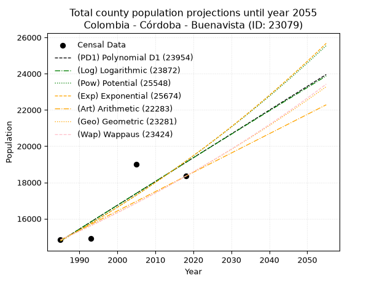
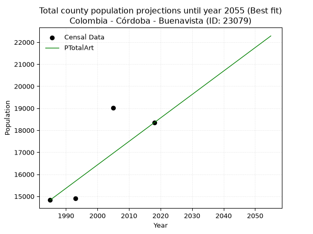
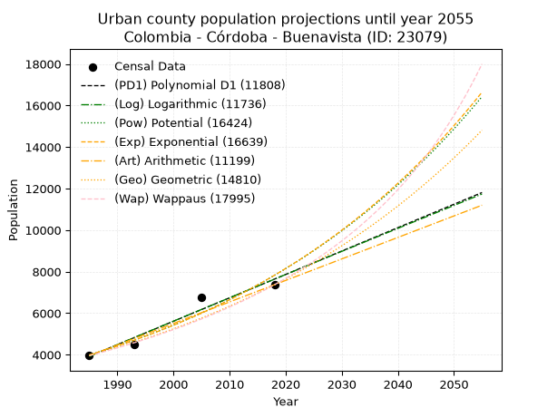
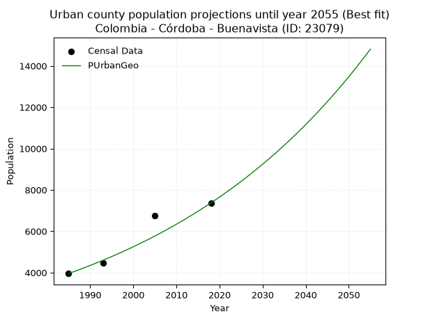
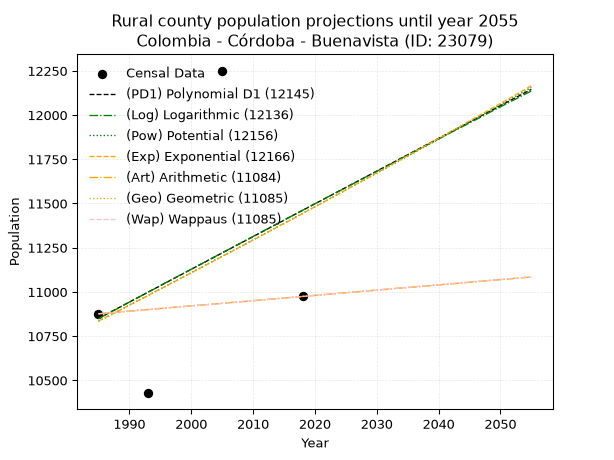
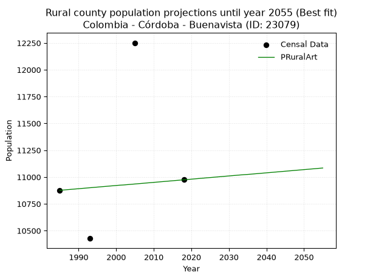

<div align="center">


</div>

# _“Population and Public Services Demand Projections (PPSD) until Year 2050 for Colombia - Córdoba - Buenavista (ID: 23079)”_
Keywords: `population` `public-service` `projection` `lineal` `polynomial` `logarithmic` `potential` `exponential` `arithmetic` `geometric` `wappaus` `dane` `colombia` `south-america`

PPSD are analytical estimates used by governments and planners to anticipate future changes in population size, age distribution, and the resulting community needs for utilities, healthcare, education, and infrastructure as sizing future water treatment facilities, electrical grids, and road networks based on spatial growth.

> **General running parameters**: • app_version: _v20260806_. • Python version: _3.14.7_. • Pandas version: _3.0.5_. • NumPy version: _2.5.1_. • Creates, save and include plots into reports (create_plot): _False_. • Projection until year: _2050_. • Process polynomial degree 2 and up: _False_. • Process Wappaus: _True_. • Process Wappaus: _True_. • Set negative values to zero: _True_. • Set infinite values to zero: _True_. • Drop dataset notes: _True_. 
<div align="center">

Dynamic map: [:earth_americas:Google](http://maps.google.com/maps?q=8.221187338,-75.4808972) [:earth_americas:OSM](https://www.openstreetmap.org/#map=18/8.221187338/-75.4808972&layers=P) [:earth_americas:Bing](https://www.bing.com/maps?cp=8.221187338~-75.4808972&lvl=18) [:earth_americas:Apple](https://maps.apple.com/frame?center=8.221187338%2C-75.4808972&span=0.003%2C0.006)

</div>


<div align="center">

```geojson
{
  "type": "Feature",
  "geometry": {
    "type": "Point", 
    "coordinates": [-75.4808972, 8.221187338]
  }, 
  "properties": {
    "Name": "Colombia - Córdoba - Buenavista (ID: 23079)"
  }
}
```

</div>


## 0. Census Data (4 records)

Census data are official statistics collected by a government about the people and housing in a country. They usually include counts of total population, age, sex, race, income, education, and jobs.

📅Global census file: [Population.xlsx](../data/Population.xlsx)

| Source   |   Year |   CountryID | CountryName   |   StateID | StateName   |   CountyID | CountyName   |   PTotal |   PUrban |   PRural |
|:---------|-------:|------------:|:--------------|----------:|:------------|-----------:|:-------------|---------:|---------:|---------:|
| DANE     |   1985 |          57 | Colombia      |        23 | Córdoba     |      23079 | Buenavista   |    14831 |     3955 |    10876 |
| DANE     |   1993 |          57 | Colombia      |        23 | Córdoba     |      23079 | Buenavista   |    14904 |     4477 |    10427 |
| DANE     |   2005 |          57 | Colombia      |        23 | Córdoba     |      23079 | Buenavista   |    19011 |     6760 |    12251 |
| DANE     |   2018 |          57 | Colombia      |        23 | Córdoba     |      23079 | Buenavista   |    18344 |     7370 |    10974 |

> 🔥Some records could had specific notes about the registered values or the corresponding urban or rural distribution.

📅   [RUPS](https://www.datos.gov.co/Hacienda-y-Cr-dito-P-blico/Registro-nico-de-Prestadores-de-Servicios-P-blicos/4qkq-csdn/about_data) - Local public utility companies: [RUPS.csv](../data/RUPS.xlsx)

 | SERVICIO   | ESTADO    | NOMBRE                                                                   | NIT         | DEPARTAMENTO_DOMICILIO   | MUNICIPIO_DOMICILIO   | DIRECCION                         |   TELEFONO | EMAIL                                | TIPO_INSCRIPCION    | REPRESENTANTE_LEGAL               | TIPO_PRESTADOR          | CLASIFICACION                 |
|:-----------|:----------|:-------------------------------------------------------------------------|:------------|:-------------------------|:----------------------|:----------------------------------|-----------:|:-------------------------------------|:--------------------|:----------------------------------|:------------------------|:------------------------------|
| ACUEDUCTO  | OPERATIVA | JUNTA DE ACCION COMUNAL VEREDA LAS CRUCES                                | 901064259-3 | CORDOBA                  | BUENAVISTA            | CALLE 13-140                      |    1111111 | JOSEANTONIOMARTINEZRUBIO@HOTMAIL.COM | Registro por la ESP | JOSE ANTONIO MARTINEZ RUBIO       | ORGANIZACION AUTORIZADA | MENOR O IGUAL A 2500 USUARIOS |
| ACUEDUCTO  | OPERATIVA | JUNTA DE ACCION COMUNAL VEREDA CALDO PRIETO                              | 900776565-4 | CORDOBA                  | BUENAVISTA            | CR 8A 6-32                        |    1111111 | jaccaldoprieto@hotmail.com           | Registro por la ESP | MANUEL FRANCISCO  DIAZ  HERNANDEZ | ORGANIZACION AUTORIZADA | MENOR O IGUAL A 2500 USUARIOS |
| ACUEDUCTO  | OPERATIVA | JUNTA DE ACCION COMUNAL ACUEDUCTO RURAL CORREGIMIENTO CIENAGA LAS MARIAS | 900768764-1 | CORDOBA                  | BUENAVISTA            | CALLE 3 NUMERO1-165               |    7712036 | braysa1988@gmail.com                 | Registro por la ESP | JAIRO MANUEL SERPA RODRIGUEZ      | ORGANIZACION AUTORIZADA | MENOR O IGUAL A 2500 USUARIOS |
| ACUEDUCTO  | OPERATIVA | JUNTA DE ACCION COMUNAL VEREDA BUENOS AIRES                              | 901056399-2 | CORDOBA                  | BUENAVISTA            | VEREDA BUENOS AIRES- CRA 2B 1-200 |    1111111 | COMUNALBUENOSAIRES@HOTMAIL.COM       | Registro por la ESP | GUSTAVO ADOLFO RIQUEME MONTES     | ORGANIZACION AUTORIZADA | MENOR O IGUAL A 2500 USUARIOS |

## 1. Total

### 1.1. Coefficients and Parameters

* (PD1) Polynomial Deg 1: 131.1625853071057, -245585.46126053817 (lineal)
* (Log) Logarithmic: 262726.8688874423, -1980216.5357744452
* (Pow) Potential: 15.815509828717214, -47.98645427792182
* (Exp) Exponential: 0.007895890854917485, 0.002304634869953827
* (Art) Arithmetic: Year diff. 2018 - 1985 = 33, Population diff. 18344 - 14831 = 3513, Annual growth = 106.45454545454545
* (Geo) Geometric: Year diff. 2018 - 1985 = 33, Population diff. 18344 - 14831 = 3513, Annual growth % = 0.006462701618036526
* (Wap) Wappaus: i = 0.6417757073371241, Condition values only valid for < 200)

<sub>
Wappaus condition values: ['0.00', '0.64', '1.28', '1.93', '2.57', '3.21', '3.85', '4.49', '5.13', '5.78', '6.42', '7.06', '7.70', '8.34', '8.98', '9.63', '10.27', '10.91', '11.55', '12.19', '12.84', '13.48', '14.12', '14.76', '15.40', '16.04', '16.69', '17.33', '17.97', '18.61', '19.25', '19.90', '20.54', '21.18', '21.82', '22.46', '23.10', '23.75', '24.39', '25.03', '25.67', '26.31', '26.95', '27.60', '28.24', '28.88', '29.52', '30.16', '30.81', '31.45', '32.09', '32.73', '33.37', '34.01', '34.66', '35.30', '35.94', '36.58', '37.22', '37.86', '38.51', '39.15', '39.79', '40.43', '41.07', '41.72']
</sub>


### 1.2. Projected Dataset

|   Year |   CountyID |   PTotalPD1 |   PTotalLog |   PTotalPow |   PTotalExp |   PTotalArt |   PTotalGeo |   PTotalWap |
|-------:|-----------:|------------:|------------:|------------:|------------:|------------:|------------:|------------:|
|   1985 |      23079 |       14772 |       14767 |       14768 |       14772 |       14831 |       14831 |       14831 |
|   1986 |      23079 |       14903 |       14899 |       14886 |       14889 |       14937 |       14927 |       14926 |
|   1987 |      23079 |       15035 |       15031 |       15005 |       15007 |       15044 |       15023 |       15023 |
|   1988 |      23079 |       15166 |       15164 |       15125 |       15126 |       15150 |       15120 |       15119 |
|   1989 |      23079 |       15297 |       15296 |       15245 |       15246 |       15257 |       15218 |       15217 |
|   1990 |      23079 |       15428 |       15428 |       15367 |       15367 |       15363 |       15316 |       15315 |
|   1991 |      23079 |       15559 |       15560 |       15490 |       15489 |       15470 |       15415 |       15413 |
|   1992 |      23079 |       15690 |       15692 |       15613 |       15612 |       15576 |       15515 |       15513 |
|   1993 |      23079 |       15822 |       15824 |       15738 |       15736 |       15683 |       15615 |       15613 |
|   1994 |      23079 |       15953 |       15955 |       15863 |       15860 |       15789 |       15716 |       15713 |
|   1995 |      23079 |       16084 |       16087 |       15989 |       15986 |       15896 |       15818 |       15814 |
|   1996 |      23079 |       16215 |       16219 |       16116 |       16113 |       16002 |       15920 |       15916 |
|   1997 |      23079 |       16346 |       16350 |       16245 |       16240 |       16108 |       16023 |       16019 |
|   1998 |      23079 |       16477 |       16482 |       16374 |       16369 |       16215 |       16127 |       16122 |
|   1999 |      23079 |       16609 |       16613 |       16504 |       16499 |       16321 |       16231 |       16226 |
|   2000 |      23079 |       16740 |       16745 |       16635 |       16630 |       16428 |       16336 |       16331 |
|   2001 |      23079 |       16871 |       16876 |       16767 |       16762 |       16534 |       16441 |       16436 |
|   2002 |      23079 |       17002 |       17007 |       16900 |       16894 |       16641 |       16547 |       16542 |
|   2003 |      23079 |       17133 |       17139 |       17034 |       17028 |       16747 |       16654 |       16649 |
|   2004 |      23079 |       17264 |       17270 |       17169 |       17163 |       16854 |       16762 |       16757 |
|   2005 |      23079 |       17396 |       17401 |       17305 |       17299 |       16960 |       16870 |       16865 |
|   2006 |      23079 |       17527 |       17532 |       17442 |       17437 |       17067 |       16979 |       16974 |
|   2007 |      23079 |       17658 |       17663 |       17580 |       17575 |       17173 |       17089 |       17084 |
|   2008 |      23079 |       17789 |       17794 |       17719 |       17714 |       17279 |       17200 |       17195 |
|   2009 |      23079 |       17920 |       17924 |       17859 |       17855 |       17386 |       17311 |       17306 |
|   2010 |      23079 |       18051 |       18055 |       18000 |       17996 |       17492 |       17423 |       17418 |
|   2011 |      23079 |       18182 |       18186 |       18142 |       18139 |       17599 |       17535 |       17531 |
|   2012 |      23079 |       18314 |       18316 |       18285 |       18282 |       17705 |       17649 |       17645 |
|   2013 |      23079 |       18445 |       18447 |       18430 |       18427 |       17812 |       17763 |       17759 |
|   2014 |      23079 |       18576 |       18577 |       18575 |       18574 |       17918 |       17877 |       17874 |
|   2015 |      23079 |       18707 |       18708 |       18721 |       18721 |       18025 |       17993 |       17991 |
|   2016 |      23079 |       18838 |       18838 |       18869 |       18869 |       18131 |       18109 |       18108 |
|   2017 |      23079 |       18969 |       18969 |       19018 |       19019 |       18238 |       18226 |       18225 |
|   2018 |      23079 |       19101 |       19099 |       19167 |       19169 |       18344 |       18344 |       18344 |
|   2019 |      23079 |       19232 |       19229 |       19318 |       19321 |       18450 |       18463 |       18463 |
|   2020 |      23079 |       19363 |       19359 |       19470 |       19475 |       18557 |       18582 |       18584 |
|   2021 |      23079 |       19494 |       19489 |       19623 |       19629 |       18663 |       18702 |       18705 |
|   2022 |      23079 |       19625 |       19619 |       19777 |       19785 |       18770 |       18823 |       18827 |
|   2023 |      23079 |       19756 |       19749 |       19932 |       19941 |       18876 |       18944 |       18950 |
|   2024 |      23079 |       19888 |       19879 |       20089 |       20099 |       18983 |       19067 |       19074 |
|   2025 |      23079 |       20019 |       20008 |       20246 |       20259 |       19089 |       19190 |       19199 |
|   2026 |      23079 |       20150 |       20138 |       20405 |       20419 |       19196 |       19314 |       19325 |
|   2027 |      23079 |       20281 |       20268 |       20565 |       20581 |       19302 |       19439 |       19451 |
|   2028 |      23079 |       20412 |       20397 |       20726 |       20744 |       19409 |       19565 |       19579 |
|   2029 |      23079 |       20543 |       20527 |       20888 |       20909 |       19515 |       19691 |       19708 |
|   2030 |      23079 |       20675 |       20656 |       21051 |       21075 |       19621 |       19818 |       19837 |
|   2031 |      23079 |       20806 |       20786 |       21216 |       21242 |       19728 |       19946 |       19968 |
|   2032 |      23079 |       20937 |       20915 |       21382 |       21410 |       19834 |       20075 |       20099 |
|   2033 |      23079 |       21068 |       21044 |       21549 |       21580 |       19941 |       20205 |       20232 |
|   2034 |      23079 |       21199 |       21174 |       21717 |       21751 |       20047 |       20336 |       20365 |
|   2035 |      23079 |       21330 |       21303 |       21887 |       21923 |       20154 |       20467 |       20500 |
|   2036 |      23079 |       21462 |       21432 |       22057 |       22097 |       20260 |       20599 |       20635 |
|   2037 |      23079 |       21593 |       21561 |       22229 |       22272 |       20367 |       20732 |       20772 |
|   2038 |      23079 |       21724 |       21690 |       22403 |       22449 |       20473 |       20866 |       20909 |
|   2039 |      23079 |       21855 |       21819 |       22577 |       22627 |       20580 |       21001 |       21048 |
|   2040 |      23079 |       21986 |       21947 |       22753 |       22806 |       20686 |       21137 |       21188 |
|   2041 |      23079 |       22117 |       22076 |       22930 |       22987 |       20792 |       21274 |       21329 |
|   2042 |      23079 |       22249 |       22205 |       23108 |       23169 |       20899 |       21411 |       21471 |
|   2043 |      23079 |       22380 |       22334 |       23288 |       23353 |       21005 |       21549 |       21614 |
|   2044 |      23079 |       22511 |       22462 |       23469 |       23538 |       21112 |       21689 |       21758 |
|   2045 |      23079 |       22642 |       22591 |       23651 |       23725 |       21218 |       21829 |       21904 |
|   2046 |      23079 |       22773 |       22719 |       23835 |       23913 |       21325 |       21970 |       22050 |
|   2047 |      23079 |       22904 |       22847 |       24019 |       24102 |       21431 |       22112 |       22198 |
|   2048 |      23079 |       23036 |       22976 |       24206 |       24293 |       21538 |       22255 |       22347 |
|   2049 |      23079 |       23167 |       23104 |       24393 |       24486 |       21644 |       22399 |       22497 |
|   2050 |      23079 |       23298 |       23232 |       24582 |       24680 |       21751 |       22543 |       22648 |
<div align="center">

</img>

</div>


### 1.3. Best fit with absolute and relative error (%)

Relative error puts that difference into context by dividing the absolute error by the true value, creating a unitless ratio or percentage that shows the scale of the mistake.

Absolute and relative error

|   Year | Source   |   CountryID | CountryName   |   StateID | StateName   |   CountyID_x | CountyName   |   PTotal |   PUrban |   PRural |   CountyID_y |   PTotalPD1 |   PTotalLog |   PTotalPow |   PTotalExp |   PTotalArt |   PTotalGeo |   PTotalWap |   PTotalPD1AbsError |   PTotalLogAbsError |   PTotalPowAbsError |   PTotalExpAbsError |   PTotalArtAbsError |   PTotalGeoAbsError |   PTotalWapAbsError |   PTotalPD1RelError |   PTotalLogRelError |   PTotalPowRelError |   PTotalExpRelError |   PTotalArtRelError |   PTotalGeoRelError |   PTotalWapRelError |
|-------:|:---------|------------:|:--------------|----------:|:------------|-------------:|:-------------|---------:|---------:|---------:|-------------:|------------:|------------:|------------:|------------:|------------:|------------:|------------:|--------------------:|--------------------:|--------------------:|--------------------:|--------------------:|--------------------:|--------------------:|--------------------:|--------------------:|--------------------:|--------------------:|--------------------:|--------------------:|--------------------:|
|   1985 | DANE     |          57 | Colombia      |        23 | Córdoba     |        23079 | Buenavista   |    14831 |     3955 |    10876 |        23079 |       14772 |       14767 |       14768 |       14772 |       14831 |       14831 |       14831 |                  59 |                  64 |                  63 |                  59 |                   0 |                   0 |                   0 |            0.397815 |            0.431529 |            0.424786 |            0.397815 |             0       |             0       |             0       |
|   1993 | DANE     |          57 | Colombia      |        23 | Córdoba     |        23079 | Buenavista   |    14904 |     4477 |    10427 |        23079 |       15822 |       15824 |       15738 |       15736 |       15683 |       15615 |       15613 |                 918 |                 920 |                 834 |                 832 |                 779 |                 711 |                 709 |            6.15942  |            6.17284  |            5.59581  |            5.58239  |             5.22678 |             4.77053 |             4.75711 |
|   2005 | DANE     |          57 | Colombia      |        23 | Córdoba     |        23079 | Buenavista   |    19011 |     6760 |    12251 |        23079 |       17396 |       17401 |       17305 |       17299 |       16960 |       16870 |       16865 |                1615 |                1610 |                1706 |                1712 |                2051 |                2141 |                2146 |            8.49508  |            8.46878  |            8.97375  |            9.00531  |            10.7885  |            11.2619  |            11.2882  |
|   2018 | DANE     |          57 | Colombia      |        23 | Córdoba     |        23079 | Buenavista   |    18344 |     7370 |    10974 |        23079 |       19101 |       19099 |       19167 |       19169 |       18344 |       18344 |       18344 |                 757 |                 755 |                 823 |                 825 |                   0 |                   0 |                   0 |            4.12669  |            4.11579  |            4.48648  |            4.49738  |             0       |             0       |             0       |

Relative error mean

| Method    |   RelError | Best   |
|:----------|-----------:|:-------|
| PTotalPD1 |    4.79475 |        |
| PTotalLog |    4.79723 |        |
| PTotalPow |    4.87021 |        |
| PTotalExp |    4.87073 |        |
| PTotalArt |    4.00382 | True   |
| PTotalGeo |    4.00811 |        |
| PTotalWap |    4.01133 |        |

💙Best method: _**PTotalArt**_
<div align="center">

</img>

</div>


### 1.4. Fresh water supply demand in liters per capita per day (lpcd)

The fresh water supply demand typically ranges from 100 to 300 liters per capita per day (lpcd) for standard domestic and municipal planning, though absolute survival minimums set by the World Health Organization are as low as 7.5 to 20 liters per day, and total consumption in high-income nations can exceed 400 liters.

> `CZ`: Level in meters above the sea level (masl)<br> `WS`: Fresh water supply demand in liters per capita per day (lpcd or l/h/d)<br> `WSAll`: Zonal fresh water supply demand in liters per second (l/s)<br> `A`: Zonal area in square meters<br> `DP`: Population density (people/hectare or p/ha)

Reference values (RAS Colombia)

|    CZ |   WS |
|------:|-----:|
|  1000 |  120 |
|  2000 |  130 |
| 99999 |  140 |

County shapefile geometry properties and water supply values

|   CountyID |      ATotal |   CZTotal |   WSTotal |
|-----------:|------------:|----------:|----------:|
|      23079 | 8.34583e+08 |   50.3484 |       120 |

Projected values for best method: PTotalArt

|   CountyID |   Year |   PTotalArt |   DPTotal |   WSTotal |   WSTotalAll |
|-----------:|-------:|------------:|----------:|----------:|-------------:|
|      23079 |   1985 |       14831 |      0.18 |       120 |      20.5986 |
|      23079 |   1986 |       14937 |      0.18 |       120 |      20.7458 |
|      23079 |   1987 |       15044 |      0.18 |       120 |      20.8944 |
|      23079 |   1988 |       15150 |      0.18 |       120 |      21.0417 |
|      23079 |   1989 |       15257 |      0.18 |       120 |      21.1903 |
|      23079 |   1990 |       15363 |      0.18 |       120 |      21.3375 |
|      23079 |   1991 |       15470 |      0.19 |       120 |      21.4861 |
|      23079 |   1992 |       15576 |      0.19 |       120 |      21.6333 |
|      23079 |   1993 |       15683 |      0.19 |       120 |      21.7819 |
|      23079 |   1994 |       15789 |      0.19 |       120 |      21.9292 |
|      23079 |   1995 |       15896 |      0.19 |       120 |      22.0778 |
|      23079 |   1996 |       16002 |      0.19 |       120 |      22.225  |
|      23079 |   1997 |       16108 |      0.19 |       120 |      22.3722 |
|      23079 |   1998 |       16215 |      0.19 |       120 |      22.5208 |
|      23079 |   1999 |       16321 |      0.2  |       120 |      22.6681 |
|      23079 |   2000 |       16428 |      0.2  |       120 |      22.8167 |
|      23079 |   2001 |       16534 |      0.2  |       120 |      22.9639 |
|      23079 |   2002 |       16641 |      0.2  |       120 |      23.1125 |
|      23079 |   2003 |       16747 |      0.2  |       120 |      23.2597 |
|      23079 |   2004 |       16854 |      0.2  |       120 |      23.4083 |
|      23079 |   2005 |       16960 |      0.2  |       120 |      23.5556 |
|      23079 |   2006 |       17067 |      0.2  |       120 |      23.7042 |
|      23079 |   2007 |       17173 |      0.21 |       120 |      23.8514 |
|      23079 |   2008 |       17279 |      0.21 |       120 |      23.9986 |
|      23079 |   2009 |       17386 |      0.21 |       120 |      24.1472 |
|      23079 |   2010 |       17492 |      0.21 |       120 |      24.2944 |
|      23079 |   2011 |       17599 |      0.21 |       120 |      24.4431 |
|      23079 |   2012 |       17705 |      0.21 |       120 |      24.5903 |
|      23079 |   2013 |       17812 |      0.21 |       120 |      24.7389 |
|      23079 |   2014 |       17918 |      0.21 |       120 |      24.8861 |
|      23079 |   2015 |       18025 |      0.22 |       120 |      25.0347 |
|      23079 |   2016 |       18131 |      0.22 |       120 |      25.1819 |
|      23079 |   2017 |       18238 |      0.22 |       120 |      25.3306 |
|      23079 |   2018 |       18344 |      0.22 |       120 |      25.4778 |
|      23079 |   2019 |       18450 |      0.22 |       120 |      25.625  |
|      23079 |   2020 |       18557 |      0.22 |       120 |      25.7736 |
|      23079 |   2021 |       18663 |      0.22 |       120 |      25.9208 |
|      23079 |   2022 |       18770 |      0.22 |       120 |      26.0694 |
|      23079 |   2023 |       18876 |      0.23 |       120 |      26.2167 |
|      23079 |   2024 |       18983 |      0.23 |       120 |      26.3653 |
|      23079 |   2025 |       19089 |      0.23 |       120 |      26.5125 |
|      23079 |   2026 |       19196 |      0.23 |       120 |      26.6611 |
|      23079 |   2027 |       19302 |      0.23 |       120 |      26.8083 |
|      23079 |   2028 |       19409 |      0.23 |       120 |      26.9569 |
|      23079 |   2029 |       19515 |      0.23 |       120 |      27.1042 |
|      23079 |   2030 |       19621 |      0.24 |       120 |      27.2514 |
|      23079 |   2031 |       19728 |      0.24 |       120 |      27.4    |
|      23079 |   2032 |       19834 |      0.24 |       120 |      27.5472 |
|      23079 |   2033 |       19941 |      0.24 |       120 |      27.6958 |
|      23079 |   2034 |       20047 |      0.24 |       120 |      27.8431 |
|      23079 |   2035 |       20154 |      0.24 |       120 |      27.9917 |
|      23079 |   2036 |       20260 |      0.24 |       120 |      28.1389 |
|      23079 |   2037 |       20367 |      0.24 |       120 |      28.2875 |
|      23079 |   2038 |       20473 |      0.25 |       120 |      28.4347 |
|      23079 |   2039 |       20580 |      0.25 |       120 |      28.5833 |
|      23079 |   2040 |       20686 |      0.25 |       120 |      28.7306 |
|      23079 |   2041 |       20792 |      0.25 |       120 |      28.8778 |
|      23079 |   2042 |       20899 |      0.25 |       120 |      29.0264 |
|      23079 |   2043 |       21005 |      0.25 |       120 |      29.1736 |
|      23079 |   2044 |       21112 |      0.25 |       120 |      29.3222 |
|      23079 |   2045 |       21218 |      0.25 |       120 |      29.4694 |
|      23079 |   2046 |       21325 |      0.26 |       120 |      29.6181 |
|      23079 |   2047 |       21431 |      0.26 |       120 |      29.7653 |
|      23079 |   2048 |       21538 |      0.26 |       120 |      29.9139 |
|      23079 |   2049 |       21644 |      0.26 |       120 |      30.0611 |
|      23079 |   2050 |       21751 |      0.26 |       120 |      30.2097 |

## 2. Urban

### 2.1. Coefficients and Parameters

* (PD1) Polynomial Deg 1: 112.65435568044907, -219696.37494981827 (lineal)
* (Log) Logarithmic: 225557.3225292992, -1708822.516048149
* (Pow) Potential: 40.82279696029624, -131.02276170958874
* (Exp) Exponential: 0.020386444471468517, 1.0634885837815839e-14
* (Art) Arithmetic: Year diff. 2018 - 1985 = 33, Population diff. 7370 - 3955 = 3415, Annual growth = 103.48484848484848
* (Geo) Geometric: Year diff. 2018 - 1985 = 33, Population diff. 7370 - 3955 = 3415, Annual growth % = 0.01904073657569727
* (Wap) Wappaus: i = 1.827546993109907, Condition values only valid for < 200)

<sub>
Wappaus condition values: ['0.00', '1.83', '3.66', '5.48', '7.31', '9.14', '10.97', '12.79', '14.62', '16.45', '18.28', '20.10', '21.93', '23.76', '25.59', '27.41', '29.24', '31.07', '32.90', '34.72', '36.55', '38.38', '40.21', '42.03', '43.86', '45.69', '47.52', '49.34', '51.17', '53.00', '54.83', '56.65', '58.48', '60.31', '62.14', '63.96', '65.79', '67.62', '69.45', '71.27', '73.10', '74.93', '76.76', '78.58', '80.41', '82.24', '84.07', '85.89', '87.72', '89.55', '91.38', '93.20', '95.03', '96.86', '98.69', '100.52', '102.34', '104.17', '106.00', '107.83', '109.65', '111.48', '113.31', '115.14', '116.96', '118.79']
</sub>


### 2.2. Projected Dataset

|   Year |   CountyID |   PUrbanPD1 |   PUrbanLog |   PUrbanPow |   PUrbanExp |   PUrbanArt |   PUrbanGeo |   PUrbanWap |
|-------:|-----------:|------------:|------------:|------------:|------------:|------------:|------------:|------------:|
|   1985 |      23079 |        3923 |        3919 |        3991 |        3994 |        3955 |        3955 |        3955 |
|   1986 |      23079 |        4035 |        4032 |        4074 |        4076 |        4058 |        4030 |        4028 |
|   1987 |      23079 |        4148 |        4146 |        4158 |        4160 |        4162 |        4107 |        4102 |
|   1988 |      23079 |        4260 |        4259 |        4244 |        4246 |        4265 |        4185 |        4178 |
|   1989 |      23079 |        4373 |        4373 |        4332 |        4333 |        4369 |        4265 |        4255 |
|   1990 |      23079 |        4486 |        4486 |        4422 |        4422 |        4472 |        4346 |        4334 |
|   1991 |      23079 |        4598 |        4599 |        4514 |        4513 |        4576 |        4429 |        4414 |
|   1992 |      23079 |        4711 |        4713 |        4607 |        4606 |        4679 |        4513 |        4496 |
|   1993 |      23079 |        4824 |        4826 |        4703 |        4701 |        4783 |        4599 |        4579 |
|   1994 |      23079 |        4936 |        4939 |        4800 |        4798 |        4886 |        4687 |        4664 |
|   1995 |      23079 |        5049 |        5052 |        4899 |        4897 |        4990 |        4776 |        4750 |
|   1996 |      23079 |        5162 |        5165 |        5001 |        4998 |        5093 |        4867 |        4839 |
|   1997 |      23079 |        5274 |        5278 |        5104 |        5100 |        5197 |        4960 |        4929 |
|   1998 |      23079 |        5387 |        5391 |        5209 |        5206 |        5300 |        5054 |        5021 |
|   1999 |      23079 |        5500 |        5504 |        5317 |        5313 |        5404 |        5150 |        5115 |
|   2000 |      23079 |        5612 |        5617 |        5426 |        5422 |        5507 |        5248 |        5211 |
|   2001 |      23079 |        5725 |        5729 |        5538 |        5534 |        5611 |        5348 |        5310 |
|   2002 |      23079 |        5838 |        5842 |        5652 |        5648 |        5714 |        5450 |        5410 |
|   2003 |      23079 |        5950 |        5955 |        5769 |        5764 |        5818 |        5554 |        5512 |
|   2004 |      23079 |        6063 |        6067 |        5888 |        5883 |        5921 |        5660 |        5617 |
|   2005 |      23079 |        6176 |        6180 |        6009 |        6004 |        6025 |        5767 |        5724 |
|   2006 |      23079 |        6288 |        6292 |        6132 |        6128 |        6128 |        5877 |        5833 |
|   2007 |      23079 |        6401 |        6405 |        6258 |        6254 |        6232 |        5989 |        5945 |
|   2008 |      23079 |        6514 |        6517 |        6387 |        6383 |        6335 |        6103 |        6060 |
|   2009 |      23079 |        6626 |        6629 |        6518 |        6514 |        6439 |        6219 |        6177 |
|   2010 |      23079 |        6739 |        6742 |        6652 |        6648 |        6542 |        6338 |        6297 |
|   2011 |      23079 |        6852 |        6854 |        6788 |        6785 |        6646 |        6458 |        6420 |
|   2012 |      23079 |        6964 |        6966 |        6927 |        6925 |        6749 |        6581 |        6546 |
|   2013 |      23079 |        7077 |        7078 |        7069 |        7068 |        6853 |        6707 |        6675 |
|   2014 |      23079 |        7189 |        7190 |        7214 |        7213 |        6956 |        6834 |        6807 |
|   2015 |      23079 |        7302 |        7302 |        7362 |        7362 |        7060 |        6965 |        6942 |
|   2016 |      23079 |        7415 |        7414 |        7512 |        7513 |        7163 |        7097 |        7081 |
|   2017 |      23079 |        7527 |        7526 |        7666 |        7668 |        7267 |        7232 |        7224 |
|   2018 |      23079 |        7640 |        7638 |        7823 |        7826 |        7370 |        7370 |        7370 |
|   2019 |      23079 |        7753 |        7749 |        7983 |        7987 |        7473 |        7510 |        7520 |
|   2020 |      23079 |        7865 |        7861 |        8146 |        8152 |        7577 |        7653 |        7674 |
|   2021 |      23079 |        7978 |        7973 |        8312 |        8320 |        7680 |        7799 |        7833 |
|   2022 |      23079 |        8091 |        8084 |        8481 |        8491 |        7784 |        7948 |        7995 |
|   2023 |      23079 |        8203 |        8196 |        8654 |        8666 |        7887 |        8099 |        8163 |
|   2024 |      23079 |        8316 |        8307 |        8831 |        8844 |        7991 |        8253 |        8335 |
|   2025 |      23079 |        8429 |        8419 |        9011 |        9026 |        8094 |        8410 |        8512 |
|   2026 |      23079 |        8541 |        8530 |        9194 |        9212 |        8198 |        8570 |        8694 |
|   2027 |      23079 |        8654 |        8641 |        9381 |        9402 |        8301 |        8734 |        8881 |
|   2028 |      23079 |        8767 |        8753 |        9572 |        9596 |        8405 |        8900 |        9075 |
|   2029 |      23079 |        8879 |        8864 |        9767 |        9793 |        8508 |        9069 |        9274 |
|   2030 |      23079 |        8992 |        8975 |        9965 |        9995 |        8612 |        9242 |        9479 |
|   2031 |      23079 |        9105 |        9086 |       10167 |       10201 |        8715 |        9418 |        9691 |
|   2032 |      23079 |        9217 |        9197 |       10374 |       10411 |        8819 |        9597 |        9909 |
|   2033 |      23079 |        9330 |        9308 |       10584 |       10625 |        8922 |        9780 |       10135 |
|   2034 |      23079 |        9443 |        9419 |       10799 |       10844 |        9026 |        9966 |       10368 |
|   2035 |      23079 |        9555 |        9530 |       11018 |       11068 |        9129 |       10156 |       10609 |
|   2036 |      23079 |        9668 |        9641 |       11241 |       11296 |        9233 |       10349 |       10858 |
|   2037 |      23079 |        9781 |        9751 |       11469 |       11528 |        9336 |       10546 |       11116 |
|   2038 |      23079 |        9893 |        9862 |       11701 |       11766 |        9440 |       10747 |       11383 |
|   2039 |      23079 |       10006 |        9973 |       11937 |       12008 |        9543 |       10952 |       11660 |
|   2040 |      23079 |       10119 |       10083 |       12179 |       12255 |        9647 |       11160 |       11947 |
|   2041 |      23079 |       10231 |       10194 |       12425 |       12508 |        9750 |       11373 |       12244 |
|   2042 |      23079 |       10344 |       10304 |       12676 |       12765 |        9854 |       11589 |       12553 |
|   2043 |      23079 |       10456 |       10415 |       12932 |       13028 |        9957 |       11810 |       12874 |
|   2044 |      23079 |       10569 |       10525 |       13193 |       13296 |       10061 |       12035 |       13208 |
|   2045 |      23079 |       10682 |       10635 |       13459 |       13570 |       10164 |       12264 |       13555 |
|   2046 |      23079 |       10794 |       10746 |       13730 |       13850 |       10268 |       12498 |       13917 |
|   2047 |      23079 |       10907 |       10856 |       14007 |       14135 |       10371 |       12736 |       14293 |
|   2048 |      23079 |       11020 |       10966 |       14289 |       14426 |       10475 |       12978 |       14686 |
|   2049 |      23079 |       11132 |       11076 |       14576 |       14723 |       10578 |       13225 |       15097 |
|   2050 |      23079 |       11245 |       11186 |       14869 |       15027 |       10682 |       13477 |       15525 |
<div align="center">

</img>

</div>


### 2.3. Best fit with absolute and relative error (%)

Relative error puts that difference into context by dividing the absolute error by the true value, creating a unitless ratio or percentage that shows the scale of the mistake.

Absolute and relative error

|   Year | Source   |   CountryID | CountryName   |   StateID | StateName   |   CountyID_x | CountyName   |   PTotal |   PUrban |   PRural |   CountyID_y |   PUrbanPD1 |   PUrbanLog |   PUrbanPow |   PUrbanExp |   PUrbanArt |   PUrbanGeo |   PUrbanWap |   PUrbanPD1AbsError |   PUrbanLogAbsError |   PUrbanPowAbsError |   PUrbanExpAbsError |   PUrbanArtAbsError |   PUrbanGeoAbsError |   PUrbanWapAbsError |   PUrbanPD1RelError |   PUrbanLogRelError |   PUrbanPowRelError |   PUrbanExpRelError |   PUrbanArtRelError |   PUrbanGeoRelError |   PUrbanWapRelError |
|-------:|:---------|------------:|:--------------|----------:|:------------|-------------:|:-------------|---------:|---------:|---------:|-------------:|------------:|------------:|------------:|------------:|------------:|------------:|------------:|--------------------:|--------------------:|--------------------:|--------------------:|--------------------:|--------------------:|--------------------:|--------------------:|--------------------:|--------------------:|--------------------:|--------------------:|--------------------:|--------------------:|
|   1985 | DANE     |          57 | Colombia      |        23 | Córdoba     |        23079 | Buenavista   |    14831 |     3955 |    10876 |        23079 |        3923 |        3919 |        3991 |        3994 |        3955 |        3955 |        3955 |                  32 |                  36 |                  36 |                  39 |                   0 |                   0 |                   0 |            0.809102 |             0.91024 |             0.91024 |            0.986094 |             0       |             0       |             0       |
|   1993 | DANE     |          57 | Colombia      |        23 | Córdoba     |        23079 | Buenavista   |    14904 |     4477 |    10427 |        23079 |        4824 |        4826 |        4703 |        4701 |        4783 |        4599 |        4579 |                 347 |                 349 |                 226 |                 224 |                 306 |                 122 |                 102 |            7.75073  |             7.7954  |             5.04802 |            5.00335  |             6.83493 |             2.72504 |             2.27831 |
|   2005 | DANE     |          57 | Colombia      |        23 | Córdoba     |        23079 | Buenavista   |    19011 |     6760 |    12251 |        23079 |        6176 |        6180 |        6009 |        6004 |        6025 |        5767 |        5724 |                 584 |                 580 |                 751 |                 756 |                 735 |                 993 |                1036 |            8.63905  |             8.57988 |            11.1095  |           11.1834   |            10.8728  |            14.6893  |            15.3254  |
|   2018 | DANE     |          57 | Colombia      |        23 | Córdoba     |        23079 | Buenavista   |    18344 |     7370 |    10974 |        23079 |        7640 |        7638 |        7823 |        7826 |        7370 |        7370 |        7370 |                 270 |                 268 |                 453 |                 456 |                   0 |                   0 |                   0 |            3.6635   |             3.63636 |             6.14654 |            6.18725  |             0       |             0       |             0       |

Relative error mean

| Method    |   RelError | Best   |
|:----------|-----------:|:-------|
| PUrbanPD1 |    5.2156  |        |
| PUrbanLog |    5.23047 |        |
| PUrbanPow |    5.80357 |        |
| PUrbanExp |    5.84003 |        |
| PUrbanArt |    4.42693 |        |
| PUrbanGeo |    4.3536  | True   |
| PUrbanWap |    4.40094 |        |

💙Best method: _**PUrbanGeo**_
<div align="center">

</img>

</div>


### 2.4. Fresh water supply demand in liters per capita per day (lpcd)

The fresh water supply demand typically ranges from 100 to 300 liters per capita per day (lpcd) for standard domestic and municipal planning, though absolute survival minimums set by the World Health Organization are as low as 7.5 to 20 liters per day, and total consumption in high-income nations can exceed 400 liters.

> `CZ`: Level in meters above the sea level (masl)<br> `WS`: Fresh water supply demand in liters per capita per day (lpcd or l/h/d)<br> `WSAll`: Zonal fresh water supply demand in liters per second (l/s)<br> `A`: Zonal area in square meters<br> `DP`: Population density (people/hectare or p/ha)

Reference values (RAS Colombia)

|    CZ |   WS |
|------:|-----:|
|  1000 |  120 |
|  2000 |  130 |
| 99999 |  140 |

County shapefile geometry properties and water supply values

|   CountyID |      AUrban |   CZUrban |   WSUrban |
|-----------:|------------:|----------:|----------:|
|      23079 | 2.03708e+06 |   60.8257 |       120 |

Projected values for best method: PUrbanGeo

|   CountyID |   Year |   PUrbanGeo |   DPUrban |   WSUrban |   WSUrbanAll |
|-----------:|-------:|------------:|----------:|----------:|-------------:|
|      23079 |   1985 |        3955 |     19.42 |       120 |      5.49306 |
|      23079 |   1986 |        4030 |     19.78 |       120 |      5.59722 |
|      23079 |   1987 |        4107 |     20.16 |       120 |      5.70417 |
|      23079 |   1988 |        4185 |     20.54 |       120 |      5.8125  |
|      23079 |   1989 |        4265 |     20.94 |       120 |      5.92361 |
|      23079 |   1990 |        4346 |     21.33 |       120 |      6.03611 |
|      23079 |   1991 |        4429 |     21.74 |       120 |      6.15139 |
|      23079 |   1992 |        4513 |     22.15 |       120 |      6.26806 |
|      23079 |   1993 |        4599 |     22.58 |       120 |      6.3875  |
|      23079 |   1994 |        4687 |     23.01 |       120 |      6.50972 |
|      23079 |   1995 |        4776 |     23.45 |       120 |      6.63333 |
|      23079 |   1996 |        4867 |     23.89 |       120 |      6.75972 |
|      23079 |   1997 |        4960 |     24.35 |       120 |      6.88889 |
|      23079 |   1998 |        5054 |     24.81 |       120 |      7.01944 |
|      23079 |   1999 |        5150 |     25.28 |       120 |      7.15278 |
|      23079 |   2000 |        5248 |     25.76 |       120 |      7.28889 |
|      23079 |   2001 |        5348 |     26.25 |       120 |      7.42778 |
|      23079 |   2002 |        5450 |     26.75 |       120 |      7.56944 |
|      23079 |   2003 |        5554 |     27.26 |       120 |      7.71389 |
|      23079 |   2004 |        5660 |     27.78 |       120 |      7.86111 |
|      23079 |   2005 |        5767 |     28.31 |       120 |      8.00972 |
|      23079 |   2006 |        5877 |     28.85 |       120 |      8.1625  |
|      23079 |   2007 |        5989 |     29.4  |       120 |      8.31806 |
|      23079 |   2008 |        6103 |     29.96 |       120 |      8.47639 |
|      23079 |   2009 |        6219 |     30.53 |       120 |      8.6375  |
|      23079 |   2010 |        6338 |     31.11 |       120 |      8.80278 |
|      23079 |   2011 |        6458 |     31.7  |       120 |      8.96944 |
|      23079 |   2012 |        6581 |     32.31 |       120 |      9.14028 |
|      23079 |   2013 |        6707 |     32.92 |       120 |      9.31528 |
|      23079 |   2014 |        6834 |     33.55 |       120 |      9.49167 |
|      23079 |   2015 |        6965 |     34.19 |       120 |      9.67361 |
|      23079 |   2016 |        7097 |     34.84 |       120 |      9.85694 |
|      23079 |   2017 |        7232 |     35.5  |       120 |     10.0444  |
|      23079 |   2018 |        7370 |     36.18 |       120 |     10.2361  |
|      23079 |   2019 |        7510 |     36.87 |       120 |     10.4306  |
|      23079 |   2020 |        7653 |     37.57 |       120 |     10.6292  |
|      23079 |   2021 |        7799 |     38.29 |       120 |     10.8319  |
|      23079 |   2022 |        7948 |     39.02 |       120 |     11.0389  |
|      23079 |   2023 |        8099 |     39.76 |       120 |     11.2486  |
|      23079 |   2024 |        8253 |     40.51 |       120 |     11.4625  |
|      23079 |   2025 |        8410 |     41.28 |       120 |     11.6806  |
|      23079 |   2026 |        8570 |     42.07 |       120 |     11.9028  |
|      23079 |   2027 |        8734 |     42.88 |       120 |     12.1306  |
|      23079 |   2028 |        8900 |     43.69 |       120 |     12.3611  |
|      23079 |   2029 |        9069 |     44.52 |       120 |     12.5958  |
|      23079 |   2030 |        9242 |     45.37 |       120 |     12.8361  |
|      23079 |   2031 |        9418 |     46.23 |       120 |     13.0806  |
|      23079 |   2032 |        9597 |     47.11 |       120 |     13.3292  |
|      23079 |   2033 |        9780 |     48.01 |       120 |     13.5833  |
|      23079 |   2034 |        9966 |     48.92 |       120 |     13.8417  |
|      23079 |   2035 |       10156 |     49.86 |       120 |     14.1056  |
|      23079 |   2036 |       10349 |     50.8  |       120 |     14.3736  |
|      23079 |   2037 |       10546 |     51.77 |       120 |     14.6472  |
|      23079 |   2038 |       10747 |     52.76 |       120 |     14.9264  |
|      23079 |   2039 |       10952 |     53.76 |       120 |     15.2111  |
|      23079 |   2040 |       11160 |     54.78 |       120 |     15.5     |
|      23079 |   2041 |       11373 |     55.83 |       120 |     15.7958  |
|      23079 |   2042 |       11589 |     56.89 |       120 |     16.0958  |
|      23079 |   2043 |       11810 |     57.98 |       120 |     16.4028  |
|      23079 |   2044 |       12035 |     59.08 |       120 |     16.7153  |
|      23079 |   2045 |       12264 |     60.2  |       120 |     17.0333  |
|      23079 |   2046 |       12498 |     61.35 |       120 |     17.3583  |
|      23079 |   2047 |       12736 |     62.52 |       120 |     17.6889  |
|      23079 |   2048 |       12978 |     63.71 |       120 |     18.025   |
|      23079 |   2049 |       13225 |     64.92 |       120 |     18.3681  |
|      23079 |   2050 |       13477 |     66.16 |       120 |     18.7181  |

## 3. Rural

### 3.1. Coefficients and Parameters

* (PD1) Polynomial Deg 1: 18.508229626656657, -25889.08631071998 (lineal)
* (Log) Logarithmic: 37169.54635814299, -271394.01972629613
* (Pow) Potential: 3.322159898608221, -6.920910501446199
* (Exp) Exponential: 0.0016545411046729403, 405.9714416002911
* (Art) Arithmetic: Year diff. 2018 - 1985 = 33, Population diff. 10974 - 10876 = 98, Annual growth = 2.9696969696969697
* (Geo) Geometric: Year diff. 2018 - 1985 = 33, Population diff. 10974 - 10876 = 98, Annual growth % = 0.00027186458079864195
* (Wap) Wappaus: i = 0.027182580958324664, Condition values only valid for < 200)

<sub>
Wappaus condition values: ['0.00', '0.03', '0.05', '0.08', '0.11', '0.14', '0.16', '0.19', '0.22', '0.24', '0.27', '0.30', '0.33', '0.35', '0.38', '0.41', '0.43', '0.46', '0.49', '0.52', '0.54', '0.57', '0.60', '0.63', '0.65', '0.68', '0.71', '0.73', '0.76', '0.79', '0.82', '0.84', '0.87', '0.90', '0.92', '0.95', '0.98', '1.01', '1.03', '1.06', '1.09', '1.11', '1.14', '1.17', '1.20', '1.22', '1.25', '1.28', '1.30', '1.33', '1.36', '1.39', '1.41', '1.44', '1.47', '1.50', '1.52', '1.55', '1.58', '1.60', '1.63', '1.66', '1.69', '1.71', '1.74', '1.77']
</sub>


### 3.2. Projected Dataset

|   Year |   CountyID |   PRuralPD1 |   PRuralLog |   PRuralPow |   PRuralExp |   PRuralArt |   PRuralGeo |   PRuralWap |
|-------:|-----------:|------------:|------------:|------------:|------------:|------------:|------------:|------------:|
|   1985 |      23079 |       10850 |       10848 |       10834 |       10835 |       10876 |       10876 |       10876 |
|   1986 |      23079 |       10868 |       10867 |       10852 |       10853 |       10879 |       10879 |       10879 |
|   1987 |      23079 |       10887 |       10886 |       10870 |       10871 |       10882 |       10882 |       10882 |
|   1988 |      23079 |       10905 |       10904 |       10888 |       10889 |       10885 |       10885 |       10885 |
|   1989 |      23079 |       10924 |       10923 |       10906 |       10907 |       10888 |       10888 |       10888 |
|   1990 |      23079 |       10942 |       10942 |       10925 |       10925 |       10891 |       10891 |       10891 |
|   1991 |      23079 |       10961 |       10960 |       10943 |       10943 |       10894 |       10894 |       10894 |
|   1992 |      23079 |       10979 |       10979 |       10961 |       10961 |       10897 |       10897 |       10897 |
|   1993 |      23079 |       10998 |       10998 |       10979 |       10979 |       10900 |       10900 |       10900 |
|   1994 |      23079 |       11016 |       11016 |       10998 |       10998 |       10903 |       10903 |       10903 |
|   1995 |      23079 |       11035 |       11035 |       11016 |       11016 |       10906 |       10906 |       10906 |
|   1996 |      23079 |       11053 |       11054 |       11034 |       11034 |       10909 |       10909 |       10909 |
|   1997 |      23079 |       11072 |       11072 |       11053 |       11052 |       10912 |       10912 |       10912 |
|   1998 |      23079 |       11090 |       11091 |       11071 |       11071 |       10915 |       10915 |       10915 |
|   1999 |      23079 |       11109 |       11109 |       11090 |       11089 |       10918 |       10917 |       10917 |
|   2000 |      23079 |       11127 |       11128 |       11108 |       11107 |       10921 |       10920 |       10920 |
|   2001 |      23079 |       11146 |       11147 |       11127 |       11126 |       10924 |       10923 |       10923 |
|   2002 |      23079 |       11164 |       11165 |       11145 |       11144 |       10926 |       10926 |       10926 |
|   2003 |      23079 |       11183 |       11184 |       11164 |       11163 |       10929 |       10929 |       10929 |
|   2004 |      23079 |       11201 |       11202 |       11182 |       11181 |       10932 |       10932 |       10932 |
|   2005 |      23079 |       11220 |       11221 |       11201 |       11200 |       10935 |       10935 |       10935 |
|   2006 |      23079 |       11238 |       11239 |       11219 |       11218 |       10938 |       10938 |       10938 |
|   2007 |      23079 |       11257 |       11258 |       11238 |       11237 |       10941 |       10941 |       10941 |
|   2008 |      23079 |       11275 |       11276 |       11256 |       11255 |       10944 |       10944 |       10944 |
|   2009 |      23079 |       11294 |       11295 |       11275 |       11274 |       10947 |       10947 |       10947 |
|   2010 |      23079 |       11312 |       11313 |       11294 |       11293 |       10950 |       10950 |       10950 |
|   2011 |      23079 |       11331 |       11332 |       11312 |       11311 |       10953 |       10953 |       10953 |
|   2012 |      23079 |       11349 |       11350 |       11331 |       11330 |       10956 |       10956 |       10956 |
|   2013 |      23079 |       11368 |       11369 |       11350 |       11349 |       10959 |       10959 |       10959 |
|   2014 |      23079 |       11386 |       11387 |       11369 |       11368 |       10962 |       10962 |       10962 |
|   2015 |      23079 |       11405 |       11406 |       11387 |       11386 |       10965 |       10965 |       10965 |
|   2016 |      23079 |       11424 |       11424 |       11406 |       11405 |       10968 |       10968 |       10968 |
|   2017 |      23079 |       11442 |       11443 |       11425 |       11424 |       10971 |       10971 |       10971 |
|   2018 |      23079 |       11461 |       11461 |       11444 |       11443 |       10974 |       10974 |       10974 |
|   2019 |      23079 |       11479 |       11480 |       11463 |       11462 |       10977 |       10977 |       10977 |
|   2020 |      23079 |       11498 |       11498 |       11481 |       11481 |       10980 |       10980 |       10980 |
|   2021 |      23079 |       11516 |       11516 |       11500 |       11500 |       10983 |       10983 |       10983 |
|   2022 |      23079 |       11535 |       11535 |       11519 |       11519 |       10986 |       10986 |       10986 |
|   2023 |      23079 |       11553 |       11553 |       11538 |       11538 |       10989 |       10989 |       10989 |
|   2024 |      23079 |       11572 |       11571 |       11557 |       11557 |       10992 |       10992 |       10992 |
|   2025 |      23079 |       11590 |       11590 |       11576 |       11576 |       10995 |       10995 |       10995 |
|   2026 |      23079 |       11609 |       11608 |       11595 |       11596 |       10998 |       10998 |       10998 |
|   2027 |      23079 |       11627 |       11627 |       11614 |       11615 |       11001 |       11001 |       11001 |
|   2028 |      23079 |       11646 |       11645 |       11633 |       11634 |       11004 |       11004 |       11004 |
|   2029 |      23079 |       11664 |       11663 |       11652 |       11653 |       11007 |       11007 |       11007 |
|   2030 |      23079 |       11683 |       11681 |       11671 |       11673 |       11010 |       11010 |       11010 |
|   2031 |      23079 |       11701 |       11700 |       11690 |       11692 |       11013 |       11013 |       11013 |
|   2032 |      23079 |       11720 |       11718 |       11710 |       11711 |       11016 |       11016 |       11016 |
|   2033 |      23079 |       11738 |       11736 |       11729 |       11731 |       11019 |       11019 |       11019 |
|   2034 |      23079 |       11757 |       11755 |       11748 |       11750 |       11022 |       11022 |       11022 |
|   2035 |      23079 |       11775 |       11773 |       11767 |       11770 |       11024 |       11025 |       11025 |
|   2036 |      23079 |       11794 |       11791 |       11786 |       11789 |       11027 |       11028 |       11028 |
|   2037 |      23079 |       11812 |       11809 |       11806 |       11809 |       11030 |       11031 |       11031 |
|   2038 |      23079 |       11831 |       11828 |       11825 |       11828 |       11033 |       11034 |       11034 |
|   2039 |      23079 |       11849 |       11846 |       11844 |       11848 |       11036 |       11037 |       11037 |
|   2040 |      23079 |       11868 |       11864 |       11863 |       11867 |       11039 |       11040 |       11040 |
|   2041 |      23079 |       11886 |       11882 |       11883 |       11887 |       11042 |       11043 |       11043 |
|   2042 |      23079 |       11905 |       11901 |       11902 |       11907 |       11045 |       11046 |       11046 |
|   2043 |      23079 |       11923 |       11919 |       11921 |       11926 |       11048 |       11049 |       11049 |
|   2044 |      23079 |       11942 |       11937 |       11941 |       11946 |       11051 |       11052 |       11052 |
|   2045 |      23079 |       11960 |       11955 |       11960 |       11966 |       11054 |       11055 |       11055 |
|   2046 |      23079 |       11979 |       11973 |       11980 |       11986 |       11057 |       11058 |       11058 |
|   2047 |      23079 |       11997 |       11991 |       11999 |       12006 |       11060 |       11061 |       11061 |
|   2048 |      23079 |       12016 |       12010 |       12019 |       12025 |       11063 |       11064 |       11064 |
|   2049 |      23079 |       12034 |       12028 |       12038 |       12045 |       11066 |       11067 |       11067 |
|   2050 |      23079 |       12053 |       12046 |       12058 |       12065 |       11069 |       11070 |       11070 |
<div align="center">

</img>

</div>


### 3.3. Best fit with absolute and relative error (%)

Relative error puts that difference into context by dividing the absolute error by the true value, creating a unitless ratio or percentage that shows the scale of the mistake.

Absolute and relative error

|   Year | Source   |   CountryID | CountryName   |   StateID | StateName   |   CountyID_x | CountyName   |   PTotal |   PUrban |   PRural |   CountyID_y |   PRuralPD1 |   PRuralLog |   PRuralPow |   PRuralExp |   PRuralArt |   PRuralGeo |   PRuralWap |   PRuralPD1AbsError |   PRuralLogAbsError |   PRuralPowAbsError |   PRuralExpAbsError |   PRuralArtAbsError |   PRuralGeoAbsError |   PRuralWapAbsError |   PRuralPD1RelError |   PRuralLogRelError |   PRuralPowRelError |   PRuralExpRelError |   PRuralArtRelError |   PRuralGeoRelError |   PRuralWapRelError |
|-------:|:---------|------------:|:--------------|----------:|:------------|-------------:|:-------------|---------:|---------:|---------:|-------------:|------------:|------------:|------------:|------------:|------------:|------------:|------------:|--------------------:|--------------------:|--------------------:|--------------------:|--------------------:|--------------------:|--------------------:|--------------------:|--------------------:|--------------------:|--------------------:|--------------------:|--------------------:|--------------------:|
|   1985 | DANE     |          57 | Colombia      |        23 | Córdoba     |        23079 | Buenavista   |    14831 |     3955 |    10876 |        23079 |       10850 |       10848 |       10834 |       10835 |       10876 |       10876 |       10876 |                  26 |                  28 |                  42 |                  41 |                   0 |                   0 |                   0 |            0.239058 |            0.257448 |            0.386171 |            0.376977 |              0      |              0      |              0      |
|   1993 | DANE     |          57 | Colombia      |        23 | Córdoba     |        23079 | Buenavista   |    14904 |     4477 |    10427 |        23079 |       10998 |       10998 |       10979 |       10979 |       10900 |       10900 |       10900 |                 571 |                 571 |                 552 |                 552 |                 473 |                 473 |                 473 |            5.47617  |            5.47617  |            5.29395  |            5.29395  |              4.5363 |              4.5363 |              4.5363 |
|   2005 | DANE     |          57 | Colombia      |        23 | Córdoba     |        23079 | Buenavista   |    19011 |     6760 |    12251 |        23079 |       11220 |       11221 |       11201 |       11200 |       10935 |       10935 |       10935 |                1031 |                1030 |                1050 |                1051 |                1316 |                1316 |                1316 |            8.41564  |            8.40748  |            8.57073  |            8.57889  |             10.742  |             10.742  |             10.742  |
|   2018 | DANE     |          57 | Colombia      |        23 | Córdoba     |        23079 | Buenavista   |    18344 |     7370 |    10974 |        23079 |       11461 |       11461 |       11444 |       11443 |       10974 |       10974 |       10974 |                 487 |                 487 |                 470 |                 469 |                   0 |                   0 |                   0 |            4.43776  |            4.43776  |            4.28285  |            4.27374  |              0      |              0      |              0      |

Relative error mean

| Method    |   RelError | Best   |
|:----------|-----------:|:-------|
| PRuralPD1 |    4.64216 |        |
| PRuralLog |    4.64471 |        |
| PRuralPow |    4.63342 |        |
| PRuralExp |    4.63089 |        |
| PRuralArt |    3.81957 | True   |
| PRuralGeo |    3.81957 | True   |
| PRuralWap |    3.81957 | True   |

💙Best method: _**PRuralArt**_
<div align="center">

</img>

</div>


### 3.4. Fresh water supply demand in liters per capita per day (lpcd)

The fresh water supply demand typically ranges from 100 to 300 liters per capita per day (lpcd) for standard domestic and municipal planning, though absolute survival minimums set by the World Health Organization are as low as 7.5 to 20 liters per day, and total consumption in high-income nations can exceed 400 liters.

> `CZ`: Level in meters above the sea level (masl)<br> `WS`: Fresh water supply demand in liters per capita per day (lpcd or l/h/d)<br> `WSAll`: Zonal fresh water supply demand in liters per second (l/s)<br> `A`: Zonal area in square meters<br> `DP`: Population density (people/hectare or p/ha)

Reference values (RAS Colombia)

|    CZ |   WS |
|------:|-----:|
|  1000 |  120 |
|  2000 |  130 |
| 99999 |  140 |

County shapefile geometry properties and water supply values

|   CountyID |      ARural |   CZRural |   WSRural |
|-----------:|------------:|----------:|----------:|
|      23079 | 8.32546e+08 |   50.3228 |       120 |

Projected values for best method: PRuralArt

|   CountyID |   Year |   PRuralArt |   DPRural |   WSRural |   WSRuralAll |
|-----------:|-------:|------------:|----------:|----------:|-------------:|
|      23079 |   1985 |       10876 |      0.13 |       120 |      15.1056 |
|      23079 |   1986 |       10879 |      0.13 |       120 |      15.1097 |
|      23079 |   1987 |       10882 |      0.13 |       120 |      15.1139 |
|      23079 |   1988 |       10885 |      0.13 |       120 |      15.1181 |
|      23079 |   1989 |       10888 |      0.13 |       120 |      15.1222 |
|      23079 |   1990 |       10891 |      0.13 |       120 |      15.1264 |
|      23079 |   1991 |       10894 |      0.13 |       120 |      15.1306 |
|      23079 |   1992 |       10897 |      0.13 |       120 |      15.1347 |
|      23079 |   1993 |       10900 |      0.13 |       120 |      15.1389 |
|      23079 |   1994 |       10903 |      0.13 |       120 |      15.1431 |
|      23079 |   1995 |       10906 |      0.13 |       120 |      15.1472 |
|      23079 |   1996 |       10909 |      0.13 |       120 |      15.1514 |
|      23079 |   1997 |       10912 |      0.13 |       120 |      15.1556 |
|      23079 |   1998 |       10915 |      0.13 |       120 |      15.1597 |
|      23079 |   1999 |       10918 |      0.13 |       120 |      15.1639 |
|      23079 |   2000 |       10921 |      0.13 |       120 |      15.1681 |
|      23079 |   2001 |       10924 |      0.13 |       120 |      15.1722 |
|      23079 |   2002 |       10926 |      0.13 |       120 |      15.175  |
|      23079 |   2003 |       10929 |      0.13 |       120 |      15.1792 |
|      23079 |   2004 |       10932 |      0.13 |       120 |      15.1833 |
|      23079 |   2005 |       10935 |      0.13 |       120 |      15.1875 |
|      23079 |   2006 |       10938 |      0.13 |       120 |      15.1917 |
|      23079 |   2007 |       10941 |      0.13 |       120 |      15.1958 |
|      23079 |   2008 |       10944 |      0.13 |       120 |      15.2    |
|      23079 |   2009 |       10947 |      0.13 |       120 |      15.2042 |
|      23079 |   2010 |       10950 |      0.13 |       120 |      15.2083 |
|      23079 |   2011 |       10953 |      0.13 |       120 |      15.2125 |
|      23079 |   2012 |       10956 |      0.13 |       120 |      15.2167 |
|      23079 |   2013 |       10959 |      0.13 |       120 |      15.2208 |
|      23079 |   2014 |       10962 |      0.13 |       120 |      15.225  |
|      23079 |   2015 |       10965 |      0.13 |       120 |      15.2292 |
|      23079 |   2016 |       10968 |      0.13 |       120 |      15.2333 |
|      23079 |   2017 |       10971 |      0.13 |       120 |      15.2375 |
|      23079 |   2018 |       10974 |      0.13 |       120 |      15.2417 |
|      23079 |   2019 |       10977 |      0.13 |       120 |      15.2458 |
|      23079 |   2020 |       10980 |      0.13 |       120 |      15.25   |
|      23079 |   2021 |       10983 |      0.13 |       120 |      15.2542 |
|      23079 |   2022 |       10986 |      0.13 |       120 |      15.2583 |
|      23079 |   2023 |       10989 |      0.13 |       120 |      15.2625 |
|      23079 |   2024 |       10992 |      0.13 |       120 |      15.2667 |
|      23079 |   2025 |       10995 |      0.13 |       120 |      15.2708 |
|      23079 |   2026 |       10998 |      0.13 |       120 |      15.275  |
|      23079 |   2027 |       11001 |      0.13 |       120 |      15.2792 |
|      23079 |   2028 |       11004 |      0.13 |       120 |      15.2833 |
|      23079 |   2029 |       11007 |      0.13 |       120 |      15.2875 |
|      23079 |   2030 |       11010 |      0.13 |       120 |      15.2917 |
|      23079 |   2031 |       11013 |      0.13 |       120 |      15.2958 |
|      23079 |   2032 |       11016 |      0.13 |       120 |      15.3    |
|      23079 |   2033 |       11019 |      0.13 |       120 |      15.3042 |
|      23079 |   2034 |       11022 |      0.13 |       120 |      15.3083 |
|      23079 |   2035 |       11024 |      0.13 |       120 |      15.3111 |
|      23079 |   2036 |       11027 |      0.13 |       120 |      15.3153 |
|      23079 |   2037 |       11030 |      0.13 |       120 |      15.3194 |
|      23079 |   2038 |       11033 |      0.13 |       120 |      15.3236 |
|      23079 |   2039 |       11036 |      0.13 |       120 |      15.3278 |
|      23079 |   2040 |       11039 |      0.13 |       120 |      15.3319 |
|      23079 |   2041 |       11042 |      0.13 |       120 |      15.3361 |
|      23079 |   2042 |       11045 |      0.13 |       120 |      15.3403 |
|      23079 |   2043 |       11048 |      0.13 |       120 |      15.3444 |
|      23079 |   2044 |       11051 |      0.13 |       120 |      15.3486 |
|      23079 |   2045 |       11054 |      0.13 |       120 |      15.3528 |
|      23079 |   2046 |       11057 |      0.13 |       120 |      15.3569 |
|      23079 |   2047 |       11060 |      0.13 |       120 |      15.3611 |
|      23079 |   2048 |       11063 |      0.13 |       120 |      15.3653 |
|      23079 |   2049 |       11066 |      0.13 |       120 |      15.3694 |
|      23079 |   2050 |       11069 |      0.13 |       120 |      15.3736 |

<div align="center"><br><sub>Share this research</sub></div><br>

<sub>**APPS & TOOLS & CONTENT DISCLAIMER**: • NO WARRANTY - This content and software is provided by <a href="https://github.com/rcfdtools" target="_blank">github.com/rcfdtools</a> "as is", without any express or implied warranty, including warranties of merchantability, fitness for a particular purpose, or non-infringement. There is no guarantee that the software will be error-free or operate without interruption. • LIMITATION OF LIABILITY - Neither the authors nor copyright holders will be liable for claims or damages arising from the software or its use. You are responsible for determining if the software is appropriate for your use and assume all associated risks, including errors, legal compliance, and data loss. • NO PROFESSIONAL ADVICE - The software provides general information and does not offer professional advice. It should not replace consultation with professional advisors. [Clauses and global license for rcfdtools use.](https://github.com/rcfdtools/rcfdtools/blob/main/LICENSE.md)</sub>

| [:house: Home](Readme.md)  | [:beginner: Help / Collaborate](https://github.com/rcfdtools/R.HydroTools/discussions/31) |
|----------------------------|-------------------------------------------------------------------------------------------|