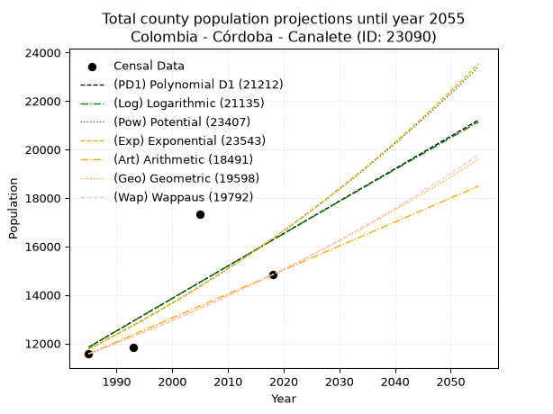
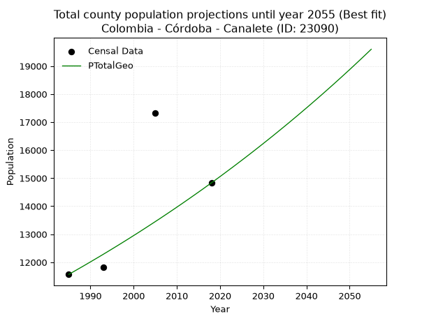
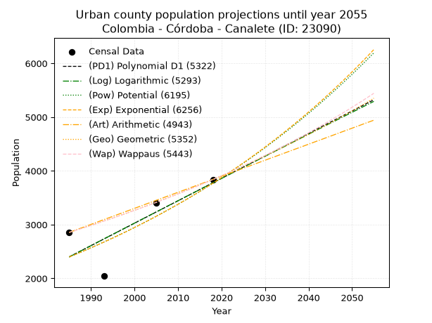
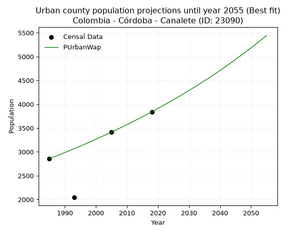
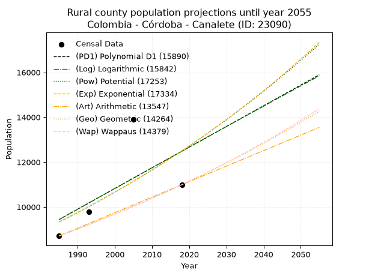
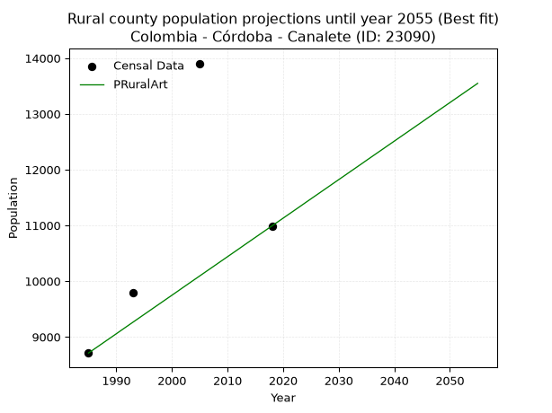

<div align="center">


</div>

# _“Population and Public Services Demand Projections (PPSD) until Year 2050 for Colombia - Córdoba - Canalete (ID: 23090)”_
Keywords: `population` `public-service` `projection` `lineal` `polynomial` `logarithmic` `potential` `exponential` `arithmetic` `geometric` `wappaus` `dane` `colombia` `south-america`

PPSD are analytical estimates used by governments and planners to anticipate future changes in population size, age distribution, and the resulting community needs for utilities, healthcare, education, and infrastructure as sizing future water treatment facilities, electrical grids, and road networks based on spatial growth.

> **General running parameters**: • app_version: _v20260806_. • Python version: _3.14.7_. • Pandas version: _3.0.5_. • NumPy version: _2.5.1_. • Creates, save and include plots into reports (create_plot): _True_. • Projection until year: _2050_. • Process polynomial degree 2 and up: _False_. • Process Wappaus: _True_. • Process Wappaus: _True_. • Set negative values to zero: _True_. • Set infinite values to zero: _True_. • Drop dataset notes: _True_. 
<div align="center">

Dynamic map: [:earth_americas:Google](http://maps.google.com/maps?q=8.78693925,-76.241476) [:earth_americas:OSM](https://www.openstreetmap.org/#map=18/8.78693925/-76.241476&layers=P) [:earth_americas:Bing](https://www.bing.com/maps?cp=8.78693925~-76.241476&lvl=18) [:earth_americas:Apple](https://maps.apple.com/frame?center=8.78693925%2C-76.241476&span=0.003%2C0.006)

</div>


<div align="center">

```geojson
{
  "type": "Feature",
  "geometry": {
    "type": "Point", 
    "coordinates": [-76.241476, 8.78693925]
  }, 
  "properties": {
    "Name": "Colombia - Córdoba - Canalete (ID: 23090)"
  }
}
```

</div>


## 0. Census Data (4 records)

Census data are official statistics collected by a government about the people and housing in a country. They usually include counts of total population, age, sex, race, income, education, and jobs.

📅Global census file: [Population.xlsx](../data/Population.xlsx)

| Source   |   Year |   CountryID | CountryName   |   StateID | StateName   |   CountyID | CountyName   |   PTotal |   PUrban |   PRural |
|:---------|-------:|------------:|:--------------|----------:|:------------|-----------:|:-------------|---------:|---------:|---------:|
| DANE     |   1985 |          57 | Colombia      |        23 | Córdoba     |      23090 | Canalete     |    11567 |     2856 |     8711 |
| DANE     |   1993 |          57 | Colombia      |        23 | Córdoba     |      23090 | Canalete     |    11829 |     2043 |     9786 |
| DANE     |   2005 |          57 | Colombia      |        23 | Córdoba     |      23090 | Canalete     |    17315 |     3410 |    13905 |
| DANE     |   2018 |          57 | Colombia      |        23 | Córdoba     |      23090 | Canalete     |    14831 |     3840 |    10991 |

> 🔥Some records has specific notes about the registered values or the corresponding urban or rural distribution.

## 1. Total

### 1.1. Coefficients and Parameters

* (PD1) Polynomial Deg 1: 133.82496989161095, -253797.89602569482 (lineal)
* (Log) Logarithmic: 268274.5188515518, -2025271.2676077185
* (Pow) Potential: 19.845217328085422, -61.37412698047415
* (Exp) Exponential: 0.00990099620181757, 3.4313846641549465e-05
* (Art) Arithmetic: Year diff. 2018 - 1985 = 33, Population diff. 14831 - 11567 = 3264, Annual growth = 98.9090909090909
* (Geo) Geometric: Year diff. 2018 - 1985 = 33, Population diff. 14831 - 11567 = 3264, Annual growth % = 0.007560661837074267
* (Wap) Wappaus: i = 0.7493680650738004, Condition values only valid for < 200)

<sub>
Wappaus condition values: ['0.00', '0.75', '1.50', '2.25', '3.00', '3.75', '4.50', '5.25', '5.99', '6.74', '7.49', '8.24', '8.99', '9.74', '10.49', '11.24', '11.99', '12.74', '13.49', '14.24', '14.99', '15.74', '16.49', '17.24', '17.98', '18.73', '19.48', '20.23', '20.98', '21.73', '22.48', '23.23', '23.98', '24.73', '25.48', '26.23', '26.98', '27.73', '28.48', '29.23', '29.97', '30.72', '31.47', '32.22', '32.97', '33.72', '34.47', '35.22', '35.97', '36.72', '37.47', '38.22', '38.97', '39.72', '40.47', '41.22', '41.96', '42.71', '43.46', '44.21', '44.96', '45.71', '46.46', '47.21', '47.96', '48.71']
</sub>


### 1.2. Projected Dataset

|   Year |   CountyID |   PTotalPD1 |   PTotalLog |   PTotalPow |   PTotalExp |   PTotalArt |   PTotalGeo |   PTotalWap |
|-------:|-----------:|------------:|------------:|------------:|------------:|------------:|------------:|------------:|
|   1985 |      23090 |       11845 |       11838 |       11766 |       11772 |       11567 |       11567 |       11567 |
|   1986 |      23090 |       11978 |       11973 |       11885 |       11890 |       11666 |       11654 |       11654 |
|   1987 |      23090 |       12112 |       12108 |       12004 |       12008 |       11765 |       11743 |       11742 |
|   1988 |      23090 |       12246 |       12243 |       12124 |       12127 |       11864 |       11831 |       11830 |
|   1989 |      23090 |       12380 |       12378 |       12246 |       12248 |       11963 |       11921 |       11919 |
|   1990 |      23090 |       12514 |       12512 |       12369 |       12370 |       12062 |       12011 |       12009 |
|   1991 |      23090 |       12648 |       12647 |       12493 |       12493 |       12160 |       12102 |       12099 |
|   1992 |      23090 |       12781 |       12782 |       12618 |       12617 |       12259 |       12193 |       12190 |
|   1993 |      23090 |       12915 |       12917 |       12744 |       12743 |       12358 |       12285 |       12282 |
|   1994 |      23090 |       13049 |       13051 |       12872 |       12870 |       12457 |       12378 |       12374 |
|   1995 |      23090 |       13183 |       13186 |       13000 |       12998 |       12556 |       12472 |       12468 |
|   1996 |      23090 |       13317 |       13320 |       13130 |       13127 |       12655 |       12566 |       12561 |
|   1997 |      23090 |       13451 |       13454 |       13262 |       13258 |       12754 |       12661 |       12656 |
|   1998 |      23090 |       13584 |       13589 |       13394 |       13390 |       12853 |       12757 |       12752 |
|   1999 |      23090 |       13718 |       13723 |       13528 |       13523 |       12952 |       12853 |       12848 |
|   2000 |      23090 |       13852 |       13857 |       13663 |       13657 |       13051 |       12951 |       12945 |
|   2001 |      23090 |       13986 |       13991 |       13799 |       13793 |       13150 |       13048 |       13042 |
|   2002 |      23090 |       14120 |       14125 |       13936 |       13930 |       13248 |       13147 |       13141 |
|   2003 |      23090 |       14254 |       14259 |       14075 |       14069 |       13347 |       13247 |       13240 |
|   2004 |      23090 |       14387 |       14393 |       14215 |       14209 |       13446 |       13347 |       13340 |
|   2005 |      23090 |       14521 |       14527 |       14357 |       14350 |       13545 |       13448 |       13441 |
|   2006 |      23090 |       14655 |       14661 |       14499 |       14493 |       13644 |       13549 |       13543 |
|   2007 |      23090 |       14789 |       14795 |       14643 |       14637 |       13743 |       13652 |       13645 |
|   2008 |      23090 |       14923 |       14928 |       14789 |       14783 |       13842 |       13755 |       13749 |
|   2009 |      23090 |       15056 |       15062 |       14936 |       14930 |       13941 |       13859 |       13853 |
|   2010 |      23090 |       15190 |       15195 |       15084 |       15079 |       14040 |       13964 |       13958 |
|   2011 |      23090 |       15324 |       15329 |       15234 |       15229 |       14139 |       14069 |       14064 |
|   2012 |      23090 |       15458 |       15462 |       15385 |       15380 |       14238 |       14176 |       14171 |
|   2013 |      23090 |       15592 |       15595 |       15537 |       15533 |       14336 |       14283 |       14278 |
|   2014 |      23090 |       15726 |       15729 |       15691 |       15688 |       14435 |       14391 |       14387 |
|   2015 |      23090 |       15859 |       15862 |       15846 |       15844 |       14534 |       14500 |       14497 |
|   2016 |      23090 |       15993 |       15995 |       16003 |       16002 |       14633 |       14609 |       14607 |
|   2017 |      23090 |       16127 |       16128 |       16161 |       16161 |       14732 |       14720 |       14719 |
|   2018 |      23090 |       16261 |       16261 |       16321 |       16322 |       14831 |       14831 |       14831 |
|   2019 |      23090 |       16395 |       16394 |       16482 |       16484 |       14930 |       14943 |       14944 |
|   2020 |      23090 |       16529 |       16527 |       16645 |       16648 |       15029 |       15056 |       15059 |
|   2021 |      23090 |       16662 |       16659 |       16810 |       16814 |       15128 |       15170 |       15174 |
|   2022 |      23090 |       16796 |       16792 |       16975 |       16981 |       15227 |       15285 |       15290 |
|   2023 |      23090 |       16930 |       16925 |       17143 |       17150 |       15326 |       15400 |       15408 |
|   2024 |      23090 |       17064 |       17057 |       17312 |       17321 |       15424 |       15517 |       15526 |
|   2025 |      23090 |       17198 |       17190 |       17482 |       17493 |       15523 |       15634 |       15645 |
|   2026 |      23090 |       17331 |       17322 |       17654 |       17667 |       15622 |       15752 |       15766 |
|   2027 |      23090 |       17465 |       17455 |       17828 |       17843 |       15721 |       15871 |       15887 |
|   2028 |      23090 |       17599 |       17587 |       18003 |       18020 |       15820 |       15991 |       16010 |
|   2029 |      23090 |       17733 |       17719 |       18180 |       18200 |       15919 |       16112 |       16134 |
|   2030 |      23090 |       17867 |       17851 |       18359 |       18381 |       16018 |       16234 |       16259 |
|   2031 |      23090 |       18001 |       17984 |       18539 |       18564 |       16117 |       16357 |       16385 |
|   2032 |      23090 |       18134 |       18116 |       18721 |       18748 |       16216 |       16480 |       16512 |
|   2033 |      23090 |       18268 |       18248 |       18905 |       18935 |       16315 |       16605 |       16640 |
|   2034 |      23090 |       18402 |       18380 |       19090 |       19123 |       16414 |       16731 |       16769 |
|   2035 |      23090 |       18536 |       18511 |       19278 |       19314 |       16512 |       16857 |       16900 |
|   2036 |      23090 |       18670 |       18643 |       19466 |       19506 |       16611 |       16984 |       17032 |
|   2037 |      23090 |       18804 |       18775 |       19657 |       19700 |       16710 |       17113 |       17165 |
|   2038 |      23090 |       18937 |       18907 |       19849 |       19896 |       16809 |       17242 |       17299 |
|   2039 |      23090 |       19071 |       19038 |       20044 |       20094 |       16908 |       17373 |       17435 |
|   2040 |      23090 |       19205 |       19170 |       20240 |       20294 |       17007 |       17504 |       17572 |
|   2041 |      23090 |       19339 |       19301 |       20437 |       20496 |       17106 |       17636 |       17710 |
|   2042 |      23090 |       19473 |       19433 |       20637 |       20700 |       17205 |       17770 |       17849 |
|   2043 |      23090 |       19607 |       19564 |       20839 |       20906 |       17304 |       17904 |       17990 |
|   2044 |      23090 |       19740 |       19695 |       21042 |       21114 |       17403 |       18039 |       18132 |
|   2045 |      23090 |       19874 |       19826 |       21247 |       21324 |       17502 |       18176 |       18276 |
|   2046 |      23090 |       20008 |       19958 |       21454 |       21536 |       17600 |       18313 |       18421 |
|   2047 |      23090 |       20142 |       20089 |       21663 |       21750 |       17699 |       18452 |       18567 |
|   2048 |      23090 |       20276 |       20220 |       21874 |       21967 |       17798 |       18591 |       18715 |
|   2049 |      23090 |       20409 |       20351 |       22087 |       22185 |       17897 |       18732 |       18864 |
|   2050 |      23090 |       20543 |       20482 |       22302 |       22406 |       17996 |       18873 |       19015 |
<div align="center">

</img>

</div>


### 1.3. Best fit with absolute error and relative error (%)

Relative error puts that difference into context by dividing the absolute error by the true value, creating a unitless ratio or percentage that shows the scale of the mistake.

Absolute and relative error

|   Year | Source   |   CountryID | CountryName   |   StateID | StateName   |   CountyID_x | CountyName   |   PTotal |   PUrban |   PRural |   CountyID_y |   PTotalPD1 |   PTotalLog |   PTotalPow |   PTotalExp |   PTotalArt |   PTotalGeo |   PTotalWap |   PTotalPD1AbsError |   PTotalLogAbsError |   PTotalPowAbsError |   PTotalExpAbsError |   PTotalArtAbsError |   PTotalGeoAbsError |   PTotalWapAbsError |   PTotalPD1RelError |   PTotalLogRelError |   PTotalPowRelError |   PTotalExpRelError |   PTotalArtRelError |   PTotalGeoRelError |   PTotalWapRelError |
|-------:|:---------|------------:|:--------------|----------:|:------------|-------------:|:-------------|---------:|---------:|---------:|-------------:|------------:|------------:|------------:|------------:|------------:|------------:|------------:|--------------------:|--------------------:|--------------------:|--------------------:|--------------------:|--------------------:|--------------------:|--------------------:|--------------------:|--------------------:|--------------------:|--------------------:|--------------------:|--------------------:|
|   1985 | DANE     |          57 | Colombia      |        23 | Córdoba     |        23090 | Canalete     |    11567 |     2856 |     8711 |        23090 |       11845 |       11838 |       11766 |       11772 |       11567 |       11567 |       11567 |                 278 |                 271 |                 199 |                 205 |                   0 |                   0 |                   0 |             2.40339 |             2.34287 |             1.72041 |             1.77228 |             0       |             0       |             0       |
|   1993 | DANE     |          57 | Colombia      |        23 | Córdoba     |        23090 | Canalete     |    11829 |     2043 |     9786 |        23090 |       12915 |       12917 |       12744 |       12743 |       12358 |       12285 |       12282 |                1086 |                1088 |                 915 |                 914 |                 529 |                 456 |                 453 |             9.18083 |             9.19773 |             7.73523 |             7.72677 |             4.47206 |             3.85493 |             3.82957 |
|   2005 | DANE     |          57 | Colombia      |        23 | Córdoba     |        23090 | Canalete     |    17315 |     3410 |    13905 |        23090 |       14521 |       14527 |       14357 |       14350 |       13545 |       13448 |       13441 |                2794 |                2788 |                2958 |                2965 |                3770 |                3867 |                3874 |            16.1363  |            16.1016  |            17.0835  |            17.1239  |            21.773   |            22.3332  |            22.3737  |
|   2018 | DANE     |          57 | Colombia      |        23 | Córdoba     |        23090 | Canalete     |    14831 |     3840 |    10991 |        23090 |       16261 |       16261 |       16321 |       16322 |       14831 |       14831 |       14831 |                1430 |                1430 |                1490 |                1491 |                   0 |                   0 |                   0 |             9.64197 |             9.64197 |            10.0465  |            10.0533  |             0       |             0       |             0       |

Relative error mean

| Method    |   RelError | Best   |
|:----------|-----------:|:-------|
| PTotalPD1 |    9.34062 |        |
| PTotalLog |    9.32105 |        |
| PTotalPow |    9.1464  |        |
| PTotalExp |    9.16905 |        |
| PTotalArt |    6.56127 |        |
| PTotalGeo |    6.54704 | True   |
| PTotalWap |    6.55081 |        |

💙Best method: _**PTotalGeo**_
<div align="center">

</img>

</div>


### 1.4. Fresh water supply demand in liters per capita per day (lpcd)

The fresh water supply demand typically ranges from 100 to 300 liters per capita per day (lpcd) for standard domestic and municipal planning, though absolute survival minimums set by the World Health Organization are as low as 7.5 to 20 liters per day, and total consumption in high-income nations can exceed 400 liters.

> `CZ`: Level in meters above the sea level (masl).<br> `WS`: Fresh water supply demand in liters per capita per day (lpcd or l/h/d).<br> `WSAll`: Zonal fresh water supply demand in liters per second (l/s).<br> `A`: Zonal area in square meters.

Reference values (RAS Colombia)

|    CZ |   WS |
|------:|-----:|
|  1000 |  120 |
|  2000 |  130 |
| 99999 |  140 |

County shapefile geometry properties and water supply values

|   CountyID |      ATotal |   CZTotal |   WSTotal |
|-----------:|------------:|----------:|----------:|
|      23090 | 4.20089e+08 |   117.758 |       120 |

Projected values for best method: PTotalGeo

|   CountyID |   Year |   PTotalGeo |   WSTotal |   WSTotalAll |
|-----------:|-------:|------------:|----------:|-------------:|
|      23090 |   1985 |       11567 |       120 |      16.0653 |
|      23090 |   1986 |       11654 |       120 |      16.1861 |
|      23090 |   1987 |       11743 |       120 |      16.3097 |
|      23090 |   1988 |       11831 |       120 |      16.4319 |
|      23090 |   1989 |       11921 |       120 |      16.5569 |
|      23090 |   1990 |       12011 |       120 |      16.6819 |
|      23090 |   1991 |       12102 |       120 |      16.8083 |
|      23090 |   1992 |       12193 |       120 |      16.9347 |
|      23090 |   1993 |       12285 |       120 |      17.0625 |
|      23090 |   1994 |       12378 |       120 |      17.1917 |
|      23090 |   1995 |       12472 |       120 |      17.3222 |
|      23090 |   1996 |       12566 |       120 |      17.4528 |
|      23090 |   1997 |       12661 |       120 |      17.5847 |
|      23090 |   1998 |       12757 |       120 |      17.7181 |
|      23090 |   1999 |       12853 |       120 |      17.8514 |
|      23090 |   2000 |       12951 |       120 |      17.9875 |
|      23090 |   2001 |       13048 |       120 |      18.1222 |
|      23090 |   2002 |       13147 |       120 |      18.2597 |
|      23090 |   2003 |       13247 |       120 |      18.3986 |
|      23090 |   2004 |       13347 |       120 |      18.5375 |
|      23090 |   2005 |       13448 |       120 |      18.6778 |
|      23090 |   2006 |       13549 |       120 |      18.8181 |
|      23090 |   2007 |       13652 |       120 |      18.9611 |
|      23090 |   2008 |       13755 |       120 |      19.1042 |
|      23090 |   2009 |       13859 |       120 |      19.2486 |
|      23090 |   2010 |       13964 |       120 |      19.3944 |
|      23090 |   2011 |       14069 |       120 |      19.5403 |
|      23090 |   2012 |       14176 |       120 |      19.6889 |
|      23090 |   2013 |       14283 |       120 |      19.8375 |
|      23090 |   2014 |       14391 |       120 |      19.9875 |
|      23090 |   2015 |       14500 |       120 |      20.1389 |
|      23090 |   2016 |       14609 |       120 |      20.2903 |
|      23090 |   2017 |       14720 |       120 |      20.4444 |
|      23090 |   2018 |       14831 |       120 |      20.5986 |
|      23090 |   2019 |       14943 |       120 |      20.7542 |
|      23090 |   2020 |       15056 |       120 |      20.9111 |
|      23090 |   2021 |       15170 |       120 |      21.0694 |
|      23090 |   2022 |       15285 |       120 |      21.2292 |
|      23090 |   2023 |       15400 |       120 |      21.3889 |
|      23090 |   2024 |       15517 |       120 |      21.5514 |
|      23090 |   2025 |       15634 |       120 |      21.7139 |
|      23090 |   2026 |       15752 |       120 |      21.8778 |
|      23090 |   2027 |       15871 |       120 |      22.0431 |
|      23090 |   2028 |       15991 |       120 |      22.2097 |
|      23090 |   2029 |       16112 |       120 |      22.3778 |
|      23090 |   2030 |       16234 |       120 |      22.5472 |
|      23090 |   2031 |       16357 |       120 |      22.7181 |
|      23090 |   2032 |       16480 |       120 |      22.8889 |
|      23090 |   2033 |       16605 |       120 |      23.0625 |
|      23090 |   2034 |       16731 |       120 |      23.2375 |
|      23090 |   2035 |       16857 |       120 |      23.4125 |
|      23090 |   2036 |       16984 |       120 |      23.5889 |
|      23090 |   2037 |       17113 |       120 |      23.7681 |
|      23090 |   2038 |       17242 |       120 |      23.9472 |
|      23090 |   2039 |       17373 |       120 |      24.1292 |
|      23090 |   2040 |       17504 |       120 |      24.3111 |
|      23090 |   2041 |       17636 |       120 |      24.4944 |
|      23090 |   2042 |       17770 |       120 |      24.6806 |
|      23090 |   2043 |       17904 |       120 |      24.8667 |
|      23090 |   2044 |       18039 |       120 |      25.0542 |
|      23090 |   2045 |       18176 |       120 |      25.2444 |
|      23090 |   2046 |       18313 |       120 |      25.4347 |
|      23090 |   2047 |       18452 |       120 |      25.6278 |
|      23090 |   2048 |       18591 |       120 |      25.8208 |
|      23090 |   2049 |       18732 |       120 |      26.0167 |
|      23090 |   2050 |       18873 |       120 |      26.2125 |

## 2. Urban

### 2.1. Coefficients and Parameters

* (PD1) Polynomial Deg 1: 41.73705339221162, -80447.29104777129 (lineal)
* (Log) Logarithmic: 83466.74615082273, -631394.15635293
* (Pow) Potential: 27.37595407607787, -86.89932247658273
* (Exp) Exponential: 0.01369055266593344, 3.782933059636529e-09
* (Art) Arithmetic: Year diff. 2018 - 1985 = 33, Population diff. 3840 - 2856 = 984, Annual growth = 29.818181818181817
* (Geo) Geometric: Year diff. 2018 - 1985 = 33, Population diff. 3840 - 2856 = 984, Annual growth % = 0.00901158390211565
* (Wap) Wappaus: i = 0.89062669707831, Condition values only valid for < 200)

<sub>
Wappaus condition values: ['0.00', '0.89', '1.78', '2.67', '3.56', '4.45', '5.34', '6.23', '7.13', '8.02', '8.91', '9.80', '10.69', '11.58', '12.47', '13.36', '14.25', '15.14', '16.03', '16.92', '17.81', '18.70', '19.59', '20.48', '21.38', '22.27', '23.16', '24.05', '24.94', '25.83', '26.72', '27.61', '28.50', '29.39', '30.28', '31.17', '32.06', '32.95', '33.84', '34.73', '35.63', '36.52', '37.41', '38.30', '39.19', '40.08', '40.97', '41.86', '42.75', '43.64', '44.53', '45.42', '46.31', '47.20', '48.09', '48.98', '49.88', '50.77', '51.66', '52.55', '53.44', '54.33', '55.22', '56.11', '57.00', '57.89']
</sub>


### 2.2. Projected Dataset

|   Year |   CountyID |   PUrbanPD1 |   PUrbanLog |   PUrbanPow |   PUrbanExp |   PUrbanArt |   PUrbanGeo |   PUrbanWap |
|-------:|-----------:|------------:|------------:|------------:|------------:|------------:|------------:|------------:|
|   1985 |      23090 |        2401 |        2400 |        2399 |        2399 |        2856 |        2856 |        2856 |
|   1986 |      23090 |        2442 |        2442 |        2432 |        2432 |        2886 |        2882 |        2882 |
|   1987 |      23090 |        2484 |        2484 |        2466 |        2466 |        2916 |        2908 |        2907 |
|   1988 |      23090 |        2526 |        2526 |        2500 |        2500 |        2945 |        2934 |        2933 |
|   1989 |      23090 |        2568 |        2568 |        2535 |        2534 |        2975 |        2960 |        2960 |
|   1990 |      23090 |        2609 |        2610 |        2570 |        2569 |        3005 |        2987 |        2986 |
|   1991 |      23090 |        2651 |        2652 |        2606 |        2605 |        3035 |        3014 |        3013 |
|   1992 |      23090 |        2693 |        2694 |        2642 |        2641 |        3065 |        3041 |        3040 |
|   1993 |      23090 |        2735 |        2736 |        2678 |        2677 |        3095 |        3069 |        3067 |
|   1994 |      23090 |        2776 |        2778 |        2715 |        2714 |        3124 |        3096 |        3094 |
|   1995 |      23090 |        2818 |        2820 |        2753 |        2751 |        3154 |        3124 |        3122 |
|   1996 |      23090 |        2860 |        2861 |        2791 |        2789 |        3184 |        3152 |        3150 |
|   1997 |      23090 |        2902 |        2903 |        2829 |        2828 |        3214 |        3181 |        3178 |
|   1998 |      23090 |        2943 |        2945 |        2868 |        2867 |        3244 |        3209 |        3207 |
|   1999 |      23090 |        2985 |        2987 |        2908 |        2906 |        3273 |        3238 |        3236 |
|   2000 |      23090 |        3027 |        3028 |        2948 |        2946 |        3303 |        3267 |        3265 |
|   2001 |      23090 |        3069 |        3070 |        2989 |        2987 |        3333 |        3297 |        3294 |
|   2002 |      23090 |        3110 |        3112 |        3030 |        3028 |        3363 |        3327 |        3324 |
|   2003 |      23090 |        3152 |        3154 |        3071 |        3070 |        3393 |        3357 |        3354 |
|   2004 |      23090 |        3194 |        3195 |        3114 |        3112 |        3423 |        3387 |        3384 |
|   2005 |      23090 |        3236 |        3237 |        3157 |        3155 |        3452 |        3417 |        3414 |
|   2006 |      23090 |        3277 |        3278 |        3200 |        3199 |        3482 |        3448 |        3445 |
|   2007 |      23090 |        3319 |        3320 |        3244 |        3243 |        3512 |        3479 |        3476 |
|   2008 |      23090 |        3361 |        3362 |        3288 |        3287 |        3542 |        3511 |        3508 |
|   2009 |      23090 |        3402 |        3403 |        3334 |        3333 |        3572 |        3542 |        3540 |
|   2010 |      23090 |        3444 |        3445 |        3379 |        3379 |        3601 |        3574 |        3572 |
|   2011 |      23090 |        3486 |        3486 |        3426 |        3425 |        3631 |        3606 |        3604 |
|   2012 |      23090 |        3528 |        3528 |        3473 |        3472 |        3661 |        3639 |        3637 |
|   2013 |      23090 |        3569 |        3569 |        3520 |        3520 |        3691 |        3672 |        3670 |
|   2014 |      23090 |        3611 |        3611 |        3568 |        3569 |        3721 |        3705 |        3703 |
|   2015 |      23090 |        3653 |        3652 |        3617 |        3618 |        3751 |        3738 |        3737 |
|   2016 |      23090 |        3695 |        3694 |        3667 |        3668 |        3780 |        3772 |        3771 |
|   2017 |      23090 |        3736 |        3735 |        3717 |        3719 |        3810 |        3806 |        3805 |
|   2018 |      23090 |        3778 |        3776 |        3767 |        3770 |        3840 |        3840 |        3840 |
|   2019 |      23090 |        3820 |        3818 |        3819 |        3822 |        3870 |        3875 |        3875 |
|   2020 |      23090 |        3862 |        3859 |        3871 |        3874 |        3900 |        3910 |        3911 |
|   2021 |      23090 |        3903 |        3900 |        3924 |        3928 |        3929 |        3945 |        3947 |
|   2022 |      23090 |        3945 |        3942 |        3977 |        3982 |        3959 |        3980 |        3983 |
|   2023 |      23090 |        3987 |        3983 |        4032 |        4037 |        3989 |        4016 |        4019 |
|   2024 |      23090 |        4029 |        4024 |        4086 |        4093 |        4019 |        4052 |        4057 |
|   2025 |      23090 |        4070 |        4065 |        4142 |        4149 |        4049 |        4089 |        4094 |
|   2026 |      23090 |        4112 |        4107 |        4198 |        4206 |        4079 |        4126 |        4132 |
|   2027 |      23090 |        4154 |        4148 |        4256 |        4264 |        4108 |        4163 |        4170 |
|   2028 |      23090 |        4195 |        4189 |        4313 |        4323 |        4138 |        4200 |        4209 |
|   2029 |      23090 |        4237 |        4230 |        4372 |        4382 |        4168 |        4238 |        4248 |
|   2030 |      23090 |        4279 |        4271 |        4431 |        4443 |        4198 |        4276 |        4287 |
|   2031 |      23090 |        4321 |        4312 |        4492 |        4504 |        4228 |        4315 |        4327 |
|   2032 |      23090 |        4362 |        4353 |        4552 |        4566 |        4257 |        4354 |        4368 |
|   2033 |      23090 |        4404 |        4394 |        4614 |        4629 |        4287 |        4393 |        4409 |
|   2034 |      23090 |        4446 |        4435 |        4677 |        4693 |        4317 |        4433 |        4450 |
|   2035 |      23090 |        4488 |        4476 |        4740 |        4758 |        4347 |        4473 |        4492 |
|   2036 |      23090 |        4529 |        4517 |        4804 |        4823 |        4377 |        4513 |        4534 |
|   2037 |      23090 |        4571 |        4558 |        4869 |        4890 |        4407 |        4554 |        4577 |
|   2038 |      23090 |        4613 |        4599 |        4935 |        4957 |        4436 |        4595 |        4621 |
|   2039 |      23090 |        4655 |        4640 |        5002 |        5025 |        4466 |        4636 |        4664 |
|   2040 |      23090 |        4696 |        4681 |        5069 |        5095 |        4496 |        4678 |        4709 |
|   2041 |      23090 |        4738 |        4722 |        5138 |        5165 |        4526 |        4720 |        4754 |
|   2042 |      23090 |        4780 |        4763 |        5207 |        5236 |        4556 |        4763 |        4799 |
|   2043 |      23090 |        4822 |        4804 |        5278 |        5308 |        4585 |        4805 |        4845 |
|   2044 |      23090 |        4863 |        4845 |        5349 |        5382 |        4615 |        4849 |        4892 |
|   2045 |      23090 |        4905 |        4886 |        5421 |        5456 |        4645 |        4892 |        4939 |
|   2046 |      23090 |        4947 |        4926 |        5494 |        5531 |        4675 |        4937 |        4986 |
|   2047 |      23090 |        4988 |        4967 |        5568 |        5607 |        4705 |        4981 |        5035 |
|   2048 |      23090 |        5030 |        5008 |        5643 |        5684 |        4735 |        5026 |        5083 |
|   2049 |      23090 |        5072 |        5049 |        5719 |        5763 |        4764 |        5071 |        5133 |
|   2050 |      23090 |        5114 |        5089 |        5796 |        5842 |        4794 |        5117 |        5183 |
<div align="center">

</img>

</div>


### 2.3. Best fit with absolute error and relative error (%)

Relative error puts that difference into context by dividing the absolute error by the true value, creating a unitless ratio or percentage that shows the scale of the mistake.

Absolute and relative error

|   Year | Source   |   CountryID | CountryName   |   StateID | StateName   |   CountyID_x | CountyName   |   PTotal |   PUrban |   PRural |   CountyID_y |   PUrbanPD1 |   PUrbanLog |   PUrbanPow |   PUrbanExp |   PUrbanArt |   PUrbanGeo |   PUrbanWap |   PUrbanPD1AbsError |   PUrbanLogAbsError |   PUrbanPowAbsError |   PUrbanExpAbsError |   PUrbanArtAbsError |   PUrbanGeoAbsError |   PUrbanWapAbsError |   PUrbanPD1RelError |   PUrbanLogRelError |   PUrbanPowRelError |   PUrbanExpRelError |   PUrbanArtRelError |   PUrbanGeoRelError |   PUrbanWapRelError |
|-------:|:---------|------------:|:--------------|----------:|:------------|-------------:|:-------------|---------:|---------:|---------:|-------------:|------------:|------------:|------------:|------------:|------------:|------------:|------------:|--------------------:|--------------------:|--------------------:|--------------------:|--------------------:|--------------------:|--------------------:|--------------------:|--------------------:|--------------------:|--------------------:|--------------------:|--------------------:|--------------------:|
|   1985 | DANE     |          57 | Colombia      |        23 | Córdoba     |        23090 | Canalete     |    11567 |     2856 |     8711 |        23090 |        2401 |        2400 |        2399 |        2399 |        2856 |        2856 |        2856 |                 455 |                 456 |                 457 |                 457 |                   0 |                   0 |                   0 |            15.9314  |            15.9664  |            16.0014  |            16.0014  |             0       |            0        |            0        |
|   1993 | DANE     |          57 | Colombia      |        23 | Córdoba     |        23090 | Canalete     |    11829 |     2043 |     9786 |        23090 |        2735 |        2736 |        2678 |        2677 |        3095 |        3069 |        3067 |                 692 |                 693 |                 635 |                 634 |                1052 |                1026 |                1024 |            33.8718  |            33.9207  |            31.0817  |            31.0328  |            51.4929  |           50.2203   |           50.1224   |
|   2005 | DANE     |          57 | Colombia      |        23 | Córdoba     |        23090 | Canalete     |    17315 |     3410 |    13905 |        23090 |        3236 |        3237 |        3157 |        3155 |        3452 |        3417 |        3414 |                 174 |                 173 |                 253 |                 255 |                  42 |                   7 |                   4 |             5.10264 |             5.07331 |             7.41935 |             7.47801 |             1.23167 |            0.205279 |            0.117302 |
|   2018 | DANE     |          57 | Colombia      |        23 | Córdoba     |        23090 | Canalete     |    14831 |     3840 |    10991 |        23090 |        3778 |        3776 |        3767 |        3770 |        3840 |        3840 |        3840 |                  62 |                  64 |                  73 |                  70 |                   0 |                   0 |                   0 |             1.61458 |             1.66667 |             1.90104 |             1.82292 |             0       |            0        |            0        |

Relative error mean

| Method    |   RelError | Best   |
|:----------|-----------:|:-------|
| PUrbanPD1 |    14.1301 |        |
| PUrbanLog |    14.1568 |        |
| PUrbanPow |    14.1009 |        |
| PUrbanExp |    14.0838 |        |
| PUrbanArt |    13.1811 |        |
| PUrbanGeo |    12.6064 |        |
| PUrbanWap |    12.5599 | True   |

💙Best method: _**PUrbanWap**_
<div align="center">

</img>

</div>


### 2.4. Fresh water supply demand in liters per capita per day (lpcd)

The fresh water supply demand typically ranges from 100 to 300 liters per capita per day (lpcd) for standard domestic and municipal planning, though absolute survival minimums set by the World Health Organization are as low as 7.5 to 20 liters per day, and total consumption in high-income nations can exceed 400 liters.

> `CZ`: Level in meters above the sea level (masl).<br> `WS`: Fresh water supply demand in liters per capita per day (lpcd or l/h/d).<br> `WSAll`: Zonal fresh water supply demand in liters per second (l/s).<br> `A`: Zonal area in square meters.

Reference values (RAS Colombia)

|    CZ |   WS |
|------:|-----:|
|  1000 |  120 |
|  2000 |  130 |
| 99999 |  140 |

County shapefile geometry properties and water supply values

|   CountyID |   AUrban |   CZUrban |   WSUrban |
|-----------:|---------:|----------:|----------:|
|      23090 |   716157 |   51.0139 |       120 |

Projected values for best method: PUrbanWap

|   CountyID |   Year |   PUrbanWap |   WSUrban |   WSUrbanAll |
|-----------:|-------:|------------:|----------:|-------------:|
|      23090 |   1985 |        2856 |       120 |      3.96667 |
|      23090 |   1986 |        2882 |       120 |      4.00278 |
|      23090 |   1987 |        2907 |       120 |      4.0375  |
|      23090 |   1988 |        2933 |       120 |      4.07361 |
|      23090 |   1989 |        2960 |       120 |      4.11111 |
|      23090 |   1990 |        2986 |       120 |      4.14722 |
|      23090 |   1991 |        3013 |       120 |      4.18472 |
|      23090 |   1992 |        3040 |       120 |      4.22222 |
|      23090 |   1993 |        3067 |       120 |      4.25972 |
|      23090 |   1994 |        3094 |       120 |      4.29722 |
|      23090 |   1995 |        3122 |       120 |      4.33611 |
|      23090 |   1996 |        3150 |       120 |      4.375   |
|      23090 |   1997 |        3178 |       120 |      4.41389 |
|      23090 |   1998 |        3207 |       120 |      4.45417 |
|      23090 |   1999 |        3236 |       120 |      4.49444 |
|      23090 |   2000 |        3265 |       120 |      4.53472 |
|      23090 |   2001 |        3294 |       120 |      4.575   |
|      23090 |   2002 |        3324 |       120 |      4.61667 |
|      23090 |   2003 |        3354 |       120 |      4.65833 |
|      23090 |   2004 |        3384 |       120 |      4.7     |
|      23090 |   2005 |        3414 |       120 |      4.74167 |
|      23090 |   2006 |        3445 |       120 |      4.78472 |
|      23090 |   2007 |        3476 |       120 |      4.82778 |
|      23090 |   2008 |        3508 |       120 |      4.87222 |
|      23090 |   2009 |        3540 |       120 |      4.91667 |
|      23090 |   2010 |        3572 |       120 |      4.96111 |
|      23090 |   2011 |        3604 |       120 |      5.00556 |
|      23090 |   2012 |        3637 |       120 |      5.05139 |
|      23090 |   2013 |        3670 |       120 |      5.09722 |
|      23090 |   2014 |        3703 |       120 |      5.14306 |
|      23090 |   2015 |        3737 |       120 |      5.19028 |
|      23090 |   2016 |        3771 |       120 |      5.2375  |
|      23090 |   2017 |        3805 |       120 |      5.28472 |
|      23090 |   2018 |        3840 |       120 |      5.33333 |
|      23090 |   2019 |        3875 |       120 |      5.38194 |
|      23090 |   2020 |        3911 |       120 |      5.43194 |
|      23090 |   2021 |        3947 |       120 |      5.48194 |
|      23090 |   2022 |        3983 |       120 |      5.53194 |
|      23090 |   2023 |        4019 |       120 |      5.58194 |
|      23090 |   2024 |        4057 |       120 |      5.63472 |
|      23090 |   2025 |        4094 |       120 |      5.68611 |
|      23090 |   2026 |        4132 |       120 |      5.73889 |
|      23090 |   2027 |        4170 |       120 |      5.79167 |
|      23090 |   2028 |        4209 |       120 |      5.84583 |
|      23090 |   2029 |        4248 |       120 |      5.9     |
|      23090 |   2030 |        4287 |       120 |      5.95417 |
|      23090 |   2031 |        4327 |       120 |      6.00972 |
|      23090 |   2032 |        4368 |       120 |      6.06667 |
|      23090 |   2033 |        4409 |       120 |      6.12361 |
|      23090 |   2034 |        4450 |       120 |      6.18056 |
|      23090 |   2035 |        4492 |       120 |      6.23889 |
|      23090 |   2036 |        4534 |       120 |      6.29722 |
|      23090 |   2037 |        4577 |       120 |      6.35694 |
|      23090 |   2038 |        4621 |       120 |      6.41806 |
|      23090 |   2039 |        4664 |       120 |      6.47778 |
|      23090 |   2040 |        4709 |       120 |      6.54028 |
|      23090 |   2041 |        4754 |       120 |      6.60278 |
|      23090 |   2042 |        4799 |       120 |      6.66528 |
|      23090 |   2043 |        4845 |       120 |      6.72917 |
|      23090 |   2044 |        4892 |       120 |      6.79444 |
|      23090 |   2045 |        4939 |       120 |      6.85972 |
|      23090 |   2046 |        4986 |       120 |      6.925   |
|      23090 |   2047 |        5035 |       120 |      6.99306 |
|      23090 |   2048 |        5083 |       120 |      7.05972 |
|      23090 |   2049 |        5133 |       120 |      7.12917 |
|      23090 |   2050 |        5183 |       120 |      7.19861 |

## 3. Rural

### 3.1. Coefficients and Parameters

* (PD1) Polynomial Deg 1: 92.0879164993993, -173350.60497792345 (lineal)
* (Log) Logarithmic: 184807.77270072894, -1393877.1112547875
* (Pow) Potential: 17.734560284300027, -54.51440808067668
* (Exp) Exponential: 0.008838923191493342, 0.00022406269050630998
* (Art) Arithmetic: Year diff. 2018 - 1985 = 33, Population diff. 10991 - 8711 = 2280, Annual growth = 69.0909090909091
* (Geo) Geometric: Year diff. 2018 - 1985 = 33, Population diff. 10991 - 8711 = 2280, Annual growth % = 0.0070700318988199395
* (Wap) Wappaus: i = 0.7013593451518535, Condition values only valid for < 200)

<sub>
Wappaus condition values: ['0.00', '0.70', '1.40', '2.10', '2.81', '3.51', '4.21', '4.91', '5.61', '6.31', '7.01', '7.71', '8.42', '9.12', '9.82', '10.52', '11.22', '11.92', '12.62', '13.33', '14.03', '14.73', '15.43', '16.13', '16.83', '17.53', '18.24', '18.94', '19.64', '20.34', '21.04', '21.74', '22.44', '23.14', '23.85', '24.55', '25.25', '25.95', '26.65', '27.35', '28.05', '28.76', '29.46', '30.16', '30.86', '31.56', '32.26', '32.96', '33.67', '34.37', '35.07', '35.77', '36.47', '37.17', '37.87', '38.57', '39.28', '39.98', '40.68', '41.38', '42.08', '42.78', '43.48', '44.19', '44.89', '45.59']
</sub>


### 3.2. Projected Dataset

|   Year |   CountyID |   PRuralPD1 |   PRuralLog |   PRuralPow |   PRuralExp |   PRuralArt |   PRuralGeo |   PRuralWap |
|-------:|-----------:|------------:|------------:|------------:|------------:|------------:|------------:|------------:|
|   1985 |      23090 |        9444 |        9437 |        9331 |        9336 |        8711 |        8711 |        8711 |
|   1986 |      23090 |        9536 |        9531 |        9415 |        9419 |        8780 |        8773 |        8772 |
|   1987 |      23090 |        9628 |        9624 |        9499 |        9503 |        8849 |        8835 |        8834 |
|   1988 |      23090 |        9720 |        9717 |        9584 |        9587 |        8918 |        8897 |        8896 |
|   1989 |      23090 |        9812 |        9809 |        9670 |        9672 |        8987 |        8960 |        8959 |
|   1990 |      23090 |        9904 |        9902 |        9757 |        9758 |        9056 |        9023 |        9022 |
|   1991 |      23090 |        9996 |        9995 |        9844 |        9845 |        9126 |        9087 |        9085 |
|   1992 |      23090 |       10089 |       10088 |        9932 |        9932 |        9195 |        9151 |        9149 |
|   1993 |      23090 |       10181 |       10181 |       10021 |       10021 |        9264 |        9216 |        9214 |
|   1994 |      23090 |       10273 |       10273 |       10110 |       10109 |        9333 |        9281 |        9279 |
|   1995 |      23090 |       10365 |       10366 |       10201 |       10199 |        9402 |        9347 |        9344 |
|   1996 |      23090 |       10457 |       10459 |       10292 |       10290 |        9471 |        9413 |        9410 |
|   1997 |      23090 |       10549 |       10551 |       10384 |       10381 |        9540 |        9479 |        9476 |
|   1998 |      23090 |       10641 |       10644 |       10476 |       10473 |        9609 |        9546 |        9543 |
|   1999 |      23090 |       10733 |       10736 |       10570 |       10566 |        9678 |        9614 |        9610 |
|   2000 |      23090 |       10825 |       10829 |       10664 |       10660 |        9747 |        9682 |        9678 |
|   2001 |      23090 |       10917 |       10921 |       10759 |       10755 |        9816 |        9750 |        9747 |
|   2002 |      23090 |       11009 |       11013 |       10854 |       10850 |        9886 |        9819 |        9815 |
|   2003 |      23090 |       11101 |       11106 |       10951 |       10947 |        9955 |        9889 |        9885 |
|   2004 |      23090 |       11194 |       11198 |       11048 |       11044 |       10024 |        9959 |        9955 |
|   2005 |      23090 |       11286 |       11290 |       11146 |       11142 |       10093 |       10029 |       10025 |
|   2006 |      23090 |       11378 |       11382 |       11246 |       11241 |       10162 |       10100 |       10096 |
|   2007 |      23090 |       11470 |       11474 |       11345 |       11340 |       10231 |       10171 |       10167 |
|   2008 |      23090 |       11562 |       11566 |       11446 |       11441 |       10300 |       10243 |       10239 |
|   2009 |      23090 |       11654 |       11659 |       11548 |       11543 |       10369 |       10316 |       10312 |
|   2010 |      23090 |       11746 |       11750 |       11650 |       11645 |       10438 |       10389 |       10385 |
|   2011 |      23090 |       11838 |       11842 |       11753 |       11749 |       10507 |       10462 |       10459 |
|   2012 |      23090 |       11930 |       11934 |       11857 |       11853 |       10576 |       10536 |       10533 |
|   2013 |      23090 |       12022 |       12026 |       11962 |       11958 |       10646 |       10611 |       10608 |
|   2014 |      23090 |       12114 |       12118 |       12068 |       12064 |       10715 |       10686 |       10683 |
|   2015 |      23090 |       12207 |       12210 |       12175 |       12171 |       10784 |       10761 |       10759 |
|   2016 |      23090 |       12299 |       12301 |       12282 |       12279 |       10853 |       10837 |       10836 |
|   2017 |      23090 |       12391 |       12393 |       12391 |       12388 |       10922 |       10914 |       10913 |
|   2018 |      23090 |       12483 |       12485 |       12500 |       12498 |       10991 |       10991 |       10991 |
|   2019 |      23090 |       12575 |       12576 |       12610 |       12609 |       11060 |       11069 |       11069 |
|   2020 |      23090 |       12667 |       12668 |       12722 |       12721 |       11129 |       11147 |       11149 |
|   2021 |      23090 |       12759 |       12759 |       12834 |       12834 |       11198 |       11226 |       11228 |
|   2022 |      23090 |       12851 |       12851 |       12947 |       12948 |       11267 |       11305 |       11309 |
|   2023 |      23090 |       12943 |       12942 |       13061 |       13063 |       11336 |       11385 |       11390 |
|   2024 |      23090 |       13035 |       13033 |       13176 |       13179 |       11406 |       11466 |       11471 |
|   2025 |      23090 |       13127 |       13125 |       13292 |       13296 |       11475 |       11547 |       11554 |
|   2026 |      23090 |       13220 |       13216 |       13409 |       13414 |       11544 |       11628 |       11637 |
|   2027 |      23090 |       13312 |       13307 |       13527 |       13533 |       11613 |       11710 |       11720 |
|   2028 |      23090 |       13404 |       13398 |       13645 |       13654 |       11682 |       11793 |       11805 |
|   2029 |      23090 |       13496 |       13489 |       13765 |       13775 |       11751 |       11877 |       11890 |
|   2030 |      23090 |       13588 |       13580 |       13886 |       13897 |       11820 |       11961 |       11975 |
|   2031 |      23090 |       13680 |       13671 |       14008 |       14020 |       11889 |       12045 |       12062 |
|   2032 |      23090 |       13772 |       13762 |       14131 |       14145 |       11958 |       12130 |       12149 |
|   2033 |      23090 |       13864 |       13853 |       14255 |       14270 |       12027 |       12216 |       12237 |
|   2034 |      23090 |       13956 |       13944 |       14379 |       14397 |       12096 |       12302 |       12326 |
|   2035 |      23090 |       14048 |       14035 |       14505 |       14525 |       12166 |       12389 |       12415 |
|   2036 |      23090 |       14140 |       14126 |       14632 |       14654 |       12235 |       12477 |       12505 |
|   2037 |      23090 |       14232 |       14216 |       14760 |       14784 |       12304 |       12565 |       12596 |
|   2038 |      23090 |       14325 |       14307 |       14889 |       14915 |       12373 |       12654 |       12688 |
|   2039 |      23090 |       14417 |       14398 |       15019 |       15048 |       12442 |       12744 |       12781 |
|   2040 |      23090 |       14509 |       14488 |       15151 |       15181 |       12511 |       12834 |       12874 |
|   2041 |      23090 |       14601 |       14579 |       15283 |       15316 |       12580 |       12924 |       12968 |
|   2042 |      23090 |       14693 |       14670 |       15416 |       15452 |       12649 |       13016 |       13063 |
|   2043 |      23090 |       14785 |       14760 |       15551 |       15589 |       12718 |       13108 |       13159 |
|   2044 |      23090 |       14877 |       14850 |       15686 |       15728 |       12787 |       13200 |       13256 |
|   2045 |      23090 |       14969 |       14941 |       15823 |       15867 |       12856 |       13294 |       13354 |
|   2046 |      23090 |       15061 |       15031 |       15961 |       16008 |       12926 |       13388 |       13452 |
|   2047 |      23090 |       15153 |       15121 |       16099 |       16150 |       12995 |       13482 |       13551 |
|   2048 |      23090 |       15245 |       15212 |       16239 |       16294 |       13064 |       13578 |       13652 |
|   2049 |      23090 |       15338 |       15302 |       16381 |       16438 |       13133 |       13674 |       13753 |
|   2050 |      23090 |       15430 |       15392 |       16523 |       16584 |       13202 |       13770 |       13855 |
<div align="center">

</img>

</div>


### 3.3. Best fit with absolute error and relative error (%)

Relative error puts that difference into context by dividing the absolute error by the true value, creating a unitless ratio or percentage that shows the scale of the mistake.

Absolute and relative error

|   Year | Source   |   CountryID | CountryName   |   StateID | StateName   |   CountyID_x | CountyName   |   PTotal |   PUrban |   PRural |   CountyID_y |   PRuralPD1 |   PRuralLog |   PRuralPow |   PRuralExp |   PRuralArt |   PRuralGeo |   PRuralWap |   PRuralPD1AbsError |   PRuralLogAbsError |   PRuralPowAbsError |   PRuralExpAbsError |   PRuralArtAbsError |   PRuralGeoAbsError |   PRuralWapAbsError |   PRuralPD1RelError |   PRuralLogRelError |   PRuralPowRelError |   PRuralExpRelError |   PRuralArtRelError |   PRuralGeoRelError |   PRuralWapRelError |
|-------:|:---------|------------:|:--------------|----------:|:------------|-------------:|:-------------|---------:|---------:|---------:|-------------:|------------:|------------:|------------:|------------:|------------:|------------:|------------:|--------------------:|--------------------:|--------------------:|--------------------:|--------------------:|--------------------:|--------------------:|--------------------:|--------------------:|--------------------:|--------------------:|--------------------:|--------------------:|--------------------:|
|   1985 | DANE     |          57 | Colombia      |        23 | Córdoba     |        23090 | Canalete     |    11567 |     2856 |     8711 |        23090 |        9444 |        9437 |        9331 |        9336 |        8711 |        8711 |        8711 |                 733 |                 726 |                 620 |                 625 |                   0 |                   0 |                   0 |             8.41465 |             8.33429 |             7.11744 |             7.17484 |             0       |             0       |             0       |
|   1993 | DANE     |          57 | Colombia      |        23 | Córdoba     |        23090 | Canalete     |    11829 |     2043 |     9786 |        23090 |       10181 |       10181 |       10021 |       10021 |        9264 |        9216 |        9214 |                 395 |                 395 |                 235 |                 235 |                 522 |                 570 |                 572 |             4.03638 |             4.03638 |             2.40139 |             2.40139 |             5.33415 |             5.82465 |             5.84508 |
|   2005 | DANE     |          57 | Colombia      |        23 | Córdoba     |        23090 | Canalete     |    17315 |     3410 |    13905 |        23090 |       11286 |       11290 |       11146 |       11142 |       10093 |       10029 |       10025 |                2619 |                2615 |                2759 |                2763 |                3812 |                3876 |                3880 |            18.835   |            18.8062  |            19.8418  |            19.8706  |            27.4146  |            27.8749  |            27.9036  |
|   2018 | DANE     |          57 | Colombia      |        23 | Córdoba     |        23090 | Canalete     |    14831 |     3840 |    10991 |        23090 |       12483 |       12485 |       12500 |       12498 |       10991 |       10991 |       10991 |                1492 |                1494 |                1509 |                1507 |                   0 |                   0 |                   0 |            13.5747  |            13.5929  |            13.7294  |            13.7112  |             0       |             0       |             0       |

Relative error mean

| Method    |   RelError | Best   |
|:----------|-----------:|:-------|
| PRuralPD1 |   11.2152  |        |
| PRuralLog |   11.1924  |        |
| PRuralPow |   10.7725  |        |
| PRuralExp |   10.7895  |        |
| PRuralArt |    8.18719 | True   |
| PRuralGeo |    8.42488 |        |
| PRuralWap |    8.43718 |        |

💙Best method: _**PRuralArt**_
<div align="center">

</img>

</div>


### 3.4. Fresh water supply demand in liters per capita per day (lpcd)

The fresh water supply demand typically ranges from 100 to 300 liters per capita per day (lpcd) for standard domestic and municipal planning, though absolute survival minimums set by the World Health Organization are as low as 7.5 to 20 liters per day, and total consumption in high-income nations can exceed 400 liters.

> `CZ`: Level in meters above the sea level (masl).<br> `WS`: Fresh water supply demand in liters per capita per day (lpcd or l/h/d).<br> `WSAll`: Zonal fresh water supply demand in liters per second (l/s).<br> `A`: Zonal area in square meters.

Reference values (RAS Colombia)

|    CZ |   WS |
|------:|-----:|
|  1000 |  120 |
|  2000 |  130 |
| 99999 |  140 |

County shapefile geometry properties and water supply values

|   CountyID |      ARural |   CZRural |   WSRural |
|-----------:|------------:|----------:|----------:|
|      23090 | 4.19373e+08 |   117.874 |       120 |

Projected values for best method: PRuralArt

|   CountyID |   Year |   PRuralArt |   WSRural |   WSRuralAll |
|-----------:|-------:|------------:|----------:|-------------:|
|      23090 |   1985 |        8711 |       120 |      12.0986 |
|      23090 |   1986 |        8780 |       120 |      12.1944 |
|      23090 |   1987 |        8849 |       120 |      12.2903 |
|      23090 |   1988 |        8918 |       120 |      12.3861 |
|      23090 |   1989 |        8987 |       120 |      12.4819 |
|      23090 |   1990 |        9056 |       120 |      12.5778 |
|      23090 |   1991 |        9126 |       120 |      12.675  |
|      23090 |   1992 |        9195 |       120 |      12.7708 |
|      23090 |   1993 |        9264 |       120 |      12.8667 |
|      23090 |   1994 |        9333 |       120 |      12.9625 |
|      23090 |   1995 |        9402 |       120 |      13.0583 |
|      23090 |   1996 |        9471 |       120 |      13.1542 |
|      23090 |   1997 |        9540 |       120 |      13.25   |
|      23090 |   1998 |        9609 |       120 |      13.3458 |
|      23090 |   1999 |        9678 |       120 |      13.4417 |
|      23090 |   2000 |        9747 |       120 |      13.5375 |
|      23090 |   2001 |        9816 |       120 |      13.6333 |
|      23090 |   2002 |        9886 |       120 |      13.7306 |
|      23090 |   2003 |        9955 |       120 |      13.8264 |
|      23090 |   2004 |       10024 |       120 |      13.9222 |
|      23090 |   2005 |       10093 |       120 |      14.0181 |
|      23090 |   2006 |       10162 |       120 |      14.1139 |
|      23090 |   2007 |       10231 |       120 |      14.2097 |
|      23090 |   2008 |       10300 |       120 |      14.3056 |
|      23090 |   2009 |       10369 |       120 |      14.4014 |
|      23090 |   2010 |       10438 |       120 |      14.4972 |
|      23090 |   2011 |       10507 |       120 |      14.5931 |
|      23090 |   2012 |       10576 |       120 |      14.6889 |
|      23090 |   2013 |       10646 |       120 |      14.7861 |
|      23090 |   2014 |       10715 |       120 |      14.8819 |
|      23090 |   2015 |       10784 |       120 |      14.9778 |
|      23090 |   2016 |       10853 |       120 |      15.0736 |
|      23090 |   2017 |       10922 |       120 |      15.1694 |
|      23090 |   2018 |       10991 |       120 |      15.2653 |
|      23090 |   2019 |       11060 |       120 |      15.3611 |
|      23090 |   2020 |       11129 |       120 |      15.4569 |
|      23090 |   2021 |       11198 |       120 |      15.5528 |
|      23090 |   2022 |       11267 |       120 |      15.6486 |
|      23090 |   2023 |       11336 |       120 |      15.7444 |
|      23090 |   2024 |       11406 |       120 |      15.8417 |
|      23090 |   2025 |       11475 |       120 |      15.9375 |
|      23090 |   2026 |       11544 |       120 |      16.0333 |
|      23090 |   2027 |       11613 |       120 |      16.1292 |
|      23090 |   2028 |       11682 |       120 |      16.225  |
|      23090 |   2029 |       11751 |       120 |      16.3208 |
|      23090 |   2030 |       11820 |       120 |      16.4167 |
|      23090 |   2031 |       11889 |       120 |      16.5125 |
|      23090 |   2032 |       11958 |       120 |      16.6083 |
|      23090 |   2033 |       12027 |       120 |      16.7042 |
|      23090 |   2034 |       12096 |       120 |      16.8    |
|      23090 |   2035 |       12166 |       120 |      16.8972 |
|      23090 |   2036 |       12235 |       120 |      16.9931 |
|      23090 |   2037 |       12304 |       120 |      17.0889 |
|      23090 |   2038 |       12373 |       120 |      17.1847 |
|      23090 |   2039 |       12442 |       120 |      17.2806 |
|      23090 |   2040 |       12511 |       120 |      17.3764 |
|      23090 |   2041 |       12580 |       120 |      17.4722 |
|      23090 |   2042 |       12649 |       120 |      17.5681 |
|      23090 |   2043 |       12718 |       120 |      17.6639 |
|      23090 |   2044 |       12787 |       120 |      17.7597 |
|      23090 |   2045 |       12856 |       120 |      17.8556 |
|      23090 |   2046 |       12926 |       120 |      17.9528 |
|      23090 |   2047 |       12995 |       120 |      18.0486 |
|      23090 |   2048 |       13064 |       120 |      18.1444 |
|      23090 |   2049 |       13133 |       120 |      18.2403 |
|      23090 |   2050 |       13202 |       120 |      18.3361 |

<div align="center"><br><sub>Share this research</sub></div><br>

<sub>**APPS & TOOLS & CONTENT DISCLAIMER**: • NO WARRANTY - This content and software is provided by <a href="https://github.com/rcfdtools" target="_blank">github.com/rcfdtools</a> "as is", without any express or implied warranty, including warranties of merchantability, fitness for a particular purpose, or non-infringement. There is no guarantee that the software will be error-free or operate without interruption. • LIMITATION OF LIABILITY - Neither the authors nor copyright holders will be liable for claims or damages arising from the software or its use. You are responsible for determining if the software is appropriate for your use and assume all associated risks, including errors, legal compliance, and data loss. • NO PROFESSIONAL ADVICE - The software provides general information and does not offer professional advice. It should not replace consultation with professional advisors. [Clauses and global license for rcfdtools use.](https://github.com/rcfdtools/rcfdtools/blob/main/LICENSE.md)</sub>