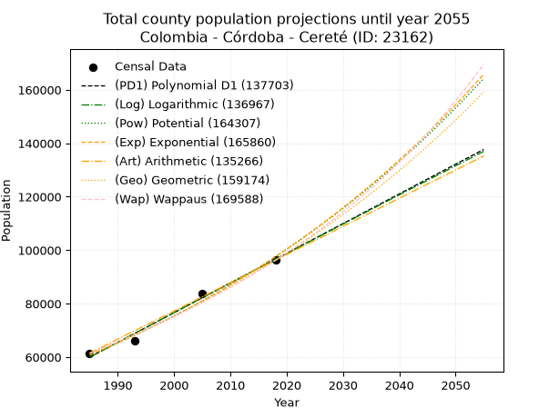
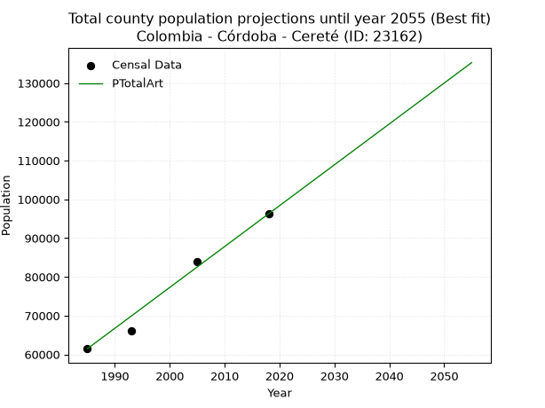
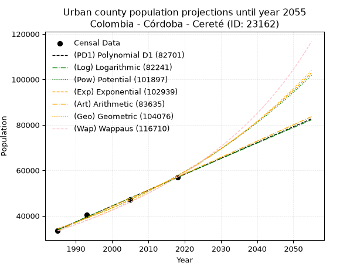
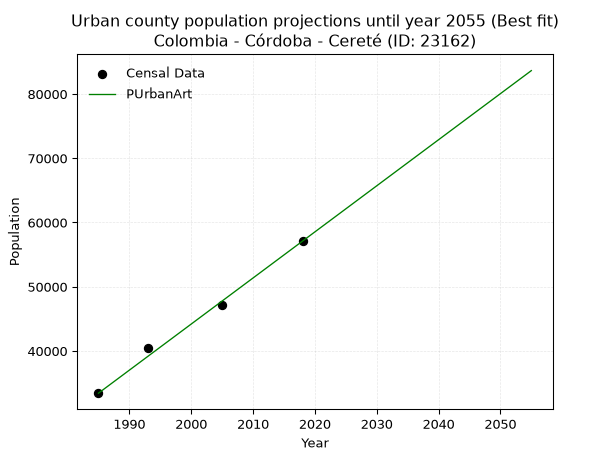
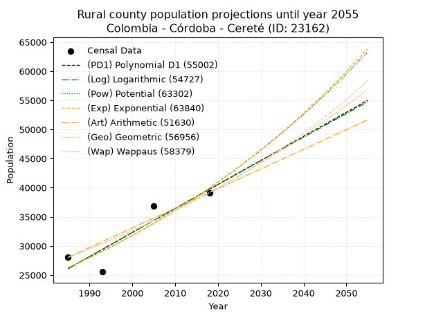
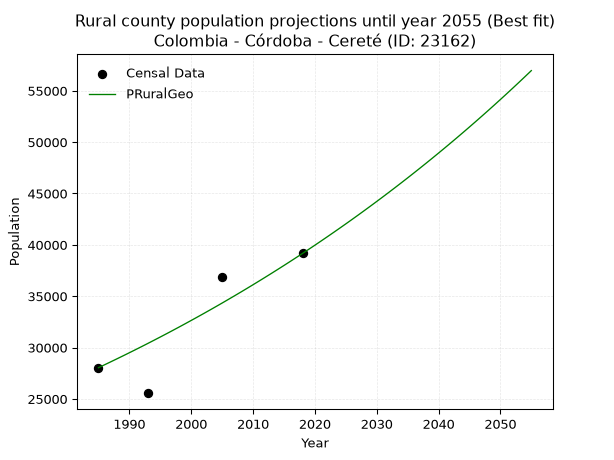

<div align="center">


</div>

# _“Population and Public Services Demand Projections (PPSD) until Year 2050 for Colombia - Córdoba - Cereté (ID: 23162)”_
Keywords: `population` `public-service` `projection` `lineal` `polynomial` `logarithmic` `potential` `exponential` `arithmetic` `geometric` `wappaus` `dane` `colombia` `south-america`

PPSD are analytical estimates used by governments and planners to anticipate future changes in population size, age distribution, and the resulting community needs for utilities, healthcare, education, and infrastructure as sizing future water treatment facilities, electrical grids, and road networks based on spatial growth.

> **General running parameters**: • app_version: _v20260806_. • Python version: _3.14.7_. • Pandas version: _3.0.5_. • NumPy version: _2.5.1_. • Creates, save and include plots into reports (create_plot): _True_. • Projection until year: _2050_. • Process polynomial degree 2 and up: _False_. • Process Wappaus: _True_. • Process Wappaus: _True_. • Set negative values to zero: _True_. • Set infinite values to zero: _True_. • Drop dataset notes: _True_. 
<div align="center">

Dynamic map: [:earth_americas:Google](http://maps.google.com/maps?q=8.888532483,-75.796093) [:earth_americas:OSM](https://www.openstreetmap.org/#map=18/8.888532483/-75.796093&layers=P) [:earth_americas:Bing](https://www.bing.com/maps?cp=8.888532483~-75.796093&lvl=18) [:earth_americas:Apple](https://maps.apple.com/frame?center=8.888532483%2C-75.796093&span=0.003%2C0.006)

</div>


<div align="center">

```geojson
{
  "type": "Feature",
  "geometry": {
    "type": "Point", 
    "coordinates": [-75.796093, 8.888532483]
  }, 
  "properties": {
    "Name": "Colombia - Córdoba - Cereté (ID: 23162)"
  }
}
```

</div>


## 0. Census Data (4 records)

Census data are official statistics collected by a government about the people and housing in a country. They usually include counts of total population, age, sex, race, income, education, and jobs.

📅Global census file: [Population.xlsx](../data/Population.xlsx)

| Source   |   Year |   CountryID | CountryName   |   StateID | StateName   |   CountyID | CountyName   |   PTotal |   PUrban |   PRural |
|:---------|-------:|------------:|:--------------|----------:|:------------|-----------:|:-------------|---------:|---------:|---------:|
| DANE     |   1985 |          57 | Colombia      |        23 | Córdoba     |      23162 | Cereté       |    61456 |    33420 |    28036 |
| DANE     |   1993 |          57 | Colombia      |        23 | Córdoba     |      23162 | Cereté       |    65965 |    40411 |    25554 |
| DANE     |   2005 |          57 | Colombia      |        23 | Córdoba     |      23162 | Cereté       |    83917 |    47094 |    36823 |
| DANE     |   2018 |          57 | Colombia      |        23 | Córdoba     |      23162 | Cereté       |    96252 |    57093 |    39159 |

> 🔥Some records has specific notes about the registered values or the corresponding urban or rural distribution.

## 1. Total

### 1.1. Coefficients and Parameters

* (PD1) Polynomial Deg 1: 1110.603773584897, -2144587.6981131905 (lineal)
* (Log) Logarithmic: 2222907.3787316256, -16819439.299000874
* (Pow) Potential: 28.704108370322814, -89.87565417646779
* (Exp) Exponential: 0.014339371365694017, 2.6436733831200553e-08
* (Art) Arithmetic: Year diff. 2018 - 1985 = 33, Population diff. 96252 - 61456 = 34796, Annual growth = 1054.4242424242425
* (Geo) Geometric: Year diff. 2018 - 1985 = 33, Population diff. 96252 - 61456 = 34796, Annual growth % = 0.01368824017027137
* (Wap) Wappaus: i = 1.3371854851044238, Condition values only valid for < 200)

<sub>
Wappaus condition values: ['0.00', '1.34', '2.67', '4.01', '5.35', '6.69', '8.02', '9.36', '10.70', '12.03', '13.37', '14.71', '16.05', '17.38', '18.72', '20.06', '21.39', '22.73', '24.07', '25.41', '26.74', '28.08', '29.42', '30.76', '32.09', '33.43', '34.77', '36.10', '37.44', '38.78', '40.12', '41.45', '42.79', '44.13', '45.46', '46.80', '48.14', '49.48', '50.81', '52.15', '53.49', '54.82', '56.16', '57.50', '58.84', '60.17', '61.51', '62.85', '64.18', '65.52', '66.86', '68.20', '69.53', '70.87', '72.21', '73.55', '74.88', '76.22', '77.56', '78.89', '80.23', '81.57', '82.91', '84.24', '85.58', '86.92']
</sub>


### 1.2. Projected Dataset

|   Year |   CountyID |   PTotalPD1 |   PTotalLog |   PTotalPow |   PTotalExp |   PTotalArt |   PTotalGeo |   PTotalWap |
|-------:|-----------:|------------:|------------:|------------:|------------:|------------:|------------:|------------:|
|   1985 |      23162 |       59961 |       59928 |       60760 |       60788 |       61456 |       61456 |       61456 |
|   1986 |      23162 |       61071 |       61048 |       61645 |       61666 |       62510 |       62297 |       62283 |
|   1987 |      23162 |       62182 |       62167 |       62542 |       62556 |       63565 |       63150 |       63122 |
|   1988 |      23162 |       63293 |       63285 |       63452 |       63460 |       64619 |       64014 |       63972 |
|   1989 |      23162 |       64403 |       64403 |       64375 |       64376 |       65674 |       64891 |       64833 |
|   1990 |      23162 |       65514 |       65520 |       65310 |       65306 |       66728 |       65779 |       65707 |
|   1991 |      23162 |       66624 |       66637 |       66259 |       66249 |       67783 |       66679 |       66593 |
|   1992 |      23162 |       67735 |       67753 |       67221 |       67206 |       68837 |       67592 |       67491 |
|   1993 |      23162 |       68846 |       68869 |       68196 |       68177 |       69891 |       68517 |       68402 |
|   1994 |      23162 |       69956 |       69984 |       69185 |       69161 |       70946 |       69455 |       69326 |
|   1995 |      23162 |       71067 |       71099 |       70188 |       70160 |       72000 |       70406 |       70263 |
|   1996 |      23162 |       72177 |       72213 |       71205 |       71173 |       73055 |       71370 |       71213 |
|   1997 |      23162 |       73288 |       73326 |       72236 |       72201 |       74109 |       72346 |       72178 |
|   1998 |      23162 |       74399 |       74439 |       73282 |       73244 |       75164 |       73337 |       73156 |
|   1999 |      23162 |       75509 |       75551 |       74342 |       74302 |       76218 |       74341 |       74149 |
|   2000 |      23162 |       76620 |       76663 |       75417 |       75375 |       77272 |       75358 |       75157 |
|   2001 |      23162 |       77730 |       77774 |       76507 |       76464 |       78327 |       76390 |       76180 |
|   2002 |      23162 |       78841 |       78885 |       77612 |       77568 |       79381 |       77435 |       77218 |
|   2003 |      23162 |       79952 |       79995 |       78732 |       78688 |       80436 |       78495 |       78272 |
|   2004 |      23162 |       81062 |       81104 |       79869 |       79825 |       81490 |       79570 |       79342 |
|   2005 |      23162 |       82173 |       82213 |       81020 |       80978 |       82544 |       80659 |       80429 |
|   2006 |      23162 |       83283 |       83322 |       82188 |       82147 |       83599 |       81763 |       81532 |
|   2007 |      23162 |       84394 |       84429 |       83373 |       83334 |       84653 |       82882 |       82653 |
|   2008 |      23162 |       85505 |       85537 |       84573 |       84537 |       85708 |       84017 |       83792 |
|   2009 |      23162 |       86615 |       86644 |       85791 |       85758 |       86762 |       85167 |       84948 |
|   2010 |      23162 |       87726 |       87750 |       87025 |       86997 |       87817 |       86333 |       86124 |
|   2011 |      23162 |       88836 |       88855 |       88276 |       88253 |       88871 |       87514 |       87318 |
|   2012 |      23162 |       89947 |       89960 |       89545 |       89528 |       89925 |       88712 |       88532 |
|   2013 |      23162 |       91058 |       91065 |       90831 |       90821 |       90980 |       89927 |       89766 |
|   2014 |      23162 |       92168 |       92169 |       92135 |       92132 |       92034 |       91157 |       91020 |
|   2015 |      23162 |       93279 |       93272 |       93458 |       93463 |       93089 |       92405 |       92295 |
|   2016 |      23162 |       94390 |       94375 |       94798 |       94813 |       94143 |       93670 |       93592 |
|   2017 |      23162 |       95500 |       95478 |       96157 |       96182 |       95198 |       94952 |       94911 |
|   2018 |      23162 |       96611 |       96580 |       97535 |       97571 |       96252 |       96252 |       96252 |
|   2019 |      23162 |       97721 |       97681 |       98932 |       98981 |       97306 |       97570 |       97617 |
|   2020 |      23162 |       98832 |       98782 |      100348 |      100410 |       98361 |       98905 |       99005 |
|   2021 |      23162 |       99943 |       99882 |      101784 |      101860 |       99415 |      100259 |      100418 |
|   2022 |      23162 |      101053 |      100981 |      103240 |      103331 |      100470 |      101631 |      101856 |
|   2023 |      23162 |      102164 |      102080 |      104715 |      104824 |      101524 |      103022 |      103320 |
|   2024 |      23162 |      103274 |      103179 |      106211 |      106338 |      102579 |      104433 |      104810 |
|   2025 |      23162 |      104385 |      104277 |      107728 |      107874 |      103633 |      105862 |      106328 |
|   2026 |      23162 |      105496 |      105374 |      109265 |      109432 |      104687 |      107311 |      107873 |
|   2027 |      23162 |      106606 |      106471 |      110824 |      111012 |      105742 |      108780 |      109447 |
|   2028 |      23162 |      107717 |      107568 |      112404 |      112615 |      106796 |      110269 |      111051 |
|   2029 |      23162 |      108827 |      108664 |      114006 |      114242 |      107851 |      111778 |      112685 |
|   2030 |      23162 |      109938 |      109759 |      115630 |      115892 |      108905 |      113309 |      114350 |
|   2031 |      23162 |      111049 |      110854 |      117276 |      117566 |      109960 |      114860 |      116048 |
|   2032 |      23162 |      112159 |      111948 |      118945 |      119264 |      111014 |      116432 |      117778 |
|   2033 |      23162 |      113270 |      113042 |      120637 |      120986 |      112068 |      118026 |      119543 |
|   2034 |      23162 |      114380 |      114135 |      122352 |      122733 |      113123 |      119641 |      121343 |
|   2035 |      23162 |      115491 |      115227 |      124090 |      124506 |      114177 |      121279 |      123179 |
|   2036 |      23162 |      116602 |      116319 |      125852 |      126304 |      115232 |      122939 |      125052 |
|   2037 |      23162 |      117712 |      117411 |      127639 |      128128 |      116286 |      124622 |      126963 |
|   2038 |      23162 |      118823 |      118502 |      129450 |      129979 |      117340 |      126328 |      128915 |
|   2039 |      23162 |      119933 |      119592 |      131285 |      131856 |      118395 |      128057 |      130907 |
|   2040 |      23162 |      121044 |      120682 |      133146 |      133761 |      119449 |      129810 |      132941 |
|   2041 |      23162 |      122155 |      121772 |      135032 |      135692 |      120504 |      131586 |      135018 |
|   2042 |      23162 |      123265 |      122861 |      136944 |      137652 |      121558 |      133388 |      137141 |
|   2043 |      23162 |      124376 |      123949 |      138883 |      139640 |      122613 |      135213 |      139310 |
|   2044 |      23162 |      125486 |      125037 |      140847 |      141657 |      123667 |      137064 |      141526 |
|   2045 |      23162 |      126597 |      126124 |      142839 |      143703 |      124721 |      138940 |      143793 |
|   2046 |      23162 |      127708 |      127211 |      144857 |      145778 |      125776 |      140842 |      146110 |
|   2047 |      23162 |      128818 |      128297 |      146903 |      147884 |      126830 |      142770 |      148480 |
|   2048 |      23162 |      129929 |      129383 |      148977 |      150020 |      127885 |      144724 |      150906 |
|   2049 |      23162 |      131039 |      130468 |      151079 |      152186 |      128939 |      146706 |      153387 |
|   2050 |      23162 |      132150 |      131552 |      153210 |      154384 |      129994 |      148714 |      155928 |
<div align="center">

</img>

</div>


### 1.3. Best fit with absolute error and relative error (%)

Relative error puts that difference into context by dividing the absolute error by the true value, creating a unitless ratio or percentage that shows the scale of the mistake.

Absolute and relative error

|   Year | Source   |   CountryID | CountryName   |   StateID | StateName   |   CountyID_x | CountyName   |   PTotal |   PUrban |   PRural |   CountyID_y |   PTotalPD1 |   PTotalLog |   PTotalPow |   PTotalExp |   PTotalArt |   PTotalGeo |   PTotalWap |   PTotalPD1AbsError |   PTotalLogAbsError |   PTotalPowAbsError |   PTotalExpAbsError |   PTotalArtAbsError |   PTotalGeoAbsError |   PTotalWapAbsError |   PTotalPD1RelError |   PTotalLogRelError |   PTotalPowRelError |   PTotalExpRelError |   PTotalArtRelError |   PTotalGeoRelError |   PTotalWapRelError |
|-------:|:---------|------------:|:--------------|----------:|:------------|-------------:|:-------------|---------:|---------:|---------:|-------------:|------------:|------------:|------------:|------------:|------------:|------------:|------------:|--------------------:|--------------------:|--------------------:|--------------------:|--------------------:|--------------------:|--------------------:|--------------------:|--------------------:|--------------------:|--------------------:|--------------------:|--------------------:|--------------------:|
|   1985 | DANE     |          57 | Colombia      |        23 | Córdoba     |        23162 | Cereté       |    61456 |    33420 |    28036 |        23162 |       59961 |       59928 |       60760 |       60788 |       61456 |       61456 |       61456 |                1495 |                1528 |                 696 |                 668 |                   0 |                   0 |                   0 |            2.43263  |            2.48633  |             1.13252 |             1.08696 |             0       |             0       |             0       |
|   1993 | DANE     |          57 | Colombia      |        23 | Córdoba     |        23162 | Cereté       |    65965 |    40411 |    25554 |        23162 |       68846 |       68869 |       68196 |       68177 |       69891 |       68517 |       68402 |                2881 |                2904 |                2231 |                2212 |                3926 |                2552 |                2437 |            4.36747  |            4.40233  |             3.3821  |             3.35329 |             5.95164 |             3.86872 |             3.69438 |
|   2005 | DANE     |          57 | Colombia      |        23 | Córdoba     |        23162 | Cereté       |    83917 |    47094 |    36823 |        23162 |       82173 |       82213 |       81020 |       80978 |       82544 |       80659 |       80429 |                1744 |                1704 |                2897 |                2939 |                1373 |                3258 |                3488 |            2.07824  |            2.03058  |             3.45222 |             3.50227 |             1.63614 |             3.88241 |             4.15649 |
|   2018 | DANE     |          57 | Colombia      |        23 | Córdoba     |        23162 | Cereté       |    96252 |    57093 |    39159 |        23162 |       96611 |       96580 |       97535 |       97571 |       96252 |       96252 |       96252 |                 359 |                 328 |                1283 |                1319 |                   0 |                   0 |                   0 |            0.372979 |            0.340772 |             1.33296 |             1.37036 |             0       |             0       |             0       |

Relative error mean

| Method    |   RelError | Best   |
|:----------|-----------:|:-------|
| PTotalPD1 |    2.31283 |        |
| PTotalLog |    2.315   |        |
| PTotalPow |    2.32495 |        |
| PTotalExp |    2.32822 |        |
| PTotalArt |    1.89695 | True   |
| PTotalGeo |    1.93778 |        |
| PTotalWap |    1.96272 |        |

💙Best method: _**PTotalArt**_
<div align="center">

</img>

</div>


### 1.4. Fresh water supply demand in liters per capita per day (lpcd)

The fresh water supply demand typically ranges from 100 to 300 liters per capita per day (lpcd) for standard domestic and municipal planning, though absolute survival minimums set by the World Health Organization are as low as 7.5 to 20 liters per day, and total consumption in high-income nations can exceed 400 liters.

> `CZ`: Level in meters above the sea level (masl).<br> `WS`: Fresh water supply demand in liters per capita per day (lpcd or l/h/d).<br> `WSAll`: Zonal fresh water supply demand in liters per second (l/s).<br> `A`: Zonal area in square meters.

Reference values (RAS Colombia)

|    CZ |   WS |
|------:|-----:|
|  1000 |  120 |
|  2000 |  130 |
| 99999 |  140 |

County shapefile geometry properties and water supply values

|   CountyID |      ATotal |   CZTotal |   WSTotal |
|-----------:|------------:|----------:|----------:|
|      23162 | 2.90447e+08 |   23.8768 |       120 |

Projected values for best method: PTotalArt

|   CountyID |   Year |   PTotalArt |   WSTotal |   WSTotalAll |
|-----------:|-------:|------------:|----------:|-------------:|
|      23162 |   1985 |       61456 |       120 |      85.3556 |
|      23162 |   1986 |       62510 |       120 |      86.8194 |
|      23162 |   1987 |       63565 |       120 |      88.2847 |
|      23162 |   1988 |       64619 |       120 |      89.7486 |
|      23162 |   1989 |       65674 |       120 |      91.2139 |
|      23162 |   1990 |       66728 |       120 |      92.6778 |
|      23162 |   1991 |       67783 |       120 |      94.1431 |
|      23162 |   1992 |       68837 |       120 |      95.6069 |
|      23162 |   1993 |       69891 |       120 |      97.0708 |
|      23162 |   1994 |       70946 |       120 |      98.5361 |
|      23162 |   1995 |       72000 |       120 |     100      |
|      23162 |   1996 |       73055 |       120 |     101.465  |
|      23162 |   1997 |       74109 |       120 |     102.929  |
|      23162 |   1998 |       75164 |       120 |     104.394  |
|      23162 |   1999 |       76218 |       120 |     105.858  |
|      23162 |   2000 |       77272 |       120 |     107.322  |
|      23162 |   2001 |       78327 |       120 |     108.787  |
|      23162 |   2002 |       79381 |       120 |     110.251  |
|      23162 |   2003 |       80436 |       120 |     111.717  |
|      23162 |   2004 |       81490 |       120 |     113.181  |
|      23162 |   2005 |       82544 |       120 |     114.644  |
|      23162 |   2006 |       83599 |       120 |     116.11   |
|      23162 |   2007 |       84653 |       120 |     117.574  |
|      23162 |   2008 |       85708 |       120 |     119.039  |
|      23162 |   2009 |       86762 |       120 |     120.503  |
|      23162 |   2010 |       87817 |       120 |     121.968  |
|      23162 |   2011 |       88871 |       120 |     123.432  |
|      23162 |   2012 |       89925 |       120 |     124.896  |
|      23162 |   2013 |       90980 |       120 |     126.361  |
|      23162 |   2014 |       92034 |       120 |     127.825  |
|      23162 |   2015 |       93089 |       120 |     129.29   |
|      23162 |   2016 |       94143 |       120 |     130.754  |
|      23162 |   2017 |       95198 |       120 |     132.219  |
|      23162 |   2018 |       96252 |       120 |     133.683  |
|      23162 |   2019 |       97306 |       120 |     135.147  |
|      23162 |   2020 |       98361 |       120 |     136.613  |
|      23162 |   2021 |       99415 |       120 |     138.076  |
|      23162 |   2022 |      100470 |       120 |     139.542  |
|      23162 |   2023 |      101524 |       120 |     141.006  |
|      23162 |   2024 |      102579 |       120 |     142.471  |
|      23162 |   2025 |      103633 |       120 |     143.935  |
|      23162 |   2026 |      104687 |       120 |     145.399  |
|      23162 |   2027 |      105742 |       120 |     146.864  |
|      23162 |   2028 |      106796 |       120 |     148.328  |
|      23162 |   2029 |      107851 |       120 |     149.793  |
|      23162 |   2030 |      108905 |       120 |     151.257  |
|      23162 |   2031 |      109960 |       120 |     152.722  |
|      23162 |   2032 |      111014 |       120 |     154.186  |
|      23162 |   2033 |      112068 |       120 |     155.65   |
|      23162 |   2034 |      113123 |       120 |     157.115  |
|      23162 |   2035 |      114177 |       120 |     158.579  |
|      23162 |   2036 |      115232 |       120 |     160.044  |
|      23162 |   2037 |      116286 |       120 |     161.508  |
|      23162 |   2038 |      117340 |       120 |     162.972  |
|      23162 |   2039 |      118395 |       120 |     164.438  |
|      23162 |   2040 |      119449 |       120 |     165.901  |
|      23162 |   2041 |      120504 |       120 |     167.367  |
|      23162 |   2042 |      121558 |       120 |     168.831  |
|      23162 |   2043 |      122613 |       120 |     170.296  |
|      23162 |   2044 |      123667 |       120 |     171.76   |
|      23162 |   2045 |      124721 |       120 |     173.224  |
|      23162 |   2046 |      125776 |       120 |     174.689  |
|      23162 |   2047 |      126830 |       120 |     176.153  |
|      23162 |   2048 |      127885 |       120 |     177.618  |
|      23162 |   2049 |      128939 |       120 |     179.082  |
|      23162 |   2050 |      129994 |       120 |     180.547  |

## 2. Urban

### 2.1. Coefficients and Parameters

* (PD1) Polynomial Deg 1: 697.6515455640236, -1350973.0040144385 (lineal)
* (Log) Logarithmic: 1396438.1224778744, -10569832.859307138
* (Pow) Potential: 31.368995489177347, -98.9114194238068
* (Exp) Exponential: 0.015668715199680168, 1.0681673844145874e-09
* (Art) Arithmetic: Year diff. 2018 - 1985 = 33, Population diff. 57093 - 33420 = 23673, Annual growth = 717.3636363636364
* (Geo) Geometric: Year diff. 2018 - 1985 = 33, Population diff. 57093 - 33420 = 23673, Annual growth % = 0.01636048137230306
* (Wap) Wappaus: i = 1.585106308184761, Condition values only valid for < 200)

<sub>
Wappaus condition values: ['0.00', '1.59', '3.17', '4.76', '6.34', '7.93', '9.51', '11.10', '12.68', '14.27', '15.85', '17.44', '19.02', '20.61', '22.19', '23.78', '25.36', '26.95', '28.53', '30.12', '31.70', '33.29', '34.87', '36.46', '38.04', '39.63', '41.21', '42.80', '44.38', '45.97', '47.55', '49.14', '50.72', '52.31', '53.89', '55.48', '57.06', '58.65', '60.23', '61.82', '63.40', '64.99', '66.57', '68.16', '69.74', '71.33', '72.91', '74.50', '76.09', '77.67', '79.26', '80.84', '82.43', '84.01', '85.60', '87.18', '88.77', '90.35', '91.94', '93.52', '95.11', '96.69', '98.28', '99.86', '101.45', '103.03']
</sub>


### 2.2. Projected Dataset

|   Year |   CountyID |   PUrbanPD1 |   PUrbanLog |   PUrbanPow |   PUrbanExp |   PUrbanArt |   PUrbanGeo |   PUrbanWap |
|-------:|-----------:|------------:|------------:|------------:|------------:|------------:|------------:|------------:|
|   1985 |      23162 |       33865 |       33844 |       34357 |       34375 |       33420 |       33420 |       33420 |
|   1986 |      23162 |       34563 |       34548 |       34904 |       34918 |       34137 |       33967 |       33954 |
|   1987 |      23162 |       35261 |       35251 |       35460 |       35469 |       34855 |       34522 |       34497 |
|   1988 |      23162 |       35958 |       35953 |       36024 |       36029 |       35572 |       35087 |       35048 |
|   1989 |      23162 |       36656 |       36655 |       36597 |       36598 |       36289 |       35661 |       35608 |
|   1990 |      23162 |       37354 |       37357 |       37178 |       37176 |       37007 |       36245 |       36178 |
|   1991 |      23162 |       38051 |       38059 |       37769 |       37763 |       37724 |       36838 |       36757 |
|   1992 |      23162 |       38749 |       38760 |       38368 |       38360 |       38442 |       37440 |       37346 |
|   1993 |      23162 |       39447 |       39461 |       38977 |       38965 |       39159 |       38053 |       37945 |
|   1994 |      23162 |       40144 |       40161 |       39595 |       39581 |       39876 |       38676 |       38554 |
|   1995 |      23162 |       40842 |       40862 |       40223 |       40206 |       40594 |       39308 |       39173 |
|   1996 |      23162 |       41539 |       41561 |       40860 |       40841 |       41311 |       39951 |       39804 |
|   1997 |      23162 |       42237 |       42261 |       41507 |       41486 |       42028 |       40605 |       40445 |
|   1998 |      23162 |       42935 |       42960 |       42164 |       42141 |       42746 |       41269 |       41098 |
|   1999 |      23162 |       43632 |       43659 |       42831 |       42806 |       43463 |       41945 |       41762 |
|   2000 |      23162 |       44330 |       44357 |       43509 |       43482 |       44180 |       42631 |       42438 |
|   2001 |      23162 |       45028 |       45055 |       44196 |       44169 |       44898 |       43328 |       43127 |
|   2002 |      23162 |       45725 |       45753 |       44894 |       44866 |       45615 |       44037 |       43828 |
|   2003 |      23162 |       46423 |       46450 |       45603 |       45575 |       46333 |       44758 |       44542 |
|   2004 |      23162 |       47121 |       47147 |       46323 |       46295 |       47050 |       45490 |       45269 |
|   2005 |      23162 |       47818 |       47844 |       47053 |       47026 |       47767 |       46234 |       46011 |
|   2006 |      23162 |       48516 |       48540 |       47795 |       47768 |       48485 |       46990 |       46766 |
|   2007 |      23162 |       49214 |       49236 |       48548 |       48523 |       49202 |       47759 |       47536 |
|   2008 |      23162 |       49911 |       49932 |       49313 |       49289 |       49919 |       48541 |       48320 |
|   2009 |      23162 |       50609 |       50627 |       50089 |       50068 |       50637 |       49335 |       49120 |
|   2010 |      23162 |       51307 |       51322 |       50877 |       50858 |       51354 |       50142 |       49936 |
|   2011 |      23162 |       52004 |       52016 |       51677 |       51661 |       52071 |       50962 |       50768 |
|   2012 |      23162 |       52702 |       52711 |       52489 |       52477 |       52789 |       51796 |       51617 |
|   2013 |      23162 |       53400 |       53405 |       53314 |       53306 |       53506 |       52643 |       52483 |
|   2014 |      23162 |       54097 |       54098 |       54151 |       54148 |       54224 |       53505 |       53367 |
|   2015 |      23162 |       54795 |       54791 |       55001 |       55003 |       54941 |       54380 |       54270 |
|   2016 |      23162 |       55493 |       55484 |       55864 |       55871 |       55658 |       55270 |       55191 |
|   2017 |      23162 |       56190 |       56177 |       56739 |       56754 |       56376 |       56174 |       56132 |
|   2018 |      23162 |       56888 |       56869 |       57629 |       57650 |       57093 |       57093 |       57093 |
|   2019 |      23162 |       57585 |       57561 |       58531 |       58560 |       57810 |       58027 |       58075 |
|   2020 |      23162 |       58283 |       58252 |       59447 |       59485 |       58528 |       58976 |       59078 |
|   2021 |      23162 |       58981 |       58943 |       60378 |       60425 |       59245 |       59941 |       60104 |
|   2022 |      23162 |       59678 |       59634 |       61322 |       61379 |       59962 |       60922 |       61153 |
|   2023 |      23162 |       60376 |       60325 |       62280 |       62348 |       60680 |       61919 |       62226 |
|   2024 |      23162 |       61074 |       61015 |       63253 |       63333 |       61397 |       62932 |       63323 |
|   2025 |      23162 |       61771 |       61704 |       64241 |       64333 |       62115 |       63961 |       64445 |
|   2026 |      23162 |       62469 |       62394 |       65244 |       65349 |       62832 |       65008 |       65594 |
|   2027 |      23162 |       63167 |       63083 |       66261 |       66381 |       63549 |       66071 |       66771 |
|   2028 |      23162 |       63864 |       63772 |       67295 |       67429 |       64267 |       67152 |       67975 |
|   2029 |      23162 |       64562 |       64460 |       68343 |       68494 |       64984 |       68251 |       69209 |
|   2030 |      23162 |       65260 |       65148 |       69408 |       69576 |       65701 |       69368 |       70474 |
|   2031 |      23162 |       65957 |       65836 |       70488 |       70674 |       66419 |       70502 |       71769 |
|   2032 |      23162 |       66655 |       66523 |       71585 |       71791 |       67136 |       71656 |       73098 |
|   2033 |      23162 |       67353 |       67210 |       72699 |       72924 |       67853 |       72828 |       74460 |
|   2034 |      23162 |       68050 |       67897 |       73829 |       74076 |       68571 |       74020 |       75858 |
|   2035 |      23162 |       68748 |       68583 |       74976 |       75246 |       69288 |       75231 |       77293 |
|   2036 |      23162 |       69446 |       69269 |       76140 |       76434 |       70006 |       76461 |       78766 |
|   2037 |      23162 |       70143 |       69955 |       77322 |       77641 |       70723 |       77712 |       80278 |
|   2038 |      23162 |       70841 |       70641 |       78522 |       78867 |       71440 |       78984 |       81832 |
|   2039 |      23162 |       71538 |       71326 |       79740 |       80113 |       72158 |       80276 |       83429 |
|   2040 |      23162 |       72236 |       72010 |       80976 |       81378 |       72875 |       81589 |       85071 |
|   2041 |      23162 |       72934 |       72695 |       82230 |       82663 |       73592 |       82924 |       86759 |
|   2042 |      23162 |       73631 |       73379 |       83503 |       83968 |       74310 |       84281 |       88496 |
|   2043 |      23162 |       74329 |       74062 |       84796 |       85294 |       75027 |       85660 |       90285 |
|   2044 |      23162 |       75027 |       74746 |       86107 |       86641 |       75744 |       87061 |       92126 |
|   2045 |      23162 |       75724 |       75429 |       87439 |       88010 |       76462 |       88486 |       94023 |
|   2046 |      23162 |       76422 |       76111 |       88790 |       89399 |       77179 |       89933 |       95979 |
|   2047 |      23162 |       77120 |       76794 |       90162 |       90811 |       77897 |       91405 |       97995 |
|   2048 |      23162 |       77817 |       77476 |       91553 |       92245 |       78614 |       92900 |      100075 |
|   2049 |      23162 |       78515 |       78157 |       92966 |       93702 |       79331 |       94420 |      102222 |
|   2050 |      23162 |       79213 |       78839 |       94400 |       95182 |       80049 |       95965 |      104440 |
<div align="center">

</img>

</div>


### 2.3. Best fit with absolute error and relative error (%)

Relative error puts that difference into context by dividing the absolute error by the true value, creating a unitless ratio or percentage that shows the scale of the mistake.

Absolute and relative error

|   Year | Source   |   CountryID | CountryName   |   StateID | StateName   |   CountyID_x | CountyName   |   PTotal |   PUrban |   PRural |   CountyID_y |   PUrbanPD1 |   PUrbanLog |   PUrbanPow |   PUrbanExp |   PUrbanArt |   PUrbanGeo |   PUrbanWap |   PUrbanPD1AbsError |   PUrbanLogAbsError |   PUrbanPowAbsError |   PUrbanExpAbsError |   PUrbanArtAbsError |   PUrbanGeoAbsError |   PUrbanWapAbsError |   PUrbanPD1RelError |   PUrbanLogRelError |   PUrbanPowRelError |   PUrbanExpRelError |   PUrbanArtRelError |   PUrbanGeoRelError |   PUrbanWapRelError |
|-------:|:---------|------------:|:--------------|----------:|:------------|-------------:|:-------------|---------:|---------:|---------:|-------------:|------------:|------------:|------------:|------------:|------------:|------------:|------------:|--------------------:|--------------------:|--------------------:|--------------------:|--------------------:|--------------------:|--------------------:|--------------------:|--------------------:|--------------------:|--------------------:|--------------------:|--------------------:|--------------------:|
|   1985 | DANE     |          57 | Colombia      |        23 | Córdoba     |        23162 | Cereté       |    61456 |    33420 |    28036 |        23162 |       33865 |       33844 |       34357 |       34375 |       33420 |       33420 |       33420 |                 445 |                 424 |                 937 |                 955 |                   0 |                   0 |                   0 |            1.33154  |            1.2687   |           2.80371   |            2.85757  |             0       |             0       |             0       |
|   1993 | DANE     |          57 | Colombia      |        23 | Córdoba     |        23162 | Cereté       |    65965 |    40411 |    25554 |        23162 |       39447 |       39461 |       38977 |       38965 |       39159 |       38053 |       37945 |                 964 |                 950 |                1434 |                1446 |                1252 |                2358 |                2466 |            2.38549  |            2.35085  |           3.54854   |            3.57823  |             3.09817 |             5.83504 |             6.1023  |
|   2005 | DANE     |          57 | Colombia      |        23 | Córdoba     |        23162 | Cereté       |    83917 |    47094 |    36823 |        23162 |       47818 |       47844 |       47053 |       47026 |       47767 |       46234 |       46011 |                 724 |                 750 |                  41 |                  68 |                 673 |                 860 |                1083 |            1.53735  |            1.59256  |           0.0870599 |            0.144392 |             1.42906 |             1.82613 |             2.29966 |
|   2018 | DANE     |          57 | Colombia      |        23 | Córdoba     |        23162 | Cereté       |    96252 |    57093 |    39159 |        23162 |       56888 |       56869 |       57629 |       57650 |       57093 |       57093 |       57093 |                 205 |                 224 |                 536 |                 557 |                   0 |                   0 |                   0 |            0.359063 |            0.392342 |           0.938819  |            0.975601 |             0       |             0       |             0       |

Relative error mean

| Method    |   RelError | Best   |
|:----------|-----------:|:-------|
| PUrbanPD1 |    1.40336 |        |
| PUrbanLog |    1.40111 |        |
| PUrbanPow |    1.84453 |        |
| PUrbanExp |    1.88895 |        |
| PUrbanArt |    1.13181 | True   |
| PUrbanGeo |    1.91529 |        |
| PUrbanWap |    2.10049 |        |

💙Best method: _**PUrbanArt**_
<div align="center">

</img>

</div>


### 2.4. Fresh water supply demand in liters per capita per day (lpcd)

The fresh water supply demand typically ranges from 100 to 300 liters per capita per day (lpcd) for standard domestic and municipal planning, though absolute survival minimums set by the World Health Organization are as low as 7.5 to 20 liters per day, and total consumption in high-income nations can exceed 400 liters.

> `CZ`: Level in meters above the sea level (masl).<br> `WS`: Fresh water supply demand in liters per capita per day (lpcd or l/h/d).<br> `WSAll`: Zonal fresh water supply demand in liters per second (l/s).<br> `A`: Zonal area in square meters.

Reference values (RAS Colombia)

|    CZ |   WS |
|------:|-----:|
|  1000 |  120 |
|  2000 |  130 |
| 99999 |  140 |

County shapefile geometry properties and water supply values

|   CountyID |     AUrban |   CZUrban |   WSUrban |
|-----------:|-----------:|----------:|----------:|
|      23162 | 1.9545e+07 |   12.2604 |       120 |

Projected values for best method: PUrbanArt

|   CountyID |   Year |   PUrbanArt |   WSUrban |   WSUrbanAll |
|-----------:|-------:|------------:|----------:|-------------:|
|      23162 |   1985 |       33420 |       120 |      46.4167 |
|      23162 |   1986 |       34137 |       120 |      47.4125 |
|      23162 |   1987 |       34855 |       120 |      48.4097 |
|      23162 |   1988 |       35572 |       120 |      49.4056 |
|      23162 |   1989 |       36289 |       120 |      50.4014 |
|      23162 |   1990 |       37007 |       120 |      51.3986 |
|      23162 |   1991 |       37724 |       120 |      52.3944 |
|      23162 |   1992 |       38442 |       120 |      53.3917 |
|      23162 |   1993 |       39159 |       120 |      54.3875 |
|      23162 |   1994 |       39876 |       120 |      55.3833 |
|      23162 |   1995 |       40594 |       120 |      56.3806 |
|      23162 |   1996 |       41311 |       120 |      57.3764 |
|      23162 |   1997 |       42028 |       120 |      58.3722 |
|      23162 |   1998 |       42746 |       120 |      59.3694 |
|      23162 |   1999 |       43463 |       120 |      60.3653 |
|      23162 |   2000 |       44180 |       120 |      61.3611 |
|      23162 |   2001 |       44898 |       120 |      62.3583 |
|      23162 |   2002 |       45615 |       120 |      63.3542 |
|      23162 |   2003 |       46333 |       120 |      64.3514 |
|      23162 |   2004 |       47050 |       120 |      65.3472 |
|      23162 |   2005 |       47767 |       120 |      66.3431 |
|      23162 |   2006 |       48485 |       120 |      67.3403 |
|      23162 |   2007 |       49202 |       120 |      68.3361 |
|      23162 |   2008 |       49919 |       120 |      69.3319 |
|      23162 |   2009 |       50637 |       120 |      70.3292 |
|      23162 |   2010 |       51354 |       120 |      71.325  |
|      23162 |   2011 |       52071 |       120 |      72.3208 |
|      23162 |   2012 |       52789 |       120 |      73.3181 |
|      23162 |   2013 |       53506 |       120 |      74.3139 |
|      23162 |   2014 |       54224 |       120 |      75.3111 |
|      23162 |   2015 |       54941 |       120 |      76.3069 |
|      23162 |   2016 |       55658 |       120 |      77.3028 |
|      23162 |   2017 |       56376 |       120 |      78.3    |
|      23162 |   2018 |       57093 |       120 |      79.2958 |
|      23162 |   2019 |       57810 |       120 |      80.2917 |
|      23162 |   2020 |       58528 |       120 |      81.2889 |
|      23162 |   2021 |       59245 |       120 |      82.2847 |
|      23162 |   2022 |       59962 |       120 |      83.2806 |
|      23162 |   2023 |       60680 |       120 |      84.2778 |
|      23162 |   2024 |       61397 |       120 |      85.2736 |
|      23162 |   2025 |       62115 |       120 |      86.2708 |
|      23162 |   2026 |       62832 |       120 |      87.2667 |
|      23162 |   2027 |       63549 |       120 |      88.2625 |
|      23162 |   2028 |       64267 |       120 |      89.2597 |
|      23162 |   2029 |       64984 |       120 |      90.2556 |
|      23162 |   2030 |       65701 |       120 |      91.2514 |
|      23162 |   2031 |       66419 |       120 |      92.2486 |
|      23162 |   2032 |       67136 |       120 |      93.2444 |
|      23162 |   2033 |       67853 |       120 |      94.2403 |
|      23162 |   2034 |       68571 |       120 |      95.2375 |
|      23162 |   2035 |       69288 |       120 |      96.2333 |
|      23162 |   2036 |       70006 |       120 |      97.2306 |
|      23162 |   2037 |       70723 |       120 |      98.2264 |
|      23162 |   2038 |       71440 |       120 |      99.2222 |
|      23162 |   2039 |       72158 |       120 |     100.219  |
|      23162 |   2040 |       72875 |       120 |     101.215  |
|      23162 |   2041 |       73592 |       120 |     102.211  |
|      23162 |   2042 |       74310 |       120 |     103.208  |
|      23162 |   2043 |       75027 |       120 |     104.204  |
|      23162 |   2044 |       75744 |       120 |     105.2    |
|      23162 |   2045 |       76462 |       120 |     106.197  |
|      23162 |   2046 |       77179 |       120 |     107.193  |
|      23162 |   2047 |       77897 |       120 |     108.19   |
|      23162 |   2048 |       78614 |       120 |     109.186  |
|      23162 |   2049 |       79331 |       120 |     110.182  |
|      23162 |   2050 |       80049 |       120 |     111.179  |

## 3. Rural

### 3.1. Coefficients and Parameters

* (PD1) Polynomial Deg 1: 412.952228020873, -793614.6940987512 (lineal)
* (Log) Logarithmic: 826469.2562537518, -6249606.439693739
* (Pow) Potential: 25.38230512558264, -79.28538271597986
* (Exp) Exponential: 0.012682539158334468, 3.0636622863326347e-07
* (Art) Arithmetic: Year diff. 2018 - 1985 = 33, Population diff. 39159 - 28036 = 11123, Annual growth = 337.06060606060606
* (Geo) Geometric: Year diff. 2018 - 1985 = 33, Population diff. 39159 - 28036 = 11123, Annual growth % = 0.010176917430249954
* (Wap) Wappaus: i = 1.0032312108359434, Condition values only valid for < 200)

<sub>
Wappaus condition values: ['0.00', '1.00', '2.01', '3.01', '4.01', '5.02', '6.02', '7.02', '8.03', '9.03', '10.03', '11.04', '12.04', '13.04', '14.05', '15.05', '16.05', '17.05', '18.06', '19.06', '20.06', '21.07', '22.07', '23.07', '24.08', '25.08', '26.08', '27.09', '28.09', '29.09', '30.10', '31.10', '32.10', '33.11', '34.11', '35.11', '36.12', '37.12', '38.12', '39.13', '40.13', '41.13', '42.14', '43.14', '44.14', '45.15', '46.15', '47.15', '48.16', '49.16', '50.16', '51.16', '52.17', '53.17', '54.17', '55.18', '56.18', '57.18', '58.19', '59.19', '60.19', '61.20', '62.20', '63.20', '64.21', '65.21']
</sub>


### 3.2. Projected Dataset

|   Year |   CountyID |   PRuralPD1 |   PRuralLog |   PRuralPow |   PRuralExp |   PRuralArt |   PRuralGeo |   PRuralWap |
|-------:|-----------:|------------:|------------:|------------:|------------:|------------:|------------:|------------:|
|   1985 |      23162 |       26095 |       26084 |       26265 |       26275 |       28036 |       28036 |       28036 |
|   1986 |      23162 |       26508 |       26500 |       26603 |       26610 |       28373 |       28321 |       28319 |
|   1987 |      23162 |       26921 |       26916 |       26945 |       26950 |       28710 |       28610 |       28604 |
|   1988 |      23162 |       27334 |       27332 |       27292 |       27293 |       29047 |       28901 |       28893 |
|   1989 |      23162 |       27747 |       27748 |       27642 |       27642 |       29384 |       29195 |       29184 |
|   1990 |      23162 |       28160 |       28163 |       27997 |       27995 |       29721 |       29492 |       29479 |
|   1991 |      23162 |       28573 |       28578 |       28356 |       28352 |       30058 |       29792 |       29776 |
|   1992 |      23162 |       28986 |       28993 |       28720 |       28714 |       30395 |       30095 |       30077 |
|   1993 |      23162 |       29399 |       29408 |       29088 |       29080 |       30732 |       30402 |       30380 |
|   1994 |      23162 |       29812 |       29823 |       29461 |       29451 |       31070 |       30711 |       30687 |
|   1995 |      23162 |       30225 |       30237 |       29838 |       29827 |       31407 |       31023 |       30997 |
|   1996 |      23162 |       30638 |       30651 |       30220 |       30208 |       31744 |       31339 |       31311 |
|   1997 |      23162 |       31051 |       31065 |       30607 |       30594 |       32081 |       31658 |       31627 |
|   1998 |      23162 |       31464 |       31479 |       30998 |       30984 |       32418 |       31980 |       31948 |
|   1999 |      23162 |       31877 |       31892 |       31395 |       31380 |       32755 |       32306 |       32271 |
|   2000 |      23162 |       32290 |       32306 |       31796 |       31780 |       33092 |       32635 |       32598 |
|   2001 |      23162 |       32703 |       32719 |       32202 |       32186 |       33429 |       32967 |       32929 |
|   2002 |      23162 |       33116 |       33132 |       32613 |       32596 |       33766 |       33302 |       33263 |
|   2003 |      23162 |       33529 |       33545 |       33029 |       33012 |       34103 |       33641 |       33601 |
|   2004 |      23162 |       33942 |       33957 |       33450 |       33434 |       34440 |       33983 |       33943 |
|   2005 |      23162 |       34355 |       34369 |       33876 |       33861 |       34777 |       34329 |       34289 |
|   2006 |      23162 |       34767 |       34781 |       34307 |       34293 |       35114 |       34679 |       34638 |
|   2007 |      23162 |       35180 |       35193 |       34744 |       34730 |       35451 |       35032 |       34991 |
|   2008 |      23162 |       35593 |       35605 |       35186 |       35174 |       35788 |       35388 |       35349 |
|   2009 |      23162 |       36006 |       36017 |       35634 |       35623 |       36125 |       35748 |       35710 |
|   2010 |      23162 |       36419 |       36428 |       36087 |       36077 |       36463 |       36112 |       36076 |
|   2011 |      23162 |       36832 |       36839 |       36545 |       36538 |       36800 |       36480 |       36446 |
|   2012 |      23162 |       37245 |       37250 |       37009 |       37004 |       37137 |       36851 |       36820 |
|   2013 |      23162 |       37658 |       37660 |       37479 |       37476 |       37474 |       37226 |       37198 |
|   2014 |      23162 |       38071 |       38071 |       37954 |       37955 |       37811 |       37605 |       37581 |
|   2015 |      23162 |       38484 |       38481 |       38436 |       38439 |       38148 |       37987 |       37969 |
|   2016 |      23162 |       38897 |       38891 |       38923 |       38930 |       38485 |       38374 |       38361 |
|   2017 |      23162 |       39310 |       39301 |       39416 |       39427 |       38822 |       38764 |       38757 |
|   2018 |      23162 |       39723 |       39711 |       39915 |       39930 |       39159 |       39159 |       39159 |
|   2019 |      23162 |       40136 |       40120 |       40420 |       40439 |       39496 |       39558 |       39565 |
|   2020 |      23162 |       40549 |       40529 |       40931 |       40956 |       39833 |       39960 |       39977 |
|   2021 |      23162 |       40962 |       40938 |       41449 |       41478 |       40170 |       40367 |       40393 |
|   2022 |      23162 |       41375 |       41347 |       41972 |       42008 |       40507 |       40778 |       40814 |
|   2023 |      23162 |       41788 |       41756 |       42502 |       42544 |       40844 |       41193 |       41241 |
|   2024 |      23162 |       42201 |       42164 |       43039 |       43087 |       41181 |       41612 |       41673 |
|   2025 |      23162 |       42614 |       42573 |       43582 |       43637 |       41518 |       42035 |       42111 |
|   2026 |      23162 |       43027 |       42981 |       44131 |       44194 |       41855 |       42463 |       42554 |
|   2027 |      23162 |       43439 |       43388 |       44688 |       44758 |       42193 |       42895 |       43002 |
|   2028 |      23162 |       43852 |       43796 |       45251 |       45329 |       42530 |       43332 |       43457 |
|   2029 |      23162 |       44265 |       44204 |       45820 |       45908 |       42867 |       43773 |       43917 |
|   2030 |      23162 |       44678 |       44611 |       46397 |       46494 |       43204 |       44218 |       44383 |
|   2031 |      23162 |       45091 |       45018 |       46981 |       47087 |       43541 |       44668 |       44855 |
|   2032 |      23162 |       45504 |       45425 |       47571 |       47688 |       43878 |       45123 |       45334 |
|   2033 |      23162 |       45917 |       45831 |       48169 |       48297 |       44215 |       45582 |       45818 |
|   2034 |      23162 |       46330 |       46238 |       48774 |       48913 |       44552 |       46046 |       46310 |
|   2035 |      23162 |       46743 |       46644 |       49387 |       49537 |       44889 |       46514 |       46807 |
|   2036 |      23162 |       47156 |       47050 |       50006 |       50170 |       45226 |       46988 |       47312 |
|   2037 |      23162 |       47569 |       47456 |       50633 |       50810 |       45563 |       47466 |       47823 |
|   2038 |      23162 |       47982 |       47861 |       51268 |       51458 |       45900 |       47949 |       48341 |
|   2039 |      23162 |       48395 |       48267 |       51910 |       52115 |       46237 |       48437 |       48867 |
|   2040 |      23162 |       48808 |       48672 |       52561 |       52780 |       46574 |       48930 |       49400 |
|   2041 |      23162 |       49221 |       49077 |       53218 |       53454 |       46911 |       49428 |       49940 |
|   2042 |      23162 |       49634 |       49482 |       53884 |       54136 |       47248 |       49931 |       50488 |
|   2043 |      23162 |       50047 |       49887 |       54558 |       54827 |       47586 |       50439 |       51043 |
|   2044 |      23162 |       50460 |       50291 |       55240 |       55527 |       47923 |       50952 |       51606 |
|   2045 |      23162 |       50873 |       50695 |       55930 |       56236 |       48260 |       51471 |       52178 |
|   2046 |      23162 |       51286 |       51099 |       56628 |       56954 |       48597 |       51995 |       52758 |
|   2047 |      23162 |       51699 |       51503 |       57335 |       57680 |       48934 |       52524 |       53346 |
|   2048 |      23162 |       52111 |       51907 |       58050 |       58417 |       49271 |       53058 |       53943 |
|   2049 |      23162 |       52524 |       52310 |       58774 |       59162 |       49608 |       53598 |       54548 |
|   2050 |      23162 |       52937 |       52713 |       59506 |       59917 |       49945 |       54144 |       55163 |
<div align="center">

</img>

</div>


### 3.3. Best fit with absolute error and relative error (%)

Relative error puts that difference into context by dividing the absolute error by the true value, creating a unitless ratio or percentage that shows the scale of the mistake.

Absolute and relative error

|   Year | Source   |   CountryID | CountryName   |   StateID | StateName   |   CountyID_x | CountyName   |   PTotal |   PUrban |   PRural |   CountyID_y |   PRuralPD1 |   PRuralLog |   PRuralPow |   PRuralExp |   PRuralArt |   PRuralGeo |   PRuralWap |   PRuralPD1AbsError |   PRuralLogAbsError |   PRuralPowAbsError |   PRuralExpAbsError |   PRuralArtAbsError |   PRuralGeoAbsError |   PRuralWapAbsError |   PRuralPD1RelError |   PRuralLogRelError |   PRuralPowRelError |   PRuralExpRelError |   PRuralArtRelError |   PRuralGeoRelError |   PRuralWapRelError |
|-------:|:---------|------------:|:--------------|----------:|:------------|-------------:|:-------------|---------:|---------:|---------:|-------------:|------------:|------------:|------------:|------------:|------------:|------------:|------------:|--------------------:|--------------------:|--------------------:|--------------------:|--------------------:|--------------------:|--------------------:|--------------------:|--------------------:|--------------------:|--------------------:|--------------------:|--------------------:|--------------------:|
|   1985 | DANE     |          57 | Colombia      |        23 | Córdoba     |        23162 | Cereté       |    61456 |    33420 |    28036 |        23162 |       26095 |       26084 |       26265 |       26275 |       28036 |       28036 |       28036 |                1941 |                1952 |                1771 |                1761 |                   0 |                   0 |                   0 |             6.92324 |             6.96248 |             6.31688 |             6.28121 |             0       |             0       |             0       |
|   1993 | DANE     |          57 | Colombia      |        23 | Córdoba     |        23162 | Cereté       |    65965 |    40411 |    25554 |        23162 |       29399 |       29408 |       29088 |       29080 |       30732 |       30402 |       30380 |                3845 |                3854 |                3534 |                3526 |                5178 |                4848 |                4826 |            15.0466  |            15.0818  |            13.8295  |            13.7982  |            20.263   |            18.9716  |            18.8855  |
|   2005 | DANE     |          57 | Colombia      |        23 | Córdoba     |        23162 | Cereté       |    83917 |    47094 |    36823 |        23162 |       34355 |       34369 |       33876 |       33861 |       34777 |       34329 |       34289 |                2468 |                2454 |                2947 |                2962 |                2046 |                2494 |                2534 |             6.70233 |             6.66431 |             8.00315 |             8.04389 |             5.55631 |             6.77294 |             6.88157 |
|   2018 | DANE     |          57 | Colombia      |        23 | Córdoba     |        23162 | Cereté       |    96252 |    57093 |    39159 |        23162 |       39723 |       39711 |       39915 |       39930 |       39159 |       39159 |       39159 |                 564 |                 552 |                 756 |                 771 |                   0 |                   0 |                   0 |             1.44028 |             1.40964 |             1.93059 |             1.9689  |             0       |             0       |             0       |

Relative error mean

| Method    |   RelError | Best   |
|:----------|-----------:|:-------|
| PRuralPD1 |    7.52811 |        |
| PRuralLog |    7.52955 |        |
| PRuralPow |    7.52004 |        |
| PRuralExp |    7.52306 |        |
| PRuralArt |    6.45482 |        |
| PRuralGeo |    6.43613 | True   |
| PRuralWap |    6.44177 |        |

💙Best method: _**PRuralGeo**_
<div align="center">

</img>

</div>


### 3.4. Fresh water supply demand in liters per capita per day (lpcd)

The fresh water supply demand typically ranges from 100 to 300 liters per capita per day (lpcd) for standard domestic and municipal planning, though absolute survival minimums set by the World Health Organization are as low as 7.5 to 20 liters per day, and total consumption in high-income nations can exceed 400 liters.

> `CZ`: Level in meters above the sea level (masl).<br> `WS`: Fresh water supply demand in liters per capita per day (lpcd or l/h/d).<br> `WSAll`: Zonal fresh water supply demand in liters per second (l/s).<br> `A`: Zonal area in square meters.

Reference values (RAS Colombia)

|    CZ |   WS |
|------:|-----:|
|  1000 |  120 |
|  2000 |  130 |
| 99999 |  140 |

County shapefile geometry properties and water supply values

|   CountyID |      ARural |   CZRural |   WSRural |
|-----------:|------------:|----------:|----------:|
|      23162 | 2.70902e+08 |   24.7138 |       120 |

Projected values for best method: PRuralGeo

|   CountyID |   Year |   PRuralGeo |   WSRural |   WSRuralAll |
|-----------:|-------:|------------:|----------:|-------------:|
|      23162 |   1985 |       28036 |       120 |      38.9389 |
|      23162 |   1986 |       28321 |       120 |      39.3347 |
|      23162 |   1987 |       28610 |       120 |      39.7361 |
|      23162 |   1988 |       28901 |       120 |      40.1403 |
|      23162 |   1989 |       29195 |       120 |      40.5486 |
|      23162 |   1990 |       29492 |       120 |      40.9611 |
|      23162 |   1991 |       29792 |       120 |      41.3778 |
|      23162 |   1992 |       30095 |       120 |      41.7986 |
|      23162 |   1993 |       30402 |       120 |      42.225  |
|      23162 |   1994 |       30711 |       120 |      42.6542 |
|      23162 |   1995 |       31023 |       120 |      43.0875 |
|      23162 |   1996 |       31339 |       120 |      43.5264 |
|      23162 |   1997 |       31658 |       120 |      43.9694 |
|      23162 |   1998 |       31980 |       120 |      44.4167 |
|      23162 |   1999 |       32306 |       120 |      44.8694 |
|      23162 |   2000 |       32635 |       120 |      45.3264 |
|      23162 |   2001 |       32967 |       120 |      45.7875 |
|      23162 |   2002 |       33302 |       120 |      46.2528 |
|      23162 |   2003 |       33641 |       120 |      46.7236 |
|      23162 |   2004 |       33983 |       120 |      47.1986 |
|      23162 |   2005 |       34329 |       120 |      47.6792 |
|      23162 |   2006 |       34679 |       120 |      48.1653 |
|      23162 |   2007 |       35032 |       120 |      48.6556 |
|      23162 |   2008 |       35388 |       120 |      49.15   |
|      23162 |   2009 |       35748 |       120 |      49.65   |
|      23162 |   2010 |       36112 |       120 |      50.1556 |
|      23162 |   2011 |       36480 |       120 |      50.6667 |
|      23162 |   2012 |       36851 |       120 |      51.1819 |
|      23162 |   2013 |       37226 |       120 |      51.7028 |
|      23162 |   2014 |       37605 |       120 |      52.2292 |
|      23162 |   2015 |       37987 |       120 |      52.7597 |
|      23162 |   2016 |       38374 |       120 |      53.2972 |
|      23162 |   2017 |       38764 |       120 |      53.8389 |
|      23162 |   2018 |       39159 |       120 |      54.3875 |
|      23162 |   2019 |       39558 |       120 |      54.9417 |
|      23162 |   2020 |       39960 |       120 |      55.5    |
|      23162 |   2021 |       40367 |       120 |      56.0653 |
|      23162 |   2022 |       40778 |       120 |      56.6361 |
|      23162 |   2023 |       41193 |       120 |      57.2125 |
|      23162 |   2024 |       41612 |       120 |      57.7944 |
|      23162 |   2025 |       42035 |       120 |      58.3819 |
|      23162 |   2026 |       42463 |       120 |      58.9764 |
|      23162 |   2027 |       42895 |       120 |      59.5764 |
|      23162 |   2028 |       43332 |       120 |      60.1833 |
|      23162 |   2029 |       43773 |       120 |      60.7958 |
|      23162 |   2030 |       44218 |       120 |      61.4139 |
|      23162 |   2031 |       44668 |       120 |      62.0389 |
|      23162 |   2032 |       45123 |       120 |      62.6708 |
|      23162 |   2033 |       45582 |       120 |      63.3083 |
|      23162 |   2034 |       46046 |       120 |      63.9528 |
|      23162 |   2035 |       46514 |       120 |      64.6028 |
|      23162 |   2036 |       46988 |       120 |      65.2611 |
|      23162 |   2037 |       47466 |       120 |      65.925  |
|      23162 |   2038 |       47949 |       120 |      66.5958 |
|      23162 |   2039 |       48437 |       120 |      67.2736 |
|      23162 |   2040 |       48930 |       120 |      67.9583 |
|      23162 |   2041 |       49428 |       120 |      68.65   |
|      23162 |   2042 |       49931 |       120 |      69.3486 |
|      23162 |   2043 |       50439 |       120 |      70.0542 |
|      23162 |   2044 |       50952 |       120 |      70.7667 |
|      23162 |   2045 |       51471 |       120 |      71.4875 |
|      23162 |   2046 |       51995 |       120 |      72.2153 |
|      23162 |   2047 |       52524 |       120 |      72.95   |
|      23162 |   2048 |       53058 |       120 |      73.6917 |
|      23162 |   2049 |       53598 |       120 |      74.4417 |
|      23162 |   2050 |       54144 |       120 |      75.2    |

<div align="center"><br><sub>Share this research</sub></div><br>

<sub>**APPS & TOOLS & CONTENT DISCLAIMER**: • NO WARRANTY - This content and software is provided by <a href="https://github.com/rcfdtools" target="_blank">github.com/rcfdtools</a> "as is", without any express or implied warranty, including warranties of merchantability, fitness for a particular purpose, or non-infringement. There is no guarantee that the software will be error-free or operate without interruption. • LIMITATION OF LIABILITY - Neither the authors nor copyright holders will be liable for claims or damages arising from the software or its use. You are responsible for determining if the software is appropriate for your use and assume all associated risks, including errors, legal compliance, and data loss. • NO PROFESSIONAL ADVICE - The software provides general information and does not offer professional advice. It should not replace consultation with professional advisors. [Clauses and global license for rcfdtools use.](https://github.com/rcfdtools/rcfdtools/blob/main/LICENSE.md)</sub>