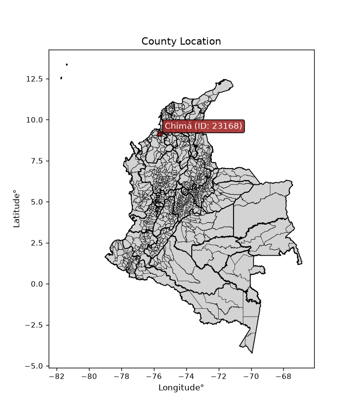
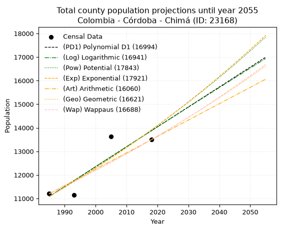
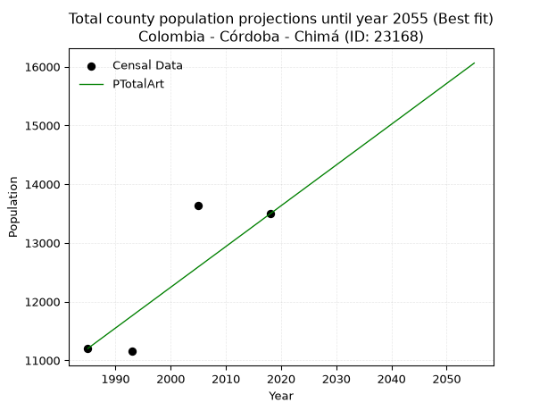
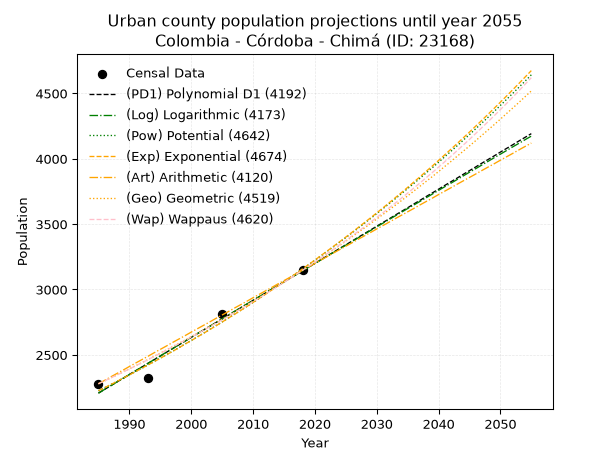
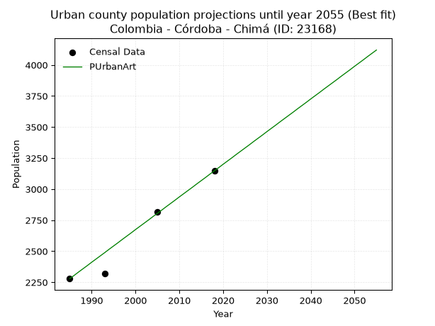
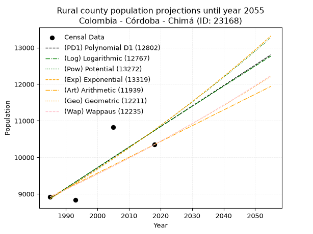
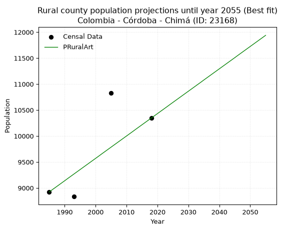

<div align="center">


</div>

# _“Population and Public Services Demand Projections (PPSD) until Year 2050 for Colombia - Córdoba - Chimá (ID: 23168)”_
Keywords: `population` `public-service` `projection` `lineal` `polynomial` `logarithmic` `potential` `exponential` `arithmetic` `geometric` `wappaus` `dane` `colombia` `south-america`

PPSD are analytical estimates used by governments and planners to anticipate future changes in population size, age distribution, and the resulting community needs for utilities, healthcare, education, and infrastructure as sizing future water treatment facilities, electrical grids, and road networks based on spatial growth.

> **General running parameters**: • app_version: _v20260806_. • Python version: _3.14.7_. • Pandas version: _3.0.5_. • NumPy version: _2.5.1_. • Creates, save and include plots into reports (create_plot): _False_. • Projection until year: _2050_. • Process polynomial degree 2 and up: _False_. • Process Wappaus: _True_. • Process Wappaus: _True_. • Set negative values to zero: _True_. • Set infinite values to zero: _True_. • Drop dataset notes: _True_. 
<div align="center">

Dynamic map: [:earth_americas:Google](http://maps.google.com/maps?q=9.149698061,-75.6268859) [:earth_americas:OSM](https://www.openstreetmap.org/#map=18/9.149698061/-75.6268859&layers=P) [:earth_americas:Bing](https://www.bing.com/maps?cp=9.149698061~-75.6268859&lvl=18) [:earth_americas:Apple](https://maps.apple.com/frame?center=9.149698061%2C-75.6268859&span=0.003%2C0.006)

</div>


<div align="center">

```geojson
{
  "type": "Feature",
  "geometry": {
    "type": "Point", 
    "coordinates": [-75.6268859, 9.149698061]
  }, 
  "properties": {
    "Name": "Colombia - Córdoba - Chimá (ID: 23168)"
  }
}
```

</div>


<div align="center">

</img>

</div>


## 0. Census Data (4 records)

Census data are official statistics collected by a government about the people and housing in a country. They usually include counts of total population, age, sex, race, income, education, and jobs.

📅Global census file: [Population.xlsx](../data/Population.xlsx)

| Source   |   Year |   CountryID | CountryName   |   StateID | StateName   |   CountyID | CountyName   |   PTotal |   PUrban |   PRural |
|:---------|-------:|------------:|:--------------|----------:|:------------|-----------:|:-------------|---------:|---------:|---------:|
| DANE     |   1985 |          57 | Colombia      |        23 | Córdoba     |      23168 | Chimá        |    11202 |     2279 |     8923 |
| DANE     |   1993 |          57 | Colombia      |        23 | Córdoba     |      23168 | Chimá        |    11153 |     2320 |     8833 |
| DANE     |   2005 |          57 | Colombia      |        23 | Córdoba     |      23168 | Chimá        |    13639 |     2815 |    10824 |
| DANE     |   2018 |          57 | Colombia      |        23 | Córdoba     |      23168 | Chimá        |    13492 |     3147 |    10345 |

> 🔥Some records could had specific notes about the registered values or the corresponding urban or rural distribution.

📅   [RUPS](https://www.datos.gov.co/Hacienda-y-Cr-dito-P-blico/Registro-nico-de-Prestadores-de-Servicios-P-blicos/4qkq-csdn/about_data) - Local public utility companies: [RUPS.csv](../data/RUPS.xlsx)

 | SERVICIO       | ESTADO    | NOMBRE                            | NIT         | DEPARTAMENTO_DOMICILIO   | MUNICIPIO_DOMICILIO   | DIRECCION                       |   TELEFONO | EMAIL                                            | TIPO_PRESTADOR                             | CLASIFICACION                 |
|:---------------|:----------|:----------------------------------|:------------|:-------------------------|:----------------------|:--------------------------------|-----------:|:-------------------------------------------------|:-------------------------------------------|:------------------------------|
| ACUEDUCTO      | OPERATIVA | AGUAS DEL SINU S.A E.S.P          | 900218174-5 | CORDOBA                  | LORICA                | CRA 26  # 14 - 06 B/ SAN PEDRO  |    7731744 | coordinacionfacturacion@aguasdelsinusaesp.com.co | SOCIEDADES (EMPRESA DE SERVICIOS PUBLICOS) | MAYOR O IGUAL A 5001 USUARIOS |
| ALCANTARILLADO | OPERATIVA | AGUAS DEL SINU S.A E.S.P          | 900218174-5 | CORDOBA                  | LORICA                | CRA 26  # 14 - 06 B/ SAN PEDRO  |    7731744 | coordinacionfacturacion@aguasdelsinusaesp.com.co | SOCIEDADES (EMPRESA DE SERVICIOS PUBLICOS) | MAYOR O IGUAL A 5001 USUARIOS |
| ACUEDUCTO      | OPERATIVA | AQUALIA LATINOAMERICA S.A. E.S.P. | 901362452-7 | CORDOBA                  | CERETE                | calle 39 n° 15-60 barrio  venus |    7641602 | jhosett.navas@aqualia.com                        | SOCIEDADES (EMPRESA DE SERVICIOS PUBLICOS) | MAYOR O IGUAL A 5001 USUARIOS |
| ALCANTARILLADO | OPERATIVA | AQUALIA LATINOAMERICA S.A. E.S.P. | 901362452-7 | CORDOBA                  | CERETE                | calle 39 n° 15-60 barrio  venus |    7641602 | jhosett.navas@aqualia.com                        | SOCIEDADES (EMPRESA DE SERVICIOS PUBLICOS) | MAYOR O IGUAL A 5001 USUARIOS |

## 1. Total

### 1.1. Coefficients and Parameters

* (PD1) Polynomial Deg 1: 84.42954636692093, -156508.7001204336 (lineal)
* (Log) Logarithmic: 169078.96427557932, -1272799.0623724647
* (Pow) Potential: 13.725793619601362, -41.21949913046026
* (Exp) Exponential: 0.0068540486000409585, 0.01368646820522124
* (Art) Arithmetic: Year diff. 2018 - 1985 = 33, Population diff. 13492 - 11202 = 2290, Annual growth = 69.39393939393939
* (Geo) Geometric: Year diff. 2018 - 1985 = 33, Population diff. 13492 - 11202 = 2290, Annual growth % = 0.005652417495536577
* (Wap) Wappaus: i = 0.5620307717983267, Condition values only valid for < 200)

<sub>
Wappaus condition values: ['0.00', '0.56', '1.12', '1.69', '2.25', '2.81', '3.37', '3.93', '4.50', '5.06', '5.62', '6.18', '6.74', '7.31', '7.87', '8.43', '8.99', '9.55', '10.12', '10.68', '11.24', '11.80', '12.36', '12.93', '13.49', '14.05', '14.61', '15.17', '15.74', '16.30', '16.86', '17.42', '17.98', '18.55', '19.11', '19.67', '20.23', '20.80', '21.36', '21.92', '22.48', '23.04', '23.61', '24.17', '24.73', '25.29', '25.85', '26.42', '26.98', '27.54', '28.10', '28.66', '29.23', '29.79', '30.35', '30.91', '31.47', '32.04', '32.60', '33.16', '33.72', '34.28', '34.85', '35.41', '35.97', '36.53']
</sub>


### 1.2. Projected Dataset

|   Year |   CountyID |   PTotalPD1 |   PTotalLog |   PTotalPow |   PTotalExp |   PTotalArt |   PTotalGeo |   PTotalWap |
|-------:|-----------:|------------:|------------:|------------:|------------:|------------:|------------:|------------:|
|   1985 |      23168 |       11084 |       11081 |       11089 |       11092 |       11202 |       11202 |       11202 |
|   1986 |      23168 |       11168 |       11166 |       11166 |       11168 |       11271 |       11265 |       11265 |
|   1987 |      23168 |       11253 |       11251 |       11243 |       11245 |       11341 |       11329 |       11329 |
|   1988 |      23168 |       11337 |       11336 |       11321 |       11322 |       11410 |       11393 |       11392 |
|   1989 |      23168 |       11422 |       11421 |       11399 |       11400 |       11480 |       11457 |       11457 |
|   1990 |      23168 |       11506 |       11506 |       11478 |       11478 |       11549 |       11522 |       11521 |
|   1991 |      23168 |       11591 |       11591 |       11558 |       11557 |       11618 |       11587 |       11586 |
|   1992 |      23168 |       11675 |       11676 |       11638 |       11637 |       11688 |       11653 |       11652 |
|   1993 |      23168 |       11759 |       11761 |       11718 |       11717 |       11757 |       11719 |       11717 |
|   1994 |      23168 |       11844 |       11846 |       11799 |       11797 |       11827 |       11785 |       11783 |
|   1995 |      23168 |       11928 |       11930 |       11881 |       11878 |       11896 |       11852 |       11850 |
|   1996 |      23168 |       12013 |       12015 |       11963 |       11960 |       11965 |       11919 |       11917 |
|   1997 |      23168 |       12097 |       12100 |       12045 |       12042 |       12035 |       11986 |       11984 |
|   1998 |      23168 |       12182 |       12184 |       12128 |       12125 |       12104 |       12054 |       12051 |
|   1999 |      23168 |       12266 |       12269 |       12212 |       12209 |       12174 |       12122 |       12120 |
|   2000 |      23168 |       12350 |       12354 |       12296 |       12293 |       12243 |       12190 |       12188 |
|   2001 |      23168 |       12435 |       12438 |       12380 |       12377 |       12312 |       12259 |       12257 |
|   2002 |      23168 |       12519 |       12523 |       12466 |       12462 |       12382 |       12328 |       12326 |
|   2003 |      23168 |       12604 |       12607 |       12551 |       12548 |       12451 |       12398 |       12396 |
|   2004 |      23168 |       12688 |       12691 |       12638 |       12634 |       12520 |       12468 |       12466 |
|   2005 |      23168 |       12773 |       12776 |       12725 |       12721 |       12590 |       12539 |       12536 |
|   2006 |      23168 |       12857 |       12860 |       12812 |       12809 |       12659 |       12610 |       12607 |
|   2007 |      23168 |       12941 |       12944 |       12900 |       12897 |       12729 |       12681 |       12678 |
|   2008 |      23168 |       13026 |       13029 |       12988 |       12985 |       12798 |       12753 |       12750 |
|   2009 |      23168 |       13110 |       13113 |       13077 |       13075 |       12867 |       12825 |       12822 |
|   2010 |      23168 |       13195 |       13197 |       13167 |       13165 |       12937 |       12897 |       12895 |
|   2011 |      23168 |       13279 |       13281 |       13257 |       13255 |       13006 |       12970 |       12968 |
|   2012 |      23168 |       13364 |       13365 |       13348 |       13346 |       13076 |       13043 |       13041 |
|   2013 |      23168 |       13448 |       13449 |       13439 |       13438 |       13145 |       13117 |       13115 |
|   2014 |      23168 |       13532 |       13533 |       13531 |       13531 |       13214 |       13191 |       13190 |
|   2015 |      23168 |       13617 |       13617 |       13624 |       13624 |       13284 |       13266 |       13265 |
|   2016 |      23168 |       13701 |       13701 |       13717 |       13717 |       13353 |       13341 |       13340 |
|   2017 |      23168 |       13786 |       13785 |       13811 |       13812 |       13423 |       13416 |       13416 |
|   2018 |      23168 |       13870 |       13869 |       13905 |       13907 |       13492 |       13492 |       13492 |
|   2019 |      23168 |       13955 |       13952 |       14000 |       14002 |       13561 |       13568 |       13569 |
|   2020 |      23168 |       14039 |       14036 |       14095 |       14099 |       13631 |       13645 |       13646 |
|   2021 |      23168 |       14123 |       14120 |       14191 |       14196 |       13700 |       13722 |       13724 |
|   2022 |      23168 |       14208 |       14203 |       14288 |       14293 |       13770 |       13800 |       13802 |
|   2023 |      23168 |       14292 |       14287 |       14385 |       14391 |       13839 |       13878 |       13880 |
|   2024 |      23168 |       14377 |       14371 |       14483 |       14490 |       13908 |       13956 |       13960 |
|   2025 |      23168 |       14461 |       14454 |       14582 |       14590 |       13978 |       14035 |       14039 |
|   2026 |      23168 |       14546 |       14538 |       14681 |       14690 |       14047 |       14114 |       14119 |
|   2027 |      23168 |       14630 |       14621 |       14781 |       14792 |       14117 |       14194 |       14200 |
|   2028 |      23168 |       14714 |       14704 |       14881 |       14893 |       14186 |       14274 |       14281 |
|   2029 |      23168 |       14799 |       14788 |       14982 |       14996 |       14255 |       14355 |       14363 |
|   2030 |      23168 |       14883 |       14871 |       15084 |       15099 |       14325 |       14436 |       14445 |
|   2031 |      23168 |       14968 |       14954 |       15186 |       15203 |       14394 |       14518 |       14528 |
|   2032 |      23168 |       15052 |       15038 |       15289 |       15307 |       14464 |       14600 |       14611 |
|   2033 |      23168 |       15137 |       15121 |       15393 |       15412 |       14533 |       14682 |       14695 |
|   2034 |      23168 |       15221 |       15204 |       15497 |       15518 |       14602 |       14765 |       14780 |
|   2035 |      23168 |       15305 |       15287 |       15602 |       15625 |       14672 |       14849 |       14865 |
|   2036 |      23168 |       15390 |       15370 |       15707 |       15733 |       14741 |       14933 |       14950 |
|   2037 |      23168 |       15474 |       15453 |       15814 |       15841 |       14810 |       15017 |       15036 |
|   2038 |      23168 |       15559 |       15536 |       15920 |       15950 |       14880 |       15102 |       15123 |
|   2039 |      23168 |       15643 |       15619 |       16028 |       16060 |       14949 |       15187 |       15210 |
|   2040 |      23168 |       15728 |       15702 |       16136 |       16170 |       15019 |       15273 |       15298 |
|   2041 |      23168 |       15812 |       15785 |       16245 |       16281 |       15088 |       15360 |       15386 |
|   2042 |      23168 |       15896 |       15868 |       16355 |       16393 |       15157 |       15446 |       15475 |
|   2043 |      23168 |       15981 |       15950 |       16465 |       16506 |       15227 |       15534 |       15565 |
|   2044 |      23168 |       16065 |       16033 |       16576 |       16619 |       15296 |       15621 |       15655 |
|   2045 |      23168 |       16150 |       16116 |       16688 |       16734 |       15366 |       15710 |       15746 |
|   2046 |      23168 |       16234 |       16198 |       16800 |       16849 |       15435 |       15799 |       15837 |
|   2047 |      23168 |       16319 |       16281 |       16913 |       16965 |       15504 |       15888 |       15929 |
|   2048 |      23168 |       16403 |       16364 |       17027 |       17081 |       15574 |       15978 |       16022 |
|   2049 |      23168 |       16487 |       16446 |       17141 |       17199 |       15643 |       16068 |       16115 |
|   2050 |      23168 |       16572 |       16529 |       17256 |       17317 |       15713 |       16159 |       16209 |
<div align="center">

</img>

</div>


### 1.3. Best fit with absolute and relative error (%)

Relative error puts that difference into context by dividing the absolute error by the true value, creating a unitless ratio or percentage that shows the scale of the mistake.

Absolute and relative error

|   Year | Source   |   CountryID | CountryName   |   StateID | StateName   |   CountyID_x | CountyName   |   PTotal |   PUrban |   PRural |   CountyID_y |   PTotalPD1 |   PTotalLog |   PTotalPow |   PTotalExp |   PTotalArt |   PTotalGeo |   PTotalWap |   PTotalPD1AbsError |   PTotalLogAbsError |   PTotalPowAbsError |   PTotalExpAbsError |   PTotalArtAbsError |   PTotalGeoAbsError |   PTotalWapAbsError |   PTotalPD1RelError |   PTotalLogRelError |   PTotalPowRelError |   PTotalExpRelError |   PTotalArtRelError |   PTotalGeoRelError |   PTotalWapRelError |
|-------:|:---------|------------:|:--------------|----------:|:------------|-------------:|:-------------|---------:|---------:|---------:|-------------:|------------:|------------:|------------:|------------:|------------:|------------:|------------:|--------------------:|--------------------:|--------------------:|--------------------:|--------------------:|--------------------:|--------------------:|--------------------:|--------------------:|--------------------:|--------------------:|--------------------:|--------------------:|--------------------:|
|   1985 | DANE     |          57 | Colombia      |        23 | Córdoba     |        23168 | Chimá        |    11202 |     2279 |     8923 |        23168 |       11084 |       11081 |       11089 |       11092 |       11202 |       11202 |       11202 |                 118 |                 121 |                 113 |                 110 |                   0 |                   0 |                   0 |             1.05338 |             1.08016 |             1.00875 |            0.981968 |             0       |             0       |             0       |
|   1993 | DANE     |          57 | Colombia      |        23 | Córdoba     |        23168 | Chimá        |    11153 |     2320 |     8833 |        23168 |       11759 |       11761 |       11718 |       11717 |       11757 |       11719 |       11717 |                 606 |                 608 |                 565 |                 564 |                 604 |                 566 |                 564 |             5.43352 |             5.45145 |             5.0659  |            5.05694  |             5.41558 |             5.07487 |             5.05694 |
|   2005 | DANE     |          57 | Colombia      |        23 | Córdoba     |        23168 | Chimá        |    13639 |     2815 |    10824 |        23168 |       12773 |       12776 |       12725 |       12721 |       12590 |       12539 |       12536 |                 866 |                 863 |                 914 |                 918 |                1049 |                1100 |                1103 |             6.34944 |             6.32744 |             6.70137 |            6.7307   |             7.69118 |             8.06511 |             8.0871  |
|   2018 | DANE     |          57 | Colombia      |        23 | Córdoba     |        23168 | Chimá        |    13492 |     3147 |    10345 |        23168 |       13870 |       13869 |       13905 |       13907 |       13492 |       13492 |       13492 |                 378 |                 377 |                 413 |                 415 |                   0 |                   0 |                   0 |             2.80166 |             2.79425 |             3.06107 |            3.0759   |             0       |             0       |             0       |

Relative error mean

| Method    |   RelError | Best   |
|:----------|-----------:|:-------|
| PTotalPD1 |    3.9095  |        |
| PTotalLog |    3.91333 |        |
| PTotalPow |    3.95927 |        |
| PTotalExp |    3.96137 |        |
| PTotalArt |    3.27669 | True   |
| PTotalGeo |    3.28499 |        |
| PTotalWap |    3.28601 |        |

💙Best method: _**PTotalArt**_
<div align="center">

</img>

</div>


### 1.4. Fresh water supply demand in liters per capita per day (lpcd)

The fresh water supply demand typically ranges from 100 to 300 liters per capita per day (lpcd) for standard domestic and municipal planning, though absolute survival minimums set by the World Health Organization are as low as 7.5 to 20 liters per day, and total consumption in high-income nations can exceed 400 liters.

> `CZ`: Level in meters above the sea level (masl)<br> `WS`: Fresh water supply demand in liters per capita per day (lpcd or l/h/d)<br> `WSAll`: Zonal fresh water supply demand in liters per second (l/s)<br> `A`: Zonal area in square meters<br> `DP`: Population density (people/hectare or p/ha)

Reference values (RAS Colombia)

|    CZ |   WS |
|------:|-----:|
|  1000 |  120 |
|  2000 |  130 |
| 99999 |  140 |

County shapefile geometry properties and water supply values

|   CountyID |      ATotal |   CZTotal |   WSTotal |
|-----------:|------------:|----------:|----------:|
|      23168 | 3.24058e+08 |   9.38579 |       120 |

Projected values for best method: PTotalArt

|   CountyID |   Year |   PTotalArt |   DPTotal |   WSTotal |   WSTotalAll |
|-----------:|-------:|------------:|----------:|----------:|-------------:|
|      23168 |   1985 |       11202 |      0.35 |       120 |      15.5583 |
|      23168 |   1986 |       11271 |      0.35 |       120 |      15.6542 |
|      23168 |   1987 |       11341 |      0.35 |       120 |      15.7514 |
|      23168 |   1988 |       11410 |      0.35 |       120 |      15.8472 |
|      23168 |   1989 |       11480 |      0.35 |       120 |      15.9444 |
|      23168 |   1990 |       11549 |      0.36 |       120 |      16.0403 |
|      23168 |   1991 |       11618 |      0.36 |       120 |      16.1361 |
|      23168 |   1992 |       11688 |      0.36 |       120 |      16.2333 |
|      23168 |   1993 |       11757 |      0.36 |       120 |      16.3292 |
|      23168 |   1994 |       11827 |      0.36 |       120 |      16.4264 |
|      23168 |   1995 |       11896 |      0.37 |       120 |      16.5222 |
|      23168 |   1996 |       11965 |      0.37 |       120 |      16.6181 |
|      23168 |   1997 |       12035 |      0.37 |       120 |      16.7153 |
|      23168 |   1998 |       12104 |      0.37 |       120 |      16.8111 |
|      23168 |   1999 |       12174 |      0.38 |       120 |      16.9083 |
|      23168 |   2000 |       12243 |      0.38 |       120 |      17.0042 |
|      23168 |   2001 |       12312 |      0.38 |       120 |      17.1    |
|      23168 |   2002 |       12382 |      0.38 |       120 |      17.1972 |
|      23168 |   2003 |       12451 |      0.38 |       120 |      17.2931 |
|      23168 |   2004 |       12520 |      0.39 |       120 |      17.3889 |
|      23168 |   2005 |       12590 |      0.39 |       120 |      17.4861 |
|      23168 |   2006 |       12659 |      0.39 |       120 |      17.5819 |
|      23168 |   2007 |       12729 |      0.39 |       120 |      17.6792 |
|      23168 |   2008 |       12798 |      0.39 |       120 |      17.775  |
|      23168 |   2009 |       12867 |      0.4  |       120 |      17.8708 |
|      23168 |   2010 |       12937 |      0.4  |       120 |      17.9681 |
|      23168 |   2011 |       13006 |      0.4  |       120 |      18.0639 |
|      23168 |   2012 |       13076 |      0.4  |       120 |      18.1611 |
|      23168 |   2013 |       13145 |      0.41 |       120 |      18.2569 |
|      23168 |   2014 |       13214 |      0.41 |       120 |      18.3528 |
|      23168 |   2015 |       13284 |      0.41 |       120 |      18.45   |
|      23168 |   2016 |       13353 |      0.41 |       120 |      18.5458 |
|      23168 |   2017 |       13423 |      0.41 |       120 |      18.6431 |
|      23168 |   2018 |       13492 |      0.42 |       120 |      18.7389 |
|      23168 |   2019 |       13561 |      0.42 |       120 |      18.8347 |
|      23168 |   2020 |       13631 |      0.42 |       120 |      18.9319 |
|      23168 |   2021 |       13700 |      0.42 |       120 |      19.0278 |
|      23168 |   2022 |       13770 |      0.42 |       120 |      19.125  |
|      23168 |   2023 |       13839 |      0.43 |       120 |      19.2208 |
|      23168 |   2024 |       13908 |      0.43 |       120 |      19.3167 |
|      23168 |   2025 |       13978 |      0.43 |       120 |      19.4139 |
|      23168 |   2026 |       14047 |      0.43 |       120 |      19.5097 |
|      23168 |   2027 |       14117 |      0.44 |       120 |      19.6069 |
|      23168 |   2028 |       14186 |      0.44 |       120 |      19.7028 |
|      23168 |   2029 |       14255 |      0.44 |       120 |      19.7986 |
|      23168 |   2030 |       14325 |      0.44 |       120 |      19.8958 |
|      23168 |   2031 |       14394 |      0.44 |       120 |      19.9917 |
|      23168 |   2032 |       14464 |      0.45 |       120 |      20.0889 |
|      23168 |   2033 |       14533 |      0.45 |       120 |      20.1847 |
|      23168 |   2034 |       14602 |      0.45 |       120 |      20.2806 |
|      23168 |   2035 |       14672 |      0.45 |       120 |      20.3778 |
|      23168 |   2036 |       14741 |      0.45 |       120 |      20.4736 |
|      23168 |   2037 |       14810 |      0.46 |       120 |      20.5694 |
|      23168 |   2038 |       14880 |      0.46 |       120 |      20.6667 |
|      23168 |   2039 |       14949 |      0.46 |       120 |      20.7625 |
|      23168 |   2040 |       15019 |      0.46 |       120 |      20.8597 |
|      23168 |   2041 |       15088 |      0.47 |       120 |      20.9556 |
|      23168 |   2042 |       15157 |      0.47 |       120 |      21.0514 |
|      23168 |   2043 |       15227 |      0.47 |       120 |      21.1486 |
|      23168 |   2044 |       15296 |      0.47 |       120 |      21.2444 |
|      23168 |   2045 |       15366 |      0.47 |       120 |      21.3417 |
|      23168 |   2046 |       15435 |      0.48 |       120 |      21.4375 |
|      23168 |   2047 |       15504 |      0.48 |       120 |      21.5333 |
|      23168 |   2048 |       15574 |      0.48 |       120 |      21.6306 |
|      23168 |   2049 |       15643 |      0.48 |       120 |      21.7264 |
|      23168 |   2050 |       15713 |      0.48 |       120 |      21.8236 |

## 2. Urban

### 2.1. Coefficients and Parameters

* (PD1) Polynomial Deg 1: 28.35126455238839, -54069.36692091489 (lineal)
* (Log) Logarithmic: 56738.36522063629, -428628.51871478045
* (Pow) Potential: 21.218383023328137, -66.62583963896017
* (Exp) Exponential: 0.010601692373881066, 1.6143132273271353e-06
* (Art) Arithmetic: Year diff. 2018 - 1985 = 33, Population diff. 3147 - 2279 = 868, Annual growth = 26.303030303030305
* (Geo) Geometric: Year diff. 2018 - 1985 = 33, Population diff. 3147 - 2279 = 868, Annual growth % = 0.009827150221420222
* (Wap) Wappaus: i = 0.9695182566542685, Condition values only valid for < 200)

<sub>
Wappaus condition values: ['0.00', '0.97', '1.94', '2.91', '3.88', '4.85', '5.82', '6.79', '7.76', '8.73', '9.70', '10.66', '11.63', '12.60', '13.57', '14.54', '15.51', '16.48', '17.45', '18.42', '19.39', '20.36', '21.33', '22.30', '23.27', '24.24', '25.21', '26.18', '27.15', '28.12', '29.09', '30.06', '31.02', '31.99', '32.96', '33.93', '34.90', '35.87', '36.84', '37.81', '38.78', '39.75', '40.72', '41.69', '42.66', '43.63', '44.60', '45.57', '46.54', '47.51', '48.48', '49.45', '50.41', '51.38', '52.35', '53.32', '54.29', '55.26', '56.23', '57.20', '58.17', '59.14', '60.11', '61.08', '62.05', '63.02']
</sub>


### 2.2. Projected Dataset

|   Year |   CountyID |   PUrbanPD1 |   PUrbanLog |   PUrbanPow |   PUrbanExp |   PUrbanArt |   PUrbanGeo |   PUrbanWap |
|-------:|-----------:|------------:|------------:|------------:|------------:|------------:|------------:|------------:|
|   1985 |      23168 |        2208 |        2207 |        2225 |        2226 |        2279 |        2279 |        2279 |
|   1986 |      23168 |        2236 |        2236 |        2249 |        2249 |        2305 |        2301 |        2301 |
|   1987 |      23168 |        2265 |        2264 |        2273 |        2273 |        2332 |        2324 |        2324 |
|   1988 |      23168 |        2293 |        2293 |        2297 |        2297 |        2358 |        2347 |        2346 |
|   1989 |      23168 |        2321 |        2321 |        2322 |        2322 |        2384 |        2370 |        2369 |
|   1990 |      23168 |        2350 |        2350 |        2347 |        2347 |        2411 |        2393 |        2392 |
|   1991 |      23168 |        2378 |        2378 |        2372 |        2372 |        2437 |        2417 |        2416 |
|   1992 |      23168 |        2406 |        2407 |        2397 |        2397 |        2463 |        2440 |        2439 |
|   1993 |      23168 |        2435 |        2435 |        2423 |        2423 |        2489 |        2464 |        2463 |
|   1994 |      23168 |        2463 |        2464 |        2449 |        2448 |        2516 |        2489 |        2487 |
|   1995 |      23168 |        2491 |        2492 |        2475 |        2474 |        2542 |        2513 |        2511 |
|   1996 |      23168 |        2520 |        2521 |        2502 |        2501 |        2568 |        2538 |        2536 |
|   1997 |      23168 |        2548 |        2549 |        2528 |        2527 |        2595 |        2563 |        2561 |
|   1998 |      23168 |        2576 |        2577 |        2555 |        2554 |        2621 |        2588 |        2586 |
|   1999 |      23168 |        2605 |        2606 |        2583 |        2582 |        2647 |        2613 |        2611 |
|   2000 |      23168 |        2633 |        2634 |        2610 |        2609 |        2674 |        2639 |        2636 |
|   2001 |      23168 |        2662 |        2663 |        2638 |        2637 |        2700 |        2665 |        2662 |
|   2002 |      23168 |        2690 |        2691 |        2666 |        2665 |        2726 |        2691 |        2688 |
|   2003 |      23168 |        2718 |        2719 |        2695 |        2693 |        2752 |        2718 |        2715 |
|   2004 |      23168 |        2747 |        2748 |        2723 |        2722 |        2779 |        2744 |        2741 |
|   2005 |      23168 |        2775 |        2776 |        2752 |        2751 |        2805 |        2771 |        2768 |
|   2006 |      23168 |        2803 |        2804 |        2782 |        2781 |        2831 |        2799 |        2796 |
|   2007 |      23168 |        2832 |        2832 |        2811 |        2810 |        2858 |        2826 |        2823 |
|   2008 |      23168 |        2860 |        2861 |        2841 |        2840 |        2884 |        2854 |        2851 |
|   2009 |      23168 |        2888 |        2889 |        2871 |        2870 |        2910 |        2882 |        2879 |
|   2010 |      23168 |        2917 |        2917 |        2902 |        2901 |        2937 |        2910 |        2908 |
|   2011 |      23168 |        2945 |        2945 |        2932 |        2932 |        2963 |        2939 |        2936 |
|   2012 |      23168 |        2973 |        2974 |        2963 |        2963 |        2989 |        2968 |        2965 |
|   2013 |      23168 |        3002 |        3002 |        2995 |        2995 |        3015 |        2997 |        2995 |
|   2014 |      23168 |        3030 |        3030 |        3027 |        3027 |        3042 |        3026 |        3025 |
|   2015 |      23168 |        3058 |        3058 |        3059 |        3059 |        3068 |        3056 |        3055 |
|   2016 |      23168 |        3087 |        3086 |        3091 |        3091 |        3094 |        3086 |        3085 |
|   2017 |      23168 |        3115 |        3114 |        3124 |        3124 |        3121 |        3116 |        3116 |
|   2018 |      23168 |        3143 |        3143 |        3157 |        3158 |        3147 |        3147 |        3147 |
|   2019 |      23168 |        3172 |        3171 |        3190 |        3191 |        3173 |        3178 |        3178 |
|   2020 |      23168 |        3200 |        3199 |        3224 |        3225 |        3200 |        3209 |        3210 |
|   2021 |      23168 |        3229 |        3227 |        3258 |        3260 |        3226 |        3241 |        3243 |
|   2022 |      23168 |        3257 |        3255 |        3292 |        3295 |        3252 |        3273 |        3275 |
|   2023 |      23168 |        3285 |        3283 |        3327 |        3330 |        3279 |        3305 |        3308 |
|   2024 |      23168 |        3314 |        3311 |        3362 |        3365 |        3305 |        3337 |        3342 |
|   2025 |      23168 |        3342 |        3339 |        3397 |        3401 |        3331 |        3370 |        3375 |
|   2026 |      23168 |        3370 |        3367 |        3433 |        3437 |        3357 |        3403 |        3410 |
|   2027 |      23168 |        3399 |        3395 |        3469 |        3474 |        3384 |        3437 |        3444 |
|   2028 |      23168 |        3427 |        3423 |        3506 |        3511 |        3410 |        3470 |        3479 |
|   2029 |      23168 |        3455 |        3451 |        3543 |        3548 |        3436 |        3504 |        3515 |
|   2030 |      23168 |        3484 |        3479 |        3580 |        3586 |        3463 |        3539 |        3551 |
|   2031 |      23168 |        3512 |        3507 |        3618 |        3624 |        3489 |        3574 |        3587 |
|   2032 |      23168 |        3540 |        3535 |        3656 |        3663 |        3515 |        3609 |        3624 |
|   2033 |      23168 |        3569 |        3563 |        3694 |        3702 |        3542 |        3644 |        3661 |
|   2034 |      23168 |        3597 |        3591 |        3733 |        3741 |        3568 |        3680 |        3699 |
|   2035 |      23168 |        3625 |        3619 |        3772 |        3781 |        3594 |        3716 |        3737 |
|   2036 |      23168 |        3654 |        3646 |        3811 |        3822 |        3620 |        3753 |        3776 |
|   2037 |      23168 |        3682 |        3674 |        3851 |        3862 |        3647 |        3790 |        3815 |
|   2038 |      23168 |        3711 |        3702 |        3892 |        3904 |        3673 |        3827 |        3855 |
|   2039 |      23168 |        3739 |        3730 |        3932 |        3945 |        3699 |        3864 |        3895 |
|   2040 |      23168 |        3767 |        3758 |        3973 |        3987 |        3726 |        3902 |        3936 |
|   2041 |      23168 |        3796 |        3786 |        4015 |        4030 |        3752 |        3941 |        3977 |
|   2042 |      23168 |        3824 |        3813 |        4057 |        4073 |        3778 |        3979 |        4019 |
|   2043 |      23168 |        3852 |        3841 |        4099 |        4116 |        3805 |        4019 |        4062 |
|   2044 |      23168 |        3881 |        3869 |        4142 |        4160 |        3831 |        4058 |        4105 |
|   2045 |      23168 |        3909 |        3897 |        4185 |        4204 |        3857 |        4098 |        4148 |
|   2046 |      23168 |        3937 |        3924 |        4229 |        4249 |        3883 |        4138 |        4193 |
|   2047 |      23168 |        3966 |        3952 |        4273 |        4294 |        3910 |        4179 |        4238 |
|   2048 |      23168 |        3994 |        3980 |        4317 |        4340 |        3936 |        4220 |        4283 |
|   2049 |      23168 |        4022 |        4008 |        4362 |        4386 |        3962 |        4261 |        4329 |
|   2050 |      23168 |        4051 |        4035 |        4408 |        4433 |        3989 |        4303 |        4376 |
<div align="center">

</img>

</div>


### 2.3. Best fit with absolute and relative error (%)

Relative error puts that difference into context by dividing the absolute error by the true value, creating a unitless ratio or percentage that shows the scale of the mistake.

Absolute and relative error

|   Year | Source   |   CountryID | CountryName   |   StateID | StateName   |   CountyID_x | CountyName   |   PTotal |   PUrban |   PRural |   CountyID_y |   PUrbanPD1 |   PUrbanLog |   PUrbanPow |   PUrbanExp |   PUrbanArt |   PUrbanGeo |   PUrbanWap |   PUrbanPD1AbsError |   PUrbanLogAbsError |   PUrbanPowAbsError |   PUrbanExpAbsError |   PUrbanArtAbsError |   PUrbanGeoAbsError |   PUrbanWapAbsError |   PUrbanPD1RelError |   PUrbanLogRelError |   PUrbanPowRelError |   PUrbanExpRelError |   PUrbanArtRelError |   PUrbanGeoRelError |   PUrbanWapRelError |
|-------:|:---------|------------:|:--------------|----------:|:------------|-------------:|:-------------|---------:|---------:|---------:|-------------:|------------:|------------:|------------:|------------:|------------:|------------:|------------:|--------------------:|--------------------:|--------------------:|--------------------:|--------------------:|--------------------:|--------------------:|--------------------:|--------------------:|--------------------:|--------------------:|--------------------:|--------------------:|--------------------:|
|   1985 | DANE     |          57 | Colombia      |        23 | Córdoba     |        23168 | Chimá        |    11202 |     2279 |     8923 |        23168 |        2208 |        2207 |        2225 |        2226 |        2279 |        2279 |        2279 |                  71 |                  72 |                  54 |                  53 |                   0 |                   0 |                   0 |            3.1154   |            3.15928  |            2.36946  |            2.32558  |             0       |             0       |             0       |
|   1993 | DANE     |          57 | Colombia      |        23 | Córdoba     |        23168 | Chimá        |    11153 |     2320 |     8833 |        23168 |        2435 |        2435 |        2423 |        2423 |        2489 |        2464 |        2463 |                 115 |                 115 |                 103 |                 103 |                 169 |                 144 |                 143 |            4.9569   |            4.9569   |            4.43966  |            4.43966  |             7.28448 |             6.2069  |             6.16379 |
|   2005 | DANE     |          57 | Colombia      |        23 | Córdoba     |        23168 | Chimá        |    13639 |     2815 |    10824 |        23168 |        2775 |        2776 |        2752 |        2751 |        2805 |        2771 |        2768 |                  40 |                  39 |                  63 |                  64 |                  10 |                  44 |                  47 |            1.42096  |            1.38544  |            2.23801  |            2.27353  |             0.35524 |             1.56306 |             1.66963 |
|   2018 | DANE     |          57 | Colombia      |        23 | Córdoba     |        23168 | Chimá        |    13492 |     3147 |    10345 |        23168 |        3143 |        3143 |        3157 |        3158 |        3147 |        3147 |        3147 |                   4 |                   4 |                  10 |                  11 |                   0 |                   0 |                   0 |            0.127105 |            0.127105 |            0.317763 |            0.349539 |             0       |             0       |             0       |

Relative error mean

| Method    |   RelError | Best   |
|:----------|-----------:|:-------|
| PUrbanPD1 |    2.40509 |        |
| PUrbanLog |    2.40718 |        |
| PUrbanPow |    2.34122 |        |
| PUrbanExp |    2.34708 |        |
| PUrbanArt |    1.90993 | True   |
| PUrbanGeo |    1.94249 |        |
| PUrbanWap |    1.95836 |        |

💙Best method: _**PUrbanArt**_
<div align="center">

</img>

</div>


### 2.4. Fresh water supply demand in liters per capita per day (lpcd)

The fresh water supply demand typically ranges from 100 to 300 liters per capita per day (lpcd) for standard domestic and municipal planning, though absolute survival minimums set by the World Health Organization are as low as 7.5 to 20 liters per day, and total consumption in high-income nations can exceed 400 liters.

> `CZ`: Level in meters above the sea level (masl)<br> `WS`: Fresh water supply demand in liters per capita per day (lpcd or l/h/d)<br> `WSAll`: Zonal fresh water supply demand in liters per second (l/s)<br> `A`: Zonal area in square meters<br> `DP`: Population density (people/hectare or p/ha)

Reference values (RAS Colombia)

|    CZ |   WS |
|------:|-----:|
|  1000 |  120 |
|  2000 |  130 |
| 99999 |  140 |

County shapefile geometry properties and water supply values

|   CountyID |   AUrban |   CZUrban |   WSUrban |
|-----------:|---------:|----------:|----------:|
|      23168 |   642161 |   9.25369 |       120 |

Projected values for best method: PUrbanArt

|   CountyID |   Year |   PUrbanArt |   DPUrban |   WSUrban |   WSUrbanAll |
|-----------:|-------:|------------:|----------:|----------:|-------------:|
|      23168 |   1985 |        2279 |     35.49 |       120 |      3.16528 |
|      23168 |   1986 |        2305 |     35.89 |       120 |      3.20139 |
|      23168 |   1987 |        2332 |     36.31 |       120 |      3.23889 |
|      23168 |   1988 |        2358 |     36.72 |       120 |      3.275   |
|      23168 |   1989 |        2384 |     37.12 |       120 |      3.31111 |
|      23168 |   1990 |        2411 |     37.55 |       120 |      3.34861 |
|      23168 |   1991 |        2437 |     37.95 |       120 |      3.38472 |
|      23168 |   1992 |        2463 |     38.35 |       120 |      3.42083 |
|      23168 |   1993 |        2489 |     38.76 |       120 |      3.45694 |
|      23168 |   1994 |        2516 |     39.18 |       120 |      3.49444 |
|      23168 |   1995 |        2542 |     39.59 |       120 |      3.53056 |
|      23168 |   1996 |        2568 |     39.99 |       120 |      3.56667 |
|      23168 |   1997 |        2595 |     40.41 |       120 |      3.60417 |
|      23168 |   1998 |        2621 |     40.82 |       120 |      3.64028 |
|      23168 |   1999 |        2647 |     41.22 |       120 |      3.67639 |
|      23168 |   2000 |        2674 |     41.64 |       120 |      3.71389 |
|      23168 |   2001 |        2700 |     42.05 |       120 |      3.75    |
|      23168 |   2002 |        2726 |     42.45 |       120 |      3.78611 |
|      23168 |   2003 |        2752 |     42.86 |       120 |      3.82222 |
|      23168 |   2004 |        2779 |     43.28 |       120 |      3.85972 |
|      23168 |   2005 |        2805 |     43.68 |       120 |      3.89583 |
|      23168 |   2006 |        2831 |     44.09 |       120 |      3.93194 |
|      23168 |   2007 |        2858 |     44.51 |       120 |      3.96944 |
|      23168 |   2008 |        2884 |     44.91 |       120 |      4.00556 |
|      23168 |   2009 |        2910 |     45.32 |       120 |      4.04167 |
|      23168 |   2010 |        2937 |     45.74 |       120 |      4.07917 |
|      23168 |   2011 |        2963 |     46.14 |       120 |      4.11528 |
|      23168 |   2012 |        2989 |     46.55 |       120 |      4.15139 |
|      23168 |   2013 |        3015 |     46.95 |       120 |      4.1875  |
|      23168 |   2014 |        3042 |     47.37 |       120 |      4.225   |
|      23168 |   2015 |        3068 |     47.78 |       120 |      4.26111 |
|      23168 |   2016 |        3094 |     48.18 |       120 |      4.29722 |
|      23168 |   2017 |        3121 |     48.6  |       120 |      4.33472 |
|      23168 |   2018 |        3147 |     49.01 |       120 |      4.37083 |
|      23168 |   2019 |        3173 |     49.41 |       120 |      4.40694 |
|      23168 |   2020 |        3200 |     49.83 |       120 |      4.44444 |
|      23168 |   2021 |        3226 |     50.24 |       120 |      4.48056 |
|      23168 |   2022 |        3252 |     50.64 |       120 |      4.51667 |
|      23168 |   2023 |        3279 |     51.06 |       120 |      4.55417 |
|      23168 |   2024 |        3305 |     51.47 |       120 |      4.59028 |
|      23168 |   2025 |        3331 |     51.87 |       120 |      4.62639 |
|      23168 |   2026 |        3357 |     52.28 |       120 |      4.6625  |
|      23168 |   2027 |        3384 |     52.7  |       120 |      4.7     |
|      23168 |   2028 |        3410 |     53.1  |       120 |      4.73611 |
|      23168 |   2029 |        3436 |     53.51 |       120 |      4.77222 |
|      23168 |   2030 |        3463 |     53.93 |       120 |      4.80972 |
|      23168 |   2031 |        3489 |     54.33 |       120 |      4.84583 |
|      23168 |   2032 |        3515 |     54.74 |       120 |      4.88194 |
|      23168 |   2033 |        3542 |     55.16 |       120 |      4.91944 |
|      23168 |   2034 |        3568 |     55.56 |       120 |      4.95556 |
|      23168 |   2035 |        3594 |     55.97 |       120 |      4.99167 |
|      23168 |   2036 |        3620 |     56.37 |       120 |      5.02778 |
|      23168 |   2037 |        3647 |     56.79 |       120 |      5.06528 |
|      23168 |   2038 |        3673 |     57.2  |       120 |      5.10139 |
|      23168 |   2039 |        3699 |     57.6  |       120 |      5.1375  |
|      23168 |   2040 |        3726 |     58.02 |       120 |      5.175   |
|      23168 |   2041 |        3752 |     58.43 |       120 |      5.21111 |
|      23168 |   2042 |        3778 |     58.83 |       120 |      5.24722 |
|      23168 |   2043 |        3805 |     59.25 |       120 |      5.28472 |
|      23168 |   2044 |        3831 |     59.66 |       120 |      5.32083 |
|      23168 |   2045 |        3857 |     60.06 |       120 |      5.35694 |
|      23168 |   2046 |        3883 |     60.47 |       120 |      5.39306 |
|      23168 |   2047 |        3910 |     60.89 |       120 |      5.43056 |
|      23168 |   2048 |        3936 |     61.29 |       120 |      5.46667 |
|      23168 |   2049 |        3962 |     61.7  |       120 |      5.50278 |
|      23168 |   2050 |        3989 |     62.12 |       120 |      5.54028 |

## 3. Rural

### 3.1. Coefficients and Parameters

* (PD1) Polynomial Deg 1: 56.078281814532566, -102439.33319951876 (lineal)
* (Log) Logarithmic: 112340.59905494285, -844170.5436576832
* (Pow) Potential: 11.630212328134101, -34.40577854698888
* (Exp) Exponential: 0.005805851267923972, 0.08768103171790123
* (Art) Arithmetic: Year diff. 2018 - 1985 = 33, Population diff. 10345 - 8923 = 1422, Annual growth = 43.09090909090909
* (Geo) Geometric: Year diff. 2018 - 1985 = 33, Population diff. 10345 - 8923 = 1422, Annual growth % = 0.004490996806547853
* (Wap) Wappaus: i = 0.4472795213920396, Condition values only valid for < 200)

<sub>
Wappaus condition values: ['0.00', '0.45', '0.89', '1.34', '1.79', '2.24', '2.68', '3.13', '3.58', '4.03', '4.47', '4.92', '5.37', '5.81', '6.26', '6.71', '7.16', '7.60', '8.05', '8.50', '8.95', '9.39', '9.84', '10.29', '10.73', '11.18', '11.63', '12.08', '12.52', '12.97', '13.42', '13.87', '14.31', '14.76', '15.21', '15.65', '16.10', '16.55', '17.00', '17.44', '17.89', '18.34', '18.79', '19.23', '19.68', '20.13', '20.57', '21.02', '21.47', '21.92', '22.36', '22.81', '23.26', '23.71', '24.15', '24.60', '25.05', '25.49', '25.94', '26.39', '26.84', '27.28', '27.73', '28.18', '28.63', '29.07']
</sub>


### 3.2. Projected Dataset

|   Year |   CountyID |   PRuralPD1 |   PRuralLog |   PRuralPow |   PRuralExp |   PRuralArt |   PRuralGeo |   PRuralWap |
|-------:|-----------:|------------:|------------:|------------:|------------:|------------:|------------:|------------:|
|   1985 |      23168 |        8876 |        8874 |        8869 |        8871 |        8923 |        8923 |        8923 |
|   1986 |      23168 |        8932 |        8930 |        8921 |        8923 |        8966 |        8963 |        8963 |
|   1987 |      23168 |        8988 |        8987 |        8974 |        8975 |        9009 |        9003 |        9003 |
|   1988 |      23168 |        9044 |        9043 |        9026 |        9027 |        9052 |        9044 |        9044 |
|   1989 |      23168 |        9100 |        9100 |        9079 |        9080 |        9095 |        9084 |        9084 |
|   1990 |      23168 |        9156 |        9156 |        9132 |        9132 |        9138 |        9125 |        9125 |
|   1991 |      23168 |        9213 |        9213 |        9186 |        9186 |        9182 |        9166 |        9166 |
|   1992 |      23168 |        9269 |        9269 |        9240 |        9239 |        9225 |        9207 |        9207 |
|   1993 |      23168 |        9325 |        9326 |        9294 |        9293 |        9268 |        9249 |        9248 |
|   1994 |      23168 |        9381 |        9382 |        9348 |        9347 |        9311 |        9290 |        9290 |
|   1995 |      23168 |        9437 |        9438 |        9403 |        9401 |        9354 |        9332 |        9331 |
|   1996 |      23168 |        9493 |        9494 |        9458 |        9456 |        9397 |        9374 |        9373 |
|   1997 |      23168 |        9549 |        9551 |        9513 |        9511 |        9440 |        9416 |        9415 |
|   1998 |      23168 |        9605 |        9607 |        9569 |        9567 |        9483 |        9458 |        9457 |
|   1999 |      23168 |        9661 |        9663 |        9624 |        9622 |        9526 |        9501 |        9500 |
|   2000 |      23168 |        9717 |        9719 |        9681 |        9678 |        9569 |        9543 |        9542 |
|   2001 |      23168 |        9773 |        9776 |        9737 |        9735 |        9612 |        9586 |        9585 |
|   2002 |      23168 |        9829 |        9832 |        9794 |        9791 |        9656 |        9629 |        9628 |
|   2003 |      23168 |        9885 |        9888 |        9851 |        9848 |        9699 |        9673 |        9672 |
|   2004 |      23168 |        9942 |        9944 |        9908 |        9906 |        9742 |        9716 |        9715 |
|   2005 |      23168 |        9998 |       10000 |        9966 |        9963 |        9785 |        9760 |        9759 |
|   2006 |      23168 |       10054 |       10056 |       10024 |       10021 |        9828 |        9803 |        9802 |
|   2007 |      23168 |       10110 |       10112 |       10082 |       10080 |        9871 |        9847 |        9846 |
|   2008 |      23168 |       10166 |       10168 |       10141 |       10139 |        9914 |        9892 |        9891 |
|   2009 |      23168 |       10222 |       10224 |       10200 |       10198 |        9957 |        9936 |        9935 |
|   2010 |      23168 |       10278 |       10280 |       10259 |       10257 |       10000 |        9981 |        9980 |
|   2011 |      23168 |       10334 |       10336 |       10318 |       10317 |       10043 |       10026 |       10025 |
|   2012 |      23168 |       10390 |       10391 |       10378 |       10377 |       10086 |       10071 |       10070 |
|   2013 |      23168 |       10446 |       10447 |       10438 |       10437 |       10130 |       10116 |       10115 |
|   2014 |      23168 |       10502 |       10503 |       10499 |       10498 |       10173 |       10161 |       10161 |
|   2015 |      23168 |       10558 |       10559 |       10559 |       10559 |       10216 |       10207 |       10206 |
|   2016 |      23168 |       10614 |       10615 |       10621 |       10621 |       10259 |       10253 |       10252 |
|   2017 |      23168 |       10671 |       10670 |       10682 |       10682 |       10302 |       10299 |       10299 |
|   2018 |      23168 |       10727 |       10726 |       10744 |       10745 |       10345 |       10345 |       10345 |
|   2019 |      23168 |       10783 |       10782 |       10806 |       10807 |       10388 |       10391 |       10392 |
|   2020 |      23168 |       10839 |       10837 |       10868 |       10870 |       10431 |       10438 |       10439 |
|   2021 |      23168 |       10895 |       10893 |       10931 |       10933 |       10474 |       10485 |       10486 |
|   2022 |      23168 |       10951 |       10948 |       10994 |       10997 |       10517 |       10532 |       10533 |
|   2023 |      23168 |       11007 |       11004 |       11057 |       11061 |       10560 |       10579 |       10580 |
|   2024 |      23168 |       11063 |       11059 |       11121 |       11125 |       10604 |       10627 |       10628 |
|   2025 |      23168 |       11119 |       11115 |       11185 |       11190 |       10647 |       10675 |       10676 |
|   2026 |      23168 |       11175 |       11170 |       11250 |       11255 |       10690 |       10723 |       10725 |
|   2027 |      23168 |       11231 |       11226 |       11314 |       11321 |       10733 |       10771 |       10773 |
|   2028 |      23168 |       11287 |       11281 |       11380 |       11387 |       10776 |       10819 |       10822 |
|   2029 |      23168 |       11344 |       11337 |       11445 |       11453 |       10819 |       10868 |       10871 |
|   2030 |      23168 |       11400 |       11392 |       11511 |       11520 |       10862 |       10916 |       10920 |
|   2031 |      23168 |       11456 |       11447 |       11577 |       11587 |       10905 |       10966 |       10969 |
|   2032 |      23168 |       11512 |       11503 |       11643 |       11654 |       10948 |       11015 |       11019 |
|   2033 |      23168 |       11568 |       11558 |       11710 |       11722 |       10991 |       11064 |       11069 |
|   2034 |      23168 |       11624 |       11613 |       11777 |       11791 |       11034 |       11114 |       11119 |
|   2035 |      23168 |       11680 |       11668 |       11845 |       11859 |       11078 |       11164 |       11170 |
|   2036 |      23168 |       11736 |       11724 |       11913 |       11928 |       11121 |       11214 |       11220 |
|   2037 |      23168 |       11792 |       11779 |       11981 |       11998 |       11164 |       11264 |       11271 |
|   2038 |      23168 |       11848 |       11834 |       12049 |       12068 |       11207 |       11315 |       11323 |
|   2039 |      23168 |       11904 |       11889 |       12118 |       12138 |       11250 |       11366 |       11374 |
|   2040 |      23168 |       11960 |       11944 |       12188 |       12208 |       11293 |       11417 |       11426 |
|   2041 |      23168 |       12016 |       11999 |       12257 |       12280 |       11336 |       11468 |       11478 |
|   2042 |      23168 |       12073 |       12054 |       12327 |       12351 |       11379 |       11520 |       11530 |
|   2043 |      23168 |       12129 |       12109 |       12398 |       12423 |       11422 |       11571 |       11583 |
|   2044 |      23168 |       12185 |       12164 |       12469 |       12495 |       11465 |       11623 |       11636 |
|   2045 |      23168 |       12241 |       12219 |       12540 |       12568 |       11508 |       11675 |       11689 |
|   2046 |      23168 |       12297 |       12274 |       12611 |       12641 |       11552 |       11728 |       11742 |
|   2047 |      23168 |       12353 |       12329 |       12683 |       12715 |       11595 |       11781 |       11796 |
|   2048 |      23168 |       12409 |       12384 |       12755 |       12789 |       11638 |       11833 |       11850 |
|   2049 |      23168 |       12465 |       12439 |       12828 |       12863 |       11681 |       11887 |       11904 |
|   2050 |      23168 |       12521 |       12493 |       12901 |       12938 |       11724 |       11940 |       11958 |
<div align="center">

</img>

</div>


### 3.3. Best fit with absolute and relative error (%)

Relative error puts that difference into context by dividing the absolute error by the true value, creating a unitless ratio or percentage that shows the scale of the mistake.

Absolute and relative error

|   Year | Source   |   CountryID | CountryName   |   StateID | StateName   |   CountyID_x | CountyName   |   PTotal |   PUrban |   PRural |   CountyID_y |   PRuralPD1 |   PRuralLog |   PRuralPow |   PRuralExp |   PRuralArt |   PRuralGeo |   PRuralWap |   PRuralPD1AbsError |   PRuralLogAbsError |   PRuralPowAbsError |   PRuralExpAbsError |   PRuralArtAbsError |   PRuralGeoAbsError |   PRuralWapAbsError |   PRuralPD1RelError |   PRuralLogRelError |   PRuralPowRelError |   PRuralExpRelError |   PRuralArtRelError |   PRuralGeoRelError |   PRuralWapRelError |
|-------:|:---------|------------:|:--------------|----------:|:------------|-------------:|:-------------|---------:|---------:|---------:|-------------:|------------:|------------:|------------:|------------:|------------:|------------:|------------:|--------------------:|--------------------:|--------------------:|--------------------:|--------------------:|--------------------:|--------------------:|--------------------:|--------------------:|--------------------:|--------------------:|--------------------:|--------------------:|--------------------:|
|   1985 | DANE     |          57 | Colombia      |        23 | Córdoba     |        23168 | Chimá        |    11202 |     2279 |     8923 |        23168 |        8876 |        8874 |        8869 |        8871 |        8923 |        8923 |        8923 |                  47 |                  49 |                  54 |                  52 |                   0 |                   0 |                   0 |            0.526729 |            0.549143 |            0.605178 |            0.582764 |             0       |             0       |             0       |
|   1993 | DANE     |          57 | Colombia      |        23 | Córdoba     |        23168 | Chimá        |    11153 |     2320 |     8833 |        23168 |        9325 |        9326 |        9294 |        9293 |        9268 |        9249 |        9248 |                 492 |                 493 |                 461 |                 460 |                 435 |                 416 |                 415 |            5.57002  |            5.58134  |            5.21906  |            5.20774  |             4.92471 |             4.70961 |             4.69829 |
|   2005 | DANE     |          57 | Colombia      |        23 | Córdoba     |        23168 | Chimá        |    13639 |     2815 |    10824 |        23168 |        9998 |       10000 |        9966 |        9963 |        9785 |        9760 |        9759 |                 826 |                 824 |                 858 |                 861 |                1039 |                1064 |                1065 |            7.63119  |            7.61271  |            7.92683  |            7.95455  |             9.59904 |             9.83001 |             9.83925 |
|   2018 | DANE     |          57 | Colombia      |        23 | Córdoba     |        23168 | Chimá        |    13492 |     3147 |    10345 |        23168 |       10727 |       10726 |       10744 |       10745 |       10345 |       10345 |       10345 |                 382 |                 381 |                 399 |                 400 |                   0 |                   0 |                   0 |            3.69261  |            3.68294  |            3.85694  |            3.8666   |             0       |             0       |             0       |

Relative error mean

| Method    |   RelError | Best   |
|:----------|-----------:|:-------|
| PRuralPD1 |    4.35514 |        |
| PRuralLog |    4.35653 |        |
| PRuralPow |    4.402   |        |
| PRuralExp |    4.40291 |        |
| PRuralArt |    3.63094 | True   |
| PRuralGeo |    3.6349  |        |
| PRuralWap |    3.63438 |        |

💙Best method: _**PRuralArt**_
<div align="center">

</img>

</div>


### 3.4. Fresh water supply demand in liters per capita per day (lpcd)

The fresh water supply demand typically ranges from 100 to 300 liters per capita per day (lpcd) for standard domestic and municipal planning, though absolute survival minimums set by the World Health Organization are as low as 7.5 to 20 liters per day, and total consumption in high-income nations can exceed 400 liters.

> `CZ`: Level in meters above the sea level (masl)<br> `WS`: Fresh water supply demand in liters per capita per day (lpcd or l/h/d)<br> `WSAll`: Zonal fresh water supply demand in liters per second (l/s)<br> `A`: Zonal area in square meters<br> `DP`: Population density (people/hectare or p/ha)

Reference values (RAS Colombia)

|    CZ |   WS |
|------:|-----:|
|  1000 |  120 |
|  2000 |  130 |
| 99999 |  140 |

County shapefile geometry properties and water supply values

|   CountyID |      ARural |   CZRural |   WSRural |
|-----------:|------------:|----------:|----------:|
|      23168 | 3.23416e+08 |   9.38605 |       120 |

Projected values for best method: PRuralArt

|   CountyID |   Year |   PRuralArt |   DPRural |   WSRural |   WSRuralAll |
|-----------:|-------:|------------:|----------:|----------:|-------------:|
|      23168 |   1985 |        8923 |      0.28 |       120 |      12.3931 |
|      23168 |   1986 |        8966 |      0.28 |       120 |      12.4528 |
|      23168 |   1987 |        9009 |      0.28 |       120 |      12.5125 |
|      23168 |   1988 |        9052 |      0.28 |       120 |      12.5722 |
|      23168 |   1989 |        9095 |      0.28 |       120 |      12.6319 |
|      23168 |   1990 |        9138 |      0.28 |       120 |      12.6917 |
|      23168 |   1991 |        9182 |      0.28 |       120 |      12.7528 |
|      23168 |   1992 |        9225 |      0.29 |       120 |      12.8125 |
|      23168 |   1993 |        9268 |      0.29 |       120 |      12.8722 |
|      23168 |   1994 |        9311 |      0.29 |       120 |      12.9319 |
|      23168 |   1995 |        9354 |      0.29 |       120 |      12.9917 |
|      23168 |   1996 |        9397 |      0.29 |       120 |      13.0514 |
|      23168 |   1997 |        9440 |      0.29 |       120 |      13.1111 |
|      23168 |   1998 |        9483 |      0.29 |       120 |      13.1708 |
|      23168 |   1999 |        9526 |      0.29 |       120 |      13.2306 |
|      23168 |   2000 |        9569 |      0.3  |       120 |      13.2903 |
|      23168 |   2001 |        9612 |      0.3  |       120 |      13.35   |
|      23168 |   2002 |        9656 |      0.3  |       120 |      13.4111 |
|      23168 |   2003 |        9699 |      0.3  |       120 |      13.4708 |
|      23168 |   2004 |        9742 |      0.3  |       120 |      13.5306 |
|      23168 |   2005 |        9785 |      0.3  |       120 |      13.5903 |
|      23168 |   2006 |        9828 |      0.3  |       120 |      13.65   |
|      23168 |   2007 |        9871 |      0.31 |       120 |      13.7097 |
|      23168 |   2008 |        9914 |      0.31 |       120 |      13.7694 |
|      23168 |   2009 |        9957 |      0.31 |       120 |      13.8292 |
|      23168 |   2010 |       10000 |      0.31 |       120 |      13.8889 |
|      23168 |   2011 |       10043 |      0.31 |       120 |      13.9486 |
|      23168 |   2012 |       10086 |      0.31 |       120 |      14.0083 |
|      23168 |   2013 |       10130 |      0.31 |       120 |      14.0694 |
|      23168 |   2014 |       10173 |      0.31 |       120 |      14.1292 |
|      23168 |   2015 |       10216 |      0.32 |       120 |      14.1889 |
|      23168 |   2016 |       10259 |      0.32 |       120 |      14.2486 |
|      23168 |   2017 |       10302 |      0.32 |       120 |      14.3083 |
|      23168 |   2018 |       10345 |      0.32 |       120 |      14.3681 |
|      23168 |   2019 |       10388 |      0.32 |       120 |      14.4278 |
|      23168 |   2020 |       10431 |      0.32 |       120 |      14.4875 |
|      23168 |   2021 |       10474 |      0.32 |       120 |      14.5472 |
|      23168 |   2022 |       10517 |      0.33 |       120 |      14.6069 |
|      23168 |   2023 |       10560 |      0.33 |       120 |      14.6667 |
|      23168 |   2024 |       10604 |      0.33 |       120 |      14.7278 |
|      23168 |   2025 |       10647 |      0.33 |       120 |      14.7875 |
|      23168 |   2026 |       10690 |      0.33 |       120 |      14.8472 |
|      23168 |   2027 |       10733 |      0.33 |       120 |      14.9069 |
|      23168 |   2028 |       10776 |      0.33 |       120 |      14.9667 |
|      23168 |   2029 |       10819 |      0.33 |       120 |      15.0264 |
|      23168 |   2030 |       10862 |      0.34 |       120 |      15.0861 |
|      23168 |   2031 |       10905 |      0.34 |       120 |      15.1458 |
|      23168 |   2032 |       10948 |      0.34 |       120 |      15.2056 |
|      23168 |   2033 |       10991 |      0.34 |       120 |      15.2653 |
|      23168 |   2034 |       11034 |      0.34 |       120 |      15.325  |
|      23168 |   2035 |       11078 |      0.34 |       120 |      15.3861 |
|      23168 |   2036 |       11121 |      0.34 |       120 |      15.4458 |
|      23168 |   2037 |       11164 |      0.35 |       120 |      15.5056 |
|      23168 |   2038 |       11207 |      0.35 |       120 |      15.5653 |
|      23168 |   2039 |       11250 |      0.35 |       120 |      15.625  |
|      23168 |   2040 |       11293 |      0.35 |       120 |      15.6847 |
|      23168 |   2041 |       11336 |      0.35 |       120 |      15.7444 |
|      23168 |   2042 |       11379 |      0.35 |       120 |      15.8042 |
|      23168 |   2043 |       11422 |      0.35 |       120 |      15.8639 |
|      23168 |   2044 |       11465 |      0.35 |       120 |      15.9236 |
|      23168 |   2045 |       11508 |      0.36 |       120 |      15.9833 |
|      23168 |   2046 |       11552 |      0.36 |       120 |      16.0444 |
|      23168 |   2047 |       11595 |      0.36 |       120 |      16.1042 |
|      23168 |   2048 |       11638 |      0.36 |       120 |      16.1639 |
|      23168 |   2049 |       11681 |      0.36 |       120 |      16.2236 |
|      23168 |   2050 |       11724 |      0.36 |       120 |      16.2833 |

<div align="center"><br><sub>Share this research</sub></div><br>

<sub>**APPS & TOOLS & CONTENT DISCLAIMER**: • NO WARRANTY - This content and software is provided by <a href="https://github.com/rcfdtools" target="_blank">github.com/rcfdtools</a> "as is", without any express or implied warranty, including warranties of merchantability, fitness for a particular purpose, or non-infringement. There is no guarantee that the software will be error-free or operate without interruption. • LIMITATION OF LIABILITY - Neither the authors nor copyright holders will be liable for claims or damages arising from the software or its use. You are responsible for determining if the software is appropriate for your use and assume all associated risks, including errors, legal compliance, and data loss. • NO PROFESSIONAL ADVICE - The software provides general information and does not offer professional advice. It should not replace consultation with professional advisors. [Clauses and global license for rcfdtools use.](https://github.com/rcfdtools/rcfdtools/blob/main/LICENSE.md)</sub>

| [:house: Home](Readme.md)  | [:beginner: Help / Collab](https://github.com/rcfdtools/R.HydroTools/discussions/31) |
|----------------------------|-------------------------------------------------------------------------------------------|