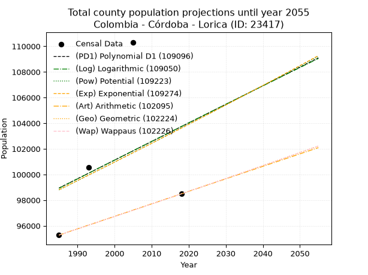
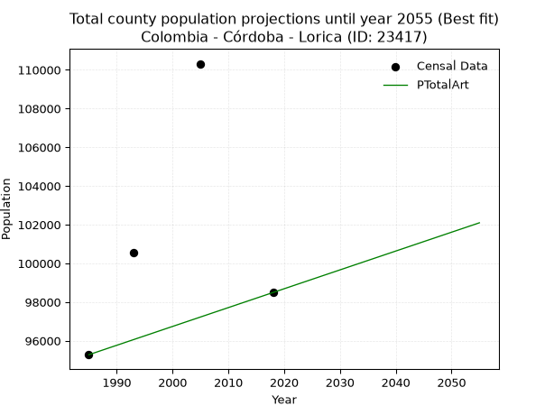
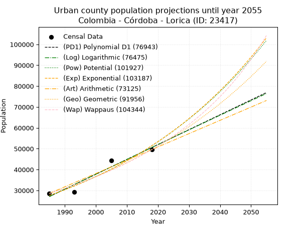
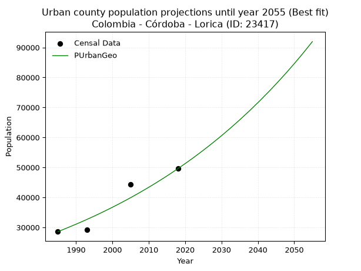
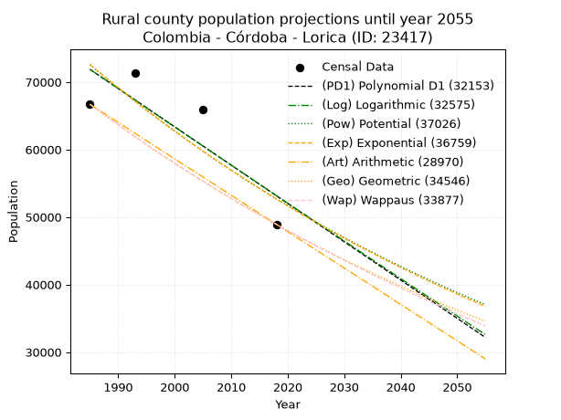
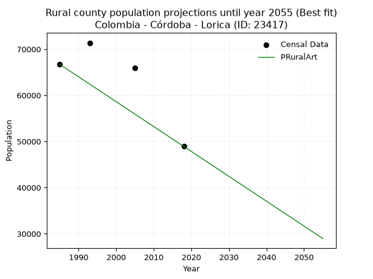

<div align="center">


</div>

# 📜 _“Population and Public Services Demand Projections (PPSD) until Year 2050 for Colombia - Córdoba - Lorica (ID: 23417)”_
Keywords: `population` `public-service` `projection` `lineal` `polynomial` `logarithmic` `potential` `exponential` `arithmetic` `geometric` `wappaus` `dane` `colombia` `south-america`

PPSD are analytical estimates used by governments and planners to anticipate future changes in population size, age distribution, and the resulting community needs for utilities, healthcare, education, and infrastructure as sizing future water treatment facilities, electrical grids, and road networks based on spatial growth.

<div align="center">

</img>

</div>


> **General running parameters**: • app_version: _v20260806_. • Python version: _3.14.7_. • Pandas version: _3.0.5_. • NumPy version: _2.5.1_. • Creates, save and include plots into reports (create_plot): _False_. • Projection until year: _2050_. • Process polynomial degree 2 and up: _False_. • Process Wappaus: _True_. • Process Wappaus: _True_. • Set negative values to zero: _True_. • Set infinite values to zero: _True_. • Drop dataset notes: _True_. 
<div align="center">

Dynamic map: [:earth_americas:Google](http://maps.google.com/maps?q=9.240788624,-75.8160842) [:earth_americas:OSM](https://www.openstreetmap.org/#map=18/9.240788624/-75.8160842&layers=P) [:earth_americas:Bing](https://www.bing.com/maps?cp=9.240788624~-75.8160842&lvl=18) [:earth_americas:Apple](https://maps.apple.com/frame?center=9.240788624%2C-75.8160842&span=0.003%2C0.006)

</div>


<div align="center">

```geojson
{
  "type": "Feature",
  "geometry": {
    "type": "Point", 
    "coordinates": [-75.8160842, 9.240788624]
  }, 
  "properties": {
    "Name": "Colombia - Córdoba - Lorica (ID: 23417)"
  }
}
```

</div>


## 0. Census Data (4 records)

Census data are official statistics collected by a government about the people and housing in a country. They usually include counts of total population, age, sex, race, income, education, and jobs.

📅Global census file: [Population.xlsx](../data/Population.xlsx)

| Source   |   Year |   CountryID | CountryName   |   StateID | StateName   |   CountyID | CountyName   |   PTotal |   PUrban |   PRural |
|:---------|-------:|------------:|:--------------|----------:|:------------|-----------:|:-------------|---------:|---------:|---------:|
| DANE     |   1985 |          57 | Colombia      |        23 | Córdoba     |      23417 | Lorica       |    95277 |    28575 |    66702 |
| DANE     |   1993 |          57 | Colombia      |        23 | Córdoba     |      23417 | Lorica       |   100543 |    29175 |    71368 |
| DANE     |   2005 |          57 | Colombia      |        23 | Córdoba     |      23417 | Lorica       |   110316 |    44417 |    65899 |
| DANE     |   2018 |          57 | Colombia      |        23 | Córdoba     |      23417 | Lorica       |    98491 |    49577 |    48914 |

> 🔥Some records could had specific notes about the registered values or the corresponding urban or rural distribution.

📅[SUI-RUPS](https://www.datos.gov.co/Hacienda-y-Cr-dito-P-blico/Registro-nico-de-Prestadores-de-Servicios-P-blicos/4qkq-csdn/about_data) - Local public utility companies: [RUPS.csv](../data/RUPS.csv)

 | SERVICIO       | ESTADO    | NOMBRE                                                                                                                                  | NIT         | DEPARTAMENTO_DOMICILIO   | MUNICIPIO_DOMICILIO   | DIRECCION                                                       |   TELEFONO | EMAIL                                            | TIPO_PRESTADOR                             | CLASIFICACION                  |
|:---------------|:----------|:----------------------------------------------------------------------------------------------------------------------------------------|:------------|:-------------------------|:----------------------|:----------------------------------------------------------------|-----------:|:-------------------------------------------------|:-------------------------------------------|:-------------------------------|
| ACUEDUCTO      | OPERATIVA | CORPORACIÓN  ACUEDUCTO RURAL COMUNITARIO MUNICIPIO DE SANTA CRUZ DE LORICA                                                              | 800100719-8 | CORDOBA                  | LORICA                | Calle 2 No. 1-102                                               |    8980815 | arcoacueducto@hotmail.es                         | ORGANIZACION AUTORIZADA                    | DESDE 2501 HASTA 5000 USUARIOS |
| ACUEDUCTO      | OPERATIVA | AGUAS DEL SINU S.A E.S.P                                                                                                                | 900218174-5 | CORDOBA                  | LORICA                | CRA 26  # 14 - 06 B/ SAN PEDRO                                  |    7731744 | coordinacionfacturacion@aguasdelsinusaesp.com.co | SOCIEDADES (EMPRESA DE SERVICIOS PUBLICOS) | MAYOR O IGUAL A 5001 USUARIOS  |
| ALCANTARILLADO | OPERATIVA | AGUAS DEL SINU S.A E.S.P                                                                                                                | 900218174-5 | CORDOBA                  | LORICA                | CRA 26  # 14 - 06 B/ SAN PEDRO                                  |    7731744 | coordinacionfacturacion@aguasdelsinusaesp.com.co | SOCIEDADES (EMPRESA DE SERVICIOS PUBLICOS) | MAYOR O IGUAL A 5001 USUARIOS  |
| ACUEDUCTO      | OPERATIVA | ASOCIACION DE USUARIOS DEL ACUEDUCTO RURAL DE NARIÑO Y PALO DEAGUA                                                                      | 812004024-0 | CORDOBA                  | LORICA                | BARRIO BARCELONA                                                |    8980800 | asuanapa29@hotmail.com                           | ORGANIZACION AUTORIZADA                    | MENOR O IGUAL A 2500 USUARIOS  |
| ACUEDUCTO      | OPERATIVA | JUNTA ADMINISTRADORA DE USUARIOS ACUEDUCTO COMUNITARIO DE LOS HIGALES                                                                   | 812006359-1 | CORDOBA                  | LORICA                | LORICA, CORDOBA, VEREDA LOS HIGALES                             |    8980800 | ysl2912@hotmail.com                              | ORGANIZACION AUTORIZADA                    | HASTA 2500 SUSCRIPTORES        |
| ACUEDUCTO      | OPERATIVA | ASOCIACIÓN DE USUARIOS DEL SERVICIO PÚBLICO DE ACUEDUCTO DEL CORREGIMIENTO DEL REMOLINO MUNICIPIO DE SANTA CRUZ DE LORICA               | 900324556-9 | CORDOBA                  | LORICA                | Corregimiento de el Remolino, Santa Cruz de Lorica              |    8980800 | ysl2912@hotmail.com                              | ORGANIZACION AUTORIZADA                    | HASTA 2500 SUSCRIPTORES        |
| ACUEDUCTO      | OPERATIVA | ASOCIACIÓN DE USUARIOS DEL SERVICIO PÚBLICO DE ACUEDUCTO DEL CORREGIMIENTO DEL CAMPANO MUNICIPIO DE SANTA CRUZ DE LORICA                | 900232202-1 | CORDOBA                  | LORICA                | Corregimiento de el Campano de los Indios, Santa Cruz de Lorica |    8980800 | ysl2912@hotmail.com                              | ORGANIZACION AUTORIZADA                    | HASTA 2500 SUSCRIPTORES        |
| ACUEDUCTO      | OPERATIVA | ASOCIACIÓN DE USUARIOS DEL SERVICIO PÚBLICO DE ACUEDUCTO DE LOS CORREGIMIENTOS DE MANATIAL CAMPO ALEGRE Y EL GUANABANO MUNICIPIO LORICA | 900299051-4 | CORDOBA                  | LORICA                | Lorica, Cordoba - Corregimiento de Manantial                    |    8980800 | ysl2912@hotmail.com                              | ORGANIZACION AUTORIZADA                    | HASTA 2500 SUSCRIPTORES        |
| ACUEDUCTO      | OPERATIVA | ASOCIACIÓN COMUNITARIA DE USUARIOS DEL ACUEDUCTO DE VILLACONCEPCIÓN                                                                     | 900106060-3 | CORDOBA                  | LORICA                | Lorica, Cordoba, corregimiento de Villaconcepcion               |    8980800 | ysl2912@hotmail.com                              | ORGANIZACION AUTORIZADA                    | HASTA 2500 SUSCRIPTORES        |
| ACUEDUCTO      | OPERATIVA | ASOCIACION DE USUARIOS DELSERVICIO PUBLICO DE ACUEDUCTO DELOS CORREGIMIENTOS DE SANTA LUCIA DE LAS GARITAS Y LA DOCTRINA                | 900189770-1 | CORDOBA                  | LORICA                | CORREGIMIENTO LA DOCTRINA OF                                    |    0000000 | BENETTI07@HOTMAIL.COM                            | ORGANIZACION AUTORIZADA                    | MENOR O IGUAL A 2500 USUARIOS  |
| ACUEDUCTO      | OPERATIVA | AQUALIA LATINOAMERICA S.A. E.S.P.                                                                                                       | 901362452-7 | CORDOBA                  | CERETE                | calle 39 n° 15-60 barrio  venus                                 |    7641602 | jhosett.navas@aqualia.com                        | SOCIEDADES (EMPRESA DE SERVICIOS PUBLICOS) | MAYOR O IGUAL A 5001 USUARIOS  |
| ALCANTARILLADO | OPERATIVA | AQUALIA LATINOAMERICA S.A. E.S.P.                                                                                                       | 901362452-7 | CORDOBA                  | CERETE                | calle 39 n° 15-60 barrio  venus                                 |    7641602 | jhosett.navas@aqualia.com                        | SOCIEDADES (EMPRESA DE SERVICIOS PUBLICOS) | MAYOR O IGUAL A 5001 USUARIOS  |

## 1. Total

### 1.1. Coefficients and Parameters

* (PD1) Polynomial Deg 1: 145.01043757527788, -188900.3777599496 (lineal)
* (Log) Logarithmic: 292092.82659663213, -2119043.165646014
* (Pow) Potential: 2.8946486854666764, -4.551111091004364
* (Exp) Exponential: 0.001437207421362891, 5699.610711164152
* (Art) Arithmetic: Year diff. 2018 - 1985 = 33, Population diff. 98491 - 95277 = 3214, Annual growth = 97.39393939393939
* (Geo) Geometric: Year diff. 2018 - 1985 = 33, Population diff. 98491 - 95277 = 3214, Annual growth % = 0.001005861146618825
* (Wap) Wappaus: i = 0.10052634015311031, Condition values only valid for < 200)

<sub>
Wappaus condition values: ['0.00', '0.10', '0.20', '0.30', '0.40', '0.50', '0.60', '0.70', '0.80', '0.90', '1.01', '1.11', '1.21', '1.31', '1.41', '1.51', '1.61', '1.71', '1.81', '1.91', '2.01', '2.11', '2.21', '2.31', '2.41', '2.51', '2.61', '2.71', '2.81', '2.92', '3.02', '3.12', '3.22', '3.32', '3.42', '3.52', '3.62', '3.72', '3.82', '3.92', '4.02', '4.12', '4.22', '4.32', '4.42', '4.52', '4.62', '4.72', '4.83', '4.93', '5.03', '5.13', '5.23', '5.33', '5.43', '5.53', '5.63', '5.73', '5.83', '5.93', '6.03', '6.13', '6.23', '6.33', '6.43', '6.53']
</sub>


### 1.2. Projected Dataset

|   Year |   CountyID |   PTotalPD1 |   PTotalLog |   PTotalPow |   PTotalExp |   PTotalArt |   PTotalGeo |   PTotalWap |
|-------:|-----------:|------------:|------------:|------------:|------------:|------------:|------------:|------------:|
|   1985 |      23417 |       98945 |       98927 |       98798 |       98816 |       95277 |       95277 |       95277 |
|   1986 |      23417 |       99090 |       99074 |       98942 |       98958 |       95374 |       95373 |       95373 |
|   1987 |      23417 |       99235 |       99221 |       99086 |       99100 |       95472 |       95469 |       95469 |
|   1988 |      23417 |       99380 |       99368 |       99231 |       99242 |       95569 |       95565 |       95565 |
|   1989 |      23417 |       99525 |       99515 |       99375 |       99385 |       95667 |       95661 |       95661 |
|   1990 |      23417 |       99670 |       99662 |       99520 |       99528 |       95764 |       95757 |       95757 |
|   1991 |      23417 |       99815 |       99809 |       99665 |       99671 |       95861 |       95853 |       95853 |
|   1992 |      23417 |       99960 |       99955 |       99810 |       99815 |       95959 |       95950 |       95950 |
|   1993 |      23417 |      100105 |      100102 |       99955 |       99958 |       96056 |       96046 |       96046 |
|   1994 |      23417 |      100250 |      100248 |      100100 |      100102 |       96154 |       96143 |       96143 |
|   1995 |      23417 |      100395 |      100395 |      100245 |      100246 |       96251 |       96240 |       96240 |
|   1996 |      23417 |      100540 |      100541 |      100391 |      100390 |       96348 |       96337 |       96336 |
|   1997 |      23417 |      100685 |      100687 |      100537 |      100535 |       96446 |       96433 |       96433 |
|   1998 |      23417 |      100830 |      100834 |      100682 |      100679 |       96543 |       96530 |       96530 |
|   1999 |      23417 |      100975 |      100980 |      100828 |      100824 |       96641 |       96628 |       96627 |
|   2000 |      23417 |      101120 |      101126 |      100974 |      100969 |       96738 |       96725 |       96725 |
|   2001 |      23417 |      101266 |      101272 |      101121 |      101114 |       96835 |       96822 |       96822 |
|   2002 |      23417 |      101411 |      101418 |      101267 |      101260 |       96933 |       96919 |       96919 |
|   2003 |      23417 |      101556 |      101564 |      101413 |      101405 |       97030 |       97017 |       97017 |
|   2004 |      23417 |      101701 |      101710 |      101560 |      101551 |       97127 |       97114 |       97114 |
|   2005 |      23417 |      101846 |      101855 |      101707 |      101697 |       97225 |       97212 |       97212 |
|   2006 |      23417 |      101991 |      102001 |      101854 |      101843 |       97322 |       97310 |       97310 |
|   2007 |      23417 |      102136 |      102146 |      102001 |      101990 |       97420 |       97408 |       97408 |
|   2008 |      23417 |      102281 |      102292 |      102148 |      102137 |       97517 |       97506 |       97506 |
|   2009 |      23417 |      102426 |      102437 |      102295 |      102283 |       97614 |       97604 |       97604 |
|   2010 |      23417 |      102571 |      102583 |      102443 |      102431 |       97712 |       97702 |       97702 |
|   2011 |      23417 |      102716 |      102728 |      102590 |      102578 |       97809 |       97800 |       97800 |
|   2012 |      23417 |      102861 |      102873 |      102738 |      102725 |       97907 |       97899 |       97899 |
|   2013 |      23417 |      103006 |      103018 |      102886 |      102873 |       98004 |       97997 |       97997 |
|   2014 |      23417 |      103151 |      103163 |      103034 |      103021 |       98101 |       98096 |       98096 |
|   2015 |      23417 |      103296 |      103308 |      103182 |      103169 |       98199 |       98194 |       98194 |
|   2016 |      23417 |      103441 |      103453 |      103330 |      103318 |       98296 |       98293 |       98293 |
|   2017 |      23417 |      103586 |      103598 |      103479 |      103466 |       98394 |       98392 |       98392 |
|   2018 |      23417 |      103731 |      103743 |      103627 |      103615 |       98491 |       98491 |       98491 |
|   2019 |      23417 |      103876 |      103888 |      103776 |      103764 |       98588 |       98590 |       98590 |
|   2020 |      23417 |      104021 |      104032 |      103925 |      103913 |       98686 |       98689 |       98689 |
|   2021 |      23417 |      104166 |      104177 |      104074 |      104063 |       98783 |       98789 |       98789 |
|   2022 |      23417 |      104311 |      104321 |      104223 |      104212 |       98881 |       98888 |       98888 |
|   2023 |      23417 |      104456 |      104466 |      104372 |      104362 |       98978 |       98987 |       98987 |
|   2024 |      23417 |      104601 |      104610 |      104522 |      104512 |       99075 |       99087 |       99087 |
|   2025 |      23417 |      104746 |      104754 |      104671 |      104663 |       99173 |       99187 |       99187 |
|   2026 |      23417 |      104891 |      104899 |      104821 |      104813 |       99270 |       99286 |       99287 |
|   2027 |      23417 |      105036 |      105043 |      104971 |      104964 |       99368 |       99386 |       99386 |
|   2028 |      23417 |      105181 |      105187 |      105121 |      105115 |       99465 |       99486 |       99486 |
|   2029 |      23417 |      105326 |      105331 |      105271 |      105266 |       99562 |       99586 |       99587 |
|   2030 |      23417 |      105471 |      105475 |      105421 |      105418 |       99660 |       99686 |       99687 |
|   2031 |      23417 |      105616 |      105619 |      105572 |      105569 |       99757 |       99787 |       99787 |
|   2032 |      23417 |      105761 |      105762 |      105722 |      105721 |       99855 |       99887 |       99888 |
|   2033 |      23417 |      105906 |      105906 |      105873 |      105873 |       99952 |       99988 |       99988 |
|   2034 |      23417 |      106051 |      106050 |      106024 |      106025 |      100049 |      100088 |      100089 |
|   2035 |      23417 |      106196 |      106193 |      106175 |      106178 |      100147 |      100189 |      100189 |
|   2036 |      23417 |      106341 |      106337 |      106326 |      106331 |      100244 |      100290 |      100290 |
|   2037 |      23417 |      106486 |      106480 |      106477 |      106483 |      100341 |      100390 |      100391 |
|   2038 |      23417 |      106631 |      106624 |      106628 |      106637 |      100439 |      100491 |      100492 |
|   2039 |      23417 |      106776 |      106767 |      106780 |      106790 |      100536 |      100592 |      100593 |
|   2040 |      23417 |      106921 |      106910 |      106931 |      106944 |      100634 |      100694 |      100695 |
|   2041 |      23417 |      107066 |      107053 |      107083 |      107097 |      100731 |      100795 |      100796 |
|   2042 |      23417 |      107211 |      107196 |      107235 |      107251 |      100828 |      100896 |      100897 |
|   2043 |      23417 |      107356 |      107339 |      107387 |      107406 |      100926 |      100998 |      100999 |
|   2044 |      23417 |      107501 |      107482 |      107540 |      107560 |      101023 |      101099 |      101101 |
|   2045 |      23417 |      107646 |      107625 |      107692 |      107715 |      101121 |      101201 |      101202 |
|   2046 |      23417 |      107791 |      107768 |      107844 |      107870 |      101218 |      101303 |      101304 |
|   2047 |      23417 |      107936 |      107911 |      107997 |      108025 |      101315 |      101405 |      101406 |
|   2048 |      23417 |      108081 |      108053 |      108150 |      108180 |      101413 |      101507 |      101508 |
|   2049 |      23417 |      108226 |      108196 |      108303 |      108336 |      101510 |      101609 |      101611 |
|   2050 |      23417 |      108371 |      108338 |      108456 |      108492 |      101608 |      101711 |      101713 |
<div align="center">

</img>

</div>


### 1.3. Best fit with absolute and relative error (%)

Relative error puts that difference into context by dividing the absolute error by the true value, creating a unitless ratio or percentage that shows the scale of the mistake.

Absolute and relative error

|   Year | Source   |   CountryID | CountryName   |   StateID | StateName   |   CountyID_x | CountyName   |   PTotal |   PUrban |   PRural |   CountyID_y |   PTotalPD1 |   PTotalLog |   PTotalPow |   PTotalExp |   PTotalArt |   PTotalGeo |   PTotalWap |   PTotalPD1AbsError |   PTotalLogAbsError |   PTotalPowAbsError |   PTotalExpAbsError |   PTotalArtAbsError |   PTotalGeoAbsError |   PTotalWapAbsError |   PTotalPD1RelError |   PTotalLogRelError |   PTotalPowRelError |   PTotalExpRelError |   PTotalArtRelError |   PTotalGeoRelError |   PTotalWapRelError |
|-------:|:---------|------------:|:--------------|----------:|:------------|-------------:|:-------------|---------:|---------:|---------:|-------------:|------------:|------------:|------------:|------------:|------------:|------------:|------------:|--------------------:|--------------------:|--------------------:|--------------------:|--------------------:|--------------------:|--------------------:|--------------------:|--------------------:|--------------------:|--------------------:|--------------------:|--------------------:|--------------------:|
|   1985 | DANE     |          57 | Colombia      |        23 | Córdoba     |        23417 | Lorica       |    95277 |    28575 |    66702 |        23417 |       98945 |       98927 |       98798 |       98816 |       95277 |       95277 |       95277 |                3668 |                3650 |                3521 |                3539 |                   0 |                   0 |                   0 |            3.84983  |            3.83094  |            3.69554  |            3.71443  |             0       |             0       |             0       |
|   1993 | DANE     |          57 | Colombia      |        23 | Córdoba     |        23417 | Lorica       |   100543 |    29175 |    71368 |        23417 |      100105 |      100102 |       99955 |       99958 |       96056 |       96046 |       96046 |                 438 |                 441 |                 588 |                 585 |                4487 |                4497 |                4497 |            0.435635 |            0.438618 |            0.584824 |            0.581841 |             4.46277 |             4.47271 |             4.47271 |
|   2005 | DANE     |          57 | Colombia      |        23 | Córdoba     |        23417 | Lorica       |   110316 |    44417 |    65899 |        23417 |      101846 |      101855 |      101707 |      101697 |       97225 |       97212 |       97212 |                8470 |                8461 |                8609 |                8619 |               13091 |               13104 |               13104 |            7.67794  |            7.66978  |            7.80395  |            7.81301  |            11.8668  |            11.8786  |            11.8786  |
|   2018 | DANE     |          57 | Colombia      |        23 | Córdoba     |        23417 | Lorica       |    98491 |    49577 |    48914 |        23417 |      103731 |      103743 |      103627 |      103615 |       98491 |       98491 |       98491 |                5240 |                5252 |                5136 |                5124 |                   0 |                   0 |                   0 |            5.32028  |            5.33247  |            5.21469  |            5.20251  |             0       |             0       |             0       |

Relative error mean

| Method    |   RelError | Best   |
|:----------|-----------:|:-------|
| PTotalPD1 |    4.32092 |        |
| PTotalLog |    4.31795 |        |
| PTotalPow |    4.32475 |        |
| PTotalExp |    4.32795 |        |
| PTotalArt |    4.0824  | True   |
| PTotalGeo |    4.08783 |        |
| PTotalWap |    4.08783 |        |

💙Best method: _**PTotalArt**_
<div align="center">

</img>

</div>


### 1.4. Fresh water supply demand in liters per capita per day (lpcd)

The fresh water supply demand typically ranges from 100 to 300 liters per capita per day (lpcd) for standard domestic and municipal planning, though absolute survival minimums set by the World Health Organization are as low as 7.5 to 20 liters per day, and total consumption in high-income nations can exceed 400 liters.

> `CZ`: Level in meters above the sea level (masl)<br> `WS`: Fresh water supply demand in liters per capita per day (lpcd or l/h/d)<br> `WSAll`: Zonal fresh water supply demand in liters per second (l/s)<br> `A`: Zonal area in square meters<br> `DP`: Population density (people/hectare or p/ha)

Reference values (RAS Colombia)

|    CZ |   WS |
|------:|-----:|
|  1000 |  120 |
|  2000 |  130 |
| 99999 |  140 |

County shapefile geometry properties and water supply values

|   CountyID |      ATotal |   CZTotal |   WSTotal |
|-----------:|------------:|----------:|----------:|
|      23417 | 9.50936e+08 |   34.3602 |       120 |

Projected values for best method: PTotalArt

|   CountyID |   Year |   PTotalArt |   DPTotal |   WSTotal |   WSTotalAll |
|-----------:|-------:|------------:|----------:|----------:|-------------:|
|      23417 |   1985 |       95277 |      1    |       120 |      132.329 |
|      23417 |   1986 |       95374 |      1    |       120 |      132.464 |
|      23417 |   1987 |       95472 |      1    |       120 |      132.6   |
|      23417 |   1988 |       95569 |      1    |       120 |      132.735 |
|      23417 |   1989 |       95667 |      1.01 |       120 |      132.871 |
|      23417 |   1990 |       95764 |      1.01 |       120 |      133.006 |
|      23417 |   1991 |       95861 |      1.01 |       120 |      133.14  |
|      23417 |   1992 |       95959 |      1.01 |       120 |      133.276 |
|      23417 |   1993 |       96056 |      1.01 |       120 |      133.411 |
|      23417 |   1994 |       96154 |      1.01 |       120 |      133.547 |
|      23417 |   1995 |       96251 |      1.01 |       120 |      133.682 |
|      23417 |   1996 |       96348 |      1.01 |       120 |      133.817 |
|      23417 |   1997 |       96446 |      1.01 |       120 |      133.953 |
|      23417 |   1998 |       96543 |      1.02 |       120 |      134.088 |
|      23417 |   1999 |       96641 |      1.02 |       120 |      134.224 |
|      23417 |   2000 |       96738 |      1.02 |       120 |      134.358 |
|      23417 |   2001 |       96835 |      1.02 |       120 |      134.493 |
|      23417 |   2002 |       96933 |      1.02 |       120 |      134.629 |
|      23417 |   2003 |       97030 |      1.02 |       120 |      134.764 |
|      23417 |   2004 |       97127 |      1.02 |       120 |      134.899 |
|      23417 |   2005 |       97225 |      1.02 |       120 |      135.035 |
|      23417 |   2006 |       97322 |      1.02 |       120 |      135.169 |
|      23417 |   2007 |       97420 |      1.02 |       120 |      135.306 |
|      23417 |   2008 |       97517 |      1.03 |       120 |      135.44  |
|      23417 |   2009 |       97614 |      1.03 |       120 |      135.575 |
|      23417 |   2010 |       97712 |      1.03 |       120 |      135.711 |
|      23417 |   2011 |       97809 |      1.03 |       120 |      135.846 |
|      23417 |   2012 |       97907 |      1.03 |       120 |      135.982 |
|      23417 |   2013 |       98004 |      1.03 |       120 |      136.117 |
|      23417 |   2014 |       98101 |      1.03 |       120 |      136.251 |
|      23417 |   2015 |       98199 |      1.03 |       120 |      136.387 |
|      23417 |   2016 |       98296 |      1.03 |       120 |      136.522 |
|      23417 |   2017 |       98394 |      1.03 |       120 |      136.658 |
|      23417 |   2018 |       98491 |      1.04 |       120 |      136.793 |
|      23417 |   2019 |       98588 |      1.04 |       120 |      136.928 |
|      23417 |   2020 |       98686 |      1.04 |       120 |      137.064 |
|      23417 |   2021 |       98783 |      1.04 |       120 |      137.199 |
|      23417 |   2022 |       98881 |      1.04 |       120 |      137.335 |
|      23417 |   2023 |       98978 |      1.04 |       120 |      137.469 |
|      23417 |   2024 |       99075 |      1.04 |       120 |      137.604 |
|      23417 |   2025 |       99173 |      1.04 |       120 |      137.74  |
|      23417 |   2026 |       99270 |      1.04 |       120 |      137.875 |
|      23417 |   2027 |       99368 |      1.04 |       120 |      138.011 |
|      23417 |   2028 |       99465 |      1.05 |       120 |      138.146 |
|      23417 |   2029 |       99562 |      1.05 |       120 |      138.281 |
|      23417 |   2030 |       99660 |      1.05 |       120 |      138.417 |
|      23417 |   2031 |       99757 |      1.05 |       120 |      138.551 |
|      23417 |   2032 |       99855 |      1.05 |       120 |      138.688 |
|      23417 |   2033 |       99952 |      1.05 |       120 |      138.822 |
|      23417 |   2034 |      100049 |      1.05 |       120 |      138.957 |
|      23417 |   2035 |      100147 |      1.05 |       120 |      139.093 |
|      23417 |   2036 |      100244 |      1.05 |       120 |      139.228 |
|      23417 |   2037 |      100341 |      1.06 |       120 |      139.363 |
|      23417 |   2038 |      100439 |      1.06 |       120 |      139.499 |
|      23417 |   2039 |      100536 |      1.06 |       120 |      139.633 |
|      23417 |   2040 |      100634 |      1.06 |       120 |      139.769 |
|      23417 |   2041 |      100731 |      1.06 |       120 |      139.904 |
|      23417 |   2042 |      100828 |      1.06 |       120 |      140.039 |
|      23417 |   2043 |      100926 |      1.06 |       120 |      140.175 |
|      23417 |   2044 |      101023 |      1.06 |       120 |      140.31  |
|      23417 |   2045 |      101121 |      1.06 |       120 |      140.446 |
|      23417 |   2046 |      101218 |      1.06 |       120 |      140.581 |
|      23417 |   2047 |      101315 |      1.07 |       120 |      140.715 |
|      23417 |   2048 |      101413 |      1.07 |       120 |      140.851 |
|      23417 |   2049 |      101510 |      1.07 |       120 |      140.986 |
|      23417 |   2050 |      101608 |      1.07 |       120 |      141.122 |

## 2. Urban

### 2.1. Coefficients and Parameters

* (PD1) Polynomial Deg 1: 712.4608590927297, -1387163.8334002327 (lineal)
* (Log) Logarithmic: 1426143.1685504261, -10802189.652545907
* (Pow) Potential: 37.690128168213555, -119.85201475340416
* (Exp) Exponential: 0.018827267569735538, 1.6246344869891369e-12
* (Art) Arithmetic: Year diff. 2018 - 1985 = 33, Population diff. 49577 - 28575 = 21002, Annual growth = 636.4242424242424
* (Geo) Geometric: Year diff. 2018 - 1985 = 33, Population diff. 49577 - 28575 = 21002, Annual growth % = 0.01683698314762183
* (Wap) Wappaus: i = 1.6286831876963928, Condition values only valid for < 200)

<sub>
Wappaus condition values: ['0.00', '1.63', '3.26', '4.89', '6.51', '8.14', '9.77', '11.40', '13.03', '14.66', '16.29', '17.92', '19.54', '21.17', '22.80', '24.43', '26.06', '27.69', '29.32', '30.94', '32.57', '34.20', '35.83', '37.46', '39.09', '40.72', '42.35', '43.97', '45.60', '47.23', '48.86', '50.49', '52.12', '53.75', '55.38', '57.00', '58.63', '60.26', '61.89', '63.52', '65.15', '66.78', '68.40', '70.03', '71.66', '73.29', '74.92', '76.55', '78.18', '79.81', '81.43', '83.06', '84.69', '86.32', '87.95', '89.58', '91.21', '92.83', '94.46', '96.09', '97.72', '99.35', '100.98', '102.61', '104.24', '105.86']
</sub>


### 2.2. Projected Dataset

|   Year |   CountyID |   PUrbanPD1 |   PUrbanLog |   PUrbanPow |   PUrbanExp |   PUrbanArt |   PUrbanGeo |   PUrbanWap |
|-------:|-----------:|------------:|------------:|------------:|------------:|------------:|------------:|------------:|
|   1985 |      23417 |       27071 |       27049 |       27606 |       27623 |       28575 |       28575 |       28575 |
|   1986 |      23417 |       27783 |       27767 |       28135 |       28148 |       29211 |       29056 |       29044 |
|   1987 |      23417 |       28496 |       28485 |       28674 |       28682 |       29848 |       29545 |       29521 |
|   1988 |      23417 |       29208 |       29203 |       29223 |       29228 |       30484 |       30043 |       30006 |
|   1989 |      23417 |       29921 |       29920 |       29782 |       29783 |       31121 |       30549 |       30499 |
|   1990 |      23417 |       30633 |       30637 |       30352 |       30349 |       31757 |       31063 |       31001 |
|   1991 |      23417 |       31346 |       31353 |       30932 |       30926 |       32394 |       31586 |       31511 |
|   1992 |      23417 |       32058 |       32069 |       31523 |       31514 |       33030 |       32118 |       32030 |
|   1993 |      23417 |       32771 |       32785 |       32125 |       32113 |       33666 |       32659 |       32558 |
|   1994 |      23417 |       33483 |       33501 |       32738 |       32723 |       34303 |       33208 |       33095 |
|   1995 |      23417 |       34196 |       34216 |       33362 |       33345 |       34939 |       33768 |       33642 |
|   1996 |      23417 |       34908 |       34930 |       33998 |       33979 |       35576 |       34336 |       34198 |
|   1997 |      23417 |       35621 |       35645 |       34646 |       34624 |       36212 |       34914 |       34765 |
|   1998 |      23417 |       36333 |       36359 |       35306 |       35282 |       36849 |       35502 |       35341 |
|   1999 |      23417 |       37045 |       37072 |       35978 |       35953 |       37485 |       36100 |       35929 |
|   2000 |      23417 |       37758 |       37785 |       36663 |       36636 |       38121 |       36708 |       36527 |
|   2001 |      23417 |       38470 |       38498 |       37360 |       37333 |       38758 |       37326 |       37137 |
|   2002 |      23417 |       39183 |       39211 |       38071 |       38042 |       39394 |       37954 |       37758 |
|   2003 |      23417 |       39895 |       39923 |       38794 |       38765 |       40031 |       38593 |       38391 |
|   2004 |      23417 |       40608 |       40635 |       39531 |       39502 |       40667 |       39243 |       39036 |
|   2005 |      23417 |       41320 |       41346 |       40281 |       40253 |       41303 |       39904 |       39694 |
|   2006 |      23417 |       42033 |       42057 |       41045 |       41018 |       41940 |       40576 |       40364 |
|   2007 |      23417 |       42745 |       42768 |       41823 |       41797 |       42576 |       41259 |       41048 |
|   2008 |      23417 |       43458 |       43479 |       42616 |       42592 |       43213 |       41953 |       41746 |
|   2009 |      23417 |       44170 |       44189 |       43423 |       43401 |       43849 |       42660 |       42458 |
|   2010 |      23417 |       44882 |       44898 |       44245 |       44226 |       44486 |       43378 |       43184 |
|   2011 |      23417 |       45595 |       45608 |       45083 |       45067 |       45122 |       44108 |       43925 |
|   2012 |      23417 |       46307 |       46317 |       45935 |       45923 |       45758 |       44851 |       44682 |
|   2013 |      23417 |       47020 |       47025 |       46804 |       46796 |       46395 |       45606 |       45455 |
|   2014 |      23417 |       47732 |       47734 |       47688 |       47685 |       47031 |       46374 |       46244 |
|   2015 |      23417 |       48445 |       48442 |       48589 |       48592 |       47668 |       47155 |       47050 |
|   2016 |      23417 |       49157 |       49149 |       49506 |       49515 |       48304 |       47949 |       47874 |
|   2017 |      23417 |       49870 |       49856 |       50440 |       50456 |       48941 |       48756 |       48716 |
|   2018 |      23417 |       50582 |       50563 |       51391 |       51415 |       49577 |       49577 |       49577 |
|   2019 |      23417 |       51295 |       51270 |       52360 |       52392 |       50213 |       50412 |       50457 |
|   2020 |      23417 |       52007 |       51976 |       53346 |       53388 |       50850 |       51261 |       51357 |
|   2021 |      23417 |       52720 |       52682 |       54350 |       54403 |       51486 |       52124 |       52278 |
|   2022 |      23417 |       53432 |       53387 |       55373 |       55437 |       52123 |       53001 |       53221 |
|   2023 |      23417 |       54144 |       54093 |       56415 |       56490 |       52759 |       53894 |       54185 |
|   2024 |      23417 |       54857 |       54797 |       57476 |       57564 |       53396 |       54801 |       55173 |
|   2025 |      23417 |       55569 |       55502 |       58556 |       58658 |       54032 |       55724 |       56184 |
|   2026 |      23417 |       56282 |       56206 |       59655 |       59773 |       54668 |       56662 |       57220 |
|   2027 |      23417 |       56994 |       56910 |       60775 |       60909 |       55305 |       57616 |       58282 |
|   2028 |      23417 |       57707 |       57613 |       61916 |       62066 |       55941 |       58586 |       59371 |
|   2029 |      23417 |       58419 |       58316 |       63077 |       63246 |       56578 |       59572 |       60487 |
|   2030 |      23417 |       59132 |       59019 |       64259 |       64448 |       57214 |       60575 |       61632 |
|   2031 |      23417 |       59844 |       59721 |       65463 |       65673 |       57851 |       61595 |       62806 |
|   2032 |      23417 |       60557 |       60423 |       66689 |       66921 |       58487 |       62632 |       64012 |
|   2033 |      23417 |       61269 |       61125 |       67937 |       68193 |       59123 |       63687 |       65249 |
|   2034 |      23417 |       61982 |       61826 |       69208 |       69489 |       59760 |       64759 |       66521 |
|   2035 |      23417 |       62694 |       62527 |       70502 |       70810 |       60396 |       65850 |       67827 |
|   2036 |      23417 |       63406 |       63228 |       71820 |       72155 |       61033 |       66958 |       69170 |
|   2037 |      23417 |       64119 |       63928 |       73161 |       73527 |       61669 |       68086 |       70550 |
|   2038 |      23417 |       64831 |       64628 |       74527 |       74924 |       62305 |       69232 |       71971 |
|   2039 |      23417 |       65544 |       65328 |       75918 |       76348 |       62942 |       70398 |       73432 |
|   2040 |      23417 |       66256 |       66027 |       77334 |       77799 |       63578 |       71583 |       74937 |
|   2041 |      23417 |       66969 |       66726 |       78776 |       79278 |       64215 |       72788 |       76486 |
|   2042 |      23417 |       67681 |       67424 |       80244 |       80785 |       64851 |       74014 |       78083 |
|   2043 |      23417 |       68394 |       68123 |       81738 |       82320 |       65488 |       75260 |       79729 |
|   2044 |      23417 |       69106 |       68820 |       83260 |       83885 |       66124 |       76527 |       81426 |
|   2045 |      23417 |       69819 |       69518 |       84809 |       85479 |       66760 |       77816 |       83178 |
|   2046 |      23417 |       70531 |       70215 |       86386 |       87103 |       67397 |       79126 |       84986 |
|   2047 |      23417 |       71244 |       70912 |       87992 |       88759 |       68033 |       80458 |       86854 |
|   2048 |      23417 |       71956 |       71609 |       89626 |       90446 |       68670 |       81813 |       88785 |
|   2049 |      23417 |       72668 |       72305 |       91291 |       92165 |       69306 |       83190 |       90781 |
|   2050 |      23417 |       73381 |       73001 |       92985 |       93916 |       69943 |       84591 |       92846 |
<div align="center">

</img>

</div>


### 2.3. Best fit with absolute and relative error (%)

Relative error puts that difference into context by dividing the absolute error by the true value, creating a unitless ratio or percentage that shows the scale of the mistake.

Absolute and relative error

|   Year | Source   |   CountryID | CountryName   |   StateID | StateName   |   CountyID_x | CountyName   |   PTotal |   PUrban |   PRural |   CountyID_y |   PUrbanPD1 |   PUrbanLog |   PUrbanPow |   PUrbanExp |   PUrbanArt |   PUrbanGeo |   PUrbanWap |   PUrbanPD1AbsError |   PUrbanLogAbsError |   PUrbanPowAbsError |   PUrbanExpAbsError |   PUrbanArtAbsError |   PUrbanGeoAbsError |   PUrbanWapAbsError |   PUrbanPD1RelError |   PUrbanLogRelError |   PUrbanPowRelError |   PUrbanExpRelError |   PUrbanArtRelError |   PUrbanGeoRelError |   PUrbanWapRelError |
|-------:|:---------|------------:|:--------------|----------:|:------------|-------------:|:-------------|---------:|---------:|---------:|-------------:|------------:|------------:|------------:|------------:|------------:|------------:|------------:|--------------------:|--------------------:|--------------------:|--------------------:|--------------------:|--------------------:|--------------------:|--------------------:|--------------------:|--------------------:|--------------------:|--------------------:|--------------------:|--------------------:|
|   1985 | DANE     |          57 | Colombia      |        23 | Córdoba     |        23417 | Lorica       |    95277 |    28575 |    66702 |        23417 |       27071 |       27049 |       27606 |       27623 |       28575 |       28575 |       28575 |                1504 |                1526 |                 969 |                 952 |                   0 |                   0 |                   0 |             5.26334 |             5.34033 |             3.39108 |             3.33158 |             0       |              0      |              0      |
|   1993 | DANE     |          57 | Colombia      |        23 | Córdoba     |        23417 | Lorica       |   100543 |    29175 |    71368 |        23417 |       32771 |       32785 |       32125 |       32113 |       33666 |       32659 |       32558 |                3596 |                3610 |                2950 |                2938 |                4491 |                3484 |                3383 |            12.3256  |            12.3736  |            10.1114  |            10.0703  |            15.3933  |             11.9417 |             11.5955 |
|   2005 | DANE     |          57 | Colombia      |        23 | Córdoba     |        23417 | Lorica       |   110316 |    44417 |    65899 |        23417 |       41320 |       41346 |       40281 |       40253 |       41303 |       39904 |       39694 |                3097 |                3071 |                4136 |                4164 |                3114 |                4513 |                4723 |             6.97256 |             6.91402 |             9.31175 |             9.37479 |             7.01083 |             10.1605 |             10.6333 |
|   2018 | DANE     |          57 | Colombia      |        23 | Córdoba     |        23417 | Lorica       |    98491 |    49577 |    48914 |        23417 |       50582 |       50563 |       51391 |       51415 |       49577 |       49577 |       49577 |                1005 |                 986 |                1814 |                1838 |                   0 |                   0 |                   0 |             2.02715 |             1.98883 |             3.65895 |             3.70736 |             0       |              0      |              0      |

Relative error mean

| Method    |   RelError | Best   |
|:----------|-----------:|:-------|
| PUrbanPD1 |    6.64717 |        |
| PUrbanLog |    6.6542  |        |
| PUrbanPow |    6.61829 |        |
| PUrbanExp |    6.621   |        |
| PUrbanArt |    5.60104 |        |
| PUrbanGeo |    5.52556 | True   |
| PUrbanWap |    5.55722 |        |

💙Best method: _**PUrbanGeo**_
<div align="center">

</img>

</div>


### 2.4. Fresh water supply demand in liters per capita per day (lpcd)

The fresh water supply demand typically ranges from 100 to 300 liters per capita per day (lpcd) for standard domestic and municipal planning, though absolute survival minimums set by the World Health Organization are as low as 7.5 to 20 liters per day, and total consumption in high-income nations can exceed 400 liters.

> `CZ`: Level in meters above the sea level (masl)<br> `WS`: Fresh water supply demand in liters per capita per day (lpcd or l/h/d)<br> `WSAll`: Zonal fresh water supply demand in liters per second (l/s)<br> `A`: Zonal area in square meters<br> `DP`: Population density (people/hectare or p/ha)

Reference values (RAS Colombia)

|    CZ |   WS |
|------:|-----:|
|  1000 |  120 |
|  2000 |  130 |
| 99999 |  140 |

County shapefile geometry properties and water supply values

|   CountyID |      AUrban |   CZUrban |   WSUrban |
|-----------:|------------:|----------:|----------:|
|      23417 | 7.88474e+06 |   18.9974 |       120 |

Projected values for best method: PUrbanGeo

|   CountyID |   Year |   PUrbanGeo |   DPUrban |   WSUrban |   WSUrbanAll |
|-----------:|-------:|------------:|----------:|----------:|-------------:|
|      23417 |   1985 |       28575 |     36.24 |       120 |      39.6875 |
|      23417 |   1986 |       29056 |     36.85 |       120 |      40.3556 |
|      23417 |   1987 |       29545 |     37.47 |       120 |      41.0347 |
|      23417 |   1988 |       30043 |     38.1  |       120 |      41.7264 |
|      23417 |   1989 |       30549 |     38.74 |       120 |      42.4292 |
|      23417 |   1990 |       31063 |     39.4  |       120 |      43.1431 |
|      23417 |   1991 |       31586 |     40.06 |       120 |      43.8694 |
|      23417 |   1992 |       32118 |     40.73 |       120 |      44.6083 |
|      23417 |   1993 |       32659 |     41.42 |       120 |      45.3597 |
|      23417 |   1994 |       33208 |     42.12 |       120 |      46.1222 |
|      23417 |   1995 |       33768 |     42.83 |       120 |      46.9    |
|      23417 |   1996 |       34336 |     43.55 |       120 |      47.6889 |
|      23417 |   1997 |       34914 |     44.28 |       120 |      48.4917 |
|      23417 |   1998 |       35502 |     45.03 |       120 |      49.3083 |
|      23417 |   1999 |       36100 |     45.78 |       120 |      50.1389 |
|      23417 |   2000 |       36708 |     46.56 |       120 |      50.9833 |
|      23417 |   2001 |       37326 |     47.34 |       120 |      51.8417 |
|      23417 |   2002 |       37954 |     48.14 |       120 |      52.7139 |
|      23417 |   2003 |       38593 |     48.95 |       120 |      53.6014 |
|      23417 |   2004 |       39243 |     49.77 |       120 |      54.5042 |
|      23417 |   2005 |       39904 |     50.61 |       120 |      55.4222 |
|      23417 |   2006 |       40576 |     51.46 |       120 |      56.3556 |
|      23417 |   2007 |       41259 |     52.33 |       120 |      57.3042 |
|      23417 |   2008 |       41953 |     53.21 |       120 |      58.2681 |
|      23417 |   2009 |       42660 |     54.1  |       120 |      59.25   |
|      23417 |   2010 |       43378 |     55.02 |       120 |      60.2472 |
|      23417 |   2011 |       44108 |     55.94 |       120 |      61.2611 |
|      23417 |   2012 |       44851 |     56.88 |       120 |      62.2931 |
|      23417 |   2013 |       45606 |     57.84 |       120 |      63.3417 |
|      23417 |   2014 |       46374 |     58.81 |       120 |      64.4083 |
|      23417 |   2015 |       47155 |     59.81 |       120 |      65.4931 |
|      23417 |   2016 |       47949 |     60.81 |       120 |      66.5958 |
|      23417 |   2017 |       48756 |     61.84 |       120 |      67.7167 |
|      23417 |   2018 |       49577 |     62.88 |       120 |      68.8569 |
|      23417 |   2019 |       50412 |     63.94 |       120 |      70.0167 |
|      23417 |   2020 |       51261 |     65.01 |       120 |      71.1958 |
|      23417 |   2021 |       52124 |     66.11 |       120 |      72.3944 |
|      23417 |   2022 |       53001 |     67.22 |       120 |      73.6125 |
|      23417 |   2023 |       53894 |     68.35 |       120 |      74.8528 |
|      23417 |   2024 |       54801 |     69.5  |       120 |      76.1125 |
|      23417 |   2025 |       55724 |     70.67 |       120 |      77.3944 |
|      23417 |   2026 |       56662 |     71.86 |       120 |      78.6972 |
|      23417 |   2027 |       57616 |     73.07 |       120 |      80.0222 |
|      23417 |   2028 |       58586 |     74.3  |       120 |      81.3694 |
|      23417 |   2029 |       59572 |     75.55 |       120 |      82.7389 |
|      23417 |   2030 |       60575 |     76.83 |       120 |      84.1319 |
|      23417 |   2031 |       61595 |     78.12 |       120 |      85.5486 |
|      23417 |   2032 |       62632 |     79.43 |       120 |      86.9889 |
|      23417 |   2033 |       63687 |     80.77 |       120 |      88.4542 |
|      23417 |   2034 |       64759 |     82.13 |       120 |      89.9431 |
|      23417 |   2035 |       65850 |     83.52 |       120 |      91.4583 |
|      23417 |   2036 |       66958 |     84.92 |       120 |      92.9972 |
|      23417 |   2037 |       68086 |     86.35 |       120 |      94.5639 |
|      23417 |   2038 |       69232 |     87.81 |       120 |      96.1556 |
|      23417 |   2039 |       70398 |     89.28 |       120 |      97.775  |
|      23417 |   2040 |       71583 |     90.79 |       120 |      99.4208 |
|      23417 |   2041 |       72788 |     92.31 |       120 |     101.094  |
|      23417 |   2042 |       74014 |     93.87 |       120 |     102.797  |
|      23417 |   2043 |       75260 |     95.45 |       120 |     104.528  |
|      23417 |   2044 |       76527 |     97.06 |       120 |     106.287  |
|      23417 |   2045 |       77816 |     98.69 |       120 |     108.078  |
|      23417 |   2046 |       79126 |    100.35 |       120 |     109.897  |
|      23417 |   2047 |       80458 |    102.04 |       120 |     111.747  |
|      23417 |   2048 |       81813 |    103.76 |       120 |     113.629  |
|      23417 |   2049 |       83190 |    105.51 |       120 |     115.542  |
|      23417 |   2050 |       84591 |    107.28 |       120 |     117.487  |

## 3. Rural

### 3.1. Coefficients and Parameters

* (PD1) Polynomial Deg 1: -567.4504215174518, 1198263.4556402832 (lineal)
* (Log) Logarithmic: -1134050.341953793, 8683146.486899886
* (Pow) Potential: -19.42605228924417, 68.9233604200023
* (Exp) Exponential: -0.00972023595941658, 17395368678503.254
* (Art) Arithmetic: Year diff. 2018 - 1985 = 33, Population diff. 48914 - 66702 = -17788, Annual growth = -539.030303030303
* (Geo) Geometric: Year diff. 2018 - 1985 = 33, Population diff. 48914 - 66702 = -17788, Annual growth % = -0.009355096047319433
* (Wap) Wappaus: i = -0.9324493202157194, Condition values only valid for < 200)

<sub>
Wappaus condition values: ['-0.00', '-0.93', '-1.86', '-2.80', '-3.73', '-4.66', '-5.59', '-6.53', '-7.46', '-8.39', '-9.32', '-10.26', '-11.19', '-12.12', '-13.05', '-13.99', '-14.92', '-15.85', '-16.78', '-17.72', '-18.65', '-19.58', '-20.51', '-21.45', '-22.38', '-23.31', '-24.24', '-25.18', '-26.11', '-27.04', '-27.97', '-28.91', '-29.84', '-30.77', '-31.70', '-32.64', '-33.57', '-34.50', '-35.43', '-36.37', '-37.30', '-38.23', '-39.16', '-40.10', '-41.03', '-41.96', '-42.89', '-43.83', '-44.76', '-45.69', '-46.62', '-47.55', '-48.49', '-49.42', '-50.35', '-51.28', '-52.22', '-53.15', '-54.08', '-55.01', '-55.95', '-56.88', '-57.81', '-58.74', '-59.68', '-60.61']
</sub>


### 3.2. Projected Dataset

|   Year |   CountyID |   PRuralPD1 |   PRuralLog |   PRuralPow |   PRuralExp |   PRuralArt |   PRuralGeo |   PRuralWap |
|-------:|-----------:|------------:|------------:|------------:|------------:|------------:|------------:|------------:|
|   1985 |      23417 |       71874 |       71878 |       72593 |       72588 |       66702 |       66702 |       66702 |
|   1986 |      23417 |       71307 |       71307 |       71886 |       71886 |       66163 |       66078 |       66083 |
|   1987 |      23417 |       70739 |       70736 |       71186 |       71191 |       65624 |       65460 |       65470 |
|   1988 |      23417 |       70172 |       70165 |       70494 |       70502 |       65085 |       64847 |       64862 |
|   1989 |      23417 |       69605 |       69595 |       69809 |       69820 |       64546 |       64241 |       64260 |
|   1990 |      23417 |       69037 |       69025 |       69130 |       69145 |       64007 |       63640 |       63663 |
|   1991 |      23417 |       68470 |       68455 |       68459 |       68476 |       63468 |       63044 |       63072 |
|   1992 |      23417 |       67902 |       67886 |       67794 |       67813 |       62929 |       62455 |       62486 |
|   1993 |      23417 |       67335 |       67317 |       67137 |       67157 |       62390 |       61870 |       61905 |
|   1994 |      23417 |       66767 |       66748 |       66486 |       66508 |       61851 |       61292 |       61330 |
|   1995 |      23417 |       66200 |       66179 |       65841 |       65864 |       61312 |       60718 |       60759 |
|   1996 |      23417 |       65632 |       65611 |       65203 |       65227 |       60773 |       60150 |       60194 |
|   1997 |      23417 |       65065 |       65043 |       64572 |       64596 |       60234 |       59587 |       59634 |
|   1998 |      23417 |       64498 |       64475 |       63947 |       63972 |       59695 |       59030 |       59079 |
|   1999 |      23417 |       63930 |       63908 |       63328 |       63353 |       59156 |       58478 |       58528 |
|   2000 |      23417 |       63363 |       63340 |       62716 |       62740 |       58617 |       57931 |       57982 |
|   2001 |      23417 |       62795 |       62774 |       62110 |       62133 |       58078 |       57389 |       57441 |
|   2002 |      23417 |       62228 |       62207 |       61510 |       61532 |       57538 |       56852 |       56905 |
|   2003 |      23417 |       61660 |       61641 |       60916 |       60937 |       56999 |       56320 |       56373 |
|   2004 |      23417 |       61093 |       61075 |       60329 |       60347 |       56460 |       55793 |       55846 |
|   2005 |      23417 |       60525 |       60509 |       59747 |       59764 |       55921 |       55271 |       55324 |
|   2006 |      23417 |       59958 |       59943 |       59171 |       59185 |       55382 |       54754 |       54806 |
|   2007 |      23417 |       59390 |       59378 |       58601 |       58613 |       54843 |       54242 |       54292 |
|   2008 |      23417 |       58823 |       58813 |       58036 |       58046 |       54304 |       53734 |       53782 |
|   2009 |      23417 |       58256 |       58249 |       57478 |       57485 |       53765 |       53232 |       53277 |
|   2010 |      23417 |       57688 |       57684 |       56925 |       56928 |       53226 |       52734 |       52776 |
|   2011 |      23417 |       57121 |       57120 |       56377 |       56378 |       52687 |       52240 |       52279 |
|   2012 |      23417 |       56553 |       56556 |       55836 |       55832 |       52148 |       51752 |       51787 |
|   2013 |      23417 |       55986 |       55993 |       55299 |       55292 |       51609 |       51268 |       51298 |
|   2014 |      23417 |       55418 |       55430 |       54768 |       54758 |       51070 |       50788 |       50813 |
|   2015 |      23417 |       54851 |       54867 |       54243 |       54228 |       50531 |       50313 |       50333 |
|   2016 |      23417 |       54283 |       54304 |       53722 |       53703 |       49992 |       49842 |       49856 |
|   2017 |      23417 |       53716 |       53742 |       53207 |       53184 |       49453 |       49376 |       49383 |
|   2018 |      23417 |       53149 |       53180 |       52697 |       52669 |       48914 |       48914 |       48914 |
|   2019 |      23417 |       52581 |       52618 |       52193 |       52160 |       48375 |       48456 |       48449 |
|   2020 |      23417 |       52014 |       52056 |       51693 |       51655 |       47836 |       48003 |       47987 |
|   2021 |      23417 |       51446 |       51495 |       51198 |       51156 |       47297 |       47554 |       47529 |
|   2022 |      23417 |       50879 |       50934 |       50709 |       50661 |       46758 |       47109 |       47075 |
|   2023 |      23417 |       50311 |       50373 |       50224 |       50171 |       46219 |       46668 |       46624 |
|   2024 |      23417 |       49744 |       49813 |       49744 |       49685 |       45680 |       46232 |       46177 |
|   2025 |      23417 |       49176 |       49253 |       49269 |       49205 |       45141 |       45799 |       45734 |
|   2026 |      23417 |       48609 |       48693 |       48799 |       48729 |       44602 |       45371 |       45294 |
|   2027 |      23417 |       48041 |       48133 |       48333 |       48258 |       44063 |       44946 |       44857 |
|   2028 |      23417 |       47474 |       47574 |       47872 |       47791 |       43524 |       44526 |       44424 |
|   2029 |      23417 |       46907 |       47015 |       47416 |       47328 |       42985 |       44109 |       43994 |
|   2030 |      23417 |       46339 |       46456 |       46964 |       46871 |       42446 |       43697 |       43567 |
|   2031 |      23417 |       45772 |       45898 |       46517 |       46417 |       41907 |       43288 |       43144 |
|   2032 |      23417 |       45204 |       45339 |       46075 |       45968 |       41368 |       42883 |       42724 |
|   2033 |      23417 |       44637 |       44781 |       45636 |       45524 |       40829 |       42482 |       42307 |
|   2034 |      23417 |       44069 |       44224 |       45202 |       45083 |       40290 |       42084 |       41893 |
|   2035 |      23417 |       43502 |       43666 |       44773 |       44647 |       39750 |       41691 |       41483 |
|   2036 |      23417 |       42934 |       43109 |       44348 |       44215 |       39211 |       41301 |       41075 |
|   2037 |      23417 |       42367 |       42552 |       43927 |       43788 |       38672 |       40914 |       40671 |
|   2038 |      23417 |       41799 |       41996 |       43510 |       43364 |       38133 |       40532 |       40269 |
|   2039 |      23417 |       41232 |       41439 |       43097 |       42945 |       37594 |       40152 |       39871 |
|   2040 |      23417 |       40665 |       40883 |       42689 |       42529 |       37055 |       39777 |       39476 |
|   2041 |      23417 |       40097 |       40328 |       42284 |       42118 |       36516 |       39405 |       39083 |
|   2042 |      23417 |       39530 |       39772 |       41884 |       41710 |       35977 |       39036 |       38693 |
|   2043 |      23417 |       38962 |       39217 |       41487 |       41307 |       35438 |       38671 |       38307 |
|   2044 |      23417 |       38395 |       38662 |       41095 |       40907 |       34899 |       38309 |       37923 |
|   2045 |      23417 |       37827 |       38107 |       40706 |       40512 |       34360 |       37951 |       37541 |
|   2046 |      23417 |       37260 |       37553 |       40321 |       40120 |       33821 |       37596 |       37163 |
|   2047 |      23417 |       36692 |       36999 |       39940 |       39732 |       33282 |       37244 |       36787 |
|   2048 |      23417 |       36125 |       36445 |       39563 |       39347 |       32743 |       36896 |       36414 |
|   2049 |      23417 |       35558 |       35891 |       39190 |       38967 |       32204 |       36550 |       36044 |
|   2050 |      23417 |       34990 |       35338 |       38820 |       38590 |       31665 |       36208 |       35677 |
<div align="center">

</img>

</div>


### 3.3. Best fit with absolute and relative error (%)

Relative error puts that difference into context by dividing the absolute error by the true value, creating a unitless ratio or percentage that shows the scale of the mistake.

Absolute and relative error

|   Year | Source   |   CountryID | CountryName   |   StateID | StateName   |   CountyID_x | CountyName   |   PTotal |   PUrban |   PRural |   CountyID_y |   PRuralPD1 |   PRuralLog |   PRuralPow |   PRuralExp |   PRuralArt |   PRuralGeo |   PRuralWap |   PRuralPD1AbsError |   PRuralLogAbsError |   PRuralPowAbsError |   PRuralExpAbsError |   PRuralArtAbsError |   PRuralGeoAbsError |   PRuralWapAbsError |   PRuralPD1RelError |   PRuralLogRelError |   PRuralPowRelError |   PRuralExpRelError |   PRuralArtRelError |   PRuralGeoRelError |   PRuralWapRelError |
|-------:|:---------|------------:|:--------------|----------:|:------------|-------------:|:-------------|---------:|---------:|---------:|-------------:|------------:|------------:|------------:|------------:|------------:|------------:|------------:|--------------------:|--------------------:|--------------------:|--------------------:|--------------------:|--------------------:|--------------------:|--------------------:|--------------------:|--------------------:|--------------------:|--------------------:|--------------------:|--------------------:|
|   1985 | DANE     |          57 | Colombia      |        23 | Córdoba     |        23417 | Lorica       |    95277 |    28575 |    66702 |        23417 |       71874 |       71878 |       72593 |       72588 |       66702 |       66702 |       66702 |                5172 |                5176 |                5891 |                5886 |                   0 |                   0 |                   0 |             7.75389 |             7.75989 |             8.83182 |             8.82432 |              0      |              0      |              0      |
|   1993 | DANE     |          57 | Colombia      |        23 | Córdoba     |        23417 | Lorica       |   100543 |    29175 |    71368 |        23417 |       67335 |       67317 |       67137 |       67157 |       62390 |       61870 |       61905 |                4033 |                4051 |                4231 |                4211 |                8978 |                9498 |                9463 |             5.65099 |             5.67621 |             5.92843 |             5.9004  |             12.5799 |             13.3085 |             13.2594 |
|   2005 | DANE     |          57 | Colombia      |        23 | Córdoba     |        23417 | Lorica       |   110316 |    44417 |    65899 |        23417 |       60525 |       60509 |       59747 |       59764 |       55921 |       55271 |       55324 |                5374 |                5390 |                6152 |                6135 |                9978 |               10628 |               10575 |             8.1549  |             8.17918 |             9.3355  |             9.3097  |             15.1414 |             16.1277 |             16.0473 |
|   2018 | DANE     |          57 | Colombia      |        23 | Córdoba     |        23417 | Lorica       |    98491 |    49577 |    48914 |        23417 |       53149 |       53180 |       52697 |       52669 |       48914 |       48914 |       48914 |                4235 |                4266 |                3783 |                3755 |                   0 |                   0 |                   0 |             8.65805 |             8.72143 |             7.73398 |             7.67674 |              0      |              0      |              0      |

Relative error mean

| Method    |   RelError | Best   |
|:----------|-----------:|:-------|
| PRuralPD1 |    7.55446 |        |
| PRuralLog |    7.58418 |        |
| PRuralPow |    7.95743 |        |
| PRuralExp |    7.92779 |        |
| PRuralArt |    6.93031 | True   |
| PRuralGeo |    7.35905 |        |
| PRuralWap |    7.32668 |        |

💙Best method: _**PRuralArt**_
<div align="center">

</img>

</div>


### 3.4. Fresh water supply demand in liters per capita per day (lpcd)

The fresh water supply demand typically ranges from 100 to 300 liters per capita per day (lpcd) for standard domestic and municipal planning, though absolute survival minimums set by the World Health Organization are as low as 7.5 to 20 liters per day, and total consumption in high-income nations can exceed 400 liters.

> `CZ`: Level in meters above the sea level (masl)<br> `WS`: Fresh water supply demand in liters per capita per day (lpcd or l/h/d)<br> `WSAll`: Zonal fresh water supply demand in liters per second (l/s)<br> `A`: Zonal area in square meters<br> `DP`: Population density (people/hectare or p/ha)

Reference values (RAS Colombia)

|    CZ |   WS |
|------:|-----:|
|  1000 |  120 |
|  2000 |  130 |
| 99999 |  140 |

County shapefile geometry properties and water supply values

|   CountyID |      ARural |   CZRural |   WSRural |
|-----------:|------------:|----------:|----------:|
|      23417 | 9.43052e+08 |   34.4896 |       120 |

Projected values for best method: PRuralArt

|   CountyID |   Year |   PRuralArt |   DPRural |   WSRural |   WSRuralAll |
|-----------:|-------:|------------:|----------:|----------:|-------------:|
|      23417 |   1985 |       66702 |      0.71 |       120 |      92.6417 |
|      23417 |   1986 |       66163 |      0.7  |       120 |      91.8931 |
|      23417 |   1987 |       65624 |      0.7  |       120 |      91.1444 |
|      23417 |   1988 |       65085 |      0.69 |       120 |      90.3958 |
|      23417 |   1989 |       64546 |      0.68 |       120 |      89.6472 |
|      23417 |   1990 |       64007 |      0.68 |       120 |      88.8986 |
|      23417 |   1991 |       63468 |      0.67 |       120 |      88.15   |
|      23417 |   1992 |       62929 |      0.67 |       120 |      87.4014 |
|      23417 |   1993 |       62390 |      0.66 |       120 |      86.6528 |
|      23417 |   1994 |       61851 |      0.66 |       120 |      85.9042 |
|      23417 |   1995 |       61312 |      0.65 |       120 |      85.1556 |
|      23417 |   1996 |       60773 |      0.64 |       120 |      84.4069 |
|      23417 |   1997 |       60234 |      0.64 |       120 |      83.6583 |
|      23417 |   1998 |       59695 |      0.63 |       120 |      82.9097 |
|      23417 |   1999 |       59156 |      0.63 |       120 |      82.1611 |
|      23417 |   2000 |       58617 |      0.62 |       120 |      81.4125 |
|      23417 |   2001 |       58078 |      0.62 |       120 |      80.6639 |
|      23417 |   2002 |       57538 |      0.61 |       120 |      79.9139 |
|      23417 |   2003 |       56999 |      0.6  |       120 |      79.1653 |
|      23417 |   2004 |       56460 |      0.6  |       120 |      78.4167 |
|      23417 |   2005 |       55921 |      0.59 |       120 |      77.6681 |
|      23417 |   2006 |       55382 |      0.59 |       120 |      76.9194 |
|      23417 |   2007 |       54843 |      0.58 |       120 |      76.1708 |
|      23417 |   2008 |       54304 |      0.58 |       120 |      75.4222 |
|      23417 |   2009 |       53765 |      0.57 |       120 |      74.6736 |
|      23417 |   2010 |       53226 |      0.56 |       120 |      73.925  |
|      23417 |   2011 |       52687 |      0.56 |       120 |      73.1764 |
|      23417 |   2012 |       52148 |      0.55 |       120 |      72.4278 |
|      23417 |   2013 |       51609 |      0.55 |       120 |      71.6792 |
|      23417 |   2014 |       51070 |      0.54 |       120 |      70.9306 |
|      23417 |   2015 |       50531 |      0.54 |       120 |      70.1819 |
|      23417 |   2016 |       49992 |      0.53 |       120 |      69.4333 |
|      23417 |   2017 |       49453 |      0.52 |       120 |      68.6847 |
|      23417 |   2018 |       48914 |      0.52 |       120 |      67.9361 |
|      23417 |   2019 |       48375 |      0.51 |       120 |      67.1875 |
|      23417 |   2020 |       47836 |      0.51 |       120 |      66.4389 |
|      23417 |   2021 |       47297 |      0.5  |       120 |      65.6903 |
|      23417 |   2022 |       46758 |      0.5  |       120 |      64.9417 |
|      23417 |   2023 |       46219 |      0.49 |       120 |      64.1931 |
|      23417 |   2024 |       45680 |      0.48 |       120 |      63.4444 |
|      23417 |   2025 |       45141 |      0.48 |       120 |      62.6958 |
|      23417 |   2026 |       44602 |      0.47 |       120 |      61.9472 |
|      23417 |   2027 |       44063 |      0.47 |       120 |      61.1986 |
|      23417 |   2028 |       43524 |      0.46 |       120 |      60.45   |
|      23417 |   2029 |       42985 |      0.46 |       120 |      59.7014 |
|      23417 |   2030 |       42446 |      0.45 |       120 |      58.9528 |
|      23417 |   2031 |       41907 |      0.44 |       120 |      58.2042 |
|      23417 |   2032 |       41368 |      0.44 |       120 |      57.4556 |
|      23417 |   2033 |       40829 |      0.43 |       120 |      56.7069 |
|      23417 |   2034 |       40290 |      0.43 |       120 |      55.9583 |
|      23417 |   2035 |       39750 |      0.42 |       120 |      55.2083 |
|      23417 |   2036 |       39211 |      0.42 |       120 |      54.4597 |
|      23417 |   2037 |       38672 |      0.41 |       120 |      53.7111 |
|      23417 |   2038 |       38133 |      0.4  |       120 |      52.9625 |
|      23417 |   2039 |       37594 |      0.4  |       120 |      52.2139 |
|      23417 |   2040 |       37055 |      0.39 |       120 |      51.4653 |
|      23417 |   2041 |       36516 |      0.39 |       120 |      50.7167 |
|      23417 |   2042 |       35977 |      0.38 |       120 |      49.9681 |
|      23417 |   2043 |       35438 |      0.38 |       120 |      49.2194 |
|      23417 |   2044 |       34899 |      0.37 |       120 |      48.4708 |
|      23417 |   2045 |       34360 |      0.36 |       120 |      47.7222 |
|      23417 |   2046 |       33821 |      0.36 |       120 |      46.9736 |
|      23417 |   2047 |       33282 |      0.35 |       120 |      46.225  |
|      23417 |   2048 |       32743 |      0.35 |       120 |      45.4764 |
|      23417 |   2049 |       32204 |      0.34 |       120 |      44.7278 |
|      23417 |   2050 |       31665 |      0.34 |       120 |      43.9792 |

#

<div align="center"><br><sub>Share this research</sub></div><br>

<sub>**APPS & TOOLS & CONTENT DISCLAIMER**: • NO WARRANTY - This content and software is provided by <a href="https://github.com/rcfdtools" target="_blank">github.com/rcfdtools</a> "as is", without any express or implied warranty, including warranties of merchantability, fitness for a particular purpose, or non-infringement. There is no guarantee that the software will be error-free or operate without interruption. • LIMITATION OF LIABILITY - Neither the authors nor copyright holders will be liable for claims or damages arising from the software or its use. You are responsible for determining if the software is appropriate for your use and assume all associated risks, including errors, legal compliance, and data loss. • NO PROFESSIONAL ADVICE - The software provides general information and does not offer professional advice. It should not replace consultation with professional advisors. [Clauses and global license for rcfdtools use.](https://github.com/rcfdtools/rcfdtools/blob/main/LICENSE.md)</sub>

| [:house: Home](Readme.md)  | [:beginner: Help / Collab](https://github.com/rcfdtools/R.HydroTools/discussions/31) |
|----------------------------|-------------------------------------------------------------------------------------------|