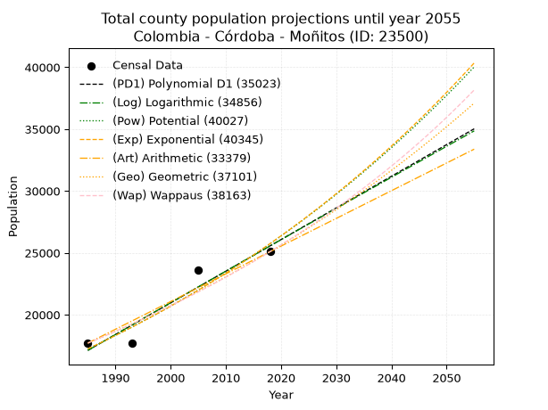
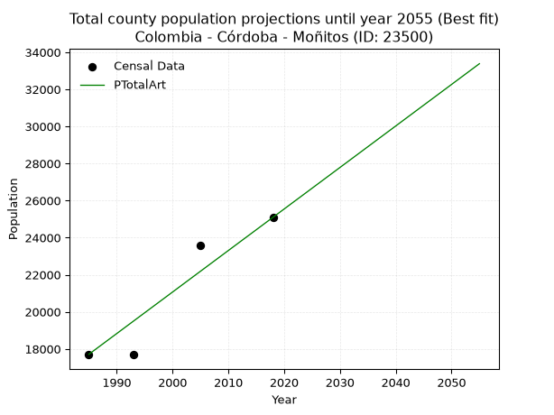
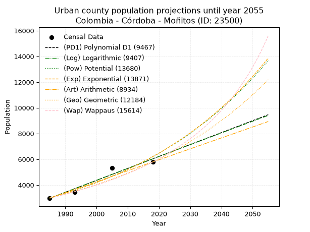
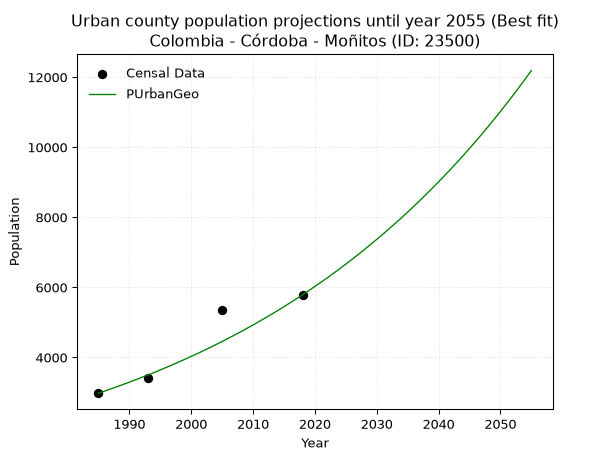
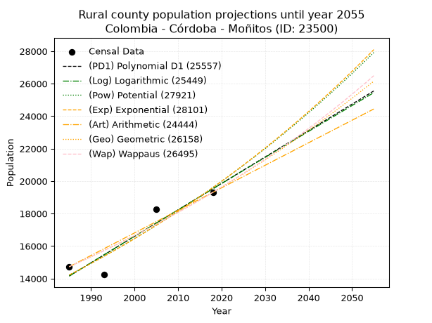
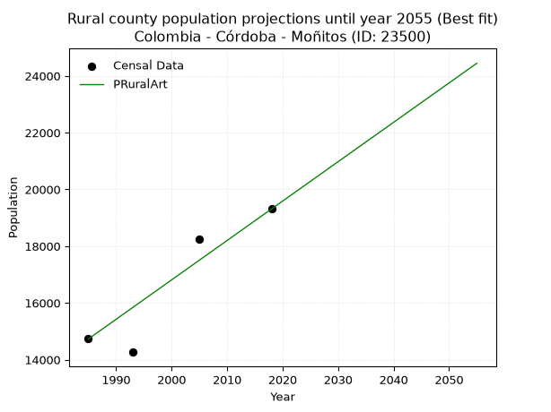

<div align="center">


</div>

# _“Population and Public Services Demand Projections (PPSD) until Year 2050 for Colombia - Córdoba - Moñitos (ID: 23500)”_
Keywords: `population` `public-service` `projection` `lineal` `polynomial` `logarithmic` `potential` `exponential` `arithmetic` `geometric` `wappaus` `dane` `colombia` `south-america`

PPSD are analytical estimates used by governments and planners to anticipate future changes in population size, age distribution, and the resulting community needs for utilities, healthcare, education, and infrastructure as sizing future water treatment facilities, electrical grids, and road networks based on spatial growth.

> **General running parameters**: • app_version: _v20260806_. • Python version: _3.14.7_. • Pandas version: _3.0.5_. • NumPy version: _2.5.1_. • Creates, save and include plots into reports (create_plot): _False_. • Projection until year: _2050_. • Process polynomial degree 2 and up: _False_. • Process Wappaus: _True_. • Process Wappaus: _True_. • Set negative values to zero: _True_. • Set infinite values to zero: _True_. • Drop dataset notes: _True_. 
<div align="center">

Dynamic map: [:earth_americas:Google](http://maps.google.com/maps?q=9.245223395,-76.1291002) [:earth_americas:OSM](https://www.openstreetmap.org/#map=18/9.245223395/-76.1291002&layers=P) [:earth_americas:Bing](https://www.bing.com/maps?cp=9.245223395~-76.1291002&lvl=18) [:earth_americas:Apple](https://maps.apple.com/frame?center=9.245223395%2C-76.1291002&span=0.003%2C0.006)

</div>


<div align="center">

```geojson
{
  "type": "Feature",
  "geometry": {
    "type": "Point", 
    "coordinates": [-76.1291002, 9.245223395]
  }, 
  "properties": {
    "Name": "Colombia - Córdoba - Moñitos (ID: 23500)"
  }
}
```

</div>


## 0. Census Data (4 records)

Census data are official statistics collected by a government about the people and housing in a country. They usually include counts of total population, age, sex, race, income, education, and jobs.

📅Global census file: [Population.xlsx](../data/Population.xlsx)

| Source   |   Year |   CountryID | CountryName   |   StateID | StateName   |   CountyID | CountyName   |   PTotal |   PUrban |   PRural |
|:---------|-------:|------------:|:--------------|----------:|:------------|-----------:|:-------------|---------:|---------:|---------:|
| DANE     |   1985 |          57 | Colombia      |        23 | Córdoba     |      23500 | Moñitos      |    17707 |     2978 |    14729 |
| DANE     |   1993 |          57 | Colombia      |        23 | Córdoba     |      23500 | Moñitos      |    17686 |     3421 |    14265 |
| DANE     |   2005 |          57 | Colombia      |        23 | Córdoba     |      23500 | Moñitos      |    23597 |     5339 |    18258 |
| DANE     |   2018 |          57 | Colombia      |        23 | Córdoba     |      23500 | Moñitos      |    25095 |     5786 |    19309 |

> 🔥Some records could had specific notes about the registered values or the corresponding urban or rural distribution.

📅   [RUPS](https://www.datos.gov.co/Hacienda-y-Cr-dito-P-blico/Registro-nico-de-Prestadores-de-Servicios-P-blicos/4qkq-csdn/about_data) - Local public utility companies: [RUPS.csv](../data/RUPS.xlsx)

 | SERVICIO       | ESTADO    | NOMBRE                                                | NIT         | DEPARTAMENTO_DOMICILIO   | MUNICIPIO_DOMICILIO   | DIRECCION                               |   TELEFONO | EMAIL                         | TIPO_INSCRIPCION    | REPRESENTANTE_LEGAL             | TIPO_PRESTADOR          | CLASIFICACION                  |
|:---------------|:----------|:------------------------------------------------------|:------------|:-------------------------|:----------------------|:----------------------------------------|-----------:|:------------------------------|:--------------------|:--------------------------------|:------------------------|:-------------------------------|
| ACUEDUCTO      | OPERATIVA | COOPERATIVA DE SERVICIOS PUBLICOS REGIONAL DE MOÑITOS | 900170824-5 | CORDOBA                  | MONITOS               | Calle 22A No. 4 - 5B Barrio Santa Lucia |    7608614 | dalisceciliagonzalez@yahoo.es | Registro por la ESP | DALIS CECILIA GONZALEZ PASTRANA | ORGANIZACION AUTORIZADA | DESDE 2501 HASTA 5000 USUARIOS |
| ALCANTARILLADO | OPERATIVA | COOPERATIVA DE SERVICIOS PUBLICOS REGIONAL DE MOÑITOS | 900170824-5 | CORDOBA                  | MONITOS               | Calle 22A No. 4 - 5B Barrio Santa Lucia |    7608614 | dalisceciliagonzalez@yahoo.es | Registro por la ESP | DALIS CECILIA GONZALEZ PASTRANA | ORGANIZACION AUTORIZADA | MENOR O IGUAL A 2500 USUARIOS  |

## 1. Total

### 1.1. Coefficients and Parameters

* (PD1) Polynomial Deg 1: 255.7474909674815, -490537.6688077048 (lineal)
* (Log) Logarithmic: 511954.7680696562, -3870351.0446454952
* (Pow) Potential: 24.30931568210477, -75.92983996606226
* (Exp) Exponential: 0.01214321726371139, 5.865049970858905e-07
* (Art) Arithmetic: Year diff. 2018 - 1985 = 33, Population diff. 25095 - 17707 = 7388, Annual growth = 223.87878787878788
* (Geo) Geometric: Year diff. 2018 - 1985 = 33, Population diff. 25095 - 17707 = 7388, Annual growth % = 0.010622953852662764
* (Wap) Wappaus: i = 1.0461136763645993, Condition values only valid for < 200)

<sub>
Wappaus condition values: ['0.00', '1.05', '2.09', '3.14', '4.18', '5.23', '6.28', '7.32', '8.37', '9.42', '10.46', '11.51', '12.55', '13.60', '14.65', '15.69', '16.74', '17.78', '18.83', '19.88', '20.92', '21.97', '23.01', '24.06', '25.11', '26.15', '27.20', '28.25', '29.29', '30.34', '31.38', '32.43', '33.48', '34.52', '35.57', '36.61', '37.66', '38.71', '39.75', '40.80', '41.84', '42.89', '43.94', '44.98', '46.03', '47.08', '48.12', '49.17', '50.21', '51.26', '52.31', '53.35', '54.40', '55.44', '56.49', '57.54', '58.58', '59.63', '60.67', '61.72', '62.77', '63.81', '64.86', '65.91', '66.95', '68.00']
</sub>


### 1.2. Projected Dataset

|   Year |   CountyID |   PTotalPD1 |   PTotalLog |   PTotalPow |   PTotalExp |   PTotalArt |   PTotalGeo |   PTotalWap |
|-------:|-----------:|------------:|------------:|------------:|------------:|------------:|------------:|------------:|
|   1985 |      23500 |       17121 |       17113 |       17237 |       17244 |       17707 |       17707 |       17707 |
|   1986 |      23500 |       17377 |       17371 |       17449 |       17454 |       17931 |       17895 |       17893 |
|   1987 |      23500 |       17633 |       17629 |       17664 |       17668 |       18155 |       18085 |       18081 |
|   1988 |      23500 |       17888 |       17886 |       17882 |       17883 |       18379 |       18277 |       18272 |
|   1989 |      23500 |       18144 |       18144 |       18101 |       18102 |       18603 |       18471 |       18464 |
|   1990 |      23500 |       18400 |       18401 |       18324 |       18323 |       18826 |       18668 |       18658 |
|   1991 |      23500 |       18656 |       18658 |       18549 |       18547 |       19050 |       18866 |       18854 |
|   1992 |      23500 |       18911 |       18915 |       18777 |       18774 |       19274 |       19066 |       19053 |
|   1993 |      23500 |       19167 |       19172 |       19007 |       19003 |       19498 |       19269 |       19254 |
|   1994 |      23500 |       19423 |       19429 |       19241 |       19235 |       19722 |       19474 |       19456 |
|   1995 |      23500 |       19679 |       19686 |       19477 |       19470 |       19946 |       19681 |       19662 |
|   1996 |      23500 |       19934 |       19942 |       19715 |       19708 |       20170 |       19890 |       19869 |
|   1997 |      23500 |       20190 |       20199 |       19957 |       19949 |       20394 |       20101 |       20079 |
|   1998 |      23500 |       20446 |       20455 |       20201 |       20192 |       20617 |       20314 |       20291 |
|   1999 |      23500 |       20702 |       20711 |       20448 |       20439 |       20841 |       20530 |       20505 |
|   2000 |      23500 |       20957 |       20967 |       20699 |       20689 |       21065 |       20748 |       20722 |
|   2001 |      23500 |       21213 |       21223 |       20952 |       20942 |       21289 |       20969 |       20941 |
|   2002 |      23500 |       21469 |       21479 |       21208 |       21197 |       21513 |       21191 |       21163 |
|   2003 |      23500 |       21725 |       21735 |       21467 |       21456 |       21737 |       21417 |       21388 |
|   2004 |      23500 |       21980 |       21990 |       21729 |       21719 |       21961 |       21644 |       21615 |
|   2005 |      23500 |       22236 |       22246 |       21994 |       21984 |       22185 |       21874 |       21845 |
|   2006 |      23500 |       22492 |       22501 |       22262 |       22252 |       22408 |       22106 |       22077 |
|   2007 |      23500 |       22748 |       22756 |       22533 |       22524 |       22632 |       22341 |       22312 |
|   2008 |      23500 |       23003 |       23011 |       22808 |       22800 |       22856 |       22579 |       22550 |
|   2009 |      23500 |       23259 |       23266 |       23086 |       23078 |       23080 |       22818 |       22791 |
|   2010 |      23500 |       23515 |       23521 |       23367 |       23360 |       23304 |       23061 |       23035 |
|   2011 |      23500 |       23771 |       23775 |       23651 |       23645 |       23528 |       23306 |       23281 |
|   2012 |      23500 |       24026 |       24030 |       23938 |       23934 |       23752 |       23553 |       23531 |
|   2013 |      23500 |       24282 |       24284 |       24229 |       24227 |       23976 |       23804 |       23784 |
|   2014 |      23500 |       24538 |       24538 |       24524 |       24523 |       24199 |       24056 |       24039 |
|   2015 |      23500 |       24794 |       24793 |       24821 |       24822 |       24423 |       24312 |       24298 |
|   2016 |      23500 |       25049 |       25047 |       25123 |       25126 |       24647 |       24570 |       24561 |
|   2017 |      23500 |       25305 |       25300 |       25427 |       25433 |       24871 |       24831 |       24826 |
|   2018 |      23500 |       25561 |       25554 |       25735 |       25743 |       25095 |       25095 |       25095 |
|   2019 |      23500 |       25817 |       25808 |       26047 |       26058 |       25319 |       25362 |       25367 |
|   2020 |      23500 |       26072 |       26061 |       26363 |       26376 |       25543 |       25631 |       25643 |
|   2021 |      23500 |       26328 |       26315 |       26682 |       26698 |       25767 |       25903 |       25922 |
|   2022 |      23500 |       26584 |       26568 |       27005 |       27025 |       25991 |       26178 |       26205 |
|   2023 |      23500 |       26840 |       26821 |       27331 |       27355 |       26214 |       26457 |       26492 |
|   2024 |      23500 |       27095 |       27074 |       27661 |       27689 |       26438 |       26738 |       26783 |
|   2025 |      23500 |       27351 |       27327 |       27996 |       28027 |       26662 |       27022 |       27077 |
|   2026 |      23500 |       27607 |       27580 |       28334 |       28370 |       26886 |       27309 |       27375 |
|   2027 |      23500 |       27862 |       27832 |       28676 |       28716 |       27110 |       27599 |       27677 |
|   2028 |      23500 |       28118 |       28085 |       29021 |       29067 |       27334 |       27892 |       27983 |
|   2029 |      23500 |       28374 |       28337 |       29371 |       29422 |       27558 |       28188 |       28294 |
|   2030 |      23500 |       28630 |       28590 |       29725 |       29782 |       27782 |       28488 |       28609 |
|   2031 |      23500 |       28885 |       28842 |       30083 |       30145 |       28005 |       28790 |       28928 |
|   2032 |      23500 |       29141 |       29094 |       30445 |       30514 |       28229 |       29096 |       29251 |
|   2033 |      23500 |       29397 |       29346 |       30812 |       30887 |       28453 |       29405 |       29579 |
|   2034 |      23500 |       29653 |       29597 |       31182 |       31264 |       28677 |       29718 |       29912 |
|   2035 |      23500 |       29908 |       29849 |       31557 |       31646 |       28901 |       30033 |       30249 |
|   2036 |      23500 |       30164 |       30100 |       31936 |       32032 |       29125 |       30352 |       30591 |
|   2037 |      23500 |       30420 |       30352 |       32320 |       32424 |       29349 |       30675 |       30938 |
|   2038 |      23500 |       30676 |       30603 |       32708 |       32820 |       29573 |       31001 |       31290 |
|   2039 |      23500 |       30931 |       30854 |       33100 |       33221 |       29796 |       31330 |       31647 |
|   2040 |      23500 |       31187 |       31105 |       33497 |       33627 |       30020 |       31663 |       32010 |
|   2041 |      23500 |       31443 |       31356 |       33898 |       34038 |       30244 |       31999 |       32377 |
|   2042 |      23500 |       31699 |       31607 |       34304 |       34453 |       30468 |       32339 |       32751 |
|   2043 |      23500 |       31954 |       31858 |       34715 |       34874 |       30692 |       32683 |       33129 |
|   2044 |      23500 |       32210 |       32108 |       35131 |       35300 |       30916 |       33030 |       33514 |
|   2045 |      23500 |       32466 |       32359 |       35551 |       35732 |       31140 |       33381 |       33904 |
|   2046 |      23500 |       32722 |       32609 |       35976 |       36168 |       31364 |       33735 |       34301 |
|   2047 |      23500 |       32977 |       32859 |       36406 |       36610 |       31587 |       34094 |       34703 |
|   2048 |      23500 |       33233 |       33109 |       36840 |       37057 |       31811 |       34456 |       35112 |
|   2049 |      23500 |       33489 |       33359 |       37280 |       37510 |       32035 |       34822 |       35528 |
|   2050 |      23500 |       33745 |       33609 |       37725 |       37968 |       32259 |       35192 |       35950 |
<div align="center">

</img>

</div>


### 1.3. Best fit with absolute and relative error (%)

Relative error puts that difference into context by dividing the absolute error by the true value, creating a unitless ratio or percentage that shows the scale of the mistake.

Absolute and relative error

|   Year | Source   |   CountryID | CountryName   |   StateID | StateName   |   CountyID_x | CountyName   |   PTotal |   PUrban |   PRural |   CountyID_y |   PTotalPD1 |   PTotalLog |   PTotalPow |   PTotalExp |   PTotalArt |   PTotalGeo |   PTotalWap |   PTotalPD1AbsError |   PTotalLogAbsError |   PTotalPowAbsError |   PTotalExpAbsError |   PTotalArtAbsError |   PTotalGeoAbsError |   PTotalWapAbsError |   PTotalPD1RelError |   PTotalLogRelError |   PTotalPowRelError |   PTotalExpRelError |   PTotalArtRelError |   PTotalGeoRelError |   PTotalWapRelError |
|-------:|:---------|------------:|:--------------|----------:|:------------|-------------:|:-------------|---------:|---------:|---------:|-------------:|------------:|------------:|------------:|------------:|------------:|------------:|------------:|--------------------:|--------------------:|--------------------:|--------------------:|--------------------:|--------------------:|--------------------:|--------------------:|--------------------:|--------------------:|--------------------:|--------------------:|--------------------:|--------------------:|
|   1985 | DANE     |          57 | Colombia      |        23 | Córdoba     |        23500 | Moñitos      |    17707 |     2978 |    14729 |        23500 |       17121 |       17113 |       17237 |       17244 |       17707 |       17707 |       17707 |                 586 |                 594 |                 470 |                 463 |                   0 |                   0 |                   0 |             3.30943 |             3.35461 |             2.65432 |             2.61479 |             0       |             0       |             0       |
|   1993 | DANE     |          57 | Colombia      |        23 | Córdoba     |        23500 | Moñitos      |    17686 |     3421 |    14265 |        23500 |       19167 |       19172 |       19007 |       19003 |       19498 |       19269 |       19254 |                1481 |                1486 |                1321 |                1317 |                1812 |                1583 |                1568 |             8.37386 |             8.40213 |             7.46918 |             7.44657 |            10.2454  |             8.95058 |             8.86577 |
|   2005 | DANE     |          57 | Colombia      |        23 | Córdoba     |        23500 | Moñitos      |    23597 |     5339 |    18258 |        23500 |       22236 |       22246 |       21994 |       21984 |       22185 |       21874 |       21845 |                1361 |                1351 |                1603 |                1613 |                1412 |                1723 |                1752 |             5.76768 |             5.7253  |             6.79324 |             6.83561 |             5.98381 |             7.30178 |             7.42467 |
|   2018 | DANE     |          57 | Colombia      |        23 | Córdoba     |        23500 | Moñitos      |    25095 |     5786 |    19309 |        23500 |       25561 |       25554 |       25735 |       25743 |       25095 |       25095 |       25095 |                 466 |                 459 |                 640 |                 648 |                   0 |                   0 |                   0 |             1.85694 |             1.82905 |             2.55031 |             2.58219 |             0       |             0       |             0       |

Relative error mean

| Method    |   RelError | Best   |
|:----------|-----------:|:-------|
| PTotalPD1 |    4.82698 |        |
| PTotalLog |    4.82777 |        |
| PTotalPow |    4.86676 |        |
| PTotalExp |    4.86979 |        |
| PTotalArt |    4.0573  | True   |
| PTotalGeo |    4.06309 |        |
| PTotalWap |    4.07261 |        |

💙Best method: _**PTotalArt**_
<div align="center">

</img>

</div>


### 1.4. Fresh water supply demand in liters per capita per day (lpcd)

The fresh water supply demand typically ranges from 100 to 300 liters per capita per day (lpcd) for standard domestic and municipal planning, though absolute survival minimums set by the World Health Organization are as low as 7.5 to 20 liters per day, and total consumption in high-income nations can exceed 400 liters.

> `CZ`: Level in meters above the sea level (masl)<br> `WS`: Fresh water supply demand in liters per capita per day (lpcd or l/h/d)<br> `WSAll`: Zonal fresh water supply demand in liters per second (l/s)<br> `A`: Zonal area in square meters<br> `DP`: Population density (people/hectare or p/ha)

Reference values (RAS Colombia)

|    CZ |   WS |
|------:|-----:|
|  1000 |  120 |
|  2000 |  130 |
| 99999 |  140 |

County shapefile geometry properties and water supply values

|   CountyID |      ATotal |   CZTotal |   WSTotal |
|-----------:|------------:|----------:|----------:|
|      23500 | 2.03414e+08 |   52.3311 |       120 |

Projected values for best method: PTotalArt

|   CountyID |   Year |   PTotalArt |   DPTotal |   WSTotal |   WSTotalAll |
|-----------:|-------:|------------:|----------:|----------:|-------------:|
|      23500 |   1985 |       17707 |      0.87 |       120 |      24.5931 |
|      23500 |   1986 |       17931 |      0.88 |       120 |      24.9042 |
|      23500 |   1987 |       18155 |      0.89 |       120 |      25.2153 |
|      23500 |   1988 |       18379 |      0.9  |       120 |      25.5264 |
|      23500 |   1989 |       18603 |      0.91 |       120 |      25.8375 |
|      23500 |   1990 |       18826 |      0.93 |       120 |      26.1472 |
|      23500 |   1991 |       19050 |      0.94 |       120 |      26.4583 |
|      23500 |   1992 |       19274 |      0.95 |       120 |      26.7694 |
|      23500 |   1993 |       19498 |      0.96 |       120 |      27.0806 |
|      23500 |   1994 |       19722 |      0.97 |       120 |      27.3917 |
|      23500 |   1995 |       19946 |      0.98 |       120 |      27.7028 |
|      23500 |   1996 |       20170 |      0.99 |       120 |      28.0139 |
|      23500 |   1997 |       20394 |      1    |       120 |      28.325  |
|      23500 |   1998 |       20617 |      1.01 |       120 |      28.6347 |
|      23500 |   1999 |       20841 |      1.02 |       120 |      28.9458 |
|      23500 |   2000 |       21065 |      1.04 |       120 |      29.2569 |
|      23500 |   2001 |       21289 |      1.05 |       120 |      29.5681 |
|      23500 |   2002 |       21513 |      1.06 |       120 |      29.8792 |
|      23500 |   2003 |       21737 |      1.07 |       120 |      30.1903 |
|      23500 |   2004 |       21961 |      1.08 |       120 |      30.5014 |
|      23500 |   2005 |       22185 |      1.09 |       120 |      30.8125 |
|      23500 |   2006 |       22408 |      1.1  |       120 |      31.1222 |
|      23500 |   2007 |       22632 |      1.11 |       120 |      31.4333 |
|      23500 |   2008 |       22856 |      1.12 |       120 |      31.7444 |
|      23500 |   2009 |       23080 |      1.13 |       120 |      32.0556 |
|      23500 |   2010 |       23304 |      1.15 |       120 |      32.3667 |
|      23500 |   2011 |       23528 |      1.16 |       120 |      32.6778 |
|      23500 |   2012 |       23752 |      1.17 |       120 |      32.9889 |
|      23500 |   2013 |       23976 |      1.18 |       120 |      33.3    |
|      23500 |   2014 |       24199 |      1.19 |       120 |      33.6097 |
|      23500 |   2015 |       24423 |      1.2  |       120 |      33.9208 |
|      23500 |   2016 |       24647 |      1.21 |       120 |      34.2319 |
|      23500 |   2017 |       24871 |      1.22 |       120 |      34.5431 |
|      23500 |   2018 |       25095 |      1.23 |       120 |      34.8542 |
|      23500 |   2019 |       25319 |      1.24 |       120 |      35.1653 |
|      23500 |   2020 |       25543 |      1.26 |       120 |      35.4764 |
|      23500 |   2021 |       25767 |      1.27 |       120 |      35.7875 |
|      23500 |   2022 |       25991 |      1.28 |       120 |      36.0986 |
|      23500 |   2023 |       26214 |      1.29 |       120 |      36.4083 |
|      23500 |   2024 |       26438 |      1.3  |       120 |      36.7194 |
|      23500 |   2025 |       26662 |      1.31 |       120 |      37.0306 |
|      23500 |   2026 |       26886 |      1.32 |       120 |      37.3417 |
|      23500 |   2027 |       27110 |      1.33 |       120 |      37.6528 |
|      23500 |   2028 |       27334 |      1.34 |       120 |      37.9639 |
|      23500 |   2029 |       27558 |      1.35 |       120 |      38.275  |
|      23500 |   2030 |       27782 |      1.37 |       120 |      38.5861 |
|      23500 |   2031 |       28005 |      1.38 |       120 |      38.8958 |
|      23500 |   2032 |       28229 |      1.39 |       120 |      39.2069 |
|      23500 |   2033 |       28453 |      1.4  |       120 |      39.5181 |
|      23500 |   2034 |       28677 |      1.41 |       120 |      39.8292 |
|      23500 |   2035 |       28901 |      1.42 |       120 |      40.1403 |
|      23500 |   2036 |       29125 |      1.43 |       120 |      40.4514 |
|      23500 |   2037 |       29349 |      1.44 |       120 |      40.7625 |
|      23500 |   2038 |       29573 |      1.45 |       120 |      41.0736 |
|      23500 |   2039 |       29796 |      1.46 |       120 |      41.3833 |
|      23500 |   2040 |       30020 |      1.48 |       120 |      41.6944 |
|      23500 |   2041 |       30244 |      1.49 |       120 |      42.0056 |
|      23500 |   2042 |       30468 |      1.5  |       120 |      42.3167 |
|      23500 |   2043 |       30692 |      1.51 |       120 |      42.6278 |
|      23500 |   2044 |       30916 |      1.52 |       120 |      42.9389 |
|      23500 |   2045 |       31140 |      1.53 |       120 |      43.25   |
|      23500 |   2046 |       31364 |      1.54 |       120 |      43.5611 |
|      23500 |   2047 |       31587 |      1.55 |       120 |      43.8708 |
|      23500 |   2048 |       31811 |      1.56 |       120 |      44.1819 |
|      23500 |   2049 |       32035 |      1.57 |       120 |      44.4931 |
|      23500 |   2050 |       32259 |      1.59 |       120 |      44.8042 |

## 2. Urban

### 2.1. Coefficients and Parameters

* (PD1) Polynomial Deg 1: 92.88639100762703, -181415.00361300597 (lineal)
* (Log) Logarithmic: 185984.94845425317, -1409292.0835906197
* (Pow) Potential: 43.59393728774638, -140.2824139979873
* (Exp) Exponential: 0.021769422891342077, 5.16933851001814e-16
* (Art) Arithmetic: Year diff. 2018 - 1985 = 33, Population diff. 5786 - 2978 = 2808, Annual growth = 85.0909090909091
* (Geo) Geometric: Year diff. 2018 - 1985 = 33, Population diff. 5786 - 2978 = 2808, Annual growth % = 0.02033086040549792
* (Wap) Wappaus: i = 1.941828139911207, Condition values only valid for < 200)

<sub>
Wappaus condition values: ['0.00', '1.94', '3.88', '5.83', '7.77', '9.71', '11.65', '13.59', '15.53', '17.48', '19.42', '21.36', '23.30', '25.24', '27.19', '29.13', '31.07', '33.01', '34.95', '36.89', '38.84', '40.78', '42.72', '44.66', '46.60', '48.55', '50.49', '52.43', '54.37', '56.31', '58.25', '60.20', '62.14', '64.08', '66.02', '67.96', '69.91', '71.85', '73.79', '75.73', '77.67', '79.61', '81.56', '83.50', '85.44', '87.38', '89.32', '91.27', '93.21', '95.15', '97.09', '99.03', '100.98', '102.92', '104.86', '106.80', '108.74', '110.68', '112.63', '114.57', '116.51', '118.45', '120.39', '122.34', '124.28', '126.22']
</sub>


### 2.2. Projected Dataset

|   Year |   CountyID |   PUrbanPD1 |   PUrbanLog |   PUrbanPow |   PUrbanExp |   PUrbanArt |   PUrbanGeo |   PUrbanWap |
|-------:|-----------:|------------:|------------:|------------:|------------:|------------:|------------:|------------:|
|   1985 |      23500 |        2964 |        2961 |        3020 |        3022 |        2978 |        2978 |        2978 |
|   1986 |      23500 |        3057 |        3055 |        3087 |        3089 |        3063 |        3039 |        3036 |
|   1987 |      23500 |        3150 |        3149 |        3155 |        3157 |        3148 |        3100 |        3096 |
|   1988 |      23500 |        3243 |        3242 |        3225 |        3226 |        3233 |        3163 |        3157 |
|   1989 |      23500 |        3336 |        3336 |        3297 |        3297 |        3318 |        3228 |        3219 |
|   1990 |      23500 |        3429 |        3429 |        3370 |        3370 |        3403 |        3293 |        3282 |
|   1991 |      23500 |        3522 |        3523 |        3444 |        3444 |        3489 |        3360 |        3346 |
|   1992 |      23500 |        3615 |        3616 |        3520 |        3519 |        3574 |        3429 |        3412 |
|   1993 |      23500 |        3708 |        3709 |        3598 |        3597 |        3659 |        3498 |        3480 |
|   1994 |      23500 |        3800 |        3803 |        3678 |        3676 |        3744 |        3569 |        3548 |
|   1995 |      23500 |        3893 |        3896 |        3759 |        3757 |        3829 |        3642 |        3618 |
|   1996 |      23500 |        3986 |        3989 |        3842 |        3840 |        3914 |        3716 |        3690 |
|   1997 |      23500 |        4079 |        4082 |        3927 |        3924 |        3999 |        3792 |        3763 |
|   1998 |      23500 |        4172 |        4175 |        4014 |        4011 |        4084 |        3869 |        3838 |
|   1999 |      23500 |        4265 |        4268 |        4102 |        4099 |        4169 |        3947 |        3915 |
|   2000 |      23500 |        4358 |        4361 |        4193 |        4189 |        4254 |        4028 |        3993 |
|   2001 |      23500 |        4451 |        4454 |        4285 |        4281 |        4339 |        4109 |        4073 |
|   2002 |      23500 |        4544 |        4547 |        4379 |        4375 |        4425 |        4193 |        4155 |
|   2003 |      23500 |        4636 |        4640 |        4476 |        4472 |        4510 |        4278 |        4239 |
|   2004 |      23500 |        4729 |        4733 |        4574 |        4570 |        4595 |        4365 |        4325 |
|   2005 |      23500 |        4822 |        4826 |        4675 |        4671 |        4680 |        4454 |        4413 |
|   2006 |      23500 |        4915 |        4918 |        4777 |        4774 |        4765 |        4545 |        4503 |
|   2007 |      23500 |        5008 |        5011 |        4882 |        4879 |        4850 |        4637 |        4596 |
|   2008 |      23500 |        5101 |        5104 |        4990 |        4986 |        4935 |        4731 |        4690 |
|   2009 |      23500 |        5194 |        5196 |        5099 |        5096 |        5020 |        4827 |        4788 |
|   2010 |      23500 |        5287 |        5289 |        5211 |        5208 |        5105 |        4925 |        4887 |
|   2011 |      23500 |        5380 |        5381 |        5325 |        5322 |        5190 |        5026 |        4989 |
|   2012 |      23500 |        5472 |        5474 |        5442 |        5440 |        5275 |        5128 |        5094 |
|   2013 |      23500 |        5565 |        5566 |        5561 |        5559 |        5361 |        5232 |        5202 |
|   2014 |      23500 |        5658 |        5659 |        5683 |        5682 |        5446 |        5338 |        5312 |
|   2015 |      23500 |        5751 |        5751 |        5807 |        5807 |        5531 |        5447 |        5426 |
|   2016 |      23500 |        5844 |        5843 |        5934 |        5935 |        5616 |        5558 |        5543 |
|   2017 |      23500 |        5937 |        5936 |        6064 |        6065 |        5701 |        5671 |        5663 |
|   2018 |      23500 |        6030 |        6028 |        6196 |        6199 |        5786 |        5786 |        5786 |
|   2019 |      23500 |        6123 |        6120 |        6331 |        6335 |        5871 |        5904 |        5913 |
|   2020 |      23500 |        6216 |        6212 |        6469 |        6474 |        5956 |        6024 |        6044 |
|   2021 |      23500 |        6308 |        6304 |        6611 |        6617 |        6041 |        6146 |        6178 |
|   2022 |      23500 |        6401 |        6396 |        6755 |        6763 |        6126 |        6271 |        6317 |
|   2023 |      23500 |        6494 |        6488 |        6902 |        6911 |        6211 |        6399 |        6460 |
|   2024 |      23500 |        6587 |        6580 |        7052 |        7063 |        6297 |        6529 |        6608 |
|   2025 |      23500 |        6680 |        6672 |        7206 |        7219 |        6382 |        6661 |        6760 |
|   2026 |      23500 |        6773 |        6764 |        7362 |        7378 |        6467 |        6797 |        6917 |
|   2027 |      23500 |        6866 |        6855 |        7522 |        7540 |        6552 |        6935 |        7079 |
|   2028 |      23500 |        6959 |        6947 |        7686 |        7706 |        6637 |        7076 |        7247 |
|   2029 |      23500 |        7051 |        7039 |        7853 |        7876 |        6722 |        7220 |        7420 |
|   2030 |      23500 |        7144 |        7130 |        8023 |        8049 |        6807 |        7367 |        7599 |
|   2031 |      23500 |        7237 |        7222 |        8198 |        8226 |        6892 |        7516 |        7785 |
|   2032 |      23500 |        7330 |        7314 |        8375 |        8407 |        6977 |        7669 |        7977 |
|   2033 |      23500 |        7423 |        7405 |        8557 |        8592 |        7062 |        7825 |        8176 |
|   2034 |      23500 |        7516 |        7497 |        8742 |        8781 |        7147 |        7984 |        8383 |
|   2035 |      23500 |        7609 |        7588 |        8932 |        8975 |        7233 |        8147 |        8597 |
|   2036 |      23500 |        7702 |        7679 |        9125 |        9172 |        7318 |        8312 |        8820 |
|   2037 |      23500 |        7795 |        7771 |        9323 |        9374 |        7403 |        8481 |        9051 |
|   2038 |      23500 |        7887 |        7862 |        9524 |        9580 |        7488 |        8654 |        9292 |
|   2039 |      23500 |        7980 |        7953 |        9730 |        9791 |        7573 |        8830 |        9542 |
|   2040 |      23500 |        8073 |        8044 |        9940 |       10007 |        7658 |        9009 |        9803 |
|   2041 |      23500 |        8166 |        8136 |       10155 |       10227 |        7743 |        9192 |       10075 |
|   2042 |      23500 |        8259 |        8227 |       10374 |       10452 |        7828 |        9379 |       10359 |
|   2043 |      23500 |        8352 |        8318 |       10598 |       10682 |        7913 |        9570 |       10655 |
|   2044 |      23500 |        8445 |        8409 |       10826 |       10917 |        7998 |        9764 |       10965 |
|   2045 |      23500 |        8538 |        8500 |       11060 |       11157 |        8083 |        9963 |       11290 |
|   2046 |      23500 |        8631 |        8591 |       11298 |       11403 |        8169 |       10165 |       11629 |
|   2047 |      23500 |        8723 |        8681 |       11541 |       11654 |        8254 |       10372 |       11986 |
|   2048 |      23500 |        8816 |        8772 |       11790 |       11910 |        8339 |       10583 |       12360 |
|   2049 |      23500 |        8909 |        8863 |       12043 |       12172 |        8424 |       10798 |       12753 |
|   2050 |      23500 |        9002 |        8954 |       12302 |       12440 |        8509 |       11018 |       13167 |
<div align="center">

</img>

</div>


### 2.3. Best fit with absolute and relative error (%)

Relative error puts that difference into context by dividing the absolute error by the true value, creating a unitless ratio or percentage that shows the scale of the mistake.

Absolute and relative error

|   Year | Source   |   CountryID | CountryName   |   StateID | StateName   |   CountyID_x | CountyName   |   PTotal |   PUrban |   PRural |   CountyID_y |   PUrbanPD1 |   PUrbanLog |   PUrbanPow |   PUrbanExp |   PUrbanArt |   PUrbanGeo |   PUrbanWap |   PUrbanPD1AbsError |   PUrbanLogAbsError |   PUrbanPowAbsError |   PUrbanExpAbsError |   PUrbanArtAbsError |   PUrbanGeoAbsError |   PUrbanWapAbsError |   PUrbanPD1RelError |   PUrbanLogRelError |   PUrbanPowRelError |   PUrbanExpRelError |   PUrbanArtRelError |   PUrbanGeoRelError |   PUrbanWapRelError |
|-------:|:---------|------------:|:--------------|----------:|:------------|-------------:|:-------------|---------:|---------:|---------:|-------------:|------------:|------------:|------------:|------------:|------------:|------------:|------------:|--------------------:|--------------------:|--------------------:|--------------------:|--------------------:|--------------------:|--------------------:|--------------------:|--------------------:|--------------------:|--------------------:|--------------------:|--------------------:|--------------------:|
|   1985 | DANE     |          57 | Colombia      |        23 | Córdoba     |        23500 | Moñitos      |    17707 |     2978 |    14729 |        23500 |        2964 |        2961 |        3020 |        3022 |        2978 |        2978 |        2978 |                  14 |                  17 |                  42 |                  44 |                   0 |                   0 |                   0 |            0.470114 |            0.570853 |             1.41034 |             1.4775  |             0       |              0      |             0       |
|   1993 | DANE     |          57 | Colombia      |        23 | Córdoba     |        23500 | Moñitos      |    17686 |     3421 |    14265 |        23500 |        3708 |        3709 |        3598 |        3597 |        3659 |        3498 |        3480 |                 287 |                 288 |                 177 |                 176 |                 238 |                  77 |                  59 |            8.38936  |            8.41859  |             5.17393 |             5.14469 |             6.95703 |              2.2508 |             1.72464 |
|   2005 | DANE     |          57 | Colombia      |        23 | Córdoba     |        23500 | Moñitos      |    23597 |     5339 |    18258 |        23500 |        4822 |        4826 |        4675 |        4671 |        4680 |        4454 |        4413 |                 517 |                 513 |                 664 |                 668 |                 659 |                 885 |                 926 |            9.68346  |            9.60854  |            12.4368  |            12.5117  |            12.3431  |             16.5761 |            17.3441  |
|   2018 | DANE     |          57 | Colombia      |        23 | Córdoba     |        23500 | Moñitos      |    25095 |     5786 |    19309 |        23500 |        6030 |        6028 |        6196 |        6199 |        5786 |        5786 |        5786 |                 244 |                 242 |                 410 |                 413 |                   0 |                   0 |                   0 |            4.21708  |            4.18251  |             7.08607 |             7.13792 |             0       |              0      |             0       |

Relative error mean

| Method    |   RelError | Best   |
|:----------|-----------:|:-------|
| PUrbanPD1 |    5.69    |        |
| PUrbanLog |    5.69512 |        |
| PUrbanPow |    6.52678 |        |
| PUrbanExp |    6.56796 |        |
| PUrbanArt |    4.82504 |        |
| PUrbanGeo |    4.70674 | True   |
| PUrbanWap |    4.76718 |        |

💙Best method: _**PUrbanGeo**_
<div align="center">

</img>

</div>


### 2.4. Fresh water supply demand in liters per capita per day (lpcd)

The fresh water supply demand typically ranges from 100 to 300 liters per capita per day (lpcd) for standard domestic and municipal planning, though absolute survival minimums set by the World Health Organization are as low as 7.5 to 20 liters per day, and total consumption in high-income nations can exceed 400 liters.

> `CZ`: Level in meters above the sea level (masl)<br> `WS`: Fresh water supply demand in liters per capita per day (lpcd or l/h/d)<br> `WSAll`: Zonal fresh water supply demand in liters per second (l/s)<br> `A`: Zonal area in square meters<br> `DP`: Population density (people/hectare or p/ha)

Reference values (RAS Colombia)

|    CZ |   WS |
|------:|-----:|
|  1000 |  120 |
|  2000 |  130 |
| 99999 |  140 |

County shapefile geometry properties and water supply values

|   CountyID |      AUrban |   CZUrban |   WSUrban |
|-----------:|------------:|----------:|----------:|
|      23500 | 1.36493e+06 |   3.36175 |       120 |

Projected values for best method: PUrbanGeo

|   CountyID |   Year |   PUrbanGeo |   DPUrban |   WSUrban |   WSUrbanAll |
|-----------:|-------:|------------:|----------:|----------:|-------------:|
|      23500 |   1985 |        2978 |     21.82 |       120 |      4.13611 |
|      23500 |   1986 |        3039 |     22.26 |       120 |      4.22083 |
|      23500 |   1987 |        3100 |     22.71 |       120 |      4.30556 |
|      23500 |   1988 |        3163 |     23.17 |       120 |      4.39306 |
|      23500 |   1989 |        3228 |     23.65 |       120 |      4.48333 |
|      23500 |   1990 |        3293 |     24.13 |       120 |      4.57361 |
|      23500 |   1991 |        3360 |     24.62 |       120 |      4.66667 |
|      23500 |   1992 |        3429 |     25.12 |       120 |      4.7625  |
|      23500 |   1993 |        3498 |     25.63 |       120 |      4.85833 |
|      23500 |   1994 |        3569 |     26.15 |       120 |      4.95694 |
|      23500 |   1995 |        3642 |     26.68 |       120 |      5.05833 |
|      23500 |   1996 |        3716 |     27.22 |       120 |      5.16111 |
|      23500 |   1997 |        3792 |     27.78 |       120 |      5.26667 |
|      23500 |   1998 |        3869 |     28.35 |       120 |      5.37361 |
|      23500 |   1999 |        3947 |     28.92 |       120 |      5.48194 |
|      23500 |   2000 |        4028 |     29.51 |       120 |      5.59444 |
|      23500 |   2001 |        4109 |     30.1  |       120 |      5.70694 |
|      23500 |   2002 |        4193 |     30.72 |       120 |      5.82361 |
|      23500 |   2003 |        4278 |     31.34 |       120 |      5.94167 |
|      23500 |   2004 |        4365 |     31.98 |       120 |      6.0625  |
|      23500 |   2005 |        4454 |     32.63 |       120 |      6.18611 |
|      23500 |   2006 |        4545 |     33.3  |       120 |      6.3125  |
|      23500 |   2007 |        4637 |     33.97 |       120 |      6.44028 |
|      23500 |   2008 |        4731 |     34.66 |       120 |      6.57083 |
|      23500 |   2009 |        4827 |     35.36 |       120 |      6.70417 |
|      23500 |   2010 |        4925 |     36.08 |       120 |      6.84028 |
|      23500 |   2011 |        5026 |     36.82 |       120 |      6.98056 |
|      23500 |   2012 |        5128 |     37.57 |       120 |      7.12222 |
|      23500 |   2013 |        5232 |     38.33 |       120 |      7.26667 |
|      23500 |   2014 |        5338 |     39.11 |       120 |      7.41389 |
|      23500 |   2015 |        5447 |     39.91 |       120 |      7.56528 |
|      23500 |   2016 |        5558 |     40.72 |       120 |      7.71944 |
|      23500 |   2017 |        5671 |     41.55 |       120 |      7.87639 |
|      23500 |   2018 |        5786 |     42.39 |       120 |      8.03611 |
|      23500 |   2019 |        5904 |     43.26 |       120 |      8.2     |
|      23500 |   2020 |        6024 |     44.13 |       120 |      8.36667 |
|      23500 |   2021 |        6146 |     45.03 |       120 |      8.53611 |
|      23500 |   2022 |        6271 |     45.94 |       120 |      8.70972 |
|      23500 |   2023 |        6399 |     46.88 |       120 |      8.8875  |
|      23500 |   2024 |        6529 |     47.83 |       120 |      9.06806 |
|      23500 |   2025 |        6661 |     48.8  |       120 |      9.25139 |
|      23500 |   2026 |        6797 |     49.8  |       120 |      9.44028 |
|      23500 |   2027 |        6935 |     50.81 |       120 |      9.63194 |
|      23500 |   2028 |        7076 |     51.84 |       120 |      9.82778 |
|      23500 |   2029 |        7220 |     52.9  |       120 |     10.0278  |
|      23500 |   2030 |        7367 |     53.97 |       120 |     10.2319  |
|      23500 |   2031 |        7516 |     55.07 |       120 |     10.4389  |
|      23500 |   2032 |        7669 |     56.19 |       120 |     10.6514  |
|      23500 |   2033 |        7825 |     57.33 |       120 |     10.8681  |
|      23500 |   2034 |        7984 |     58.49 |       120 |     11.0889  |
|      23500 |   2035 |        8147 |     59.69 |       120 |     11.3153  |
|      23500 |   2036 |        8312 |     60.9  |       120 |     11.5444  |
|      23500 |   2037 |        8481 |     62.14 |       120 |     11.7792  |
|      23500 |   2038 |        8654 |     63.4  |       120 |     12.0194  |
|      23500 |   2039 |        8830 |     64.69 |       120 |     12.2639  |
|      23500 |   2040 |        9009 |     66    |       120 |     12.5125  |
|      23500 |   2041 |        9192 |     67.34 |       120 |     12.7667  |
|      23500 |   2042 |        9379 |     68.71 |       120 |     13.0264  |
|      23500 |   2043 |        9570 |     70.11 |       120 |     13.2917  |
|      23500 |   2044 |        9764 |     71.53 |       120 |     13.5611  |
|      23500 |   2045 |        9963 |     72.99 |       120 |     13.8375  |
|      23500 |   2046 |       10165 |     74.47 |       120 |     14.1181  |
|      23500 |   2047 |       10372 |     75.99 |       120 |     14.4056  |
|      23500 |   2048 |       10583 |     77.54 |       120 |     14.6986  |
|      23500 |   2049 |       10798 |     79.11 |       120 |     14.9972  |
|      23500 |   2050 |       11018 |     80.72 |       120 |     15.3028  |

## 3. Rural

### 3.1. Coefficients and Parameters

* (PD1) Polynomial Deg 1: 162.86109995985453, -309122.66519469896 (lineal)
* (Log) Logarithmic: 325969.8196154029, -2461058.961054875
* (Pow) Potential: 19.47138000444072, -60.05908754303835
* (Exp) Exponential: 0.009728079926998515, 5.8432629385515024e-05
* (Art) Arithmetic: Year diff. 2018 - 1985 = 33, Population diff. 19309 - 14729 = 4580, Annual growth = 138.78787878787878
* (Geo) Geometric: Year diff. 2018 - 1985 = 33, Population diff. 19309 - 14729 = 4580, Annual growth % = 0.00823838568374713
* (Wap) Wappaus: i = 0.8154878593799799, Condition values only valid for < 200)

<sub>
Wappaus condition values: ['0.00', '0.82', '1.63', '2.45', '3.26', '4.08', '4.89', '5.71', '6.52', '7.34', '8.15', '8.97', '9.79', '10.60', '11.42', '12.23', '13.05', '13.86', '14.68', '15.49', '16.31', '17.13', '17.94', '18.76', '19.57', '20.39', '21.20', '22.02', '22.83', '23.65', '24.46', '25.28', '26.10', '26.91', '27.73', '28.54', '29.36', '30.17', '30.99', '31.80', '32.62', '33.44', '34.25', '35.07', '35.88', '36.70', '37.51', '38.33', '39.14', '39.96', '40.77', '41.59', '42.41', '43.22', '44.04', '44.85', '45.67', '46.48', '47.30', '48.11', '48.93', '49.74', '50.56', '51.38', '52.19', '53.01']
</sub>


### 3.2. Projected Dataset

|   Year |   CountyID |   PRuralPD1 |   PRuralLog |   PRuralPow |   PRuralExp |   PRuralArt |   PRuralGeo |   PRuralWap |
|-------:|-----------:|------------:|------------:|------------:|------------:|------------:|------------:|------------:|
|   1985 |      23500 |       14157 |       14152 |       14219 |       14223 |       14729 |       14729 |       14729 |
|   1986 |      23500 |       14319 |       14316 |       14359 |       14362 |       14868 |       14850 |       14850 |
|   1987 |      23500 |       14482 |       14480 |       14500 |       14502 |       15007 |       14973 |       14971 |
|   1988 |      23500 |       14645 |       14644 |       14643 |       14644 |       15145 |       15096 |       15094 |
|   1989 |      23500 |       14808 |       14808 |       14787 |       14787 |       15284 |       15220 |       15217 |
|   1990 |      23500 |       14971 |       14972 |       14933 |       14932 |       15423 |       15346 |       15342 |
|   1991 |      23500 |       15134 |       15136 |       15079 |       15078 |       15562 |       15472 |       15468 |
|   1992 |      23500 |       15297 |       15299 |       15228 |       15225 |       15701 |       15600 |       15594 |
|   1993 |      23500 |       15460 |       15463 |       15377 |       15374 |       15839 |       15728 |       15722 |
|   1994 |      23500 |       15622 |       15626 |       15528 |       15524 |       15978 |       15858 |       15851 |
|   1995 |      23500 |       15785 |       15790 |       15680 |       15676 |       16117 |       15988 |       15981 |
|   1996 |      23500 |       15948 |       15953 |       15834 |       15829 |       16256 |       16120 |       16112 |
|   1997 |      23500 |       16111 |       16117 |       15989 |       15984 |       16394 |       16253 |       16245 |
|   1998 |      23500 |       16274 |       16280 |       16146 |       16140 |       16533 |       16387 |       16378 |
|   1999 |      23500 |       16437 |       16443 |       16304 |       16298 |       16672 |       16522 |       16512 |
|   2000 |      23500 |       16600 |       16606 |       16463 |       16457 |       16811 |       16658 |       16648 |
|   2001 |      23500 |       16762 |       16769 |       16625 |       16618 |       16950 |       16795 |       16785 |
|   2002 |      23500 |       16925 |       16932 |       16787 |       16781 |       17088 |       16934 |       16923 |
|   2003 |      23500 |       17088 |       17094 |       16951 |       16945 |       17227 |       17073 |       17062 |
|   2004 |      23500 |       17251 |       17257 |       17117 |       17110 |       17366 |       17214 |       17203 |
|   2005 |      23500 |       17414 |       17420 |       17284 |       17278 |       17505 |       17356 |       17345 |
|   2006 |      23500 |       17577 |       17582 |       17452 |       17446 |       17644 |       17499 |       17488 |
|   2007 |      23500 |       17740 |       17745 |       17622 |       17617 |       17782 |       17643 |       17632 |
|   2008 |      23500 |       17902 |       17907 |       17794 |       17789 |       17921 |       17788 |       17777 |
|   2009 |      23500 |       18065 |       18069 |       17968 |       17963 |       18060 |       17935 |       17924 |
|   2010 |      23500 |       18228 |       18232 |       18143 |       18139 |       18199 |       18082 |       18073 |
|   2011 |      23500 |       18391 |       18394 |       18319 |       18316 |       18337 |       18231 |       18222 |
|   2012 |      23500 |       18554 |       18556 |       18497 |       18495 |       18476 |       18381 |       18373 |
|   2013 |      23500 |       18717 |       18718 |       18677 |       18676 |       18615 |       18533 |       18526 |
|   2014 |      23500 |       18880 |       18880 |       18859 |       18858 |       18754 |       18686 |       18679 |
|   2015 |      23500 |       19042 |       19041 |       19042 |       19043 |       18893 |       18840 |       18835 |
|   2016 |      23500 |       19205 |       19203 |       19227 |       19229 |       19031 |       18995 |       18991 |
|   2017 |      23500 |       19368 |       19365 |       19413 |       19417 |       19170 |       19151 |       19149 |
|   2018 |      23500 |       19531 |       19526 |       19601 |       19607 |       19309 |       19309 |       19309 |
|   2019 |      23500 |       19694 |       19688 |       19791 |       19798 |       19448 |       19468 |       19470 |
|   2020 |      23500 |       19857 |       19849 |       19983 |       19992 |       19587 |       19628 |       19633 |
|   2021 |      23500 |       20020 |       20011 |       20177 |       20187 |       19725 |       19790 |       19797 |
|   2022 |      23500 |       20182 |       20172 |       20372 |       20385 |       19864 |       19953 |       19963 |
|   2023 |      23500 |       20345 |       20333 |       20569 |       20584 |       20003 |       20118 |       20130 |
|   2024 |      23500 |       20508 |       20494 |       20768 |       20785 |       20142 |       20283 |       20299 |
|   2025 |      23500 |       20671 |       20655 |       20969 |       20988 |       20281 |       20450 |       20470 |
|   2026 |      23500 |       20834 |       20816 |       21171 |       21194 |       20419 |       20619 |       20642 |
|   2027 |      23500 |       20997 |       20977 |       21376 |       21401 |       20558 |       20789 |       20816 |
|   2028 |      23500 |       21160 |       21138 |       21582 |       21610 |       20697 |       20960 |       20992 |
|   2029 |      23500 |       21323 |       21298 |       21790 |       21821 |       20836 |       21133 |       21169 |
|   2030 |      23500 |       21485 |       21459 |       22000 |       22035 |       20974 |       21307 |       21349 |
|   2031 |      23500 |       21648 |       21620 |       22212 |       22250 |       21113 |       21482 |       21530 |
|   2032 |      23500 |       21811 |       21780 |       22426 |       22467 |       21252 |       21659 |       21713 |
|   2033 |      23500 |       21974 |       21940 |       22642 |       22687 |       21391 |       21838 |       21897 |
|   2034 |      23500 |       22137 |       22101 |       22860 |       22909 |       21530 |       22018 |       22084 |
|   2035 |      23500 |       22300 |       22261 |       23080 |       23133 |       21668 |       22199 |       22273 |
|   2036 |      23500 |       22463 |       22421 |       23301 |       23359 |       21807 |       22382 |       22463 |
|   2037 |      23500 |       22625 |       22581 |       23525 |       23587 |       21946 |       22566 |       22656 |
|   2038 |      23500 |       22788 |       22741 |       23751 |       23818 |       22085 |       22752 |       22850 |
|   2039 |      23500 |       22951 |       22901 |       23979 |       24051 |       22224 |       22940 |       23046 |
|   2040 |      23500 |       23114 |       23061 |       24209 |       24286 |       22362 |       23129 |       23245 |
|   2041 |      23500 |       23277 |       23221 |       24441 |       24523 |       22501 |       23319 |       23446 |
|   2042 |      23500 |       23440 |       23380 |       24675 |       24763 |       22640 |       23511 |       23648 |
|   2043 |      23500 |       23603 |       23540 |       24912 |       25005 |       22779 |       23705 |       23853 |
|   2044 |      23500 |       23765 |       23699 |       25150 |       25249 |       22917 |       23900 |       24061 |
|   2045 |      23500 |       23928 |       23859 |       25391 |       25496 |       23056 |       24097 |       24270 |
|   2046 |      23500 |       24091 |       24018 |       25634 |       25746 |       23195 |       24296 |       24482 |
|   2047 |      23500 |       24254 |       24178 |       25879 |       25997 |       23334 |       24496 |       24696 |
|   2048 |      23500 |       24417 |       24337 |       26126 |       26251 |       23473 |       24698 |       24912 |
|   2049 |      23500 |       24580 |       24496 |       26376 |       26508 |       23611 |       24901 |       25131 |
|   2050 |      23500 |       24743 |       24655 |       26627 |       26767 |       23750 |       25106 |       25352 |
<div align="center">

</img>

</div>


### 3.3. Best fit with absolute and relative error (%)

Relative error puts that difference into context by dividing the absolute error by the true value, creating a unitless ratio or percentage that shows the scale of the mistake.

Absolute and relative error

|   Year | Source   |   CountryID | CountryName   |   StateID | StateName   |   CountyID_x | CountyName   |   PTotal |   PUrban |   PRural |   CountyID_y |   PRuralPD1 |   PRuralLog |   PRuralPow |   PRuralExp |   PRuralArt |   PRuralGeo |   PRuralWap |   PRuralPD1AbsError |   PRuralLogAbsError |   PRuralPowAbsError |   PRuralExpAbsError |   PRuralArtAbsError |   PRuralGeoAbsError |   PRuralWapAbsError |   PRuralPD1RelError |   PRuralLogRelError |   PRuralPowRelError |   PRuralExpRelError |   PRuralArtRelError |   PRuralGeoRelError |   PRuralWapRelError |
|-------:|:---------|------------:|:--------------|----------:|:------------|-------------:|:-------------|---------:|---------:|---------:|-------------:|------------:|------------:|------------:|------------:|------------:|------------:|------------:|--------------------:|--------------------:|--------------------:|--------------------:|--------------------:|--------------------:|--------------------:|--------------------:|--------------------:|--------------------:|--------------------:|--------------------:|--------------------:|--------------------:|
|   1985 | DANE     |          57 | Colombia      |        23 | Córdoba     |        23500 | Moñitos      |    17707 |     2978 |    14729 |        23500 |       14157 |       14152 |       14219 |       14223 |       14729 |       14729 |       14729 |                 572 |                 577 |                 510 |                 506 |                   0 |                   0 |                   0 |             3.8835  |             3.91744 |             3.46256 |             3.4354  |             0       |              0      |             0       |
|   1993 | DANE     |          57 | Colombia      |        23 | Córdoba     |        23500 | Moñitos      |    17686 |     3421 |    14265 |        23500 |       15460 |       15463 |       15377 |       15374 |       15839 |       15728 |       15722 |                1195 |                1198 |                1112 |                1109 |                1574 |                1463 |                1457 |             8.37715 |             8.39818 |             7.7953  |             7.77427 |            11.034   |             10.2559 |            10.2138  |
|   2005 | DANE     |          57 | Colombia      |        23 | Córdoba     |        23500 | Moñitos      |    23597 |     5339 |    18258 |        23500 |       17414 |       17420 |       17284 |       17278 |       17505 |       17356 |       17345 |                 844 |                 838 |                 974 |                 980 |                 753 |                 902 |                 913 |             4.62263 |             4.58977 |             5.33465 |             5.36751 |             4.12422 |              4.9403 |             5.00055 |
|   2018 | DANE     |          57 | Colombia      |        23 | Córdoba     |        23500 | Moñitos      |    25095 |     5786 |    19309 |        23500 |       19531 |       19526 |       19601 |       19607 |       19309 |       19309 |       19309 |                 222 |                 217 |                 292 |                 298 |                   0 |                   0 |                   0 |             1.14972 |             1.12383 |             1.51225 |             1.54332 |             0       |              0      |             0       |

Relative error mean

| Method    |   RelError | Best   |
|:----------|-----------:|:-------|
| PRuralPD1 |    4.50825 |        |
| PRuralLog |    4.5073  |        |
| PRuralPow |    4.52619 |        |
| PRuralExp |    4.53013 |        |
| PRuralArt |    3.78955 | True   |
| PRuralGeo |    3.79904 |        |
| PRuralWap |    3.80359 |        |

💙Best method: _**PRuralArt**_
<div align="center">

</img>

</div>


### 3.4. Fresh water supply demand in liters per capita per day (lpcd)

The fresh water supply demand typically ranges from 100 to 300 liters per capita per day (lpcd) for standard domestic and municipal planning, though absolute survival minimums set by the World Health Organization are as low as 7.5 to 20 liters per day, and total consumption in high-income nations can exceed 400 liters.

> `CZ`: Level in meters above the sea level (masl)<br> `WS`: Fresh water supply demand in liters per capita per day (lpcd or l/h/d)<br> `WSAll`: Zonal fresh water supply demand in liters per second (l/s)<br> `A`: Zonal area in square meters<br> `DP`: Population density (people/hectare or p/ha)

Reference values (RAS Colombia)

|    CZ |   WS |
|------:|-----:|
|  1000 |  120 |
|  2000 |  130 |
| 99999 |  140 |

County shapefile geometry properties and water supply values

|   CountyID |      ARural |   CZRural |   WSRural |
|-----------:|------------:|----------:|----------:|
|      23500 | 2.02049e+08 |   52.6671 |       120 |

Projected values for best method: PRuralArt

|   CountyID |   Year |   PRuralArt |   DPRural |   WSRural |   WSRuralAll |
|-----------:|-------:|------------:|----------:|----------:|-------------:|
|      23500 |   1985 |       14729 |      0.73 |       120 |      20.4569 |
|      23500 |   1986 |       14868 |      0.74 |       120 |      20.65   |
|      23500 |   1987 |       15007 |      0.74 |       120 |      20.8431 |
|      23500 |   1988 |       15145 |      0.75 |       120 |      21.0347 |
|      23500 |   1989 |       15284 |      0.76 |       120 |      21.2278 |
|      23500 |   1990 |       15423 |      0.76 |       120 |      21.4208 |
|      23500 |   1991 |       15562 |      0.77 |       120 |      21.6139 |
|      23500 |   1992 |       15701 |      0.78 |       120 |      21.8069 |
|      23500 |   1993 |       15839 |      0.78 |       120 |      21.9986 |
|      23500 |   1994 |       15978 |      0.79 |       120 |      22.1917 |
|      23500 |   1995 |       16117 |      0.8  |       120 |      22.3847 |
|      23500 |   1996 |       16256 |      0.8  |       120 |      22.5778 |
|      23500 |   1997 |       16394 |      0.81 |       120 |      22.7694 |
|      23500 |   1998 |       16533 |      0.82 |       120 |      22.9625 |
|      23500 |   1999 |       16672 |      0.83 |       120 |      23.1556 |
|      23500 |   2000 |       16811 |      0.83 |       120 |      23.3486 |
|      23500 |   2001 |       16950 |      0.84 |       120 |      23.5417 |
|      23500 |   2002 |       17088 |      0.85 |       120 |      23.7333 |
|      23500 |   2003 |       17227 |      0.85 |       120 |      23.9264 |
|      23500 |   2004 |       17366 |      0.86 |       120 |      24.1194 |
|      23500 |   2005 |       17505 |      0.87 |       120 |      24.3125 |
|      23500 |   2006 |       17644 |      0.87 |       120 |      24.5056 |
|      23500 |   2007 |       17782 |      0.88 |       120 |      24.6972 |
|      23500 |   2008 |       17921 |      0.89 |       120 |      24.8903 |
|      23500 |   2009 |       18060 |      0.89 |       120 |      25.0833 |
|      23500 |   2010 |       18199 |      0.9  |       120 |      25.2764 |
|      23500 |   2011 |       18337 |      0.91 |       120 |      25.4681 |
|      23500 |   2012 |       18476 |      0.91 |       120 |      25.6611 |
|      23500 |   2013 |       18615 |      0.92 |       120 |      25.8542 |
|      23500 |   2014 |       18754 |      0.93 |       120 |      26.0472 |
|      23500 |   2015 |       18893 |      0.94 |       120 |      26.2403 |
|      23500 |   2016 |       19031 |      0.94 |       120 |      26.4319 |
|      23500 |   2017 |       19170 |      0.95 |       120 |      26.625  |
|      23500 |   2018 |       19309 |      0.96 |       120 |      26.8181 |
|      23500 |   2019 |       19448 |      0.96 |       120 |      27.0111 |
|      23500 |   2020 |       19587 |      0.97 |       120 |      27.2042 |
|      23500 |   2021 |       19725 |      0.98 |       120 |      27.3958 |
|      23500 |   2022 |       19864 |      0.98 |       120 |      27.5889 |
|      23500 |   2023 |       20003 |      0.99 |       120 |      27.7819 |
|      23500 |   2024 |       20142 |      1    |       120 |      27.975  |
|      23500 |   2025 |       20281 |      1    |       120 |      28.1681 |
|      23500 |   2026 |       20419 |      1.01 |       120 |      28.3597 |
|      23500 |   2027 |       20558 |      1.02 |       120 |      28.5528 |
|      23500 |   2028 |       20697 |      1.02 |       120 |      28.7458 |
|      23500 |   2029 |       20836 |      1.03 |       120 |      28.9389 |
|      23500 |   2030 |       20974 |      1.04 |       120 |      29.1306 |
|      23500 |   2031 |       21113 |      1.04 |       120 |      29.3236 |
|      23500 |   2032 |       21252 |      1.05 |       120 |      29.5167 |
|      23500 |   2033 |       21391 |      1.06 |       120 |      29.7097 |
|      23500 |   2034 |       21530 |      1.07 |       120 |      29.9028 |
|      23500 |   2035 |       21668 |      1.07 |       120 |      30.0944 |
|      23500 |   2036 |       21807 |      1.08 |       120 |      30.2875 |
|      23500 |   2037 |       21946 |      1.09 |       120 |      30.4806 |
|      23500 |   2038 |       22085 |      1.09 |       120 |      30.6736 |
|      23500 |   2039 |       22224 |      1.1  |       120 |      30.8667 |
|      23500 |   2040 |       22362 |      1.11 |       120 |      31.0583 |
|      23500 |   2041 |       22501 |      1.11 |       120 |      31.2514 |
|      23500 |   2042 |       22640 |      1.12 |       120 |      31.4444 |
|      23500 |   2043 |       22779 |      1.13 |       120 |      31.6375 |
|      23500 |   2044 |       22917 |      1.13 |       120 |      31.8292 |
|      23500 |   2045 |       23056 |      1.14 |       120 |      32.0222 |
|      23500 |   2046 |       23195 |      1.15 |       120 |      32.2153 |
|      23500 |   2047 |       23334 |      1.15 |       120 |      32.4083 |
|      23500 |   2048 |       23473 |      1.16 |       120 |      32.6014 |
|      23500 |   2049 |       23611 |      1.17 |       120 |      32.7931 |
|      23500 |   2050 |       23750 |      1.18 |       120 |      32.9861 |

<div align="center"><br><sub>Share this research</sub></div><br>

<sub>**APPS & TOOLS & CONTENT DISCLAIMER**: • NO WARRANTY - This content and software is provided by <a href="https://github.com/rcfdtools" target="_blank">github.com/rcfdtools</a> "as is", without any express or implied warranty, including warranties of merchantability, fitness for a particular purpose, or non-infringement. There is no guarantee that the software will be error-free or operate without interruption. • LIMITATION OF LIABILITY - Neither the authors nor copyright holders will be liable for claims or damages arising from the software or its use. You are responsible for determining if the software is appropriate for your use and assume all associated risks, including errors, legal compliance, and data loss. • NO PROFESSIONAL ADVICE - The software provides general information and does not offer professional advice. It should not replace consultation with professional advisors. [Clauses and global license for rcfdtools use.](https://github.com/rcfdtools/rcfdtools/blob/main/LICENSE.md)</sub>

| [:house: Home](Readme.md)  | [:beginner: Help / Collaborate](https://github.com/rcfdtools/R.HydroTools/discussions/31) |
|----------------------------|-------------------------------------------------------------------------------------------|