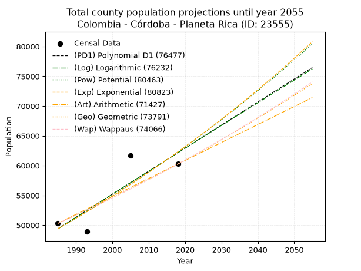
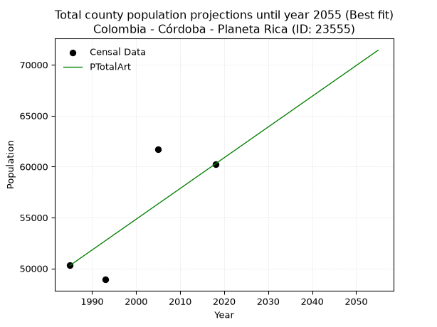
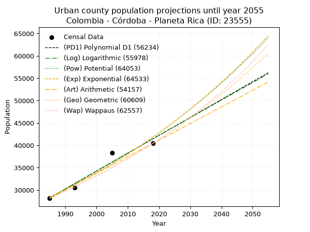
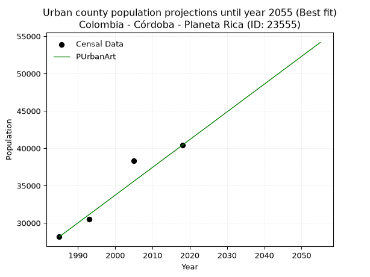
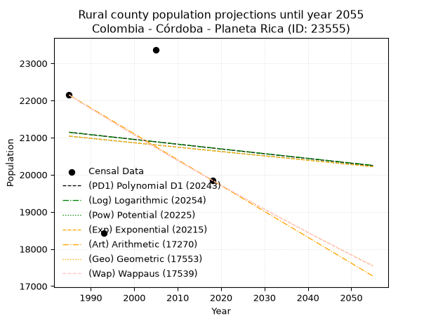
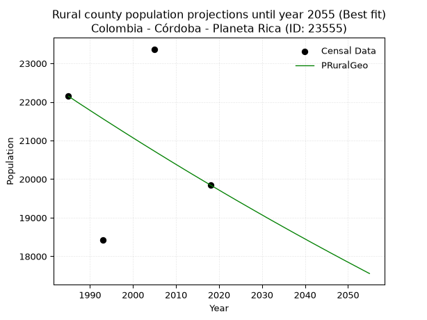

<div align="center">


</div>

# 📜 _“Population and Public Services Demand Projections (PPSD) until Year 2050 for Colombia - Córdoba - Planeta Rica (ID: 23555)”_
Keywords: `population` `public-service` `projection` `lineal` `polynomial` `logarithmic` `potential` `exponential` `arithmetic` `geometric` `wappaus` `dane` `colombia` `south-america`

PPSD are analytical estimates used by governments and planners to anticipate future changes in population size, age distribution, and the resulting community needs for utilities, healthcare, education, and infrastructure as sizing future water treatment facilities, electrical grids, and road networks based on spatial growth.

<div align="center">

</img>

</div>


> **General running parameters**: • app_version: _v20260806_. • Python version: _3.14.7_. • Pandas version: _3.0.5_. • NumPy version: _2.5.1_. • Creates, save and include plots into reports (create_plot): _False_. • Projection until year: _2050_. • Process polynomial degree 2 and up: _False_. • Process Wappaus: _True_. • Process Wappaus: _True_. • Set negative values to zero: _True_. • Set infinite values to zero: _True_. • Drop dataset notes: _True_. 
<div align="center">

Maps & GIS Layers: [:earth_americas:Google](http://maps.google.com/maps?q=8.408200285,-75.583241) [:earth_americas:OSM](https://www.openstreetmap.org/#map=18/8.408200285/-75.583241&layers=P) [:earth_americas:Bing](https://www.bing.com/maps?cp=8.408200285~-75.583241&lvl=18) [:earth_americas:Apple](https://maps.apple.com/frame?center=8.408200285%2C-75.583241&span=0.003%2C0.006) [:earth_americas:GISMobile](https://github.com/rcfdtools/R.GISMobile/blob/main/file/gis/CountyLayer_CO/Readme.md)

</div>


<div align="center">

```geojson
{
  "type": "Feature",
  "geometry": {
    "type": "Point", 
    "coordinates": [-75.583241, 8.408200285]
  }, 
  "properties": {
    "Name": "Colombia - Córdoba - Planeta Rica (ID: 23555)"
  }
}
```

</div>


## 0. Census Data (4 records)

Census data are official statistics collected by a government about the people and housing in a country. They usually include counts of total population, age, sex, race, income, education, and jobs.

📅Global census file: [Population.xlsx](../data/Population.xlsx)

| Source   |   Year |   CountryID | CountryName   |   StateID | StateName   |   CountyID | CountyName   |   PTotal |   PUrban |   PRural |
|:---------|-------:|------------:|:--------------|----------:|:------------|-----------:|:-------------|---------:|---------:|---------:|
| DANE     |   1985 |          57 | Colombia      |        23 | Córdoba     |      23555 | Planeta Rica |    50298 |    28151 |    22147 |
| DANE     |   1993 |          57 | Colombia      |        23 | Córdoba     |      23555 | Planeta Rica |    48909 |    30486 |    18423 |
| DANE     |   2005 |          57 | Colombia      |        23 | Córdoba     |      23555 | Planeta Rica |    61692 |    38323 |    23369 |
| DANE     |   2018 |          57 | Colombia      |        23 | Córdoba     |      23555 | Planeta Rica |    60259 |    40411 |    19848 |

> 🔥Some records could had specific notes about the registered values or the corresponding urban or rural distribution.

📅[SUI-RUPS](https://www.datos.gov.co/Hacienda-y-Cr-dito-P-blico/Registro-nico-de-Prestadores-de-Servicios-P-blicos/4qkq-csdn/about_data) - Local public utility companies: [RUPS.csv](../data/RUPS.csv)

 | SERVICIO       | ESTADO    | NOMBRE                                                             | NIT         | DEPARTAMENTO_DOMICILIO   | MUNICIPIO_DOMICILIO   | DIRECCION                       |   TELEFONO | EMAIL                         | TIPO_PRESTADOR                             | CLASIFICACION                 |
|:---------------|:----------|:-------------------------------------------------------------------|:------------|:-------------------------|:----------------------|:--------------------------------|-----------:|:------------------------------|:-------------------------------------------|:------------------------------|
| ACUEDUCTO      | OPERATIVA | OPERADORA DE SERVICIOS PUBLICOS S.A. EMPRESA DE SERVICIOS PUBLICOS | 805011016-5 | VALLE DEL CAUCA          | CALI                  | CALLE 38 NORTE N 3N  84         |    6656512 | gerenciageneral@opsasaesp.com | SOCIEDADES (EMPRESA DE SERVICIOS PUBLICOS) | MAYOR O IGUAL A 5001 USUARIOS |
| ALCANTARILLADO | OPERATIVA | OPERADORA DE SERVICIOS PUBLICOS S.A. EMPRESA DE SERVICIOS PUBLICOS | 805011016-5 | VALLE DEL CAUCA          | CALI                  | CALLE 38 NORTE N 3N  84         |    6656512 | gerenciageneral@opsasaesp.com | SOCIEDADES (EMPRESA DE SERVICIOS PUBLICOS) | MAYOR O IGUAL A 5001 USUARIOS |
| ACUEDUCTO      | OPERATIVA | AQUALIA LATINOAMERICA S.A. E.S.P.                                  | 901362452-7 | CORDOBA                  | CERETE                | calle 39 n° 15-60 barrio  venus |    7641602 | jhosett.navas@aqualia.com     | SOCIEDADES (EMPRESA DE SERVICIOS PUBLICOS) | MAYOR O IGUAL A 5001 USUARIOS |
| ALCANTARILLADO | OPERATIVA | AQUALIA LATINOAMERICA S.A. E.S.P.                                  | 901362452-7 | CORDOBA                  | CERETE                | calle 39 n° 15-60 barrio  venus |    7641602 | jhosett.navas@aqualia.com     | SOCIEDADES (EMPRESA DE SERVICIOS PUBLICOS) | MAYOR O IGUAL A 5001 USUARIOS |

## 1. Total

### 1.1. Coefficients and Parameters

* (PD1) Polynomial Deg 1: 386.99237254114826, -718791.993175432 (lineal)
* (Log) Logarithmic: 774988.0667493568, -5835401.005726472
* (Pow) Potential: 14.084745721858319, -41.75451620752999
* (Exp) Exponential: 0.00703350181120397, 0.04268859533548885
* (Art) Arithmetic: Year diff. 2018 - 1985 = 33, Population diff. 60259 - 50298 = 9961, Annual growth = 301.8484848484849
* (Geo) Geometric: Year diff. 2018 - 1985 = 33, Population diff. 60259 - 50298 = 9961, Annual growth % = 0.005490369376744297
* (Wap) Wappaus: i = 0.5460504262027458, Condition values only valid for < 200)

<sub>
Wappaus condition values: ['0.00', '0.55', '1.09', '1.64', '2.18', '2.73', '3.28', '3.82', '4.37', '4.91', '5.46', '6.01', '6.55', '7.10', '7.64', '8.19', '8.74', '9.28', '9.83', '10.37', '10.92', '11.47', '12.01', '12.56', '13.11', '13.65', '14.20', '14.74', '15.29', '15.84', '16.38', '16.93', '17.47', '18.02', '18.57', '19.11', '19.66', '20.20', '20.75', '21.30', '21.84', '22.39', '22.93', '23.48', '24.03', '24.57', '25.12', '25.66', '26.21', '26.76', '27.30', '27.85', '28.39', '28.94', '29.49', '30.03', '30.58', '31.12', '31.67', '32.22', '32.76', '33.31', '33.86', '34.40', '34.95', '35.49']
</sub>


### 1.2. Projected Dataset

|   Year |   CountyID |   PTotalPD1 |   PTotalLog |   PTotalPow |   PTotalExp |   PTotalArt |   PTotalGeo |   PTotalWap |
|-------:|-----------:|------------:|------------:|------------:|------------:|------------:|------------:|------------:|
|   1985 |      23555 |       49388 |       49373 |       49386 |       49399 |       50298 |       50298 |       50298 |
|   1986 |      23555 |       49775 |       49764 |       49737 |       49747 |       50600 |       50574 |       50573 |
|   1987 |      23555 |       50162 |       50154 |       50091 |       50098 |       50902 |       50852 |       50850 |
|   1988 |      23555 |       50549 |       50544 |       50448 |       50452 |       51204 |       51131 |       51129 |
|   1989 |      23555 |       50936 |       50933 |       50806 |       50808 |       51505 |       51412 |       51409 |
|   1990 |      23555 |       51323 |       51323 |       51167 |       51167 |       51807 |       51694 |       51690 |
|   1991 |      23555 |       51710 |       51712 |       51530 |       51528 |       52109 |       51978 |       51973 |
|   1992 |      23555 |       52097 |       52102 |       51896 |       51892 |       52411 |       52263 |       52258 |
|   1993 |      23555 |       52484 |       52490 |       52264 |       52258 |       52713 |       52550 |       52544 |
|   1994 |      23555 |       52871 |       52879 |       52635 |       52627 |       53015 |       52839 |       52832 |
|   1995 |      23555 |       53258 |       53268 |       53008 |       52998 |       53316 |       53129 |       53122 |
|   1996 |      23555 |       53645 |       53656 |       53383 |       53372 |       53618 |       53420 |       53413 |
|   1997 |      23555 |       54032 |       54044 |       53761 |       53749 |       53920 |       53714 |       53705 |
|   1998 |      23555 |       54419 |       54432 |       54142 |       54128 |       54222 |       54009 |       54000 |
|   1999 |      23555 |       54806 |       54820 |       54525 |       54510 |       54524 |       54305 |       54296 |
|   2000 |      23555 |       55193 |       55208 |       54910 |       54895 |       54826 |       54603 |       54594 |
|   2001 |      23555 |       55580 |       55595 |       55298 |       55283 |       55128 |       54903 |       54893 |
|   2002 |      23555 |       55967 |       55982 |       55689 |       55673 |       55429 |       55205 |       55194 |
|   2003 |      23555 |       56354 |       56369 |       56082 |       56066 |       55731 |       55508 |       55497 |
|   2004 |      23555 |       56741 |       56756 |       56477 |       56461 |       56033 |       55812 |       55802 |
|   2005 |      23555 |       57128 |       57143 |       56875 |       56860 |       56335 |       56119 |       56108 |
|   2006 |      23555 |       57515 |       57529 |       57276 |       57261 |       56637 |       56427 |       56417 |
|   2007 |      23555 |       57902 |       57915 |       57680 |       57666 |       56939 |       56737 |       56726 |
|   2008 |      23555 |       58289 |       58301 |       58086 |       58073 |       57241 |       57048 |       57038 |
|   2009 |      23555 |       58676 |       58687 |       58495 |       58482 |       57542 |       57362 |       57352 |
|   2010 |      23555 |       59063 |       59073 |       58906 |       58895 |       57844 |       57676 |       57667 |
|   2011 |      23555 |       59450 |       59458 |       59320 |       59311 |       58146 |       57993 |       57985 |
|   2012 |      23555 |       59837 |       59844 |       59737 |       59730 |       58448 |       58312 |       58304 |
|   2013 |      23555 |       60224 |       60229 |       60157 |       60151 |       58750 |       58632 |       58625 |
|   2014 |      23555 |       60611 |       60614 |       60579 |       60576 |       59052 |       58954 |       58948 |
|   2015 |      23555 |       60998 |       60998 |       61004 |       61003 |       59353 |       59277 |       59273 |
|   2016 |      23555 |       61385 |       61383 |       61432 |       61434 |       59655 |       59603 |       59599 |
|   2017 |      23555 |       61772 |       61767 |       61862 |       61867 |       59957 |       59930 |       59928 |
|   2018 |      23555 |       62159 |       62151 |       62296 |       62304 |       60259 |       60259 |       60259 |
|   2019 |      23555 |       62546 |       62535 |       62732 |       62744 |       60561 |       60590 |       60592 |
|   2020 |      23555 |       62933 |       62919 |       63171 |       63187 |       60863 |       60923 |       60926 |
|   2021 |      23555 |       63320 |       63303 |       63613 |       63633 |       61165 |       61257 |       61263 |
|   2022 |      23555 |       63707 |       63686 |       64058 |       64082 |       61466 |       61593 |       61602 |
|   2023 |      23555 |       64094 |       64069 |       64505 |       64534 |       61768 |       61931 |       61943 |
|   2024 |      23555 |       64481 |       64452 |       64956 |       64990 |       62070 |       62272 |       62286 |
|   2025 |      23555 |       64868 |       64835 |       65409 |       65448 |       62372 |       62613 |       62631 |
|   2026 |      23555 |       65255 |       65218 |       65866 |       65910 |       62674 |       62957 |       62978 |
|   2027 |      23555 |       65642 |       65600 |       66325 |       66376 |       62976 |       63303 |       63328 |
|   2028 |      23555 |       66029 |       65982 |       66787 |       66844 |       63277 |       63650 |       63679 |
|   2029 |      23555 |       66416 |       66364 |       67253 |       67316 |       63579 |       64000 |       64033 |
|   2030 |      23555 |       66803 |       66746 |       67721 |       67791 |       63881 |       64351 |       64389 |
|   2031 |      23555 |       67190 |       67128 |       68193 |       68270 |       64183 |       64705 |       64747 |
|   2032 |      23555 |       67577 |       67509 |       68667 |       68751 |       64485 |       65060 |       65107 |
|   2033 |      23555 |       67964 |       67891 |       69144 |       69237 |       64787 |       65417 |       65470 |
|   2034 |      23555 |       68350 |       68272 |       69625 |       69725 |       65089 |       65776 |       65834 |
|   2035 |      23555 |       68737 |       68653 |       70109 |       70217 |       65390 |       66137 |       66202 |
|   2036 |      23555 |       69124 |       69033 |       70596 |       70713 |       65692 |       66500 |       66571 |
|   2037 |      23555 |       69511 |       69414 |       71086 |       71212 |       65994 |       66866 |       66943 |
|   2038 |      23555 |       69898 |       69794 |       71579 |       71715 |       66296 |       67233 |       67317 |
|   2039 |      23555 |       70285 |       70175 |       72075 |       72221 |       66598 |       67602 |       67694 |
|   2040 |      23555 |       70672 |       70554 |       72574 |       72731 |       66900 |       67973 |       68073 |
|   2041 |      23555 |       71059 |       70934 |       73077 |       73244 |       67202 |       68346 |       68455 |
|   2042 |      23555 |       71446 |       71314 |       73583 |       73761 |       67503 |       68721 |       68839 |
|   2043 |      23555 |       71833 |       71693 |       74092 |       74282 |       67805 |       69099 |       69225 |
|   2044 |      23555 |       72220 |       72073 |       74605 |       74806 |       68107 |       69478 |       69614 |
|   2045 |      23555 |       72607 |       72452 |       75120 |       75334 |       68409 |       69860 |       70006 |
|   2046 |      23555 |       72994 |       72831 |       75639 |       75866 |       68711 |       70243 |       70400 |
|   2047 |      23555 |       73381 |       73209 |       76162 |       76401 |       69013 |       70629 |       70796 |
|   2048 |      23555 |       73768 |       73588 |       76687 |       76941 |       69314 |       71017 |       71196 |
|   2049 |      23555 |       74155 |       73966 |       77217 |       77484 |       69616 |       71406 |       71598 |
|   2050 |      23555 |       74542 |       74344 |       77749 |       78031 |       69918 |       71798 |       72002 |
<div align="center">

</img>

</div>


### 1.3. Best fit with absolute and relative error (%)

Relative error puts that difference into context by dividing the absolute error by the true value, creating a unitless ratio or percentage that shows the scale of the mistake.

Absolute and relative error

|   Year | Source   |   CountryID | CountryName   |   StateID | StateName   |   CountyID_x | CountyName   |   PTotal |   PUrban |   PRural |   CountyID_y |   PTotalPD1 |   PTotalLog |   PTotalPow |   PTotalExp |   PTotalArt |   PTotalGeo |   PTotalWap |   PTotalPD1AbsError |   PTotalLogAbsError |   PTotalPowAbsError |   PTotalExpAbsError |   PTotalArtAbsError |   PTotalGeoAbsError |   PTotalWapAbsError |   PTotalPD1RelError |   PTotalLogRelError |   PTotalPowRelError |   PTotalExpRelError |   PTotalArtRelError |   PTotalGeoRelError |   PTotalWapRelError |
|-------:|:---------|------------:|:--------------|----------:|:------------|-------------:|:-------------|---------:|---------:|---------:|-------------:|------------:|------------:|------------:|------------:|------------:|------------:|------------:|--------------------:|--------------------:|--------------------:|--------------------:|--------------------:|--------------------:|--------------------:|--------------------:|--------------------:|--------------------:|--------------------:|--------------------:|--------------------:|--------------------:|
|   1985 | DANE     |          57 | Colombia      |        23 | Córdoba     |        23555 | Planeta Rica |    50298 |    28151 |    22147 |        23555 |       49388 |       49373 |       49386 |       49399 |       50298 |       50298 |       50298 |                 910 |                 925 |                 912 |                 899 |                   0 |                   0 |                   0 |             1.80922 |             1.83904 |             1.81319 |             1.78735 |             0       |             0       |             0       |
|   1993 | DANE     |          57 | Colombia      |        23 | Córdoba     |        23555 | Planeta Rica |    48909 |    30486 |    18423 |        23555 |       52484 |       52490 |       52264 |       52258 |       52713 |       52550 |       52544 |                3575 |                3581 |                3355 |                3349 |                3804 |                3641 |                3635 |             7.30949 |             7.32176 |             6.85968 |             6.84741 |             7.77771 |             7.44444 |             7.43217 |
|   2005 | DANE     |          57 | Colombia      |        23 | Córdoba     |        23555 | Planeta Rica |    61692 |    38323 |    23369 |        23555 |       57128 |       57143 |       56875 |       56860 |       56335 |       56119 |       56108 |                4564 |                4549 |                4817 |                4832 |                5357 |                5573 |                5584 |             7.39804 |             7.37373 |             7.80814 |             7.83246 |             8.68346 |             9.03359 |             9.05142 |
|   2018 | DANE     |          57 | Colombia      |        23 | Córdoba     |        23555 | Planeta Rica |    60259 |    40411 |    19848 |        23555 |       62159 |       62151 |       62296 |       62304 |       60259 |       60259 |       60259 |                1900 |                1892 |                2037 |                2045 |                   0 |                   0 |                   0 |             3.15306 |             3.13978 |             3.38041 |             3.39368 |             0       |             0       |             0       |

Relative error mean

| Method    |   RelError | Best   |
|:----------|-----------:|:-------|
| PTotalPD1 |    4.91745 |        |
| PTotalLog |    4.91858 |        |
| PTotalPow |    4.96536 |        |
| PTotalExp |    4.96522 |        |
| PTotalArt |    4.11529 | True   |
| PTotalGeo |    4.11951 |        |
| PTotalWap |    4.1209  |        |

💙Best method: _**PTotalArt**_
<div align="center">

</img>

</div>


### 1.4. Fresh water supply demand in liters per capita per day (lpcd)

The fresh water supply demand typically ranges from 100 to 300 liters per capita per day (lpcd) for standard domestic and municipal planning, though absolute survival minimums set by the World Health Organization are as low as 7.5 to 20 liters per day, and total consumption in high-income nations can exceed 400 liters.

> `CZ`: Level in meters above the sea level (masl)<br> `WS`: Fresh water supply demand in liters per capita per day (lpcd or l/h/d)<br> `WSAll`: Zonal fresh water supply demand in liters per second (l/s)<br> `A`: Zonal area in square meters<br> `DP`: Population density (people/hectare or p/ha)

Reference values (RAS Colombia)

|    CZ |   WS |
|------:|-----:|
|  1000 |  120 |
|  2000 |  130 |
| 99999 |  140 |

County shapefile geometry properties and water supply values

|   CountyID |     ATotal |   CZTotal |   WSTotal |
|-----------:|-----------:|----------:|----------:|
|      23555 | 1.1401e+09 |   84.6376 |       120 |

Projected values for best method: PTotalArt

|   CountyID |   Year |   PTotalArt |   DPTotal |   WSTotal |   WSTotalAll |
|-----------:|-------:|------------:|----------:|----------:|-------------:|
|      23555 |   1985 |       50298 |      0.44 |       120 |      69.8583 |
|      23555 |   1986 |       50600 |      0.44 |       120 |      70.2778 |
|      23555 |   1987 |       50902 |      0.45 |       120 |      70.6972 |
|      23555 |   1988 |       51204 |      0.45 |       120 |      71.1167 |
|      23555 |   1989 |       51505 |      0.45 |       120 |      71.5347 |
|      23555 |   1990 |       51807 |      0.45 |       120 |      71.9542 |
|      23555 |   1991 |       52109 |      0.46 |       120 |      72.3736 |
|      23555 |   1992 |       52411 |      0.46 |       120 |      72.7931 |
|      23555 |   1993 |       52713 |      0.46 |       120 |      73.2125 |
|      23555 |   1994 |       53015 |      0.47 |       120 |      73.6319 |
|      23555 |   1995 |       53316 |      0.47 |       120 |      74.05   |
|      23555 |   1996 |       53618 |      0.47 |       120 |      74.4694 |
|      23555 |   1997 |       53920 |      0.47 |       120 |      74.8889 |
|      23555 |   1998 |       54222 |      0.48 |       120 |      75.3083 |
|      23555 |   1999 |       54524 |      0.48 |       120 |      75.7278 |
|      23555 |   2000 |       54826 |      0.48 |       120 |      76.1472 |
|      23555 |   2001 |       55128 |      0.48 |       120 |      76.5667 |
|      23555 |   2002 |       55429 |      0.49 |       120 |      76.9847 |
|      23555 |   2003 |       55731 |      0.49 |       120 |      77.4042 |
|      23555 |   2004 |       56033 |      0.49 |       120 |      77.8236 |
|      23555 |   2005 |       56335 |      0.49 |       120 |      78.2431 |
|      23555 |   2006 |       56637 |      0.5  |       120 |      78.6625 |
|      23555 |   2007 |       56939 |      0.5  |       120 |      79.0819 |
|      23555 |   2008 |       57241 |      0.5  |       120 |      79.5014 |
|      23555 |   2009 |       57542 |      0.5  |       120 |      79.9194 |
|      23555 |   2010 |       57844 |      0.51 |       120 |      80.3389 |
|      23555 |   2011 |       58146 |      0.51 |       120 |      80.7583 |
|      23555 |   2012 |       58448 |      0.51 |       120 |      81.1778 |
|      23555 |   2013 |       58750 |      0.52 |       120 |      81.5972 |
|      23555 |   2014 |       59052 |      0.52 |       120 |      82.0167 |
|      23555 |   2015 |       59353 |      0.52 |       120 |      82.4347 |
|      23555 |   2016 |       59655 |      0.52 |       120 |      82.8542 |
|      23555 |   2017 |       59957 |      0.53 |       120 |      83.2736 |
|      23555 |   2018 |       60259 |      0.53 |       120 |      83.6931 |
|      23555 |   2019 |       60561 |      0.53 |       120 |      84.1125 |
|      23555 |   2020 |       60863 |      0.53 |       120 |      84.5319 |
|      23555 |   2021 |       61165 |      0.54 |       120 |      84.9514 |
|      23555 |   2022 |       61466 |      0.54 |       120 |      85.3694 |
|      23555 |   2023 |       61768 |      0.54 |       120 |      85.7889 |
|      23555 |   2024 |       62070 |      0.54 |       120 |      86.2083 |
|      23555 |   2025 |       62372 |      0.55 |       120 |      86.6278 |
|      23555 |   2026 |       62674 |      0.55 |       120 |      87.0472 |
|      23555 |   2027 |       62976 |      0.55 |       120 |      87.4667 |
|      23555 |   2028 |       63277 |      0.56 |       120 |      87.8847 |
|      23555 |   2029 |       63579 |      0.56 |       120 |      88.3042 |
|      23555 |   2030 |       63881 |      0.56 |       120 |      88.7236 |
|      23555 |   2031 |       64183 |      0.56 |       120 |      89.1431 |
|      23555 |   2032 |       64485 |      0.57 |       120 |      89.5625 |
|      23555 |   2033 |       64787 |      0.57 |       120 |      89.9819 |
|      23555 |   2034 |       65089 |      0.57 |       120 |      90.4014 |
|      23555 |   2035 |       65390 |      0.57 |       120 |      90.8194 |
|      23555 |   2036 |       65692 |      0.58 |       120 |      91.2389 |
|      23555 |   2037 |       65994 |      0.58 |       120 |      91.6583 |
|      23555 |   2038 |       66296 |      0.58 |       120 |      92.0778 |
|      23555 |   2039 |       66598 |      0.58 |       120 |      92.4972 |
|      23555 |   2040 |       66900 |      0.59 |       120 |      92.9167 |
|      23555 |   2041 |       67202 |      0.59 |       120 |      93.3361 |
|      23555 |   2042 |       67503 |      0.59 |       120 |      93.7542 |
|      23555 |   2043 |       67805 |      0.59 |       120 |      94.1736 |
|      23555 |   2044 |       68107 |      0.6  |       120 |      94.5931 |
|      23555 |   2045 |       68409 |      0.6  |       120 |      95.0125 |
|      23555 |   2046 |       68711 |      0.6  |       120 |      95.4319 |
|      23555 |   2047 |       69013 |      0.61 |       120 |      95.8514 |
|      23555 |   2048 |       69314 |      0.61 |       120 |      96.2694 |
|      23555 |   2049 |       69616 |      0.61 |       120 |      96.6889 |
|      23555 |   2050 |       69918 |      0.61 |       120 |      97.1083 |

## 2. Urban

### 2.1. Coefficients and Parameters

* (PD1) Polynomial Deg 1: 399.84464070654167, -765446.49257326 (lineal)
* (Log) Logarithmic: 800617.0447947787, -6051153.823227463
* (Pow) Potential: 23.48773901763958, -73.0039193985599
* (Exp) Exponential: 0.011729379149684723, 2.19586460958229e-06
* (Art) Arithmetic: Year diff. 2018 - 1985 = 33, Population diff. 40411 - 28151 = 12260, Annual growth = 371.5151515151515
* (Geo) Geometric: Year diff. 2018 - 1985 = 33, Population diff. 40411 - 28151 = 12260, Annual growth % = 0.01101535279296284
* (Wap) Wappaus: i = 1.0837348721307765, Condition values only valid for < 200)

<sub>
Wappaus condition values: ['0.00', '1.08', '2.17', '3.25', '4.33', '5.42', '6.50', '7.59', '8.67', '9.75', '10.84', '11.92', '13.00', '14.09', '15.17', '16.26', '17.34', '18.42', '19.51', '20.59', '21.67', '22.76', '23.84', '24.93', '26.01', '27.09', '28.18', '29.26', '30.34', '31.43', '32.51', '33.60', '34.68', '35.76', '36.85', '37.93', '39.01', '40.10', '41.18', '42.27', '43.35', '44.43', '45.52', '46.60', '47.68', '48.77', '49.85', '50.94', '52.02', '53.10', '54.19', '55.27', '56.35', '57.44', '58.52', '59.61', '60.69', '61.77', '62.86', '63.94', '65.02', '66.11', '67.19', '68.28', '69.36', '70.44']
</sub>


### 2.2. Projected Dataset

|   Year |   CountyID |   PUrbanPD1 |   PUrbanLog |   PUrbanPow |   PUrbanExp |   PUrbanArt |   PUrbanGeo |   PUrbanWap |
|-------:|-----------:|------------:|------------:|------------:|------------:|------------:|------------:|------------:|
|   1985 |      23555 |       28245 |       28231 |       28380 |       28393 |       28151 |       28151 |       28151 |
|   1986 |      23555 |       28645 |       28634 |       28718 |       28728 |       28523 |       28461 |       28458 |
|   1987 |      23555 |       29045 |       29037 |       29060 |       29067 |       28894 |       28775 |       28768 |
|   1988 |      23555 |       29445 |       29440 |       29405 |       29409 |       29266 |       29092 |       29081 |
|   1989 |      23555 |       29844 |       29843 |       29755 |       29756 |       29637 |       29412 |       29398 |
|   1990 |      23555 |       30244 |       30245 |       30108 |       30108 |       30009 |       29736 |       29719 |
|   1991 |      23555 |       30644 |       30647 |       30465 |       30463 |       30380 |       30064 |       30043 |
|   1992 |      23555 |       31044 |       31049 |       30827 |       30822 |       30752 |       30395 |       30371 |
|   1993 |      23555 |       31444 |       31451 |       31192 |       31186 |       31123 |       30730 |       30702 |
|   1994 |      23555 |       31844 |       31853 |       31562 |       31554 |       31495 |       31068 |       31038 |
|   1995 |      23555 |       32244 |       32254 |       31936 |       31926 |       31866 |       31410 |       31377 |
|   1996 |      23555 |       32643 |       32655 |       32314 |       32303 |       32238 |       31756 |       31720 |
|   1997 |      23555 |       33043 |       33056 |       32696 |       32684 |       32609 |       32106 |       32067 |
|   1998 |      23555 |       33443 |       33457 |       33083 |       33069 |       32981 |       32460 |       32418 |
|   1999 |      23555 |       33843 |       33858 |       33474 |       33460 |       33352 |       32817 |       32773 |
|   2000 |      23555 |       34243 |       34258 |       33870 |       33854 |       33724 |       33179 |       33132 |
|   2001 |      23555 |       34643 |       34658 |       34270 |       34254 |       34095 |       33544 |       33496 |
|   2002 |      23555 |       35042 |       35058 |       34674 |       34658 |       34467 |       33914 |       33864 |
|   2003 |      23555 |       35442 |       35458 |       35083 |       35067 |       34838 |       34287 |       34236 |
|   2004 |      23555 |       35842 |       35858 |       35497 |       35481 |       35210 |       34665 |       34613 |
|   2005 |      23555 |       36242 |       36257 |       35915 |       35899 |       35581 |       35047 |       34994 |
|   2006 |      23555 |       36642 |       36656 |       36339 |       36323 |       35953 |       35433 |       35380 |
|   2007 |      23555 |       37042 |       37056 |       36766 |       36751 |       36324 |       35823 |       35771 |
|   2008 |      23555 |       37442 |       37454 |       37199 |       37185 |       36696 |       36218 |       36167 |
|   2009 |      23555 |       37841 |       37853 |       37637 |       37624 |       37067 |       36617 |       36568 |
|   2010 |      23555 |       38241 |       38251 |       38079 |       38068 |       37439 |       37020 |       36973 |
|   2011 |      23555 |       38641 |       38650 |       38527 |       38517 |       37810 |       37428 |       37384 |
|   2012 |      23555 |       39041 |       39048 |       38979 |       38971 |       38182 |       37840 |       37800 |
|   2013 |      23555 |       39441 |       39445 |       39437 |       39431 |       38553 |       38257 |       38221 |
|   2014 |      23555 |       39841 |       39843 |       39899 |       39896 |       38925 |       38678 |       38648 |
|   2015 |      23555 |       40240 |       40240 |       40367 |       40367 |       39296 |       39104 |       39080 |
|   2016 |      23555 |       40640 |       40638 |       40841 |       40843 |       39668 |       39535 |       39518 |
|   2017 |      23555 |       41040 |       41035 |       41319 |       41325 |       40039 |       39971 |       39962 |
|   2018 |      23555 |       41440 |       41432 |       41803 |       41813 |       40411 |       40411 |       40411 |
|   2019 |      23555 |       41840 |       41828 |       42292 |       42306 |       40783 |       40856 |       40866 |
|   2020 |      23555 |       42240 |       42225 |       42787 |       42805 |       41154 |       41306 |       41328 |
|   2021 |      23555 |       42640 |       42621 |       43287 |       43310 |       41526 |       41761 |       41796 |
|   2022 |      23555 |       43039 |       43017 |       43793 |       43821 |       41897 |       42221 |       42270 |
|   2023 |      23555 |       43439 |       43413 |       44305 |       44338 |       42269 |       42686 |       42750 |
|   2024 |      23555 |       43839 |       43808 |       44822 |       44861 |       42640 |       43156 |       43237 |
|   2025 |      23555 |       44239 |       44204 |       45345 |       45390 |       43012 |       43632 |       43731 |
|   2026 |      23555 |       44639 |       44599 |       45874 |       45926 |       43383 |       44112 |       44232 |
|   2027 |      23555 |       45039 |       44994 |       46409 |       46468 |       43755 |       44598 |       44740 |
|   2028 |      23555 |       45438 |       45389 |       46949 |       47016 |       44126 |       45090 |       45255 |
|   2029 |      23555 |       45838 |       45784 |       47496 |       47571 |       44498 |       45586 |       45777 |
|   2030 |      23555 |       46238 |       46178 |       48049 |       48132 |       44869 |       46089 |       46307 |
|   2031 |      23555 |       46638 |       46573 |       48608 |       48700 |       45241 |       46596 |       46844 |
|   2032 |      23555 |       47038 |       46967 |       49173 |       49275 |       45612 |       47109 |       47389 |
|   2033 |      23555 |       47438 |       47361 |       49745 |       49856 |       45984 |       47628 |       47943 |
|   2034 |      23555 |       47838 |       47754 |       50323 |       50444 |       46355 |       48153 |       48504 |
|   2035 |      23555 |       48237 |       48148 |       50907 |       51039 |       46727 |       48683 |       49074 |
|   2036 |      23555 |       48637 |       48541 |       51498 |       51642 |       47098 |       49220 |       49652 |
|   2037 |      23555 |       49037 |       48934 |       52095 |       52251 |       47470 |       49762 |       50239 |
|   2038 |      23555 |       49437 |       49327 |       52699 |       52867 |       47841 |       50310 |       50835 |
|   2039 |      23555 |       49837 |       49720 |       53310 |       53491 |       48213 |       50864 |       51440 |
|   2040 |      23555 |       50237 |       50113 |       53927 |       54122 |       48584 |       51425 |       52054 |
|   2041 |      23555 |       50636 |       50505 |       54552 |       54761 |       48956 |       51991 |       52678 |
|   2042 |      23555 |       51036 |       50897 |       55183 |       55407 |       49327 |       52564 |       53312 |
|   2043 |      23555 |       51436 |       51289 |       55821 |       56061 |       49699 |       53143 |       53956 |
|   2044 |      23555 |       51836 |       51681 |       56467 |       56722 |       50070 |       53728 |       54610 |
|   2045 |      23555 |       52236 |       52072 |       57119 |       57391 |       50442 |       54320 |       55274 |
|   2046 |      23555 |       52636 |       52464 |       57779 |       58068 |       50813 |       54918 |       55950 |
|   2047 |      23555 |       53035 |       52855 |       58446 |       58753 |       51185 |       55523 |       56636 |
|   2048 |      23555 |       53435 |       53246 |       59120 |       59447 |       51556 |       56135 |       57333 |
|   2049 |      23555 |       53835 |       53637 |       59802 |       60148 |       51928 |       56753 |       58042 |
|   2050 |      23555 |       54235 |       54028 |       60491 |       60858 |       52299 |       57378 |       58763 |
<div align="center">

</img>

</div>


### 2.3. Best fit with absolute and relative error (%)

Relative error puts that difference into context by dividing the absolute error by the true value, creating a unitless ratio or percentage that shows the scale of the mistake.

Absolute and relative error

|   Year | Source   |   CountryID | CountryName   |   StateID | StateName   |   CountyID_x | CountyName   |   PTotal |   PUrban |   PRural |   CountyID_y |   PUrbanPD1 |   PUrbanLog |   PUrbanPow |   PUrbanExp |   PUrbanArt |   PUrbanGeo |   PUrbanWap |   PUrbanPD1AbsError |   PUrbanLogAbsError |   PUrbanPowAbsError |   PUrbanExpAbsError |   PUrbanArtAbsError |   PUrbanGeoAbsError |   PUrbanWapAbsError |   PUrbanPD1RelError |   PUrbanLogRelError |   PUrbanPowRelError |   PUrbanExpRelError |   PUrbanArtRelError |   PUrbanGeoRelError |   PUrbanWapRelError |
|-------:|:---------|------------:|:--------------|----------:|:------------|-------------:|:-------------|---------:|---------:|---------:|-------------:|------------:|------------:|------------:|------------:|------------:|------------:|------------:|--------------------:|--------------------:|--------------------:|--------------------:|--------------------:|--------------------:|--------------------:|--------------------:|--------------------:|--------------------:|--------------------:|--------------------:|--------------------:|--------------------:|
|   1985 | DANE     |          57 | Colombia      |        23 | Córdoba     |        23555 | Planeta Rica |    50298 |    28151 |    22147 |        23555 |       28245 |       28231 |       28380 |       28393 |       28151 |       28151 |       28151 |                  94 |                  80 |                 229 |                 242 |                   0 |                   0 |                   0 |            0.333914 |            0.284182 |             0.81347 |             0.85965 |             0       |            0        |            0        |
|   1993 | DANE     |          57 | Colombia      |        23 | Córdoba     |        23555 | Planeta Rica |    48909 |    30486 |    18423 |        23555 |       31444 |       31451 |       31192 |       31186 |       31123 |       30730 |       30702 |                 958 |                 965 |                 706 |                 700 |                 637 |                 244 |                 216 |            3.14243  |            3.16539  |             2.31582 |             2.29614 |             2.08948 |            0.800367 |            0.708522 |
|   2005 | DANE     |          57 | Colombia      |        23 | Córdoba     |        23555 | Planeta Rica |    61692 |    38323 |    23369 |        23555 |       36242 |       36257 |       35915 |       35899 |       35581 |       35047 |       34994 |                2081 |                2066 |                2408 |                2424 |                2742 |                3276 |                3329 |            5.43016  |            5.39102  |             6.28343 |             6.32518 |             7.15497 |            8.54839  |            8.68669  |
|   2018 | DANE     |          57 | Colombia      |        23 | Córdoba     |        23555 | Planeta Rica |    60259 |    40411 |    19848 |        23555 |       41440 |       41432 |       41803 |       41813 |       40411 |       40411 |       40411 |                1029 |                1021 |                1392 |                1402 |                   0 |                   0 |                   0 |            2.54634  |            2.52654  |             3.44461 |             3.46935 |             0       |            0        |            0        |

Relative error mean

| Method    |   RelError | Best   |
|:----------|-----------:|:-------|
| PUrbanPD1 |    2.86321 |        |
| PUrbanLog |    2.84178 |        |
| PUrbanPow |    3.21433 |        |
| PUrbanExp |    3.23758 |        |
| PUrbanArt |    2.31111 | True   |
| PUrbanGeo |    2.33719 |        |
| PUrbanWap |    2.3488  |        |

💙Best method: _**PUrbanArt**_
<div align="center">

</img>

</div>


### 2.4. Fresh water supply demand in liters per capita per day (lpcd)

The fresh water supply demand typically ranges from 100 to 300 liters per capita per day (lpcd) for standard domestic and municipal planning, though absolute survival minimums set by the World Health Organization are as low as 7.5 to 20 liters per day, and total consumption in high-income nations can exceed 400 liters.

> `CZ`: Level in meters above the sea level (masl)<br> `WS`: Fresh water supply demand in liters per capita per day (lpcd or l/h/d)<br> `WSAll`: Zonal fresh water supply demand in liters per second (l/s)<br> `A`: Zonal area in square meters<br> `DP`: Population density (people/hectare or p/ha)

Reference values (RAS Colombia)

|    CZ |   WS |
|------:|-----:|
|  1000 |  120 |
|  2000 |  130 |
| 99999 |  140 |

County shapefile geometry properties and water supply values

|   CountyID |      AUrban |   CZUrban |   WSUrban |
|-----------:|------------:|----------:|----------:|
|      23555 | 4.48341e+06 |   82.2811 |       120 |

Projected values for best method: PUrbanArt

|   CountyID |   Year |   PUrbanArt |   DPUrban |   WSUrban |   WSUrbanAll |
|-----------:|-------:|------------:|----------:|----------:|-------------:|
|      23555 |   1985 |       28151 |     62.79 |       120 |      39.0986 |
|      23555 |   1986 |       28523 |     63.62 |       120 |      39.6153 |
|      23555 |   1987 |       28894 |     64.45 |       120 |      40.1306 |
|      23555 |   1988 |       29266 |     65.28 |       120 |      40.6472 |
|      23555 |   1989 |       29637 |     66.1  |       120 |      41.1625 |
|      23555 |   1990 |       30009 |     66.93 |       120 |      41.6792 |
|      23555 |   1991 |       30380 |     67.76 |       120 |      42.1944 |
|      23555 |   1992 |       30752 |     68.59 |       120 |      42.7111 |
|      23555 |   1993 |       31123 |     69.42 |       120 |      43.2264 |
|      23555 |   1994 |       31495 |     70.25 |       120 |      43.7431 |
|      23555 |   1995 |       31866 |     71.08 |       120 |      44.2583 |
|      23555 |   1996 |       32238 |     71.91 |       120 |      44.775  |
|      23555 |   1997 |       32609 |     72.73 |       120 |      45.2903 |
|      23555 |   1998 |       32981 |     73.56 |       120 |      45.8069 |
|      23555 |   1999 |       33352 |     74.39 |       120 |      46.3222 |
|      23555 |   2000 |       33724 |     75.22 |       120 |      46.8389 |
|      23555 |   2001 |       34095 |     76.05 |       120 |      47.3542 |
|      23555 |   2002 |       34467 |     76.88 |       120 |      47.8708 |
|      23555 |   2003 |       34838 |     77.7  |       120 |      48.3861 |
|      23555 |   2004 |       35210 |     78.53 |       120 |      48.9028 |
|      23555 |   2005 |       35581 |     79.36 |       120 |      49.4181 |
|      23555 |   2006 |       35953 |     80.19 |       120 |      49.9347 |
|      23555 |   2007 |       36324 |     81.02 |       120 |      50.45   |
|      23555 |   2008 |       36696 |     81.85 |       120 |      50.9667 |
|      23555 |   2009 |       37067 |     82.68 |       120 |      51.4819 |
|      23555 |   2010 |       37439 |     83.51 |       120 |      51.9986 |
|      23555 |   2011 |       37810 |     84.33 |       120 |      52.5139 |
|      23555 |   2012 |       38182 |     85.16 |       120 |      53.0306 |
|      23555 |   2013 |       38553 |     85.99 |       120 |      53.5458 |
|      23555 |   2014 |       38925 |     86.82 |       120 |      54.0625 |
|      23555 |   2015 |       39296 |     87.65 |       120 |      54.5778 |
|      23555 |   2016 |       39668 |     88.48 |       120 |      55.0944 |
|      23555 |   2017 |       40039 |     89.3  |       120 |      55.6097 |
|      23555 |   2018 |       40411 |     90.13 |       120 |      56.1264 |
|      23555 |   2019 |       40783 |     90.96 |       120 |      56.6431 |
|      23555 |   2020 |       41154 |     91.79 |       120 |      57.1583 |
|      23555 |   2021 |       41526 |     92.62 |       120 |      57.675  |
|      23555 |   2022 |       41897 |     93.45 |       120 |      58.1903 |
|      23555 |   2023 |       42269 |     94.28 |       120 |      58.7069 |
|      23555 |   2024 |       42640 |     95.11 |       120 |      59.2222 |
|      23555 |   2025 |       43012 |     95.94 |       120 |      59.7389 |
|      23555 |   2026 |       43383 |     96.76 |       120 |      60.2542 |
|      23555 |   2027 |       43755 |     97.59 |       120 |      60.7708 |
|      23555 |   2028 |       44126 |     98.42 |       120 |      61.2861 |
|      23555 |   2029 |       44498 |     99.25 |       120 |      61.8028 |
|      23555 |   2030 |       44869 |    100.08 |       120 |      62.3181 |
|      23555 |   2031 |       45241 |    100.91 |       120 |      62.8347 |
|      23555 |   2032 |       45612 |    101.74 |       120 |      63.35   |
|      23555 |   2033 |       45984 |    102.56 |       120 |      63.8667 |
|      23555 |   2034 |       46355 |    103.39 |       120 |      64.3819 |
|      23555 |   2035 |       46727 |    104.22 |       120 |      64.8986 |
|      23555 |   2036 |       47098 |    105.05 |       120 |      65.4139 |
|      23555 |   2037 |       47470 |    105.88 |       120 |      65.9306 |
|      23555 |   2038 |       47841 |    106.71 |       120 |      66.4458 |
|      23555 |   2039 |       48213 |    107.54 |       120 |      66.9625 |
|      23555 |   2040 |       48584 |    108.36 |       120 |      67.4778 |
|      23555 |   2041 |       48956 |    109.19 |       120 |      67.9944 |
|      23555 |   2042 |       49327 |    110.02 |       120 |      68.5097 |
|      23555 |   2043 |       49699 |    110.85 |       120 |      69.0264 |
|      23555 |   2044 |       50070 |    111.68 |       120 |      69.5417 |
|      23555 |   2045 |       50442 |    112.51 |       120 |      70.0583 |
|      23555 |   2046 |       50813 |    113.34 |       120 |      70.5736 |
|      23555 |   2047 |       51185 |    114.17 |       120 |      71.0903 |
|      23555 |   2048 |       51556 |    114.99 |       120 |      71.6056 |
|      23555 |   2049 |       51928 |    115.82 |       120 |      72.1222 |
|      23555 |   2050 |       52299 |    116.65 |       120 |      72.6375 |

## 3. Rural

### 3.1. Coefficients and Parameters

* (PD1) Polynomial Deg 1: -12.852268165393658, 46654.49939782867 (lineal)
* (Log) Logarithmic: -25628.978045422034, 215752.81750099364
* (Pow) Potential: -1.139087842967451, 8.07947338922601
* (Exp) Exponential: -0.0005708929029512314, 65341.829988261365
* (Art) Arithmetic: Year diff. 2018 - 1985 = 33, Population diff. 19848 - 22147 = -2299, Annual growth = -69.66666666666667
* (Geo) Geometric: Year diff. 2018 - 1985 = 33, Population diff. 19848 - 22147 = -2299, Annual growth % = -0.0033156667764446812
* (Wap) Wappaus: i = -0.3317855300234155, Condition values only valid for < 200)

<sub>
Wappaus condition values: ['-0.00', '-0.33', '-0.66', '-1.00', '-1.33', '-1.66', '-1.99', '-2.32', '-2.65', '-2.99', '-3.32', '-3.65', '-3.98', '-4.31', '-4.64', '-4.98', '-5.31', '-5.64', '-5.97', '-6.30', '-6.64', '-6.97', '-7.30', '-7.63', '-7.96', '-8.29', '-8.63', '-8.96', '-9.29', '-9.62', '-9.95', '-10.29', '-10.62', '-10.95', '-11.28', '-11.61', '-11.94', '-12.28', '-12.61', '-12.94', '-13.27', '-13.60', '-13.93', '-14.27', '-14.60', '-14.93', '-15.26', '-15.59', '-15.93', '-16.26', '-16.59', '-16.92', '-17.25', '-17.58', '-17.92', '-18.25', '-18.58', '-18.91', '-19.24', '-19.58', '-19.91', '-20.24', '-20.57', '-20.90', '-21.23', '-21.57']
</sub>


### 3.2. Projected Dataset

|   Year |   CountyID |   PRuralPD1 |   PRuralLog |   PRuralPow |   PRuralExp |   PRuralArt |   PRuralGeo |   PRuralWap |
|-------:|-----------:|------------:|------------:|------------:|------------:|------------:|------------:|------------:|
|   1985 |      23555 |       21143 |       21142 |       21039 |       21040 |       22147 |       22147 |       22147 |
|   1986 |      23555 |       21130 |       21129 |       21027 |       21028 |       22077 |       22074 |       22074 |
|   1987 |      23555 |       21117 |       21117 |       21015 |       21016 |       22008 |       22000 |       22001 |
|   1988 |      23555 |       21104 |       21104 |       21003 |       21004 |       21938 |       21927 |       21928 |
|   1989 |      23555 |       21091 |       21091 |       20991 |       20992 |       21868 |       21855 |       21855 |
|   1990 |      23555 |       21078 |       21078 |       20979 |       20980 |       21799 |       21782 |       21783 |
|   1991 |      23555 |       21066 |       21065 |       20967 |       20968 |       21729 |       21710 |       21710 |
|   1992 |      23555 |       21053 |       21052 |       20955 |       20956 |       21659 |       21638 |       21639 |
|   1993 |      23555 |       21040 |       21039 |       20943 |       20944 |       21590 |       21566 |       21567 |
|   1994 |      23555 |       21027 |       21026 |       20931 |       20932 |       21520 |       21495 |       21495 |
|   1995 |      23555 |       21014 |       21014 |       20919 |       20920 |       21450 |       21424 |       21424 |
|   1996 |      23555 |       21001 |       21001 |       20907 |       20908 |       21381 |       21353 |       21353 |
|   1997 |      23555 |       20989 |       20988 |       20896 |       20896 |       21311 |       21282 |       21282 |
|   1998 |      23555 |       20976 |       20975 |       20884 |       20884 |       21241 |       21211 |       21212 |
|   1999 |      23555 |       20963 |       20962 |       20872 |       20872 |       21172 |       21141 |       21142 |
|   2000 |      23555 |       20950 |       20949 |       20860 |       20860 |       21102 |       21071 |       21072 |
|   2001 |      23555 |       20937 |       20937 |       20848 |       20848 |       21032 |       21001 |       21002 |
|   2002 |      23555 |       20924 |       20924 |       20836 |       20836 |       20963 |       20931 |       20932 |
|   2003 |      23555 |       20911 |       20911 |       20824 |       20825 |       20893 |       20862 |       20863 |
|   2004 |      23555 |       20899 |       20898 |       20812 |       20813 |       20823 |       20793 |       20794 |
|   2005 |      23555 |       20886 |       20885 |       20801 |       20801 |       20754 |       20724 |       20725 |
|   2006 |      23555 |       20873 |       20873 |       20789 |       20789 |       20684 |       20655 |       20656 |
|   2007 |      23555 |       20860 |       20860 |       20777 |       20777 |       20614 |       20587 |       20587 |
|   2008 |      23555 |       20847 |       20847 |       20765 |       20765 |       20545 |       20518 |       20519 |
|   2009 |      23555 |       20834 |       20834 |       20753 |       20753 |       20475 |       20450 |       20451 |
|   2010 |      23555 |       20821 |       20822 |       20742 |       20742 |       20405 |       20382 |       20383 |
|   2011 |      23555 |       20809 |       20809 |       20730 |       20730 |       20336 |       20315 |       20316 |
|   2012 |      23555 |       20796 |       20796 |       20718 |       20718 |       20266 |       20247 |       20248 |
|   2013 |      23555 |       20783 |       20783 |       20706 |       20706 |       20196 |       20180 |       20181 |
|   2014 |      23555 |       20770 |       20771 |       20695 |       20694 |       20127 |       20113 |       20114 |
|   2015 |      23555 |       20757 |       20758 |       20683 |       20682 |       20057 |       20047 |       20047 |
|   2016 |      23555 |       20744 |       20745 |       20671 |       20671 |       19987 |       19980 |       19981 |
|   2017 |      23555 |       20731 |       20733 |       20660 |       20659 |       19918 |       19914 |       19914 |
|   2018 |      23555 |       20719 |       20720 |       20648 |       20647 |       19848 |       19848 |       19848 |
|   2019 |      23555 |       20706 |       20707 |       20636 |       20635 |       19778 |       19782 |       19782 |
|   2020 |      23555 |       20693 |       20694 |       20625 |       20623 |       19709 |       19717 |       19716 |
|   2021 |      23555 |       20680 |       20682 |       20613 |       20612 |       19639 |       19651 |       19651 |
|   2022 |      23555 |       20667 |       20669 |       20601 |       20600 |       19569 |       19586 |       19585 |
|   2023 |      23555 |       20654 |       20656 |       20590 |       20588 |       19500 |       19521 |       19520 |
|   2024 |      23555 |       20642 |       20644 |       20578 |       20576 |       19430 |       19456 |       19455 |
|   2025 |      23555 |       20629 |       20631 |       20567 |       20565 |       19360 |       19392 |       19391 |
|   2026 |      23555 |       20616 |       20618 |       20555 |       20553 |       19291 |       19328 |       19326 |
|   2027 |      23555 |       20603 |       20606 |       20544 |       20541 |       19221 |       19264 |       19262 |
|   2028 |      23555 |       20590 |       20593 |       20532 |       20529 |       19151 |       19200 |       19198 |
|   2029 |      23555 |       20577 |       20581 |       20521 |       20518 |       19082 |       19136 |       19134 |
|   2030 |      23555 |       20564 |       20568 |       20509 |       20506 |       19012 |       19073 |       19070 |
|   2031 |      23555 |       20552 |       20555 |       20498 |       20494 |       18942 |       19009 |       19007 |
|   2032 |      23555 |       20539 |       20543 |       20486 |       20483 |       18873 |       18946 |       18943 |
|   2033 |      23555 |       20526 |       20530 |       20475 |       20471 |       18803 |       18883 |       18880 |
|   2034 |      23555 |       20513 |       20517 |       20463 |       20459 |       18733 |       18821 |       18817 |
|   2035 |      23555 |       20500 |       20505 |       20452 |       20448 |       18664 |       18758 |       18754 |
|   2036 |      23555 |       20487 |       20492 |       20440 |       20436 |       18594 |       18696 |       18692 |
|   2037 |      23555 |       20474 |       20480 |       20429 |       20424 |       18524 |       18634 |       18629 |
|   2038 |      23555 |       20462 |       20467 |       20417 |       20413 |       18455 |       18572 |       18567 |
|   2039 |      23555 |       20449 |       20455 |       20406 |       20401 |       18385 |       18511 |       18505 |
|   2040 |      23555 |       20436 |       20442 |       20395 |       20389 |       18315 |       18450 |       18443 |
|   2041 |      23555 |       20423 |       20429 |       20383 |       20378 |       18246 |       18388 |       18382 |
|   2042 |      23555 |       20410 |       20417 |       20372 |       20366 |       18176 |       18327 |       18320 |
|   2043 |      23555 |       20397 |       20404 |       20360 |       20354 |       18106 |       18267 |       18259 |
|   2044 |      23555 |       20384 |       20392 |       20349 |       20343 |       18037 |       18206 |       18198 |
|   2045 |      23555 |       20372 |       20379 |       20338 |       20331 |       17967 |       18146 |       18137 |
|   2046 |      23555 |       20359 |       20367 |       20326 |       20320 |       17897 |       18085 |       18077 |
|   2047 |      23555 |       20346 |       20354 |       20315 |       20308 |       17828 |       18026 |       18016 |
|   2048 |      23555 |       20333 |       20342 |       20304 |       20296 |       17758 |       17966 |       17956 |
|   2049 |      23555 |       20320 |       20329 |       20293 |       20285 |       17688 |       17906 |       17896 |
|   2050 |      23555 |       20307 |       20317 |       20281 |       20273 |       17619 |       17847 |       17836 |
<div align="center">

</img>

</div>


### 3.3. Best fit with absolute and relative error (%)

Relative error puts that difference into context by dividing the absolute error by the true value, creating a unitless ratio or percentage that shows the scale of the mistake.

Absolute and relative error

|   Year | Source   |   CountryID | CountryName   |   StateID | StateName   |   CountyID_x | CountyName   |   PTotal |   PUrban |   PRural |   CountyID_y |   PRuralPD1 |   PRuralLog |   PRuralPow |   PRuralExp |   PRuralArt |   PRuralGeo |   PRuralWap |   PRuralPD1AbsError |   PRuralLogAbsError |   PRuralPowAbsError |   PRuralExpAbsError |   PRuralArtAbsError |   PRuralGeoAbsError |   PRuralWapAbsError |   PRuralPD1RelError |   PRuralLogRelError |   PRuralPowRelError |   PRuralExpRelError |   PRuralArtRelError |   PRuralGeoRelError |   PRuralWapRelError |
|-------:|:---------|------------:|:--------------|----------:|:------------|-------------:|:-------------|---------:|---------:|---------:|-------------:|------------:|------------:|------------:|------------:|------------:|------------:|------------:|--------------------:|--------------------:|--------------------:|--------------------:|--------------------:|--------------------:|--------------------:|--------------------:|--------------------:|--------------------:|--------------------:|--------------------:|--------------------:|--------------------:|
|   1985 | DANE     |          57 | Colombia      |        23 | Córdoba     |        23555 | Planeta Rica |    50298 |    28151 |    22147 |        23555 |       21143 |       21142 |       21039 |       21040 |       22147 |       22147 |       22147 |                1004 |                1005 |                1108 |                1107 |                   0 |                   0 |                   0 |             4.53335 |             4.53786 |             5.00293 |             4.99842 |              0      |              0      |              0      |
|   1993 | DANE     |          57 | Colombia      |        23 | Córdoba     |        23555 | Planeta Rica |    48909 |    30486 |    18423 |        23555 |       21040 |       21039 |       20943 |       20944 |       21590 |       21566 |       21567 |                2617 |                2616 |                2520 |                2521 |                3167 |                3143 |                3144 |            14.2051  |            14.1996  |            13.6786  |            13.684   |             17.1905 |             17.0602 |             17.0656 |
|   2005 | DANE     |          57 | Colombia      |        23 | Córdoba     |        23555 | Planeta Rica |    61692 |    38323 |    23369 |        23555 |       20886 |       20885 |       20801 |       20801 |       20754 |       20724 |       20725 |                2483 |                2484 |                2568 |                2568 |                2615 |                2645 |                2644 |            10.6252  |            10.6295  |            10.9889  |            10.9889  |             11.19   |             11.3184 |             11.3141 |
|   2018 | DANE     |          57 | Colombia      |        23 | Córdoba     |        23555 | Planeta Rica |    60259 |    40411 |    19848 |        23555 |       20719 |       20720 |       20648 |       20647 |       19848 |       19848 |       19848 |                 871 |                 872 |                 800 |                 799 |                   0 |                   0 |                   0 |             4.38835 |             4.39339 |             4.03063 |             4.02559 |              0      |              0      |              0      |

Relative error mean

| Method    |   RelError | Best   |
|:----------|-----------:|:-------|
| PRuralPD1 |    8.43799 |        |
| PRuralLog |    8.44009 |        |
| PRuralPow |    8.42526 |        |
| PRuralExp |    8.42423 |        |
| PRuralArt |    7.09513 |        |
| PRuralGeo |    7.09465 | True   |
| PRuralWap |    7.09494 |        |

💙Best method: _**PRuralGeo**_
<div align="center">

</img>

</div>


### 3.4. Fresh water supply demand in liters per capita per day (lpcd)

The fresh water supply demand typically ranges from 100 to 300 liters per capita per day (lpcd) for standard domestic and municipal planning, though absolute survival minimums set by the World Health Organization are as low as 7.5 to 20 liters per day, and total consumption in high-income nations can exceed 400 liters.

> `CZ`: Level in meters above the sea level (masl)<br> `WS`: Fresh water supply demand in liters per capita per day (lpcd or l/h/d)<br> `WSAll`: Zonal fresh water supply demand in liters per second (l/s)<br> `A`: Zonal area in square meters<br> `DP`: Population density (people/hectare or p/ha)

Reference values (RAS Colombia)

|    CZ |   WS |
|------:|-----:|
|  1000 |  120 |
|  2000 |  130 |
| 99999 |  140 |

County shapefile geometry properties and water supply values

|   CountyID |      ARural |   CZRural |   WSRural |
|-----------:|------------:|----------:|----------:|
|      23555 | 1.13562e+09 |   84.6469 |       120 |

Projected values for best method: PRuralGeo

|   CountyID |   Year |   PRuralGeo |   DPRural |   WSRural |   WSRuralAll |
|-----------:|-------:|------------:|----------:|----------:|-------------:|
|      23555 |   1985 |       22147 |      0.2  |       120 |      30.7597 |
|      23555 |   1986 |       22074 |      0.19 |       120 |      30.6583 |
|      23555 |   1987 |       22000 |      0.19 |       120 |      30.5556 |
|      23555 |   1988 |       21927 |      0.19 |       120 |      30.4542 |
|      23555 |   1989 |       21855 |      0.19 |       120 |      30.3542 |
|      23555 |   1990 |       21782 |      0.19 |       120 |      30.2528 |
|      23555 |   1991 |       21710 |      0.19 |       120 |      30.1528 |
|      23555 |   1992 |       21638 |      0.19 |       120 |      30.0528 |
|      23555 |   1993 |       21566 |      0.19 |       120 |      29.9528 |
|      23555 |   1994 |       21495 |      0.19 |       120 |      29.8542 |
|      23555 |   1995 |       21424 |      0.19 |       120 |      29.7556 |
|      23555 |   1996 |       21353 |      0.19 |       120 |      29.6569 |
|      23555 |   1997 |       21282 |      0.19 |       120 |      29.5583 |
|      23555 |   1998 |       21211 |      0.19 |       120 |      29.4597 |
|      23555 |   1999 |       21141 |      0.19 |       120 |      29.3625 |
|      23555 |   2000 |       21071 |      0.19 |       120 |      29.2653 |
|      23555 |   2001 |       21001 |      0.18 |       120 |      29.1681 |
|      23555 |   2002 |       20931 |      0.18 |       120 |      29.0708 |
|      23555 |   2003 |       20862 |      0.18 |       120 |      28.975  |
|      23555 |   2004 |       20793 |      0.18 |       120 |      28.8792 |
|      23555 |   2005 |       20724 |      0.18 |       120 |      28.7833 |
|      23555 |   2006 |       20655 |      0.18 |       120 |      28.6875 |
|      23555 |   2007 |       20587 |      0.18 |       120 |      28.5931 |
|      23555 |   2008 |       20518 |      0.18 |       120 |      28.4972 |
|      23555 |   2009 |       20450 |      0.18 |       120 |      28.4028 |
|      23555 |   2010 |       20382 |      0.18 |       120 |      28.3083 |
|      23555 |   2011 |       20315 |      0.18 |       120 |      28.2153 |
|      23555 |   2012 |       20247 |      0.18 |       120 |      28.1208 |
|      23555 |   2013 |       20180 |      0.18 |       120 |      28.0278 |
|      23555 |   2014 |       20113 |      0.18 |       120 |      27.9347 |
|      23555 |   2015 |       20047 |      0.18 |       120 |      27.8431 |
|      23555 |   2016 |       19980 |      0.18 |       120 |      27.75   |
|      23555 |   2017 |       19914 |      0.18 |       120 |      27.6583 |
|      23555 |   2018 |       19848 |      0.17 |       120 |      27.5667 |
|      23555 |   2019 |       19782 |      0.17 |       120 |      27.475  |
|      23555 |   2020 |       19717 |      0.17 |       120 |      27.3847 |
|      23555 |   2021 |       19651 |      0.17 |       120 |      27.2931 |
|      23555 |   2022 |       19586 |      0.17 |       120 |      27.2028 |
|      23555 |   2023 |       19521 |      0.17 |       120 |      27.1125 |
|      23555 |   2024 |       19456 |      0.17 |       120 |      27.0222 |
|      23555 |   2025 |       19392 |      0.17 |       120 |      26.9333 |
|      23555 |   2026 |       19328 |      0.17 |       120 |      26.8444 |
|      23555 |   2027 |       19264 |      0.17 |       120 |      26.7556 |
|      23555 |   2028 |       19200 |      0.17 |       120 |      26.6667 |
|      23555 |   2029 |       19136 |      0.17 |       120 |      26.5778 |
|      23555 |   2030 |       19073 |      0.17 |       120 |      26.4903 |
|      23555 |   2031 |       19009 |      0.17 |       120 |      26.4014 |
|      23555 |   2032 |       18946 |      0.17 |       120 |      26.3139 |
|      23555 |   2033 |       18883 |      0.17 |       120 |      26.2264 |
|      23555 |   2034 |       18821 |      0.17 |       120 |      26.1403 |
|      23555 |   2035 |       18758 |      0.17 |       120 |      26.0528 |
|      23555 |   2036 |       18696 |      0.16 |       120 |      25.9667 |
|      23555 |   2037 |       18634 |      0.16 |       120 |      25.8806 |
|      23555 |   2038 |       18572 |      0.16 |       120 |      25.7944 |
|      23555 |   2039 |       18511 |      0.16 |       120 |      25.7097 |
|      23555 |   2040 |       18450 |      0.16 |       120 |      25.625  |
|      23555 |   2041 |       18388 |      0.16 |       120 |      25.5389 |
|      23555 |   2042 |       18327 |      0.16 |       120 |      25.4542 |
|      23555 |   2043 |       18267 |      0.16 |       120 |      25.3708 |
|      23555 |   2044 |       18206 |      0.16 |       120 |      25.2861 |
|      23555 |   2045 |       18146 |      0.16 |       120 |      25.2028 |
|      23555 |   2046 |       18085 |      0.16 |       120 |      25.1181 |
|      23555 |   2047 |       18026 |      0.16 |       120 |      25.0361 |
|      23555 |   2048 |       17966 |      0.16 |       120 |      24.9528 |
|      23555 |   2049 |       17906 |      0.16 |       120 |      24.8694 |
|      23555 |   2050 |       17847 |      0.16 |       120 |      24.7875 |

#

<div align="center"><br><sub>Share this research</sub></div><br>

<sub>**APPS & TOOLS & CONTENT DISCLAIMER**: • NO WARRANTY - This content and software is provided by <a href="https://github.com/rcfdtools" target="_blank">github.com/rcfdtools</a> "as is", without any express or implied warranty, including warranties of merchantability, fitness for a particular purpose, or non-infringement. There is no guarantee that the software will be error-free or operate without interruption. • LIMITATION OF LIABILITY - Neither the authors nor copyright holders will be liable for claims or damages arising from the software or its use. You are responsible for determining if the software is appropriate for your use and assume all associated risks, including errors, legal compliance, and data loss. • NO PROFESSIONAL ADVICE - The software provides general information and does not offer professional advice. It should not replace consultation with professional advisors. [Clauses and global license for rcfdtools use.](https://github.com/rcfdtools/rcfdtools/blob/main/LICENSE.md)</sub>

| [:house: Home](Readme.md)  | [:beginner: Help / Collab](https://github.com/rcfdtools/R.HydroTools/discussions/31) |
|----------------------------|-------------------------------------------------------------------------------------------|