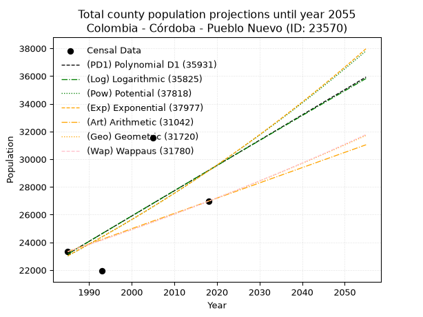
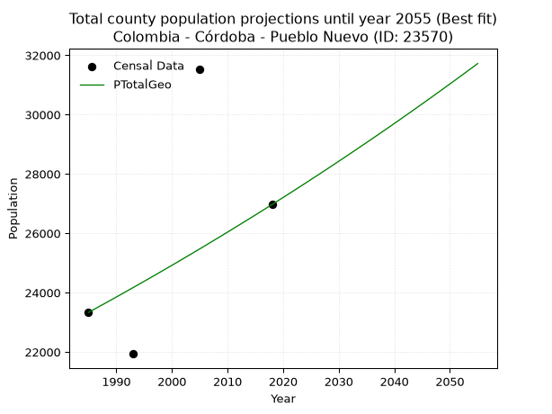
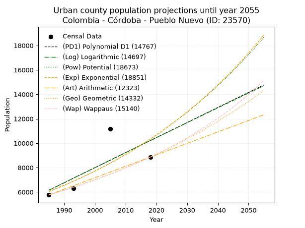
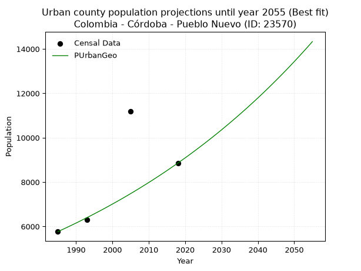
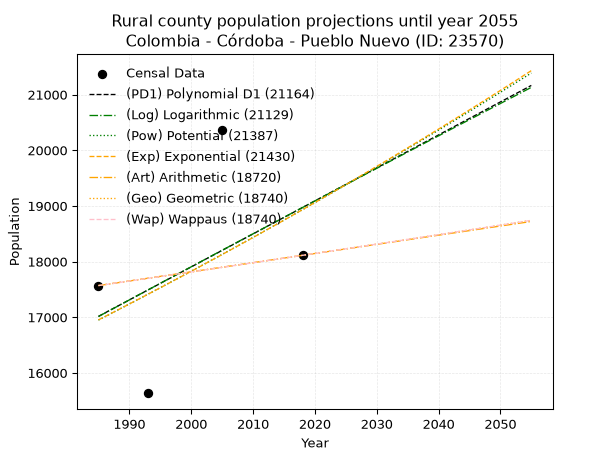
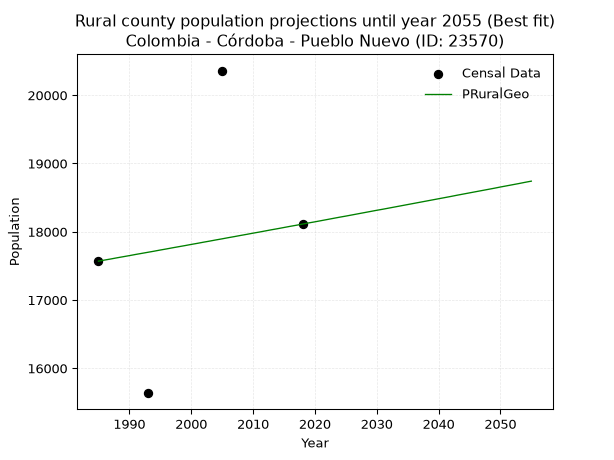

<div align="center">


</div>

# _“Population and Public Services Demand Projections (PPSD) until Year 2050 for Colombia - Córdoba - Pueblo Nuevo (ID: 23570)”_
Keywords: `population` `public-service` `projection` `lineal` `polynomial` `logarithmic` `potential` `exponential` `arithmetic` `geometric` `wappaus` `dane` `colombia` `south-america`

PPSD are analytical estimates used by governments and planners to anticipate future changes in population size, age distribution, and the resulting community needs for utilities, healthcare, education, and infrastructure as sizing future water treatment facilities, electrical grids, and road networks based on spatial growth.

> **General running parameters**: • app_version: _v20260806_. • Python version: _3.14.7_. • Pandas version: _3.0.5_. • NumPy version: _2.5.1_. • Creates, save and include plots into reports (create_plot): _False_. • Projection until year: _2050_. • Process polynomial degree 2 and up: _False_. • Process Wappaus: _True_. • Process Wappaus: _True_. • Set negative values to zero: _True_. • Set infinite values to zero: _True_. • Drop dataset notes: _True_. 
<div align="center">

Dynamic map: [:earth_americas:Google](http://maps.google.com/maps?q=8.504098593,-75.5080346) [:earth_americas:OSM](https://www.openstreetmap.org/#map=18/8.504098593/-75.5080346&layers=P) [:earth_americas:Bing](https://www.bing.com/maps?cp=8.504098593~-75.5080346&lvl=18) [:earth_americas:Apple](https://maps.apple.com/frame?center=8.504098593%2C-75.5080346&span=0.003%2C0.006)

</div>


<div align="center">

```geojson
{
  "type": "Feature",
  "geometry": {
    "type": "Point", 
    "coordinates": [-75.5080346, 8.504098593]
  }, 
  "properties": {
    "Name": "Colombia - Córdoba - Pueblo Nuevo (ID: 23570)"
  }
}
```

</div>


## 0. Census Data (4 records)

Census data are official statistics collected by a government about the people and housing in a country. They usually include counts of total population, age, sex, race, income, education, and jobs.

📅Global census file: [Population.xlsx](../data/Population.xlsx)

| Source   |   Year |   CountryID | CountryName   |   StateID | StateName   |   CountyID | CountyName   |   PTotal |   PUrban |   PRural |
|:---------|-------:|------------:|:--------------|----------:|:------------|-----------:|:-------------|---------:|---------:|---------:|
| DANE     |   1985 |          57 | Colombia      |        23 | Córdoba     |      23570 | Pueblo Nuevo |    23334 |     5766 |    17568 |
| DANE     |   1993 |          57 | Colombia      |        23 | Córdoba     |      23570 | Pueblo Nuevo |    21936 |     6302 |    15634 |
| DANE     |   2005 |          57 | Colombia      |        23 | Córdoba     |      23570 | Pueblo Nuevo |    31536 |    11177 |    20359 |
| DANE     |   2018 |          57 | Colombia      |        23 | Córdoba     |      23570 | Pueblo Nuevo |    26968 |     8857 |    18111 |

> 🔥Some records could had specific notes about the registered values or the corresponding urban or rural distribution.

📅   [RUPS](https://www.datos.gov.co/Hacienda-y-Cr-dito-P-blico/Registro-nico-de-Prestadores-de-Servicios-P-blicos/4qkq-csdn/about_data) - Local public utility companies: [RUPS.csv](../data/RUPS.xlsx)

 | SERVICIO       | ESTADO    | NOMBRE                                                                                                | NIT         | DEPARTAMENTO_DOMICILIO   | MUNICIPIO_DOMICILIO   | DIRECCION                     |   TELEFONO | EMAIL                      | TIPO_PRESTADOR          | CLASIFICACION                 |
|:---------------|:----------|:------------------------------------------------------------------------------------------------------|:------------|:-------------------------|:----------------------|:------------------------------|-----------:|:---------------------------|:------------------------|:------------------------------|
| ACUEDUCTO      | OPERATIVA | ADMINISTRACION PUBLICA COOPERATIVA DE SERVICIOS PUBLICOS DE AGUA Y SANEAMIENTO BASICO DE PUEBLO NUEVO | 900034977-1 | CORDOBA                  | PUEBLO NUEVO          | CRA 15 # 6 - 150 B/Villanueva |    7753232 | cooaguaspnuevo@hotmail.com | ORGANIZACION AUTORIZADA | MENOR O IGUAL A 2500 USUARIOS |
| ALCANTARILLADO | OPERATIVA | ADMINISTRACION PUBLICA COOPERATIVA DE SERVICIOS PUBLICOS DE AGUA Y SANEAMIENTO BASICO DE PUEBLO NUEVO | 900034977-1 | CORDOBA                  | PUEBLO NUEVO          | CRA 15 # 6 - 150 B/Villanueva |    7753232 | cooaguaspnuevo@hotmail.com | ORGANIZACION AUTORIZADA | MENOR O IGUAL A 2500 USUARIOS |

## 1. Total

### 1.1. Coefficients and Parameters

* (PD1) Polynomial Deg 1: 182.41429144921952, -338930.68647130136 (lineal)
* (Log) Logarithmic: 365677.3690047985, -2753573.1121600023
* (Pow) Potential: 14.314702938681062, -42.844219492706905
* (Exp) Exponential: 0.007142246945271608, 0.01604161766964979
* (Art) Arithmetic: Year diff. 2018 - 1985 = 33, Population diff. 26968 - 23334 = 3634, Annual growth = 110.12121212121212
* (Geo) Geometric: Year diff. 2018 - 1985 = 33, Population diff. 26968 - 23334 = 3634, Annual growth % = 0.004395676815655891
* (Wap) Wappaus: i = 0.4378402931144373, Condition values only valid for < 200)

<sub>
Wappaus condition values: ['0.00', '0.44', '0.88', '1.31', '1.75', '2.19', '2.63', '3.06', '3.50', '3.94', '4.38', '4.82', '5.25', '5.69', '6.13', '6.57', '7.01', '7.44', '7.88', '8.32', '8.76', '9.19', '9.63', '10.07', '10.51', '10.95', '11.38', '11.82', '12.26', '12.70', '13.14', '13.57', '14.01', '14.45', '14.89', '15.32', '15.76', '16.20', '16.64', '17.08', '17.51', '17.95', '18.39', '18.83', '19.26', '19.70', '20.14', '20.58', '21.02', '21.45', '21.89', '22.33', '22.77', '23.21', '23.64', '24.08', '24.52', '24.96', '25.39', '25.83', '26.27', '26.71', '27.15', '27.58', '28.02', '28.46']
</sub>


### 1.2. Projected Dataset

|   Year |   CountyID |   PTotalPD1 |   PTotalLog |   PTotalPow |   PTotalExp |   PTotalArt |   PTotalGeo |   PTotalWap |
|-------:|-----------:|------------:|------------:|------------:|------------:|------------:|------------:|------------:|
|   1985 |      23570 |       23162 |       23152 |       23027 |       23035 |       23334 |       23334 |       23334 |
|   1986 |      23570 |       23344 |       23336 |       23194 |       23201 |       23444 |       23437 |       23436 |
|   1987 |      23570 |       23527 |       23520 |       23362 |       23367 |       23554 |       23540 |       23539 |
|   1988 |      23570 |       23709 |       23704 |       23531 |       23534 |       23664 |       23643 |       23643 |
|   1989 |      23570 |       23891 |       23888 |       23701 |       23703 |       23774 |       23747 |       23746 |
|   1990 |      23570 |       24074 |       24072 |       23872 |       23873 |       23885 |       23851 |       23850 |
|   1991 |      23570 |       24256 |       24256 |       24044 |       24044 |       23995 |       23956 |       23955 |
|   1992 |      23570 |       24439 |       24439 |       24217 |       24216 |       24105 |       24062 |       24060 |
|   1993 |      23570 |       24621 |       24623 |       24392 |       24390 |       24215 |       24167 |       24166 |
|   1994 |      23570 |       24803 |       24806 |       24568 |       24565 |       24325 |       24274 |       24272 |
|   1995 |      23570 |       24986 |       24990 |       24745 |       24741 |       24435 |       24380 |       24379 |
|   1996 |      23570 |       25168 |       25173 |       24923 |       24918 |       24545 |       24487 |       24486 |
|   1997 |      23570 |       25351 |       25356 |       25102 |       25097 |       24655 |       24595 |       24593 |
|   1998 |      23570 |       25533 |       25539 |       25283 |       25277 |       24766 |       24703 |       24701 |
|   1999 |      23570 |       25715 |       25722 |       25464 |       25458 |       24876 |       24812 |       24810 |
|   2000 |      23570 |       25898 |       25905 |       25647 |       25640 |       24986 |       24921 |       24919 |
|   2001 |      23570 |       26080 |       26088 |       25832 |       25824 |       25096 |       25030 |       25028 |
|   2002 |      23570 |       26263 |       26270 |       26017 |       26009 |       25206 |       25140 |       25138 |
|   2003 |      23570 |       26445 |       26453 |       26204 |       26196 |       25316 |       25251 |       25248 |
|   2004 |      23570 |       26628 |       26636 |       26392 |       26383 |       25426 |       25362 |       25359 |
|   2005 |      23570 |       26810 |       26818 |       26581 |       26573 |       25536 |       25473 |       25471 |
|   2006 |      23570 |       26992 |       27000 |       26771 |       26763 |       25647 |       25585 |       25583 |
|   2007 |      23570 |       27175 |       27183 |       26963 |       26955 |       25757 |       25698 |       25695 |
|   2008 |      23570 |       27357 |       27365 |       27156 |       27148 |       25867 |       25811 |       25808 |
|   2009 |      23570 |       27540 |       27547 |       27350 |       27343 |       25977 |       25924 |       25922 |
|   2010 |      23570 |       27722 |       27729 |       27546 |       27539 |       26087 |       26038 |       26036 |
|   2011 |      23570 |       27904 |       27911 |       27742 |       27736 |       26197 |       26153 |       26151 |
|   2012 |      23570 |       28087 |       28092 |       27940 |       27935 |       26307 |       26268 |       26266 |
|   2013 |      23570 |       28269 |       28274 |       28140 |       28135 |       26417 |       26383 |       26381 |
|   2014 |      23570 |       28452 |       28456 |       28341 |       28337 |       26528 |       26499 |       26498 |
|   2015 |      23570 |       28634 |       28637 |       28543 |       28540 |       26638 |       26615 |       26614 |
|   2016 |      23570 |       28817 |       28819 |       28746 |       28744 |       26748 |       26732 |       26732 |
|   2017 |      23570 |       28999 |       29000 |       28951 |       28951 |       26858 |       26850 |       26850 |
|   2018 |      23570 |       29181 |       29181 |       29157 |       29158 |       26968 |       26968 |       26968 |
|   2019 |      23570 |       29364 |       29362 |       29365 |       29367 |       27078 |       27087 |       27087 |
|   2020 |      23570 |       29546 |       29544 |       29574 |       29578 |       27188 |       27206 |       27207 |
|   2021 |      23570 |       29729 |       29724 |       29784 |       29790 |       27298 |       27325 |       27327 |
|   2022 |      23570 |       29911 |       29905 |       29995 |       30003 |       27408 |       27445 |       27447 |
|   2023 |      23570 |       30093 |       30086 |       30209 |       30218 |       27519 |       27566 |       27569 |
|   2024 |      23570 |       30276 |       30267 |       30423 |       30435 |       27629 |       27687 |       27690 |
|   2025 |      23570 |       30458 |       30448 |       30639 |       30653 |       27739 |       27809 |       27813 |
|   2026 |      23570 |       30641 |       30628 |       30856 |       30873 |       27849 |       27931 |       27936 |
|   2027 |      23570 |       30823 |       30809 |       31075 |       31094 |       27959 |       28054 |       28059 |
|   2028 |      23570 |       31005 |       30989 |       31295 |       31317 |       28069 |       28177 |       28184 |
|   2029 |      23570 |       31188 |       31169 |       31517 |       31541 |       28179 |       28301 |       28308 |
|   2030 |      23570 |       31370 |       31349 |       31740 |       31767 |       28289 |       28425 |       28434 |
|   2031 |      23570 |       31553 |       31529 |       31964 |       31995 |       28400 |       28550 |       28560 |
|   2032 |      23570 |       31735 |       31709 |       32190 |       32224 |       28510 |       28676 |       28687 |
|   2033 |      23570 |       31918 |       31889 |       32418 |       32455 |       28620 |       28802 |       28814 |
|   2034 |      23570 |       32100 |       32069 |       32647 |       32688 |       28730 |       28929 |       28942 |
|   2035 |      23570 |       32282 |       32249 |       32877 |       32922 |       28840 |       29056 |       29070 |
|   2036 |      23570 |       32465 |       32429 |       33109 |       33158 |       28950 |       29183 |       29199 |
|   2037 |      23570 |       32647 |       32608 |       33343 |       33396 |       29060 |       29312 |       29329 |
|   2038 |      23570 |       32830 |       32788 |       33578 |       33635 |       29170 |       29441 |       29460 |
|   2039 |      23570 |       33012 |       32967 |       33815 |       33876 |       29281 |       29570 |       29591 |
|   2040 |      23570 |       33194 |       33146 |       34053 |       34119 |       29391 |       29700 |       29722 |
|   2041 |      23570 |       33377 |       33325 |       34293 |       34364 |       29501 |       29830 |       29855 |
|   2042 |      23570 |       33559 |       33505 |       34534 |       34610 |       29611 |       29962 |       29988 |
|   2043 |      23570 |       33742 |       33684 |       34777 |       34858 |       29721 |       30093 |       30121 |
|   2044 |      23570 |       33924 |       33863 |       35021 |       35108 |       29831 |       30226 |       30256 |
|   2045 |      23570 |       34107 |       34041 |       35267 |       35360 |       29941 |       30358 |       30391 |
|   2046 |      23570 |       34289 |       34220 |       35515 |       35613 |       30051 |       30492 |       30527 |
|   2047 |      23570 |       34471 |       34399 |       35764 |       35868 |       30162 |       30626 |       30663 |
|   2048 |      23570 |       34654 |       34577 |       36015 |       36125 |       30272 |       30761 |       30800 |
|   2049 |      23570 |       34836 |       34756 |       36268 |       36384 |       30382 |       30896 |       30938 |
|   2050 |      23570 |       35019 |       34934 |       36522 |       36645 |       30492 |       31032 |       31077 |
<div align="center">

</img>

</div>


### 1.3. Best fit with absolute and relative error (%)

Relative error puts that difference into context by dividing the absolute error by the true value, creating a unitless ratio or percentage that shows the scale of the mistake.

Absolute and relative error

|   Year | Source   |   CountryID | CountryName   |   StateID | StateName   |   CountyID_x | CountyName   |   PTotal |   PUrban |   PRural |   CountyID_y |   PTotalPD1 |   PTotalLog |   PTotalPow |   PTotalExp |   PTotalArt |   PTotalGeo |   PTotalWap |   PTotalPD1AbsError |   PTotalLogAbsError |   PTotalPowAbsError |   PTotalExpAbsError |   PTotalArtAbsError |   PTotalGeoAbsError |   PTotalWapAbsError |   PTotalPD1RelError |   PTotalLogRelError |   PTotalPowRelError |   PTotalExpRelError |   PTotalArtRelError |   PTotalGeoRelError |   PTotalWapRelError |
|-------:|:---------|------------:|:--------------|----------:|:------------|-------------:|:-------------|---------:|---------:|---------:|-------------:|------------:|------------:|------------:|------------:|------------:|------------:|------------:|--------------------:|--------------------:|--------------------:|--------------------:|--------------------:|--------------------:|--------------------:|--------------------:|--------------------:|--------------------:|--------------------:|--------------------:|--------------------:|--------------------:|
|   1985 | DANE     |          57 | Colombia      |        23 | Córdoba     |        23570 | Pueblo Nuevo |    23334 |     5766 |    17568 |        23570 |       23162 |       23152 |       23027 |       23035 |       23334 |       23334 |       23334 |                 172 |                 182 |                 307 |                 299 |                   0 |                   0 |                   0 |            0.737122 |            0.779978 |             1.31568 |             1.28139 |              0      |              0      |              0      |
|   1993 | DANE     |          57 | Colombia      |        23 | Córdoba     |        23570 | Pueblo Nuevo |    21936 |     6302 |    15634 |        23570 |       24621 |       24623 |       24392 |       24390 |       24215 |       24167 |       24166 |                2685 |                2687 |                2456 |                2454 |                2279 |                2231 |                2230 |           12.2402   |           12.2493   |            11.1962  |            11.1871  |             10.3893 |             10.1705 |             10.1659 |
|   2005 | DANE     |          57 | Colombia      |        23 | Córdoba     |        23570 | Pueblo Nuevo |    31536 |    11177 |    20359 |        23570 |       26810 |       26818 |       26581 |       26573 |       25536 |       25473 |       25471 |                4726 |                4718 |                4955 |                4963 |                6000 |                6063 |                6065 |           14.986    |           14.9607   |            15.7122  |            15.7376  |             19.0259 |             19.2256 |             19.232  |
|   2018 | DANE     |          57 | Colombia      |        23 | Córdoba     |        23570 | Pueblo Nuevo |    26968 |     8857 |    18111 |        23570 |       29181 |       29181 |       29157 |       29158 |       26968 |       26968 |       26968 |                2213 |                2213 |                2189 |                2190 |                   0 |                   0 |                   0 |            8.20602  |            8.20602  |             8.11703 |             8.12074 |              0      |              0      |              0      |

Relative error mean

| Method    |   RelError | Best   |
|:----------|-----------:|:-------|
| PTotalPD1 |    9.04234 |        |
| PTotalLog |    9.04899 |        |
| PTotalPow |    9.08528 |        |
| PTotalExp |    9.0817  |        |
| PTotalArt |    7.3538  |        |
| PTotalGeo |    7.34904 | True   |
| PTotalWap |    7.34948 |        |

💙Best method: _**PTotalGeo**_
<div align="center">

</img>

</div>


### 1.4. Fresh water supply demand in liters per capita per day (lpcd)

The fresh water supply demand typically ranges from 100 to 300 liters per capita per day (lpcd) for standard domestic and municipal planning, though absolute survival minimums set by the World Health Organization are as low as 7.5 to 20 liters per day, and total consumption in high-income nations can exceed 400 liters.

> `CZ`: Level in meters above the sea level (masl)<br> `WS`: Fresh water supply demand in liters per capita per day (lpcd or l/h/d)<br> `WSAll`: Zonal fresh water supply demand in liters per second (l/s)<br> `A`: Zonal area in square meters<br> `DP`: Population density (people/hectare or p/ha)

Reference values (RAS Colombia)

|    CZ |   WS |
|------:|-----:|
|  1000 |  120 |
|  2000 |  130 |
| 99999 |  140 |

County shapefile geometry properties and water supply values

|   CountyID |      ATotal |   CZTotal |   WSTotal |
|-----------:|------------:|----------:|----------:|
|      23570 | 8.48952e+08 |     72.35 |       120 |

Projected values for best method: PTotalGeo

|   CountyID |   Year |   PTotalGeo |   DPTotal |   WSTotal |   WSTotalAll |
|-----------:|-------:|------------:|----------:|----------:|-------------:|
|      23570 |   1985 |       23334 |      0.27 |       120 |      32.4083 |
|      23570 |   1986 |       23437 |      0.28 |       120 |      32.5514 |
|      23570 |   1987 |       23540 |      0.28 |       120 |      32.6944 |
|      23570 |   1988 |       23643 |      0.28 |       120 |      32.8375 |
|      23570 |   1989 |       23747 |      0.28 |       120 |      32.9819 |
|      23570 |   1990 |       23851 |      0.28 |       120 |      33.1264 |
|      23570 |   1991 |       23956 |      0.28 |       120 |      33.2722 |
|      23570 |   1992 |       24062 |      0.28 |       120 |      33.4194 |
|      23570 |   1993 |       24167 |      0.28 |       120 |      33.5653 |
|      23570 |   1994 |       24274 |      0.29 |       120 |      33.7139 |
|      23570 |   1995 |       24380 |      0.29 |       120 |      33.8611 |
|      23570 |   1996 |       24487 |      0.29 |       120 |      34.0097 |
|      23570 |   1997 |       24595 |      0.29 |       120 |      34.1597 |
|      23570 |   1998 |       24703 |      0.29 |       120 |      34.3097 |
|      23570 |   1999 |       24812 |      0.29 |       120 |      34.4611 |
|      23570 |   2000 |       24921 |      0.29 |       120 |      34.6125 |
|      23570 |   2001 |       25030 |      0.29 |       120 |      34.7639 |
|      23570 |   2002 |       25140 |      0.3  |       120 |      34.9167 |
|      23570 |   2003 |       25251 |      0.3  |       120 |      35.0708 |
|      23570 |   2004 |       25362 |      0.3  |       120 |      35.225  |
|      23570 |   2005 |       25473 |      0.3  |       120 |      35.3792 |
|      23570 |   2006 |       25585 |      0.3  |       120 |      35.5347 |
|      23570 |   2007 |       25698 |      0.3  |       120 |      35.6917 |
|      23570 |   2008 |       25811 |      0.3  |       120 |      35.8486 |
|      23570 |   2009 |       25924 |      0.31 |       120 |      36.0056 |
|      23570 |   2010 |       26038 |      0.31 |       120 |      36.1639 |
|      23570 |   2011 |       26153 |      0.31 |       120 |      36.3236 |
|      23570 |   2012 |       26268 |      0.31 |       120 |      36.4833 |
|      23570 |   2013 |       26383 |      0.31 |       120 |      36.6431 |
|      23570 |   2014 |       26499 |      0.31 |       120 |      36.8042 |
|      23570 |   2015 |       26615 |      0.31 |       120 |      36.9653 |
|      23570 |   2016 |       26732 |      0.31 |       120 |      37.1278 |
|      23570 |   2017 |       26850 |      0.32 |       120 |      37.2917 |
|      23570 |   2018 |       26968 |      0.32 |       120 |      37.4556 |
|      23570 |   2019 |       27087 |      0.32 |       120 |      37.6208 |
|      23570 |   2020 |       27206 |      0.32 |       120 |      37.7861 |
|      23570 |   2021 |       27325 |      0.32 |       120 |      37.9514 |
|      23570 |   2022 |       27445 |      0.32 |       120 |      38.1181 |
|      23570 |   2023 |       27566 |      0.32 |       120 |      38.2861 |
|      23570 |   2024 |       27687 |      0.33 |       120 |      38.4542 |
|      23570 |   2025 |       27809 |      0.33 |       120 |      38.6236 |
|      23570 |   2026 |       27931 |      0.33 |       120 |      38.7931 |
|      23570 |   2027 |       28054 |      0.33 |       120 |      38.9639 |
|      23570 |   2028 |       28177 |      0.33 |       120 |      39.1347 |
|      23570 |   2029 |       28301 |      0.33 |       120 |      39.3069 |
|      23570 |   2030 |       28425 |      0.33 |       120 |      39.4792 |
|      23570 |   2031 |       28550 |      0.34 |       120 |      39.6528 |
|      23570 |   2032 |       28676 |      0.34 |       120 |      39.8278 |
|      23570 |   2033 |       28802 |      0.34 |       120 |      40.0028 |
|      23570 |   2034 |       28929 |      0.34 |       120 |      40.1792 |
|      23570 |   2035 |       29056 |      0.34 |       120 |      40.3556 |
|      23570 |   2036 |       29183 |      0.34 |       120 |      40.5319 |
|      23570 |   2037 |       29312 |      0.35 |       120 |      40.7111 |
|      23570 |   2038 |       29441 |      0.35 |       120 |      40.8903 |
|      23570 |   2039 |       29570 |      0.35 |       120 |      41.0694 |
|      23570 |   2040 |       29700 |      0.35 |       120 |      41.25   |
|      23570 |   2041 |       29830 |      0.35 |       120 |      41.4306 |
|      23570 |   2042 |       29962 |      0.35 |       120 |      41.6139 |
|      23570 |   2043 |       30093 |      0.35 |       120 |      41.7958 |
|      23570 |   2044 |       30226 |      0.36 |       120 |      41.9806 |
|      23570 |   2045 |       30358 |      0.36 |       120 |      42.1639 |
|      23570 |   2046 |       30492 |      0.36 |       120 |      42.35   |
|      23570 |   2047 |       30626 |      0.36 |       120 |      42.5361 |
|      23570 |   2048 |       30761 |      0.36 |       120 |      42.7236 |
|      23570 |   2049 |       30896 |      0.36 |       120 |      42.9111 |
|      23570 |   2050 |       31032 |      0.37 |       120 |      43.1    |

## 2. Urban

### 2.1. Coefficients and Parameters

* (PD1) Polynomial Deg 1: 123.13368125251017, -238272.6459253335 (lineal)
* (Log) Logarithmic: 246868.37798291404, -1868423.0193271558
* (Pow) Potential: 32.568102173785405, -103.62078391505236
* (Exp) Exponential: 0.01624778827318692, 5.950830381108025e-11
* (Art) Arithmetic: Year diff. 2018 - 1985 = 33, Population diff. 8857 - 5766 = 3091, Annual growth = 93.66666666666667
* (Geo) Geometric: Year diff. 2018 - 1985 = 33, Population diff. 8857 - 5766 = 3091, Annual growth % = 0.01309191316273095
* (Wap) Wappaus: i = 1.2810868722788302, Condition values only valid for < 200)

<sub>
Wappaus condition values: ['0.00', '1.28', '2.56', '3.84', '5.12', '6.41', '7.69', '8.97', '10.25', '11.53', '12.81', '14.09', '15.37', '16.65', '17.94', '19.22', '20.50', '21.78', '23.06', '24.34', '25.62', '26.90', '28.18', '29.46', '30.75', '32.03', '33.31', '34.59', '35.87', '37.15', '38.43', '39.71', '40.99', '42.28', '43.56', '44.84', '46.12', '47.40', '48.68', '49.96', '51.24', '52.52', '53.81', '55.09', '56.37', '57.65', '58.93', '60.21', '61.49', '62.77', '64.05', '65.34', '66.62', '67.90', '69.18', '70.46', '71.74', '73.02', '74.30', '75.58', '76.87', '78.15', '79.43', '80.71', '81.99', '83.27']
</sub>


### 2.2. Projected Dataset

|   Year |   CountyID |   PUrbanPD1 |   PUrbanLog |   PUrbanPow |   PUrbanExp |   PUrbanArt |   PUrbanGeo |   PUrbanWap |
|-------:|-----------:|------------:|------------:|------------:|------------:|------------:|------------:|------------:|
|   1985 |      23570 |        6148 |        6141 |        6040 |        6045 |        5766 |        5766 |        5766 |
|   1986 |      23570 |        6271 |        6265 |        6140 |        6144 |        5860 |        5841 |        5840 |
|   1987 |      23570 |        6394 |        6390 |        6241 |        6244 |        5953 |        5918 |        5916 |
|   1988 |      23570 |        6517 |        6514 |        6344 |        6347 |        6047 |        5995 |        5992 |
|   1989 |      23570 |        6640 |        6638 |        6449 |        6451 |        6141 |        6074 |        6069 |
|   1990 |      23570 |        6763 |        6762 |        6555 |        6556 |        6234 |        6153 |        6148 |
|   1991 |      23570 |        6887 |        6886 |        6664 |        6664 |        6328 |        6234 |        6227 |
|   1992 |      23570 |        7010 |        7010 |        6773 |        6773 |        6422 |        6316 |        6307 |
|   1993 |      23570 |        7133 |        7134 |        6885 |        6884 |        6515 |        6398 |        6389 |
|   1994 |      23570 |        7256 |        7258 |        6998 |        6997 |        6609 |        6482 |        6471 |
|   1995 |      23570 |        7379 |        7381 |        7114 |        7111 |        6703 |        6567 |        6555 |
|   1996 |      23570 |        7502 |        7505 |        7231 |        7228 |        6796 |        6653 |        6640 |
|   1997 |      23570 |        7625 |        7629 |        7350 |        7346 |        6890 |        6740 |        6726 |
|   1998 |      23570 |        7748 |        7752 |        7470 |        7466 |        6984 |        6828 |        6814 |
|   1999 |      23570 |        7872 |        7876 |        7593 |        7589 |        7077 |        6918 |        6902 |
|   2000 |      23570 |        7995 |        7999 |        7718 |        7713 |        7171 |        7008 |        6992 |
|   2001 |      23570 |        8118 |        8123 |        7845 |        7839 |        7265 |        7100 |        7083 |
|   2002 |      23570 |        8241 |        8246 |        7973 |        7968 |        7358 |        7193 |        7175 |
|   2003 |      23570 |        8364 |        8369 |        8104 |        8098 |        7452 |        7287 |        7269 |
|   2004 |      23570 |        8487 |        8493 |        8237 |        8231 |        7546 |        7382 |        7364 |
|   2005 |      23570 |        8610 |        8616 |        8372 |        8366 |        7639 |        7479 |        7460 |
|   2006 |      23570 |        8734 |        8739 |        8509 |        8503 |        7733 |        7577 |        7558 |
|   2007 |      23570 |        8857 |        8862 |        8648 |        8642 |        7827 |        7676 |        7658 |
|   2008 |      23570 |        8980 |        8985 |        8789 |        8784 |        7920 |        7777 |        7758 |
|   2009 |      23570 |        9103 |        9108 |        8933 |        8928 |        8014 |        7879 |        7861 |
|   2010 |      23570 |        9226 |        9231 |        9079 |        9074 |        8108 |        7982 |        7965 |
|   2011 |      23570 |        9349 |        9353 |        9227 |        9222 |        8201 |        8086 |        8070 |
|   2012 |      23570 |        9472 |        9476 |        9378 |        9374 |        8295 |        8192 |        8177 |
|   2013 |      23570 |        9595 |        9599 |        9531 |        9527 |        8389 |        8299 |        8286 |
|   2014 |      23570 |        9719 |        9722 |        9686 |        9683 |        8482 |        8408 |        8397 |
|   2015 |      23570 |        9842 |        9844 |        9844 |        9842 |        8576 |        8518 |        8509 |
|   2016 |      23570 |        9965 |        9967 |       10005 |       10003 |        8670 |        8630 |        8623 |
|   2017 |      23570 |       10088 |       10089 |       10168 |       10167 |        8763 |        8743 |        8739 |
|   2018 |      23570 |       10211 |       10211 |       10333 |       10333 |        8857 |        8857 |        8857 |
|   2019 |      23570 |       10334 |       10334 |       10501 |       10503 |        8951 |        8973 |        8977 |
|   2020 |      23570 |       10457 |       10456 |       10672 |       10675 |        9044 |        9090 |        9098 |
|   2021 |      23570 |       10581 |       10578 |       10845 |       10850 |        9138 |        9209 |        9222 |
|   2022 |      23570 |       10704 |       10700 |       11021 |       11027 |        9232 |        9330 |        9348 |
|   2023 |      23570 |       10827 |       10822 |       11200 |       11208 |        9325 |        9452 |        9476 |
|   2024 |      23570 |       10950 |       10944 |       11382 |       11391 |        9419 |        9576 |        9606 |
|   2025 |      23570 |       11073 |       11066 |       11567 |       11578 |        9513 |        9701 |        9739 |
|   2026 |      23570 |       11196 |       11188 |       11754 |       11768 |        9606 |        9828 |        9873 |
|   2027 |      23570 |       11319 |       11310 |       11944 |       11960 |        9700 |        9957 |       10010 |
|   2028 |      23570 |       11442 |       11432 |       12138 |       12156 |        9794 |       10087 |       10150 |
|   2029 |      23570 |       11566 |       11553 |       12334 |       12356 |        9887 |       10219 |       10292 |
|   2030 |      23570 |       11689 |       11675 |       12534 |       12558 |        9981 |       10353 |       10436 |
|   2031 |      23570 |       11812 |       11797 |       12737 |       12764 |       10075 |       10489 |       10583 |
|   2032 |      23570 |       11935 |       11918 |       12942 |       12973 |       10168 |       10626 |       10733 |
|   2033 |      23570 |       12058 |       12040 |       13151 |       13185 |       10262 |       10765 |       10886 |
|   2034 |      23570 |       12181 |       12161 |       13364 |       13401 |       10356 |       10906 |       11041 |
|   2035 |      23570 |       12304 |       12282 |       13579 |       13621 |       10449 |       11049 |       11200 |
|   2036 |      23570 |       12428 |       12404 |       13798 |       13844 |       10543 |       11194 |       11361 |
|   2037 |      23570 |       12551 |       12525 |       14021 |       14071 |       10637 |       11340 |       11525 |
|   2038 |      23570 |       12674 |       12646 |       14247 |       14301 |       10730 |       11489 |       11693 |
|   2039 |      23570 |       12797 |       12767 |       14476 |       14535 |       10824 |       11639 |       11864 |
|   2040 |      23570 |       12920 |       12888 |       14709 |       14773 |       10918 |       11791 |       12039 |
|   2041 |      23570 |       13043 |       13009 |       14946 |       15015 |       11011 |       11946 |       12216 |
|   2042 |      23570 |       13166 |       13130 |       15186 |       15261 |       11105 |       12102 |       12398 |
|   2043 |      23570 |       13289 |       13251 |       15430 |       15511 |       11199 |       12260 |       12583 |
|   2044 |      23570 |       13413 |       13372 |       15678 |       15765 |       11292 |       12421 |       12772 |
|   2045 |      23570 |       13536 |       13492 |       15930 |       16024 |       11386 |       12584 |       12965 |
|   2046 |      23570 |       13659 |       13613 |       16186 |       16286 |       11480 |       12748 |       13162 |
|   2047 |      23570 |       13782 |       13734 |       16445 |       16553 |       11573 |       12915 |       13363 |
|   2048 |      23570 |       13905 |       13854 |       16709 |       16824 |       11667 |       13084 |       13568 |
|   2049 |      23570 |       14028 |       13975 |       16977 |       17100 |       11761 |       13256 |       13778 |
|   2050 |      23570 |       14151 |       14095 |       17249 |       17380 |       11854 |       13429 |       13993 |
<div align="center">

</img>

</div>


### 2.3. Best fit with absolute and relative error (%)

Relative error puts that difference into context by dividing the absolute error by the true value, creating a unitless ratio or percentage that shows the scale of the mistake.

Absolute and relative error

|   Year | Source   |   CountryID | CountryName   |   StateID | StateName   |   CountyID_x | CountyName   |   PTotal |   PUrban |   PRural |   CountyID_y |   PUrbanPD1 |   PUrbanLog |   PUrbanPow |   PUrbanExp |   PUrbanArt |   PUrbanGeo |   PUrbanWap |   PUrbanPD1AbsError |   PUrbanLogAbsError |   PUrbanPowAbsError |   PUrbanExpAbsError |   PUrbanArtAbsError |   PUrbanGeoAbsError |   PUrbanWapAbsError |   PUrbanPD1RelError |   PUrbanLogRelError |   PUrbanPowRelError |   PUrbanExpRelError |   PUrbanArtRelError |   PUrbanGeoRelError |   PUrbanWapRelError |
|-------:|:---------|------------:|:--------------|----------:|:------------|-------------:|:-------------|---------:|---------:|---------:|-------------:|------------:|------------:|------------:|------------:|------------:|------------:|------------:|--------------------:|--------------------:|--------------------:|--------------------:|--------------------:|--------------------:|--------------------:|--------------------:|--------------------:|--------------------:|--------------------:|--------------------:|--------------------:|--------------------:|
|   1985 | DANE     |          57 | Colombia      |        23 | Córdoba     |        23570 | Pueblo Nuevo |    23334 |     5766 |    17568 |        23570 |        6148 |        6141 |        6040 |        6045 |        5766 |        5766 |        5766 |                 382 |                 375 |                 274 |                 279 |                   0 |                   0 |                   0 |             6.62504 |             6.50364 |             4.75199 |             4.83871 |             0       |             0       |             0       |
|   1993 | DANE     |          57 | Colombia      |        23 | Córdoba     |        23570 | Pueblo Nuevo |    21936 |     6302 |    15634 |        23570 |        7133 |        7134 |        6885 |        6884 |        6515 |        6398 |        6389 |                 831 |                 832 |                 583 |                 582 |                 213 |                  96 |                  87 |            13.1863  |            13.2022  |             9.25103 |             9.23516 |             3.37988 |             1.52333 |             1.38051 |
|   2005 | DANE     |          57 | Colombia      |        23 | Córdoba     |        23570 | Pueblo Nuevo |    31536 |    11177 |    20359 |        23570 |        8610 |        8616 |        8372 |        8366 |        7639 |        7479 |        7460 |                2567 |                2561 |                2805 |                2811 |                3538 |                3698 |                3717 |            22.9668  |            22.9131  |            25.0962  |            25.1499  |            31.6543  |            33.0858  |            33.2558  |
|   2018 | DANE     |          57 | Colombia      |        23 | Córdoba     |        23570 | Pueblo Nuevo |    26968 |     8857 |    18111 |        23570 |       10211 |       10211 |       10333 |       10333 |        8857 |        8857 |        8857 |                1354 |                1354 |                1476 |                1476 |                   0 |                   0 |                   0 |            15.2873  |            15.2873  |            16.6648  |            16.6648  |             0       |             0       |             0       |

Relative error mean

| Method    |   RelError | Best   |
|:----------|-----------:|:-------|
| PUrbanPD1 |   14.5164  |        |
| PUrbanLog |   14.4766  |        |
| PUrbanPow |   13.941   |        |
| PUrbanExp |   13.9721  |        |
| PUrbanArt |    8.75854 |        |
| PUrbanGeo |    8.65228 | True   |
| PUrbanWap |    8.65908 |        |

💙Best method: _**PUrbanGeo**_
<div align="center">

</img>

</div>


### 2.4. Fresh water supply demand in liters per capita per day (lpcd)

The fresh water supply demand typically ranges from 100 to 300 liters per capita per day (lpcd) for standard domestic and municipal planning, though absolute survival minimums set by the World Health Organization are as low as 7.5 to 20 liters per day, and total consumption in high-income nations can exceed 400 liters.

> `CZ`: Level in meters above the sea level (masl)<br> `WS`: Fresh water supply demand in liters per capita per day (lpcd or l/h/d)<br> `WSAll`: Zonal fresh water supply demand in liters per second (l/s)<br> `A`: Zonal area in square meters<br> `DP`: Population density (people/hectare or p/ha)

Reference values (RAS Colombia)

|    CZ |   WS |
|------:|-----:|
|  1000 |  120 |
|  2000 |  130 |
| 99999 |  140 |

County shapefile geometry properties and water supply values

|   CountyID |      AUrban |   CZUrban |   WSUrban |
|-----------:|------------:|----------:|----------:|
|      23570 | 2.04869e+06 |   115.793 |       120 |

Projected values for best method: PUrbanGeo

|   CountyID |   Year |   PUrbanGeo |   DPUrban |   WSUrban |   WSUrbanAll |
|-----------:|-------:|------------:|----------:|----------:|-------------:|
|      23570 |   1985 |        5766 |     28.14 |       120 |      8.00833 |
|      23570 |   1986 |        5841 |     28.51 |       120 |      8.1125  |
|      23570 |   1987 |        5918 |     28.89 |       120 |      8.21944 |
|      23570 |   1988 |        5995 |     29.26 |       120 |      8.32639 |
|      23570 |   1989 |        6074 |     29.65 |       120 |      8.43611 |
|      23570 |   1990 |        6153 |     30.03 |       120 |      8.54583 |
|      23570 |   1991 |        6234 |     30.43 |       120 |      8.65833 |
|      23570 |   1992 |        6316 |     30.83 |       120 |      8.77222 |
|      23570 |   1993 |        6398 |     31.23 |       120 |      8.88611 |
|      23570 |   1994 |        6482 |     31.64 |       120 |      9.00278 |
|      23570 |   1995 |        6567 |     32.05 |       120 |      9.12083 |
|      23570 |   1996 |        6653 |     32.47 |       120 |      9.24028 |
|      23570 |   1997 |        6740 |     32.9  |       120 |      9.36111 |
|      23570 |   1998 |        6828 |     33.33 |       120 |      9.48333 |
|      23570 |   1999 |        6918 |     33.77 |       120 |      9.60833 |
|      23570 |   2000 |        7008 |     34.21 |       120 |      9.73333 |
|      23570 |   2001 |        7100 |     34.66 |       120 |      9.86111 |
|      23570 |   2002 |        7193 |     35.11 |       120 |      9.99028 |
|      23570 |   2003 |        7287 |     35.57 |       120 |     10.1208  |
|      23570 |   2004 |        7382 |     36.03 |       120 |     10.2528  |
|      23570 |   2005 |        7479 |     36.51 |       120 |     10.3875  |
|      23570 |   2006 |        7577 |     36.98 |       120 |     10.5236  |
|      23570 |   2007 |        7676 |     37.47 |       120 |     10.6611  |
|      23570 |   2008 |        7777 |     37.96 |       120 |     10.8014  |
|      23570 |   2009 |        7879 |     38.46 |       120 |     10.9431  |
|      23570 |   2010 |        7982 |     38.96 |       120 |     11.0861  |
|      23570 |   2011 |        8086 |     39.47 |       120 |     11.2306  |
|      23570 |   2012 |        8192 |     39.99 |       120 |     11.3778  |
|      23570 |   2013 |        8299 |     40.51 |       120 |     11.5264  |
|      23570 |   2014 |        8408 |     41.04 |       120 |     11.6778  |
|      23570 |   2015 |        8518 |     41.58 |       120 |     11.8306  |
|      23570 |   2016 |        8630 |     42.12 |       120 |     11.9861  |
|      23570 |   2017 |        8743 |     42.68 |       120 |     12.1431  |
|      23570 |   2018 |        8857 |     43.23 |       120 |     12.3014  |
|      23570 |   2019 |        8973 |     43.8  |       120 |     12.4625  |
|      23570 |   2020 |        9090 |     44.37 |       120 |     12.625   |
|      23570 |   2021 |        9209 |     44.95 |       120 |     12.7903  |
|      23570 |   2022 |        9330 |     45.54 |       120 |     12.9583  |
|      23570 |   2023 |        9452 |     46.14 |       120 |     13.1278  |
|      23570 |   2024 |        9576 |     46.74 |       120 |     13.3     |
|      23570 |   2025 |        9701 |     47.35 |       120 |     13.4736  |
|      23570 |   2026 |        9828 |     47.97 |       120 |     13.65    |
|      23570 |   2027 |        9957 |     48.6  |       120 |     13.8292  |
|      23570 |   2028 |       10087 |     49.24 |       120 |     14.0097  |
|      23570 |   2029 |       10219 |     49.88 |       120 |     14.1931  |
|      23570 |   2030 |       10353 |     50.53 |       120 |     14.3792  |
|      23570 |   2031 |       10489 |     51.2  |       120 |     14.5681  |
|      23570 |   2032 |       10626 |     51.87 |       120 |     14.7583  |
|      23570 |   2033 |       10765 |     52.55 |       120 |     14.9514  |
|      23570 |   2034 |       10906 |     53.23 |       120 |     15.1472  |
|      23570 |   2035 |       11049 |     53.93 |       120 |     15.3458  |
|      23570 |   2036 |       11194 |     54.64 |       120 |     15.5472  |
|      23570 |   2037 |       11340 |     55.35 |       120 |     15.75    |
|      23570 |   2038 |       11489 |     56.08 |       120 |     15.9569  |
|      23570 |   2039 |       11639 |     56.81 |       120 |     16.1653  |
|      23570 |   2040 |       11791 |     57.55 |       120 |     16.3764  |
|      23570 |   2041 |       11946 |     58.31 |       120 |     16.5917  |
|      23570 |   2042 |       12102 |     59.07 |       120 |     16.8083  |
|      23570 |   2043 |       12260 |     59.84 |       120 |     17.0278  |
|      23570 |   2044 |       12421 |     60.63 |       120 |     17.2514  |
|      23570 |   2045 |       12584 |     61.42 |       120 |     17.4778  |
|      23570 |   2046 |       12748 |     62.23 |       120 |     17.7056  |
|      23570 |   2047 |       12915 |     63.04 |       120 |     17.9375  |
|      23570 |   2048 |       13084 |     63.87 |       120 |     18.1722  |
|      23570 |   2049 |       13256 |     64.7  |       120 |     18.4111  |
|      23570 |   2050 |       13429 |     65.55 |       120 |     18.6514  |

## 3. Rural

### 3.1. Coefficients and Parameters

* (PD1) Polynomial Deg 1: 59.28061019670921, -100658.0405459676 (lineal)
* (Log) Logarithmic: 118808.99102188443, -885150.0928328461
* (Pow) Potential: 6.71245236181711, -17.906941473876373
* (Exp) Exponential: 0.0033500627257481426, 21.937219752879308
* (Art) Arithmetic: Year diff. 2018 - 1985 = 33, Population diff. 18111 - 17568 = 543, Annual growth = 16.454545454545453
* (Geo) Geometric: Year diff. 2018 - 1985 = 33, Population diff. 18111 - 17568 = 543, Annual growth % = 0.0009228626412267626
* (Wap) Wappaus: i = 0.0922365842907338, Condition values only valid for < 200)

<sub>
Wappaus condition values: ['0.00', '0.09', '0.18', '0.28', '0.37', '0.46', '0.55', '0.65', '0.74', '0.83', '0.92', '1.01', '1.11', '1.20', '1.29', '1.38', '1.48', '1.57', '1.66', '1.75', '1.84', '1.94', '2.03', '2.12', '2.21', '2.31', '2.40', '2.49', '2.58', '2.67', '2.77', '2.86', '2.95', '3.04', '3.14', '3.23', '3.32', '3.41', '3.50', '3.60', '3.69', '3.78', '3.87', '3.97', '4.06', '4.15', '4.24', '4.34', '4.43', '4.52', '4.61', '4.70', '4.80', '4.89', '4.98', '5.07', '5.17', '5.26', '5.35', '5.44', '5.53', '5.63', '5.72', '5.81', '5.90', '6.00']
</sub>


### 3.2. Projected Dataset

|   Year |   CountyID |   PRuralPD1 |   PRuralLog |   PRuralPow |   PRuralExp |   PRuralArt |   PRuralGeo |   PRuralWap |
|-------:|-----------:|------------:|------------:|------------:|------------:|------------:|------------:|------------:|
|   1985 |      23570 |       17014 |       17011 |       16948 |       16951 |       17568 |       17568 |       17568 |
|   1986 |      23570 |       17073 |       17071 |       17005 |       17007 |       17584 |       17584 |       17584 |
|   1987 |      23570 |       17133 |       17131 |       17063 |       17065 |       17601 |       17600 |       17600 |
|   1988 |      23570 |       17192 |       17190 |       17121 |       17122 |       17617 |       17617 |       17617 |
|   1989 |      23570 |       17251 |       17250 |       17179 |       17179 |       17634 |       17633 |       17633 |
|   1990 |      23570 |       17310 |       17310 |       17237 |       17237 |       17650 |       17649 |       17649 |
|   1991 |      23570 |       17370 |       17370 |       17295 |       17295 |       17667 |       17666 |       17665 |
|   1992 |      23570 |       17429 |       17429 |       17353 |       17353 |       17683 |       17682 |       17682 |
|   1993 |      23570 |       17488 |       17489 |       17412 |       17411 |       17700 |       17698 |       17698 |
|   1994 |      23570 |       17547 |       17548 |       17471 |       17469 |       17716 |       17714 |       17714 |
|   1995 |      23570 |       17607 |       17608 |       17529 |       17528 |       17733 |       17731 |       17731 |
|   1996 |      23570 |       17666 |       17668 |       17589 |       17587 |       17749 |       17747 |       17747 |
|   1997 |      23570 |       17725 |       17727 |       17648 |       17646 |       17765 |       17764 |       17764 |
|   1998 |      23570 |       17785 |       17787 |       17707 |       17705 |       17782 |       17780 |       17780 |
|   1999 |      23570 |       17844 |       17846 |       17767 |       17765 |       17798 |       17796 |       17796 |
|   2000 |      23570 |       17903 |       17905 |       17826 |       17824 |       17815 |       17813 |       17813 |
|   2001 |      23570 |       17962 |       17965 |       17886 |       17884 |       17831 |       17829 |       17829 |
|   2002 |      23570 |       18022 |       18024 |       17946 |       17944 |       17848 |       17846 |       17846 |
|   2003 |      23570 |       18081 |       18084 |       18007 |       18004 |       17864 |       17862 |       17862 |
|   2004 |      23570 |       18140 |       18143 |       18067 |       18065 |       17881 |       17879 |       17879 |
|   2005 |      23570 |       18200 |       18202 |       18128 |       18125 |       17897 |       17895 |       17895 |
|   2006 |      23570 |       18259 |       18261 |       18189 |       18186 |       17914 |       17912 |       17912 |
|   2007 |      23570 |       18318 |       18321 |       18249 |       18247 |       17930 |       17928 |       17928 |
|   2008 |      23570 |       18377 |       18380 |       18311 |       18308 |       17946 |       17945 |       17945 |
|   2009 |      23570 |       18437 |       18439 |       18372 |       18370 |       17963 |       17961 |       17961 |
|   2010 |      23570 |       18496 |       18498 |       18433 |       18431 |       17979 |       17978 |       17978 |
|   2011 |      23570 |       18555 |       18557 |       18495 |       18493 |       17996 |       17994 |       17994 |
|   2012 |      23570 |       18615 |       18616 |       18557 |       18555 |       18012 |       18011 |       18011 |
|   2013 |      23570 |       18674 |       18675 |       18619 |       18618 |       18029 |       18028 |       18028 |
|   2014 |      23570 |       18733 |       18734 |       18681 |       18680 |       18045 |       18044 |       18044 |
|   2015 |      23570 |       18792 |       18793 |       18743 |       18743 |       18062 |       18061 |       18061 |
|   2016 |      23570 |       18852 |       18852 |       18806 |       18806 |       18078 |       18078 |       18078 |
|   2017 |      23570 |       18911 |       18911 |       18869 |       18869 |       18095 |       18094 |       18094 |
|   2018 |      23570 |       18970 |       18970 |       18931 |       18932 |       18111 |       18111 |       18111 |
|   2019 |      23570 |       19030 |       19029 |       18995 |       18996 |       18127 |       18128 |       18128 |
|   2020 |      23570 |       19089 |       19088 |       19058 |       19059 |       18144 |       18144 |       18144 |
|   2021 |      23570 |       19148 |       19146 |       19121 |       19123 |       18160 |       18161 |       18161 |
|   2022 |      23570 |       19207 |       19205 |       19185 |       19187 |       18177 |       18178 |       18178 |
|   2023 |      23570 |       19267 |       19264 |       19249 |       19252 |       18193 |       18195 |       18195 |
|   2024 |      23570 |       19326 |       19323 |       19313 |       19316 |       18210 |       18212 |       18212 |
|   2025 |      23570 |       19385 |       19381 |       19377 |       19381 |       18226 |       18228 |       18228 |
|   2026 |      23570 |       19444 |       19440 |       19441 |       19446 |       18243 |       18245 |       18245 |
|   2027 |      23570 |       19504 |       19499 |       19505 |       19512 |       18259 |       18262 |       18262 |
|   2028 |      23570 |       19563 |       19557 |       19570 |       19577 |       18276 |       18279 |       18279 |
|   2029 |      23570 |       19622 |       19616 |       19635 |       19643 |       18292 |       18296 |       18296 |
|   2030 |      23570 |       19682 |       19674 |       19700 |       19709 |       18308 |       18313 |       18313 |
|   2031 |      23570 |       19741 |       19733 |       19765 |       19775 |       18325 |       18329 |       18330 |
|   2032 |      23570 |       19800 |       19791 |       19831 |       19841 |       18341 |       18346 |       18346 |
|   2033 |      23570 |       19859 |       19850 |       19896 |       19908 |       18358 |       18363 |       18363 |
|   2034 |      23570 |       19919 |       19908 |       19962 |       19975 |       18374 |       18380 |       18380 |
|   2035 |      23570 |       19978 |       19967 |       20028 |       20042 |       18391 |       18397 |       18397 |
|   2036 |      23570 |       20037 |       20025 |       20094 |       20109 |       18407 |       18414 |       18414 |
|   2037 |      23570 |       20097 |       20083 |       20161 |       20176 |       18424 |       18431 |       18431 |
|   2038 |      23570 |       20156 |       20142 |       20227 |       20244 |       18440 |       18448 |       18448 |
|   2039 |      23570 |       20215 |       20200 |       20294 |       20312 |       18457 |       18465 |       18465 |
|   2040 |      23570 |       20274 |       20258 |       20361 |       20380 |       18473 |       18482 |       18482 |
|   2041 |      23570 |       20334 |       20316 |       20428 |       20448 |       18489 |       18499 |       18499 |
|   2042 |      23570 |       20393 |       20375 |       20495 |       20517 |       18506 |       18516 |       18517 |
|   2043 |      23570 |       20452 |       20433 |       20563 |       20586 |       18522 |       18534 |       18534 |
|   2044 |      23570 |       20512 |       20491 |       20630 |       20655 |       18539 |       18551 |       18551 |
|   2045 |      23570 |       20571 |       20549 |       20698 |       20724 |       18555 |       18568 |       18568 |
|   2046 |      23570 |       20630 |       20607 |       20766 |       20794 |       18572 |       18585 |       18585 |
|   2047 |      23570 |       20689 |       20665 |       20834 |       20864 |       18588 |       18602 |       18602 |
|   2048 |      23570 |       20749 |       20723 |       20903 |       20934 |       18605 |       18619 |       18619 |
|   2049 |      23570 |       20808 |       20781 |       20971 |       21004 |       18621 |       18636 |       18637 |
|   2050 |      23570 |       20867 |       20839 |       21040 |       21074 |       18638 |       18654 |       18654 |
<div align="center">

</img>

</div>


### 3.3. Best fit with absolute and relative error (%)

Relative error puts that difference into context by dividing the absolute error by the true value, creating a unitless ratio or percentage that shows the scale of the mistake.

Absolute and relative error

|   Year | Source   |   CountryID | CountryName   |   StateID | StateName   |   CountyID_x | CountyName   |   PTotal |   PUrban |   PRural |   CountyID_y |   PRuralPD1 |   PRuralLog |   PRuralPow |   PRuralExp |   PRuralArt |   PRuralGeo |   PRuralWap |   PRuralPD1AbsError |   PRuralLogAbsError |   PRuralPowAbsError |   PRuralExpAbsError |   PRuralArtAbsError |   PRuralGeoAbsError |   PRuralWapAbsError |   PRuralPD1RelError |   PRuralLogRelError |   PRuralPowRelError |   PRuralExpRelError |   PRuralArtRelError |   PRuralGeoRelError |   PRuralWapRelError |
|-------:|:---------|------------:|:--------------|----------:|:------------|-------------:|:-------------|---------:|---------:|---------:|-------------:|------------:|------------:|------------:|------------:|------------:|------------:|------------:|--------------------:|--------------------:|--------------------:|--------------------:|--------------------:|--------------------:|--------------------:|--------------------:|--------------------:|--------------------:|--------------------:|--------------------:|--------------------:|--------------------:|
|   1985 | DANE     |          57 | Colombia      |        23 | Córdoba     |        23570 | Pueblo Nuevo |    23334 |     5766 |    17568 |        23570 |       17014 |       17011 |       16948 |       16951 |       17568 |       17568 |       17568 |                 554 |                 557 |                 620 |                 617 |                   0 |                   0 |                   0 |             3.15346 |             3.17054 |             3.52914 |             3.51207 |              0      |              0      |              0      |
|   1993 | DANE     |          57 | Colombia      |        23 | Córdoba     |        23570 | Pueblo Nuevo |    21936 |     6302 |    15634 |        23570 |       17488 |       17489 |       17412 |       17411 |       17700 |       17698 |       17698 |                1854 |                1855 |                1778 |                1777 |                2066 |                2064 |                2064 |            11.8588  |            11.8652  |            11.3726  |            11.3663  |             13.2148 |             13.202  |             13.202  |
|   2005 | DANE     |          57 | Colombia      |        23 | Córdoba     |        23570 | Pueblo Nuevo |    31536 |    11177 |    20359 |        23570 |       18200 |       18202 |       18128 |       18125 |       17897 |       17895 |       17895 |                2159 |                2157 |                2231 |                2234 |                2462 |                2464 |                2464 |            10.6046  |            10.5948  |            10.9583  |            10.973   |             12.0929 |             12.1028 |             12.1028 |
|   2018 | DANE     |          57 | Colombia      |        23 | Córdoba     |        23570 | Pueblo Nuevo |    26968 |     8857 |    18111 |        23570 |       18970 |       18970 |       18931 |       18932 |       18111 |       18111 |       18111 |                 859 |                 859 |                 820 |                 821 |                   0 |                   0 |                   0 |             4.74297 |             4.74297 |             4.52764 |             4.53316 |              0      |              0      |              0      |

Relative error mean

| Method    |   RelError | Best   |
|:----------|-----------:|:-------|
| PRuralPD1 |    7.58996 |        |
| PRuralLog |    7.59337 |        |
| PRuralPow |    7.59693 |        |
| PRuralExp |    7.59613 |        |
| PRuralArt |    6.32693 |        |
| PRuralGeo |    6.32619 | True   |
| PRuralWap |    6.32619 | True   |

💙Best method: _**PRuralGeo**_
<div align="center">

</img>

</div>


### 3.4. Fresh water supply demand in liters per capita per day (lpcd)

The fresh water supply demand typically ranges from 100 to 300 liters per capita per day (lpcd) for standard domestic and municipal planning, though absolute survival minimums set by the World Health Organization are as low as 7.5 to 20 liters per day, and total consumption in high-income nations can exceed 400 liters.

> `CZ`: Level in meters above the sea level (masl)<br> `WS`: Fresh water supply demand in liters per capita per day (lpcd or l/h/d)<br> `WSAll`: Zonal fresh water supply demand in liters per second (l/s)<br> `A`: Zonal area in square meters<br> `DP`: Population density (people/hectare or p/ha)

Reference values (RAS Colombia)

|    CZ |   WS |
|------:|-----:|
|  1000 |  120 |
|  2000 |  130 |
| 99999 |  140 |

County shapefile geometry properties and water supply values

|   CountyID |      ARural |   CZRural |   WSRural |
|-----------:|------------:|----------:|----------:|
|      23570 | 8.46903e+08 |   72.2458 |       120 |

Projected values for best method: PRuralGeo

|   CountyID |   Year |   PRuralGeo |   DPRural |   WSRural |   WSRuralAll |
|-----------:|-------:|------------:|----------:|----------:|-------------:|
|      23570 |   1985 |       17568 |      0.21 |       120 |      24.4    |
|      23570 |   1986 |       17584 |      0.21 |       120 |      24.4222 |
|      23570 |   1987 |       17600 |      0.21 |       120 |      24.4444 |
|      23570 |   1988 |       17617 |      0.21 |       120 |      24.4681 |
|      23570 |   1989 |       17633 |      0.21 |       120 |      24.4903 |
|      23570 |   1990 |       17649 |      0.21 |       120 |      24.5125 |
|      23570 |   1991 |       17666 |      0.21 |       120 |      24.5361 |
|      23570 |   1992 |       17682 |      0.21 |       120 |      24.5583 |
|      23570 |   1993 |       17698 |      0.21 |       120 |      24.5806 |
|      23570 |   1994 |       17714 |      0.21 |       120 |      24.6028 |
|      23570 |   1995 |       17731 |      0.21 |       120 |      24.6264 |
|      23570 |   1996 |       17747 |      0.21 |       120 |      24.6486 |
|      23570 |   1997 |       17764 |      0.21 |       120 |      24.6722 |
|      23570 |   1998 |       17780 |      0.21 |       120 |      24.6944 |
|      23570 |   1999 |       17796 |      0.21 |       120 |      24.7167 |
|      23570 |   2000 |       17813 |      0.21 |       120 |      24.7403 |
|      23570 |   2001 |       17829 |      0.21 |       120 |      24.7625 |
|      23570 |   2002 |       17846 |      0.21 |       120 |      24.7861 |
|      23570 |   2003 |       17862 |      0.21 |       120 |      24.8083 |
|      23570 |   2004 |       17879 |      0.21 |       120 |      24.8319 |
|      23570 |   2005 |       17895 |      0.21 |       120 |      24.8542 |
|      23570 |   2006 |       17912 |      0.21 |       120 |      24.8778 |
|      23570 |   2007 |       17928 |      0.21 |       120 |      24.9    |
|      23570 |   2008 |       17945 |      0.21 |       120 |      24.9236 |
|      23570 |   2009 |       17961 |      0.21 |       120 |      24.9458 |
|      23570 |   2010 |       17978 |      0.21 |       120 |      24.9694 |
|      23570 |   2011 |       17994 |      0.21 |       120 |      24.9917 |
|      23570 |   2012 |       18011 |      0.21 |       120 |      25.0153 |
|      23570 |   2013 |       18028 |      0.21 |       120 |      25.0389 |
|      23570 |   2014 |       18044 |      0.21 |       120 |      25.0611 |
|      23570 |   2015 |       18061 |      0.21 |       120 |      25.0847 |
|      23570 |   2016 |       18078 |      0.21 |       120 |      25.1083 |
|      23570 |   2017 |       18094 |      0.21 |       120 |      25.1306 |
|      23570 |   2018 |       18111 |      0.21 |       120 |      25.1542 |
|      23570 |   2019 |       18128 |      0.21 |       120 |      25.1778 |
|      23570 |   2020 |       18144 |      0.21 |       120 |      25.2    |
|      23570 |   2021 |       18161 |      0.21 |       120 |      25.2236 |
|      23570 |   2022 |       18178 |      0.21 |       120 |      25.2472 |
|      23570 |   2023 |       18195 |      0.21 |       120 |      25.2708 |
|      23570 |   2024 |       18212 |      0.22 |       120 |      25.2944 |
|      23570 |   2025 |       18228 |      0.22 |       120 |      25.3167 |
|      23570 |   2026 |       18245 |      0.22 |       120 |      25.3403 |
|      23570 |   2027 |       18262 |      0.22 |       120 |      25.3639 |
|      23570 |   2028 |       18279 |      0.22 |       120 |      25.3875 |
|      23570 |   2029 |       18296 |      0.22 |       120 |      25.4111 |
|      23570 |   2030 |       18313 |      0.22 |       120 |      25.4347 |
|      23570 |   2031 |       18329 |      0.22 |       120 |      25.4569 |
|      23570 |   2032 |       18346 |      0.22 |       120 |      25.4806 |
|      23570 |   2033 |       18363 |      0.22 |       120 |      25.5042 |
|      23570 |   2034 |       18380 |      0.22 |       120 |      25.5278 |
|      23570 |   2035 |       18397 |      0.22 |       120 |      25.5514 |
|      23570 |   2036 |       18414 |      0.22 |       120 |      25.575  |
|      23570 |   2037 |       18431 |      0.22 |       120 |      25.5986 |
|      23570 |   2038 |       18448 |      0.22 |       120 |      25.6222 |
|      23570 |   2039 |       18465 |      0.22 |       120 |      25.6458 |
|      23570 |   2040 |       18482 |      0.22 |       120 |      25.6694 |
|      23570 |   2041 |       18499 |      0.22 |       120 |      25.6931 |
|      23570 |   2042 |       18516 |      0.22 |       120 |      25.7167 |
|      23570 |   2043 |       18534 |      0.22 |       120 |      25.7417 |
|      23570 |   2044 |       18551 |      0.22 |       120 |      25.7653 |
|      23570 |   2045 |       18568 |      0.22 |       120 |      25.7889 |
|      23570 |   2046 |       18585 |      0.22 |       120 |      25.8125 |
|      23570 |   2047 |       18602 |      0.22 |       120 |      25.8361 |
|      23570 |   2048 |       18619 |      0.22 |       120 |      25.8597 |
|      23570 |   2049 |       18636 |      0.22 |       120 |      25.8833 |
|      23570 |   2050 |       18654 |      0.22 |       120 |      25.9083 |

<div align="center"><br><sub>Share this research</sub></div><br>

<sub>**APPS & TOOLS & CONTENT DISCLAIMER**: • NO WARRANTY - This content and software is provided by <a href="https://github.com/rcfdtools" target="_blank">github.com/rcfdtools</a> "as is", without any express or implied warranty, including warranties of merchantability, fitness for a particular purpose, or non-infringement. There is no guarantee that the software will be error-free or operate without interruption. • LIMITATION OF LIABILITY - Neither the authors nor copyright holders will be liable for claims or damages arising from the software or its use. You are responsible for determining if the software is appropriate for your use and assume all associated risks, including errors, legal compliance, and data loss. • NO PROFESSIONAL ADVICE - The software provides general information and does not offer professional advice. It should not replace consultation with professional advisors. [Clauses and global license for rcfdtools use.](https://github.com/rcfdtools/rcfdtools/blob/main/LICENSE.md)</sub>

| [:house: Home](Readme.md)  | [:beginner: Help / Collab](https://github.com/rcfdtools/R.HydroTools/discussions/31) |
|----------------------------|-------------------------------------------------------------------------------------------|