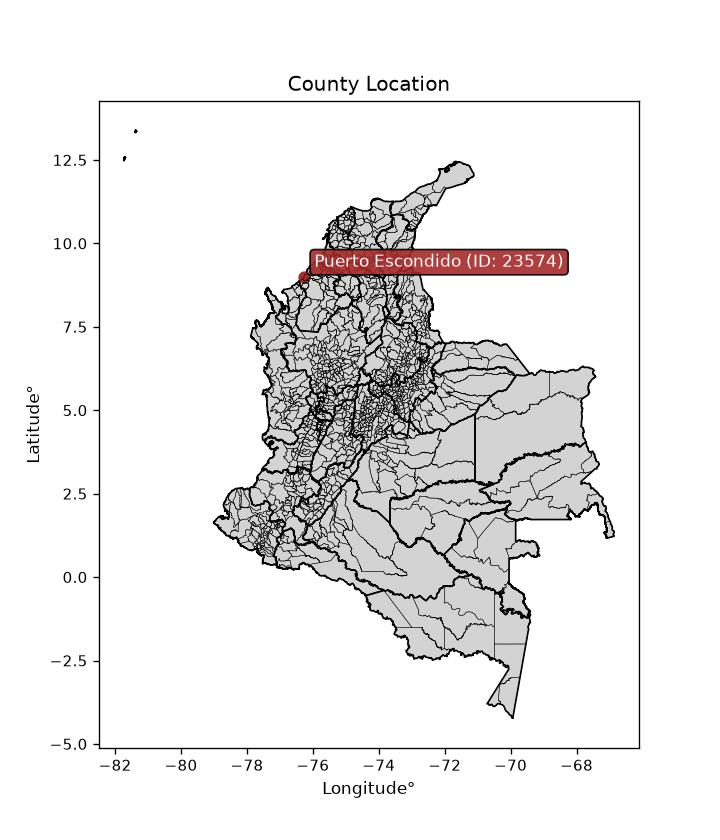
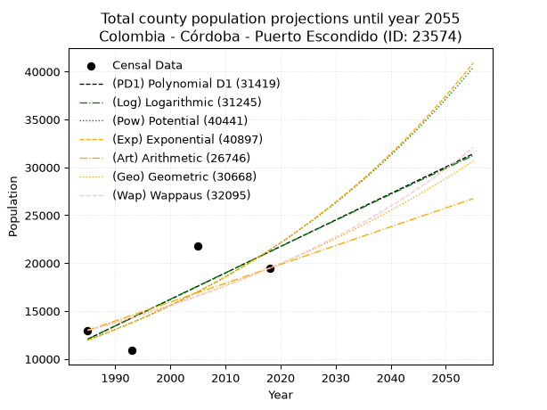
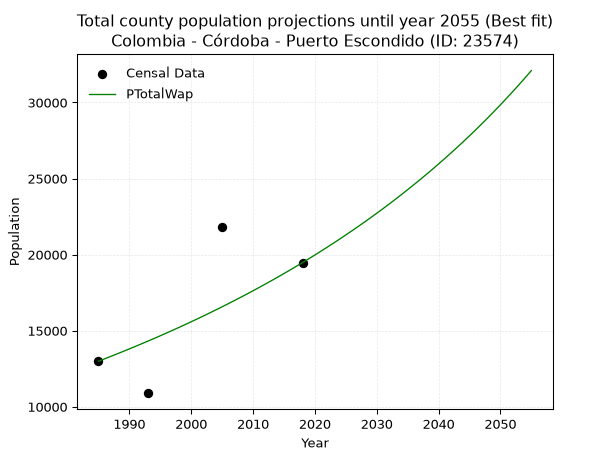
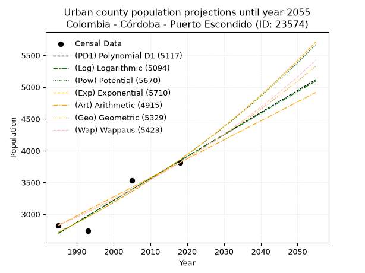
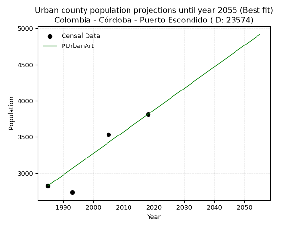
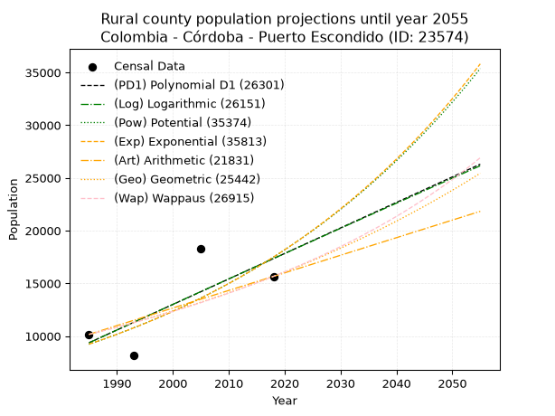
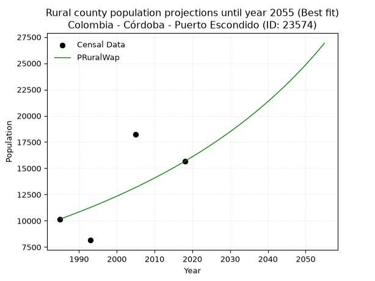

<div align="center">


</div>

# _“Population and Public Services Demand Projections (PPSD) until Year 2050 for Colombia - Córdoba - Puerto Escondido (ID: 23574)”_
Keywords: `population` `public-service` `projection` `lineal` `polynomial` `logarithmic` `potential` `exponential` `arithmetic` `geometric` `wappaus` `dane` `colombia` `south-america`

PPSD are analytical estimates used by governments and planners to anticipate future changes in population size, age distribution, and the resulting community needs for utilities, healthcare, education, and infrastructure as sizing future water treatment facilities, electrical grids, and road networks based on spatial growth.

<div align="center">

</img>

</div>


> **General running parameters**: • app_version: _v20260806_. • Python version: _3.14.7_. • Pandas version: _3.0.5_. • NumPy version: _2.5.1_. • Creates, save and include plots into reports (create_plot): _False_. • Projection until year: _2050_. • Process polynomial degree 2 and up: _False_. • Process Wappaus: _True_. • Process Wappaus: _True_. • Set negative values to zero: _True_. • Set infinite values to zero: _True_. • Drop dataset notes: _True_. 
<div align="center">

Dynamic map: [:earth_americas:Google](http://maps.google.com/maps?q=9.005372177,-76.260411) [:earth_americas:OSM](https://www.openstreetmap.org/#map=18/9.005372177/-76.260411&layers=P) [:earth_americas:Bing](https://www.bing.com/maps?cp=9.005372177~-76.260411&lvl=18) [:earth_americas:Apple](https://maps.apple.com/frame?center=9.005372177%2C-76.260411&span=0.003%2C0.006)

</div>


<div align="center">

```geojson
{
  "type": "Feature",
  "geometry": {
    "type": "Point", 
    "coordinates": [-76.260411, 9.005372177]
  }, 
  "properties": {
    "Name": "Colombia - Córdoba - Puerto Escondido (ID: 23574)"
  }
}
```

</div>


## 0. Census Data (4 records)

Census data are official statistics collected by a government about the people and housing in a country. They usually include counts of total population, age, sex, race, income, education, and jobs.

📅Global census file: [Population.xlsx](../data/Population.xlsx)

| Source   |   Year |   CountryID | CountryName   |   StateID | StateName   |   CountyID | CountyName       |   PTotal |   PUrban |   PRural |
|:---------|-------:|------------:|:--------------|----------:|:------------|-----------:|:-----------------|---------:|---------:|---------:|
| DANE     |   1985 |          57 | Colombia      |        23 | Córdoba     |      23574 | Puerto Escondido |    12988 |     2826 |    10162 |
| DANE     |   1993 |          57 | Colombia      |        23 | Córdoba     |      23574 | Puerto Escondido |    10887 |     2735 |     8152 |
| DANE     |   2005 |          57 | Colombia      |        23 | Córdoba     |      23574 | Puerto Escondido |    21786 |     3534 |    18252 |
| DANE     |   2018 |          57 | Colombia      |        23 | Córdoba     |      23574 | Puerto Escondido |    19474 |     3811 |    15663 |

> 🔥Some records could had specific notes about the registered values or the corresponding urban or rural distribution.

📅[SUI-RUPS](https://www.datos.gov.co/Hacienda-y-Cr-dito-P-blico/Registro-nico-de-Prestadores-de-Servicios-P-blicos/4qkq-csdn/about_data) - Local public utility companies: [RUPS.csv](../data/RUPS.xlsx)

 | SERVICIO   | ESTADO    | NOMBRE                                                                       | NIT         | DEPARTAMENTO_DOMICILIO   | MUNICIPIO_DOMICILIO   | DIRECCION                       |   TELEFONO | EMAIL                    | TIPO_PRESTADOR          | CLASIFICACION                 |
|:-----------|:----------|:-----------------------------------------------------------------------------|:------------|:-------------------------|:----------------------|:--------------------------------|-----------:|:-------------------------|:------------------------|:------------------------------|
| ACUEDUCTO  | OPERATIVA | ADMINISTRADORA PUBLICA COOPERATIVA DE SERVICIOS PUBLICOS DE PUERTO ESCONDIDO | 812007774-1 | CORDOBA                  | PUERTO ESCONDIDO      | CALLE 2a #9-41, BARRIO LA PLAZA |    0000000 | cooserpues.esp@gmail.com | ORGANIZACION AUTORIZADA | MENOR O IGUAL A 2500 USUARIOS |

## 1. Total

### 1.1. Coefficients and Parameters

* (PD1) Polynomial Deg 1: 276.43396226415166, -536653.2830188695 (lineal)
* (Log) Logarithmic: 553643.1756121268, -4191962.4644457465
* (Pow) Potential: 35.13134808755064, -111.77672350685714
* (Exp) Exponential: 0.017544636970819833, 8.985409209865839e-12
* (Art) Arithmetic: Year diff. 2018 - 1985 = 33, Population diff. 19474 - 12988 = 6486, Annual growth = 196.54545454545453
* (Geo) Geometric: Year diff. 2018 - 1985 = 33, Population diff. 19474 - 12988 = 6486, Annual growth % = 0.012350014707548373
* (Wap) Wappaus: i = 1.210926341848651, Condition values only valid for < 200)

<sub>
Wappaus condition values: ['0.00', '1.21', '2.42', '3.63', '4.84', '6.05', '7.27', '8.48', '9.69', '10.90', '12.11', '13.32', '14.53', '15.74', '16.95', '18.16', '19.37', '20.59', '21.80', '23.01', '24.22', '25.43', '26.64', '27.85', '29.06', '30.27', '31.48', '32.70', '33.91', '35.12', '36.33', '37.54', '38.75', '39.96', '41.17', '42.38', '43.59', '44.80', '46.02', '47.23', '48.44', '49.65', '50.86', '52.07', '53.28', '54.49', '55.70', '56.91', '58.12', '59.34', '60.55', '61.76', '62.97', '64.18', '65.39', '66.60', '67.81', '69.02', '70.23', '71.44', '72.66', '73.87', '75.08', '76.29', '77.50', '78.71']
</sub>


### 1.2. Projected Dataset

|   Year |   CountyID |   PTotalPD1 |   PTotalLog |   PTotalPow |   PTotalExp |   PTotalArt |   PTotalGeo |   PTotalWap |
|-------:|-----------:|------------:|------------:|------------:|------------:|------------:|------------:|------------:|
|   1985 |      23574 |       12068 |       12057 |       11969 |       11976 |       12988 |       12988 |       12988 |
|   1986 |      23574 |       12345 |       12336 |       12182 |       12188 |       13185 |       13148 |       13146 |
|   1987 |      23574 |       12621 |       12615 |       12400 |       12404 |       13381 |       13311 |       13306 |
|   1988 |      23574 |       12897 |       12893 |       12621 |       12624 |       13578 |       13475 |       13469 |
|   1989 |      23574 |       13174 |       13172 |       12846 |       12847 |       13774 |       13642 |       13633 |
|   1990 |      23574 |       13450 |       13450 |       13075 |       13074 |       13971 |       13810 |       13799 |
|   1991 |      23574 |       13727 |       13728 |       13308 |       13306 |       14167 |       13981 |       13967 |
|   1992 |      23574 |       14003 |       14006 |       13544 |       13541 |       14364 |       14153 |       14138 |
|   1993 |      23574 |       14280 |       14284 |       13785 |       13781 |       14560 |       14328 |       14310 |
|   1994 |      23574 |       14556 |       14562 |       14030 |       14025 |       14757 |       14505 |       14485 |
|   1995 |      23574 |       14832 |       14839 |       14280 |       14273 |       14953 |       14684 |       14662 |
|   1996 |      23574 |       15109 |       15117 |       14533 |       14526 |       15150 |       14866 |       14841 |
|   1997 |      23574 |       15385 |       15394 |       14791 |       14783 |       15347 |       15049 |       15023 |
|   1998 |      23574 |       15662 |       15671 |       15054 |       15044 |       15543 |       15235 |       15207 |
|   1999 |      23574 |       15938 |       15948 |       15321 |       15311 |       15740 |       15423 |       15394 |
|   2000 |      23574 |       16215 |       16225 |       15592 |       15582 |       15936 |       15614 |       15583 |
|   2001 |      23574 |       16491 |       16502 |       15869 |       15858 |       16133 |       15806 |       15774 |
|   2002 |      23574 |       16768 |       16779 |       16150 |       16138 |       16329 |       16002 |       15968 |
|   2003 |      23574 |       17044 |       17055 |       16435 |       16424 |       16526 |       16199 |       16165 |
|   2004 |      23574 |       17320 |       17331 |       16726 |       16715 |       16722 |       16399 |       16365 |
|   2005 |      23574 |       17597 |       17608 |       17022 |       17010 |       16919 |       16602 |       16567 |
|   2006 |      23574 |       17873 |       17884 |       17323 |       17311 |       17115 |       16807 |       16772 |
|   2007 |      23574 |       18150 |       18160 |       17629 |       17618 |       17312 |       17014 |       16980 |
|   2008 |      23574 |       18426 |       18435 |       17940 |       17930 |       17509 |       17225 |       17191 |
|   2009 |      23574 |       18703 |       18711 |       18256 |       18247 |       17705 |       17437 |       17404 |
|   2010 |      23574 |       18979 |       18987 |       18578 |       18570 |       17902 |       17653 |       17621 |
|   2011 |      23574 |       19255 |       19262 |       18906 |       18899 |       18098 |       17871 |       17841 |
|   2012 |      23574 |       19532 |       19537 |       19239 |       19233 |       18295 |       18091 |       18064 |
|   2013 |      23574 |       19808 |       19812 |       19578 |       19574 |       18491 |       18315 |       18291 |
|   2014 |      23574 |       20085 |       20087 |       19922 |       19920 |       18688 |       18541 |       18520 |
|   2015 |      23574 |       20361 |       20362 |       20273 |       20273 |       18884 |       18770 |       18753 |
|   2016 |      23574 |       20638 |       20637 |       20629 |       20631 |       19081 |       19002 |       18990 |
|   2017 |      23574 |       20914 |       20911 |       20992 |       20997 |       19277 |       19236 |       19230 |
|   2018 |      23574 |       21190 |       21186 |       21361 |       21368 |       19474 |       19474 |       19474 |
|   2019 |      23574 |       21467 |       21460 |       21736 |       21746 |       19671 |       19715 |       19721 |
|   2020 |      23574 |       21743 |       21734 |       22117 |       22131 |       19867 |       19958 |       19973 |
|   2021 |      23574 |       22020 |       22008 |       22505 |       22523 |       20064 |       20204 |       20228 |
|   2022 |      23574 |       22296 |       22282 |       22899 |       22922 |       20260 |       20454 |       20487 |
|   2023 |      23574 |       22573 |       22556 |       23301 |       23327 |       20457 |       20707 |       20750 |
|   2024 |      23574 |       22849 |       22829 |       23709 |       23740 |       20653 |       20962 |       21018 |
|   2025 |      23574 |       23125 |       23103 |       24124 |       24160 |       20850 |       21221 |       21290 |
|   2026 |      23574 |       23402 |       23376 |       24546 |       24588 |       21046 |       21483 |       21566 |
|   2027 |      23574 |       23678 |       23649 |       24975 |       25023 |       21243 |       21749 |       21846 |
|   2028 |      23574 |       23955 |       23923 |       25412 |       25466 |       21439 |       22017 |       22131 |
|   2029 |      23574 |       24231 |       24195 |       25856 |       25917 |       21636 |       22289 |       22421 |
|   2030 |      23574 |       24508 |       24468 |       26307 |       26376 |       21833 |       22564 |       22716 |
|   2031 |      23574 |       24784 |       24741 |       26766 |       26842 |       22029 |       22843 |       23015 |
|   2032 |      23574 |       25061 |       25013 |       27233 |       27318 |       22226 |       23125 |       23320 |
|   2033 |      23574 |       25337 |       25286 |       27708 |       27801 |       22422 |       23411 |       23630 |
|   2034 |      23574 |       25613 |       25558 |       28191 |       28293 |       22619 |       23700 |       23945 |
|   2035 |      23574 |       25890 |       25830 |       28682 |       28794 |       22815 |       23993 |       24266 |
|   2036 |      23574 |       26166 |       26102 |       29181 |       29303 |       23012 |       24289 |       24592 |
|   2037 |      23574 |       26443 |       26374 |       29689 |       29822 |       23208 |       24589 |       24924 |
|   2038 |      23574 |       26719 |       26646 |       30205 |       30350 |       23405 |       24893 |       25262 |
|   2039 |      23574 |       26996 |       26917 |       30730 |       30887 |       23601 |       25200 |       25606 |
|   2040 |      23574 |       27272 |       27189 |       31264 |       31434 |       23798 |       25511 |       25957 |
|   2041 |      23574 |       27548 |       27460 |       31807 |       31990 |       23995 |       25826 |       26314 |
|   2042 |      23574 |       27825 |       27731 |       32359 |       32556 |       24191 |       26145 |       26677 |
|   2043 |      23574 |       28101 |       28002 |       32921 |       33133 |       24388 |       26468 |       27047 |
|   2044 |      23574 |       28378 |       28273 |       33491 |       33719 |       24584 |       26795 |       27424 |
|   2045 |      23574 |       28654 |       28544 |       34072 |       34316 |       24781 |       27126 |       27808 |
|   2046 |      23574 |       28931 |       28815 |       34662 |       34923 |       24977 |       27461 |       28200 |
|   2047 |      23574 |       29207 |       29085 |       35262 |       35541 |       25174 |       27800 |       28599 |
|   2048 |      23574 |       29483 |       29356 |       35873 |       36170 |       25370 |       28143 |       29006 |
|   2049 |      23574 |       29760 |       29626 |       36493 |       36811 |       25567 |       28491 |       29422 |
|   2050 |      23574 |       30036 |       29896 |       37124 |       37462 |       25763 |       28843 |       29845 |
<div align="center">

</img>

</div>


### 1.3. Best fit with absolute and relative error (%)

Relative error puts that difference into context by dividing the absolute error by the true value, creating a unitless ratio or percentage that shows the scale of the mistake.

Absolute and relative error

|   Year | Source   |   CountryID | CountryName   |   StateID | StateName   |   CountyID_x | CountyName       |   PTotal |   PUrban |   PRural |   CountyID_y |   PTotalPD1 |   PTotalLog |   PTotalPow |   PTotalExp |   PTotalArt |   PTotalGeo |   PTotalWap |   PTotalPD1AbsError |   PTotalLogAbsError |   PTotalPowAbsError |   PTotalExpAbsError |   PTotalArtAbsError |   PTotalGeoAbsError |   PTotalWapAbsError |   PTotalPD1RelError |   PTotalLogRelError |   PTotalPowRelError |   PTotalExpRelError |   PTotalArtRelError |   PTotalGeoRelError |   PTotalWapRelError |
|-------:|:---------|------------:|:--------------|----------:|:------------|-------------:|:-----------------|---------:|---------:|---------:|-------------:|------------:|------------:|------------:|------------:|------------:|------------:|------------:|--------------------:|--------------------:|--------------------:|--------------------:|--------------------:|--------------------:|--------------------:|--------------------:|--------------------:|--------------------:|--------------------:|--------------------:|--------------------:|--------------------:|
|   1985 | DANE     |          57 | Colombia      |        23 | Córdoba     |        23574 | Puerto Escondido |    12988 |     2826 |    10162 |        23574 |       12068 |       12057 |       11969 |       11976 |       12988 |       12988 |       12988 |                 920 |                 931 |                1019 |                1012 |                   0 |                   0 |                   0 |             7.08346 |             7.16816 |             7.8457  |             7.79181 |              0      |              0      |              0      |
|   1993 | DANE     |          57 | Colombia      |        23 | Córdoba     |        23574 | Puerto Escondido |    10887 |     2735 |     8152 |        23574 |       14280 |       14284 |       13785 |       13781 |       14560 |       14328 |       14310 |                3393 |                3397 |                2898 |                2894 |                3673 |                3441 |                3423 |            31.1656  |            31.2024  |            26.6189  |            26.5822  |             33.7375 |             31.6065 |             31.4412 |
|   2005 | DANE     |          57 | Colombia      |        23 | Córdoba     |        23574 | Puerto Escondido |    21786 |     3534 |    18252 |        23574 |       17597 |       17608 |       17022 |       17010 |       16919 |       16602 |       16567 |                4189 |                4178 |                4764 |                4776 |                4867 |                5184 |                5219 |            19.2279  |            19.1775  |            21.8673  |            21.9223  |             22.34   |             23.7951 |             23.9558 |
|   2018 | DANE     |          57 | Colombia      |        23 | Córdoba     |        23574 | Puerto Escondido |    19474 |     3811 |    15663 |        23574 |       21190 |       21186 |       21361 |       21368 |       19474 |       19474 |       19474 |                1716 |                1712 |                1887 |                1894 |                   0 |                   0 |                   0 |             8.81175 |             8.79121 |             9.68984 |             9.72579 |              0      |              0      |              0      |

Relative error mean

| Method    |   RelError | Best   |
|:----------|-----------:|:-------|
| PTotalPD1 |    16.5722 |        |
| PTotalLog |    16.5848 |        |
| PTotalPow |    16.5054 |        |
| PTotalExp |    16.5055 |        |
| PTotalArt |    14.0194 |        |
| PTotalGeo |    13.8504 |        |
| PTotalWap |    13.8492 | True   |

💙Best method: _**PTotalWap**_
<div align="center">

</img>

</div>


### 1.4. Fresh water supply demand in liters per capita per day (lpcd)

The fresh water supply demand typically ranges from 100 to 300 liters per capita per day (lpcd) for standard domestic and municipal planning, though absolute survival minimums set by the World Health Organization are as low as 7.5 to 20 liters per day, and total consumption in high-income nations can exceed 400 liters.

> `CZ`: Level in meters above the sea level (masl)<br> `WS`: Fresh water supply demand in liters per capita per day (lpcd or l/h/d)<br> `WSAll`: Zonal fresh water supply demand in liters per second (l/s)<br> `A`: Zonal area in square meters<br> `DP`: Population density (people/hectare or p/ha)

Reference values (RAS Colombia)

|    CZ |   WS |
|------:|-----:|
|  1000 |  120 |
|  2000 |  130 |
| 99999 |  140 |

County shapefile geometry properties and water supply values

|   CountyID |      ATotal |   CZTotal |   WSTotal |
|-----------:|------------:|----------:|----------:|
|      23574 | 4.11177e+08 |   51.3526 |       120 |

Projected values for best method: PTotalWap

|   CountyID |   Year |   PTotalWap |   DPTotal |   WSTotal |   WSTotalAll |
|-----------:|-------:|------------:|----------:|----------:|-------------:|
|      23574 |   1985 |       12988 |      0.32 |       120 |      18.0389 |
|      23574 |   1986 |       13146 |      0.32 |       120 |      18.2583 |
|      23574 |   1987 |       13306 |      0.32 |       120 |      18.4806 |
|      23574 |   1988 |       13469 |      0.33 |       120 |      18.7069 |
|      23574 |   1989 |       13633 |      0.33 |       120 |      18.9347 |
|      23574 |   1990 |       13799 |      0.34 |       120 |      19.1653 |
|      23574 |   1991 |       13967 |      0.34 |       120 |      19.3986 |
|      23574 |   1992 |       14138 |      0.34 |       120 |      19.6361 |
|      23574 |   1993 |       14310 |      0.35 |       120 |      19.875  |
|      23574 |   1994 |       14485 |      0.35 |       120 |      20.1181 |
|      23574 |   1995 |       14662 |      0.36 |       120 |      20.3639 |
|      23574 |   1996 |       14841 |      0.36 |       120 |      20.6125 |
|      23574 |   1997 |       15023 |      0.37 |       120 |      20.8653 |
|      23574 |   1998 |       15207 |      0.37 |       120 |      21.1208 |
|      23574 |   1999 |       15394 |      0.37 |       120 |      21.3806 |
|      23574 |   2000 |       15583 |      0.38 |       120 |      21.6431 |
|      23574 |   2001 |       15774 |      0.38 |       120 |      21.9083 |
|      23574 |   2002 |       15968 |      0.39 |       120 |      22.1778 |
|      23574 |   2003 |       16165 |      0.39 |       120 |      22.4514 |
|      23574 |   2004 |       16365 |      0.4  |       120 |      22.7292 |
|      23574 |   2005 |       16567 |      0.4  |       120 |      23.0097 |
|      23574 |   2006 |       16772 |      0.41 |       120 |      23.2944 |
|      23574 |   2007 |       16980 |      0.41 |       120 |      23.5833 |
|      23574 |   2008 |       17191 |      0.42 |       120 |      23.8764 |
|      23574 |   2009 |       17404 |      0.42 |       120 |      24.1722 |
|      23574 |   2010 |       17621 |      0.43 |       120 |      24.4736 |
|      23574 |   2011 |       17841 |      0.43 |       120 |      24.7792 |
|      23574 |   2012 |       18064 |      0.44 |       120 |      25.0889 |
|      23574 |   2013 |       18291 |      0.44 |       120 |      25.4042 |
|      23574 |   2014 |       18520 |      0.45 |       120 |      25.7222 |
|      23574 |   2015 |       18753 |      0.46 |       120 |      26.0458 |
|      23574 |   2016 |       18990 |      0.46 |       120 |      26.375  |
|      23574 |   2017 |       19230 |      0.47 |       120 |      26.7083 |
|      23574 |   2018 |       19474 |      0.47 |       120 |      27.0472 |
|      23574 |   2019 |       19721 |      0.48 |       120 |      27.3903 |
|      23574 |   2020 |       19973 |      0.49 |       120 |      27.7403 |
|      23574 |   2021 |       20228 |      0.49 |       120 |      28.0944 |
|      23574 |   2022 |       20487 |      0.5  |       120 |      28.4542 |
|      23574 |   2023 |       20750 |      0.5  |       120 |      28.8194 |
|      23574 |   2024 |       21018 |      0.51 |       120 |      29.1917 |
|      23574 |   2025 |       21290 |      0.52 |       120 |      29.5694 |
|      23574 |   2026 |       21566 |      0.52 |       120 |      29.9528 |
|      23574 |   2027 |       21846 |      0.53 |       120 |      30.3417 |
|      23574 |   2028 |       22131 |      0.54 |       120 |      30.7375 |
|      23574 |   2029 |       22421 |      0.55 |       120 |      31.1403 |
|      23574 |   2030 |       22716 |      0.55 |       120 |      31.55   |
|      23574 |   2031 |       23015 |      0.56 |       120 |      31.9653 |
|      23574 |   2032 |       23320 |      0.57 |       120 |      32.3889 |
|      23574 |   2033 |       23630 |      0.57 |       120 |      32.8194 |
|      23574 |   2034 |       23945 |      0.58 |       120 |      33.2569 |
|      23574 |   2035 |       24266 |      0.59 |       120 |      33.7028 |
|      23574 |   2036 |       24592 |      0.6  |       120 |      34.1556 |
|      23574 |   2037 |       24924 |      0.61 |       120 |      34.6167 |
|      23574 |   2038 |       25262 |      0.61 |       120 |      35.0861 |
|      23574 |   2039 |       25606 |      0.62 |       120 |      35.5639 |
|      23574 |   2040 |       25957 |      0.63 |       120 |      36.0514 |
|      23574 |   2041 |       26314 |      0.64 |       120 |      36.5472 |
|      23574 |   2042 |       26677 |      0.65 |       120 |      37.0514 |
|      23574 |   2043 |       27047 |      0.66 |       120 |      37.5653 |
|      23574 |   2044 |       27424 |      0.67 |       120 |      38.0889 |
|      23574 |   2045 |       27808 |      0.68 |       120 |      38.6222 |
|      23574 |   2046 |       28200 |      0.69 |       120 |      39.1667 |
|      23574 |   2047 |       28599 |      0.7  |       120 |      39.7208 |
|      23574 |   2048 |       29006 |      0.71 |       120 |      40.2861 |
|      23574 |   2049 |       29422 |      0.72 |       120 |      40.8639 |
|      23574 |   2050 |       29845 |      0.73 |       120 |      41.4514 |

## 2. Urban

### 2.1. Coefficients and Parameters

* (PD1) Polynomial Deg 1: 34.53472501003593, -65851.58370132437 (lineal)
* (Log) Logarithmic: 69116.50582349113, -522128.61462927365
* (Pow) Potential: 21.234007377978873, -66.59070993608073
* (Exp) Exponential: 0.0106094224319621, 1.940794734981521e-06
* (Art) Arithmetic: Year diff. 2018 - 1985 = 33, Population diff. 3811 - 2826 = 985, Annual growth = 29.848484848484848
* (Geo) Geometric: Year diff. 2018 - 1985 = 33, Population diff. 3811 - 2826 = 985, Annual growth % = 0.009102674715258274
* (Wap) Wappaus: i = 0.8994571296816287, Condition values only valid for < 200)

<sub>
Wappaus condition values: ['0.00', '0.90', '1.80', '2.70', '3.60', '4.50', '5.40', '6.30', '7.20', '8.10', '8.99', '9.89', '10.79', '11.69', '12.59', '13.49', '14.39', '15.29', '16.19', '17.09', '17.99', '18.89', '19.79', '20.69', '21.59', '22.49', '23.39', '24.29', '25.18', '26.08', '26.98', '27.88', '28.78', '29.68', '30.58', '31.48', '32.38', '33.28', '34.18', '35.08', '35.98', '36.88', '37.78', '38.68', '39.58', '40.48', '41.38', '42.27', '43.17', '44.07', '44.97', '45.87', '46.77', '47.67', '48.57', '49.47', '50.37', '51.27', '52.17', '53.07', '53.97', '54.87', '55.77', '56.67', '57.57', '58.46']
</sub>


### 2.2. Projected Dataset

|   Year |   CountyID |   PUrbanPD1 |   PUrbanLog |   PUrbanPow |   PUrbanExp |   PUrbanArt |   PUrbanGeo |   PUrbanWap |
|-------:|-----------:|------------:|------------:|------------:|------------:|------------:|------------:|------------:|
|   1985 |      23574 |        2700 |        2699 |        2716 |        2717 |        2826 |        2826 |        2826 |
|   1986 |      23574 |        2734 |        2734 |        2745 |        2746 |        2856 |        2852 |        2852 |
|   1987 |      23574 |        2769 |        2768 |        2775 |        2775 |        2886 |        2878 |        2877 |
|   1988 |      23574 |        2803 |        2803 |        2805 |        2805 |        2916 |        2904 |        2903 |
|   1989 |      23574 |        2838 |        2838 |        2835 |        2835 |        2945 |        2930 |        2930 |
|   1990 |      23574 |        2873 |        2873 |        2865 |        2865 |        2975 |        2957 |        2956 |
|   1991 |      23574 |        2907 |        2907 |        2896 |        2896 |        3005 |        2984 |        2983 |
|   1992 |      23574 |        2942 |        2942 |        2927 |        2926 |        3035 |        3011 |        3010 |
|   1993 |      23574 |        2976 |        2977 |        2958 |        2958 |        3065 |        3038 |        3037 |
|   1994 |      23574 |        3011 |        3012 |        2990 |        2989 |        3095 |        3066 |        3064 |
|   1995 |      23574 |        3045 |        3046 |        3022 |        3021 |        3124 |        3094 |        3092 |
|   1996 |      23574 |        3080 |        3081 |        3054 |        3053 |        3154 |        3122 |        3120 |
|   1997 |      23574 |        3114 |        3115 |        3087 |        3086 |        3184 |        3151 |        3148 |
|   1998 |      23574 |        3149 |        3150 |        3120 |        3119 |        3214 |        3179 |        3177 |
|   1999 |      23574 |        3183 |        3185 |        3153 |        3152 |        3244 |        3208 |        3206 |
|   2000 |      23574 |        3218 |        3219 |        3187 |        3186 |        3274 |        3237 |        3235 |
|   2001 |      23574 |        3252 |        3254 |        3221 |        3220 |        3304 |        3267 |        3264 |
|   2002 |      23574 |        3287 |        3288 |        3255 |        3254 |        3333 |        3297 |        3294 |
|   2003 |      23574 |        3321 |        3323 |        3290 |        3289 |        3363 |        3327 |        3324 |
|   2004 |      23574 |        3356 |        3357 |        3325 |        3324 |        3393 |        3357 |        3354 |
|   2005 |      23574 |        3391 |        3392 |        3361 |        3359 |        3423 |        3387 |        3385 |
|   2006 |      23574 |        3425 |        3426 |        3396 |        3395 |        3453 |        3418 |        3415 |
|   2007 |      23574 |        3460 |        3461 |        3432 |        3431 |        3483 |        3449 |        3447 |
|   2008 |      23574 |        3494 |        3495 |        3469 |        3468 |        3513 |        3481 |        3478 |
|   2009 |      23574 |        3529 |        3530 |        3506 |        3505 |        3542 |        3513 |        3510 |
|   2010 |      23574 |        3563 |        3564 |        3543 |        3542 |        3572 |        3545 |        3542 |
|   2011 |      23574 |        3598 |        3598 |        3581 |        3580 |        3602 |        3577 |        3574 |
|   2012 |      23574 |        3632 |        3633 |        3619 |        3618 |        3632 |        3609 |        3607 |
|   2013 |      23574 |        3667 |        3667 |        3657 |        3657 |        3662 |        3642 |        3640 |
|   2014 |      23574 |        3701 |        3701 |        3696 |        3696 |        3692 |        3675 |        3674 |
|   2015 |      23574 |        3736 |        3736 |        3735 |        3735 |        3721 |        3709 |        3707 |
|   2016 |      23574 |        3770 |        3770 |        3775 |        3775 |        3751 |        3743 |        3742 |
|   2017 |      23574 |        3805 |        3804 |        3815 |        3815 |        3781 |        3777 |        3776 |
|   2018 |      23574 |        3839 |        3838 |        3855 |        3856 |        3811 |        3811 |        3811 |
|   2019 |      23574 |        3874 |        3873 |        3896 |        3897 |        3841 |        3846 |        3846 |
|   2020 |      23574 |        3909 |        3907 |        3937 |        3939 |        3871 |        3881 |        3882 |
|   2021 |      23574 |        3943 |        3941 |        3978 |        3981 |        3901 |        3916 |        3918 |
|   2022 |      23574 |        3978 |        3975 |        4020 |        4023 |        3930 |        3952 |        3954 |
|   2023 |      23574 |        4012 |        4010 |        4063 |        4066 |        3960 |        3988 |        3991 |
|   2024 |      23574 |        4047 |        4044 |        4106 |        4110 |        3990 |        4024 |        4028 |
|   2025 |      23574 |        4081 |        4078 |        4149 |        4153 |        4020 |        4061 |        4066 |
|   2026 |      23574 |        4116 |        4112 |        4193 |        4198 |        4050 |        4098 |        4104 |
|   2027 |      23574 |        4150 |        4146 |        4237 |        4242 |        4080 |        4135 |        4142 |
|   2028 |      23574 |        4185 |        4180 |        4281 |        4288 |        4109 |        4172 |        4181 |
|   2029 |      23574 |        4219 |        4214 |        4327 |        4333 |        4139 |        4210 |        4220 |
|   2030 |      23574 |        4254 |        4248 |        4372 |        4380 |        4169 |        4249 |        4260 |
|   2031 |      23574 |        4288 |        4282 |        4418 |        4426 |        4199 |        4287 |        4300 |
|   2032 |      23574 |        4323 |        4316 |        4464 |        4474 |        4229 |        4326 |        4341 |
|   2033 |      23574 |        4358 |        4350 |        4511 |        4521 |        4259 |        4366 |        4382 |
|   2034 |      23574 |        4392 |        4384 |        4559 |        4569 |        4289 |        4406 |        4424 |
|   2035 |      23574 |        4427 |        4418 |        4607 |        4618 |        4318 |        4446 |        4466 |
|   2036 |      23574 |        4461 |        4452 |        4655 |        4667 |        4348 |        4486 |        4508 |
|   2037 |      23574 |        4496 |        4486 |        4704 |        4717 |        4378 |        4527 |        4551 |
|   2038 |      23574 |        4530 |        4520 |        4753 |        4768 |        4408 |        4568 |        4595 |
|   2039 |      23574 |        4565 |        4554 |        4803 |        4818 |        4438 |        4610 |        4639 |
|   2040 |      23574 |        4599 |        4588 |        4853 |        4870 |        4468 |        4652 |        4683 |
|   2041 |      23574 |        4634 |        4622 |        4904 |        4922 |        4498 |        4694 |        4729 |
|   2042 |      23574 |        4668 |        4656 |        4955 |        4974 |        4527 |        4737 |        4774 |
|   2043 |      23574 |        4703 |        4689 |        5007 |        5027 |        4557 |        4780 |        4821 |
|   2044 |      23574 |        4737 |        4723 |        5059 |        5081 |        4587 |        4823 |        4867 |
|   2045 |      23574 |        4772 |        4757 |        5112 |        5135 |        4617 |        4867 |        4915 |
|   2046 |      23574 |        4806 |        4791 |        5165 |        5190 |        4647 |        4912 |        4963 |
|   2047 |      23574 |        4841 |        4825 |        5219 |        5245 |        4677 |        4956 |        5011 |
|   2048 |      23574 |        4876 |        4858 |        5273 |        5301 |        4706 |        5001 |        5060 |
|   2049 |      23574 |        4910 |        4892 |        5328 |        5358 |        4736 |        5047 |        5110 |
|   2050 |      23574 |        4945 |        4926 |        5384 |        5415 |        4766 |        5093 |        5161 |
<div align="center">

</img>

</div>


### 2.3. Best fit with absolute and relative error (%)

Relative error puts that difference into context by dividing the absolute error by the true value, creating a unitless ratio or percentage that shows the scale of the mistake.

Absolute and relative error

|   Year | Source   |   CountryID | CountryName   |   StateID | StateName   |   CountyID_x | CountyName       |   PTotal |   PUrban |   PRural |   CountyID_y |   PUrbanPD1 |   PUrbanLog |   PUrbanPow |   PUrbanExp |   PUrbanArt |   PUrbanGeo |   PUrbanWap |   PUrbanPD1AbsError |   PUrbanLogAbsError |   PUrbanPowAbsError |   PUrbanExpAbsError |   PUrbanArtAbsError |   PUrbanGeoAbsError |   PUrbanWapAbsError |   PUrbanPD1RelError |   PUrbanLogRelError |   PUrbanPowRelError |   PUrbanExpRelError |   PUrbanArtRelError |   PUrbanGeoRelError |   PUrbanWapRelError |
|-------:|:---------|------------:|:--------------|----------:|:------------|-------------:|:-----------------|---------:|---------:|---------:|-------------:|------------:|------------:|------------:|------------:|------------:|------------:|------------:|--------------------:|--------------------:|--------------------:|--------------------:|--------------------:|--------------------:|--------------------:|--------------------:|--------------------:|--------------------:|--------------------:|--------------------:|--------------------:|--------------------:|
|   1985 | DANE     |          57 | Colombia      |        23 | Córdoba     |        23574 | Puerto Escondido |    12988 |     2826 |    10162 |        23574 |        2700 |        2699 |        2716 |        2717 |        2826 |        2826 |        2826 |                 126 |                 127 |                 110 |                 109 |                   0 |                   0 |                   0 |            4.4586   |            4.49398  |             3.89243 |             3.85704 |             0       |             0       |             0       |
|   1993 | DANE     |          57 | Colombia      |        23 | Córdoba     |        23574 | Puerto Escondido |    10887 |     2735 |     8152 |        23574 |        2976 |        2977 |        2958 |        2958 |        3065 |        3038 |        3037 |                 241 |                 242 |                 223 |                 223 |                 330 |                 303 |                 302 |            8.8117   |            8.84826  |             8.15356 |             8.15356 |            12.0658  |            11.0786  |            11.042   |
|   2005 | DANE     |          57 | Colombia      |        23 | Córdoba     |        23574 | Puerto Escondido |    21786 |     3534 |    18252 |        23574 |        3391 |        3392 |        3361 |        3359 |        3423 |        3387 |        3385 |                 143 |                 142 |                 173 |                 175 |                 111 |                 147 |                 149 |            4.04641  |            4.01811  |             4.8953  |             4.9519  |             3.14092 |             4.15959 |             4.21619 |
|   2018 | DANE     |          57 | Colombia      |        23 | Córdoba     |        23574 | Puerto Escondido |    19474 |     3811 |    15663 |        23574 |        3839 |        3838 |        3855 |        3856 |        3811 |        3811 |        3811 |                  28 |                  27 |                  44 |                  45 |                   0 |                   0 |                   0 |            0.734715 |            0.708475 |             1.15455 |             1.18079 |             0       |             0       |             0       |

Relative error mean

| Method    |   RelError | Best   |
|:----------|-----------:|:-------|
| PUrbanPD1 |    4.51286 |        |
| PUrbanLog |    4.51721 |        |
| PUrbanPow |    4.52396 |        |
| PUrbanExp |    4.53582 |        |
| PUrbanArt |    3.80168 | True   |
| PUrbanGeo |    3.80955 |        |
| PUrbanWap |    3.81456 |        |

💙Best method: _**PUrbanArt**_
<div align="center">

</img>

</div>


### 2.4. Fresh water supply demand in liters per capita per day (lpcd)

The fresh water supply demand typically ranges from 100 to 300 liters per capita per day (lpcd) for standard domestic and municipal planning, though absolute survival minimums set by the World Health Organization are as low as 7.5 to 20 liters per day, and total consumption in high-income nations can exceed 400 liters.

> `CZ`: Level in meters above the sea level (masl)<br> `WS`: Fresh water supply demand in liters per capita per day (lpcd or l/h/d)<br> `WSAll`: Zonal fresh water supply demand in liters per second (l/s)<br> `A`: Zonal area in square meters<br> `DP`: Population density (people/hectare or p/ha)

Reference values (RAS Colombia)

|    CZ |   WS |
|------:|-----:|
|  1000 |  120 |
|  2000 |  130 |
| 99999 |  140 |

County shapefile geometry properties and water supply values

|   CountyID |      AUrban |   CZUrban |   WSUrban |
|-----------:|------------:|----------:|----------:|
|      23574 | 2.67846e+06 |   17.7464 |       120 |

Projected values for best method: PUrbanArt

|   CountyID |   Year |   PUrbanArt |   DPUrban |   WSUrban |   WSUrbanAll |
|-----------:|-------:|------------:|----------:|----------:|-------------:|
|      23574 |   1985 |        2826 |     10.55 |       120 |      3.925   |
|      23574 |   1986 |        2856 |     10.66 |       120 |      3.96667 |
|      23574 |   1987 |        2886 |     10.77 |       120 |      4.00833 |
|      23574 |   1988 |        2916 |     10.89 |       120 |      4.05    |
|      23574 |   1989 |        2945 |     11    |       120 |      4.09028 |
|      23574 |   1990 |        2975 |     11.11 |       120 |      4.13194 |
|      23574 |   1991 |        3005 |     11.22 |       120 |      4.17361 |
|      23574 |   1992 |        3035 |     11.33 |       120 |      4.21528 |
|      23574 |   1993 |        3065 |     11.44 |       120 |      4.25694 |
|      23574 |   1994 |        3095 |     11.56 |       120 |      4.29861 |
|      23574 |   1995 |        3124 |     11.66 |       120 |      4.33889 |
|      23574 |   1996 |        3154 |     11.78 |       120 |      4.38056 |
|      23574 |   1997 |        3184 |     11.89 |       120 |      4.42222 |
|      23574 |   1998 |        3214 |     12    |       120 |      4.46389 |
|      23574 |   1999 |        3244 |     12.11 |       120 |      4.50556 |
|      23574 |   2000 |        3274 |     12.22 |       120 |      4.54722 |
|      23574 |   2001 |        3304 |     12.34 |       120 |      4.58889 |
|      23574 |   2002 |        3333 |     12.44 |       120 |      4.62917 |
|      23574 |   2003 |        3363 |     12.56 |       120 |      4.67083 |
|      23574 |   2004 |        3393 |     12.67 |       120 |      4.7125  |
|      23574 |   2005 |        3423 |     12.78 |       120 |      4.75417 |
|      23574 |   2006 |        3453 |     12.89 |       120 |      4.79583 |
|      23574 |   2007 |        3483 |     13    |       120 |      4.8375  |
|      23574 |   2008 |        3513 |     13.12 |       120 |      4.87917 |
|      23574 |   2009 |        3542 |     13.22 |       120 |      4.91944 |
|      23574 |   2010 |        3572 |     13.34 |       120 |      4.96111 |
|      23574 |   2011 |        3602 |     13.45 |       120 |      5.00278 |
|      23574 |   2012 |        3632 |     13.56 |       120 |      5.04444 |
|      23574 |   2013 |        3662 |     13.67 |       120 |      5.08611 |
|      23574 |   2014 |        3692 |     13.78 |       120 |      5.12778 |
|      23574 |   2015 |        3721 |     13.89 |       120 |      5.16806 |
|      23574 |   2016 |        3751 |     14    |       120 |      5.20972 |
|      23574 |   2017 |        3781 |     14.12 |       120 |      5.25139 |
|      23574 |   2018 |        3811 |     14.23 |       120 |      5.29306 |
|      23574 |   2019 |        3841 |     14.34 |       120 |      5.33472 |
|      23574 |   2020 |        3871 |     14.45 |       120 |      5.37639 |
|      23574 |   2021 |        3901 |     14.56 |       120 |      5.41806 |
|      23574 |   2022 |        3930 |     14.67 |       120 |      5.45833 |
|      23574 |   2023 |        3960 |     14.78 |       120 |      5.5     |
|      23574 |   2024 |        3990 |     14.9  |       120 |      5.54167 |
|      23574 |   2025 |        4020 |     15.01 |       120 |      5.58333 |
|      23574 |   2026 |        4050 |     15.12 |       120 |      5.625   |
|      23574 |   2027 |        4080 |     15.23 |       120 |      5.66667 |
|      23574 |   2028 |        4109 |     15.34 |       120 |      5.70694 |
|      23574 |   2029 |        4139 |     15.45 |       120 |      5.74861 |
|      23574 |   2030 |        4169 |     15.56 |       120 |      5.79028 |
|      23574 |   2031 |        4199 |     15.68 |       120 |      5.83194 |
|      23574 |   2032 |        4229 |     15.79 |       120 |      5.87361 |
|      23574 |   2033 |        4259 |     15.9  |       120 |      5.91528 |
|      23574 |   2034 |        4289 |     16.01 |       120 |      5.95694 |
|      23574 |   2035 |        4318 |     16.12 |       120 |      5.99722 |
|      23574 |   2036 |        4348 |     16.23 |       120 |      6.03889 |
|      23574 |   2037 |        4378 |     16.35 |       120 |      6.08056 |
|      23574 |   2038 |        4408 |     16.46 |       120 |      6.12222 |
|      23574 |   2039 |        4438 |     16.57 |       120 |      6.16389 |
|      23574 |   2040 |        4468 |     16.68 |       120 |      6.20556 |
|      23574 |   2041 |        4498 |     16.79 |       120 |      6.24722 |
|      23574 |   2042 |        4527 |     16.9  |       120 |      6.2875  |
|      23574 |   2043 |        4557 |     17.01 |       120 |      6.32917 |
|      23574 |   2044 |        4587 |     17.13 |       120 |      6.37083 |
|      23574 |   2045 |        4617 |     17.24 |       120 |      6.4125  |
|      23574 |   2046 |        4647 |     17.35 |       120 |      6.45417 |
|      23574 |   2047 |        4677 |     17.46 |       120 |      6.49583 |
|      23574 |   2048 |        4706 |     17.57 |       120 |      6.53611 |
|      23574 |   2049 |        4736 |     17.68 |       120 |      6.57778 |
|      23574 |   2050 |        4766 |     17.79 |       120 |      6.61944 |

## 3. Rural

### 3.1. Coefficients and Parameters

* (PD1) Polynomial Deg 1: 241.89923725411572, -470801.699317545 (lineal)
* (Log) Logarithmic: 484526.66978863557, -3669833.8498164723
* (Pow) Potential: 38.775942086472995, -123.90871829253265
* (Exp) Exponential: 0.019364110643490674, 1.8709059748534517e-13
* (Art) Arithmetic: Year diff. 2018 - 1985 = 33, Population diff. 15663 - 10162 = 5501, Annual growth = 166.6969696969697
* (Geo) Geometric: Year diff. 2018 - 1985 = 33, Population diff. 15663 - 10162 = 5501, Annual growth % = 0.013196803148031844
* (Wap) Wappaus: i = 1.2909736278564934, Condition values only valid for < 200)

<sub>
Wappaus condition values: ['0.00', '1.29', '2.58', '3.87', '5.16', '6.45', '7.75', '9.04', '10.33', '11.62', '12.91', '14.20', '15.49', '16.78', '18.07', '19.36', '20.66', '21.95', '23.24', '24.53', '25.82', '27.11', '28.40', '29.69', '30.98', '32.27', '33.57', '34.86', '36.15', '37.44', '38.73', '40.02', '41.31', '42.60', '43.89', '45.18', '46.48', '47.77', '49.06', '50.35', '51.64', '52.93', '54.22', '55.51', '56.80', '58.09', '59.38', '60.68', '61.97', '63.26', '64.55', '65.84', '67.13', '68.42', '69.71', '71.00', '72.29', '73.59', '74.88', '76.17', '77.46', '78.75', '80.04', '81.33', '82.62', '83.91']
</sub>


### 3.2. Projected Dataset

|   Year |   CountyID |   PRuralPD1 |   PRuralLog |   PRuralPow |   PRuralExp |   PRuralArt |   PRuralGeo |   PRuralWap |
|-------:|-----------:|------------:|------------:|------------:|------------:|------------:|------------:|------------:|
|   1985 |      23574 |        9368 |        9358 |        9227 |        9233 |       10162 |       10162 |       10162 |
|   1986 |      23574 |        9610 |        9602 |        9409 |        9414 |       10329 |       10296 |       10294 |
|   1987 |      23574 |        9852 |        9846 |        9594 |        9598 |       10495 |       10432 |       10428 |
|   1988 |      23574 |       10094 |       10090 |        9783 |        9786 |       10662 |       10570 |       10563 |
|   1989 |      23574 |       10336 |       10334 |        9976 |        9977 |       10829 |       10709 |       10701 |
|   1990 |      23574 |       10578 |       10577 |       10172 |       10172 |       10995 |       10850 |       10840 |
|   1991 |      23574 |       10820 |       10821 |       10372 |       10371 |       11162 |       10994 |       10981 |
|   1992 |      23574 |       11062 |       11064 |       10576 |       10574 |       11329 |       11139 |       11124 |
|   1993 |      23574 |       11303 |       11307 |       10784 |       10780 |       11496 |       11286 |       11269 |
|   1994 |      23574 |       11545 |       11550 |       10996 |       10991 |       11662 |       11435 |       11416 |
|   1995 |      23574 |       11787 |       11793 |       11212 |       11206 |       11829 |       11586 |       11564 |
|   1996 |      23574 |       12029 |       12036 |       11432 |       11425 |       11996 |       11738 |       11715 |
|   1997 |      23574 |       12271 |       12279 |       11656 |       11649 |       12162 |       11893 |       11868 |
|   1998 |      23574 |       12513 |       12521 |       11885 |       11876 |       12329 |       12050 |       12024 |
|   1999 |      23574 |       12755 |       12764 |       12117 |       12109 |       12496 |       12209 |       12181 |
|   2000 |      23574 |       12997 |       13006 |       12355 |       12345 |       12662 |       12370 |       12341 |
|   2001 |      23574 |       13239 |       13248 |       12596 |       12587 |       12829 |       12534 |       12503 |
|   2002 |      23574 |       13481 |       13490 |       12843 |       12833 |       12996 |       12699 |       12667 |
|   2003 |      23574 |       13722 |       13732 |       13094 |       13084 |       13163 |       12867 |       12834 |
|   2004 |      23574 |       13964 |       13974 |       13350 |       13340 |       13329 |       13037 |       13003 |
|   2005 |      23574 |       14206 |       14216 |       13611 |       13600 |       13496 |       13209 |       13175 |
|   2006 |      23574 |       14448 |       14458 |       13876 |       13866 |       13663 |       13383 |       13349 |
|   2007 |      23574 |       14690 |       14699 |       14147 |       14138 |       13829 |       13559 |       13526 |
|   2008 |      23574 |       14932 |       14940 |       14423 |       14414 |       13996 |       13738 |       13705 |
|   2009 |      23574 |       15174 |       15182 |       14704 |       14696 |       14163 |       13920 |       13888 |
|   2010 |      23574 |       15416 |       15423 |       14991 |       14983 |       14329 |       14103 |       14073 |
|   2011 |      23574 |       15658 |       15664 |       15283 |       15276 |       14496 |       14290 |       14261 |
|   2012 |      23574 |       15900 |       15905 |       15580 |       15575 |       14663 |       14478 |       14452 |
|   2013 |      23574 |       16141 |       16145 |       15883 |       15879 |       14830 |       14669 |       14646 |
|   2014 |      23574 |       16383 |       16386 |       16192 |       16190 |       14996 |       14863 |       14843 |
|   2015 |      23574 |       16625 |       16626 |       16507 |       16506 |       15163 |       15059 |       15043 |
|   2016 |      23574 |       16867 |       16867 |       16827 |       16829 |       15330 |       15258 |       15246 |
|   2017 |      23574 |       17109 |       17107 |       17154 |       17158 |       15496 |       15459 |       15453 |
|   2018 |      23574 |       17351 |       17347 |       17487 |       17494 |       15663 |       15663 |       15663 |
|   2019 |      23574 |       17593 |       17587 |       17826 |       17836 |       15830 |       15870 |       15877 |
|   2020 |      23574 |       17835 |       17827 |       18172 |       18184 |       15996 |       16079 |       16094 |
|   2021 |      23574 |       18077 |       18067 |       18524 |       18540 |       16163 |       16291 |       16314 |
|   2022 |      23574 |       18319 |       18307 |       18883 |       18902 |       16330 |       16506 |       16539 |
|   2023 |      23574 |       18560 |       18546 |       19248 |       19272 |       16496 |       16724 |       16767 |
|   2024 |      23574 |       18802 |       18786 |       19620 |       19649 |       16663 |       16945 |       17000 |
|   2025 |      23574 |       19044 |       19025 |       20000 |       20033 |       16830 |       17168 |       17236 |
|   2026 |      23574 |       19286 |       19264 |       20386 |       20425 |       16997 |       17395 |       17477 |
|   2027 |      23574 |       19528 |       19503 |       20780 |       20824 |       17163 |       17625 |       17721 |
|   2028 |      23574 |       19770 |       19742 |       21182 |       21231 |       17330 |       17857 |       17970 |
|   2029 |      23574 |       20012 |       19981 |       21590 |       21646 |       17497 |       18093 |       18224 |
|   2030 |      23574 |       20254 |       20220 |       22007 |       22070 |       17663 |       18332 |       18482 |
|   2031 |      23574 |       20496 |       20459 |       22431 |       22501 |       17830 |       18574 |       18745 |
|   2032 |      23574 |       20738 |       20697 |       22863 |       22941 |       17997 |       18819 |       19013 |
|   2033 |      23574 |       20979 |       20936 |       23304 |       23390 |       18163 |       19067 |       19286 |
|   2034 |      23574 |       21221 |       21174 |       23752 |       23847 |       18330 |       19319 |       19564 |
|   2035 |      23574 |       21463 |       21412 |       24209 |       24313 |       18497 |       19574 |       19847 |
|   2036 |      23574 |       21705 |       21650 |       24675 |       24789 |       18664 |       19832 |       20136 |
|   2037 |      23574 |       21947 |       21888 |       25149 |       25273 |       18830 |       20094 |       20430 |
|   2038 |      23574 |       22189 |       22126 |       25633 |       25768 |       18997 |       20359 |       20731 |
|   2039 |      23574 |       22431 |       22363 |       26125 |       26271 |       19164 |       20627 |       21037 |
|   2040 |      23574 |       22673 |       22601 |       26626 |       26785 |       19330 |       20900 |       21349 |
|   2041 |      23574 |       22915 |       22838 |       27137 |       27309 |       19497 |       21175 |       21667 |
|   2042 |      23574 |       23157 |       23076 |       27657 |       27843 |       19664 |       21455 |       21993 |
|   2043 |      23574 |       23398 |       23313 |       28187 |       28387 |       19830 |       21738 |       22324 |
|   2044 |      23574 |       23640 |       23550 |       28727 |       28942 |       19997 |       22025 |       22663 |
|   2045 |      23574 |       23882 |       23787 |       29277 |       29508 |       20164 |       22316 |       23009 |
|   2046 |      23574 |       24124 |       24024 |       29838 |       30085 |       20331 |       22610 |       23362 |
|   2047 |      23574 |       24366 |       24261 |       30409 |       30673 |       20497 |       22908 |       23723 |
|   2048 |      23574 |       24608 |       24497 |       30990 |       31273 |       20664 |       23211 |       24091 |
|   2049 |      23574 |       24850 |       24734 |       31582 |       31885 |       20831 |       23517 |       24468 |
|   2050 |      23574 |       25092 |       24970 |       32185 |       32508 |       20997 |       23827 |       24853 |
<div align="center">

</img>

</div>


### 3.3. Best fit with absolute and relative error (%)

Relative error puts that difference into context by dividing the absolute error by the true value, creating a unitless ratio or percentage that shows the scale of the mistake.

Absolute and relative error

|   Year | Source   |   CountryID | CountryName   |   StateID | StateName   |   CountyID_x | CountyName       |   PTotal |   PUrban |   PRural |   CountyID_y |   PRuralPD1 |   PRuralLog |   PRuralPow |   PRuralExp |   PRuralArt |   PRuralGeo |   PRuralWap |   PRuralPD1AbsError |   PRuralLogAbsError |   PRuralPowAbsError |   PRuralExpAbsError |   PRuralArtAbsError |   PRuralGeoAbsError |   PRuralWapAbsError |   PRuralPD1RelError |   PRuralLogRelError |   PRuralPowRelError |   PRuralExpRelError |   PRuralArtRelError |   PRuralGeoRelError |   PRuralWapRelError |
|-------:|:---------|------------:|:--------------|----------:|:------------|-------------:|:-----------------|---------:|---------:|---------:|-------------:|------------:|------------:|------------:|------------:|------------:|------------:|------------:|--------------------:|--------------------:|--------------------:|--------------------:|--------------------:|--------------------:|--------------------:|--------------------:|--------------------:|--------------------:|--------------------:|--------------------:|--------------------:|--------------------:|
|   1985 | DANE     |          57 | Colombia      |        23 | Córdoba     |        23574 | Puerto Escondido |    12988 |     2826 |    10162 |        23574 |        9368 |        9358 |        9227 |        9233 |       10162 |       10162 |       10162 |                 794 |                 804 |                 935 |                 929 |                   0 |                   0 |                   0 |             7.81342 |             7.91183 |             9.20094 |              9.1419 |              0      |              0      |              0      |
|   1993 | DANE     |          57 | Colombia      |        23 | Córdoba     |        23574 | Puerto Escondido |    10887 |     2735 |     8152 |        23574 |       11303 |       11307 |       10784 |       10780 |       11496 |       11286 |       11269 |                3151 |                3155 |                2632 |                2628 |                3344 |                3134 |                3117 |            38.6531  |            38.7022  |            32.2866  |             32.2375 |             41.0206 |             38.4446 |             38.236  |
|   2005 | DANE     |          57 | Colombia      |        23 | Córdoba     |        23574 | Puerto Escondido |    21786 |     3534 |    18252 |        23574 |       14206 |       14216 |       13611 |       13600 |       13496 |       13209 |       13175 |                4046 |                4036 |                4641 |                4652 |                4756 |                5043 |                5077 |            22.1674  |            22.1126  |            25.4274  |             25.4876 |             26.0574 |             27.6298 |             27.8161 |
|   2018 | DANE     |          57 | Colombia      |        23 | Córdoba     |        23574 | Puerto Escondido |    19474 |     3811 |    15663 |        23574 |       17351 |       17347 |       17487 |       17494 |       15663 |       15663 |       15663 |                1688 |                1684 |                1824 |                1831 |                   0 |                   0 |                   0 |            10.777   |            10.7515  |            11.6453  |             11.69   |              0      |              0      |              0      |

Relative error mean

| Method    |   RelError | Best   |
|:----------|-----------:|:-------|
| PRuralPD1 |    19.8527 |        |
| PRuralLog |    19.8695 |        |
| PRuralPow |    19.64   |        |
| PRuralExp |    19.6392 |        |
| PRuralArt |    16.7695 |        |
| PRuralGeo |    16.5186 |        |
| PRuralWap |    16.513  | True   |

💙Best method: _**PRuralWap**_
<div align="center">

</img>

</div>


### 3.4. Fresh water supply demand in liters per capita per day (lpcd)

The fresh water supply demand typically ranges from 100 to 300 liters per capita per day (lpcd) for standard domestic and municipal planning, though absolute survival minimums set by the World Health Organization are as low as 7.5 to 20 liters per day, and total consumption in high-income nations can exceed 400 liters.

> `CZ`: Level in meters above the sea level (masl)<br> `WS`: Fresh water supply demand in liters per capita per day (lpcd or l/h/d)<br> `WSAll`: Zonal fresh water supply demand in liters per second (l/s)<br> `A`: Zonal area in square meters<br> `DP`: Population density (people/hectare or p/ha)

Reference values (RAS Colombia)

|    CZ |   WS |
|------:|-----:|
|  1000 |  120 |
|  2000 |  130 |
| 99999 |  140 |

County shapefile geometry properties and water supply values

|   CountyID |      ARural |   CZRural |   WSRural |
|-----------:|------------:|----------:|----------:|
|      23574 | 4.08499e+08 |   51.5714 |       120 |

Projected values for best method: PRuralWap

|   CountyID |   Year |   PRuralWap |   DPRural |   WSRural |   WSRuralAll |
|-----------:|-------:|------------:|----------:|----------:|-------------:|
|      23574 |   1985 |       10162 |      0.25 |       120 |      14.1139 |
|      23574 |   1986 |       10294 |      0.25 |       120 |      14.2972 |
|      23574 |   1987 |       10428 |      0.26 |       120 |      14.4833 |
|      23574 |   1988 |       10563 |      0.26 |       120 |      14.6708 |
|      23574 |   1989 |       10701 |      0.26 |       120 |      14.8625 |
|      23574 |   1990 |       10840 |      0.27 |       120 |      15.0556 |
|      23574 |   1991 |       10981 |      0.27 |       120 |      15.2514 |
|      23574 |   1992 |       11124 |      0.27 |       120 |      15.45   |
|      23574 |   1993 |       11269 |      0.28 |       120 |      15.6514 |
|      23574 |   1994 |       11416 |      0.28 |       120 |      15.8556 |
|      23574 |   1995 |       11564 |      0.28 |       120 |      16.0611 |
|      23574 |   1996 |       11715 |      0.29 |       120 |      16.2708 |
|      23574 |   1997 |       11868 |      0.29 |       120 |      16.4833 |
|      23574 |   1998 |       12024 |      0.29 |       120 |      16.7    |
|      23574 |   1999 |       12181 |      0.3  |       120 |      16.9181 |
|      23574 |   2000 |       12341 |      0.3  |       120 |      17.1403 |
|      23574 |   2001 |       12503 |      0.31 |       120 |      17.3653 |
|      23574 |   2002 |       12667 |      0.31 |       120 |      17.5931 |
|      23574 |   2003 |       12834 |      0.31 |       120 |      17.825  |
|      23574 |   2004 |       13003 |      0.32 |       120 |      18.0597 |
|      23574 |   2005 |       13175 |      0.32 |       120 |      18.2986 |
|      23574 |   2006 |       13349 |      0.33 |       120 |      18.5403 |
|      23574 |   2007 |       13526 |      0.33 |       120 |      18.7861 |
|      23574 |   2008 |       13705 |      0.34 |       120 |      19.0347 |
|      23574 |   2009 |       13888 |      0.34 |       120 |      19.2889 |
|      23574 |   2010 |       14073 |      0.34 |       120 |      19.5458 |
|      23574 |   2011 |       14261 |      0.35 |       120 |      19.8069 |
|      23574 |   2012 |       14452 |      0.35 |       120 |      20.0722 |
|      23574 |   2013 |       14646 |      0.36 |       120 |      20.3417 |
|      23574 |   2014 |       14843 |      0.36 |       120 |      20.6153 |
|      23574 |   2015 |       15043 |      0.37 |       120 |      20.8931 |
|      23574 |   2016 |       15246 |      0.37 |       120 |      21.175  |
|      23574 |   2017 |       15453 |      0.38 |       120 |      21.4625 |
|      23574 |   2018 |       15663 |      0.38 |       120 |      21.7542 |
|      23574 |   2019 |       15877 |      0.39 |       120 |      22.0514 |
|      23574 |   2020 |       16094 |      0.39 |       120 |      22.3528 |
|      23574 |   2021 |       16314 |      0.4  |       120 |      22.6583 |
|      23574 |   2022 |       16539 |      0.4  |       120 |      22.9708 |
|      23574 |   2023 |       16767 |      0.41 |       120 |      23.2875 |
|      23574 |   2024 |       17000 |      0.42 |       120 |      23.6111 |
|      23574 |   2025 |       17236 |      0.42 |       120 |      23.9389 |
|      23574 |   2026 |       17477 |      0.43 |       120 |      24.2736 |
|      23574 |   2027 |       17721 |      0.43 |       120 |      24.6125 |
|      23574 |   2028 |       17970 |      0.44 |       120 |      24.9583 |
|      23574 |   2029 |       18224 |      0.45 |       120 |      25.3111 |
|      23574 |   2030 |       18482 |      0.45 |       120 |      25.6694 |
|      23574 |   2031 |       18745 |      0.46 |       120 |      26.0347 |
|      23574 |   2032 |       19013 |      0.47 |       120 |      26.4069 |
|      23574 |   2033 |       19286 |      0.47 |       120 |      26.7861 |
|      23574 |   2034 |       19564 |      0.48 |       120 |      27.1722 |
|      23574 |   2035 |       19847 |      0.49 |       120 |      27.5653 |
|      23574 |   2036 |       20136 |      0.49 |       120 |      27.9667 |
|      23574 |   2037 |       20430 |      0.5  |       120 |      28.375  |
|      23574 |   2038 |       20731 |      0.51 |       120 |      28.7931 |
|      23574 |   2039 |       21037 |      0.51 |       120 |      29.2181 |
|      23574 |   2040 |       21349 |      0.52 |       120 |      29.6514 |
|      23574 |   2041 |       21667 |      0.53 |       120 |      30.0931 |
|      23574 |   2042 |       21993 |      0.54 |       120 |      30.5458 |
|      23574 |   2043 |       22324 |      0.55 |       120 |      31.0056 |
|      23574 |   2044 |       22663 |      0.55 |       120 |      31.4764 |
|      23574 |   2045 |       23009 |      0.56 |       120 |      31.9569 |
|      23574 |   2046 |       23362 |      0.57 |       120 |      32.4472 |
|      23574 |   2047 |       23723 |      0.58 |       120 |      32.9486 |
|      23574 |   2048 |       24091 |      0.59 |       120 |      33.4597 |
|      23574 |   2049 |       24468 |      0.6  |       120 |      33.9833 |
|      23574 |   2050 |       24853 |      0.61 |       120 |      34.5181 |

#

<div align="center"><br><sub>Share this research</sub></div><br>

<sub>**APPS & TOOLS & CONTENT DISCLAIMER**: • NO WARRANTY - This content and software is provided by <a href="https://github.com/rcfdtools" target="_blank">github.com/rcfdtools</a> "as is", without any express or implied warranty, including warranties of merchantability, fitness for a particular purpose, or non-infringement. There is no guarantee that the software will be error-free or operate without interruption. • LIMITATION OF LIABILITY - Neither the authors nor copyright holders will be liable for claims or damages arising from the software or its use. You are responsible for determining if the software is appropriate for your use and assume all associated risks, including errors, legal compliance, and data loss. • NO PROFESSIONAL ADVICE - The software provides general information and does not offer professional advice. It should not replace consultation with professional advisors. [Clauses and global license for rcfdtools use.](https://github.com/rcfdtools/rcfdtools/blob/main/LICENSE.md)</sub>

| [:house: Home](Readme.md)  | [:beginner: Help / Collab](https://github.com/rcfdtools/R.HydroTools/discussions/31) |
|----------------------------|-------------------------------------------------------------------------------------------|