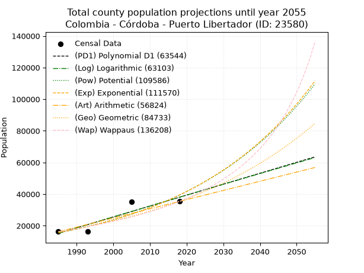
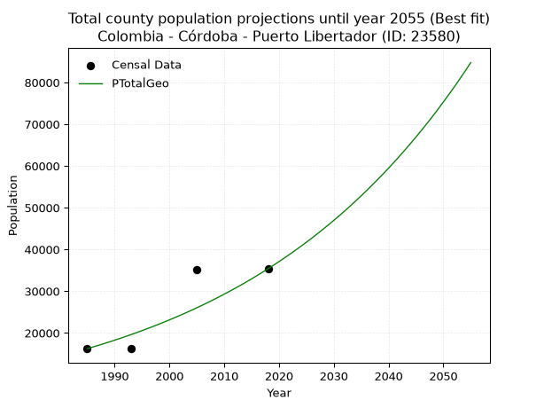
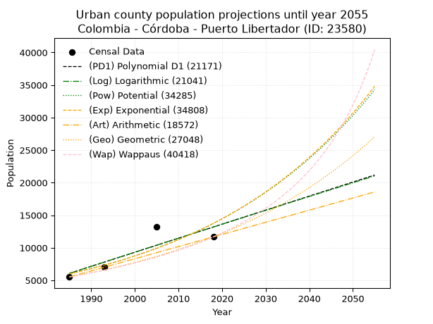
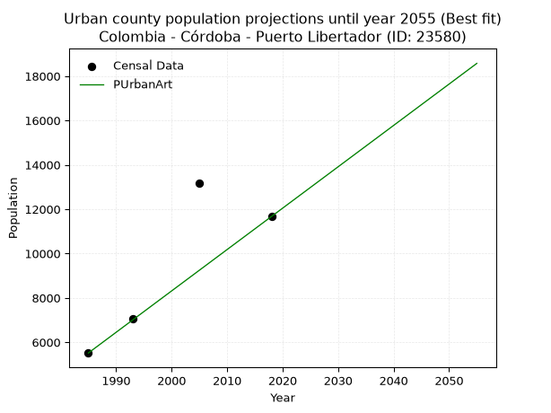
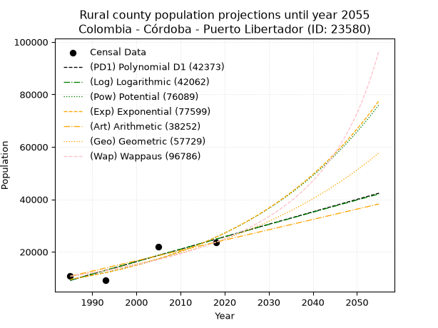
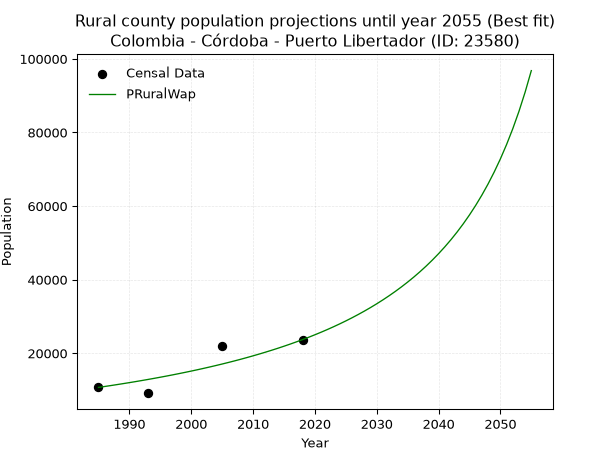

<div align="center">


</div>

# 📜 _“Population and Public Services Demand Projections (PPSD) until Year 2050 for Colombia - Córdoba - Puerto Libertador (ID: 23580)”_
Keywords: `population` `public-service` `projection` `lineal` `polynomial` `logarithmic` `potential` `exponential` `arithmetic` `geometric` `wappaus` `dane` `colombia` `south-america`

PPSD are analytical estimates used by governments and planners to anticipate future changes in population size, age distribution, and the resulting community needs for utilities, healthcare, education, and infrastructure as sizing future water treatment facilities, electrical grids, and road networks based on spatial growth.

<div align="center">

</img>

</div>


> **General running parameters**: • app_version: _v20260806_. • Python version: _3.14.7_. • Pandas version: _3.0.5_. • NumPy version: _2.5.1_. • Creates, save and include plots into reports (create_plot): _False_. • Projection until year: _2050_. • Process polynomial degree 2 and up: _False_. • Process Wappaus: _True_. • Process Wappaus: _True_. • Set negative values to zero: _True_. • Set infinite values to zero: _True_. • Drop dataset notes: _True_. 
<div align="center">

Maps & GIS Layers: [:earth_americas:Google](http://maps.google.com/maps?q=7.88885891,-75.6717614) [:earth_americas:OSM](https://www.openstreetmap.org/#map=18/7.88885891/-75.6717614&layers=P) [:earth_americas:Bing](https://www.bing.com/maps?cp=7.88885891~-75.6717614&lvl=18) [:earth_americas:Apple](https://maps.apple.com/frame?center=7.88885891%2C-75.6717614&span=0.003%2C0.006) [:earth_americas:GISMobile](https://github.com/rcfdtools/R.GISMobile/blob/main/file/gis/CountyLayer_CO/Readme.md)

</div>


<div align="center">

```geojson
{
  "type": "Feature",
  "geometry": {
    "type": "Point", 
    "coordinates": [-75.6717614, 7.88885891]
  }, 
  "properties": {
    "Name": "Colombia - Córdoba - Puerto Libertador (ID: 23580)"
  }
}
```

</div>


## 0. Census Data (4 records)

Census data are official statistics collected by a government about the people and housing in a country. They usually include counts of total population, age, sex, race, income, education, and jobs.

📅Global census file: [Population.xlsx](../data/Population.xlsx)

| Source   |   Year |   CountryID | CountryName   |   StateID | StateName   |   CountyID | CountyName        |   PTotal |   PUrban |   PRural |
|:---------|-------:|------------:|:--------------|----------:|:------------|-----------:|:------------------|---------:|---------:|---------:|
| DANE     |   1985 |          57 | Colombia      |        23 | Córdoba     |      23580 | Puerto Libertador |    16220 |     5514 |    10706 |
| DANE     |   1993 |          57 | Colombia      |        23 | Córdoba     |      23580 | Puerto Libertador |    16207 |     7071 |     9136 |
| DANE     |   2005 |          57 | Colombia      |        23 | Córdoba     |      23580 | Puerto Libertador |    35186 |    13175 |    22011 |
| DANE     |   2018 |          57 | Colombia      |        23 | Córdoba     |      23580 | Puerto Libertador |    35362 |    11670 |    23692 |

> 🔥Some records could had specific notes about the registered values or the corresponding urban or rural distribution.

📅[SUI-RUPS](https://www.datos.gov.co/Hacienda-y-Cr-dito-P-blico/Registro-nico-de-Prestadores-de-Servicios-P-blicos/4qkq-csdn/about_data) - Local public utility companies: [RUPS.csv](../data/RUPS.csv)

 | SERVICIO       | ESTADO    | NOMBRE                                                                                                             | NIT         | DEPARTAMENTO_DOMICILIO   | MUNICIPIO_DOMICILIO   | DIRECCION                                  |   TELEFONO | EMAIL                         | TIPO_PRESTADOR          | CLASIFICACION                  |
|:---------------|:----------|:-------------------------------------------------------------------------------------------------------------------|:------------|:-------------------------|:----------------------|:-------------------------------------------|-----------:|:------------------------------|:------------------------|:-------------------------------|
| ACUEDUCTO      | OPERATIVA | ADMINISTRACION COOPERATIVA DE SERVICIOS PUBLICOS DE ACUEDUCTO, ALCANTARILLADO, ASEO Y A FINES DE PUERTO LIBERTADOR | 900299637-1 | CORDOBA                  | PUERTO LIBERTADOR     | CRA 9 CALLE 10 N° 10-40 BARRIO EL PROGRESO |    7726028 | agualcas.apcbijao@hotmail.com | ORGANIZACION AUTORIZADA | DESDE 2501 HASTA 5000 USUARIOS |
| ALCANTARILLADO | OPERATIVA | ADMINISTRACION COOPERATIVA DE SERVICIOS PUBLICOS DE ACUEDUCTO, ALCANTARILLADO, ASEO Y A FINES DE PUERTO LIBERTADOR | 900299637-1 | CORDOBA                  | PUERTO LIBERTADOR     | CRA 9 CALLE 10 N° 10-40 BARRIO EL PROGRESO |    7726028 | agualcas.apcbijao@hotmail.com | ORGANIZACION AUTORIZADA | DESDE 2501 HASTA 5000 USUARIOS |

## 1. Total

### 1.1. Coefficients and Parameters

* (PD1) Polynomial Deg 1: 690.4106784423911, -1355250.209554393 (lineal)
* (Log) Logarithmic: 1382495.7654349697, -10482617.641696986
* (Pow) Potential: 56.33002611992322, -181.57102308126343
* (Exp) Exponential: 0.02813079032547654, 8.740107381297771e-21
* (Art) Arithmetic: Year diff. 2018 - 1985 = 33, Population diff. 35362 - 16220 = 19142, Annual growth = 580.060606060606
* (Geo) Geometric: Year diff. 2018 - 1985 = 33, Population diff. 35362 - 16220 = 19142, Annual growth % = 0.02389907488547416
* (Wap) Wappaus: i = 2.249081486024606, Condition values only valid for < 200)

<sub>
Wappaus condition values: ['0.00', '2.25', '4.50', '6.75', '9.00', '11.25', '13.49', '15.74', '17.99', '20.24', '22.49', '24.74', '26.99', '29.24', '31.49', '33.74', '35.99', '38.23', '40.48', '42.73', '44.98', '47.23', '49.48', '51.73', '53.98', '56.23', '58.48', '60.73', '62.97', '65.22', '67.47', '69.72', '71.97', '74.22', '76.47', '78.72', '80.97', '83.22', '85.47', '87.71', '89.96', '92.21', '94.46', '96.71', '98.96', '101.21', '103.46', '105.71', '107.96', '110.20', '112.45', '114.70', '116.95', '119.20', '121.45', '123.70', '125.95', '128.20', '130.45', '132.70', '134.94', '137.19', '139.44', '141.69', '143.94', '146.19']
</sub>


### 1.2. Projected Dataset

|   Year |   CountyID |   PTotalPD1 |   PTotalLog |   PTotalPow |   PTotalExp |   PTotalArt |   PTotalGeo |   PTotalWap |
|-------:|-----------:|------------:|------------:|------------:|------------:|------------:|------------:|------------:|
|   1985 |      23580 |       15215 |       15190 |       15557 |       15572 |       16220 |       16220 |       16220 |
|   1986 |      23580 |       15905 |       15886 |       16004 |       16017 |       16800 |       16608 |       16589 |
|   1987 |      23580 |       16596 |       16582 |       16465 |       16474 |       17380 |       17005 |       16966 |
|   1988 |      23580 |       17286 |       17278 |       16938 |       16944 |       17960 |       17411 |       17353 |
|   1989 |      23580 |       17977 |       17973 |       17425 |       17427 |       18540 |       17827 |       17748 |
|   1990 |      23580 |       18667 |       18668 |       17925 |       17924 |       19120 |       18253 |       18153 |
|   1991 |      23580 |       19357 |       19363 |       18439 |       18436 |       19700 |       18689 |       18567 |
|   1992 |      23580 |       20048 |       20057 |       18968 |       18962 |       20280 |       19136 |       18992 |
|   1993 |      23580 |       20738 |       20751 |       19512 |       19503 |       20860 |       19593 |       19427 |
|   1994 |      23580 |       21429 |       21444 |       20072 |       20059 |       21441 |       20062 |       19873 |
|   1995 |      23580 |       22119 |       22137 |       20647 |       20631 |       22021 |       20541 |       20330 |
|   1996 |      23580 |       22810 |       22830 |       21238 |       21220 |       22601 |       21032 |       20799 |
|   1997 |      23580 |       23500 |       23523 |       21845 |       21825 |       23181 |       21535 |       21281 |
|   1998 |      23580 |       24190 |       24215 |       22470 |       22448 |       23761 |       22049 |       21774 |
|   1999 |      23580 |       24881 |       24906 |       23113 |       23088 |       24341 |       22576 |       22282 |
|   2000 |      23580 |       25571 |       25598 |       23773 |       23747 |       24921 |       23116 |       22802 |
|   2001 |      23580 |       26262 |       26289 |       24452 |       24425 |       25501 |       23668 |       23337 |
|   2002 |      23580 |       26952 |       26980 |       25150 |       25121 |       26081 |       24234 |       23887 |
|   2003 |      23580 |       27642 |       27670 |       25867 |       25838 |       26661 |       24813 |       24453 |
|   2004 |      23580 |       28333 |       28360 |       26605 |       26575 |       27241 |       25406 |       25035 |
|   2005 |      23580 |       29023 |       29050 |       27363 |       27334 |       27821 |       26013 |       25633 |
|   2006 |      23580 |       29714 |       29739 |       28143 |       28113 |       28401 |       26635 |       26249 |
|   2007 |      23580 |       30404 |       30428 |       28944 |       28915 |       28981 |       27271 |       26884 |
|   2008 |      23580 |       31094 |       31117 |       29768 |       29740 |       29561 |       27923 |       27538 |
|   2009 |      23580 |       31785 |       31805 |       30614 |       30589 |       30141 |       28591 |       28212 |
|   2010 |      23580 |       32475 |       32493 |       31485 |       31462 |       30722 |       29274 |       28907 |
|   2011 |      23580 |       33166 |       33181 |       32379 |       32359 |       31302 |       29973 |       29624 |
|   2012 |      23580 |       33856 |       33868 |       33299 |       33282 |       31882 |       30690 |       30364 |
|   2013 |      23580 |       34546 |       34555 |       34244 |       34232 |       32462 |       31423 |       31129 |
|   2014 |      23580 |       35237 |       35242 |       35215 |       35209 |       33042 |       32174 |       31919 |
|   2015 |      23580 |       35927 |       35928 |       36214 |       36213 |       33622 |       32943 |       32736 |
|   2016 |      23580 |       36618 |       36614 |       37240 |       37246 |       34202 |       33730 |       33581 |
|   2017 |      23580 |       37308 |       37299 |       38295 |       38309 |       34782 |       34537 |       34456 |
|   2018 |      23580 |       37999 |       37985 |       39380 |       39402 |       35362 |       35362 |       35362 |
|   2019 |      23580 |       38689 |       38670 |       40494 |       40526 |       35942 |       36207 |       36301 |
|   2020 |      23580 |       39379 |       39354 |       41640 |       41682 |       36522 |       37072 |       37275 |
|   2021 |      23580 |       40070 |       40038 |       42817 |       42872 |       37102 |       37958 |       38286 |
|   2022 |      23580 |       40760 |       40722 |       44027 |       44095 |       37682 |       38866 |       39336 |
|   2023 |      23580 |       41451 |       41406 |       45270 |       45353 |       38262 |       39794 |       40426 |
|   2024 |      23580 |       42141 |       42089 |       46548 |       46647 |       38842 |       40746 |       41561 |
|   2025 |      23580 |       42831 |       42772 |       47861 |       47977 |       39422 |       41719 |       42742 |
|   2026 |      23580 |       43522 |       43454 |       49211 |       49346 |       40002 |       42716 |       43972 |
|   2027 |      23580 |       44212 |       44137 |       50598 |       50754 |       40583 |       43737 |       45255 |
|   2028 |      23580 |       44903 |       44819 |       52024 |       52202 |       41163 |       44782 |       46594 |
|   2029 |      23580 |       45593 |       45500 |       53489 |       53691 |       41743 |       45853 |       47992 |
|   2030 |      23580 |       46283 |       46181 |       54994 |       55223 |       42323 |       46949 |       49454 |
|   2031 |      23580 |       46974 |       46862 |       56541 |       56799 |       42903 |       48071 |       50984 |
|   2032 |      23580 |       47664 |       47543 |       58131 |       58419 |       43483 |       49219 |       52587 |
|   2033 |      23580 |       48355 |       48223 |       59764 |       60086 |       44063 |       50396 |       54268 |
|   2034 |      23580 |       49045 |       48903 |       61443 |       61800 |       44643 |       51600 |       56033 |
|   2035 |      23580 |       49736 |       49582 |       63168 |       63563 |       45223 |       52833 |       57890 |
|   2036 |      23580 |       50426 |       50261 |       64940 |       65377 |       45803 |       54096 |       59844 |
|   2037 |      23580 |       51116 |       50940 |       66762 |       67242 |       46383 |       55389 |       61904 |
|   2038 |      23580 |       51807 |       51619 |       68633 |       69161 |       46963 |       56713 |       64078 |
|   2039 |      23580 |       52497 |       52297 |       70556 |       71134 |       47543 |       58068 |       66377 |
|   2040 |      23580 |       53188 |       52975 |       72532 |       73163 |       48123 |       59456 |       68812 |
|   2041 |      23580 |       53878 |       53652 |       74562 |       75251 |       48703 |       60877 |       71395 |
|   2042 |      23580 |       54568 |       54330 |       76648 |       77397 |       49283 |       62332 |       74139 |
|   2043 |      23580 |       55259 |       55006 |       78792 |       79606 |       49864 |       63821 |       77061 |
|   2044 |      23580 |       55949 |       55683 |       80994 |       81877 |       50444 |       65347 |       80178 |
|   2045 |      23580 |       56640 |       56359 |       83256 |       84213 |       51024 |       66908 |       83511 |
|   2046 |      23580 |       57330 |       57035 |       85581 |       86615 |       51604 |       68507 |       87082 |
|   2047 |      23580 |       58020 |       57711 |       87969 |       89087 |       52184 |       70145 |       90919 |
|   2048 |      23580 |       58711 |       58386 |       90423 |       91628 |       52764 |       71821 |       95051 |
|   2049 |      23580 |       59401 |       59061 |       92944 |       94242 |       53344 |       73537 |       99516 |
|   2050 |      23580 |       60092 |       59735 |       95534 |       96931 |       53924 |       75295 |      104353 |
<div align="center">

</img>

</div>


### 1.3. Best fit with absolute and relative error (%)

Relative error puts that difference into context by dividing the absolute error by the true value, creating a unitless ratio or percentage that shows the scale of the mistake.

Absolute and relative error

|   Year | Source   |   CountryID | CountryName   |   StateID | StateName   |   CountyID_x | CountyName        |   PTotal |   PUrban |   PRural |   CountyID_y |   PTotalPD1 |   PTotalLog |   PTotalPow |   PTotalExp |   PTotalArt |   PTotalGeo |   PTotalWap |   PTotalPD1AbsError |   PTotalLogAbsError |   PTotalPowAbsError |   PTotalExpAbsError |   PTotalArtAbsError |   PTotalGeoAbsError |   PTotalWapAbsError |   PTotalPD1RelError |   PTotalLogRelError |   PTotalPowRelError |   PTotalExpRelError |   PTotalArtRelError |   PTotalGeoRelError |   PTotalWapRelError |
|-------:|:---------|------------:|:--------------|----------:|:------------|-------------:|:------------------|---------:|---------:|---------:|-------------:|------------:|------------:|------------:|------------:|------------:|------------:|------------:|--------------------:|--------------------:|--------------------:|--------------------:|--------------------:|--------------------:|--------------------:|--------------------:|--------------------:|--------------------:|--------------------:|--------------------:|--------------------:|--------------------:|
|   1985 | DANE     |          57 | Colombia      |        23 | Córdoba     |        23580 | Puerto Libertador |    16220 |     5514 |    10706 |        23580 |       15215 |       15190 |       15557 |       15572 |       16220 |       16220 |       16220 |                1005 |                1030 |                 663 |                 648 |                   0 |                   0 |                   0 |             6.19605 |             6.35018 |             4.08755 |             3.99507 |              0      |              0      |               0     |
|   1993 | DANE     |          57 | Colombia      |        23 | Córdoba     |        23580 | Puerto Libertador |    16207 |     7071 |     9136 |        23580 |       20738 |       20751 |       19512 |       19503 |       20860 |       19593 |       19427 |                4531 |                4544 |                3305 |                3296 |                4653 |                3386 |                3220 |            27.9571  |            28.0373  |            20.3924  |            20.3369  |             28.7098 |             20.8922 |              19.868 |
|   2005 | DANE     |          57 | Colombia      |        23 | Córdoba     |        23580 | Puerto Libertador |    35186 |    13175 |    22011 |        23580 |       29023 |       29050 |       27363 |       27334 |       27821 |       26013 |       25633 |                6163 |                6136 |                7823 |                7852 |                7365 |                9173 |                9553 |            17.5155  |            17.4388  |            22.2333  |            22.3157  |             20.9316 |             26.07   |              27.15  |
|   2018 | DANE     |          57 | Colombia      |        23 | Córdoba     |        23580 | Puerto Libertador |    35362 |    11670 |    23692 |        23580 |       37999 |       37985 |       39380 |       39402 |       35362 |       35362 |       35362 |                2637 |                2623 |                4018 |                4040 |                   0 |                   0 |                   0 |             7.45716 |             7.41757 |            11.3625  |            11.4247  |              0      |              0      |               0     |

Relative error mean

| Method    |   RelError | Best   |
|:----------|-----------:|:-------|
| PTotalPD1 |    14.7814 |        |
| PTotalLog |    14.8109 |        |
| PTotalPow |    14.5189 |        |
| PTotalExp |    14.5181 |        |
| PTotalArt |    12.4104 |        |
| PTotalGeo |    11.7406 | True   |
| PTotalWap |    11.7545 |        |

💙Best method: _**PTotalGeo**_
<div align="center">

</img>

</div>


### 1.4. Fresh water supply demand in liters per capita per day (lpcd)

The fresh water supply demand typically ranges from 100 to 300 liters per capita per day (lpcd) for standard domestic and municipal planning, though absolute survival minimums set by the World Health Organization are as low as 7.5 to 20 liters per day, and total consumption in high-income nations can exceed 400 liters.

> `CZ`: Level in meters above the sea level (masl)<br> `WS`: Fresh water supply demand in liters per capita per day (lpcd or l/h/d)<br> `WSAll`: Zonal fresh water supply demand in liters per second (l/s)<br> `A`: Zonal area in square meters<br> `DP`: Population density (people/hectare or p/ha)

Reference values (RAS Colombia)

|    CZ |   WS |
|------:|-----:|
|  1000 |  120 |
|  2000 |  130 |
| 99999 |  140 |

County shapefile geometry properties and water supply values

|   CountyID |      ATotal |   CZTotal |   WSTotal |
|-----------:|------------:|----------:|----------:|
|      23580 | 1.64725e+09 |   430.146 |       120 |

Projected values for best method: PTotalGeo

|   CountyID |   Year |   PTotalGeo |   DPTotal |   WSTotal |   WSTotalAll |
|-----------:|-------:|------------:|----------:|----------:|-------------:|
|      23580 |   1985 |       16220 |      0.1  |       120 |      22.5278 |
|      23580 |   1986 |       16608 |      0.1  |       120 |      23.0667 |
|      23580 |   1987 |       17005 |      0.1  |       120 |      23.6181 |
|      23580 |   1988 |       17411 |      0.11 |       120 |      24.1819 |
|      23580 |   1989 |       17827 |      0.11 |       120 |      24.7597 |
|      23580 |   1990 |       18253 |      0.11 |       120 |      25.3514 |
|      23580 |   1991 |       18689 |      0.11 |       120 |      25.9569 |
|      23580 |   1992 |       19136 |      0.12 |       120 |      26.5778 |
|      23580 |   1993 |       19593 |      0.12 |       120 |      27.2125 |
|      23580 |   1994 |       20062 |      0.12 |       120 |      27.8639 |
|      23580 |   1995 |       20541 |      0.12 |       120 |      28.5292 |
|      23580 |   1996 |       21032 |      0.13 |       120 |      29.2111 |
|      23580 |   1997 |       21535 |      0.13 |       120 |      29.9097 |
|      23580 |   1998 |       22049 |      0.13 |       120 |      30.6236 |
|      23580 |   1999 |       22576 |      0.14 |       120 |      31.3556 |
|      23580 |   2000 |       23116 |      0.14 |       120 |      32.1056 |
|      23580 |   2001 |       23668 |      0.14 |       120 |      32.8722 |
|      23580 |   2002 |       24234 |      0.15 |       120 |      33.6583 |
|      23580 |   2003 |       24813 |      0.15 |       120 |      34.4625 |
|      23580 |   2004 |       25406 |      0.15 |       120 |      35.2861 |
|      23580 |   2005 |       26013 |      0.16 |       120 |      36.1292 |
|      23580 |   2006 |       26635 |      0.16 |       120 |      36.9931 |
|      23580 |   2007 |       27271 |      0.17 |       120 |      37.8764 |
|      23580 |   2008 |       27923 |      0.17 |       120 |      38.7819 |
|      23580 |   2009 |       28591 |      0.17 |       120 |      39.7097 |
|      23580 |   2010 |       29274 |      0.18 |       120 |      40.6583 |
|      23580 |   2011 |       29973 |      0.18 |       120 |      41.6292 |
|      23580 |   2012 |       30690 |      0.19 |       120 |      42.625  |
|      23580 |   2013 |       31423 |      0.19 |       120 |      43.6431 |
|      23580 |   2014 |       32174 |      0.2  |       120 |      44.6861 |
|      23580 |   2015 |       32943 |      0.2  |       120 |      45.7542 |
|      23580 |   2016 |       33730 |      0.2  |       120 |      46.8472 |
|      23580 |   2017 |       34537 |      0.21 |       120 |      47.9681 |
|      23580 |   2018 |       35362 |      0.21 |       120 |      49.1139 |
|      23580 |   2019 |       36207 |      0.22 |       120 |      50.2875 |
|      23580 |   2020 |       37072 |      0.23 |       120 |      51.4889 |
|      23580 |   2021 |       37958 |      0.23 |       120 |      52.7194 |
|      23580 |   2022 |       38866 |      0.24 |       120 |      53.9806 |
|      23580 |   2023 |       39794 |      0.24 |       120 |      55.2694 |
|      23580 |   2024 |       40746 |      0.25 |       120 |      56.5917 |
|      23580 |   2025 |       41719 |      0.25 |       120 |      57.9431 |
|      23580 |   2026 |       42716 |      0.26 |       120 |      59.3278 |
|      23580 |   2027 |       43737 |      0.27 |       120 |      60.7458 |
|      23580 |   2028 |       44782 |      0.27 |       120 |      62.1972 |
|      23580 |   2029 |       45853 |      0.28 |       120 |      63.6847 |
|      23580 |   2030 |       46949 |      0.29 |       120 |      65.2069 |
|      23580 |   2031 |       48071 |      0.29 |       120 |      66.7653 |
|      23580 |   2032 |       49219 |      0.3  |       120 |      68.3597 |
|      23580 |   2033 |       50396 |      0.31 |       120 |      69.9944 |
|      23580 |   2034 |       51600 |      0.31 |       120 |      71.6667 |
|      23580 |   2035 |       52833 |      0.32 |       120 |      73.3792 |
|      23580 |   2036 |       54096 |      0.33 |       120 |      75.1333 |
|      23580 |   2037 |       55389 |      0.34 |       120 |      76.9292 |
|      23580 |   2038 |       56713 |      0.34 |       120 |      78.7681 |
|      23580 |   2039 |       58068 |      0.35 |       120 |      80.65   |
|      23580 |   2040 |       59456 |      0.36 |       120 |      82.5778 |
|      23580 |   2041 |       60877 |      0.37 |       120 |      84.5514 |
|      23580 |   2042 |       62332 |      0.38 |       120 |      86.5722 |
|      23580 |   2043 |       63821 |      0.39 |       120 |      88.6403 |
|      23580 |   2044 |       65347 |      0.4  |       120 |      90.7597 |
|      23580 |   2045 |       66908 |      0.41 |       120 |      92.9278 |
|      23580 |   2046 |       68507 |      0.42 |       120 |      95.1486 |
|      23580 |   2047 |       70145 |      0.43 |       120 |      97.4236 |
|      23580 |   2048 |       71821 |      0.44 |       120 |      99.7514 |
|      23580 |   2049 |       73537 |      0.45 |       120 |     102.135  |
|      23580 |   2050 |       75295 |      0.46 |       120 |     104.576  |

## 2. Urban

### 2.1. Coefficients and Parameters

* (PD1) Polynomial Deg 1: 215.76957045363366, -422235.58329988073 (lineal)
* (Log) Logarithmic: 432354.9190273059, -3276975.704201433
* (Pow) Potential: 50.32925629116499, -162.19624957547205
* (Exp) Exponential: 0.02511756681917826, 1.3331340706900919e-18
* (Art) Arithmetic: Year diff. 2018 - 1985 = 33, Population diff. 11670 - 5514 = 6156, Annual growth = 186.54545454545453
* (Geo) Geometric: Year diff. 2018 - 1985 = 33, Population diff. 11670 - 5514 = 6156, Annual growth % = 0.022979170186880893
* (Wap) Wappaus: i = 2.171152869476892, Condition values only valid for < 200)

<sub>
Wappaus condition values: ['0.00', '2.17', '4.34', '6.51', '8.68', '10.86', '13.03', '15.20', '17.37', '19.54', '21.71', '23.88', '26.05', '28.22', '30.40', '32.57', '34.74', '36.91', '39.08', '41.25', '43.42', '45.59', '47.77', '49.94', '52.11', '54.28', '56.45', '58.62', '60.79', '62.96', '65.13', '67.31', '69.48', '71.65', '73.82', '75.99', '78.16', '80.33', '82.50', '84.67', '86.85', '89.02', '91.19', '93.36', '95.53', '97.70', '99.87', '102.04', '104.22', '106.39', '108.56', '110.73', '112.90', '115.07', '117.24', '119.41', '121.58', '123.76', '125.93', '128.10', '130.27', '132.44', '134.61', '136.78', '138.95', '141.12']
</sub>


### 2.2. Projected Dataset

|   Year |   CountyID |   PUrbanPD1 |   PUrbanLog |   PUrbanPow |   PUrbanExp |   PUrbanArt |   PUrbanGeo |   PUrbanWap |
|-------:|-----------:|------------:|------------:|------------:|------------:|------------:|------------:|------------:|
|   1985 |      23580 |        6067 |        6057 |        5992 |        5999 |        5514 |        5514 |        5514 |
|   1986 |      23580 |        6283 |        6275 |        6146 |        6152 |        5701 |        5641 |        5635 |
|   1987 |      23580 |        6499 |        6492 |        6304 |        6308 |        5887 |        5770 |        5759 |
|   1988 |      23580 |        6714 |        6710 |        6465 |        6469 |        6074 |        5903 |        5885 |
|   1989 |      23580 |        6930 |        6927 |        6631 |        6633 |        6260 |        6039 |        6015 |
|   1990 |      23580 |        7146 |        7145 |        6801 |        6802 |        6447 |        6177 |        6147 |
|   1991 |      23580 |        7362 |        7362 |        6975 |        6975 |        6633 |        6319 |        6282 |
|   1992 |      23580 |        7577 |        7579 |        7154 |        7152 |        6820 |        6464 |        6421 |
|   1993 |      23580 |        7793 |        7796 |        7337 |        7334 |        7006 |        6613 |        6563 |
|   1994 |      23580 |        8009 |        8013 |        7524 |        7521 |        7193 |        6765 |        6708 |
|   1995 |      23580 |        8225 |        8230 |        7717 |        7712 |        7379 |        6920 |        6857 |
|   1996 |      23580 |        8440 |        8446 |        7914 |        7908 |        7566 |        7079 |        7009 |
|   1997 |      23580 |        8656 |        8663 |        8116 |        8109 |        7753 |        7242 |        7166 |
|   1998 |      23580 |        8872 |        8879 |        8323 |        8316 |        7939 |        7409 |        7326 |
|   1999 |      23580 |        9088 |        9096 |        8535 |        8527 |        8126 |        7579 |        7490 |
|   2000 |      23580 |        9304 |        9312 |        8753 |        8744 |        8312 |        7753 |        7659 |
|   2001 |      23580 |        9519 |        9528 |        8976 |        8967 |        8499 |        7931 |        7832 |
|   2002 |      23580 |        9735 |        9744 |        9204 |        9195 |        8685 |        8113 |        8010 |
|   2003 |      23580 |        9951 |        9960 |        9438 |        9428 |        8872 |        8300 |        8192 |
|   2004 |      23580 |       10167 |       10176 |        9678 |        9668 |        9058 |        8491 |        8380 |
|   2005 |      23580 |       10382 |       10391 |        9925 |        9914 |        9245 |        8686 |        8572 |
|   2006 |      23580 |       10598 |       10607 |       10177 |       10166 |        9431 |        8885 |        8770 |
|   2007 |      23580 |       10814 |       10822 |       10435 |       10425 |        9618 |        9089 |        8974 |
|   2008 |      23580 |       11030 |       11038 |       10700 |       10690 |        9805 |        9298 |        9184 |
|   2009 |      23580 |       11245 |       11253 |       10972 |       10962 |        9991 |        9512 |        9400 |
|   2010 |      23580 |       11461 |       11468 |       11250 |       11241 |       10178 |        9731 |        9622 |
|   2011 |      23580 |       11677 |       11683 |       11535 |       11527 |       10364 |        9954 |        9851 |
|   2012 |      23580 |       11893 |       11898 |       11827 |       11820 |       10551 |       10183 |       10087 |
|   2013 |      23580 |       12109 |       12113 |       12127 |       12121 |       10737 |       10417 |       10330 |
|   2014 |      23580 |       12324 |       12328 |       12434 |       12429 |       10924 |       10656 |       10581 |
|   2015 |      23580 |       12540 |       12542 |       12748 |       12745 |       11110 |       10901 |       10840 |
|   2016 |      23580 |       12756 |       12757 |       13071 |       13069 |       11297 |       11152 |       11108 |
|   2017 |      23580 |       12972 |       12971 |       13401 |       13402 |       11483 |       11408 |       11384 |
|   2018 |      23580 |       13187 |       13186 |       13740 |       13743 |       11670 |       11670 |       11670 |
|   2019 |      23580 |       13403 |       13400 |       14087 |       14092 |       11857 |       11938 |       11966 |
|   2020 |      23580 |       13619 |       13614 |       14442 |       14451 |       12043 |       12212 |       12272 |
|   2021 |      23580 |       13835 |       13828 |       14806 |       14818 |       12230 |       12493 |       12589 |
|   2022 |      23580 |       14050 |       14042 |       15179 |       15195 |       12416 |       12780 |       12917 |
|   2023 |      23580 |       14266 |       14256 |       15562 |       15581 |       12603 |       13074 |       13258 |
|   2024 |      23580 |       14482 |       14469 |       15954 |       15978 |       12789 |       13374 |       13611 |
|   2025 |      23580 |       14698 |       14683 |       16355 |       16384 |       12976 |       13682 |       13978 |
|   2026 |      23580 |       14914 |       14896 |       16767 |       16801 |       13162 |       13996 |       14359 |
|   2027 |      23580 |       15129 |       15110 |       17189 |       17228 |       13349 |       14318 |       14756 |
|   2028 |      23580 |       15345 |       15323 |       17621 |       17667 |       13535 |       14647 |       15169 |
|   2029 |      23580 |       15561 |       15536 |       18063 |       18116 |       13722 |       14983 |       15598 |
|   2030 |      23580 |       15777 |       15749 |       18517 |       18577 |       13909 |       15328 |       16047 |
|   2031 |      23580 |       15992 |       15962 |       18982 |       19049 |       14095 |       15680 |       16514 |
|   2032 |      23580 |       16208 |       16175 |       19458 |       19534 |       14282 |       16040 |       17002 |
|   2033 |      23580 |       16424 |       16388 |       19945 |       20031 |       14468 |       16409 |       17513 |
|   2034 |      23580 |       16640 |       16600 |       20445 |       20540 |       14655 |       16786 |       18047 |
|   2035 |      23580 |       16855 |       16813 |       20957 |       21062 |       14841 |       17171 |       18606 |
|   2036 |      23580 |       17071 |       17025 |       21482 |       21598 |       15028 |       17566 |       19193 |
|   2037 |      23580 |       17287 |       17237 |       22020 |       22148 |       15214 |       17970 |       19809 |
|   2038 |      23580 |       17503 |       17450 |       22570 |       22711 |       15401 |       18383 |       20456 |
|   2039 |      23580 |       17719 |       17662 |       23134 |       23289 |       15587 |       18805 |       21137 |
|   2040 |      23580 |       17934 |       17874 |       23712 |       23881 |       15774 |       19237 |       21855 |
|   2041 |      23580 |       18150 |       18086 |       24305 |       24488 |       15961 |       19679 |       22613 |
|   2042 |      23580 |       18366 |       18297 |       24911 |       25111 |       16147 |       20131 |       23414 |
|   2043 |      23580 |       18582 |       18509 |       25533 |       25750 |       16334 |       20594 |       24262 |
|   2044 |      23580 |       18797 |       18721 |       26169 |       26405 |       16520 |       21067 |       25161 |
|   2045 |      23580 |       19013 |       18932 |       26821 |       27077 |       16707 |       21551 |       26116 |
|   2046 |      23580 |       19229 |       19143 |       27490 |       27765 |       16893 |       22047 |       27133 |
|   2047 |      23580 |       19445 |       19355 |       28174 |       28472 |       17080 |       22553 |       28217 |
|   2048 |      23580 |       19660 |       19566 |       28875 |       29196 |       17266 |       23071 |       29375 |
|   2049 |      23580 |       19876 |       19777 |       29593 |       29938 |       17453 |       23602 |       30616 |
|   2050 |      23580 |       20092 |       19988 |       30329 |       30700 |       17639 |       24144 |       31948 |
<div align="center">

</img>

</div>


### 2.3. Best fit with absolute and relative error (%)

Relative error puts that difference into context by dividing the absolute error by the true value, creating a unitless ratio or percentage that shows the scale of the mistake.

Absolute and relative error

|   Year | Source   |   CountryID | CountryName   |   StateID | StateName   |   CountyID_x | CountyName        |   PTotal |   PUrban |   PRural |   CountyID_y |   PUrbanPD1 |   PUrbanLog |   PUrbanPow |   PUrbanExp |   PUrbanArt |   PUrbanGeo |   PUrbanWap |   PUrbanPD1AbsError |   PUrbanLogAbsError |   PUrbanPowAbsError |   PUrbanExpAbsError |   PUrbanArtAbsError |   PUrbanGeoAbsError |   PUrbanWapAbsError |   PUrbanPD1RelError |   PUrbanLogRelError |   PUrbanPowRelError |   PUrbanExpRelError |   PUrbanArtRelError |   PUrbanGeoRelError |   PUrbanWapRelError |
|-------:|:---------|------------:|:--------------|----------:|:------------|-------------:|:------------------|---------:|---------:|---------:|-------------:|------------:|------------:|------------:|------------:|------------:|------------:|------------:|--------------------:|--------------------:|--------------------:|--------------------:|--------------------:|--------------------:|--------------------:|--------------------:|--------------------:|--------------------:|--------------------:|--------------------:|--------------------:|--------------------:|
|   1985 | DANE     |          57 | Colombia      |        23 | Córdoba     |        23580 | Puerto Libertador |    16220 |     5514 |    10706 |        23580 |        6067 |        6057 |        5992 |        5999 |        5514 |        5514 |        5514 |                 553 |                 543 |                 478 |                 485 |                   0 |                   0 |                   0 |             10.029  |             9.84766 |             8.66884 |             8.79579 |            0        |             0       |             0       |
|   1993 | DANE     |          57 | Colombia      |        23 | Córdoba     |        23580 | Puerto Libertador |    16207 |     7071 |     9136 |        23580 |        7793 |        7796 |        7337 |        7334 |        7006 |        6613 |        6563 |                 722 |                 725 |                 266 |                 263 |                  65 |                 458 |                 508 |             10.2107 |            10.2531  |             3.76184 |             3.71942 |            0.919248 |             6.47716 |             7.18427 |
|   2005 | DANE     |          57 | Colombia      |        23 | Córdoba     |        23580 | Puerto Libertador |    35186 |    13175 |    22011 |        23580 |       10382 |       10391 |        9925 |        9914 |        9245 |        8686 |        8572 |                2793 |                2784 |                3250 |                3261 |                3930 |                4489 |                4603 |             21.1992 |            21.1309  |            24.6679  |            24.7514  |           29.8292   |            34.0721  |            34.9374  |
|   2018 | DANE     |          57 | Colombia      |        23 | Córdoba     |        23580 | Puerto Libertador |    35362 |    11670 |    23692 |        23580 |       13187 |       13186 |       13740 |       13743 |       11670 |       11670 |       11670 |                1517 |                1516 |                2070 |                2073 |                   0 |                   0 |                   0 |             12.9991 |            12.9906  |            17.7378  |            17.7635  |            0        |             0       |             0       |

Relative error mean

| Method    |   RelError | Best   |
|:----------|-----------:|:-------|
| PUrbanPD1 |   13.6095  |        |
| PUrbanLog |   13.5556  |        |
| PUrbanPow |   13.7091  |        |
| PUrbanExp |   13.7575  |        |
| PUrbanArt |    7.68712 | True   |
| PUrbanGeo |   10.1373  |        |
| PUrbanWap |   10.5304  |        |

💙Best method: _**PUrbanArt**_
<div align="center">

</img>

</div>


### 2.4. Fresh water supply demand in liters per capita per day (lpcd)

The fresh water supply demand typically ranges from 100 to 300 liters per capita per day (lpcd) for standard domestic and municipal planning, though absolute survival minimums set by the World Health Organization are as low as 7.5 to 20 liters per day, and total consumption in high-income nations can exceed 400 liters.

> `CZ`: Level in meters above the sea level (masl)<br> `WS`: Fresh water supply demand in liters per capita per day (lpcd or l/h/d)<br> `WSAll`: Zonal fresh water supply demand in liters per second (l/s)<br> `A`: Zonal area in square meters<br> `DP`: Population density (people/hectare or p/ha)

Reference values (RAS Colombia)

|    CZ |   WS |
|------:|-----:|
|  1000 |  120 |
|  2000 |  130 |
| 99999 |  140 |

County shapefile geometry properties and water supply values

|   CountyID |      AUrban |   CZUrban |   WSUrban |
|-----------:|------------:|----------:|----------:|
|      23580 | 2.42924e+06 |   68.9801 |       120 |

Projected values for best method: PUrbanArt

|   CountyID |   Year |   PUrbanArt |   DPUrban |   WSUrban |   WSUrbanAll |
|-----------:|-------:|------------:|----------:|----------:|-------------:|
|      23580 |   1985 |        5514 |     22.7  |       120 |      7.65833 |
|      23580 |   1986 |        5701 |     23.47 |       120 |      7.91806 |
|      23580 |   1987 |        5887 |     24.23 |       120 |      8.17639 |
|      23580 |   1988 |        6074 |     25    |       120 |      8.43611 |
|      23580 |   1989 |        6260 |     25.77 |       120 |      8.69444 |
|      23580 |   1990 |        6447 |     26.54 |       120 |      8.95417 |
|      23580 |   1991 |        6633 |     27.3  |       120 |      9.2125  |
|      23580 |   1992 |        6820 |     28.07 |       120 |      9.47222 |
|      23580 |   1993 |        7006 |     28.84 |       120 |      9.73056 |
|      23580 |   1994 |        7193 |     29.61 |       120 |      9.99028 |
|      23580 |   1995 |        7379 |     30.38 |       120 |     10.2486  |
|      23580 |   1996 |        7566 |     31.15 |       120 |     10.5083  |
|      23580 |   1997 |        7753 |     31.92 |       120 |     10.7681  |
|      23580 |   1998 |        7939 |     32.68 |       120 |     11.0264  |
|      23580 |   1999 |        8126 |     33.45 |       120 |     11.2861  |
|      23580 |   2000 |        8312 |     34.22 |       120 |     11.5444  |
|      23580 |   2001 |        8499 |     34.99 |       120 |     11.8042  |
|      23580 |   2002 |        8685 |     35.75 |       120 |     12.0625  |
|      23580 |   2003 |        8872 |     36.52 |       120 |     12.3222  |
|      23580 |   2004 |        9058 |     37.29 |       120 |     12.5806  |
|      23580 |   2005 |        9245 |     38.06 |       120 |     12.8403  |
|      23580 |   2006 |        9431 |     38.82 |       120 |     13.0986  |
|      23580 |   2007 |        9618 |     39.59 |       120 |     13.3583  |
|      23580 |   2008 |        9805 |     40.36 |       120 |     13.6181  |
|      23580 |   2009 |        9991 |     41.13 |       120 |     13.8764  |
|      23580 |   2010 |       10178 |     41.9  |       120 |     14.1361  |
|      23580 |   2011 |       10364 |     42.66 |       120 |     14.3944  |
|      23580 |   2012 |       10551 |     43.43 |       120 |     14.6542  |
|      23580 |   2013 |       10737 |     44.2  |       120 |     14.9125  |
|      23580 |   2014 |       10924 |     44.97 |       120 |     15.1722  |
|      23580 |   2015 |       11110 |     45.73 |       120 |     15.4306  |
|      23580 |   2016 |       11297 |     46.5  |       120 |     15.6903  |
|      23580 |   2017 |       11483 |     47.27 |       120 |     15.9486  |
|      23580 |   2018 |       11670 |     48.04 |       120 |     16.2083  |
|      23580 |   2019 |       11857 |     48.81 |       120 |     16.4681  |
|      23580 |   2020 |       12043 |     49.58 |       120 |     16.7264  |
|      23580 |   2021 |       12230 |     50.34 |       120 |     16.9861  |
|      23580 |   2022 |       12416 |     51.11 |       120 |     17.2444  |
|      23580 |   2023 |       12603 |     51.88 |       120 |     17.5042  |
|      23580 |   2024 |       12789 |     52.65 |       120 |     17.7625  |
|      23580 |   2025 |       12976 |     53.42 |       120 |     18.0222  |
|      23580 |   2026 |       13162 |     54.18 |       120 |     18.2806  |
|      23580 |   2027 |       13349 |     54.95 |       120 |     18.5403  |
|      23580 |   2028 |       13535 |     55.72 |       120 |     18.7986  |
|      23580 |   2029 |       13722 |     56.49 |       120 |     19.0583  |
|      23580 |   2030 |       13909 |     57.26 |       120 |     19.3181  |
|      23580 |   2031 |       14095 |     58.02 |       120 |     19.5764  |
|      23580 |   2032 |       14282 |     58.79 |       120 |     19.8361  |
|      23580 |   2033 |       14468 |     59.56 |       120 |     20.0944  |
|      23580 |   2034 |       14655 |     60.33 |       120 |     20.3542  |
|      23580 |   2035 |       14841 |     61.09 |       120 |     20.6125  |
|      23580 |   2036 |       15028 |     61.86 |       120 |     20.8722  |
|      23580 |   2037 |       15214 |     62.63 |       120 |     21.1306  |
|      23580 |   2038 |       15401 |     63.4  |       120 |     21.3903  |
|      23580 |   2039 |       15587 |     64.16 |       120 |     21.6486  |
|      23580 |   2040 |       15774 |     64.93 |       120 |     21.9083  |
|      23580 |   2041 |       15961 |     65.7  |       120 |     22.1681  |
|      23580 |   2042 |       16147 |     66.47 |       120 |     22.4264  |
|      23580 |   2043 |       16334 |     67.24 |       120 |     22.6861  |
|      23580 |   2044 |       16520 |     68    |       120 |     22.9444  |
|      23580 |   2045 |       16707 |     68.77 |       120 |     23.2042  |
|      23580 |   2046 |       16893 |     69.54 |       120 |     23.4625  |
|      23580 |   2047 |       17080 |     70.31 |       120 |     23.7222  |
|      23580 |   2048 |       17266 |     71.08 |       120 |     23.9806  |
|      23580 |   2049 |       17453 |     71.85 |       120 |     24.2403  |
|      23580 |   2050 |       17639 |     72.61 |       120 |     24.4986  |

## 3. Rural

### 3.1. Coefficients and Parameters

* (PD1) Polynomial Deg 1: 474.6411079887577, -933014.6262545126 (lineal)
* (Log) Logarithmic: 950140.8464076637, -7205641.937495549
* (Pow) Potential: 60.02165020477019, -193.9591129907591
* (Exp) Exponential: 0.029984159446931218, 1.34815781496247e-22
* (Art) Arithmetic: Year diff. 2018 - 1985 = 33, Population diff. 23692 - 10706 = 12986, Annual growth = 393.5151515151515
* (Geo) Geometric: Year diff. 2018 - 1985 = 33, Population diff. 23692 - 10706 = 12986, Annual growth % = 0.02436273797612465
* (Wap) Wappaus: i = 2.2880118118213355, Condition values only valid for < 200)

<sub>
Wappaus condition values: ['0.00', '2.29', '4.58', '6.86', '9.15', '11.44', '13.73', '16.02', '18.30', '20.59', '22.88', '25.17', '27.46', '29.74', '32.03', '34.32', '36.61', '38.90', '41.18', '43.47', '45.76', '48.05', '50.34', '52.62', '54.91', '57.20', '59.49', '61.78', '64.06', '66.35', '68.64', '70.93', '73.22', '75.50', '77.79', '80.08', '82.37', '84.66', '86.94', '89.23', '91.52', '93.81', '96.10', '98.38', '100.67', '102.96', '105.25', '107.54', '109.82', '112.11', '114.40', '116.69', '118.98', '121.26', '123.55', '125.84', '128.13', '130.42', '132.70', '134.99', '137.28', '139.57', '141.86', '144.14', '146.43', '148.72']
</sub>


### 3.2. Projected Dataset

|   Year |   CountyID |   PRuralPD1 |   PRuralLog |   PRuralPow |   PRuralExp |   PRuralArt |   PRuralGeo |   PRuralWap |
|-------:|-----------:|------------:|------------:|------------:|------------:|------------:|------------:|------------:|
|   1985 |      23580 |        9148 |        9133 |        9504 |        9513 |       10706 |       10706 |       10706 |
|   1986 |      23580 |        9623 |        9612 |        9796 |        9803 |       11100 |       10967 |       10954 |
|   1987 |      23580 |       10097 |       10090 |       10096 |       10101 |       11493 |       11234 |       11207 |
|   1988 |      23580 |       10572 |       10568 |       10406 |       10408 |       11887 |       11508 |       11467 |
|   1989 |      23580 |       11047 |       11046 |       10725 |       10725 |       12280 |       11788 |       11733 |
|   1990 |      23580 |       11521 |       11523 |       11053 |       11052 |       12674 |       12075 |       12005 |
|   1991 |      23580 |       11996 |       12001 |       11392 |       11388 |       13067 |       12369 |       12284 |
|   1992 |      23580 |       12470 |       12478 |       11740 |       11735 |       13461 |       12671 |       12570 |
|   1993 |      23580 |       12945 |       12955 |       12099 |       12092 |       13854 |       12979 |       12863 |
|   1994 |      23580 |       13420 |       13431 |       12469 |       12460 |       14248 |       13296 |       13164 |
|   1995 |      23580 |       13894 |       13908 |       12850 |       12839 |       14641 |       13620 |       13472 |
|   1996 |      23580 |       14369 |       14384 |       13242 |       13230 |       15035 |       13951 |       13788 |
|   1997 |      23580 |       14844 |       14860 |       13647 |       13633 |       15428 |       14291 |       14113 |
|   1998 |      23580 |       15318 |       15335 |       14063 |       14048 |       15822 |       14640 |       14447 |
|   1999 |      23580 |       15793 |       15811 |       14492 |       14475 |       16215 |       14996 |       14789 |
|   2000 |      23580 |       16268 |       16286 |       14933 |       14916 |       16609 |       15362 |       15141 |
|   2001 |      23580 |       16742 |       16761 |       15388 |       15370 |       17002 |       15736 |       15503 |
|   2002 |      23580 |       17217 |       17236 |       15857 |       15838 |       17396 |       16119 |       15876 |
|   2003 |      23580 |       17692 |       17710 |       16339 |       16320 |       17789 |       16512 |       16259 |
|   2004 |      23580 |       18166 |       18184 |       16836 |       16817 |       18183 |       16914 |       16653 |
|   2005 |      23580 |       18641 |       18658 |       17348 |       17328 |       18576 |       17326 |       17059 |
|   2006 |      23580 |       19115 |       19132 |       17875 |       17856 |       18970 |       17748 |       17477 |
|   2007 |      23580 |       19590 |       19606 |       18417 |       18399 |       19363 |       18181 |       17907 |
|   2008 |      23580 |       20065 |       20079 |       18976 |       18959 |       19757 |       18624 |       18352 |
|   2009 |      23580 |       20539 |       20552 |       19552 |       19537 |       20150 |       19077 |       18810 |
|   2010 |      23580 |       21014 |       21025 |       20145 |       20131 |       20544 |       19542 |       19283 |
|   2011 |      23580 |       21489 |       21497 |       20755 |       20744 |       20937 |       20018 |       19771 |
|   2012 |      23580 |       21963 |       21970 |       21384 |       21375 |       21331 |       20506 |       20276 |
|   2013 |      23580 |       22438 |       22442 |       22031 |       22026 |       21724 |       21005 |       20797 |
|   2014 |      23580 |       22913 |       22914 |       22698 |       22696 |       22118 |       21517 |       21336 |
|   2015 |      23580 |       23387 |       23385 |       23385 |       23387 |       22511 |       22041 |       21895 |
|   2016 |      23580 |       23862 |       23857 |       24091 |       24099 |       22905 |       22578 |       22472 |
|   2017 |      23580 |       24336 |       24328 |       24819 |       24833 |       23298 |       23129 |       23071 |
|   2018 |      23580 |       24811 |       24799 |       25569 |       25589 |       23692 |       23692 |       23692 |
|   2019 |      23580 |       25286 |       25270 |       26340 |       26367 |       24086 |       24269 |       24336 |
|   2020 |      23580 |       25760 |       25740 |       27135 |       27170 |       24479 |       24860 |       25005 |
|   2021 |      23580 |       26235 |       26210 |       27953 |       27997 |       24873 |       25466 |       25699 |
|   2022 |      23580 |       26710 |       26680 |       28796 |       28849 |       25266 |       26087 |       26421 |
|   2023 |      23580 |       27184 |       27150 |       29663 |       29727 |       25660 |       26722 |       27173 |
|   2024 |      23580 |       27659 |       27620 |       30556 |       30632 |       26053 |       27373 |       27955 |
|   2025 |      23580 |       28134 |       28089 |       31476 |       31565 |       26447 |       28040 |       28771 |
|   2026 |      23580 |       28608 |       28558 |       32422 |       32525 |       26840 |       28723 |       29621 |
|   2027 |      23580 |       29083 |       29027 |       33397 |       33515 |       27234 |       29423 |       30509 |
|   2028 |      23580 |       29558 |       29496 |       34400 |       34535 |       27627 |       30140 |       31437 |
|   2029 |      23580 |       30032 |       29964 |       35433 |       35587 |       28021 |       30874 |       32408 |
|   2030 |      23580 |       30507 |       30432 |       36497 |       36670 |       28414 |       31626 |       33424 |
|   2031 |      23580 |       30981 |       30900 |       37592 |       37786 |       28808 |       32397 |       34490 |
|   2032 |      23580 |       31456 |       31368 |       38719 |       38936 |       29201 |       33186 |       35609 |
|   2033 |      23580 |       31931 |       31835 |       39880 |       40121 |       29595 |       33994 |       36784 |
|   2034 |      23580 |       32405 |       32303 |       41074 |       41343 |       29988 |       34823 |       38020 |
|   2035 |      23580 |       32880 |       32770 |       42304 |       42601 |       30382 |       35671 |       39322 |
|   2036 |      23580 |       33355 |       33236 |       43570 |       43898 |       30775 |       36540 |       40696 |
|   2037 |      23580 |       33829 |       33703 |       44873 |       45234 |       31169 |       37430 |       42148 |
|   2038 |      23580 |       34304 |       34169 |       46215 |       46611 |       31562 |       38342 |       43684 |
|   2039 |      23580 |       34779 |       34635 |       47596 |       48029 |       31956 |       39276 |       45312 |
|   2040 |      23580 |       35253 |       35101 |       49018 |       49491 |       32349 |       40233 |       47040 |
|   2041 |      23580 |       35728 |       35567 |       50481 |       50998 |       32743 |       41213 |       48878 |
|   2042 |      23580 |       36203 |       36032 |       51987 |       52550 |       33136 |       42217 |       50837 |
|   2043 |      23580 |       36677 |       36497 |       53537 |       54150 |       33530 |       43246 |       52930 |
|   2044 |      23580 |       37152 |       36962 |       55133 |       55798 |       33923 |       44300 |       55170 |
|   2045 |      23580 |       37626 |       37427 |       56776 |       57496 |       34317 |       45379 |       57573 |
|   2046 |      23580 |       38101 |       37892 |       58466 |       59246 |       34710 |       46484 |       60158 |
|   2047 |      23580 |       38576 |       38356 |       60207 |       61050 |       35104 |       47617 |       62947 |
|   2048 |      23580 |       39050 |       38820 |       61998 |       62908 |       35497 |       48777 |       65964 |
|   2049 |      23580 |       39525 |       39284 |       63841 |       64823 |       35891 |       49965 |       69238 |
|   2050 |      23580 |       40000 |       39747 |       65738 |       66796 |       36284 |       51183 |       72805 |
<div align="center">

</img>

</div>


### 3.3. Best fit with absolute and relative error (%)

Relative error puts that difference into context by dividing the absolute error by the true value, creating a unitless ratio or percentage that shows the scale of the mistake.

Absolute and relative error

|   Year | Source   |   CountryID | CountryName   |   StateID | StateName   |   CountyID_x | CountyName        |   PTotal |   PUrban |   PRural |   CountyID_y |   PRuralPD1 |   PRuralLog |   PRuralPow |   PRuralExp |   PRuralArt |   PRuralGeo |   PRuralWap |   PRuralPD1AbsError |   PRuralLogAbsError |   PRuralPowAbsError |   PRuralExpAbsError |   PRuralArtAbsError |   PRuralGeoAbsError |   PRuralWapAbsError |   PRuralPD1RelError |   PRuralLogRelError |   PRuralPowRelError |   PRuralExpRelError |   PRuralArtRelError |   PRuralGeoRelError |   PRuralWapRelError |
|-------:|:---------|------------:|:--------------|----------:|:------------|-------------:|:------------------|---------:|---------:|---------:|-------------:|------------:|------------:|------------:|------------:|------------:|------------:|------------:|--------------------:|--------------------:|--------------------:|--------------------:|--------------------:|--------------------:|--------------------:|--------------------:|--------------------:|--------------------:|--------------------:|--------------------:|--------------------:|--------------------:|
|   1985 | DANE     |          57 | Colombia      |        23 | Córdoba     |        23580 | Puerto Libertador |    16220 |     5514 |    10706 |        23580 |        9148 |        9133 |        9504 |        9513 |       10706 |       10706 |       10706 |                1558 |                1573 |                1202 |                1193 |                   0 |                   0 |                   0 |            14.5526  |            14.6927  |            11.2273  |            11.1433  |              0      |              0      |              0      |
|   1993 | DANE     |          57 | Colombia      |        23 | Córdoba     |        23580 | Puerto Libertador |    16207 |     7071 |     9136 |        23580 |       12945 |       12955 |       12099 |       12092 |       13854 |       12979 |       12863 |                3809 |                3819 |                2963 |                2956 |                4718 |                3843 |                3727 |            41.6922  |            41.8017  |            32.4321  |            32.3555  |             51.6419 |             42.0644 |             40.7947 |
|   2005 | DANE     |          57 | Colombia      |        23 | Córdoba     |        23580 | Puerto Libertador |    35186 |    13175 |    22011 |        23580 |       18641 |       18658 |       17348 |       17328 |       18576 |       17326 |       17059 |                3370 |                3353 |                4663 |                4683 |                3435 |                4685 |                4952 |            15.3105  |            15.2333  |            21.1849  |            21.2757  |             15.6058 |             21.2848 |             22.4978 |
|   2018 | DANE     |          57 | Colombia      |        23 | Córdoba     |        23580 | Puerto Libertador |    35362 |    11670 |    23692 |        23580 |       24811 |       24799 |       25569 |       25589 |       23692 |       23692 |       23692 |                1119 |                1107 |                1877 |                1897 |                   0 |                   0 |                   0 |             4.72311 |             4.67246 |             7.92251 |             8.00692 |              0      |              0      |              0      |

Relative error mean

| Method    |   RelError | Best   |
|:----------|-----------:|:-------|
| PRuralPD1 |    19.0696 |        |
| PRuralLog |    19.1    |        |
| PRuralPow |    18.1917 |        |
| PRuralExp |    18.1954 |        |
| PRuralArt |    16.8119 |        |
| PRuralGeo |    15.8373 |        |
| PRuralWap |    15.8231 | True   |

💙Best method: _**PRuralWap**_
<div align="center">

</img>

</div>


### 3.4. Fresh water supply demand in liters per capita per day (lpcd)

The fresh water supply demand typically ranges from 100 to 300 liters per capita per day (lpcd) for standard domestic and municipal planning, though absolute survival minimums set by the World Health Organization are as low as 7.5 to 20 liters per day, and total consumption in high-income nations can exceed 400 liters.

> `CZ`: Level in meters above the sea level (masl)<br> `WS`: Fresh water supply demand in liters per capita per day (lpcd or l/h/d)<br> `WSAll`: Zonal fresh water supply demand in liters per second (l/s)<br> `A`: Zonal area in square meters<br> `DP`: Population density (people/hectare or p/ha)

Reference values (RAS Colombia)

|    CZ |   WS |
|------:|-----:|
|  1000 |  120 |
|  2000 |  130 |
| 99999 |  140 |

County shapefile geometry properties and water supply values

|   CountyID |      ARural |   CZRural |   WSRural |
|-----------:|------------:|----------:|----------:|
|      23580 | 1.64482e+09 |   430.679 |       120 |

Projected values for best method: PRuralWap

|   CountyID |   Year |   PRuralWap |   DPRural |   WSRural |   WSRuralAll |
|-----------:|-------:|------------:|----------:|----------:|-------------:|
|      23580 |   1985 |       10706 |      0.07 |       120 |      14.8694 |
|      23580 |   1986 |       10954 |      0.07 |       120 |      15.2139 |
|      23580 |   1987 |       11207 |      0.07 |       120 |      15.5653 |
|      23580 |   1988 |       11467 |      0.07 |       120 |      15.9264 |
|      23580 |   1989 |       11733 |      0.07 |       120 |      16.2958 |
|      23580 |   1990 |       12005 |      0.07 |       120 |      16.6736 |
|      23580 |   1991 |       12284 |      0.07 |       120 |      17.0611 |
|      23580 |   1992 |       12570 |      0.08 |       120 |      17.4583 |
|      23580 |   1993 |       12863 |      0.08 |       120 |      17.8653 |
|      23580 |   1994 |       13164 |      0.08 |       120 |      18.2833 |
|      23580 |   1995 |       13472 |      0.08 |       120 |      18.7111 |
|      23580 |   1996 |       13788 |      0.08 |       120 |      19.15   |
|      23580 |   1997 |       14113 |      0.09 |       120 |      19.6014 |
|      23580 |   1998 |       14447 |      0.09 |       120 |      20.0653 |
|      23580 |   1999 |       14789 |      0.09 |       120 |      20.5403 |
|      23580 |   2000 |       15141 |      0.09 |       120 |      21.0292 |
|      23580 |   2001 |       15503 |      0.09 |       120 |      21.5319 |
|      23580 |   2002 |       15876 |      0.1  |       120 |      22.05   |
|      23580 |   2003 |       16259 |      0.1  |       120 |      22.5819 |
|      23580 |   2004 |       16653 |      0.1  |       120 |      23.1292 |
|      23580 |   2005 |       17059 |      0.1  |       120 |      23.6931 |
|      23580 |   2006 |       17477 |      0.11 |       120 |      24.2736 |
|      23580 |   2007 |       17907 |      0.11 |       120 |      24.8708 |
|      23580 |   2008 |       18352 |      0.11 |       120 |      25.4889 |
|      23580 |   2009 |       18810 |      0.11 |       120 |      26.125  |
|      23580 |   2010 |       19283 |      0.12 |       120 |      26.7819 |
|      23580 |   2011 |       19771 |      0.12 |       120 |      27.4597 |
|      23580 |   2012 |       20276 |      0.12 |       120 |      28.1611 |
|      23580 |   2013 |       20797 |      0.13 |       120 |      28.8847 |
|      23580 |   2014 |       21336 |      0.13 |       120 |      29.6333 |
|      23580 |   2015 |       21895 |      0.13 |       120 |      30.4097 |
|      23580 |   2016 |       22472 |      0.14 |       120 |      31.2111 |
|      23580 |   2017 |       23071 |      0.14 |       120 |      32.0431 |
|      23580 |   2018 |       23692 |      0.14 |       120 |      32.9056 |
|      23580 |   2019 |       24336 |      0.15 |       120 |      33.8    |
|      23580 |   2020 |       25005 |      0.15 |       120 |      34.7292 |
|      23580 |   2021 |       25699 |      0.16 |       120 |      35.6931 |
|      23580 |   2022 |       26421 |      0.16 |       120 |      36.6958 |
|      23580 |   2023 |       27173 |      0.17 |       120 |      37.7403 |
|      23580 |   2024 |       27955 |      0.17 |       120 |      38.8264 |
|      23580 |   2025 |       28771 |      0.17 |       120 |      39.9597 |
|      23580 |   2026 |       29621 |      0.18 |       120 |      41.1403 |
|      23580 |   2027 |       30509 |      0.19 |       120 |      42.3736 |
|      23580 |   2028 |       31437 |      0.19 |       120 |      43.6625 |
|      23580 |   2029 |       32408 |      0.2  |       120 |      45.0111 |
|      23580 |   2030 |       33424 |      0.2  |       120 |      46.4222 |
|      23580 |   2031 |       34490 |      0.21 |       120 |      47.9028 |
|      23580 |   2032 |       35609 |      0.22 |       120 |      49.4569 |
|      23580 |   2033 |       36784 |      0.22 |       120 |      51.0889 |
|      23580 |   2034 |       38020 |      0.23 |       120 |      52.8056 |
|      23580 |   2035 |       39322 |      0.24 |       120 |      54.6139 |
|      23580 |   2036 |       40696 |      0.25 |       120 |      56.5222 |
|      23580 |   2037 |       42148 |      0.26 |       120 |      58.5389 |
|      23580 |   2038 |       43684 |      0.27 |       120 |      60.6722 |
|      23580 |   2039 |       45312 |      0.28 |       120 |      62.9333 |
|      23580 |   2040 |       47040 |      0.29 |       120 |      65.3333 |
|      23580 |   2041 |       48878 |      0.3  |       120 |      67.8861 |
|      23580 |   2042 |       50837 |      0.31 |       120 |      70.6069 |
|      23580 |   2043 |       52930 |      0.32 |       120 |      73.5139 |
|      23580 |   2044 |       55170 |      0.34 |       120 |      76.625  |
|      23580 |   2045 |       57573 |      0.35 |       120 |      79.9625 |
|      23580 |   2046 |       60158 |      0.37 |       120 |      83.5528 |
|      23580 |   2047 |       62947 |      0.38 |       120 |      87.4264 |
|      23580 |   2048 |       65964 |      0.4  |       120 |      91.6167 |
|      23580 |   2049 |       69238 |      0.42 |       120 |      96.1639 |
|      23580 |   2050 |       72805 |      0.44 |       120 |     101.118  |

#

<div align="center"><br><sub>Share this research</sub></div><br>

<sub>**APPS & TOOLS & CONTENT DISCLAIMER**: • NO WARRANTY - This content and software is provided by <a href="https://github.com/rcfdtools" target="_blank">github.com/rcfdtools</a> "as is", without any express or implied warranty, including warranties of merchantability, fitness for a particular purpose, or non-infringement. There is no guarantee that the software will be error-free or operate without interruption. • LIMITATION OF LIABILITY - Neither the authors nor copyright holders will be liable for claims or damages arising from the software or its use. You are responsible for determining if the software is appropriate for your use and assume all associated risks, including errors, legal compliance, and data loss. • NO PROFESSIONAL ADVICE - The software provides general information and does not offer professional advice. It should not replace consultation with professional advisors. [Clauses and global license for rcfdtools use.](https://github.com/rcfdtools/rcfdtools/blob/main/LICENSE.md)</sub>

| [:house: Home](Readme.md)  | [:beginner: Help / Collab](https://github.com/rcfdtools/R.HydroTools/discussions/31) |
|----------------------------|-------------------------------------------------------------------------------------------|