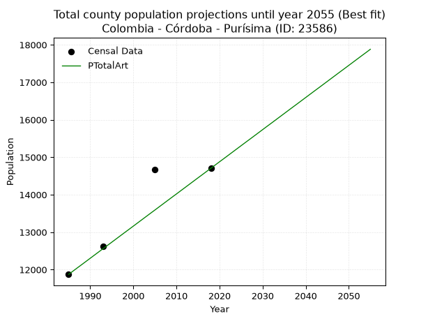
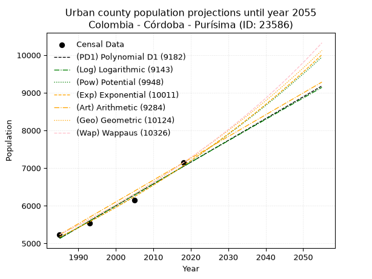
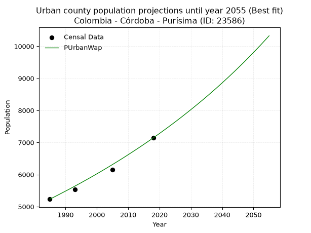
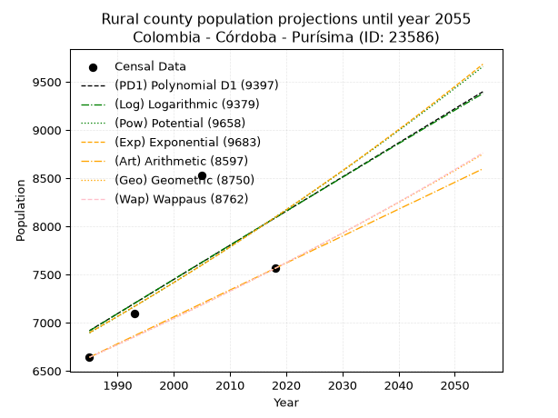
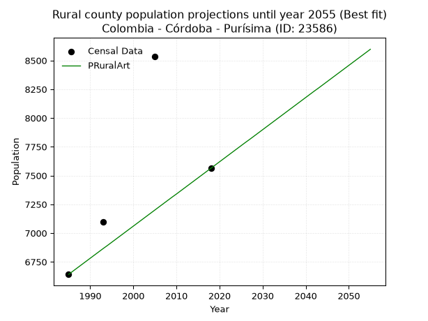

<div align="center">


</div>

# _“Population and Public Services Demand Projections (PPSD) until Year 2050 for Colombia - Córdoba - Purísima (ID: 23586)”_
Keywords: `population` `public-service` `projection` `lineal` `polynomial` `logarithmic` `potential` `exponential` `arithmetic` `geometric` `wappaus` `dane` `colombia` `south-america`

PPSD are analytical estimates used by governments and planners to anticipate future changes in population size, age distribution, and the resulting community needs for utilities, healthcare, education, and infrastructure as sizing future water treatment facilities, electrical grids, and road networks based on spatial growth.

> **General running parameters**: • app_version: _v20260806_. • Python version: _3.14.7_. • Pandas version: _3.0.5_. • NumPy version: _2.5.1_. • Creates, save and include plots into reports (create_plot): _False_. • Projection until year: _2050_. • Process polynomial degree 2 and up: _False_. • Process Wappaus: _True_. • Process Wappaus: _True_. • Set negative values to zero: _True_. • Set infinite values to zero: _True_. • Drop dataset notes: _True_. 
<div align="center">

Dynamic map: [:earth_americas:Google](http://maps.google.com/maps?q=9.239294984,-75.7249874) [:earth_americas:OSM](https://www.openstreetmap.org/#map=18/9.239294984/-75.7249874&layers=P) [:earth_americas:Bing](https://www.bing.com/maps?cp=9.239294984~-75.7249874&lvl=18) [:earth_americas:Apple](https://maps.apple.com/frame?center=9.239294984%2C-75.7249874&span=0.003%2C0.006)

</div>


<div align="center">

```geojson
{
  "type": "Feature",
  "geometry": {
    "type": "Point", 
    "coordinates": [-75.7249874, 9.239294984]
  }, 
  "properties": {
    "Name": "Colombia - Córdoba - Purísima (ID: 23586)"
  }
}
```

</div>


## 0. Census Data (4 records)

Census data are official statistics collected by a government about the people and housing in a country. They usually include counts of total population, age, sex, race, income, education, and jobs.

📅Global census file: [Population.xlsx](../data/Population.xlsx)

| Source   |   Year |   CountryID | CountryName   |   StateID | StateName   |   CountyID | CountyName   |   PTotal |   PUrban |   PRural |
|:---------|-------:|------------:|:--------------|----------:|:------------|-----------:|:-------------|---------:|---------:|---------:|
| DANE     |   1985 |          57 | Colombia      |        23 | Córdoba     |      23586 | Purísima     |    11873 |     5232 |     6641 |
| DANE     |   1993 |          57 | Colombia      |        23 | Córdoba     |      23586 | Purísima     |    12630 |     5536 |     7094 |
| DANE     |   2005 |          57 | Colombia      |        23 | Córdoba     |      23586 | Purísima     |    14677 |     6145 |     8532 |
| DANE     |   2018 |          57 | Colombia      |        23 | Córdoba     |      23586 | Purísima     |    14705 |     7142 |     7563 |

> 🔥Some records could had specific notes about the registered values or the corresponding urban or rural distribution.

📅   [RUPS](https://www.datos.gov.co/Hacienda-y-Cr-dito-P-blico/Registro-nico-de-Prestadores-de-Servicios-P-blicos/4qkq-csdn/about_data) - Local public utility companies: [RUPS.csv](../data/RUPS.xlsx)

 | SERVICIO   | ESTADO   | NOMBRE   | NIT   | DEPARTAMENTO_DOMICILIO   | MUNICIPIO_DOMICILIO   | DIRECCION   | TELEFONO   | EMAIL   | TIPO_INSCRIPCION   | REPRESENTANTE_LEGAL   | TIPO_PRESTADOR   | CLASIFICACION   |
|------------|----------|----------|-------|--------------------------|-----------------------|-------------|------------|---------|--------------------|-----------------------|------------------|-----------------|

## 1. Total

### 1.1. Coefficients and Parameters

* (PD1) Polynomial Deg 1: 93.29385788839812, -173139.7892412684 (lineal)
* (Log) Logarithmic: 186871.40691818073, -1406939.8114785652
* (Pow) Potential: 14.011411276965383, -42.12521467560183
* (Exp) Exponential: 0.006994867070318256, 0.011248451412805732
* (Art) Arithmetic: Year diff. 2018 - 1985 = 33, Population diff. 14705 - 11873 = 2832, Annual growth = 85.81818181818181
* (Geo) Geometric: Year diff. 2018 - 1985 = 33, Population diff. 14705 - 11873 = 2832, Annual growth % = 0.006503500677073726
* (Wap) Wappaus: i = 0.6457835940867019, Condition values only valid for < 200)

<sub>
Wappaus condition values: ['0.00', '0.65', '1.29', '1.94', '2.58', '3.23', '3.87', '4.52', '5.17', '5.81', '6.46', '7.10', '7.75', '8.40', '9.04', '9.69', '10.33', '10.98', '11.62', '12.27', '12.92', '13.56', '14.21', '14.85', '15.50', '16.14', '16.79', '17.44', '18.08', '18.73', '19.37', '20.02', '20.67', '21.31', '21.96', '22.60', '23.25', '23.89', '24.54', '25.19', '25.83', '26.48', '27.12', '27.77', '28.41', '29.06', '29.71', '30.35', '31.00', '31.64', '32.29', '32.93', '33.58', '34.23', '34.87', '35.52', '36.16', '36.81', '37.46', '38.10', '38.75', '39.39', '40.04', '40.68', '41.33', '41.98']
</sub>


### 1.2. Projected Dataset

|   Year |   CountyID |   PTotalPD1 |   PTotalLog |   PTotalPow |   PTotalExp |   PTotalArt |   PTotalGeo |   PTotalWap |
|-------:|-----------:|------------:|------------:|------------:|------------:|------------:|------------:|------------:|
|   1985 |      23586 |       12049 |       12045 |       12052 |       12056 |       11873 |       11873 |       11873 |
|   1986 |      23586 |       12142 |       12139 |       12137 |       12140 |       11959 |       11950 |       11950 |
|   1987 |      23586 |       12235 |       12233 |       12223 |       12225 |       12045 |       12028 |       12027 |
|   1988 |      23586 |       12328 |       12327 |       12310 |       12311 |       12130 |       12106 |       12105 |
|   1989 |      23586 |       12422 |       12421 |       12397 |       12398 |       12216 |       12185 |       12184 |
|   1990 |      23586 |       12515 |       12515 |       12485 |       12485 |       12302 |       12264 |       12263 |
|   1991 |      23586 |       12608 |       12609 |       12573 |       12572 |       12388 |       12344 |       12342 |
|   1992 |      23586 |       12702 |       12703 |       12661 |       12661 |       12474 |       12424 |       12422 |
|   1993 |      23586 |       12795 |       12796 |       12751 |       12749 |       12560 |       12505 |       12503 |
|   1994 |      23586 |       12888 |       12890 |       12841 |       12839 |       12645 |       12586 |       12584 |
|   1995 |      23586 |       12981 |       12984 |       12931 |       12929 |       12731 |       12668 |       12665 |
|   1996 |      23586 |       13075 |       13077 |       13022 |       13020 |       12817 |       12751 |       12747 |
|   1997 |      23586 |       13168 |       13171 |       13114 |       13111 |       12903 |       12833 |       12830 |
|   1998 |      23586 |       13261 |       13265 |       13206 |       13203 |       12989 |       12917 |       12913 |
|   1999 |      23586 |       13355 |       13358 |       13299 |       13296 |       13074 |       13001 |       12997 |
|   2000 |      23586 |       13448 |       13452 |       13393 |       13389 |       13160 |       13085 |       13082 |
|   2001 |      23586 |       13541 |       13545 |       13487 |       13483 |       13246 |       13171 |       13167 |
|   2002 |      23586 |       13635 |       13638 |       13582 |       13578 |       13332 |       13256 |       13252 |
|   2003 |      23586 |       13728 |       13732 |       13677 |       13673 |       13418 |       13342 |       13338 |
|   2004 |      23586 |       13821 |       13825 |       13773 |       13769 |       13504 |       13429 |       13425 |
|   2005 |      23586 |       13914 |       13918 |       13870 |       13866 |       13589 |       13517 |       13512 |
|   2006 |      23586 |       14008 |       14011 |       13967 |       13963 |       13675 |       13604 |       13600 |
|   2007 |      23586 |       14101 |       14104 |       14065 |       14061 |       13761 |       13693 |       13689 |
|   2008 |      23586 |       14194 |       14198 |       14163 |       14160 |       13847 |       13782 |       13778 |
|   2009 |      23586 |       14288 |       14291 |       14263 |       14259 |       13933 |       13872 |       13868 |
|   2010 |      23586 |       14381 |       14384 |       14362 |       14359 |       14018 |       13962 |       13958 |
|   2011 |      23586 |       14474 |       14477 |       14463 |       14460 |       14104 |       14053 |       14049 |
|   2012 |      23586 |       14567 |       14569 |       14564 |       14562 |       14190 |       14144 |       14141 |
|   2013 |      23586 |       14661 |       14662 |       14666 |       14664 |       14276 |       14236 |       14233 |
|   2014 |      23586 |       14754 |       14755 |       14768 |       14767 |       14362 |       14329 |       14326 |
|   2015 |      23586 |       14847 |       14848 |       14871 |       14870 |       14448 |       14422 |       14420 |
|   2016 |      23586 |       14941 |       14941 |       14975 |       14975 |       14533 |       14516 |       14514 |
|   2017 |      23586 |       15034 |       15033 |       15079 |       15080 |       14619 |       14610 |       14609 |
|   2018 |      23586 |       15127 |       15126 |       15184 |       15186 |       14705 |       14705 |       14705 |
|   2019 |      23586 |       15221 |       15218 |       15290 |       15292 |       14791 |       14801 |       14801 |
|   2020 |      23586 |       15314 |       15311 |       15397 |       15400 |       14877 |       14897 |       14899 |
|   2021 |      23586 |       15407 |       15403 |       15504 |       15508 |       14962 |       14994 |       14996 |
|   2022 |      23586 |       15500 |       15496 |       15611 |       15617 |       15048 |       15091 |       15095 |
|   2023 |      23586 |       15594 |       15588 |       15720 |       15726 |       15134 |       15189 |       15194 |
|   2024 |      23586 |       15687 |       15681 |       15829 |       15837 |       15220 |       15288 |       15294 |
|   2025 |      23586 |       15780 |       15773 |       15939 |       15948 |       15306 |       15388 |       15395 |
|   2026 |      23586 |       15874 |       15865 |       16050 |       16060 |       15392 |       15488 |       15496 |
|   2027 |      23586 |       15967 |       15957 |       16161 |       16173 |       15477 |       15588 |       15599 |
|   2028 |      23586 |       16060 |       16050 |       16273 |       16286 |       15563 |       15690 |       15702 |
|   2029 |      23586 |       16153 |       16142 |       16386 |       16400 |       15649 |       15792 |       15805 |
|   2030 |      23586 |       16247 |       16234 |       16500 |       16516 |       15735 |       15895 |       15910 |
|   2031 |      23586 |       16340 |       16326 |       16614 |       16631 |       15821 |       15998 |       16015 |
|   2032 |      23586 |       16433 |       16418 |       16729 |       16748 |       15906 |       16102 |       16121 |
|   2033 |      23586 |       16527 |       16510 |       16845 |       16866 |       15992 |       16207 |       16228 |
|   2034 |      23586 |       16620 |       16602 |       16961 |       16984 |       16078 |       16312 |       16336 |
|   2035 |      23586 |       16713 |       16693 |       17078 |       17103 |       16164 |       16418 |       16445 |
|   2036 |      23586 |       16807 |       16785 |       17196 |       17223 |       16250 |       16525 |       16554 |
|   2037 |      23586 |       16900 |       16877 |       17315 |       17344 |       16336 |       16632 |       16665 |
|   2038 |      23586 |       16993 |       16969 |       17434 |       17466 |       16421 |       16741 |       16776 |
|   2039 |      23586 |       17086 |       17060 |       17555 |       17589 |       16507 |       16849 |       16888 |
|   2040 |      23586 |       17180 |       17152 |       17676 |       17712 |       16593 |       16959 |       17001 |
|   2041 |      23586 |       17273 |       17244 |       17797 |       17836 |       16679 |       17069 |       17115 |
|   2042 |      23586 |       17366 |       17335 |       17920 |       17962 |       16765 |       17180 |       17229 |
|   2043 |      23586 |       17460 |       17427 |       18043 |       18088 |       16850 |       17292 |       17345 |
|   2044 |      23586 |       17553 |       17518 |       18167 |       18215 |       16936 |       17405 |       17461 |
|   2045 |      23586 |       17646 |       17610 |       18292 |       18343 |       17022 |       17518 |       17579 |
|   2046 |      23586 |       17739 |       17701 |       18418 |       18471 |       17108 |       17632 |       17697 |
|   2047 |      23586 |       17833 |       17792 |       18545 |       18601 |       17194 |       17746 |       17817 |
|   2048 |      23586 |       17926 |       17883 |       18672 |       18732 |       17280 |       17862 |       17937 |
|   2049 |      23586 |       18019 |       17975 |       18800 |       18863 |       17365 |       17978 |       18058 |
|   2050 |      23586 |       18113 |       18066 |       18929 |       18995 |       17451 |       18095 |       18181 |
<div align="center">

</img>

</div>


### 1.3. Best fit with absolute and relative error (%)

Relative error puts that difference into context by dividing the absolute error by the true value, creating a unitless ratio or percentage that shows the scale of the mistake.

Absolute and relative error

|   Year | Source   |   CountryID | CountryName   |   StateID | StateName   |   CountyID_x | CountyName   |   PTotal |   PUrban |   PRural |   CountyID_y |   PTotalPD1 |   PTotalLog |   PTotalPow |   PTotalExp |   PTotalArt |   PTotalGeo |   PTotalWap |   PTotalPD1AbsError |   PTotalLogAbsError |   PTotalPowAbsError |   PTotalExpAbsError |   PTotalArtAbsError |   PTotalGeoAbsError |   PTotalWapAbsError |   PTotalPD1RelError |   PTotalLogRelError |   PTotalPowRelError |   PTotalExpRelError |   PTotalArtRelError |   PTotalGeoRelError |   PTotalWapRelError |
|-------:|:---------|------------:|:--------------|----------:|:------------|-------------:|:-------------|---------:|---------:|---------:|-------------:|------------:|------------:|------------:|------------:|------------:|------------:|------------:|--------------------:|--------------------:|--------------------:|--------------------:|--------------------:|--------------------:|--------------------:|--------------------:|--------------------:|--------------------:|--------------------:|--------------------:|--------------------:|--------------------:|
|   1985 | DANE     |          57 | Colombia      |        23 | Córdoba     |        23586 | Purísima     |    11873 |     5232 |     6641 |        23586 |       12049 |       12045 |       12052 |       12056 |       11873 |       11873 |       11873 |                 176 |                 172 |                 179 |                 183 |                   0 |                   0 |                   0 |             1.48235 |             1.44867 |            1.50762  |            1.54131  |            0        |            0        |             0       |
|   1993 | DANE     |          57 | Colombia      |        23 | Córdoba     |        23586 | Purísima     |    12630 |     5536 |     7094 |        23586 |       12795 |       12796 |       12751 |       12749 |       12560 |       12505 |       12503 |                 165 |                 166 |                 121 |                 119 |                  70 |                 125 |                 127 |             1.30641 |             1.31433 |            0.958036 |            0.942201 |            0.554236 |            0.989707 |             1.00554 |
|   2005 | DANE     |          57 | Colombia      |        23 | Córdoba     |        23586 | Purísima     |    14677 |     6145 |     8532 |        23586 |       13914 |       13918 |       13870 |       13866 |       13589 |       13517 |       13512 |                 763 |                 759 |                 807 |                 811 |                1088 |                1160 |                1165 |             5.19861 |             5.17136 |            5.4984   |            5.52565  |            7.41296  |            7.90352  |             7.93759 |
|   2018 | DANE     |          57 | Colombia      |        23 | Córdoba     |        23586 | Purísima     |    14705 |     7142 |     7563 |        23586 |       15127 |       15126 |       15184 |       15186 |       14705 |       14705 |       14705 |                 422 |                 421 |                 479 |                 481 |                   0 |                   0 |                   0 |             2.86977 |             2.86297 |            3.2574   |            3.271    |            0        |            0        |             0       |

Relative error mean

| Method    |   RelError | Best   |
|:----------|-----------:|:-------|
| PTotalPD1 |    2.71429 |        |
| PTotalLog |    2.69933 |        |
| PTotalPow |    2.80536 |        |
| PTotalExp |    2.82004 |        |
| PTotalArt |    1.9918  | True   |
| PTotalGeo |    2.22331 |        |
| PTotalWap |    2.23578 |        |

💙Best method: _**PTotalArt**_
<div align="center">

</img>

</div>


### 1.4. Fresh water supply demand in liters per capita per day (lpcd)

The fresh water supply demand typically ranges from 100 to 300 liters per capita per day (lpcd) for standard domestic and municipal planning, though absolute survival minimums set by the World Health Organization are as low as 7.5 to 20 liters per day, and total consumption in high-income nations can exceed 400 liters.

> `CZ`: Level in meters above the sea level (masl)<br> `WS`: Fresh water supply demand in liters per capita per day (lpcd or l/h/d)<br> `WSAll`: Zonal fresh water supply demand in liters per second (l/s)<br> `A`: Zonal area in square meters<br> `DP`: Population density (people/hectare or p/ha)

Reference values (RAS Colombia)

|    CZ |   WS |
|------:|-----:|
|  1000 |  120 |
|  2000 |  130 |
| 99999 |  140 |

County shapefile geometry properties and water supply values

|   CountyID |      ATotal |   CZTotal |   WSTotal |
|-----------:|------------:|----------:|----------:|
|      23586 | 1.17495e+08 |   38.2567 |       120 |

Projected values for best method: PTotalArt

|   CountyID |   Year |   PTotalArt |   DPTotal |   WSTotal |   WSTotalAll |
|-----------:|-------:|------------:|----------:|----------:|-------------:|
|      23586 |   1985 |       11873 |      1.01 |       120 |      16.4903 |
|      23586 |   1986 |       11959 |      1.02 |       120 |      16.6097 |
|      23586 |   1987 |       12045 |      1.03 |       120 |      16.7292 |
|      23586 |   1988 |       12130 |      1.03 |       120 |      16.8472 |
|      23586 |   1989 |       12216 |      1.04 |       120 |      16.9667 |
|      23586 |   1990 |       12302 |      1.05 |       120 |      17.0861 |
|      23586 |   1991 |       12388 |      1.05 |       120 |      17.2056 |
|      23586 |   1992 |       12474 |      1.06 |       120 |      17.325  |
|      23586 |   1993 |       12560 |      1.07 |       120 |      17.4444 |
|      23586 |   1994 |       12645 |      1.08 |       120 |      17.5625 |
|      23586 |   1995 |       12731 |      1.08 |       120 |      17.6819 |
|      23586 |   1996 |       12817 |      1.09 |       120 |      17.8014 |
|      23586 |   1997 |       12903 |      1.1  |       120 |      17.9208 |
|      23586 |   1998 |       12989 |      1.11 |       120 |      18.0403 |
|      23586 |   1999 |       13074 |      1.11 |       120 |      18.1583 |
|      23586 |   2000 |       13160 |      1.12 |       120 |      18.2778 |
|      23586 |   2001 |       13246 |      1.13 |       120 |      18.3972 |
|      23586 |   2002 |       13332 |      1.13 |       120 |      18.5167 |
|      23586 |   2003 |       13418 |      1.14 |       120 |      18.6361 |
|      23586 |   2004 |       13504 |      1.15 |       120 |      18.7556 |
|      23586 |   2005 |       13589 |      1.16 |       120 |      18.8736 |
|      23586 |   2006 |       13675 |      1.16 |       120 |      18.9931 |
|      23586 |   2007 |       13761 |      1.17 |       120 |      19.1125 |
|      23586 |   2008 |       13847 |      1.18 |       120 |      19.2319 |
|      23586 |   2009 |       13933 |      1.19 |       120 |      19.3514 |
|      23586 |   2010 |       14018 |      1.19 |       120 |      19.4694 |
|      23586 |   2011 |       14104 |      1.2  |       120 |      19.5889 |
|      23586 |   2012 |       14190 |      1.21 |       120 |      19.7083 |
|      23586 |   2013 |       14276 |      1.22 |       120 |      19.8278 |
|      23586 |   2014 |       14362 |      1.22 |       120 |      19.9472 |
|      23586 |   2015 |       14448 |      1.23 |       120 |      20.0667 |
|      23586 |   2016 |       14533 |      1.24 |       120 |      20.1847 |
|      23586 |   2017 |       14619 |      1.24 |       120 |      20.3042 |
|      23586 |   2018 |       14705 |      1.25 |       120 |      20.4236 |
|      23586 |   2019 |       14791 |      1.26 |       120 |      20.5431 |
|      23586 |   2020 |       14877 |      1.27 |       120 |      20.6625 |
|      23586 |   2021 |       14962 |      1.27 |       120 |      20.7806 |
|      23586 |   2022 |       15048 |      1.28 |       120 |      20.9    |
|      23586 |   2023 |       15134 |      1.29 |       120 |      21.0194 |
|      23586 |   2024 |       15220 |      1.3  |       120 |      21.1389 |
|      23586 |   2025 |       15306 |      1.3  |       120 |      21.2583 |
|      23586 |   2026 |       15392 |      1.31 |       120 |      21.3778 |
|      23586 |   2027 |       15477 |      1.32 |       120 |      21.4958 |
|      23586 |   2028 |       15563 |      1.32 |       120 |      21.6153 |
|      23586 |   2029 |       15649 |      1.33 |       120 |      21.7347 |
|      23586 |   2030 |       15735 |      1.34 |       120 |      21.8542 |
|      23586 |   2031 |       15821 |      1.35 |       120 |      21.9736 |
|      23586 |   2032 |       15906 |      1.35 |       120 |      22.0917 |
|      23586 |   2033 |       15992 |      1.36 |       120 |      22.2111 |
|      23586 |   2034 |       16078 |      1.37 |       120 |      22.3306 |
|      23586 |   2035 |       16164 |      1.38 |       120 |      22.45   |
|      23586 |   2036 |       16250 |      1.38 |       120 |      22.5694 |
|      23586 |   2037 |       16336 |      1.39 |       120 |      22.6889 |
|      23586 |   2038 |       16421 |      1.4  |       120 |      22.8069 |
|      23586 |   2039 |       16507 |      1.4  |       120 |      22.9264 |
|      23586 |   2040 |       16593 |      1.41 |       120 |      23.0458 |
|      23586 |   2041 |       16679 |      1.42 |       120 |      23.1653 |
|      23586 |   2042 |       16765 |      1.43 |       120 |      23.2847 |
|      23586 |   2043 |       16850 |      1.43 |       120 |      23.4028 |
|      23586 |   2044 |       16936 |      1.44 |       120 |      23.5222 |
|      23586 |   2045 |       17022 |      1.45 |       120 |      23.6417 |
|      23586 |   2046 |       17108 |      1.46 |       120 |      23.7611 |
|      23586 |   2047 |       17194 |      1.46 |       120 |      23.8806 |
|      23586 |   2048 |       17280 |      1.47 |       120 |      24      |
|      23586 |   2049 |       17365 |      1.48 |       120 |      24.1181 |
|      23586 |   2050 |       17451 |      1.49 |       120 |      24.2375 |

## 2. Urban

### 2.1. Coefficients and Parameters

* (PD1) Polynomial Deg 1: 57.86471296667939, -109730.14211160046 (lineal)
* (Log) Logarithmic: 115783.88590912499, -874060.4946290908
* (Pow) Potential: 18.889396535154184, -58.5792790933492
* (Exp) Exponential: 0.009439310965065327, 3.7682976292365835e-05
* (Art) Arithmetic: Year diff. 2018 - 1985 = 33, Population diff. 7142 - 5232 = 1910, Annual growth = 57.878787878787875
* (Geo) Geometric: Year diff. 2018 - 1985 = 33, Population diff. 7142 - 5232 = 1910, Annual growth % = 0.00947488504091698
* (Wap) Wappaus: i = 0.9354903487762709, Condition values only valid for < 200)

<sub>
Wappaus condition values: ['0.00', '0.94', '1.87', '2.81', '3.74', '4.68', '5.61', '6.55', '7.48', '8.42', '9.35', '10.29', '11.23', '12.16', '13.10', '14.03', '14.97', '15.90', '16.84', '17.77', '18.71', '19.65', '20.58', '21.52', '22.45', '23.39', '24.32', '25.26', '26.19', '27.13', '28.06', '29.00', '29.94', '30.87', '31.81', '32.74', '33.68', '34.61', '35.55', '36.48', '37.42', '38.36', '39.29', '40.23', '41.16', '42.10', '43.03', '43.97', '44.90', '45.84', '46.77', '47.71', '48.65', '49.58', '50.52', '51.45', '52.39', '53.32', '54.26', '55.19', '56.13', '57.06', '58.00', '58.94', '59.87', '60.81']
</sub>


### 2.2. Projected Dataset

|   Year |   CountyID |   PUrbanPD1 |   PUrbanLog |   PUrbanPow |   PUrbanExp |   PUrbanArt |   PUrbanGeo |   PUrbanWap |
|-------:|-----------:|------------:|------------:|------------:|------------:|------------:|------------:|------------:|
|   1985 |      23586 |        5131 |        5130 |        5169 |        5171 |        5232 |        5232 |        5232 |
|   1986 |      23586 |        5189 |        5188 |        5219 |        5220 |        5290 |        5282 |        5281 |
|   1987 |      23586 |        5247 |        5246 |        5269 |        5269 |        5348 |        5332 |        5331 |
|   1988 |      23586 |        5305 |        5305 |        5319 |        5319 |        5406 |        5382 |        5381 |
|   1989 |      23586 |        5363 |        5363 |        5370 |        5369 |        5464 |        5433 |        5432 |
|   1990 |      23586 |        5421 |        5421 |        5421 |        5420 |        5521 |        5485 |        5483 |
|   1991 |      23586 |        5479 |        5479 |        5473 |        5472 |        5579 |        5537 |        5534 |
|   1992 |      23586 |        5536 |        5537 |        5525 |        5524 |        5637 |        5589 |        5586 |
|   1993 |      23586 |        5594 |        5596 |        5577 |        5576 |        5695 |        5642 |        5639 |
|   1994 |      23586 |        5652 |        5654 |        5630 |        5629 |        5753 |        5695 |        5692 |
|   1995 |      23586 |        5710 |        5712 |        5684 |        5682 |        5811 |        5749 |        5745 |
|   1996 |      23586 |        5768 |        5770 |        5738 |        5736 |        5869 |        5804 |        5800 |
|   1997 |      23586 |        5826 |        5828 |        5793 |        5791 |        5927 |        5859 |        5854 |
|   1998 |      23586 |        5884 |        5886 |        5848 |        5846 |        5984 |        5914 |        5909 |
|   1999 |      23586 |        5941 |        5944 |        5903 |        5901 |        6042 |        5970 |        5965 |
|   2000 |      23586 |        5999 |        6002 |        5959 |        5957 |        6100 |        6027 |        6022 |
|   2001 |      23586 |        6057 |        6059 |        6016 |        6013 |        6158 |        6084 |        6078 |
|   2002 |      23586 |        6115 |        6117 |        6073 |        6071 |        6216 |        6142 |        6136 |
|   2003 |      23586 |        6173 |        6175 |        6130 |        6128 |        6274 |        6200 |        6194 |
|   2004 |      23586 |        6231 |        6233 |        6188 |        6186 |        6332 |        6259 |        6253 |
|   2005 |      23586 |        6289 |        6291 |        6247 |        6245 |        6390 |        6318 |        6312 |
|   2006 |      23586 |        6346 |        6348 |        6306 |        6304 |        6447 |        6378 |        6372 |
|   2007 |      23586 |        6404 |        6406 |        6366 |        6364 |        6505 |        6438 |        6432 |
|   2008 |      23586 |        6462 |        6464 |        6426 |        6424 |        6563 |        6499 |        6493 |
|   2009 |      23586 |        6520 |        6521 |        6487 |        6485 |        6621 |        6561 |        6555 |
|   2010 |      23586 |        6578 |        6579 |        6548 |        6547 |        6679 |        6623 |        6618 |
|   2011 |      23586 |        6636 |        6637 |        6610 |        6609 |        6737 |        6686 |        6681 |
|   2012 |      23586 |        6694 |        6694 |        6672 |        6671 |        6795 |        6749 |        6745 |
|   2013 |      23586 |        6752 |        6752 |        6735 |        6735 |        6853 |        6813 |        6809 |
|   2014 |      23586 |        6809 |        6809 |        6798 |        6799 |        6910 |        6878 |        6874 |
|   2015 |      23586 |        6867 |        6867 |        6863 |        6863 |        6968 |        6943 |        6940 |
|   2016 |      23586 |        6925 |        6924 |        6927 |        6928 |        7026 |        7009 |        7007 |
|   2017 |      23586 |        6983 |        6982 |        6992 |        6994 |        7084 |        7075 |        7074 |
|   2018 |      23586 |        7041 |        7039 |        7058 |        7060 |        7142 |        7142 |        7142 |
|   2019 |      23586 |        7099 |        7096 |        7124 |        7127 |        7200 |        7210 |        7211 |
|   2020 |      23586 |        7157 |        7154 |        7191 |        7195 |        7258 |        7278 |        7280 |
|   2021 |      23586 |        7214 |        7211 |        7259 |        7263 |        7316 |        7347 |        7351 |
|   2022 |      23586 |        7272 |        7268 |        7327 |        7332 |        7374 |        7417 |        7422 |
|   2023 |      23586 |        7330 |        7325 |        7396 |        7401 |        7431 |        7487 |        7494 |
|   2024 |      23586 |        7388 |        7383 |        7465 |        7472 |        7489 |        7558 |        7567 |
|   2025 |      23586 |        7446 |        7440 |        7535 |        7542 |        7547 |        7629 |        7640 |
|   2026 |      23586 |        7504 |        7497 |        7606 |        7614 |        7605 |        7702 |        7715 |
|   2027 |      23586 |        7562 |        7554 |        7677 |        7686 |        7663 |        7775 |        7790 |
|   2028 |      23586 |        7619 |        7611 |        7749 |        7759 |        7721 |        7848 |        7867 |
|   2029 |      23586 |        7677 |        7668 |        7821 |        7833 |        7779 |        7923 |        7944 |
|   2030 |      23586 |        7735 |        7725 |        7895 |        7907 |        7837 |        7998 |        8022 |
|   2031 |      23586 |        7793 |        7782 |        7968 |        7982 |        7894 |        8073 |        8101 |
|   2032 |      23586 |        7851 |        7839 |        8043 |        8058 |        7952 |        8150 |        8181 |
|   2033 |      23586 |        7909 |        7896 |        8118 |        8134 |        8010 |        8227 |        8262 |
|   2034 |      23586 |        7967 |        7953 |        8194 |        8211 |        8068 |        8305 |        8343 |
|   2035 |      23586 |        8025 |        8010 |        8270 |        8289 |        8126 |        8384 |        8426 |
|   2036 |      23586 |        8082 |        8067 |        8347 |        8368 |        8184 |        8463 |        8510 |
|   2037 |      23586 |        8140 |        8124 |        8425 |        8447 |        8242 |        8543 |        8595 |
|   2038 |      23586 |        8198 |        8181 |        8503 |        8527 |        8300 |        8624 |        8681 |
|   2039 |      23586 |        8256 |        8238 |        8583 |        8608 |        8357 |        8706 |        8768 |
|   2040 |      23586 |        8314 |        8294 |        8662 |        8690 |        8415 |        8789 |        8856 |
|   2041 |      23586 |        8372 |        8351 |        8743 |        8772 |        8473 |        8872 |        8946 |
|   2042 |      23586 |        8430 |        8408 |        8824 |        8855 |        8531 |        8956 |        9036 |
|   2043 |      23586 |        8487 |        8464 |        8906 |        8939 |        8589 |        9041 |        9128 |
|   2044 |      23586 |        8545 |        8521 |        8989 |        9024 |        8647 |        9126 |        9220 |
|   2045 |      23586 |        8603 |        8578 |        9072 |        9110 |        8705 |        9213 |        9314 |
|   2046 |      23586 |        8661 |        8634 |        9157 |        9196 |        8763 |        9300 |        9410 |
|   2047 |      23586 |        8719 |        8691 |        9241 |        9283 |        8820 |        9388 |        9506 |
|   2048 |      23586 |        8777 |        8748 |        9327 |        9371 |        8878 |        9477 |        9604 |
|   2049 |      23586 |        8835 |        8804 |        9413 |        9460 |        8936 |        9567 |        9703 |
|   2050 |      23586 |        8893 |        8861 |        9501 |        9550 |        8994 |        9658 |        9803 |
<div align="center">

</img>

</div>


### 2.3. Best fit with absolute and relative error (%)

Relative error puts that difference into context by dividing the absolute error by the true value, creating a unitless ratio or percentage that shows the scale of the mistake.

Absolute and relative error

|   Year | Source   |   CountryID | CountryName   |   StateID | StateName   |   CountyID_x | CountyName   |   PTotal |   PUrban |   PRural |   CountyID_y |   PUrbanPD1 |   PUrbanLog |   PUrbanPow |   PUrbanExp |   PUrbanArt |   PUrbanGeo |   PUrbanWap |   PUrbanPD1AbsError |   PUrbanLogAbsError |   PUrbanPowAbsError |   PUrbanExpAbsError |   PUrbanArtAbsError |   PUrbanGeoAbsError |   PUrbanWapAbsError |   PUrbanPD1RelError |   PUrbanLogRelError |   PUrbanPowRelError |   PUrbanExpRelError |   PUrbanArtRelError |   PUrbanGeoRelError |   PUrbanWapRelError |
|-------:|:---------|------------:|:--------------|----------:|:------------|-------------:|:-------------|---------:|---------:|---------:|-------------:|------------:|------------:|------------:|------------:|------------:|------------:|------------:|--------------------:|--------------------:|--------------------:|--------------------:|--------------------:|--------------------:|--------------------:|--------------------:|--------------------:|--------------------:|--------------------:|--------------------:|--------------------:|--------------------:|
|   1985 | DANE     |          57 | Colombia      |        23 | Córdoba     |        23586 | Purísima     |    11873 |     5232 |     6641 |        23586 |        5131 |        5130 |        5169 |        5171 |        5232 |        5232 |        5232 |                 101 |                 102 |                  63 |                  61 |                   0 |                   0 |                   0 |             1.93043 |             1.94954 |            1.20413  |            1.1659   |             0       |             0       |             0       |
|   1993 | DANE     |          57 | Colombia      |        23 | Córdoba     |        23586 | Purísima     |    12630 |     5536 |     7094 |        23586 |        5594 |        5596 |        5577 |        5576 |        5695 |        5642 |        5639 |                  58 |                  60 |                  41 |                  40 |                 159 |                 106 |                 103 |             1.04769 |             1.08382 |            0.740607 |            0.722543 |             2.87211 |             1.91474 |             1.86055 |
|   2005 | DANE     |          57 | Colombia      |        23 | Córdoba     |        23586 | Purísima     |    14677 |     6145 |     8532 |        23586 |        6289 |        6291 |        6247 |        6245 |        6390 |        6318 |        6312 |                 144 |                 146 |                 102 |                 100 |                 245 |                 173 |                 167 |             2.34337 |             2.37592 |            1.65989  |            1.62734  |             3.98698 |             2.8153  |             2.71766 |
|   2018 | DANE     |          57 | Colombia      |        23 | Córdoba     |        23586 | Purísima     |    14705 |     7142 |     7563 |        23586 |        7041 |        7039 |        7058 |        7060 |        7142 |        7142 |        7142 |                 101 |                 103 |                  84 |                  82 |                   0 |                   0 |                   0 |             1.41417 |             1.44217 |            1.17614  |            1.14814  |             0       |             0       |             0       |

Relative error mean

| Method    |   RelError | Best   |
|:----------|-----------:|:-------|
| PUrbanPD1 |    1.68391 |        |
| PUrbanLog |    1.71286 |        |
| PUrbanPow |    1.19519 |        |
| PUrbanExp |    1.16598 |        |
| PUrbanArt |    1.71477 |        |
| PUrbanGeo |    1.18251 |        |
| PUrbanWap |    1.14455 | True   |

💙Best method: _**PUrbanWap**_
<div align="center">

</img>

</div>


### 2.4. Fresh water supply demand in liters per capita per day (lpcd)

The fresh water supply demand typically ranges from 100 to 300 liters per capita per day (lpcd) for standard domestic and municipal planning, though absolute survival minimums set by the World Health Organization are as low as 7.5 to 20 liters per day, and total consumption in high-income nations can exceed 400 liters.

> `CZ`: Level in meters above the sea level (masl)<br> `WS`: Fresh water supply demand in liters per capita per day (lpcd or l/h/d)<br> `WSAll`: Zonal fresh water supply demand in liters per second (l/s)<br> `A`: Zonal area in square meters<br> `DP`: Population density (people/hectare or p/ha)

Reference values (RAS Colombia)

|    CZ |   WS |
|------:|-----:|
|  1000 |  120 |
|  2000 |  130 |
| 99999 |  140 |

County shapefile geometry properties and water supply values

|   CountyID |      AUrban |   CZUrban |   WSUrban |
|-----------:|------------:|----------:|----------:|
|      23586 | 2.04509e+06 |   9.91794 |       120 |

Projected values for best method: PUrbanWap

|   CountyID |   Year |   PUrbanWap |   DPUrban |   WSUrban |   WSUrbanAll |
|-----------:|-------:|------------:|----------:|----------:|-------------:|
|      23586 |   1985 |        5232 |     25.58 |       120 |      7.26667 |
|      23586 |   1986 |        5281 |     25.82 |       120 |      7.33472 |
|      23586 |   1987 |        5331 |     26.07 |       120 |      7.40417 |
|      23586 |   1988 |        5381 |     26.31 |       120 |      7.47361 |
|      23586 |   1989 |        5432 |     26.56 |       120 |      7.54444 |
|      23586 |   1990 |        5483 |     26.81 |       120 |      7.61528 |
|      23586 |   1991 |        5534 |     27.06 |       120 |      7.68611 |
|      23586 |   1992 |        5586 |     27.31 |       120 |      7.75833 |
|      23586 |   1993 |        5639 |     27.57 |       120 |      7.83194 |
|      23586 |   1994 |        5692 |     27.83 |       120 |      7.90556 |
|      23586 |   1995 |        5745 |     28.09 |       120 |      7.97917 |
|      23586 |   1996 |        5800 |     28.36 |       120 |      8.05556 |
|      23586 |   1997 |        5854 |     28.62 |       120 |      8.13056 |
|      23586 |   1998 |        5909 |     28.89 |       120 |      8.20694 |
|      23586 |   1999 |        5965 |     29.17 |       120 |      8.28472 |
|      23586 |   2000 |        6022 |     29.45 |       120 |      8.36389 |
|      23586 |   2001 |        6078 |     29.72 |       120 |      8.44167 |
|      23586 |   2002 |        6136 |     30    |       120 |      8.52222 |
|      23586 |   2003 |        6194 |     30.29 |       120 |      8.60278 |
|      23586 |   2004 |        6253 |     30.58 |       120 |      8.68472 |
|      23586 |   2005 |        6312 |     30.86 |       120 |      8.76667 |
|      23586 |   2006 |        6372 |     31.16 |       120 |      8.85    |
|      23586 |   2007 |        6432 |     31.45 |       120 |      8.93333 |
|      23586 |   2008 |        6493 |     31.75 |       120 |      9.01806 |
|      23586 |   2009 |        6555 |     32.05 |       120 |      9.10417 |
|      23586 |   2010 |        6618 |     32.36 |       120 |      9.19167 |
|      23586 |   2011 |        6681 |     32.67 |       120 |      9.27917 |
|      23586 |   2012 |        6745 |     32.98 |       120 |      9.36806 |
|      23586 |   2013 |        6809 |     33.29 |       120 |      9.45694 |
|      23586 |   2014 |        6874 |     33.61 |       120 |      9.54722 |
|      23586 |   2015 |        6940 |     33.94 |       120 |      9.63889 |
|      23586 |   2016 |        7007 |     34.26 |       120 |      9.73194 |
|      23586 |   2017 |        7074 |     34.59 |       120 |      9.825   |
|      23586 |   2018 |        7142 |     34.92 |       120 |      9.91944 |
|      23586 |   2019 |        7211 |     35.26 |       120 |     10.0153  |
|      23586 |   2020 |        7280 |     35.6  |       120 |     10.1111  |
|      23586 |   2021 |        7351 |     35.94 |       120 |     10.2097  |
|      23586 |   2022 |        7422 |     36.29 |       120 |     10.3083  |
|      23586 |   2023 |        7494 |     36.64 |       120 |     10.4083  |
|      23586 |   2024 |        7567 |     37    |       120 |     10.5097  |
|      23586 |   2025 |        7640 |     37.36 |       120 |     10.6111  |
|      23586 |   2026 |        7715 |     37.72 |       120 |     10.7153  |
|      23586 |   2027 |        7790 |     38.09 |       120 |     10.8194  |
|      23586 |   2028 |        7867 |     38.47 |       120 |     10.9264  |
|      23586 |   2029 |        7944 |     38.84 |       120 |     11.0333  |
|      23586 |   2030 |        8022 |     39.23 |       120 |     11.1417  |
|      23586 |   2031 |        8101 |     39.61 |       120 |     11.2514  |
|      23586 |   2032 |        8181 |     40    |       120 |     11.3625  |
|      23586 |   2033 |        8262 |     40.4  |       120 |     11.475   |
|      23586 |   2034 |        8343 |     40.8  |       120 |     11.5875  |
|      23586 |   2035 |        8426 |     41.2  |       120 |     11.7028  |
|      23586 |   2036 |        8510 |     41.61 |       120 |     11.8194  |
|      23586 |   2037 |        8595 |     42.03 |       120 |     11.9375  |
|      23586 |   2038 |        8681 |     42.45 |       120 |     12.0569  |
|      23586 |   2039 |        8768 |     42.87 |       120 |     12.1778  |
|      23586 |   2040 |        8856 |     43.3  |       120 |     12.3     |
|      23586 |   2041 |        8946 |     43.74 |       120 |     12.425   |
|      23586 |   2042 |        9036 |     44.18 |       120 |     12.55    |
|      23586 |   2043 |        9128 |     44.63 |       120 |     12.6778  |
|      23586 |   2044 |        9220 |     45.08 |       120 |     12.8056  |
|      23586 |   2045 |        9314 |     45.54 |       120 |     12.9361  |
|      23586 |   2046 |        9410 |     46.01 |       120 |     13.0694  |
|      23586 |   2047 |        9506 |     46.48 |       120 |     13.2028  |
|      23586 |   2048 |        9604 |     46.96 |       120 |     13.3389  |
|      23586 |   2049 |        9703 |     47.45 |       120 |     13.4764  |
|      23586 |   2050 |        9803 |     47.93 |       120 |     13.6153  |

## 3. Rural

### 3.1. Coefficients and Parameters

* (PD1) Polynomial Deg 1: 35.42914492171876, -63409.647129667945 (lineal)
* (Log) Logarithmic: 71087.52100905564, -532879.3168494737
* (Pow) Potential: 9.727187127521255, -28.23946498734778
* (Exp) Exponential: 0.004848425759676781, 0.45593390063929407
* (Art) Arithmetic: Year diff. 2018 - 1985 = 33, Population diff. 7563 - 6641 = 922, Annual growth = 27.939393939393938
* (Geo) Geometric: Year diff. 2018 - 1985 = 33, Population diff. 7563 - 6641 = 922, Annual growth % = 0.003947327295130476
* (Wap) Wappaus: i = 0.39340177329476117, Condition values only valid for < 200)

<sub>
Wappaus condition values: ['0.00', '0.39', '0.79', '1.18', '1.57', '1.97', '2.36', '2.75', '3.15', '3.54', '3.93', '4.33', '4.72', '5.11', '5.51', '5.90', '6.29', '6.69', '7.08', '7.47', '7.87', '8.26', '8.65', '9.05', '9.44', '9.84', '10.23', '10.62', '11.02', '11.41', '11.80', '12.20', '12.59', '12.98', '13.38', '13.77', '14.16', '14.56', '14.95', '15.34', '15.74', '16.13', '16.52', '16.92', '17.31', '17.70', '18.10', '18.49', '18.88', '19.28', '19.67', '20.06', '20.46', '20.85', '21.24', '21.64', '22.03', '22.42', '22.82', '23.21', '23.60', '24.00', '24.39', '24.78', '25.18', '25.57']
</sub>


### 3.2. Projected Dataset

|   Year |   CountyID |   PRuralPD1 |   PRuralLog |   PRuralPow |   PRuralExp |   PRuralArt |   PRuralGeo |   PRuralWap |
|-------:|-----------:|------------:|------------:|------------:|------------:|------------:|------------:|------------:|
|   1985 |      23586 |        6917 |        6915 |        6894 |        6896 |        6641 |        6641 |        6641 |
|   1986 |      23586 |        6953 |        6951 |        6928 |        6930 |        6669 |        6667 |        6667 |
|   1987 |      23586 |        6988 |        6986 |        6962 |        6963 |        6697 |        6694 |        6693 |
|   1988 |      23586 |        7023 |        7022 |        6996 |        6997 |        6725 |        6720 |        6720 |
|   1989 |      23586 |        7059 |        7058 |        7030 |        7031 |        6753 |        6746 |        6746 |
|   1990 |      23586 |        7094 |        7094 |        7065 |        7065 |        6781 |        6773 |        6773 |
|   1991 |      23586 |        7130 |        7129 |        7099 |        7100 |        6809 |        6800 |        6800 |
|   1992 |      23586 |        7165 |        7165 |        7134 |        7134 |        6837 |        6827 |        6826 |
|   1993 |      23586 |        7201 |        7201 |        7169 |        7169 |        6865 |        6854 |        6853 |
|   1994 |      23586 |        7236 |        7236 |        7204 |        7204 |        6892 |        6881 |        6880 |
|   1995 |      23586 |        7271 |        7272 |        7239 |        7239 |        6920 |        6908 |        6908 |
|   1996 |      23586 |        7307 |        7308 |        7275 |        7274 |        6948 |        6935 |        6935 |
|   1997 |      23586 |        7342 |        7343 |        7310 |        7309 |        6976 |        6962 |        6962 |
|   1998 |      23586 |        7378 |        7379 |        7346 |        7345 |        7004 |        6990 |        6990 |
|   1999 |      23586 |        7413 |        7414 |        7382 |        7380 |        7032 |        7018 |        7017 |
|   2000 |      23586 |        7449 |        7450 |        7418 |        7416 |        7060 |        7045 |        7045 |
|   2001 |      23586 |        7484 |        7486 |        7454 |        7452 |        7088 |        7073 |        7073 |
|   2002 |      23586 |        7520 |        7521 |        7490 |        7489 |        7116 |        7101 |        7101 |
|   2003 |      23586 |        7555 |        7557 |        7527 |        7525 |        7144 |        7129 |        7129 |
|   2004 |      23586 |        7590 |        7592 |        7563 |        7562 |        7172 |        7157 |        7157 |
|   2005 |      23586 |        7626 |        7627 |        7600 |        7598 |        7200 |        7185 |        7185 |
|   2006 |      23586 |        7661 |        7663 |        7637 |        7635 |        7228 |        7214 |        7213 |
|   2007 |      23586 |        7697 |        7698 |        7674 |        7672 |        7256 |        7242 |        7242 |
|   2008 |      23586 |        7732 |        7734 |        7711 |        7710 |        7284 |        7271 |        7270 |
|   2009 |      23586 |        7768 |        7769 |        7749 |        7747 |        7312 |        7300 |        7299 |
|   2010 |      23586 |        7803 |        7805 |        7786 |        7785 |        7339 |        7328 |        7328 |
|   2011 |      23586 |        7838 |        7840 |        7824 |        7823 |        7367 |        7357 |        7357 |
|   2012 |      23586 |        7874 |        7875 |        7862 |        7861 |        7395 |        7386 |        7386 |
|   2013 |      23586 |        7909 |        7911 |        7900 |        7899 |        7423 |        7415 |        7415 |
|   2014 |      23586 |        7945 |        7946 |        7939 |        7937 |        7451 |        7445 |        7444 |
|   2015 |      23586 |        7980 |        7981 |        7977 |        7976 |        7479 |        7474 |        7474 |
|   2016 |      23586 |        8016 |        8016 |        8016 |        8015 |        7507 |        7504 |        7503 |
|   2017 |      23586 |        8051 |        8052 |        8054 |        8054 |        7535 |        7533 |        7533 |
|   2018 |      23586 |        8086 |        8087 |        8093 |        8093 |        7563 |        7563 |        7563 |
|   2019 |      23586 |        8122 |        8122 |        8132 |        8132 |        7591 |        7593 |        7593 |
|   2020 |      23586 |        8157 |        8157 |        8172 |        8172 |        7619 |        7623 |        7623 |
|   2021 |      23586 |        8193 |        8193 |        8211 |        8211 |        7647 |        7653 |        7653 |
|   2022 |      23586 |        8228 |        8228 |        8251 |        8251 |        7675 |        7683 |        7684 |
|   2023 |      23586 |        8264 |        8263 |        8290 |        8291 |        7703 |        7713 |        7714 |
|   2024 |      23586 |        8299 |        8298 |        8330 |        8332 |        7731 |        7744 |        7745 |
|   2025 |      23586 |        8334 |        8333 |        8370 |        8372 |        7759 |        7774 |        7775 |
|   2026 |      23586 |        8370 |        8368 |        8411 |        8413 |        7787 |        7805 |        7806 |
|   2027 |      23586 |        8405 |        8403 |        8451 |        8454 |        7814 |        7836 |        7837 |
|   2028 |      23586 |        8441 |        8438 |        8492 |        8495 |        7842 |        7867 |        7868 |
|   2029 |      23586 |        8476 |        8473 |        8533 |        8536 |        7870 |        7898 |        7899 |
|   2030 |      23586 |        8512 |        8508 |        8574 |        8577 |        7898 |        7929 |        7931 |
|   2031 |      23586 |        8547 |        8543 |        8615 |        8619 |        7926 |        7960 |        7962 |
|   2032 |      23586 |        8582 |        8578 |        8656 |        8661 |        7954 |        7992 |        7994 |
|   2033 |      23586 |        8618 |        8613 |        8698 |        8703 |        7982 |        8023 |        8026 |
|   2034 |      23586 |        8653 |        8648 |        8739 |        8745 |        8010 |        8055 |        8058 |
|   2035 |      23586 |        8689 |        8683 |        8781 |        8788 |        8038 |        8087 |        8090 |
|   2036 |      23586 |        8724 |        8718 |        8823 |        8831 |        8066 |        8119 |        8122 |
|   2037 |      23586 |        8760 |        8753 |        8866 |        8874 |        8094 |        8151 |        8154 |
|   2038 |      23586 |        8795 |        8788 |        8908 |        8917 |        8122 |        8183 |        8187 |
|   2039 |      23586 |        8830 |        8823 |        8951 |        8960 |        8150 |        8215 |        8219 |
|   2040 |      23586 |        8866 |        8858 |        8993 |        9004 |        8178 |        8248 |        8252 |
|   2041 |      23586 |        8901 |        8893 |        9036 |        9047 |        8206 |        8280 |        8285 |
|   2042 |      23586 |        8937 |        8927 |        9080 |        9091 |        8234 |        8313 |        8318 |
|   2043 |      23586 |        8972 |        8962 |        9123 |        9136 |        8261 |        8346 |        8351 |
|   2044 |      23586 |        9008 |        8997 |        9166 |        9180 |        8289 |        8379 |        8385 |
|   2045 |      23586 |        9043 |        9032 |        9210 |        9225 |        8317 |        8412 |        8418 |
|   2046 |      23586 |        9078 |        9066 |        9254 |        9269 |        8345 |        8445 |        8452 |
|   2047 |      23586 |        9114 |        9101 |        9298 |        9314 |        8373 |        8478 |        8486 |
|   2048 |      23586 |        9149 |        9136 |        9342 |        9360 |        8401 |        8512 |        8520 |
|   2049 |      23586 |        9185 |        9171 |        9387 |        9405 |        8429 |        8545 |        8554 |
|   2050 |      23586 |        9220 |        9205 |        9432 |        9451 |        8457 |        8579 |        8588 |
<div align="center">

</img>

</div>


### 3.3. Best fit with absolute and relative error (%)

Relative error puts that difference into context by dividing the absolute error by the true value, creating a unitless ratio or percentage that shows the scale of the mistake.

Absolute and relative error

|   Year | Source   |   CountryID | CountryName   |   StateID | StateName   |   CountyID_x | CountyName   |   PTotal |   PUrban |   PRural |   CountyID_y |   PRuralPD1 |   PRuralLog |   PRuralPow |   PRuralExp |   PRuralArt |   PRuralGeo |   PRuralWap |   PRuralPD1AbsError |   PRuralLogAbsError |   PRuralPowAbsError |   PRuralExpAbsError |   PRuralArtAbsError |   PRuralGeoAbsError |   PRuralWapAbsError |   PRuralPD1RelError |   PRuralLogRelError |   PRuralPowRelError |   PRuralExpRelError |   PRuralArtRelError |   PRuralGeoRelError |   PRuralWapRelError |
|-------:|:---------|------------:|:--------------|----------:|:------------|-------------:|:-------------|---------:|---------:|---------:|-------------:|------------:|------------:|------------:|------------:|------------:|------------:|------------:|--------------------:|--------------------:|--------------------:|--------------------:|--------------------:|--------------------:|--------------------:|--------------------:|--------------------:|--------------------:|--------------------:|--------------------:|--------------------:|--------------------:|
|   1985 | DANE     |          57 | Colombia      |        23 | Córdoba     |        23586 | Purísima     |    11873 |     5232 |     6641 |        23586 |        6917 |        6915 |        6894 |        6896 |        6641 |        6641 |        6641 |                 276 |                 274 |                 253 |                 255 |                   0 |                   0 |                   0 |             4.156   |             4.12588 |             3.80967 |             3.83978 |             0       |             0       |             0       |
|   1993 | DANE     |          57 | Colombia      |        23 | Córdoba     |        23586 | Purísima     |    12630 |     5536 |     7094 |        23586 |        7201 |        7201 |        7169 |        7169 |        6865 |        6854 |        6853 |                 107 |                 107 |                  75 |                  75 |                 229 |                 240 |                 241 |             1.50832 |             1.50832 |             1.05723 |             1.05723 |             3.22808 |             3.38314 |             3.39724 |
|   2005 | DANE     |          57 | Colombia      |        23 | Córdoba     |        23586 | Purísima     |    14677 |     6145 |     8532 |        23586 |        7626 |        7627 |        7600 |        7598 |        7200 |        7185 |        7185 |                 906 |                 905 |                 932 |                 934 |                1332 |                1347 |                1347 |            10.6188  |            10.6071  |            10.9236  |            10.947   |            15.6118  |            15.7876  |            15.7876  |
|   2018 | DANE     |          57 | Colombia      |        23 | Córdoba     |        23586 | Purísima     |    14705 |     7142 |     7563 |        23586 |        8086 |        8087 |        8093 |        8093 |        7563 |        7563 |        7563 |                 523 |                 524 |                 530 |                 530 |                   0 |                   0 |                   0 |             6.91525 |             6.92847 |             7.0078  |             7.0078  |             0       |             0       |             0       |

Relative error mean

| Method    |   RelError | Best   |
|:----------|-----------:|:-------|
| PRuralPD1 |    5.7996  |        |
| PRuralLog |    5.79245 |        |
| PRuralPow |    5.69957 |        |
| PRuralExp |    5.71296 |        |
| PRuralArt |    4.70997 | True   |
| PRuralGeo |    4.79269 |        |
| PRuralWap |    4.79622 |        |

💙Best method: _**PRuralArt**_
<div align="center">

</img>

</div>


### 3.4. Fresh water supply demand in liters per capita per day (lpcd)

The fresh water supply demand typically ranges from 100 to 300 liters per capita per day (lpcd) for standard domestic and municipal planning, though absolute survival minimums set by the World Health Organization are as low as 7.5 to 20 liters per day, and total consumption in high-income nations can exceed 400 liters.

> `CZ`: Level in meters above the sea level (masl)<br> `WS`: Fresh water supply demand in liters per capita per day (lpcd or l/h/d)<br> `WSAll`: Zonal fresh water supply demand in liters per second (l/s)<br> `A`: Zonal area in square meters<br> `DP`: Population density (people/hectare or p/ha)

Reference values (RAS Colombia)

|    CZ |   WS |
|------:|-----:|
|  1000 |  120 |
|  2000 |  130 |
| 99999 |  140 |

County shapefile geometry properties and water supply values

|   CountyID |     ARural |   CZRural |   WSRural |
|-----------:|-----------:|----------:|----------:|
|      23586 | 1.1545e+08 |    38.754 |       120 |

Projected values for best method: PRuralArt

|   CountyID |   Year |   PRuralArt |   DPRural |   WSRural |   WSRuralAll |
|-----------:|-------:|------------:|----------:|----------:|-------------:|
|      23586 |   1985 |        6641 |      0.58 |       120 |      9.22361 |
|      23586 |   1986 |        6669 |      0.58 |       120 |      9.2625  |
|      23586 |   1987 |        6697 |      0.58 |       120 |      9.30139 |
|      23586 |   1988 |        6725 |      0.58 |       120 |      9.34028 |
|      23586 |   1989 |        6753 |      0.58 |       120 |      9.37917 |
|      23586 |   1990 |        6781 |      0.59 |       120 |      9.41806 |
|      23586 |   1991 |        6809 |      0.59 |       120 |      9.45694 |
|      23586 |   1992 |        6837 |      0.59 |       120 |      9.49583 |
|      23586 |   1993 |        6865 |      0.59 |       120 |      9.53472 |
|      23586 |   1994 |        6892 |      0.6  |       120 |      9.57222 |
|      23586 |   1995 |        6920 |      0.6  |       120 |      9.61111 |
|      23586 |   1996 |        6948 |      0.6  |       120 |      9.65    |
|      23586 |   1997 |        6976 |      0.6  |       120 |      9.68889 |
|      23586 |   1998 |        7004 |      0.61 |       120 |      9.72778 |
|      23586 |   1999 |        7032 |      0.61 |       120 |      9.76667 |
|      23586 |   2000 |        7060 |      0.61 |       120 |      9.80556 |
|      23586 |   2001 |        7088 |      0.61 |       120 |      9.84444 |
|      23586 |   2002 |        7116 |      0.62 |       120 |      9.88333 |
|      23586 |   2003 |        7144 |      0.62 |       120 |      9.92222 |
|      23586 |   2004 |        7172 |      0.62 |       120 |      9.96111 |
|      23586 |   2005 |        7200 |      0.62 |       120 |     10       |
|      23586 |   2006 |        7228 |      0.63 |       120 |     10.0389  |
|      23586 |   2007 |        7256 |      0.63 |       120 |     10.0778  |
|      23586 |   2008 |        7284 |      0.63 |       120 |     10.1167  |
|      23586 |   2009 |        7312 |      0.63 |       120 |     10.1556  |
|      23586 |   2010 |        7339 |      0.64 |       120 |     10.1931  |
|      23586 |   2011 |        7367 |      0.64 |       120 |     10.2319  |
|      23586 |   2012 |        7395 |      0.64 |       120 |     10.2708  |
|      23586 |   2013 |        7423 |      0.64 |       120 |     10.3097  |
|      23586 |   2014 |        7451 |      0.65 |       120 |     10.3486  |
|      23586 |   2015 |        7479 |      0.65 |       120 |     10.3875  |
|      23586 |   2016 |        7507 |      0.65 |       120 |     10.4264  |
|      23586 |   2017 |        7535 |      0.65 |       120 |     10.4653  |
|      23586 |   2018 |        7563 |      0.66 |       120 |     10.5042  |
|      23586 |   2019 |        7591 |      0.66 |       120 |     10.5431  |
|      23586 |   2020 |        7619 |      0.66 |       120 |     10.5819  |
|      23586 |   2021 |        7647 |      0.66 |       120 |     10.6208  |
|      23586 |   2022 |        7675 |      0.66 |       120 |     10.6597  |
|      23586 |   2023 |        7703 |      0.67 |       120 |     10.6986  |
|      23586 |   2024 |        7731 |      0.67 |       120 |     10.7375  |
|      23586 |   2025 |        7759 |      0.67 |       120 |     10.7764  |
|      23586 |   2026 |        7787 |      0.67 |       120 |     10.8153  |
|      23586 |   2027 |        7814 |      0.68 |       120 |     10.8528  |
|      23586 |   2028 |        7842 |      0.68 |       120 |     10.8917  |
|      23586 |   2029 |        7870 |      0.68 |       120 |     10.9306  |
|      23586 |   2030 |        7898 |      0.68 |       120 |     10.9694  |
|      23586 |   2031 |        7926 |      0.69 |       120 |     11.0083  |
|      23586 |   2032 |        7954 |      0.69 |       120 |     11.0472  |
|      23586 |   2033 |        7982 |      0.69 |       120 |     11.0861  |
|      23586 |   2034 |        8010 |      0.69 |       120 |     11.125   |
|      23586 |   2035 |        8038 |      0.7  |       120 |     11.1639  |
|      23586 |   2036 |        8066 |      0.7  |       120 |     11.2028  |
|      23586 |   2037 |        8094 |      0.7  |       120 |     11.2417  |
|      23586 |   2038 |        8122 |      0.7  |       120 |     11.2806  |
|      23586 |   2039 |        8150 |      0.71 |       120 |     11.3194  |
|      23586 |   2040 |        8178 |      0.71 |       120 |     11.3583  |
|      23586 |   2041 |        8206 |      0.71 |       120 |     11.3972  |
|      23586 |   2042 |        8234 |      0.71 |       120 |     11.4361  |
|      23586 |   2043 |        8261 |      0.72 |       120 |     11.4736  |
|      23586 |   2044 |        8289 |      0.72 |       120 |     11.5125  |
|      23586 |   2045 |        8317 |      0.72 |       120 |     11.5514  |
|      23586 |   2046 |        8345 |      0.72 |       120 |     11.5903  |
|      23586 |   2047 |        8373 |      0.73 |       120 |     11.6292  |
|      23586 |   2048 |        8401 |      0.73 |       120 |     11.6681  |
|      23586 |   2049 |        8429 |      0.73 |       120 |     11.7069  |
|      23586 |   2050 |        8457 |      0.73 |       120 |     11.7458  |

<div align="center"><br><sub>Share this research</sub></div><br>

<sub>**APPS & TOOLS & CONTENT DISCLAIMER**: • NO WARRANTY - This content and software is provided by <a href="https://github.com/rcfdtools" target="_blank">github.com/rcfdtools</a> "as is", without any express or implied warranty, including warranties of merchantability, fitness for a particular purpose, or non-infringement. There is no guarantee that the software will be error-free or operate without interruption. • LIMITATION OF LIABILITY - Neither the authors nor copyright holders will be liable for claims or damages arising from the software or its use. You are responsible for determining if the software is appropriate for your use and assume all associated risks, including errors, legal compliance, and data loss. • NO PROFESSIONAL ADVICE - The software provides general information and does not offer professional advice. It should not replace consultation with professional advisors. [Clauses and global license for rcfdtools use.](https://github.com/rcfdtools/rcfdtools/blob/main/LICENSE.md)</sub>

| [:house: Home](Readme.md)  | [:beginner: Help / Collaborate](https://github.com/rcfdtools/R.HydroTools/discussions/31) |
|----------------------------|-------------------------------------------------------------------------------------------|