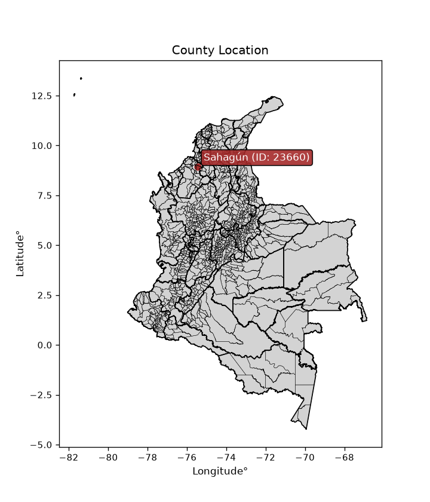
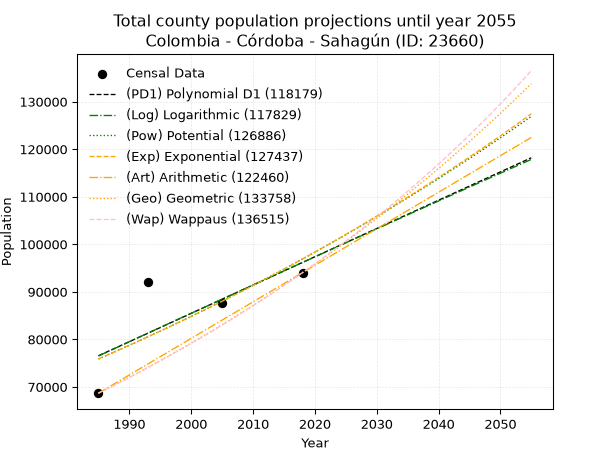
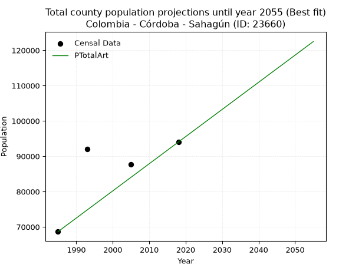
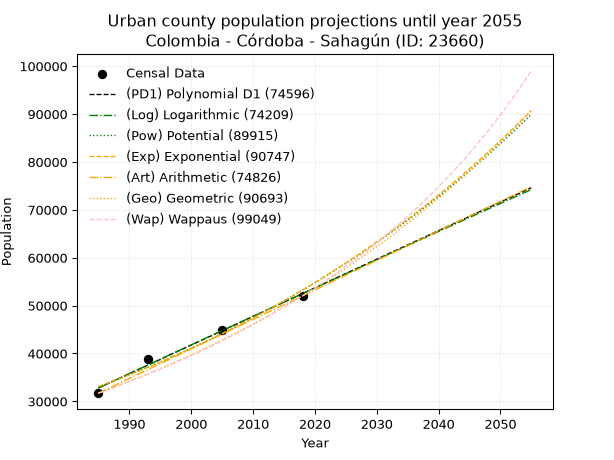
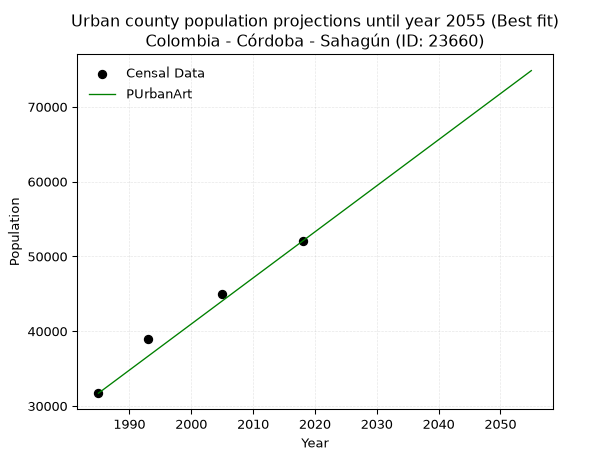
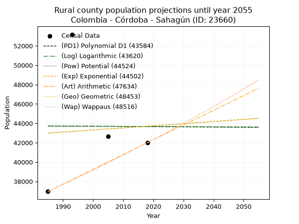
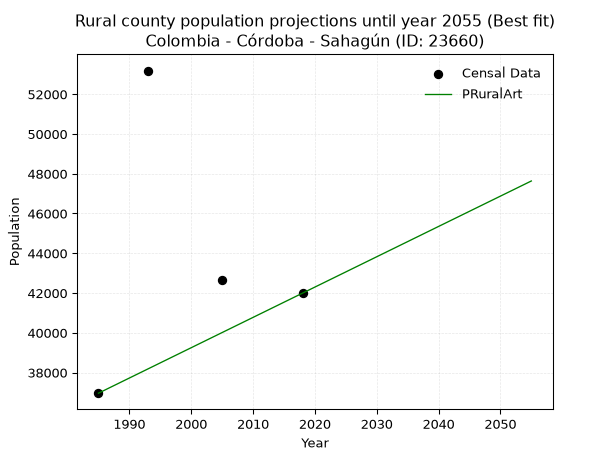

<div align="center">


</div>

# _“Population and Public Services Demand Projections (PPSD) until Year 2050 for Colombia - Córdoba - Sahagún (ID: 23660)”_
Keywords: `population` `public-service` `projection` `lineal` `polynomial` `logarithmic` `potential` `exponential` `arithmetic` `geometric` `wappaus` `dane` `colombia` `south-america`

PPSD are analytical estimates used by governments and planners to anticipate future changes in population size, age distribution, and the resulting community needs for utilities, healthcare, education, and infrastructure as sizing future water treatment facilities, electrical grids, and road networks based on spatial growth.

> **General running parameters**: • app_version: _v20260806_. • Python version: _3.14.7_. • Pandas version: _3.0.5_. • NumPy version: _2.5.1_. • Creates, save and include plots into reports (create_plot): _False_. • Projection until year: _2050_. • Process polynomial degree 2 and up: _False_. • Process Wappaus: _True_. • Process Wappaus: _True_. • Set negative values to zero: _True_. • Set infinite values to zero: _True_. • Drop dataset notes: _True_. 
<div align="center">

Dynamic map: [:earth_americas:Google](http://maps.google.com/maps?q=8.94304758,-75.4458343) [:earth_americas:OSM](https://www.openstreetmap.org/#map=18/8.94304758/-75.4458343&layers=P) [:earth_americas:Bing](https://www.bing.com/maps?cp=8.94304758~-75.4458343&lvl=18) [:earth_americas:Apple](https://maps.apple.com/frame?center=8.94304758%2C-75.4458343&span=0.003%2C0.006)

</div>


<div align="center">

```geojson
{
  "type": "Feature",
  "geometry": {
    "type": "Point", 
    "coordinates": [-75.4458343, 8.94304758]
  }, 
  "properties": {
    "Name": "Colombia - Córdoba - Sahagún (ID: 23660)"
  }
}
```

</div>


<div align="center">

</img>

</div>


## 0. Census Data (4 records)

Census data are official statistics collected by a government about the people and housing in a country. They usually include counts of total population, age, sex, race, income, education, and jobs.

📅Global census file: [Population.xlsx](../data/Population.xlsx)

| Source   |   Year |   CountryID | CountryName   |   StateID | StateName   |   CountyID | CountyName   |   PTotal |   PUrban |   PRural |
|:---------|-------:|------------:|:--------------|----------:|:------------|-----------:|:-------------|---------:|---------:|---------:|
| DANE     |   1985 |          57 | Colombia      |        23 | Córdoba     |      23660 | Sahagún      |    68655 |    31695 |    36960 |
| DANE     |   1993 |          57 | Colombia      |        23 | Córdoba     |      23660 | Sahagún      |    92069 |    38884 |    53185 |
| DANE     |   2005 |          57 | Colombia      |        23 | Córdoba     |      23660 | Sahagún      |    87635 |    44985 |    42650 |
| DANE     |   2018 |          57 | Colombia      |        23 | Córdoba     |      23660 | Sahagún      |    94020 |    52028 |    41992 |

> 🔥Some records could had specific notes about the registered values or the corresponding urban or rural distribution.

📅   [RUPS](https://www.datos.gov.co/Hacienda-y-Cr-dito-P-blico/Registro-nico-de-Prestadores-de-Servicios-P-blicos/4qkq-csdn/about_data) - Local public utility companies: [RUPS.csv](../data/RUPS.xlsx)

 | SERVICIO       | ESTADO    | NOMBRE                            | NIT         | DEPARTAMENTO_DOMICILIO   | MUNICIPIO_DOMICILIO   | DIRECCION                       |   TELEFONO | EMAIL                     | TIPO_PRESTADOR                             | CLASIFICACION                 |
|:---------------|:----------|:----------------------------------|:------------|:-------------------------|:----------------------|:--------------------------------|-----------:|:--------------------------|:-------------------------------------------|:------------------------------|
| ACUEDUCTO      | OPERATIVA | UNIAGUAS S.A. E.S.P.              | 830139722-9 | CORDOBA                  | CERETE                | Cll 39 No. 15 60                |    7741602 | fmartinez3105@hotmail.com | SOCIEDADES (EMPRESA DE SERVICIOS PUBLICOS) | MAYOR O IGUAL A 5001 USUARIOS |
| ALCANTARILLADO | OPERATIVA | UNIAGUAS S.A. E.S.P.              | 830139722-9 | CORDOBA                  | CERETE                | Cll 39 No. 15 60                |    7741602 | fmartinez3105@hotmail.com | SOCIEDADES (EMPRESA DE SERVICIOS PUBLICOS) | MAYOR O IGUAL A 5001 USUARIOS |
| ACUEDUCTO      | OPERATIVA | AQUALIA LATINOAMERICA S.A. E.S.P. | 901362452-7 | CORDOBA                  | CERETE                | calle 39 n° 15-60 barrio  venus |    7641602 | jhosett.navas@aqualia.com | SOCIEDADES (EMPRESA DE SERVICIOS PUBLICOS) | MAYOR O IGUAL A 5001 USUARIOS |
| ALCANTARILLADO | OPERATIVA | AQUALIA LATINOAMERICA S.A. E.S.P. | 901362452-7 | CORDOBA                  | CERETE                | calle 39 n° 15-60 barrio  venus |    7641602 | jhosett.navas@aqualia.com | SOCIEDADES (EMPRESA DE SERVICIOS PUBLICOS) | MAYOR O IGUAL A 5001 USUARIOS |

## 1. Total

### 1.1. Coefficients and Parameters

* (PD1) Polynomial Deg 1: 595.1541549578441, -1104862.3484544277 (lineal)
* (Log) Logarithmic: 1192846.5604802591, -8981241.515082879
* (Pow) Potential: 14.846989462023046, -44.081867308851535
* (Exp) Exponential: 0.007407113920051237, 0.031234117308088477
* (Art) Arithmetic: Year diff. 2018 - 1985 = 33, Population diff. 94020 - 68655 = 25365, Annual growth = 768.6363636363636
* (Geo) Geometric: Year diff. 2018 - 1985 = 33, Population diff. 94020 - 68655 = 25365, Annual growth % = 0.009573216593150358
* (Wap) Wappaus: i = 0.9449962976933931, Condition values only valid for < 200)

<sub>
Wappaus condition values: ['0.00', '0.94', '1.89', '2.83', '3.78', '4.72', '5.67', '6.61', '7.56', '8.50', '9.45', '10.39', '11.34', '12.28', '13.23', '14.17', '15.12', '16.06', '17.01', '17.95', '18.90', '19.84', '20.79', '21.73', '22.68', '23.62', '24.57', '25.51', '26.46', '27.40', '28.35', '29.29', '30.24', '31.18', '32.13', '33.07', '34.02', '34.96', '35.91', '36.85', '37.80', '38.74', '39.69', '40.63', '41.58', '42.52', '43.47', '44.41', '45.36', '46.30', '47.25', '48.19', '49.14', '50.08', '51.03', '51.97', '52.92', '53.86', '54.81', '55.75', '56.70', '57.64', '58.59', '59.53', '60.48', '61.42']
</sub>


### 1.2. Projected Dataset

|   Year |   CountyID |   PTotalPD1 |   PTotalLog |   PTotalPow |   PTotalExp |   PTotalArt |   PTotalGeo |   PTotalWap |
|-------:|-----------:|------------:|------------:|------------:|------------:|------------:|------------:|------------:|
|   1985 |      23660 |       76519 |       76489 |       75849 |       75878 |       68655 |       68655 |       68655 |
|   1986 |      23660 |       77114 |       77090 |       76418 |       76442 |       69424 |       69312 |       69307 |
|   1987 |      23660 |       77709 |       77690 |       76991 |       77010 |       70192 |       69976 |       69965 |
|   1988 |      23660 |       78304 |       78290 |       77569 |       77583 |       70961 |       70646 |       70629 |
|   1989 |      23660 |       78899 |       78890 |       78150 |       78159 |       71730 |       71322 |       71300 |
|   1990 |      23660 |       79494 |       79490 |       78735 |       78740 |       72498 |       72005 |       71977 |
|   1991 |      23660 |       80090 |       80089 |       79325 |       79326 |       73267 |       72694 |       72661 |
|   1992 |      23660 |       80685 |       80688 |       79918 |       79916 |       74035 |       73390 |       73352 |
|   1993 |      23660 |       81280 |       81287 |       80516 |       80510 |       74804 |       74093 |       74049 |
|   1994 |      23660 |       81875 |       81885 |       81118 |       81108 |       75573 |       74802 |       74753 |
|   1995 |      23660 |       82470 |       82483 |       81724 |       81711 |       76341 |       75518 |       75465 |
|   1996 |      23660 |       83065 |       83081 |       82334 |       82319 |       77110 |       76241 |       76183 |
|   1997 |      23660 |       83660 |       83678 |       82949 |       82931 |       77879 |       76971 |       76908 |
|   1998 |      23660 |       84256 |       84275 |       83568 |       83547 |       78647 |       77708 |       77641 |
|   1999 |      23660 |       84851 |       84872 |       84191 |       84169 |       79416 |       78452 |       78381 |
|   2000 |      23660 |       85446 |       85469 |       84818 |       84794 |       80185 |       79203 |       79129 |
|   2001 |      23660 |       86041 |       86065 |       85450 |       85425 |       80953 |       79961 |       79885 |
|   2002 |      23660 |       86636 |       86661 |       86086 |       86060 |       81722 |       80726 |       80648 |
|   2003 |      23660 |       87231 |       87257 |       86727 |       86700 |       82490 |       81499 |       81419 |
|   2004 |      23660 |       87827 |       87852 |       87372 |       87344 |       83259 |       82279 |       82198 |
|   2005 |      23660 |       88422 |       88447 |       88022 |       87994 |       84028 |       83067 |       82985 |
|   2006 |      23660 |       89017 |       89042 |       88676 |       88648 |       84796 |       83862 |       83780 |
|   2007 |      23660 |       89612 |       89637 |       89334 |       89307 |       85565 |       84665 |       84584 |
|   2008 |      23660 |       90207 |       90231 |       89998 |       89971 |       86334 |       85476 |       85396 |
|   2009 |      23660 |       90802 |       90825 |       90665 |       90640 |       87102 |       86294 |       86217 |
|   2010 |      23660 |       91398 |       91418 |       91338 |       91314 |       87871 |       87120 |       87047 |
|   2011 |      23660 |       91993 |       92012 |       92015 |       91992 |       88640 |       87954 |       87886 |
|   2012 |      23660 |       92588 |       92605 |       92696 |       92676 |       89408 |       88796 |       88734 |
|   2013 |      23660 |       93183 |       93197 |       93383 |       93365 |       90177 |       89646 |       89591 |
|   2014 |      23660 |       93778 |       93790 |       94074 |       94060 |       90945 |       90504 |       90457 |
|   2015 |      23660 |       94373 |       94382 |       94770 |       94759 |       91714 |       91371 |       91333 |
|   2016 |      23660 |       94968 |       94974 |       95470 |       95463 |       92483 |       92245 |       92219 |
|   2017 |      23660 |       95564 |       95565 |       96176 |       96173 |       93251 |       93128 |       93114 |
|   2018 |      23660 |       96159 |       96156 |       96886 |       96888 |       94020 |       94020 |       94020 |
|   2019 |      23660 |       96754 |       96747 |       97602 |       97608 |       94789 |       94920 |       94936 |
|   2020 |      23660 |       97349 |       97338 |       98322 |       98334 |       95557 |       95829 |       95862 |
|   2021 |      23660 |       97944 |       97928 |       99047 |       99065 |       96326 |       96746 |       96799 |
|   2022 |      23660 |       98539 |       98519 |       99777 |       99802 |       97095 |       97672 |       97746 |
|   2023 |      23660 |       99135 |       99108 |      100512 |      100544 |       97863 |       98607 |       98704 |
|   2024 |      23660 |       99730 |       99698 |      101252 |      101291 |       98632 |       99551 |       99674 |
|   2025 |      23660 |      100325 |      100287 |      101998 |      102044 |       99400 |      100504 |      100654 |
|   2026 |      23660 |      100920 |      100876 |      102748 |      102803 |      100169 |      101467 |      101647 |
|   2027 |      23660 |      101515 |      101465 |      103504 |      103567 |      100938 |      102438 |      102650 |
|   2028 |      23660 |      102110 |      102053 |      104264 |      104337 |      101706 |      103419 |      103666 |
|   2029 |      23660 |      102705 |      102641 |      105030 |      105113 |      102475 |      104409 |      104694 |
|   2030 |      23660 |      103301 |      103229 |      105801 |      105894 |      103244 |      105408 |      105734 |
|   2031 |      23660 |      103896 |      103816 |      106578 |      106682 |      104012 |      106417 |      106787 |
|   2032 |      23660 |      104491 |      104403 |      107360 |      107475 |      104781 |      107436 |      107853 |
|   2033 |      23660 |      105086 |      104990 |      108147 |      108274 |      105550 |      108464 |      108931 |
|   2034 |      23660 |      105681 |      105577 |      108939 |      109079 |      106318 |      109503 |      110023 |
|   2035 |      23660 |      106276 |      106163 |      109737 |      109890 |      107087 |      110551 |      111129 |
|   2036 |      23660 |      106872 |      106749 |      110541 |      110707 |      107855 |      111609 |      112248 |
|   2037 |      23660 |      107467 |      107335 |      111349 |      111530 |      108624 |      112678 |      113381 |
|   2038 |      23660 |      108062 |      107920 |      112164 |      112359 |      109393 |      113757 |      114529 |
|   2039 |      23660 |      108657 |      108505 |      112984 |      113194 |      110161 |      114846 |      115691 |
|   2040 |      23660 |      109252 |      109090 |      113809 |      114036 |      110930 |      115945 |      116867 |
|   2041 |      23660 |      109847 |      109675 |      114640 |      114884 |      111699 |      117055 |      118059 |
|   2042 |      23660 |      110442 |      110259 |      115477 |      115738 |      112467 |      118176 |      119267 |
|   2043 |      23660 |      111038 |      110843 |      116319 |      116598 |      113236 |      119307 |      120490 |
|   2044 |      23660 |      111633 |      111427 |      117168 |      117465 |      114005 |      120449 |      121729 |
|   2045 |      23660 |      112228 |      112010 |      118022 |      118338 |      114773 |      121602 |      122985 |
|   2046 |      23660 |      112823 |      112594 |      118881 |      119218 |      115542 |      122766 |      124257 |
|   2047 |      23660 |      113418 |      113176 |      119747 |      120105 |      116310 |      123942 |      125546 |
|   2048 |      23660 |      114013 |      113759 |      120618 |      120997 |      117079 |      125128 |      126852 |
|   2049 |      23660 |      114609 |      114341 |      121496 |      121897 |      117848 |      126326 |      128177 |
|   2050 |      23660 |      115204 |      114923 |      122379 |      122803 |      118616 |      127535 |      129519 |
<div align="center">

</img>

</div>


### 1.3. Best fit with absolute and relative error (%)

Relative error puts that difference into context by dividing the absolute error by the true value, creating a unitless ratio or percentage that shows the scale of the mistake.

Absolute and relative error

|   Year | Source   |   CountryID | CountryName   |   StateID | StateName   |   CountyID_x | CountyName   |   PTotal |   PUrban |   PRural |   CountyID_y |   PTotalPD1 |   PTotalLog |   PTotalPow |   PTotalExp |   PTotalArt |   PTotalGeo |   PTotalWap |   PTotalPD1AbsError |   PTotalLogAbsError |   PTotalPowAbsError |   PTotalExpAbsError |   PTotalArtAbsError |   PTotalGeoAbsError |   PTotalWapAbsError |   PTotalPD1RelError |   PTotalLogRelError |   PTotalPowRelError |   PTotalExpRelError |   PTotalArtRelError |   PTotalGeoRelError |   PTotalWapRelError |
|-------:|:---------|------------:|:--------------|----------:|:------------|-------------:|:-------------|---------:|---------:|---------:|-------------:|------------:|------------:|------------:|------------:|------------:|------------:|------------:|--------------------:|--------------------:|--------------------:|--------------------:|--------------------:|--------------------:|--------------------:|--------------------:|--------------------:|--------------------:|--------------------:|--------------------:|--------------------:|--------------------:|
|   1985 | DANE     |          57 | Colombia      |        23 | Córdoba     |        23660 | Sahagún      |    68655 |    31695 |    36960 |        23660 |       76519 |       76489 |       75849 |       75878 |       68655 |       68655 |       68655 |                7864 |                7834 |                7194 |                7223 |                   0 |                   0 |                   0 |           11.4544   |            11.4107  |           10.4785   |           10.5207   |             0       |             0       |              0      |
|   1993 | DANE     |          57 | Colombia      |        23 | Córdoba     |        23660 | Sahagún      |    92069 |    38884 |    53185 |        23660 |       81280 |       81287 |       80516 |       80510 |       74804 |       74093 |       74049 |               10789 |               10782 |               11553 |               11559 |               17265 |               17976 |               18020 |           11.7184   |            11.7108  |           12.5482   |           12.5547   |            18.7522  |            19.5245  |             19.5723 |
|   2005 | DANE     |          57 | Colombia      |        23 | Córdoba     |        23660 | Sahagún      |    87635 |    44985 |    42650 |        23660 |       88422 |       88447 |       88022 |       87994 |       84028 |       83067 |       82985 |                 787 |                 812 |                 387 |                 359 |                3607 |                4568 |                4650 |            0.898043 |             0.92657 |            0.441604 |            0.409654 |             4.11594 |             5.21253 |              5.3061 |
|   2018 | DANE     |          57 | Colombia      |        23 | Córdoba     |        23660 | Sahagún      |    94020 |    52028 |    41992 |        23660 |       96159 |       96156 |       96886 |       96888 |       94020 |       94020 |       94020 |                2139 |                2136 |                2866 |                2868 |                   0 |                   0 |                   0 |            2.27505  |             2.27186 |            3.04829  |            3.05041  |             0       |             0       |              0      |

Relative error mean

| Method    |   RelError | Best   |
|:----------|-----------:|:-------|
| PTotalPD1 |    6.58646 |        |
| PTotalLog |    6.57997 |        |
| PTotalPow |    6.62914 |        |
| PTotalExp |    6.63388 |        |
| PTotalArt |    5.71704 | True   |
| PTotalGeo |    6.18425 |        |
| PTotalWap |    6.21959 |        |

💙Best method: _**PTotalArt**_
<div align="center">

</img>

</div>


### 1.4. Fresh water supply demand in liters per capita per day (lpcd)

The fresh water supply demand typically ranges from 100 to 300 liters per capita per day (lpcd) for standard domestic and municipal planning, though absolute survival minimums set by the World Health Organization are as low as 7.5 to 20 liters per day, and total consumption in high-income nations can exceed 400 liters.

> `CZ`: Level in meters above the sea level (masl)<br> `WS`: Fresh water supply demand in liters per capita per day (lpcd or l/h/d)<br> `WSAll`: Zonal fresh water supply demand in liters per second (l/s)<br> `A`: Zonal area in square meters<br> `DP`: Population density (people/hectare or p/ha)

Reference values (RAS Colombia)

|    CZ |   WS |
|------:|-----:|
|  1000 |  120 |
|  2000 |  130 |
| 99999 |  140 |

County shapefile geometry properties and water supply values

|   CountyID |      ATotal |   CZTotal |   WSTotal |
|-----------:|------------:|----------:|----------:|
|      23660 | 9.64366e+08 |   88.6961 |       120 |

Projected values for best method: PTotalArt

|   CountyID |   Year |   PTotalArt |   DPTotal |   WSTotal |   WSTotalAll |
|-----------:|-------:|------------:|----------:|----------:|-------------:|
|      23660 |   1985 |       68655 |      0.71 |       120 |      95.3542 |
|      23660 |   1986 |       69424 |      0.72 |       120 |      96.4222 |
|      23660 |   1987 |       70192 |      0.73 |       120 |      97.4889 |
|      23660 |   1988 |       70961 |      0.74 |       120 |      98.5569 |
|      23660 |   1989 |       71730 |      0.74 |       120 |      99.625  |
|      23660 |   1990 |       72498 |      0.75 |       120 |     100.692  |
|      23660 |   1991 |       73267 |      0.76 |       120 |     101.76   |
|      23660 |   1992 |       74035 |      0.77 |       120 |     102.826  |
|      23660 |   1993 |       74804 |      0.78 |       120 |     103.894  |
|      23660 |   1994 |       75573 |      0.78 |       120 |     104.963  |
|      23660 |   1995 |       76341 |      0.79 |       120 |     106.029  |
|      23660 |   1996 |       77110 |      0.8  |       120 |     107.097  |
|      23660 |   1997 |       77879 |      0.81 |       120 |     108.165  |
|      23660 |   1998 |       78647 |      0.82 |       120 |     109.232  |
|      23660 |   1999 |       79416 |      0.82 |       120 |     110.3    |
|      23660 |   2000 |       80185 |      0.83 |       120 |     111.368  |
|      23660 |   2001 |       80953 |      0.84 |       120 |     112.435  |
|      23660 |   2002 |       81722 |      0.85 |       120 |     113.503  |
|      23660 |   2003 |       82490 |      0.86 |       120 |     114.569  |
|      23660 |   2004 |       83259 |      0.86 |       120 |     115.638  |
|      23660 |   2005 |       84028 |      0.87 |       120 |     116.706  |
|      23660 |   2006 |       84796 |      0.88 |       120 |     117.772  |
|      23660 |   2007 |       85565 |      0.89 |       120 |     118.84   |
|      23660 |   2008 |       86334 |      0.9  |       120 |     119.908  |
|      23660 |   2009 |       87102 |      0.9  |       120 |     120.975  |
|      23660 |   2010 |       87871 |      0.91 |       120 |     122.043  |
|      23660 |   2011 |       88640 |      0.92 |       120 |     123.111  |
|      23660 |   2012 |       89408 |      0.93 |       120 |     124.178  |
|      23660 |   2013 |       90177 |      0.94 |       120 |     125.246  |
|      23660 |   2014 |       90945 |      0.94 |       120 |     126.312  |
|      23660 |   2015 |       91714 |      0.95 |       120 |     127.381  |
|      23660 |   2016 |       92483 |      0.96 |       120 |     128.449  |
|      23660 |   2017 |       93251 |      0.97 |       120 |     129.515  |
|      23660 |   2018 |       94020 |      0.97 |       120 |     130.583  |
|      23660 |   2019 |       94789 |      0.98 |       120 |     131.651  |
|      23660 |   2020 |       95557 |      0.99 |       120 |     132.718  |
|      23660 |   2021 |       96326 |      1    |       120 |     133.786  |
|      23660 |   2022 |       97095 |      1.01 |       120 |     134.854  |
|      23660 |   2023 |       97863 |      1.01 |       120 |     135.921  |
|      23660 |   2024 |       98632 |      1.02 |       120 |     136.989  |
|      23660 |   2025 |       99400 |      1.03 |       120 |     138.056  |
|      23660 |   2026 |      100169 |      1.04 |       120 |     139.124  |
|      23660 |   2027 |      100938 |      1.05 |       120 |     140.192  |
|      23660 |   2028 |      101706 |      1.05 |       120 |     141.258  |
|      23660 |   2029 |      102475 |      1.06 |       120 |     142.326  |
|      23660 |   2030 |      103244 |      1.07 |       120 |     143.394  |
|      23660 |   2031 |      104012 |      1.08 |       120 |     144.461  |
|      23660 |   2032 |      104781 |      1.09 |       120 |     145.529  |
|      23660 |   2033 |      105550 |      1.09 |       120 |     146.597  |
|      23660 |   2034 |      106318 |      1.1  |       120 |     147.664  |
|      23660 |   2035 |      107087 |      1.11 |       120 |     148.732  |
|      23660 |   2036 |      107855 |      1.12 |       120 |     149.799  |
|      23660 |   2037 |      108624 |      1.13 |       120 |     150.867  |
|      23660 |   2038 |      109393 |      1.13 |       120 |     151.935  |
|      23660 |   2039 |      110161 |      1.14 |       120 |     153.001  |
|      23660 |   2040 |      110930 |      1.15 |       120 |     154.069  |
|      23660 |   2041 |      111699 |      1.16 |       120 |     155.137  |
|      23660 |   2042 |      112467 |      1.17 |       120 |     156.204  |
|      23660 |   2043 |      113236 |      1.17 |       120 |     157.272  |
|      23660 |   2044 |      114005 |      1.18 |       120 |     158.34   |
|      23660 |   2045 |      114773 |      1.19 |       120 |     159.407  |
|      23660 |   2046 |      115542 |      1.2  |       120 |     160.475  |
|      23660 |   2047 |      116310 |      1.21 |       120 |     161.542  |
|      23660 |   2048 |      117079 |      1.21 |       120 |     162.61   |
|      23660 |   2049 |      117848 |      1.22 |       120 |     163.678  |
|      23660 |   2050 |      118616 |      1.23 |       120 |     164.744  |

## 2. Urban

### 2.1. Coefficients and Parameters

* (PD1) Polynomial Deg 1: 597.2187876354831, -1152688.8799678748 (lineal)
* (Log) Logarithmic: 1195669.6518714954, -9046396.605370497
* (Pow) Potential: 28.869980507237077, -90.68697843510269
* (Exp) Exponential: 0.014417574989204571, 1.2316994512828696e-08
* (Art) Arithmetic: Year diff. 2018 - 1985 = 33, Population diff. 52028 - 31695 = 20333, Annual growth = 616.1515151515151
* (Geo) Geometric: Year diff. 2018 - 1985 = 33, Population diff. 52028 - 31695 = 20333, Annual growth % = 0.015132231837503118
* (Wap) Wappaus: i = 1.471881120245369, Condition values only valid for < 200)

<sub>
Wappaus condition values: ['0.00', '1.47', '2.94', '4.42', '5.89', '7.36', '8.83', '10.30', '11.78', '13.25', '14.72', '16.19', '17.66', '19.13', '20.61', '22.08', '23.55', '25.02', '26.49', '27.97', '29.44', '30.91', '32.38', '33.85', '35.33', '36.80', '38.27', '39.74', '41.21', '42.68', '44.16', '45.63', '47.10', '48.57', '50.04', '51.52', '52.99', '54.46', '55.93', '57.40', '58.88', '60.35', '61.82', '63.29', '64.76', '66.23', '67.71', '69.18', '70.65', '72.12', '73.59', '75.07', '76.54', '78.01', '79.48', '80.95', '82.43', '83.90', '85.37', '86.84', '88.31', '89.78', '91.26', '92.73', '94.20', '95.67']
</sub>


### 2.2. Projected Dataset

|   Year |   CountyID |   PUrbanPD1 |   PUrbanLog |   PUrbanPow |   PUrbanExp |   PUrbanArt |   PUrbanGeo |   PUrbanWap |
|-------:|-----------:|------------:|------------:|------------:|------------:|------------:|------------:|------------:|
|   1985 |      23660 |       32790 |       32770 |       33060 |       33077 |       31695 |       31695 |       31695 |
|   1986 |      23660 |       33388 |       33373 |       33544 |       33558 |       32311 |       32175 |       32165 |
|   1987 |      23660 |       33985 |       33975 |       34035 |       34045 |       32927 |       32661 |       32642 |
|   1988 |      23660 |       34582 |       34576 |       34533 |       34539 |       33543 |       33156 |       33126 |
|   1989 |      23660 |       35179 |       35177 |       35038 |       35041 |       34160 |       33657 |       33618 |
|   1990 |      23660 |       35777 |       35778 |       35550 |       35550 |       34776 |       34167 |       34117 |
|   1991 |      23660 |       36374 |       36379 |       36070 |       36066 |       35392 |       34684 |       34623 |
|   1992 |      23660 |       36971 |       36980 |       36597 |       36590 |       36008 |       35209 |       35138 |
|   1993 |      23660 |       37568 |       37580 |       37131 |       37121 |       36624 |       35741 |       35661 |
|   1994 |      23660 |       38165 |       38179 |       37672 |       37660 |       37240 |       36282 |       36191 |
|   1995 |      23660 |       38763 |       38779 |       38222 |       38207 |       37857 |       36831 |       36731 |
|   1996 |      23660 |       39360 |       39378 |       38779 |       38762 |       38473 |       37389 |       37279 |
|   1997 |      23660 |       39957 |       39977 |       39343 |       39325 |       39089 |       37954 |       37835 |
|   1998 |      23660 |       40554 |       40576 |       39916 |       39896 |       39705 |       38529 |       38401 |
|   1999 |      23660 |       41151 |       41174 |       40497 |       40475 |       40321 |       39112 |       38976 |
|   2000 |      23660 |       41749 |       41772 |       41086 |       41063 |       40937 |       39704 |       39561 |
|   2001 |      23660 |       42346 |       42369 |       41683 |       41659 |       41553 |       40304 |       40155 |
|   2002 |      23660 |       42943 |       42967 |       42289 |       42264 |       42170 |       40914 |       40760 |
|   2003 |      23660 |       43540 |       43564 |       42903 |       42878 |       42786 |       41533 |       41374 |
|   2004 |      23660 |       44138 |       44161 |       43526 |       43501 |       43402 |       42162 |       42000 |
|   2005 |      23660 |       44735 |       44757 |       44157 |       44133 |       44018 |       42800 |       42636 |
|   2006 |      23660 |       45332 |       45353 |       44797 |       44773 |       44634 |       43448 |       43283 |
|   2007 |      23660 |       45929 |       45949 |       45446 |       45424 |       45250 |       44105 |       43941 |
|   2008 |      23660 |       46526 |       46545 |       46105 |       46083 |       45866 |       44772 |       44611 |
|   2009 |      23660 |       47124 |       47140 |       46772 |       46752 |       46483 |       45450 |       45293 |
|   2010 |      23660 |       47721 |       47735 |       47449 |       47431 |       47099 |       46138 |       45987 |
|   2011 |      23660 |       48318 |       48330 |       48135 |       48120 |       47715 |       46836 |       46694 |
|   2012 |      23660 |       48915 |       48924 |       48831 |       48819 |       48331 |       47545 |       47414 |
|   2013 |      23660 |       49513 |       49518 |       49537 |       49528 |       48947 |       48264 |       48148 |
|   2014 |      23660 |       50110 |       50112 |       50252 |       50247 |       49563 |       48994 |       48895 |
|   2015 |      23660 |       50707 |       50706 |       50977 |       50977 |       50180 |       49736 |       49656 |
|   2016 |      23660 |       51304 |       51299 |       51713 |       51717 |       50796 |       50488 |       50431 |
|   2017 |      23660 |       51901 |       51892 |       52459 |       52468 |       51412 |       51252 |       51222 |
|   2018 |      23660 |       52499 |       52485 |       53215 |       53230 |       52028 |       52028 |       52028 |
|   2019 |      23660 |       53096 |       53077 |       53981 |       54003 |       52644 |       52815 |       52850 |
|   2020 |      23660 |       53693 |       53669 |       54758 |       54787 |       53260 |       53615 |       53688 |
|   2021 |      23660 |       54290 |       54261 |       55546 |       55583 |       53876 |       54426 |       54543 |
|   2022 |      23660 |       54888 |       54852 |       56345 |       56390 |       54493 |       55249 |       55415 |
|   2023 |      23660 |       55485 |       55444 |       57156 |       57209 |       55109 |       56085 |       56305 |
|   2024 |      23660 |       56082 |       56034 |       57977 |       58040 |       55725 |       56934 |       57213 |
|   2025 |      23660 |       56679 |       56625 |       58810 |       58883 |       56341 |       57796 |       58140 |
|   2026 |      23660 |       57276 |       57215 |       59654 |       59738 |       56957 |       58670 |       59087 |
|   2027 |      23660 |       57874 |       57805 |       60510 |       60605 |       57573 |       59558 |       60054 |
|   2028 |      23660 |       58471 |       58395 |       61377 |       61485 |       58190 |       60459 |       61042 |
|   2029 |      23660 |       59068 |       58985 |       62257 |       62378 |       58806 |       61374 |       62051 |
|   2030 |      23660 |       59665 |       59574 |       63149 |       63284 |       59422 |       62303 |       63083 |
|   2031 |      23660 |       60262 |       60163 |       64053 |       64203 |       60038 |       63246 |       64137 |
|   2032 |      23660 |       60860 |       60751 |       64970 |       65136 |       60654 |       64203 |       65216 |
|   2033 |      23660 |       61457 |       61339 |       65900 |       66081 |       61270 |       65174 |       66318 |
|   2034 |      23660 |       62054 |       61927 |       66842 |       67041 |       61886 |       66161 |       67447 |
|   2035 |      23660 |       62651 |       62515 |       67797 |       68015 |       62503 |       67162 |       68601 |
|   2036 |      23660 |       63249 |       63102 |       68766 |       69002 |       63119 |       68178 |       69783 |
|   2037 |      23660 |       63846 |       63690 |       69747 |       70004 |       63735 |       69210 |       70992 |
|   2038 |      23660 |       64443 |       64276 |       70743 |       71021 |       64351 |       70257 |       72231 |
|   2039 |      23660 |       65040 |       64863 |       71752 |       72052 |       64967 |       71320 |       73501 |
|   2040 |      23660 |       65637 |       65449 |       72775 |       73099 |       65583 |       72399 |       74801 |
|   2041 |      23660 |       66235 |       66035 |       73812 |       74160 |       66199 |       73495 |       76134 |
|   2042 |      23660 |       66832 |       66621 |       74863 |       75237 |       66816 |       74607 |       77501 |
|   2043 |      23660 |       67429 |       67206 |       75928 |       76330 |       67432 |       75736 |       78903 |
|   2044 |      23660 |       68026 |       67791 |       77009 |       77438 |       68048 |       76882 |       80342 |
|   2045 |      23660 |       68624 |       68376 |       78104 |       78563 |       68664 |       78045 |       81819 |
|   2046 |      23660 |       69221 |       68961 |       79214 |       79704 |       69280 |       79226 |       83334 |
|   2047 |      23660 |       69818 |       69545 |       80340 |       80861 |       69896 |       80425 |       84891 |
|   2048 |      23660 |       70415 |       70129 |       81480 |       82036 |       70513 |       81642 |       86491 |
|   2049 |      23660 |       71012 |       70713 |       82637 |       83227 |       71129 |       82878 |       88135 |
|   2050 |      23660 |       71610 |       71296 |       83809 |       84435 |       71745 |       84132 |       89826 |
<div align="center">

</img>

</div>


### 2.3. Best fit with absolute and relative error (%)

Relative error puts that difference into context by dividing the absolute error by the true value, creating a unitless ratio or percentage that shows the scale of the mistake.

Absolute and relative error

|   Year | Source   |   CountryID | CountryName   |   StateID | StateName   |   CountyID_x | CountyName   |   PTotal |   PUrban |   PRural |   CountyID_y |   PUrbanPD1 |   PUrbanLog |   PUrbanPow |   PUrbanExp |   PUrbanArt |   PUrbanGeo |   PUrbanWap |   PUrbanPD1AbsError |   PUrbanLogAbsError |   PUrbanPowAbsError |   PUrbanExpAbsError |   PUrbanArtAbsError |   PUrbanGeoAbsError |   PUrbanWapAbsError |   PUrbanPD1RelError |   PUrbanLogRelError |   PUrbanPowRelError |   PUrbanExpRelError |   PUrbanArtRelError |   PUrbanGeoRelError |   PUrbanWapRelError |
|-------:|:---------|------------:|:--------------|----------:|:------------|-------------:|:-------------|---------:|---------:|---------:|-------------:|------------:|------------:|------------:|------------:|------------:|------------:|------------:|--------------------:|--------------------:|--------------------:|--------------------:|--------------------:|--------------------:|--------------------:|--------------------:|--------------------:|--------------------:|--------------------:|--------------------:|--------------------:|--------------------:|
|   1985 | DANE     |          57 | Colombia      |        23 | Córdoba     |        23660 | Sahagún      |    68655 |    31695 |    36960 |        23660 |       32790 |       32770 |       33060 |       33077 |       31695 |       31695 |       31695 |                1095 |                1075 |                1365 |                1382 |                   0 |                   0 |                   0 |            3.4548   |            3.3917   |             4.30667 |             4.36031 |             0       |             0       |             0       |
|   1993 | DANE     |          57 | Colombia      |        23 | Córdoba     |        23660 | Sahagún      |    92069 |    38884 |    53185 |        23660 |       37568 |       37580 |       37131 |       37121 |       36624 |       35741 |       35661 |                1316 |                1304 |                1753 |                1763 |                2260 |                3143 |                3223 |            3.38443  |            3.35356  |             4.50828 |             4.534   |             5.81216 |             8.08302 |             8.28876 |
|   2005 | DANE     |          57 | Colombia      |        23 | Córdoba     |        23660 | Sahagún      |    87635 |    44985 |    42650 |        23660 |       44735 |       44757 |       44157 |       44133 |       44018 |       42800 |       42636 |                 250 |                 228 |                 828 |                 852 |                 967 |                2185 |                2349 |            0.555741 |            0.506836 |             1.84061 |             1.89396 |             2.14961 |             4.85717 |             5.22174 |
|   2018 | DANE     |          57 | Colombia      |        23 | Córdoba     |        23660 | Sahagún      |    94020 |    52028 |    41992 |        23660 |       52499 |       52485 |       53215 |       53230 |       52028 |       52028 |       52028 |                 471 |                 457 |                1187 |                1202 |                   0 |                   0 |                   0 |            0.905282 |            0.878373 |             2.28146 |             2.31029 |             0       |             0       |             0       |

Relative error mean

| Method    |   RelError | Best   |
|:----------|-----------:|:-------|
| PUrbanPD1 |    2.07506 |        |
| PUrbanLog |    2.03262 |        |
| PUrbanPow |    3.23426 |        |
| PUrbanExp |    3.27464 |        |
| PUrbanArt |    1.99044 | True   |
| PUrbanGeo |    3.23505 |        |
| PUrbanWap |    3.37762 |        |

💙Best method: _**PUrbanArt**_
<div align="center">

</img>

</div>


### 2.4. Fresh water supply demand in liters per capita per day (lpcd)

The fresh water supply demand typically ranges from 100 to 300 liters per capita per day (lpcd) for standard domestic and municipal planning, though absolute survival minimums set by the World Health Organization are as low as 7.5 to 20 liters per day, and total consumption in high-income nations can exceed 400 liters.

> `CZ`: Level in meters above the sea level (masl)<br> `WS`: Fresh water supply demand in liters per capita per day (lpcd or l/h/d)<br> `WSAll`: Zonal fresh water supply demand in liters per second (l/s)<br> `A`: Zonal area in square meters<br> `DP`: Population density (people/hectare or p/ha)

Reference values (RAS Colombia)

|    CZ |   WS |
|------:|-----:|
|  1000 |  120 |
|  2000 |  130 |
| 99999 |  140 |

County shapefile geometry properties and water supply values

|   CountyID |     AUrban |   CZUrban |   WSUrban |
|-----------:|-----------:|----------:|----------:|
|      23660 | 1.2046e+07 |   78.6359 |       120 |

Projected values for best method: PUrbanArt

|   CountyID |   Year |   PUrbanArt |   DPUrban |   WSUrban |   WSUrbanAll |
|-----------:|-------:|------------:|----------:|----------:|-------------:|
|      23660 |   1985 |       31695 |     26.31 |       120 |      44.0208 |
|      23660 |   1986 |       32311 |     26.82 |       120 |      44.8764 |
|      23660 |   1987 |       32927 |     27.33 |       120 |      45.7319 |
|      23660 |   1988 |       33543 |     27.85 |       120 |      46.5875 |
|      23660 |   1989 |       34160 |     28.36 |       120 |      47.4444 |
|      23660 |   1990 |       34776 |     28.87 |       120 |      48.3    |
|      23660 |   1991 |       35392 |     29.38 |       120 |      49.1556 |
|      23660 |   1992 |       36008 |     29.89 |       120 |      50.0111 |
|      23660 |   1993 |       36624 |     30.4  |       120 |      50.8667 |
|      23660 |   1994 |       37240 |     30.91 |       120 |      51.7222 |
|      23660 |   1995 |       37857 |     31.43 |       120 |      52.5792 |
|      23660 |   1996 |       38473 |     31.94 |       120 |      53.4347 |
|      23660 |   1997 |       39089 |     32.45 |       120 |      54.2903 |
|      23660 |   1998 |       39705 |     32.96 |       120 |      55.1458 |
|      23660 |   1999 |       40321 |     33.47 |       120 |      56.0014 |
|      23660 |   2000 |       40937 |     33.98 |       120 |      56.8569 |
|      23660 |   2001 |       41553 |     34.5  |       120 |      57.7125 |
|      23660 |   2002 |       42170 |     35.01 |       120 |      58.5694 |
|      23660 |   2003 |       42786 |     35.52 |       120 |      59.425  |
|      23660 |   2004 |       43402 |     36.03 |       120 |      60.2806 |
|      23660 |   2005 |       44018 |     36.54 |       120 |      61.1361 |
|      23660 |   2006 |       44634 |     37.05 |       120 |      61.9917 |
|      23660 |   2007 |       45250 |     37.56 |       120 |      62.8472 |
|      23660 |   2008 |       45866 |     38.08 |       120 |      63.7028 |
|      23660 |   2009 |       46483 |     38.59 |       120 |      64.5597 |
|      23660 |   2010 |       47099 |     39.1  |       120 |      65.4153 |
|      23660 |   2011 |       47715 |     39.61 |       120 |      66.2708 |
|      23660 |   2012 |       48331 |     40.12 |       120 |      67.1264 |
|      23660 |   2013 |       48947 |     40.63 |       120 |      67.9819 |
|      23660 |   2014 |       49563 |     41.14 |       120 |      68.8375 |
|      23660 |   2015 |       50180 |     41.66 |       120 |      69.6944 |
|      23660 |   2016 |       50796 |     42.17 |       120 |      70.55   |
|      23660 |   2017 |       51412 |     42.68 |       120 |      71.4056 |
|      23660 |   2018 |       52028 |     43.19 |       120 |      72.2611 |
|      23660 |   2019 |       52644 |     43.7  |       120 |      73.1167 |
|      23660 |   2020 |       53260 |     44.21 |       120 |      73.9722 |
|      23660 |   2021 |       53876 |     44.73 |       120 |      74.8278 |
|      23660 |   2022 |       54493 |     45.24 |       120 |      75.6847 |
|      23660 |   2023 |       55109 |     45.75 |       120 |      76.5403 |
|      23660 |   2024 |       55725 |     46.26 |       120 |      77.3958 |
|      23660 |   2025 |       56341 |     46.77 |       120 |      78.2514 |
|      23660 |   2026 |       56957 |     47.28 |       120 |      79.1069 |
|      23660 |   2027 |       57573 |     47.79 |       120 |      79.9625 |
|      23660 |   2028 |       58190 |     48.31 |       120 |      80.8194 |
|      23660 |   2029 |       58806 |     48.82 |       120 |      81.675  |
|      23660 |   2030 |       59422 |     49.33 |       120 |      82.5306 |
|      23660 |   2031 |       60038 |     49.84 |       120 |      83.3861 |
|      23660 |   2032 |       60654 |     50.35 |       120 |      84.2417 |
|      23660 |   2033 |       61270 |     50.86 |       120 |      85.0972 |
|      23660 |   2034 |       61886 |     51.37 |       120 |      85.9528 |
|      23660 |   2035 |       62503 |     51.89 |       120 |      86.8097 |
|      23660 |   2036 |       63119 |     52.4  |       120 |      87.6653 |
|      23660 |   2037 |       63735 |     52.91 |       120 |      88.5208 |
|      23660 |   2038 |       64351 |     53.42 |       120 |      89.3764 |
|      23660 |   2039 |       64967 |     53.93 |       120 |      90.2319 |
|      23660 |   2040 |       65583 |     54.44 |       120 |      91.0875 |
|      23660 |   2041 |       66199 |     54.96 |       120 |      91.9431 |
|      23660 |   2042 |       66816 |     55.47 |       120 |      92.8    |
|      23660 |   2043 |       67432 |     55.98 |       120 |      93.6556 |
|      23660 |   2044 |       68048 |     56.49 |       120 |      94.5111 |
|      23660 |   2045 |       68664 |     57    |       120 |      95.3667 |
|      23660 |   2046 |       69280 |     57.51 |       120 |      96.2222 |
|      23660 |   2047 |       69896 |     58.02 |       120 |      97.0778 |
|      23660 |   2048 |       70513 |     58.54 |       120 |      97.9347 |
|      23660 |   2049 |       71129 |     59.05 |       120 |      98.7903 |
|      23660 |   2050 |       71745 |     59.56 |       120 |      99.6458 |

## 3. Rural

### 3.1. Coefficients and Parameters

* (PD1) Polynomial Deg 1: -2.064632677638444, 47826.531513446294 (lineal)
* (Log) Logarithmic: -2823.091391235942, 65155.090287619016
* (Pow) Potential: 1.0174709255847085, 1.2779029928824812
* (Exp) Exponential: 0.0004933798886705666, 16145.585025766555
* (Art) Arithmetic: Year diff. 2018 - 1985 = 33, Population diff. 41992 - 36960 = 5032, Annual growth = 152.4848484848485
* (Geo) Geometric: Year diff. 2018 - 1985 = 33, Population diff. 41992 - 36960 = 5032, Annual growth % = 0.0038754562096485756
* (Wap) Wappaus: i = 0.38627228818737586, Condition values only valid for < 200)

<sub>
Wappaus condition values: ['0.00', '0.39', '0.77', '1.16', '1.55', '1.93', '2.32', '2.70', '3.09', '3.48', '3.86', '4.25', '4.64', '5.02', '5.41', '5.79', '6.18', '6.57', '6.95', '7.34', '7.73', '8.11', '8.50', '8.88', '9.27', '9.66', '10.04', '10.43', '10.82', '11.20', '11.59', '11.97', '12.36', '12.75', '13.13', '13.52', '13.91', '14.29', '14.68', '15.06', '15.45', '15.84', '16.22', '16.61', '17.00', '17.38', '17.77', '18.15', '18.54', '18.93', '19.31', '19.70', '20.09', '20.47', '20.86', '21.24', '21.63', '22.02', '22.40', '22.79', '23.18', '23.56', '23.95', '24.34', '24.72', '25.11']
</sub>


### 3.2. Projected Dataset

|   Year |   CountyID |   PRuralPD1 |   PRuralLog |   PRuralPow |   PRuralExp |   PRuralArt |   PRuralGeo |   PRuralWap |
|-------:|-----------:|------------:|------------:|------------:|------------:|------------:|------------:|------------:|
|   1985 |      23660 |       43728 |       43718 |       42981 |       42992 |       36960 |       36960 |       36960 |
|   1986 |      23660 |       43726 |       43717 |       43003 |       43013 |       37112 |       37103 |       37103 |
|   1987 |      23660 |       43724 |       43715 |       43025 |       43034 |       37265 |       37247 |       37247 |
|   1988 |      23660 |       43722 |       43714 |       43047 |       43055 |       37417 |       37391 |       37391 |
|   1989 |      23660 |       43720 |       43713 |       43069 |       43077 |       37570 |       37536 |       37536 |
|   1990 |      23660 |       43718 |       43711 |       43091 |       43098 |       37722 |       37682 |       37681 |
|   1991 |      23660 |       43716 |       43710 |       43113 |       43119 |       37875 |       37828 |       37827 |
|   1992 |      23660 |       43714 |       43708 |       43135 |       43140 |       38027 |       37974 |       37973 |
|   1993 |      23660 |       43712 |       43707 |       43157 |       43162 |       38180 |       38122 |       38120 |
|   1994 |      23660 |       43710 |       43706 |       43179 |       43183 |       38332 |       38269 |       38268 |
|   1995 |      23660 |       43708 |       43704 |       43202 |       43204 |       38485 |       38418 |       38416 |
|   1996 |      23660 |       43706 |       43703 |       43224 |       43226 |       38637 |       38566 |       38565 |
|   1997 |      23660 |       43703 |       43701 |       43246 |       43247 |       38790 |       38716 |       38714 |
|   1998 |      23660 |       43701 |       43700 |       43268 |       43268 |       38942 |       38866 |       38864 |
|   1999 |      23660 |       43699 |       43698 |       43290 |       43290 |       39095 |       39017 |       39014 |
|   2000 |      23660 |       43697 |       43697 |       43312 |       43311 |       39247 |       39168 |       39165 |
|   2001 |      23660 |       43695 |       43696 |       43334 |       43332 |       39400 |       39320 |       39317 |
|   2002 |      23660 |       43693 |       43694 |       43356 |       43354 |       39552 |       39472 |       39469 |
|   2003 |      23660 |       43691 |       43693 |       43378 |       43375 |       39705 |       39625 |       39622 |
|   2004 |      23660 |       43689 |       43691 |       43400 |       43397 |       39857 |       39779 |       39776 |
|   2005 |      23660 |       43687 |       43690 |       43422 |       43418 |       40010 |       39933 |       39930 |
|   2006 |      23660 |       43685 |       43689 |       43444 |       43439 |       40162 |       40087 |       40085 |
|   2007 |      23660 |       43683 |       43687 |       43466 |       43461 |       40315 |       40243 |       40240 |
|   2008 |      23660 |       43681 |       43686 |       43488 |       43482 |       40467 |       40399 |       40396 |
|   2009 |      23660 |       43679 |       43684 |       43510 |       43504 |       40620 |       40555 |       40553 |
|   2010 |      23660 |       43677 |       43683 |       43532 |       43525 |       40772 |       40713 |       40710 |
|   2011 |      23660 |       43675 |       43682 |       43554 |       43547 |       40925 |       40870 |       40868 |
|   2012 |      23660 |       43672 |       43680 |       43576 |       43568 |       41077 |       41029 |       41027 |
|   2013 |      23660 |       43670 |       43679 |       43598 |       43590 |       41230 |       41188 |       41186 |
|   2014 |      23660 |       43668 |       43677 |       43620 |       43611 |       41382 |       41347 |       41346 |
|   2015 |      23660 |       43666 |       43676 |       43642 |       43633 |       41535 |       41508 |       41506 |
|   2016 |      23660 |       43664 |       43675 |       43664 |       43654 |       41687 |       41668 |       41668 |
|   2017 |      23660 |       43662 |       43673 |       43686 |       43676 |       41840 |       41830 |       41829 |
|   2018 |      23660 |       43660 |       43672 |       43708 |       43697 |       41992 |       41992 |       41992 |
|   2019 |      23660 |       43658 |       43670 |       43730 |       43719 |       42144 |       42155 |       42155 |
|   2020 |      23660 |       43656 |       43669 |       43752 |       43740 |       42297 |       42318 |       42319 |
|   2021 |      23660 |       43654 |       43668 |       43774 |       43762 |       42449 |       42482 |       42484 |
|   2022 |      23660 |       43652 |       43666 |       43796 |       43784 |       42602 |       42647 |       42649 |
|   2023 |      23660 |       43650 |       43665 |       43819 |       43805 |       42754 |       42812 |       42815 |
|   2024 |      23660 |       43648 |       43663 |       43841 |       43827 |       42907 |       42978 |       42981 |
|   2025 |      23660 |       43646 |       43662 |       43863 |       43849 |       43059 |       43144 |       43149 |
|   2026 |      23660 |       43644 |       43661 |       43885 |       43870 |       43212 |       43312 |       43317 |
|   2027 |      23660 |       43642 |       43659 |       43907 |       43892 |       43364 |       43480 |       43486 |
|   2028 |      23660 |       43639 |       43658 |       43929 |       43913 |       43517 |       43648 |       43655 |
|   2029 |      23660 |       43637 |       43656 |       43951 |       43935 |       43669 |       43817 |       43825 |
|   2030 |      23660 |       43635 |       43655 |       43973 |       43957 |       43822 |       43987 |       43996 |
|   2031 |      23660 |       43633 |       43654 |       43995 |       43979 |       43974 |       44157 |       44168 |
|   2032 |      23660 |       43631 |       43652 |       44017 |       44000 |       44127 |       44329 |       44340 |
|   2033 |      23660 |       43629 |       43651 |       44039 |       44022 |       44279 |       44500 |       44513 |
|   2034 |      23660 |       43627 |       43649 |       44061 |       44044 |       44432 |       44673 |       44687 |
|   2035 |      23660 |       43625 |       43648 |       44083 |       44065 |       44584 |       44846 |       44861 |
|   2036 |      23660 |       43623 |       43647 |       44105 |       44087 |       44737 |       45020 |       45037 |
|   2037 |      23660 |       43621 |       43645 |       44127 |       44109 |       44889 |       45194 |       45213 |
|   2038 |      23660 |       43619 |       43644 |       44149 |       44131 |       45042 |       45369 |       45389 |
|   2039 |      23660 |       43617 |       43643 |       44171 |       44152 |       45194 |       45545 |       45567 |
|   2040 |      23660 |       43615 |       43641 |       44193 |       44174 |       45347 |       45722 |       45745 |
|   2041 |      23660 |       43613 |       43640 |       44215 |       44196 |       45499 |       45899 |       45924 |
|   2042 |      23660 |       43611 |       43638 |       44237 |       44218 |       45652 |       46077 |       46104 |
|   2043 |      23660 |       43608 |       43637 |       44259 |       44240 |       45804 |       46255 |       46285 |
|   2044 |      23660 |       43606 |       43636 |       44281 |       44261 |       45957 |       46435 |       46466 |
|   2045 |      23660 |       43604 |       43634 |       44303 |       44283 |       46109 |       46615 |       46649 |
|   2046 |      23660 |       43602 |       43633 |       44325 |       44305 |       46262 |       46795 |       46832 |
|   2047 |      23660 |       43600 |       43631 |       44347 |       44327 |       46414 |       46977 |       47016 |
|   2048 |      23660 |       43598 |       43630 |       44370 |       44349 |       46567 |       47159 |       47200 |
|   2049 |      23660 |       43596 |       43629 |       44392 |       44371 |       46719 |       47341 |       47386 |
|   2050 |      23660 |       43594 |       43627 |       44414 |       44393 |       46872 |       47525 |       47572 |
<div align="center">

</img>

</div>


### 3.3. Best fit with absolute and relative error (%)

Relative error puts that difference into context by dividing the absolute error by the true value, creating a unitless ratio or percentage that shows the scale of the mistake.

Absolute and relative error

|   Year | Source   |   CountryID | CountryName   |   StateID | StateName   |   CountyID_x | CountyName   |   PTotal |   PUrban |   PRural |   CountyID_y |   PRuralPD1 |   PRuralLog |   PRuralPow |   PRuralExp |   PRuralArt |   PRuralGeo |   PRuralWap |   PRuralPD1AbsError |   PRuralLogAbsError |   PRuralPowAbsError |   PRuralExpAbsError |   PRuralArtAbsError |   PRuralGeoAbsError |   PRuralWapAbsError |   PRuralPD1RelError |   PRuralLogRelError |   PRuralPowRelError |   PRuralExpRelError |   PRuralArtRelError |   PRuralGeoRelError |   PRuralWapRelError |
|-------:|:---------|------------:|:--------------|----------:|:------------|-------------:|:-------------|---------:|---------:|---------:|-------------:|------------:|------------:|------------:|------------:|------------:|------------:|------------:|--------------------:|--------------------:|--------------------:|--------------------:|--------------------:|--------------------:|--------------------:|--------------------:|--------------------:|--------------------:|--------------------:|--------------------:|--------------------:|--------------------:|
|   1985 | DANE     |          57 | Colombia      |        23 | Córdoba     |        23660 | Sahagún      |    68655 |    31695 |    36960 |        23660 |       43728 |       43718 |       42981 |       42992 |       36960 |       36960 |       36960 |                6768 |                6758 |                6021 |                6032 |                   0 |                   0 |                   0 |            18.3117  |            18.2846  |            16.2906  |             16.3203 |             0       |             0       |             0       |
|   1993 | DANE     |          57 | Colombia      |        23 | Córdoba     |        23660 | Sahagún      |    92069 |    38884 |    53185 |        23660 |       43712 |       43707 |       43157 |       43162 |       38180 |       38122 |       38120 |                9473 |                9478 |               10028 |               10023 |               15005 |               15063 |               15065 |            17.8114  |            17.8208  |            18.8549  |             18.8455 |            28.2128  |            28.3219  |            28.3257  |
|   2005 | DANE     |          57 | Colombia      |        23 | Córdoba     |        23660 | Sahagún      |    87635 |    44985 |    42650 |        23660 |       43687 |       43690 |       43422 |       43418 |       40010 |       39933 |       39930 |                1037 |                1040 |                 772 |                 768 |                2640 |                2717 |                2720 |             2.43142 |             2.43845 |             1.81008 |              1.8007 |             6.18992 |             6.37046 |             6.37749 |
|   2018 | DANE     |          57 | Colombia      |        23 | Córdoba     |        23660 | Sahagún      |    94020 |    52028 |    41992 |        23660 |       43660 |       43672 |       43708 |       43697 |       41992 |       41992 |       41992 |                1668 |                1680 |                1716 |                1705 |                   0 |                   0 |                   0 |             3.97219 |             4.00076 |             4.08649 |              4.0603 |             0       |             0       |             0       |

Relative error mean

| Method    |   RelError | Best   |
|:----------|-----------:|:-------|
| PRuralPD1 |   10.6317  |        |
| PRuralLog |   10.6362  |        |
| PRuralPow |   10.2605  |        |
| PRuralExp |   10.2567  |        |
| PRuralArt |    8.60069 | True   |
| PRuralGeo |    8.67309 |        |
| PRuralWap |    8.67579 |        |

💙Best method: _**PRuralArt**_
<div align="center">

</img>

</div>


### 3.4. Fresh water supply demand in liters per capita per day (lpcd)

The fresh water supply demand typically ranges from 100 to 300 liters per capita per day (lpcd) for standard domestic and municipal planning, though absolute survival minimums set by the World Health Organization are as low as 7.5 to 20 liters per day, and total consumption in high-income nations can exceed 400 liters.

> `CZ`: Level in meters above the sea level (masl)<br> `WS`: Fresh water supply demand in liters per capita per day (lpcd or l/h/d)<br> `WSAll`: Zonal fresh water supply demand in liters per second (l/s)<br> `A`: Zonal area in square meters<br> `DP`: Population density (people/hectare or p/ha)

Reference values (RAS Colombia)

|    CZ |   WS |
|------:|-----:|
|  1000 |  120 |
|  2000 |  130 |
| 99999 |  140 |

County shapefile geometry properties and water supply values

|   CountyID |     ARural |   CZRural |   WSRural |
|-----------:|-----------:|----------:|----------:|
|      23660 | 9.5232e+08 |   88.8234 |       120 |

Projected values for best method: PRuralArt

|   CountyID |   Year |   PRuralArt |   DPRural |   WSRural |   WSRuralAll |
|-----------:|-------:|------------:|----------:|----------:|-------------:|
|      23660 |   1985 |       36960 |      0.39 |       120 |      51.3333 |
|      23660 |   1986 |       37112 |      0.39 |       120 |      51.5444 |
|      23660 |   1987 |       37265 |      0.39 |       120 |      51.7569 |
|      23660 |   1988 |       37417 |      0.39 |       120 |      51.9681 |
|      23660 |   1989 |       37570 |      0.39 |       120 |      52.1806 |
|      23660 |   1990 |       37722 |      0.4  |       120 |      52.3917 |
|      23660 |   1991 |       37875 |      0.4  |       120 |      52.6042 |
|      23660 |   1992 |       38027 |      0.4  |       120 |      52.8153 |
|      23660 |   1993 |       38180 |      0.4  |       120 |      53.0278 |
|      23660 |   1994 |       38332 |      0.4  |       120 |      53.2389 |
|      23660 |   1995 |       38485 |      0.4  |       120 |      53.4514 |
|      23660 |   1996 |       38637 |      0.41 |       120 |      53.6625 |
|      23660 |   1997 |       38790 |      0.41 |       120 |      53.875  |
|      23660 |   1998 |       38942 |      0.41 |       120 |      54.0861 |
|      23660 |   1999 |       39095 |      0.41 |       120 |      54.2986 |
|      23660 |   2000 |       39247 |      0.41 |       120 |      54.5097 |
|      23660 |   2001 |       39400 |      0.41 |       120 |      54.7222 |
|      23660 |   2002 |       39552 |      0.42 |       120 |      54.9333 |
|      23660 |   2003 |       39705 |      0.42 |       120 |      55.1458 |
|      23660 |   2004 |       39857 |      0.42 |       120 |      55.3569 |
|      23660 |   2005 |       40010 |      0.42 |       120 |      55.5694 |
|      23660 |   2006 |       40162 |      0.42 |       120 |      55.7806 |
|      23660 |   2007 |       40315 |      0.42 |       120 |      55.9931 |
|      23660 |   2008 |       40467 |      0.42 |       120 |      56.2042 |
|      23660 |   2009 |       40620 |      0.43 |       120 |      56.4167 |
|      23660 |   2010 |       40772 |      0.43 |       120 |      56.6278 |
|      23660 |   2011 |       40925 |      0.43 |       120 |      56.8403 |
|      23660 |   2012 |       41077 |      0.43 |       120 |      57.0514 |
|      23660 |   2013 |       41230 |      0.43 |       120 |      57.2639 |
|      23660 |   2014 |       41382 |      0.43 |       120 |      57.475  |
|      23660 |   2015 |       41535 |      0.44 |       120 |      57.6875 |
|      23660 |   2016 |       41687 |      0.44 |       120 |      57.8986 |
|      23660 |   2017 |       41840 |      0.44 |       120 |      58.1111 |
|      23660 |   2018 |       41992 |      0.44 |       120 |      58.3222 |
|      23660 |   2019 |       42144 |      0.44 |       120 |      58.5333 |
|      23660 |   2020 |       42297 |      0.44 |       120 |      58.7458 |
|      23660 |   2021 |       42449 |      0.45 |       120 |      58.9569 |
|      23660 |   2022 |       42602 |      0.45 |       120 |      59.1694 |
|      23660 |   2023 |       42754 |      0.45 |       120 |      59.3806 |
|      23660 |   2024 |       42907 |      0.45 |       120 |      59.5931 |
|      23660 |   2025 |       43059 |      0.45 |       120 |      59.8042 |
|      23660 |   2026 |       43212 |      0.45 |       120 |      60.0167 |
|      23660 |   2027 |       43364 |      0.46 |       120 |      60.2278 |
|      23660 |   2028 |       43517 |      0.46 |       120 |      60.4403 |
|      23660 |   2029 |       43669 |      0.46 |       120 |      60.6514 |
|      23660 |   2030 |       43822 |      0.46 |       120 |      60.8639 |
|      23660 |   2031 |       43974 |      0.46 |       120 |      61.075  |
|      23660 |   2032 |       44127 |      0.46 |       120 |      61.2875 |
|      23660 |   2033 |       44279 |      0.46 |       120 |      61.4986 |
|      23660 |   2034 |       44432 |      0.47 |       120 |      61.7111 |
|      23660 |   2035 |       44584 |      0.47 |       120 |      61.9222 |
|      23660 |   2036 |       44737 |      0.47 |       120 |      62.1347 |
|      23660 |   2037 |       44889 |      0.47 |       120 |      62.3458 |
|      23660 |   2038 |       45042 |      0.47 |       120 |      62.5583 |
|      23660 |   2039 |       45194 |      0.47 |       120 |      62.7694 |
|      23660 |   2040 |       45347 |      0.48 |       120 |      62.9819 |
|      23660 |   2041 |       45499 |      0.48 |       120 |      63.1931 |
|      23660 |   2042 |       45652 |      0.48 |       120 |      63.4056 |
|      23660 |   2043 |       45804 |      0.48 |       120 |      63.6167 |
|      23660 |   2044 |       45957 |      0.48 |       120 |      63.8292 |
|      23660 |   2045 |       46109 |      0.48 |       120 |      64.0403 |
|      23660 |   2046 |       46262 |      0.49 |       120 |      64.2528 |
|      23660 |   2047 |       46414 |      0.49 |       120 |      64.4639 |
|      23660 |   2048 |       46567 |      0.49 |       120 |      64.6764 |
|      23660 |   2049 |       46719 |      0.49 |       120 |      64.8875 |
|      23660 |   2050 |       46872 |      0.49 |       120 |      65.1    |

<div align="center"><br><sub>Share this research</sub></div><br>

<sub>**APPS & TOOLS & CONTENT DISCLAIMER**: • NO WARRANTY - This content and software is provided by <a href="https://github.com/rcfdtools" target="_blank">github.com/rcfdtools</a> "as is", without any express or implied warranty, including warranties of merchantability, fitness for a particular purpose, or non-infringement. There is no guarantee that the software will be error-free or operate without interruption. • LIMITATION OF LIABILITY - Neither the authors nor copyright holders will be liable for claims or damages arising from the software or its use. You are responsible for determining if the software is appropriate for your use and assume all associated risks, including errors, legal compliance, and data loss. • NO PROFESSIONAL ADVICE - The software provides general information and does not offer professional advice. It should not replace consultation with professional advisors. [Clauses and global license for rcfdtools use.](https://github.com/rcfdtools/rcfdtools/blob/main/LICENSE.md)</sub>

| [:house: Home](Readme.md)  | [:beginner: Help / Collab](https://github.com/rcfdtools/R.HydroTools/discussions/31) |
|----------------------------|-------------------------------------------------------------------------------------------|